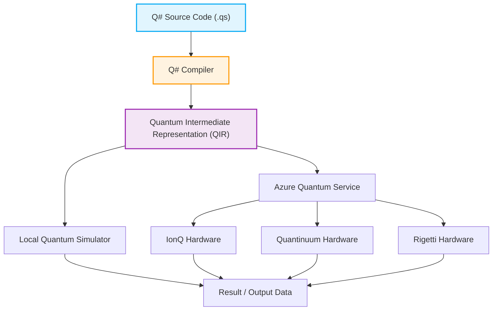

## 1. はじめに：量子コンピューティングの夜明けとプログラミングの新たなパラダイム

近年、量子コンピューティング分野におけるハードウェアおよびソフトウェアの技術革新は目覚ましいものがあります。古典的なコンピュータ（現在私たちが日常的に使用しているPC、スマートフォン、スーパーコンピュータなど）が「0」または「1」という確定したビットの組み合わせで情報を処理するのに対し、量子コンピュータは量子力学特有の「重ね合わせ（Superposition）」や「量子もつれ（Entanglement）」といった物理現象を情報処理の基盤として直接活用します。これにより、特定のクラスの問題に対して、古典コンピュータでは宇宙の寿命と同じくらいの時間をかけても到達不可能なレベルの計算速度、すなわち「量子超越性（Quantum Supremacy）」や「量子優位性（Quantum Advantage）」を実現できる可能性が示されています。例えば、巨大な数の素因数分解（Shorのアルゴリズム）、データベースの高速検索（Groverのアルゴリズム）、量子化学シミュレーション（VQEアルゴリズム）、組み合わせ最適化問題、さらには機械学習の特定のプロセス（Quantum Machine Learning）などにおいて、劇的な計算量の削減が期待されています。

しかし、量子コンピュータの持つこの驚異的なポテンシャルを現実のアプリケーションとして引き出すためには、物理的なハードウェア（超伝導量子ビットやイオントラップなど）の進歩だけでは不十分です。量子回路を正確に設計し、量子アルゴリズムをエラーなくかつ効率的に記述するための「量子プログラミング言語」と、それを支える強固な開発・実行・デバッグ環境が不可欠となります。古典的なプログラミング言語（C++、Python、Javaなど）は、古典的なCPUアーキテクチャの動作を抽象化することには長けていますが、非決定論的で複素数の振幅を持つ量子状態の操作を自然に記述するようには設計されていません。

本記事では、数ある量子プログラミング環境の中でも、Microsoft社が強力に推進し、オープンソースとして開発を進めている量子開発キット「Quantum Development Kit（QDK）」と、その中核を成す専用のプログラミング言語「Q#（キューシャープ）」に焦点を当てます。

Q#は、量子アルゴリズムの記述に特化したドメイン固有言語（Domain Specific Language: DSL）として、C#やF#、Pythonの良い部分を吸収しながらゼロから設計されました。古典的な制御フロー（if文やforループなど）と量子操作（ゲートの適用や測定）をシームレスに統合できる強力な機能を備えています。この記事では、量子コンピューティングの基礎的な数学モデルから出発し、Q#の言語的な特徴、PythonのQiskitなどとの設計思想の比較、実際のコードによる「ベル状態（Bell State：量子もつれ状態）」の構築と測定、さらには古典言語（PythonやC#）との統合手法に至るまで、徹底的に、そして非常に詳細に解説を行います。この記事を読み終える頃には、あなたは量子プログラミングの基礎を理解し、自身の環境でQ#コードを書き始める準備が整っていることでしょう。

## 2. 量子コンピューティングの数学的基礎：状態、重ね合わせ、そしてもつれ

Q#の構文や機能を深く理解し、効果的な量子プログラムを記述するためには、まず量子状態や量子ゲート操作の背後にある数学的な基礎知識（特に線形代数）を整理しておく必要があります。ここでは、量子プログラミングに必須となる基本的な数学モデルを概観します。

### 2.1 量子ビット（Qubit）と重ね合わせ状態

古典的なビット（Classical Bit）が $0$ または $1$ のいずれかの状態しか取れないのに対し、量子ビット（Qubit）は状態 $|0\rangle$ と $|1\rangle$ の線形結合（Linear Combination）、すなわち「重ね合わせ」として表現されます。この状態は、ブラ・ケット記法（ディラック記法）と複素数係数 $\alpha$ および $\beta$ を用いて以下のように記述されます。

$$ |\psi\rangle = \alpha|0\rangle + \beta|1\rangle $$

ここで、$\alpha$ と $\beta$ は確率振幅（Probability Amplitude）と呼ばれる複素数（Complex Numbers）であり、この量子ビットを測定した際に状態 $|0\rangle$ を観測する確率は $|\alpha|^2$、状態 $|1\rangle$ を観測する確率は $|\beta|^2$ となります。物理的な制約として、すべての可能な状態を観測する確率の合計は必ず $1$ にならなければならないため、以下の規格化条件（Normalization Condition）を満たす必要があります。

$$ |\alpha|^2 + |\beta|^2 = 1 $$

量子ビットの状態は、しばしば「ブロッホ球面（Bloch Sphere）」と呼ばれる3次元空間上の単位球の表面上の点として視覚化されます。北極が $|0\rangle$、南極が $|1\rangle$ に対応し、赤道上の点は $|0\rangle$ と $|1\rangle$ が等確率で重ね合わさった状態（例えば、位相が0の状態である $|+\rangle = \frac{1}{\sqrt{2}}(|0\rangle + |1\rangle)$ や、位相が$\pi/2$の $|i\rangle = \frac{1}{\sqrt{2}}(|0\rangle + i|1\rangle)$ など）を表します。量子ゲートの操作は、このブロッホ球面上での回転操作として幾何学的に理解することができます。

### 2.2 複数量子ビットとテンソル積、そして量子もつれ

量子コンピューティングの真の力は、複数の量子ビットを組み合わせたときに発揮されます。複数の量子ビットからなるシステムの状態は、個々の量子ビットの状態空間の「テンソル積（Tensor Product）」によって記述されます。例えば、2つの量子ビットからなるシステム全体の状態は以下のようになります。

$$ |\psi\rangle = \alpha_{00}|00\rangle + \alpha_{01}|01\rangle + \alpha_{10}|10\rangle + \alpha_{11}|11\rangle $$

ここでも規格化条件 $\sum_{i,j} |\alpha_{ij}|^2 = 1$ が成立します。重要な点は、n個の量子ビットのシステムを完全に記述するためには、$2^n$ 個の複素数振幅が必要になるということです。例えば、わずか50量子ビットのシステムであっても、その状態を表現するには $2^{50} \approx 10^{15}$ 個もの複素数が必要となり、これは現在の世界最速のスーパーコンピュータのメモリ容量をはるかに超えます。これが量子コンピュータが古典コンピュータに対して指数関数的な優位性を持つ理由の一つです。

「量子もつれ（Entanglement）」とは、このような複数量子ビットの状態において、個々の量子ビットの状態のテンソル積として単純に分解できない（因数分解できない）状態のことを指します。最も有名で重要なもつれ状態の一つが、以下の「ベル状態（Bell State）」です。

$$ |\Phi^+\rangle = \frac{1}{\sqrt{2}}(|00\rangle + |11\rangle) $$

この状態では、片方の量子ビットを測定して $0$ （または $1$）が得られた瞬間、もう片方の量子ビットの状態も距離に無関係に即座に $0$ （または $1$）に確定します。アインシュタインが「不気味な遠隔作用」と呼んだこの非局所的な相関関係は、量子テレポーテーション、超高密度符号化、量子暗号通信、さらには多くの量子アルゴリズムの効率的な実行において根本的なリソースとなります。後のセクションでは、実際にQ#を用いてこのベル状態を作り出します。

### 2.3 量子ゲート操作とユニタリ行列

量子状態を変化させる操作（古典的な論理回路におけるAND、OR、NOTゲートに相当）は、量子ゲートと呼ばれます。数学的には、量子ゲートは複素数の行列として表現され、量子状態のベクトルに対する行列の掛け算として作用します。量子力学の公理により、これらの行列は必ずユニタリ行列（Unitary Matrix、$U^\dagger U = I$ を満たす行列、ここで $U^\dagger$ は随伴行列、$I$ は単位行列）でなければなりません。これにより、測定以外のすべての量子操作は可逆（Reversible）となります。

代表的な単一量子ビットゲート：
- **Pauli-X ゲート（NOTゲート）**: $|0\rangle$ を $|1\rangle$ に、$|1\rangle$ を $|0\rangle$ に反転させます。
$$ X = \begin{pmatrix} 0 & 1 \\ 1 & 0 \end{pmatrix} $$
- **Pauli-Z ゲート（位相シフトゲート）**: $|0\rangle$ はそのままに、$|1\rangle$ の符号を反転させます（相対位相に $\pi$ を加える）。
$$ Z = \begin{pmatrix} 1 & 0 \\ 0 & -1 \end{pmatrix} $$
- **Hadamard ゲート（Hゲート）**: 確定的状態を重ね合わせ状態に変換します。
$$ H = \frac{1}{\sqrt{2}} \begin{pmatrix} 1 & 1 \\ 1 & -1 \end{pmatrix} $$

代表的な2量子ビットゲート：
- **CNOT ゲート（制御NOTゲート）**: 制御ビット（Control Qubit）が $|1\rangle$ のときのみ、標的ビット（Target Qubit）に対して X ゲート（NOT演算）を適用します。
$$ CNOT = \begin{pmatrix} 1 & 0 & 0 & 0 \\ 0 & 1 & 0 & 0 \\ 0 & 0 & 0 & 1 \\ 0 & 0 & 1 & 0 \end{pmatrix} $$

量子アルゴリズムは、これらの基本的なユニタリ行列を組み合わせて目的の演算を実現するプロセスの設計と言えます。

## 3. Microsoft Quantum Development Kit (QDK) とは

Microsoftが提供するQuantum Development Kit (QDK) は、量子コンピューティングのソフトウェア開発を支援するための包括的なツールセットです。量子アルゴリズムの設計からデバッグ、最適化、そしてシミュレータや実際のハードウェアでの実行に至るまで、開発ライフサイクル全体をサポートします。

QDKには以下の主要な要素が含まれています。

1. **Q# コンパイラと実行環境**: Q#言語で書かれたコードを高度に解析し、最適化し、シミュレータまたは実際の量子ハードウェア（Azure Quantum経由）で実行可能な形式（QIRなど）に変換します。Q#コンパイラは、関数の純粋性のチェックや量子ビットのライフサイクル管理など、量子計算特有の静的解析を行います。
2. **量子シミュレータ**: 開発者のローカルマシン上で量子状態の進化をシミュレートするフルステートシミュレータ（Full State Simulator）が含まれています。これにより、数十量子ビット規模の小規模なアルゴリズムを手元で高速にテスト・デバッグできます。さらに、大規模な回路（数千〜数百万量子ビット）のリソース要件を見積もるためのリソースエスティメータ（Resource Estimator）も提供されています。
3. **豊富なライブラリ**: Q#標準ライブラリ（Standard Library）には、基本的な量子ゲート（H, X, Y, Z, CNOTなど）から、複雑な算術演算（量子加算器など）、振幅増幅（Amplitude Amplification）、量子位相推定アルゴリズム（Quantum Phase Estimation）に至るまで、様々な高度なビルディングブロックが用意されています。これにより、開発者は車輪の再発明を避けることができます。
4. **統合開発環境 (IDE) 連携**: Visual StudioやVisual Studio Code用の拡張機能が提供されており、シンタックスハイライト、コード補完（IntelliSense）、強力なデバッグ機能、テストフレームワークとの統合など、現代的なソフトウェア開発に不可欠な機能を利用できます。

以下は、Q#プログラムが記述されてからハードウェアで実行されるまでのワークフローを示すMermaidダイアグラムです。



このアーキテクチャの極めて優れた点は、QIR (Quantum Intermediate Representation) というLLVMベースの中間表現を経由することで、基盤となるハードウェアアーキテクチャ（超伝導量子ビット、イオントラップ、トポロジカル量子ビット、光量子など）の違いを完全に抽象化している点です。開発者はハードウェアの物理的な詳細（各ハードウェアに特有のネイティブゲートセットやトポロジー）を気にすることなく、アルゴリズムの純粋な論理的設計に集中することができます。QIRレイヤー以降のコンパイラパスが、ターゲットハードウェアに最適化されたゲートのトランスパイルを自動的に行います。

## 4. Q# vs Python/Qiskit：なぜ新しい言語が必要なのか？

量子プログラミングを学ぶ際、多くの人が最初に触れるのは、その手軽さとPythonの普及率から、IBMが開発したPythonベースのフレームワーク「Qiskit」でしょう。Qiskitも非常に強力で広く使われているツールですが、MicrosoftのQ#とは根本的な設計思想（パラダイム）が大きく異なります。

### Qiskitアプローチ (Pythonによる回路オブジェクトの構築)
Qiskitは本質的に「量子回路を構築するためのPythonのAPIライブラリ」です。開発者がPythonのスクリプトを実行すると、メモリ上に量子ゲートのシーケンス（回路オブジェクト）が徐々に組み立てられていきます。すべてのゲートを追加し終わった後で、最後にその巨大な回路オブジェクトをバックエンド（ローカルのシミュレータやクラウド上の実機）に送信（Submit）して実行します。
このメタプログラミング的なアプローチは、既存のPythonエコシステム（NumPy, SciPy, PyTorchなどのマシンラーニングライブラリや可視化ツール）との統合が極めて容易であるという大きなメリットがあります。しかし、古典と量子が入り混じった複雑な制御フロー、例えば「ある量子ビットを測定し、その結果が 1 だった場合のみ、別の量子ビット群に対して特定の複雑なユニタリ操作を適用し、さらにwhileループを回す」といった動的回路（Dynamic Circuits）を表現する際には、Pythonのネイティブのif文やfor文を使うことができず（なぜならそれは「回路構築時」に評価されてしまうため）、Qiskit独自の特殊な制御命令を使う必要が生じ、コードが非常に複雑かつ非直感的になりがちです。

### Q#アプローチ (量子ファーストなドメイン固有言語)
一方、Q#は量子計算そのものを第一級市民（First-class citizen）として扱うために、ゼロから設計されたスタンドアロンコンパイル言語です。Q#の中では、量子ビットの割り当てやゲート操作、測定といった処理を、古典的な変数操作やif文、ループ処理と全く同じ感覚で、一つのコードベース内に自然かつシームレスに記述できます。
Q#コンパイラは、コード全体を静的に解析し、どの部分が古典的な計算デバイス（ホストCPUや制御エレクトロニクス）上で実行され、どの部分が量子コプロセッサ（QPU）上で実行されるべきかを判断し、高度な最適化を行います。これにより、大規模で複雑な量子アルゴリズムの実装において、より高いモジュール性、可読性、保守性、そして型安全性（Type Safety）を実現しています。Q#は「回路を書く」のではなく「アルゴリズムを書く」ための言語なのです。

## 5. Q# の基本構文と特徴的な概念の深掘り

Q#の構文は、C#の波括弧 `{}` を用いたブロック構造、F#の関数型プログラミングの要素、そして強力な型推論を組み合わせたような、非常に洗練されたデザインになっています。ここでは、Q#を深く理解するための重要なキーワードと概念を詳細に解説します。

### 5.1 `operation` と `function` の厳格な区別
Q#では、処理のかたまり（サブルーチン）を定義するために `operation` と `function` の2種類を厳密に使い分けます。これは関数型プログラミングにおける「純粋性（Purity）」の概念に由来します。
- **`function`**: 決定論的（Deterministic）な古典計算のみを行う純粋関数です。同じ入力パラメータを与えれば、何度実行しても必ず同じ出力結果が返されます。`function` の内部では、量子ビットの割り当て、ゲートの適用、測定といった量子的な操作（副作用を伴う操作）はコンパイルエラーとなります。数学的な関数の計算や、データの変換などに用いられます。
- **`operation`**: 量子計算を含む、非決定論的（Non-deterministic）なルーチンです。量子ビットの操作や測定を含み、同じ入力であっても量子力学的な確率的性質（測定による波動関数の収縮など）によって、結果が変わる可能性があります。量子アルゴリズムの中核となる部分はすべて `operation` として定義されます。

### 5.2 `Qubit` 型と `use` キーワードによるライフサイクル管理
Q#では、量子ビットは `Qubit` 型の「不透明な（Opaque）」オブジェクトとして扱われます。開発者がプログラム内で直接その内部状態の確率振幅（例えば $\alpha$ や $\beta$ の値）を読み取ったり書き換えたりすることは意図的に禁止されています（これは物理的な現実の量子システムにおける「観測問題」と一致しています）。量子ビットと相互作用する唯一の方法は、提供されている量子ゲート操作や測定関数を呼び出すことだけです。

量子ビットをプログラム内で新しく割り当てる（アロケートする）には、`use` キーワード（古いバージョンのQ#では `using` と呼ばれていました）を使用します。`use` ブロックは、量子ビットのスコープとライフサイクルを明確に定義します。
重要なルールとして、`use` ブロックを抜けるとき、その中で割り当てられたすべての量子ビットは、必ず完全に $|0\rangle$ 状態に戻っていなければなりません（さもなければ実行時例外が発生します）。これは、量子ビットの再利用とメモリリークの防止を確実にするための、Q#の強力な安全性メカニズムです。

### 5.3 測定 `M` と便利な `MResetZ`
量子状態を古典情報（0または1）に変換するための測定（Measurement）操作は、`M` という基本オペレーションで行います。Z基底（標準基底）での測定結果は、列挙型である `Result` 型（値は `Zero` または `One`）として返されます。
しかし、前述の通り、量子ビットを解放する際には $|0\rangle$ 状態であることが要求されます。単に測定 `M` を行っただけでは、もし結果が `One` だった場合、量子ビットは $|1\rangle$ 状態に収縮してしまっています。そのため、実用上のコードでは、測定を行った直後に量子ビットの状態を確実に $|0\rangle$ にリセットする `MResetZ` という便利な標準オペレーションが非常に頻繁に使用されます。

### 5.4 変数の不変性 (Immutability) と `mutable`
関数型プログラミングの影響を強く受けているQ#では、デフォルトですべての変数は不変（Immutable）です。一度 `let` キーワードで束縛された変数は、その後値を変更することができません。これにより、並列処理や量子アルゴリズムにおける意図しない副作用を減らすことができます。
もし、ループカウンタや累積計算のように、値を更新する必要がある変数を宣言する場合は、明示的に `mutable` キーワードを使用し、値の更新には `set` キーワードを用います。

## 6. 実践：Q#でBell状態（量子もつれ）を作り、測定する

それでは、ここまで学んだ知識を総動員して、実際にQ#を用いて、先ほど数学のセクションで説明した「ベル状態（Bell State）」を作り出し、それを測定するプログラムを書いてみましょう。これは量子プログラミングにおける「Hello World」とも言える非常に重要なステップです。

### 量子回路の設計と解説
ベル状態 $\frac{1}{\sqrt{2}}(|00\rangle + |11\rangle)$ を作るための標準的な量子回路の手順は以下の通りです。
1. 2つの量子ビット $q_0$ と $q_1$ を、初期状態 $|00\rangle$ で用意します。
2. $q_0$ に対してアダマールゲート（$H$ ゲート）を適用します。これにより、$q_0$ は $|0\rangle$ と $|1\rangle$ の等確率の重ね合わせ状態 $\frac{1}{\sqrt{2}}(|0\rangle + |1\rangle)$ になります。この時点での系全体の状態は $\frac{1}{\sqrt{2}}(|0\rangle + |1\rangle) \otimes |0\rangle = \frac{1}{\sqrt{2}}(|00\rangle + |10\rangle)$ です。
3. $q_0$ を制御ビット（Control）、$q_1$ を標的ビット（Target）としてCNOT（制御NOT）ゲートを適用します。これにより、$q_0$ が $|1\rangle$ のときのみ $q_1$ が反転します。結果として、状態 $|00\rangle$ はそのまま $|00\rangle$ に、状態 $|10\rangle$ は $|11\rangle$ に変化し、最終的な系全体の状態は $\frac{1}{\sqrt{2}}(|00\rangle + |11\rangle)$ となります。これが完全な相関を持つもつれ状態の完成です。

### Q# による実装コード

以下のコードは、Q#を用いてベル状態を生成し、指定された回数だけ測定実験を繰り返してその統計（確率分布）を取得する実践的な実装例です。

```qsharp
namespace Quantum.BellState {
    
    // 必要な名前空間をインポートします
    open Microsoft.Quantum.Intrinsic;
    open Microsoft.Quantum.Canon;
    open Microsoft.Quantum.Measurement;
    open Microsoft.Quantum.Diagnostics;

    /// # Summary
    /// 単一のベル状態を生成し、2つの量子ビットをZ基底で測定します。
    ///
    /// # Output
    /// (Result, Result): qubit1とqubit2の測定結果。ベル状態であれば、必ず一致します。
    operation GenerateAndMeasureBellState() : (Result, Result) {
        
        // 2つの量子ビットを割り当てます（初期状態は自動的に |00> となります）
        use (q1, q2) = (Qubit(), Qubit());
        
        // q1 にアダマールゲートを適用し、重ね合わせ状態を作ります
        H(q1);
        
        // q1を制御ビット、q2を標的ビットとしてCNOTゲートを適用します
        // これにより、q1とq2の間に量子もつれ（エンタングルメント）が生成されます
        CNOT(q1, q2);
        
        // 開発時のデバッグとして、シミュレータ内の状態ベクトルをダンプして確認することができます
        // DumpMachine(); // 必要に応じてコメントアウトを外します

        // 測定を行い、同時に量子ビットを安全に解放するために状態を |0> にリセットします
        let res1 = MResetZ(q1);
        let res2 = MResetZ(q2);
        
        // 測定結果のペアを返します
        return (res1, res2);
    }

    /// # Summary
    /// ベル状態生成と測定の実験を複数回実行し、結果の統計を収集するメインルーチン。
    ///
    /// # Input
    /// ## count
    /// 実験を繰り返す回数（例: 1000回）
    ///
    /// # Output
    /// (Int, Int, Int, Int): それぞれ (00, 01, 10, 11) が観測された回数
    @EntryPoint()
    operation RunBellStateExperiment(count: Int) : (Int, Int, Int, Int) {
        
        // 観測回数をカウントするためのミュータブル（変更可能）な変数を初期化します
        mutable num00 = 0;
        mutable num01 = 0;
        mutable num10 = 0;
        mutable num11 = 0;

        // 指定された回数だけ実験ループを回します
        for _ in 1..count {
            // ベル状態を生成し、測定結果を受け取ります
            let (r1, r2) = GenerateAndMeasureBellState();
            
            // 結果のパターンをカウントアップします
            if r1 == Zero and r2 == Zero {
                set num00 += 1;
            } elif r1 == Zero and r2 == One {
                set num01 += 1;
            } elif r1 == One and r2 == Zero {
                set num10 += 1;
            } else { // r1 == One and r2 == One の場合
                set num11 += 1;
            }
        }

        // 収集した統計情報をコンソールにメッセージとして出力します
        Message($"--- Experiment Results ---");
        Message($"Total runs: {count}");
        Message($"00 observed: {num00}");
        Message($"01 observed: {num01}");
        Message($"10 observed: {num10}");
        Message($"11 observed: {num11}");

        return (num00, num01, num10, num11);
    }
}
```

### コードの解説と動作確認
- `namespace`: JavaやC#と同様に、プログラムを論理的に整理し、名前の衝突を防ぐための名前空間の宣言です。
- `open`: 必要なライブラリ（モジュール）をインポートします。`Microsoft.Quantum.Intrinsic` にはH, X, Y, Z, CNOTなどの基本量子ゲートが含まれており、`Microsoft.Quantum.Measurement` には `MResetZ` のような便利な測定関連の機能が含まれています。
- `use (q1, q2) = (Qubit(), Qubit());`: 2つの量子ビットを動的にアロケートしています。
- `H(q1); CNOT(q1, q2);`: この2行がまさに量子もつれを生成する核心部分です。非常にシンプルかつ直感的に記述できます。
- `let res1 = MResetZ(q1);`: 前述の通り、`MResetZ` は測定結果を変数に束縛すると同時に、量子ビットの状態を強制的に $|0\rangle$ にリセットします。これにより `use` ブロックの終了時に安全に量子ビットを解放できます。
- `@EntryPoint()`: この属性を付与することで、コンパイラに対してこのオペレーションがプログラムの実行の起点（C言語におけるmain関数のようなもの）であることを示します。

理論上、生成された状態はベル状態 $\frac{1}{\sqrt{2}}(|00\rangle + |11\rangle)$ であるため、このプログラムを十分な回数実行（例えば10,000回）すると、`00` と `11` がそれぞれ約50%（5,000回前後）ずつ観測され、`01` と `10` は 0 回（理論的誤差がなければ全く観測されない）となるはずです。これが、2つの量子ビットが強い相関を持っている（もつれている）ことの証明となります。

## 7. ホスト言語（Python / C#）とのシームレスな連携

Q#は、先ほどの例のように `@EntryPoint()` を指定して単体で実行することも可能（Q#スタンドアロンアプリケーション）ですが、実際のエンタープライズ開発や研究のユースケースでは、フロントエンドのGUI、巨大なデータベースからのデータ取得、機械学習の最適化ループ（例えばVQEのパラメータ更新など）といった古典的な処理と密接に組み合わせて使用されます。そのため、Q#はホスト言語であるPythonやC#（.NET）から直接呼び出して実行することが極めて容易にできるよう、洗練された相互運用性（Interoperability）を提供しています。

### 7.1 Pythonからの呼び出し例：データサイエンティスト向け
データサイエンス、機械学習、物理学研究の世界で圧倒的なシェアを持つPythonからQ#を呼び出すには、`qsharp` Pythonパッケージを使用します。Jupyter Notebookとの親和性も高く、インタラクティブな開発やデータの可視化と組み合わせるのに最適です。

```python
# 1. 必要なQ#連携モジュールのインポート
import qsharp

# 2. Q#の操作を、まるでPythonの関数であるかのように直接インポート
# （コンパイラが裏側で自動的にバインディングとコンパイルを行ってくれます）
from Quantum.BellState import RunBellStateExperiment

# 3. Pythonのスクリプトから呼び出して実行（シミュレータを使用）
count = 1000
print(f"Starting quantum simulation for {count} iterations...")

# simulate() メソッドを呼び出すことで、ローカルシミュレータ上で実行します
result = RunBellStateExperiment.simulate(count=count)

# 結果のタプルを受け取り、Python側で整形して出力
print("\n--- Simulation Results ---")
print(f"|00> : {result[0]} (Expected ~500)")
print(f"|01> : {result[1]} (Expected 0)")
print(f"|10> : {result[2]} (Expected 0)")
print(f"|11> : {result[3]} (Expected ~500)")
```
このように、Q#コンパイラとインタープリタが裏側で透過的にC APIを介したバインディングを動的に生成してくれるため、Pythonコード側からは、量子アルゴリズムを単なる一つのブラックボックス関数として扱い、古典と量子のハイブリッドアルゴリズムを極めて簡単に構築することができます。

### 7.2 C#からの呼び出し例：エンタープライズ開発向け
大規模なバックエンドシステムやエンタープライズアプリケーション開発において強力なC#からも、全く同様にQ#コードを統合できます。Q#プロジェクト（.csproj）とC#プロジェクトを同一のソリューション内に配置し参照関係を持たせることで、ビルド時に自動的にC#用のクラスラッパーが生成されます。

```csharp
using System;
using System.Threading.Tasks;
using Microsoft.Quantum.Simulation.Simulators; // 量子シミュレータの名前空間
using Quantum.BellState; // Q#で定義した名前空間

namespace QuantumRunner
{
    class Program
    {
        static async Task Main(string[] args)
        {
            // フルステート量子シミュレータのインスタンスを生成
            // IDisposableを実装しているためusingステートメントで適切にリソース管理
            using var sim = new QuantumSimulator();
            
            long count = 1000;
            Console.WriteLine($"Running {count} iterations of Bell State generation...");

            // Q#の操作を非同期で実行します。Runメソッドが自動生成されています。
            // 実行ターゲットとして sim を渡し、引数として count を渡します。
            var result = await RunBellStateExperiment.Run(sim, count);

            // C#のValueTupleとして結果が返ってきます
            Console.WriteLine($"|00>: {result.Item1}");
            Console.WriteLine($"|01>: {result.Item2}");
            Console.WriteLine($"|10>: {result.Item3}");
            Console.WriteLine($"|11>: {result.Item4}");
        }
    }
}
```
ここでは開発目的のためにローカルの `QuantumSimulator` クラスを用いていますが、本番環境への移行時には、このシミュレータのインスタンス生成部分をAzure Quantumのワークスペースを指し示すクラウドターゲットプロバイダ（例えばIonQやQuantinuumのマシンオブジェクト）に差し替えるだけで済みます。Q#側のコードやビジネスロジックを一切変更することなく、クラウド上の実際の量子ハードウェア上でアルゴリズムを実行することが可能になるのです。これがQDKの真骨頂です。

## 8. 高度なトピック：Q#の設計哲学を体現する機能群

Q#の基本的な使い方を見てきましたが、ここで、Q#が持つより高度な機能とその設計哲学について少し深掘りしてみましょう。これらの機能こそが、Q#を単なる「Pythonの代替」以上の、真の量子ドメイン固有言語にしている要素です。

### 8.1 自動逆演算 (Adjoint) と制御演算 (Controlled) の自動生成
量子計算の大きな特徴の一つに、ユニタリティ（Unitarity）に由来する「可逆性（Reversibility）」があります。測定を除くすべての基本演算はユニタリ行列であり、したがって必ず逆行列（逆演算）が存在し、元に戻すことができます。Q#では、これを言語レベルの第一級の機能としてサポートする `Adjoint`（随伴・逆演算）および `Controlled`（制御演算）という強力なファンクタ修飾子が提供されています。

ある量子操作 `Op` に対して、その逆の操作（元に戻す操作）を手作業で行列を計算したりゲートの順序を逆にしたりして実装しなくても、関数のシグネチャに特定のキーワードを追加するだけで、Q#コンパイラが自動的に `Adjoint Op` を生成してくれます。また、特定の量子ビット群がすべて $|1\rangle$ のときだけ `Op` を実行する条件付き操作 `Controlled Op` も同様に自動生成可能です。

```qsharp
// is Adj + Ctl を付与することで、コンパイラに逆演算と制御演算の自動生成を指示します
operation MyComplexSubroutine(qubits: Qubit[]) : Unit is Adj + Ctl {
    // ここに非常に複雑な量子ゲートのシーケンスを記述
    // 例：H, T, CNOT, 任意の位相シフトなどの組み合わせ
    // ...
}

// 呼び出し側の例
operation UseMyOp(controlQubit: Qubit, targetQubits: Qubit[]) : Unit {
    
    // 通常の呼び出し
    MyComplexSubroutine(targetQubits);
    
    // 逆演算の実行：元の状態に完全に巻き戻す（アンコンピュテーションに非常に便利）
    Adjoint MyComplexSubroutine(targetQubits);
    
    // 制御演算の実行：controlQubitが|1>の時だけ複雑なサブルーチンを実行
    Controlled MyComplexSubroutine([controlQubit], targetQubits);
    
    // さらに、制御演算の逆演算といった組み合わせも可能！
    Controlled Adjoint MyComplexSubroutine([controlQubit], targetQubits);
}
```
この機能により、グローバーの探索アルゴリズムのオラクル実装や、ショアの素因数分解アルゴリズムなど、複雑なサブルーチンとその逆演算（不要なもつれを解くためのアンコンピュテーション：Uncomputation）を頻繁に利用する高度なアルゴリズムの実装が、劇的に簡素化され、ヒューマンエラーやバグが入り込む余地を大幅に減らすことができます。これは、回路構築モデルであるQiskitなどと比較して、アルゴリズム記述言語であるQ#が持つ最大の強みの一つと言えるでしょう。

### 8.2 リソース推定 (Resource Estimation) と未来への備え
現在の量子コンピュータは「NISQ (Noisy Intermediate-Scale Quantum)」と呼ばれる発展途上の段階にあり、利用可能な量子ビット数も数十から数百程度と少なく、エラー率も高い状態です。しかし、将来的な誤り耐性量子コンピュータ（FTQC: Fault-Tolerant Quantum Computer）の時代を見据えると、ある新しいアルゴリズムを実行するのに「一体どれくらいの論理量子ビットが必要なのか」「誤り訂正においてコストが非常に高いTゲートやトフォリゲートが何回使われるのか」「実行時間はどれくらいになるか」を事前に正確に見積もることが極めて重要になります。

QDKには、実行環境のターゲットの一つとして「リソースエスティメータ（Resource Estimator）」が組み込まれています。これを利用すると、コードを実機や重いフル状態シミュレータで動かすことなく、コードの論理的なパスを解析して、瞬時に大規模アルゴリズムの要求リソースを計算・出力することができます。これにより、アルゴリズム設計者や研究者は、数千・数万量子ビットを必要とする将来のアルゴリズムであっても、理論上の計算量だけでなく、具体的なゲート数レベルでの最適化を迅速にイテレーションすることが可能となります。

## 9. 終わりに：次世代のソフトウェアエンジニアへの期待

量子コンピューティングは、かつてのアインシュタイン、シュレーディンガー、ファインマンといった物理学者の頭の中にあった純粋な理論上の概念から、今やクラウドインフラストラクチャ（Azure Quantum、AWS Braket、IBM Quantumなど）を介して、世界中の誰でもブラウザやコマンドラインからアクセス可能な、具体的なエンジニアリングの実装領域へと急速に移行しつつあります。ハードウェアの進化スピードは驚異的であり、数年のうちに「役に立つ」量子優位性が証明される日が来ると多くの専門家が予想しています。

本記事で紹介したMicrosoftのQ#言語は、古典プログラミングの世界で何十年もかけて培われてきた優れたプラクティス（強い型付け、関数型プログラミングの要素、モジュール化、カプセル化、IDEによる高度な支援）を、量子プログラミングという全く新しい世界に美しく持ち込みました。Q#を学び、量子アルレスムを実装する過程で、我々は「状態とは何か」「観測とは何か」「情報とは空間をどのように伝播するのか」といった、計算機科学と物理学の根本に立ち返るような深い洞察を得ることができます。これは、単なるスキルアップを超えた、非常に知的な興奮を伴う体験です。

近い将来、現在の機械学習エンジニアがPyTorchやTensorFlowを使ってGPUの並列計算能力を当たり前のように引き出しているように、次世代の「量子ソフトウェアエンジニア」がQ#やQiskitを用いてQPU（Quantum Processing Unit）の超越的な計算能力を引き出し、材料科学による新素材の発見、創薬における分子シミュレーション、気候変動モデリング、そして金融におけるリスク最適化など、人類規模の巨大な課題に挑む時代が確実に到来するでしょう。

現在、古典的なWebアプリケーション、モバイルアプリ、あるいはデータ分析をメインに扱っているソフトウェア開発者の方々も、是非この機会に量子プログラミングの世界に足を踏み入れてみてください。最初は直感に反する量子力学特有の現象（重ね合わせやもつれ、確率的な振る舞い）に戸惑うかもしれません。しかし、Q#という洗練された専用言語とQDKという強力なツールチェーンが、あなたの学習曲線を確実に、そして強力に支えてくれるはずです。

## 10. さらに深く学ぶための参考リンク集

量子プログラミングの旅を続けるための、優れたリソースをいくつか紹介します。

- [Microsoft Azure Quantum 公式ドキュメント](https://learn.microsoft.com/azure/quantum/) : QDKとAzure Quantumの包括的なドキュメントポータル。
- [Q# ユーザーガイドとリファレンス](https://learn.microsoft.com/azure/quantum/user-guide/) : Q#の文法、型システム、標準ライブラリの完全なリファレンス。
- [Quantum Katas](https://quantum.microsoft.com/en-us/experience/quantum-katas) : Microsoftが提供するオープンソースのチュートリアル群。テスト駆動開発（TDD）の形式で、実際にQ#コードを書きながら量子コンピューティングの基本概念（量子ゲート、測定、アルゴリズム構築）をインタラクティブに自習できる素晴らしいリソースです。
- [Q# GitHub リポジトリ](https://github.com/microsoft/qsharp-compiler) : Q#言語コンパイラや標準ライブラリ自体もオープンソースとして活発に開発されています。コンパイラの内部構造に興味がある方は必見です。

量子コンピューティングの未来は、まだ始まったばかりであり、無限の可能性に満ちています。新しいプログラミングパラダイムを楽しむ心を持って、ぜひQ#でのプログラミングに挑戦してみてください！
