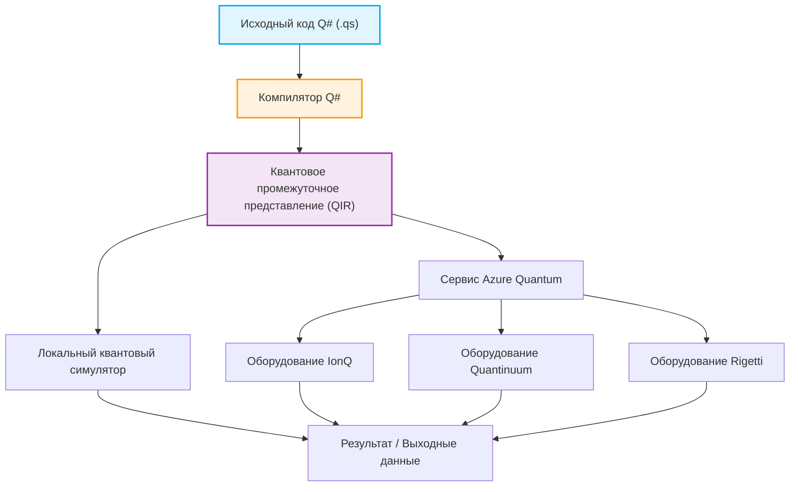

## 1. Введение: Рассвет квантовых вычислений и новая парадигма программирования

В последние годы мы наблюдаем поразительные технологические инновации в области квантовых вычислений как в аппаратном, так и в программном обеспечении. В то время как классические компьютеры (ПК, смартфоны, суперкомпьютеры, которыми мы повседневно пользуемся) обрабатывают информацию с помощью комбинаций определенных битов — «0» или «1», квантовые компьютеры напрямую используют такие специфические физические явления квантовой механики, как «суперпозиция» (Superposition) и «квантовая запутанность» (Entanglement), в качестве основы для обработки информации. Это открывает перспективы для достижения таких скоростей вычислений для определенных классов задач, которые были бы недостижимы для классических компьютеров даже за время, равное возрасту Вселенной. Это называется «квантовым превосходством» (Quantum Supremacy) или «квантовым преимуществом» (Quantum Advantage). Например, ожидается радикальное сокращение вычислительных затрат в таких задачах, как факторизация больших чисел (алгоритм Шора), быстрый поиск в базах данных (алгоритм Гровера), симуляция квантовой химии (алгоритм VQE), задачи комбинаторной оптимизации и даже некоторые процессы машинного обучения (Quantum Machine Learning).

Однако для реализации этого невероятного потенциала квантовых компьютеров в виде реальных приложений недостаточно лишь прогресса в аппаратном обеспечении (сверхпроводящих кубитах, ионных ловушках и т.д.). Крайне необходим «язык квантового программирования», позволяющий точно проектировать квантовые схемы и писать квантовые алгоритмы эффективно и без ошибок, а также надежная среда разработки, выполнения и отладки, поддерживающая его. Классические языки программирования (C++, Python, Java и др.) отлично справляются с абстракцией работы классической процессорной архитектуры, но они не предназначены для естественного описания манипуляций с квантовыми состояниями, которые носят недетерминированный характер и имеют комплексные амплитуды.

В этой статье из множества сред квантового программирования мы сосредоточимся на Quantum Development Kit (QDK) — наборе инструментов, активно продвигаемом компанией Microsoft и разрабатываемом с открытым исходным кодом, а также на его ядре — специализированном языке программирования Q# (Кью-шарп).

Q# был спроектирован с нуля как предметно-ориентированный язык (Domain Specific Language: DSL), специализирующийся на описании квантовых алгоритмов, и вобрал в себя лучшие черты C#, F# и Python. Он обладает мощными возможностями для бесшовной интеграции классического управления потоком (такими как инструкции if и циклы for) с квантовыми операциями (применение вентилей и измерения). В этой статье мы подробно, начиная с самых основ, разберем базовые математические модели квантовых вычислений, языковые особенности Q#, сравним его философию дизайна с такими инструментами, как Qiskit на Python, покажем создание и измерение «состояния Белла» (квантовой запутанности) с помощью реального кода и, наконец, методы интеграции с классическими языками (Python и C#). К концу этой статьи вы поймете основы квантового программирования и будете готовы начать писать свой собственный Q#-код в своей среде разработки.

## 2. Математические основы квантовых вычислений: состояния, суперпозиция и запутанность

Чтобы глубоко понять синтаксис и функции Q# и эффективно писать квантовые программы, сначала необходимо структурировать базовые математические знания (особенно линейную алгебру), лежащие в основе квантовых состояний и операций квантовых вентилей. Здесь мы рассмотрим основные математические модели, необходимые для квантового программирования.

### 2.1 Кубит (Qubit) и состояние суперпозиции

В то время как классический бит (Classical Bit) может находиться только в одном из двух состояний — $0$ или $1$, квантовый бит (кубит, Qubit) выражается как линейная комбинация (Linear Combination) состояний $|0\rangle$ и $|1\rangle$, то есть как «суперпозиция». Это состояние описывается с использованием бра-кет нотации (нотации Дирака) и комплексных коэффициентов $\alpha$ и $\beta$ следующим образом:

$$ |\psi\rangle = \alpha|0\rangle + \beta|1\rangle $$

Здесь $\alpha$ и $\beta$ — это комплексные числа (Complex Numbers), называемые амплитудами вероятности (Probability Amplitude). Вероятность того, что при измерении этого кубита мы обнаружим состояние $|0\rangle$, равна $|\alpha|^2$, а вероятность состояния $|1\rangle$ равна $|\beta|^2$. Из-за физических ограничений сумма вероятностей наблюдения всех возможных состояний всегда должна быть равна $1$, поэтому должно выполняться следующее условие нормировки (Normalization Condition):

$$ |\alpha|^2 + |\beta|^2 = 1 $$

Состояние кубита часто визуализируется как точка на поверхности единичной сферы в трехмерном пространстве, называемой «сферой Блоха» (Bloch Sphere). Северный полюс соответствует $|0\rangle$, южный полюс — $|1\rangle$, а точки на экваторе представляют собой состояния суперпозиции, где $|0\rangle$ и $|1\rangle$ накладываются друг на друга с равной вероятностью (например, состояние с нулевой фазой $|+\rangle = \frac{1}{\sqrt{2}}(|0\rangle + |1\rangle)$ или состояние с фазой $\pi/2$: $|i\rangle = \frac{1}{\sqrt{2}}(|0\rangle + i|1\rangle)$). Операции квантовых вентилей можно геометрически понимать как операции вращения на этой сфере Блоха.

### 2.2 Несколько кубитов, тензорное произведение и квантовая запутанность

Истинная мощь квантовых вычислений проявляется при комбинировании нескольких кубитов. Состояние системы, состоящей из нескольких кубитов, описывается через «тензорное произведение» (Tensor Product) пространств состояний отдельных кубитов. Например, состояние всей системы из двух кубитов выглядит так:

$$ |\psi\rangle = \alpha_{00}|00\rangle + \alpha_{01}|01\rangle + \alpha_{10}|10\rangle + \alpha_{11}|11\rangle $$

Здесь также выполняется условие нормировки $\sum_{i,j} |\alpha_{ij}|^2 = 1$. Важно отметить, что для полного описания системы из n кубитов требуется $2^n$ комплексных амплитуд. Например, для описания состояния системы всего из 50 кубитов потребуется около $2^{50} \approx 10^{15}$ комплексных чисел, что намного превышает объем памяти самых быстрых в мире современных суперкомпьютеров. Это одна из причин, по которой квантовые компьютеры обладают экспоненциальным преимуществом над классическими.

«Квантовая запутанность» (Entanglement) означает такое состояние нескольких кубитов, которое не может быть просто разложено (факторизовано) как тензорное произведение состояний отдельных кубитов. Одним из самых известных и важных запутанных состояний является следующее «состояние Белла» (Bell State):

$$ |\Phi^+\rangle = \frac{1}{\sqrt{2}}(|00\rangle + |11\rangle) $$

В этом состоянии, как только вы измеряете один кубит и получаете $0$ (или $1$), состояние второго кубита мгновенно, независимо от расстояния между ними, фиксируется как $0$ (или $1$). Эта нелокальная корреляция, которую Эйнштейн называл «жутким дальнодействием», является фундаментальным ресурсом для квантовой телепортации, сверхплотного кодирования, квантовой криптографии, а также эффективного выполнения многих квантовых алгоритмов. В последующих разделах мы фактически создадим это состояние Белла с помощью Q#.

### 2.3 Операции квантовых вентилей и унитарные матрицы

Операции, изменяющие квантовые состояния (эквиваленты вентилей AND, OR, NOT в классических логических схемах), называются квантовыми вентилями. Математически квантовые вентили представляются комплексными матрицами и действуют на вектор квантового состояния путем матричного умножения. Согласно аксиомам квантовой механики, эти матрицы всегда должны быть унитарными (унитарная матрица — матрица, удовлетворяющая условию $U^\dagger U = I$, где $U^\dagger$ — сопряженно-транспонированная матрица, а $I$ — единичная матрица). Благодаря этому все квантовые операции, кроме измерения, являются обратимыми (Reversible).

Типичные однокубитные вентили:
- **Вентиль Паули-X (вентиль NOT)**: Переворачивает $|0\rangle$ в $|1\rangle$, а $|1\rangle$ в $|0\rangle$.
$$ X = \begin{pmatrix} 0 & 1 \\ 1 & 0 \end{pmatrix} $$
- **Вентиль Паули-Z (вентиль сдвига фазы)**: Оставляет $|0\rangle$ как есть, но меняет знак у $|1\rangle$ (добавляет фазу $\pi$).
$$ Z = \begin{pmatrix} 1 & 0 \\ 0 & -1 \end{pmatrix} $$
- **Вентиль Адамара (H-вентиль)**: Преобразует детерминированное состояние в состояние суперпозиции.
$$ H = \frac{1}{\sqrt{2}} \begin{pmatrix} 1 & 1 \\ 1 & -1 \end{pmatrix} $$

Типичные двухкубитные вентили:
- **Вентиль CNOT (управляемый NOT)**: Применяет вентиль X (операцию NOT) к целевому кубиту (Target Qubit) только тогда, когда управляющий кубит (Control Qubit) находится в состоянии $|1\rangle$.
$$ CNOT = \begin{pmatrix} 1 & 0 & 0 & 0 \\ 0 & 1 & 0 & 0 \\ 0 & 0 & 0 & 1 \\ 0 & 0 & 1 & 0 \end{pmatrix} $$

Квантовый алгоритм можно рассматривать как процесс комбинирования этих базовых унитарных матриц для реализации желаемых вычислений.

## 3. Что такое Microsoft Quantum Development Kit (QDK)?

Quantum Development Kit (QDK), предоставляемый Microsoft, представляет собой комплексный набор инструментов, помогающий в разработке программного обеспечения для квантовых вычислений. Он поддерживает весь жизненный цикл разработки: от проектирования алгоритмов, отладки и оптимизации до запуска на симуляторах и реальном квантовом оборудовании.

В QDK включены следующие основные компоненты:

1. **Компилятор Q# и среда выполнения**: Тщательно анализирует и оптимизирует код, написанный на языке Q#, преобразуя его в формат (например, QIR), который может быть выполнен на симуляторах или реальном квантовом оборудовании (через Azure Quantum). Компилятор Q# выполняет статический анализ, специфичный для квантовых вычислений, например, проверку чистоты функций и управление жизненным циклом кубитов.
2. **Квантовый симулятор**: Включает симулятор полного состояния (Full State Simulator), который моделирует эволюцию квантового состояния на локальном компьютере разработчика. Это позволяет разработчикам быстро тестировать и отлаживать небольшие алгоритмы масштабом в несколько десятков кубитов на своих машинах. Также предоставляется средство оценки ресурсов (Resource Estimator) для оценки необходимых ресурсов при работе с крупными схемами (от тысяч до миллионов кубитов).
3. **Обширные библиотеки**: Стандартная библиотека Q# (Standard Library) предлагает разнообразные высокоуровневые строительные блоки: от базовых квантовых вентилей (H, X, Y, Z, CNOT и др.) до сложных арифметических операций (например, квантовые сумматоры), алгоритмов усиления амплитуды (Amplitude Amplification) и оценки квантовой фазы (Quantum Phase Estimation). Это позволяет разработчикам не "изобретать велосипед".
4. **Интеграция с интегрированными средами разработки (IDE)**: Доступны расширения для Visual Studio и Visual Studio Code. Они предлагают такие функции, как подсветка синтаксиса, автодополнение кода (IntelliSense), мощные возможности отладки и интеграция с фреймворками для тестирования — всё необходимое для современной разработки программного обеспечения.

Ниже представлена диаграмма Mermaid, показывающая рабочий процесс от написания программы на Q# до ее выполнения на аппаратном уровне.



Выдающейся особенностью этой архитектуры является то, что использование промежуточного представления на базе LLVM, известного как QIR (Quantum Intermediate Representation), позволяет полностью абстрагироваться от различий в базовой аппаратной архитектуре (будь то сверхпроводящие кубиты, ионные ловушки, топологические кубиты или оптические квантовые системы). Разработчики могут сосредоточиться на чисто логическом проектировании алгоритмов, не беспокоясь о физических деталях оборудования (таких как топология и наборы нативных вентилей, специфичные для каждого устройства). Процессы компиляции, следующие за уровнем QIR, автоматически выполняют транспиляцию вентилей, оптимизируя их для целевого оборудования.

## 4. Q# против Python/Qiskit: Зачем нужен новый язык?

Когда люди начинают изучать квантовое программирование, многие первым делом знакомятся с платформой Qiskit на базе Python, разработанной IBM, благодаря ее доступности и широкой популярности Python. Qiskit — тоже очень мощный и широко используемый инструмент, но у него с Q# от Microsoft кардинально разная философия проектирования (парадигма).

### Подход Qiskit (Построение объектов схем с помощью Python)
По своей сути Qiskit является «библиотекой API на Python для построения квантовых схем». Когда разработчик выполняет Python-скрипт, в памяти постепенно собирается последовательность квантовых вентилей (объект схемы). И только после того, как все вентили добавлены, этот огромный объект схемы отправляется (Submit) на бэкенд (локальный симулятор или реальную машину в облаке) для выполнения.
Этот подход метапрограммирования имеет огромное преимущество: его очень легко интегрировать с существующей экосистемой Python (библиотеками машинного обучения, такими как NumPy, SciPy, PyTorch, и инструментами визуализации). Однако, когда возникает необходимость реализовать сложный поток управления, где смешаны классические и квантовые вычисления — например, «измерить определенный кубит и, только если результат равен 1, применить конкретную сложную унитарную операцию к группе других кубитов, а затем прокрутить цикл while» (так называемые динамические схемы (Dynamic Circuits)) — вы не можете использовать стандартные инструкции if или for в Python (потому что они оцениваются «во время построения схемы»). Вместо этого приходится использовать специальные управляющие инструкции Qiskit, из-за чего код часто становится очень сложным и неочевидным.

### Подход Q# (Доменно-ориентированный язык с приоритетом квантовых вычислений)
С другой стороны, Q# — это отдельный компилируемый язык, спроектированный с нуля, в котором квантовые вычисления являются «объектами первого класса» (First-class citizen). В Q# выделение кубитов, операции над вентилями и измерения могут быть записаны естественно и органично в рамках одной базы кода, точно так же, как вы работаете с классическими переменными, инструкциями if и циклами.
Компилятор Q# статически анализирует весь код и определяет, какие его части должны выполняться на классическом вычислительном устройстве (хост-процессоре или управляющей электронике), а какие — на квантовом сопроцессоре (QPU), выполняя высокоуровневую оптимизацию. Это обеспечивает высокую модульность, читаемость, удобство сопровождения и безопасность типов (Type Safety) при реализации сложных масштабных квантовых алгоритмов. Q# — это язык для «написания алгоритмов», а не просто для «написания схем».

## 5. Глубокое погружение в базовый синтаксис и характерные концепции Q#

Синтаксис Q# представляет собой элегантную конструкцию, объединяющую блочную структуру с фигурными скобками `{}` из C#, элементы функционального программирования из F# и мощный вывод типов. Здесь мы подробно разберем ключевые слова и концепции, важные для глубокого понимания Q#.

### 5.1 `operation` と `function` の厳格な区別 (Строгое различие между `operation` и `function`)
В Q# четко различают два типа блоков обработки (подпрограмм): `operation` и `function`. Это проистекает из концепции «чистоты» (Purity) в функциональном программировании.
- **`function`**: Чистая функция, выполняющая только детерминированные (Deterministic) классические вычисления. Если передать одни и те же входные параметры, она всегда будет возвращать один и тот же результат, независимо от того, сколько раз выполняется. Внутри `function` квантовые операции (операции с побочными эффектами), такие как выделение кубитов, применение вентилей и измерения, приведут к ошибке компиляции. Функции используются для математических расчетов, преобразования данных и т.д.
- **`operation`**: Недетерминированная (Non-deterministic) процедура, которая включает в себя квантовые вычисления. Она может содержать манипуляции с кубитами и измерения. Даже при одинаковых входных данных результат может различаться из-за вероятностной природы квантовой механики (например, коллапса волновой функции при измерении). Все основные части квантовых алгоритмов определяются как `operation`.

### 5.2 Тип `Qubit` и управление жизненным циклом с помощью ключевого слова `use`
В Q# кубиты рассматриваются как «непрозрачные» (Opaque) объекты типа `Qubit`. Разработчикам намеренно запрещено напрямую читать или перезаписывать амплитуды вероятности их внутреннего состояния (например, значения $\alpha$ или $\beta$) в программе (это согласуется с «проблемой измерения» в физических квантовых системах). Единственный способ взаимодействия с кубитами — вызов предоставленных операций квантовых вентилей или функций измерения.

Для выделения (аллокации) новых кубитов в программе используется ключевое слово `use` (в старых версиях Q# оно называлось `using`). Блок `use` четко определяет область видимости и жизненный цикл кубитов.
Важное правило: при выходе из блока `use` все кубиты, выделенные внутри него, должны обязательно быть полностью возвращены в состояние $|0\rangle$ (в противном случае возникнет ошибка времени выполнения). Это мощный механизм безопасности Q#, гарантирующий повторное использование кубитов и предотвращающий утечки памяти.

### 5.3 Измерение `M` и удобная операция `MResetZ`
Операция измерения (Measurement) для преобразования квантового состояния в классическую информацию (0 или 1) выполняется базовой операцией `M`. Результат измерения в Z-базисе (стандартном базисе) возвращается как тип перечисления `Result` (со значениями `Zero` или `One`).
Однако, как упоминалось выше, при освобождении кубитов требуется, чтобы они находились в состоянии $|0\rangle$. Если вы просто выполните измерение `M`, и результат окажется `One`, кубит уже коллапсирует в состояние $|1\rangle$. По этой причине в практическом коде очень часто используется удобная стандартная операция `MResetZ`, которая надежно сбрасывает состояние кубита в $|0\rangle$ сразу после измерения.

### 5.4 Неизменяемость переменных (Immutability) и ключевое слово `mutable`
В Q#, находящемся под сильным влиянием функционального программирования, все переменные по умолчанию являются неизменяемыми (Immutable). Переменная, однажды связанная с помощью ключевого слова `let`, впоследствии не может быть изменена. Это помогает уменьшить непредвиденные побочные эффекты при параллельной обработке и в квантовых алгоритмах.
Если вам необходимо объявить переменную, значение которой нужно обновлять (например, счетчик цикла или накопительное вычисление), следует явно использовать ключевое слово `mutable`, а для обновления значения применять ключевое слово `set`.

## 6. Практика: Создание и измерение состояния Белла (квантовой запутанности) на Q#

Теперь, используя полученные знания, давайте напишем программу на Q#, которая создаст «состояние Белла» (Bell State), о котором мы говорили в математическом разделе, и измерит его. Это важнейший шаг, который можно назвать «Hello World» квантового программирования.

### Проектирование и объяснение квантовой схемы
Стандартная процедура создания состояния Белла $\frac{1}{\sqrt{2}}(|00\rangle + |11\rangle)$ с помощью квантовой схемы выглядит следующим образом:
1. Подготовить два кубита $q_0$ и $q_1$ в начальном состоянии $|00\rangle$.
2. Применить вентиль Адамара (вентиль $H$) к $q_0$. Это переведет $q_0$ в состояние равновероятной суперпозиции $|0\rangle$ и $|1\rangle$: $\frac{1}{\sqrt{2}}(|0\rangle + |1\rangle)$. Состояние всей системы в этот момент будет $\frac{1}{\sqrt{2}}(|0\rangle + |1\rangle) \otimes |0\rangle = \frac{1}{\sqrt{2}}(|00\rangle + |10\rangle)$.
3. Применить вентиль CNOT (управляемый NOT), используя $q_0$ в качестве управляющего кубита (Control) и $q_1$ в качестве целевого кубита (Target). Это инвертирует $q_1$ только в том случае, если $q_0$ равно $|1\rangle$. В результате состояние $|00\rangle$ остается $|00\rangle$, а $|10\rangle$ меняется на $|11\rangle$. Итоговое состояние всей системы станет $\frac{1}{\sqrt{2}}(|00\rangle + |11\rangle)$. Это завершает создание запутанного состояния с идеальной корреляцией.

### Код реализации на Q#

Ниже приведен пример практической реализации на Q#, которая генерирует состояние Белла и многократно выполняет эксперименты с измерениями для получения статистики (распределения вероятностей).

```qsharp
namespace Quantum.BellState {
    
    // Импорт необходимых пространств имен
    open Microsoft.Quantum.Intrinsic;
    open Microsoft.Quantum.Canon;
    open Microsoft.Quantum.Measurement;
    open Microsoft.Quantum.Diagnostics;

    /// # Summary
    /// Генерирует одиночное состояние Белла и измеряет два кубита в базисе Z.
    ///
    /// # Output
    /// (Result, Result): результаты измерения qubit1 и qubit2. В состоянии Белла они всегда совпадают.
    operation GenerateAndMeasureBellState() : (Result, Result) {
        
        // Выделение двух кубитов (начальное состояние автоматически устанавливается в |00>)
        use (q1, q2) = (Qubit(), Qubit());
        
        // Применение вентиля Адамара к q1 для создания состояния суперпозиции
        H(q1);
        
        // Применение вентиля CNOT: q1 выступает в роли управляющего кубита, а q2 - целевого
        // Это создает квантовую запутанность между q1 и q2
        CNOT(q1, q2);
        
        // Для отладки во время разработки можно вывести вектор состояния в симуляторе
        // DumpMachine(); // Раскомментируйте при необходимости

        // Выполнение измерения и одновременный сброс состояния в |0> для безопасного освобождения кубитов
        let res1 = MResetZ(q1);
        let res2 = MResetZ(q2);
        
        // Возврат пары результатов измерения
        return (res1, res2);
    }

    /// # Summary
    /// Главная процедура, которая многократно выполняет эксперимент по генерации и измерению состояния Белла и собирает статистику результатов.
    ///
    /// # Input
    /// ## count
    /// Количество повторений эксперимента (например, 1000 раз)
    ///
    /// # Output
    /// (Int, Int, Int, Int): количество наблюдений для (00, 01, 10, 11) соответственно
    @EntryPoint()
    operation RunBellStateExperiment(count: Int) : (Int, Int, Int, Int) {
        
        // Инициализация изменяемых переменных (mutable) для подсчета количества наблюдений
        mutable num00 = 0;
        mutable num01 = 0;
        mutable num10 = 0;
        mutable num11 = 0;

        // Цикл проведения эксперимента заданное количество раз
        for _ in 1..count {
            // Генерация состояния Белла и получение результатов измерения
            let (r1, r2) = GenerateAndMeasureBellState();
            
            // Подсчет шаблонов результатов
            if r1 == Zero and r2 == Zero {
                set num00 += 1;
            } elif r1 == Zero and r2 == One {
                set num01 += 1;
            } elif r1 == One and r2 == Zero {
                set num10 += 1;
            } else { // случай r1 == One and r2 == One
                set num11 += 1;
            }
        }

        // Вывод собранной статистики в консоль в виде сообщений
        Message($"--- Experiment Results ---");
        Message($"Total runs: {count}");
        Message($"00 observed: {num00}");
        Message($"01 observed: {num01}");
        Message($"10 observed: {num10}");
        Message($"11 observed: {num11}");

        return (num00, num01, num10, num11);
    }
}
```

### Объяснение кода и проверка работы
- `namespace`: Как и в Java или C#, это объявление пространства имен, используемое для логической организации программы и предотвращения конфликтов имен.
- `open`: Импортирует необходимые библиотеки (модули). В `Microsoft.Quantum.Intrinsic` содержатся базовые квантовые вентили (H, X, Y, Z, CNOT и др.), а в `Microsoft.Quantum.Measurement` — удобные функции, связанные с измерениями, такие как `MResetZ`.
- `use (q1, q2) = (Qubit(), Qubit());`: Динамически выделяет два кубита.
- `H(q1); CNOT(q1, q2);`: Эти две строки являются ядром для создания квантовой запутанности. Они пишутся очень просто и интуитивно понятно.
- `let res1 = MResetZ(q1);`: Как уже упоминалось, `MResetZ` связывает результат измерения с переменной и одновременно принудительно сбрасывает состояние кубита в $|0\rangle$. Это позволяет безопасно освободить кубит в конце блока `use`.
- `@EntryPoint()`: Этот атрибут сообщает компилятору, что данная операция является отправной точкой выполнения программы (подобно функции main в языке C).

Теоретически сгенерированное состояние является состоянием Белла $\frac{1}{\sqrt{2}}(|00\rangle + |11\rangle)$. Поэтому, если запустить эту программу достаточное количество раз (например, 10 000 раз), `00` и `11` должны наблюдаться примерно в 50% случаев (около 5000 раз каждое), а `01` и `10` — 0 раз (они не должны наблюдаться вообще при отсутствии теоретической ошибки). Это и доказывает, что два кубита имеют сильную корреляцию (являются запутанными).

## 7. Бесшовная интеграция с хост-языками (Python / C#)

Q# может работать автономно, если указать атрибут `@EntryPoint()`, как показано в предыдущем примере (автономное приложение на Q#). Однако в реальной корпоративной разработке и исследовательских сценариях Q# часто тесно интегрируют с классическими процессами, такими как графические интерфейсы пользователя, получение данных из больших баз данных или циклы оптимизации машинного обучения (например, обновление параметров VQE). По этой причине Q# обеспечивает превосходную совместимость (Interoperability), что позволяет легко вызывать и выполнять Q#-код напрямую из хост-языков, таких как Python или C# (.NET).

### 7.1 Пример вызова из Python: для дата-сайентистов
Для вызова Q# из Python, который занимает доминирующее положение в мире науки о данных, машинного обучения и физических исследований, используется пакет `qsharp` для Python. Он также отлично интегрируется с Jupyter Notebook, что делает его идеальным выбором для интерактивной разработки и визуализации данных.

```python
# 1. Импорт необходимого модуля для интеграции с Q#
import qsharp

# 2. Прямой импорт операции Q#, как если бы это была функция Python
# (компилятор автоматически выполняет связывание и компиляцию в фоновом режиме)
from Quantum.BellState import RunBellStateExperiment

# 3. Вызов и выполнение из скрипта Python (используется симулятор)
count = 1000
print(f"Starting quantum simulation for {count} iterations...")

# Вызов метода simulate() выполняет код на локальном симуляторе
result = RunBellStateExperiment.simulate(count=count)

# Получение кортежа результатов, форматирование и вывод на стороне Python
print("\n--- Simulation Results ---")
print(f"|00> : {result[0]} (Expected ~500)")
print(f"|01> : {result[1]} (Expected 0)")
print(f"|10> : {result[2]} (Expected 0)")
print(f"|11> : {result[3]} (Expected ~500)")
```
Поскольку компилятор и интерпретатор Q# в фоновом режиме прозрачно и динамически генерируют привязки (bindings) через C API, код на Python может работать с квантовым алгоритмом просто как с функцией «черного ящика». Это позволяет с невероятной легкостью создавать гибридные алгоритмы, объединяющие классические и квантовые вычисления.

### 7.2 Пример вызова из C#: для корпоративной разработки
Q#-код также можно без проблем интегрировать в C#, который часто используется при разработке масштабируемых бэкенд-систем и корпоративных приложений. Поместив проект Q# (.csproj) и проект C# в одно решение и установив между ними зависимость, классы-обертки для C# будут автоматически сгенерированы во время сборки.

```csharp
using System;
using System.Threading.Tasks;
using Microsoft.Quantum.Simulation.Simulators; // Пространство имен квантового симулятора
using Quantum.BellState; // Пространство имен, определенное в Q#

namespace QuantumRunner
{
    class Program
    {
        static async Task Main(string[] args)
        {
            // Создание экземпляра квантового симулятора полного состояния
            // Поскольку он реализует IDisposable, используется оператор using для правильного управления ресурсами
            using var sim = new QuantumSimulator();
            
            long count = 1000;
            Console.WriteLine($"Running {count} iterations of Bell State generation...");

            // Асинхронное выполнение операции Q#. Метод Run генерируется автоматически.
            // Передаем sim в качестве целевого объекта для выполнения и count в качестве аргумента.
            var result = await RunBellStateExperiment.Run(sim, count);

            // Результат возвращается в виде C# ValueTuple
            Console.WriteLine($"|00>: {result.Item1}");
            Console.WriteLine($"|01>: {result.Item2}");
            Console.WriteLine($"|10>: {result.Item3}");
            Console.WriteLine($"|11>: {result.Item4}");
        }
    }
}
```
Здесь в целях разработки используется класс локального симулятора `QuantumSimulator`. Но при переходе в производственную среду достаточно заменить часть, создающую экземпляр симулятора, на целевого поставщика облачных услуг, указывающего на рабочую область Azure Quantum (например, объект реальной машины IonQ или Quantinuum). Вы сможете запускать свои алгоритмы на реальном квантовом оборудовании в облаке без малейших изменений в коде Q# или бизнес-логике. В этом и заключается истинная сила QDK.

## 8. Продвинутые темы: Функции, воплощающие философию дизайна Q#

Мы рассмотрели базовое использование Q#. Теперь давайте подробнее разберем некоторые из наиболее продвинутых функций Q# и его философию дизайна. Именно эти возможности делают Q# не просто «альтернативой Python», а по-настоящему специализированным квантовым языком программирования.

### 8.1 Автоматическая генерация обратных операций (Adjoint) и управляемых операций (Controlled)
Одной из главных особенностей квантовых вычислений является «обратимость» (Reversibility), обусловленная унитарностью (Unitarity). Все базовые операции, кроме измерений, являются унитарными матрицами, а значит, всегда имеют обратную матрицу (обратную операцию) и могут быть отменены. Q# поддерживает это как первоклассную функцию на уровне языка, предоставляя мощные модификаторы-функторы `Adjoint` (сопряженная/обратная операция) и `Controlled` (управляемая операция).

Вам не нужно вычислять матрицы вручную или переворачивать порядок вентилей, чтобы реализовать обратную операцию для некоторой квантовой операции `Op`. Достаточно добавить определенные ключевые слова в сигнатуру функции, и компилятор Q# автоматически сгенерирует операцию `Adjoint Op`. Аналогичным образом может быть автоматически сгенерирована условная операция `Controlled Op`, которая выполняет `Op` только в том случае, если все кубиты из группы управляющих кубитов находятся в состоянии $|1\rangle$.

```qsharp
// Добавление is Adj + Ctl указывает компилятору автоматически генерировать обратную и управляемую операции
operation MyComplexSubroutine(qubits: Qubit[]) : Unit is Adj + Ctl {
    // Здесь описывается очень сложная последовательность квантовых вентилей
    // Пример: комбинации H, T, CNOT, произвольные сдвиги фазы и т.д.
    // ...
}

// Пример на стороне вызывающего кода
operation UseMyOp(controlQubit: Qubit, targetQubits: Qubit[]) : Unit {
    
    // Обычный вызов
    MyComplexSubroutine(targetQubits);
    
    // Выполнение обратной операции: полностью возвращает исходное состояние (очень удобно для обратных вычислений)
    Adjoint MyComplexSubroutine(targetQubits);
    
    // Выполнение управляемой операции: сложная подпрограмма выполняется только тогда, когда controlQubit находится в состоянии |1>
    Controlled MyComplexSubroutine([controlQubit], targetQubits);
    
    // Кроме того, возможны комбинации, такие как обратная управляемая операция!
    Controlled Adjoint MyComplexSubroutine([controlQubit], targetQubits);
}
```
Эта функция значительно упрощает реализацию сложных алгоритмов, таких как оракул в алгоритме поиска Гровера или алгоритм факторизации Шора, которые часто используют сложные подпрограммы и обратные им операции (обратные вычисления, или Uncomputation, для распутывания ненужных связей). Она радикально снижает вероятность человеческих ошибок и багов. По сравнению с Qiskit, который использует модель построения схем, это одно из самых больших преимуществ Q# как языка для описания алгоритмов.

### 8.2 Оценка ресурсов (Resource Estimation) и подготовка к будущему
Современные квантовые компьютеры находятся на стадии развития, известной как «NISQ» (Noisy Intermediate-Scale Quantum). Количество доступных кубитов невелико (от нескольких десятков до сотен), а уровень ошибок высок. Однако в преддверии эры отказоустойчивых квантовых компьютеров (FTQC: Fault-Tolerant Quantum Computer) критически важно иметь возможность заранее точно оценить: «Сколько логических кубитов потребуется для выполнения нового алгоритма?», «Сколько раз будут использованы вентили T или Тоффоли, которые очень затратны при исправлении ошибок?», «Каково будет время выполнения?».

В QDK встроена среда выполнения «Оценщик ресурсов» (Resource Estimator). Используя этот инструмент, можно мгновенно рассчитать и вывести требуемые ресурсы крупномасштабного алгоритма путем анализа логических путей кода, даже не запуская его на реальном оборудовании или ресурсоемком симуляторе полного состояния. Это позволяет разработчикам и исследователям алгоритмов быстро оптимизировать не только теоретическую сложность, но и количество вентилей на практическом уровне, даже для будущих алгоритмов, которым потребуются тысячи или десятки тысяч кубитов.

## 9. Заключение: Ожидания от инженеров-программистов следующего поколения

Квантовые вычисления стремительно переходят из области чистых теоретических концепций в головах таких физиков, как Эйнштейн, Шрёдингер и Фейнман, в практическую инженерную плоскость, доступную каждому пользователю в мире через браузер или командную строку благодаря облачной инфраструктуре (Azure Quantum, AWS Braket, IBM Quantum и др.). Скорость развития аппаратного обеспечения поражает, и многие эксперты ожидают, что в ближайшие несколько лет наступит день, когда будет доказано «практически полезное» квантовое преимущество.

Язык Q# от Microsoft, представленный в этой статье, красиво перенес в совершенно новый мир квантового программирования лучшие практики, нарабатываемые десятилетиями в мире классического программирования: строгую типизацию, элементы функционального программирования, модульность, инкапсуляцию и мощную поддержку со стороны IDE. Изучая Q# и реализуя квантовые алгоритмы, мы можем получить глубокое понимание основ информатики и физики: «Что такое состояние?», «Что такое измерение?», «Как информация распространяется в пространстве?». Это не просто повышение квалификации, но и захватывающий интеллектуальный опыт.

В недалеком будущем, точно так же, как сегодняшние инженеры по машинному обучению привычно используют PyTorch или TensorFlow для извлечения максимальной пользы из параллельных вычислений на GPU, следующее поколение «инженеров квантового программного обеспечения» будет использовать Q# и Qiskit для раскрытия колоссальной вычислительной мощности QPU (Quantum Processing Unit). Наверняка наступит эпоха, когда мы бросим вызов масштабным проблемам человечества, таким как открытие новых материалов, молекулярное моделирование в разработке лекарств, моделирование изменения климата и оптимизация рисков в финансах.

Даже если вы сегодня занимаетесь в основном разработкой классических веб-приложений, мобильных приложений или анализом данных, обязательно воспользуйтесь этой возможностью и погрузитесь в мир квантового программирования. Поначалу контринтуитивные квантовомеханические явления (суперпозиция, запутанность, вероятностное поведение) могут сбивать с толку. Однако специализированный язык Q# и мощный набор инструментов QDK обязательно станут вашей надежной опорой на пути обучения.

## 10. Ссылки на полезные ресурсы для дальнейшего изучения

Вот несколько отличных ресурсов для продолжения вашего путешествия в мир квантового программирования:

- [Официальная документация Microsoft Azure Quantum](https://learn.microsoft.com/azure/quantum/) : Полный портал документации по QDK и Azure Quantum.
- [Руководство пользователя и справочник по Q#](https://learn.microsoft.com/azure/quantum/user-guide/) : Полный справочник по синтаксису, системе типов и стандартной библиотеке Q#.
- [Quantum Katas](https://quantum.microsoft.com/en-us/experience/quantum-katas) : Набор руководств с открытым исходным кодом от Microsoft. Это отличный ресурс в формате разработки через тестирование (TDD) для интерактивного самостоятельного изучения базовых концепций квантовых вычислений (квантовых вентилей, измерений, построения алгоритмов) с написанием реального кода на Q#.
- [Репозиторий Q# на GitHub](https://github.com/microsoft/qsharp-compiler) : Компилятор языка Q# и стандартная библиотека также активно разрабатываются как проекты с открытым исходным кодом. Обязательно к просмотру, если вам интересно внутреннее устройство компилятора.

Будущее квантовых вычислений только начинается и полно безграничных возможностей. Дерзайте писать код на Q# и получайте удовольствие от новой парадигмы программирования!
