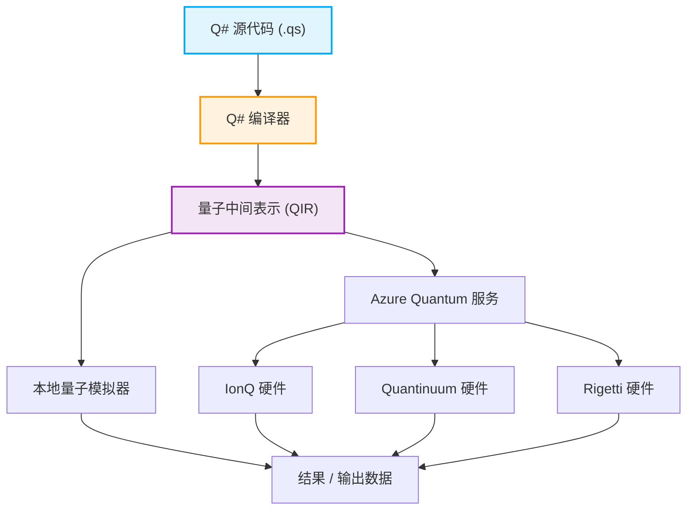

## 1. 引言：量子计算的黎明与编程的新范式

近年来，量子计算领域在硬件和软件方面的技术革新令人瞩目。经典计算机（我们现在日常使用的PC、智能手机、超级计算机等）使用确定状态“0”或“1”的比特组合来处理信息，而量子计算机则直接利用量子力学特有的物理现象，如“叠加（Superposition）”和“量子纠缠（Entanglement）”，作为信息处理的基础。这使得对于某些类别的问题，量子计算机有可能实现经典计算机即使用尽宇宙寿命也无法达到的计算速度水平，即实现“量子霸权（Quantum Supremacy）”或“量子优势（Quantum Advantage）”。例如，在巨大数的素因数分解（Shor算法）、数据库的高速搜索（Grover算法）、量子化学模拟（VQE算法）、组合优化问题，甚至机器学习的特定过程（量子机器学习，Quantum Machine Learning）等方面，都有望大幅减少计算量。

然而，要将量子计算机的这种惊人潜力转化为现实的应用，仅仅依靠物理硬件（如超导量子比特或离子阱等）的进步是不够的。准确设计量子电路，以及无错误且高效地编写量子算法的“量子编程语言”，及其背后强大的开发、执行和调试环境是必不可少的。经典的编程语言（如C++、Python、Java等）擅长抽象经典CPU架构的操作，但它们的设计并不适合自然地描述具有非确定性和复数振幅的量子状态操作。

在本文中，我们将聚焦于众多量子编程环境中，由微软强力推进并开源开发的量子开发工具包“Quantum Development Kit (QDK)”，以及作为其核心的专用编程语言“Q# (Q sharp)”。

Q# 作为一种专为编写量子算法而设计的领域特定语言（Domain Specific Language: DSL），在吸收了 C#、F# 和 Python 的优点的同时从零开始设计。它具备强大的功能，可以无缝整合经典的控制流（如 if 语句和 for 循环）与量子操作（如应用门和测量）。本文将从量子计算的基础数学模型出发，极其详尽地解说 Q# 的语言特征、与 Python 的 Qiskit 等在设计理念上的比较、使用实际代码构建“贝尔态（Bell State：量子纠缠态）”和测量，乃至与经典语言（Python 和 C#）的集成方法。当你读完这篇文章时，你应该已经理解了量子编程的基础，并准备好在自己的环境中开始编写 Q# 代码了。

## 2. 量子计算的数学基础：状态、叠加与纠缠

为了深入理解 Q# 的语法和功能，并编写出高效的量子程序，首先需要整理量子状态和量子门操作背后的基本数学知识（尤其是线性代数）。在这里，我们将概述量子编程所必需的基本数学模型。

### 2.1 量子比特（Qubit）与叠加态

经典的比特（Classical Bit）只能处于 $0$ 或 $1$ 中的一种状态，而量子比特（Qubit）则表示为状态 $|0\rangle$ 和 $|1\rangle$ 的线性组合（Linear Combination），即“叠加”。这种状态使用狄拉克符号（Bra-ket notation）和复数系数 $\alpha$ 和 $\beta$ 来描述如下：

$$ |\psi\rangle = \alpha|0\rangle + \beta|1\rangle $$

在这里，$\alpha$ 和 $\beta$ 是称为概率振幅（Probability Amplitude）的复数（Complex Numbers），在测量这个量子比特时，观测到状态 $|0\rangle$ 的概率为 $|\alpha|^2$，观测到状态 $|1\rangle$ 的概率为 $|\beta|^2$。由于物理限制，观测所有可能状态的概率总和必须为 $1$，因此必须满足以下归一化条件（Normalization Condition）：

$$ |\alpha|^2 + |\beta|^2 = 1 $$

量子比特的状态通常被可视化为一个称为“布洛赫球面（Bloch Sphere）”的三维空间单位球表面上的点。北极对应 $|0\rangle$，南极对应 $|1\rangle$，赤道上的点表示 $|0\rangle$ 和 $|1\rangle$ 以等概率叠加的状态（例如，相位为0的状态 $|+\rangle = \frac{1}{\sqrt{2}}(|0\rangle + |1\rangle)$，或者相位为$\pi/2$的状态 $|i\rangle = \frac{1}{\sqrt{2}}(|0\rangle + i|1\rangle)$ 等）。量子门操作可以在几何上理解为该布洛赫球面上的旋转操作。

### 2.2 多量子比特与张量积、以及量子纠缠

量子计算的真正威力在于将多个量子比特组合起来时发挥的。由多个量子比特组成的系统的状态由单个量子比特状态空间的“张量积（Tensor Product）”来描述。例如，由两个量子比特组成的整个系统的状态如下所示：

$$ |\psi\rangle = \alpha_{00}|00\rangle + \alpha_{01}|01\rangle + \alpha_{10}|10\rangle + \alpha_{11}|11\rangle $$

在这里，归一化条件 $\sum_{i,j} |\alpha_{ij}|^2 = 1$ 同样成立。重要的一点是，要完全描述一个包含n个量子比特的系统，需要 $2^n$ 个复数振幅。例如，即使是一个只有50个量子比特的系统，要表达其状态也需要 $2^{50} \approx 10^{15}$ 个复数，这远远超过了目前世界上最快的超级计算机的内存容量。这就是量子计算机对经典计算机拥有指数级优势的原因之一。

“量子纠缠（Entanglement）”指的是在这样的多量子比特状态中，无法简单分解（无法因式分解）为单个量子比特状态张量积的状态。最著名且最重要的纠缠态之一是下面的“贝尔态（Bell State）”：

$$ |\Phi^+\rangle = \frac{1}{\sqrt{2}}(|00\rangle + |11\rangle) $$

在这种状态下，在测量其中一个量子比特得到 $0$（或 $1$）的瞬间，另一个量子比特的状态也会无视距离立即确定为 $0$（或 $1$）。爱因斯坦称之为“幽灵般的超距作用”的这种非局部相关性，是量子隐形传态、超密编码、量子密码通信，甚至是许多量子算法高效执行的根本资源。在后面的章节中，我们将使用 Q# 实际创建这个贝尔态。

### 2.3 量子门操作与酉矩阵

改变量子状态的操作（相当于经典逻辑电路中的 AND、OR、NOT 门）被称为量子门。在数学上，量子门表示为复数矩阵，作为矩阵乘法作用于量子状态的向量。根据量子力学公理，这些矩阵必须是酉矩阵（Unitary Matrix，即满足 $U^\dagger U = I$ 的矩阵，其中 $U^\dagger$ 是共轭转置矩阵，$I$ 是单位矩阵）。因此，除测量外的所有量子操作都是可逆的（Reversible）。

典型的单量子比特门：
- **Pauli-X 门（NOT 门）**: 将 $|0\rangle$ 翻转为 $|1\rangle$，将 $|1\rangle$ 翻转为 $|0\rangle$。
$$ X = \begin{pmatrix} 0 & 1 \\ 1 & 0 \end{pmatrix} $$
- **Pauli-Z 门（相移门）**: 保持 $|0\rangle$ 不变，反转 $|1\rangle$ 的符号（即给相对相位加上 $\pi$）。
$$ Z = \begin{pmatrix} 1 & 0 \\ 0 & -1 \end{pmatrix} $$
- **Hadamard 门（H 门）**: 将确定性状态转换为叠加态。
$$ H = \frac{1}{\sqrt{2}} \begin{pmatrix} 1 & 1 \\ 1 & -1 \end{pmatrix} $$

典型的双量子比特门：
- **CNOT 门（受控 NOT 门）**: 仅当控制比特（Control Qubit）为 $|1\rangle$ 时，才对目标比特（Target Qubit）应用 X 门（NOT 运算）。
$$ CNOT = \begin{pmatrix} 1 & 0 & 0 & 0 \\ 0 & 1 & 0 & 0 \\ 0 & 0 & 0 & 1 \\ 0 & 0 & 1 & 0 \end{pmatrix} $$

可以说，量子算法就是设计一个过程，通过组合这些基本的酉矩阵来实现期望的运算。

## 3. 什么是 Microsoft Quantum Development Kit (QDK)

微软提供的 Quantum Development Kit (QDK) 是一套支持量子计算软件开发的综合工具集。从量子算法的设计、调试、优化，到在模拟器或实际硬件上的执行，它支持整个开发生命周期。

QDK 包含以下主要元素：

1. **Q# 编译器与执行环境**: 对用 Q# 语言编写的代码进行深度分析和优化，并将其转换为可在模拟器或实际量子硬件（通过 Azure Quantum）上运行的格式（如 QIR）。Q# 编译器执行量子计算特有的静态分析，例如函数纯度检查和量子比特生命周期管理。
2. **量子模拟器**: 包含在开发者本地机器上模拟量子状态演化的全状态模拟器（Full State Simulator）。这使得开发者可以在本地快速测试和调试数十个量子比特规模的小型算法。此外，还提供了资源估算器（Resource Estimator），用于估算大型电路（数千至数百万个量子比特）的资源需求。
3. **丰富的库**: Q# 标准库（Standard Library）提供了从基本的量子门（H, X, Y, Z, CNOT 等）到复杂的算术运算（如量子加法器）、振幅放大（Amplitude Amplification）和量子相位估计算法（Quantum Phase Estimation）等各种高级构建块。这让开发者避免了重复造轮子。
4. **集成开发环境 (IDE) 整合**: 提供了适用于 Visual Studio 和 Visual Studio Code 的扩展，可以使用语法高亮、代码补全（IntelliSense）、强大的调试功能、测试框架集成等现代软件开发中不可或缺的功能。

以下是显示 Q# 程序从编写到在硬件上执行的工作流的 Mermaid 图表。



这种架构的一个极其出色的特点是，通过基于 LLVM 的中间表示 QIR (Quantum Intermediate Representation)，完全抽象了底层硬件架构（超导量子比特、离子阱、拓扑量子比特、光量子等）的差异。开发者可以专注于算法的纯逻辑设计，而无需关心硬件的物理细节（每个硬件特有的原生门集或拓扑结构）。QIR 层之后的编译器通道会自动执行针对目标硬件优化的门转译。

## 4. Q# vs Python/Qiskit：为什么我们需要一门新语言？

在学习量子编程时，由于其简便性和 Python 的普及率，许多人首先接触到的可能是 IBM 开发的基于 Python 的框架“Qiskit”。Qiskit 也是一个非常强大且广泛使用的工具，但它与微软的 Q# 在根本的设计理念（范式）上有着很大的不同。

### Qiskit 方式（用 Python 构建电路对象）
Qiskit 本质上是一个“用于构建量子电路的 Python API 库”。当开发者执行 Python 脚本时，会在内存中逐渐组装出量子门的序列（电路对象）。在添加完所有门之后，最后将这个巨大的电路对象提交（Submit）给后端（本地模拟器或云端真机）执行。
这种元编程的方法有一个很大的优势，那就是非常容易与现有的 Python 生态系统（NumPy, SciPy, PyTorch 等机器学习库和可视化工具）集成。然而，在表达混杂着经典与量子的复杂控制流时，例如动态电路（Dynamic Circuits）：“仅当测量某个量子比特且结果为1时，才对另一组量子比特应用特定的复杂酉操作，并进一步执行 while 循环”，这时候无法使用 Python 原生的 if 语句或 for 语句（因为它们会在“构建电路时”被评估），而是必须使用 Qiskit 专有的特殊控制指令，这往往使代码变得非常复杂且不直观。

### Q# 方式（量子优先的领域特定语言）
另一方面，Q# 是一种从零开始设计的独立编译语言，旨在将量子计算本身作为一等公民（First-class citizen）对待。在 Q# 中，你可以像处理经典变量、if 语句和循环一样，在一个代码库中自然、无缝地描述量子比特分配、门操作和测量等处理过程。
Q# 编译器会静态分析整个代码，判断哪些部分应该在经典计算设备（宿主 CPU 或控制电子设备）上执行，哪些部分应该在量子协处理器（QPU）上执行，并进行高级优化。这在实现大型复杂量子算法时，实现了更高的模块化、可读性、可维护性和类型安全（Type Safety）。Q# 是一门用于“编写算法”的语言，而不是用于“画电路”的语言。

## 5. 深入探讨 Q# 的基本语法和特色概念

Q# 的语法设计非常精炼，结合了 C# 使用大括号 `{}` 的块结构、F# 的函数式编程元素以及强大的类型推断。在这里，我们将详细解说深入理解 Q# 的重要关键字和概念。

### 5.1 `operation` 和 `function` 的严格区分
在 Q# 中，为了定义处理块（子例程），严格区分使用了 `operation` 和 `function` 两种类型。这源于函数式编程中的“纯度（Purity）”概念。
- **`function`**: 仅执行确定性（Deterministic）经典计算的纯函数。只要给定相同的输入参数，无论执行多少次，都一定会返回相同的输出结果。在 `function` 内部，诸如量子比特分配、门的应用、测量等量子操作（伴随副作用的操作）会导致编译错误。它主要用于数学函数的计算和数据转换。
- **`operation`**: 包含量子计算的非确定性（Non-deterministic）例程。它包含量子比特操作和测量，即使输入相同，由于量子力学的概率特性（测量导致的波函数坍缩等），结果也可能会发生变化。量子算法的核心部分全都被定义为 `operation`。

### 5.2 `Qubit` 类型与 `use` 关键字的生命周期管理
在 Q# 中，量子比特被作为 `Qubit` 类型的“不透明（Opaque）”对象处理。开发者被有意禁止在程序中直接读取或修改其内部状态的概率振幅（如 $\alpha$ 或 $\beta$ 的值）（这与物理现实的量子系统中的“观测问题”相一致）。与量子比特交互的唯一方法就是调用提供的量子门操作或测量函数。

要在程序中动态分配新的量子比特，可以使用 `use` 关键字（在旧版本的 Q# 中称为 `using`）。`use` 块清晰地定义了量子比特的作用域和生命周期。
一个重要的规则是，在退出 `use` 块时，其中分配的所有量子比特必须完全恢复到 $|0\rangle$ 状态（否则将抛出运行时异常）。这是 Q# 的一个强大安全机制，以确保量子比特的重用和防止内存泄漏。

### 5.3 测量 `M` 和实用的 `MResetZ`
将量子状态转换为经典信息（0或1）的测量（Measurement）操作通过一个名为 `M` 的基本操作完成。在 Z 基底（计算基）下的测量结果以枚举类型 `Result`（值为 `Zero` 或 `One`）返回。
然而，如前所述，在释放量子比特时要求其必须处于 $|0\rangle$ 状态。如果仅仅进行了测量 `M`，而结果是 `One`，那么量子比特就已经坍缩到了 $|1\rangle$ 状态。因此，在实际代码中，经常使用一个名为 `MResetZ` 的极其方便的标准操作，它在测量后立即将量子比特状态可靠地重置为 $|0\rangle$。

### 5.4 变量的不可变性 (Immutability) 与 `mutable`
在深受函数式编程影响的 Q# 中，默认情况下所有变量都是不可变（Immutable）的。一旦使用 `let` 关键字绑定的变量，之后就无法改变其值。这减少了并行处理和量子算法中意外的副作用。
如果需要声明一个需要更新值的变量，例如循环计数器或累计计算，则必须明确使用 `mutable` 关键字，并使用 `set` 关键字来更新其值。

## 6. 实践：用 Q# 制造并测量贝尔态（量子纠缠）

那么，让我们调动迄今为止学到的知识，实际使用 Q# 编写一个程序，来生成数学章节中解释的“贝尔态（Bell State）”并进行测量。这可以说是量子编程中相当于“Hello World”的非常重要的一步。

### 量子电路设计与解析
生成贝尔态 $\frac{1}{\sqrt{2}}(|00\rangle + |11\rangle)$ 的标准量子电路步骤如下：
1. 准备处于初始状态 $|00\rangle$ 的两个量子比特 $q_0$ 和 $q_1$。
2. 对 $q_0$ 应用 Hadamard 门（$H$ 门）。这使得 $q_0$ 处于 $|0\rangle$ 和 $|1\rangle$ 等概率的叠加态 $\frac{1}{\sqrt{2}}(|0\rangle + |1\rangle)$。此时整个系统的状态为 $\frac{1}{\sqrt{2}}(|0\rangle + |1\rangle) \otimes |0\rangle = \frac{1}{\sqrt{2}}(|00\rangle + |10\rangle)$。
3. 以 $q_0$ 为控制比特（Control），$q_1$ 为目标比特（Target）应用 CNOT（受控 NOT）门。这使得只有当 $q_0$ 为 $|1\rangle$ 时 $q_1$ 才翻转。结果，状态 $|00\rangle$ 保持 $|00\rangle$ 不变，而状态 $|10\rangle$ 变为 $|11\rangle$，最终整个系统的状态变为 $\frac{1}{\sqrt{2}}(|00\rangle + |11\rangle)$。这就是完全相关的纠缠态的完成。

### Q# 实现代码

以下是使用 Q# 生成贝尔态，重复执行指定次数的测量实验并获取其统计数据（概率分布）的实用实现代码。

```qsharp
namespace Quantum.BellState {
    
    // 导入所需的命名空间
    open Microsoft.Quantum.Intrinsic;
    open Microsoft.Quantum.Canon;
    open Microsoft.Quantum.Measurement;
    open Microsoft.Quantum.Diagnostics;

    /// # Summary
    /// 生成单个贝尔态，并在 Z 基底中测量两个量子比特。
    ///
    /// # Output
    /// (Result, Result): qubit1 和 qubit2 的测量结果。如果是贝尔态，两者必定一致。
    operation GenerateAndMeasureBellState() : (Result, Result) {
        
        // 分配两个量子比特（初始状态自动为 |00>）
        use (q1, q2) = (Qubit(), Qubit());
        
        // 对 q1 应用 Hadamard 门以产生叠加态
        H(q1);
        
        // 以 q1 为控制比特，q2 为目标比特应用 CNOT 门
        // 这样在 q1 和 q2 之间就生成了量子纠缠
        CNOT(q1, q2);
        
        // 作为开发时的调试，可以转储模拟器内的状态向量来确认
        // DumpMachine(); // 必要时取消注释

        // 进行测量，并同时将状态重置为 |0> 以便安全释放量子比特
        let res1 = MResetZ(q1);
        let res2 = MResetZ(q2);
        
        // 返回测量结果对
        return (res1, res2);
    }

    /// # Summary
    /// 多次运行贝尔态生成和测量的实验，并收集结果统计信息的主例程。
    ///
    /// # Input
    /// ## count
    /// 实验重复的次数（例如：1000次）
    ///
    /// # Output
    /// (Int, Int, Int, Int): 分别观测到 (00, 01, 10, 11) 的次数
    @EntryPoint()
    operation RunBellStateExperiment(count: Int) : (Int, Int, Int, Int) {
        
        // 初始化用于统计观测次数的可变 (mutable) 变量
        mutable num00 = 0;
        mutable num01 = 0;
        mutable num10 = 0;
        mutable num11 = 0;

        // 执行指定次数的实验循环
        for _ in 1..count {
            // 生成贝尔态并接收测量结果
            let (r1, r2) = GenerateAndMeasureBellState();
            
            // 累加结果模式的计数
            if r1 == Zero and r2 == Zero {
                set num00 += 1;
            } elif r1 == Zero and r2 == One {
                set num01 += 1;
            } elif r1 == One and r2 == Zero {
                set num10 += 1;
            } else { // 当 r1 == One 且 r2 == One 时
                set num11 += 1;
            }
        }

        // 将收集到的统计信息作为消息输出到控制台
        Message($"--- 实验结果 ---");
        Message($"总运行次数: {count}");
        Message($"观测到 00: {num00}");
        Message($"观测到 01: {num01}");
        Message($"观测到 10: {num10}");
        Message($"观测到 11: {num11}");

        return (num00, num01, num10, num11);
    }
}
```

### 代码解析与运行结果确认
- `namespace`: 类似于 Java 或 C#，用于在逻辑上组织程序并防止名称冲突的命名空间声明。
- `open`: 导入所需的库（模块）。`Microsoft.Quantum.Intrinsic` 包含基本的量子门如 H, X, Y, Z, CNOT 等，而 `Microsoft.Quantum.Measurement` 包含如 `MResetZ` 这样方便的测量相关功能。
- `use (q1, q2) = (Qubit(), Qubit());`: 动态分配了两个量子比特。
- `H(q1); CNOT(q1, q2);`: 这两行正是生成量子纠缠的核心部分。可以非常简单且直观地编写。
- `let res1 = MResetZ(q1);`: 如前所述，`MResetZ` 将测量结果绑定到变量的同时，强制将量子比特状态重置为 $|0\rangle$。这确保了在 `use` 块结束时安全释放量子比特。
- `@EntryPoint()`: 添加此属性可向编译器指示此操作是程序执行的起点（类似于 C 语言中的 main 函数）。

理论上，由于生成的状态是贝尔态 $\frac{1}{\sqrt{2}}(|00\rangle + |11\rangle)$，如果你运行这个程序足够多次（例如 10,000 次），应该会观测到大约各 50% 的 `00` 和 `11`（各在 5,000 次左右），而 `01` 和 `10` 为 0 次（如果没有理论误差，就完全观测不到）。这证明了这两个量子比特之间有着强烈的相关性（纠缠在一起）。

## 7. 与宿主语言 (Python / C#) 的无缝集成

正如前面的示例一样，通过指定 `@EntryPoint()`，Q# 可以单独运行（Q# 独立应用程序）。但是在实际的企业开发和研究案例中，它通常与经典的处理紧密结合使用，如前端 GUI、从大型数据库检索数据以及机器学习的优化循环（如 VQE 参数更新等）。因此，Q# 提供了高度完善的互操作性（Interoperability），使得直接从其宿主语言 Python 或 C# (.NET) 中调用和执行变得极其容易。

### 7.1 从 Python 调用的示例：面向数据科学家
要想在数据科学、机器学习和物理学研究中占据绝对份额的 Python 中调用 Q#，只需使用 `qsharp` Python 库。它与 Jupyter Notebook 也有很好的亲和性，非常适合交互式开发或结合数据可视化。

```python
# 1. 导入所需的 Q# 互操作模块
import qsharp

# 2. 就像导入普通的 Python 函数一样直接导入 Q# 的操作
# (编译器会在后台自动处理绑定和编译)
from Quantum.BellState import RunBellStateExperiment

# 3. 在 Python 脚本中调用它并执行（使用模拟器）
count = 1000
print(f"开始 {count} 次迭代的量子模拟...")

# 通过调用 simulate() 方法，可以在本地模拟器上执行它
result = RunBellStateExperiment.simulate(count=count)

# 接收结果元组，并在 Python 端进行格式化输出
print("\n--- 模拟结果 ---")
print(f"|00> : {result[0]} (预期 ~500)")
print(f"|01> : {result[1]} (预期 0)")
print(f"|10> : {result[2]} (预期 0)")
print(f"|11> : {result[3]} (预期 ~500)")
```
通过这种方式，由于 Q# 编译器和解释器在后台透明地动态生成了通过 C API 进行的绑定，在 Python 代码端，你可以把量子算法看作仅仅是一个黑盒函数，极其轻松地构建出经典与量子的混合算法。

### 7.2 从 C# 调用的示例：面向企业开发
同样，你可以将 Q# 代码毫无阻碍地集成到在构建大型后端系统和企业级应用程序时非常强大的 C# 中。通过将 Q# 项目 (.csproj) 和 C# 项目放在同一个解决方案下，并建立引用关系，在构建时就会自动生成 C# 用的包装类。

```csharp
using System;
using System.Threading.Tasks;
using Microsoft.Quantum.Simulation.Simulators; // 量子模拟器命名空间
using Quantum.BellState; // 在 Q# 中定义的命名空间

namespace QuantumRunner
{
    class Program
    {
        static async Task Main(string[] args)
        {
            // 创建全状态量子模拟器的实例
            // 因为它实现了 IDisposable，所以使用 using 语句来正确管理资源
            using var sim = new QuantumSimulator();
            
            long count = 1000;
            Console.WriteLine($"运行 {count} 次生成贝尔态的迭代...");

            // 异步执行 Q# 操作。Run 方法已经自动生成。
            // 将 sim 作为执行目标传递，并将 count 作为参数传入。
            var result = await RunBellStateExperiment.Run(sim, count);

            // 结果以 C# 的 ValueTuple 形式返回
            Console.WriteLine($"|00>: {result.Item1}");
            Console.WriteLine($"|01>: {result.Item2}");
            Console.WriteLine($"|10>: {result.Item3}");
            Console.WriteLine($"|11>: {result.Item4}");
        }
    }
}
```
这里为了开发目的，我们使用了本地的 `QuantumSimulator` 类。但是，在过渡到生产环境时，只需要将这部分实例化模拟器的代码替换为指向 Azure Quantum 工作区的云目标提供商（例如 IonQ 或 Quantinuum 的机器对象）即可。完全不需要修改任何 Q# 端的代码或业务逻辑，就可以在云端真实的量子硬件上执行你的算法。这就是 QDK 的真正实力。

## 8. 高级话题：体现 Q# 设计哲学的各项功能

我们已经看过了 Q# 的基本用法，现在让我们稍微深入探究一下 Q# 拥有的更高级的功能及其背后的设计哲学。正是这些功能，使得 Q# 超越了单纯的“Python 替代品”，成为一门真正的量子领域特定语言。

### 8.1 自动生成逆操作 (Adjoint) 与受控操作 (Controlled)
量子计算的一大特性是源自其幺正性（Unitarity）的“可逆性（Reversibility）”。除测量之外的所有基本操作都是酉矩阵，因此它们必然有逆矩阵（逆操作），可以复原状态。在 Q# 中，为了将此作为语言级别的一等功能进行支持，提供了极其强大的函子（Functor）修饰符：`Adjoint`（伴随・逆操作）和 `Controlled`（受控操作）。

对于一个特定的量子操作 `Op`，无需你手工计算逆矩阵或反转逻辑门的顺序去实现反向的（复原）操作。你只需要在函数签名中添加特定的关键字，Q# 编译器就会自动为你生成 `Adjoint Op`。另外，如果希望只在某组控制量子比特全为 $|1\rangle$ 的情况下执行 `Op` 的条件操作 `Controlled Op`，也同样可以自动生成。

```qsharp
// 添加 is Adj + Ctl 以指示编译器自动生成逆操作和受控操作
operation MyComplexSubroutine(qubits: Qubit[]) : Unit is Adj + Ctl {
    // 这里描述一系列非常复杂的量子门序列
    // 例如：H, T, CNOT 甚至任意的相位位移等的组合
    // ...
}

// 调用示例
operation UseMyOp(controlQubit: Qubit, targetQubits: Qubit[]) : Unit {
    
    // 普通调用
    MyComplexSubroutine(targetQubits);
    
    // 执行逆操作：完全回退到初始状态（在反映算/Uncomputation时非常有用）
    Adjoint MyComplexSubroutine(targetQubits);
    
    // 执行受控操作：仅当 controlQubit 为 |1> 时执行复杂的子例程
    Controlled MyComplexSubroutine([controlQubit], targetQubits);
    
    // 此外，你还可以结合使用，如受控操作的逆操作！
    Controlled Adjoint MyComplexSubroutine([controlQubit], targetQubits);
}
```
凭借此功能，实现如 Grover 搜索算法的 Oracle、Shor 素因数分解算法，或频繁利用包含逆向逻辑操作的繁复子例程（用于消除不需要的纠缠的反映算：Uncomputation）的复杂算法时，代码能得到极大的简化。同时，这也大幅减少了人为错误和漏洞产生的空间。可以说，相比基于电路构建模型（如 Qiskit），这是算法描述语言 Q# 的最大优势之一。

### 8.2 资源估算 (Resource Estimation) 与面向未来的准备
目前的量子计算机仍处于被称为“NISQ（Noisy Intermediate-Scale Quantum，含噪中等规模量子）”的早期发展阶段，可用的量子比特数通常在几十到几百之间，而且错误率较高。然而，放眼未来的容错量子计算机（FTQC: Fault-Tolerant Quantum Computer）时代，能够提前精确预估运行一种新算法“究竟需要多少个逻辑量子比特”、“在此期间，容错代价高昂的 T 门或 Toffoli 门将被使用多少次”、“执行大概需要多少时间”，是非常至关重要的。

在 QDK 中，“资源估算器（Resource Estimator）”作为运行环境的一个内置目标被提供。利用该功能，不必在真实机器上或在沉重的全状态模拟器上执行代码，即可分析代码的逻辑路径，在瞬间计算出并输出大型算法的资源需求情况。这使得算法设计者或研究人员即使面对将来需要几千或几万个量子比特的算法，不仅能评估理论复杂度，还能在具体的门数量级上进行快速优化与迭代。

## 9. 结语：对新一代软件工程师的期望

量子计算正在从过去如爱因斯坦、薛定谔、费曼等物理学家脑海中纯粹的理论概念，快速演变成一种通过云基础设施（Azure Quantum、AWS Braket、IBM Quantum 等），世界上的任何人都可以通过浏览器或命令行直接访问、并在具体工程中落地实现的领域。硬件进化的速度是惊人的，许多专家预言，用不了几年，具有“实用价值”的量子优势被证明的那一天就会到来。

本文中介绍的微软 Q# 语言，将经典编程世界几十年来总结沉淀的优秀实践（如强类型、函数式编程元素、模块化、封装、IDE 带来的高度支持）优美地引入到了量子编程这个完全崭新的世界。在学习 Q# 并实现量子算法的过程中，我们可以获得深入计算科学和物理学根本的洞察，诸如“什么是状态”、“什么是观测”、“信息是如何在空间中传播的”等。这是一种超越单纯技能提升的、令人高度兴奋的智力体验。

在不久的将来，正如如今的机器学习工程师熟练地使用 PyTorch 和 TensorFlow 来发掘 GPU 并行计算的潜力一样，新一代的“量子软件工程师”们肯定会使用 Q# 或 Qiskit 来释放 QPU (Quantum Processing Unit) 超越性的计算能力。利用这种能力去挑战包括材料科学中的新材料发现、新药研发中的分子模拟、气候变化建模以及金融风险优化等在内的人类级宏大课题的时代，毫无疑问即将到来。

即使你现在是主要从事传统的网页应用、移动应用或数据分析工作的软件开发人员，也请务必借此机会踏入量子编程的世界看看。起初，你可能会对量子力学特有那些违背直觉的现象（如叠加态、量子纠缠、概率行为等）感到困惑。但是，请相信，Q# 这种优雅专用的语言以及 QDK 这种强大的工具链，定能为你提供一条扎实而强劲的学习曲线支撑。

## 10. 进一步学习的参考链接

以下将推荐一些出色的资源，为你的量子编程之旅提供帮助。

- [Microsoft Azure Quantum 官方文档](https://learn.microsoft.com/zh-cn/azure/quantum/) : QDK 和 Azure Quantum 综合文档门户。
- [Q# 用户指南与参考手册](https://learn.microsoft.com/zh-cn/azure/quantum/user-guide/) : Q# 的语法、类型系统以及标准库的完整参考。
- [Quantum Katas](https://quantum.microsoft.com/en-us/experience/quantum-katas) : 由微软提供的开源教程系列。它采用测试驱动开发 (TDD) 的形式，是让你在亲手编写 Q# 代码的同时，通过交互方式自学量子计算基本概念（如量子门、测量、算法构建等）的一份绝佳资源。
- [Q# GitHub 仓库](https://github.com/microsoft/qsharp-compiler) : Q# 语言编译器及标准库本身也作为开源项目活跃开发中。对于对编译器内部结构感兴趣的人来说，这里不容错过。

量子计算的未来才刚刚开启，充满了无限可能。请怀着一颗享受全新编程范式的心，来尽情挑战一下 Q# 编程吧！
