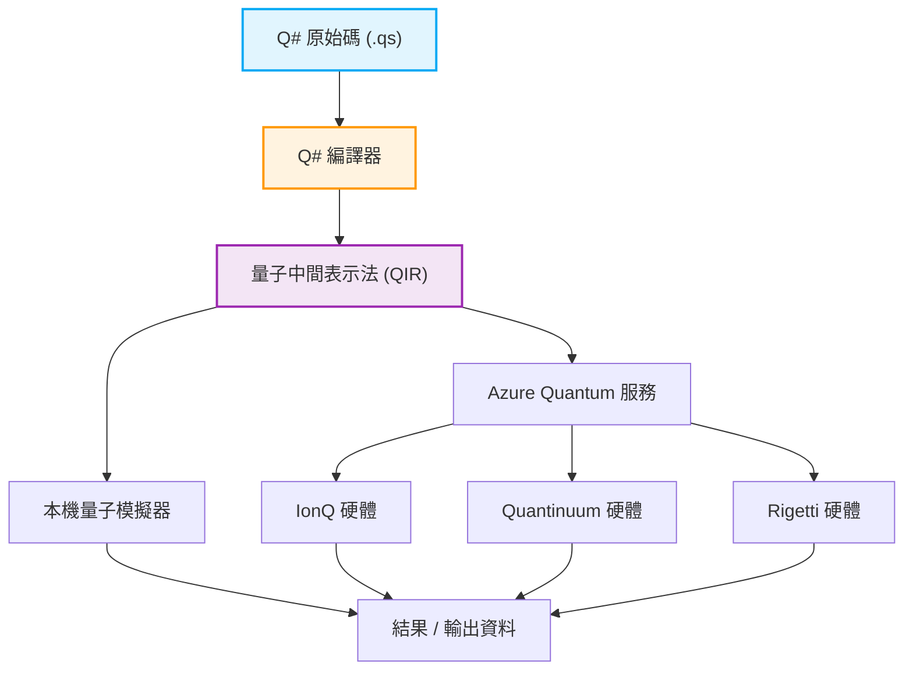

## 1. 前言：量子運算的黎明與程式設計的新典範

近年來，量子運算領域在硬體與軟體上的技術創新十分顯著。古典電腦（我們現在日常使用的PC、智慧型手機、超級電腦等）是透過「0」或「1」這種確定的位元組合來處理資訊，而量子電腦則是直接將量子力學特有的「疊加（Superposition）」與「量子糾纏（Entanglement）」等物理現象，作為資訊處理的基礎來活用。這樣一來，針對特定類別的問題，它展現了實現「量子霸權（Quantum Supremacy）」或「量子優勢（Quantum Advantage）」的可能性，也就是能達到古典電腦即使花費等同於宇宙壽命的時間也無法觸及的運算速度。例如在巨大整數的質因數分解（Shor演算法）、資料庫高速搜尋（Grover演算法）、量子化學模擬（VQE演算法）、組合最佳化問題，甚至是機器學習的特定流程（Quantum Machine Learning）中，都可望帶來計算量的劇烈減少。

然而，為了將量子電腦這種驚人的潛力引導至現實應用中，單靠物理硬體（如超導量子位元或離子阱等）的進步是不夠的。我們不可或缺的是能夠正確設計量子線路、無誤且有效率地撰寫量子演算法的「量子程式語言」，以及支撐它的強大開發、執行與除錯環境。古典程式語言（如 C++、Python、Java 等）雖然擅長抽象化古典 CPU 架構的運作，但在設計上卻無法自然地描述具備非決定論與複數振幅的量子狀態操作。

在眾多量子程式開發環境中，本文將聚焦於由微軟（Microsoft）大力推動並以開源形式進行開發的量子開發套件「Quantum Development Kit（QDK）」，以及構成其核心的專屬程式語言「Q#」。

作為專為描述量子演算法而打造的領域特定語言（Domain Specific Language: DSL），Q# 從零開始設計，並吸收了 C#、F# 與 Python 的優點。它具備了將古典控制流程（如 if 條件式與 for 迴圈等）與量子操作（閘的套用與測量）無縫整合的強大功能。本文將從量子運算的基礎數學模型出發，針對 Q# 的語言特徵、與 Python 的 Qiskit 等工具在設計理念上的比較、利用實際程式碼建構與測量「貝爾態（Bell State：量子糾纏態）」，乃至於與古典語言（Python 或 C#）的整合手法，進行徹底且非常詳細的解說。當您讀完這篇文章時，您應該已經理解量子程式設計的基礎，並準備好在自己的環境中開始撰寫 Q# 程式碼了。

## 2. 量子運算的數學基礎：狀態、疊加與糾纏

為了深入理解 Q# 的語法與功能，並撰寫出有效的量子程式，我們必須先梳理量子狀態與量子閘操作背後的基礎數學知識（特別是線性代數）。在此，我們將概述量子程式設計中不可或缺的基礎數學模型。

### 2.1 量子位元（Qubit）與疊加態

相較於古典位元（Classical Bit）只能處於 $0$ 或 $1$ 其中一種狀態，量子位元（Qubit）則表示為狀態 $|0\rangle$ 與 $|1\rangle$ 的線性組合（Linear Combination），也就是「疊加」。這個狀態可以使用狄拉克符號（Bra-ket notation）與複數係數 $\alpha$ 和 $\beta$ 來描述如下：

$$ |\psi\rangle = \alpha|0\rangle + \beta|1\rangle $$

其中，$\alpha$ 與 $\beta$ 是稱為機率振幅（Probability Amplitude）的複數（Complex Numbers）。當測量這個量子位元時，觀測到狀態 $|0\rangle$ 的機率為 $|\alpha|^2$，觀測到狀態 $|1\rangle$ 的機率為 $|\beta|^2$。基於物理上的限制，觀測所有可能狀態的機率總和必須為 $1$，因此必須滿足以下的歸一化條件（Normalization Condition）：

$$ |\alpha|^2 + |\beta|^2 = 1 $$

量子位元的狀態通常會被視覺化為三維空間中單位球體表面上的一個點，這被稱為「布洛赫球面（Bloch Sphere）」。北極對應 $|0\rangle$，南極對應 $|1\rangle$，而赤道上的點則代表 $|0\rangle$ 與 $|1\rangle$ 以相等機率疊加的狀態（例如相位為0的狀態 $|+\rangle = \frac{1}{\sqrt{2}}(|0\rangle + |1\rangle)$，或是相位為 $\pi/2$ 的 $|i\rangle = \frac{1}{\sqrt{2}}(|0\rangle + i|1\rangle)$ 等）。量子閘的操作可以幾何學地理解為在這個布洛赫球面上的旋轉操作。

### 2.2 多量子位元與張量積、以及量子糾纏

量子運算真正的力量在於組合多個量子位元時才能發揮。由多個量子位元組成的系統狀態，是藉由個別量子位元狀態空間的「張量積（Tensor Product）」來描述。例如，由兩個量子位元組成的整體系統狀態會如下所示：

$$ |\psi\rangle = \alpha_{00}|00\rangle + \alpha_{01}|01\rangle + \alpha_{10}|10\rangle + \alpha_{11}|11\rangle $$

此處同樣成立歸一化條件 $\sum_{i,j} |\alpha_{ij}|^2 = 1$。重要的一點是，為了完整描述 n 個量子位元的系統，將會需要 $2^n$ 個複數振幅。舉例來說，即使是僅有 50 個量子位元的系統，要表現其狀態就需要高達 $2^{50} \approx 10^{15}$ 個複數，這已經遠遠超出了目前世界最快超級電腦的記憶體容量。這也是量子電腦相對於古典電腦具備指數級優勢的原因之一。

「量子糾纏（Entanglement）」指的是在這種多量子位元的狀態中，無法單純分解（無法因式分解）為個別量子位元狀態的張量積的狀態。其中最有名且重要的一種糾纏態，就是以下的「貝爾態（Bell State）」：

$$ |\Phi^+\rangle = \frac{1}{\sqrt{2}}(|00\rangle + |11\rangle) $$

在這種狀態下，當測量其中一個量子位元並得到 $0$（或 $1$）的瞬間，另一個量子位元的狀態也會無視距離，立即確定為 $0$（或 $1$）。這種被愛因斯坦稱為「鬼魅般的遠距作用」的非局域性相關關係，是量子遙傳、超高密度編碼、量子密碼通訊，乃至於許多量子演算法有效執行的根本資源。在後面的章節中，我們將實際使用 Q# 來建立這個貝爾態。

### 2.3 量子閘操作與酉矩陣

改變量子狀態的操作（相當於古典邏輯電路中的 AND、OR、NOT 閘）被稱為量子閘。在數學上，量子閘以複數矩陣表示，並作為對量子狀態向量的矩陣乘法來作用。根據量子力學的公理，這些矩陣必須是酉矩陣（Unitary Matrix，即滿足 $U^\dagger U = I$ 的矩陣，其中 $U^\dagger$ 是伴隨矩陣，$I$ 是單位矩陣）。這使得除了測量之外的所有量子操作都是可逆的（Reversible）。

代表性的單一量子位元閘：
- **Pauli-X 閘（NOT閘）**：將 $|0\rangle$ 反轉為 $|1\rangle$，$|1\rangle$ 反轉為 $|0\rangle$。
$$ X = \begin{pmatrix} 0 & 1 \\ 1 & 0 \end{pmatrix} $$
- **Pauli-Z 閘（相位偏移閘）**：保持 $|0\rangle$ 不變，將 $|1\rangle$ 的正負號反轉（在相對相位加上 $\pi$）。
$$ Z = \begin{pmatrix} 1 & 0 \\ 0 & -1 \end{pmatrix} $$
- **Hadamard 閘（H閘）**：將確定狀態轉換為疊加狀態。
$$ H = \frac{1}{\sqrt{2}} \begin{pmatrix} 1 & 1 \\ 1 & -1 \end{pmatrix} $$

代表性的雙量子位元閘：
- **CNOT 閘（受控NOT閘）**：只有當控制位元（Control Qubit）為 $|1\rangle$ 時，才對目標位元（Target Qubit）套用 X 閘（NOT運算）。
$$ CNOT = \begin{pmatrix} 1 & 0 & 0 & 0 \\ 0 & 1 & 0 & 0 \\ 0 & 0 & 0 & 1 \\ 0 & 0 & 1 & 0 \end{pmatrix} $$

量子演算法可以說是組合這些基本的酉矩陣，以實現目標運算的流程設計。

## 3. 什麼是 Microsoft Quantum Development Kit (QDK)

微軟（Microsoft）提供的 Quantum Development Kit (QDK) 是一個支援量子運算軟體開發的綜合工具套件。從量子演算法的設計、除錯、最佳化，到在模擬器或實際硬體上執行，它支援了整個開發生命週期。

QDK包含以下主要元素：

1. **Q# 編譯器與執行環境**：對以 Q# 語言撰寫的程式碼進行高度分析與最佳化，並將其轉換為可在模擬器或實際量子硬體（透過 Azure Quantum）上執行的格式（如 QIR）。Q# 編譯器會進行量子計算特有的靜態分析，例如檢查函數純度與管理量子位元的生命週期。
2. **量子模擬器**：內含可在開發者本機機器上模擬量子狀態演變的全狀態模擬器（Full State Simulator）。這讓開發者能在手邊快速測試與除錯數十個量子位元規模的小型演算法。此外，還提供了用來估算大型線路（數千至數百萬量子位元）資源需求的資源估算器（Resource Estimator）。
3. **豐富的函式庫**：Q# 標準函式庫（Standard Library）中準備了各種進階的建構區塊，從基本的量子閘（H、X、Y、Z、CNOT等），到複雜的算術運算（如量子加法器）、振幅放大（Amplitude Amplification）、量子相位估計演算法（Quantum Phase Estimation）等。這讓開發者能夠避免重新發明輪子。
4. **整合開發環境 (IDE) 協作**：提供了適用於 Visual Studio 或 Visual Studio Code 的擴充功能，讓開發者能利用語法醒目提示、程式碼完成（IntelliSense）、強大的除錯功能、與測試框架的整合等現代軟體開發不可或缺的功能。

以下是顯示 Q# 程式從撰寫到在硬體上執行之工作流程的 Mermaid 圖表。



這個架構極為優秀的一點，在於透過稱為 QIR (Quantum Intermediate Representation) 這個以 LLVM 為基礎的中間表示法，能將底層硬體架構（超導量子位元、離子阱、拓樸量子位元、光量子等）的差異完全抽象化。開發者不需在意硬體的物理細節（各硬體特有的原生閘集合或拓樸結構），就能專注於演算法的純粹邏輯設計。QIR 層之後的編譯器路徑，會自動進行針對目標硬體最佳化的閘轉譯（Transpile）。

## 4. Q# vs Python/Qiskit：為什麼需要新的語言？

在學習量子程式設計時，由於其便利性與 Python 的普及率，許多人最先接觸的可能都是 IBM 所開發、以 Python 為基礎的框架「Qiskit」。Qiskit 也是非常強大且廣泛使用的工具，但它與微軟的 Q# 在根本的設計理念（典範）上有著極大的差異。

### Qiskit 做法（透過 Python 建構線路物件）
Qiskit 本質上是「用來建構量子線路的 Python API 函式庫」。當開發者執行 Python 腳本時，記憶體中會逐漸組裝出量子閘的序列（線路物件）。在所有閘都加入完畢後，最後再將這個龐大的線路物件傳送（Submit）至後端（本機模擬器或雲端實機）執行。
這種元程式設計（Metaprogramming）的做法，其巨大優勢在於極易與現有的 Python 生態系（如 NumPy、SciPy、PyTorch 等機器學習庫與視覺化工具）進行整合。然而，當要表現混合了古典與量子的複雜控制流程，例如「測量某個量子位元，只有在結果為 1 的情況下，才對另一群量子位元套用特定的複雜酉操作，並進一步執行 while 迴圈」這類動態線路（Dynamic Circuits）時，無法使用 Python 原生的 if 或 for 迴圈（因為它們會在「建構線路時」就被求值），從而必須使用 Qiskit 獨有的特殊控制指令，這容易使程式碼變得非常複雜且缺乏直覺性。

### Q# 做法（量子優先的領域特定語言）
另一方面，Q# 為了將量子計算本身視為一等公民（First-class citizen），是從零開始設計的獨立編譯語言。在 Q# 中，我們可以像處理古典變數操作、if 條件式或迴圈處理一樣，以完全相同的感覺，自然且無縫地在單一程式碼基底中描述量子位元的分配、閘操作與測量等處理。
Q# 編譯器會對整個程式碼進行靜態分析，判斷哪些部分該在古典計算裝置（主機 CPU 或控制電子設備）上執行，哪些部分該在量子協同處理器（QPU）上執行，並進行高度最佳化。這樣一來，在實作大規模且複雜的量子演算法時，能實現更高的模組化、可讀性、可維護性以及型別安全性（Type Safety）。Q# 是一門為了「撰寫演算法」而非「撰寫線路」的語言。

## 5. 深入探討 Q# 的基本語法與特徵概念

Q# 的語法採用了 C# 使用大括號 `{}` 的區塊結構、F# 函數式程式設計的要素，並結合了強大的型別推論，呈現出非常洗鍊的設計。在此，我們將詳細解說能幫助您深入理解 Q# 的重要關鍵字與概念。

### 5.1 嚴格區分 `operation` 與 `function`
在 Q# 中，為了定義處理區塊（次常式），會嚴格區分並使用 `operation` 與 `function` 這兩種類型。這是源自函數式程式設計中「純度（Purity）」的概念。
- **`function`**：只進行決定論（Deterministic）古典計算的純函數。只要給予相同的輸入參數，無論執行幾次都必定回傳相同的輸出結果。在 `function` 內部，分配量子位元、套用量子閘或測量等量子操作（伴隨副作用的操作）會導致編譯錯誤。它用於數學函數的計算或資料轉換等。
- **`operation`**：包含量子計算在內、非決定論（Non-deterministic）的常式。它包含量子位元的操作與測量，即使輸入相同，也可能因為量子力學的機率性質（如測量導致的波函數塌縮等）而得到不同的結果。量子演算法的核心部分全都會定義為 `operation`。

### 5.2 `Qubit` 型別與透過 `use` 關鍵字的生命週期管理
在 Q# 中，量子位元被當作 `Qubit` 型別的「不透明（Opaque）」物件處理。程式語言刻意禁止開發者在程式內直接讀取或改寫其內部狀態的機率振幅（例如 $\alpha$ 或 $\beta$ 的值），這與物理現實量子系統中的「觀測問題」是一致的。與量子位元互動的唯一方法，就是呼叫系統提供的量子閘操作或測量函數。

若要在程式內新分配（配置）量子位元，請使用 `use` 關鍵字（在舊版 Q# 中稱為 `using`）。`use` 區塊明確定義了量子位元的範圍與生命週期。
作為一項重要規則，在離開 `use` 區塊時，區塊內所分配的所有量子位元都必須完全回到 $|0\rangle$ 狀態（否則會發生執行時期例外）。這是為了確保量子位元能被重複使用並防止記憶體洩漏，是 Q# 強大的安全性機制。

### 5.3 測量 `M` 與好用的 `MResetZ`
用來將量子狀態轉換為古典資訊（0 或 1）的測量（Measurement）操作，是透過 `M` 這個基本操作來進行。在 Z 基底（標準基底）下的測量結果，會以列舉型別的 `Result` 型別（值為 `Zero` 或 `One`）回傳。
然而如前所述，釋放量子位元時會要求其處於 $|0\rangle$ 狀態。如果只進行測量 `M`，若結果為 `One`，量子位元就會塌縮在 $|1\rangle$ 狀態。因此，在實用的程式碼中，非常頻繁地會使用 `MResetZ` 這個好用的標準操作，它能在進行測量後立即確實地將量子位元狀態重設為 $|0\rangle$。

### 5.4 變數的不可變性 (Immutability) 與 `mutable`
深受函數式程式設計影響的 Q#，預設所有的變數都是不可變的（Immutable）。一旦用 `let` 關鍵字綁定的變數，其後就無法再更改數值。這能減少平行處理或量子演算法中發生非預期的副作用。
如果需要宣告像迴圈計數器或累積計算那樣需要更新數值的變數，請明確使用 `mutable` 關鍵字，而更新數值時則使用 `set` 關鍵字。

## 6. 實踐：用 Q# 建立貝爾態（量子糾纏）並進行測量

現在，我們將動用至今所學的所有知識，實際使用 Q# 寫一支能建立先前在數學章節說明的「貝爾態（Bell State）」並加以測量的程式。這可以說是量子程式設計裡的「Hello World」，是非常重要的一個步驟。

### 量子線路的設計與解說
建立貝爾態 $\frac{1}{\sqrt{2}}(|00\rangle + |11\rangle)$ 的標準量子線路步驟如下：
1. 準備兩個量子位元 $q_0$ 與 $q_1$，初始狀態為 $|00\rangle$。
2. 對 $q_0$ 套用 Hadamard 閘（$H$ 閘）。這會使 $q_0$ 成為 $|0\rangle$ 與 $|1\rangle$ 機率相等的疊加態 $\frac{1}{\sqrt{2}}(|0\rangle + |1\rangle)$。此時整個系統的狀態為 $\frac{1}{\sqrt{2}}(|0\rangle + |1\rangle) \otimes |0\rangle = \frac{1}{\sqrt{2}}(|00\rangle + |10\rangle)$。
3. 將 $q_0$ 作為控制位元（Control），$q_1$ 作為目標位元（Target），套用 CNOT（受控NOT）閘。這樣一來，只有當 $q_0$ 為 $|1\rangle$ 時，$q_1$ 才會反轉。結果就是，狀態 $|00\rangle$ 保持 $|00\rangle$ 不變，狀態 $|10\rangle$ 則變成 $|11\rangle$，最終系統整體的狀態就成為 $\frac{1}{\sqrt{2}}(|00\rangle + |11\rangle)$。這便完成了具備完全相關性的糾纏態。

### 透過 Q# 的實作程式碼

以下程式碼是使用 Q# 生成貝爾態，並重複執行指定次數的測量實驗以取得其統計（機率分佈）的實踐範例。

```qsharp
namespace Quantum.BellState {
    
    // 匯入必要的命名空間
    open Microsoft.Quantum.Intrinsic;
    open Microsoft.Quantum.Canon;
    open Microsoft.Quantum.Measurement;
    open Microsoft.Quantum.Diagnostics;

    /// # Summary
    /// 產生單一貝爾態，並在 Z 基底測量兩個量子位元。
    ///
    /// # Output
    /// (Result, Result): qubit1與qubit2的測量結果。如果是貝爾態，必定會一致。
    operation GenerateAndMeasureBellState() : (Result, Result) {
        
        // 分配兩個量子位元（初始狀態會自動設為 |00>）
        use (q1, q2) = (Qubit(), Qubit());
        
        // 對 q1 套用 Hadamard 閘，製造疊加態
        H(q1);
        
        // 以q1為控制位元，q2為目標位元套用CNOT閘
        // 這會在q1與q2之間產生量子糾纏（Entanglement）
        CNOT(q1, q2);
        
        // 作為開發時的除錯，可以傾印模擬器內的狀態向量來進行確認
        // DumpMachine(); // 必要時請取消註解

        // 進行測量，同時為了安全釋放量子位元，將狀態重設為 |0>
        let res1 = MResetZ(q1);
        let res2 = MResetZ(q2);
        
        // 回傳測量結果的配對
        return (res1, res2);
    }

    /// # Summary
    /// 執行多次貝爾態生成與測量實驗，並收集結果統計的主常式。
    ///
    /// # Input
    /// ## count
    /// 重複實驗的次數（例：1000次）
    ///
    /// # Output
    /// (Int, Int, Int, Int): (00, 01, 10, 11) 分別被觀測到的次數
    @EntryPoint()
    operation RunBellStateExperiment(count: Int) : (Int, Int, Int, Int) {
        
        // 初始化可變（mutable）變數來計算觀測次數
        mutable num00 = 0;
        mutable num01 = 0;
        mutable num10 = 0;
        mutable num11 = 0;

        // 執行指定次數的實驗迴圈
        for _ in 1..count {
            // 產生貝爾態並接收測量結果
            let (r1, r2) = GenerateAndMeasureBellState();
            
            // 計算結果模式的次數
            if r1 == Zero and r2 == Zero {
                set num00 += 1;
            } elif r1 == Zero and r2 == One {
                set num01 += 1;
            } elif r1 == One and r2 == Zero {
                set num10 += 1;
            } else { // 在 r1 == One and r2 == One 的情況下
                set num11 += 1;
            }
        }

        // 將收集到的統計資訊作為訊息輸出到主控台
        Message($"--- Experiment Results ---");
        Message($"Total runs: {count}");
        Message($"00 observed: {num00}");
        Message($"01 observed: {num01}");
        Message($"10 observed: {num10}");
        Message($"11 observed: {num11}");

        return (num00, num01, num10, num11);
    }
}
```

### 程式碼解說與動作確認
- `namespace`：與 Java 或 C# 一樣，這是用來邏輯地整理程式並防止命名衝突的命名空間宣告。
- `open`：匯入必要的函式庫（模組）。`Microsoft.Quantum.Intrinsic` 包含 H、X、Y、Z、CNOT 等基本量子閘，而 `Microsoft.Quantum.Measurement` 則包含如 `MResetZ` 這類好用的測量相關功能。
- `use (q1, q2) = (Qubit(), Qubit());`：動態配置兩個量子位元。
- `H(q1); CNOT(q1, q2);`：這兩行正是產生量子糾纏的核心部分。撰寫起來非常簡單且直覺。
- `let res1 = MResetZ(q1);`：如前所述，`MResetZ` 在將測量結果綁定給變數的同時，會強制將量子位元狀態重設為 $|0\rangle$。這樣一來，在 `use` 區塊結束時就能安全地釋放量子位元。
- `@EntryPoint()`：加上這個屬性，就是向編譯器表示這個操作是程式執行的起點（類似 C 語言中的 main 函數）。

理論上，產生的狀態是貝爾態 $\frac{1}{\sqrt{2}}(|00\rangle + |11\rangle)$，因此若執行此程式夠多次（例如 10,000 次），觀測到 `00` 與 `11` 的比例應該各自約為 50%（5,000次左右），而 `01` 與 `10` 則為 0 次（若沒有理論誤差就完全不會被觀測到）。這便是這兩個量子位元具備強關聯性（糾纏）的證明。

## 7. 與主機語言（Python / C#）的無縫整合

如前面的範例所示，Q# 可以透過指定 `@EntryPoint()` 來單獨執行（Q# 獨立應用程式），但在實際的企業開發或研究案例中，它通常會與前端 GUI、從龐大資料庫取得資料、或是機器學習的最佳化迴圈（例如 VQE 的參數更新等）等古典運算密切結合使用。為此，Q# 提供了洗鍊的互通性（Interoperability），讓開發者能極其容易地從 Python 或 C#（.NET）等主機語言直接呼叫並執行。

### 7.1 從 Python 呼叫的範例：給資料科學家
要從在資料科學、機器學習與物理學研究領域佔有壓倒性市佔率的 Python 中呼叫 Q#，可以使用 `qsharp` 這個 Python 套件。它與 Jupyter Notebook 具有很高的相容性，非常適合與互動式開發及資料視覺化結合。

```python
# 1. 匯入必要的 Q# 整合模組
import qsharp

# 2. 就像匯入 Python 函數一樣，直接匯入 Q# 的操作
# （編譯器會在背後自動進行綁定與編譯）
from Quantum.BellState import RunBellStateExperiment

# 3. 從 Python 腳本呼叫並執行（使用模擬器）
count = 1000
print(f"Starting quantum simulation for {count} iterations...")

# 呼叫 simulate() 方法，在本機模擬器上執行
result = RunBellStateExperiment.simulate(count=count)

# 接收結果的 tuple，並在 Python 端排版後輸出
print("\n--- Simulation Results ---")
print(f"|00> : {result[0]} (Expected ~500)")
print(f"|01> : {result[1]} (Expected 0)")
print(f"|10> : {result[2]} (Expected 0)")
print(f"|11> : {result[3]} (Expected ~500)")
```
如此這般，因為 Q# 編譯器與直譯器會在背後透明地透過 C API 動態產生綁定，所以在 Python 程式碼端，可以將量子演算法當作單純的黑盒子函數來處理，極其輕鬆地建構出古典與量子的混合演算法。

### 7.2 從 C# 呼叫的範例：給企業開發者
在開發大型後端系統或企業應用程式時非常強大的 C#，也完全可以用相同的方式整合 Q# 程式碼。只要將 Q# 專案（.csproj）與 C# 專案配置在同一個方案內並建立參考關係，建置時就會自動產生 C# 用的類別包裝器（Class wrapper）。

```csharp
using System;
using System.Threading.Tasks;
using Microsoft.Quantum.Simulation.Simulators; // 量子模擬器的命名空間
using Quantum.BellState; // 在 Q# 中定義的命名空間

namespace QuantumRunner
{
    class Program
    {
        static async Task Main(string[] args)
        {
            // 產生全狀態量子模擬器的實例
            // 因為實作了 IDisposable，所以使用 using 陳述式來適當地管理資源
            using var sim = new QuantumSimulator();
            
            long count = 1000;
            Console.WriteLine($"Running {count} iterations of Bell State generation...");

            // 非同步執行 Q# 的操作。Run 方法是自動產生的。
            // 傳遞 sim 作為執行目標，並傳遞 count 作為參數。
            var result = await RunBellStateExperiment.Run(sim, count);

            // 結果會以 C# 的 ValueTuple 格式回傳
            Console.WriteLine($"|00>: {result.Item1}");
            Console.WriteLine($"|01>: {result.Item2}");
            Console.WriteLine($"|10>: {result.Item3}");
            Console.WriteLine($"|11>: {result.Item4}");
        }
    }
}
```
這裡為了開發目的而使用了本機的 `QuantumSimulator` 類別，但在轉移至正式環境時，只需要將這個產生模擬器實例的部分，替換成指向 Azure Quantum 工作區的雲端目標供應商（例如 IonQ 或 Quantinuum 的機器物件）即可。這意味著，完全不需要修改 Q# 端的程式碼或商業邏輯，就能夠在雲端上的實體量子硬體上執行演算法。這正是 QDK 最為精髓的所在。

## 8. 進階主題：體現 Q# 設計哲學的功能群

在看過了 Q# 的基本用法後，現在我們稍微深入探討一下 Q# 所具備的更進階功能與其設計哲學。這些功能正是讓 Q# 不單單只是「Python 替代品」，而是成為真正的量子領域特定語言的重要元素。

### 8.1 自動反運算 (Adjoint) 與受控運算 (Controlled) 的自動生成
量子計算的一個大特徵，在於源自酉性（Unitarity）的「可逆性（Reversibility）」。除了測量之外，所有基本運算都是酉矩陣，因此必定存在反矩陣（反運算），能夠還原。在 Q# 中，提供了名為 `Adjoint`（伴隨・反運算）與 `Controlled`（受控運算）強大的函子修飾詞（Functor modifier），將此作為語言層級的一等功能來支援。

針對某個量子操作 `Op`，我們不需要手動計算矩陣或反轉閘的順序來實作它的反向操作（還原操作），只要在函數的簽章中加上特定關鍵字，Q# 編譯器就會自動產生 `Adjoint Op`。此外，只有在特定的一群量子位元全為 $|1\rangle$ 時才執行 `Op` 的條件式操作 `Controlled Op`，同樣也能自動生成。

```qsharp
// 加上 is Adj + Ctl 後，會指示編譯器自動產生反運算與受控運算
operation MyComplexSubroutine(qubits: Qubit[]) : Unit is Adj + Ctl {
    // 這裡可以寫入非常複雜的量子閘序列
    // 例：H, T, CNOT，或任意相位偏移等組合
    // ...
}

// 呼叫端的範例
operation UseMyOp(controlQubit: Qubit, targetQubits: Qubit[]) : Unit {
    
    // 一般呼叫
    MyComplexSubroutine(targetQubits);
    
    // 執行反運算：完全倒轉回原本的狀態（對反計算Uncomputation非常有用）
    Adjoint MyComplexSubroutine(targetQubits);
    
    // 執行受控運算：只有在 controlQubit 為 |1> 時，才執行複雜的次常式
    Controlled MyComplexSubroutine([controlQubit], targetQubits);
    
    // 還能組合使用，例如受控運算的反運算！
    Controlled Adjoint MyComplexSubroutine([controlQubit], targetQubits);
}
```
這項功能可以使頻繁利用複雜次常式及其反運算（為了解開不需要的糾纏而進行的反計算：Uncomputation）的進階演算法（例如 Grover 搜尋演算法的神諭實作或 Shor 的質因數分解演算法等）實作大幅簡化，並大幅減少人為錯誤或 bug 介入的空間。這可以說是演算法描述語言 Q# 相比於建構線路模型的 Qiskit 等工具，最大的優勢之一。

### 8.2 資源估算 (Resource Estimation) 與為未來做準備
目前的量子電腦正處於被稱為「NISQ（Noisy Intermediate-Scale Quantum，含噪中等規模量子）」的發展階段，可用的量子位元數不僅稀少（大約幾十到幾百個），錯誤率也偏高。然而，著眼於未來容錯量子電腦（FTQC: Fault-Tolerant Quantum Computer）的時代，要在執行某個新演算法時，事先準確估算「到底需要多少邏輯量子位元」、「在錯誤更正中成本極高的 T 閘或 Toffoli 閘會被使用幾次」、「執行時間大約多久」將會變得極度重要。

QDK 在執行環境的目標平台之一內建了「資源估算器（Resource Estimator）」。只要使用它，不需要在實機或繁重的全狀態模擬器上執行程式，就能分析程式碼的邏輯路徑，瞬間計算並輸出大規模演算法的需求資源。這讓演算法設計者與研究人員，即使面對未來需要數千、數萬量子位元的演算法，也能不僅僅在理論計算量上，而是能在具體的閘數量級別上，迅速反覆進行最佳化。

## 9. 結語：對次世代軟體工程師的期望

量子運算已經從過去存在於愛因斯坦、薛丁格、費曼等物理學家腦中的純理論概念，迅速轉移為具體的工程實作領域。現在，全世界任何人都能透過雲端基礎設施（如 Azure Quantum、AWS Braket、IBM Quantum 等），從瀏覽器或命令列存取它。硬體的進化速度十分驚人，許多專家預測，在幾年內證明「有用」的量子優勢的日子就會到來。

本文所介紹的微軟 Q# 語言，將古典程式設計世界中花了數十年培養的優秀實務（強型別、函數式程式設計要素、模組化、封裝、IDE 的高度支援），完美地帶入了量子程式設計這個全新的世界。在學習 Q# 與實作量子演算法的過程中，我們能得到像是「狀態是什麼」、「觀測是什麼」、「資訊是如何在空間中傳播的」等深刻見解，讓我們回歸到計算機科學與物理學的根本。這不單單只是提升技能，更是一種伴隨著極大知性興奮的體驗。

在不久的將來，就像現在的機器學習工程師理所當然地用 PyTorch 或 TensorFlow 發揮 GPU 的平行計算能力一樣，次世代的「量子軟體工程師」將會使用 Q# 或 Qiskit 引出 QPU（Quantum Processing Unit）超越性的計算能力，挑戰材料科學中發現新材料、新藥開發中的分子模擬、氣候變遷模型，以及金融風險最佳化等全人類規模的巨大課題，那樣的時代必定會到來。

目前主要處理古典 Web 應用程式、行動應用程式或資料分析的軟體開發者們，也請務必把握這個機會，試著踏入量子程式設計的世界吧。一開始您可能會對有違直覺的量子力學特有現象（疊加或糾纏、機率性行為）感到困惑，但是，Q# 這門洗鍊的專用語言與 QDK 這個強大的工具鏈，必定能確實且強而有力地支撐您的學習曲線。

## 10. 進階學習的參考連結集

為您介紹幾個繼續量子程式設計之旅的優良資源。

- [Microsoft Azure Quantum 官方文件](https://learn.microsoft.com/azure/quantum/)：QDK 與 Azure Quantum 的綜合文件入口網站。
- [Q# 使用者指南與參考手冊](https://learn.microsoft.com/azure/quantum/user-guide/)：Q# 語法、型別系統與標準函式庫的完整參考手冊。
- [Quantum Katas](https://quantum.microsoft.com/en-us/experience/quantum-katas)：微軟提供的開源教學系列。以測試驅動開發（TDD）的形式，在實際撰寫 Q# 程式碼的同時，互動式地自學量子運算基本概念（量子閘、測量、演算法建構），是個絕佳的資源。
- [Q# GitHub 儲存庫](https://github.com/microsoft/qsharp-compiler)：Q# 語言編譯器與標準函式庫本身也作為開源專案活耀地開發中。對編譯器內部結構有興趣的人絕不能錯過。

量子運算的未來才剛剛開始，充滿著無限的可能性。請抱持著享受新程式設計典範的心情，務必挑戰看看用 Q# 寫程式吧！
