---
title: 'مبادئ وآليات الحواسيب الكمية 【دليل شامل】من حدود قانون مور إلى ميكانيكا الكم'
slug: "quantum-computer-ultimate-guide"
date: "2026-09-09T08:00:06+09:00"
tags: ["Quantum Computer", "Quantum Mechanics", "Algorithm", "Physics"]
categories: ["Math, Crypto, Quantum"]
math: true
mermaid: true
image: "cover.webp"
description: 'نشرح بتعمق الخلفية التي أدت إلى فجر الحواسيب الكمية، انطلاقاً من الحدود الفيزيائية للحواسيب الكلاسيكية ونهاية قانون مور، وصولاً إلى حاجز التأثيرات الميكانيكية الكمية مثل تأثير النفق الكمي. هذا هو الفصل الأول من الدليل الشامل لفهم تقنية معالجة المعلومات من الجيل القادم.'
---


# الفصل 1: فجر الحوسبة الكمومية وحدودها

## 1.1 الحدود الفيزيائية للحوسبة الكلاسيكية ونهاية قانون مور

لقد كان التطور الهائل لتقنيات معالجة المعلومات في عصرنا الحديث مدفوعاً بالقاعدة التجريبية التي اقترحها غوردون مور (Gordon Moore) عام 1965، والمعروفة باسم "قانون مور" (Moore's Law)، والتي تنص على أن "عدد الترانزستورات المدمجة في الدوائر المتكاملة لأشباه الموصلات يتضاعف كل عامين تقريباً". ووفقاً لهذا القانون، واصلنا دفع عجلة تصغير أبعاد الترانزستورات (scaling)، مما أدى إلى تحسين أداء المعالجة الحاسوبية بشكل أسي. ومع ذلك، ومع دخول القرن الحادي والعشرين، واجه هذا النموذج الكلاسيكي حدوداً فيزيائية حاسمة. ويتمثل العائق الأكبر في ظهور تأثير ميكانيكا الكم المعروف بـ "النفق الكمومي" (Quantum Tunneling Effect).

عندما تنخفض سماكة طبقة العازل لبوابة الترانزستور وطول القناة إلى مقياس بضعة نانومترات، أي ما يعادل سمك بضع ذرات إلى بضع عشرات من الذرات فقط، تبدأ الإلكترونات باختراق حواجز الطاقة التي يستحيل عليها تجاوزها في إطار الميكانيكا الكلاسيكية، وذلك عبر تسرب دالتها الموجية باحتمالية غير صفرية. ووفقاً لتقريب WKB، فإن احتمالية النفاذ $T$ لإلكترون ذي كتلة $m$ وطاقة $E < V_0$ يسقط على منطقة حاجز جهد $V_0$ ذي عرض $a$ تُعطى بالمعادلة التالية:

$$
T \approx \exp \left( - \frac{2}{\hbar} \int_{0}^{a} \sqrt{2m(V_0 - E)} \, dx \right)
$$

حيث تمثل $\hbar$ ثابت بلانك المختزل. ومع انخفاض عرض الحاجز $a$ نتيجة استمرار التصغير، تزداد احتمالية النفاذ $T$ بشكل أسي، مما يؤدي إلى تدفق "تيار تسريب" (leakage current) لا يمكن إهماله حتى عندما يكون الترانزستور في حالة إيقاف التشغيل (OFF). ويترتب على ذلك زيادة استهلاك الطاقة وتوليد حرارة هائلة، مما يؤدي إلى انهيار وظيفة الترانزستور كعنصر تحويل حتمي كلاسيكي.

علاوة على ذلك، لا يمكن إغفال الحدود الديناميكية الحرارية (الثرموديناميكية) لمعالجة المعلومات. ففي عام 1961، أثبت رولف لانداور (Rolf Landauer) أن عملية محو المعلومات (إجراء عمليات منطقية غير قابلة للعكس) يصاحبها توليد حتمي للحرارة، وهو ما يُعرف بـ "مبدأ لانداور" (Landauer's Principle). والحد الأدنى لكمية الحرارة $\Delta Q$ التي تُبعث إلى البيئة المحيطة عند محو بت واحد من المعلومات يُعبّر عنه بالصيغة التالية:

$$
\Delta Q \ge k_B T \ln 2
$$

حيث $k_B$ هو ثابت بولتزمان، و $T$ هي درجة الحرارة المطلقة. وطالما أن الحواسيب الكلاسيكية تعتمد على البوابات المنطقية (مثل بوابات AND و OR غير العكوسة)، فلا يمكن تجنب هذا الحد الأدنى الثرموديناميكي. ومع استمرار التصغير واقتراب الطاقة التي يتعامل معها عنصر واحد من هذا الحد، فإن تطور الحواسيب الكلاسيكية يصطدم بسقف تفرضه القوانين الفيزيائية الأساسية.

## 1.2 نبوءة ريتشارد فاينمان والانفجار الحسابي للأنظمة الكمومية

مع اقتراب الحواسيب الكلاسيكية من حدودها الفيزيائية، باتت الحاجة ملحة إلى نموذج حوسبي جديد كلياً. وكان المفتاح لبدء هذا النموذج هو الخطاب الافتتاحي الذي ألقاه ريتشارد فاينمان (Richard Feynman) في "المؤتمر الأول حول فيزياء الحوسبة" الذي عُقد في معهد ماساتشوستس للتكنولوجيا (MIT) عام 1981. أشار فاينمان إلى الصعوبة المستحيلة لمحاكاة الأنظمة الكمومية باستخدام الحواسيب الكلاسيكية، وقدم اقتراحه الثوري التالي:

«إن الطبيعة ليست كلاسيكية، فإن كنت تريد محاكاة الطبيعة، فمن الأفضل أن تجعل حاسوبك يعمل وفق ميكانيكا الكم.»

يكمن وراء هذا التصريح حقيقة أن أبعاد "فضاء هيلبرت" (Hilbert Space) الذي يصف حالات النظام الكمومي تتفجر أُسياً مع ازدياد عدد الجسيمات. فلنتأمل نظاماً مكوناً من $N$ جسيماً ذات غزل (سبين) $1/2$ (أي نظام يمتلك كل جسيم فيه حالتين كموميتين). توصف حالة الجسيم الواحد في فضاء متجهات مركب ثنائي الأبعاد $\mathbb{C}^2$. ومن ثم، فإن فضاء الحالات $\mathcal{H}$ للنظام المركب المكون من $N$ جسيماً يُبنى كحاصل ضرب تنسوري لفضاءات حالات كل نظام فرعي:

$$
\mathcal{H} = \bigotimes_{i=1}^{N} \mathbb{C}^2 = \mathbb{C}^{2^N}
$$

تُعبَّر الحالة النقية (Pure State) $|\Psi\rangle$ لهذا النظام كتركيب خطي (تراكب) لـ $2^N$ من متجهات الأساس. وهنا، باستخدام تدوين ديراك (Bra-ket notation)، يمكن نشر أي حالة كمومية على النحو التالي:

$$
|\Psi\rangle = \sum_{x=0}^{2^N-1} c_x |x\rangle
$$

حيث $|x\rangle$ هي متجهات أساس الحوسبة (Computational Basis)، و $c_x \in \mathbb{C}$ هي أعداد مركبة تُعرف بسعات الاحتمال (Probability Amplitude). ويجب أن يحقق متجه الحالة شرط المعايرة: $\sum_{x=0}^{2^N-1} |c_x|^2 = 1$.

ولو أردنا فقط محاكاة $N = 300$ بت كمومي (Qubit)، فإن عدد الأعداد المركبة الواجب تخزينها $2^{300}$ يبلغ حوالي $10^{90}$، وهو رقم يفوق بكثير العدد الإجمالي لجميع الذرات الموجودة في الكون المرئي (حوالي $10^{80}$). إن تخزين هذا العدد الهائل من المتغيرات في ذاكرة حاسوب كلاسيكي، وحساب التطور الزمني وفقاً لمعادلة شرودنغر (ضرب مصفوفة وحدوية من الرتبة $2^N \times 2^N$)، هو أمر مستحيل حتى لو استغرقنا عمر الكون بأكمله. إن "لعنة الأبعاد" هذه هي ذاتها التي تفرض حدود الحوسبة الكلاسيكية، وهي في الوقت نفسه نبع القدرة الحوسبية الهائلة الكامنة في الحواسيب الكمومية.

## 1.3 ديفيد دويتش وصياغة آلة تورنغ الكمومية

قام الفيزيائي في جامعة أكسفورد، ديفيد دويتش (David Deutsch)، بصياغة فكرة فاينمان الحدسية صياغة دقيقة ضمن إطار علوم الحاسوب النظرية. وفي ورقته البحثية البارزة لعام 1985، أشار دويتش إلى أن "أطروحة تشيرش-تورنغ القوية" (Strong Church-Turing Thesis)، والتي تنص على أن «أي عملية فيزيائية يمكن محاكاتها محاكاة تامة بوسائل حوسبية محدودة»، قد لا تصمد في العالم الفيزيائي الذي تحكمه ميكانيكا الكم.

قام دويتش بتوسيع آلة تورنغ الحتمية التي اقترحها آلان تورنغ، وعرّف مفهوم "آلة تورنغ الكمومية" (Quantum Turing Machine). وهي آلة يمكن لحالاتها الداخلية، ورموز شريطها، وموضع رأس القراءة والكتابة فيها أن تتخذ "حالة تراكب" كمومية، وتُوصف انتقالات حالتها بواسطة مؤثر وحدوي (Unitary Operator) $U$.

الوحدة الأساسية للحوسبة الكمومية هي "البت الكمومي" (Qubit). ففي حين أن البت الكلاسيكي لا يمكنه أن يتخذ سوى إحدى حالتين محددتين هما $0$ أو $1$، فإن البت الكمومي يمكنه اتخاذ أي حالة تراكب خطي اعتباطية بين $|0\rangle$ و $|1\rangle$:

$$
|\psi\rangle = \alpha |0\rangle + \beta |1\rangle \quad (\alpha, \beta \in \mathbb{C}, \ |\alpha|^2 + |\beta|^2 = 1)
$$

والعمليات التي تُجرى على هذا البت الكمومي هي عمليات خطية تحافظ على المعيار، وتُمثَّل بمصفوفات وحدوية (مصفوفة تحقق $U^\dagger U = I$ ، حيث $U^\dagger$ هي المصفوفة المرافقة المقترنة هيرميتياً، و $I$ هي مصفوفة الوحدة). على سبيل المثال، تُعرّف بوابة هادامارد (Hadamard Gate) $H$، وهي بوابة نموذجية تؤثر على بت كمومي واحد، على النحو التالي:

$$
H = \frac{1}{\sqrt{2}} \begin{pmatrix} 1 & 1 \\ 1 & -1 \end{pmatrix}
$$

عند تطبيق عملية هادامارد على حالة الأساس $|0\rangle$ ، نحصل على ما يلي:

$$
H |0\rangle = \frac{1}{\sqrt{2}} \left( |0\rangle + |1\rangle \right)
$$

بهذا، ينتقل النظام إلى حالة تراكب تامة يمكن من خلالها رصد $|0\rangle$ و $|1\rangle$ باحتمالين متساويين. ويكمن إنجاز دويتش في الارتقاء بمثل هذه المبادئ الأساسية لميكانيكا الكم إلى نموذج حوسبي، وإثباته رياضياً لإمكانية بناء حاسوب كمومي عام (Universal Quantum Computer) من حيث المبدأ.

## 1.4 جوهر الحواسيب الكمومية: تصحيح سوء الفهم الشائع حول "الحوسبة المتوازية الفائقة"

لماذا تمتلك الحواسيب الكمومية قدرة حوسبية تتفوق بها على الحواسيب الكلاسيكية؟ للإجابة عن هذا السؤال، غالباً ما يُقدّم في التفسيرات العامة توضيحٌ مفاده أن "الحاسوب الكمومي يتفرع إلى أكوان متوازية لا حصر لها، فيحسب جميع الاحتمالات في وقت واحد، ويستخرج منها الحل الصحيح على الفور". ورغم أن هذا يمثل وصفاً مجازياً لـ "التوازي الكمومي" (Quantum Parallelism)، إلا أنه **تفسير غير دقيق ومضلل إلى حد بعيد** .

صحيح أنه من خلال تطبيق بوابات هادامارد بالتوازي على نظام مكون من $N$ بت كمومي، يمكن تكوين تراكب لجميع الحالات البالغ عددها $2^N$ في عملية واحدة:

$$
H^{\otimes N} |0\rangle^{\otimes N} = \frac{1}{\sqrt{2^N}} \sum_{x=0}^{2^N-1} |x\rangle
$$

ثم، عند تطبيق مؤثر وحدوي $U_f$ لتقييم دالة معينة $f(x)$ ، تتغير الحالة كالتالي:

$$
U_f \left( \frac{1}{\sqrt{2^N}} \sum_{x=0}^{2^N-1} |x\rangle |0\rangle \right) = \frac{1}{\sqrt{2^N}} \sum_{x=0}^{2^N-1} |x\rangle |f(x)\rangle
$$

وهنا يبدو بالفعل وكأن قيم $f(x)$ لجميع قيم $x$ البالغ عددها $2^N$ قد تم "حسابها" في خطوة واحدة. غير أن مسلّمة القياس في ميكانيكا الكم ("قاعدة بورن" / Born Rule) تقف بالمرصاد. فعند قياس (رصد) حالة التراكب هذه، فإن النتيجة التي نحصل عليها هي نتيجة واحدة فقط، حيث ينهار النظام (انهيار الدالة الموجية / Wavefunction Collapse) باحتمالية $P(x) = 1/2^N$ إلى حالة عشوائية $|x\rangle |f(x)\rangle$ . بعبارة أخرى، حتى وإن حُسبت جميع الإجابات في وقت واحد، فإن ما يمكن استخلاصه بالقياس ليس سوى "إجابة واحدة عشوائية"، وهذا لا يختلف في جوهره عن رمي نرد عشوائي للحصول على نتيجة.

فما هي إذن القوة الحقيقية للحواسيب الكمومية؟ إنها **"التداخل الكمومي (Quantum Interference)"** .

إن سعات الاحتمال $c_x$ التي تصف الحالة الكمومية ليست احتمالات موجبة، بل هي "أعداد مركبة"؛ وبالتالي يمكن أن تأخذ إشارات موجبة أو سالبة، بل وحتى أعداداً تخيلية. ويكمن سر الخوارزميات الكمومية في الدمج البارع للتحويلات الوحدوية أثناء سير الحوسبة من أجل **"إلغاء سعات الاحتمال للحالات المقابلة للإجابات الخاطئة عن طريق التداخل الهدام (Destructive Interference)، وتضخيم سعات الاحتمال للحالات المقابلة للإجابة الصحيحة عن طريق التداخل البنّاء (Constructive Interference)"** .

وكمثال بسيط، دعنا نرى التداخل الناتج عن عكس الطور وتحويل هادامارد. ماذا يحدث عند إعادة تطبيق بوابة هادامارد على الحالة $\frac{1}{\sqrt{2}}(|0\rangle - |1\rangle)$ ؟

$$
H \left( \frac{|0\rangle - |1\rangle}{\sqrt{2}} \right) = \frac{1}{2} \big( (|0\rangle + |1\rangle) - (|0\rangle - |1\rangle) \big) = \frac{1}{2} (2|1\rangle) = |1\rangle
$$

نلاحظ هنا أن سعة الاحتمال المتجهة نحو الحالة $|0\rangle$ أصبحت $1/2 - 1/2 = 0$ ، حيث تلاشت تماماً (تداخل هدام). وفي المقابل، تضاعفت سعة الحالة $|1\rangle$ لتصبح $1/2 + 1/2 = 1$ (تداخل بنّاء).

إن الخوارزميات الكمومية ذات الفائدة العملية الحقيقية (مثل خوارزمية شور لتحليل الأعداد الأولية، أو خوارزمية غروفر للبحث في قواعد البيانات غير المنظمة) تعمل على تنسيق ظاهرة تداخل الموجات هذه بدقة وتناغم فائقين عبر خطوات مصممة بعناية، بحيث تقترب احتمالية رصد الحالة الصحيحة عند إجراء القياس في المرحلة النهائية من الحساب إلى القيمة $1$ قدر الإمكان. فالسحر لا يكمن في الحوسبة المتوازية بحد ذاتها، بل في القدرة على استخدام تداخل سعات الاحتمال المركبة من أجل "إلغاء مسارات الحوسبة غير المرغوب فيها احتماليا"، وهذا هو الفارق الجوهري عن الحواسيب الكلاسيكية وجوهر الحوسبة الكمومية.

## 1.5 تمثيل المفاهيم بصرياً: آلية التداخل الكمومي

يوضح المخطط المفاهيمي التالي الفرق بين العملية الاحتمالية الكلاسيكية وعملية التداخل الكمومي (المكافئة لمقياس ماخ-زيندر للتداخل أو التطبيق المتتالي لبوابات هادامارد). ففي السير العشوائي الكلاسيكي تُجمع الاحتمالات جمعاً بسيطاً، بينما في العملية الكمومية تُجمع سعات المسارات كأعداد مركبة، مما يؤدي إلى حدوث التداخل.

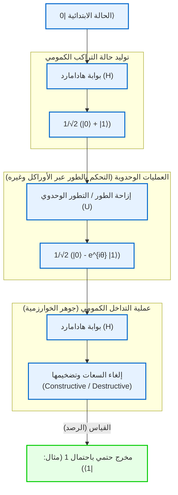

وهكذا، لا تمثل الحواسيب الكمومية مجرد حل مؤقت للالتفاف على حدود الميكانيكا الكلاسيكية (حدود التصغير أو الحدود الثرموديناميكية)، بل هي تحول نموذجي حقيقي يعيد صياغة تعريف المعلومات والحوسبة استناداً إلى مسلمات ميكانيكا الكم. وفي الفصل التالي، سنتعمق أكثر في الأدوات الرياضية الملموسة للتحكم في هذا التداخل الكمومي وتوجيهه، والمتمثلة في "البوابات الكمومية" و"الدوائر الكمومية".

# الفصل الثاني: أساسيات البتات الكلاسيكية والبتات الكمومية (Qubit)

عند بناء الإطار النظري للمعلومات الكمومية، فإن المفهوم الأكثر جوهرية هو تعريف "الوحدة الأساسية للمعلومات". في هذا الفصل، ننطلق من مفهوم البت في نظرية المعلومات الكلاسيكية لنوسع المفهوم إلى "البت الكمومي (Qubit)"، وهو الوحدة الأساسية للمعلومات الكمومية القائمة على بديهيات ميكانيكا الكم. باستخدام اللغة الرياضية الصارمة لفضاء هيلبرت، وترميز برا-كيت، والجبر الخطي، سنكشف النقاب بشكل شامل ودقيق عن البنية الرياضية للحالات الكمومية. دون أي مساومة على الدقة العلمية، دعونا نغوص في أعماق المعلومات الكمومية من منظور تخصصي متعمق.

## 2.1 الوحدة الأساسية للمعلومات: الصياغة الرياضية وحدود البت الكلاسيكي

في تاريخ علوم الحاسوب، يُعد "البت (Bit)" حجر الزاوية لنظرية المعلومات التي أسسها كلود شانون في عام 1948. يُعرَّف البت الكلاسيكي كنظام يأخذ إحدى القيمتين المنفصلتين $\{0, 1\}$ في فضاء حالة مجرد، بغض النظر عن تجسيده الفيزيائي (مثل الجهد المرتفع أو المنخفض في الترانزستور، أو حالة التشغيل والإيقاف للمفتاح، أو اتجاه التمغنط).

دعونا نُعبّر عن ذلك باللغة الأكثر رسمية لفضاءات المتجهات. يمكن تمثيل حالة البت الكلاسيكي باستخدام القاعدة المعيارية (الأساس القياسي) في فضاء متجهي حقيقي ثنائي الأبعاد $\mathbb{R}^2$ . نُعرّف الحالة $0$ والحالة $1$ كمتجهي عمود على النحو التالي:

$$
\mathbf{v}_0 = \begin{pmatrix} 1 \\ 0 \end{pmatrix}, \quad \mathbf{v}_1 = \begin{pmatrix} 0 \\ 1 \end{pmatrix}
$$

في النظام الكلاسيكي الحتمي (Deterministic)، تتحدد حالة البت دائمًا بواحد فقط من المتجهين $\mathbf{v}_0$ أو $\mathbf{v}_1$ . ومع ذلك، عند وجود ضوضاء مثل الضجيج الحراري، أو عدم اليقين في معرفتنا بالنظام، يصبح من الضروري وصف الحالة كبت كلاسيكي احتمالي (Probabilistic). في هذه الحالة، يتم التعبير عن حالة البت كتوزيع احتمالي، ويمكن كتابة متجه الحالة $\mathbf{p}$ كتركيبة محدبة (Convex combination) لمتجهي القاعدة على النحو التالي:

$$
\mathbf{p} = p_0 \mathbf{v}_0 + p_1 \mathbf{v}_1 = \begin{pmatrix} p_0 \\ p_1 \end{pmatrix}
$$

هنا، يمثل $p_0$ و $p_1$ عددين حقيقيين يعبران عن احتمالية كون الحالة $0$ و $1$ على التوالي، وبناءً على بديهيات كولموغوروف للاحتمالات، يجب أن يتحقق الشرطان التاليان:

1. **اللاسالبية (Non-negativity)** : $p_0 \ge 0, \quad p_1 \ge 0$
2. **شرط التوحيد (مجموع الاحتمالات الكلية يساوي 1)** : $p_0 + p_1 = 1$

في عالم البتات الكلاسيكية، يُوصف النظام المركب الناتج عن دمج عدة بتات بواسطة الجداء الموتري (جداء كرونكر) لمتجهات الاحتمال الخاصة بكل منها. على سبيل المثال، يكون التوزيع الاحتمالي المشترك لبتين كلاسيكيين كما يلي:

$$
\mathbf{p}_{AB} = \mathbf{p}_A \otimes \mathbf{p}_B = \begin{pmatrix} p_{A0} \\ p_{A1} \end{pmatrix} \otimes \begin{pmatrix} p_{B0} \\ p_{B1} \end{pmatrix} = \begin{pmatrix} p_{A0}p_{B0} \\ p_{A0}p_{B1} \\ p_{A1}p_{B0} \\ p_{A1}p_{B1} \end{pmatrix}
$$

إن إطار نظرية المعلومات الكلاسيكية يتميز بقوة بالغة ويشكل الأساس للمجتمع الرقمي الحديث، إلا أن بناء الحالات فيه يعتمد حصرًا على جمع الاحتمالات الحقيقية؛ لذا فإنه من المستحيل مبدئيًا تمثيل "إلغاء الاحتمالات" على غرار تداخل الموجات. ومن هنا تنشأ حدود الفيزياء الكلاسيكية وتبرز الحاجة الحتمية للانتقال نحو المعلومات الكمومية.

## 2.2 بديهيات ميكانيكا الكم وترميز برا-كيت (Bra-ket notation)

البديهية الأولى (Postulate) في ميكانيكا الكم تنص على أن: "حالة أي نظام فيزيائي مغلق تُوصَف بشكل كامل بواسطة متجه وحدة (متجه حالة) في فضاء متجهي كامل مزوّد بجداء داخلي مركب، أي فضاء هيلبرت (Hilbert Space) $\mathcal{H}$ ". وفي سياق الحوسبة الكمومية، حيث يمكن إهمال درجات الحرية المكانية المستمرة، يكون فضاء هيلبرت هذا عادةً فضاءً متجهيًا مركبًا محدود الأبعاد $\mathbb{C}^d$ .

يُعرَّف "البت الكمومي (Qubit)"، وهو الوحدة الأساسية للمعلومات الكمومية، بدقة كحالة في فضاء هيلبرت مركب ثنائي الأبعاد $\mathcal{H} \cong \mathbb{C}^2$ . ولوصف الحالات في هذا الفضاء المتجهي، من القياسي والمعتاد استخدام **ترميز برا-كيت (Bra-ket notation)** الذي وضعه الفيزيائي بول ديراك (Paul Dirac).

يُطلق على متجه العمود الذي يمثل الحالة الكمومية اسم **متجه كيت (Ket vector)** ويُرمز له بالرمز $|\psi\rangle$ . وكحالات مناظرة للقيمتين $0$ و $1$ في البت الكلاسيكي، نُقدّم قاعدة عيارية متعامدة تُعرف باسم القاعدة الحسابية (Computational basis). وتُسمّى هذه أيضًا قاعدة $Z$ للبت الكمومي، وتُعرَّف بالحالتين $|0\rangle$ و $|1\rangle$ على التوالي:

$$
|0\rangle = \begin{pmatrix} 1 \\ 0 \end{pmatrix}, \quad |1\rangle = \begin{pmatrix} 0 \\ 1 \end{pmatrix}
$$

من ناحية أخرى، ووفقًا لنظرية ريس للتمثيل (Riesz representation theorem)، فإن كل متجه كيت في فضاء هيلبرت يقابله بشكل فريد عنصر في الفضاء المزدوج (Dual space) يعمل كدالية خطية مستمرة. ويُسمّى هذا العنصر **متجه برا (Bra vector)** ويُرمز له بالرمز $\langle\psi|$ . وفي التمثيل المصفوفي، يتم الحصول على متجه برا المقابل عن طريق أخذ المرافق الهرميتي (المنقول المرافق المركب، ويُرمز له بالرمز $^\dagger$ ) لمتجه كيت:

$$
\langle\psi| = (|\psi\rangle)^\dagger = (|\psi\rangle^*)^T
$$

على سبيل المثال، تتخذ متجهات برا للقاعدة الحسابية صورة متجهات صف كما يلي:

$$
\langle 0| = \begin{pmatrix} 1 & 0 \end{pmatrix}, \quad \langle 1| = \begin{pmatrix} 0 & 1 \end{pmatrix}
$$

تتجلى القوة الحقيقية لترميز برا-كيت في جعل حساب الجداء الداخلي واضحًا وبديهيًا للغاية من الناحية البصرية. يُكتب الجداء الداخلي بين متجه برا $\langle\phi|$ ومتجه كيت $|\psi\rangle$ بالصيغة $\langle\phi|\psi\rangle$ (وهذا مستمد من تلاعب لفظي ابتكره ديراك حيث يجتمع Bra و Ket ليكوّنا كلمة Bracket التي تعني القوس). وبما أن القاعدة الحسابية $\{|0\rangle, |1\rangle\}$ تُشكّل نظامًا عياريًا متعامدًا (Orthonormal system)، فيمكن التعبير عن ذلك باستخدام دلتا كرونكر $\delta_{ij}$ على النحو التالي:

$$
\langle i | j \rangle = \delta_{ij} \quad (i, j \in \{0, 1\})
$$

وبصورة محددة، فإن الجداء الداخلي لمتجه القاعدة مع نفسه يساوي $1$ (أي $\langle 0|0\rangle = 1$ و $\langle 1|1\rangle = 1$ )، بينما الجداء الداخلي بين متجهات قاعدة مختلفة يساوي $0$ (أي $\langle 0|1\rangle = 0$ و $\langle 1|0\rangle = 0$ ).

علاوة على ذلك، يُكتب الجداء الموتري لمتجه كيت ومتجه برا (والذي يماثل الجداء الخارجي) على الصورة $|\psi\rangle\langle\phi|$ ، وهو يمثل مؤثرًا خطيًا (مصفوفة) ينقل من فضاء إلى آخر. على سبيل المثال، يُبنى مؤثر الإسقاط (Projection operator) على فضاء حالة معين كما يلي:

$$
|0\rangle\langle 0| = \begin{pmatrix} 1 \\ 0 \end{pmatrix} \begin{pmatrix} 1 & 0 \end{pmatrix} = \begin{pmatrix} 1 & 0 \\ 0 & 0 \end{pmatrix}
$$

يمكن تفكيك مؤثر الوحدة $I$ (Identity operator) في أي فضاء متجهي مركب ثنائي الأبعاد والتعبير عنه كعلاقة اكتمال للقاعدة (Completeness relation) على النحو التالي، وهي أداة بالغة القوة تُستخدم بتكرار هائل في حسابات ميكانيكا الكم:

$$
I = |0\rangle\langle 0| + |1\rangle\langle 1| = \begin{pmatrix} 1 & 0 \\ 0 & 1 \end{pmatrix}
$$

## 2.3 مبدأ التراكب الكمومي وسعة الاحتمال المركبة

في حين يكون البت الكلاسيكي دائمًا في إحدى الحالتين الواضحتين $0$ أو $1$ ، أو في خليط احتمالي منهما، فإن مقتضيات الخطية (Linearity) في ميكانيكا الكم تتيح للبت الكمومي أن يتخذ حالة مختلفة جوهريًا تُدعى "التراكب (Superposition)"، وهي تركيبة خطية من الحالتين $|0\rangle$ و $|1\rangle$ . ويُعد أي متجه وحدة في فضاء هيلبرت $\mathcal{H}$ حالة فيزيائية صالحة ومقبولة.

وبناءً على ذلك، يمكن تفكيك الحالة النقية (Pure state) الأكثر عمومية $|\psi\rangle$ لبت كمومي فردي باستخدام القاعدة الحسابية على النحو التالي:

$$
|\psi\rangle = \alpha |0\rangle + \beta |1\rangle = \begin{pmatrix} \alpha \\ \beta \end{pmatrix}
$$

هنا، يمثل $\alpha$ و $\beta$ عددين مركبين ( $\alpha, \beta \in \mathbb{C}$ ) يُطلق عليهما **سعة الاحتمال المركبة (Complex probability amplitude)** . وعلى النقيض من الاحتمالات الكلاسيكية التي كانت أعدادًا حقيقية غير سالبة، فإن امتلاك الحالات الكمومية لمعاملات من "الأعداد المركبة" هو السبب الجوهري الذي يمنح الحواسيب الكمومية قدرات حسابية تتفوق بها بمراحل على الحواسيب الكلاسيكية. تمتلك الأعداد المركبة طورًا (Phase)، ويمكنها أن تتجه في أي زاوية داخل المستوى المركب؛ لذا يمكنها أن يعزز بعضها بعضًا (تداخل بنّاء Constructive interference) أو أن يلغي بعضها بعضًا (تداخل هدّام Destructive interference) تمامًا كالأمواج. ويكمن جوهر الخوارزميات الكمومية في التلاعب البارع بتأثيرات التداخل هذه لتضخيم سعة احتمال الإجابة الصحيحة وإلغاء سعة احتمال الإجابات الخاطئة.

تُسمّى العملية التي تُستخرج بها المعلومات الكلاسيكية من النظام الكمومي باسم "القياس (Measurement)". وعند دراسة القياس الإسقاطي (Projective measurement)، ووفقًا لقاعدة بورن (Born rule)، فإن احتمالية الحصول على النتيجة $0$ وهي $P(0)$ ، واحتمالية الحصول على النتيجة $1$ وهي $P(1)$ عند قياس الحالة $|\psi\rangle$ في القاعدة الحسابية $\{|0\rangle, |1\rangle\}$ ، تُعطيان بمربع القيمة المطلقة لسعة الاحتمال المناظرة:

$$
P(0) = |\langle 0|\psi\rangle|^2 = |\alpha|^2 = \alpha \alpha^*
$$

$$
P(1) = |\langle 1|\psi\rangle|^2 = |\beta|^2 = \beta \beta^*
$$

ولكي يتم رصد النظام حتمًا في إحدى الحالات الممكنة، يجب أن يكون مجموع الاحتمالات الكلية مساويًا تمامًا للعدد $1$ . ولذلك، يجب أن يكون معيار (طول) متجه الحالة الكمومية $|\psi\rangle$ مساويًا دائمًا لـ $1$ . وهذا هو **شرط التوحيد (Normalization condition)** :

$$
\langle\psi|\psi\rangle = (\alpha^* \langle 0| + \beta^* \langle 1|)(\alpha |0\rangle + \beta |1\rangle) = |\alpha|^2 + |\beta|^2 = 1
$$

ولاستكشاف المعنى الهندسي لسعات الاحتمال المركبة هذه بشكل أعمق، دعونا نُمثّل $\alpha$ و $\beta$ بالإحداثيات القطبية:

$$
\alpha = r_0 e^{i\phi_0}, \quad \beta = r_1 e^{i\phi_1}
$$

حيث $r_0, r_1 \ge 0$ يمثلان مقدار السعة، و $\phi_0, \phi_1 \in [0, 2\pi)$ يمثلان زاويتي الطور لكل منهما. ومن شرط التوحيد نجد أن $r_0^2 + r_1^2 = 1$ ، ولذا يمكننا استخدام المعامل الحقيقي $\theta \in [0, \pi]$ لوضع $r_0 = \cos(\frac{\theta}{2})$ و $r_1 = \sin(\frac{\theta}{2})$ . وبالتعويض عن ذلك في متجه الحالة الأصلي:

$$
|\psi\rangle = \cos\left(\frac{\theta}{2}\right) e^{i\phi_0} |0\rangle + \sin\left(\frac{\theta}{2}\right) e^{i\phi_1} |1\rangle
$$

دعونا نأخذ عامل الطور المشترك $e^{i\phi_0}$ خارج القوس كعامل مشترك:

$$
|\psi\rangle = e^{i\phi_0} \left( \cos\left(\frac{\theta}{2}\right) |0\rangle + e^{i(\phi_1 - \phi_0)} \sin\left(\frac{\theta}{2}\right) |1\rangle \right)
$$

في ميكانيكا الكم، يُسمّى عامل الطور الكلي $e^{i\phi_0}$ الذي يضرب متجه الحالة بأكمله باسم "الطور الشامل (Global phase)". وإذا قمنا بحساب القيمة المتوقعة $\langle A \rangle$ لأي مقدار قابل للرصد (مؤثر هرميتي) $A$ ، نجد ما يلي:

$$
\langle A \rangle = \left( e^{-i\phi_0} \langle\psi| \right) A \left( e^{i\phi_0} |\psi\rangle \right) = e^{-i\phi_0} e^{i\phi_0} \langle\psi| A |\psi\rangle = \langle\psi| A |\psi\rangle
$$

وهكذا، نظرًا لأن أطوار الطور الشامل تلغي بعضها بعضًا تمامًا، فإنه يستحيل رصدها أو قياسها بأي قياس فيزيائي على الإطلاق. وبمعنى آخر، فإن المتجهين $|\psi\rangle$ و $e^{i\phi_0}|\psi\rangle$ ، وإن كانا متجهين مختلفين في فضاء هيلبرت (إلا أنهما يمثلان نفس الشعاع)، يمثلان فيزيائيًا نفس الحالة تمامًا وبلا أي فارق.

لذلك، يمكننا تجاهل الطور الشامل، والإبقاء فقط على الطور النسبي (Relative phase) $\varphi = \phi_1 - \phi_0$ (حيث $\varphi \in [0, 2\pi)$ ) بين الحالتين $|0\rangle$ و $|1\rangle$ كمعامل وحيد، وبذلك يتم التعبير عن أي حالة نقية لبت كمومي فردي بشكل فريد ودقيق من خلال **الصيغة القياسية المعيارية** التالية:

$$
|\psi\rangle = \cos\left(\frac{\theta}{2}\right) |0\rangle + e^{i\varphi} \sin\left(\frac{\theta}{2}\right) |1\rangle
$$

## 2.4 التمثيل الهندسي عبر كرة بلوخ (Bloch Sphere)

تُظهر عملية تحديد المعاملات (Parameterization) المشتقة في القسم السابق أن فضاء حالات البت الكمومي الفردي متماثل شكليًا (Isomorphic) من الناحية الهندسية مع سطح كرة الوحدة في الفضاء ثلاثي الأبعاد (الكرة ثنائية الأبعاد $S^2$ ). ويُطلق على هذا التمثيل الهندسي البصري اسم **كرة بلوخ (Bloch Sphere)** ، نسبة إلى مبتكرها الفيزيائي السويسري فيليكس بلوخ (Felix Bloch).

تتوافق الزاوية $\theta$ بدقة مع الزاوية القطبية (Polar angle) المقاسة من الاتجاه الموجب للمحور $Z$ ، بينما تتوافق الزاوية $\varphi$ مع زاوية السمت (Azimuthal angle) في المستوى $X$-$Y$ .

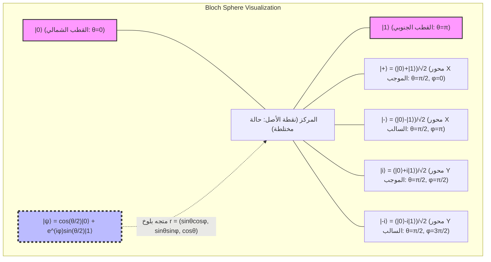

الخاصية الأكثر إثارة للانتباه في كرة بلوخ هي أن "الحالات المتعامدة في فضاء هيلبرت (أي الحالات التي يكون جداؤها الداخلي مساويًا للصفر) تقع في نقاط متقابلة تمامًا (Antipodal points: نقاط متناظرة بزاوية 180 درجة) على الفضاء الحقيقي ثلاثي الأبعاد لكرة بلوخ". على سبيل المثال، الحالة المتعامدة مع الحالة $|0\rangle$ (القطب الشمالي، $\theta=0$ ) هي الحالة $|1\rangle$ (القطب الجنوبي، $\theta=\pi$ ). إن حساب الجداء الداخلي للحالات المتعامدة في فضاء هيلبرت $\langle 0 | 1 \rangle = 0$ يقابله تباعد زاوي مقداره $\pi$ (أي 180 درجة) على كرة بلوخ. ونظرًا لأن الزاوية الهندسية تبلغ ضعف زاوية فضاء هيلبرت، تبرز هنا الحتمية الرياضية لاستخدام نصف الزاوية $\theta/2$ في تحديد المعاملات.

تُشتق إحداثيات كرة بلوخ هذه $\mathbf{r} = (x, y, z)$ بدقة متناهية بوصفها القيم المتوقعة لـ **مصفوفات باولي (Pauli matrices)** ، وهي المقادير القابلة للرصد (Observables) في ميكانيكا الكم. وتُعرَّف مصفوفات باولي، التي تشكل قاعدة للمؤثرات الهرميتية في الأنظمة ثنائية الأبعاد، على النحو التالي:

$$
X = \sigma_x = \begin{pmatrix} 0 & 1 \\ 1 & 0 \end{pmatrix}, \quad
Y = \sigma_y = \begin{pmatrix} 0 & -i \\ i & 0 \end{pmatrix}, \quad
Z = \sigma_z = \begin{pmatrix} 1 & 0 \\ 0 & -1 \end{pmatrix}
$$

يمكن حساب القيم المتوقعة لهذه الرواصد الباولية لأي حالة $|\psi\rangle$ من خلال حسابات برا-كيت:

$$
x = \langle\psi| X |\psi\rangle = \left( \cos\frac{\theta}{2} \langle 0| + e^{-i\varphi}\sin\frac{\theta}{2} \langle 1| \right) \begin{pmatrix} 0 & 1 \\ 1 & 0 \end{pmatrix} \begin{pmatrix} \cos\frac{\theta}{2} \\ e^{i\varphi}\sin\frac{\theta}{2} \end{pmatrix} = \sin\theta \cos\varphi
$$

$$
y = \langle\psi| Y |\psi\rangle = \left( \cos\frac{\theta}{2} \langle 0| + e^{-i\varphi}\sin\frac{\theta}{2} \langle 1| \right) \begin{pmatrix} 0 & -i \\ i & 0 \end{pmatrix} \begin{pmatrix} \cos\frac{\theta}{2} \\ e^{i\varphi}\sin\frac{\theta}{2} \end{pmatrix} = \sin\theta \sin\varphi
$$

$$
z = \langle\psi| Z |\psi\rangle = \left( \cos\frac{\theta}{2} \langle 0| + e^{-i\varphi}\sin\frac{\theta}{2} \langle 1| \right) \begin{pmatrix} 1 & 0 \\ 0 & -1 \end{pmatrix} \begin{pmatrix} \cos\frac{\theta}{2} \\ e^{i\varphi}\sin\frac{\theta}{2} \end{pmatrix} = \cos^2\left(\frac{\theta}{2}\right) - \sin^2\left(\frac{\theta}{2}\right) = \cos\theta
$$

وبذلك، يتم تمثيل متجه بلوخ $\mathbf{r} = (x, y, z)$ على نحو رائع كمتجه وحدة في فضاء ثلاثي الأبعاد $\mathbf{r} = (\sin\theta\cos\varphi, \sin\theta\sin\varphi, \cos\theta)$ . كما يمكن وصف مصفوفة الكثافة (Density matrix) $\rho = |\psi\rangle\langle\psi|$ المقابلة لأي حالة نقية بأناقة بالغة باستخدام متجه باولي $\boldsymbol{\sigma} = (X, Y, Z)$ ومصفوفة الوحدة $I$ :

$$
\rho = \frac{1}{2} \left( I + \mathbf{r} \cdot \boldsymbol{\sigma} \right) = \frac{1}{2} \left( I + xX + yY + zZ \right)
$$

وعند توسيع عناصر المصفوفة بصورة صريحة للتحقق منها، نحصل على النتيجة التالية:

$$
\rho = \frac{1}{2} \begin{pmatrix} 1 + z & x - iy \\ x + iy & 1 - z \end{pmatrix} = \begin{pmatrix} \cos^2(\frac{\theta}{2}) & e^{-i\varphi}\sin(\frac{\theta}{2})\cos(\frac{\theta}{2}) \\ e^{i\varphi}\sin(\frac{\theta}{2})\cos(\frac{\theta}{2}) & \sin^2(\frac{\theta}{2}) \end{pmatrix}
$$

وهذا يتطابق تمامًا مع نتيجة حساب الجداء الخارجي $|\psi\rangle\langle\psi|$ وفقًا لتعريف الجداء الموتري. والجدير بالذكر هنا أنه في الحالات النقية يكون معيار متجه بلوخ $|\mathbf{r}| = 1$ ، ويحقق أثر مربع مصفوفة الكثافة $\text{Tr}(\rho^2) = 1$ ، ولكن في الحالات المختلطة (Mixed state) التي يطرأ عليها فقدان للمعلومات الكمومية (فك الترابط Decoherence) نتيجة التفاعل مع البيئة المحيطة أو التحكم غير المثالي، فإن الحالة تصبح تجمعًا إحصائيًا لحالات نقية، وبالتالي يكون $|\mathbf{r}| < 1$ . ونتيجة لذلك، تُمثَّل الحالات المختلطة كنقاط "داخل" كرة بلوخ وليس على سطحها، وتقع الحالة المختلطة أقصى ما يكون (Maximally mixed state) $\rho = I/2$ ، التي تتلاشى فيها المعلومات كليًا، عند النقطة المركزية لكرة بلوخ $\mathbf{r} = (0,0,0)$ .

## 2.5 القياس وانهيار الحزمة الموجية (Wavefunction Collapse)

يختلف القياس في ميكانيكا الكم اختلافًا جوهريًا عن القراءة السلبية الخاملة للمعلومات المألوفة في الميكانيكا الكلاسيكية. فوفقًا للصياغة البديهية لفون نيومان (von Neumann)، يؤدي قياس كمية فيزيائية (مقدار قابل للرصد) إلى "انهيار (Collapse)" الحالة بصورة غير قابلة للعكس إلى إحدى الحالات الذاتية (Eigenstates) الخاصة بذلك الراصد.

على سبيل المثال، لنعتبر إجراء قياس في قاعدة $Z$ (أي القياس باعتبار مصفوفة باولي $Z$ مقدارًا قابلًا للرصد) لحالة بت كمومي فردي $|\psi\rangle = \alpha|0\rangle + \beta|1\rangle$ . إن القيم المقاسة التي يمكن الحصول عليها هي فقط القيم الذاتية للمصفوفة $Z$ ، وهي إما $+1$ (وتناظر الحالة $|0\rangle$ ) أو $-1$ (وتناظر الحالة $|1\rangle$ ).

ولكي نصف عملية القياس بصياغة رياضية صارمة، نستخدم مجموعة من مؤثرات الإسقاط $\{ P_m \}$ . وتكون مؤثرات الإسقاط في حالة قياس $Z$ كما يلي:

$$
P_0 = |0\rangle\langle 0|, \quad P_1 = |1\rangle\langle 1|
$$

تستوفي هذه المؤثرات علاقة الاكتمال $P_0 + P_1 = I$ وخاصية التعامد $P_i P_j = \delta_{ij} P_i$ . وبموجب قاعدة بورن، تُحسب احتمالية الحصول على نتيجة القياس $m \in \{0, 1\}$ وهي $P(m)$ من العلاقة:

$$
P(m) = \langle\psi| P_m^\dagger P_m |\psi\rangle = \langle\psi| P_m |\psi\rangle
$$

وهذا يتطابق تمامًا مع المقدارين $|\alpha|^2$ و $|\beta|^2$ المشتقين سابقًا. والأمر البالغ الأهمية هو أن الحالة الكمومية الجديدة $|\psi'\rangle$ فور الحصول على نتيجة القياس $m$ تتكون عن طريق تطبيق مؤثر الإسقاط على الحالة الأصلية ثم إعادة توحيدها بمعيارها الجديد:

$$
|\psi'\rangle = \frac{P_m |\psi\rangle}{\sqrt{P(m)}}
$$

فإذا كانت النتيجة هي $0$ :

$$
|\psi'\rangle = \frac{|0\rangle\langle 0| (\alpha|0\rangle + \beta|1\rangle)}{|\alpha|} = \frac{\alpha}{|\alpha|} |0\rangle = e^{i\phi_0} |0\rangle \equiv |0\rangle
$$

حيث تنهار الحالة بالكامل لتصبح $|0\rangle$ (مع تجاهل الطور الشامل). هذا هو التوصيف الرياضي للظاهرة المعروفة بانهيار الحزمة الموجية (Wavefunction collapse). وبمجرد إجراء القياس وانهيار الحالة، تُفقد معلومات الطور النسبي $\varphi$ وسعات الاحتمال ( $\alpha, \beta$ ) التي كانت متضمنة في حالة التراكب الأصلية إلى الأبد. ومن ثم، فإنه يستحيل مبدئيًا قراءة المعلومات الكاملة لحالة كمومية عبر إجراء قياس واحد على نسخة مفردة منها (وهذا الأمر يرتبط ارتباطًا وثيقًا بـ "مبرهنة عدم الاستنساخ الكمومي No-cloning theorem").

## 2.6 التوسع نحو الأنظمة متعددة الأجسام وآفاق الفصل التالي

بعد أن اكتسبنا فهمًا عميقًا لخصائص البت الكمومي الفردي، نُلقي نظرة تمهيدية على الأساس الرياضي لـ "أنظمة البتات الكمومية المتعددة" التي سنتناولها بصورة معمقة بدءًا من الفصل القادم. فبينما تتوسع فضاءات الحالات في التوزيعات الاحتمالية الكلاسيكية عبر الجداء الديكارتي (Cartesian product)، فإن فضاء هيلبرت المركب $\mathcal{H}_{AB}$ لنظام مركب في ميكانيكا الكم يتشكل بواسطة **الجداء الموتري (Tensor product)** لفضاءات هيلبرت الخاصة بكل نظام فرعي $\mathcal{H}_A$ و $\mathcal{H}_B$ :

$$
\mathcal{H}_{AB} = \mathcal{H}_A \otimes \mathcal{H}_B
$$

يتم فك الجداء الموتري لحالتي بت كمومي مستقلتين على النحو التالي، مما يُشكّل فضاءً متجهيًا مركبًا رباعي الأبعاد:

$$
|\Psi\rangle_{AB} = (\alpha_0|0\rangle + \alpha_1|1\rangle) \otimes (\beta_0|0\rangle + \beta_1|1\rangle) = \alpha_0\beta_0|00\rangle + \alpha_0\beta_1|01\rangle + \alpha_1\beta_0|10\rangle + \alpha_1\beta_1|11\rangle
$$

وهنا، فإن وجود حالات لا يمكن كتابتها كحاصل ضرب موتري لحالات منفردة (مثل حالة بيل $|\Phi^+\rangle = (|00\rangle + |11\rangle)/\sqrt{2}$ ) يمثل المنبع الأساسي للتشابك الكمومي (Quantum entanglement). إن هذا الانفجار الأسي للأبعاد نتيجة الجداء الموتري ( $2^N$ بُعدًا لنظام مكون من $N$ بت كمومي) هو الركيزة الأساسية التي تنطلق منها قدرة الحواسيب الكمومية الفائقة على المعالجة المتوازية.

في هذا الفصل، أقمنا الفروق الجوهرية بين البت الكلاسيكي والبت الكمومي على أرضية صلبة من الأسس الرياضية لفضاء هيلبرت. يستطيع البت الكمومي أن يتخذ حالات تراكب مستمرة بفضل سعات الاحتمال المركبة، ومن خلال اشتقاق كرة بلوخ، امتلكنا أداة فعالة تتيح لنا فهم المتجهات المركبة المجردة بصورة حدسية كنماذج هندسية في الفضاء الحقيقي ثلاثي الأبعاد.

وفي الفصل القادم "الفصل الثالث: البوابات الكمومية والتحويلات الوحدوية"، سنشرح بالتفصيل "البوابات المنطقية الكمومية" الملموسة التي تعالج هذه الحالات للبت الكمومي الفردي، وسنكشف عن الخصائص الرياضية لعمليات الدوران بواسطة المصفوفات الوحدوية (Unitary matrices) على كرة بلوخ. إن الباب المفضي إلى العالم العميق والمهيب للمعلومات الكمومية ما زال في أول انفتاحه.

# الفصل 3: مسلمات ميكانيكا الكم والقياس (انهيار الحزمة الموجية)

## 3.1 مقدمة: المنهج البديهي لميكانيكا الكم ومتطلبات الجبر الخطي

من أجل فهم مبادئ عمل الحواسيب الكمومية من جذورها، لا بد من استيعاب الإطار النظري لميكانيكا الكم في الفيزياء بصياغة رياضية دقيقة وصارمة. وبينما تطورت العديد من النظريات في الفيزياء بشكل استقرائي قائم على القواعد التجريبية، فإن ميكانيكا الكم، وتحديداً ميكانيكا الكم الحديثة التي صاغها جون فون نيومان (John von Neumann)، تتبنى منهجاً بديهياً (Axiomatic approach) يستنتج النظام بأكمله من عدد قليل من "المسلمات (Axioms)" الرياضية.

يُبنى هذا النظام من المسلمات على مسرح الجبر الخطي المركب القابل للتوسيع إلى أبعاد لانهائية، والمعروف باسم فضاء هيلبرت (Hilbert space). في علم المعلومات الكمومية والحوسبة الكمومية، نتعامل بشكل أساسي مع فضاءات اتجاهية منتهية الأبعاد (مثل فضاء الجداء الموتري $\mathbb{C}^2$ لأنظمة الكيوبت)، مما يتيح تجنب الصعوبات التحليلية في الأبعاد اللانهائية (مثل نطاقات تعريف المؤثرات غير المحدودة)، ويمكّن من وصف وفهم ميكانيكا الكم كجبر خطي خالص.

في هذا الفصل، سنقوم بصياغة كل مرحلة بدقة متناهية ودون أي تنازل، بدءاً من وصف الحالة الكمومية مروراً بالتطور الزمني وحتى "القياس" (الملاحظة) الذي أثار أعمق النقاشات الفلسفية. سيدرك القارئ كيف تقوم الظواهر الكمومية، التي تبدو للوهلة الأولى مخالفة للبديهة، على بنية رياضية متسقة ومبهرة. وهذه البنية الرياضية بالذات هي "اللغة" المباشرة لوصف خوارزميات الحاسوب الكمومي.

## 3.2 المسلمة الأولى: فضاء الحالات (فضاء هيلبرت ومتجه الحالة)

تحدد المسلمة الأولى في ميكانيكا الكم كيفية التعبير رياضياً عن "حالة" النظام الفيزيائي.

 **المسلمة 1 (تمثيل الحالة)** :
تُوصف حالة النظام الفيزيائي المغلق تماماً بواسطة متجه وحدة ذي معيار يساوي 1 في فضاء هيلبرت (Hilbert space) $\mathcal{H}$، وهو فضاء جداء داخلي مركب يحقق شرط الاكتمال. ويُطلق على هذا المتجه اسم **متجه الحالة** .

وفقاً لتدوين برا-كيت (Bra-ket notation) الذي قدمه بول ديراك (Paul Dirac)، يُعامل متجه الحالة كمتجه عمود ويُكتب بالرمز كيت **$| \psi \rangle$** . أما متجه الصف الذي ينتمي إلى الفضاء المزدوج $\mathcal{H}^*$ فيُكتب بالرمز برا **$\langle \psi |$** ، وهما يرتبطان ببعضهما عبر علاقة الترافق الهرميتي (المنقول المرافق المركب). أي أن:

$$
\langle \psi | = ( | \psi \rangle )^\dagger
$$

يُحسب الجداء الداخلي بين أي حالتين **$| \phi \rangle$** و **$| \psi \rangle$** في فضاء هيلبرت كجداء لبرا وكيت **$\langle \phi | \psi \rangle$** ، وهو يعطي قيمة مركبة. ويحقق هذا الجداء الداخلي الخواص التالية:

1. **الإيجابية المحددة (Positive-definiteness)** : لأي **$| \psi \rangle \neq 0$** ، فإن $\langle \psi | \psi \rangle > 0$
2. **الخطية (Linearity)** : $\langle \phi | ( c_1 | \psi_1 \rangle + c_2 | \psi_2 \rangle ) = c_1 \langle \phi | \psi_1 \rangle + c_2 \langle \phi | \psi_2 \rangle$
3. **التناظر الترافقي (Conjugate symmetry)** : $\langle \phi | \psi \rangle = \langle \psi | \phi \rangle^*$ (حيث يشير $*$ إلى المرافق المركب)

لجعل التفسير الاحتمالي صحيحاً، يجب أن تحقق الحالة الفيزيائية دائماً شرط المعايرة (Normalization condition). أي أن معيار متجه الحالة **$| \psi \rangle$** يساوي 1:

$$
\| | \psi \rangle \| = \sqrt{\langle \psi | \psi \rangle} = 1
$$

علاوة على ذلك، نظراً لتحقق متباينة كوشي-شفارتز (Cauchy-Schwarz inequality): $|\langle \phi | \psi \rangle|^2 \le \langle \phi | \phi \rangle \langle \psi | \psi \rangle$ ، فإن القيمة المطلقة للجداء الداخلي بين الحالات المعايرة تنحصر دائماً بين 0 و 1. وهذا يوفر الأساس الرياضي لتفسيرها لاحقاً كـ "احتمال".

### مبدأ التراكب والأساس المتعامد النظامي الكامل

السمة الأكثر بروزاً في ميكانيكا الكم هي "مبدأ التراكب (Superposition principle)". إذا كانت **$| \phi \rangle$** و **$| \psi \rangle$** حالتين مسموحتين فيزيائياً، فإن أي تركيب خطي مركب لهما $c_1 | \phi \rangle + c_2 | \psi \rangle$ يكون أيضاً (بشرط تطبيق المعايرة) حالة مسموحة فيزيائياً. تُستنتج هذه الخاصية مباشرة من الطبيعة الخطية لفضاء هيلبرت.

يوجد في فضاء هيلبرت $\mathcal{H}$ أساس متعامد نظامي كامل (Orthonormal basis) $\{ | e_i \rangle \}$. متجهات هذا الأساس متعامدة فيما بينها ومعايرة:

$$
\langle e_i | e_j \rangle = \delta_{ij}
$$

(حيث $\delta_{ij}$ هي دلتا كرونكر). كما يمكن فك المؤثر المحايد (مؤثر الوحدة) $I$ عبر علاقة الاكتمال (Completeness relation) أو متطابقة التفكيك على النحو التالي:

$$
I = \sum_i | e_i \rangle \langle e_i |
$$

يمكن فك أي حالة كمومية **$| \psi \rangle$** بطريقة وحيدة كتركيب خطي لعناصر الأساس بتطبيق مؤثر الوحدة هذا:

$$
| \psi \rangle = I | \psi \rangle = \left( \sum_i | e_i \rangle \langle e_i | \right) | \psi \rangle = \sum_i \langle e_i | \psi \rangle | e_i \rangle = \sum_i c_i | e_i \rangle
$$

هنا، تُسمى معاملات الفك $c_i = \langle e_i | \psi \rangle$ بسعات الاحتمال المركبة (Complex probability amplitudes)، وتلعب دوراً حاسماً في قاعدة بورن المذكورة لاحقاً. ومن شرط المعايرة $\langle \psi | \psi \rangle = 1$ ، نستنتج أن $\sum_i |c_i|^2 = 1$ .

## 3.3 المسلمة الثانية: الكميات الفيزيائية والمؤثرات الهرميتية

في الميكانيكا الكلاسيكية، تُوصف الكميات الفيزيائية القابلة للرصد (الملاحظات أو الرواصد - Observables) كالموضع والزخم (كمية الحركة) والطاقة كدوال ذات قيم حقيقية. لكن في ميكانيكا الكم، يحدث تحول جذري في النموذج المعرفي.

 **المسلمة 2 (الكميات الفيزيائية)** :
تُوصف الكميات الفيزيائية القابلة للرصد (الرواصد) بمؤثر خطي مترافق ذاتياً (مؤثر هرميتي) $A$ على فضاء هيلبرت $\mathcal{H}$.

المؤثر الهرميتي هو مؤثر يتساوى مرافقه الهرميتي مع نفسه؛ أي أنه يحقق $A = A^\dagger$ . وعند تمثيله كمصفوفة في فضاء متناهي الأبعاد، فهذا يعني أن عناصره ذات تناظر ترافقي مركب ( $A_{ij} = A_{ji}^*$ ).

يكمن السبب وراء وجوب تعريف الكميات الفيزيائية كمؤثرات هرميتية في "قيمها الذاتية (Eigenvalues)". فوفقاً للنظرية الطيفية (Spectral theorem) في الجبر الخطي، يمتلك المؤثر الهرميتي الخواص الجوهرية التالية:

1. **جميع القيم الذاتية $a_i$ أعداد حقيقية.** (نظراً لأن الكميات الفيزيائية المقاسة يجب أن تكون دائماً أعداداً حقيقية، فإن هذا يتطابق تماماً مع المطلب الفيزيائي).
2. **المتجهات الذاتية التابعة لقيم ذاتية مختلفة تكون متعامدة فيما بينها.** 
3. **تشكل المتجهات الذاتية للمؤثر $\{ | a_i \rangle \}$ أساساً متعامداً نظامياً كاملاً لفضاء هيلبرت.** 

وبناءً على ذلك، يمكن لأي راصد $A$ أن يُحلل طيفياً (Spectral decomposition) باستخدام قيمه الذاتية $a_i$ ومتجهاته الذاتية **$| a_i \rangle$** كتركيب خطي لمؤثرات الإسقاط $P_i = | a_i \rangle \langle a_i |$ :

$$
A = \sum_i a_i | a_i \rangle \langle a_i |
$$

تتيح هذه الصياغة فهم عملية "قياس كمية فيزيائية" كعملية هندسية تتمثل في الإسقاط على أساس محدد (المتجهات الذاتية) في فضاء هيلبرت. على سبيل المثال، يُوصف قياس $\sigma_z$ لكيوبت كمي بالكامل كعملية إسقاط على الأساس المتعامد المكوّن من الحالة **$| 0 \rangle$** المقابلة للقيمة الذاتية $+1$ ، والحالة **$| 1 \rangle$** المقابلة للقيمة الذاتية $-1$ .

## 3.4 المسلمة الثالثة: التطور الزمني الوحدوي ومعادلة شرودنغر

عندما يكون النظام الكمي معزولاً ولا يتفاعل مع أنظمة أخرى، فإن حالته تتغير مع الزمن بشكل حتمي وعكوس.

 **المسلمة 3 (التطور الزمني)** :
يخضع التطور الزمني لحالة نظام كمي معزول لمعادلة شرودنغر (Schrödinger equation). أو بصيغة مكافئة، تتطور الحالة **$| \psi(t_0) \rangle$** عند اللحظة الزمنية $t_0$ إلى الحالة **$| \psi(t) \rangle$** عند اللحظة $t$ بتطبيق مؤثر وحدوي $U(t, t_0)$ .

تُكتب معادلة شرودنغر المعتمدة على الزمن، وهي المعادلة الأساسية التي تصف التطور الزمني، على النحو التالي:

$$
i\hbar \frac{d}{dt} | \psi(t) \rangle = H | \psi(t) \rangle
$$

حيث $i$ هي الوحدة التخيلية، و $\hbar$ هو ثابت بلانك المختزل، و $H$ هو مؤثر الهاميلتوني (Hamiltonian operator)، وهو الراصد المقابل للطاقة الكلية للنظام.

عند اعتبار نظام يكون فيه الهاميلتوني $H$ غير معتمد على الزمن (ثابتاً زمنياً)، يمكن مكاملة هذه المعادلة التفاضلية شكلياً، وتُعطى الإجابة على النحو التالي:

$$
| \psi(t) \rangle = \exp\left( -\frac{i}{\hbar} H (t - t_0) \right) | \psi(t_0) \rangle
$$

هذا المؤثر المعبر عنه بالدالة الأسية $U(t, t_0) = \exp\left( -i H (t - t_0) / \hbar \right)$ هو مؤثر التطور الزمني. وبما أن الهاميلتوني $H$ مؤثر هرميتي ( $H = H^\dagger$ )، فإن $U$ يكون مؤثراً وحدوياً (Unitary operator) وفقاً لنظرية ستون (Stone's theorem). والمؤثر الوحدوي هو مؤثر يتساوى مرافقه الهرميتي مع معكوسه ( $U^\dagger U = U U^\dagger = I$ ).

تكمن الأهمية الفيزيائية البالغة للتحويل الوحدوي في أنه **"يحفظ معيار (طول) متجه الحالة والجداء الداخلي"** . أي أنه مهما انقضى من الوقت، فإن $\langle \psi(t) | \psi(t) \rangle = \langle \psi(t_0) | U^\dagger U | \psi(t_0) \rangle = 1$ يظل مضموناً دائماً، ولا ينكسر القانون الفيزيائي القاضي بأن مجموع الاحتمالات يساوي 1. وما "البوابات الكمية" في الحاسوب الكمي إلا تجسيد لعمليات تصميم وتوجيه هذا التطور الزمني الوحدوي بشكل مقصود ومضبوط. فعلى سبيل المثال، تُمثَّل بوابة هادامارد وبوابات CNOT جميعها بمصفوفات وحدوية.

## 3.5 المسلمة الرابعة: القياس وقاعدة بورن (Born rule)

يختلف مفهوم "القياس (Measurement)" في ميكانيكا الكم اختلافاً جوهرياً عنه في الفيزياء الكلاسيكية. ففي الأنظمة الكلاسيكية، يُعتبر فعل القياس بمثابة معرفة سلبية بالقيمة دون التأثير على حالة النظام أو إحداث اضطراب فيها. لكن في ميكانيكا الكم، يتدخل القياس بشكل إيجابي ونشط في الحالة، مسبباً تغييراً غير عكوس.

 **المسلمة 4 (القياس وقاعدة بورن)** :
عند إجراء قياس للراصد $A$ ذي التفكيك الطيفي $A = \sum_i a_i P_i$ على نظام في الحالة **$| \psi \rangle$** ، فإن القيمة المقاسة الناتجة تكون دائماً إحدى القيم الذاتية $a_i$ للراصد $A$. ويُعطى احتمال الحصول على قيمة ذاتية محددة $a_k$ ، والمشار إليه بـ $p(a_k)$ ، وفقاً لقاعدة بورن كما يلي:

$$
p(a_k) = \langle \psi | P_k | \psi \rangle = \| P_k | \psi \rangle \|^2
$$

إذا كانت القيمة الذاتية $a_k$ غير منفطرة (أي يقابلها متجه ذاتي وحيد **$| a_k \rangle$** )، فإن مؤثر الإسقاط يصبح $P_k = | a_k \rangle \langle a_k |$ ، ويُحسب الاحتمال كمربع القيمة المطلقة للجداء الداخلي للحالة مع المتجه الذاتي:

$$
p(a_k) = \langle \psi | a_k \rangle \langle a_k | \psi \rangle = | \langle a_k | \psi \rangle |^2
$$

وهذا لا يعدو كونه مربع القيمة المطلقة $|c_k|^2$ لمعامل الفك $c_k = \langle a_k | \psi \rangle$ عند تمثيل متجه الحالة **$| \psi \rangle$** بدلالة الأساس $\{ | a_i \rangle \}$ . ومع أنه لا يمكن رصد سعة الاحتمال المركبة $c_k$ ذاتها بشكل مباشر، إلا أن مربع قيمتها المطلقة يتجلى كاحتمال قياس في العالم الحقيقي. وتُعد رؤية ماكس بورن (Max Born) التي اقترحت هذه القاعدة إنجازاً تاريخياً حوّل الفيزياء من الحتمية إلى الاحتمالية. ويُحسب التوقع الرياضي (القيمة المتوقعة) $\langle A \rangle$ للراصد $A$ كمجموع حاصل ضرب جميع القيم الذاتية في احتمالات ظهورها، وتُعبَّر عنها في النهاية بصورة بالغة الجمال كجداء داخلي بواسطة متجه الحالة:

$$
\langle A \rangle = \sum_i a_i p(a_i) = \sum_i a_i \langle \psi | P_i | \psi \rangle = \langle \psi | \left( \sum_i a_i P_i \right) | \psi \rangle = \langle \psi | A | \psi \rangle
$$

## 3.6 انهيار الحزمة الموجية بالقياس (اختزال الحالة) وفقدان الترابط الكمومي (Decoherence)

تتضمن مسلمة القياس خطوة جوهرية أثارت أوسع النقاشات، وتتعلق بما تؤول إليه حالة النظام "بعد" إجراء القياس. تُعرف هذه الظاهرة باسم "انهيار الحزمة الموجية (Wavefunction collapse)" أو "اختزال الحالة (State reduction)". وتُصاغ هذه العملية، المعروفة باسم فرضية الإسقاط لفون نيومان (von Neumann's projection postulate)، على النحو التالي:

 **فرضية الإسقاط** :
إن حالة النظام **$| \psi' \rangle$** بعد القياس مباشرة الذي أسفر عن القيمة الذاتية $a_k$ تتغير (تنهار) لحظياً إلى تطبيق مؤثر الإسقاط المقابل $P_k$ على متجه الحالة الأصلي بعد إعادة معايرته:

$$
| \psi' \rangle = \frac{P_k | \psi \rangle}{\sqrt{p(a_k)}}
$$

إذا كان جهاز القياس مثالياً، وانهارت حالة النظام إلى قيمة ذاتية غير منفطرة $a_k$ ، فإن الحالة بعد القياس مباشرة تكون بدقة هي المتجه الذاتي **$| a_k \rangle$** نفسه. أي أنه إذا كُرِّر القياس نفسه تماماً بعد ذلك مباشرة، فسيتم الحصول على $a_k$ مجدداً باحتمال 1 (100%). ويُطلق على هذا الإجراء اسم "القياس من النوع الأول".

يتسم هذا "الانهيار للحزمة الموجية" بخصائص (غير متصلة، احتمالية، غير عكوسة) تتعارض بشكل صارخ مع التطور الزمني الوحدوي الذي تصفه معادلة شرودنغر (والذي يتصف بأنه متصل، حتمي، عكوس). وبذلك، تنطوي ميكانيكا الكم على ديناميكا ثنائية: يتطور النظام تطوراً وحدوياً عندما يكون معزولاً، لكنه يعاني من انهيار غير وحدوي في اللحظة التي يلامس فيها جهاز قياس عيانياً (ماكروسكوبياً).

### من الحالة النقية إلى الحالة المختلطة: إدخال مؤثر الكثافة

لفهم مفارقة انهيار الحزمة الموجية على نحو أعمق، فإن مفهوم "مؤثر الكثافة (Density operator)" يعد أمراً لا غنى عنه. فمتجه الحالة **$| \psi \rangle$** الذي تعاملنا معه حتى الآن يمثل "حالة نقية (Pure state)" تحوز على أقصى قدر ممكن من المعلومات حول النظام. ويُعرَّف مؤثر الكثافة للحالة النقية بأنه $\rho = | \psi \rangle \langle \psi |$ .

من ناحية أخرى، عندما لا نكون على علم بالحالة التي انهار إليها النظام في عملية القياس (أو عند فقدان المعلومات)، يجب وصف النظام كـ "حالة مختلطة (Mixed state)" احتمالية كلاسيكية. على سبيل المثال، يُعطى مؤثر الكثافة الذي يمثل تجمعاً إحصائياً لأنظمة انهارت إلى الحالة **$| a_k \rangle$** باحتمال $p(a_k)$ كما يلي:

$$
\rho' = \sum_k p(a_k) | a_k \rangle \langle a_k |
$$

في هذا الوقت، تختفي العناصر غير القطرية (حدود التداخل) في $\rho = | \psi \rangle \langle \psi |$ ، والتي كانت موجودة في الحالة النقية، تماماً بفعل عملية القياس. ويشكل هذا الفقدان للقدرة على التداخل جوهر ما يُعرف بـ "فقدان الترابط الكمومي (Decoherence)".

### فقدان الترابط الكمومي وانبثاق الكلاسيكية العيانية

جهاز القياس هو في حد ذاته جزء من نظام كمي يتكون من عدد هائل من الجسيمات، وعندما يتفاعل النظام الكمي مع البيئة الهائلة (مثل أجهزة القياس أو الحمام الحراري)، ينشأ "التشابك الكمي (Entanglement)". وعند استبعاد درجات حرية البيئة بحساب الأثر الجزئي (Partial trace) واستخراج مصفوفة الكثافة المختزلة (Reduced density matrix) للنظام المستهدف وحده، ينتقل متجه حالة النظام سريعاً من الحالة النقية إلى الحالة المختلطة، ويفقد التداخل الطوري بين مختلف مركبات النظام:

$$
\rho_{S} = \mathrm{Tr}_{E} [ | \Psi_{SE} \rangle \langle \Psi_{SE} | ]
$$

وبذلك يتلاشى التراكب على المقاييس العيانية (الماكروسكوبية)، ويبدو النظام متصرفاً كخليط احتمالي كلاسيكي. وبالتالي، فإن انهيار الحزمة الموجية ليس بأي حال من الأحوال انهياراً للقوانين الفيزيائية، بل يمكن اعتباره تبديداً للمعلومات نتيجة التفاعل غير العكوس مع البيئة. ويُعد التغلب على فقدان الترابط الكمومي هذا التحدي الأكبر للبشرية نحو تحقيق حواسيب كمية متسامحة مع الأخطاء (مقاومة للخطأ).

### ديناميكا التطور الزمني والقياس للحالة الكمية

يوضح المخطط التالي بصرياً المسار الذي ينطلق من الحالة الابتدائية للنظام الكمي، ويمر بالتطور الزمني الوحدوي، وصولاً إلى التفرع الاحتمالي (الانهيار) للحالة جراء القياس. تأمل التباين بين التطور الحتمي لشرودنغر والانهيار الاحتمالي لبورن:

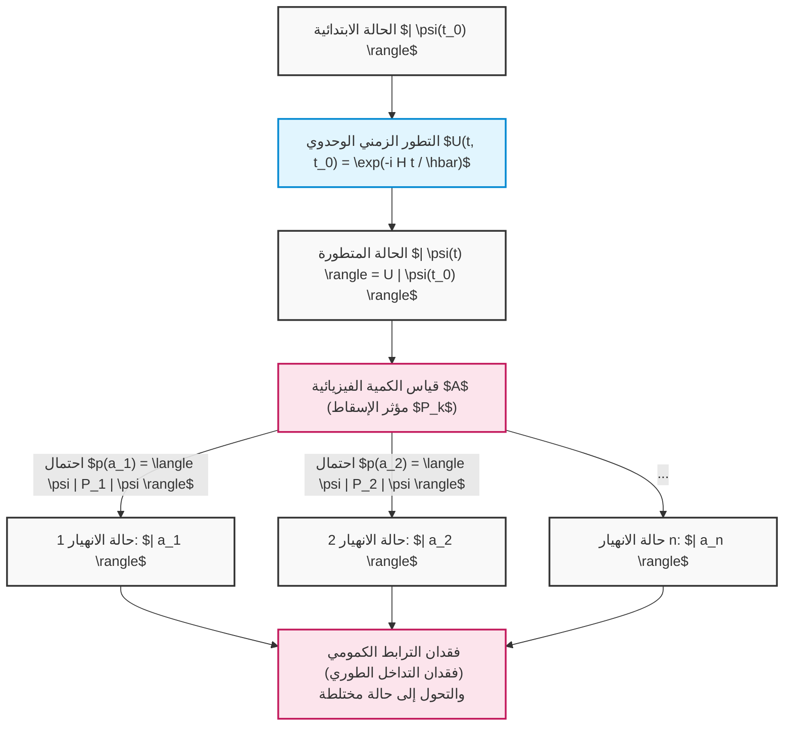

وهكذا، فإن المفاهيم المجردة للجبر الخطي — الفضاءات الاتجاهية، والجداء الداخلي، والمؤثرات الهرميتية، ومسائل القيم الذاتية، والمصفوفات الوحدوية — ليست مجرد ألعاب رياضية، بل هي لغة لا نظير لها لوصف السلوك الدقيق للكون على أصغر مستوياته والتنبؤ به بدقة متناهية. إن خوارزميات الحواسيب الكمية ما هي إلا توظيف بارع لهاتين القاعدتين الهائلتين: "التطور الحتمي لشرودنغر" و"الانهيار الاحتمالي لبورن"، اللتين تقوداننا إلى آفاق حسابية يستحيل على الحواسيب الكلاسيكية بلوغها.

# الفصل 4: بوابات الكيوبت المفردة والتحويلات الوحدوية

يكمن أساس الحوسبة الكمومية في المعالجة الدقيقة للحالات الكمومية. فبينما تقوم البوابات المنطقية في الحواسيب الكلاسيكية (مثل AND و OR و NOT) بمعالجة قيم البتات بشكل غير عكوس، فإن "البوابات الكمومية" في الحواسيب الكمومية هي تطور زمني عكوس يخضع لمتطلبات معادلة شرودنغر، وتُوصَف رياضياً بدقة على أنها "تحويلات وحدوية (مصفوفات وحدوية)" في فضاء هيلبرت العقدي. في هذا الفصل، سنتعمق بشكل شامل ودون أي تنازلات في البنية الرياضية، والخصائص الجبرية، والمعنى الهندسي البديهي على كرة بلوخ (Bloch sphere) للبوابات الكمومية الأساسية التي تؤثر على كيوبت مفرد (نظام ثنائي المستويات).

## 4.1 مسلمات ميكانيكا الكم وحتمية المصفوفات الوحدوية

يُحكم التطور الزمني للنظام الكمومي بواسطة معادلة شرودنغر التالية، باستخدام الهاميلتوني **$H$** ( **$H^\dagger = H$** )، وهو مؤثر هرميتي (Hermitian operator) يميز النظام.

$$
i\hbar \frac{d}{dt} |\psi(t)\rangle = H |\psi(t)\rangle
$$

بافتراض نظام لا يعتمد فيه الهاميلتوني **$H$** على الزمن، فإن الحالة الكمومية **$|\psi(t)\rangle$** عند أي زمن **$t$** تُكامَل شكلياً من الحالة الابتدائية **$|\psi(0)\rangle$** على النحو التالي:

$$
|\psi(t)\rangle = e^{-\frac{i}{\hbar}Ht} |\psi(0)\rangle
$$

نُعرِّف مؤثر التطور الزمني الذي يظهر هنا كـ **$U(t) = e^{-\frac{i}{\hbar}Ht}$** . نظراً لأن **$H$** الموجود في أس الدالة الأسية هو مؤثر هرميتي، فإن حساب المؤثر المرافق (المرافق الهرميتي) **$U(t)^\dagger$** لهذا المؤثر **$U(t)$** يؤدي إلى استنتاج الخاصية بالغة الأهمية التالية:

$$
U(t)^\dagger U(t) = \left( e^{-\frac{i}{\hbar}Ht} \right)^\dagger e^{-\frac{i}{\hbar}Ht} = e^{\frac{i}{\hbar}H^\dagger t} e^{-\frac{i}{\hbar}Ht} = e^{\frac{i}{\hbar}Ht} e^{-\frac{i}{\hbar}Ht} = I
$$

بالمثل، يتحقق أيضاً **$U(t) U(t)^\dagger = I$** . تُسمى المصفوفة التي تتطابق مصفوفتها المرافقة مع مصفوفتها المعكوسة ( **$U^\dagger = U^{-1}$** ) بـ "المصفوفة الوحدوية (Unitary Matrix)". بوابات الكيوبت المفردة ما هي إلا مصفوفات وحدوية بأبعاد **$2 \times 2$** يتم تحقيقها بواسطة هاميلتوني مُصمم عمداً من خلال التحكم الفيزيائي (على سبيل المثال، تسليط نبضات ميكروويف ذات تردد ومدة زمنية محددين).

السبب الذي يجعل المصفوفات الوحدوية ضرورية تماماً في ميكانيكا الكم هو أنها التحويل الخطي الوحيد الذي يضمن رياضياً "حفظ الاحتمال (حفظ المعيار)". دعونا نحسب الجداء الداخلي للحالات بعد تطبيق التحويل الوحدوي **$U$** على أي حالات كمومية **$|\psi\rangle$** و **$|\phi\rangle$** .

$$
\langle \phi' | \psi' \rangle = ( \langle \phi | U^\dagger ) ( U |\psi\rangle ) = \langle \phi | U^\dagger U | \psi \rangle = \langle \phi | I | \psi \rangle = \langle \phi | \psi \rangle
$$

حقيقة أن الجداء الداخلي يُحفظ تعني أن معيار (مربع طول) متجه الحالة نفسه، أي **$\langle \psi | \psi \rangle$** ، يُحفظ أيضاً. وفقاً لقاعدة بورن (Born rule) في ميكانيكا الكم، يجب أن يكون مجموع مربعات القيم المطلقة لسعات متجه الحالة مساوياً للاحتمال الكلي "1"، ولذلك، حتى لا ينهار هذا التفسير الاحتمالي بسبب عمليات البوابات الكمومية، فإن كون العملية وحدوية هو شرط أساسي لا غنى عنه.

علاوة على ذلك، وفقاً لنظرية الطيف (Spectral theorem)، يمكن التعبير عن أي مصفوفة وحدوية **$U$** باستخدام مصفوفة هرميتية **$K$** ذات قيم ذاتية حقيقية **$\lambda_k$** على النحو التالي: **$U = e^{iK}$** . تأخذ القيم الذاتية للمصفوفات الوحدوية دائماً شكل أعداد مركبة بقيمة مطلقة تساوي 1 ( **$e^{i\theta}$** )، وتشكل المتجهات الذاتية نظاماً كاملاً متعامداً مع بعضه البعض.

$$
U = \sum_{j=1}^{d} e^{i \theta_j} |\phi_j\rangle \langle \phi_j|
$$

يشير هذا إلى أن تأثير البوابة الكمومية يمكن تحليله بالكامل كعملية "تُعطي فقط دوراناً طورياً خالصاً **$e^{i\theta_j}$** بالنسبة لقاعدة متعامدة معينة **$|\phi_j\rangle$** ".

## 4.2 مصفوفات باولي والبوابات الأساسية (بوابات X و Y و Z)

عند التحدث بلغة المعلومات الكمومية، فإن فهم مجموعة مصفوفات باولي (Pauli matrices) هو أمر حتمي وبالغ الأهمية. هذه المجموعة من المصفوفات، التي أُدخلت في الفيزياء لوصف الزخم الزاوي للجسيمات ذات اللف المغزلي 1/2، تشكل في الحواسيب الكمومية مجموعة العمليات الأساسية والمتعامدة للكيوبت المفرد.

### 4.2.1 بوابة باولي X (بوابة قلب البت)

بوابة باولي X هي الامتداد الكمومي لبوابة NOT في الدوائر المنطقية الكلاسيكية. باستخدام ترميز برا-كيت لديراك (Dirac's bra-ket notation)، تُعرَّف بتعبير الجداء الخارجي (المُسقِط) على النحو التالي:

$$
X = \sigma_x = |0\rangle\langle 1| + |1\rangle\langle 0| = \begin{pmatrix} 0 & 1 \\ 1 & 0 \end{pmatrix}
$$

عند التحقق بدقة من تأثيرها على القاعدة الحسابية ( **$|0\rangle, |1\rangle$** ) من خلال حساب المصفوفات:

$$
X |0\rangle = \begin{pmatrix} 0 & 1 \\ 1 & 0 \end{pmatrix} \begin{pmatrix} 1 \\ 0 \end{pmatrix} = \begin{pmatrix} 0 \\ 1 \end{pmatrix} = |1\rangle
$$

$$
X |1\rangle = \begin{pmatrix} 0 & 1 \\ 1 & 0 \end{pmatrix} \begin{pmatrix} 0 \\ 1 \end{pmatrix} = \begin{pmatrix} 1 \\ 0 \end{pmatrix} = |0\rangle
$$

وهكذا، فإنها تقلب السعات تماماً. هندسياً، تتوافق مع عملية دوران بزاوية **$\pi$** (180 درجة) حول المحور X كـمحور دوران في كرة بلوخ. يتم تعيين القطب الشمالي ( **$|0\rangle$** ) إلى القطب الجنوبي ( **$|1\rangle$** )، والقطب الجنوبي إلى القطب الشمالي.

### 4.2.2 بوابة باولي Y (بوابة قلب البت والطور)

تتسبب بوابة باولي Y في قلب البت وقلب الطور في وقت واحد، وتُضيف أيضاً عامل طور للوحدة التخيلية **$i$** . تعبير الجداء الخارجي وتعبير المصفوفة هما كما يلي:

$$
Y = \sigma_y = -i|0\rangle\langle 1| + i|1\rangle\langle 0| = \begin{pmatrix} 0 & -i \\ i & 0 \end{pmatrix}
$$

التأثير على القاعدة الحسابية هو:

$$
Y |0\rangle = i|1\rangle, \quad Y |1\rangle = -i|0\rangle
$$

على كرة بلوخ، تمثل دوراناً بزاوية **$\pi$** حول المحور Y. إن ضرب الوحدة التخيلية **$i$** (أي **$e^{i\pi/2}$** ) لا يعني مجرد قلب بل يعني أيضاً إزاحة في الاتجاه المتعامد في فضاء الطور للحالة.

### 4.2.3 بوابة باولي Z (بوابة قلب الطور)

بوابة باولي Z هي "عملية طورية" خالصة خاصة بالكم، ولا وجود لها في المنطق الكلاسيكي. فهي تعطي إزاحة طورية مقدارها **$-1$** (أي **$e^{i\pi}$** ) لمكون **$|1\rangle$** فقط، دون تغيير حجم السعة (احتمالية القياس) على الإطلاق.

$$
Z = \sigma_z = |0\rangle\langle 0| - |1\rangle\langle 1| = \begin{pmatrix} 1 & 0 \\ 0 & -1 \end{pmatrix}
$$

التأثير ببساطة هو:

$$
Z |0\rangle = |0\rangle, \quad Z |1\rangle = -|1\rangle
$$

هذا يتوافق مع دوران بزاوية **$\pi$** حول المحور Z. نظراً لأن القاعدة الحسابية **$|0\rangle, |1\rangle$** هي متجهات ذاتية لمصفوفة Z (بقيم ذاتية +1 و -1 على التوالي)، فإن تطبيق بوابة Z لا ينقل الحالة. ومع ذلك، عند تطبيقها على حالة تراكب (مثال: **$\alpha|0\rangle + \beta|1\rangle$** )، ينقلب الطور النسبي بشكل جذري إلى **$\alpha|0\rangle - \beta|1\rangle$** ، مما يغير بشكل حاسم نتائج التداخل في المراحل اللاحقة.

### 4.2.4 البنية الجبرية العميقة لمجموعة باولي

تشكل مجموعة مصفوفات باولي **$\{I, X, Y, Z\}$** بنية جبرية جميلة للغاية كمؤثرات خطية على فضاء هيلبرت.

1. **التوافق بين المرافقة الذاتية (الهرميتية) والوحدوية** : **$X = X^\dagger$** ، **$Y = Y^\dagger$** ، **$Z = Z^\dagger$** ، وفي نفس الوقت تحقق **$X^\dagger X = I$** (أي **$X = X^{-1}$** ). إنها خاصية نادرة أن تكون كمية فيزيائية (مؤثر يمكن رصده) وفي الوقت نفسه مُوَلِّداً وحدوياً للتطور الزمني (بوابة). تطبيقها مرتين متتاليتين يعيد التحويل المتطابق (الالتواء: **$X^2 = Y^2 = Z^2 = I$** ).
2. **علاقة اللاتبادلية التامة** : تتغير إشارة مصفوفات باولي المختلفة إذا تم تبديل ترتيب ضربها.
   

$$
\{X, Y\} = XY + YX = 0, \quad \{Y, Z\} = 0, \quad \{Z, X\} = 0
$$


3. **علاقات التبديل وجبر لي** : باستخدام المُبدِّل (Commutator) **$[A, B] = AB - BA$** ، تظهر هذه بشكل واضح بنيتها كمولدات لجبر لي (Lie algebra) للمجموعة **$SU(2)$** (باستخدام الموتر غير المتماثل تماماً **$\epsilon_{ijk}$** ).
   

$$
[\sigma_j, \sigma_k] = 2i \sum_{l \in \{x,y,z\}} \epsilon_{jkl} \sigma_l
$$


   تحديداً، **$XY = iZ$** ، **$YZ = iX$** ، **$ZX = iY$** . توفر هذه البنية الجبرية الأساس الرياضي لتعريف أي بوابة دوران سيتم مناقشتها لاحقاً.

## 4.3 بوابة هادامارد (بوابة H): خلق التراكب الكمومي

في الخوارزميات الكمومية (مثل خوارزمية دويتش-جوزا وخوارزمية شور)، تُطبَّق بوابة هادامارد (Hadamard gate) بشكل شبه دائم فور التهيئة. إنها تلعب دوراً مركزياً في خلق "حالة التراكب القصوى" حيث تظهر جميع الحالات باحتمالية متساوية انطلاقاً من حالة حتمية.

$$
H = \frac{1}{\sqrt{2}} \begin{pmatrix} 1 & 1 \\ 1 & -1 \end{pmatrix} = \frac{1}{\sqrt{2}} \left( |0\rangle\langle 0| + |0\rangle\langle 1| + |1\rangle\langle 0| - |1\rangle\langle 1| \right)
$$

عند تطبيق مصفوفة هادامارد على القاعدة الحسابية:

$$
H |0\rangle = \frac{1}{\sqrt{2}} \begin{pmatrix} 1 & 1 \\ 1 & -1 \end{pmatrix} \begin{pmatrix} 1 \\ 0 \end{pmatrix} = \frac{1}{\sqrt{2}} \begin{pmatrix} 1 \\ 1 \end{pmatrix} = \frac{|0\rangle + |1\rangle}{\sqrt{2}} \equiv |+\rangle
$$

$$
H |1\rangle = \frac{1}{\sqrt{2}} \begin{pmatrix} 1 & 1 \\ 1 & -1 \end{pmatrix} \begin{pmatrix} 0 \\ 1 \end{pmatrix} = \frac{1}{\sqrt{2}} \begin{pmatrix} 1 \\ -1 \end{pmatrix} = \frac{|0\rangle - |1\rangle}{\sqrt{2}} \equiv |-\rangle
$$

الحالتان المولدتان **$|+\rangle$** و **$|-\rangle$** تُسميان قاعدة X (أو القاعدة القطرية)، وهما الحالتان الذاتيتان لمصفوفة باولي X. مصفوفة هادامارد نفسها هي مصفوفة متماثلة حقيقية ومتعامدة (مصفوفة وحدوية في الفضاء الحقيقي)، ولذلك فهي تحقق **$H = H^\dagger = H^{-1}$** و **$H^2 = I$** .
وبالتالي، **$H |+\rangle = |0\rangle$** ، ولها أيضاً تأثير إعادة (تداخل) حالة التراكب لتصبح قاعدة حسابية حتمية مرة أخرى.
جبرياً، تعتبر بوابة H تحويلاً وحدوياً يحول بين قاعدة X وقاعدة Z. يتم وصف ذلك بشكل جميل للغاية كتحويل تشابه للمصفوفات على النحو التالي:

$$
H X H^\dagger = H X H = Z
$$

$$
H Z H^\dagger = H Z H = X
$$

بفضل هذه الخاصية، من الممكن تركيب "قلب البت بواسطة بوابة X" عن طريق إحاطة "قلب الطور بواسطة بوابة Z" ببوابتي H. هندسياً، تعادل بوابة H دوراناً بزاوية **$\pi$** حول متجه الوحدة **$\hat{n} = \frac{1}{\sqrt{2}}(\hat{x} + \hat{z})$** كـمحور على كرة بلوخ.

## 4.4 مجموعة بوابات إزاحة الطور: بوابة S وبوابة T

تُسمى مجموعة عمليات الدوران الاختيارية حول المحور Z في كرة بلوخ، والتي تعد تعميماً لبوابة باولي Z، ببوابات إزاحة الطور **$P(\phi)$** (أو **$R_\phi$** ).

$$
P(\phi) = \begin{pmatrix} 1 & 0 \\ 0 & e^{i\phi} \end{pmatrix} = |0\rangle\langle 0| + e^{i\phi} |1\rangle\langle 1|
$$

تتحكم هذه المجموعة من البوابات بالطور النسبي لمكون **$|1\rangle$** فقط، في حالة التراكب **$\alpha|0\rangle + \beta|1\rangle$** ليصبح شكلها **$\alpha|0\rangle + \beta e^{i\phi}|1\rangle$** . البوابتان التاليتان مهمتان بشكل خاص.

### 4.4.1 بوابة S (بوابة الطور، $\sqrt{Z}$ )

عندما تكون الزاوية **$\phi = \pi/2$** ، فإنها تُسمى بوابة S.

$$
S = \begin{pmatrix} 1 & 0 \\ 0 & e^{i\pi/2} \end{pmatrix} = \begin{pmatrix} 1 & 0 \\ 0 & i \end{pmatrix}
$$

كما يتضح من خصائص المصفوفة، يؤدي تطبيقها مرتين إلى بوابة Z (أي **$S^2 = Z$** ).
عند تطبيق بوابة S على الحالة **$|+\rangle$** :

$$
S |+\rangle = \begin{pmatrix} 1 & 0 \\ 0 & i \end{pmatrix} \frac{1}{\sqrt{2}} \begin{pmatrix} 1 \\ 1 \end{pmatrix} = \frac{1}{\sqrt{2}} \begin{pmatrix} 1 \\ i \end{pmatrix} = \frac{|0\rangle + i|1\rangle}{\sqrt{2}} \equiv |+i\rangle
$$

وبذلك تنتقل الحالة نحو الاتجاه الموجب للمحور Y الواقع على خط استواء كرة بلوخ (وهي الحالة الذاتية لقاعدة Y). تُسمى المجموعة التي تتكون من مجموعة باولي وبوابتي H و S بـ مجموعة كليفورد (Clifford group)، ووفقاً لنظرية غوتسمان-كنيل (Gottesman-Knill theorem)، فقد ثبت أن الدوائر الكمومية المكونة فقط من مجموعة كليفورد يمكن محاكاتها بكفاءة بواسطة الحواسيب الكلاسيكية.

### 4.4.2 بوابة T (بوابة $\pi/8$ ، $\sqrt{S}$ ، $\sqrt[4]{Z}$ )

عندما تكون الزاوية **$\phi = \pi/4$** ، فإنها تُسمى بوابة T.

$$
T = \begin{pmatrix} 1 & 0 \\ 0 & e^{i\pi/4} \end{pmatrix} = \begin{pmatrix} 1 & 0 \\ 0 & \frac{1+i}{\sqrt{2}} \end{pmatrix}
$$

إذا أخرجنا الطور الشامل **$e^{i\pi/8}$** كعامل مشترك، ستصبح العناصر القطرية **$e^{-i\pi/8}$** و **$e^{i\pi/8}$** ، ولذلك عُرفت تاريخياً أيضاً باسم بوابة **$\pi/8$** .
لا تنتمي بوابة T إلى مجموعة كليفورد، وهي تكسر كفاءة المحاكاة الكلاسيكية. ومع ذلك، هناك نظرية بالغة الأهمية في نظرية الحوسبة الكمومية تنص على أنه بإضافة بوابة T واحدة فقط إلى مجموعة كليفورد، يكتمل "مجموعة البوابات الكمومية الشاملة (Universal Quantum Gate Set)" التي يمكنها تقريب أي تحويل وحدوي على كيوبت مفرد بأي دقة مطلوبة. في الحوسبة الكمومية المتسامحة مع الأخطاء (Fault-tolerant quantum computation)، ونظراً لصعوبة تنفيذ بوابة T مباشرةً على رموز تصحيح الأخطاء، يتم تنفيذها باستخدام تقنية باهظة التكلفة جداً تُسمى "تقطير الحالة السحرية (Magic State Distillation)".

## 4.5 التمثيل الأسي لبوابات الدوران الاختيارية وشموليتها

العملية الأكثر عمومية على كيوبت مفرد هي تحويل وحدوي يدور بزاوية **$\theta$** حول أي متجه وحدة في كرة بلوخ **$\hat{n} = (n_x, n_y, n_z)$** كـمحور دوران (حيث أن **$n_x^2 + n_y^2 + n_z^2 = 1$** ). باستخدام التركيب الخطي لمصفوفات باولي، يمكن صياغة مؤثر الدوران هذا **$R_{\hat{n}}(\theta)$** بشكل جميل كدالة أسية للمصفوفة على النحو التالي:

$$
R_{\hat{n}}(\theta) = \exp\left(-i \frac{\theta}{2} (\hat{n} \cdot \vec{\sigma})\right) = \exp\left(-i \frac{\theta}{2} (n_x X + n_y Y + n_z Z)\right)
$$

هنا، باستغلال خاصية اللاتبادلية القوية لمصفوفات باولي حيث أن **$(\hat{n} \cdot \vec{\sigma})^2 = (n_x X + n_y Y + n_z Z)^2 = (n_x^2 + n_y^2 + n_z^2)I = I$** ، ونشر الدالة الأسية بمتسلسلة تايلور (حيث **$e^{iAx} = \cos(x)I + i\sin(x)A$** (في حالة **$A^2=I$** ))، تُبسط المتسلسلة اللانهائية بشكل جذري ويُحصل على النسخة الممتدة للمصفوفات من صيغة أويلر التالية:

$$
R_{\hat{n}}(\theta) = \cos\left(\frac{\theta}{2}\right) I - i \sin\left(\frac{\theta}{2}\right) (\hat{n} \cdot \vec{\sigma})
$$

من هذه الصياغة العامة، يمكن استنتاج مجموعة بوابات الدوران الأساسية حول المحاور الإحداثية المتعامدة.

### بوابة الدوران حول المحور X، $R_x(\theta)$ 


$$
R_x(\theta) = e^{-i \frac{\theta}{2} X} = \begin{pmatrix} \cos\frac{\theta}{2} & -i \sin\frac{\theta}{2} \\ -i \sin\frac{\theta}{2} & \cos\frac{\theta}{2} \end{pmatrix}
$$

### بوابة الدوران حول المحور Y، $R_y(\theta)$ 


$$
R_y(\theta) = e^{-i \frac{\theta}{2} Y} = \begin{pmatrix} \cos\frac{\theta}{2} & -\sin\frac{\theta}{2} \\ \sin\frac{\theta}{2} & \cos\frac{\theta}{2} \end{pmatrix}
$$

### بوابة الدوران حول المحور Z، $R_z(\theta)$ 


$$
R_z(\theta) = e^{-i \frac{\theta}{2} Z} = \begin{pmatrix} e^{-i\theta/2} & 0 \\ 0 & e^{i\theta/2} \end{pmatrix}
$$

باستخدام مصفوفات الدوران هذه، يمكن تحليل أي مصفوفة وحدوية لكيوبت مفرد **$U \in SU(2)$** بشكل كامل كـ "تحليل Z-Y-Z" باستخدام زوايا أويلر الثلاث ( **$\alpha, \beta, \gamma$** ) على النحو التالي:

$$
U = e^{i\delta} R_z(\alpha) R_y(\beta) R_z(\gamma)
$$

تضمن هذه النظرية فيزيائياً أنه إذا أمكن تنفيذ الدوران حول المحورين Z و Y بدقة عالية على مستوى العتاد، فإنه سيكون من الممكن تنفيذ أي خوارزمية معقدة على كيوبت مفرد.

## 4.6 [توضيح رسومي] دوائر بوابات الكيوبت المفردة وانتقال الحالة

الدوائر الكمومية هي مجرد ترتيب لهذه البوابات وفقاً للتسلسل الزمني. تتطور الحالة زمنياً من اليسار إلى اليمين.

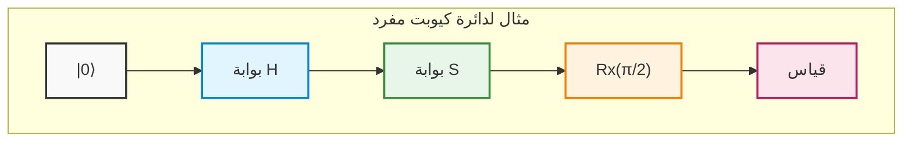

## 4.7 مثال حسابي دقيق: التتبع الكامل للتداخل الكمومي باستخدام تسلسل المصفوفات

للارتقاء بالمفاهيم المجردة إلى مستوى الحدس الفيزيائي، سنتتبع بشكل دقيق يدوياً ودون أي اختصار كيفية تداخل الحالة الكمومية وانتقالها من خلال ضرب مصفوفات وحدوية متعددة في بعضها البعض.

لنعتبر الحالة الابتدائية هي الحالة الأساسية **$|\psi_0\rangle = |0\rangle = \begin{pmatrix} 1 \\ 0 \end{pmatrix}$** .
العملية التي سيتم تنفيذها هي تسلسل مشابه للرسم التخطيطي للدائرة أعلاه: "بوابة **$H$** " → "بوابة **$S$** " → "بوابة **$H$** ".
تُكتب مخططات الدوائر الكمومية من اليسار إلى اليمين، ولكن نظراً لأن ضرب مؤثرات الجبر الخطي على متجه الحالة يُطبّق "من اليسار تدريجياً"، فإن معادلة المؤثر الوحدوي الكلي **$U_{total}$** ستُرتّب من اليمين إلى اليسار بعكس الترتيب الزمني.

$$
U_{total} = H S H
$$

نُعوض بتعابير المصفوفات لكل بوابة لاشتقاق المصفوفة المُركبة.

$$
H = \frac{1}{\sqrt{2}} \begin{pmatrix} 1 & 1 \\ 1 & -1 \end{pmatrix}, \quad S = \begin{pmatrix} 1 & 0 \\ 0 & i \end{pmatrix}
$$

أولاً، نحسب حاصل ضرب **$H$** المطبقة مباشرة بعد الحالة الابتدائية، مع **$S$** التي تليها للحصول على **$SH$** .

$$
S H = \begin{pmatrix} 1 & 0 \\ 0 & i \end{pmatrix} \frac{1}{\sqrt{2}} \begin{pmatrix} 1 & 1 \\ 1 & -1 \end{pmatrix} = \frac{1}{\sqrt{2}} \begin{pmatrix} 1\cdot 1 + 0\cdot 1 & 1\cdot 1 + 0\cdot(-1) \\ 0\cdot 1 + i\cdot 1 & 0\cdot 1 + i\cdot(-1) \end{pmatrix} = \frac{1}{\sqrt{2}} \begin{pmatrix} 1 & 1 \\ i & -i \end{pmatrix}
$$

بعد ذلك، نضرب **$H$** الأخيرة من الجانب الأيسر لهذه النتيجة.

$$
U_{total} = H (S H) = \frac{1}{\sqrt{2}} \begin{pmatrix} 1 & 1 \\ 1 & -1 \end{pmatrix} \frac{1}{\sqrt{2}} \begin{pmatrix} 1 & 1 \\ i & -i \end{pmatrix}
$$

نُخرج المضاعف السلمي **$\frac{1}{\sqrt{2}} \times \frac{1}{\sqrt{2}} = \frac{1}{2}$** إلى الأمام، وننفذ عملية ضرب المصفوفات بعناية.

$$
U_{total} = \frac{1}{2} \begin{pmatrix} 1\cdot 1 + 1\cdot i & 1\cdot 1 + 1\cdot(-i) \\ 1\cdot 1 + (-1)\cdot i & 1\cdot 1 + (-1)\cdot(-i) \end{pmatrix} = \frac{1}{2} \begin{pmatrix} 1 + i & 1 - i \\ 1 - i & 1 + i \end{pmatrix}
$$

هذا هو التمثيل الموحد للمصفوفة الوحدوية عند اعتبار الدائرة بأكملها كصندوق أسود واحد.
نُطبق هذا الـ **$U_{total}$** على الحالة الابتدائية **$|0\rangle$** لحساب الحالة النهائية **$|\psi_{final}\rangle$** .

$$
|\psi_{final}\rangle = U_{total} |0\rangle = \frac{1}{2} \begin{pmatrix} 1 + i & 1 - i \\ 1 - i & 1 + i \end{pmatrix} \begin{pmatrix} 1 \\ 0 \end{pmatrix} = \frac{1}{2} \begin{pmatrix} 1 + i \\ 1 - i \end{pmatrix}
$$

عند نشر ذلك باستخدام ترميز ديراك نحصل على ما يلي:

$$
|\psi_{final}\rangle = \frac{1+i}{2} |0\rangle + \frac{1-i}{2} |1\rangle
$$

هنا، للتحقق مما إذا كانت الوحدوية (كون مجموع الاحتمالات يساوي 1) لم يتم كسرها، نقوم بحساب احتمالية رصد كل قاعدة. نستخدم مربع القيمة المطلقة للعدد المركب ** $|z|^2 = z z^*$ ** .

$$
P(0) = |\langle 0 | \psi_{final} \rangle|^2 = \left| \frac{1+i}{2} \right|^2 = \frac{1^2 + 1^2}{4} = \frac{2}{4} = \frac{1}{2}
$$

$$
P(1) = |\langle 1 | \psi_{final} \rangle|^2 = \left| \frac{1-i}{2} \right|^2 = \frac{1^2 + (-1)^2}{4} = \frac{2}{4} = \frac{1}{2}
$$

مجموع الاحتمالات هو **$P(0) + P(1) = 1$** ، مما يثبت أنها حالة صالحة فيزيائياً. عند القياس، سنحصل على 0 باحتمال 50٪ و 1 باحتمال 50٪، ولكن هذا ليس مجرد رقم عشوائي كلاسيكي. لاستخراج "الطور" المخفي خلف الحالة، دعونا نُعيد صياغة متجه الحالة إلى شكل الإحداثيات القطبية لكرة بلوخ.

نُخرج قسراً السعة **$1/\sqrt{2}$** والطور الشامل **$e^{i\pi/4}$** (وهو **$\frac{1+i}{\sqrt{2}}$** ) كعامل مشترك كلي.

$$
|\psi_{final}\rangle = \frac{1}{\sqrt{2}} \left( \frac{1+i}{\sqrt{2}} |0\rangle + \frac{1-i}{\sqrt{2}} |1\rangle \right) = e^{i\pi/4} \left( \frac{1}{\sqrt{2}} |0\rangle + \frac{1}{\sqrt{2}} e^{-i\pi/2} |1\rangle \right)
$$

نظراً لأن الطور الشامل **$e^{i\pi/4}$** يُلغى في حساب القيمة المتوقعة لأي كمية يمكن رصدها (مؤثر هرميتي) ليصبح **$e^{-i\pi/4} e^{i\pi/4} = 1$** ، فإنه لا يحمل معنى فيزيائياً. وباستخراج جزء الطور النسبي فقط نحصل على:

$$
|\psi_{final}'\rangle = \frac{1}{\sqrt{2}} |0\rangle - \frac{i}{\sqrt{2}} |1\rangle
$$

بمقارنة هذا مع التمثيل القطبي **$\cos(\theta/2)|0\rangle + e^{i\phi}\sin(\theta/2)|1\rangle$** ، يتحدد تماماً أن متجه بلوخ يشير نحو الزاوية السمتية (زاوية سمت الرأس) **$\theta = \pi/2$** (على خط الاستواء)، وزاوية السمت **$\phi = -\pi/2$** (في الاتجاه السالب للمحور Y). تُكتب هذه الحالة عادةً على النحو **$|-i\rangle$** .

دعونا نقدم حقيقة أعمق. باستخدام صيغة بوابة الدوران بالدالة الأسية التي اشتققناها سابقاً، سنكتب مصفوفة الدوران بزاوية **$\pi/2$** حول المحور X، أي **$R_x(\pi/2)$** .

$$
R_x(\pi/2) = \frac{1}{\sqrt{2}} \begin{pmatrix} 1 & -i \\ -i & 1 \end{pmatrix}
$$

من ناحية أخرى، لنلقِ نظرة مرة أخرى على المصفوفة الكلية **$U_{total}$** التي حسبناها.

$$
U_{total} = \frac{1}{2} \begin{pmatrix} 1 + i & 1 - i \\ 1 - i & 1 + i \end{pmatrix} = \frac{1+i}{2} \begin{pmatrix} 1 & \frac{1-i}{1+i} \\ \frac{1-i}{1+i} & 1 \end{pmatrix} = \frac{1+i}{2} \begin{pmatrix} 1 & -i \\ -i & 1 \end{pmatrix} = e^{i\pi/4} R_x(\pi/2)
$$

المثير للدهشة أنه قد ثبت أن العمليات المتتالية لمجموعة منفصلة من البوابات حول محاور مختلفة تماماً " **$H \rightarrow S \rightarrow H$** "، وباستثناء الطور الشامل، مكافئة رياضياً حرفياً لعملية دوران مفردة "بزاوية **$\pi/2$** حول المحور X".
وهكذا، تتبع الحالة الكمومية مسارات تداخل معقدة ترفض حدسنا الكلاسيكي، ولكن من خلال المرور عبر الإطار الرياضي المتين للجبر الخطي، يصبح من الممكن التحكم في سلوكها وتوقعه بدقة متناهية دون أدنى هامش للخطأ.

في الفصل التالي، واعتماداً على هذه المعرفة القوية بعمليات الكيوبت المفرد، سندخل إلى العالم العميق لبوابات الكيوبتات المتعددة، والتي تولد الجداء الموتري (Tensor product) الذي يُفجِّر أبعاد فضاء هيلبرت أُسياً، و"التشابك الكمومي (Quantum entanglement)" الذي أطلق عليه أينشتاين اسم "التأثير عن بُعد المخيف".

# الفصل الخامس: أنظمة الكيوبتات المتعددة والتشابك الكمومي (Entanglement)

في الفصول السابقة، استعرضنا بالتفصيل خصائص التراكب التي يمتلكها الكيوبت المفرد، والبوابات الكمومية المفردة الموصوفة كعمليات دوران على كرة بلوخ. ومع ذلك، فإن القوة الحقيقية التي تجعل الحوسبة الكمومية تتفوق على الحوسبة الكلاسيكية، والمصدر لما يُعرف بـ "التفوق الكمومي" (Quantum Supremacy) أو "الميزة الكمومية" (Quantum Advantage)، تكمن في الأنظمة متعددة الأجسام التي تتفاعل فيها كيوبتات متعددة. في هذا الفصل، سنُقدّم المفهوم الجوهري والأكثر غموضًا في المعلومات الكمومية، وهو **التشابك الكمومي** (Entanglement)، وسنقدم شرحًا شاملًا ومستفيضًا يبدأ من الوصف الرياضي الدقيق للأنظمة متعددة الكيوبتات، مرورًا بالدارات التي تولّد التشابك الكمومي، وصولًا إلى مفارقة EPR التي هزت أركان الفيزياء.

---

## 5.1 الوصف الرياضي للحالات متعددة الأجسام باستخدام الجداء الموتري ($\otimes$)

وفقًا لمسلمات ميكانيكا الكم، عندما يُوصف فضاء الحالة لكل نظام فيزيائي مستقل بفضاءات هيلبرت **$\mathcal{H}_A$** و **$\mathcal{H}_B$** على التوالي، فإن فضاء الحالة للنظام المركب الناتج عن دمجهما يُعطى كـ **الجداء الموتري** (Tensor Product) لتلك الفضاءات، أي **$\mathcal{H} = \mathcal{H}_A \otimes \mathcal{H}_B$** .

فضاء الحالة للكيوبت المفرد هو فضاء اتجاهي مركب ثنائي الأبعاد **$\mathbb{C}^2$** . وبالتالي، فإن فضاء الحالة لنظام يتكون من $n$ من الكيوبتات هو فضاء هيلبرت ذو $2^n$ بُعدًا **$(\mathbb{C}^2)^{\otimes n}$** . إن الزيادة الأسية للأبعاد بالنسبة لعدد الكيوبتات $n$ هي الأساس الرياضي للتوازي الكمومي.

لنتأمل نظامًا يتكون من كيوبتين (الكيوبت A والكيوبت B). تُعرَّف قاعدة الحساب (القاعدة الحسابية) على أنها الجداء الموتري للحالات الأساسية لكل كيوبت مفرد:

$$
|0\rangle_A \otimes |0\rangle_B \equiv |00\rangle, \quad
|0\rangle_A \otimes |1\rangle_B \equiv |01\rangle, \quad
|1\rangle_A \otimes |0\rangle_B \equiv |10\rangle, \quad
|1\rangle_A \otimes |1\rangle_B \equiv |11\rangle
$$

هنا، دعونا نحسب بدقة التمثيل المصفوفي للجداء الموتري (جداء كرونكر Kronecker Product). إذا مثلنا قاعدة الكيوبت المفرد كمتجهات عمودية:

$$
|0\rangle = \begin{pmatrix} 1 \\ 0 \end{pmatrix}, \quad |1\rangle = \begin{pmatrix} 0 \\ 1 \end{pmatrix}
$$

فباستخدام هذه المتجهات، إذا حسبنا على سبيل المثال الحالة **$|10\rangle$** فسنحصل على ما يلي:

$$
|10\rangle = |1\rangle \otimes |0\rangle = \begin{pmatrix} 0 \\ 1 \end{pmatrix} \otimes \begin{pmatrix} 1 \\ 0 \end{pmatrix} = \begin{pmatrix} 0 \cdot \begin{pmatrix} 1 \\ 0 \end{pmatrix} \\ 1 \cdot \begin{pmatrix} 1 \\ 0 \end{pmatrix} \end{pmatrix} = \begin{pmatrix} 0 \\ 0 \\ 1 \\ 0 \end{pmatrix}
$$

في هذا الفضاء الاتجاهي رباعي الأبعاد، تُوصف الحالة النقية الأكثر عمومية **$|\Psi\rangle$** لنظام الكيوبتين كتركيبة خطية (تراكب) لمتجهات القاعدة الأربعة هذه:

$$
|\Psi\rangle = c_{00} |00\rangle + c_{01} |01\rangle + c_{10} |10\rangle + c_{11} |11\rangle
$$

حيث $c_{ij} \in \mathbb{C}$ هي سعات الاحتمال، وبموجب قاعدة بورن يجب أن تكون الحالة مُعايرة (مُنظّمة)، أي تستوفي شرط المعايرة $\sum_{i,j \in \{0,1\}} |c_{ij}|^2 = 1$ .

تُبنى المؤثرات (البوابات) في النظام المركب أيضًا باستخدام الجداء الموتري. إن عملية تطبيق المؤثر **$U_A$** على الكيوبت A، والمؤثر **$U_B$** على الكيوبت B، تُمثَّل كمؤثر **$U_A \otimes U_B$** على النظام المركب بأكمله، وتؤثر على أي حالة جداء على النحو التالي:

$$
(U_A \otimes U_B)(|\psi\rangle_A \otimes |\phi\rangle_B) = (U_A |\psi\rangle_A) \otimes (U_B |\phi\rangle_B)
$$

وبفضل خاصية الخطية، يمتد هذا التأثير أيضًا إلى أي حالة تراكب عامة.

---

## 5.2 التعبير الرياضي لحالات بيل (حالات التشابك الكمومي الأقصى)

تُصنف الحالات في الأنظمة الكمومية متعددة الأجسام بشكل عام إلى فئتين رئيسيتين: "الحالات القابلة للفصل (Separable States)" و"الحالات المتشابكة (Entangled States)".
عندما يمكن التعبير عن الحالة **$|\Psi\rangle$** كمجرد جداء موتري لحالات الأنظمة الفرعية، أي:

$$
|\Psi\rangle = |\psi\rangle_A \otimes |\phi\rangle_B
$$

يُقال إن هذه الحالة قابلة للفصل. وعلى العكس من ذلك، فإن الحالة التي **لا يمكن** التعبير عنها كجداء موتري لحالات أي أنظمة فرعية تُعرَّف بأنها **حالة تشابك كمومي (Entangled State)** .

في نظام الكيوبتين، تُسمى الحالات التي تمتلك أقصى درجات التشابك الكمومي بـ **حالات بيل** (Bell States)، أو أزواج EPR. تتكون حالات بيل من الحالات النقية الأربع المتعامدة التالية، والتي تُشكّل قاعدة متعامدة ومُنظّمة بالكامل (قاعدة بيل Bell Basis) لفضاء هيلبرت رباعي الأبعاد:

$$
|\Phi^+\rangle = \frac{1}{\sqrt{2}} \Big( |00\rangle + |11\rangle \Big)
$$

$$
|\Phi^-\rangle = \frac{1}{\sqrt{2}} \Big( |00\rangle - |11\rangle \Big)
$$

$$
|\Psi^+\rangle = \frac{1}{\sqrt{2}} \Big( |01\rangle + |10\rangle \Big)
$$

$$
|\Psi^-\rangle = \frac{1}{\sqrt{2}} \Big( |01\rangle - |10\rangle \Big)
$$

هنا، دعونا نثبت بدقة أن الحالة **$|\Phi^+\rangle$** غير قابلة للفصل باستخدام البرهان بالتناقض (البرهان بالخلف).
لنفترض جدلًا أن **$|\Phi^+\rangle$** حالة قابلة للفصل، ويمكن كتابتها كجداء موتري لحالتي كيوبت مفردتين مجهولتين:

$$
|\Phi^+\rangle = (a|0\rangle + b|1\rangle)_A \otimes (c|0\rangle + d|1\rangle)_B
$$

وبفك هذا الجداء ونشره نحصل على:

$$
|\Phi^+\rangle = ac|00\rangle + ad|01\rangle + bc|10\rangle + bd|11\rangle
$$

وبمقارنة المعاملات مع صيغة التعريف الأصلية، نحصل على نظام المعادلات الآنية التالي:

1. $ac = \frac{1}{\sqrt{2}}$
2. $bd = \frac{1}{\sqrt{2}}$
3. $ad = 0$
4. $bc = 0$

من المعادلة 3 ($ad = 0$)، نجد أن $a = 0$ أو $d = 0$ .
إذا كان $a = 0$ ، فمن المعادلة 1 يكون $ac = 0$ ، وهو ما يناقض $ac = \frac{1}{\sqrt{2}}$ .
وإذا كان $d = 0$ ، فمن المعادلة 2 يكون $bd = 0$ ، وهو ما يناقض $bd = \frac{1}{\sqrt{2}}$ .
وبالتالي، لا وجود لمثل هذه الأعداد المركبة $a, b, c, d$ ، مما يثبت بشكل قاطع وصارم أن الحالة **$|\Phi^+\rangle$** لا يمكن بأي حال من الأحوال تحليلها إلى جداء حالتين مستقلتين.

### مصفوفة الكثافة المختزلة وإنتروبيا التشابك

تتضح حقيقة أن حالات بيل تمثل "تشابكًا كموميًا أقصى" بشكل أكثر جلاءً عند حساب **مصفوفة الكثافة المختزلة** (Reduced Density Matrix) التي تصف معلومات النظام الفرعي. عندما يكون النظام بأكمله في الحالة النقية **$\rho = |\Phi^+\rangle \langle\Phi^+|$** ، نقوم بحساب الأثر الجزئي (Partial Trace) بالنسبة للكيوبت B لإيجاد الحالة المحلية للكيوبت A:

$$
\rho_A = \text{Tr}_B(|\Phi^+\rangle \langle\Phi^+|) = \text{Tr}_B \left[ \frac{1}{2} (|00\rangle\langle00| + |00\rangle\langle11| + |11\rangle\langle00| + |11\rangle\langle11|) \right]
$$

باستخدام خاصية الأثر الجزئي $\text{Tr}_B(|i,j\rangle\langle k,l|) = |i\rangle\langle k| \cdot \langle l|j\rangle = |i\rangle\langle k| \delta_{jl}$ ، نحصل على:

$$
\rho_A = \frac{1}{2} \Big( |0\rangle\langle0| \cdot \langle0|0\rangle + |0\rangle\langle1| \cdot \langle1|0\rangle + |1\rangle\langle0| \cdot \langle0|1\rangle + |1\rangle\langle1| \cdot \langle1|1\rangle \Big)
$$

$$
\rho_A = \frac{1}{2} (|0\rangle\langle0| + |1\rangle\langle1|) = \frac{1}{2} I
$$

هذا يعني أنه عند رصد الكيوبت A وحده، تكون حالته حالة مختلطة كليًا (Completely Mixed State)، وتصل إنتروبيا فون نيومان $S(\rho_A) = -\text{Tr}(\rho_A \log_2 \rho_A)$ إلى قيمتها العظمى $1$ . بعبارة أخرى، "على الرغم من أن النظام بأكمله يمتلك معلومات كاملة ومحددة (حالة نقية)، إلا أن المعلومات في كل نظام فرعي تكون غير مؤكدة تمامًا (إنتروبيا عظمى)". هذا الترابط الحدي المطلق، الذي يستحيل حدوثه في الميكانيكا الكلاسيكية، هو جوهر التشابك الكمومي الأقصى.

---

## 5.3 التمثيل المصفوفي لبوابة CNOT (بوابة NOT الخاضعة للتحكم)

لتوليد مثل هذا التشابك اصطناعيًا ومعالجته داخل الحاسوب الكمومي، لا تكفي العمليات المجراة على كيوبتات مفردة، بل لا غنى عن البوابات متعددة الكيوبتات التي تمتد عبر كيوبتات متعددة. والمؤثر الأكثر أساسية وقوة في هذا الصدد هو **بوابة CNOT** (Controlled-NOT Gate).

تؤثر بوابة CNOT على كيوبتين، وتتعامل مع أحدهما كـ "كيوبت تحكم (Control Qubit)" ومع الآخر كـ "كيوبت مستهدف (Target Qubit)". تقوم هذه البوابة، التي يمكن اعتبارها نظيرًا كموميًا لبوابة XOR الكلاسيكية، بالعملية التالية: "تَعكِس الكيوبت المستهدف (بتطبيق بوابة باولي $X$ عليه) فقط عندما يكون كيوبت التحكم في الحالة $|1\rangle$ ، بينما لا تُحدث أي تغيير عندما يكون كيوبت التحكم في الحالة $|0\rangle$ ".

يكون تأثيرها على قاعدة الحساب كما يلي (باعتبار الكيوبت الأول كيوبت التحكم، والثاني الكيوبت المستهدف):

$$
\text{CNOT} |00\rangle = |00\rangle \\
\text{CNOT} |01\rangle = |01\rangle \\
\text{CNOT} |10\rangle = |11\rangle \\
\text{CNOT} |11\rangle = |10\rangle
$$

عند تمثيل هذا كمصفوفة وحدوية رباعية الأبعاد، نحصل على ما يلي:

$$
\text{CNOT} = \begin{pmatrix}
1 & 0 & 0 & 0 \\
0 & 1 & 0 & 0 \\
0 & 0 & 0 & 1 \\
0 & 0 & 1 & 0
\end{pmatrix}
$$

وكتعبير رياضي أكثر إحكامًا وأناقة، هناك صياغة باستخدام مجموع الجداءات الموترية لمؤثرات الإسقاط ومصفوفات باولي:

$$
\text{CNOT} = |0\rangle\langle0| \otimes I + |1\rangle\langle1| \otimes X
$$

تُعبّر هذه الصيغة عن المعنى الفيزيائي لبوابة CNOT بوضوح وبديهية بالغة؛ فالحد الأول يعني أنه "في فضاء الحالة الذي يُسقَط فيه الكيوبت الأول على الحالة $|0\rangle$ ، يُطبَّق مؤثر الوحدة $I$ على الكيوبت الثاني"، بينما يعني الحد الثاني أنه "في فضاء الحالة الذي يُسقَط فيه الكيوبت الأول على الحالة $|1\rangle$ ، يُطبَّق مؤثر قلب البت $X$ على الكيوبت الثاني".

ومن الخصائص البارزة لبوابة CNOT أنها تحقق خاصيتي الهرميتية ( $\text{CNOT}^\dagger = \text{CNOT}$ ) والوحدوية ( $\text{CNOT}^\dagger \text{CNOT} = I$ ) في آنٍ واحد، وبالتالي فإنها تمثل المعكوس الذاتي لنفسها ( $\text{CNOT}^2 = I$ ).

---

## 5.4 دارة توليد التشابك الكمومي باستخدام CNOT

إذن، انطلاقًا من حالة قابلة للفصل، كيف نولّد حالة بيل التي تمثل حالة التشابك الأقصى؟ سنقوم هنا ببناء الدارة الكمومية القياسية لتوليد الحالة **$|\Phi^+\rangle$** انطلاقًا من الحالة الابتدائية للحاسوب الكمومي **$|00\rangle$** ، ونتتبع تطور الحالة خطوة بخطوة بالمعادلات الرياضية.

المكونات المطلوبة تقتصر فقط على بوابة هادامارد **$H$** التي تؤثر على كيوبت مفرد، وبوابة **$\text{CNOT}$** المذكورة سابقًا. تُعرَّف مصفوفة هادامارد على النحو التالي:

$$
H = \frac{1}{\sqrt{2}} \begin{pmatrix} 1 & 1 \\ 1 & -1 \end{pmatrix}
$$

### حساب تطور الحالة الكمومية

 **الخطوة 1:** التهيئة
يكون النظام في الحالة الابتدائية لقاعدة الحساب:


$$
|\psi_0\rangle = |0\rangle_A \otimes |0\rangle_B = |00\rangle
$$

 **الخطوة 2:** تطبيق بوابة هادامارد على كيوبت التحكم (الكيوبت A)
نطبق بوابة هادامارد على الكيوبت A وحده لتوليد حالة تراكب. ويكون المؤثر المؤثر على النظام بأكمله هو **$H \otimes I$** .

$$
|\psi_1\rangle = (H \otimes I) |00\rangle = (H|0\rangle_A) \otimes (I|0\rangle_B)
$$

$$
= \left( \frac{1}{\sqrt{2}} (|0\rangle_A + |1\rangle_A) \right) \otimes |0\rangle_B
$$

$$
= \frac{1}{\sqrt{2}} (|00\rangle + |10\rangle)
$$

في هذه المرحلة، لا تزال الحالة قابلة للفصل؛ إذ يمكن التعبير عنها في صورة جداء موتري لحالتين مستقلتين.

 **الخطوة 3:** تطبيق بوابة CNOT
بعد ذلك، نطبق بوابة CNOT مع اعتبار الكيوبت A كيوبت التحكم والكيوبت B الكيوبت المستهدف. وبحكم خطية المؤثرات، تؤثر بوابة CNOT على كل حد من حدود التراكب بصورة مستقلة:

$$
|\psi_2\rangle = \text{CNOT} \left[ \frac{1}{\sqrt{2}} (|00\rangle + |10\rangle) \right]
$$

$$
= \frac{1}{\sqrt{2}} (\text{CNOT}|00\rangle + \text{CNOT}|10\rangle)
$$

بتطبيق قواعد عمل بوابة CNOT على متجهات القاعدة التي حددناها سابقًا، حيث $\text{CNOT}|00\rangle = |00\rangle$ و $\text{CNOT}|10\rangle = |11\rangle$ ، نحصل على:

$$
|\psi_2\rangle = \frac{1}{\sqrt{2}} (|00\rangle + |11\rangle) = |\Phi^+\rangle
$$

وهكذا، نرى بكل وضوح كيف تم توليد حالة بيل **$|\Phi^+\rangle$** انطلاقًا من حالة ابتدائية قابلة للفصل. فمن خلال استقبال بوابة CNOT لحالة "تراكب كيوبت التحكم بين 0 و1" التي أنشأتها بوابة هادامارد، تفرعت الحالات بالارتباط مع قلب أو عدم قلب الكيوبت المستهدف تبعًا لكل حالة من حالتي كيوبت التحكم، مما أدى إلى تشكل التشابك الكمومي للنظام بأكمله.

وباستخدام البنية نفسها للدارة، مع تغيير الحالة الابتدائية إلى $|01\rangle$ أو $|10\rangle$ أو $|11\rangle$ ، يمكن توليد حالات بيل الثلاث المتبقية $|\Psi^+\rangle$ و $|\Phi^-\rangle$ و $|\Psi^-\rangle$ على التوالي وبطريقة حتمية.

### مخطط الدارة الكمومية (بتدوين Mermaid)

يُمثَّل مخطط الدارة الكمومية الذي يصف عملية توليد التشابك المذكورة أعلاه كما يلي:

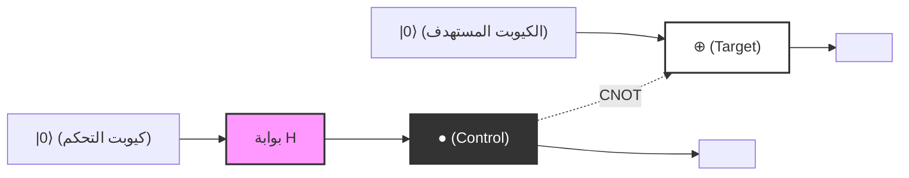
*(ملاحظة: يمثل المخطط أعلاه التوصيل المنطقي. تشير الخطوط الأفقية المتصلة إلى تدفق الزمن لكل كيوبت (الأسلاك الكمومية)، وتوضح كيف يتحكم كيوبت التحكم الذي اجتاز `بوابة H` عند الموضع `●` بالكيوبت المستهدف عند الموضع `⊕`. ويتم الحصول كحالة نهائية للمخرجات على حالة بيل $|\Phi^+\rangle$.)*

---

## 5.5 مفارقة EPR واللاموضعية (Non-locality)

إن ما بيّن أن مفهوم التشابك الكمومي ليس مجرد لعبة رياضية بحتة، بل يطرح تساؤلات جوهرية تمس صلب الفيزياء، هو ما عُرف بـ **ورقة EPR البحثية** التي نشرها ألبرت أينشتاين، وبوريس بودولسكي، وناثان روزين في عام 1935. لقد جادل هؤلاء بأن وصف ميكانيكا الكم يتعارض مع مبدأ "الواقعية المحلية (Local Realism)"، واستنتجوا بناءً على ذلك أن ميكانيكا الكم نظرية غير مكتملة (وتتطلب إدخال متغيرات خفية).

لنجرِ تجربة فكرية يتشارك فيها راصدان يُدعيان أليس وبوب حالة بيل **$|\Phi^+\rangle = \frac{1}{\sqrt{2}}(|00\rangle + |11\rangle)$** التي قمنا بتوليدها سابقًا. لنفترض أن أليس تحتفظ بالكيوبت الأول وبوب يحتفظ بالكيوبت الثاني، وأنهما تفاصلا مكانيًا عبر طرفي الكون (بين كوكب الأرض ومجرة أندروميدا على سبيل المثال).

في هذه الحالة، تكون نتيجة قياس كل كيوبت عشوائية بطبيعتها. فعندما تقيس أليس الكيوبت الذي بحوزتها في قاعدة الحساب $\{|0\rangle, |1\rangle\}$ ، فإنها ستحصل على النتيجة $0$ (الحالة $|0\rangle$) باحتمال 50%، وعلى النتيجة $1$ (الحالة $|1\rangle$) باحتمال 50%.

ولكن وفقًا لفرضية الإسقاط في ميكانيكا الكم (انهيار الحزمة الموجية)، ففي **لحظة** إجراء أليس للقياس، تتغير حالة النظام بأكمله تغيرًا دراماتيكيًا:
- في اللحظة التي تحصل فيها أليس على نتيجة القياس $0$ ، تنهار الدالة الموجية للنظام بأكمله إلى الحالة $|00\rangle$ . وبالتالي، فإن كيوبت بوب يتحدد على الفور وبشكل مؤكد في الحالة $|0\rangle$ ، حتى قبل أن يُجري عليه أي قياس.
- وعلى العكس من ذلك، في اللحظة التي تحصل فيها أليس على نتيجة القياس $1$ ، تنهار الدالة الموجية الكلية إلى الحالة $|11\rangle$ ، ويتحدد كيوبت بوب على الفور وبشكل مؤكد في الحالة $|1\rangle$ .

أطلق أينشتاين على هذه الظاهرة وصف "التأثير الشبحي عن بُعد (Spooky action at a distance)"، والسبب وراء ذلك هو أن عملية القياس المحلية التي أجرتها أليس تبدو وكأنها أثرت لحظيًا (بسرعة تفوق سرعة الضوء) في الحالة الفيزيائية لكيوبت بوب البعيد جدًا. ويبدو هذا متعارضًا تمامًا مع مبدأ المحلية الذي تقتضيه النظرية النسبية الخاصة، والقائل بأنه "لا يمكن نقل أي معلومات بسرعة تتجاوز سرعة الضوء في الفراغ".

### مبرهنة عدم الإشارة ومتباينة بيل

هل تتناقض ميكانيكا الكم حقًا مع النظرية النسبية؟ الجواب القاطع هو: لا، لا يوجد أي تناقض.
يُحَل هذا التناقض الظاهري بواسطة **مبرهنة عدم الإشارة (No-Signaling Theorem / No-Communication Theorem)** . فعلى الرغم من أن حالة كيوبت بوب تتحدد لحظيًا بقياس أليس، إلا أنه يستحيل من حيث المبدأ على أليس التحكم فيما إذا كانت ستحصل على النتيجة $0$ أو النتيجة $1$ . ومن وجهة نظر بوب، لا توجد لديه أي وسيلة لمعرفة ما إذا كانت أليس قد أجرت القياس أم لا، وتظل نتيجة قياس الكيوبت الخاص به تبدو كعشوائية تامة (باحتمال 50% للحصول على 0 أو 1). وكما أثبتنا في قسم مصفوفة الكثافة المختزلة، فمهما كانت قاعدة القياس التي تختارها أليس، فإن مصفوفة الكثافة المحلية لبوب $\rho_B$ لا تتغير قيد أنملة. وعليه، فإنه لا يمكن استخدام التشابك الكمومي لنقل أي "معلومات ذات مغزى" بسرعة تفوق سرعة الضوء.

ومع ذلك، فإن هذا الارتباط القوي الاستثنائي الذي يتميز به التشابك الكمومي لم يكن ليتسع له إطار الفيزياء الكلاسيكية بأي حال. ففي عام 1964، اشتق جون ستيوارت بيل **متباينة بيل** (Bell's Inequality). لقد أثبت بيل رياضيًا أنه: "إذا كان العالم محكومًا بالواقعية المحلية (أي نظريات المتغيرات الخفية التي تصورها أينشتاين)، فإن قوة الارتباط عندما يقيس كل من أليس وبوب على محاور مختلفة لا يمكن أن تتجاوز حدًا أقصى معينًا ( $|S| \leq 2$ في متباينة CHSH)".

بينما تتنبأ ميكانيكا الكم بانتهاك هذا الحد الأقصى في إعدادات معينة (حيث يصل إلى $|S| = 2\sqrt{2}$ ). وقد أثبتت التجارب الفيزيائية الدقيقة اللاحقة التي أجراها آلان أسبيه وزملاؤه انتهاك متباينة بيل عمليًا، مما حسم بشكل قاطع أن الكون الذي نعيش فيه **ليس** محكومًا بالواقعية المحلية. فالارتباط اللاموضعي الناتج عن التشابك الكمومي هو ظاهرة فيزيائية حقيقية وأصيلة في الطبيعة.

في الفصل التالي، سنشرح بالتفصيل بروتوكولات الاتصال الكمومي مثل النقل الآني الكمومي (Quantum Teleportation) والترميز فائق الكثافة (Superdense Coding)، والتي تستغل هذه اللاموضعية للتشابك الكمومي كمورد أساسي ونشط لمعالجة المعلومات.

# الفصل 6: الدوائر الكمومية والبروتوكولات الأساسية

في هذا الفصل، سوف نتعمق في أهم البروتوكولات وأكثرها أساسية في علم المعلومات الكمومية، والتي يتم تحقيقها من خلال الجمع بين البديهيات الأساسية لميكانيكا الكم ومفاهيم البوابات الكمومية التي تعلمناها حتى الآن. هذه البروتوكولات، التي تقلب الفطرة السليمة لنظرية المعلومات الكلاسيكية رأساً على عقب، تشكل الأساس الذي يحدد إمكانيات أجهزة الكمبيوتر الكمومية والاتصالات الكمومية. هنا، سنشرح بالتفصيل ثلاثة مواضيع: "نظرية استحالة الاستنساخ الكمومي (No-Cloning Theorem)"، و"الانتقال الآني الكمومي (Quantum Teleportation)"، و"التشفير فائق الكثافة (Superdense Coding)"، دون أي مساومة ومع صياغات رياضية دقيقة.

## 6.1 نظرية استحالة الاستنساخ الكمومي (No-Cloning Theorem)

في أجهزة الكمبيوتر الكلاسيكية، يعد نسخ البيانات (الاستنساخ) عملية بديهية للغاية. يتم نسخ سلاسل البتات بسهولة وحفظها في عدد لا يحصى من أجهزة التخزين. ومع ذلك، في العالم الذي تحكمه ميكانيكا الكم، توجد نظرية مذهلة تنص على أنه **"من المستحيل إنشاء نسخة مثالية من حالة كمومية غير معروفة"** . هذه هي "نظرية استحالة الاستنساخ الكمومي (No-Cloning Theorem)"، التي أثبتها بشكل مستقل كل من Wootters و Zurek، وكذلك Dieks في عام 1982.

هذه النظرية هي المبدأ الأساسي الذي يضمن أمن التشفير الكمومي (توزيع المفاتيح الكمومية)، وفي الوقت نفسه، هي السبب الذي يجعل تصحيح الأخطاء الكمومية يتطلب نهجًا معقدًا يختلف تمامًا عن التشفير التكراري الكلاسيكي (مجرد تصويت الأغلبية).

### الإثبات الرياضي

يُستمد إثبات نظرية استحالة الاستنساخ الكمومي حصريًا من الخصائص الأساسية للغاية لميكانيكا الكم: الخطية والوحدوية.

لنفترض وجود "آلة نسخ كمومية عالمية" يمكنها نسخ حالة كمومية غير معروفة **$|\psi\rangle$** . هذه الآلة يجب أن تأخذ حالة المصدر المراد نسخها **$|\psi\rangle$** وبت كمومي مستهدف تمت تهيئته (حالة تعادل صفحة بيضاء) **$|0\rangle$** كمدخلات، وتنتج كخرج حالتين متطابقتين **$|\psi\rangle \otimes |\psi\rangle$** (والتي تُكتب باختصار **$|\psi\rangle |\psi\rangle$** ).

في ميكانيكا الكم، يتم وصف أي تطور فيزيائي لنظام مغلق بواسطة مؤثر وحدوي **$U$** . لذلك، يتم تعريف عمل آلة النسخ هذه كتحويل وحدوي **$U$** يلبي المعادلة التالية.

$$
U (|\psi\rangle \otimes |0\rangle) = |\psi\rangle \otimes |\psi\rangle
$$

بما أننا نفترض أن هذا ينطبق على حالة "عشوائية"، فيجب أن يعمل بشكل مشابه مع أي حالة كمومية أخرى **$|\phi\rangle$** .

$$
U (|\phi\rangle \otimes |0\rangle) = |\phi\rangle \otimes |\phi\rangle
$$

الآن، لنأخذ الجداء الداخلي (الجداء السلمي) لهاتين المعادلتين. سنستخدم خاصية المؤثر الوحدوي **$U$** (وهي **$U^\dagger U = I$** ). الجداء الداخلي للجانب الأيسر يكون كما يلي:

$$
\begin{aligned}
\left( U (|\psi\rangle \otimes |0\rangle) \right)^\dagger \left( U (|\phi\rangle \otimes |0\rangle) \right) 
&= (\langle \psi | \otimes \langle 0 |) U^\dagger U (|\phi\rangle \otimes |0\rangle) \\
&= (\langle \psi | \otimes \langle 0 |) I (|\phi\rangle \otimes |0\rangle) \\
&= \langle \psi | \phi \rangle \cdot \langle 0 | 0 \rangle \\
&= \langle \psi | \phi \rangle
\end{aligned}
$$

(هنا، استخدمنا **$\langle 0 | 0 \rangle = 1$** .)

من ناحية أخرى، الجداء الداخلي للحالات المنسوخة على الجانب الأيمن يكون كما يلي:

$$
\begin{aligned}
\left( |\psi\rangle \otimes |\psi\rangle \right)^\dagger \left( |\phi\rangle \otimes |\phi\rangle \right) 
&= (\langle \psi | \otimes \langle \psi |) (|\phi\rangle \otimes |\phi\rangle) \\
&= \langle \psi | \phi \rangle \cdot \langle \psi | \phi \rangle \\
&= (\langle \psi | \phi \rangle)^2
\end{aligned}
$$

بما أن الجانب الأيسر يجب أن يساوي الجانب الأيمن، نحصل على المعادلة التالية:

$$
\langle \psi | \phi \rangle = (\langle \psi | \phi \rangle)^2
$$

شرط تحقق هذه المعادلة **$x = x^2$** في نطاق الأعداد المركبة هو فقط **$x = 0$** أو **$x = 1$** . أي:

$$
\langle \psi | \phi \rangle = 0 \quad \text{أو} \quad \langle \psi | \phi \rangle = 1
$$

هذا يعني أنه لا يمكن أن يوجد تحويل وحدوي ينسخ الحالتين بشكل صحيح إلا إذا كانت الحالتان "متعامدتين تمامًا (مستقلتين)" أو "نفس الحالة تمامًا". بعبارة أخرى، تم إثبات أنه "لا يوجد تحويل وحدوي شامل يمكنه استنساخ أي حالة كمومية غير معروفة (غير متعامدة)" بطريقة بسيطة وأنيقة للغاية.

### الإثبات من خلال الخطية (البرهان بالتناقض)

من الممكن أيضًا تناول الأمر من خلال خطية ميكانيكا الكم (مبدأ التراكب).
لنفكر في مؤثر وحدوي **$U$** يمكنه نسخ حالتي الأساس المتعامدتين **$|0\rangle$** و **$|1\rangle$** .

$$
U |0\rangle |0\rangle = |0\rangle |0\rangle
$$

$$
U |1\rangle |0\rangle = |1\rangle |1\rangle
$$

حتى الآن لا توجد مشكلة. هذا يعادل استنساخ البتات الكلاسيكية 0 و 1. ولكن ماذا يحدث إذا حاولنا نسخ حالة غير معروفة متراكبة من هاتين الحالتين **$|\psi\rangle = \alpha|0\rangle + \beta|1\rangle$** ؟ من خلال خطية التطور الزمني الناتج عن المؤثر الوحدوي، نحصل على ما يلي:

$$
\begin{aligned}
U (|\psi\rangle |0\rangle) &= U \left( (\alpha|0\rangle + \beta|1\rangle) |0\rangle \right) \\
&= U (\alpha|0\rangle |0\rangle + \beta|1\rangle |0\rangle) \\
&= \alpha U(|0\rangle |0\rangle) + \beta U(|1\rangle |0\rangle) \\
&= \alpha|0\rangle |0\rangle + \beta|1\rangle |1\rangle
\end{aligned}
$$

ومع ذلك، فإن الخرج الذي أردناه حقًا لـ "النسخة المثالية" يجب أن يكون جداء الموتر التالي:

$$
\begin{aligned}
|\psi\rangle \otimes |\psi\rangle &= (\alpha|0\rangle + \beta|1\rangle) \otimes (\alpha|0\rangle + \beta|1\rangle) \\
&= \alpha^2|0\rangle |0\rangle + \alpha\beta|0\rangle |1\rangle + \alpha\beta|1\rangle |0\rangle + \beta^2|1\rangle |1\rangle
\end{aligned}
$$

النتيجة المستمدة من الخطية **$\alpha|0\rangle |0\rangle + \beta|1\rangle |1\rangle$** تختلف بوضوح عن حالة النسخة المطلوبة **$|\psi\rangle \otimes |\psi\rangle$** (تفتقر إلى الحدود المتقاطعة **$|0\rangle |1\rangle$** و **$|1\rangle |0\rangle$** ). وهذا يوضح مرة أخرى أنه من المستحيل نسخ حالة تراكب غير معروفة.

---

## 6.2 الانتقال الآني الكمومي (Quantum Teleportation)

من خلال نظرية استحالة الاستنساخ الكمومي، تعلمنا أنه لا يمكن نسخ الحالات الكمومية. ومع ذلك، من الممكن "نقلها (تحويلها)". الانتقال الآني الكمومي هو بروتوكول ينقل تمامًا حالة كمومية غير معروفة من موقع إلى موقع آخر بعيد، باستخدام قناة اتصال كلاسيكية وتشابك كمومي (Entanglement) تمت مشاركته مسبقًا.

يجب ملاحظة هنا أن الجسيم المادي نفسه لا يتحرك عبر الفضاء، بل يتم نقل "الحالة (المعلومات)". نظرًا لأن الحالة التي كانت موجودة في الجسيم الأصلي يتم تدميرها، فإن هذا لا ينتهك نظرية استحالة الاستنساخ (No-Cloning Theorem).

### إعداد البروتوكول والحالة الأولية

لنفترض أن المرسل هو أليس (Alice) والمستقبل هو بوب (Bob).
تمتلك أليس حالة كيوبت واحدة غير معروفة **$|\psi\rangle$** ترغب في إرسالها إلى بوب.

$$
|\psi\rangle_C = \alpha|0\rangle_C + \beta|1\rangle_C \quad (|\alpha|^2 + |\beta|^2 = 1)
$$

يشير الحرف السفلي $C$ إلى أن هذا هو الكيوبت الذي نريد نقله.

لتحقيق هذا النقل، نفترض أن أليس وبوب يتشاركان مسبقًا زوجًا واحدًا من حالة 2 كيوبت متشابكة إلى أقصى حد (تسمى زوج EPR أو زوج بيل). هنا سنستخدم الحالة التالية:

$$
|\Phi^+\rangle_{AB} = \frac{1}{\sqrt{2}} \left( |0\rangle_A \otimes |0\rangle_B + |1\rangle_A \otimes |1\rangle_B \right)
$$

يشير الحرف السفلي $A$ إلى الكيوبت الذي تحتفظ به أليس، و $B$ إلى الكيوبت الذي يحتفظ به بوب.

يتم وصف الحالة الأولية للنظام بأكمله **$|\Psi_0\rangle$** كجداء الموتر للحالة التي تريد أليس نقلها وزوج EPR المشترك.

$$
\begin{aligned}
|\Psi_0\rangle &= |\psi\rangle_C \otimes |\Phi^+\rangle_{AB} \\
&= (\alpha|0\rangle_C + \beta|1\rangle_C) \otimes \frac{1}{\sqrt{2}} (|0\rangle_A |0\rangle_B + |1\rangle_A |1\rangle_B) \\
&= \frac{1}{\sqrt{2}} \Big( \alpha|0\rangle_C |0\rangle_A |0\rangle_B + \alpha|0\rangle_C |1\rangle_A |1\rangle_B + \beta|1\rangle_C |0\rangle_A |0\rangle_B + \beta|1\rangle_C |1\rangle_A |1\rangle_B \Big)
\end{aligned}
$$

### عمليات أليس وقياس أساس بيل

تمتلك أليس الكيوبتات $C$ و $A$. تُجري أليس قياسًا مشتركًا يُعرف باسم "قياس بيل" على هذين الكيوبتين. بعبارة الدوائر، يعادل هذا تطبيق بوابة CNOT، يليها بوابة هادامارد، ثم القياس في الأساس القياسي (الأساس الحسابي).

 **الخطوة 1: تطبيق بوابة CNOT** 
تطبق أليس بوابة CNOT (NOT المحكومة) **$CX_{CA}$** ، مع جعل الكيوبت $C$ هو بت التحكم، والكيوبت $A$ هو البت المستهدف. تقوم بوابة CNOT بعكس البت المستهدف فقط عندما يكون بت التحكم $|1\rangle$.

$$
\begin{aligned}
|\Psi_1\rangle &= CX_{CA} |\Psi_0\rangle \\
&= \frac{1}{\sqrt{2}} \Big( \alpha|0\rangle_C |0\rangle_A |0\rangle_B + \alpha|0\rangle_C |1\rangle_A |1\rangle_B + \beta|1\rangle_C |1\rangle_A |0\rangle_B + \beta|1\rangle_C |0\rangle_A |1\rangle_B \Big)
\end{aligned}
$$

(تم عكس $|0\rangle_A$ في الحد الثالث إلى $|1\rangle_A$ ، و $|1\rangle_A$ في الحد الرابع إلى $|0\rangle_A$ .)

 **الخطوة 2: تطبيق بوابة هادامارد** 
بعد ذلك، تطبق أليس بوابة هادامارد **$H_C$** على الكيوبت $C$. تحويل هادامارد يحول $|0\rangle \to \frac{|0\rangle+|1\rangle}{\sqrt{2}}$ ، و $|1\rangle \to \frac{|0\rangle-|1\rangle}{\sqrt{2}}$。

$$
\begin{aligned}
|\Psi_2\rangle &= H_C |\Psi_1\rangle \\
&= \frac{1}{2} \Big[ \alpha(|0\rangle_C + |1\rangle_C) |0\rangle_A |0\rangle_B + \alpha(|0\rangle_C + |1\rangle_C) |1\rangle_A |1\rangle_B \\
&\quad + \beta(|0\rangle_C - |1\rangle_C) |1\rangle_A |0\rangle_B + \beta(|0\rangle_C - |1\rangle_C) |0\rangle_A |1\rangle_B \Big]
\end{aligned}
$$

نعيد ترتيب هذا وفقًا لحالات الكيوبتات $C$ و $A$ التي تحتفظ بها أليس ( $|00\rangle, |01\rangle, |10\rangle, |11\rangle$ ). إعادة البناء هذه هي الخطوة الرياضية الأساسية في الانتقال الآني الكمومي.

$$
\begin{aligned}
|\Psi_2\rangle &= \frac{1}{2} |0\rangle_C |0\rangle_A \otimes (\alpha|0\rangle_B + \beta|1\rangle_B) \\
&\quad + \frac{1}{2} |0\rangle_C |1\rangle_A \otimes (\alpha|1\rangle_B + \beta|0\rangle_B) \\
&\quad + \frac{1}{2} |1\rangle_C |0\rangle_A \otimes (\alpha|0\rangle_B - \beta|1\rangle_B) \\
&\quad + \frac{1}{2} |1\rangle_C |1\rangle_A \otimes (\alpha|1\rangle_B - \beta|0\rangle_B)
\end{aligned}
$$

ما يلفت الانتباه هنا هو أن الكيوبت $B$ الخاص ببوب يتم إسقاطه إلى حالات مختلفة بناءً على نتيجة قياس أليس.

 **الخطوة 3: القياس والاتصال الكلاسيكي** 
تقوم أليس بملاحظة (قياس) الكيوبتات $C$ و $A$ الخاصة بها. النتائج التي يمكن الحصول عليها واحتمالاتها هي كما يلي. تحدث كل منها باحتمال 25٪.

- عندما تكون نتيجة القياس `00`: يصبح الكيوبت الخاص ببوب **$\alpha|0\rangle + \beta|1\rangle$** ، وهو نفس الحالة الأصلية **$|\psi\rangle$** .
- عندما تكون نتيجة القياس `01`: يصبح الكيوبت الخاص ببوب **$\alpha|1\rangle + \beta|0\rangle$** . هذه هي الحالة التي يتم فيها تطبيق بوابة باولي-X على الحالة الأصلية **$X|\psi\rangle$** .
- عندما تكون نتيجة القياس `10`: يصبح الكيوبت الخاص ببوب **$\alpha|0\rangle - \beta|1\rangle$** . هذه هي الحالة التي يتم فيها تطبيق بوابة باولي-Z على الحالة الأصلية **$Z|\psi\rangle$** .
- عندما تكون نتيجة القياس `11`: يصبح الكيوبت الخاص ببوب **$\alpha|1\rangle - \beta|0\rangle$** . هذه هي الحالة التي يتم فيها تطبيق بوابة باولي-X ثم باولي-Z على الحالة الأصلية **$ZX|\psi\rangle$** (أو $Y|\psi\rangle$ باستثناء الطور).

تنقل أليس نتيجة قياس هذين البتين (المعلومات الكلاسيكية) إلى بوب باستخدام قناة اتصال كلاسيكية مثل الهاتف أو الإنترنت. نظرًا لاستخدام الاتصال الكلاسيكي، فإن نقل الحالة لا يتجاوز أبدًا سرعة الضوء.

### عملية الاسترداد بواسطة بوب

بناءً على معلومات 2-بت الكلاسيكية التي تلقاها من أليس، يقوم بوب بتطبيق بوابة باولي (أو لا يفعل شيئًا) على الكيوبت الخاص به لاستعادة الحالة الأصلية **$|\psi\rangle$** بالكامل.

- استلام `00`: لا توجد عملية ( $I$ )
- استلام `01`: تطبيق بوابة باولي-X ( $X \cdot X = I$ )
- استلام `10`: تطبيق بوابة باولي-Z ( $Z \cdot Z = I$ )
- استلام `11`: تطبيق بوابة باولي-X ثم بوابة باولي-Z ( $Z \cdot X \cdot ZX = I$ )

نتيجة لذلك، يتم إعادة بناء نفس الحالة التي كانت تمتلكها أليس **$|\psi\rangle = \alpha|0\rangle + \beta|1\rangle$** بالكامل لدى بوب. نظرًا لأنه تم تدمير الكيوبت الأصلي الخاص بأليس بسبب القياس، فهذا يعني أن المعلومات قد تم نقلها (نقلها آنيًا) بشكل كامل.

### التمثيل باستخدام مخطط الدائرة الكمومية

عند تمثيل العملية المذكورة أعلاه كدائرة كمومية، فإنها تبدو كما يلي:

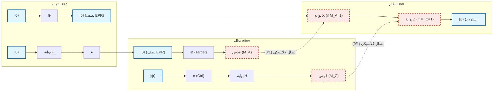

---

## 6.3 التشفير فائق الكثافة (Superdense Coding)

بينما كان الانتقال الآني الكمومي بروتوكولًا "يستهلك زوج EPR و 2 بت كلاسيكي لإرسال حالة كيوبت واحد"، فإن التشفير فائق الكثافة (Superdense Coding) هو بروتوكول يمكن اعتباره، بطريقة ما، العملية العكسية. فهو يتيح "نقل 2 بت من المعلومات الكلاسيكية إلى الطرف الآخر بمجرد إرسال كيوبت مادي واحد".

في القوانين الفيزيائية الكلاسيكية، لا يمكن لنظام ثنائي المستوى (مثل بت واحد أو استقطاب فوتون واحد) أن يحمل أكثر من بت واحد (0 أو 1) من المعلومات كحد أقصى. ومع ذلك، فإن الأمر المذهل في التشفير فائق الكثافة هو أنه من خلال الاستخدام الذكي للتشابك الكمومي، يمكن تجاوز حد هوليفو (Holevo's bound) بشكل ظاهري.

### تفاصيل البروتوكول وأساس بيل

لنفترض مرة أخرى أن أليس وبوب يتشاركان مسبقًا زوجًا من EPR.

$$
|\Phi^+\rangle_{AB} = \frac{1}{\sqrt{2}} \left( |0\rangle_A |0\rangle_B + |1\rangle_A |1\rangle_B \right)
$$

ترغب أليس في إرسال رسالة كلاسيكية من 2 بت $b_1 b_2 \in \{00, 01, 10, 11\}$ إلى بوب.
بناءً على الرسالة التي ترغب في إرسالها، تقوم أليس بإجراء عملية بوابة لكيوبت واحد محددة **فقط على الكيوبت A الموجود بحوزتها** .

1. **عندما تكون الرسالة `00`:** لا تفعل أليس شيئًا (تطبيق مؤثر الهوية $I$).
   الحالة الكلية لا تتغير.
   

$$
|\Psi_{00}\rangle = (I \otimes I) |\Phi^+\rangle = \frac{1}{\sqrt{2}} (|00\rangle + |11\rangle) = |\Phi^+\rangle
$$

2. **عندما تكون الرسالة `01`:** تطبق أليس بوابة باولي-Z.
   

$$
|\Psi_{01}\rangle = (Z \otimes I) |\Phi^+\rangle = \frac{1}{\sqrt{2}} (Z|0\rangle|0\rangle + Z|1\rangle|1\rangle) = \frac{1}{\sqrt{2}} (|00\rangle - |11\rangle) = |\Phi^-\rangle
$$

3. **عندما تكون الرسالة `10`:** تطبق أليس بوابة باولي-X.
   

$$
|\Psi_{10}\rangle = (X \otimes I) |\Phi^+\rangle = \frac{1}{\sqrt{2}} (X|0\rangle|0\rangle + X|1\rangle|1\rangle) = \frac{1}{\sqrt{2}} (|10\rangle + |01\rangle) = |\Psi^+\rangle
$$

4. **عندما تكون الرسالة `11`:** تطبق أليس بوابة باولي-Z، ثم بوابة باولي-X (ما يعادل $iY$).
   

$$
|\Psi_{11}\rangle = (ZX \otimes I) |\Phi^+\rangle = (Z \otimes I) |\Psi^+\rangle = \frac{1}{\sqrt{2}} (Z|1\rangle|0\rangle + Z|0\rangle|1\rangle) = \frac{1}{\sqrt{2}} (-|10\rangle + |01\rangle) = -|\Psi^-\rangle
$$


   (نظرًا لأن العلامة السالبة التي تنطبق على الكل هي طور عام، فإنها لا تؤثر على احتمال الملاحظة، ولكن للراحة هنا سنرتب العلامة ونربطها بـ **$|\Psi^-\rangle = \frac{1}{\sqrt{2}} (|01\rangle - |10\rangle)$** .)

ترسل أليس الكيوبت الخاص بها A، الذي أجرت عليه العملية، إلى بوب عبر قناة اتصال كمومية (مثل الألياف الضوئية).

حقيقة مذهلة يجب ملاحظتها: قامت أليس **بإرسال كيوبت مادي واحد فقط** إلى بوب. ولم تمس الكيوبت الخاص ببوب على الإطلاق. ولكن، كنتيجة لعملية أليس، انتقلت حالة النظام بأكمله بشكل حتمي إلى واحدة من 4 حالات كمومية متعامدة تمامًا (والتي نسميها **أساس بيل** ).

### فك التشفير وقياس بيل بواسطة بوب

يتلقى بوب الكيوبت A المُرسل من أليس. الآن بحوزة بوب كلا الكيوبتين: الكيوبت A والكيوبت B الذي كان لديه في الأصل. يجري بوب "قياس بيل" على هذين الكيوبتين، وهو نفس القياس الذي أجرته أليس في الانتقال الآني الكمومي.

بمعنى آخر، يطبق بوابة CNOT جاعلاً الكيوبت A بت التحكم و B البت المستهدف، ثم يطبق بوابة هادامارد على الكيوبت A. من خلال هذا التحويل العكسي، يتم إرجاع أساس بيل المتشابك إلى الأساس الحسابي القابل للقياس.

دعونا نتحقق من التطور الرياضي في كل حالة.

- **عندما تكون الحالة $|\Phi^+\rangle = \frac{1}{\sqrt{2}} (|00\rangle + |11\rangle)$ (الرسالة `00`):** بتطبيق CNOT نحصل على $\frac{1}{\sqrt{2}} (|00\rangle + |10\rangle) = \frac{1}{\sqrt{2}} (|0\rangle + |1\rangle) |0\rangle$.
  بتطبيق هادامارد على A، يصبح الناتج $|0\rangle |0\rangle$.
  عندما يقوم بوب بالقياس، سيحصل بالتأكيد على `00`.

- **عندما تكون الحالة $|\Phi^-\rangle = \frac{1}{\sqrt{2}} (|00\rangle - |11\rangle)$ (الرسالة `01`):** بتطبيق CNOT نحصل على $\frac{1}{\sqrt{2}} (|00\rangle - |10\rangle) = \frac{1}{\sqrt{2}} (|0\rangle - |1\rangle) |0\rangle$.
  بتطبيق هادامارد على A، يصبح الناتج $|1\rangle |0\rangle$.
  عندما يقوم بوب بالقياس، سيحصل بالتأكيد على `10`. (※ تعيين البتات بالنسبة لعملية أليس قد يختلف اعتمادًا على تعريف الدائرة، لكن يمكن تمييزه بشكل فريد)

- **عندما تكون الحالة $|\Psi^+\rangle = \frac{1}{\sqrt{2}} (|01\rangle + |10\rangle)$ (الرسالة `10`):** بتطبيق CNOT نحصل على $\frac{1}{\sqrt{2}} (|01\rangle + |11\rangle) = \frac{1}{\sqrt{2}} (|0\rangle + |1\rangle) |1\rangle$.
  بتطبيق هادامارد على A، يصبح الناتج $|0\rangle |1\rangle$.
  عندما يقوم بوب بالقياس، سيحصل بالتأكيد على `01`.

- **عندما تكون الحالة $|\Psi^-\rangle = \frac{1}{\sqrt{2}} (|01\rangle - |10\rangle)$ (الرسالة `11`):** بتطبيق CNOT نحصل على $\frac{1}{\sqrt{2}} (|01\rangle - |11\rangle) = \frac{1}{\sqrt{2}} (|0\rangle - |1\rangle) |1\rangle$.
  بتطبيق هادامارد على A، يصبح الناتج $|1\rangle |1\rangle$.
  عندما يقوم بوب بالقياس، سيحصل بالتأكيد على `11`.

بهذه الطريقة، من خلال قياس الكيوبت الوحيد الذي تلقاه مع الكيوبت الوحيد الذي يمتلكه، يمكن لبوب قراءة معلومات الـ 2-بت الكلاسيكية التي قصدتها أليس بدقة 100٪ وبشكل مثالي.

### الأهمية في الاتصالات الكمومية

القيمة الحقيقية للتشفير فائق الكثافة لا تقتصر على مضاعفة "كثافة" المعلومات. هذا البروتوكول هو دليل قاطع يوضح كيف يمكن للارتباط غير المحلي، أي التشابك الكمومي، أن يوسع عرض النطاق الترددي لنقل المعلومات الكلاسيكية.

كما أنه مهم للغاية من منظور الأمن. إذا قام متنصت (Eve) باعتراض الكيوبت A أثناء إرساله من أليس إلى بوب، فلن تتمكن Eve من الحصول على أي معلومات على الإطلاق. والسبب هو أنه حتى عند ملاحظة الكيوبت الفردي A فقط، فإن حالته تتصرف كحالة مختلطة عشوائية تمامًا (مصفوفة الكثافة تتناسب مع $\frac{I}{2}$). يتم تشفير المعلومات حصريًا داخل "الارتباط" بين A و B المنفصلين مكانيًا، وفك التشفير يصبح مستحيلًا فيزيائيًا إذا تم الحصول على واحد منهما فقط.

---

وبهذه الطريقة، على الرغم من أن الانتقال الآني الكمومي والتشفير فائق الكثافة قد يبدوان للوهلة الأولى كظواهر سحرية تتعارض مع الحدس، إلا أنه يمكن استنتاجها كعواقب منطقية حتمية وصارمة للغاية من خلال اتباع البديهيات الجبرية الخطية لميكانيكا الكم بدقة. في الفصل التالي، سنقوم بتطبيق هذه البروتوكولات الأساسية للدخول إلى عالم الخوارزميات الكمومية التي تهدف إلى حل مشكلات أكثر تعقيدًا.

# الفصل 7: خوارزمية دويتش-جوزا

## 7.1 الأهمية التاريخية: أول عرض واضح للتفوق الكمي

الفرضية التي تفيد بأن أجهزة الكمبيوتر الكمومية يمكنها حل مشاكل معينة بشكل أسرع بكثير من أجهزة الكمبيوتر الكلاسيكية تم اقتراحها في ثمانينيات القرن العشرين من خلال العمل الرائد لريتشارد فاينمان وديفيد دويتش. ومع ذلك، فإن الإجابة الحاسمة الأولى على السؤال "ما هي المشاكل المحددة التي يتفوق فيها الحساب الكمومي على الحساب الكلاسيكي بطريقة قابلة للإثبات رياضيًا؟" جاءت من "خوارزمية دويتش-جوزا" (Deutsch-Jozsa Algorithm)، التي ابتكرها ديفيد دويتش وريتشارد جوزا في عام 1992.

في هذا الفصل، سنستكشف بدقة رياضية الصورة الكاملة لهذه الخوارزمية التاريخية. على الرغم من أن هذه الخوارزمية لا تحل مشكلة عملية، إلا أنها أثبتت أنه من الممكن تقليل رتبة التعقيد الحسابي بشكل كبير من خلال الجمع بمهارة بين الظواهر الخاصة بميكانيكا الكم: "التراكب" (Superposition)، "التداخل" (Interference)، و"ارتداد الطور" (Phase Kickback).

## 7.2 إعداد المشكلة: دالة ثابتة أم دالة متوازنة؟

أولاً، دعونا نعرّف المشكلة التي يجب أن تحلها الخوارزمية. لنفترض أنه قد أُعطينا صندوقاً أسود (أوراكل). هذا الأوراكل يأخذ مدخلاً من $n$ بت حيث $x \in \{0, 1\}^n$ ويعيد مخرجاً من بت واحد $f(x) \in \{0, 1\}$ لحساب الدالة **$f$** .

هنا، تُعطى هذه الدالة **$f$** وعداً (Promise) قوياً بأنها "تفي حتماً بإحدى الخاصيتين":

1. **دالة ثابتة (Constant Function)** : لأي مدخل $x$ ، تعيد دائماً $f(x) = 0$ أو تعيد دائماً $f(x) = 1$ .
2. **دالة متوازنة (Balanced Function)** : من بين جميع المدخلات $x$ ، تعيد $f(x) = 0$ للنصف بالضبط، وتعيد $f(x) = 1$ للنصف المتبقي.

هدفنا هو تحديد ما إذا كان الأوراكل المعطى **$f$** عبارة عن دالة ثابتة أم دالة متوازنة، بأقل عدد ممكن من الاستعلامات (Queries) للأوراكل.

### القيود في الحساب الكلاسيكي

دعونا نفكر في حل هذه المشكلة باستخدام كمبيوتر كلاسيكي. هناك ما مجموعه $N = 2^n$ نمط إدخال للدالة **$f$** .

لنفترض أسوأ الحالات. إذا حصلنا على نفس المخرج (مثلاً: كلها $0$ ) لـ $2^{n-1}$ من المدخلات بشكل متتالٍ (أي لنصف إجمالي المدخلات) بدءاً من الاستعلام الأول. عند هذه النقطة، يبقى كل من احتمال أن تكون الدالة ثابتة (النصف المتبقي كله $0$ ) واحتمال أن تكون دالة متوازنة (النصف المتبقي كله $1$ ).

لذلك، لكي يتمكن الكمبيوتر الكلاسيكي من تحديد ما إذا كانت الدالة ثابتة أم متوازنة بيقين 100%، يتطلب الأمر **في أسوأ الحالات $2^{n-1} + 1$ استعلامًا** . هذا العدد يزداد أُسِّيًا بالنسبة لعدد بتات الإدخال $n$ . أي أن التعقيد الحسابي الكلاسيكي (تعقيد الاستعلام) هو $O(2^n)$ .

بشكل مدهش، باستخدام الحساب الكمومي، يمكن تحديد هذه المشكلة بشكل صحيح وباحتمال 100% باستخدام **استعلام واحد فقط (1 Query)** . هذا هو جوهر التفوق الكمي.

## 7.3 الأوراكل الكمومي وهندسة ارتداد الطور

لبناء خوارزمية كمومية، من الضروري أولاً إعادة صياغة الدالة الكلاسيكية **$f(x)$** بطريقة تفي بمتطلبات ميكانيكا الكم (الوحدوية = الانعكاسية). لهذا الغرض يتم تقديم "الأوراكل الكمومي" (Quantum Oracle).

### الأوراكل الكمومي $U_f$

نقوم بإعداد سجل إدخال ( $n$ كيوبت) وسجل هدف ( $1$ كيوبت). المؤثر الوحدوي **$U_f$** الذي يمثل الأوراكل يعمل على حالة الأساس الحسابي على النحو التالي:

$$
U_f |x\rangle |y\rangle = |x\rangle |y \oplus f(x)\rangle
$$

هنا، $\oplus$ تمثل الجمع بمقياس 2 (XOR). هذا التحويل يكون واضح الانعكاس ووحدوياً لأنه يعيد الحالة إلى وضعها الأصلي إذا تم تطبيقه مرة أخرى ( $U_f^2 = I$ ).

### ارتداد الطور (Phase Kickback)

إحدى أهم التقنيات غير البديهية في علم المعلومات الكمومية وأكثرها تأثيراً هي "ارتداد الطور". دعونا نرى ما يحدث عندما يتم تعيين حالة سجل الهدف إلى حالة التراكب $|-\rangle$ عبر بوابة هادامارد بدلاً من الحالات الكلاسيكية $|0\rangle$ أو $|1\rangle$ .

$$
|-\rangle = \frac{|0\rangle - |1\rangle}{\sqrt{2}}
$$

نقوم بإدخال هذه الحالة في سجل الهدف، ونطبق الأوراكل **$U_f$** .

$$
U_f |x\rangle |-\rangle = U_f \left( |x\rangle \frac{|0\rangle - |1\rangle}{\sqrt{2}} \right)
$$

$$
= \frac{1}{\sqrt{2}} \left( U_f |x\rangle |0\rangle - U_f |x\rangle |1\rangle \right)
$$

$$
= \frac{1}{\sqrt{2}} \left( |x\rangle |0 \oplus f(x)\rangle - |x\rangle |1 \oplus f(x)\rangle \right)
$$

هنا، نقسم الحالات بناءً على قيمة $f(x)$ :
- في حالة $f(x) = 0$ :
  الحالة تصبح $\frac{1}{\sqrt{2}} ( |x\rangle |0\rangle - |x\rangle |1\rangle ) = |x\rangle |-\rangle$ .
- في حالة $f(x) = 1$ :
  الحالة تصبح $\frac{1}{\sqrt{2}} ( |x\rangle |1\rangle - |x\rangle |0\rangle ) = - |x\rangle |-\rangle$ .

عند دمجها معًا، نحصل على المعادلة الجميلة التالية:

$$
U_f |x\rangle |-\rangle = (-1)^{f(x)} |x\rangle |-\rangle
$$

هذه نتيجة مذهلة. لم تتغير حالة سجل الهدف $|-\rangle$ على الإطلاق، لكن نتيجة تقييم الدالة **$f(x)$** "ارتدت" (Kickback) إلى جانب سجل الإدخال **$|x\rangle$** على شكل "إشارة الطور" (Phase). هذا يتيح لنا تشفير المعلومات كطور في السعة.

## 7.4 خوارزمية دويتش-جوزا: المخطط الدائري والتطوير الرياضي الكامل

هنا، سنصف الصورة الكاملة للخوارزمية من كلا الجانبين: الدائرة الكمومية والمعادلات الرياضية.

### المخطط الدائري الكمومي

يوضح الشكل أدناه الدائرة الكمومية لخوارزمية دويتش-جوزا.

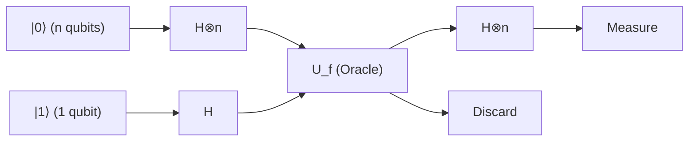

### الخطوة 1: إعداد الحالة الابتدائية

نقوم بتهيئة $n$ كيوبت لسجل الإدخال إلى $|0\rangle^{\otimes n}$ ، وكيوبت واحد لسجل الهدف إلى $|1\rangle$ .

$$
|\psi_0\rangle = |0\rangle^{\otimes n} |1\rangle
$$

### الخطوة 2: تطبيق بوابات هادامارد على جميع الكيوبتات

نطبق بوابة هادامارد ( $H$ ) على جميع الكيوبتات لإنشاء حالة تراكب كاملة.
يعمل تحويل هادامارد $H^{\otimes n}$ لـ $n$ كيوبت على النحو التالي:

$$
H^{\otimes n} |0\rangle^{\otimes n} = \frac{1}{\sqrt{2^n}} \sum_{x \in \{0,1\}^n} |x\rangle
$$

لذلك، تكون الحالة الإجمالية للنظام هي:

$$
|\psi_1\rangle = \left( \frac{1}{\sqrt{2^n}} \sum_{x \in \{0,1\}^n} |x\rangle \right) \otimes \left( \frac{|0\rangle - |1\rangle}{\sqrt{2}} \right)
$$

$$
= \frac{1}{\sqrt{2^n}} \sum_{x=0}^{2^n-1} |x\rangle |-\rangle
$$

### الخطوة 3: تطبيق الأوراكل الكمومي (ارتداد الطور)

الآن نطبق الأوراكل **$U_f$** . بفضل تأثير ارتداد الطور المثبت في القسم السابق، يُضرب طور كل حالة أساس $|x\rangle$ في $(-1)^{f(x)}$ .

$$
|\psi_2\rangle = U_f |\psi_1\rangle = \frac{1}{\sqrt{2^n}} \sum_{x \in \{0,1\}^n} (-1)^{f(x)} |x\rangle |-\rangle
$$

عند هذه النقطة، يتم تضمين جميع المعلومات (مقدار $2^n$ ) الخاصة بنتيجة الحساب **$f(x)$** بالتوازي كأطوار لحالة التراكب في عملية واحدة. وهذا ما يسمى بـ "التوازي الكمي" (Quantum Parallelism).

### الخطوة 4: توليد التداخل في سجل الإدخال

سجل الهدف لن يُستخدم بعد الآن لذلك سنتجاهله. نطبق تحويل هادامارد $H^{\otimes n}$ مرة أخرى على الـ $n$ كيوبت في سجل الإدخال.
يُعبر عن تأثير $H^{\otimes n}$ على أي أساس $|x\rangle$ كصيغة عامة على النحو التالي:

$$
H^{\otimes n} |x\rangle = \frac{1}{\sqrt{2^n}} \sum_{z \in \{0,1\}^n} (-1)^{x \cdot z} |z\rangle
$$

هنا، يمثل $x \cdot z$ الجداء الداخلي للبتات $x \cdot z = x_1 z_1 \oplus x_2 z_2 \oplus \dots \oplus x_n z_n$ .
عند تطبيق ذلك على جزء سجل الإدخال لـ $|\psi_2\rangle$ ، يتم تفصيل الحالة النهائية $|\psi_3\rangle$ على النحو التالي:

$$
|\psi_3\rangle = H^{\otimes n} \left( \frac{1}{\sqrt{2^n}} \sum_{x} (-1)^{f(x)} |x\rangle \right)
$$

$$
= \frac{1}{\sqrt{2^n}} \sum_{x} (-1)^{f(x)} \left( \frac{1}{\sqrt{2^n}} \sum_{z} (-1)^{x \cdot z} |z\rangle \right)
$$

$$
= \frac{1}{2^n} \sum_{z \in \{0,1\}^n} \left( \sum_{x \in \{0,1\}^n} (-1)^{f(x) + x \cdot z} \right) |z\rangle
$$

هذه معادلة مهمة للغاية تمثل الحالة الكمومية قبل القياس مباشرة. يحدث "التداخل" الكمومي داخل هذا المجموع $\sum_x$ .

### الخطوة 5: القياس وتحليل النتائج

في نهاية الخوارزمية، نقوم بقياس الـ $n$ كيوبت في سجل الإدخال بناءً على الأساس الحسابي.
ما يهمنا هو احتمال قياس أن تكون جميع الكيوبتات $0$ ، أي الحالة **$|0\rangle^{\otimes n}$** . لنأخذ بعين الاعتبار الحالة التي يكون فيها $z = 00\dots0$ في المعادلة أعلاه. في هذه الحالة، لأي $x$ ، يكون $x \cdot 0 = 0$ ، لذلك تُحسب سعة (معامل) الحالة **$|0\rangle^{\otimes n}$** على النحو التالي:

$$
\text{Amplitude of } |0\rangle^{\otimes n} = \frac{1}{2^n} \sum_{x \in \{0,1\}^n} (-1)^{f(x)}
$$

هنا، وفقاً للوعد (Promise)، نتحقق من حالتين.

#### الحالة 1: إذا كانت الدالة $f$ دالة ثابتة
تكون دائماً $f(x) = 0$ أو دائماً $f(x) = 1$ .
- إذا كانت دائماً $0$ ، فإن $(-1)^{f(x)} = 1$ ، ويكون المجموع $\sum 1 = 2^n$ . السعة هي $\frac{2^n}{2^n} = 1$ .
- إذا كانت دائماً $1$ ، فإن $(-1)^{f(x)} = -1$ ، ويكون المجموع $\sum -1 = -2^n$ . السعة هي $\frac{-2^n}{2^n} = -1$ .

بما أن احتمال القياس $P(0)$ هو مربع القيمة المطلقة للسعة،


$$
P(00\dots0) = | \pm 1 |^2 = 1
$$


أي، **إذا كانت الدالة ثابتة، فسيتم قياس $|0\rangle^{\otimes n}$ باحتمال 100%** .

#### الحالة 2: إذا كانت الدالة $f$ دالة متوازنة
يوجد بالضبط نصف $x$ يحقق $f(x) = 0$ والنصف الآخر يحقق $f(x) = 1$ (أي $2^{n-1}$ لكل منهما).
لذلك، $(-1)^{f(x)}$ يكون نصفه $+1$ والنصف المتبقي $-1$ ، وعند جمعها كلها، تُلغي بعضها البعض تماماً لتصبح صفراً (تداخل هدام بالكامل).

$$
\text{Amplitude of } |0\rangle^{\otimes n} = \frac{1}{2^n} \left( 2^{n-1}(+1) + 2^{n-1}(-1) \right) = 0
$$

بما أن احتمال القياس $P(0)$ هو مربع القيمة المطلقة للسعة،


$$
P(00\dots0) = | 0 |^2 = 0
$$


أي، **إذا كانت الدالة متوازنة، فإن احتمال قياس $|0\rangle^{\otimes n}$ هو 0%، وسيتم دائمًا قياس حالة تحتوي على الأقل على بت واحد يساوي $1$** .

## 7.6 مثال محدد: تتبع كامل لحالة $n=2$

بدلاً من المعادلات المجردة فقط، دعونا نتتبع متجه الحالة الدقيق لحالة $n=2$ (إدخال بكيوبتين) لنشعر بكيفية عمل الخوارزمية. هناك 4 أنماط للإدخال $x \in \{00, 01, 10, 11\}$ .

### في حالة الدالة الثابتة: $f(x) = 1$ (الكل 1)
يكون جزء سجل الإدخال للحالة $|\psi_1\rangle$ قبل تطبيق الأوراكل كالتالي:


$$
\frac{1}{2} ( |00\rangle + |01\rangle + |10\rangle + |11\rangle )
$$

بعد تطبيق الأوراكل، يُضرب كل حد في $(-1)^{f(x)} = -1$ بسبب ارتداد الطور.


$$
|\psi_2\rangle_{in} = -\frac{1}{2} ( |00\rangle + |01\rangle + |10\rangle + |11\rangle )
$$

نطبق عليه $H^{\otimes 2}$ مرة أخرى. باستخدام حقيقة أن $H^{\otimes 2} (|00\rangle + |01\rangle + |10\rangle + |11\rangle) = 2 |00\rangle$ ، نحصل على:


$$
|\psi_3\rangle_{in} = - |00\rangle
$$


ستكون نتيجة القياس $00$ باحتمال $100\%$ .

### في حالة الدالة المتوازنة: $f(00)=0, f(01)=1, f(10)=1, f(11)=0$
بعد تطبيق الأوراكل، بسبب ارتداد الطور، تضاف إشارة سالب فقط للحدود التي تحقق $f(x)=1$ .


$$
|\psi_2\rangle_{in} = \frac{1}{2} ( |00\rangle - |01\rangle - |10\rangle + |11\rangle )
$$

نطبق عليه $H^{\otimes 2}$ . من خلال حساب تأثير $H^{\otimes 2}$ على كل أساس وتعويضه، إذا ركزنا على معامل $|00\rangle$ سنجده $\frac{1}{4} (1 - 1 - 1 + 1) = 0$ ، وبذلك يتم إلغاؤه تماماً (تداخل هدام).
بتنظيم الحدود المتبقية، تصبح الحالة النهائية $|11\rangle$ (في هذا المثال يتم قياس 11 باحتمال 100%، ولكن بشكل عام في الدالة المتوازنة سيتم قياس حالة أخرى غير 00). تأكدنا من أن احتمال قياس $00$ هو 0% تماماً.

## 7.7 الخاتمة: القفزة الحسابية الناتجة عن التداخل الكمي

يكمن سحر خوارزمية دويتش-جوزا في أنها تنشر معلومات $2^n$ في فضاء الطور من خلال ارتداد الطور، وتتحكم في "التداخل" (Interference) الناتج عن تحويل هادامارد الأخير.

- في حالة **الدالة الثابتة** : الموجات من جميع المسارات تتداخل "تداخلاً بناءً" (Constructive Interference)، وتتركز السعة بنسبة 100% في الحالة **$|0\rangle^{\otimes n}$** .
- في حالة **الدالة المتوازنة** : الموجات الموجبة والسالبة تتداخل "تداخلاً هداماً" (Destructive Interference)، وتُلغي تماماً سعة الحالة **$|0\rangle^{\otimes n}$** .

من خلال هذا الهيكل الرياضي الرائع، المشكلة التي كانت تتطلب في أسوأ الحالات $O(2^n)$ استعلامًا (تحديدًا $2^{n-1} + 1$ استعلامًا) في أجهزة الكمبيوتر الكلاسيكية، يمكن لأجهزة الكمبيوتر الكمومية حلها بشكل حتمي (معدل دقة 100%) باستخدام **استعلام واحد فقط ( $O(1)$ )** .

هذه الحقيقة المثبتة في هذا الفصل أصبحت علامة فارقة بالغة الأهمية في تاريخ البشرية، حيث أوضحت أن تطبيق مبادئ ميكانيكا الكم في معالجة المعلومات يمكنه كسر حدود نظرية المعلومات الكلاسيكية مادياً.

# الفصل 8: خوارزمية شور والتهديد للتشفير الحديث

## 8.1 مقدمة: رياضيات تشفير RSA وصعوبة التحليل إلى العوامل الأولية

في المجتمع الرقمي المعاصر، يُعد تشفير المفتاح العام الركيزة الأساسية التي تضمن أمن الاتصالات عبر شبكة الإنترنت. ومن بين أنظمته، يُثبت تشفير RSA الأكثر انتشارًا أمانه بالاعتماد على عدم التماثل الرياضي (خاصية الدوال أحادية الاتجاه)، القائم على حقيقة أن "التحليل إلى العوامل الأولية لعدد مركب ضخم هو أمر صعب للغاية من الناحية الحسابية". في هذا الفصل، سنكشف بدقة رياضية صارمة وبدون أي مساومة عن البنية النظرية لـ "خوارزمية شور" (Shor's Algorithm)، وهي الطريقة الحاسمة التي يدمّر بها الكمبيوتر الكمومي الأساس الجوهري لتشفير RSA.

أولاً، دعونا نصيغ آلية تشفير RSA رياضيًا. تبدأ عملية توليد المفاتيح في RSA بالاختيار العشوائي لعددين أوليين ضخمين $p$ و $q$ (يُوصى حاليًا بألا يقل حجم كل منهما عن 2048 بت). ثم نحسب العدد المركب الناتج عن ضربهما $N = pq$ ، وننشره للعامة كجزء من المفتاح العام. بعد ذلك، نحسب دالة مؤشر أويلر (Euler's Totient Function) $\phi(N)$ . وبحكم خصائص الأعداد الأولية، فإن هذه الدالة تُعطى بالعلاقة $\phi(N) = (p-1)(q-1)$ .

يتم اختيار الأس $e$ ، الذي يمثل مفتاح التشفير، بحيث يحقق الشرطين $1 < e < \phi(N)$ و $\text{gcd}(e, \phi(N)) = 1$ (أي أنه أولي نسبيًا مع $\phi(N)$ ). بعد ذلك، يُحسب أس فك التشفير $d$ ، الذي يشكل المفتاح السري، بحيث يحقق معادلة التطابق $ed \equiv 1 \pmod{\phi(N)}$ . ويمكن إيجاد هذا الأس بسهولة في زمن متعدد الحدود (Polynomial Time) باستخدام خوارزمية إقليدس الممتدة.

بافتراض أن النص الصريح هو عدد صحيح $M$ (حيث $0 \le M < N$ )، تتم عملية التشفير عبر عملية الرفع إلى أس بمقاس $N$ كالتالي:


$$
C \equiv M^e \pmod{N}
$$


وعند فك التشفير، نستخدم المفتاح السري $d$ للحساب بطريقة مماثلة:


$$
M' \equiv C^d \pmod{N}
$$


وبناءً على مبرهنة أويلر، فبما أن $C^d \equiv M^{ed} \equiv M^{1 + k\phi(N)} \equiv M \pmod{N}$ متحققة دائمًا، فإن استعادة النص الصريح الأصلي $M$ بالكامل تكون مضمونة.

النقطة الجوهرية هنا هي أنه لاستنتاج المفتاح السري $d$ من المعلومات المتاحة للعامة $(N, e)$ ، يلزم معرفة قيمة $\phi(N)$ ، وهذا يتطلب بدوره تحليل $N$ إلى عوامله الأولية $p$ و $q$ . عند استخدام الحواسيب الكلاسيكية، وحتى باستخدام أسرع خوارزمية معروفة حاليًا للتحليل إلى العوامل الأولية، وهي "منخل حقل الأعداد العام" (General Number Field Sieve, GNFS)، فإن التعقيد الحسابي يكون في زمن شبه أُسّي قدره $O\left(\exp\left(c (\log N)^{1/3} (\log \log N)^{2/3}\right)\right)$ . وهذا يعني أن زمن الحساب يتزايد بشكل انفجاري مع زيادة عدد بتات $N$ ؛ فعلى سبيل المثال، يُقدّر أن تحليل عدد صحيح بطول 2048 بت إلى عوامله الأولية باستخدام حاسوب فائق كلاسيكي سيستغرق زمنًا يتجاوز عمر الكون بأكمله.

غير أن الخوارزمية الكمومية التي قدّمها بيتر شور (Peter Shor) عام 1994 قلبت هذا الافتراض من أساسه. إذ تنجز خوارزمية شور التحليل إلى العوامل الأولية في زمن متعدد الحدود قدره $O((\log N)^3)$ ، أو $\tilde{O}((\log N)^2)$ مع التحسينات الحسابية. وهذا يمثل "تسريعًا فائق التعددية للحدود" (Super-polynomial Speedup) مقارنة بالحساب الكلاسيكي، وهو في الواقع تسريع أُسّي يُثبت أن تشفير RSA المستخدم حاليًا سيتم تحييده وإبطال فعاليته بالكامل بواسطة الحواسيب الكمومية.

## 8.2 الاختزال إلى مسألة إيجاد الرتبة (Reduction to Order-Finding Problem)

تكمن الرؤية العبقرية لخوارزمية شور في أنها "لم تحل مسألة التحليل إلى العوامل الأولية مباشرة، بل قامت باختزالها إلى مسألة إيجاد الدور (الدورية)". فوفقًا لمبرهنات نظرية الأعداد البحتة، ثبت أن التحليل إلى العوامل الأولية يكافئ مسألة تُعرف باسم "مسألة إيجاد الرتبة" (Order-Finding Problem). وعملية الاختزال هذه في حد ذاتها هي خوارزمية كلاسيكية تمامًا، ولا تتطلب أي حساب كمومي.

دعونا نتتبع خطوات تحليل عدد مركب معطى $N$ إلى عوامله الأولية. أولاً، نختار عددًا صحيحًا عشوائيًا $a$ يحقق الشرط $1 < a < N$ . باستخدام خوارزمية إقليدس، نحسب القاسم المشترك الأكبر $\text{gcd}(a, N)$ . فإذا كان الناتج أكبر من $1$ ، نكون لحسن الحظ قد عثرنا بالفعل على عامل غير بديهي للعدد $N$ ، وتنتهي الحسابات (إلا أن احتمال حدوث ذلك صدفةً في الأعداد الهائلة المستخدمة في التشفير منخفض بصورة فلكية).

أما إذا كان $\text{gcd}(a, N) = 1$ ، فإن $a$ و $N$ أوليان نسبيًا. عندئذٍ، نعرّف دالة الأس النمطي (Modulo Exponential Function) على النحو التالي:


$$
f(x) = a^x \bmod N
$$


بلغة نظرية الزمر، فإن $a$ عنصر في الزمرة الضربية $(\mathbb{Z}/N\mathbb{Z})^\times$ ، وتشكل الدالة $f(x)$ تشاكلاً (Homomorphism) من زمرة جمع الأعداد الصحيحة $\mathbb{Z}$ إلى الزمرة الضربية $(\mathbb{Z}/N\mathbb{Z})^\times$ . وبفضل خصائص الزمر المنتهية، فإن هذه الدالة تمتلك دورية حتمية؛ أي أنه يوجد أصغر عدد صحيح موجب $r$ يحقق المعادلة التالية:


$$
a^r \equiv 1 \pmod{N}
$$


يُطلق على هذا العدد الصحيح الموجب الأصغر $r$ اسم "رتبة" (Order) العنصر $a$ بمقاس $N$ ، أو "دور/دورة" (Period) الدالة $f(x)$ .

فإذا تمكنا من إيجاد هذه الرتبة $r$ ، وكان $r$ عددًا زوجيًا، وتوفر الشرط $a^{r/2} \not\equiv -1 \pmod{N}$ ، نحصل على مفتاح قوي لتحليل العدد على النحو التالي:


$$
a^r - 1 \equiv 0 \pmod{N}
$$

$$
(a^{r/2} - 1)(a^{r/2} + 1) \equiv 0 \pmod{N}
$$


تعني هذه المعادلة أن $N$ يقسم حاصل ضرب $(a^{r/2} - 1)$ و $(a^{r/2} + 1)$ . ولكن بما أن $a^{r/2} \not\equiv 1$ (لأن $r$ هو أصغر دور) و $a^{r/2} \not\equiv -1$ (بحسب الشرط)، فإن $N$ لا يمكنه قسمة أي من هذين الحدين بمفرده. وعليه، فإن العوامل الأولية للعدد $N$ تتوزع بين هذين الحدين.
وفي الختام، فإن حساب:


$$
p = \text{gcd}(a^{r/2} - 1, N)
$$

$$
q = \text{gcd}(a^{r/2} + 1, N)
$$


يمكّننا حتمًا وبشكل مؤكد من العثور على العوامل الأولية غير البديهية للعدد $N$ .

من خلال هذا الاختزال الكلاسيكي، تخلص المشكلة وتتركز في نقطة واحدة: "كيف يمكن إيجاد الدور $r$ للدالة $f(x) = a^x \bmod N$ بسرعة فائقة؟". في الحواسيب الكلاسيكية، يتطلب العثور على هذا الدور حساب القيم بالتسلسل $x=1, 2, 3, \dots$ ، وبما أن $r$ قد يكون من رتبة مقدار $N$ نفسها، فإن الحساب يتطلب بالنتيجة زمنًا أُسّيًا. وهنا لأول مرة يبرز الدور الحاسم للكمبيوتر الكمومي.

## 8.3 الصياغة الرياضية الدقيقة لتحويل فورييه الكمومي (QFT) ودوره

إن القلب النابض للخوارزمية الكمومية لاستخراج الدور الخفي $r$ للدالة $f(x)$ في زمن متعدد الحدود هو "تحويل فورييه الكمومي" (Quantum Fourier Transform, QFT). يُعد QFT النظير الكمومي لتحويل فورييه المتقطع الكلاسيكي (DFT)، وهو تحويل وحدوي (Unitary Transformation) يؤثر على سعات الاحتمال في فضاء الحالة.

يُعرَّف تأثير تحويل فورييه الكمومي على حالات أساس الحساب $|j\rangle$ (حيث $j = 0, 1, \dots, M-1$ ) في فضاء هيلبرت $\mathcal{H}$ ذي البعد $M = 2^n$ بدقة على النحو التالي:


$$
\text{QFT} |j\rangle = \frac{1}{\sqrt{M}} \sum_{k=0}^{M-1} e^{2\pi i j k / M} |k\rangle
$$


وبالنسبة لأي حالة كمومية اختيارية **$|\psi\rangle$** ، فإنه يعمل بفضل الخطية على النحو التالي:


$$
\text{QFT} \sum_{j=0}^{M-1} x_j |j\rangle = \sum_{k=0}^{M-1} \left( \frac{1}{\sqrt{M}} \sum_{j=0}^{M-1} x_j e^{2\pi i j k / M} \right) |k\rangle = \sum_{k=0}^{M-1} y_k |k\rangle
$$


تتطابق السعات الجديدة الناتجة هنا $y_k$ تمامًا مع المعاملات الناتجة عن تحويل فورييه المتقطع الكلاسيكي. ومع ذلك، فبينما يستغرق تحويل فورييه السريع الكلاسيكي (FFT) زمنًا قدره $O(M \log M) = O(n 2^n)$ لحساب كامل المتجه، فإن QFT يستطيع تحويل "حالة" $n$ كيوبت باستخدام عمليات بوابات كمومية لا تتعدى $O(n^2)$ فقط، محققًا بذلك خفضًا هائلاً في التعقيد الحسابي.

ولفهم كيفية تحقيق ذلك بعدد قليل من البوابات يبلغ $O(n^2)$ ، يتعين تفكيك وتمثيل الحالة الناتجة عن QFT في صورة حاصل ضرب موتر (Tensor Product). باعتبار العدد الصحيح $j$ ممثلاً في النظام الثنائي بالصورة $j = j_1 2^{n-1} + j_2 2^{n-2} + \dots + j_n 2^0$ (حيث $j_1$ هو البت الأكثر أهمية [MSB]، و $j_n$ هو البت الأقل أهمية [LSB])، فإن حالة المخرجات تتفكك ببراعة إلى حاصل ضرب موتر لـ $n$ من حالات الكيوبتات المستقلة كالتالي:


$$
\text{QFT} |j_1 j_2 \dots j_n\rangle = \frac{1}{\sqrt{2^n}} \left(|0\rangle + e^{2\pi i 0.j_n} |1\rangle\right) \otimes \left(|0\rangle + e^{2\pi i 0.j_{n-1} j_n} |1\rangle\right) \otimes \dots \otimes \left(|0\rangle + e^{2\pi i 0.j_1 j_2 \dots j_n} |1\rangle\right)
$$


هنا، يمثل $0.j_l \dots j_m$ كسرًا ثنائيًا، حيث $0.j_l \dots j_m = j_l/2 + j_{l+1}/4 + \dots + j_m/2^{m-l+1}$ .

تحمل هذه الصيغة الرياضية دلالات بالغة الأهمية؛ فهي توضح أن طور حالة الكيوبت رقم $m$ يدور اعتمادًا فقط على المعلومات المستمدة من بتات الإدخال من $j_{n-m+1}$ إلى $j_n$ . وبناءً على ذلك، يمكن بناء الدائرة الكمومية اللازمة لتوليد هذه الحالة تكراريًا عبر دمج بوابات هادامارد $H$ التي تؤثر على كيوبت مفرد، مع بوابات إزاحة الطور المتحكم بها $R_k$ (البوابة التي تُدير الطور بمقدار $e^{2\pi i / 2^k}$ ) والتي تعمل بين كيوبتين. ومن خلال تطبيق $H$ على الكيوبت الأول، متبوعة بتطبيق $R_2, R_3, \dots$ بتحكم من الكيوبتات الثانية والثالثة وما بعدها، وتكرار هذه العملية لكل كيوبت، يمكن تنفيذ QFT بدقة متناهية بإجمالي عدد بوابات $n + (n-1) + \dots + 1 = n(n+1)/2 = O(n^2)$ بوابة.

## 8.4 الدائرة الكمومية لإيجاد الدور باستخدام التراكب

بعد اكتمال التحضيرات النظرية، دعونا نتتبع الدائرة الكمومية لخوارزمية شور بأكملها والتطور الزمني للحالة الكمومية (State Evolution) في كل خطوة. تُستخدم في الخوارزمية سجلتان كموميتان (Quantum Registers):
يتكون السجل الأول من $t \approx 2 \log_2 N$ كيوبت، ويبلغ بُعد فضاء الحالة الخاص به $M = 2^t$ (يتم اختيار $t$ بحيث يحقق الشرط $M \ge N^2$ ). أما السجل الثاني، فيتألف من $L \approx \log_2 N$ كيوبت، ويُخصص لتخزين نتائج الحساب.

```mermaid
flowchart LR
    subgraph Register1 ["السجل 1 (t كيوبت)"]
        direction LR
        q0["|0⟩"] --> H0["H (هادامارد)"]
        q1["|0⟩"] --> H1["H (هادامارد)"]
        qdots["⋮"]
        qt["|0⟩"] --> Ht["H (هادامارد)"]
    end

    subgraph Register2 ["السجل 2 (L كيوبت)"]
        direction LR
        aux["|0⟩^L"] --> Uf_in[" "]
    end

    Uf["الأوراكل الكمومي U_f <br/> |x⟩|y⟩ → |x⟩|y ⊕ (a^x mod N)⟩"]

    H0 --> Uf
    H1 --> Uf
    Ht --> Uf
    Uf_in --> Uf

    Uf -->|""الحالة |x⟩""| QFT["QFT† (تحويل فورييه الكمومي المعكوس)"]
    Uf -->|""الحالة |a^x mod N⟩""| Discard["دون قياس (تشابك مع البيئة)"]

    QFT --> Measure["قياس (k)"]
    Measure --> Classical["معالجة لاحقة كلاسيكية بالكسور المستمرة (استخراج r)"]
```

 **【الخطوة 1: التهيئة وتوليد التراكب】** 
نقوم بضبط النظام بأكمله على الحالة الابتدائية **$|\psi_0\rangle$** $= |0\rangle^{\otimes t} |0\rangle^{\otimes L}$ .
بعد ذلك، نطبق بوابات هادامارد $H^{\otimes t}$ على جميع كيوبتات السجل الأول، لتوليد تراكب متساوي الاحتمال لعدد فلكي أُسّي من الحالات:


$$
|\psi_1\rangle = \frac{1}{\sqrt{M}} \sum_{x=0}^{M-1} |x\rangle |0\rangle
$$


هنا، يحمل السجل الأول في الوقت نفسه حالات جميع الأعداد الصحيحة من $0$ إلى $M-1$ .

 **【الخطوة 2: تقييم الدالة بواسطة الأوراكل الكمومي】** 
نطبق الأوراكل الكمومي $U_f$ ، ونقوم بحساب الدالة $f(x) = a^x \bmod N$ مع بقاء حالة التراكب، ونخزن النتيجة في السجل الثاني:


$$
|\psi_2\rangle = U_f |\psi_1\rangle = \frac{1}{\sqrt{M}} \sum_{x=0}^{M-1} |x\rangle |a^x \bmod N\rangle
$$


هذه الحالة **$|\psi_2\rangle$** هي حالة يتشابك فيها المدخل $x$ والمخرج $f(x)$ تشابكًا كموميًا قويًا.

 **【الخطوة 3: قياس السجل الثاني (مفاهيميًا)】** 
لتسهيل الفهم النظري، دعونا نفترض أننا قمنا بقياس السجل الثاني هنا (في الخوارزمية الفعلية، حتى لو تم تخطي القياس، فإن النتيجة الرياضية تكون متطابقة تمامًا). من خلال القياس، ينهار السجل الثاني إلى قيمة محددة $y = a^{x_0} \bmod N$ ، حيث $x_0$ هي أصغر قيمة إزاحة تحقق $0 \le x_0 < r$ .
عند هذه اللحظة، ينهار السجل الأول على الفور إلى حالة تراكب لـ "جميع المدخلات $x$ التي يكون ناتج الدالة $f(x)$ عندها مساويًا لـ $y$ ". وبما أن الدالة تمتلك دورًا $r$ ، فإن قيم $x$ هذه تكون متباعدة بانتظام كالتالي: $x_0, x_0 + r, x_0 + 2r, \dots$ .


$$
|\psi_3\rangle = \frac{1}{\sqrt{A}} \sum_{m=0}^{A-1} |x_0 + m r\rangle \otimes |y\rangle
$$


هنا، $A$ هو عدد الحدود المتضمنة في التراكب، حيث $A \approx M/r$ .
بالتركيز على السجل الأول، نجد أنه يمثل حالة توزيع احتمالي مشطية الشكل (Comb-like state) ذات دور $r$ . ولكن حتى لو قمنا بقياس هذه الحالة مباشرة، فسنحصل فقط على قيمة عشوائية $x_0 + mr$ باحتمال متساوٍ، وبما أن الإزاحة $x_0$ مجهولة، فلن نتمكن من استنتاج الدور $r$ . وهنا تحديدًا تبرز الحاجة إلى تحويل فورييه الكمومي (QFT).

 **【الخطوة 4: تطبيق تحويل فورييه الكمومي المعكوس】** 
نطبق تحويل فورييه الكمومي المعكوس (QFT$^\dagger$ ) على السجل الأول:


$$
\text{QFT}^\dagger |\psi_3\rangle = \frac{1}{\sqrt{A M}} \sum_{k=0}^{M-1} \sum_{m=0}^{A-1} e^{-2\pi i k (x_0 + m r) / M} |k\rangle
$$


نقوم بإعادة ترتيب هذه المعادلة بالنسبة للحالة $|k\rangle$ ، ونفحص سعة الاحتمال $c_k$ المقابلة لها:


$$
c_k = \frac{1}{\sqrt{A M}} e^{-2\pi i k x_0 / M} \sum_{m=0}^{A-1} e^{-2\pi i k m r / M}
$$


يمثل جزء المجموع في هذه المعادلة مجموع متتالية هندسية أساسها المشترك $e^{-2\pi i k r / M}$ . فإذا كان الطور $k r / M$ بعيدًا عن كونه عددًا صحيحًا، فإن المتجهات في المستوى المركب تُجمع أثناء دورانها، مما يتسبب في تداخل هدّام (Destructive Interference) يجعل السعة تقترب من $0$ .
وعلى العكس من ذلك، عندما يكون $k r / M$ قريبًا جدًا من العدد الصحيح $j$ ، أي عندما يكون $k \approx j \frac{M}{r}$ ، فإن المتجهات في المستوى المركب تتجه في نفس الاتجاه، ويتم تضخيم السعة بفعل التداخل البنّاء (Constructive Interference).

 **【الخطوة 5: القياس والتحليل بالكسور المستمرة】** 
عند قياس السجل الأول، نحصل باحتمال كبير على عدد صحيح $k$ يحقق $k \approx j \frac{M}{r}$ . وبقسمة الطرفين على $M$ ، نحصل على العلاقة التالية:


$$
\frac{k}{M} \approx \frac{j}{r}
$$


هنا، $k$ و $M$ قيمتان معلومتان، في حين أن $j$ و $r$ مجهولتان. وبما أننا اخترنا $t$ بحيث يكون $M \ge N^2$ ، فإن $k/M$ يعطي تقريبًا بالغ الدقة للكسر المجهول $j/r$ يحقق المتباينة:


$$
\left| \frac{k}{M} - \frac{j}{r} \right| \le \frac{1}{2M} < \frac{1}{2r^2}
$$


ووفقًا لمبرهنة التقريب الديوفانتي (مبرهنة ليجاندر)، فإن العدد النسبي $j/r$ الذي يحقق هذا الشرط يظهر حتمًا كأحد المتقاربات (Convergents) في "التحليل بالكسور المستمرة" (Continued Fraction Expansion) للعدد الحقيقي $k/M$ .
وبالتالي، من خلال حساب التحليل بالكسور المستمرة للنسبة $k/M$ في زمن متعدد الحدود باستخدام حاسوب كلاسيكي، يمكن تحديد الدور $r$ كمقام للكسر. وبذلك تُحل مسألة إيجاد الرتبة، ويصبح من الممكن بالتبعية استخراج العوامل الأولية $p$ و $q$ التي تشكل المفتاح السري لتشفير RSA.

## 8.5 لماذا توفر خوارزمية شور تسريعًا أُسّيًا مقارنة بالحساب الكلاسيكي؟

السبب الذي جعل خوارزمية شور اختراقًا تاريخيًا هائلاً هو أنها ليست مجرد خوارزمية حدسية (Heuristics)، بل هي أول خوارزمية عملية تُثبت "تسريعًا أُسّيًا حقيقيًا مقارنة بالحوسبة الكلاسيكية" مدعومًا ببرهان رياضي صارم. ويكمن جوهر قدرتها الحسابية الاستثنائية في الاندماج المثالي بين الظاهرتين الميكانيكيتين الكموميتين التاليتين:

أولاً، **التوازي الكمومي (Quantum Parallelism)** : من خلال استخدام حالات التراكب، تم تقييم الدالة $f(x)$ في عملية واحدة متزامنة لعدد فلكي من المدخلات $x$ يبلغ $2^t$ (وهو عدد يتجاوز حتى عدد ذرات الكون المنظور). هذا التقييم الذي قد يستغرق من الحواسيب الكلاسيكية مئات الملايين من السنين لحسابه خطوة بخطوة، يُنجَز كموميًا في طرفة عين.

ومع ذلك، ووفقًا لمسلمات ميكانيكا الكم، فإن إجراء القياس لمرة واحدة يؤدي إلى انهيار الحالة، ولا تكون المعلومات المستخلصة سوى نتيجة تقييم عشوائية وحيدة $(x, f(x))$ . ولو بقي الأمر عند هذا الحد، لما كان هناك أي فارق بينه وبين الحساب الكلاسيكي.

وهنا بالتحديد يبدأ السحر الحقيقي؛ فالمفتاح الثاني يكمن في **التداخل الكمومي (Quantum Interference) واستخراج البنية الشاملة (Global Structure)** . يُحدث تحويل فورييه الكمومي تداخلاً عبر فضاء حالة فسيح أُسّيًا بأكمله. وهذه العملية لا تستهدف استكشاف القيم المحددة المنفردة لـ $f(x)$ ، بل هي عملية تُعنى حصرًا باستخراج النمط البنيوي المتمثل في "الدورية الشاملة" للدالة بأسرها.
إذ تتلاشى سعات الاحتمال المقابلة للأدوار الخاطئة تمامًا بفعل التداخل الهدّام، مثلما تلغي قمم الموجات وقيعانها بعضها بعضًا، بينما يتم تعظيم سعة الاحتمال المقابلة للدور الصحيح $r$ وحدها عبر التداخل البنّاء. بعبارة أخرى، فإن قوانين الفيزياء في الطبيعة ذاتها تضطلع بدور الحاسوب، فتمحو عددًا لا حصر له من الإجابات الخاطئة لتُبرز الإجابة الصحيحة وحدها.

ومن منظور مسألة الزمرة الجزئية المخفية (Hidden Subgroup Problem, HSP)، تُعد خوارزمية شور إطارًا عامًا لحل "مسألة HSP على الزمر الآبيلية المنتهية" بكفاءة عالية. وتتوافق مسألة إيجاد الرتبة للزمر التبادلية التي يرتكز عليها تشفير RSA توافقًا تامًا مع هذا الإطار العام.

إن الكمبيوتر الكمومي ليس عصا سحرية مطلقة القدرة، ولا يمكنه حل كافة المسائل بسرعة أُسّية. غير أنه بالنسبة للمسائل التي تكمن في أعماقها تلك "الدورية" أو "البنية الجبرية"، فإن الآلية الفيزيائية للتداخل الكمومي تحطم قيود وحدود الحساب الكلاسيكي من جذورها. وذلك هو السبب الأعمق والأبهى الذي جعل خوارزمية شور تضع نهاية لحقبة في نظرية التشفير، وتطلق شرارة تطور انفجاري في ميدان علوم المعلومات الكمومية.

# الفصل التاسع: خوارزمية غروفر وهندسة تضخيم السعة

في علم المعلومات المعاصر، تعد "مسألة البحث" (Search Problem) المتمثلة في العثور على عنصر يستوفي شرطًا معينًا ضمن مجموعة بيانات ضخمة تحديًا بالغ الأهمية، وهي في الوقت ذاته واحدة من أكثر المسائل جوهرية في علوم الحاسوب. عندما تحتوي مجموعة البيانات على بنية معينة (على سبيل المثال، عندما تكون العناصر مرتبة أبجديًا أو رقميًا)، يمكن استخدام خوارزميات كلاسيكية فعالة مثل البحث الثنائي (Binary Search)، بحيث يُختزل وقت البحث إلى $O(\log N)$ بالنسبة لعدد العناصر $N$ . ومع ذلك، فإن البحث في **"قاعدة بيانات غير منظمة (Unstructured Database)"** ذات عناصر مرتبة عشوائيًا تمامًا، يفرض في إطار الحواسيب الكلاسيكية الاعتماد على البحث الخطي (Linear Search) بفحص العناصر واحدًا تلو الآخر بالترتيب؛ مما يتطلب في أسوأ الحالات $N$ استعلامًا، وفي المتوسط $N/2$ استعلامًا بالنسبة لعدد العناصر $N$ ، أي يتطلب $O(N)$ من خطوات الحساب.

ومع ذلك، فإن **خوارزمية غروفر** التي اكتشفها الفيزيائي لوف غروفر (Lov Grover) في مختبرات بيل (Bell Labs) عام 1996، نجحت في حل مسألة البحث غير المنظم هذه بعدد استعلامات يبلغ $O(\sqrt{N})$ ، وذلك من خلال الاستفادة البارعة والأنيقة للغاية من مبدأي "التراكب (Superposition)" و"التداخل (Interference)" اللذين يقعان في صميم ميكانيكا الكم. وخلافًا لخوارزمية شور التي تحقق تسريعًا أسيًا (Exponential speedup) في زمن الحساب بالنسبة لحجم المسألة، فإن خوارزمية غروفر تقدم **تسريعًا من الدرجة الثانية (Quadratic speedup)** ، وهو نوع من التسريع متعدد الحدود (Polynomial speedup). ومع ذلك، ونظرًا لأن مسائل البحث غير المنظم تظهر بشكل عام وشامل في كل مجال تقريبًا—مثل البحث الشامل (Brute-force) في المسائل الكاملة من فئة NP (NP-complete) والبحث عن مفاتيح التشفير في أنظمة الأمان—فإن اتساع نطاق تطبيقاتها وأثرها العملي لا يُقدَّران بثمن. وفي المجال الشاسع لعلم المعلومات الكمومية، تحتل خوارزمية غروفر مكانة راسخة كواحدة من أكثر الخوارزميات شمولية وأهمية على الإطلاق.

في هذا الفصل، سنقوم بتفكيك وشرح الآلية العميقة لـ **"تضخيم السعة (Amplitude Amplification)"** ، التي تشكل جوهر خوارزمية غروفر، بتفصيل دقيق يجمع بين الرؤية الهندسية البديهية والمنهج الصارم لجبر الخطوط دون أي مساومة، بما يقدم رؤى جديدة ومفيدة حتى للمتخصصين.

## 9.1 صياغة المسألة وإعداد حالة التراكب الابتدائية

دعونا أولاً نصيغ مسألة البحث التي ينبغي حلها صياغة رياضية دقيقة. لنفترض أن لدينا قاعدة بيانات غير منظمة ذات حجم $N = 2^n$ ، حيث يتم تشفير كل عنصر كحالة أساس حسابي $|x\rangle$ مُمثلة باستخدام $n$ من الكيوبتات (حيث $x \in \{0, 1\}^n$ ، أي $x = 0, 1, \dots, N-1$ ). ونفترض أنه يوجد داخل فضاء قاعدة البيانات الضخم هذا عنصر مستهدف فريد (حالة الحل الصحيح) نبحث عنه، ونرمز لهذه الحالة الخاصة بالرمز $|w\rangle$ .

يُعرّف هدف المسألة بأنه: "العثور على حالة الحل $|w\rangle$ بأعلى احتمال ممكن وبأقل عدد ممكن من الاستعلامات، وذلك باستخدام دالة الصندوق الأسود المعطاة (والتي تُسمى **الأوراكل (Oracle)** ) ".

تبدأ الخطوة الأولى لأي خوارزمية كمومية دائمًا بالتحضير لمسح فضاء البحث بأكمله في آن واحد. ولإنشاء حالة تتراكب فيها جميع الاحتمالات بالتساوي، نقوم بتطبيق بوابات هادامارد $H$ بالتوازي كجداء موتر (Tensor product) على كل كيوبت من الحالة الابتدائية المكونة من $n$ كيوبت $|0\rangle^{\otimes n}$ . ونُعرّف حالة التراكب المتساوي الابتدائية الناتجة بالرمز $|s\rangle$ :

$$
|s\rangle = H^{\otimes n} |0\rangle^{\otimes n} = \frac{1}{\sqrt{N}} \sum_{x=0}^{N-1} |x\rangle
$$

يمكن فصل هذه الحالة **$|s\rangle$** في فضاء هيلبرت بوضوح كتركيبة خطية تجمع بين حالة الحل الصحيح $|w\rangle$ وجميع الحالات الأخرى غير الصحيحة. ولتسهيل الإدراك البصري للتفسير الهندسي اللاحق، نُدخل متجهًا جديدًا مُعايرًا $|s^\perp\rangle$ يمثل تراكبًا متساويًا للحالات غير الصحيحة فقط على النحو التالي:

$$
|s^\perp\rangle = \frac{1}{\sqrt{N-1}} \sum_{x \neq w} |x\rangle
$$

وفقًا لهذا التعريف، تكون الحالة $|s^\perp\rangle$ وحالة الحل الصحيح $|w\rangle$ متعامدتين تمامًا ( $\langle s^\perp | w \rangle = 0$ ). وبالتالي، يمكن نشر حالة التراكب المتساوي الابتدائية **$|s\rangle$** ببساطة فائقة في الفضاء الجزئي لهيلبرت ثنائي الأبعاد الذي يولده هذان المتجهان المتعامدان $|w\rangle$ و $|s^\perp\rangle$ كالتالي:

$$
|s\rangle = \sqrt{\frac{N-1}{N}} |s^\perp\rangle + \frac{1}{\sqrt{N}} |w\rangle
$$

هنا، نُدخل زاوية متناهية في الصغر $\theta$ بحيث يكون $\sin \theta = \frac{1}{\sqrt{N}}$ (عندما يكون $N$ كبيرًا بما فيه الكفاية، يكون $\theta \approx 1/\sqrt{N}$ ). عندئذٍ، يُعاد كتابة هذه الحالة بتعبير هندسي أكثر أناقة باستخدام الدوال المثلثية:

$$
|s\rangle = \cos \theta |s^\perp\rangle + \sin \theta |w\rangle
$$

تُبرز هذه المعادلة الحقيقة الصارمة المتمثلة في أن احتمال رصد حالة الحل الصحيح $|w\rangle$ في الحالة الابتدائية **$|s\rangle$** ليس سوى جزء ضئيل جدًا يبلغ $|\sin \theta|^2 = \frac{1}{N}$ . إن الهدف الأسمى لخوارزمية غروفر يكمن في التطبيق المتكرر لتوليفة تجمع بين الأوراكل ومؤثر الانتشار (Diffusion Operator) الموضحين لاحقًا، من أجل "تدوير" متجه الحالة **$|s\rangle$** تدريجيًا داخل المستوى ثنائي الأبعاد لفضاء هيلبرت باتجاه $|w\rangle$ ، مما يجعل احتمال رصد الحل يقترب إلى أقصى حد من الحد النظري الأقصى $1$ (أي تضخيم السعة).

## 9.2 تعريف الأوراكل الكمومي (Quantum Oracle) والارتداد الطوري (Phase Kickback)

المكون الأساسي الأول في وحدة تكرار الخوارزمية، المعروفة باسم "تكرار غروفر (Grover iteration)"، هو الأوراكل $O$ الذي يميز ما إذا كانت البيانات المستهدفة هي الحل الصحيح أم لا. في الحوسبة الكمومية، يجب تعريف الأوراكل تعريفًا صارمًا كمؤثر وحدوي يُحدث تأثيرًا محددًا وفقًا لما إذا كانت حالة أساس الحساب المدخلة $|x\rangle$ تمثل الحل الصحيح $|w\rangle$ أم لا.

عادةً ما يطبق هذا الأوراكل تقييم الدالة بشكل عكوس باستخدام كيوبت مساعد واحد (ancilla qubit). نُعرّف دالة بولية $f(x)$ تمثل شرط البحث، بحيث تعيد $f(w) = 1$ عندما يكون $x = w$ ، وتعيد $f(x) = 0$ لجميع $x \neq w$ الأخرى. عندئذٍ، يُكتب تأثير الأوراكل باستخدام عملية الجمع المنطقي الحصري (XOR) $\oplus$ على النحو التالي:

$$
O_f \left( |x\rangle \otimes |y\rangle \right) = |x\rangle \otimes |y \oplus f(x)\rangle
$$

وهنا تبرز براعة خوارزمية غروفر. بدلاً من إدخال الكيوبت المساعد $|y\rangle$ في حالة أساس حسابي، يتم إدخاله مهيأً مسبقًا في حالة تراكب $|-\rangle = \frac{1}{\sqrt{2}}(|0\rangle - |1\rangle)$ . عندئذٍ، تحدث ظاهرة كمومية مذهلة وفريدة تُعرف باسم **الارتداد الطوري (Phase Kickback)** . دعونا نحسب ذلك بالتفصيل:

$$
\begin{align*}
O_f \left( |x\rangle \otimes |-\rangle \right) &= O_f \left( |x\rangle \otimes \frac{|0\rangle - |1\rangle}{\sqrt{2}} \right) \\
&= \frac{1}{\sqrt{2}} \left( O_f |x\rangle |0\rangle - O_f |x\rangle |1\rangle \right) \\
&= \frac{1}{\sqrt{2}} \left( |x\rangle |0 \oplus f(x)\rangle - |x\rangle |1 \oplus f(x)\rangle \right)
\end{align*}
$$

نُقيّم هذه المعادلة بالتمييز بين حالتي الإدخال: حالة الحل غير الصحيح وحالة الحل الصحيح.
إذا كان $x \neq w$ (أي $f(x) = 0$ )، فإن الحالة لا تتغير على الإطلاق:


$$
\frac{1}{\sqrt{2}} \left( |x\rangle |0\rangle - |x\rangle |1\rangle \right) = |x\rangle |-\rangle
$$

من ناحية أخرى، إذا كان $x = w$ (أي $f(w) = 1$ )، فإن حالة الكيوبت المساعد تنعكس من $0 \to 1$ ومن $1 \to 0$ ، وتظهر إشارة سالبة أمام الحالة ككل:


$$
\frac{1}{\sqrt{2}} \left( |x\rangle |1\rangle - |x\rangle |0\rangle \right) = - \left( |x\rangle \frac{|0\rangle - |1\rangle}{\sqrt{2}} \right) = - |x\rangle |-\rangle
$$

هذه النتيجة بالغة الأهمية. فحالة الكيوبت المساعد $|-\rangle$ تظل ثابتة تمامًا قبل وبعد العملية، وتعمل بمثابة "عامل حفاز" فحسب. في المقابل، فإن نتيجة تقييم الدالة $f(x)$ "ترتد (Kickback)" كـ **إشارة سعة (طور)** في سجل الكيوبتات الرئيسي $|x\rangle$ . ومن خلال استغلال هذه الخاصية، يمكن حذف الكيوبت المساعد من التوصيف، وإعادة صياغة تأثير الأوراكل على السجل الرئيسي ببساطة وأناقة كمؤثر وحدوي جديد $U_w$ على النحو التالي:

$$
U_w |x\rangle = (-1)^{f(x)} |x\rangle = \begin{cases} -|x\rangle & (x = w) \\ |x\rangle & (x \neq w) \end{cases}
$$

يمكن كتابة أوراكل الطور $U_w$ هذا صراحةً باستخدام تمثيل مؤثر الإسقاط في تدوين ديراك (البرا والكت) على النحو التالي:

$$
U_w = I - 2|w\rangle\langle w|
$$

حيث يمثل $I$ مؤثر الوحدة ذو البعد $N \times N$ . وبالاستناد إلى الحدس الهندسي، فإن هذا الأوراكل $U_w$ ليس سوى مؤثر يقوم بـ **انعكاس (Reflection) لمتجه الحالة في المستوى الحقيقي ثنائي الأبعاد الذي يولده المتجهان $|s^\perp\rangle$ و $|w\rangle$ ، متخذًا المحور الأفقي $|s^\perp\rangle$ كمحور تماثل** . وذلك لأن مركبة حالة الحل الصحيح فقط هي التي تنعكس إشارتها، بينما تظل مركبة الحالات غير الصحيحة كما هي دون تغيير.

## 9.3 مؤثر الانتشار (Diffusion Operator) والبنية الرياضية لـ "الانعكاس حول المتوسط"

بعد وضع "علامة طور سالبة" على حالة الحل الصحيح بواسطة الأوراكل، نقوم بتطبيق المكون الثاني من تكرار غروفر، وهو **مؤثر الانتشار (Diffusion Operator)** $U_s$ . يكمن دور هذا المؤثر في تضخيم سعة احتمال الحالة المميزة تضخيمًا هائلاً من خلال عكس سعات جميع عناصر الحالة الكمومية حول المتوسط العام.

يُعرّف مؤثر الانتشار $U_s$ رياضيًا على النحو التالي:

$$
U_s = 2|s\rangle\langle s| - I
$$

لكي نفهم لماذا يُطلق على هذا المؤثر اسم "الانعكاس حول المتوسط (Inversion about the mean)"، دعونا نبرهن على آليته برهانًا رياضيًا دقيقًا باستخدام حالة تراكب عامة $|\psi\rangle = \sum_{x=0}^{N-1} \alpha_x |x\rangle$ .

أولاً، نحسب الجداء الداخلي بين حالة التراكب المتساوي $|s\rangle$ والحالة الحالية $|\psi\rangle$ :

$$
\langle s | \psi \rangle = \left( \frac{1}{\sqrt{N}} \sum_{y=0}^{N-1} \langle y| \right) \left( \sum_{x=0}^{N-1} \alpha_x |x\rangle \right) = \frac{1}{\sqrt{N}} \sum_{x=0}^{N-1} \alpha_x
$$

إذا قسمنا قيمة هذا الجداء الداخلي على $\sqrt{N}$ ، فإننا نحصل على المتوسط الحسابي لجميع السعات $\alpha_x$ (ونُعرّفه بالرمز $\mu$ ). أي أنه يمكن التعبير عنه كالتالي: $\mu = \frac{1}{N} \sum_{x=0}^{N-1} \alpha_x = \frac{1}{\sqrt{N}} \langle s | \psi \rangle$ . وبالتالي، فإن $\langle s | \psi \rangle = \sqrt{N} \mu$ .

باستخدام هذه العلاقة، نحسب نتيجة تأثير $U_s$ على الحالة $|\psi\rangle$ :

$$
\begin{align*}
U_s |\psi\rangle &= (2|s\rangle\langle s| - I) \sum_{x=0}^{N-1} \alpha_x |x\rangle \\
&= 2|s\rangle \langle s | \psi \rangle - \sum_{x=0}^{N-1} \alpha_x |x\rangle \\
&= 2 \left( \frac{1}{\sqrt{N}} \sum_{x=0}^{N-1} |x\rangle \right) (\sqrt{N} \mu) - \sum_{x=0}^{N-1} \alpha_x |x\rangle \\
&= 2 \mu \sum_{x=0}^{N-1} |x\rangle - \sum_{x=0}^{N-1} \alpha_x |x\rangle \\
&= \sum_{x=0}^{N-1} (2\mu - \alpha_x) |x\rangle
\end{align*}
$$

تصبح السعة الجديدة الناتجة لكل حالة أساس $|x\rangle$ هي $(2\mu - \alpha_x)$ . ويمكن إعادة صياغة هذا التعبير إلى $\mu + (\mu - \alpha_x)$ . يوضح هذا أن السعة الأصلية $\alpha_x$ قد انقلبت إلى الجانب المقابل تمامًا (موضع متناظر) بالنسبة للمتوسط الكلي $\mu$ . وهذا هو الأساس الرياضي الذي يجعل مؤثر الانتشار يُسمى "الانعكاس حول المتوسط".

بتأثير الأوراكل $U_w$ ، تصبح سعة حالة الحل الصحيح الوحيدة $|w\rangle$ ذات قيمة سالبة ( $-\alpha_w$ ). في حين تظل سعات الحالات غير الصحيحة الأخرى البالغ عددها $N-1$ موجبة. ولهذا السبب، ينخفض المتوسط العام $\mu$ انخفاضًا طفيفًا للغاية، لكنه يظل ذا قيمة موجبة. وعند تطبيق مؤثر الانتشار هنا، تنعكس "السعة السالبة الكبيرة" لحالة الحل الصحيح حول "المتوسط الموجب $\mu$ ". ونتيجة لذلك، تقفز سعة حالة الحل قفزة دراماتيكية (تتضخم) لتصل إلى **قيمة موجبة أكبر بكثير من سعتها الأصلية** .

وعلى العكس من ذلك، بما أن سعات الحالات غير الصحيحة كانت أكبر قليلاً من قيمة المتوسط، فإن انعكاسها حول المتوسط يؤدي إلى خفضها إلى قيمة موجبة أصغر قليلاً من قيمتها السابقة. تشكل هذه العملية جوهر الخوارزمية، حيث يُستخدم التداخل الكمومي لإلغاء احتمالات الحالات غير المرغوب فيها، وتعزيز احتمالية الحالة المستهدفة تعزيزًا بناءً.

وبالعودة إلى المنظور الهندسي، يُظهر تمثيل المؤثر $U_s = 2|s\rangle\langle s| - I$ بوضوح لا لبس فيه أنه يمثل **عملية انعكاس (Reflection) لمتجه الحالة متخذًا محور متجه الحالة الابتدائية $|s\rangle$ كمحور تماثل** .

## 9.4 التفسير الهندسي لتضخيم السعة (دوران خالص عبر الانعكاس المزدوج)

يُعرّف **مؤثر غروفر $G$** ، وهو وحدة التكرار الواحدة في خوارزمية غروفر، بأنه التطبيق المتتالي لكل من الأوراكل $U_w$ ومؤثر الانتشار $U_s$ ، أي حاصل ضربهما:

$$
G = U_s U_w = (2|s\rangle\langle s| - I) (I - 2|w\rangle\langle w|)
$$

هنا تلعب نظرية غاية في الأناقة تجمع بين الهندسة الإقليدية وجبر الخطوط الدور الرئيسي، وتنص على أن: "تركيب انعكاسين (Reflections) متتاليين حول مستقيمين متقاطعين كمحوري تماثل يُكافئ دورانًا خالصًا (Rotation) بزاوية تساوي ضعف الزاوية المحصورة بين المستقيمين".

بناءً على التحليل السابق، نضمن بقاء متجه الحالة دائمًا داخل الفضاء المتجهي الحقيقي (المستوى) ثنائي الأبعاد الذي يولده المتجهان $|s^\perp\rangle$ و $|w\rangle$ ، مهما خضع لعمليات المؤثرين. دعونا نعيد تأكيد تأثير كل مؤثر داخل هذا المستوى:

1. **الانعكاس بواسطة الأوراكل $U_w$** :
   بالنسبة لمتجه الحالة الحالي، يعكس $U_w$ إشارة المركبة في اتجاه المحور الرأسي $|w\rangle$ في نظام الإحداثيات المتعامدة فحسب. وهندسيًا، يمثل هذا **انعكاسًا متخذًا المحور الأفقي $|s^\perp\rangle$ كمحور تماثل** .
2. **الانعكاس بواسطة مؤثر الانتشار $U_s$** :
   يعكس المؤثر التالي $U_s$ متجه الحالة في المستوى **متخذًا اتجاه المتجه $|s\rangle$ ، المائل بزاوية $\theta$ ، كمحور تماثل** .

يميل المتجه الابتدائي $|s\rangle$ إلى الأعلى بزاوية $\theta$ بالنسبة للمحور الأفقي $|s^\perp\rangle$ (حيث $\sin \theta = \frac{1}{\sqrt{N}}$ ).
لذا، فإن إجراء انعكاس حول المحور $|s^\perp\rangle$ يتبعه مباشرة انعكاس حول المحور $|s\rangle$ المائل عنه بزاوية $\theta$ ، يجعل التأثير الإجمالي $G$ بمثابة **عملية تدوير لمتجه الحالة داخل هذا المستوى ثنائي الأبعاد عكس اتجاه عقارب الساعة بزاوية $2\theta$** .

دعونا نبرهن على هذه الرؤية الهندسية البديهية برهانًا رياضيًا صارمًا باستخدام مصفوفات الدوران. لنفترض أن الحالة بعد الانتهاء من $t$ تكرار هي $|\psi_t\rangle$ . الحالة الابتدائية هي عند $t=0$ ، وهي $|\psi_0\rangle = |s\rangle = \cos \theta |s^\perp\rangle + \sin \theta |w\rangle$ .

باستخدام الاستقراء الرياضي، سنثبت أن الحالة بعد $t$ تكرار يُعبَّر عنها دائمًا بالصيغة البسيطة التالية:

$$
|\psi_t\rangle = G^t |s\rangle = \cos((2t+1)\theta) |s^\perp\rangle + \sin((2t+1)\theta) |w\rangle
$$

تتحقق هذه الصيغة بوضوح عند $t=0$ . وبافتراض صحة الصيغة لـ $|\psi_t\rangle$ ، نحسب الحالة $|\psi_{t+1}\rangle = G |\psi_t\rangle$ الناتجة بعد إجراء تكرار إضافي واحد.
أولاً، عند تطبيق الأوراكل $U_w$ ، تنعكس إشارة المركبة $|w\rangle$ :

$$
U_w |\psi_t\rangle = \cos((2t+1)\theta) |s^\perp\rangle - \sin((2t+1)\theta) |w\rangle
$$

بعد ذلك، نطبق مؤثر الانتشار $U_s = 2|s\rangle\langle s| - I$ . ولحساب ذلك بأوضح طريقة ممكنة، من الأنسب تقديم تمثيل مصفوفي $2 \times 2$ باستخدام متجهات الأساس $\{|s^\perp\rangle, |w\rangle\}$ .

التمثيل المصفوفي للأوراكل $U_w$ هو المصفوفة القطرية التالية:


$$
U_w = \begin{pmatrix} 1 & 0 \\ 0 & -1 \end{pmatrix}
$$

بما أن متجه الحالة الابتدائية $|s\rangle$ مُمثل بمتجه العمود $\begin{pmatrix} \cos\theta \\ \sin\theta \end{pmatrix}$ ، فإن مؤثر الإسقاط $|s\rangle\langle s|$ يُحسب باستخدام الجداء الخارجي، ومنه نحصل على $U_s$ كالتالي:

$$
\begin{align*}
U_s &= 2 \begin{pmatrix} \cos\theta \\ \sin\theta \end{pmatrix} \begin{pmatrix} \cos\theta & \sin\theta \end{pmatrix} - \begin{pmatrix} 1 & 0 \\ 0 & 1 \end{pmatrix} \\
&= \begin{pmatrix} 2\cos^2\theta - 1 & 2\sin\theta\cos\theta \\ 2\sin\theta\cos\theta & 2\sin^2\theta - 1 \end{pmatrix} \\
&= \begin{pmatrix} \cos(2\theta) & \sin(2\theta) \\ \sin(2\theta) & -\cos(2\theta) \end{pmatrix}
\end{align*}
$$


(استخدمنا هنا متطابقتي ضعف الزاوية: $\cos(2\theta) = 2\cos^2\theta - 1$ و $\sin(2\theta) = 2\sin\theta\cos\theta$ )

وبناءً على ذلك، فإن التمثيل المصفوفي الإجمالي لمؤثر غروفر $G = U_s U_w$ هو حاصل ضرب هاتين المصفوفتين:

$$
G = \begin{pmatrix} \cos(2\theta) & \sin(2\theta) \\ \sin(2\theta) & -\cos(2\theta) \end{pmatrix} \begin{pmatrix} 1 & 0 \\ 0 & -1 \end{pmatrix}
= \begin{pmatrix} \cos(2\theta) & -\sin(2\theta) \\ \sin(2\theta) & \cos(2\theta) \end{pmatrix}
$$

والمثير للدهشة أن المصفوفة الناتجة هي بالضبط **مصفوفة دوران بزاوية $2\theta$** المعروفة جيدًا في الهندسة. وعليه، فإن تطبيق المؤثر $G$ على المتجه الابتدائي $\begin{pmatrix} \cos\theta \\ \sin\theta \end{pmatrix}$ لعدد $t$ من المرات المتتالية يكافئ هندسيًا تدوير المتجه بمقدار $2\theta$ عكس اتجاه عقارب الساعة في كل مرة. وبالتالي، تصبح الزاوية الإجمالية هي الزاوية الابتدائية $\theta$ مضافًا إليها $t \times 2\theta$ ، أي $\theta + 2t\theta = (2t+1)\theta$ . وبذلك يكتمل برهان الاستقراء الرياضي بنجاح وأناقة.

نوضح هنا مخطط الدائرة الكمومية (بتدوين ميرميد - Mermaid) الذي يمثل تكرارًا واحدًا لخوارزمية غروفر، مما يُجسّد بصريًا التوافق بين النظرية والتنفيذ العملي:

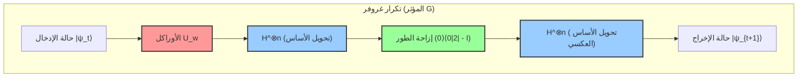

يوضح مخطط الدائرة هذا طريقة تنفيذ عملية للغاية لمؤثر الانتشار $U_s = 2|s\rangle\langle s| - I$ . فبما أن الحالة $|s\rangle$ يتم توليدها بواسطة $H^{\otimes n} |0\rangle^{\otimes n}$ ، يمكن تفكيك المؤثر على النحو التالي:

$$
U_s = 2(H^{\otimes n} |0\rangle^{\otimes n})(\langle 0|^{\otimes n} H^{\otimes n}) - I = H^{\otimes n} (2|0\rangle\langle 0| - I) H^{\otimes n}
$$

بمعنى آخر، من خلال اعتماد هيكل "شطيرة" (Sandwich structure): التحويل إلى أساس الحساب باستخدام تحويل هادامارد $H^{\otimes n}$ ، ثم تطبيق مؤثر إزاحة طور مشروطة لا يعكس الطور إلا عندما تكون جميع الكيوبتات في الحالة $|0\rangle$ (أو إعطاء طور سالب فقط للحالة $|0\rangle$ وهو مكافئ تمامًا ولا يختلف سوى في طور كلي عام)، ثم العودة مجددًا إلى الأساس الأصلي باستخدام تحويل هادامارد، يمكن تنفيذ "الانعكاس حول المتوسط" بكفاءة عالية على أي حاسوب كمومي.

## 9.5 تحليل احتمالية النجاح واشتقاق العدد الأمثل للتكرارات

مع التحديد الدقيق والشامل للسلوك الهندسي لمتجه الحالة، أصبحنا على أهبة الاستعداد لتقديم إجابة كمية صارمة عن السؤال الجوهري في الخوارزمية: "كم عدد التكرارات اللازمة للحصول على الحل الصحيح؟".

بعد إجراء $t$ تكرارًا، يكون احتمال $P(w)$ لرصد السجل الكمومي في أساس الحساب والحصول على حالة الحل الصحيح $|w\rangle$ مساويًا لمربع القيمة المطلقة لسعة المركبة $|w\rangle$ في متجه الحالة $|\psi_t\rangle$ :

$$
P(w) = |\langle w | \psi_t \rangle|^2 = \sin^2((2t+1)\theta)
$$

إن هدفنا الأسمى هو جعل هذا الاحتمال $P(w)$ في حده الأقصى، أي الاقتراب قدر الإمكان من الحد النظري الأعلى $1$ . تصل دالة جيب الزاوية المربعة $\sin^2(x)$ إلى قيمتها العظمى $1$ عندما تكون المعاملات $x$ مساوية لـ $\frac{\pi}{2}$ (90 درجة). وعليه، تُصاغ المعادلة لتحديد عدد التكرارات الأمثل $t$ كالتالي:

$$
(2t+1)\theta \approx \frac{\pi}{2}
$$

وبحل هذه المعادلة بالنسبة لـ $t$ :

$$
t \approx \frac{\pi}{4\theta} - \frac{1}{2}
$$

في سيناريوهات البحث العملية ضمن قواعد البيانات، يكون عدد العناصر $N$ فلكيًا وهائلاً للغاية. في هذه الحالة، تكون الزاوية $\theta$ بالغة الصغر وقريبة جدًا من $0$ . وبالنسبة للزوايا $\theta$ المتناهية في الصغر، يمكن استخدام الحد من الدرجة الأولى في متسلسلة تايلور (متسلسلة ماكلورين) لنحصل على التقريب الممتاز $\sin \theta \approx \theta$ . وبما أن تعريف الحالة الابتدائية ينص على أن $\sin \theta = \frac{1}{\sqrt{N}}$ ، يمكننا اعتبار أن $\theta \approx \frac{1}{\sqrt{N}}$ .

وبالتعويض بهذا التقريب في معادلة $t$ المشتقة آنفًا، نحصل على اشتقاق بديع للعدد الأمثل من التكرارات $R$ :

$$
R \approx \frac{\pi}{4} \sqrt{N}
$$

إن المغزى من هذه النتيجة مذهل لدرجة أنه هز أركان تاريخ علم المعلومات. ففي الحواسيب الكلاسيكية، كان العثور على حل صحيح في فضاء بحث عشوائي يتطلب حتمًا زمن بحث يتناسب طرديًا مع عدد العناصر (تعقيد حسابي $O(N)$ )، بواقع $N$ استعلام في أسوأ الحالات و $N/2$ في المتوسط. ومع ذلك، فإن خوارزمية غروفر التي تعمل على حاسوب كمومي، ومن خلال استغلال التداخل لتضخيم الاحتمال، تصل إلى حالة الحل الصحيح بنجاح شبه مؤكد (باحتمال فائق الدقة يبلغ $1 - O(1/N)$ ) بعدد استعلامات يبلغ فقط $\frac{\pi}{4} \sqrt{N}$ . وبذلك يصبح التعقيد الحسابي $O(\sqrt{N})$ ، مما يضغط زمن الحساب إلى مقياس الجذر التربيعي.

ومع ذلك، هناك تحذير بالغ الأهمية هنا: خوارزمية غروفر لا تتوقف تلقائيًا (Non-self-stopping). فإذا تجاوز عدد التكرارات هذه القيمة المثلى $R$ ، فإن متجه الحالة سيتجاوز المحور المستهدف $|w\rangle$ ، وبسبب دورية دالة الجيب، سيبدأ احتمال رصد الحل الصحيح في التناقص تدريجيًا في ظاهرة تُعرف باسم **الدوران الزائد (Overcooking / Overshooting)** . ولذلك، فإن التحكم الدقيق في توقيت إجراء القياس (توقيت إيقاف التكرار) يُعد شرطًا لا غنى عنه لنجاح الخوارزمية.

## 9.6 تعميم تضخيم السعة في حالة وجود حلول متعددة

حتى الآن، واصلنا النقاش بافتراض الحالة الأكثر صرامة، وهي وجود "حل صحيح واحد فقط" داخل قاعدة البيانات الضخمة (مسألة الحل المفرد). ومع ذلك، ففي مسائل العالم الحقيقي، من الشائع جدًا وجود حلول متعددة تستوفي الشروط المطلوبة. يمكن توسيع أسلوب تضخيم السعة، الذي يمثل قلب خوارزمية غروفر، توسيعًا طبيعيًا وبكل سلاسة ودون المساس بجماله الرياضي، حتى عند وجود $M$ من الحلول (حيث $1 \le M \le N$ ).

في حالة وجود $M$ من الحلول، نُعيد تعريف حالة التراكب المتساوي لجميع حالات الحلول الصحيحة كـ $|W\rangle$ ، وحالة التراكب المتساوي لجميع الحالات غير الصحيحة كـ $|W^\perp\rangle$ :

$$
|W\rangle = \frac{1}{\sqrt{M}} \sum_{x \in \text{Solutions}} |x\rangle
$$

$$
|W^\perp\rangle = \frac{1}{\sqrt{N-M}} \sum_{x \notin \text{Solutions}} |x\rangle
$$

عندئذٍ، يمكن نشر حالة التراكب المتساوي الابتدائية $|s\rangle$ باستخدام هذين المتجهين المتعامدين على النحو التالي:

$$
|s\rangle = \sqrt{\frac{N-M}{N}} |W^\perp\rangle + \sqrt{\frac{M}{N}} |W\rangle
$$

هنا، نُعرّف زاوية جديدة $\theta'$ بحيث تكون $\sin \theta' = \sqrt{\frac{M}{N}}$ . وبموجب هذا التعريف، بتطبيق نفس مؤثر غروفر $G$ تمامًا كما في حالة الحل المفرد (مع توسيع الأوراكل ليعكس طور جميع الحلول البالغ عددها $M$ )، يدور متجه الحالة بمقدار $2\theta'$ في كل تكرار داخل المستوى الذي يولده المتجهان $|W^\perp\rangle$ و $|W\rangle$ .

وبنفس التسلسل المنطقي، يكون العدد الأمثل من التكرارات هو $\frac{\pi}{4\theta'}$ ، وفي حالة $M \ll N$ يتم تقريبه على النحو التالي:

$$
R \approx \frac{\pi}{4} \sqrt{\frac{N}{M}}
$$

توضح هذه المعادلة أنه كلما زاد عدد الحلول $M$ ، قل عدد التكرارات المطلوبة (زمن البحث) كما هو متوقع. فعلى سبيل المثال، إذا كان هناك 4 حلول، يقل الوقت المطلوب إلى النصف. وحتى في الحالات التي يكون فيها عدد الحلول $M$ مجهولاً، يمكن تقدير العدد $M$ نفسه بسرعة فائقة ثم إجراء العدد المناسب من تكرارات تضخيم السعة، وذلك باستخدام تقنية متقدمة تُعرف باسم **خوارزمية العد الكمومي (Quantum Counting Algorithm)** ، والتي تجمع بين خوارزمية غروفر وتقدير الطور الكمومي (Quantum Phase Estimation).

## 9.7 الأهمية النظرية للتسريع من الدرجة الثانية وحدود الحوسبة الكمومية (نظرية BBBV)

قد يبدو التسريع من الدرجة الثانية من $O(N)$ إلى $O(\sqrt{N})$ الذي تقدمه خوارزمية غروفر متواضعًا في المعادلات الرياضية بالمقارنة مع التسريع الأسي الذي تقدمه خوارزمية شور ( $O(e^{N^{1/3}}) \to O(N^3)$ ). ومع ذلك، فإن القيمة الحقيقية والعالمية لخوارزمية غروفر في علوم الحاسوب تكمن تحديدًا في "شموليتها وعموميتها لجميع المسائل دون استثناء".

تستغل خوارزمية شور لتحليل الأعداد إلى عواملها الأولية بنية جبرية خاصة وفريدة للغاية، وهي "الدورية (Periodicity)" في الزمرة الضربية للأعداد الصحيحة. في المقابل، فإن خوارزمية غروفر قابلة للتطبيق دون قيد أو شرط على "البحث في قواعد البيانات غير المنظمة"، وهو الشكل الأكثر بدائية وتجردًا لجميع المسائل الحسابية، دون الحاجة إلى أي معرفة مسبقة أو بنية خاصة.

ويظهر هذا التأثير بأوضح صوره في فئة واسعة من المسائل الصعبة التي تنتمي إلى فئة التعقيد NP، وكذلك في التطبيقات الموجهة لتقنيات التشفير التي تشكل حجر الأساس للمجتمع المعاصر. على سبيل المثال، فإن المسائل الكاملة من فئة NP (مثل مسألة البائع المتجول ومسألة استيفاء الدوال البولية SAT) تؤول في جوهرها إلى البحث الشامل عن حل يحقق الشروط ضمن فضاء احتمالات هائل. بالنسبة لهذه المسائل، بينما تتطلب الخوارزميات الكلاسيكية وقتًا قدره $O(2^n)$ ، فإن تطبيق خوارزمية غروفر يمكن أن يخفض زمن الحساب عمليًا إلى النصف (تنصيف الأس) ليصبح $O(\sqrt{2^n}) = O(2^{n/2})$ .

أما الأثر على تقنيات التشفير فهو حاسم وبالغ الخطورة. فالقوة الأمنية لخوارزميات التشفير بالمفتاح المتناظر مثل معيار التشفير المتقدم (AES)، والتي تضمن أمن الإنترنت اليوم، تعتمد اعتمادًا كليًا على صعوبة هجمات القوة الغاشمة (Brute-force attack) على فضاء المفاتيح. على سبيل المثال، يبلغ فضاء البحث لمعيار AES-128 (مفتاح بطول 128 بت) $N = 2^{128}$ ، وهو رقم فلكي. في حين يحتاج الحاسوب الكلاسيكي في المتوسط إلى $2^{127}$ عملية للتحقق من المفاتيح، فإن الحاسوب الكمومي باستخدام خوارزمية غروفر قادر على العثور على المفتاح الصحيح بيقين تام بعد $\frac{\pi}{4} 2^{64}$ عملية حسابية فقط. هذه الحقيقة بالذات هي السبب الجوهري وراء إسراع هيئات التقييس العالمية (مثل NIST) في الانتقال إلى تشفير ما بعد الكم (Post-Quantum Cryptography)، والتحذير من استخدام AES-128 مع التوصية المشددة بالانتقال إلى AES-256 (الذي يتطلب $2^{128}$ عملية حتى مع الحوسبة الكمومية).

وأخيرًا، يجدر بنا ذكر نظرية بالغة الأهمية من منظور الفيزياء النظرية وعلوم الحاسوب، وهي **نظرية BBBV** التي أثبتها بينيت، وبرنشتاين، وبراسارد، وفازيراني (Bennett, Bernstein, Brassard, Vazirani) في عام 1997. أثبتت هذه النظرية رياضيًا وبشكل صارم أنه: "حتى مع استخدام حاسوب كمومي، فإن مسألة البحث غير المنظم باستخدام الصندوق الأسود تتطلب حتمًا ما لا يقل عن $\Omega(\sqrt{N})$ من الاستعلامات".

ما الذي يعنيه هذا؟ إنه يعني الحقيقة العميقة التالية: **"إن التعقيد الحسابي البالغ $O(\sqrt{N})$ الذي حققته خوارزمية غروفر هو الحد النظري المطلق الذي تسمح به قوانين الطبيعة (ميكانيكا الكم)، ومن المستحيل تحقيق أي تسريع إضافي باستخدام أي قوانين فيزيائية في هذا الكون"** . لم يكتشف غروفر خوارزمية بارعة فحسب، بل وصل إلى الحدود القصوى الفاصلة بين المعلومات وقوانين الفيزياء.

علاوة على ذلك، فإن نموذج "تضخيم السعة (Amplitude Amplification)" بحد ذاته، والمفصل في هذا الفصل، يُطبَّق على نطاق واسع كوحدة بناء أساسية لتكوين عدد لا يحصى من الخوارزميات الكمومية المتقدمة، مثل المشي العشوائي الكمومي (Quantum Random Walks) والروتينات الفرعية لتعلم الآلة الكمومي (Quantum Machine Learning). إن هذه الطريقة البديعة والأنيقة التي اكتشفها غروفر، والقائمة على "استخدام انعكاس مزدوج حول محورين متعامدين لتدوير وتضخيم سعة الاحتمال هندسيًا"، ستظل تتلألأ كواحدة من أصلب وأهم الركائز التي تدعم صرح علم المعلومات الكمومية العظيم.

# الفصل العاشر: تصحيح الأخطاء الكمومية والحوسبة المتسامحة مع الأخطاء

يعد "الضجيج" و"فك الترابط" الجدار الأكبر والأكثر عمقًا الذي يواجه علم المعلومات الكمومية. طالما أننا نتعامل مع الكمبيوتر الكمومي كنظام مغلق مثالي، فإن التلاعب الحتمي بالحالة عبر التطور الوحدوي وفقًا لمعادلة شرودنغر يكون مضمونًا. ومع ذلك، فإن الأجهزة الكمومية، لكونها أنظمة فيزيائية حقيقية، تتفاعل باستمرار مع البيئة الخارجية (مثل الحمام الحراري، تقلبات المجال الكهرومغناطيسي، والأشعة الكونية). في هذا الفصل، بعد تقديم تعريف رياضي دقيق للضجيج في الأنظمة الكمومية، سنتعمق في "تصحيح الأخطاء الكمومية" (Quantum Error Correction: QEC)، الذي يوضح كيفية اكتشاف وتصحيح الأخطاء الفريدة للأنظمة الكمومية التي لا توجد في الأنظمة الكلاسيكية. بالإضافة إلى ذلك، سنشرح بالتفصيل الأساس النظري "للحوسبة الكمومية المتسامحة مع الأخطاء" (Fault-Tolerant Quantum Computation: FTQC)، والتي تمكن من استمرار الحساب إلى ما لا نهاية حتى في السيناريوهات الواقعية حيث تدخل الضوضاء في آلية التصحيح نفسها، إلى جانب نظرية العتبة (Threshold Theorem).

## 10.1 الوصف الرياضي للضجيج الكمومي وفك الترابط

لوصف فك الترابط في الأنظمة الكمومية بدقة، يجب تحويل المنظور من ديناميكيات الحالات النقية القائمة على متجه الحالة في الأنظمة المغلقة إلى ديناميكيات مصفوفة الكثافة في الأنظمة الكمومية المفتوحة. بالنظر إلى التطور الوحدوي في النظام المركب الذي يتكون من نظام البيئة $E$ والنظام الرئيسي $S$ ، والقضاء على درجات الحرية في نظام البيئة عن طريق الأثر الجزئي (Partial Trace)، يتم وصف تغير حالة النظام الرئيسي على أنه "خريطة حافظة للأثر موجبة تمامًا" (Completely Positive Trace-Preserving Map، أو خريطة CPTP).

أي قناة كمومية $\mathcal{E}$ يمكن نشرها باستخدام تمثيل كراوس (Kraus Representation) على النحو التالي:


$$
\mathcal{E}(\rho) = \sum_{k} E_k \rho E_k^\dagger
$$


هنا، يُطلق على $E_k$ اسم مؤثرات كراوس (Kraus Operators)، وهي تستوفي شرط حفظ الأثر $\sum_k E_k^\dagger E_k = I$ ، مما يعني حفظ الاحتمالات.

في المعلومات الكلاسيكية، الخطأ الوحيد الممكن على البت، وهو وحدة المعلومات، هو "انقلاب البت" (Bit Flip)، أي "0 يصبح 1" أو "1 يصبح 0". ومع ذلك، في الأنظمة الكمومية، يوجد خطأ فادح يُعرف باسم "انقلاب الطور" (Phase Flip)، حيث يتقلب طور التراكب. نعرض أدناه مؤثرات كراوس لقنوات ضجيج الكيوبت المفرد النموذجية:

1. **قناة انقلاب البت (Bit Flip Channel):** تعمل البوابة $X$ باحتمال $p$ .
   

$$
E_0 = \sqrt{1-p} I, \quad E_1 = \sqrt{p} X
$$


2. **قناة انقلاب الطور (Phase Flip Channel):** تعمل البوابة $Z$ باحتمال $p$ . يمثل هذا انهيار الطور النسبي (فك الترابط النقي). هذا هو السبب المباشر لظاهرة الاضمحلال الأسي للمكونات غير القطرية في مصفوفة الكثافة للحالة النقية $|\psi\rangle = \alpha|0\rangle + \beta|1\rangle$ .
   

$$
E_0 = \sqrt{1-p} I, \quad E_1 = \sqrt{p} Z
$$


3. **قناة إزالة الاستقطاب (Depolarizing Channel):** باحتمال $p$ ، تقترب الحالة من حالة مختلطة تمامًا (ضوضاء بيضاء) $I/2$ .
   

$$
E_0 = \sqrt{1-p} I, \quad E_1 = \sqrt{\frac{p}{3}} X, \quad E_2 = \sqrt{\frac{p}{3}} Y, \quad E_3 = \sqrt{\frac{p}{3}} Z
$$

العائق الأول الذي يقف في طريق بناء تصحيح الأخطاء الكمومية هو "نظرية عدم الاستنساخ" (No-Cloning Theorem). لا يوجد تحويل وحدوي ينسخ حالة كمومية غير معروفة $|\psi\rangle$ لإنشاء حالة مثل $|\psi\rangle \otimes |\psi\rangle \otimes |\psi\rangle$ . لذلك، فإن النهج البسيط لتصحيح الأخطاء الكلاسيكي المتمثل في "نسخ نفس المعلومات إلى ثلاثة بتات وأخذ الأغلبية" أمر مستحيل في الأنظمة الكمومية. علاوة على ذلك، إذا قمت بقياس حالة كمومية، يحدث انهيار الحزمة الموجية، ويتم تدمير التراكب. التحدي الأساسي هو كيفية تحديد الأخطاء دون تدمير المعلومات غير المعروفة.

## 10.2 المبدأ الأساسي لتصحيح الأخطاء الكمومية: التكرار وقياس المتلازمة

البديل "للنسخ" في المعلومات الكمومية هو تعيين المعلومات الأصلية إلى فضاء جزئي (فضاء الشفرة، Code Space) من فضاء هيلبرت ذي أبعاد أعلى، عن طريق جعل عدة كيوبتات في حالة تشابك كمومي (Entanglement).

كأبسط مثال، سنقوم بإنشاء "شفرة انقلاب البت ذات الـ 3 كيوبتات" التي تحمي حالة كيوبت واحد $|\psi\rangle = \alpha |0\rangle + \beta |1\rangle$ من انقلاب البت الاحتمالي.
يتم تعريف الأساس المنطقي (Logical Basis) على النحو التالي:


$$
|0\rangle_L = |000\rangle, \quad |1\rangle_L = |111\rangle
$$


الحالة المنطقية ستصبح $|\psi\rangle_L = \alpha |000\rangle + \beta |111\rangle$ . هذا ليس نسخًا، بل تشفير إلى حالة تشابك من نوع GHZ.

الآن، لنفترض حدوث خطأ انقلاب البت $X_1 = X \otimes I \otimes I$ في الكيوبت الأول. تتغير الحالة إلى $|\psi'\rangle = \alpha |100\rangle + \beta |011\rangle$ .
لاكتشاف هذا الخطأ، يجب ألا تقيس الحالة نفسها مباشرة. بدلاً من ذلك، نقوم بإجراء "قياس المتلازمة" (Syndrome Measurement) الذي يستخرج فقط آثار الخطأ دون تدمير الحالة. على وجه التحديد، نقوم بقياس مؤثرات التكافؤ $Z_1 Z_2$ و $Z_2 Z_3$ ، والتي هي ضرب الموترات لمؤثرات باولي.

أي متجه $|\psi\rangle_L$ في فضاء الشفرة الأصلي هو متجه ذاتي للقيمة الذاتية $+1$ لـ $Z_1 Z_2$ و $Z_2 Z_3$ (أي، $Z_1 Z_2 |\psi\rangle_L = |\psi\rangle_L$ ).
ومع ذلك، بالنسبة لحالة الخطأ $|\psi'\rangle$ ، نظرًا لخاصية جبر باولي المتمثلة في التبادل العكسي لـ $X$ و $Z$ (أي $\{X, Z\} = 0$ )،


$$
Z_1 Z_2 |\psi'\rangle = Z_1 Z_2 X_1 |\psi\rangle_L = -X_1 Z_1 Z_2 |\psi\rangle_L = - |\psi'\rangle
$$

$$
Z_2 Z_3 |\psi'\rangle = Z_2 Z_3 X_1 |\psi\rangle_L = X_1 Z_2 Z_3 |\psi\rangle_L = + |\psi'\rangle
$$


تصبح نتيجة القياس (المتلازمة) $(-1, +1)$ ، مما يؤكد فقط حقيقة أن "خطأ $X$ قد حدث في البت الأول". وبما أن المعلومات المتعلقة بمعاملات التراكب $\alpha, \beta$ لا تتسرب على الإطلاق، فلن يتم تدمير الحالة بسبب القياس. بعد ذلك، بتطبيق $X_1$ مرة أخرى، يمكن استعادة الحالة الأصلية بالكامل $|\psi\rangle_L$ .

وبالمثل، لتصحيح خطأ انقلاب الطور $Z$ ، نستخدم "شفرة انقلاب الطور ذات الـ 3 كيوبتات" باستخدام أساس هادامارد $\{|+\rangle, |-\rangle\}$ .


$$
|0\rangle_L = |+++\rangle, \quad |1\rangle_L = |---\rangle
$$


في هذه الحالة، يتم استخدام $X_1 X_2$ و $X_2 X_3$ لقياس المتلازمة.

هنا تتجلى الخاصية المذهلة لميكانيكا الكم. الأخطاء الناتجة عن التفاعل مع البيئة هي عمومًا دورانات مستمرة مثل $E(\theta) = \cos(\theta) I - i \sin(\theta) X$ . ومع ذلك、 عن طريق إجراء قياس المتلازمة، يتم **إسقاط** هذه الحالة احتماليًا إلى إحدى الحالات الذاتية: إما "لا يوجد خطأ ( $I$ )" أو "خطأ كامل ( $X$ )". بعبارة أخرى، يتم "رقمنة" (Digitized) الأخطاء المستمرة اللانهائية كموميًا إلى أخطاء باولي منفصلة من خلال القياس.

## 10.3 شفرة شور ذات التسعة كيوبتات (Shor Code) والصياغة المُثبِّتة (Stabilizer Formalism)

الشفرات المذكورة أعلاه يمكنها فقط تصحيح إما انقلاب البت أو انقلاب الطور. في عام 1995، نشر بيتر شور "شفرة شور ذات الـ 9 كيوبتات" (Shor's 9-Qubit Code) الرائدة، والتي يمكنها تصحيح كلا الخطأين في وقت واحد. يتم بناء هذا عن طريق دمج (Concatenation) شفرة انقلاب البت ذات الـ 3 كيوبتات داخل كل عقدة من شفرة انقلاب الطور ذات الـ 3 كيوبتات.

الأساس المنطقي هو كما يلي:


$$
|0\rangle_L = \frac{1}{2\sqrt{2}} ( |000\rangle + |111\rangle ) \otimes ( |000\rangle + |111\rangle ) \otimes ( |000\rangle + |111\rangle )
$$

$$
|1\rangle_L = \frac{1}{2\sqrt{2}} ( |000\rangle - |111\rangle ) \otimes ( |000\rangle - |111\rangle ) \otimes ( |000\rangle - |111\rangle )
$$

من قام بتعميم تصحيح الأخطاء مثل شفرة شور وتوفير أساس رياضي قوي هو دانيال غوتسمان من خلال "الصياغة المُثبِّتة" (Stabilizer Formalism).
لنفترض أن زمرة باولي المكونة من $n$ كيوبتات هي $\mathcal{P}_n$ . زمرة المُثبِّت (Stabilizer Group) $\mathcal{S}$ هي زمرة جزئية تبادلية من $\mathcal{P}_n$ ، ونُعرّف فضاء الشفرة $\mathcal{C}$ على أنه "مجموعة الحالات $|\psi\rangle$ التي لها قيمة ذاتية $+1$ لجميع عناصر المجموعة $S \in \mathcal{S}$ ". إذا كان هناك $k$ من المُولِّدات (Generators) المستقلة في نظام مكون من $n$ كيوبتات، فإن بُعد فضاء الشفرة سيكون $2^{n-k}$ ، وهو ما يمثل عدد الكيوبتات المنطقية.

في حالة شفرة شور ( $n=9$ )، لتشفير بت منطقي واحد، يتم تكوينها من $k=8$ مُولِّدات مستقلة.
مُثبِّتات نظام $Z$ (ستة) لاكتشاف انقلاب البت:


$$
S_1 = Z_1 Z_2 I_3 I_4 I_5 I_6 I_7 I_8 I_9, \quad S_2 = I_1 Z_2 Z_3 I_4 I_5 I_6 I_7 I_8 I_9
$$

$$
\dots, \quad S_6 = I_1 I_2 I_3 I_4 I_5 I_6 I_7 Z_8 Z_9
$$


مُثبِّتات نظام $X$ (اثنان) لاكتشاف انقلاب الطور:


$$
S_7 = X_1 X_2 X_3 X_4 X_5 X_6 I_7 I_8 I_9
$$

$$
S_8 = I_1 I_2 I_3 X_4 X_5 X_6 X_7 X_8 X_9
$$

إذا حدث خطأ $E \in \mathcal{P}_n$ في أي كيوبت، وتبادل عكسيًا مع أي من مُولِّدات $\mathcal{S}$ ، فإن نتيجة قياس هذا المُثبِّت ستصبح $-1$ ، مما يحدد نوع وموقع الخطأ. يوفر مفهوم المُثبِّت نهجًا قويًا للغاية، أقرب إلى صورة هايزنبرغ، حيث لا يتتبع الحالة الكمومية نفسها، بل البنية الجبرية للمؤثرات التي تحدد تماثل النظام.

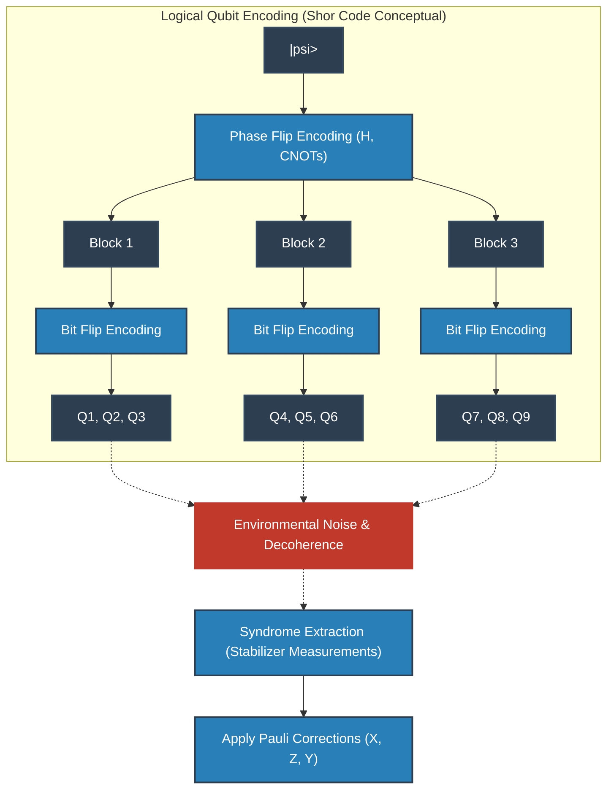

## 10.4 الشفرات الطوبولوجية وشفرات السطح (Surface Codes)

شفرة شور وشفرات المُثبِّت مثالية منطقيًا، ولكن في التنفيذ المادي، تتطلب "تفاعلات بين الكيوبتات المتباعدة" (تفاعلات بعيدة المدى). في الترتيب الشبكي ثنائي الأبعاد لعناصر الحالة الصلبة (مثل الدوائر فائقة التوصيل وسبين السيليكون)، يكون هذا الاقتران بعيد المدى صعبًا للغاية.

لذلك، تم اعتماد "تصحيح الأخطاء الكمومية الطوبولوجية" الذي اقترحه أليكسي كيتاييف (Alexei Kitaev) كتيار رئيسي لمعمارية أجهزة الكمبيوتر الكمومية الحديثة، ومن أبرز أمثلتها "شفرة توريك" (Toric Code) و"شفرة السطح" (Surface Code).

في شفرة السطح، يتم وضع الكيوبتات على رؤوس (أو حواف) شبكة ثنائية الأبعاد، ويتم تنفيذ قياسات المُثبِّت باستخدام التفاعلات المحلية فقط بين الكيوبتات المتجاورة.
يُوصف الهاميلتوني على النحو التالي:


$$
H = - \sum_{v} A_v - \sum_{p} B_p
$$


هنا، $A_v$ هو ضرب موترات لمؤثرات $X$ على الكيوبتات الأربعة المحيطة بالرأس (Vertex) (مؤثر الرأس: $A_v = \prod_{i \in \text{star}(v)} X_i$ )، و $B_p$ هو ضرب موترات لمؤثرات $Z$ على الكيوبتات الأربعة المحيطة باللوحة (Plaquette) (مؤثر السطح: $B_p = \prod_{i \in \text{boundary}(p)} Z_i$ ).
هذه المؤثرات تتبادل مع بعضها البعض ( $[A_v, B_p] = 0$ )، ويتم تشفير الحالة المنطقية في فضاء الحالة الأرضية حيث تكون جميع القيم الذاتية لـ $A_v$ و $B_p$ هي $+1$ . المذهل في الأمر أن درجة الانحطاط للحالة الأرضية لشفرة توريك المبنية على متعدد طيات ثنائي الأبعاد من الجنس (Genus) $g$ تكون $4^g$ ، وعلى الطارة ( $g=1$ ) يتم تشفير اثنين من الكيوبتات المنطقية بشكل طبيعي.

التفسير الفيزيائي الجميل للغاية لشفرة السطح هو التعامل مع الأخطاء كـ "أشباه جسيمات" (Anyon، إنيونات). على سبيل المثال، إذا حدث خطأ $X$ في كيوبت معين، فإن متلازمة اثنين من مؤثرات اللوحة $B_p$ المتجاورة تنقلب إلى $-1$ . هذا يعني أنه تم توليد زوج من "الإنيونات الشبيهة بأحاديات القطب المغناطيسي (إنيونات $m$ )" من فراغ الحالة الأرضية. وإذا تسلسلت الأخطاء إلى الكيوبتات المجاورة، فإن الإنيونات تتحرك عبر الفضاء الشبكي.
التصحيح ليس سوى عملية العثور على أزواج المتلازمة (الإنيونات)، واستخدام خوارزمية "المطابقة المثالية ذات الوزن الأدنى" (Minimum Weight Perfect Matching: MWPM) من نظرية المخططات لجعل الإنيونات تتصادم عبر أقصر مسار وتُبيد بعضها البعض.
تتوافق العمليات المنطقية ( $\bar{X}, \bar{Z}$ ) مع تشكيل حلقة هومولوجية غير بديهية (Topological Loop) تجعل هذا الإنيون يخترق الفضاء من طرف إلى آخر. وبما أن احتمالية أن تشكل الضوضاء المحلية بشكل طبيعي حلقة تخترق النظام بأكمله منخفضة بشكل أسي، فإن المعلومات تكون محمية بقوة شديدة من منظور طوبولوجي.

## 10.5 الطريق إلى الحوسبة الكمومية المتسامحة مع الأخطاء (FTQC) ونظرية العتبة

حتى إذا تم تأسيس نظرية تصحيح الأخطاء، تظل هناك مشكلة يائسة: "ماذا لو كانت الدائرة المستخدمة لإجراء تصحيح الأخطاء (مثل البتات المساعدة وبوابات CNOT لقياس المتلازمة) تحتوي في حد ذاتها على ضوضاء؟". إذا تم إدخال خطأ أكثر خطورة أثناء جراحة تصحيح الخطأ، فسوف ينهار النظام على الفور.

على سبيل المثال، تتسبب بوابة CNOT لاستخراج المتلازمة في انتشار خطأ $X$ في بت التحكم إلى البت المستهدف ( $X \otimes I \xrightarrow{CNOT} X \otimes X$ )، وتتسبب في انتشار عكسي لخطأ $Z$ من البت المستهدف إلى بت التحكم ( $I \otimes Z \xrightarrow{CNOT} Z \otimes Z$ ). إذا تكاثر خطأ فيزيائي واحد إلى كيوبتات متعددة داخل الكتلة المشفرة، فسيتجاوز مسافة الشفرة المحددة $d$ ، وسيفشل التصحيح تمامًا.

فلسفة التصميم لمنع هذا التفاعل المتسلسل الكارثي هي "الحوسبة الكمومية المتسامحة مع الأخطاء (FTQC)". الشرط المطلق لـ FTQC هو أن "خطأ فيزيائي واحد يحدث في النظام يجب أن ينتشر على الأكثر إلى خطأ واحد داخل كتلة الخطأ المنطقية".
لتحقيق ذلك، فإن "العمليات المستعرضة" (Transversal Operations) مطلوبة بشدة لتنفيذ البوابات المنطقية. هذه عملية بوابة آمنة حيث يتفاعل الكيوبت الفيزيائي $i$ فقط مع الكيوبت الفيزيائي $i$ من الكتل الأخرى (لا يوجد اقتران متقاطع داخل الكتلة). ومع ذلك، فقد أُثبت رياضيًا من خلال "نظرية إيستين-كنيل" (Eastin-Knill Theorem) أنه من المستحيل بناء مجموعة بوابات مستمرة للحوسبة الكمومية الشاملة باستخدام العمليات المستعرضة فقط.

العصا السحرية للتحايل على قيود هذه النظرية وتحقيق FTQC شاملة هي "تقطير الحالة السحرية" (Magic State Distillation). يتم تحضير كمية كبيرة من حالات غير كليفورد التي تحتوي على ضوضاء (مثل الحالة المعادلة لبوابة $T$ )، ومن خلال دوائر تصحيح الأخطاء باستخدام عمليات كليفورد المستعرضة فقط، يتم استخراج "حالات سحرية" نقية للغاية. بعد ذلك، باستخدام مبدأ الانتقال الآني الكمومي، يتم تطبيق بوابة غير كليفورد (مثل بوابة $T$ ) بشكل غير مباشر على الحالة المنطقية. تستهلك عملية التقطير هذه موارد هائلة (كيوبتات فيزيائية)، لذلك في خوارزميات عصر FTQC، أصبح "كيفية تقليل عدد بوابات $T$ " هو التحدي الأسمى.

تتويج كل هذه الجهود النظرية هو "نظرية العتبة الكمومية" (Quantum Threshold Theorem).
هذه النظرية، التي أثبتتها دوريت أهارونوف (Dorit Aharonov) ومايكل بن أور (Michael Ben-Or) وآخرون، تعلن بصوت عالٍ ما يلي:
 **"إذا كان احتمال الخطأ $p$ للمكونات الفيزيائية (البوابات، القياسات، والتهيئة) أقل من عتبة معينة $p_{th}$ ، فإنه من خلال تداخل شفرات تصحيح الأخطاء الكمومية بشكل هرمي (Concatenation) أو الاستمرار في زيادة حجم الشبكة (مسافة الشفرة $d$ ) للشفرة الطوبولوجية، يصبح من الممكن تنفيذ حساب كمومي لأي فترة زمنية وبأي دقة."** 

تعتمد العتبة $p_{th}$ على الشفرة والبنية المستخدمة، لكنها تمتلك قيمة واقعية للغاية ويمكن الوصول إليها تقارب $10^{-2}$ (1%) في شفرات السطح. كبح معدل الخطأ الفيزيائي إلى ما دون هذه العتبة بكثير (تحسين الطبقة الفيزيائية - Physical Layer)، وتطوير أجهزة فك تشفير متلازمة أكثر كفاءة ومتغيرات من شفرات السطح (تحسين الطبقة المنطقية - Logical Layer)، كلاهما يشكل ساحة المعركة الرئيسية في المنافسة العالمية الحالية لتطوير أجهزة الكمبيوتر الكمومية.

لا يُعد تصحيح الأخطاء الكمومية و FTQC مجرد ترقيع هندسي. بل هو تحدٍ جذري وفني للغاية للبشرية، يوسع حدود القدرة الحسابية للكون من خلال تمديد حالة التراكب الدقيقة لميكانيكا الكم، التي تحاول الطبيعة إخفاءها، إلى مقاييس زمنية عيانية من خلال التحكم في الطوبولوجيا، ونظرية الزمر، والإنتروبيا الديناميكية الحرارية.

# الفصل 11: التنفيذ المادي للأجهزة الكمومية

لقد شرحنا بالتفصيل الأسس النظرية لعلم المعلومات الكمومية والبنية الرياضية للخوارزميات حتى الفصل العاشر. وبغض النظر عن مدى براعة تصميم الخوارزميات الكمومية المتقدمة، وحتى لو أُثبت التفوق الكمومي النظري (Quantum Supremacy) في إطار نظرية التعقيد الحسابي، فإنها ستظل مجرد تلاعب بالرياضيات البحتة ما لم يتوفر كيان فيزيائي مادي لتنفيذها، ألا وهو "العتاد الكمومي" (Quantum Hardware). في هذا الفصل، سنشرح بدقة وبناءً على المبادئ العميقة للفيزياء الكمومية الكامنة وراءها، أحدث طرق التنفيذ المادي للأجهزة لتجسيد متجه الحالة $ |\psi\rangle $ في فضاء هيلبرت المجرد داخل العالم الفيزيائي الحقيقي.

ومن أجل التحكم في نظام فيزيائي كمومي اصطناعياً وجعله يعمل كحاسوب كوني/شامل (Universal)، يجب استيفاء خمسة متطلبات فيزيائية صارمة تُعرف باسم معايير ديفينشينزو (DiVincenzo's criteria):
1. **وجود نظام كيوبتات قابل للتطوير وموصوف بدقة** : القدرة على تأمين بنية الجداء الموتري لفضاء هيلبرت $ \mathcal{H} = \bigotimes_{i=1}^n \mathcal{H}_i $ فيزيائياً.
2. **تهيئة الحالة الكمومية** : القدرة على إعادة ضبط النظام إلى حالة نقية (نموذجياً $ |00\dots0\rangle $ ) بدقة وإخلاص عالٍ.
3. **أزمنة تماسك طويلة بما فيه الكفاية** : أن تكون أزمنة فك التماسك (T1 و T2) للحالة الكمومية أطول بعدة مراتب أسية من الزمن اللازم لتنفيذ عملية بوابة واحدة.
4. **تنفيذ مجموعة بوابات كمومية شاملة** : القدرة على تقريب أي تحويل وحدوي $ \hat{U} \in SU(2^n) $ بأي دقة اعتباطية عبر تركيب عدد منتهٍ من البوابات الأساسية (مثل بوابات H و T و CNOT).
5. **القياس الإسقاطي لكيوبتات محددة** : القدرة على قراءة التوزيع الاحتمالي وفق أساس محدد بدقة عالية مصحوبة بانهيار الحالة الكمومية.

إن بناء نظام يستوفي جميع هذه المتطلبات في آنٍ واحد وبدقة (Fidelity) عالية يمثل معضلة تاريخية في الفيزياء والهندسة الحديثة. فإذا تم عزل النظام كلياً عن بيئته، فإن زمن التماسك سيزداد، ولكن هذا في الوقت نفسه سيجعل من الصعب تشغيل النظام أو قياسه. وتكمن جوهر الفلسفة التصميمية لكل طريقة من طرق الأجهزة في كيفية التغلب على هذه المقايضة الحتمية.

## 11.1 الكيوبتات فائقة التوصيل: الظواهر الكمومية العيانية الكبيرة ودوائر LC غير الخطية

في الوقت الحاضر، الطريقة التي تحظى بأقوى دعم وتطوير من قبل العديد من المؤسسات البحثية، بما في ذلك Google و IBM، هي الكيوبتات فائقة التوصيل (Superconducting Qubit). وهذا ليس جسيماً أولياً مجهرياً، بل هو نهج لبناء "ذرة اصطناعية" (Artificial Atom) بالاستفادة من الظواهر الكمومية العيانية التي تُبديها الدوائر الإلكترونية الماكروسكوبية.

### 11.1.1 فيزياء وصلة جوزيفسون واللاخطية

إن دوائر الرنين LC التقليدية المصنعة بدقة (نظام يتألف من محث $ L $ ومكثف $ C $)، عندما تُبرّد إلى درجات حرارة بالغة الانخفاض وتُكمم، تصبح متذبذباً توافقياً ميكانيكياً كمومياً (Harmonic Oscillator). ويمكن كتابة الهاميلتوني الخاص بها باستخدام مؤثر الإنشاء $ \hat{a}^\dagger $ ومؤثر الإفناء $ \hat{a} $ على النحو التالي:

$$
\hat{H}_{\text{LC}} = \hbar \omega_r \left( \hat{a}^\dagger \hat{a} + \frac{1}{2} \right)
$$

هنا $ \omega_r = 1/\sqrt{LC} $ هو تردد الرنين. وتكون مستويات الطاقة لهذا النظام $ E_n = \hbar \omega_r (n + 1/2) $ متساوية التباعد. وإذا استخدمنا أدنى حالة طاقة $ |0\rangle $ وحالة الإثارة الأولى $ |1\rangle $ لهذا النظام ككيوبت، وحاولنا إجراء عملية بوابة (على سبيل المثال الانتقال $ |0\rangle \leftrightarrow |1\rangle $) عن طريق إشعاع موجات ميكروويف بتردد $ \omega_r $، فسيتم في الوقت ذاته إثارة الانتقالات متساوية التباعد $ |1\rangle \leftrightarrow |2\rangle $ و $ |2\rangle \leftrightarrow |3\rangle $. وبهذا لن يعمل النظام كنظام ثنائي المستويات.

ولحل هذه المشكلة، لا بد من وجود "لاخطية" (Nonlinearity) تجعل مستويات الطاقة غير متساوية التباعد. وما يحقق ذلك هو **وصلة جوزيفسون (Josephson Junction)** . تتكون الوصلة من موصلين فائقين تفصل بينهما طبقة عازلة رقيقة بسماكة بضعة نانومترات، حيث تنفذ أزواج كوبر (Cooper pairs) عبر نفق ميكانيكا الكم مع الحفاظ على تداخل الطور العياني. ووفقاً لمعادلة جوزيفسون، تكون العلاقة بين تيار التوصيل الفائق $ I $ وفرق الطور $ \phi $ هي $ I = I_c \sin \phi $. وبذلك، تعمل الوصلة كمحث غير خطي تعتمد محاثته على شدة التيار.

### 11.1.2 هاميلتوني الترانزمون (Transmon)

تاريخياً، تم ابتكار تصميمات متنوعة مثل كيوبتات الشحنة وكيوبتات التدفق، ولكن التصميم الأكثر نجاحاً في الوقت الراهن هو "الترانزمون" (Transmon)، الذي رفع بشكل هائل من مستوى مقاومة ضوضاء الشحنة.

يعمل الترانزمون في نطاق يتم فيه تعمد زيادة سعة التحويل المتوازية (Shunt capacitance) بدرجة كبيرة مقارنة بطاقة جوزيفسون $ E_J $، مما يؤدي إلى تقليل طاقة الشحن $ E_C = e^2 / (2C_{\Sigma}) $ بحيث يتحقق الشرط ( $ E_J / E_C \gg 1 $ ).
إن مؤثر الشحنة $ \hat{n} $ الذي يمثل عدد أزواج كوبر، ومؤثر الطور $ \hat{\phi} $ الذي يمثل فرق طور التوصيل الفائق هما متغيران مترافقان قانونياً (Canonically conjugate)، ويحققان علاقة التبديل $ [\hat{\phi}, \hat{n}] = i $. ويُوصف هاميلتوني الترانزمون بدقة رياضية على النحو التالي:

$$
\hat{H}_{\text{transmon}} = 4 E_C (\hat{n} - n_g)^2 -E_J \cos \hat{\phi}
$$

هنا، $ n_g $ هي الشحنة الانزياحية الناتجة عن البيئة أو جهد البوابة. وفي النهاية الحدية التي يكون فيها $ E_J \gg E_C $، يتم كبح التقلبات الكمومية للطور عند قيم صغيرة، ولذا يمكن فك حد جيب التمام باستخدام متسلسلة تايلور ومعاملة النظام كمتذبذب لا توافقي (Anharmonic oscillator):

$$
-E_J \cos \hat{\phi} \approx - E_J + \frac{E_J}{2} \hat{\phi}^2 - \frac{E_J}{24} \hat{\phi}^4 + \mathcal{O}(\hat{\phi}^6)
$$

يجلب هذا الحد $ \hat{\phi}^4 $ اللا توافقية (Anharmonicity) إلى النظام. وكنتيجة للحسابات بنظرية الاضطراب، يتم تقريب اللا توافقية $ \alpha $ بين مستويات الطاقة على النحو التالي:

$$
\alpha \equiv (E_2 - E_1) - (E_1 - E_0) \approx -E_C
$$

وبفضل هذه اللا توافقية السالبة (حيث يكون تردد الانتقال $ E_1 \to E_2 $ أصغر من $ E_0 \to E_1 $)، يصبح بالإمكان تنفيذ بوابات الكيوبت الأحادي بأمان باستخدام نبضات الميكروويف داخل فضاء الأساس الحسابي المعرّف بالحالتين $ |0\rangle $ و $ |1\rangle $.

### 11.1.3 الديناميكا الكهربائية الكمومية للدوائر (Circuit QED) وآلية القياس

الإطار النظري لقراءة حالة الكيوبت دون تدميرها هو "الديناميكا الكهربائية الكمومية للدوائر (Circuit QED)"، والتي تطبق مبادئ الكهروديناميكا الكمومية داخل التجويف الرنان على الدوائر فائقة التوصيل.
يُوصف النظام المقترن للكيوبت وتجويف الميكروويف الرنّان المخصص للقراءة بواسطة نموذج جاينز-كامينغز (Jaynes-Cummings):

$$
\hat{H}_{\text{JC}} = \frac{\hbar \omega_q}{2} \hat{\sigma}_z + \hbar \omega_r \hat{a}^\dagger \hat{a} + \hbar g (\hat{\sigma}_+ \hat{a} + \hat{\sigma}_- \hat{a}^\dagger)
$$

هنا $ g $ هي قوة الاقتران. وفي النطاق التشتتي (Dispersive regime) الذي يتحقق عندما يكون تردد انتقال الكيوبت $ \omega_q $ وتردد الرنان $ \omega_r $ متباعدين كثيراً ( $ |\omega_q - \omega_r| \gg g $ )، يمكن قطرة الهاميلتوني الفعال عبر تحويل شريفر-وولف ليصبح:

$$
\hat{H}_{\text{disp}} \approx \frac{\hbar \omega_q}{2} \hat{\sigma}_z + \hbar \left( \omega_r + \frac{g^2}{\Delta} \hat{\sigma}_z \right) \hat{a}^\dagger \hat{a}
$$

حيث $ \Delta = \omega_q - \omega_r $. المعنى الفيزيائي الذي يظهره الحد الثاني من هذه المعادلة بالغ الأهمية: إذ ينزاح التردد الفعال للتجويف الرنان بمقدار $ \pm g^2/\Delta $ تبعاً لحالة الكيوبت (سواء كانت $ \hat{\sigma}_z = +1 $ أو $ -1 $). وبناءً على ذلك، عبر إرسال موجة ميكروويف استكشافية وقياس طور الموجة النافذة أو المنعكسة، يمكن إجراء قياس إسقاطي لحالة الكيوبت.

 **المزايا والعيوب** 
تتمثل الميزة الكبرى لطريقة التوصيل الفائق في إمكانية الاستفادة من تقنيات الطباعة الحجرية لأشباه الموصلات المتاحة بالفعل، مما يوفر قابلية ممتازة للتوسع عبر تصميم التوصيلات على الشريحة، فضلاً عن أن زمن تنفيذ البوابات سريع للغاية ويقع في حدود النانو ثانية. ومن جهة أخرى، يتمثل العيب في أنه نظراً لكونه نظاماً عيانياً اصطناعياً، فإنه هش وحساس للغاية تجاه عيوب المواد الدقيقة (أنظمة المستويين: TLS) والضوضاء الكهرومغناطيسية، مما يفرض توفير بيئة تبريد فائقة في ثلاجة تخفيف تعمل بالقرب من الصفر المطلق (حوالي 10 ملي كلفن).

## 11.2 طريقة مصيدة الأيونات: قمة الفيزياء الذرية والتطابق التام

إذا كانت الكيوبتات فائقة التوصيل تمثل "أنظمة كمومية عيانية اصطناعية"، فإن طريقة مصيدة الأيونات (Trapped Ion) تمثل "الأنظمة الكمومية المجهرية المطلقة الموجودة في الطبيعة". فالذرات المتطابقة كنظائر (مثل $ ^{171}\text{Yb}^+ $ أو $ ^{40}\text{Ca}^+ $) تمتلك خصائص متطابقة تماماً في أي مكان توجد فيه في الكون. وبناءً على ذلك، لا وجود لمفهوم تفاوت التصنيع على الإطلاق، وتتمتع بميزة مطلقة تتمثل في أزمنة تماسك طويلة بشكل استثنائي.

### 11.2.1 مصيدة بول وديناميكيات التبريد بالليزر

في مصيدة الأيونات، يستحيل احتجاز الجسيمات المشحونة بشكل مستقر في فضاء ثلاثي الأبعاد باستخدام مجال كهربائي ساكن فقط (وفقاً لنظرية إيرنشو). ولتجاوز هذا القيد، تُستخدم تقنية مصيدة بول (Paul trap) التي تعتمد على مجال كهربائي عالي التردد يتذبذب زمنياً وغير متجانس مكانياً.

تخضع الأيونات المحتجزة داخل غرفة مفرغة للتبريد بالليزر (تبريد دوبلر والتبريد بالنطاق الجانبي). وبذلك، تُسحب الطاقة الحركية من الأيونات حتى تصل إلى الحالة الأرضية في ميكانيكا الكم (حيث عدد الفونونات $ n=0 $ ). وتُشفر قاعدة الحوسبة للكيوبت في الحالة الإلكترونية الداخلية للأيون. ويكون هاميلتوني الحالة الداخلية بسيطاً:

$$
\hat{H}_{\text{internal}} = \frac{\hbar \omega_0}{2} \hat{\sigma}_z
$$

### 11.2.2 نظام لامب-ديكي ورياضيات بوابة مولمر-سورينسن

يكمن الإنجاز الحاسم في طريقة مصيدة الأيونات في آلية توليد التشابك بين كيوبتات متعددة. إذ ترتبط سلسلة الأيونات المحتجزة بقوى تنافر كولوم قوية، ويكون للنظام بأكمله أنماط اهتزاز مرجعية جماعية (فونونات). وباستخدام هذا الفونون كناقل للبيانات (Data bus)، يمكن التوسط في التفاعلات المباشرة حتى بين الأيونات المتباعدة فيزيائياً.

والتنفيذ الأكثر شيوعاً ومعيارية للبوابات ثنائية الكيوبت هو بوابة مولمر-سورينسن (Mølmer-Sørensen (MS) gate). حيث يُسلط على أيونين في وقت واحد شعاعا ليزر بلونين مزاحين قليلاً عن تردد نمط الفونون $ \omega_m $. وفي نظام لامب-ديكي الذي يكون فيه معامل لامب-ديكي $ \eta = k z_0 $ صغيراً بما فيه الكفاية ( $ \eta \sqrt{n} \ll 1 $ )، يمكن فك هاميلتوني التفاعل تقريبياً كما يلي:

$$
\hat{H}_{\text{int}} \approx \hbar \Omega \sum_{j=1,2} \hat{\sigma}_\phi^{(j)} \left( \eta \hat{a} e^{i \delta t} + \eta \hat{a}^\dagger e^{-i \delta t} \right)
$$

هنا $ \Omega $ هو تردد رابي، و $ \delta $ هو الانفصال الترددي (Detuning). وعند حساب مؤثر التطور الزمني باستخدام متسلسلة ماغنوس، يعود نمط الحركة بعد زمن بوابة محسوب بدقة إلى حالته الأصلية، بينما يُكتسب طور هندسي بين الحالات الداخلية، مما يُبقي تفاعل سبين-سبين فعالاً:

$$
\hat{U}_{\text{MS}} = \exp\left( -i \frac{\pi}{4} \hat{\sigma}_\phi \otimes \hat{\sigma}_\phi \right)
$$

تولد هذه العملية حالة متشابكة كلياً، وتتمتع بقدرة حسابية مكافئة لبوابة CNOT. وتُعد ميزة الاتصال الكلي المتبادل (All-to-all connectivity) هي الفارق الجوهري عن طريقة التوصيل الفائق التي تقتصر على ربط الكيوبتات المتجاورة فقط.

 **التحديات والحدود** 
يستغرق زمن تنفيذ البوابة عشرات الميكروثواني، وهو أبطأ بعدة مراتب أسية مقارنة بنظام التوصيل الفائق. بالإضافة إلى ذلك، إذا وُضع أكثر من بضع عشرات من الأيونات داخل مصيدة أحادية البعد، فإن طيف أنماط الاهتزاز يصبح كثيفاً ومزدحماً للغاية، مما يجعل التداخل المتبادل (Crosstalk) حتمياً. ولتجاوز هذه العقبة، أصبحت تقنيات التوسيع مثل معمارية QCCD (أجهزة الشحنة الكمومية المزدوجة - Quantum Charge-Coupled Device) من أهم محاور البحث الحالية.

## 11.3 الكيوبتات الطوبولوجية: الأنيونات غير التبادلية والمتانة المطلقة

تعتبر كل من تقنيات التوصيل الفائق ومصائد الأيونات عرضة للأخطاء الناتجة عن الضوضاء المحلية المنبعثة من البيئة المحيطة، مما يجعل تصحيح الأخطاء الكمومية الموضح لاحقاً أمراً حتمياً. ومع ذلك، هناك نهج طموح للغاية يهدف إلى بناء حالات كمومية محمية جوهرياً من الضوضاء على المستوى الفيزيائي الأساسي؛ ألا وهو الحاسوب الكمومي الطوبولوجي.

### 11.3.1 سلسلة كيتاييف وأنماط مايورانا الصفرية

في الفضاء ثلاثي الأبعاد الذي نعيش فيه، لا يوجد سوى نوعين من الجسيمات الأولية: البوزونات والفرميونات. لكن في الأنظمة المادية الطوبولوجية ثنائية الأبعاد، يمكن أن توجد "أنيونات" (Anyons) تكتسب فيها الدالة الموجية طوراً كيفياً عند إجراء عملية تبادل للجسيمات. والأكثر فرادة من ذلك هي "الأنيونات غير التبادلية" (Non-Abelian anyons)؛ فعند تبادل جسيمين منها، يدور النظام تدويراً وحدوياً من حالة انحلال معينة إلى حالة متعامدة أخرى في نفس مستوى الطاقة:

$$
| \psi_{\text{final}} \rangle = \hat{U} | \psi_{\text{initial}} \rangle
$$

المرشح الفيزيائي الأبرز لهذه الأنيونات غير التبادلية هو "أنماط مايورانا الصفرية" (Majorana Zero Modes, MZM) كأشباه جسيمات في فيزياء المادة المكثفة. ويتم إعداد ذلك بمنح سلك نانوي شبه موصل أحادي البعد (مثل InSb) تفاعلاً قوياً بين المدار والسبين (Spin-orbit interaction)، ووصله بمحاذاة موصل فائق ذي موجة s (s-wave)، مع تسليط مجال مغناطيسي خارجي. ووفقاً للنموذج الذي اقترحه أليكسي كيتاييف (Alexei Kitaev)، يمر السلك النانوي عند نطاق محدد من المعاملات بانتقال طوري إلى طور التوصيل الفائق الطوبولوجي، وتتوطن جسيمات مايورانا ذات الطاقة الصفرية كحالات حافة عند كلا طرفي السلك.

تحقق مؤثرات مايورانا $ \hat{\gamma}_1, \hat{\gamma}_2 $ شرط الترافق الذاتي ( $ \hat{\gamma}_j = \hat{\gamma}_j^\dagger $ ) وعلاقة التبادل المضاد $ \{ \hat{\gamma}_i, \hat{\gamma}_j \} = 2\delta_{ij} $. ويمكن بناء مؤثري الإنشاء والإفناء لفرميون ديراك المعتاد بصورة غير محلية مكانياً باستخدام هذين المؤثرين لمايورانا:

$$
\hat{c} = \frac{1}{2}(\hat{\gamma}_1 + i\hat{\gamma}_2), \quad \hat{c}^\dagger = \frac{1}{2}(\hat{\gamma}_1 - i\hat{\gamma}_2)
$$

تُجزأ هذه الحالة الإلكترونية الواحدة (تكافؤ الفرميون) وتُشفر في نقطتين معزولتين مكانياً عند طرفي السلك النانوي. ولما كان احتمال أن تؤدي الضوضاء المحلية إلى تشويش طرفي النظام في آن واحد وبترابط دقيق احتمالاً متناهي الصغر، فإن المعلومات الكمومية تصبح محمية بطبيعتها من فك التماسك (الحماية الطوبولوجية).

### 11.3.2 التضفير والحوسبة الطوبولوجية

تُنفذ البوابات المنطقية الكمومية في هذا النظام عبر "التضفير" (Braiding)، والذي يتمثل في التبادل المكاني لمواقع جسيمات مايورانا.

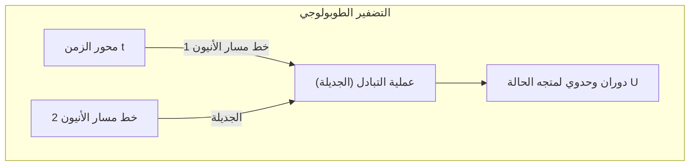

وبما أن طوبولوجيا "العقدة" التي يرسمها مسار الجسيمات هي وحدها التي تحدد النتيجة الحسابية، فما دامت الطوبولوجيا محفوظة ولم تتغير حتى مع وجود تذبذبات طفيفة في المسار، فإن التحويل الوحدوي $ \hat{U} $ يُنفذ بدقة متناهية وبنسبة خطأ تساوي الصفر. وهذا يمثل التسامح مع الأخطاء (Fault-tolerance) على مستوى العتاد الفيزيائي.

 **التحديات والحدود** 
ما زالت الأدلة التجريبية الحاسمة على وجود أنماط مايورانا الصفرية موضع نقاش علمي مكثف، ولم يتحقق بعد إثبات فيزيائي لعملية التضفير. فضلاً عن ذلك، فإن التضفير باستخدام أنيونات إيزينغ وحدها لا يمكنه تكوين مجموعة بوابات كمومية شاملة، مما يقتضي إدخال عمليات إضافية غير طوبولوجية تُعرف بتقطير الحالات السحرية (Magic State Distillation).

## 11.4 الكيوبتات الضوئية: البصريات الخطية والتشابك المستحث بالقياس

كنهج بديل يتميز بحصانة جوهرية ضد الضوضاء البيئية، يبرز الحاسوب الكمومي الضوئي القائم على الفوتونات (Photons). فالفوتونات مجردة من الشحنة، ويكون تفاعلها مع البيئة ضئيلاً للغاية حتى في درجات حرارة الغرفة، مما يسمح باعتبار زمن فك التماسك لها لا نهائياً من الناحية العملية.

### 11.4.1 التشفير ثنائي المسار وبروتوكول KLM

تُشفر الكيوبتات الضوئية في الغالب باستخدام أنماط المسارات المكانية. وفي التشفير ثنائي المسار (Dual-rail encoding)، تُعرف الحالة التي يسلك فيها الفوتون الدليل الموجي العلوي بـ $ |0\rangle = |1, 0\rangle $ ، بينما تُعرف الحالة التي يسلك فيها الدليل الموجي السفلي بـ $ |1\rangle = |0, 1\rangle $ .

يمكن تنفيذ بوابات الكيوبت الأحادي بالكامل باستخدام عناصر بصرية خطية مثل مجزئات الأشعة (BS) ومزيحات الطور (PS). لكن نظراً لعدم وجود تفاعل مباشر بين الفوتونات، يستحيل بناء بوابات حتمية ثنائية الكيوبت بالاعتماد على العناصر البصرية الخطية وحدها.
وفي عام 2001، اقترح كنيل ولافلام وميلبورن "بروتوكول KLM"، مبرهنين على أنه من خلال الدمج بين مصادر الفوتون الفردي، والعناصر البصرية الخطية، و **القياس الإسقاطي بواسطة كواشف الفوتونات** ، يصبح من الممكن إجراء حوسبة كمومية شاملة وقابلة للتطوير على الرغم من طبيعتها الاحتمالية. ويتم حقن اللاخطية في النظام انتقائياً في مرحلة ما بعد الاختيار (Post-selection) عبر استغلال ظواهر التداخل الكمومي الخالص مثل تأثير هونغ-أو-ماندل (Hong-Ou-Mandel effect) ولا عكوسية عملية القياس.

### 11.4.2 المتغيرات المستمرة (CV) والحالات العنقودية

في الأعوام الأخيرة، شهدت أساليب الحوسبة الكمومية المعتمدة على المتغيرات المستمرة (Continuous Variable, CV) التي توظف سعات التربيعات الطورية للضوء تطوراً متسارعاً لا يقل أهمية عن الأنظمة القائمة على المتغيرات المنفصلة للفوتون الواحد.
فباستخدام تقنية التضمين بتقسيم الزمن (Time-domain multiplexing) والضوء المضغوط (Squeezed light)، يمكن توليد "حالة عنقودية" (Cluster state) عملاقة مؤلفة من عشرات الآلاف إلى ملايين النبضات الضوئية المتشابكة. وتتجه الحواسيب الكمومية الضوئية بقوة نحو تبني معمارية "الحوسبة الكمومية القائمة على القياس / الحوسبة أحادية الاتجاه" (MBQC)، حيث تُستخدم هذه الحالة كمورد أساسي يُجرى الحساب عبره من خلال تطبيق قياسات مناسبة متتابعة على كل عقدة.

## 11.5 واقع عصر NISQ والدرجات نحو الكيوبتات المنطقية

كما يوضح مفهوم **NISQ (Noisy Intermediate-Scale Quantum)** الذي صاغه جون بريسكيل (John Preskill)، فإن العتاد الكمومي المتوفر في يد البشرية حالياً يمتلك من عشرات إلى مئات الكيوبتات الفيزيائية في نطاق "متوسط الحجم"، غير أنه لا يزال خاضعاً لسيطرة الضوضاء ولا يمكنه تفادي تراكم الأخطاء.

### 11.5.1 حدود التماسك ودقة الإخلاص

عند السعي لتشغيل دوائر كمومية عميقة مثل خوارزمية شور (Shor's algorithm)، تتضخم الأخطاء الدقيقة الناتجة عن كل عملية بوابة بصورة أسية. على سبيل المثال، لنفترض أن دقة الإخلاص لبوابة ثنائية الكيوبت تبلغ 99.5% (أي بمعدل خطأ $ \epsilon = 0.005 $ ). فإذا كانت الدائرة تحوي في مجملها $ N $ من البوابات، فإن الإخلاص الكلي للحالة النهائية يُقرب بـ $ \mathcal{F} \approx (1-\epsilon)^N \approx e^{-N\epsilon} $ . وعندما يكون $ N=1000 $ ، ينحدر احتمال النجاح إلى $ e^{-5} \approx 0.0067 $ ، لتضيع نتيجة الحساب الصحيحة وسط ركام الضوضاء.
وفي تجربة التفوق الكمومي التي أنجزتها Google، استُخدم مقياس تقييم الأداء بالإنتروبيا المتقاطعة (XEB) لإثبات تفوق كاسح في السرعة على الحواسيب الفائقة الكلاسيكية، بيد أن ذلك اقتصر على أخذ عينات من دوائر عشوائية محددة، ولا يمثل حسابات ذات جدوى تطبيقية عملية.

### 11.5.2 الانتقال إلى تصحيح الأخطاء الكمومية (فجر FTQC)

لتخطي قيود أجهزة NISQ وإرساء التفوق الكمومي الحقيقي في مجالات الحسابات الكيميائية وعلوم المواد واختراق التشفير، يغدو الانتقال إلى **FTQC (Fault-Tolerant Quantum Computing: الحوسبة الكمومية المتسامحة مع الأخطاء)** شرطاً لا مناص منه؛ حيث يقوم على دمج أعداد غفيرة من الكيوبتات الفيزيائية معاً لبناء "كيوبت منطقي" (Logical Qubit) واحد منيع ضد الأخطاء، بدلاً من الارتهان لنظام فيزيائي منفرد.

فعلى سبيل المثال، عند توظيف كود تصحيح أخطاء طوبولوجي مثل الكود السطحي (Surface Code)، إذا كان معدل الخطأ في الكيوبتات الفيزيائية أدنى من القيمة الحرجة (Threshold)، فإن معدل الخطأ المنطقي يضمحل أسياً مع توسيع حجم النظام. ولكن ضريبة ذلك هي الحاجة إلى عبء إضافي هائل (Overhead) يناهز 1,000 إلى 10,000 كيوبت فيزيائي لتشييد كيوبت منطقي واحد فقط.

إننا نقف اليوم على خط التماس المباشر في معركة الهندسة الفيزيائية ضد الضوضاء. فالأنظمة فائقة التوصيل، ومصائد الأيونات، والأنظمة الطوبولوجية، والكيوبتات الضوئية، تبرم كل واحدة منها عقداً مع قيودها الفيزيائية الخاصة وهي تناضل لبلوغ ذروة قابلية التوسع المنشودة. وفي الفصل الثاني عشر، سنبحر في دراسة الحصن الرياضي المنيع للمعلومات الكمومية الذي ينتظرنا وراء مسيرة تطور هذه الأجهزة: "البنية الرياضية لتصحيح الأخطاء الكمومية".

# الفصل 12: مستقبل الحوسبة الكمومية وملخص

"الحاسوب الكمومي" الذي يستغل قوانين الفيزياء في العالم المجهري - ميكانيكا الكم - والتي تتحدى حدسنا، كمورد حسابي. بدءاً من مبدأ التراكب في الفصل الأول، مروراً بالتشابك الكمومي، ومتباينة بيل، وخوارزمية شور، وتصحيح الأخطاء الكمومية، سافرنا عبر هذه السلسلة الطويلة في أعماق علوم المعلومات الكمومية. في هذا الفصل الأخير، سنكشف عن المعنى الرياضي والفيزيائي الحقيقي لتجارب إثبات "التفوق الكمومي (Quantum Supremacy / Quantum Advantage)"، وهو الإنجاز التقني الذي وصلت إليه البشرية حالياً، وسندحض بشكل صارم من منظور نظرية التعقيد الحسابي الوهم المنتشر في المجتمع بأن "الحاسوب الكمومي هو صندوق سحري يمكنه حل أي شيء في لحظة". وبعد ذلك، سنقدم خارطة طريق واقعية وطموحة نحو التنفيذ المجتمعي المستقبلي، بدءاً من عصر NISQ (Noisy Intermediate-Scale Quantum) وصولاً إلى FTQC (Fault-Tolerant Quantum Computing)، ليكون هذا خاتمة لهذه السلسلة الملحمية التي تبلغ 50 ألف كلمة.

## 12.1 إثبات التفوق الكمومي: المعلم الذي أظهره Google Sycamore

في عام 2019، أعلن فريق بحث من Google عن إثبات "التفوق الكمومي" باستخدام معالج "Sycamore"، الذي يحتوي على 53 كيوبت فائق التوصيل، لحل مشكلة محددة بسرعة على حاسوب كمومي لا يمكن حلها في وقت واقعي على حاسوب كلاسيكي. هذا الحدث يمثل علامة فارقة تاريخية في علوم المعلومات الكمومية، لكن القليلين من يفهمون البنية الرياضية الكامنة وراءه بشكل دقيق.

المشكلة التي قاموا بحلها هي "مشكلة أخذ العينات من الدوائر الكمومية العشوائية (Random Quantum Circuit Sampling)". بالنسبة لمجموعة من الكيوبتات، يتم تطبيق بوابات كيوبت واحد وبوابات كيوبت مزدوجة مختارة عشوائيًا عبر طبقات $d$ ، ويتم قياس الحالة النهائية في القاعدة الحسابية.

لنصف ذلك رياضياً. نفترض أن الحالة الابتدائية هي $ |\psi_0\rangle = |0\rangle^{\otimes n} $. هنا، نطبق تحويلاً وحدوياً (Unitary) تم اختياره عشوائياً $ U = U_d U_{d-1} \dots U_1 $. يتم التعبير عن الحالة النهائية $ |\psi_f\rangle $ باستخدام الجداء الموتري (Tensor product) والتركيب الخطي على النحو التالي:

$$
|\psi_f\rangle = U |0\rangle^{\otimes n} = \sum_{x \in \{0, 1\}^n} \alpha_x |x\rangle
$$

حيث $ \alpha_x = \langle x | U | 0 \rangle^{\otimes n} $ هي سعة الاحتمال (وهي عدد مركب) لملاحظة سلسلة البتات المحددة $x$. في هذه الحالة، فإن الاحتمال المثالي $ P_{\text{ideal}}(x) $ للحصول على سلسلة البتات $x$ عن طريق القياس يُعطى بواسطة قاعدة بورن (Born Rule) في ميكانيكا الكم كما يلي:

$$
P_{\text{ideal}}(x) = |\alpha_x|^2 = \left| \langle x | U | 0 \rangle^{\otimes n} \right|^2
$$

في الدوائر الكمومية العشوائية العميقة بما فيه الكفاية ($d$ كبير)، يُعرف أن كل سعة $ \alpha_x $ تظهر سلوكاً يشبه المشي العشوائي على المستوى المركب، ويتبع توزيعها الاحتمالي $ P_{\text{ideal}}(x) $ توزيع بورتر-توماس (Porter-Thomas distribution). بعبارة أخرى، دالة كثافة الاحتمال لظهور الاحتمال $p$ هي $ \text{Pr}(P_{\text{ideal}}(x) = p) \approx 2^n e^{-2^n p} $. هذا يعني أن بعض سلاسل البتات المحددة تكون أكثر عرضة للملاحظة من غيرها، مما يشكل "نمط البقع (Speckle pattern)".

لإجراء أخذ عينات دقيق من هذا التوزيع على حاسوب كلاسيكي، يجب حساب السعة $ \alpha_x $ مباشرة من خلال حسابات تقلص الشبكات الموترة الضخمة (Tensor network contraction). أبعاد متجه الحالة هي $ 2^n $، وفي حالة $ n = 53 $، يجب تتبع حوالي $ 9 \times 10^{15} $ من السعات المركبة (ذاكرة من فئة البيتابايت)، وهو ما يواجه جداراً حسابياً يتطلب وقتاً هائلاً حتى باستخدام أسرع حاسوب فائق في العالم في ذلك الوقت. من ناحية أخرى، فإن النظام الفيزيائي نفسه يحتفظ بالحالة **$|\psi_f\rangle$** كمتجه طبيعي في فضاء هيلبرت، ويقوم بإجراء أخذ عينات يتبع نمط البقع في لحظة (في غضون عشرات الميكروثانية) من خلال قياس واحد.

لتقييم نجاح أو فشل التجربة، تم تقديم معيار الإنتروبيا المتقاطعة الخطي (Linear Cross-Entropy Benchmarking, XEB). يتم تعريف الدقة (Fidelity) $ \mathcal{F}_{\text{XEB}} $ على النحو التالي:

$$
\mathcal{F}_{\text{XEB}} = 2^n \sum_{x \in \{0, 1\}^n} P_{\text{ideal}}(x) P_{\text{exp}}(x) - 1
$$

هنا، $ P_{\text{exp}}(x) $ هو التوزيع الاحتمالي التجريبي الذي تم الحصول عليه من المعالج الكمومي الفعلي (بما في ذلك ضوضاء الأجهزة). إذا كان الجهاز يُخرج ضوضاء عشوائية تماماً (مصفوفة كثافة لحالة مختلطة تماماً $ \rho = \frac{I}{2^n} $ )، فإن $ P_{\text{exp}}(x) = \frac{1}{2^n} $، وبالتالي $ \mathcal{F}_{\text{XEB}} = 0 $. من ناحية أخرى، إذا كان الحاسوب الكمومي يُخرج حالة نقية مثالية خالية تماماً من الضوضاء، فإن $ \mathcal{F}_{\text{XEB}} \approx 1 $. في تجربة Google، تم تأكيد قيمة $ \mathcal{F}_{\text{XEB}} \approx 0.002 $، وهي أكبر بوضوح من الصفر وذات دلالة إحصائية. حتى مع هذه الدقة الضئيلة، نظراً لصعوبة توليد عينات مكافئة على حاسوب كلاسيكي من منظور نظرية التعقيد الحسابي، تم اعتبار ذلك إثباتاً للتفوق الكمومي.

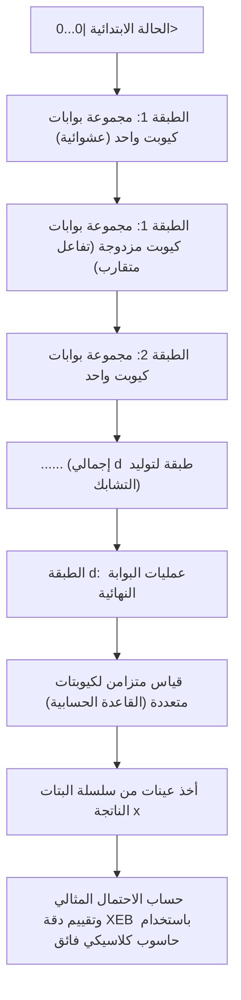

## 12.2 وهم "الصندوق السحري": فخ الحوسبة المتوازية و BQP مقابل NP

في تقارير وسائل الإعلام العامة والكتب التثقيفية حول الحواسيب الكمومية، غالباً ما نرى كلمات سحرية مثل "يمكنه حساب $2^n$ حالة في وقت واحد، لذلك يمكنه حل أي مشكلة في لحظة". ومع ذلك، هذا خاطئ تماماً من منظور نظرية التعقيد الحسابي. الحاسوب الكمومي ليس بأي حال من الأحوال عصا سحرية تحل "المشاكل كاملة التعقيد غير القطعية متعددة الحدود (NP-Complete)" في وقت متعدد الحدود دون شروط.

ينبع هذا الوهم من حقيقة أنه يمكن تقييم دالة لجميع المدخلات بـ "عملية واحدة" (التوازي الكمومي) من خلال تراكب الحالات باستخدام بوابة هادامارد (Hadamard gate) وما شابه $ |\psi\rangle = \frac{1}{\sqrt{2^n}} \sum_{x=0}^{2^n-1} |x\rangle $. باستخدام أوراكل (مؤثر وحدوي مسؤول عن الحساب) **$U_f$** ، عندما يتم تنفيذ حساب الدالة $ f(x) $ على حالة التراكب، تتطور الحالة بأكملها وفقاً للخطية على النحو التالي:

$$
U_f \left( \frac{1}{\sqrt{2^n}} \sum_{x=0}^{2^n-1} |x\rangle \otimes |0\rangle \right) = \frac{1}{\sqrt{2^n}} \sum_{x=0}^{2^n-1} |x\rangle \otimes |f(x)\rangle
$$

بالتأكيد، داخل متجه الحالة هذا، يتم تضمين إجابات $f(x)$ لجميع قيم $x$ كنظام فرعي من سعات الاحتمال. ومع ذلك، تذكر **بديهية الملاحظة** (انهيار الدالة الموجية) في ميكانيكا الكم. إذا قمت بإجراء عملية قياس على سجل المخرجات هذا، فكل ما ستحصل عليه هو زوج واحد $ (x, f(x)) $ يتم اختياره عشوائياً باحتمال $\frac{1}{2^n}$. تُفقد المعلومات الـ $ 2^n - 1 $ المتبقية إلى الأبد عن طريق القياس الإسقاطي الذي لا رجعة فيه. بعبارة أخرى، توجد فجوة يائسة لا يمكن تجاوزها بين "الحساب بشكل متوازٍ (تطور الحالة)" و "استخراج معلومات معينة نريدها من النتائج المحسوبة بشكل متوازٍ (قراءة الحالة)".

لكي تتفوق الخوارزميات الكمومية حقاً على الخوارزميات الكلاسيكية، لا يكفي التقييم المتوازي البسيط فحسب، بل يجب تصميم واستخدام "التداخل الكمومي (Quantum Interference)" ببراعة. من الضروري بناء تحويل وحدوي عالمي (Global Unitary Transformation) خاص جداً يعمل على تضخيم سعة الاحتمال المقابلة لحالة الإجابة الصحيحة المطلوبة من خلال التداخل البناء (Constructive interference)، ويلغي سعات الاحتمال لعدد لا يحصى من الإجابات الخاطئة الأخرى من خلال التداخل الهدام (Destructive interference) عن طريق عكس الطور.

في ظل هذا القيد، تُسمى فئة التعقيد للمشاكل التي يمكن للحاسوب الكمومي حلها في وقت متعدد الحدود مع الحفاظ على معدل دقة عالٍ بشكل ملحوظ بـ **BQP** (Bounded-error Quantum Polynomial time). من ناحية أخرى، فإن فئة المشاكل التي يمكن التحقق من صحة حلها، بمجرد إعطائه، في وقت متعدد الحدود هي **NP** ، وأصعب مجموعة من المشاكل ضمن هذه الفئة هي **مسائل NP-الكاملة** (مثل مشكلة البائع المتجول، مشكلة قابلية الإرضاء / SAT، وما إلى ذلك).

تعمل خوارزمية غروفر (Grover's algorithm) على تسريع البحث في قاعدة بيانات غير مهيكلة تحتوي على $ N = 2^n $ عنصر تربيعياً، من $ O(N) $ في الحوسبة الكلاسيكية إلى $ O(\sqrt{N}) $ في الحوسبة الكمومية. بالنظر إلى التعبير الرياضي لـ تضخيم السعة (Amplitude Amplification)، تُختزل الخوارزمية إلى عملية تدوير هندسي لمتجه الحالة داخل فضاء فرعي ثنائي الأبعاد (مستوى) ممتد بواسطة حالة التراكب المتساوية الابتدائية $ |s\rangle $ وحالة الإجابة الصحيحة $ |\omega\rangle $ التي نريد البحث عنها.

يُعرَّف مؤثر التكرار لغروفر **$G$** على أنه حاصل ضرب مؤثر عكس الطور لحالة الإجابة الصحيحة بواسطة الأوراكل $ U_\omega = I - 2|\omega\rangle\langle\omega| $ ومؤثر الانعكاس حول المتوسط $ U_s = 2|s\rangle\langle s| - I $.

$$
G = U_s U_\omega = (2|s\rangle\langle s| - I)(I - 2|\omega\rangle\langle\omega|)
$$

من خلال تطبيق هذا المؤثر الوحدوي **$G$** حوالي $ \frac{\pi}{4}\sqrt{N} $ مرة، يدور متجه الحالة نحو الحالة المطلوبة $ |\omega\rangle $ ، ويمكن زيادة احتمال ملاحظة الإجابة الصحيحة إلى ما يقرب من 1 (100٪). ومع ذلك، الحقيقة الحاسمة هنا هي أن هذا ليس سوى "تسريع تربيعي"، وليس تسريعاً أسياً ( $ O(2^n) \to O(\text{poly}(n)) $ ). حتى يومنا هذا، لم يتم العثور على أي نمط من التداخل الكمومي يحل الحالة العامة لمسائل NP-الكاملة في وقت متعدد الحدود. يعتقد العديد من علماء المعلومات الكمومية وعلماء الحاسوب بقوة، كتوقع أساسي في نظرية التعقيد الحسابي، أن **$\text{BQP} \not\supset \text{NP-Complete}$** (أي أن الحواسيب الكمومية لا يمكنها حل مسائل NP-الكاملة بكفاءة).

الحاسوب الكمومي هو معالج مساعد متخصص ومتطور للغاية يتيح تسريعاً يفوق متعدد الحدود من خلال تحويل فورييه الكمومي (QFT) فقط عندما يكون هناك "بنية جبرية مثل الدورية مخفية داخل المشكلة"، كما هو الحال في التحليل إلى العوامل في خوارزمية شور (Shor's algorithm).

## 12.3 تصحيح الأخطاء الكمومية وخارطة الطريق من NISQ إلى FTQC

على الرغم من إثبات التفوق الكمومي، إلا أن الأجهزة الحالية التي يتراوح حجمها من عشرات إلى مئات الكيوبتات مثل Sycamore تُسمى أجهزة **NISQ** (Noisy Intermediate-Scale Quantum)، ولا يمكنها منع غزو الضوضاء من البيئة تماماً. تتسبب الحالات الكمومية الدقيقة بسهولة بالغة في فك الترابط (Decoherence) (قيود زمن استرخاء الطور $T_2$ وزمن استرخاء الطاقة $T_1$) بسبب التفاعلات مع البيئة مثل التقلبات الحرارية والتداخل الكهرومغناطيسي. كلما أصبح الحساب أعمق (ازداد عدد طبقات البوابات)، تتراكم الضوضاء الناتجة عن عدم كمال البوابات وفك الترابط بشكل أسي، وتنهار نتيجة المخرجات النهائية إلى حالة مختلطة تماماً لا معنى لها.

المسار النظري الوحيد لكسر هذا الحد الفيزيائي وإكمال خوارزميات كمومية واسعة النطاق وعملية تتطلب مئات الملايين من الخطوات هو تحقيق **الحوسبة الكمومية المتسامحة مع الأخطاء (Fault-Tolerant Quantum Computation, FTQC)** باستخدام **تصحيح الأخطاء الكمومية (Quantum Error Correction, QEC)** . لا يمكن تطبيق تصحيح الأخطاء في أجهزة الكمبيوتر الكلاسيكية (مثل رموز الأغلبية عن طريق تكرار البتات) على الحالات الكمومية بسبب "مبرهنة عدم الاستنساخ (No-Cloning Theorem)" التي تشكل أساس ميكانيكا الكم. لا يوجد رياضياً أي تحويل وحدوي يمكنه نسخ حالة كمومية غير معروفة **$|\psi\rangle = \alpha|0\rangle + \beta|1\rangle$** بشكل مثالي وبسيط لتصبح **$|\psi\rangle \otimes |\psi\rangle \otimes |\psi\rangle$** .

ومع ذلك، وجدت الفيزياء النظرية حلاً أنيقاً (elegant) للتغلب على هذا اليأس. يمكن حماية المعلومات الكمومية ليس من خلال "استنساخ الحالات الفردية، بل من خلال إخفاء وتوزيع معلومة منطقية واحدة داخل طوبولوجيا 'فضاء التشابك (Entanglement space)' لفضاء هيلبرت الضخم المكون من عدد كبير من الكيوبتات الفيزيائية". حالياً، يعتبر "الرمز السطحي (Surface Code)" الواعد أكثر من منظور تنفيذ الأجهزة، وهو يعتمد على صياغة المثبت (Stabilizer Formalism) على شبكة ثنائية الأبعاد.

في الرمز السطحي، يتم وضع "كيوبتات البيانات" التي تحمل المعلومات الكمومية على حواف (Edges) الشبكة ثنائية الأبعاد، ويتم وضع "كيوبتات قياس المتلازمة (كيوبتات مساعدة أو Ancilla qubits)" لاكتشاف الأخطاء على الصفائح (Plaquettes) والرؤوس (Vertices) للشبكة. بعد ذلك، نحدد مجموعة من مؤثرات المثبت (Stabilizer operators) التي تتكون من الجداء الموتري لمؤثرات باولي على النحو التالي:

$$
B_p = \bigotimes_{i \in \partial p} Z_i \quad \text{(مؤثر الصفيحة: يكتشف أخطاء Z)}
$$

$$
A_v = \bigotimes_{i \in \delta v} X_i \quad \text{(مؤثر الرأس: يكتشف أخطاء X)}
$$

هنا، جميع $ B_p $ و $ A_v $ قابلة للتبديل (لا تتبادل عكسياً)، أي أنها تستوفي علاقة التبادل $ [B_p, A_v] = 0 $. يتم تعريف "الحالة المنطقية (فضاء الرمز)" **$|\psi_L\rangle$** التي نكتب فيها المعلومات بشكل صارم على أنها الفضاء الفرعي الممتد بواسطة الحالات الذاتية المتزامنة، بحيث تكون القيمة الذاتية لجميع مؤثرات المثبت هذه هي $+1$.

$$
B_p |\psi_L\rangle = +1 |\psi_L\rangle, \quad A_v |\psi_L\rangle = +1 |\psi_L\rangle \quad (\text{for all } p, v)
$$

لنفترض حدوث خطأ انقلاب غير متوقع (باولي $X$) أو خطأ في الطور (باولي $Z$) في أي من الكيوبتات الفيزيائية بسبب الضوضاء الحرارية الخارجية أو أخطاء التشغيل. عندها، نظراً لأن مؤثر الخطأ هذا له علاقة تبادل مضادة (Anti-commutation) ( $\{X, Z\} = 0 $ ) مع مؤثرات مثبت معينة مجاورة، فإن نتيجة قياس هذا المثبت (قيمة المتلازمة) تنقلب من $+1$ إلى $-1$. نقوم بتتبع أزواج المواقع (العيوب) التي تصبح $-1$ بشكل مستمر دون ملاحظة أو تدمير الحالة المنطقية المحمية نفسها (قيم معاملات الوزن $\alpha, \beta$) على الإطلاق. بعد ذلك، باستخدام خوارزميات كلاسيكية مثل "المطابقة التامة ذات الوزن الأدنى (Minimum Weight Perfect Matching)"، نقوم بتقدير الاحتمال الأقصى للمسار الذي وقع عليه الخطأ وأي كيوبت فيزيائي تأثر، ونقوم بتصحيحه إما برمجياً أو مادياً عن طريق تطبيق عملية عكسية.

وفقاً لـ "مبرهنة العتبة (Threshold Theorem)"، وهي إنجاز رائع في نظرية المعلومات الكمومية، فقد تم إثبات أنه طالما أن معدل الخطأ لكل بوابة فيزيائية فردية يقل عن عتبة معينة (حوالي $ 1\% $ في حالة الرمز السطحي)، فإنه من خلال زيادة حجم الشبكة (مسافة الرمز $d$)، يمكن تقليل معدل الخطأ على المستوى المنطقي بشكل تعسفي وأسي ليقترب من الصفر. ومع ذلك، لبناء كيوبت منطقي مثالي واحد، نظراً للعبء الإضافي لتصحيح الأخطاء، يتطلب الأمر من آلاف إلى عشرات الآلاف من الكيوبتات الفيزيائية عند مستويات الضوضاء الحالية. لفك تشفير RSA-2048 باستخدام خوارزمية شور، يُقدر أن هناك حاجة إلى آلاف الكيوبتات المنطقية، مما يتطلب في النهاية نظام FTQC ضخم وبمقياس لا يمكن تصوره، يضم الملايين إلى أكثر من عشرة ملايين من الكيوبتات الفيزيائية، تعمل جميعها في درجات حرارة شديدة البرودة مع الحفاظ على التماسك المتبادل.

بالنظر إليها من مرحلة العشرات إلى المئات من الكيوبتات الفيزيائية الحالية، فإن هذا يمثل تحدياً هندسياً شاقاً وملحمياً للبشرية، يضاهي مشروع أبولو أو بناء مصادم الهادرونات الكبير (LHC).

## 12.4 خاتمة: آفاق ومستقبل علوم المعلومات الكمومية

بدءاً من تقديم التراكب لـ **$|0\rangle$** و **$|1\rangle$** باستخدام تدوين برا-كيت في الفصل الأول، والتطور الزمني باستخدام المصفوفات الوحدوية، والوصف الرياضي للأنظمة متعددة الأجسام باستخدام الجداء الموتري، وانهيار الواقعية المحلية لأينشتاين من خلال متباينة بيل، وصولاً إلى البنية الرياضية الرائعة للخوارزميات الكمومية مثل شور وغروفر، فقد تتبعنا بدقة وبشكل صارم تتويج المعرفة المعروف بـ "علوم المعلومات الكمومية" من خلال هذه السلسلة المكونة من 12 فصلاً.

بينما تعتمد الحواسيب الكلاسيكية على "القيم الحقيقية/الخاطئة الحتمية (الجبر البولي)"، تعتمد الحواسيب الكمومية على "الدوران الوحدوي والجداء الموتري في فضاء هيلبرت المركب (الجبر الخطي)". يتجاوز هذا التحول النموذجي الجذري الجوانب الصناعية والعملية المتمثلة في مجرد "تسريع الحسابات"، ليطرح علينا أسئلة فلسفية عميقة تمتزج فيها نظرية المعلومات والفيزياء الأساسية تماماً، مثل: "ما هي القدرة النهائية لمعالجة المعلومات في هذا الكون؟" و"كيف تعتمد القابلية للحساب والتعقيد على بنية القوانين الفيزيائية للكون الذي نعيش فيه؟"

التشابك الكمومي (Entanglement)، الذي أسماه أينشتاين ذات مرة بـ "التأثير الشبحي عن بُعد (Spooky action at a distance)" وكرهه، أصبح الآن راسخاً باعتباره "المورد" الأساسي والذي لا غنى عنه لتشغيل النقل الآني الكمومي، والاتصالات المشفرة الكمومية، والحواسيب الكمومية. الحدس الذي طرحه الفيزيائي العبقري ريتشارد فاينمان في عام 1982: "إذا كنت تريد محاكاة الطبيعة، فيجب عليك أن تصنعها ميكانيكياً كمومياً. ويا لها من مسألة رائعة، لأنها لا تبدو سهلة على الإطلاق"، قد وصل الآن، بعد عقود من الزمن وبفضل الجهود المضنية التي بذلها الفيزيائيون وعلماء الرياضيات وعلماء الحاسوب ومهندسو الأجهزة المتميزون في جميع أنحاء العالم، إلى مرحلة التشغيل على معالجات حقيقية.

للتكرار، الحاسوب الكمومي ليس صندوقاً سحرياً متعدد الأغراض. وليس آلة أحلام تحل مسائل NP-الكاملة بالقوة الغاشمة في وقت متعدد الحدود. ومع ذلك، في مجالات معينة تتجاوز حدود أجهزة الكمبيوتر الكلاسيكية، مثل المحاكاة الدقيقة للحالات الإلكترونية المعقدة في التفاعلات الكيميائية (حسابات الكيمياء الكمومية)، وتوضيح الخصائص الفيزيائية للمواد الجديدة والموصلات الفائقة في درجات الحرارة العالية، وفئات معينة من مشاكل التحسين، بالإضافة إلى التحليل إلى العوامل ومشاكل اللوغاريتمات المنفصلة، فإنه يمتلك قوة "تفوق (Supremacy)" لا تقبل الشك.

لن تكون المعركة مع الضوضاء (الرحلة الشاقة من NISQ إلى FTQC) على مدى العقود القادمة ممهدة على الإطلاق. هناك جبال من العوائق الهندسية التي يجب التغلب عليها، مثل التحكم في الأحمال الحرارية الهائلة في البيئات شديدة البرودة، ومسألة قابلية التوسع لملايين من أسلاك الميكروويف، والتمديد الدراماتيكي لزمن تماسك الكيوبتات ( $T_1, T_2$ )، وبناء أنظمة تحكم هجينة كلاسيكية-كمومية لمعالجة القياسات الهائلة للمتلازمة في الوقت الفعلي. ومع ذلك، ما يكمن وراء ذلك هو ولادة بنية الحساب النهائية في تاريخ البشرية، والتي "تصف بشكل مباشر، وتتلاعب، وتستخدم ديناميكيات قوانين الطبيعة (معادلة شرودنغر) في الحساب" بالمعنى الحقيقي.

إذا ساعدت هذه السلسلة في نقل الصورة الحقيقية للحاسوب الكمومي والبنية الرياضية والفيزيائية الجميلة والصارمة للغاية التي تقف وراءه إلى القراء، دون الانجراف وراء الكلمات الطنانة السطحية أو تضخم التوقعات المفرطة، فلن تكون هناك متعة تفوق ذلك بالنسبة لي كمؤلف. العالم الكمومي أعمق بكثير من الفطرة السليمة لدينا، وهو غريب، وجميل بشكل ساحر. نحن نقف الآن على أعتاب الحدود التكنولوجية والعلمية الأكثر إثارة في تاريخ البشرية. إن هذه الرحلة المعرفية الملحمية لاستكشاف حقائق هذا الكون قد بدأت للتو.

---
 **سلسلة "مبادئ الحوسبة الكمومية" (جميع الفصول 12) تمت** 