# Kapitel 1: Der Anbruch und die Grenzen des Quantencomputings

## 1.1 Die physikalischen Grenzen des klassischen Rechnens und das Ende des Mooreschen Gesetzes

Die rasante Entwicklung der Informationsverarbeitungstechnologie in der modernen Gesellschaft wurde durch die 1965 von Gordon Moore aufgestellte empirische Regel vorangetrieben: „Die Anzahl der Transistoren auf einem Halbleiter-Schaltkreis verdoppelt sich etwa alle zwei Jahre“, bekannt als „Mooresches Gesetz“. Diesem Gesetz folgend haben wir die Miniaturisierung (Skalierung) von Transistoren vorangetrieben und die Rechenleistung von Computern exponentiell gesteigert. Zu Beginn des 21. Jahrhunderts stößt dieses klassische Paradigma jedoch an entscheidende physikalische Grenzen. Die größte Barriere dabei ist das Auftreten des „Quantentunneleffekts“ (Quantum Tunneling Effect), eines quantenmechanischen Effekts.

Wenn die Gate-Isolierschicht oder die Kanallänge eines Transistors auf eine Skala von wenigen Nanometern – also die Dicke von einigen wenigen bis zu einigen Dutzend Atomen – ausgedünnt wird, können Elektronen die Energiebarriere, die nach der klassischen Mechanik unüberwindbar sein sollte, aufgrund des Auslaufens der Wellenfunktion mit einer bestimmten Wahrscheinlichkeit durchdringen. Die Transmissionswahrscheinlichkeit $T$ eines Elektrons mit der Masse $m$ (und der Energie $E < V_0$), das auf eine Potentialbarriere $V_0$ mit der Breite $a$ trifft, ist nach der WKB-Näherung durch folgende Gleichung gegeben:

$$
T \approx \exp \left( - \frac{2}{\hbar} \int_{0}^{a} \sqrt{2m(V_0 - E)} \, dx \right)
$$

Hier ist $\hbar$ das reduzierte Plancksche Wirkungsquantum. Nimmt die Breite der Barriere $a$ durch Miniaturisierung ab, steigt die Transmissionswahrscheinlichkeit $T$ exponentiell an. Folglich nimmt der sogenannte „Leckstrom“ (Leakage Current), der selbst im ausgeschalteten Zustand (Off-State) fließt, ein Ausmaß an, das nicht mehr vernachlässigt werden kann. Dies führt zu einem erhöhten Stromverbrauch sowie zu einer Wärmeentwicklung und bedeutet das Scheitern der Funktion als klassisches, deterministisches Schaltelement.

Darüber hinaus darf die thermodynamische Grenze der Informationsverarbeitung nicht ignoriert werden. 1961 zeigte Rolf Landauer, dass beim Löschen von Informationen (bei Durchführung irreversibler logischer Operationen) unweigerlich Wärme erzeugt wird (Landauer-Prinzip). Die minimale Wärmemenge $\Delta Q$, die beim Löschen von 1 Bit an Information an die Umgebung abgegeben wird, wird wie folgt ausgedrückt:

$$
\Delta Q \ge k_B T \ln 2
$$

Hier ist $k_B$ die Boltzmann-Konstante und $T$ die absolute Temperatur. Solange klassische Computer logische Gatter (wie z. B. irreversible Gatter, etwa AND- oder OR-Gatter) betreiben, kann diese thermodynamische Untergrenze nicht umgangen werden. Wenn die Miniaturisierung voranschreitet und die von einem einzelnen Element gehandhabte Energie sich dieser Grenze nähert, stagniert die Evolution der klassischen Computer aufgrund fundamentaler physikalischer Gesetze.

## 1.2 Die Vorhersage von Richard Feynman und die Explosion der Rechenkomplexität in Quantensystemen

Da klassische Computer an ihre physikalischen Grenzen stießen, wurde ein völlig neues Rechenparadigma erforderlich. Den Anstoß dazu gab die Grundsatzrede von Richard Feynman auf der „Ersten Konferenz über die Physik der Berechnung“ (First Conference on the Physics of Computation) am MIT im Jahr 1981. Feynman wies auf die hoffnungslose Schwierigkeit hin, ein quantenmechanisches System mit einem klassischen Computer zu simulieren, und machte folgenden revolutionären Vorschlag:

„Da die Natur nicht klassisch ist, sollte man, wenn man eine Simulation der Natur erstellen möchte, einen Computer entwickeln, der auf quantenmechanischen Prinzipien basiert.“

Hinter dieser Aussage steht die Tatsache, dass die Dimension des „Hilbert-Raums“ (Hilbert Space), der den Zustand eines Quantensystems beschreibt, mit der Anzahl der Teilchen exponentiell explodiert. Betrachten wir ein System, das aus $N$ Teilchen mit einem Spin von $1/2$ (d. h. einem System mit zwei Quantenzuständen) besteht. Der Zustand eines einzelnen Teilchens wird durch den zweidimensionalen komplexen Vektorraum $\mathbb{C}^2$ beschrieben. Daher wird der Zustandsraum $\mathcal{H}$ des aus $N$ Teilchen bestehenden zusammengesetzten Systems als Tensorprodukt der Zustandsräume jedes Teilsystems konstruiert:

$$
\mathcal{H} = \bigotimes_{i=1}^{N} \mathbb{C}^2 = \mathbb{C}^{2^N}
$$

Ein reiner Zustand (Pure State) $|\Psi\rangle$ dieses Systems wird als Linearkombination (Superposition) von $2^N$ Basisvektoren dargestellt. Bei Verwendung der Diracschen Bra-Ket-Notation (Bra-ket notation) kann ein beliebiger Quantenzustand wie folgt entwickelt werden:

$$
|\Psi\rangle = \sum_{x=0}^{2^N-1} c_x |x\rangle
$$

Hier ist $|x\rangle$ die Rechenbasis (Computational Basis) und $c_x \in \mathbb{C}$ ist eine komplexe Zahl, die als Wahrscheinlichkeitsamplitude (Probability Amplitude) bezeichnet wird. Der Zustandsvektor muss die Normierungsbedingung $\sum_{x=0}^{2^N-1} |c_x|^2 = 1$ erfüllen.

Selbst beim Versuch, nur $N = 300$ Qubits (Qubit) zu simulieren, beträgt die Anzahl der zu speichernden komplexen Zahlen $2^{300}$, also ungefähr $10^{90}$, was die Anzahl aller Atome im beobachtbaren Universum (etwa $10^{80}$) bei weitem übersteigt. All diese Variablen im Speicher eines klassischen Computers vorzuhalten und zudem die Zeitentwicklung (Multiplikation einer unitären $2^N \times 2^N$-Matrix) gemäß der Schrödinger-Gleichung zu berechnen, ist unmöglich, selbst wenn man die gesamte Lebensdauer des Universums dafür aufwenden würde. Dieser „Fluch der Dimensionalität“ ist genau die Grenze des klassischen Rechnens und gleichzeitig die Quelle der potenziellen Rechenleistung eines Quantencomputers.

## 1.3 David Deutsch und die Formalisierung der Quanten-Turingmaschine

Die intuitive Idee von Feynman wurde von dem Oxforder Physiker David Deutsch im Rahmen der theoretischen Informatik rigoros formalisiert. In seiner bahnbrechenden Publikation von 1985 wies Deutsch auf die Möglichkeit hin, dass die „starke Church-Turing-These“ (Strong Church-Turing Thesis), welche besagt, dass „jeder physikalische Prozess durch endliche Mittel vollständig simuliert werden kann“, in einer von der Quantenmechanik dominierten physikalischen Welt möglicherweise nicht gilt.

Deutsch erweiterte die von Alan Turing vorgeschlagene deterministische Turingmaschine und definierte das Konzept der „Quanten-Turingmaschine“ (Quantum Turing Machine). Dies ist eine Maschine, bei der der interne Zustand, das Symbol auf dem Band und die Position des Kopfes einen quantenmechanischen „Überlagerungszustand“ annehmen können und die Zustandsübergänge durch einen unitären Operator (Unitary Operator) $U$ beschrieben werden.

Die grundlegende Einheit der Quantenberechnung ist das „Qubit“ (Qubit). Während ein klassisches Bit nur die bestimmten Zustände $0$ oder $1$ annehmen kann, kann ein Qubit einen beliebigen linearen Überlagerungszustand von $|0\rangle$ und $|1\rangle$ annehmen:

$$
|\psi\rangle = \alpha |0\rangle + \beta |1\rangle \quad (\alpha, \beta \in \mathbb{C}, \ |\alpha|^2 + |\beta|^2 = 1)
$$

Die an diesem Qubit durchgeführten Operationen werden durch lineare und normerhaltende Operatoren, das heißt durch unitäre Matrizen (Matrizen, die $U^\dagger U = I$ erfüllen, wobei $U^\dagger$ die adjungierte Matrix und $I$ die Einheitsmatrix ist) dargestellt. Zum Beispiel wird das Hadamard-Gatter (Hadamard Gate) $H$, ein typisches Gatter für ein einzelnes Qubit, wie folgt definiert:

$$
H = \frac{1}{\sqrt{2}} \begin{pmatrix} 1 & 1 \\ 1 & -1 \end{pmatrix}
$$

Wendet man die Hadamard-Operation auf den Grundzustand $|0\rangle$ an, erhält man Folgendes:

$$
H |0\rangle = \frac{1}{\sqrt{2}} \left( |0\rangle + |1\rangle \right)
$$

Dadurch geht das System in einen Zustand vollständiger Überlagerung über, in dem $|0\rangle$ und $|1\rangle$ mit gleicher Wahrscheinlichkeit beobachtet werden. Der Verdienst von Deutsch besteht darin, dieses grundlegende Prinzip der Quantenmechanik zu einem Rechenmodell sublimiert und mathematisch bewiesen zu haben, dass ein universeller Quantencomputer (Universal Quantum Computer) prinzipiell konstruiert werden kann.

## 1.4 Die wahre Natur des Quantencomputers: Beseitigung des Missverständnisses vom bloßen „massiv-parallelen Rechnen“

Warum kann ein Quantencomputer eine Rechenleistung besitzen, die klassische Computer übertrifft? Eine in der Öffentlichkeit häufig anzutreffende Erklärung für diese Frage lautet: „Der Quantencomputer verzweigt sich in unzählige Paralleluniversen (Parallelwelten), berechnet alle Möglichkeiten gleichzeitig und findet aus diesen augenblicklich die richtige Antwort“. Dies ist zwar eine metaphorische Darstellung des „Quantenparallelismus“ (Quantum Parallelism), aber eine **extrem irreführende und ungenaue Erklärung** .

Zwar ist es möglich, durch die parallele Anwendung von Hadamard-Gattern auf ein System aus $N$ Qubits eine Superposition aller $2^N$ Zustände in einer einzigen Operation zu erzeugen:

$$
H^{\otimes N} |0\rangle^{\otimes N} = \frac{1}{\sqrt{2^N}} \sum_{x=0}^{2^N-1} |x\rangle
$$

Wendet man nun einen unitären Operator $U_f$ an, der eine Funktion $f(x)$ auswertet, ändert sich der Zustand wie folgt:

$$
U_f \left( \frac{1}{\sqrt{2^N}} \sum_{x=0}^{2^N-1} |x\rangle |0\rangle \right) = \frac{1}{\sqrt{2^N}} \sum_{x=0}^{2^N-1} |x\rangle |f(x)\rangle
$$

Hier scheint es tatsächlich so, als würde der Wert von $f(x)$ für alle $2^N$ möglichen Werte von $x$ in einer einzigen Operation „berechnet“. Dem steht jedoch das „Messpostulat“ (die Bornsche Regel, Born Rule), eine Anforderung der Quantenmechanik, im Weg. Wenn wir diesen Überlagerungszustand messen (beobachten), erhalten wir als Ergebnis nur eine einzige Antwort, und der Zustand erleidet mit einer Wahrscheinlichkeit von $P(x) = 1/2^N$ einen Kollaps der Wellenfunktion (Wavefunction Collapse) auf einen zufälligen Zustand $|x\rangle |f(x)\rangle$. Das bedeutet, dass selbst bei gleichzeitiger Berechnung aller Antworten durch die Messung nur eine „zufällige“ entnommen werden kann. Das unterscheidet sich in nichts von der Berechnung durch den zufälligen Wurf eines Würfels.

Was ist dann die wahre Kraft des Quantencomputers? Es ist die **„Quanteninterferenz“ (Quantum Interference)** .

Da die Wahrscheinlichkeitsamplitude $c_x$ keine positive Wahrscheinlichkeit ist, sondern eine „komplexe Zahl“, kann sie ein positives Vorzeichen, ein negatives Vorzeichen und sogar imaginäre Werte annehmen. Das Geheimnis von Quantenalgorithmen besteht darin, während des Berechnungsprozesses geschickt unitäre Transformationen zu kombinieren, um **„die Wahrscheinlichkeitsamplituden der Zustände, die falschen Antworten entsprechen, sich gegenseitig auslöschen zu lassen (destruktive Interferenz: Destructive Interference) und die Wahrscheinlichkeitsamplituden der Zustände, die der richtigen Antwort entsprechen, zu verstärken (konstruktive Interferenz: Constructive Interference)“** .

Als einfaches Beispiel betrachten wir die Interferenz durch Phasenumkehr und Hadamard-Transformation. Was passiert, wenn wir das Hadamard-Gatter erneut auf den Zustand $\frac{1}{\sqrt{2}}(|0\rangle - |1\rangle)$ anwenden?

$$
H \left( \frac{|0\rangle - |1\rangle}{\sqrt{2}} \right) = \frac{1}{2} \big( (|0\rangle + |1\rangle) - (|0\rangle - |1\rangle) \big) = \frac{1}{2} (2|1\rangle) = |1\rangle
$$

Hierbei wird die Wahrscheinlichkeitsamplitude für den Zustand $|0\rangle$ zu $1/2 - 1/2 = 0$, sie wird also vollständig ausgelöscht (destruktive Interferenz). Andererseits wird die Amplitude für den Zustand $|1\rangle$ auf $1/2 + 1/2 = 1$ verstärkt (konstruktive Interferenz).

Wirklich nützliche Quantenalgorithmen (wie zum Beispiel der Shor-Algorithmus zur Primfaktorzerlegung oder der Grover-Algorithmus zur Suche in unstrukturierten Datenbanken) rufen dieses Welleninterferenzphänomen durch ein hochgradig orchestriertes Verfahren hervor, sodass sich bei der Messung im letzten Berechnungsschritt die Wahrscheinlichkeit, den Zustand der richtigen Antwort zu beobachten, unendlich nahe an $1$ annähert. Nicht das parallele Rechnen selbst ist die Magie, sondern die Fähigkeit, durch die Interferenz komplexer Wahrscheinlichkeitsamplituden „unnötige Rechenpfade probabilistisch zu löschen“. Genau dies ist der entscheidende Unterschied zu klassischen Computern und die wahre Essenz des Quantenrechnens.

## 1.5 Visualisierung von Konzepten: Der Mechanismus der Quanteninterferenz

Das folgende Konzeptdiagramm zeigt den Unterschied zwischen einem klassischen stochastischen Prozess und einem quantenmechanischen Interferenzprozess (der in etwa einem Mach-Zehnder-Interferometer oder der sukzessiven Anwendung von Hadamard-Gattern entspricht). Beim klassischen Random Walk werden die Wahrscheinlichkeiten einfach addiert, während beim Quantenprozess die Amplituden der Pfade als komplexe Zahlen addiert werden und so Interferenz auslösen.

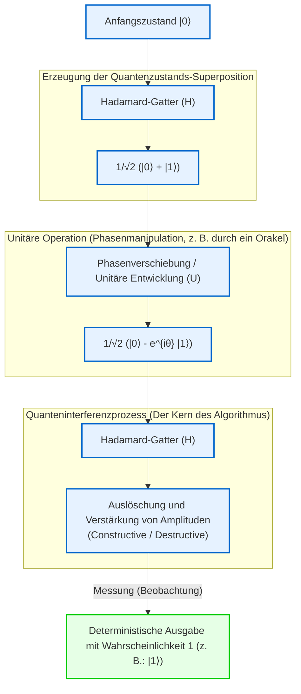

Auf diese Weise ist der Quantencomputer keine vorübergehende lebensverlängernde Maßnahme zur Umgehung der Grenzen der klassischen Mechanik (Miniaturisierungsgrenze und thermodynamische Grenze), sondern ein echter Paradigmenwechsel, der die Definition von Information und Berechnung selbst auf der Grundlage der Axiome der Quantenmechanik neu konstruiert. Im nächsten Kapitel werden wir tiefer in die Details von „Quantengattern“ und „Quantenschaltkreisen“ eintauchen, die konkrete mathematische Werkzeuge darstellen, um diese Quanteninterferenz nach Belieben zu steuern.

# Kapitel 2: Grundlagen von klassischen Bits und Quantenbits (Qubits)

Beim Aufbau des theoretischen Systems der Quanteninformation ist das fundamentalste Konzept die Definition der „kleinsten Informationseinheit“. In diesem Kapitel beginnen wir mit dem Bit in der klassischen Informationstheorie und erweitern das Konzept auf das „Quantenbit (Qubit)“, die kleinste Einheit der Quanteninformation, basierend auf den Postulaten der Quantenmechanik. Wir werden die mathematische Struktur von Quantenzuständen unter Verwendung der rigorosen Sprache von Hilberträumen, der Bra-Ket-Notation und der linearen Algebra gründlich entschlüsseln. Ohne jegliche Kompromisse wollen wir aus einer fachspezifischen Perspektive in die Tiefen der Quanteninformation vordringen.

## 2.1 Die kleinste Informationseinheit: Mathematische Formulierung und Grenzen des klassischen Bits

In der Geschichte der Informatik ist die Grundlage der von Claude Shannon 1948 begründeten Informationstheorie das „Bit“. Ein klassisches Bit wird unabhängig von seiner physikalischen Realisierung (beispielsweise hohe oder niedrige Spannung eines Transistors, Ein/Aus-Zustand eines Schalters oder Richtung der Magnetisierung) als ein System definiert, das einen von zwei diskreten Werten im abstrakten Zustandsraum $\{0, 1\}$ annimmt.

Lassen Sie uns dies in der formaleren Sprache von Vektorräumen ausdrücken. Der Zustand eines klassischen Bits kann unter Verwendung der Standardbasis in einem zweidimensionalen reellen Vektorraum $\mathbb{R}^2$ dargestellt werden. Wir definieren den Zustand $0$ und den Zustand $1$ jeweils als die folgenden Spaltenvektoren:

$$
\mathbf{v}_0 = \begin{pmatrix} 1 \\ 0 \end{pmatrix}, \quad \mathbf{v}_1 = \begin{pmatrix} 0 \\ 1 \end{pmatrix}
$$

In einem deterministischen (Deterministic) klassischen System ist der Zustand eines Bits stets entweder eindeutig $\mathbf{v}_0$ oder $\mathbf{v}_1$. Wenn jedoch Rauschen wie thermisches Rauschen oder Unsicherheiten in unserem Wissen vorliegen, muss der Zustand als klassisches probabilistisches (Probabilistic) Bit beschrieben werden. In diesem Fall wird der Zustand des Bits als Wahrscheinlichkeitsverteilung dargestellt, und der Zustandsvektor $\mathbf{p}$ lässt sich als Konvexkombination (Convex combination) der Basisvektoren wie folgt schreiben:

$$
\mathbf{p} = p_0 \mathbf{v}_0 + p_1 \mathbf{v}_1 = \begin{pmatrix} p_0 \\ p_1 \end{pmatrix}
$$

Hierbei sind $p_0, p_1$ reelle Zahlen, die jeweils die Wahrscheinlichkeit darstellen, dass sich das Bit im Zustand $0$ bzw. $1$ befindet. Nach den Kolmogorowschen Axiomen der Wahrscheinlichkeitsrechnung müssen sie die folgenden Bedingungen erfüllen:

1. **Nicht-Negativität** : $p_0 \ge 0, \quad p_1 \ge 0$
2. **Normierungsbedingung (Gesamtwahrscheinlichkeit ist 1)** : $p_0 + p_1 = 1$

In der Welt der klassischen Bits wird ein zusammengesetztes System aus mehreren Bits durch das Tensorprodukt (Kronecker-Produkt) der jeweiligen Wahrscheinlichkeitsvektoren beschrieben. Beispielsweise ergibt sich die Verbundwahrscheinlichkeit für zwei klassische Bits wie folgt:

$$
\mathbf{p}_{AB} = \mathbf{p}_A \otimes \mathbf{p}_B = \begin{pmatrix} p_{A0} \\ p_{A1} \end{pmatrix} \otimes \begin{pmatrix} p_{B0} \\ p_{B1} \end{pmatrix} = \begin{pmatrix} p_{A0}p_{B0} \\ p_{A0}p_{B1} \\ p_{A1}p_{B0} \\ p_{A1}p_{B1} \end{pmatrix}
$$

Der Rahmen der klassischen Informationstheorie ist extrem mächtig und bildet das Fundament der modernen digitalen Gesellschaft. Da Zustände jedoch rein durch die Addition reeller Wahrscheinlichkeiten gebildet werden, ist es prinzipiell unmöglich, Phänomene wie die destruktive Interferenz („gegenseitige Auslöschung von Wahrscheinlichkeiten“) analog zu Wellen darzustellen. Hierin liegen die Grenzen der klassischen Physik und die Notwendigkeit für den Übergang zur Quanteninformation.

## 2.2 Postulate der Quantenmechanik und Bra-Ket-Notation (Bra-ket notation)

Das erste Postulat (Postulate) der Quantenmechanik besagt: „Der Zustand eines geschlossenen physikalischen Systems wird vollständig durch einen Einheitsvektor (Zustandsvektor) in einem vollständigen Vektorraum mit komplexem inneren Produkt, d. h. einem Hilbertraum (Hilbert Space) $\mathcal{H}$, beschrieben.“ Im Kontext des Quantencomputings können kontinuierliche räumliche Freiheitsgrade ignoriert werden, sodass dieser Hilbertraum typischerweise ein endlichdimensionaler komplexer Vektorraum $\mathbb{C}^d$ ist.

Die kleinste Einheit der Quanteninformation, das „Quantenbit (Qubit)“, wird streng als Zustand in einem zweidimensionalen komplexen Hilbertraum $\mathcal{H} \cong \mathbb{C}^2$ definiert. Um Zustände in diesem Vektorraum zu beschreiben, ist es Standard, die von dem Physiker Paul Dirac eingeführte **Bra-Ket-Notation (Bra-ket notation)** zu verwenden.

Ein Spaltenvektor, der einen Quantenzustand darstellt, wird als **Ket-Vektor (Ket vector)** bezeichnet und als $|\psi\rangle$ notiert. Als Zustände, die den klassischen Bits $0$ und $1$ entsprechen, führen wir eine Orthonormalbasis ein, die sogenannte Rechenbasis (Computational basis). Diese wird auch als $Z$-Basis des Qubits bezeichnet und durch $|0\rangle$ sowie $|1\rangle$ definiert:

$$
|0\rangle = \begin{pmatrix} 1 \\ 0 \end{pmatrix}, \quad |1\rangle = \begin{pmatrix} 0 \\ 1 \end{pmatrix}
$$

Andererseits entspricht nach dem Darstellungssatz von Riesz (Riesz representation theorem) jedem Ket-Vektor in einem Hilbertraum eindeutig ein Element des Dualraums (Dual space), das als stetiges lineares Funktional fungiert. Dieses wird als **Bra-Vektor (Bra vector)** bezeichnet und als $\langle\psi|$ geschrieben. In der Matrixdarstellung erhält man den entsprechenden Bra-Vektor durch Bildung der hermiteschen Konjugierten (der komplex konjugierten Transponierten, bezeichnet mit $^\dagger$) des Ket-Vektors:

$$
\langle\psi| = (|\psi\rangle)^\dagger = (|\psi\rangle^*)^T
$$

Beispielsweise sind die Bra-Vektoren der Basis die folgenden Zeilenvektoren:

$$
\langle 0| = \begin{pmatrix} 1 & 0 \end{pmatrix}, \quad \langle 1| = \begin{pmatrix} 0 & 1 \end{pmatrix}
$$

Der wahre Wert der Bra-Ket-Notation zeigt sich darin, dass die Berechnung innerer Produkte visuell extrem intuitiv und klar wird. Das innere Produkt eines Bras $\langle\phi|$ und eines Kets $|\psi\rangle$ wird als $\langle\phi|\psi\rangle$ geschrieben (was auf Diracs Wortspiel zurückgeht, dass Bra und Ket zusammen ein Bracket bilden). Da die Rechenbasis $\{|0\rangle, |1\rangle\}$ ein Orthonormalsystem (Orthonormal system) bildet, lässt sich dies unter Verwendung des Kronecker-Deltas $\delta_{ij}$ wie folgt ausdrücken:

$$
\langle i | j \rangle = \delta_{ij} \quad (i, j \in \{0, 1\})
$$

Konkret ist das innere Produkt mit sich selbst $1$ ($\langle 0|0\rangle = 1$, $\langle 1|1\rangle = 1$), und das innere Produkt zwischen verschiedenen Basisvektoren ist $0$ ($\langle 0|1\rangle = 0$, $\langle 1|0\rangle = 0$).

Darüber hinaus wird das Tensorprodukt aus Bra und Ket (entsprechend dem äußeren Produkt) als $|\psi\rangle\langle\phi|$ notiert, was einen linearen Operator (eine Matrix) darstellt, der den Raum auf sich selbst abbildet. Beispielsweise wird der Projektionsoperator (Projection operator) auf einen bestimmten Zustandsraum wie folgt konstruiert:

$$
|0\rangle\langle 0| = \begin{pmatrix} 1 \\ 0 \end{pmatrix} \begin{pmatrix} 1 & 0 \end{pmatrix} = \begin{pmatrix} 1 & 0 \\ 0 & 0 \end{pmatrix}
$$

Der Identitätsoperator $I$ (Identity operator) eines beliebigen zweidimensionalen komplexen Vektorraums kann über die Vollständigkeitsrelation (Completeness relation) der Basis wie folgt zerlegt und dargestellt werden, was ein überaus mächtiges und in quantenmechanischen Berechnungen allgegenwärtiges Werkzeug darstellt:

$$
I = |0\rangle\langle 0| + |1\rangle\langle 1| = \begin{pmatrix} 1 & 0 \\ 0 & 1 \end{pmatrix}
$$

## 2.3 Das Prinzip der Quantenüberlagerung und komplexe Wahrscheinlichkeitsamplituden

Während ein klassisches Bit stets einen eindeutigen Zustand $0$ oder $1$ oder deren statistische Mischung einnimmt, erlaubt die Forderung nach Linearität (Linearity) in der Quantenmechanik, dass ein Qubit einen fundamental andersartigen Zustand annehmen kann: eine „Überlagerung (Superposition)“, die durch eine Linearkombination von $|0\rangle$ und $|1\rangle$ dargestellt wird. Jeder beliebige Einheitsvektor im Hilbertraum $\mathcal{H}$ ist als physikalisch gültiger Zustand zulässig.

Folglich lässt sich der allgemeinste reine Zustand (Pure state) $|\psi\rangle$ eines einzelnen Qubits unter Verwendung der Rechenbasis wie folgt entwickeln:

$$
|\psi\rangle = \alpha |0\rangle + \beta |1\rangle = \begin{pmatrix} \alpha \\ \beta \end{pmatrix}
$$

Hierbei sind $\alpha$ und $\beta$ komplexe Zahlen ($\alpha, \beta \in \mathbb{C}$), die als **komplexe Wahrscheinlichkeitsamplituden (Complex probability amplitude)** bezeichnet werden. Im Gegensatz zu klassischen Wahrscheinlichkeiten, die nicht-negative reelle Zahlen sind, ist der Umstand, dass Quantenzustände „komplexe“ Koeffizienten besitzen, die fundamentale Ursache dafür, dass Quantencomputer klassische Rechner in ihrer Leistungsfähigkeit übertreffen können. Da komplexe Zahlen eine Phase (Phase) aufweisen und in jede Richtung der komplexen Zahlenebene zeigen können, ist es ihnen möglich, sich wie Wellen gegenseitig zu verstärken (konstruktive Interferenz) oder auszulöschen (destruktive Interferenz). Das Wesen von Quantenalgorithmen besteht darin, diese Interferenzeffekte gezielt so zu steuern, dass die Wahrscheinlichkeitsamplitude der korrekten Lösung maximiert und die Amplituden falscher Lösungen destruktiv ausgelöscht werden.

Der Prozess zur Extraktion klassischer Information aus einem Quantensystem ist die „Messung (Measurement)“. Betrachtet man eine projektive Messung (Projective measurement), so besagt die Bornsche Regel (Born rule), dass die Wahrscheinlichkeiten $P(0)$ und $P(1)$, bei einer Messung des Zustands $|\psi\rangle$ in der Rechenbasis $\{|0\rangle, |1\rangle\}$ das Ergebnis $0$ bzw. $1$ zu erhalten, durch das Betragsquadrat der jeweiligen Wahrscheinlichkeitsamplitude gegeben sind:

$$
P(0) = |\langle 0|\psi\rangle|^2 = |\alpha|^2 = \alpha \alpha^*
$$

$$
P(1) = |\langle 1|\psi\rangle|^2 = |\beta|^2 = \beta \beta^*
$$

Damit das System mit Sicherheit in einem bestimmten Zustand beobachtet wird, muss die Summe aller Wahrscheinlichkeiten exakt $1$ ergeben. Folglich muss die Norm (Länge) des Quantenzustandsvektors $|\psi\rangle$ stets $1$ sein. Dies ist die **Normierungsbedingung (Normalization condition)** :

$$
\langle\psi|\psi\rangle = (\alpha^* \langle 0| + \beta^* \langle 1|)(\alpha |0\rangle + \beta |1\rangle) = |\alpha|^2 + |\beta|^2 = 1
$$

Um die geometrische Bedeutung dieser komplexen Wahrscheinlichkeitsamplituden eingehender zu beleuchten, stellen wir $\alpha$ und $\beta$ in Polarkoordinaten dar:

$$
\alpha = r_0 e^{i\phi_0}, \quad \beta = r_1 e^{i\phi_1}
$$

Hierbei sind $r_0, r_1 \ge 0$ die Amplitudenbeträge und $\phi_0, \phi_1 \in [0, 2\pi)$ die jeweiligen Phasenwinkel. Aus der Normierungsbedingung folgt $r_0^2 + r_1^2 = 1$, sodass wir mit einem reellen Parameter $\theta \in [0, \pi]$ setzen können: $r_0 = \cos(\frac{\theta}{2})$ und $r_1 = \sin(\frac{\theta}{2})$. Setzt man dies in den ursprünglichen Zustandsvektor ein, so erhält man:

$$
|\psi\rangle = \cos\left(\frac{\theta}{2}\right) e^{i\phi_0} |0\rangle + \sin\left(\frac{\theta}{2}\right) e^{i\phi_1} |1\rangle
$$

Klammern wir nun den gemeinsamen Phasenfaktor $e^{i\phi_0}$ aus:

$$
|\psi\rangle = e^{i\phi_0} \left( \cos\left(\frac{\theta}{2}\right) |0\rangle + e^{i(\phi_1 - \phi_0)} \sin\left(\frac{\theta}{2}\right) |1\rangle \right)
$$

In der Quantenmechanik wird ein solcher Phasenfaktor $e^{i\phi_0}$, der auf den gesamten Zustandsvektor wirkt, als „globale Phase (Global phase)“ bezeichnet. Berechnet man den Erwartungswert $\langle A \rangle$ für eine beliebige Observable (einen hermiteschen Operator) $A$, so erkennt man:

$$
\langle A \rangle = \left( e^{-i\phi_0} \langle\psi| \right) A \left( e^{i\phi_0} |\psi\rangle \right) = e^{-i\phi_0} e^{i\phi_0} \langle\psi| A |\psi\rangle = \langle\psi| A |\psi\rangle
$$

Da sich die globale Phase auf diese Weise stets herauskürzt, ist sie durch keinerlei physikalische Messung beobachtbar. Das bedeutet: Obwohl $|\psi\rangle$ und $e^{i\phi_0}|\psi\rangle$ im Hilbertraum unterschiedliche Vektoren darstellen (sie bilden denselben Strahl), repräsentieren sie physikalisch exakt denselben Zustand.

Indem man die globale Phase vernachlässigt und lediglich die relative Phase (Relative phase) $\varphi = \phi_1 - \phi_0$ (wobei $\varphi \in [0, 2\pi)$) zwischen $|0\rangle$ und $|1\rangle$ als Parameter beibehält, lässt sich der reine Zustand eines beliebigen einzelnen Qubits eindeutig und rigoros in der folgenden **Standardform** darstellen:

$$
|\psi\rangle = \cos\left(\frac{\theta}{2}\right) |0\rangle + e^{i\varphi} \sin\left(\frac{\theta}{2}\right) |1\rangle
$$

## 2.4 Geometrische Visualisierung durch die Bloch-Kugel (Bloch Sphere)

Die im vorherigen Abschnitt hergeleitete Parametrisierung zeigt, dass der Zustandsraum eines einzelnen Qubits geometrisch isomorph zur Oberfläche einer Einheitskugel im dreidimensionalen Raum (der 2-Sphäre $S^2$) ist. Diese visuelle Darstellung wird zu Ehren ihres Urhebers, des Schweizer Physikers Felix Bloch, als **Bloch-Kugel (Bloch Sphere)** bezeichnet.

Der Winkel $\theta$ entspricht exakt dem Polarwinkel (Polar angle), gemessen von der positiven $Z$-Achsenrichtung aus, und der Winkel $\varphi$ entspricht dem Azimutwinkel (Azimuthal angle) in der $X$-$Y$-Ebene.

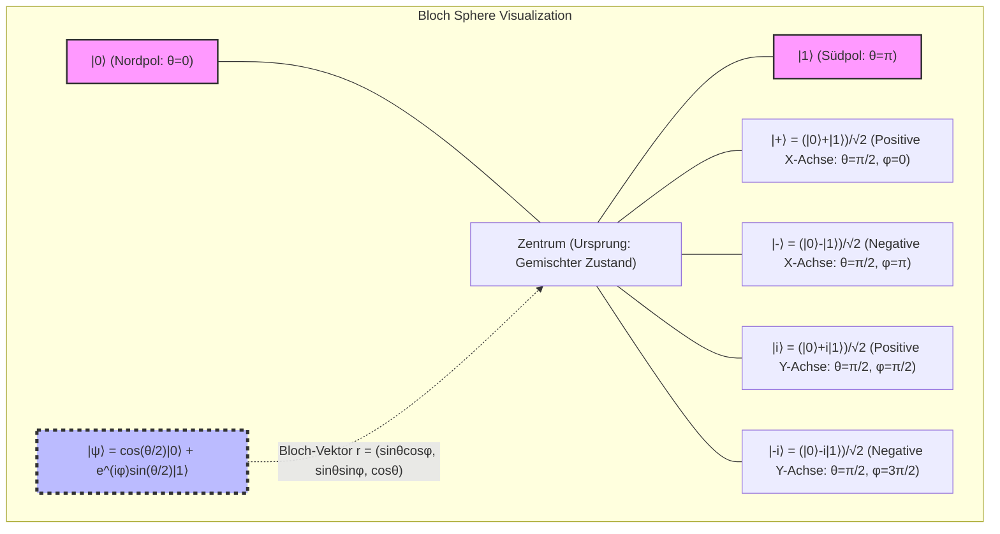

Die bemerkenswerteste Eigenschaft der Bloch-Kugel besteht darin, dass orthogonale Zustände im Hilbertraum (Zustände, deren inneres Produkt null ist) im dreidimensionalen realen Raum der Bloch-Kugel an antipodalen Punkten (Antipodal points: um 180 Grad gegenüberliegende Punkte) liegen. Beispielsweise ist der zu $|0\rangle$ (Nordpol, $\theta=0$) orthogonale Zustand $|1\rangle$ (Südpol, $\theta=\pi$). Das Verschwinden des inneren Produkts orthogonaler Zustände im Hilbertraum, $\langle 0 | 1 \rangle = 0$, entspricht auf der Bloch-Kugel einem Winkelabstand von $\pi$ (180 Grad). Da der geometrische Winkel im realen Raum doppelt so groß ist wie der Winkel im Hilbertraum, liegt hierin die mathematische Notwendigkeit begründet, bei der Parametrisierung den Halbwinkel $\theta/2$ zu verwenden.

Die Koordinaten des Bloch-Vektors $\mathbf{r} = (x, y, z)$ lassen sich rigoros als Erwartungswerte der **Pauli-Matrizen (Pauli matrices)** herleiten, welche fundamentale Observablen (Observable) in der Quantenmechanik darstellen. Die Pauli-Matrizen, die eine Basis für die hermiteschen Operatoren in zweidimensionalen Systemen bilden, sind wie folgt definiert:

$$
X = \sigma_x = \begin{pmatrix} 0 & 1 \\ 1 & 0 \end{pmatrix}, \quad
Y = \sigma_y = \begin{pmatrix} 0 & -i \\ i & 0 \end{pmatrix}, \quad
Z = \sigma_z = \begin{pmatrix} 1 & 0 \\ 0 & -1 \end{pmatrix}
$$

Die Erwartungswerte dieser Pauli-Observablen für einen beliebigen Zustand $|\psi\rangle$ ergeben sich mittels Bra-Ket-Rechnung wie folgt:

$$
x = \langle\psi| X |\psi\rangle = \left( \cos\frac{\theta}{2} \langle 0| + e^{-i\varphi}\sin\frac{\theta}{2} \langle 1| \right) \begin{pmatrix} 0 & 1 \\ 1 & 0 \end{pmatrix} \begin{pmatrix} \cos\frac{\theta}{2} \\ e^{i\varphi}\sin\frac{\theta}{2} \end{pmatrix} = \sin\theta \cos\varphi
$$

$$
y = \langle\psi| Y |\psi\rangle = \left( \cos\frac{\theta}{2} \langle 0| + e^{-i\varphi}\sin\frac{\theta}{2} \langle 1| \right) \begin{pmatrix} 0 & -i \\ i & 0 \end{pmatrix} \begin{pmatrix} \cos\frac{\theta}{2} \\ e^{i\varphi}\sin\frac{\theta}{2} \end{pmatrix} = \sin\theta \sin\varphi
$$

$$
z = \langle\psi| Z |\psi\rangle = \left( \cos\frac{\theta}{2} \langle 0| + e^{-i\varphi}\sin\frac{\theta}{2} \langle 1| \right) \begin{pmatrix} 1 & 0 \\ 0 & -1 \end{pmatrix} \begin{pmatrix} \cos\frac{\theta}{2} \\ e^{i\varphi}\sin\frac{\theta}{2} \end{pmatrix} = \cos^2\left(\frac{\theta}{2}\right) - \sin^2\left(\frac{\theta}{2}\right) = \cos\theta
$$

Hierdurch wird der Bloch-Vektor $\mathbf{r} = (x, y, z)$ elegant als Einheitsvektor des dreidimensionalen Raums $\mathbf{r} = (\sin\theta\cos\varphi, \sin\theta\sin\varphi, \cos\theta)$ dargestellt. Zudem lässt sich die einem beliebigen reinen Zustand entsprechende Dichtematrix (Density matrix) $\rho = |\psi\rangle\langle\psi|$ unter Verwendung des Pauli-Vektors $\boldsymbol{\sigma} = (X, Y, Z)$ und der Einheitsmatrix $I$ äußerst kompakt ausdrücken:

$$
\rho = \frac{1}{2} \left( I + \mathbf{r} \cdot \boldsymbol{\sigma} \right) = \frac{1}{2} \left( I + xX + yY + zZ \right)
$$

Entwickelt man die Matrixelemente explizit, so ergibt sich:

$$
\rho = \frac{1}{2} \begin{pmatrix} 1 + z & x - iy \\ x + iy & 1 - z \end{pmatrix} = \begin{pmatrix} \cos^2(\frac{\theta}{2}) & e^{-i\varphi}\sin(\frac{\theta}{2})\cos(\frac{\theta}{2}) \\ e^{i\varphi}\sin(\frac{\theta}{2})\cos(\frac{\theta}{2}) & \sin^2(\frac{\theta}{2}) \end{pmatrix}
$$

Dies stimmt in exakter Weise mit dem Resultat des äußeren Produkts $|\psi\rangle\langle\psi|$ gemäß der Definition des Tensorprodukts überein. Bemerkenswert ist hierbei: Während für reine Zustände die Norm des Bloch-Vektors stets $|\mathbf{r}| = 1$ beträgt und die Spur des Dichtematrixquadrats $\text{Tr}(\rho^2) = 1$ erfüllt, gilt für gemischte Zustände (Mixed state), bei denen durch Wechselwirkung mit der Umgebung oder unvollständige Kontrolle ein Verlust an Quanteninformation (Dekohärenz) eingetreten ist, $|\mathbf{r}| < 1$, da sie statistische Ensembles reiner Zustände darstellen. Infolgedessen liegen gemischte Zustände nicht auf der Oberfläche, sondern im „Inneren“ der Bloch-Kugel. Der vollständig informationslose, maximal gemischte Zustand (Maximally mixed state) $\rho = I/2$ befindet sich dabei genau im Mittelpunkt der Bloch-Kugel bei $\mathbf{r} = (0,0,0)$.

## 2.5 Messung und Kollaps der Wellenfunktion (Wavefunction Collapse)

Die Messung in der Quantenmechanik unterscheidet sich fundamental von der passiven Informationsablesung in der klassischen Mechanik. Gemäß der axiomatischen Formulierung von John von Neumann führt die Messung einer physikalischen Größe (einer Observablen) dazu, dass der Zustand irreversibel in einen Eigenzustand dieser Observablen „kollabiert (Collapse)“.

Betrachten wir beispielsweise eine Messung in der $Z$-Basis (d. h. eine Messung mit der Pauli-$Z$-Matrix als Observabler) an einem Einzel-Qubit-Zustand $|\psi\rangle = \alpha|0\rangle + \beta|1\rangle$. Als Messergebnisse können nur die Eigenwerte von $Z$ auftreten: $+1$ (entspricht dem Zustand $|0\rangle$) oder $-1$ (entspricht dem Zustand $|1\rangle$).

Um den Messprozess mathematisch streng zu formulieren, verwendet man eine Menge von Projektionsoperatoren $\{ P_m \}$. Im Fall der $Z$-Messung lauten diese Projektoren:

$$
P_0 = |0\rangle\langle 0|, \quad P_1 = |1\rangle\langle 1|
$$

Diese erfüllen die Vollständigkeitsrelation $P_0 + P_1 = I$ sowie die Orthogonalitätsrelation $P_i P_j = \delta_{ij} P_i$. Gemäß der Bornschen Regel berechnet sich die Wahrscheinlichkeit $P(m)$, das Messergebnis $m \in \{0, 1\}$ zu erhalten, wie folgt:

$$
P(m) = \langle\psi| P_m^\dagger P_m |\psi\rangle = \langle\psi| P_m |\psi\rangle
$$

was exakt mit den zuvor genannten Wahrscheinlichkeiten $|\alpha|^2$ und $|\beta|^2$ übereinstimmt. Das entscheidende Prinzip besteht nun darin, dass der neue Quantenzustand $|\psi'\rangle$ unmittelbar nach Eintreten des Messergebnisses $m$ dadurch gegeben ist, dass der entsprechende Projektionsoperator auf den ursprünglichen Zustand angewendet und dieser anschließend durch seine neue Norm renormiert wird:

$$
|\psi'\rangle = \frac{P_m |\psi\rangle}{\sqrt{P(m)}}
$$

Lautet das Messergebnis beispielsweise $0$, so ergibt sich:

$$
|\psi'\rangle = \frac{|0\rangle\langle 0| (\alpha|0\rangle + \beta|1\rangle)}{|\alpha|} = \frac{\alpha}{|\alpha|} |0\rangle = e^{i\phi_0} |0\rangle \equiv |0\rangle
$$

und der Zustand kollabiert vollständig in den Zustand $|0\rangle$ (wobei die globale Phase vernachlässigt wird). Dies ist die mathematische Beschreibung des Phänomens, das als Kollaps der Wellenfunktion (Wavefunction collapse) bezeichnet wird. Sobald eine Messung vollzogen ist und der Zustand kollabiert ist, sind die im ursprünglichen Überlagerungszustand enthaltene relative Phase $\varphi$ sowie die Amplitudeninformationen ($\alpha, \beta$) unwiederbringlich verloren. Folglich ist es prinzipiell unmöglich, die vollständige Information eines Quantenzustands durch eine einzige Messung an einer einzelnen Kopie zu rekonstruieren (dies steht in engem Zusammenhang mit dem „No-Cloning-Theorem“).

## 2.6 Einführung der Erweiterung auf Vielteilchensysteme und Ausblick auf das nächste Kapitel

Nachdem wir die Eigenschaften eines einzelnen Qubits vertieft verstanden haben, wollen wir kurz die mathematischen Grundlagen von „Multi-Qubit-Systemen“ berühren, die ab dem nächsten Kapitel im Mittelpunkt stehen werden. Während klassische Wahrscheinlichkeitsverteilungen den Zustandsraum über das kartesische Produkt erweitern, wird der Hilbertraum $\mathcal{H}_{AB}$ eines zusammengesetzten Systems in der Quantenmechanik durch das **Tensorprodukt (Tensor product)** der Hilberträume der jeweiligen Teilsysteme $\mathcal{H}_A$ und $\mathcal{H}_B$ konstruiert:

$$
\mathcal{H}_{AB} = \mathcal{H}_A \otimes \mathcal{H}_B
$$

Das Tensorprodukt zweier unabhängiger Qubit-Zustände lässt sich wie folgt entwickeln und bildet einen vierdimensionalen komplexen Vektorraum:

$$
|\Psi\rangle_{AB} = (\alpha_0|0\rangle + \alpha_1|1\rangle) \otimes (\beta_0|0\rangle + \beta_1|1\rangle) = \alpha_0\beta_0|00\rangle + \alpha_0\beta_1|01\rangle + \alpha_1\beta_0|10\rangle + \alpha_1\beta_1|11\rangle
$$

Die Existenz von Zuständen, die sich nicht als Tensorprodukt von Einzelzuständen faktorisieren lassen (wie beispielsweise der Bell-Zustand $|\Phi^+\rangle = (|00\rangle + |11\rangle)/\sqrt{2}$), stellt den Ursprung der Quantenverschränkung (Entanglement) dar. Diese exponentielle Explosion der Dimensionalität durch das Tensorprodukt ($2^N$ Dimensionen bei $N$ Qubits) bildet das Fundament für die überwältigende parallele Rechenleistung von Quantencomputern.

In diesem Kapitel haben wir die grundlegenden Unterschiede zwischen klassischen Bits und Quantenbits auf dem mathematischen Fundament des Hilbertraums herausgearbeitet. Ein Qubit kann kontinuierliche Überlagerungszustände mit komplexen Wahrscheinlichkeitsamplituden annehmen. Durch die Herleitung der Bloch-Kugel haben wir zudem ein mächtiges Werkzeug gewonnen, um abstrakte komplexe Vektoren intuitiv als geometrisches Modell im dreidimensionalen reellen Raum zu visualisieren und zu verstehen.

Im folgenden „Kapitel 3: Quantengatter und unitäre Transformationen“ werden wir die konkreten „Quantenlogikgatter“ zur Manipulation dieser Einzel-Qubit-Zustände detailliert behandeln und die mathematischen Eigenschaften von Rotationsoperationen mittels unitärer Matrizen auf der Bloch-Kugel untersuchen. Das Tor zur tiefgründigen Welt der Quanteninformation hat sich gerade erst geöffnet.

# Kapitel 3: Axiome der Quantenmechanik und Messung (Kollaps des Wellenpakets)

## 3.1 Einleitung: Axiomatischer Ansatz der Quantenmechanik und die Notwendigkeit der linearen Algebra

Um die Funktionsprinzipien von Quantencomputern von Grund auf zu verstehen, ist es unerlässlich, den theoretischen Rahmen der Physik namens Quantenmechanik in einer mathematisch strengen Form zu begreifen. Während viele physikalische Theorien eine induktive Entwicklung auf der Grundlage empirischer Regeln durchlaufen haben, verwendet die Quantenmechanik – insbesondere die moderne, von John von Neumann formulierte Quantenmechanik – einen axiomatischen Ansatz, der das gesamte System aus wenigen mathematischen „Axiomen (Axioms)“ deduziert.

Dieses Axiomensystem baut auf der Bühne der komplexen linearen Algebra auf, die in Form von Hilberträumen auf unendliche Dimensionen erweitert werden kann. In der Quanteninformationswissenschaft und im Quantencomputing werden jedoch hauptsächlich endlichdimensionale Vektorräume behandelt (beispielsweise der Tensorproduktraum $\mathbb{C}^2$ für Qubit-Systeme). Dadurch lassen sich analytische Schwierigkeiten unendlichdimensionaler Räume (wie der Definitionsbereich unbeschränkter Operatoren) vermeiden, und die Quantenmechanik kann rein im Rahmen der linearen Algebra beschrieben und verstanden werden.

In diesem Kapitel formulieren wir die Prozesse von der Beschreibung von Quantenzuständen über die Zeitentwicklung bis hin zur „Messung“, die die meisten philosophischen Debatten ausgelöst hat, ohne jegliche Kompromisse rigoros. Die Leser werden erkennen, wie scheinbar kontraintuitive Quantenphänomene auf einer widerspruchsfreien und eleganten mathematischen Struktur beruhen. Genau diese mathematische Struktur bildet die direkte „Sprache“, in der die Algorithmen von Quantencomputern formuliert werden.

## 3.2 Erstes Axiom: Zustandsraum (Hilbertraum und Zustandsvektoren)

Das erste Axiom der Quantenmechanik legt fest, wie der „Zustand“ eines physikalischen Systems mathematisch dargestellt wird.

 **Axiom 1 (Darstellung des Zustands)** :
Der Zustand eines geschlossenen physikalischen Systems wird vollständig durch einen Einheitsvektor mit der Norm 1 in einem Hilbertraum (Hilbert space) $\mathcal{H}$ beschrieben, welcher ein komplexer innerer Produktraum ist und Vollständigkeit besitzt. Dieser wird als **Zustandsvektor** bezeichnet.

Gemäß der von Paul Dirac eingeführten Bra-Ket-Notation (Bra-ket notation) wird der Zustandsvektor als Spaltenvektor behandelt und als Ket **$| \psi \rangle$** geschrieben. Ein Zeilenvektor, der dem Dualraum $\mathcal{H}^*$ angehört, wird als Bra **$\langle \psi |$** bezeichnet, und diese stehen zueinander in der Beziehung der hermiteschen Konjugation (komplex-konjugierte Transposition). Das heißt:

$$
\langle \psi | = ( | \psi \rangle )^\dagger
$$

Das innere Produkt zweier beliebiger Zustände **$| \phi \rangle$** und **$| \psi \rangle$** auf dem Hilbertraum wird als Produkt von Bra und Ket **$\langle \phi | \psi \rangle$** berechnet und liefert einen komplexen Wert. Dieses innere Produkt erfüllt die folgenden Eigenschaften:

1. **Positivität** : Für jedes **$| \psi \rangle \neq 0$** gilt $\langle \psi | \psi \rangle > 0$
2. **Linearität** : $\langle \phi | ( c_1 | \psi_1 \rangle + c_2 | \psi_2 \rangle ) = c_1 \langle \phi | \psi_1 \rangle + c_2 \langle \phi | \psi_2 \rangle$
3. **Konjugierte Symmetrie** : $\langle \phi | \psi \rangle = \langle \psi | \phi \rangle^*$ ($*$ bezeichnet die komplexe Konjugation)

Physikalische Zustände müssen stets die Normierungsbedingung (Normalization condition) erfüllen, damit die Wahrscheinlichkeitsinterpretation gültig ist. Das bedeutet, dass die Norm des Zustandsvektors **$| \psi \rangle$** gleich 1 ist:

$$
\| | \psi \rangle \| = \sqrt{\langle \psi | \psi \rangle} = 1
$$

Darüber hinaus gilt die Cauchy-Schwarz-Ungleichung (Cauchy-Schwarz inequality) $|\langle \phi | \psi \rangle|^2 \le \langle \phi | \phi \rangle \langle \psi | \psi \rangle$, sodass der Betrag des inneren Produkts zwischen normierten Zuständen stets zwischen 0 und 1 liegt. Dies bildet das mathematische Fundament dafür, dass dieses später als „Wahrscheinlichkeit“ interpretiert werden kann.

### Superpositionsprinzip und vollständige Orthonormalbasis

Das hervorstechendste Merkmal der Quantenmechanik ist das „Superpositionsprinzip (Superposition principle)“. Wenn **$| \phi \rangle$** und **$| \psi \rangle$** physikalisch zulässige Zustände sind, ist auch jede beliebige komplexe Linearkombination $c_1 | \phi \rangle + c_2 | \psi \rangle$ (nach Normierung) wiederum ein physikalisch zulässiger Zustand. Diese Eigenschaft folgt direkt aus der Linearität des Hilbertraums.

Im Hilbertraum $\mathcal{H}$ existiert eine vollständige Orthonormalbasis (Orthonormal basis) $\{ | e_i \rangle \}$. Diese Basisvektoren sind zueinander orthogonal und normiert:

$$
\langle e_i | e_j \rangle = \delta_{ij}
$$

($\delta_{ij}$ ist das Kronecker-Delta). Zudem lässt sich der Identitätsoperator $I$ über die Vollständigkeitsrelation (Completeness relation), auch als Zerlegung der Identität bezeichnet, wie folgt entwickeln:

$$
I = \sum_i | e_i \rangle \langle e_i |
$$

Jeder beliebige Quantenzustand **$| \psi \rangle$** lässt sich durch Anwenden dieses Identitätsoperators eindeutig als Linearkombination der Basisvektoren entwickeln:

$$
| \psi \rangle = I | \psi \rangle = \left( \sum_i | e_i \rangle \langle e_i | \right) | \psi \rangle = \sum_i \langle e_i | \psi \rangle | e_i \rangle = \sum_i c_i | e_i \rangle
$$

Hierbei werden die Entwicklungskoeffizienten $c_i = \langle e_i | \psi \rangle$ als komplexe Wahrscheinlichkeitsamplituden bezeichnet, die in der später behandelten Bornschen Regel eine entscheidende Rolle spielen. Aus der Normierungsbedingung $\langle \psi | \psi \rangle = 1$ folgt unmittelbar $\sum_i |c_i|^2 = 1$.

## 3.3 Zweites Axiom: Physikalische Größen und hermitesche Operatoren

In der klassischen Mechanik werden physikalische Größen (Observablen) wie Ort, Impuls und Energie als reellwertige Funktionen beschrieben. In der Quantenmechanik vollzieht sich jedoch ein grundlegender Paradigmenwechsel.

 **Axiom 2 (Physikalische Größen)** :
Beobachtbare physikalische Größen (Observablen) werden durch lineare selbstadjungierte Operatoren (hermitesche Operatoren) $A$ auf dem Hilbertraum $\mathcal{H}$ beschrieben.

Ein hermitescher Operator ist ein Operator, dessen hermitesche Adjungierte gleich ihm selbst ist; das heißt, er erfüllt $A = A^\dagger$. Wird er in einem endlichdimensionalen Raum als Matrix dargestellt, bedeutet dies, dass seine Einträge komplex-konjugiert symmetrisch sind ($A_{ij} = A_{ji}^*$).

Der Grund, warum physikalische Größen als hermitesche Operatoren definiert werden müssen, liegt in ihren „Eigenwerten (Eigenvalues)“. Gemäß dem Spektralsatz (Spectral theorem) der linearen Algebra besitzen hermitesche Operatoren folgende fundamentale Eigenschaften:

1. **Alle Eigenwerte $a_i$ sind reell.** (Da gemessene physikalische Größen stets reell sein müssen, entspricht dies den physikalischen Anforderungen.)
2. **Eigenvektoren zu verschiedenen Eigenwerten sind zueinander orthogonal.** 
3. **Die Eigenvektoren $\{ | a_i \rangle \}$ des Operators bilden eine vollständige Orthonormalbasis des Hilbertraums.** 

Folglich lässt sich jede beliebige Observable $A$ unter Verwendung ihrer Eigenwerte $a_i$ und Eigenvektoren **$| a_i \rangle$** als Linearkombination von Projektionsoperatoren $P_i = | a_i \rangle \langle a_i |$ spektral zerlegen (Spektralzerlegung, Spectral decomposition):

$$
A = \sum_i a_i | a_i \rangle \langle a_i |
$$

Durch diese Formulierung lässt sich der Vorgang der „Messung einer physikalischen Größe“ als geometrische Operation verstehen: als Projektion auf eine bestimmte Basis (Eigenvektoren) des Hilbertraums. Beispielsweise wird die Messung von $\sigma_z$ an einem Qubit vollständig als Projektionsoperation auf die orthogonale Basis beschrieben, die aus dem dem Eigenwert $+1$ entsprechenden Zustand **$| 0 \rangle$** und dem dem Eigenwert $-1$ entsprechenden Zustand **$| 1 \rangle$** besteht.

## 3.4 Drittes Axiom: Unitäre Zeitentwicklung und Schrödinger-Gleichung

Wenn ein Quantensystem isoliert ist und nicht mit anderen Systemen wechselwirkt, verändert sich sein Zustand deterministisch und reversibel über die Zeit.

 **Axiom 3 (Zeitentwicklung)** :
Die Zeitentwicklung des Zustands eines isolierten Quantensystems folgt der Schrödinger-Gleichung (Schrödinger equation). Oder äquivalent formuliert: Der Zustand **$| \psi(t_0) \rangle$** zum Zeitpunkt $t_0$ entwickelt sich zum Zeitpunkt $t$ durch Anwenden eines unitären Operators $U(t, t_0)$ in den Zustand **$| \psi(t) \rangle$** .

Die zeitabhängige Schrödinger-Gleichung, die fundamentale Gleichung zur Beschreibung der Zeitentwicklung, lautet wie folgt:

$$
i\hbar \frac{d}{dt} | \psi(t) \rangle = H | \psi(t) \rangle
$$

Hierbei ist $i$ die imaginäre Einheit, $\hbar$ das reduzierte Plancksche Wirkungsquantum und $H$ der Hamilton-Operator (Hamiltonian), der die Observable für die Gesamtenergie des Systems darstellt.

Betrachtet man ein System, dessen Hamilton-Operator $H$ nicht explizit von der Zeit abhängt (zeitunabhängig ist), lässt sich diese Differentialgleichung formal integrieren, und die Lösung ist gegeben durch:

$$
| \psi(t) \rangle = \exp\left( -\frac{i}{\hbar} H (t - t_0) \right) | \psi(t_0) \rangle
$$

Dieser durch eine Exponentialfunktion dargestellte Operator $U(t, t_0) = \exp\left( -i H (t - t_0) / \hbar \right)$ ist der Zeitentwicklungsoperator. Da der Hamilton-Operator $H$ hermitesch ist ($H = H^\dagger$), ist $U$ nach dem Satz von Stone (Stone's theorem) ein unitärer Operator (Unitary operator). Ein unitärer Operator ist dadurch definiert, dass seine hermitesche Konjugierte gleich seiner Inversen ist ($U^\dagger U = U U^\dagger = I$).

Die entscheidende physikalische Bedeutung einer unitären Transformation liegt darin, dass sie **die Norm (Länge) des Zustandsvektors und das innere Produkt erhält** . Das heißt, unabhängig davon, wie viel Zeit vergeht, ist stets $\langle \psi(t) | \psi(t) \rangle = \langle \psi(t_0) | U^\dagger U | \psi(t_0) \rangle = 1$ garantiert, sodass das physikalische Gesetz, wonach die Summe aller Wahrscheinlichkeiten gleich 1 ist, niemals verletzt wird. Die „Quantengatter“ eines Quantencomputers sind nichts anderes als Operationen, die diese unitäre Zeitentwicklung künstlich entwerfen und präzise steuern. So werden beispielsweise das Hadamard-Gatter oder das CNOT-Gatter ausnahmslos durch unitäre Matrizen dargestellt.

## 3.5 Viertes Axiom: Messung und die Bornsche Regel (Born rule)

Das Konzept der „Messung (Measurement)“ in der Quantenmechanik unterscheidet sich grundlegend von dem der klassischen Physik. In klassischen Systemen gilt das Messen als passiver Vorgang, bei dem ein Wert ermittelt wird, ohne den Zustand des Systems zu stören. In der Quantenmechanik hingegen greift die Messung aktiv in das System ein und führt eine irreversible Zustandsänderung herbei.

 **Axiom 4 (Messung und Bornsche Regel)** :
Wird an einem System im Zustand **$| \psi \rangle$** eine Messung einer Observable $A$ mit der Spektralzerlegung $A = \sum_i a_i P_i$ durchgeführt, so ist das erhaltene Messergebnis stets einer der Eigenwerte $a_i$ von $A$. Die Wahrscheinlichkeit $p(a_k)$, einen bestimmten Eigenwert $a_k$ zu erhalten, ist nach der Bornschen Regel wie folgt gegeben:

$$
p(a_k) = \langle \psi | P_k | \psi \rangle = \| P_k | \psi \rangle \|^2
$$

Wenn der Eigenwert $a_k$ nicht entartet ist (das heißt, es existiert nur ein einziger zugehöriger Eigenvektor **$| a_k \rangle$** ), lautet der Projektionsoperator $P_k = | a_k \rangle \langle a_k |$, und die Wahrscheinlichkeit berechnet sich als das Betragsquadrat des inneren Produkts des Zustands mit dem Eigenvektor:

$$
p(a_k) = \langle \psi | a_k \rangle \langle a_k | \psi \rangle = | \langle a_k | \psi \rangle |^2
$$

Dies ist genau das Betragsquadrat $|c_k|^2$ des Entwicklungskoeffizienten $c_k = \langle a_k | \psi \rangle$, wenn der Zustandsvektor **$| \psi \rangle$** in der Basis $\{ | a_i \rangle \}$ entwickelt wird. Die komplexe Wahrscheinlichkeitsamplitude $c_k$ selbst kann nicht direkt beobachtet werden, doch ihr Betragsquadrat manifestiert sich in der realen Welt als Messwahrscheinlichkeit. Die Einsicht von Max Born, der diese Regel formulierte, ist ein Meilenstein, der die Physik vom Determinismus zum Probabilismus transformierte. Der Erwartungswert $\langle A \rangle$ der Observable $A$ berechnet sich als Summe der Produkte aller Eigenwerte mit ihren jeweiligen Auftretenswahrscheinlichkeiten und lässt sich letztlich in äußerst eleganter Weise als Erwartungswert im Zustandsvektor ausdrücken:

$$
\langle A \rangle = \sum_i a_i p(a_i) = \sum_i a_i \langle \psi | P_i | \psi \rangle = \langle \psi | \left( \sum_i a_i P_i \right) | \psi \rangle = \langle \psi | A | \psi \rangle
$$

## 3.6 Kollaps des Wellenpakets durch Messung (Zustandsreduktion) und Dekohärenz

Das Axiom der Messung enthält einen entscheidenden und vieldiskutierten Schritt: die Frage, was mit dem Zustand des Systems „nach“ der Messung geschieht. Dies ist das als „Kollaps des Wellenpakets (Wavefunction collapse)“ oder „Zustandsreduktion (State reduction)“ bekannte Phänomen. Dieser als von-Neumannsches Projektionspostulat (Projection postulate) bekannte Prozess wird wie folgt formuliert:

 **Projektionspostulat** :
Unmittelbar nachdem durch die Messung der Eigenwert $a_k$ erhalten wurde, verändert sich (kollabiert) der Zustand des Systems **$| \psi' \rangle$** instantan zu jenem Zustand, der durch Anwenden des entsprechenden Projektionsoperators $P_k$ auf den ursprünglichen Zustandsvektor und anschließende Renormierung entsteht:

$$
| \psi' \rangle = \frac{P_k | \psi \rangle}{\sqrt{p(a_k)}}
$$

Wenn das Messgerät ideal ist und der Zustand des Systems auf einen nicht-entarteten Eigenwert $a_k$ kollabiert, ist der Zustand unmittelbar nach der Messung exakt der Eigenvektor **$| a_k \rangle$** selbst. Das bedeutet: Wiederholt man unmittelbar danach exakt dieselbe Messung, erhält man mit einer Wahrscheinlichkeit von 1 (100 %) erneut das Ergebnis $a_k$. Dies wird als „Messung erster Art“ bezeichnet.

Dieser „Kollaps des Wellenpakets“ weist Eigenschaften auf (diskontinuierlich, probabilistisch, irreversibel), die in deutlichem Widerspruch zur von der Schrödinger-Gleichung beschriebenen unitären Zeitentwicklung (kontinuierlich, deterministisch, reversibel) stehen. Die Quantenmechanik birgt somit eine dualistische Dynamik: Solange ein System isoliert ist, entwickelt es sich unitär; sobald es jedoch in Kontakt mit einem makroskopischen Messapparat tritt, erleidet es einen nicht-unitären Kollaps.

### Vom reinen Zustand zum gemischten Zustand: Einführung des Dichteoperators

Um das Paradoxon des Kollapses des Wellenpakets noch tiefer zu verstehen, ist das Konzept des „Dichteoperators (Density operator)“ unerlässlich. Der bisher betrachtete Zustandsvektor **$| \psi \rangle$** repräsentiert einen „reinen Zustand (Pure state)“, der das maximale Wissen über das System enthält. Der Dichteoperator eines reinen Zustands ist definiert als $\rho = | \psi \rangle \langle \psi |$.

Wenn man hingegen im Messprozess nicht weiß, in welchen Zustand das System kollabiert ist (oder wenn diese Information verloren gegangen ist), muss das System als klassisch-probabilistischer „gemischter Zustand (Mixed state)“ beschrieben werden. Beispielsweise lautet der Dichteoperator für ein Ensemble von Systemen, die mit der Wahrscheinlichkeit $p(a_k)$ in den Zustand **$| a_k \rangle$** kollabiert sind, wie folgt:

$$
\rho' = \sum_k p(a_k) | a_k \rangle \langle a_k |
$$

In diesem Fall verschwinden die Nichtdiagonalelemente (Interferenzterme) von $\rho = | \psi \rangle \langle \psi |$, die im reinen Zustand vorhanden waren, durch den Messvorgang vollständig. Genau dieser Verlust der Interferenzfähigkeit ist der Kern der „Dekohärenz (Decoherence)“.

### Dekohärenz und die Entstehung makroskopischer Klassizität

Auch der Messapparat ist Teil eines Quantensystems, das aus unzähligen Teilchen besteht. Durch die Wechselwirkung zwischen dem Quantensystem und der makroskopischen Umgebung (wie dem Messgerät oder einem thermischen Bad) entsteht „Verschränkung (Entanglement)“. Spurt man die Freiheitsgrade der Umgebung aus (partielle Spur, Partial trace), um die reduzierte Dichtematrix (Reduced density matrix) allein für das Zielsystem zu berechnen, geht der zuvor reine Zustand des Systems rasch in einen gemischten Zustand über, und die Phasenkohärenz zwischen den einzelnen Komponenten des Systems geht verloren:

$$
\rho_{S} = \mathrm{Tr}_{E} [ | \Psi_{SE} \rangle \langle \Psi_{SE} | ]
$$

Dadurch verschwindet die Überlagerung auf makroskopischer Skala, und das System verhält sich scheinbar wie eine klassische statistische Mischung. Der Kollaps des Wellenpakets ist keineswegs ein Zusammenbruch physikalischer Gesetze, sondern kann als Informationsdissipation durch irreversible Wechselwirkung mit der Umgebung verstanden werden. Die Überwindung dieser Dekohärenz ist die größte Herausforderung der Menschheit bei der Realisierung fehlertoleranter Quantencomputer.

### Dynamik der Zeitentwicklung von Quantenzuständen und Messung

Das folgende Diagramm veranschaulicht den Prozess, bei dem ein Quantensystem ausgehend von einem Anfangszustand eine unitäre Zeitentwicklung durchläuft und sich der Zustand durch eine Messung probabilistisch verzweigt (kollabiert). Beachten Sie den Kontrast zwischen Schrödingers deterministischer Entwicklung und Borns probabilistischem Kollaps.

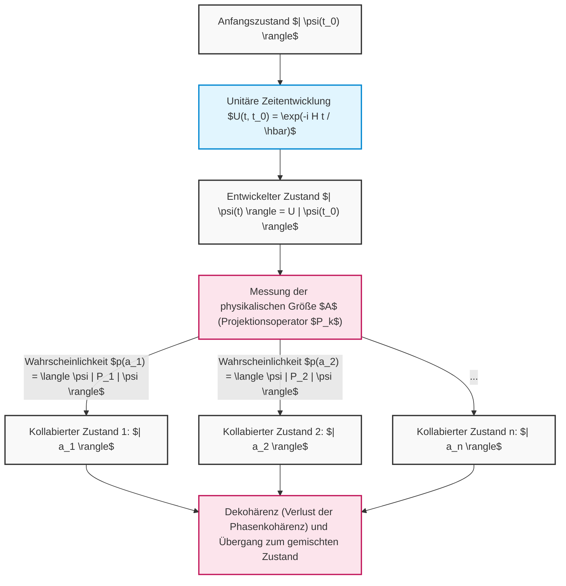

Auf diese Weise sind die abstrakten Konzepte der linearen Algebra – Vektorräume, innere Produkte, hermitesche Operatoren, Eigenwertprobleme und unitäre Matrizen – keineswegs bloße mathematische Spielereien, sondern die einzigartige Sprache zur präzisen Beschreibung und Vorhersage der subtilsten Phänomene unseres Universums. Die Algorithmen von Quantencomputern nutzen genau diese beiden mächtigen Gesetzmäßigkeiten – „Schrödingers deterministische Entwicklung“ und „Borns probabilistischen Kollaps“ – meisterhaft aus, um uns in Rechenbereiche vorstoßen zu lassen, die für klassische Computer unerreichbar sind.

# Kapitel 4: Einzel-Qubit-Gatter und Unitäre Transformationen

Die Grundlage des Quantencomputings ist die präzise Manipulation von Quantenzuständen. Während Logikgatter in klassischen Computern (wie AND, OR, NOT) die Werte von Bits irreversibel manipulieren, sind "Quantengatter" in einem Quantencomputer reversible Zeitentwicklungen, die den Anforderungen der Schrödinger-Gleichung folgen. Mathematisch werden sie streng als "unitäre Transformationen (unitäre Matrizen)" in einem komplexen Hilbertraum beschrieben. In diesem Kapitel werden wir die mathematische Struktur, die algebraischen Eigenschaften und die intuitive geometrische Bedeutung auf der Bloch-Kugel (Bloch sphere) der grundlegenden Quantengatter, die auf ein einzelnes Qubit (Zweiniveausystem) wirken, kompromisslos und gründlich untersuchen.

## 4.1 Die Postulate der Quantenmechanik und die Notwendigkeit unitärer Matrizen

Die Zeitentwicklung eines Quantensystems wird durch die folgende Schrödinger-Gleichung bestimmt, wobei der Hamiltonian **$H$** ( **$H^\dagger = H$** ), ein hermitescher Operator, der das System charakterisiert, verwendet wird.

$$
i\hbar \frac{d}{dt} |\psi(t)\rangle = H |\psi(t)\rangle
$$

Nimmt man ein System an, in dem der Hamiltonian **$H$** nicht von der Zeit abhängt, wird der Quantenzustand **$|\psi(t)\rangle$** zu einer beliebigen Zeit **$t$** formal aus dem Anfangszustand **$|\psi(0)\rangle$** wie folgt integriert.

$$
|\psi(t)\rangle = e^{-\frac{i}{\hbar}Ht} |\psi(0)\rangle
$$

Wir definieren den hier auftretenden Zeitentwicklungsoperator als **$U(t) = e^{-\frac{i}{\hbar}Ht}$** . Da das **$H$** im Exponenten der Exponentialfunktion hermitesch ist, ergibt die Berechnung des adjungierten Operators (hermitesche Konjugation) **$U(t)^\dagger$** dieses Operators **$U(t)$** die folgende äußerst wichtige Eigenschaft.

$$
U(t)^\dagger U(t) = \left( e^{-\frac{i}{\hbar}Ht} \right)^\dagger e^{-\frac{i}{\hbar}Ht} = e^{\frac{i}{\hbar}H^\dagger t} e^{-\frac{i}{\hbar}Ht} = e^{\frac{i}{\hbar}Ht} e^{-\frac{i}{\hbar}Ht} = I
$$

Ebenso gilt auch **$U(t) U(t)^\dagger = I$** . Eine Matrix, deren adjungierte Matrix mit ihrer eigenen inversen Matrix übereinstimmt ( **$U^\dagger = U^{-1}$** ), wird als "unitäre Matrix (Unitary Matrix)" bezeichnet. Einzel-Qubit-Gatter sind nichts anderes als **$2 \times 2$** unitäre Matrizen, die durch einen Hamiltonian realisiert werden, der durch physikalische Kontrolle (z.B. Bestrahlung mit Mikrowellenpulsen einer bestimmten Frequenz und Dauer) absichtlich entworfen wurde.

Der Grund, warum unitäre Matrizen in der Quantenmechanik absolut unverzichtbar sind, liegt darin, dass sie die einzige lineare Transformation sind, die die "Erhaltung der Wahrscheinlichkeit (Erhaltung der Norm)" mathematisch garantiert. Berechnen wir das innere Produkt (Skalarprodukt) der Zustände nach der Anwendung der unitären Transformation **$U$** auf beliebige Quantenzustände **$|\psi\rangle$** und **$|\phi\rangle$** .

$$
\langle \phi' | \psi' \rangle = ( \langle \phi | U^\dagger ) ( U |\psi\rangle ) = \langle \phi | U^\dagger U | \psi \rangle = \langle \phi | I | \psi \rangle = \langle \phi | \psi \rangle
$$

Die Erhaltung des inneren Produkts bedeutet, dass auch die Norm (das Quadrat der Länge) des Zustandsvektors selbst, also **$\langle \psi | \psi \rangle$** , erhalten bleibt. Nach der Bornschen Regel (Born rule) der Quantenmechanik muss die Summe der Quadrate der Absolutwerte der Amplituden des Zustandsvektors der Gesamtwahrscheinlichkeit "1" entsprechen. Damit diese Wahrscheinlichkeitsinterpretation durch Quantengatteroperationen nicht zusammenbricht, ist es eine absolute Grundvoraussetzung, dass die Operation unitär ist.

Darüber hinaus kann nach dem Spektralsatz jede beliebige unitäre Matrix **$U$** als **$U = e^{iK}$** dargestellt werden, wobei **$K$** eine hermitesche Matrix mit reellen Eigenwerten **$\lambda_k$** ist. Die Eigenwerte einer unitären Matrix haben immer die Form einer komplexen Zahl mit dem Betrag 1 ( **$e^{i\theta}$** ), und die Eigenvektoren bilden ein vollständiges System, das orthogonal zueinander ist.

$$
U = \sum_{j=1}^{d} e^{i \theta_j} |\phi_j\rangle \langle \phi_j|
$$

Dies zeigt, dass die Wirkung eines Quantengatters vollständig als eine Operation zerlegt werden kann, die "lediglich eine reine Phasenrotation **$e^{i\theta_j}$** auf eine bestimmte orthogonale Basis **$|\phi_j\rangle$** anwendet".

## 4.2 Pauli-Matrizen und Basisgatter (X-, Y-, Z-Gatter)

Um die Sprache der Quanteninformation zu sprechen, ist das Verständnis der Gruppe der Pauli-Matrizen (Pauli matrices) unvermeidlich und von größter Bedeutung. Diese Matrixgruppe, die in der Physik zur Beschreibung des Drehimpulses von Spin-1/2-Teilchen eingeführt wurde, bildet in Quantencomputern die grundlegendste und orthogonalste Gruppe von Operationen für ein einzelnes Qubit.

### 4.2.1 Pauli-X-Gatter (Bit-Flip-Gatter)

Das Pauli-X-Gatter ist die quantenmechanische Erweiterung des NOT-Gatters in klassischen Logikschaltungen. In der äußeren Produkt- (Projektor-) Darstellung unter Verwendung der Diracschen Bra-Ket-Notation wird es wie folgt definiert.

$$
X = \sigma_x = |0\rangle\langle 1| + |1\rangle\langle 0| = \begin{pmatrix} 0 & 1 \\ 1 & 0 \end{pmatrix}
$$

Wenn wir die Wirkung auf die Rechenbasis ( **$|0\rangle, |1\rangle$** ) durch Matrixberechnung genau überprüfen,

$$
X |0\rangle = \begin{pmatrix} 0 & 1 \\ 1 & 0 \end{pmatrix} \begin{pmatrix} 1 \\ 0 \end{pmatrix} = \begin{pmatrix} 0 \\ 1 \end{pmatrix} = |1\rangle
$$

$$
X |1\rangle = \begin{pmatrix} 0 & 1 \\ 1 & 0 \end{pmatrix} \begin{pmatrix} 0 \\ 1 \end{pmatrix} = \begin{pmatrix} 1 \\ 0 \end{pmatrix} = |0\rangle
$$

Auf diese Weise wird die Amplitude vollständig invertiert. Geometrisch entspricht dies einer Rotationsoperation um **$\pi$** (180 Grad) auf der Bloch-Kugel mit der X-Achse als Rotationsachse. Der Nordpol ( **$|0\rangle$** ) wird auf den Südpol ( **$|1\rangle$** ) abgebildet und der Südpol auf den Nordpol.

### 4.2.2 Pauli-Y-Gatter (Bit- und Phasen-Flip-Gatter)

Das Pauli-Y-Gatter bewirkt gleichzeitig einen Bit-Flip und einen Phasen-Flip und fügt zusätzlich einen Phasenfaktor der imaginären Einheit **$i$** hinzu. Die Darstellung als äußeres Produkt und als Matrix lautet wie folgt.

$$
Y = \sigma_y = -i|0\rangle\langle 1| + i|1\rangle\langle 0| = \begin{pmatrix} 0 & -i \\ i & 0 \end{pmatrix}
$$

Die Wirkung auf die Rechenbasis ist:

$$
Y |0\rangle = i|1\rangle, \quad Y |1\rangle = -i|0\rangle
$$

Auf der Bloch-Kugel stellt dies eine **$\pi$** -Rotation um die Y-Achse dar. Die Multiplikation mit der imaginären Einheit **$i$** (also **$e^{i\pi/2}$** ) bedeutet nicht nur eine einfache Inversion, sondern auch eine Verschiebung im Phasenraum des Zustands in die orthogonale Richtung.

### 4.2.3 Pauli-Z-Gatter (Phasen-Flip-Gatter)

Das Pauli-Z-Gatter existiert in der klassischen Logik nicht und ist eine quantenspezifische, rein "phasenbezogene Operation". Es gibt nur der **$|1\rangle$** -Komponente eine Phasenverschiebung von **$-1$** (d.h. **$e^{i\pi}$** ), ohne die Größe der Amplitude (Messwahrscheinlichkeit) im Geringsten zu verändern.

$$
Z = \sigma_z = |0\rangle\langle 0| - |1\rangle\langle 1| = \begin{pmatrix} 1 & 0 \\ 0 & -1 \end{pmatrix}
$$

Die Wirkung ist trivialerweise:

$$
Z |0\rangle = |0\rangle, \quad Z |1\rangle = -|1\rangle
$$

Dies entspricht einer **$\pi$** -Rotation um die Z-Achse. Da die Rechenbasen **$|0\rangle, |1\rangle$** die Eigenvektoren der Z-Matrix sind (mit den Eigenwerten +1 bzw. -1), geht der Zustand auch bei Anwendung des Z-Gatters nicht über. Wenn es jedoch auf einen Überlagerungszustand (z. B. **$\alpha|0\rangle + \beta|1\rangle$** ) angewendet wird, kehrt sich die relative Phase dramatisch zu **$\alpha|0\rangle - \beta|1\rangle$** um, was die späteren Interferenzresultate entscheidend verändert.

### 4.2.4 Die tiefgründige algebraische Struktur der Pauli-Gruppe

Die Pauli-Matrix-Gruppe **$\{I, X, Y, Z\}$** bildet eine äußerst schöne algebraische Struktur als lineare Operatoren auf dem Hilbertraum.

1. **Vereinbarkeit von Selbstadjungiertheit (Hermitizität) und Unitarität** : Es gilt **$X = X^\dagger$** , **$Y = Y^\dagger$** , **$Z = Z^\dagger$** , und gleichzeitig erfüllen sie **$X^\dagger X = I$** (das heißt **$X = X^{-1}$** ). Dies ist eine seltene Eigenschaft, da sie sowohl eine physikalische Größe (Observable) als auch selbst ein unitärer Zeitentwicklungsgenerator (Gatter) sind. Wenn sie zweimal hintereinander angewendet werden, kehren sie zur Identitätstransformation zurück (Involution: **$X^2 = Y^2 = Z^2 = I$** ).
2. **Vollständige Antikommutativität** : Wenn die Reihenfolge des Produkts verschiedener Pauli-Matrizen vertauscht wird, kehrt sich das Vorzeichen um.
   

$$
\{X, Y\} = XY + YX = 0, \quad \{Y, Z\} = 0, \quad \{Z, X\} = 0
$$

3. **Kommutationsrelationen und Lie-Algebra** : Unter Verwendung des Kommutators **$[A, B] = AB - BA$** zeigen diese deutlich ihre Struktur als Generatoren der **$SU(2)$** -Lie-Algebra (unter Verwendung des vollständig antisymmetrischen Tensors **$\epsilon_{ijk}$** ).
   

$$
[\sigma_j, \sigma_k] = 2i \sum_{l \in \{x,y,z\}} \epsilon_{jkl} \sigma_l
$$

   Konkret bedeutet dies **$XY = iZ$** , **$YZ = iX$** , **$ZX = iY$** . Diese algebraische Struktur bildet die mathematische Grundlage für die Definition beliebiger Rotationsgatter, die später beschrieben werden.

## 4.3 Hadamard-Gatter (H-Gatter): Die Erschaffung der Quantenüberlagerung

In Quantenalgorithmen (wie dem Deutsch-Jozsa-Algorithmus oder dem Shor-Algorithmus) wird fast immer unmittelbar nach der Initialisierung das Hadamard-Gatter (Hadamard gate) angewendet. Es spielt eine zentrale Rolle bei der Erschaffung eines "maximalen Überlagerungszustands", bei dem alle Zustände mit gleicher Wahrscheinlichkeit aus einem deterministischen Zustand hervorgehen.

$$
H = \frac{1}{\sqrt{2}} \begin{pmatrix} 1 & 1 \\ 1 & -1 \end{pmatrix} = \frac{1}{\sqrt{2}} \left( |0\rangle\langle 0| + |0\rangle\langle 1| + |1\rangle\langle 0| - |1\rangle\langle 1| \right)
$$

Wenn die Hadamard-Matrix auf die Rechenbasis angewendet wird:

$$
H |0\rangle = \frac{1}{\sqrt{2}} \begin{pmatrix} 1 & 1 \\ 1 & -1 \end{pmatrix} \begin{pmatrix} 1 \\ 0 \end{pmatrix} = \frac{1}{\sqrt{2}} \begin{pmatrix} 1 \\ 1 \end{pmatrix} = \frac{|0\rangle + |1\rangle}{\sqrt{2}} \equiv |+\rangle
$$

$$
H |1\rangle = \frac{1}{\sqrt{2}} \begin{pmatrix} 1 & 1 \\ 1 & -1 \end{pmatrix} \begin{pmatrix} 0 \\ 1 \end{pmatrix} = \frac{1}{\sqrt{2}} \begin{pmatrix} 1 \\ -1 \end{pmatrix} = \frac{|0\rangle - |1\rangle}{\sqrt{2}} \equiv |-\rangle
$$

Die erzeugten Zustände **$|+\rangle$** und **$|-\rangle$** werden als X-Basis (oder diagonale Basis) bezeichnet und sind die Eigenzustände der Pauli-X-Matrix. Da die Hadamard-Matrix selbst reell symmetrisch und orthogonal ist (eine unitäre Matrix in einem reellen Raum), erfüllt sie **$H = H^\dagger = H^{-1}$** sowie **$H^2 = I$** .
Folglich ist **$H |+\rangle = |0\rangle$** , was bedeutet, dass es auch die Wirkung hat, den Überlagerungszustand wieder mit einer deterministischen Rechenbasis interferieren zu lassen (zurückzuführen).
Algebraisch ist das H-Gatter eine unitäre Transformation, die zwischen der X-Basis und der Z-Basis konvertiert. Dies wird als Ähnlichkeitstransformation von Matrizen äußerst schön wie folgt beschrieben.

$$
H X H^\dagger = H X H = Z
$$

$$
H Z H^\dagger = H Z H = X
$$

Durch diese Eigenschaft ist es möglich, einen "Bit-Flip durch ein X-Gatter" zu synthetisieren, indem man einen "Phasen-Flip durch ein Z-Gatter" zwischen zwei H-Gatter einschließt. Geometrisch entspricht das H-Gatter einer **$\pi$** -Rotation auf der Bloch-Kugel um den Einheitsvektor **$\hat{n} = \frac{1}{\sqrt{2}}(\hat{x} + \hat{z})$** als Achse.

## 4.4 Phasenschiebegatter-Gruppe: S-Gatter und T-Gatter

Eine allgemeinere Form des Pauli-Z-Gatters, eine Gruppe beliebiger Rotationsoperationen um die Z-Achse der Bloch-Kugel, wird als Phasenschiebegatter **$P(\phi)$** (oder **$R_\phi$** ) bezeichnet.

$$
P(\phi) = \begin{pmatrix} 1 & 0 \\ 0 & e^{i\phi} \end{pmatrix} = |0\rangle\langle 0| + e^{i\phi} |1\rangle\langle 1|
$$

Diese Gattergruppe manipuliert nur die relative Phase der **$|1\rangle$** -Komponente für einen Überlagerungszustand **$\alpha|0\rangle + \beta|1\rangle$** in der Form **$\alpha|0\rangle + \beta e^{i\phi}|1\rangle$** . Insbesondere die folgenden zwei sind wichtig.

### 4.4.1 S-Gatter (Phasengatter, $\sqrt{Z}$ )

Den Fall **$\phi = \pi/2$** nennt man das S-Gatter.

$$
S = \begin{pmatrix} 1 & 0 \\ 0 & e^{i\pi/2} \end{pmatrix} = \begin{pmatrix} 1 & 0 \\ 0 & i \end{pmatrix}
$$

Wie aus den Eigenschaften der Matrix ersichtlich ist, ergibt die zweimalige Anwendung das Z-Gatter ( **$S^2 = Z$** ).
Wenn das S-Gatter auf den Zustand **$|+\rangle$** angewendet wird,

$$
S |+\rangle = \begin{pmatrix} 1 & 0 \\ 0 & i \end{pmatrix} \frac{1}{\sqrt{2}} \begin{pmatrix} 1 \\ 1 \end{pmatrix} = \frac{1}{\sqrt{2}} \begin{pmatrix} 1 \\ i \end{pmatrix} = \frac{|0\rangle + i|1\rangle}{\sqrt{2}} \equiv |+i\rangle
$$

geht der Zustand in die positive Richtung der Y-Achse auf dem Äquator der Bloch-Kugel über (der Eigenzustand der Y-Basis). Die Gruppe, die aus der Pauli-Gruppe und den H- und S-Gattern besteht, wird als Clifford-Gruppe (Clifford group) bezeichnet. Durch das Theorem von Gottesman-Knill ist bewiesen, dass Quantenschaltungen, die ausschließlich aus der Clifford-Gruppe bestehen, auf einem klassischen Computer effizient simuliert werden können.

### 4.4.2 T-Gatter ( $\pi/8$ -Gatter, $\sqrt{S}$ , $\sqrt[4]{Z}$ )

Den Fall **$\phi = \pi/4$** nennt man das T-Gatter.

$$
T = \begin{pmatrix} 1 & 0 \\ 0 & e^{i\pi/4} \end{pmatrix} = \begin{pmatrix} 1 & 0 \\ 0 & \frac{1+i}{\sqrt{2}} \end{pmatrix}
$$

Wenn man die globale Phase **$e^{i\pi/8}$** ausklammert, werden die Diagonalkomponenten **$e^{-i\pi/8}$** und **$e^{i\pi/8}$** , weshalb es historisch auch als **$\pi/8$** -Gatter bezeichnet wird.
Das T-Gatter gehört nicht zur Clifford-Gruppe und zerstört die Effizienz der klassischen Simulation. Es existiert jedoch ein äußerst wichtiges Theorem in der Quantenberechnungstheorie, das besagt, dass das Hinzufügen von nur einem T-Gatter zur Clifford-Gruppe ein "Universelles Quantengatter-Set (Universal Quantum Gate Set)" vervollständigt, das in der Lage ist, jede unitäre Transformation auf einem einzelnen Qubit mit beliebiger Genauigkeit anzunähern. Im fehlertoleranten Quantencomputing ist es schwierig, das T-Gatter direkt auf einem fehlerkorrigierenden Code auszuführen, weshalb es mit einer sehr kostenintensiven Methode namens "Magische Zustandsdestillation (Magic State Distillation)" implementiert wird.

## 4.5 Exponentialdarstellung beliebiger Rotationsgatter und Universalität

Die allgemeinste Operation auf ein einzelnes Qubit ist eine unitäre Transformation, die um einen beliebigen Einheitsvektor **$\hat{n} = (n_x, n_y, n_z)$** (mit **$n_x^2 + n_y^2 + n_z^2 = 1$** ) als Rotationsachse auf der Bloch-Kugel um den Winkel **$\theta$** rotiert. Unter Verwendung einer Linearkombination von Pauli-Matrizen wird dieser Rotationsoperator **$R_{\hat{n}}(\theta)$** wunderschön als Matrixexponentialfunktion wie folgt formuliert.

$$
R_{\hat{n}}(\theta) = \exp\left(-i \frac{\theta}{2} (\hat{n} \cdot \vec{\sigma})\right) = \exp\left(-i \frac{\theta}{2} (n_x X + n_y Y + n_z Z)\right)
$$

Hier wird die starke Antikommutativität der Pauli-Matrizen genutzt, nämlich **$(\hat{n} \cdot \vec{\sigma})^2 = (n_x X + n_y Y + n_z Z)^2 = (n_x^2 + n_y^2 + n_z^2)I = I$** . Durch eine Taylor-Entwicklung der Exponentialfunktion ( **$e^{iAx} = \cos(x)I + i\sin(x)A$** (im Fall von **$A^2=I$** )) wird die unendliche Reihe drastisch vereinfacht, und man erhält die folgende Matrixerweiterung der Eulerschen Formel.

$$
R_{\hat{n}}(\theta) = \cos\left(\frac{\theta}{2}\right) I - i \sin\left(\frac{\theta}{2}\right) (\hat{n} \cdot \vec{\sigma})
$$

Aus dieser allgemeinen Formulierung leiten sich die grundlegenden Rotationsgattergruppen um die orthogonalen Koordinatenachsen ab.

### Rotationsgatter um die X-Achse $R_x(\theta)$ 

$$
R_x(\theta) = e^{-i \frac{\theta}{2} X} = \begin{pmatrix} \cos\frac{\theta}{2} & -i \sin\frac{\theta}{2} \\ -i \sin\frac{\theta}{2} & \cos\frac{\theta}{2} \end{pmatrix}
$$

### Rotationsgatter um die Y-Achse $R_y(\theta)$ 

$$
R_y(\theta) = e^{-i \frac{\theta}{2} Y} = \begin{pmatrix} \cos\frac{\theta}{2} & -\sin\frac{\theta}{2} \\ \sin\frac{\theta}{2} & \cos\frac{\theta}{2} \end{pmatrix}
$$

### Rotationsgatter um die Z-Achse $R_z(\theta)$ 

$$
R_z(\theta) = e^{-i \frac{\theta}{2} Z} = \begin{pmatrix} e^{-i\theta/2} & 0 \\ 0 & e^{i\theta/2} \end{pmatrix}
$$

Unter Verwendung dieser Rotationsmatrizen kann jede beliebige unitäre Einzel-Qubit-Matrix **$U \in SU(2)$** durch eine "Z-Y-Z-Zerlegung" unter Verwendung der drei Eulerwinkel ( **$\alpha, \beta, \gamma$** ) wie folgt vollständig faktorisiert werden.

$$
U = e^{i\delta} R_z(\alpha) R_y(\beta) R_z(\gamma)
$$

Dieses Theorem garantiert physikalisch, dass jeder komplexe Algorithmus für ein einzelnes Qubit ausgeführt werden kann, solange nur Z-Achsen-Rotationen und Y-Achsen-Rotationen mit hoher Präzision auf der Hardwareebene implementiert werden können.

## 4.6 [Diagramm] Einzel-Qubit-Gatterschaltungen und Zustandsübergänge

Eine Quantenschaltung entsteht, wenn diese Gatter in chronologischer Reihenfolge angeordnet werden. Der Zustand entwickelt sich in der Zeit von links nach rechts.

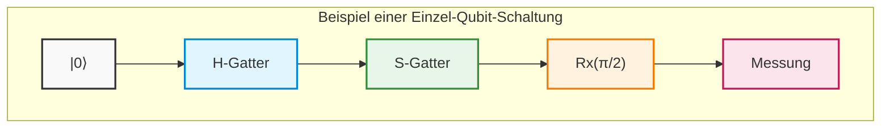

## 4.7 Beispiel einer strengen Berechnung: Vollständige Verfolgung der Quanteninterferenz durch Matrixmultiplikation

Um abstrakte Konzepte zu physikalischer Intuition zu erheben, werden wir streng von Hand und ohne jegliche Auslassungen verfolgen, wie Quantenzustände interferieren und übergehen, indem wir mehrere unitäre Matrizen miteinander multiplizieren.

Wir nehmen als Anfangszustand den Grundzustand **$|\psi_0\rangle = |0\rangle = \begin{pmatrix} 1 \\ 0 \end{pmatrix}$** an.
Die auszuführende Operation ist eine Sequenz aus " **$H$** -Gatter" -> " **$S$** -Gatter" -> " **$H$** -Gatter", ähnlich dem obigen Schaltplan.
Während Quantenschaltpläne von links nach rechts gelesen werden, wird in der linearen Algebra die Multiplikation von Operatoren auf einen Zustandsvektor "von links" angewendet. Daher werden die Terme für den gesamten unitären Operator **$U_{total}$** in umgekehrter chronologischer Reihenfolge von rechts nach links angeordnet.

$$
U_{total} = H S H
$$

Wir setzen die Matrixdarstellungen der einzelnen Gatter ein, um die zusammengesetzte Matrix abzuleiten.

$$
H = \frac{1}{\sqrt{2}} \begin{pmatrix} 1 & 1 \\ 1 & -1 \end{pmatrix}, \quad S = \begin{pmatrix} 1 & 0 \\ 0 & i \end{pmatrix}
$$

Zuerst berechnen wir das Produkt **$SH$** aus dem **$H$** , das unmittelbar auf den Anfangszustand angewendet wird, und dem darauf folgenden **$S$** .

$$
S H = \begin{pmatrix} 1 & 0 \\ 0 & i \end{pmatrix} \frac{1}{\sqrt{2}} \begin{pmatrix} 1 & 1 \\ 1 & -1 \end{pmatrix} = \frac{1}{\sqrt{2}} \begin{pmatrix} 1\cdot 1 + 0\cdot 1 & 1\cdot 1 + 0\cdot(-1) \\ 0\cdot 1 + i\cdot 1 & 0\cdot 1 + i\cdot(-1) \end{pmatrix} = \frac{1}{\sqrt{2}} \begin{pmatrix} 1 & 1 \\ i & -i \end{pmatrix}
$$

Als Nächstes multiplizieren wir dieses Ergebnis von der linken Seite mit dem letzten **$H$** .

$$
U_{total} = H (S H) = \frac{1}{\sqrt{2}} \begin{pmatrix} 1 & 1 \\ 1 & -1 \end{pmatrix} \frac{1}{\sqrt{2}} \begin{pmatrix} 1 & 1 \\ i & -i \end{pmatrix}
$$

Wir ziehen die skalare Multiplikation **$\frac{1}{\sqrt{2}} \times \frac{1}{\sqrt{2}} = \frac{1}{2}$** nach vorne und führen das Matrixprodukt sorgfältig aus.

$$
U_{total} = \frac{1}{2} \begin{pmatrix} 1\cdot 1 + 1\cdot i & 1\cdot 1 + 1\cdot(-i) \\ 1\cdot 1 + (-1)\cdot i & 1\cdot 1 + (-1)\cdot(-i) \end{pmatrix} = \frac{1}{2} \begin{pmatrix} 1 + i & 1 - i \\ 1 - i & 1 + i \end{pmatrix}
$$

Dies ist die Darstellung als einzelne unitäre Matrix, wenn die gesamte Schaltung als eine Blackbox betrachtet wird.
Wir wenden dieses **$U_{total}$** auf den Anfangszustand **$|0\rangle$** an, um den Endzustand **$|\psi_{final}\rangle$** zu berechnen.

$$
|\psi_{final}\rangle = U_{total} |0\rangle = \frac{1}{2} \begin{pmatrix} 1 + i & 1 - i \\ 1 - i & 1 + i \end{pmatrix} \begin{pmatrix} 1 \\ 0 \end{pmatrix} = \frac{1}{2} \begin{pmatrix} 1 + i \\ 1 - i \end{pmatrix}
$$

Wenn wir dies in der Dirac-Notation entwickeln, erhalten wir Folgendes:

$$
|\psi_{final}\rangle = \frac{1+i}{2} |0\rangle + \frac{1-i}{2} |1\rangle
$$

Hier berechnen wir die Wahrscheinlichkeit, jede Basis zu beobachten, um zu überprüfen, ob die Unitarität (dass die Summe der Wahrscheinlichkeiten 1 ist) nicht zerstört wurde. Wir verwenden das Quadrat des absoluten Betrags einer komplexen Zahl, ** $|z|^2 = z z^*$ ** .

$$
P(0) = |\langle 0 | \psi_{final} \rangle|^2 = \left| \frac{1+i}{2} \right|^2 = \frac{1^2 + 1^2}{4} = \frac{2}{4} = \frac{1}{2}
$$

$$
P(1) = |\langle 1 | \psi_{final} \rangle|^2 = \left| \frac{1-i}{2} \right|^2 = \frac{1^2 + (-1)^2}{4} = \frac{2}{4} = \frac{1}{2}
$$

Die Summe der Wahrscheinlichkeiten ist **$P(0) + P(1) = 1$** , was beweist, dass es sich um einen physikalisch gültigen Zustand handelt. Bei einer Messung erhalten wir mit 50 % Wahrscheinlichkeit 0 und mit 50 % Wahrscheinlichkeit 1, aber dies ist nicht nur eine einfache klassische Zufallszahl. Um die hinter dem Zustand verborgene "Phase" herauszuarbeiten, wollen wir den Zustandsvektor in die Polarkoordinatenform der Bloch-Kugel umformen.

Als gemeinsamen Gesamtfaktor klammern wir die Amplitude **$1/\sqrt{2}$** und die globale Phase **$e^{i\pi/4}$** ( **$\frac{1+i}{\sqrt{2}}$** ) gewaltsam aus.

$$
|\psi_{final}\rangle = \frac{1}{\sqrt{2}} \left( \frac{1+i}{\sqrt{2}} |0\rangle + \frac{1-i}{\sqrt{2}} |1\rangle \right) = e^{i\pi/4} \left( \frac{1}{\sqrt{2}} |0\rangle + \frac{1}{\sqrt{2}} e^{-i\pi/2} |1\rangle \right)
$$

Da sich die globale Phase **$e^{i\pi/4}$** bei jeder Erwartungswertberechnung einer Observablen (eines hermiteschen Operators) als **$e^{-i\pi/4} e^{i\pi/4} = 1$** aufhebt und somit keine physikalische Bedeutung hat, extrahieren wir nur den Anteil der relativen Phase:

$$
|\psi_{final}'\rangle = \frac{1}{\sqrt{2}} |0\rangle - \frac{i}{\sqrt{2}} |1\rangle
$$

Indem wir dies mit der Polarkoordinatendarstellung **$\cos(\theta/2)|0\rangle + e^{i\phi}\sin(\theta/2)|1\rangle$** vergleichen, ist der Bloch-Vektor perfekt dahingehend spezifiziert, dass er auf einen Zenitwinkel **$\theta = \pi/2$** (auf dem Äquator) und einen Azimutwinkel **$\phi = -\pi/2$** (in negativer Richtung der Y-Achse) gerichtet ist. Dies ist der Zustand, der üblicherweise als **$|-i\rangle$** bezeichnet wird.

Lassen Sie uns eine noch tiefere Tatsache präsentieren. Unter Verwendung der zuvor abgeleiteten Formel für Rotationsgatter mit Exponentialfunktionen wollen wir die Matrix der **$\pi/2$** -Rotation um die X-Achse, **$R_x(\pi/2)$** , aufschreiben.

$$
R_x(\pi/2) = \frac{1}{\sqrt{2}} \begin{pmatrix} 1 & -i \\ -i & 1 \end{pmatrix}
$$

Betrachten wir andererseits noch einmal die von uns berechnete Gesamtmatrix **$U_{total}$** .

$$
U_{total} = \frac{1}{2} \begin{pmatrix} 1 + i & 1 - i \\ 1 - i & 1 + i \end{pmatrix} = \frac{1+i}{2} \begin{pmatrix} 1 & \frac{1-i}{1+i} \\ \frac{1-i}{1+i} & 1 \end{pmatrix} = \frac{1+i}{2} \begin{pmatrix} 1 & -i \\ -i & 1 \end{pmatrix} = e^{i\pi/4} R_x(\pi/2)
$$

Erstaunlicherweise ist damit bewiesen, dass eine kontinuierliche Operation durch eine Gruppe diskreter Gatter um völlig unterschiedliche Achsen wie " **$H \rightarrow S \rightarrow H$** " – abgesehen von der globalen Phase – mathematisch exakt und wortwörtlich äquivalent zu einer einzigen " **$\pi/2$** -Rotationsoperation um die X-Achse" ist.
Auf diese Weise folgt ein Quantenzustand Pfaden komplexer Interferenz, die unsere klassische Intuition ablehnen, aber durch das robuste mathematische Rahmenwerk der linearen Algebra ist es möglich, sein Verhalten vollständig zu beherrschen und ohne den geringsten Fehler vorherzusagen.

Im nächsten Kapitel werden wir auf dem Wissen über diese leistungsstarken Einzel-Qubit-Operationen aufbauen und in die tiefgreifende Welt der Mehr-Qubit-Gatter eintreten, die durch das Tensorprodukt (Tensor product) die Dimensionalität des Hilbertraums exponentiell explodieren lassen und die Quantenverschränkung (Entanglement) erzeugen, die Einstein als "spukhafte Fernwirkung" bezeichnete.

# Kapitel 5: Mehr-Qubit-Systeme und Quantenverschränkung (Entanglement)

In den bisherigen Kapiteln haben wir uns ausführlich mit der Eigenschaft der Überlagerung eines einzelnen Qubits und den Einzel-Qubit-Gattern beschäftigt, die als Rotationsoperationen auf der Bloch-Kugel beschrieben werden. Die wahre Kraft des Quantencomputings, die klassische Berechnungen übertrifft – die sogenannte "Quantenüberlegenheit" (Quantum Supremacy) oder der "Quantenvorteil" (Quantum Advantage) –, liegt jedoch in Vielteilchensystemen, in denen mehrere Qubits miteinander interagieren. In diesem Kapitel werden wir die **Quantenverschränkung** (Entanglement), das zentrale und rätselhafteste Konzept der Quanteninformation, einführen und ausführlich erläutern: von der strengen mathematischen Beschreibung von Mehr-Qubit-Systemen über die Schaltkreise zur Erzeugung von Quantenverschränkung bis hin zum EPR-Paradoxon, das die Grundfesten der Physik erschütterte.

---

## 5.1 Mathematische Beschreibung von Vielteilchenzuständen durch das Tensorprodukt ($\otimes$)

Gemäß den Axiomen der Quantenmechanik ist der Zustandsraum eines zusammengesetzten Systems, wenn die Zustandsräume unabhängiger physikalischer Systeme jeweils durch die Hilberträume **$\mathcal{H}_A$** und **$\mathcal{H}_B$** beschrieben werden, durch das **Tensorprodukt** (Tensor Product) der jeweiligen Räume als **$\mathcal{H} = \mathcal{H}_A \otimes \mathcal{H}_B$** gegeben.

Der Zustandsraum eines einzelnen Qubits ist ein zweidimensionaler komplexer Vektorraum **$\mathbb{C}^2$** . Daher ist der Zustandsraum eines Systems aus $n$ Qubits ein $2^n$-dimensionaler Hilbertraum **$(\mathbb{C}^2)^{\otimes n}$** . Dass die Dimension exponentiell mit der Anzahl der Qubits $n$ wächst, ist genau die mathematische Grundlage der Quantenparallelität.

Betrachten wir ein System, das aus zwei Qubits (Qubit A und Qubit B) besteht. Die Rechenbasis ist als das Tensorprodukt der Basiszustände der einzelnen Qubits definiert:

$$
|0\rangle_A \otimes |0\rangle_B \equiv |00\rangle, \quad
|0\rangle_A \otimes |1\rangle_B \equiv |01\rangle, \quad
|1\rangle_A \otimes |0\rangle_B \equiv |10\rangle, \quad
|1\rangle_A \otimes |1\rangle_B \equiv |11\rangle
$$

Lassen Sie uns hier die Matrixdarstellung des Tensorprodukts (das Kronecker-Produkt) streng berechnen. Wenn wir die Basis eines einzelnen Qubits als Spaltenvektor darstellen, ergibt sich:

$$
|0\rangle = \begin{pmatrix} 1 \\ 0 \end{pmatrix}, \quad |1\rangle = \begin{pmatrix} 0 \\ 1 \end{pmatrix}
$$

Unter Verwendung dieser Vektoren sieht die Berechnung beispielsweise für den Zustand **$|10\rangle$** wie folgt aus:

$$
|10\rangle = |1\rangle \otimes |0\rangle = \begin{pmatrix} 0 \\ 1 \end{pmatrix} \otimes \begin{pmatrix} 1 \\ 0 \end{pmatrix} = \begin{pmatrix} 0 \cdot \begin{pmatrix} 1 \\ 0 \end{pmatrix} \\ 1 \cdot \begin{pmatrix} 1 \\ 0 \end{pmatrix} \end{pmatrix} = \begin{pmatrix} 0 \\ 0 \\ 1 \\ 0 \end{pmatrix}
$$

In diesem vierdimensionalen Vektorraum wird der allgemeinste reine Zustand **$|\Psi\rangle$** eines 2-Qubit-Systems als Linearkombination (Superposition) dieser vier Basisvektoren beschrieben:

$$
|\Psi\rangle = c_{00} |00\rangle + c_{01} |01\rangle + c_{10} |10\rangle + c_{11} |11\rangle
$$

Hierbei sind die $c_{ij} \in \mathbb{C}$ die Wahrscheinlichkeitsamplituden, und nach der Bornschen Regel muss der Zustand normiert sein, was bedeutet, dass die Normierungsbedingung $\sum_{i,j \in \{0,1\}} |c_{ij}|^2 = 1$ erfüllt sein muss.

Auch Operatoren (Gatter) in einem zusammengesetzten System werden mithilfe des Tensorprodukts gebildet. Die Operation, den Operator **$U_A$** auf Qubit A und den Operator **$U_B$** auf Qubit B anzuwenden, wird als Operator **$U_A \otimes U_B$** für das gesamte zusammengesetzte System ausgedrückt und wirkt wie folgt auf jeden beliebigen Produktzustand:

$$
(U_A \otimes U_B)(|\psi\rangle_A \otimes |\phi\rangle_B) = (U_A |\psi\rangle_A) \otimes (U_B |\phi\rangle_B)
$$

Aufgrund der Linearität lässt sich diese Wirkung auch auf beliebige Überlagerungszustände erweitern.

---

## 5.2 Mathematische Darstellung von Bell-Zuständen (maximal verschränkte Zustände)

Die Zustände in Vielteilchen-Quantensystemen werden grob in zwei Kategorien unterteilt: "separierbare Zustände" (Separable States) und "verschränkte Zustände" (Entangled States).
Wenn der Zustand **$|\Psi\rangle$** als ein einfaches Tensorprodukt der Zustände der jeweiligen Teilsysteme, also als

$$
|\Psi\rangle = |\psi\rangle_A \otimes |\phi\rangle_B
$$

beschrieben werden kann, bezeichnet man diesen Zustand als separierbar. Im Gegensatz dazu wird ein Zustand, der **nicht** als Tensorprodukt irgendwelcher Teilsystemzustände dargestellt werden kann, als **verschränkter Zustand (Entangled State)** definiert.

In einem 2-Qubit-System werden die Zustände mit der stärksten Quantenverschränkung als **Bell-Zustände** (Bell States) oder EPR-Paare bezeichnet. Die Bell-Zustände bestehen aus den folgenden vier orthogonalen reinen Zuständen und bilden eine vollständige Orthonormalbasis (Bell-Basis) im vierdimensionalen Hilbertraum:

$$
|\Phi^+\rangle = \frac{1}{\sqrt{2}} \Big( |00\rangle + |11\rangle \Big)
$$

$$
|\Phi^-\rangle = \frac{1}{\sqrt{2}} \Big( |00\rangle - |11\rangle \Big)
$$

$$
|\Psi^+\rangle = \frac{1}{\sqrt{2}} \Big( |01\rangle + |10\rangle \Big)
$$

$$
|\Psi^-\rangle = \frac{1}{\sqrt{2}} \Big( |01\rangle - |10\rangle \Big)
$$

Lassen Sie uns hier mithilfe eines Widerspruchsbeweises streng beweisen, dass der Zustand **$|\Phi^+\rangle$** nicht separierbar ist.
Angenommen, **$|\Phi^+\rangle$** wäre ein separierbarer Zustand und könnte als Tensorprodukt unbekannter Einzel-Qubit-Zustände beschrieben werden:

$$
|\Phi^+\rangle = (a|0\rangle + b|1\rangle)_A \otimes (c|0\rangle + d|1\rangle)_B
$$

Wenn man dies ausmultipliziert, erhält man:

$$
|\Phi^+\rangle = ac|00\rangle + ad|01\rangle + bc|10\rangle + bd|11\rangle
$$

Vergleicht man dies mit den Koeffizienten der ursprünglichen Definitionsgleichung, ergibt sich das folgende Gleichungssystem:

1. $ac = \frac{1}{\sqrt{2}}$
2. $bd = \frac{1}{\sqrt{2}}$
3. $ad = 0$
4. $bc = 0$

Aus Gleichung 3 ($ad = 0$) folgt, dass $a = 0$ oder $d = 0$ sein muss.
Wenn $a = 0$ ist, ergibt sich aus Gleichung 1 $ac = 0$, was ein Widerspruch zu $ac = \frac{1}{\sqrt{2}}$ ist.
Wenn $d = 0$ ist, ergibt sich aus Gleichung 2 $bd = 0$, was ein Widerspruch zu $bd = \frac{1}{\sqrt{2}}$ ist.
Daher existieren keine solchen komplexen Zahlen $a, b, c, d$, und es ist streng bewiesen, dass der Zustand **$|\Phi^+\rangle$** niemals als Produkt zweier unabhängiger Zustände faktorisiert werden kann.

### Reduzierte Dichtematrix und Verschränkungsentropie

Die Tatsache, dass die Bell-Zustände "maximal verschränkt" sind, wird durch die Berechnung der **reduzierten Dichtematrix** (Reduced Density Matrix), die die Information des Teilsystems beschreibt, noch deutlicher. Wenn sich das gesamte System im reinen Zustand **$\rho = |\Phi^+\rangle \langle\Phi^+|$** befindet, bilden wir die partielle Spur über Qubit B (Trace-Out bzw. Ausspuren), um den lokalen Zustand von Qubit A zu erhalten.

$$
\rho_A = \text{Tr}_B(|\Phi^+\rangle \langle\Phi^+|) = \text{Tr}_B \left[ \frac{1}{2} (|00\rangle\langle00| + |00\rangle\langle11| + |11\rangle\langle00| + |11\rangle\langle11|) \right]
$$

Unter Ausnutzung der Eigenschaft der partiellen Spur $\text{Tr}_B(|i,j\rangle\langle k,l|) = |i\rangle\langle k| \cdot \langle l|j\rangle = |i\rangle\langle k| \delta_{jl}$ erhalten wir:

$$
\rho_A = \frac{1}{2} \Big( |0\rangle\langle0| \cdot \langle0|0\rangle + |0\rangle\langle1| \cdot \langle1|0\rangle + |1\rangle\langle0| \cdot \langle0|1\rangle + |1\rangle\langle1| \cdot \langle1|1\rangle \Big)
$$

$$
\rho_A = \frac{1}{2} (|0\rangle\langle0| + |1\rangle\langle1|) = \frac{1}{2} I
$$

Dies bedeutet, dass, wenn nur Qubit A beobachtet wird, sich dessen Zustand in einem vollständig gemischten Zustand (Completely Mixed State) befindet und die Von-Neumann-Entropie $S(\rho_A) = -\text{Tr}(\rho_A \log_2 \rho_A)$ ihren Maximalwert von $1$ annimmt. Das heißt, die Essenz der maximalen Quantenverschränkung liegt in dieser extremen Korrelation, die in der klassischen Mechanik völlig undenkbar ist: "Obwohl das System als Ganzes vollständige Information (einen reinen Zustand) besitzt, ist die Information, wenn man jedes Teilsystem betrachtet, vollkommen unbestimmt (maximale Entropie)."

---

## 5.3 Matrixdarstellung des CNOT-Gatters (Controlled-NOT-Gatter)

Um eine solche Verschränkung in einem Quantencomputer künstlich zu erzeugen und zu manipulieren, reichen Operationen auf einzelnen Qubits nicht aus; Mehr-Qubit-Gatter, die mehrere Qubits überspannen, sind unerlässlich. Der grundlegendste und leistungsfähigste Operator hierfür ist das **CNOT-Gatter** (Controlled-NOT Gate).

Das CNOT-Gatter wirkt auf zwei Qubits und behandelt eines davon als "Kontroll-Qubit" (Control Qubit) und das andere als "Ziel-Qubit" (Target Qubit). Dieses Gatter, das als die Quantenversion des klassischen XOR-Gatters betrachtet werden kann, verhält sich folgendermaßen: "Nur wenn das Kontroll-Qubit $|1\rangle$ ist, wird das Ziel-Qubit invertiert (das Pauli- $X$ -Gatter wird angewendet), und wenn das Kontroll-Qubit $|0\rangle$ ist, passiert nichts."

Die Wirkung auf die Rechenbasis ist wie folgt (wobei das erste Qubit das Kontroll-Qubit und das zweite das Ziel-Qubit ist):

$$
\text{CNOT} |00\rangle = |00\rangle \\
\text{CNOT} |01\rangle = |01\rangle \\
\text{CNOT} |10\rangle = |11\rangle \\
\text{CNOT} |11\rangle = |10\rangle
$$

Wenn man dies als eine vierdimensionale unitäre Matrix ausdrückt, sieht das so aus:

$$
\text{CNOT} = \begin{pmatrix}
1 & 0 & 0 & 0 \\
0 & 1 & 0 & 0 \\
0 & 0 & 0 & 1 \\
0 & 0 & 1 & 0
\end{pmatrix}
$$

Eine mathematisch elegantere Darstellung ist die Notation als Summe von Tensorprodukten unter Verwendung von Projektionsoperatoren und Pauli-Matrizen:

$$
\text{CNOT} = |0\rangle\langle0| \otimes I + |1\rangle\langle1| \otimes X
$$

Diese Gleichung drückt die physikalische Bedeutung des CNOT-Gatters äußerst intuitiv aus. Der erste Term bedeutet: "In dem Zustandsraum, in dem das erste Qubit auf $|0\rangle$ projiziert wird, wird der Identitätsoperator $I$ auf das zweite Qubit angewendet." Der zweite Term bedeutet: "In dem Zustandsraum, in dem das erste Qubit auf $|1\rangle$ projiziert wird, wird der Bit-Flip-Operator $X$ auf das zweite Qubit angewendet."

Eine wichtige Eigenschaft des CNOT-Gatters ist, dass es gleichzeitig hermitesch ( $\text{CNOT}^\dagger = \text{CNOT}$ ) und unitär ( $\text{CNOT}^\dagger \text{CNOT} = I$ ) ist, weshalb es seine eigene inverse Matrix ist ( $\text{CNOT}^2 = I$ ).

---

## 5.4 Schaltkreis zur Erzeugung von Quantenverschränkung mittels CNOT

Wie können wir nun ausgehend von einem separierbaren Zustand den Bell-Zustand erzeugen, der ein maximal verschränkter Zustand ist? Hier werden wir einen Standard-Quantenschaltkreis aufbauen, der aus dem Anfangszustand **$|00\rangle$** des Quantencomputers den Zustand **$|\Phi^+\rangle$** erzeugt, und wir werden diese Zustandsänderungen mathematisch nachverfolgen.

Die einzigen notwendigen Komponenten sind das Hadamard-Gatter **$H$** , das auf ein einzelnes Qubit wirkt, und das zuvor erwähnte **$\text{CNOT}$** -Gatter. Die Hadamard-Matrix ist wie folgt definiert:

$$
H = \frac{1}{\sqrt{2}} \begin{pmatrix} 1 & 1 \\ 1 & -1 \end{pmatrix}
$$

### Berechnung der Quantenzustandsübergänge

 **Schritt 1:** Initialisierung
Das System befindet sich im Anfangszustand der Rechenbasis.

$$
|\psi_0\rangle = |0\rangle_A \otimes |0\rangle_B = |00\rangle
$$

 **Schritt 2:** Anwendung des Hadamard-Gatters auf das Kontroll-Qubit (Qubit A)
Wir wenden das Hadamard-Gatter nur auf Qubit A an und erzeugen so einen Überlagerungszustand. Der Operator für das gesamte System ist **$H \otimes I$** .

$$
|\psi_1\rangle = (H \otimes I) |00\rangle = (H|0\rangle_A) \otimes (I|0\rangle_B)
$$

$$
= \left( \frac{1}{\sqrt{2}} (|0\rangle_A + |1\rangle_A) \right) \otimes |0\rangle_B
$$

$$
= \frac{1}{\sqrt{2}} (|00\rangle + |10\rangle)
$$

Zu diesem Zeitpunkt ist der Zustand noch immer ein separierbarer Zustand, da er in Form eines Tensorprodukts geschrieben werden kann.

 **Schritt 3:** Anwendung des CNOT-Gatters
Als nächstes wenden wir ein CNOT-Gatter mit Qubit A als Kontroll-Qubit und Qubit B als Ziel-Qubit an. Aufgrund der Linearität des Operators wirkt das CNOT-Gatter unabhängig auf jeden Term der Überlagerung.

$$
|\psi_2\rangle = \text{CNOT} \left[ \frac{1}{\sqrt{2}} (|00\rangle + |10\rangle) \right]
$$

$$
= \frac{1}{\sqrt{2}} (\text{CNOT}|00\rangle + \text{CNOT}|10\rangle)
$$

Wenn wir die zuvor definierte Wirkungsregel des CNOT auf die Basis anwenden, erhalten wir $\text{CNOT}|00\rangle = |00\rangle$ und $\text{CNOT}|10\rangle = |11\rangle$, was zu folgendem Ergebnis führt:

$$
|\psi_2\rangle = \frac{1}{\sqrt{2}} (|00\rangle + |11\rangle) = |\Phi^+\rangle
$$

Damit wurde auf elegante Weise aus dem anfänglich separierbaren Zustand der Bell-Zustand **$|\Phi^+\rangle$** erzeugt. Indem das CNOT-Gatter die vom Hadamard-Gatter erzeugte "Überlagerung des Kontroll-Qubits aus 0 und 1" empfängt, verzweigt sich die Invertierung/Nicht-Invertierung des Ziel-Qubits in Abhängigkeit von den jeweiligen Zuständen des Kontroll-Qubits, wodurch sich insgesamt eine Verschränkung bildet.

Mit dem gleichen Schaltungsaufbau können wir durch Änderung des Anfangszustands auf $|01\rangle, |10\rangle, |11\rangle$ die jeweils verbleibenden Bell-Zustände $|\Psi^+\rangle, |\Phi^-\rangle, |\Psi^-\rangle$ deterministisch erzeugen.

### Quantenschaltbild (Mermaid-Notation)

Das Quantenschaltbild, das den oben beschriebenen Prozess der Verschränkungserzeugung beschreibt, sieht wie folgt aus:

```mermaid
graph LR
    %% Quantum Qubits definitions
    Q0["|0⟩ (Kontroll-Qubit)"]
    Q1["|0⟩ (Ziel-Qubit)"]

    %% Gates definitions
    H["H-Gatter"]
    Dot["● (Control)"]
    X["⊕ (Target)"]
    
    %% Outputs
    Out0[" "]
    Out1[" "]

    %% Connections for Q0
    Q0 --> H
    H --> Dot
    Dot --> Out0

    %% Connections for Q1
    Q1 --> X
    X --> Out1

    %% CNOT Connection (Control to Target)
    Dot -.->|"CNOT"| X
    
    %% Styles
    style H fill:#f9f,stroke:#333,stroke-width:2px
    style Dot fill:#333,stroke:#333
    style X fill:#fff,stroke:#333,stroke-width:2px
```
*(Hinweis: Das obige Diagramm stellt die logische Verschaltung dar. Die durchgehenden horizontalen Linien zeigen den zeitlichen Verlauf jedes Qubits (Quantendraht), und es wird die Struktur gezeigt, in der das Kontroll-Qubit nach Passieren des `H-Gatters` das `⊕` des Ziel-Qubits an der Position `●` steuert. Als Gesamtausgangszustand erhält man den Bell-Zustand $|\Phi^+\rangle$.)*

---

## 5.5 EPR-Paradoxon und Nichtlokalität

Dass das Konzept der Quantenverschränkung keine bloße mathematische Spielerei ist, sondern die Grundfesten der Physik in Frage stellt, wurde 1935 in der berühmten **EPR-Arbeit** von Albert Einstein, Boris Podolsky und Nathan Rosen dargelegt. Sie argumentierten, dass die Quantenmechanik eine unvollständige Theorie sei (dass verborgene Variablen notwendig seien), da ihre Beschreibung im Widerspruch zum "lokalen Realismus" (Local Realism) stehe.

Lassen Sie uns ein Gedankenexperiment durchführen, bei dem zwei Beobachter, Alice und Bob, den zuvor erzeugten Bell-Zustand **$|\Phi^+\rangle = \frac{1}{\sqrt{2}}(|00\rangle + |11\rangle)$** teilen. Nehmen wir an, Alice behält das erste Qubit und Bob das zweite Qubit, und sie entfernen sich an die entgegengesetzten Enden des Universums (zum Beispiel zur Erde und zur Andromeda-Galaxie).

In diesem Zustand ist das Messergebnis jedes Qubits im Wesentlichen zufällig. Wenn Alice ihr Qubit in der Rechenbasis $\{|0\rangle, |1\rangle\}$ misst, erhält sie mit 50%iger Wahrscheinlichkeit $0$ (Zustand $|0\rangle$) und mit 50%iger Wahrscheinlichkeit $1$ (Zustand $|1\rangle$).

Gemäß der Projektionshypothese (dem Kollaps der Wellenfunktion) der Quantenmechanik ändert sich jedoch der Zustand des gesamten Systems in dem **Moment** , in dem Alice ihre Messung durchführt, drastisch:
- In dem Moment, in dem Alice das Messergebnis $0$ erhält, kollabiert die gesamte Wellenfunktion zu $|00\rangle$. Daher wird Bobs Qubit sofort und mit Sicherheit auf $|0\rangle$ festgelegt, noch bevor er irgendeine Messung durchführt.
- Umgekehrt, wenn Alice das Messergebnis $1$ erhält, kollabiert die gesamte Wellenfunktion zu $|11\rangle$, und Bobs Qubit wird sofort und mit Sicherheit auf $|1\rangle$ festgelegt.

Einstein nannte dies "spukhafte Fernwirkung" (Spooky action at a distance). Das liegt daran, dass Alices lokale Messoperation scheinbar überlichtschnell (augenblicklich) den physikalischen Zustand des weit entfernten Bobs beeinflusst hat. Dies scheint eindeutig gegen das Lokalitätsprinzip zu verstoßen, eine Forderung der Speziellen Relativitätstheorie, dass "keine Information schneller als das Licht übertragen werden kann".

### No-Signaling-Theorem und Bellsche Ungleichung

Steht die Quantenmechanik also im Widerspruch zur Relativitätstheorie? Die Schlussfolgerung lautet: Nein, tut sie nicht.
Dieses scheinbare Paradoxon wird durch das **No-Signaling-Theorem** (No-Communication Theorem) gelöst. Obwohl Bobs Zustand durch Alices Messung augenblicklich bestimmt wird, ist es für Alice prinzipiell unmöglich zu kontrollieren, ob sie das Ergebnis $0$ oder $1$ erhält. Aus Bobs Sicht gibt es keine Möglichkeit zu wissen, dass Alice eine Messung durchgeführt hat, und das Ergebnis der Messung seines eigenen Qubits erscheint ihm immer noch völlig zufällig (mit 50%iger Wahrscheinlichkeit 0 oder 1). Wie im Abschnitt über die reduzierte Dichtematrix bewiesen wurde, ändert sich Bobs lokale Dichtematrix $\rho_B$ überhaupt nicht, unabhängig davon, welche Messbasis Alice wählt. Daher ist es nicht möglich, "sinnvolle Informationen" mithilfe von Verschränkung überlichtschnell zu übertragen.

Diese starke Korrelation der Quantenverschränkung fiel jedoch nicht in den Bereich der klassischen Physik. Im Jahr 1964 leitete John Stewart Bell die **Bellsche Ungleichung** ab. Bell bewies mathematisch: "Wenn die Welt durch den lokalen Realismus (Einsteins Theorie der verborgenen Variablen) beschrieben wird, wird die Stärke der Korrelation, wenn Alice und Bob jeweils entlang unterschiedlicher Achsen messen, eine bestimmte Obergrenze ($|S| \leq 2$ in der CHSH-Ungleichung) nicht überschreiten."

Die Quantenmechanik sagt voraus, dass diese Obergrenze in bestimmten Konfigurationen gebrochen wird ($|S| = 2\sqrt{2}$). Spätere präzise physikalische Experimente von Alain Aspect und anderen bestätigten die Verletzung der Bellschen Ungleichung und stellten zweifelsfrei fest, dass das Universum, in dem wir leben, **nicht** lokal-realistisch ist. Die nichtlokale Korrelation durch Quantenverschränkung ist ein universelles physikalisches Phänomen, das in der Natur tatsächlich existiert.

Im nächsten Kapitel werden wir ausführlich Quantenkommunikationsprotokolle wie die Quantenteleportation und die superdichte Kodierung (Superdense Coding) erläutern, die diese Nichtlokalität der Quantenverschränkung aktiv als Ressource für die Informationsverarbeitung nutzen.

# Kapitel 6: Quantenschaltkreise und grundlegende Protokolle

In diesem Kapitel werden wir uns eingehend mit den wichtigsten und grundlegendsten Protokollen der Quanteninformationswissenschaft befassen, die durch die Kombination der bisher erlernten Grundpostulate der Quantenmechanik und der Konzepte von Quantengattern realisiert werden. Diese Protokolle, die den gesunden Menschenverstand der klassischen Informationstheorie auf den Kopf stellen, bilden das Fundament, das die Möglichkeiten von Quantencomputern und Quantenkommunikation bestimmt. Hier werden wir drei Themen ohne jeden Kompromiss und mit strenger mathematischer Formulierung detailliert erläutern: das „No-Cloning-Theorem“ (Quanten-No-Cloning-Theorem), die „Quantenteleportation“ (Quantum Teleportation) und die „Dichte Kodierung“ (Superdense Coding).

## 6.1 No-Cloning-Theorem (Quanten-No-Cloning-Theorem)

In klassischen Computern ist das Kopieren (Duplizieren) von Daten eine völlig triviale Operation. Bitfolgen lassen sich mühelos vervielfältigen und auf unzähligen Speichergeräten sichern. In der von der Quantenmechanik beherrschten Welt existiert jedoch ein verblüffendes Theorem, das besagt: **„Es ist unmöglich, eine exakte Kopie eines unbekannten Quantenzustands zu erstellen“** . Dies ist das „No-Cloning-Theorem“ (Quanten-No-Cloning-Theorem), das 1982 von Wootters und Zurek sowie unabhängig davon von Dieks bewiesen wurde.

Dieses Theorem ist das fundamentale Prinzip, das die Sicherheit der Quantenkryptographie (Quantenschlüsselaustausch) garantiert, und gleichzeitig der Grund dafür, warum die Quantenfehlerkorrektur gezwungen ist, einen völlig anderen und wesentlich komplexeren Ansatz als klassische Wiederholungscodes (einfache Mehrheitsentscheidungen) zu wählen.

### Mathematischer Beweis

Der Beweis des No-Cloning-Theorems lässt sich allein aus den elementarsten Eigenschaften der Quantenmechanik ableiten: der Linearität und der Unitarität.

Nehmen wir an, es gäbe einen „universellen Quantenkopierer“, der einen unbekannten Quantenzustand **$|\psi\rangle$** kopieren kann. Dieser Kopierer würde den zu kopierenden Ausgangszustand **$|\psi\rangle$** sowie ein initialisiertes Ziel-Qubit (ein Zustand, der einem unbeschriebenen Blatt Papier entspricht) **$|0\rangle$** als Eingabe entgegennehmen und als Ausgabe zwei identische Zustände **$|\psi\rangle \otimes |\psi\rangle$** (vereinfacht als **$|\psi\rangle |\psi\rangle$** geschrieben) erzeugen.

In der Quantenmechanik wird jede physikalische Entwicklung eines geschlossenen Systems durch einen unitären Operator **$U$** beschrieben. Daher wird die Funktionsweise dieses Kopierers als eine unitäre Transformation **$U$** definiert, die die folgende Gleichung erfüllt:

$$
U (|\psi\rangle \otimes |0\rangle) = |\psi\rangle \otimes |\psi\rangle
$$

Da wir annehmen, dass dies für einen „beliebigen“ Zustand gilt, muss er für einen weiteren beliebigen Quantenzustand **$|\phi\rangle$** gleichermaßen funktionieren:

$$
U (|\phi\rangle \otimes |0\rangle) = |\phi\rangle \otimes |\phi\rangle
$$

Bilden wir nun das Skalarprodukt (Innenprodukt) dieser beiden Gleichungen. Dabei nutzen wir die Eigenschaft des unitären Operators **$U$** ( **$U^\dagger U = I$** ). Das Skalarprodukt der linken Seiten ergibt sich wie folgt:

$$
\begin{aligned}
\left( U (|\psi\rangle \otimes |0\rangle) \right)^\dagger \left( U (|\phi\rangle \otimes |0\rangle) \right) 
&= (\langle \psi | \otimes \langle 0 |) U^\dagger U (|\phi\rangle \otimes |0\rangle) \\
&= (\langle \psi | \otimes \langle 0 |) I (|\phi\rangle \otimes |0\rangle) \\
&= \langle \psi | \phi \rangle \cdot \langle 0 | 0 \rangle \\
&= \langle \psi | \phi \rangle
\end{aligned}
$$

(Hierbei haben wir **$\langle 0 | 0 \rangle = 1$** verwendet.)

Andererseits ergibt sich das Skalarprodukt der kopierten Zustände auf den rechten Seiten wie folgt:

$$
\begin{aligned}
\left( |\psi\rangle \otimes |\psi\rangle \right)^\dagger \left( |\phi\rangle \otimes |\phi\rangle \right) 
&= (\langle \psi | \otimes \langle \psi |) (|\phi\rangle \otimes |\phi\rangle) \\
&= \langle \psi | \phi \rangle \cdot \langle \psi | \phi \rangle \\
&= (\langle \psi | \phi \rangle)^2
\end{aligned}
$$

Da linke und rechte Seite gleich sein müssen, erhalten wir die folgende Gleichung:

$$
\langle \psi | \phi \rangle = (\langle \psi | \phi \rangle)^2
$$

Die Bedingung dafür, dass diese Gleichung **$x = x^2$** im Bereich der komplexen Zahlen erfüllt ist, lautet lediglich **$x = 0$** oder **$x = 1$** . Das bedeutet:

$$
\langle \psi | \phi \rangle = 0 \quad \text{oder} \quad \langle \psi | \phi \rangle = 1
$$

Dies bedeutet, dass eine unitäre Transformation, die beide Zustände korrekt kopiert, nur dann existieren kann, wenn die beiden Zustände entweder „vollständig orthogonal (unabhängig) zueinander“ oder „völlig identisch“ sind. Mit anderen Worten: Es existiert keine universelle unitäre Transformation, die einen beliebigen (nicht-orthogonalen) unbekannten Quantenzustand duplizieren kann – womit dies äußerst einfach und elegant bewiesen ist.

### Beweis aus der Linearität (Beweis durch Widerspruch)

Es ist auch möglich, sich dem Problem über die Linearität der Quantenmechanik (das Superpositionsprinzip) zu nähern.
Betrachten wir einen unitären Operator **$U$** , der die beiden orthogonalen Basiszustände **$|0\rangle$** und **$|1\rangle$** kopieren kann:

$$
U |0\rangle |0\rangle = |0\rangle |0\rangle
$$

$$
U |1\rangle |0\rangle = |1\rangle |1\rangle
$$

Bis hierhin gibt es kein Problem. Dies entspricht dem Kopieren der klassischen Bits 0 und 1. Was geschieht jedoch, wenn wir versuchen, einen unbekannten Zustand in Überlagerung **$|\psi\rangle = \alpha|0\rangle + \beta|1\rangle$** zu kopieren? Aufgrund der Linearität der Zeitentwicklung durch den unitären Operator ergibt sich:

$$
\begin{aligned}
U (|\psi\rangle |0\rangle) &= U \left( (\alpha|0\rangle + \beta|1\rangle) |0\rangle \right) \\
&= U (\alpha|0\rangle |0\rangle + \beta|1\rangle |0\rangle) \\
&= \alpha U(|0\rangle |0\rangle) + \beta U(|1\rangle |0\rangle) \\
&= \alpha|0\rangle |0\rangle + \beta|1\rangle |1\rangle
\end{aligned}
$$

Die Ausgabe einer „perfekten Kopie“, die wir eigentlich haben wollten, müsste jedoch das folgende Tensorprodukt sein:

$$
\begin{aligned}
|\psi\rangle \otimes |\psi\rangle &= (\alpha|0\rangle + \beta|1\rangle) \otimes (\alpha|0\rangle + \beta|1\rangle) \\
&= \alpha^2|0\rangle |0\rangle + \alpha\beta|0\rangle |1\rangle + \alpha\beta|1\rangle |0\rangle + \beta^2|1\rangle |1\rangle
\end{aligned}
$$

Das durch die Linearität hergeleitete Ergebnis **$\alpha|0\rangle |0\rangle + \beta|1\rangle |1\rangle$** unterscheidet sich offensichtlich vom gewünschten kopierten Zustand **$|\psi\rangle \otimes |\psi\rangle$** (die Kreuzterme **$|0\rangle |1\rangle$** und **$|1\rangle |0\rangle$** fehlen). Damit wurde erneut gezeigt, dass es unmöglich ist, einen unbekannten Überlagerungszustand zu kopieren.

---

## 6.2 Quantenteleportation (Quantum Teleportation)

Das No-Cloning-Theorem hat uns gezeigt, dass Quantenzustände nicht kopiert werden können. Es ist jedoch möglich, sie zu „übertragen“ (zu transferieren). Die Quantenteleportation ist ein Protokoll, das mithilfe eines klassischen Kommunikationskanals und vorab geteilter Quantenverschränkung (Entanglement) einen unbekannten Quantenzustand an einem Ort vollständig an einen weit entfernten anderen Ort überträgt.

Hierbei ist zu beachten, dass sich nicht das physikalische Teilchen selbst durch den Raum bewegt, sondern der „Zustand (die Information)“ übertragen wird. Da der Zustand, der dem ursprünglichen Teilchen innewohnte, zerstört wird, steht dies nicht im Widerspruch zum No-Cloning-Theorem.

### Protokolleinstellungen und Anfangszustand

Die Senderin sei Alice und der Empfänger Bob.
Alice besitzt einen unbekannten 1-Qubit-Zustand **$|\psi\rangle$** , den sie an Bob senden möchte:

$$
|\psi\rangle_C = \alpha|0\rangle_C + \beta|1\rangle_C \quad (|\alpha|^2 + |\beta|^2 = 1)
$$

Der Index $C$ zeigt an, dass dies das Ziel-Qubit ist, das übertragen werden soll.

Um diese Übertragung zu realisieren, nehmen wir an, dass Alice und Bob sich vorab ein maximal verschränktes 2-Qubit-Zustandspaar (als EPR-Paar oder Bell-Paar bezeichnet) teilen. Hier verwenden wir den folgenden Zustand:

$$
|\Phi^+\rangle_{AB} = \frac{1}{\sqrt{2}} \left( |0\rangle_A \otimes |0\rangle_B + |1\rangle_A \otimes |1\rangle_B \right)
$$

Der Index $A$ bezeichnet das von Alice gehaltene Qubit, und $B$ steht für das von Bob gehaltene Qubit.

Der Anfangszustand des Gesamtsystems **$|\Psi_0\rangle$** wird als Tensorprodukt des von Alice zu übertragenden Zustands und des geteilten EPR-Paars beschrieben:

$$
\begin{aligned}
|\Psi_0\rangle &= |\psi\rangle_C \otimes |\Phi^+\rangle_{AB} \\
&= (\alpha|0\rangle_C + \beta|1\rangle_C) \otimes \frac{1}{\sqrt{2}} (|0\rangle_A |0\rangle_B + |1\rangle_A |1\rangle_B) \\
&= \frac{1}{\sqrt{2}} \Big( \alpha|0\rangle_C |0\rangle_A |0\rangle_B + \alpha|0\rangle_C |1\rangle_A |1\rangle_B + \beta|1\rangle_C |0\rangle_A |0\rangle_B + \beta|1\rangle_C |1\rangle_A |1\rangle_B \Big)
\end{aligned}
$$

### Alices Operationen und die Bell-Basismessung

Alice verfügt über die Qubits $C$ und $A$. Sie führt an diesen beiden Qubits eine gemeinsame Messung durch, die als „Bell-Messung“ bezeichnet wird. In der Sprache der Quantenschaltkreise entspricht dies der Anwendung eines CNOT-Gatters, gefolgt von einem Hadamard-Gatter, und der anschließenden Messung in der Standardbasis (Rechenbasis).

 **Schritt 1: Anwendung des CNOT-Gatters** 
Alice wendet ein CNOT-Gatter (Controlled-NOT) **$CX_{CA}$** an, wobei Qubit $C$ als Kontroll-Qubit und Qubit $A$ als Ziel-Qubit dient. Das CNOT-Gatter invertiert das Ziel-Qubit genau dann, wenn das Kontroll-Qubit $|1\rangle$ ist:

$$
\begin{aligned}
|\Psi_1\rangle &= CX_{CA} |\Psi_0\rangle \\
&= \frac{1}{\sqrt{2}} \Big( \alpha|0\rangle_C |0\rangle_A |0\rangle_B + \alpha|0\rangle_C |1\rangle_A |1\rangle_B + \beta|1\rangle_C |1\rangle_A |0\rangle_B + \beta|1\rangle_C |0\rangle_A |1\rangle_B \Big)
\end{aligned}
$$

(Im dritten Term wurde $|0\rangle_A$ zu $|1\rangle_A$ und im vierten Term $|1\rangle_A$ zu $|0\rangle_A$ invertiert.)

 **Schritt 2: Anwendung des Hadamard-Gatters** 
Als Nächstes wendet Alice das Hadamard-Gatter **$H_C$** auf das Qubit $C$ an. Die Hadamard-Transformation transformiert $|0\rangle \to \frac{|0\rangle+|1\rangle}{\sqrt{2}}$ und $|1\rangle \to \frac{|0\rangle-|1\rangle}{\sqrt{2}}$:

$$
\begin{aligned}
|\Psi_2\rangle &= H_C |\Psi_1\rangle \\
&= \frac{1}{2} \Big[ \alpha(|0\rangle_C + |1\rangle_C) |0\rangle_A |0\rangle_B + \alpha(|0\rangle_C + |1\rangle_C) |1\rangle_A |1\rangle_B \\
&\quad + \beta(|0\rangle_C - |1\rangle_C) |1\rangle_A |0\rangle_B + \beta(|0\rangle_C - |1\rangle_C) |0\rangle_A |1\rangle_B \Big]
\end{aligned}
$$

Wir ordnen diesen Ausdruck nun nach den Zuständen der von Alice gehaltenen Qubits $C$ und $A$ ($|00\rangle, |01\rangle, |10\rangle, |11\rangle$) um. Diese Umstrukturierung ist der zentrale mathematische Schritt der Quantenteleportation:

$$
\begin{aligned}
|\Psi_2\rangle &= \frac{1}{2} |0\rangle_C |0\rangle_A \otimes (\alpha|0\rangle_B + \beta|1\rangle_B) \\
&\quad + \frac{1}{2} |0\rangle_C |1\rangle_A \otimes (\alpha|1\rangle_B + \beta|0\rangle_B) \\
&\quad + \frac{1}{2} |1\rangle_C |0\rangle_A \otimes (\alpha|0\rangle_B - \beta|1\rangle_B) \\
&\quad + \frac{1}{2} |1\rangle_C |1\rangle_A \otimes (\alpha|1\rangle_B - \beta|0\rangle_B)
\end{aligned}
$$

Bemerkenswert ist, dass Bobs Qubit $B$ abhängig von Alices Messergebnis jeweils auf unterschiedliche Zustände projiziert wird.

 **Schritt 3: Messung und klassische Kommunikation** 
Alice beobachtet (misst) ihre Qubits $C$ und $A$. Die möglichen Ergebnisse und deren Wahrscheinlichkeiten stellen sich wie folgt dar. Jedes Ergebnis tritt mit einer Wahrscheinlichkeit von 25 % auf:

- Bei Messergebnis `00`: Bobs Qubit ist **$\alpha|0\rangle + \beta|1\rangle$** , was exakt dem ursprünglichen Zustand **$|\psi\rangle$** entspricht.
- Bei Messergebnis `01`: Bobs Qubit ist **$\alpha|1\rangle + \beta|0\rangle$** . Dies ist der Zustand, auf den das Pauli-X-Gatter angewendet wurde: **$X|\psi\rangle$** .
- Bei Messergebnis `10`: Bobs Qubit ist **$\alpha|0\rangle - \beta|1\rangle$** . Dies ist der Zustand, auf den das Pauli-Z-Gatter angewendet wurde: **$Z|\psi\rangle$** .
- Bei Messergebnis `11`: Bobs Qubit ist **$\alpha|1\rangle - \beta|0\rangle$** . Dies ist der Zustand, auf den zuerst das Pauli-X-Gatter und dann das Pauli-Z-Gatter angewendet wurde: **$ZX|\psi\rangle$** (oder bis auf eine Phase $Y|\psi\rangle$).

Alice übermittelt dieses 2-Bit-Messergebnis (klassische Information) über einen klassischen Kommunikationskanal wie Telefon oder Internet an Bob. Da klassische Kommunikation verwendet wird, erfolgt die Zustandsübertragung niemals schneller als das Licht.

### Bobs Rekonstruktionsoperation

Entsprechend der von Alice empfangenen 2-Bit-klassischen Information wendet Bob Pauli-Gatter auf sein Qubit an (oder unternimmt nichts), um den ursprünglichen Zustand **$|\psi\rangle$** vollständig zu rekonstruieren:

- Empfang von `00`: Keine Operation ($I$)
- Empfang von `01`: Pauli-X-Gatter anwenden ($X \cdot X = I$)
- Empfang von `10`: Pauli-Z-Gatter anwenden ($Z \cdot Z = I$)
- Empfang von `11`: Pauli-X-Gatter gefolgt von Pauli-Z-Gatter anwenden ($Z \cdot X \cdot ZX = I$)

Dadurch wird in Bobs Händen exakt derselbe Zustand **$|\psi\rangle = \alpha|0\rangle + \beta|1\rangle$** rekonstruiert, den Alice besaß. Da Alices ursprüngliches Qubit durch die Messung zerstört wurde, ist die Information vollständig übertragen (teleportiert) worden.

### Darstellung als Quantenschaltkreis-Diagramm

Stellt man den obigen Prozess als Quantenschaltkreis dar, ergibt sich Folgendes:

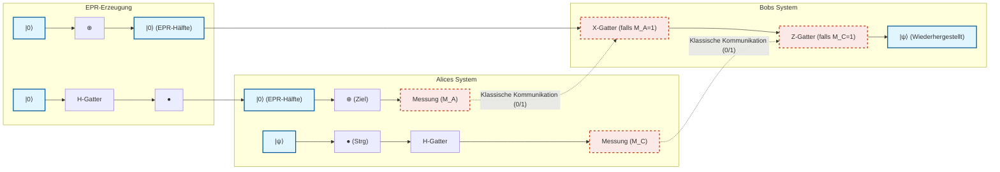

---

## 6.3 Dichte Kodierung (Superdense Coding)

Während die Quantenteleportation ein Protokoll war, das „ein EPR-Paar und zwei klassische Bits verbraucht, um den Zustand eines einzelnen Qubits zu übertragen“, stellt die dichte Kodierung (Superdense Coding) in gewissem Sinne die umgekehrte Operation dar: Sie ermöglicht es, „durch das physische Übertragen von nur einem einzigen Qubit zwei klassische Bits an Information an den Empfänger zu übermitteln“.

Nach den Gesetzen der klassischen Physik kann ein zweistufiges System (ein einzelnes Bit oder die Polarisation eines Photons) maximal 1 Bit an Information (0 oder 1) übertragen. Der erstaunliche Aspekt der dichten Kodierung besteht jedoch darin, dass durch die geschickte Ausnutzung von Quantenverschränkung diese Holevo-Grenze (Holevo's bound) scheinbar überwunden werden kann.

### Protokolldetails und Bell-Basis

Nehmen wir an, dass Alice und Bob sich erneut vorab ein EPR-Paar teilen:

$$
|\Phi^+\rangle_{AB} = \frac{1}{\sqrt{2}} \left( |0\rangle_A |0\rangle_B + |1\rangle_A |1\rangle_B \right)
$$

Alice möchte eine klassische 2-Bit-Nachricht $b_1 b_2 \in \{00, 01, 10, 11\}$ an Bob senden.
Abhängig von der zu sendenden Nachricht führt Alice **ausschließlich auf dem in ihren Händen befindlichen Qubit A** eine spezifische Einzel-Qubit-Gatteroperation durch:

1. **Wenn die Nachricht `00` lautet:** Alice tut nichts (wendet den Identitätsoperator $I$ an).
   Der Gesamtzustand ändert sich nicht:
   

$$
|\Psi_{00}\rangle = (I \otimes I) |\Phi^+\rangle = \frac{1}{\sqrt{2}} (|00\rangle + |11\rangle) = |\Phi^+\rangle
$$

2. **Wenn die Nachricht `01` lautet:** Alice wendet das Pauli-Z-Gatter an:
   

$$
|\Psi_{01}\rangle = (Z \otimes I) |\Phi^+\rangle = \frac{1}{\sqrt{2}} (Z|0\rangle|0\rangle + Z|1\rangle|1\rangle) = \frac{1}{\sqrt{2}} (|00\rangle - |11\rangle) = |\Phi^-\rangle
$$

3. **Wenn die Nachricht `10` lautet:** Alice wendet das Pauli-X-Gatter an:
   

$$
|\Psi_{10}\rangle = (X \otimes I) |\Phi^+\rangle = \frac{1}{\sqrt{2}} (X|0\rangle|0\rangle + X|1\rangle|1\rangle) = \frac{1}{\sqrt{2}} (|10\rangle + |01\rangle) = |\Psi^+\rangle
$$

4. **Wenn die Nachricht `11` lautet:** Alice wendet das Pauli-Z-Gatter und anschließend das Pauli-X-Gatter an (entspricht $iY$):
   

$$
|\Psi_{11}\rangle = (ZX \otimes I) |\Phi^+\rangle = (Z \otimes I) |\Psi^+\rangle = \frac{1}{\sqrt{2}} (Z|1\rangle|0\rangle + Z|0\rangle|1\rangle) = \frac{1}{\sqrt{2}} (-|10\rangle + |01\rangle) = -|\Psi^-\rangle
$$

   (Das negative Gesamtvorzeichen ist eine globale Phase und beeinflusst die Beobachtungswahrscheinlichkeiten nicht; der Einfachheit halber ordnen wir dies dem Zustand **$|\Psi^-\rangle = \frac{1}{\sqrt{2}} (|01\rangle - |10\rangle)$** zu.)

Alice sendet ihr manipuliertes Qubit A über einen Quantenkanal (z. B. Glasfaser) an Bob.

Eine bemerkenswerte und verblüffende Tatsache: Alice hat physisch **nur ein einziges Qubit an Bob übertragen** . Zudem hat sie Bobs Qubit zu keinem Zeitpunkt berührt. Dennoch ist der Gesamtzustand des Systems durch Alices Operationen deterministisch in einen von vier zueinander vollständig orthogonalen Quantenzuständen übergegangen (diese werden als **Bell-Basis** bezeichnet).

### Dekodierung und Bell-Messung durch Bob

Bob empfängt das von Alice gesendete Qubit A. Nun befinden sich sowohl Qubit A als auch das ursprünglich in seinem Besitz befindliche Qubit B in Bobs Händen. Bob führt an diesen beiden Qubits exakt dieselbe „Bell-Messung“ durch wie Alice bei der Quantenteleportation.

Konkret wendet er ein CNOT-Gatter mit Qubit A als Kontroll-Qubit und Qubit B als Ziel-Qubit an und lässt darauf ein Hadamard-Gatter auf Qubit A folgen. Durch diese inverse Transformation wird die verschränkte Bell-Basis wieder in die messbare Rechenbasis überführt.

Betrachten wir die mathematische Herleitung für jeden der Fälle:

- **Wenn der Zustand $|\Phi^+\rangle = \frac{1}{\sqrt{2}} (|00\rangle + |11\rangle)$ ist (Nachricht `00`):** Die Anwendung des CNOT-Gatters liefert $\frac{1}{\sqrt{2}} (|00\rangle + |10\rangle) = \frac{1}{\sqrt{2}} (|0\rangle + |1\rangle) |0\rangle$.
  Die Anwendung des Hadamard-Gatters auf A liefert $|0\rangle |0\rangle$.
  Misst Bob nun, erhält er mit Sicherheit `00`.

- **Wenn der Zustand $|\Phi^-\rangle = \frac{1}{\sqrt{2}} (|00\rangle - |11\rangle)$ ist (Nachricht `01`):** Die Anwendung des CNOT-Gatters liefert $\frac{1}{\sqrt{2}} (|00\rangle - |10\rangle) = \frac{1}{\sqrt{2}} (|0\rangle - |1\rangle) |0\rangle$.
  Die Anwendung des Hadamard-Gatters auf A liefert $|1\rangle |0\rangle$.
  Misst Bob nun, erhält er mit Sicherheit `10`. (Hinweis: Die Zuordnung der Bits zu Alices Operationen hängt von der Schaltkreisdefinition ab, ist jedoch stets eindeutig unterscheidbar.)

- **Wenn der Zustand $|\Psi^+\rangle = \frac{1}{\sqrt{2}} (|01\rangle + |10\rangle)$ ist (Nachricht `10`):** Die Anwendung des CNOT-Gatters liefert $\frac{1}{\sqrt{2}} (|01\rangle + |11\rangle) = \frac{1}{\sqrt{2}} (|0\rangle + |1\rangle) |1\rangle$.
  Die Anwendung des Hadamard-Gatters auf A liefert $|0\rangle |1\rangle$.
  Misst Bob nun, erhält er mit Sicherheit `01`.

- **Wenn der Zustand $|\Psi^-\rangle = \frac{1}{\sqrt{2}} (|01\rangle - |10\rangle)$ ist (Nachricht `11`):** Die Anwendung des CNOT-Gatters liefert $\frac{1}{\sqrt{2}} (|01\rangle - |11\rangle) = \frac{1}{\sqrt{2}} (|0\rangle - |1\rangle) |1\rangle$.
  Die Anwendung des Hadamard-Gatters auf A liefert $|1\rangle |1\rangle$.
  Misst Bob nun, erhält er mit Sicherheit `11`.

Auf diese Weise kann Bob durch die gemeinsame Messung des empfangenen einzelnen Qubits und des eigenen Qubits die von Alice beabsichtigte klassische 2-Bit-Information mit 100-prozentiger Zuverlässigkeit fehlerfrei auslesen.

### Bedeutung für die Quantenkommunikation

Der wahre Wert der dichten Kodierung beschränkt sich nicht allein darauf, die „Dichte“ von Informationen zu verdoppeln. Dieses Protokoll ist der entscheidende Beweis dafür, wie nichtlokale Korrelationen in Form von Quantenverschränkung die Bandbreite der klassischen Informationsübertragung erweitern können.

Darüber hinaus ist es auch unter Sicherheitsaspekten von größter Bedeutung: Sollte eine Abhörerin Eva (Eve) das Qubit A auf dem Weg von Alice zu Bob abfangen, kann Eva keinerlei Information gewinnen. Denn betrachtet man ausschließlich das einzelne Qubit A, verhält sich dessen Zustand wie ein völlig zufälliger gemischter Zustand (dessen Dichtematrix proportional zu $\frac{I}{2}$ ist). Die Information ist einzig und allein in der räumlich getrennten „Korrelation“ zwischen A und B kodiert, sodass es physikalisch unmöglich ist, sie durch den Besitz von nur einem der beiden Qubits zu entschlüsseln.

---

So erweisen sich Quantenteleportation und dichte Kodierung auf den ersten Blick als kontraintuitive, fast magische Phänomene; doch indem man den linear-algebraischen Axiomen der Quantenmechanik gewissenhaft folgt, lassen sie sich als äußerst strenge und unausweichliche logische Konsequenzen herleiten. Im nächsten Kapitel werden wir auf diesen grundlegenden Protokollen aufbauen und in die faszinierende Welt der Quantenalgorithmen eintauchen, die zur Lösung noch komplexerer Probleme entwickelt wurden.

# Kapitel 7: Der Deutsch-Jozsa-Algorithmus

## 7.1 Historische Bedeutung: Der erste Nachweis eines eindeutigen Quantenvorteils

Die Hypothese, dass Quantencomputer bestimmte Probleme drastisch schneller lösen könnten als klassische Computer, wurde in den 1980er-Jahren durch die Pionierarbeiten von Richard Feynman und David Deutsch aufgestellt. Doch auf die Frage: „Bei welchen konkreten Problemen und in welcher mathematisch beweisbaren Form übertrifft die Quantenberechnung die klassische Berechnung?“, lieferte der 1992 von David Deutsch und Richard Jozsa entwickelte **Deutsch-Jozsa-Algorithmus (Deutsch-Jozsa Algorithm)** die erste entscheidende Antwort.

In diesem Kapitel wird das gesamte Bild dieses historischen Algorithmus mathematisch exakt dargelegt. Obwohl dieser Algorithmus kein praktisches Problem löst, bewies er, dass durch die geschickte Kombination der quantenmechanischen Phänomene **Superposition (Überlagerung)** , **Interferenz** und **Phasen-Kickback (Phase Kickback)** die Größenordnung der Rechenkomplexität drastisch reduziert werden kann.

## 7.2 Problemstellung: Konstante oder balancierte Funktion?

Zunächst definieren wir das vom Algorithmus zu lösende Problem. Nehmen wir an, uns sei eine Blackbox (ein Orakel) gegeben. Dieses Orakel berechnet eine Funktion **$f$** , die eine $n$-Bit-Eingabe $x \in \{0, 1\}^n$ entgegennimmt und eine 1-Bit-Ausgabe $f(x) \in \{0, 1\}$ zurückgibt.

Dabei unterliegt diese Funktion **$f$** dem starken Versprechen (Promise), dass sie genau eine der folgenden beiden Eigenschaften erfüllt:

1. **Konstante Funktion (Constant Function)** : Für jede beliebige Eingabe $x$ gibt sie stets $f(x) = 0$ oder stets $f(x) = 1$ zurück.
2. **Balancierte Funktion (Balanced Function)** : Für genau die Hälfte aller möglichen Eingaben $x$ gibt sie $f(x) = 0$ zurück, und für die verbleibende Hälfte gibt sie $f(x) = 1$ zurück.

Unser Ziel ist es zu entscheiden, ob das gegebene Orakel **$f$** eine konstante oder eine balancierte Funktion ist, und zwar mit einer minimalen Anzahl von Anfragen (Queries) an das Orakel.

### Grenzen der klassischen Berechnung

Betrachten wir den Fall, in dem dieses Problem auf einem klassischen Computer gelöst wird. Für die Funktion **$f$** gibt es insgesamt $N = 2^n$ mögliche Eingabemuster.

Nehmen wir den ungünstigsten Fall (Worst Case) an. Angenommen, bei den ersten $2^{n-1}$ aufeinanderfolgenden Abfragen (also für genau die Hälfte des gesamten Definitionsbereichs) wird jeweils dieselbe Ausgabe erhalten (z. B. immer $0$). Zu diesem Zeitpunkt bestehen weiterhin beide Möglichkeiten: Die Funktion könnte konstant sein (die verbleibende Hälfte ist ebenfalls komplett $0$) oder balanciert sein (die verbleibende Hälfte ist komplett $1$).

Um mit 100-prozentiger Sicherheit zu bestimmen, ob die Funktion konstant oder balanciert ist, benötigt ein klassischer Computer daher **im schlimmsten Fall $2^{n-1} + 1$ Abfragen** . Diese Anzahl wächst exponentiell mit der Anzahl der Eingabebits $n$. Das bedeutet, dass die klassische Abfragekomplexität (Query-Komplexität) $O(2^n)$ beträgt.

Erstaunlicherweise lässt sich dieses Problem mithilfe von Quantenberechnung mit **nur einer einzigen Abfrage (1 Query)** mit 100 % Wahrscheinlichkeit korrekt lösen. Dies ist die Quintessenz des Quantenvorteils.

## 7.3 Das Quantenorakel und die Geometrie des Phasen-Kickbacks

Um einen Quantenalgorithmus zu konstruieren, müssen wir zunächst die klassische Funktion **$f(x)$** in einer Form reformulieren, die den Grundsätzen der Quantenmechanik genügt (Unitarität = Reversibilität). Zu diesem Zweck wird ein „Quantenorakel (Quantum Oracle)“ eingeführt.

### Das Quantenorakel $U_f$

Wir stellen ein Eingaberegister ($n$ Qubits) und ein Zielregister ($1$ Qubit) bereit. Der das Orakel darstellende unitäre Operator **$U_f$** wirkt wie folgt auf die Rechenbasiszustände:

$$
U_f |x\rangle |y\rangle = |x\rangle |y \oplus f(x)\rangle
$$

Hierbei bezeichnet $\oplus$ die Addition modulo 2 (XOR). Da diese Transformation bei erneuter Anwendung wieder den ursprünglichen Zustand herstellt ($U_f^2 = I$), ist sie offensichtlich reversibel und unitär.

### Phasen-Kickback (Phase Kickback)

Eine der wichtigsten und zugleich kontraintuitivsten Techniken in der Quanteninformationswissenschaft ist der „Phasen-Kickback“. Sehen wir uns an, was geschieht, wenn der Zustand des Zielregisters nicht auf ein klassisches $|0\rangle$ oder $|1\rangle$ gesetzt wird, sondern auf den Superpositionszustand $|-\rangle$, der durch Anwendung eines Hadamard-Gatters erzeugt wird:

$$
|-\rangle = \frac{|0\rangle - |1\rangle}{\sqrt{2}}
$$

Dieser Zustand wird in das Zielregister eingespeist, und wir wenden das Orakel **$U_f$** an:

$$
U_f |x\rangle |-\rangle = U_f \left( |x\rangle \frac{|0\rangle - |1\rangle}{\sqrt{2}} \right)
$$

$$
= \frac{1}{\sqrt{2}} \left( U_f |x\rangle |0\rangle - U_f |x\rangle |1\rangle \right)
$$

$$
= \frac{1}{\sqrt{2}} \left( |x\rangle |0 \oplus f(x)\rangle - |x\rangle |1 \oplus f(x)\rangle \right)
$$

Hier führen wir eine Fallunterscheidung nach dem Wert von $f(x)$ durch:
- Für den Fall $f(x) = 0$:
  Der Zustand lautet $\frac{1}{\sqrt{2}} ( |x\rangle |0\rangle - |x\rangle |1\rangle ) = |x\rangle |-\rangle$.
- Für den Fall $f(x) = 1$:
  Der Zustand lautet $\frac{1}{\sqrt{2}} ( |x\rangle |1\rangle - |x\rangle |0\rangle ) = - |x\rangle |-\rangle$.

Fasst man dies zusammen, erhält man die folgende elegante Gleichung:

$$
U_f |x\rangle |-\rangle = (-1)^{f(x)} |x\rangle |-\rangle
$$

Dies ist ein bemerkenswertes Ergebnis: Der Zustand des Zielregisters $|-\rangle$ hat sich überhaupt nicht verändert, aber das Auswertungsergebnis der Funktion **$f(x)$** wurde als Vorzeichen der Phase („Phase Kickback“) auf die Seite des Eingaberegisters **$|x\rangle$** zurückgeworfen. Dadurch wird es möglich, Informationen in der Phase der Amplitude zu kodieren.

## 7.4 Der Deutsch-Jozsa-Algorithmus: Schaltungsdiagramm und vollständige mathematische Herleitung

Hier beschreiben wir nun den gesamten Algorithmus vollständig – sowohl anhand des Quantenschaltkreises als auch durch mathematische Formeln.

### Quantenschaltkreis-Diagramm

Das folgende Diagramm zeigt den Quantenschaltkreis des Deutsch-Jozsa-Algorithmus:

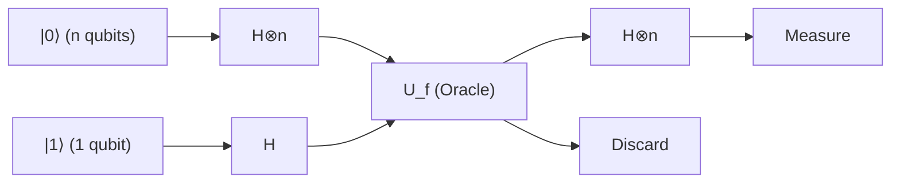

### Schritt 1: Vorbereitung des Anfangszustands

Wir initialisieren das Eingaberegister mit $n$ Qubits im Zustand $|0\rangle^{\otimes n}$ und das Zielregister mit 1 Qubit im Zustand $|1\rangle$:

$$
|\psi_0\rangle = |0\rangle^{\otimes n} |1\rangle
$$

### Schritt 2: Anwenden von Hadamard-Gattern auf alle Qubits

Wir wenden auf alle Qubits Hadamard-Gatter ($H$) an, um einen Zustand vollständiger Superposition zu erzeugen.
Die Hadamard-Transformation $H^{\otimes n}$ auf $n$ Qubits wirkt wie folgt:

$$
H^{\otimes n} |0\rangle^{\otimes n} = \frac{1}{\sqrt{2^n}} \sum_{x \in \{0,1\}^n} |x\rangle
$$

Folglich nimmt der Gesamtzustand des Systems folgende Form an:

$$
|\psi_1\rangle = \left( \frac{1}{\sqrt{2^n}} \sum_{x \in \{0,1\}^n} |x\rangle \right) \otimes \left( \frac{|0\rangle - |1\rangle}{\sqrt{2}} \right)
$$

$$
= \frac{1}{\sqrt{2^n}} \sum_{x=0}^{2^n-1} |x\rangle |-\rangle
$$

### Schritt 3: Anwenden des Quantenorakels (Phasen-Kickback)

Nun wenden wir das Orakel **$U_f$** an. Aufgrund des im vorigen Abschnitt bewiesenen Phasen-Kickback-Effekts wird die Phase jedes Basiszustands $|x\rangle$ mit $(-1)^{f(x)}$ multipliziert:

$$
|\psi_2\rangle = U_f |\psi_1\rangle = \frac{1}{\sqrt{2^n}} \sum_{x \in \{0,1\}^n} (-1)^{f(x)} |x\rangle |-\rangle
$$

Zu diesem Zeitpunkt wurden sämtliche Informationen ($2^n$ Werte) der Funktionsauswertungen **$f(x)$** in einer einzigen Operation parallel in die jeweiligen Phasen des Superpositionszustands eingebettet. Dies bezeichnet man als „Quantenparallelismus (Quantum Parallelism)“.

### Schritt 4: Erzeugung von Interferenz auf dem Eingaberegister

Das Zielregister wird im Folgenden nicht mehr verwendet und kann daher ignoriert werden. Wir wenden die Hadamard-Transformation $H^{\otimes n}$ erneut auf die $n$ Qubits des Eingaberegisters an.
Die Wirkung von $H^{\otimes n}$ auf einen beliebigen Basiszustand $|x\rangle$ lässt sich über die allgemeine Formel wie folgt darstellen:

$$
H^{\otimes n} |x\rangle = \frac{1}{\sqrt{2^n}} \sum_{z \in \{0,1\}^n} (-1)^{x \cdot z} |z\rangle
$$

Hierbei bezeichnet $x \cdot z$ das bitweise Skalarprodukt $x \cdot z = x_1 z_1 \oplus x_2 z_2 \oplus \dots \oplus x_n z_n$.
Wendet man dies auf den Teil des Eingaberegisters von $|\psi_2\rangle$ an, so entwickelt sich der Endzustand $|\psi_3\rangle$ wie folgt:

$$
|\psi_3\rangle = H^{\otimes n} \left( \frac{1}{\sqrt{2^n}} \sum_{x} (-1)^{f(x)} |x\rangle \right)
$$

$$
= \frac{1}{\sqrt{2^n}} \sum_{x} (-1)^{f(x)} \left( \frac{1}{\sqrt{2^n}} \sum_{z} (-1)^{x \cdot z} |z\rangle \right)
$$

$$
= \frac{1}{2^n} \sum_{z \in \{0,1\}^n} \left( \sum_{x \in \{0,1\}^n} (-1)^{f(x) + x \cdot z} \right) |z\rangle
$$

Dies ist die entscheidende Formel, die den Quantenzustand unmittelbar vor der Messung beschreibt. Die quantenmechanische „Interferenz“ findet innerhalb dieser Summe $\sum_x$ statt.

### Schritt 5: Messung und Analyse des Ergebnisses

Am Ende des Algorithmus messen wir die $n$ Qubits des Eingaberegisters in der Rechenbasis.
Unser Interesse gilt der Wahrscheinlichkeit, dass alle Qubits als $0$ gemessen werden, d. h. der Wahrscheinlichkeit, den Zustand **$|0\rangle^{\otimes n}$** zu messen. Betrachten wir in der obigen Formel den Fall $z = 00\dots0$. Da für jedes beliebige $x$ die Beziehung $x \cdot 0 = 0$ gilt, berechnet sich die Amplitude (der Koeffizient) des Zustands **$|0\rangle^{\otimes n}$** wie folgt:

$$
\text{Amplitude of } |0\rangle^{\otimes n} = \frac{1}{2^n} \sum_{x \in \{0,1\}^n} (-1)^{f(x)}
$$

Hier untersuchen wir die beiden Fälle gemäß dem Versprechen (Promise):

#### Fall 1: Die Funktion $f$ ist konstant
Es gilt stets $f(x) = 0$ oder stets $f(x) = 1$.
- Wenn stets $0$, ist $(-1)^{f(x)} = 1$, und die Summe ergibt $\sum 1 = 2^n$. Die Amplitude beträgt $\frac{2^n}{2^n} = 1$.
- Wenn stets $1$, ist $(-1)^{f(x)} = -1$, und die Summe ergibt $\sum -1 = -2^n$. Die Amplitude beträgt $\frac{-2^n}{2^n} = -1$.

Da die Messwahrscheinlichkeit $P(0)$ das Quadrat des Betrags der Amplitude ist:

$$
P(00\dots0) = | \pm 1 |^2 = 1
$$

Das bedeutet: **Wenn die Funktion konstant ist, wird mit 100 % Wahrscheinlichkeit der Zustand $|0\rangle^{\otimes n}$ gemessen** .

#### Fall 2: Die Funktion $f$ ist balanciert
Es gibt genau gleich viele Eingaben $x$ mit $f(x) = 0$ wie mit $f(x) = 1$ (jeweils $2^{n-1}$ Werte).
Folglich ist $(-1)^{f(x)}$ zur Hälfte $+1$ und zur anderen Hälfte $-1$. Summiert man all diese Terme auf, heben sie sich exakt gegenseitig auf und ergeben null (vollständig destruktive Interferenz):

$$
\text{Amplitude of } |0\rangle^{\otimes n} = \frac{1}{2^n} \left( 2^{n-1}(+1) + 2^{n-1}(-1) \right) = 0
$$

Da die Messwahrscheinlichkeit $P(0)$ das Quadrat des Betrags der Amplitude ist:

$$
P(00\dots0) = | 0 |^2 = 0
$$

Das bedeutet: **Wenn die Funktion balanciert ist, beträgt die Wahrscheinlichkeit, den Zustand $|0\rangle^{\otimes n}$ zu messen, 0 %, und es wird garantiert ein Zustand gemessen, bei dem mindestens ein Bit $1$ ist** .

## 7.6 Konkretes Beispiel: Vollständige Verfolgung des Zustandsvektors für $n=2$

Um nicht nur bei abstrakten Formeln zu verweilen, wollen wir den konkreten Zustandsvektor für $n=2$ (Zwei-Qubit-Eingabe) schrittweise nachvollziehen, um das Verhalten des Algorithmus greifbar zu machen. Es gibt vier mögliche Eingabemuster: $x \in \{00, 01, 10, 11\}$.

### Fall einer konstanten Funktion: $f(x) = 1$ (überall 1)
Vor der Anwendung des Orakels hat der Eingaberegister-Anteil des Zustands $|\psi_1\rangle$ folgende Gestalt:

$$
\frac{1}{2} ( |00\rangle + |01\rangle + |10\rangle + |11\rangle )
$$

Nach Anwendung des Orakels wird durch den Phasen-Kickback jeder Summand mit $(-1)^{f(x)} = -1$ multipliziert:

$$
|\psi_2\rangle_{in} = -\frac{1}{2} ( |00\rangle + |01\rangle + |10\rangle + |11\rangle )
$$

Hierauf wenden wir erneut $H^{\otimes 2}$ an. Unter Ausnutzung von $H^{\otimes 2} (|00\rangle + |01\rangle + |10\rangle + |11\rangle) = 2 |00\rangle$ folgt:

$$
|\psi_3\rangle_{in} = - |00\rangle
$$

Das Messergebnis lautet mit $100\,\%$ Wahrscheinlichkeit $00$.

### Fall einer balancierten Funktion: $f(00)=0, f(01)=1, f(10)=1, f(11)=0$
Nach Anwendung des Orakels erhält durch den Phasen-Kickback nur bei den Termen mit $f(x)=1$ ein negatives Vorzeichen:

$$
|\psi_2\rangle_{in} = \frac{1}{2} ( |00\rangle - |01\rangle - |10\rangle + |11\rangle )
$$

Hierauf wenden wir $H^{\otimes 2}$ an. Berechnet man die Wirkung von $H^{\otimes 2}$ auf jeden Basiszustand und setzt diese ein, so ergibt sich speziell für den Koeffizienten von $|00\rangle$ der Wert $\frac{1}{4} (1 - 1 - 1 + 1) = 0$, womit sich dieser Term vollkommen aufhebt (destruktive Interferenz).
Fasst man die verbleibenden Terme zusammen, lautet der Endzustand $|11\rangle$ (in diesem konkreten Beispiel wird 11 mit 100 % Wahrscheinlichkeit gemessen; bei einer allgemeinen balancierten Funktion wird irgendein Zustand ungleich 00 gemessen). Damit ist bestätigt, dass die Wahrscheinlichkeit, $00$ zu messen, exakt 0 % beträgt.

## 7.7 Fazit: Der durch Quanteninterferenz ermöglichte rechnerische Quantensprung

Das Bemerkenswerte am Deutsch-Jozsa-Algorithmus liegt darin, dass er $2^n$ Informationen mittels Phasen-Kickback im Phasenraum kodiert und die beim abschließenden Hadamard-Gatter entstehende „Interferenz (Interference)“ gezielt steuert:

- Im Fall einer **konstanten Funktion** : Die Wellen aller Pfade interferieren konstruktiv („Constructive Interference“), sodass sich die Amplitude zu 100 % auf den Zustand **$|0\rangle^{\otimes n}$** konzentriert.
- Im Fall einer **balancierten Funktion** : Die positiven und negativen Wellenanteile interferieren destruktiv („Destructive Interference“), wodurch die Amplitude des Zustands **$|0\rangle^{\otimes n}$** vollständig ausgelöscht wird.

Dank dieser brillanten mathematischen Struktur kann ein Quantencomputer ein Problem, für das ein klassischer Computer im schlimmsten Fall $O(2^n)$ Abfragen (konkret $2^{n-1} + 1$ Abfragen) benötigte, mit **nur einer einzigen Abfrage ( $O(1)$ )** und vollkommen deterministisch (mit 100 % Erfolgsquote) lösen.

Diese in diesem Kapitel bewiesene Tatsache markierte einen Meilenstein von herausragender Bedeutung in der Geschichte der Menschheit: Sie zeigte, dass durch die Anwendung der Prinzipien der Quantenmechanik auf die Informationsverarbeitung die Grenzen der klassischen Informationstheorie auf physikalischer Ebene durchbrochen werden können.

# Kapitel 8: Shors Algorithmus und die Bedrohung der modernen Kryptographie

## 8.1 Einführung: Die Mathematik der RSA-Kryptographie und die Schwierigkeit der Primfaktorzerlegung

In der heutigen digitalen Gesellschaft bildet die Public-Key-Kryptographie das Fundament zur Gewährleistung sicherer Kommunikation im Internet. Das am weitesten verbreitete RSA-Kryptosystem stützt sich zum Nachweis seiner Sicherheit auf eine mathematische Asymmetrie (die Eigenschaft von Einwegfunktionen): „Die Primfaktorzerlegung einer riesigen zusammengesetzten Zahl ist rechnerisch extrem schwierig.“ In diesem Kapitel werden wir ohne jegliche Kompromisse strikt die theoretische Struktur von „Shors Algorithmus“ (Shor's Algorithm) darlegen, dem entscheidenden Verfahren, mit dem Quantencomputer die Grundlage dieser RSA-Verschlüsselung zerstören können.

Formulieren wir zunächst die Funktionsweise der RSA-Verschlüsselung mathematisch. Die Schlüsselerzeugung für die RSA-Verschlüsselung beginnt mit der zufälligen Auswahl zweier riesiger Primzahlen $p$ und $q$ (heutzutage wird für jede eine Größe von mindestens 2048 Bit empfohlen). Das Produkt dieser Zahlen, die zusammengesetzte Zahl $N = pq$, wird berechnet und als Teil des öffentlichen Schlüssels allgemein bekanntgegeben. Als Nächstes wird die eulersche Phi-Funktion $\phi(N)$ berechnet. Aus den Eigenschaften von Primzahlen ergibt sich diese zu $\phi(N) = (p-1)(q-1)$.

Der Verschlüsselungsexponent $e$, welcher der Schlüssel zur Verschlüsselung ist, wird so gewählt, dass $1 < e < \phi(N)$ und $\text{gcd}(e, \phi(N)) = 1$ gilt (d. h. teilerfremd zu $\phi(N)$). Dann wird der Entschlüsselungsexponent $d$, der den privaten Schlüssel darstellt, so berechnet, dass er die Kongruenz $ed \equiv 1 \pmod{\phi(N)}$ erfüllt. Dieser kann unter Verwendung des erweiterten euklidischen Algorithmus leicht in polynomieller Zeit bestimmt werden.

Wenn der Klartext eine ganze Zahl $M$ ist (wobei $0 \le M < N$), wird die Verschlüsselung durch modulare Exponentiation modulo $N$ wie folgt durchgeführt:

$$
C \equiv M^e \pmod{N}
$$

Beim Entschlüsseln wird auf analoge Weise der private Schlüssel $d$ verwendet:

$$
M' \equiv C^d \pmod{N}
$$

Aus dem Satz von Euler folgt $C^d \equiv M^{ed} \equiv M^{1 + k\phi(N)} \equiv M \pmod{N}$, was garantiert, dass der ursprüngliche Klartext $M$ exakt wiederhergestellt wird.

Hierbei ist entscheidend, dass man zur Bestimmung des privaten Schlüssels $d$ aus den öffentlich bekannten Informationen $(N, e)$ den Wert von $\phi(N)$ kennen muss, was wiederum die Primfaktorzerlegung von $N$ in $p$ und $q$ erfordert. Bei Verwendung klassischer Computer beträgt die Berechnungskomplexität selbst mit dem derzeit schnellsten bekannten Primfaktorzerlegungsalgorithmus, dem allgemeinen Zahlkörpersieb (General Number Field Sieve, GNFS), subexponentielle Zeit $O\left(\exp\left(c (\log N)^{1/3} (\log \log N)^{2/3}\right)\right)$. Das bedeutet, dass die Rechenzeit bezogen auf die Bitanzahl von $N$ explosionsartig ansteigt. Beispielsweise wird geschätzt, dass die Primfaktorzerlegung einer 2048-Bit-Zahl mit einem klassischen Supercomputer länger dauern würde als das Alter des Universums.

Der Quantenalgorithmus, den Peter Shor 1994 vorstellte, hat diese Prämisse jedoch von Grund auf erschüttert. Shors Algorithmus löst die Primfaktorzerlegung in einer polynomieller Zeit von $O((\log N)^3)$ oder durch Optimierung in $\tilde{O}((\log N)^2)$. Dies bedeutet eine „superpolynomielle Beschleunigung“ (Super-polynomial Speedup) gegenüber klassischer Berechnung, was de facto einer exponentiellen Beschleunigung entspricht und beweist, dass das derzeit verwendete RSA-Kryptosystem durch Quantencomputer vollständig außer Kraft gesetzt werden kann.

## 8.2 Reduktion auf das Problem der Ordnungsfindung (Reduction to Order-Finding Problem)

Die geniale Einsicht von Shors Algorithmus bestand darin, „das Problem der Primfaktorzerlegung nicht direkt zu lösen, sondern es auf das Problem der Periodenfindung zu reduzieren“. Durch Sätze der reinen Zahlentheorie ist bewiesen, dass die Primfaktorzerlegung äquivalent zum sogenannten „Problem der Ordnungsfindung“ (Order-Finding Problem) ist. Dieser Reduktionsprozess selbst ist ein rein klassischer Algorithmus und erfordert keinerlei Quantenberechnung.

Verfolgen wir die Schritte zur Primfaktorzerlegung einer gegebenen zusammengesetzten Zahl $N$. Zunächst wählen wir eine zufällige ganze Zahl $a$, die $1 < a < N$ erfüllt. Mithilfe des euklidischen Algorithmus berechnen wir den größten gemeinsamen Teiler $\text{gcd}(a, N)$. Wenn dieser größer als $1$ ist, haben wir glücklicherweise bereits einen nichttrivialen Faktor von $N$ gefunden und die Berechnung ist beendet (bei den gigantischen Zahlen, die in der Kryptographie verwendet werden, ist die Wahrscheinlichkeit eines solchen Zufallstreffers jedoch astronomisch gering).

Wenn $\text{gcd}(a, N) = 1$ gilt, sind $a$ und $N$ teilerfremd. Hier definieren wir die folgende modulare Exponentialfunktion:

$$
f(x) = a^x \bmod N
$$

In der Sprache der Gruppentheorie ist $a$ ein Element der multiplikativen Gruppe $(\mathbb{Z}/N\mathbb{Z})^\times$, und die Funktion $f(x)$ bildet einen Homomorphismus von der additiven Gruppe der ganzen Zahlen $\mathbb{Z}$ zur multiplikativen Gruppe $(\mathbb{Z}/N\mathbb{Z})^\times$. Aufgrund der Eigenschaften endlicher Gruppen besitzt diese Funktion stets eine Periodizität. Das heißt, es existiert eine kleinste positive ganze Zahl $r$, welche die folgende Kongruenz erfüllt:

$$
a^r \equiv 1 \pmod{N}
$$

Diese kleinste positive ganze Zahl $r$ wird die „Ordnung“ (Order) von $a$ modulo $N$ oder die „Periode“ (Period) der Funktion $f(x)$ genannt.

Wenn wir diese Ordnung $r$ finden können, und darüber hinaus $r$ eine gerade Zahl ist sowie die Bedingung $a^{r/2} \not\equiv -1 \pmod{N}$ erfüllt, erhalten wir wie folgt einen entscheidenden Schlüssel zur Faktorisierung:

$$
a^r - 1 \equiv 0 \pmod{N}
$$

$$
(a^{r/2} - 1)(a^{r/2} + 1) \equiv 0 \pmod{N}
$$

Diese Gleichung bedeutet, dass $N$ das Produkt von $(a^{r/2} - 1)$ und $(a^{r/2} + 1)$ teilt. Da jedoch $a^{r/2} \not\equiv 1$ (da $r$ die kleinste Periode ist) und $a^{r/2} \not\equiv -1$ (gemäß Voraussetzung) gilt, kann $N$ keinen dieser Faktoren allein teilen. Daher müssen die Primfaktoren von $N$ auf diese beiden Terme verteilt sein.
Schlussendlich können wir durch die Berechnung von

$$
p = \text{gcd}(a^{r/2} - 1, N)
$$

$$
q = \text{gcd}(a^{r/2} + 1, N)
$$

die nichttrivialen Primfaktoren von $N$ zuverlässig ermitteln.

Durch diese klassische Reduktion konzentriert sich das Problem nun auf eine einzige Kernfrage: „Wie lässt sich die Periode $r$ der Funktion $f(x) = a^x \bmod N$ schnell finden?“. Ein klassischer Computer müsste $x=1, 2, 3, \dots$ sequentiell durchprobieren, um diese Periode zu finden. Da $r$ in der gleichen Größenordnung wie $N$ liegen kann, erfordert dies letztlich exponentielle Zeit. Genau an dieser Stelle kommt nun der Quantencomputer ins Spiel.

## 8.3 Strenge mathematische Formulierung der Quanten-Fouriertransformation (QFT) und ihre Rolle

Das Herzstück des Quantenalgorithmus zur Extraktion der verborgenen Periode $r$ der Funktion $f(x)$ in polynomieller Zeit ist die „Quanten-Fouriertransformation“ (Quantum Fourier Transform, QFT). Die QFT ist das quantenmechanische Analogon zur klassischen diskreten Fouriertransformation (DFT) und eine unitäre Transformation, die auf die Wahrscheinlichkeitsamplituden des Zustandsraums wirkt.

Die Wirkung der Quanten-Fouriertransformation auf die Rechenbasiszustände $|j\rangle$ ($j = 0, 1, \dots, M-1$) in einem Hilbertraum $\mathcal{H}$ der Dimension $M = 2^n$ ist streng wie folgt definiert:

$$
\text{QFT} |j\rangle = \frac{1}{\sqrt{M}} \sum_{k=0}^{M-1} e^{2\pi i j k / M} |k\rangle
$$

Auf einen beliebigen Quantenzustand **$|\psi\rangle$** wirkt sie aufgrund der Linearität wie folgt:

$$
\text{QFT} \sum_{j=0}^{M-1} x_j |j\rangle = \sum_{k=0}^{M-1} \left( \frac{1}{\sqrt{M}} \sum_{j=0}^{M-1} x_j e^{2\pi i j k / M} \right) |k\rangle = \sum_{k=0}^{M-1} y_k |k\rangle
$$

Die hierbei erhaltenen neuen Amplituden $y_k$ stimmen exakt mit den Koeffizienten überein, die man durch die klassische diskrete Fouriertransformation erhält. Während jedoch die klassische schnelle Fouriertransformation (FFT) zur Berechnung des gesamten Vektors eine Zeit von $O(M \log M) = O(n 2^n)$ benötigt, kann die QFT den „Zustand“ von $n$ Qubits mit lediglich $O(n^2)$ Quantengatter-Operationen transformieren – eine dramatische Reduzierung der Berechnungskomplexität.

Um zu verstehen, warum dies mit einer so geringen Anzahl von $O(n^2)$ Gattern realisiert werden kann, muss der durch die QFT erhaltene Zustand als Tensorprodukt faktorisiert dargestellt werden. Wenn man die ganze Zahl $j$ in Binärdarstellung als $j = j_1 2^{n-1} + j_2 2^{n-2} + \dots + j_n 2^0$ schreibt (wobei $j_1$ das höchstwertige Bit und $j_n$ das niederwertigste Bit ist), lässt sich der Ausgangszustand elegant in ein Tensorprodukt von $n$ unabhängigen Qubit-Zuständen zerlegen:

$$
\text{QFT} |j_1 j_2 \dots j_n\rangle = \frac{1}{\sqrt{2^n}} \left(|0\rangle + e^{2\pi i 0.j_n} |1\rangle\right) \otimes \left(|0\rangle + e^{2\pi i 0.j_{n-1} j_n} |1\rangle\right) \otimes \dots \otimes \left(|0\rangle + e^{2\pi i 0.j_1 j_2 \dots j_n} |1\rangle\right)
$$

Hierbei bezeichnet $0.j_l \dots j_m$ einen binären Nachkommawert: $0.j_l \dots j_m = j_l/2 + j_{l+1}/4 + \dots + j_m/2^{m-l+1}$.

Diese Formel ist äußerst aufschlussreich. Sie zeigt, dass die Phase des Zustands des $m$-ten Qubits nur von den Informationen der Eingabebits $j_{n-m+1}$ bis $j_n$ abhängt und rotiert wird. Daher lässt sich der Quantenschaltkreis zur Erzeugung dieses Zustands rekursiv aufbauen, indem ausschließlich Kombinationen aus auf Einzelqubits wirkenden Hadamard-Gattern $H$ und zwischen zwei Qubits wirkenden kontrollierten Phasenverschiebungs-Gattern $R_k$ (Gatter, die die Phase um $e^{2\pi i / 2^k}$ drehen) verwendet werden. Indem man auf das erste Qubit $H$ anwendet, danach gesteuert durch das zweite und dritte Bit $R_2, R_3, \dots$ appliziert und diesen Vorgang für jedes Qubit wiederholt, kann die QFT mit insgesamt $n + (n-1) + \dots + 1 = n(n+1)/2 = O(n^2)$ Gattern exakt implementiert werden.

## 8.4 Der Quantenschaltkreis zur Periodenfindung mittels Superposition

Nachdem die theoretischen Vorbereitungen abgeschlossen sind, wollen wir nun den gesamten Quantenschaltkreis für Shors Algorithmus und die Zeitentwicklung des Quantenzustands (State Evolution) in jedem Schritt im Detail verfolgen. Der Algorithmus verwendet zwei Quantenregister:
Das erste Register besteht aus $t \approx 2 \log_2 N$ Qubits, und die Dimension des Zustandsraums ist $M = 2^t$ (wobei $t$ so gewählt wird, dass $M \ge N^2$ erfüllt ist). Das zweite Register umfasst $L \approx \log_2 N$ Qubits und dient zur Speicherung der Berechnungsergebnisse.

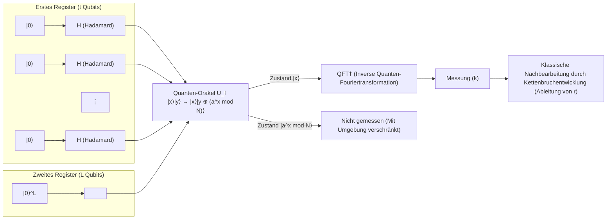

 **[Schritt 1: Initialisierung und Erzeugung der Superposition]** 
Das gesamte System wird auf den Anfangszustand **$|\psi_0\rangle$** $= |0\rangle^{\otimes t} |0\rangle^{\otimes L}$ gesetzt.
Anschließend wird ein Hadamard-Gatter $H^{\otimes t}$ auf alle Qubits im ersten Register angewandt, wodurch eine Superposition von exponentiell vielen Zuständen mit gleicher Wahrscheinlichkeit erzeugt wird:

$$
|\psi_1\rangle = \frac{1}{\sqrt{M}} \sum_{x=0}^{M-1} |x\rangle |0\rangle
$$

Hierbei enthält das erste Register gleichzeitig die Zustände aller ganzen Zahlen von $0$ bis $M-1$.

 **[Schritt 2: Funktionsauswertung durch das Quanten-Orakel]** 
Das Quanten-Orakel $U_f$ wird angewendet, um die Funktion $f(x) = a^x \bmod N$ im Superpositionszustand zu berechnen, und das Ergebnis wird im zweiten Register gespeichert:

$$
|\psi_2\rangle = U_f |\psi_1\rangle = \frac{1}{\sqrt{M}} \sum_{x=0}^{M-1} |x\rangle |a^x \bmod N\rangle
$$

Dieser Zustand **$|\psi_2\rangle$** ist ein Zustand, in dem die Eingabe $x$ und die Ausgabe $f(x)$ stark miteinander verschränkt sind.

 **[Schritt 3: Beobachtung des zweiten Registers (konzeptionell)]** 
Um die Theorie leichter verständlich zu machen, wollen wir hier annehmen, dass wir das zweite Register messen (im tatsächlichen Algorithmus bleiben die mathematischen Konsequenzen exakt dieselben, selbst wenn die Messung weggelassen wird). Durch die Beobachtung kollabiert das zweite Register auf einen bestimmten Wert $y = a^{x_0} \bmod N$. Hier ist $x_0$ ein minimaler Offset-Wert, der $0 \le x_0 < r$ erfüllt.
Zu diesem Zeitpunkt kollabiert das erste Register augenblicklich in eine Superposition „aller Eingaben $x$, für die die Ausgabe der Funktion $f(x)$ gleich $y$ ist“. Da die Funktion periodisch mit Periode $r$ ist, sind solche $x$ gleichmäßig angeordnet als $x_0, x_0 + r, x_0 + 2r, \dots$.

$$
|\psi_3\rangle = \frac{1}{\sqrt{A}} \sum_{m=0}^{A-1} |x_0 + m r\rangle \otimes |y\rangle
$$

Hierbei ist $A$ die Anzahl der in der Superposition enthaltenen Terme, wobei $A \approx M/r$ gilt.
Betrachtet man das erste Register, so handelt es sich um einen kammartigen Wahrscheinlichkeitsverteilungszustand mit der Periode $r$. Wenn wir diesen Zustand jedoch direkt messen, erhalten wir lediglich ein zufälliges $x_0 + mr$ mit gleicher Wahrscheinlichkeit. Da der Offset $x_0$ unbekannt ist, können wir die Periode $r$ nicht ermitteln. Hier wird die QFT benötigt.

 **[Schritt 4: Anwendung der inversen Quanten-Fouriertransformation]** 
Wir wenden die inverse Quanten-Fouriertransformation (QFT$^\dagger$) auf das erste Register an:

$$
\text{QFT}^\dagger |\psi_3\rangle = \frac{1}{\sqrt{A M}} \sum_{k=0}^{M-1} \sum_{m=0}^{A-1} e^{-2\pi i k (x_0 + m r) / M} |k\rangle
$$

Ordnen wir dies nach dem Basiszustand $|k\rangle$ und untersuchen dessen Wahrscheinlichkeitsamplitude $c_k$:

$$
c_k = \frac{1}{\sqrt{A M}} e^{-2\pi i k x_0 / M} \sum_{m=0}^{A-1} e^{-2\pi i k m r / M}
$$

Der Summenteil dieser Gleichung ist die Summe einer geometrischen Reihe mit dem gemeinsamen Quotienten $e^{-2\pi i k r / M}$. Wenn die Phase $k r / M$ stark von einer ganzen Zahl abweicht, werden die Vektoren in der komplexen Ebene aufsummiert, während sie rotieren. Dadurch kommt es zu destruktiver Interferenz (Destructive Interference), und die Amplitude wird nahezu $0$.
Umgekehrt, wenn $k r / M$ extrem nah an einer ganzen Zahl $j$ liegt, d. h., wenn $k \approx j \frac{M}{r}$ gilt, weisen die Vektoren in der komplexen Ebene in dieselbe Richtung, und die Amplitude wird durch konstruktive Interferenz (Constructive Interference) drastisch verstärkt.

 **[Schritt 5: Messung und Kettenbruchentwicklung]** 
Wenn das erste Register gemessen wird, wird mit hoher Wahrscheinlichkeit eine ganze Zahl $k$ beobachtet, die $k \approx j \frac{M}{r}$ erfüllt. Wenn man beide Seiten durch $M$ dividiert, erhält man folgende Beziehung:

$$
\frac{k}{M} \approx \frac{j}{r}
$$

Hier sind $k$ und $M$ bekannte Werte, aber $j$ und $r$ sind unbekannt. Da $t$ so gewählt wurde, dass $M \ge N^2$ gilt, liefert $k/M$ eine extrem genaue Näherung für den unbekannten Bruch $j/r$: $\left| \frac{k}{M} - \frac{j}{r} \right| \le \frac{1}{2M} < \frac{1}{2r^2}$.
Nach einem Satz der diophantischen Approximation (Satz von Legendre) ist die rationale Zahl $j/r$, die diese Bedingung erfüllt, immer unter den Näherungsbrüchen der „Kettenbruchentwicklung“ (Continued Fraction Expansion) der reellen Zahl $k/M$ enthalten.
Daher können wir durch Berechnung der Kettenbruchentwicklung von $k/M$ in polynomieller Zeit auf einem klassischen Computer die Periode $r$ als Nenner bestimmen. Damit ist das Problem der Ordnungsfindung gelöst, und als Resultat ist es möglich, die Primfaktoren $p$ und $q$ abzuleiten, die die Schlüssel für die RSA-Verschlüsselung sind.

## 8.5 Warum Shors Algorithmus eine exponentielle Beschleunigung gegenüber klassischen Berechnungen bringt

Der Grund, warum Shors Algorithmus ein historischer Durchbruch wurde, liegt darin, dass er keine bloße Heuristik (heuristischer Lösungsansatz) ist, sondern der erste praktische Algorithmus, der eine „wahre exponentielle Beschleunigung gegenüber klassischen Methoden“ verbunden mit einem strengen mathematischen Beweis demonstrierte. Die Essenz seiner außergewöhnlichen Rechenleistung liegt in der perfekten Verschmelzung der folgenden zwei quantenmechanischen Phänomene:

Erstens: Quantenparallelität. Durch die Nutzung des Superpositionszustands wurde die Funktion $f(x)$ gleichzeitig in einer einzigen Operation für eine astronomische Anzahl von Eingaben $x$ ausgewertet, nämlich $2^t$, was sogar die Anzahl der Atome im Universum übersteigt. Eine Auswertung, für die ein klassischer Computer nacheinander hunderte Millionen Jahre bräuchte, wurde in einem Augenblick abgeschlossen.

Nach den Axiomen der Quantenmechanik kollabiert der Zustand jedoch, sobald eine Messung durchgeführt wird, und die erhaltene Information ist nur ein einziges zufälliges Auswertungsergebnis $(x, f(x))$. In dieser Hinsicht unterscheidet es sich nicht von klassischer Berechnung.

Hier beginnt die wahre Magie und der zweite Schlüssel: Quanteninterferenz und die Extraktion globaler Strukturen. Die Quanten-Fouriertransformation erzeugt Interferenz über den exponentiell riesigen Zustandsraum hinweg. Dies ist eine Operation, die nicht versucht, den spezifischen Wert eines einzelnen $f(x)$ zu kennen, sondern nur das strukturelle Muster der „globalen Periodizität“ der gesamten Funktion extrahiert.
Die Wahrscheinlichkeitsamplituden, die falschen Perioden entsprechen, werden durch destruktive Interferenz vollständig ausgelöscht, so als würden sich Wellenberge und Wellentäler aufheben, während nur die Wahrscheinlichkeitsamplitude, die der richtigen Periode $r$ entspricht, durch konstruktive Interferenz maximiert wird. Mit anderen Worten, die physikalischen Gesetze der Natur selbst fungieren als Computer, der unzählige falsche Antworten auslöscht und nur die richtige Antwort hervortreten lässt.

Aus der Perspektive des Hidden Subgroup Problem (HSP) ist Shors Algorithmus ein allgemeiner Rahmen zur effizienten Lösung des „HSP über endlichen abelschen Gruppen“. Die Ordnungsfindung in der kommutativen Gruppe, auf der die RSA-Verschlüsselung beruht, passt perfekt in diesen Rahmen.

Ein Quantencomputer ist kein allmächtiger Zauberstab und kann nicht jedes Problem exponentiell schneller lösen. Aber bei Problemen, in denen diese „Periodizität“ oder „algebraische Struktur“ verborgen ist, durchbricht der physikalische Mechanismen der Quanteninterferenz grundlegend die Grenzen des klassischen Rechnens. Genau das ist der tiefste und schönste Grund, warum Shors Algorithmus der Kryptographie ein Ende setzte und der Quanteninformationswissenschaft eine explosionsartige Entwicklung bescherte.

# Kapitel 9: Grovers Algorithmus und die Geometrie der Amplitudenverstärkung

In der modernen Informationswissenschaft ist das „Suchproblem“, bei dem Elemente, die bestimmte Bedingungen erfüllen, in einem großen Datensatz gefunden werden sollen, eine überaus zentrale Herausforderung und zugleich eine der fundamentalsten Fragestellungen der Informatik. Weist ein Datensatz eine Struktur auf (wenn beispielsweise die Elemente alphabetisch oder numerisch sortiert vorliegen), können effiziente klassische Algorithmen wie die binäre Suche angewendet werden, womit die Suchzeit für $N$ Elemente auf $O(\log N)$ beschränkt bleibt. Bei einer Suche in einer vollkommen ungeordneten **„unstrukturierten Datenbank (Unstructured Database)“** bleibt im Rahmen klassischer Rechnerarchitekturen jedoch nur der Rückgriff auf die lineare Suche (Linear Search), bei der die Elemente sequenziell einzeln überprüft werden müssen. Dies erfordert für $N$ Elemente im ungünstigsten Fall (Worst Case) $N$ Abfragen und im Durchschnitt $N/2$ Abfragen, also $O(N)$ Rechenschritte.

Der im Jahr 1996 von dem Physiker Lov Grover an den Bell Laboratories entwickelte **Grover-Algorithmus** nutzt jedoch die der Quantenmechanik zugrunde liegenden Prinzipien der „Superposition (Überlagerung)“ und „Interferenz“ auf überaus elegante und raffinierte Weise, um dieses unstrukturierte Suchproblem in lediglich $O(\sqrt{N})$ Abfrageschritten zu lösen. Im Gegensatz zum Shor-Algorithmus, der eine exponentielle Beschleunigung (Exponential speedup) der Rechenzeit bezüglich der Problemgröße erzielt, liefert Grovers Verfahren eine Form der polynomiellen Beschleunigung, nämlich eine **quadratische Beschleunigung (Quadratic speedup)** . Zieht man jedoch in Betracht, dass unstrukturierte Suchprobleme in zahllosen Domänen allgegenwärtig sind – von der erschöpfenden Brute-Force-Suche bei NP-vollständigen Problemen bis hin zur Schlüsselsuche in kryptographischen Systemen –, so erweisen sich Anwendungsbreite und praktische Tragweite als immens. Im weiten Feld der Quanteninformationswissenschaft nimmt der Grover-Algorithmus daher zu Recht einen festen Platz als einer der universellsten und bedeutendsten Algorithmen überhaupt ein.

In diesem Kapitel widmen wir uns dem tiefgreifenden Mechanismus der **„Amplitudenverstärkung (Amplitude Amplification)“** , der das Herzstück des Grover-Algorithmus bildet. Dabei verknüpfen wir intuitive geometrische Anschauungen mit einer kompromisslos rigorosen linear-algebraischen Behandlung in einer Detailtiefe, die selbst für Fachleute neue Einsichten bereithält.

## 9.1 Problemformulierung und Präparation des initialen Superpositionszustands

Zunächst wollen wir das zu lösende Suchproblem mathematisch präzise formulieren. Gegeben sei eine unstrukturierte Datenbank der Größe $N = 2^n$. Jedes Element wird durch einen Rechenbasiszustand $|x\rangle$ mit $n$ Qubits kodiert, wobei $x \in \{0, 1\}^n$, also $x = 0, 1, \dots, N-1$. Wir nehmen an, dass in diesem riesigen Datenbankraum genau ein gesuchter Zustand (der Zielzustand bzw. die korrekte Lösung) existiert, und bezeichnen diesen ausgezeichneten Zustand mit $|w\rangle$ (für engl. *winner*).

Das Ziel des Problems lautet: „Unter Verwendung einer vorgegebenen Blackbox-Funktion (die als **Orakel** bezeichnet wird) den Zielzustand $|w\rangle$ mit möglichst wenigen Abfragen und mit hoher Wahrscheinlichkeit zu identifizieren.“

Der erste Schritt eines Quantenalgorithmus besteht stets in der Vorbereitung, den gesamten Suchraum simultan zu erfassen. Um einen Zustand zu erzeugen, in dem alle Möglichkeiten gleichmäßig überlagert sind, wenden wir auf den initialen Zustand $|0\rangle^{\otimes n}$ der $n$ Qubits parallel auf jedes Qubit ein Hadamard-Gatter $H$ im Tensorprodukt an. Den daraus resultierenden gleichmäßigen Superpositionszustand definieren wir als $|s\rangle$:

$$
|s\rangle = H^{\otimes n} |0\rangle^{\otimes n} = \frac{1}{\sqrt{N}} \sum_{x=0}^{N-1} |x\rangle
$$

Dieser Zustand **$|s\rangle$** lässt sich im Hilbertraum eindeutig als Linearkombination aus dem Zielzustand $|w\rangle$ und allen übrigen (nicht gesuchten) Zuständen darstellen. Um die spätere geometrische Interpretation anschaulich zu gestalten, führen wir einen neuen, normierten Vektor $|s^\perp\rangle$ ein, der ausschließlich aus der gleichmäßigen Überlagerung aller nicht gesuchten Zustände besteht:

$$
|s^\perp\rangle = \frac{1}{\sqrt{N-1}} \sum_{x \neq w} |x\rangle
$$

Gemäß dieser Definition stehen der Zustand $|s^\perp\rangle$ und der Zielzustand $|w\rangle$ orthogonal aufeinander ( $\langle s^\perp | w \rangle = 0$ ). Folglich lässt sich der anfängliche gleichmäßige Superpositionszustand **$|s\rangle$** in dem zweidimensionalen Hilbert-Unterraum, der von diesen beiden zueinander orthogonalen Vektoren $|w\rangle$ und $|s^\perp\rangle$ aufgespannt wird, denkbar einfach zerlegen:

$$
|s\rangle = \sqrt{\frac{N-1}{N}} |s^\perp\rangle + \frac{1}{\sqrt{N}} |w\rangle
$$

Wir führen nun einen kleinen Winkel $\theta$ ein, der durch $\sin \theta = \frac{1}{\sqrt{N}}$ definiert ist (für hinreichend große $N$ gilt $\theta \approx 1/\sqrt{N}$). Damit lässt sich der Zustand unter Verwendung trigonometrischer Funktionen in einer besonders eleganten geometrischen Form ausdrücken:

$$
|s\rangle = \cos \theta |s^\perp\rangle + \sin \theta |w\rangle
$$

Diese Beziehung verdeutlicht die ernüchternde Tatsache, dass die Wahrscheinlichkeit, im Anfangszustand **$|s\rangle$** den Zielzustand $|w\rangle$ zu messen, lediglich $|\sin \theta|^2 = \frac{1}{N}$ beträgt. Das primäre Ziel des Grover-Algorithmus besteht darin, durch wiederholte Anwendung der im Folgenden beschriebenen Kombination aus Orakel und Diffusionsoperator diesen Zustandsvektor **$|s\rangle$** in der zweidimensionalen Ebene des Hilbertraums schrittweise in Richtung von $|w\rangle$ zu „drehen“, um so die Messwahrscheinlichkeit der korrekten Lösung der theoretischen Obergrenze von $1$ beliebig nahe zu bringen (also deren Amplitude zu verstärken).

## 9.2 Definition des Quantenorakels (Quantum Oracle) und Phasen-Kickback

Der erste wesentliche Baustein der elementaren Iterationseinheit des Algorithmus, der sogenannten „Grover-Iteration (Grover iteration)“, ist das Orakel $O$, welches prüft, ob ein gegebenes Datenelement die gesuchte Bedingung erfüllt. In der Quanteninformationsverarbeitung muss ein solches Orakel streng als unitärer Operator formuliert werden, der abhängig davon, ob ein Eingabezustand der Rechenbasis $|x\rangle$ mit dem Zielzustand $|w\rangle$ übereinstimmt, eine definierte Transformation bewirkt.

Üblicherweise wird dieses Orakel unter Verwendung eines zusätzlichen Hilfs-Qubits (Ancilla-Qubit) realisiert, um die Funktionsauswertung reversibel zu gestalten. Wir definieren eine Boolesche Funktion $f(x)$, welche die Suchbedingung repräsentiert: Für $x = w$ liefert sie $f(w) = 1$, und für alle $x \neq w$ gilt $f(x) = 0$. Die Wirkung des Orakels lässt sich dann mittels der bitweisen Exklusiv-ODER-Verknüpfung (XOR) $\oplus$ wie folgt formulieren:

$$
O_f \left( |x\rangle \otimes |y\rangle \right) = |x\rangle \otimes |y \oplus f(x)\rangle
$$

An dieser Stelle offenbart sich die Genialität von Grovers Ansatz: Das Hilfs-Qubit $|y\rangle$ wird nicht in einem Zustand der Rechenbasis, sondern vorab im Superpositionszustand $|-\rangle = \frac{1}{\sqrt{2}}(|0\rangle - |1\rangle)$ initialisiert und eingespeist. Dabei tritt ein bemerkenswertes, genuin quantenmechanisches Phänomen auf, das als **Phasen-Kickback (Phase Kickback)** bezeichnet wird. Führen wir diese Rechnung explizit durch:

$$
\begin{align*}
O_f \left( |x\rangle \otimes |-\rangle \right) &= O_f \left( |x\rangle \otimes \frac{|0\rangle - |1\rangle}{\sqrt{2}} \right) \\
&= \frac{1}{\sqrt{2}} \left( O_f |x\rangle |0\rangle - O_f |x\rangle |1\rangle \right) \\
&= \frac{1}{\sqrt{2}} \left( |x\rangle |0 \oplus f(x)\rangle - |x\rangle |1 \oplus f(x)\rangle \right)
\end{align*}
$$

Wir werten diesen Ausdruck getrennt für den Fall eines falschen und des richtigen Zustands aus:
Gilt $x \neq w$ (also $f(x) = 0$), so bleibt der Zustand vollkommen unverändert:

$$
\frac{1}{\sqrt{2}} \left( |x\rangle |0\rangle - |x\rangle |1\rangle \right) = |x\rangle |-\rangle
$$

Gilt hingegen $x = w$ (also $f(w) = 1$), so vertauschen sich die Zustände des Hilfs-Qubits gemäß $0 \to 1$ und $1 \to 0$, wodurch ein globales negatives Vorzeichen vor den Gesamtzustand tritt:

$$
\frac{1}{\sqrt{2}} \left( |x\rangle |1\rangle - |x\rangle |0\rangle \right) = - \left( |x\rangle \frac{|0\rangle - |1\rangle}{\sqrt{2}} \right) = - |x\rangle |-\rangle
$$

Dieses Ergebnis ist von grundlegender Tragweite: Der Zustand des Hilfs-Qubits $|-\rangle$ bleibt vor und nach der Operation unverändert – er fungiert gewissermaßen als bloßer „Katalysator“. Stattdessen wird das Auswertungsergebnis $f(x)$ als **Vorzeichen bzw. Phase der Amplitude** auf das primäre Quantenregister $|x\rangle$ „zurückgekickt“ (Kickback). Indem wir uns diese Eigenschaft zunutze machen, können wir das Hilfs-Qubit in der mathematischen Beschreibung fortan ausblenden und die Wirkung des Orakels auf das Hauptregister elegant über einen neuen unitären Operator $U_w$ definieren:

$$
U_w |x\rangle = (-1)^{f(x)} |x\rangle = \begin{cases} -|x\rangle & (x = w) \\ |x\rangle & (x \neq w) \end{cases}
$$

Dieses Phasenorakel $U_w$ lässt sich in Diracs Bra-Ket-Notation über Projektionsoperatoren explizit wie folgt darstellen:

$$
U_w = I - 2|w\rangle\langle w|
$$

Hierbei ist $I$ der $N \times N$-Identitätsoperator. Geometrisch veranschaulicht ist dieses Orakel $U_w$ nichts anderes als ein Operator, der in der zweidimensionalen reellen Ebene, die von $|s^\perp\rangle$ und $|w\rangle$ aufgespannt wird, eine **Spiegelung (Reflection) des Zustandsvektors an der horizontalen Achse $|s^\perp\rangle$ als Symmetrieachse** vollzieht. Denn lediglich die Komponente des Zielzustands erfährt eine Vorzeichenumkehr, während die Komponenten aller nicht gesuchten Zustände unverändert erhalten bleiben.

## 9.3 Diffusionsoperator (Diffusion Operator) und die mathematische Struktur der Inversion um den Mittelwert

Nachdem der Zielzustand durch das Orakel mit einer negativen Phase markiert wurde, kommt der zweite Hauptbestandteil der Grover-Iteration zum Einsatz: der **Diffusionsoperator (Diffusion Operator)** $U_s$. Die Aufgabe dieses Operators besteht darin, die Wahrscheinlichkeitsamplitude des markierten Zustands drastisch zu verstärken, indem die Amplituden aller Komponenten des Quantenzustands an ihrem Gesamtmittelwert gespiegelt (invertiert) werden.

Der Diffusionsoperator $U_s$ ist mathematisch wie folgt definiert:

$$
U_s = 2|s\rangle\langle s| - I
$$

Um nachzuvollziehen, weshalb diese Operation als „Inversion um den Mittelwert (Inversion about the mean)“ bezeichnet wird, beweisen wir ihren Wirkungsmechanismus anhand eines allgemeinen Superpositionszustands $|\psi\rangle = \sum_{x=0}^{N-1} \alpha_x |x\rangle$ rigoros.

Zunächst berechnen wir das Skalarprodukt (innere Produkt) zwischen dem gleichmäßigen Superpositionszustand $|s\rangle$ und dem aktuellen Zustand $|\psi\rangle$:

$$
\langle s | \psi \rangle = \left( \frac{1}{\sqrt{N}} \sum_{y=0}^{N-1} \langle y| \right) \left( \sum_{x=0}^{N-1} \alpha_x |x\rangle \right) = \frac{1}{\sqrt{N}} \sum_{x=0}^{N-1} \alpha_x
$$

Teilt man diesen Skalarproduktwert nochmals durch $\sqrt{N}$, so erhält man das arithmetische Mittel aller Amplituden $\alpha_x$, welches wir als $\mu$ definieren. Es gilt also $\mu = \frac{1}{N} \sum_{x=0}^{N-1} \alpha_x = \frac{1}{\sqrt{N}} \langle s | \psi \rangle$, woraus unmittelbar $\langle s | \psi \rangle = \sqrt{N} \mu$ folgt.

Unter Verwendung dieser Beziehung berechnen wir die Wirkung von $U_s$ auf den Zustand $|\psi\rangle$:

$$
\begin{align*}
U_s |\psi\rangle &= (2|s\rangle\langle s| - I) \sum_{x=0}^{N-1} \alpha_x |x\rangle \\
&= 2|s\rangle \langle s | \psi \rangle - \sum_{x=0}^{N-1} \alpha_x |x\rangle \\
&= 2 \left( \frac{1}{\sqrt{N}} \sum_{x=0}^{N-1} |x\rangle \right) (\sqrt{N} \mu) - \sum_{x=0}^{N-1} \alpha_x |x\rangle \\
&= 2 \mu \sum_{x=0}^{N-1} |x\rangle - \sum_{x=0}^{N-1} \alpha_x |x\rangle \\
&= \sum_{x=0}^{N-1} (2\mu - \alpha_x) |x\rangle
\end{align*}
$$

Für jeden Basisvektor $|x\rangle$ lautet die resultierende neue Amplitude somit $(2\mu - \alpha_x)$. Dieser Ausdruck lässt sich umschreiben zu $\mu + (\mu - \alpha_x)$. Dies zeigt unmissverständlich, dass die ursprüngliche Amplitude $\alpha_x$ bezüglich des Gesamtmittelwerts $\mu$ exakt auf die gegenüberliegende (symmetrische) Seite invertiert wurde. Genau dies begründet die Bezeichnung „Inversion um den Mittelwert“.

Durch die Einwirkung des Orakels $U_w$ besitzt ausschließlich der Zielzustand $|w\rangle$ eine negative Amplitude ( $-\alpha_w$ ). Die Amplituden der gewaltigen Anzahl von $N-1$ nicht gesuchten Zuständen sind hingegen nach wie vor positiv. Folglich sinkt der Gesamtmittelwert $\mu$ zwar geringfügig ab, bleibt aber weiterhin strikt positiv. Wird nun der Diffusionsoperator angewendet, so wird die stark negative Amplitude des Zielzustands um den positiven Mittelwert $\mu$ herum gespiegelt. Im Ergebnis springt die Amplitude des Zielzustands auf einen **weit größeren positiven Wert als ihre ursprüngliche Amplitude (Amplitudenverstärkung)** .

Umgekehrt lagen die Amplituden der nicht gesuchten Zustände geringfügig über dem Mittelwert, sodass sie bei der Inversion um den Mittelwert auf einen noch kleineren positiven Wert abgesenkt werden. Dieser Vorgang bildet den eigentlichen Kern des Algorithmus: Mittels Quanteninterferenz werden die Wahrscheinlichkeiten unerwünschter Zustände destruktiv ausgelöscht und die Wahrscheinlichkeit des gesuchten Zustands konstruktiv verstärkt.

Unter geometrischem Blickwinkel verdeutlicht die Operatorform $U_s = 2|s\rangle\langle s| - I$, dass es sich hierbei um eine **Spiegelung (Reflection) des Zustandsvektors an der Achse des Anfangszustandsvektors $|s\rangle$ als Symmetrieachse** handelt.

## 9.4 Geometrische Interpretation der Amplitudenverstärkung (Reine Rotation durch doppelte Spiegelung)

Der **Grover-Operator $G$** , der eine Iterationseinheit in Grovers Algorithmus darstellt, ist als die aufeinanderfolgende Anwendung, d. h. das Produkt, des Orakels $U_w$ und des Diffusionsoperators $U_s$ definiert:

$$
G = U_s U_w = (2|s\rangle\langle s| - I) (I - 2|w\rangle\langle w|)
$$

Hier spielt ein überaus elegantes Theorem aus dem Zusammenspiel von euklidischer Geometrie und linearer Algebra die Hauptrolle: „Die Verknüpfung zweier Spiegelungen (Reflections) an zwei sich schneidenden Geraden als Symmetrieachsen ist eine reine Drehung (Rotation) um einen Winkel, der doppelt so groß ist wie der Schnittwinkel zwischen den beiden Geraden.“

Aus unserer bisherigen Analyse ist garantiert, dass der Zustandsvektor, egal welchen dieser Operatoren er unterzogen wird, stets in dem zweidimensionalen reellen Vektorraum (der Ebene), der von $|s^\perp\rangle$ und $|w\rangle$ aufgespannt wird, verbleibt. Wir veranschaulichen die Wirkung jedes Operators in dieser Ebene:

1. **Spiegelung durch das Orakel $U_w$** :
   Auf den aktuellen Zustandsvektor angewendet, kehrt $U_w$ lediglich das Vorzeichen der Komponente entlang der vertikalen Achse $|w\rangle$ um. Geometrisch entspricht dies einer **Spiegelung an der horizontalen Achse $|s^\perp\rangle$ als Symmetrieachse** .
2. **Spiegelung durch den Diffusionsoperator $U_s$** :
   Der darauffolgende Operator $U_s$ spiegelt den Zustandsvektor in der Ebene **an der Richtung des Vektors $|s\rangle$ als Symmetrieachse** , welcher um den Winkel $\theta$ gegenüber der horizontalen Achse geneigt ist.

Der Anfangszustand $|s\rangle$ ist gegenüber der horizontalen Achse $|s^\perp\rangle$ um den Winkel $\theta$ nach oben geneigt (wobei $\sin \theta = \frac{1}{\sqrt{N}}$).
Wird nun unmittelbar nach der Spiegelung an der $|s^\perp\rangle$-Achse eine Spiegelung an der um den Winkel $\theta$ geneigten $|s\rangle$-Achse ausgeführt, so bewirkt der Gesamtoperator $G$ **in dieser zweidimensionalen Ebene eine Drehung des Zustandsvektors gegen den Uhrzeigersinn um den Winkel $2\theta$** .

Wir beweisen diese intuitive geometrische Einsicht nun rigoros unter Verwendung von Drehmatrizen. Sei $|\psi_t\rangle$ der Zustand unmittelbar nach $t$ Iterationen. Der Anfangszustand entspricht $t=0$ mit $|\psi_0\rangle = |s\rangle = \cos \theta |s^\perp\rangle + \sin \theta |w\rangle$.

Mittels vollständiger Induktion zeigen wir, dass der Zustand nach $t$ Iterationen ausnahmslos durch folgende geschlossene Form gegeben ist:

$$
|\psi_t\rangle = G^t |s\rangle = \cos((2t+1)\theta) |s^\perp\rangle + \sin((2t+1)\theta) |w\rangle
$$

Für den Induktionsanfang $t=0$ ist die Aussage trivialerweise erfüllt. Nehmen wir nun an, dass $|\psi_t\rangle$ die obige Form besitzt, und berechnen den Zustand nach einer weiteren Iteration: $|\psi_{t+1}\rangle = G |\psi_t\rangle$.
Zunächst bewirkt die Anwendung des Orakels $U_w$ die Umkehr des Vorzeichens der $|w\rangle$-Komponente:

$$
U_w |\psi_t\rangle = \cos((2t+1)\theta) |s^\perp\rangle - \sin((2t+1)\theta) |w\rangle
$$

Im nächsten Schritt wenden wir den Diffusionsoperator $U_s = 2|s\rangle\langle s| - I$ an. Für dessen Berechnung ist der Übergang zu einer $2\times2$-Matrixdarstellung bezüglich der Orthonormalbasis $\{|s^\perp\rangle, |w\rangle\}$ am transparentesten.

Die Matrixdarstellung des Orakels $U_w$ ist die folgende Diagonalmatrix:

$$
U_w = \begin{pmatrix} 1 & 0 \\ 0 & -1 \end{pmatrix}
$$

Da der Anfangszustandsvektor $|s\rangle$ durch den Spaltenvektor $\begin{pmatrix} \cos\theta \\ \sin\theta \end{pmatrix}$ gegeben ist, berechnet sich der Projektionsoperator $|s\rangle\langle s|$ über das dyadische Produkt (äußere Produkt). Daraus folgt für $U_s$:

$$
\begin{align*}
U_s &= 2 \begin{pmatrix} \cos\theta \\ \sin\theta \end{pmatrix} \begin{pmatrix} \cos\theta & \sin\theta \end{pmatrix} - \begin{pmatrix} 1 & 0 \\ 0 & 1 \end{pmatrix} \\
&= \begin{pmatrix} 2\cos^2\theta - 1 & 2\sin\theta\cos\theta \\ 2\sin\theta\cos\theta & 2\sin^2\theta - 1 \end{pmatrix} \\
&= \begin{pmatrix} \cos(2\theta) & \sin(2\theta) \\ \sin(2\theta) & -\cos(2\theta) \end{pmatrix}
\end{align*}
$$

(Hierbei kamen die bekannten Doppelwinkelformeln $\cos(2\theta) = 2\cos^2\theta - 1$ und $\sin(2\theta) = 2\sin\theta\cos\theta$ zum Einsatz.)

Folglich ergibt sich die Matrixdarstellung des zusammengesetzten Grover-Operators $G = U_s U_w$ als Produkt dieser beiden Matrizen:

$$
G = \begin{pmatrix} \cos(2\theta) & \sin(2\theta) \\ \sin(2\theta) & -\cos(2\theta) \end{pmatrix} \begin{pmatrix} 1 & 0 \\ 0 & -1 \end{pmatrix}
= \begin{pmatrix} \cos(2\theta) & -\sin(2\theta) \\ \sin(2\theta) & \cos(2\theta) \end{pmatrix}
$$

Dieses Resultat ist bemerkenswert: Die resultierende Matrix ist exakt die aus der Geometrie wohlbekannte **Drehmatrix um den Winkel $2\theta$** . Wendet man den Operator $G$ also $t$-mal hintereinander auf den Anfangsvektor $\begin{pmatrix} \cos\theta \\ \sin\theta \end{pmatrix}$ an, so entspricht dies geometrisch einer wiederholten Drehung um jeweils $2\theta$ gegen den Uhrzeigersinn. Der Gesamtwinkel beträgt folglich nach $t$ Schritten $\theta + t \times 2\theta = (2t+1)\theta$. Damit ist der Induktionsbeweis lückenlos und elegant erbracht.

Nachfolgend visualisiert ein Quantenschaltplan (in Mermaid-Syntax) eine einzelne Iteration des Grover-Algorithmus und verdeutlicht die Entsprechung zwischen mathematischer Theorie und Schaltungsaufbau:

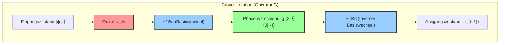

Dieser Schaltplan offenbart eine ungemein praktische Methode zur Realisierung des Diffusionsoperators $U_s = 2|s\rangle\langle s| - I$. Da der Zustand $|s\rangle$ durch $H^{\otimes n} |0\rangle^{\otimes n}$ präpariert wird, lässt sich der Operator wie folgt faktorisieren:

$$
U_s = 2(H^{\otimes n} |0\rangle^{\otimes n})(\langle 0|^{\otimes n} H^{\otimes n}) - I = H^{\otimes n} (2|0\rangle\langle 0| - I) H^{\otimes n}
$$

Mit anderen Worten: Durch eine Sandwich-Konfiguration – bestehend aus einer Hadamard-Transformation $H^{\otimes n}$ zur Überführung in die Rechenbasis, einem bedingten Phasenverschiebungsoperator, der die Phase genau dann unverändert lässt, wenn sich alle Qubits im Zustand $|0\rangle$ befinden (oder äquivalent dazu nur $|0\rangle$ eine negative Phase zuweist, was sich lediglich um eine globale Phase unterscheidet), und einer abschließenden Hadamard-Transformation zurück in die Ausgangsbasis – lässt sich die „Inversion um den Mittelwert“ auf jedem Quantencomputer mit minimalem Gatteraufwand effizient implementieren.

## 9.5 Analyse der Erfolgswahrscheinlichkeit und Ableitung der optimalen Iterationszahl

Nachdem das geometrische Verhalten des Zustandsvektors nunmehr lückenlos aufgeklärt ist, sind wir in der Lage, eine präzise quantitative Antwort auf die kardinale Frage des Algorithmus zu geben: „Wie viele Iterationen müssen durchlaufen werden, um die korrekte Lösung zu erhalten?“

Führt man $t$ Iterationen durch und misst anschließend das Quantenregister in der Rechenbasis, so ist die Wahrscheinlichkeit $P(w)$, den Zielzustand $|w\rangle$ anzutreffen, durch das Betragsquadrat der Amplitude der $|w\rangle$-Komponente des Zustandsvektors $|\psi_t\rangle$ gegeben:

$$
P(w) = |\langle w | \psi_t \rangle|^2 = \sin^2((2t+1)\theta)
$$

Unser primäres Ziel besteht darin, diese Wahrscheinlichkeit $P(w)$ zu maximieren – sie also so nah wie möglich an die theoretische Obergrenze von $1$ heranzuführen. Das Quadrat der Sinusfunktion $\sin^2(x)$ nimmt seinen Maximalwert $1$ genau dann an, wenn das Argument $x$ gleich $\frac{\pi}{2}$ (bzw. 90 Grad) ist. Folglich lautet die Bestimmungsgleichung für die optimale Anzahl an Iterationen $t$:

$$
(2t+1)\theta \approx \frac{\pi}{2}
$$

Löst man dies nach $t$ auf, so ergibt sich:

$$
t \approx \frac{\pi}{4\theta} - \frac{1}{2}
$$

Bei der Suche in Datenbanken von praxisrelevanter Größe ist die Elementanzahl $N$ eine astronomisch große Zahl. Der Winkel $\theta$ nimmt in diesem Fall einen winzigen Wert nahe $0$ an. Für sehr kleine $\theta$ liefert die Taylor-Entwicklung (Maclaurin-Entwicklung) bis zum linearen Glied die hervorragende Näherung $\sin \theta \approx \theta$. Aus der Definition des Anfangszustands wissen wir, dass $\sin \theta = \frac{1}{\sqrt{N}}$ gilt; folglich lässt sich $\theta \approx \frac{1}{\sqrt{N}}$ ansetzen.

Setzt man diese Näherung in die soeben hergeleitete Gleichung für $t$ ein, so erhält man für die optimale Iterationszahl $R$ das bemerkenswerte Resultat:

$$
R \approx \frac{\pi}{4} \sqrt{N}
$$

Die Tragweite dieses Ergebnisses ist für die Geschichte der Informationswissenschaft wahrhaft epochal. Auf klassischen Computern war zur Identifikation eines gesuchten Elements in einem ungeordneten Suchraum im ungünstigsten Fall ein Aufwand von $N$ Abfragen und im Mittel von $N/2$ Abfragen unumgänglich – eine Suchzeit, die linear mit der Elementzahl skaliert (Komplexität $O(N)$). Der auf einem Quantenrechner ausgeführte Grover-Algorithmus nutzt jedoch Quanteninterferenz zur Amplitudenverstärkung und erreicht den Zielzustand mit nahezu absoluter Gewissheit (mit einer astronomisch hohen Wahrscheinlichkeit von $1 - O(1/N)$) in lediglich rund $\frac{\pi}{4} \sqrt{N}$ Abfragen. Die Berechnungskomplexität sinkt damit auf $O(\sqrt{N})$, was einer Kompression der Laufzeit auf die Skala der Quadratwurzel entspricht.

Hierbei ist jedoch eine wesentliche Besonderheit zu beachten: Der Grover-Algorithmus stoppt nicht von selbst (kein *Self-stopping*). Überschreitet die Anzahl der Iterationen den optimalen Wert $R$, so rotiert der Zustandsvektor über die angestrebte $|w\rangle$-Achse hinaus. Infolge der Periodizität der Sinusfunktion sinkt die Wahrscheinlichkeit, die korrekte Lösung zu messen, daraufhin wieder ab – ein Phänomen, das als **Überrotation bzw. Überschwingen (Overcooking / Overshooting)** bezeichnet wird. Die exakte Kontrolle des Messzeitpunkts (also das gezielte Anhalten der Iteration) ist daher eine unabdingbare Voraussetzung für den Erfolg des Verfahrens.

## 9.6 Verallgemeinerung der Amplitudenverstärkung auf mehrere Zielzustände

Bisher haben wir unsere Betrachtung unter der restriktivsten Annahme geführt, dass in der gewaltigen Datenbank exakt eine einzige gültige Lösung existiert (Einfachlösungs-Problem). In praxisnahen Aufgabenstellungen ist es jedoch der Regelfall, dass mehrere Elemente die vorgegebene Suchbedingung erfüllen. Das Verfahren der Amplitudenverstärkung als Herzstück des Grover-Algorithmus lässt sich vollkommen bruchlos und unter Wahrung seiner mathematischen Eleganz auf den Fall verallgemeinern, dass $M$ Lösungen ( $1 \le M \le N$ ) vorliegen.

Existieren $M$ Lösungen, so definieren wir die gleichmäßige Superposition aller Zielzustände als $|W\rangle$ und die gleichmäßige Superposition aller nicht gesuchten Zustände als $|W^\perp\rangle$:

$$
|W\rangle = \frac{1}{\sqrt{M}} \sum_{x \in \text{Solutions}} |x\rangle
$$

$$
|W^\perp\rangle = \frac{1}{\sqrt{N-M}} \sum_{x \notin \text{Solutions}} |x\rangle
$$

Der anfängliche gleichmäßige Superpositionszustand $|s\rangle$ lässt sich dann anhand dieser beiden zueinander orthogonalen Vektoren wie folgt entwickeln:

$$
|s\rangle = \sqrt{\frac{N-M}{N}} |W^\perp\rangle + \sqrt{\frac{M}{N}} |W\rangle
$$

Nun führen wir einen modifizierten Winkel $\theta'$ ein, der durch $\sin \theta' = \sqrt{\frac{M}{N}}$ definiert ist. Wendet man unter dieser Vorgabe denselben Grover-Operator $G$ an (wobei das Orakel nun so verallgemeinert ist, dass es die Phase aller $M$ Zielzustände invertiert), so erfährt der Zustandsvektor in der von $|W^\perp\rangle$ und $|W\rangle$ aufgespannten Ebene mit jeder Iteration eine Drehung um den Winkel $2\theta'$.

Die optimale Anzahl an Iterationen ergibt sich in analoger Herleitung zu $\frac{\pi}{4\theta'}$, was für den typischen Fall $M \ll N$ folgender Näherung entspricht:

$$
R \approx \frac{\pi}{4} \sqrt{\frac{N}{M}}
$$

Diese Formel belegt, dass mit wachsender Lösungsmenge $M$ die erforderliche Iterationszahl (und damit die Suchzeit) erwartungsgemäß abnimmt. Gibt es beispielsweise vier Zielzustände, so halbiert sich der Rechenaufwand. Selbst wenn die Anzahl der Lösungen $M$ vorab gänzlich unbekannt ist, lässt sich mithilfe des sogenannten **Quantenzähl-Algorithmus (Quantum Counting Algorithm)** – einer hochentwickelten Synthese aus Grover-Algorithmus und Quantenphasenschätzung (Quantum Phase Estimation) – die Lösungsanzahl $M$ zunächst effizient bestimmen, um im Anschluss die exakt bemessene Anzahl an Amplitudenverstärkungsschritten auszuführen.

## 9.7 Theoretische Bedeutung der quadratischen Beschleunigung und Grenzen der Quantenberechnung (BBBV-Theorem)

Die durch den Grover-Algorithmus erzielte quadratische Beschleunigung von $O(N)$ auf $O(\sqrt{N})$ mag im rein formalen Vergleich zur exponentiellen Beschleunigung des Shor-Algorithmus ( $O(e^{N^{1/3}}) \to O(N^3)$ ) auf den ersten Blick bescheidener anmuten. Ihr wahrer wissenschaftlicher Wert und ihre fundamentale Universalität für die Informatik liegen jedoch in ihrer uneingeschränkten Allgemeingültigkeit begründet: Sie ist universell einsetzbar und nicht an spezifische Problemstrukturen gebunden.

Shors Faktorisierungsalgorithmus basiert auf der gezielten Ausnutzung einer hochspezifischen algebraischen Struktur – der Periodizität in der multiplikativen Gruppe ganzer Zahlen. Im Gegensatz dazu greift Grovers Algorithmus bei der unstrukturierten Datenbanksuche an, mithin der elementarsten und primitivsten Grundform jeglicher Berechnungsprobleme, die keinerlei Vorwissen und keinerlei innere Ordnungsstruktur voraussetzt.

Die Tragweite dieser Eigenschaft zeigt sich am deutlichsten bei den schweren Problemen der Komplexitätsklasse NP sowie in ihren Konsequenzen für die moderne Kryptographie. NP-vollständige Probleme wie das Problem des Handlungsreisenden (Traveling Salesperson Problem, TSP) oder das aussagenlogische Erfüllbarkeitsproblem (SAT) laufen im Kern darauf hinaus, einen gigantischen Suchraum erschöpfend nach einer gültigen Lösung zu durchforsten. Während klassische Algorithmen hierfür im ungünstigsten Fall eine Laufzeit von $O(2^n)$ benötigen, verkürzt der Grover-Algorithmus diese auf $O(\sqrt{2^n}) = O(2^{n/2})$, was einer Halbierung des Exponenten im Rechenaufwand gleichkommt.

Nicht minder gravierend sind die Auswirkungen auf die Kryptographie. Die Sicherheit heute allgegenwärtiger symmetrischer Kryptosysteme wie des Advanced Encryption Standard (AES) beruht vollständig auf der praktischen Unmöglichkeit eines Brute-Force-Angriffs auf den Schlüsselraum. Bei AES-128 (mit einer Schlüssellänge von 128 Bit) umfasst der Suchraum astronomische $N = 2^{128}$ Schlüssel. Während ein klassischer Rechner im Mittel $2^{127}$ Schlüsselprüfungen durchführen müsste, vermag ein Quantencomputer unter Einsatz des Grover-Algorithmus den gesuchten Schlüssel mit lediglich ca. $\frac{\pi}{4} 2^{64}$ Operationen zuverlässig aufzudecken. Genau diese Erkenntnis ist der ausschlaggebende Grund, warum Normungsorganisationen weltweit (wie etwa das NIST) den Übergang zur Post-Quanten-Kryptographie (Post-Quantum Cryptography) mit höchster Priorität vorantreiben, von der Weiternutzung von AES-128 abraten und die Umstellung auf AES-256 (welches selbst gegenüber Quantenangriffen eine Komplexität von $2^{128}$ Schritten garantiert) nachdrücklich fordern.

Schließlich verdient ein Satz besondere Erwähnung, der aus der Sicht der theoretischen Physik wie auch der theoretischen Informatik von fundamentaler Bedeutung ist: das 1997 von Charles H. Bennett, Ethan Bernstein, Gilles Brassard und Umesh Vazirani bewiesene **BBBV-Theorem** . Dieses Theorem liefert den mathematisch rigorosen Beweis, dass für eine unstrukturierte Blackbox-Suche auf einem Quantencomputer unausweichlich eine Untergrenze von $\Omega(\sqrt{N})$ Abfragen erforderlich ist.

Was besagt diese Erkenntnis im Kern? Sie besagt nichts Geringeres als: **„Die vom Grover-Algorithmus erzielte Komplexität von $O(\sqrt{N})$ stellt die absolute theoretische Grenze dar, die im Rahmen der Gesetze der Natur (der Quantenmechanik) überhaupt erreichbar ist; eine schnellere unstrukturierte Suche ist nach den Gesetzen unseres physikalischen Universums prinzipiell unmöglich.“** Grover hat damit nicht lediglich ein hocheffizientes Rechenverfahren ersonnen, sondern ist unmittelbar an die fundamentale Grenze zwischen Information und Physik vorgestoßen.

Darüber hinaus dient das in diesem Kapitel analysierte Paradigma der „Amplitudenverstärkung (Amplitude Amplification)“ heute als universeller Grundbaustein für eine Vielzahl fortgeschrittener Quantenverfahren – etwa in Quanten-Random-Walks (Quantum Random Walks) oder als elementare Subroutine im Bereich des quantengestützten maschinellen Lernens (Quantum Machine Learning). Grovers so einfache wie geniale Entdeckung, Wahrscheinlichkeitsamplituden über eine zweifache Spiegelung an zwei Achsen geometrisch gezielt zu rotieren und zu verstärken, bildet eine der tragfähigsten und unerschütterlichsten Säulen im gesamten Gebäude der modernen Quanteninformationswissenschaft.

# Kapitel 10: Quantenfehlerkorrektur und fehlertolerantes Rechnen

Das größte und tiefgreifendste Hindernis, dem sich die Quanteninformationswissenschaft gegenübersieht, sind "Rauschen" (Noise) und "Dekohärenz". Solange man einen Quantencomputer als ideales geschlossenes System betrachtet, ist eine deterministische Zustandsmanipulation durch unitäre Entwicklung gemäß der Schrödinger-Gleichung garantiert. Reale physikalische Systeme wie Quantengeräte interagieren jedoch ständig mit ihrer äußeren Umgebung (Wärmebäder, elektromagnetische Fluktuationen, kosmische Strahlung usw.). In diesem Kapitel werden wir, nachdem wir das Rauschen in Quantensystemen mathematisch streng definiert haben, in die Tiefen der "Quantenfehlerkorrektur" (Quantum Error Correction: QEC) vordringen, bei der es darum geht, wie man quantenspezifische Fehler, die in klassischen Systemen nicht existieren, erkennen und korrigieren kann. Darüber hinaus werden wir die theoretischen Grundlagen des "fehlertoleranten Quantenrechnens" (Fault-Tolerant Quantum Computation: FTQC), das Berechnungen selbst in realistischen Situationen, in denen der Korrekturmechanismus selbst von Rauschen durchsetzt ist, unendlich fortsetzbar macht, sowie das Schwellenwerttheorem (Threshold Theorem) detailliert behandeln.

## 10.1 Mathematische Beschreibung von Quantenrauschen und Dekohärenz

Um die Dekohärenz von Quantensystemen streng zu beschreiben, muss man die Perspektive von der Dynamik reiner Zustände basierend auf Zustandsvektoren geschlossener Systeme auf die Dynamik von Dichtematrizen offener Quantensysteme verlagern. Betrachtet man die unitäre Entwicklung im zusammengesetzten System aus Umgebungssystem $E$ und Hauptsystem $S$ und eliminiert die Freiheitsgrade des Umgebungssystems durch die partielle Spur (Partial Trace), so wird die Zustandsänderung des Hauptsystems als eine "vollständig positive spurerhaltende Abbildung" (Completely Positive Trace-Preserving Map, CPTP-Map) beschrieben.

Jeder Quantenkanal $\mathcal{E}$ wird unter Verwendung der Kraus-Darstellung (Kraus Representation) wie folgt entwickelt:

$$
\mathcal{E}(\rho) = \sum_{k} E_k \rho E_k^\dagger
$$

Hierbei werden die $E_k$ als Kraus-Operatoren (Kraus Operators) bezeichnet, welche die spurerhaltende Bedingung $\sum_k E_k^\dagger E_k = I$ erfüllen, was die Erhaltung der Wahrscheinlichkeit bedeutet.

In der klassischen Information ist der einzige Fehler, der bei einem Bit, der Informationseinheit, auftritt, der Bit-Flip (Bit Flip), bei dem "0 zu 1" oder "1 zu 0" wird. In Quantensystemen existiert jedoch ein fataler Fehler, der als "Phasen-Flip" (Phase Flip) bezeichnet wird und bei dem die Phase der Superposition schwankt. Die Kraus-Operatoren für typische Einzel-Qubit-Rauschkanäle werden im Folgenden gezeigt:

1. **Bit-Flip-Kanal (Bit Flip Channel):** Mit Wahrscheinlichkeit $p$ wirkt das $X$-Gatter.
   

$$
E_0 = \sqrt{1-p} I, \quad E_1 = \sqrt{p} X
$$

2. **Phasen-Flip-Kanal (Phase Flip Channel):** Mit Wahrscheinlichkeit $p$ wirkt das $Z$-Gatter. Dies drückt den Zerfall der relativen Phase (reine Dekohärenz) aus. Es ist die direkte Ursache für das Phänomen, bei dem die nicht-diagonalen Elemente der Dichtematrix des reinen Zustands $|\psi\rangle = \alpha|0\rangle + \beta|1\rangle$ exponentiell abklingen.
   

$$
E_0 = \sqrt{1-p} I, \quad E_1 = \sqrt{p} Z
$$

3. **Depolarisierender Kanal (Depolarizing Channel):** Mit Wahrscheinlichkeit $p$ nähert sich der Zustand dem vollständig gemischten Zustand (weißes Rauschen) $I/2$ an.
   

$$
E_0 = \sqrt{1-p} I, \quad E_1 = \sqrt{\frac{p}{3}} X, \quad E_2 = \sqrt{\frac{p}{3}} Y, \quad E_3 = \sqrt{\frac{p}{3}} Z
$$

Die erste Barriere bei der Entwicklung der Quantenfehlerkorrektur ist das "No-Cloning-Theorem". Es gibt keine unitäre Transformation, die einen unbekannten Quantenzustand $|\psi\rangle$ duplizieren kann, um einen Zustand wie $|\psi\rangle \otimes |\psi\rangle \otimes |\psi\rangle$ zu erzeugen. Daher ist der naive Ansatz wie bei der klassischen Fehlerkorrektur, "die gleichen Informationen in drei Bits zu kopieren und eine Mehrheitsentscheidung zu treffen", in Quantensystemen nicht möglich. Darüber hinaus führt die Messung eines Quantenzustands zum Kollaps der Wellenfunktion und zerstört die Superposition. Die Kernherausforderung besteht darin, den Fehler zu identifizieren, ohne die unbekannten Informationen zu zerstören.

## 10.2 Grundprinzipien der Quantenfehlerkorrektur: Redundanz und Syndrommessung

Die Alternative zum "Kopieren" in der Quanteninformation besteht darin, die ursprünglichen Informationen auf einen Unterraum eines höherdimensionalen Hilbertraums (den Code-Raum, Code Space) abzubilden, indem mehrere Qubits in einen verschränkten Zustand (Entanglement) versetzt werden.

Als einfachstes Beispiel konstruieren wir einen "3-Qubit-Bit-Flip-Code", der den Zustand eines einzelnen Qubits $|\psi\rangle = \alpha |0\rangle + \beta |1\rangle$ vor stochastischen Bit-Flips schützt.
Wir definieren die logische Basis (Logical Basis) wie folgt:

$$
|0\rangle_L = |000\rangle, \quad |1\rangle_L = |111\rangle
$$

Der logische Zustand ist $|\psi\rangle_L = \alpha |000\rangle + \beta |111\rangle$. Dies ist keine Kopie, sondern eine Codierung in einen GHZ-artigen verschränkten Zustand.

Nehmen wir nun an, dass ein Bit-Flip-Fehler $X_1 = X \otimes I \otimes I$ beim ersten Qubit aufgetreten ist. Der Zustand ändert sich in $|\psi'\rangle = \alpha |100\rangle + \beta |011\rangle$.
Um diesen Fehler zu erkennen, darf der Zustand selbst nicht direkt gemessen werden. Stattdessen führen wir eine "Syndrommessung" (Syndrome Measurement) durch, die nur die Spuren des Fehlers extrahiert, ohne den Zustand zu zerstören. Konkret messen wir die Paritätsoperatoren $Z_1 Z_2$ und $Z_2 Z_3$, die Tensorprodukte von Pauli-Operatoren sind.

Ein beliebiger Vektor $|\psi\rangle_L$ im ursprünglichen Code-Raum ist ein Eigenvektor von $Z_1 Z_2$ und $Z_2 Z_3$ mit dem Eigenwert $+1$ (d. h. $Z_1 Z_2 |\psi\rangle_L = |\psi\rangle_L$).
Für den Fehlerzustand $|\psi'\rangle$ jedoch, aufgrund der Eigenschaft der Pauli-Algebra, dass $X$ und $Z$ antikommutieren ($\{X, Z\} = 0$), ergibt sich:

$$
Z_1 Z_2 |\psi'\rangle = Z_1 Z_2 X_1 |\psi\rangle_L = -X_1 Z_1 Z_2 |\psi\rangle_L = - |\psi'\rangle
$$

$$
Z_2 Z_3 |\psi'\rangle = Z_2 Z_3 X_1 |\psi\rangle_L = X_1 Z_2 Z_3 |\psi\rangle_L = + |\psi'\rangle
$$

Das Messergebnis (das Syndrom) ist $(-1, +1)$, was nur die Tatsache bestätigt, dass "ein $X$-Fehler auf dem ersten Bit aufgetreten ist". Da keine Informationen über die Superpositionskoeffizienten $\alpha, \beta$ durchsickern, wird der Zustand durch die Messung nicht zerstört. Danach kann durch erneute Anwendung von $X_1$ der ursprüngliche Zustand $|\psi\rangle_L$ vollständig wiederhergestellt werden.

Auf ähnliche Weise verwendet man zur Korrektur des Phasen-Flip-Fehlers $Z$ den "3-Qubit-Phasen-Flip-Code" unter Verwendung der Hadamard-Basis $\{|+\rangle, |-\rangle\}$:

$$
|0\rangle_L = |+++\rangle, \quad |1\rangle_L = |---\rangle
$$

In diesem Fall werden $X_1 X_2$ und $X_2 X_3$ für die Syndrommessung verwendet.

Hier zeigt sich eine erstaunliche Eigenschaft der Quantenmechanik. Der Fehler durch die Interaktion mit der Umgebung ist im Allgemeinen eine kontinuierliche Rotation wie $E(\theta) = \cos(\theta) I - i \sin(\theta) X$. Durch die Durchführung der Syndrommessung wird dieser Zustand jedoch probabilistisch auf einen der Eigenzustände **projiziert** , entweder "kein Fehler" ($I$) oder "vollständiger Fehler" ($X$). Mit anderen Worten: Die unendlich vielen kontinuierlichen Fehler werden durch die Messung quantenmechanisch in diskrete Pauli-Fehler "digitalisiert".

## 10.3 Der 9-Qubit-Shor-Code (Shor Code) und der Stabilisator-Formalismus

Die oben genannten Codes können entweder nur Bit-Flips oder Phasen-Flips korrigieren. Im Jahr 1995 präsentierte Peter Shor den bahnbrechenden "9-Qubit-Shor-Code" (Shor's 9-Qubit Code), der beide Fehler gleichzeitig korrigieren kann. Dieser wird durch Verschachtelung (Concatenation) eines 3-Qubit-Bit-Flip-Codes innerhalb jedes Knotens eines 3-Qubit-Phasen-Flip-Codes konstruiert.

Die logische Basis sieht wie folgt aus:

$$
|0\rangle_L = \frac{1}{2\sqrt{2}} ( |000\rangle + |111\rangle ) \otimes ( |000\rangle + |111\rangle ) \otimes ( |000\rangle + |111\rangle )
$$

$$
|1\rangle_L = \frac{1}{2\sqrt{2}} ( |000\rangle - |111\rangle ) \otimes ( |000\rangle - |111\rangle ) \otimes ( |000\rangle - |111\rangle )
$$

Der "Stabilisator-Formalismus" (Stabilizer Formalism) von Daniel Gottesman generalisierte die Fehlerkorrektur, wie etwa den Shor-Code, und verlieh ihr ein solides mathematisches Fundament.
Sei $\mathcal{P}_n$ die Pauli-Gruppe von $n$ Qubits. Die Stabilisator-Gruppe $\mathcal{S}$ ist eine kommutative Untergruppe von $\mathcal{P}_n$, und der Code-Raum $\mathcal{C}$ wird definiert als "die Menge der Zustände $|\psi\rangle$, für die der Eigenwert für alle Elemente $S \in \mathcal{S}$ der Gruppe $\mathcal{S}$ gleich $+1$ ist". Wenn es in einem $n$-Qubit-System $k$ unabhängige Generatoren (Erzeuger) gibt, beträgt die Dimension des Code-Raums $2^{n-k}$, was der Anzahl der logischen Qubits entspricht.

Im Falle des Shor-Codes ($n=9$) werden zur Codierung eines logischen Bits $k=8$ unabhängige Generatoren verwendet.
$Z$-artige Stabilisatoren zur Erkennung von Bit-Flips (6 Stück):

$$
S_1 = Z_1 Z_2 I_3 I_4 I_5 I_6 I_7 I_8 I_9, \quad S_2 = I_1 Z_2 Z_3 I_4 I_5 I_6 I_7 I_8 I_9
$$

$$
\dots, \quad S_6 = I_1 I_2 I_3 I_4 I_5 I_6 I_7 Z_8 Z_9
$$

$X$-artige Stabilisatoren zur Erkennung von Phasen-Flips (2 Stück):

$$
S_7 = X_1 X_2 X_3 X_4 X_5 X_6 I_7 I_8 I_9
$$

$$
S_8 = I_1 I_2 I_3 X_4 X_5 X_6 X_7 X_8 X_9
$$

Wenn auf einem beliebigen Qubit ein Fehler $E \in \mathcal{P}_n$ auftritt und dieser mit einem der Generatoren von $\mathcal{S}$ antikommutiert, wird das Messergebnis dieses Stabilisators zu $-1$, wodurch die Art und die Position des Fehlers identifiziert werden. Das Konzept des Stabilisators bietet einen äußerst mächtigen Ansatz, der dem Heisenberg-Bild ähnelt, bei dem nicht der Quantenzustand selbst, sondern die algebraische Struktur der Operatoren, die die Symmetrie des Systems definieren, verfolgt wird.

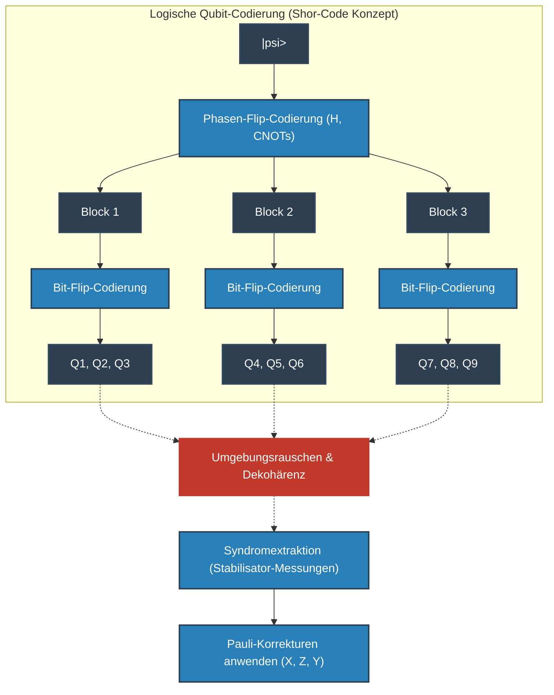

## 10.4 Topologische Codes und Oberflächencodes (Surface Codes)

Der Shor-Code und Stabilisator-Codes sind logisch perfekt, erfordern aber in der physikalischen Implementierung eine "Interaktion zwischen weit entfernten Qubits (langreichweitige Interaktion)". In der zweidimensionalen Gitteranordnung von Festkörperbauelementen (wie supraleitenden Schaltkreisen oder Silizium-Spins) ist diese weitreichende Kopplung äußerst schwierig.

Daher wird in der Mainstream-Architektur moderner Quantencomputer die "topologische Quantenfehlerkorrektur" verwendet, die von Alexei Kitaev vorgeschlagen wurde, deren repräsentativste Beispiele der "Toric Code" und der "Oberflächencode" (Surface Code) sind.

In einem Oberflächencode sind Qubits auf den Eckpunkten (oder Kanten) eines zweidimensionalen Gitters angeordnet, und Stabilisator-Messungen werden nur durch lokale Interaktionen zwischen benachbarten Qubits durchgeführt.
Der Hamiltonoperator wird wie folgt beschrieben:

$$
H = - \sum_{v} A_v - \sum_{p} B_p
$$

Hierbei ist $A_v$ das Tensorprodukt des $X$-Operators für die vier Qubits um einen Eckpunkt (Vertex) (Vertexoperator: $A_v = \prod_{i \in \text{star}(v)} X_i$), und $B_p$ ist das Tensorprodukt des $Z$-Operators für die vier Qubits um ein Plaquette (Fläche, Plaquette) (Plaquetteoperator: $B_p = \prod_{i \in \text{boundary}(p)} Z_i$).
Diese kommutieren miteinander ($[A_v, B_p] = 0$), und der logische Zustand wird im Grundzustandsraum codiert, wo die Eigenwerte aller $A_v$ und $B_p$ gleich $+1$ sind. Erstaunlicherweise beträgt der Entartungsgrad des Grundzustands des Toric-Codes, der auf einer zweidimensionalen Mannigfaltigkeit vom Geschlecht (Genus) $g$ konstruiert ist, $4^g$, und auf einem Torus ($g=1$) werden auf natürliche Weise zwei logische Qubits codiert.

Eine äußerst schöne physikalische Interpretation von Oberflächencodes ist es, Fehler als "Quasiteilchen (Anyons)" zu betrachten. Wenn zum Beispiel ein $X$-Fehler an einem Qubit auftritt, kehrt sich das Syndrom der zwei benachbarten Plaquetteoperatoren $B_p$ auf $-1$ um. Dies bedeutet, dass ein Paar "magnetischer Monopol-artiger Anyons ($m$-Anyons)" aus dem Vakuum des Grundzustands paarerzeugt wurde. Wenn sich die Fehler auf die Nachbarn ausweiten, bewegen sich die Anyons durch den Gitterraum.
Die Korrektur ist nichts anderes als das Auffinden von Syndrompaaren (Anyons) und die Verwendung des graphentheoretischen Algorithmus "Minimum Weight Perfect Matching" (MWPM), um die Anyons auf dem kürzesten Pfad zur Kollision zu bringen und sie einander vernichten zu lassen (Paarvernichtung).
Logische Operationen ($\bar{X}, \bar{Z}$) entsprechen der Bildung nichttrivialer Homologie-Schleifen (Topological Loop), bei denen diese Anyons den Raum von einem Ende zum anderen durchqueren. Da die Wahrscheinlichkeit, dass lokales Rauschen auf natürliche Weise eine das gesamte System durchquerende Schleife bildet, exponentiell gering ist, wird die Information aus topologischer Sicht extrem robust geschützt.

## 10.5 Der Weg zum fehlertoleranten Quantenrechnen (FTQC) und das Schwellenwerttheorem

Selbst wenn die Theorie der Fehlerkorrektur etabliert ist, bleibt ein hoffnungsloses Problem: "Was passiert, wenn die Schaltkreise für die Fehlerkorrektur selbst (wie Hilfsqubits für Syndrommessungen oder CNOT-Gatter) Rauschen enthalten?" Wenn während der Operation zur Fehlerbehebung schwerwiegendere Fehler infiziert werden, kollabiert das System sofort.

Ein CNOT-Gatter zur Syndromextraktion propagiert beispielsweise einen $X$-Fehler auf dem Steuer-Qubit auf das Ziel-Qubit ($X \otimes I \xrightarrow{CNOT} X \otimes X$) und pflanzt einen $Z$-Fehler des Ziel-Qubits auf das Steuer-Qubit zurück ($I \otimes Z \xrightarrow{CNOT} Z \otimes Z$). Wenn sich ein einzelner physikalischer Fehler auf mehrere Qubits innerhalb eines codierten Blocks vermehrt, übersteigt dies die festgelegte Code-Distanz $d$, und die Korrektur schlägt vollständig fehl.

Die Designphilosophie, um diese katastrophale Kettenreaktion zu verhindern, ist das "fehlertolerante Quantenrechnen (FTQC)". Die absolute Bedingung für FTQC ist: "Ein einzelner physikalischer Fehler, der im System auftritt, darf sich innerhalb eines logischen Fehlerblocks auf höchstens einen Fehler ausbreiten."
Um dies zu erreichen, sind für die Ausführung logischer Gatter "Transversale Operationen" (Transversal Operations) dringend erforderlich. Dies ist eine sichere Gatteroperation, bei der das $i$-te physikalische Qubit nur mit dem $i$-ten physikalischen Qubit eines anderen Blocks interagiert (keine Querkreuzkopplung innerhalb des Blocks). Durch das "Eastin-Knill-Theorem" (Eastin-Knill Theorem) ist jedoch mathematisch bewiesen worden, dass es unmöglich ist, einen kontinuierlichen Gatter-Satz für universelles Quantenrechnen allein mit transversalen Operationen zu konstruieren.

Der Zauberstab, um die Einschränkung dieses Theorems zu umgehen und universelles FTQC zu realisieren, ist die "Magic-State-Destillation" (Magic State Distillation). Man bereitet eine große Anzahl rauschender Nicht-Clifford-Zustände (z. B. Zustände, die einem $T$-Gatter entsprechen) vor und extrahiert durch Fehlerkorrekturschaltungen, die nur transversale Clifford-Operationen verwenden, einen "Magic-State" von extrem hoher Reinheit. Dann nutzt man das Prinzip der Quantenteleportation, um indirekt Nicht-Clifford-Gatter (wie das $T$-Gatter) auf logische Zustände anzuwenden. Da dieser Destillationsprozess enorme Ressourcen (physikalische Qubits) verbraucht, wird es in Algorithmen der FTQC-Ära zum obersten Gebot, "die Anzahl der $T$-Gatter so weit wie möglich zu reduzieren".

Die Krönung all dieser theoretischen Bemühungen ist das "Quantenschwellenwerttheorem" (Quantum Threshold Theorem).
Dieses von Dorit Aharonov und Michael Ben-Or et al. bewiesene Theorem verkündet lautstark Folgendes:
 **"Wenn die Fehlerwahrscheinlichkeit $p$ der physikalischen Komponenten (Gatter, Messung, Initialisierung) unter einem bestimmten Schwellenwert $p_{th}$ liegt, ist es durch hierarchische Verschachtelung (Concatenation) von Quantenfehlerkorrekturcodes oder durch kontinuierliche Vergrößerung der Gittergröße topologischer Codes (Code-Distanz $d$) möglich, Quantenberechnungen von beliebig langer Dauer mit beliebiger Präzision durchzuführen."** 

Der Schwellenwert $p_{th}$ hängt vom verwendeten Code und der Architektur ab, hat jedoch für den Oberflächencode einen sehr realistischen und erreichbaren Wert von etwa $10^{-2}$ (1%). Sowohl die physikalische Fehlerrate weit unter diesen Schwellenwert zu drücken (Verbesserung des Physical Layer), als auch die Entwicklung effizienterer Syndrom-Decoder und Varianten von Oberflächencodes (Verfeinerung des Logical Layer), stellen die Hauptkampfgebiete im weltweiten Wettbewerb der aktuellen Quantencomputerentwicklung dar.

Quantenfehlerkorrektur und FTQC sind nicht einfach nur ein technisches Patchwork. Es ist eine extrem fundamentale und künstlerische Herausforderung der Menschheit, die den empfindlichen Superpositionszustand der Quantenmechanik, den die Natur zu verbergen versucht, durch die Kontrolle von Topologie, Gruppentheorie und thermodynamischer Entropie auf makroskopische Zeitskalen ausdehnt und damit die Grenzen der Rechenkapazität des Universums erweitert.

# Kapitel 11: Physikalische Realisierung von Quantenhardware

Bis Kapitel 10 haben wir die theoretischen Grundlagen der Quanteninformationswissenschaft und die mathematische Struktur von Quantenalgorithmen ausführlich behandelt. Wie hochentwickelt ein Quantenalgorithmus auch entworfen sein mag und wie sehr die theoretische Quantenüberlegenheit (Quantum Supremacy) im Rahmen der Komplexitätstheorie auch bewiesen sein mag – ohne die physische Entität der „Quantenhardware“, die ihn ausführt, bleibt dies ein rein mathematisches Gedankenspiel. In diesem Kapitel erläutern wir die modernsten Hardware-Implementierungsansätze zur Verkörperung des Zustandsvektors $ |\psi\rangle $ im abstrakten Hilbert-Raum in der physikalischen Welt streng ausgehend von den tiefgreifenden Prinzipien der Quantenphysik.

Um ein quantenphysikalisches System künstlich zu steuern und es als universellen (Universal) Rechner fungieren zu lassen, müssen fünf anspruchsvolle physikalische Anforderungen erfüllt werden, die als DiVincenzo-Kriterien (DiVincenzo's criteria) bekannt sind:
1. **Ein skalierbares, wohldefiniertes Qubit-System** : Die Tensorproduktstruktur des Hilbert-Raums $ \mathcal{H} = \bigotimes_{i=1}^n \mathcal{H}_i $ muss physikalisch gewährleistet werden können.
2. **Initialisierung von Quantenzuständen** : Die Fähigkeit, das System mit hoher Fidelität (Fidelity) in einen reinen Zustand (typischerweise $ |00\dots0\rangle $ ) zurückzusetzen.
3. **Ausreichend lange Kohärenzzeiten** : Die Dekohärenzzeiten (T1 und T2) des Quantenzustands müssen um viele Größenordnungen länger sein als die für eine einzelne Gatteroperation benötigte Zeit.
4. **Implementierung eines universellen Quantengattersatzes** : Jede beliebige unitäre Transformation $ \hat{U} \in SU(2^n) $ muss durch eine Kombination einer endlichen Anzahl von Basisgattern (z. B. H-, T-, CNOT-Gatter) mit beliebiger Präzision approximiert werden können.
5. **Projektive Messung an spezifischen Qubits** : Die Fähigkeit, die Wahrscheinlichkeitsverteilung bezüglich einer bestimmten Basis mit hoher Präzision auszulesen, einhergehend mit dem Kollaps des Quantenzustands.

Ein System zu konstruieren, das all diese Bedingungen gleichzeitig und mit hoher Fidelität (Fidelity) erfüllt, stellt eine historische Herausforderung für die moderne Physik und Ingenieurwissenschaft dar. Isoliert man das System vollständig von der Umwelt, verlängert sich zwar die Kohärenzzeit, doch erschwert dies zugleich die Manipulation und Messung des Systems. Wie dieser fundamentale Zielkonflikt überwunden werden kann, bildet das Herzstück der Designphilosophie jedes Hardware-Ansatzes.

## 11.1 Supraleitende Qubits: Makroskopische Quantenphänomene und nichtlineare LC-Schwingkreise

Gegenwärtig werden supraleitende Qubits (Superconducting Qubit) von zahlreichen Forschungseinrichtungen, allen voran Google und IBM, am intensivsten erforscht und vorangetrieben. Dabei handelt es sich um einen Ansatz, bei dem nicht mikroskopische Elementarteilchen genutzt werden, sondern makroskopische Quantenphänomene elektronischer Schaltkreise, um „künstliche Atome“ (Artificial Atoms) zu konstruieren.

### 11.1.1 Physik und Nichtlinearität des Josephson-Kontakts

Ein mikrostrukturierter gewöhnlicher LC-Resonanzkreis (ein System bestehend aus einer Induktivität $ L $ und einer Kapazität $ C $ ) wird, wenn er auf extrem tiefe Temperaturen abgekühlt und quantisiert wird, zu einem quantenmechanischen harmonischen Oszillator (Harmonic Oscillator). Sein Hamiltonoperator lässt sich unter Verwendung des Erzeugungsoperators $ \hat{a}^\dagger $ und des Vernichtungsoperators $ \hat{a} $ wie folgt schreiben:

$$
\hat{H}_{\text{LC}} = \hbar \omega_r \left( \hat{a}^\dagger \hat{a} + \frac{1}{2} \right)
$$

Hierbei ist $ \omega_r = 1/\sqrt{LC} $ die Resonanzfrequenz. Die Energieniveaus $ E_n = \hbar \omega_r (n + 1/2) $ dieses Systems sind äquidistant. Würde man den Grundzustand $ |0\rangle $ und den ersten angeregten Zustand $ |1\rangle $ dieses Systems als Qubit verwenden und versuchen, durch Einstrahlung von Mikrowellen der Frequenz $ \omega_r $ eine Gatteroperation (z. B. den Übergang $ |0\rangle \leftrightarrow |1\rangle $ ) durchzuführen, würden gleichzeitig auch die äquidistanten Übergänge $ |1\rangle \leftrightarrow |2\rangle $ und $ |2\rangle \leftrightarrow |3\rangle $ angeregt. Auf diese Weise kann das System nicht als Zwei-Niveau-System fungieren.

Um dieses Problem zu lösen, ist eine „Nichtlinearität“ (Nonlinearity) unverzichtbar, die zu ungleichen Abständen der Energieniveaus führt. Dies wird durch den **Josephson-Kontakt (Josephson Junction)** realisiert. Dieser besitzt eine Struktur, bei der zwei Supraleiter durch eine wenige Nanometer dünne Isolatorschicht getrennt sind, sodass Cooper-Paare (Cooper pairs) unter Erhaltung der makroskopischen Phasenkohärenz durch den Tunneleffekt hindurchtreten. Gemäß den Josephson-Gleichungen lautet die Beziehung zwischen dem Suprastrom $ I $ und der Phasendifferenz $ \phi $ : $ I = I_c \sin \phi $ . Dadurch fungiert der Kontakt als nichtlineare Induktivität, deren Induktivitätswert vom Strom abhängt.

### 11.1.2 Der Hamiltonoperator des Transmons

In der Vergangenheit wurden verschiedene Designs wie Ladungs-Qubits und Fluss-Qubits entwickelt, doch das gegenwärtig erfolgreichste ist das „Transmon“ (Transmon), welches die Robustheit gegenüber Ladungsrauschen drastisch gesteigert hat.

Das Transmon arbeitet in einem Regime, in dem parallel zur Josephson-Energie $ E_J $ eine Shunt-Kapazität absichtlich massiv vergrößert wurde, wodurch die Ladungsenergie $ E_C = e^2 / (2C_{\Sigma}) $ stark verringert wird ( $ E_J / E_C \gg 1 $ ).
Der Ladungsoperator $ \hat{n} $ , der die Anzahl der Cooper-Paare beschreibt, und der Phasenoperator $ \hat{\phi} $ , der die supraleitende Phasendifferenz beschreibt, sind kanonisch konjugierte Variablen und erfüllen die Kommutatorrelation $ [\hat{\phi}, \hat{n}] = i $ . Der Hamiltonoperator des Transmons lässt sich exakt wie folgt formulieren:

$$
\hat{H}_{\text{transmon}} = 4 E_C (\hat{n} - n_g)^2 -E_J \cos \hat{\phi}
$$

Hierbei ist $ n_g $ die durch Umgebungseinflüsse oder Gate-Spannungen bedingte Offset-Ladung. Im Grenzfall $ E_J \gg E_C $ werden die quantenmechanischen Phasenschwankungen klein gehalten, sodass der Kosinusterm als Taylor-Reihe entwickelt und das System als anharmonischer Oszillator behandelt werden kann:

$$
-E_J \cos \hat{\phi} \approx - E_J + \frac{E_J}{2} \hat{\phi}^2 - \frac{E_J}{24} \hat{\phi}^4 + \mathcal{O}(\hat{\phi}^6)
$$

Dieser Term proportional zu $ \hat{\phi}^4 $ verleiht dem System seine Anharmonizität (Anharmonicity). Als Ergebnis einer störungstheoretischen Berechnung lässt sich die Anharmonizität $ \alpha $ zwischen den Energieniveaus wie folgt nähern:

$$
\alpha \equiv (E_2 - E_1) - (E_1 - E_0) \approx -E_C
$$

Dank dieser negativen Anharmonizität (die Übergangsfrequenz von $ E_1 \to E_2 $ ist kleiner als diejenige von $ E_0 \to E_1 $ ) können Mikrowellenpulse verwendet werden, um Einzel-Qubit-Gatteroperationen sicher innerhalb des Rechenbasis-Unterraums von $ |0\rangle $ und $ |1\rangle $ auszuführen.

### 11.1.3 Circuit QED und Messmechanismus

Der theoretische Rahmen zum zerstörungsfreien Auslesen des Qubit-Zustands ist die „Circuit QED“ (Schaltkreis-Quantenelektrodynamik), bei der die Resonator-Quantenelektrodynamik auf supraleitende Schaltungen angewandt wird.
Das gekoppelte System aus dem Qubit und einem Mikrowellen-Ausleseresonator wird durch das Jaynes-Cummings-Modell beschrieben:

$$
\hat{H}_{\text{JC}} = \frac{\hbar \omega_q}{2} \hat{\sigma}_z + \hbar \omega_r \hat{a}^\dagger \hat{a} + \hbar g (\hat{\sigma}_+ \hat{a} + \hat{\sigma}_- \hat{a}^\dagger)
$$

Hierbei ist $ g $ die Kopplungsstärke. Im dispersiven Regime ( $ |\omega_q - \omega_r| \gg g $ ), in dem die Übergangsfrequenz des Qubits $ \omega_q $ und die Resonanzfrequenz des Resonators $ \omega_r $ weit voneinander entfernt sind, wird der effektive Hamiltonoperator mittels Schrieffer-Wolff-Transformation wie folgt diagonalisiert:

$$
\hat{H}_{\text{disp}} \approx \frac{\hbar \omega_q}{2} \hat{\sigma}_z + \hbar \left( \omega_r + \frac{g^2}{\Delta} \hat{\sigma}_z \right) \hat{a}^\dagger \hat{a}
$$

Hierbei ist $ \Delta = \omega_q - \omega_r $ . Die physikalische Bedeutung des zweiten Terms dieser Gleichung ist von fundamentaler Wichtigkeit: Die effektive Resonanzfrequenz des Resonators verschiebt sich in Abhängigkeit vom Zustand des Qubits (je nachdem, ob $ \hat{\sigma}_z = +1 $ oder $ -1 $ vorliegt) um $ \pm g^2/\Delta $ . Indem man folglich Mikrowellen-Sondensignale durch den Resonator transmittieren lässt oder an ihm reflektiert und die resultierende Phasenverschiebung misst, lässt sich der Zustand des Qubits projektiv auslesen.

 **Vor- und Nachteile** 
Der größte Vorteil des supraleitenden Ansatzes liegt darin, dass bestehende Halbleiter-Lithografietechnologien genutzt werden können, was eine exzellente Skalierbarkeit über Verdrahtungsdesigns auf dem Chip ermöglicht, sowie in den extrem schnellen Gatteroperationszeiten im Nanosekundenbereich. Als Nachteil ist anzuführen, dass supraleitende Schaltkreise als makroskopische künstliche Gebilde extrem anfällig für mikroskopische Materialdefekte (TLS, Two-Level Systems) und elektromagnetisches Rauschen sind, weshalb eine kryogene Umgebung nahe dem absoluten Nullpunkt (ca. 10 mK) in einem Verdünnungskryostaten zwingend erforderlich ist.

## 11.2 Ionenfallen-Ansatz: Der Zenit der Atomphysik und vollkommene Identität

Während Supraleitung ein „künstliches makroskopisches Quantensystem“ darstellt, verkörpert der Ionenfallen-Ansatz (Trapped Ion) die „ultimativen mikroskopischen Quantensysteme der Natur“. Identische Isotope desselben Atoms (beispielsweise $ ^{171}\text{Yb}^+ $ oder $ ^{40}\text{Ca}^+ $ ) besitzen exakt dieselben physikalischen Eigenschaften, ganz gleich, an welchem Ort im Universum sie sich befinden. Folglich existiert das Konzept von Fertigungstoleranzen überhaupt nicht, was den fundamentalen Vorzug überragend langer Kohärenzzeiten mit sich bringt.

### 11.2.1 Paul-Falle und Dynamik der Laserkühlung

In einer Ionenfalle ist es unmöglich, geladene Teilchen allein mittels statischer elektrischer Felder stabil im dreidimensionalen Raum einzufangen (Earnshaw-Theorem). Um diese Einschränkung zu umgehen, nutzt man die Technik der Paul-Falle (Paul trap), welche räumlich inhomogene, zeitlich hochfrequent oszillierende elektrische Felder einsetzt.

Die gefangenen Ionen werden innerhalb einer Vakuumkammer einer Laserkühlung (Doppler-Kühlung und Seitenbandkühlung) unterzogen. Dadurch wird den Ionen kinetische Energie entzogen, bis sie den quantenmechanischen Grundzustand der Bewegung (Phononenzahl $ n=0 $ ) erreichen. Die Rechenbasis des Qubits wird in die internen elektronischen Zustände des Ions kodiert. Der Hamiltonoperator für die internen Zustände ist einfach:

$$
\hat{H}_{\text{internal}} = \frac{\hbar \omega_0}{2} \hat{\sigma}_z
$$

### 11.2.2 Lamb-Dicke-Regime und die Mathematik des Mølmer-Sørensen-Gatters

Der eigentliche Durchbruch des Ionenfallen-Ansatzes liegt im Mechanismus zur Verschränkungserzeugung zwischen mehreren Qubits. Die gefangene Ionenkette ist über starke Coulomb-Abstoßungskräfte miteinander gekoppelt und weist kollektive Normalschwingungsmoden (Phononen) des Gesamtsystems auf. Indem man diese Phononen als Datenbus verwendet, lässt sich eine direkte Wechselwirkung selbst zwischen räumlich voneinander entfernten Ionen vermitteln.

Die Standardmethode zur Implementierung eines Zwei-Qubit-Gatters ist das Mølmer-Sørensen-Gatter (MS-Gatter). Dabei werden zwei Ionen simultan mit bichromatischem Laserlicht bestrahlt, dessen Frequenzen leicht gegenüber der Phononenmode $ \omega_m $ verstimmt sind. Im Lamb-Dicke-Regime ( $ \eta \sqrt{n} \ll 1 $ ), in welchem der Lamb-Dicke-Parameter $ \eta = k z_0 $ hinreichend klein ist, lässt sich der Wechselwirkungs-Hamiltonoperator wie folgt entwickeln:

$$
\hat{H}_{\text{int}} \approx \hbar \Omega \sum_{j=1,2} \hat{\sigma}_\phi^{(j)} \left( \eta \hat{a} e^{i \delta t} + \eta \hat{a}^\dagger e^{-i \delta t} \right)
$$

Hierbei ist $ \Omega $ die Rabi-Frequenz und $ \delta $ die Verstimmung. Berechnet man den Zeitentwicklungsoperator mittels Magnus-Reihe, kehrt der Bewegungsmodus nach einer geeigneten Gatterzeit in seinen Ausgangszustand zurück, während den internen Zuständen eine geometrische Phase aufgeprägt wird, sodass eine effektive Spin-Spin-Wechselwirkung zurückbleibt:

$$
\hat{U}_{\text{MS}} = \exp\left( -i \frac{\pi}{4} \hat{\sigma}_\phi \otimes \hat{\sigma}_\phi \right)
$$

Diese Operation erzeugt einen maximal verschränkten Zustand und besitzt eine Rechenkapazität, die zu der eines CNOT-Gatters äquivalent ist. Die Möglichkeit einer vollständigen Konnektivität aller mit allen (All-to-all Connectivity) ist der entscheidende Unterschied zum supraleitenden Ansatz, bei dem im Wesentlichen nur benachbarte Qubits gekoppelt werden können.

 **Herausforderungen und Grenzen** 
Die Gatteroperationszeiten liegen im Bereich von einigen zehn Mikrosekunden, was um viele Größenordnungen langsamer ist als beim supraleitenden Ansatz. Wenn zudem mehrere Dutzend Ionen in einer einzelnen eindimensionalen Falle angeordnet werden, wird das Schwingungsmodenspektrum extrem dicht gedrängt, was unvermeidliches Übersprechen (Crosstalk) verursacht. Skalierungstechnologien wie die QCCD-Architektur (Quantum Charge-Coupled Device) zur Überwindung dieser Hürde stellen den aktuellen Schwerpunkt der Forschung dar.

## 11.3 Topologische Qubits: Nicht-abelsche Anyonen und ultimative Robustheit

Sowohl supraleitende Schaltkreise als auch gefangene Ionen sind anfällig für Fehler infolge von lokalem Rauschen aus der Umgebung, weshalb die nachfolgend diskutierte Quantenfehlerkorrektur unverzichtbar ist. Es existiert jedoch ein überaus ambitionierter Ansatz, Quantenzustände zu konstruieren, die bereits auf physikalischer Ebene fundamental vor Rauschen geschützt sind: der topologische Quantencomputer.

### 11.3.1 Kitaev-Kette und Majorana-Nullmoden

In dem dreidimensionalen Raum, in dem wir leben, existieren nur zwei Arten von Elementarteilchen: Bosonen und Fermionen. In zweidimensionalen topologischen Materialsystemen können jedoch „Anyonen“ (Anyon) existieren, bei denen die Wellenfunktion durch eine Teilchenaustauschoperation eine beliebige Phase annehmen kann. Im noch außergewöhnlicheren Fall „nicht-abelscher Anyonen“ (Non-Abelian anyon) führt der Austausch zweier Teilchen dazu, dass das System innerhalb eines entarteten Zustandsraums gleicher Energie eine unitäre Rotation in einen anderen, orthogonalen Zustand erfährt:

$$
| \psi_{\text{final}} \rangle = \hat{U} | \psi_{\text{initial}} \rangle
$$

Der vielversprechendste physikalische Kandidat für solche nicht-abelschen Anyonen sind die Quasiteilchen der Festkörperphysik namens „Majorana-Nullmoden“ (Majorana Zero Modes, MZM). Dabei versieht man einen eindimensionalen Halbleiter-Nanodraht (wie InSb) mit starker Spin-Bahn-Kopplung, koppelt ihn an einen s-Wellen-Supraleiter und legt ein externes Magnetfeld an. Gemäß dem von Alexei Kitaev vorgeschlagenen Modell vollzieht der Nanodraht in bestimmten Parameterbereichen einen Phasenübergang in eine topologische supraleitende Phase, wodurch an beiden Enden des Drahtes nullenergetische Majorana-Teilchen als Randzustände lokalisiert werden.

Die Majorana-Operatoren $ \hat{\gamma}_1, \hat{\gamma}_2 $ sind selbstadjungiert ( $ \hat{\gamma}_j = \hat{\gamma}_j^\dagger $ ) und erfüllen die Antikommutatorrelation $ \{ \hat{\gamma}_i, \hat{\gamma}_j \} = 2\delta_{ij} $ . Die regulären Erzeugungs- und Vernichtungsoperatoren eines Dirac-Fermions lassen sich unter Verwendung dieser beiden Majorana-Operatoren räumlich nicht-lokal konstruieren:

$$
\hat{c} = \frac{1}{2}(\hat{\gamma}_1 + i\hat{\gamma}_2), \quad \hat{c}^\dagger = \frac{1}{2}(\hat{\gamma}_1 - i\hat{\gamma}_2)
$$

Dieser eine fermionische Zustand (die Fermionenparität) wird somit auf zwei räumlich isolierte Punkte an den beiden Enden des Nanodrahts „aufgeteilt“ und kodiert. Da die Wahrscheinlichkeit extrem gering ist, dass lokales Rauschen beide Enden des Systems gleichzeitig und mit exakt abgestimmter Korrelation stört, ist die Quanteninformation intrinsisch vor Dekohärenz geschützt (topologischer Schutz).

### 11.3.2 Braiding und topologische Berechnungen

Quantenlogikgatter werden in diesem System durch das sogenannte „Braiding“ (Verflechten) realisiert, bei dem die räumlichen Positionen dieser Majorana-Teilchen vertauscht werden:

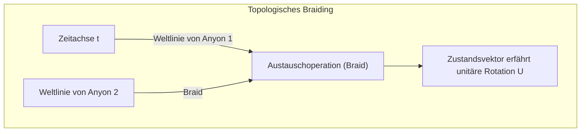

Da ausschließlich die Topologie der von den Teilchentrajektorien gebildeten „Knoten“ das Rechenergebnis bestimmt, wird die unitäre Transformation $ \hat{U} $ exakt fehlerfrei ausgeführt, selbst wenn die Trajektorien leichten Schwankungen unterliegen – solange die Topologie unverändert bleibt. Dies ist Fehlertoleranz (Fault-tolerance) auf Hardware-Ebene.

 **Herausforderungen und Grenzen** 
Ein zweifelsfreier experimenteller Nachweis für die Existenz von Majorana-Nullmoden ist nach wie vor Gegenstand intensiver Debatten, und die physikalische Demonstration des Braidings steht noch aus. Da das Braiding von Ising-Anyonen allein zudem keinen universellen Quantengattersatz bilden kann, sind nicht-topologische Zusatzoperationen wie die Magic-State-Destillation erforderlich.

## 11.4 Photonische Qubits: Lineare Optik und messungsinduzierte Verschränkung

Ein weiterer Ansatz, der von Natur aus eine herausragende Robustheit gegenüber Umgebungsrauschen aufweist, ist der photonische Quantencomputer, welcher Photonen (Photon) nutzt. Da Photonen keine elektrische Ladung tragen und selbst bei Raumtemperatur nur extrem schwach mit der Umgebung wechselwirken, kann ihre Dekohärenzzeit praktisch als unendlich angesehen werden.

### 11.4.1 Dual-Rail-Kodierung und KLM-Protokoll

Photonische Qubits werden häufig über räumliche Pfadmoden kodiert. Bei der Dual-Rail-Kodierung (Dual-Rail Encoding) entspricht der Zustand, in dem sich das Photon im oberen Wellenleiter befindet, $ |0\rangle = |1, 0\rangle $ , und der Zustand im unteren Wellenleiter $ |1\rangle = |0, 1\rangle $ .

Einzel-Qubit-Gatter lassen sich vollständig mit linearen optischen Elementen wie Strahlteilern (BS) und Phasenschiebern (PS) realisieren. Da Photonen jedoch nicht direkt miteinander wechselwirken, ist es unmöglich, deterministische Zwei-Qubit-Gatter allein mit linearen optischen Elementen aufzubauen.
Im Jahr 2001 schlugen Knill, Laflamme und Milburn das „KLM-Protokoll“ vor und bewiesen, dass durch die Kombination von Einzelphotonenquellen, linearen optischen Elementen und **projektiver Messung mittels Photonendetektoren** eine – wenngleich probabilistische – skalierbare universelle Quantenberechnung möglich ist. Die erforderliche Nichtlinearität wird dem System postselektiv (Post-selection) über reine Quanteninterferenzeffekte wie den Hong-Ou-Mandel-Effekt (Hong-Ou-Mandel effect) und die Irreversibilität der Quantenmessung zugeführt.

### 11.4.2 Kontinuierliche Variablen (CV) und Clusterzustände

In den letzten Jahren verzeichnete neben dem auf einzelnen Photonen basierenden diskreten Ansatz insbesondere die Quantenberechnung mit kontinuierlichen Variablen (Continuous Variable, CV), welche die Quadraturamplituden des Lichts nutzt, enorme Fortschritte.
Durch den Einsatz von Zeitbereichsmultiplexing und gequetschtem Licht (Squeezed Light) wird ein gewaltiger „Clusterzustand“ (Cluster state) erzeugt, der aus Zehntausenden bis Millionen miteinander verschränkter Lichtpulse besteht. Die Architektur des „messungsbasierten Quantenrechnens“ (Measurement-based quantum computation; MBQC), welche diesen Zustand als Ressource nutzt und Berechnungen durch sequentielle, gezielte Messungen an den einzelnen Knotenpunkten vorantreibt, etabliert sich zunehmend als Hauptströmung photonischer Quantencomputer.

## 11.5 Die Realität der NISQ-Ära und der Aufstieg zu logischen Qubits

Wie das von John Preskill geprägte Konzept von **NISQ (Noisy Intermediate-Scale Quantum)** veranschaulicht, handelt es sich bei der Quantenhardware, über die die Menschheit derzeit verfügt, um Systeme mittlerer Größenordnung mit einigen Dutzend bis Hunderten physikalischer Qubits. Dennoch werden sie nach wie vor vom Rauschen dominiert, sodass eine Akkumulation von Fehlern unvermeidbar ist.

### 11.5.1 Kohärenzgrenzen und Fidelität

Versucht man, tiefe Quantenschaltungen wie den Shor-Algorithmus auszuführen, verstärken sich kleinste Fehler bei jeder Gatteroperation exponentiell. Angenommen, die Fidelität eines bestimmten Zwei-Qubit-Gatters beträgt 99,5 % (Fehlerrate $ \epsilon = 0.005 $ ). Wenn die Gesamtschaltung $ N $ Gatter umfasst, beträgt die endgültige Zustandsfidelität näherungsweise $ \mathcal{F} \approx (1-\epsilon)^N \approx e^{-N\epsilon} $ . Bei $ N=1000 $ liegt die Erfolgswahrscheinlichkeit bei lediglich $ e^{-5} \approx 0.0067 $ , sodass das korrekte Rechenergebnis im Rauschen untergeht.
In dem von Google durchgeführten Experiment zur Quantenüberlegenheit wurde anhand einer Metrik namens Cross-Entropy Benchmarking (XEB) eine Rechengeschwindigkeit nachgewiesen, die klassische Supercomputer bei weitem übertraf. Dies war jedoch auf das Sampling spezieller Zufallsschaltkreise beschränkt und stellte noch keine praktisch verwertbare Berechnung dar.

### 11.5.2 Übergang zur Quantenfehlerkorrektur (Der Anbruch des FTQC)

Um die Grenzen von NISQ-Geräten zu durchbrechen und echte „Quantenüberlegenheit“ in Bereichen wie Chemie, Materialwissenschaften oder Kryptografie-Brechung zu etablieren, ist der Übergang zum **FTQC (Fault-Tolerant Quantum Computing: fehlertolerantes Quantenrechnen)** absolut unabdingbar. Dies bedeutet, dass man sich nicht auf ein einziges physikalisches System stützt, sondern viele physikalische Qubits bündelt, um ein einzelnes fehlerfreies „logisches Qubit“ (Logical Qubit) zu konstruieren.

Wenn man beispielsweise einen topologischen Fehlerkorrekturcode namens Oberflächencode (Surface Code) verwendet, sinkt die logische Fehlerrate exponentiell mit der Systemgröße, vorausgesetzt, die Fehlerrate der physikalischen Qubits fällt unter den Schwellenwert. Der Preis dafür ist jedoch ein Overhead von 1.000 bis 10.000 physikalischen Qubits, der zur Bildung eines einzigen logischen Qubits erforderlich ist.

Wir stehen heute an vorderster Front der physikalischen Ingenieurkunst im Kampf gegen das Rauschen. Supraleitung, Ionenfallen, topologische Qubits und photonische Qubits – jeder Ansatz schließt Verträge mit den Dämonen seiner jeweiligen physikalischen Einschränkungen und strebt dem unerreichten Gipfel der Skalierbarkeit entgegen. In Kapitel 12 werden wir eine tiefgründige Erläuterung der ultimativen Festung der Quanteninformation, der „mathematischen Struktur der Quantenfehlerkorrektur“, geben, die auf die Weiterentwicklung dieser Hardware wartet.

# Kapitel 12: Die Zukunft des Quantencomputings und Zusammenfassung

„Quantencomputer“ – Rechner, welche die physikalischen Gesetze der mikroskopischen Welt der Quantenmechanik, die sich unserer menschlichen Intuition widersetzen, als Rechenressource nutzbar machen. Beginnend mit dem Superpositionsprinzip in Kapitel 1 über Quantenverschränkung, die Bellsche Ungleichung, den Shor-Algorithmus bis hin zur Quantenfehlerkorrektur sind wir im Verlauf dieser umfassenden Serie tief in die Grundlagen der Quanteninformationswissenschaft eingetaucht. In diesem abschließenden Kapitel ergründen wir die wahre mathematische und physikalische Bedeutung des Demonstrationsexperiments der „Quantenüberlegenheit (Quantum Supremacy / Quantum Advantage)“, dem technischen Meilenstein, den die Menschheit gegenwärtig erreicht hat. Wir entkräften die in der Öffentlichkeit weit verbreitete Illusion, dass „Quantencomputer magische Boxen sind, die jedes Problem im Handumdrehen lösen können“, aus der Perspektive der Berechnungskomplexitätstheorie rigoros. Schließlich präsentieren wir eine realistische und zugleich visionäre Roadmap für die künftige gesellschaftliche Implementierung, die vom NISQ-Zeitalter (Noisy Intermediate-Scale Quantum) hin zu FTQC (Fault-Tolerant Quantum Computing) führt, als feierliches Schlusswort dieses 50.000 Zeichen umfassenden Monumentalwerks.

## 12.1 Demonstration der Quantenüberlegenheit: Der Wegweiser von Google Sycamore

Im Jahr 2019 verkündete das Forschungsteam von Google den experimentellen Nachweis der „Quantenüberlegenheit (Quantum Supremacy)“: Mit dem supraleitenden 53-Qubit-Prozessor „Sycamore“ sei ein spezifisches Problem, das auf klassischen Supercomputern innerhalb realistischer Fristen praktisch unlösbar ist, mit einem Quantenprozessor in verblüffend kurzer Zeit gelöst worden. Dieses Ereignis stellt einen historischen Meilenstein in der Quanteninformationswissenschaft dar, doch nur wenige verstehen die präzise mathematische und physikalische Struktur dahinter.

Das von ihnen gelöste Problem ist das „Sampling aus zufälligen Quantenschaltkreisen“ (Random Quantum Circuit Sampling). Auf ein Register von Qubits werden zufällig ausgewählte 1-Qubit-Gatter und 2-Qubit-Gatter über $d$ Schichten hinweg angewendet, woraufhin der resultierende Endzustand in der Rechenbasis gemessen wird.

Beschreiben wir dies mathematisch formal. Der Anfangszustand sei $ |\psi_0\rangle = |0\rangle^{\otimes n} $. Darauf wird eine zufällig ausgewählte unitäre Gesamtransformation $ U = U_d U_{d-1} \dots U_1 $ angewendet. Der Endzustand $ |\psi_f\rangle $ lässt sich mittels Tensorprodukten und Linearkombinationen wie folgt darstellen:

$$
|\psi_f\rangle = U |0\rangle^{\otimes n} = \sum_{x \in \{0, 1\}^n} \alpha_x |x\rangle
$$

Hierbei ist $ \alpha_x = \langle x | U | 0 \rangle^{\otimes n} $ die komplexe Wahrscheinlichkeitsamplitude für die Beobachtung einer bestimmten Bitfolge $x$. Die ideale Wahrscheinlichkeit $ P_{\text{ideal}}(x) $, bei einer Messung in der Standardbasis die Bitfolge $x$ zu erhalten, ist gemäß der Bornschen Regel der Quantenmechanik wie folgt gegeben:

$$
P_{\text{ideal}}(x) = |\alpha_x|^2 = \left| \langle x | U | 0 \rangle^{\otimes n} \right|^2
$$

In ausreichend tiefen (hinreichend großes $d$) zufälligen Quantenschaltkreisen zeigen die einzelnen Amplituden $ \alpha_x $ ein Random-Walk-artiges Verhalten in der komplexen Ebene, und es ist mathematisch bewiesen, dass ihre Wahrscheinlichkeitsverteilung $ P_{\text{ideal}}(x) $ einer Porter-Thomas-Verteilung folgt. Das bedeutet, dass die Wahrscheinlichkeitsdichtefunktion für das Auftreten einer Wahrscheinlichkeit $p$ durch $ \text{Pr}(P_{\text{ideal}}(x) = p) \approx 2^n e^{-2^n p} $ gegeben ist. Dies führt dazu, dass manche Bitfolgen mit signifikant höherer Wahrscheinlichkeit gemessen werden als andere, wodurch ein charakteristisches Interferenz- bzw. „Speckle-Muster“ (Fleckenmuster) entsteht.

Um aus dieser Verteilung auf einem klassischen Computer ein exaktes Sampling durchzuführen, müssen die Amplituden $ \alpha_x $ über die Kontraktion gigantischer Tensornetzwerke direkt berechnet werden. Die Dimension des Zustandsvektors beträgt $ 2^n $; im Fall von $ n = 53 $ entspricht dies etwa $ 9 \times 10^{15} $ komplexen Amplituden (ein Speicherbedarf im Petabyte-Bereich), die simultan verfolgt werden müssen. Dies stößt an eine Berechnungsmauer, die selbst mit den modernsten Supercomputern der Welt astronomische Rechenzeiten erfordert hätte. Ein Quantencomputer hingegen hält den Zustand **$|\psi_f\rangle$** über das physikalische System selbst ganz natürlich als Vektor im Hilbertraum und vollzieht mit einer einzigen Messung augenblicklich (in wenigen Dutzend Mikrosekunden) ein Sampling gemäß diesem Speckle-Muster.

Um den Erfolg des Experiments quantitativ zu bewerten, wurde das lineare Kreuzentropie-Benchmarking (Linear Cross-Entropy Benchmarking, XEB) eingeführt. Die Fidelität (Fidelity) $ \mathcal{F}_{\text{XEB}} $ ist wie folgt definiert:

$$
\mathcal{F}_{\text{XEB}} = 2^n \sum_{x \in \{0, 1\}^n} P_{\text{ideal}}(x) P_{\text{exp}}(x) - 1
$$

Hierbei ist $ P_{\text{exp}}(x) $ die empirische Wahrscheinlichkeitsverteilung, die vom realen Quantenprozessor (unter Einfluss von Hardware-Rauschen) gewonnen wird. Erzeugt das System lediglich völlig unkorreliertes, weißes Rauschen (die Dichtematrix eines maximal gemischten Zustands $ \rho = \frac{I}{2^n} $), gilt $ P_{\text{exp}}(x) = \frac{1}{2^n} $ und folglich $ \mathcal{F}_{\text{XEB}} = 0 $. Ein idealer, vollkommen rauschfreier Quantencomputer, der einen reinen Zustand präpariert, würde hingegen $ \mathcal{F}_{\text{XEB}} \approx 1 $ erreichen. Im Experiment von Google wurde ein statistisch signifikanter Wert von $ \mathcal{F}_{\text{XEB}} \approx 0.002 $ gemessen, der signifikant größer als null ist. Obwohl dieser Fidelitätswert gering erscheint, reicht er aus: Da es komplexitätstheoretisch extrem hart ist, klassisch Samples aus derselben Verteilung mit dieser Güte zu generieren, wurde dies als Beleg für die Quantenüberlegenheit gewertet.

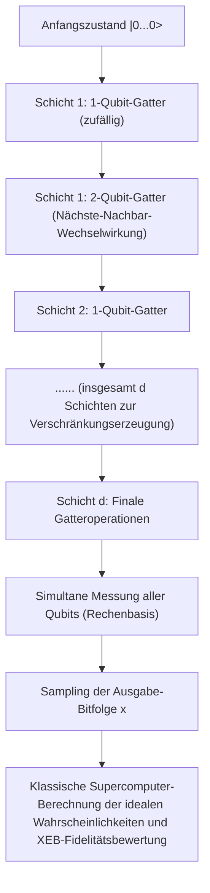

## 12.2 Das Missverständnis der „magischen Box“: Die Falle des parallelen Rechnens und BQP vs. NP

In der Berichterstattung allgemeiner Medien und in populärwissenschaftlichen Darstellungen über Quantencomputer finden sich immer wieder Schlagwörter wie: „Weil $2^n$ Zustände gleichzeitig berechnet werden können, lässt sich jedes Problem im Handumdrehen lösen.“ Aus Sicht der theoretischen Informatik und der Berechnungskomplexitätstheorie ist diese Vorstellung jedoch grundlegend falsch. Ein Quantencomputer ist keineswegs ein Zauberstab, der NP-vollständige Probleme („NP-Complete“) bedingungslos in polynomieller Zeit lösen könnte.

Dieses Missverständnis rührt von der quantenmechanischen Parallelität her: Präpariert man beispielsweise durch Hadamard-Gatter eine gleichmäßige Superposition aller Basiszustände $ |\psi\rangle = \frac{1}{\sqrt{2^n}} \sum_{x=0}^{2^n-1} |x\rangle $, so kann eine Funktion für sämtliche Eingaben scheinbar „in einer einzigen Operation“ ausgewertet werden. Wendet man einen Orakel-Operator (einen unitären Operator, der die Auswertung realisiert) **$U_f$** auf diesen Überlagerungszustand an, entwickelt sich das Gesamtsystem aufgrund der Linearität der Quantenmechanik wie folgt:

$$
U_f \left( \frac{1}{\sqrt{2^n}} \sum_{x=0}^{2^n-1} |x\rangle \otimes |0\rangle \right) = \frac{1}{\sqrt{2^n}} \sum_{x=0}^{2^n-1} |x\rangle \otimes |f(x)\rangle
$$

Zweifellos enthält dieser Zustandsvektor die Funktionswerte $f(x)$ für alle Eingaben $x$ als Komponenten innerhalb der Wahrscheinlichkeitsamplituden. Doch hier greift das fundamentale **Messpostulat der Quantenmechanik** (der Kollaps der Wellenfunktion): Führt man eine Messung am Ausgaberegister durch, erhält man mit der gleichmäßigen Wahrscheinlichkeit $\frac{1}{2^n}$ lediglich ein einziges, rein zufällig ausgewähltes Wertepaar $ (x, f(x)) $. Die verbleibenden $ 2^n - 1 $ Informationen werden durch die irreversible projektive Messung unwiderruflich zerstört. Es klafft somit eine unüberbrückbare fundamentale Kluft zwischen der „parallelen Berechnung (unitäre Zustandsentwicklung)“ und dem „Auslesen der tatsächlich gesuchten Information aus den parallel berechneten Ergebnissen (Zustandsmessung)“.

Damit ein Quantenalgorithmus klassische Algorithmen echt überflügeln kann, reicht bloße Quantenparallelität nicht aus – es bedarf des gezielten und raffinierten Einsatzes von „Quanteninterferenz (Quantum Interference)“. Man muss eine hochspezialisierte globale unitäre Transformation so konstruieren, dass die Wahrscheinlichkeitsamplitude des gesuchten Zielzustands durch konstruktive Interferenz (Constructive interference) verstärkt wird, während sich die unzähligen Amplituden der falschen Lösungen durch Phasenumkehr und destruktive Interferenz (Destructive interference) gegenseitig auslöschen.

Unter dieser Restriktion wird die Komplexitätsklasse der Probleme, die ein Quantencomputer in polynomieller Zeit mit einer beschränkten, signifikant hohen Erfolgswahrscheinlichkeit lösen kann, als **BQP** (Bounded-error Quantum Polynomial time) bezeichnet. Demgegenüber steht die Klasse **NP** , deren Problemlösungen, wenn sie vorgelegt werden, in klassischer polynomieller Zeit verifiziert werden können. Die härtesten Probleme innerhalb dieser Klasse bilden die **NP-vollständigen Probleme** (wie das Problem des Handlungsreisenden oder das Erfüllbarkeitsproblem der Aussagenlogik, SAT).

Der Grover-Algorithmus (Grover's algorithm) beschleunigt die Suche in einer unstrukturierten Datenbank mit $ N = 2^n $ Elementen von klassisch $ O(N) $ auf quantenmechanisch $ O(\sqrt{N}) $ – eine quadratische Beschleunigung. Betrachtet man die mathematische Formulierung der Amplitudenverstärkung (Amplitude Amplification), so lässt sich der Algorithmus als geometrische Rotation des Zustandsvektors in einem zweidimensionalen Unterraum (einer Ebene) interpretieren, der durch den anfänglichen gleichmäßigen Überlagerungszustand $ |s\rangle $ und den gesuchten Zielzustand $ |\omega\rangle $ aufgespannt wird.

Der Grover-Iterationsoperator **$G$** ist definiert als das Produkt des Orakel-Phasenumkehroperators für den Zielzustand $ U_\omega = I - 2|\omega\rangle\langle\omega| $ und des Inversionsoperators um den Mittelwert $ U_s = 2|s\rangle\langle s| - I $:

$$
G = U_s U_\omega = (2|s\rangle\langle s| - I)(I - 2|\omega\rangle\langle\omega|)
$$

Indem man diesen unitären Operator **$G$** etwa $ \frac{\pi}{4}\sqrt{N} $ mal anwendet, rotiert der Zustandsvektor zielgerichtet auf den Zustand $ |\omega\rangle $ zu, sodass die Wahrscheinlichkeit, die korrekte Lösung zu messen, nahe an 1 (100 %) herangeführt wird. Entscheidend ist hierbei jedoch: Es handelt sich lediglich um eine quadratische Beschleunigung (einen Polynomialzeit-Gewinn um die Quadratwurzel) und keineswegs um eine exponentielle Beschleunigung ($ O(2^n) \to O(\text{poly}(n)) $). Bis heute ist kein Quanteninterferenzmuster bekannt, das allgemeine Instanzen NP-vollständiger Probleme in polynomieller Zeit lösen könnte. In der theoretischen Informatik und Quanteninformationswissenschaft gilt die grundlegende Vermutung **$\text{BQP} \not\supset \text{NP-Complete}$** (Quantencomputer können NP-vollständige Probleme nicht effizient lösen) als weithin akzeptierter Konsens.

Quantencomputer sind mithin hochspezialisierte, elegante Koprozessoren: Sie entfalten eine superpolynomielle oder exponentielle Beschleunigung – wie bei Shors Algorithmus zur Primfaktorzerlegung mittels der Quanten-Fouriertransformation (QFT) – ausschließlich dann, wenn das Problem eine verborgene algebraische Struktur wie etwa Periodizität aufweist.

## 12.3 Quantenfehlerkorrektur und die Roadmap von NISQ zu FTQC

Auch wenn die Quantenüberlegenheit demonstriert wurde: Heutige Prozessoren mit einigen Dutzend bis Hunderten von Qubits, wie Sycamore, gehören zur Klasse der **NISQ** -Geräte (Noisy Intermediate-Scale Quantum) und können Umgebungseinflüsse und Rauschen nicht vollständig abschirmen. Fragile Quantenzustände unterliegen durch thermische Fluktuationen und elektromagnetische Störungen extrem leicht der Dekohärenz (beschränkt durch die transversale Dephasierungszeit $T_2$ und die longitudinale Energierelaxationszeit $T_1$). Mit zunehmender Schaltkreistiefe (steigender Zahl an Gatterschichten) akkumulieren sich Gatterungenauigkeiten und Dekohärenzeffekte exponentiell, bis das Endergebnis der Messung zu einem völlig unbrauchbaren, maximal gemischten Zustand zerfällt.

Der einzige theoretische Weg, um diese physikalische Hürde zu überwinden und praktisch relevante Quantenalgorithmen mit Hunderten Millionen von Rechenoperationen auszuführen, ist die Realisierung von **fehlertolerantem Quantencomputing (Fault-Tolerant Quantum Computation, FTQC)** unter Einsatz von **Quantenfehlerkorrektur (Quantum Error Correction, QEC)** . Klassische Fehlerkorrekturverfahren (wie Mehrheitsentscheidungen durch redundantes Kopieren von Bits) lassen sich jedoch aufgrund des fundamentalen „No-Cloning-Theorems“ der Quantenmechanik nicht auf Quantenzustände anwenden: Es existiert keine unitäre Transformation, die einen unbekannten Quantenzustand **$|\psi\rangle = \alpha|0\rangle + \beta|1\rangle$** perfekt auf **$|\psi\rangle \otimes |\psi\rangle \otimes |\psi\rangle$** kopieren könnte.

Die theoretische Physik fand jedoch einen eleganten Ausweg aus diesem Dilemma: Quanteninformation lässt sich schützen, indem man sie nicht durch Vervielfältigung einzelner Zustände sichert, sondern indem ein einzelnes logisches Qubit nichtlokal über die Topologie eines hochgradig verschränkten Zustandsraums vieler physikalischer Qubits verteilt und darin verborgen wird. Der aus Sicht der experimentellen Implementierung derzeit vielversprechendste Ansatz ist der sogenannte „Surface Code“ (Oberflächencode), der auf dem Stabilisator-Formalismus (Stabilizer Formalism) auf einem zweidimensionalen Gitter basiert.

Beim Surface Code werden die eigentlichen Informationsträger, die „Daten-Qubits“, auf den Kanten eines 2D-Gitters platziert, während Hilfsqubits zur Fehlerdetektion („Syndrom-Mess-Qubits“ bzw. Ancilla-Qubits) auf den Plaquetten (Flächen) und Knoten (Vertizes) des Gitters angeordnet sind. Über Tensorprodukte von Pauli-Operatoren werden sodann Gruppen von Stabilisator-Operatoren definiert:

$$
B_p = \bigotimes_{i \in \partial p} Z_i \quad \text{(Plaquetten-Operator: detektiert Z-Fehler)}
$$

$$
A_v = \bigotimes_{i \in \delta v} X_i \quad \text{(Vertex-Operator: detektiert X-Fehler)}
$$

Hierbei kommutieren alle Operatoren $ B_p $ und $ A_v $ paarweise miteinander (sie antikommutieren nicht), erfüllen also die Vertauschungsrelation $ [B_p, A_v] = 0 $. Der kodierte „logische Zustand (Coderaum)“ **$|\psi_L\rangle$** ist streng als derjenige gemeinsame Unterraum definiert, für den sämtliche Stabilisatoren den Eigenwert $+1$ aufweisen:

$$
B_p |\psi_L\rangle = +1 |\psi_L\rangle, \quad A_v |\psi_L\rangle = +1 |\psi_L\rangle \quad (\text{für alle } p, v)
$$

Tritt nun infolge thermischen Rauschens oder unvollkommener Gatteroperationen an einem physikalischen Qubit ein unerwarteter Bit-Flip-Fehler (Pauli-$X$) oder ein Phasen-Flip-Fehler (Pauli-$Z$) auf, so antikommutiert dieser Fehleroperator mit den benachbarten Stabilisatoren ($ \{X, Z\} = 0 $). Dies hat zur Folge, dass der Messwert (das Fehlersyndrom) dieser Stabilisatoren von $+1$ auf $-1$ umschlägt. Indem man fortlaufend diese Defektpaare mit dem Messwert $-1$ detektiert, kann man den Ort und die Art der Fehler lokalisieren, ohne den geschützten logischen Zustand selbst (die Amplituden $\alpha, \beta$) jemals direkt zu beobachten oder zu zerstören. Mithilfe klassischer Dekodierungsalgorithmen wie dem Minimum-Weight-Perfect-Matching (MWPM) wird anschließend rekonstruiert, welche Kette physikalischer Fehler am wahrscheinlichsten vorliegt, woraufhin die Korrektur softwareseitig im Tracking nachgeführt oder physikalisch vorgenommen wird.

Das berühmte Schwellenwertsatz-Theorem („Threshold Theorem“) der Quanteninformationstheorie besagt: Sofern die Fehlerrate der einzelnen physikalischen Gatter unterhalb einer kritischen Schwelle liegt (beim Surface Code typischerweise bei etwa $ 1\% $), lässt sich die effektive logische Fehlerrate durch Vergrößerung des Gitters (Erhöhung der Codedistanz $d$) beliebig und exponentiell gegen null drücken. Aufgrund des enormen Redundanz-Overheads erfordert die Realisierung eines einzigen fehlerkorrigierten logischen Qubits beim gegenwärtigen Rauschniveau jedoch Tausende bis Zehntausende physikalische Qubits. Für das Brechen von RSA-2048 mittels Shors Algorithmus werden mehrere Tausend logische Qubits veranschlagt – was in Summe den Bau eines FTQC-Giganten mit mehreren Millionen bis zu über zehn Millionen kohärent gekoppelter, im Millikelvin-Bereich betriebener physikalischer Qubits erfordert.

Vom heutigen Stand von einigen Dutzend bis Hunderten physikalischer Qubits aus betrachtet, stellt dies eine ingenieurtechnische Großherausforderung für die Menschheit dar, die dem Apollo-Mondlandeprogramm oder dem Bau des Large Hadron Collider (LHC) in nichts nachsteht.

## 12.4 Fazit und Ausblick: Der Horizont der Quanteninformationswissenschaft

Ausgehend von Kapitel 1 mit der Einführung der Bra-Ket-Notation und der Superposition der Basiszustände **$|0\rangle$** und **$|1\rangle$** , über die unitäre Zeitentwicklung, die mathematische Beschreibung von Vielteilchensystemen via Tensorprodukte, den Zusammenbruch von Einsteins lokalem Realismus durch die Bellsche Ungleichung bis hin zu den eleganten Konstruktionen der Quantenalgorithmen von Shor und Grover: Im Verlauf dieser 12 Kapitel haben wir das monumentale Lehrgebäude der Quanteninformationswissenschaft mit mathematischer Strenge durchmessen.

Während klassische Rechenmaschinen auf deterministischen Wahrheitswerten und der Booleschen Algebra beruhen, fundiert der Quantencomputer auf unitären Rotationen und Tensorprodukten in komplexen Hilberträumen – der linearen Algebra. Dieser fundamentale Paradigmenwechsel geht weit über den rein pragmatischen Aspekt schnellerer Rechenzeiten hinaus: Er konfrontiert uns mit tiefgreifenden epistemologischen Fragen an der Schnittstelle von Informationstheorie und Grundlagenphysik: „Was ist die ultimative Grenze der Informationsverarbeitung in unserem Universum?“ und „Inwiefern hängen Berechenbarkeit und Komplexität von den physikalischen Naturgesetzen des Kosmos ab, in dem wir leben?“.

Jene Quantenverschränkung (Entanglement), die Albert Einstein einst als „spukhafte Fernwirkung“ (spooky action at a distance) abtat, gilt heute als fundamentale und unersetzliche Ressource für Quantenteleportation, abhörsichere Quantenkryptographie und Quantenprozessoren. Die visionäre Intuition des genialen Physikers Richard Feynman aus dem Jahr 1982 – „Wenn man die Natur simulieren will, sollte man das besser quantenmechanisch tun, und beim Himmel, das ist ein wunderbares Problem, denn es sieht nicht so einfach aus“ – ist durch die jahrzehntelange, unermüdliche Arbeit von Physikern, Mathematikern, Informatikern und herausragenden Ingenieuren weltweit Realität geworden: Quantensimulationen laufen heute auf real existierenden Prozessoren.

Es sei nochmals betont: Quantencomputer sind keine allmächtigen magischen Boxen. Sie sind keine Traummaschinen, die beliebig schwierige NP-vollständige Probleme durch rohe Gewalt in polynomieller Zeit lösen. Doch in spezifischen Domänen, die sich den Möglichkeiten klassischer Höchstleistungsrechner entziehen – wie der exakten Simulation komplexer elektronischer Zustände in der Quantenchemie, der Aufklärung von Mechanismen in der Hochtemperatursupraleitung und Materialwissenschaft, bestimmten Optimierungsklassen sowie zahlentheoretischen Problemen wie der Primfaktorzerlegung und dem diskreten Logarithmus – besitzen sie eine unbestreitbare, überlegene („Supremacy“) Kraft.

Der jahrzehntelange Kampf gegen das Rauschen – der beschwerliche Weg von NISQ zu FTQC – wird keineswegs leicht sein. Gewaltige ingenieurtechnische Barrieren gilt es zu bezwingen: die Beherrschung der enormen Wärmelasten in Kryostaten bei extrem niedrigen Temperaturen, das Skalierungsproblem von Millionen Mikrowellen-Steuerleitungen, die drastische Steigerung der Qubit-Kohärenzzeiten ($T_1, T_2$) sowie die Entwicklung hybrider klassisch-quantenmechanischer Kontrollsysteme zur Verarbeitung gigantischer Syndrom-Messdatenströme in Echtzeit. Doch am Ziel dieses Weges steht nichts Geringeres als die Geburt des ultimativen Rechenparadigmas der Menschheitsgeschichte: eine Technologie, welche die Dynamik der Naturgesetze – die Schrödinger-Gleichung selbst – unmittelbar abbildet, manipuliert und als Berechnungswerkzeug nutzbar macht.

Wenn diese Serie dazu beitragen konnte, abseits oberflächlicher Schlagworte und überzogener Heilserwartungen das wahre Wesen der Quantencomputer sowie ihre faszinierende, mathematisch strenge Eleganz zu vermitteln, so gäbe es für mich als Autor keine größere Freude. Die Quantenwelt ist unendlich viel tiefer, seltsamer und überwältigender als unsere alltägliche Intuition. Wir stehen erst am Eingang der aufregendsten wissenschaftlich-technologischen Grenze der Menschheitsgeschichte. Diese großartige intellektuelle Reise zur Erforschung der Wahrheit unseres Universums hat gerade erst begonnen.

---
 **Die Serie „Prinzipien von Quantencomputern“ (12 Kapitel) – Ende** 