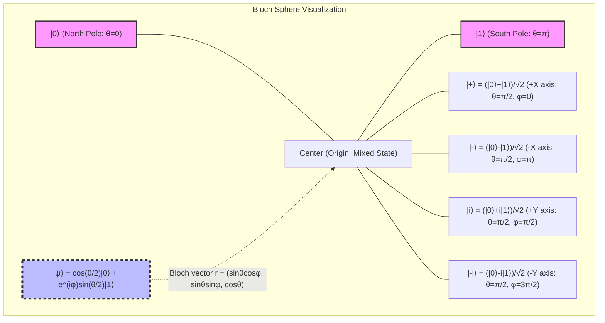
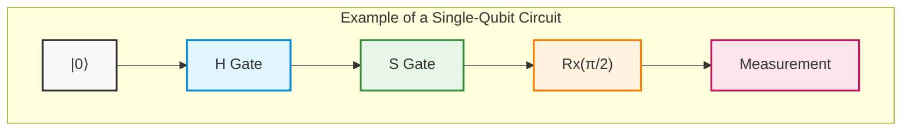
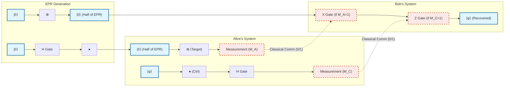
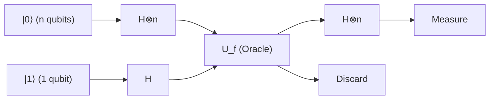
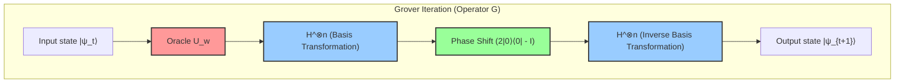
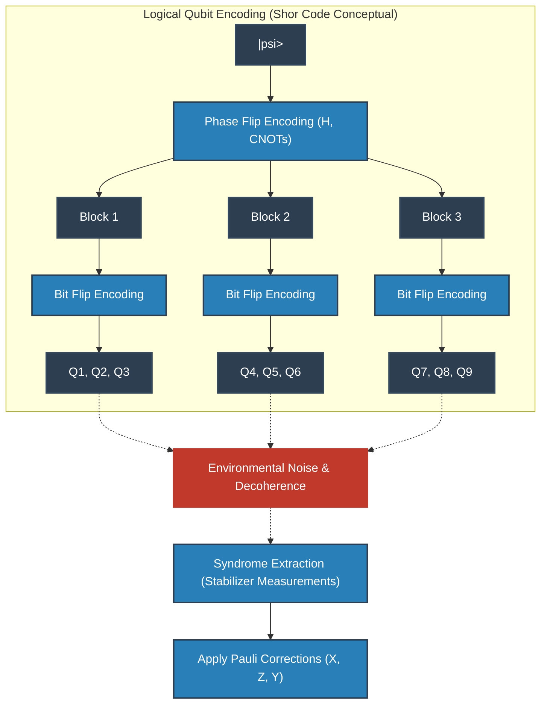
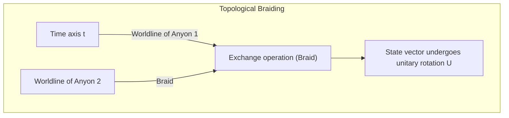
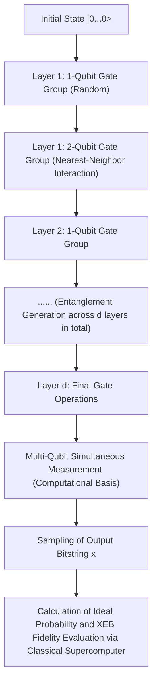

# Chapter 1: The Dawn and Limits of Quantum Computing

## 1.1 Physical Limits of Classical Computing and the End of Moore's Law

The dramatic advancement of information processing technology in modern society has been propelled by Gordon Moore's 1965 empirical observation: "the number of transistors packed onto a semiconductor integrated circuit doubles approximately every two years"—commonly known as "Moore's Law." Guided by this principle, the relentless miniaturization (scaling) of transistors has driven an exponential increase in computational performance. Entering the 21st century, however, this classical paradigm has run headlong into insurmountable physical limits. The most formidable barrier is the manifestation of a quantum mechanical phenomenon: the "Quantum Tunneling Effect."

When a transistor's gate dielectric film and channel length shrink to a scale of several nanometers—equivalent to a thickness of merely a few to several dozen atoms—electrons can probabilistically penetrate energy barriers that are insurmountable under classical mechanics, due to the leakage of their wavefunctions. For an electron of mass $m$ and energy $E < V_0$ incident upon a region with potential barrier $V_0$ and width $a$ , the transmission probability $T$ is given by the WKB approximation as:

$$

T \approx \exp \left( - \frac{2}{\hbar} \int_{0}^{a} \sqrt{2m(V_0 - E)} \, dx \right)

$$

Here, $\hbar$ is the reduced Planck constant. As miniaturization reduces the barrier width $a$ , the transmission probability $T$ increases exponentially. Consequently, "leakage current" flowing even in the off-state reaches a non-negligible magnitude. This triggers increased power dissipation and thermal load, signifying the operational collapse of the transistor as a classical deterministic switching device.

Furthermore, the thermodynamic constraints of information processing cannot be disregarded. In 1961, Rolf Landauer demonstrated that heat dissipation is inevitable whenever information is erased (i.e., during irreversible logical operations)—a principle known as Landauer's Principle. The minimum quantity of heat $\Delta Q$ released into the environment when erasing 1 bit of information is expressed as:

$$

\Delta Q \ge k_B T \ln 2

$$

Here, $k_B$ is the Boltzmann constant and $T$ is the absolute temperature. As long as classical computers rely on irreversible logic gates (such as AND and OR gates), this thermodynamic lower bound cannot be circumvented. As fabrication continues to scale down and the energy consumed per switching event approaches this fundamental limit, the advancement of classical computing hits a ceiling imposed by the laws of physics.

## 1.2 Richard Feynman's Foresight and the Computational Complexity Explosion of Quantum Systems

As classical computing approached these physical limits, the demand emerged for an entirely new computing paradigm. The catalyst was Richard Feynman's keynote address at the "First Conference on the Physics of Computation" held at MIT in 1981. Feynman highlighted the profound impossibility of simulating quantum mechanical systems on classical computers and made a revolutionary proposal:

"Nature isn't classical, dammit, and if you want to make a simulation of nature, you'd better make it quantum mechanical!"

Underlying this insight is the fact that the dimensionality of the "Hilbert space" describing quantum states explodes exponentially with the number of particles. Consider an ensemble of $N$ spin- $1/2$ particles (i.e., two-level quantum systems). The state of a single particle is described by a 2-dimensional complex vector space $\mathbb{C}^2$ . Thus, the state space $\mathcal{H}$ of a composite system of $N$ particles is constructed as the tensor product of the individual state spaces:

$$

\mathcal{H} = \bigotimes_{i=1}^{N} \mathbb{C}^2 = \mathbb{C}^{2^N}

$$

A pure state $|\Psi\rangle$ of this system is represented as a linear combination (superposition) of $2^N$ basis vectors. Utilizing Dirac's bra-ket notation, an arbitrary quantum state can be expanded as:

$$

|\Psi\rangle = \sum_{x=0}^{2^N-1} c_x |x\rangle

$$

Here, $|x\rangle$ denotes the computational basis states, and $c_x \in \mathbb{C}$ are complex numbers termed probability amplitudes. The state vector must satisfy the normalization condition $\sum_{x=0}^{2^N-1} |c_x|^2 = 1$ .

To simulate a system of merely $N = 300$ quantum bits (qubits), one would need to keep track of $2^{300} \approx 10^{90}$ complex numbers—a number that vastly outstrips the estimated total number of atoms in the observable universe (approximately $10^{80}$ ). Storing this colossal set of variables in classical memory and calculating their time evolution under the Schrödinger equation (multiplication by a $2^N \times 2^N$ unitary matrix) is impossible even across the lifetime of the universe. This "curse of dimensionality" defines the fundamental ceiling of classical computing, while simultaneously serving as the wellspring of the latent computational power of quantum computers.

## 1.3 David Deutsch and the Formulation of the Quantum Turing Machine

It was David Deutsch, a physicist at the University of Oxford, who rigorously formalized Feynman's intuitive vision within theoretical computer science. In his groundbreaking 1985 paper, Deutsch pointed out that the "Strong Church-Turing Thesis"—which asserts that any physical process can be efficiently simulated by a probabilistic Turing machine—might not hold in a physical universe governed by quantum mechanics.

Deutsch extended Alan Turing's deterministic model to formulate the concept of the "Quantum Turing Machine" (QTM). In this machine, internal states, tape symbols, and head positions can exist in quantum superpositions, with state transitions governed by unitary operators $U$ .

The foundational unit of quantum computation is the "quantum bit" or "qubit." Whereas a classical bit is restricted to the definite states $0$ or $1$ , a qubit can exist in an arbitrary linear superposition of $|0\rangle$ and $|1\rangle$ :

$$

|\psi\rangle = \alpha |0\rangle + \beta |1\rangle \quad (\alpha, \beta \in \mathbb{C}, \ |\alpha|^2 + |\beta|^2 = 1)

$$

Operations executed on qubits are linear, norm-preserving operations represented by unitary matrices (matrices satisfying $U^\dagger U = I$ , where $U^\dagger$ is the conjugate transpose / adjoint matrix and $I$ is the identity matrix). For instance, the Hadamard gate $H$ , a quintessential single-qubit gate, is defined as:

$$

H = \frac{1}{\sqrt{2}} \begin{pmatrix} 1 & 1 \\ 1 & -1 \end{pmatrix}

$$

Applying the Hadamard transform to the basis state $|0\rangle$ yields:

$$

H |0\rangle = \frac{1}{\sqrt{2}} \left( |0\rangle + |1\rangle \right)

$$

This transitions the system into an equal superposition state in which $|0\rangle$ and $|1\rangle$ are observed with equal probability. Deutsch's crucial contribution was elevating these core principles of quantum mechanics into an abstract model of computation, proving mathematically that a Universal Quantum Computer is physically realizable in principle.

## 1.4 The Essence of Quantum Computing: Dispelling the Misconception of Pure "Massive Parallelism"

Why do quantum computers possess computational capabilities exceeding those of classical machines? A popular explanation frequently encountered is: "A quantum computer branches across countless parallel universes, computes all possibilities simultaneously, and instantly pulls out the correct solution." While this serves as a colorful metaphor for "quantum parallelism," it is ** an extremely misleading and inaccurate explanation ** .

To be sure, by applying Hadamard gates in parallel to an $N$ -qubit system, one can construct an equal superposition of all $2^N$ states in a single operation:

$$

H^{\otimes N} |0\rangle^{\otimes N} = \frac{1}{\sqrt{2^N}} \sum_{x=0}^{2^N-1} |x\rangle

$$

Then, evaluating a given function $f(x)$ via an applied unitary operator $U_f$ evolves the state to:

$$

U_f \left( \frac{1}{\sqrt{2^N}} \sum_{x=0}^{2^N-1} |x\rangle |0\rangle \right) = \frac{1}{\sqrt{2^N}} \sum_{x=0}^{2^N-1} |x\rangle |f(x)\rangle

$$

At this stage, it indeed seems as if the values of $f(x)$ for all $2^N$ inputs $x$ have been evaluated simultaneously in a single computational step. However, the foundational postulate of quantum mechanics—the "Born Rule" governing observation—presents an unavoidable barrier. When this superposition state is measured (observed), only a single outcome is acquired, as wavefunction collapse forces the state into a single random $|x\rangle |f(x)\rangle$ with probability $P(x) = 1/2^N$ . In other words, even if all solutions were computed simultaneously, measurement extracts nothing more than a single randomly selected candidate—no better than evaluating a single input chosen by rolling dice.

What, then, is the genuine source of power in quantum computing? It is ** "Quantum Interference" ** .

Because the probability amplitudes $c_x$ describing a quantum state are complex numbers rather than classical non-negative probabilities, they can assume positive, negative, or complex phase values. The true art of quantum algorithms lies in structuring unitary transformations so that ** "probability amplitudes corresponding to incorrect solutions cancel one another out through destructive interference, while probability amplitudes corresponding to the correct solution constructively interfere and amplify." **

As an elementary illustration, consider interference via phase inversion and a subsequent Hadamard transform. What happens when the Hadamard gate is applied once more to the state $\frac{1}{\sqrt{2}}(|0\rangle - |1\rangle)$ ?

$$

H \left( \frac{|0\rangle - |1\rangle}{\sqrt{2}} \right) = \frac{1}{2} \big( (|0\rangle + |1\rangle) - (|0\rangle - |1\rangle) \big) = \frac{1}{2} (2|1\rangle) = |1\rangle

$$

Here, the probability amplitude contributing to state $|0\rangle$ is $1/2 - 1/2 = 0$ , canceling out completely (destructive interference). Meanwhile, the amplitude contributing to state $|1\rangle$ is $1/2 + 1/2 = 1$ , undergoing amplification (constructive interference).

Practical quantum algorithms of true value (such as Shor's algorithm for prime factorization and Grover's algorithm for unstructured database searching) choreograph this wave interference through meticulously designed sequences of operations so that, upon final measurement, the probability of observing the correct solution approaches $1$ with high certainty. Massive parallelism by itself is not the source of quantum advantage; rather, the capability to harness the interference of complex probability amplitudes to probabilistically eliminate unwanted computational paths is the definitive difference from classical computation and the true essence of quantum computing.

## 1.5 Conceptual Visualization: The Mechanism of Quantum Interference

The diagram below highlights the conceptual distinction between a classical stochastic process and a quantum interference process (analogous to a Mach-Zehnder interferometer or repeated Hadamard gates). In a classical random walk, probabilities simply add together. In a quantum process, however, path amplitudes are summed as complex numbers, giving rise to interference effects.

```mermaid
graph TD
    classDef quantum fill:#e6f2ff,stroke:#0066cc,stroke-width:2px;
    classDef classical fill:#fff2e6,stroke:#cc6600,stroke-width:2px;
    classDef measure fill:#e6ffe6,stroke:#00cc00,stroke-width:2px;

    Start["Initial State |0⟩"]:::quantum

    subgraph "Quantum Superposition Generation"
        H1["Hadamard Gate (H)"]:::quantum
        SuperPos["1/√2 (|0⟩ + |1⟩)"]:::quantum
    end

    subgraph "Unitary Operation (Phase Manipulation via Oracle, etc.)"
        U_op["Phase Shift / Unitary Evolution (U)"]:::quantum
        PhaseState["1/√2 (|0⟩ - e^{iθ} |1⟩)"]:::quantum
    end

    subgraph "Quantum Interference Process (Core of Algorithm)"
        H2["Hadamard Gate (H)"]:::quantum
        Interference["Amplitude Cancellation and Amplification<br>(Constructive / Destructive)"]:::quantum
    end

    Result["Deterministic Output with Probability 1 (e.g., |1⟩)"]:::measure

    Start --> H1
    H1 --> SuperPos
    SuperPos --> U_op
    U_op --> PhaseState
    PhaseState --> H2
    H2 --> Interference
    Interference -->|Measurement (Observation)| Result
```

In this manner, quantum computing is not merely an incremental extension or workaround to postpone the classical limits of scaling and thermodynamics. Rather, it represents a genuine paradigm shift that reconstructs the very concepts of information and computation upon the foundational axioms of quantum mechanics. In the next chapter, we explore in depth the concrete mathematical machinery used to harness and steer quantum interference: quantum gates and quantum circuits.

# Chapter 2: Fundamentals of Classical Bits and Quantum Bits (Qubits)

In constructing the theoretical framework of quantum information, the most fundamental concept is the definition of the "elementary unit of information." In this chapter, starting from the bit in classical information theory, we extend the concept to the "quantum bit (qubit)," the elementary unit of quantum information founded upon the postulates of quantum mechanics. Using the rigorous language of Hilbert spaces, bra-ket notation, and linear algebra, we will thoroughly unravel the mathematical structure of quantum states. Without compromise, let us gaze into the profound depths of quantum information from an expert perspective.

## 2.1 The Elementary Unit of Information: Mathematical Formulation and Limitations of Classical Bits

In the history of computer science, the foundation of information theory established by Claude Shannon in 1948 is the "bit." Regardless of its physical realization (such as high or low voltages in transistors, on/off states of switches, or directions of magnetization), a classical bit is defined as a system whose abstract state space takes one of two discrete values, $\{0, 1\}$.

Let us express this in the more formal language of vector spaces. The state of a classical bit can be represented using the standard basis of the two-dimensional real vector space $\mathbb{R}^2$. We define state $0$ and state $1$ as the following column vectors:

$$

\mathbf{v}_0 = \begin{pmatrix} 1 \\ 0 \end{pmatrix}, \quad \mathbf{v}_1 = \begin{pmatrix} 0 \\ 1 \end{pmatrix}

$$

In a deterministic classical system, the state of a bit is always definitively either $\mathbf{v}_0$ or $\mathbf{v}_1$. However, when noise such as thermal fluctuations or uncertainty in our knowledge exists, it becomes necessary to describe the state as a classical probabilistic bit. In this case, the state of the bit is represented as a probability distribution, and the state vector $\mathbf{p}$ can be written as a convex combination of the basis vectors:

$$

\mathbf{p} = p_0 \mathbf{v}_0 + p_1 \mathbf{v}_1 = \begin{pmatrix} p_0 \\ p_1 \end{pmatrix}

$$

Here, $p_0$ and $p_1$ are real numbers representing the probabilities of being in state $0$ and state $1$, respectively. According to Kolmogorov's axioms of probability, they must satisfy the following conditions:

1. **Non-negativity** : $p_0 \ge 0, \quad p_1 \ge 0$
2. **Normalization condition (total probability equals 1)** : $p_0 + p_1 = 1$

In the realm of classical bits, a composite system formed by combining multiple bits is described by the tensor product (Kronecker product) of their respective probability vectors. For example, the joint probability vector of two classical bits is given by:

$$

\mathbf{p}_{AB} = \mathbf{p}_A \otimes \mathbf{p}_B = \begin{pmatrix} p_{A0} \\ p_{A1} \end{pmatrix} \otimes \begin{pmatrix} p_{B0} \\ p_{B1} \end{pmatrix} = \begin{pmatrix} p_{A0}p_{B0} \\ p_{A0}p_{B1} \\ p_{A1}p_{B0} \\ p_{A1}p_{B1} \end{pmatrix}

$$

While the framework of classical information theory is exceptionally powerful and serves as the bedrock of modern digital society, because states are constructed purely by adding real non-negative probabilities, it is fundamentally impossible to represent the cancellation of probabilities analogous to wave interference. Herein lies the limitation of classical physics and the necessity of the leap to quantum information.

## 2.2 Postulates of Quantum Mechanics and Bra-Ket Notation

The first postulate of quantum mechanics states that "the state of an isolated physical system is completely described by a unit vector (state vector) in a Hilbert space $\mathcal{H}$, which is a complete vector space equipped with a complex inner product." In the context of quantum computation, since continuous spatial degrees of freedom can be neglected, this Hilbert space is typically a finite-dimensional complex vector space $\mathbb{C}^d$.

The fundamental unit of quantum information, the "qubit," is rigorously defined as a state in a two-dimensional complex Hilbert space $\mathcal{H} \cong \mathbb{C}^2$. To describe states in this vector space, it is standard to use **bra-ket notation**, introduced by physicist Paul Dirac.

A column vector representing a quantum state is called a **ket vector** and is denoted as $|\psi\rangle$. Corresponding to the classical states $0$ and $1$, let us introduce an orthonormal basis called the computational basis. These are also referred to as the $Z$ basis of the qubit, and are defined respectively as $|0\rangle$ and $|1\rangle$:

$$

|0\rangle = \begin{pmatrix} 1 \\ 0 \end{pmatrix}, \quad |1\rangle = \begin{pmatrix} 0 \\ 1 \end{pmatrix}

$$

On the other hand, by the Riesz representation theorem, to any ket vector in a Hilbert space there uniquely corresponds an element of the dual space acting as a continuous linear functional. This is called a **bra vector** and is denoted as $\langle\psi|$. In matrix representation, taking the Hermitian conjugate (conjugate transpose, denoted by $^\dagger$) of a ket vector yields the corresponding bra vector:

$$

\langle\psi| = (|\psi\rangle)^\dagger = (|\psi\rangle^*)^T

$$

For example, the bra vectors of the computational basis are the following row vectors:

$$

\langle 0| = \begin{pmatrix} 1 & 0 \end{pmatrix}, \quad \langle 1| = \begin{pmatrix} 0 & 1 \end{pmatrix}

$$

The true power of bra-ket notation lies in how visually clear inner product calculations become. The inner product between a bra $\langle\phi|$ and a ket $|\psi\rangle$ is written as $\langle\phi|\psi\rangle$ (originating from Dirac's wordplay where "bra" and "ket" join together to form a "bracket"). Because the computational basis $\{|0\rangle, |1\rangle\}$ forms an orthonormal system, it is expressed using the Kronecker delta $\delta_{ij}$ as:

$$

\langle i | j \rangle = \delta_{ij} \quad (i, j \in \{0, 1\})

$$

Specifically, the inner product with itself is $1$ ($\langle 0|0\rangle = 1$, $\langle 1|1\rangle = 1$), and the inner product between distinct basis states is $0$ ($\langle 0|1\rangle = 0$, $\langle 1|0\rangle = 0$).

Furthermore, the tensor product of a ket and a bra (equivalent to an outer product) is written as $|\psi\rangle\langle\phi|$, which represents a linear operator (matrix) from the space to itself. For example, the projection operator onto a given state subspace is constructed as follows:

$$

|0\rangle\langle 0| = \begin{pmatrix} 1 \\ 0 \end{pmatrix} \begin{pmatrix} 1 & 0 \end{pmatrix} = \begin{pmatrix} 1 & 0 \\ 0 & 0 \end{pmatrix}

$$

The identity operator $I$ on any two-dimensional complex vector space can be resolved via the completeness relation of the basis as follows, which serves as an indispensable and powerful tool in quantum mechanical calculations:

$$

I = |0\rangle\langle 0| + |1\rangle\langle 1| = \begin{pmatrix} 1 & 0 \\ 0 & 1 \end{pmatrix}

$$

## 2.3 The Principle of Quantum Superposition and Complex Probability Amplitudes

Whereas a classical bit is always definitely in state $0$ or state $1$, or in a probabilistic mixture of the two, the linearity postulate of quantum mechanics allows a qubit to take on fundamentally distinct states known as "superpositions," expressed as linear combinations of $|0\rangle$ and $|1\rangle$. Any unit vector in the Hilbert space $\mathcal{H}$ is admissible as a valid physical state.

Therefore, the most general pure state $|\psi\rangle$ of a single qubit is expanded in the computational basis as:

$$

|\psi\rangle = \alpha |0\rangle + \beta |1\rangle = \begin{pmatrix} \alpha \\ \beta \end{pmatrix}

$$

Here, $\alpha$ and $\beta$ are complex numbers ($\alpha, \beta \in \mathbb{C}$) known as **complex probability amplitudes**. In contrast to classical probabilities being non-negative real numbers, the fact that quantum states possess "complex" coefficients is the fundamental reason quantum computers possess computational capabilities that surpass classical computers. Because complex numbers possess phase and can point in any direction on the complex plane, they can reinforce each other (constructive interference) or cancel each other out (destructive interference) like waves. The essence of quantum algorithms lies in skillfully manipulating these interference effects to amplify the probability amplitude of the correct answer and cancel out the probability amplitudes of incorrect answers.

The process of extracting classical information from a quantum system is "measurement." When considering projective measurement, according to the Born rule, the probability $P(0)$ of obtaining $0$ and the probability $P(1)$ of obtaining $1$ upon measuring state $|\psi\rangle$ in the computational basis $\{|0\rangle, |1\rangle\}$ are given by the squared absolute values of their respective probability amplitudes:

$$

P(0) = |\langle 0|\psi\rangle|^2 = |\alpha|^2 = \alpha \alpha^*

$$
$$

P(1) = |\langle 1|\psi\rangle|^2 = |\beta|^2 = \beta \beta^*

$$

For the system to always be observed in some definite state, the sum of all probabilities must strictly equal $1$. Therefore, the norm (length) of the quantum state vector $|\psi\rangle$ must always be $1$. This is the **normalization condition**:

$$

\langle\psi|\psi\rangle = (\alpha^* \langle 0| + \beta^* \langle 1|)(\alpha |0\rangle + \beta |1\rangle) = |\alpha|^2 + |\beta|^2 = 1

$$

To delve deeper into the geometric meaning of these complex probability amplitudes, let us express $\alpha$ and $\beta$ in polar coordinates:

$$

\alpha = r_0 e^{i\phi_0}, \quad \beta = r_1 e^{i\phi_1}

$$

Here, $r_0, r_1 \ge 0$ denote the magnitudes of the amplitudes, and $\phi_0, \phi_1 \in [0, 2\pi)$ are their respective phase angles. From the normalization condition $r_0^2 + r_1^2 = 1$, we can parameterize them using a real parameter $\theta \in [0, \pi]$ by setting $r_0 = \cos(\frac{\theta}{2})$ and $r_1 = \sin(\frac{\theta}{2})$. Substituting these into the original state vector yields:

$$

|\psi\rangle = \cos\left(\frac{\theta}{2}\right) e^{i\phi_0} |0\rangle + \sin\left(\frac{\theta}{2}\right) e^{i\phi_1} |1\rangle

$$

Let us factor out the common phase factor $e^{i\phi_0}$ from the entire expression:

$$

|\psi\rangle = e^{i\phi_0} \left( \cos\left(\frac{\theta}{2}\right) |0\rangle + e^{i(\phi_1 - \phi_0)} \sin\left(\frac{\theta}{2}\right) |1\rangle \right)

$$

In quantum mechanics, the phase factor $e^{i\phi_0}$ acting across the entire state vector is called the "global phase." As can be seen by calculating the expectation value $\langle A \rangle$ for any arbitrary observable (Hermitian operator) $A$:

$$

\langle A \rangle = \left( e^{-i\phi_0} \langle\psi| \right) A \left( e^{i\phi_0} |\psi\rangle \right) = e^{-i\phi_0} e^{i\phi_0} \langle\psi| A |\psi\rangle = \langle\psi| A |\psi\rangle

$$

Because global phases cancel each other out in this manner, it is impossible to observe them through any physical measurement. That is, although $|\psi\rangle$ and $e^{i\phi_0}|\psi\rangle$ are distinct vectors in Hilbert space (representing the same ray), physically they represent the exact same state.

Therefore, by ignoring the global phase and retaining only the relative phase $\varphi = \phi_1 - \phi_0$ (where $\varphi \in [0, 2\pi)$) between $|0\rangle$ and $|1\rangle$ as a parameter, any pure state of a single qubit can be uniquely and rigorously expressed in the following **canonical form**:

$$

|\psi\rangle = \cos\left(\frac{\theta}{2}\right) |0\rangle + e^{i\varphi} \sin\left(\frac{\theta}{2}\right) |1\rangle

$$

## 2.4 Geometric Visualization via the Bloch Sphere

The parameterization derived in the previous section demonstrates that the state space of a single qubit is geometrically isomorphic to the surface of a unit sphere in three-dimensional space (the 2-sphere $S^2$). This visual representation is called the **Bloch Sphere** after its inventor, Swiss physicist Felix Bloch.

The angle $\theta$ corresponds exactly to the polar angle measured from the positive direction of the $Z$-axis, and the angle $\varphi$ corresponds to the azimuthal angle in the $X$-$Y$ plane.



The most remarkable property of the Bloch sphere is that "orthogonal states in Hilbert space (states whose inner product is 0) are located at antipodal points (points 180 degrees opposite to each other) in the three-dimensional real space of the Bloch sphere." For example, the state orthogonal to $|0\rangle$ (North Pole, $\theta=0$) is $|1\rangle$ (South Pole, $\theta=\pi$). The inner product calculation $\langle 0 | 1 \rangle = 0$ between mutually orthogonal states in Hilbert space corresponds to an angular separation of $\pi$ (180 degrees) on the Bloch sphere. Because geometric angles are twice the angles in Hilbert space, there is a mathematical necessity for using the half-angle $\theta/2$ in the parameterization.

The coordinates $\mathbf{r} = (x, y, z)$ of this Bloch sphere are rigorously derived as the expectation values of the **Pauli matrices**, which are observables in quantum mechanics. The Pauli matrices, which form the basis for Hermitian operators on two-dimensional systems, are defined as follows:

$$

X = \sigma_x = \begin{pmatrix} 0 & 1 \\ 1 & 0 \end{pmatrix}, \quad
Y = \sigma_y = \begin{pmatrix} 0 & -i \\ i & 0 \end{pmatrix}, \quad
Z = \sigma_z = \begin{pmatrix} 1 & 0 \\ 0 & -1 \end{pmatrix}

$$

The expectation values of these Pauli observables for an arbitrary state $|\psi\rangle$ are determined through bra-ket calculations:

$$

x = \langle\psi| X |\psi\rangle = \left( \cos\frac{\theta}{2} \langle 0| + e^{-i\varphi}\sin\frac{\theta}{2} \langle 1| \right) \begin{pmatrix} 0 & 1 \\ 1 & 0 \end{pmatrix} \begin{pmatrix} \cos\frac{\theta}{2} \\ e^{i\varphi}\sin\frac{\theta}{2} \end{pmatrix} = \sin\theta \cos\varphi

$$
$$

y = \langle\psi| Y |\psi\rangle = \left( \cos\frac{\theta}{2} \langle 0| + e^{-i\varphi}\sin\frac{\theta}{2} \langle 1| \right) \begin{pmatrix} 0 & -i \\ i & 0 \end{pmatrix} \begin{pmatrix} \cos\frac{\theta}{2} \\ e^{i\varphi}\sin\frac{\theta}{2} \end{pmatrix} = \sin\theta \sin\varphi

$$
$$

z = \langle\psi| Z |\psi\rangle = \left( \cos\frac{\theta}{2} \langle 0| + e^{-i\varphi}\sin\frac{\theta}{2} \langle 1| \right) \begin{pmatrix} 1 & 0 \\ 0 & -1 \end{pmatrix} \begin{pmatrix} \cos\frac{\theta}{2} \\ e^{i\varphi}\sin\frac{\theta}{2} \end{pmatrix} = \cos^2\left(\frac{\theta}{2}\right) - \sin^2\left(\frac{\theta}{2}\right) = \cos\theta

$$

Through this, the Bloch vector $\mathbf{r} = (x, y, z)$ is elegantly represented as a unit vector in three-dimensional space: $\mathbf{r} = (\sin\theta\cos\varphi, \sin\theta\sin\varphi, \cos\theta)$. Furthermore, the density matrix $\rho = |\psi\rangle\langle\psi|$ corresponding to any pure state can be written extremely elegantly using the Pauli vector $\boldsymbol{\sigma} = (X, Y, Z)$ and the identity matrix $I$:

$$

\rho = \frac{1}{2} \left( I + \mathbf{r} \cdot \boldsymbol{\sigma} \right) = \frac{1}{2} \left( I + xX + yY + zZ \right)

$$

Expanding the matrix elements explicitly to verify:

$$

\rho = \frac{1}{2} \begin{pmatrix} 1 + z & x - iy \\ x + iy & 1 - z \end{pmatrix} = \begin{pmatrix} \cos^2(\frac{\theta}{2}) & e^{-i\varphi}\sin(\frac{\theta}{2})\cos(\frac{\theta}{2}) \\ e^{i\varphi}\sin(\frac{\theta}{2})\cos(\frac{\theta}{2}) & \sin^2(\frac{\theta}{2}) \end{pmatrix}

$$

This matches the result computed from the outer product $|\psi\rangle\langle\psi|$ by definition of the tensor product completely. What is noteworthy here is that for pure states, the norm of the Bloch vector is $|\mathbf{r}| = 1$, and the trace of the density matrix squared satisfies $\text{Tr}(\rho^2) = 1$. In contrast, for mixed states (Mixed state) where quantum information loss (decoherence) occurs due to interactions with the environment or imperfect control, the state becomes a statistical ensemble of pure states, so $|\mathbf{r}| < 1$. As a result, mixed states are represented as points inside the "interior" of the Bloch sphere rather than on its surface, and the maximally mixed state $\rho = I/2$, where information is completely lost, is positioned at the center point of the Bloch sphere, $\mathbf{r} = (0,0,0)$.

## 2.5 Measurement and Wavefunction Collapse

Measurement in quantum mechanics is fundamentally different from passive reading of information in classical mechanics. According to von Neumann's axiomatic formulation, when measuring a physical quantity (observable), the state collapses irreversibly into an eigenstate of that observable.

For example, consider performing a measurement in the $Z$ basis (that is, taking the Pauli $Z$ matrix as the observable) on the single-qubit state $|\psi\rangle = \alpha|0\rangle + \beta|1\rangle$. The only values that can be obtained as measurement outcomes are the eigenvalues of $Z$, which are $+1$ (corresponding to state $|0\rangle$) or $-1$ (corresponding to state $|1\rangle$).

To describe measurement mathematically rigorously, a set of projection operators $\{ P_m \}$ is used. The projection operators for a $Z$ measurement are as follows:

$$

P_0 = |0\rangle\langle 0|, \quad P_1 = |1\rangle\langle 1|

$$

These satisfy the completeness relation $P_0 + P_1 = I$ and orthogonality $P_i P_j = \delta_{ij} P_i$. According to the Born rule, the probability $P(m)$ of obtaining measurement outcome $m \in \{0, 1\}$ is calculated as:

$$

P(m) = \langle\psi| P_m^\dagger P_m |\psi\rangle = \langle\psi| P_m |\psi\rangle

$$

which agrees completely with $|\alpha|^2$ and $|\beta|^2$ from before. Most importantly, the new quantum state $|\psi'\rangle$ immediately after obtaining measurement outcome $m$ is obtained by applying the projection operator to the original state and renormalizing it with the new norm:

$$

|\psi'\rangle = \frac{P_m |\psi\rangle}{\sqrt{P(m)}}

$$

If the outcome was $0$:

$$

|\psi'\rangle = \frac{|0\rangle\langle 0| (\alpha|0\rangle + \beta|1\rangle)}{|\alpha|} = \frac{\alpha}{|\alpha|} |0\rangle = e^{i\phi_0} |0\rangle \equiv |0\rangle

$$

and the state collapses completely into $|0\rangle$ (the global phase is ignored). This is the mathematical description of the phenomenon known as wavefunction collapse. Once a measurement is performed and the state collapses, the relative phase $\varphi$ and amplitude information ($\alpha, \beta$) contained in the original superposition state are lost forever. Therefore, it is fundamentally impossible to read out complete information about a quantum state from a single measurement on a single copy (which is also deeply connected to the "No-Cloning Theorem").

## 2.6 Introduction to Multi-Particle Extensions and Outlook for the Next Chapter

Having deeply understood the properties of a single qubit, we also touch upon the mathematical foundations of "multi-qubit systems," which will be treated in earnest in subsequent chapters. Whereas classical probability distributions extend the state space via Cartesian products, the Hilbert space $\mathcal{H}_{AB}$ of a composite system in quantum mechanics is formed by the **tensor product** of the Hilbert spaces $\mathcal{H}_A$ and $\mathcal{H}_B$ of the respective subsystems:

$$

\mathcal{H}_{AB} = \mathcal{H}_A \otimes \mathcal{H}_B

$$

The tensor product of two independent qubit states expands as follows, forming a four-dimensional complex vector space:

$$

|\Psi\rangle_{AB} = (\alpha_0|0\rangle + \alpha_1|1\rangle) \otimes (\beta_0|0\rangle + \beta_1|1\rangle) = \alpha_0\beta_0|00\rangle + \alpha_0\beta_1|01\rangle + \alpha_1\beta_0|10\rangle + \alpha_1\beta_1|11\rangle

$$

Here, the existence of states that cannot be factorized into a tensor product of states (e.g., the Bell state $|\Phi^+\rangle = (|00\rangle + |11\rangle)/\sqrt{2}$) is the origin of quantum entanglement. The exponential explosion of dimensions via the tensor product ($2^N$ dimensions for $N$ qubits) is precisely the foundation that enables quantum computers to demonstrate overwhelming parallel computing power.

In this chapter, we established the fundamental differences between classical bits and qubits on the mathematical foundation of Hilbert spaces. Qubits are capable of taking continuous superposition states with complex probability amplitudes, and through the derivation of the Bloch sphere, we obtained a powerful method for intuitively understanding abstract complex vectors as geometric models in three-dimensional real space.

In the next chapter, "Chapter 3: Quantum Logic Gates and Unitary Transformations," we will elaborate on concrete "quantum logic gates" that manipulate these single-qubit states, and elucidate the mathematical properties of rotational operations by unitary matrices on the Bloch sphere. The door to the profound world of quantum information has only just begun to open.

# Chapter 3: Axioms of Quantum Mechanics and Observation (Wavefunction Collapse)

## 3.1 Introduction: Axiomatic Approach of Quantum Mechanics and the Requirements of Linear Algebra

To understand the operating principles of quantum computers from the ground up, it is essential to grasp the theoretical framework of physics known as quantum mechanics in a mathematically rigorous form. While many theories in physics have undergone inductive development based on empirical rules, quantum mechanics—particularly modern quantum mechanics formulated by John von Neumann—adopts an axiomatic approach that deduces the entire system from a small number of mathematical "Axioms".

This axiomatic system is constructed on the stage of complex linear algebra, extensible to infinite dimensions, known as Hilbert space. In quantum information science and quantum computing, we primarily deal with finite-dimensional vector spaces (for example, the tensor product space of $\mathbb{C}^2$ for qubit systems). This allows us to avoid the analytical difficulties of infinite dimensions (such as the domains of unbounded operators) and makes it possible to describe and understand quantum mechanics purely as linear algebra.

In this chapter, we will strictly formulate the processes ranging from the description of quantum states and time evolution to "observation," which has sparked the most philosophical debates, without any compromise. Readers will realize how seemingly counter-intuitive quantum phenomena are built upon a consistent and beautiful mathematical structure. This very mathematical structure serves as the direct "language" that describes quantum computer algorithms.

## 3.2 The First Axiom: State Space (Hilbert Space and State Vectors)

The first axiom in quantum mechanics determines how the "state" of a physical system is represented mathematically.

**Axiom 1 (Representation of States)**:
The state of a closed physical system is completely described by a unit vector with a norm of 1 in a Hilbert space $\mathcal{H}$, which is a complete complex inner product space. This is called a **state vector**.

According to the Bra-ket notation introduced by Paul Dirac, a state vector is treated as a column vector and is denoted as a ket ** $| \psi \rangle$ **. A row vector belonging to the dual space $\mathcal{H}^*$ is denoted as a bra ** $\langle \psi |$ **, and these are Hermitian conjugates (complex conjugate transposes) of each other. That is,

$$

\langle \psi | = ( | \psi \rangle )^\dagger

$$

The inner product of any two states ** $| \phi \rangle$ ** and ** $| \psi \rangle$ ** in the Hilbert space is calculated as the product of the bra and the ket ** $\langle \phi | \psi \rangle$ **, yielding a complex value. This inner product satisfies the following properties:

1. **Positive definiteness**: For any ** $| \psi \rangle \neq 0$ **, $\langle \psi | \psi \rangle > 0$
2. **Linearity**: $\langle \phi | ( c_1 | \psi_1 \rangle + c_2 | \psi_2 \rangle ) = c_1 \langle \phi | \psi_1 \rangle + c_2 \langle \phi | \psi_2 \rangle$
3. **Conjugate symmetry**: $\langle \phi | \psi \rangle = \langle \psi | \phi \rangle^*$ (where $*$ denotes the complex conjugate)

To establish a probabilistic interpretation, physical states must always satisfy the normalization condition. That is, the norm of the state vector ** $| \psi \rangle$ ** is 1.

$$

\| | \psi \rangle \| = \sqrt{\langle \psi | \psi \rangle} = 1

$$

Furthermore, since the Cauchy-Schwarz inequality $|\langle \phi | \psi \rangle|^2 \le \langle \phi | \phi \rangle \langle \psi | \psi \rangle$ holds, the absolute value of the inner product between normalized states always falls between 0 and 1. This becomes the mathematical foundation for later interpreting it as a "probability".

### Superposition Principle and Complete Orthonormal Basis

The most prominent feature of quantum mechanics is the "Superposition principle". If ** $| \phi \rangle$ ** and ** $| \psi \rangle$ ** are physically permissible states, then any complex linear combination of them $c_1 | \phi \rangle + c_2 | \psi \rangle$ is also a physically permissible state (once normalized). This property is directly derived from the linearity of Hilbert space.

In the Hilbert space $\mathcal{H}$, there exists an orthonormal basis $\{ | e_i \rangle \}$. These basis vectors are mutually orthogonal and normalized.

$$

\langle e_i | e_j \rangle = \delta_{ij}

$$

(where $\delta_{ij}$ is the Kronecker delta). Also, as the completeness relation or resolution of the identity, the identity operator $I$ can be expanded as follows:

$$

I = \sum_i | e_i \rangle \langle e_i |

$$

By applying this identity operator, any arbitrary quantum state ** $| \psi \rangle$ ** can be uniquely expanded as a linear combination of the basis vectors:

$$

| \psi \rangle = I | \psi \rangle = \left( \sum_i | e_i \rangle \langle e_i | \right) | \psi \rangle = \sum_i \langle e_i | \psi \rangle | e_i \rangle = \sum_i c_i | e_i \rangle

$$

Here, the expansion coefficients $c_i = \langle e_i | \psi \rangle$ are called complex probability amplitudes, and they play a decisive role in Born's rule, which will be discussed later. From the normalization condition $\langle \psi | \psi \rangle = 1$, it follows that $\sum_i |c_i|^2 = 1$.

## 3.3 The Second Axiom: Observables and Hermitian Operators

In classical mechanics, physical quantities (observables) such as position, momentum, and energy are described as real-valued functions. However, a fundamental paradigm shift occurs in quantum mechanics.

**Axiom 2 (Observables)**:
Observable physical quantities (observables) are described by linear self-adjoint operators (Hermitian operators) $A$ on the Hilbert space $\mathcal{H}$.

A Hermitian operator is an operator whose Hermitian conjugate is equal to itself. That is, it satisfies $A = A^\dagger$. When represented as a matrix in a finite-dimensional space, it means that its elements are complex conjugate symmetric ( $A_{ij} = A_{ji}^*$ ).

The reason observables must be defined as Hermitian operators lies in their "Eigenvalues". According to the spectral theorem of linear algebra, Hermitian operators have the following critically important properties:

1. **All eigenvalues $a_i$ are real numbers.** (Since observed physical quantities must always be real numbers, this matches the physical requirements.)
2. **Eigenvectors belonging to different eigenvalues are orthogonal to each other.**
3. **The eigenvectors $\{ | a_i \rangle \}$ of the operator form a complete orthonormal basis for the Hilbert space.**

Therefore, any observable $A$ can be subjected to a spectral decomposition as a linear combination of projection operators $P_i = | a_i \rangle \langle a_i |$, using its eigenvalues $a_i$ and eigenvectors ** $| a_i \rangle$ **:

$$

A = \sum_i a_i | a_i \rangle \langle a_i |

$$

Through this formulation, the act of "measuring a physical quantity" can be understood as a geometric operation of projecting onto a specific basis (eigenvectors) in the Hilbert space. For example, the $\sigma_z$ observation of a qubit is completely described as a projection operation onto an orthogonal basis consisting of the state ** $| 0 \rangle$ ** corresponding to the eigenvalue $+1$, and the state ** $| 1 \rangle$ ** corresponding to the eigenvalue $-1$.

## 3.4 The Third Axiom: Unitary Time Evolution and the Schrödinger Equation

When a quantum system is isolated and does not interact with other systems, its state changes deterministically and reversibly over time.

**Axiom 3 (Time Evolution)**:
The time evolution of the state of an isolated quantum system obeys the Schrödinger equation. Or, as an equivalent expression, the state ** $| \psi(t_0) \rangle$ ** at time $t_0$ evolves into the state ** $| \psi(t) \rangle$ ** at time $t$ by the action of a unitary operator $U(t, t_0)$.

The time-dependent Schrödinger equation, which is the fundamental equation describing time evolution, is expressed as follows:

$$

i\hbar \frac{d}{dt} | \psi(t) \rangle = H | \psi(t) \rangle

$$

Here, $i$ is the imaginary unit, $\hbar$ is the reduced Planck constant, and $H$ is the Hamiltonian operator, which is the observable corresponding to the total energy of the system.

If we consider a system where the Hamiltonian $H$ is independent of time (time-invariant), this differential equation can be formally integrated, and the solution is given as follows:

$$

| \psi(t) \rangle = \exp\left( -\frac{i}{\hbar} H (t - t_0) \right) | \psi(t_0) \rangle

$$

The operator $U(t, t_0) = \exp\left( -i H (t - t_0) / \hbar \right)$ represented by this exponential function is the time evolution operator. Since the Hamiltonian $H$ is Hermitian ( $H = H^\dagger$ ), by Stone's theorem, $U$ becomes a unitary operator. A unitary operator is an operator whose Hermitian conjugate equals its inverse ( $U^\dagger U = U U^\dagger = I$ ).

The extremely important physical significance of a unitary transformation is that it **"preserves the norm (length) and inner product of state vectors"**. That is, no matter how much time passes, $\langle \psi(t) | \psi(t) \rangle = \langle \psi(t_0) | U^\dagger U | \psi(t_0) \rangle = 1$ is always guaranteed, meaning the physical law that the sum of probabilities is 1 is never violated. The "quantum gates" of a quantum computer are nothing other than operations that artificially design and control this unitary time evolution. For example, the Hadamard gate and the CNOT gate are all represented as unitary matrices.

## 3.5 The Fourth Axiom: Observation and Born's Rule

The concept of "Measurement" in quantum mechanics fundamentally differs from classical physics. In classical systems, observation is considered a passive act of knowing a value without disturbing the state of the system. However, in quantum mechanics, observation actively intervenes in the state, bringing about an irreversible change.

**Axiom 4 (Observation and Born's Rule)**:
When an observation of an observable $A$ with spectral decomposition $A = \sum_i a_i P_i$ is performed on a system in state ** $| \psi \rangle$ **, the obtained measurement value is always one of the eigenvalues $a_i$ of $A$. The probability $p(a_k)$ of obtaining a specific eigenvalue $a_k$ is given according to Born's rule as follows:

$$

p(a_k) = \langle \psi | P_k | \psi \rangle = \| P_k | \psi \rangle \|^2

$$

If the eigenvalue $a_k$ is non-degenerate (meaning there is only one corresponding eigenvector ** $| a_k \rangle$ **), the projection operator is $P_k = | a_k \rangle \langle a_k |$, and the probability is calculated as the absolute square of the inner product of the state onto the eigenvector:

$$

p(a_k) = \langle \psi | a_k \rangle \langle a_k | \psi \rangle = | \langle a_k | \psi \rangle |^2

$$

This is precisely the absolute square $|c_k|^2$ of the coefficient $c_k = \langle a_k | \psi \rangle$ when the state vector ** $| \psi \rangle$ ** is expanded in the basis $\{ | a_i \rangle \}$. The complex probability amplitude $c_k$ itself cannot be directly observed, but its absolute square emerges as the observation probability in the real world. The insight of Max Born, who proposed this rule, is a monumental achievement that transformed physics from determinism to probability theory. The expected value $\langle A \rangle$ of the observable $A$ is calculated as the sum of the products of all eigenvalues and their appearance probabilities, and is ultimately expressed very beautifully in the form of an inner product involving the state vector:

$$

\langle A \rangle = \sum_i a_i p(a_i) = \sum_i a_i \langle \psi | P_i | \psi \rangle = \langle \psi | \left( \sum_i a_i P_i \right) | \psi \rangle = \langle \psi | A | \psi \rangle

$$

## 3.6 Wavefunction Collapse (State Reduction) and Decoherence via Observation

The axiom of observation contains a crucial step that has sparked the most debate: what happens to the state of the system "after" the observation. This is the phenomenon known as "Wavefunction collapse" or "State reduction". This process, known as von Neumann's Projection postulate, is formulated as follows:

**Projection Postulate**:
Immediately after obtaining the eigenvalue $a_k$ through observation, the state of the system ** $| \psi' \rangle$ ** instantaneously changes (collapses) into a state where the projection operator $P_k$ corresponding to the original state vector is applied, and then re-normalized:

$$

| \psi' \rangle = \frac{P_k | \psi \rangle}{\sqrt{p(a_k)}}

$$

If the observation apparatus is ideal and the system's state collapses to a non-degenerate eigenvalue $a_k$, the state immediately following the observation becomes exactly the eigenvector ** $| a_k \rangle$ ** itself. That is, if the exact same observation is repeated immediately afterward, $a_k$ will be obtained again with a probability of 1 (100%). This is called a "measurement of the first kind".

This "wavefunction collapse" possesses properties (discontinuous, probabilistic, irreversible) that explicitly contradict the unitary time evolution (continuous, deterministic, reversible) described by the Schrödinger equation. Quantum mechanics encapsulates a dualistic dynamics: the system evolves unitarily when it is isolated, and undergoes a non-unitary collapse the moment it comes into contact with a macroscopic observation apparatus.

### From Pure States to Mixed States: Introduction of the Density Operator

To gain a deeper understanding of the paradox of wavefunction collapse, the concept of a "Density operator" is essential. The state vector ** $| \psi \rangle$ ** we have dealt with so far is a "Pure state" that possesses maximum information about the system. The density operator for a pure state is defined as $\rho = | \psi \rangle \langle \psi |$.

On the other hand, if we do not know to which state the system collapsed during the observation process (or if we have lost that information), the system must be described as a classical probabilistic mixed state. For example, the density operator representing an ensemble of a system that has collapsed to the state ** $| a_k \rangle$ ** with probability $p(a_k)$ is as follows:

$$

\rho' = \sum_k p(a_k) | a_k \rangle \langle a_k |

$$

At this point, the off-diagonal components (interference terms) of $\rho = | \psi \rangle \langle \psi |$, which was in a pure state, completely vanish due to the act of observation. This loss of coherence is precisely the core of "Decoherence".

### Decoherence and the Emergence of Macroscopic Classicality

The observation apparatus is also part of a quantum system composed of numerous particles, and "entanglement" occurs when the quantum system interacts with a macroscopic environment (such as the observation apparatus or a thermal bath). When we trace out the degrees of freedom of the environment (Partial trace) to calculate the reduced density matrix of the target system alone, the state vector of the system, which was originally a pure state, rapidly transitions to a mixed state, and the phase coherence between the various components of the system is lost:

$$

\rho_{S} = \mathrm{Tr}_{E} [ | \Psi_{SE} \rangle \langle \Psi_{SE} | ]

$$

As a result, superposition disappears on a macroscopic scale, and the system appears to behave as a classical probabilistic mixture. Wavefunction collapse is by no means a failure of physical laws, but rather can be viewed as the dissipation of information due to irreversible interaction with the environment. Overcoming this decoherence has become humanity's greatest challenge in realizing fault-tolerant quantum computers.

### Dynamics of Quantum State Time Evolution and Observation

The diagram below visualizes the process where an initial state of a quantum system undergoes unitary time evolution and then probabilistically branches (collapses) into states due to observation. Note the contrast between Schrödinger's deterministic evolution and Born's probabilistic collapse:

```mermaid
graph TD
    classDef state fill:#f9f9f9,stroke:#333,stroke-width:2px;
    classDef operation fill:#e1f5fe,stroke:#0288d1,stroke-width:2px;
    classDef measure fill:#fce4ec,stroke:#c2185b,stroke-width:2px;
    
    Init["Initial state $| \psi(t_0) \rangle$"]:::state --> Evo["Unitary time evolution $U(t, t_0) = \exp(-i H t / \hbar)$"]:::operation
    Evo --> Evolved["Evolved state $| \psi(t) \rangle = U | \psi(t_0) \rangle$"]:::state
    
    Evolved --> Obs["Observation of observable $A$ (Projection operator $P_k$)"]:::measure
    
    Obs -->|Probability $p(a_1) = \langle \psi | P_1 | \psi \rangle$| State1["Collapsed state 1: $| a_1 \rangle$"]:::state
    Obs -->|Probability $p(a_2) = \langle \psi | P_2 | \psi \rangle$| State2["Collapsed state 2: $| a_2 \rangle$"]:::state
    Obs -->|...| StateN["Collapsed state n: $| a_n \rangle$"]:::state
    
    State1 --> Decoherence["Decoherence (loss of phase coherence) and mixing of states"]:::measure
    State2 --> Decoherence
    StateN --> Decoherence
```

In this way, the abstract concepts of linear algebra—vector spaces, inner products, Hermitian operators, eigenvalue problems, and unitary matrices—are not merely mathematical games, but rather an unparalleled language for precisely describing and predicting the finest behaviors of the universe. Quantum computer algorithms skillfully manipulate these two powerful rules, "Schrödinger's deterministic evolution" and "Born's probabilistic collapse," guiding us into realms of computation unattainable by classical computers.

# Chapter 4: Single-Qubit Gates and Unitary Transformations

At the foundation of quantum computation lies the precise manipulation of quantum states. While logic gates in classical computers (such as AND, OR, and NOT) irreversibly manipulate bit values, "quantum gates" in a quantum computer represent reversible time evolution governed by the Schrödinger equation, and are mathematically described rigorously as "unitary transformations (unitary matrices)" on a complex Hilbert space. In this chapter, we delve thoroughly and uncompromisingly into the mathematical structure, algebraic properties, and intuitive geometric meaning on the Bloch sphere of the fundamental quantum gates acting on a single qubit (a two-level system).

## 4.1 Postulates of Quantum Mechanics and the Inevitability of Unitary Matrices

The time evolution of a quantum system is governed by the Schrödinger equation below, using the Hamiltonian ** $H$ ** ( ** $H^\dagger = H$ ** ), which is the Hermitian operator characterizing the system:

$$

i\hbar \frac{d}{dt} |\psi(t)\rangle = H |\psi(t)\rangle

$$

Assuming a time-independent Hamiltonian ** $H$ **, the quantum state ** $|\psi(t)\rangle$ ** at any arbitrary time ** $t$ ** can be formally integrated from the initial state ** $|\psi(0)\rangle$ ** as follows:

$$

|\psi(t)\rangle = e^{-\frac{i}{\hbar}Ht} |\psi(0)\rangle

$$

We define the time-evolution operator appearing here as ** $U(t) = e^{-\frac{i}{\hbar}Ht}$ **. Since ** $H$ ** in the exponent is Hermitian, calculating the adjoint operator (Hermitian conjugate) ** $U(t)^\dagger$ ** of this operator ** $U(t)$ ** leads to the following crucial property:

$$

U(t)^\dagger U(t) = \left( e^{-\frac{i}{\hbar}Ht} \right)^\dagger e^{-\frac{i}{\hbar}Ht} = e^{\frac{i}{\hbar}H^\dagger t} e^{-\frac{i}{\hbar}Ht} = e^{\frac{i}{\hbar}Ht} e^{-\frac{i}{\hbar}Ht} = I

$$

Similarly, ** $U(t) U(t)^\dagger = I$ ** also holds. A matrix whose conjugate transpose is equal to its own inverse ( ** $U^\dagger = U^{-1}$ ** ) is called a "unitary matrix." A single-qubit gate is nothing other than a ** $2 \times 2$ ** unitary matrix implemented by an intentionally engineered Hamiltonian via physical control (such as irradiating microwave pulses with specific frequencies and durations).

The reason unitary matrices are absolutely indispensable in quantum mechanics is that they are the only linear transformations that mathematically guarantee "conservation of probability (conservation of norm)." Let us compute the inner product of the states after applying a unitary transformation ** $U$ ** to arbitrary quantum states ** $|\psi\rangle$ ** and ** $|\phi\rangle$ **:

$$

\langle \phi' | \psi' \rangle = ( \langle \phi | U^\dagger ) ( U |\psi\rangle ) = \langle \phi | U^\dagger U | \psi \rangle = \langle \phi | I | \psi \rangle = \langle \phi | \psi \rangle

$$

The conservation of the inner product implies that the norm squared of the state vector itself, ** $\langle \psi | \psi \rangle$ **, is also conserved. According to Born's rule in quantum mechanics, the sum of the squared magnitudes of the amplitudes of a state vector must equal the total probability of 1. Therefore, for the probabilistic interpretation not to break down under quantum gate operations, unitarity of the operation is an absolute prerequisite.

Furthermore, according to the spectral theorem, any unitary matrix ** $U$ ** can be written as ** $U = e^{iK}$ ** using a Hermitian matrix ** $K$ ** with real eigenvalues ** $\lambda_k$ **. The eigenvalues of a unitary matrix are always complex numbers with unit modulus (of the form ** $e^{i\theta}$ ** ), and its eigenvectors form an orthonormal, complete basis:

$$

U = \sum_{j=1}^{d} e^{i \theta_j} |\phi_j\rangle \langle \phi_j|

$$

This demonstrates that the action of a quantum gate can be completely decomposed into an operation that "imparts purely a phase rotation ** $e^{i\theta_j}$ ** onto specific orthonormal basis states ** $|\phi_j\rangle$ **."

## 4.2 Pauli Matrices and Fundamental Gates (X, Y, Z Gates)

To speak the language of quantum information, understanding the group of Pauli matrices is both unavoidable and paramount. Introduced in physics to describe the angular momentum of spin-1/2 particles, these matrices form the most fundamental set of orthogonal operations on a single qubit in quantum computing.

### 4.2.1 Pauli-X Gate (Bit-Flip Gate)

The Pauli-X gate is the quantum-mechanical generalization of the NOT gate in classical logic circuits. In Dirac bracket notation using an outer-product (projector) representation, it is defined as follows:

$$

X = \sigma_x = |0\rangle\langle 1| + |1\rangle\langle 0| = \begin{pmatrix} 0 & 1 \\ 1 & 0 \end{pmatrix}

$$

Verifying its action on the computational basis states ( ** $|0\rangle, |1\rangle$ ** ) explicitly through matrix multiplication:

$$

X |0\rangle = \begin{pmatrix} 0 & 1 \\ 1 & 0 \end{pmatrix} \begin{pmatrix} 1 \\ 0 \end{pmatrix} = \begin{pmatrix} 0 \\ 1 \end{pmatrix} = |1\rangle

$$
$$

X |1\rangle = \begin{pmatrix} 0 & 1 \\ 1 & 0 \end{pmatrix} \begin{pmatrix} 0 \\ 1 \end{pmatrix} = \begin{pmatrix} 1 \\ 0 \end{pmatrix} = |0\rangle

$$

Thus, it completely flips the amplitudes. Geometrically, this corresponds to a rotation by ** $\pi$ ** (180 degrees) about the X-axis on the Bloch sphere. The North Pole ( ** $|0\rangle$ ** ) is mapped to the South Pole ( ** $|1\rangle$ ** ), and the South Pole is mapped to the North Pole.

### 4.2.2 Pauli-Y Gate (Bit-and-Phase-Flip Gate)

The Pauli-Y gate simultaneously induces both a bit flip and a phase flip, additionally imparting a phase factor of the imaginary unit ** $i$ **. Its outer-product representation and matrix representation are as follows:

$$

Y = \sigma_y = -i|0\rangle\langle 1| + i|1\rangle\langle 0| = \begin{pmatrix} 0 & -i \\ i & 0 \end{pmatrix}

$$

Its action on the computational basis states is:

$$

Y |0\rangle = i|1\rangle, \quad Y |1\rangle = -i|0\rangle

$$

On the Bloch sphere, it represents a ** $\pi$ ** rotation about the Y-axis. The multiplication by the imaginary unit ** $i$ ** (that is, ** $e^{i\pi/2}$ ** ) signifies not merely a reversal, but a shift toward the orthogonal direction in the state's phase space.

### 4.2.3 Pauli-Z Gate (Phase-Flip Gate)

The Pauli-Z gate is a purely quantum "phase operation" that has no counterpart in classical logic. Without changing the magnitude of the amplitudes (measurement probabilities) whatsoever, it applies a phase shift of ** $-1$ ** (namely, ** $e^{i\pi}$ ** ) exclusively to the component of ** $|1\rangle$ **.

$$

Z = \sigma_z = |0\rangle\langle 0| - |1\rangle\langle 1| = \begin{pmatrix} 1 & 0 \\ 0 & -1 \end{pmatrix}

$$

Its action is trivially:

$$

Z |0\rangle = |0\rangle, \quad Z |1\rangle = -|1\rangle

$$

This corresponds to a ** $\pi$ ** rotation about the Z-axis. Since the computational basis states ** $|0\rangle, |1\rangle$ ** are eigenvectors of the Z matrix (with eigenvalues +1 and -1, respectively), applying the Z gate does not induce a transition between these basis states. However, when applied to a superposition state (e.g., ** $\alpha|0\rangle + \beta|1\rangle$ ** ), the relative phase is dramatically flipped to ** $\alpha|0\rangle - \beta|1\rangle$ **, decisively altering subsequent interference outcomes.

### 4.2.4 Profound Algebraic Structure of the Pauli Group

The Pauli matrix set ** $\{I, X, Y, Z\}$ ** forms an exceptionally elegant algebraic structure as linear operators on Hilbert space:

1. **Simultaneous Self-Adjointness (Hermiticity) and Unitarity**: ** $X = X^\dagger$ **, ** $Y = Y^\dagger$ **, ** $Z = Z^\dagger$ **, while simultaneously satisfying ** $X^\dagger X = I$ ** (i.e., ** $X = X^{-1}$ ** ). They possess the rare property of being physical observables while simultaneously serving as unitary generators of time evolution (quantum gates). Applying them twice consecutively returns to the identity transformation (involution: ** $X^2 = Y^2 = Z^2 = I$ ** ).
2. **Complete Anti-Commutation Relations**: Interchanging the order of multiplication between different Pauli matrices reverses their sign:

   $$

   \{X, Y\} = XY + YX = 0, \quad \{Y, Z\} = 0, \quad \{Z, X\} = 0

   $$

3. **Commutation Relations and Lie Algebra**: Using the commutator ** $[A, B] = AB - BA$ **, they clearly exhibit their structure as generators of the ** $SU(2)$ ** Lie algebra (using the completely antisymmetric Levi-Civita tensor ** $\epsilon_{jkl}$ ** ):

   $$

   [\sigma_j, \sigma_k] = 2i \sum_{l \in \{x,y,z\}} \epsilon_{jkl} \sigma_l

   $$

   Specifically, ** $XY = iZ$ **, ** $YZ = iX$ **, and ** $ZX = iY$ **. This algebraic structure provides the mathematical foundation for defining arbitrary rotation gates, as discussed later.

## 4.3 Hadamard Gate (H Gate): Creation of Quantum Superposition

In quantum algorithms (such as the Deutsch-Jozsa algorithm or Shor's algorithm), the Hadamard gate is applied almost without exception immediately after initialization. It plays the core role of transforming a deterministic state into an "equal superposition state," where all computational basis states appear with equal probability:

$$

H = \frac{1}{\sqrt{2}} \begin{pmatrix} 1 & 1 \\ 1 & -1 \end{pmatrix} = \frac{1}{\sqrt{2}} \left( |0\rangle\langle 0| + |0\rangle\langle 1| + |1\rangle\langle 0| - |1\rangle\langle 1| \right)

$$

Applying the Hadamard matrix to the computational basis states:

$$

H |0\rangle = \frac{1}{\sqrt{2}} \begin{pmatrix} 1 & 1 \\ 1 & -1 \end{pmatrix} \begin{pmatrix} 1 \\ 0 \end{pmatrix} = \frac{1}{\sqrt{2}} \begin{pmatrix} 1 \\ 1 \end{pmatrix} = \frac{|0\rangle + |1\rangle}{\sqrt{2}} \equiv |+\rangle

$$
$$

H |1\rangle = \frac{1}{\sqrt{2}} \begin{pmatrix} 1 & 1 \\ 1 & -1 \end{pmatrix} \begin{pmatrix} 0 \\ 1 \end{pmatrix} = \frac{1}{\sqrt{2}} \begin{pmatrix} 1 \\ -1 \end{pmatrix} = \frac{|0\rangle - |1\rangle}{\sqrt{2}} \equiv |-\rangle

$$

The generated states ** $|+\rangle$ ** and ** $|-\rangle$ ** are called the X-basis (or diagonal basis) and are the eigenstates of the Pauli-X matrix. Because the Hadamard matrix itself is real symmetric and orthogonal (a unitary matrix in real space), it satisfies ** $H = H^\dagger = H^{-1}$ ** and ** $H^2 = I$ **.
Consequently, ** $H |+\rangle = |0\rangle$ **, meaning it also functions to make a superposition state interfere back into a deterministic computational basis state.
Algebraically, the H gate is a unitary transformation that converts between the X-basis and the Z-basis. This can be expressed remarkably elegantly as matrix similarity transformations:

$$

H X H^\dagger = H X H = Z

$$
$$

H Z H^\dagger = H Z H = X

$$

By virtue of this property, sandwiching a "phase flip via a Z gate" between H gates allows one to synthesize a "bit flip via an X gate." Geometrically, the H gate corresponds to a ** $\pi$ ** rotation about the unit vector axis ** $\hat{n} = \frac{1}{\sqrt{2}}(\hat{x} + \hat{z})$ ** on the Bloch sphere.

## 4.4 Phase-Shift Gate Family: S Gate and T Gate

The family of arbitrary rotations about the Z-axis of the Bloch sphere, which generalizes the Pauli-Z gate, is known as phase-shift gates ** $P(\phi)$ ** (or ** $R_\phi$ ** ):

$$

P(\phi) = \begin{pmatrix} 1 & 0 \\ 0 & e^{i\phi} \end{pmatrix} = |0\rangle\langle 0| + e^{i\phi} |1\rangle\langle 1|

$$

This gate family acts on a superposition state ** $\alpha|0\rangle + \beta|1\rangle$ ** to yield ** $\alpha|0\rangle + \beta e^{i\phi}|1\rangle$ **, manipulating solely the relative phase of the ** $|1\rangle$ ** component. The following two gates are particularly vital:

### 4.4.1 S Gate (Phase Gate, $\sqrt{Z}$ )

The case where ** $\phi = \pi/2$ ** is called the S gate:

$$

S = \begin{pmatrix} 1 & 0 \\ 0 & e^{i\pi/2} \end{pmatrix} = \begin{pmatrix} 1 & 0 \\ 0 & i \end{pmatrix}

$$

As is evident from its matrix properties, applying it twice results in the Z gate ( ** $S^2 = Z$ ** ).
Applying the S gate to the ** $|+\rangle$ ** state:

$$

S |+\rangle = \begin{pmatrix} 1 & 0 \\ 0 & i \end{pmatrix} \frac{1}{\sqrt{2}} \begin{pmatrix} 1 \\ 1 \end{pmatrix} = \frac{1}{\sqrt{2}} \begin{pmatrix} 1 \\ i \end{pmatrix} = \frac{|0\rangle + i|1\rangle}{\sqrt{2}} \equiv |+i\rangle

$$

This transitions the state toward the positive Y-axis direction on the equator of the Bloch sphere (an eigenstate of the Y-basis). The group generated by the Pauli group together with the H and S gates is called the Clifford group. According to the Gottesman-Knill theorem, any quantum circuit consisting exclusively of Clifford gates can be efficiently simulated on a classical computer.

### 4.4.2 T Gate ( $\pi/8$ Gate, $\sqrt{S}$ , $\sqrt[4]{Z}$ )

The case where ** $\phi = \pi/4$ ** is called the T gate:

$$

T = \begin{pmatrix} 1 & 0 \\ 0 & e^{i\pi/4} \end{pmatrix} = \begin{pmatrix} 1 & 0 \\ 0 & \frac{1+i}{\sqrt{2}} \end{pmatrix}

$$

When factoring out a global phase of ** $e^{i\pi/8}$ **, the diagonal entries become ** $e^{-i\pi/8}$ ** and ** $e^{i\pi/8}$ **, which is why it is historically also called the ** $\pi/8$ ** gate.
The T gate does not belong to the Clifford group, thereby breaking the efficiency of classical simulation. Crucially, an essential theorem in quantum computation theory establishes that appending even a single T gate to the Clifford group completes a "universal quantum gate set," capable of approximating any unitary transformation on a single qubit to arbitrary accuracy. In fault-tolerant quantum computing, because it is difficult to implement the T gate transversally on quantum error-correcting codes, it is realized through a very costly technique known as "magic state distillation."

## 4.5 Exponential Representation of Arbitrary Rotation Gates and Universality

The most general operation on a single qubit is a unitary transformation that rotates the state by an angle ** $\theta$ ** about an arbitrary unit vector axis ** $\hat{n} = (n_x, n_y, n_z)$ ** (where ** $n_x^2 + n_y^2 + n_z^2 = 1$ ** ) on the Bloch sphere. Using linear combinations of the Pauli matrices, this rotation operator ** $R_{\hat{n}}(\theta)$ ** can be formulated elegantly as a matrix exponential:

$$

R_{\hat{n}}(\theta) = \exp\left(-i \frac{\theta}{2} (\hat{n} \cdot \vec{\sigma})\right) = \exp\left(-i \frac{\theta}{2} (n_x X + n_y Y + n_z Z)\right)

$$

Here, by utilizing the powerful anti-commutation properties of the Pauli matrices, which give ** $(\hat{n} \cdot \vec{\sigma})^2 = (n_x X + n_y Y + n_z Z)^2 = (n_x^2 + n_y^2 + n_z^2)I = I$ **, and Taylor expanding the exponential function ( ** $e^{iAx} = \cos(x)I + i\sin(x)A$ ** when ** $A^2=I$ ** ), the infinite series simplifies dramatically to yield the following matrix extension of Euler's formula:

$$

R_{\hat{n}}(\theta) = \cos\left(\frac{\theta}{2}\right) I - i \sin\left(\frac{\theta}{2}\right) (\hat{n} \cdot \vec{\sigma})

$$

From this general formulation, the basic rotation gates about the Cartesian coordinate axes are deduced:

### Rotation Gate About the X-Axis ** $R_x(\theta)$ **

$$

R_x(\theta) = e^{-i \frac{\theta}{2} X} = \begin{pmatrix} \cos\frac{\theta}{2} & -i \sin\frac{\theta}{2} \\ -i \sin\frac{\theta}{2} & \cos\frac{\theta}{2} \end{pmatrix}

$$

### Rotation Gate About the Y-Axis ** $R_y(\theta)$ **

$$

R_y(\theta) = e^{-i \frac{\theta}{2} Y} = \begin{pmatrix} \cos\frac{\theta}{2} & -\sin\frac{\theta}{2} \\ \sin\frac{\theta}{2} & \cos\frac{\theta}{2} \end{pmatrix}

$$

### Rotation Gate About the Z-Axis ** $R_z(\theta)$ **

$$

R_z(\theta) = e^{-i \frac{\theta}{2} Z} = \begin{pmatrix} e^{-i\theta/2} & 0 \\ 0 & e^{i\theta/2} \end{pmatrix}

$$

Using these rotation matrices, any arbitrary single-qubit unitary matrix ** $U \in SU(2)$ ** can be completely factorized via the "Z-Y-Z decomposition" using three Euler angles ( ** $\alpha, \beta, \gamma$ ** ) as follows:

$$

U = e^{i\delta} R_z(\alpha) R_y(\beta) R_z(\gamma)

$$

This theorem physically guarantees that as long as rotations about the Z-axis and Y-axis can be implemented with high fidelity at the hardware level, any arbitrary complex algorithm on a single qubit can be executed.

## 4.6 Diagrammatic Illustration: Single-Qubit Gate Circuits and State Transitions

Arranging these gates in chronological order forms a quantum circuit. The state evolves in time from left to right.



## 4.7 Rigorous Computational Example: Complete Tracking of Quantum Interference via Matrix Multiplication

To elevate abstract concepts into physical intuition, we will rigorously track by hand—without omitting any steps—how quantum states interfere and transition through the multiplication of multiple unitary matrices.

Let the initial state be the ground state ** $|\psi_0\rangle = |0\rangle = \begin{pmatrix} 1 \\ 0 \end{pmatrix}$ **.
The operation to be executed is the sequence similar to the above circuit: " ** $H$ ** gate" $\rightarrow$ " ** $S$ ** gate" $\rightarrow$ " ** $H$ ** gate".
While quantum circuit diagrams are written from left to right, operator multiplication in linear algebra on state vectors is applied from the left; therefore, the expression for the total unitary operator ** $U_{total}$ ** is ordered from right to left, reverse to time:

$$

U_{total} = H S H

$$

We substitute the matrix representations of each gate to derive the composite matrix:

$$

H = \frac{1}{\sqrt{2}} \begin{pmatrix} 1 & 1 \\ 1 & -1 \end{pmatrix}, \quad S = \begin{pmatrix} 1 & 0 \\ 0 & i \end{pmatrix}

$$

First, we compute the product ** $SH$ ** of ** $H$ **, which is applied immediately after the initial state, and the subsequent ** $S$ **:

$$

S H = \begin{pmatrix} 1 & 0 \\ 0 & i \end{pmatrix} \frac{1}{\sqrt{2}} \begin{pmatrix} 1 & 1 \\ 1 & -1 \end{pmatrix} = \frac{1}{\sqrt{2}} \begin{pmatrix} 1\cdot 1 + 0\cdot 1 & 1\cdot 1 + 0\cdot(-1) \\ 0\cdot 1 + i\cdot 1 & 0\cdot 1 + i\cdot(-1) \end{pmatrix} = \frac{1}{\sqrt{2}} \begin{pmatrix} 1 & 1 \\ i & -i \end{pmatrix}

$$

Next, we multiply this result from the left by the final ** $H$ **:

$$

U_{total} = H (S H) = \frac{1}{\sqrt{2}} \begin{pmatrix} 1 & 1 \\ 1 & -1 \end{pmatrix} \frac{1}{\sqrt{2}} \begin{pmatrix} 1 & 1 \\ i & -i \end{pmatrix}

$$

Factoring out the scalar product ** $\frac{1}{\sqrt{2}} \times \frac{1}{\sqrt{2}} = \frac{1}{2}$ **, we carefully perform the matrix multiplication:

$$

U_{total} = \frac{1}{2} \begin{pmatrix} 1\cdot 1 + 1\cdot i & 1\cdot 1 + 1\cdot(-i) \\ 1\cdot 1 + (-1)\cdot i & 1\cdot 1 + (-1)\cdot(-i) \end{pmatrix} = \frac{1}{2} \begin{pmatrix} 1 + i & 1 - i \\ 1 - i & 1 + i \end{pmatrix}

$$

This is the single unitary matrix representation when treating the entire circuit as a single black box.
Applying this ** $U_{total}$ ** to the initial state ** $|0\rangle$ **, we compute the final state ** $|\psi_{final}\rangle$ **:

$$

|\psi_{final}\rangle = U_{total} |0\rangle = \frac{1}{2} \begin{pmatrix} 1 + i & 1 - i \\ 1 - i & 1 + i \end{pmatrix} \begin{pmatrix} 1 \\ 0 \end{pmatrix} = \frac{1}{2} \begin{pmatrix} 1 + i \\ 1 - i \end{pmatrix}

$$

Expanding this in Dirac notation yields:

$$

|\psi_{final}\rangle = \frac{1+i}{2} |0\rangle + \frac{1-i}{2} |1\rangle

$$

Here, to verify that unitarity (the sum of probabilities being 1) is preserved, we compute the probability of observing each basis state, using the squared absolute value of complex numbers ** $|z|^2 = z z^*$ **:

$$

P(0) = |\langle 0 | \psi_{final} \rangle|^2 = \left| \frac{1+i}{2} \right|^2 = \frac{1^2 + 1^2}{4} = \frac{2}{4} = \frac{1}{2}

$$
$$

P(1) = |\langle 1 | \psi_{final} \rangle|^2 = \left| \frac{1-i}{2} \right|^2 = \frac{1^2 + (-1)^2}{4} = \frac{2}{4} = \frac{1}{2}

$$

The sum of probabilities is ** $P(0) + P(1) = 1$ **, proving that this is a physically valid state. Upon measurement, 0 is obtained with 50% probability and 1 with 50% probability, but this is not mere classical randomness. To extract the "phase" hidden behind the state, let us transform the state vector into polar coordinate form on the Bloch sphere.

We factor out as a common overall factor the amplitude ** $1/\sqrt{2}$ ** and the global phase ** $e^{i\pi/4}$ ** ( ** $\frac{1+i}{\sqrt{2}}$ ** ):

$$

|\psi_{final}\rangle = \frac{1}{\sqrt{2}} \left( \frac{1+i}{\sqrt{2}} |0\rangle + \frac{1-i}{\sqrt{2}} |1\rangle \right) = e^{i\pi/4} \left( \frac{1}{\sqrt{2}} |0\rangle + \frac{1}{\sqrt{2}} e^{-i\pi/2} |1\rangle \right)

$$

Since the global phase ** $e^{i\pi/4}$ ** cancels out as ** $e^{-i\pi/4} e^{i\pi/4} = 1$ ** in the expectation value calculation of any observable (Hermitian operator), extracting only the physically meaningful relative phase part gives:

$$

|\psi_{final}'\rangle = \frac{1}{\sqrt{2}} |0\rangle - \frac{i}{\sqrt{2}} |1\rangle

$$

Comparing this with the spherical coordinate representation ** $\cos(\theta/2)|0\rangle + e^{i\phi}\sin(\theta/2)|1\rangle$ **, the Bloch vector is completely identified as pointing at polar angle (zenith angle) ** $\theta = \pi/2$ ** (on the equator) and azimuthal angle ** $\phi = -\pi/2$ ** (along the negative Y-axis). This state is commonly denoted as ** $|-i\rangle$ **.

Let us reveal an even more profound fact. Using the formula for rotation gates via matrix exponentials derived earlier, we write out the matrix for a rotation by ** $\pi/2$ ** about the X-axis, ** $R_x(\pi/2)$ **:

$$

R_x(\pi/2) = \frac{1}{\sqrt{2}} \begin{pmatrix} 1 & -i \\ -i & 1 \end{pmatrix}

$$

On the other hand, let us look again at the total matrix ** $U_{total}$ ** we calculated:

$$

U_{total} = \frac{1}{2} \begin{pmatrix} 1 + i & 1 - i \\ 1 - i & 1 + i \end{pmatrix} = \frac{1+i}{2} \begin{pmatrix} 1 & \frac{1-i}{1+i} \\ \frac{1-i}{1+i} & 1 \end{pmatrix} = \frac{1+i}{2} \begin{pmatrix} 1 & -i \\ -i & 1 \end{pmatrix} = e^{i\pi/4} R_x(\pi/2)

$$

Astonishingly, a sequence of operations using a discrete set of gates around entirely different axes—" ** $H \rightarrow S \rightarrow H$ ** "—is proven to be mathematically equivalent, down to the last detail (up to a global phase), to a single "rotation of ** $\pi/2$ ** about the X-axis."
In this manner, quantum states traverse complex interference pathways that defy our classical intuition; yet, through the robust mathematical framework of linear algebra, their behavior can be completely governed and predicted without an error of a single bit.

In the next chapter, building upon this strong foundation of single-qubit operations, we will step into the profound world of the tensor product, which causes the dimensionality of Hilbert space to explode exponentially, and multi-qubit gates, which generate what Einstein called "spooky action at a distance"—"quantum entanglement."

# Chapter 5: Multi-Qubit Systems and Quantum Entanglement

In the preceding chapters, we explored in detail the superposition property of single qubits and single-qubit gates described as rotation operations on the Bloch sphere. However, the true source of quantum computing's power to surpass classical computation—often referred to as "quantum supremacy" or "quantum advantage"—lies precisely in many-body systems where multiple qubits interact. In this chapter, we introduce **quantum entanglement**, the central and most mysterious concept of quantum information, providing a comprehensive explanation ranging from the rigorous mathematical description of multi-qubit systems to circuits that generate quantum entanglement, and up to the EPR paradox that shook the very foundations of physics.

---

## 5.1 Mathematical Description of Many-Body States via Tensor Product ($\otimes$)

According to the postulates of quantum mechanics, when the state spaces of independent physical systems are described by Hilbert spaces ** $\mathcal{H}_A$ ** and ** $\mathcal{H}_B$ **, respectively, the state space of the combined composite system is given by the **tensor product** of the respective spaces, ** $\mathcal{H} = \mathcal{H}_A \otimes \mathcal{H}_B$ **.

The state space of a single qubit is the two-dimensional complex vector space ** $\mathbb{C}^2$ **. Therefore, the state space of a system composed of $n$ qubits is the $2^n$-dimensional Hilbert space ** $(\mathbb{C}^2)^{\otimes n}$ **. This exponential increase of dimensionality with respect to the number of qubits $n$ is the mathematical foundation of quantum parallelism.

Let us consider a system composed of two qubits (qubit A and qubit B). The computational basis is defined as the tensor product of the basis states of each individual qubit:

$$

|0\rangle_A \otimes |0\rangle_B \equiv |00\rangle, \quad
|0\rangle_A \otimes |1\rangle_B \equiv |01\rangle, \quad
|1\rangle_A \otimes |0\rangle_B \equiv |10\rangle, \quad
|1\rangle_A \otimes |1\rangle_B \equiv |11\rangle

$$

Here, let us rigorously compute the matrix representation of the tensor product (the Kronecker product). Representing the basis of a single qubit as column vectors:

$$

|0\rangle = \begin{pmatrix} 1 \\ 0 \end{pmatrix}, \quad |1\rangle = \begin{pmatrix} 0 \\ 1 \end{pmatrix}

$$

Using these, calculating state ** $|10\rangle$ **, for example, yields the following:

$$

|10\rangle = |1\rangle \otimes |0\rangle = \begin{pmatrix} 0 \\ 1 \end{pmatrix} \otimes \begin{pmatrix} 1 \\ 0 \end{pmatrix} = \begin{pmatrix} 0 \cdot \begin{pmatrix} 1 \\ 0 \end{pmatrix} \\ 1 \cdot \begin{pmatrix} 1 \\ 0 \end{pmatrix} \end{pmatrix} = \begin{pmatrix} 0 \\ 0 \\ 1 \\ 0 \end{pmatrix}

$$

In this four-dimensional vector space, the most general pure state ** $|\Psi\rangle$ ** of a two-qubit system is described as a linear combination (superposition) of these four basis vectors:

$$

|\Psi\rangle = c_{00} |00\rangle + c_{01} |01\rangle + c_{10} |10\rangle + c_{11} |11\rangle

$$

Here, $c_{ij} \in \mathbb{C}$ are probability amplitudes, and according to the Born rule, the state must be normalized, satisfying the normalization condition $\sum_{i,j \in \{0,1\}} |c_{ij}|^2 = 1$.

Operators (gates) on composite systems are also constructed using tensor products. The operation of applying an operator ** $U_A$ ** to qubit A and an operator ** $U_B$ ** to qubit B is represented as the operator ** $U_A \otimes U_B$ ** acting on the overall composite system, and acts on any product state as follows:

$$

(U_A \otimes U_B)(|\psi\rangle_A \otimes |\phi\rangle_B) = (U_A |\psi\rangle_A) \otimes (U_B |\phi\rangle_B)

$$

By linearity, this action extends to arbitrary superposition states.

---

## 5.2 Mathematical Representation of Bell States (Maximally Entangled States)

States in multi-body quantum systems are broadly classified into two categories: "separable states" and "entangled states".
When a state ** $|\Psi\rangle$ ** can be written as a simple tensor product of states of the individual subsystems, namely:

$$

|\Psi\rangle = |\psi\rangle_A \otimes |\phi\rangle_B

$$

the state is said to be separable. Conversely, a state that **cannot** be expressed as the tensor product of any subsystem states is defined as an **entangled state**.

In a two-qubit system, the states possessing maximal quantum entanglement are called **Bell states** or EPR pairs. The Bell states consist of the following four orthogonal pure states, forming a complete orthonormal basis (the Bell basis) of the four-dimensional Hilbert space:

$$

|\Phi^+\rangle = \frac{1}{\sqrt{2}} \Big( |00\rangle + |11\rangle \Big)

$$
$$

|\Phi^-\rangle = \frac{1}{\sqrt{2}} \Big( |00\rangle - |11\rangle \Big)

$$
$$

|\Psi^+\rangle = \frac{1}{\sqrt{2}} \Big( |01\rangle + |10\rangle \Big)

$$
$$

|\Psi^-\rangle = \frac{1}{\sqrt{2}} \Big( |01\rangle - |10\rangle \Big)

$$

Here, let us rigorously prove that the state ** $|\Phi^+\rangle$ ** is inseparable using a proof by contradiction.
Suppose that ** $|\Phi^+\rangle$ ** is a separable state, and assume it can be expressed as the tensor product of unknown single-qubit states:

$$

|\Phi^+\rangle = (a|0\rangle + b|1\rangle)_A \otimes (c|0\rangle + d|1\rangle)_B

$$

Expanding this:

$$

|\Phi^+\rangle = ac|00\rangle + ad|01\rangle + bc|10\rangle + bd|11\rangle

$$

Comparing coefficients with the original definition yields the following system of equations:

1. $ac = \frac{1}{\sqrt{2}}$
2. $bd = \frac{1}{\sqrt{2}}$
3. $ad = 0$
4. $bc = 0$

From Equation 3 ($ad = 0$), either $a = 0$ or $d = 0$.
If $a = 0$, then from Equation 1 we have $ac = 0$, which contradicts $ac = \frac{1}{\sqrt{2}}$.
If $d = 0$, then from Equation 2 we have $bd = 0$, which contradicts $bd = \frac{1}{\sqrt{2}}$.
Therefore, no such complex numbers $a, b, c, d$ exist, rigorously proving that the state ** $|\Phi^+\rangle$ ** can never be factorized into a product of two independent states.

### Reduced Density Matrix and Entanglement Entropy

The fact that the Bell state is "maximally entangled" becomes even clearer by calculating the **reduced density matrix**, which describes the information of a subsystem. When the overall system is in the pure state ** $\rho = |\Phi^+\rangle \langle\Phi^+|$ **, we trace out (take the partial trace over) qubit B to find the local state of qubit A:

$$

\rho_A = \text{Tr}_B(|\Phi^+\rangle \langle\Phi^+|) = \text{Tr}_B \left[ \frac{1}{2} (|00\rangle\langle00| + |00\rangle\langle11| + |11\rangle\langle00| + |11\rangle\langle11|) \right]

$$

Using the property of the partial trace $\text{Tr}_B(|i,j\rangle\langle k,l|) = |i\rangle\langle k| \cdot \langle l|j\rangle = |i\rangle\langle k| \delta_{jl}$:

$$

\rho_A = \frac{1}{2} \Big( |0\rangle\langle0| \cdot \langle0|0\rangle + |0\rangle\langle1| \cdot \langle1|0\rangle + |1\rangle\langle0| \cdot \langle0|1\rangle + |1\rangle\langle1| \cdot \langle1|1\rangle \Big)

$$
$$

\rho_A = \frac{1}{2} (|0\rangle\langle0| + |1\rangle\langle1|) = \frac{1}{2} I

$$

This means that if only qubit A is observed, its state is a completely mixed state, and the von Neumann entropy $S(\rho_A) = -\text{Tr}(\rho_A \log_2 \rho_A)$ attains its maximum value of $1$. In other words, "even though the composite system as a whole possesses complete information (a pure state), looking at each individual subsystem reveals that the information is completely undetermined (maximal entropy)"—this extreme correlation, impossible in classical mechanics, is the very essence of maximal quantum entanglement.

---

## 5.3 Matrix Representation of the CNOT Gate (Controlled-NOT Gate)

In order to artificially generate and manipulate such entanglement within a quantum computer, operations on single qubits alone are insufficient, making multi-qubit gates that span across multiple qubits indispensable. The most fundamental and powerful of these operators is the **CNOT gate** (Controlled-NOT gate).

The CNOT gate acts on two qubits, treating one as the "control qubit" and the other as the "target qubit". Regarded as the quantum counterpart of the classical XOR gate, this gate performs the operation: "flip the target qubit (apply the Pauli $X$ gate) if and only if the control qubit is $|1\rangle$, and do nothing if the control qubit is $|0\rangle$."

Its action on the computational basis is as follows (with the first qubit being the control qubit and the second qubit being the target qubit):

$$

\text{CNOT} |00\rangle = |00\rangle \\
\text{CNOT} |01\rangle = |01\rangle \\
\text{CNOT} |10\rangle = |11\rangle \\
\text{CNOT} |11\rangle = |10\rangle

$$

Expressing this as a four-dimensional unitary matrix yields the following:

$$

\text{CNOT} = \begin{pmatrix}
1 & 0 & 0 & 0 \\
0 & 1 & 0 & 0 \\
0 & 0 & 0 & 1 \\
0 & 0 & 1 & 0
\end{pmatrix}

$$

As a more mathematically elegant expression, it can be written as a sum of tensor products using projection operators and Pauli matrices:

$$

\text{CNOT} = |0\rangle\langle0| \otimes I + |1\rangle\langle1| \otimes X

$$

This equation represents the physical meaning of the CNOT gate in an exceptionally intuitive manner. The first term means "in the subspace where the first qubit is projected onto $|0\rangle$, apply the identity operator $I$ to the second qubit", and the second term means "in the subspace where the first qubit is projected onto $|1\rangle$, apply the bit-flip operator $X$ to the second qubit".

An important property of the CNOT gate is that it satisfies both Hermiticity ( $\text{CNOT}^\dagger = \text{CNOT}$ ) and unitarity ( $\text{CNOT}^\dagger \text{CNOT} = I$ ), meaning it is its own inverse matrix ( $\text{CNOT}^2 = I$ ).

---

## 5.4 Circuit for Generating Quantum Entanglement Using CNOT

How, then, starting from a separable state, do we generate the maximally entangled Bell state? Here, we construct the canonical quantum circuit that generates ** $|\Phi^+\rangle$ ** from the quantum computer's initial state ** $|00\rangle$ **, and trace the state evolution step-by-step using mathematical equations.

The only required building blocks are the Hadamard gate ** $H$ ** acting on a single qubit and the aforementioned ** $\text{CNOT}$ ** gate. The Hadamard matrix is defined as follows:

$$

H = \frac{1}{\sqrt{2}} \begin{pmatrix} 1 & 1 \\ 1 & -1 \end{pmatrix}

$$

### Step-by-Step State Evolution Calculation

**Step 1:** Initialization
The system starts in the initial state of the computational basis:

$$

|\psi_0\rangle = |0\rangle_A \otimes |0\rangle_B = |00\rangle

$$

**Step 2:** Applying the Hadamard Gate to the Control Qubit (Qubit A)
We apply the Hadamard gate only to qubit A, creating a superposition state. The operator acting on the composite system is ** $H \otimes I$ **.

$$

|\psi_1\rangle = (H \otimes I) |00\rangle = (H|0\rangle_A) \otimes (I|0\rangle_B)

$$
$$

= \left( \frac{1}{\sqrt{2}} (|0\rangle_A + |1\rangle_A) \right) \otimes |0\rangle_B

$$
$$

= \frac{1}{\sqrt{2}} (|00\rangle + |10\rangle)

$$

At this point, the state is still a separable state, because it can be factored into tensor product form.

**Step 3:** Applying the CNOT Gate
Next, we apply the CNOT gate with qubit A as the control qubit and qubit B as the target qubit. Due to the linearity of the operator, the CNOT gate acts independently on each term in the superposition:

$$

|\psi_2\rangle = \text{CNOT} \left[ \frac{1}{\sqrt{2}} (|00\rangle + |10\rangle) \right]

$$
$$

= \frac{1}{\sqrt{2}} (\text{CNOT}|00\rangle + \text{CNOT}|10\rangle)

$$

Applying the action rules of CNOT on the basis states defined earlier, $\text{CNOT}|00\rangle = |00\rangle$ and $\text{CNOT}|10\rangle = |11\rangle$, we obtain:

$$

|\psi_2\rangle = \frac{1}{\sqrt{2}} (|00\rangle + |11\rangle) = |\Phi^+\rangle

$$

Remarkably, the Bell state ** $|\Phi^+\rangle$ ** has been generated from an initial separable state. By taking the superposition of 0 and 1 on the control qubit created by the Hadamard gate and feeding it into the CNOT gate, the flipping/non-flipping of the target qubit branches in lockstep with each state of the control qubit, forging entanglement across the system as a whole.

With a similar circuit configuration, changing the initial state to $|01\rangle, |10\rangle, |11\rangle$ allows deterministic generation of the remaining Bell states $|\Psi^+\rangle, |\Phi^-\rangle, |\Psi^-\rangle$, respectively.

### Quantum Circuit Diagram (Mermaid Notation)

The quantum circuit diagram describing the entanglement generation process above is as follows:

```mermaid
graph LR
    %% Quantum Qubits definitions
    Q0["|0⟩ (Control Qubit)"]
    Q1["|0⟩ (Target Qubit)"]

    %% Gates definitions
    H["H Gate"]
    Dot["● (Control)"]
    X["⊕ (Target)"]
    
    %% Outputs
    Out0[" "]
    Out1[" "]

    %% Connections for Q0
    Q0 --> H
    H --> Dot
    Dot --> Out0

    %% Connections for Q1
    Q1 --> X
    X --> Out1

    %% CNOT Connection (Control to Target)
    Dot -.->|CNOT| X
    
    %% Styles
    style H fill:#f9f,stroke:#333,stroke-width:2px
    style Dot fill:#333,stroke:#333,shape:circle,r:5px
    style X fill:#fff,stroke:#333,stroke-width:2px,shape:circle
```


*(Note: The diagram above depicts the logical connections. The solid horizontal lines indicate the flow of time for each qubit (quantum wires), showing the structure where the control qubit passes through the `H Gate` and controls the target qubit's `⊕` at the `●` position. As the output of the overall circuit, the Bell state $|\Phi^+\rangle$ is obtained.)*

---

## 5.5 The EPR Paradox and Non-Locality

It was the landmark 1935 paper by Albert Einstein, Boris Podolsky, and Nathan Rosen—commonly known as the **EPR paper**—that demonstrated that the concept of quantum entanglement is not merely a mathematical curiosity, but poses profound questions to the very foundations of physics. They argued that because quantum mechanical descriptions conflict with "local realism", quantum mechanics must be an incomplete theory (requiring hidden variables).

Let us consider a thought experiment where two observers, Alice and Bob, share the Bell state generated earlier, ** $|\Phi^+\rangle = \frac{1}{\sqrt{2}}(|00\rangle + |11\rangle)$ **. Suppose Alice holds the first qubit and Bob holds the second qubit, and they separate to opposite ends of the universe (for example, Earth and the Andromeda Galaxy).

In this state, the measurement outcome of each individual qubit is inherently random. If Alice measures her qubit in the computational basis $\{|0\rangle, |1\rangle\}$, she obtains $0$ (state $|0\rangle$) with 50% probability and $1$ (state $|1\rangle$) with 50% probability.

However, according to the projection postulate of quantum mechanics (wave function collapse), the **instant** Alice performs her measurement, the state of the entire system changes dramatically:
- The moment Alice obtains measurement outcome $0$, the overall wave function collapses to $|00\rangle$. Consequently, Bob's qubit immediately and deterministically becomes $|0\rangle$, even before he performs any measurement.
- Conversely, the moment Alice obtains measurement outcome $1$, the overall wave function collapses to $|11\rangle$, and Bob's qubit immediately and deterministically becomes $|1\rangle$.

Einstein famously termed this "spooky action at a distance" (*spukhafte Fernwirkung*). This is because Alice's local measurement operation appears to influence Bob's physical state far away faster than light (instantaneously). This seems to overtly violate the principle of locality required by special relativity, which dictates that "no information can travel faster than light".

### The No-Signaling Theorem and Bell's Inequality

Does quantum mechanics then contradict the theory of relativity? In short, it does not.
This apparent paradox is resolved by the **no-signaling theorem** (or no-communication theorem). While Bob's state is instantaneously determined upon Alice's measurement, it is fundamentally impossible for Alice to control whether she obtains $0$ or $1$. From Bob's perspective, there is no way of knowing that Alice performed a measurement, and the outcome of measuring his own qubit remains completely random (0 or 1 with 50% probability each). As proved in the section on reduced density matrices, no matter what measurement basis Alice chooses, Bob's local density matrix $\rho_B$ remains completely unchanged. Consequently, entanglement cannot be used to transmit "meaningful information" faster than light.

Nevertheless, the striking correlations exhibited by quantum entanglement could not be accommodated within the framework of classical physics. In 1964, John Stewart Bell derived **Bell's inequality**. Bell mathematically proved that "if the world is described by local realism (hidden-variable theories as envisioned by Einstein), the strength of correlations when Alice and Bob perform measurements along different axes cannot exceed a certain upper bound (specifically, $|S| \leq 2$ in the CHSH inequality)".

Quantum mechanics predicts that this bound is violated in specific settings ($|S| = 2\sqrt{2}$). Subsequent precision physics experiments by Alain Aspect and others demonstrated the violation of Bell's inequality, establishing that the universe we inhabit is **not** locally realistic. Non-local correlation via quantum entanglement is a universal physical phenomenon that genuinely exists in nature.

In the next chapter, we will explore in detail quantum communication protocols, such as quantum teleportation and superdense coding, which actively exploit the non-locality of quantum entanglement as an information-processing resource.

# Chapter 6: Quantum Circuits and Fundamental Protocols

In this chapter, we will delve deep into the most important and fundamental protocols in quantum information science, which are realized by combining the basic axioms of quantum mechanics and the concepts of quantum gates that we have learned so far. Overturning the common sense of classical information theory, these protocols form the foundation that determines the possibilities of quantum computers and quantum communication. Here, we will thoroughly explain three topics: the "No-Cloning Theorem," "Quantum Teleportation," and "Superdense Coding," with strict mathematical formulation and without any compromise.

## 6.1 No-Cloning Theorem

In classical computers, copying (replicating) data is an extremely trivial operation. Bit strings are easily replicated and stored in countless memory devices. However, in the world governed by quantum mechanics, there exists an astonishing theorem stating that ** "it is impossible to create an exact copy of an unknown quantum state" **. This is the "No-Cloning Theorem," independently proven by Wootters and Zurek, and by Dieks in 1982.

This theorem is the fundamental principle that guarantees the security of quantum cryptography (quantum key distribution), and at the same time, it is the reason why quantum error correction is forced to take a completely different and more complex approach compared to classical repetition codes (simple majority vote).

### Mathematical Proof

The proof of the no-cloning theorem is derived solely from the very basic properties of quantum mechanics: linearity and unitarity.

Suppose there existed a "universal quantum cloning machine" that could copy an unknown quantum state ** $|\psi\rangle$ **. This cloning machine would take the original state to be copied ** $|\psi\rangle$ ** and an initialized target qubit (a state equivalent to a blank notebook) ** $|0\rangle$ ** as inputs, and should produce two identical states ** $|\psi\rangle \otimes |\psi\rangle$ ** (abbreviated as ** $|\psi\rangle |\psi\rangle$ **) as the output.

In quantum mechanics, any physical evolution of a closed system is described by a unitary operator ** $U$ **. Therefore, the operation of this cloning machine is defined as a unitary transformation ** $U$ ** that satisfies the following equation:

$$

U (|\psi\rangle \otimes |0\rangle) = |\psi\rangle \otimes |\psi\rangle

$$

Since we assume this holds for "any" state, it must also function similarly for another arbitrary quantum state ** $|\phi\rangle$ **:

$$

U (|\phi\rangle \otimes |0\rangle) = |\phi\rangle \otimes |\phi\rangle

$$

Now, let's take the inner product (scalar product) of these two equations. We will use the property of the unitary operator ** $U$ ** ( ** $U^\dagger U = I$ ** ). The inner product of the left-hand sides is as follows:

$$

\begin{aligned}
\left( U (|\psi\rangle \otimes |0\rangle) \right)^\dagger \left( U (|\phi\rangle \otimes |0\rangle) \right) 
&= (\langle \psi | \otimes \langle 0 |) U^\dagger U (|\phi\rangle \otimes |0\rangle) \\
&= (\langle \psi | \otimes \langle 0 |) I (|\phi\rangle \otimes |0\rangle) \\
&= \langle \psi | \phi \rangle \cdot \langle 0 | 0 \rangle \\
&= \langle \psi | \phi \rangle
\end{aligned}

$$

(Here, we used ** $\langle 0 | 0 \rangle = 1$ **.)

On the other hand, the inner product of the copied states on the right-hand sides is as follows:

$$

\begin{aligned}
\left( |\psi\rangle \otimes |\psi\rangle \right)^\dagger \left( |\phi\rangle \otimes |\phi\rangle \right) 
&= (\langle \psi | \otimes \langle \psi |) (|\phi\rangle \otimes |\phi\rangle) \\
&= \langle \psi | \phi \rangle \cdot \langle \psi | \phi \rangle \\
&= (\langle \psi | \phi \rangle)^2
\end{aligned}

$$

Since the left and right sides must be equal, we obtain the following equation:

$$

\langle \psi | \phi \rangle = (\langle \psi | \phi \rangle)^2

$$

The conditions for this equation ** $x = x^2$ ** to hold within the range of complex numbers are only ** $x = 0$ ** or ** $x = 1$ **. That is,

$$

\langle \psi | \phi \rangle = 0 \quad \text{or} \quad \langle \psi | \phi \rangle = 1

$$

What this means is that a unitary transformation capable of correctly replicating both states can only exist if the two states are either "completely orthogonal (unrelated)" or "exactly the same state." In other words, it has been proven extremely simply and elegantly that "there is no universal unitary transformation that can clone an arbitrary (non-orthogonal) unknown quantum state."

### Proof from Linearity (Proof by Contradiction)

It is also possible to approach this from the linearity of quantum mechanics (the principle of superposition).
Consider a unitary operator ** $U$ ** that can clone two orthogonal basis states ** $|0\rangle$ ** and ** $|1\rangle$ **.

$$

U |0\rangle |0\rangle = |0\rangle |0\rangle

$$
$$

U |1\rangle |0\rangle = |1\rangle |1\rangle

$$

So far, there is no problem. This is equivalent to cloning classical bits 0 and 1. Now, what happens if we try to copy an unknown state that is a superposition of these, ** $|\psi\rangle = \alpha|0\rangle + \beta|1\rangle$ **? From the linearity of time evolution by a unitary operator, we get the following:

$$

\begin{aligned}
U (|\psi\rangle |0\rangle) &= U \left( (\alpha|0\rangle + \beta|1\rangle) |0\rangle \right) \\
&= U (\alpha|0\rangle |0\rangle + \beta|1\rangle |0\rangle) \\
&= \alpha U(|0\rangle |0\rangle) + \beta U(|1\rangle |0\rangle) \\
&= \alpha|0\rangle |0\rangle + \beta|1\rangle |1\rangle
\end{aligned}

$$

However, the "exact copy" output we really wanted should be a tensor product like the following:

$$

\begin{aligned}
|\psi\rangle \otimes |\psi\rangle &= (\alpha|0\rangle + \beta|1\rangle) \otimes (\alpha|0\rangle + \beta|1\rangle) \\
&= \alpha^2|0\rangle |0\rangle + \alpha\beta|0\rangle |1\rangle + \alpha\beta|1\rangle |0\rangle + \beta^2|1\rangle |1\rangle
\end{aligned}

$$

The result derived by linearity, ** $\alpha|0\rangle |0\rangle + \beta|1\rangle |1\rangle$ **, is clearly different from the desired cloned state ** $|\psi\rangle \otimes |\psi\rangle$ ** (the cross terms ** $|0\rangle |1\rangle$ ** and ** $|1\rangle |0\rangle$ ** are missing). This once again demonstrates that it is impossible to copy an unknown superposition state.

---

## 6.2 Quantum Teleportation

From the no-cloning theorem, we learned that quantum states cannot be copied. However, it is possible to "move (transfer)" them. Quantum teleportation is a protocol that uses a classical communication channel and previously shared quantum entanglement to perfectly transfer an unknown quantum state from one location to another distant location.

It should be noted here that the physical particle itself does not move through space; rather, the "state (information)" is transferred. Since the state residing in the original particle is destroyed, this does not violate the No-Cloning theorem.

### Protocol Setup and Initial State

Let the sender be Alice and the receiver be Bob.
Alice holds an unknown single-qubit state ** $|\psi\rangle$ ** that she wants to send to Bob.

$$

|\psi\rangle_C = \alpha|0\rangle_C + \beta|1\rangle_C \quad (|\alpha|^2 + |\beta|^2 = 1)

$$

The subscript $C$ indicates that this is the target qubit to be transferred.

To realize this transfer, we assume that Alice and Bob pre-share a maximally entangled pair of two qubits (called an EPR pair or Bell pair). Here, we will use the following state:

$$

|\Phi^+\rangle_{AB} = \frac{1}{\sqrt{2}} \left( |0\rangle_A \otimes |0\rangle_B + |1\rangle_A \otimes |1\rangle_B \right)

$$

The subscript $A$ represents the qubit held by Alice, and $B$ represents the qubit held by Bob.

The initial state of the entire system ** $|\Psi_0\rangle$ ** is described as the tensor product of the state Alice wants to transfer and the shared EPR pair.

$$

\begin{aligned}
|\Psi_0\rangle &= |\psi\rangle_C \otimes |\Phi^+\rangle_{AB} \\
&= (\alpha|0\rangle_C + \beta|1\rangle_C) \otimes \frac{1}{\sqrt{2}} (|0\rangle_A |0\rangle_B + |1\rangle_A |1\rangle_B) \\
&= \frac{1}{\sqrt{2}} \Big( \alpha|0\rangle_C |0\rangle_A |0\rangle_B + \alpha|0\rangle_C |1\rangle_A |1\rangle_B + \beta|1\rangle_C |0\rangle_A |0\rangle_B + \beta|1\rangle_C |1\rangle_A |1\rangle_B \Big)
\end{aligned}

$$

### Alice's Operations and Bell Basis Measurement

Alice has qubits $C$ and $A$ in her possession. She performs a joint measurement on these two qubits known as a "Bell measurement." In terms of circuits, this corresponds to applying a CNOT gate followed by a Hadamard gate, and then measuring in the standard basis (computational basis).

**Step 1: Application of CNOT Gate**
Alice applies a CNOT (Controlled-NOT) gate ** $CX_{CA}$ **, using qubit $C$ as the control bit and qubit $A$ as the target bit. The CNOT gate flips the target bit only when the control bit is $|1\rangle$.

$$

\begin{aligned}
|\Psi_1\rangle &= CX_{CA} |\Psi_0\rangle \\
&= \frac{1}{\sqrt{2}} \Big( \alpha|0\rangle_C |0\rangle_A |0\rangle_B + \alpha|0\rangle_C |1\rangle_A |1\rangle_B + \beta|1\rangle_C |1\rangle_A |0\rangle_B + \beta|1\rangle_C |0\rangle_A |1\rangle_B \Big)
\end{aligned}

$$

(In the third term, $|0\rangle_A$ is flipped to $|1\rangle_A$, and in the fourth term, $|1\rangle_A$ is flipped to $|0\rangle_A$.)

**Step 2: Application of Hadamard Gate**
Next, Alice applies a Hadamard gate ** $H_C$ ** to qubit $C$. The Hadamard transformation converts $|0\rangle \to \frac{|0\rangle+|1\rangle}{\sqrt{2}}$ and $|1\rangle \to \frac{|0\rangle-|1\rangle}{\sqrt{2}}$.

$$

\begin{aligned}
|\Psi_2\rangle &= H_C |\Psi_1\rangle \\
&= \frac{1}{2} \Big[ \alpha(|0\rangle_C + |1\rangle_C) |0\rangle_A |0\rangle_B + \alpha(|0\rangle_C + |1\rangle_C) |1\rangle_A |1\rangle_B \\
&\quad + \beta(|0\rangle_C - |1\rangle_C) |1\rangle_A |0\rangle_B + \beta(|0\rangle_C - |1\rangle_C) |0\rangle_A |1\rangle_B \Big]
\end{aligned}

$$

We rearrange this expression with respect to the states of qubits $C$ and $A$ held by Alice ( $|00\rangle, |01\rangle, |10\rangle, |11\rangle$ ). This rearrangement is the core mathematical step of quantum teleportation.

$$

\begin{aligned}
|\Psi_2\rangle &= \frac{1}{2} |0\rangle_C |0\rangle_A \otimes (\alpha|0\rangle_B + \beta|1\rangle_B) \\
&\quad + \frac{1}{2} |0\rangle_C |1\rangle_A \otimes (\alpha|1\rangle_B + \beta|0\rangle_B) \\
&\quad + \frac{1}{2} |1\rangle_C |0\rangle_A \otimes (\alpha|0\rangle_B - \beta|1\rangle_B) \\
&\quad + \frac{1}{2} |1\rangle_C |1\rangle_A \otimes (\alpha|1\rangle_B - \beta|0\rangle_B)
\end{aligned}

$$

What is remarkable here is that depending on Alice's measurement result, Bob's qubit $B$ is projected into different states respectively.

**Step 3: Measurement and Classical Communication**
Alice observes (measures) her qubits $C$ and $A$. The possible results and their probabilities are as follows. Each occurs with a 25% probability.

- When the measurement result is `00`: Bob's qubit becomes ** $\alpha|0\rangle + \beta|1\rangle$ **, which is exactly the original state ** $|\psi\rangle$ **.
- When the measurement result is `01`: Bob's qubit becomes ** $\alpha|1\rangle + \beta|0\rangle$ **. This is the state where a Pauli-X gate has been applied to the original state, ** $X|\psi\rangle$ **.
- When the measurement result is `10`: Bob's qubit becomes ** $\alpha|0\rangle - \beta|1\rangle$ **. This is the state where a Pauli-Z gate has been applied to the original state, ** $Z|\psi\rangle$ **.
- When the measurement result is `11`: Bob's qubit becomes ** $\alpha|1\rangle - \beta|0\rangle$ **. This is the state where a Pauli-X gate has been applied followed by a Pauli-Z gate to the original state, ** $ZX|\psi\rangle$ ** (or $Y|\psi\rangle$ ignoring a global phase).

Alice transmits this 2-bit measurement result (classical information) to Bob using a classical communication channel such as a telephone or the internet. Because classical communication is used, the transfer of the state never exceeds the speed of light.

### Bob's Recovery Operations

Based on the 2 bits of classical information received from Alice, Bob applies Pauli gates (or does nothing) to his qubit, perfectly recovering the original state ** $|\psi\rangle$ **.

- Receives `00`: No operation ( $I$ )
- Receives `01`: Applies Pauli-X gate ( $X \cdot X = I$ )
- Receives `10`: Applies Pauli-Z gate ( $Z \cdot Z = I$ )
- Receives `11`: Applies Pauli-X gate, followed by Pauli-Z gate ( $Z \cdot X \cdot ZX = I$ )

As a result, the exact same state ** $|\psi\rangle = \alpha|0\rangle + \beta|1\rangle$ ** that Alice possessed is reconstructed in Bob's hands. Since Alice's original qubit is destroyed by the measurement, the information has been perfectly transferred (teleported).

### Representation by Quantum Circuit Diagram

Expressing the above process as a quantum circuit yields the following:



---

## 6.3 Superdense Coding

Whereas quantum teleportation is a protocol that "consumes an EPR pair and 2 classical bits to send the state of 1 qubit," superdense coding is a protocol that can be considered its inverse in a sense. It makes it possible to "transmit 2 classical bits of information to the other party by physically sending only 1 qubit."

Under classical physical laws, a single two-level system (a single bit or the polarization of a single photon) can carry at most 1 bit (0 or 1) of information. However, the astonishing aspect of superdense coding is that it can ostensibly break this Holevo's bound by cleverly utilizing quantum entanglement.

### Protocol Details and Bell Basis

Suppose Alice and Bob once again pre-share an EPR pair.

$$

|\Phi^+\rangle_{AB} = \frac{1}{\sqrt{2}} \left( |0\rangle_A |0\rangle_B + |1\rangle_A |1\rangle_B \right)

$$

Alice wishes to send a 2-bit classical message $b_1 b_2 \in \{00, 01, 10, 11\}$ to Bob.
Depending on the message she wants to send, Alice performs specific single-qubit gate operations **only on the qubit A in her possession**.

1. **If the message is `00`:**
   Alice does nothing (applies the identity operator $I$).
   The overall state does not change.
   

$$

|\Psi_{00}\rangle = (I \otimes I) |\Phi^+\rangle = \frac{1}{\sqrt{2}} (|00\rangle + |11\rangle) = |\Phi^+\rangle

$$

2. **If the message is `01`:**
   Alice applies the Pauli-Z gate.
   

$$

|\Psi_{01}\rangle = (Z \otimes I) |\Phi^+\rangle = \frac{1}{\sqrt{2}} (Z|0\rangle|0\rangle + Z|1\rangle|1\rangle) = \frac{1}{\sqrt{2}} (|00\rangle - |11\rangle) = |\Phi^-\rangle

$$

3. **If the message is `10`:**
   Alice applies the Pauli-X gate.
   

$$

|\Psi_{10}\rangle = (X \otimes I) |\Phi^+\rangle = \frac{1}{\sqrt{2}} (X|0\rangle|0\rangle + X|1\rangle|1\rangle) = \frac{1}{\sqrt{2}} (|10\rangle + |01\rangle) = |\Psi^+\rangle

$$

4. **If the message is `11`:**
   Alice applies the Pauli-Z gate, followed by the Pauli-X gate (equivalent to $iY$).
   

$$

|\Psi_{11}\rangle = (ZX \otimes I) |\Phi^+\rangle = (Z \otimes I) |\Psi^+\rangle = \frac{1}{\sqrt{2}} (Z|1\rangle|0\rangle + Z|0\rangle|1\rangle) = \frac{1}{\sqrt{2}} (-|10\rangle + |01\rangle) = -|\Psi^-\rangle

$$

   (The overall negative sign is a global phase and thus does not affect measurement probabilities, but for convenience here, we adjust the sign to associate it with ** $|\Psi^-\rangle = \frac{1}{\sqrt{2}} (|01\rangle - |10\rangle)$ **.)

Alice then sends her operated qubit A to Bob through a quantum communication channel (such as an optical fiber).

A remarkable fact to note: Alice has **physically transmitted only 1 qubit** to Bob. Furthermore, she hasn't touched Bob's qubit at all. However, as a result of Alice's operation, the state of the entire system has deterministically transitioned to one of four mutually orthogonal quantum states (called the **Bell basis**).

### Bob's Decoding and Bell Measurement

Bob receives qubit A sent by Alice. Bob now has both qubit A and his originally held qubit B. Bob performs the exact same "Bell measurement" on these two qubits as Alice did during quantum teleportation.

That is, he applies a CNOT gate with qubit A as the control bit and B as the target bit, followed by a Hadamard gate on qubit A. Through this inverse transformation, the entangled Bell basis is returned to the measurable computational basis.

Let's verify the mathematical development for each case.

- **When the state is $|\Phi^+\rangle = \frac{1}{\sqrt{2}} (|00\rangle + |11\rangle)$ (message `00`):**
  Applying CNOT yields $\frac{1}{\sqrt{2}} (|00\rangle + |10\rangle) = \frac{1}{\sqrt{2}} (|0\rangle + |1\rangle) |0\rangle$.
  Applying Hadamard to A yields $|0\rangle |0\rangle$.
  When Bob measures, he obtains `00` with certainty.

- **When the state is $|\Phi^-\rangle = \frac{1}{\sqrt{2}} (|00\rangle - |11\rangle)$ (message `01`):**
  Applying CNOT yields $\frac{1}{\sqrt{2}} (|00\rangle - |10\rangle) = \frac{1}{\sqrt{2}} (|0\rangle - |1\rangle) |0\rangle$.
  Applying Hadamard to A yields $|1\rangle |0\rangle$.
  When Bob measures, he obtains `10` with certainty. (*Note: The mapping of bits to Alice's operations depends on the circuit definition, but they are uniquely distinguishable.)

- **When the state is $|\Psi^+\rangle = \frac{1}{\sqrt{2}} (|01\rangle + |10\rangle)$ (message `10`):**
  Applying CNOT yields $\frac{1}{\sqrt{2}} (|01\rangle + |11\rangle) = \frac{1}{\sqrt{2}} (|0\rangle + |1\rangle) |1\rangle$.
  Applying Hadamard to A yields $|0\rangle |1\rangle$.
  When Bob measures, he obtains `01` with certainty.

- **When the state is $|\Psi^-\rangle = \frac{1}{\sqrt{2}} (|01\rangle - |10\rangle)$ (message `11`):**
  Applying CNOT yields $\frac{1}{\sqrt{2}} (|01\rangle - |11\rangle) = \frac{1}{\sqrt{2}} (|0\rangle - |1\rangle) |1\rangle$.
  Applying Hadamard to A yields $|1\rangle |1\rangle$.
  When Bob measures, he obtains `11` with certainty.

In this way, by measuring the single received qubit together with his originally held qubit, Bob can perfectly read out the 2-bit classical information intended by Alice with 100% accuracy.

### Significance in Quantum Communication

The true value of superdense coding is not limited to merely doubling the information "density." This protocol provides decisive evidence of how the non-local correlation of quantum entanglement can expand the bandwidth of classical information transmission.

It is also extremely important from a security perspective. Even if an eavesdropper, Eve, were to intercept qubit A while it is being transmitted from Alice to Bob, Eve would not be able to obtain any information. Because observing only the single qubit A reveals that its state behaves as a completely random mixed state (its density matrix being proportional to $\frac{I}{2}$). The information is encoded exclusively in the "correlation" between the spatially separated A and B, making decryption physically impossible by acquiring just one of them.

---

In this way, quantum teleportation and superdense coding are seemingly counterintuitive, magic-like phenomena, but by faithfully following the linear algebraic axioms of quantum mechanics, they are derived as extremely rigorous and inevitable logical consequences. In the next chapter, we will apply these fundamental protocols and step into the world of quantum algorithms aimed at solving more complex problems.

# Chapter 7: The Deutsch-Jozsa Algorithm

## 7.1 Historical Significance: The First Clear Demonstration of Quantum Advantage

The hypothesis that quantum computers could solve certain problems overwhelmingly faster than classical computers was proposed by pioneering research in the 1980s by Richard Feynman and David Deutsch. However, the first definitive answer to the question, "For what specific problem, and in a mathematically provable way, can quantum computation outperform classical computation?" was the "Deutsch-Jozsa Algorithm," devised by David Deutsch and Richard Jozsa in 1992.

In this chapter, we will rigorously uncover the full mathematical picture of this historical algorithm. While this algorithm does not solve a practical problem, it demonstrated that by cleverly combining phenomena unique to quantum mechanics—"superposition," "interference," and "phase kickback"—the order of computational complexity can be dramatically reduced.

## 7.2 Problem Setup: Constant Function or Balanced Function?

First, let us define the problem that the algorithm is designed to solve. Suppose we are given a black box (an oracle). This oracle takes an $n$-bit input $x \in \{0, 1\}^n$ and computes a function ** $f$ ** that returns a 1-bit output $f(x) \in \{0, 1\}$.

Here, this function ** $f$ ** comes with a strong promise that it strictly satisfies one of the following two properties:

1. **Constant Function**: For any input $x$, it always returns $f(x) = 0$ or always returns $f(x) = 1$.
2. **Balanced Function**: Of all inputs $x$, it returns $f(x) = 0$ for exactly half, and returns $f(x) = 1$ for the remaining half.

Our goal is to determine whether the given oracle ** $f$ ** is a constant function or a balanced function, with the minimum number of queries to the oracle.

### Limits in Classical Computing

Consider solving this problem with a classical computer. There are a total of $N = 2^n$ possible input patterns for the function ** $f$ **.

Let us assume the worst-case scenario. Suppose that for the first $2^{n-1}$ consecutive queries (that is, half of the total), the same output (e.g., all $0$) is obtained for the inputs. At this point, both possibilities remain open: the function could be a constant function (the remaining half are all $0$) or a balanced function (the remaining half are all $1$).

Therefore, for a classical computer to determine with 100% certainty whether the function is a constant function or a balanced function, ** in the worst case $2^{n-1} + 1$ queries ** are required. This number of queries increases exponentially with respect to the number of input bits $n$. In other words, the classical computational complexity (query complexity) is $O(2^n)$.

Remarkably, by using quantum computing, this problem can be correctly determined with 100% probability in ** just 1 query **. This is the true essence of quantum advantage.

## 7.3 Quantum Oracle and the Geometry of Phase Kickback

To construct a quantum algorithm, we must first reformulate the classical function ** $f(x)$ ** into a form that satisfies the requirements of quantum mechanics (unitarity = reversibility). For this purpose, the "Quantum Oracle" is introduced.

### Quantum Oracle $U_f$

We prepare an input register ( $n$ qubits) and a target register ( $1$ qubit). The unitary operator ** $U_f$ ** representing the oracle acts on the computational basis states as follows:

$$

U_f |x\rangle |y\rangle = |x\rangle |y \oplus f(x)\rangle

$$

Here, $\oplus$ represents modulo 2 addition (XOR). This transformation is clearly reversible and unitary because applying it once more restores the original state ( $U_f^2 = I$ ).

### Phase Kickback

One of the most important and counterintuitive techniques in quantum information science is "Phase Kickback." Let us examine what happens when the state of the target register is set not to the classical $|0\rangle$ or $|1\rangle$, but to the superposition state $|-\rangle$ prepared by passing through a Hadamard gate:

$$

|-\rangle = \frac{|0\rangle - |1\rangle}{\sqrt{2}}

$$

We input this state into the target register and apply the oracle ** $U_f$ **:

$$

U_f |x\rangle |-\rangle = U_f \left( |x\rangle \frac{|0\rangle - |1\rangle}{\sqrt{2}} \right)

$$

$$

= \frac{1}{\sqrt{2}} \left( U_f |x\rangle |0\rangle - U_f |x\rangle |1\rangle \right)

$$

$$

= \frac{1}{\sqrt{2}} \left( |x\rangle |0 \oplus f(x)\rangle - |x\rangle |1 \oplus f(x)\rangle \right)

$$

Here, we divide into cases based on the value of $f(x)$:
- When $f(x) = 0$:
  The state becomes $\frac{1}{\sqrt{2}} ( |x\rangle |0\rangle - |x\rangle |1\rangle ) = |x\rangle |-\rangle$.
- When $f(x) = 1$:
  The state becomes $\frac{1}{\sqrt{2}} ( |x\rangle |1\rangle - |x\rangle |0\rangle ) = - |x\rangle |-\rangle$.

Combining these into one yields the following beautiful equation:

$$

U_f |x\rangle |-\rangle = (-1)^{f(x)} |x\rangle |-\rangle

$$

This is an astonishing result. While the state of the target register $|-\rangle$ has not changed at all, the evaluation result of the function ** $f(x)$ ** is "kicked back" to the input register ** $|x\rangle$ ** side as the "sign of the phase". This allows information to be encoded into the phase of the amplitude.

## 7.4 The Deutsch-Jozsa Algorithm: Circuit Diagram and Full Mathematical Expansion

Here, we will completely describe the full picture of the algorithm from both the quantum circuit and mathematical perspectives.

### Quantum Circuit Diagram

Below is a diagram showing the quantum circuit of the Deutsch-Jozsa algorithm:



### Step 1: Preparation of the Initial State

We initialize the $n$ qubits of the input register to $|0\rangle^{\otimes n}$ and the 1 qubit of the target register to $|1\rangle$:

$$

|\psi_0\rangle = |0\rangle^{\otimes n} |1\rangle

$$

### Step 2: Application of Hadamard Gates to All Qubits

We apply Hadamard gates ( $H$ ) to all qubits to generate a complete superposition state.
The Hadamard transform $H^{\otimes n}$ on $n$ qubits acts as follows:

$$

H^{\otimes n} |0\rangle^{\otimes n} = \frac{1}{\sqrt{2^n}} \sum_{x \in \{0,1\}^n} |x\rangle

$$

Therefore, the state of the entire system becomes:

$$

|\psi_1\rangle = \left( \frac{1}{\sqrt{2^n}} \sum_{x \in \{0,1\}^n} |x\rangle \right) \otimes \left( \frac{|0\rangle - |1\rangle}{\sqrt{2}} \right)

$$

$$

= \frac{1}{\sqrt{2^n}} \sum_{x=0}^{2^n-1} |x\rangle |-\rangle

$$

### Step 3: Application of the Quantum Oracle (Phase Kickback)

Here we apply the oracle ** $U_f$ **. Due to the phase kickback effect proven in the previous section, $(-1)^{f(x)}$ is multiplied onto the phase of each basis state $|x\rangle$:

$$

|\psi_2\rangle = U_f |\psi_1\rangle = \frac{1}{\sqrt{2^n}} \sum_{x \in \{0,1\}^n} (-1)^{f(x)} |x\rangle |-\rangle

$$

At this point, all information of the evaluation results ** $f(x)$ ** (all $2^n$ values) has been embedded in parallel as the respective phases of the superposition state in a single operation. This is called "Quantum Parallelism."

### Step 4: Inducing Interference on the Input Register

Since the target register is not used from here on, we ignore it. We apply the Hadamard transform $H^{\otimes n}$ again to the $n$ qubits of the input register.
The action of $H^{\otimes n}$ on any basis state $|x\rangle$ is expressed by the following general formula:

$$

H^{\otimes n} |x\rangle = \frac{1}{\sqrt{2^n}} \sum_{z \in \{0,1\}^n} (-1)^{x \cdot z} |z\rangle

$$

Here, $x \cdot z$ represents the bitwise inner product $x \cdot z = x_1 z_1 \oplus x_2 z_2 \oplus \dots \oplus x_n z_n$.
Applying this to the input register part of $|\psi_2\rangle$, the final state $|\psi_3\rangle$ is expanded as follows:

$$

|\psi_3\rangle = H^{\otimes n} \left( \frac{1}{\sqrt{2^n}} \sum_{x} (-1)^{f(x)} |x\rangle \right)

$$

$$

= \frac{1}{\sqrt{2^n}} \sum_{x} (-1)^{f(x)} \left( \frac{1}{\sqrt{2^n}} \sum_{z} (-1)^{x \cdot z} |z\rangle \right)

$$

$$

= \frac{1}{2^n} \sum_{z \in \{0,1\}^n} \left( \sum_{x \in \{0,1\}^n} (-1)^{f(x) + x \cdot z} \right) |z\rangle

$$

This is an extraordinarily important equation representing the quantum state immediately before measurement. Quantum mechanical "interference" is occurring within this sum $\sum_x$.

### Step 5: Measurement and Analysis of Results

At the end of the algorithm, we measure the $n$ qubits of the input register in the computational basis.
What we are interested in is the probability that all qubits are measured as $0$, that is, the state ** $|0\rangle^{\otimes n}$ ** is measured. Let us consider the case where $z = 00\dots0$ in the above equation. In this case, since $x \cdot 0 = 0$ for any $x$, the amplitude (coefficient) of the state ** $|0\rangle^{\otimes n}$ ** is calculated as follows:

$$

\text{Amplitude of } |0\rangle^{\otimes n} = \frac{1}{2^n} \sum_{x \in \{0,1\}^n} (-1)^{f(x)}

$$

Here, we examine the two cases according to the promise:

#### Case 1: When the function $f$ is a Constant Function
It is always $f(x) = 0$ or always $f(x) = 1$.
- If it is always $0$, $(-1)^{f(x)} = 1$, and the sum is $\sum 1 = 2^n$. The amplitude is $\frac{2^n}{2^n} = 1$.
- If it is always $1$, $(-1)^{f(x)} = -1$, and the sum is $\sum -1 = -2^n$. The amplitude is $\frac{-2^n}{2^n} = -1$.

Since the measurement probability $P(0)$ is the square of the absolute value of the amplitude:

$$

P(00\dots0) = | \pm 1 |^2 = 1

$$

In other words, ** when the function is a constant function, $|0\rangle^{\otimes n}$ is measured with 100% probability **.

#### Case 2: When the function $f$ is a Balanced Function
There are exactly equal numbers of $x$ for which $f(x) = 0$ and $x$ for which $f(x) = 1$ (each numbering $2^{n-1}$).
Therefore, $(-1)^{f(x)}$ becomes $+1$ for half and $-1$ for the remaining half, and when these are all added together, they completely cancel each other out to become zero (completely destructive interference).

$$

\text{Amplitude of } |0\rangle^{\otimes n} = \frac{1}{2^n} \left( 2^{n-1}(+1) + 2^{n-1}(-1) \right) = 0

$$

Since the measurement probability $P(0)$ is the square of the absolute value of the amplitude:

$$

P(00\dots0) = | 0 |^2 = 0

$$

In other words, ** when the function is a balanced function, the probability of measuring $|0\rangle^{\otimes n}$ is 0%, and a state with at least one bit equal to $1$ is always measured **.

## 7.6 Concrete Example: Complete Trace for the Case of $n=2$

Rather than just abstract mathematical formulas, let us trace the concrete state vectors for the case of $n=2$ (2-qubit input) to gain an intuitive feel for how the algorithm behaves. There are 4 input patterns: $x \in \{00, 01, 10, 11\}$.

### Constant Function Case: $f(x) = 1$ (All 1s)
The input register part of the state $|\psi_1\rangle$ before applying the oracle is as follows:

$$

\frac{1}{2} ( |00\rangle + |01\rangle + |10\rangle + |11\rangle )

$$

After applying the oracle, all terms are multiplied by $(-1)^{f(x)} = -1$ due to phase kickback:

$$

|\psi_2\rangle_{in} = -\frac{1}{2} ( |00\rangle + |01\rangle + |10\rangle + |11\rangle )

$$

We apply $H^{\otimes 2}$ to this again. Utilizing the fact that $H^{\otimes 2} (|00\rangle + |01\rangle + |10\rangle + |11\rangle) = 2 |00\rangle$:

$$

|\psi_3\rangle_{in} = - |00\rangle

$$

The measurement result is $00$ with a probability of $100\%$.

### Balanced Function Case: $f(00)=0, f(01)=1, f(10)=1, f(11)=0$
After applying the oracle, due to phase kickback, a minus sign is attached only to the terms where $f(x)=1$:

$$

|\psi_2\rangle_{in} = \frac{1}{2} ( |00\rangle - |01\rangle - |10\rangle + |11\rangle )

$$

We apply $H^{\otimes 2}$ to this state. Calculating and substituting the action of $H^{\otimes 2}$ on each basis, and focusing on the coefficient of $|00\rangle$, it becomes $\frac{1}{4} (1 - 1 - 1 + 1) = 0$, completely cancelling out (destructive interference).
Rearranging the remaining terms, the final state is $|11\rangle$ (in this example, 11 is measured with 100% probability, but for a general balanced function, some state other than 00 is measured). We have verified that the probability of measuring $00$ is completely 0%.

## 7.7 Conclusion: The Computational Leap Brought by Quantum Interference

The marvel of the Deutsch-Jozsa algorithm lies in having deployed $2^n$ pieces of information into phase space via phase kickback, and controlling the "Interference" generated by the final Hadamard transform.

- In the case of a **Constant Function**: Waves from all paths undergo "Constructive Interference", and the amplitude is 100% concentrated on the state ** $|0\rangle^{\otimes n}$ **.
- In the case of a **Balanced Function**: Positive and negative waves undergo "Destructive Interference", and completely cancel out the amplitude of the state ** $|0\rangle^{\otimes n}$ **.

With this exquisite mathematical structure, a problem that required at worst $O(2^n)$ queries (specifically $2^{n-1} + 1$ queries) on a classical computer can be solved by a quantum computer in ** just a single query ( $O(1)$ ) **, and deterministically (with 100% accuracy).

The fact demonstrated in this chapter stands as an exceptionally significant milestone in human history, proving that by applying the principles of quantum mechanics to information processing, the physical limits of classical information theory can be broken.

# Chapter 8: Shor's Algorithm and the Threat to Modern Cryptography

## 8.1 Introduction: The Mathematics of RSA Cryptography and the Difficulty of Prime Factorization

In modern digital society, public-key cryptography is the foundation that ensures secure communication on the Internet. Among them, the most widely used RSA cryptography proves its security by relying on a mathematical asymmetry (a property of a one-way function) that "it is computationally extremely difficult to prime factorize a massive composite number." In this chapter, we will rigorously uncover the theoretical structure of "Shor's Algorithm," the definitive method by which quantum computers destroy the very foundation of this RSA cryptography, without any compromise.

Let's first mathematically formulate the mechanism of RSA cryptography. Key generation in RSA cryptography begins by randomly selecting two massive prime numbers $p$ and $q$ (currently, sizes of 2048 bits or more each are recommended). We calculate the composite number $N = pq$, which is the product of these, and publish this to the public as part of the public key. Next, we calculate Euler's totient function $\phi(N)$. From the properties of prime numbers, this becomes $\phi(N) = (p-1)(q-1)$.

The exponent $e$, which becomes the key for encryption, is chosen such that $1 < e < \phi(N)$ and $\text{gcd}(e, \phi(N)) = 1$ (i.e., coprime to $\phi(N)$). Then, the decryption exponent $d$, which becomes the private key, is calculated to satisfy the congruence $ed \equiv 1 \pmod{\phi(N)}$. This can be easily found in polynomial time using the extended Euclidean algorithm.

If the plaintext is an integer $M$ (where $0 \le M < N$), encryption is performed by modular exponentiation modulo $N$ as follows:

$$

C \equiv M^e \pmod{N}

$$

When decrypting, the calculation is performed similarly using the private key $d$:

$$

M' \equiv C^d \pmod{N}

$$

From Euler's theorem, $C^d \equiv M^{ed} \equiv M^{1 + k\phi(N)} \equiv M \pmod{N}$ holds, which guarantees that the original plaintext $M$ is perfectly restored.

What is important here is that in order to find the private key $d$ from the published information $(N, e)$, it is necessary to know $\phi(N)$, and for that, $N$ must be prime factorized into $p$ and $q$. When using a classical computer, even with the General Number Field Sieve (GNFS), which is currently the fastest known prime factorization algorithm, its computational complexity is a sub-exponential time $O\left(\exp\left(c (\log N)^{1/3} (\log \log N)^{2/3}\right)\right)$. This means that the computation time increases explosively with respect to the number of bits of $N$; for example, it is estimated that factorizing a 2048-bit integer with a classical supercomputer would take longer than the age of the universe.

However, the quantum algorithm published by Peter Shor in 1994 overturned this premise from its foundation. Shor's algorithm solves prime factorization in polynomial time, $O((\log N)^3)$, or $\tilde{O}((\log N)^2)$ with optimization. This implies a "Super-polynomial Speedup" over classical computation, effectively an exponential speedup, and shows that the currently used RSA cryptography will be completely neutralized by quantum computers.

## 8.2 Reduction to Order-Finding Problem

The genius insight of Shor's algorithm lies in the fact that "it reduced the prime factorization problem to a period-finding problem, rather than solving it directly." By pure number theory theorems, it is proven that prime factorization is equivalent to a problem called the "Order-Finding Problem". This reduction process itself is entirely a classical algorithm and does not require quantum computation.

Let's follow the procedure for prime factorizing a given composite number $N$. First, choose a random integer $a$ satisfying $1 < a < N$. Using the Euclidean algorithm, calculate the greatest common divisor $\text{gcd}(a, N)$. If this is greater than $1$, fortunately, we have already found a non-trivial factor of $N$, and the computation is complete (however, the probability of this happening by chance for massive numbers like those used in cryptography is astronomically low).

If $\text{gcd}(a, N) = 1$, $a$ and $N$ are coprime. Here, we define a modular exponential function as follows:

$$

f(x) = a^x \bmod N

$$

In the language of group theory, $a$ is an element of the multiplicative group $(\mathbb{Z}/N\mathbb{Z})^\times$, and the function $f(x)$ forms a homomorphism from the additive group of integers $\mathbb{Z}$ to the multiplicative group $(\mathbb{Z}/N\mathbb{Z})^\times$. By the properties of finite groups, this function always has periodicity. That is, there exists a smallest positive integer $r$ that satisfies the following equation:

$$

a^r \equiv 1 \pmod{N}

$$

This smallest positive integer $r$ is called the "Order" of $a$ modulo $N$, or the "Period" of the function $f(x)$.

If we can find this order $r$, and furthermore, if it satisfies the conditions that $r$ is even and $a^{r/2} \not\equiv -1 \pmod{N}$, then we obtain a powerful clue for factorization as follows:

$$

a^r - 1 \equiv 0 \pmod{N}

$$

$$

(a^{r/2} - 1)(a^{r/2} + 1) \equiv 0 \pmod{N}

$$

This equation means that $N$ divides the product of $(a^{r/2} - 1)$ and $(a^{r/2} + 1)$. However, since $a^{r/2} \not\equiv 1$ (because $r$ is the smallest period) and $a^{r/2} \not\equiv -1$ (from the condition), $N$ cannot single-handedly divide either of these terms. Therefore, the prime factors of $N$ must be distributed between these two terms.
In conclusion, by calculating:

$$

p = \text{gcd}(a^{r/2} - 1, N)

$$

$$

q = \text{gcd}(a^{r/2} + 1, N)

$$

we can reliably discover the non-trivial prime factors of $N$.

Through this classical reduction, the problem is narrowed down to the single point of "how to quickly find the period $r$ of the function $f(x) = a^x \bmod N$." With a classical computer, finding this period requires calculating sequentially for $x=1, 2, 3, \dots$, and since $r$ can be of the same order as $N$, it ultimately requires exponential time. This is where the quantum computer finally makes its appearance.

## 8.3 Rigorous Formulas of Quantum Fourier Transform (QFT) and its Role

The heart of the quantum algorithm for extracting the hidden period $r$ of the function $f(x) in polynomial time is the "Quantum Fourier Transform (QFT)". The QFT is a quantum mechanical analogy of the classical Discrete Fourier Transform (DFT), and it is a unitary transformation acting on the probability amplitudes of the state space.

The action of the Quantum Fourier Transform on a computational basis state $|j\rangle$ ($j = 0, 1, \dots, M-1$) in a Hilbert space $\mathcal{H}$ of dimension $M = 2^n$ is rigorously defined as follows:

$$

\text{QFT} |j\rangle = \frac{1}{\sqrt{M}} \sum_{k=0}^{M-1} e^{2\pi i j k / M} |k\rangle

$$

For an arbitrary quantum state ** $|\psi\rangle$ **, it acts by linearity as follows:

$$

\text{QFT} \sum_{j=0}^{M-1} x_j |j\rangle = \sum_{k=0}^{M-1} \left( \frac{1}{\sqrt{M}} \sum_{j=0}^{M-1} x_j e^{2\pi i j k / M} \right) |k\rangle = \sum_{k=0}^{M-1} y_k |k\rangle

$$

The new amplitudes $y_k$ obtained here perfectly match the coefficients obtained by the classical Discrete Fourier Transform. However, while the classical Fast Fourier Transform (FFT) requires $O(M \log M) = O(n 2^n)$ time to compute the entire vector, the QFT realizes a dramatic reduction in computational complexity, capable of transforming the "state" of $n$ qubits with only $O(n^2)$ quantum gate operations.

To understand why this can be realized with a small number of gates $O(n^2)$, we need to express the state obtained by the QFT by decomposing it into a tensor product form. When the integer $j$ is represented in binary as $j = j_1 2^{n-1} + j_2 2^{n-2} + \dots + j_n 2^0$ (where $j_1$ is the most significant bit and $j_n$ is the least significant bit), the output state beautifully decomposes into a tensor product of $n$ independent qubit states as follows:

$$

\text{QFT} |j_1 j_2 \dots j_n\rangle = \frac{1}{\sqrt{2^n}} \left(|0\rangle + e^{2\pi i 0.j_n} |1\rangle\right) \otimes \left(|0\rangle + e^{2\pi i 0.j_{n-1} j_n} |1\rangle\right) \otimes \dots \otimes \left(|0\rangle + e^{2\pi i 0.j_1 j_2 \dots j_n} |1\rangle\right)

$$

Here, $0.j_l \dots j_m$ represents a binary fraction, and $0.j_l \dots j_m = j_l/2 + j_{l+1}/4 + \dots + j_m/2^{m-l+1}$.

This formula is highly suggestive. It indicates that the state of the $m$-th qubit is phase-rotated depending only on the information from input bits $j_{n-m+1}$ through $j_n$. Therefore, the quantum circuit to create this state can be constructed recursively using only a combination of Hadamard gates $H$ acting on a single qubit, and controlled phase shift gates $R_k$ acting between two qubits (gates that rotate the phase by $e^{2\pi i / 2^k}$). By applying $H$ to the 1st qubit, followed by $R_2, R_3, \dots$ controlled from the 2nd, 3rd, etc. bits, and repeating this operation for each bit, the QFT can be accurately implemented with a total of $n + (n-1) + \dots + 1 = n(n+1)/2 = O(n^2)$ gates.

## 8.4 Quantum Circuit for Period Finding Using Superposition

Now that the theoretical preparations are complete, let's follow the entire quantum circuit of Shor's algorithm and the time evolution (State Evolution) of the quantum state at each step. The algorithm uses two quantum registers.
The first register consists of $t \approx 2 \log_2 N$ qubits, and the dimension of the state space is $M = 2^t$ (we choose $t$ to satisfy the condition $M \ge N^2$). The second register has $L \approx \log_2 N$ qubits and stores the computation result.

```mermaid
flowchart LR
    subgraph Register1 ["Register 1 (t qubits)"]
        direction LR
        q0["|0⟩"] --> H0["H (Hadamard)"]
        q1["|0⟩"] --> H1["H (Hadamard)"]
        qdots["⋮"]
        qt["|0⟩"] --> Ht["H (Hadamard)"]
    end

    subgraph Register2 ["Register 2 (L qubits)"]
        direction LR
        aux["|0⟩^L"] --> Uf_in[" "]
    end

    Uf["Quantum Oracle U_f \n |x⟩|y⟩ → |x⟩|y ⊕ (a^x mod N)⟩"]

    H0 --> Uf
    H1 --> Uf
    Ht --> Uf
    Uf_in --> Uf

    Uf -->|State |x⟩| QFT["QFT† (Inverse Quantum Fourier Transform)"]
    Uf -->|State |a^x mod N⟩| Discard["Do not observe (Entangle with environment)"]

    QFT --> Measure["Measure (k)"]
    Measure --> Classical["Classical post-processing by continued fraction expansion (Derivation of r)"]
```

**[Step 1: Initialization and Generation of Superposition]**
The entire system is set to the initial state ** $|\psi_0\rangle$ ** $= |0\rangle^{\otimes t} |0\rangle^{\otimes L}$.
Next, a Hadamard gate $H^{\otimes t}$ is applied to all qubits in the first register, generating an equal-probability superposition of an exponentially large number of states.

$$

|\psi_1\rangle = \frac{1}{\sqrt{M}} \sum_{x=0}^{M-1} |x\rangle |0\rangle

$$

Here, the first register simultaneously holds all integer states from $0$ to $M-1$.

**[Step 2: Function Evaluation by Quantum Oracle]**
The quantum oracle $U_f$ is applied, computing the function $f(x) = a^x \bmod N$ while remaining in the superposition state, and storing the result in the second register.

$$

|\psi_2\rangle = U_f |\psi_1\rangle = \frac{1}{\sqrt{M}} \sum_{x=0}^{M-1} |x\rangle |a^x \bmod N\rangle

$$

This state ** $|\psi_2\rangle$ ** is a state where the input $x$ and output $f(x)$ are strongly entangled.

**[Step 3: Observation of the Second Register (Conceptual)]**
To facilitate theoretical understanding, let us assume here that the second register is observed (in the actual algorithm, the mathematical consequences are exactly the same even if the observation is omitted). By observation, the second register collapses to a specific value $y = a^{x_0} \bmod N$. Here, $x_0$ is a minimum offset value satisfying $0 \le x_0 < r$.
At this time, the first register instantaneously collapses to a superposition state of "all inputs $x$ such that the output of the function $f(x)$ becomes $y$." Since the function has a period $r$, such $x$ are lined up at equal intervals as $x_0, x_0 + r, x_0 + 2r, \dots$.

$$

|\psi_3\rangle = \frac{1}{\sqrt{A}} \sum_{m=0}^{A-1} |x_0 + m r\rangle \otimes |y\rangle

$$

Here, $A$ is the number of terms included in the superposition, and $A \approx M/r$.
Focusing on the first register, this is a comb-like probability distribution state with period $r$. However, even if this state is measured directly, a random $x_0 + mr$ is obtained with equal probability, and since the offset $x_0$ is unknown, the period $r$ cannot be determined. This is where the QFT is required.

**[Step 4: Application of the Inverse Quantum Fourier Transform]**
The Inverse Quantum Fourier Transform (QFT$^\dagger$) is applied to the first register.

$$

\text{QFT}^\dagger |\psi_3\rangle = \frac{1}{\sqrt{A M}} \sum_{k=0}^{M-1} \sum_{m=0}^{A-1} e^{-2\pi i k (x_0 + m r) / M} |k\rangle

$$

Rearranging this with respect to the state $|k\rangle$, we examine its probability amplitude $c_k$:

$$

c_k = \frac{1}{\sqrt{A M}} e^{-2\pi i k x_0 / M} \sum_{m=0}^{A-1} e^{-2\pi i k m r / M}

$$

The summation part of this formula is the sum of a geometric progression with a common ratio of $e^{-2\pi i k r / M}$. If the phase $k r / M$ deviates significantly from an integer, the vectors are added while rotating on the complex plane, causing Destructive Interference, and the amplitude becomes nearly $0$.
Conversely, when $k r / M$ is very close to an integer $j$, i.e., when $k \approx j \frac{M}{r}$, the vectors on the complex plane point in the same direction, and the amplitude is amplified by Constructive Interference.

**[Step 5: Measurement and Continued Fraction Expansion]**
When the first register is measured, an integer $k$ satisfying $k \approx j \frac{M}{r}$ is observed with high probability. Dividing both sides by $M$ yields the following relationship:

$$

\frac{k}{M} \approx \frac{j}{r}

$$

Here, $k$ and $M$ are known values, but $j$ and $r$ are unknown. Since $t$ is chosen such that $M \ge N^2$, $k/M$ gives an extremely highly accurate approximation for the unknown fraction $j/r$, satisfying $\left| \frac{k}{M} - \frac{j}{r} \right| \le \frac{1}{2M} < \frac{1}{2r^2}$.
According to the theorem of Diophantine approximation (Legendre's theorem), a rational number $j/r$ satisfying this condition is guaranteed to be included among the convergents of the "Continued Fraction Expansion" of the real number $k/M$.
Therefore, by computing the continued fraction expansion of $k/M$ in polynomial time using a classical computer, the period $r$ can be determined as the denominator. This solves the order-finding problem, making it possible to derive the prime factors $p$ and $q$, which are the keys to RSA cryptography, as a result.

## 8.5 Why Shor's Algorithm Brings an Exponential Speedup Over Classical Computation

The reason Shor's algorithm became a historical major breakthrough is that it was not mere heuristics (a heuristic solution) but the first practical algorithm accompanied by rigorous mathematical proof demonstrating a "true exponential speedup against classical counterparts." The essence of its extraordinary computational power lies in the perfect fusion of the following two quantum mechanical phenomena:

First is quantum parallelism. By utilizing a superposition state, the function $f(x)$ was simultaneously evaluated in just a single operation for an astronomical number of inputs $x$ reaching $2^t$, which surpasses even the number of atoms in the universe. It instantaneously completed evaluations that a classical computer would take hundreds of millions of years to compute one by one.

However, according to the axioms of quantum mechanics, once a measurement is performed, the state collapses, and the information obtained is nothing but a single random evaluation result $(x, f(x))$. This is no different from classical computation.

Here is where the true magic lies, the second key: quantum interference and the extraction of global structure. The Quantum Fourier Transform generates interference across the entire exponentially vast state space. This is an operation that does not seek to know the specific value of individual $f(x)$'s, but rather extracts only the structural pattern of the "global periodicity" of the entire function.
The probability amplitudes corresponding to incorrect periods are completely extinguished by destructive interference, just as the peaks and troughs of waves cancel each other out, while only the probability amplitude corresponding to the correct period $r$ is maximized by constructive interference. In other words, the laws of physics of the natural world themselves play the role of a computer, erasing countless wrong answers and bringing only the correct answer to the surface.

From the perspective of the Hidden Subgroup Problem (HSP), Shor's algorithm is a general framework for efficiently solving the "HSP on finite Abelian groups." The order-finding of the commutative group on which RSA cryptography relies perfectly matches this framework.

Quantum computers are not omnipotent magic wands and cannot solve every problem exponentially faster. However, for problems where this "periodicity" or "algebraic structure" is hidden, the physical mechanism of quantum interference fundamentally breaks through the limits of classical computation. That is the most profound and beautiful reason why Shor's algorithm put an end to cryptographic theory and brought explosive development to the field of quantum information science.

# Chapter 9: Grover's Algorithm and the Geometry of Amplitude Amplification

In modern information science, the "search problem"—finding an element satisfying specific conditions from a massive dataset—is a critically important challenge and simultaneously one of the most fundamental questions in computer science. When some structure exists within the dataset (for example, elements sorted in alphabetical or numerical order), efficient classical algorithms such as binary search can be utilized, keeping the search time down to $O(\log N)$ for $N$ elements. However, searching within a completely randomly arranged **"unstructured database"** forces classical computers to rely on linear search, checking elements sequentially one by one. For $N$ elements, this requires in the worst case $N$ queries and on average $N/2$ queries—that is, $O(N)$ computational steps.

However, **Grover's algorithm**, discovered in 1996 by Bell Labs physicist Lov Grover, succeeded in solving this unstructured search problem with $O(\sqrt{N})$ queries by masterfully and elegantly utilizing the principles of "superposition" and "interference" fundamental to quantum mechanics. Unlike Shor's algorithm, which provides an exponential speedup in computation time relative to problem size, Grover's algorithm provides a form of polynomial acceleration known as a **quadratic speedup**. Nonetheless, considering that unstructured search problems appear universally across all domains—such as brute-force searches for NP-complete problems and key recovery in cryptographic systems—its breadth of application and practical impact are immeasurable. In the vast field of quantum information science, Grover's algorithm occupies an unshakeable position as one of the most versatile and essential algorithms.

In this chapter, we will unpack the profound mechanism of **"amplitude amplification"**, which lies at the core of Grover's algorithm, in rigorous detail from both an intuitive geometric perspective and an uncompromising, exact linear-algebraic framework, offering deep insights even for experts.

## 9.1 Problem Formulation and Preparation of the Initial Superposition State

First, let us formulate the search problem to be solved with mathematical rigor. Suppose we have an unstructured database of size $N = 2^n$, where each element is encoded as a computational basis state $|x\rangle$ represented by $n$ qubits (where $x \in \{0, 1\}^n$, i.e., $x = 0, 1, \dots, N-1$). We assume that within this vast database space, there exists exactly one specific state that we wish to find (the target or "correct" state), denoted by $|w\rangle$.

The goal of the problem is defined as: "Using a given black-box function (referred to as an **oracle**), identify the target state $|w\rangle$ with high probability in as few queries as possible."

The first step of a quantum algorithm always begins with preparing to survey the entire search space simultaneously. To create an equal superposition of all possibilities, we apply the Hadamard gate $H$ in parallel as a tensor product across each qubit of the $n$-qubit initial state $|0\rangle^{\otimes n}$. We define the resulting initial uniform superposition state as $|s\rangle$:

$$

|s\rangle = H^{\otimes n} |0\rangle^{\otimes n} = \frac{1}{\sqrt{N}} \sum_{x=0}^{N-1} |x\rangle

$$

In the Hilbert space, this state ** $|s\rangle$ ** can be clearly decomposed into a linear combination of the target state $|w\rangle$ and all other non-target (incorrect) states. To make the subsequent geometric interpretation visually accessible, we introduce a new normalized vector $|s^\perp\rangle$, which is an equal superposition of non-target states only:

$$

|s^\perp\rangle = \frac{1}{\sqrt{N-1}} \sum_{x \neq w} |x\rangle

$$

By this definition, the state $|s^\perp\rangle$ and the target state $|w\rangle$ are mutually orthogonal ( $\langle s^\perp | w \rangle = 0$ ). Consequently, the initial uniform superposition state ** $|s\rangle$ ** can be expanded very simply on the two-dimensional Hilbert subspace spanned by these two mutually orthogonal vectors $|w\rangle$ and $|s^\perp\rangle$:

$$

|s\rangle = \sqrt{\frac{N-1}{N}} |s^\perp\rangle + \frac{1}{\sqrt{N}} |w\rangle

$$

Here, we introduce a small angle $\theta$ such that $\sin \theta = \frac{1}{\sqrt{N}}$ (when $N$ is sufficiently large, $\theta \approx 1/\sqrt{N}$). This state can then be rewritten in a more elegant geometric representation using trigonometric functions:

$$

|s\rangle = \cos \theta |s^\perp\rangle + \sin \theta |w\rangle

$$

What this equation tells us is the stark reality that in the initial state ** $|s\rangle$ **, the probability of observing the target state $|w\rangle$ is merely $|\sin \theta|^2 = \frac{1}{N}$. The ultimate goal of Grover's algorithm is to iteratively apply a combination of an oracle and a diffusion operator (discussed below) to gradually "rotate" this state vector ** $|s\rangle$ ** toward $|w\rangle$ within the two-dimensional plane of the Hilbert space, driving the probability of observing the correct state arbitrarily close to the theoretical limit of $1$ (amplifying its amplitude).

## 9.2 Definition of the Quantum Oracle and Phase Kickback

The first crucial component of the iterative unit of the algorithm, the "Grover iteration," is the oracle $O$, which identifies whether a given data element is the target. In quantum computing, an oracle must be rigorously defined as a unitary operator that acts in a specific manner depending on whether the input computational basis state $|x\rangle$ is the target $|w\rangle$.

Typically, this oracle uses a single ancillary qubit (ancilla qubit) to implement the function evaluation reversibly. We define a Boolean function $f(x)$ representing the search condition such that $f(w) = 1$ when $x = w$, and $f(x) = 0$ for all other $x \neq w$. The action of the oracle can then be expressed using bitwise addition modulo 2 (XOR) $\oplus$ as follows:

$$

O_f \left( |x\rangle \otimes |y\rangle \right) = |x\rangle \otimes |y \oplus f(x)\rangle

$$

Here, the ingenuity of Grover's algorithm shines through. Instead of a computational basis state, the ancilla qubit $|y\rangle$ is initialized to the superposition state $|-\rangle = \frac{1}{\sqrt{2}}(|0\rangle - |1\rangle)$ prior to being input. When this is done, a remarkable quantum phenomenon known as **phase kickback** occurs. Let us calculate this explicitly:

$$

\begin{align*}
O_f \left( |x\rangle \otimes |-\rangle \right) &= O_f \left( |x\rangle \otimes \frac{|0\rangle - |1\rangle}{\sqrt{2}} \right) \\
&= \frac{1}{\sqrt{2}} \left( O_f |x\rangle |0\rangle - O_f |x\rangle |1\rangle \right) \\
&= \frac{1}{\sqrt{2}} \left( |x\rangle |0 \oplus f(x)\rangle - |x\rangle |1 \oplus f(x)\rangle \right)
\end{align*}

$$

We evaluate this expression separately for the cases where the input state is incorrect and where it is correct:
If $x \neq w$ (that is, $f(x) = 0$), the state remains entirely unchanged:

$$

\frac{1}{\sqrt{2}} \left( |x\rangle |0\rangle - |x\rangle |1\rangle \right) = |x\rangle |-\rangle

$$

On the other hand, if $x = w$ (that is, $f(w) = 1$), the state of the ancilla qubit is flipped ($0 \to 1$ and $1 \to 0$), causing an overall negative sign to appear in front of the state:

$$

\frac{1}{\sqrt{2}} \left( |x\rangle |1\rangle - |x\rangle |0\rangle \right) = - \left( |x\rangle \frac{|0\rangle - |1\rangle}{\sqrt{2}} \right) = - |x\rangle |-\rangle

$$

This result is of paramount importance. The state of the ancilla qubit $|-\rangle$ remains completely invariant before and after the operation, acting merely as a "catalyst." Instead, the evaluation result $f(x)$ has been "kicked back" as the **sign of the amplitude (phase)** of the main quantum register $|x\rangle$. Exploiting this property allows us to omit the ancilla qubit from our description and redefine the action of the oracle on the main register simply and elegantly as a new unitary operator $U_w$:

$$

U_w |x\rangle = (-1)^{f(x)} |x\rangle = \begin{cases} -|x\rangle & (x = w) \\ |x\rangle & (x \neq w) \end{cases}

$$

This phase oracle $U_w$ can be explicitly written in terms of projection operators using Dirac bra-ket notation as follows:

$$

U_w = I - 2|w\rangle\langle w|

$$

Here, $I$ is the $N \times N$ identity operator. Appealing to geometric intuition, this oracle $U_w$ is none other than an operator that performs a ** reflection of the state vector across the horizontal $|s^\perp\rangle$ axis ** in the two-dimensional real plane spanned by $|s^\perp\rangle$ and $|w\rangle$. This is because only the component corresponding to the target state has its sign flipped, while the components of all non-target states remain preserved.

## 9.3 The Diffusion Operator and the Mathematical Structure of Inversion About the Mean

After the oracle marks the target state with a "negative phase," we apply the second component of the Grover iteration: the **diffusion operator** $U_s$. The role of this operator is to invert the amplitude of each element in the quantum state about the overall mean value, thereby dramatically amplifying the probability amplitude of the marked state.

The diffusion operator $U_s$ is mathematically defined as follows:

$$

U_s = 2|s\rangle\langle s| - I

$$

To understand why this operator is called "inversion about the mean," let us rigorously prove its mechanism using a general superposition state $|\psi\rangle = \sum_{x=0}^{N-1} \alpha_x |x\rangle$.

First, we compute the inner product between the uniform superposition state $|s\rangle$ and the current state $|\psi\rangle$:

$$

\langle s | \psi \rangle = \left( \frac{1}{\sqrt{N}} \sum_{y=0}^{N-1} \langle y| \right) \left( \sum_{x=0}^{N-1} \alpha_x |x\rangle \right) = \frac{1}{\sqrt{N}} \sum_{x=0}^{N-1} \alpha_x

$$

Dividing this inner product by $\sqrt{N}$ yields the arithmetic mean of all amplitudes $\alpha_x$ (which we define as $\mu$). That is, it can be expressed as $\mu = \frac{1}{N} \sum_{x=0}^{N-1} \alpha_x = \frac{1}{\sqrt{N}} \langle s | \psi \rangle$. Therefore, we have $\langle s | \psi \rangle = \sqrt{N} \mu$.

Using this relation, we calculate the result of applying $U_s$ to the state $|\psi\rangle$:

$$

\begin{align*}
U_s |\psi\rangle &= (2|s\rangle\langle s| - I) \sum_{x=0}^{N-1} \alpha_x |x\rangle \\
&= 2|s\rangle \langle s | \psi \rangle - \sum_{x=0}^{N-1} \alpha_x |x\rangle \\
&= 2 \left( \frac{1}{\sqrt{N}} \sum_{x=0}^{N-1} |x\rangle \right) (\sqrt{N} \mu) - \sum_{x=0}^{N-1} \alpha_x |x\rangle \\
&= 2 \mu \sum_{x=0}^{N-1} |x\rangle - \sum_{x=0}^{N-1} \alpha_x |x\rangle \\
&= \sum_{x=0}^{N-1} (2\mu - \alpha_x) |x\rangle
\end{align*}

$$

The resulting new amplitude for each basis state $|x\rangle$ is $(2\mu - \alpha_x)$. This expression can be rewritten as $\mu + (\mu - \alpha_x)$. This clearly demonstrates that the original amplitude $\alpha_x$ is reflected to the exactly opposite (symmetric) position with respect to the overall mean $\mu$. This is the precise mathematical rationale behind why the diffusion operator is called "inversion about the mean."

Through the action of the oracle $U_w$, only the amplitude of the single target state $|w\rangle$ has been inverted to a negative value ($-\alpha_w$). The amplitudes of the vast remaining $N-1$ non-target states remain positive. As a result, although the overall mean $\mu$ slightly decreases, it remains firmly positive. Applying the diffusion operator at this stage inverts the large negative amplitude of the target state about this positive mean $\mu$. Consequently, the amplitude of the target state ** jumps dramatically to a positive value far larger than its original amplitude (amplification) **.

Conversely, because the amplitudes of the non-target states were slightly larger than the mean value, reflecting them about the mean depresses them to slightly smaller positive values. This process is the core essence of the algorithm: quantum interference is harnessed to cancel out probabilities of undesired states and constructively enhance the probability of the desired target state.

Returning to a geometric perspective, the operator expression $U_s = 2|s\rangle\langle s| - I$ vividly demonstrates that it represents a ** reflection of the state vector across the axis of the initial state vector $|s\rangle$ **.

## 9.4 Geometric Interpretation of Amplitude Amplification (Pure Rotation via Dual Reflections)

The single iteration unit of Grover's algorithm, the ** Grover operator $G$ **, is defined as the successive application—that is, the product—of the oracle $U_w$ and the diffusion operator $U_s$:

$$

G = U_s U_w = (2|s\rangle\langle s| - I) (I - 2|w\rangle\langle w|)

$$

Here, an exquisitely beautiful theorem woven from Euclidean geometry and linear algebra takes center stage: "The composition of two reflections across two intersecting lines is a pure rotation by twice the angle between the two lines."

From the analysis so far, it is guaranteed that no matter which of these operations is applied, the state vector always remains strictly within the two-dimensional real vector space (plane) spanned by $|s^\perp\rangle$ and $|w\rangle$. Let us re-examine the action of each operator within this plane:

1. ** Reflection by the Oracle $U_w$ **:
   Acting on the current state vector, $U_w$ flips only the sign of the component along the vertical axis $|w\rangle$ in orthogonal coordinates. Geometrically, this is a ** reflection across the horizontal $|s^\perp\rangle$ axis **.
2. ** Reflection by the Diffusion Operator $U_s$ **:
   The subsequent $U_s$ performs a ** reflection of the state vector across the axis of the vector $|s\rangle$ **, which is inclined at an angle $\theta$ within the plane.

The initial state $|s\rangle$ is tilted upward from the horizontal axis $|s^\perp\rangle$ by an angle $\theta$ (where $\sin \theta = \frac{1}{\sqrt{N}}$).
Therefore, reflecting across the $|s^\perp\rangle$ axis immediately followed by reflecting across the $|s\rangle$ axis (tilted by $\theta$) makes the overall action $G$ an ** operation that rotates the state vector counterclockwise by $2\theta$ within this two-dimensional plane **.

Let us mathematically prove this intuitive geometric insight with full rigor using rotation matrices. Let $|\psi_t\rangle$ be the state immediately after completing $t$ iterations. The initial state corresponds to $t=0$, where $|\psi_0\rangle = |s\rangle = \cos \theta |s^\perp\rangle + \sin \theta |w\rangle$.

Using mathematical induction, we prove that the state after $t$ iterations is always concisely given by:

$$

|\psi_t\rangle = G^t |s\rangle = \cos((2t+1)\theta) |s^\perp\rangle + \sin((2t+1)\theta) |w\rangle

$$

For $t=0$, this holds trivially. Assuming $|\psi_t\rangle$ is given in the form above, we calculate the state $|\psi_{t+1}\rangle = G |\psi_t\rangle$ after one additional iteration.
First, applying the oracle $U_w$ flips the sign of the $|w\rangle$ component:

$$

U_w |\psi_t\rangle = \cos((2t+1)\theta) |s^\perp\rangle - \sin((2t+1)\theta) |w\rangle

$$

Next, we apply the diffusion operator $U_s = 2|s\rangle\langle s| - I$. To evaluate this calculation, introducing a $2 \times 2$ matrix representation in the basis $\{|s^\perp\rangle, |w\rangle\}$ provides the clearest insight.

The matrix representation of the oracle $U_w$ is the following diagonal matrix:

$$

U_w = \begin{pmatrix} 1 & 0 \\ 0 & -1 \end{pmatrix}

$$

Since the initial state vector $|s\rangle$ is represented by the column vector $\begin{pmatrix} \cos\theta \\ \sin\theta \end{pmatrix}$, the projection operator $|s\rangle\langle s|$ is computed via the outer product. Determining $U_s$ from this yields:

$$

\begin{align*}
U_s &= 2 \begin{pmatrix} \cos\theta \\ \sin\theta \end{pmatrix} \begin{pmatrix} \cos\theta & \sin\theta \end{pmatrix} - \begin{pmatrix} 1 & 0 \\ 0 & 1 \end{pmatrix} \\
&= \begin{pmatrix} 2\cos^2\theta - 1 & 2\sin\theta\cos\theta \\ 2\sin\theta\cos\theta & 2\sin^2\theta - 1 \end{pmatrix} \\
&= \begin{pmatrix} \cos(2\theta) & \sin(2\theta) \\ \sin(2\theta) & -\cos(2\theta) \end{pmatrix}
\end{align*}

$$

(Here, we used the double-angle formulas $\cos(2\theta) = 2\cos^2\theta - 1$ and $\sin(2\theta) = 2\sin\theta\cos\theta$)

Therefore, the overall matrix representation of the Grover operator $G = U_s U_w$ is given by the product of these two matrices:

$$

G = \begin{pmatrix} \cos(2\theta) & \sin(2\theta) \\ \sin(2\theta) & -\cos(2\theta) \end{pmatrix} \begin{pmatrix} 1 & 0 \\ 0 & -1 \end{pmatrix}
= \begin{pmatrix} \cos(2\theta) & -\sin(2\theta) \\ \sin(2\theta) & \cos(2\theta) \end{pmatrix}

$$

Remarkably, the resulting matrix is precisely the well-known ** rotation matrix for an angle $2\theta$ ** from geometry. Consequently, applying the operator $G$ sequentially $t$ times to the initial vector $\begin{pmatrix} \cos\theta \\ \sin\theta \end{pmatrix}$ is geometrically equivalent to rotating the vector counterclockwise by $2\theta$ at each step. Thus, the overall angle becomes the initial angle $\theta$ plus $t \times 2\theta$, yielding $\theta + 2t\theta = (2t+1)\theta$. This elegantly completes the induction proof.

Here, we provide the quantum circuit diagram representing a single Grover iteration using Mermaid syntax to visualize the correspondence between theory and implementation:



This circuit diagram illustrates a highly practical implementation method for the diffusion operator $U_s = 2|s\rangle\langle s| - I$. Since the state $|s\rangle$ is prepared as $H^{\otimes n} |0\rangle^{\otimes n}$, the operator decomposes as follows:

$$

U_s = 2(H^{\otimes n} |0\rangle^{\otimes n})(\langle 0|^{\otimes n} H^{\otimes n}) - I = H^{\otimes n} (2|0\rangle\langle 0| - I) H^{\otimes n}

$$

In other words, by transforming into the computational basis via the Hadamard transform $H^{\otimes n}$, applying a conditional phase-shift operator that leaves the phase unchanged only when all qubits are in state $|0\rangle$ (or equivalently, applies a negative phase only to $|0\rangle$, which differs only by an unobservable global phase), and transforming back to the original basis with another Hadamard transform, this "sandwich" structure allows "inversion about the mean" to be implemented efficiently on any quantum computer.

## 9.5 Analysis of Success Probability and Derivation of Optimal Iteration Count

With the geometric behavior of the state vector fully elucidated, we are now ready to provide a rigorous quantitative answer to the central question of the algorithm: "How many iterations must be performed to obtain the target state?"

After performing $t$ iterations, the probability $P(w)$ of measuring the quantum register in the computational basis and obtaining the target state $|w\rangle$ is given by the squared magnitude of the amplitude of the $|w\rangle$ component of the state vector $|\psi_t\rangle$:

$$

P(w) = |\langle w | \psi_t \rangle|^2 = \sin^2((2t+1)\theta)

$$

Our ultimate goal is to maximize this probability $P(w)$, driving it as close as possible to the theoretical upper bound of $1$. The function $\sin^2(x)$ achieves its maximum value of $1$ when its argument $x$ equals $\frac{\pi}{2}$ (90 degrees). Therefore, the equation to determine the optimal number of iterations $t$ is formulated as follows:

$$

(2t+1)\theta \approx \frac{\pi}{2}

$$

Solving this for $t$:

$$

t \approx \frac{\pi}{4\theta} - \frac{1}{2}

$$

In a database search of practical scale, the number of elements $N$ is astronomically large. Consequently, the angle $\theta$ is an extremely small quantity close to $0$. For small $\theta$, retaining the first-order term of the Taylor expansion (Maclaurin expansion) yields the excellent approximation $\sin \theta \approx \theta$. From the definition of the initial state, we had $\sin \theta = \frac{1}{\sqrt{N}}$, so we can take $\theta \approx \frac{1}{\sqrt{N}}$.

Substituting this approximation into the equation for $t$ derived above, the optimal number of iterations $R$ is elegantly derived as:

$$

R \approx \frac{\pi}{4} \sqrt{N}

$$

The implications of this result are staggering enough to shake the foundations of information science. On a classical computer, searching for a target within a randomly shuffled search space unavoidably requires a search time proportional to the number of elements (computational complexity $O(N)$)—taking $N$ queries in the worst case and $N/2$ queries on average. In contrast, Grover's algorithm operating on a quantum computer utilizes interference to amplify probability, reaching the target state almost deterministically (with an extremely high probability of $1 - O(1/N)$) in merely $\frac{\pi}{4} \sqrt{N}$ queries. The query complexity is $O(\sqrt{N})$, successfully compressing the computation time down to the scale of the square root.

However, one crucial caveat must be noted here: Grover's algorithm is not self-stopping. If the number of iterations exceeds this optimal value $R$, the state vector overshoots the target $|w\rangle$ axis, and due to the periodicity of the sine function, the probability of observing the target state begins to decrease—a phenomenon known as **overcooking** (or overshooting). Therefore, properly controlling the measurement timing (when to halt iterations) is an indispensable requirement for the success of the algorithm.

## 9.6 Generalization of Amplitude Amplification to Multiple Solutions

Up to this point, our discussion assumed the most stringent scenario: that exactly one target element exists within the vast database (the single-solution problem). In real-world problem settings, however, it is commonplace for multiple solutions to satisfy the conditions. The amplitude amplification technique at the heart of Grover's algorithm generalizes naturally to cases where there are $M$ solutions ($1 \le M \le N$) without compromising its mathematical beauty.

When $M$ solutions exist, we redefine $|W\rangle$ as the uniform superposition of all target states, and $|W^\perp\rangle$ as the uniform superposition of all non-target states:

$$

|W\rangle = \frac{1}{\sqrt{M}} \sum_{x \in \text{Solutions}} |x\rangle

$$
$$

|W^\perp\rangle = \frac{1}{\sqrt{N-M}} \sum_{x \notin \text{Solutions}} |x\rangle

$$

The initial uniform superposition state $|s\rangle$ can then be expanded using these two orthogonal vectors as follows:

$$

|s\rangle = \sqrt{\frac{N-M}{N}} |W^\perp\rangle + \sqrt{\frac{M}{N}} |W\rangle

$$

Here, we define a new angle $\theta'$ such that $\sin \theta' = \sqrt{\frac{M}{N}}$. Under this definition, applying the exact same Grover operator $G$ as in the single-solution case (with the oracle extended to flip the phase of all $M$ solutions) rotates the state vector by $2\theta'$ per iteration within the plane spanned by $|W^\perp\rangle$ and $|W\rangle$.

Following identical reasoning, the optimal number of iterations is $\frac{\pi}{4\theta'}$, which for $M \ll N$ is approximated by:

$$

R \approx \frac{\pi}{4} \sqrt{\frac{N}{M}}

$$

This formula illustrates that as the number of solutions $M$ increases, the required number of iterations (search time) is naturally reduced. For example, if there are 4 solutions, the required time is cut in half. Even when the number of solutions $M$ is unknown a priori, an advanced technique known as the **quantum counting algorithm**—which combines Grover's algorithm with Quantum Phase Estimation (QPE)—enables us to rapidly estimate the number of solutions $M$ first, and subsequently perform amplitude amplification for the appropriate number of iterations.

## 9.7 Theoretical Significance of Quadratic Speedup and the Limits of Quantum Computation (BBBV Theorem)

The quadratic speedup from $O(N)$ to $O(\sqrt{N})$ provided by Grover's algorithm might superficially appear modest compared to the exponential speedup delivered by Shor's algorithm ($O(e^{N^{1/3}}) \to O(N^3)$). However, its true value and universality in computer science reside in its "problem-agnostic versatility."

Shor's factoring algorithm relies heavily on the very special algebraic structure of "periodicity" possessed by the multiplicative group of integers. In contrast, Grover's algorithm is unconditionally applicable to "unstructured database search"—the most fundamental and primitive form of any computational problem that possesses no prior knowledge or structure whatsoever.

This impact is most vividly demonstrated in the intractable problems belonging to the complexity class NP and in cryptographic technologies underpinning modern society. For example, NP-complete problems such as the Traveling Salesperson Problem (TSP) and the Boolean Satisfiability Problem (SAT) essentially boil down to exhaustively searching an enormous candidate space for a solution that satisfies the constraints. For these problems, where classical algorithms require $O(2^n)$ time, applying Grover's algorithm effectively halves the exponent of the computation time down to $O(\sqrt{2^n}) = O(2^{n/2})$.

The impact on cryptography is likewise decisive and profound. The security of symmetric-key cryptosystems such as AES, which currently underpin the safety of the Internet, relies entirely on the intractability of brute-force attacks against the key space. For example, the search space for AES-128 (with a 128-bit key space) is an astronomical $N = 2^{128}$. While a classical computer requires an average of $2^{127}$ key verification evaluations, a quantum computer using Grover's algorithm can reliably discover the correct key in merely $\frac{\pi}{4} 2^{64}$ evaluations. This fact is the primary reason why standards organizations worldwide (such as NIST) regard the transition to Post-Quantum Cryptography (PQC) as an urgent imperative, strongly recommending migration away from AES-128 to AES-256 (which still requires $2^{128}$ operations even with quantum computers).

Finally, we must mention a theorem of paramount importance from the perspectives of theoretical physics and computer science: the **BBBV theorem**, proven in 1997 by Bennett, Bernstein, Brassard, and Vazirani. This theorem rigorously proved that "even with a quantum computer, solving a black-box unstructured search problem unconditionally requires $\Omega(\sqrt{N})$ queries."

What does this signify? It reveals the profound fact that ** the computational complexity of $O(\sqrt{N})$ achieved by Grover's algorithm represents the absolute theoretical limit permitted by the laws of nature (quantum mechanics), and no further speedup is possible using any known physical laws of the universe **. Grover did not merely discover an ingenious algorithm; he reached the ultimate boundary between information and physical law.

Furthermore, the paradigm of "amplitude amplification" detailed in this chapter serves as a foundational building block for constructing countless advanced quantum algorithms, including quantum random walks and subroutines in quantum machine learning. This beautiful and elegant method discovered by Grover—geometrically rotating and amplifying probability amplitudes through dual reflections across two axes—will continue to shine as one of the most solid and indispensable pillars underpinning the grand edifice of quantum information science.

# Chapter 10: Quantum Error Correction and Fault-Tolerant Computation

The greatest and most profound obstacle facing quantum information science is "noise" and "decoherence." As long as a quantum computer is treated as an ideal closed system, deterministic state manipulation via unitary evolution governed by the Schrödinger equation is guaranteed. However, realistic physical quantum devices constantly interact with their external environment (thermal baths, fluctuations in electromagnetic fields, cosmic rays, etc.). In this chapter, after mathematically defining noise in quantum systems with rigor, we delve into the depths of "Quantum Error Correction (QEC)"—how to detect and correct errors unique to quantum systems that do not exist in classical systems. Furthermore, we elaborate on the theoretical foundations of "Fault-Tolerant Quantum Computation (FTQC)," which enables computation to proceed indefinitely even in realistic scenarios where noise creeps into the correction mechanism itself, along with the Threshold Theorem.

## 10.1 Mathematical Description of Quantum Noise and Decoherence

To rigorously describe decoherence in quantum systems, it is necessary to shift our perspective from the pure-state dynamics of closed systems based on state vectors to the density matrix dynamics of open quantum systems. By considering the unitary evolution of the composite system consisting of the environment system $E$ and the principal system $S$, and tracing out the degrees of freedom of the environment via the partial trace, the state transformation of the principal system is described as a "Completely Positive Trace-Preserving Map (CPTP map)."

Any quantum channel $\mathcal{E}$ can be expanded using the Kraus representation as follows:

$$

\mathcal{E}(\rho) = \sum_{k} E_k \rho E_k^\dagger

$$

Here, $E_k$ are called Kraus operators, and they satisfy the trace-preserving condition $\sum_k E_k^\dagger E_k = I$, which signifies the conservation of probability.

In classical information, the only error on a bit, the unit of information, is a bit flip where "0 becomes 1" or "1 becomes 0." In quantum systems, however, there exists a fatal error known as a "phase flip," in which the phase of a superposition fluctuates. The Kraus operators of representative single-qubit noise channels are shown below:

1. **Bit Flip Channel:** An $X$ gate acts with probability $p$.
   

$$

E_0 = \sqrt{1-p} I, \quad E_1 = \sqrt{p} X

$$

2. **Phase Flip Channel:** A $Z$ gate acts with probability $p$. It represents the collapse of relative phase (pure decoherence). It is the direct cause of the phenomenon where the off-diagonal elements of the density matrix of a pure state $|\psi\rangle = \alpha|0\rangle + \beta|1\rangle$ decay exponentially.
   

$$

E_0 = \sqrt{1-p} I, \quad E_1 = \sqrt{p} Z

$$

3. **Depolarizing Channel:** With probability $p$, the state approaches the maximally mixed state (white noise) $I/2$.
   

$$

E_0 = \sqrt{1-p} I, \quad E_1 = \sqrt{\frac{p}{3}} X, \quad E_2 = \sqrt{\frac{p}{3}} Y, \quad E_3 = \sqrt{\frac{p}{3}} Z

$$

The first obstacle encountered in constructing quantum error correction is the "No-Cloning Theorem." There exists no unitary transformation that clones an unknown quantum state $|\psi\rangle$ to create a state such as $|\psi\rangle \otimes |\psi\rangle \otimes |\psi\rangle$. Therefore, the naive classical error correction approach of "copying the same information onto three bits and taking a majority vote" is impossible in quantum systems. Furthermore, measuring a quantum state induces wave function collapse, destroying the superposition. How to identify errors without destroying unknown information is the core challenge.

## 10.2 Fundamental Principles of Quantum Error Correction: Redundancy and Syndrome Measurement

The alternative to "copying" in quantum information is to entangle multiple qubits, mapping the original information into a subspace (code space) of a higher-dimensional Hilbert space.

As the simplest example, we construct the "3-qubit bit flip code" that protects a single-qubit state $|\psi\rangle = \alpha |0\rangle + \beta |1\rangle$ from probabilistic bit flips.
We define the logical basis as follows:

$$

|0\rangle_L = |000\rangle, \quad |1\rangle_L = |111\rangle

$$

The logical state becomes $|\psi\rangle_L = \alpha |000\rangle + \beta |111\rangle$. This is not a cloning, but an encoding into a GHZ-type entangled state.

Now, suppose a bit flip error $X_1 = X \otimes I \otimes I$ occurs on the first qubit. The state changes to $|\psi'\rangle = \alpha |100\rangle + \beta |011\rangle$.
To detect this error, one must not measure the state directly. Instead, we perform a "syndrome measurement," which extracts only the signature of the error without destroying the state. Specifically, we measure the parity operators $Z_1 Z_2$ and $Z_2 Z_3$, which are tensor products of Pauli operators.

Any vector $|\psi\rangle_L$ in the original code space is an eigenvector of $Z_1 Z_2$ and $Z_2 Z_3$ with eigenvalue $+1$ (that is, $Z_1 Z_2 |\psi\rangle_L = |\psi\rangle_L$).
However, for the errored state $|\psi'\rangle$, due to the property of the Pauli algebra that $X$ and $Z$ anticommute ($\{X, Z\} = 0$), we have:

$$

Z_1 Z_2 |\psi'\rangle = Z_1 Z_2 X_1 |\psi\rangle_L = -X_1 Z_1 Z_2 |\psi\rangle_L = - |\psi'\rangle

$$

$$

Z_2 Z_3 |\psi'\rangle = Z_2 Z_3 X_1 |\psi\rangle_L = X_1 Z_2 Z_3 |\psi\rangle_L = + |\psi'\rangle

$$

The measurement result (syndrome) is $(-1, +1)$, which determines only the fact that "an $X$ error occurred on the first qubit." Because no information regarding the superposition coefficients $\alpha, \beta$ is leaked whatsoever, no collapse of the state occurs due to the measurement. Subsequently, by applying $X_1$ again, the state can be completely restored to the original state $|\psi\rangle_L$.

Similarly, to correct a phase flip error $Z$, we use the "3-qubit phase flip code" using the Hadamard basis $\{|+\rangle, |-\rangle\}$:

$$

|0\rangle_L = |+++\rangle, \quad |1\rangle_L = |---\rangle

$$

In this case, $X_1 X_2$ and $X_2 X_3$ are used for the syndrome measurements.

Here, an astonishing feature of quantum mechanics comes into play. Errors caused by interaction with the environment are generally continuous rotations such as $E(\theta) = \cos(\theta) I - i \sin(\theta) X$. However, by performing a syndrome measurement, the state is probabilistically **projected** into an eigenstate of either "no error ($I$)" or "complete error ($X$)." In other words, infinitely many continuous errors are quantum-mechanically "digitized" into discrete Pauli errors through measurement.

## 10.3 Shor's 9-Qubit Code and the Stabilizer Formalism

The aforementioned codes can only correct either bit flips or phase flips. In 1995, Peter Shor introduced the groundbreaking "Shor's 9-Qubit Code," capable of simultaneously correcting both types of errors. It is constructed by concatenating a 3-qubit bit flip code inside each node of a 3-qubit phase flip code.

The logical basis is given as follows:

$$

|0\rangle_L = \frac{1}{2\sqrt{2}} ( |000\rangle + |111\rangle ) \otimes ( |000\rangle + |111\rangle ) \otimes ( |000\rangle + |111\rangle )

$$

$$

|1\rangle_L = \frac{1}{2\sqrt{2}} ( |000\rangle - |111\rangle ) \otimes ( |000\rangle - |111\rangle ) \otimes ( |000\rangle - |111\rangle )

$$

The work that generalized error-correcting codes such as the Shor code and provided a robust mathematical foundation is Daniel Gottesman's "Stabilizer Formalism."
Let $\mathcal{P}_n$ be the $n$-qubit Pauli group. The stabilizer group $\mathcal{S}$ is an abelian subgroup of $\mathcal{P}_n$, and the code space $\mathcal{C}$ is defined as the set of states $|\psi\rangle$ that have an eigenvalue of $+1$ for all elements $S \in \mathcal{S}$ of the group $\mathcal{S}$. In an $n$-qubit system, if there are $k$ independent generators, the dimension of the code space is $2^{n-k}$, which represents the number of logical qubits encoded.

In the case of the Shor code ($n=9$), to encode one logical qubit, it is defined by $k=8$ independent generators.
$Z$-type stabilizers to detect bit flips (6 operators):

$$

S_1 = Z_1 Z_2 I_3 I_4 I_5 I_6 I_7 I_8 I_9, \quad S_2 = I_1 Z_2 Z_3 I_4 I_5 I_6 I_7 I_8 I_9

$$

$$

\dots, \quad S_6 = I_1 I_2 I_3 I_4 I_5 I_6 I_7 Z_8 Z_9

$$

$X$-type stabilizers to detect phase flips (2 operators):

$$

S_7 = X_1 X_2 X_3 X_4 X_5 X_6 I_7 I_8 I_9

$$

$$

S_8 = I_1 I_2 I_3 X_4 X_5 X_6 X_7 X_8 X_9

$$

If an error $E \in \mathcal{P}_n$ occurs on any qubit and anticommutes with any generator of $\mathcal{S}$, the measurement outcome of that stabilizer becomes $-1$, thereby identifying the type and location of the error. Rather than tracking the quantum state itself, the concept of stabilizers provides an extraordinarily powerful approach—akin to the Heisenberg picture—that tracks the algebraic structure of operators defining the system's symmetries.



## 10.4 Topological Codes and Surface Codes

While Shor's code and stabilizer codes are logically sound, in physical implementations they demand "interactions between distant qubits (long-range interactions)." In the 2D planar lattice arrays of solid-state devices (such as superconducting circuits or silicon spins), such long-range connectivity is extraordinarily difficult.

Consequently, what has been adopted as the mainstream for modern quantum computer architectures is "Topological Quantum Error Correction," proposed by Alexei Kitaev, with prime examples being the "Toric Code" and the "Surface Code."

In surface codes, qubits are arranged on the vertices (or edges) of a 2D lattice, and stabilizer measurements are performed using only local interactions between adjacent qubits.
The Hamiltonian is expressed as follows:

$$

H = - \sum_{v} A_v - \sum_{p} B_p

$$

Here, $A_v$ is the tensor product of $X$ operators acting on the four qubits around vertex $v$ (vertex operator: $A_v = \prod_{i \in \text{star}(v)} X_i$), and $B_p$ is the tensor product of $Z$ operators acting on the four qubits around plaquette $p$ (plaquette operator: $B_p = \prod_{i \in \text{boundary}(p)} Z_i$).
These commute with each other ($[A_v, B_p] = 0$), and the logical state is encoded into the ground state subspace where all eigenvalues of $A_v$ and $B_p$ are $+1$. Remarkably, for the toric code constructed on a 2D manifold of genus $g$, the ground state degeneracy is $4^g$; on a torus ($g=1$), two logical qubits are naturally encoded.

An extraordinarily elegant physical interpretation of surface codes is treating errors as "quasiparticles (anyons)." For example, when an $X$ error occurs on a certain qubit, the syndromes of the two adjacent plaquette operators $B_p$ flip to $-1$. This signifies that a pair of "magnetic monopole-like anyons ($m$-anyons)" has been created out of the ground-state vacuum. As errors chain further to neighboring qubits, the anyons move across the lattice space.
Correction is nothing other than finding pairs of syndromes (anyons) and using the graph-theoretic "Minimum Weight Perfect Matching (MWPM)" algorithm to collide the anyons along the shortest path and annihilate them.
Logical operations ($\bar{X}, \bar{Z}$) correspond to forming non-trivial homological loops (topological loops) that thread these anyons from one boundary of the space to the opposite. Because the probability that local noise naturally forms a loop threading the entire system is exponentially suppressed, information is protected with extreme robustness from a topological perspective.

## 10.5 The Path to Fault-Tolerant Quantum Computation (FTQC) and the Threshold Theorem

Even once the theory of error correction is established, a desperate problem remains: "What happens if the circuits used to perform error correction themselves (ancilla qubits for syndrome measurement, CNOT gates, etc.) are noisy?" If performing surgery to cure an error infects the system with an even more severe error, the system collapses immediately.

For instance, a CNOT gate used for syndrome extraction propagates an $X$ error on the control qubit to the target qubit ($X \otimes I \xrightarrow{CNOT} X \otimes X$), and back-propagates a $Z$ error on the target qubit to the control qubit ($I \otimes Z \xrightarrow{CNOT} Z \otimes Z$). If a single physical error multiplies into multiple qubits within an encoded block, exceeding the configured code distance $d$, correction fails completely.

The design philosophy developed to prevent this catastrophic cascade is "Fault-Tolerant Quantum Computation (FTQC)." The imperative condition of FTQC is: "A single physical error occurring within the system must propagate to at most one error within a single logical error block."
To achieve this, the execution of logical gates strictly demands "Transversal Operations." These are safe gate operations where the $i$-th physical qubit interacts only with the $i$-th physical qubit of another block (possessing no cross-couplings within the block). However, by the "Eastin-Knill Theorem," it is mathematically proven that it is impossible to construct a universal quantum computing continuous gate set using transversal operations alone.

The magic wand that circumvents the constraints of this theorem to realize universal FTQC is "Magic State Distillation." By preparing a large number of noisy non-Clifford states (e.g., states corresponding to the $T$ gate) and passing them through an error-detecting circuit that uses only transversal Clifford operations, extraordinarily pure "magic states" are extracted. Then, using the principle of quantum teleportation, non-Clifford gates (such as the $T$ gate) are applied indirectly to the logical state. Because this distillation process consumes vast resources (physical qubits), in the era of FTQC algorithms, "how to reduce the number of $T$ gates" becomes a paramount objective.

The culmination of all these theoretical efforts is the "Quantum Threshold Theorem."
Proved by Dorit Aharonov, Michael Ben-Or, and others, this theorem resoundingly proclaims:
** "If the error probability $p$ of physical components (gates, measurements, initialization) is below a certain threshold $p_{th}$, it is possible to perform arbitrarily long quantum computations with arbitrary accuracy by hierarchically concatenating quantum error-correcting codes or continually expanding the lattice size (code distance $d$) of topological codes." **

Although the threshold $p_{th}$ depends on the code and architecture used, in surface codes it possesses an extraordinarily realistic and achievable value of approximately $10^{-2}$ (1%). Both suppressing physical error rates well below this threshold (Physical Layer improvements) and developing more efficient syndrome decoders and surface code variants (Logical Layer refinements) constitute the primary battleground in the worldwide race for quantum computer development today.

Quantum error correction and FTQC are not mere engineering patches. They represent humanity's deeply fundamental and artistic endeavor to extend the delicate superpositions of quantum mechanics—which nature constantly seeks to conceal—to macroscopic timescales through topology, group theory, and thermodynamic entropy control, thereby pushing the ultimate boundaries of the computational power of the universe.

# Chapter 11: Physical Implementation of Quantum Hardware

Up to Chapter 10, we have detailed the theoretical foundations of quantum information science and the mathematical structure of algorithms. No matter how advanced quantum algorithms are designed and theoretical Quantum Supremacy is proven within the framework of computational complexity theory, without "quantum hardware" as a physical entity to execute them, it remains a play of pure mathematics. In this chapter, we will rigorously explain state-of-the-art hardware implementation schemes for materializing the state vector $ |\psi\rangle $ in an abstract Hilbert space into the physical world, starting from the deep principles of quantum physics behind them.

In order to artificially control a quantum physical system and make it function as a universal computer, five severe physical requirements called DiVincenzo's criteria must be met.
1. **A scalable physical system with well-characterized qubits**: The tensor product structure of the Hilbert space $ \mathcal{H} = \bigotimes_{i=1}^n \mathcal{H}_i $ must be physically secured.
2. **The ability to initialize the state of the qubits to a simple fiducial state**: The ability to reset the system to a pure state (typically $ |00\dots0\rangle $) with high fidelity.
3. **Long relevant decoherence times**: The decoherence times of quantum states (T1 and T2) must be many orders of magnitude longer than the time required for a single gate operation.
4. **A "universal" set of quantum gates**: Any unitary transformation $ \hat{U} \in SU(2^n) $ can be approximated with arbitrary precision by a combination of a finite number of basis gates (e.g., H, T, CNOT gates).
5. **A qubit-specific measurement capability**: The ability to read out the probability distribution for a specific basis with high precision, accompanied by the collapse of the quantum state.

Constructing a system that satisfies all of these simultaneously and with high fidelity is a historic challenge in modern physics and engineering. If the system is completely isolated from the environment, the decoherence time increases, but this simultaneously makes it difficult to manipulate or measure the system. How to overcome this ultimate tradeoff is the core of the design philosophy for each hardware scheme.

## 11.1 Superconducting Qubits: Macroscopic Quantum Phenomena and Nonlinear LC Circuits

Currently, superconducting qubits are being most vigorously promoted by many research institutions, including Google and IBM. This is an approach to construct "Artificial Atoms" by utilizing macroscopic quantum phenomena exhibited by macroscopic electronic circuits, rather than microscopic elementary particles.

### 11.1.1 Physics and Nonlinearity of Josephson Junctions

A standard micro-fabricated LC resonant circuit (a system consisting of an inductor $ L $ and a capacitor $ C $), when cooled to cryogenic temperatures and quantized, becomes a quantum mechanical harmonic oscillator. Its Hamiltonian can be written as follows using the creation operator $ \hat{a}^\dagger $ and the annihilation operator $ \hat{a} $.

$$

\hat{H}_{\text{LC}} = \hbar \omega_r \left( \hat{a}^\dagger \hat{a} + \frac{1}{2} \right)

$$

Here, $ \omega_r = 1/\sqrt{LC} $ is the resonant frequency. The energy levels of this system $ E_n = \hbar \omega_r (n + 1/2) $ are equally spaced. If the lowest energy state $ |0\rangle $ and the first excited state $ |1\rangle $ of this system are used as a qubit, and we try to perform a gate operation (for example, the transition $ |0\rangle \leftrightarrow |1\rangle $) by irradiating microwaves of frequency $ \omega_r $, the equally spaced transitions $ |1\rangle \leftrightarrow |2\rangle $ and $ |2\rangle \leftrightarrow |3\rangle $ will also be driven simultaneously. This will not function as a two-level system.

To solve this problem, "nonlinearity," which makes the energy levels unequally spaced, is essential. The **Josephson Junction** realizes this. It has a structure in which two superconductors are sandwiched by a thin insulating layer of a few nanometers, and Cooper pairs pass through it by the tunnel effect while maintaining macroscopic phase interference. According to the Josephson equations, the relationship between the superconducting current $ I $ and the phase difference $ \phi $ is $ I = I_c \sin \phi $. As a result, the junction functions as a nonlinear inductor whose inductance depends on the current.

### 11.1.2 Transmon Hamiltonian

Historically, various designs such as charge qubits and flux qubits have been devised, but the "transmon," which has dramatically increased resistance to charge noise, is currently the most successful.

The transmon operates in a regime where the parallel shunt capacitance is intentionally made huge relative to the Josephson energy $ E_J $, making the charging energy $ E_C = e^2 / (2C_{\Sigma}) $ small ($ E_J / E_C \gg 1 $).
The charge operator $ \hat{n} $ representing the number of Cooper pairs and the phase operator $ \hat{\phi} $ representing the superconducting phase difference are canonical conjugate variables, satisfying the commutation relation $ [\hat{\phi}, \hat{n}] = i $. The Hamiltonian of the transmon is exactly described as follows.

$$

\hat{H}_{\text{transmon}} = 4 E_C (\hat{n} - n_g)^2 - E_J \cos \hat{\phi}

$$

Here, $ n_g $ is the offset charge due to the environment or gate voltage. In the limit of $ E_J \gg E_C $, the quantum fluctuations of the phase are kept small, so the cosine term can be Taylor expanded and treated as an anharmonic oscillator.

$$

- E_J \cos \hat{\phi} \approx - E_J + \frac{E_J}{2} \hat{\phi}^2 - \frac{E_J}{24} \hat{\phi}^4 + \mathcal{O}(\hat{\phi}^6)

$$

This $ \hat{\phi}^4 $ term brings anharmonicity to the system. As a calculation result using perturbation theory, the anharmonicity $ \alpha $ between energy levels is approximated as follows.

$$

\alpha \equiv (E_2 - E_1) - (E_1 - E_0) \approx -E_C

$$

Due to this negative anharmonicity (the transition frequency of $ E_1 \to E_2 $ is smaller than that of $ E_0 \to E_1 $), single-qubit gates can be safely executed within the computational basis space of $ |0\rangle $ and $ |1\rangle $ using microwave pulses.

### 11.1.3 Circuit QED and Measurement Mechanism

The theoretical framework for reading out the state of a qubit without destroying it is "Circuit QED," which applies cavity quantum electrodynamics to superconducting circuits.
The coupled system of a qubit and a readout microwave resonator is described by the Jaynes-Cummings model.

$$

\hat{H}_{\text{JC}} = \frac{\hbar \omega_q}{2} \hat{\sigma}_z + \hbar \omega_r \hat{a}^\dagger \hat{a} + \hbar g (\hat{\sigma}_+ \hat{a} + \hat{\sigma}_- \hat{a}^\dagger)

$$

Here, $ g $ is the coupling strength. In the dispersive regime where the qubit transition frequency $ \omega_q $ and the resonator frequency $ \omega_r $ are far apart ($ |\omega_q - \omega_r| \gg g $), the effective Hamiltonian is diagonalized by the Schrieffer-Wolff transformation as follows.

$$

\hat{H}_{\text{disp}} \approx \frac{\hbar \omega_q}{2} \hat{\sigma}_z + \hbar \left( \omega_r + \frac{g^2}{\Delta} \hat{\sigma}_z \right) \hat{a}^\dagger \hat{a}

$$

Here, $ \Delta = \omega_q - \omega_r $. The physical meaning indicated by the second term of this equation is extremely important. The effective frequency of the resonator shifts by $ \pm g^2/\Delta $ depending on the qubit state (whether $ \hat{\sigma}_z = +1 $ or $ -1 $). Therefore, by transmitting or reflecting a probe microwave through the resonator and measuring its phase shift, the state of the qubit can be projectively measured.

**Pros and Cons**
The greatest advantage of the superconducting scheme is its excellent scalability through on-chip wiring design, as existing semiconductor lithography technology can be repurposed, and its extremely fast gate operation on the nanosecond scale. On the other hand, the disadvantage is that, being macroscopic artifacts, they are extremely vulnerable to minute material defects (TLS) and electromagnetic noise, making a dilution refrigerator environment near absolute zero (about 10 mK) essential.

## 11.2 Trapped Ion Scheme: The Pinnacle of Atomic Physics and Perfect Identity

If superconducting qubits are "artificial macroscopic quantum systems," the trapped ion scheme is the "ultimate microscopic quantum system existing in nature." Atoms that are isotopically identical (for example, $ ^{171}\text{Yb}^+ $ or $ ^{40}\text{Ca}^+ $) have exactly the same properties no matter where they exist in the universe. Therefore, the very concept of manufacturing variation does not exist, giving it the absolute advantage of overwhelmingly long coherence times.

### 11.2.1 Paul Trap and Laser Cooling Dynamics

In an ion trap, it is impossible to stably confine charged particles in three-dimensional space using only electrostatic fields (Earnshaw's theorem). To circumvent this, the Paul trap technique is adopted, which uses a high-frequency electric field that is spatially inhomogeneous and temporally oscillating.

The trapped ions are subjected to laser cooling (Doppler cooling and sideband cooling) inside a vacuum chamber. As a result, the kinetic energy of the ions is stripped away down to the quantum mechanical ground state (phonon number $ n=0 $). The computational basis of the qubit is encoded in the internal electronic state of the ion. The Hamiltonian of the internal state is simple.

$$

\hat{H}_{\text{internal}} = \frac{\hbar \omega_0}{2} \hat{\sigma}_z

$$

### 11.2.2 Lamb-Dicke Regime and the Mathematics of the Mølmer-Sørensen Gate

The true breakthrough of the trapped ion scheme lies in the entanglement generation mechanism between multiple qubits. The trapped ion chain is bound by strong Coulomb repulsion, and the system as a whole has collective normal vibrational modes (phonons). By using these phonons as a data bus, direct interactions can be mediated even between physically separated ions.

The most standard implementation of a two-qubit gate is the Mølmer-Sørensen (MS) gate. Two colors of laser light, slightly detuned from the phonon mode frequency $ \omega_m $, are simultaneously irradiated onto two ions. In the Lamb-Dicke regime ($ \eta \sqrt{n} \ll 1 $) where the Lamb-Dicke parameter $ \eta = k z_0 $ is sufficiently small, the interaction Hamiltonian can be expanded as follows.

$$

\hat{H}_{\text{int}} \approx \hbar \Omega \sum_{j=1,2} \hat{\sigma}_\phi^{(j)} \left( \eta \hat{a} e^{i \delta t} + \eta \hat{a}^\dagger e^{-i \delta t} \right)

$$

Here, $ \Omega $ is the Rabi frequency and $ \delta $ is the detuning. When calculating the time evolution operator using the Magnus expansion, after an appropriate gate time, the motional modes return to their original states while a geometric phase is imparted between the internal states, leaving an effective spin-spin interaction.

$$

\hat{U}_{\text{MS}} = \exp\left( -i \frac{\pi}{4} \hat{\sigma}_\phi \otimes \hat{\sigma}_\phi \right)

$$

This operation generates a fully entangled state and has equivalent computational power to a CNOT gate. The fact that all-to-all connectivity is possible is a decisive difference from superconducting schemes, which can only couple with adjacent qubits.

**Challenges and Limitations**
The gate operation time is tens of microseconds, orders of magnitude slower than superconducting schemes. Furthermore, placing dozens or more ions in a single one-dimensional trap leads to an overcrowded vibrational mode spectrum, making crosstalk inevitable. Scaling technologies such as the QCCD (Quantum Charge-Coupled Device) architecture to break through this are currently major research topics.

## 11.3 Topological Qubits: Non-Abelian Anyons and Ultimate Robustness

Both superconducting and trapped ion schemes are vulnerable to errors caused by local noise from the environment, making quantum error correction, which will be discussed later, indispensable. However, there is an extremely ambitious approach to construct quantum states that are fundamentally protected from noise at the physical level. That is the topological quantum computer.

### 11.3.1 Kitaev Chain and Majorana Zero Modes

In the three-dimensional space where we live, only two types of elementary particles exist: bosons and fermions. However, in two-dimensional topological matter systems, "anyons" can exist, where the wave function acquires an arbitrary phase through particle exchange operations. Furthermore, in the case of peculiar "non-Abelian anyons," exchanging two particles causes the system to undergo a unitary rotation from a degenerate state of the same energy to another orthogonal state.

$$

| \psi_{\text{final}} \rangle = \hat{U} | \psi_{\text{initial}} \rangle

$$

The most promising physical candidate for these non-Abelian anyons are "Majorana Zero Modes (MZM)" as quasiparticles in condensed matter physics. A one-dimensional semiconductor nanowire (such as InSb) is given a strong spin-orbit interaction, brought into proximity contact with an s-wave superconductor, and subjected to an external magnetic field. According to the model proposed by Alexei Kitaev, in a specific parameter regime, the nanowire undergoes a phase transition to a topological superconducting phase, and zero-energy Majorana particles are localized as edge states at both ends of the wire.

The Majorana operators $ \hat{\gamma}_1, \hat{\gamma}_2 $ are self-adjoint ($ \hat{\gamma}_j = \hat{\gamma}_j^\dagger $) and satisfy the anti-commutation relation $ \{ \hat{\gamma}_i, \hat{\gamma}_j \} = 2\delta_{ij} $. The creation and annihilation operators of standard Dirac fermions can be constructed spatially non-locally using these two Majorana operators.

$$

\hat{c} = \frac{1}{2}(\hat{\gamma}_1 + i\hat{\gamma}_2), \quad \hat{c}^\dagger = \frac{1}{2}(\hat{\gamma}_1 - i\hat{\gamma}_2)

$$

This single electronic state (fermion parity) is encoded by being "split" between two spatially separated points at both ends of the nanowire. Since the probability of local noise simultaneously and precisely perturbing both ends of the system in a correlated manner is extremely low, quantum information is intrinsically protected from decoherence (topological protection).

### 11.3.2 Braiding and Topological Computation

Quantum logic gates in this system are executed by "braiding," which swaps the spatial positions of these Majorana particles.



Since only the topology of the "knots" drawn by the particle trajectories determines the calculation result, even if the trajectories fluctuate somewhat, as long as the topology does not change, the unitary transformation $ \hat{U} $ is executed strictly with zero errors. This is fault-tolerance at the hardware level.

**Challenges and Limitations**
Conclusive experimental evidence for the existence of Majorana zero modes remains a subject of debate, and physical demonstration of braiding has not yet been achieved. Furthermore, braiding using Ising anyons alone cannot construct a universal quantum gate set, necessitating a non-topological supplementary operation known as magic state distillation.

## 11.4 Photonic Qubits: Linear Optics and Measurement-Induced Entanglement

Another approach that is fundamentally robust against environmental noise is the photonic quantum computer, which utilizes photons. Because photons carry no charge and have extremely weak interactions with the environment even at room temperature, their decoherence time can be considered virtually infinite.

### 11.4.1 Dual-Rail Encoding and the KLM Protocol

Photonic qubits are often encoded using spatial path modes. In dual-rail encoding, the state where a photon is in the upper waveguide is defined as $ |0\rangle = |1, 0\rangle $, and the state where it is in the lower waveguide is $ |1\rangle = |0, 1\rangle $.

Single-qubit gates can be completely realized with linear optical elements such as beam splitters (BS) and phase shifters (PS). However, since photons do not interact directly with each other, it is impossible to create a deterministic two-qubit gate using only linear optical elements.
In 2001, Knill, Laflamme, and Milburn proposed the "KLM protocol," proving that by combining single-photon sources, linear optical elements, and **projective measurements using photon detectors**, probabilistic yet scalable universal quantum computation is possible. Nonlinearity is injected into the system post-selectionally through pure quantum interference effects like the Hong-Ou-Mandel effect and the irreversibility of measurement.

### 11.4.2 Continuous Variables (CV) and Cluster States

In recent years, not only discrete variables based on single photons but also Continuous Variable (CV) quantum computing schemes utilizing the optical quadrature amplitudes of light have shown explosive progress.
By using time-domain multiplexing techniques and squeezed light, a massive "cluster state" consisting of tens of thousands to millions of entangled photon pulses is generated. Utilizing this state as a resource and proceeding with calculations by sequentially performing appropriate measurements on each node, the "Measurement-based quantum computation (MBQC)" architecture is becoming the mainstream in photonic quantum computers.

## 11.5 The Current State of the NISQ Era and the Steps Toward Logical Qubits

As indicated by the concept of **NISQ (Noisy Intermediate-Scale Quantum)** advocated by John Preskill, the quantum hardware currently in humanity's hands is "intermediate-scale" with tens to hundreds of physical qubits, but it is still dominated by noise, and the accumulation of errors cannot be avoided.

### 11.5.1 Coherence Limits and Fidelity

When attempting to execute deep quantum circuits such as Shor's algorithm, minute errors from each gate operation are exponentially amplified. For instance, suppose the fidelity of a certain two-qubit gate is 99.5% (error rate $ \epsilon = 0.005 $). If the entire circuit contains $ N $ gates, the fidelity of the final state is approximately $ \mathcal{F} \approx (1-\epsilon)^N \approx e^{-N\epsilon} $. For $ N=1000 $, the success probability is $ e^{-5} \approx 0.0067 $, and the correct calculation result is buried in noise.
In the quantum supremacy experiment demonstrated by Google, an index called cross-entropy benchmarking (XEB) was used to prove speeds that overwhelm classical supercomputers, but this was limited to specific random circuit sampling and does not imply practical computation.

### 11.5.2 Transition to Quantum Error Correction (The Dawn of FTQC)

To break through the limits of NISQ devices and establish true "quantum supremacy" in chemical calculations, materials science, or cryptography, rather than relying on a single physical system, the transition to **FTQC (Fault-Tolerant Quantum Computing)**, which constructs a single error-free "logical qubit" by bundling numerous physical qubits, is an absolute requirement.

For example, when using a topological error-correcting code called the Surface Code, as long as the error rate of physical qubits is below the threshold, the logical error rate decreases exponentially as the system is expanded. However, as a tradeoff, an overhead of 1,000 to 10,000 physical qubits is required to construct a single logical qubit.

We are now standing at the forefront of physical engineering, fighting against noise. Superconducting, trapped ion, topological, and photonic schemes are each aiming for the untrodden peak of scalability while making pacts with the devils of their respective physical constraints. In Chapter 12, we will provide a profound explanation of the "mathematical structure of quantum error correction," the ultimate bulwark of quantum information waiting beyond the development of these hardwares.

# Chapter 12: The Future of Quantum Computers and Conclusion

"Quantum computers" utilize the physical laws of the microscopic world—which reject our intuition—as computational resources, specifically the laws of quantum mechanics. Beginning with the principle of superposition in Chapter 1, and covering quantum entanglement, Bell's inequalities, Shor's algorithm, and quantum error correction, we have journeyed through the abyss of quantum information science across this extensive series. In this final chapter, we will unravel the true mathematical and physical meaning of the demonstration of "Quantum Supremacy" (or Quantum Advantage), which represents the current technological pinnacle achieved by humanity. We will strictly dismantle the fantasy prevalent in society that "quantum computers are magic boxes that can solve anything in an instant" from the perspective of computational complexity theory. Furthermore, we will present a realistic and grand roadmap for future social implementation, extending from the NISQ (Noisy Intermediate-Scale Quantum) era to FTQC (Fault-Tolerant Quantum Computing), serving as the concluding remarks of this massive 50,000-character epic.

## 12.1 Demonstration of Quantum Supremacy: The Milestone Set by Google Sycamore

In 2019, a research team at Google announced the demonstration of "Quantum Supremacy," claiming to have rapidly solved a specific problem on a quantum computer that would be impossible for a classical computer to solve within a practical timeframe, using their 53-superconducting-qubit processor "Sycamore." Although this event is a historical milestone in quantum information science, not many people accurately understand the mathematical structure behind it.

The problem they solved was the "Random Quantum Circuit Sampling" problem. For a group of qubits, randomly selected single-qubit gates and two-qubit gates are applied over $d$ layers, and the final state is measured in the computational basis.

Let's describe this mathematically. Let the initial state be $ |\psi_0\rangle = |0\rangle^{\otimes n} $. We apply a randomly selected unitary transformation $ U = U_d U_{d-1} \dots U_1 $ to this state. The final state $ |\psi_f\rangle $ is expressed using tensor products and linear combinations as follows:

$$

|\psi_f\rangle = U |0\rangle^{\otimes n} = \sum_{x \in \{0, 1\}^n} \alpha_x |x\rangle

$$

Here, $ \alpha_x = \langle x | U | 0 \rangle^{\otimes n} $ is the probability amplitude of observing a specific bitstring $x$, which is a complex number. At this time, the ideal probability $ P_{\text{ideal}}(x) $ of obtaining the bitstring $x$ by measurement is given by the Born Rule in quantum mechanics as follows:

$$

P_{\text{ideal}}(x) = |\alpha_x|^2 = \left| \langle x | U | 0 \rangle^{\otimes n} \right|^2

$$

In a sufficiently deep (large $d$) random quantum circuit, each amplitude $ \alpha_x $ exhibits random walk-like behavior on the complex plane, and it is known that its probability distribution $ P_{\text{ideal}}(x) $ follows the Porter-Thomas distribution. In other words, the probability density function for the appearance of probability $p$ is $ \text{Pr}(P_{\text{ideal}}(x) = p) \approx 2^n e^{-2^n p} $. This means that it forms a "speckle pattern" where specific bitstrings are more likely to be observed than others.

To perform exact sampling from this distribution using a classical computer, it is necessary to calculate the amplitudes $ \alpha_x $ directly through giant tensor network contraction calculations. The dimensionality of the state vector is $ 2^n $, and in the case of $ n = 53 $, we must track approximately $ 9 \times 10^{15} $ complex amplitudes (petabytes of memory). This confronts a computational wall that would take a tremendous amount of time even using the world's fastest supercomputers of that time. On the other hand, a quantum computer inherently maintains the state ** $|\psi_f\rangle$ ** physically as a natural vector on a Hilbert space, and it instantly (in tens of microseconds) performs sampling according to the speckle pattern with a single measurement.

To evaluate the success or failure of the experiment, Linear Cross-Entropy Benchmarking (XEB) was introduced. The fidelity $ \mathcal{F}_{\text{XEB}} $ is defined as follows:

$$

\mathcal{F}_{\text{XEB}} = 2^n \sum_{x \in \{0, 1\}^n} P_{\text{ideal}}(x) P_{\text{exp}}(x) - 1

$$

Here, $ P_{\text{exp}}(x) $ is the empirical probability distribution obtained from the actual quantum processor (including hardware noise). If the device outputs completely random noise (a completely mixed state density matrix $ \rho = \frac{I}{2^n} $ ), then $ P_{\text{exp}}(x) = \frac{1}{2^n} $, which yields $ \mathcal{F}_{\text{XEB}} = 0 $. Conversely, for a quantum computer outputting a perfectly noiseless, ideal pure state, $ \mathcal{F}_{\text{XEB}} \approx 1 $. In Google's experiment, a value of $ \mathcal{F}_{\text{XEB}} \approx 0.002 $ was confirmed, which is clearly greater than zero and has statistical significance. Even with this slight fidelity, it was considered a proof of quantum supremacy because generating equivalent samples on a classical computer is extremely difficult from the perspective of computational complexity theory.



## 12.2 The Misconception of the "Magic Box": The Trap of Parallel Computing and BQP vs NP

In general media reports and popular science books regarding quantum computers, catchphrases such as "Because it can compute $2^n$ states simultaneously, it can solve any problem in an instant" are occasionally seen. However, from the perspective of computational complexity theory, this is definitively incorrect. A quantum computer is by no means a magic wand that can unconditionally solve "NP-Complete" problems in polynomial time.

This misconception stems from the fact (quantum parallelism) that through state superposition via Hadamard gates, $ |\psi\rangle = \frac{1}{\sqrt{2^n}} \sum_{x=0}^{2^n-1} |x\rangle $, the evaluation of a function for all inputs can be performed "in a single operation." Using an oracle (the unitary operator responsible for the computation) ** $U_f$ **, when the computation of function $ f(x) $ is executed on a superposition state, the entire state evolves according to linearity as follows:

$$

U_f \left( \frac{1}{\sqrt{2^n}} \sum_{x=0}^{2^n-1} |x\rangle \otimes |0\rangle \right) = \frac{1}{\sqrt{2^n}} \sum_{x=0}^{2^n-1} |x\rangle \otimes |f(x)\rangle

$$

Indeed, within this state vector, the answers $f(x)$ for all $x$ are encapsulated as a subsystem of probability amplitudes. However, recall the **axiom of measurement** (collapse of the wave function) in quantum mechanics. If a measurement operation is performed on this output register, what we obtain is merely a single pair $ (x, f(x)) $ selected randomly with a probability of $\frac{1}{2^n}$. The remaining $ 2^n - 1 $ pieces of information are permanently lost through an irreversible projective measurement. In other words, there is an insurmountable, desperate gap between "computing in parallel (evolution of state)" and "extracting the specific information we want from the results computed in parallel (readout of state)."

For a quantum algorithm to truly surpass a classical algorithm, it is necessary to ingeniously design and utilize not just parallel evaluation, but "Quantum Interference." One must construct an extremely specialized global unitary transformation that amplifies the probability amplitude corresponding to the desired correct state via constructive interference, while cancelling out the infinitely many probability amplitudes of incorrect answers via destructive interference (phase inversion).

Under these constraints, the complexity class of problems that a quantum computer can solve in polynomial time while maintaining a significantly high probability of correctness is called ** BQP ** (Bounded-error Quantum Polynomial time). On the other hand, the class of problems for which a given solution's validity can be verified in polynomial time is ** NP **, and the most difficult group of problems within it is the ** NP-Complete ** problems (such as the Traveling Salesperson Problem and the Boolean Satisfiability Problem/SAT).

Grover's algorithm quadratically accelerates the database search of unstructured $ N = 2^n $ elements from classical $ O(N) $ to quantum $ O(\sqrt{N}) $. Looking back at the mathematical representation of Amplitude Amplification, the algorithm comes down to the geometric rotation of the state vector within a 2-dimensional subspace (plane) spanned by the initial uniform superposition state $ |s\rangle $ and the correct state we wish to find $ |\omega\rangle $.

Grover's iteration operator ** $G$ ** is defined as the product of the phase inversion operator of the correct state by the oracle $ U_\omega = I - 2|\omega\rangle\langle\omega| $ and the inversion operator about the mean $ U_s = 2|s\rangle\langle s| - I $.

$$

G = U_s U_\omega = (2|s\rangle\langle s| - I)(I - 2|\omega\rangle\langle\omega|)

$$

By applying this unitary operator ** $G$ ** approximately $ \frac{\pi}{4}\sqrt{N} $ times, the state vector rotates towards the target $ |\omega\rangle $, raising the probability of observing the correct answer to almost 1 (100%). However, an extremely important fact here is that this is merely a "square-root speedup," and not an exponential speedup ($ O(2^n) \to O(\text{poly}(n)) $). To date, no pattern of quantum interference has been found that solves general cases of NP-complete problems in polynomial time. Many quantum information scientists and computer scientists strongly believe that ** $\text{BQP} \not\supset \text{NP-Complete}$ ** (quantum computers cannot efficiently solve NP-complete problems) as a foundational conjecture of computational complexity theory.

A quantum computer is an extremely refined, specialized co-processor that yields superpolynomial speedups through the Quantum Fourier Transform (QFT) only when there is an "algebraic structure such as a hidden periodicity within the problem," as seen in factorization in Shor's algorithm.

## 12.3 Quantum Error Correction and the Roadmap from NISQ to FTQC

Even though quantum supremacy has been demonstrated, current devices with tens to hundreds of qubits like Sycamore are called ** NISQ ** (Noisy Intermediate-Scale Quantum) devices, and they cannot completely prevent the invasion of noise from the environment. Delicate quantum states extremely easily induce decoherence (constrained by phase relaxation time $T_2$ and energy relaxation time $T_1$) due to interactions with the environment, such as thermal fluctuations and electromagnetic interference. As computations become deeper (the number of gate layers increases), noise caused by gate imperfections and decoherence accumulates exponentially, and the final output result collapses entirely into a meaningless completely mixed state.

The only theoretical path to breaking through this physical limit and enabling practical large-scale quantum algorithms spanning hundreds of millions of steps to be completed is the realization of **Fault-Tolerant Quantum Computation (FTQC)** using **Quantum Error Correction (QEC)**. Error correction in classical computers (such as majority vote codes via bit replication) cannot be applied to quantum states due to the "No-Cloning Theorem," which forms the foundation of quantum mechanics. There is mathematically no unitary transformation that can perfectly copy an unknown quantum state ** $|\psi\rangle = \alpha|0\rangle + \beta|1\rangle$ ** into something like ** $|\psi\rangle \otimes |\psi\rangle \otimes |\psi\rangle$ **.

However, theoretical physics has found an elegant solution to overcome this despair. Quantum information can be protected not by replicating individual states, but by "distributing and hiding a single piece of logical information within the topology of an 'entanglement space' of a giant Hilbert space composed of a large number of physical qubit groups." Currently, the "Surface Code," which is considered the most promising from a hardware implementation perspective, is based on the Stabilizer Formalism on a 2-dimensional lattice.

In the surface code, "data qubits" that hold quantum information are placed on the edges of a 2D lattice, and "syndrome measurement qubits (ancilla qubits)" for detecting errors are placed on the plaquettes (faces) and vertices of the lattice. Then, stabilizer operator groups consisting of tensor products of Pauli operators are defined as follows:

$$

B_p = \bigotimes_{i \in \partial p} Z_i \quad \text{(Plaquette operator: detects Z errors)}

$$
$$

A_v = \bigotimes_{i \in \delta v} X_i \quad \text{(Vertex operator: detects X errors)}

$$

Here, all $ B_p $ and $ A_v $ commute with each other (do not anti-commute), meaning they satisfy the commutation relation $ [B_p, A_v] = 0 $. The "logical state (code space)" ** $|\psi_L\rangle$ ** into which we write information is strictly defined as the subspace spanned by the simultaneous eigenstates where the eigenvalues of all these stabilizer operators are $+1$.

$$

B_p |\psi_L\rangle = +1 |\psi_L\rangle, \quad A_v |\psi_L\rangle = +1 |\psi_L\rangle \quad (\text{for all } p, v)

$$

Suppose an unexpected bit-flip error (Pauli $X$) or phase-flip error (Pauli $Z$) occurs on any physical qubit due to external thermal noise or operational errors. Then, because that error operator has an anti-commutation relation ($ \{X, Z\} = 0 $) with specific adjacent stabilizer operators, the result of measuring that stabilizer (the syndrome value) will flip from $+1$ to $-1$. We continuously track these pairs of locations (defects) that become $-1$ without ever observing or destroying the protected logical state itself (the values of the weight coefficients $\alpha, \beta$). Using classical algorithms such as "Minimum Weight Perfect Matching," we perform maximum likelihood estimation of what kind of error occurred on which path of physical qubits, and we correct it by applying reverse operations either in software or physically.

According to the beautiful monumental achievement of quantum information theory called the "Threshold Theorem," it has been proven that as long as the error rate of individual physical gates is below a certain threshold (about $ 1\% $ for surface codes), the error rate at the logical level can be arbitrarily and exponentially driven closer to zero by increasing the lattice size (code distance $d$). However, to construct a single perfect logical qubit, thousands to tens of thousands of physical qubits are required at current noise levels due to the error correction overhead. It is estimated that thousands of logical qubits are required to break RSA-2048 cryptography using Shor's algorithm, resulting in a demand for an unimaginably massive FTQC system comprising millions to over ten million physical qubits, operating at cryogenic temperatures while maintaining coherence with one another.

Viewed from the current stage of tens to hundreds of physical qubits, this poses an immensely difficult and grand engineering challenge for humanity, on par with the Apollo program or the construction of the Large Hadron Collider (LHC).

## 12.4 Conclusion: The Horizon and Future of Quantum Information Science

Beginning with the introduction of the superposition of ** $|0\rangle$ ** and ** $|1\rangle$ ** through bra-ket notation in Chapter 1, progressing through time evolution by unitary matrices, the mathematical description of many-body systems by tensor products, the breakdown of Einstein's local realism through Bell's inequalities, and finally reaching the elegant mathematical structures of Shor's and Grover's quantum algorithms, we have traced the culmination of knowledge known as "quantum information science" in an extremely rigorous form throughout this entire 12-chapter series.

While classical computers are based on "deterministic truth values (Boolean algebra)," quantum computers are based on "unitary rotations and tensor products in complex Hilbert spaces (linear algebra)." This fundamental paradigm shift transcends the industrial and practical aspect of merely "speeding up calculations"; it confronts us with profound philosophical questions where information theory and fundamental physics are perfectly unified: "What is the ultimate information processing capability of this universe?" and "How do computability and complexity depend on the structure of the physical laws of the universe in which we live?"

Quantum entanglement, which Einstein once despised as "spooky action at a distance," has now been established as the most fundamental and indispensable "resource" for driving quantum teleportation, quantum cryptographic communication, and quantum computers. The intuition proposed by genius physicist Richard Feynman in 1982: "If you want to make a simulation of nature, you'd better make it quantum mechanical, and by golly it's a wonderful problem, because it doesn't look so easy," has, after decades, finally reached the stage of running on real processors through the blood, sweat, and tears of physicists, mathematicians, computer scientists, and preeminent hardware engineers worldwide.

To reiterate, a quantum computer is not a universal magic box. It is not a dream machine that brute-forces NP-complete problems in polynomial time. However, in specific domains that transcend the limits of classical computers—such as the rigorous simulation of complex electronic states in chemical reactions (quantum chemical calculations), unraveling the physical properties of new materials and high-temperature superconductors, specific classes of optimization problems, and prime factorization and discrete logarithm problems—it possesses an undeniable "Supremacy."

The battle against noise (the grueling journey from NISQ to FTQC) spanning the coming decades will by no means be smooth. A mountain of engineering barriers stands before us, such as controlling massive thermal loads in cryogenic environments, scalability problems of millions of microwave wirings, dramatic extensions of qubit coherence times ($T_1, T_2$), and the construction of classical-quantum hybrid control systems that process enormous amounts of syndrome measurements in real-time. Yet, what lies beyond is the birth of the ultimate computational architecture in human history that, in a true sense, "directly describes, manipulates, and utilizes the dynamics of the laws of nature (the Schrödinger equation) for computation."

If this series has served to deeply convey to readers the true nature of quantum computers and the extremely beautiful and rigorous mathematical and physical structures behind them—without being swept away by superficial buzzwords or the inflation of excessive expectations—then as the author, there could be no greater joy. The quantum world is deeply, bizarrely, and overwhelmingly beautiful, far beyond our common sense. We now stand at the entrance to the most exciting technological and scientific frontier in human history. This grand intellectual voyage exploring the truth of this universe has only just begun.

---
**The Series "Principles of Quantum Computing" (12 Chapters in Total) - End**