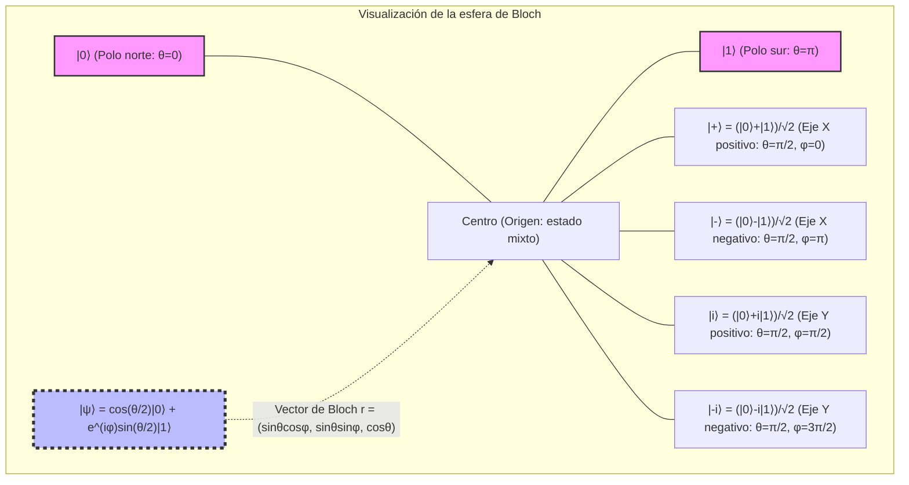
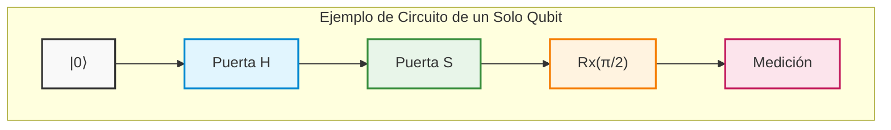
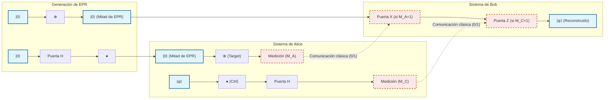
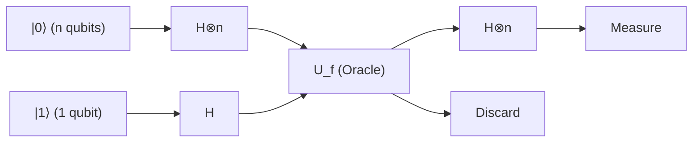
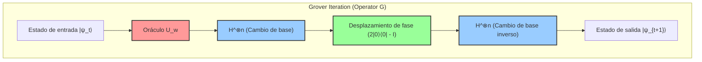
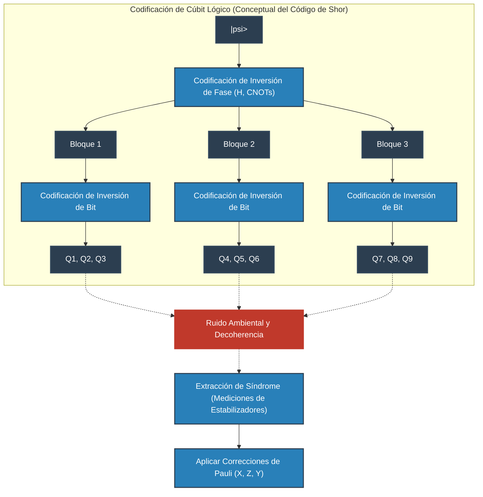
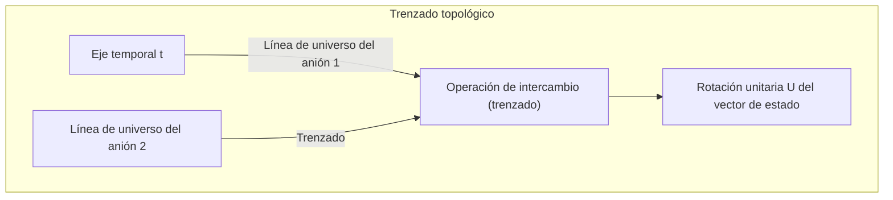
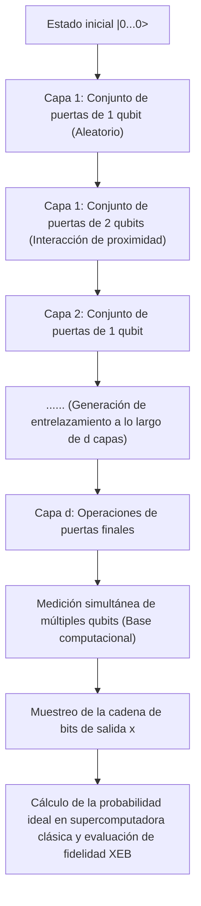

# Capítulo 1: El amanecer y los límites de la computación cuántica

## 1.1 Límites físicos del cómputo clásico y el fin de la ley de Moore

El vertiginoso desarrollo de la tecnología del procesamiento de la información en la sociedad moderna ha sido impulsado por la regla empírica propuesta por Gordon Moore en 1965: «el número de transistores en un circuito integrado de semiconductores se duplica aproximadamente cada dos años», es decir, la «ley de Moore». Siguiendo esta ley, hemos impulsado la miniaturización (escalamiento) de los transistores, mejorando exponencialmente la capacidad de cálculo de las computadoras. Sin embargo, al entrar en el siglo XXI, este paradigma clásico se enfrenta a límites físicos decisivos. El mayor obstáculo es la aparición de un efecto de la mecánica cuántica: el «efecto túnel cuántico» (Quantum Tunneling Effect).

Cuando la película aislante de la compuerta o la longitud del canal de un transistor se reducen a una escala de pocos nanómetros —es decir, al grosor de unos pocos a unas pocas decenas de átomos—, los electrones atraviesan probabilísticamente barreras de energía que clásicamente no podrían superar, debido a la penetración de la función de onda. La probabilidad de transmisión $T$ de un electrón de masa $m$ (con energía $E < V_0$ ) que incide sobre una región con una barrera de potencial $V_0$ y anchura $a$ viene dada, según la aproximación WKB, por la siguiente expresión:

$$
T \approx \exp \left( - \frac{2}{\hbar} \int_{0}^{a} \sqrt{2m(V_0 - E)} \, dx \right)
$$

Donde $\hbar$ es la constante reducida de Planck. A medida que la anchura de la barrera $a$ disminuye con la miniaturización, la probabilidad de transmisión $T$ aumenta exponencialmente y, en consecuencia, la «corriente de fuga» (leakage current) que fluye incluso en estado apagado alcanza magnitudes inaceptables. Esto conlleva un aumento en el consumo de energía y en la disipación térmica, lo que supone la ruptura de su funcionamiento como elemento de conmutación determinista clásico.

Además, los límites termodinámicos del procesamiento de información tampoco pueden ignorarse. En 1961, Rolf Landauer demostró que en el proceso de borrar información (realizar operaciones lógicas irreversibles) se disipa calor de forma inevitable (principio de Landauer). La cantidad mínima de calor $\Delta Q$ liberada al entorno al borrar un bit de información se expresa de la siguiente manera:

$$
\Delta Q \ge k_B T \ln 2
$$

Donde $k_B$ es la constante de Boltzmann y $T$ es la temperatura absoluta. Mientras las computadoras clásicas operen mediante compuertas lógicas irreversibles (como las compuertas AND u OR), este límite inferior termodinámico no podrá eludirse. A medida que la miniaturización avanza y la energía que maneja un solo elemento se aproxima a este límite, la evolución de la computación clásica se estanca de manera fundamental frente a las leyes de la física.

## 1.2 La visión de Richard Feynman y la explosión de la complejidad computacional en sistemas cuánticos

A medida que las computadoras clásicas se acercaban a sus límites físicos, comenzó a requerirse un paradigma computacional completamente nuevo. El punto de partida fue la conferencia magistral de Richard Feynman en la «Primera Conferencia sobre Física de la Computación» celebrada en el MIT en 1981. Feynman señaló la dificultad desesperada de simular sistemas cuánticos con computadoras clásicas e hizo una propuesta revolucionaria:

«La naturaleza no es clásica, por lo que si se quiere hacer una simulación de la naturaleza, más vale que se construya con principios de la mecánica cuántica».

Detrás de esta afirmación se encuentra el hecho de que la dimensión del «espacio de Hilbert» (Hilbert Space) que describe el estado de un sistema cuántico explota exponencialmente con respecto al número de partículas. Consideremos un sistema compuesto por $N$ partículas de espín $1/2$ (es decir, sistemas con dos estados cuánticos). El estado de una partícula se describe en un espacio vectorial complejo bidimensional $\mathbb{C}^2$. Por lo tanto, el espacio de estados $\mathcal{H}$ del sistema compuesto por $N$ partículas se construye como el producto tensorial de los espacios de estados de cada subsistema:

$$
\mathcal{H} = \bigotimes_{i=1}^{N} \mathbb{C}^2 = \mathbb{C}^{2^N}
$$

El estado puro (Pure State) $|\Psi\rangle$ de este sistema se expresa como una combinación lineal (superposición) de $2^N$ vectores de la base. Utilizando la notación bra-ket de Dirac, cualquier estado cuántico se puede desarrollar de la siguiente manera:

$$
|\Psi\rangle = \sum_{x=0}^{2^N-1} c_x |x\rangle
$$

Donde $|x\rangle$ es la base computacional (Computational Basis) y $c_x \in \mathbb{C}$ son números complejos denominados amplitudes de probabilidad (Probability Amplitude). El vector de estado debe satisfacer la condición de normalización $\sum_{x=0}^{2^N-1} |c_x|^2 = 1$.

Incluso si intentáramos simular apenas $N = 300$ cúbits (qubits), el número de valores complejos que habría que almacenar, $2^{300}$, es de aproximadamente $10^{90}$, superando con creces la cantidad total de átomos en el universo observable (alrededor de $10^{80}$). Almacenar tal cantidad de variables en la memoria de una computadora clásica y, además, calcular la evolución temporal regida por la ecuación de Schrödinger (la multiplicación de una matriz unitaria de $2^N \times 2^N$) resultaría imposible incluso a lo largo de toda la vida útil del universo. Esta «maldición de la dimensionalidad» representa el límite del cómputo clásico y, al mismo tiempo, la fuente del potencial de cálculo que poseen las computadoras cuánticas.

## 1.3 David Deutsch y la formulación de la máquina de Turing cuántica

Quien formalizó rigurosamente la idea intuitiva de Feynman dentro del marco de la ciencia de la computación teórica fue el físico de la Universidad de Oxford David Deutsch. En su artículo fundamental de 1985, Deutsch señaló la posibilidad de que la «tesis reforzada de Church-Turing» (Strong Church-Turing Thesis) —que postula que «todo proceso físico puede simularse perfectamente mediante recursos finitos»— no sea válida en un mundo físico regido por la mecánica cuántica.

Deutsch extendió la máquina de Turing determinista propuesta por Alan Turing y definió el concepto de «máquina de Turing cuántica» (Quantum Turing Machine). Esta es una máquina en la cual los estados internos, los símbolos de la cinta y la posición del cabezal pueden adoptar «estados de superposición» cuánticos, y cuyas transiciones de estado están descritas por un operador unitario (Unitary Operator) $U$.

La unidad básica del cómputo cuántico es el «cúbit» (qubit). Mientras que un bit clásico solo puede tomar los estados definidos $0$ o $1$, un cúbit puede encontrarse en cualquier estado de superposición lineal de $|0\rangle$ y $|1\rangle$:

$$
|\psi\rangle = \alpha |0\rangle + \beta |1\rangle \quad (\alpha, \beta \in \mathbb{C}, \ |\alpha|^2 + |\beta|^2 = 1)
$$

Las operaciones realizadas sobre este cúbit se representan mediante transformaciones lineales que conservan la norma, es decir, matrices unitarias (matrices que satisfacen $U^\dagger U = I$, donde $U^\dagger$ es la matriz adjunta e $I$ es la matriz identidad). Por ejemplo, la compuerta de Hadamard (Hadamard Gate) $H$, una de las compuertas más representativas de un solo cúbit, se define de la siguiente manera:

$$
H = \frac{1}{\sqrt{2}} \begin{pmatrix} 1 & 1 \\ 1 & -1 \end{pmatrix}
$$

Al aplicar la operación de Hadamard al estado base $|0\rangle$, se obtiene:

$$
H |0\rangle = \frac{1}{\sqrt{2}} \left( |0\rangle + |1\rangle \right)
$$

Con esto, el sistema pasa a un estado de superposición perfecta donde $|0\rangle$ y $|1\rangle$ se observan con igual probabilidad. El mérito de Deutsch radica en haber elevado estos principios fundamentales de la mecánica cuántica a un modelo de computación, demostrando matemáticamente que es posible construir, en principio, una computadora cuántica universal (Universal Quantum Computer).

## 1.4 La esencia de la computación cuántica: desmitificando la idea errónea del mero «cálculo hiperparalelo»

¿Por qué las computadoras cuánticas pueden poseer una capacidad de cálculo que supera a las clásicas? Como divulgación habitual a esta interrogante, con frecuencia se afirma que «la computadora cuántica se ramifica en innumerables universos paralelos, calcula todas las posibilidades al mismo tiempo y extrae instantáneamente la respuesta correcta de entre ellas». Aunque esto intenta expresar metafóricamente el «paralelismo cuántico» (Quantum Parallelism), es ** una explicación sumamente engañosa e imprecisa **.

Ciertamente, al aplicar compuertas de Hadamard en paralelo sobre un sistema de $N$ cúbits, es posible generar en una sola operación la superposición de los $2^N$ estados:

$$
H^{\otimes N} |0\rangle^{\otimes N} = \frac{1}{\sqrt{2^N}} \sum_{x=0}^{2^N-1} |x\rangle
$$

Y al aplicar un operador unitario $U_f$ que evalúa una determinada función $f(x)$, el estado evoluciona a:

$$
U_f \left( \frac{1}{\sqrt{2^N}} \sum_{x=0}^{2^N-1} |x\rangle |0\rangle \right) = \frac{1}{\sqrt{2^N}} \sum_{x=0}^{2^N-1} |x\rangle |f(x)\rangle
$$

Aquí parece, ciertamente, que en una única operación se han «calculado» los valores de $f(x)$ para todos los $2^N$ posibles $x$. No obstante, se impone un postulado ineludible de la mecánica cuántica: el «postulado de la medida» (la regla de Born, Born Rule). Al medir (observar) este estado de superposición, el resultado que obtenemos es uno solo, y el estado sufre el colapso de la función de onda (Wavefunction Collapse) hacia un $|x\rangle |f(x)\rangle$ aleatorio con probabilidad $P(x) = 1/2^N$. En otras palabras, aunque se calculen todas las respuestas simultáneamente, la medición solo permite extraer «un único resultado al azar», lo cual no difiere en nada de simplemente lanzar un dado de forma aleatoria para realizar el cómputo.

¿Cuál es entonces el verdadero poder de una computadora cuántica? Es la ** interferencia cuántica (Quantum Interference) **.

Puesto que las amplitudes de probabilidad $c_x$ que describen el estado cuántico no son probabilidades positivas sino «números complejos», pueden tomar signos positivos, negativos e incluso valores imaginarios. El secreto de los algoritmos cuánticos radica en combinar hábilmente transformaciones unitarias a lo largo del cálculo para ** «cancelar mutuamente las amplitudes de probabilidad de los estados correspondientes a respuestas incorrectas (interferencia destructiva: Destructive Interference) y amplificar las amplitudes de probabilidad de los estados correspondientes a las respuestas correctas (interferencia constructiva: Constructive Interference)» **.

Como ejemplo sencillo, examinemos la interferencia generada mediante la inversión de fase y la transformación de Hadamard. ¿Qué sucede cuando aplicamos nuevamente la compuerta de Hadamard al estado $\frac{1}{\sqrt{2}}(|0\rangle - |1\rangle)$?

$$
H \left( \frac{|0\rangle - |1\rangle}{\sqrt{2}} \right) = \frac{1}{2} \big( (|0\rangle + |1\rangle) - (|0\rangle - |1\rangle) \big) = \frac{1}{2} (2|1\rangle) = |1\rangle
$$

En este caso, la amplitud de probabilidad orientada hacia el estado $|0\rangle$ es $1/2 - 1/2 = 0$, anulándose por completo (interferencia destructiva). Por otro lado, la amplitud hacia el estado $|1\rangle$ es $1/2 + 1/2 = 1$, amplificándose (interferencia constructiva).

Los algoritmos cuánticos verdaderamente útiles (por ejemplo, el algoritmo de Shor para la factorización en números primos o el algoritmo de Grover para la búsqueda en bases de datos no estructuradas) orquestan sofisticadamente este fenómeno de interferencia ondulatoria para que, al realizar la medición en la etapa final del cálculo, la probabilidad de observar el estado correcto se aproxime de forma arbitraria a $1$. La magia no reside en el cálculo paralelo en sí mismo, sino en aprovechar la interferencia de amplitudes de probabilidad complejas para «eliminar probabilísticamente las ramas computacionales no deseadas»; esa es la diferencia fundamental frente a las computadoras clásicas y la verdadera esencia de la computación cuántica.

## 1.5 Visualización de conceptos: el mecanismo de la interferencia cuántica

El siguiente diagrama conceptual muestra la diferencia entre un proceso estocástico clásico y un proceso de interferencia cuántico (equivalente a un interferómetro de Mach-Zehnder o a la aplicación sucesiva de compuertas de Hadamard). En una caminata aleatoria clásica, las probabilidades simplemente se suman; en cambio, en un proceso cuántico, las amplitudes de las trayectorias se suman como números complejos, produciendo interferencia.

```mermaid
graph TD
    classDef quantum fill:#e6f2ff,stroke:#0066cc,stroke-width:2px;
    classDef classical fill:#fff2e6,stroke:#cc6600,stroke-width:2px;
    classDef measure fill:#e6ffe6,stroke:#00cc00,stroke-width:2px;

    Start["Estado inicial |0⟩"]:::quantum

    subgraph "Generación de superposición de estados cuánticos"
        H1["Compuerta de Hadamard (H)"]:::quantum
        SuperPos["1/√2 (|0⟩ + |1⟩)"]:::quantum
    end

    subgraph "Operación unitaria (manipulación de fase mediante oráculos, etc.)"
        U_op["Desplazamiento de fase / Evolución unitaria (U)"]:::quantum
        PhaseState["1/√2 (|0⟩ - e^{iθ} |1⟩)"]:::quantum
    end

    subgraph "Proceso de interferencia cuántica (el núcleo del algoritmo)"
        H2["Compuerta de Hadamard (H)"]:::quantum
        Interference["Cancelación y amplificación de amplitudes<br>(Constructiva / Destructiva)"]:::quantum
    end

    Result["Salida determinista con probabilidad 1 (ej.: |1⟩)"]:::measure

    Start --> H1
    H1 --> SuperPos
    SuperPos --> U_op
    U_op --> PhaseState
    PhaseState --> H2
    H2 --> Interference
    Interference -->|Medición (observación)| Result
```

De este modo, la computación cuántica no representa una mera medida temporal para prolongar la vida útil de los sistemas eludiendo los límites de la física clásica (como los límites de miniaturización o los límites termodinámicos), sino un verdadero cambio de paradigma que reconstruye la definición misma de información y cómputo sobre la base de los postulados de la mecánica cuántica. En el siguiente capítulo, profundizaremos en los detalles de las «compuertas cuánticas» y los «circuitos cuánticos», herramientas matemáticas concretas para manipular libremente esta interferencia cuántica.

# Capítulo 2: Fundamentos del Bit Clásico y el Cúbit (Qubit)

Al construir el marco teórico de la información cuántica, el concepto más fundamental es la definición de la "unidad mínima de información". En este capítulo, partiremos del bit de la teoría clásica de la información y ampliaremos el concepto hacia el "cúbit (Qubit)", la unidad mínima de información cuántica basada en los postulados de la mecánica cuántica. Utilizando el lenguaje riguroso del espacio de Hilbert, la notación bra-ket y el álgebra lineal, desentrañaremos a fondo la estructura matemática de los estados cuánticos. Sin hacer concesiones, asomémonos al abismo de la información cuántica desde una perspectiva profesional y experta.

## 2.1 La unidad mínima de información: Formulación matemática y límites del bit clásico

En la historia de la ciencia de la computación, el fundamento de la teoría de la información establecido por Claude Shannon en 1948 es el "bit (Bit)". El bit clásico se define, independientemente de su representación física (por ejemplo, el nivel alto o bajo de voltaje en un transistor, el encendido/apagado de un interruptor o la dirección de magnetización), como un sistema que adopta uno de dos valores discretos dentro de un espacio abstracto de estados $\{0, 1\}$ .

Expresemos esto en el lenguaje más formal de los espacios vectoriales. El estado de un bit clásico se puede representar utilizando la base canónica en un espacio vectorial real bidimensional $\mathbb{R}^2$ . Definimos el estado $0$ y el estado $1$ como los siguientes vectores columna:

$$
\mathbf{v}_0 = \begin{pmatrix} 1 \\ 0 \end{pmatrix}, \quad \mathbf{v}_1 = \begin{pmatrix} 0 \\ 1 \end{pmatrix}
$$

En un sistema clásico determinista (Deterministic), el estado del bit se fija inexorablemente en uno de los dos: $\mathbf{v}_0$ o $\mathbf{v}_1$ . Sin embargo, cuando existe ruido térmico o incertidumbre en nuestro conocimiento, es necesario describir el estado como un bit probabilístico clásico (Probabilistic). En este caso, el estado del bit se expresa como una distribución de probabilidad, y el vector de estado $\mathbf{p}$ se puede escribir como una combinación convexa (Convex combination) de los vectores base:

$$
\mathbf{p} = p_0 \mathbf{v}_0 + p_1 \mathbf{v}_1 = \begin{pmatrix} p_0 \\ p_1 \end{pmatrix}
$$

Aquí, $p_0, p_1$ son números reales que representan las probabilidades de que el estado sea $0$ y $1$ respectivamente, y según los axiomas de probabilidad de Kolmogorov, deben satisfacer las siguientes condiciones:

1. **No negatividad** : $p_0 \ge 0, \quad p_1 \ge 0$
2. **Condición de normalización (probabilidad total igual a 1)** : $p_0 + p_1 = 1$

En el mundo de los bits clásicos, un sistema compuesto que combina múltiples bits se describe mediante el producto tensorial (producto de Kronecker) de sus respectivos vectores de probabilidad. Por ejemplo, la probabilidad conjunta de dos bits clásicos es la siguiente:

$$
\mathbf{p}_{AB} = \mathbf{p}_A \otimes \mathbf{p}_B = \begin{pmatrix} p_{A0} \\ p_{A1} \end{pmatrix} \otimes \begin{pmatrix} p_{B0} \\ p_{B1} \end{pmatrix} = \begin{pmatrix} p_{A0}p_{B0} \\ p_{A0}p_{B1} \\ p_{A1}p_{B0} \\ p_{A1}p_{B1} \end{pmatrix}
$$

El marco de la teoría de la información clásica es sumamente potente y constituye la base de la sociedad digital contemporánea; sin embargo, dado que los estados se construyen únicamente mediante la suma de probabilidades reales, es fundamentalmente imposible representar la "cancelación de probabilidades", como ocurre en la interferencia de ondas. Aquí es donde surgen los límites de la física clásica y la necesidad de dar el salto hacia la información cuántica.

## 2.2 Postulados de la mecánica cuántica y notación bra-ket (Bra-ket notation)

El primer postulado (Postulate) de la mecánica cuántica establece que "el estado de un sistema físico cerrado se describe completamente mediante un vector unitario (vector de estado) en un espacio vectorial completo dotado de un producto interno complejo, es decir, un espacio de Hilbert (Hilbert Space) $\mathcal{H}$ ". En el contexto de la computación cuántica, dado que se pueden ignorar los grados de libertad espaciales continuos, este espacio de Hilbert suele ser un espacio vectorial complejo de dimensión finita $\mathbb{C}^d$ .

La unidad mínima de información cuántica, el "cúbit (Qubit)", se define rigurosamente como un estado en un espacio de Hilbert complejo bidimensional $\mathcal{H} \cong \mathbb{C}^2$ . Para describir los estados en este espacio vectorial, es estándar utilizar la **notación bra-ket (Bra-ket notation)** introducida por el físico Paul Dirac.

El vector columna que representa un estado cuántico se denomina **vector ket (Ket vector)** y se denota como $|\psi\rangle$ . Introduzcamos una base ortonormal llamada base computacional (Computational basis) como los estados correspondientes al $0$ y $1$ del bit clásico. Estos también se conocen como la base $Z$ del cúbit y se definen respectivamente como $|0\rangle$ y $|1\rangle$ :

$$
|0\rangle = \begin{pmatrix} 1 \\ 0 \end{pmatrix}, \quad |1\rangle = \begin{pmatrix} 0 \\ 1 \end{pmatrix}
$$

Por otra parte, según el teorema de representación de Riesz (Riesz representation theorem), a cada vector ket de un espacio de Hilbert le corresponde de manera única un elemento del espacio dual (Dual space) que actúa como un funcional lineal continuo. A este se le denomina **vector bra (Bra vector)** y se denota como $\langle\psi|$ . En la representación matricial, el vector bra correspondiente se obtiene tomando el conjugado hermítico (la transpuesta conjugada compleja, denotada por $^\dagger$ ) del vector ket:

$$
\langle\psi| = (|\psi\rangle)^\dagger = (|\psi\rangle^*)^T
$$

Por ejemplo, los vectores bra de la base son los siguientes vectores fila:

$$
\langle 0| = \begin{pmatrix} 1 & 0 \end{pmatrix}, \quad \langle 1| = \begin{pmatrix} 0 & 1 \end{pmatrix}
$$

El verdadero valor de la notación bra-ket radica en que el cálculo del producto interno se vuelve visualmente en extremo intuitivo y claro. El producto interno entre el bra $\langle\phi|$ y el ket $|\psi\rangle$ se escribe como $\langle\phi|\psi\rangle$ (lo cual proviene del juego de palabras de Dirac, donde Bra y Ket se unen para formar un Bracket). Como la base computacional $\{|0\rangle, |1\rangle\}$ constituye un sistema ortonormal (Orthonormal system), se expresa mediante la delta de Kronecker $\delta_{ij}$ de la siguiente manera:

$$
\langle i | j \rangle = \delta_{ij} \quad (i, j \in \{0, 1\})
$$

En concreto, el producto interno consigo mismo es $1$ ( $\langle 0|0\rangle = 1$ , $\langle 1|1\rangle = 1$ ), y el producto interno entre elementos distintos de la base es $0$ ( $\langle 0|1\rangle = 0$ , $\langle 1|0\rangle = 0$ ).

Además, el producto tensorial entre un ket y un bra (equivalente al producto externo) se describe como $|\psi\rangle\langle\phi|$ , lo que representa un operador lineal (matriz) de un espacio en sí mismo. Por ejemplo, el operador de proyección (Projection operator) sobre un determinado subespacio de estados se construye de la siguiente manera:

$$
|0\rangle\langle 0| = \begin{pmatrix} 1 \\ 0 \end{pmatrix} \begin{pmatrix} 1 & 0 \end{pmatrix} = \begin{pmatrix} 1 & 0 \\ 0 & 0 \end{pmatrix}
$$

El operador identidad $I$ (Identity operator) de cualquier espacio vectorial complejo bidimensional se puede descomponer y representar mediante la relación de completitud (Completeness relation) de la base de la siguiente forma, constituyendo una herramienta sumamente poderosa y de uso muy frecuente en los cálculos de mecánica cuántica:

$$
I = |0\rangle\langle 0| + |1\rangle\langle 1| = \begin{pmatrix} 1 & 0 \\ 0 & 1 \end{pmatrix}
$$

## 2.3 El principio de superposición cuántica y amplitudes de probabilidad complejas

Mientras que un bit clásico se encuentra siempre en un estado definido de $0$ o $1$, o en una mezcla probabilística de ambos, la exigencia de linealidad (Linearity) de la mecánica cuántica permite que un cúbit adopte un estado fundamentalmente distinto denominado "superposición (Superposition)", expresado como una combinación lineal de $|0\rangle$ y $|1\rangle$ . Cualquier vector unitario dentro del espacio de Hilbert $\mathcal{H}$ es admisible como un estado físico válido.

Por consiguiente, el estado puro (Pure state) más general de un único cúbit $|\psi\rangle$ se desarrolla utilizando la base computacional de la siguiente manera:

$$
|\psi\rangle = \alpha |0\rangle + \beta |1\rangle = \begin{pmatrix} \alpha \\ \beta \end{pmatrix}
$$

Aquí, $\alpha$ y $\beta$ son números complejos ( $\alpha, \beta \in \mathbb{C}$ ) denominados **amplitudes de probabilidad complejas (Complex probability amplitude)** . En marcado contraste con las probabilidades clásicas, que eran números reales no negativos, el hecho de que los estados cuánticos posean coeficientes "complejos" es la razón fundamental por la cual las computadoras cuánticas poseen una capacidad de cómputo superior a la de las computadoras clásicas. Dado que los números complejos poseen una fase (Phase) y pueden apuntar en cualquier dirección en el plano complejo, pueden reforzarse mutuamente (interferencia constructiva) o cancelarse entre sí (interferencia destructiva), al igual que las ondas. La esencia de los algoritmos cuánticos consiste en manipular hábilmente estos efectos de interferencia para amplificar la amplitud de probabilidad de la respuesta correcta y anular la de las respuestas incorrectas.

El proceso de extraer información clásica de un sistema cuántico se denomina "medición (Measurement)". Al considerar una medición proyectiva (Projective measurement), de acuerdo con la regla de Born (Born rule), la probabilidad $P(0)$ de obtener $0$ y la probabilidad $P(1)$ de obtener $1$ como resultado de medir el estado $|\psi\rangle$ en la base computacional $\{|0\rangle, |1\rangle\}$ vienen dadas por el cuadrado del valor absoluto de sus respectivas amplitudes de probabilidad:

$$
P(0) = |\langle 0|\psi\rangle|^2 = |\alpha|^2 = \alpha \alpha^*
$$

$$
P(1) = |\langle 1|\psi\rangle|^2 = |\beta|^2 = \beta \beta^*
$$

Para que el sistema sea observado indefectiblemente en algún estado, la suma total de las probabilidades debe ser estrictamente igual a $1$ . Por lo tanto, la norma (longitud) del vector de estado cuántico $|\psi\rangle$ debe ser siempre $1$ . Esta es la **condición de normalización (Normalization condition)** :

$$
\langle\psi|\psi\rangle = (\alpha^* \langle 0| + \beta^* \langle 1|)(\alpha |0\rangle + \beta |1\rangle) = |\alpha|^2 + |\beta|^2 = 1
$$

Para profundizar en el significado geométrico de estas amplitudes de probabilidad complejas, expresemos $\alpha$ y $\beta$ en coordenadas polares:

$$
\alpha = r_0 e^{i\phi_0}, \quad \beta = r_1 e^{i\phi_1}
$$

Donde $r_0, r_1 \ge 0$ representan las magnitudes de las amplitudes y $\phi_0, \phi_1 \in [0, 2\pi)$ son sus respectivos ángulos de fase. Dado que la condición de normalización exige que $r_0^2 + r_1^2 = 1$ , podemos definir $r_0 = \cos(\frac{\theta}{2})$ y $r_1 = \sin(\frac{\theta}{2})$ mediante un parámetro real $\theta \in [0, \pi]$ . Sustituyendo esto en el vector de estado original, obtenemos:

$$
|\psi\rangle = \cos\left(\frac{\theta}{2}\right) e^{i\phi_0} |0\rangle + \sin\left(\frac{\theta}{2}\right) e^{i\phi_1} |1\rangle
$$

Factoricemos el factor de fase común $e^{i\phi_0}$ en toda la expresión:

$$
|\psi\rangle = e^{i\phi_0} \left( \cos\left(\frac{\theta}{2}\right) |0\rangle + e^{i(\phi_1 - \phi_0)} \sin\left(\frac{\theta}{2}\right) |1\rangle \right)
$$

En mecánica cuántica, el factor de fase $e^{i\phi_0}$ que multiplica a todo el vector de estado se denomina "fase global (Global phase)". Como podemos comprobar al calcular el valor esperado $\langle A \rangle$ para cualquier observable (operador hermítico) $A$ :

$$
\langle A \rangle = \left( e^{-i\phi_0} \langle\psi| \right) A \left( e^{i\phi_0} |\psi\rangle \right) = e^{-i\phi_0} e^{i\phi_0} \langle\psi| A |\psi\rangle = \langle\psi| A |\psi\rangle
$$

De este modo, dado que la fase global se cancela a sí misma, es imposible observarla mediante cualquier medición física. En otras palabras, aunque $|\psi\rangle$ y $e^{i\phi_0}|\psi\rangle$ son vectores distintos en el espacio de Hilbert (aunque representan el mismo rayo), representan físicamente exactamente el mismo estado.

Por lo tanto, ignorando la fase global y manteniendo únicamente la fase relativa (Relative phase) $\varphi = \phi_1 - \phi_0$ (donde $\varphi \in [0, 2\pi)$ ) entre $|0\rangle$ y $|1\rangle$ como parámetro, cualquier estado puro de un único cúbit se expresa de manera única y rigurosa en la siguiente **forma canónica** :

$$
|\psi\rangle = \cos\left(\frac{\theta}{2}\right) |0\rangle + e^{i\varphi} \sin\left(\frac{\theta}{2}\right) |1\rangle
$$

## 2.4 Visualización geométrica mediante la esfera de Bloch (Bloch Sphere)

La parametrización derivada en la sección anterior demuestra que el espacio de estados de un único cúbit es geométricamente isomorfo a la superficie de una esfera unitaria en un espacio tridimensional (la esfera bidimensional $S^2$ ). Esta representación visual recibe el nombre de **esfera de Bloch (Bloch Sphere)** en honor a su creador, el físico suizo Felix Bloch.

El ángulo $\theta$ corresponde exactamente al ángulo polar (Polar angle) medido desde la dirección positiva del eje $Z$ , y el ángulo $\varphi$ al ángulo azimutal (Azimuthal angle) en el plano $X$-$Y$ .



La propiedad más destacada de la esfera de Bloch es que "los estados ortogonales en el espacio de Hilbert (estados cuyo producto interno es cero) se sitúan como puntos antípodas (Antipodal points: puntos opuestos a 180 grados) entre sí en el espacio real tridimensional de la esfera de Bloch". Por ejemplo, el estado ortogonal a $|0\rangle$ (polo norte, $\theta=0$ ) es $|1\rangle$ (polo sur, $\theta=\pi$ ). El cálculo del producto interno entre estados ortogonales en el espacio de Hilbert $\langle 0 | 1 \rangle = 0$ equivale a una separación angular de $\pi$ (180 grados) sobre la esfera de Bloch. Dado que el ángulo geométrico es el doble del ángulo en el espacio de Hilbert, aquí radica la necesidad matemática de utilizar el ángulo mitad $\theta/2$ en la parametrización.

Las coordenadas $\mathbf{r} = (x, y, z)$ de esta esfera de Bloch se deducen rigurosamente como los valores esperados de las **matrices de Pauli (Pauli matrices)** , que son observables (Observable) en mecánica cuántica. Las matrices de Pauli, que constituyen una base para los operadores hermíticos en un sistema bidimensional, se definen de la siguiente manera:

$$
X = \sigma_x = \begin{pmatrix} 0 & 1 \\ 1 & 0 \end{pmatrix}, \quad
Y = \sigma_y = \begin{pmatrix} 0 & -i \\ i & 0 \end{pmatrix}, \quad
Z = \sigma_z = \begin{pmatrix} 1 & 0 \\ 0 & -1 \end{pmatrix}
$$

Los valores esperados de estos observables de Pauli para cualquier estado $|\psi\rangle$ se obtienen mediante el cálculo bra-ket:

$$
x = \langle\psi| X |\psi\rangle = \left( \cos\frac{\theta}{2} \langle 0| + e^{-i\varphi}\sin\frac{\theta}{2} \langle 1| \right) \begin{pmatrix} 0 & 1 \\ 1 & 0 \end{pmatrix} \begin{pmatrix} \cos\frac{\theta}{2} \\ e^{i\varphi}\sin\frac{\theta}{2} \end{pmatrix} = \sin\theta \cos\varphi
$$

$$
y = \langle\psi| Y |\psi\rangle = \left( \cos\frac{\theta}{2} \langle 0| + e^{-i\varphi}\sin\frac{\theta}{2} \langle 1| \right) \begin{pmatrix} 0 & -i \\ i & 0 \end{pmatrix} \begin{pmatrix} \cos\frac{\theta}{2} \\ e^{i\varphi}\sin\frac{\theta}{2} \end{pmatrix} = \sin\theta \sin\varphi
$$

$$
z = \langle\psi| Z |\psi\rangle = \left( \cos\frac{\theta}{2} \langle 0| + e^{-i\varphi}\sin\frac{\theta}{2} \langle 1| \right) \begin{pmatrix} 1 & 0 \\ 0 & -1 \end{pmatrix} \begin{pmatrix} \cos\frac{\theta}{2} \\ e^{i\varphi}\sin\frac{\theta}{2} \end{pmatrix} = \cos^2\left(\frac{\theta}{2}\right) - \sin^2\left(\frac{\theta}{2}\right) = \cos\theta
$$

De este modo, el vector de Bloch $\mathbf{r} = (x, y, z)$ se expresa magníficamente como un vector unitario en el espacio tridimensional $\mathbf{r} = (\sin\theta\cos\varphi, \sin\theta\sin\varphi, \cos\theta)$ . Además, la matriz de densidad (Density matrix) $\rho = |\psi\rangle\langle\psi|$ correspondiente a cualquier estado puro se describe de forma sumamente elegante utilizando el vector de Pauli $\boldsymbol{\sigma} = (X, Y, Z)$ y la matriz identidad $I$ :

$$
\rho = \frac{1}{2} \left( I + \mathbf{r} \cdot \boldsymbol{\sigma} \right) = \frac{1}{2} \left( I + xX + yY + zZ \right)
$$

Al desarrollar y verificar explícitamente los elementos de la matriz, obtenemos lo siguiente:

$$
\rho = \frac{1}{2} \begin{pmatrix} 1 + z & x - iy \\ x + iy & 1 - z \end{pmatrix} = \begin{pmatrix} \cos^2(\frac{\theta}{2}) & e^{-i\varphi}\sin(\frac{\theta}{2})\cos(\frac{\theta}{2}) \\ e^{i\varphi}\sin(\frac{\theta}{2})\cos(\frac{\theta}{2}) & \sin^2(\frac{\theta}{2}) \end{pmatrix}
$$

Esto coincide exactamente con el resultado del cálculo del producto externo $|\psi\rangle\langle\psi|$ a partir de la definición del producto tensorial. Cabe destacar aquí que, en el caso de un estado puro, la norma del vector de Bloch es $|\mathbf{r}| = 1$ y la traza de la matriz de densidad satisface $\text{Tr}(\rho^2) = 1$ ; sin embargo, en un estado mixto (Mixed state) donde se produce una pérdida de información cuántica (decoherencia) debido a la interacción con el entorno o a un control imperfecto, al tratarse de un ensamble estadístico de estados puros se tiene que $|\mathbf{r}| < 1$ . En consecuencia, los estados mixtos se representan como puntos en el "interior" y no en la superficie de la esfera de Bloch, de modo que el estado de máxima mezcla (Maximally mixed state) $\rho = I/2$ , en el que la información se ha perdido por completo, se sitúa en el punto central de la esfera de Bloch $\mathbf{r} = (0,0,0)$ .

## 2.5 Medición y colapso de la función de onda (Wavefunction Collapse)

La medición en la mecánica cuántica difiere fundamentalmente de la lectura pasiva de información que tiene lugar en la mecánica clásica. De acuerdo con la formulación axiomática de von Neumann, cuando se mide una magnitud física (observable), el estado "colapsa (Collapse)" de manera irreversible hacia un autoestado (o estado propio) de dicho observable.

Por ejemplo, consideremos la realización de una medición en la base $Z$ (es decir, una medición que toma como observable la matriz $Z$ de Pauli) sobre el estado de un único cúbit $|\psi\rangle = \alpha|0\rangle + \beta|1\rangle$ . Los únicos valores que pueden obtenerse como resultado de la medición son los autovalores de $Z$ : $+1$ (correspondiente al estado $|0\rangle$ ) o $-1$ (correspondiente al estado $|1\rangle$ ).

Para describir la medición con rigor matemático, se utiliza un conjunto de operadores de proyección $\{ P_m \}$ . En el caso de la medición en $Z$ , los operadores de proyección son los siguientes:

$$
P_0 = |0\rangle\langle 0|, \quad P_1 = |1\rangle\langle 1|
$$

Estos satisfacen la relación de completitud $P_0 + P_1 = I$ y la ortogonalidad $P_i P_j = \delta_{ij} P_i$ . Según la regla de Born, la probabilidad $P(m)$ de obtener el resultado de medición $m \in \{0, 1\}$ se calcula como:

$$
P(m) = \langle\psi| P_m^\dagger P_m |\psi\rangle = \langle\psi| P_m |\psi\rangle
$$

lo cual coincide con total exactitud con $|\alpha|^2$ y $|\beta|^2$ obtenidos anteriormente. Y lo que es más importante: el nuevo estado cuántico $|\psi'\rangle$ inmediatamente posterior a la obtención del resultado de medición $m$ resulta de aplicar el operador de proyección al estado original y renormalizarlo con respecto a su nueva norma:

$$
|\psi'\rangle = \frac{P_m |\psi\rangle}{\sqrt{P(m)}}
$$

Si el resultado fue $0$ :

$$
|\psi'\rangle = \frac{|0\rangle\langle 0| (\alpha|0\rangle + \beta|1\rangle)}{|\alpha|} = \frac{\alpha}{|\alpha|} |0\rangle = e^{i\phi_0} |0\rangle \equiv |0\rangle
$$

y el estado colapsa completamente a $|0\rangle$ (la fase global se ignora). Esta es la descripción matemática del fenómeno denominado colapso de la función de onda (Wavefunction collapse): una vez efectuada la medición y colapsado el estado, la fase relativa $\varphi$ y la información de las amplitudes ( $\alpha, \beta$ ) contenidas en el estado de superposición original se pierden para siempre. Por consiguiente, es por principio imposible extraer la información completa de un estado cuántico a partir de una única medición realizada sobre una sola copia (lo cual guarda una profunda relación con el "teorema de no clonación").

## 2.6 Introducción a la extensión a sistemas de múltiples partículas y perspectivas hacia el siguiente capítulo

Habiendo comprendido en profundidad las propiedades de un único cúbit, abordemos también los fundamentos matemáticos de los "sistemas de múltiples cúbits" que trataremos a fondo a partir del siguiente capítulo. Mientras que las distribuciones de probabilidad clásicas expanden el espacio de estados mediante el producto cartesiano, el espacio de Hilbert $\mathcal{H}_{AB}$ de un sistema compuesto en mecánica cuántica se construye mediante el **producto tensorial (Tensor product)** de los espacios de Hilbert $\mathcal{H}_A$ y $\mathcal{H}_B$ de cada subsistema:

$$
\mathcal{H}_{AB} = \mathcal{H}_A \otimes \mathcal{H}_B
$$

El producto tensorial de los estados de dos cúbits independientes se desarrolla de la siguiente manera, formando un espacio vectorial complejo de 4 dimensiones:

$$
|\Psi\rangle_{AB} = (\alpha_0|0\rangle + \alpha_1|1\rangle) \otimes (\beta_0|0\rangle + \beta_1|1\rangle) = \alpha_0\beta_0|00\rangle + \alpha_0\beta_1|01\rangle + \alpha_1\beta_0|10\rangle + \alpha_1\beta_1|11\rangle
$$

Aquí, la existencia de estados que no pueden factorizarse como un producto tensorial de estados individuales (por ejemplo, el estado de Bell $|\Phi^+\rangle = (|00\rangle + |11\rangle)/\sqrt{2}$ ) constituye la fuente del entrelazamiento cuántico (Entanglement). La explosión exponencial de la dimensionalidad debida al producto tensorial ( $2^N$ dimensiones para $N$ cúbits) es precisamente la base sobre la cual las computadoras cuánticas despliegan su abrumadora potencia de cálculo paralelo.

En este capítulo, hemos fundamentado la diferencia esencial entre el bit clásico y el cúbit sobre la base matemática del espacio de Hilbert. El cúbit es capaz de adoptar estados de superposición continua con amplitudes de probabilidad complejas y, a través de la deducción de la esfera de Bloch, hemos adquirido una poderosa metodología para comprender intuitivamente vectores complejos abstractos como un modelo geométrico en el espacio real tridimensional.

En el siguiente capítulo, "Capítulo 3: Puertas Cuánticas y Transformaciones Unitarias", detallaremos las "puertas lógicas cuánticas" concretas para manipular este estado de un único cúbit, esclareciendo las propiedades matemáticas de las operaciones de rotación mediante matrices unitarias sobre la esfera de Bloch. Las puertas hacia el fascinante y profundo mundo de la información cuántica acaban de abrirse.

# Capítulo 3: Axiomas de la Mecánica Cuántica y Observación (Colapso de la Función de Onda)

## 3.1 Introducción: Enfoque Axiomático de la Mecánica Cuántica y Requisitos del Álgebra Lineal

Para comprender fundamentalmente los principios de funcionamiento de las computadoras cuánticas, es indispensable captar el marco teórico de la física conocido como mecánica cuántica de forma matemáticamente rigurosa. Aunque muchas teorías físicas se han desarrollado inductivamente a partir de reglas empíricas, la mecánica cuántica, especialmente la mecánica cuántica moderna formulada por John von Neumann, adopta un enfoque axiomático que deduce todo el sistema a partir de un pequeño número de "Axiomas" matemáticos.

Este sistema axiomático se construye sobre el escenario del álgebra lineal compleja, que puede extenderse a dimensiones infinitas, conocido como espacio de Hilbert. En la ciencia de la información cuántica y la computación cuántica, como tratamos principalmente con espacios vectoriales de dimensión finita (por ejemplo, el espacio del producto tensorial de $\mathbb{C}^2$ para sistemas de cúbits), podemos evitar las dificultades analíticas de las dimensiones infinitas (como el dominio de definición de operadores no acotados) y describir y comprender la mecánica cuántica puramente como álgebra lineal.

En este capítulo, formularemos rigurosamente, sin ningún compromiso, el proceso que va desde la descripción de los estados cuánticos hasta la evolución temporal y la "observación", que ha provocado los debates más filosóficos. El lector se dará cuenta de cómo los fenómenos cuánticos, que a primera vista parecen contrarios a la intuición, se construyen sobre una estructura matemática hermosa y consistente. Esta estructura matemática se convierte en el "lenguaje" directo para describir los algoritmos de las computadoras cuánticas.

## 3.2 Primer Axioma: Espacio de Estados (Espacio de Hilbert y Vector de Estado)

El primer axioma de la mecánica cuántica define cómo se representa matemáticamente el "estado" de un sistema físico.

**Axioma 1 (Representación del estado)**:
El estado de un sistema físico cerrado se describe completamente por un vector unitario de norma 1 en un espacio de Hilbert (Hilbert space) $\mathcal{H}$, que es un espacio de producto interno complejo que satisface la completitud. Esto se llama **vector de estado**.

Según la notación Bra-ket (Bra-ket notation) introducida por Paul Dirac, el vector de estado se trata como un vector columna y se denota como un ket ** $| \psi \rangle$ ** . Un vector fila que pertenece al espacio dual $\mathcal{H}^*$ se denota como un bra ** $\langle \psi |$ ** , y estos son el conjugado hermítico (transpuesta conjugada compleja) el uno del otro. Es decir,

$$
\langle \psi | = ( | \psi \rangle )^\dagger
$$

El producto interno de dos estados cualesquiera ** $| \phi \rangle$ ** y ** $| \psi \rangle$ ** en el espacio de Hilbert se calcula como el producto del bra y el ket ** $\langle \phi | \psi \rangle$ ** , y da un valor complejo. Este producto interno satisface las siguientes propiedades:

1. **Definido positivo**: Para cualquier ** $| \psi \rangle \neq 0$ ** , $\langle \psi | \psi \rangle > 0$
2. **Linealidad**: $\langle \phi | ( c_1 | \psi_1 \rangle + c_2 | \psi_2 \rangle ) = c_1 \langle \phi | \psi_1 \rangle + c_2 \langle \phi | \psi_2 \rangle$
3. **Simetría conjugada**: $\langle \phi | \psi \rangle = \langle \psi | \phi \rangle^*$ ($*$ es el conjugado complejo)

Para que la interpretación probabilística se sostenga, el estado físico debe satisfacer siempre la condición de normalización (Normalization condition). Es decir, la norma del vector de estado ** $| \psi \rangle$ ** es 1.

$$
\| | \psi \rangle \| = \sqrt{\langle \psi | \psi \rangle} = 1
$$

Además, debido a que se cumple la desigualdad de Cauchy-Schwarz (Cauchy-Schwarz inequality) $|\langle \phi | \psi \rangle|^2 \le \langle \phi | \phi \rangle \langle \psi | \psi \rangle$, el valor absoluto del producto interno entre estados normalizados siempre cae entre 0 y 1. Esta es la base matemática para que posteriormente se interprete como una "probabilidad".

### Principio de Superposición y Base Ortonormal Completa

La característica más destacada de la mecánica cuántica es el "principio de superposición" (Superposition principle). Si ** $| \phi \rangle$ ** y ** $| \psi \rangle$ ** son estados físicamente permitidos, cualquier combinación lineal compleja arbitraria de ellos $c_1 | \phi \rangle + c_2 | \psi \rangle$ también es (tras la normalización) un estado físicamente permitido. Esta propiedad se deriva directamente de la linealidad del espacio de Hilbert.

En el espacio de Hilbert $\mathcal{H}$, existe una base ortonormal completa (Orthonormal basis) $\{ | e_i \rangle \}$. Estas bases son mutuamente ortogonales y están normalizadas.

$$
\langle e_i | e_j \rangle = \delta_{ij}
$$

(donde $\delta_{ij}$ es la delta de Kronecker). Además, como relación de completitud (Completeness relation) o identidad de resolución, el operador identidad $I$ se puede expandir de la siguiente manera:

$$
I = \sum_i | e_i \rangle \langle e_i |
$$

Cualquier estado cuántico ** $| \psi \rangle$ ** se puede expandir de una única forma como combinación lineal de la base, aplicando este operador identidad.

$$
| \psi \rangle = I | \psi \rangle = \left( \sum_i | e_i \rangle \langle e_i | \right) | \psi \rangle = \sum_i \langle e_i | \psi \rangle | e_i \rangle = \sum_i c_i | e_i \rangle
$$

Aquí, los coeficientes de expansión $c_i = \langle e_i | \psi \rangle$ se denominan amplitudes de probabilidad complejas y juegan un papel decisivo en la regla de Born, que se discutirá más adelante. A partir de la condición de normalización $\langle \psi | \psi \rangle = 1$, se deduce que $\sum_i |c_i|^2 = 1$.

## 3.3 Segundo Axioma: Magnitudes Físicas y Operadores Hermíticos

En la mecánica clásica, las magnitudes físicas (observables) como la posición, el momento y la energía se describen como funciones de valores reales. Sin embargo, en la mecánica cuántica se produce un cambio de paradigma fundamental.

**Axioma 2 (Magnitudes físicas)**:
Las magnitudes físicas observables (observables) se describen mediante operadores autoadjuntos lineales (operadores hermíticos) $A$ en el espacio de Hilbert $\mathcal{H}$.

Un operador hermítico es aquel cuyo conjugado hermítico es igual a sí mismo. Es decir, cumple $A = A^\dagger$. Cuando se representa como una matriz en un espacio de dimensión finita, significa que sus elementos tienen simetría conjugada compleja ( $A_{ij} = A_{ji}^*$ ).

La razón por la que las magnitudes físicas deben definirse como operadores hermíticos radica en sus "valores propios" (Eigenvalues). Según el teorema espectral (Spectral theorem) del álgebra lineal, los operadores hermíticos tienen las siguientes propiedades extremadamente importantes:

1. **Todos los valores propios $a_i$ son números reales.** (Como las magnitudes físicas observadas siempre deben ser números reales, esto coincide con los requisitos físicos).
2. **Los vectores propios pertenecientes a diferentes valores propios son mutuamente ortogonales.**
3. **Los vectores propios del operador $\{ | a_i \rangle \}$ forman una base ortonormal completa del espacio de Hilbert.**

Por lo tanto, cualquier observable $A$ se puede someter a una descomposición espectral (Spectral decomposition) como una combinación lineal de operadores de proyección $P_i = | a_i \rangle \langle a_i |$ utilizando sus valores propios $a_i$ y vectores propios ** $| a_i \rangle$ ** :

$$
A = \sum_i a_i | a_i \rangle \langle a_i |
$$

Con esta formulación, el acto de "medir una magnitud física" se puede entender como una operación geométrica de proyección sobre una base específica (vectores propios) del espacio de Hilbert. Por ejemplo, la observación $\sigma_z$ de un cúbit se describe completamente como una operación de proyección sobre la base ortogonal formada por el estado ** $| 0 \rangle$ ** correspondiente al valor propio $+1$ y el estado ** $| 1 \rangle$ ** correspondiente al valor propio $-1$.

## 3.4 Tercer Axioma: Evolución Temporal Unitaria y Ecuación de Schrödinger

Cuando un sistema cuántico está aislado y no interactúa con otros sistemas, su estado evoluciona en el tiempo de forma determinista y reversible.

**Axioma 3 (Evolución temporal)**:
La evolución temporal del estado de un sistema cuántico aislado obedece a la ecuación de Schrödinger (Schrödinger equation). O, como expresión equivalente, el estado ** $| \psi(t_0) \rangle$ ** en el instante $t_0$ evoluciona al estado ** $| \psi(t) \rangle$ ** en el instante $t$ tras aplicarle un operador unitario $U(t, t_0)$.

La ecuación fundamental que describe la evolución temporal, la ecuación de Schrödinger dependiente del tiempo, se expresa de la siguiente manera:

$$
i\hbar \frac{d}{dt} | \psi(t) \rangle = H | \psi(t) \rangle
$$

Donde $i$ es la unidad imaginaria, $\hbar$ es la constante de Planck reducida y $H$ es el operador hamiltoniano (Hamiltonian), que es el observable correspondiente a la energía total del sistema.

Si consideramos un sistema en el que el hamiltoniano $H$ no depende del tiempo (es invariante en el tiempo), esta ecuación diferencial se puede integrar formalmente, y la solución viene dada por:

$$
| \psi(t) \rangle = \exp\left( -\frac{i}{\hbar} H (t - t_0) \right) | \psi(t_0) \rangle
$$

El operador $U(t, t_0) = \exp\left( -i H (t - t_0) / \hbar \right)$, representado por esta función exponencial, es el operador de evolución temporal. Como el hamiltoniano $H$ es hermítico ( $H = H^\dagger$ ), por el teorema de Stone (Stone's theorem), $U$ se convierte en un operador unitario (Unitary operator). Un operador unitario es aquel cuyo conjugado hermítico es igual a su matriz inversa ( $U^\dagger U = U U^\dagger = I$ ).

El significado físico extremadamente importante de una transformación unitaria radica en que **"preserva la norma (longitud) y el producto interno de los vectores de estado"**. Es decir, sin importar cuánto tiempo pase, siempre se garantiza que $\langle \psi(t) | \psi(t) \rangle = \langle \psi(t_0) | U^\dagger U | \psi(t_0) \rangle = 1$, y la ley física de que la suma de las probabilidades es 1 nunca se rompe. Las "puertas cuánticas" de las computadoras cuánticas no son más que operaciones que diseñan y controlan artificialmente esta evolución temporal unitaria. Por ejemplo, la puerta de Hadamard y la puerta CNOT se representan todas como matrices unitarias.

## 3.5 Cuarto Axioma: Observación y Regla de Born (Born rule)

El concepto de "observación" (Measurement) en la mecánica cuántica es fundamentalmente diferente del de la física clásica. En los sistemas clásicos, el acto de observar se considera un acto pasivo de conocer un valor sin perturbar el estado del sistema. Sin embargo, en la mecánica cuántica, la observación interviene activamente en el estado, provocando un cambio irreversible.

**Axioma 4 (Observación y regla de Born)**:
Cuando se realiza una observación de un observable $A$ que tiene una descomposición espectral $A = \sum_i a_i P_i$ sobre un sistema en el estado ** $| \psi \rangle$ ** , el valor de medición obtenido es siempre uno de los valores propios $a_i$ de $A$. La probabilidad $p(a_k)$ de obtener un valor propio específico $a_k$ viene dada por la regla de Born de la siguiente manera:

$$
p(a_k) = \langle \psi | P_k | \psi \rangle = \| P_k | \psi \rangle \|^2
$$

Si el valor propio $a_k$ no es degenerado (solo hay un vector propio ** $| a_k \rangle$ ** correspondiente), el operador de proyección es $P_k = | a_k \rangle \langle a_k |$, y la probabilidad se calcula como el cuadrado del valor absoluto del producto interno del estado sobre el vector propio.

$$
p(a_k) = \langle \psi | a_k \rangle \langle a_k | \psi \rangle = | \langle a_k | \psi \rangle |^2
$$

Esto es exactamente el cuadrado del valor absoluto $|c_k|^2$ del coeficiente $c_k = \langle a_k | \psi \rangle$ cuando el vector de estado ** $| \psi \rangle$ ** se expande en la base $\{ | a_i \rangle \}$. Aunque la amplitud de probabilidad compleja $c_k$ en sí no se puede observar directamente, el cuadrado de su valor absoluto se manifiesta como la probabilidad de observación en el mundo real. La intuición de Max Born, quien propuso esta regla, es un hito que transformó la física del determinismo a la teoría de la probabilidad. El valor esperado $\langle A \rangle$ del observable $A$ se calcula como la suma de los productos de todos los valores propios y sus probabilidades de aparición, y finalmente se expresa de forma muy elegante como el producto interno usando el vector de estado.

$$
\langle A \rangle = \sum_i a_i p(a_i) = \sum_i a_i \langle \psi | P_i | \psi \rangle = \langle \psi | \left( \sum_i a_i P_i \right) | \psi \rangle = \langle \psi | A | \psi \rangle
$$

## 3.6 Colapso de la Función de Onda (Reducción del Estado) por Observación y Decoherencia

El axioma de la observación incluye el paso más polémico de qué le sucede al estado del sistema "después" de la observación. Este es el fenómeno conocido como "colapso de la función de onda" (Wavefunction collapse) o "reducción del estado" (State reduction). Este proceso, conocido como el postulado de proyección de von Neumann (Projection postulate), se formula de la siguiente manera:

**Postulado de Proyección**:
Inmediatamente después de obtener el valor propio $a_k$ mediante observación, el estado del sistema ** $| \psi' \rangle$ ** cambia (colapsa) instantáneamente aplicando el operador de proyección $P_k$ correspondiente al vector de estado original y volviéndolo a normalizar.

$$
| \psi' \rangle = \frac{P_k | \psi \rangle}{\sqrt{p(a_k)}}
$$

Si el instrumento de medición es ideal y el estado del sistema colapsa al valor propio no degenerado $a_k$, el estado inmediatamente posterior a la observación es estrictamente el propio vector propio ** $| a_k \rangle$ ** . Es decir, si se repite exactamente la misma observación inmediatamente después, se obtendrá de nuevo $a_k$ con una probabilidad de 1 (100%). A esto se le llama "medición de primer tipo".

Este "colapso de la función de onda" tiene propiedades (discontinuo, probabilístico, irreversible) que contradicen claramente la evolución temporal unitaria (continua, determinista, reversible) descrita por la ecuación de Schrödinger. La mecánica cuántica contiene una dinámica dual: el sistema evoluciona unitariamente cuando está aislado y experimenta un colapso no unitario en el instante en que entra en contacto con un aparato de medición macroscópico.

### De Estado Puro a Estado Mixto: Introducción del Operador Densidad

Para comprender más profundamente la paradoja del colapso de la función de onda, el concepto de "operador densidad" (Density operator) es esencial. El vector de estado ** $| \psi \rangle$ ** que hemos tratado hasta ahora es un "estado puro" (Pure state) que contiene la máxima información sobre el sistema. El operador densidad de un estado puro se define como $\rho = | \psi \rangle \langle \psi |$.

Por otro lado, si no sabemos (o hemos perdido la información) a qué estado ha colapsado el sistema durante el proceso de observación, el sistema debe describirse como un estado mixto probabilístico clásico (Mixed state). Por ejemplo, el operador densidad que representa un conjunto (ensamble) de sistemas que han colapsado al estado ** $| a_k \rangle$ ** con probabilidad $p(a_k)$ es el siguiente:

$$
\rho' = \sum_k p(a_k) | a_k \rangle \langle a_k |
$$

En este momento, los componentes no diagonales (términos de interferencia) de $\rho = | \psi \rangle \langle \psi |$, que estaba en un estado puro, desaparecen completamente por el acto de observación. Esta pérdida de coherencia es el núcleo de la "decoherencia" (Decoherence).

### Decoherencia y Emergencia de la Clasicidad Macroscópica

El instrumento de medición también es parte de un sistema cuántico compuesto por muchas partículas, y la interacción del sistema cuántico con un gran entorno (como el instrumento de medición o un baño térmico) genera "entrelazamiento" (Entanglement). Cuando trazamos (traza parcial, Partial trace) los grados de libertad del entorno y calculamos la matriz de densidad reducida (Reduced density matrix) solo para el sistema objetivo, el vector de estado del sistema, que era un estado puro, transita rápidamente a un estado mixto, y se pierde la coherencia de fase entre cada componente del sistema.

$$
\rho_{S} = \mathrm{Tr}_{E} [ | \Psi_{SE} \rangle \langle \Psi_{SE} | ]
$$

Debido a esto, la superposición desaparece a escala macroscópica, y el sistema parece comportarse como una mezcla probabilística clásica. El colapso de la función de onda no puede considerarse un fracaso de las leyes físicas, sino una disipación de información debida a interacciones irreversibles con el entorno. Superar esta decoherencia es el mayor desafío de la humanidad para lograr computadoras cuánticas tolerantes a fallos.

### Evolución Temporal del Estado Cuántico y Dinámica de Observación

El siguiente diagrama visualiza el proceso desde el estado inicial del sistema cuántico, pasando por la evolución temporal unitaria, hasta que el estado se ramifica (colapsa) probabilísticamente por observación. Observe el contraste entre la evolución determinista de Schrödinger y el colapso probabilístico de Born.

```mermaid
graph TD
    classDef state fill:#f9f9f9,stroke:#333,stroke-width:2px;
    classDef operation fill:#e1f5fe,stroke:#0288d1,stroke-width:2px;
    classDef measure fill:#fce4ec,stroke:#c2185b,stroke-width:2px;
    
    Init["Estado inicial $| \psi(t_0) \rangle$"]:::state --> Evo["Evolución temporal unitaria $U(t, t_0) = \exp(-i H t / \hbar)$"]:::operation
    Evo --> Evolved["Estado evolucionado $| \psi(t) \rangle = U | \psi(t_0) \rangle$"]:::state
    
    Evolved --> Obs["Observación de la magnitud física $A$ (Operador de proyección $P_k$)"]:::measure
    
    Obs -->|Probabilidad $p(a_1) = \langle \psi | P_1 | \psi \rangle$| State1["Estado colapsado 1: $| a_1 \rangle$"]:::state
    Obs -->|Probabilidad $p(a_2) = \langle \psi | P_2 | \psi \rangle$| State2["Estado colapsado 2: $| a_2 \rangle$"]:::state
    Obs -->|...| StateN["Estado colapsado n: $| a_n \rangle$"]:::state
    
    State1 --> Decoherence["Decoherencia (pérdida de interferencia de fase) y estado mixto"]:::measure
    State2 --> Decoherence
    StateN --> Decoherence
```

De esta manera, los conceptos abstractos del álgebra lineal —espacios vectoriales, productos internos, operadores hermíticos, problemas de valores propios, matrices unitarias— no son solo un juego matemático, sino un lenguaje único para describir y predecir con precisión el comportamiento más microscópico del universo. Los algoritmos de las computadoras cuánticas manipulan hábilmente estas dos poderosas reglas, el "desarrollo determinista de Schrödinger" y el "colapso probabilístico de Born", guiándonos hacia un dominio de cálculo inalcanzable para las computadoras clásicas.

# Capítulo 4: Puertas de un Solo Qubit y Transformaciones Unitarias

En la base de la computación cuántica se encuentra la manipulación precisa de los estados cuánticos. Mientras que las puertas lógicas en los ordenadores clásicos (AND, OR, NOT, etc.) manipulan los valores de los bits de forma irreversible, las "puertas cuánticas" en un ordenador cuántico son evoluciones temporales reversibles que obedecen a los requisitos de la ecuación de Schrödinger, y se describen matemáticamente de manera rigurosa como "transformaciones unitarias (matrices unitarias)" sobre espacios de Hilbert complejos. En este capítulo, profundizaremos exhaustivamente y sin concesiones en la estructura matemática, las propiedades algebraicas y el significado geométrico intuitivo sobre la esfera de Bloch de las puertas cuánticas fundamentales que actúan sobre un solo qubit (sistema de dos niveles).

## 4.1 Requisitos de la Mecánica Cuántica y la Necesidad de las Matrices Unitarias

La evolución temporal de un sistema cuántico está regida por la siguiente ecuación de Schrödinger, utilizando el hamiltoniano ** $H$ ** ( ** $H^\dagger = H$ ** ), que es el operador hermitiano que caracteriza al sistema.

$$
i\hbar \frac{d}{dt} |\psi(t)\rangle = H |\psi(t)\rangle
$$

Suponiendo un sistema en el que el hamiltoniano ** $H$ ** no depende del tiempo, el estado cuántico ** $|\psi(t)\rangle$ ** en cualquier instante ** $t$ ** se integra formalmente a partir del estado inicial ** $|\psi(0)\rangle$ ** de la siguiente manera:

$$
|\psi(t)\rangle = e^{-\frac{i}{\hbar}Ht} |\psi(0)\rangle
$$

Definimos el operador de evolución temporal que aparece aquí como ** $U(t) = e^{-\frac{i}{\hbar}Ht}$ ** . Dado que el ** $H$ ** en el exponente de la función exponencial es hermitiano, al calcular el operador adjunto (conjugado hermitiano) ** $U(t)^\dagger$ ** de este operador ** $U(t)$ ** , se deriva la siguiente propiedad de extrema importancia:

$$
U(t)^\dagger U(t) = \left( e^{-\frac{i}{\hbar}Ht} \right)^\dagger e^{-\frac{i}{\hbar}Ht} = e^{\frac{i}{\hbar}H^\dagger t} e^{-\frac{i}{\hbar}Ht} = e^{\frac{i}{\hbar}Ht} e^{-\frac{i}{\hbar}Ht} = I
$$

De manera similar, también se cumple ** $U(t) U(t)^\dagger = I$ ** . Así, una matriz cuya matriz adjunta coincide con su propia matriz inversa ( ** $U^\dagger = U^{-1}$ ** ) se denomina "matriz unitaria" (Unitary Matrix). Las puertas de un solo qubit no son otra cosa que matrices unitarias de ** $2 \times 2$ ** , implementadas mediante un hamiltoniano diseñado intencionalmente a través de un control físico (por ejemplo, la irradiación de pulsos de microondas con una frecuencia y duración específicas).

La razón por la que las matrices unitarias son absolutamente indispensables en la mecánica cuántica es que son la única transformación lineal que garantiza matemáticamente la "conservación de la probabilidad (conservación de la norma)". Calculemos el producto interno de los estados resultantes tras aplicar una transformación unitaria ** $U$ ** a estados cuánticos arbitrarios ** $|\psi\rangle$ ** y ** $|\phi\rangle$ ** .

$$
\langle \phi' | \psi' \rangle = ( \langle \phi | U^\dagger ) ( U |\psi\rangle ) = \langle \phi | U^\dagger U | \psi \rangle = \langle \phi | I | \psi \rangle = \langle \phi | \psi \rangle
$$

Que el producto interno se conserve significa que la norma (el cuadrado de la longitud) del propio vector de estado, ** $\langle \psi | \psi \rangle$ ** , también se conserva. Según la regla de Born de la mecánica cuántica, la suma de los cuadrados de los valores absolutos de las amplitudes del vector de estado debe ser la probabilidad total "1". Por lo tanto, para que esta interpretación probabilística no colapse debido a las operaciones de las puertas cuánticas, es una condición indispensable y absoluta que las operaciones sean unitarias.

Además, según el teorema espectral, cualquier matriz unitaria ** $U$ ** puede expresarse como ** $U = e^{iK}$ ** , utilizando una matriz hermitiana ** $K$ ** con valores propios reales ** $\lambda_k$ ** . Los valores propios de una matriz unitaria siempre toman la forma de un número complejo con valor absoluto de 1 ( ** $e^{i\theta}$ ** ), y sus vectores propios forman un sistema completo y mutuamente ortogonal.

$$
U = \sum_{j=1}^{d} e^{i \theta_j} |\phi_j\rangle \langle \phi_j|
$$

Esto indica que la acción de una puerta cuántica puede descomponerse completamente en una operación que "aplica únicamente una rotación de fase pura ** $e^{i\theta_j}$ ** a una base ortogonal específica ** $|\phi_j\rangle$ ** ".

## 4.2 Matrices de Pauli y Puertas Básicas (Puertas X, Y, Z)

Para hablar el lenguaje de la información cuántica, la comprensión del grupo de matrices de Pauli (Pauli matrices) es inevitable y de suma importancia. Este grupo de matrices, introducido en la física para describir el momento angular de las partículas con espín 1/2, forma el grupo de operaciones más fundamental y ortogonal para un solo qubit en un ordenador cuántico.

### 4.2.1 Puerta Pauli X (Puerta de Inversión de Bit)

La puerta Pauli X es la extensión mecanocuántica de la puerta NOT en los circuitos lógicos clásicos. En la representación de producto exterior (proyector) usando la notación bra-ket de Dirac, se define de la siguiente manera:

$$
X = \sigma_x = |0\rangle\langle 1| + |1\rangle\langle 0| = \begin{pmatrix} 0 & 1 \\ 1 & 0 \end{pmatrix}
$$

Verificando rigurosamente su acción sobre la base computacional ( ** $|0\rangle, |1\rangle$ ** ) mediante cálculos matriciales:

$$
X |0\rangle = \begin{pmatrix} 0 & 1 \\ 1 & 0 \end{pmatrix} \begin{pmatrix} 1 \\ 0 \end{pmatrix} = \begin{pmatrix} 0 \\ 1 \end{pmatrix} = |1\rangle
$$

$$
X |1\rangle = \begin{pmatrix} 0 & 1 \\ 1 & 0 \end{pmatrix} \begin{pmatrix} 0 \\ 1 \end{pmatrix} = \begin{pmatrix} 1 \\ 0 \end{pmatrix} = |0\rangle
$$

De esta manera, invierte completamente las amplitudes. Geométricamente, corresponde a una operación de rotación de ** $\pi$ ** (180 grados) tomando el eje X como eje de rotación en la esfera de Bloch. El polo norte ( ** $|0\rangle$ ** ) se mapea al polo sur ( ** $|1\rangle$ ** ), y el polo sur al polo norte.

### 4.2.2 Puerta Pauli Y (Puerta de Inversión de Bit y Fase)

La puerta Pauli Y provoca simultáneamente la inversión del bit y la inversión de la fase, y además añade un factor de fase de la unidad imaginaria ** $i$ ** . Su representación en producto exterior y su representación matricial son las siguientes:

$$
Y = \sigma_y = -i|0\rangle\langle 1| + i|1\rangle\langle 0| = \begin{pmatrix} 0 & -i \\ i & 0 \end{pmatrix}
$$

Su acción sobre la base computacional es:

$$
Y |0\rangle = i|1\rangle, \quad Y |1\rangle = -i|0\rangle
$$

Sobre la esfera de Bloch, esto representa una rotación de ** $\pi$ ** alrededor del eje Y. La multiplicación por la unidad imaginaria ** $i$ ** (es decir, ** $e^{i\pi/2}$ ** ) significa no solo una simple inversión, sino un desplazamiento en una dirección ortogonal en el espacio de fase del estado.

### 4.2.3 Puerta Pauli Z (Puerta de Inversión de Fase)

La puerta Pauli Z es una "operación de fase" pura, exclusiva del ámbito cuántico, que no existe en la lógica clásica. Sin cambiar en absoluto la magnitud de las amplitudes (las probabilidades de medición), aplica un desplazamiento de fase de ** $-1$ ** (es decir, ** $e^{i\pi}$ ** ) únicamente a la componente de ** $|1\rangle$ ** .

$$
Z = \sigma_z = |0\rangle\langle 0| - |1\rangle\langle 1| = \begin{pmatrix} 1 & 0 \\ 0 & -1 \end{pmatrix}
$$

Su acción es trivialmente:

$$
Z |0\rangle = |0\rangle, \quad Z |1\rangle = -|1\rangle
$$

Esto corresponde a una rotación de ** $\pi$ ** alrededor del eje Z. Dado que las bases computacionales ** $|0\rangle, |1\rangle$ ** son los vectores propios de la matriz Z (con valores propios de +1 y -1, respectivamente), el estado no transita incluso si se aplica la puerta Z. Sin embargo, cuando se aplica a un estado de superposición (por ejemplo, ** $\alpha|0\rangle + \beta|1\rangle$ ** ), la fase relativa se invierte drásticamente a ** $\alpha|0\rangle - \beta|1\rangle$ ** , lo que cambia decisivamente los resultados de interferencia en las etapas posteriores.

### 4.2.4 La Profunda Estructura Algebraica del Grupo de Pauli

El grupo de matrices de Pauli ** $\{I, X, Y, Z\}$ ** forma una estructura algebraica sumamente hermosa como operadores lineales en el espacio de Hilbert.

1. **Coexistencia de auto-adjunticidad (hermiticidad) y unitariedad**: Se cumple que ** $X = X^\dagger$ ** , ** $Y = Y^\dagger$ ** , ** $Z = Z^\dagger$ ** , y al mismo tiempo satisfacen ** $X^\dagger X = I$ ** (es decir, ** $X = X^{-1}$ ** ). Es una propiedad rara en la que son simultáneamente cantidades físicas (observables) y, por sí mismas, generadores unitarios de evolución temporal (puertas). Si se aplican dos veces consecutivas, regresan a la transformación identidad (involución: ** $X^2 = Y^2 = Z^2 = I$ ** ).
2. **Relación de anticonmutación completa**: Entre diferentes matrices de Pauli, al invertir el orden de la multiplicación, el signo se invierte.
   

$$
\{X, Y\} = XY + YX = 0, \quad \{Y, Z\} = 0, \quad \{Z, X\} = 0
$$


3. **Relación de conmutación y álgebra de Lie**: Utilizando el conmutador ** $[A, B] = AB - BA$ ** , éstas muestran claramente su estructura como generadores del álgebra de Lie de ** $SU(2)$ ** (utilizando el tensor completamente antisimétrico ** $\epsilon_{ijk}$ ** ).
   

$$
[\sigma_j, \sigma_k] = 2i \sum_{l \in \{x,y,z\}} \epsilon_{jkl} \sigma_l
$$


   Específicamente, resultan en ** $XY = iZ$ ** , ** $YZ = iX$ ** , ** $ZX = iY$ ** . Esta estructura algebraica proporciona la base matemática para definir las puertas de rotación arbitrarias que se discutirán más adelante.

## 4.3 Puerta de Hadamard (Puerta H): Creación de la Superposición Cuántica

En los algoritmos cuánticos (por ejemplo, el algoritmo de Deutsch-Jozsa o el algoritmo de Shor), la puerta de Hadamard (Hadamard gate) se aplica casi sin excepción inmediatamente después de la inicialización. Juega el papel central de crear un "estado de máxima superposición", donde todos los estados aparecen con igual probabilidad, a partir de un estado determinista.

$$
H = \frac{1}{\sqrt{2}} \begin{pmatrix} 1 & 1 \\ 1 & -1 \end{pmatrix} = \frac{1}{\sqrt{2}} \left( |0\rangle\langle 0| + |0\rangle\langle 1| + |1\rangle\langle 0| - |1\rangle\langle 1| \right)
$$

Cuando se aplica la matriz de Hadamard a la base computacional:

$$
H |0\rangle = \frac{1}{\sqrt{2}} \begin{pmatrix} 1 & 1 \\ 1 & -1 \end{pmatrix} \begin{pmatrix} 1 \\ 0 \end{pmatrix} = \frac{1}{\sqrt{2}} \begin{pmatrix} 1 \\ 1 \end{pmatrix} = \frac{|0\rangle + |1\rangle}{\sqrt{2}} \equiv |+\rangle
$$

$$
H |1\rangle = \frac{1}{\sqrt{2}} \begin{pmatrix} 1 & 1 \\ 1 & -1 \end{pmatrix} \begin{pmatrix} 0 \\ 1 \end{pmatrix} = \frac{1}{\sqrt{2}} \begin{pmatrix} 1 \\ -1 \end{pmatrix} = \frac{|0\rangle - |1\rangle}{\sqrt{2}} \equiv |-\rangle
$$

Los estados generados ** $|+\rangle$ ** y ** $|-\rangle$ ** se denominan base X (o base diagonal), y son estados propios de la matriz Pauli X. Dado que la propia matriz de Hadamard es una matriz simétrica real y ortogonal (una matriz unitaria en el espacio real), satisface que ** $H = H^\dagger = H^{-1}$ ** y ** $H^2 = I$ ** .
Por lo tanto, resulta en ** $H |+\rangle = |0\rangle$ ** , teniendo también el efecto de interferir (devolver) un estado de superposición de nuevo a una base computacional determinista.
Algebraicamente, la puerta H es una transformación unitaria que convierte entre la base X y la base Z. Esto se describe hermosamente como una transformación de similitud de matrices de la siguiente manera:

$$
H X H^\dagger = H X H = Z
$$

$$
H Z H^\dagger = H Z H = X
$$

Debido a esta propiedad, es posible sintetizar una "inversión de bit por la puerta X" emparedando una "inversión de fase por la puerta Z" entre puertas H. Geométricamente, la puerta H corresponde a una rotación de ** $\pi$ ** alrededor del vector unitario ** $\hat{n} = \frac{1}{\sqrt{2}}(\hat{x} + \hat{z})$ ** en la esfera de Bloch.

## 4.4 Grupo de Puertas de Desplazamiento de Fase: Puerta S y Puerta T

El grupo de operaciones de rotación arbitraria alrededor del eje Z en la esfera de Bloch, que generaliza la puerta Pauli Z, se denomina puerta de desplazamiento de fase ** $P(\phi)$ ** (o ** $R_\phi$ ** ).

$$
P(\phi) = \begin{pmatrix} 1 & 0 \\ 0 & e^{i\phi} \end{pmatrix} = |0\rangle\langle 0| + e^{i\phi} |1\rangle\langle 1|
$$

Este grupo de puertas manipula únicamente la fase relativa de la componente ** $|1\rangle$ ** , tomando un estado de superposición ** $\alpha|0\rangle + \beta|1\rangle$ ** y convirtiéndolo en la forma ** $\alpha|0\rangle + \beta e^{i\phi}|1\rangle$ ** . Los dos siguientes son de particular importancia.

### 4.4.1 Puerta S (Puerta de Fase, ** $\sqrt{Z}$ ** )

El caso en el que ** $\phi = \pi/2$ ** se denomina puerta S.

$$
S = \begin{pmatrix} 1 & 0 \\ 0 & e^{i\pi/2} \end{pmatrix} = \begin{pmatrix} 1 & 0 \\ 0 & i \end{pmatrix}
$$

Como es evidente por las propiedades de las matrices, si se aplica dos veces, se convierte en la puerta Z ( ** $S^2 = Z$ ** ).
Al aplicar la puerta S al estado ** $|+\rangle$ ** :

$$
S |+\rangle = \begin{pmatrix} 1 & 0 \\ 0 & i \end{pmatrix} \frac{1}{\sqrt{2}} \begin{pmatrix} 1 \\ 1 \end{pmatrix} = \frac{1}{\sqrt{2}} \begin{pmatrix} 1 \\ i \end{pmatrix} = \frac{|0\rangle + i|1\rangle}{\sqrt{2}} \equiv |+i\rangle
$$

Esto hace que el estado transite hacia la dirección positiva del eje Y en el ecuador de la esfera de Bloch (el estado propio de la base Y). El grupo compuesto por el grupo de Pauli y las puertas H y S se denomina grupo de Clifford (Clifford group), y según el teorema de Gottesman-Knill, se ha demostrado que los circuitos cuánticos compuestos únicamente por el grupo de Clifford pueden simularse de manera eficiente en un ordenador clásico.

### 4.4.2 Puerta T (Puerta ** $\pi/8$ ** , ** $\sqrt{S}$ ** , ** $\sqrt[4]{Z}$ ** )

El caso en el que ** $\phi = \pi/4$ ** se denomina puerta T.

$$
T = \begin{pmatrix} 1 & 0 \\ 0 & e^{i\pi/4} \end{pmatrix} = \begin{pmatrix} 1 & 0 \\ 0 & \frac{1+i}{\sqrt{2}} \end{pmatrix}
$$

Si factorizamos la fase global ** $e^{i\pi/8}$ ** , las componentes diagonales se convierten en ** $e^{-i\pi/8}$ ** y ** $e^{i\pi/8}$ ** , por lo que históricamente también se la llama puerta ** $\pi/8$ ** .
La puerta T no pertenece al grupo de Clifford, y destruye la eficiencia de la simulación clásica. Sin embargo, existe un teorema extremadamente importante en la teoría de la computación cuántica que establece que al añadir incluso una sola puerta T al grupo de Clifford, se completa un "Conjunto Universal de Puertas Cuánticas" (Universal Quantum Gate Set), que puede aproximar cualquier transformación unitaria sobre un solo qubit con cualquier precisión deseada. En la computación cuántica tolerante a fallos, debido a que es difícil ejecutar la puerta T directamente sobre códigos de corrección de errores, se implementa utilizando un método de coste muy alto llamado "destilación de estados mágicos" (Magic State Distillation).

## 4.5 Representación Exponencial y Universalidad de las Puertas de Rotación Arbitrarias

La operación más general para un solo qubit es una transformación unitaria que rota un ángulo ** $\theta$ ** alrededor de un vector unitario arbitrario ** $\hat{n} = (n_x, n_y, n_z)$ ** (donde ** $n_x^2 + n_y^2 + n_z^2 = 1$ ** ) como eje de rotación en la esfera de Bloch. Utilizando una combinación lineal de matrices de Pauli, este operador de rotación ** $R_{\hat{n}}(\theta)$ ** se formula bellamente como una función exponencial de matrices de la siguiente manera:

$$
R_{\hat{n}}(\theta) = \exp\left(-i \frac{\theta}{2} (\hat{n} \cdot \vec{\sigma})\right) = \exp\left(-i \frac{\theta}{2} (n_x X + n_y Y + n_z Z)\right)
$$

Aquí, utilizando la poderosa propiedad de anticonmutación de las matrices de Pauli donde ** $(\hat{n} \cdot \vec{\sigma})^2 = (n_x X + n_y Y + n_z Z)^2 = (n_x^2 + n_y^2 + n_z^2)I = I$ ** , y realizando la expansión de Taylor de la función exponencial ( ** $e^{iAx} = \cos(x)I + i\sin(x)A$ ** (en el caso de que ** $A^2=I$ ** )), la serie infinita se simplifica dramáticamente y se obtiene la siguiente versión extendida a matrices de la fórmula de Euler:

$$
R_{\hat{n}}(\theta) = \cos\left(\frac{\theta}{2}\right) I - i \sin\left(\frac{\theta}{2}\right) (\hat{n} \cdot \vec{\sigma})
$$

A partir de esta formulación general, se deducen los grupos básicos de puertas de rotación alrededor de los ejes de coordenadas ortogonales.

### Puerta de Rotación alrededor del eje X ** $R_x(\theta)$ **


$$
R_x(\theta) = e^{-i \frac{\theta}{2} X} = \begin{pmatrix} \cos\frac{\theta}{2} & -i \sin\frac{\theta}{2} \\ -i \sin\frac{\theta}{2} & \cos\frac{\theta}{2} \end{pmatrix}
$$

### Puerta de Rotación alrededor del eje Y ** $R_y(\theta)$ **


$$
R_y(\theta) = e^{-i \frac{\theta}{2} Y} = \begin{pmatrix} \cos\frac{\theta}{2} & -\sin\frac{\theta}{2} \\ \sin\frac{\theta}{2} & \cos\frac{\theta}{2} \end{pmatrix}
$$

### Puerta de Rotación alrededor del eje Z ** $R_z(\theta)$ **


$$
R_z(\theta) = e^{-i \frac{\theta}{2} Z} = \begin{pmatrix} e^{-i\theta/2} & 0 \\ 0 & e^{i\theta/2} \end{pmatrix}
$$

Utilizando estas matrices de rotación, cualquier matriz unitaria de un solo qubit ** $U \in SU(2)$ ** se puede factorizar completamente utilizando tres ángulos de Euler ( ** $\alpha, \beta, \gamma$ ** ) mediante la "descomposición Z-Y-Z", de la siguiente manera:

$$
U = e^{i\delta} R_z(\alpha) R_y(\beta) R_z(\gamma)
$$

Este teorema garantiza físicamente que si se pueden implementar rotaciones en el eje Z y el eje Y con alta precisión a nivel de hardware, es posible ejecutar cualquier algoritmo complejo para un solo qubit.

## 4.6 [Diagrama] Circuito de Puertas de un Solo Qubit y Transición de Estados

Un circuito cuántico es la disposición de estas puertas en orden cronológico. El estado evoluciona temporalmente de izquierda a derecha.



## 4.7 Ejemplo de Cálculo Riguroso: Seguimiento Completo de la Interferencia Cuántica mediante Secuencias de Matrices

Para sublimar conceptos abstractos hacia una intuición física, rastrearemos de manera rigurosa mediante cálculos manuales, sin omisión alguna, cómo los estados cuánticos interfieren y transitan al multiplicar múltiples matrices unitarias.

Asumiremos que el estado inicial es el estado base ** $|\psi_0\rangle = |0\rangle = \begin{pmatrix} 1 \\ 0 \end{pmatrix}$ ** .
La operación a ejecutar es una secuencia similar a la del diagrama de circuito anterior: "Puerta ** $H$ ** " → "Puerta ** $S$ ** " → "Puerta ** $H$ ** ".
Aunque los diagramas de circuitos cuánticos se escriben de izquierda a derecha, la multiplicación de operadores de álgebra lineal sobre vectores de estado se aplica "por la izquierda", por lo que la fórmula del operador unitario global ** $U_{total}$ ** se ordena de derecha a izquierda, en orden inverso al tiempo.

$$
U_{total} = H S H
$$

Sustituimos la representación matricial de cada puerta para derivar la matriz compuesta.

$$
H = \frac{1}{\sqrt{2}} \begin{pmatrix} 1 & 1 \\ 1 & -1 \end{pmatrix}, \quad S = \begin{pmatrix} 1 & 0 \\ 0 & i \end{pmatrix}
$$

Primero, calculamos el producto ** $SH$ ** del ** $H$ ** aplicado inmediatamente después del estado inicial, y el ** $S$ ** que le sigue.

$$
S H = \begin{pmatrix} 1 & 0 \\ 0 & i \end{pmatrix} \frac{1}{\sqrt{2}} \begin{pmatrix} 1 & 1 \\ 1 & -1 \end{pmatrix} = \frac{1}{\sqrt{2}} \begin{pmatrix} 1\cdot 1 + 0\cdot 1 & 1\cdot 1 + 0\cdot(-1) \\ 0\cdot 1 + i\cdot 1 & 0\cdot 1 + i\cdot(-1) \end{pmatrix} = \frac{1}{\sqrt{2}} \begin{pmatrix} 1 & 1 \\ i & -i \end{pmatrix}
$$

A continuación, multiplicamos por la última ** $H$ ** desde el lado izquierdo de este resultado.

$$
U_{total} = H (S H) = \frac{1}{\sqrt{2}} \begin{pmatrix} 1 & 1 \\ 1 & -1 \end{pmatrix} \frac{1}{\sqrt{2}} \begin{pmatrix} 1 & 1 \\ i & -i \end{pmatrix}
$$

Extraemos hacia adelante la multiplicación escalar ** $\frac{1}{\sqrt{2}} \times \frac{1}{\sqrt{2}} = \frac{1}{2}$ ** , y realizamos cuidadosamente el producto de las matrices.

$$
U_{total} = \frac{1}{2} \begin{pmatrix} 1\cdot 1 + 1\cdot i & 1\cdot 1 + 1\cdot(-i) \\ 1\cdot 1 + (-1)\cdot i & 1\cdot 1 + (-1)\cdot(-i) \end{pmatrix} = \frac{1}{2} \begin{pmatrix} 1 + i & 1 - i \\ 1 - i & 1 + i \end{pmatrix}
$$

Esta es la representación matricial unitaria individual cuando se considera todo el circuito como una sola caja negra.
Aplicamos esta ** $U_{total}$ ** al estado inicial ** $|0\rangle$ ** y calculamos el estado final ** $|\psi_{final}\rangle$ ** .

$$
|\psi_{final}\rangle = U_{total} |0\rangle = \frac{1}{2} \begin{pmatrix} 1 + i & 1 - i \\ 1 - i & 1 + i \end{pmatrix} \begin{pmatrix} 1 \\ 0 \end{pmatrix} = \frac{1}{2} \begin{pmatrix} 1 + i \\ 1 - i \end{pmatrix}
$$

Si expandimos esto usando la notación de Dirac, resulta lo siguiente:

$$
|\psi_{final}\rangle = \frac{1+i}{2} |0\rangle + \frac{1-i}{2} |1\rangle
$$

Aquí, para verificar que la unitariedad (que la suma total de las probabilidades sea 1) no se ha destruido, calcularemos la probabilidad de observar cada base. Utilizamos el cuadrado del valor absoluto del número complejo ** $|z|^2 = z z^*$ ** .

$$
P(0) = |\langle 0 | \psi_{final} \rangle|^2 = \left| \frac{1+i}{2} \right|^2 = \frac{1^2 + 1^2}{4} = \frac{2}{4} = \frac{1}{2}
$$

$$
P(1) = |\langle 1 | \psi_{final} \rangle|^2 = \left| \frac{1-i}{2} \right|^2 = \frac{1^2 + (-1)^2}{4} = \frac{2}{4} = \frac{1}{2}
$$

La suma de las probabilidades es ** $P(0) + P(1) = 1$ ** , lo cual demuestra que es un estado físicamente válido. Al medir, se obtiene un 0 con un 50% de probabilidad y un 1 con un 50% de probabilidad, pero esto no son simples números aleatorios clásicos. Para extraer la "fase" oculta detrás del estado, transformaremos el vector de estado a su forma de coordenadas polares en la esfera de Bloch.

Factorizamos forzosamente como factor común general la amplitud ** $1/\sqrt{2}$ ** y la fase global ** $e^{i\pi/4}$ ** ( ** $\frac{1+i}{\sqrt{2}}$ ** ).

$$
|\psi_{final}\rangle = \frac{1}{\sqrt{2}} \left( \frac{1+i}{\sqrt{2}} |0\rangle + \frac{1-i}{\sqrt{2}} |1\rangle \right) = e^{i\pi/4} \left( \frac{1}{\sqrt{2}} |0\rangle + \frac{1}{\sqrt{2}} e^{-i\pi/2} |1\rangle \right)
$$

Debido a que la fase global ** $e^{i\pi/4}$ ** se cancela convirtiéndose en ** $e^{-i\pi/4} e^{i\pi/4} = 1$ ** en el cálculo del valor esperado de cualquier observable (operador hermitiano), y extrayendo solo la parte de la fase relativa que no tiene significado físico, resulta en:

$$
|\psi_{final}'\rangle = \frac{1}{\sqrt{2}} |0\rangle - \frac{i}{\sqrt{2}} |1\rangle
$$

Al comparar esto con la representación en coordenadas polares ** $\cos(\theta/2)|0\rangle + e^{i\phi}\sin(\theta/2)|1\rangle$ ** , se identifica perfectamente que el vector de Bloch apunta hacia un ángulo cenital ** $\theta = \pi/2$ ** (sobre el ecuador) y un ángulo azimutal ** $\phi = -\pi/2$ ** (la dirección negativa del eje Y). Este es el estado que generalmente se denota como ** $|-i\rangle$ ** .

Permítame presentar un hecho aún más profundo. Utilizando la fórmula de la puerta de rotación mediante la función exponencial derivada anteriormente, escribiremos la matriz de una rotación de ** $\pi/2$ ** alrededor del eje X, ** $R_x(\pi/2)$ ** .

$$
R_x(\pi/2) = \frac{1}{\sqrt{2}} \begin{pmatrix} 1 & -i \\ -i & 1 \end{pmatrix}
$$

Por otro lado, observemos nuevamente la matriz global ** $U_{total}$ ** que calculamos.

$$
U_{total} = \frac{1}{2} \begin{pmatrix} 1 + i & 1 - i \\ 1 - i & 1 + i \end{pmatrix} = \frac{1+i}{2} \begin{pmatrix} 1 & \frac{1-i}{1+i} \\ \frac{1-i}{1+i} & 1 \end{pmatrix} = \frac{1+i}{2} \begin{pmatrix} 1 & -i \\ -i & 1 \end{pmatrix} = e^{i\pi/4} R_x(\pi/2)
$$

Sorprendentemente, se ha demostrado que una operación secuencial mediante un grupo discreto de puertas alrededor de ejes completamente diferentes, " ** $H \rightarrow S \rightarrow H$ ** ", es matemáticamente equivalente, letra por letra, a una única "operación de rotación de ** $\pi/2$ ** alrededor del eje X", exceptuando la fase global.
De esta manera, el estado cuántico sigue una ruta de interferencia compleja que rechaza nuestra intuición clásica, pero al pasarla por el robusto marco matemático del álgebra lineal, es posible dominar y predecir su comportamiento por completo y sin un solo bit de error.

En el próximo capítulo, construiremos sobre esta sólida base de conocimientos acerca de las operaciones de un solo qubit, para adentrarnos en el profundo mundo de los productos tensoriales que hacen explotar exponencialmente las dimensiones del espacio de Hilbert, y de las puertas de múltiples qubits que generan el "entrelazamiento cuántico" (entanglement), que Einstein denominó "una acción espeluznante a distancia".

# Capítulo 5: Sistemas multicúbit y entrelazamiento cuántico (Entanglement)

En los capítulos anteriores, hemos examinado en detalle las propiedades de superposición que posee un cúbit individual y las puertas cuánticas de un solo cúbit, descritas como operaciones de rotación sobre la esfera de Bloch. Sin embargo, la verdadera fuente del poder por el cual la computación cuántica supera a la computación clásica —la llamada «supremacía cuántica» o «ventaja cuántica»— reside precisamente en los sistemas de muchos cuerpos en los que interactúan múltiples cúbits. En este capítulo, introduciremos el concepto central y más enigmático de la información cuántica: el **entrelazamiento cuántico** (Entanglement). Abordaremos de manera exhaustiva desde la descripción matemática rigurosa de los sistemas multicúbit hasta los circuitos que generan entrelazamiento y la paradoja EPR que sacudió los cimientos de la física.

---

## 5.1 Descripción matemática de estados de muchos cuerpos mediante el producto tensorial ($\otimes$)

De acuerdo con los postulados de la mecánica cuántica, cuando los espacios de estados de sistemas físicos independientes están descritos por los espacios de Hilbert ** $\mathcal{H}_A$ ** y ** $\mathcal{H}_B$ **, el espacio de estados del sistema compuesto que los combina viene dado por el **producto tensorial** (Tensor Product) de ambos espacios, es decir, ** $\mathcal{H} = \mathcal{H}_A \otimes \mathcal{H}_B$ ** .

El espacio de estados de un único cúbit es el espacio vectorial complejo bidimensional ** $\mathbb{C}^2$ ** . Por consiguiente, el espacio de estados de un sistema compuesto por $n$ cúbits es un espacio de Hilbert de $2^n$ dimensiones, ** $(\mathbb{C}^2)^{\otimes n}$ ** . El crecimiento exponencial de la dimensión respecto al número de cúbits $n$ constituye la base matemática del paralelismo cuántico.

Consideremos un sistema formado por dos cúbits (cúbit A y cúbit B). La base computacional se define como el producto tensorial de los estados base individuales de cada cúbit.

$$
|0\rangle_A \otimes |0\rangle_B \equiv |00\rangle, \quad
|0\rangle_A \otimes |1\rangle_B \equiv |01\rangle, \quad
|1\rangle_A \otimes |0\rangle_B \equiv |10\rangle, \quad
|1\rangle_A \otimes |1\rangle_B \equiv |11\rangle
$$

A continuación, calculemos rigurosamente la representación matricial del producto tensorial (producto de Kronecker). Expresando la base de un único cúbit como vectores columna:

$$
|0\rangle = \begin{pmatrix} 1 \\ 0 \end{pmatrix}, \quad |1\rangle = \begin{pmatrix} 0 \\ 1 \end{pmatrix}
$$

Utilizando estos vectores, el cálculo del estado ** $|10\rangle$ ** , por ejemplo, se realiza de la siguiente manera:

$$
|10\rangle = |1\rangle \otimes |0\rangle = \begin{pmatrix} 0 \\ 1 \end{pmatrix} \otimes \begin{pmatrix} 1 \\ 0 \end{pmatrix} = \begin{pmatrix} 0 \cdot \begin{pmatrix} 1 \\ 0 \end{pmatrix} \\ 1 \cdot \begin{pmatrix} 1 \\ 0 \end{pmatrix} \end{pmatrix} = \begin{pmatrix} 0 \\ 0 \\ 1 \\ 0 \end{pmatrix}
$$

En este espacio vectorial de 4 dimensiones, el estado puro más general de un sistema de dos cúbits, ** $|\Psi\rangle$ ** , se describe como una combinación lineal (superposición) de estos cuatro vectores de la base:

$$
|\Psi\rangle = c_{00} |00\rangle + c_{01} |01\rangle + c_{10} |10\rangle + c_{11} |11\rangle
$$

Aquí, $c_{ij} \in \mathbb{C}$ representa las amplitudes de probabilidad, las cuales deben satisfacer la condición de normalización según la regla de Born: $\sum_{i,j \in \{0,1\}} |c_{ij}|^2 = 1$.

Los operadores (puertas) en un sistema compuesto también se construyen mediante el producto tensorial. La operación de aplicar un operador ** $U_A$ ** al cúbit A y un operador ** $U_B$ ** al cúbit B se representa como el operador ** $U_A \otimes U_B$ ** sobre el sistema compuesto global, actuando sobre un estado producto arbitrario de la siguiente forma:

$$
(U_A \otimes U_B)(|\psi\rangle_A \otimes |\phi\rangle_B) = (U_A |\psi\rangle_A) \otimes (U_B |\phi\rangle_B)
$$

Por linealidad, esta acción se extiende a cualquier estado de superposición.

---

## 5.2 Expresión matemática de los estados de Bell (estados de entrelazamiento máximo)

Los estados en un sistema cuántico de muchos cuerpos se clasifican fundamentalmente en dos categorías: «estados separables» (Separable States) y «estados entrelazados» (Entangled States).
Cuando un estado ** $|\Psi\rangle$ ** puede expresarse como el simple producto tensorial de los estados de sus subsistemas correspondientes, es decir:

$$
|\Psi\rangle = |\psi\rangle_A \otimes |\phi\rangle_B
$$

se dice que dicho estado es separable. Por el contrario, un estado que **no** puede expresarse como el producto tensorial de ningún estado de sus subsistemas se define como un **estado entrelazado (Entangled State)** .

En un sistema de dos cúbits, los estados que presentan el entrelazamiento cuántico más fuerte se denominan **estados de Bell** (Bell States) o pares EPR. Los estados de Bell están formados por los siguientes cuatro estados puros ortogonales y constituyen una base ortonormal completa (la base de Bell) del espacio de Hilbert de 4 dimensiones:

$$
|\Phi^+\rangle = \frac{1}{\sqrt{2}} \Big( |00\rangle + |11\rangle \Big)
$$

$$
|\Phi^-\rangle = \frac{1}{\sqrt{2}} \Big( |00\rangle - |11\rangle \Big)
$$

$$
|\Psi^+\rangle = \frac{1}{\sqrt{2}} \Big( |01\rangle + |10\rangle \Big)
$$

$$
|\Psi^-\rangle = \frac{1}{\sqrt{2}} \Big( |01\rangle - |10\rangle \Big)
$$

Demostremos ahora rigurosamente, mediante reducción al absurdo, que el estado ** $|\Phi^+\rangle$ ** es inseparable.
Supongamos provisionalmente que ** $|\Phi^+\rangle$ ** es un estado separable y que puede describirse como el producto tensorial de estados desconocidos de un solo cúbit:

$$
|\Phi^+\rangle = (a|0\rangle + b|1\rangle)_A \otimes (c|0\rangle + d|1\rangle)_B
$$

Al desarrollar este producto:

$$
|\Phi^+\rangle = ac|00\rangle + ad|01\rangle + bc|10\rangle + bd|11\rangle
$$

Al comparar con los coeficientes de la definición original, se obtiene el siguiente sistema de ecuaciones:

1. $ac = \frac{1}{\sqrt{2}}$
2. $bd = \frac{1}{\sqrt{2}}$
3. $ad = 0$
4. $bc = 0$

A partir de la ecuación 3 ($ad = 0$), se deduce que $a = 0$ o $d = 0$.
Si $a = 0$, a partir de la ecuación 1 se obtiene $ac = 0$, lo que contradice $ac = \frac{1}{\sqrt{2}}$.
Si $d = 0$, a partir de la ecuación 2 se obtiene $bd = 0$, lo que contradice $bd = \frac{1}{\sqrt{2}}$.
Por lo tanto, no existen tales números complejos $a, b, c, d$, lo que demuestra rigurosamente que el estado ** $|\Phi^+\rangle$ ** jamás puede factorizarse como el producto de dos estados independientes.

### Matriz de densidad reducida y entropía de entrelazamiento

El hecho de que los estados de Bell posean un «entrelazamiento cuántico máximo» se hace aún más evidente al calcular la **matriz de densidad reducida** (Reduced Density Matrix), que describe la información de un subsistema. Cuando el sistema completo se encuentra en el estado puro ** $\rho = |\Phi^+\rangle \langle\Phi^+|$ ** , trazamos sobre el cúbit B (traza parcial) para obtener el estado local del cúbit A:

$$
\rho_A = \text{Tr}_B(|\Phi^+\rangle \langle\Phi^+|) = \text{Tr}_B \left[ \frac{1}{2} (|00\rangle\langle00| + |00\rangle\langle11| + |11\rangle\langle00| + |11\rangle\langle11|) \right]
$$

Utilizando la propiedad de la traza parcial $\text{Tr}_B(|i,j\rangle\langle k,l|) = |i\rangle\langle k| \cdot \langle l|j\rangle = |i\rangle\langle k| \delta_{jl}$:

$$
\rho_A = \frac{1}{2} \Big( |0\rangle\langle0| \cdot \langle0|0\rangle + |0\rangle\langle1| \cdot \langle1|0\rangle + |1\rangle\langle0| \cdot \langle0|1\rangle + |1\rangle\langle1| \cdot \langle1|1\rangle \Big)
$$

$$
\rho_A = \frac{1}{2} (|0\rangle\langle0| + |1\rangle\langle1|) = \frac{1}{2} I
$$

Esto significa que, si se observa únicamente el cúbit A, su estado es un estado completamente mezclado (Completely Mixed State), en el cual la entropía de von Neumann $S(\rho_A) = -\text{Tr}(\rho_A \log_2 \rho_A)$ alcanza su valor máximo de $1$. En otras palabras, la esencia del entrelazamiento cuántico máximo radica en esta correlación extrema imposible en la mecánica clásica: «a pesar de que el sistema en su totalidad posee información completa (un estado puro), al observar cada subsistema individual la información es totalmente indeterminada (entropía máxima)».

---

## 5.3 Representación matricial de la puerta CNOT (puerta NOT controlada)

Para generar y manipular de forma artificial dicho entrelazamiento en un computador cuántico, las operaciones sobre cúbits individuales resultan insuficientes; se vuelven indispensables las puertas multicúbit que actúan sobre varios cúbits. El operador más fundamental y potente para este fin es la **puerta CNOT** (Controlled-NOT Gate).

La puerta CNOT actúa sobre dos cúbits, tratando a uno de ellos como «cúbit de control» (Control Qubit) y al otro como «cúbit objetivo» (Target Qubit). Considerada como la contraparte cuántica de la puerta XOR clásica, realiza la siguiente operación: «invierte el cúbit objetivo (aplica la puerta $X$ de Pauli) si y solo si el cúbit de control está en el estado $|1\rangle$, y no realiza ninguna acción si el cúbit de control está en $|0\rangle$».

La acción sobre la base computacional es la siguiente (considerando el primer cúbit como cúbit de control y el segundo como cúbit objetivo):

$$
\text{CNOT} |00\rangle = |00\rangle \\
\text{CNOT} |01\rangle = |01\rangle \\
\text{CNOT} |10\rangle = |11\rangle \\
\text{CNOT} |11\rangle = |10\rangle
$$

Al expresar esto como una matriz unitaria de 4 dimensiones, se obtiene:

$$
\text{CNOT} = \begin{pmatrix}
1 & 0 & 0 & 0 \\
0 & 1 & 0 & 0 \\
0 & 0 & 0 & 1 \\
0 & 0 & 1 & 0
\end{pmatrix}
$$

Como una representación matemáticamente más elegante, existe la notación mediante suma de productos tensoriales empleando operadores de proyección y matrices de Pauli:

$$
\text{CNOT} = |0\rangle\langle0| \otimes I + |1\rangle\langle1| \otimes X
$$

Esta fórmula expresa de manera sumamente intuitiva el significado físico de la puerta CNOT. El primer término significa que «en el espacio de estados donde el primer cúbit se proyecta sobre $|0\rangle$, se aplica el operador identidad $I$ al segundo cúbit», mientras que el segundo término indica que «en el espacio de estados donde el primer cúbit se proyecta sobre $|1\rangle$, se aplica el operador de inversión de bit $X$ al segundo cúbit».

Una propiedad fundamental de la puerta CNOT es que, al satisfacer simultáneamente la hermiticidad ( $\text{CNOT}^\dagger = \text{CNOT}$ ) y la unitaridad ( $\text{CNOT}^\dagger \text{CNOT} = I$ ), es su propia matriz inversa ( $\text{CNOT}^2 = I$ ).

---

## 5.4 Circuito para la generación de entrelazamiento cuántico mediante CNOT

Ahora bien, partiendo de un estado separable, ¿cómo se genera un estado de Bell máximamente entrelazado? En esta sección, construiremos el circuito cuántico estándar que genera ** $|\Phi^+\rangle$ ** a partir del estado inicial del computador cuántico ** $|00\rangle$ ** y seguiremos la evolución del estado paso a paso mediante fórmulas matemáticas.

Los únicos componentes requeridos son la puerta Hadamard ** $H$ ** , que actúa sobre un solo cúbit, y la mencionada puerta ** $\text{CNOT}$ ** . La matriz de Hadamard se define de la siguiente manera:

$$
H = \frac{1}{\sqrt{2}} \begin{pmatrix} 1 & 1 \\ 1 & -1 \end{pmatrix}
$$

### Cálculo de la evolución del estado cuántico

**Paso 1:** Inicialización
El sistema se encuentra en el estado inicial de la base computacional:


$$
|\psi_0\rangle = |0\rangle_A \otimes |0\rangle_B = |00\rangle
$$

**Paso 2:** Aplicación de la puerta Hadamard al cúbit de control (cúbit A)
Se aplica la puerta Hadamard únicamente al cúbit A, creando un estado de superposición. El operador sobre el sistema total es ** $H \otimes I$ ** .

$$
|\psi_1\rangle = (H \otimes I) |00\rangle = (H|0\rangle_A) \otimes (I|0\rangle_B)
$$

$$
= \left( \frac{1}{\sqrt{2}} (|0\rangle_A + |1\rangle_A) \right) \otimes |0\rangle_B
$$

$$
= \frac{1}{\sqrt{2}} (|00\rangle + |10\rangle)
$$

En este punto, el estado sigue siendo separable, puesto que puede reescribirse en forma de producto tensorial.

**Paso 3:** Aplicación de la puerta CNOT
A continuación, se aplica la puerta CNOT tomando el cúbit A como control y el cúbit B como objetivo. Debido a la linealidad del operador, la puerta CNOT actúa de manera independiente sobre cada término de la superposición:

$$
|\psi_2\rangle = \text{CNOT} \left[ \frac{1}{\sqrt{2}} (|00\rangle + |10\rangle) \right]
$$

$$
= \frac{1}{\sqrt{2}} (\text{CNOT}|00\rangle + \text{CNOT}|10\rangle)
$$

Aplicando las reglas de acción de CNOT sobre la base definidas con anterioridad, dado que $\text{CNOT}|00\rangle = |00\rangle$ y $\text{CNOT}|10\rangle = |11\rangle$, se obtiene:

$$
|\psi_2\rangle = \frac{1}{\sqrt{2}} (|00\rangle + |11\rangle) = |\Phi^+\rangle
$$

De manera brillante, a partir del estado separable inicial se ha generado el estado de Bell ** $|\Phi^+\rangle$ ** . Al recibir la puerta CNOT la «superposición de 0 y 1 del cúbit de control» creada por la puerta Hadamard, la inversión/no-inversión del cúbit objetivo se bifurca en correlación con cada estado del cúbit de control, formándose así el entrelazamiento en la totalidad del sistema.

Con una configuración de circuito similar, cambiando el estado inicial a $|01\rangle, |10\rangle, |11\rangle$, es posible generar de manera determinista los restantes estados de Bell $|\Psi^+\rangle, |\Phi^-\rangle, |\Psi^-\rangle$, respectivamente.

### Diagrama de circuito cuántico (sintaxis Mermaid)

El diagrama de circuito cuántico que describe el proceso de generación de entrelazamiento anterior es el siguiente:

```mermaid
graph LR
    %% Quantum Qubits definitions
    Q0["|0⟩ (Cúbit de control)"]
    Q1["|0⟩ (Cúbit objetivo)"]

    %% Gates definitions
    H["Puerta H"]
    Dot["● (Control)"]
    X["⊕ (Objetivo)"]
    
    %% Outputs
    Out0[" "]
    Out1[" "]

    %% Connections for Q0
    Q0 --> H
    H --> Dot
    Dot --> Out0

    %% Connections for Q1
    Q1 --> X
    X --> Out1

    %% CNOT Connection (Control to Target)
    Dot -.->|CNOT| X
    
    %% Styles
    style H fill:#f9f,stroke:#333,stroke-width:2px
    style Dot fill:#333,stroke:#333,shape:circle,r:5px
    style X fill:#fff,stroke:#333,stroke-width:2px,shape:circle
```


*(Nota: El diagrama anterior muestra el conexionado lógico. Las líneas horizontales continuas indican el flujo temporal de cada cúbit (hilos cuánticos), mostrando la estructura en la que el cúbit de control, habiendo pasado por la `puerta H`, controla al cúbit objetivo `⊕` en la posición `●`. Como estado de salida global se obtiene el estado de Bell $|\Phi^+\rangle$.)*

---

## 5.5 La paradoja EPR y la no-localidad

El trabajo que demostró que el concepto de entrelazamiento cuántico no era un mero pasatiempo matemático, sino una cuestión penetrante dirigida al núcleo mismo de la física, fue el célebre **artículo EPR** publicado en 1935 por Albert Einstein, Boris Podolsky y Nathan Rosen. Argumentaron que, dado que la descripción de la mecánica cuántica entraba en contradicción con el «realismo local» (Local Realism), la mecánica cuántica debía ser una teoría incompleta (que requería variables ocultas).

Planteemos un experimento mental en el que dos observadores, Alicia y Bob, comparten el estado de Bell generado anteriormente, ** $|\Phi^+\rangle = \frac{1}{\sqrt{2}}(|00\rangle + |11\rangle)$ ** . Supongamos que Alicia tiene en su poder el primer cúbit y Bob el segundo, y que se distancian hasta extremos opuestos del universo (por ejemplo, la Tierra y la galaxia de Andrómeda).

En este estado, el resultado de la medición de cada cúbit es esencialmente aleatorio. Si Alicia mide el cúbit que custodia en la base computacional $\{|0\rangle, |1\rangle\}$, obtendrá $0$ (estado $|0\rangle$) con una probabilidad del 50% y $1$ (estado $|1\rangle$) con una probabilidad del 50%.

Sin embargo, de acuerdo con el postulado de proyección de la mecánica cuántica (el colapso del paquete de ondas), en el **instante exacto** en que Alicia realiza la medición, el estado de todo el sistema se transforma radicalmente:
- En el instante en que Alicia obtiene el resultado de medición $0$, la función de onda total colapsa a $|00\rangle$. Por consiguiente, el cúbit de Bob queda determinado instantáneamente y con total certeza como $|0\rangle$, incluso antes de que él realice medición alguna.
- A la inversa, en el instante en que Alicia obtiene el resultado de medición $1$, la función de onda total colapsa a $|11\rangle$, y el cúbit de Bob queda determinado instantáneamente y con certeza como $|1\rangle$.

Einstein denominó a esto «acción fantasmal a distancia» (Spooky action at a distance), puesto que parecía que la operación de medición local de Alicia influía instantáneamente (superando la velocidad de la luz) en el estado físico de Bob, ubicado a una distancia remota. Esto parece contradecir de forma flagrante el principio de localidad exigido por la teoría de la relatividad especial: «ninguna información puede propagarse a una velocidad mayor que la de la luz».

### Teorema de no-comunicación y desigualdades de Bell

Entonces, ¿se encuentra la mecánica cuántica en contradicción con la teoría de la relatividad? En conclusión, no hay tal contradicción.
Esta aparente paradoja se resuelve mediante el **teorema de no-comunicación** (No-Communication Theorem). Aunque el estado de Bob se determina instantáneamente por la medición de Alicia, es por principio imposible que la propia Alicia controle si obtendrá el resultado $0$ o $1$. Desde la perspectiva de Bob, no existe medio alguno para saber que Alicia ha efectuado una medición, y el resultado de medir su propio cúbit sigue manifestándose como un azar absoluto (50% de probabilidad para 0 o 1). Como se demostró en la sección de la matriz de densidad reducida, sin importar qué base de medición elija Alicia, la matriz de densidad local de Bob, $\rho_B$, no se altera en absoluto. Por lo tanto, es imposible emplear el entrelazamiento para transmitir «información significativa» a velocidades superiores a la de la luz.

Sin embargo, estas intensas correlaciones que presenta el entrelazamiento cuántico no encajaban en los límites de la física clásica. En 1964, John Stewart Bell derivó las **desigualdades de Bell**. Bell demostró matemáticamente que «si el universo fuera descriptible mediante el realismo local (la teoría de variables ocultas a la que se refería Einstein), la fuerza de las correlaciones cuando Alicia y Bob miden en ejes distintos no superaría un límite superior determinado (en la desigualdad CHSH, $|S| \leq 2$)».

La mecánica cuántica predice la transgresión de este límite superior en configuraciones específicas ( $|S| = 2\sqrt{2}$ ). Experimentos físicos de alta precisión realizados con posterioridad por Alain Aspect y colaboradores confirmaron la violación de las desigualdades de Bell, corroborando definitivamente que el universo en que vivimos **no** es de naturaleza realista y local. Las correlaciones no locales producidas por el entrelazamiento cuántico son fenómenos físicos universales que existen realmente en la naturaleza.

En el siguiente capítulo, profundizaremos en los protocolos de comunicación cuántica que aprovechan activamente la no-localidad del entrelazamiento cuántico como recurso para el procesamiento de la información, tales como la teletransportación cuántica y la codificación superdensa.

# Capítulo 6: Circuitos Cuánticos y Protocolos Básicos

En este capítulo, profundizaremos en los protocolos más importantes y fundamentales de la ciencia de la información cuántica, los cuales se hacen posibles combinando los axiomas básicos de la mecánica cuántica y los conceptos de puertas cuánticas que hemos aprendido hasta ahora. Estos protocolos, que desafían el sentido común de la teoría clásica de la información, constituyen los cimientos que determinan el potencial de las computadoras cuánticas y la comunicación cuántica. Aquí, explicaremos detalladamente y sin ninguna concesión, junto con una formulación matemática rigurosa, tres temas clave: el "Teorema de No Clonación" (No-Cloning Theorem), la "Teletransportación Cuántica" (Quantum Teleportation) y la "Codificación Superdensa" (Superdense Coding).

## 6.1 Teorema de No Clonación (No-Cloning Theorem)

En las computadoras clásicas, la copia (duplicación) de datos es una operación sumamente trivial. Las cadenas de bits se duplican con facilidad y se almacenan en innumerables dispositivos de memoria. Sin embargo, en el mundo regido por la mecánica cuántica, existe un teorema sorprendente: **"Es imposible crear una copia perfecta de un estado cuántico desconocido"** . Este es el "Teorema de No Clonación" (No-Cloning Theorem), demostrado de manera independiente por Wootters y Zurek, y por Dieks en 1982.

Este teorema es el principio fundamental que garantiza la seguridad de la criptografía cuántica (distribución de claves cuánticas) y, al mismo tiempo, es la razón por la cual la corrección de errores cuánticos debe adoptar un enfoque complejo, completamente diferente de los códigos de repetición clásicos (simple decisión por mayoría).

### Demostración Matemática

La demostración del teorema de no clonación se deriva únicamente de propiedades muy básicas de la mecánica cuántica: la linealidad y la unitariedad.

Supongamos que existe una "copiadora cuántica universal" que copia un cierto estado cuántico desconocido ** $|\psi\rangle$ ** . Esta copiadora debería tomar como entrada el estado original ** $|\psi\rangle$ ** y un qubit objetivo inicializado (un estado equivalente a un cuaderno en blanco) ** $|0\rangle$ ** , y generar como salida dos estados idénticos ** $|\psi\rangle \otimes |\psi\rangle$ ** (escrito de forma simplificada como ** $|\psi\rangle |\psi\rangle$ ** ).

En la mecánica cuántica, cualquier evolución física de un sistema cerrado se describe mediante un operador unitario ** $U$ ** . Por lo tanto, el funcionamiento de esta copiadora se define como una transformación unitaria ** $U$ ** que satisface la siguiente ecuación:

$$
U (|\psi\rangle \otimes |0\rangle) = |\psi\rangle \otimes |\psi\rangle
$$

Dado que suponemos que esto es válido para un estado "arbitrario", también debe funcionar de manera similar para otro estado cuántico arbitrario ** $|\phi\rangle$ ** :

$$
U (|\phi\rangle \otimes |0\rangle) = |\phi\rangle \otimes |\phi\rangle
$$

Ahora, tomemos el producto interno (producto escalar) de estas dos ecuaciones. Utilizaremos la propiedad del operador unitario ** $U$ ** ( ** $U^\dagger U = I$ ** ). El producto interno del lado izquierdo resulta ser el siguiente:

$$
\begin{aligned}
\left( U (|\psi\rangle \otimes |0\rangle) \right)^\dagger \left( U (|\phi\rangle \otimes |0\rangle) \right) 
&= (\langle \psi | \otimes \langle 0 |) U^\dagger U (|\phi\rangle \otimes |0\rangle) \\
&= (\langle \psi | \otimes \langle 0 |) I (|\phi\rangle \otimes |0\rangle) \\
&= \langle \psi | \phi \rangle \cdot \langle 0 | 0 \rangle \\
&= \langle \psi | \phi \rangle
\end{aligned}
$$

(Aquí se utilizó ** $\langle 0 | 0 \rangle = 1$ ** .)

Por otro lado, el producto interno entre los estados copiados del lado derecho es el siguiente:

$$
\begin{aligned}
\left( |\psi\rangle \otimes |\psi\rangle \right)^\dagger \left( |\phi\rangle \otimes |\phi\rangle \right) 
&= (\langle \psi | \otimes \langle \psi |) (|\phi\rangle \otimes |\phi\rangle) \\
&= \langle \psi | \phi \rangle \cdot \langle \psi | \phi \rangle \\
&= (\langle \psi | \phi \rangle)^2
\end{aligned}
$$

Dado que el lado izquierdo y el lado derecho deben ser iguales, se obtiene la siguiente ecuación:

$$
\langle \psi | \phi \rangle = (\langle \psi | \phi \rangle)^2
$$

La condición para que esta ecuación ** $x = x^2$ ** se cumpla en el dominio de los números complejos es únicamente ** $x = 0$ ** o bien ** $x = 1$ ** . Es decir:

$$
\langle \psi | \phi \rangle = 0 \quad \text{o} \quad \langle \psi | \phi \rangle = 1
$$

Lo que esto significa es que una transformación unitaria universal que clone correctamente ambos estados puede existir única y exclusivamente si los dos estados son "completamente ortogonales (independientes)" o "exactamente el mismo estado". En otras palabras, se demuestra de manera extremadamente simple y elegante que "no existe una transformación unitaria universal capaz de clonar estados cuánticos desconocidos arbitrarios (no ortogonales)".

### Demostración desde la Linealidad (Reducción al Absurdo)

También es posible abordar esto desde la linealidad de la mecánica cuántica (el principio de superposición).
Consideremos un operador unitario ** $U$ ** que puede copiar dos estados base ortogonales ** $|0\rangle$ ** y ** $|1\rangle$ ** .

$$
U |0\rangle |0\rangle = |0\rangle |0\rangle
$$

$$
U |1\rangle |0\rangle = |1\rangle |1\rangle
$$

Hasta aquí no hay ningún problema. Es equivalente a replicar los bits clásicos 0 y 1. Entonces, ¿qué sucede si intentamos copiar un estado desconocido superpuesto a partir de ellos, ** $|\psi\rangle = \alpha|0\rangle + \beta|1\rangle$ ** ? Por la linealidad de la evolución temporal gobernada por un operador unitario, obtenemos lo siguiente:

$$
\begin{aligned}
U (|\psi\rangle |0\rangle) &= U \left( (\alpha|0\rangle + \beta|1\rangle) |0\rangle \right) \\
&= U (\alpha|0\rangle |0\rangle + \beta|1\rangle |0\rangle) \\
&= \alpha U(|0\rangle |0\rangle) + \beta U(|1\rangle |0\rangle) \\
&= \alpha|0\rangle |0\rangle + \beta|1\rangle |1\rangle
\end{aligned}
$$

Sin embargo, la salida que realmente deseábamos para una "copia perfecta" debería ser el siguiente producto tensorial:

$$
\begin{aligned}
|\psi\rangle \otimes |\psi\rangle &= (\alpha|0\rangle + \beta|1\rangle) \otimes (\alpha|0\rangle + \beta|1\rangle) \\
&= \alpha^2|0\rangle |0\rangle + \alpha\beta|0\rangle |1\rangle + \alpha\beta|1\rangle |0\rangle + \beta^2|1\rangle |1\rangle
\end{aligned}
$$

El resultado derivado de la linealidad, ** $\alpha|0\rangle |0\rangle + \beta|1\rangle |1\rangle$ ** , es claramente diferente del estado clonado deseado ** $|\psi\rangle \otimes |\psi\rangle$ ** (faltan los términos cruzados ** $|0\rangle |1\rangle$ ** y ** $|1\rangle |0\rangle$ ** ). Con esto, se demuestra una vez más que es imposible copiar un estado de superposición desconocido.

---

## 6.2 Teletransportación Cuántica (Quantum Teleportation)

Por el teorema de no clonación, sabemos que no es posible copiar estados cuánticos. Sin embargo, sí es posible "moverlos (transferirlos)". La teletransportación cuántica es un protocolo que transfiere de manera completa un estado cuántico desconocido desde un lugar hacia otro distante, utilizando un canal de comunicación clásico y entrelazamiento cuántico (entanglement) compartido previamente.

Aquí conviene señalar que no es la partícula física en sí la que viaja a través del espacio, sino que se transfiere el "estado (información)". Dado que el estado original que residía en la partícula se destruye en el proceso, esto no viola de ningún modo el teorema de No Clonación.

### Configuración del Protocolo y Estado Inicial

Consideremos que la remitente es Alice y el receptor es Bob.
Alice tiene un estado desconocido de 1 qubit ** $|\psi\rangle$ ** que desea enviar a Bob.

$$
|\psi\rangle_C = \alpha|0\rangle_C + \beta|1\rangle_C \quad (|\alpha|^2 + |\beta|^2 = 1)
$$


El subíndice $C$ indica que este es el qubit objetivo a transferir.

Para lograr esta transferencia, asumimos que Alice y Bob comparten previamente un par de qubits en un estado de entrelazamiento máximo (denominado par EPR o par de Bell). Aquí utilizaremos el siguiente estado:

$$
|\Phi^+\rangle_{AB} = \frac{1}{\sqrt{2}} \left( |0\rangle_A \otimes |0\rangle_B + |1\rangle_A \otimes |1\rangle_B \right)
$$


El subíndice $A$ representa el qubit que posee Alice, y $B$ el qubit que posee Bob.

El estado inicial de todo el sistema, ** $|\Psi_0\rangle$ ** , se describe como el producto tensorial del estado que Alice desea transferir y el par EPR compartido:

$$
\begin{aligned}
|\Psi_0\rangle &= |\psi\rangle_C \otimes |\Phi^+\rangle_{AB} \\
&= (\alpha|0\rangle_C + \beta|1\rangle_C) \otimes \frac{1}{\sqrt{2}} (|0\rangle_A |0\rangle_B + |1\rangle_A |1\rangle_B) \\
&= \frac{1}{\sqrt{2}} \Big( \alpha|0\rangle_C |0\rangle_A |0\rangle_B + \alpha|0\rangle_C |1\rangle_A |1\rangle_B + \beta|1\rangle_C |0\rangle_A |0\rangle_B + \beta|1\rangle_C |1\rangle_A |1\rangle_B \Big)
\end{aligned}
$$

### Operaciones de Alice y Medición en la Base de Bell

Alice tiene en sus manos los qubits $C$ y $A$. Alice realiza una medición conjunta llamada "medición de Bell" sobre estos dos qubits. En términos de circuitos, esto equivale a aplicar una puerta CNOT seguida de una puerta de Hadamard y luego medir en la base estándar (base computacional).

**Paso 1: Aplicación de la puerta CNOT**
Alice aplica una puerta CNOT (Controlled-NOT) ** $CX_{CA}$ ** usando el qubit $C$ como bit de control y el qubit $A$ como bit objetivo. CNOT invierte el bit objetivo únicamente cuando el bit de control es $|1\rangle$.

$$
\begin{aligned}
|\Psi_1\rangle &= CX_{CA} |\Psi_0\rangle \\
&= \frac{1}{\sqrt{2}} \Big( \alpha|0\rangle_C |0\rangle_A |0\rangle_B + \alpha|0\rangle_C |1\rangle_A |1\rangle_B + \beta|1\rangle_C |1\rangle_A |0\rangle_B + \beta|1\rangle_C |0\rangle_A |1\rangle_B \Big)
\end{aligned}
$$


(El $|0\rangle_A$ en el tercer término se ha invertido a $|1\rangle_A$, y el $|1\rangle_A$ en el cuarto término se ha invertido a $|0\rangle_A$).

**Paso 2: Aplicación de la puerta de Hadamard**
A continuación, Alice aplica la puerta de Hadamard ** $H_C$ ** al qubit $C$. La transformación de Hadamard cambia $|0\rangle \to \frac{|0\rangle+|1\rangle}{\sqrt{2}}$ y $|1\rangle \to \frac{|0\rangle-|1\rangle}{\sqrt{2}}$.

$$
\begin{aligned}
|\Psi_2\rangle &= H_C |\Psi_1\rangle \\
&= \frac{1}{2} \Big[ \alpha(|0\rangle_C + |1\rangle_C) |0\rangle_A |0\rangle_B + \alpha(|0\rangle_C + |1\rangle_C) |1\rangle_A |1\rangle_B \\
&\quad + \beta(|0\rangle_C - |1\rangle_C) |1\rangle_A |0\rangle_B + \beta(|0\rangle_C - |1\rangle_C) |0\rangle_A |1\rangle_B \Big]
\end{aligned}
$$

Reorganizamos esto en función de los estados de los qubits $C$ y $A$ que posee Alice ( $|00\rangle, |01\rangle, |10\rangle, |11\rangle$ ). Esta reorganización es el paso matemático central de la teletransportación cuántica.

$$
\begin{aligned}
|\Psi_2\rangle &= \frac{1}{2} |0\rangle_C |0\rangle_A \otimes (\alpha|0\rangle_B + \beta|1\rangle_B) \\
&\quad + \frac{1}{2} |0\rangle_C |1\rangle_A \otimes (\alpha|1\rangle_B + \beta|0\rangle_B) \\
&\quad + \frac{1}{2} |1\rangle_C |0\rangle_A \otimes (\alpha|0\rangle_B - \beta|1\rangle_B) \\
&\quad + \frac{1}{2} |1\rangle_C |1\rangle_A \otimes (\alpha|1\rangle_B - \beta|0\rangle_B)
\end{aligned}
$$

Lo notable es que, dependiendo del resultado de la medición de Alice, el qubit $B$ de Bob se proyecta en diferentes estados.

**Paso 3: Medición y comunicación clásica**
Alice observa (mide) sus qubits $C$ y $A$. Los resultados obtenidos y sus probabilidades son los siguientes. Cada uno ocurre con una probabilidad del 25%:

- Cuando el resultado de la medición es `00`: El qubit de Bob se convierte en ** $\alpha|0\rangle + \beta|1\rangle$ ** , que es el estado original ** $|\psi\rangle$ ** en sí mismo.
- Cuando el resultado de la medición es `01`: El qubit de Bob se convierte en ** $\alpha|1\rangle + \beta|0\rangle$ ** . Este es el estado original con una puerta Pauli X aplicada, ** $X|\psi\rangle$ ** .
- Cuando el resultado de la medición es `10`: El qubit de Bob se convierte en ** $\alpha|0\rangle - \beta|1\rangle$ ** . Este es el estado original con una puerta Pauli Z aplicada, ** $Z|\psi\rangle$ ** .
- Cuando el resultado de la medición es `11`: El qubit de Bob se convierte en ** $\alpha|1\rangle - \beta|0\rangle$ ** . Este es el estado original con una puerta Pauli X aplicada y luego una puerta Pauli Z aplicada, ** $ZX|\psi\rangle$ ** (o bien $Y|\psi\rangle$ omitiendo la fase).

Alice transmite este resultado de medición de 2 bits (información clásica) a Bob utilizando un canal de comunicación clásico, como un teléfono o Internet. Dado que se utiliza comunicación clásica, la transferencia del estado nunca supera la velocidad de la luz.

### Operación de Reconstrucción de Bob

Bob, dependiendo de los 2 bits de información clásica recibidos de Alice, aplica las puertas Pauli a su qubit (o no hace nada) y restaura completamente el estado original ** $|\psi\rangle$ ** .

- `00` recibido: Ninguna operación ( $I$ )
- `01` recibido: Aplica la puerta Pauli X ( $X \cdot X = I$ )
- `10` recibido: Aplica la puerta Pauli Z ( $Z \cdot Z = I$ )
- `11` recibido: Aplica la puerta Pauli X seguida de la puerta Pauli Z ( $Z \cdot X \cdot ZX = I$ )

De esta manera, en manos de Bob se reconstruye exactamente el mismo estado que tenía Alice, ** $|\psi\rangle = \alpha|0\rangle + \beta|1\rangle$ ** . Dado que el qubit original de Alice fue destruido por la medición, la información ha sido completamente transferida (teletransportada).

### Representación mediante Diagrama de Circuito Cuántico

El proceso anterior se puede representar como un circuito cuántico de la siguiente manera:



---

## 6.3 Codificación Superdensa (Superdense Coding)

Mientras que la teletransportación cuántica era un protocolo que "consumía un par EPR y 2 bits clásicos para enviar un estado de 1 qubit", la codificación superdensa (Superdense Coding) es un protocolo que se puede considerar, en cierto sentido, la operación inversa. Hace posible "transmitir 2 bits clásicos de información a otra persona enviando físicamente solo 1 qubit".

En las leyes físicas clásicas, un sistema de 2 niveles (un solo bit o la polarización de un solo fotón) puede transportar como máximo 1 bit (0 o 1) de información. Sin embargo, el punto asombroso de la codificación superdensa es que puede superar en apariencia este límite de Holevo (Holevo's bound) utilizando de manera ingeniosa el entrelazamiento cuántico.

### Detalles del Protocolo y Base de Bell

Supongamos que Alice y Bob vuelven a compartir un par EPR por adelantado:

$$
|\Phi^+\rangle_{AB} = \frac{1}{\sqrt{2}} \left( |0\rangle_A |0\rangle_B + |1\rangle_A |1\rangle_B \right)
$$

Alice desea enviar a Bob un mensaje clásico de 2 bits $b_1 b_2 \in \{00, 01, 10, 11\}$.
Alice realiza una operación de puerta de un solo qubit específica **únicamente en el qubit A que tiene en sus manos** , dependiendo del mensaje que quiera enviar.

1. **Cuando el mensaje es `00`:**
   Alice no hace nada (aplica el operador identidad $I$).
   El estado general no cambia:
   

$$
|\Psi_{00}\rangle = (I \otimes I) |\Phi^+\rangle = \frac{1}{\sqrt{2}} (|00\rangle + |11\rangle) = |\Phi^+\rangle
$$

2. **Cuando el mensaje es `01`:**
   Alice aplica una puerta Pauli Z:
   

$$
|\Psi_{01}\rangle = (Z \otimes I) |\Phi^+\rangle = \frac{1}{\sqrt{2}} (Z|0\rangle|0\rangle + Z|1\rangle|1\rangle) = \frac{1}{\sqrt{2}} (|00\rangle - |11\rangle) = |\Phi^-\rangle
$$

3. **Cuando el mensaje es `10`:**
   Alice aplica una puerta Pauli X:
   

$$
|\Psi_{10}\rangle = (X \otimes I) |\Phi^+\rangle = \frac{1}{\sqrt{2}} (X|0\rangle|0\rangle + X|1\rangle|1\rangle) = \frac{1}{\sqrt{2}} (|10\rangle + |01\rangle) = |\Psi^+\rangle
$$

4. **Cuando el mensaje es `11`:**
   Alice aplica una puerta Pauli Z y luego una puerta Pauli X (equivalente a $iY$):
   

$$
|\Psi_{11}\rangle = (ZX \otimes I) |\Phi^+\rangle = (Z \otimes I) |\Psi^+\rangle = \frac{1}{\sqrt{2}} (Z|1\rangle|0\rangle + Z|0\rangle|1\rangle) = \frac{1}{\sqrt{2}} (-|10\rangle + |01\rangle) = -|\Psi^-\rangle
$$


   (Dado que el signo negativo general es una fase global, no afecta a las probabilidades de observación, pero aquí para mayor comodidad consideraremos ** $|\Psi^-\rangle = \frac{1}{\sqrt{2}} (|01\rangle - |10\rangle)$ ** ).

Alice envía su propio qubit A operado a Bob a través de un canal de comunicación cuántico (como una fibra óptica).

El sorprendente hecho a destacar: Alice **ha enviado físicamente solo un qubit** a Bob. Y no ha tocado el qubit de Bob en absoluto. Sin embargo, como resultado de la operación de Alice, el estado de todo el sistema ha transicionado de forma determinista a uno de los cuatro estados cuánticos completamente ortogonales (llamados **base de Bell** ).

### Decodificación por Bob y Medición de Bell

Bob recibe el qubit A enviado por Alice. Actualmente, Bob tiene en sus manos tanto el qubit A como el qubit B que él tenía originalmente. Bob realiza exactamente la misma "medición de Bell" en estos dos qubits que Alice realizó durante la teletransportación cuántica.

Es decir, aplica una puerta CNOT utilizando el qubit A como bit de control y B como bit objetivo, y a continuación aplica una puerta de Hadamard al qubit A. Con esta transformación inversa, la base de Bell entrelazada vuelve a ser una base computacional medible.

Veamos el desarrollo matemático en cada caso:

- **Cuando el estado es** ** $|\Phi^+\rangle = \frac{1}{\sqrt{2}} (|00\rangle + |11\rangle)$ ** **(mensaje `00`):**
  Al aplicar CNOT resulta $\frac{1}{\sqrt{2}} (|00\rangle + |10\rangle) = \frac{1}{\sqrt{2}} (|0\rangle + |1\rangle) |0\rangle$.
  Al aplicar Hadamard a A resulta $|0\rangle |0\rangle$.
  Cuando Bob mide, definitivamente obtiene `00`.

- **Cuando el estado es** ** $|\Phi^-\rangle = \frac{1}{\sqrt{2}} (|00\rangle - |11\rangle)$ ** **(mensaje `01`):**
  Al aplicar CNOT resulta $\frac{1}{\sqrt{2}} (|00\rangle - |10\rangle) = \frac{1}{\sqrt{2}} (|0\rangle - |1\rangle) |0\rangle$.
  Al aplicar Hadamard a A resulta $|1\rangle |0\rangle$.
  Cuando Bob mide, definitivamente obtiene `10`. (*La correspondencia de bits con las operaciones de Alice difiere según la definición del circuito, pero se puede determinar de forma única*).

- **Cuando el estado es** ** $|\Psi^+\rangle = \frac{1}{\sqrt{2}} (|01\rangle + |10\rangle)$ ** **(mensaje `10`):**
  Al aplicar CNOT resulta $\frac{1}{\sqrt{2}} (|01\rangle + |11\rangle) = \frac{1}{\sqrt{2}} (|0\rangle + |1\rangle) |1\rangle$.
  Al aplicar Hadamard a A resulta $|0\rangle |1\rangle$.
  Cuando Bob mide, definitivamente obtiene `01`.

- **Cuando el estado es** ** $|\Psi^-\rangle = \frac{1}{\sqrt{2}} (|01\rangle - |10\rangle)$ ** **(mensaje `11`):**
  Al aplicar CNOT resulta $\frac{1}{\sqrt{2}} (|01\rangle - |11\rangle) = \frac{1}{\sqrt{2}} (|0\rangle - |1\rangle) |1\rangle$.
  Al aplicar Hadamard a A resulta $|1\rangle |1\rangle$.
  Cuando Bob mide, definitivamente obtiene `11`.

De esta manera, midiendo de manera combinada un qubit que ha recibido y un qubit que poseía, Bob puede leer perfectamente la información clásica de 2 bits que Alice pretendía transmitir con un 100% de precisión.

### Importancia en la Comunicación Cuántica

El verdadero valor de la codificación superdensa no se limita a duplicar la "densidad" de la información. Este protocolo es la prueba definitiva de cómo las correlaciones no locales del entrelazamiento cuántico pueden expandir el ancho de banda de la transmisión de información clásica.

Además, también es sumamente importante desde el punto de vista de la seguridad. Incluso si una espía (Eve) intercepta el qubit A durante su transmisión de Alice a Bob, Eve no puede obtener absolutamente ninguna información. Porque si solo se observa el único qubit A, su estado se comportará como un estado mixto completamente aleatorio (su matriz densidad es proporcional a $\frac{I}{2}$). La información está codificada únicamente en la "correlación" entre A y B, que están separados espacialmente, y es físicamente imposible descifrarla obteniendo solo uno de ellos.

---

De esta forma, la teletransportación cuántica y la codificación superdensa son fenómenos aparentemente mágicos y contrarios a la intuición, pero al adherirse fielmente a los axiomas algebraico-lineales de la mecánica cuántica, se derivan como consecuencias lógicas estrictas e inevitables. En el siguiente capítulo, aplicaremos estos protocolos básicos y nos adentraremos en el mundo de los algoritmos cuánticos orientados a la resolución de problemas más complejos.

# Capítulo 7: Algoritmo de Deutsch-Jozsa

## 7.1 Importancia histórica: La primera demostración clara de la supremacía cuántica

La hipótesis de que las computadoras cuánticas podrían resolver problemas específicos de manera abrumadoramente más rápida que las computadoras clásicas fue propuesta en la década de 1980 a través de investigaciones pioneras de Richard Feynman y David Deutsch. Sin embargo, la primera respuesta definitiva a la pregunta "¿En qué problema específico y de forma matemáticamente demostrable puede la computación cuántica superar a la computación clásica?" fue dada por el "Algoritmo de Deutsch-Jozsa" (Deutsch-Jozsa Algorithm), ideado por David Deutsch y Richard Jozsa en 1992.

En este capítulo, desentrañaremos matemáticamente de manera rigurosa la totalidad de este algoritmo histórico. Si bien este algoritmo no resuelve problemas prácticos, demostró que al combinar ingeniosamente fenómenos exclusivos de la mecánica cuántica como la "Superposición" (Superposition), la "Interferencia" (Interference) y el "Retroceso de Fase" (Phase Kickback), se puede reducir drásticamente el orden de la complejidad computacional.

## 7.2 Configuración del problema: ¿Función constante o función balanceada?

Primero, definiremos el problema que el algoritmo debe resolver. Supongamos que se nos da una caja negra (oráculo). Este oráculo toma una entrada de $n$ bits $x \in \{0, 1\}^n$ y calcula una función ** $f$ ** que devuelve una salida de 1 bit $f(x) \in \{0, 1\}$.

Aquí, se da una fuerte promesa (Promise) de que esta función ** $f$ ** "siempre satisface una de las siguientes dos propiedades":

1. **Función Constante (Constant Function)**: Para cualquier entrada $x$, siempre devuelve $f(x) = 0$ o siempre devuelve $f(x) = 1$.
2. **Función Balanceada (Balanced Function)**: De todas las entradas $x$, devuelve $f(x) = 0$ exactamente para la mitad, y devuelve $f(x) = 1$ para la otra mitad.

Nuestro objetivo es determinar si el oráculo ** $f$ ** dado es una función constante o una función balanceada, minimizando el número de consultas (queries) al oráculo.

### Límites en la computación clásica

Consideremos el caso de resolver este problema con una computadora clásica. Para la función ** $f$ ** , existen un total de $N = 2^n$ patrones de entrada posibles.

Asumamos el peor de los casos. Supongamos que, desde la primera consulta, se obtiene la misma salida (ej. todo $0$) de forma consecutiva para $2^{n-1}$ entradas (es decir, la mitad del total). En este punto, aún quedan ambas posibilidades: que la función sea constante (la otra mitad también sea toda $0$) o que sea balanceada (la otra mitad sea toda $1$).

Por lo tanto, para que una computadora clásica determine con un 100% de certeza si es una función constante o balanceada, se requerirán ** en el peor de los casos $2^{n-1} + 1$ consultas ** . Este es un número que aumenta exponencialmente con respecto al número de bits de entrada $n$. Es decir, la complejidad computacional clásica (complejidad de consultas) será $O(2^n)$.

Sorprendentemente, al utilizar la computación cuántica, se puede determinar correctamente la respuesta con un 100% de probabilidad en ** solo 1 consulta (1 query) ** . Esta es la esencia de la supremacía cuántica.

## 7.3 Oráculo cuántico y geometría del retroceso de fase

Para construir un algoritmo cuántico, primero es necesario reescribir la función clásica ** $f(x)$ ** en una forma que satisfaga los requisitos de la mecánica cuántica (unitariedad = reversibilidad). Para este propósito se introduce el "Oráculo Cuántico (Quantum Oracle)".

### Oráculo cuántico $U_f$

Preparamos un registro de entrada ( $n$ qubits) y un registro objetivo ( $1$ qubit). El operador unitario ** $U_f$ ** que representa el oráculo actúa sobre el estado de la base computacional de la siguiente manera:

$$
U_f |x\rangle |y\rangle = |x\rangle |y \oplus f(x)\rangle
$$

Aquí, $\oplus$ representa la suma módulo 2 (XOR). Dado que al aplicar esta transformación sobre sí misma se vuelve al estado original ( $U_f^2 = I$ ), es claramente reversible y unitaria.

### Retroceso de Fase (Phase Kickback)

Una de las técnicas más importantes y menos intuitivas en la ciencia de la información cuántica es el "retroceso de fase". Veamos qué sucede cuando el estado del registro objetivo no se establece en un $|0\rangle$ o $|1\rangle$ clásico, sino en un estado de superposición $|-\rangle$ al pasar por una puerta Hadamard.

$$
|-\rangle = \frac{|0\rangle - |1\rangle}{\sqrt{2}}
$$

Introducimos este estado en el registro objetivo y aplicamos el oráculo ** $U_f$ ** .

$$
U_f |x\rangle |-\rangle = U_f \left( |x\rangle \frac{|0\rangle - |1\rangle}{\sqrt{2}} \right)
$$

$$
= \frac{1}{\sqrt{2}} \left( U_f |x\rangle |0\rangle - U_f |x\rangle |1\rangle \right)
$$

$$
= \frac{1}{\sqrt{2}} \left( |x\rangle |0 \oplus f(x)\rangle - |x\rangle |1 \oplus f(x)\rangle \right)
$$

Aquí, separamos los casos dependiendo del valor de $f(x)$:
- En el caso de $f(x) = 0$:
  El estado será $\frac{1}{\sqrt{2}} ( |x\rangle |0\rangle - |x\rangle |1\rangle ) = |x\rangle |-\rangle$.
- En el caso de $f(x) = 1$:
  El estado será $\frac{1}{\sqrt{2}} ( |x\rangle |1\rangle - |x\rangle |0\rangle ) = - |x\rangle |-\rangle$.

Al combinar esto, obtenemos la siguiente hermosa ecuación:

$$
U_f |x\rangle |-\rangle = (-1)^{f(x)} |x\rangle |-\rangle
$$

Este es un resultado sorprendente. Aunque el estado del registro objetivo $|-\rangle$ no ha cambiado en absoluto, el resultado de la evaluación de la función ** $f(x)$ ** ha sido "retrocedido" (Kickback) hacia el lado del registro de entrada ** $|x\rangle$ ** como el "signo de la fase (Phase)". Esto permite codificar la información como la fase de la amplitud.

## 7.4 Algoritmo de Deutsch-Jozsa: Diagrama de circuito y desarrollo matemático completo

Aquí, describiremos completamente la totalidad del algoritmo tanto desde el punto de vista del circuito cuántico como de las ecuaciones matemáticas.

### Diagrama del circuito cuántico

A continuación se muestra un diagrama que ilustra el circuito cuántico del algoritmo de Deutsch-Jozsa.



### Paso 1: Preparación del estado inicial

Inicializamos los $n$ qubits del registro de entrada a $|0\rangle^{\otimes n}$ y 1 qubit del registro objetivo a $|1\rangle$.

$$
|\psi_0\rangle = |0\rangle^{\otimes n} |1\rangle
$$

### Paso 2: Aplicación de la puerta Hadamard a todos los qubits

Aplicamos una puerta Hadamard ( $H$ ) a todos los qubits para generar un estado de superposición completa.
La transformación de Hadamard $H^{\otimes n}$ para $n$ qubits actúa de la siguiente manera:

$$
H^{\otimes n} |0\rangle^{\otimes n} = \frac{1}{\sqrt{2^n}} \sum_{x \in \{0,1\}^n} |x\rangle
$$

Por lo tanto, el estado de todo el sistema será el siguiente:

$$
|\psi_1\rangle = \left( \frac{1}{\sqrt{2^n}} \sum_{x \in \{0,1\}^n} |x\rangle \right) \otimes \left( \frac{|0\rangle - |1\rangle}{\sqrt{2}} \right)
$$

$$
= \frac{1}{\sqrt{2^n}} \sum_{x=0}^{2^n-1} |x\rangle |-\rangle
$$

### Paso 3: Aplicación del oráculo cuántico (Retroceso de fase)

Ahora aplicamos el oráculo ** $U_f$ ** . Debido al efecto de retroceso de fase demostrado en la sección anterior, la fase de cada estado base $|x\rangle$ se multiplica por $(-1)^{f(x)}$.

$$
|\psi_2\rangle = U_f |\psi_1\rangle = \frac{1}{\sqrt{2^n}} \sum_{x \in \{0,1\}^n} (-1)^{f(x)} |x\rangle |-\rangle
$$

En este punto, toda la información de los resultados del cálculo de ** $f(x)$ ** (correspondientes a los $2^n$ valores) se ha incrustado en paralelo como las fases del estado de superposición en una sola operación. A esto se le llama "Paralelismo Cuántico (Quantum Parallelism)".

### Paso 4: Generación de interferencia en el registro de entrada

A partir de ahora ignoraremos el registro objetivo ya que no se utilizará más. Aplicamos nuevamente la transformación de Hadamard $H^{\otimes n}$ a los $n$ qubits del registro de entrada.
La acción de $H^{\otimes n}$ sobre cualquier base $|x\rangle$ se expresa como una fórmula general de la siguiente manera:

$$
H^{\otimes n} |x\rangle = \frac{1}{\sqrt{2^n}} \sum_{z \in \{0,1\}^n} (-1)^{x \cdot z} |z\rangle
$$

Aquí, $x \cdot z$ representa el producto interno bit a bit $x \cdot z = x_1 z_1 \oplus x_2 z_2 \oplus \dots \oplus x_n z_n$.
Aplicando esto a la parte del registro de entrada de $|\psi_2\rangle$, el estado final $|\psi_3\rangle$ se expande de la siguiente manera:

$$
|\psi_3\rangle = H^{\otimes n} \left( \frac{1}{\sqrt{2^n}} \sum_{x} (-1)^{f(x)} |x\rangle \right)
$$

$$
= \frac{1}{\sqrt{2^n}} \sum_{x} (-1)^{f(x)} \left( \frac{1}{\sqrt{2^n}} \sum_{z} (-1)^{x \cdot z} |z\rangle \right)
$$

$$
= \frac{1}{2^n} \sum_{z \in \{0,1\}^n} \left( \sum_{x \in \{0,1\}^n} (-1)^{f(x) + x \cdot z} \right) |z\rangle
$$

Esta es una fórmula extremadamente importante que representa el estado cuántico justo antes de la medición. La "interferencia" de la mecánica cuántica está ocurriendo dentro de esta suma $\sum_x$.

### Paso 5: Medición y análisis de los resultados

Al final del algoritmo, medimos los $n$ qubits del registro de entrada en la base computacional.
Lo que nos interesa es la probabilidad de que todos los qubits se midan como $0$, es decir, el estado ** $|0\rangle^{\otimes n}$ ** . Consideremos el caso donde $z = 00\dots0$ en la fórmula anterior. En este caso, para cualquier $x$, resulta que $x \cdot 0 = 0$, por lo que la amplitud (coeficiente) del estado ** $|0\rangle^{\otimes n}$ ** se calcula de la siguiente manera:

$$
\text{Amplitude of } |0\rangle^{\otimes n} = \frac{1}{2^n} \sum_{x \in \{0,1\}^n} (-1)^{f(x)}
$$

Aquí, verificaremos dos casos según la promesa (Promise).

#### Caso 1: Cuando la función $f$ es una función constante
Siempre es $f(x) = 0$ o siempre es $f(x) = 1$.
- Si siempre es $0$, entonces $(-1)^{f(x)} = 1$, y la suma es $\sum 1 = 2^n$. La amplitud es $\frac{2^n}{2^n} = 1$.
- Si siempre es $1$, entonces $(-1)^{f(x)} = -1$, y la suma es $\sum -1 = -2^n$. La amplitud es $\frac{-2^n}{2^n} = -1$.

Dado que la probabilidad de medición $P(0)$ es el cuadrado del valor absoluto de la amplitud,


$$
P(00\dots0) = | \pm 1 |^2 = 1
$$


Es decir, ** si la función es una función constante, se medirá $|0\rangle^{\otimes n}$ con un 100% de probabilidad ** .

#### Caso 2: Cuando la función $f$ es una función balanceada
Existen exactamente la mitad ( $2^{n-1}$ respectivamente) de $x$ para los cuales $f(x) = 0$ y de $x$ para los cuales $f(x) = 1$.
Por lo tanto, $(-1)^{f(x)}$ será $+1$ para la mitad y $-1$ para la otra mitad, y al sumarlos todos se anulan por completo resultando en cero (interferencia completamente destructiva).

$$
\text{Amplitude of } |0\rangle^{\otimes n} = \frac{1}{2^n} \left( 2^{n-1}(+1) + 2^{n-1}(-1) \right) = 0
$$

Dado que la probabilidad de medición $P(0)$ es el cuadrado del valor absoluto de la amplitud,


$$
P(00\dots0) = | 0 |^2 = 0
$$


Es decir, ** si la función es una función balanceada, la probabilidad de medir $|0\rangle^{\otimes n}$ es del 0%, y siempre se medirá un estado en el que al menos uno de los bits sea $1$ ** .

## 7.6 Ejemplo específico: Trazo completo para el caso de $n=2$

Además de las fórmulas matemáticas abstractas, tracemos el vector de estado específico para el caso de $n=2$ (entrada de 2 qubits) y experimentemos de primera mano el comportamiento del algoritmo. Hay 4 patrones de entrada posibles: $x \in \{00, 01, 10, 11\}$.

### Caso de una función constante: $f(x) = 1$ (todo 1)
La porción del registro de entrada del estado $|\psi_1\rangle$ antes de aplicar el oráculo es la siguiente:


$$
\frac{1}{2} ( |00\rangle + |01\rangle + |10\rangle + |11\rangle )
$$

Después de aplicar el oráculo, debido al retroceso de fase, todos los términos se multiplican por $(-1)^{f(x)} = -1$.


$$
|\psi_2\rangle_{in} = -\frac{1}{2} ( |00\rangle + |01\rangle + |10\rangle + |11\rangle )
$$

A esto le aplicamos de nuevo $H^{\otimes 2}$. Sabiendo que $H^{\otimes 2} (|00\rangle + |01\rangle + |10\rangle + |11\rangle) = 2 |00\rangle$:


$$
|\psi_3\rangle_{in} = - |00\rangle
$$


El resultado de la medición será $00$ con una probabilidad del $100\%$.

### Caso de una función balanceada: $f(00)=0, f(01)=1, f(10)=1, f(11)=0$
Después de aplicar el oráculo, debido al retroceso de fase, solo los términos donde $f(x)=1$ adquieren un signo negativo.


$$
|\psi_2\rangle_{in} = \frac{1}{2} ( |00\rangle - |01\rangle - |10\rangle + |11\rangle )
$$

A esto le aplicamos $H^{\otimes 2}$. Al calcular y sustituir el efecto de $H^{\otimes 2}$ sobre cada base, y enfocándonos en el coeficiente de $|00\rangle$, este resulta ser $\frac{1}{4} (1 - 1 - 1 + 1) = 0$, cancelándose maravillosamente (interferencia destructiva).
Simplificando los términos restantes, el estado final será $|11\rangle$ (en este ejemplo se medirá 11 con un 100% de probabilidad, pero en una función balanceada general se medirá algún estado distinto de 00). Hemos confirmado que la probabilidad de medir $00$ es completamente del 0%.

## 7.7 Conclusión: El salto computacional impulsado por la interferencia cuántica

La maravilla del algoritmo de Deutsch-Jozsa radica en que, mediante el retroceso de fase, expande $2^n$ piezas de información en el espacio de fase, y controla la "interferencia" (Interference) generada por la última transformación de Hadamard.

- En el caso de una ** función constante ** : Las ondas de todos los caminos sufren una "interferencia constructiva" (Constructive Interference), y la amplitud se concentra al 100% en el estado ** $|0\rangle^{\otimes n}$ ** .
- En el caso de una ** función balanceada ** : Las ondas positivas y negativas sufren una "interferencia destructiva" (Destructive Interference), cancelando completamente la amplitud del estado ** $|0\rangle^{\otimes n}$ ** .

Gracias a esta espléndida estructura matemática, un problema que requeriría en el peor de los casos un orden de consultas de $O(2^n)$ (específicamente $2^{n-1} + 1$ consultas) en una computadora clásica, puede ser resuelto por una computadora cuántica con ** solo 1 consulta ( $O(1)$ ) ** de manera determinista (100% de precisión).

Este hecho, demostrado en este capítulo, se ha convertido en un hito sumamente importante en la historia de la humanidad al evidenciar que al aplicar los principios de la mecánica cuántica al procesamiento de la información, se pueden superar físicamente las limitaciones de la teoría de la información clásica.

# Capítulo 8: El algoritmo de Shor y la amenaza a la criptografía moderna

## 8.1 Introducción: Las matemáticas del cifrado RSA y la dificultad de la factorización en números primos

En la sociedad digital contemporánea, la criptografía de clave pública constituye la base fundamental que garantiza las comunicaciones seguras a través de Internet. Entre los esquemas criptográficos existentes, el cifrado RSA, el más ampliamente utilizado, fundamenta su seguridad en la asimetría matemática (propiedad de las funciones unidireccionales) que postula que «factorizar un número compuesto grande en sus factores primos es computacionalmente intratable». En este capítulo, desentrañaremos con total rigor y sin concesiones la estructura teórica del «algoritmo de Shor» (Shor's Algorithm), el método definitivo mediante el cual las computadoras cuánticas destruyen los cimientos del cifrado RSA.

En primer lugar, formalicemos matemáticamente el funcionamiento del cifrado RSA. La generación de claves en RSA comienza seleccionando al azar dos números primos gigantescos $p$ y $q$ (en la actualidad se recomienda un tamaño de al menos 2048 bits para cada uno). Se calcula su producto, el número compuesto $N = pq$, el cual se hace público como parte de la clave pública. A continuación, se calcula la función fi de Euler (función totiente de Euler) $\phi(N)$. Por las propiedades de los números primos, esto viene dado por $\phi(N) = (p-1)(q-1)$.

El exponente de cifrado $e$, que sirve como clave pública, se elige de modo que $1 < e < \phi(N)$ y $\text{gcd}(e, \phi(N)) = 1$ (es decir, coprimo con $\phi(N)$). Luego, el exponente de descifrado $d$, que constituye la clave privada, se calcula para satisfacer la congruencia $ed \equiv 1 \pmod{\phi(N)}$. Este valor se puede obtener fácilmente en tiempo polinomial mediante el algoritmo de Euclides extendido.

Si representamos el texto en claro como un número entero $M$ (donde $0 \le M < N$), el cifrado se realiza mediante una exponenciación modular módulo $N$ de la siguiente manera:


$$
C \equiv M^e \pmod{N}
$$


Para llevar a cabo el descifrado, se calcula de forma análoga utilizando la clave privada $d$:


$$
M' \equiv C^d \pmod{N}
$$


En virtud del teorema de Euler, se cumple que $C^d \equiv M^{ed} \equiv M^{1 + k\phi(N)} \equiv M \pmod{N}$, lo que garantiza que el texto en claro original $M$ se recupera a la perfección.

El punto crucial aquí radica en que, para deducir la clave privada $d$ a partir de la información pública $(N, e)$, es indispensable conocer $\phi(N)$, y para ello es necesario factorizar $N$ en sus factores primos $p$ y $q$. En las computadoras clásicas, incluso utilizando el algoritmo clásico de factorización más rápido conocido hasta la fecha, la criba general del cuerpo de números (General Number Field Sieve, GNFS), su complejidad computacional es de tiempo subexponencial: $O\left(\exp\left(c (\log N)^{1/3} (\log \log N)^{2/3}\right)\right)$. Esto implica que el tiempo de cómputo crece de manera astronómica respecto al número de bits de $N$; por ejemplo, se estima que factorizar un entero de 2048 bits en una supercomputadora clásica requeriría un tiempo superior a la edad del universo.

Sin embargo, el algoritmo cuántico publicado en 1994 por Peter Shor derribó esta premisa desde sus cimientos. El algoritmo de Shor resuelve la factorización en números primos en tiempo polinomial: $O((\log N)^3)$, o $\tilde{O}((\log N)^2)$ mediante ciertas optimizaciones. Esto representa una «aceleración superpolinomial» (Super-polynomial Speedup) con respecto a la computación clásica —una aceleración prácticamente exponencial—, lo que demuestra que el cifrado RSA en uso actual quedará completamente neutralizado ante la computación cuántica.

## 8.2 Reducción al problema de búsqueda del orden (Reduction to Order-Finding Problem)

La genial intuición del algoritmo de Shor radica en «no resolver directamente el problema de la factorización en primos, sino reducirlo al problema de encontrar un período». Mediante teoremas de la teoría de números pura, se demuestra que la factorización en primos es equivalente al denominado «problema de búsqueda del orden» (Order-Finding Problem). Este proceso de reducción en sí mismo es un algoritmo completamente clásico que no requiere computación cuántica alguna.

Sigamos el procedimiento para factorizar un número compuesto $N$ dado. Primero, se escoge un número entero aleatorio $a$ que cumpla $1 < a < N$. Utilizando el algoritmo de Euclides, calculamos el máximo común divisor $\text{gcd}(a, N)$. Si este resulta ser mayor que $1$, habremos encontrado por pura fortuna un factor no trivial de $N$ y el cálculo habrá concluido (no obstante, para números de magnitud criptográfica, la probabilidad de que esto ocurra por azar es astronómicamente ínfima).

Si $\text{gcd}(a, N) = 1$, entonces $a$ y $N$ son coprimos. Definimos ahora la siguiente función exponencial modular:


$$
f(x) = a^x \bmod N
$$


En el lenguaje de la teoría de grupos, $a$ es un elemento del grupo multiplicativo $(\mathbb{Z}/N\mathbb{Z})^\times$, y la función $f(x)$ constituye un homomorfismo desde el grupo aditivo de los enteros $\mathbb{Z}$ hacia el grupo multiplicativo $(\mathbb{Z}/N\mathbb{Z})^\times$. En virtud de las propiedades de los grupos finitos, esta función exhibe necesariamente una periodicidad. Es decir, existe un entero positivo mínimo $r$ que satisface la siguiente ecuación:


$$
a^r \equiv 1 \pmod{N}
$$


A este entero positivo mínimo $r$ se le denomina «orden» (Order) de $a$ módulo $N$, o bien «período» (Period) de la función $f(x)$.

Si se logra hallar este orden $r$, y si además $r$ es par y cumple la condición $a^{r/2} \not\equiv -1 \pmod{N}$, obtenemos una clave decisiva para la factorización de la siguiente forma:


$$
a^r - 1 \equiv 0 \pmod{N}
$$

$$
(a^{r/2} - 1)(a^{r/2} + 1) \equiv 0 \pmod{N}
$$


Esta ecuación expresa que $N$ divide exactamente al producto de $(a^{r/2} - 1)$ y $(a^{r/2} + 1)$. Sin embargo, como $a^{r/2} \not\equiv 1$ (dado que $r$ es el período mínimo) y $a^{r/2} \not\equiv -1$ (por hipótesis), $N$ no puede dividir a ninguno de estos dos términos por separado. Por consiguiente, los factores primos de $N$ se encuentran distribuidos de manera compartida entre ambos términos.
En conclusión, calculando:


$$
p = \text{gcd}(a^{r/2} - 1, N)
$$

$$
q = \text{gcd}(a^{r/2} + 1, N)
$$


se pueden hallar de forma certera factores primos no triviales de $N$.

Mediante esta reducción clásica, el problema queda delimitado a un único interrogante: «¿cómo encontrar rápidamente el período $r$ de la función $f(x) = a^x \bmod N$?». En una computadora clásica, para hallar dicho período se requeriría evaluar la función sucesivamente para $x=1, 2, 3, \dots$, y dado que $r$ puede ser del mismo orden de magnitud que $N$, esto demanda en última instancia un tiempo exponencial. Es precisamente aquí donde entra en escena la computadora cuántica.

## 8.3 Formulación matemática rigurosa de la transformada cuántica de Fourier (QFT) y su rol

El núcleo fundamental del algoritmo cuántico para extraer en tiempo polinomial el período oculto $r$ de la función $f(x)$ es la «transformada cuántica de Fourier» (Quantum Fourier Transform, QFT). La QFT es el análogo cuántico de la transformada discreta de Fourier clásica (DFT) y consiste en una transformación unitaria que actúa sobre las amplitudes de probabilidad del espacio de estados.

En un espacio de Hilbert $\mathcal{H}$ de dimensión $M = 2^n$, la acción de la transformada cuántica de Fourier sobre la base computacional $|j\rangle$ ($j = 0, 1, \dots, M-1$) se define rigurosamente como:


$$
\text{QFT} |j\rangle = \frac{1}{\sqrt{M}} \sum_{k=0}^{M-1} e^{2\pi i j k / M} |k\rangle
$$


Para cualquier estado cuántico ** $|\psi\rangle$ **, por linealidad actúa de la siguiente manera:


$$
\text{QFT} \sum_{j=0}^{M-1} x_j |j\rangle = \sum_{k=0}^{M-1} \left( \frac{1}{\sqrt{M}} \sum_{j=0}^{M-1} x_j e^{2\pi i j k / M} \right) |k\rangle = \sum_{k=0}^{M-1} y_k |k\rangle
$$


Las nuevas amplitudes resultantes $y_k$ coinciden con exactitud con los coeficientes obtenidos mediante la transformada discreta de Fourier clásica. Sin embargo, mientras que la transformada rápida de Fourier clásica (FFT) requiere un tiempo de $O(M \log M) = O(n 2^n)$ para procesar el vector completo, la QFT transforma el «estado» de $n$ cúbits empleando tan solo $O(n^2)$ operaciones de puertas cuánticas, logrando una reducción drástica de la complejidad computacional.

Para comprender por qué esto puede lograrse con una cantidad tan reducida de puertas ($O(n^2)$), es necesario descomponer y representar el estado obtenido por la QFT en forma de producto tensorial. Si expresamos el entero $j$ en su representación binaria $j = j_1 2^{n-1} + j_2 2^{n-2} + \dots + j_n 2^0$ (donde $j_1$ es el bit más significativo y $j_n$ el menos significativo), el estado de salida se descompone de forma magistral en el producto tensorial de $n$ estados de cúbits independientes:


$$
\text{QFT} |j_1 j_2 \dots j_n\rangle = \frac{1}{\sqrt{2^n}} \left(|0\rangle + e^{2\pi i 0.j_n} |1\rangle\right) \otimes \left(|0\rangle + e^{2\pi i 0.j_{n-1} j_n} |1\rangle\right) \otimes \dots \otimes \left(|0\rangle + e^{2\pi i 0.j_1 j_2 \dots j_n} |1\rangle\right)
$$


Aquí, $0.j_l \dots j_m$ representa una fracción binaria, definida como $0.j_l \dots j_m = j_l/2 + j_{l+1}/4 + \dots + j_m/2^{m-l+1}$.

Esta formulación resulta sumamente reveladora. Muestra que la fase del estado del $m$-ésimo cúbit experimenta una rotación que depende exclusivamente de los bits de entrada desde $j_{n-m+1}$ hasta $j_n$. En consecuencia, el circuito cuántico requerido para generar este estado puede construirse de manera recursiva empleando únicamente la combinación de puertas Hadamard $H$ sobre cúbits individuales y puertas de cambio de fase controladas $R_k$ que actúan entre dos cúbits (puertas que rotan la fase en un ángulo $e^{2\pi i / 2^k}$). Al aplicar $H$ sobre el primer cúbit y, sucesivamente, puertas $R_2, R_3, \dots$ controladas por el segundo, tercer cúbit, etc., y repitiendo este procedimiento para cada uno de los cúbits, es posible implementar la QFT con total exactitud mediante un total de $n + (n-1) + \dots + 1 = n(n+1)/2 = O(n^2)$ puertas.

## 8.4 El circuito cuántico para la búsqueda del período mediante superposición

Habiendo establecido los fundamentos teóricos, examinemos en detalle el circuito cuántico completo del algoritmo de Shor y la evolución temporal del estado cuántico (State Evolution) en cada una de sus etapas. El algoritmo utiliza dos registros cuánticos.
El primer registro consta de $t \approx 2 \log_2 N$ cúbits, con una dimensión en su espacio de estados de $M = 2^t$ (se escoge $t$ de forma que se cumpla la condición $M \ge N^2$). El segundo registro consta de $L \approx \log_2 N$ cúbits y almacena el resultado del cómputo.

```mermaid
flowchart LR
    subgraph Register1 ["Primer registro (t cúbits)"]
        direction LR
        q0["|0⟩"] --> H0["H (Hadamard)"]
        q1["|0⟩"] --> H1["H (Hadamard)"]
        qdots["⋮"]
        qt["|0⟩"] --> Ht["H (Hadamard)"]
    end

    subgraph Register2 ["Segundo registro (L cúbits)"]
        direction LR
        aux["|0⟩^L"] --> Uf_in[" "]
    end

    Uf["Oráculo cuántico U_f \n |x⟩|y⟩ → |x⟩|y ⊕ (a^x mod N)⟩"]

    H0 --> Uf
    H1 --> Uf
    Ht --> Uf
    Uf_in --> Uf

    Uf -->|Estado |x⟩| QFT["QFT† (Transformada cuántica de Fourier inversa)"]
    Uf -->|Estado |a^x mod N⟩| Discard["Sin medición (entrelazado con el entorno)"]

    QFT --> Measure["Medición (k)"]
    Measure --> Classical["Poscálculo clásico por fracciones continuas (deducción de r)"]
```

**【Paso 1: Inicialización y generación de la superposición】**
Se prepara el sistema global en el estado inicial ** $|\psi_0\rangle$ ** $= |0\rangle^{\otimes t} |0\rangle^{\otimes L}$.
A continuación, se aplica la puerta Hadamard $H^{\otimes t}$ a todos los cúbits del primer registro, generando una superposición equiprobable de un número exponencial de estados:


$$
|\psi_1\rangle = \frac{1}{\sqrt{M}} \sum_{x=0}^{M-1} |x\rangle |0\rangle
$$


Aquí, el primer registro contiene simultáneamente los estados correspondientes a todos los números enteros comprendidos entre $0$ y $M-1$.

**【Paso 2: Evaluación de la función mediante el oráculo cuántico】**
Se aplica el oráculo cuántico $U_f$ para evaluar la función $f(x) = a^x \bmod N$ directamente sobre el estado superpuesto, almacenando el resultado en el segundo registro:


$$
|\psi_2\rangle = U_f |\psi_1\rangle = \frac{1}{\sqrt{M}} \sum_{x=0}^{M-1} |x\rangle |a^x \bmod N\rangle
$$


Este estado ** $|\psi_2\rangle$ ** representa un estado fuertemente entrelazado entre la entrada $x$ y la salida $f(x)$.

**【Paso 3: Medición del segundo registro (conceptual)】**
Para facilitar la comprensión teórica, supongamos aquí que se mide el segundo registro (en la práctica del algoritmo esta medición puede omitirse, siendo el resultado matemático estrictamente equivalente). Mediante la medición, el segundo registro colapsa a un valor específico $y = a^{x_0} \bmod N$, donde $x_0$ es cierto valor de desplazamiento mínimo que satisface $0 \le x_0 < r$.
En ese instante, el primer registro colapsa de inmediato a una superposición de «todas las entradas $x$ para las cuales la salida de la función $f(x)$ es $y$». Dado que la función tiene período $r$, dichos valores de $x$ están espaciados uniformemente como $x_0, x_0 + r, x_0 + 2r, \dots$:


$$
|\psi_3\rangle = \frac{1}{\sqrt{A}} \sum_{m=0}^{A-1} |x_0 + m r\rangle \otimes |y\rangle
$$


donde $A$ es el número de términos incluidos en la superposición, siendo $A \approx M/r$.
Al prestar atención al primer registro, observamos un estado con una distribución de probabilidad en forma de peine (comb state) de período $r$. Sin embargo, si midiéramos este estado directamente, solo obtendríamos con igual probabilidad un valor aleatorio $x_0 + mr$, lo que no permite determinar el período $r$ debido a que el desplazamiento $x_0$ es desconocido. Es en este punto donde la QFT se vuelve indispensable.

**【Paso 4: Aplicación de la transformada cuántica de Fourier inversa】**
Se aplica la transformada cuántica de Fourier inversa (QFT$^\dagger$) sobre el primer registro:


$$
\text{QFT}^\dagger |\psi_3\rangle = \frac{1}{\sqrt{A M}} \sum_{k=0}^{M-1} \sum_{m=0}^{A-1} e^{-2\pi i k (x_0 + m r) / M} |k\rangle
$$


Reordenando esta expresión en función de los estados base $|k\rangle$, examinamos la amplitud de probabilidad $c_k$:


$$
c_k = \frac{1}{\sqrt{A M}} e^{-2\pi i k x_0 / M} \sum_{m=0}^{A-1} e^{-2\pi i k m r / M}
$$


La sumatoria que figura en esta fórmula corresponde a la suma de una progresión geométrica de razón común $e^{-2\pi i k r / M}$. Si la fase $k r / M$ se desvía apreciablemente de ser un número entero, los vectores en el plano complejo se cancelan al sumarse en diferentes direcciones, produciendo interferencia destructiva (Destructive Interference) y reduciendo la amplitud prácticamente a $0$.
Por el contrario, si $k r / M$ es extremadamente próximo a un entero $j$, es decir, cuando $k \approx j \frac{M}{r}$, los vectores en el plano complejo apuntan en la misma dirección y, gracias a la interferencia constructiva (Constructive Interference), la amplitud se amplifica sustancialmente.

**【Paso 5: Medición y desarrollo en fracciones continuas】**
Al medir el primer registro, se observará con alta probabilidad un entero $k$ que satisface $k \approx j \frac{M}{r}$. Dividiendo ambos miembros por $M$, obtenemos la relación:


$$
\frac{k}{M} \approx \frac{j}{r}
$$


Aquí, $k$ y $M$ son valores conocidos, mientras que $j$ y $r$ son desconocidos. Como se ha escogido $t$ tal que $M \ge N^2$, el cociente $k/M$ proporciona una aproximación extraordinariamente precisa de la fracción desconocida $j/r$, verificando $\left| \frac{k}{M} - \frac{j}{r} \right| \le \frac{1}{2M} < \frac{1}{2r^2}$.
De acuerdo con el teorema de aproximación diofántica (teorema de Legendre), todo número racional $j/r$ que satisface esta condición aparece necesariamente entre las fracciones convergentes del «desarrollo en fracciones continuas» (Continued Fraction Expansion) del número real $k/M$.
Por ende, calculando en tiempo polinomial el desarrollo en fracciones continuas de $k/M$ mediante una computadora clásica, es posible determinar el período $r$ a través del denominador. Con ello queda resuelto el problema de búsqueda del orden y, en consecuencia, es posible deducir los factores primos $p$ y $q$ que sustentan la clave del cifrado RSA.

## 8.5 Por qué el algoritmo de Shor produce una aceleración exponencial frente al cómputo clásico

La razón por la cual el algoritmo de Shor constituyó un hito histórico reside en que no se trata de una simple heurística, sino del primer algoritmo práctico respaldado por una demostración matemática rigurosa que exhibe una «verdadera aceleración exponencial frente a la computación clásica». La esencia de su extraordinaria potencia computacional radica en la conjunción perfecta de dos fenómenos de la mecánica cuántica:

En primer lugar, el paralelismo cuántico. Mediante el empleo de estados de superposición, se evalúa simultáneamente la función $f(x)$ para $2^t$ valores de entrada $x$ —una cifra astronómica que supera incluso el número de átomos del universo observable— en una sola operación física. Evaluaciones que a una computadora clásica le tomarían cientos de millones de años realizando cálculos uno a uno, se completan de manera instantánea.

Sin embargo, de acuerdo con los postulados de la mecánica cuántica, al realizar una medición el estado colapsa irremediablemente y la información obtenida se reduce a un único resultado de evaluación aleatorio $(x, f(x))$. En tal escenario, no existiría ventaja alguna sobre la computación clásica.

Es aquí donde surge la verdadera magia: la segunda clave, consistente en la interferencia cuántica y la extracción de estructuras globales. La transformada cuántica de Fourier induce interferencia sobre la totalidad de un espacio de estados exponencialmente vasto. Esta operación no persigue averiguar los valores específicos individuales de $f(x)$, sino extraer exclusivamente el patrón estructural de la «periodicidad global» de la función.
Las amplitudes de probabilidad correspondientes a períodos incorrectos se anulan por completo mediante interferencia destructiva, tal como se cancelan las crestas y los valles de las ondas, mientras que las amplitudes de probabilidad correspondientes al período correcto $r$ se maximizan gracias a la interferencia constructiva. Dicho de otro modo, son las propias leyes físicas de la naturaleza las que asumen el papel de computadora, desvaneciendo las innumerables respuestas erróneas para hacer emerger únicamente la solución correcta.

Desde la perspectiva del problema del subgrupo oculto (Hidden Subgroup Problem, HSP), el algoritmo de Shor constituye un marco general para resolver eficientemente el «HSP sobre grupos abelianos finitos». La búsqueda del orden en grupos conmutativos, sobre la cual descansa la seguridad del cifrado RSA, encaja a la perfección dentro de este marco formal.

La computadora cuántica no es una varita mágica universal capaz de resolver cualquier problema con aceleración exponencial. No obstante, frente a problemas donde subyacen la «periodicidad» o «estructuras algebraicas», el mecanismo físico de la interferencia cuántica pulveriza los límites de la computación clásica. Esta es la razón más profunda y elegante por la cual el algoritmo de Shor supuso un punto de inflexión decisivo en la teoría criptográfica y desencadenó una evolución vertiginosa en la ciencia de la información cuántica.

# Capítulo 9: El Algoritmo de Grover y la Geometría de la Amplificación de Amplitud

En la ciencia de la información moderna, el "problema de búsqueda", que consiste en encontrar elementos que cumplan condiciones específicas dentro de un gran conjunto de datos, es una tarea sumamente importante y, al mismo tiempo, una de las preguntas más fundamentales de la informática. Cuando existe algún tipo de estructura en el conjunto de datos (por ejemplo, si los elementos están ordenados alfabéticamente o numéricamente), se pueden utilizar algoritmos clásicos eficientes como la búsqueda binaria, y el tiempo de búsqueda se limita a $O(\log N)$ con respecto al número de elementos $N$. Sin embargo, la búsqueda en una **"base de datos no estructurada (Unstructured Database)"** organizada de manera completamente aleatoria debe depender de una búsqueda lineal (Linear Search) en el marco de la computación clásica, comprobando cada elemento uno por uno, lo que requiere en el peor de los casos $N$ consultas, y en promedio $N/2$ consultas con respecto a los $N$ elementos, es decir, pasos computacionales del orden de $O(N)$.

Sin embargo, el **algoritmo de Grover**, descubierto en 1996 por el físico de los Laboratorios Bell Lov Grover, logró resolver este problema de búsqueda no estructurada con un número de consultas de $O(\sqrt{N})$ al utilizar de manera extremadamente hábil y hermosa los principios de "superposición (Superposition)" e "interferencia (Interference)" que subyacen en la mecánica cuántica. A diferencia del algoritmo de Shor, que reduce exponencialmente el tiempo de cálculo con respecto al tamaño del problema (Exponential speedup), esto proporciona una **aceleración cuadrática (Quadratic speedup)**, que es un tipo de aceleración polinomial. Sin embargo, considerando que el problema de búsqueda no estructurada objetivo aparece universalmente en todas las áreas posibles, como la búsqueda por fuerza bruta en problemas NP-completos o la búsqueda de claves en sistemas criptográficos, la amplitud de sus aplicaciones y su impacto práctico son incalculables. En el vasto campo de la ciencia de la información cuántica, el algoritmo de Grover ha establecido una posición firme como uno de los algoritmos más versátiles y de mayor importancia.

En este capítulo, desentrañaremos con detalle, tanto que incluso los expertos encontrarán nuevos descubrimientos, el profundo mecanismo de la **"amplificación de amplitud (Amplitude Amplification)"**, que forma el núcleo de este algoritmo de Grover, utilizando una perspectiva geométrica intuitiva y métodos estrictos de álgebra lineal sin ningún tipo de compromiso.

## 9.1 Formulación del problema y preparación del estado de superposición inicial

Primero, formulemos matemáticamente y de manera estricta el problema de búsqueda que debemos resolver. Supongamos que hay una base de datos no estructurada de tamaño $N = 2^n$, y que cada elemento está codificado como un estado base computacional $|x\rangle$ representado mediante $n$ qubits (donde $x \in \{0, 1\}^n$, es decir, $x = 0, 1, \dots, N-1$). Asumiremos que dentro de este vasto espacio de la base de datos existe un único estado específico que queremos encontrar (el estado correcto), y denotaremos este estado especial como $|w\rangle$.

El objetivo del problema se define como: "usando una función de caja negra dada (llamada **oráculo**), encontrar el estado correcto $|w\rangle$ con la menor cantidad de consultas posible y con una alta probabilidad".

El primer paso de un algoritmo cuántico siempre comienza con la preparación para poder observar todo el espacio de búsqueda simultáneamente. Para crear un estado en el que todas las posibilidades estén superpuestas equitativamente, aplicamos la compuerta de Hadamard $H$ en paralelo como un producto tensorial a cada qubit del estado inicial de $n$ qubits $|0\rangle^{\otimes n}$. Definimos el estado inicial de superposición uniforme obtenido de esta manera como $|s\rangle$.

$$
|s\rangle = H^{\otimes n} |0\rangle^{\otimes n} = \frac{1}{\sqrt{N}} \sum_{x=0}^{N-1} |x\rangle
$$

Este estado ** $|s\rangle$ ** puede separarse claramente en el espacio de Hilbert como una combinación lineal del estado correcto $|w\rangle$ y de todos los demás estados incorrectos. Para facilitar la comprensión visual de la interpretación geométrica posterior, introducimos un nuevo vector normalizado $|s^\perp\rangle$ que superpone equitativamente solo los estados incorrectos de la siguiente manera:

$$
|s^\perp\rangle = \frac{1}{\sqrt{N-1}} \sum_{x \neq w} |x\rangle
$$

Con esta definición, el estado $|s^\perp\rangle$ y el estado correcto $|w\rangle$ son mutuamente ortogonales ( $\langle s^\perp | w \rangle = 0$ ). Entonces, el estado de superposición uniforme inicial ** $|s\rangle$ ** se puede expandir de manera extremadamente simple en el subespacio de Hilbert de 2 dimensiones abarcado por estos 2 vectores mutuamente ortogonales $|w\rangle$ y $|s^\perp\rangle$:

$$
|s\rangle = \sqrt{\frac{N-1}{N}} |s^\perp\rangle + \frac{1}{\sqrt{N}} |w\rangle
$$

Aquí introducimos un ángulo minúsculo $\theta$ tal que $\sin \theta = \frac{1}{\sqrt{N}}$ (si $N$ es lo suficientemente grande, $\theta \approx 1/\sqrt{N}$). Entonces, este estado puede reescribirse en una representación geométrica más elegante utilizando funciones trigonométricas:

$$
|s\rangle = \cos \theta |s^\perp\rangle + \sin \theta |w\rangle
$$

Lo que nos dice esta fórmula es el hecho frío de que la probabilidad de observar el estado correcto $|w\rangle$ en el estado inicial ** $|s\rangle$ ** es apenas de $|\sin \theta|^2 = \frac{1}{N}$. El propósito supremo del algoritmo de Grover es aplicar iterativamente una combinación del oráculo y el operador de difusión descritos más adelante para "rotar" gradualmente este vector de estado ** $|s\rangle$ ** hacia la dirección de $|w\rangle$ dentro del plano bidimensional del espacio de Hilbert, acercando así la probabilidad de observación de la respuesta correcta lo más posible al límite teórico de $1$ (amplificar la amplitud).

## 9.2 Definición del oráculo cuántico (Quantum Oracle) y retroceso de fase

El primer componente crucial de la unidad iterativa del algoritmo, la "iteración de Grover (Grover iteration)", es el oráculo $O$, que identifica si los datos en cuestión son la respuesta correcta o no. En la computación cuántica, el oráculo debe definirse estrictamente como un operador unitario que ejerce una acción específica dependiendo de si el estado base computacional de entrada $|x\rangle$ es la respuesta correcta $|w\rangle$.

Normalmente, este oráculo utiliza un qubit auxiliar (qubit ancilla) para implementar la evaluación de la función de forma reversible. Definimos una función booleana $f(x)$ que representa la condición de búsqueda como una función que devuelve $f(w) = 1$ cuando $x = w$, y $f(x) = 0$ para todos los demás $x \neq w$. En este caso, la acción del oráculo se escribe utilizando un O exclusivo (XOR) $\oplus$ de la siguiente manera:

$$
O_f \left( |x\rangle \otimes |y\rangle \right) = |x\rangle \otimes |y \oplus f(x)\rangle
$$

Aquí brilla la genialidad del algoritmo de Grover. El qubit auxiliar $|y\rangle$ se introduce inicializándolo de antemano en el estado de superposición $|-\rangle = \frac{1}{\sqrt{2}}(|0\rangle - |1\rangle)$, en lugar de en una base computacional. Entonces ocurre un fenómeno asombroso exclusivo de la cuántica llamado **retroceso de fase (Phase Kickback)**. Calculémoslo específicamente:

$$
\begin{align*}
O_f \left( |x\rangle \otimes |-\rangle \right) &= O_f \left( |x\rangle \otimes \frac{|0\rangle - |1\rangle}{\sqrt{2}} \right) \\
&= \frac{1}{\sqrt{2}} \left( O_f |x\rangle |0\rangle - O_f |x\rangle |1\rangle \right) \\
&= \frac{1}{\sqrt{2}} \left( |x\rangle |0 \oplus f(x)\rangle - |x\rangle |1 \oplus f(x)\rangle \right)
\end{align*}
$$

Evaluamos esta expresión dividiéndola en los casos donde el estado de entrada es incorrecto y donde es correcto.
Si $x \neq w$ (es decir, $f(x) = 0$), el estado no cambia en absoluto.


$$
\frac{1}{\sqrt{2}} \left( |x\rangle |0\rangle - |x\rangle |1\rangle \right) = |x\rangle |-\rangle
$$

Por otro lado, si $x = w$ (es decir, $f(w) = 1$), el estado del qubit auxiliar se invierte de $0 \to 1$ y de $1 \to 0$, y globalmente sale un signo negativo al frente del estado.


$$
\frac{1}{\sqrt{2}} \left( |x\rangle |1\rangle - |x\rangle |0\rangle \right) = - \left( |x\rangle \frac{|0\rangle - |1\rangle}{\sqrt{2}} \right) = - |x\rangle |-\rangle
$$

Este resultado es sumamente importante. El estado del qubit auxiliar $|-\rangle$ permanece completamente inalterable antes y después de la operación, actuando simplemente como un "catalizador". A cambio de esto, el resultado de la evaluación de la función $f(x)$ ha sido devuelto ("pateado hacia atrás") como **el signo (fase) de la amplitud** del registro cuántico principal $|x\rangle$. Al utilizar esta propiedad, podemos omitir el qubit auxiliar en la descripción y redefinir la acción del oráculo sobre el registro principal de manera simple y elegante como un nuevo operador unitario $U_w$:

$$
U_w |x\rangle = (-1)^{f(x)} |x\rangle = \begin{cases} -|x\rangle & (x = w) \\ |x\rangle & (x \neq w) \end{cases}
$$

Este oráculo de fase $U_w$ puede describirse explícitamente mediante una representación de operador de proyección utilizando la notación bra-ket de Dirac de la siguiente manera:

$$
U_w = I - 2|w\rangle\langle w|
$$

Donde $I$ es el operador identidad de $N \times N$. Apelando a la intuición geométrica, este oráculo $U_w$ no es más que un operador que realiza **una reflexión (Reflection) del vector de estado tomando el eje horizontal $|s^\perp\rangle$ como eje de simetría** en el plano real bidimensional abarcado por $|s^\perp\rangle$ y $|w\rangle$. Esto se debe a que solo se invierte el signo de la componente del estado correcto, mientras que las componentes de los estados incorrectos se mantienen tal cual.

## 9.3 El operador de difusión (Diffusion Operator) y la estructura matemática de la inversión sobre la media

Después de colocar un "marcador de fase negativa" en el estado correcto con el oráculo, se aplica el segundo componente de la iteración de Grover: el **operador de difusión (Diffusion Operator)** $U_s$. El papel de este operador es amplificar dramáticamente la amplitud de probabilidad del estado marcado al invertir la amplitud de cada elemento del estado cuántico sobre su valor medio global.

El operador de difusión $U_s$ se define matemáticamente de la siguiente manera:

$$
U_s = 2|s\rangle\langle s| - I
$$

Demostremos estrictamente por qué se llama a este operador "inversión sobre la media (Inversion about the mean)" usando un estado de superposición general $|\psi\rangle = \sum_{x=0}^{N-1} \alpha_x |x\rangle$.

Primero calculamos el producto interno entre el estado de superposición uniforme $|s\rangle$ y el estado actual $|\psi\rangle$.

$$
\langle s | \psi \rangle = \left( \frac{1}{\sqrt{N}} \sum_{y=0}^{N-1} \langle y| \right) \left( \sum_{x=0}^{N-1} \alpha_x |x\rangle \right) = \frac{1}{\sqrt{N}} \sum_{x=0}^{N-1} \alpha_x
$$

El valor de este producto interno dividido de nuevo por $\sqrt{N}$ es la media aritmética de todas las amplitudes $\alpha_x$ (que definimos como $\mu$). Es decir, se puede expresar como $\mu = \frac{1}{N} \sum_{x=0}^{N-1} \alpha_x = \frac{1}{\sqrt{N}} \langle s | \psi \rangle$. Por lo tanto, $\langle s | \psi \rangle = \sqrt{N} \mu$.

Usando esta relación, calculamos el resultado de aplicar $U_s$ al estado $|\psi\rangle$.

$$
\begin{align*}
U_s |\psi\rangle &= (2|s\rangle\langle s| - I) \sum_{x=0}^{N-1} \alpha_x |x\rangle \\
&= 2|s\rangle \langle s | \psi \rangle - \sum_{x=0}^{N-1} \alpha_x |x\rangle \\
&= 2 \left( \frac{1}{\sqrt{N}} \sum_{x=0}^{N-1} |x\rangle \right) (\sqrt{N} \mu) - \sum_{x=0}^{N-1} \alpha_x |x\rangle \\
&= 2 \mu \sum_{x=0}^{N-1} |x\rangle - \sum_{x=0}^{N-1} \alpha_x |x\rangle \\
&= \sum_{x=0}^{N-1} (2\mu - \alpha_x) |x\rangle
\end{align*}
$$

Como resultado, la nueva amplitud de cada base $|x\rangle$ en el estado resultante es $(2\mu - \alpha_x)$. Esta expresión se puede reescribir como $\mu + (\mu - \alpha_x)$. Esto indica que la amplitud original $\alpha_x$ ha sido invertida exactamente al lado opuesto (posición simétrica) tomando como referencia el valor medio global $\mu$. Esta es precisamente la base matemática por la que al operador de difusión se le llama "inversión sobre la media".

Debido a la acción del oráculo $U_w$, solo la amplitud del único estado correcto $|w\rangle$ tiene un valor negativo ( $-\alpha_w$ ). Las amplitudes de los abundantes $N-1$ estados incorrectos restantes siguen siendo positivas. Debido a esto, el valor medio global $\mu$ disminuye ligeramente, pero aún conserva un valor positivo. Si aplicamos ahora este operador de difusión, la "gran amplitud negativa" del estado correcto se invierte sobre el "valor medio positivo $\mu$". Como resultado, la amplitud del estado correcto **salta (se amplifica) drásticamente hacia un valor positivo mucho más grande que la amplitud original**.

Por el contrario, como las amplitudes de los estados incorrectos tenían valores ligeramente mayores que el valor medio, al invertirse sobre la media, son empujadas hacia valores positivos ligeramente menores que sus valores originales. Este proceso es el núcleo del algoritmo, donde se utiliza la interferencia cuántica para cancelar las probabilidades de los estados no deseados y reforzar constructivamente la probabilidad del estado objetivo.

Volviendo a la perspectiva geométrica, la representación del operador $U_s = 2|s\rangle\langle s| - I$ muestra claramente que es **una operación que refleja (Reflection) el vector de estado tomando el eje del vector de estado inicial $|s\rangle$ como eje de simetría**.

## 9.4 Interpretación geométrica de la amplificación de amplitud (rotación pura por doble reflexión)

El **operador de Grover** ** $G$ **, que es la unidad de una sola iteración en el algoritmo de Grover, se define como la aplicación consecutiva, es decir, el producto, del oráculo $U_w$ y el operador de difusión $U_s$.

$$
G = U_s U_w = (2|s\rangle\langle s| - I) (I - 2|w\rangle\langle w|)
$$

Aquí, el papel protagonista lo tiene un teorema sumamente hermoso tejido entre la geometría euclidiana y el álgebra lineal. Es el teorema que establece que "la composición de dos reflexiones (Reflection) con respecto a dos líneas rectas que se cruzan como ejes de simetría resulta en una rotación pura (Rotation) con un ángulo igual al doble del ángulo que forman ambas líneas".

Del análisis anterior, está garantizado que el vector de estado siempre permanecerá dentro del espacio vectorial real (plano) bidimensional abarcado por $|s^\perp\rangle$ y $|w\rangle$, sin importar a qué operación se someta. Repasaremos la acción de cada operador dentro de este plano.

1. **Reflexión mediante el oráculo** ** $U_w$ **:
   Sobre el vector de estado actual, $U_w$ invierte únicamente el signo de la componente en la dirección de $|w\rangle$, que es el eje vertical en el sistema de coordenadas ortogonales. Geométricamente, esto es **una reflexión tomando el eje horizontal $|s^\perp\rangle$ como eje de simetría**.
2. **Reflexión mediante el operador de difusión** ** $U_s$ **:
   El siguiente $U_s$ refleja el vector de estado **tomando como eje de simetría la dirección del vector $|s\rangle$ inclinado por un ángulo $\theta$ en el plano**.

El estado inicial $|s\rangle$ está inclinado hacia arriba por un ángulo $\theta$ desde el eje horizontal $|s^\perp\rangle$ (donde $\sin \theta = \frac{1}{\sqrt{N}}$).
Por lo tanto, si inmediatamente después de realizar una reflexión con respecto al eje $|s^\perp\rangle$ realizamos una reflexión con respecto al eje $|s\rangle$ que está inclinado por un ángulo $\theta$ desde allí, la acción global $G$ se convierte en **una operación que rota el vector de estado $2\theta$ en sentido antihorario dentro de este plano bidimensional**.

Demostremos esta percepción geométrica intuitiva de forma matemáticamente estricta utilizando matrices de rotación. Sea $|\psi_t\rangle$ el estado justo después de completar $t$ iteraciones. El estado inicial es cuando $t=0$, siendo $|\psi_0\rangle = |s\rangle = \cos \theta |s^\perp\rangle + \sin \theta |w\rangle$.

Utilizando la inducción matemática, demostraremos que el estado después de $t$ iteraciones se expresa siempre de manera simple de la siguiente forma:

$$
|\psi_t\rangle = G^t |s\rangle = \cos((2t+1)\theta) |s^\perp\rangle + \sin((2t+1)\theta) |w\rangle
$$

Para $t=0$ esto se cumple de manera trivial. Suponiendo que $|\psi_t\rangle$ está dado de la forma anterior, calculamos el estado $|\psi_{t+1}\rangle = G |\psi_t\rangle$ después de realizar una iteración más.
Primero, al aplicar el oráculo $U_w$, el signo de la componente $|w\rangle$ se invierte.

$$
U_w |\psi_t\rangle = \cos((2t+1)\theta) |s^\perp\rangle - \sin((2t+1)\theta) |w\rangle
$$

A continuación, aplicamos el operador de difusión $U_s = 2|s\rangle\langle s| - I$. Para calcular esto, lo más claro es introducir una representación matricial de 2×2 utilizando los vectores base $\{|s^\perp\rangle, |w\rangle\}$.

La representación matricial del oráculo $U_w$ es la siguiente matriz diagonal:


$$
U_w = \begin{pmatrix} 1 & 0 \\ 0 & -1 \end{pmatrix}
$$

Puesto que el vector de estado inicial $|s\rangle$ se representa mediante el vector columna $\begin{pmatrix} \cos\theta \\ \sin\theta \end{pmatrix}$, el operador de proyección $|s\rangle\langle s|$ se calcula utilizando el producto exterior, de donde se obtiene $U_s$ de la siguiente manera:

$$
\begin{align*}
U_s &= 2 \begin{pmatrix} \cos\theta \\ \sin\theta \end{pmatrix} \begin{pmatrix} \cos\theta & \sin\theta \end{pmatrix} - \begin{pmatrix} 1 & 0 \\ 0 & 1 \end{pmatrix} \\
&= \begin{pmatrix} 2\cos^2\theta - 1 & 2\sin\theta\cos\theta \\ 2\sin\theta\cos\theta & 2\sin^2\theta - 1 \end{pmatrix} \\
&= \begin{pmatrix} \cos(2\theta) & \sin(2\theta) \\ \sin(2\theta) & -\cos(2\theta) \end{pmatrix}
\end{align*}
$$


(Aquí, usamos las fórmulas del ángulo doble $\cos(2\theta) = 2\cos^2\theta - 1$ y $\sin(2\theta) = 2\sin\theta\cos\theta$)

Por lo tanto, la representación matricial global del operador de Grover $G = U_s U_w$ es el producto de estas dos matrices.

$$
G = \begin{pmatrix} \cos(2\theta) & \sin(2\theta) \\ \sin(2\theta) & -\cos(2\theta) \end{pmatrix} \begin{pmatrix} 1 & 0 \\ 0 & -1 \end{pmatrix}
= \begin{pmatrix} \cos(2\theta) & -\sin(2\theta) \\ \sin(2\theta) & \cos(2\theta) \end{pmatrix}
$$

Sorprendentemente, la matriz obtenida es exactamente la **matriz de rotación para un ángulo de** ** $2\theta$ **, muy conocida en geometría. Así pues, aplicar consecutivamente el operador $G$ $t$ veces sobre el vector inicial $\begin{pmatrix} \cos\theta \\ \sin\theta \end{pmatrix}$ equivale geométricamente a rotar el vector $2\theta$ en sentido antihorario cada vez. Por lo tanto, el ángulo total será el ángulo inicial $\theta$ más $t \times 2\theta$, es decir $\theta + 2t\theta = (2t+1)\theta$. Con esto, la demostración por inducción queda bellamente completada.

A continuación, mostramos un diagrama de circuito cuántico (notación Mermaid) que representa una sola iteración del algoritmo de Grover, para visualizar la correspondencia entre la teoría y la implementación.



Este diagrama de circuito muestra un método de implementación sumamente práctico para el operador de difusión $U_s = 2|s\rangle\langle s| - I$. Puesto que el estado $|s\rangle$ se genera como $H^{\otimes n} |0\rangle^{\otimes n}$, el operador puede descomponerse de la siguiente manera:

$$
U_s = 2(H^{\otimes n} |0\rangle^{\otimes n})(\langle 0|^{\otimes n} H^{\otimes n}) - I = H^{\otimes n} (2|0\rangle\langle 0| - I) H^{\otimes n}
$$

Es decir, al adoptar una estructura tipo sándwich en la que se convierte a la base computacional mediante la transformada de Hadamard $H^{\otimes n}$, se aplica un operador de desplazamiento de fase condicional que no invierte la fase únicamente cuando todos los qubits están en $|0\rangle$ (o lo que es equivalente, que asigna una fase negativa únicamente cuando están en $|0\rangle$, lo que solo supone una diferencia de fase global) y se vuelve a la base original con otra transformada de Hadamard, se hace posible implementar de manera eficiente la "inversión sobre la media" en cualquier ordenador cuántico.

## 9.5 Análisis de la probabilidad de éxito y derivación del número óptimo de iteraciones

Ahora que el comportamiento geométrico del vector de estado ha sido completamente esclarecido, estamos listos para dar una respuesta cuantitativa estricta a la pregunta fundamental del algoritmo: "¿cuántas veces hay que repetir la iteración para obtener la respuesta correcta?".

Después de realizar $t$ iteraciones, la probabilidad $P(w)$ de obtener el estado correcto $|w\rangle$ al observar el registro cuántico en la base computacional está dada por el cuadrado del valor absoluto de la amplitud de la componente $|w\rangle$ en el vector de estado $|\psi_t\rangle$.

$$
P(w) = |\langle w | \psi_t \rangle|^2 = \sin^2((2t+1)\theta)
$$

Nuestro objetivo final es maximizar esta probabilidad $P(w)$, es decir, acercarla lo más posible al límite teórico de $1$. La función seno al cuadrado $\sin^2(x)$ alcanza su valor máximo de $1$ cuando su argumento $x$ es igual a $\frac{\pi}{2}$ (90 grados). Por lo tanto, la ecuación para encontrar el número óptimo de iteraciones $t$ se formula de la siguiente manera:

$$
(2t+1)\theta \approx \frac{\pi}{2}
$$

Despejando $t$, tenemos:

$$
t \approx \frac{\pi}{4\theta} - \frac{1}{2}
$$

En búsquedas en bases de datos a escala práctica, el número de elementos $N$ es un número astronómicamente enorme. En este caso, el ángulo $\theta$ tomará un valor minúsculo sumamente cercano a $0$. Para un $\theta$ minúsculo, al tomar el término de primer orden del desarrollo de Taylor (desarrollo de Maclaurin), se sostiene la excelente aproximación de $\sin \theta \approx \theta$. Dado que según la definición del estado inicial $\sin \theta = \frac{1}{\sqrt{N}}$, podemos asumir que $\theta \approx \frac{1}{\sqrt{N}}$.

Si sustituimos esta fórmula de aproximación en la ecuación para $t$ deducida anteriormente, el número óptimo de repeticiones (número óptimo de iteraciones) $R$ se deriva de forma brillante de la siguiente manera:

$$
R \approx \frac{\pi}{4} \sqrt{N}
$$

Las implicaciones que tiene este resultado son tan asombrosas que estremecen la historia de las ciencias de la información. En una computadora clásica, para encontrar la respuesta correcta en un espacio de búsqueda mezclado aleatoriamente, era inevitable tener un tiempo de búsqueda (complejidad $O(N)$) proporcional al número de elementos: $N$ veces en el peor de los casos y $N/2$ veces en promedio. Sin embargo, el algoritmo de Grover funcionando en una computadora cuántica, al utilizar la interferencia para amplificar las probabilidades, logra llegar al estado correcto de manera casi certera (con una precisión sumamente alta de probabilidad $1 - O(1/N)$) ¡en apenas $\frac{\pi}{4} \sqrt{N}$ consultas! La complejidad computacional se reduce a $O(\sqrt{N})$, logrando comprimir el tiempo de cálculo a una escala de raíz cuadrada.

No obstante, existe aquí un punto de precaución importante. El algoritmo de Grover no se detiene automáticamente (Self-stopping). Si el número de iteraciones excede este valor óptimo $R$, el vector de estado sobrepasará el eje deseado $|w\rangle$, y debido a la periodicidad de la función seno, la probabilidad de observar la respuesta correcta comenzará a disminuir inversamente, ocurriendo un fenómeno conocido como **sobre-rotación (Overcooking / Overshooting)**. Por consiguiente, controlar adecuadamente el momento para realizar la observación (el momento en el que detener las iteraciones) se convierte en una condición imprescindible para el éxito del algoritmo.

## 9.6 Generalización de la amplificación de amplitud cuando existen múltiples soluciones

Hasta ahora, hemos procedido con la discusión asumiendo la condición más estricta en la que existe "sólo una" respuesta correcta (problema de solución única) dentro de una vasta base de datos. Sin embargo, en el contexto de los problemas del mundo real, es común que haya múltiples soluciones que cumplan las condiciones. El método de amplificación de amplitud, que constituye el núcleo del algoritmo de Grover, puede extenderse de forma natural sin perder su belleza matemática incluso en el caso en el que existan $M$ soluciones ( $1 \le M \le N$ ).

Si existen $M$ soluciones, redefinimos $|W\rangle$ como el estado de superposición uniforme de todos los estados de respuesta correctos, y $|W^\perp\rangle$ como el estado de superposición uniforme de todos los estados incorrectos.

$$
|W\rangle = \frac{1}{\sqrt{M}} \sum_{x \in \text{Solutions}} |x\rangle
$$

$$
|W^\perp\rangle = \frac{1}{\sqrt{N-M}} \sum_{x \notin \text{Solutions}} |x\rangle
$$

Entonces, el estado de superposición uniforme inicial $|s\rangle$ puede expandirse de la siguiente forma utilizando estos dos vectores ortogonales:

$$
|s\rangle = \sqrt{\frac{N-M}{N}} |W^\perp\rangle + \sqrt{\frac{M}{N}} |W\rangle
$$

Aquí definimos un nuevo ángulo $\theta'$ de modo que $\sin \theta' = \sqrt{\frac{M}{N}}$. Bajo esta definición, aplicando el mismo operador de Grover $G$ que para el caso de solución única (aunque el oráculo se amplía para invertir la fase para todas las $M$ soluciones), el vector de estado rotará en pasos de $2\theta'$ por cada iteración dentro del plano abarcado por $|W^\perp\rangle$ y $|W\rangle$.

Mediante un desarrollo lógico similar, el número óptimo de iteraciones pasa a ser $\frac{\pi}{4\theta'}$, y en el caso de $M \ll N$, se aproxima de la siguiente forma:

$$
R \approx \frac{\pi}{4} \sqrt{\frac{N}{M}}
$$

Esta fórmula demuestra que, como es natural, cuantas más soluciones $M$ haya, más se reduce el número necesario de iteraciones (tiempo de búsqueda). Por ejemplo, si hay 4 soluciones, el tiempo necesario se reduce a la mitad. Incluso si la cantidad de soluciones $M$ es desconocida, usando un método avanzado conocido como el **Algoritmo de Conteo Cuántico (Quantum Counting Algorithm)**, que combina el algoritmo de Grover con la estimación de fase cuántica (Quantum Phase Estimation), es posible estimar a alta velocidad la propia cantidad de soluciones $M$ y, posteriormente, llevar a cabo un número apropiado de amplificaciones de amplitud.

## 9.7 Relevancia teórica de la aceleración cuadrática y los límites de la computación cuántica (Teorema BBBV)

La aceleración cuadrática de $O(N)$ a $O(\sqrt{N})$ aportada por el algoritmo de Grover podría parecer modesta en las fórmulas matemáticas en comparación con la aceleración exponencial ( $O(e^{N^{1/3}}) \to O(N^3)$ ) que proporciona el algoritmo de Shor. Sin embargo, su verdadero valor y universalidad dentro de las ciencias de la computación residen precisamente en su "versatilidad independientemente del problema".

El algoritmo de factorización de Shor utiliza hábilmente una estructura algebraica sumamente especial llamada "periodicidad" que posee el grupo multiplicativo de los números enteros. Por el contrario, el algoritmo de Grover puede aplicarse incondicionalmente a la "búsqueda en bases de datos no estructuradas", que es la forma más fundamental y primitiva de todo problema computacional, sin conocimiento previo ni estructuras de ningún tipo.

Su impacto se refleja más nítidamente en la multitud de problemas difíciles que pertenecen a la clase de complejidad NP y en sus aplicaciones sobre las tecnologías criptográficas que sostienen las bases de la sociedad contemporánea. Por ejemplo, los problemas NP-completos como el problema del viajante de comercio o el problema de satisfacibilidad booleana (SAT) se reducen esencialmente al problema de buscar exhaustivamente una solución que cumpla ciertas condiciones en un inmenso espacio de candidatos. Mientras que los algoritmos clásicos necesitan un tiempo de $O(2^n)$ para este tipo de problemas, si se aplica el algoritmo de Grover, el tiempo de cálculo puede ser reducido de forma efectiva a la mitad (división del exponente a la mitad) a $O(\sqrt{2^n}) = O(2^{n/2})$.

El impacto sobre la tecnología criptográfica también es fatal y gigantesco. La fortaleza del criptosistema de clave simétrica como el AES, que garantiza actualmente la seguridad en Internet, depende enteramente de la dificultad de realizar un ataque de fuerza bruta (Brute-force attack) sobre el espacio de claves. Por ejemplo, el espacio de búsqueda para AES-128 (espacio de clave de 128 bits) es el abrumador número de $N = 2^{128}$. Una computadora clásica requeriría un promedio de $2^{127}$ cálculos de validación de claves, pero una computadora cuántica, usando el algoritmo de Grover, encontraría la clave correcta con total seguridad en apenas $\frac{\pi}{4} 2^{64}$ cálculos. Este mismo hecho es la principal razón por la que organismos estandarizadores a nivel mundial (como el NIST) han declarado como urgente la migración a la criptografía poscuántica (Post-Quantum Cryptography), desaprobando enérgicamente el AES-128 y recomendando encarecidamente el cambio a AES-256 (que requeriría $2^{128}$ cálculos incluso para un ordenador cuántico).

Finalmente, mencionaremos un teorema de enorme importancia desde la perspectiva de la física teórica y la ciencia de la computación. Es el **teorema BBBV**, demostrado por Bennett, Bernstein, Brassard, y Vazirani et al. en 1997. Este teorema demostró matemática y estrictamente que "incluso si se utilizara una computadora cuántica, un problema de búsqueda no estructurada mediante una caja negra requeriría absolutamente $\Omega(\sqrt{N})$ consultas".

¿Qué significa esto? Significa el profundo hecho de que **"la complejidad computacional de $O(\sqrt{N})$ alcanzada por el algoritmo de Grover representa el límite teórico absoluto permitido por las leyes de la naturaleza (la mecánica cuántica), y que resulta imposible conseguir una mayor aceleración utilizando cualquier ley física del universo"**. Grover no solo descubrió un algoritmo excelente, sino que alcanzó la frontera última entre la información y las leyes físicas.

Además, el paradigma de la "amplificación de amplitud (Amplitude Amplification)" en sí mismo, que hemos descrito en detalle en este capítulo, se aplica extensamente como bloque de construcción fundamental para conformar un sinfín de algoritmos cuánticos avanzados, tales como las caminatas aleatorias cuánticas (Quantum Random Walks) o como subrutinas en el aprendizaje automático cuántico (Quantum Machine Learning). Este método hermoso y elegante descubierto por Grover, que consiste en "usar una doble reflexión con respecto a dos ejes ortogonales para rotar y amplificar geométricamente las amplitudes de probabilidad", seguirá brillando desde ahora como uno de los pilares más sólidos e indispensables que sostienen desde sus cimientos el gigantesco sistema académico de la ciencia de la información cuántica.

# Capítulo 10: Corrección de errores cuánticos y computación tolerante a fallos

El mayor y más profundo obstáculo al que se enfrenta la ciencia de la información cuántica es el "ruido" y la "decoherencia". Mientras tratemos a una computadora cuántica como un sistema cerrado ideal, se garantiza la manipulación determinista de estados mediante la evolución unitaria regida por la ecuación de Schrödinger. Sin embargo, los dispositivos cuánticos, al ser sistemas físicos reales, interactúan constantemente con su entorno exterior (baños térmicos, fluctuaciones de campos electromagnéticos, rayos cósmicos, etc.). En este capítulo, tras definir matemáticamente con rigor el ruido en los sistemas cuánticos, nos adentraremos en las profundidades de la "corrección de errores cuánticos (Quantum Error Correction: QEC)", explorando cómo detectar y corregir errores específicos de los sistemas cuánticos que no existen en los sistemas clásicos. Además, detallaremos los fundamentos teóricos de la "computación cuántica tolerante a fallos (Fault-Tolerant Quantum Computation: FTQC)", que permite continuar los cálculos indefinidamente incluso bajo la circunstancia realista de que el propio mecanismo de corrección esté contaminado por el ruido, junto con el teorema del umbral (Threshold Theorem).

## 10.1 Descripción matemática del ruido cuántico y la decoherencia

Para describir con rigor la decoherencia en sistemas cuánticos, es necesario cambiar la perspectiva desde la dinámica de estados puros basada en vectores de estado de sistemas cerrados hacia la dinámica de matrices de densidad de sistemas cuánticos abiertos. Al considerar la evolución unitaria en el sistema compuesto por el entorno $E$ y el sistema principal $S$, y eliminando los grados de libertad del entorno mediante la traza parcial (Partial Trace), el cambio de estado del sistema principal se describe como una "aplicación completamente positiva que preserva la traza (Completely Positive Trace-Preserving Map, mapeo CPTP)".

Cualquier canal cuántico $\mathcal{E}$ puede desarrollarse utilizando la representación de Kraus (Kraus Representation) de la siguiente manera:


$$
\mathcal{E}(\rho) = \sum_{k} E_k \rho E_k^\dagger
$$


Aquí, los $E_k$ se denominan operadores de Kraus (Kraus Operators) y satisfacen la condición de preservación de la traza $\sum_k E_k^\dagger E_k = I$, lo que representa la conservación de la probabilidad.

En la información clásica, el único error para un bit, la unidad de información, es la "inversión de bit (Bit Flip)", donde un "0 se convierte en 1" o un "1 se convierte en 0". Sin embargo, en los sistemas cuánticos existe un error fatal llamado "inversión de fase (Phase Flip)", donde la fase de la superposición fluctúa. A continuación se presentan los operadores de Kraus de los principales canales de ruido para un solo cúbit:

1. **Canal de inversión de bit (Bit Flip Channel):** Con probabilidad $p$, actúa la compuerta $X$.
   

$$
E_0 = \sqrt{1-p} I, \quad E_1 = \sqrt{p} X
$$


2. **Canal de inversión de fase (Phase Flip Channel):** Con probabilidad $p$, actúa la compuerta $Z$. Representa el colapso de la fase relativa (decoherencia pura). Es la causa directa del fenómeno por el cual los elementos fuera de la diagonal de la matriz de densidad de un estado puro $|\psi\rangle = \alpha|0\rangle + \beta|1\rangle$ decaen exponencialmente.
   

$$
E_0 = \sqrt{1-p} I, \quad E_1 = \sqrt{p} Z
$$


3. **Canal despolarizador (Depolarizing Channel):** Con probabilidad $p$, el estado se aproxima a un estado completamente mezclado (ruido blanco) $I/2$.
   

$$
E_0 = \sqrt{1-p} I, \quad E_1 = \sqrt{\frac{p}{3}} X, \quad E_2 = \sqrt{\frac{p}{3}} Y, \quad E_3 = \sqrt{\frac{p}{3}} Z
$$

El primer obstáculo que surge al construir la corrección de errores cuánticos es el "teorema de no clonación (No-Cloning Theorem)". No existe ninguna transformación unitaria capaz de clonar un estado cuántico desconocido $|\psi\rangle$ para crear un estado de la forma $|\psi\rangle \otimes |\psi\rangle \otimes |\psi\rangle$. Por lo tanto, el enfoque ingenuo de la corrección de errores clásica de "copiar la misma información en tres bits y tomar una votación por mayoría" es imposible en los sistemas cuánticos. Además, si se mide un estado cuántico, se produce el colapso del paquete de ondas y se destruye la superposición. El desafío fundamental radica en cómo identificar los errores sin destruir la información desconocida.

## 10.2 Principios fundamentales de la corrección de errores cuánticos: redundancia y medición de síndromes

La alternativa al "copiado" en la información cuántica consiste en entrelazar múltiples cúbits (Entanglement), mapeando la información original a un subespacio (espacio de código, Code Space) de un espacio de Hilbert de mayor dimensión.

Como ejemplo más simple, construiremos el "código de inversión de bit de 3 cúbits", que protege el estado de un cúbit $|\psi\rangle = \alpha |0\rangle + \beta |1\rangle$ frente a inversiones de bit probabilísticas.
Definimos la base lógica (Logical Basis) de la siguiente manera:


$$
|0\rangle_L = |000\rangle, \quad |1\rangle_L = |111\rangle
$$


El estado lógico es $|\psi\rangle_L = \alpha |000\rangle + \beta |111\rangle$. Esto no es una clonación, sino una codificación en un estado entrelazado de tipo GHZ.

Supongamos ahora que ocurre un error de inversión de bit $X_1 = X \otimes I \otimes I$ en el primer cúbit. El estado cambia a $|\psi'\rangle = \alpha |100\rangle + \beta |011\rangle$.
Para detectar este error, no debemos medir el estado directamente. En su lugar, realizamos una "medición de síndrome (Syndrome Measurement)" que extrae únicamente los rastros del error sin destruir el estado. Específicamente, medimos los operadores de paridad $Z_1 Z_2$ y $Z_2 Z_3$, que son productos tensoriales de operadores de Pauli.

Cualquier vector $|\psi\rangle_L$ en el espacio de código original es un vector propio con autovalores $+1$ de $Z_1 Z_2$ y $Z_2 Z_3$ (es decir, $Z_1 Z_2 |\psi\rangle_L = |\psi\rangle_L$).
Sin embargo, para el estado con error $|\psi'\rangle$, debido a la propiedad del álgebra de Pauli de que $X$ y $Z$ anticonmutan ( $\{X, Z\} = 0$ ),


$$
Z_1 Z_2 |\psi'\rangle = Z_1 Z_2 X_1 |\psi\rangle_L = -X_1 Z_1 Z_2 |\psi\rangle_L = - |\psi'\rangle
$$

$$
Z_2 Z_3 |\psi'\rangle = Z_2 Z_3 X_1 |\psi\rangle_L = X_1 Z_2 Z_3 |\psi\rangle_L = + |\psi'\rangle
$$


El resultado de la medición (síndrome) es $(-1, +1)$, lo que determina exclusivamente el hecho de que "ocurrió un error $X$ en el primer cúbit". Dado que no se filtra ninguna información sobre los coeficientes de superposición $\alpha, \beta$, la medición no destruye el estado. Posteriormente, aplicando de nuevo $X_1$, el estado puede restaurarse completamente a su forma original $|\psi\rangle_L$.

De manera similar, para corregir el error de inversión de fase $Z$, se utiliza un "código de inversión de fase de 3 cúbits" empleando la base de Hadamard $\{|+\rangle, |-\rangle\}$.


$$
|0\rangle_L = |+++\rangle, \quad |1\rangle_L = |---\rangle
$$


En este caso, para la medición del síndrome se utilizan $X_1 X_2$ y $X_2 X_3$.

Aquí es donde se manifiesta una propiedad asombrosa de la mecánica cuántica. El error debido a la interacción con el entorno es generalmente una rotación continua como $E(\theta) = \cos(\theta) I - i \sin(\theta) X$. Sin embargo, al realizar la medición del síndrome, el estado es probabilísticamente **proyectado** a uno de los estados propios: "sin error ( $I$ )" o "error completo ( $X$ )". En otras palabras, la infinidad de errores continuos se "digitaliza" cuánticamente en errores de Pauli discretos mediante la medición.

## 10.3 El código de 9 cúbits de Shor (Shor Code) y el formalismo de estabilizadores

Los códigos descritos anteriormente solo pueden corregir o bien inversiones de bit o bien inversiones de fase. En 1995, Peter Shor presentó el revolucionario "código de 9 cúbits de Shor (Shor's 9-Qubit Code)", capaz de corregir ambos errores simultáneamente. Este se construye concatenando (Concatenation) un código de inversión de bit de 3 cúbits dentro de cada nodo de un código de inversión de fase de 3 cúbits.

La base lógica es la siguiente:


$$
|0\rangle_L = \frac{1}{2\sqrt{2}} ( |000\rangle + |111\rangle ) \otimes ( |000\rangle + |111\rangle ) \otimes ( |000\rangle + |111\rangle )
$$

$$
|1\rangle_L = \frac{1}{2\sqrt{2}} ( |000\rangle - |111\rangle ) \otimes ( |000\rangle - |111\rangle ) \otimes ( |000\rangle - |111\rangle )
$$

Quien generalizó la corrección de errores como el código de Shor y le proporcionó una base matemática sólida fue Daniel Gottesman mediante el "formalismo de estabilizadores (Stabilizer Formalism)".
Sea $\mathcal{P}_n$ el grupo de Pauli de $n$ cúbits. El grupo estabilizador $\mathcal{S}$ es un subgrupo conmutativo de $\mathcal{P}_n$, y define el espacio de código $\mathcal{C}$ como el "conjunto de estados $|\psi\rangle$ que tienen un autovalor $+1$ para todos los elementos $S \in \mathcal{S}$ del grupo $\mathcal{S}$". En un sistema de $n$ cúbits, si hay $k$ generadores independientes, la dimensión del espacio de código es $2^{n-k}$, lo que representa el número de cúbits lógicos.

En el caso del código de Shor ( $n=9$ ), para codificar 1 cúbit lógico, está compuesto por $k=8$ generadores independientes.
Estabilizadores de tipo $Z$ para detectar inversiones de bit (seis):


$$
S_1 = Z_1 Z_2 I_3 I_4 I_5 I_6 I_7 I_8 I_9, \quad S_2 = I_1 Z_2 Z_3 I_4 I_5 I_6 I_7 I_8 I_9
$$

$$
\dots, \quad S_6 = I_1 I_2 I_3 I_4 I_5 I_6 I_7 Z_8 Z_9
$$


Estabilizadores de tipo $X$ para detectar inversiones de fase (dos):


$$
S_7 = X_1 X_2 X_3 X_4 X_5 X_6 I_7 I_8 I_9
$$

$$
S_8 = I_1 I_2 I_3 X_4 X_5 X_6 X_7 X_8 X_9
$$

Si se produce un error $E \in \mathcal{P}_n$ en cualquier cúbit, y este anticonmuta con alguno de los generadores de $\mathcal{S}$, el resultado de la medición de ese estabilizador será $-1$, determinando el tipo y la posición del error. El concepto de estabilizador proporciona un enfoque sumamente potente, afín a la imagen de Heisenberg, que en lugar de rastrear el estado cuántico en sí, rastrea la estructura algebraica de los operadores que definen la simetría del sistema.



## 10.4 Códigos topológicos y códigos de superficie (Surface Codes)

El código de Shor y los códigos estabilizadores son lógicamente perfectos, pero en su implementación física requieren "interacciones entre cúbits distantes (interacciones de largo alcance)". En redes bidimensionales sobre planos en dispositivos de estado sólido (como circuitos superconductores o espines de silicio), este acoplamiento de largo alcance es extremadamente difícil.

Por lo tanto, la "corrección de errores cuánticos topológicos", propuesta por Alexei Kitaev, se ha adoptado como la corriente principal en las arquitecturas modernas de computadoras cuánticas, siendo el "código tórico (Toric Code)" y el "código de superficie (Surface Code)" sus ejemplos representativos.

En el código de superficie, los cúbits se disponen en los vértices (o aristas) de una red bidimensional, y las mediciones de estabilizadores se realizan utilizando únicamente interacciones locales entre cúbits adyacentes.
El hamiltoniano se describe de la siguiente manera:


$$
H = - \sum_{v} A_v - \sum_{p} B_p
$$


Aquí, $A_v$ es el producto tensorial de los operadores $X$ correspondientes a los cuatro cúbits alrededor de un vértice (Vertex) (operador de vértice: $A_v = \prod_{i \in \text{star}(v)} X_i$ ), y $B_p$ es el producto tensorial de los operadores $Z$ correspondientes a los cuatro cúbits alrededor de una plaqueta (cara, Plaquette) (operador de plaqueta: $B_p = \prod_{i \in \text{boundary}(p)} Z_i$ ).
Estos conmutan entre sí ( $[A_v, B_p] = 0$ ), y los estados lógicos se codifican en el subespacio del estado fundamental en el que los autovalores de todos los $A_v$ y $B_p$ son $+1$. Sorprendentemente, el grado de degeneración del estado fundamental de un código tórico construido sobre una variedad bidimensional de género (Genus) $g$ es $4^g$, de modo que sobre un toro ( $g=1$ ) se codifican de forma natural dos cúbits lógicos.

Una interpretación física sumamente bella de los códigos de superficie es entender los errores como "cuasipartículas (Anyon, aniones)". Por ejemplo, cuando ocurre un error $X$ en un cúbit, los síndromes de los dos operadores de plaqueta $B_p$ adyacentes se invierten a $-1$. Esto significa que, a partir del vacío del estado fundamental, se ha creado un par de "aniones similares a monopolos magnéticos (aniones $m$ )". Si el error se propaga en cadena hacia cúbits contiguos, los aniones se desplazan a través de la red.
La corrección no es otra cosa que la operación de localizar estos pares de síndromes (aniones) y, utilizando el algoritmo de "emparejamiento perfecto de peso mínimo (Minimum Weight Perfect Matching: MWPM)" de la teoría de grafos, hacerlos colisionar por el camino más corto para que se aniquilen mutuamente.
Las operaciones lógicas ( $\bar{X}, \bar{Z}$ ) corresponden a la formación de bucles homológicos no triviales (Topological Loop) que hacen que estos aniones atraviesen el espacio de un extremo a otro. Dado que la probabilidad de que el ruido local forme espontáneamente un bucle que penetre a través de todo el sistema es exponencialmente baja, la información queda protegida de manera excepcionalmente sólida desde una perspectiva topológica.

## 10.5 El camino hacia la computación cuántica tolerante a fallos (FTQC) y el teorema del umbral

Incluso una vez establecida la teoría de la corrección de errores, subsiste un problema desalentador: "¿qué sucede si los circuitos destinados a llevar a cabo la corrección de errores (como los cúbits auxiliares para la medición de síndromes o las compuertas CNOT) contienen ellos mismos ruido?". Si durante la intervención quirúrgica para remediar un error se contagia una infección aún más grave, el sistema colapsará de inmediato.

Por ejemplo, una compuerta CNOT utilizada para la extracción del síndrome propaga un error $X$ del cúbit de control hacia el cúbit objetivo ( $X \otimes I \xrightarrow{CNOT} X \otimes X$ ), y propaga en sentido inverso un error $Z$ del cúbit objetivo hacia el cúbit de control ( $I \otimes Z \xrightarrow{CNOT} Z \otimes Z$ ). Si un único error físico prolifera hacia múltiples cúbits dentro de un bloque codificado, superará la distancia de código $d$ establecida y la corrección fracasará por completo.

La filosofía de diseño concebida para evitar esta cadena catastrófica es la "computación cuántica tolerante a fallos (FTQC)". La condición indispensable de la FTQC es que "un único error físico generado en el sistema no debe propagarse a más de un error dentro de un mismo bloque lógico".
Para lograr esto, en la ejecución de compuertas lógicas se exige rigurosamente el uso de "operaciones transversales (Transversal Operations)". Se trata de una operación de compuerta segura en la que el $i$-ésimo cúbit físico interactúa únicamente con el $i$-ésimo cúbit físico de otro bloque (sin presentar acoplamientos cruzados dentro del mismo bloque). No obstante, el "teorema de Eastin-Knill (Eastin-Knill Theorem)" demuestra matemáticamente que es imposible construir un conjunto universal de compuertas continuas para la computación cuántica recurriendo exclusivamente a operaciones transversales.

La varita mágica para eludir las restricciones de este teorema y lograr una FTQC universal es la "destilación de estados mágicos (Magic State Distillation)". Se prepara una gran cantidad de estados no Clifford ruidosos (por ejemplo, estados correspondientes a la compuerta $T$) y, a través de circuitos de corrección de errores que emplean exclusivamente operaciones de Clifford transversales, se extraen "estados mágicos" de pureza extremadamente alta. A continuación, aprovechando el principio de la teletransportación cuántica, se aplican indirectamente compuertas no Clifford (como la compuerta $T$) al estado lógico. Dado que este proceso de destilación consume una cantidad descomunal de recursos (cúbits físicos), en los algoritmos de la era FTQC "cómo minimizar el número de compuertas $T$" se convierte en un imperativo primordial.

La culminación de todos estos esfuerzos teóricos es el "teorema del umbral cuántico (Quantum Threshold Theorem)".
Este teorema, demostrado por Dorit Aharonov y Michael Ben-Or, declara rotundamente lo siguiente:
** «Si la probabilidad de error $p$ de los componentes físicos (compuertas, mediciones, inicialización) cae por debajo de un determinado umbral $p_{th}$, es posible ejecutar cálculos cuánticos por un tiempo arbitrariamente largo y con una precisión arbitraria, ya sea anidando jerárquicamente códigos de corrección de errores cuánticos (Concatenation) o expandiendo continuamente el tamaño de red del código topológico (distancia de código $d$).» **

El valor del umbral $p_{th}$ depende del código y de la arquitectura empleados, pero en el código de superficie alcanza un valor de aproximadamente $10^{-2}$ (1%), sumamente realista y accesible. Tanto reducir la tasa de error físico muy por debajo de este umbral (mejora de la capa física, Physical Layer) como desarrollar decodificadores de síndromes más eficientes y variantes del código de superficie (refinamiento de la capa lógica, Logical Layer) constituyen los dos frentes fundamentales de la competencia global contemporánea en el desarrollo de computadoras cuánticas.

La corrección de errores cuánticos y la FTQC no son meros remiendos ingenieriles. Constituyen un desafío sumamente fundamental y artístico de la humanidad, que busca prolongar a escalas temporales macroscópicas los delicados estados de superposición de la mecánica cuántica —que la naturaleza intenta ocultar— mediante el control de la topología, la teoría de grupos y la entropía termodinámica, ampliando así los límites de la capacidad de cómputo del universo.

# Capítulo 11: Implementación física del hardware cuántico

Hasta el Capítulo 10, hemos detallado los fundamentos teóricos de la ciencia de la información cuántica y la estructura matemática de sus algoritmos. Por muy sofisticados que sean los algoritmos cuánticos diseñados y por mucho que la supremacía cuántica teórica (Quantum Supremacy) haya sido demostrada en el marco de la teoría de la complejidad computacional, si no existe una entidad física —un «hardware cuántico»— capaz de ejecutarlos, todo quedaría reducido a un mero juego de matemática pura. En este capítulo, explicaremos rigurosamente, a partir de los profundos principios de la física cuántica subyacente, los esquemas de implementación de hardware más avanzados para materializar en el mundo físico el vector de estado $ |\psi\rangle $ del espacio de Hilbert abstracto.

Para controlar artificialmente un sistema cuántico físico y hacer que funcione como una computadora universal, se deben satisfacer cinco exigentes requisitos físicos conocidos como los criterios de DiVincenzo (DiVincenzo's criteria):
1. **Un sistema de cúbits escalable y bien caracterizado** : Capacidad de asegurar físicamente la estructura de producto tensorial del espacio de Hilbert $ \mathcal{H} = \bigotimes_{i=1}^n \mathcal{H}_i $ .
2. **Inicialización del estado cuántico** : Capacidad de restablecer el sistema a un estado puro (típicamente $ |00\dots0\rangle $ ) con alta fidelidad.
3. **Tiempos de coherencia suficientemente largos** : Los tiempos de descoherencia del estado cuántico (T1 y T2) deben ser muchos órdenes de magnitud más largos que el tiempo requerido para una operación de puerta lógica.
4. **Implementación de un conjunto universal de puertas cuánticas** : Capacidad de aproximar cualquier transformación unitaria $ \hat{U} \in SU(2^n) $ con una precisión arbitraria mediante la combinación de un número finito de puertas elementales (por ejemplo, las puertas H, T y CNOT).
5. **Medición proyectiva en cúbits específicos** : Capacidad de medir con alta fidelidad la distribución de probabilidad con respecto a una base específica, acompañada del colapso del estado cuántico.

Construir un sistema que satisfaga simultáneamente todos estos requisitos con una alta fidelidad (Fidelity) constituye un desafío histórico en la física y la ingeniería contemporáneas. Si bien aislar por completo el sistema del entorno prolonga el tiempo de coherencia, al mismo tiempo dificulta enormemente su manipulación y medición. Cómo superar esta disyuntiva o compromiso fundamental (trade-off) es el núcleo de la filosofía de diseño de cada enfoque de hardware.

## 11.1 Cúbits superconductores: fenómenos cuánticos macroscópicos y circuitos LC no lineales

Actualmente, el enfoque más activamente impulsado por numerosas instituciones de investigación, entre ellas Google e IBM, es el de los cúbits superconductores (Superconducting Qubits). Se trata de una aproximación que, en lugar de recurrir a partículas subatómicas microscópicas, aprovecha los fenómenos cuánticos macroscópicos que exhiben los circuitos electrónicos macroscópicos para construir «átomos artificiales» (Artificial Atoms).

### 11.1.1 Física de las uniones Josephson y no linealidad

Un circuito resonante LC ordinario microfabricado (un sistema formado por un inductor $ L $ y un condensador $ C $ ), al enfriarse a temperaturas criogénicas y cuantizarse, se convierte en un oscilador armónico cuántico (Harmonic Oscillator). Su hamiltoniano puede escribirse en términos de los operadores de creación $ \hat{a}^\dagger $ y aniquilación $ \hat{a} $ de la siguiente manera:

$$
\hat{H}_{\text{LC}} = \hbar \omega_r \left( \hat{a}^\dagger \hat{a} + \frac{1}{2} \right)
$$

donde $ \omega_r = 1/\sqrt{LC} $ es la frecuencia de resonancia. Los niveles de energía de este sistema, $ E_n = \hbar \omega_r (n + 1/2) $ , son equidistantes. Si se pretendiera utilizar el estado fundamental $ |0\rangle $ y el primer estado excitado $ |1\rangle $ de este sistema como cúbit, al irradiar microondas de frecuencia $ \omega_r $ para ejecutar una operación de puerta (por ejemplo, la transición $ |0\rangle \leftrightarrow |1\rangle $ ), también se excitarían simultáneamente las transiciones equidistantes $ |1\rangle \leftrightarrow |2\rangle $ , $ |2\rangle \leftrightarrow |3\rangle $ , etc. En estas condiciones, el sistema no puede funcionar como un sistema de dos niveles efectivo.

Para resolver este problema, es imprescindible introducir una «no linealidad» (Nonlinearity) que haga que los niveles de energía no sean equidistantes. El elemento que permite lograr esto es la **unión Josephson (Josephson Junction)**. Consiste en una estructura en la que dos superconductores están separados por una delgada capa aislante de pocos nanómetros, a través de la cual los pares de Cooper (Cooper pairs) atraviesan mediante efecto túnel preservando la coherencia de su fase macroscópica. Según las relaciones de Josephson, la supercorriente $ I $ y la diferencia de fase $ \phi $ se relacionan mediante $ I = I_c \sin \phi $ . En consecuencia, la unión actúa como un inductor no lineal cuya inductancia depende de la corriente.

### 11.1.2 El hamiltoniano del transmon (Transmon)

A lo largo de la historia se han ideado diversos diseños, como los cúbits de carga o los cúbits de flujo; no obstante, el diseño más exitoso en la actualidad es el «transmon» (Transmon), que mejora drásticamente la inmunidad frente al ruido de carga.

El transmon opera en un régimen donde se incrementa deliberadamente una capacitancia de derivación (shunt) en paralelo con respecto a la energía de Josephson $ E_J $ , reduciendo la energía de carga $ E_C = e^2 / (2C_{\Sigma}) $ de modo que $ E_J / E_C \gg 1 $ .
El operador de carga $ \hat{n} $ , que representa el número de pares de Cooper, y el operador de fase $ \hat{\phi} $ , que representa la diferencia de fase superconductora, son variables canónicamente conjugadas que satisfacen la relación de conmutación $ [\hat{\phi}, \hat{n}] = i $ . El hamiltoniano del transmon se describe rigurosamente como:

$$
\hat{H}_{\text{transmon}} = 4 E_C (\hat{n} - n_g)^2 - E_J \cos \hat{\phi}
$$

donde $ n_g $ representa la carga de desplazamiento (offset) debida al entorno o al voltaje de puerta. En el límite $ E_J \gg E_C $ , las fluctuaciones cuánticas de la fase se mantienen reducidas, lo que permite desarrollar el término del coseno en serie de Taylor y tratar el sistema como un oscilador anarmónico:

$$
- E_J \cos \hat{\phi} \approx - E_J + \frac{E_J}{2} \hat{\phi}^2 - \frac{E_J}{24} \hat{\phi}^4 + \mathcal{O}(\hat{\phi}^6)
$$

Este término cuártico $ \hat{\phi}^4 $ confiere anarmonicidad (Anharmonicity) al sistema. Como resultado del cálculo mediante teoría de perturbaciones, la anarmonicidad $ \alpha $ entre los niveles de energía se aproxima como:

$$
\alpha \equiv (E_2 - E_1) - (E_1 - E_0) \approx -E_C
$$

Esta anarmonicidad negativa (la frecuencia de transición $ E_1 \to E_2 $ es inferior a la de $ E_0 \to E_1 $ ) permite ejecutar de manera segura puertas de un solo cúbit dentro del subespacio computacional formado por $ |0\rangle $ y $ |1\rangle $ mediante pulsos de microondas.

### 11.1.3 Electrodinámica cuántica de circuitos (Circuit QED) y mecanismos de medición

El marco teórico para leer el estado del cúbit sin destruirlo es la «electrodinámica cuántica de circuitos» (Circuit QED), que aplica los principios de la electrodinámica cuántica de cavidades a circuitos superconductores.
El sistema acoplado formado por el cúbit y el resonador de microondas para lectura se describe mediante el modelo de Jaynes-Cummings:

$$
\hat{H}_{\text{JC}} = \frac{\hbar \omega_q}{2} \hat{\sigma}_z + \hbar \omega_r \hat{a}^\dagger \hat{a} + \hbar g (\hat{\sigma}_+ \hat{a} + \hat{\sigma}_- \hat{a}^\dagger)
$$

donde $ g $ es la fuerza de acoplamiento. En el régimen dispersivo ( $ |\omega_q - \omega_r| \gg g $ ), donde la frecuencia de transición del cúbit $ \omega_q $ y la frecuencia del resonador $ \omega_r $ están ampliamente separadas, el hamiltoniano efectivo se diagonaliza mediante una transformación de Schrieffer-Wolff:

$$
\hat{H}_{\text{disp}} \approx \frac{\hbar \omega_q}{2} \hat{\sigma}_z + \hbar \left( \omega_r + \frac{g^2}{\Delta} \hat{\sigma}_z \right) \hat{a}^\dagger \hat{a}
$$

donde $ \Delta = \omega_q - \omega_r $ es la desintonía (detuning). El significado físico del segundo término de esta ecuación es de suma importancia: la frecuencia efectiva del resonador se desplaza en $ \pm g^2/\Delta $ dependiendo del estado del cúbit (según $ \hat{\sigma}_z = +1 $ o $ -1 $ ). Por lo tanto, al transmitir o reflejar un pulso de microondas de prueba a través del resonador y medir el desfase resultante, es posible realizar una medición proyectiva del estado del cúbit.

**Ventajas y desventajas**
La principal ventaja del enfoque superconductor radica en su capacidad de aprovechar las tecnologías existentes de litografía de semiconductores, lo que ofrece una excelente escalabilidad en el diseño de circuitos sobre el chip, junto con tiempos de operación de puertas extremadamente rápidos, del orden de los nanosegundos. Por otro lado, como desventaja, al tratarse de estructuras artificiales macroscópicas, son altamente sensibles a defectos microscópicos en los materiales (sistemas de dos niveles o TLS) y al ruido electromagnético, requiriendo de forma indispensable un entorno criogénico cercano al cero absoluto (alrededor de 10 mK) provisto por refrigeradores de dilución.

## 11.2 Trampas de iones: la cúspide de la física atómica y la identidad perfecta

Si los superconductores representan «sistemas cuánticos macroscópicos artificiales», el enfoque de iones atrapados (Trapped Ion) constituye el «sistema cuántico microscópico definitivo de la naturaleza». Dos átomos que pertenecen al mismo isótopo (por ejemplo, $ ^{171}\text{Yb}^+ $ o $ ^{40}\text{Ca}^+ $ ) poseen propiedades rigurosamente idénticas en cualquier rincón del universo. En consecuencia, el concepto mismo de variabilidad de fabricación no existe, confiriéndoles la ventaja indiscutible de poseer tiempos de coherencia extraordinariamente largos.

### 11.2.1 Dinámica de la trampa de Paul y enfriamiento por láser

En una trampa de iones, resulta imposible confinar de manera estable una partícula cargada en un espacio tridimensional valiéndose únicamente de campos electrostáticos (teorema de Earnshaw). Para eludir esta restricción, se adopta la técnica de la trampa de Paul (Paul trap), la cual emplea campos eléctricos de radiofrecuencia espacialmente heterogéneos y oscilantes en el tiempo.

Los iones atrapados se someten a enfriamiento por láser (enfriamiento Doppler y enfriamiento por banda lateral) dentro de una cámara de ultra alto vacío. Mediante este procedimiento, la energía cinética de los iones se reduce hasta alcanzar el estado fundamental mecánico-cuántico (número de fonones $ n=0 $ ). La base computacional del cúbit se codifica en los estados electrónicos internos del ion. El hamiltoniano de los estados internos es simple:

$$
\hat{H}_{\text{internal}} = \frac{\hbar \omega_0}{2} \hat{\sigma}_z
$$

### 11.2.2 El régimen de Lamb-Dicke y la matemática de la puerta Mølmer-Sørensen

El verdadero hito del esquema de iones atrapados reside en el mecanismo de generación de entrelazamiento entre múltiples cúbits. La cadena de iones atrapados se encuentra vinculada mediante una intensa repulsión culombiana, de modo que el conjunto exhibe modos normales colectivos de oscilación (fonones). Al utilizar estos fonones como bus de datos cuántico, es posible mediar interacciones directas incluso entre iones físicamente distantes.

La realización estándar para una puerta de dos cúbits es la puerta de Mølmer-Sørensen (MS). Se iluminan simultáneamente dos iones con dos haces láser de frecuencias ligeramente desintonizadas respecto a la frecuencia del modo fonónico $ \omega_m $ . En el régimen de Lamb-Dicke ( $ \eta \sqrt{n} \ll 1 $ ), donde el parámetro de Lamb-Dicke $ \eta = k z_0 $ es suficientemente pequeño, el hamiltoniano de interacción puede aproximarse como:

$$
\hat{H}_{\text{int}} \approx \hbar \Omega \sum_{j=1,2} \hat{\sigma}_\phi^{(j)} \left( \eta \hat{a} e^{i \delta t} + \eta \hat{a}^\dagger e^{-i \delta t} \right)
$$

donde $ \Omega $ es la frecuencia de Rabi y $ \delta $ es la desintonía. Al calcular el operador de evolución temporal mediante la expansión de Magnus, tras un tiempo de puerta adecuado, el modo motriz retorna a su estado original mientras que se imprime una fase geométrica entre los estados internos, dejando una interacción efectiva espín-espín:

$$
\hat{U}_{\text{MS}} = \exp\left( -i \frac{\pi}{4} \hat{\sigma}_\phi \otimes \hat{\sigma}_\phi \right)
$$

Esta operación genera un estado máximamente entrelazado y posee una potencia de cálculo equivalente a la puerta CNOT. La capacidad de conectividad total (All-to-all connectivity) marca una diferencia decisiva frente a los enfoques superconductores, que se ven limitados a acoplamientos entre cúbits contiguos.

**Desafíos y limitaciones**
El tiempo de operación de las puertas es del orden de decenas de microsegundos, varios órdenes de magnitud más lento que en los circuitos superconductores. Asimismo, cuando se confinan decenas o más iones en una única trampa unidimensional, el espectro de modos vibracionales se congestiona, haciendo inevitable la diafonía (crosstalk). Para sortear este escollo, el desarrollo de técnicas de escalado como la arquitectura QCCD (Quantum Charge-Coupled Device) constituye actualmente un área prioritaria de investigación.

## 11.3 Cúbits topológicos: aniones no abelianos y la máxima robustez

Tanto los cúbits superconductores como los de iones atrapados son vulnerables a errores inducidos por ruido local del entorno, lo que hace indispensable la corrección de errores cuánticos que se describirá más adelante. Sin embargo, existe un enfoque sumamente ambicioso que persigue construir estados cuánticos intrínsecamente protegidos frente al ruido a nivel físico: la computación cuántica topológica.

### 11.3.1 La cadena de Kitaev y los modos cero de Majorana

En el espacio tridimensional en el que habitamos, las partículas fundamentales se clasifican únicamente en bosones y fermiones. No obstante, en sistemas de materia topológica bidimensionales pueden emerger cuasipartículas cuya función de onda adquiere una fase arbitraria al intercambiarse entre sí: los «aniones» (Anyons). En el caso aún más singular de los «aniones no abelianos» (Non-Abelian anyons), el intercambio de dos partículas produce una rotación unitaria del sistema entre estados degenerados ortogonales con la misma energía:

$$
| \psi_{\text{final}} \rangle = \hat{U} | \psi_{\text{initial}} \rangle
$$

El candidato físico más prometedor para estos aniones no abelianos lo constituyen los «modos cero de Majorana» (Majorana Zero Modes, MZM) como cuasipartículas en física de la materia condensada. Al someter un nanohilo semiconductor unidimensional (como InSb) con fuerte acoplamiento espín-órbita al efecto de proximidad con un superconductor de onda s y aplicar un campo magnético externo, se materializan las condiciones del modelo propuesto por Alexei Kitaev. En un régimen específico de parámetros, el nanohilo experimenta una transición de fase a un estado superconductor topológico, localizándose en ambos extremos del hilo modos de Majorana de energía cero como estados de borde.

Los operadores de Majorana $ \hat{\gamma}_1, \hat{\gamma}_2 $ son autoadjuntos ( $ \hat{\gamma}_j = \hat{\gamma}_j^\dagger $ ) y satisfacen la relación de anticonmutación $ \{ \hat{\gamma}_i, \hat{\gamma}_j \} = 2\delta_{ij} $ . Los operadores de creación y aniquilación de un fermión de Dirac ordinario pueden construirse de manera espacialmente no local a partir de estos dos operadores de Majorana:

$$
\hat{c} = \frac{1}{2}(\hat{\gamma}_1 + i\hat{\gamma}_2), \quad \hat{c}^\dagger = \frac{1}{2}(\hat{\gamma}_1 - i\hat{\gamma}_2)
$$

Este único estado electrónico (paridad fermiónica) queda así «dividido» y codificado en dos puntos espacialmente aislados: los extremos opuestos del nanohilo. Dado que la probabilidad de que una perturbación local afecte a ambos extremos de manera simultánea y con una correlación exacta es extraordinariamente baja, la información cuántica queda protegida intrínsecamente contra la descoherencia (protección topológica).

### 11.3.2 Trenzado (braiding) y computación topológica

Las puertas lógicas cuánticas en este sistema se ejecutan mediante el «trenzado» (Braiding), que consiste en intercambiar las posiciones espaciales de estas cuasipartículas de Majorana.



Dado que el resultado del cálculo depende exclusivamente de la topología del «nudo» que trazan las líneas de universo de las partículas, cualquier fluctuación o perturbación menor en las trayectorias que no altere dicha topología preserva la transformación unitaria $ \hat{U} $ con exactitud rigurosa y libre de errores. Esta propiedad constituye la tolerancia a fallos (Fault-tolerance) a nivel de hardware.

**Desafíos y limitaciones**
La evidencia experimental concluyente sobre la existencia de los modos cero de Majorana sigue siendo objeto de intenso debate y aún no se ha alcanzado una demostración física del trenzado. Además, el trenzado de aniones de Ising no basta por sí solo para formar un conjunto universal de puertas cuánticas, por lo que se requiere recurrir a operaciones complementarias no topológicas, como la destilación de estados mágicos (magic state distillation).

## 11.4 Cúbits fotónicos: óptica lineal y entrelazamiento inducido por medición

Otra estrategia intrínsecamente resistente al ruido ambiental es la computación cuántica fotónica, basada en el empleo de fotones (Photons). Al carecer de carga eléctrica y presentar una interacción extremadamente débil con el entorno incluso a temperatura ambiente, los fotones poseen tiempos de descoherencia que pueden considerarse prácticamente infinitos.

### 11.4.1 Codificación de doble carril (dual-rail) y el protocolo KLM

Los cúbits fotónicos suelen codificarse utilizando modos espaciales de trayectoria. En la codificación de doble carril (dual-rail encoding), el estado en el que un fotón viaja por la guía de ondas superior se define como $ |0\rangle = |1, 0\rangle $ , mientras que el estado en el que viaja por la guía inferior se define como $ |1\rangle = |0, 1\rangle $ .

Las puertas de un solo cúbit pueden implementarse íntegramente mediante elementos ópticos lineales, tales como divisores de haz (beam splitters, BS) y desfasadores (phase shifters, PS). No obstante, puesto que los fotones no interactúan directamente entre sí, resulta imposible construir puertas deterministas de dos cúbits valiéndose exclusivamente de componentes ópticos lineales.

En 2001, Knill, Laflamme y Milburn propusieron el «protocolo KLM», demostrando que combinando fuentes de fotones individuales, elementos ópticos lineales y **mediciones proyectivas mediante detectores de fotones** , es posible realizar computación cuántica universal escalable, si bien de naturaleza probabilística. La no linealidad se introduce en el sistema mediante postselección (Post-selection), aprovechando efectos puramente interferométricos cuánticos como el efecto Hong-Ou-Mandel junto con la irreversibilidad inherente a la medición.

### 11.4.2 Variables continuas (CV) y estados de clúster

En los últimos años, además del enfoque de variables discretas basado en fotones individuales, los esquemas de computación cuántica de variables continuas (Continuous Variable, CV), que emplean las cuadraturas de amplitud y fase de la luz, han experimentado un avance vertiginoso.

Mediante técnicas de multiplexación en el dominio del tiempo y luz comprimida (squeezed light), se generan gigantescos «estados de clúster» (Cluster states) formados por decenas de miles a millones de pulsos ópticos entrelazados. Utilizando este estado como recurso y efectuando mediciones apropiadas de manera secuencial sobre cada nodo, se avanza en el cómputo; esta arquitectura de «computación cuántica basada en mediciones» (Measurement-based quantum computation; MBQC) o unidireccional se está consolidando como la corriente principal en la computación cuántica fotónica.

## 11.5 La era NISQ actual y la transición hacia los cúbits lógicos

Tal como refleja el concepto acuñado por John Preskill, **NISQ (Noisy Intermediate-Scale Quantum)** , el hardware cuántico del que dispone la humanidad en la actualidad se encuentra en una escala «intermedia», con decenas a cientos de cúbits físicos; no obstante, sigue gobernado por el ruido y no puede eludir la acumulación progresiva de errores.

### 11.5.1 Límites de coherencia y fidelidad

Al intentar ejecutar circuitos cuánticos profundos, como el algoritmo de Shor, los errores microscópicos de cada operación de puerta se amplifican de manera exponencial. Por ejemplo, supongamos que una puerta de dos cúbits tiene una fidelidad del 99,5% (tasa de error $ \epsilon = 0.005 $ ). Si el circuito completo contiene $ N $ puertas, la fidelidad del estado final será aproximadamente $ \mathcal{F} \approx (1-\epsilon)^N \approx e^{-N\epsilon} $ . Para $ N=1000 $ , la probabilidad de éxito cae a $ e^{-5} \approx 0.0067 $ , quedando el resultado correcto sepultado bajo el ruido.

En el experimento de supremacía cuántica demostrado por Google, se empleó una métrica denominada evaluación comparativa por entropía cruzada (Cross-Entropy Benchmarking, XEB) para evidenciar una velocidad abrumadora frente a los supercomputadores clásicos; sin embargo, esto se restringió a un muestreo de circuitos aleatorios específico y no representó un cálculo con utilidad práctica directa.

### 11.5.2 Transición hacia la corrección de errores cuánticos (El amanecer de la FTQC)

Para superar las limitaciones de los dispositivos NISQ y afianzar una auténtica «ventaja cuántica» en simulaciones químicas, ciencia de materiales o criptoanálisis, resulta indispensable abandonar la dependencia de cúbits físicos individuales y migrar hacia la computación cuántica tolerante a fallos, **FTQC (Fault-Tolerant Quantum Computing)** , donde un conjunto coordinado de múltiples cúbits físicos conforma un único «cúbit lógico» (Logical Qubit) protegido de errores.

Por ejemplo, al implementar un código topológico de corrección de errores como el código de superficie (Surface Code), siempre que la tasa de error de los cúbits físicos se sitúe por debajo de cierto umbral de tolerancia, la tasa de error lógico decae exponencialmente conforme aumenta la escala del sistema. Sin embargo, el peaje a pagar reside en una ingente sobrecarga (overhead), requiriéndose entre 1.000 y 10.000 cúbits físicos para codificar un único cúbit lógico.

Nos hallamos actualmente en la primera línea de batalla de la ingeniería física frente al ruido. Cúbits superconductores, trampas de iones, sistemas topológicos, arquitecturas fotónicas: cada modalidad pacta con las exigencias impuestas por sus propias limitaciones físicas mientras pugna por alcanzar la cima aún virgen de la escalabilidad. En el Capítulo 12, nos adentraremos de forma profunda en la estructura matemática de la corrección de errores cuánticos, el bastión definitivo de la teoría de la información cuántica que aguarda en el horizonte del desarrollo de este hardware.

# Capítulo 12: El futuro de la computación cuántica y conclusiones

La «computadora cuántica» aprovecha como recurso computacional las leyes físicas del mundo microscópico de la mecánica cuántica, las cuales desafían nuestra intuición cotidiana. Comenzando desde el principio de superposición en el Capítulo 1, y pasando por el entrelazamiento cuántico, las desigualdades de Bell, el algoritmo de Shor y la corrección de errores cuánticos, hemos recorrido las profundidades de la ciencia de la información cuántica a lo largo de esta extensa serie. En este capítulo final, desentrañaremos el verdadero significado matemático y físico de los experimentos de demostración de la «supremacía cuántica (Quantum Supremacy / Quantum Advantage)», el pináculo tecnológico alcanzado por la humanidad hasta el presente, y derribaremos con rigor, desde la perspectiva de la teoría de la complejidad computacional, la extendida ilusión de que «la computadora cuántica es una caja mágica capaz de resolver cualquier problema en un instante». Asimismo, presentaremos una hoja de ruta realista y grandiosa hacia su futura implementación en la sociedad, desde la era de NISQ (Noisy Intermediate-Scale Quantum) hasta FTQC (Fault-Tolerant Quantum Computing), concluyendo así esta monumental obra de 50.000 caracteres.

## 12.1 Demostración de la supremacía cuántica: El hito marcado por Google Sycamore

En 2019, el equipo de investigación de Google anunció la demostración de la «supremacía cuántica» utilizando un procesador de 53 qubits superconductores llamado «Sycamore», resolviendo a gran velocidad en una computadora cuántica un problema específico que no podría resolverse en un tiempo realista en una computadora clásica. Este acontecimiento representa un hito histórico en la ciencia de la información cuántica, pero no son muchos quienes comprenden con precisión la estructura matemática subyacente.

El problema que resolvieron es el «muestreo de circuitos cuánticos aleatorios (Random Quantum Circuit Sampling)». A un conjunto de qubits se le aplican puertas de 1 qubit y puertas de 2 qubits seleccionadas al azar a lo largo de $d$ capas, y el estado final se mide en la base computacional.

Describámoslo matemáticamente. Sea el estado inicial $ |\psi_0\rangle = |0\rangle^{\otimes n} $. Sobre este, aplicamos una transformación unitaria seleccionada aleatoriamente $ U = U_d U_{d-1} \dots U_1 $. El estado final $ |\psi_f\rangle $ se expresa mediante productos tensoriales y combinaciones lineales de la siguiente manera:

$$
|\psi_f\rangle = U |0\rangle^{\otimes n} = \sum_{x \in \{0, 1\}^n} \alpha_x |x\rangle
$$

Aquí, $ \alpha_x = \langle x | U | 0 \rangle^{\otimes n} $ es la amplitud de probabilidad de observar una cadena de bits específica $x$, y es un número complejo. En este caso, la probabilidad ideal $ P_{\text{ideal}}(x) $ de obtener la cadena de bits $x$ mediante la medición viene dada por la regla de Born de la mecánica cuántica de la siguiente forma:

$$
P_{\text{ideal}}(x) = |\alpha_x|^2 = \left| \langle x | U | 0 \rangle^{\otimes n} \right|^2
$$

En un circuito cuántico aleatorio suficientemente profundo ($d$ grande), se sabe que cada amplitud $ \alpha_x $ exhibe un comportamiento similar a un paseo aleatorio en el plano complejo, y su distribución de probabilidad $ P_{\text{ideal}}(x) $ sigue la distribución de Porter-Thomas (Porter-Thomas distribution). Es decir, la función de densidad de probabilidad de que aparezca una probabilidad $p$ es $ \text{Pr}(P_{\text{ideal}}(x) = p) \approx 2^n e^{-2^n p} $. Esto significa que se forma un «patrón de moteado (speckle pattern)», en el cual ciertas cadenas de bits tienen una probabilidad de ser observadas mucho mayor que otras.

Para realizar un muestreo exacto a partir de esta distribución en una computadora clásica, es necesario calcular directamente las amplitudes $ \alpha_x $ mediante la contracción de redes tensoriales gigantescas. La dimensión del vector de estado es $ 2^n $, y para $ n = 53 $, se deben rastrear aproximadamente $ 9 \times 10^{15} $ amplitudes complejas (memoria del orden de petabytes), lo que choca contra una barrera computacional que requeriría una cantidad desmesurada de tiempo incluso utilizando la supercomputadora más rápida del mundo en aquel momento. Por otro lado, en una computadora cuántica, el propio sistema físico almacena el estado ** $|\psi_f\rangle$ ** como un vector natural en el espacio de Hilbert, realizando en una sola medición un muestreo que sigue el patrón de moteado de forma instantánea (en decenas de microsegundos).

Para evaluar el éxito del experimento, se introdujo la evaluación comparativa de entropía cruzada lineal (Linear Cross-Entropy Benchmarking, XEB). La fidelidad (Fidelity) $ \mathcal{F}_{\text{XEB}} $ se define como:

$$
\mathcal{F}_{\text{XEB}} = 2^n \sum_{x \in \{0, 1\}^n} P_{\text{ideal}}(x) P_{\text{exp}}(x) - 1
$$

Aquí, $ P_{\text{exp}}(x) $ es la distribución de probabilidad empírica obtenida del procesador cuántico real (incluido el ruido del hardware). Si el dispositivo emitiera un ruido completamente aleatorio (con una matriz de densidad de estado de mezcla máxima $ \rho = \frac{I}{2^n} $ ), se tendría $ P_{\text{exp}}(x) = \frac{1}{2^n} $ y $ \mathcal{F}_{\text{XEB}} = 0 $. Por otro lado, en una computadora cuántica ideal y libre de ruido que emitiese un estado puro perfecto, se tendría $ \mathcal{F}_{\text{XEB}} \approx 1 $. En el experimento de Google, se confirmó un valor de $ \mathcal{F}_{\text{XEB}} \approx 0.002 $, claramente superior a cero y con significación estadística. A pesar de tratarse de una fidelidad modesta, generar muestras equivalentes en una computadora clásica resulta sumamente difícil desde el punto de vista de la teoría de la complejidad computacional, razón por la cual se consideró una demostración de la supremacía cuántica.



## 12.2 El mito de la «caja mágica»: La trampa del paralelismo y BQP frente a NP

En la cobertura de los medios generales y en libros de divulgación sobre computadoras cuánticas, abundan afirmaciones mágicas como que «al poder calcular simultáneamente $2^n$ estados, pueden resolver cualquier problema en un instante». Sin embargo, esto es decididamente erróneo desde la perspectiva de la teoría de la complejidad computacional. Una computadora cuántica dista mucho de ser una varita mágica capaz de resolver incondicionalmente «problemas NP-completos (NP-Complete)» en tiempo polinómico.

Este malentendido proviene del hecho de que, mediante la superposición de estados generada por puertas Hadamard u otras operaciones, $ |\psi\rangle = \frac{1}{\sqrt{2^n}} \sum_{x=0}^{2^n-1} |x\rangle $, es posible evaluar una función para todas las entradas «en una sola operación» (paralelismo cuántico). Si empleamos un oráculo (un operador unitario encargado del cómputo) ** $U_f$ ** para ejecutar el cálculo de la función $ f(x) $ sobre dicho estado de superposición, el estado completo evoluciona según su linealidad de la siguiente manera:

$$
U_f \left( \frac{1}{\sqrt{2^n}} \sum_{x=0}^{2^n-1} |x\rangle \otimes |0\rangle \right) = \frac{1}{\sqrt{2^n}} \sum_{x=0}^{2^n-1} |x\rangle \otimes |f(x)\rangle
$$

Ciertamente, en el interior de este vector de estado se hallan las respuestas $f(x)$ para todos los $x$ como subsistemas de amplitudes de probabilidad. Sin embargo, recordemos el **axioma de medición** de la mecánica cuántica (el colapso de la función de onda). Si realizamos una operación de medición sobre este registro de salida, lo único que obtenemos es un único par $ (x, f(x)) $ seleccionado al azar con una probabilidad de $\frac{1}{2^n}$. Los $ 2^n - 1 $ datos restantes se pierden para siempre debido a la naturaleza irreversible de la medición proyectiva. En otras palabras, entre «calcular en paralelo (evolución del estado)» y «extraer la información específica que deseamos a partir de los resultados calculados en paralelo (lectura del estado)», existe una brecha insalvable y desalentadora.

Para que un algoritmo cuántico supere verdaderamente a los algoritmos clásicos, no basta con una simple evaluación paralela: es imprescindible diseñar y explotar con ingenio la «interferencia cuántica (Quantum Interference)». Se debe construir una transformación unitaria global sumamente particular que amplifique la amplitud de probabilidad correspondiente al estado correcto buscado mediante interferencia constructiva (Constructive interference), al tiempo que anule las innumerables amplitudes de probabilidad erróneas mediante inversiones de fase a través de interferencia destructiva (Destructive interference).

Bajo esta restricción, la clase de complejidad de los problemas que una computadora cuántica puede resolver en tiempo polinómico manteniendo una tasa de acierto significativamente alta se denomina ** BQP ** (Bounded-error Quantum Polynomial time). Por otra parte, la clase de problemas cuya solución, de ser proporcionada, puede verificarse en tiempo polinómico es ** NP **, y el subconjunto de problemas más difíciles dentro de ella son los ** problemas NP-completos ** (como el problema del viajante de comercio, el problema de satisfacibilidad booleana/SAT, etc.).

El algoritmo de Grover (Grover's algorithm) acelera cuadráticamente la búsqueda en una base de datos no estructurada de $ N = 2^n $ elementos, pasando del orden clásico $ O(N) $ al orden cuántico $ O(\sqrt{N}) $. Al revisar la formulación matemática de la amplificación de amplitud (Amplitude Amplification), el algoritmo se reduce a una operación consistente en rotar geométricamente el vector de estado dentro de un subespacio bidimensional (plano) generado por el estado de superposición uniforme inicial $ |s\rangle $ y el estado correcto $ |\omega\rangle $ que deseamos encontrar.

El operador de iteración de Grover ** $G$ ** se define como el producto del operador de inversión de fase del oráculo para el estado correcto, $ U_\omega = I - 2|\omega\rangle\langle\omega| $, y el operador de inversión respecto a la media, $ U_s = 2|s\rangle\langle s| - I $.

$$
G = U_s U_\omega = (2|s\rangle\langle s| - I)(I - 2|\omega\rangle\langle\omega|)
$$

Aplicando este operador unitario ** $G$ ** unas $ \frac{\pi}{4}\sqrt{N} $ veces, el vector de estado rota hacia el $ |\omega\rangle $ objetivo, elevando la probabilidad de observar la respuesta correcta prácticamente a 1 (100%). Sin embargo, un hecho fundamental es que esto es únicamente una «aceleración de raíz cuadrada», y no una aceleración exponencial ( $ O(2^n) \to O(\text{poly}(n)) $ ). Hasta la fecha no se ha descubierto ningún patrón de interferencia cuántica capaz de resolver el caso general de los problemas NP-completos en tiempo polinómico. La gran mayoría de los científicos de la información cuántica y teóricos de la computación respaldan firmemente la conjetura fundamental de la teoría de la complejidad computacional que ** $\text{BQP} \not\supset \text{NP-Complete}$ ** (las computadoras cuánticas no pueden resolver problemas NP-completos de manera eficiente).

La computadora cuántica es, en esencia, un coprocesador altamente sofisticado y especializado que proporciona una aceleración superpolinómica a través de la transformada cuántica de Fourier (QFT) únicamente cuando el problema presenta una «estructura algebraica subyacente, como la periodicidad», tal y como ocurre en la factorización de enteros del algoritmo de Shor.

## 12.3 Corrección de errores cuánticos y la hoja de ruta de NISQ a FTQC

Aunque se haya demostrado la supremacía cuántica, los dispositivos actuales de decenas a cientos de qubits, como Sycamore, se denominan dispositivos ** NISQ ** (Noisy Intermediate-Scale Quantum) y no pueden evitar por completo las perturbaciones provocadas por el ruido del entorno. Los frágiles estados cuánticos sucumben con suma facilidad a la decoherencia (sujetos a los límites del tiempo de relajación de fase $T_2$ y del tiempo de relajación energética $T_1$) debido a la interacción con el medio, como las fluctuaciones térmicas o las interferencias electromagnéticas. A medida que la profundidad del circuito aumenta (se incrementa el número de capas de puertas), las imperfecciones de las puertas y el ruido por decoherencia se acumulan de forma exponencial, provocando que el resultado de salida colapse en un estado completamente mezclado que carece de todo significado.

La única vía teórica para superar este límite físico y hacer posible la ejecución de algoritmos cuánticos prácticos a gran escala que requieran cientos de millones de pasos es la consecución de la **computación cuántica tolerante a fallos (Fault-Tolerant Quantum Computation, FTQC)** mediante la **corrección de errores cuánticos (Quantum Error Correction, QEC)**. La corrección de errores de la computación clásica (como los códigos de repetición por mayoría basados en duplicar bits) no puede aplicarse a los estados cuánticos debido al «teorema de no clonación (No-Cloning Theorem)», pilar fundamental de la mecánica cuántica. Matemáticamente no existe ninguna transformación unitaria capaz de copiar a la perfección un estado cuántico desconocido ** $|\psi\rangle = \alpha|0\rangle + \beta|1\rangle$ ** simplemente como ** $|\psi\rangle \otimes |\psi\rangle \otimes |\psi\rangle$ ** .

Sin embargo, la física teórica halló una solución elegante para superar esta aparente fatalidad. La información cuántica puede protegerse «no duplicando los estados individuales, sino ocultando y distribuyendo una pieza de información lógica dentro de la topología del "espacio entrelazado" de un gigantesco espacio de Hilbert constituido por una multitud de qubits físicos». En la actualidad, la opción considerada más prometedora desde el punto de vista de la implementación física en hardware es el «código de superficie (Surface Code)», basado en el formalismo estabilizador (Stabilizer Formalism) sobre una red bidimensional.

En el código de superficie, los «qubits de datos», que almacenan la información cuántica, se sitúan en las aristas (bordes) de una red bidimensional, mientras que los «qubits para la medición de síndromes (qubits ancilla)», destinados a detectar errores, se ubican en las plaquetas (caras) y en los vértices de la red. A continuación, se define un conjunto de operadores estabilizadores formados por productos tensoriales de operadores de Pauli de la siguiente manera:

$$
B_p = \bigotimes_{i \in \partial p} Z_i \quad \text{(Operador de plaqueta: detecta errores } Z \text{)}
$$

$$
A_v = \bigotimes_{i \in \delta v} X_i \quad \text{(Operador de vértice: detecta errores } X \text{)}
$$

Aquí, todos los operadores $ B_p $ y $ A_v $ conmutan entre sí (no anticonmutan); es decir, satisfacen la relación de conmutación $ [B_p, A_v] = 0 $. El «estado lógico (espacio de código)» ** $|\psi_L\rangle$ ** en el cual codificamos la información se define estrictamente como el subespacio generado por los estados propios simultáneos cuyos valores propios para todos estos operadores estabilizadores son $+1$:

$$
B_p |\psi_L\rangle = +1 |\psi_L\rangle, \quad A_v |\psi_L\rangle = +1 |\psi_L\rangle \quad (\text{para todo } p, v)
$$

Supongamos que, debido al ruido térmico del entorno o a imprecisiones operativas, se produce un error inesperado de inversión de bit (Pauli $X$) o de inversión de fase (Pauli $Z$) en alguno de los qubits físicos. Dado que dicho operador de error anticonmuta ( $\{X, Z\} = 0 $ ) con ciertos operadores estabilizadores adyacentes, el resultado de medir dicho estabilizador (el valor del síndrome) cambiará de $+1$ a $-1$. Sin necesidad de observar ni perturbar el propio estado lógico protegido (los coeficientes de peso $\alpha, \beta$), realizamos un seguimiento continuo de estos pares de posiciones donde aparece el valor $-1$ (defectos). Posteriormente, mediante algoritmos clásicos como el de «emparejamiento perfecto de peso mínimo (Minimum Weight Perfect Matching)», se efectúa una estimación de máxima verosimilitud de qué errores han ocurrido y a lo largo de qué trayectorias de qubits físicos, aplicando luego la operación inversa correspondiente, ya sea por software o físicamente, para corregirlos.

De acuerdo con el «teorema del umbral (Threshold Theorem)», un majestuoso logro de la teoría de la información cuántica, está demostrado que mientras la tasa de error de las puertas físicas individuales se mantenga por debajo de un determinado umbral (aproximadamente un $ 1\% $ en el caso del código de superficie), aumentar el tamaño de la red (la distancia del código $d$) permite reducir la tasa de error a nivel lógico de forma arbitraria y exponencial hacia cero. Sin embargo, para construir un único qubit lógico perfecto, la sobrecarga computacional de la corrección de errores exige, con los niveles de ruido actuales, entre miles y decenas de miles de qubits físicos. Dado que se calcula que descifrar la criptografía RSA-2048 mediante el algoritmo de Shor requerirá varios miles de qubits lógicos, esto se traduce en la necesidad de un colosal sistema FTQC de una escala inimaginable: entre varios millones y más de diez millones de qubits físicos operando a temperaturas criogénicas mientras preservan la coherencia mutua.

Frente al estado actual de apenas decenas a cientos de qubits físicos, este empeño representa para la humanidad un reto de ingeniería colosal y extraordinariamente complejo, comparable al Programa Apolo o a la construcción del Gran Colisionador de Hadrones (LHC).

## 12.4 Conclusión: Los horizontes y el futuro de la ciencia de la información cuántica

Comenzando en el Capítulo 1 con la introducción de la superposición de ** $|0\rangle$ ** y ** $|1\rangle$ ** mediante la notación bra-ket, pasando por la evolución temporal descrita por matrices unitarias, la representación matemática de sistemas de muchos cuerpos a través del producto tensorial, la refutación del realismo local de Einstein mediante las desigualdades de Bell, hasta las brillantes estructuras matemáticas de los algoritmos cuánticos de Shor y Grover, hemos recorrido de forma sumamente rigurosa a lo largo de esta serie de 12 capítulos la cumbre del conocimiento que constituye la «ciencia de la información cuántica».

Mientras que la computación clásica se sustenta en «valores de verdad deterministas (álgebra booleana)», la computación cuántica se fundamenta en «rotaciones unitarias y productos tensoriales en un espacio complejo de Hilbert (álgebra lineal)». Este cambio radical de paradigma trasciende la dimensión puramente práctica o industrial de «acelerar los cálculos», planteándonos profundos interrogantes filosóficos donde la teoría de la información y la física fundamental convergen plenamente: «¿cuál es la capacidad máxima de procesamiento de información del universo?» y «¿de qué manera dependen la computabilidad y la complejidad de la estructura íntima de las leyes físicas de nuestro cosmos?».

El entrelazamiento cuántico, que en su día Einstein rechazó calificándolo de «acción fantasmal a distancia (spooky action at a distance)», se ha consolidado en la actualidad como el «recurso» más fundamental e insustituible para hacer posibles la teleportación cuántica, la criptografía cuántica y el funcionamiento de las computadoras cuánticas. La intuición formulada en 1982 por el célebre físico Richard Feynman: «si quieres hacer una simulación de la naturaleza, más vale que la hagas con mecánica cuántica; y es un problema maravilloso, ¡porque no parece nada fácil!», ha alcanzado hoy, tras décadas de investigación y gracias a la dedicación incansable y sacrificada de físicos, matemáticos, informáticos y destacados ingenieros de hardware de todo el mundo, la etapa de ejecutarse finalmente en procesadores físicos reales.

Reiteramos que la computadora cuántica no es una caja mágica omnipotente, ni tampoco una máquina ideal capaz de resolver problemas NP-completos por la fuerza bruta en tiempo polinómico. Sin embargo, en ámbitos específicos donde se rebasan los límites de la computación clásica —tales como la simulación rigurosa de estados electrónicos complejos en reacciones químicas (química cuántica computacional), la elucidación de propiedades físicas de nuevos materiales y superconductores de alta temperatura, ciertas clases de problemas de optimización, o la descomposición en factores primos y el cálculo del logaritmo discreto—, posee sin lugar a dudas un potencial verdaderamente «supremo (Supremacy)».

La batalla contra el ruido durante las próximas décadas (el arduo camino que va desde NISQ hasta FTQC) distará mucho de ser un sendero llano. Quedan por superar formidables obstáculos de ingeniería: el control de colosales cargas térmicas en entornos criogénicos, los desafíos de escalabilidad asociados al cableado de millones de líneas de microondas, la prolongación exponencial de los tiempos de coherencia de los qubits ( $T_1, T_2$ ) y la creación de sistemas de control híbrido clásico-cuántico capaces de procesar ingentes mediciones de síndromes en tiempo real. No obstante, al final de este camino aguarda el nacimiento del mecanismo de cómputo definitivo en la historia humana: uno capaz de «describir, manipular y utilizar directamente para el cálculo la dinámica misma de las leyes de la naturaleza (la ecuación de Schrödinger)».

Si esta serie ha servido para transmitir a los lectores la verdadera esencia de las computadoras cuánticas y la estructura matemática y física tan rigurosa como hermosa que las sustenta, lejos de modas superficiales o de expectativas infladas, no habrá mayor satisfacción para el autor. El universo cuántico es infinitamente más profundo, enigmático y sobrecogedoramente bello de lo que dicta nuestro sentido común. Nos encontramos a las puertas de la frontera científica y tecnológica más apasionante de la historia humana. La gran travesía del intelecto en pos de los secretos fundamentales del cosmos apenas acaba de comenzar.

---
**Serie «Principios de las computadoras cuánticas» (12 capítulos) - Fin**