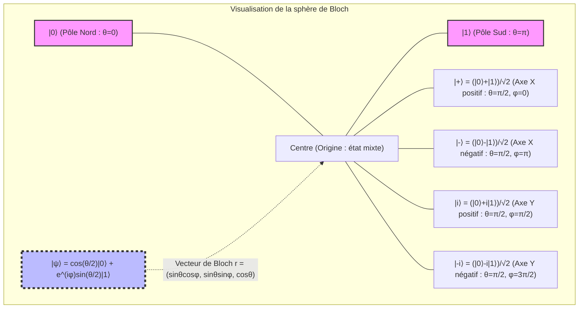
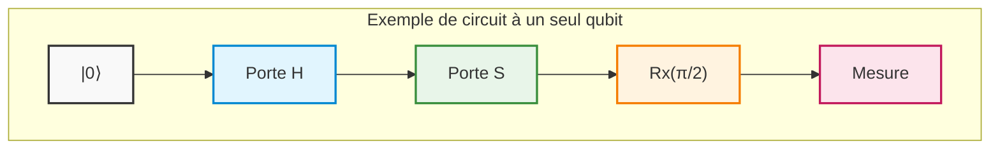
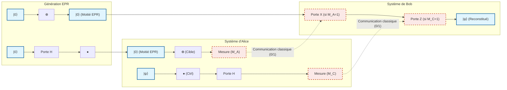
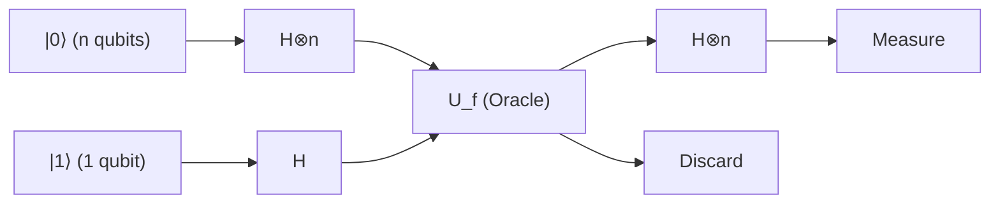
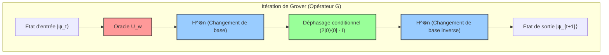
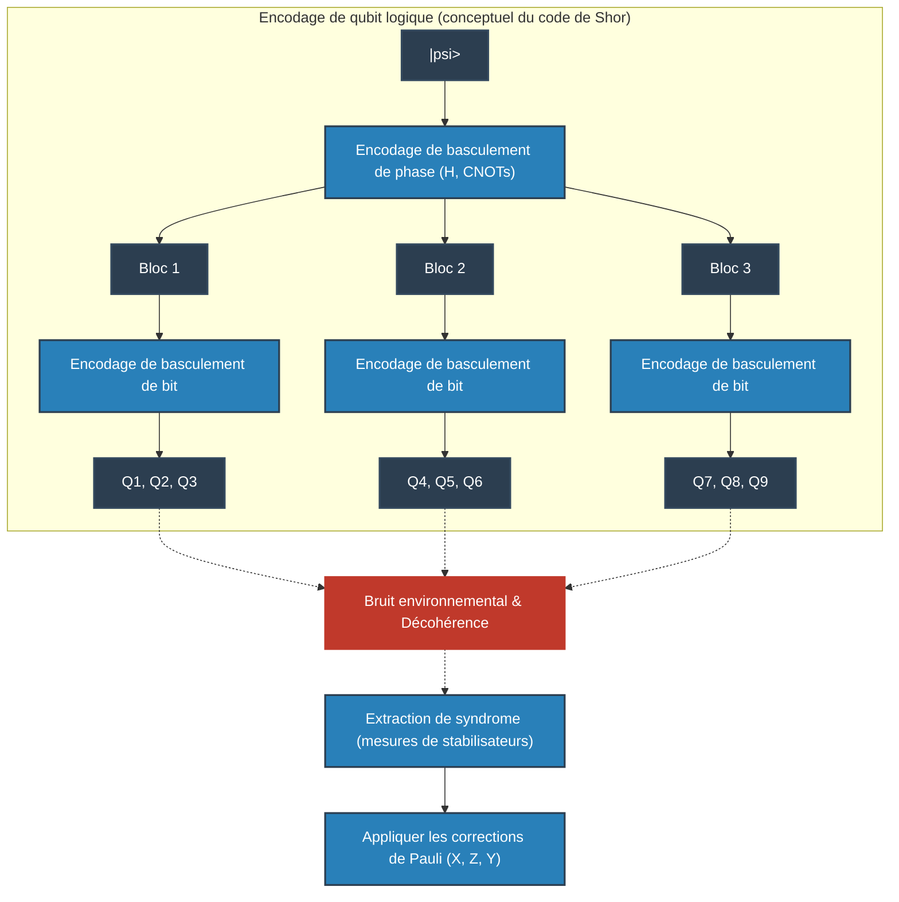
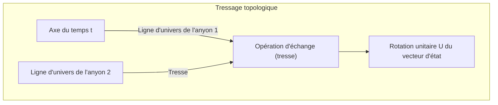
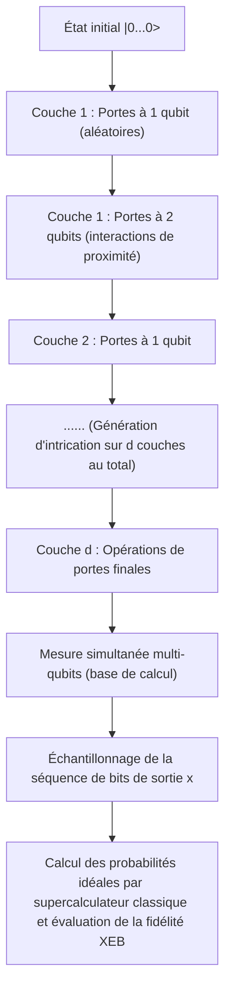

# Chapitre 1 : L'avènement et les limites de l'informatique quantique

## 1.1 Limites physiques du calcul classique et fin de la loi de Moore

Le développement spectaculaire des technologies de traitement de l'information dans la société moderne a été guidé par la règle empirique formulée en 1965 par Gordon Moore, selon laquelle « le nombre de transistors intégrés sur un circuit intégré à semi-conducteur double environ tous les deux ans », c'est-à-dire la « loi de Moore ». En suivant cette loi, nous avons poussé la miniaturisation (mise à l'échelle) des transistors et amélioré de manière exponentielle les performances de calcul des ordinateurs. Cependant, au XXIe siècle, ce paradigme classique se heurte à des limites physiques décisives. Le plus grand obstacle réside dans la manifestation d'un effet quantique : l'« effet tunnel quantique » (Quantum Tunneling Effect).

Lorsque l'épaisseur de l'isolant de grille ou la longueur de canal d'un transistor atteint l'échelle de quelques nanomètres — soit l'épaisseur de quelques atomes à quelques dizaines d'atomes —, les électrons traversent de manière probabiliste une barrière énergétique qu'ils ne devraient pas pouvoir franchir selon la mécanique classique, en raison de l'étalement de leur fonction d'onde. Selon l'approximation WKB, la probabilité de transmission $T$ d'un électron de masse $m$ (d'énergie $E < V_0$) incident sur une barrière de potentiel $V_0$ de largeur $a$ est donnée par l'équation suivante :

$$

T \approx \exp \left( - \frac{2}{\hbar} \int_{0}^{a} \sqrt{2m(V_0 - E)} \, dx \right)

$$

Ici, $\hbar$ est la constante de Planck réduite. Lorsque la largeur de la barrière $a$ diminue sous l'effet de la miniaturisation, la probabilité de transmission $T$ augmente de manière exponentielle, de sorte que le « courant de fuite » — circulant même à l'état bloqué (off) — atteint une ampleur qui ne peut plus être négligée. Cela entraîne une augmentation de la consommation d'énergie et de la dissipation thermique, signifiant la rupture du fonctionnement en tant qu'élément de commutation déterministe classique.

De plus, les limites thermodynamiques du traitement de l'information ne peuvent être négligées. En 1961, Rolf Landauer a démontré que le processus d'effacement d'une information (l'exécution d'une opération logique irréversible) produit inévitablement de la chaleur (le principe de Landauer). La quantité minimale de chaleur $\Delta Q$ dissipée dans l'environnement lors de l'effacement d'un bit d'information s'exprime comme suit :

$$

\Delta Q \ge k_B T \ln 2

$$

où $k_B$ est la constante de Boltzmann et $T$ la température absolue. Tant que les ordinateurs classiques utilisent des portes logiques irréversibles (telles que les portes ET ou OU), il est impossible d'échapper à cette limite inférieure thermodynamique. À mesure que la miniaturisation progresse et que l'énergie manipulée par un composant individuel s'approche de cette limite, le développement des calculateurs classiques est irrémédiablement freiné par les lois fondamentales de la physique.

## 1.2 La vision de Richard Feynman et l'explosion de la complexité computationnelle des systèmes quantiques

Alors que les ordinateurs classiques approchaient de leurs limites physiques, un paradigme de calcul entièrement nouveau s'est avéré nécessaire. L'élément déclencheur fut la conférence plénière de Richard Feynman lors de la « Première conférence sur la physique du calcul », tenue au MIT en 1981. Feynman mit en évidence l'extrême difficulté de simuler des systèmes quantiques à l'aide d'ordinateurs classiques et formula une proposition révolutionnaire :

« La nature n'est pas classique ; si vous voulez simuler la nature, vous feriez mieux de construire un calculateur fondé sur les principes de la mécanique quantique. »

Cette déclaration s'appuyait sur le fait que la dimension de l'« espace de Hilbert » (Hilbert Space) décrivant l'état d'un système quantique explose de manière exponentielle avec le nombre de particules. Considérons un système composé de $N$ particules de spin $1/2$ (c'est-à-dire un système possédant deux états quantiques). L'état d'une particule individuelle est décrit dans un espace vectoriel complexe à deux dimensions $\mathbb{C}^2$. Par conséquent, l'espace d'états $\mathcal{H}$ du système composite constitué de $N$ particules est formé par le produit tensoriel des espaces d'états de chaque sous-système :

$$

\mathcal{H} = \bigotimes_{i=1}^{N} \mathbb{C}^2 = \mathbb{C}^{2^N}

$$

L'état pur (Pure State) $|\Psi\rangle$ de ce système s'exprime comme une combinaison linéaire (superposition) de $2^N$ vecteurs de base. En utilisant la notation bra-ket de Dirac (Bra-ket notation), tout état quantique peut être décomposé comme suit :

$$

|\Psi\rangle = \sum_{x=0}^{2^N-1} c_x |x\rangle

$$

où $|x\rangle$ représente la base de calcul (Computational Basis) et $c_x \in \mathbb{C}$ est un nombre complexe appelé amplitude de probabilité (Probability Amplitude). Le vecteur d'état doit satisfaire à la condition de normalisation $\sum_{x=0}^{2^N-1} |c_x|^2 = 1$.

Même en tentant de simuler seulement $N = 300$ qubits, le nombre de nombres complexes à conserver, $2^{300}$, est d'environ $10^{90}$, ce qui surpasse de loin le nombre total d'atomes dans l'univers observable (environ $10^{80}$). Stocker autant de variables dans la mémoire d'un ordinateur classique, et calculer de surcroît l'évolution temporelle selon l'équation de Schrödinger (la multiplication d'une matrice unitaire $2^N \times 2^N$), serait impossible même en y consacrant la durée de vie de l'univers. Ce « fléau de la dimension » représente la limite du calcul classique, mais constitue dans le même temps la source même de la puissance de calcul potentielle des ordinateurs quantiques.

## 1.3 David Deutsch et la formalisation de la machine de Turing quantique

C'est le physicien David Deutsch, de l'Université d'Oxford, qui a formalisé de manière rigoureuse les idées intuitives de Feynman dans le cadre de l'informatique théorique. Dans son article fondateur de 1985, Deutsch a souligné que la « thèse de Church-Turing forte » (Strong Church-Turing Thesis) — selon laquelle tout processus physique peut être parfaitement simulé par des moyens finis — pourrait ne pas être vérifiée dans un monde physique régi par la mécanique quantique.

Deutsch a étendu la machine de Turing déterministe proposée par Alan Turing pour définir le concept de « machine de Turing quantique » (Quantum Turing Machine). Il s'agit d'une machine dont les états internes, les symboles sur le ruban et la position de la tête peuvent exister dans des « états de superposition » quantiques, et dont les transitions d'état sont décrites par un opérateur unitaire (Unitary Operator) $U$.

L'unité fondamentale de l'informatique quantique est le « qubit » (Qubit). Alors qu'un bit classique ne peut prendre que l'un des deux états déterminés $0$ ou $1$, un qubit peut se trouver dans une superposition linéaire arbitraire des états $|0\rangle$ et $|1\rangle$ :

$$

|\psi\rangle = \alpha |0\rangle + \beta |1\rangle \quad (\alpha, \beta \in \mathbb{C}, \ |\alpha|^2 + |\beta|^2 = 1)

$$

Les opérations appliquées à ce qubit sont des transformations linéaires conservant la norme, représentées par des matrices unitaires (satisfaisant $U^\dagger U = I$, où $U^\dagger$ est la matrice adjointe et $I$ la matrice identité). Par exemple, la porte de Hadamard (Hadamard Gate) $H$, qui est une porte représentative à un qubit, est définie comme suit :

$$

H = \frac{1}{\sqrt{2}} \begin{pmatrix} 1 & 1 \\ 1 & -1 \end{pmatrix}

$$

En appliquant l'opération de Hadamard à l'état de base $|0\rangle$, on obtient :

$$

H |0\rangle = \frac{1}{\sqrt{2}} \left( |0\rangle + |1\rangle \right)

$$

Ainsi, le système passe dans un état de superposition équilibrée où $|0\rangle$ et $|1\rangle$ ont une égale probabilité d'être observés. Le mérite de Deutsch réside dans le fait d'avoir érigé ces principes fondamentaux de la mécanique quantique en un modèle de calcul et d'avoir prouvé mathématiquement qu'un ordinateur quantique universel (Universal Quantum Computer) était réalisable en principe.

## 1.4 L'essence de l'ordinateur quantique : dissiper le mythe du simple « calcul massivement parallèle »

Pourquoi les ordinateurs quantiques peuvent-ils surpasser la puissance de calcul des machines classiques ? La vulgarisation grand public répond souvent en expliquant que « l'ordinateur quantique se ramifie dans une infinité d'univers parallèles, calcule toutes les possibilités simultanément et trouve instantanément la bonne réponse parmi elles ». Bien qu'il s'agisse d'une métaphore du « parallélisme quantique » (Quantum Parallelism), c'est une **explication inexacte qui induit en erreur de manière particulièrement grave** .

Certes, en appliquant des portes de Hadamard en parallèle sur un système de $N$ qubits, on peut créer en une seule opération la superposition des $2^N$ états :

$$

H^{\otimes N} |0\rangle^{\otimes N} = \frac{1}{\sqrt{2^N}} \sum_{x=0}^{2^N-1} |x\rangle

$$

Puis, en appliquant un opérateur unitaire $U_f$ évaluant une certaine fonction $f(x)$, l'état évolue comme suit :

$$

U_f \left( \frac{1}{\sqrt{2^N}} \sum_{x=0}^{2^N-1} |x\rangle |0\rangle \right) = \frac{1}{\sqrt{2^N}} \sum_{x=0}^{2^N-1} |x\rangle |f(x)\rangle

$$

Ici, il semble bien qu'en une seule opération, la valeur de $f(x)$ pour l'ensemble des $2^N$ valeurs de $x$ ait été « calculée ». Cependant, le postulat de la mécanique quantique qu'est le « postulat de la mesure (règle de Born, Born Rule) » fait obstacle. Lorsque l'on mesure (observe) cet état de superposition, nous n'obtenons qu'un seul résultat, et l'état subit un effondrement du paquet d'ondes (Wavefunction Collapse) vers un état aléatoire $|x\rangle |f(x)\rangle$ avec une probabilité $P(x) = 1/2^N$. En d'autres termes, même si l'on calcule toutes les réponses simultanément, la mesure ne permet d'en extraire qu'une « seule au hasard », ce qui ne diffère en rien d'un tirage de dés aléatoire.

Dès lors, quelle est la véritable puissance de l'ordinateur quantique ? C'est l' **« interférence quantique » (Quantum Interference)** .

Puisque l'amplitude de probabilité $c_x$ décrivant l'état quantique n'est pas une probabilité positive mais un « nombre complexe », elle peut être positive, négative, ou même imaginaire. Le secret des algorithmes quantiques réside dans la combinaison astucieuse de transformations unitaires au cours du calcul pour **faire interférer destructivement les amplitudes de probabilité correspondant aux mauvaises réponses (interférence destructive : Destructive Interference), tout en amplifiant celles correspondant aux bonnes réponses (interférence constructive : Constructive Interference)** .

Pour illustrer cela par un exemple simple, examinons l'interférence obtenue par inversion de phase et transformation de Hadamard. Que se passe-t-il si l'on applique à nouveau la porte de Hadamard à l'état $\frac{1}{\sqrt{2}}(|0\rangle - |1\rangle)$ ?

$$

H \left( \frac{|0\rangle - |1\rangle}{\sqrt{2}} \right) = \frac{1}{2} \big( (|0\rangle + |1\rangle) - (|0\rangle - |1\rangle) \big) = \frac{1}{2} (2|1\rangle) = |1\rangle

$$

Ici, l'amplitude de probabilité conduisant à l'état $|0\rangle$ devient $1/2 - 1/2 = 0$ et s'annule complètement (interférence destructive). En revanche, l'amplitude conduisant à l'état $|1\rangle$ est amplifiée à $1/2 + 1/2 = 1$ (interférence constructive).

Les algorithmes quantiques réellement utiles (par exemple, l'algorithme de Shor pour la factorisation en nombres premiers ou l'algorithme de Grover pour la recherche dans une base de données non structurée) orchestrent ce phénomène d'interférence ondulatoire de façon hautement maîtrisée afin que, lors de la mesure finale, la probabilité d'observer l'état correct soit aussi proche de $1$ que possible. Ce n'est pas le calcul parallèle en soi qui relève de la magie ; c'est la capacité à utiliser l'interférence des amplitudes de probabilité complexes pour « éliminer de manière probabiliste les chemins de calcul indésirables » qui constitue la différence décisive avec l'ordinateur classique et l'essence même du calcul quantique.

## 1.5 Visualisation conceptuelle : le mécanisme de l'interférence quantique

Le schéma conceptuel ci-dessous illustre la différence entre un processus probabiliste classique et un processus d'interférence quantique (correspondant à un interféromètre de Mach-Zehnder ou à l'application successive de portes de Hadamard). Dans une marche aléatoire classique, les probabilités s'additionnent simplement, tandis que dans un processus quantique, les amplitudes des différents chemins s'additionnent sous forme de nombres complexes, provoquant des interférences.

```mermaid
graph TD
    classDef quantum fill:#e6f2ff,stroke:#0066cc,stroke-width:2px;
    classDef classical fill:#fff2e6,stroke:#cc6600,stroke-width:2px;
    classDef measure fill:#e6ffe6,stroke:#00cc00,stroke-width:2px;

    Start["État initial |0⟩"]:::quantum

    subgraph "Génération de la superposition quantique"
        H1["Porte de Hadamard (H)"]:::quantum
        SuperPos["1/√2 (|0⟩ + |1⟩)"]:::quantum
    end

    subgraph "Opération unitaire (manipulation de phase par oracle, etc.)"
        U_op["Déphasage / Évolution unitaire (U)"]:::quantum
        PhaseState["1/√2 (|0⟩ - e^{iθ} |1⟩)"]:::quantum
    end

    subgraph "Processus d'interférence quantique (cœur de l'algorithme)"
        H2["Porte de Hadamard (H)"]:::quantum
        Interference["Annulation et amplification des amplitudes<br>(Constructive / Destructive)"]:::quantum
    end

    Result["Sortie déterministe avec probabilité 1 (ex. : |1⟩)"]:::measure

    Start --> H1
    H1 --> SuperPos
    SuperPos --> U_op
    U_op --> PhaseState
    PhaseState --> H2
    H2 --> Interference
    Interference -->|Mesure (observation)| Result
```

Ainsi, l'ordinateur quantique n'est pas un simple expédient provisoire visant à contourner les limites de la mécanique classique (limites de miniaturisation ou limites thermodynamiques), mais un véritable changement de paradigme qui refonde la définition même de l'information et du calcul sur les axiomes de la mécanique quantique. Dans le prochain chapitre, nous approfondirons les détails des « portes quantiques » et des « circuits quantiques », les outils mathématiques concrets permettant de manipuler cette interférence quantique à volonté.

# Chapitre 2 : Fondements des bits classiques et des qubits (Qubit)

Lors de la construction du cadre théorique de l'information quantique, le concept le plus fondamental est la définition de « l'unité minimale d'information ». Dans ce chapitre, nous partirons du bit de la théorie classique de l'information pour étendre ce concept au « qubit (Qubit) », l'unité minimale d'information quantique fondée sur les axiomes de la mécanique quantique. En employant le langage rigoureux des espaces de Hilbert, de la notation bra-ket et de l'algèbre linéaire, nous éluciderons de manière exhaustive la structure mathématique des états quantiques. Sans le moindre compromis, plongeons d'un point de vue expert dans les profondeurs de l'information quantique.

## 2.1 Unité minimale d'information : formalisation mathématique et limites du bit classique

Dans l'histoire de l'informatique, le fondement de la théorie de l'information établie par Claude Shannon en 1948 est le « bit (Bit) ». Indépendamment de sa réalisation physique (par exemple, le niveau haut ou bas de tension d'un transistor, la position ouverte ou fermée d'un interrupteur, ou la direction d'une aimantation), un bit classique est défini abstraitement comme un système prenant l'une des deux valeurs discrètes de l'espace d'états $\{0, 1\}$ .

Exprimons cela dans le langage plus formel des espaces vectoriels. L'état d'un bit classique peut être représenté à l'aide de la base canonique dans l'espace vectoriel réel à 2 dimensions $\mathbb{R}^2$ . Définissons respectivement l'état $0$ et l'état $1$ sous la forme des vecteurs colonnes suivants :

$$

\mathbf{v}_0 = \begin{pmatrix} 1 \\ 0 \end{pmatrix}, \quad \mathbf{v}_1 = \begin{pmatrix} 0 \\ 1 \end{pmatrix}

$$

Dans un système classique déterministe (Deterministic), l'état du bit est nécessairement fixé à $\mathbf{v}_0$ ou $\mathbf{v}_1$ . Cependant, en présence de bruit tel que l'agitation thermique ou en raison de l'incertitude sur notre connaissance du système, il devient nécessaire de décrire l'état sous la forme d'un bit classique probabiliste (Probabilistic). Dans ce cas, l'état du bit est représenté par une distribution de probabilité, et le vecteur d'état $\mathbf{p}$ peut s'écrire comme une combinaison convexe (Convex combination) des vecteurs de base de la manière suivante :

$$

\mathbf{p} = p_0 \mathbf{v}_0 + p_1 \mathbf{v}_1 = \begin{pmatrix} p_0 \\ p_1 \end{pmatrix}

$$

Ici, $p_0, p_1$ sont des nombres réels représentant respectivement la probabilité que l'état soit $0$ ou $1$ , et d'après les axiomes des probabilités de Kolmogorov, ils doivent satisfaire aux conditions suivantes :

1. ** Non-négativité ** : $p_0 \ge 0, \quad p_1 \ge 0$
2. ** Condition de normalisation (probabilité totale égale à 1) ** : $p_0 + p_1 = 1$

Dans le monde des bits classiques, un système composite combinant plusieurs bits est décrit par le produit tensoriel (produit de Kronecker) de leurs vecteurs de probabilité respectifs. Par exemple, la probabilité conjointe de deux bits classiques s'exprime comme suit :

$$

\mathbf{p}_{AB} = \mathbf{p}_A \otimes \mathbf{p}_B = \begin{pmatrix} p_{A0} \\ p_{A1} \end{pmatrix} \otimes \begin{pmatrix} p_{B0} \\ p_{B1} \end{pmatrix} = \begin{pmatrix} p_{A0}p_{B0} \\ p_{A0}p_{B1} \\ p_{A1}p_{B0} \\ p_{A1}p_{B1} \end{pmatrix}

$$

Le cadre de la théorie classique de l'information est remarquablement puissant et constitue le fondement de la société numérique contemporaine. Cependant, les états étant formés exclusivement par l'addition de probabilités réelles, il est fondamentalement impossible d'y représenter une « annulation mutuelle de probabilités », analogue à l'interférence d'ondes. C'est là qu'apparaissent les limites de la physique classique et la nécessité impérieuse de faire le saut vers l'information quantique.

## 2.2 Postulats de la mécanique quantique et notation bra-ket (Bra-ket notation)

Le premier postulat (Postulate) de la mécanique quantique énonce que « l'état d'un système physique fermé est entièrement décrit par un vecteur unitaire (vecteur d'état) dans un espace vectoriel complet muni d'un produit scalaire complexe, c'est-à-dire un espace de Hilbert (Hilbert Space) $\mathcal{H}$ ». Dans le contexte de l'informatique quantique, les degrés de liberté spatiaux continus pouvant être négligés, cet espace de Hilbert se réduit généralement à un espace vectoriel complexe de dimension finie $\mathbb{C}^d$ .

L'unité minimale d'information quantique, le « qubit (Qubit) », est rigoureusement définie comme un état dans un espace de Hilbert complexe de dimension 2, $\mathcal{H} \cong \mathbb{C}^2$ . Pour décrire les états au sein de cet espace vectoriel, il est d'usage d'employer la ** notation bra-ket (Bra-ket notation) ** introduite par le physicien Paul Dirac.

Le vecteur colonne représentant un état quantique est appelé un ** vecteur ket (Ket vector) ** et se note $|\psi\rangle$ . Pour correspondre aux états $0$ et $1$ du bit classique, introduisons une base orthonormée appelée base de calcul (Computational basis). Ces états sont également désignés comme la base $Z$ du qubit, et sont définis respectivement par $|0\rangle$ et $|1\rangle$ :

$$

|0\rangle = \begin{pmatrix} 1 \\ 0 \end{pmatrix}, \quad |1\rangle = \begin{pmatrix} 0 \\ 1 \end{pmatrix}

$$

D'autre part, en vertu du théorème de représentation de Riesz (Riesz representation theorem), à tout vecteur ket de l'espace de Hilbert correspond de manière unique un élément de l'espace dual (Dual space), agissant comme une forme linéaire continue. Cet élément est appelé un ** vecteur bra (Bra vector) ** et se note $\langle\psi|$ . Dans la représentation matricielle, le vecteur bra correspondant s'obtient en prenant l'adjoint hermitien (la transposée conjuguée, notée $^\dagger$ ) du vecteur ket :

$$

\langle\psi| = (|\psi\rangle)^\dagger = (|\psi\rangle^*)^T

$$

Par exemple, les vecteurs bra de la base correspondent aux vecteurs lignes suivants :

$$

\langle 0| = \begin{pmatrix} 1 & 0 \end{pmatrix}, \quad \langle 1| = \begin{pmatrix} 0 & 1 \end{pmatrix}

$$

La véritable puissance de la notation bra-ket réside dans la remarquable clarté visuelle qu'elle confère au calcul du produit scalaire. Le produit scalaire d'un bra $\langle\phi|$ et d'un ket $|\psi\rangle$ s'écrit $\langle\phi|\psi\rangle$ (ce qui procède d'un jeu de mots de Dirac, où « Bra » et « Ket » s'associent pour former le mot « Bracket »). La base de calcul $\{|0\rangle, |1\rangle\}$ formant un système orthonormé (Orthonormal system), les produits scalaires s'expriment à l'aide du symbole de Kronecker $\delta_{ij}$ :

$$

\langle i | j \rangle = \delta_{ij} \quad (i, j \in \{0, 1\})

$$

Concrètement, le produit scalaire d'un état avec lui-même vaut $1$ ( $\langle 0|0\rangle = 1$ , $\langle 1|1\rangle = 1$ ), et le produit scalaire entre vecteurs de base distincts vaut $0$ ( $\langle 0|1\rangle = 0$ , $\langle 1|0\rangle = 0$ ).

De plus, le produit tensoriel d'un ket et d'un bra (correspondant à un produit extérieur) se note $|\psi\rangle\langle\phi|$ , représentant un opérateur linéaire (une matrice) agissant d'un espace vers un autre. Par exemple, l'opérateur de projection (Projection operator) sur un sous-espace d'état donné est construit comme suit :

$$

|0\rangle\langle 0| = \begin{pmatrix} 1 \\ 0 \end{pmatrix} \begin{pmatrix} 1 & 0 \end{pmatrix} = \begin{pmatrix} 1 & 0 \\ 0 & 0 \end{pmatrix}

$$

L'opérateur identité $I$ (Identity operator) de tout espace vectoriel complexe de dimension 2 peut se décomposer à l'aide de la relation de complétude (Completeness relation) de la base comme suit, constituant un outil d'une remarquable puissance et constamment employé dans les calculs de mécanique quantique :

$$

I = |0\rangle\langle 0| + |1\rangle\langle 1| = \begin{pmatrix} 1 & 0 \\ 0 & 1 \end{pmatrix}

$$

## 2.3 Principe de superposition quantique et amplitudes de probabilité complexes

Alors qu'un bit classique se trouve invariablement dans un état défini $0$ ou $1$ (ou dans un mélange probabiliste de ces deux états), l'exigence de linéarité (Linearity) de la mécanique quantique permet au qubit d'adopter un état fondamentalement différent appelé « superposition (Superposition) », représenté par une combinaison linéaire de $|0\rangle$ et $|1\rangle$ . Tout vecteur unitaire de l'espace de Hilbert $\mathcal{H}$ constitue un état physique légitime.

Par conséquent, l'état pur (Pure state) le plus général $|\psi\rangle$ d'un qubit unique se développe dans la base de calcul de la manière suivante :

$$

|\psi\rangle = \alpha |0\rangle + \beta |1\rangle = \begin{pmatrix} \alpha \\ \beta \end{pmatrix}

$$

Ici, $\alpha$ et $\beta$ sont des nombres complexes ( $\alpha, \beta \in \mathbb{C}$ ) appelés ** amplitudes de probabilité complexes (Complex probability amplitude) ** . En contraste frappant avec les probabilités classiques qui sont des réels positifs ou nuls, le fait que les états quantiques soient gouvernés par des coefficients « complexes » constitue la raison fondamentale pour laquelle les ordinateurs quantiques possèdent une puissance de calcul surpassant celle des ordinateurs classiques. Puisque les nombres complexes sont dotés d'une phase (Phase) et peuvent s'orienter dans n'importe quelle direction du plan complexe, ils sont capables, à l'instar des ondes, de se renforcer mutuellement (interférence constructive) ou de s'annuler (interférence destructive). L'essence des algorithmes quantiques réside précisément dans l'orchestration subtile de ces effets d'interférence pour amplifier l'amplitude de probabilité de la réponse exacte et annihiler celle des réponses erronées.

Le processus permettant d'extraire des informations classiques d'un système quantique est la « mesure (Measurement) ». Dans le cadre d'une mesure projective (Projective measurement), la règle de Born (Born rule) établit que la probabilité $P(0)$ d'obtenir l'issue $0$ et la probabilité $P(1)$ d'obtenir l'issue $1$ lors de la mesure de l'état $|\psi\rangle$ dans la base de calcul $\{|0\rangle, |1\rangle\}$ sont données par le carré du module de leurs amplitudes de probabilité respectives :

$$

P(0) = |\langle 0|\psi\rangle|^2 = |\alpha|^2 = \alpha \alpha^*

$$
$$

P(1) = |\langle 1|\psi\rangle|^2 = |\beta|^2 = \beta \beta^*

$$

Pour que le système soit nécessairement observé dans l'un des états possibles, la somme de toutes les probabilités doit être rigoureusement égale à $1$ . En conséquence, la norme (longueur) du vecteur d'état quantique $|\psi\rangle$ doit obligatoirement être égale à $1$ . C'est la ** condition de normalisation (Normalization condition) ** :

$$

\langle\psi|\psi\rangle = (\alpha^* \langle 0| + \beta^* \langle 1|)(\alpha |0\rangle + \beta |1\rangle) = |\alpha|^2 + |\beta|^2 = 1

$$

Afin d'approfondir la signification géométrique de ces amplitudes de probabilité complexes, exprimons $\alpha$ et $\beta$ sous forme polaire :

$$

\alpha = r_0 e^{i\phi_0}, \quad \beta = r_1 e^{i\phi_1}

$$

Ici, $r_0, r_1 \ge 0$ représentent le module des amplitudes, et $\phi_0, \phi_1 \in [0, 2\pi)$ désignent leurs angles de phase respectifs. La condition de normalisation imposant $r_0^2 + r_1^2 = 1$ , nous pouvons introduire un paramètre réel $\theta \in [0, \pi]$ tel que $r_0 = \cos(\frac{\theta}{2})$ et $r_1 = \sin(\frac{\theta}{2})$ . En substituant ces expressions dans le vecteur d'état initial :

$$

|\psi\rangle = \cos\left(\frac{\theta}{2}\right) e^{i\phi_0} |0\rangle + \sin\left(\frac{\theta}{2}\right) e^{i\phi_1} |1\rangle

$$

Mettons en facteur le facteur de phase commun $e^{i\phi_0}$ sur l'ensemble de l'expression :

$$

|\psi\rangle = e^{i\phi_0} \left( \cos\left(\frac{\theta}{2}\right) |0\rangle + e^{i(\phi_1 - \phi_0)} \sin\left(\frac{\theta}{2}\right) |1\rangle \right)

$$

En mécanique quantique, le facteur de phase $e^{i\phi_0}$ affectant l'ensemble du vecteur d'état est désigné sous le nom de « phase globale (Global phase) ». Comme le met en évidence le calcul de la valeur moyenne $\langle A \rangle$ pour une observable arbitraire (opérateur hermitien) $A$ :

$$

\langle A \rangle = \left( e^{-i\phi_0} \langle\psi| \right) A \left( e^{i\phi_0} |\psi\rangle \right) = e^{-i\phi_0} e^{i\phi_0} \langle\psi| A |\psi\rangle = \langle\psi| A |\psi\rangle

$$

Puisque les termes de phase globale se compensent exactement, il est rigoureusement impossible de les détecter par une quelconque mesure physique. En d'autres termes, bien que $|\psi\rangle$ et $e^{i\phi_0}|\psi\rangle$ soient des vecteurs distincts dans l'espace de Hilbert (mais définissant la même droite vectorielle ou rayon), ils représentent physiquement un état absolument identique.

Par conséquent, en faisant abstraction de la phase globale pour ne conserver comme paramètre que la phase relative (Relative phase) $\varphi = \phi_1 - \phi_0$ (où $\varphi \in [0, 2\pi)$ ) entre $|0\rangle$ et $|1\rangle$ , tout état pur d'un qubit unique est représenté de façon unique et rigoureuse sous la ** forme standard ** suivante :

$$

|\psi\rangle = \cos\left(\frac{\theta}{2}\right) |0\rangle + e^{i\varphi} \sin\left(\frac{\theta}{2}\right) |1\rangle

$$

## 2.4 Visualisation géométrique par la sphère de Bloch (Bloch Sphere)

La paramétrisation obtenue dans la section précédente révèle que l'espace des états d'un qubit unique est géométriquement isomorphe à la surface de la sphère unité dans l'espace tridimensionnel (la sphère à deux dimensions $S^2$ ). Cette représentation visuelle est appelée la ** sphère de Bloch (Bloch Sphere) ** , en hommage au physicien suisse Felix Bloch qui en fut l'initiateur.

L'angle $\theta$ correspond exactement à l'angle polaire (Polar angle) mesuré à partir du demi-axe positif $Z$ , et l'angle $\varphi$ à l'angle azimutal (Azimuthal angle) dans le plan $X$-$Y$ .



La propriété la plus remarquable de la sphère de Bloch est que « les états orthogonaux dans l'espace de Hilbert (états dont le produit scalaire est nul) sont situés en des points antipodaux (Antipodal points : points diamétralement opposés à 180 degrés) dans l'espace réel tridimensionnel de la sphère de Bloch ». À titre d'exemple, l'état orthogonal à $|0\rangle$ (pôle Nord, $\theta=0$ ) est $|1\rangle$ (pôle Sud, $\theta=\pi$ ). Le calcul du produit scalaire entre états orthogonaux dans l'espace de Hilbert, $\langle 0 | 1 \rangle = 0$ , équivaut sur la sphère de Bloch à un écart angulaire de $\pi$ (180 degrés). L'angle géométrique réel étant le double de l'angle dans l'espace de Hilbert, c'est là que s'explique la nécessité mathématique d'introduire le demi-angle $\theta/2$ dans la paramétrisation.

Les coordonnées $\mathbf{r} = (x, y, z)$ de cette sphère de Bloch sont rigoureusement établies comme les valeurs moyennes des ** matrices de Pauli (Pauli matrices) ** , qui constituent les observables fondamentales (Observable) en mécanique quantique. Les matrices de Pauli, formant la base des opérateurs hermitiens dans un système à deux dimensions, sont définies comme suit :

$$

X = \sigma_x = \begin{pmatrix} 0 & 1 \\ 1 & 0 \end{pmatrix}, \quad
Y = \sigma_y = \begin{pmatrix} 0 & -i \\ i & 0 \end{pmatrix}, \quad
Z = \sigma_z = \begin{pmatrix} 1 & 0 \\ 0 & -1 \end{pmatrix}

$$

Les valeurs moyennes de ces observables de Pauli pour un état quelconque $|\psi\rangle$ s'obtiennent par le calcul direct en notation bra-ket :

$$

x = \langle\psi| X |\psi\rangle = \left( \cos\frac{\theta}{2} \langle 0| + e^{-i\varphi}\sin\frac{\theta}{2} \langle 1| \right) \begin{pmatrix} 0 & 1 \\ 1 & 0 \end{pmatrix} \begin{pmatrix} \cos\frac{\theta}{2} \\ e^{i\varphi}\sin\frac{\theta}{2} \end{pmatrix} = \sin\theta \cos\varphi

$$
$$

y = \langle\psi| Y |\psi\rangle = \left( \cos\frac{\theta}{2} \langle 0| + e^{-i\varphi}\sin\frac{\theta}{2} \langle 1| \right) \begin{pmatrix} 0 & -i \\ i & 0 \end{pmatrix} \begin{pmatrix} \cos\frac{\theta}{2} \\ e^{i\varphi}\sin\frac{\theta}{2} \end{pmatrix} = \sin\theta \sin\varphi

$$
$$

z = \langle\psi| Z |\psi\rangle = \left( \cos\frac{\theta}{2} \langle 0| + e^{-i\varphi}\sin\frac{\theta}{2} \langle 1| \right) \begin{pmatrix} 1 & 0 \\ 0 & -1 \end{pmatrix} \begin{pmatrix} \cos\frac{\theta}{2} \\ e^{i\varphi}\sin\frac{\theta}{2} \end{pmatrix} = \cos^2\left(\frac{\theta}{2}\right) - \sin^2\left(\frac{\theta}{2}\right) = \cos\theta

$$

Ainsi, le vecteur de Bloch $\mathbf{r} = (x, y, z)$ s'exprime parfaitement comme un vecteur unitaire de l'espace tridimensionnel $\mathbf{r} = (\sin\theta\cos\varphi, \sin\theta\sin\varphi, \cos\theta)$ . De surcroît, la matrice densité (Density matrix) $\rho = |\psi\rangle\langle\psi|$ correspondant à un état pur arbitraire est formulée avec une remarquable élégance à l'aide du vecteur de Pauli $\boldsymbol{\sigma} = (X, Y, Z)$ et de la matrice identité $I$ :

$$

\rho = \frac{1}{2} \left( I + \mathbf{r} \cdot \boldsymbol{\sigma} \right) = \frac{1}{2} \left( I + xX + yY + zZ \right)

$$

En explicitant les composantes matricielles, on vérifie aisément la relation suivante :

$$

\rho = \frac{1}{2} \begin{pmatrix} 1 + z & x - iy \\ x + iy & 1 - z \end{pmatrix} = \begin{pmatrix} \cos^2(\frac{\theta}{2}) & e^{-i\varphi}\sin(\frac{\theta}{2})\cos(\frac{\theta}{2}) \\ e^{i\varphi}\sin(\frac{\theta}{2})\cos(\frac{\theta}{2}) & \sin^2(\frac{\theta}{2}) \end{pmatrix}

$$

Ce résultat coïncide à la perfection avec le calcul du produit extérieur $|\psi\rangle\langle\psi|$ issu de la définition du produit tensoriel. Il convient ici de souligner que, pour un état pur, la norme du vecteur de Bloch est égale à $|\mathbf{r}| = 1$ et la trace du carré de la matrice densité vérifie $\text{Tr}(\rho^2) = 1$ . En revanche, lorsqu'un état mixte (Mixed state) apparaît par suite de la dégradation de l'information quantique (décohérence) due aux interactions avec l'environnement ou à des imperfections de contrôle, il forme un ensemble statistique d'états purs et présente ainsi $|\mathbf{r}| < 1$ . Par conséquent, les états mixtes sont représentés non pas sur la surface, mais en des points situés à « l'intérieur » de la sphère de Bloch ; et l'état de mélange maximal (Maximally mixed state) $\rho = I/2$ , où l'information est totalement annihilée, se situe précisément au centre de la sphère de Bloch $\mathbf{r} = (0,0,0)$ .

## 2.5 Mesure et effondrement du paquet d'ondes (Wavefunction Collapse)

La mesure en mécanique quantique diffère fondamentalement de l'acquisition passive d'information telle qu'elle se conçoit en mécanique classique. D'après la formulation axiomatique de von Neumann, lors de la mesure d'une grandeur physique (une observable), l'état subit un « effondrement (Collapse) » irréversible vers un état propre de cette observable.

Considérons à titre d'exemple la mesure dans la base $Z$ (c'est-à-dire une mesure prenant la matrice de Pauli $Z$ comme observable) appliquée à l'état d'un qubit unique $|\psi\rangle = \alpha|0\rangle + \beta|1\rangle$ . Les seules valeurs mesurées pouvant être obtenues sont les valeurs propres de $Z$ , à savoir $+1$ (associée à l'état $|0\rangle$ ) ou $-1$ (associée à l'état $|1\rangle$ ).

Pour formaliser mathématiquement et rigoureusement le processus de mesure, on fait appel à un ensemble d'opérateurs de projection $\{ P_m \}$ . Dans le cas de la mesure selon $Z$ , ces opérateurs de projection s'écrivent :

$$

P_0 = |0\rangle\langle 0|, \quad P_1 = |1\rangle\langle 1|

$$

Ces projecteurs satisfont la relation de complétude $P_0 + P_1 = I$ et la condition d'orthogonalité $P_i P_j = \delta_{ij} P_i$ . En accord avec la règle de Born, la probabilité $P(m)$ d'obtenir le résultat de mesure $m \in \{0, 1\}$ se calcule selon :

$$

P(m) = \langle\psi| P_m^\dagger P_m |\psi\rangle = \langle\psi| P_m |\psi\rangle

$$

ce qui reproduit rigoureusement les valeurs $|\alpha|^2$ et $|\beta|^2$ établies plus haut. Le point le plus déterminant réside dans le fait que le nouvel état quantique $|\psi'\rangle$ , immédiatement consécutif à l'obtention du résultat $m$ , s'obtient en appliquant l'opérateur de projection à l'état d'origine, puis en le renormalisant par sa nouvelle norme :

$$

|\psi'\rangle = \frac{P_m |\psi\rangle}{\sqrt{P(m)}}

$$

Dans le cas où le résultat obtenu est $0$ :

$$

|\psi'\rangle = \frac{|0\rangle\langle 0| (\alpha|0\rangle + \beta|1\rangle)}{|\alpha|} = \frac{\alpha}{|\alpha|} |0\rangle = e^{i\phi_0} |0\rangle \equiv |0\rangle

$$

et l'état s'effondre de manière absolue vers $|0\rangle$ (la phase globale n'ayant aucun effet observable). Telle est la description mathématique du phénomène désigné sous le terme d'effondrement du paquet d'ondes (Wavefunction collapse). Dès lors qu'une mesure a eu lieu et que l'état s'est effondré, la phase relative $\varphi$ et l'information contenue dans les amplitudes ( $\alpha, \beta$ ) de l'état de superposition initial sont irrémédiablement détruites. Par conséquent, il est intrinsèquement impossible d'extraire l'information intégrale d'un état quantique à partir d'une unique mesure effectuée sur une seule copie (un principe intimement lié au « théorème de non-clonage »).

## 2.6 Introduction à l'extension aux systèmes multipartites et perspectives pour le chapitre suivant

Ayant acquis une compréhension approfondie des propriétés d'un qubit unique, introduisons les fondements mathématiques des « systèmes multi-qubits » qui seront examinés en détail dès le prochain chapitre. Alors qu'une distribution de probabilité classique élargit son espace d'états par un produit cartésien, l'espace de Hilbert $\mathcal{H}_{AB}$ d'un système composite en mécanique quantique est construit à l'aide du ** produit tensoriel (Tensor product) ** des espaces de Hilbert des sous-systèmes constitutifs $\mathcal{H}_A$ et $\mathcal{H}_B$ :

$$

\mathcal{H}_{AB} = \mathcal{H}_A \otimes \mathcal{H}_B

$$

Le produit tensoriel de deux états de qubits indépendants se développe comme suit, générant un espace vectoriel complexe à 4 dimensions :

$$

|\Psi\rangle_{AB} = (\alpha_0|0\rangle + \alpha_1|1\rangle) \otimes (\beta_0|0\rangle + \beta_1|1\rangle) = \alpha_0\beta_0|00\rangle + \alpha_0\beta_1|01\rangle + \alpha_1\beta_0|10\rangle + \alpha_1\beta_1|11\rangle

$$

Ici, l'existence d'états impossibles à factoriser sous la forme d'un produit tensoriel d'états individuels (par exemple l'état de Bell $|\Phi^+\rangle = (|00\rangle + |11\rangle)/\sqrt{2}$ ) constitue la source même de l'intrication quantique (Entanglement). L'explosion exponentielle de la dimensionnalité engendrée par le produit tensoriel ( $2^N$ dimensions pour $N$ qubits) est le fondement incontestable qui confère aux ordinateurs quantiques leur puissance de calcul parallèle phénoménale.

Au cours de ce chapitre, nous avons érigé les différences fondamentales séparant le bit classique du qubit sur l'assise mathématique de l'espace de Hilbert. Le qubit pouvant occuper un continuum d'états superposés paramétrés par des amplitudes de probabilité complexes, nous nous sommes dotés, par l'entremise de la sphère de Bloch, d'un outil visuel et analytique puissant permettant d'appréhender intuitivement un vecteur complexe abstrait sous les traits d'un modèle géométrique tridimensionnel.

Dans le chapitre suivant, « Chapitre 3 : Portes quantiques et transformations unitaires », nous décrirons de manière approfondie les « portes logiques quantiques » chargées de manipuler cet état de qubit individuel, et nous mettrons en lumière les propriétés algébriques des rotations unitaires appliquées sur la sphère de Bloch. La porte ouvrant sur les profondeurs vertigineuses de l'information quantique vient à peine d'être franchie.

# Chapitre 3 : Axiomes de la mécanique quantique et observation (Effondrement du paquet d'ondes)

## 3.1 Introduction : Approche axiomatique de la mécanique quantique et exigences de l'algèbre linéaire

Pour comprendre fondamentalement le principe de fonctionnement des ordinateurs quantiques, il est indispensable de saisir le cadre théorique de la physique appelé mécanique quantique sous une forme mathématiquement rigoureuse. De nombreuses théories en physique se sont développées de manière inductive sur la base de règles empiriques, mais la mécanique quantique, en particulier la mécanique quantique moderne formulée par John von Neumann, adopte une approche axiomatique qui déduit l'ensemble du système à partir d'un petit nombre d'« axiomes » (Axioms) mathématiques.

Ce système d'axiomes est construit sur la scène de l'algèbre linéaire complexe qui peut être étendue à une dimension infinie, appelée espace de Hilbert. Dans la science de l'information quantique et l'informatique quantique, comme nous traitons principalement des espaces vectoriels de dimension finie (par exemple, l'espace des produits tensoriels de $\mathbb{C}^2$ pour les systèmes de qubits), nous pouvons éviter les difficultés analytiques en dimension infinie (comme le domaine de définition des opérateurs non bornés) et décrire et comprendre la mécanique quantique purement comme de l'algèbre linéaire.

Dans ce chapitre, nous formulerons rigoureusement et sans aucun compromis le processus allant de la description de l'état quantique à l'évolution temporelle, jusqu'à l'« observation » qui a suscité les débats les plus philosophiques. Le lecteur réalisera comment les phénomènes quantiques, qui semblent à première vue contre-intuitifs, reposent sur une structure mathématique cohérente et belle. Cette structure mathématique elle-même devient le « langage » direct pour décrire les algorithmes des ordinateurs quantiques.

## 3.2 1er Axiome : Espace des états (Espace de Hilbert et vecteur d'état)

Le premier axiome de la mécanique quantique détermine comment représenter mathématiquement l'« état » d'un système physique.

**Axiome 1 (Représentation de l'état)** :
L'état d'un système physique fermé est complètement décrit par un vecteur unitaire de norme 1 sur un espace de Hilbert (Hilbert space) $\mathcal{H}$, qui est un espace préhilbertien complexe complet satisfaisant la complétude. Cela s'appelle un **vecteur d'état**.

Selon la notation bra-ket (Bra-ket notation) introduite par Paul Dirac, un vecteur d'état est traité comme un vecteur colonne et noté ket ** $| \psi \rangle$ ** . Un vecteur ligne appartenant à l'espace dual $\mathcal{H}^*$ est noté bra ** $\langle \psi |$ ** , et ceux-ci sont en relation de conjugaison hermitienne (transposée conjuguée complexe) l'un par rapport à l'autre. C'est-à-dire :

$$

\langle \psi | = ( | \psi \rangle )^\dagger

$$

Le produit scalaire de deux états arbitraires ** $| \phi \rangle$ ** et ** $| \psi \rangle$ ** sur l'espace de Hilbert est calculé comme le produit du bra et du ket ** $\langle \phi | \psi \rangle$ ** , et donne une valeur complexe. Ce produit scalaire satisfait les propriétés suivantes :

1. **Définie-positivité** : Pour tout ** $| \psi \rangle \neq 0$ ** , $\langle \psi | \psi \rangle > 0$
2. **Linéarité** : $\langle \phi | ( c_1 | \psi_1 \rangle + c_2 | \psi_2 \rangle ) = c_1 \langle \phi | \psi_1 \rangle + c_2 \langle \phi | \psi_2 \rangle$
3. **Symétrie conjuguée** : $\langle \phi | \psi \rangle = \langle \psi | \phi \rangle^*$ ( $*$ est le conjugué complexe)

Pour que l'état physique établisse une interprétation probabiliste, il doit toujours satisfaire la condition de normalisation (Normalization condition). C'est-à-dire que la norme du vecteur d'état ** $| \psi \rangle$ ** est de 1 :

$$

\| | \psi \rangle \| = \sqrt{\langle \psi | \psi \rangle} = 1

$$

De plus, en raison de l'inégalité de Cauchy-Schwarz (Cauchy-Schwarz inequality) $|\langle \phi | \psi \rangle|^2 \le \langle \phi | \phi \rangle \langle \psi | \psi \rangle$ qui s'applique, la valeur absolue du produit scalaire entre des états normalisés se situe toujours entre 0 et 1. C'est ce qui deviendra plus tard la base mathématique pour être interprété comme une « probabilité ».

### Principe de superposition et base orthonormée complète

La caractéristique la plus remarquable de la mécanique quantique est le « principe de superposition » (Superposition principle). Si ** $| \phi \rangle$ ** et ** $| \psi \rangle$ ** sont des états physiquement permis, alors toute combinaison linéaire complexe $c_1 | \phi \rangle + c_2 | \psi \rangle$ de ceux-ci est également (si elle est normalisée) un état physiquement permis. Cette propriété découle directement de la linéarité de l'espace de Hilbert.

Dans l'espace de Hilbert $\mathcal{H}$, il existe une base orthonormée complète (Orthonormal basis) $\{ | e_i \rangle \}$. Les vecteurs de cette base sont mutuellement orthogonaux et normalisés :

$$

\langle e_i | e_j \rangle = \delta_{ij}

$$

( $\delta_{ij}$ est le symbole de Kronecker). De plus, en tant que relation de fermeture (Completeness relation) ou identité de résolution, l'opérateur identité $I$ peut être développé comme suit :

$$

I = \sum_i | e_i \rangle \langle e_i |

$$

Tout état quantique arbitraire ** $| \psi \rangle$ ** peut être développé d'une seule manière comme une combinaison linéaire des vecteurs de base en appliquant cet opérateur identité :

$$

| \psi \rangle = I | \psi \rangle = \left( \sum_i | e_i \rangle \langle e_i | \right) | \psi \rangle = \sum_i \langle e_i | \psi \rangle | e_i \rangle = \sum_i c_i | e_i \rangle

$$

Ici, le coefficient de développement $c_i = \langle e_i | \psi \rangle$ est appelé amplitude de probabilité complexe, et joue un rôle décisif dans la règle de Born décrite plus loin. D'après la condition de normalisation $\langle \psi | \psi \rangle = 1$, on déduit que $\sum_i |c_i|^2 = 1$.

## 3.3 2ème Axiome : Grandeurs physiques et opérateurs hermitiens

En mécanique classique, les grandeurs physiques (observables) telles que la position, la quantité de mouvement et l'énergie sont décrites comme des fonctions à valeurs réelles. Cependant, un changement de paradigme fondamental se produit en mécanique quantique.

**Axiome 2 (Grandeurs physiques)** :
Une grandeur physique observable (observable) est décrite par un opérateur linéaire auto-adjoint (opérateur hermitien) $A$ sur l'espace de Hilbert $\mathcal{H}$.

Un opérateur hermitien est un opérateur dont le conjugué hermitien est égal à lui-même. C'est-à-dire qu'il satisfait $A = A^\dagger$. Lorsqu'il est représenté sous forme de matrice dans un espace de dimension finie, cela signifie que les éléments présentent une symétrie conjuguée complexe ( $A_{ij} = A_{ji}^*$ ).

La raison pour laquelle une grandeur physique doit être définie comme un opérateur hermitien réside dans ses « valeurs propres » (Eigenvalues). Selon le théorème spectral (Spectral theorem) de l'algèbre linéaire, un opérateur hermitien possède les propriétés extrêmement importantes suivantes :

1. **Toutes les valeurs propres $a_i$ sont des nombres réels.** (Puisque les grandeurs physiques observées doivent toujours être des nombres réels, cela correspond à l'exigence physique.)
2. **Les vecteurs propres appartenant à des valeurs propres différentes sont orthogonaux entre eux.**
3. **Les vecteurs propres de l'opérateur $\{ | a_i \rangle \}$ forment une base orthonormée complète de l'espace de Hilbert.**

Par conséquent, tout observable $A$ arbitraire peut subir une décomposition spectrale (Spectral decomposition) en tant que combinaison linéaire d'opérateurs de projection $P_i = | a_i \rangle \langle a_i |$ en utilisant ses valeurs propres $a_i$ et ses vecteurs propres ** $| a_i \rangle$ ** .

$$

A = \sum_i a_i | a_i \rangle \langle a_i |

$$

Grâce à cette formulation, l'acte de « mesurer une grandeur physique » peut être compris comme une opération géométrique de projection sur une base spécifique (vecteur propre) de l'espace de Hilbert. Par exemple, l'observation $\sigma_z$ d'un qubit est complètement décrite comme une opération de projection sur une base orthogonale composée de l'état ** $| 0 \rangle$ ** correspondant à la valeur propre $+1$ et de l'état ** $| 1 \rangle$ ** correspondant à la valeur propre $-1$.

## 3.4 3ème Axiome : Évolution temporelle unitaire et équation de Schrödinger

Lorsqu'un système quantique est isolé et n'interagit pas avec d'autres systèmes, son état évolue dans le temps de manière déterministe et réversible.

**Axiome 3 (Évolution temporelle)** :
L'évolution temporelle de l'état d'un système quantique isolé obéit à l'équation de Schrödinger (Schrödinger equation). Ou, de manière équivalente, l'état ** $| \psi(t_0) \rangle$ ** à l'instant $t_0$ évolue vers l'état ** $| \psi(t) \rangle$ ** à l'instant $t$ par l'application de l'opérateur unitaire $U(t, t_0)$.

L'équation de Schrödinger dépendante du temps, qui est l'équation fondamentale décrivant l'évolution temporelle, s'exprime comme suit :

$$

i\hbar \frac{d}{dt} | \psi(t) \rangle = H | \psi(t) \rangle

$$

Ici, $i$ est l'unité imaginaire, $\hbar$ est la constante de Planck réduite, et $H$ est l'opérateur hamiltonien (Hamiltonian), qui est l'observable correspondant à l'énergie totale du système.

Si l'on considère un système où le hamiltonien $H$ ne dépend pas du temps (invariant dans le temps), cette équation différentielle s'intègre formellement, et la solution est donnée comme suit :

$$

| \psi(t) \rangle = \exp\left( -\frac{i}{\hbar} H (t - t_0) \right) | \psi(t_0) \rangle

$$

L'opérateur représenté par cette fonction exponentielle $U(t, t_0) = \exp\left( -i H (t - t_0) / \hbar \right)$ est l'opérateur d'évolution temporelle. Puisque le hamiltonien $H$ est hermitien ( $H = H^\dagger$ ), selon le théorème de Stone (Stone's theorem), $U$ devient un opérateur unitaire (Unitary operator). Un opérateur unitaire est un opérateur dont le conjugué hermitien est égal à sa matrice inverse ( $U^\dagger U = U U^\dagger = I$ ).

La signification physique extrêmement importante d'une transformation unitaire réside dans le fait de **« conserver la norme (longueur) et le produit scalaire du vecteur d'état »**. C'est-à-dire que, quel que soit le temps écoulé, $\langle \psi(t) | \psi(t) \rangle = \langle \psi(t_0) | U^\dagger U | \psi(t_0) \rangle = 1$ est toujours garanti, et la loi physique selon laquelle la somme des probabilités est 1 ne s'effondre jamais. Les « portes quantiques » d'un ordinateur quantique ne sont rien d'autre que l'opération consistant à concevoir et contrôler artificiellement cette évolution temporelle unitaire. Par exemple, la porte de Hadamard et la porte CNOT sont toutes représentées sous forme de matrices unitaires.

## 3.5 4ème Axiome : Observation et règle de Born (Born rule)

Le concept d'« observation » (Measurement) en mécanique quantique est fondamentalement différent de celui de la physique classique. Dans un système classique, l'acte d'observer est considéré comme un acte passif pour connaître une valeur sans perturber l'état du système. Cependant, en mécanique quantique, l'observation intervient activement sur l'état et provoque des changements irréversibles.

**Axiome 4 (Observation et règle de Born)** :
Lorsqu'on observe un observable $A$ ayant une décomposition spectrale $A = \sum_i a_i P_i$ sur un système se trouvant dans l'état ** $| \psi \rangle$ ** , la valeur de mesure obtenue est toujours l'une des valeurs propres $a_i$ de $A$. La probabilité $p(a_k)$ d'obtenir une valeur propre spécifique $a_k$ est donnée selon la règle de Born comme suit :

$$

p(a_k) = \langle \psi | P_k | \psi \rangle = \| P_k | \psi \rangle \|^2

$$

Si la valeur propre $a_k$ est non dégénérée (il n'y a qu'un seul vecteur propre ** $| a_k \rangle$ ** correspondant), l'opérateur de projection devient $P_k = | a_k \rangle \langle a_k |$, et la probabilité est calculée comme le carré de la valeur absolue du produit scalaire sur le vecteur propre de l'état :

$$

p(a_k) = \langle \psi | a_k \rangle \langle a_k | \psi \rangle = | \langle a_k | \psi \rangle |^2

$$

Ce n'est rien d'autre que le carré de la valeur absolue $|c_k|^2$ du coefficient $c_k = \langle a_k | \psi \rangle$ obtenu lors du développement du vecteur d'état ** $| \psi \rangle$ ** avec la base $\{ | a_i \rangle \}$. L'amplitude de probabilité complexe $c_k$ elle-même ne peut pas être observée directement, mais le carré de sa valeur absolue apparaît comme la probabilité d'observation dans le monde réel. L'intuition de Max Born qui a proposé cette règle est une réalisation monumentale qui a transformé la physique du déterminisme à la théorie des probabilités. La valeur attendue $\langle A \rangle$ de l'observable $A$ est calculée comme la somme des produits de toutes les valeurs propres et de leurs probabilités d'apparition, et s'exprime finalement de manière extrêmement élégante sous la forme d'un produit scalaire avec le vecteur d'état :

$$

\langle A \rangle = \sum_i a_i p(a_i) = \sum_i a_i \langle \psi | P_i | \psi \rangle = \langle \psi | \left( \sum_i a_i P_i \right) | \psi \rangle = \langle \psi | A | \psi \rangle

$$

## 3.6 Effondrement du paquet d'ondes par observation (réduction de l'état) et décohérence

L'axiome de l'observation inclut l'étape la plus controversée : que devient l'état du système « après » l'observation. C'est le phénomène appelé « effondrement du paquet d'ondes » (Wavefunction collapse) ou « réduction de l'état » (State reduction). Ce processus, connu sous le nom de postulat de projection (Projection postulate) de von Neumann, est formulé comme suit :

**Postulat de projection** :
L'état ** $| \psi' \rangle$ ** du système immédiatement après avoir obtenu la valeur propre $a_k$ par observation, change (s'effondre) instantanément en appliquant l'opérateur de projection $P_k$ correspondant au vecteur d'état d'origine et en le renormalisant :

$$

| \psi' \rangle = \frac{P_k | \psi \rangle}{\sqrt{p(a_k)}}

$$

Si l'instrument de mesure est idéal et que l'état du système s'est effondré vers la valeur propre non dégénérée $a_k$, l'état juste après l'observation est strictement le vecteur propre ** $| a_k \rangle$ ** lui-même. C'est-à-dire que si la même observation est répétée exactement après, $a_k$ sera à nouveau obtenu avec une probabilité de 1 (100 %). Ceci est appelé « mesure de première espèce ».

Cet « effondrement du paquet d'ondes » possède des propriétés (discontinues, probabilistes, irréversibles) qui contredisent clairement l'évolution temporelle unitaire (continue, déterministe, réversible) décrite par l'équation de Schrödinger. La mécanique quantique implique une dynamique duale : le système évolue de manière unitaire lorsqu'il est isolé, et subit un effondrement non unitaire au moment où il entre en contact avec un appareil de mesure macroscopique.

### De l'état pur à l'état mixte : introduction de l'opérateur de densité

Pour comprendre encore plus profondément le paradoxe de l'effondrement du paquet d'ondes, le concept d'« opérateur de densité » (Density operator) est indispensable. Le vecteur d'état ** $| \psi \rangle$ ** traité jusqu'à présent est un « état pur » (Pure state) qui détient le maximum d'informations sur le système. L'opérateur de densité d'un état pur est défini comme $\rho = | \psi \rangle \langle \psi |$.

D'un autre côté, lorsque l'on ne sait pas (ou que l'on a perdu l'information sur) l'état vers lequel le système s'est effondré pendant le processus d'observation, le système doit être décrit comme un état mixte (Mixed state) probabiliste classique. Par exemple, l'opérateur de densité représentant l'ensemble d'un système qui s'est effondré vers l'état ** $| a_k \rangle$ ** avec une probabilité $p(a_k)$, est le suivant :

$$

\rho' = \sum_k p(a_k) | a_k \rangle \langle a_k |

$$

À ce moment, les composantes non diagonales (termes d'interférence) de $\rho = | \psi \rangle \langle \psi |$ qui était dans un état pur, disparaissent complètement en raison de l'acte d'observation. Cette perte de cohérence est précisément le cœur de la « décohérence » (Decoherence).

### Décohérence et émergence de la classicité macroscopique

L'appareil de mesure fait également partie d'un système quantique composé d'un grand nombre de particules, et l'interaction entre le système quantique et un environnement immense (tel que l'appareil de mesure ou un bain thermique) crée une « intrication quantique » (Entanglement). Lorsque les degrés de liberté de l'environnement sont éliminés par trace partielle (Partial trace) pour calculer la matrice de densité réduite (Reduced density matrix) du système cible uniquement, le vecteur d'état du système qui était un état pur passe rapidement à un état mixte, et la cohérence de phase entre chaque composante du système est perdue :

$$

\rho_{S} = \mathrm{Tr}_{E} [ | \Psi_{SE} \rangle \langle \Psi_{SE} | ]

$$

En conséquence, la superposition disparaît à l'échelle macroscopique, et le système semble se comporter comme un mélange probabiliste classique. L'effondrement du paquet d'ondes n'est nullement un échec des lois de la physique, mais peut être considéré comme une dissipation de l'information due à des interactions irréversibles avec l'environnement. Surmonter cette décohérence est le plus grand défi de l'humanité pour réaliser des ordinateurs quantiques tolérants aux pannes.

### Évolution temporelle de l'état quantique et dynamique de l'observation

Le diagramme suivant visualise le processus dans lequel l'état initial d'un système quantique passe par une évolution temporelle unitaire, puis l'état bifurque (s'effondre) de manière probabiliste par observation. Confirmez le contraste entre l'évolution déterministe de Schrödinger et l'effondrement probabiliste de Born.

```mermaid
graph TD
    classDef state fill:#f9f9f9,stroke:#333,stroke-width:2px;
    classDef operation fill:#e1f5fe,stroke:#0288d1,stroke-width:2px;
    classDef measure fill:#fce4ec,stroke:#c2185b,stroke-width:2px;
    
    Init["État initial $| \psi(t_0) \rangle$"]:::state --> Evo["Évolution temporelle unitaire $U(t, t_0) = \exp(-i H t / \hbar)$"]:::operation
    Evo --> Evolved["État après évolution $| \psi(t) \rangle = U | \psi(t_0) \rangle$"]:::state
    
    Evolved --> Obs["Observation de la grandeur physique $A$ (Opérateur de projection $P_k$)"]:::measure
    
    Obs -->|Probabilité $p(a_1) = \langle \psi | P_1 | \psi \rangle$| State1["État effondré 1 : $| a_1 \rangle$"]:::state
    Obs -->|Probabilité $p(a_2) = \langle \psi | P_2 | \psi \rangle$| State2["État effondré 2 : $| a_2 \rangle$"]:::state
    Obs -->|...| StateN["État effondré n : $| a_n \rangle$"]:::state
    
    State1 --> Decoherence["Décohérence (perte d'interférence de phase) et passage à l'état mixte"]:::measure
    State2 --> Decoherence
    StateN --> Decoherence
```

Ainsi, les concepts abstraits de l'algèbre linéaire — espaces vectoriels, produits scalaires, opérateurs hermitiens, problèmes aux valeurs propres, matrices unitaires — ne sont pas de simples jeux mathématiques, mais un langage sans pareil pour décrire et prédire précisément les comportements les plus infimes de l'univers. Les algorithmes des ordinateurs quantiques manipulent habilement ces deux règles puissantes, « l'évolution déterministe de Schrödinger » et « l'effondrement probabiliste de Born », et nous guident vers un domaine de calcul inaccessible aux ordinateurs classiques.

# Chapitre 4 : Portes à un seul qubit et transformations unitaires

Au cœur du calcul quantique réside la manipulation précise des états quantiques. Alors que les portes logiques classiques (ET, OU, NON, etc.) manipulent les valeurs des bits de manière irréversible, les "portes quantiques" des ordinateurs quantiques sont des évolutions temporelles réversibles qui obéissent aux exigences de l'équation de Schrödinger, et sont décrites mathématiquement et rigoureusement comme des "transformations unitaires (matrices unitaires)" sur un espace de Hilbert complexe. Dans ce chapitre, nous explorerons en profondeur et sans aucun compromis la structure mathématique, les propriétés algébriques et la signification géométrique intuitive sur la sphère de Bloch des portes quantiques fondamentales agissant sur un seul qubit (système à deux niveaux).

## 4.1 Les exigences de la mécanique quantique et la nécessité des matrices unitaires

L'évolution temporelle d'un système quantique est régie par l'équation de Schrödinger suivante, utilisant l'hamiltonien ** $H$ ** ( ** $H^\dagger = H$ ** ), qui est l'opérateur hermitien caractérisant le système.

$$

i\hbar \frac{d}{dt} |\psi(t)\rangle = H |\psi(t)\rangle

$$

En supposant un système où l'hamiltonien ** $H$ ** ne dépend pas du temps, l'état quantique ** $|\psi(t)\rangle$ ** à tout instant ** $t$ ** est formellement intégré à partir de l'état initial ** $|\psi(0)\rangle$ ** comme suit :

$$

|\psi(t)\rangle = e^{-\frac{i}{\hbar}Ht} |\psi(0)\rangle

$$

Nous définissons l'opérateur d'évolution temporelle apparaissant ici comme ** $U(t) = e^{-\frac{i}{\hbar}Ht}$ ** . Puisque ** $H$ ** en exposant de la fonction exponentielle est hermitien, en calculant l'opérateur adjoint (conjugué hermitien) ** $U(t)^\dagger$ ** de cet opérateur ** $U(t)$ ** , la propriété extrêmement importante suivante est dérivée :

$$

U(t)^\dagger U(t) = \left( e^{-\frac{i}{\hbar}Ht} \right)^\dagger e^{-\frac{i}{\hbar}Ht} = e^{\frac{i}{\hbar}H^\dagger t} e^{-\frac{i}{\hbar}Ht} = e^{\frac{i}{\hbar}Ht} e^{-\frac{i}{\hbar}Ht} = I

$$

De même, ** $U(t) U(t)^\dagger = I$ ** est également vrai. Ainsi, une matrice dont la matrice adjointe est égale à sa propre matrice inverse ( ** $U^\dagger = U^{-1}$ ** ) est appelée une "matrice unitaire". Une porte à un seul qubit n'est rien d'autre qu'une matrice unitaire ** $2 \times 2$ ** réalisée par un hamiltonien conçu intentionnellement grâce à un contrôle physique (par exemple, l'irradiation d'une impulsion micro-onde avec une fréquence et une durée spécifiques).

La raison pour laquelle les matrices unitaires sont absolument indispensables en mécanique quantique est qu'elles sont les seules transformations linéaires qui garantissent mathématiquement la "conservation de la probabilité (conservation de la norme)". Calculons le produit scalaire des états après avoir appliqué une transformation unitaire ** $U$ ** à des états quantiques arbitraires ** $|\psi\rangle$ ** et ** $|\phi\rangle$ ** .

$$

\langle \phi' | \psi' \rangle = ( \langle \phi | U^\dagger ) ( U |\psi\rangle ) = \langle \phi | U^\dagger U | \psi \rangle = \langle \phi | I | \psi \rangle = \langle \phi | \psi \rangle

$$

La conservation du produit scalaire signifie que la norme (le carré de la longueur) du vecteur d'état lui-même, ** $\langle \psi | \psi \rangle$ ** , est également conservée. Selon la règle de Born de la mécanique quantique, la somme des carrés des valeurs absolues des amplitudes du vecteur d'état doit correspondre à une probabilité totale de "1". Par conséquent, pour que cette interprétation probabiliste ne s'effondre pas lors des opérations des portes quantiques, il est une condition préalable absolue que l'opération soit unitaire.

De plus, selon le théorème spectral, toute matrice unitaire ** $U$ ** peut être exprimée comme ** $U = e^{iK}$ ** en utilisant une matrice hermitienne ** $K$ ** avec des valeurs propres réelles ** $\lambda_k$ ** . Les valeurs propres d'une matrice unitaire prennent toujours la forme de nombres complexes de valeur absolue 1 ( ** $e^{i\theta}$ ** ), et les vecteurs propres forment un système complet orthogonal les uns aux autres.

$$

U = \sum_{j=1}^{d} e^{i \theta_j} |\phi_j\rangle \langle \phi_j|

$$

Cela montre que l'action d'une porte quantique peut être complètement décomposée en une opération qui "confère uniquement une pure rotation de phase ** $e^{i\theta_j}$ ** à une base orthogonale spécifique ** $|\phi_j\rangle$ ** ".

## 4.2 Matrices de Pauli et portes fondamentales (portes X, Y, Z)

Pour parler le langage de l'information quantique, la compréhension du groupe des matrices de Pauli est inévitable et d'une importance primordiale. Ce groupe de matrices, introduit en physique pour décrire le moment cinétique des particules de spin 1/2, forme l'ensemble le plus fondamental d'opérations orthogonales sur un seul qubit dans un ordinateur quantique.

### 4.2.1 Porte de Pauli X (Porte d'inversion de bit)

La porte de Pauli X est l'extension quantique de la porte NON dans les circuits logiques classiques. Elle est définie comme suit dans la représentation du produit externe (projecteur) en utilisant la notation bra-ket de Dirac.

$$

X = \sigma_x = |0\rangle\langle 1| + |1\rangle\langle 0| = \begin{pmatrix} 0 & 1 \\ 1 & 0 \end{pmatrix}

$$

En confirmant rigoureusement son action sur la base de calcul ( ** $|0\rangle, |1\rangle$ ** ) par calcul matriciel,

$$

X |0\rangle = \begin{pmatrix} 0 & 1 \\ 1 & 0 \end{pmatrix} \begin{pmatrix} 1 \\ 0 \end{pmatrix} = \begin{pmatrix} 0 \\ 1 \end{pmatrix} = |1\rangle

$$
$$

X |1\rangle = \begin{pmatrix} 0 & 1 \\ 1 & 0 \end{pmatrix} \begin{pmatrix} 0 \\ 1 \end{pmatrix} = \begin{pmatrix} 1 \\ 0 \end{pmatrix} = |0\rangle

$$

Ainsi, elle inverse complètement l'amplitude. Géométriquement, cela correspond à une opération de rotation de ** $\pi$ ** (180 degrés) autour de l'axe X sur la sphère de Bloch. Le pôle Nord ( ** $|0\rangle$ ** ) est mappé sur le pôle Sud ( ** $|1\rangle$ ** ), et le pôle Sud sur le pôle Nord.

### 4.2.2 Porte de Pauli Y (Porte d'inversion de bit et de phase)

La porte de Pauli Y provoque simultanément une inversion de bit et une inversion de phase, et ajoute en plus un facteur de phase de l'unité imaginaire ** $i$ ** . Ses représentations en produit externe et matricielle sont les suivantes :

$$

Y = \sigma_y = -i|0\rangle\langle 1| + i|1\rangle\langle 0| = \begin{pmatrix} 0 & -i \\ i & 0 \end{pmatrix}

$$

Son action sur la base de calcul est :

$$

Y |0\rangle = i|1\rangle, \quad Y |1\rangle = -i|0\rangle

$$

Sur la sphère de Bloch, elle représente une rotation de ** $\pi$ ** autour de l'axe Y. La multiplication par l'unité imaginaire ** $i$ ** (c'est-à-dire ** $e^{i\pi/2}$ ** ) signifie non seulement une simple inversion, mais aussi un décalage dans une direction orthogonale dans l'espace des phases de l'état.

### 4.2.3 Porte de Pauli Z (Porte d'inversion de phase)

La porte de Pauli Z est une "opération de phase" pure, spécifique au quantique, qui n'existe pas en logique classique. Elle applique un déphasage de ** $-1$ ** (c'est-à-dire ** $e^{i\pi}$ ** ) uniquement à la composante ** $|1\rangle$ ** , sans modifier la grandeur de l'amplitude (probabilité de mesure).

$$

Z = \sigma_z = |0\rangle\langle 0| - |1\rangle\langle 1| = \begin{pmatrix} 1 & 0 \\ 0 & -1 \end{pmatrix}

$$

L'action est trivialement :

$$

Z |0\rangle = |0\rangle, \quad Z |1\rangle = -|1\rangle

$$

Cela correspond à une rotation de ** $\pi$ ** autour de l'axe Z. Puisque les bases de calcul ** $|0\rangle, |1\rangle$ ** sont les vecteurs propres de la matrice Z (avec les valeurs propres respectives de +1 et -1), l'application de la porte Z ne fait pas transiter l'état. Cependant, lorsqu'elle est appliquée à un état de superposition (par exemple : ** $\alpha|0\rangle + \beta|1\rangle$ ** ), la phase relative s'inverse dramatiquement pour devenir ** $\alpha|0\rangle - \beta|1\rangle$ ** , ce qui modifie de manière décisive les résultats d'interférence ultérieurs.

### 4.2.4 La profonde structure algébrique du groupe de Pauli

Le groupe des matrices de Pauli ** $\{I, X, Y, Z\}$ ** forme une structure algébrique d'une extrême beauté en tant qu'opérateurs linéaires sur un espace de Hilbert.

1. **Compatibilité de l'auto-adjonction (hermiticité) et de l'unitarité** : ** $X = X^\dagger$ ** , ** $Y = Y^\dagger$ ** , ** $Z = Z^\dagger$ ** et en même temps satisfont ** $X^\dagger X = I$ ** (c'est-à-dire ** $X = X^{-1}$ ** ). C'est une propriété rare où elles sont à la fois des quantités physiques (observables) et des générateurs d'évolution temporelle unitaire (portes). Si appliquées deux fois consécutives, elles reviennent à la transformation identité (involution : ** $X^2 = Y^2 = Z^2 = I$ ** ).
2. **Relation d'anti-commutation parfaite** : L'échange de l'ordre de multiplication de différentes matrices de Pauli inverse le signe.

   $$

   \{X, Y\} = XY + YX = 0, \quad \{Y, Z\} = 0, \quad \{Z, X\} = 0

   $$

3. **Relations de commutation et algèbre de Lie** : En utilisant le commutateur ** $[A, B] = AB - BA$ ** , elles montrent clairement la structure des générateurs de l'algèbre de Lie ** $SU(2)$ ** (en utilisant le tenseur totalement antisymétrique ** $\epsilon_{ijk}$ ** ).

   $$

   [\sigma_j, \sigma_k] = 2i \sum_{l \in \{x,y,z\}} \epsilon_{jkl} \sigma_l

   $$

   Concrètement, nous avons ** $XY = iZ$ ** , ** $YZ = iX$ ** , ** $ZX = iY$ ** . Cette structure algébrique fournit la base mathématique pour définir toute porte de rotation arbitraire décrite plus tard.

## 4.3 Porte de Hadamard (Porte H) : Création de la superposition quantique

Dans les algorithmes quantiques (par exemple, l'algorithme de Deutsch-Jozsa ou l'algorithme de Shor), la porte de Hadamard est presque toujours appliquée immédiatement après l'initialisation. Elle joue un rôle central dans la création d'un "état de superposition maximale" où tous les états apparaissent avec une probabilité égale, à partir d'un état déterministe.

$$

H = \frac{1}{\sqrt{2}} \begin{pmatrix} 1 & 1 \\ 1 & -1 \end{pmatrix} = \frac{1}{\sqrt{2}} \left( |0\rangle\langle 0| + |0\rangle\langle 1| + |1\rangle\langle 0| - |1\rangle\langle 1| \right)

$$

Lorsque la matrice de Hadamard est appliquée à la base de calcul,

$$

H |0\rangle = \frac{1}{\sqrt{2}} \begin{pmatrix} 1 & 1 \\ 1 & -1 \end{pmatrix} \begin{pmatrix} 1 \\ 0 \end{pmatrix} = \frac{1}{\sqrt{2}} \begin{pmatrix} 1 \\ 1 \end{pmatrix} = \frac{|0\rangle + |1\rangle}{\sqrt{2}} \equiv |+\rangle

$$
$$

H |1\rangle = \frac{1}{\sqrt{2}} \begin{pmatrix} 1 & 1 \\ 1 & -1 \end{pmatrix} \begin{pmatrix} 0 \\ 1 \end{pmatrix} = \frac{1}{\sqrt{2}} \begin{pmatrix} 1 \\ -1 \end{pmatrix} = \frac{|0\rangle - |1\rangle}{\sqrt{2}} \equiv |-\rangle

$$

Les états générés ** $|+\rangle$ ** et ** $|-\rangle$ ** sont appelés la base X (ou base diagonale), et sont les états propres de la matrice de Pauli X. Étant donné que la matrice de Hadamard elle-même est une matrice réelle symétrique et orthogonale (une matrice unitaire dans l'espace réel), elle satisfait ** $H = H^\dagger = H^{-1}$ ** et ** $H^2 = I$ ** .
Par conséquent, ** $H |+\rangle = |0\rangle$ ** , et elle a également l'effet d'interférer (ramener) l'état superposé à nouveau vers une base de calcul déterministe.
Algébriquement, la porte H est une transformation unitaire qui convertit entre la base X et la base Z. Ceci est décrit avec une grande beauté comme une transformation de similitude de matrice de la manière suivante :

$$

H X H^\dagger = H X H = Z

$$
$$

H Z H^\dagger = H Z H = X

$$

Grâce à cette propriété, il est possible de synthétiser une "inversion de bit par la porte X" en prenant en sandwich une "inversion de phase par la porte Z" entre des portes H. Géométriquement, la porte H correspond à une rotation de ** $\pi$ ** autour du vecteur unitaire ** $\hat{n} = \frac{1}{\sqrt{2}}(\hat{x} + \hat{z})$ ** sur la sphère de Bloch.

## 4.4 Groupe de portes de déphasage : Portes S et T

Le groupe d'opérations de rotation arbitraires autour de l'axe Z de la sphère de Bloch, qui est une généralisation de la porte de Pauli Z, est appelé la porte de déphasage ** $P(\phi)$ ** (ou ** $R_\phi$ ** ).

$$

P(\phi) = \begin{pmatrix} 1 & 0 \\ 0 & e^{i\phi} \end{pmatrix} = |0\rangle\langle 0| + e^{i\phi} |1\rangle\langle 1|

$$

Ce groupe de portes manipule uniquement la phase relative de la composante ** $|1\rangle$ ** , de sorte que pour un état de superposition ** $\alpha|0\rangle + \beta|1\rangle$ ** , la forme devient ** $\alpha|0\rangle + \beta e^{i\phi}|1\rangle$ ** . En particulier, les deux suivantes sont importantes :

### 4.4.1 Porte S (Porte de phase, $\sqrt{Z}$ )

Le cas où ** $\phi = \pi/2$ ** est appelé la porte S.

$$

S = \begin{pmatrix} 1 & 0 \\ 0 & e^{i\pi/2} \end{pmatrix} = \begin{pmatrix} 1 & 0 \\ 0 & i \end{pmatrix}

$$

Comme il ressort des propriétés de la matrice, l'appliquer deux fois donne la porte Z ( ** $S^2 = Z$ ** ).
Lorsque la porte S est appliquée à l'état ** $|+\rangle$ ** ,

$$

S |+\rangle = \begin{pmatrix} 1 & 0 \\ 0 & i \end{pmatrix} \frac{1}{\sqrt{2}} \begin{pmatrix} 1 \\ 1 \end{pmatrix} = \frac{1}{\sqrt{2}} \begin{pmatrix} 1 \\ i \end{pmatrix} = \frac{|0\rangle + i|1\rangle}{\sqrt{2}} \equiv |+i\rangle

$$

L'état transite vers la direction positive de l'axe Y (l'état propre de la base Y) sur l'équateur de la sphère de Bloch. Le groupe constitué du groupe de Pauli et des portes H et S est appelé le groupe de Clifford (Clifford group). Selon le théorème de Gottesman-Knill, il est prouvé que les circuits quantiques composés uniquement du groupe de Clifford peuvent être simulés efficacement sur un ordinateur classique.

### 4.4.2 Porte T (Porte $\pi/8$ , $\sqrt{S}$ , $\sqrt[4]{Z}$ )

Le cas où ** $\phi = \pi/4$ ** est appelé la porte T.

$$

T = \begin{pmatrix} 1 & 0 \\ 0 & e^{i\pi/4} \end{pmatrix} = \begin{pmatrix} 1 & 0 \\ 0 & \frac{1+i}{\sqrt{2}} \end{pmatrix}

$$

Si l'on factorise la phase globale ** $e^{i\pi/8}$ ** , les éléments diagonaux deviennent ** $e^{-i\pi/8}$ ** et ** $e^{i\pi/8}$ ** , c'est pourquoi elle est aussi historiquement appelée la porte ** $\pi/8$ ** .
La porte T n'appartient pas au groupe de Clifford et détruit l'efficacité de la simulation classique. Cependant, il existe un théorème extrêmement important dans la théorie du calcul quantique stipulant qu'en ajoutant ne serait-ce qu'une seule porte T au groupe de Clifford, on obtient un "ensemble de portes quantiques universel (Universal Quantum Gate Set)" capable d'approximer n'importe quelle transformation unitaire sur un seul qubit avec une précision arbitraire. Dans le calcul quantique tolérant aux pannes (fault-tolerant), puisqu'il est difficile d'exécuter la porte T directement sur les codes de correction d'erreurs, elle est implémentée en utilisant une méthode très coûteuse appelée "distillation d'états magiques (Magic State Distillation)".

## 4.5 Représentation exponentielle et universalité des portes de rotation arbitraires

L'opération la plus générale sur un seul qubit est une transformation unitaire qui effectue une rotation d'un angle ** $\theta$ ** autour d'un vecteur unitaire arbitraire ** $\hat{n} = (n_x, n_y, n_z)$ ** (où ** $n_x^2 + n_y^2 + n_z^2 = 1$ ** ) comme axe de rotation sur la sphère de Bloch. En utilisant une combinaison linéaire de matrices de Pauli, cet opérateur de rotation ** $R_{\hat{n}}(\theta)$ ** est magnifiquement formulé comme la fonction exponentielle de la matrice suivante :

$$

R_{\hat{n}}(\theta) = \exp\left(-i \frac{\theta}{2} (\hat{n} \cdot \vec{\sigma})\right) = \exp\left(-i \frac{\theta}{2} (n_x X + n_y Y + n_z Z)\right)

$$

Ici, en exploitant la puissante propriété d'anti-commutation des matrices de Pauli telle que ** $(\hat{n} \cdot \vec{\sigma})^2 = (n_x X + n_y Y + n_z Z)^2 = (n_x^2 + n_y^2 + n_z^2)I = I$ ** , et en effectuant un développement en série de Taylor de la fonction exponentielle ( ** $e^{iAx} = \cos(x)I + i\sin(x)A$ ** (dans le cas où ** $A^2=I$ ** )), la série infinie est drastiquement simplifiée, et nous obtenons l'extension matricielle suivante de la formule d'Euler :

$$

R_{\hat{n}}(\theta) = \cos\left(\frac{\theta}{2}\right) I - i \sin\left(\frac{\theta}{2}\right) (\hat{n} \cdot \vec{\sigma})

$$

À partir de cette formulation générale, les groupes de portes de rotation fondamentales autour des axes orthogonaux sont déduits.

### Porte de rotation autour de l'axe X ** $R_x(\theta)$ **

$$

R_x(\theta) = e^{-i \frac{\theta}{2} X} = \begin{pmatrix} \cos\frac{\theta}{2} & -i \sin\frac{\theta}{2} \\ -i \sin\frac{\theta}{2} & \cos\frac{\theta}{2} \end{pmatrix}

$$

### Porte de rotation autour de l'axe Y ** $R_y(\theta)$ **

$$

R_y(\theta) = e^{-i \frac{\theta}{2} Y} = \begin{pmatrix} \cos\frac{\theta}{2} & -\sin\frac{\theta}{2} \\ \sin\frac{\theta}{2} & \cos\frac{\theta}{2} \end{pmatrix}

$$

### Porte de rotation autour de l'axe Z ** $R_z(\theta)$ **

$$

R_z(\theta) = e^{-i \frac{\theta}{2} Z} = \begin{pmatrix} e^{-i\theta/2} & 0 \\ 0 & e^{i\theta/2} \end{pmatrix}

$$

En utilisant ces matrices de rotation, toute matrice unitaire à un seul qubit arbitraire ** $U \in SU(2)$ ** peut être complètement factorisée sous forme d'une "décomposition Z-Y-Z" en utilisant les trois angles d'Euler ( ** $\alpha, \beta, \gamma$ ** ) comme suit :

$$

U = e^{i\delta} R_z(\alpha) R_y(\beta) R_z(\gamma)

$$

Ce théorème garantit physiquement que tout algorithme complexe pour un seul qubit peut être exécuté tant que la rotation autour de l'axe Z et la rotation autour de l'axe Y peuvent être implémentées avec une grande précision au niveau matériel.

## 4.6 【Diagramme】Circuit de porte à un seul qubit et transitions d'état

Un circuit quantique est la disposition chronologique de ces portes. L'état évolue dans le temps de la gauche vers la droite.



## 4.7 Exemple de calcul rigoureux : Suivi complet de l'interférence quantique par séquence matricielle

Afin d'élever des concepts abstraits vers l'intuition physique, nous allons suivre rigoureusement à la main, sans aucune omission, la manière dont les états quantiques interfèrent et transitent en multipliant plusieurs matrices unitaires.

Soit l'état initial l'état de base ** $|\psi_0\rangle = |0\rangle = \begin{pmatrix} 1 \\ 0 \end{pmatrix}$ ** .
L'opération à exécuter est une séquence de « Porte ** $H$ ** » → « Porte ** $S$ ** » → « Porte ** $H$ ** », similaire au schéma de circuit ci-dessus.
Bien que le schéma de circuit quantique soit décrit de gauche à droite, la multiplication des opérateurs en algèbre linéaire sur un vecteur d'état est appliquée « successivement depuis la gauche », de sorte que l'expression de l'opérateur unitaire global ** $U_{total}$ ** est ordonnée de la droite vers la gauche, dans le sens inverse du temps.

$$

U_{total} = H S H

$$

Nous dérivons la matrice composite en substituant la représentation matricielle de chaque porte.

$$

H = \frac{1}{\sqrt{2}} \begin{pmatrix} 1 & 1 \\ 1 & -1 \end{pmatrix}, \quad S = \begin{pmatrix} 1 & 0 \\ 0 & i \end{pmatrix}

$$

Tout d'abord, nous calculons le produit ** $SH$ ** de ** $H$ ** appliqué juste après l'état initial, et du ** $S$ ** suivant.

$$

S H = \begin{pmatrix} 1 & 0 \\ 0 & i \end{pmatrix} \frac{1}{\sqrt{2}} \begin{pmatrix} 1 & 1 \\ 1 & -1 \end{pmatrix} = \frac{1}{\sqrt{2}} \begin{pmatrix} 1\cdot 1 + 0\cdot 1 & 1\cdot 1 + 0\cdot(-1) \\ 0\cdot 1 + i\cdot 1 & 0\cdot 1 + i\cdot(-1) \end{pmatrix} = \frac{1}{\sqrt{2}} \begin{pmatrix} 1 & 1 \\ i & -i \end{pmatrix}

$$

Ensuite, nous multiplions le dernier ** $H$ ** depuis le côté gauche de ce résultat.

$$

U_{total} = H (S H) = \frac{1}{\sqrt{2}} \begin{pmatrix} 1 & 1 \\ 1 & -1 \end{pmatrix} \frac{1}{\sqrt{2}} \begin{pmatrix} 1 & 1 \\ i & -i \end{pmatrix}

$$

Nous sortons le multiple scalaire ** $\frac{1}{\sqrt{2}} \times \frac{1}{\sqrt{2}} = \frac{1}{2}$ ** vers l'avant et exécutons soigneusement le produit matriciel.

$$

U_{total} = \frac{1}{2} \begin{pmatrix} 1\cdot 1 + 1\cdot i & 1\cdot 1 + 1\cdot(-i) \\ 1\cdot 1 + (-1)\cdot i & 1\cdot 1 + (-1)\cdot(-i) \end{pmatrix} = \frac{1}{2} \begin{pmatrix} 1 + i & 1 - i \\ 1 - i & 1 + i \end{pmatrix}

$$

Ceci est la représentation matricielle unitaire unique du circuit complet, considéré comme une boîte noire.
Nous appliquons ce ** $U_{total}$ ** à l'état initial ** $|0\rangle$ ** et calculons l'état final ** $|\psi_{final}\rangle$ ** .

$$

|\psi_{final}\rangle = U_{total} |0\rangle = \frac{1}{2} \begin{pmatrix} 1 + i & 1 - i \\ 1 - i & 1 + i \end{pmatrix} \begin{pmatrix} 1 \\ 0 \end{pmatrix} = \frac{1}{2} \begin{pmatrix} 1 + i \\ 1 - i \end{pmatrix}

$$

Développé en utilisant la notation de Dirac, cela donne :

$$

|\psi_{final}\rangle = \frac{1+i}{2} |0\rangle + \frac{1-i}{2} |1\rangle

$$

Ici, afin de vérifier si l'unitarité (la somme des probabilités étant égale à 1) n'a pas été détruite, nous calculons la probabilité d'observer chaque base. Nous utilisons le carré de la valeur absolue d'un nombre complexe ** $|z|^2 = z z^*$ ** .

$$

P(0) = |\langle 0 | \psi_{final} \rangle|^2 = \left| \frac{1+i}{2} \right|^2 = \frac{1^2 + 1^2}{4} = \frac{2}{4} = \frac{1}{2}

$$
$$

P(1) = |\langle 1 | \psi_{final} \rangle|^2 = \left| \frac{1-i}{2} \right|^2 = \frac{1^2 + (-1)^2}{4} = \frac{2}{4} = \frac{1}{2}

$$

La somme des probabilités est ** $P(0) + P(1) = 1$ ** , ce qui prouve qu'il s'agit d'un état physiquement valide. Lorsqu'on le mesure, on obtient 0 avec une probabilité de 50% et 1 avec une probabilité de 50%, mais ce n'est pas un simple nombre aléatoire classique. Pour extraire la "phase" cachée derrière l'état, transformons le vecteur d'état dans la forme des coordonnées polaires de la sphère de Bloch.

Nous factorisons de force l'amplitude ** $1/\sqrt{2}$ ** et la phase globale ** $e^{i\pi/4}$ ** ( ** $\frac{1+i}{\sqrt{2}}$ ** ) comme un facteur commun global.

$$

|\psi_{final}\rangle = \frac{1}{\sqrt{2}} \left( \frac{1+i}{\sqrt{2}} |0\rangle + \frac{1-i}{\sqrt{2}} |1\rangle \right) = e^{i\pi/4} \left( \frac{1}{\sqrt{2}} |0\rangle + \frac{1}{\sqrt{2}} e^{-i\pi/2} |1\rangle \right)

$$

Puisque la phase globale ** $e^{i\pi/4}$ ** s'annule dans tout calcul d'espérance d'une observable (opérateur hermitien) car ** $e^{-i\pi/4} e^{i\pi/4} = 1$ ** , elle n'a pas de sens physique. Si nous n'extrayons que la partie de la phase relative,

$$

|\psi_{final}'\rangle = \frac{1}{\sqrt{2}} |0\rangle - \frac{i}{\sqrt{2}} |1\rangle

$$

En la comparant avec la représentation en coordonnées polaires ** $\cos(\theta/2)|0\rangle + e^{i\phi}\sin(\theta/2)|1\rangle$ ** , nous pouvons parfaitement identifier que le vecteur de Bloch est orienté avec un angle zénithal ** $\theta = \pi/2$ ** (sur l'équateur) et un angle azimutal ** $\phi = -\pi/2$ ** (direction négative de l'axe Y). Il s'agit de l'état généralement noté ** $|-i\rangle$ ** .

Présentons un fait encore plus profond. En utilisant la formule de la porte de rotation par fonction exponentielle dérivée précédemment, écrivons la matrice d'une rotation de ** $\pi/2$ ** autour de l'axe X, ** $R_x(\pi/2)$ ** .

$$

R_x(\pi/2) = \frac{1}{\sqrt{2}} \begin{pmatrix} 1 & -i \\ -i & 1 \end{pmatrix}

$$

D'autre part, regardons à nouveau la matrice globale ** $U_{total}$ ** que nous avons calculée.

$$

U_{total} = \frac{1}{2} \begin{pmatrix} 1 + i & 1 - i \\ 1 - i & 1 + i \end{pmatrix} = \frac{1+i}{2} \begin{pmatrix} 1 & \frac{1-i}{1+i} \\ \frac{1-i}{1+i} & 1 \end{pmatrix} = \frac{1+i}{2} \begin{pmatrix} 1 & -i \\ -i & 1 \end{pmatrix} = e^{i\pi/4} R_x(\pi/2)

$$

Étonnamment, il a été prouvé qu'une opération continue par un groupe discret de portes autour d'axes complètement différents, à savoir « ** $H \rightarrow S \rightarrow H$ ** », est mathématiquement exactement équivalente à une seule « opération de rotation de ** $\pi/2$ ** autour de l'axe X », à l'exception de la phase globale.

Ainsi, les états quantiques suivent des chemins d'interférence complexes qui défient notre intuition classique. Cependant, à travers le solide cadre mathématique de l'algèbre linéaire, il est possible de maîtriser et de prédire parfaitement leur comportement, sans aucune marge d'erreur d'un seul bit.

Dans le chapitre suivant, en nous basant sur cette puissante connaissance des opérations à un seul qubit, nous entrerons dans le monde profond des produits tensoriels, qui font exploser exponentiellement les dimensions de l'espace de Hilbert, et des portes multi-qubits qui génèrent "l'intrication quantique" (entanglement), ce qu'Einstein appelait "l'action fantôme à distance".

# Chapitre 5 : Systèmes à plusieurs qubits et intrication quantique (Entanglement)

Dans les chapitres précédents, nous avons examiné en détail les propriétés de superposition propres à un seul qubit, ainsi que les portes quantiques à un qubit décrites comme des opérations de rotation sur la sphère de Bloch. Cependant, la véritable puissance permettant au calcul quantique de surpasser le calcul classique — la source de ce que l'on nomme la « suprématie quantique » ou l'« avantage quantique » — réside précisément dans les systèmes à plusieurs corps où de multiples qubits interagissent. Dans ce chapitre, nous introduirons le concept fondamental et le plus mystérieux de l'information quantique : l' **intrication quantique** (Entanglement). De la description mathématique rigoureuse des systèmes multi-qubits aux circuits générant l'intrication quantique, jusqu'au paradoxe EPR qui a ébranlé les fondements de la physique, nous en proposerons une analyse approfondie.

---

## 5.1 Description mathématique des états à plusieurs corps par le produit tensoriel ($\otimes$)

Selon les axiomes de la mécanique quantique, lorsque les espaces d'états de systèmes physiques indépendants sont décrits par les espaces de Hilbert ** $\mathcal{H}_A$ ** et ** $\mathcal{H}_B$ **, l'espace d'états du système composite combinant ces sous-systèmes est donné par le **produit tensoriel** (Tensor Product) de leurs espaces respectifs, noté ** $\mathcal{H} = \mathcal{H}_A \otimes \mathcal{H}_B$ ** .

L'espace d'états d'un seul qubit est un espace vectoriel complexe à 2 dimensions, ** $\mathbb{C}^2$ ** . Par conséquent, l'espace d'états d'un système constitué de $n$ qubits est un espace de Hilbert à $2^n$ dimensions, noté ** $(\mathbb{C}^2)^{\otimes n}$ ** . La croissance exponentielle de la dimension par rapport au nombre de qubits $n$ constitue précisément le fondement mathématique du parallélisme quantique.

Considérons un système composé de deux qubits (le qubit A et le qubit B). La base de calcul est définie comme le produit tensoriel des états de base respectifs de chaque qubit individuel :

$$

|0\rangle_A \otimes |0\rangle_B \equiv |00\rangle, \quad
|0\rangle_A \otimes |1\rangle_B \equiv |01\rangle, \quad
|1\rangle_A \otimes |0\rangle_B \equiv |10\rangle, \quad
|1\rangle_A \otimes |1\rangle_B \equiv |11\rangle

$$

Calculons maintenant rigoureusement la représentation matricielle du produit tensoriel (produit de Kronecker). En représentant la base d'un seul qubit sous forme de vecteurs colonnes :

$$

|0\rangle = \begin{pmatrix} 1 \\ 0 \end{pmatrix}, \quad |1\rangle = \begin{pmatrix} 0 \\ 1 \end{pmatrix}

$$

En utilisant ces relations, le calcul de l'état ** $|10\rangle$ ** , par exemple, s'effectue comme suit :

$$

|10\rangle = |1\rangle \otimes |0\rangle = \begin{pmatrix} 0 \\ 1 \end{pmatrix} \otimes \begin{pmatrix} 1 \\ 0 \end{pmatrix} = \begin{pmatrix} 0 \cdot \begin{pmatrix} 1 \\ 0 \end{pmatrix} \\ 1 \cdot \begin{pmatrix} 1 \\ 0 \end{pmatrix} \end{pmatrix} = \begin{pmatrix} 0 \\ 0 \\ 1 \\ 0 \end{pmatrix}

$$

Dans cet espace vectoriel à 4 dimensions, l'état pur le plus général ** $|\Psi\rangle$ ** d'un système à 2 qubits est décrit comme une combinaison linéaire (superposition) de ces quatre vecteurs de base :

$$

|\Psi\rangle = c_{00} |00\rangle + c_{01} |01\rangle + c_{10} |10\rangle + c_{11} |11\rangle

$$

Ici, les coefficients $c_{ij} \in \mathbb{C}$ sont des amplitudes de probabilité. Selon la règle de Born, l'état doit être normalisé, ce qui implique de satisfaire la condition de normalisation $\sum_{i,j \in \{0,1\}} |c_{ij}|^2 = 1$.

Les opérateurs (portes) au sein d'un système composite sont également construits à l'aide du produit tensoriel. L'opération consistant à appliquer un opérateur ** $U_A$ ** au qubit A et un opérateur ** $U_B$ ** au qubit B s'exprime comme un opérateur ** $U_A \otimes U_B$ ** agissant sur l'ensemble du système composite, et agit sur un état produit arbitraire comme suit :

$$

(U_A \otimes U_B)(|\psi\rangle_A \otimes |\phi\rangle_B) = (U_A |\psi\rangle_A) \otimes (U_B |\phi\rangle_B)

$$

Par linéarité, cette action s'étend également à tout état de superposition arbitraire.

---

## 5.2 Formulation mathématique des états de Bell (états d'intrication maximale)

Les états d'un système quantique à plusieurs corps se divisent principalement en deux grandes catégories : les « états séparables » (Separable State) et les « états intriqués » (Entangled State).
Lorsqu'un état ** $|\Psi\rangle$ ** peut être décrit comme le simple produit tensoriel des états de ses sous-systèmes respectifs, c'est-à-dire :

$$

|\Psi\rangle = |\psi\rangle_A \otimes |\phi\rangle_B

$$

l'état est dit séparable. À l'inverse, un état qui **ne peut pas** être exprimé sous la forme d'un produit tensoriel d'états de sous-systèmes est défini comme un **état intriqué (Entangled State)**.

Dans un système à 2 qubits, les états présentant l'intrication quantique la plus forte sont appelés **états de Bell** (Bell States), ou paires EPR. Les états de Bell sont formés des quatre états purs orthogonaux suivants, constituant une base orthonormée complète (la base de Bell) de l'espace de Hilbert à 4 dimensions :

$$

|\Phi^+\rangle = \frac{1}{\sqrt{2}} \Big( |00\rangle + |11\rangle \Big)

$$
$$

|\Phi^-\rangle = \frac{1}{\sqrt{2}} \Big( |00\rangle - |11\rangle \Big)

$$
$$

|\Psi^+\rangle = \frac{1}{\sqrt{2}} \Big( |01\rangle + |10\rangle \Big)

$$
$$

|\Psi^-\rangle = \frac{1}{\sqrt{2}} \Big( |01\rangle - |10\rangle \Big)

$$

Démontrons maintenant rigoureusement par l'absurde que l'état ** $|\Phi^+\rangle$ ** est inséparable.
Supposons par l'absurde que ** $|\Phi^+\rangle$ ** soit un état séparable, pouvant être décrit comme le produit tensoriel d'états à un seul qubit inconnus :

$$

|\Phi^+\rangle = (a|0\rangle + b|1\rangle)_A \otimes (c|0\rangle + d|1\rangle)_B

$$

En développant cette expression :

$$

|\Phi^+\rangle = ac|00\rangle + ad|01\rangle + bc|10\rangle + bd|11\rangle

$$

En comparant avec les coefficients de la définition originale, nous obtenons le système d'équations suivant :

1. $ac = \frac{1}{\sqrt{2}}$
2. $bd = \frac{1}{\sqrt{2}}$
3. $ad = 0$
4. $bc = 0$

D'après l'équation 3 ($ad = 0$), on a $a = 0$ ou $d = 0$.
Si $a = 0$, l'équation 1 donne $ac = 0$, ce qui contredit $ac = \frac{1}{\sqrt{2}}$.
Si $d = 0$, l'équation 2 donne $bd = 0$, ce qui contredit $bd = \frac{1}{\sqrt{2}}$.
Par conséquent, de tels nombres complexes $a, b, c, d$ n'existent pas, et il est ainsi rigoureusement démontré que l'état ** $|\Phi^+\rangle$ ** ne peut en aucun cas être factorisé sous la forme d'un produit de deux états indépendants.

### Matrice de densité réduite et entropie d'intrication

Le fait qu'un état de Bell soit un « état d'intrication maximale » devient encore plus clair en calculant la **matrice de densité réduite** (Reduced Density Matrix) qui décrit l'information relative à un sous-système. Lorsque l'ensemble du système se trouve dans l'état pur ** $\rho = |\Phi^+\rangle \langle\Phi^+|$ ** , on élimine le qubit B par trace partielle pour obtenir l'état local du qubit A :

$$

\rho_A = \text{Tr}_B(|\Phi^+\rangle \langle\Phi^+|) = \text{Tr}_B \left[ \frac{1}{2} (|00\rangle\langle00| + |00\rangle\langle11| + |11\rangle\langle00| + |11\rangle\langle11|) \right]

$$

En utilisant la propriété de la trace partielle $\text{Tr}_B(|i,j\rangle\langle k,l|) = |i\rangle\langle k| \cdot \langle l|j\rangle = |i\rangle\langle k| \delta_{jl}$ :

$$

\rho_A = \frac{1}{2} \Big( |0\rangle\langle0| \cdot \langle0|0\rangle + |0\rangle\langle1| \cdot \langle1|0\rangle + |1\rangle\langle0| \cdot \langle0|1\rangle + |1\rangle\langle1| \cdot \langle1|1\rangle \Big)

$$
$$

\rho_A = \frac{1}{2} (|0\rangle\langle0| + |1\rangle\langle1|) = \frac{1}{2} I

$$

Cela signifie que si l'on observe uniquement le qubit A, son état est un état complètement mélangé (Completely Mixed State), et son entropie de von Neumann $S(\rho_A) = -\text{Tr}(\rho_A \log_2 \rho_A)$ prend la valeur maximale de $1$. En d'autres termes, l'essence même de l'intrication quantique maximale réside dans cette corrélation extrême, absolument impossible en physique classique : « bien que le système possède une information complète dans sa globalité (état pur), l'information est totalement indéterminée (entropie maximale) dès lors que l'on examine chaque sous-système individuellement ».

---

## 5.3 Représentation matricielle de la porte CNOT (porte NON contrôlée)

Pour générer et manipuler artificiellement une telle intrication au sein d'un ordinateur quantique, les opérations sur un seul qubit ne suffisent pas : des portes multi-qubits agissant sur plusieurs qubits sont indispensables. L'opérateur le plus fondamental et le plus puissant à cet égard est la **porte CNOT** (Controlled-NOT Gate).

La porte CNOT agit sur 2 qubits en traitant l'un comme le « qubit de contrôle » (Control Qubit) et l'autre comme le « qubit cible » (Target Qubit). Véritable équivalent quantique de la porte XOR classique, cette porte opère de la façon suivante : « si et seulement si le qubit de contrôle est dans l'état $|1\rangle$, le qubit cible est inversé (application de la porte de Pauli $X$) ; si le qubit de contrôle est dans l'état $|0\rangle$, aucune opération n'est effectuée ».

L'action sur la base de calcul est la suivante (le premier qubit étant le qubit de contrôle et le second le qubit cible) :

$$

\text{CNOT} |00\rangle = |00\rangle \\
\text{CNOT} |01\rangle = |01\rangle \\
\text{CNOT} |10\rangle = |11\rangle \\
\text{CNOT} |11\rangle = |10\rangle

$$

En l'exprimant sous la forme d'une matrice unitaire à 4 dimensions, on obtient :

$$

\text{CNOT} = \begin{pmatrix}
1 & 0 & 0 & 0 \\
0 & 1 & 0 & 0 \\
0 & 0 & 0 & 1 \\
0 & 0 & 1 & 0
\end{pmatrix}

$$

Une formulation mathématiquement plus élégante consiste à l'écrire comme une somme de produits tensoriels faisant intervenir des projecteurs et des matrices de Pauli :

$$

\text{CNOT} = |0\rangle\langle0| \otimes I + |1\rangle\langle1| \otimes X

$$

Cette formule illustre de manière particulièrement intuitive la signification physique de la porte CNOT. Le premier terme signifie que « dans le sous-espace où le premier qubit est projeté sur $|0\rangle$, on applique l'opérateur identité $I$ au second qubit », tandis que le second terme signifie que « dans le sous-espace où le premier qubit est projeté sur $|1\rangle$, on applique l'opérateur d'inversion de bit $X$ au second qubit ».

Parmi les propriétés remarquables de la porte CNOT, notons qu'elle est à la fois hermitienne ( $\text{CNOT}^\dagger = \text{CNOT}$ ) et unitaire ( $\text{CNOT}^\dagger \text{CNOT} = I$ ), ce qui fait qu'elle est sa propre matrice inverse ( $\text{CNOT}^2 = I$ ).

---

## 5.4 Circuit de génération d'intrication quantique à l'aide de CNOT

Comment peut-on alors, en partant d'un état séparable, générer un état de Bell qui est un état d'intrication maximale ? Nous allons construire ici le circuit quantique standard qui produit ** $|\Phi^+\rangle$ ** à partir de l'état initial ** $|00\rangle$ ** d'un ordinateur quantique, et suivre l'évolution de son état par le calcul formel.

Les seuls composants requis sont la porte de Hadamard ** $H$ ** agissant sur un seul qubit et la porte ** $\text{CNOT}$ ** présentée précédemment. La matrice de Hadamard est définie comme suit :

$$

H = \frac{1}{\sqrt{2}} \begin{pmatrix} 1 & 1 \\ 1 & -1 \end{pmatrix}

$$

### Calcul de l'évolution de l'état quantique

**Étape 1 :** Initialisation
Le système se trouve dans l'état initial de la base de calcul :

$$

|\psi_0\rangle = |0\rangle_A \otimes |0\rangle_B = |00\rangle

$$

**Étape 2 :** Application de la porte de Hadamard au qubit de contrôle (qubit A)
Nous appliquons la porte de Hadamard uniquement au qubit A afin de créer un état de superposition. L'opérateur agissant sur l'ensemble du système est ** $H \otimes I$ ** .

$$

|\psi_1\rangle = (H \otimes I) |00\rangle = (H|0\rangle_A) \otimes (I|0\rangle_B)

$$
$$

= \left( \frac{1}{\sqrt{2}} (|0\rangle_A + |1\rangle_A) \right) \otimes |0\rangle_B

$$
$$

= \frac{1}{\sqrt{2}} (|00\rangle + |10\rangle)

$$

À ce stade, l'état demeure séparable, car il peut s'écrire sous la forme d'un produit tensoriel.

**Étape 3 :** Application de la porte CNOT
Ensuite, nous appliquons la porte CNOT en utilisant le qubit A comme qubit de contrôle et le qubit B comme qubit cible. En vertu de la linéarité des opérateurs, la porte CNOT agit de manière indépendante sur chaque terme de la superposition.

$$

|\psi_2\rangle = \text{CNOT} \left[ \frac{1}{\sqrt{2}} (|00\rangle + |10\rangle) \right]

$$
$$

= \frac{1}{\sqrt{2}} (\text{CNOT}|00\rangle + \text{CNOT}|10\rangle)

$$

En appliquant les règles d'action de la porte CNOT sur la base que nous avons définies précédemment, puisque $\text{CNOT}|00\rangle = |00\rangle$ et $\text{CNOT}|10\rangle = |11\rangle$, nous obtenons :

$$

|\psi_2\rangle = \frac{1}{\sqrt{2}} (|00\rangle + |11\rangle) = |\Phi^+\rangle

$$

Remarquablement, l'état de Bell ** $|\Phi^+\rangle$ ** a été généré à partir de l'état séparable initial. En recevant la « superposition de 0 et 1 sur le qubit de contrôle » produite par la porte de Hadamard, la porte CNOT fait bifurquer l'inversion ou la non-inversion du qubit cible en corrélation directe avec chaque état du qubit de contrôle, formant ainsi l'intrication quantique à l'échelle du système tout entier.

Avec une configuration de circuit similaire, en remplaçant l'état initial par $|01\rangle, |10\rangle, |11\rangle$, il est possible de générer de façon déterministe les autres états de Bell respectifs, $|\Psi^+\rangle, |\Phi^-\rangle, |\Psi^-\rangle$.

### Schéma du circuit quantique (notation Mermaid)

Le schéma de circuit quantique décrivant ce processus de génération d'intrication est le suivant :

```mermaid
graph LR
    %% Quantum Qubits definitions
    Q0["|0⟩ (Qubit de contrôle)"]
    Q1["|0⟩ (Qubit cible)"]

    %% Gates definitions
    H["Porte H"]
    Dot["● (Contrôle)"]
    X["⊕ (Cible)"]
    
    %% Outputs
    Out0[" "]
    Out1[" "]

    %% Connections for Q0
    Q0 --> H
    H --> Dot
    Dot --> Out0

    %% Connections for Q1
    Q1 --> X
    X --> Out1

    %% CNOT Connection (Control to Target)
    Dot -.->|CNOT| X
    
    %% Styles
    style H fill:#f9f,stroke:#333,stroke-width:2px
    style Dot fill:#333,stroke:#333,shape:circle,r:5px
    style X fill:#fff,stroke:#333,stroke-width:2px,shape:circle
```


*(Remarque : La figure ci-dessus représente les interconnexions logiques. Les lignes horizontales continues indiquent l'écoulement du temps pour chaque qubit (fils quantiques), montrant une structure dans laquelle le qubit de contrôle, après avoir traversé la `Porte H`, contrôle le `⊕` du qubit cible au point `●`. L'état de sortie global obtenu est l'état de Bell $|\Phi^+\rangle$.)*

---

## 5.5 Le paradoxe EPR et la non-localité

C'est le célèbre **article EPR**, publié en 1935 par Albert Einstein, Boris Podolsky et Nathan Rosen, qui a révélé que le concept d'intrication quantique n'était pas un simple jeu mathématique, mais soulevait des questions fondamentales au cœur même de la physique. Constatant que la description offerte par la mécanique quantique entrait en contradiction avec le « réalisme local » (Local Realism), ils affirmèrent que la mécanique quantique était une théorie incomplète (nécessitant l'intervention de variables cachées).

Imaginons une expérience de pensée dans laquelle deux observateurs, Alice et Bob, partagent l'état de Bell précédemment généré, ** $|\Phi^+\rangle = \frac{1}{\sqrt{2}}(|00\rangle + |11\rangle)$ ** . Supposons qu'Alice détienne le premier qubit et Bob le second, et qu'ils soient séparés aux confins opposés de l'univers (par exemple entre la Terre et la galaxie d'Andromède).

Dans cet état, le résultat de la mesure de chaque qubit est fondamentalement aléatoire. Si Alice mesure le qubit en sa possession dans la base de calcul $\{|0\rangle, |1\rangle\}$, elle obtient $0$ (état $|0\rangle$) avec une probabilité de 50 %, et $1$ (état $|1\rangle$) avec une probabilité de 50 %.

Cependant, selon le postulat de projection de la mécanique quantique (réduction du paquet d'ondes), **à l'instant précis** où Alice effectue sa mesure, l'état global du système change de manière spectaculaire :
- Dès l'instant où Alice obtient le résultat de mesure $0$, la fonction d'onde globale s'effondre sur $|00\rangle$. Par conséquent, avant même que Bob n'effectue la moindre mesure, son qubit est immédiatement et avec certitude fixé à $|0\rangle$.
- Inversement, dès l'instant où Alice obtient le résultat de mesure $1$, la fonction d'onde globale s'effondre sur $|11\rangle$, et le qubit de Bob est immédiatement et avec certitude fixé à $|1\rangle$.

Einstein qualifia ce phénomène d'« action fantomatique à distance » (Spooky action at a distance). En effet, l'opération de mesure locale effectuée par Alice semble influencer instantanément — à une vitesse supraluminique — l'état physique de Bob pourtant situé à une distance astronomique. Cela paraît manifestement contredire le principe de localité, exigence de la relativité restreinte selon laquelle aucune information ne peut se propager plus vite que la lumière.

### Théorème de non-communication et inégalités de Bell

La mécanique quantique est-elle donc en contradiction avec la théorie de la relativité ? Pour répondre d'emblée : non, il n'y a aucune contradiction.
Ce paradoxe apparent est résolu par le **théorème de non-communication (No-Communication Theorem)**. Bien que l'état de Bob soit fixé instantanément par la mesure d'Alice, il est en principe impossible pour Alice de contrôler si elle obtiendra le résultat $0$ ou $1$. Du côté de Bob, il n'existe aucun moyen de savoir si Alice a effectué une mesure, et le résultat de la mesure de son propre qubit ne lui apparaît toujours que comme un pur aléa (50 % de probabilité pour 0 ou 1). Comme nous l'avons démontré dans la sous-section sur la matrice de densité réduite, quelle que soit la base de mesure choisie par Alice, la matrice de densité locale de Bob $\rho_B$ ne varie absolument pas. Par conséquent, il est impossible d'utiliser l'intrication pour transmettre une « information utile » à une vitesse supraluminique.

Néanmoins, cette intense corrélation propre à l'intrication quantique ne pouvait pas s'inscrire dans le cadre de la physique classique. En 1964, John Stewart Bell formula les **inégalités de Bell**. Bell démontra mathématiquement que « si le monde est régi par le réalisme local (la théorie des variables cachées défendue par Einstein), alors la force des corrélations mesurées par Alice et Bob selon des axes distincts ne peut franchir une certaine borne supérieure (dans l'inégalité CHSH, $|S| \leq 2$) ».

La mécanique quantique prédit que dans des configurations spécifiques, cette borne supérieure est violée ( $|S| = 2\sqrt{2}$ ). Par la suite, les expériences physiques de haute précision menées notamment par Alain Aspect ont confirmé la violation des inégalités de Bell, établissant définitivement que l'univers dans lequel nous vivons **n'est pas** gouverné par le réalisme local. Les corrélations non locales issues de l'intrication quantique constituent un phénomène physique universel et bien réel dans la nature.

Dans le prochain chapitre, nous aborderons en détail les protocoles de communication quantique, tels que la téléportation quantique et le codage superdense, qui exploitent activement cette non-localité de l'intrication quantique comme une ressource de traitement de l'information.

# Chapitre 6 : Circuits quantiques et protocoles fondamentaux

Dans ce chapitre, nous explorerons en profondeur les protocoles les plus importants et fondamentaux de l'informatique quantique, rendus possibles en combinant les postulats fondamentaux de la mécanique quantique et les concepts de portes quantiques étudiés jusqu'à présent. Ces protocoles, qui bouleversent le sens commun de la théorie classique de l'information, constituent le fondement même qui détermine le potentiel des ordinateurs et des communications quantiques. Nous détaillerons ici, sans aucun compromis et avec une formulation mathématique rigoureuse, trois sujets majeurs : le « théorème de non-clonage quantique » (No-Cloning Theorem), la « téléportation quantique » (Quantum Teleportation) et le « codage superdense » (Superdense Coding).

## 6.1 Théorème de non-clonage quantique (No-Cloning Theorem)

Dans un ordinateur classique, la copie (duplication) de données est une opération tout à fait banale. Les chaînes de bits sont facilement dupliquées et stockées sur d'innombrables périphériques de mémoire. Cependant, dans le monde régi par la mécanique quantique, il existe un théorème surprenant affirmant qu' **« il est impossible de créer une copie parfaite d'un état quantique inconnu »** . C'est le « théorème de non-clonage quantique » (No-Cloning Theorem), démontré indépendamment en 1982 par Wootters et Zurek, ainsi que par Dieks.

Ce théorème constitue le principe fondamental garantissant la sécurité de la cryptographie quantique (distribution quantique de clés), tout en étant la raison pour laquelle la correction d'erreurs quantiques doit adopter une approche complexe, totalement différente des codes de répétition classiques (simple vote à la majorité).

### Preuve mathématique

La démonstration du théorème de non-clonage découle uniquement des propriétés fondamentales de la mécanique quantique que sont la linéarité et l'unitarité.

Supposons qu'il existe une « photocopieuse quantique universelle » capable de copier un état quantique inconnu ** $|\psi\rangle$ ** . Cette machine prendrait en entrée l'état source à copier ** $|\psi\rangle$ ** ainsi qu'un qubit cible initialisé (état correspondant à un cahier vierge) ** $|0\rangle$ ** , et produirait en sortie deux états identiques ** $|\psi\rangle \otimes |\psi\rangle$ ** (noté de manière simplifiée ** $|\psi\rangle |\psi\rangle$ ** ).

En mécanique quantique, toute évolution physique d'un système fermé est décrite par un opérateur unitaire ** $U$ ** . Par conséquent, le fonctionnement de cette machine à copier est défini comme une transformation unitaire ** $U$ ** satisfaisant l'équation suivante :

$$

U (|\psi\rangle \otimes |0\rangle) = |\psi\rangle \otimes |\psi\rangle

$$

Puisque nous supposons que cela est valable pour « n'importe quel » état, cela doit fonctionner de la même manière pour un autre état quantique arbitraire ** $|\phi\rangle$ ** :

$$

U (|\phi\rangle \otimes |0\rangle) = |\phi\rangle \otimes |\phi\rangle

$$

Prenons maintenant le produit scalaire (inner product) de ces deux équations. Nous utilisons la propriété de l'opérateur unitaire ** $U$ ** ( ** $U^\dagger U = I$ ** ). Le produit scalaire du membre de gauche s'écrit comme suit :

$$

\begin{aligned}
\left( U (|\psi\rangle \otimes |0\rangle) \right)^\dagger \left( U (|\phi\rangle \otimes |0\rangle) \right) 
&= (\langle \psi | \otimes \langle 0 |) U^\dagger U (|\phi\rangle \otimes |0\rangle) \\
&= (\langle \psi | \otimes \langle 0 |) I (|\phi\rangle \otimes |0\rangle) \\
&= \langle \psi | \phi \rangle \cdot \langle 0 | 0 \rangle \\
&= \langle \psi | \phi \rangle
\end{aligned}

$$

(où nous avons utilisé ** $\langle 0 | 0 \rangle = 1$ ** .)

D'autre part, le produit scalaire entre les états copiés du membre de droite s'écrit comme suit :

$$

\begin{aligned}
\left( |\psi\rangle \otimes |\psi\rangle \right)^\dagger \left( |\phi\rangle \otimes |\phi\rangle \right) 
&= (\langle \psi | \otimes \langle \psi |) (|\phi\rangle \otimes |\phi\rangle) \\
&= \langle \psi | \phi \rangle \cdot \langle \psi | \phi \rangle \\
&= (\langle \psi | \phi \rangle)^2
\end{aligned}

$$

Puisque le membre de gauche et le membre de droite doivent être égaux, nous obtenons l'égalité suivante :

$$

\langle \psi | \phi \rangle = (\langle \psi | \phi \rangle)^2

$$

La condition pour que cette équation ** $x = x^2$ ** soit satisfaite dans le corps des nombres complexes est uniquement ** $x = 0$ ** ou ** $x = 1$ ** . C'est-à-dire :

$$

\langle \psi | \phi \rangle = 0 \quad \text{ou} \quad \langle \psi | \phi \rangle = 1

$$

Cela signifie qu'une transformation unitaire capable de copier correctement deux états ne peut exister que si ces deux états sont soit « parfaitement orthogonaux », soit « strictement identiques ». En d'autres termes, il a été démontré de manière remarquablement simple et élégante qu' « il n'existe aucune transformation unitaire universelle capable de dupliquer un état quantique inconnu arbitraire (non orthogonal) ».

### Preuve par la linéarité (raisonnement par l'absurde)

Il est également possible d'aborder la démonstration sous l'angle de la linéarité de la mécanique quantique (principe de superposition).
Considérons un opérateur unitaire ** $U$ ** capable de copier les deux états de base orthogonaux ** $|0\rangle$ ** et ** $|1\rangle$ ** :

$$

U |0\rangle |0\rangle = |0\rangle |0\rangle

$$
$$

U |1\rangle |0\rangle = |1\rangle |1\rangle

$$

Jusqu'ici, aucun problème : cela revient à dupliquer les bits classiques 0 et 1. Mais que se passe-t-il si nous tentons de copier un état inconnu en superposition ** $|\psi\rangle = \alpha|0\rangle + \beta|1\rangle$ ** ? En vertu de la linéarité de l'évolution temporelle régie par un opérateur unitaire, nous obtenons :

$$

\begin{aligned}
U (|\psi\rangle |0\rangle) &= U \left( (\alpha|0\rangle + \beta|1\rangle) |0\rangle \right) \\
&= U (\alpha|0\rangle |0\rangle + \beta|1\rangle |0\rangle) \\
&= \alpha U(|0\rangle |0\rangle) + \beta U(|1\rangle |0\rangle) \\
&= \alpha|0\rangle |0\rangle + \beta|1\rangle |1\rangle
\end{aligned}

$$

Cependant, la sortie que nous souhaitions véritablement obtenir pour une « copie parfaite » devrait être le produit tensoriel suivant :

$$

\begin{aligned}
|\psi\rangle \otimes |\psi\rangle &= (\alpha|0\rangle + \beta|1\rangle) \otimes (\alpha|0\rangle + \beta|1\rangle) \\
&= \alpha^2|0\rangle |0\rangle + \alpha\beta|0\rangle |1\rangle + \alpha\beta|1\rangle |0\rangle + \beta^2|1\rangle |1\rangle
\end{aligned}

$$

Le résultat déduit de la linéarité ** $\alpha|0\rangle |0\rangle + \beta|1\rangle |1\rangle$ ** est manifestement différent de l'état dupliqué recherché ** $|\psi\rangle \otimes |\psi\rangle$ ** (les termes croisés ** $|0\rangle |1\rangle$ ** et ** $|1\rangle |0\rangle$ ** sont absents). Cela démontre une fois de plus qu'il est impossible de copier un état de superposition inconnu.

---

## 6.2 Téléportation quantique (Quantum Teleportation)

Le théorème de non-clonage quantique nous a appris qu'il est impossible de copier un état quantique. Cependant, il est possible de le « déplacer » (transférer). La téléportation quantique est un protocole qui utilise un canal de communication classique et une intrication quantique (entanglement) préalablement partagée pour transférer intégralement un état quantique inconnu situé à un endroit donné vers un autre endroit éloigné.

Il convient de noter ici que ce n'est pas la particule physique elle-même qui se déplace dans l'espace, mais bien l'« état » (l'information) qui est transféré. Puisque l'état initial porté par la particule d'origine est détruit, cela ne contredit en rien le théorème de non-clonage.

### Configuration du protocole et état initial

Désignons l'expéditeur par Alice et le destinataire par Bob.
Alice possède un état à 1 qubit inconnu ** $|\psi\rangle$ ** qu'elle souhaite envoyer à Bob :

$$

|\psi\rangle_C = \alpha|0\rangle_C + \beta|1\rangle_C \quad (|\alpha|^2 + |\beta|^2 = 1)

$$

L'indice $C$ indique qu'il s'agit du qubit cible à transférer.

Pour réaliser ce transfert, nous supposons qu'Alice et Bob partagent préalablement une paire de qubits à intrication maximale (appelée paire EPR ou paire de Bell). Nous utiliserons ici l'état suivant :

$$

|\Phi^+\rangle_{AB} = \frac{1}{\sqrt{2}} \left( |0\rangle_A \otimes |0\rangle_B + |1\rangle_A \otimes |1\rangle_B \right)

$$

L'indice $A$ représente le qubit détenu par Alice, et l'indice $B$ représente le qubit détenu par Bob.

L'état initial de l'ensemble du système ** $|\Psi_0\rangle$ ** est décrit par le produit tensoriel de l'état qu'Alice souhaite transférer et de la paire EPR partagée :

$$

\begin{aligned}
|\Psi_0\rangle &= |\psi\rangle_C \otimes |\Phi^+\rangle_{AB} \\
&= (\alpha|0\rangle_C + \beta|1\rangle_C) \otimes \frac{1}{\sqrt{2}} (|0\rangle_A |0\rangle_B + |1\rangle_A |1\rangle_B) \\
&= \frac{1}{\sqrt{2}} \Big( \alpha|0\rangle_C |0\rangle_A |0\rangle_B + \alpha|0\rangle_C |1\rangle_A |1\rangle_B + \beta|1\rangle_C |0\rangle_A |0\rangle_B + \beta|1\rangle_C |1\rangle_A |1\rangle_B \Big)
\end{aligned}

$$

### Opérations d'Alice et mesure dans la base de Bell

Alice a en sa possession les qubits $C$ et $A$. Elle effectue une mesure conjointe appelée « mesure de Bell » sur ces deux qubits. En termes de circuits quantiques, cela équivaut à appliquer une porte CNOT, suivie d'une porte de Hadamard, puis à mesurer dans la base standard (base de calcul).

**Étape 1 : Application de la porte CNOT**
Alice applique une porte CNOT (Controlled-NOT) ** $CX_{CA}$ ** avec le qubit $C$ comme qubit de contrôle et le qubit $A$ comme qubit cible. La porte CNOT n'inverse le qubit cible que lorsque le qubit de contrôle est dans l'état $|1\rangle$.

$$

\begin{aligned}
|\Psi_1\rangle &= CX_{CA} |\Psi_0\rangle \\
&= \frac{1}{\sqrt{2}} \Big( \alpha|0\rangle_C |0\rangle_A |0\rangle_B + \alpha|0\rangle_C |1\rangle_A |1\rangle_B + \beta|1\rangle_C |1\rangle_A |0\rangle_B + \beta|1\rangle_C |0\rangle_A |1\rangle_B \Big)
\end{aligned}

$$

(Le terme $|0\rangle_A$ du troisième terme s'est inversé en $|1\rangle_A$, et le $|1\rangle_A$ du quatrième terme s'est inversé en $|0\rangle_A$.)

**Étape 2 : Application de la porte de Hadamard**
Ensuite, Alice applique une porte de Hadamard ** $H_C$ ** sur le qubit $C$. La transformation de Hadamard transforme $|0\rangle \to \frac{|0\rangle+|1\rangle}{\sqrt{2}}$ et $|1\rangle \to \frac{|0\rangle-|1\rangle}{\sqrt{2}}$.

$$

\begin{aligned}
|\Psi_2\rangle &= H_C |\Psi_1\rangle \\
&= \frac{1}{2} \Big[ \alpha(|0\rangle_C + |1\rangle_C) |0\rangle_A |0\rangle_B + \alpha(|0\rangle_C + |1\rangle_C) |1\rangle_A |1\rangle_B \\
&\quad + \beta(|0\rangle_C - |1\rangle_C) |1\rangle_A |0\rangle_B + \beta(|0\rangle_C - |1\rangle_C) |0\rangle_A |1\rangle_B \Big]
\end{aligned}

$$

Réorganisons cette expression selon les états des qubits $C$ et $A$ détenus par Alice ( $|00\rangle, |01\rangle, |10\rangle, |11\rangle$ ). Cette réorganisation constitue l'étape mathématique centrale de la téléportation quantique.

$$

\begin{aligned}
|\Psi_2\rangle &= \frac{1}{2} |0\rangle_C |0\rangle_A \otimes (\alpha|0\rangle_B + \beta|1\rangle_B) \\
&\quad + \frac{1}{2} |0\rangle_C |1\rangle_A \otimes (\alpha|1\rangle_B + \beta|0\rangle_B) \\
&\quad + \frac{1}{2} |1\rangle_C |0\rangle_A \otimes (\alpha|0\rangle_B - \beta|1\rangle_B) \\
&\quad + \frac{1}{2} |1\rangle_C |1\rangle_A \otimes (\alpha|1\rangle_B - \beta|0\rangle_B)
\end{aligned}

$$

Il est remarquable de constater que selon le résultat de la mesure d'Alice, le qubit $B$ de Bob est projeté dans des états différents correspondants.

**Étape 3 : Mesure et communication classique**
Alice observe (mesure) ses qubits $C$ et $A$. Les résultats obtenus et leurs probabilités sont les suivants. Chacun se produit avec une probabilité de 25 %.

- Lorsque le résultat de mesure est `00` : Le qubit de Bob devient ** $\alpha|0\rangle + \beta|1\rangle$ ** , ce qui correspond exactement à l'état initial ** $|\psi\rangle$ ** .
- Lorsque le résultat de mesure est `01` : Le qubit de Bob devient ** $\alpha|1\rangle + \beta|0\rangle$ ** . Cela correspond à l'état initial auquel a été appliquée une porte de Pauli-X, soit ** $X|\psi\rangle$ ** .
- Lorsque le résultat de mesure est `10` : Le qubit de Bob devient ** $\alpha|0\rangle - \beta|1\rangle$ ** . Cela correspond à l'état initial auquel a été appliquée une porte de Pauli-Z, soit ** $Z|\psi\rangle$ ** .
- Lorsque le résultat de mesure est `11` : Le qubit de Bob devient ** $\alpha|1\rangle - \beta|0\rangle$ ** . Cela correspond à l'état initial auquel on a appliqué une porte de Pauli-X puis une porte de Pauli-Z, soit ** $ZX|\psi\rangle$ ** (ou, à une phase près, $Y|\psi\rangle$ ).

Alice transmet ce résultat de mesure de 2 bits (information classique) à Bob en utilisant un canal de communication classique tel que le téléphone ou Internet. Parce qu'elle utilise une communication classique, le transfert d'état ne dépasse en aucun cas la vitesse de la lumière.

### Opérations de reconstruction de Bob

En fonction des 2 bits d'information classique reçus d'Alice, Bob applique des portes de Pauli (ou ne fait rien) sur son propre qubit pour reconstituer parfaitement l'état initial ** $|\psi\rangle$ ** :

- Réception de `00` : Aucune opération ( $I$ )
- Réception de `01` : Application de la porte Pauli-X ( $X \cdot X = I$ )
- Réception de `10` : Application de la porte Pauli-Z ( $Z \cdot Z = I$ )
- Réception de `11` : Application de la porte Pauli-X suivie de la porte Pauli-Z ( $Z \cdot X \cdot ZX = I$ )

Ainsi, Bob reconstruit entre ses mains l'état rigoureusement identique ** $|\psi\rangle = \alpha|0\rangle + \beta|1\rangle$ ** que possédait Alice. Le qubit d'origine d'Alice ayant été détruit par la mesure, l'information a été intégralement transférée (téléportée).

### Représentation sous forme de circuit quantique

Le processus ci-dessus peut être représenté sous la forme d'un circuit quantique comme suit :



---

## 6.3 Codage superdense (Superdense Coding)

Alors que la téléportation quantique était un protocole consistant à « consommer une paire EPR et 2 bits classiques pour transmettre l'état d'un qubit », le codage superdense (Superdense Coding) est un protocole qui constitue en quelque sorte l'opération inverse. Il permet de « transmettre 2 bits d'information classique à son interlocuteur en n'envoyant physiquement qu'un seul qubit ».

Selon les lois de la physique classique, un système à deux niveaux (un bit unique ou la polarisation d'un photon unique) ne peut transporter au maximum qu'un seul bit (0 ou 1) d'information. Cependant, en exploitant habilement l'intrication quantique, le codage superdense permet en apparence de dépasser cette limite de Holevo (Holevo's bound), ce qui constitue sa propriété la plus remarquable.

### Détails du protocole et base de Bell

Supposons à nouveau qu'Alice et Bob partagent au préalable une paire EPR :

$$

|\Phi^+\rangle_{AB} = \frac{1}{\sqrt{2}} \left( |0\rangle_A |0\rangle_B + |1\rangle_A |1\rangle_B \right)

$$

Alice souhaite envoyer à Bob un message classique de 2 bits $b_1 b_2 \in \{00, 01, 10, 11\}$.
Selon le message qu'elle souhaite transmettre, Alice effectue une opération de porte à un seul qubit spécifique **uniquement sur le qubit A en sa possession** :

1. **Lorsque le message est `00` :**
   Alice ne fait rien (applique l'opérateur identité $I$).
   L'état global ne change pas.
   

$$

|\Psi_{00}\rangle = (I \otimes I) |\Phi^+\rangle = \frac{1}{\sqrt{2}} (|00\rangle + |11\rangle) = |\Phi^+\rangle

$$

2. **Lorsque le message est `01` :**
   Alice applique la porte Pauli-Z.
   

$$

|\Psi_{01}\rangle = (Z \otimes I) |\Phi^+\rangle = \frac{1}{\sqrt{2}} (Z|0\rangle|0\rangle + Z|1\rangle|1\rangle) = \frac{1}{\sqrt{2}} (|00\rangle - |11\rangle) = |\Phi^-\rangle

$$

3. **Lorsque le message est `10` :**
   Alice applique la porte Pauli-X.
   

$$

|\Psi_{10}\rangle = (X \otimes I) |\Phi^+\rangle = \frac{1}{\sqrt{2}} (X|0\rangle|0\rangle + X|1\rangle|1\rangle) = \frac{1}{\sqrt{2}} (|10\rangle + |01\rangle) = |\Psi^+\rangle

$$

4. **Lorsque le message est `11` :**
   Alice applique la porte Pauli-Z, puis la porte Pauli-X (équivalent à $iY$).
   

$$

|\Psi_{11}\rangle = (ZX \otimes I) |\Phi^+\rangle = (Z \otimes I) |\Psi^+\rangle = \frac{1}{\sqrt{2}} (Z|1\rangle|0\rangle + Z|0\rangle|1\rangle) = \frac{1}{\sqrt{2}} (-|10\rangle + |01\rangle) = -|\Psi^-\rangle

$$

   (Le signe négatif global étant une phase globale, il n'affecte pas les probabilités d'observation, mais nous l'associons ici par commodité à ** $|\Psi^-\rangle = \frac{1}{\sqrt{2}} (|01\rangle - |10\rangle)$ ** en ajustant le signe.)

Alice envoie son propre qubit A, sur lequel elle a opéré, à Bob via un canal quantique (tel qu'une fibre optique).

Fait remarquable et surprenant : Alice n'a **physiquement envoyé qu'un seul qubit** à Bob. Et elle n'a absolument pas touché au qubit de Bob. Cependant, à la suite des opérations d'Alice, l'état global du système a transité de manière déterministe vers l'un des quatre états quantiques parfaitement orthogonaux (appelés **base de Bell**).

### Décodage par Bob et mesure de Bell

Bob reçoit le qubit A envoyé par Alice. Désormais, Bob a en sa possession à la fois le qubit A et le qubit B qu'il détenait à l'origine. Bob effectue sur ces deux qubits exactement la même « mesure de Bell » que celle réalisée par Alice lors de la téléportation quantique.

Autrement dit, il applique une porte CNOT avec le qubit A comme contrôle et le qubit B comme cible, puis applique une porte de Hadamard sur le qubit A. Grâce à cette transformation inverse, la base intriquée de Bell est ramenée à la base de calcul mesurable.

Examinons le développement mathématique pour chaque cas :

- **Lorsque l'état est $|\Phi^+\rangle = \frac{1}{\sqrt{2}} (|00\rangle + |11\rangle)$ (message `00`) :**
  L'application de la CNOT donne $\frac{1}{\sqrt{2}} (|00\rangle + |10\rangle) = \frac{1}{\sqrt{2}} (|0\rangle + |1\rangle) |0\rangle$.
  L'application de la porte de Hadamard sur A donne $|0\rangle |0\rangle$.
  Lorsque Bob effectue la mesure, il obtient avec certitude `00`.

- **Lorsque l'état est $|\Phi^-\rangle = \frac{1}{\sqrt{2}} (|00\rangle - |11\rangle)$ (message `01`) :**
  L'application de la CNOT donne $\frac{1}{\sqrt{2}} (|00\rangle - |10\rangle) = \frac{1}{\sqrt{2}} (|0\rangle - |1\rangle) |0\rangle$.
  L'application de la porte de Hadamard sur A donne $|1\rangle |0\rangle$.
  Lorsque Bob effectue la mesure, il obtient avec certitude `10`. (* Bien que la correspondance des bits avec l'opération d'Alice dépende des conventions de définition du circuit, elle est déterminable de manière unique)

- **Lorsque l'état est $|\Psi^+\rangle = \frac{1}{\sqrt{2}} (|01\rangle + |10\rangle)$ (message `10`) :**
  L'application de la CNOT donne $\frac{1}{\sqrt{2}} (|01\rangle + |11\rangle) = \frac{1}{\sqrt{2}} (|0\rangle + |1\rangle) |1\rangle$.
  L'application de la porte de Hadamard sur A donne $|0\rangle |1\rangle$.
  Lorsque Bob effectue la mesure, il obtient avec certitude `01`.

- **Lorsque l'état est $|\Psi^-\rangle = \frac{1}{\sqrt{2}} (|01\rangle - |10\rangle)$ (message `11`) :**
  L'application de la CNOT donne $\frac{1}{\sqrt{2}} (|01\rangle - |11\rangle) = \frac{1}{\sqrt{2}} (|0\rangle - |1\rangle) |1\rangle$.
  L'application de la porte de Hadamard sur A donne $|1\rangle |1\rangle$.
  Lorsque Bob effectue la mesure, il obtient avec certitude `11`.

Ainsi, en mesurant conjointement le qubit reçu et son propre qubit, Bob peut lire parfaitement avec une précision de 100 % les 2 bits d'information classique voulus par Alice.

### Signification dans les communications quantiques

La véritable valeur du codage superdense ne se limite pas à doubler la « densité » d'information. Ce protocole constitue une preuve décisive de la façon dont les corrélations non locales issues de l'intrication quantique peuvent élargir la bande passante de transmission de l'information classique.

De plus, il est extrêmement important du point de vue de la sécurité. Même si une espionne, Ève (Eve), intercepte le qubit A en transit d'Alice vers Bob, Ève ne peut obtenir absolument aucune information. En effet, si l'on n'observe que le qubit A isolé, son état se comporte comme un état mixte parfaitement aléatoire (la matrice densité étant proportionnelle à $\frac{I}{2}$). L'information n'est encodée que dans la « corrélation » entre A et B spatialement séparés, ce qui rend le déchiffrement physiquement impossible en ne possédant qu'une seule partie.

---
Ainsi, la téléportation quantique et le codage superdense, bien qu'apparaissant à première vue comme des phénomènes magiques et contre-intuitifs, découlent fidèlement des axiomes de l'algèbre linéaire de la mécanique quantique comme des conséquences logiques rigoureuses et inévitables. Dans le chapitre suivant, nous appliquerons ces protocoles de base pour entrer dans l'univers des algorithmes quantiques visant la résolution de problèmes plus complexes.

# Chapitre 7 : L'algorithme de Deutsch-Jozsa

## 7.1 Importance historique : La première démonstration claire de l'avantage quantique

L'hypothèse selon laquelle un ordinateur quantique pourrait résoudre certains problèmes spécifiques de manière écrasante plus rapidement qu'un ordinateur classique a été proposée dans les années 1980 à travers les recherches pionnières de Richard Feynman et David Deutsch. Cependant, la première réponse décisive à la question de savoir « pour quel problème précis, et sous une forme mathématiquement prouvable, le calcul quantique surpasse-t-il le calcul classique ? » a été apportée en 1992 par l'algorithme de Deutsch-Jozsa (Deutsch-Jozsa Algorithm), conçu par David Deutsch et Richard Jozsa.

Dans ce chapitre, nous éluciderons mathématiquement et rigoureusement l'ensemble de cet algorithme historique. Bien que cet algorithme ne résolve pas de problèmes pratiques, il a prouvé qu'il était possible de réduire considérablement l'ordre de complexité des calculs en combinant habilement des phénomènes propres à la mécanique quantique tels que la « superposition » (Superposition), l'« interférence » (Interference) et le « recul de phase » (Phase Kickback).

## 7.2 Formulation du problème : Fonction constante ou fonction équilibrée ?

Tout d'abord, définissons le problème que l'algorithme doit résoudre. Supposons qu'on nous donne une boîte noire (oracle). Cet oracle reçoit une entrée de $n$ bits $x \in \{0, 1\}^n$ et calcule une fonction ** $f$ ** qui renvoie une sortie de 1 bit $f(x) \in \{0, 1\}$.

Ici, cette fonction ** $f$ ** est accompagnée d'une promesse forte (Promise) selon laquelle elle satisfait obligatoirement à l'une ou l'autre des propriétés suivantes :

1. **Fonction constante (Constant Function)** : Pour toute entrée $x$, elle renvoie toujours $f(x) = 0$ ou toujours $f(x) = 1$.
2. **Fonction équilibrée (Balanced Function)** : Sur l'ensemble des entrées $x$, elle renvoie $f(x) = 0$ pour exactement la moitié d'entre elles, et renvoie $f(x) = 1$ pour l'autre moitié restante.

Notre objectif est de déterminer si l'oracle donné ** $f$ ** est une fonction constante ou une fonction équilibrée, en minimisant le nombre d'interrogations (requêtes) adressées à l'oracle.

### Les limites du calcul classique

Considérons le cas où nous résolvons ce problème avec un ordinateur classique. Il y a un total de $N = 2^n$ configurations d'entrée possibles pour la fonction ** $f$ **.

Imaginons le pire des cas. Supposons que, depuis la première requête, nous obtenions la même sortie (par exemple : tous des $0$) pour $2^{n-1}$ entrées consécutives (c'est-à-dire la moitié du total). À ce stade, il reste à la fois la possibilité que la fonction soit une fonction constante (l'autre moitié étant également tous des $0$) et la possibilité qu'elle soit une fonction équilibrée (l'autre moitié étant tous des $1$).

Par conséquent, pour qu'un ordinateur classique détermine avec 100 % de certitude s'il s'agit d'une fonction constante ou d'une fonction équilibrée, il faut ** dans le pire des cas $2^{n-1} + 1$ requêtes **. C'est un nombre qui augmente de manière exponentielle par rapport au nombre de bits d'entrée $n$. En d'autres termes, la complexité algorithmique classique (complexité de requêtes) est $O(2^n)$.

De manière remarquable, en utilisant le calcul quantique, ce problème peut être correctement résolu avec 100 % de probabilité en ** une seule requête (1 query) **. C'est là toute l'essence de l'avantage quantique.

## 7.3 Géométrie de l'oracle quantique et recul de phase

Pour construire un algorithme quantique, nous devons d'abord reformuler la fonction classique ** $f(x)$ ** de manière à satisfaire les exigences de la mécanique quantique (unitarité = réversibilité). C'est pour cette raison que l'on introduit l'« oracle quantique » (Quantum Oracle).

### L'oracle quantique $U_f$

Nous préparons un registre d'entrée ($n$ qubits) et un registre cible ($1$ qubit). L'opérateur unitaire ** $U_f$ ** représentant l'oracle agit sur les états de base de calcul de la manière suivante :

$$

U_f |x\rangle |y\rangle = |x\rangle |y \oplus f(x)\rangle

$$

Ici, $\oplus$ représente l'addition modulo 2 (XOR). Étant donné que l'application de cette transformation à elle-même ramène à l'état d'origine ($U_f^2 = I$), elle est clairement réversible et unitaire.

### Recul de phase (Phase Kickback)

L'une des techniques les plus importantes et les plus contre-intuitives de la science de l'information quantique est le « recul de phase » (Phase Kickback). Regardons ce qui se passe lorsque nous définissons l'état du registre cible non pas sur un état classique $|0\rangle$ ou $|1\rangle$, mais sur l'état de superposition $|-\rangle$ obtenu en passant par une porte de Hadamard :

$$

|-\rangle = \frac{|0\rangle - |1\rangle}{\sqrt{2}}

$$

Nous injectons cet état dans le registre cible et appliquons l'oracle ** $U_f$ ** :

$$

U_f |x\rangle |-\rangle = U_f \left( |x\rangle \frac{|0\rangle - |1\rangle}{\sqrt{2}} \right)

$$

$$

= \frac{1}{\sqrt{2}} \left( U_f |x\rangle |0\rangle - U_f |x\rangle |1\rangle \right)

$$

$$

= \frac{1}{\sqrt{2}} \left( |x\rangle |0 \oplus f(x)\rangle - |x\rangle |1 \oplus f(x)\rangle \right)

$$

Ici, nous séparons les cas selon la valeur de $f(x)$ :
- Cas où $f(x) = 0$ :
  L'état devient $\frac{1}{\sqrt{2}} ( |x\rangle |0\rangle - |x\rangle |1\rangle ) = |x\rangle |-\rangle$.
- Cas où $f(x) = 1$ :
  L'état devient $\frac{1}{\sqrt{2}} ( |x\rangle |1\rangle - |x\rangle |0\rangle ) = - |x\rangle |-\rangle$.

En regroupant cela en une seule équation, nous obtenons cette belle égalité :

$$

U_f |x\rangle |-\rangle = (-1)^{f(x)} |x\rangle |-\rangle

$$

C'est un résultat étonnant. L'état du registre cible $|-\rangle$ n'a pas du tout changé, mais le résultat de l'évaluation de la fonction ** $f(x)$ ** a été « renvoyé » (Kickback) du côté du registre d'entrée ** $|x\rangle$ ** sous la forme d'un « signe de la phase » (Phase). Cela permet d'encoder l'information sous forme de phase d'amplitude.

## 7.4 L'algorithme de Deutsch-Jozsa : Schéma de circuit et développement mathématique complet

Ici, nous allons décrire complètement l'ensemble de l'algorithme sous l'angle du circuit quantique et des formules mathématiques.

### Schéma du circuit quantique

Voici un schéma illustrant le circuit quantique de l'algorithme de Deutsch-Jozsa :



### Étape 1 : Préparation de l'état initial

Nous initialisons le registre d'entrée de $n$ qubits à l'état $|0\rangle^{\otimes n}$ et le registre cible d'un qubit à l'état $|1\rangle$ :

$$

|\psi_0\rangle = |0\rangle^{\otimes n} |1\rangle

$$

### Étape 2 : Application de la porte de Hadamard à tous les qubits

Nous appliquons une porte de Hadamard ($H$) à tous les qubits, générant ainsi un état de superposition équiprobable complet.
La transformation de Hadamard $H^{\otimes n}$ sur $n$ qubits agit de la manière suivante :

$$

H^{\otimes n} |0\rangle^{\otimes n} = \frac{1}{\sqrt{2^n}} \sum_{x \in \{0,1\}^n} |x\rangle

$$

Par conséquent, l'état global du système devient :

$$

|\psi_1\rangle = \left( \frac{1}{\sqrt{2^n}} \sum_{x \in \{0,1\}^n} |x\rangle \right) \otimes \left( \frac{|0\rangle - |1\rangle}{\sqrt{2}} \right)

$$

$$

= \frac{1}{\sqrt{2^n}} \sum_{x=0}^{2^n-1} |x\rangle |-\rangle

$$

### Étape 3 : Application de l'oracle quantique (Recul de phase)

Ici, nous appliquons l'oracle ** $U_f$ **. Grâce à l'effet de recul de phase prouvé dans la section précédente, la phase de chaque état de base $|x\rangle$ est multipliée par $(-1)^{f(x)}$ :

$$

|\psi_2\rangle = U_f |\psi_1\rangle = \frac{1}{\sqrt{2^n}} \sum_{x \in \{0,1\}^n} (-1)^{f(x)} |x\rangle |-\rangle

$$

À ce stade, toute l'information (pour les $2^n$ valeurs) du résultat de calcul ** $f(x)$ ** a été intégrée en parallèle dans chaque phase de l'état superposé via une seule opération. C'est ce que l'on appelle le « parallélisme quantique » (Quantum Parallelism).

### Étape 4 : Création d'interférences sur le registre d'entrée

Nous ignorons le registre cible car il ne sera plus utilisé par la suite. Nous appliquons de nouveau la transformation de Hadamard $H^{\otimes n}$ aux $n$ qubits du registre d'entrée.
L'action de $H^{\otimes n}$ sur une base arbitraire $|x\rangle$ est exprimée par la formule générale suivante :

$$

H^{\otimes n} |x\rangle = \frac{1}{\sqrt{2^n}} \sum_{z \in \{0,1\}^n} (-1)^{x \cdot z} |z\rangle

$$

Ici, $x \cdot z$ représente le produit scalaire bit à bit $x \cdot z = x_1 z_1 \oplus x_2 z_2 \oplus \dots \oplus x_n z_n$.
En appliquant cela à la partie du registre d'entrée de $|\psi_2\rangle$, l'état final $|\psi_3\rangle$ est développé comme suit :

$$

|\psi_3\rangle = H^{\otimes n} \left( \frac{1}{\sqrt{2^n}} \sum_{x} (-1)^{f(x)} |x\rangle \right)

$$

$$

= \frac{1}{\sqrt{2^n}} \sum_{x} (-1)^{f(x)} \left( \frac{1}{\sqrt{2^n}} \sum_{z} (-1)^{x \cdot z} |z\rangle \right)

$$

$$

= \frac{1}{2^n} \sum_{z \in \{0,1\}^n} \left( \sum_{x \in \{0,1\}^n} (-1)^{f(x) + x \cdot z} \right) |z\rangle

$$

C'est une formule extrêmement importante qui représente l'état quantique juste avant la mesure. L'« interférence » quantique se produit au sein de cette somme $\sum_x$.

### Étape 5 : Mesure et analyse des résultats

À la fin de l'algorithme, nous mesurons les $n$ qubits du registre d'entrée dans la base de calcul.
Ce qui nous intéresse, c'est la probabilité de mesurer tous les qubits à $0$, c'est-à-dire de mesurer l'état ** $|0\rangle^{\otimes n}$ **. Considérons le cas où $z = 00\dots0$ dans l'équation ci-dessus. Dans ce cas, pour tout $x$, on a $x \cdot 0 = 0$, donc l'amplitude (le coefficient) de l'état ** $|0\rangle^{\otimes n}$ ** est calculée comme suit :

$$

\text{Amplitude of } |0\rangle^{\otimes n} = \frac{1}{2^n} \sum_{x \in \{0,1\}^n} (-1)^{f(x)}

$$

Ici, en fonction de la promesse (Promise), nous allons examiner deux cas :

#### Cas 1 : La fonction $f$ est une fonction constante
Elle est toujours $f(x) = 0$ ou toujours $f(x) = 1$.
- Si elle est toujours à $0$, on a $(-1)^{f(x)} = 1$, et la somme vaut $\sum 1 = 2^n$. L'amplitude est $\frac{2^n}{2^n} = 1$.
- Si elle est toujours à $1$, on a $(-1)^{f(x)} = -1$, et la somme vaut $\sum -1 = -2^n$. L'amplitude est $\frac{-2^n}{2^n} = -1$.

Comme la probabilité de mesure $P(0)$ est le carré du module de l'amplitude :

$$

P(00\dots0) = | \pm 1 |^2 = 1

$$

En d'autres termes, ** si la fonction est une fonction constante, l'état $|0\rangle^{\otimes n}$ sera mesuré avec 100 % de probabilité **.

#### Cas 2 : La fonction $f$ est une fonction équilibrée
Il y a exactement la moitié ($2^{n-1}$ chacun) des $x$ pour lesquels $f(x) = 0$ et des $x$ pour lesquels $f(x) = 1$.
Par conséquent, la moitié des termes $(-1)^{f(x)}$ vaudront $+1$ et l'autre moitié vaudra $-1$, et lorsqu'on les additionne tous, ils s'annulent complètement pour donner zéro (interférence totalement destructive) :

$$

\text{Amplitude of } |0\rangle^{\otimes n} = \frac{1}{2^n} \left( 2^{n-1}(+1) + 2^{n-1}(-1) \right) = 0

$$

Comme la probabilité de mesure $P(0)$ est le carré du module de l'amplitude :

$$

P(00\dots0) = | 0 |^2 = 0

$$

En d'autres termes, ** si la fonction est une fonction équilibrée, la probabilité de mesurer $|0\rangle^{\otimes n}$ est de 0 %, et l'on mesurera systématiquement un état où au moins un bit est à $1$ **.

## 7.6 Exemple concret : Suivi complet pour le cas $n=2$

Plutôt que de ne considérer que des formules abstraites, traçons le vecteur d'état concret dans le cas de $n=2$ (entrée de 2 qubits) pour ressentir par nous-mêmes le comportement de l'algorithme. Il y a 4 configurations d'entrée possibles : $x \in \{00, 01, 10, 11\}$.

### Cas de la fonction constante : $f(x) = 1$ (tout à 1)
La partie du registre d'entrée de l'état $|\psi_1\rangle$ avant l'application de l'oracle se présente comme suit :

$$

\frac{1}{2} ( |00\rangle + |01\rangle + |10\rangle + |11\rangle )

$$

Après l'application de l'oracle, le recul de phase multiplie tous les termes par $(-1)^{f(x)} = -1$ :

$$

|\psi_2\rangle_{in} = -\frac{1}{2} ( |00\rangle + |01\rangle + |10\rangle + |11\rangle )

$$

Nous appliquons de nouveau $H^{\otimes 2}$ à cela. En utilisant le fait que $H^{\otimes 2} (|00\rangle + |01\rangle + |10\rangle + |11\rangle) = 2 |00\rangle$ :

$$

|\psi_3\rangle_{in} = - |00\rangle

$$

Le résultat de la mesure est $00$ avec une probabilité de $100\%$.

### Cas de la fonction équilibrée : $f(00)=0, f(01)=1, f(10)=1, f(11)=0$
Après l'application de l'oracle, le recul de phase assigne un signe moins uniquement aux termes pour lesquels $f(x)=1$ :

$$

|\psi_2\rangle_{in} = \frac{1}{2} ( |00\rangle - |01\rangle - |10\rangle + |11\rangle )

$$

Nous appliquons $H^{\otimes 2}$ à cela. Si l'on calcule et remplace l'action de $H^{\otimes 2}$ sur chaque base, et que l'on se concentre sur le coefficient de $|00\rangle$, on obtient $\frac{1}{4} (1 - 1 - 1 + 1) = 0$, ce qui s'annule magnifiquement (interférence destructive).
En simplifiant les termes restants, l'état final devient $|11\rangle$ (dans cet exemple, $11$ est mesuré avec une probabilité de 100 %, mais pour une fonction équilibrée générale, un état autre que $00$ sera mesuré). Nous avons pu confirmer que la probabilité de mesurer $00$ est complètement de 0 %.

## 7.7 Conclusion : Le bond de calcul apporté par l'interférence quantique

La merveille de l'algorithme de Deutsch-Jozsa réside dans le fait de déployer $2^n$ informations dans l'espace des phases grâce au recul de phase, et de contrôler l'« interférence » (Interference) produite lors de la dernière transformation de Hadamard :

- Dans le cas d'une **fonction constante** : Les ondes provenant de tous les chemins créent une « interférence constructive » (Constructive Interference), et l'amplitude se concentre à 100 % sur l'état ** $|0\rangle^{\otimes n}$ **.
- Dans le cas d'une **fonction équilibrée** : Les ondes positives et négatives créent une « interférence destructive » (Destructive Interference), annulant complètement l'amplitude de l'état ** $|0\rangle^{\otimes n}$ **.

Grâce à cette superbe structure mathématique, un problème qui nécessitait dans le pire des cas $O(2^n)$ requêtes (précisément $2^{n-1} + 1$ requêtes) sur un ordinateur classique, peut être résolu par un ordinateur quantique en ** une seule requête ( $O(1)$ ) **, et de manière déterministe (avec un taux de réussite de 100 %).

Ce fait prouvé dans ce chapitre est devenu une étape extrêmement importante dans l'histoire de l'humanité, montrant que l'on pouvait physiquement repousser les limites de la théorie de l'information classique en appliquant les principes de la mécanique quantique au traitement de l'information.

# Chapitre 8 : L'algorithme de Shor et la menace pour la cryptographie moderne

## 8.1 Introduction : Les mathématiques de la cryptographie RSA et la difficulté de la factorisation en nombres premiers

Dans la société numérique moderne, la cryptographie à clé publique constitue le socle qui garantit la sécurité des communications sur Internet. Parmi ses différentes déclinaisons, le chiffrement RSA, le plus largement répandu, fonde sa sécurité sur l'asymétrie mathématique (propriété des fonctions à sens unique) selon laquelle « factoriser en nombres premiers un très grand nombre composé est informatiquement extrêmement difficile ». Dans ce chapitre, nous éluciderons rigoureusement et sans aucun compromis la structure théorique de « l'algorithme de Shor (Shor's Algorithm) », la méthode décisive par laquelle les ordinateurs quantiques détruiront la base même de cette cryptographie RSA.

Tout d'abord, formulons mathématiquement le fonctionnement de la cryptographie RSA. La génération des clés de la cryptographie RSA commence par le choix aléatoire de deux grands nombres premiers $p$ et $q$ (pour lesquels une taille d'au moins 2048 bits pour chacun est actuellement recommandée). On calcule le produit de ces nombres, le nombre composé $N = pq$, qui est rendu public en tant que partie intégrante de la clé publique. Ensuite, on calcule l'indicatrice d'Euler $\phi(N)$. D'après les propriétés des nombres premiers, on a $\phi(N) = (p-1)(q-1)$.

L'exposant de chiffrement, qui sert de clé, noté $e$, est choisi de telle sorte que $1 < e < \phi(N)$ et $\text{gcd}(e, \phi(N)) = 1$ (c'est-à-dire qu'il est premier avec $\phi(N)$). Ensuite, l'exposant de déchiffrement $d$, constituant la clé privée, est calculé de manière à satisfaire la relation de congruence $ed \equiv 1 \pmod{\phi(N)}$. Il peut être facilement obtenu en temps polynomial à l'aide de l'algorithme d'Euclide étendu.

Si l'on considère le message en clair comme un entier $M$ (avec $0 \le M < N$), le chiffrement s'effectue par une exponentiation modulaire modulo $N$ de la manière suivante :

$$

C \equiv M^e \pmod{N}

$$

Lors du déchiffrement, le calcul est effectué de façon analogue en utilisant la clé privée $d$ :

$$

M' \equiv C^d \pmod{N}

$$

D'après le théorème d'Euler, la relation $C^d \equiv M^{ed} \equiv M^{1 + k\phi(N)} \equiv M \pmod{N}$ est vérifiée, ce qui garantit que le texte en clair original $M$ est parfaitement restauré.

Ce qui est fondamental ici, c'est que pour déterminer la clé privée $d$ à partir des informations publiques $(N, e)$, il est nécessaire de connaître $\phi(N)$, et pour cela, il faut factoriser $N$ en nombres premiers $p$ et $q$. Si l'on utilise un ordinateur classique, même avec l'algorithme de factorisation le plus rapide connu actuellement, le crible généralisé sur les corps de nombres (General Number Field Sieve, GNFS), la complexité algorithmique est en temps sous-exponentiel $O\left(\exp\left(c (\log N)^{1/3} (\log \log N)^{2/3}\right)\right)$. Cela signifie que le temps de calcul augmente de manière explosive par rapport au nombre de bits de $N$. Par exemple, on estime qu'il faudrait plus de temps que l'âge de l'univers pour factoriser un entier de 2048 bits avec un supercalculateur classique.

Cependant, l'algorithme quantique publié par Peter Shor en 1994 a fondamentalement bouleversé cette prémisse. L'algorithme de Shor résout la factorisation des nombres premiers en un temps polynomial de $O((\log N)^3)$, ou $\tilde{O}((\log N)^2)$ avec optimisations. Cela représente une « accélération super-polynomiale (Super-polynomial Speedup) » par rapport au calcul classique, en pratique une accélération exponentielle, démontrant que la cryptographie RSA actuellement utilisée sera complètement neutralisée par les ordinateurs quantiques.

## 8.2 Réduction au problème de la recherche d'ordre (Reduction to Order-Finding Problem)

L'intuition géniale de l'algorithme de Shor réside dans le fait « de ne pas résoudre directement le problème de factorisation en nombres premiers, mais de l'avoir réduit à un problème de recherche de période ». En vertu de théorèmes de théorie pure des nombres, il est prouvé que la factorisation en nombres premiers est équivalente à ce qu'on appelle le « problème de la recherche d'ordre (Order-Finding Problem) ». Ce processus de réduction lui-même est un algorithme entièrement classique et ne nécessite aucun calcul quantique.

Suivons la démarche pour factoriser un nombre composé donné $N$. Tout d'abord, on choisit un entier aléatoire $a$ satisfaisant $1 < a < N$. À l'aide de l'algorithme d'Euclide, on calcule le plus grand commun diviseur $\text{gcd}(a, N)$. Si celui-ci est strictement supérieur à $1$, nous avons par chance déjà trouvé un facteur non trivial de $N$, et le calcul est terminé (néanmoins, pour des nombres immenses tels qu'utilisés en cryptographie, la probabilité que cela se produise par hasard est astronomiquement faible).

Dans le cas où $\text{gcd}(a, N) = 1$, $a$ et $N$ sont premiers entre eux. Définissons alors la fonction d'exponentiation modulaire suivante :

$$

f(x) = a^x \bmod N

$$

Dans le langage de la théorie des groupes, $a$ est un élément du groupe multiplicatif $(\mathbb{Z}/N\mathbb{Z})^\times$, et la fonction $f(x)$ forme un morphisme de groupes du groupe additif des entiers $\mathbb{Z}$ vers le groupe multiplicatif $(\mathbb{Z}/N\mathbb{Z})^\times$. En raison des propriétés des groupes finis, cette fonction possède nécessairement une périodicité. C'est-à-dire qu'il existe un plus petit entier strictement positif $r$ qui satisfait l'équation suivante :

$$

a^r \equiv 1 \pmod{N}

$$

Ce plus petit entier positif $r$ est appelé « l'ordre (Order) » de $a$ modulo $N$, ou la « période (Period) » de la fonction $f(x)$.

Si nous pouvons trouver cet ordre $r$, et si de plus $r$ est pair et satisfait la condition $a^{r/2} \not\equiv -1 \pmod{N}$, alors nous obtenons un indice puissant pour la factorisation comme suit :

$$

a^r - 1 \equiv 0 \pmod{N}

$$

$$

(a^{r/2} - 1)(a^{r/2} + 1) \equiv 0 \pmod{N}

$$

Cette équation signifie que $N$ divise le produit de $(a^{r/2} - 1)$ et $(a^{r/2} + 1)$. Cependant, puisque $a^{r/2} \not\equiv 1$ (car $r$ est la plus petite période) et $a^{r/2} \not\equiv -1$ (d'après l'hypothèse), $N$ ne peut diviser seul aucun de ces deux termes. Par conséquent, les facteurs premiers de $N$ sont nécessairement répartis entre ces deux termes.
En conclusion, en calculant :

$$

p = \text{gcd}(a^{r/2} - 1, N)

$$

$$

q = \text{gcd}(a^{r/2} + 1, N)

$$

nous pouvons assurément extraire les facteurs premiers non triviaux de $N$.

Grâce à cette réduction classique, le problème s'est ramené à un point unique : « comment trouver rapidement la période $r$ de la fonction $f(x) = a^x \bmod N$ ». Sur un ordinateur classique, pour trouver cette période, il faudrait calculer séquentiellement pour $x=1, 2, 3, \dots$, et comme $r$ peut être du même ordre de grandeur que $N$, cela nécessiterait en fin de compte un temps exponentiel. C'est ici, pour la première fois, que l'ordinateur quantique entre en jeu.

## 8.3 Formulation mathématique rigoureuse de la transformée de Fourier quantique (QFT) et son rôle

Le cœur de l'algorithme quantique permettant d'extraire en temps polynomial la période cachée $r$ de la fonction $f(x)$ est la « Transformée de Fourier Quantique (Quantum Fourier Transform, QFT) ». La QFT est l'analogue quantique de la transformée de Fourier discrète classique (DFT) et constitue une transformation unitaire agissant sur les amplitudes de probabilité de l'espace des états.

L'action de la transformée de Fourier quantique sur la base de calcul $|j\rangle$ ($j = 0, 1, \dots, M-1$) dans l'espace de Hilbert $\mathcal{H}$ de dimension $M = 2^n$ est rigoureusement définie comme suit :

$$

\text{QFT} |j\rangle = \frac{1}{\sqrt{M}} \sum_{k=0}^{M-1} e^{2\pi i j k / M} |k\rangle

$$

Pour tout état quantique ** $|\psi\rangle$ ** , elle agit par linéarité de la manière suivante :

$$

\text{QFT} \sum_{j=0}^{M-1} x_j |j\rangle = \sum_{k=0}^{M-1} \left( \frac{1}{\sqrt{M}} \sum_{j=0}^{M-1} x_j e^{2\pi i j k / M} \right) |k\rangle = \sum_{k=0}^{M-1} y_k |k\rangle

$$

Les nouvelles amplitudes $y_k$ obtenues ici correspondent parfaitement aux coefficients obtenus par la transformée de Fourier discrète classique. Cependant, alors que la transformée de Fourier rapide classique (FFT) prend un temps de $O(M \log M) = O(n 2^n)$ pour calculer le vecteur entier, la QFT permet de transformer « l'état » de $n$ qubits avec seulement $O(n^2)$ opérations de portes quantiques, réalisant ainsi une réduction spectaculaire de la complexité algorithmique.

Pour comprendre pourquoi cela peut être réalisé avec un petit nombre de portes de l'ordre de $O(n^2)$, il est nécessaire de décomposer et de représenter l'état obtenu par la QFT sous forme de produit tensoriel. Si l'on représente l'entier $j$ en binaire $j = j_1 2^{n-1} + j_2 2^{n-2} + \dots + j_n 2^0$ (où $j_1$ est le bit de poids fort et $j_n$ le bit de poids faible), l'état de sortie se décompose remarquablement en un produit tensoriel de $n$ états de qubits indépendants comme suit :

$$

\text{QFT} |j_1 j_2 \dots j_n\rangle = \frac{1}{\sqrt{2^n}} \left(|0\rangle + e^{2\pi i 0.j_n} |1\rangle\right) \otimes \left(|0\rangle + e^{2\pi i 0.j_{n-1} j_n} |1\rangle\right) \otimes \dots \otimes \left(|0\rangle + e^{2\pi i 0.j_1 j_2 \dots j_n} |1\rangle\right)

$$

Ici, $0.j_l \dots j_m$ représente une fraction binaire, et $0.j_l \dots j_m = j_l/2 + j_{l+1}/4 + \dots + j_m/2^{m-l+1}$.

Cette formule est très suggestive. Elle indique que la phase de l'état du $m$-ième qubit tourne en ne dépendant que des informations des bits d'entrée $j_{n-m+1}$ à $j_n$. Par conséquent, le circuit quantique pour générer cet état peut être construit récursivement en utilisant uniquement une combinaison de la porte de Hadamard $H$ agissant sur un seul qubit et des portes de déphasage contrôlé $R_k$ (portes qui font tourner la phase de $e^{2\pi i / 2^k}$) agissant entre deux qubits. En appliquant $H$ au premier qubit, puis en appliquant $R_2, R_3, \dots$ avec le contrôle des deuxième, troisième bits, etc., et en répétant cette opération pour chaque bit, la QFT peut être implémentée précisément avec un total de $n + (n-1) + \dots + 1 = n(n+1)/2 = O(n^2)$ portes.

## 8.4 Circuit quantique pour la recherche de période utilisant la superposition

Les préparations théoriques étant terminées, suivons à présent le circuit quantique de l'ensemble de l'algorithme de Shor et l'évolution temporelle (State Evolution) de l'état quantique à chaque étape. L'algorithme utilise deux registres quantiques.
Le premier registre est composé de $t \approx 2 \log_2 N$ qubits, et la dimension de l'espace des états est $M = 2^t$ (on choisit $t$ pour satisfaire la condition $M \ge N^2$). Le second registre possède $L \approx \log_2 N$ qubits et stocke le résultat du calcul.

```mermaid
flowchart LR
    subgraph Register1 ["Registre 1 (t qubits)"]
        direction LR
        q0["|0⟩"] --> H0["H (Hadamard)"]
        q1["|0⟩"] --> H1["H (Hadamard)"]
        qdots["⋮"]
        qt["|0⟩"] --> Ht["H (Hadamard)"]
    end

    subgraph Register2 ["Registre 2 (L qubits)"]
        direction LR
        aux["|0⟩^L"] --> Uf_in[" "]
    end

    Uf["Oracle quantique U_f \n |x⟩|y⟩ → |x⟩|y ⊕ (a^x mod N)⟩"]

    H0 --> Uf
    H1 --> Uf
    Ht --> Uf
    Uf_in --> Uf

    Uf -->|État |x⟩| QFT["QFT† (Transformée de Fourier quantique inverse)"]
    Uf -->|État |a^x mod N⟩| Discard["Non observé (Intriqué avec l'environnement)"]

    QFT --> Measure["Mesure (k)"]
    Measure --> Classical["Post-traitement classique par développement en fractions continues (dérivation de r)"]
```

**[Étape 1 : Initialisation et génération de la superposition]**
On initialise le système global dans l'état initial ** $|\psi_0\rangle$ ** $= |0\rangle^{\otimes t} |0\rangle^{\otimes L}$.
Ensuite, on applique la porte de Hadamard $H^{\otimes t}$ à tous les qubits du premier registre pour générer une superposition équiprobable d'un nombre exponentiel d'états :

$$

|\psi_1\rangle = \frac{1}{\sqrt{M}} \sum_{x=0}^{M-1} |x\rangle |0\rangle

$$

Ici, le premier registre contient simultanément tous les états d'entiers de $0$ à $M-1$.

**[Étape 2 : Évaluation de la fonction par l'oracle quantique]**
On applique l'oracle quantique $U_f$ pour calculer la fonction $f(x) = a^x \bmod N$ tout en conservant l'état de superposition, et on stocke le résultat dans le second registre :

$$

|\psi_2\rangle = U_f |\psi_1\rangle = \frac{1}{\sqrt{M}} \sum_{x=0}^{M-1} |x\rangle |a^x \bmod N\rangle

$$

Cet état ** $|\psi_2\rangle$ ** est un état dans lequel l'entrée $x$ et la sortie $f(x)$ sont fortement intriquées.

**[Étape 3 : Observation du second registre (conceptuelle)]**
Pour faciliter la compréhension théorique, supposons ici que nous avons observé le second registre (dans l'algorithme réel, omettre l'observation n'affecte en rien les conséquences mathématiques). Suite à l'observation, le second registre s'effondre sur une valeur spécifique $y = a^{x_0} \bmod N$. Ici, $x_0$ est un certain décalage minimum (offset) satisfaisant $0 \le x_0 < r$.
À ce moment, le premier registre s'effondre instantanément dans un état de superposition de « toutes les entrées $x$ telles que la sortie de la fonction $f(x)$ soit $y$ ». Comme la fonction a une période $r$, de tels $x$ sont espacés régulièrement : $x_0, x_0 + r, x_0 + 2r, \dots$

$$

|\psi_3\rangle = \frac{1}{\sqrt{A}} \sum_{m=0}^{A-1} |x_0 + m r\rangle \otimes |y\rangle

$$

Ici, $A$ est le nombre de termes inclus dans la superposition, et $A \approx M/r$.
Si l'on se concentre sur le premier registre, il s'agit d'un état de distribution de probabilité en forme de peigne avec une période $r$. Cependant, même si l'on mesurait directement cet état, on obtiendrait simplement une valeur aléatoire $x_0 + mr$ avec une égale probabilité, et puisque le décalage $x_0$ est inconnu, on ne pourrait pas connaître la période $r$. C'est ici que la QFT est indispensable.

**[Étape 4 : Application de la transformée de Fourier quantique inverse]**
On applique la transformée de Fourier quantique inverse (QFT$^\dagger$) au premier registre :

$$

\text{QFT}^\dagger |\psi_3\rangle = \frac{1}{\sqrt{A M}} \sum_{k=0}^{M-1} \sum_{m=0}^{A-1} e^{-2\pi i k (x_0 + m r) / M} |k\rangle

$$

En factorisant cela par rapport à l'état $|k\rangle$, on examine son amplitude de probabilité $c_k$ :

$$

c_k = \frac{1}{\sqrt{A M}} e^{-2\pi i k x_0 / M} \sum_{m=0}^{A-1} e^{-2\pi i k m r / M}

$$

La partie somme de cette équation est la somme des termes d'une suite géométrique de raison $e^{-2\pi i k r / M}$. Si la phase $k r / M$ s'éloigne significativement d'un nombre entier, les vecteurs sont ajoutés tout en tournant sur le plan complexe, provoquant ainsi une interférence destructive (Destructive Interference) et l'amplitude devient presque $0$.
Inversement, lorsque $k r / M$ est très proche d'un entier $j$, c'est-à-dire quand $k \approx j \frac{M}{r}$, les vecteurs sur le plan complexe pointent dans la même direction, et l'amplitude est amplifiée par l'interférence constructive (Constructive Interference).

**[Étape 5 : Mesure et développement en fractions continues]**
En mesurant le premier registre, un entier $k$ satisfaisant $k \approx j \frac{M}{r}$ sera observé avec une forte probabilité. En divisant les deux côtés par $M$, on obtient la relation suivante :

$$

\frac{k}{M} \approx \frac{j}{r}

$$

Ici, $k$ et $M$ sont des valeurs connues, mais $j$ et $r$ sont inconnus. Comme $t$ est choisi pour que $M \ge N^2$, $k/M$ fournit une approximation extrêmement précise de la fraction inconnue $j/r$ : $\left| \frac{k}{M} - \frac{j}{r} \right| \le \frac{1}{2M} < \frac{1}{2r^2}$.
D'après le théorème de l'approximation diophantienne (théorème de Legendre), un nombre rationnel $j/r$ satisfaisant cette condition est nécessairement inclus dans les fractions approximatives (réduites) du « développement en fractions continues (Continued Fraction Expansion) » du nombre réel $k/M$.
Par conséquent, en calculant le développement en fractions continues de $k/M$ en temps polynomial à l'aide d'un ordinateur classique, on peut déterminer la période $r$ en tant que dénominateur. Le problème de la recherche d'ordre est ainsi résolu, et par conséquent, il devient possible de dériver les facteurs premiers $p$ et $q$ qui constituent la clé du chiffrement RSA.

## 8.5 Pourquoi l'algorithme de Shor apporte-t-il une accélération exponentielle par rapport au calcul classique ?

La raison pour laquelle l'algorithme de Shor a été une avancée historique majeure réside dans le fait qu'il n'est pas simplement heuristique, mais qu'il constitue le premier algorithme pratique démontrant une « véritable accélération exponentielle par rapport au classique » accompagnée d'une preuve mathématique rigoureuse. L'essence de son extraordinaire capacité de calcul réside dans la fusion parfaite des deux phénomènes quantiques suivants :

Premièrement, le parallélisme quantique. En utilisant l'état de superposition, la fonction $f(x)$ a été évaluée simultanément en une seule opération pour un nombre astronomique d'entrées $x$, soit $2^t$, ce qui dépasse même le nombre d'atomes dans l'univers observable. Une évaluation qu'un ordinateur classique prendrait des centaines de millions d'années à calculer une par une a été complétée en un instant.

Cependant, selon les axiomes de la mécanique quantique, une fois la mesure effectuée, l'état s'effondre et l'information obtenue n'est qu'un seul résultat d'évaluation aléatoire $(x, f(x))$. À cet égard, cela n'est pas différent du calcul classique.

C'est ici que réside la véritable magie, et la seconde clé est l'interférence quantique et l'extraction de structures globales. La transformée de Fourier quantique génère des interférences dans un vaste espace d'états exponentiellement grand. Il s'agit d'une opération qui extrait uniquement le modèle structurel de la « périodicité globale » de l'ensemble de la fonction, plutôt que d'essayer de connaître les valeurs spécifiques individuelles de $f(x)$.
Les amplitudes de probabilité correspondant aux mauvaises périodes disparaissent complètement en raison de l'interférence destructive, comme les crêtes et les creux d'une vague qui s'annulent, et seules les amplitudes de probabilité correspondant à la bonne période $r$ sont maximisées par l'interférence constructive. En d'autres termes, les lois physiques de la nature elles-mêmes jouent le rôle d'ordinateur, effaçant d'innombrables mauvaises réponses pour ne faire ressortir que la bonne réponse.

Du point de vue du problème du sous-groupe caché (Hidden Subgroup Problem, HSP), l'algorithme de Shor est un cadre général pour résoudre efficacement le « HSP sur les groupes abéliens finis ». La recherche de l'ordre d'un groupe commutatif sur lequel repose la cryptographie RSA correspond parfaitement à ce cadre.

Les ordinateurs quantiques ne sont pas des baguettes magiques omnipotentes et ne peuvent pas résoudre tous les problèmes exponentiellement plus vite. Cependant, pour les problèmes qui recèlent cette « périodicité » ou cette « structure algébrique », le mécanisme physique de l'interférence quantique brise fondamentalement les limites du calcul classique. C'est la raison la plus profonde et la plus belle pour laquelle l'algorithme de Shor a mis fin à la théorie de la cryptographie classique et a apporté un développement explosif au domaine des sciences de l'information quantique.

# Chapitre 9 : L'algorithme de Grover et la géométrie de l'amplification d'amplitude

Dans l'informatique moderne, le « problème de recherche », qui consiste à localiser un élément satisfaisant à des critères spécifiques au sein d'un grand ensemble de données, représente un enjeu capital et constitue l'une des questions les plus fondamentales de l'informatique théorique. Lorsqu'un jeu de données possède une certaine structure (par exemple, lorsque les éléments sont triés par ordre alphabétique ou numérique), des algorithmes classiques performants tels que la recherche dichotomique sont utilisables, ramenant le temps de recherche pour un ensemble de $N$ éléments à $O(\log N)$. En revanche, la recherche au sein d'une ** « base de données non structurée » (Unstructured Database) **, où les éléments sont disposés de manière totalement aléatoire, contraint l'ordinateur classique à recourir à la recherche linéaire (Linear Search), qui teste les éléments les uns après les autres. Cette approche requiert, pour $N$ éléments, $N$ requêtes dans le pire des cas et $N/2$ requêtes en moyenne, soit une complexité algorithmique en $O(N)$ étapes de calcul.

Cependant, en 1996, le physicien Lov Grover des laboratoires Bell a découvert ** l'algorithme de Grover **, qui réussit à résoudre ce problème de recherche non structurée en un nombre de requêtes en $O(\sqrt{N})$, en exploitant avec une remarquable ingéniosité et une grande élégance les principes fondamentaux de la mécanique quantique que sont la « superposition » (Superposition) et les « interférences » (Interference). Contrairement à l'algorithme de Shor, qui procure une accélération exponentielle (Exponential speedup) par rapport à la taille du problème, l'algorithme de Grover offre une ** accélération quadratique (Quadratic speedup) **, qui est une forme d'accélération polynomiale. Néanmoins, compte tenu du fait que les problèmes de recherche non structurée apparaissent universellement dans tous les domaines — de la recherche exhaustive pour les problèmes NP-complets à la recherche de clés cryptographiques —, l'étendue de ses applications et son impact pratique sont considérables. Dans le vaste domaine de l'informatique quantique, l'algorithme de Grover s'est imposé comme l'un des algorithmes les plus universels et les plus essentiels.

Dans ce chapitre, nous allons élucider en détail le mécanisme profond de l' ** « amplification d'amplitude » (Amplitude Amplification) **, qui constitue le cœur de l'algorithme de Grover, en combinant une perspective géométrique intuitive et un traitement rigoureux en algèbre linéaire sans le moindre compromis, avec un niveau d'approfondissement offrant un éclairage nouveau même pour les spécialistes.

## 9.1 Formulation du problème et préparation de l'état de superposition initial

Commençons par formuler mathématiquement et rigoureusement le problème de recherche à résoudre. Considérons une base de données non structurée de taille $N = 2^n$, où chaque élément est encodé sous la forme d'un état de la base de calcul $|x\rangle$ représenté par $n$ qubits (avec $x \in \{0, 1\}^n$, c'est-à-dire $x = 0, 1, \dots, N-1$). Supposons que dans ce vaste espace de données, il n'existe qu'un unique état particulier satisfaisant au critère recherché (l'état cible ou état solution), et désignons cet état spécial par $|w\rangle$.

L'objectif du problème est défini comme suit : « En utilisant une fonction boîte noire donnée (appelée ** oracle **), identifier l'état cible $|w\rangle$ avec le plus petit nombre de requêtes possible et avec une probabilité élevée ».

La première étape de tout algorithme quantique commence toujours par la préparation permettant d'explorer simultanément l'ensemble de l'espace de recherche. Afin de créer un état où toutes les possibilités sont superposées de manière uniforme, on applique la porte de Hadamard $H$ en parallèle sous forme de produit tensoriel à chacun des qubits de l'état initial à $n$ qubits $|0\rangle^{\otimes n}$. L'état de superposition uniforme initial ainsi obtenu est défini par $|s\rangle$ :

$$

|s\rangle = H^{\otimes n} |0\rangle^{\otimes n} = \frac{1}{\sqrt{N}} \sum_{x=0}^{N-1} |x\rangle

$$

Cet état ** $|s\rangle$ ** peut être clairement décomposé dans l'espace de Hilbert en une combinaison linéaire de l'état cible $|w\rangle$ et de l'ensemble de tous les autres états non cibles. Afin de faciliter la représentation visuelle et l'interprétation géométrique ultérieure, introduisons un nouveau vecteur normalisé $|s^\perp\rangle$, qui superpose uniformément les seuls états non cibles :

$$

|s^\perp\rangle = \frac{1}{\sqrt{N-1}} \sum_{x \neq w} |x\rangle

$$

Grâce à cette définition, l'état $|s^\perp\rangle$ et l'état cible $|w\rangle$ sont mutuellement orthogonaux ( $\langle s^\perp | w \rangle = 0$ ). Dès lors, l'état de superposition uniforme initial ** $|s\rangle$ ** peut se décomposer de manière remarquablement simple sur le sous-espace de Hilbert bidimensionnel engendré par ces deux vecteurs orthogonaux $|w\rangle$ et $|s^\perp\rangle$ :

$$

|s\rangle = \sqrt{\frac{N-1}{N}} |s^\perp\rangle + \frac{1}{\sqrt{N}} |w\rangle

$$

Introduisons ici un petit angle $\theta$ tel que $\sin \theta = \frac{1}{\sqrt{N}}$ (lorsque $N$ est suffisamment grand, on a $\theta \approx 1/\sqrt{N}$). Cet état se réécrit alors sous une forme géométrique plus élégante à l'aide des fonctions trigonométriques :

$$

|s\rangle = \cos \theta |s^\perp\rangle + \sin \theta |w\rangle

$$

Cette équation met en lumière un fait implacable : dans l'état initial ** $|s\rangle$ **, la probabilité d'observer l'état cible $|w\rangle$ n'est que de $|\sin \theta|^2 = \frac{1}{N}$. L'objectif suprême de l'algorithme de Grover consiste, en appliquant de manière répétée la combinaison de l'oracle et de l'opérateur de diffusion décrits ci-après, à faire « pivoter » progressivement ce vecteur d'état ** $|s\rangle$ ** dans le plan bidimensionnel de l'espace de Hilbert vers la direction de $|w\rangle$, afin de rapprocher la probabilité d'observation de la solution au plus près de la limite théorique de $1$ (c'est-à-dire amplifier son amplitude).

## 9.2 Définition de l'oracle quantique (Quantum Oracle) et retour de phase (Phase Kickback)

Le premier composant fondamental de l'« itération de Grover » (Grover iteration), unité de répétition de l'algorithme, est l'oracle $O$ qui détermine si la donnée considérée est la solution recherchée. En calcul quantique, l'oracle doit être rigoureusement défini comme un opérateur unitaire appliquant une transformation spécifique selon que l'état de la base de calcul en entrée $|x\rangle$ correspond à l'état cible $|w\rangle$ ou non.

En général, cet oracle est implémenté sous forme réversible à l'aide d'un qubit auxiliaire (qubit ancilla) pour évaluer la fonction. On définit la fonction booléenne $f(x)$ caractérisant la condition de recherche par $f(w) = 1$ si $x = w$, et $f(x) = 0$ pour tout $x \neq w$. L'action de l'oracle s'écrit alors à l'aide du connecteur OU exclusif (XOR) $\oplus$ comme suit :

$$

O_f \left( |x\rangle \otimes |y\rangle \right) = |x\rangle \otimes |y \oplus f(x)\rangle

$$

C'est ici que réside l'astuce remarquable de l'algorithme de Grover. Au lieu d'initialiser le qubit auxiliaire $|y\rangle$ dans un état de la base de calcul, on l'initialise au préalable dans un état de superposition $|-\rangle = \frac{1}{\sqrt{2}}(|0\rangle - |1\rangle)$. Il se produit alors un phénomène quantique fascinant appelé ** retour de phase (Phase Kickback) **. Détaillons ce calcul explicitement :

$$

\begin{align*}
O_f \left( |x\rangle \otimes |-\rangle \right) &= O_f \left( |x\rangle \otimes \frac{|0\rangle - |1\rangle}{\sqrt{2}} \right) \\
&= \frac{1}{\sqrt{2}} \left( O_f |x\rangle |0\rangle - O_f |x\rangle |1\rangle \right) \\
&= \frac{1}{\sqrt{2}} \left( |x\rangle |0 \oplus f(x)\rangle - |x\rangle |1 \oplus f(x)\rangle \right)
\end{align*}

$$

Évaluons cette expression selon que l'état d'entrée est non cible ou cible.
Si $x \neq w$ (c'est-à-dire $f(x) = 0$), l'état ne change absolument pas :

$$

\frac{1}{\sqrt{2}} \left( |x\rangle |0\rangle - |x\rangle |1\rangle \right) = |x\rangle |-\rangle

$$

En revanche, si $x = w$ (c'est-à-dire $f(w) = 1$), l'état du qubit auxiliaire s'inverse ($0 \to 1$ et $1 \to 0$), ce qui fait apparaître globalement un signe négatif devant l'état :

$$

\frac{1}{\sqrt{2}} \left( |x\rangle |1\rangle - |x\rangle |0\rangle \right) = - \left( |x\rangle \frac{|0\rangle - |1\rangle}{\sqrt{2}} \right) = - |x\rangle |-\rangle

$$

Ce résultat est d'une importance capitale. L'état du qubit auxiliaire $|-\rangle$ demeure strictement invariant avant et après l'opération, agissant comme un simple « catalyseur ». En contrepartie, le résultat de l'évaluation $f(x)$ de la fonction se trouve « renvoyé » (kickback) sous la forme du ** signe de l'amplitude (la phase) ** du registre quantique principal $|x\rangle$. En tirant parti de cette propriété, on peut faire abstraction du qubit auxiliaire dans la description et redéfinir l'action de l'oracle sur le registre principal via un nouvel opérateur unitaire $U_w$, de façon simple et élégante :

$$

U_w |x\rangle = (-1)^{f(x)} |x\rangle = \begin{cases} -|x\rangle & (x = w) \\ |x\rangle & (x \neq w) \end{cases}

$$

Cet oracle de phase $U_w$ peut être exprimé explicitement à l'aide de la notation bra-ket de Dirac sous la forme d'un opérateur de projection :

$$

U_w = I - 2|w\rangle\langle w|

$$

où $I$ désigne l'opérateur identité $N \times N$. Sur le plan de l'intuition géométrique, cet oracle $U_w$ n'est rien d'autre qu'un opérateur qui réalise une réflexion du vecteur d'état par rapport à l'axe horizontal ** $|s^\perp\rangle$ ** (Reflection) dans le plan réel bidimensionnel engendré par $|s^\perp\rangle$ et $|w\rangle$. En effet, seule la composante de l'état cible voit son signe inversé, tandis que la composante des états non cibles reste inchangée.

## 9.3 Opérateur de diffusion (Diffusion Operator) et structure mathématique de l'inversion par rapport à la moyenne

Après avoir marqué l'état cible d'un « marqueur de phase négative » au moyen de l'oracle, on applique le second composant de l'itération de Grover : l' ** opérateur de diffusion (Diffusion Operator) ** $U_s$. Le rôle de cet opérateur est d'inverser l'amplitude de chaque élément de l'état quantique par rapport à la moyenne globale, amplifiant ainsi de façon spectaculaire l'amplitude de probabilité de l'état marqué.

L'opérateur de diffusion $U_s$ est défini mathématiquement comme suit :

$$

U_s = 2|s\rangle\langle s| - I

$$

Pour comprendre pourquoi cet opérateur est qualifié d'« inversion par rapport à la moyenne » (Inversion about the mean), démontrons rigoureusement son mécanisme en utilisant un état de superposition général $|\psi\rangle = \sum_{x=0}^{N-1} \alpha_x |x\rangle$.

Calculons d'abord le produit scalaire entre l'état de superposition uniforme $|s\rangle$ et l'état actuel $|\psi\rangle$ :

$$

\langle s | \psi \rangle = \left( \frac{1}{\sqrt{N}} \sum_{y=0}^{N-1} \langle y| \right) \left( \sum_{x=0}^{N-1} \alpha_x |x\rangle \right) = \frac{1}{\sqrt{N}} \sum_{x=0}^{N-1} \alpha_x

$$

La valeur de ce produit scalaire divisée par $\sqrt{N}$ correspond à la moyenne arithmétique de toutes les amplitudes $\alpha_x$ (que nous définissons par $\mu$). Ainsi, nous pouvons écrire $\mu = \frac{1}{N} \sum_{x=0}^{N-1} \alpha_x = \frac{1}{\sqrt{N}} \langle s | \psi \rangle$. Par conséquent, on a $\langle s | \psi \rangle = \sqrt{N} \mu$.

En utilisant cette relation, calculons le résultat de l'action de $U_s$ sur l'état $|\psi\rangle$ :

$$

\begin{align*}
U_s |\psi\rangle &= (2|s\rangle\langle s| - I) \sum_{x=0}^{N-1} \alpha_x |x\rangle \\
&= 2|s\rangle \langle s | \psi \rangle - \sum_{x=0}^{N-1} \alpha_x |x\rangle \\
&= 2 \left( \frac{1}{\sqrt{N}} \sum_{x=0}^{N-1} |x\rangle \right) (\sqrt{N} \mu) - \sum_{x=0}^{N-1} \alpha_x |x\rangle \\
&= 2 \mu \sum_{x=0}^{N-1} |x\rangle - \sum_{x=0}^{N-1} \alpha_x |x\rangle \\
&= \sum_{x=0}^{N-1} (2\mu - \alpha_x) |x\rangle
\end{align*}

$$

Dans l'état obtenu en résultat, la nouvelle amplitude associée à chaque état de base $|x\rangle$ vaut $(2\mu - \alpha_x)$. Cette formule peut être réécrite sous la forme $\mu + (\mu - \alpha_x)$. Cela montre que l'amplitude d'origine $\alpha_x$ s'est inversée exactement de l'autre côté (en position symétrique) par rapport à la moyenne globale $\mu$. C'est précisément le fondement mathématique qui justifie pourquoi l'opérateur de diffusion est qualifié d'« inversion par rapport à la moyenne ».

Sous l'effet de l'oracle $U_w$, seule l'amplitude de l'unique état cible $|w\rangle$ a pris une valeur négative ( $-\alpha_w$ ). Les amplitudes des $N-1$ autres états non cibles sont restées positives. De ce fait, la moyenne globale $\mu$ a légèrement diminué, tout en conservant une valeur strictement positive. Lorsque l'on applique alors cet opérateur de diffusion, la « grande amplitude négative » de l'état cible est inversée par rapport à cette « moyenne positive $\mu$ ». En conséquence, l'amplitude de l'état cible ** effectue un saut spectaculaire vers une valeur positive bien plus grande que son amplitude initiale (amplification) **.

À l'opposé, les amplitudes des états non cibles avaient une valeur très légèrement supérieure à la moyenne ; lors de l'inversion par rapport à la moyenne, elles sont donc abaissées à des valeurs positives légèrement plus petites que leur valeur d'origine. Ce processus est la clé de voûte de l'algorithme : par le jeu des interférences quantiques, les probabilités des états superflus s'annulent destructivement tandis que la probabilité de l'état visé se renforce de façon constructive.

Si l'on revient au point de vue géométrique, l'expression de l'opérateur $U_s = 2|s\rangle\langle s| - I$ montre clairement qu'il s'agit d'une opération de réflexion (Reflection) du vecteur d'état par rapport à l'axe du vecteur d'état initial ** $|s\rangle$ **.

## 9.4 Interprétation géométrique de l'amplification d'amplitude (rotation pure par double réflexion)

L' ** opérateur de Grover ** $G$ **, unité de répétition d'une itération de Grover, est défini comme l'application consécutive de l'oracle $U_w$ et de l'opérateur de diffusion $U_s$, c'est-à-dire par leur produit :

$$

G = U_s U_w = (2|s\rangle\langle s| - I) (I - 2|w\rangle\langle w|)

$$

C'est ici qu'intervient un théorème d'une remarquable beauté liant géométrie euclidienne et algèbre linéaire : « La composition de deux réflexions (Reflection) par rapport à deux droites sécantes forme une rotation pure (Rotation) dont l'angle est le double de l'angle formé par ces deux droites ».

D'après les analyses précédentes, il est garanti que, quelles que soient les opérations subies, le vecteur d'état demeure à tout instant dans l'espace vectoriel réel bidimensionnel (le plan) engendré par $|s^\perp\rangle$ et $|w\rangle$. Réexaminons l'action de chaque opérateur au sein de ce plan :

1. ** Réflexion par l'oracle $U_w$ ** :
   Sur le vecteur d'état actuel, $U_w$ inverse uniquement le signe de la composante selon l'axe vertical $|w\rangle$ du repère orthogonal. Géométriquement, il s'agit d'une réflexion par rapport à l'axe horizontal ** $|s^\perp\rangle$ **.
2. ** Réflexion par l'opérateur de diffusion $U_s$ ** :
   L'opérateur $U_s$ consécutif applique au vecteur d'état une réflexion par rapport à l'axe du vecteur ** $|s\rangle$ **, incliné d'un angle $\theta$ dans le plan.

L'état initial $|s\rangle$ est incliné vers le haut d'un angle $\theta$ par rapport à l'axe horizontal $|s^\perp\rangle$ (avec $\sin \theta = \frac{1}{\sqrt{N}}$).
Par conséquent, effectuer une réflexion par rapport à l'axe $|s^\perp\rangle$, suivie immédiatement d'une réflexion par rapport à l'axe $|s\rangle$ incliné d'un angle $\theta$, fait que l'opération globale $G$ est une opération faisant tourner le vecteur d'état d'un angle ** $2\theta$ ** dans le sens anti-horaire au sein de ce plan bidimensionnel.

Démontrons rigoureusement cette intuition géométrique au moyen des matrices de rotation. Notons $|\psi_t\rangle$ l'état immédiatement après $t$ itérations. L'état initial correspond à $t=0$, avec $|\psi_0\rangle = |s\rangle = \cos \theta |s^\perp\rangle + \sin \theta |w\rangle$.

Démontrons par récurrence que l'état après $t$ itérations s'exprime toujours sous la forme concise suivante :

$$

|\psi_t\rangle = G^t |s\rangle = \cos((2t+1)\theta) |s^\perp\rangle + \sin((2t+1)\theta) |w\rangle

$$

Pour $t=0$, la proposition est trivialement vérifiée. En supposant que $|\psi_t\rangle$ est donné sous la forme ci-dessus, calculons l'état $|\psi_{t+1}\rangle = G |\psi_t\rangle$ obtenu après une itération supplémentaire.
Tout d'abord, en appliquant l'oracle $U_w$, le signe de la composante selon $|w\rangle$ s'inverse :

$$

U_w |\psi_t\rangle = \cos((2t+1)\theta) |s^\perp\rangle - \sin((2t+1)\theta) |w\rangle

$$

Ensuite, nous appliquons l'opérateur de diffusion $U_s = 2|s\rangle\langle s| - I$. Pour effectuer ce calcul, l'introduction d'une représentation matricielle $2 \times 2$ dans la base $\{|s^\perp\rangle, |w\rangle\}$ offre la meilleure clarté.

La représentation matricielle de l'oracle $U_w$ est la matrice diagonale suivante :

$$

U_w = \begin{pmatrix} 1 & 0 \\ 0 & -1 \end{pmatrix}

$$

Comme le vecteur d'état initial $|s\rangle$ est représenté par le vecteur colonne $\begin{pmatrix} \cos\theta \\ \sin\theta \end{pmatrix}$, l'opérateur de projection $|s\rangle\langle s|$ se calcule par produit extérieur. On en déduit $U_s$ comme suit :

$$

\begin{align*}
U_s &= 2 \begin{pmatrix} \cos\theta \\ \sin\theta \end{pmatrix} \begin{pmatrix} \cos\theta & \sin\theta \end{pmatrix} - \begin{pmatrix} 1 & 0 \\ 0 & 1 \end{pmatrix} \\
&= \begin{pmatrix} 2\cos^2\theta - 1 & 2\sin\theta\cos\theta \\ 2\sin\theta\cos\theta & 2\sin^2\theta - 1 \end{pmatrix} \\
&= \begin{pmatrix} \cos(2\theta) & \sin(2\theta) \\ \sin(2\theta) & -\cos(2\theta) \end{pmatrix}
\end{align*}

$$

(où nous avons utilisé les formules de duplication trigonométriques $\cos(2\theta) = 2\cos^2\theta - 1$ et $\sin(2\theta) = 2\sin\theta\cos\theta$).

Par conséquent, la représentation matricielle globale de l'opérateur de Grover $G = U_s U_w$ est le produit de ces deux matrices :

$$

G = \begin{pmatrix} \cos(2\theta) & \sin(2\theta) \\ \sin(2\theta) & -\cos(2\theta) \end{pmatrix} \begin{pmatrix} 1 & 0 \\ 0 & -1 \end{pmatrix}
= \begin{pmatrix} \cos(2\theta) & -\sin(2\theta) \\ \sin(2\theta) & \cos(2\theta) \end{pmatrix}

$$

De manière remarquable, la matrice obtenue est précisément la matrice de rotation d'angle ** $2\theta$ ** bien connue en géométrie. Par conséquent, appliquer successivement l'opérateur $G$ un nombre $t$ de fois au vecteur initial $\begin{pmatrix} \cos\theta \\ \sin\theta \end{pmatrix}$ revient géométriquement à faire tourner le vecteur de $2\theta$ dans le sens anti-horaire à chaque étape. Ainsi, l'angle total est égal à l'angle initial $\theta$ auquel s'ajoute $t \times 2\theta$, soit $\theta + 2t\theta = (2t+1)\theta$. La démonstration par récurrence est ainsi brillamment achevée.

Présentons à présent le circuit quantique (en syntaxe Mermaid) représentant une itération de l'algorithme de Grover, afin de visualiser la correspondance entre la théorie et l'implémentation :



Ce schéma de circuit met en évidence une méthode d'implémentation éminemment pratique de l'opérateur de diffusion $U_s = 2|s\rangle\langle s| - I$. L'état $|s\rangle$ étant produit sous la forme $H^{\otimes n} |0\rangle^{\otimes n}$, l'opérateur se décompose comme suit :

$$

U_s = 2(H^{\otimes n} |0\rangle^{\otimes n})(\langle 0|^{\otimes n} H^{\otimes n}) - I = H^{\otimes n} (2|0\rangle\langle 0| - I) H^{\otimes n}

$$

En d'autres termes, en appliquant une transformation de Hadamard $H^{\otimes n}$ pour passer dans la base de calcul, puis un opérateur de déphasage conditionnel qui n'inverse la phase que lorsque tous les qubits ne sont pas à $|0\rangle$ (ou qui applique une phase négative uniquement sur $|0\rangle$, ce qui est équivalent à une phase globale près), et enfin une nouvelle transformation de Hadamard pour revenir à la base initiale selon une structure en « sandwich », l'« inversion par rapport à la moyenne » devient directement et efficacement réalisable sur n'importe quel ordinateur quantique.

## 9.5 Analyse de la probabilité de succès et dérivation du nombre optimal d'itérations

Le comportement géométrique du vecteur d'état étant désormais totalement élucidé, nous sommes prêts à apporter une réponse quantitative rigoureuse à la question centrale de l'algorithme : « Combien d'itérations faut-il exécuter pour obtenir la solution ? ».

Après avoir réalisé $t$ itérations, la probabilité $P(w)$ d'obtenir l'état cible $|w\rangle$ en mesurant le registre quantique dans la base de calcul est donnée par le carré du module de l'amplitude de la composante $|w\rangle$ du vecteur d'état $|\psi_t\rangle$ :

$$

P(w) = |\langle w | \psi_t \rangle|^2 = \sin^2((2t+1)\theta)

$$

Notre but ultime est de maximiser cette probabilité $P(w)$, c'est-à-dire de la rapprocher le plus possible de la borne théorique supérieure de $1$. Le carré de la fonction sinus, $\sin^2(x)$, atteint sa valeur maximale de $1$ lorsque l'argument $x$ est égal à $\frac{\pi}{2}$ (90 degrés). L'équation permettant de déterminer le nombre optimal d'itérations $t$ s'établit donc ainsi :

$$

(2t+1)\theta \approx \frac{\pi}{2}

$$

En résolvant cette équation pour $t$, on obtient :

$$

t \approx \frac{\pi}{4\theta} - \frac{1}{2}

$$

Dans une recherche au sein d'une base de données de dimension pratique, le nombre d'éléments $N$ devient astronomique. L'angle $\theta$ prend alors une valeur infinitésimale extrêmement proche de $0$. Pour une valeur de $\theta$ aussi faible, le développement de Taylor (développement de Maclaurin) au premier ordre fournit l'excellente approximation $\sin \theta \approx \theta$. Comme nous avions $\sin \theta = \frac{1}{\sqrt{N}}$ par définition de l'état initial, nous pouvons poser $\theta \approx \frac{1}{\sqrt{N}}$.

En substituant cette approximation dans l'équation de $t$ obtenue plus haut, le nombre optimal d'itérations $R$ est brillamment dérivé comme suit :

$$

R \approx \frac{\pi}{4} \sqrt{N}

$$

La portée de ce résultat est si prodigieuse qu'elle ébranle les fondements de l'informatique. Sur un ordinateur classique, pour trouver la solution dans un espace de recherche aléatoire, un temps de recherche proportionnel au nombre d'éléments (complexité $O(N)$) était incontournable : $N$ requêtes dans le pire des cas, et $N/2$ en moyenne. En revanche, l'algorithme de Grover s'exécutant sur un ordinateur quantique parvient, en tirant parti des interférences pour amplifier la probabilité, à atteindre l'état cible de manière quasi certaine (avec une probabilité atteignant un niveau d'exactitude extrêmement élevé de $1 - O(1/N)$) en seulement $\frac{\pi}{4} \sqrt{N}$ requêtes. La complexité calculatoire passe à $O(\sqrt{N})$, réussissant la compression du temps de calcul à l'échelle de la racine carrée.

Toutefois, une mise en garde capitale s'impose ici : l'algorithme de Grover n'est pas auto-stoppant (Self-stopping). Si le nombre d'itérations excède cette valeur optimale $R$, le vecteur d'état dépasse l'axe cible $|w\rangle$ recherché, et la probabilité d'observer la solution décroît en raison de la périodicité de la fonction sinus. Ce phénomène est connu sous le nom de ** sur-rotation (Overcooking / Overshooting) **. Par conséquent, contrôler adéquatement l'instant de la mesure (le moment où l'on interrompt les itérations) est une condition indispensable pour assurer le succès de l'algorithme.

## 9.6 Généralisation de l'amplification d'amplitude en présence de solutions multiples

Jusqu'à présent, nous avons développé l'analyse sous la contrainte la plus stricte où il n'existe qu'une « unique » solution dans la vaste base de données (problème à solution unique). Toutefois, dans les applications du monde réel, il est courant que plusieurs éléments satisfassent aux critères recherchés. La méthode d'amplification d'amplitude, pivot de l'algorithme de Grover, s'étend naturellement au cas où il existe $M$ solutions ($1 \le M \le N$), sans rien perdre de son élégance mathématique.

En présence de $M$ solutions, nous redéfinissons $|W\rangle$ comme la superposition uniforme de tous les états cibles (solutions), et $|W^\perp\rangle$ comme la superposition uniforme de tous les états non cibles :

$$

|W\rangle = \frac{1}{\sqrt{M}} \sum_{x \in \text{Solutions}} |x\rangle

$$
$$

|W^\perp\rangle = \frac{1}{\sqrt{N-M}} \sum_{x \notin \text{Solutions}} |x\rangle

$$

Dès lors, l'état de superposition uniforme initial $|s\rangle$ peut se décomposer à l'aide de ces deux vecteurs orthogonaux :

$$

|s\rangle = \sqrt{\frac{N-M}{N}} |W^\perp\rangle + \sqrt{\frac{M}{N}} |W\rangle

$$

Définissons ici un nouvel angle $\theta'$ tel que $\sin \theta' = \sqrt{\frac{M}{N}}$. Sous cette définition, en appliquant exactement le même opérateur de Grover $G$ que dans le cas d'une solution unique (l'oracle étant étendu pour inverser la phase de l'ensemble des $M$ solutions), le vecteur d'état tourne de $2\theta'$ à chaque itération dans le plan engendré par $|W^\perp\rangle$ et $|W\rangle$.

Par une déduction analogue, le nombre optimal d'itérations vaut $\frac{\pi}{4\theta'}$, qui s'approxime par la formule suivante lorsque $M \ll N$ :

$$

R \approx \frac{\pi}{4} \sqrt{\frac{N}{M}}

$$

Cette formule montre que plus le nombre de solutions $M$ augmente, plus le nombre d'itérations requis (le temps de recherche) se réduit naturellement. Par exemple, s'il y a 4 solutions, le temps nécessaire est divisé par deux. Même si le nombre de solutions $M$ est inconnu au départ, une méthode avancée combinant l'algorithme de Grover et l'estimation de phase quantique (Quantum Phase Estimation), appelée ** algorithme de comptage quantique (Quantum Counting Algorithm) **, permet d'estimer rapidement $M$ lui-même, avant d'effectuer le nombre approprié d'amplifications d'amplitude.

## 9.7 Signification théorique de l'accélération quadratique et limites de l'informatique quantique (théorème BBBV)

L'accélération quadratique de $O(N)$ à $O(\sqrt{N})$ offerte par l'algorithme de Grover peut paraître, sur le plan des expressions analytiques, plus modeste que l'accélération exponentielle permise par l'algorithme de Shor (passant de $O(e^{N^{1/3}})$ à $O(N^3)$). Cependant, sa valeur véritable et son universalité en informatique théorique résident précisément dans sa polyvalence absolue, totalement indépendante de la nature du problème.

L'algorithme de factorisation de Shor exploite magistralement une structure algébrique hautement spécifique : la « périodicité » inhérente au groupe multiplicatif des entiers. À l'opposé, l'algorithme de Grover s'applique sans aucune condition préalable à la « recherche en base de données non structurée », forme la plus fondamentale et élémentaire de tout problème de calcul, exempte de toute connaissance ou structure a priori.

C'est dans la myriade de problèmes difficiles appartenant à la classe de complexité NP et dans les applications à la cryptographie — clé de voûte de la société moderne — que son impact s'exprime avec le plus de force. Par exemple, les problèmes NP-complets tels que le problème du voyageur de commerce ou le problème de satisfaisabilité booléenne (SAT) se ramènent par essence à une fouille exhaustive au sein d'un espace de configurations gigantesque pour y déceler une solution satisfaisant à des contraintes données. Alors que les algorithmes classiques requièrent un temps en $O(2^n)$ pour ces problèmes, l'application de l'algorithme de Grover permet de réduire le temps de calcul à $O(\sqrt{2^n}) = O(2^{n/2})$, divisant concrètement par deux la valeur de l'exposant.

L'impact sur les technologies de chiffrement est tout aussi déterminant et redoutable. La robustesse des algorithmes de chiffrement symétrique tels qu'AES, qui garantissent aujourd'hui la sécurité des communications sur Internet, repose entièrement sur la difficulté d'une attaque par force brute (Brute-force attack) sur l'espace des clés. Par exemple, l'espace de recherche pour AES-128 (espace de clés d'une longueur de 128 bits) compte un nombre vertigineux de $N = 2^{128}$ possibilités. Alors qu'un ordinateur classique nécessite en moyenne $2^{127}$ vérifications de clés, un ordinateur quantique appliquant l'algorithme de Grover trouve la clé correcte avec certitude en seulement $\frac{\pi}{4} 2^{64}$ étapes de calcul. C'est précisément cette réalité qui conduit les organismes de normalisation du monde entier (tels que le NIST) à considérer la transition vers la cryptographie post-quantique (Post-Quantum Cryptography) comme une urgence absolue, en déconseillant AES-128 au profit d'AES-256 (qui exige encore $2^{128}$ calculs face à un ordinateur quantique).

Enfin, évoquons un théorème capital du point de vue de la physique théorique et de l'informatique fondamentale : le ** théorème BBBV **, démontré en 1997 par Bennett, Bernstein, Brassard et Vazirani. Ce théorème établit de manière mathématiquement rigoureuse que « même avec un ordinateur quantique, la résolution d'un problème de recherche non structurée en boîte noire requiert impérativement $\Omega(\sqrt{N})$ requêtes ».

Qu'est-ce que cela signifie ? Cela exprime la vérité profonde selon laquelle ** « la complexité de calcul en $O(\sqrt{N})$ atteinte par l'algorithme de Grover constitue la limite théorique absolue autorisée par les lois de la nature (la mécanique quantique), et aucune accélération supérieure ne peut être obtenue, quelles que soient les lois physiques de l'univers exploitées » **. Lov Grover n'a pas seulement découvert un algorithme exceptionnel : il a atteint la frontière ultime reliant l'information aux lois de la physique.

En outre, le paradigme de l'« amplification d'amplitude » (Amplitude Amplification) exposé en détail dans ce chapitre est lui-même largement utilisé comme brique fondamentale pour construire d'innombrables algorithmes quantiques avancés, tels que les marches aléatoires quantiques (Quantum Random Walks) ou les sous-routines d'apprentissage automatique quantique (Quantum Machine Learning). Cette méthode splendide et élégante découverte par Grover — consistant à faire tourner et amplifier géométriquement les amplitudes de probabilité par une double réflexion par rapport à deux axes orthogonaux — continuera de briller comme l'un des piliers les plus solides et indispensables soutenant l'immense édifice de l'informatique quantique.

# Chapitre 10 : Correction d'erreurs quantiques et calcul tolérant aux pannes

Le mur le plus grand et le plus profond auquel est confrontée la science de l'information quantique est le « bruit » et la « décohérence ». Tant que l'on traite un ordinateur quantique comme un système fermé idéal, la manipulation déterministe des états par évolution unitaire selon l'équation de Schrödinger est garantie. Cependant, les dispositifs quantiques, qui sont des systèmes physiques réels, interagissent constamment avec leur environnement externe (bains thermiques, fluctuations des champs électromagnétiques, rayons cosmiques, etc.). Dans ce chapitre, après avoir défini mathématiquement de manière rigoureuse le bruit dans les systèmes quantiques, nous plongerons dans les profondeurs de la « correction d'erreurs quantiques » (Quantum Error Correction : QEC), c'est-à-dire comment détecter et corriger les erreurs spécifiques aux systèmes quantiques qui n'existent pas dans les systèmes classiques. De plus, nous détaillerons les fondements théoriques du « calcul quantique tolérant aux pannes » (Fault-Tolerant Quantum Computation : FTQC) et le théorème du seuil (Threshold Theorem), qui permettent de poursuivre des calculs indéfiniment même dans des situations réalistes où du bruit s'introduit dans le mécanisme de correction lui-même.

## 10.1 Description mathématique du bruit quantique et de la décohérence

Pour décrire rigoureusement la décohérence des systèmes quantiques, il est nécessaire de passer de la dynamique des états purs basée sur les vecteurs d'état des systèmes fermés à la dynamique des matrices de densité des systèmes quantiques ouverts. En considérant l'évolution unitaire dans le système composite de l'environnement $E$ et du système principal $S$, et en éliminant les degrés de liberté de l'environnement par trace partielle (Partial Trace), le changement d'état du système principal est décrit comme une « application complètement positive et préservant la trace » (Completely Positive Trace-Preserving Map, application CPTP).

Tout canal quantique $\mathcal{E}$ est développé à l'aide de la représentation de Kraus (Kraus Representation) comme suit :

$$

\mathcal{E}(\rho) = \sum_{k} E_k \rho E_k^\dagger

$$

Ici, $E_k$ sont appelés opérateurs de Kraus (Kraus Operators) et satisfont la condition de préservation de la trace $\sum_k E_k^\dagger E_k = I$, ce qui signifie la conservation de la probabilité.

Dans l'information classique, la seule erreur pour les bits, qui sont l'unité d'information, est le basculement de bit (Bit Flip) où « 0 devient 1 » ou « 1 devient 0 ». Cependant, dans les systèmes quantiques, il existe une erreur fatale appelée « basculement de phase » (Phase Flip), où la phase de la superposition fluctue. Les opérateurs de Kraus des canaux de bruit représentatifs pour un seul qubit sont présentés ci-dessous :

1. **Canal de basculement de bit (Bit Flip Channel) :** La porte $X$ agit avec une probabilité $p$.
   

$$

E_0 = \sqrt{1-p} I, \quad E_1 = \sqrt{p} X

$$

2. **Canal de basculement de phase (Phase Flip Channel) :** La porte $Z$ agit avec une probabilité $p$. Il représente l'effondrement de la phase relative (décohérence pure). C'est la cause directe du phénomène où les éléments non diagonaux de la matrice de densité d'un état pur $|\psi\rangle = \alpha|0\rangle + \beta|1\rangle$ s'atténuent de manière exponentielle.
   

$$

E_0 = \sqrt{1-p} I, \quad E_1 = \sqrt{p} Z

$$

3. **Canal de dépolarisation (Depolarizing Channel) :** Avec une probabilité $p$, l'état se rapproche d'un état complètement mélangé (bruit blanc) $I/2$.
   

$$

E_0 = \sqrt{1-p} I, \quad E_1 = \sqrt{\frac{p}{3}} X, \quad E_2 = \sqrt{\frac{p}{3}} Y, \quad E_3 = \sqrt{\frac{p}{3}} Z

$$

Le premier obstacle à surmonter pour construire une correction d'erreurs quantiques est le « théorème de non-clonage » (No-Cloning Theorem). Il n'existe pas de transformation unitaire permettant de cloner un état quantique inconnu $|\psi\rangle$ pour créer un état tel que $|\psi\rangle \otimes |\psi\rangle \otimes |\psi\rangle$. Par conséquent, l'approche naïve de la correction d'erreurs classique consistant à « copier la même information sur trois bits et prendre la majorité » est impossible dans les systèmes quantiques. De plus, la mesure d'un état quantique provoque l'effondrement du paquet d'ondes, détruisant la superposition. Le défi central est donc de déterminer comment identifier les erreurs sans détruire les informations inconnues.

## 10.2 Principes fondamentaux de la correction d'erreurs quantiques : Redondance et mesure de syndrome

L'alternative à la « copie » dans l'information quantique consiste à intriquer (Entanglement) plusieurs qubits, cartographiant ainsi l'information d'origine dans un sous-espace d'un espace de Hilbert de plus grande dimension (espace de code, Code Space).

Comme exemple le plus simple, nous construisons un « code de basculement de bit à 3 qubits » qui protège l'état d'un seul qubit $|\psi\rangle = \alpha |0\rangle + \beta |1\rangle$ des basculements de bits probabilistes.
Nous définissons la base logique (Logical Basis) comme suit :

$$

|0\rangle_L = |000\rangle, \quad |1\rangle_L = |111\rangle

$$

L'état logique devient $|\psi\rangle_L = \alpha |000\rangle + \beta |111\rangle$. Il ne s'agit pas d'une copie, mais d'un encodage dans un état d'intrication de type GHZ.

Supposons ici qu'une erreur de basculement de bit $X_1 = X \otimes I \otimes I$ se soit produite sur le premier qubit. L'état se transforme en $|\psi'\rangle = \alpha |100\rangle + \beta |011\rangle$.
Pour détecter cette erreur, l'état lui-même ne doit pas être mesuré directement. Au lieu de cela, nous effectuons une « mesure de syndrome » (Syndrome Measurement) qui extrait uniquement la trace de l'erreur sans détruire l'état. Concrètement, nous mesurons les opérateurs de parité $Z_1 Z_2$ et $Z_2 Z_3$, qui sont des produits tensoriels d'opérateurs de Pauli.

Tout vecteur arbitraire $|\psi\rangle_L$ de l'espace de code d'origine est un vecteur propre de valeur propre $+1$ pour $Z_1 Z_2$ et $Z_2 Z_3$ (c'est-à-dire, $Z_1 Z_2 |\psi\rangle_L = |\psi\rangle_L$).
Cependant, pour l'état d'erreur $|\psi'\rangle$, en raison de la propriété de l'algèbre de Pauli où $X$ et $Z$ anticommutent ( $\{X, Z\} = 0$ ),

$$

Z_1 Z_2 |\psi'\rangle = Z_1 Z_2 X_1 |\psi\rangle_L = -X_1 Z_1 Z_2 |\psi\rangle_L = - |\psi'\rangle

$$

$$

Z_2 Z_3 |\psi'\rangle = Z_2 Z_3 X_1 |\psi\rangle_L = X_1 Z_2 Z_3 |\psi\rangle_L = + |\psi'\rangle

$$

Le résultat de la mesure (syndrome) est $(-1, +1)$, ce qui confirme uniquement le fait qu'« une erreur $X$ s'est produite sur le premier bit ». Aucune information concernant les coefficients de superposition $\alpha, \beta$ n'est divulguée, donc aucune destruction de l'état ne se produit par la mesure. Ensuite, en appliquant à nouveau $X_1$, l'état d'origine $|\psi\rangle_L$ peut être entièrement restauré.

De même, pour corriger une erreur de basculement de phase $Z$, on utilise un « code de basculement de phase à 3 qubits » utilisant la base de Hadamard $\{|+\rangle, |-\rangle\}$.

$$

|0\rangle_L = |+++\rangle, \quad |1\rangle_L = |---\rangle

$$

Dans ce cas, $X_1 X_2$ et $X_2 X_3$ sont utilisés pour la mesure du syndrome.

Ici, une propriété étonnante de la mécanique quantique est démontrée. Une erreur due à l'interaction avec l'environnement est généralement une rotation continue telle que $E(\theta) = \cos(\theta) I - i \sin(\theta) X$. Cependant, en effectuant une mesure de syndrome, l'état est probabilistiquement **projeté** vers l'un des états propres : « pas d'erreur ( $I$ ) » ou « erreur totale ( $X$ ) ». En d'autres termes, les erreurs continues infiniment nombreuses sont quantiquement « numérisées » en erreurs de Pauli discrètes par la mesure.

## 10.3 Code à 9 qubits de Shor (Shor Code) et formalisme des stabilisateurs

Les codes mentionnés précédemment ne peuvent corriger qu'un basculement de bit ou un basculement de phase. En 1995, Peter Shor a présenté le révolutionnaire « code à 9 qubits de Shor » (Shor's 9-Qubit Code), qui peut corriger simultanément les deux erreurs. Celui-ci est construit en imbriquant (Concatenation) un code de basculement de bit à 3 qubits à l'intérieur de chaque nœud d'un code de basculement de phase à 3 qubits.

Les bases logiques sont les suivantes :

$$

|0\rangle_L = \frac{1}{2\sqrt{2}} ( |000\rangle + |111\rangle ) \otimes ( |000\rangle + |111\rangle ) \otimes ( |000\rangle + |111\rangle )

$$

$$

|1\rangle_L = \frac{1}{2\sqrt{2}} ( |000\rangle - |111\rangle ) \otimes ( |000\rangle - |111\rangle ) \otimes ( |000\rangle - |111\rangle )

$$

C'est le « formalisme des stabilisateurs » (Stabilizer Formalism) de Daniel Gottesman qui a généralisé la correction d'erreurs comme le code de Shor et lui a donné une base mathématique solide.
Soit $\mathcal{P}_n$ le groupe de Pauli à $n$ qubits. Le groupe des stabilisateurs $\mathcal{S}$ est un sous-groupe commutatif de $\mathcal{P}_n$, et nous définissons l'espace de code $\mathcal{C}$ comme « l'ensemble des états $|\psi\rangle$ ayant une valeur propre de $+1$ pour tous les éléments $S \in \mathcal{S}$ du groupe $\mathcal{S}$ ». S'il y a $k$ générateurs indépendants dans un système à $n$ qubits, la dimension de l'espace de code est de $2^{n-k}$, ce qui représente le nombre de qubits logiques.

Dans le cas du code de Shor ( $n=9$ ), pour encoder un bit logique, il est constitué de $k=8$ générateurs indépendants.
Les stabilisateurs du système $Z$ pour détecter les basculements de bits (6) :

$$

S_1 = Z_1 Z_2 I_3 I_4 I_5 I_6 I_7 I_8 I_9, \quad S_2 = I_1 Z_2 Z_3 I_4 I_5 I_6 I_7 I_8 I_9

$$

$$

\dots, \quad S_6 = I_1 I_2 I_3 I_4 I_5 I_6 I_7 Z_8 Z_9

$$

Les stabilisateurs du système $X$ pour détecter les basculements de phase (2) :

$$

S_7 = X_1 X_2 X_3 X_4 X_5 X_6 I_7 I_8 I_9

$$

$$

S_8 = I_1 I_2 I_3 X_4 X_5 X_6 X_7 X_8 X_9

$$

Si une erreur $E \in \mathcal{P}_n$ se produit sur un qubit arbitraire, et qu'elle anticommute avec l'un des générateurs de $\mathcal{S}$, le résultat de la mesure de ce stabilisateur sera $-1$, identifiant ainsi le type et la position de l'erreur. Le concept de stabilisateur offre une approche extrêmement puissante proche de la représentation de Heisenberg, où l'on suit la structure algébrique des opérateurs définissant la symétrie du système plutôt que de suivre l'état quantique lui-même.



## 10.4 Codes topologiques et codes de surface (Surface Codes)

Le code de Shor et les codes stabilisateurs sont logiquement parfaits, mais pour une implémentation physique, ils exigent des « interactions entre qubits éloignés (interactions à longue portée) ». Dans un réseau de grille sur un plan bidimensionnel de dispositifs à l'état solide (circuits supraconducteurs, spins de silicium, etc.), ce couplage à longue portée est extrêmement difficile.

C'est pourquoi l'approche adoptée comme courant dominant des architectures modernes d'ordinateurs quantiques est la « correction d'erreurs quantiques topologique » proposée par Alexei Kitaev, dont les exemples représentatifs sont le « code torique (Toric Code) » et le « code de surface (Surface Code) ».

Dans les codes de surface, les qubits sont placés sur les sommets (ou les arêtes) d'un réseau bidimensionnel, et les mesures de stabilisateurs sont effectuées en utilisant uniquement des interactions locales entre qubits adjacents.
Le hamiltonien est décrit comme suit :

$$

H = - \sum_{v} A_v - \sum_{p} B_p

$$

Ici, $A_v$ est le produit tensoriel de l'opérateur $X$ pour les quatre qubits autour du sommet (Vertex) (opérateur de sommet : $A_v = \prod_{i \in \text{star}(v)} X_i$ ), et $B_p$ est le produit tensoriel de l'opérateur $Z$ pour les quatre qubits autour de la plaquette (face, Plaquette) (opérateur de plaquette : $B_p = \prod_{i \in \text{boundary}(p)} Z_i$ ).
Ceux-ci commutent entre eux ( $[A_v, B_p] = 0$ ), et l'état logique est encodé dans l'espace de l'état fondamental où les valeurs propres de tous les $A_v$ et $B_p$ sont $+1$. De manière surprenante, le degré de dégénérescence de l'état fondamental du code torique construit sur une variété bidimensionnelle de genre (Genus) $g$ est de $4^g$, de sorte que sur un tore ( $g=1$ ), 2 qubits logiques sont naturellement encodés.

L'interprétation physique extrêmement élégante du code de surface consiste à appréhender les erreurs comme des « quasi-particules (Anyon, anyons) ». Par exemple, lorsqu'une erreur $X$ se produit sur un qubit, le syndrome de deux opérateurs de plaquette adjacents $B_p$ s'inverse à $-1$. Cela signifie qu'une paire d'« anyons de type monopôle magnétique (anyons $m$) » a été créée à partir du vide de l'état fondamental. Si l'erreur se propage au voisin, l'anyon se déplace sur le réseau.
La correction n'est rien d'autre que l'opération consistant à identifier ces paires de syndromes (anyons) et, en utilisant l'algorithme d'« appariement parfait de poids minimum » (Minimum Weight Perfect Matching : MWPM) issu de la théorie des graphes, à faire entrer en collision les anyons selon le chemin le plus court afin de les annihiler.
Les opérations logiques ( $\bar{X}, \bar{Z}$ ) correspondent à la formation de boucles homologiques non triviales (Topological Loop) qui font traverser cet anyon d'une extrémité à l'autre de l'espace. La probabilité qu'un bruit local forme spontanément une boucle traversant l'ensemble du système étant exponentiellement faible, l'information se trouve extrêmement bien protégée d'un point de vue topologique.

## 10.5 Chemin vers le calcul quantique tolérant aux pannes (FTQC) et théorème du seuil

Même si la théorie de la correction d'erreurs est établie, un problème redoutable subsiste. Ce problème est : « Que se passe-t-il si les circuits destinés à effectuer la correction d'erreurs (les bits auxiliaires pour la mesure du syndrome, les portes CNOT, etc.) contiennent eux-mêmes du bruit ? » Si, au cours de l'intervention chirurgicale visant à réparer une erreur, une erreur encore plus grave vient contaminer le système, celui-ci s'effondrera instantanément.

Par exemple, une porte CNOT utilisée pour l'extraction du syndrome propage une erreur $X$ du qubit de contrôle vers le qubit cible ( $X \otimes I \xrightarrow{CNOT} X \otimes X$ ), et rétro-propage une erreur $Z$ du qubit cible vers le qubit de contrôle ( $I \otimes Z \xrightarrow{CNOT} Z \otimes Z$ ). Si une seule erreur physique se multiplie vers plusieurs qubits au sein d'un bloc encodé, elle dépassera la distance de code $d$ établie, et la correction échouera totalement.

La philosophie de conception élaborée pour prévenir cette réaction en chaîne catastrophique est le « calcul quantique tolérant aux pannes (FTQC) ». La condition absolue du FTQC est qu'« une erreur physique se produisant dans le système ne se propage qu'en au plus une erreur au sein d'un même bloc d'erreur logique ».
Pour y parvenir, l'exécution des portes logiques requiert impérativement des « opérations transversales (Transversal Operations) ». Il s'agit d'opérations de portes sûres où le $i$-ème qubit physique n'interagit qu'avec le $i$-ème qubit physique d'un autre bloc (sans aucun couplage croisé au sein d'un même bloc). Cependant, d'après le « théorème d'Eastin-Knill » (Eastin-Knill Theorem), il est mathématiquement prouvé qu'il est impossible de construire un ensemble continu universel de portes pour le calcul quantique en utilisant uniquement des opérations transversales.

La baguette magique permettant de contourner les contraintes de ce théorème et de réaliser un FTQC universel est la « distillation d'états magiques (Magic State Distillation) ». Une grande quantité d'états non-Clifford bruités (par exemple, des états correspondant à la porte $T$ ) est préparée, puis, à travers des circuits de correction d'erreurs n'utilisant que des opérations transversales de Clifford, des « états magiques » d'une pureté extrêmement élevée sont extraits. Ensuite, en utilisant le principe de la téléportation quantique, des portes non-Clifford (telles que la porte $T$ ) sont appliquées indirectement aux états logiques. Étant donné que ce processus de distillation consomme d'immenses ressources (qubits physiques), dans les algorithmes de l'ère du FTQC, « comment réduire le nombre de portes $T$ » devient un impératif suprême.

L'aboutissement de tous ces efforts théoriques est le « théorème du seuil quantique (Quantum Threshold Theorem) ».
Prouvé notamment par Dorit Aharonov et Michael Ben-Or, ce théorème proclame solennellement :
** « Si la probabilité d'erreur $p$ des composants physiques (portes, mesures, initialisation) est inférieure à un certain seuil $p_{th}$, il est possible d'exécuter un calcul quantique pendant un temps arbitrairement long avec une précision arbitraire, soit en imbriquant hiérarchiquement (Concatenation) des codes de correction d'erreurs quantiques, soit en continuant à élargir la taille du réseau des codes topologiques (distance de code $d$). » **

Le seuil $p_{th}$ dépend du code et de l'architecture utilisés, mais pour les codes de surface, il présente une valeur extrêmement réaliste et atteignable d'environ $10^{-2}$ (1%). Le maintien du taux d'erreur physique bien en dessous de ce seuil (amélioration de la couche physique, Physical Layer) ainsi que le développement de décodeurs de syndrome plus efficaces et de variantes de codes de surface (raffinement de la couche logique, Logical Layer) constituent les deux fronts majeurs de la compétition mondiale actuelle dans le développement des ordinateurs quantiques.

La correction d'erreurs quantiques et le FTQC ne se résument pas à un simple rafistolage d'ingénierie. Il s'agit d'un défi profondément fondamental et artistique de l'humanité, qui consiste à étendre à des échelles de temps macroscopiques les délicats états de superposition de la mécanique quantique — que la nature s'efforce de dissimuler — grâce au contrôle de la topologie, de la théorie des groupes et de l'entropie thermodynamique, repoussant ainsi les limites ultimes de la puissance computationnelle de l'univers.

# Chapitre 11 : Implémentation physique du matériel quantique

Nous avons détaillé jusqu'au chapitre 10 les fondements théoriques de la science de l'information quantique et la structure mathématique des algorithmes quantiques. Quelle que soit la sophistication avec laquelle des algorithmes quantiques avancés sont conçus et dont la suprématie quantique théorique (Quantum Supremacy) est démontrée dans le cadre de la théorie de la complexité computationnelle, en l'absence de l'entité physique qu'est le « matériel quantique » capable de les exécuter, ils demeurent un pur exercice de mathématiques pures. Dans ce chapitre, nous exposerons rigoureusement les méthodes d'implémentation matérielle de pointe permettant de matérialiser dans le monde physique le vecteur d'état $ |\psi\rangle $ défini dans un espace de Hilbert abstrait, en nous appuyant sur les principes fondamentaux de la physique quantique sous-jacente.

Pour contrôler artificiellement un système physique quantique et le faire fonctionner comme un ordinateur universel (Universal), cinq exigences physiques strictes, connues sous le nom de critères de DiVincenzo (DiVincenzo's criteria), doivent être satisfaites :
1. ** L'existence d'un système de qubits évolutif et bien caractérisé ** : Être en mesure d'assurer physiquement la structure en produit tensoriel de l'espace de Hilbert $ \mathcal{H} = \bigotimes_{i=1}^n \mathcal{H}_i $ .
2. ** L'initialisation de l'état quantique ** : La capacité de réinitialiser le système dans un état pur (typiquement $ |00\dots0\rangle $ ) avec une haute fidélité.
3. ** Des temps de cohérence suffisamment longs ** : Les temps de décohérence de l'état quantique (T1 et T2) doivent être de plusieurs ordres de grandeur supérieurs à la durée d'une opération de porte élémentaire.
4. ** L'implémentation d'un ensemble universel de portes quantiques ** : Être capable d'approximer toute transformation unitaire $ \hat{U} \in SU(2^n) $ avec une précision arbitraire par une combinaison finie de portes élémentaires (par exemple les portes H, T, CNOT).
5. ** La mesure projective de qubits spécifiques ** : La capacité d'extraire avec une grande précision la distribution de probabilité sur une base donnée, en provoquant l'effondrement de l'état quantique.

Bâtir un système réunissant l'ensemble de ces critères simultanément avec une haute fidélité (Fidelity) constitue l'un des défis les plus redoutables de la physique et de l'ingénierie contemporaines. Isoler parfaitement le système de son environnement allonge son temps de cohérence, mais complique d'autant sa manipulation et sa mesure. La manière de surmonter ce compromis fondamental constitue le cœur de la démarche de conception propre à chaque filière matérielle.

## 11.1 Qubits supraconducteurs : Phénomènes quantiques macroscopiques et circuits LC non linéaires

La technologie des qubits supraconducteurs (Superconducting Qubit) est actuellement l'une des plus activement développées par de nombreux centres de recherche de premier plan, à l'instar de Google et IBM. Elle repose sur l'exploitation de phénomènes quantiques macroscopiques au sein de circuits électroniques à grande échelle afin de fabriquer de véritables « atomes artificiels (Artificial Atoms) », plutôt que sur la manipulation de particules élémentaires microscopiques isolées.

### 11.1.1 Physique et non-linéarité de la jonction Josephson

Un circuit résonant LC usuel micro-fabriqué (composé d'une inductance $ L $ et d'une capacité $ C $ ), une fois refroidi à des températures cryogéniques et quantifié, se comporte comme un oscillateur harmonique quantique (Harmonic Oscillator). Son hamiltonien s'exprime à l'aide des opérateurs de création $ \hat{a}^\dagger $ et d'annihilation $ \hat{a} $ :

$$

\hat{H}_{\text{LC}} = \hbar \omega_r \left( \hat{a}^\dagger \hat{a} + \frac{1}{2} \right)

$$

où $ \omega_r = 1/\sqrt{LC} $ désigne la fréquence de résonance. Les niveaux d'énergie de ce système, donnés par $ E_n = \hbar \omega_r (n + 1/2) $ , sont équidistants. Si l'on choisit l'état fondamental $ |0\rangle $ et le premier état excité $ |1\rangle $ comme base d'un qubit, l'application d'une impulsion micro-onde à la fréquence $ \omega_r $ pour effectuer une opération de porte (par exemple la transition $ |0\rangle \leftrightarrow |1\rangle $ ) induira simultanément et indésirablement les transitions équidistantes $ |1\rangle \leftrightarrow |2\rangle $ ou $ |2\rangle \leftrightarrow |3\rangle $ . Le système ne peut alors pas être restreint de manière isolée à un système à deux niveaux.

Pour remédier à cette difficulté, il est indispensable d'introduire une « non-linéarité (Nonlinearity) » rompant l'équidistance des niveaux d'énergie. C'est précisément le rôle de la ** jonction Josephson (Josephson Junction) ** . Formée de deux couches supraconductrices séparées par une barrière isolante ultramince de quelques nanomètres d'épaisseur, elle permet aux paires de Cooper (Cooper pairs) de traverser par effet tunnel tout en conservant la cohérence de leur phase macroscopique. D'après les équations de Josephson, le courant supraconducteur $ I $ et la différence de phase $ \phi $ sont reliés par $ I = I_c \sin \phi $ . La jonction se comporte alors comme une inductance non linéaire dont la valeur dépend du courant qui la traverse.

### 11.1.2 Hamiltonien du transmon (Transmon)

Si divers modèles tels que les qubits de charge ou de flux ont été explorés historiquement, c'est le « transmon (Transmon) », conçu pour offrir une insensibilité spectaculaire au bruit de charge, qui s'est imposé comme la référence.

Le transmon opère dans un régime où une très grande capacité shunt est volontairement ajoutée en parallèle de la jonction Josephson, rendant l'énergie de charge $ E_C = e^2 / (2C_{\Sigma}) $ négligeable devant l'énergie Josephson $ E_J $ (soit $ E_J / E_C \gg 1 $ ).
L'opérateur de charge $ \hat{n} $ (représentant le nombre de paires de Cooper) et l'opérateur de phase $ \hat{\phi} $ (différence de phase supraconductrice) constituent des variables canoniquement conjuguées, vérifiant la relation de commutation $ [\hat{\phi}, \hat{n}] = i $ . L'hamiltonien exact du transmon s'écrit :

$$

\hat{H}_{\text{transmon}} = 4 E_C (\hat{n} - n_g)^2 - E_J \cos \hat{\phi}

$$

où $ n_g $ représente la charge de décalage induite par l'environnement ou les grilles électrostatiques. Dans la limite $ E_J \gg E_C $ , les fluctuations quantiques de la phase restent faibles, autorisant un développement en série de Taylor du terme cosinus qui ramène le système à un oscillateur anharmonique :

$$

- E_J \cos \hat{\phi} \approx - E_J + \frac{E_J}{2} \hat{\phi}^2 - \frac{E_J}{24} \hat{\phi}^4 + \mathcal{O}(\hat{\phi}^6)

$$

Ce terme en $ \hat{\phi}^4 $ introduit une anharmonicité (Anharmonicity) au sein du spectre énergétique. Par un calcul en théorie des perturbations, l'anharmonicité $ \alpha $ entre les premiers niveaux d'énergie s'évalue à :

$$

\alpha \equiv (E_2 - E_1) - (E_1 - E_0) \approx -E_C

$$

Cette anharmonicité négative (la fréquence de la transition $ E_1 \to E_2 $ étant inférieure à celle de $ E_0 \to E_1 $ ) garantit qu'une impulsion micro-onde convenablement calibrée puisse s'adresser de façon sélective et sécurisée au sous-espace de calcul $ \{|0\rangle, |1\rangle\} $ sans fuite vers les états supérieurs.

### 11.1.3 Électrodynamique quantique en circuit (Circuit QED) et mécanisme de mesure

Le cadre théorique permettant la lecture non destructive de l'état d'un qubit supraconducteur est l'« électrodynamique quantique en circuit (Circuit QED) », issue de la transposition de l'optique quantique en cavité aux circuits micro-ondes.
Le système couplé formé par le qubit et une cavité résonante micro-onde de lecture est modélisé par l'hamiltonien de Jaynes-Cummings (Jaynes-Cummings) :

$$

\hat{H}_{\text{JC}} = \frac{\hbar \omega_q}{2} \hat{\sigma}_z + \hbar \omega_r \hat{a}^\dagger \hat{a} + \hbar g (\hat{\sigma}_+ \hat{a} + \hat{\sigma}_- \hat{a}^\dagger)

$$

où $ g $ est la constante de couplage. Dans le régime dispersif ( $ |\omega_q - \omega_r| \gg g $ ), où la fréquence de transition du qubit $ \omega_q $ et la résonance de la cavité $ \omega_r $ sont fortement désaccordées, une transformation de Schrieffer-Wolff permet de diagonaliser l'hamiltonien effectif sous la forme :

$$

\hat{H}_{\text{disp}} \approx \frac{\hbar \omega_q}{2} \hat{\sigma}_z + \hbar \left( \omega_r + \frac{g^2}{\Delta} \hat{\sigma}_z \right) \hat{a}^\dagger \hat{a}

$$

avec $ \Delta = \omega_q - \omega_r $ . L'interprétation physique de ce second terme est capitale : la fréquence de résonance effective de la cavité subit un déplacement dépendant de l'état du qubit ( $ \hat{\sigma}_z = +1 $ ou $ -1 $ ), valant $ \pm g^2/\Delta $ . Dès lors, en envoyant une onde micro-onde sonde à travers la cavité et en mesurant le déphasage du signal transmis ou réfléchi, on réalise une mesure projective directe de l'état du qubit.

** Avantages et inconvénients **
Le point fort majeur de la filière supraconductrice réside dans l'exploitation directe des procédés industriels de lithographie des semi-conducteurs, ce qui favorise une forte intégrabilité et un routage aisé sur puce, conjugué à des opérations de porte extrêmement véloces de l'ordre de la nanoseconde. En contrepartie, ces systèmes étant des structures macroscopiques façonnées par l'homme, ils demeurent hautement vulnérables aux défauts cristallins microscopiques (centres à deux niveaux ou TLS) et aux rayonnements parasites ambiants, exigeant un confinement dans des réfrigérateurs à dilution maintenus à une température voisine du zéro absolu (environ 10 mK).

## 11.2 Approche des ions piégés : Le summum de la physique atomique et l'identité parfaite

Tandis que la supraconductivité matérialise des « systèmes quantiques macroscopiques artificiels », la technologie des ions piégés (Trapped Ion) exploite les « systèmes quantiques microscopiques ultimes offerts par la nature ». Des atomes appartenant au même isotope (tels que $ ^{171}\text{Yb}^+ $ ou $ ^{40}\text{Ca}^+ $ ) présentent des propriétés intrinsèques rigoureusement indiscernables, en tout point de l'univers. La notion d'hétérogénéité de fabrication disparaît donc totalement, conférant à cette approche l'avantage décisif de temps de cohérence incomparablement longs.

### 11.2.1 Piège de Paul et dynamique du refroidissement laser

Le théorème d'Earnshaw stipule qu'il est impossible de confiner de manière électrostatique pure des particules chargées dans les trois dimensions de l'espace. On contourne cette impossibilité au moyen de pièges de Paul (Paul trap), qui combinent des potentiels radiofréquences oscillants et inhomogènes pour créer un puits de potentiel effectif moyen.

Les ions ainsi confinés dans une enceinte sous ultravide sont refroidis par laser (refroidissement Doppler et refroidissement en bande latérale résolue), jusqu'à amener leur mouvement au niveau de l'état fondamental de la mécanique quantique (nombre quantique vibrationnel $ n=0 $ ). Les états logiques du qubit sont alors encodés dans les sous-niveaux électroniques internes de chaque ion, dont l'hamiltonien libre s'écrit simplement :

$$

\hat{H}_{\text{internal}} = \frac{\hbar \omega_0}{2} \hat{\sigma}_z

$$

### 11.2.2 Régime de Lamb-Dicke et mathématiques de la porte de Mølmer-Sørensen

La percée fondatrice de la filière des ions piégés réside dans son procédé d'intrication multi-qubits. Les ions alignés au sein du piège interagissent fortement par répulsion coulombienne, faisant osciller l'ensemble de la chaîne selon des modes collectifs de vibration normale quantifiés (phonons). Ces phonons servent de bus quantique de données, autorisant des interactions directes entre ions même distants.

L'implémentation de référence des portes à deux qubits est la porte de Mølmer-Sørensen (MS). Elle consiste à illuminer simultanément deux ions cibles à l'aide de deux faisceaux laser bi-chromatiques légèrement désaccordés par rapport à la fréquence d'un mode de vibration $ \omega_m $ . Dans le régime de Lamb-Dicke ( $ \eta \sqrt{n} \ll 1 $ ), où le paramètre de Lamb-Dicke $ \eta = k z_0 $ est suffisamment petit, l'hamiltonien d'interaction s'exprime comme suit :

$$

\hat{H}_{\text{int}} \approx \hbar \Omega \sum_{j=1,2} \hat{\sigma}_\phi^{(j)} \left( \eta \hat{a} e^{i \delta t} + \eta \hat{a}^\dagger e^{-i \delta t} \right)

$$

où $ \Omega $ est la fréquence de Rabi et $ \delta $ le désaccord laser. Par l'application du formalisme de développement de Magnus à l'opérateur d'évolution temporelle, on constate qu'au terme d'un temps d'interaction calibré, l'état vibrationnel se découple totalement pour retrouver son état d'origine, tandis qu'une phase géométrique s'accumule entre les états électroniques internes, produisant une interaction spin-spin effective :

$$

\hat{U}_{\text{MS}} = \exp\left( -i \frac{\pi}{4} \hat{\sigma}_\phi \otimes \hat{\sigma}_\phi \right)

$$

Cette porte engendre un état maximalement intriqué et dispose d'une puissance computationnelle équivalente à une porte CNOT. La capacité intrinsèque d'assurer une connectivité totale de tous à tous (All-to-all connectivity) marque une supériorité fondamentale vis-à-vis des architectures supraconductrices restreintes aux interactions entre plus proches voisins.

** Défis et limites **
La durée d'exécution des portes s'établit à plusieurs dizaines de microsecondes, soit un rythme considérablement plus lent que celui des circuits supraconducteurs. En outre, au-delà de quelques dizaines d'ions regroupés au sein d'un même piège linéaire, la multiplicité des modes vibrationnels engendre une densité spectrale critique rendant inévitables les phénomènes de diaphonie (crosstalk). Pour s'affranchir de cette barrière, des architectures modulaires basées sur le transfert d'ions à travers des réseaux de micro-pièges (architecture QCCD, Quantum Charge-Coupled Device) font l'objet d'intenses développements.

## 11.3 Qubits topologiques : Anyons non abéliens et robustesse ultime

Tant les qubits supraconducteurs que les ions piégés souffrent d'une sensibilité marquée aux bruits locaux d'environnement, imposant le déploiement de protocoles lourds de correction d'erreurs quantiques. Une approche radicalement différente et extrêmement ambitieuse vise à protéger l'information quantique dès l'échelle matérielle : il s'agit de l'ordinateur quantique topologique.

### 11.3.1 Chaîne de Kitaev et modes zéro de Majorana

Dans l'espace tridimensionnel standard, les particules se classent exclusivement en bosons ou fermions. Dans les systèmes bidimensionnels régis par des phases topologiques de la matière, il devient en revanche possible de voir émerger des quasi-particules appelées « anyons (Anyon) », dont la fonction d'onde globale acquiert une phase quelconque lors d'un échange spatial de deux particules. Dans le cas plus remarquable encore des « anyons non abéliens (Non-Abelian anyon) », l'échange de deux particules ne produit pas une simple phase globale, mais réalise une transformation unitaire au sein d'un sous-espace dégénéré d'états orthogonaux :

$$

| \psi_{\text{final}} \rangle = \hat{U} | \psi_{\text{initial}} \rangle

$$

L'incarnation physique la plus étudiée de ces anyons non abéliens correspond aux « modes zéro de Majorana (Majorana Zero Modes, MZM) » en physique de la matière condensée. En associant un nanofil semi-conducteur unidimensionnel (comme InSb) doté d'un fort couplage spin-orbite à un supraconducteur conventionnel à onde s par effet de proximité, sous l'application d'un champ magnétique externe adéquat, le système entre dans la phase décrite par le modèle de la chaîne de Kitaev (Alexei Kitaev). Le nanofil subit alors une transition vers une phase supraconductrice topologique au sein de laquelle des états de bord d'énergie nulle — les fermions de Majorana — se localisent aux deux extrémités du fil.

Les opérateurs de Majorana correspondants $ \hat{\gamma}_1, \hat{\gamma}_2 $ sont autoadjoints ( $ \hat{\gamma}_j = \hat{\gamma}_j^\dagger $ ) et obéissent à l'algèbre d'anticommutation $ \{ \hat{\gamma}_i, \hat{\gamma}_j \} = 2\delta_{ij} $ . Un opérateur standard de création et d'annihilation de fermion de Dirac peut être synthétisé de façon spatialement délocalisée à partir de ces deux opérateurs :

$$

\hat{c} = \frac{1}{2}(\hat{\gamma}_1 + i\hat{\gamma}_2), \quad \hat{c}^\dagger = \frac{1}{2}(\hat{\gamma}_1 - i\hat{\gamma}_2)

$$

L'état quantique associé (la parité fermionique) se trouve ainsi encodé de manière non locale, partagé entre les deux extrémités distantes du nanofil. Comme aucun bruit physique local ne peut altérer simultanément et de manière cohérente ces deux points spatialement séparés, l'information quantique ainsi enregistrée est immunisée par essence contre la décohérence (protection topologique).

### 11.3.2 Tressage et calcul topologique

Les opérations logiques s'effectuent en guidant ces modes de Majorana les uns autour des autres dans l'espace-temps, selon une opération dite de « tressage (Braiding) ».



Puisque seule la topologie globale des lignes d'univers (les « tresses ») détermine la transformation unitaire $ \hat{U} $ résultante, toute fluctuation locale continue des trajectoires physiques laisse le calcul rigoureusement invariant et exempt de toute erreur. C'est le principe d'une tolérance aux fautes (Fault-tolerance) garantie au niveau physique même du composant.

** Défis et limites **
L'observation indiscutable et reproductible des modes zéro de Majorana demeure au centre de vifs débats expérimentaux, et la démonstration concluante du tressage physique n'a pas encore été finalisée. Par ailleurs, le tressage d'anyons d'Ising ne génère pas un jeu de portes complet ; pour atteindre l'universalité, il s'avère indispensable de lui adjoindre des protocoles complémentaires non topologiques, telle que la distillation d'états magiques (Magic state distillation).

## 11.4 Qubits photoniques : Optique linéaire et intrication induite par la mesure

Une approche alternative remarquable par son immunité intrinsèque au bruit thermique repose sur l'ordinateur quantique photonique, dont le vecteur d'information est le photon (Photon). Dépourvu de charge électrique et n'interagissant que de façon négligeable avec la matière même à température ambiante, le photon jouit d'un temps de décohérence que l'on peut considérer en pratique comme quasi infini.

### 11.4.1 Encodage à double rail et protocole KLM

L'encodage spatial constitue l'une des approches les plus courantes pour définir un qubit photonique. Dans l'encodage à double rail (Dual-rail encoding), la présence d'un photon dans le guide d'ondes optique supérieur définit l'état $ |0\rangle = |1, 0\rangle $ , tandis que son passage dans le guide inférieur correspond à $ |1\rangle = |0, 1\rangle $ .

L'ensemble des portes à un qubit s'exécute de façon déterministe et simple à l'aide de composants optiques passifs linéaires, tels que des séparateurs de faisceau (BS) et des déphaseurs (PS). En revanche, les photons n'interagissant pas spontanément entre eux, il est impossible de générer une porte à deux qubits déterministe au moyen de seuls éléments d'optique linéaire passifs.
En 2001, Knill, Laflamme et Milburn ont établi le célèbre « protocole KLM », prouvant qu'en conjuguant des sources de photons uniques, des circuits d'optique linéaire et une ** mesure projective par des détecteurs de photons ** , un schéma d'ordinateur quantique universel et extensible devenait réalisable. La non-linéarité effective est injectée de manière probabiliste par post-sélection (Post-selection), en exploitant des phénomènes d'interférence quantique à deux photons tels que l'effet Hong-Ou-Mandel (Hong-Ou-Mandel effect) couplés à l'effondrement non unitaire provoqué par la détection.

### 11.4.2 Variables continues (CV) et états de cluster

Parallèlement aux approches discrètes à base de photons uniques, les systèmes fondés sur les variables continues (Continuous Variable, CV) — qui utilisent les quadratures d'amplitude et de phase du champ électromagnétique — connaissent une progression fulgurante.
Par le biais du multiplexage temporel et de la lumière comprimée (Squeezed light), il est désormais possible de générer des états intriqués massifs réunissant des centaines de milliers à des millions d'impulsions, baptisés « états de cluster (Cluster state) ». L'architecture de « calcul quantique à base de mesures (Measurement-based quantum computation ; MBQC) », qui utilise cet état de cluster géant comme ressource computationnelle et fait progresser l'algorithme par des séquences adaptatives de mesures projectives sur chaque nœud, s'impose aujourd'hui comme la voie privilégiée du calcul photonique.

## 11.5 Le statut actuel de l'ère NISQ et les étapes vers les qubits logiques

Comme le formalise le concept de ** NISQ (Noisy Intermediate-Scale Quantum) ** forgé par John Preskill, les processeurs quantiques actuels comptent plusieurs dizaines à plusieurs centaines de qubits physiques (« échelle intermédiaire »), mais demeurent assujettis au bruit physique, rendant l'accumulation incontrôlée des erreurs inévitable.

### 11.5.1 Limites de cohérence et fidélité

Dès lors que l'on tente d'exécuter des algorithmes quantiques profonds tels que l'algorithme de factorisation de Shor, les erreurs résiduelles associées à chaque porte élémentaire se multiplient de manière exponentielle. Supposons par exemple qu'une porte à deux qubits présente une fidélité de 99,5 % (correspondant à un taux d'erreur par opération $ \epsilon = 0{,}005 $ ). Pour un circuit global comportant $ N $ portes, la fidélité de l'état en sortie sera approximée par $ \mathcal{F} \approx (1-\epsilon)^N \approx e^{-N\epsilon} $ . Si le circuit totalise $ N = 1000 $ portes, la fidélité chute à $ e^{-5} \approx 0{,}0067 $ , signifiant que le signal valide est irrémédiablement noyé dans le bruit de fond.
Dans les démonstrations de suprématie quantique menées notamment par Google, l'évaluation par entropie croisée (Cross-Entropy Benchmarking, XEB) a certes permis d'établir une vitesse d'exécution inaccessible aux meilleurs supercalculateurs classiques, mais cette prouesse restait cantonnée à l'échantillonnage de circuits aléatoires sans valeur applicative pratique.

### 11.5.2 Transition vers la correction d'erreurs quantiques (L'aube du FTQC)

Pour s'affranchir des limitations intrinsèques des processeurs NISQ et libérer le potentiel d'un véritable avantage quantique pour la simulation chimique, la science des matériaux ou la cryptanalyse, le basculement vers le ** FTQC (Fault-Tolerant Quantum Computing : calcul quantique tolérant aux pannes) ** s'impose comme une nécessité absolue. Cette démarche renonce à l'illusion d'un qubit physique parfait pour bâtir des « qubits logiques (Logical Qubits) » protégés par l'encodage collectif d'un grand nombre de qubits physiques intriqués.

Dans le cas des codes de surface (Surface Code), réputés pour leur seuil de tolérance élevé, si le taux d'erreur physique des composants se situe en dessous d'un certain seuil critique, le taux d'erreur logique décroît de manière exponentielle avec la taille du réseau de qubits. Le coût matériel reste néanmoins colossal : la synthèse d'un unique qubit logique tolérant aux pannes exige actuellement un surcoût (overhead) de l'ordre de 1 000 à 10 000 qubits physiques.

Nous nous trouvons à la frontière pionnière de la physique et de l'ingénierie quantique face au bruit. Qubits supraconducteurs, ions piégés, systèmes topologiques ou photoniques : chaque technologie tente de surmonter ses contraintes physiques propres dans une course effrénée vers la scalabilité. Le chapitre 12 sera dédié à l'ultime rempart théorique qui couronne ces efforts d'ingénierie matérielle : « la structure mathématique de la correction d'erreurs quantiques ».

# Chapitre 12 : L'avenir de l'ordinateur quantique et conclusion

L'« ordinateur quantique » exploite les lois physiques du monde microscopique de la mécanique quantique, qui défient notre intuition, comme ressources de calcul. En commençant par le principe de superposition dans le chapitre 1, en passant par l'intrication quantique, les inégalités de Bell, l'algorithme de Shor et la correction d'erreurs quantiques, nous avons voyagé à travers les abysses de la science de l'information quantique tout au long de cette longue série. Dans ce chapitre final, nous dévoilerons la véritable signification mathématique et physique des expériences démontrant la « suprématie quantique » (Quantum Supremacy / Quantum Advantage), qui représente le sommet technologique atteint par l'humanité à ce jour. De plus, nous briserons rigoureusement, du point de vue de la théorie de la complexité computationnelle, l'illusion répandue selon laquelle « l'ordinateur quantique est une boîte magique capable de tout résoudre instantanément ». Enfin, nous présenterons une feuille de route réaliste et grandiose pour une future implémentation sociétale, passant de l'ère NISQ (Noisy Intermediate-Scale Quantum) à l'ère FTQC (Fault-Tolerant Quantum Computing), pour conclure cette vaste épopée de 50 000 caractères.

## 12.1 Démonstration de la suprématie quantique : Le jalon posé par Google Sycamore

En 2019, l'équipe de recherche de Google a annoncé la démonstration de la « suprématie quantique », affirmant avoir résolu rapidement avec un ordinateur quantique un problème spécifique insoluble en un temps réaliste pour un ordinateur classique, en utilisant un processeur de 53 qubits supraconducteurs nommé « Sycamore ». Bien que cet événement soit une étape historique dans la science de l'information quantique, peu de gens comprennent précisément la structure mathématique sous-jacente.

Le problème qu'ils ont résolu est le « problème d'échantillonnage de circuits quantiques aléatoires » (Random Quantum Circuit Sampling). Un ensemble de portes à 1 qubit et à 2 qubits choisies au hasard est appliqué à un groupe de qubits sur $d$ couches, et l'état final est mesuré dans la base de calcul.

Décrivons cela mathématiquement. Soit l'état initial $ |\psi_0\rangle = |0\rangle^{\otimes n} $. Nous y appliquons une transformation unitaire choisie au hasard $ U = U_d U_{d-1} \dots U_1 $. L'état final $ |\psi_f\rangle $ est exprimé à l'aide du produit tensoriel et d'une combinaison linéaire comme suit :

$$

|\psi_f\rangle = U |0\rangle^{\otimes n} = \sum_{x \in \{0, 1\}^n} \alpha_x |x\rangle

$$

Ici, $ \alpha_x = \langle x | U | 0 \rangle^{\otimes n} $ est l'amplitude de probabilité d'observer une séquence de bits spécifique $x$, et c'est un nombre complexe. À ce stade, la probabilité idéale $ P_{\text{ideal}}(x) $ d'obtenir la séquence de bits $x$ par mesure est donnée par la règle de Born (Born Rule) de la mécanique quantique comme suit :

$$

P_{\text{ideal}}(x) = |\alpha_x|^2 = \left| \langle x | U | 0 \rangle^{\otimes n} \right|^2

$$

Dans un circuit quantique aléatoire suffisamment profond ($d$ est grand), il est connu que chaque amplitude $ \alpha_x $ présente un comportement semblable à une marche aléatoire sur le plan complexe, et que sa distribution de probabilité $ P_{\text{ideal}}(x) $ suit la distribution de Porter-Thomas (Porter-Thomas distribution). C'est-à-dire que la fonction de densité de probabilité pour qu'une probabilité $p$ apparaisse est $ \text{Pr}(P_{\text{ideal}}(x) = p) \approx 2^n e^{-2^n p} $. Cela signifie qu'elle forme un « motif de chatoiement » (speckle pattern) où certaines séquences de bits sont plus susceptibles d'être observées que d'autres.

Pour effectuer un échantillonnage exact à partir de cette distribution avec un ordinateur classique, il est nécessaire de calculer directement les amplitudes $ \alpha_x $ par contraction d'un immense réseau de tenseurs. La dimension du vecteur d'état est de $ 2^n $, et pour $ n = 53 $, il faut suivre environ $ 9 \times 10^{15} $ amplitudes complexes (mémoire de l'ordre du pétaoctet), ce qui confronte à un mur de calcul nécessitant un temps astronomique, même avec le superordinateur le plus rapide du monde de l'époque. En revanche, dans un ordinateur quantique, le système physique lui-même maintient l'état ** $|\psi_f\rangle$ ** comme un vecteur naturel dans l'espace de Hilbert, et effectue un échantillonnage suivant le motif de chatoiement de manière instantanée (en quelques dizaines de microsecondes) en une seule mesure.

Pour évaluer le succès de l'expérience, le banc d'essai d'entropie croisée linéaire (Linear Cross-Entropy Benchmarking, XEB) a été introduit. La fidélité (Fidelity) $ \mathcal{F}_{\text{XEB}} $ est définie comme suit :

$$

\mathcal{F}_{\text{XEB}} = 2^n \sum_{x \in \{0, 1\}^n} P_{\text{ideal}}(x) P_{\text{exp}}(x) - 1

$$

Ici, $ P_{\text{exp}}(x) $ est la distribution de probabilité empirique obtenue à partir du processeur quantique réel (incluant le bruit matériel). Si le dispositif produisait un bruit parfaitement aléatoire (une matrice de densité d'un état totalement mixte $ \rho = \frac{I}{2^n} $ ), on aurait $ P_{\text{exp}}(x) = \frac{1}{2^n} $, ce qui donnerait $ \mathcal{F}_{\text{XEB}} = 0 $. D'autre part, s'il s'agissait d'un ordinateur quantique sans bruit produisant un état pur idéal, on aurait $ \mathcal{F}_{\text{XEB}} \approx 1 $. Dans l'expérience de Google, une valeur de $ \mathcal{F}_{\text{XEB}} \approx 0.002 $ a été confirmée, ce qui est nettement supérieur à zéro et statistiquement significatif. Même avec cette infime fidélité, il est extrêmement difficile du point de vue de la théorie de la complexité computationnelle de générer des échantillons équivalents avec un ordinateur classique, c'est pourquoi cela a été considéré comme une preuve de la suprématie quantique.



## 12.2 L'illusion de la « boîte magique » : Le piège du calcul parallèle et BQP vs NP

Dans les reportages des médias grand public et les livres de vulgarisation sur les ordinateurs quantiques, on trouve souvent des mots magiques tels que « il peut calculer simultanément $2^n$ états, résolvant ainsi n'importe quel problème instantanément ». Cependant, c'est fondamentalement faux du point de vue de la théorie de la complexité computationnelle. Un ordinateur quantique n'est en aucun cas une baguette magique qui résoudrait inconditionnellement les « problèmes NP-complets » (NP-Complete) en temps polynomial.

Ce malentendu provient du fait qu'il est possible d'évaluer une fonction pour toutes les entrées « en une seule opération » (parallélisme quantique) grâce à la superposition d'états telle que $ |\psi\rangle = \frac{1}{\sqrt{2^n}} \sum_{x=0}^{2^n-1} |x\rangle $, obtenue par exemple via la porte de Hadamard. Si nous utilisons un oracle (l'opérateur unitaire chargé du calcul) ** $U_f$ ** pour exécuter le calcul de la fonction $ f(x) $ sur un état superposé, l'état global évoluera selon la linéarité comme suit :

$$

U_f \left( \frac{1}{\sqrt{2^n}} \sum_{x=0}^{2^n-1} |x\rangle \otimes |0\rangle \right) = \frac{1}{\sqrt{2^n}} \sum_{x=0}^{2^n-1} |x\rangle \otimes |f(x)\rangle

$$

Il est vrai qu'à l'intérieur de ce vecteur d'état, les réponses de $f(x)$ pour tous les $x$ sont contenues en tant que sous-systèmes d'amplitudes de probabilité. Cependant, rappelez-vous le **postulat de la mesure** (l'effondrement de la fonction d'onde) en mécanique quantique. Si vous effectuez une opération de mesure sur ce registre de sortie, vous n'obtiendrez qu'une seule paire $ (x, f(x)) $ choisie au hasard avec une probabilité de $\frac{1}{2^n}$. Les $ 2^n - 1 $ informations restantes sont perdues à jamais à cause de la mesure projective irréversible. En d'autres termes, il existe un écart infranchissable et désespéré entre « calculer en parallèle (évolution de l'état) » et « extraire les informations spécifiques que nous voulons à partir des résultats calculés en parallèle (lecture de l'état) ».

Pour qu'un algorithme quantique surpasse véritablement un algorithme classique, il est nécessaire non seulement d'évaluer en parallèle, mais aussi de concevoir et d'utiliser intelligemment l'« interférence quantique » (Quantum Interference). Nous devons construire une transformation unitaire globale extrêmement spécifique, capable d'amplifier l'amplitude de probabilité correspondant à l'état de réponse souhaité par interférence constructive (Constructive interference), et d'annuler les innombrables amplitudes de probabilité des mauvaises réponses par interférence destructive (Destructive interference) via une inversion de phase.

Sous cette contrainte, la classe de complexité des problèmes qu'un ordinateur quantique peut résoudre en temps polynomial avec un taux de réussite significativement élevé est appelée ** BQP ** (Bounded-error Quantum Polynomial time). D'autre part, la classe des problèmes pour lesquels la validité d'une solution donnée peut être vérifiée en temps polynomial est ** NP **, et le groupe des problèmes les plus difficiles au sein de celle-ci sont les ** problèmes NP-complets ** (le problème du voyageur de commerce, le problème de satisfaisabilité booléenne/SAT, etc.).

L'algorithme de Grover (Grover's algorithm) accélère quadratiquement la recherche dans une base de données non structurée de $ N = 2^n $ éléments, passant de $ O(N) $ en calcul classique à $ O(\sqrt{N}) $ en calcul quantique. En repensant à l'expression mathématique de l'amplification d'amplitude (Amplitude Amplification), l'algorithme se résume à une opération géométrique de rotation du vecteur d'état dans le sous-espace bidimensionnel (plan) engendré par l'état de superposition uniforme initial $ |s\rangle $ et l'état de réponse souhaité que nous voulons trouver $ |\omega\rangle $.

L'opérateur d'itération de Grover ** $G$ ** est défini comme le produit de l'opérateur d'inversion de phase de l'état de réponse par l'oracle $ U_\omega = I - 2|\omega\rangle\langle\omega| $ et l'opérateur d'inversion autour de la moyenne $ U_s = 2|s\rangle\langle s| - I $.

$$

G = U_s U_\omega = (2|s\rangle\langle s| - I)(I - 2|\omega\rangle\langle\omega|)

$$

En appliquant cet opérateur unitaire ** $G$ ** environ $ \frac{\pi}{4}\sqrt{N} $ fois, le vecteur d'état est tourné vers l'état cible $ |\omega\rangle $, ce qui permet d'augmenter la probabilité d'observer la bonne réponse à presque 1 (100 %). Cependant, le fait crucial ici est qu'il s'agit d'une simple « accélération quadratique » et non d'une accélération exponentielle ( $ O(2^n) \to O(\text{poly}(n)) $ ). Jusqu'à présent, aucun modèle d'interférence quantique permettant de résoudre le cas général d'un problème NP-complet en temps polynomial n'a été trouvé. De nombreux chercheurs en informatique quantique et en informatique croient fermement que la conjecture fondamentale de la théorie de la complexité computationnelle ** $\text{BQP} \not\supset \text{NP-Complete}$ ** (les ordinateurs quantiques ne peuvent pas résoudre efficacement les problèmes NP-complets) est vraie.

L'ordinateur quantique est un coprocesseur spécialisé extrêmement sophistiqué qui offre une accélération super-polynomiale via la transformée de Fourier quantique (QFT) uniquement lorsqu'il existe une « structure algébrique telle qu'une périodicité cachée dans le problème », comme dans la factorisation avec l'algorithme de Shor.

## 12.3 Correction d'erreurs quantiques et feuille de route de NISQ à FTQC

Bien que la suprématie quantique ait été démontrée, les dispositifs actuels à l'échelle de quelques dizaines à centaines de qubits, comme Sycamore, sont appelés dispositifs ** NISQ ** (Noisy Intermediate-Scale Quantum) et ne peuvent empêcher totalement l'invasion du bruit provenant de l'environnement. Les états quantiques délicats sont extrêmement enclins à subir une décohérence (contraintes du temps de relaxation de phase $T_2$ et du temps de relaxation d'énergie $T_1$) en raison d'interactions environnementales telles que les fluctuations thermiques et les interférences électromagnétiques. À mesure que les calculs s'approfondissent (augmentation du nombre de couches de portes), le bruit dû à l'imperfection des portes et à la décohérence s'accumule de manière exponentielle, provoquant l'effondrement du résultat de sortie final en un état totalement mixte dénué de sens.

La seule voie théorique pour surmonter cette limite physique et permettre l'exécution d'algorithmes quantiques pratiques à grande échelle s'étendant sur des centaines de millions d'étapes est la réalisation du **calcul quantique tolérant aux pannes (Fault-Tolerant Quantum Computation, FTQC)** utilisant la **correction d'erreurs quantiques (Quantum Error Correction, QEC)**. La correction d'erreurs des ordinateurs classiques (telle que le code de majorité par duplication de bits) ne peut pas être appliquée aux états quantiques en raison du « théorème de non-clonage » (No-Cloning Theorem), qui est fondamental en mécanique quantique. Mathématiquement, il n'existe aucune transformation unitaire qui puisse copier parfaitement un état quantique inconnu ** $|\psi\rangle = \alpha|0\rangle + \beta|1\rangle$ ** en un simple ** $|\psi\rangle \otimes |\psi\rangle \otimes |\psi\rangle$ ** .

Cependant, la physique théorique a trouvé une solution élégante pour surmonter ce désespoir. L'information quantique peut être protégée en « ne dupliquant pas des états individuels, mais en dispersant et en cachant une information logique dans la topologie d'un espace intriqué (espace d'intrication) d'un immense espace de Hilbert composé d'un grand nombre de qubits physiques ». Actuellement, le « code de surface » (Surface Code), considéré comme le plus prometteur du point de vue de l'implémentation matérielle, est basé sur le formalisme des stabilisateurs (Stabilizer Formalism) sur un réseau bidimensionnel.

Dans le code de surface, les « qubits de données » qui détiennent l'information quantique sont placés sur les arêtes (liens) d'un réseau bidimensionnel, et les « qubits pour la mesure du syndrome (qubits ancilla) » pour détecter les erreurs sont placés sur les plaquettes (faces) et les sommets (vertex) du réseau. Ensuite, nous définissons un groupe d'opérateurs stabilisateurs composé du produit tensoriel des opérateurs de Pauli comme suit :

$$

B_p = \bigotimes_{i \in \partial p} Z_i \quad \text{(Opérateur de plaquette : détecte l'erreur Z)}

$$
$$

A_v = \bigotimes_{i \in \delta v} X_i \quad \text{(Opérateur de sommet : détecte l'erreur X)}

$$

Ici, tous les $ B_p $ et $ A_v $ commutent entre eux (ne s'anticommutent pas), c'est-à-dire qu'ils satisfont la relation de commutation $ [B_p, A_v] = 0 $. L'« état logique (espace de code) » ** $|\psi_L\rangle$ ** dans lequel nous écrivons l'information est rigoureusement défini comme le sous-espace engendré par les états propres simultanés de tous ces opérateurs stabilisateurs ayant une valeur propre de $+1$.

$$

B_p |\psi_L\rangle = +1 |\psi_L\rangle, \quad A_v |\psi_L\rangle = +1 |\psi_L\rangle \quad (\text{pour tout } p, v)

$$

Supposons qu'une erreur de basculement inattendue (Pauli $X$) ou une erreur de phase (Pauli $Z$) se produise sur un qubit physique quelconque en raison du bruit thermique externe ou d'erreurs d'opération. Alors, comme cet opérateur d'erreur a une relation d'anticommutation ( $\{X, Z\} = 0 $ ) avec des opérateurs stabilisateurs adjacents spécifiques, le résultat de la mesure (valeur du syndrome) de ces stabilisateurs s'inverse et passe de $+1$ à $-1$. Sans jamais observer ou détruire l'état logique protégé lui-même (les valeurs des coefficients de pondération $\alpha, \beta$), nous suivons en continu ces paires de positions (défauts) qui deviennent $-1$. Ensuite, à l'aide d'algorithmes classiques tels que le « couplage parfait de poids minimum » (Minimum Weight Perfect Matching), nous estimons par le maximum de vraisemblance quelles erreurs se sont produites et sur quels chemins de qubits physiques, pour ensuite les corriger logiciellement ou en appliquant physiquement l'opération inverse.

Selon le « théorème du seuil » (Threshold Theorem), un magnifique pilier de la théorie de l'information quantique, il est prouvé que tant que le taux d'erreur de chaque porte physique reste en dessous d'un certain seuil (environ $ 1\% $ pour le code de surface), il est possible de réduire le taux d'erreur au niveau logique arbitrairement et de manière exponentielle vers zéro en augmentant la taille du réseau (distance du code $d$). Cependant, pour construire un qubit logique parfait, la surcharge due à la correction d'erreurs requiert de plusieurs milliers à des dizaines de milliers de qubits physiques au niveau de bruit actuel. On estime qu'il faudrait plusieurs milliers de qubits logiques pour déchiffrer la cryptographie RSA-2048 en utilisant l'algorithme de Shor, ce qui nécessiterait en fin de compte un système FTQC d'une échelle inimaginable, équipé de millions voire plus de dix millions de qubits physiques fonctionnant à des températures cryogéniques tout en maintenant la cohérence entre eux.

Depuis le stade actuel de quelques dizaines à centaines de qubits physiques, cela représente un défi d'ingénierie extrêmement difficile et grandiose pour l'humanité, comparable au programme Apollo ou à la construction du Grand collisionneur de hadrons (LHC).

## 12.4 Conclusion : Les horizons et l'avenir de la science de l'information quantique

En commençant par l'introduction de la superposition de ** $|0\rangle$ ** et ** $|1\rangle$ ** avec la notation bra-ket dans le chapitre 1, jusqu'à l'évolution temporelle avec des matrices unitaires, la description mathématique des systèmes à plusieurs corps par le produit tensoriel, l'effondrement du réalisme local d'Einstein via les inégalités de Bell, et les magnifiques structures mathématiques des algorithmes quantiques de Shor et Grover, nous avons retracé très rigoureusement le summum de la connaissance qu'est la « science de l'information quantique » à travers cette série complète de 12 chapitres.

Alors que les ordinateurs classiques sont basés sur des « valeurs de vérité déterministes (algèbre de Boole) », les ordinateurs quantiques reposent sur des « rotations unitaires et des produits tensoriels dans un espace de Hilbert complexe (algèbre linéaire) ». Ce changement fondamental de paradigme va au-delà du simple aspect industriel et pratique de « l'accélération des calculs », en nous posant des questions philosophiques profondes où la théorie de l'information et la physique fondamentale fusionnent complètement : « Quelle est la capacité de traitement de l'information ultime de cet univers ? » et « Comment la calculabilité et la complexité dépendent-elles de la structure des lois physiques de l'univers dans lequel nous vivons ? ».

L'intrication quantique, qu'Einstein détestait et appelait autrefois « action effrayante à distance » (spooky action at a distance), est maintenant établie comme la « ressource » (ressource) la plus fondamentale et indispensable pour piloter la téléportation quantique, les communications cryptographiques quantiques et les ordinateurs quantiques. L'intuition du physicien de génie Richard Feynman, qui proposait en 1982 : « Si vous voulez simuler la nature, vous feriez mieux de la rendre quantique. Et, bon sang, c'est un problème merveilleux, car il n'a pas l'air facile du tout », a maintenant, après des décennies, atteint le stade d'exécution sur de véritables processeurs grâce aux efforts acharnés de physiciens, de mathématiciens, d'informaticiens et d'ingénieurs matériels exceptionnels du monde entier.

Je le répète, l'ordinateur quantique n'est pas une boîte magique universelle. Ce n'est pas non plus une machine de rêve qui résoudrait les problèmes NP-complets par la force brute en temps polynomial. Cependant, il possède une puissance « suprême » (Supremacy) incontestable dans des domaines spécifiques qui dépassent largement les limites des ordinateurs classiques, tels que la simulation rigoureuse d'états électroniques complexes dans des réactions chimiques (chimie quantique computationnelle), l'élucidation des propriétés de nouveaux matériaux et de supraconducteurs à haute température, certaines classes de problèmes d'optimisation, ainsi que la factorisation en nombres premiers et les problèmes de logarithmes discrets.

La bataille contre le bruit dans les prochaines décennies (le parcours ardu de NISQ à FTQC) ne sera en aucun cas facile. Des obstacles d'ingénierie se dressent comme des montagnes à surmonter : le contrôle des charges thermiques massives dans des environnements cryogéniques, le problème de l'évolutivité avec des millions de câblages micro-ondes, l'extension spectaculaire du temps de cohérence des qubits ( $T_1, T_2$ ), et la construction de systèmes de contrôle hybrides classiques-quantiques traitant un volume massif de mesures de syndrome en temps réel. Toutefois, au-delà de ces défis, se trouve la naissance de l'ultime mécanisme de calcul de l'histoire humaine, capable véritablement de « décrire directement la dynamique des lois de la nature (l'équation de Schrödinger), de la manipuler et de l'utiliser pour le calcul ».

Si cette série a pu contribuer à vous faire comprendre en profondeur la véritable nature des ordinateurs quantiques, ainsi que leurs structures mathématiques et physiques rigoureuses et extrêmement belles sous-jacentes, sans se laisser emporter par les mots à la mode superficiels ou l'inflation d'attentes excessives, ce serait pour moi, en tant qu'auteur, la plus grande joie. Le monde quantique est bien plus profond, étrange et incroyablement beau que ne l'imagine notre sens commun. Nous nous tenons aujourd'hui à l'entrée de la frontière technologique et scientifique la plus passionnante de l'histoire de l'humanité. Ce grandiose voyage du savoir à la recherche de la vérité de cet univers ne fait que commencer.

---
**Série « Les principes de l'ordinateur quantique » (12 chapitres au total) — Fin**