# अध्याय 1: क्वांटम कंप्यूटर का आरंभ और सीमाएँ

## 1.1 शास्त्रीय संगणना की भौतिक सीमाएँ और मूर के नियम का अंत

आधुनिक समाज में सूचना प्रसंस्करण प्रौद्योगिकी का अभूतपूर्व विकास, 1965 में गॉर्डन मूर द्वारा प्रतिपादित एक अनुभवजन्य नियम—अर्थात "मूर का नियम"—द्वारा प्रेरित रहा है, जिसके अनुसार "अर्धचालक एकीकृत परिपथों (semiconductor integrated circuits) पर लगाए जाने वाले ट्रांजिस्टरों की संख्या लगभग प्रत्येक दो वर्ष में दोगुनी हो जाती है"। इस नियम के अनुसार, हमने ट्रांजिस्टरों के लघुकरण (scaling) को आगे बढ़ाया और संगणकों की गणना क्षमता में घातांकीय (exponential) वृद्धि की। तथापि, 21वीं सदी में प्रवेश करने के साथ ही, यह शास्त्रीय प्रतिमान (classical paradigm) निर्णायक भौतिक सीमाओं का सामना कर रहा है। इसकी सबसे बड़ी बाधा क्वांटम यांत्रिकी का एक प्रभाव—"क्वांटम टनलिंग प्रभाव (Quantum Tunneling Effect)"—का प्रकट होना है।

जब ट्रांजिस्टर की गेट रोधन परत (gate insulating film) या चैनल की लंबाई कुछ नैनोमीटर पैमाने तक, अर्थात् कुछ से लेकर कुछ दहाई परमाणुओं की मोटाई जितनी पतली हो जाती है, तो इलेक्ट्रॉन उस ऊर्जा बाधा को तरंग फलन (wave function) के रिसाव के कारण प्रायिकीय (probabilistic) रूप से पार कर जाते हैं, जिसे शास्त्रीय यांत्रिकी के अनुसार पार करना असंभव था। विभव बाधा $V_0$ और चौड़ाई $a$ वाले क्षेत्र में आपतित, द्रव्यमान $m$ वाले इलेक्ट्रॉन (ऊर्जा $E < V_0$ ) की पारगमन प्रायिकता (transmission probability) $T$, WKB सन्निकटन (WKB approximation) के अनुसार निम्नलिखित समीकरण द्वारा दी जाती है:

$$
T \approx \exp \left( - \frac{2}{\hbar} \int_{0}^{a} \sqrt{2m(V_0 - E)} \, dx \right)
$$

यहाँ $\hbar$ समानित प्लैंक नियतांक (reduced Planck constant) है। लघुकरण के कारण जैसे ही बाधा की चौड़ाई $a$ घटती है, पारगमन प्रायिकता $T$ घातांकीय रूप से बढ़ जाती है, जिसके परिणामस्वरूप ऑफ (off) अवस्था में भी धारा प्रवाहित होने लगती है, जिसे "क्षरण धारा (leakage current)" कहा जाता है और यह गैर-नगण्य स्तर तक पहुँच जाती है। इससे विद्युत खपत में वृद्धि और ताप उत्पन्न होता है, जो शास्त्रीय नियतात्मक स्विचिंग तत्व (deterministic switching element) के रूप में इसके कार्य के विफल होने का संकेत है।

इसके अतिरिक्त, सूचना प्रसंस्करण की ऊष्मागतिक (thermodynamic) सीमाओं की भी उपेक्षा नहीं की जा सकती। 1961 में, रॉल्फ लैंडॉवर (Rolf Landauer) ने दर्शाया कि सूचना को मिटाने (अप्रतिवर्ती तार्किक संक्रियाएँ करने) की प्रक्रिया में अनिवार्य रूप से ऊष्मा उत्पन्न होती है (लैंडॉवर का सिद्धांत - Landauer's Principle)। 1 बिट सूचना को मिटाने पर पर्यावरण में उत्सर्जित होने वाली न्यूनतम ऊष्मा $\Delta Q$ को निम्नानुसार व्यक्त किया जाता है:

$$
\Delta Q \ge k_B T \ln 2
$$

यहाँ $k_B$ बोल्ट्ज़मान नियतांक (Boltzmann constant) है और $T$ परम ताप (absolute temperature) है। जब तक शास्त्रीय संगणक लॉजिक गेट्स (उदाहरण के लिए AND गेट या OR गेट जैसे अप्रतिवर्ती गेट्स) का संचालन करते हैं, तब तक इस ऊष्मागतिक निचली सीमा से बचना असंभव है। जैसे-जैसे लघुकरण बढ़ता है और एकल घटक द्वारा नियंत्रित ऊर्जा इस सीमा के निकट पहुँचती है, शास्त्रीय संगणकों की प्रगति मौलिक भौतिक नियमों द्वारा अवरुद्ध हो जाती है।

## 1.2 रिचर्ड फेनमैन की दूरदर्शिता और क्वांटम प्रणालियों का कम्प्यूटेशनल विस्फोट

जैसे-जैसे शास्त्रीय कंप्यूटर अपनी भौतिक सीमाओं के करीब पहुँच रहे थे, गणना के एक सर्वथा नवीन प्रतिमान (paradigm) की आवश्यकता उत्पन्न हुई। इसका सूत्रपात 1981 में MIT में आयोजित "कम्प्यूटिंग की भौतिकी पर प्रथम सम्मेलन" में रिचर्ड फेनमैन (Richard Feynman) के मुख्य भाषण द्वारा हुआ। फेनमैन ने शास्त्रीय कंप्यूटरों का उपयोग करके क्वांटम यांत्रिक प्रणालियों का अनुकरण (सिमुलेशन) करने की अत्यधिक जटिलता एवं निराशाजनक कठिनाई को रेखांकित किया और निम्नलिखित क्रांतिकारी प्रस्ताव रखा:

"प्रकृति शास्त्रीय नहीं है, और यदि आप प्रकृति का सिमुलेशन बनाना चाहते हैं, तो आपको क्वांटम यांत्रिक सिद्धांतों पर आधारित कंप्यूटर बनाना चाहिए।"

इस कथन की पृष्ठभूमि में यह तथ्य निहित है कि क्वांटम प्रणाली की अवस्था का वर्णन करने वाले "हिल्बर्ट स्पेस (Hilbert Space)" का आयाम, कणों की संख्या के सापेक्ष घातांकीय रूप से फट पड़ता है (विस्फोटित होता है)। आइए प्रचक्रण (स्पिन) $1/2$ के $N$ कणों (अर्थात्, 2 क्वांटम अवस्थाओं वाली प्रणालियों) से युक्त एक निकाय पर विचार करें। एक एकल कण की अवस्था 2-आयामी सम्मिश्र सदिश समष्टि (complex vector space) $\mathbb{C}^2$ द्वारा वर्णित होती है। अतः, $N$ कणों से बनी एक संयुक्त प्रणाली (composite system) का अवस्था समष्टि (state space) $\mathcal{H}$, प्रत्येक उप-प्रणाली के अवस्था समष्टियों के टेंसर गुणनफल (tensor product) के रूप में संरचित होता है:

$$
\mathcal{H} = \bigotimes_{i=1}^{N} \mathbb{C}^2 = \mathbb{C}^{2^N}
$$

इस प्रणाली की शुद्ध अवस्था (Pure State) $|\Psi\rangle$, $2^N$ आधार सदिशों (basis vectors) के रैखिक संयोजन (अध्यारोपण / सुपरपोजिशन) के रूप में व्यक्त की जाती है। यहाँ, डिराक के ब्रा-केट संकेतन (Bra-ket notation) का उपयोग करते हुए, किसी भी क्वांटम अवस्था को निम्नानुसार विस्तारित किया जा सकता है:

$$
|\Psi\rangle = \sum_{x=0}^{2^N-1} c_x |x\rangle
$$

यहाँ, $|x\rangle$ कम्प्यूटेशनल आधार (Computational Basis) है, और $c_x \in \mathbb{C}$ सम्मिश्र संख्याएँ हैं जिन्हें प्रायिकता आयाम (Probability Amplitude) कहा जाता है। अवस्था सदिश को प्रसामान्यीकरण शर्त $\sum_{x=0}^{2^N-1} |c_x|^2 = 1$ को संतुष्ट करना अनिवार्य है।

यदि हम केवल $N = 300$ क्यूबिट्स (Qubits) का अनुकरण करने का भी प्रयास करें, तो संग्रहीत की जाने वाली सम्मिश्र संख्याओं की संख्या $2^{300}$ लगभग $10^{90}$ हो जाती है, जो कि अवलोकनीय ब्रह्मांड में उपस्थित कुल परमाणुओं की संख्या (लगभग $10^{80}$ ) से कहीं अधिक है। एक शास्त्रीय कंप्यूटर की मेमोरी में इतने सारे चरों को संगृहीत करना और फिर श्रोडिंगर समीकरण के अनुसार समय-विकास ( $2^N \times 2^N$ एकात्मक आव्यूह / यूनिटरी मैट्रिक्स का गुणन) की गणना करना, ब्रह्मांड के संपूर्ण जीवनकाल में भी असंभव है। यह "आयामों का अभिशाप (Curse of Dimensionality)" ही शास्त्रीय संगणना की सीमा है, और साथ ही क्वांटम कंप्यूटरों की अंतर्निहित अभिकलनात्मक शक्ति का मूल स्रोत भी है।

## 1.3 डेविड ड्यूश और क्वांटम ट्यूरिंग मशीन का सूत्रीकरण

फेनमैन के सहज अंतर्ज्ञान को सैद्धांतिक कंप्यूटर विज्ञान के ढांचे में कठोरता से सूत्रबद्ध करने का श्रेय ऑक्सफोर्ड विश्वविद्यालय के भौतिक विज्ञानी डेविड ड्यूश (David Deutsch) को जाता है। 1985 के अपने युगांतरकारी शोधपत्र में, ड्यूश ने इंगित किया कि "सशक्त चर्च-ट्यूरिंग थीसिस (Strong Church-Turing Thesis)"—जिसके अनुसार "किसी भी भौतिक प्रक्रिया को परिमित साधनों द्वारा पूरी तरह से सिमुलेट किया जा सकता है"—क्वांटम यांत्रिकी द्वारा शासित भौतिक संसार में शायद मान्य न हो।

ड्यूश ने एलन ट्यूरिंग (Alan Turing) द्वारा प्रस्तावित नियतात्मक ट्यूरिंग मशीन का विस्तार किया और "क्वांटम ट्यूरिंग मशीन (Quantum Turing Machine)" की अवधारणा को परिभाषित किया। यह एक ऐसी मशीन है जिसमें आंतरिक अवस्था, टेप के प्रतीक और हेड की स्थिति क्वांटम "अध्यारोपण अवस्था (superposition state)" में हो सकती है, तथा अवस्था संक्रमण एकात्मक संकारक (Unitary Operator) $U$ द्वारा वर्णित होते हैं।

क्वांटम संगणना की मूल इकाई "क्वांटम बिट (Qubit / क्यूबिट)" है। जहाँ शास्त्रीय बिट केवल $0$ या $1$ की एक निश्चित अवस्था ही ग्रहण कर सकता है, वहीं क्यूबिट $|0\rangle$ और $|1\rangle$ की किसी भी रैखिक अध्यारोपण अवस्था में रह सकता है:

$$
|\psi\rangle = \alpha |0\rangle + \beta |1\rangle \quad (\alpha, \beta \in \mathbb{C}, \ |\alpha|^2 + |\beta|^2 = 1)
$$

इस क्यूबिट पर की जाने वाली संक्रियाएँ रैखिक और नॉर्म-संरक्षी संक्रियाएँ होती हैं, अर्थात् इन्हें एक यूनिटरी मैट्रिक्स (एकात्मक आव्यूह—एक ऐसा आव्यूह जो $U^\dagger U = I$ को संतुष्ट करता है, जहाँ $U^\dagger$ संयुग्मी परिवर्त आव्यूह / adjoint matrix है, और $I$ तत्समक आव्यूह / identity matrix है) द्वारा निरूपित किया जाता है। उदाहरण के लिए, एकल क्यूबिट के लिए एक मानक गेट, हैडामर्ड गेट (Hadamard Gate) $H$, निम्नानुसार परिभाषित है:

$$
H = \frac{1}{\sqrt{2}} \begin{pmatrix} 1 & 1 \\ 1 & -1 \end{pmatrix}
$$

आधार अवस्था $|0\rangle$ पर हैडामर्ड संक्रिया लागू करने पर, निम्नलिखित प्राप्त होता है:

$$
H |0\rangle = \frac{1}{\sqrt{2}} \left( |0\rangle + |1\rangle \right)
$$

इससे निकाय एक ऐसी पूर्ण अध्यारोपण अवस्था में पहुँच जाता है जहाँ $|0\rangle$ और $|1\rangle$ समान प्रायिकता के साथ प्रेक्षित होते हैं। ड्यूश का योगदान क्वांटम यांत्रिकी के इन मूलभूत सिद्धांतों को एक अभिकलनात्मक मॉडल के रूप में उन्नत करने और गणितीय रूप से यह सिद्ध करने में था कि एक सार्वभौमिक क्वांटम कंप्यूटर (Universal Quantum Computer) सैद्धांतिक रूप से निर्मित किया जा सकता है।

## 1.4 क्वांटम कंप्यूटर का मूल तत्व: केवल "अति-समानांतर गणना" होने के भ्रम का निवारण

क्वांटम कंप्यूटर शास्त्रीय कंप्यूटरों से बेहतर अभिकलनात्मक क्षमता क्यों रख सकते हैं? इस प्रश्न के एक लोकप्रिय स्पष्टीकरण के रूप में अक्सर यह कहा जाता है कि "क्वांटम कंप्यूटर अनगिनत समानांतर ब्रह्मांडों (पैरेलल वर्ल्ड्स) में विभाजित हो जाता है, सभी संभावनाओं की एक साथ गणना करता है, और उनमें से पलक झपकते ही सही उत्तर खोज लेता है।" यद्यपि यह "क्वांटम समानांतरता (Quantum Parallelism)" का एक रूपक निरूपण है, लेकिन यह एक **अत्यंत गंभीर भ्रामक और गलत व्याख्या** है।

यह सच है कि $N$ क्यूबिट के निकाय पर समानांतर में हैडामर्ड गेट लागू करके, एक ही संक्रिया में सभी $2^N$ अवस्थाओं का अध्यारोपण तैयार किया जा सकता है:

$$
H^{\otimes N} |0\rangle^{\otimes N} = \frac{1}{\sqrt{2^N}} \sum_{x=0}^{2^N-1} |x\rangle
$$

और, किसी फलन $f(x)$ का मूल्यांकन करने वाले एकात्मक संकारक $U_f$ को लागू करने पर, अवस्था निम्नानुसार परिवर्तित होती है:

$$
U_f \left( \frac{1}{\sqrt{2^N}} \sum_{x=0}^{2^N-1} |x\rangle |0\rangle \right) = \frac{1}{\sqrt{2^N}} \sum_{x=0}^{2^N-1} |x\rangle |f(x)\rangle
$$

यहाँ वास्तव में ऐसा प्रतीत होता है कि एक ही संक्रिया में सभी $2^N$ मानों $x$ के लिए $f(x)$ का मान "परिकलित" हो गया है। तथापि, क्वांटम यांत्रिकी की अनिवार्य आवश्यकता—"प्रेक्षण का अभिगृहीत (बोर्न का नियम / Born Rule)"—सामने आ जाती है। जब हम इस अध्यारोपण अवस्था का मापन (प्रेक्षण) करते हैं, तो हमें केवल एक ही परिणाम प्राप्त होता है, और अवस्था प्रायिकता $P(x) = 1/2^N$ के साथ किसी यादृच्छिक $|x\rangle |f(x)\rangle$ में तरंग पैकेट का पतन (Wavefunction Collapse) कर जाती है। संक्षेप में कहें तो, भले ही आपने सभी उत्तरों की एक साथ गणना कर ली हो, मापन द्वारा आप केवल "कोई एक यादृच्छिक उत्तर" ही प्राप्त कर सकते हैं, जो कि केवल एक पासा फेंककर यादृच्छिक रूप से गणना करने से भिन्न नहीं है।

तब फिर, क्वांटम कंप्यूटर की वास्तविक शक्ति क्या है? वह है **"क्वांटम व्यतिकरण (Quantum Interference)"** ।

क्वांटम अवस्था का वर्णन करने वाला प्रायिकता आयाम $c_x$ कोई धनात्मक प्रायिकता नहीं, बल्कि एक "सम्मिश्र संख्या" है, अतः यह धनात्मक, ऋणात्मक या काल्पनिक मान भी ले सकता है। क्वांटम एल्गोरिदम का मूल मर्म यह है कि गणना की प्रक्रिया में एकात्मक रूपांतरणों को इस प्रकार कुशलतापूर्वक संयोजित किया जाए कि **"गलत उत्तरों के अनुरूप अवस्थाओं के प्रायिकता आयाम एक-दूसरे को निरस्त कर दें (विनाशी व्यतिकरण: Destructive Interference), और सही उत्तर के अनुरूप अवस्था का प्रायिकता आयाम प्रवर्धित हो जाए (संपोषी व्यतिकरण: Constructive Interference)"** ।

एक सरल उदाहरण के रूप में, आइए कला व्युत्क्रमण (phase inversion) और हैडामर्ड रूपांतरण के माध्यम से होने वाले व्यतिकरण को देखें। अवस्था $\frac{1}{\sqrt{2}}(|0\rangle - |1\rangle)$ पर पुनः हैडामर्ड गेट लागू करने पर क्या होगा?

$$
H \left( \frac{|0\rangle - |1\rangle}{\sqrt{2}} \right) = \frac{1}{2} \big( (|0\rangle + |1\rangle) - (|0\rangle - |1\rangle) \big) = \frac{1}{2} (2|1\rangle) = |1\rangle
$$

यहाँ, $|0\rangle$ अवस्था की ओर जाने वाला प्रायिकता आयाम $1/2 - 1/2 = 0$ हो जाता है और पूरी तरह निरस्त (विनाशी व्यतिकरण) हो जाता है। दूसरी ओर, $|1\rangle$ अवस्था का आयाम $1/2 + 1/2 = 1$ होकर प्रवर्धित (संपोषी व्यतिकरण) हो जाता है।

वास्तव में उपयोगी क्वांटम एल्गोरिदम (उदाहरणार्थ, अभाज्य गुणनखंडन करने वाला शोर का एल्गोरिदम या असंरचित डेटाबेस खोज करने वाला ग्रोवर का एल्गोरिदम) तरंगों के इस व्यतिकरण की परिघटना को एक अत्यंत सुव्यवस्थित एवं समन्वित प्रक्रिया द्वारा इस प्रकार संचालित करते हैं कि गणना के अंतिम चरण में मापन करने पर सही उत्तर वाली अवस्था के प्रेक्षित होने की प्रायिकता लगभग $1$ के करीब पहुँच जाए। समानांतर गणना अपने आप में कोई चमत्कार नहीं है; सम्मिश्र प्रायिकता आयामों के व्यतिकरण का लाभ उठाकर "अनावश्यक गणना पथों को प्रायिकीय रूप से समाप्त करने" की क्षमता ही शास्त्रीय कंप्यूटरों से इसका निर्णायक अंतर और क्वांटम गणना का वास्तविक सार है।

## 1.5 अवधारणाओं का दृश्यीकरण: क्वांटम व्यतिकरण का तंत्र

निम्नलिखित वैचारिक आरेख एक शास्त्रीय यादृच्छिक प्रक्रिया और एक क्वांटम व्यतिकरण प्रक्रिया (माक-जेंहडर व्यतिकरणमापी / Mach-Zehnder interferometer या हैडामर्ड गेट्स के निरंतर अनुप्रयोग के समकक्ष) के बीच अंतर दर्शाता है। एक शास्त्रीय यादृच्छिक चाल (random walk) में प्रायिकताएँ केवल जोड़ी जाती हैं, लेकिन एक क्वांटम प्रक्रिया में पथों के आयाम सम्मिश्र संख्याओं के रूप में जुड़ते हैं और व्यतिकरण उत्पन्न करते हैं।

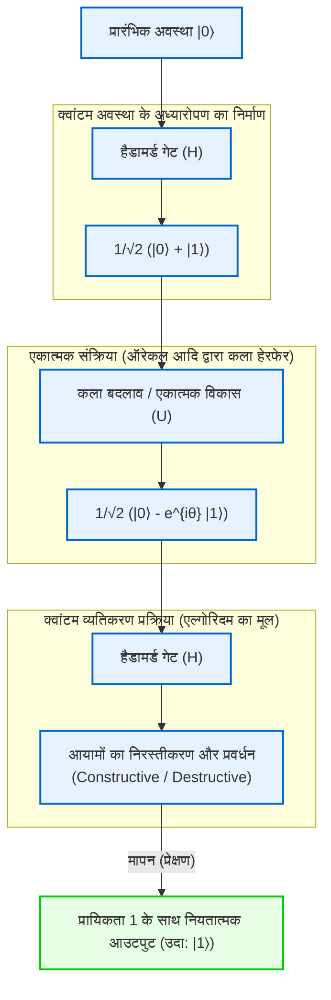

इस प्रकार, क्वांटम कंप्यूटर शास्त्रीय यांत्रिकी की सीमाओं (लघुकरण की सीमाओं और ऊष्मागतिक सीमाओं) को दरकिनार करने का कोई अस्थायी जीवन-विस्तार उपाय नहीं है, बल्कि यह सूचना और संगणना की परिभाषा को ही क्वांटम यांत्रिकी के अभिगृहीतों के आधार पर पुनर्गठित करने वाला एक वास्तविक प्रतिमान बदलाव (paradigm shift) है। अगले अध्याय में, हम इस क्वांटम व्यतिकरण को स्वेच्छा से नियंत्रित करने के विशिष्ट गणितीय उपकरणों—"क्वांटम गेट्स" और "क्वांटम परिपथों"—के विवरण में और अधिक गहराई से उतरेंगे।

# अध्याय 2: शास्त्रीय बिट और क्वांटम बिट (Qubit) के मूल सिद्धांत

क्वांटम सूचना की सैद्धांतिक रूपरेखा का निर्माण करते समय, सबसे मौलिक अवधारणा "सूचना की न्यूनतम इकाई" की परिभाषा है। इस अध्याय में, हम शास्त्रीय सूचना सिद्धांत के बिट से शुरुआत करते हुए, क्वांटम यांत्रिकी के सिद्धांतों पर आधारित क्वांटम सूचना की न्यूनतम इकाई "क्वांटम बिट (Qubit)" तक इस अवधारणा का विस्तार करेंगे। हिल्बर्ट स्पेस (Hilbert space), ब्रा-केट संकेतन (bra-ket notation), और रैखिक बीजगणित (linear algebra) की सटीक शब्दावली का उपयोग करके, हम क्वांटम अवस्थाओं की गणितीय संरचना को गहराई से स्पष्ट करेंगे। किसी भी प्रकार के समझौते के बिना, आइए एक विशेषज्ञ दृष्टिकोण से क्वांटम सूचना की गहराइयों को समझें।

## 2.1 सूचना की न्यूनतम इकाई: शास्त्रीय बिट का गणितीय सूत्रीकरण और सीमाएँ

कंप्यूटर विज्ञान के इतिहास में, 1948 में क्लॉड शैनन (Claude Shannon) द्वारा स्थापित सूचना सिद्धांत का आधार "बिट (Bit)" है। एक शास्त्रीय बिट (classical bit) को उसके भौतिक निरूपण (जैसे ट्रांजिस्टर में वोल्टेज का उच्च या निम्न होना, स्विच का ऑन या ऑफ होना, अथवा चुंबकीयकरण की दिशा) की परवाह किए बिना, एक अमूर्त अवस्था स्थान (abstract state space) के रूप में परिभाषित किया जाता है जो $\{0, 1\}$ के दो अलग-अलग (discrete) मानों में से कोई एक लेता है।

आइए इसे सदिश समष्टि (vector space) की अधिक औपचारिक भाषा में व्यक्त करें। एक शास्त्रीय बिट की अवस्था को 2-आयामी वास्तविक सदिश समष्टि $\mathbb{R}^2$ के मानक आधार (standard basis) का उपयोग करके निरूपित किया जा सकता है। हम अवस्था $0$ और अवस्था $1$ को क्रमशः निम्नलिखित स्तंभ सदिशों (column vectors) के रूप में परिभाषित करते हैं:

$$
\mathbf{v}_0 = \begin{pmatrix} 1 \\ 0 \end{pmatrix}, \quad \mathbf{v}_1 = \begin{pmatrix} 0 \\ 1 \end{pmatrix}
$$

एक नियतात्मक (deterministic) शास्त्रीय प्रणाली में, बिट की अवस्था हमेशा निश्चित रूप से या तो $\mathbf{v}_0$ या $\mathbf{v}_1$ होती है। हालाँकि, जब थर्मल शोर या हमारे ज्ञान में अनिश्चितता मौजूद होती है, तो अवस्था को शास्त्रीय प्रायिकतात्मक (probabilistic) बिट के रूप में वर्णित करना आवश्यक हो जाता है। इस स्थिति में, बिट की अवस्था को एक प्रायिकता वितरण (probability distribution) के रूप में दर्शाया जाता है, और अवस्था सदिश $\mathbf{p}$ को आधार सदिशों के उत्तल संयोजन (convex combination) के रूप में निम्नानुसार लिखा जा सकता है:

$$
\mathbf{p} = p_0 \mathbf{v}_0 + p_1 \mathbf{v}_1 = \begin{pmatrix} p_0 \\ p_1 \end{pmatrix}
$$

यहाँ, $p_0$ और $p_1$ वास्तविक संख्याएँ हैं जो क्रमशः अवस्था $0$ और $1$ में होने की प्रायिकता दर्शाती हैं, और कोल्मोगोरोव के प्रायिकता के सिद्धांतों (Kolmogorov's axioms of probability) के अनुसार, उन्हें निम्नलिखित शर्तों को पूरा करना आवश्यक है:

1. **गैर-ऋणात्मकता (Non-negativity)** : $p_0 \ge 0, \quad p_1 \ge 0$
2. **सामान्यीकरण शर्त (कुल प्रायिकता 1)** : $p_0 + p_1 = 1$

शास्त्रीय बिट की दुनिया में, कई बिट्स को मिलाकर बनी एक संयुक्त प्रणाली (composite system) का वर्णन उनके संबंधित प्रायिकता सदिशों के टेंसर गुणनफल (क्रोनेकर गुणनफल - Kronecker product) द्वारा किया जाता है। उदाहरण के लिए, दो शास्त्रीय बिट्स की संयुक्त प्रायिकता (joint probability) निम्नानुसार होती है:

$$
\mathbf{p}_{AB} = \mathbf{p}_A \otimes \mathbf{p}_B = \begin{pmatrix} p_{A0} \\ p_{A1} \end{pmatrix} \otimes \begin{pmatrix} p_{B0} \\ p_{B1} \end{pmatrix} = \begin{pmatrix} p_{A0}p_{B0} \\ p_{A0}p_{B1} \\ p_{A1}p_{B0} \\ p_{A1}p_{B1} \end{pmatrix}
$$

शास्त्रीय सूचना सिद्धांत का ढाँचा अत्यंत शक्तिशाली है और आधुनिक डिजिटल समाज की नींव बनाता है, लेकिन चूँकि अवस्थाएँ विशुद्ध रूप से गैर-ऋणात्मक वास्तविक प्रायिकताओं के योग द्वारा निर्मित होती हैं, इसलिए तरंग व्यतिकरण के समान "प्रायिकताओं के परस्पर निरस्तीकरण" को व्यक्त करना सैद्धांतिक रूप से असंभव है। यहीं पर शास्त्रीय भौतिकी की सीमा और क्वांटम सूचना की ओर अग्रसर होने की आवश्यकता उत्पन्न होती है।

## 2.2 क्वांटम यांत्रिकी के अभिधारणाएँ और ब्रा-केट संकेतन (Bra-ket notation)

क्वांटम यांत्रिकी की पहली अभिधारणा (Postulate) यह है कि "किसी संवृत भौतिक प्रणाली (isolated physical system) की अवस्था को सम्मिश्र आंतरिक गुणनफल (complex inner product) से युक्त एक पूर्ण सदिश समष्टि, अर्थात् हिल्बर्ट स्पेस (Hilbert Space) $\mathcal{H}$ में एक इकाई सदिश (अवस्था सदिश - state vector) द्वारा पूरी तरह से वर्णित किया जाता है।" क्वांटम संगणना के संदर्भ में, चूँकि निरंतर स्थानिक स्वतंत्रता की कोटियों (degrees of freedom) की उपेक्षा की जा सकती है, इसलिए यह हिल्बर्ट स्पेस आमतौर पर एक परिमित-आयामी सम्मिश्र सदिश समष्टि $\mathbb{C}^d$ होती है।

क्वांटम सूचना की सबसे छोटी इकाई, "क्वांटम बिट (Qubit)", को 2-आयामी सम्मिश्र हिल्बर्ट स्पेस $\mathcal{H} \cong \mathbb{C}^2$ में एक अवस्था के रूप में कड़ाई से परिभाषित किया गया है। इस सदिश समष्टि में अवस्थाओं का वर्णन करने के लिए, भौतिक विज्ञानी पॉल डिराक (Paul Dirac) द्वारा प्रस्तुत **ब्रा-केट संकेतन (Bra-ket notation)** का उपयोग करना मानक है।

क्वांटम अवस्था को दर्शाने वाले स्तंभ सदिश को **केट सदिश (Ket vector)** कहा जाता है और इसे $|\psi\rangle$ के रूप में लिखा जाता है। शास्त्रीय बिट के $0$ और $1$ के अनुरूप अवस्थाओं के रूप में, आइए एक प्रसामान्य लांबिक आधार (orthonormal basis) प्रस्तुत करें जिसे कम्प्यूटेशनल आधार (Computational basis) कहा जाता है। इन्हें क्वांटम बिट का $Z$ आधार भी कहा जाता है, और इन्हें क्रमशः $|0\rangle$ और $|1\rangle$ के रूप में परिभाषित किया जाता है:

$$
|0\rangle = \begin{pmatrix} 1 \\ 0 \end{pmatrix}, \quad |1\rangle = \begin{pmatrix} 0 \\ 1 \end{pmatrix}
$$

दूसरी ओर, रीज़ प्रतिनिधित्व प्रमेय (Riesz representation theorem) के अनुसार, हिल्बर्ट स्पेस के किसी भी केट सदिश के लिए, निरंतर रैखिक फलनीय (continuous linear functional) के रूप में कार्य करने वाली द्वैत समष्टि (Dual space) का एक अवयव विशिष्ट रूप से संगत होता है। इसे **ब्रा सदिश (Bra vector)** कहा जाता है, और इसे $\langle\psi|$ द्वारा निरूपित किया जाता है। मैट्रिक्स निरूपण में, केट सदिश का हर्मिटी संयुग्मी (Hermitian conjugate / conjugate transpose, जिसे $^\dagger$ द्वारा दर्शाया जाता है) लेने पर संगत ब्रा सदिश प्राप्त होता है:

$$
\langle\psi| = (|\psi\rangle)^\dagger = (|\psi\rangle^*)^T
$$

उदाहरण के लिए, कम्प्यूटेशनल आधार के ब्रा सदिश निम्नलिखित पंक्ति सदिश (row vectors) होते हैं:

$$
\langle 0| = \begin{pmatrix} 1 & 0 \end{pmatrix}, \quad \langle 1| = \begin{pmatrix} 0 & 1 \end{pmatrix}
$$

ब्रा-केट संकेतन का वास्तविक महत्व इस बात में है कि आंतरिक गुणनफल (inner product) की गणना दृश्य रूप से अत्यंत स्पष्ट हो जाती है। एक ब्रा $\langle\phi|$ और एक केट $|\psi\rangle$ का आंतरिक गुणनफल $\langle\phi|\psi\rangle$ के रूप में लिखा जाता है (यह डिराक के एक शब्द-क्रीड़ा से उत्पन्न हुआ है जिसमें "Bra" और "Ket" मिलकर "Bracket" बनाते हैं)। चूँकि कम्प्यूटेशनल आधार $\{|0\rangle, |1\rangle\}$ एक प्रसामान्य लांबिक निकाय (orthonormal system) बनाता है, इसलिए इसे क्रोनेकर डेल्टा (Kronecker delta) $\delta_{ij}$ का उपयोग करके निम्नानुसार व्यक्त किया जाता है:

$$
\langle i | j \rangle = \delta_{ij} \quad (i, j \in \{0, 1\})
$$

विशेष रूप से, स्वयं के साथ आंतरिक गुणनफल $1$ होता है ($\langle 0|0\rangle = 1$, $\langle 1|1\rangle = 1$), और विभिन्न आधार सदिशों के बीच आंतरिक गुणनफल $0$ होता है ($\langle 0|1\rangle = 0$, $\langle 1|0\rangle = 0$)।

इसके अलावा, एक केट और एक ब्रा का बाह्य गुणनफल (outer product) $|\psi\rangle\langle\phi|$ के रूप में लिखा जाता है, जो एक समष्टि से दूसरी समष्टि में एक रैखिक ऑपरेटर (मैट्रिक्स) का प्रतिनिधित्व करता है। उदाहरण के लिए, किसी अवस्था समष्टि पर प्रक्षेप ऑपरेटर (Projection operator) निम्नानुसार संरचित होता है:

$$
|0\rangle\langle 0| = \begin{pmatrix} 1 \\ 0 \end{pmatrix} \begin{pmatrix} 1 & 0 \end{pmatrix} = \begin{pmatrix} 1 & 0 \\ 0 & 0 \end{pmatrix}
$$

किसी भी 2-आयामी सम्मिश्र सदिश समष्टि के तत्समक ऑपरेटर (Identity operator) $I$ को आधार के संपूर्णता संबंध (Completeness relation) के रूप में निम्नानुसार विघटित करके व्यक्त किया जा सकता है, और यह क्वांटम यांत्रिकी की गणनाओं में अत्यंत उपयोगी और शक्तिशाली उपकरण है:

$$
I = |0\rangle\langle 0| + |1\rangle\langle 1| = \begin{pmatrix} 1 & 0 \\ 0 & 1 \end{pmatrix}
$$

## 2.3 क्वांटम अध्यारोपण का सिद्धांत और सम्मिश्र प्रायिकता आयाम

जहाँ एक शास्त्रीय बिट हमेशा $0$ या $1$ की एक निश्चित अवस्था में रहता है, या उनका प्रायिकतात्मक मिश्रण होता है, वहीं क्वांटम यांत्रिकी की रैखिकता (Linearity) की आवश्यकता के कारण, एक क्वांटम बिट $|0\rangle$ और $|1\rangle$ के रैखिक संयोजन द्वारा दर्शाई गई "अध्यारोपण (Superposition)" नामक मौलिक रूप से भिन्न अवस्था ले सकता है। हिल्बर्ट स्पेस $\mathcal{H}$ के भीतर किसी भी इकाई सदिश को एक वैध भौतिक अवस्था के रूप में स्वीकार किया जाता है।

इसलिए, एक एकल क्वांटम बिट की सबसे सामान्य शुद्ध अवस्था (Pure state) $|\psi\rangle$ को कम्प्यूटेशनल आधार का उपयोग करके निम्नानुसार विस्तारित किया जा सकता है:

$$
|\psi\rangle = \alpha |0\rangle + \beta |1\rangle = \begin{pmatrix} \alpha \\ \beta \end{pmatrix}
$$

यहाँ, $\alpha$ और $\beta$ सम्मिश्र संख्याएँ ($\alpha, \beta \in \mathbb{C}$) हैं जिन्हें **सम्मिश्र प्रायिकता आयाम (Complex probability amplitude)** कहा जाता है। शास्त्रीय प्रायिकता के गैर-ऋणात्मक वास्तविक संख्या होने के विपरीत, क्वांटम अवस्थाओं में "सम्मिश्र" गुणांक होना ही वह मूल कारण है जिससे क्वांटम कंप्यूटर शास्त्रीय कंप्यूटरों से बेहतर गणना क्षमता प्रदर्शित करते हैं। सम्मिश्र संख्याओं में एक कला (Phase) होती है और वे सम्मिश्र तल में किसी भी दिशा में उन्मुख हो सकती हैं, जिससे वे तरंगों की भाँति एक-दूसरे को प्रबलित (रचनात्मक व्यतिकरण - constructive interference) या निरस्त (विनाशकारी व्यतिकरण - destructive interference) कर सकती हैं। किसी क्वांटम एल्गोरिदम का मूल तत्व इस व्यतिकरण प्रभाव को कुशलतापूर्वक नियंत्रित करना है, ताकि सही उत्तर के प्रायिकता आयाम को प्रवर्धित किया जा सके और गलत उत्तरों के प्रायिकता आयामों को समाप्त किया जा सके।

क्वांटम प्रणाली से शास्त्रीय जानकारी निकालने की प्रक्रिया को "मापन (Measurement)" कहा जाता है। प्रक्षेप मापन (Projective measurement) पर विचार करते हुए, बोर्न के नियम (Born rule) के अनुसार, कम्प्यूटेशनल आधार $\{|0\rangle, |1\rangle\}$ में अवस्था $|\psi\rangle$ को मापने पर परिणाम के रूप में $0$ प्राप्त होने की प्रायिकता $P(0)$ और $1$ प्राप्त होने की प्रायिकता $P(1)$ उनके संबंधित प्रायिकता आयामों के निरपेक्ष मान के वर्ग द्वारा दी जाती है:

$$
P(0) = |\langle 0|\psi\rangle|^2 = |\alpha|^2 = \alpha \alpha^*
$$

$$
P(1) = |\langle 1|\psi\rangle|^2 = |\beta|^2 = \beta \beta^*
$$

प्रणाली को अनिवार्य रूप से किसी न किसी अवस्था में प्रेक्षित किए जाने के लिए, कुल प्रायिकता का योग बिल्कुल $1$ होना चाहिए। इसलिए, क्वांटम अवस्था सदिश $|\psi\rangle$ का मानक (norm / लंबाई) हमेशा $1$ होना चाहिए। यह **सामान्यीकरण शर्त (Normalization condition)** है:

$$
\langle\psi|\psi\rangle = (\alpha^* \langle 0| + \beta^* \langle 1|)(\alpha |0\rangle + \beta |1\rangle) = |\alpha|^2 + |\beta|^2 = 1
$$

इस सम्मिश्र प्रायिकता आयाम के ज्यामितीय अर्थ को अधिक गहराई से समझने के लिए, आइए $\alpha$ और $\beta$ को ध्रुवीय निर्देशांकों (polar coordinates) में व्यक्त करें:

$$
\alpha = r_0 e^{i\phi_0}, \quad \beta = r_1 e^{i\phi_1}
$$

यहाँ $r_0, r_1 \ge 0$ आयाम का परिमाण हैं, और $\phi_0, \phi_1 \in [0, 2\pi)$ उनके संबंधित कला कोण (phase angles) हैं। चूँकि सामान्यीकरण शर्त से $r_0^2 + r_1^2 = 1$ प्राप्त होता है, इसलिए हम एक वास्तविक पैरामीटर $\theta \in [0, \pi]$ का उपयोग करके $r_0 = \cos(\frac{\theta}{2})$ और $r_1 = \sin(\frac{\theta}{2})$ लिख सकते हैं। इसे मूल अवस्था सदिश में प्रतिस्थापित करने पर:

$$
|\psi\rangle = \cos\left(\frac{\theta}{2}\right) e^{i\phi_0} |0\rangle + \sin\left(\frac{\theta}{2}\right) e^{i\phi_1} |1\rangle
$$

आइए पूरे समीकरण से उभयनिष्ठ कला गुणक $e^{i\phi_0}$ को बाहर निकालें:

$$
|\psi\rangle = e^{i\phi_0} \left( \cos\left(\frac{\theta}{2}\right) |0\rangle + e^{i(\phi_1 - \phi_0)} \sin\left(\frac{\theta}{2}\right) |1\rangle \right)
$$

क्वांटम यांत्रिकी में, संपूर्ण अवस्था सदिश पर लागू होने वाले कला गुणक $e^{i\phi_0}$ को "वैश्विक कला (Global phase)" कहा जाता है। किसी भी प्रेक्षित राशि (हर्मिटी ऑपरेटर) $A$ के लिए प्रत्याशा मान (expectation value) $\langle A \rangle$ की गणना करने पर यह स्पष्ट हो जाता है:

$$
\langle A \rangle = \left( e^{-i\phi_0} \langle\psi| \right) A \left( e^{i\phi_0} |\psi\rangle \right) = e^{-i\phi_0} e^{i\phi_0} \langle\psi| A |\psi\rangle = \langle\psi| A |\psi\rangle
$$

चूँकि वैश्विक कला इस प्रकार परस्पर निरस्त हो जाती है, इसलिए इसे किसी भी भौतिक मापन द्वारा प्रेक्षित करना असंभव है। अर्थात्, $|\psi\rangle$ और $e^{i\phi_0}|\psi\rangle$ हिल्बर्ट स्पेस में भिन्न सदिश हैं (यद्यपि वे एक ही किरण का प्रतिनिधित्व करते हैं), लेकिन भौतिक रूप से वे बिल्कुल समान अवस्था का प्रतिनिधित्व करते हैं।

अतः वैश्विक कला की उपेक्षा करते हुए, और केवल $|0\rangle$ तथा $|1\rangle$ के बीच की सापेक्ष कला (Relative phase) $\varphi = \phi_1 - \phi_0$ (जहाँ $\varphi \in [0, 2\pi)$) को एक पैरामीटर के रूप में रखते हुए, किसी भी एकल क्वांटम बिट की शुद्ध अवस्था को निम्नलिखित **मानक रूप (Standard form)** के रूप में विशिष्ट और सटीक रूप से व्यक्त किया जा सकता है:

$$
|\psi\rangle = \cos\left(\frac{\theta}{2}\right) |0\rangle + e^{i\varphi} \sin\left(\frac{\theta}{2}\right) |1\rangle
$$

## 2.4 ब्लोच गोले (Bloch Sphere) द्वारा ज्यामितीय दृश्यांकन

पिछले खंड में व्युत्पन्न पैरामीटरीकरण यह दर्शाता है कि एकल क्वांटम बिट का अवस्था स्थान ज्यामितीय रूप से त्रिविमीय अंतरिक्ष में एक इकाई गोले की सतह (2-आयामी गोला $S^2$) के समाकृतिक (isomorphic) है। इस दृश्य निरूपण को इसके अन्वेषक, स्विस भौतिक विज्ञानी फेलिक्स ब्लोच (Felix Bloch) के नाम पर **ब्लोच गोला (Bloch Sphere)** कहा जाता है।

कोण $\theta$ धनात्मक $Z$-अक्ष से मापे गए ध्रुवीय कोण (Polar angle) से, और कोण $\varphi$ $X$-$Y$ तल में द्विगंशीय कोण (Azimuthal angle) से सटीक रूप से मेल खाता है।

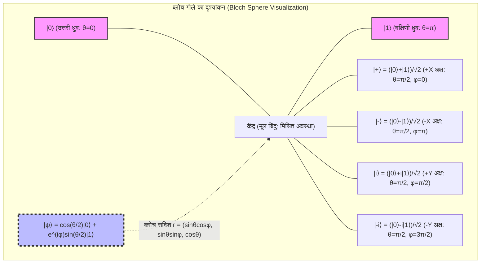

ब्लोच गोले की सबसे उल्लेखनीय विशेषता यह है कि "हिल्बर्ट स्पेस में लांबिक अवस्थाएँ (orthogonal states, जिनका आंतरिक गुणनफल 0 होता है) ब्लोच गोले के त्रिविमीय वास्तविक अंतरिक्ष में एक-दूसरे के प्रतिव्यासांत बिंदुओं (Antipodal points: 180 डिग्री विपरीत बिंदु) पर स्थित होती हैं।" उदाहरण के लिए, $|0\rangle$ (उत्तरी ध्रुव, $\theta=0$) के लांबिक अवस्था $|1\rangle$ (दक्षिणी ध्रुव, $\theta=\pi$) है। हिल्बर्ट स्पेस में परस्पर लांबिक अवस्थाओं के बीच आंतरिक गुणनफल की गणना $\langle 0 | 1 \rangle = 0$ ब्लोच गोले पर $\pi$ कोण (180 डिग्री) के अंतर के बराबर होती है। चूँकि ज्यामितीय कोण हिल्बर्ट स्पेस के कोण से दोगुना होता है, इसलिए पैरामीटरीकरण में अर्ध-कोण $\theta/2$ का उपयोग करने की गणितीय अनिवार्यता यहीं से उत्पन्न होती है।

इस ब्लोच गोले के निर्देशांक $\mathbf{r} = (x, y, z)$ क्वांटम यांत्रिकी में प्रेक्षित राशियों (observables) के रूप में **पाउली आव्यूह (Pauli matrices)** के प्रत्याशा मानों से कड़ाई से व्युत्पन्न होते हैं। 2-आयामी प्रणालियों के हर्मिटी ऑपरेटरों का आधार बनाने वाले पाउली आव्यूह निम्नानुसार परिभाषित किए गए हैं:

$$
X = \sigma_x = \begin{pmatrix} 0 & 1 \\ 1 & 0 \end{pmatrix}, \quad
Y = \sigma_y = \begin{pmatrix} 0 & -i \\ i & 0 \end{pmatrix}, \quad
Z = \sigma_z = \begin{pmatrix} 1 & 0 \\ 0 & -1 \end{pmatrix}
$$

किसी भी अवस्था $|\psi\rangle$ के लिए इन पाउली प्रेक्षित राशियों के प्रत्याशा मान ब्रा-केट गणना द्वारा प्राप्त किए जाते हैं:

$$
x = \langle\psi| X |\psi\rangle = \left( \cos\frac{\theta}{2} \langle 0| + e^{-i\varphi}\sin\frac{\theta}{2} \langle 1| \right) \begin{pmatrix} 0 & 1 \\ 1 & 0 \end{pmatrix} \begin{pmatrix} \cos\frac{\theta}{2} \\ e^{i\varphi}\sin\frac{\theta}{2} \end{pmatrix} = \sin\theta \cos\varphi
$$

$$
y = \langle\psi| Y |\psi\rangle = \left( \cos\frac{\theta}{2} \langle 0| + e^{-i\varphi}\sin\frac{\theta}{2} \langle 1| \right) \begin{pmatrix} 0 & -i \\ i & 0 \end{pmatrix} \begin{pmatrix} \cos\frac{\theta}{2} \\ e^{i\varphi}\sin\frac{\theta}{2} \end{pmatrix} = \sin\theta \sin\varphi
$$

$$
z = \langle\psi| Z |\psi\rangle = \left( \cos\frac{\theta}{2} \langle 0| + e^{-i\varphi}\sin\frac{\theta}{2} \langle 1| \right) \begin{pmatrix} 1 & 0 \\ 0 & -1 \end{pmatrix} \begin{pmatrix} \cos\frac{\theta}{2} \\ e^{i\varphi}\sin\frac{\theta}{2} \end{pmatrix} = \cos^2\left(\frac{\theta}{2}\right) - \sin^2\left(\frac{\theta}{2}\right) = \cos\theta
$$

इसके द्वारा, ब्लोच सदिश $\mathbf{r} = (x, y, z)$ त्रिविमीय अंतरिक्ष के एक इकाई सदिश $\mathbf{r} = (\sin\theta\cos\varphi, \sin\theta\sin\varphi, \cos\theta)$ के रूप में अत्यंत सुंदरता से व्यक्त होता है। इसके अतिरिक्त, किसी भी शुद्ध अवस्था के संगत घनत्व मैट्रिक्स (Density matrix) $\rho = |\psi\rangle\langle\psi|$ को पाउली सदिश $\boldsymbol{\sigma} = (X, Y, Z)$ और तत्समक मैट्रिक्स $I$ का उपयोग करके बहुत सुरुचिपूर्ण ढंग से लिखा जा सकता है:

$$
\rho = \frac{1}{2} \left( I + \mathbf{r} \cdot \boldsymbol{\sigma} \right) = \frac{1}{2} \left( I + xX + yY + zZ \right)
$$

सत्यापन के लिए मैट्रिक्स के अवयवों को स्पष्ट रूप से विस्तारित करने पर:

$$
\rho = \frac{1}{2} \begin{pmatrix} 1 + z & x - iy \\ x + iy & 1 - z \end{pmatrix} = \begin{pmatrix} \cos^2(\frac{\theta}{2}) & e^{-i\varphi}\sin(\frac{\theta}{2})\cos(\frac{\theta}{2}) \\ e^{i\varphi}\sin(\frac{\theta}{2})\cos(\frac{\theta}{2}) & \sin^2(\frac{\theta}{2}) \end{pmatrix}
$$

यह परिणाम टेंसर उत्पाद की परिभाषा के अनुसार बाह्य गुणनफल $|\psi\rangle\langle\psi|$ के गणना परिणाम से पूरी तरह मेल खाता है। यहाँ विशेष रूप से ध्यान देने योग्य बात यह है कि शुद्ध अवस्थाओं के लिए ब्लोच सदिश का मानक $|\mathbf{r}| = 1$ होता है, और घनत्व मैट्रिक्स का ट्रेस $\text{Tr}(\rho^2) = 1$ को संतुष्ट करता है। इसके विपरीत, मिश्रित अवस्थाओं (Mixed state) में, जहाँ पर्यावरण के साथ परस्पर क्रिया या अपूर्ण नियंत्रण के कारण क्वांटम सूचना की हानि (विसंगति - decoherence) होती है, अवस्था शुद्ध अवस्थाओं का एक सांख्यिकीय संयोजन बन जाती है, जिससे $|\mathbf{r}| < 1$ होता है। परिणामस्वरूप, मिश्रित अवस्थाओं को ब्लोच गोले की सतह के बजाय उसके "आंतरिक" बिंदुओं के रूप में दर्शाया जाता है, और पूरी तरह से सूचना खो चुकी अधिकतम मिश्रित अवस्था (Maximally mixed state) $\rho = I/2$ ब्लोच गोले के केंद्र बिंदु $\mathbf{r} = (0,0,0)$ पर स्थित होती है।

## 2.5 मापन और तरंग फलन का पतन (Wavefunction Collapse)

क्वांटम यांत्रिकी में मापन, शास्त्रीय यांत्रिकी की भाँति जानकारी के निष्क्रिय पठन (passive reading) से मौलिक रूप से भिन्न है। वॉन न्यूमैन (von Neumann) के स्वयंसिद्ध सूत्रीकरण के अनुसार, जब किसी भौतिक राशि (प्रेक्षित राशि) का मापन किया जाता है, तो अवस्था अपरिवर्तनीय रूप से उस प्रेक्षित राशि की आइगेन अवस्था (eigenstate) में "पतित (Collapse)" हो जाती है।

उदाहरण के लिए, एकल क्वांटम बिट अवस्था $|\psi\rangle = \alpha|0\rangle + \beta|1\rangle$ पर $Z$ आधार में मापन (अर्थात् पाउली $Z$ मैट्रिक्स को प्रेक्षित राशि के रूप में लेना) करने पर विचार करें। मापन परिणाम के रूप में प्राप्त होने वाले एकमात्र मान $Z$ के आइगेनमान (eigenvalues) होते हैं, जो कि $+1$ (अवस्था $|0\rangle$ के संगत) या $-1$ (अवस्था $|1\rangle$ के संगत) हैं।

मापन को गणितीय रूप से सटीक रूप से वर्णित करने के लिए, प्रक्षेप ऑपरेटरों (projection operators) के समुच्चय $\{ P_m \}$ का उपयोग किया जाता है। $Z$ मापन के लिए प्रक्षेप ऑपरेटर निम्नानुसार होते हैं:

$$
P_0 = |0\rangle\langle 0|, \quad P_1 = |1\rangle\langle 1|
$$

ये संपूर्णता संबंध $P_0 + P_1 = I$ और लांबिकता (orthogonality) $P_i P_j = \delta_{ij} P_i$ को संतुष्ट करते हैं। बोर्न के नियम के अनुसार, मापन परिणाम $m \in \{0, 1\}$ प्राप्त होने की प्रायिकता $P(m)$ निम्नानुसार परिकलित की जाती है:

$$
P(m) = \langle\psi| P_m^\dagger P_m |\psi\rangle = \langle\psi| P_m |\psi\rangle
$$

जो पहले प्राप्त $|\alpha|^2$ और $|\beta|^2$ से पूरी तरह मेल खाती है। और सबसे महत्वपूर्ण बात यह है कि मापन परिणाम $m$ प्राप्त होने के तुरंत बाद नई क्वांटम अवस्था $|\psi'\rangle$ मूल अवस्था पर प्रक्षेप ऑपरेटर लागू करके और इसे नए मानक के साथ पुनः सामान्यीकृत करके प्राप्त होती है:

$$
|\psi'\rangle = \frac{P_m |\psi\rangle}{\sqrt{P(m)}}
$$

यदि परिणाम $0$ प्राप्त हुआ हो:

$$
|\psi'\rangle = \frac{|0\rangle\langle 0| (\alpha|0\rangle + \beta|1\rangle)}{|\alpha|} = \frac{\alpha}{|\alpha|} |0\rangle = e^{i\phi_0} |0\rangle \equiv |0\rangle
$$

और अवस्था पूरी तरह से $|0\rangle$ में पतित हो जाती है (वैश्विक कला की उपेक्षा की जाती है)। यह तरंग फलन पतन (Wavefunction collapse) नामक घटना का गणितीय विवरण है। एक बार मापन किए जाने और अवस्था के पतित हो जाने के बाद, मूल अध्यारोपण अवस्था में निहित सापेक्ष कला $\varphi$ और आयाम की जानकारी ($\alpha, \beta$) हमेशा के लिए नष्ट हो जाती है। इसलिए, किसी एकल प्रति पर एक ही मापन द्वारा क्वांटम अवस्था की संपूर्ण जानकारी प्राप्त करना सैद्धांतिक रूप से असंभव है (यह "नो-क्लोनिंग प्रमेय - No-Cloning Theorem" से भी गहराई से संबंधित है)।

## 2.6 बहु-निकाय प्रणालियों में विस्तार का परिचय और अगले अध्याय का दृष्टिकोण

एकल क्वांटम बिट के गुणों को गहराई से समझने के बाद, आइए "बहु-क्वांटम बिट प्रणालियों" (multi-qubit systems) के गणितीय आधार पर भी चर्चा करें, जिन्हें बाद के अध्यायों में विस्तार से देखा जाएगा। जहाँ शास्त्रीय प्रायिकता वितरण कार्तीय गुणनफल (Cartesian product) द्वारा अवस्था स्थान का विस्तार करते हैं, वहीं क्वांटम यांत्रिकी में एक संयुक्त प्रणाली का हिल्बर्ट स्पेस $\mathcal{H}_{AB}$ प्रत्येक उपप्रणाली के हिल्बर्ट स्पेस $\mathcal{H}_A$ और $\mathcal{H}_B$ के **टेंसर गुणनफल (Tensor product)** द्वारा निर्मित होता है:

$$
\mathcal{H}_{AB} = \mathcal{H}_A \otimes \mathcal{H}_B
$$

दो स्वतंत्र क्वांटम बिट अवस्थाओं का टेंसर गुणनफल निम्नानुसार विस्तारित होता है, जिससे एक 4-आयामी सम्मिश्र सदिश समष्टि बनती है:

$$
|\Psi\rangle_{AB} = (\alpha_0|0\rangle + \alpha_1|1\rangle) \otimes (\beta_0|0\rangle + \beta_1|1\rangle) = \alpha_0\beta_0|00\rangle + \alpha_0\beta_1|01\rangle + \alpha_1\beta_0|10\rangle + \alpha_1\beta_1|11\rangle
$$

यहाँ, ऐसी अवस्थाओं का अस्तित्व जिन्हें अवस्थाओं के टेंसर गुणनफल के रूप में गुणनखंडित (factorized) नहीं किया जा सकता (उदाहरण के लिए: बेल अवस्था $|\Phi^+\rangle = (|00\rangle + |11\rangle)/\sqrt{2}$), क्वांटम एंटैंगलमेंट (Quantum Entanglement / क्वांटम उलझाव) का स्रोत बनता है। टेंसर गुणनफल के माध्यम से आयामों का चरघातांकी विस्फोट ($N$ क्वांटम बिट्स के लिए $2^N$ आयाम) ही वह आधार है जो क्वांटम कंप्यूटर को अप्रतिम समानांतर गणना क्षमता प्रदर्शित करने में सक्षम बनाता है।

इस अध्याय में, हमने हिल्बर्ट स्पेस के गणितीय आधार पर शास्त्रीय बिट और क्वांटम बिट के बीच मौलिक अंतर को स्थापित किया। क्वांटम बिट सम्मिश्र प्रायिकता आयामों के साथ निरंतर अध्यारोपण अवस्थाएँ लेने में सक्षम हैं, और ब्लोच गोले के व्युत्पत्ति के माध्यम से, हमने अमूर्त सम्मिश्र सदिशों को त्रिविमीय वास्तविक अंतरिक्ष में एक ज्यामितीय मॉडल के रूप में सहज रूप से समझने की एक शक्तिशाली पद्धति प्राप्त की।

अगले अध्याय, "अध्याय 3: क्वांटम गेट्स और एकात्मक रूपांतरण", में हम इन एकल क्वांटम बिट अवस्थाओं में हेरफेर करने वाले ठोस "क्वांटम लॉजिक गेट्स" का विस्तार से वर्णन करेंगे, और ब्लोच गोले पर एकात्मक मैट्रिक्स द्वारा घूर्णन संचालन के गणितीय गुणों को स्पष्ट करेंगे। क्वांटम सूचना की अगाध दुनिया का द्वार अभी खुलना शुरू ही हुआ है।

# अध्याय 3: क्वांटम यांत्रिकी के अभिगृहीत और प्रेक्षण (तरंग पैकेट का संकुचन)

## 3.1 परिचय: क्वांटम यांत्रिकी का अभिगृहीतीय दृष्टिकोण और रैखिक बीजगणित की आवश्यकता

क्वांटम कंप्यूटर के कार्य सिद्धांतों को गहराई से समझने के लिए, क्वांटम यांत्रिकी नामक भौतिकी के सैद्धांतिक ढांचे को गणितीय रूप से कठोर तरीके से समझना आवश्यक है। भौतिकी में कई सिद्धांतों का विकास अनुभवजन्य नियमों पर आधारित आगमनात्मक तरीके से हुआ है, लेकिन क्वांटम यांत्रिकी, विशेष रूप से जॉन वॉन न्यूमैन (John von Neumann) द्वारा सूत्रबद्ध आधुनिक क्वांटम यांत्रिकी, एक अभिगृहीतीय दृष्टिकोण (axiomatic approach) अपनाती है जो कुछ गणितीय "अभिगृहीतों (Axioms)" से पूरी प्रणाली को निगमित करती है।

यह अभिगृहीत प्रणाली हिल्बर्ट स्पेस (Hilbert space) नामक अनंत आयामों तक विस्तार योग्य सम्मिश्र रैखिक बीजगणित (complex linear algebra) के मंच पर निर्मित है। क्वांटम सूचना विज्ञान और क्वांटम कंप्यूटिंग में, मुख्य रूप से परिमित-आयामी सदिश समष्टि (vector spaces) (उदाहरण के लिए, क्वांटम बिट सिस्टम के $\mathbb{C}^2$ का टेंसर उत्पाद स्पेस) का उपयोग किया जाता है, इसलिए अनंत आयामों में विश्लेषणात्मक कठिनाइयों (जैसे असीमित ऑपरेटरों का डोमेन) से बचा जा सकता है, और क्वांटम यांत्रिकी को पूरी तरह से रैखिक बीजगणित के रूप में वर्णित और समझा जा सकता है।

इस अध्याय में, हम क्वांटम अवस्था के विवरण से लेकर समय विकास (time evolution), और सबसे अधिक दार्शनिक बहस का विषय रहे "प्रेक्षण (Observation)" तक की प्रक्रिया को बिना किसी समझौते के कठोरता से सूत्रबद्ध करेंगे। पाठक यह महसूस करेंगे कि पहली नज़र में सहज ज्ञान के विपरीत लगने वाली क्वांटम घटनाएँ किस प्रकार एक सुसंगत और सुंदर गणितीय संरचना पर आधारित हैं। यही गणितीय संरचना क्वांटम कंप्यूटर के एल्गोरिदम का वर्णन करने वाली प्रत्यक्ष "भाषा" बन जाती है।

## 3.2 पहला अभिगृहीत: अवस्था समष्टि (हिल्बर्ट स्पेस और अवस्था सदिश)

क्वांटम यांत्रिकी में पहला अभिगृहीत यह निर्धारित करता है कि भौतिक प्रणाली की "अवस्था" को गणितीय रूप से कैसे दर्शाया जाए।

 **अभिगृहीत 1 (अवस्था का निरूपण)** :
एक बंद भौतिक प्रणाली की अवस्था को हिल्बर्ट स्पेस (Hilbert space) $\mathcal{H}$ पर, जो कि एक सम्मिश्र आंतरिक गुणन समष्टि (complex inner product space) है और पूर्णता (completeness) को संतुष्ट करता है, 1 के मानदंड (norm) वाले इकाई सदिश द्वारा पूरी तरह से वर्णित किया जाता है। इसे **अवस्था सदिश (State vector)** कहा जाता है।

पॉल डिराक (Paul Dirac) द्वारा प्रस्तुत ब्रा-केट नोटेशन (Bra-ket notation) के अनुसार, अवस्था सदिश को एक स्तंभ सदिश (column vector) के रूप में माना जाता है और इसे केट (ket) **$| \psi \rangle$** के रूप में लिखा जाता है। दोहरे स्पेस (dual space) $\mathcal{H}^*$ से संबंधित पंक्ति सदिश (row vector) को ब्रा (bra) **$\langle \psi |$** के रूप में लिखा जाता है, और ये एक दूसरे के साथ हर्मिटियन संयुग्म (Hermitian conjugate) (सम्मिश्र संयुग्म स्थानान्तरण) के संबंध में होते हैं। अर्थात्,

$$
\langle \psi | = ( | \psi \rangle )^\dagger
$$

हिल्बर्ट स्पेस पर किन्हीं दो अवस्थाओं **$| \phi \rangle$** और **$| \psi \rangle$** का आंतरिक गुणनफल (inner product) ब्रा और केट के गुणनफल **$\langle \phi | \psi \rangle$** के रूप में आकलित किया जाता है, जो एक सम्मिश्र मान देता है। यह आंतरिक गुणनफल निम्नलिखित गुणों को संतुष्ट करता है:

1. **धनात्मक निश्चितता (Positive definiteness)** : किसी भी **$| \psi \rangle \neq 0$** के लिए, $\langle \psi | \psi \rangle > 0$
2. **रैखिकता (Linearity)** : $\langle \phi | ( c_1 | \psi_1 \rangle + c_2 | \psi_2 \rangle ) = c_1 \langle \phi | \psi_1 \rangle + c_2 \langle \phi | \psi_2 \rangle$
3. **संयुग्मी सममिति (Conjugate symmetry)** : $\langle \phi | \psi \rangle = \langle \psi | \phi \rangle^*$ (जहाँ $*$ सम्मिश्र संयुग्म है)

भौतिक अवस्थाओं को प्रायिकता व्याख्या (probability interpretation) को वैध बनाने के लिए हमेशा सामान्यीकरण की शर्त (Normalization condition) को पूरा करना चाहिए। अर्थात्, अवस्था सदिश **$| \psi \rangle$** का मानदंड (norm) 1 है।

$$
\| | \psi \rangle \| = \sqrt{\langle \psi | \psi \rangle} = 1
$$

इसके अलावा, कॉची-श्वार्ज़ असमानता (Cauchy-Schwarz inequality) $|\langle \phi | \psi \rangle|^2 \le \langle \phi | \phi \rangle \langle \psi | \psi \rangle$ लागू होने के कारण, सामान्यीकृत अवस्थाओं के बीच आंतरिक गुणनफल का निरपेक्ष मान हमेशा 0 और 1 के बीच रहता है। यह बाद में "प्रायिकता" के रूप में व्याख्यायित किए जाने के लिए गणितीय आधार बनता है।

### अध्यारोपण का सिद्धांत और पूर्ण ऑर्थोनॉर्मल आधार

क्वांटम यांत्रिकी की सबसे विशिष्ट विशेषता "अध्यारोपण का सिद्धांत (Superposition principle)" है। यदि **$| \phi \rangle$** और **$| \psi \rangle$** भौतिक रूप से स्वीकार्य अवस्थाएँ हैं, तो उनका कोई भी सम्मिश्र रैखिक संयोजन $c_1 | \phi \rangle + c_2 | \psi \rangle$ भी (सामान्यीकरण करने पर) भौतिक रूप से स्वीकार्य अवस्था बन जाता है। यह गुण हिल्बर्ट स्पेस की रैखिकता से प्रत्यक्ष रूप से प्राप्त होता है।

हिल्बर्ट स्पेस $\mathcal{H}$ में, एक पूर्ण ऑर्थोनॉर्मल आधार (Orthonormal basis) $\{ | e_i \rangle \}$ मौजूद होता है। ये आधार एक दूसरे के लंबवत (orthogonal) और सामान्यीकृत (normalized) होते हैं।

$$
\langle e_i | e_j \rangle = \delta_{ij}
$$

($\delta_{ij}$ क्रोनेकर डेल्टा है)। इसके अलावा, पूर्णता संबंध (Completeness relation) या तत्समक के वियोजन (resolution of the identity) के रूप में, तत्समक ऑपरेटर (identity operator) $I$ को निम्नानुसार विस्तारित किया जा सकता है:

$$
I = \sum_i | e_i \rangle \langle e_i |
$$

किसी भी क्वांटम अवस्था **$| \psi \rangle$** को, इस तत्समक ऑपरेटर को लागू करके, आधारों के रैखिक संयोजन के रूप में अद्वितीय रूप से विस्तारित किया जा सकता है:

$$
| \psi \rangle = I | \psi \rangle = \left( \sum_i | e_i \rangle \langle e_i | \right) | \psi \rangle = \sum_i \langle e_i | \psi \rangle | e_i \rangle = \sum_i c_i | e_i \rangle
$$

यहाँ विस्तार गुणांक $c_i = \langle e_i | \psi \rangle$ को सम्मिश्र प्रायिकता आयाम (complex probability amplitudes) कहा जाता है, जो बाद में वर्णित बॉर्न के नियम (Born rule) में निर्णायक भूमिका निभाते हैं। सामान्यीकरण की शर्त $\langle \psi | \psi \rangle = 1$ से, $\sum_i |c_i|^2 = 1$ प्राप्त होता है।

## 3.3 दूसरा अभिगृहीत: भौतिक राशियाँ और हर्मिटियन ऑपरेटर

शास्त्रीय यांत्रिकी में, स्थिति, संवेग और ऊर्जा जैसी भौतिक राशियाँ (ऑब्जर्वेबल्स - observables) वास्तविक-मूल्य वाले फलनों के रूप में वर्णित की जाती हैं। हालाँकि, क्वांटम यांत्रिकी में एक मौलिक प्रतिमान विस्थापन (paradigm shift) होता है।

 **अभिगृहीत 2 (भौतिक राशियाँ)** :
अवलोकन योग्य भौतिक राशियाँ (ऑब्जर्वेबल्स) हिल्बर्ट स्पेस $\mathcal{H}$ पर रैखिक स्व-संलग्न ऑपरेटरों (linear self-adjoint operators) (हर्मिटियन ऑपरेटरों) $A$ द्वारा वर्णित की जाती हैं।

हर्मिटियन ऑपरेटर वह ऑपरेटर है जिसका हर्मिटियन संयुग्म उसके स्वयं के बराबर होता है। अर्थात्, यह $A = A^\dagger$ को संतुष्ट करता है। जब इसे परिमित-आयामी स्पेस में एक आव्यूह (matrix) के रूप में दर्शाया जाता है, तो इसका अर्थ है कि इसके अवयव सम्मिश्र संयुग्म सममित ($A_{ij} = A_{ji}^*$) हैं।

भौतिक राशियों को हर्मिटियन ऑपरेटरों के रूप में परिभाषित किए जाने का कारण उनके "आइगनमानों (Eigenvalues)" में निहित है। रैखिक बीजगणित के वर्णक्रमीय प्रमेय (Spectral theorem) के अनुसार, हर्मिटियन ऑपरेटरों के निम्नलिखित अत्यंत महत्वपूर्ण गुण होते हैं:

1. **सभी आइगनमान $a_i$ वास्तविक संख्याएँ हैं।** (चूंकि प्रेक्षित की जाने वाली भौतिक राशियाँ हमेशा वास्तविक होनी चाहिए, यह भौतिक आवश्यकता के अनुरूप है।)
2. **विभिन्न आइगनमानों से संबंधित आइगनसदिश एक-दूसरे के लंबवत (orthogonal) होते हैं।** 
3. **ऑपरेटर के आइगनसदिश $\{ | a_i \rangle \}$ हिल्बर्ट स्पेस का पूर्ण ऑर्थोनॉर्मल आधार बनाते हैं।** 

इसलिए, किसी भी ऑब्जर्वेबल $A$ को उसके आइगनमानों $a_i$ और आइगनसदिशों **$| a_i \rangle$** का उपयोग करके, प्रक्षेप ऑपरेटरों (projection operators) $P_i = | a_i \rangle \langle a_i |$ के रैखिक संयोजन के रूप में वर्णक्रमीय वियोजन (Spectral decomposition) किया जा सकता है:

$$
A = \sum_i a_i | a_i \rangle \langle a_i |
$$

इस सूत्रीकरण द्वारा, "भौतिक राशि को मापने" के कार्य को हिल्बर्ट स्पेस के एक विशिष्ट आधार (आइगनसदिश) पर प्रक्षेप (projection) के ज्यामितीय संचालन के रूप में समझा जा सकता है। उदाहरण के लिए, क्वांटम बिट के $\sigma_z$ प्रेक्षण को आइगनमान $+1$ के संगत अवस्था **$| 0 \rangle$** और आइगनमान $-1$ के संगत अवस्था **$| 1 \rangle$** वाले ऑर्थोगोनल आधार पर प्रक्षेप संचालन के रूप में पूरी तरह से वर्णित किया जाता है।

## 3.4 तीसरा अभिगृहीत: यूनिटरी समय विकास और श्रोडिंगर समीकरण

जब कोई क्वांटम प्रणाली अन्य प्रणालियों के साथ परस्पर क्रिया किए बिना विलगित (isolated) होती है, तो इसकी अवस्था समय के साथ नियतिवादी (deterministic) और प्रतिवर्ती (reversible) रूप से बदलती है।

 **अभिगृहीत 3 (समय विकास)** :
एक विलगित (isolated) क्वांटम प्रणाली की अवस्था का समय विकास श्रोडिंगर समीकरण (Schrödinger equation) का पालन करता है। या समतुल्य अभिव्यक्ति के रूप में, समय $t_0$ पर अवस्था **$| \psi(t_0) \rangle$** , समय $t$ पर एक यूनिटरी ऑपरेटर $U(t, t_0)$ लागू करने के बाद अवस्था **$| \psi(t) \rangle$** में विकसित होती है।

समय विकास का वर्णन करने वाला मौलिक समीकरण, समय-निर्भर श्रोडिंगर समीकरण, इस प्रकार व्यक्त किया जाता है:

$$
i\hbar \frac{d}{dt} | \psi(t) \rangle = H | \psi(t) \rangle
$$

यहाँ $i$ काल्पनिक इकाई है, $\hbar$ सम्मानित प्लैंक स्थिरांक (reduced Planck constant) है, और $H$ प्रणाली की कुल ऊर्जा के अनुरूप ऑब्जर्वेबल हैमिल्टनियन (Hamiltonian) ऑपरेटर है।

यदि हम एक ऐसी प्रणाली पर विचार करें जहाँ हैमिल्टनियन $H$ समय पर निर्भर नहीं करता है (समय-स्वतंत्र है), तो इस अवकल समीकरण को औपचारिक रूप से समाकलित किया जा सकता है, और हल निम्नानुसार दिया जाता है:

$$
| \psi(t) \rangle = \exp\left( -\frac{i}{\hbar} H (t - t_0) \right) | \psi(t_0) \rangle
$$

इस चरघातांकी फलन द्वारा दर्शाया गया ऑपरेटर $U(t, t_0) = \exp\left( -i H (t - t_0) / \hbar \right)$ समय विकास ऑपरेटर है। चूँकि हैमिल्टनियन $H$ हर्मिटियन ($H = H^\dagger$) है, इसलिए स्टोन के प्रमेय (Stone's theorem) के अनुसार $U$ एक यूनिटरी ऑपरेटर (Unitary operator) बन जाता है। यूनिटरी ऑपरेटर वह ऑपरेटर होता है जिसका हर्मिटियन संयुग्म उसके व्युत्क्रम के बराबर होता है ($U^\dagger U = U U^\dagger = I$)।

यूनिटरी रूपांतरण का अत्यंत महत्वपूर्ण भौतिक अर्थ यह है कि **"यह अवस्था सदिश के मानदंड (लंबाई) और आंतरिक गुणनफल को संरक्षित करता है।"** अर्थात्, चाहे कितना भी समय बीत जाए, $\langle \psi(t) | \psi(t) \rangle = \langle \psi(t_0) | U^\dagger U | \psi(t_0) \rangle = 1$ हमेशा सुनिश्चित रहता है, और कुल प्रायिकता 1 होने का भौतिक नियम कभी भंग नहीं होता। क्वांटम कंप्यूटर के "क्वांटम गेट" इस यूनिटरी समय विकास को कृत्रिम रूप से डिजाइन और नियंत्रित करने के संचालन के अलावा और कुछ नहीं हैं। उदाहरण के लिए, हैडामार्ड गेट और CNOT गेट सभी यूनिटरी आव्यूहों के रूप में दर्शाए जाते हैं।

## 3.5 चौथा अभिगृहीत: प्रेक्षण और बॉर्न का नियम (Born rule)

क्वांटम यांत्रिकी में "प्रेक्षण (Measurement)" की अवधारणा शास्त्रीय भौतिकी से मौलिक रूप से भिन्न है। शास्त्रीय प्रणालियों में, प्रेक्षण के कार्य को प्रणाली की अवस्था को बाधित किए बिना निष्क्रिय रूप से मान जानने का कार्य माना जाता है। हालाँकि, क्वांटम यांत्रिकी में, प्रेक्षण अवस्था में सक्रिय रूप से हस्तक्षेप करता है और अपरिवर्तनीय परिवर्तन लाता है।

 **अभिगृहीत 4 (प्रेक्षण और बॉर्न का नियम)** :
अवस्था **$| \psi \rangle$** में स्थित प्रणाली के लिए, वर्णक्रमीय वियोजन $A = \sum_i a_i P_i$ वाले एक ऑब्जर्वेबल $A$ का प्रेक्षण करने पर, प्राप्त मापा गया मान हमेशा $A$ के आइगनमानों $a_i$ में से ही कोई एक होता है। किसी विशिष्ट आइगनमान $a_k$ के प्राप्त होने की प्रायिकता $p(a_k)$, बॉर्न के नियम के अनुसार निम्नानुसार दी जाती है:

$$
p(a_k) = \langle \psi | P_k | \psi \rangle = \| P_k | \psi \rangle \|^2
$$

यदि आइगनमान $a_k$ गैर-अपभ्रष्ट (non-degenerate) है (अर्थात संगत आइगनसदिश **$| a_k \rangle$** केवल एक ही है), तो प्रक्षेप ऑपरेटर $P_k = | a_k \rangle \langle a_k |$ हो जाता है, और प्रायिकता की गणना अवस्था के आइगनसदिश के साथ आंतरिक गुणनफल के निरपेक्ष मान के वर्ग के रूप में की जाती है:

$$
p(a_k) = \langle \psi | a_k \rangle \langle a_k | \psi \rangle = | \langle a_k | \psi \rangle |^2
$$

यह ठीक आधार $\{ | a_i \rangle \}$ में अवस्था सदिश **$| \psi \rangle$** के विस्तार गुणांक $c_k = \langle a_k | \psi \rangle$ के निरपेक्ष मान के वर्ग $|c_k|^2$ के समान है। सम्मिश्र प्रायिकता आयाम $c_k$ को स्वयं सीधे तौर पर प्रेक्षित नहीं किया जा सकता है, लेकिन इसके निरपेक्ष मान का वर्ग वास्तविक दुनिया में प्रेक्षण प्रायिकता के रूप में प्रकट होता है। इस नियम को प्रस्तावित करने वाले मैक्स बॉर्न (Max Born) की अंतर्दृष्टि एक मील का पत्थर है जिसने भौतिकी को नियतिवाद से प्रायिकता सिद्धांत में बदल दिया। ऑब्जर्वेबल $A$ के प्रत्याशित मान (expectation value) $\langle A \rangle$ की गणना सभी आइगनमानों और उनकी उपस्थिति की प्रायिकताओं के गुणनफल के योग के रूप में की जाती है, और अंततः अवस्था सदिश द्वारा आंतरिक गुणनफल के रूप में अत्यंत सुंदरता से व्यक्त की जाती है:

$$
\langle A \rangle = \sum_i a_i p(a_i) = \sum_i a_i \langle \psi | P_i | \psi \rangle = \langle \psi | \left( \sum_i a_i P_i \right) | \psi \rangle = \langle \psi | A | \psi \rangle
$$

## 3.6 प्रेक्षण द्वारा तरंग पैकेट का संकुचन (अवस्था न्यूनीकरण) और डिकोहेरेंस

प्रेक्षण के अभिगृहीत में एक अत्यंत विवादास्पद और महत्वपूर्ण चरण शामिल है: प्रेक्षण के "बाद" प्रणाली की अवस्था का क्या होता है। इसे "तरंग पैकेट का संकुचन (Wavefunction collapse)" या "अवस्था न्यूनीकरण (State reduction)" नामक परिघटना के रूप में जाना जाता है। वॉन न्यूमैन की प्रक्षेप परिकल्पना (Projection postulate) के रूप में जानी जाने वाली यह प्रक्रिया निम्नानुसार सूत्रबद्ध है:

 **प्रक्षेप परिकल्पना (Projection postulate)** :
प्रेक्षण द्वारा आइगनमान $a_k$ प्राप्त होने के तुरंत बाद प्रणाली की अवस्था **$| \psi' \rangle$** , मूल अवस्था सदिश पर संबंधित प्रक्षेप ऑपरेटर $P_k$ लागू करके और पुनः सामान्यीकृत (renormalized) करने पर तात्कालिक रूप से परिवर्तित (संकुचित) हो जाती है।

$$
| \psi' \rangle = \frac{P_k | \psi \rangle}{\sqrt{p(a_k)}}
$$

यदि मापक यंत्र (प्रेक्षक) आदर्श है, और प्रणाली की अवस्था गैर-अपभ्रष्ट आइगनमान $a_k$ में संकुचित हो जाती है, तो प्रेक्षण के तुरंत बाद की अवस्था कड़ाई से स्वयं आइगनसदिश **$| a_k \rangle$** ही होगी। अर्थात्, यदि तुरंत बाद बिल्कुल वही प्रेक्षण दोहराया जाए, तो प्रायिकता 1 (100%) के साथ पुनः $a_k$ ही प्राप्त होगा। इसे "प्रथम प्रकार का मापन (Measurement of the first kind)" कहा जाता है।

इस "तरंग पैकेट के संकुचन" में वे गुण (असंतत, प्रायिकतात्मक, अप्रतिवर्ती) होते हैं जो श्रोडिंगर समीकरण द्वारा वर्णित यूनिटरी समय विकास (सतत, नियतिवादी, प्रतिवर्ती) के स्पष्ट रूप से विरोधाभासी हैं। क्वांटम यांत्रिकी में एक द्वैत गतिकी (dual dynamics) अंतर्निहित है: जब प्रणाली विलगित होती है तो यह यूनिटरी रूप से विकसित होती है, और जिस क्षण यह किसी स्थूल मापक यंत्र के संपर्क में आती है, तो यह गैर-यूनिटरी संकुचन से गुजरती है।

### शुद्ध अवस्था से मिश्रित अवस्था की ओर: घनत्व ऑपरेटर का परिचय

तरंग पैकेट के संकुचन के विरोधाभास को और अधिक गहराई से समझने के लिए, "घनत्व ऑपरेटर (Density operator)" की अवधारणा अनिवार्य है। अब तक हमने जिस अवस्था सदिश **$| \psi \rangle$** पर विचार किया है, वह एक "शुद्ध अवस्था (Pure state)" है जिसमें प्रणाली के बारे में अधिकतम जानकारी समाहित होती है। एक शुद्ध अवस्था के लिए घनत्व ऑपरेटर को $\rho = | \psi \rangle \langle \psi |$ के रूप में परिभाषित किया जाता है।

दूसरी ओर, यदि प्रेक्षण प्रक्रिया में हम यह नहीं जानते कि प्रणाली किस अवस्था में संकुचित हुई है (अथवा जानकारी लुप्त हो गई है), तो प्रणाली को एक शास्त्रीय प्रायिकतात्मक मिश्रित अवस्था (Mixed state) के रूप में वर्णित किया जाना चाहिए। उदाहरण के लिए, प्रायिकता $p(a_k)$ के साथ अवस्था **$| a_k \rangle$** में संकुचित प्रणाली के एन्सेम्बल (ensemble) को दर्शाने वाला घनत्व ऑपरेटर निम्नानुसार होता है:

$$
\rho' = \sum_k p(a_k) | a_k \rangle \langle a_k |
$$

इस समय, शुद्ध अवस्था में उपस्थित $\rho = | \psi \rangle \langle \psi |$ के गैर-विकर्ण घटक (गैर-विकर्ण अवयव / व्यतिकरण पद) प्रेक्षण की क्रिया द्वारा पूरी तरह से लुप्त हो जाते हैं। व्यतिकरण क्षमता (कला सुसंगतता) की यही हानि "डिकोहेरेंस (Decoherence)" का मूल मर्म है।

### डिकोहेरेंस और स्थूल शास्त्रीयता का प्रादुर्भाव

मापक यंत्र भी अनेक कणों से बनी क्वांटम प्रणाली का ही एक हिस्सा होता है, और क्वांटम प्रणाली तथा विशाल पर्यावरण (जैसे मापक यंत्र अथवा ताप कुंड) के बीच परस्पर क्रिया से "एंटैंगलमेंट (क्वांटम उलझाव)" उत्पन्न होता है। यदि पर्यावरण की स्वतंत्रता की कोटियों को ट्रेस आउट (आंशिक ट्रेस - Partial trace) करके केवल लक्ष्य प्रणाली के लिए समानीत घनत्व आव्यूह (Reduced density matrix) की गणना की जाए, तो शुद्ध अवस्था में उपस्थित प्रणाली का अवस्था सदिश तेजी से मिश्रित अवस्था में परिवर्तित हो जाता है, और प्रणाली के विभिन्न घटकों के बीच कला सुसंगतता (phase coherence) समाप्त हो जाती है।

$$
\rho_{S} = \mathrm{Tr}_{E} [ | \Psi_{SE} \rangle \langle \Psi_{SE} | ]
$$

इसके परिणामस्वरूप, स्थूल पैमाने (macroscopic scale) पर अध्यारोपण विलुप्त हो जाता है, और यह शास्त्रीय प्रायिकतात्मक मिश्रण के रूप में व्यवहार करता प्रतीत होता है। तरंग पैकेट का संकुचन किसी भी प्रकार से भौतिक नियमों की विफलता नहीं है, बल्कि पर्यावरण के साथ अपरिवर्तनीय परस्पर क्रिया के कारण सूचना का प्रकीर्णन (dissipation of information) है। इस डिकोहेरेंस पर विजय प्राप्त करना ही त्रुटि-सहिष्णु (fault-tolerant) क्वांटम कंप्यूटर को साकार करने की दिशा में मानवता की सबसे बड़ी चुनौती बना हुआ है।

### क्वांटम अवस्था का समय विकास और प्रेक्षण गतिकी

नीचे दिया गया आरेख क्वांटम प्रणाली की प्रारंभिक अवस्था से यूनिटरी समय विकास से गुजरने और फिर प्रेक्षण द्वारा प्रायिकतात्मक रूप से विभाजित (संकुचित) होने की प्रक्रिया को दर्शाता है। श्रोडिंगर के नियतिवादी विकास और बॉर्न के प्रायिकतात्मक संकुचन के बीच के अंतर पर ध्यान दें।

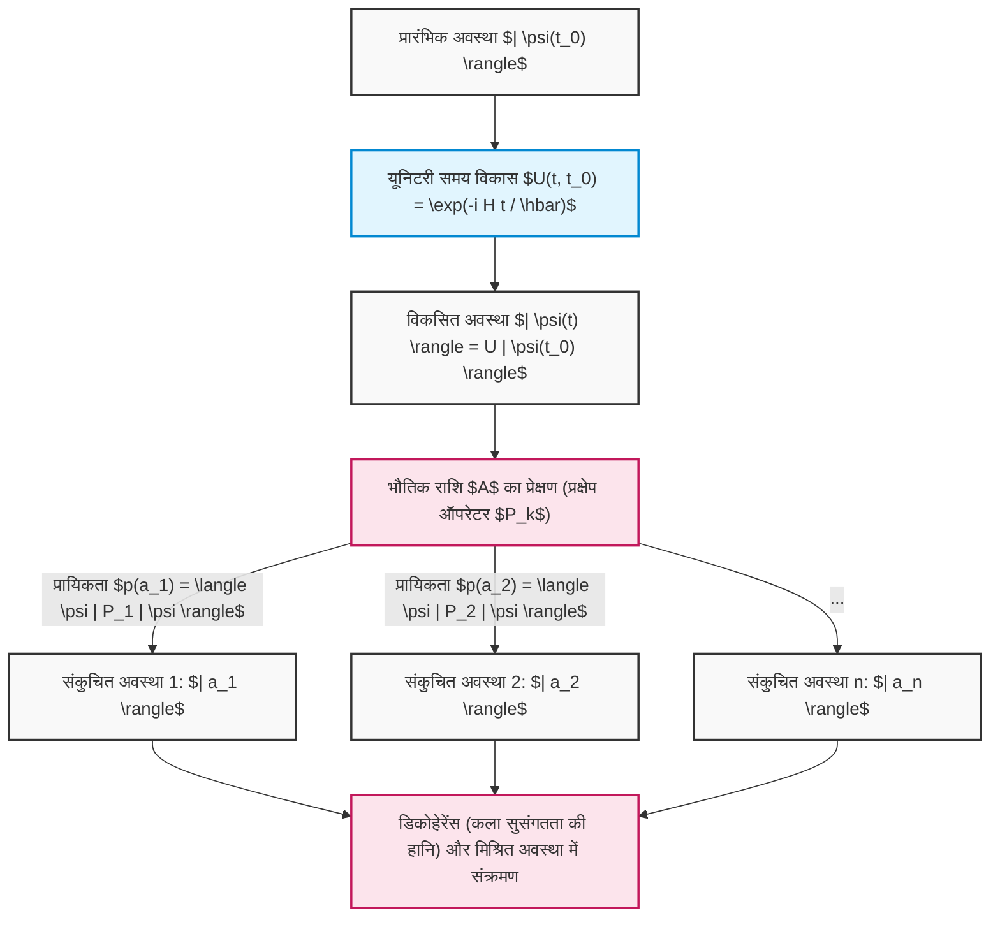

इस प्रकार, रैखिक बीजगणित की अमूर्त अवधारणाएँ——सदिश समष्टि, आंतरिक गुणनफल, हर्मिटियन ऑपरेटर, आइगनमान समस्याएँ, और यूनिटरी आव्यूह——केवल गणितीय खेल नहीं हैं, बल्कि ब्रह्मांड के सूक्ष्मतम व्यवहारों का सटीक वर्णन करने और भविष्यवाणी करने के लिए एक अद्वितीय भाषा हैं। क्वांटम कंप्यूटर के एल्गोरिदम "श्रोडिंगर के नियतिवादी विकास" और "बॉर्न के प्रायिकतात्मक संकुचन" के इन दो शक्तिशाली नियमों का कुशलतापूर्वक उपयोग करते हैं, जो हमें संगणना के उस क्षेत्र में ले जाते हैं जहाँ शास्त्रीय कंप्यूटरों द्वारा पहुँचना असंभव है।

# अध्याय 4: एकल-क्यूबिट गेट और यूनिटरी रूपांतरण

क्वांटम संगणना (quantum computation) का मूल आधार क्वांटम अवस्थाओं पर सटीक संक्रियाएं हैं। जहाँ क्लासिकल कंप्यूटरों में लॉजिक गेट्स (AND, OR, NOT आदि) बिट्स के मानों को अपरिवर्तनीय रूप से बदलते हैं, वहीं क्वांटम कंप्यूटरों में "क्वांटम गेट" श्रोडिंगर समीकरण की अनिवार्यताओं का पालन करने वाला एक प्रतिवर्ती समय-विकास (reversible time evolution) है, जिसे गणितीय रूप से सम्मिश्र हिल्बर्ट स्पेस (complex Hilbert space) पर एक "यूनिटरी रूपांतरण (यूनिटरी मैट्रिक्स)" के रूप में कड़ाई से वर्णित किया जाता है। इस अध्याय में, हम एकल क्यूबिट (दो-स्तरीय प्रणाली) पर कार्य करने वाले मूलभूत क्वांटम गेट्स की गणितीय संरचना, बीजीय गुणों और बलोच स्फीयर (Bloch sphere) पर उनके सहज ज्यामितीय अर्थ की बिना किसी समझौते के गहन समीक्षा करेंगे।

## 4.1 क्वांटम यांत्रिकी की अनिवार्यताएं और यूनिटरी मैट्रिक्स की आवश्यकता

किसी क्वांटम प्रणाली का समय-विकास, प्रणाली को अभिलक्षित करने वाले हर्मिटियन ऑपरेटर हैमिल्टनियन **$H$** ( **$H^\dagger = H$** ) का उपयोग करते हुए, निम्नलिखित श्रोडिंगर समीकरण द्वारा नियंत्रित होता है:

$$
i\hbar \frac{d}{dt} |\psi(t)\rangle = H |\psi(t)\rangle
$$

यह मानते हुए कि हैमिल्टनियन **$H$** समय पर निर्भर नहीं करता, किसी भी समय **$t$** पर क्वांटम अवस्था **$|\psi(t)\rangle$** को प्रारंभिक अवस्था **$|\psi(0)\rangle$** से औपचारिक रूप से इस प्रकार समाकलित (integrated) किया जाता है:

$$
|\psi(t)\rangle = e^{-\frac{i}{\hbar}Ht} |\psi(0)\rangle
$$

यहाँ प्राप्त होने वाले समय-विकास ऑपरेटर को **$U(t) = e^{-\frac{i}{\hbar}Ht}$** के रूप में परिभाषित किया जाता है। चूंकि चरघातांक (exponent) में उपस्थित **$H$** हर्मिटियन है, इसलिए इस ऑपरेटर **$U(t)$** के एड्जॉइंट ऑपरेटर (हर्मिटियन संयुग्मी / Hermitian conjugate) **$U(t)^\dagger$** की गणना करने पर निम्नलिखित अत्यंत महत्वपूर्ण गुणधर्म प्राप्त होता है:

$$
U(t)^\dagger U(t) = \left( e^{-\frac{i}{\hbar}Ht} \right)^\dagger e^{-\frac{i}{\hbar}Ht} = e^{\frac{i}{\hbar}H^\dagger t} e^{-\frac{i}{\hbar}Ht} = e^{\frac{i}{\hbar}Ht} e^{-\frac{i}{\hbar}Ht} = I
$$

इसी प्रकार, **$U(t) U(t)^\dagger = I$** भी संतुष्ट होता है। इस प्रकार, एक ऐसा मैट्रिक्स जिसका एड्जॉइंट मैट्रिक्स उसके अपने व्युत्क्रम मैट्रिक्स (inverse matrix) के बराबर हो ( **$U^\dagger = U^{-1}$** ), उसे "यूनिटरी मैट्रिक्स (Unitary Matrix)" कहा जाता है। एकल-क्यूबिट गेट, भौतिक नियंत्रण (उदाहरण के लिए, विशिष्ट आवृत्ति और अवधि वाले माइक्रोवेव स्पंदनों / pulses का अनुप्रयोग) के माध्यम से सुविचारित रूप से डिज़ाइन किए गए हैमिल्टनियन द्वारा साकार किया गया एक **$2 \times 2$** यूनिटरी मैट्रिक्स ही है।

क्वांटम यांत्रिकी में यूनिटरी मैट्रिक्स के अपरिहार्य होने का मूल कारण यह है कि यह "प्रायिकता के संरक्षण (नॉर्म के संरक्षण)" को गणितीय रूप से सुनिश्चित करने वाला एकमात्र रैखिक रूपांतरण (linear transformation) है। आइए किन्हीं दो क्वांटम अवस्थाओं **$|\psi\rangle$** और **$|\phi\rangle$** पर यूनिटरी रूपांतरण **$U$** लागू करने के पश्चात प्राप्त अवस्थाओं के आंतरिक गुणनफल (inner product) की गणना करें:

$$
\langle \phi' | \psi' \rangle = ( \langle \phi | U^\dagger ) ( U |\psi\rangle ) = \langle \phi | U^\dagger U | \psi \rangle = \langle \phi | I | \psi \rangle = \langle \phi | \psi \rangle
$$

आंतरिक गुणनफल का संरक्षित रहना यह दर्शाता है कि स्वयं अवस्था वेक्टर का नॉर्म (लंबाई का वर्ग), अर्थात **$\langle \psi | \psi \rangle$** , भी संरक्षित रहता है। क्वांटम यांत्रिकी के बॉर्न नियम (Born rule) के अनुसार, अवस्था वेक्टर के आयामों (amplitudes) के निरपेक्ष मानों के वर्गों का योग सदैव कुल प्रायिकता "1" के बराबर होना चाहिए। अतः क्वांटम गेट संक्रियाओं द्वारा इस प्रायिकता व्याख्या का उल्लंघन न हो, इसके लिए संक्रिया का यूनिटरी होना एक अनिवार्य पूर्वशर्त है।

इसके अतिरिक्त, स्पेक्ट्रल प्रमेय (spectral theorem) के अनुसार, किसी भी यूनिटरी मैट्रिक्स **$U$** को वास्तविक आइगेनमान (eigenvalues) **$\lambda_k$** वाले एक हर्मिटियन मैट्रिक्स **$K$** के माध्यम से **$U = e^{iK}$** के रूप में व्यक्त किया जा सकता है। यूनिटरी मैट्रिक्स के आइगेनमान सदैव 1 मापांक (modulus) वाली सम्मिश्र संख्याओं ( **$e^{i\theta}$** ) के रूप में होते हैं, और इसके आइगेनवेक्टर (eigenvectors) परस्पर लंबकोणीय (orthogonal) एक पूर्ण समुच्चय बनाते हैं:

$$
U = \sum_{j=1}^{d} e^{i \theta_j} |\phi_j\rangle \langle \phi_j|
$$

यह इस तथ्य को प्रकट करता है कि किसी क्वांटम गेट की संक्रिया को पूर्णतः एक ऐसी क्रिया के रूप में वियोजित (decomposed) किया जा सकता है, जो "एक विशिष्ट लांबिक आधार (orthonormal basis) **$|\phi_j\rangle$** पर केवल एक शुद्ध कला घूर्णन (phase rotation) **$e^{i\theta_j}$** प्रदान करती है।"

## 4.2 पाउली मैट्रिसेस और मूलभूत गेट्स (X, Y, Z गेट्स)

क्वांटम सूचना की भाषा को समझने के लिए, पाउली मैट्रिसेस (Pauli matrices) के समूह को समझना अनिवार्य और सर्वाधिक महत्वपूर्ण है। भौतिकी में स्पिन-1/2 कणों के कोणीय संवेग (angular momentum) का वर्णन करने के लिए प्रतिपादित यह मैट्रिक्स समूह, क्वांटम कंप्यूटर में एकल क्यूबिट पर कार्य करने वाले सर्वाधिक मूलभूत और परस्पर लांबिक (orthogonal) संक्रियाओं के समूह का निर्माण करता है।

### 4.2.1 पाउली X गेट (बिट-फ्लिप गेट)

पाउली X गेट, क्लासिकल लॉजिक परिपथों के NOT गेट का क्वांटम-यांत्रिक विस्तार है। डिराक के ब्रा-केट नोटेशन (bra-ket notation) का उपयोग करते हुए बाह्य गुणनफल (प्रोजेक्टर) निरूपण में इसे निम्नानुसार परिभाषित किया जाता है:

$$
X = \sigma_x = |0\rangle\langle 1| + |1\rangle\langle 0| = \begin{pmatrix} 0 & 1 \\ 1 & 0 \end{pmatrix}
$$

कम्प्यूटेशनल आधार ( **$|0\rangle, |1\rangle$** ) पर इसकी संक्रिया को मैट्रिक्स गणना द्वारा कड़ाई से सत्यापित करने पर:

$$
X |0\rangle = \begin{pmatrix} 0 & 1 \\ 1 & 0 \end{pmatrix} \begin{pmatrix} 1 \\ 0 \end{pmatrix} = \begin{pmatrix} 0 \\ 1 \end{pmatrix} = |1\rangle
$$

$$
X |1\rangle = \begin{pmatrix} 0 & 1 \\ 1 & 0 \end{pmatrix} \begin{pmatrix} 0 \\ 1 \end{pmatrix} = \begin{pmatrix} 1 \\ 0 \end{pmatrix} = |0\rangle
$$

इस प्रकार, यह आयामों (amplitudes) को पूर्णतः उलट देता है। ज्यामितीय दृष्टि से, यह बलोच स्फीयर पर X-अक्ष के परितः **$\pi$** (180 अंश) के घूर्णन संक्रिया (rotation operation) के समतुल्य है। इसमें उत्तरी ध्रुव ( **$|0\rangle$** ) दक्षिणी ध्रुव ( **$|1\rangle$** ) पर, और दक्षिणी ध्रुव उत्तरी ध्रुव पर प्रतिचित्रित (mapped) होता है।

### 4.2.2 पाउली Y गेट (बिट और फेज़-फ्लिप गेट)

पाउली Y गेट, बिट-फ्लिप और फेज़-फ्लिप दोनों को एक साथ निष्पादित करता है, और साथ ही काल्पनिक इकाई **$i$** का एक फेज़ गुणक (phase factor) जोड़ता है। इसका बाह्य गुणनफल निरूपण और मैट्रिक्स निरूपण निम्नानुसार हैं:

$$
Y = \sigma_y = -i|0\rangle\langle 1| + i|1\rangle\langle 0| = \begin{pmatrix} 0 & -i \\ i & 0 \end{pmatrix}
$$

कम्प्यूटेशनल आधार पर इसकी संक्रिया:

$$
Y |0\rangle = i|1\rangle, \quad Y |1\rangle = -i|0\rangle
$$

होती है। बलोच स्फीयर पर, यह Y-अक्ष के परितः **$\pi$** घूर्णन को निरूपित करता है। काल्पनिक इकाई **$i$** (अर्थात **$e^{i\pi/2}$** ) का गुणन केवल एक साधारण उत्क्रमण ही नहीं, अपितु फेज़ स्पेस में लंबवत दिशा में अवस्था के विस्थापन (shift) को भी दर्शाता है।

### 4.2.3 पाउली Z गेट (फेज़-फ्लिप गेट)

पाउली Z गेट क्लासिकल लॉजिक में अनुपस्थित, क्वांटम यांत्रिकी की एक विशिष्ट और विशुद्ध "फेज़ संक्रिया (phase operation)" है। यह आयाम के परिमाण (मापन प्रायिकता) में कोई परिवर्तन किए बिना, केवल **$|1\rangle$** के घटक को **$-1$** (अर्थात **$e^{i\pi}$** ) का फेज़ शिफ्ट प्रदान करता है।

$$
Z = \sigma_z = |0\rangle\langle 0| - |1\rangle\langle 1| = \begin{pmatrix} 1 & 0 \\ 0 & -1 \end{pmatrix}
$$

इसकी संक्रिया स्वतःस्पष्ट रूप से:

$$
Z |0\rangle = |0\rangle, \quad Z |1\rangle = -|1\rangle
$$

होती है। यह Z-अक्ष के परितः **$\pi$** घूर्णन के संगत है। चूंकि कम्प्यूटेशनल आधार अवस्थाएं **$|0\rangle, |1\rangle$** स्वयं Z मैट्रिक्स के आइगेनवेक्टर हैं (जिनके आइगेनमान क्रमशः +1 और -1 हैं), अतः Z गेट लागू करने पर अवस्था परिवर्तित नहीं होती। तथापि, जब इसे किसी सुपरपोज़िशन अवस्था (जैसे: **$\alpha|0\rangle + \beta|1\rangle$** ) पर लागू किया जाता है, तो सापेक्ष फेज़ (relative phase) नाटकीय रूप से उलटकर **$\alpha|0\rangle - \beta|1\rangle$** हो जाता है, जो बाद के व्यतिकरण (interference) परिणामों को निर्णायक रूप से बदल देता है।

### 4.2.4 पाउली समूह की गहन बीजीय संरचना

पाउली मैट्रिक्स समूह **$\{I, X, Y, Z\}$** , हिल्बर्ट स्पेस पर रैखिक ऑपरेटरों के रूप में एक अत्यंत सुरुचिपूर्ण बीजीय संरचना का निर्माण करता है:

1. **स्व-संयुग्मी (हर्मिटियन) और यूनिटरी प्रकृति का सह-अस्तित्व** : ये **$X = X^\dagger$** , **$Y = Y^\dagger$** , **$Z = Z^\dagger$** हैं, और साथ ही **$X^\dagger X = I$** (अर्थात **$X = X^{-1}$** ) को संतुष्ट करते हैं। भौतिक राशि (ऑब्जर्वेबल / अवलोकन योग्य) होने के साथ-साथ स्वयं एक यूनिटरी समय-विकास जनक (गेट) होना इनका एक दुर्लभ गुण है। इन्हें लगातार दो बार लागू करने पर यह पुनः तत्समक रूपांतरण (identity transformation) पर लौट आते हैं (अंतर्वलन / involution: **$X^2 = Y^2 = Z^2 = I$** )।
2. **पूर्ण प्रति-क्रमविनिमेय संबंध** : किन्हीं दो भिन्न पाउली मैट्रिसेस के गुणन का क्रम बदलने पर उनका चिन्ह उलट जाता है:
   

$$
\{X, Y\} = XY + YX = 0, \quad \{Y, Z\} = 0, \quad \{Z, X\} = 0
$$

3. **क्रमविनिमेय संबंध और लाई बीजगणित** : कम्यूटेटर **$[A, B] = AB - BA$** का उपयोग करने पर, ये **$SU(2)$** लाई बीजगणित के जनरेटर के रूप में अपनी संरचना को स्पष्ट रूप से प्रदर्शित करते हैं (पूर्णतः प्रति-सममित टेंसर **$\epsilon_{ijk}$** का उपयोग करके):
   

$$
[\sigma_j, \sigma_k] = 2i \sum_{l \in \{x,y,z\}} \epsilon_{jkl} \sigma_l
$$

   विशेष रूप से, **$XY = iZ$** , **$YZ = iX$** , **$ZX = iY$** होता है। यह बीजीय संरचना आगे वर्णित किए जाने वाले किसी भी मनमाने रोटेशन गेट को परिभाषित करने का गणितीय आधार प्रदान करती है।

## 4.3 हैडामार्ड गेट (H गेट): क्वांटम सुपरपोज़िशन का निर्माण

क्वांटम एल्गोरिदम (जैसे डॉयच-जोज़ा एल्गोरिदम या शोर का एल्गोरिदम) में, आरंभीकरण (initialization) के तुरंत बाद लगभग अनिवार्य रूप से लागू किया जाने वाला गेट हैडामार्ड (Hadamard) गेट है। यह एक नियतात्मक (deterministic) अवस्था से ऐसी "अधिकतम सुपरपोज़िशन अवस्था" उत्पन्न करने में केंद्रीय भूमिका निभाता है जहाँ सभी अवस्थाएं समान प्रायिकता के साथ प्रकट होती हैं।

$$
H = \frac{1}{\sqrt{2}} \begin{pmatrix} 1 & 1 \\ 1 & -1 \end{pmatrix} = \frac{1}{\sqrt{2}} \left( |0\rangle\langle 0| + |0\rangle\langle 1| + |1\rangle\langle 0| - |1\rangle\langle 1| \right)
$$

कम्प्यूटेशनल आधार पर हैडामार्ड मैट्रिक्स लागू करने पर:

$$
H |0\rangle = \frac{1}{\sqrt{2}} \begin{pmatrix} 1 & 1 \\ 1 & -1 \end{pmatrix} \begin{pmatrix} 1 \\ 0 \end{pmatrix} = \frac{1}{\sqrt{2}} \begin{pmatrix} 1 \\ 1 \end{pmatrix} = \frac{|0\rangle + |1\rangle}{\sqrt{2}} \equiv |+\rangle
$$

$$
H |1\rangle = \frac{1}{\sqrt{2}} \begin{pmatrix} 1 & 1 \\ 1 & -1 \end{pmatrix} \begin{pmatrix} 0 \\ 1 \end{pmatrix} = \frac{1}{\sqrt{2}} \begin{pmatrix} 1 \\ -1 \end{pmatrix} = \frac{|0\rangle - |1\rangle}{\sqrt{2}} \equiv |-\rangle
$$

उत्पन्न अवस्थाएं **$|+\rangle$** और **$|-\rangle$** , X-आधार (या विकर्ण आधार) कहलाती हैं, जो पाउली X मैट्रिक्स की आइगेन-अवस्थाएं हैं। हैडामार्ड मैट्रिक्स स्वयं एक वास्तविक सममित (real symmetric) और ऑर्थोगोनल मैट्रिक्स (वास्तविक सदिश समष्टि में यूनिटरी मैट्रिक्स) है, अतः यह **$H = H^\dagger = H^{-1}$** तथा **$H^2 = I$** को संतुष्ट करता है।
अतएव, **$H |+\rangle = |0\rangle$** प्राप्त होता है, जिससे यह सुपरपोज़िशन अवस्था में व्यतिकरण (interference) उत्पन्न कर उसे पुनः एक निश्चित कम्प्यूटेशनल आधार में वापस लाने का प्रभाव भी रखता है।
बीजीय दृष्टि से, H गेट X-आधार और Z-आधार के मध्य परस्पर रूपांतरण करने वाला एक यूनिटरी रूपांतरण है। इसे मैट्रिसेस के समरूपता रूपांतरण (similarity transformation) के रूप में अत्यंत सुरुचिपूर्ण ढंग से व्यक्त किया जाता है:

$$
H X H^\dagger = H X H = Z
$$

$$
H Z H^\dagger = H Z H = X
$$

इस गुणधर्म के कारण, "Z गेट द्वारा फेज़-फ्लिप" को H गेट्स के मध्य सैंडविच (sandwich) करके "X गेट द्वारा बिट-फ्लिप" का संश्लेषण करना संभव हो जाता है। ज्यामितीय दृष्टि से, H गेट बलोच स्फीयर पर इकाई वेक्टर **$\hat{n} = \frac{1}{\sqrt{2}}(\hat{x} + \hat{z})$** को अक्ष मानकर **$\pi$** घूर्णन के समतुल्य है।

## 4.4 फेज़ शिफ्ट गेट समूह: S गेट और T गेट

पाउली Z गेट का अधिक व्यापक रूप, जो बलोच स्फीयर के Z-अक्ष के परितः स्वेच्छ घूर्णन संक्रियाओं का समूह है, फेज़ शिफ्ट गेट **$P(\phi)$** (या **$R_\phi$** ) कहलाता है:

$$
P(\phi) = \begin{pmatrix} 1 & 0 \\ 0 & e^{i\phi} \end{pmatrix} = |0\rangle\langle 0| + e^{i\phi} |1\rangle\langle 1|
$$

यह गेट समूह, किसी सुपरपोज़िशन अवस्था **$\alpha|0\rangle + \beta|1\rangle$** पर कार्य करते हुए उसे **$\alpha|0\rangle + \beta e^{i\phi}|1\rangle$** के रूप में परिवर्तित करता है, जिससे केवल **$|1\rangle$** घटक के सापेक्ष फेज़ में परिवर्तन होता है। इनमें विशेष रूप से निम्नलिखित दो गेट अत्यंत महत्वपूर्ण हैं:

### 4.4.1 S गेट (फेज़ गेट, $\sqrt{Z}$ )

 **$\phi = \pi/2$** की स्थिति को S गेट कहा जाता है:

$$
S = \begin{pmatrix} 1 & 0 \\ 0 & e^{i\pi/2} \end{pmatrix} = \begin{pmatrix} 1 & 0 \\ 0 & i \end{pmatrix}
$$

मैट्रिक्स के गुणों से स्पष्ट है कि इसे दो बार लागू करने पर यह Z गेट बन जाता है ( **$S^2 = Z$** )।
जब S गेट को **$|+\rangle$** अवस्था पर लागू किया जाता है:

$$
S |+\rangle = \begin{pmatrix} 1 & 0 \\ 0 & i \end{pmatrix} \frac{1}{\sqrt{2}} \begin{pmatrix} 1 \\ 1 \end{pmatrix} = \frac{1}{\sqrt{2}} \begin{pmatrix} 1 \\ i \end{pmatrix} = \frac{|0\rangle + i|1\rangle}{\sqrt{2}} \equiv |+i\rangle
$$

जिससे अवस्था बलोच स्फीयर के भूमध्य रेखा (equator) पर Y-अक्ष की धनात्मक दिशा (Y-आधार की आइगेन-अवस्था) में रूपांतरित हो जाती है। पाउली समूह तथा H एवं S गेट्स से निर्मित समूह को क्लिफर्ड समूह (Clifford group) कहा जाता है, और गोट्समैन-निल प्रमेय (Gottesman-Knill theorem) के अनुसार, केवल क्लिफर्ड समूह के गेट्स से बने क्वांटम परिपथों को क्लासिकल कंप्यूटरों पर दक्षतापूर्वक सिमुलेट किया जा सकता है।

### 4.4.2 T गेट ( $\pi/8$ गेट, $\sqrt{S}$ , $\sqrt[4]{Z}$ )

 **$\phi = \pi/4$** की स्थिति को T गेट कहा जाता है:

$$
T = \begin{pmatrix} 1 & 0 \\ 0 & e^{i\pi/4} \end{pmatrix} = \begin{pmatrix} 1 & 0 \\ 0 & \frac{1+i}{\sqrt{2}} \end{pmatrix}
$$

यदि इसमें से ग्लोबल फेज़ **$e^{i\pi/8}$** को उभयनिष्ठ (common) ले लिया जाए, तो विकर्ण घटक **$e^{-i\pi/8}$** और **$e^{i\pi/8}$** बन जाते हैं, जिसके कारण ऐतिहासिक रूप से इसे **$\pi/8$** गेट भी कहा जाता है।
T गेट क्लिफर्ड समूह के अंतर्गत नहीं आता है, और यह क्लासिकल सिमुलेशन की दक्षता को समाप्त कर देता है। तथापि, क्वांटम संगणना सिद्धांत का एक अत्यंत महत्वपूर्ण प्रमेय यह स्थापित करता है कि क्लिफर्ड समूह में इस T गेट को शामिल करते ही एक "सार्वभौमिक क्वांटम गेट सेट (Universal Quantum Gate Set)" निर्मित हो जाता है, जो एकल क्यूबिट पर किसी भी यूनिटरी रूपांतरण का किसी भी स्वेच्छ परिशुद्धता तक सन्निकटन (approximation) कर सकता है। त्रुटि-सहिष्णु (fault-tolerant) क्वांटम कंप्यूटिंग में, त्रुटि-संशोधन कोड्स पर सीधे T गेट का निष्पादन करना अत्यंत कठिन होता है, अतः इसे "मैजिक स्टेट डिस्टिलेशन (Magic State Distillation)" नामक एक अत्यधिक संसाधन-साध्य तकनीक के माध्यम से कार्यान्वित किया जाता है।

## 4.5 स्वेच्छ रोटेशन गेट्स का चरघातांकी निरूपण और सार्वभौमिकता

एकल क्यूबिट पर सर्वाधिक सामान्य संक्रिया, बलोच स्फीयर में किसी स्वेच्छ इकाई वेक्टर **$\hat{n} = (n_x, n_y, n_z)$** (जहाँ **$n_x^2 + n_y^2 + n_z^2 = 1$** ) को घूर्णन अक्ष मानकर कोण **$\theta$** से घुमाने वाला एक यूनिटरी रूपांतरण है। पाउली मैट्रिसेस के रैखिक संयोजन का उपयोग करते हुए, इस घूर्णन ऑपरेटर **$R_{\hat{n}}(\theta)$** को मैट्रिक्स चरघातांकी फलन (matrix exponential) के रूप में सुरुचिपूर्ण ढंग से सूत्रबद्ध किया जाता है:

$$
R_{\hat{n}}(\theta) = \exp\left(-i \frac{\theta}{2} (\hat{n} \cdot \vec{\sigma})\right) = \exp\left(-i \frac{\theta}{2} (n_x X + n_y Y + n_z Z)\right)
$$

यहाँ, **$(\hat{n} \cdot \vec{\sigma})^2 = (n_x X + n_y Y + n_z Z)^2 = (n_x^2 + n_y^2 + n_z^2)I = I$** नामक पाउली मैट्रिसेस के सशक्त प्रति-क्रमविनिमेय गुणधर्म का उपयोग करके चरघातांकी फलन का टेलर श्रेणी प्रसार (जहाँ **$A^2=I$** होने पर **$e^{iAx} = \cos(x)I + i\sin(x)A$** होता है) करने पर, यह अनंत श्रेणी नाटकीय रूप से सरल हो जाती है और यूलर सूत्र का मैट्रिक्स-विस्तारित संस्करण प्राप्त होता है:

$$
R_{\hat{n}}(\theta) = \cos\left(\frac{\theta}{2}\right) I - i \sin\left(\frac{\theta}{2}\right) (\hat{n} \cdot \vec{\sigma})
$$

इस सामान्य सूत्रीकरण से, कार्तीय निर्देशांक अक्षों के परितः मूलभूत रोटेशन गेट्स का निगमन किया जाता है:

### X-अक्ष के परितः रोटेशन गेट $R_x(\theta)$ 

$$
R_x(\theta) = e^{-i \frac{\theta}{2} X} = \begin{pmatrix} \cos\frac{\theta}{2} & -i \sin\frac{\theta}{2} \\ -i \sin\frac{\theta}{2} & \cos\frac{\theta}{2} \end{pmatrix}
$$

### Y-अक्ष के परितः रोटेशन गेट $R_y(\theta)$ 

$$
R_y(\theta) = e^{-i \frac{\theta}{2} Y} = \begin{pmatrix} \cos\frac{\theta}{2} & -\sin\frac{\theta}{2} \\ \sin\frac{\theta}{2} & \cos\frac{\theta}{2} \end{pmatrix}
$$

### Z-अक्ष के परितः रोटेशन गेट $R_z(\theta)$ 

$$
R_z(\theta) = e^{-i \frac{\theta}{2} Z} = \begin{pmatrix} e^{-i\theta/2} & 0 \\ 0 & e^{i\theta/2} \end{pmatrix}
$$

इन घूर्णन मैट्रिसेस का उपयोग करके, किसी भी एकल-क्यूबिट यूनिटरी मैट्रिक्स **$U \in SU(2)$** को तीन यूलर कोणों ( **$\alpha, \beta, \gamma$** ) का उपयोग करते हुए "Z-Y-Z वियोजन (decomposition)" के रूप में निम्नानुसार पूर्णतः गुणनखंडित किया जा सकता है:

$$
U = e^{i\delta} R_z(\alpha) R_y(\beta) R_z(\gamma)
$$

यह प्रमेय इस बात की भौतिक गारंटी प्रदान करता है कि जब तक हार्डवेयर स्तर पर Z-अक्ष घूर्णन और Y-अक्ष घूर्णन को उच्च परिशुद्धता के साथ कार्यान्वित किया जा सकता है, तब तक एकल क्यूबिट पर किसी भी जटिल एल्गोरिदम को निष्पादित करना संभव है।

## 4.6 【आरेख】 एकल-क्यूबिट गेट परिपथ और अवस्था संक्रमण

इन गेट्स को कालक्रमानुसार संयोजित करने पर एक क्वांटम परिपथ (quantum circuit) बनता है। अवस्थाएं बाएं से दाएं समय में विकसित होती हैं।

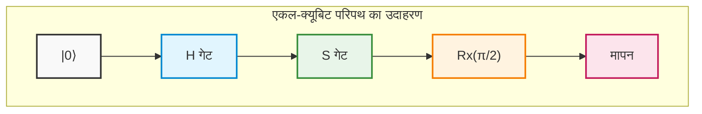

## 4.7 सटीक गणना उदाहरण: मैट्रिक्स गुणन के माध्यम से क्वांटम व्यतिकरण की पूर्ण ट्रैकिंग

अमूर्त अवधारणाओं को भौतिक अंतर्ज्ञान में रूपांतरित करने के लिए, हम बिना किसी संक्षेप के हाथ से की जाने वाली गणना द्वारा कड़ाई से यह ट्रैक करेंगे कि एकाधिक यूनिटरी मैट्रिसेस का गुणन करने पर क्वांटम अवस्थाएं किस प्रकार व्यतिकरण (interference) और संक्रमण करती हैं।

माना प्रारंभिक अवस्था मूल अवस्था (ground state) **$|\psi_0\rangle = |0\rangle = \begin{pmatrix} 1 \\ 0 \end{pmatrix}$** है।
निष्पादित की जाने वाली संक्रिया उपरोक्त परिपथ आरेख के सदृश " **$H$** गेट" → " **$S$** गेट" → " **$H$** गेट" का एक अनुक्रम है।
यद्यपि क्वांटम परिपथ आरेख बाएं से दाएं लिखे जाते हैं, किंतु अवस्था वेक्टर पर रैखिक बीजगणितीय ऑपरेटर गुणन "बाईं ओर से" लागू होता है, अतः संपूर्ण यूनिटरी ऑपरेटर **$U_{total}$** का व्यंजक समय के विपरीत क्रम में दाएं से बाएं व्यवस्थित होता है:

$$
U_{total} = H S H
$$

प्रत्येक गेट के मैट्रिक्स निरूपण को प्रतिस्थापित कर परिणामी मैट्रिक्स व्युत्पन्न करते हैं:

$$
H = \frac{1}{\sqrt{2}} \begin{pmatrix} 1 & 1 \\ 1 & -1 \end{pmatrix}, \quad S = \begin{pmatrix} 1 & 0 \\ 0 & i \end{pmatrix}
$$

सर्वप्रथम, प्रारंभिक अवस्था के तुरंत पश्चात लागू होने वाले **$H$** और उसके उपरांत लागू होने वाले **$S$** के गुणनफल **$SH$** की गणना करते हैं:

$$
S H = \begin{pmatrix} 1 & 0 \\ 0 & i \end{pmatrix} \frac{1}{\sqrt{2}} \begin{pmatrix} 1 & 1 \\ 1 & -1 \end{pmatrix} = \frac{1}{\sqrt{2}} \begin{pmatrix} 1\cdot 1 + 0\cdot 1 & 1\cdot 1 + 0\cdot(-1) \\ 0\cdot 1 + i\cdot 1 & 0\cdot 1 + i\cdot(-1) \end{pmatrix} = \frac{1}{\sqrt{2}} \begin{pmatrix} 1 & 1 \\ i & -i \end{pmatrix}
$$

इसके पश्चात, इस परिणाम को बाईं ओर से अंतिम **$H$** से गुणा करते हैं:

$$
U_{total} = H (S H) = \frac{1}{\sqrt{2}} \begin{pmatrix} 1 & 1 \\ 1 & -1 \end{pmatrix} \frac{1}{\sqrt{2}} \begin{pmatrix} 1 & 1 \\ i & -i \end{pmatrix}
$$

अदिश गुणज **$\frac{1}{\sqrt{2}} \times \frac{1}{\sqrt{2}} = \frac{1}{2}$** को बाहर निकालते हुए मैट्रिक्स गुणन को सावधानीपूर्वक निष्पादित करते हैं:

$$
U_{total} = \frac{1}{2} \begin{pmatrix} 1\cdot 1 + 1\cdot i & 1\cdot 1 + 1\cdot(-i) \\ 1\cdot 1 + (-1)\cdot i & 1\cdot 1 + (-1)\cdot(-i) \end{pmatrix} = \frac{1}{2} \begin{pmatrix} 1 + i & 1 - i \\ 1 - i & 1 + i \end{pmatrix}
$$

यह संपूर्ण परिपथ को एकल ब्लैक बॉक्स के रूप में देखने पर प्राप्त होने वाला एकल यूनिटरी मैट्रिक्स निरूपण है।
इस **$U_{total}$** को प्रारंभिक अवस्था **$|0\rangle$** पर लागू कर अंतिम अवस्था **$|\psi_{final}\rangle$** की गणना करते हैं:

$$
|\psi_{final}\rangle = U_{total} |0\rangle = \frac{1}{2} \begin{pmatrix} 1 + i & 1 - i \\ 1 - i & 1 + i \end{pmatrix} \begin{pmatrix} 1 \\ 0 \end{pmatrix} = \frac{1}{2} \begin{pmatrix} 1 + i \\ 1 - i \end{pmatrix}
$$

डिराक नोटेशन में इसका विस्तार करने पर यह निम्नानुसार प्राप्त होता है:

$$
|\psi_{final}\rangle = \frac{1+i}{2} |0\rangle + \frac{1-i}{2} |1\rangle
$$

यहाँ, यूनिटेरिटी (प्रायिकताओं का कुल योग 1 होना) संरक्षित है या नहीं, इसे सत्यापित करने के लिए प्रत्येक आधार अवस्था के प्रेक्षण की प्रायिकता की गणना करते हैं। इसके लिए सम्मिश्र संख्या के निरपेक्ष मान के वर्ग ** $|z|^2 = z z^*$ ** का उपयोग करते हैं:

$$
P(0) = |\langle 0 | \psi_{final} \rangle|^2 = \left| \frac{1+i}{2} \right|^2 = \frac{1^2 + 1^2}{4} = \frac{2}{4} = \frac{1}{2}
$$

$$
P(1) = |\langle 1 | \psi_{final} \rangle|^2 = \left| \frac{1-i}{2} \right|^2 = \frac{1^2 + (-1)^2}{4} = \frac{2}{4} = \frac{1}{2}
$$

प्रायिकताओं का योग **$P(0) + P(1) = 1$** प्राप्त होता है, जिससे यह सिद्ध होता है कि यह भौतिक रूप से एक वैध अवस्था है। मापन करने पर 50% प्रायिकता से 0 और 50% प्रायिकता से 1 प्राप्त होता है, परंतु यह मात्र एक क्लासिकल यादृच्छिक संख्या (random number) नहीं है। अवस्था के पीछे छिपी "कला (phase)" को प्रकट करने के लिए, आइए अवस्था वेक्टर को बलोच स्फीयर के ध्रुवीय निर्देशांक रूप (polar coordinate form) में रूपांतरित करें।

समग्र उभयनिष्ठ घटक के रूप में आयाम **$1/\sqrt{2}$** और ग्लोबल फेज़ **$e^{i\pi/4}$** ( **$\frac{1+i}{\sqrt{2}}$** ) को बाहर निकालते हैं:

$$
|\psi_{final}\rangle = \frac{1}{\sqrt{2}} \left( \frac{1+i}{\sqrt{2}} |0\rangle + \frac{1-i}{\sqrt{2}} |1\rangle \right) = e^{i\pi/4} \left( \frac{1}{\sqrt{2}} |0\rangle + \frac{1}{\sqrt{2}} e^{-i\pi/2} |1\rangle \right)
$$

ग्लोबल फेज़ **$e^{i\pi/4}$** किसी भी प्रेक्षित राशि (हर्मिटियन ऑपरेटर) के प्रत्याशा मान (expectation value) की गणना में **$e^{-i\pi/4} e^{i\pi/4} = 1$** होकर निरस्त हो जाता है, अतः केवल भौतिक अर्थ रखने वाले सापेक्ष फेज़ भाग को पृथक करने पर:

$$
|\psi_{final}'\rangle = \frac{1}{\sqrt{2}} |0\rangle - \frac{i}{\sqrt{2}} |1\rangle
$$

प्राप्त होता है। इसकी तुलना ध्रुवीय निर्देशांक निरूपण **$\cos(\theta/2)|0\rangle + e^{i\phi}\sin(\theta/2)|1\rangle$** से करने पर, यह पूर्णतः निर्धारित हो जाता है कि बलोच वेक्टर शीर्ष कोण (zenith angle) **$\theta = \pi/2$** (भूमध्य रेखा पर) और दिगंश कोण (azimuthal angle) **$\phi = -\pi/2$** (Y-अक्ष की ऋणात्मक दिशा) की ओर दिष्ट है। यह वही अवस्था है जिसे सामान्यतः **$|-i\rangle$** द्वारा दर्शाया जाता है।

आइए एक और भी गहन तथ्य का अवलोकन करें। पूर्व में व्युत्पन्न चरघातांकी घूर्णन गेट के सूत्र का उपयोग करते हुए, X-अक्ष के परितः **$\pi/2$** घूर्णन **$R_x(\pi/2)$** के मैट्रिक्स को लिखते हैं:

$$
R_x(\pi/2) = \frac{1}{\sqrt{2}} \begin{pmatrix} 1 & -i \\ -i & 1 \end{pmatrix}
$$

दूसरी ओर, आइए हमारे द्वारा परिकलित संपूर्ण मैट्रिक्स **$U_{total}$** का पुनः परीक्षण करें:

$$
U_{total} = \frac{1}{2} \begin{pmatrix} 1 + i & 1 - i \\ 1 - i & 1 + i \end{pmatrix} = \frac{1+i}{2} \begin{pmatrix} 1 & \frac{1-i}{1+i} \\ \frac{1-i}{1+i} & 1 \end{pmatrix} = \frac{1+i}{2} \begin{pmatrix} 1 & -i \\ -i & 1 \end{pmatrix} = e^{i\pi/4} R_x(\pi/2)
$$

यह आश्चर्यजनक तथ्य सिद्ध होता है कि सर्वथा भिन्न अक्षों के परितः विविक्त (discrete) गेट्स का सतत अनुक्रम " **$H \rightarrow S \rightarrow H$** ", ग्लोबल फेज़ को छोड़कर, विशुद्ध रूप से X-अक्ष के परितः एक एकल " **$\pi/2$** घूर्णन संक्रिया" के गणितीय रूप से पूर्णतः समतुल्य है।
इस प्रकार, यद्यपि क्वांटम अवस्थाएं हमारे क्लासिकल अंतर्ज्ञान को चुनौती देने वाले जटिल व्यतिकरण मार्गों का अनुसरण करती हैं, तथापि रैखिक बीजगणित के सुदृढ़ गणितीय ढांचे के माध्यम से उनके व्यवहार को बिना किसी त्रुटि के पूर्णतः नियंत्रित और प्रागुक्त (predict) करना संभव हो जाता है।

अगले अध्याय में, हम एकल-क्यूबिट संक्रियाओं के इस सशक्त ज्ञान को आधार बनाकर, हिल्बर्ट स्पेस की विमाओं (dimensions) का चरघातांकी रूप से विस्तार करने वाले टेंसर गुणनफल (tensor product), तथा आइंस्टीन द्वारा "दूरस्थ रहस्यमयी क्रिया (spooky action at a distance)" कहे गए "क्वांटम उलझाव (एंटैंगलमेंट)" को उत्पन्न करने वाले बहु-क्यूबिट गेट्स की गहन दुनिया में प्रवेश करेंगे।

# अध्याय 5: बहु-क्यूबिट प्रणालियाँ और क्वांटम एंटैंगलमेंट (Entanglement)

पिछले अध्यायों में, हमने एकल क्यूबिट के सुपरपोजिशन (superposition) के गुण और बलोच स्फीयर (Bloch sphere) पर रोटेशन ऑपरेशन के रूप में वर्णित एकल-क्यूबिट गेट्स का विस्तार से अध्ययन किया है। हालाँकि, क्वांटम कंप्यूटिंग की वह वास्तविक शक्ति जो क्लासिकल कंप्यूटिंग को पीछे छोड़ती है—तथाकथित "क्वांटम वर्चस्व (quantum supremacy)" या "क्वांटम एडवांटेज (quantum advantage)"—का स्रोत वास्तव में उन बहु-निकाय प्रणालियों (many-body systems) में निहित है जहाँ कई क्यूबिट परस्पर क्रिया (interaction) करते हैं। इस अध्याय में, हम क्वांटम सूचना की सबसे केंद्रीय और रहस्यमयी अवधारणा, **क्वांटम एंटैंगलमेंट** (Entanglement) का परिचय देंगे, और बहु-क्यूबिट प्रणालियों के सटीक गणितीय विवरण से लेकर, क्वांटम एंटैंगलमेंट उत्पन्न करने वाले परिपथों (circuits), तथा भौतिकी की नींव को हिला देने वाले EPR विरोधाभास (EPR paradox) तक की गहन और विस्तृत व्याख्या करेंगे।

---

## 5.1 टेंसर गुणनफल ($\otimes$) द्वारा बहु-निकाय अवस्थाओं का गणितीय विवरण

क्वांटम यांत्रिकी के सिद्धांतों (axioms) के अनुसार, जब स्वतंत्र भौतिक प्रणालियों के स्टेट स्पेस क्रमशः हिल्बर्ट स्पेस **$\mathcal{H}_A$** और **$\mathcal{H}_B$** द्वारा वर्णित होते हैं, तो उन्हें मिलाकर बनने वाली संयुक्त प्रणाली (composite system) का स्टेट स्पेस, दोनों स्थानों के **टेंसर गुणनफल** (Tensor Product) यानी **$\mathcal{H} = \mathcal{H}_A \otimes \mathcal{H}_B$** के रूप में दिया जाता है।

एकल क्यूबिट का स्टेट स्पेस एक 2-आयामी सम्मिश्र वेक्टर स्पेस (complex vector space) **$\mathbb{C}^2$** होता है। इसलिए, $n$ क्यूबिट से बनी प्रणाली का स्टेट स्पेस $2^n$-आयामी हिल्बर्ट स्पेस **$(\mathbb{C}^2)^{\otimes n}$** बन जाता है। क्यूबिट की संख्या $n$ के साथ आयाम (dimension) का चरघातांकी रूप से (exponentially) बढ़ना ही क्वांटम समानांतरता (quantum parallelism) का गणितीय आधार है।

आइए दो क्यूबिट (क्यूबिट A और क्यूबिट B) से बनी प्रणाली पर विचार करें। कम्प्यूटेशनल बेसिस (computational basis) को प्रत्येक एकल क्यूबिट की आधार अवस्थाओं (basis states) के टेंसर गुणनफल के रूप में परिभाषित किया जाता है:

$$
|0\rangle_A \otimes |0\rangle_B \equiv |00\rangle, \quad
|0\rangle_A \otimes |1\rangle_B \equiv |01\rangle, \quad
|1\rangle_A \otimes |0\rangle_B \equiv |10\rangle, \quad
|1\rangle_A \otimes |1\rangle_B \equiv |11\rangle
$$

यहाँ, आइए टेंसर गुणनफल के मैट्रिक्स निरूपण (क्रोनकर गुणनफल / Kronecker product) की कड़ाई से गणना करें। यदि हम एकल क्यूबिट के आधार को कॉलम वेक्टर के रूप में निरूपित करते हैं:

$$
|0\rangle = \begin{pmatrix} 1 \\ 0 \end{pmatrix}, \quad |1\rangle = \begin{pmatrix} 0 \\ 1 \end{pmatrix}
$$

तो इनका उपयोग करके, उदाहरण के लिए, यदि हम अवस्था **$|10\rangle$** की गणना करें, तो यह निम्नानुसार प्राप्त होती है:

$$
|10\rangle = |1\rangle \otimes |0\rangle = \begin{pmatrix} 0 \\ 1 \end{pmatrix} \otimes \begin{pmatrix} 1 \\ 0 \end{pmatrix} = \begin{pmatrix} 0 \cdot \begin{pmatrix} 1 \\ 0 \end{pmatrix} \\ 1 \cdot \begin{pmatrix} 1 \\ 0 \end{pmatrix} \end{pmatrix} = \begin{pmatrix} 0 \\ 0 \\ 1 \\ 0 \end{pmatrix}
$$

इस 4-आयामी वेक्टर स्पेस में, 2-क्यूबिट प्रणाली की सबसे सामान्य शुद्ध अवस्था (pure state) **$|\Psi\rangle$** इन चार आधार वेक्टरों के रैखिक संयोजन (linear combination / सुपरपोजिशन) के रूप में वर्णित की जाती है:

$$
|\Psi\rangle = c_{00} |00\rangle + c_{01} |01\rangle + c_{10} |10\rangle + c_{11} |11\rangle
$$

यहाँ, $c_{ij} \in \mathbb{C}$ प्रायिकता आयाम (probability amplitudes) हैं, और बॉर्न के नियम (Born rule) के अनुसार अवस्था को प्रसामान्यीकृत होना चाहिए, अर्थात् इसे सामान्यीकरण शर्त $\sum_{i,j \in \{0,1\}} |c_{ij}|^2 = 1$ को संतुष्ट करना होगा।

संयुक्त प्रणाली में ऑपरेटर (गेट्स) भी टेंसर गुणनफल का उपयोग करके निर्मित किए जाते हैं। क्यूबिट A पर ऑपरेटर **$U_A$** और क्यूबिट B पर ऑपरेटर **$U_B$** लागू करने का ऑपरेशन पूरी संयुक्त प्रणाली के लिए ऑपरेटर **$U_A \otimes U_B$** के रूप में व्यक्त किया जाता है, और किसी भी गुणनफल अवस्था (product state) पर निम्नानुसार कार्य करता है:

$$
(U_A \otimes U_B)(|\psi\rangle_A \otimes |\phi\rangle_B) = (U_A |\psi\rangle_A) \otimes (U_B |\phi\rangle_B)
$$

रैखिकता (linearity) के कारण, यह क्रिया किसी भी सुपरपोजिशन अवस्था के लिए भी विस्तारित होती है।

---

## 5.2 बेल अवस्थाओं (अधिकतम एंटैंगल्ड अवस्थाएं) का गणितीय निरूपण

बहु-निकाय क्वांटम प्रणालियों की अवस्थाओं को मोटे तौर पर दो श्रेणियों में वर्गीकृत किया जाता है: "पृथक्करणीय अवस्थाएं (Separable States)" और "एंटैंगल्ड अवस्थाएं (Entangled States)"।
यदि कोई अवस्था **$|\Psi\rangle$** प्रत्येक उप-प्रणाली (subsystem) की अवस्थाओं के सरल टेंसर गुणनफल के रूप में वर्णित की जा सकती है, अर्थात्:

$$
|\Psi\rangle = |\psi\rangle_A \otimes |\phi\rangle_B
$$

तो उस अवस्था को पृथक्करणीय (separable) कहा जाता है। इसके विपरीत, जिस अवस्था को किन्हीं भी उप-प्रणालियों की अवस्थाओं के टेंसर गुणनफल के रूप में व्यक्त **नहीं किया जा सकता** , उसे **क्वांटम एंटैंगल्ड अवस्था (Entangled State)** के रूप में परिभाषित किया जाता है।

एक 2-क्यूबिट प्रणाली में, सबसे दृढ़ता से एंटैंगल्ड अवस्थाओं को **बेल अवस्थाएं** (Bell States), या EPR युग्म (EPR pairs) कहा जाता है। बेल अवस्थाएं निम्नलिखित चार ऑर्थोगोनल शुद्ध अवस्थाओं से मिलकर बनी होती हैं, और 4-आयामी हिल्बर्ट स्पेस का एक पूर्ण प्रसामान्य विहित आधार (orthonormal basis - बेल बेसिस) बनाती हैं:

$$
|\Phi^+\rangle = \frac{1}{\sqrt{2}} \Big( |00\rangle + |11\rangle \Big)
$$

$$
|\Phi^-\rangle = \frac{1}{\sqrt{2}} \Big( |00\rangle - |11\rangle \Big)
$$

$$
|\Psi^+\rangle = \frac{1}{\sqrt{2}} \Big( |01\rangle + |10\rangle \Big)
$$

$$
|\Psi^-\rangle = \frac{1}{\sqrt{2}} \Big( |01\rangle - |10\rangle \Big)
$$

यहाँ, आइए विरोधाभास विधि (proof by contradiction) का उपयोग करके कड़ाई से सिद्ध करें कि अवस्था **$|\Phi^+\rangle$** पृथक नहीं की जा सकती (inseparable है)।
मान लेते हैं कि **$|\Phi^+\rangle$** एक पृथक्करणीय अवस्था है, और इसे अज्ञात एकल-क्यूबिट अवस्थाओं के टेंसर गुणनफल के रूप में लिखा जा सकता है:

$$
|\Phi^+\rangle = (a|0\rangle + b|1\rangle)_A \otimes (c|0\rangle + d|1\rangle)_B
$$

इसका विस्तार करने पर:

$$
|\Phi^+\rangle = ac|00\rangle + ad|01\rangle + bc|10\rangle + bd|11\rangle
$$

मूल परिभाषा समीकरण के गुणांकों से तुलना करने पर, हमें निम्नलिखित युगपत समीकरण प्राप्त होते हैं:

1. $ac = \frac{1}{\sqrt{2}}$
2. $bd = \frac{1}{\sqrt{2}}$
3. $ad = 0$
4. $bc = 0$

समीकरण 3 ($ad = 0$) से, $a = 0$ या $d = 0$ होना चाहिए।
यदि $a = 0$ है, तो समीकरण 1 से $ac = 0$ प्राप्त होता है, जो $ac = \frac{1}{\sqrt{2}}$ का खंडन करता है।
यदि $d = 0$ है, तो समीकरण 2 से $bd = 0$ प्राप्त होता है, जो $bd = \frac{1}{\sqrt{2}}$ का खंडन करता है।

अतः, ऐसी सम्मिश्र संख्याएँ $a, b, c, d$ मौजूद नहीं हैं, और यह कड़ाई से सिद्ध होता है कि अवस्था **$|\Phi^+\rangle$** को कभी भी दो स्वतंत्र अवस्थाओं के गुणनफल के रूप में गुणनखंडित (factorized) नहीं किया जा सकता है।

### लघुकृत घनत्व मैट्रिक्स और एंटैंगलमेंट एंट्रॉपी (Reduced Density Matrix & Entanglement Entropy)

बेल अवस्था के "अधिकतम एंटैंगल्ड" होने का तथ्य उप-प्रणाली की जानकारी का वर्णन करने वाले **लघुकृत घनत्व मैट्रिक्स** (Reduced Density Matrix) की गणना करके और अधिक स्पष्ट हो जाता है। जब पूरी प्रणाली शुद्ध अवस्था **$\rho = |\Phi^+\rangle \langle\Phi^+|$** में होती है, तो हम क्यूबिट A की स्थानीय अवस्था प्राप्त करने के लिए क्यूबिट B को ट्रेस आउट (आंशिक ट्रेस / partial trace) करते हैं:

$$
\rho_A = \text{Tr}_B(|\Phi^+\rangle \langle\Phi^+|) = \text{Tr}_B \left[ \frac{1}{2} (|00\rangle\langle00| + |00\rangle\langle11| + |11\rangle\langle00| + |11\rangle\langle11|) \right]
$$

आंशिक ट्रेस के गुण $\text{Tr}_B(|i,j\rangle\langle k,l|) = |i\rangle\langle k| \cdot \langle l|j\rangle = |i\rangle\langle k| \delta_{jl}$ का उपयोग करने पर:

$$
\rho_A = \frac{1}{2} \Big( |0\rangle\langle0| \cdot \langle0|0\rangle + |0\rangle\langle1| \cdot \langle1|0\rangle + |1\rangle\langle0| \cdot \langle0|1\rangle + |1\rangle\langle1| \cdot \langle1|1\rangle \Big)
$$

$$
\rho_A = \frac{1}{2} (|0\rangle\langle0| + |1\rangle\langle1|) = \frac{1}{2} I
$$

इसका अर्थ यह है कि यदि केवल क्यूबिट A का अवलोकन किया जाए, तो इसकी अवस्था पूरी तरह से मिश्रित अवस्था (Completely Mixed State) होती है, और वॉन न्यूमैन एंट्रॉपी (von Neumann entropy) $S(\rho_A) = -\text{Tr}(\rho_A \log_2 \rho_A)$ अधिकतम मान $1$ प्राप्त करती है। दूसरे शब्दों में, "यद्यपि पूरी प्रणाली के रूप में इसमें पूर्ण जानकारी (शुद्ध अवस्था) निहित है, फिर भी जब प्रत्येक उप-प्रणाली को देखा जाता है, तो जानकारी पूरी तरह से अनिश्चित (अधिकतम एंट्रॉपी) हो जाती है"—यह चरम सहसंबंध (extreme correlation) जो क्लासिकल भौतिकी में सर्वथा असंभव है, अधिकतम क्वांटम एंटैंगलमेंट का सार है।

---

## 5.3 CNOT गेट (नियंत्रित NOT गेट) का मैट्रिक्स निरूपण

क्वांटम कंप्यूटर के भीतर ऐसे एंटैंगलमेंट को कृत्रिम रूप से उत्पन्न और संचालित करने के लिए, एकल क्यूबिट पर किए जाने वाले ऑपरेशन्स पर्याप्त नहीं हैं; कई क्यूबिट्स में फैले बहु-क्यूबिट गेट्स अपरिहार्य हैं। इसका सबसे बुनियादी और शक्तिशाली ऑपरेटर **CNOT गेट** (Controlled-NOT Gate) है।

CNOT गेट 2 क्यूबिट पर कार्य करता है, जिसमें से एक को "कंट्रोल क्यूबिट (नियंत्रण बिट - Control Qubit)" और दूसरे को "टारगेट क्यूबिट (लक्ष्य बिट - Target Qubit)" माना जाता है। क्लासिकल XOR गेट का क्वांटम संस्करण कहा जाने वाला यह गेट निम्नानुसार कार्य करता है: "केवल तभी जब कंट्रोल क्यूबिट $|1\rangle$ हो, टारगेट क्यूबिट को उलट दिया जाता है (उस पर पाउली $X$ गेट लागू किया जाता है), और यदि कंट्रोल क्यूबिट $|0\rangle$ हो, तो कुछ नहीं किया जाता है।"

कम्प्यूटेशनल बेसिस पर इसकी क्रिया निम्नलिखित है (जहाँ पहले क्यूबिट को कंट्रोल क्यूबिट और दूसरे क्यूबिट को टारगेट क्यूबिट माना गया है):

$$
\text{CNOT} |00\rangle = |00\rangle \\
\text{CNOT} |01\rangle = |01\rangle \\
\text{CNOT} |10\rangle = |11\rangle \\
\text{CNOT} |11\rangle = |10\rangle
$$

इसे 4-आयामी यूनिटरी मैट्रिक्स के रूप में व्यक्त करने पर यह निम्नानुसार प्राप्त होता है:

$$
\text{CNOT} = \begin{pmatrix}
1 & 0 & 0 & 0 \\
0 & 1 & 0 & 0 \\
0 & 0 & 0 & 1 \\
0 & 0 & 1 & 0
\end{pmatrix}
$$

अधिक गणितीय रूप से परिष्कृत निरूपण के रूप में, प्रोजेक्शन ऑपरेटरों और पाउली मैट्रिसेस का उपयोग करके टेंसर गुणनफल के योग के रूप में एक संकेतन है:

$$
\text{CNOT} = |0\rangle\langle0| \otimes I + |1\rangle\langle1| \otimes X
$$

यह समीकरण CNOT गेट के भौतिक अर्थ को अत्यंत सहज रूप से व्यक्त करता है। पहला पद यह दर्शाता है कि "उस स्टेट स्पेस में जहाँ पहला क्यूबिट $|0\rangle$ पर प्रक्षेपित होता है, दूसरे क्यूबिट पर आइडेंटिटी ऑपरेटर $I$ लागू किया जाता है", और दूसरा पद यह दर्शाता है कि "उस स्टेट स्पेस में जहाँ पहला क्यूबिट $|1\rangle$ पर प्रक्षेपित होता है, दूसरे क्यूबिट पर बिट-फ्लिप ऑपरेटर $X$ लागू किया जाता है।"

CNOT गेट का एक महत्वपूर्ण गुण यह है कि यह एक साथ हर्मिटियन ( $\text{CNOT}^\dagger = \text{CNOT}$ ) और यूनिटरी ( $\text{CNOT}^\dagger \text{CNOT} = I$ ) दोनों होता है, इसलिए यह स्वयं अपना व्युत्क्रम (inverse) होता है ( $\text{CNOT}^2 = I$ )।

---

## 5.4 CNOT का उपयोग करके क्वांटम एंटैंगलमेंट उत्पन्न करने वाला परिपथ

तो फिर, एक पृथक्करणीय अवस्था से शुरुआत करके, अधिकतम एंटैंगल्ड अवस्था यानी बेल अवस्था कैसे उत्पन्न की जाती है? यहाँ, हम क्वांटम कंप्यूटर की प्रारंभिक अवस्था **$|00\rangle$** से **$|\Phi^+\rangle$** उत्पन्न करने वाला एक मानक क्वांटम परिपथ (quantum circuit) बनाएंगे, और गणितीय सूत्रों के माध्यम से अवस्था में होने वाले परिवर्तनों को ट्रैक करेंगे।

आवश्यक घटक केवल एकल क्यूबिट पर कार्य करने वाला हाडामार्ड गेट **$H$** और उपर्युक्त **$\text{CNOT}$** गेट हैं। हाडामार्ड मैट्रिक्स को निम्नानुसार परिभाषित किया गया है:

$$
H = \frac{1}{\sqrt{2}} \begin{pmatrix} 1 & 1 \\ 1 & -1 \end{pmatrix}
$$

### क्वांटम अवस्था के संक्रमण की गणना

 **चरण 1:** प्रारंभीकरण (Initialization)
प्रणाली कम्प्यूटेशनल बेसिस की प्रारंभिक अवस्था में है:

$$
|\psi_0\rangle = |0\rangle_A \otimes |0\rangle_B = |00\rangle
$$

 **चरण 2:** कंट्रोल क्यूबिट (क्यूबिट A) पर हाडामार्ड गेट लागू करना
केवल क्यूबिट A पर हाडामार्ड गेट लागू करके सुपरपोजिशन अवस्था बनाई जाती है। पूरी प्रणाली के लिए ऑपरेटर **$H \otimes I$** बन जाता है:

$$
|\psi_1\rangle = (H \otimes I) |00\rangle = (H|0\rangle_A) \otimes (I|0\rangle_B)
$$

$$
= \left( \frac{1}{\sqrt{2}} (|0\rangle_A + |1\rangle_A) \right) \otimes |0\rangle_B
$$

$$
= \frac{1}{\sqrt{2}} (|00\rangle + |10\rangle)
$$

इस बिंदु पर, अवस्था अभी भी एक पृथक्करणीय अवस्था है। क्योंकि इसे टेंसर गुणनफल के रूप में लिखा जा सकता है।

 **चरण 3:** CNOT गेट लागू करना
इसके बाद, क्यूबिट A को कंट्रोल क्यूबिट और क्यूबिट B को टारगेट क्यूबिट बनाते हुए CNOT गेट लागू किया जाता है। ऑपरेटर की रैखिकता के कारण, CNOT गेट सुपरपोजिशन के प्रत्येक पद पर स्वतंत्र रूप से कार्य करता है:

$$
|\psi_2\rangle = \text{CNOT} \left[ \frac{1}{\sqrt{2}} (|00\rangle + |10\rangle) \right]
$$

$$
= \frac{1}{\sqrt{2}} (\text{CNOT}|00\rangle + \text{CNOT}|10\rangle)
$$

पहले परिभाषित किए गए बेसिस पर CNOT के क्रिया नियमों को लागू करने पर, चूँकि $\text{CNOT}|00\rangle = |00\rangle$ और $\text{CNOT}|10\rangle = |11\rangle$ होता है, इसलिए:

$$
|\psi_2\rangle = \frac{1}{\sqrt{2}} (|00\rangle + |11\rangle) = |\Phi^+\rangle
$$

उत्कृष्ट रूप से, प्रारंभिक पृथक्करणीय अवस्था से बेल अवस्था **$|\Phi^+\rangle$** उत्पन्न हो गई। हाडामार्ड गेट द्वारा उत्पन्न "कंट्रोल क्यूबिट का 0 और 1 का सुपरपोजिशन" जब CNOT गेट द्वारा प्राप्त किया जाता है, तो कंट्रोल क्यूबिट की प्रत्येक अवस्था के साथ टारगेट क्यूबिट का उलट जाना / न उलटना समन्वित होकर शाखाओं में बँट जाता है, और समग्र रूप से एंटैंगलमेंट निर्मित हो जाता है।

समान परिपथ विन्यास के साथ, प्रारंभिक अवस्था को $|01\rangle, |10\rangle, |11\rangle$ में बदलकर, शेष बेल अवस्थाओं $|\Psi^+\rangle, |\Phi^-\rangle, |\Psi^-\rangle$ को क्रमशः नियतात्मक रूप से (deterministically) उत्पन्न करना संभव है।

### क्वांटम परिपथ आरेख (Mermaid संकेतन)

उपरोक्त एंटैंगलमेंट निर्माण प्रक्रिया का वर्णन करने वाला क्वांटम परिपथ आरेख निम्नानुसार है:

```mermaid
graph LR
    %% Quantum Qubits definitions
    Q0["|0⟩ (कंट्रोल क्यूबिट)"]
    Q1["|0⟩ (टारगेट क्यूबिट)"]

    %% Gates definitions
    H["H गेट"]
    Dot["● (Control)"]
    X["⊕ (Target)"]
    
    %% Outputs
    Out0[" "]
    Out1[" "]

    %% Connections for Q0
    Q0 --> H
    H --> Dot
    Dot --> Out0

    %% Connections for Q1
    Q1 --> X
    X --> Out1

    %% CNOT Connection (Control to Target)
    Dot -.->|"CNOT"| X
    
    %% Styles
    style H fill:#f9f,stroke:#333,stroke-width:2px
    style Dot fill:#333,stroke:#333
    style X fill:#fff,stroke:#333,stroke-width:2px
```
*(नोट: उपरोक्त आरेख तार्किक कनेक्शन का प्रतिनिधित्व करता है। ठोस क्षैतिज रेखाएं प्रत्येक क्यूबिट के समय प्रवाह (क्वांटम वायर) को दर्शाती हैं, और यह संरचना दिखाती है कि `H गेट` से गुजरने वाला कंट्रोल क्यूबिट `●` की स्थिति में टारगेट क्यूबिट के `⊕` को नियंत्रित करता है। समग्र आउटपुट अवस्था के रूप में बेल अवस्था $|\Phi^+\rangle$ प्राप्त होती है।)*

---

## 5.5 EPR विरोधाभास और गैर-स्थानीयता (Non-locality)

क्वांटम एंटैंगलमेंट की अवधारणा केवल एक गणितीय खेल नहीं है, बल्कि भौतिकी की बुनियादी नींव पर तीखे सवाल खड़े करती है, यह 1935 में अल्बर्ट आइंस्टीन, बोरिस पोडॉल्स्की और नाथन रोसेन द्वारा प्रकाशित तथाकथित **EPR शोधपत्र** (EPR Paper) में प्रदर्शित किया गया था। उन्होंने तर्क दिया कि चूँकि क्वांटम यांत्रिकी का विवरण "स्थानीय यथार्थवाद (Local Realism)" का खंडन करता है, इसलिए क्वांटम यांत्रिकी एक अपूर्ण सिद्धांत है (अर्थात इसमें गुप्त चरों [hidden variables] की आवश्यकता है)।

आइए एक विचार प्रयोग (thought experiment) करें जहाँ एलिस और बॉब नामक दो पर्यवेक्षक पहले उत्पन्न की गई बेल अवस्था **$|\Phi^+\rangle = \frac{1}{\sqrt{2}}(|00\rangle + |11\rangle)$** को साझा करते हैं। मान लें कि एलिस पहला क्यूबिट रखती है और बॉब दूसरा क्यूबिट रखता है, और वे ब्रह्मांड के दो विपरीत छोरों (उदाहरण के लिए पृथ्वी और एंड्रोमेडा आकाशगंगा) जितनी दूरी पर चले जाते हैं।

इस अवस्था में, प्रत्येक क्यूबिट का मापन परिणाम अनिवार्यतः यादृच्छिक (random) होता है। यदि एलिस अपने पास मौजूद क्यूबिट को कम्प्यूटेशनल बेसिस $\{|0\rangle, |1\rangle\}$ में मापती है, तो उसे 50% प्रायिकता के साथ $0$ (अवस्था $|0\rangle$), और 50% प्रायिकता के साथ $1$ (अवस्था $|1\rangle$) प्राप्त होता है।

हालाँकि, क्वांटम यांत्रिकी के प्रक्षेपण परिकल्पना (प्रोजेक्शन पोस्चुलेट / तरंग पैकेट का संकुचन - wavepacket collapse) के अनुसार, जिस **क्षण** एलिस मापन करती है, पूरी प्रणाली की अवस्था नाटकीय रूप से बदल जाती है:
- जिस क्षण एलिस को मापन परिणाम $0$ प्राप्त होता है, पूरा तरंग फलन $|00\rangle$ में संकुचित (collapse) हो जाता है। इसलिए, बॉब का क्यूबिट, इससे पहले कि वह कोई भी मापन करे, तुरंत और निश्चित रूप से $|0\rangle$ पर निर्धारित हो जाता है।
- इसके विपरीत, जिस क्षण एलिस को मापन परिणाम $1$ प्राप्त होता है, पूरा तरंग फलन $|11\rangle$ में संकुचित हो जाता है, और बॉब का क्यूबिट तुरंत और निश्चित रूप से $|1\rangle$ पर निर्धारित हो जाता है।

आइंस्टीन ने इसे "दूरी पर डरावनी क्रिया" ("Spooky action at a distance") कहा। ऐसा इसलिए था क्योंकि ऐसा प्रतीत होता था कि एलिस के स्थानीय मापन ऑपरेशन ने प्रकाश की गति से भी तेज (तात्कालिक रूप से) दूर स्थित बॉब की भौतिक अवस्था को प्रभावित किया। यह विशेष सापेक्षता सिद्धांत की उस अनिवार्य आवश्यकता—कि "कोई भी जानकारी प्रकाश की गति से तेज प्रसारित नहीं हो सकती"—अर्थात स्थानीयता के सिद्धांत (principle of locality) का स्पष्ट उल्लंघन प्रतीत होता है।

### नो-सिग्नलिंग प्रमेय और बेल की असमिका (No-Signaling Theorem & Bell's Inequality)

तो क्या क्वांटम यांत्रिकी सापेक्षता के सिद्धांत का खंडन करती है? निष्कर्षतः, यह कोई खंडन नहीं करती है।
यह स्पष्ट विरोधाभास **नो-सिग्नलिंग प्रमेय (No-Communication Theorem / No-Signaling Theorem)** द्वारा हल किया जाता है। यद्यपि एलिस के मापन से बॉब की अवस्था तुरंत निर्धारित हो जाती है, लेकिन एलिस के लिए स्वयं यह नियंत्रित करना सैद्धांतिक रूप से असंभव है कि उसे परिणाम $0$ मिलेगा या $1$। बॉब के दृष्टिकोण से, यह जानने का कोई तरीका नहीं है कि एलिस ने मापन किया है या नहीं, और उसके अपने क्यूबिट को मापने का परिणाम अभी भी पूरी तरह से यादृच्छिक (50% प्रायिकता के साथ 0 या 1) ही दिखाई देता है। जैसा कि हमने लघुकृत घनत्व मैट्रिक्स वाले अनुभाग में सिद्ध किया था, चाहे एलिस कोई भी मापन बेसिस क्यों न चुने, बॉब का स्थानीय घनत्व मैट्रिक्स $\rho_B$ बिल्कुल नहीं बदलता है। अतः, एंटैंगलमेंट का उपयोग करके प्रकाश की गति से तेज गति से "सार्थक जानकारी" प्रेषित करना असंभव है।

फिर भी, क्वांटम एंटैंगलमेंट में मौजूद यह प्रबल सहसंबंध क्लासिकल भौतिकी के दायरे में समाहित नहीं हो सकता था। 1964 में, जॉन स्टीवर्ट बेल ने **बेल की असमिका** (Bell's Inequality) का प्रतिपादन किया। बेल ने गणितीय रूप से सिद्ध किया कि: "यदि दुनिया स्थानीय यथार्थवाद (आइंस्टीन के छिपे हुए चर सिद्धांत) द्वारा वर्णित है, तो जब एलिस और बॉब अलग-अलग अक्षों पर मापन करते हैं, तो सहसंबंध की तीव्रता एक निश्चित ऊपरी सीमा (CHSH असमिका में $|S| \leq 2$) से अधिक नहीं हो सकती।"

क्वांटम यांत्रिकी यह भविष्यवाणी करती है कि कुछ विशिष्ट विन्यासों में इस ऊपरी सीमा का उल्लंघन होता है ( $|S| = 2\sqrt{2}$ )। इसके बाद एलेन एस्पेक्ट और अन्य वैज्ञानिकों के सटीक भौतिक प्रयोगों द्वारा बेल की असमिका के उल्लंघन की पुष्टि की गई, जिससे यह निश्चित हो गया कि जिस ब्रह्मांड में हम रहते हैं वह स्थानीय यथार्थवादी **नहीं है** । क्वांटम एंटैंगलमेंट के कारण होने वाला गैर-स्थानीय सहसंबंध (non-local correlation) वास्तव में प्रकृति में मौजूद एक सार्वभौमिक भौतिक परिघटना है।

अगले अध्याय में, हम क्वांटम टेलीपोर्टेशन और सुपरडेंस कोडिंग जैसे क्वांटम संचार प्रोटोकॉलों पर विस्तार से चर्चा करेंगे, जो एक सक्रिय सूचना प्रसंस्करण संसाधन के रूप में क्वांटम एंटैंगलमेंट की इस गैर-स्थानीयता का उपयोग करते हैं।

# अध्याय 6: क्वांटम सर्किट और बुनियादी प्रोटोकॉल

इस अध्याय में, हम क्वांटम सूचना विज्ञान के सबसे महत्वपूर्ण और बुनियादी प्रोटोकॉल पर गहराई से चर्चा करेंगे, जो हमने अब तक सीखे गए क्वांटम यांत्रिकी के बुनियादी सिद्धांतों और क्वांटम गेट की अवधारणाओं को जोड़कर प्राप्त किए हैं। क्लासिकल सूचना सिद्धांत की सामान्य समझ को चुनौती देने वाले ये प्रोटोकॉल, क्वांटम कंप्यूटर और क्वांटम संचार की संभावनाओं को निर्धारित करने वाले आधार हैं। यहाँ, हम तीन विषयों: "क्वांटम नो-क्लोनिंग प्रमेय (No-Cloning Theorem)", "क्वांटम टेलीपोर्टेशन (Quantum Teleportation)", और "सुपरडेंस कोडिंग (Superdense Coding)" पर बिना किसी समझौते के, सख्त गणितीय सूत्रीकरण के साथ विस्तार से चर्चा करेंगे।

## 6.1 क्वांटम नो-क्लोनिंग प्रमेय (No-Cloning Theorem)

क्लासिकल कंप्यूटरों में, डेटा की कॉपी (प्रतिकृति) बनाना एक अत्यंत स्पष्ट ऑपरेशन है। बिट स्ट्रिंग्स को आसानी से कॉपी किया जाता है और अनगिनत स्टोरेज डिवाइस में सहेजा जाता है। हालांकि, क्वांटम यांत्रिकी द्वारा शासित दुनिया में, एक आश्चर्यजनक प्रमेय मौजूद है जो कहता है कि **"किसी अज्ञात क्वांटम अवस्था की सटीक प्रतिलिपि बनाना असंभव है"** । यह "क्वांटम नो-क्लोनिंग प्रमेय (No-Cloning Theorem)" है, जिसे 1982 में वूटर्स (Wootters), ज़ुरेक (Zurek) और डाइक्स (Dieks) द्वारा स्वतंत्र रूप से सिद्ध किया गया था।

यह प्रमेय क्वांटम क्रिप्टोग्राफी (क्वांटम कुंजी वितरण) की सुरक्षा की गारंटी देने वाला मूल सिद्धांत है, और साथ ही यह वह कारण भी है कि क्वांटम त्रुटि सुधार को क्लासिकल पुनरावृत्ति कोड (repetition code - केवल बहुमत निर्णय) से पूरी तरह से अलग एक जटिल दृष्टिकोण क्यों अपनाना पड़ता है।

### गणितीय प्रमाण

क्वांटम नो-क्लोनिंग प्रमेय का प्रमाण केवल क्वांटम यांत्रिकी की रैखिकता (linearity) और यूनिटेरिटी (unitarity) जैसे अत्यंत बुनियादी गुणों से ही प्राप्त किया जा सकता है।

मान लें कि एक "यूनिवर्सल क्वांटम कॉपियर" मौजूद है जो किसी अज्ञात क्वांटम अवस्था **$|\psi\rangle$** की कॉपी बना सकता है। इस कॉपियर को मूल अवस्था **$|\psi\rangle$** और एक प्रारंभिक लक्ष्य क्वांटम बिट (एक खाली नोटबुक के समतुल्य अवस्था) **$|0\rangle$** को इनपुट के रूप में प्राप्त करना चाहिए, और आउटपुट के रूप में दो समान अवस्थाएँ **$|\psi\rangle \otimes |\psi\rangle$** (सरलता के लिए **$|\psi\rangle |\psi\rangle$** के रूप में लिखा गया है) उत्पन्न करनी चाहिए।

क्वांटम यांत्रिकी में, एक बंद प्रणाली का कोई भी भौतिक विकास यूनिटरी ऑपरेटर **$U$** द्वारा वर्णित होता है। इसलिए, इस कॉपियर का संचालन एक यूनिटरी रूपांतरण **$U$** के रूप में परिभाषित किया जाता है जो निम्नलिखित समीकरण को संतुष्ट करता है:

$$
U (|\psi\rangle \otimes |0\rangle) = |\psi\rangle \otimes |\psi\rangle
$$

चूंकि यह माना जाता है कि यह "किसी भी" अवस्था के लिए सही है, इसलिए इसे किसी अन्य मनमानी क्वांटम अवस्था **$|\phi\rangle$** के लिए भी उसी तरह काम करना चाहिए:

$$
U (|\phi\rangle \otimes |0\rangle) = |\phi\rangle \otimes |\phi\rangle
$$

अब, आइए इन दोनों समीकरणों का आंतरिक गुणनफल (inner product / अदिश गुणनफल) लें। यूनिटरी ऑपरेटर **$U$** के गुणों ( **$U^\dagger U = I$** ) का उपयोग करके, बाएँ पक्ष का आंतरिक गुणनफल इस प्रकार होगा:

$$
\begin{aligned}
\left( U (|\psi\rangle \otimes |0\rangle) \right)^\dagger \left( U (|\phi\rangle \otimes |0\rangle) \right) 
&= (\langle \psi | \otimes \langle 0 |) U^\dagger U (|\phi\rangle \otimes |0\rangle) \\
&= (\langle \psi | \otimes \langle 0 |) I (|\phi\rangle \otimes |0\rangle) \\
&= \langle \psi | \phi \rangle \cdot \langle 0 | 0 \rangle \\
&= \langle \psi | \phi \rangle
\end{aligned}
$$

(यहाँ, हमने **$\langle 0 | 0 \rangle = 1$** का उपयोग किया है।)

दूसरी ओर, दाएँ पक्ष की कॉपी की गई अवस्थाओं का आंतरिक गुणनफल इस प्रकार होगा:

$$
\begin{aligned}
\left( |\psi\rangle \otimes |\psi\rangle \right)^\dagger \left( |\phi\rangle \otimes |\phi\rangle \right) 
&= (\langle \psi | \otimes \langle \psi |) (|\phi\rangle \otimes |\phi\rangle) \\
&= \langle \psi | \phi \rangle \cdot \langle \psi | \phi \rangle \\
&= (\langle \psi | \phi \rangle)^2
\end{aligned}
$$

चूंकि बायाँ पक्ष और दायाँ पक्ष बराबर होने चाहिए, इसलिए हमें निम्नलिखित समीकरण प्राप्त होता है:

$$
\langle \psi | \phi \rangle = (\langle \psi | \phi \rangle)^2
$$

सम्मिश्र संख्याओं (complex numbers) के दायरे में इस समीकरण **$x = x^2$** के संतुष्ट होने की शर्तें केवल **$x = 0$** या **$x = 1$** हैं। अर्थात्,

$$
\langle \psi | \phi \rangle = 0 \quad \text{अथवा} \quad \langle \psi | \phi \rangle = 1
$$

इसका अर्थ यह है कि एक यूनिटरी रूपांतरण जो दोनों को सही ढंग से कॉपी कर सकता है, केवल तभी मौजूद हो सकता है जब दो अवस्थाएँ "पूरी तरह से लांबिक (orthogonal - असंबंधित)" हों या "बिल्कुल समान अवस्थाएँ" हों। दूसरे शब्दों में, यह बात अत्यंत सरलता और सुरुचिपूर्ण (elegant) ढंग से सिद्ध होती है कि "कोई भी सार्वभौमिक यूनिटरी रूपांतरण मौजूद नहीं है जो किसी भी (गैर-लांबिक) अज्ञात क्वांटम अवस्था को कॉपी कर सके"।

### रैखिकता (Linearity) से प्रमाण (विरोधाभास द्वारा प्रमाण)

हम क्वांटम यांत्रिकी की रैखिकता (सुपरपोज़िशन का सिद्धांत) के दृष्टिकोण से भी इसे देख सकते हैं।
दो परस्पर लांबिक आधार अवस्थाओं **$|0\rangle$** और **$|1\rangle$** की प्रतिलिपि बना सकने वाले एक यूनिटरी ऑपरेटर **$U$** पर विचार करें:

$$
U |0\rangle |0\rangle = |0\rangle |0\rangle
$$

$$
U |1\rangle |0\rangle = |1\rangle |1\rangle
$$

यहाँ तक कोई समस्या नहीं है। यह क्लासिकल बिट्स 0 और 1 को कॉपी करने के समान है। तो अब यदि हम इनकी सुपरपोज़िशन वाली एक अज्ञात अवस्था **$|\psi\rangle = \alpha|0\rangle + \beta|1\rangle$** को कॉपी करने का प्रयास करें, तो क्या होगा? यूनिटरी ऑपरेटर द्वारा समय-विकास की रैखिकता के कारण, हमें निम्नलिखित प्राप्त होता है:

$$
\begin{aligned}
U (|\psi\rangle |0\rangle) &= U \left( (\alpha|0\rangle + \beta|1\rangle) |0\rangle \right) \\
&= U (\alpha|0\rangle |0\rangle + \beta|1\rangle |0\rangle) \\
&= \alpha U(|0\rangle |0\rangle) + \beta U(|1\rangle |0\rangle) \\
&= \alpha|0\rangle |0\rangle + \beta|1\rangle |1\rangle
\end{aligned}
$$

हालाँकि, "सटीक प्रतिलिपि" आउटपुट जो हम वास्तव में चाहते थे, वह निम्नलिखित टेंसर उत्पाद होना चाहिए:

$$
\begin{aligned}
|\psi\rangle \otimes |\psi\rangle &= (\alpha|0\rangle + \beta|1\rangle) \otimes (\alpha|0\rangle + \beta|1\rangle) \\
&= \alpha^2|0\rangle |0\rangle + \alpha\beta|0\rangle |1\rangle + \alpha\beta|1\rangle |0\rangle + \beta^2|1\rangle |1\rangle
\end{aligned}
$$

रैखिकता द्वारा प्राप्त परिणाम **$\alpha|0\rangle |0\rangle + \beta|1\rangle |1\rangle$** स्पष्ट रूप से वांछित क्लोन की गई अवस्था **$|\psi\rangle \otimes |\psi\rangle$** से भिन्न है (क्रॉस पद **$|0\rangle |1\rangle$** और **$|1\rangle |0\rangle$** गायब हैं)। इससे यह पुनः प्रदर्शित होता है कि किसी अज्ञात सुपरपोज़िशन अवस्था को कॉपी करना असंभव है।

---

## 6.2 क्वांटम टेलीपोर्टेशन (Quantum Teleportation)

क्वांटम नो-क्लोनिंग प्रमेय से हमें ज्ञात हुआ कि क्वांटम अवस्थाओं की प्रतिलिपि नहीं बनाई जा सकती है। हालाँकि, उन्हें "स्थानांतरित (ट्रांसफर)" करना संभव है। क्वांटम टेलीपोर्टेशन एक ऐसा प्रोटोकॉल है जो क्लासिकल संचार चैनल और पूर्व-साझा क्वांटम उलझाव (entanglement) का उपयोग करके, एक स्थान पर मौजूद किसी अज्ञात क्वांटम अवस्था को दूर स्थित किसी अन्य स्थान पर पूरी तरह से स्थानांतरित करता है।

यहाँ ध्यान देने योग्य बात यह है कि भौतिक कण स्वयं अंतरिक्ष में गति नहीं करता, बल्कि "अवस्था (जानकारी)" स्थानांतरित होती है। चूँकि मूल कण की अवस्था नष्ट हो जाती है, इसलिए यह नो-क्लोनिंग प्रमेय का उल्लंघन नहीं करता है।

### प्रोटोकॉल का सेटअप और प्रारंभिक अवस्था

प्रेषक को ऐलिस (Alice) और प्राप्तकर्ता को बॉब (Bob) मान लें।
ऐलिस के पास एक अज्ञात 1-क्विबिट अवस्था **$|\psi\rangle$** है जिसे वह बॉब को भेजना चाहती है:

$$
|\psi\rangle_C = \alpha|0\rangle_C + \beta|1\rangle_C \quad (|\alpha|^2 + |\beta|^2 = 1)
$$

पाद-चिह्न $C$ दर्शाता है कि यह वह क्विबिट है जिसे स्थानांतरित किया जाना है।

इस स्थानांतरण को प्राप्त करने के लिए, हम मान लेते हैं कि ऐलिस और बॉब पहले से ही अधिकतम उलझी हुई (maximally entangled) 2-क्विबिट अवस्था (जिसे EPR पेयर या बेल पेयर कहा जाता है) की एक जोड़ी साझा करते हैं। यहाँ, हम निम्नलिखित अवस्था का उपयोग करेंगे:

$$
|\Phi^+\rangle_{AB} = \frac{1}{\sqrt{2}} \left( |0\rangle_A \otimes |0\rangle_B + |1\rangle_A \otimes |1\rangle_B \right)
$$

पाद-चिह्न $A$ ऐलिस द्वारा रखे गए क्विबिट को दर्शाता है, और $B$ बॉब द्वारा रखे गए क्विबिट को दर्शाता है।

संपूर्ण प्रणाली की प्रारंभिक अवस्था **$|\Psi_0\rangle$** को उस अवस्था के टेंसर उत्पाद के रूप में वर्णित किया गया है जिसे ऐलिस स्थानांतरित करना चाहती है और साझा किए गए EPR पेयर के साथ:

$$
\begin{aligned}
|\Psi_0\rangle &= |\psi\rangle_C \otimes |\Phi^+\rangle_{AB} \\
&= (\alpha|0\rangle_C + \beta|1\rangle_C) \otimes \frac{1}{\sqrt{2}} (|0\rangle_A |0\rangle_B + |1\rangle_A |1\rangle_B) \\
&= \frac{1}{\sqrt{2}} \Big( \alpha|0\rangle_C |0\rangle_A |0\rangle_B + \alpha|0\rangle_C |1\rangle_A |1\rangle_B + \beta|1\rangle_C |0\rangle_A |0\rangle_B + \beta|1\rangle_C |1\rangle_A |1\rangle_B \Big)
\end{aligned}
$$

### ऐलिस के ऑपरेशंस और बेल बेसिस माप

ऐलिस के पास क्विबिट $C$ और $A$ उपलब्ध हैं। ऐलिस इन दोनों क्विबिट्स पर एक संयुक्त माप करती है जिसे "बेल माप (Bell measurement)" कहा जाता है। सर्किट की भाषा में, यह CNOT गेट लागू करने के बाद हैडामार्ड (Hadamard) गेट लागू करने, और फिर मानक आधार (कंप्यूटेशनल आधार) में मापने के समतुल्य है।

 **चरण 1: CNOT गेट लागू करना** 
ऐलिस क्विबिट $C$ को कंट्रोल बिट और क्विबिट $A$ को टारगेट बिट के रूप में मानते हुए CNOT (कंट्रोल्ड-NOT) गेट **$CX_{CA}$** लागू करती है। CNOT टारगेट बिट को केवल तभी फ्लिप (पलटता) करता है जब कंट्रोल बिट $|1\rangle$ हो।

$$
\begin{aligned}
|\Psi_1\rangle &= CX_{CA} |\Psi_0\rangle \\
&= \frac{1}{\sqrt{2}} \Big( \alpha|0\rangle_C |0\rangle_A |0\rangle_B + \alpha|0\rangle_C |1\rangle_A |1\rangle_B + \beta|1\rangle_C |1\rangle_A |0\rangle_B + \beta|1\rangle_C |0\rangle_A |1\rangle_B \Big)
\end{aligned}
$$

(तीसरे पद का $|0\rangle_A$ बदलकर $|1\rangle_A$ हो गया है, और चौथे पद का $|1\rangle_A$ बदलकर $|0\rangle_A$ हो गया है।)

 **चरण 2: हैडामार्ड गेट लागू करना** 
आगे, ऐलिस क्विबिट $C$ पर हैडामार्ड गेट **$H_C$** लागू करती है। हैडामार्ड रूपांतरण अवस्थाओं को इस प्रकार बदलता है: $|0\rangle \to \frac{|0\rangle+|1\rangle}{\sqrt{2}}$ और $|1\rangle \to \frac{|0\rangle-|1\rangle}{\sqrt{2}}$।

$$
\begin{aligned}
|\Psi_2\rangle &= H_C |\Psi_1\rangle \\
&= \frac{1}{2} \Big[ \alpha(|0\rangle_C + |1\rangle_C) |0\rangle_A |0\rangle_B + \alpha(|0\rangle_C + |1\rangle_C) |1\rangle_A |1\rangle_B \\
&\quad + \beta(|0\rangle_C - |1\rangle_C) |1\rangle_A |0\rangle_B + \beta(|0\rangle_C - |1\rangle_C) |0\rangle_A |1\rangle_B \Big]
\end{aligned}
$$

अब हम इसे ऐलिस के पास मौजूद क्विबिट्स $C$ और $A$ की अवस्थाओं ( $|00\rangle, |01\rangle, |10\rangle, |11\rangle$ ) के अनुसार पुनर्गठित करेंगे। यह पुनर्गठन ही क्वांटम टेलीपोर्टेशन का मुख्य गणितीय चरण है:

$$
\begin{aligned}
|\Psi_2\rangle &= \frac{1}{2} |0\rangle_C |0\rangle_A \otimes (\alpha|0\rangle_B + \beta|1\rangle_B) \\
&\quad + \frac{1}{2} |0\rangle_C |1\rangle_A \otimes (\alpha|1\rangle_B + \beta|0\rangle_B) \\
&\quad + \frac{1}{2} |1\rangle_C |0\rangle_A \otimes (\alpha|0\rangle_B - \beta|1\rangle_B) \\
&\quad + \frac{1}{2} |1\rangle_C |1\rangle_A \otimes (\alpha|1\rangle_B - \beta|0\rangle_B)
\end{aligned}
$$

ध्यान देने योग्य बात यह है कि ऐलिस के माप के परिणामों के आधार पर, बॉब का क्विबिट $B$ विभिन्न अवस्थाओं में प्रक्षिप्त (projected) हो जाता है।

 **चरण 3: माप और क्लासिकल संचार** 
ऐलिस अपने क्विबिट्स $C$ और $A$ का अवलोकन (माप) करती है। प्राप्त परिणाम और उनकी प्रायिकताएँ इस प्रकार हैं। प्रत्येक के घटित होने की 25% संभावना होती है:

- जब माप का परिणाम `00` होता है: बॉब का क्विबिट **$\alpha|0\rangle + \beta|1\rangle$** हो जाता है, जो बिल्कुल मूल अवस्था **$|\psi\rangle$** ही है।
- जब माप का परिणाम `01` होता है: बॉब का क्विबिट **$\alpha|1\rangle + \beta|0\rangle$** हो जाता है। यह मूल अवस्था पर पाउली X गेट लगाने के बाद की अवस्था **$X|\psi\rangle$** है।
- जब माप का परिणाम `10` होता है: बॉब का क्विबिट **$\alpha|0\rangle - \beta|1\rangle$** हो जाता है। यह मूल अवस्था पर पाउली Z गेट लगाने के बाद की अवस्था **$Z|\psi\rangle$** है।
- जब माप का परिणाम `11` होता है: बॉब का क्विबिट **$\alpha|1\rangle - \beta|0\rangle$** हो जाता है। यह मूल अवस्था पर पाउली X गेट और फिर पाउली Z गेट लगाने के बाद की अवस्था **$ZX|\psi\rangle$** है (या चरण (phase) को छोड़कर $Y|\psi\rangle$ )।

ऐलिस इस 2-बिट माप के परिणाम (क्लासिकल जानकारी) को टेलीफोन या इंटरनेट जैसे क्लासिकल संचार चैनल का उपयोग करके बॉब तक पहुँचाती है। चूँकि इसमें क्लासिकल संचार का उपयोग होता है, इसलिए अवस्था का स्थानांतरण कभी भी प्रकाश की गति को पार नहीं करता है।

### बॉब के पुनर्प्राप्ति ऑपरेशंस

ऐलिस से प्राप्त 2-बिट क्लासिकल जानकारी के आधार पर, बॉब अपने क्विबिट पर पाउली गेट्स लागू करता है (या कुछ नहीं करता है) और मूल अवस्था **$|\psi\rangle$** को पूरी तरह से बहाल कर लेता है:

- `00` प्राप्त होने पर: कोई ऑपरेशन नहीं ( $I$ )
- `01` प्राप्त होने पर: पाउली X गेट लागू करना ( $X \cdot X = I$ )
- `10` प्राप्त होने पर: पाउली Z गेट लागू करना ( $Z \cdot Z = I$ )
- `11` प्राप्त होने पर: पाउली X गेट लागू करने के बाद पाउली Z गेट लागू करना ( $Z \cdot X \cdot ZX = I$ )

इसके परिणामस्वरूप, बॉब के पास ठीक वही अवस्था **$|\psi\rangle = \alpha|0\rangle + \beta|1\rangle$** पुनः निर्मित हो जाती है जो ऐलिस के पास थी। चूँकि ऐलिस का मूल क्विबिट माप से नष्ट हो गया है, इसलिए जानकारी पूरी तरह से स्थानांतरित (टेलीपोर्ट) हो गई है।

### क्वांटम सर्किट आरेख द्वारा प्रतिनिधित्व

उपरोक्त प्रक्रिया को क्वांटम सर्किट के रूप में इस प्रकार दर्शाया जा सकता है:

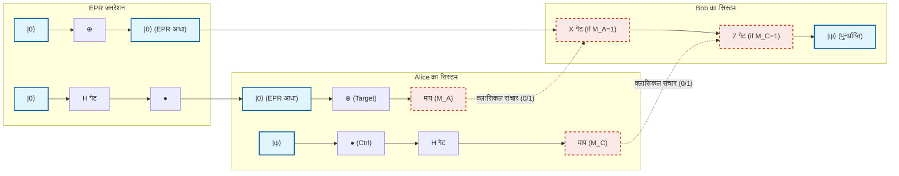

---

## 6.3 सुपरडेंस कोडिंग (Superdense Coding)

जबकि क्वांटम टेलीपोर्टेशन एक ऐसा प्रोटोकॉल था जो "1 क्विबिट की अवस्था को भेजने के लिए एक EPR पेयर और 2 क्लासिकल बिट्स की खपत करता था," सुपरडेंस कोडिंग (Superdense Coding) एक ऐसा प्रोटोकॉल है जिसे एक तरह से इसका उलटा ऑपरेशन कहा जा सकता है। यह "भौतिक रूप से केवल 1 क्विबिट भेजकर 2 क्लासिकल बिट्स की जानकारी को दूसरे पक्ष तक पहुँचाने" को संभव बनाता है।

क्लासिकल भौतिकी के नियमों में, एक एकल 2-स्तरीय प्रणाली (एक बिट या एक फोटॉन का ध्रुवीकरण) अधिकतम 1 बिट (0 या 1) जानकारी ही ले जा सकता है। हालाँकि, क्वांटम एंटैंगलमेंट का चतुराई से उपयोग करके इस होलेवो सीमा (Holevo's bound) को स्पष्ट रूप से तोड़ा जा सकता है, यही सुपरडेंस कोडिंग का आश्चर्यजनक पहलू है।

### प्रोटोकॉल का विवरण और बेल बेसिस

मान लें कि ऐलिस और बॉब फिर से पहले से एक EPR पेयर साझा करते हैं:

$$
|\Phi^+\rangle_{AB} = \frac{1}{\sqrt{2}} \left( |0\rangle_A |0\rangle_B + |1\rangle_A |1\rangle_B \right)
$$

ऐलिस बॉब को 2-बिट क्लासिकल संदेश $b_1 b_2 \in \{00, 01, 10, 11\}$ भेजना चाहती है।
भेजे जाने वाले संदेश के आधार पर, ऐलिस **केवल अपने पास मौजूद क्विबिट A पर** एक विशिष्ट सिंगल-क्विबिट गेट ऑपरेशन करती है:

1. **जब संदेश `00` हो:** ऐलिस कुछ नहीं करती (आइडेंटिटी ऑपरेटर $I$ लागू करती है)।
   संपूर्ण अवस्था नहीं बदलती है:
   

$$
|\Psi_{00}\rangle = (I \otimes I) |\Phi^+\rangle = \frac{1}{\sqrt{2}} (|00\rangle + |11\rangle) = |\Phi^+\rangle
$$

2. **जब संदेश `01` हो:** ऐलिस पाउली Z गेट लागू करती है:
   

$$
|\Psi_{01}\rangle = (Z \otimes I) |\Phi^+\rangle = \frac{1}{\sqrt{2}} (Z|0\rangle|0\rangle + Z|1\rangle|1\rangle) = \frac{1}{\sqrt{2}} (|00\rangle - |11\rangle) = |\Phi^-\rangle
$$

3. **जब संदेश `10` हो:** ऐलिस पाउली X गेट लागू करती है:
   

$$
|\Psi_{10}\rangle = (X \otimes I) |\Phi^+\rangle = \frac{1}{\sqrt{2}} (X|0\rangle|0\rangle + X|1\rangle|1\rangle) = \frac{1}{\sqrt{2}} (|10\rangle + |01\rangle) = |\Psi^+\rangle
$$

4. **जब संदेश `11` हो:** ऐलिस पाउली Z गेट लागू करती है, और फिर पाउली X गेट लागू करती है ( $iY$ के बराबर):
   

$$
|\Psi_{11}\rangle = (ZX \otimes I) |\Phi^+\rangle = (Z \otimes I) |\Psi^+\rangle = \frac{1}{\sqrt{2}} (Z|1\rangle|0\rangle + Z|0\rangle|1\rangle) = \frac{1}{\sqrt{2}} (-|10\rangle + |01\rangle) = -|\Psi^-\rangle
$$

   (चूंकि समग्र ऋणात्मक चिह्न एक ग्लोबल फेज़ (global phase) है, यह अवलोकन की प्रायिकता को प्रभावित नहीं करता है, लेकिन यहाँ सुविधा के लिए हम चिह्न को व्यवस्थित करते हैं और इसे **$|\Psi^-\rangle = \frac{1}{\sqrt{2}} (|01\rangle - |10\rangle)$** के साथ संबद्ध मानते हैं।)

ऐलिस अपने संचालित क्विबिट A को एक क्वांटम संचार चैनल (जैसे ऑप्टिकल फाइबर) के माध्यम से बॉब को भेजती है।

यहाँ ध्यान देने योग्य एक आश्चर्यजनक तथ्य यह है: ऐलिस ने बॉब को **भौतिक रूप से केवल 1 क्विबिट भेजा है** । और उसने बॉब के क्विबिट को बिल्कुल भी नहीं छुआ है। हालाँकि, ऐलिस के ऑपरेशन के परिणामस्वरूप, संपूर्ण प्रणाली की अवस्था नियतात्मक रूप से (deterministically) चार पूरी तरह से ऑर्थोगोनल क्वांटम अवस्थाओं में से एक में बदल गई है (जिन्हें **बेल बेसिस** कहा जाता है)।

### बॉब द्वारा डिकोडिंग और बेल माप

बॉब ऐलिस द्वारा भेजा गया क्विबिट A प्राप्त करता है। अब बॉब के पास दोनों क्विबिट हैं: क्विबिट A और उसका अपना मूल क्विबिट B। बॉब इन दोनों क्विबिट्स पर बिल्कुल वही "बेल माप" करता है जो ऐलिस ने क्वांटम टेलीपोर्टेशन में माप के दौरान किया था।

अर्थात्, वह क्विबिट A को कंट्रोल बिट और B को टारगेट बिट मानकर CNOT गेट लागू करता है, जिसके बाद क्विबिट A पर हैडामार्ड गेट लगाता है। इस व्युत्क्रम रूपांतरण (inverse transformation) से उलझा हुआ बेल बेसिस एक मापने योग्य कंप्यूटेशनल बेसिस में वापस आ जाता है।

आइए प्रत्येक स्थिति में गणितीय विस्तार की जांच करें:

- **अवस्था $ |\Phi^+\rangle = \frac{1}{\sqrt{2}} (|00\rangle + |11\rangle) $ होने पर (संदेश `00`):** CNOT लागू करने पर यह $\frac{1}{\sqrt{2}} (|00\rangle + |10\rangle) = \frac{1}{\sqrt{2}} (|0\rangle + |1\rangle) |0\rangle$ हो जाता है।
  A पर हैडामार्ड लागू करने से यह $|0\rangle |0\rangle$ बन जाता है।
  जब बॉब मापता है, तो उसे निश्चित रूप से `00` प्राप्त होता है।

- **अवस्था $ |\Phi^-\rangle = \frac{1}{\sqrt{2}} (|00\rangle - |11\rangle) $ होने पर (संदेश `01`):** CNOT लागू करने पर यह $\frac{1}{\sqrt{2}} (|00\rangle - |10\rangle) = \frac{1}{\sqrt{2}} (|0\rangle - |1\rangle) |0\rangle$ हो जाता है।
  A पर हैडामार्ड लागू करने से यह $|1\rangle |0\rangle$ बन जाता है।
  जब बॉब मापता है, तो उसे निश्चित रूप से `10` प्राप्त होता है। (※ ऐलिस के ऑपरेशंस के साथ बिट्स की मैपिंग सर्किट की परिभाषा के आधार पर भिन्न हो सकती है, लेकिन इसे विशिष्ट रूप से पहचाना जा सकता है।)

- **अवस्था $ |\Psi^+\rangle = \frac{1}{\sqrt{2}} (|01\rangle + |10\rangle) $ होने पर (संदेश `10`):** CNOT लागू करने पर यह $\frac{1}{\sqrt{2}} (|01\rangle + |11\rangle) = \frac{1}{\sqrt{2}} (|0\rangle + |1\rangle) |1\rangle$ हो जाता है।
  A पर हैडामार्ड लागू करने से यह $|0\rangle |1\rangle$ बन जाता है।
  जब बॉब मापता है, तो उसे निश्चित रूप से `01` प्राप्त होता है।

- **अवस्था $ |\Psi^-\rangle = \frac{1}{\sqrt{2}} (|01\rangle - |10\rangle) $ होने पर (संदेश `11`):** CNOT लागू करने पर यह $\frac{1}{\sqrt{2}} (|01\rangle - |11\rangle) = \frac{1}{\sqrt{2}} (|0\rangle - |1\rangle) |1\rangle$ हो जाता है।
  A पर हैडामार्ड लागू करने से यह $|1\rangle |1\rangle$ बन जाता है।
  जब बॉब मापता है, तो उसे निश्चित रूप से `11` प्राप्त होता है।

इस तरह, बॉब 1 प्राप्त क्विबिट और 1 अपने पास मौजूद क्विबिट को एक साथ मापकर ऐलिस द्वारा भेजे गए 2-बिट क्लासिकल जानकारी को 100% सटीकता के साथ पूरी तरह से पढ़ सकता है।

### क्वांटम संचार में महत्व

सुपरडेंस कोडिंग का सही मूल्य केवल जानकारी के "घनत्व" को दोगुना करने तक सीमित नहीं है। यह प्रोटोकॉल एक निश्चित प्रमाण है कि कैसे क्वांटम एंटैंगलमेंट का गैर-स्थानीय सहसंबंध (non-local correlation) क्लासिकल जानकारी ट्रांसमिशन की बैंडविड्थ का विस्तार कर सकता है।

इसके अलावा, सुरक्षा के दृष्टिकोण से भी यह अत्यंत महत्वपूर्ण है। भले ही कोई ईव्सड्रॉपर ईव (Eve) ऐलिस से बॉब तक जाने वाले क्विबिट A को बीच में रोक ले, ईव कोई जानकारी प्राप्त नहीं कर सकती है। ऐसा इसलिए है क्योंकि भले ही केवल एकल क्विबिट A का अवलोकन किया जाए, इसकी अवस्था पूरी तरह से यादृच्छिक मिश्रित अवस्था (random mixed state) (घनत्व मैट्रिक्स $\frac{I}{2}$ के आनुपातिक है) के रूप में व्यवहार करती है। जानकारी केवल स्थानिक रूप से अलग A और B के "सहसंबंध (correlation)" में एन्कोड की गई है, और केवल एक को प्राप्त करके इसे डिकोड करना भौतिक रूप से असंभव है।

---

इस प्रकार, क्वांटम टेलीपोर्टेशन और सुपरडेंस कोडिंग पहली नज़र में जादुई घटनाओं की तरह लग सकते हैं जो अंतर्ज्ञान (intuition) के विरुद्ध हैं, लेकिन क्वांटम यांत्रिकी के रैखिक बीजगणितीय स्वयंसिद्धों (linear algebraic axioms) का निष्ठापूर्वक पालन करके, उन्हें अत्यंत कठोर और अपरिहार्य तार्किक निष्कर्षों के रूप में प्राप्त किया जा सकता है। अगले अध्याय में, हम इन बुनियादी प्रोटोकॉल को लागू करेंगे और अधिक जटिल समस्याओं को हल करने के लिए क्वांटम एल्गोरिदम की दुनिया में कदम रखेंगे।

# अध्याय 7: डॉयच-जोज़ा एल्गोरिदम (Deutsch-Jozsa Algorithm)

## 7.1 ऐतिहासिक महत्व: पहली बार स्पष्ट रूप से प्रदर्शित क्वांटम सर्वोच्चता (Quantum Supremacy)

क्वांटम कंप्यूटर शास्त्रीय कंप्यूटरों (classical computers) की तुलना में कुछ विशिष्ट समस्याओं को अत्यधिक तेज़ी से हल कर सकते हैं, इस परिकल्पना को 1980 के दशक में रिचर्ड फाइनमैन (Richard Feynman) और डेविड डॉयच (David Deutsch) के अग्रणी शोध द्वारा प्रस्तावित किया गया था। हालाँकि, "विशिष्ट रूप से किन समस्याओं में, और क्या गणितीय रूप से सिद्ध किए जा सकने वाले तरीके से क्वांटम संगणना शास्त्रीय संगणना से बेहतर प्रदर्शन कर सकती है?" इस प्रश्न का पहला निर्णायक उत्तर 1992 में डेविड डॉयच और रिचर्ड जोज़ा (Richard Jozsa) द्वारा तैयार किए गए "डॉयच-जोज़ा एल्गोरिदम (Deutsch-Jozsa Algorithm)" ने दिया था।

इस अध्याय में, हम इस ऐतिहासिक एल्गोरिदम के संपूर्ण स्वरूप को गणितीय रूप से सख्ती से स्पष्ट करेंगे। यद्यपि यह एल्गोरिदम किसी व्यावहारिक समस्या को हल नहीं करता है, फिर भी इसने यह सिद्ध किया कि क्वांटम यांत्रिकी की विशिष्ट परिघटनाओं— "सुपरपोज़िशन" (Superposition), "व्यतिकरण" (Interference), और "फेज़ किकबैक" (Phase Kickback)— को चतुराई से जोड़कर संगणना जटिलता (computational complexity) के क्रम को नाटकीय रूप से कम किया जा सकता है।

## 7.2 समस्या का निर्धारण: अचर फलन (Constant Function) या संतुलित फलन (Balanced Function)?

सबसे पहले, आइए उस समस्या को परिभाषित करें जिसे एल्गोरिदम को हल करना है। मान लीजिए कि हमें एक ब्लैक बॉक्स (ऑरेकल) दिया गया है। यह ऑरेकल $n$ -बिट इनपुट $x \in \{0, 1\}^n$ प्राप्त करता है और 1-बिट आउटपुट $f(x) \in \{0, 1\}$ लौटाने वाले फलन **$f$** की गणना करता है।

यहाँ, इस फलन **$f$** को निम्नलिखित "दोनों में से किसी एक गुण को अवश्य पूरा करने" का एक दृढ़ वचन (Promise) दिया गया है:

1. **अचर फलन (Constant Function)** : किसी भी इनपुट $x$ के लिए, यह हमेशा $f(x) = 0$ या हमेशा $f(x) = 1$ लौटाता है।
2. **संतुलित फलन (Balanced Function)** : सभी इनपुट्स $x$ में से ठीक आधे के लिए $f(x) = 0$ लौटाता है, और शेष आधे के लिए $f(x) = 1$ लौटाता है।

हमारा लक्ष्य ऑरेकल **$f$** से पूछताछ (क्वेरी) की संख्या को न्यूनतम रखते हुए यह निर्धारित करना है कि "दिया गया ऑरेकल **$f$** अचर फलन है या संतुलित फलन है"।

### शास्त्रीय संगणना की सीमाएँ

आइए विचार करें कि शास्त्रीय कंप्यूटर द्वारा इस समस्या को कैसे हल किया जाए। फलन **$f$** के कुल $N = 2^n$ संभावित इनपुट पैटर्न हैं।

आइए सबसे खराब स्थिति (worst-case scenario) की कल्पना करें। मान लीजिए कि पहली क्वेरी से लगातार $2^{n-1}$ बार (अर्थात् कुल इनपुट का ठीक आधा) एक ही आउटपुट (उदाहरण: सभी $0$ ) प्राप्त होता है। इस बिंदु पर, दोनों संभावनाएँ शेष रहती हैं: फलन एक अचर फलन हो सकता है (शेष आधा भी सभी $0$ हो) और एक संतुलित फलन हो सकता है (शेष आधा सभी $1$ हो)।

इसलिए, एक शास्त्रीय कंप्यूटर को 100% निश्चितता के साथ यह निर्धारित करने के लिए कि फलन अचर है या संतुलित, **सबसे खराब स्थिति में $2^{n-1} + 1$ पूछताछ** की आवश्यकता होगी। यह संख्या इनपुट बिट्स $n$ के सापेक्ष घातांकीय रूप से बढ़ती है। दूसरे शब्दों में, शास्त्रीय संगणना जटिलता (क्वेरी जटिलता) $O(2^n)$ है।

आश्चर्यजनक रूप से, क्वांटम संगणना का उपयोग करके, इस समस्या को **केवल 1 पूछताछ (1 क्वेरी)** के साथ 100% प्रायिकता के साथ सही ढंग से निर्धारित किया जा सकता है। यही क्वांटम सर्वोच्चता का मूल सार है।

## 7.3 क्वांटम ऑरेकल और फेज़ किकबैक की ज्यामिति

क्वांटम एल्गोरिदम के निर्माण के लिए, हमें सबसे पहले शास्त्रीय फलन **$f(x)$** को इस प्रकार पुनः व्यक्त करना होगा जो क्वांटम यांत्रिकी की आवश्यकताओं (एकात्मकता / यूनिटैरिटी = उत्क्रमणीयता) को पूरा करता हो। इसी उद्देश्य से "क्वांटम ऑरेकल (Quantum Oracle)" प्रस्तुत किया जाता है।

### क्वांटम ऑरेकल $U_f$

हम एक इनपुट रजिस्टर ( $n$ क्वांटम बिट्स) और एक लक्ष्य रजिस्टर ( $1$ क्वांटम बिट) तैयार करते हैं। ऑरेकल का प्रतिनिधित्व करने वाला एकात्मक ऑपरेटर **$U_f$** संगणना आधार अवस्थाओं पर इस प्रकार कार्य करता है:

$$
U_f |x\rangle |y\rangle = |x\rangle |y \oplus f(x)\rangle
$$

यहाँ, $\oplus$ मॉड्यूलो-2 योग (XOR) को दर्शाता है। यह रूपांतरण स्वयं को दूसरी बार लागू करने पर मूल अवस्था में वापस लौट आता है ( $U_f^2 = I$ ), अतः यह स्पष्ट रूप से उत्क्रमणीय और एकात्मक (unitary) है।

### फेज़ किकबैक (Phase Kickback)

क्वांटम सूचना विज्ञान में सबसे महत्वपूर्ण और गैर-सहज (non-intuitive) तकनीकों में से एक "फेज़ किकबैक" है। आइए देखें कि क्या होता है जब लक्ष्य रजिस्टर की अवस्था को शास्त्रीय $|0\rangle$ या $|1\rangle$ के बजाय हैडामर्ड गेट के माध्यम से गुजारकर सुपरपोज़िशन अवस्था $|-\rangle$ में सेट किया जाता है।

$$
|-\rangle = \frac{|0\rangle - |1\rangle}{\sqrt{2}}
$$

इस अवस्था को लक्ष्य रजिस्टर में इनपुट किया जाता है, और ऑरेकल **$U_f$** को लागू किया जाता है।

$$
U_f |x\rangle |-\rangle = U_f \left( |x\rangle \frac{|0\rangle - |1\rangle}{\sqrt{2}} \right)
$$

$$
= \frac{1}{\sqrt{2}} \left( U_f |x\rangle |0\rangle - U_f |x\rangle |1\rangle \right)
$$

$$
= \frac{1}{\sqrt{2}} \left( |x\rangle |0 \oplus f(x)\rangle - |x\rangle |1 \oplus f(x)\rangle \right)
$$

यहाँ, हम $f(x)$ के मान के आधार पर स्थितियों को विभाजित करते हैं:
- $f(x) = 0$ की स्थिति में:
  अवस्था $\frac{1}{\sqrt{2}} ( |x\rangle |0\rangle - |x\rangle |1\rangle ) = |x\rangle |-\rangle$ हो जाती है।
- $f(x) = 1$ की स्थिति में:
  अवस्था $\frac{1}{\sqrt{2}} ( |x\rangle |1\rangle - |x\rangle |0\rangle ) = - |x\rangle |-\rangle$ हो जाती है।

इसे एक साथ संयोजित करने पर, निम्नलिखित सुंदर समीकरण प्राप्त होता है:

$$
U_f |x\rangle |-\rangle = (-1)^{f(x)} |x\rangle |-\rangle
$$

यह एक आश्चर्यजनक परिणाम है। लक्ष्य रजिस्टर की अवस्था $|-\rangle$ में कोई परिवर्तन नहीं हुआ है, लेकिन फलन **$f(x)$** का मूल्यांकन परिणाम एक "फेज़ के चिह्न" (Phase Sign) के रूप में इनपुट रजिस्टर **$|x\rangle$** की ओर "किकबैक" (Kickback) हो गया है। इससे जानकारी को आयाम के फेज़ के रूप में एनकोड करना संभव हो जाता है।

## 7.4 डॉयच-जोज़ा एल्गोरिदम: सर्किट आरेख और संपूर्ण गणितीय विस्तार

यहाँ, हम क्वांटम सर्किट और गणितीय सूत्रों दोनों पक्षों से एल्गोरिदम के संपूर्ण स्वरूप का पूर्ण वर्णन करेंगे।

### क्वांटम सर्किट आरेख

नीचे डॉयच-जोज़ा एल्गोरिदम के क्वांटम सर्किट को दर्शाने वाला आरेख दिया गया है।

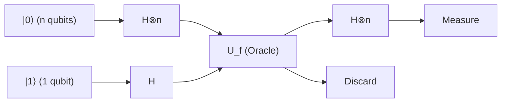

### चरण 1: प्रारंभिक अवस्था की तैयारी

हम इनपुट रजिस्टर के रूप में $n$ क्वांटम बिट्स को $|0\rangle^{\otimes n}$ में और लक्ष्य रजिस्टर के रूप में 1 क्वांटम बिट को $|1\rangle$ में प्रारंभ (initialize) करते हैं।

$$
|\psi_0\rangle = |0\rangle^{\otimes n} |1\rangle
$$

### चरण 2: सभी क्वांटम बिट्स पर हैडामर्ड गेट लागू करना

हम पूर्ण सुपरपोज़िशन अवस्था उत्पन्न करने के लिए सभी क्वांटम बिट्स पर हैडामर्ड गेट ( $H$ ) लागू करते हैं।
$n$ क्वांटम बिट्स के लिए हैडामर्ड रूपांतरण $H^{\otimes n}$ इस प्रकार कार्य करता है:

$$
H^{\otimes n} |0\rangle^{\otimes n} = \frac{1}{\sqrt{2^n}} \sum_{x \in \{0,1\}^n} |x\rangle
$$

इसलिए, पूरे निकाय (system) की अवस्था इस प्रकार बन जाती है:

$$
|\psi_1\rangle = \left( \frac{1}{\sqrt{2^n}} \sum_{x \in \{0,1\}^n} |x\rangle \right) \otimes \left( \frac{|0\rangle - |1\rangle}{\sqrt{2}} \right)
$$

$$
= \frac{1}{\sqrt{2^n}} \sum_{x=0}^{2^n-1} |x\rangle |-\rangle
$$

### चरण 3: क्वांटम ऑरेकल लागू करना (फेज़ किकबैक)

यहाँ हम ऑरेकल **$U_f$** लागू करते हैं। पिछले खंड में सिद्ध किए गए फेज़ किकबैक प्रभाव के कारण, प्रत्येक आधार अवस्था $|x\rangle$ के फेज़ को $(-1)^{f(x)}$ से गुणा किया जाता है।

$$
|\psi_2\rangle = U_f |\psi_1\rangle = \frac{1}{\sqrt{2^n}} \sum_{x \in \{0,1\}^n} (-1)^{f(x)} |x\rangle |-\rangle
$$

इस बिंदु पर, संगणना परिणाम **$f(x)$** की सभी जानकारी ( $2^n$ के बराबर) एक ही संक्रिया द्वारा सुपरपोज़िशन अवस्था के प्रत्येक फेज़ में समानांतर में एम्बेड कर दी गई है। इसे "क्वांटम समानांतरता" (Quantum Parallelism) कहा जाता है।

### चरण 4: इनपुट रजिस्टर पर व्यतिकरण उत्पन्न करना

लक्ष्य रजिस्टर का इसके बाद उपयोग नहीं किया जाएगा, इसलिए हम इसे अनदेखा कर देते हैं। हम इनपुट रजिस्टर के $n$ क्वांटम बिट्स पर फिर से हैडामर्ड रूपांतरण $H^{\otimes n}$ लागू करते हैं।
किसी भी आधार $|x\rangle$ पर $H^{\otimes n}$ की क्रिया को सामान्य सूत्र के रूप में इस प्रकार व्यक्त किया जाता है:

$$
H^{\otimes n} |x\rangle = \frac{1}{\sqrt{2^n}} \sum_{z \in \{0,1\}^n} (-1)^{x \cdot z} |z\rangle
$$

यहाँ, $x \cdot z$ बिटवाइज़ अदिश गुणनफल (dot product) $x \cdot z = x_1 z_1 \oplus x_2 z_2 \oplus \dots \oplus x_n z_n$ को दर्शाता है।
जब हम इसे $|\psi_2\rangle$ के इनपुट रजिस्टर भाग पर लागू करते हैं, तो अंतिम अवस्था $|\psi_3\rangle$ का विस्तार इस प्रकार होता है:

$$
|\psi_3\rangle = H^{\otimes n} \left( \frac{1}{\sqrt{2^n}} \sum_{x} (-1)^{f(x)} |x\rangle \right)
$$

$$
= \frac{1}{\sqrt{2^n}} \sum_{x} (-1)^{f(x)} \left( \frac{1}{\sqrt{2^n}} \sum_{z} (-1)^{x \cdot z} |z\rangle \right)
$$

$$
= \frac{1}{2^n} \sum_{z \in \{0,1\}^n} \left( \sum_{x \in \{0,1\}^n} (-1)^{f(x) + x \cdot z} \right) |z\rangle
$$

यह एक अत्यंत महत्वपूर्ण गणितीय सूत्र है जो मापन से ठीक पहले की क्वांटम अवस्था को दर्शाता है। इस योग $\sum_x$ के भीतर क्वांटम यांत्रिक "व्यतिकरण" हो रहा है।

### चरण 5: मापन और परिणाम का विश्लेषण

एल्गोरिदम के अंत में, हम इनपुट रजिस्टर के $n$ क्वांटम बिट्स को संगणना आधार में मापते हैं।
हमारी रुचि उस प्रायिकता में है जिसमें सभी क्वांटम बिट्स $0$ मापे जाते हैं, अर्थात् अवस्था **$|0\rangle^{\otimes n}$** मापी जाती है। उपरोक्त समीकरण में उस स्थिति पर विचार करें जहाँ $z = 00\dots0$ है। इस समय, किसी भी $x$ के लिए $x \cdot 0 = 0$ होता है, इसलिए अवस्था **$|0\rangle^{\otimes n}$** का आयाम (गुणांक) इस प्रकार परिकलित किया जाता है:

$$
\text{Amplitude of } |0\rangle^{\otimes n} = \frac{1}{2^n} \sum_{x \in \{0,1\}^n} (-1)^{f(x)}
$$

यहाँ, हम वचन (Promise) के अनुसार 2 स्थितियों का परीक्षण करते हैं:

#### स्थिति 1: जब फलन $f$ अचर फलन हो
यह हमेशा $f(x) = 0$ या हमेशा $f(x) = 1$ होता है।
- यदि यह हमेशा $0$ है, तो $(-1)^{f(x)} = 1$ होगा, और योग $\sum 1 = 2^n$ होगा। आयाम $\frac{2^n}{2^n} = 1$ है।
- यदि यह हमेशा $1$ है, तो $(-1)^{f(x)} = -1$ होगा, और योग $\sum -1 = -2^n$ होगा। आयाम $\frac{-2^n}{2^n} = -1$ है।

चूँकि मापन प्रायिकता $P(0)$ आयाम के निरपेक्ष मान का वर्ग है:

$$
P(00\dots0) = | \pm 1 |^2 = 1
$$

यानी, **यदि फलन एक अचर फलन है, तो 100% प्रायिकता के साथ $|0\rangle^{\otimes n}$ मापा जाएगा** ।

#### स्थिति 2: जब फलन $f$ संतुलित फलन हो
$f(x) = 0$ वाले $x$ और $f(x) = 1$ वाले $x$ ठीक आधे-आधे (प्रत्येक $2^{n-1}$ ) मौजूद होते हैं।
इसलिए, $(-1)^{f(x)}$ का आधा हिस्सा $+1$ और शेष आधा हिस्सा $-1$ होता है, और जब इन सभी को एक साथ जोड़ा जाता है, तो वे पूरी तरह से निरस्त (रद्द) होकर शून्य हो जाते हैं (पूरी तरह से विनाशी व्यतिकरण)।

$$
\text{Amplitude of } |0\rangle^{\otimes n} = \frac{1}{2^n} \left( 2^{n-1}(+1) + 2^{n-1}(-1) \right) = 0
$$

चूँकि मापन प्रायिकता $P(0)$ आयाम के निरपेक्ष मान का वर्ग है:

$$
P(00\dots0) = | 0 |^2 = 0
$$

यानी, **यदि फलन एक संतुलित फलन है, तो $|0\rangle^{\otimes n}$ के मापे जाने की प्रायिकता 0% है, और अनिवार्य रूप से ऐसी अवस्था मापी जाएगी जिसमें कम से कम एक बिट $1$ हो** ।

## 7.6 विशिष्ट उदाहरण: $n=2$ की स्थिति में पूर्ण ट्रेस (Trace)

केवल अमूर्त गणितीय सूत्रों के बजाय, आइए $n=2$ (2 क्वांटम बिट्स का इनपुट) के विशिष्ट उदाहरण के लिए अवस्था वेक्टर को ट्रेस करके एल्गोरिदम के व्यवहार को समझें। इनपुट पैटर्न कुल 4 प्रकार के हैं: $x \in \{00, 01, 10, 11\}$।

### अचर फलन के मामले में: $f(x) = 1$ (सभी 1)
ऑरेकल लागू होने से पहले अवस्था $|\psi_1\rangle$ का इनपुट रजिस्टर भाग निम्नलिखित होगा:

$$
\frac{1}{2} ( |00\rangle + |01\rangle + |10\rangle + |11\rangle )
$$

ऑरेकल लागू होने के बाद, फेज़ किकबैक के कारण सभी पदों को $(-1)^{f(x)} = -1$ से गुणा किया जाता है।

$$
|\psi_2\rangle_{in} = -\frac{1}{2} ( |00\rangle + |01\rangle + |10\rangle + |11\rangle )
$$

हम इस पर पुनः $H^{\otimes 2}$ लागू करते हैं। इस तथ्य का उपयोग करते हुए कि $H^{\otimes 2} (|00\rangle + |01\rangle + |10\rangle + |11\rangle) = 2 |00\rangle$ :

$$
|\psi_3\rangle_{in} = - |00\rangle
$$

मापन परिणाम $100\%$ की प्रायिकता के साथ $00$ होगा।

### संतुलित फलन के मामले में: $f(00)=0, f(01)=1, f(10)=1, f(11)=0$
ऑरेकल लागू होने के बाद, फेज़ किकबैक के कारण केवल उन पदों में ऋण चिह्न (minus sign) आता है जहाँ $f(x)=1$ होता है।

$$
|\psi_2\rangle_{in} = \frac{1}{2} ( |00\rangle - |01\rangle - |10\rangle + |11\rangle )
$$

हम इस पर $H^{\otimes 2}$ लागू करते हैं। यदि हम प्रत्येक आधार के लिए $H^{\otimes 2}$ की क्रिया की गणना करके उसे प्रतिस्थापित करें, तो $|00\rangle$ के गुणांक पर ध्यान केंद्रित करने पर हमें $\frac{1}{4} (1 - 1 - 1 + 1) = 0$ प्राप्त होता है, और यह परस्पर निरस्त (विनाशी व्यतिकरण) हो जाता है।
शेष पदों को व्यवस्थित करने पर, अंतिम अवस्था $|11\rangle$ बन जाती है (इस उदाहरण में, $11$ को 100% प्रायिकता के साथ मापा जाता है, लेकिन सामान्य संतुलित फलन में, $00$ के अलावा कोई भी अन्य अवस्था मापी जा सकती है)। यह पुष्टि होती है कि $00$ के मापे जाने की प्रायिकता पूरी तरह से 0% है।

## 7.7 निष्कर्ष: क्वांटम व्यतिकरण द्वारा लाई गई संगणना की छलांग

डॉयच-जोज़ा एल्गोरिदम का विस्मयकारी पहलू यह है कि यह फेज़ किकबैक द्वारा $2^n$ सूचनाओं को फेज़ स्पेस में प्रसारित करता है और अंतिम हैडामर्ड रूपांतरण से उत्पन्न होने वाले "व्यतिकरण (Interference)" को नियंत्रित करता है।

- **अचर फलन** के मामले में: सभी पथों से आने वाली तरंगें "रचनात्मक रूप से व्यतिकरण (Constructive Interference)" करती हैं, और आयाम 100% अवस्था **$|0\rangle^{\otimes n}$** पर केंद्रित हो जाता है।
- **संतुलित फलन** के मामले में: धनात्मक और ऋणात्मक तरंगें "विनाशकारी रूप से व्यतिकरण (Destructive Interference)" करती हैं, और अवस्था **$|0\rangle^{\otimes n}$** के आयाम को पूरी तरह से समाप्त कर देती हैं।

इस उत्कृष्ट गणितीय संरचना के कारण, जिस समस्या को हल करने के लिए एक शास्त्रीय कंप्यूटर को सबसे खराब स्थिति में $O(2^n)$ बार (विशेष रूप से $2^{n-1} + 1$ बार) क्वेरी की आवश्यकता होती थी, उसे क्वांटम कंप्यूटर **केवल 1 क्वेरी ( $O(1)$ )** में और नियतात्मक रूप से (100% सटीकता के साथ) हल कर सकता है।

इस अध्याय में सिद्ध किया गया यह तथ्य मानव इतिहास में एक अत्यंत महत्वपूर्ण मील का पत्थर बना, जिसने यह स्थापित किया कि सूचना प्रसंस्करण में क्वांटम यांत्रिकी के सिद्धांतों को लागू करके शास्त्रीय सूचना सिद्धांत की सीमाओं को भौतिक रूप से तोड़ा जा सकता है।

# अध्याय 8: शोर का एल्गोरिदम (Shor's Algorithm) और आधुनिक क्रिप्टोग्राफी के लिए ख़तरा

## 8.1 परिचय: RSA क्रिप्टोग्राफी का गणित और अभाज्य गुणनखंडन की कठिनाई

आधुनिक डिजिटल समाज में, इंटरनेट पर सुरक्षित संचार सुनिश्चित करने की आधारशिला सार्वजनिक कुंजी क्रिप्टोग्राफी (Public-Key Cryptography) है। इनमें सबसे व्यापक रूप से प्रचलित RSA क्रिप्टोग्राफी, अपनी सुरक्षा के लिए इस गणितीय विषमता (एकतरफ़ा फलन या one-way function के गुण) पर निर्भर करती है कि "एक विशाल भाज्य संख्या (composite number) का अभाज्य गुणनखंडन (prime factorization) करना संगणकीय रूप से अत्यंत कठिन है।" इस अध्याय में, हम बिना किसी समझौते के कड़ाई और विस्तार से स्पष्ट करेंगे कि कैसे एक क्वांटम कंप्यूटर इस RSA क्रिप्टोग्राफी की नींव को ध्वस्त करता है, और इसकी निर्णायक विधि "शोर का एल्गोरिदम (Shor's Algorithm)" की सैद्धांतिक संरचना क्या है।

सबसे पहले, आइए RSA क्रिप्टोग्राफी की कार्यप्रणाली को गणितीय रूप से निरूपित करें। RSA क्रिप्टोग्राफी में कुंजी का निर्माण दो विशाल अभाज्य संख्याओं $p$ और $q$ (वर्तमान में प्रत्येक के लिए 2048 बिट्स या उससे अधिक आकार की अनुशंसा की जाती है) को यादृच्छिक रूप से (randomly) चुनने से शुरू होता है। इनके गुणनफल, यानी भाज्य संख्या $N = pq$ की गणना की जाती है, और इसे सार्वजनिक कुंजी (public key) के एक भाग के रूप में सार्वजनिक रूप से प्रकाशित किया जाता है। इसके बाद, यूलर के टोटिएंट फलन (Euler's totient function) $\phi(N)$ की गणना की जाती है। अभाज्य संख्याओं के गुणों के अनुसार, यह $\phi(N) = (p-1)(q-1)$ होता है।

एन्क्रिप्शन की कुंजी बनने वाला घातांक $e$ इस प्रकार चुना जाता है कि $1 < e < \phi(N)$ और $\text{gcd}(e, \phi(N)) = 1$ हो (अर्थात $e$ और $\phi(N)$ परस्पर अभाज्य या coprime हों)। इसके बाद, निजी कुंजी (private key) बनने वाले डिक्रिप्शन घातांक $d$ की गणना इस प्रकार की जाती है कि यह सर्वांगसमता समीकरण (congruence relation) $ed \equiv 1 \pmod{\phi(N)}$ को संतुष्ट करे। विस्तारित यूक्लिडियन एल्गोरिदम (Extended Euclidean Algorithm) का उपयोग करके इसे बहुपद समय (polynomial time) में आसानी से प्राप्त किया जा सकता है।

यदि मूल संदेश (plaintext) एक पूर्णांक $M$ है (जहाँ $0 \le M < N$), तो एन्क्रिप्शन मॉड्यूलो $N$ के घातांक संक्रिया द्वारा निम्नानुसार किया जाता है:

$$
C \equiv M^e \pmod{N}
$$

डिक्रिप्शन करते समय, निजी कुंजी $d$ का उपयोग करके समान रूप से गणना की जाती है:

$$
M' \equiv C^d \pmod{N}
$$

यूलर के प्रमेय (Euler's theorem) के अनुसार चूँकि $C^d \equiv M^{ed} \equiv M^{1 + k\phi(N)} \equiv M \pmod{N}$ संतुष्ट होता है, इसलिए यह गारंटी होती है कि मूल संदेश $M$ पूरी तरह से पुनर्प्राप्त हो जाएगा।

यहाँ महत्वपूर्ण बिंदु यह है कि सार्वजनिक रूप से उपलब्ध जानकारी $(N, e)$ से निजी कुंजी $d$ ज्ञात करने के लिए, $\phi(N)$ का ज्ञान आवश्यक है, और उसके लिए $N$ का $p$ और $q$ में अभाज्य गुणनखंडन करना अनिवार्य है। क्लासिकल (शास्त्रीय) कंप्यूटर का उपयोग करते हुए, वर्तमान में ज्ञात सबसे तेज़ अभाज्य गुणनखंडन एल्गोरिदम, यानी जनरल नंबर फील्ड सीव (General Number Field Sieve, GNFS) का उपयोग करने पर भी, इसकी संगणकीय जटिलता उप-घातांकीय समय (sub-exponential time) $O\left(\exp\left(c (\log N)^{1/3} (\log \log N)^{2/3}\right)\right)$ होती है। इसका अर्थ है कि $N$ के बिट्स की संख्या के सापेक्ष गणना समय में विस्फोटक वृद्धि होती है; उदाहरण के लिए, 2048-बिट के पूर्णांक का एक क्लासिकल सुपरकंप्यूटर से अभाज्य गुणनखंडन करने में ब्रह्मांड की आयु से भी अधिक समय लगने का अनुमान है।

हालाँकि, 1994 में पीटर शोर (Peter Shor) द्वारा प्रस्तुत क्वांटम एल्गोरिदम ने इस बुनियादी आधार को पूरी तरह से उलट दिया। शोर का एल्गोरिदम अभाज्य गुणनखंडन को $O((\log N)^3)$ या इष्टतमता (optimization) के साथ $\tilde{O}((\log N)^2)$ के बहुपद समय (polynomial time) में हल कर देता है। यह क्लासिकल गणना की तुलना में "सुपर-पॉलीनोमियल गति-वृद्धि (Super-polynomial Speedup)", यानी वस्तुतः घातांकीय गति-वृद्धि (exponential speedup) को दर्शाता है, जिससे यह सिद्ध होता है कि वर्तमान में प्रयुक्त RSA क्रिप्टोग्राफी को क्वांटम कंप्यूटर द्वारा पूरी तरह से निष्प्रभावी किया जा सकता है।

## 8.2 कोटि खोजने की समस्या में रूपांतरण (Reduction to Order-Finding Problem)

शोर के एल्गोरिदम की विलक्षण अंतर्दृष्टि इस बात में निहित है कि "इसने अभाज्य गुणनखंडन समस्या को सीधे हल करने के बजाय, आवधिकता या अवधि (period) खोजने की समस्या में रूपांतरित (reduce) कर दिया।" विशुद्ध संख्या सिद्धांत के प्रमेयों के आधार पर, यह सिद्ध है कि अभाज्य गुणनखंडन "कोटि खोजने की समस्या (Order-Finding Problem)" नामक समस्या के समतुल्य है। यह रूपांतरण (reduction) प्रक्रिया स्वयं पूरी तरह से एक क्लासिकल एल्गोरिदम है, जिसके लिए क्वांटम गणना की कोई आवश्यकता नहीं होती।

आइए दी गई भाज्य संख्या $N$ के अभाज्य गुणनखंडन के चरणों को समझें। सबसे पहले, हम एक यादृच्छिक पूर्णांक $a$ चुनते हैं जो $1 < a < N$ को संतुष्ट करता हो। यूक्लिडियन एल्गोरिदम का उपयोग करके, हम महत्तम समापवर्तक (greatest common divisor) $\text{gcd}(a, N)$ की गणना करते हैं। यदि इसका मान $1$ से अधिक प्राप्त होता है, तो सौभाग्यवश हमें $N$ का एक गैर-तुच्छ गुणनखंड (non-trivial factor) पहले ही मिल चुका है और गणना यहीं समाप्त हो जाती है (हालाँकि, क्रिप्टोग्राफी में प्रयुक्त विशाल संख्याओं के लिए, ऐसा संयोगवश होने की प्रायिकता खगोलीय रूप से नगण्य है)।

यदि $\text{gcd}(a, N) = 1$ है, तो $a$ और $N$ परस्पर अभाज्य (coprime) हैं। यहाँ, हम निम्नलिखित मॉड्यूलर घातीय फलन (modular exponential function) को परिभाषित करते हैं:

$$
f(x) = a^x \bmod N
$$

समूह सिद्धांत (Group Theory) की भाषा में, $a$ गुणन समूह (multiplicative group) $(\mathbb{Z}/N\mathbb{Z})^\times$ का एक अवयव है, और फलन $f(x)$ पूर्णांकों के योग समूह (additive group) $\mathbb{Z}$ से गुणन समूह $(\mathbb{Z}/N\mathbb{Z})^\times$ में एक समाकारिता (homomorphism) बनाता है। परिमित समूहों (finite groups) के गुणों के कारण, इस फलन में अनिवार्य रूप से आवधिकता (periodicity) होती है। अर्थात, एक ऐसा न्यूनतम धनात्मक पूर्णांक $r$ उपस्थित होता है जो निम्नलिखित समीकरण को संतुष्ट करता है:

$$
a^r \equiv 1 \pmod{N}
$$

इस न्यूनतम धनात्मक पूर्णांक $r$ को मॉड्यूलो $N$ के सापेक्ष $a$ की "कोटि (Order)" या फलन $f(x)$ का "आवर्तकाल / अवधि (Period)" कहा जाता है।

यदि हम इस कोटि $r$ को ज्ञात कर लेते हैं, और इसके अतिरिक्त $r$ एक सम संख्या (even number) है तथा शर्त $a^{r/2} \not\equiv -1 \pmod{N}$ को संतुष्ट करता है, तो गुणनखंडन के लिए निम्नलिखित रूप में एक शक्तिशाली सूत्र प्राप्त होता है:

$$
a^r - 1 \equiv 0 \pmod{N}
$$

$$
(a^{r/2} - 1)(a^{r/2} + 1) \equiv 0 \pmod{N}
$$

यह समीकरण दर्शाता है कि $N$, पद $(a^{r/2} - 1)$ और $(a^{r/2} + 1)$ के गुणनफल को पूर्णतः विभाजित करता है। परंतु चूँकि $a^{r/2} \not\equiv 1$ (क्योंकि $r$ न्यूनतम अवधि है) और $a^{r/2} \not\equiv -1$ (दी गई शर्त के अनुसार) है, इसलिए $N$ इन दोनों पदों में से किसी एक को अकेले विभाजित नहीं कर सकता। अतः, $N$ के अभाज्य गुणनखंड इन दोनों पदों में विभाजित होकर समाहित होते हैं।
निष्कर्षतः,

$$
p = \text{gcd}(a^{r/2} - 1, N)
$$

$$
q = \text{gcd}(a^{r/2} + 1, N)
$$

की गणना करके, $N$ के गैर-तुच्छ अभाज्य गुणनखंडों को निश्चित रूप से प्राप्त किया जा सकता है।

इस क्लासिकल रूपांतरण द्वारा पूरी समस्या केवल एक बिंदु पर केंद्रित हो जाती है: "फलन $f(x) = a^x \bmod N$ की अवधि $r$ को तेज़ी से कैसे खोजा जाए?" क्लासिकल कंप्यूटर पर, इस अवधि को खोजने के लिए क्रमिक रूप से $x=1, 2, 3, \dots$ की गणना करनी पड़ती है, और चूँकि $r$ का मान $N$ के क्रम (order of magnitude) का हो सकता है, इसके परिणामस्वरूप घातांकीय समय (exponential time) लगता है। यहीं पर पहली बार क्वांटम कंप्यूटर की निर्णायक भूमिका सामने आती है।

## 8.3 क्वांटम फूरियर रूपांतरण (QFT) का यथार्थ गणितीय सूत्र और इसकी भूमिका

बहुपद समय में फलन $f(x)$ की छिपी हुई अवधि $r$ को निष्कर्षित करने के लिए क्वांटम एल्गोरिदम का मूल केंद्र "क्वांटम फूरियर रूपांतरण (Quantum Fourier Transform, QFT)" है। QFT क्लासिकल डिस्क्रीट फूरियर रूपांतरण (DFT) का एक क्वांटम यांत्रिक सादृश्य (analogy) है, और यह अवस्था समष्टि (state space) के प्रायिकता आयामों (probability amplitudes) पर कार्य करने वाला एक यूनिटरी रूपांतरण (unitary transformation) है।

विमा $M = 2^n$ वाले हिल्बर्ट स्पेस $\mathcal{H}$ में संगणकीय आधार (computational basis) अवस्थाओं $|j\rangle$ ($j = 0, 1, \dots, M-1$) पर क्वांटम फूरियर रूपांतरण की क्रिया को निम्नलिखित रूप से कड़ाई से परिभाषित किया गया है:

$$
\text{QFT} |j\rangle = \frac{1}{\sqrt{M}} \sum_{k=0}^{M-1} e^{2\pi i j k / M} |k\rangle
$$

किसी भी यादृच्छिक क्वांटम अवस्था **$|\psi\rangle$** पर, रैखिकता (linearity) के गुण के कारण यह इस प्रकार कार्य करता है:

$$
\text{QFT} \sum_{j=0}^{M-1} x_j |j\rangle = \sum_{k=0}^{M-1} \left( \frac{1}{\sqrt{M}} \sum_{j=0}^{M-1} x_j e^{2\pi i j k / M} \right) |k\rangle = \sum_{k=0}^{M-1} y_k |k\rangle
$$

यहाँ प्राप्त होने वाले नए आयाम $y_k$, क्लासिकल डिस्क्रीट फूरियर रूपांतरण द्वारा प्राप्त गुणांकों के पूर्णतः समरूप होते हैं। किंतु जहाँ क्लासिकल फास्ट फूरियर ट्रांसफॉर्म (FFT) को संपूर्ण सदिश (vector) की गणना करने के लिए $O(M \log M) = O(n 2^n)$ समय की आवश्यकता होती है, वहीं QFT केवल $O(n^2)$ क्वांटम गेट संक्रियाओं की सहायता से $n$ क्वांटम बिट्स की "अवस्था" को रूपांतरित कर सकता है, जो संगणकीय जटिलता में एक अत्यंत युगांतरकारी कमी है।

यह $O(n^2)$ जैसे कम संख्या के गेट्स द्वारा कैसे संभव हो पाता है, इसे समझने के लिए हमें QFT द्वारा प्राप्त अवस्था को टेंसर गुणनफल (tensor product) के रूप में विघटित करके व्यक्त करने की आवश्यकता है। पूर्णांक $j$ को द्वयाधारी निरूपण (binary representation) $j = j_1 2^{n-1} + j_2 2^{n-2} + \dots + j_n 2^0$ (जहाँ $j_1$ सर्वाधिक महत्वपूर्ण बिट या MSB है और $j_n$ न्यूनतम महत्वपूर्ण बिट या LSB है) के रूप में लिखने पर, आउटपुट अवस्था $n$ स्वतंत्र क्वांटम बिट अवस्थाओं के निम्नलिखित टेंसर गुणनफल में सुंदरता से विघटित हो जाती है:

$$
\text{QFT} |j_1 j_2 \dots j_n\rangle = \frac{1}{\sqrt{2^n}} \left(|0\rangle + e^{2\pi i 0.j_n} |1\rangle\right) \otimes \left(|0\rangle + e^{2\pi i 0.j_{n-1} j_n} |1\rangle\right) \otimes \dots \otimes \left(|0\rangle + e^{2\pi i 0.j_1 j_2 \dots j_n} |1\rangle\right)
$$

यहाँ, $0.j_l \dots j_m$ एक बाइनरी दशमलव (binary fraction) को निरूपित करता है, जहाँ $0.j_l \dots j_m = j_l/2 + j_{l+1}/4 + \dots + j_m/2^{m-l+1}$ है।

यह गणितीय सूत्र अत्यंत विचारोत्तेजक है। यह दर्शाता है कि $m$ -वें क्वांटम बिट की अवस्था का फेज़ (phase), केवल इनपुट बिट्स $j_{n-m+1}$ से $j_n$ तक की जानकारी पर निर्भर करते हुए घूर्णन करता है। अतः, इस अवस्था को निर्मित करने वाले क्वांटम सर्किट को एकल क्वांटम बिट पर कार्य करने वाले हैडामर्ड गेट (Hadamard gate) $H$ और 2-क्वांटम बिट्स के मध्य कार्य करने वाले नियंत्रित फेज़-शिफ्ट गेट (controlled phase-shift gate) $R_k$ (फेज़ को $e^{2\pi i / 2^k}$ कोण से घुमाने वाला गेट) के संयोजन से पुनरावर्ती (recursively) रूप से निर्मित किया जा सकता है। पहले क्वांटम बिट पर $H$ लागू करके, तत्पश्चात दूसरे एवं तीसरे बिट आदि के नियंत्रण से $R_2, R_3, \dots$ लागू करने की प्रक्रिया प्रत्येक बिट के लिए दोहराकर, कुल $n + (n-1) + \dots + 1 = n(n+1)/2 = O(n^2)$ गेट्स के साथ सटीक रूप से QFT को कार्यान्वित किया जा सकता है।

## 8.4 सुपरपोज़िशन का उपयोग करके आवर्तकाल खोजने वाला क्वांटम सर्किट

सैद्धांतिक पृष्ठभूमि तैयार होने के बाद, आइए हम संपूर्ण शोर एल्गोरिदम के क्वांटम सर्किट और प्रत्येक चरण में क्वांटम अवस्था के समय विकास (State Evolution) का विश्लेषण करें। इस एल्गोरिदम में दो क्वांटम रजिस्टरों का उपयोग किया जाता है।
पहला रजिस्टर $t \approx 2 \log_2 N$ क्वांटम बिट्स से बना होता है, और इसकी अवस्था समष्टि की विमा $M = 2^t$ होती है (हम शर्त $M \ge N^2$ को पूरा करने के लिए $t$ का चयन करते हैं)। दूसरा रजिस्टर $L \approx \log_2 N$ क्वांटम बिट्स रखता है और इसमें गणना परिणामों को संग्रहीत किया जाता है।

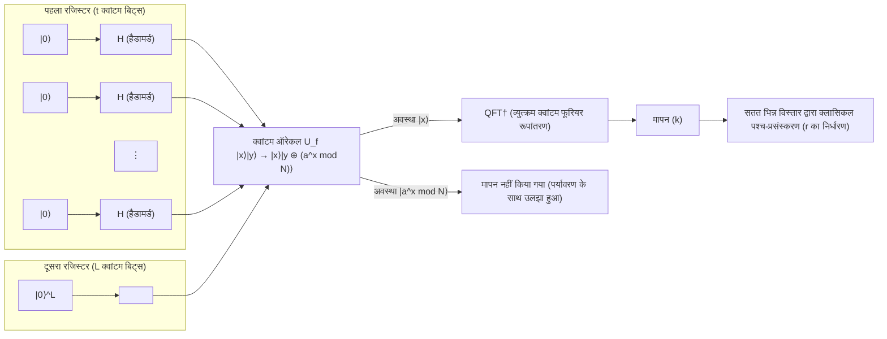

 **【चरण 1: आरंभीकरण और सुपरपोज़िशन का निर्माण】** 
संपूर्ण प्रणाली को प्रारंभिक अवस्था **$|\psi_0\rangle$** $= |0\rangle^{\otimes t} |0\rangle^{\otimes L}$ पर सेट किया जाता है।
इसके बाद, पहले रजिस्टर के सभी क्वांटम बिट्स पर हैडामर्ड गेट $H^{\otimes t}$ लागू किया जाता है, जिससे घातांकीय रूप से विशाल संख्या में अवस्थाओं का एक समान प्रायिकता वाला सुपरपोज़िशन उत्पन्न होता है:

$$
|\psi_1\rangle = \frac{1}{\sqrt{M}} \sum_{x=0}^{M-1} |x\rangle |0\rangle
$$

यहाँ, पहला रजिस्टर $0$ से लेकर $M-1$ तक के प्रत्येक पूर्णांक की अवस्था को एक साथ धारण किए रहता है।

 **【चरण 2: क्वांटम ऑरेकल द्वारा फलन का मूल्यांकन】** 
क्वांटम ऑरेकल $U_f$ को लागू किया जाता है, सुपरपोज़िशन अवस्था में ही फलन $f(x) = a^x \bmod N$ की गणना की जाती है, और परिणाम को दूसरे रजिस्टर में संगृहीत किया जाता है:

$$
|\psi_2\rangle = U_f |\psi_1\rangle = \frac{1}{\sqrt{M}} \sum_{x=0}^{M-1} |x\rangle |a^x \bmod N\rangle
$$

यह अवस्था **$|\psi_2\rangle$** एक ऐसी अवस्था है जिसमें इनपुट $x$ और आउटपुट $f(x)$ आपस में दृढ़ता से उलझे (entangled) हुए हैं।

 **【चरण 3: दूसरे रजिस्टर का प्रेक्षण (संकल्पनात्मक)】** 
सिद्धांत को सरलता से समझने के लिए, मान लें कि हम यहाँ दूसरे रजिस्टर का प्रेक्षण (observation) करते हैं (वास्तविक एल्गोरिदम में, प्रेक्षण को छोड़ भी दिया जाए, तो भी गणितीय परिणाम बिल्कुल समान रहता है)। प्रेक्षण करने पर, दूसरा रजिस्टर किसी विशिष्ट मान $y = a^{x_0} \bmod N$ में संकुचित (collapse) हो जाता है। यहाँ $x_0$ शर्त $0 \le x_0 < r$ को संतुष्ट करने वाला कोई न्यूनतम ऑफसेट मान है।
इस क्षण, पहला रजिस्टर तुरंत "उन सभी इनपुट्स $x$ की सुपरपोज़िशन अवस्था" में संकुचित हो जाता है जिनके लिए फलन $f(x)$ का आउटपुट $y$ प्राप्त होता है। चूँकि फलन की अवधि $r$ है, ऐसे सभी $x$ समान अंतराल पर $x_0, x_0 + r, x_0 + 2r, \dots$ के रूप में व्यवस्थित होते हैं:

$$
|\psi_3\rangle = \frac{1}{\sqrt{A}} \sum_{m=0}^{A-1} |x_0 + m r\rangle \otimes |y\rangle
$$

यहाँ $A$ सुपरपोज़िशन में सम्मिलित पदों की संख्या है, जहाँ $A \approx M/r$ है।
यदि पहले रजिस्टर पर ध्यान दें, तो यह अवधि $r$ वाला एक कंघी (comb) के आकार का प्रायिकता वितरण प्रदर्शित करता है। किंतु, यदि इस अवस्था को सीधे मापा जाए, तो समान प्रायिकता से कोई भी यादृच्छिक $x_0 + mr$ प्राप्त होगा, और चूँकि ऑफसेट $x_0$ अज्ञात है, इसलिए हम अवधि $r$ नहीं जान सकते। यहीं पर QFT की अनिवार्यता सामने आती है।

 **【चरण 4: व्युत्क्रम क्वांटम फूरियर रूपांतरण (Inverse QFT) का अनुप्रयोग】** 
पहले रजिस्टर पर व्युत्क्रम क्वांटम फूरियर रूपांतरण (QFT$^\dagger$) लागू किया जाता है:

$$
\text{QFT}^\dagger |\psi_3\rangle = \frac{1}{\sqrt{A M}} \sum_{k=0}^{M-1} \sum_{m=0}^{A-1} e^{-2\pi i k (x_0 + m r) / M} |k\rangle
$$

इसे अवस्था $|k\rangle$ के पदों में व्यवस्थित करते हुए, इसके प्रायिकता आयाम $c_k$ का विश्लेषण करते हैं:

$$
c_k = \frac{1}{\sqrt{A M}} e^{-2\pi i k x_0 / M} \sum_{m=0}^{A-1} e^{-2\pi i k m r / M}
$$

इस व्यंजक का योग वाला भाग सार्व अनुपात (common ratio) $e^{-2\pi i k r / M}$ वाली एक गुणोत्तर श्रेणी (geometric progression) का योग है। यदि फेज़ $k r / M$ किसी पूर्णांक से पर्याप्त भिन्न हो, तो सम्मिश्र तल (complex plane) पर सदिश विभिन्न दिशाओं में घूमते हुए एक-दूसरे को निरस्त कर देते हैं, जिससे विनाशी व्यतिकरण (Destructive Interference) होता है और आयाम लगभग $0$ हो जाता है।
इसके विपरीत, जब $k r / M$ किसी पूर्णांक $j$ के अत्यंत निकट होता है, अर्थात जब $k \approx j \frac{M}{r}$ होता है, तो सम्मिश्र तल पर सभी सदिश समान दिशा की ओर संरेखित हो जाते हैं, और संपोषी व्यतिकरण (Constructive Interference) द्वारा आयाम अत्यधिक प्रवर्धित हो जाता है।

 **【चरण 5: मापन और सतत भिन्न विस्तार】** 
जब पहले रजिस्टर को मापा जाता है, तो उच्च प्रायिकता के साथ $k \approx j \frac{M}{r}$ को संतुष्ट करने वाला एक पूर्णांक $k$ प्राप्त होता है। दोनों पक्षों को $M$ से विभाजित करने पर, निम्नलिखित संबंध प्राप्त होता है:

$$
\frac{k}{M} \approx \frac{j}{r}
$$

यहाँ, $k$ और $M$ ज्ञात मान हैं, किंतु $j$ और $r$ अज्ञात हैं। चूँकि $t$ का चयन $M \ge N^2$ को पूरा करने के लिए किया गया है, इसलिए $k/M$ अज्ञात भिन्न $j/r$ के लिए $\left| \frac{k}{M} - \frac{j}{r} \right| \le \frac{1}{2M} < \frac{1}{2r^2}$ की अत्यंत उच्च परिशुद्धता वाला सन्निकटन प्रदान करता है।
डायोफैंटाइन सन्निकटन के प्रमेय (लीजेंड्रे का प्रमेय / Legendre's Theorem) के अनुसार, इस शर्त को संतुष्ट करने वाली परिमेय संख्या $j/r$, वास्तविक संख्या $k/M$ के "सतत भिन्न विस्तार (Continued Fraction Expansion)" के अभिसारी भिन्नों (convergents) में अनिवार्य रूप से उपस्थित होती है।
अतः, क्लासिकल कंप्यूटर का उपयोग करके बहुपद समय में $k/M$ के सतत भिन्न विस्तार की गणना करके, हर (denominator) के रूप में अवधि $r$ को निर्धारित किया जा सकता है। इस प्रकार कोटि खोजने की समस्या हल हो जाती है, और परिणामस्वरूप RSA क्रिप्टोग्राफी की कुंजी के अभाज्य गुणनखंडों $p$ और $q$ को प्राप्त करना संभव हो जाता है।

## 8.5 शोर का एल्गोरिदम क्लासिकल संगणना की तुलना में घातांकीय गति-वृद्धि क्यों प्रदान करता है

शोर का एल्गोरिदम एक ऐतिहासिक युगांतरकारी सफलता इसलिए बना क्योंकि यह कोई साधारण अनुमानी विधि (heuristics) नहीं है, बल्कि यह कठोर गणितीय प्रमाणों के साथ "क्लासिकल संगणना की तुलना में वास्तविक घातांकीय गति-वृद्धि" प्रदर्शित करने वाला पहला व्यावहारिक एल्गोरिदम है। इसकी असाधारण संगणकीय क्षमता का मूल सार निम्नलिखित दो क्वांटम यांत्रिक परिघटनाओं के संपूर्ण समन्वय में निहित है:

प्रथम है क्वांटम समानांतरता (Quantum Parallelism)। सुपरपोज़िशन अवस्था का उपयोग करके, $2^t$ जितने—जो ब्रह्मांड के कुल परमाणुओं की संख्या से भी अधिक है—खगोलीय संख्या में इनपुट्स $x$ के लिए फलन $f(x)$ का मूल्यांकन केवल एक ही संक्रिया में एक साथ कर लिया गया। जिस मूल्यांकन को करने के लिए एक क्लासिकल कंप्यूटर को करोड़ों वर्ष तक एक-एक करके गणना करनी पड़ती, उसे पलक झपकते ही पूर्ण कर लिया गया।

किंतु क्वांटम यांत्रिकी के अभिगृहीतों (axioms) के अनुसार, एक बार मापन करने पर अवस्था संकुचित (collapse) हो जाती है, और प्राप्त होने वाली जानकारी केवल एक यादृच्छिक मूल्यांकन परिणाम $(x, f(x))$ ही रह जाती है। यह तो क्लासिकल गणना से तनिक भी भिन्न नहीं है।

यहीं से वास्तविक चमत्कार आरंभ होता है, जो कि दूसरी कुंजी है: क्वांटम व्यतिकरण (Quantum Interference) और वैश्विक संरचना का निष्कर्षण। क्वांटम फूरियर रूपांतरण, घातांकीय रूप से विस्तृत संपूर्ण अवस्था समष्टि में व्यतिकरण उत्पन्न करता है। यह प्रत्येक व्यक्तिगत $f(x)$ का विशिष्ट मान जानने का प्रयास नहीं करता, बल्कि संपूर्ण फलन की "वैश्विक आवधिकता (global periodicity)" के संरचनात्मक पैटर्न को ही निष्कर्षित करने वाली संक्रिया है।
गलत आवधियों से संबंधित प्रायिकता आयाम, तरंगों के शृंग और गर्त (crests and troughs) के परस्पर निरस्त होने के समान, विनाशी व्यतिकरण द्वारा पूर्णतः विलुप्त हो जाते हैं, और केवल सही अवधि $r$ के संगत प्रायिकता आयाम ही संपोषी व्यतिकरण द्वारा चरमोत्कर्ष पर पहुँच जाते हैं। दूसरे शब्दों में, स्वयं प्रकृति के भौतिक नियम संगणक की भूमिका निभाते हैं, जो अनगिनत गलत उत्तरों को मिटाकर केवल सही उत्तर को प्रत्यक्ष उजागर कर देते हैं।

हिडन सबग्रुप प्रॉब्लम (Hidden Subgroup Problem, HSP) के दृष्टिकोण से, शोर का एल्गोरिदम "परिमित आबेली समूहों (finite Abelian groups) पर HSP" को दक्षतापूर्वक हल करने का एक सामान्य ढाँचा है। RSA क्रिप्टोग्राफी जिस क्रमविनिमेय समूह (commutative group) पर निर्भर करती है, उसकी कोटि की खोज इस ढाँचे में पूर्णतः सटीक बैठती है।

क्वांटम कंप्यूटर कोई सर्वशक्तिमान जादुई छड़ी नहीं है, और यह प्रत्येक समस्या को घातांकीय रूप से तेज़ी से हल नहीं कर सकता। किंतु जिन समस्याओं में यह "आवधिकता" या "बीजगणितीय संरचना" छिपी होती है, उनके लिए क्वांटम व्यतिकरण की भौतिक कार्यप्रणाली क्लासिकल संगणना की सीमाओं को जड़ से तोड़ देती है। यही वह सबसे गूढ़ और सुंदर कारण है जिसने शोर के एल्गोरिदम को पारंपरिक क्रिप्टोग्राफी के उस युग का अंत करने और क्वांटम सूचना विज्ञान के क्षेत्र में युगांतरकारी क्रांति लाने का गौरव प्रदान किया।

# अध्याय 9: ग्रोवर का एल्गोरिथ्म और आयाम प्रवर्धन की ज्यामिति

आधुनिक सूचना विज्ञान में, बड़े डेटासेट से विशिष्ट शर्तों को पूरा करने वाले तत्वों को खोजना एक "खोज समस्या (Search Problem)" है, जो एक अत्यंत महत्वपूर्ण चुनौती है और साथ ही कंप्यूटर विज्ञान में सबसे मूलभूत प्रश्नों में से एक है। यदि डेटासेट में किसी प्रकार की संरचना मौजूद है (उदाहरण के लिए, तत्व वर्णमाला या संख्यात्मक क्रम में सॉर्ट किए गए हों), तो बाइनरी सर्च जैसे कुशल शास्त्रीय (classical) एल्गोरिथ्म का उपयोग किया जा सकता है, और खोज का समय $N$ तत्वों के लिए $O(\log N)$ तक सीमित हो जाता है। हालाँकि, पूरी तरह से यादृच्छिक रूप से व्यवस्थित **"असंरचित डेटाबेस (Unstructured Database)"** में खोज करने के लिए, शास्त्रीय कंप्यूटर ढांचे को रैखिक खोज (Linear Search) पर निर्भर रहना पड़ता है, जहां तत्वों की एक-एक करके क्रमिक रूप से जाँच की जाती है। इसके लिए $N$ तत्वों के मामले में सबसे खराब स्थिति में $N$ बार और औसतन $N/2$ बार क्वेरी की आवश्यकता होती है, अर्थात गणना के $O(N)$ चरणों की आवश्यकता होती है।

हालाँकि, 1996 में बेल लैब्स के भौतिक विज्ञानी लोव ग्रोवर (Lov Grover) द्वारा खोजा गया **ग्रोवर का एल्गोरिथ्म** क्वांटम यांत्रिकी के मूलभूत सिद्धांतों, "अध्यारोपण (Superposition)" और "हस्तक्षेप (Interference)", का अत्यंत चतुराई और सुंदरता से उपयोग करके इस असंरचित खोज समस्या को $O(\sqrt{N})$ क्वेरी संख्या में हल करने में सफल रहा। यह शोर (Shor) के एल्गोरिथ्म से भिन्न है जो समस्या के आकार के सापेक्ष घातीय गति-वृद्धि (Exponential speedup) प्रदान करता है; यह एक प्रकार की बहुपद गति-वृद्धि (Polynomial speedup) है जिसे **द्विघातीय गति-वृद्धि (Quadratic speedup)** कहा जाता है। हालाँकि, जब हम इस बात पर विचार करते हैं कि असंरचित खोज समस्याएँ NP-पूर्ण समस्याओं की ब्रूट-फोर्स खोज और क्रिप्टोग्राफिक सिस्टम की कुंजी खोज सहित हर क्षेत्र में सार्वभौमिक रूप से दिखाई देती हैं, तो इसकी अनुप्रयोग सीमा और व्यावहारिक प्रभाव अथाह हैं। क्वांटम सूचना विज्ञान के विशाल क्षेत्र में, ग्रोवर के एल्गोरिथ्म ने सबसे बहुमुखी और सबसे महत्वपूर्ण एल्गोरिथ्म में से एक के रूप में एक मजबूत स्थान स्थापित किया है।

इस अध्याय में, हम **"आयाम प्रवर्धन (Amplitude Amplification)"** के गहन तंत्र के बारे में विस्तार से बताएंगे, जो इस ग्रोवर एल्गोरिथ्म का मूल है। हम एक सहज ज्यामितीय परिप्रेक्ष्य और बिना किसी समझौते के एक कठोर रैखिक बीजगणितीय दृष्टिकोण का उपयोग करेंगे, जो इतना विस्तृत होगा कि विशेषज्ञों को भी इसे पढ़ने पर नई खोजों का एहसास होगा।

## 9.1 समस्या का निरूपण और प्रारंभिक अध्यारोपण अवस्था की तैयारी

सबसे पहले, आइए उस खोज समस्या को गणितीय रूप से कठोरता के साथ तैयार करें जिसे हमें हल करना है। मान लीजिए कि हमारे पास आकार $N = 2^n$ का एक असंरचित डेटाबेस है, और प्रत्येक तत्व को कम्प्यूटेशनल बेसिस अवस्था (computational basis state) $|x\rangle$ (जहाँ $x \in \{0, 1\}^n$, अर्थात $x = 0, 1, \dots, N-1$) के रूप में एन्कोड किया गया है, जो $n$ क्यूबिट्स (qubits) का उपयोग करके दर्शाया गया है। मान लें कि इस विशाल डेटाबेस स्थान में केवल एक ही विशिष्ट अवस्था (सही उत्तर अवस्था) मौजूद है जिसे हम खोजना चाहते हैं, और हम इस विशेष अवस्था को $|w\rangle$ के रूप में दर्शाते हैं।

समस्या का लक्ष्य इस प्रकार परिभाषित किया गया है: "एक दिए गए ब्लैक-बॉक्स फ़ंक्शन (जिसे हम **ओरेकल (Oracle)** कहते हैं) का उपयोग करके, जितनी संभव हो उतनी कम क्वेरी में और उच्च संभाव्यता के साथ सही उत्तर अवस्था $|w\rangle$ को खोजना।"

क्वांटम एल्गोरिथ्म का पहला कदम हमेशा एक ही समय में संपूर्ण खोज स्थान को देखने की तैयारी से शुरू होता है। सभी संभावनाओं की एक समान अध्यारोपण अवस्था बनाने के लिए, हम $n$ क्यूबिट्स की प्रारंभिक अवस्था $|0\rangle^{\otimes n}$ पर समानांतर रूप से प्रत्येक क्यूबिट पर टेन्सर उत्पाद के रूप में हैडामर्ड गेट (Hadamard gate) $H$ लागू करते हैं। हम इस प्रकार प्राप्त प्रारंभिक समान अध्यारोपण अवस्था को $|s\rangle$ के रूप में परिभाषित करते हैं।

$$
|s\rangle = H^{\otimes n} |0\rangle^{\otimes n} = \frac{1}{\sqrt{N}} \sum_{x=0}^{N-1} |x\rangle
$$

यह अवस्था **$|s\rangle$** हिल्बर्ट स्पेस (Hilbert space) में सही उत्तर अवस्था $|w\rangle$ और अन्य सभी गलत उत्तर अवस्थाओं के रैखिक संयोजन के रूप में स्पष्ट रूप से अलग की जा सकती है। भविष्य की ज्यामितीय व्याख्याओं को दृष्टिगत रूप से समझने में आसान बनाने के लिए, हम एक नया सामान्यीकृत (normalized) वेक्टर $|s^\perp\rangle$ इस प्रकार पेश करते हैं, जो केवल गलत उत्तर अवस्थाओं का समान रूप से अध्यारोपण है:

$$
|s^\perp\rangle = \frac{1}{\sqrt{N-1}} \sum_{x \neq w} |x\rangle
$$

इस परिभाषा के अनुसार, अवस्था $|s^\perp\rangle$ और सही उत्तर अवस्था $|w\rangle$ एक-दूसरे के ऑर्थोगोनल (orthogonal) हैं ( $\langle s^\perp | w \rangle = 0$ )। तब, प्रारंभिक समान अध्यारोपण अवस्था **$|s\rangle$** को इन दो परस्पर ऑर्थोगोनल वैक्टरों $|w\rangle$ और $|s^\perp\rangle$ द्वारा फैले हुए (spanned) 2-आयामी हिल्बर्ट सबस्पेस (Hilbert subspace) पर अत्यंत सरलता से इस प्रकार विस्तारित किया जा सकता है:

$$
|s\rangle = \sqrt{\frac{N-1}{N}} |s^\perp\rangle + \frac{1}{\sqrt{N}} |w\rangle
$$

यहाँ, हम एक सूक्ष्म कोण $\theta$ पेश करते हैं ताकि $\sin \theta = \frac{1}{\sqrt{N}}$ हो (जब $N$ पर्याप्त रूप से बड़ा हो, तो $\theta \approx 1/\sqrt{N}$ होता है)। तब, इस अवस्था को त्रिकोणमितीय कार्यों का उपयोग करके अधिक सुरुचिपूर्ण ज्यामितीय अभिव्यक्ति में फिर से लिखा जा सकता है:

$$
|s\rangle = \cos \theta |s^\perp\rangle + \sin \theta |w\rangle
$$

यह सूत्र जो कहानी बयां करता है वह यह कठोर सत्य है कि प्रारंभिक अवस्था **$|s\rangle$** में सही उत्तर अवस्था $|w\rangle$ को देखने (observe करने) की संभावना मात्र $|\sin \theta|^2 = \frac{1}{N}$ है। ग्रोवर के एल्गोरिथ्म का सर्वोच्च उद्देश्य ओरेकल और डिफ़्यूज़न ऑपरेटर (diffusion operator) के संयोजन को बार-बार लागू करना है, जिसका वर्णन हम बाद में करेंगे, ताकि इस अवस्था वेक्टर **$|s\rangle$** को हिल्बर्ट स्पेस के 2-आयामी तल में $|w\rangle$ की दिशा में धीरे-धीरे "घुमाया (rotate)" जा सके, और सही उत्तर के अवलोकन की संभावना को सैद्धांतिक सीमा $1$ के असीम करीब लाया जा सके (आयाम को प्रवर्धित किया जा सके)।

## 9.2 क्वांटम ओरेकल (Quantum Oracle) की परिभाषा और फेज़ किकबैक (Phase Kickback)

एल्गोरिथ्म की पुनरावृत्ति इकाई, "ग्रोवर इटरेशन (Grover iteration)" का पहला महत्वपूर्ण घटक ओरेकल $O$ है, जो यह पहचानता है कि लक्ष्य डेटा सही उत्तर है या नहीं। क्वांटम कंप्यूटिंग में, ओरेकल को कड़ाई से एक यूनिटरी ऑपरेटर (unitary operator) के रूप में परिभाषित किया जाना चाहिए जो एक विशिष्ट क्रिया करता है, जो इस बात पर निर्भर करता है कि इनपुट कम्प्यूटेशनल बेसिस अवस्था $|x\rangle$ सही उत्तर $|w\rangle$ है या नहीं।

आमतौर पर, यह ओरेकल एक सहायक क्यूबिट (ancilla qubit) का उपयोग करता है ताकि फ़ंक्शन मूल्यांकन को प्रतिवर्ती (reversible) रूप में लागू किया जा सके। खोज की स्थिति को व्यक्त करने वाले बूलियन फ़ंक्शन $f(x)$ को एक ऐसे फ़ंक्शन के रूप में परिभाषित करें जो $x = w$ होने पर $f(w) = 1$ लौटाता है, और अन्य सभी $x \neq w$ के लिए $f(x) = 0$ लौटाता है। इस समय, ओरेकल की क्रिया को एक्सक्लूसिव-ओआर (XOR) $\oplus$ का उपयोग करके इस प्रकार लिखा जाता है:

$$
O_f \left( |x\rangle \otimes |y\rangle \right) = |x\rangle \otimes |y \oplus f(x)\rangle
$$

यहीं पर ग्रोवर के एल्गोरिथ्म की चतुराई चमकती है। सहायक क्यूबिट $|y\rangle$ को कम्प्यूटेशनल बेसिस के बजाय, पहले से ही $|-\rangle = \frac{1}{\sqrt{2}}(|0\rangle - |1\rangle)$ की अध्यारोपण अवस्था में इनिशियलाइज़ करके इनपुट किया जाता है। फिर, क्वांटम-विशिष्ट एक आश्चर्यजनक घटना घटित होती है जिसे **फेज़ किकबैक (Phase Kickback)** कहा जाता है। आइए इसकी ठोस गणना करें:

$$
\begin{align*}
O_f \left( |x\rangle \otimes |-\rangle \right) &= O_f \left( |x\rangle \otimes \frac{|0\rangle - |1\rangle}{\sqrt{2}} \right) \\
&= \frac{1}{\sqrt{2}} \left( O_f |x\rangle |0\rangle - O_f |x\rangle |1\rangle \right) \\
&= \frac{1}{\sqrt{2}} \left( |x\rangle |0 \oplus f(x)\rangle - |x\rangle |1 \oplus f(x)\rangle \right)
\end{align*}
$$

हम इस समीकरण का मूल्यांकन दो मामलों में विभाजित करके करते हैं: जब इनपुट अवस्था गलत हो और जब वह सही हो।
यदि $x \neq w$ है (अर्थात $f(x) = 0$), तो अवस्था बिल्कुल नहीं बदलती है:

$$
\frac{1}{\sqrt{2}} \left( |x\rangle |0\rangle - |x\rangle |1\rangle \right) = |x\rangle |-\rangle
$$

दूसरी ओर, यदि $x = w$ है (अर्थात $f(w) = 1$), तो सहायक क्यूबिट की अवस्था $0 \to 1$ और $1 \to 0$ में उलट (invert) जाती है, और पूरी अवस्था के सामने एक ऋणात्मक चिह्न (minus sign) आ जाता है:

$$
\frac{1}{\sqrt{2}} \left( |x\rangle |1\rangle - |x\rangle |0\rangle \right) = - \left( |x\rangle \frac{|0\rangle - |1\rangle}{\sqrt{2}} \right) = - |x\rangle |-\rangle
$$

यह परिणाम अत्यंत महत्वपूर्ण है। ऑपरेशन से पहले और बाद में सहायक क्यूबिट $|-\rangle$ की अवस्था पूरी तरह से अपरिवर्तित रहती है, जो मात्र एक "उत्प्रेरक (catalyst)" के रूप में कार्य करती है। इसके बजाय, फ़ंक्शन मूल्यांकन का परिणाम $f(x)$ मुख्य क्वांटम रजिस्टर $|x\rangle$ के **आयाम के चिह्न (फेज़)** के रूप में "किकबैक (पीछे की ओर धकेल दिया)" जाता है। इस गुण का लाभ उठाकर, हम सहायक क्यूबिट को विवरण से हटा सकते हैं और मुख्य रजिस्टर पर ओरेकल की क्रिया को एक नए यूनिटरी ऑपरेटर $U_w$ के रूप में सरल और सुरुचिपूर्ण ढंग से फिर से परिभाषित कर सकते हैं:

$$
U_w |x\rangle = (-1)^{f(x)} |x\rangle = \begin{cases} -|x\rangle & (x = w) \\ |x\rangle & (x \neq w) \end{cases}
$$

इस फेज़ ओरेकल $U_w$ को डिराक के ब्रा-केट (bra-ket) नोटेशन का उपयोग करके प्रोजेक्शन ऑपरेटर अभिव्यक्ति के माध्यम से स्पष्ट रूप से इस प्रकार वर्णित किया जा सकता है:

$$
U_w = I - 2|w\rangle\langle w|
$$

यहाँ $I$, $N \times N$ का आइडेंटिटी ऑपरेटर (identity operator) है। यदि हम ज्यामितीय अंतर्ज्ञान का सहारा लें, तो यह ओरेकल $U_w$ और कुछ नहीं बल्कि एक ऐसा ऑपरेटर है जो $|s^\perp\rangle$ और $|w\rangle$ द्वारा फैले 2-आयामी वास्तविक तल (real plane) में **क्षैतिज अक्ष $|s^\perp\rangle$ अक्ष को समरूपता के अक्ष के रूप में उपयोग करके अवस्था वेक्टर का परावर्तन (Reflection)** करता है। ऐसा इसलिए है क्योंकि केवल सही उत्तर अवस्था के घटक का चिह्न उलट दिया जाता है, और गलत उत्तर अवस्थाओं के घटक वैसे ही बने रहते हैं।

## 9.3 डिफ़्यूज़न ऑपरेटर (Diffusion Operator) और माध्य के चारों ओर परावर्तन की गणितीय संरचना

ओरेकल के द्वारा सही उत्तर अवस्था पर "ऋणात्मक फेज़ मार्कर" लगाने के बाद, हम ग्रोवर इटरेशन के दूसरे घटक, **डिफ़्यूज़न ऑपरेटर (Diffusion Operator)** $U_s$ को लागू करते हैं। इस ऑपरेटर की भूमिका क्वांटम अवस्था के प्रत्येक तत्व के आयाम को समग्र माध्य (overall mean) के चारों ओर उलटना (invert) है, जिससे चिह्नित अवस्था के संभाव्यता आयाम (probability amplitude) को नाटकीय रूप से प्रवर्धित किया जा सके।

डिफ़्यूज़न ऑपरेटर $U_s$ को गणितीय रूप से इस प्रकार परिभाषित किया गया है:

$$
U_s = 2|s\rangle\langle s| - I
$$

इस ऑपरेटर को "माध्य के चारों ओर परावर्तन (Inversion about the mean)" क्यों कहा जाता है, आइए इसके तंत्र को सामान्य अध्यारोपण अवस्था $|\psi\rangle = \sum_{x=0}^{N-1} \alpha_x |x\rangle$ का उपयोग करके सख्ती से साबित करें।

सबसे पहले, हम समान अध्यारोपण अवस्था $|s\rangle$ और वर्तमान अवस्था $|\psi\rangle$ के आंतरिक गुणनफल (inner product) की गणना करते हैं।

$$
\langle s | \psi \rangle = \left( \frac{1}{\sqrt{N}} \sum_{y=0}^{N-1} \langle y| \right) \left( \sum_{x=0}^{N-1} \alpha_x |x\rangle \right) = \frac{1}{\sqrt{N}} \sum_{x=0}^{N-1} \alpha_x
$$

इस आंतरिक गुणनफल के मान को आगे $\sqrt{N}$ से विभाजित करने पर, यह सभी आयामों $\alpha_x$ का अंकगणितीय माध्य (arithmetic mean) बन जाता है (जिसे हम $\mu$ के रूप में परिभाषित करते हैं)। अर्थात्, इसे $\mu = \frac{1}{N} \sum_{x=0}^{N-1} \alpha_x = \frac{1}{\sqrt{N}} \langle s | \psi \rangle$ के रूप में व्यक्त किया जा सकता है। इसलिए, $\langle s | \psi \rangle = \sqrt{N} \mu$ होता है।

इस संबंध का उपयोग करते हुए, हम $U_s$ को अवस्था $|\psi\rangle$ पर लागू करने के परिणाम की गणना करते हैं।

$$
\begin{align*}
U_s |\psi\rangle &= (2|s\rangle\langle s| - I) \sum_{x=0}^{N-1} \alpha_x |x\rangle \\
&= 2|s\rangle \langle s | \psi \rangle - \sum_{x=0}^{N-1} \alpha_x |x\rangle \\
&= 2 \left( \frac{1}{\sqrt{N}} \sum_{x=0}^{N-1} |x\rangle \right) (\sqrt{N} \mu) - \sum_{x=0}^{N-1} \alpha_x |x\rangle \\
&= 2 \mu \sum_{x=0}^{N-1} |x\rangle - \sum_{x=0}^{N-1} \alpha_x |x\rangle \\
&= \sum_{x=0}^{N-1} (2\mu - \alpha_x) |x\rangle
\end{align*}
$$

परिणामी अवस्था के प्रत्येक आधार (basis) $|x\rangle$ का नया आयाम $(2\mu - \alpha_x)$ बन गया। इस सूत्र को $\mu + (\mu - \alpha_x)$ के रूप में रूपांतरित किया जा सकता है। यह दर्शाता है कि मूल आयाम $\alpha_x$ समग्र माध्य $\mu$ के संबंध में ठीक विपरीत दिशा (सममित स्थिति) में उलट गया है। यही गणितीय आधार है जिसके कारण डिफ़्यूज़न ऑपरेटर को "माध्य के चारों ओर परावर्तन" कहा जाता है।

ओरेकल $U_w$ की क्रिया से, केवल एक सही उत्तर अवस्था $|w\rangle$ का आयाम एक ऋणात्मक मान ($-\alpha_w$) बन जाता है। अन्य विशाल $N-1$ गलत उत्तर अवस्थाओं का आयाम धनात्मक ही रहता है। इसलिए, समग्र माध्य $\mu$ थोड़ा कम हो जाता है, लेकिन यह अभी भी एक धनात्मक मान बनाए रखता है। जब हम यहाँ इस डिफ़्यूज़न ऑपरेटर को लागू करते हैं, तो सही उत्तर अवस्था का "बड़ा ऋणात्मक आयाम" "धनात्मक माध्य $\mu$" के चारों ओर उलट जाता है। नतीजतन, सही उत्तर अवस्था का आयाम **नाटकीय रूप से अपने मूल आयाम से बहुत बड़े धनात्मक मान में छलांग लगाता है (प्रवर्धित हो जाता है)** ।

इसके विपरीत, गलत उत्तर अवस्थाओं के आयाम का मान माध्य से थोड़ा ही बड़ा था, इसलिए जब वे माध्य के चारों ओर उलट जाते हैं, तो वे अपने मूल मान से थोड़े छोटे धनात्मक मान तक नीचे धकेल दिए जाते हैं। यह प्रक्रिया इस एल्गोरिथ्म का मूल है, जहाँ क्वांटम हस्तक्षेप (quantum interference) का उपयोग करके अवांछित अवस्थाओं की संभावना को रद्द कर दिया जाता है और वांछित अवस्था की संभावना को रचनात्मक रूप से (constructively) मजबूत किया जाता है।

ज्यामितीय दृष्टिकोण पर लौटते हुए, ऑपरेटर अभिव्यक्ति $U_s = 2|s\rangle\langle s| - I$ स्पष्ट रूप से दर्शाता है कि यह एक ऑपरेशन है जो **प्रारंभिक अवस्था वेक्टर $|s\rangle$ अक्ष को समरूपता के अक्ष के रूप में उपयोग करके अवस्था वेक्टर का परावर्तन (Reflection) करता है** ।

## 9.4 आयाम प्रवर्धन की ज्यामितीय व्याख्या (दोहरे परावर्तन के माध्यम से शुद्ध घूर्णन)

 **ग्रोवर ऑपरेटर $G$** , जो ग्रोवर के एल्गोरिथ्म की एक पुनरावृत्ति इकाई है, ओरेकल $U_w$ और डिफ़्यूज़न ऑपरेटर $U_s$ के क्रमिक अनुप्रयोग (अर्थात उनके गुणनफल) के रूप में परिभाषित किया गया है।

$$
G = U_s U_w = (2|s\rangle\langle s| - I) (I - 2|w\rangle\langle w|)
$$

यहाँ, यूक्लिडियन ज्यामिति और रैखिक बीजगणित द्वारा बुना गया एक अत्यंत सुंदर प्रमेय मुख्य भूमिका निभाता है। यह प्रमेय है: "दो प्रतिच्छेदित (intersecting) रेखाओं को समरूपता के अक्ष के रूप में उपयोग करके किए गए दो परावर्तनों (Reflections) का संयोजन, उन दो रेखाओं के बीच बने कोण के दोगुने कोण के साथ एक शुद्ध घूर्णन (Rotation) बन जाता है।"

अब तक के विश्लेषण से, यह गारंटी है कि अवस्था वेक्टर, चाहे उस पर कोई भी ऑपरेशन किया जाए, हमेशा $|s^\perp\rangle$ और $|w\rangle$ द्वारा फैले 2-आयामी वास्तविक वेक्टर स्पेस (तल) के भीतर ही रहेगा। आइए इस तल के भीतर प्रत्येक ऑपरेटर की क्रिया की पुन: पुष्टि करें।

1. **ओरेकल $U_w$ द्वारा परावर्तन** :
   वर्तमान अवस्था वेक्टर के लिए, $U_w$ ऑर्थोगोनल समन्वय प्रणाली में ऊर्ध्वाधर अक्ष $|w\rangle$ दिशा में घटक के चिह्न को उलट देता है। ज्यामितीय रूप से, यह क्षैतिज अक्ष **$|s^\perp\rangle$ अक्ष के संबंध में एक परावर्तन** है।
2. **डिफ़्यूज़न ऑपरेटर $U_s$ द्वारा परावर्तन** :
   इसके बाद का $U_s$, अवस्था वेक्टर को **वेक्टर $|s\rangle$ की दिशा के संबंध में परावर्तित करता है** , जो तल में कोण $\theta$ से झुका हुआ है।

प्रारंभिक अवस्था $|s\rangle$ क्षैतिज अक्ष $|s^\perp\rangle$ से कोण $\theta$ ऊपर की ओर झुकी हुई है (जहाँ $\sin \theta = \frac{1}{\sqrt{N}}$)।
इसलिए, $|s^\perp\rangle$ अक्ष के संबंध में परावर्तन करने के तुरंत बाद, उस अक्ष के संबंध में परावर्तन करना जो उससे कोण $\theta$ पर झुका हुआ है (अर्थात $|s\rangle$ अक्ष), तो समग्र क्रिया $G$, **इस 2-आयामी तल में अवस्था वेक्टर को वामावर्त (counter-clockwise) दिशा में $2\theta$ घुमाने का एक ऑपरेशन** बन जाती है।

आइए इस सहज ज्यामितीय अंतर्दृष्टि को रोटेशन मैट्रिक्स (rotation matrix) का उपयोग करके सख्ती से गणितीय रूप में साबित करें। मान लें कि $t$ पुनरावृत्तियों के तुरंत बाद की अवस्था $|\psi_t\rangle$ है। प्रारंभिक अवस्था तब होती है जब $t=0$ हो, और $|\psi_0\rangle = |s\rangle = \cos \theta |s^\perp\rangle + \sin \theta |w\rangle$ है।

गणितीय आगमन (mathematical induction) का उपयोग करते हुए, हम साबित करेंगे कि $t$ पुनरावृत्तियों के बाद की अवस्था को हमेशा निम्नानुसार संक्षेप में व्यक्त किया जा सकता है:

$$
|\psi_t\rangle = G^t |s\rangle = \cos((2t+1)\theta) |s^\perp\rangle + \sin((2t+1)\theta) |w\rangle
$$

यह स्पष्ट रूप से $t=0$ के लिए सत्य है। यह मानते हुए कि $|\psi_t\rangle$ ऊपर दिए गए रूप में है, हम एक और पुनरावृत्ति के बाद की अवस्था $|\psi_{t+1}\rangle = G |\psi_t\rangle$ की गणना करते हैं।
सबसे पहले, ओरेकल $U_w$ को लागू करने पर, $|w\rangle$ घटक का चिह्न उलट जाता है:

$$
U_w |\psi_t\rangle = \cos((2t+1)\theta) |s^\perp\rangle - \sin((2t+1)\theta) |w\rangle
$$

इसके बाद, हम डिफ़्यूज़न ऑपरेटर $U_s = 2|s\rangle\langle s| - I$ लागू करते हैं। इसकी गणना करने के लिए, आधार वैक्टर (basis vectors) $\{|s^\perp\rangle, |w\rangle\}$ का उपयोग करके $2 \times 2$ मैट्रिक्स प्रतिनिधित्व (matrix representation) का उपयोग करना सबसे स्पष्ट तरीका है।

ओरेकल $U_w$ का मैट्रिक्स प्रतिनिधित्व निम्नलिखित विकर्ण मैट्रिक्स (diagonal matrix) है:

$$
U_w = \begin{pmatrix} 1 & 0 \\ 0 & -1 \end{pmatrix}
$$

चूंकि प्रारंभिक अवस्था वेक्टर $|s\rangle$ को कॉलम वेक्टर $\begin{pmatrix} \cos\theta \\ \sin\theta \end{pmatrix}$ द्वारा दर्शाया जाता है, इसलिए प्रोजेक्शन ऑपरेटर $|s\rangle\langle s|$ की गणना बाहरी गुणनफल (outer product) का उपयोग करके की जाती है, और वहां से $U_s$ प्राप्त करने पर यह निम्नलिखित के समान होता है:

$$
\begin{align*}
U_s &= 2 \begin{pmatrix} \cos\theta \\ \sin\theta \end{pmatrix} \begin{pmatrix} \cos\theta & \sin\theta \end{pmatrix} - \begin{pmatrix} 1 & 0 \\ 0 & 1 \end{pmatrix} \\
&= \begin{pmatrix} 2\cos^2\theta - 1 & 2\sin\theta\cos\theta \\ 2\sin\theta\cos\theta & 2\sin^2\theta - 1 \end{pmatrix} \\
&= \begin{pmatrix} \cos(2\theta) & \sin(2\theta) \\ \sin(2\theta) & -\cos(2\theta) \end{pmatrix}
\end{align*}
$$

(यहाँ, हमने दोहरे कोण के सूत्र $\cos(2\theta) = 2\cos^2\theta - 1$ और $\sin(2\theta) = 2\sin\theta\cos\theta$ का उपयोग किया है)

इसलिए, समग्र रूप से ग्रोवर ऑपरेटर $G = U_s U_w$ का मैट्रिक्स प्रतिनिधित्व इन दोनों मैट्रिसेस का गुणनफल है:

$$
G = \begin{pmatrix} \cos(2\theta) & \sin(2\theta) \\ \sin(2\theta) & -\cos(2\theta) \end{pmatrix} \begin{pmatrix} 1 & 0 \\ 0 & -1 \end{pmatrix}
= \begin{pmatrix} \cos(2\theta) & -\sin(2\theta) \\ \sin(2\theta) & \cos(2\theta) \end{pmatrix}
$$

आश्चर्यजनक रूप से, प्राप्त मैट्रिक्स ज्यामिति में बहुत प्रसिद्ध **कोण $2\theta$ का रोटेशन मैट्रिक्स (rotation matrix)** ही है। अतः, प्रारंभिक वेक्टर $\begin{pmatrix} \cos\theta \\ \sin\theta \end{pmatrix}$ पर ऑपरेटर $G$ को $t$ बार लगातार लागू करने का ज्यामितीय अर्थ वेक्टर को हर बार वामावर्त (counter-clockwise) दिशा में $2\theta$ घुमाने के बराबर है। इसलिए, समग्र कोण प्रारंभिक कोण $\theta$ में $t \times 2\theta$ जोड़कर $\theta + 2t\theta = (2t+1)\theta$ हो जाता है। इसके साथ गणितीय आगमन का प्रमाण खूबसूरती से पूरा होता है।

यहाँ, हम ग्रोवर के एल्गोरिथ्म की एक पुनरावृत्ति को व्यक्त करने वाले क्वांटम सर्किट आरेख (मरमेड नोटेशन - Mermaid notation) को दिखाते हैं, जिससे सिद्धांत और कार्यान्वयन के बीच पत्राचार को दृष्टिगत रूप से समझा जा सके।

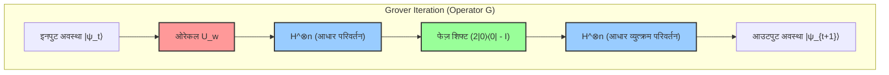

यह सर्किट आरेख डिफ़्यूज़न ऑपरेटर $U_s = 2|s\rangle\langle s| - I$ की एक अत्यंत व्यावहारिक कार्यान्वयन पद्धति को दर्शाता है। चूंकि अवस्था $|s\rangle$ को $H^{\otimes n} |0\rangle^{\otimes n}$ के रूप में उत्पन्न किया जाता है, ऑपरेटर को इस प्रकार विघटित (decompose) किया जा सकता है:

$$
U_s = 2(H^{\otimes n} |0\rangle^{\otimes n})(\langle 0|^{\otimes n} H^{\otimes n}) - I = H^{\otimes n} (2|0\rangle\langle 0| - I) H^{\otimes n}
$$

अर्थात्, हैडामर्ड ट्रांसफ़ॉर्म (Hadamard transform) $H^{\otimes n}$ के द्वारा कम्प्यूटेशनल बेसिस में परिवर्तित करना, फिर एक सशर्त फेज़ शिफ्ट ऑपरेटर (conditional phase shift operator) लागू करना जो केवल तभी फेज़ को उल्टा नहीं करता जब सभी क्यूबिट्स $|0\rangle$ हों (या केवल $|0\rangle$ होने पर ऋणात्मक फेज़ देने की परिभाषा भी समतुल्य है, यह केवल ग्लोबल फेज़ का अंतर है), और फिर से हैडामर्ड ट्रांसफ़ॉर्म के माध्यम से मूल आधार (original basis) में वापस लाने की इस "सैंडविच संरचना (sandwich structure)" को अपनाकर, किसी भी क्वांटम कंप्यूटर पर कुशलतापूर्वक "माध्य के चारों ओर परावर्तन" को लागू करना संभव हो जाता है।

## 9.5 सफलता की संभावना का विश्लेषण और इष्टतम पुनरावृत्तियों की संख्या की व्युत्पत्ति

अब चूंकि अवस्था वेक्टर के ज्यामितीय व्यवहार को पूरी तरह से स्पष्ट कर दिया गया है, हम इस एल्गोरिथ्म के मूल प्रश्न का कड़ाई से मात्रात्मक (quantitative) उत्तर देने के लिए तैयार हैं: "सही उत्तर प्राप्त करने के लिए कितनी बार पुनरावृत्तियों को दोहराया जाना चाहिए?"

$t$ पुनरावृत्तियों के बाद, क्वांटम रजिस्टर को कम्प्यूटेशनल बेसिस में देखने (observe करने) और सही उत्तर अवस्था $|w\rangle$ प्राप्त करने की संभावना $P(w)$ को अवस्था वेक्टर $|\psi_t\rangle$ के $|w\rangle$ घटक के आयाम के पूर्ण मान के वर्ग (square of the absolute value) के रूप में दिया जाता है:

$$
P(w) = |\langle w | \psi_t \rangle|^2 = \sin^2((2t+1)\theta)
$$

हमारा अंतिम लक्ष्य इस संभाव्यता $P(w)$ को अधिकतम करना है, अर्थात् इसे सैद्धांतिक ऊपरी सीमा $1$ के यथासंभव करीब लाना है। साइन (sine) फ़ंक्शन का वर्ग $\sin^2(x)$ अपना अधिकतम मान $1$ तब लेता है जब तर्क (argument) $x$, $\frac{\pi}{2}$ (90 डिग्री) के बराबर होता है। इसलिए, इष्टतम पुनरावृत्तियों की संख्या $t$ ज्ञात करने का समीकरण इस प्रकार तैयार किया जाता है:

$$
(2t+1)\theta \approx \frac{\pi}{2}
$$

इसे $t$ के लिए हल करने पर:

$$
t \approx \frac{\pi}{4\theta} - \frac{1}{2}
$$

व्यावहारिक पैमाने पर डेटाबेस खोज में, तत्वों की संख्या $N$ एक खगोलीय रूप से विशाल संख्या बन जाती है। इस समय, कोण $\theta$ शून्य $0$ के बहुत करीब एक सूक्ष्म मान बन जाता है। सूक्ष्म $\theta$ के लिए, टेलर विस्तार (Taylor expansion) के पहले क्रम के पद (first-order term) को लेकर $\sin \theta \approx \theta$ का एक अच्छा सन्निकटन (approximation) सिद्ध होता है। चूंकि प्रारंभिक अवस्था की परिभाषा से $\sin \theta = \frac{1}{\sqrt{N}}$ था, इसलिए हम $\theta \approx \frac{1}{\sqrt{N}}$ मान सकते हैं।

इस सन्निकटन सूत्र को पहले व्युत्पन्न $t$ के समीकरण में प्रतिस्थापित (substitute) करने पर, इष्टतम पुनरावृत्तियों की संख्या (optimal number of iterations) $R$ को स्पष्ट रूप से निम्नानुसार व्युत्पन्न किया जाता है:

$$
R \approx \frac{\pi}{4} \sqrt{N}
$$

इस परिणाम का अर्थ इतना आश्चर्यजनक है कि यह सूचना विज्ञान के इतिहास को हिलाकर रख सकता है। एक शास्त्रीय कंप्यूटर में, बेतरतीब ढंग से शफल (shuffle) किए गए खोज स्थान से सही उत्तर खोजने के लिए, तत्वों की संख्या के समानुपाती खोज का समय (जटिलता $O(N)$) अपरिहार्य था: सबसे खराब स्थिति में $N$ बार, और औसतन $N/2$ बार। हालाँकि, क्वांटम कंप्यूटर पर चलने वाला ग्रोवर का एल्गोरिथ्म हस्तक्षेप (interference) का उपयोग करके संभाव्यता को बढ़ाता है, और केवल $\frac{\pi}{4} \sqrt{N}$ प्रश्नों के साथ, यह लगभग निश्चित रूप से (अत्यंत उच्च सटीकता के साथ, संभाव्यता $1 - O(1/N)$) सही उत्तर अवस्था तक पहुँच जाता है। गणना की जटिलता (computational complexity) $O(\sqrt{N})$ हो जाती है, जो वर्गमूल (square root) के पैमाने पर गणना समय को सफलतापूर्वक संकुचित (compress) करती है।

हालाँकि, यहाँ एक महत्वपूर्ण बात ध्यान देने योग्य है। ग्रोवर का एल्गोरिथ्म स्व-रुकने वाला (Self-stopping) नहीं है। यदि पुनरावृत्तियों की संख्या इस इष्टतम मान $R$ से अधिक हो जाती है, तो अवस्था वेक्टर लक्षित $|w\rangle$ अक्ष को पार कर जाता है, और साइन फ़ंक्शन की आवधिकता (periodicity) के कारण, सही उत्तर को देखने की संभावना कम होने लगती है। इस घटना को **ओवरकुकिंग / ओवरशूटिंग (Overcooking / Overshooting)** कहा जाता है। इसलिए, अवलोकन करने (पुनरावृत्ति को रोकने) के समय को ठीक से नियंत्रित करना एल्गोरिथ्म के सफल होने के लिए एक अनिवार्य शर्त है।

## 9.6 कई समाधान मौजूद होने पर आयाम प्रवर्धन का सामान्यीकरण

अब तक, हमने अपनी चर्चा इस सबसे सख्त शर्त (एकल-समाधान समस्या - single-solution problem) को आधार मानकर आगे बढ़ाई है कि विशाल डेटाबेस में केवल "एक" सही उत्तर मौजूद है। हालाँकि, वास्तविक दुनिया की समस्या सेटिंग्स में, शर्तों को पूरा करने वाले कई समाधानों का मौजूद होना आम बात है। ग्रोवर के एल्गोरिथ्म के मूल में जो आयाम प्रवर्धन तकनीक है, उसे इसकी गणितीय सुंदरता खोए बिना स्वाभाविक रूप से उस स्थिति के लिए भी विस्तारित किया जा सकता है जहां समाधानों की संख्या $M$ (जहाँ $1 \le M \le N$) हो।

यदि $M$ समाधान मौजूद हैं, तो हम सभी सही उत्तर अवस्थाओं की समान अध्यारोपण अवस्था को $|W\rangle$ के रूप में, और सभी गलत उत्तर अवस्थाओं की समान अध्यारोपण अवस्था को $|W^\perp\rangle$ के रूप में फिर से परिभाषित करते हैं:

$$
|W\rangle = \frac{1}{\sqrt{M}} \sum_{x \in \text{Solutions}} |x\rangle
$$

$$
|W^\perp\rangle = \frac{1}{\sqrt{N-M}} \sum_{x \notin \text{Solutions}} |x\rangle
$$

तब, प्रारंभिक समान अध्यारोपण अवस्था $|s\rangle$ को इन दो ऑर्थोगोनल वैक्टरों का उपयोग करके इस प्रकार विस्तारित किया जा सकता है:

$$
|s\rangle = \sqrt{\frac{N-M}{N}} |W^\perp\rangle + \sqrt{\frac{M}{N}} |W\rangle
$$

यहाँ, हम एक नया कोण $\theta'$ इस प्रकार परिभाषित करते हैं कि $\sin \theta' = \sqrt{\frac{M}{N}}$ हो। इस परिभाषा के तहत, जब हम एकल समाधान के मामले के समान ही ग्रोवर ऑपरेटर $G$ (हालाँकि ओरेकल को अब सभी $M$ समाधानों के लिए फेज़ को उलटने के लिए विस्तारित किया गया है) लागू करते हैं, तो अवस्था वेक्टर $|W^\perp\rangle$ और $|W\rangle$ द्वारा फैले तल के भीतर प्रत्येक पुनरावृत्ति के साथ $2\theta'$ से घूमता है।

इष्टतम पुनरावृत्तियों की संख्या समान तार्किक विकास द्वारा $\frac{\pi}{4\theta'}$ हो जाती है, और $M \ll N$ के मामले में इसे इस प्रकार अनुमानित किया जाता है:

$$
R \approx \frac{\pi}{4} \sqrt{\frac{N}{M}}
$$

यह सूत्र दर्शाता है कि जैसे-जैसे समाधानों की संख्या $M$ बढ़ती है, स्वाभाविक रूप से आवश्यक पुनरावृत्तियों (खोज समय) की संख्या कम होती जाती है। उदाहरण के लिए, यदि 4 समाधान हैं, तो आवश्यक समय आधा हो जाएगा। यहां तक ​​कि जब समाधानों की संख्या $M$ अज्ञात हो, तब भी एक उन्नत तकनीक का उपयोग करना संभव है जिसे **क्वांटम काउंटिंग एल्गोरिथ्म (Quantum Counting Algorithm)** कहा जाता है, जो ग्रोवर के एल्गोरिथ्म और क्वांटम फेज़ एस्टिमेशन (Quantum Phase Estimation) को जोड़ता है। यह समाधानों की संख्या $M$ का तेज़ी से अनुमान लगाने की अनुमति देता है, जिसके बाद उचित संख्या में आयाम प्रवर्धन किया जा सकता है।

## 9.7 द्विघातीय गति-वृद्धि का सैद्धांतिक महत्व और क्वांटम कंप्यूटिंग की सीमाएँ (BBBV प्रमेय)

ग्रोवर के एल्गोरिथ्म द्वारा लाई गई $O(N)$ से $O(\sqrt{N})$ तक की द्विघातीय गति-वृद्धि (Quadratic speedup) गणितीय रूप से शोर के एल्गोरिथ्म द्वारा लाए गए घातीय गति-वृद्धि ($O(e^{N^{1/3}}) \to O(N^3)$) की तुलना में मामूली लग सकती है। हालाँकि, कंप्यूटर विज्ञान में इसका वास्तविक मूल्य और सार्वभौमिकता ठीक इसी बात में निहित है कि यह "बिना किसी विशिष्ट समस्या का चयन किए बहुमुखी प्रतिभा (versatility)" प्रदान करता है।

शोर का प्राइम फैक्टराइजेशन एल्गोरिथ्म (prime factorization algorithm) पूर्णांकों के गुणक समूह (multiplicative group of integers) की "आवधिकता (periodicity)" नामक एक बहुत ही विशिष्ट बीजगणितीय संरचना का चतुराई से उपयोग करता है। इसके विपरीत, ग्रोवर का एल्गोरिथ्म बिना किसी शर्त के "असंरचित डेटाबेस खोज" पर लागू होता है, जो किसी भी कम्प्यूटेशनल समस्या का सबसे मौलिक और आदिम रूप है जिसमें कोई पूर्व ज्ञान या संरचना नहीं होती है।

इसका प्रभाव जटिलता वर्ग NP से संबंधित कठिन समस्याओं और आधुनिक समाज की नींव का समर्थन करने वाली क्रिप्टोग्राफी तकनीक (cryptographic technology) के अनुप्रयोगों में सबसे दृढ़ता से महसूस किया जाता है। उदाहरण के लिए, ट्रैवलिंग सेल्समैन प्रॉब्लम (Traveling Salesman Problem) और बूलियन सैटिसफ़ायबिलिटी प्रॉब्लम (Boolean Satisfiability Problem - SAT) जैसी NP-पूर्ण समस्याएँ अनिवार्य रूप से एक विशाल उम्मीदवार स्थान (candidate space) से शर्तों को पूरा करने वाले समाधानों को पूरी तरह से खोजने की समस्या में सिमट जाती हैं। इन समस्याओं के लिए, शास्त्रीय एल्गोरिथ्म को $O(2^n)$ समय की आवश्यकता होती है, जबकि ग्रोवर के एल्गोरिथ्म को लागू करने से गणना समय प्रभावी रूप से $O(\sqrt{2^n}) = O(2^{n/2})$ तक आधा हो सकता है (घातांक या exponent आधा हो जाता है)।

क्रिप्टोग्राफिक तकनीक पर प्रभाव भी घातक और गहरा है। वर्तमान में इंटरनेट की सुरक्षा की गारंटी देने वाले AES जैसे सममित-कुंजी एन्क्रिप्शन (symmetric-key encryption) तरीकों की ताकत पूरी तरह से कुंजी स्थान (key space) के खिलाफ ब्रूट-फोर्स हमलों (brute-force attacks) की कठिनाई पर निर्भर करती है। उदाहरण के लिए, AES-128 (128-बिट लंबी कुंजी स्थान) का खोज स्थान $N = 2^{128}$ जैसी जबरदस्त संख्या है। शास्त्रीय कंप्यूटरों को औसतन $2^{127}$ प्रमुख सत्यापन गणनाओं (key verification computations) की आवश्यकता होती है, लेकिन ग्रोवर के एल्गोरिथ्म का उपयोग करके एक क्वांटम कंप्यूटर केवल $\frac{\pi}{4} 2^{64}$ गणनाओं में सही कुंजी का मज़बूती से पता लगा लेगा। यह तथ्य ही वह सबसे बड़ा कारण है कि दुनिया भर के मानकीकरण संगठन (जैसे NIST) पोस्ट-क्वांटम क्रिप्टोग्राफी (Post-Quantum Cryptography) में संक्रमण को एक जरूरी काम मानते हैं, और AES-128 को अप्रचलित घोषित करके AES-256 पर स्विच करने की दृढ़ता से अनुशंसा करते हैं (जिसके लिए क्वांटम कंप्यूटिंग के साथ भी $2^{128}$ गणनाओं की आवश्यकता होगी)।

अंत में, आइए सैद्धांतिक भौतिकी और कंप्यूटर विज्ञान के दृष्टिकोण से एक अत्यंत महत्वपूर्ण प्रमेय पर स्पर्श करें: 1997 में बेनेट (Bennett), बर्नस्टीन (Bernstein), ब्रासर्ड (Brassard), और वज़ीरानी (Vazirani) द्वारा प्रमाणित **BBBV प्रमेय** । इस प्रमेय ने गणितीय रूप से कड़ाई से साबित कर दिया कि "भले ही क्वांटम कंप्यूटर का उपयोग किया जाए, ब्लैक-बॉक्स असंरचित खोज समस्या के लिए न्यूनतम $\Omega(\sqrt{N})$ क्वेरी की सख्त आवश्यकता होती है।"

इसका क्या अर्थ है? यह एक गहरा तथ्य है कि **"ग्रोवर के एल्गोरिथ्म द्वारा प्राप्त $O(\sqrt{N})$ जटिलता वह निरपेक्ष सैद्धांतिक सीमा है जो प्रकृति के नियमों (क्वांटम यांत्रिकी) द्वारा अनुमत है, और ब्रह्मांड के किसी भी भौतिक नियम का उपयोग करके इससे अधिक गति-वृद्धि (speedup) असंभव है।"** ग्रोवर ने केवल एक उत्कृष्ट एल्गोरिथ्म की खोज ही नहीं की, बल्कि सूचना और भौतिक नियमों की अंतिम सीमा तक पहुँचे।

इसके अलावा, इस अध्याय में विस्तृत "आयाम प्रवर्धन (Amplitude Amplification)" प्रतिमान स्वयं अनगिनत उन्नत क्वांटम एल्गोरिदम, जैसे क्वांटम रैंडम वॉक्स (Quantum Random Walks) और क्वांटम मशीन लर्निंग (Quantum Machine Learning) के सबरूटीन (subroutines) के निर्माण के लिए एक मूलभूत बिल्डिंग ब्लॉक के रूप में व्यापक रूप से लागू किया गया है। ग्रोवर द्वारा खोजी गई यह सुंदर और सुरुचिपूर्ण विधि—"दो ऑर्थोगोनल अक्षों के संबंध में दोहरे परावर्तन का उपयोग करके ज्यामितीय रूप से संभाव्यता आयाम को घुमाना और बढ़ाना"—भविष्य में भी क्वांटम सूचना विज्ञान के विशाल शैक्षणिक अनुशासन का समर्थन करने वाले सबसे मजबूत और सबसे अपरिहार्य स्तंभों में से एक के रूप में चमकती रहेगी।

# अध्याय 10: क्वांटम त्रुटि सुधार और दोष-सहिष्णु संगणना

क्वांटम सूचना विज्ञान के समक्ष सबसे बड़ी और सबसे गहन बाधा "शोर" (Noise) और "डिकोहेरेंस" (Decoherence) है। जब तक हम क्वांटम कंप्यूटर को एक आदर्श बंद निकाय (closed system) के रूप में मानते हैं, तब तक श्रोडिंगर समीकरण के अनुसार एकात्मक विकास द्वारा नियतात्मक अवस्था प्रचालन की गारंटी होती है। हालाँकि, एक वास्तविक भौतिक निकाय के रूप में क्वांटम उपकरण हमेशा बाह्य वातावरण (ऊष्मीय बाथ, विद्युत-चुंबकीय क्षेत्र का उतार-चढ़ाव, ब्रह्मांडीय किरणें, आदि) के साथ परस्पर क्रिया करते हैं। इस अध्याय में, हम क्वांटम निकायों में शोर को गणितीय रूप से कठोरता से परिभाषित करने के उपरांत, शास्त्रीय प्रणालियों में अनुपस्थित क्वांटम-विशिष्ट त्रुटियों का किस प्रकार पता लगाया जाए और उन्हें कैसे सुधारा जाए—इस "क्वांटम त्रुटि सुधार (Quantum Error Correction: QEC)" की गहराइयों की पड़ताल करेंगे। इसके अतिरिक्त, सुधार तंत्र में स्वयं शोर के प्रवेश करने की यथार्थवादी परिस्थितियों में भी संगणना को अनिश्चित काल तक जारी रखने में सक्षम बनाने वाली "दोष-सहिष्णु क्वांटम संगणना (Fault-Tolerant Quantum Computation: FTQC)" के सैद्धांतिक आधार और थ्रेशोल्ड प्रमेय (Threshold Theorem) का विस्तृत विवेचन करेंगे।

## 10.1 क्वांटम शोर और डिकोहेरेंस का गणितीय निरूपण

क्वांटम निकाय के डिकोहेरेंस का कठोरता से वर्णन करने के लिए, हमें एक बंद निकाय के अवस्था वेक्टर पर आधारित शुद्ध अवस्था की गतिशीलता से एक खुले क्वांटम निकाय के घनत्व मैट्रिक्स (density matrix) की गतिशीलता की ओर दृष्टिकोण स्थानांतरित करने की आवश्यकता है। पर्यावरण निकाय $E$ और मुख्य निकाय $S$ के संयुक्त निकाय में एकात्मक विकास पर विचार करके, और आंशिक ट्रेस (Partial Trace) द्वारा पर्यावरण निकाय की स्वतंत्रता की कोटियों (degrees of freedom) को समाप्त करके, मुख्य निकाय के अवस्था परिवर्तन को "पूर्ण धनात्मक ट्रेस-संरक्षी प्रतिचित्रण (Completely Positive Trace-Preserving Map, CPTP प्रतिचित्रण)" के रूप में वर्णित किया जाता है।

किसी भी क्वांटम चैनल $\mathcal{E}$ को क्राउस निरूपण (Kraus Representation) का उपयोग करके निम्नानुसार विस्तारित किया जाता है:

$$
\mathcal{E}(\rho) = \sum_{k} E_k \rho E_k^\dagger
$$

यहाँ, $E_k$ को क्राउस संकारक (Kraus Operators) कहा जाता है, और यह प्रायिकता के संरक्षण को दर्शाने वाली ट्रेस-संरक्षण शर्त $\sum_k E_k^\dagger E_k = I$ को संतुष्ट करता है।

शास्त्रीय सूचना में, सूचना की मूलभूत इकाई बिट के लिए त्रुटि केवल "0 का 1 होना" अथवा "1 का 0 होना", अर्थात केवल बिट फ्लिप (Bit Flip) होती है। किंतु क्वांटम निकाय में अध्यारोपण (superposition) के कला (phase) में परिवर्तन करने वाली "फेज फ्लिप (Phase Flip)" नामक एक घातक त्रुटि उपस्थित होती है। विशिष्ट एकल-क्यूबिट शोर चैनलों के क्राउस संकारक नीचे दिए गए हैं:

1. **बिट फ्लिप चैनल (Bit Flip Channel):** प्रायिकता $p$ के साथ $X$ गेट कार्य करता है।
   

$$
E_0 = \sqrt{1-p} I, \quad E_1 = \sqrt{p} X
$$

2. **फेज फ्लिप चैनल (Phase Flip Channel):** प्रायिकता $p$ के साथ $Z$ गेट कार्य करता है। यह सापेक्ष कला के क्षय (शुद्ध डिकोहेरेंस) को निरूपित करता है। यह शुद्ध अवस्था $|\psi\rangle = \alpha|0\rangle + \beta|1\rangle$ के घनत्व मैट्रिक्स के गैर-विकर्ण (off-diagonal) घटकों के चरघातांकी रूप से क्षय होने की परिघटना का प्रत्यक्ष कारण है।
   

$$
E_0 = \sqrt{1-p} I, \quad E_1 = \sqrt{p} Z
$$

3. **विध्रुवण चैनल (Depolarizing Channel):** प्रायिकता $p$ के साथ अवस्था पूर्णतः मिश्रित अवस्था (सफेद शोर) $I/2$ के समीप पहुँच जाती है।
   

$$
E_0 = \sqrt{1-p} I, \quad E_1 = \sqrt{\frac{p}{3}} X, \quad E_2 = \sqrt{\frac{p}{3}} Y, \quad E_3 = \sqrt{\frac{p}{3}} Z
$$

क्वांटम त्रुटि सुधार के निर्माण में सबसे पहली बाधा "नो-क्लोनिंग प्रमेय (No-Cloning Theorem)" है। किसी अज्ञात क्वांटम अवस्था $|\psi\rangle$ की प्रतिकृति बनाकर $|\psi\rangle \otimes |\psi\rangle \otimes |\psi\rangle$ जैसी अवस्था निर्मित करने वाला कोई भी एकात्मक रूपांतरण अस्तित्व में नहीं है। अतः शास्त्रीय त्रुटि सुधार की भांति "एक ही सूचना को 3 बिट्स में कॉपी करना और बहुमत लेना" का सीधा दृष्टिकोण क्वांटम निकाय में असंभव है। इसके अतिरिक्त, यदि किसी क्वांटम अवस्था का मापन किया जाए, तो तरंग पैकेट का पतन (wave packet collapse) हो जाता है और अध्यारोपण नष्ट हो जाता है। अज्ञात सूचना को नष्ट किए बिना त्रुटि की पहचान कैसे की जाए, यही इस विषय की केंद्रीय चुनौती है।

## 10.2 क्वांटम त्रुटि सुधार का मूल सिद्धांत: अतिरेकता और सिंड्रोम मापन

क्वांटम सूचना में "कॉपी" का विकल्प यह है कि कई क्यूबिट्स को क्वांटम उलझाव (Entanglement) अवस्था में लाकर, मूल सूचना को उच्च-आयामी हिल्बर्ट स्पेस के एक उपसमष्टि (कोड स्पेस, Code Space) में प्रतिचित्रित (map) किया जाए।

सबसे सरल उदाहरण के रूप में, संभाव्यता आधारित बिट फ्लिप से 1-क्यूबिट अवस्था $|\psi\rangle = \alpha |0\rangle + \beta |1\rangle$ की रक्षा करने वाले "3-क्यूबिट बिट फ्लिप कोड" का निर्माण करते हैं।
तार्किक आधार (Logical Basis) को निम्नानुसार परिभाषित किया जाता है:

$$
|0\rangle_L = |000\rangle, \quad |1\rangle_L = |111\rangle
$$

तार्किक अवस्था $|\psi\rangle_L = \alpha |000\rangle + \beta |111\rangle$ बन जाती है। यह कोई प्रतिकृति नहीं है, बल्कि GHZ-प्रकार की उलझी हुई अवस्था में किया गया एन्कोडिंग है।

अब, मान लीजिए कि पहले क्यूबिट पर बिट फ्लिप त्रुटि $X_1 = X \otimes I \otimes I$ उत्पन्न होती है। अवस्था बदलकर $|\psi'\rangle = \alpha |100\rangle + \beta |011\rangle$ हो जाती है।
इस त्रुटि का पता लगाने के लिए, अवस्था का स्वयं सीधे मापन नहीं किया जाना चाहिए। इसके स्थान पर, अवस्था को नष्ट किए बिना केवल त्रुटि के साक्ष्य को निकालने के लिए "सिंड्रोम मापन (Syndrome Measurement)" किया जाता है। विशेष रूप से, हम पाउली संकारकों के टेंसर गुणनफल समता संकारक (parity operators) $Z_1 Z_2$ तथा $Z_2 Z_3$ का मापन करते हैं।

मूल कोड स्पेस का कोई भी सदिश $|\psi\rangle_L$ , $Z_1 Z_2$ और $Z_2 Z_3$ के अभिलाक्षणिक मान (eigenvalue) $+1$ का आइगेनवेक्टर है (अर्थात, $Z_1 Z_2 |\psi\rangle_L = |\psi\rangle_L$ )।
किंतु, त्रुटि अवस्था $|\psi'\rangle$ के लिए, पाउली बीजगणित के इस गुण के कारण कि $X$ और $Z$ प्रति-परिवर्तन (anti-commute: $\{X, Z\} = 0$ ) करते हैं:

$$
Z_1 Z_2 |\psi'\rangle = Z_1 Z_2 X_1 |\psi\rangle_L = -X_1 Z_1 Z_2 |\psi\rangle_L = - |\psi'\rangle
$$

$$
Z_2 Z_3 |\psi'\rangle = Z_2 Z_3 X_1 |\psi\rangle_L = X_1 Z_2 Z_3 |\psi\rangle_L = + |\psi'\rangle
$$

हो जाता है। मापन परिणाम (सिंड्रोम) $(-1, +1)$ प्राप्त होता है, जिससे केवल इस तथ्य की पुष्टि होती है कि "पहले बिट पर $X$ त्रुटि उत्पन्न हुई है"। चूंकि अध्यारोपण गुणांकों $\alpha, \beta$ के संबंध में कोई भी सूचना लीक नहीं होती, अतः मापन द्वारा अवस्था का विनाश नहीं होता है। इसके उपरांत, $X_1$ को पुनः लागू करके मूल अवस्था $|\psi\rangle_L$ को पूर्णतः पुनर्प्राप्त किया जा सकता है।

इसी प्रकार, फेज फ्लिप त्रुटि $Z$ को सुधारने के लिए हैडामर्ड आधार $\{|+\rangle, |-\rangle\}$ का उपयोग करने वाले "3-क्यूबिट फेज फ्लिप कोड" का उपयोग किया जाता है:

$$
|0\rangle_L = |+++\rangle, \quad |1\rangle_L = |---\rangle
$$

इस स्थिति में, सिंड्रोम मापन हेतु $X_1 X_2$ तथा $X_2 X_3$ का उपयोग किया जाता है।

यहाँ क्वांटम यांत्रिकी की एक अद्भुत विशेषता प्रकट होती है। पर्यावरण के साथ अंतःक्रिया से होने वाली त्रुटि सामान्यतः $E(\theta) = \cos(\theta) I - i \sin(\theta) X$ जैसा एक सतत घूर्णन (continuous rotation) होती है। किंतु सिंड्रोम मापन करने से वह अवस्था संभाव्यता के अनुसार या तो "त्रुटि-रहित ( $I$ )" अथवा "पूर्ण त्रुटि ( $X$ )" की आइगेन-अवस्था में प्रायिकीय रूप से **प्रक्षेपित** हो जाती है। संक्षेप में, अनंत रूप से विद्यमान सतत त्रुटियाँ मापन के द्वारा विविक्त (discrete) पाउली त्रुटियों में क्वांटम यांत्रिक रूप से "डिजिटाइज़" हो जाती हैं।

## 10.3 शोर का 9-क्यूबिट कोड (Shor Code) और स्टेबलाइज़र औपचारिकता

उपर्युक्त कोड केवल बिट फ्लिप अथवा फेज फ्लिप में से किसी एक को ही सुधार सकते हैं। 1995 में, पीटर शोर (Peter Shor) ने दोनों त्रुटियों को एक साथ सुधारने में सक्षम एक क्रांतिकारी "शोर का 9-क्यूबिट कोड (Shor's 9-Qubit Code)" प्रस्तुत किया। यह 3-क्यूबिट फेज फ्लिप कोड के प्रत्येक नोड के भीतर 3-क्यूबिट बिट फ्लिप कोड को नेस्ट (Concatenation) करके निर्मित किया गया है।

तार्किक आधार निम्नानुसार होता है:

$$
|0\rangle_L = \frac{1}{2\sqrt{2}} ( |000\rangle + |111\rangle ) \otimes ( |000\rangle + |111\rangle ) \otimes ( |000\rangle + |111\rangle )
$$

$$
|1\rangle_L = \frac{1}{2\sqrt{2}} ( |000\rangle - |111\rangle ) \otimes ( |000\rangle - |111\rangle ) \otimes ( |000\rangle - |111\rangle )
$$

शोर कोड जैसे त्रुटि सुधार का सामान्यीकरण करने और इसे एक सुदृढ़ गणितीय आधार प्रदान करने का श्रेय डैनियल गोटेसमैन (Daniel Gottesman) द्वारा प्रतिपादित "स्टेबलाइज़र औपचारिकता (Stabilizer Formalism)" को जाता है।
मान लीजिए $n$-क्यूबिट पाउली समूह $\mathcal{P}_n$ है। स्टेबलाइज़र समूह $\mathcal{S}$ , $\mathcal{P}_n$ का एक क्रमविनिमेय (abelian/commutative) उपसमूह है, और कोड स्पेस $\mathcal{C}$ को "समूह $\mathcal{S}$ के सभी तत्वों $S \in \mathcal{S}$ के लिए आइगेनमान $+1$ रखने वाली अवस्थाओं $|\psi\rangle$ के समुच्चय" के रूप में परिभाषित किया जाता है। यदि $n$-क्यूबिट निकाय में $k$ स्वतंत्र जनक (generators) हों, तो कोड स्पेस की विमा $2^{n-k}$ होती है, जो तार्किक क्यूबिट्स की संख्या को निरूपित करती है।

शोर कोड ( $n=9$ ) के मामले में, 1 तार्किक बिट को एन्कोड करने के लिए, इसे $k=8$ स्वतंत्र जनकों द्वारा संरचित किया जाता है।
बिट फ्लिप का पता लगाने के लिए $Z$-प्रणाली के स्टेबलाइज़र (6 संकारक):

$$
S_1 = Z_1 Z_2 I_3 I_4 I_5 I_6 I_7 I_8 I_9, \quad S_2 = I_1 Z_2 Z_3 I_4 I_5 I_6 I_7 I_8 I_9
$$

$$
\dots, \quad S_6 = I_1 I_2 I_3 I_4 I_5 I_6 I_7 Z_8 Z_9
$$

फेज फ्लिप का पता लगाने के लिए $X$-प्रणाली के स्टेबलाइज़र (2 संकारक):

$$
S_7 = X_1 X_2 X_3 X_4 X_5 X_6 I_7 I_8 I_9
$$

$$
S_8 = I_1 I_2 I_3 X_4 X_5 X_6 X_7 X_8 X_9
$$

यदि किसी भी क्यूबिट में त्रुटि $E \in \mathcal{P}_n$ उत्पन्न होती है, और यदि वह $\mathcal{S}$ के जनकों में से किसी के साथ प्रति-परिवर्तन (anti-commute) करती है, तो उस स्टेबलाइज़र का मापन परिणाम $-1$ प्राप्त होगा, जिससे त्रुटि का प्रकार और स्थान निर्धारित हो जाता है। स्टेबलाइज़र की अवधारणा क्वांटम अवस्था को सीधे ट्रैक करने के स्थान पर, निकाय की समरूपता को निर्धारित करने वाले संकारकों की बीजगणितीय संरचना को ट्रैक करने का एक हाइजेनबर्ग चित्र (Heisenberg picture) के समीपवर्ती अत्यंत शक्तिशाली दृष्टिकोण प्रदान करती है।

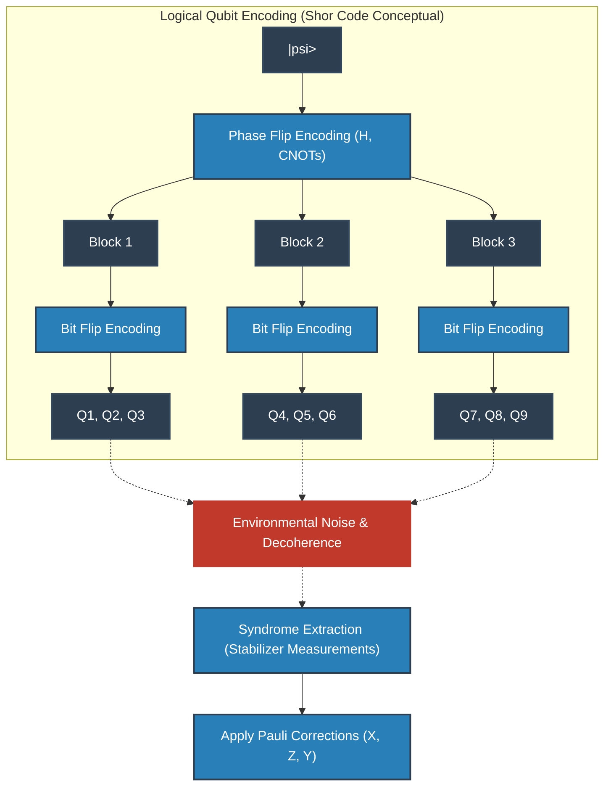

## 10.4 टोपोलॉजिकल कोड और सरफेस कोड (Surface Codes)

शोर का कोड और स्टेबलाइज़र कोड सैद्धांतिक दृष्टि से परिपूर्ण हैं, किंतु भौतिक कार्यान्वयन में वे "दूरस्थ क्यूबिट्स के मध्य परस्पर क्रिया (दीर्घ-परास अंतःक्रिया)" की मांग करते हैं। ठोस-अवस्था युक्तियों (सॉलिड-स्टेट डिवाइसेज जैसे अतिचालक परिपथ या सिलिकॉन स्पिन) के 2-आयामी समतल जालीदार विन्यास में यह दीर्घ-परास युग्मन अत्यंत दुष्कर होता है।

अतः, आधुनिक क्वांटम कंप्यूटर आर्किटेक्चर की मुख्यधारा के रूप में जो पद्धति अपनाई गई है, वह अलेक्सी किताएव (Alexei Kitaev) द्वारा प्रस्तावित "टोपोलॉजिकल क्वांटम त्रुटि सुधार" है, जिसके प्रमुख उदाहरण "टोरिक कोड (Toric Code)" और "सरफेस कोड (Surface Code)" हैं।

सरफेस कोड में, क्यूबिट्स को एक 2-आयामी जाली के शीर्षों (अथवा भुजाओं) पर व्यवस्थित किया जाता है, और केवल निकटवर्ती क्यूबिट्स के मध्य स्थानीय अंतःक्रियाओं का उपयोग करके स्टेबलाइज़र मापन संपन्न किया जाता है।
हैमिल्टनियन को निम्नानुसार व्यक्त किया जाता है:

$$
H = - \sum_{v} A_v - \sum_{p} B_p
$$

यहाँ, $A_v$ एक शीर्ष (Vertex) के परितः 4 क्यूबिट्स पर $X$ संकारकों का टेंसर गुणनफल है (शीर्ष संकारक: $A_v = \prod_{i \in \text{star}(v)} X_i$ ), तथा $B_p$ एक प्लैकेट (फलक, Plaquette) के परितः 4 क्यूबिट्स पर $Z$ संकारकों का टेंसर गुणनफल है (फलक संकारक: $B_p = \prod_{i \in \text{boundary}(p)} Z_i$ )।
ये परस्पर क्रमविनिमेय हैं ( $[A_v, B_p] = 0$ ), और तार्किक अवस्था उस मूल अवस्था समष्टि (ground state space) में एन्कोड होती है जहाँ सभी $A_v$ और $B_p$ का आइगेनमान $+1$ होता है। आश्चर्यजनक रूप से, जीनस (Genus) $g$ वाले 2-आयामी मैनिफ़ोल्ड पर संरचित टोरिक कोड की मूल अवस्था की अपभ्रष्टता (degeneracy) $4^g$ होती है, और एक टोरस ( $g=1$ ) पर 2 तार्किक क्यूबिट स्वतः ही एन्कोड हो जाते हैं।

सरफेस कोड की एक अत्यंत मनोहारी भौतिक व्याख्या त्रुटियों को "क्वासी-पार्टिकल (Anyon, एनियन)" के रूप में देखना है। उदाहरणार्थ, जब किसी क्यूबिट पर $X$ त्रुटि उत्पन्न होती है, तो निकटवर्ती दो प्लैकेट संकारकों $B_p$ का सिंड्रोम $-1$ में पलट जाता है। इसका अर्थ यह है कि मूल अवस्था के निर्वात से एक जोड़ी "चुंबकीय मोनोपोल सदृश एनियन ( $m$ एनियन)" का युग्म-उत्पादन हो गया है। यदि त्रुटि आगे पड़ोसी क्यूबिट में शृंखलाबद्ध होती है, तो एनियन जालीदार समष्टि में गति करता है।
सुधार का अर्थ सिंड्रोम युग्मों (एनियनों) की पहचान करना और ग्राफ सिद्धांत के "न्यूनतम भार पूर्ण मिलान (Minimum Weight Perfect Matching: MWPM)" एल्गोरिदम का उपयोग करके, न्यूनतम पथ के माध्यम से एनियनों को आपस में टकराकर उनका युग्म-विनाश (pair annihilation) कराना ही है।
तार्किक संक्रियाएं ( $\bar{X}, \bar{Z}$ ) इन एनियनों को समष्टि के एक सिरे से दूसरे सिरे तक आर-पार ले जाने वाले गैर-तुच्छ होमोलॉजिकल लूप (Topological Loop) के निर्माण के अनुरूप होती हैं। चूंकि स्थानीय शोर द्वारा संपूर्ण निकाय को स्वतः ही आर-पार भेदने वाले लूप के निर्माण की प्रायिकता चरघातांकी रूप से नगण्य होती है, अतः टोपोलॉजिकल परिप्रेक्ष्य से सूचना अत्यंत सुदृढ़ता से सुरक्षित रहती है।

## 10.5 दोष-सहिष्णु क्वांटम संगणना (FTQC) का मार्ग और थ्रेशोल्ड प्रमेय

त्रुटि सुधार के सिद्धांत के स्थापित हो जाने पर भी एक अत्यंत विकट समस्या शेष रह जाती है: "यदि स्वयं त्रुटि सुधार करने वाले परिपथ (सिंड्रोम मापन हेतु सहायक बिट्स अथवा CNOT गेट्स आदि) में ही शोर उपस्थित हो तो क्या होगा?" यदि किसी रोग के उपचार हेतु की जा रही सर्जरी के दौरान ही रोगी में कोई और अधिक गंभीर संक्रमण फैला दिया जाए, तो संपूर्ण प्रणाली तत्काल ध्वस्त हो जाएगी।

उदाहरण के लिए, सिंड्रोम निष्कर्षण के लिए प्रयुक्त CNOT गेट नियंत्रण बिट की $X$ त्रुटि को लक्ष्य बिट में संचरित ( $X \otimes I \xrightarrow{CNOT} X \otimes X$ ) कर देता है, तथा लक्ष्य बिट की $Z$ त्रुटि को नियंत्रण बिट में पश्च-संचारित ( $I \otimes Z \xrightarrow{CNOT} Z \otimes Z$ ) कर देता है। यदि एक भौतिक त्रुटि एन्कोड किए गए ब्लॉक के भीतर एकाधिक क्यूबिट्स में बहुगुणित हो जाती है, तो यह निर्धारित कोड दूरी $d$ से अधिक हो जाएगी और सुधार पूर्णतः विफल हो जाएगा।

इस विनाशकारी शृंखला को रोकने हेतु अपनाई गई डिज़ाइन संकल्पना ही "दोष-सहिष्णु क्वांटम संगणना (FTQC)" है। FTQC की अनिवार्य शर्त यह है कि "निकाय के भीतर उत्पन्न हुई एक भौतिक त्रुटि, एक तार्किक त्रुटि ब्लॉक के भीतर अधिक से अधिक एक ही त्रुटि के रूप में संचरित होनी चाहिए।"
इसे सिद्ध करने के लिए, तार्किक गेट्स के निष्पादन में "ट्रांसवर्सल संक्रियाओं (Transversal Operations)" की अत्यधिक आवश्यकता होती है। यह एक सुरक्षित गेट संक्रिया है जिसमें $i$-वां भौतिक क्यूबिट केवल अन्य ब्लॉकों के $i$-वें भौतिक क्यूबिट के साथ ही अंतःक्रिया करता है (ब्लॉक के भीतर कोई अंतःसंबंधन नहीं होता)। किंतु "ईस्टिन-निल प्रमेय (Eastin-Knill Theorem)" द्वारा यह गणितीय रूप से सिद्ध हो चुका है कि केवल ट्रांसवर्सल संक्रियाओं के माध्यम से सार्वभौमिक क्वांटम संगणना के सतत गेट सेट का निर्माण करना असंभव है।

इस प्रमेय के प्रतिबंधों से पार पाने तथा सार्वभौमिक FTQC को साकार करने की जादुई कुंजी "मैजिक स्टेट डिस्टिलेशन (Magic State Distillation)" है। शोर से युक्त गैर-क्लिफोर्ड अवस्थाओं (उदा. $T$ गेट के संगत अवस्थाएं) को प्रचुर मात्रा में तैयार किया जाता है, और केवल ट्रांसवर्सल क्लिफोर्ड संक्रियाओं का उपयोग करने वाले त्रुटि-सुधार परिपथ के माध्यम से अत्यधिक उच्च शुद्धता वाली "मैजिक स्टेट्स" का निष्कर्षण किया जाता है। तदुपरांत, क्वांटम टेलीपोर्टेशन के सिद्धांत का उपयोग करके गैर-क्लिफोर्ड गेट्स (जैसे $T$ गेट) को अप्रत्यक्ष रूप से तार्किक अवस्था पर लागू किया जाता है। चूंकि इस आसवन प्रक्रिया में विपुल संसाधन (भौतिक क्यूबिट्स) खर्च होते हैं, अतः FTQC युग के एल्गोरिदम में " $T$ गेट्स की संख्या को किस प्रकार न्यूनतम किया जाए" यह एक सर्वोच्च प्राथमिकता बन जाती है।

इन समस्त सैद्धांतिक प्रयासों की परिणति "क्वांटम थ्रेशोल्ड प्रमेय (Quantum Threshold Theorem)" में होती है।
डोरिट अहारोनोव (Dorit Aharonov) और माइकल बेन-ओर (Michael Ben-Or) आदि द्वारा सिद्ध किया गया यह प्रमेय स्पष्ट रूप से उद्घोषणा करता है:
 **"यदि भौतिक घटकों (गेट्स, मापन, इनिशियलाइज़ेशन) की त्रुटि प्रायिकता $p$ एक निश्चित सीमा $p_{th}$ से कम हो, तो क्वांटम त्रुटि सुधार कोडों को पदानुक्रमित रूप से नेस्ट (Concatenation) करके, अथवा टोपोलॉजिकल कोड के जालीदार आकार (कोड दूरी $d$ ) का निरंतर विस्तार करके, मनमाने ढंग से दीर्घ समय तक की क्वांटम संगणना को किसी भी वांछित परिशुद्धता के साथ निष्पादित करना संभव है।"** 

थ्रेशोल्ड मान $p_{th}$ प्रयुक्त कोड और आर्किटेक्चर पर निर्भर करता है, किंतु सरफेस कोड में इसका मान लगभग $10^{-2}$ (1%) होता है, जो कि एक अत्यंत व्यावहारिक और साध्य मान है। भौतिक त्रुटि दर को इस थ्रेशोल्ड से काफी नीचे सीमित करना (Physical Layer में सुधार) तथा अधिक दक्ष सिंड्रोम डिकोडर्स और सरफेस कोड के रूपांतरों का विकास करना (Logical Layer का परिष्करण)—ये दोनों ही वर्तमान क्वांटम कंप्यूटर विकास की वैश्विक प्रतिस्पर्धा के मुख्य रणक्षेत्र हैं।

क्वांटम त्रुटि सुधार और FTQC मात्र कोई इंजीनियरिंग का पैचवर्क नहीं हैं। यह टोपोलॉजी, समूह सिद्धांत और ऊष्मागतिकीय एंट्रॉपी के नियंत्रण के माध्यम से, प्रकृति द्वारा छिपाए जाने वाले क्वांटम यांत्रिकी के सूक्ष्म अध्यारोपण अवस्थाओं को स्थूल समय-पैमाने तक विस्तारित करने तथा ब्रह्मांड की अभिकलनात्मक क्षमता की सीमाओं का विस्तार करने का मानव जाति का एक परम मौलिक एवं कलात्मक उपक्रम है।

# अध्याय 11: क्वांटम हार्डवेयर का भौतिक कार्यान्वयन

क्वांटम सूचना विज्ञान के सैद्धांतिक आधार और एल्गोरिदम की गणितीय संरचना के बारे में अध्याय 10 तक विस्तार से चर्चा की गई है। चाहे कितने भी परिष्कृत क्वांटम एल्गोरिदम डिज़ाइन किए जाएं और कम्प्यूटेशनल जटिलता सिद्धांत के ढांचे में सैद्धांतिक क्वांटम सर्वोच्चता (Quantum Supremacy) सिद्ध कर दी जाए, यदि उन्हें निष्पादित करने के लिए भौतिक इकाई के रूप में "क्वांटम हार्डवेयर" मौजूद न हो, तो यह केवल शुद्ध गणित का खेल बनकर रह जाएगा। इस अध्याय में, अमूर्त हिल्बर्ट स्पेस में अवस्था सदिश $ |\psi\rangle $ को भौतिक जगत में साकार करने के लिए अत्याधुनिक हार्डवेयर कार्यान्वयन दृष्टिकोणों की उनके अंतर्निहित क्वांटम भौतिकी के गहन सिद्धांतों से लेकर सूक्ष्मतापूर्वक व्याख्या की जाएगी।

क्वांटम भौतिक प्रणाली को कृत्रिम रूप से नियंत्रित करने और एक सार्वभौमिक (Universal) कंप्यूटर के रूप में कार्य करने योग्य बनाने के लिए, डि विंसेंजो की कसौटियाँ (DiVincenzo's criteria) कहलाने वाली 5 कठोर भौतिक आवश्यकताओं को पूरा करना आवश्यक है:
1. **स्केलेबल और भली-भांति अभिलक्षित क्वबिट प्रणाली का अस्तित्व** : हिल्बर्ट स्पेस की टेन्सर गुणनफल संरचना $ \mathcal{H} = \bigotimes_{i=1}^n \mathcal{H}_i $ को भौतिक रूप से सुनिश्चित करने की क्षमता।
2. **क्वांटम अवस्था का आरंभीकरण** : प्रणाली को उच्च फिडेलिटी के साथ एक शुद्ध अवस्था (आमतौर पर $ |00\dots0\rangle $ ) में रीसेट करने की क्षमता।
3. **पर्याप्त रूप से लंबा सुसंगतता काल (कोहेरेंस टाइम)** : क्वांटम अवस्था का डिकोहेरेंस समय (T1 और T2), एक गेट ऑपरेशन में लगने वाले समय की तुलना में कई परिमाण क्रम (orders of magnitude) अधिक लंबा होना चाहिए।
4. **सार्वभौमिक क्वांटम गेट सेट का कार्यान्वयन** : किसी भी स्वेच्छ एकात्मक रूपांतरण $ \hat{U} \in SU(2^n) $ को परिमित संख्या में मूलभूत गेट्स (जैसे H, T, CNOT गेट्स) के संयोजन से किसी भी इच्छित परिशुद्धता तक सन्निकटित करने की क्षमता।
5. **विशिष्ट क्वबिट्स पर प्रक्षेप्य मापन** : क्वांटम अवस्था के पतन (कोलैप्स) के साथ, विशिष्ट आधार के सापेक्ष प्रायिकता वितरण को उच्च सटीकता से पढ़ने की क्षमता।

इन सभी शर्तों को एक साथ और उच्च फिडेलिटी (Fidelity) के साथ पूरा करने वाली प्रणाली का निर्माण करना आधुनिक भौतिकी और इंजीनियरिंग में एक ऐतिहासिक चुनौती है। यदि प्रणाली को पर्यावरण से पूरी तरह से अलग (आइसोलेट) कर दिया जाए, तो कोहेरेंस समय बढ़ जाता है, लेकिन इसके साथ ही प्रणाली में हेरफेर करना या उसका मापन करना भी अत्यंत कठिन हो जाता है। इस परम समझौते (ट्रेड-ऑफ) को कैसे दूर किया जाए, यही प्रत्येक हार्डवेयर पद्धति के डिज़ाइन दर्शन का मूल केंद्र है।

## 11.1 अतिचालक क्वबिट: स्थूल क्वांटम परिघटनाएं और अरेखीय LC परिपथ

वर्तमान में, Google और IBM सहित कई प्रमुख अनुसंधान संस्थानों द्वारा जिस दृष्टिकोण को सबसे सशक्त रूप से आगे बढ़ाया जा रहा है, वह है अतिचालक क्वबिट (Superconducting Qubit)। यह सूक्ष्म उप-परमाण्विक कणों के बजाय, स्थूल (मैक्रोस्कोपिक) इलेक्ट्रॉनिक परिपथों द्वारा प्रदर्शित स्थूल क्वांटम परिघटनाओं का उपयोग करके "कृत्रिम परमाणु (Artificial Atom)" बनाने का एक दृष्टिकोण है।

### 11.1.1 जोसेफसन जंक्शन की भौतिकी और अरेखीयता

सूक्ष्म-निर्मित (माइक्रोफ़ैब्रिकेटेड) सामान्य LC अनुनादी परिपथ (इंडक्टर $ L $ और कैपेसिटर $ C $ से युक्त प्रणाली) को जब अत्यधिक निम्न ताप तक ठंडा करके परिमाणीकृत (क्वांटाइज़्ड) किया जाता है, तो यह एक क्वांटम यांत्रिक आवर्ती दोलक (Harmonic Oscillator) बन जाता है। इसका हैमिल्टोनियन, निर्माण संकारक $ \hat{a}^\dagger $ और विलोपन संकारक $ \hat{a} $ का उपयोग करके इस प्रकार लिखा जा सकता है:

$$
\hat{H}_{\text{LC}} = \hbar \omega_r \left( \hat{a}^\dagger \hat{a} + \frac{1}{2} \right)
$$

यहाँ $ \omega_r = 1/\sqrt{LC} $ अनुनादी आवृत्ति है। इस प्रणाली के ऊर्जा स्तर $ E_n = \hbar \omega_r (n + 1/2) $ समान अंतराल पर होते हैं। यदि इस प्रणाली की न्यूनतम ऊर्जा अवस्था $ |0\rangle $ और प्रथम उत्तेजित अवस्था $ |1\rangle $ को क्वबिट के रूप में उपयोग किया जाए, तो आवृत्ति $ \omega_r $ के माइक्रोवेव विकिरण को आपतित करके गेट संक्रिया (जैसे कि $ |0\rangle \leftrightarrow |1\rangle $ संक्रमण) कराने का प्रयास करने पर, साथ ही साथ समान अंतराल वाले $ |1\rangle \leftrightarrow |2\rangle $ और $ |2\rangle \leftrightarrow |3\rangle $ संक्रमण भी उत्तेजित हो जाएंगे। इस प्रकार, यह 2-स्तरीय प्रणाली के रूप में कार्य नहीं कर सकता।

इस समस्या के समाधान के लिए, ऊर्जा स्तरों को असमान अंतराल वाला बनाने वाली "अरेखीयता (Nonlinearity)" अपरिहार्य है। इसे साकार करने वाली युक्ति **जोसेफसन जंक्शन (Josephson Junction)** है। इसमें दो अतिचालकों (सुपरकंडक्टर्स) के बीच कुछ नैनोमीटर की एक पतली अचालक परत सैंडविच के रूप में होती है, जिससे कूपर युग्म (Cooper pairs) स्थूल कला (फेज) के व्यतिकरण को बनाए रखते हुए टनलिंग प्रभाव द्वारा आर-पार निकल जाते हैं। जोसेफसन समीकरण के अनुसार, अतिचालक धारा $ I $ और कलांतर $ \phi $ के बीच का संबंध $ I = I_c \sin \phi $ होता है। इसके परिणामस्वरूप, यह जंक्शन एक अरेखीय इंडक्टर के रूप में कार्य करता है जिसका प्रेरकत्व (इंडक्टेंस) धारा पर निर्भर करता है।

### 11.1.2 ट्रांसमोन (Transmon) का हैमिल्टोनियन

ऐतिहासिक रूप से, चार्ज क्वबिट, फ्लक्स क्वबिट जैसे विभिन्न डिज़ाइनों का आविष्कार किया गया था, लेकिन वर्तमान में सबसे सफल डिज़ाइन "ट्रांसमोन (Transmon)" है, जिसने चार्ज शोर के प्रति संवेदनशीलता को नाटकीय रूप से कम कर दिया है।

ट्रांसमोन, जोसेफसन ऊर्जा $ E_J $ के समानांतर में शंट कैपेसिटेंस को जानबूझकर बहुत बड़ा करके और चार्जिंग ऊर्जा $ E_C = e^2 / (2C_{\Sigma}) $ को कम करके ( $ E_J / E_C \gg 1 $ ) वाले क्षेत्र में संचालित होता है।
कूपर युग्मों की संख्या को दर्शाने वाला आवेश संकारक $ \hat{n} $ और अतिचालक कलांतर को दर्शाने वाला कला संकारक $ \hat{\phi} $ विहित संयुग्मी चर हैं, जो क्रमविनिमेय संबंध $ [\hat{\phi}, \hat{n}] = i $ को संतुष्ट करते हैं। ट्रांसमोन का हैमिल्टोनियन इस प्रकार कठोरतापूर्वक व्यक्त किया जाता है:

$$
\hat{H}_{\text{transmon}} = 4 E_C (\hat{n} - n_g)^2 -E_J \cos \hat{\phi}
$$

यहाँ, $ n_g $ पर्यावरण या गेट वोल्टेज के कारण उत्पन्न ऑफसेट चार्ज है। $ E_J \gg E_C $ की सीमा में, कला के क्वांटम उच्चावचन (फ्लक्चुएशन) छोटे रहते हैं, इसलिए कोज्या पद का टेलर प्रसार किया जा सकता है और इसे एक अनाहर्मोनिक दोलक के रूप में माना जा सकता है:

$$
-E_J \cos \hat{\phi} \approx - E_J + \frac{E_J}{2} \hat{\phi}^2 - \frac{E_J}{24} \hat{\phi}^4 + \mathcal{O}(\hat{\phi}^6)
$$

यह $ \hat{\phi}^4 $ वाला पद प्रणाली में अनाहर्मोनिकता (Anharmonicity) लाता है। क्षोभ सिद्धांत (Perturbation theory) द्वारा गणना के परिणाम स्वरूप, ऊर्जा स्तरों के बीच अनाहर्मोनिकता $ \alpha $ को निम्नानुसार सन्निकटित किया जाता है:

$$
\alpha \equiv (E_2 - E_1) - (E_1 - E_0) \approx -E_C
$$

इस ऋणात्मक अनाहर्मोनिकता ( $ E_1 \to E_2 $ की संक्रमण आवृत्ति $ E_0 \to E_1 $ की तुलना में कम होती है) के कारण, माइक्रोवेव पल्स का उपयोग करके $ |0\rangle $ और $ |1\rangle $ के संगणना आधार समष्टि के भीतर सुरक्षित रूप से एकल-क्वबिट गेट निष्पादित करना संभव हो जाता है।

### 11.1.3 परिपथ QED (Circuit QED) और मापन तंत्र

क्वबिट की अवस्था को नष्ट किए बिना उसे पढ़ने (रीडआउट) के लिए सैद्धांतिक ढांचा "परिपथ QED (Circuit QED)" है, जो सुपरकंडक्टिंग परिपथों में कैविटी क्वांटम इलेक्ट्रोडायनामिक्स को लागू करता है।
क्वबिट और रीडआउट माइक्रोवेव रेज़ोनेटर की युग्मित प्रणाली को जेन्स-कमिंग्स (Jaynes-Cummings) मॉडल द्वारा वर्णित किया जाता है:

$$
\hat{H}_{\text{JC}} = \frac{\hbar \omega_q}{2} \hat{\sigma}_z + \hbar \omega_r \hat{a}^\dagger \hat{a} + \hbar g (\hat{\sigma}_+ \hat{a} + \hat{\sigma}_- \hat{a}^\dagger)
$$

यहाँ $ g $ युग्मन सामर्थ्य (कपलिंग स्ट्रेंथ) है। डिस्पर्सिव क्षेत्र ( $ |\omega_q - \omega_r| \gg g $ ), जहाँ क्वबिट की संक्रमण आवृत्ति $ \omega_q $ और रेज़ोनेटर की आवृत्ति $ \omega_r $ एक-दूसरे से काफी दूर होती हैं, वहाँ शिफ़र-वोल्फ रूपांतरण द्वारा प्रभावी हैमिल्टोनियन को निम्नानुसार विकर्णित (diagonalize) किया जा सकता है:

$$
\hat{H}_{\text{disp}} \approx \frac{\hbar \omega_q}{2} \hat{\sigma}_z + \hbar \left( \omega_r + \frac{g^2}{\Delta} \hat{\sigma}_z \right) \hat{a}^\dagger \hat{a}
$$

यहाँ $ \Delta = \omega_q - \omega_r $ है। इस समीकरण के दूसरे पद का भौतिक अर्थ अत्यंत महत्वपूर्ण है। रेज़ोनेटर की प्रभावी आवृत्ति क्वबिट की अवस्था (कि $ \hat{\sigma}_z = +1 $ है या $ -1 $ ) के अनुसार $ \pm g^2/\Delta $ स्थानांतरित (शिफ्ट) हो जाती है। अतः, रेज़ोनेटर से जांच (प्रोब) माइक्रोवेव को पारगमित या परावर्तित कराकर, और उसके कला विस्थापन (फेज शिफ्ट) को मापकर, क्वबिट की अवस्था का प्रक्षेप्य मापन किया जा सकता है।

 **लाभ और हानियाँ** 
अतिचालक पद्धति का सबसे बड़ा लाभ यह है कि इसमें मौजूदा सेमीकंडक्टर लिथोग्राफी तकनीकों का उपयोग किया जा सकता है, जिससे चिप पर वायरिंग डिज़ाइन के माध्यम से उत्कृष्ट स्केलेबिलिटी मिलती है, और गेट संक्रियाएं नैनोसेकंड पैमाने पर अत्यंत तीव्र होती हैं। दूसरी ओर नुकसान यह है कि, स्थूल मानव-निर्मित संरचना होने के कारण यह सूक्ष्म पदार्थ दोषों (TLS) और विद्युतचुंबकीय शोर के प्रति अत्यधिक संवेदनशील है, तथा इसके लिए परम शून्य के करीब (लगभग 10 mK) डाइल्यूशन रेफ्रिजरेटर का वातावरण अनिवार्य होता है।

## 11.2 आयन ट्रैप पद्धति: परमाणु भौतिकी की पराकाष्ठा और पूर्ण एकरूपता

यदि अतिचालकता "कृत्रिम स्थूल क्वांटम प्रणाली" है, तो ट्रैप्ड आयन (Trapped Ion) पद्धति "प्रकृति में विद्यमान परम सूक्ष्म क्वांटम प्रणाली" है। समस्थानिक (आइसोटोप) के रूप में समान परमाणु (उदाहरण के लिए $ ^{171}\text{Yb}^+ $ या $ ^{40}\text{Ca}^+ $ ), ब्रह्मांड में चाहे जहाँ भी मौजूद हों, पूरी तरह से एक समान गुणधर्म प्रदर्शित करते हैं। अतः, निर्माण भिन्नता की अवधारणा ही यहाँ उपस्थित नहीं है, और इसका निरपेक्ष लाभ यह है कि इसका कोहेरेंस समय अत्यधिक लंबा होता है।

### 11.2.1 पॉल ट्रैप और लेज़र शीतलन की गतिकी

आयन ट्रैप में, केवल स्थिर-विद्युत क्षेत्र द्वारा किसी आवेशित कण को 3-आयामी अंतरिक्ष में स्थिर रूप से परिबद्ध (ट्रैप) करना असंभव है (अर्नशॉ का प्रमेय)। इससे बचने के लिए, पॉल ट्रैप (Paul trap) तकनीक अपनाई जाती है, जिसमें स्थानिक रूप से गैर-समान और समय के साथ दोलन करने वाले उच्च-आवृत्ति विद्युत क्षेत्र का उपयोग किया जाता है।

ट्रैप किए गए आयनों को निर्वात कक्ष के भीतर लेज़र शीतलन (डॉप्लर शीतलन और साइडबैंड शीतलन) के अधीन किया जाता है। इसके माध्यम से, आयनों की गतिज ऊर्जा को उनके क्वांटम यांत्रिक मूल अवस्था (फोनॉन संख्या $ n=0 $ ) तक छीन लिया जाता है। क्वबिट का संगणना आधार आयन की आंतरिक इलेक्ट्रॉनिक अवस्था में एनकोड किया जाता है। आंतरिक अवस्था का हैमिल्टोनियन सरल होता है:

$$
\hat{H}_{\text{internal}} = \frac{\hbar \omega_0}{2} \hat{\sigma}_z
$$

### 11.2.2 लैम्ब-डिके क्षेत्र और मॉल्मर-सोरेनसेन गेट का गणित

आयन ट्रैप पद्धति की वास्तविक युगांतरकारी खोज (ब्रेकथ्रू) बहु-क्वबिट्स के बीच उलझाव (एंटैंगलमेंट) निर्माण तंत्र में निहित है। ट्रैप की गई आयन श्रृंखला शक्तिशाली कूलॉम प्रतिकर्षण बल से बंधी होती है, और पूरी प्रणाली एक सामूहिक प्रसामान्य दोलन मोड (फोनॉन) प्रदर्शित करती है। इस फोनॉन को डेटा बस के रूप में उपयोग करके, भौतिक रूप से दूर स्थित आयनों के बीच भी सीधे अन्योन्यक्रिया कराई जा सकती है।

2-क्वबिट गेट के कार्यान्वयन के रूप में सबसे मानक रूप Mølmer-Sørensen (MS) गेट है। फोनॉन मोड की आवृत्ति $ \omega_m $ से थोड़ा विक्षेपित (डीट्यून) दो रंगों के लेज़र प्रकाश को दो आयनों पर एक साथ आपतित किया जाता है। लैम्ब-डिके पैरामीटर $ \eta = k z_0 $ पर्याप्त रूप से छोटा होने वाले लैम्ब-डिके क्षेत्र ( $ \eta \sqrt{n} \ll 1 $ ) में, अन्योन्यक्रिया हैमिल्टोनियन को निम्नानुसार विस्तारित किया जा सकता है:

$$
\hat{H}_{\text{int}} \approx \hbar \Omega \sum_{j=1,2} \hat{\sigma}_\phi^{(j)} \left( \eta \hat{a} e^{i \delta t} + \eta \hat{a}^\dagger e^{-i \delta t} \right)
$$

यहाँ $ \Omega $ रबी आवृत्ति है और $ \delta $ डिट्यूनिंग है। मैग्नस प्रसार का उपयोग करके समय विकास संकारक की गणना करने पर, उचित गेट समय के पश्चात, गति मोड अपनी मूल अवस्था में वापस लौट आता है, जबकि आंतरिक अवस्थाओं के बीच एक ज्यामितीय कला (फेज) जुड़ जाती है, और एक प्रभावी स्पिन-स्पिन अन्योन्यक्रिया शेष रह जाती है:

$$
\hat{U}_{\text{MS}} = \exp\left( -i \frac{\pi}{4} \hat{\sigma}_\phi \otimes \hat{\sigma}_\phi \right)
$$

यह संक्रिया एक पूर्णतः एंटैंगल्ड अवस्था उत्पन्न करती है, और CNOT गेट के समतुल्य संगणना क्षमता रखती है। पूर्ण संयोजन (All-to-all connectivity) संभव होना इसका वह निर्णायक अंतर है जो इसे अतिचालक पद्धति से अलग करता है, जहाँ केवल निकटवर्ती क्वबिट्स ही परस्पर जुड़ सकते हैं।

 **चुनौतियां और सीमाएं** 
गेट संक्रिया समय कई दसियों माइक्रोसेकंड होता है, जो अतिचालक पद्धति की तुलना में कई परिमाण क्रम धीमा है। इसके अलावा, एकल 1-आयामी ट्रैप में कई दसियों से अधिक आयनों को रखने पर, कंपन मोड स्पेक्ट्रम अत्यधिक घना हो जाता है और क्रॉसटॉक अपरिहार्य हो जाता है। इसे दूर करने के लिए QCCD (Quantum Charge-Coupled Device) आर्किटेक्चर जैसी स्केलिंग प्रौद्योगिकियां वर्तमान में प्रमुख अनुसंधान विषय हैं।

## 11.3 टोपोलॉजिकल क्वबिट: गैर-एबेलियन एनियन और परम दृढ़ता

अतिचालक और आयन ट्रैप दोनों ही पर्यावरण से आने वाले स्थानिक शोर के कारण होने वाली त्रुटियों के प्रति संवेदनशील हैं, और इसके लिए क्वांटम त्रुटि सुधार अनिवार्य है। किंतु, एक अत्यंत महत्वाकांक्षी दृष्टिकोण भी मौजूद है: भौतिक स्तर पर शोर से मौलिक रूप से सुरक्षित क्वांटम अवस्था का निर्माण करना। यह टोपोलॉजिकल क्वांटम कंप्यूटर है।

### 11.3.1 किताएव चेन और मेयोराना ज़ीरो मोड

हम जिस 3-आयामी अंतरिक्ष में रहते हैं, उसमें प्राथमिक कण केवल दो प्रकार के होते हैं: बोसॉन और फर्मिऑन। हालांकि, 2-आयामी टोपोलॉजिकल पदार्थ प्रणालियों में, कणों के विनिमय संचालन द्वारा तरंग फलन स्वेच्छ कला प्राप्त कर सकता है, ऐसे कणों को "एनियन (Anyon)" कहा जाता है। इसके अलावा, और भी विशिष्ट "गैर-एबेलियन एनियन (Non-Abelian anyon)" के मामले में, जब दो कणों का विनिमय किया जाता है, तो प्रणाली समान ऊर्जा की अपभ्रष्ट अवस्था से दूसरी लंबकोणीय अवस्था में एकात्मक रूप से घूम जाती है:

$$
| \psi_{\text{final}} \rangle = \hat{U} | \psi_{\text{initial}} \rangle
$$

इस गैर-एबेलियन एनियन का सबसे प्रबल भौतिक उम्मीदवार संघनित पदार्थ भौतिकी में अर्ध-कण के रूप में "मेयोराना ज़ीरो मोड (Majorana Zero Modes, MZM)" है। एक 1-आयामी अर्धचालक नैनोवायर (जैसे InSb) में मजबूत स्पिन-ऑर्बिट इंटरैक्शन दिया जाता है, इसे s-वेव सुपरकंडक्टर के निकट संपर्क में रखा जाता है, और एक बाह्य चुंबकीय क्षेत्र लागू किया जाता है। अलेक्सी किताएव (Alexei Kitaev) द्वारा प्रस्तावित मॉडल के अनुसार, विशिष्ट पैरामीटर क्षेत्र में नैनोवायर टोपोलॉजिकल सुपरकंडक्टिंग चरण में चरण-संक्रमण करती है, और वायर के दोनों सिरों पर किनारे की अवस्थाओं के रूप में शून्य-ऊर्जा मेयोराना कण स्थानिक रूप से स्थित हो जाते हैं।

मेयोराना संकारक $ \hat{\gamma}_1, \hat{\gamma}_2 $ स्व-संयुग्मी ( $ \hat{\gamma}_j = \hat{\gamma}_j^\dagger $ ) होते हैं और प्रति-क्रमविनिमेय संबंध $ \{ \hat{\gamma}_i, \hat{\gamma}_j \} = 2\delta_{ij} $ को संतुष्ट करते हैं। सामान्य डिराक फर्मिऑन के निर्माण और विलोपन संकारक इन दो मेयोराना संकारकों का उपयोग करके स्थानिक रूप से गैर-स्थानिक रूप से संरचित किए जा सकते हैं:

$$
\hat{c} = \frac{1}{2}(\hat{\gamma}_1 + i\hat{\gamma}_2), \quad \hat{c}^\dagger = \frac{1}{2}(\hat{\gamma}_1 - i\hat{\gamma}_2)
$$

यह एकल इलेक्ट्रॉनिक अवस्था (फर्मिऑन पैरिटी), नैनोवायर के दोनों सिरों जैसे स्थानिक रूप से अलग-थलग दो बिंदुओं में "विभाजित" होकर एनकोड की जाती है। स्थानिक शोर द्वारा प्रणाली के दोनों सिरों को एक साथ और सटीक सहसंबंध के साथ विक्षुब्ध करने की संभावना अत्यंत कम होती है, इसलिए क्वांटम जानकारी स्वाभाविक रूप से डिकोहेरेंस से सुरक्षित रहती है (टोपोलॉजिकल सुरक्षा)।

### 11.3.2 ब्रेडिंग और सांस्थितिकीय (टोपोलॉजिकल) संगणना

इस प्रणाली में क्वांटम लॉजिक गेट्स इन मेयोराना कणों की स्थानिक स्थितियों को आपस में बदलने यानी "ब्रेडिंग (Braiding)" द्वारा निष्पादित किए जाते हैं।

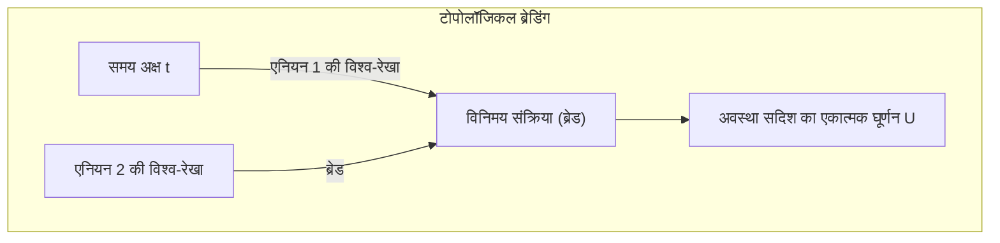

कणों के प्रक्षेपवक्र द्वारा बनाई गई "गांठ" की टोपोलॉजी ही संगणना परिणाम निर्धारित करती है, इसलिए प्रक्षेपवक्र में थोड़ा उतार-चढ़ाव होने पर भी, जब तक टोपोलॉजी नहीं बदलती, एकात्मक रूपांतरण $ \hat{U} $ बिना किसी त्रुटि के सटीक रूप से निष्पादित होता है। यह हार्डवेयर स्तर की त्रुटि-सहनशीलता (Fault-tolerance) है।

 **चुनौतियां और सीमाएं** 
मेयोराना ज़ीरो मोड के अस्तित्व को सिद्ध करने वाले निर्णायक प्रायोगिक साक्ष्य अभी भी बहस का विषय हैं, और ब्रेडिंग का भौतिक प्रदर्शन अभी तक प्राप्त नहीं हुआ है। इसके अलावा, केवल इसिंग एनियन द्वारा ब्रेडिंग से सार्वभौमिक क्वांटम गेट सेट का निर्माण नहीं किया जा सकता, अतः मैजिक स्टेट डिस्टिलेशन जैसी गैर-टोपोलॉजिकल अतिरिक्त संक्रियाओं की आवश्यकता होती है।

## 11.4 प्रकाशीय क्वबिट: रैखिक प्रकाशिकी और मापन-प्रेरित उलझाव

पर्यावरणीय शोर के विरुद्ध मौलिक रूप से सशक्त एक अन्य दृष्टिकोण फोटॉन (Photon) का उपयोग करने वाला प्रकाशीय क्वांटम कंप्यूटर है। फोटॉनों पर कोई विद्युत आवेश नहीं होता है, और कमरे के तापमान पर भी पर्यावरण के साथ उनकी अन्योन्यक्रिया अत्यंत नगण्य होती है, इसलिए उनके डिकोहेरेंस समय को व्यावहारिक रूप से अनंत माना जा सकता है।

### 11.4.1 डुअल-रेल एन्कोडिंग और KLM प्रोटोकॉल

प्रकाशीय क्वबिट्स को प्रायः स्थानिक पथ मोड का उपयोग करके एनकोड किया जाता है। डुअल-रेल एन्कोडिंग में, ऊपरी वेवगाइड में फोटॉन की उपस्थिति की अवस्था को $ |0\rangle = |1, 0\rangle $ तथा निचली वेवगाइड में फोटॉन की अवस्था को $ |1\rangle = |0, 1\rangle $ के रूप में परिभाषित किया जाता है।

एकल-क्वबिट गेट्स को बीम स्प्लिटर (BS) और फेज शिफ्टर (PS) जैसे रैखिक प्रकाशीय तत्वों द्वारा पूरी तरह से साकार किया जा सकता है। किंतु, चूंकि फोटॉन सीधे एक-दूसरे के साथ परस्पर क्रिया नहीं करते हैं, इसलिए केवल रैखिक प्रकाशीय तत्वों से नियतात्मक 2-क्वबिट गेट बनाना असंभव है।
2001 में, Knill, Laflamme, Milburn ने "KLM प्रोटोकॉल" प्रस्तावित किया, और यह सिद्ध किया कि एकल फोटॉन स्रोत, रैखिक प्रकाशीय तत्व और **फोटॉन डिटेक्टर द्वारा प्रक्षेप्य मापन** को संयोजित करके, यद्यपि प्रायिकतात्मक रूप से ही सही, लेकिन एक स्केलेबल सार्वभौमिक क्वांटम संगणना संभव है। इसमें अरेखीयता को हॉन्ग-ओउ-मैंडेल प्रभाव (Hong-Ou-Mandel effect) जैसे शुद्ध क्वांटम व्यतिकरण प्रभावों और मापन की अपरिवर्तनीयता के माध्यम से पश्च-चयन (Post-selection) द्वारा प्रणाली में प्रविष्ट कराया जाता है।

### 11.4.2 सतत चर (CV) और क्लस्टर अवस्था

हाल के वर्षों में, केवल एकल फोटॉन-आधारित असतत चरों ही नहीं, बल्कि प्रकाश के क्वाड्रेचर आयामों का उपयोग करने वाली सतत चर (Continuous Variable, CV) क्वांटम संगणना पद्धति ने अप्रत्याशित प्रगति प्रदर्शित की है।
टाइम-डोमेन मल्टीप्लेक्सिंग तकनीक और स्क्वीज़्ड लाइट का उपयोग करके, दसियों हज़ार से लेकर लाखों उलझे हुए प्रकाशीय स्पंदों से युक्त एक विशाल "क्लस्टर अवस्था (Cluster state)" तैयार की जाती है। इस अवस्था को एक संसाधन के रूप में उपयोग करते हुए, और प्रत्येक नोड पर क्रमिक रूप से उपयुक्त मापन निष्पादित करके गणना को आगे बढ़ाने वाली "मापन-आधारित क्वांटम संगणना (Measurement-based quantum computation; MBQC)" की वास्तुकला प्रकाशीय क्वांटम कंप्यूटरों की मुख्यधारा बन रही है।

## 11.5 NISQ युग की वर्तमान स्थिति और तार्किक क्वबिट्स की ओर सोपान

जॉन प्रेस्किल (John Preskill) द्वारा प्रस्तावित **NISQ (Noisy Intermediate-Scale Quantum)** की अवधारणा के अनुसार, वर्तमान में मानवता के पास जो क्वांटम हार्डवेयर उपलब्ध है, वह कई दसियों से लेकर सैकड़ों भौतिक क्वबिट्स वाला "मध्यम-पैमाने" का हार्डवेयर है; किंतु यह अभी भी शोर के प्रभाव में है और त्रुटियों के संचय से नहीं बच सकता है।

### 11.5.1 कोहेरेंस सीमा और फिडेलिटी

Shor के एल्गोरिदम जैसे गहरे क्वांटम परिपथों को निष्पादित करने का प्रयास करने पर, प्रत्येक गेट संक्रिया की सूक्ष्म त्रुटि चरघातांकी रूप से प्रवर्धित हो जाती है। उदाहरण के लिए, मान लें कि किसी 2-क्वबिट गेट की फिडेलिटी 99.5% है (त्रुटि दर $ \epsilon = 0.005 $ )। यदि संपूर्ण परिपथ में $ N $ गेट्स शामिल हैं, तो अंतिम अवस्था की फिडेलिटी सन्निकट रूप से $ \mathcal{F} \approx (1-\epsilon)^N \approx e^{-N\epsilon} $ होगी। $ N=1000 $ के मामले में, सफलता की प्रायिकता $ e^{-5} \approx 0.0067 $ हो जाएगी, और सही संगणना परिणाम शोर में दब जाएगा।
Google द्वारा प्रदर्शित क्वांटम सर्वोच्चता के प्रयोग में, क्रॉस-एन्ट्रॉपी बेंचमार्किंग (XEB) नामक मीट्रिक का उपयोग करके क्लासिकल सुपरकंप्यूटर की तुलना में अत्यधिक गति सिद्ध की गई थी, लेकिन यह एक विशिष्ट यादृच्छिक परिपथ नमूने (रैंडम सर्किट सैंपलिंग) तक ही सीमित था और इसका अर्थ कोई व्यावहारिक संगणना नहीं था।

### 11.5.2 क्वांटम त्रुटि सुधार की ओर संक्रमण (FTQC का उदय)

NISQ उपकरणों की सीमाओं को तोड़कर रसायन विज्ञान संगणना, पदार्थ विज्ञान अथवा क्रिप्टोग्राफी में वास्तविक "क्वांटम श्रेष्ठता" स्थापित करने के लिए, किसी एकल भौतिक प्रणाली पर निर्भर रहने के बजाय, कई भौतिक क्वबिट्स को संयोजित करके एक त्रुटि-मुक्त "तार्किक क्वबिट (Logical Qubit)" का निर्माण करने वाले **FTQC (Fault-Tolerant Quantum Computing: त्रुटि-सहनशील क्वांटम संगणना)** की ओर संक्रमण एक अनिवार्य शर्त है।

उदाहरण के लिए, सरफेस कोड (Surface Code) नामक एक टोपोलॉजिकल त्रुटि सुधार कोड का उपयोग करने पर, यदि भौतिक क्वबिट्स की त्रुटि दर देहली मान से नीचे है, तो प्रणाली का आकार बढ़ाने पर तार्किक त्रुटि दर चरघातांकी रूप से घटती जाती है। किंतु, इसके मूल्य के रूप में, एक एकल तार्किक क्वबिट के निर्माण के लिए 1,000 से लेकर 10,000 भौतिक क्वबिट्स का ओवरहेड आवश्यक होता है।

हम वर्तमान में शोर से संघर्ष करने वाली भौतिक इंजीनियरिंग के अग्रिम मोर्चे पर खड़े हैं। अतिचालकता, आयन ट्रैप, टोपोलॉजिकल, और प्रकाशीय क्वांटम जैसी प्रत्येक पद्धति अपनी-अपनी भौतिक बाधाओं से जूझते हुए स्केलेबिलिटी के उस शिखर की ओर अग्रसर है जिसे अभी तक छुआ नहीं गया है। अध्याय 12 में, हम इस हार्डवेयर विकास की अगली कड़ी के रूप में क्वांटम सूचना की परम सुरक्षा-दीवार, "क्वांटम त्रुटि सुधार की गणितीय संरचना" की गहन व्याख्या प्रस्तुत करेंगे।

# अध्याय 12: क्वांटम कंप्यूटर का भविष्य और निष्कर्ष

"क्वांटम कंप्यूटर", जो क्वांटम यांत्रिकी के उन भौतिक नियमों को कम्प्यूटेशनल संसाधन के रूप में उपयोग करता है जो हमारे सामान्य अंतर्ज्ञान को नकारते हैं। अध्याय 1 में सुपरपोज़िशन के सिद्धांत से लेकर, क्वांटम उलझाव (एंटैंगलमेंट), बेल की असमानता, शोर का एल्गोरिदम और क्वांटम त्रुटि सुधार तक, हमने इस विस्तृत श्रृंखला के माध्यम से क्वांटम सूचना विज्ञान की गहराइयों की यात्रा की है। अंतिम अध्याय के रूप में, इस अध्याय में हम वर्तमान मानवता द्वारा प्राप्त तकनीकी उपलब्धि, "क्वांटम सर्वोच्चता (Quantum Supremacy / Quantum Advantage)" के प्रदर्शन प्रयोगों के वास्तविक गणितीय और भौतिक अर्थ को स्पष्ट करेंगे, और आम जनता में फैले इस भ्रम को कि "क्वांटम कंप्यूटर एक जादुई डिब्बा है जो पलक झपकते ही कुछ भी हल कर सकता है", कम्प्यूटेशनल जटिलता सिद्धांत के दृष्टिकोण से कड़ाई से खंडित करेंगे। इसके अलावा, NISQ (Noisy Intermediate-Scale Quantum) युग से FTQC (Fault-Tolerant Quantum Computing) तक भविष्य के व्यावहारिक और सामाजिक कार्यान्वयन के लिए एक यथार्थवादी और भव्य रोडमैप प्रस्तुत करेंगे, और 50,000 अक्षरों से अधिक की इस विशाल श्रृंखला का समापन करेंगे।

## 12.1 क्वांटम सर्वोच्चता का प्रदर्शन: Google Sycamore द्वारा दिखाया गया मार्ग

2019 में, Google की शोध टीम ने 53 सुपरकंडक्टिंग क्यूबिट वाले प्रोसेसर "Sycamore (सिकामोर)" का उपयोग करके "क्वांटम सर्वोच्चता (Quantum Supremacy)" के सफल प्रदर्शन की घोषणा की, जिसमें यह दावा किया गया कि एक ऐसी विशिष्ट समस्या को, जिसे एक क्लासिकल कंप्यूटर व्यावहारिक समय के भीतर हल नहीं कर सकता, क्वांटम कंप्यूटर द्वारा तीव्र गति से हल कर लिया गया। यह घटना क्वांटम सूचना विज्ञान में एक ऐतिहासिक मील का पत्थर है, लेकिन इसके पीछे की गणितीय संरचना को सटीक रूप से समझने वाले लोग बहुत कम हैं।

उनके द्वारा हल की गई समस्या "रैंडम क्वांटम सर्किट सैंपलिंग (Random Quantum Circuit Sampling)" थी। क्यूबिट्स के समूह पर, यादृच्छिक रूप से चुने गए 1-क्यूबिट गेट्स और 2-क्यूबिट गेट्स को $d$ परतों (layers) में लागू किया जाता है, और अंतिम अवस्था को कम्प्यूटेशनल आधार (computational basis) में मापा जाता है।

आइए इसे गणितीय रूप से वर्णित करें। प्रारंभिक अवस्था को $ |\psi_0\rangle = |0\rangle^{\otimes n} $ मान लेते हैं। इस पर, यादृच्छिक रूप से चुने गए यूनिटरी परिवर्तन $ U = U_d U_{d-1} \dots U_1 $ को लागू किया जाता है। अंतिम अवस्था $ |\psi_f\rangle $ को टेंसर उत्पाद और रैखिक संयोजन का उपयोग करके निम्नानुसार व्यक्त किया जाता है:

$$
|\psi_f\rangle = U |0\rangle^{\otimes n} = \sum_{x \in \{0, 1\}^n} \alpha_x |x\rangle
$$

यहाँ $ \alpha_x = \langle x | U | 0 \rangle^{\otimes n} $ वह प्रायिकता आयाम (probability amplitude) है जब एक विशिष्ट बिट स्ट्रिंग $x$ प्रेक्षित की जाती है, और यह एक सम्मिश्र संख्या (complex number) है। इस समय, मापन द्वारा बिट स्ट्रिंग $x$ प्राप्त होने की आदर्श प्रायिकता $ P_{\text{ideal}}(x) $, क्वांटम यांत्रिकी में बॉर्न के नियम (Born Rule) के अनुसार निम्नानुसार दी जाती है:

$$
P_{\text{ideal}}(x) = |\alpha_x|^2 = \left| \langle x | U | 0 \rangle^{\otimes n} \right|^2
$$

पर्याप्त रूप से गहरे ($d$ बड़ा होने पर) रैंडम क्वांटम सर्किट में, प्रत्येक आयाम $ \alpha_x $ सम्मिश्र तल (complex plane) पर रैंडम वॉक जैसा व्यवहार प्रदर्शित करता है, और इसका प्रायिकता वितरण $ P_{\text{ideal}}(x) $ पोर्टर-थॉमस वितरण (Porter-Thomas distribution) का अनुसरण करने के लिए जाना जाता है। अर्थात्, प्रायिकता $p$ के प्रकट होने का प्रायिकता घनत्व फलन (probability density function) $ \text{Pr}(P_{\text{ideal}}(x) = p) \approx 2^n e^{-2^n p} $ होता है। इसका अर्थ यह है कि कुछ विशिष्ट बिट स्ट्रिंग्स अन्य बिट स्ट्रिंग्स की तुलना में देखे जाने की अधिक संभावना रखती हैं, जो एक "स्पेकल (चित्तीदार/धब्बेदार) पैटर्न" (speckle pattern) बनाती हैं।

क्लासिकल कंप्यूटर पर इस वितरण से सटीक सैंपलिंग करने के लिए, विशाल टेंसर नेटवर्क के संकुचन (contraction) गणनाओं के माध्यम से आयाम $ \alpha_x $ की सीधे गणना करना आवश्यक है। स्टेट वेक्टर का आयाम $ 2^n $ होता है, और $ n = 53 $ के मामले में, लगभग $ 9 \times 10^{15} $ सम्मिश्र संख्या आयामों (पेटाबाइट-स्तरीय मेमोरी) को ट्रैक करना पड़ता है, जो उस समय के विश्व के सबसे तेज़ सुपरकंप्यूटर का उपयोग करने पर भी अत्यधिक समय लेने वाली कम्प्यूटेशनल दीवार का सामना करता है। दूसरी ओर, क्वांटम कंप्यूटर में भौतिक प्रणाली स्वयं अवस्था **$|\psi_f\rangle$** को प्राकृतिक हिल्बर्ट स्पेस में एक वेक्टर के रूप में बनाए रखती है, और एक ही मापन द्वारा स्पेकल पैटर्न के अनुसार सैंपलिंग को तात्कालिक रूप से (कुछ दसियों माइक्रोसेकंड में) निष्पादित करती है।

प्रयोग की सफलता या विफलता का मूल्यांकन करने के लिए लीनियर क्रॉस-एंट्रॉपी बेंचमार्किंग (Linear Cross-Entropy Benchmarking, XEB) की शुरुआत की गई थी। फिडेलिटी (Fidelity / निष्ठा) $ \mathcal{F}_{\text{XEB}} $ को निम्नानुसार परिभाषित किया गया है:

$$
\mathcal{F}_{\text{XEB}} = 2^n \sum_{x \in \{0, 1\}^n} P_{\text{ideal}}(x) P_{\text{exp}}(x) - 1
$$

यहाँ, $ P_{\text{exp}}(x) $ वास्तविक क्वांटम प्रोसेसर (हार्डवेयर शोर सहित) से प्राप्त अनुभवजन्य प्रायिकता वितरण (empirical probability distribution) है। यदि उपकरण पूरी तरह से यादृच्छिक शोर (पूरी तरह से मिश्रित अवस्था का घनत्व मैट्रिक्स $ \rho = \frac{I}{2^n} $ ) आउटपुट करता है, तो $ P_{\text{exp}}(x) = \frac{1}{2^n} $ होगा, जिससे $ \mathcal{F}_{\text{XEB}} = 0 $ प्राप्त होता है। दूसरी ओर, यदि कोई क्वांटम कंप्यूटर पूरी तरह से शोर-मुक्त आदर्श शुद्ध अवस्था आउटपुट करता है, तो $ \mathcal{F}_{\text{XEB}} \approx 1 $ होगा। Google के प्रयोग में $ \mathcal{F}_{\text{XEB}} \approx 0.002 $ का मान दर्ज किया गया, जो शून्य से स्पष्ट रूप से बड़ा और सांख्यिकीय रूप से महत्वपूर्ण है। इस मामूली फिडेलिटी के बावजूद, क्लासिकल कंप्यूटर पर इसके समकक्ष नमूने उत्पन्न करना कम्प्यूटेशनल जटिलता सिद्धांत के अनुसार अत्यंत कठिन होने के कारण इसे क्वांटम सर्वोच्चता का प्रमाण माना गया।

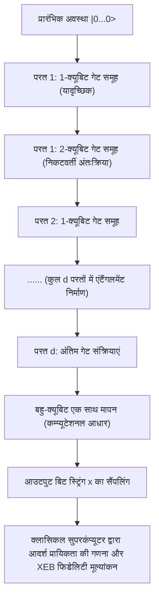

## 12.2 "जादुई डिब्बे" का भ्रम: समानांतर गणना का जाल और BQP vs NP

क्वांटम कंप्यूटर के बारे में सामान्य मीडिया रिपोर्टों और परिचयात्मक पुस्तकों में अक्सर ऐसे जादुई दावे देखने को मिलते हैं कि "चूंकि यह एक साथ $2^n$ अवस्थाओं की गणना कर सकता है, इसलिए यह किसी भी समस्या को पलक झपकते ही हल कर सकता है।" हालाँकि, कम्प्यूटेशनल जटिलता सिद्धांत के दृष्टिकोण से यह पूरी तरह से गलत है। क्वांटम कंप्यूटर किसी भी तरह से "NP-पूर्ण समस्याओं (NP-Complete problems)" को बिना किसी शर्त के बहुपद समय (polynomial time) में हल करने वाली कोई जादुई छड़ी नहीं है।

यह गलतफहमी इस तथ्य (क्वांटम समानांतरवाद) से उत्पन्न होती है कि हाडामार्ड गेट आदि द्वारा अवस्थाओं के सुपरपोज़िशन $ |\psi\rangle = \frac{1}{\sqrt{2^n}} \sum_{x=0}^{2^n-1} |x\rangle $ के माध्यम से सभी इनपुट के लिए फलन का मूल्यांकन "एक ही संक्रिया में" किया जा सकता है। जब ऑरेकल (गणना संपन्न करने वाला यूनिटरी ऑपरेटर) **$U_f$** का उपयोग करके सुपरपोज़िशन अवस्था पर फलन $ f(x) $ की गणना की जाती है, तो संपूर्ण अवस्था रैखिकता (linearity) के अनुसार निम्नानुसार विकसित होती है:

$$
U_f \left( \frac{1}{\sqrt{2^n}} \sum_{x=0}^{2^n-1} |x\rangle \otimes |0\rangle \right) = \frac{1}{\sqrt{2^n}} \sum_{x=0}^{2^n-1} |x\rangle \otimes |f(x)\rangle
$$

निश्चित रूप से, इस स्टेट वेक्टर के भीतर, सभी $x$ के लिए $f(x)$ के उत्तर प्रायिकता आयामों की उप-प्रणाली के रूप में समाहित होते हैं। लेकिन क्वांटम यांत्रिकी में **प्रेक्षण के स्वयंसिद्ध नियम** (तरंग फलन का पतन / collapse of wavefunction) को स्मरण कीजिए। यदि इस आउटपुट रजिस्टर पर मापन संक्रिया की जाती है, तो प्राप्त परिणाम $\frac{1}{2^n}$ की प्रायिकता के साथ यादृच्छिक रूप से चुना गया केवल एक एकल युग्म $ (x, f(x)) $ होता है। शेष $ 2^n - 1 $ जानकारी अपरिवर्तनीय प्रक्षेप्य मापन (irreversible projective measurement) द्वारा सदैव के लिए खो जाती है। अर्थात्, "समानांतर में गणना करने (अवस्था विकास)" और "समानांतर गणना के परिणामों में से अपनी इच्छित विशिष्ट जानकारी निकालने (अवस्था पठन)" के बीच एक अनुलंघनीय और निराशाजनक खाई उपस्थित है।

एक क्वांटम एल्गोरिदम द्वारा क्लासिकल एल्गोरिदम को वास्तव में पछाड़ने के लिए, केवल समानांतर मूल्यांकन ही पर्याप्त नहीं है, बल्कि "क्वांटम व्यतिकरण (Quantum Interference)" को चतुराई से डिज़ाइन और उपयोग करना अनिवार्य है। हमें एक अत्यंत विशिष्ट वैश्विक यूनिटरी परिवर्तन का निर्माण करना होता है, जो वांछित सही अवस्था के अनुरूप प्रायिकता आयाम को संपोषी व्यतिकरण (Constructive interference) द्वारा प्रवर्धित करे, और अन्य अनगिनत गलत उत्तरों के प्रायिकता आयामों को कला (phase) के उत्क्रमण द्वारा विनाशी व्यतिकरण (Destructive interference) के माध्यम से निरस्त कर दे।

इस प्रतिबंध के अधीन, उन समस्याओं का जटिलता वर्ग (complexity class) जिन्हें एक क्वांटम कंप्यूटर बहुपद समय में महत्वपूर्ण रूप से उच्च सटीकता दर बनाए रखते हुए हल कर सकता है, **BQP** (Bounded-error Quantum Polynomial time) कहलाता है। दूसरी ओर, वह समस्या वर्ग जिसमें कोई प्रस्तावित समाधान दिए जाने पर उसकी वैधता को बहुपद समय में सत्यापित किया जा सकता है, **NP** कहलाता है, और इनमें सबसे कठिन समस्याओं का समूह **NP-पूर्ण समस्याएँ** (NP-Complete problems) (जैसे ट्रैवलिंग सेल्समैन समस्या, संतुष्टि समस्या / SAT, आदि) हैं।

ग्रोवर का एल्गोरिदम (Grover's algorithm) असंरचित $ N = 2^n $ तत्वों वाले डेटाबेस में खोज को क्लासिकल के $ O(N) $ से क्वांटम गणना के $ O(\sqrt{N}) $ तक द्विघातीय रूप से (quadratically) त्वरित करता है। आयाम प्रवर्धन (Amplitude Amplification) के गणितीय निरूपण पर विचार करें, तो यह एल्गोरिदम प्रारंभिक समान सुपरपोज़िशन अवस्था $ |s\rangle $ और हमारे द्वारा खोजी जाने वाली सही अवस्था $ |\omega\rangle $ द्वारा निर्मित 2-आयामी उप-स्थान (समतल) के भीतर स्टेट वेक्टर को ज्यामितीय रूप से घुमाने की एक संक्रिया में परिणत होता है।

ग्रोवर का पुनरावृत्ति ऑपरेटर **$G$** , ऑरेकल द्वारा सही अवस्था के फेज़ इन्वर्ज़न ऑपरेटर $ U_\omega = I - 2|\omega\rangle\langle\omega| $ और औसत के परितः इन्वर्ज़न ऑपरेटर $ U_s = 2|s\rangle\langle s| - I $ के गुणनफल के रूप में परिभाषित होता है:

$$
G = U_s U_\omega = (2|s\rangle\langle s| - I)(I - 2|\omega\rangle\langle\omega|)
$$

इस यूनिटरी ऑपरेटर **$G$** को लगभग $ \frac{\pi}{4}\sqrt{N} $ बार लागू करने से स्टेट वेक्टर लक्षित अवस्था $ |\omega\rangle $ की ओर घूम जाता है, और सही उत्तर प्रेक्षित करने की प्रायिकता को लगभग 1 (100%) तक बढ़ाया जा सकता है। तथापि, यहाँ अत्यंत महत्वपूर्ण तथ्य यह है कि यह केवल "वर्गमूल त्वरण (square-root speedup)" है, न कि घातांकीय त्वरण (exponential speedup) ( $ O(2^n) \to O(\text{poly}(n)) $ )। वर्तमान समय तक, NP-पूर्ण समस्याओं के सामान्य मामलों को बहुपद समय में हल करने वाला कोई भी क्वांटम व्यतिकरण पैटर्न नहीं खोजा जा सका है। अधिकांश क्वांटम सूचना वैज्ञानिक और कंप्यूटर वैज्ञानिक, कम्प्यूटेशनल जटिलता सिद्धांत के एक मूलभूत अनुमान के रूप में **$\text{BQP} \not\supset \text{NP-Complete}$** (क्वांटम कंप्यूटर NP-पूर्ण समस्याओं को कुशलतापूर्वक हल नहीं कर सकते) पर दृढ़ता से विश्वास करते हैं।

क्वांटम कंप्यूटर, शोर (Shor) के एल्गोरिदम में गुणनखंडन (factorization) की भांति, केवल तभी क्वांटम फूरियर रूपांतरण (QFT) के माध्यम से अति-बहुपदीय त्वरण (superpolynomial speedup) प्रदान करता है जब "समस्या के भीतर छिपी हुई आवधिकता (periodicity) जैसी बीजगणितीय संरचना" विद्यमान हो; यह एक अत्यंत परिष्कृत और विशिष्ट प्रकार का सह-प्रोसेसर (co-processor) है।

## 12.3 क्वांटम त्रुटि सुधार और NISQ से FTQC तक का रोडमैप

यद्यपि क्वांटम सर्वोच्चता प्रदर्शित की जा चुकी है, Sycamore जैसे वर्तमान में उपलब्ध कुछ दसियों से लेकर सैकड़ों क्यूबिट वाले उपकरणों को **NISQ** (Noisy Intermediate-Scale Quantum) उपकरण कहा जाता है, और वे पर्यावरण से होने वाले शोर के आक्रमण को पूर्णतः रोकने में सक्षम नहीं हैं। संवेदनशील क्वांटम अवस्थाएँ तापीय उतार-चढ़ाव और विद्युत चुम्बकीय हस्तक्षेप जैसी पर्यावरणीय अंतःक्रियाओं के कारण अत्यधिक सुगमता से डिकोहेरेंस (कला विश्रांति समय $T_2$ और ऊर्जा विश्रांति समय $T_1$ की सीमाएँ) का शिकार हो जाती हैं। जैसे-जैसे गणना की गहराई बढ़ती है (गेट परतों की संख्या बढ़ती है), गेट की अपूर्णताओं और डिकोहेरेंस से उत्पन्न शोर तेजी से (घातांकीय रूप से) संचित होता जाता है, और अंतिम आउटपुट परिणाम पूरी तरह से निरर्थक पूर्णतः मिश्रित अवस्था (maximally mixed state) में विघटित हो जाता है।

इस भौतिक सीमा को पार करने और करोड़ों चरणों (steps) तक फैले व्यावहारिक बड़े पैमाने के क्वांटम एल्गोरिदम को निष्पादित करने में सक्षम बनाने वाला एकमात्र सैद्धांतिक मार्ग **क्वांटम त्रुटि सुधार (Quantum Error Correction, QEC)** का उपयोग करते हुए **फॉल्ट-टॉलरेंट क्वांटम कंप्यूटिंग (Fault-Tolerant Quantum Computation, FTQC: त्रुटि-सहिष्णु क्वांटम संगणना)** की प्राप्ति है। क्लासिकल कंप्यूटरों में त्रुटि सुधार विधियाँ (जैसे बिट्स की प्रतिकृति बनाकर बहुमत मतदान कोड) क्वांटम यांत्रिकी की आधारशिला "नो-क्लोनिंग प्रमेय (No-Cloning Theorem)" के कारण क्वांटम अवस्थाओं पर लागू नहीं की जा सकती हैं। किसी अज्ञात क्वांटम अवस्था **$|\psi\rangle = \alpha|0\rangle + \beta|1\rangle$** को, साधारणतया **$|\psi\rangle \otimes |\psi\rangle \otimes |\psi\rangle$** के रूप में पूर्णतः कॉपी करने वाला कोई यूनिटरी परिवर्तन गणितीय रूप से संभव ही नहीं है।

किंतु, सैद्धांतिक भौतिकी ने इस निराशा को पार करने का एक सुरुचिपूर्ण (elegant) समाधान ढूंढ निकाला है। क्वांटम सूचना को "व्यक्तिगत अवस्थाओं की नकल करने के बजाय, कई भौतिक क्यूबिट्स के समूह द्वारा गठित विशाल हिल्बर्ट स्पेस के 'उलझाव (एंटैंगलमेंट) स्पेस' के टोपोलॉजी के भीतर एक तार्किक सूचना को वितरित करके छिपाने" के माध्यम से संरक्षित किया जा सकता है। वर्तमान में हार्डवेयर कार्यान्वयन के दृष्टिकोण से सबसे सशक्त मानी जाने वाली "सरफेस कोड (Surface Code)" पद्धति 2-आयामी जालक (2D lattice) पर स्टेबलाइज़र औपचारिकता (Stabilizer Formalism) पर आधारित है।

सरफेस कोड में, क्वांटम सूचना को धारण करने वाले "डेटा क्यूबिट्स" को 2-आयामी जालक के किनारों (edges) पर व्यवस्थित किया जाता है, और त्रुटियों का पता लगाने के लिए "सिंड्रोम मापन क्यूबिट्स (एंसीला क्यूबिट्स)" को जालक के प्लैकेट्स (फलकों/faces) और शीर्षों (vertices) पर रखा जाता है। तत्पश्चात, पाउली ऑपरेटरों के टेंसर उत्पाद से बने स्टेबलाइज़र ऑपरेटरों के समूह को निम्नानुसार परिभाषित किया जाता है:

$$
B_p = \bigotimes_{i \in \partial p} Z_i \quad \text{(प्लैकेट ऑपरेटर: Z त्रुटि का पता लगाता है)}
$$

$$
A_v = \bigotimes_{i \in \delta v} X_i \quad \text{(वर्टेक्स ऑपरेटर: X त्रुटि का पता लगाता है)}
$$

यहाँ, सभी $ B_p $ और $ A_v $ परस्पर क्रमविनिमेय (commute) हैं (प्रति-क्रमविनिमेय नहीं हैं), अर्थात् वे कम्यूटेशन संबंध $ [B_p, A_v] = 0 $ को संतुष्ट करते हैं। जिस "तार्किक अवस्था (कोड स्पेस)" **$|\psi_L\rangle$** में हम सूचना लिखते हैं, उसे कड़ाई से एक ऐसे उप-स्थान के रूप में परिभाषित किया जाता है जो इन सभी स्टेबलाइज़र ऑपरेटरों के $+1$ आइगेनवैल्यू वाले उभयनिष्ठ आइगेनस्टेट्स (simultaneous eigenstates) द्वारा विस्तारित होता है:

$$
B_p |\psi_L\rangle = +1 |\psi_L\rangle, \quad A_v |\psi_L\rangle = +1 |\psi_L\rangle \quad (\text{for all } p, v)
$$

मान लीजिए कि बाहरी तापीय शोर अथवा प्रचालन त्रुटियों के कारण किसी भौतिक क्यूबिट पर कोई अप्रत्याशित बिट-फ्लिप त्रुटि (पाउली $X$) या फेज़ त्रुटि (पाउली $Z$) उत्पन्न होती है। तब, चूंकि वह त्रुटि ऑपरेटर निकटवर्ती विशिष्ट स्टेबलाइज़र ऑपरेटरों के साथ प्रति-क्रमविनिमेय संबंध ( $\{X, Z\} = 0 $ ) रखता है, इसलिए उस स्टेबलाइज़र के मापन का परिणाम (सिंड्रोम मान) $+1$ से $-1$ में परिवर्तित (फ्लिप) हो जाता है। हम संरक्षित तार्किक अवस्था को (गुणांक $\alpha, \beta$ के मान को) किंचित भी प्रेक्षित या नष्ट किए बिना, इन $-1$ मान वाले स्थानों (दोषों/defects) के युग्मों को निरंतर ट्रैक करते हैं। इसके उपरांत, "न्यूनतम भार पूर्ण मिलान (Minimum Weight Perfect Matching)" जैसे क्लासिकल एल्गोरिदम का उपयोग करके, यह अधिकतम संभावना अनुमान (maximum likelihood estimation) लगाया जाता है कि किस भौतिक क्यूबिट के पथ पर कौन सी त्रुटि घटी, और फिर सॉफ़्टवेयर के स्तर पर अथवा भौतिक रूप से विपरीत संक्रिया लागू करके उसे ठीक कर दिया जाता है।

क्वांटम सूचना सिद्धांत के एक अद्वितीय मील के पत्थर, "थ्रेशोल्ड प्रमेय (Threshold Theorem)" के अनुसार, यदि प्रत्येक भौतिक गेट की त्रुटि दर एक निश्चित देहली मान (threshold, सरफेस कोड के संदर्भ में लगभग $ 1\% $) से नीचे रहे, तो जालक के आकार (कोड दूरी $d$) को बढ़ाकर तार्किक स्तर की त्रुटि दर को इच्छानुसार तथा घातांकीय रूप से शून्य के निकट लाया जा सकता है, यह गणितीय रूप से सिद्ध है। किंतु, त्रुटि सुधार के अतिरिक्त भार (overhead) के कारण, वर्तमान शोर स्तरों पर केवल 1 त्रुटिहीन तार्किक क्यूबिट के निर्माण हेतु ही कई सहस्रों से लेकर दसियों हज़ार भौतिक क्यूबिट्स की आवश्यकता होती है। शोर के एल्गोरिदम का उपयोग करके RSA-2048 क्रिप्टोग्राफी को तोड़ने के लिए कई हज़ार तार्किक क्यूबिट्स की आवश्यकता का अनुमान लगाया गया है, जिसके परिणामस्वरूप लाखों से लेकर एक करोड़ से भी अधिक भौतिक क्यूबिट्स से युक्त, और अत्यधिक निम्न क्रायोजेनिक तापमान पर परस्पर कोहेरेंस बनाए रखते हुए कार्य करने वाले एक अकल्पनीय रूप से विशाल FTQC तंत्र की आवश्यकता होगी।

वर्तमान में कुछ दसियों से लेकर सैकड़ों भौतिक क्यूबिट्स के स्तर से देखने पर, यह मानवता के लिए अपोलो अभियान अथवा लार्ज हैड्रॉन कोलाइडर (LHC) के निर्माण के समान ही अत्यधिक दुष्कर और भव्य इंजीनियरिंग चुनौती सिद्ध होगी।

## 12.4 उपसंहार: क्वांटम सूचना विज्ञान का क्षितिज और भविष्य

अध्याय 1 में ब्रा-केट संकेतन के माध्यम से **$|0\rangle$** और **$|1\rangle$** के सुपरपोज़िशन के परिचय से आरंभ करके, यूनिटरी मैट्रिक्स द्वारा समय विकास, टेंसर उत्पाद द्वारा बहु-कण प्रणालियों का गणितीय निरूपण, बेल की असमानता द्वारा आइंस्टीन के स्थानीय यथार्थवाद का खंडन, तथा शोर और ग्रोवर के क्वांटम एल्गोरिदम की भव्य गणितीय संरचनाओं तक, हमने इस संपूर्ण 12 अध्यायों की श्रृंखला के माध्यम से "क्वांटम सूचना विज्ञान" के इस ज्ञान-संग्रह को अत्यंत कठोर और प्रामाणिक रूप में प्रस्तुत किया है।

जहाँ क्लासिकल कंप्यूटर "नियतात्मक सत्य मानों (बूलियन बीजगणित)" पर आधारित हैं, वहीं क्वांटम कंप्यूटर "सम्मिश्र हिल्बर्ट स्पेस में यूनिटरी घूर्णन और टेंसर उत्पाद (रैखिक बीजगणित)" पर आधारित हैं। यह मूलभूत प्रतिमान बदलाव (paradigm shift) केवल "गणना तीव्र गति से होना" जैसे औद्योगिक एवं व्यावहारिक पहलुओं तक सीमित नहीं है, अपितु यह हमारे समक्ष "इस ब्रह्मांड की चरम सूचना प्रसंस्करण क्षमता क्या है?" तथा "कम्प्यूटेशनल साध्यता और जटिलता हमारे ब्रह्मांड के भौतिक नियमों की संरचना पर किस प्रकार निर्भर करती है?" जैसे गहन दार्शनिक प्रश्न प्रस्तुत करता है, जहाँ सूचना सिद्धांत और मूलभूत भौतिकी पूर्णतः एकाकार हो जाते हैं।

क्वांटम उलझाव (एंटैंगलमेंट), जिसे कभी आइंस्टीन ने नापसंद करते हुए "दूरी पर डरावनी क्रिया (spooky action at a distance)" कहा था, आज क्वांटम टेलीपोर्टेशन, क्वांटम क्रिप्टोग्राफिक संचार और क्वांटम कंप्यूटरों को संचालित करने के लिए सबसे मौलिक और अनिवार्य "संसाधन (resource)" के रूप में स्थापित हो चुका है। विलक्षण भौतिक विज्ञानी रिचर्ड फेनमैन द्वारा 1982 में व्यक्त किया गया यह अंतर्ज्ञान कि "यदि आप प्रकृति का अनुकरण (simulation) करना चाहते हैं, तो आपको इसे क्वांटम यांत्रिकी के सिद्धांतों पर बनाना होगा। और यह एक अद्भुत समस्या है, क्योंकि यह बिल्कुल भी आसान नहीं दिखती", कई दशकों के उपरांत आज दुनिया भर के भौतिकविदों, गणितज्ञों, कंप्यूटर वैज्ञानिकों और उत्कृष्ट हार्डवेयर इंजीनियरों के अथक परिश्रम के परिणामस्वरूप अंततः वास्तविक प्रोसेसरों पर क्रियान्वित होने के स्तर तक पहुँच चुका है।

पुनः दोहराना आवश्यक है कि क्वांटम कंप्यूटर कोई सर्वशक्तिमान जादुई डिब्बा नहीं है। न ही यह NP-पूर्ण समस्याओं को ब्रूट-फ़ोर्स विधि से बहुपद समय में हल करने वाली कोई काल्पनिक मशीन है। तथापि, रासायनिक अभिक्रियाओं में जटिल इलेक्ट्रॉनिक अवस्थाओं का सटीक सिमुलेशन (क्वांटम रसायन विज्ञान गणना), नए पदार्थों एवं उच्च-तापमान सुपरकंडक्टर्स के भौतिक गुणों का स्पष्टीकरण, अनुकूलन (ऑप्टिमाइज़ेशन) समस्याओं के विशिष्ट वर्ग, और अभाज्य गुणनखंडन तथा विविक्त लघुगणक (discrete logarithm) जैसी समस्याएं, जो क्लासिकल कंप्यूटरों की सीमाओं से परे हैं, उन विशिष्ट क्षेत्रों में इसके पास निर्विवाद रूप से "सर्वोच्च (Supremacy)" सामर्थ्य है।

आगामी दशकों में शोर के विरुद्ध यह संघर्ष (NISQ से FTQC तक की दुष्कर यात्रा) कदापि सरल नहीं होगा। अत्यधिक न्यून क्रायोजेनिक तापमान में भारी ऊष्मीय भार का नियंत्रण, लाखों माइक्रोवेव तारों (वायरिंग) की स्केलेबिलिटी की समस्या, क्यूबिट्स के कोहेरेंस समय ( $T_1, T_2$ ) में क्रांतिकारी विस्तार, और विशाल मात्रा में होने वाले सिंड्रोम मापों को रियल-टाइम में संसाधित करने वाले क्लासिकल-क्वांटम हाइब्रिड नियंत्रण तंत्र का निर्माण जैसी अनेक इंजीनियरिंग बाधाएँ पर्वत के समान खड़ी हैं। तथापि, इसके पार जो प्राप्त होगा वह वास्तविक अर्थों में "प्रकृति के नियमों (श्रोडिंगर समीकरण) की गतिशीलता का सीधे वर्णन करने, नियंत्रित करने और गणना हेतु उपयोग करने" वाले मानव इतिहास के चरम कम्प्यूटेशनल तंत्र का अभ्युदय होगा।

यदि यह श्रृंखला सतही लोकप्रिय शब्दों (बज़वर्ड्स) और अत्यधिक उम्मीदों के आडंबर में बहे बिना, पाठकों तक क्वांटम कंप्यूटर के वास्तविक स्वरूप तथा उसके पीछे निहित अत्यंत सुंदर एवं कठोर गणितीय व भौतिक संरचना को गहराई से संप्रेषित करने में सहायक सिद्ध हुई हो, तो एक लेखक के रूप में मेरे लिए इससे अधिक प्रसन्नता की बात नहीं होगी। क्वांटम जगत हमारे सामान्य अंतर्ज्ञान से कहीं अधिक गहरा, विचित्र और विस्मयकारी रूप से सुंदर है। हम आज मानव इतिहास के सर्वाधिक रोमांचक तकनीकी और वैज्ञानिक क्षितिज के प्रवेश द्वार पर खड़े हैं। इस ब्रह्मांड के चरम सत्य का अनुसंधान करने वाली ज्ञान की यह भव्य यात्रा अभी आरंभ ही हुई है।

---
 **श्रृंखला "क्वांटम कंप्यूटर के सिद्धांत" (कुल 12 अध्याय) समाप्त** 