# Bab 1: Awal Mula dan Batasan Komputer Kuantum

## 1.1 Batasan Fisik Komputasi Klasik dan Berakhirnya Hukum Moore

Perkembangan pesat teknologi pemrosesan informasi dalam masyarakat modern telah didorong oleh aturan empiris yang diajukan oleh Gordon Moore pada tahun 1965, yaitu bahwa "jumlah transistor yang diimplementasikan pada sirkuit terpadu semikonduktor akan berlipat ganda kira-kira setiap dua tahun," yang dikenal sebagai "Hukum Moore". Mengikuti hukum ini, kita telah mendorong miniaturisasi (penskalaan) transistor, yang secara eksponensial meningkatkan kinerja komputasi komputer. Namun, memasuki abad ke-21, paradigma klasik ini menghadapi batasan fisik yang krusial. Hambatan terbesarnya adalah munculnya efek mekanika kuantum yang disebut "Efek Terowongan Kuantum (Quantum Tunneling Effect)".

Ketika film isolator gerbang atau panjang saluran transistor menipis hingga skala beberapa nanometer, yaitu setebal beberapa hingga puluhan atom, elektron secara probabilistik dapat menembus penghalang energi yang seharusnya tidak dapat dilewati secara mekanika klasik, karena rembesan fungsi gelombangnya. Probabilitas transmisi $T$ dari sebuah elektron dengan massa $m$ (dan energi $E < V_0$) yang datang ke area penghalang potensial $V_0$ dengan lebar $a$, menurut pendekatan WKB, diberikan oleh persamaan berikut.

$$
T \approx \exp \left( - \frac{2}{\hbar} \int_{0}^{a} \sqrt{2m(V_0 - E)} \, dx \right)
$$

Di sini $\hbar$ adalah konstanta Planck tereduksi. Ketika lebar penghalang $a$ berkurang akibat miniaturisasi, probabilitas transmisi $T$ meningkat secara eksponensial, dan akibatnya "arus bocor (leakage current)", yaitu arus yang mengalir bahkan dalam keadaan mati (off), mencapai skala yang tidak dapat diabaikan. Hal ini menyebabkan peningkatan konsumsi daya dan pembentukan panas, yang berarti kegagalan fungsinya sebagai elemen sakelar deterministik klasik.

Selanjutnya, batas termodinamika dari pemrosesan informasi juga tidak dapat diabaikan. Pada tahun 1961, Rolf Landauer menunjukkan bahwa dalam proses menghapus informasi (melakukan operasi logika ireversibel), panas pasti akan dihasilkan (Prinsip Landauer). Jumlah panas minimum $\Delta Q$ yang dilepaskan ke lingkungan saat menghapus 1 bit informasi dinyatakan sebagai berikut.

$$
\Delta Q \ge k_B T \ln 2
$$

Di sini $k_B$ adalah konstanta Boltzmann, dan $T$ adalah suhu mutlak. Selama komputer klasik menggerakkan gerbang logika (misalnya, gerbang ireversibel seperti gerbang AND atau gerbang OR), batas bawah termodinamika ini tidak dapat dihindari. Seiring berjalannya miniaturisasi, ketika energi yang ditangani oleh satu elemen mendekati batas ini, evolusi komputer klasik akan mencapai jalan buntu akibat hukum dasar fisika.

## 1.2 Prediksi Richard Feynman dan Ledakan Kompleksitas Komputasi Sistem Kuantum

Seiring komputer klasik yang mendekati batasan fisiknya, paradigma komputasi yang benar-benar baru mulai dibutuhkan. Titik awalnya dibuka oleh pidato utama Richard Feynman pada "Konferensi Pertama tentang Fisika Komputasi" yang diadakan di MIT pada tahun 1981. Feynman menunjukkan betapa sulitnya menyimulasikan sistem mekanika kuantum menggunakan komputer klasik, dan mengajukan proposal revolusioner berikut.

"Alam bukanlah sistem klasik, jadi jika Anda ingin membuat simulasi alam, Anda harus membuat komputer yang berdasarkan prinsip-prinsip mekanika kuantum."

Latar belakang dari pernyataan ini adalah fakta bahwa dimensi "Ruang Hilbert (Hilbert Space)", yang mendeskripsikan keadaan dari sistem kuantum, meledak secara eksponensial seiring bertambahnya jumlah partikel. Mari kita pertimbangkan sebuah sistem yang terdiri dari kumpulan $N$ buah partikel dengan spin $1/2$ (yaitu, sebuah sistem yang memiliki dua keadaan kuantum). Keadaan dari satu partikel dideskripsikan oleh ruang vektor kompleks 2 dimensi $\mathbb{C}^2$. Oleh karena itu, ruang keadaan $\mathcal{H}$ dari sistem komposit yang terdiri dari $N$ partikel dibentuk sebagai produk tensor dari ruang keadaan masing-masing subsistem.

$$
\mathcal{H} = \bigotimes_{i=1}^{N} \mathbb{C}^2 = \mathbb{C}^{2^N}
$$

Keadaan murni (Pure State) $|\Psi\rangle$ dari sistem ini direpresentasikan sebagai kombinasi linear (superposisi) dari $2^N$ vektor basis. Di sini, dengan menggunakan notasi Bra-ket dari Dirac (Bra-ket notation), keadaan kuantum arbitrer dapat diekspansi sebagai berikut.

$$
|\Psi\rangle = \sum_{x=0}^{2^N-1} c_x |x\rangle
$$

Di sini, $|x\rangle$ adalah basis komputasi (Computational Basis), dan $c_x \in \mathbb{C}$ adalah bilangan kompleks yang disebut amplitudo probabilitas (Probability Amplitude). Vektor keadaan harus memenuhi kondisi normalisasi $\sum_{x=0}^{2^N-1} |c_x|^2 = 1$.

Hanya dengan mencoba menyimulasikan $N = 300$ qubit (Qubit) saja, jumlah bilangan kompleks $2^{300}$ yang harus disimpan menjadi sekitar $10^{90}$, yang mana jumlah ini jauh melampaui jumlah seluruh atom yang ada di alam semesta teramati (sekitar $10^{80}$). Mempertahankan variabel sebanyak ini di dalam memori komputer klasik, serta menghitung evolusi waktu yang mematuhi persamaan Schrödinger (perkalian matriks uniter berukuran $2^N \times 2^N$), adalah hal yang mustahil bahkan jika kita menghabiskan umur alam semesta. "Kutukan dimensi" inilah yang menjadi batasan komputasi klasik, sekaligus merupakan sumber potensi kemampuan komputasi yang dimiliki oleh komputer kuantum.

## 1.3 David Deutsch dan Formulasi Mesin Turing Kuantum

Ide intuitif Feynman diformulasikan secara ketat dalam kerangka ilmu komputer teoretis oleh David Deutsch, seorang fisikawan di Universitas Oxford. Dalam sebuah makalah terobosan pada tahun 1985, Deutsch menunjukkan kemungkinan bahwa "Tesis Church-Turing Kuat (Strong Church-Turing Thesis)", yang menyatakan bahwa "semua proses fisik dapat disimulasikan sepenuhnya dengan cara yang terbatas", mungkin tidak berlaku di dunia fisik yang diatur oleh mekanika kuantum.

Deutsch memperluas mesin Turing deterministik yang diajukan oleh Alan Turing, dan mendefinisikan konsep "Mesin Turing Kuantum (Quantum Turing Machine)". Ini adalah sebuah mesin di mana keadaan internal, simbol-simbol pada pita, dan posisi kepala pembaca dapat berada dalam "keadaan superposisi" kuantum, dan transisi keadaannya dijelaskan oleh operator uniter (Unitary Operator) $U$.

Unit dasar komputasi kuantum adalah "qubit (Qubit)". Berbeda dengan bit klasik yang hanya dapat mengambil keadaan pasti antara $0$ atau $1$, qubit dapat mengambil keadaan superposisi linear arbitrer dari $|0\rangle$ dan $|1\rangle$.

$$
|\psi\rangle = \alpha |0\rangle + \beta |1\rangle \quad (\alpha, \beta \in \mathbb{C}, \ |\alpha|^2 + |\beta|^2 = 1)
$$

Operasi yang dilakukan pada qubit ini direpresentasikan oleh operasi yang linear dan mempertahankan norma, yaitu matriks uniter (sebuah matriks yang memenuhi $U^\dagger U = I$, di mana $U^\dagger$ adalah matriks adjoin, dan $I$ adalah matriks identitas). Sebagai contoh, gerbang Hadamard (Hadamard Gate) $H$, yang merupakan gerbang representatif untuk qubit tunggal, didefinisikan sebagai berikut.

$$
H = \frac{1}{\sqrt{2}} \begin{pmatrix} 1 & 1 \\ 1 & -1 \end{pmatrix}
$$

Menerapkan operasi Hadamard pada keadaan basis $|0\rangle$ akan menghasilkan hal berikut.

$$
H |0\rangle = \frac{1}{\sqrt{2}} \left( |0\rangle + |1\rangle \right)
$$

Dengan demikian, sistem beralih ke keadaan superposisi sempurna di mana $|0\rangle$ dan $|1\rangle$ diamati dengan probabilitas yang sama. Pencapaian Deutsch terletak pada kenyataan bahwa ia mengangkat prinsip-prinsip dasar mekanika kuantum tersebut menjadi sebuah model komputasi, dan secara matematis membuktikan bahwa sebuah komputer kuantum universal (Universal Quantum Computer) pada prinsipnya dapat dibangun.

## 1.4 Esensi Komputer Kuantum: Menghilangkan Kesalahpahaman Bahwa Ini Hanyalah "Komputasi Paralel Masif"

Mengapa komputer kuantum dapat memiliki kemampuan komputasi yang melampaui komputer klasik? Sebagai penjelasan umum untuk pertanyaan ini, sering kali dijelaskan bahwa "komputer kuantum bercabang ke alam semesta paralel yang tak terhitung jumlahnya (dunia paralel), menghitung semua kemungkinan secara bersamaan, dan secara instan menemukan jawaban yang benar dari semuanya." Ini merupakan representasi metaforis dari "paralelisme kuantum (Quantum Parallelism)", tetapi ini adalah **penjelasan yang tidak akurat dan dapat menyebabkan kesalahpahaman yang sangat serius** .

Memang benar, dengan menerapkan gerbang Hadamard secara paralel pada sebuah sistem dengan $N$ qubit, kita dapat menciptakan superposisi dari semua $2^N$ keadaan dalam satu operasi.

$$
H^{\otimes N} |0\rangle^{\otimes N} = \frac{1}{\sqrt{2^N}} \sum_{x=0}^{2^N-1} |x\rangle
$$

Kemudian, dengan menerapkan operator uniter $U_f$ yang mengevaluasi suatu fungsi $f(x)$, keadaannya akan berubah sebagai berikut.

$$
U_f \left( \frac{1}{\sqrt{2^N}} \sum_{x=0}^{2^N-1} |x\rangle |0\rangle \right) = \frac{1}{\sqrt{2^N}} \sum_{x=0}^{2^N-1} |x\rangle |f(x)\rangle
$$

Di sini memang terlihat seolah-olah nilai $f(x)$ untuk semua $2^N$ buah $x$ sedang "dihitung" dalam satu operasi. Namun, "aksioma pengamatan (Aturan Born, Born Rule)" yang merupakan persyaratan dari mekanika kuantum akan menghalangi. Ketika kita mengukur (mengamati) keadaan superposisi ini, hasil yang kita peroleh hanyalah satu, dan keadaan tersebut akan mengalami keruntuhan fungsi gelombang (Wavefunction Collapse) secara acak menjadi $|x\rangle |f(x)\rangle$ dengan probabilitas $P(x) = 1/2^N$. Dengan kata lain, bahkan jika semua jawaban dihitung secara bersamaan, apa yang dapat diekstraksi dari pengukuran hanyalah "satu jawaban acak", dan ini tidak ada bedanya dengan melakukan perhitungan dengan melempar dadu secara acak.

Lalu, apa kekuatan sejati dari komputer kuantum? Jawabannya adalah **"Interferensi Kuantum (Quantum Interference)"** .

Amplitudo probabilitas $c_x$ yang mendeskripsikan keadaan kuantum bukanlah suatu probabilitas positif melainkan sebuah "bilangan kompleks", sehingga dapat bernilai positif, negatif, bahkan imajiner. Rahasia utama dari algoritma kuantum terletak pada penggabungan transformasi uniter yang cerdik dalam proses komputasi, sedemikian rupa sehingga **"amplitudo probabilitas dari keadaan yang tidak tepat akan saling meniadakan (interferensi destruktif: Destructive Interference), dan amplitudo probabilitas dari keadaan yang tepat akan saling menguatkan (interferensi konstruktif: Constructive Interference)"** .

Sebagai contoh sederhana, mari kita lihat interferensi melalui pembalikan fase dan transformasi Hadamard. Apa yang terjadi jika kita kembali menerapkan gerbang Hadamard pada keadaan $\frac{1}{\sqrt{2}}(|0\rangle - |1\rangle)$?

$$
H \left( \frac{|0\rangle - |1\rangle}{\sqrt{2}} \right) = \frac{1}{2} \big( (|0\rangle + |1\rangle) - (|0\rangle - |1\rangle) \big) = \frac{1}{2} (2|1\rangle) = |1\rangle
$$

Di sini, amplitudo probabilitas menuju keadaan $|0\rangle$ menjadi $1/2 - 1/2 = 0$, sehingga saling meniadakan sepenuhnya (interferensi destruktif). Di sisi lain, amplitudo menuju keadaan $|1\rangle$ menjadi $1/2 + 1/2 = 1$, sehingga diperkuat (interferensi konstruktif).

Algoritma kuantum yang benar-benar berguna (misalnya, algoritma Shor untuk faktorisasi prima, atau algoritma Grover untuk pencarian basis data tidak terstruktur) memicu fenomena interferensi gelombang ini melalui serangkaian langkah yang sangat terorkestrasi, sehingga ketika pengukuran dilakukan pada tahap akhir perhitungan, probabilitas teramatinya keadaan yang benar mendekati $1$. Komputasi paralel itu sendiri bukanlah sebuah keajaiban; kemampuan untuk menggunakan interferensi amplitudo probabilitas kompleks untuk "menghapus jalur komputasi yang tidak diperlukan secara probabilistik" adalah perbedaan krusial dibandingkan dengan komputer klasik, dan inilah esensi dari komputasi kuantum.

## 1.5 Visualisasi Konsep: Mekanisme Interferensi Kuantum

Diagram konseptual berikut menunjukkan perbedaan antara proses probabilistik klasik dan proses interferensi kuantum (setara dengan interferometer Mach-Zehnder atau penerapan gerbang Hadamard secara berurutan). Dalam gerak acak (random walk) klasik, probabilitas hanya ditambahkan secara sederhana, tetapi dalam proses kuantum, amplitudo dari jalur-jalur ditambahkan sebagai bilangan kompleks, yang menyebabkan terjadinya interferensi.

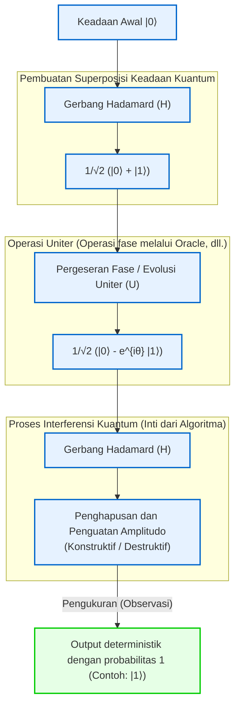

Dengan cara ini, komputer kuantum bukanlah sekadar solusi sementara untuk menghindari batasan mekanika klasik (batasan miniaturisasi dan batasan termodinamika), melainkan sebuah perubahan paradigma yang sejati yang merekonstruksi definisi informasi dan komputasi itu sendiri berdasarkan aksioma mekanika kuantum. Pada bab berikutnya, kita akan membahas lebih dalam mengenai rincian "gerbang kuantum" dan "sirkuit kuantum", yang merupakan alat matematika spesifik untuk memanipulasi interferensi kuantum ini secara bebas.

# Bab 2: Dasar-dasar Bit Klasik dan Qubit (Bit Kuantum)

Dalam membangun kerangka teoretis informasi kuantum, konsep yang paling fundamental adalah definisi dari "unit informasi terkecil". Pada bab ini, kita berangkat dari bit dalam teori informasi klasik dan memperluas konsep tersebut ke "qubit (Qubit)", yaitu unit terkecil dari informasi kuantum yang didasarkan pada aksioma-aksioma mekanika kuantum. Menggunakan bahasa yang ketat dari ruang Hilbert, notasi bra-ket, dan aljabar linear, kita akan membedah tuntas struktur matematis dari keadaan kuantum. Tanpa kompromi sedikit pun, mari kita selami kedalaman informasi kuantum dari sudut pandang ahli.

## 2.1 Unit Terkecil Informasi: Formulasi Matematis dan Batasan Bit Klasik

Dalam sejarah ilmu komputer, fondasi teori informasi yang didirikan oleh Claude Shannon pada tahun 1948 adalah "bit (Bit)". Bit klasik, terlepas dari representasi fisiknya (seperti tingkat tegangan tinggi-rendah transistor, sakelar nyala-mati (on/off), atau arah magnetisasi), didefinisikan sebagai sistem yang mengambil salah satu dari dua nilai diskret $\{0, 1\}$ sebagai ruang keadaan abstraknya.

Mari kita ungkapkan hal ini dalam bahasa ruang vektor yang lebih formal. Keadaan suatu bit klasik dapat direpresentasikan menggunakan basis standar dalam ruang vektor riil 2 dimensi $\mathbb{R}^2$. Keadaan $0$ dan keadaan $1$ masing-masing didefinisikan sebagai vektor kolom berikut:

$$
\mathbf{v}_0 = \begin{pmatrix} 1 \\ 0 \end{pmatrix}, \quad \mathbf{v}_1 = \begin{pmatrix} 0 \\ 1 \end{pmatrix}
$$

Dalam sistem klasik deterministik (Deterministic), keadaan bit selalu ditentukan pada salah satu dari $\mathbf{v}_0$ atau $\mathbf{v}_1$. Namun, ketika terdapat kebisingan seperti derau termal (thermal noise) atau ketidakpastian pengetahuan kita, keadaan tersebut harus dijelaskan sebagai bit probabilistik klasik (Probabilistic). Dalam kasus ini, keadaan bit dinyatakan sebagai distribusi probabilitas, dan vektor keadaan $\mathbf{p}$ dapat dituliskan sebagai kombinasi konveks (Convex combination) dari vektor-vektor basis sebagai berikut:

$$
\mathbf{p} = p_0 \mathbf{v}_0 + p_1 \mathbf{v}_1 = \begin{pmatrix} p_0 \\ p_1 \end{pmatrix}
$$

Di sini, $p_0, p_1$ masing-masing adalah bilangan riil yang menyatakan probabilitas keadaan bernilai $0$ dan $1$, dan berdasarkan aksioma probabilitas Kolmogorov, kondisi-kondisi berikut harus dipenuhi:

1. **Non-negativitas** : $p_0 \ge 0, \quad p_1 \ge 0$
2. **Kondisi normalisasi (probabilitas total sama dengan 1)** : $p_0 + p_1 = 1$

Dalam dunia bit klasik, sistem komposit yang menggabungkan beberapa bit dideskripsikan oleh produk tensor (produk Kronecker) dari masing-masing vektor probabilitasnya. Sebagai contoh, probabilitas bersama dari dua bit klasik adalah sebagai berikut:

$$
\mathbf{p}_{AB} = \mathbf{p}_A \otimes \mathbf{p}_B = \begin{pmatrix} p_{A0} \\ p_{A1} \end{pmatrix} \otimes \begin{pmatrix} p_{B0} \\ p_{B1} \end{pmatrix} = \begin{pmatrix} p_{A0}p_{B0} \\ p_{A0}p_{B1} \\ p_{A1}p_{B0} \\ p_{A1}p_{B1} \end{pmatrix}
$$

Kerangka teori informasi klasik sangatlah kuat dan membentuk fondasi masyarakat digital modern. Namun, karena keadaannya hanya dibangun melalui penjumlahan probabilitas bilangan riil, secara prinsip mustahil untuk mengekspresikan "saling menghilangkan probabilitas" seperti halnya interferensi gelombang. Di sinilah batasan fisika klasik muncul, dan kebutuhan untuk melompat ke informasi kuantum menjadi nyata.

## 2.2 Postulat Mekanika Kuantum dan Notasi Bra-ket (Bra-ket notation)

Postulat (Postulate) pertama dalam mekanika kuantum menyatakan bahwa "keadaan dari suatu sistem fisik tertutup dideskripsikan secara lengkap sebagai vektor satuan (vektor keadaan) pada ruang vektor lengkap yang dilengkapi perkalian dalam kompleks, yaitu ruang Hilbert (Hilbert Space) $\mathcal{H}$." Dalam konteks komputasi kuantum, karena derajat kebebasan ruang kontinu dapat diabaikan, ruang Hilbert ini umumnya berupa ruang vektor kompleks berdimensi berhingga $\mathbb{C}^d$.

Unit terkecil dari informasi kuantum, yaitu "qubit (Qubit)", didefinisikan secara ketat sebagai keadaan dalam ruang Hilbert kompleks 2 dimensi $\mathcal{H} \cong \mathbb{C}^2$. Untuk mendeskripsikan keadaan dalam ruang vektor ini, merupakan standar untuk menggunakan **notasi bra-ket (Bra-ket notation)** yang diperkenalkan oleh fisikawan Paul Dirac.

Vektor kolom yang menyatakan keadaan kuantum disebut **vektor ket (Ket vector)** dan dinotasikan sebagai $|\psi\rangle$. Sebagai keadaan yang berkorespondensi dengan $0$ dan $1$ pada bit klasik, mari kita perkenalkan basis ortonormal yang disebut basis komputasi (Computational basis). Basis ini juga disebut basis $Z$ dari qubit, dan masing-masing didefinisikan sebagai $|0\rangle$ dan $|1\rangle$:

$$
|0\rangle = \begin{pmatrix} 1 \\ 0 \end{pmatrix}, \quad |1\rangle = \begin{pmatrix} 0 \\ 1 \end{pmatrix}
$$

Di sisi lain, berdasarkan teorema representasi Riesz (Riesz representation theorem), setiap vektor ket dalam ruang Hilbert berkorespondensi secara unik dengan elemen dari ruang dual (Dual space) yang bertindak sebagai fungsional linear kontinu. Ini disebut **vektor bra (Bra vector)** dan dinotasikan sebagai $\langle\psi|$. Dalam representasi matriks, vektor bra yang bersesuaian diperoleh dengan mengambil konjugat Hermite (transpos konjugat kompleks, dilambangkan dengan $^\dagger$) dari vektor ket:

$$
\langle\psi| = (|\psi\rangle)^\dagger = (|\psi\rangle^*)^T
$$

Sebagai contoh, vektor bra dari basis adalah vektor baris berikut:

$$
\langle 0| = \begin{pmatrix} 1 & 0 \end{pmatrix}, \quad \langle 1| = \begin{pmatrix} 0 & 1 \end{pmatrix}
$$

Nilai sejati dari notasi bra-ket terletak pada kenyataan bahwa perhitungan perkalian dalam menjadi sangat jelas secara visual. Perkalian dalam antara bra $\langle\phi|$ dan ket $|\psi\rangle$ ditulis sebagai $\langle\phi|\psi\rangle$ (ini berasal dari permainan kata Dirac di mana "Bra" dan "Ket" bergabung membentuk "Bracket"). Karena basis komputasi $\{|0\rangle, |1\rangle\}$ membentuk sistem ortonormal (Orthonormal system), perkalian dalamnya dinyatakan menggunakan delta Kronecker $\delta_{ij}$ sebagai berikut:

$$
\langle i | j \rangle = \delta_{ij} \quad (i, j \in \{0, 1\})
$$

Secara spesifik, perkalian dalam dengan dirinya sendiri bernilai $1$ ($\langle 0|0\rangle = 1$, $\langle 1|1\rangle = 1$), dan perkalian dalam antara basis yang berbeda bernilai $0$ ($\langle 0|1\rangle = 0$, $\langle 1|0\rangle = 0$).

Selain itu, produk tensor antara ket dan bra (setara dengan produk luar / outer product) ditulis sebagai $|\psi\rangle\langle\phi|$, yang merepresentasikan operator linear (matriks) dari suatu ruang ke ruang lainnya. Sebagai contoh, operator proyeksi (Projection operator) ke ruang keadaan tertentu dikonstruksikan sebagai berikut:

$$
|0\rangle\langle 0| = \begin{pmatrix} 1 \\ 0 \end{pmatrix} \begin{pmatrix} 1 & 0 \end{pmatrix} = \begin{pmatrix} 1 & 0 \\ 0 & 0 \end{pmatrix}
$$

Operator identitas $I$ (Identity operator) pada sembarang ruang vektor kompleks 2 dimensi dapat didekomposisi dan dinyatakan sebagai relasi kelengkapan (Completeness relation) dari basis sebagai berikut, yang merupakan alat yang sangat ampuh dan sangat sering digunakan dalam perhitungan mekanika kuantum:

$$
I = |0\rangle\langle 0| + |1\rangle\langle 1| = \begin{pmatrix} 1 & 0 \\ 0 & 1 \end{pmatrix}
$$

## 2.3 Prinsip Superposisi Kuantum dan Amplitudo Probabilitas Kompleks

Sementara bit klasik selalu berada dalam keadaan pasti $0$ atau $1$, atau campuran probabilistiknya, tuntutan linearitas (Linearity) mekanika kuantum memungkinkan qubit untuk berada dalam keadaan yang secara fundamental berbeda yang disebut "superposisi (Superposition)", yang direpresentasikan melalui kombinasi linear dari $|0\rangle$ dan $|1\rangle$. Setiap vektor satuan dalam ruang Hilbert $\mathcal{H}$ diakui sebagai keadaan fisik yang valid.

Oleh karena itu, keadaan murni (Pure state) $|\psi\rangle$ yang paling umum dari sebuah qubit tunggal dapat diekspansikan menggunakan basis komputasi sebagai berikut:

$$
|\psi\rangle = \alpha |0\rangle + \beta |1\rangle = \begin{pmatrix} \alpha \\ \beta \end{pmatrix}
$$

Di sini, $\alpha$ dan $\beta$ adalah bilangan kompleks ($\alpha, \beta \in \mathbb{C}$) yang disebut **amplitudo probabilitas kompleks (Complex probability amplitude)** . Berbeda dengan probabilitas klasik yang merupakan bilangan riil non-negatif, fakta bahwa keadaan kuantum memiliki koefisien "bilangan kompleks" adalah alasan mendasar mengapa komputer kuantum memiliki kekuatan komputasi yang melampaui komputer klasik. Bilangan kompleks memiliki fase (Phase) dan dapat mengarah ke segala arah pada bidang kompleks, sehingga memungkinkan keadaan-keadaan tersebut untuk saling memperkuat (interferensi konstruktif) atau saling meniadakan (interferensi destruktif) layaknya gelombang. Esensi dari algoritma kuantum terletak pada manipulasi cerdik dari efek interferensi ini, memperkuat amplitudo probabilitas dari solusi yang benar dan membatalkan amplitudo probabilitas dari solusi yang salah.

Proses mengekstraksi informasi klasik dari sistem kuantum adalah "pengukuran (Measurement)". Ketika mempertimbangkan pengukuran proyektif (Projective measurement), menurut aturan Born (Born rule), probabilitas $P(0)$ untuk memperoleh hasil $0$ dan probabilitas $P(1)$ untuk memperoleh hasil $1$ saat mengukur keadaan $|\psi\rangle$ dalam basis komputasi $\{|0\rangle, |1\rangle\}$ diberikan oleh kuadrat nilai mutlak dari masing-masing amplitudo probabilitasnya:

$$
P(0) = |\langle 0|\psi\rangle|^2 = |\alpha|^2 = \alpha \alpha^*
$$

$$
P(1) = |\langle 1|\psi\rangle|^2 = |\beta|^2 = \beta \beta^*
$$

Agar sistem selalu teramati dalam suatu keadaan tertentu, jumlah total seluruh probabilitas harus tepat bernilai $1$. Oleh karena itu, norma (panjang) dari vektor keadaan kuantum $|\psi\rangle$ harus selalu sama dengan $1$. Inilah yang disebut **kondisi normalisasi (Normalization condition)** :

$$
\langle\psi|\psi\rangle = (\alpha^* \langle 0| + \beta^* \langle 1|)(\alpha |0\rangle + \beta |1\rangle) = |\alpha|^2 + |\beta|^2 = 1
$$

Untuk menyelidiki makna geometris dari amplitudo probabilitas kompleks ini secara lebih mendalam, mari kita nyatakan $\alpha$ dan $\beta$ dalam representasi koordinat polar:

$$
\alpha = r_0 e^{i\phi_0}, \quad \beta = r_1 e^{i\phi_1}
$$

Di sini $r_0, r_1 \ge 0$ adalah besar amplitudo, dan $\phi_0, \phi_1 \in [0, 2\pi)$ adalah sudut fase masing-masing. Karena dari kondisi normalisasi diperoleh $r_0^2 + r_1^2 = 1$, kita dapat memisalkan $r_0 = \cos(\frac{\theta}{2})$ dan $r_1 = \sin(\frac{\theta}{2})$ menggunakan parameter riil $\theta \in [0, \pi]$. Dengan mensubstitusikannya kembali ke vektor keadaan semula:

$$
|\psi\rangle = \cos\left(\frac{\theta}{2}\right) e^{i\phi_0} |0\rangle + \sin\left(\frac{\theta}{2}\right) e^{i\phi_1} |1\rangle
$$

Mari kita faktorkan faktor fase bersama $e^{i\phi_0}$ ke luar:

$$
|\psi\rangle = e^{i\phi_0} \left( \cos\left(\frac{\theta}{2}\right) |0\rangle + e^{i(\phi_1 - \phi_0)} \sin\left(\frac{\theta}{2}\right) |1\rangle \right)
$$

Dalam mekanika kuantum, faktor fase $e^{i\phi_0}$ yang mengalikan keseluruhan vektor keadaan disebut "fase global (Global phase)". Sebagaimana dapat dilihat dengan menghitung nilai ekspektasi $\langle A \rangle$ untuk sembarang teramati (operator Hermite) $A$:

$$
\langle A \rangle = \left( e^{-i\phi_0} \langle\psi| \right) A \left( e^{i\phi_0} |\psi\rangle \right) = e^{-i\phi_0} e^{i\phi_0} \langle\psi| A |\psi\rangle = \langle\psi| A |\psi\rangle
$$

Dengan demikian, karena fase global saling meniadakan, fase tersebut mustahil untuk diamati melalui pengukuran fisik apa pun. Dengan kata lain, meskipun $|\psi\rangle$ dan $e^{i\phi_0}|\psi\rangle$ adalah vektor yang berbeda dalam ruang Hilbert (namun berada pada sinar yang sama), keduanya secara fisik merepresentasikan keadaan yang persis sama.

Oleh karena itu, dengan mengabaikan fase global dan hanya menyisakan fase relatif (Relative phase) $\varphi = \phi_1 - \phi_0$ (di mana $\varphi \in [0, 2\pi)$) antara $|0\rangle$ dan $|1\rangle$ sebagai parameter, keadaan murni dari sembarang qubit tunggal dapat direpresentasikan secara unik dan ketat dalam **bentuk standar** berikut:

$$
|\psi\rangle = \cos\left(\frac{\theta}{2}\right) |0\rangle + e^{i\varphi} \sin\left(\frac{\theta}{2}\right) |1\rangle
$$

## 2.4 Visualisasi Geometris dengan Bola Bloch (Bloch Sphere)

Parameterisasi yang diturunkan pada bagian sebelumnya menunjukkan bahwa ruang keadaan dari sebuah qubit tunggal secara geometris isomorfik dengan permukaan bola satuan dalam ruang 3 dimensi (bola 2 dimensi $S^2$). Representasi visual ini dinamai **bola Bloch (Bloch Sphere)** , diambil dari nama penggagasnya, fisikawan Swiss Felix Bloch.

Sudut $\theta$ berkorespondensi tepat dengan sudut polar (Polar angle) dari arah positif sumbu $Z$, dan sudut $\varphi$ berkorespondensi dengan sudut azimut (Azimuthal angle) pada bidang $X$-$Y$.

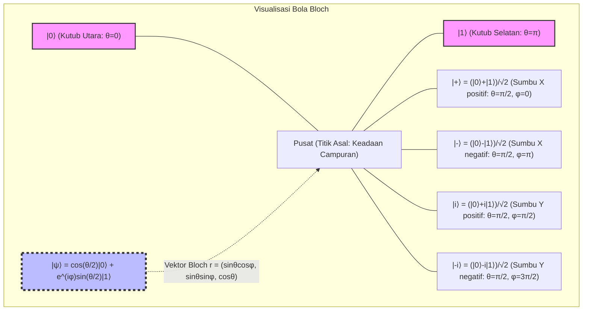

Sifat yang paling penting dari bola Bloch adalah bahwa "keadaan ortogonal (keadaan dengan perkalian dalam sama dengan 0) dalam ruang Hilbert terletak pada titik antipodal (Antipodal points: titik yang berlawanan 180 derajat) satu sama lain pada ruang riil 3 dimensi bola Bloch." Sebagai contoh, keadaan yang ortogonal terhadap $|0\rangle$ (kutub utara, $\theta=0$) adalah $|1\rangle$ (kutub selatan, $\theta=\pi$). Perhitungan perkalian dalam antara keadaan yang saling ortogonal dalam ruang Hilbert $\langle 0 | 1 \rangle = 0$ bersesuaian dengan pemisahan sudut sebesar $\pi$ (180 derajat) pada bola Bloch. Di sinilah letak keniscayaan matematis digunakannya sudut setengah $\theta/2$ dalam parameterisasi, karena sudut geometris bernilai dua kali lipat dari sudut dalam ruang Hilbert.

Koordinat $\mathbf{r} = (x, y, z)$ pada bola Bloch ini diturunkan secara ketat sebagai nilai ekspektasi dari **matriks Pauli (Pauli matrices)** , yang merupakan besaran teramati (Observable) dalam mekanika kuantum. Matriks Pauli yang menjadi basis operator Hermite untuk sistem 2 dimensi didefinisikan sebagai berikut:

$$
X = \sigma_x = \begin{pmatrix} 0 & 1 \\ 1 & 0 \end{pmatrix}, \quad
Y = \sigma_y = \begin{pmatrix} 0 & -i \\ i & 0 \end{pmatrix}, \quad
Z = \sigma_z = \begin{pmatrix} 1 & 0 \\ 0 & -1 \end{pmatrix}
$$

Nilai ekspektasi dari besaran teramati Pauli ini untuk sembarang keadaan $|\psi\rangle$ dapat dicari melalui perhitungan bra-ket:

$$
x = \langle\psi| X |\psi\rangle = \left( \cos\frac{\theta}{2} \langle 0| + e^{-i\varphi}\sin\frac{\theta}{2} \langle 1| \right) \begin{pmatrix} 0 & 1 \\ 1 & 0 \end{pmatrix} \begin{pmatrix} \cos\frac{\theta}{2} \\ e^{i\varphi}\sin\frac{\theta}{2} \end{pmatrix} = \sin\theta \cos\varphi
$$

$$
y = \langle\psi| Y |\psi\rangle = \left( \cos\frac{\theta}{2} \langle 0| + e^{-i\varphi}\sin\frac{\theta}{2} \langle 1| \right) \begin{pmatrix} 0 & -i \\ i & 0 \end{pmatrix} \begin{pmatrix} \cos\frac{\theta}{2} \\ e^{i\varphi}\sin\frac{\theta}{2} \end{pmatrix} = \sin\theta \sin\varphi
$$

$$
z = \langle\psi| Z |\psi\rangle = \left( \cos\frac{\theta}{2} \langle 0| + e^{-i\varphi}\sin\frac{\theta}{2} \langle 1| \right) \begin{pmatrix} 1 & 0 \\ 0 & -1 \end{pmatrix} \begin{pmatrix} \cos\frac{\theta}{2} \\ e^{i\varphi}\sin\frac{\theta}{2} \end{pmatrix} = \cos^2\left(\frac{\theta}{2}\right) - \sin^2\left(\frac{\theta}{2}\right) = \cos\theta
$$

Dengan ini, vektor Bloch $\mathbf{r} = (x, y, z)$ diekspresikan secara elok sebagai vektor satuan dalam ruang 3 dimensi $\mathbf{r} = (\sin\theta\cos\varphi, \sin\theta\sin\varphi, \cos\theta)$. Selain itu, matriks densitas (Density matrix) $\rho = |\psi\rangle\langle\psi|$ yang berkorespondensi dengan sembarang keadaan murni dapat dideskripsikan secara sangat elegan menggunakan vektor Pauli $\boldsymbol{\sigma} = (X, Y, Z)$ dan matriks identitas $I$:

$$
\rho = \frac{1}{2} \left( I + \mathbf{r} \cdot \boldsymbol{\sigma} \right) = \frac{1}{2} \left( I + xX + yY + zZ \right)
$$

Jika kita mengekspansikan elemen-elemen matriks secara eksplisit untuk memverifikasinya, kita peroleh hasil sebagai berikut:

$$
\rho = \frac{1}{2} \begin{pmatrix} 1 + z & x - iy \\ x + iy & 1 - z \end{pmatrix} = \begin{pmatrix} \cos^2(\frac{\theta}{2}) & e^{-i\varphi}\sin(\frac{\theta}{2})\cos(\frac{\theta}{2}) \\ e^{i\varphi}\sin(\frac{\theta}{2})\cos(\frac{\theta}{2}) & \sin^2(\frac{\theta}{2}) \end{pmatrix}
$$

Hal ini persis sesuai dengan hasil perhitungan perkalian luar $|\psi\rangle\langle\psi|$ berdasarkan definisi produk tensor. Perlu dicatat bahwa dalam keadaan murni, norma vektor Bloch adalah $|\mathbf{r}| = 1$ dan jejak (trace) dari kuadrat matriks densitas memenuhi $\text{Tr}(\rho^2) = 1$. Namun, pada keadaan campuran (Mixed state) di mana kehilangan informasi kuantum (dekoherensi) terjadi akibat interaksi dengan lingkungan atau kontrol yang tidak sempurna, keadaannya menjadi ensembel statistik dari keadaan-keadaan murni sehingga $|\mathbf{r}| < 1$. Akibatnya, keadaan campuran direpresentasikan bukan di permukaan bola Bloch melainkan sebagai titik di bagian "dalam" bola, dan keadaan campuran maksimal (Maximally mixed state) $\rho = I/2$ di mana informasi hilang sepenuhnya terletak tepat di titik pusat bola Bloch $\mathbf{r} = (0,0,0)$.

## 2.5 Pengukuran dan Keruntuhan Fungsi Gelombang (Wavefunction Collapse)

Pengukuran dalam mekanika kuantum secara mendasar berbeda dari pembacaan informasi pasif seperti dalam mekanika klasik. Menurut formulasi aksiomatis von Neumann, ketika pengukuran suatu besaran fisik (teramati) dilakukan, keadaan tersebut akan "runtuh (Collapse)" secara ireversibel ke keadaan eigen dari besaran teramati tersebut.

Sebagai contoh, mari kita pertimbangkan untuk melakukan pengukuran dalam basis $Z$ (yaitu pengukuran dengan matriks Pauli $Z$ sebagai besaran teramati) terhadap keadaan qubit tunggal $|\psi\rangle = \alpha|0\rangle + \beta|1\rangle$. Nilai terukur yang dapat diperoleh hanyalah nilai eigen dari $Z$, yaitu $+1$ (berkorespondensi dengan keadaan $|0\rangle$) atau $-1$ (berkorespondensi dengan keadaan $|1\rangle$).

Untuk mendeskripsikan pengukuran secara ketat matematis, kita menggunakan himpunan operator proyeksi $\{ P_m \}$. Operator proyeksi untuk kasus pengukuran $Z$ adalah sebagai berikut:

$$
P_0 = |0\rangle\langle 0|, \quad P_1 = |1\rangle\langle 1|
$$

Operator-operator ini memenuhi relasi kelengkapan $P_0 + P_1 = I$ dan ortogonalitas $P_i P_j = \delta_{ij} P_i$. Menurut aturan Born, probabilitas $P(m)$ untuk memperoleh hasil pengukuran $m \in \{0, 1\}$ dihitung sebagai:

$$
P(m) = \langle\psi| P_m^\dagger P_m |\psi\rangle = \langle\psi| P_m |\psi\rangle
$$

yang mana hasil ini persis sama dengan $|\alpha|^2$ dan $|\beta|^2$ yang telah dibahas sebelumnya. Dan yang paling penting, keadaan kuantum baru $|\psi'\rangle$ tepat setelah hasil pengukuran $m$ diperoleh adalah hasil dari pengaplikasian operator proyeksi pada keadaan awal yang kemudian dinormalisasi ulang dengan norma yang baru:

$$
|\psi'\rangle = \frac{P_m |\psi\rangle}{\sqrt{P(m)}}
$$

Jika hasilnya adalah $0$, maka:

$$
|\psi'\rangle = \frac{|0\rangle\langle 0| (\alpha|0\rangle + \beta|1\rangle)}{|\alpha|} = \frac{\alpha}{|\alpha|} |0\rangle = e^{i\phi_0} |0\rangle \equiv |0\rangle
$$

sehingga keadaan tersebut runtuh sepenuhnya menjadi $|0\rangle$ (fase global diabaikan). Inilah deskripsi matematis dari fenomena yang disebut keruntuhan fungsi gelombang (Wavefunction collapse). Begitu pengukuran dilakukan dan keadaannya runtuh, informasi fase relatif $\varphi$ dan informasi amplitudo ($\alpha, \beta$) yang terkandung dalam keadaan superposisi awal akan hilang untuk selamanya. Oleh karena itu, secara prinsip mustahil untuk mengekstrak informasi lengkap dari suatu keadaan kuantum hanya melalui satu kali pengukuran terhadap satu salinan tunggal (hal ini juga berkaitan erat dengan "teorema tanpa-kloning / No-cloning theorem").

## 2.6 Pengantar Perluasan ke Sistem Banyak-Partikel dan Prospek Bab Selanjutnya

Setelah memahami secara mendalam sifat-sifat qubit tunggal, kita juga perlu menyentuh dasar matematis dari "sistem multi-qubit" yang akan dibahas secara mendalam pada bab-bab berikutnya. Berbeda dengan distribusi probabilitas klasik yang memperluas ruang keadaan melalui produk Kartesius, ruang Hilbert $\mathcal{H}_{AB}$ dari sistem komposit dalam mekanika kuantum dikonstruksikan melalui **produk tensor (Tensor product)** dari ruang Hilbert masing-masing subsistem $\mathcal{H}_A$ dan $\mathcal{H}_B$:

$$
\mathcal{H}_{AB} = \mathcal{H}_A \otimes \mathcal{H}_B
$$

Produk tensor dari dua keadaan qubit independen diekspansikan sebagai berikut, membentuk ruang vektor kompleks 4 dimensi:

$$
|\Psi\rangle_{AB} = (\alpha_0|0\rangle + \alpha_1|1\rangle) \otimes (\beta_0|0\rangle + \beta_1|1\rangle) = \alpha_0\beta_0|00\rangle + \alpha_0\beta_1|01\rangle + \alpha_1\beta_0|10\rangle + \alpha_1\beta_1|11\rangle
$$

Di sini, keberadaan keadaan yang tidak dapat difaktorkan sebagai produk tensor dari keadaan-keadaan penyusunnya (misalnya, keadaan Bell $|\Phi^+\rangle = (|00\rangle + |11\rangle)/\sqrt{2}$) menjadi sumber dari keterikatan kuantum (Quantum Entanglement). Ledakan eksponensial dari dimensi akibat produk tensor ($2^N$ dimensi untuk $N$ qubit) inilah yang menjadi fondasi bagi komputer kuantum untuk menunjukkan kemampuan komputasi paralel yang luar biasa.

Pada bab ini, kita telah membangun perbedaan esensial antara bit klasik dan qubit di atas fondasi matematis ruang Hilbert. Qubit mampu mengambil keadaan superposisi kontinu dengan amplitudo probabilitas kompleks, dan melalui penurunan bola Bloch, kita memperoleh metode yang ampuh untuk memahami vektor kompleks abstrak secara intuitif sebagai model geometris dalam ruang riil 3 dimensi.

Pada bab berikutnya, "Bab 3: Gerbang Kuantum dan Transformasi Uniter", kita akan menguraikan secara rinci "gerbang logika kuantum" konkret yang memanipulasi keadaan qubit tunggal ini, serta menyingkap sifat-sifat matematis dari operasi rotasi oleh matriks uniter pada bola Bloch. Pintu menuju dunia informasi kuantum yang mendalam baru saja terbuka.

# Bab 3: Aksioma Mekanika Kuantum dan Pengukuran (Keruntuhan Fungsi Gelombang)

## 3.1 Pendahuluan: Pendekatan Aksiomatik Mekanika Kuantum dan Prasyarat Aljabar Linear

Untuk memahami prinsip kerja komputer kuantum dari dasarnya, sangat penting untuk memahami kerangka teori fisika mekanika kuantum dalam bentuk matematis yang ketat. Meskipun banyak teori fisika berkembang secara induktif berdasarkan hukum empiris, mekanika kuantum, terutama mekanika kuantum modern yang dirumuskan oleh John von Neumann, mengadopsi pendekatan aksiomatik yang mendeduksi seluruh sistem dari sejumlah kecil "Aksioma" (Axioms) matematis.

Sistem aksioma ini dibangun di atas panggung aljabar linear kompleks yang dapat diperluas ke dimensi tak hingga, yang disebut ruang Hilbert. Dalam ilmu informasi kuantum dan komputasi kuantum, kita terutama berurusan dengan ruang vektor berdimensi hingga (misalnya, ruang produk tensor $\mathbb{C}^2$ dari sistem qubit), sehingga kita dapat menghindari kesulitan analitik dalam dimensi tak hingga (seperti domain operator tak terbatas) dan dapat mendeskripsikan serta memahami mekanika kuantum murni sebagai aljabar linear.

Dalam bab ini, kita akan merumuskan dengan ketat tanpa kompromi proses dari deskripsi keadaan kuantum hingga evolusi waktu, dan hingga "pengukuran" yang telah memicu perdebatan paling filosofis. Pembaca akan menyadari bagaimana fenomena kuantum, yang pada pandangan pertama tampak berlawanan dengan intuisi, sebenarnya dibangun di atas struktur matematis yang konsisten dan indah. Struktur matematis inilah yang menjadi "bahasa" langsung untuk mendeskripsikan algoritma komputer kuantum.

## 3.2 Aksioma Pertama: Ruang Keadaan (Ruang Hilbert dan Vektor Keadaan)

Aksioma pertama dalam mekanika kuantum menentukan bagaimana "keadaan" suatu sistem fisik direpresentasikan secara matematis.

 **Aksioma 1 (Representasi Keadaan)** :
Keadaan dari sistem fisik tertutup dideskripsikan sepenuhnya oleh sebuah vektor satuan dengan norma 1 pada ruang Hilbert (Hilbert space) $\mathcal{H}$, yang merupakan ruang hasil kali dalam kompleks yang memenuhi kelengkapan. Ini disebut **vektor keadaan** .

Menurut notasi Bra-ket (Bra-ket notation) yang diperkenalkan oleh Paul Dirac, vektor keadaan diperlakukan sebagai vektor kolom dan ditulis sebagai ket **$| \psi \rangle$** . Vektor baris yang termasuk dalam ruang dual $\mathcal{H}^*$ ditulis sebagai bra **$\langle \psi |$** , dan keduanya memiliki hubungan konjugat Hermitian (transpose konjugat kompleks) satu sama lain. Yaitu,

$$
\langle \psi | = ( | \psi \rangle )^\dagger
$$

Hasil kali dalam (inner product) dari dua keadaan sembarang **$| \phi \rangle$** dan **$| \psi \rangle$** dalam ruang Hilbert dihitung sebagai perkalian bra dan ket **$\langle \phi | \psi \rangle$** , yang menghasilkan nilai kompleks. Hasil kali dalam ini memenuhi sifat-sifat berikut:

1. **Definit Positif** : Untuk setiap **$| \psi \rangle \neq 0$** , berlaku $\langle \psi | \psi \rangle > 0$
2. **Linearitas** : $\langle \phi | ( c_1 | \psi_1 \rangle + c_2 | \psi_2 \rangle ) = c_1 \langle \phi | \psi_1 \rangle + c_2 \langle \phi | \psi_2 \rangle$
3. **Simetri Konjugat** : $\langle \phi | \psi \rangle = \langle \psi | \phi \rangle^*$ ( $*$ adalah konjugat kompleks)

Karena keadaan fisik memerlukan interpretasi probabilitas agar valid, keadaan tersebut harus selalu memenuhi kondisi normalisasi (Normalization condition). Yaitu, norma dari vektor keadaan **$| \psi \rangle$** adalah 1.

$$
\| | \psi \rangle \| = \sqrt{\langle \psi | \psi \rangle} = 1
$$

Lebih lanjut, karena ketaksamaan Cauchy-Schwarz (Cauchy-Schwarz inequality) $|\langle \phi | \psi \rangle|^2 \le \langle \phi | \phi \rangle \langle \psi | \psi \rangle$ berlaku, nilai mutlak hasil kali dalam antara dua keadaan yang telah dinormalisasi akan selalu berada di antara 0 dan 1. Ini menjadi dasar matematis agar nantinya dapat diinterpretasikan sebagai "probabilitas".

### Prinsip Superposisi dan Basis Ortonormal Lengkap

Karakteristik yang paling menonjol dari mekanika kuantum adalah "Prinsip Superposisi" (Superposition principle). Jika **$| \phi \rangle$** dan **$| \psi \rangle$** adalah keadaan yang secara fisik diizinkan, maka kombinasi linear kompleks sembarang dari keduanya $c_1 | \phi \rangle + c_2 | \psi \rangle$ juga akan menjadi keadaan yang secara fisik diizinkan (jika dilakukan normalisasi). Sifat ini diturunkan langsung dari linearitas ruang Hilbert.

Di dalam ruang Hilbert $\mathcal{H}$, terdapat basis ortonormal (Orthonormal basis) $\{ | e_i \rangle \}$. Basis-basis ini saling ortogonal dan telah dinormalisasi.

$$
\langle e_i | e_j \rangle = \delta_{ij}
$$

( $\delta_{ij}$ adalah delta Kronecker). Selain itu, sebagai relasi kelengkapan (Completeness relation) atau identitas resolusi, operator identitas $I$ dapat diekspansi sebagai berikut:

$$
I = \sum_i | e_i \rangle \langle e_i |
$$

Keadaan kuantum sembarang **$| \psi \rangle$** dapat diekspansi dengan tepat satu cara sebagai kombinasi linear dari basis dengan menerapkan operator identitas ini.

$$
| \psi \rangle = I | \psi \rangle = \left( \sum_i | e_i \rangle \langle e_i | \right) | \psi \rangle = \sum_i \langle e_i | \psi \rangle | e_i \rangle = \sum_i c_i | e_i \rangle
$$

Di sini, koefisien ekspansi $c_i = \langle e_i | \psi \rangle$ disebut sebagai amplitudo probabilitas kompleks, dan memainkan peran yang sangat menentukan dalam Aturan Born yang akan dibahas nanti. Dari kondisi normalisasi $\langle \psi | \psi \rangle = 1$, kita dapat menurunkan $\sum_i |c_i|^2 = 1$.

## 3.3 Aksioma Kedua: Besaran Fisis dan Operator Hermitian

Dalam mekanika klasik, besaran fisis (observabel) seperti posisi, momentum, dan energi dijelaskan sebagai fungsi bernilai riil. Namun, dalam mekanika kuantum terjadi pergeseran paradigma yang mendasar.

 **Aksioma 2 (Besaran Fisis)** :
Besaran fisis yang dapat diobservasi (observabel) dideskripsikan oleh operator swa-adjoin linear (operator Hermitian) $A$ pada ruang Hilbert $\mathcal{H}$.

Operator Hermitian adalah operator yang konjugat Hermitiannya sama dengan dirinya sendiri. Artinya, ia memenuhi $A = A^\dagger$. Jika direpresentasikan sebagai matriks dalam ruang berdimensi hingga, ini berarti elemen-elemennya memiliki simetri konjugat kompleks ( $A_{ij} = A_{ji}^*$ ).

Alasan mengapa besaran fisis harus didefinisikan sebagai operator Hermitian terletak pada "Nilai Eigen" (Eigenvalues) miliknya. Menurut teorema spektral (Spectral theorem) dalam aljabar linear, operator Hermitian memiliki sifat-sifat yang sangat penting berikut:

1. **Semua nilai eigen $a_i$ adalah bilangan riil.** (Karena besaran fisis yang diukur harus selalu bernilai riil, ini sesuai dengan persyaratan fisis.)
2. **Vektor eigen yang terkait dengan nilai eigen yang berbeda saling ortogonal.** 
3. **Vektor eigen dari operator $\{ | a_i \rangle \}$ membentuk basis ortonormal lengkap dari ruang Hilbert.** 

Oleh karena itu, setiap observabel $A$ dapat didekomposisi secara spektral (Spectral decomposition) sebagai kombinasi linear dari operator proyeksi $P_i = | a_i \rangle \langle a_i |$, menggunakan nilai eigen $a_i$ dan vektor eigen **$| a_i \rangle$** .

$$
A = \sum_i a_i | a_i \rangle \langle a_i |
$$

Melalui rumusan ini, tindakan "mengukur besaran fisis" dapat dipahami sebagai operasi geometris berupa proyeksi ke basis tertentu (vektor eigen) dari ruang Hilbert. Misalnya, pengukuran $\sigma_z$ dari sebuah qubit sepenuhnya dijelaskan sebagai operasi proyeksi ke basis ortogonal yang terdiri dari keadaan **$| 0 \rangle$** yang sesuai dengan nilai eigen $+1$ dan keadaan **$| 1 \rangle$** yang sesuai dengan nilai eigen $-1$.

## 3.4 Aksioma Ketiga: Evolusi Waktu Uniter dan Persamaan Schrödinger

Jika suatu sistem kuantum terisolasi dan tidak berinteraksi dengan sistem lain, keadaannya berubah terhadap waktu secara deterministik dan reversibel (dapat dibalik).

 **Aksioma 3 (Evolusi Waktu)** :
Evolusi waktu dari keadaan sistem kuantum yang terisolasi mengikuti persamaan Schrödinger (Schrödinger equation). Atau dalam ekspresi yang setara, keadaan **$| \psi(t_0) \rangle$** pada waktu $t_0$ berevolusi menjadi keadaan **$| \psi(t) \rangle$** pada waktu $t$ dengan menerapkan operator uniter $U(t, t_0)$.

Persamaan Schrödinger bergantung waktu, yang merupakan persamaan dasar untuk mendeskripsikan evolusi waktu, dinyatakan sebagai berikut:

$$
i\hbar \frac{d}{dt} | \psi(t) \rangle = H | \psi(t) \rangle
$$

Di sini $i$ adalah unit imajiner, $\hbar$ adalah konstanta Planck tereduksi, dan $H$ adalah operator Hamiltonian yang merupakan observabel yang merepresentasikan total energi sistem.

Jika kita mempertimbangkan sistem di mana Hamiltonian $H$ tidak bergantung pada waktu (invarian terhadap waktu), persamaan diferensial ini dapat diintegralkan secara formal, dan solusinya diberikan oleh:

$$
| \psi(t) \rangle = \exp\left( -\frac{i}{\hbar} H (t - t_0) \right) | \psi(t_0) \rangle
$$

Operator yang dinyatakan dengan fungsi eksponensial ini, $U(t, t_0) = \exp\left( -i H (t - t_0) / \hbar \right)$, adalah operator evolusi waktu. Karena Hamiltonian $H$ bersifat Hermitian ( $H = H^\dagger$ ), berdasarkan teorema Stone (Stone's theorem), $U$ menjadi operator uniter (Unitary operator). Operator uniter adalah operator yang konjugat Hermitiannya sama dengan matriks inversnya ( $U^\dagger U = U U^\dagger = I$ ).

Makna fisik yang sangat penting dari transformasi uniter adalah bahwa ia **"mempertahankan norma (panjang) dan hasil kali dalam dari vektor keadaan"** . Dengan kata lain, tidak peduli berapa banyak waktu yang berlalu, $\langle \psi(t) | \psi(t) \rangle = \langle \psi(t_0) | U^\dagger U | \psi(t_0) \rangle = 1$ selalu dijamin, sehingga hukum fisika yang menyatakan bahwa total probabilitas adalah 1 tidak akan pernah dilanggar. "Gerbang kuantum" pada komputer kuantum tidak lain adalah operasi yang secara artifisial merancang dan mengendalikan evolusi waktu uniter ini. Misalnya, gerbang Hadamard dan gerbang CNOT semuanya direpresentasikan sebagai matriks uniter.

## 3.5 Aksioma Keempat: Pengukuran dan Aturan Born (Born rule)

Konsep "Pengukuran" (Measurement) dalam mekanika kuantum secara fundamental berbeda dengan fisika klasik. Dalam sistem klasik, tindakan pengukuran dianggap sebagai tindakan pasif untuk mengetahui nilai tanpa mengganggu keadaan sistem. Namun, dalam mekanika kuantum, pengukuran secara aktif mengintervensi keadaan dan menyebabkan perubahan yang tidak dapat dibalik.

 **Aksioma 4 (Pengukuran dan Aturan Born)** :
Ketika dilakukan pengukuran terhadap observabel $A$, yang memiliki dekomposisi spektral $A = \sum_i a_i P_i$, pada sistem dalam keadaan **$| \psi \rangle$** , nilai terukur yang diperoleh pasti salah satu dari nilai eigen $a_i$ dari $A$. Probabilitas $p(a_k)$ untuk mendapatkan nilai eigen tertentu $a_k$ diberikan oleh Aturan Born sebagai berikut:

$$
p(a_k) = \langle \psi | P_k | \psi \rangle = \| P_k | \psi \rangle \|^2
$$

Jika nilai eigen $a_k$ tidak terdegenerasi (hanya ada satu vektor eigen **$| a_k \rangle$** yang bersesuaian), operator proyeksi menjadi $P_k = | a_k \rangle \langle a_k |$, dan probabilitas dihitung sebagai kuadrat dari nilai mutlak hasil kali dalam dari keadaan dengan vektor eigen tersebut.

$$
p(a_k) = \langle \psi | a_k \rangle \langle a_k | \psi \rangle = | \langle a_k | \psi \rangle |^2
$$

Ini tiada lain adalah kuadrat dari nilai mutlak $|c_k|^2$ dari koefisien $c_k = \langle a_k | \psi \rangle$ ketika vektor keadaan **$| \psi \rangle$** diekspansi menggunakan basis $\{ | a_i \rangle \}$. Meskipun amplitudo probabilitas kompleks $c_k$ itu sendiri tidak dapat diamati secara langsung, kuadrat dari nilai mutlaknya muncul sebagai probabilitas pengamatan di dunia nyata. Wawasan Max Born yang mengusulkan aturan ini merupakan pencapaian monumental yang mengubah fisika dari determinisme menjadi teori probabilitas. Nilai harapan $\langle A \rangle$ dari observabel $A$ dihitung sebagai jumlah dari perkalian semua nilai eigen dengan probabilitas kemunculannya, dan pada akhirnya diekspresikan dengan sangat indah dalam bentuk hasil kali dalam yang melibatkan vektor keadaan.

$$
\langle A \rangle = \sum_i a_i p(a_i) = \sum_i a_i \langle \psi | P_i | \psi \rangle = \langle \psi | \left( \sum_i a_i P_i \right) | \psi \rangle = \langle \psi | A | \psi \rangle
$$

## 3.6 Keruntuhan Fungsi Gelombang akibat Pengukuran (Reduksi Keadaan) dan Dekoherensi

Aksioma pengukuran mencakup langkah krusial dan paling diperdebatkan tentang apa yang terjadi pada keadaan sistem "setelah" pengukuran. Ini adalah fenomena yang disebut "Keruntuhan Fungsi Gelombang" (Wavefunction collapse) atau "Reduksi Keadaan" (State reduction). Proses ini, yang dikenal sebagai postulat proyeksi von Neumann (Projection postulate), dirumuskan sebagai berikut:

 **Postulat Proyeksi** :
Keadaan sistem **$| \psi' \rangle$** sesaat setelah pengukuran yang menghasilkan nilai eigen $a_k$, berubah seketika (runtuh) menjadi keadaan yang telah dikenai operator proyeksi $P_k$ yang sesuai pada vektor keadaan awal dan dinormalisasi kembali.

$$
| \psi' \rangle = \frac{P_k | \psi \rangle}{\sqrt{p(a_k)}}
$$

Jika alat ukur sangat ideal dan keadaan sistem runtuh ke nilai eigen tak-terdegenerasi $a_k$, maka keadaan sesaat setelah pengukuran akan persis sama dengan vektor eigen **$| a_k \rangle$** itu sendiri. Dengan kata lain, jika pengukuran yang sama persis diulangi sesaat kemudian, $a_k$ akan didapatkan kembali dengan probabilitas 1 (100%). Hal ini disebut "pengukuran jenis pertama" (first kind measurement).

"Keruntuhan fungsi gelombang" ini memiliki sifat (diskontinyu, probabilistik, ireversibel) yang jelas-jelas bertentangan dengan evolusi waktu uniter (kontinyu, deterministik, reversibel) yang dijelaskan oleh persamaan Schrödinger. Mekanika kuantum mengandung dinamika ganda: ia berevolusi secara uniter saat sistem terisolasi, dan mengalami keruntuhan non-uniter seketika saat bersentuhan dengan alat ukur makroskopik.

### Dari Keadaan Murni ke Keadaan Campuran: Pengenalan Operator Densitas

Untuk memahami paradoks keruntuhan fungsi gelombang dengan lebih dalam, konsep "Operator Densitas" (Density operator) sangatlah penting. Vektor keadaan **$| \psi \rangle$** yang telah kita tangani sejauh ini adalah "Keadaan Murni" (Pure state) yang memuat informasi maksimal tentang sistem. Operator densitas dari keadaan murni didefinisikan sebagai $\rho = | \psi \rangle \langle \psi |$.

Di sisi lain, jika kita tidak tahu keadaan mana yang dihasilkan dari keruntuhan pada proses pengukuran (atau jika informasinya hilang), sistem harus dideskripsikan sebagai keadaan campuran probabilistik klasik (Mixed state). Misalnya, operator densitas yang mewakili ensambel sistem yang telah runtuh ke keadaan **$| a_k \rangle$** dengan probabilitas $p(a_k)$ adalah sebagai berikut:

$$
\rho' = \sum_k p(a_k) | a_k \rangle \langle a_k |
$$

Pada saat ini, komponen non-diagonal (istilah interferensi) dari $\rho = | \psi \rangle \langle \psi |$ yang sebelumnya berada dalam keadaan murni sepenuhnya lenyap akibat tindakan pengukuran. Hilangnya interferensi inilah yang menjadi inti dari "Dekoherensi" (Decoherence).

### Dekoherensi dan Kemunculan Sifat Klasik Makroskopis

Alat ukur itu sendiri juga merupakan bagian dari sistem kuantum yang terdiri dari sejumlah besar partikel. Ketika sistem kuantum berinteraksi dengan lingkungan yang luas (seperti alat ukur atau penangas kalor), terjadilah "entanglement" (keterikatan kuantum). Jika kita merunut keluar (jejak parsial, Partial trace) derajat kebebasan lingkungan untuk menghitung matriks densitas tereduksi (Reduced density matrix) yang hanya mencakup sistem target, vektor keadaan dari sistem yang awalnya keadaan murni dengan cepat bertransisi menjadi keadaan campuran, dan koherensi fase antar komponen sistem pun hilang.

$$
\rho_{S} = \mathrm{Tr}_{E} [ | \Psi_{SE} \rangle \langle \Psi_{SE} | ]
$$

Akibatnya, pada skala makroskopis, superposisi menghilang dan sistem terlihat berperilaku sebagai campuran probabilistik klasik. Keruntuhan fungsi gelombang sama sekali bukan pelanggaran hukum fisika, melainkan dapat dipandang sebagai disipasi informasi akibat interaksi ireversibel dengan lingkungan. Mengatasi dekoherensi inilah yang menjadi tantangan terbesar umat manusia dalam mewujudkan komputer kuantum yang toleran terhadap kesalahan.

### Dinamika Evolusi Waktu dan Pengukuran Keadaan Kuantum

Diagram di bawah ini memvisualisasikan proses di mana keadaan awal sistem kuantum mengalami evolusi waktu uniter, dan kemudian keadaannya bercabang (runtuh) secara probabilistik akibat pengukuran. Perhatikan kontras antara evolusi deterministik Schrödinger dan keruntuhan probabilistik Born.

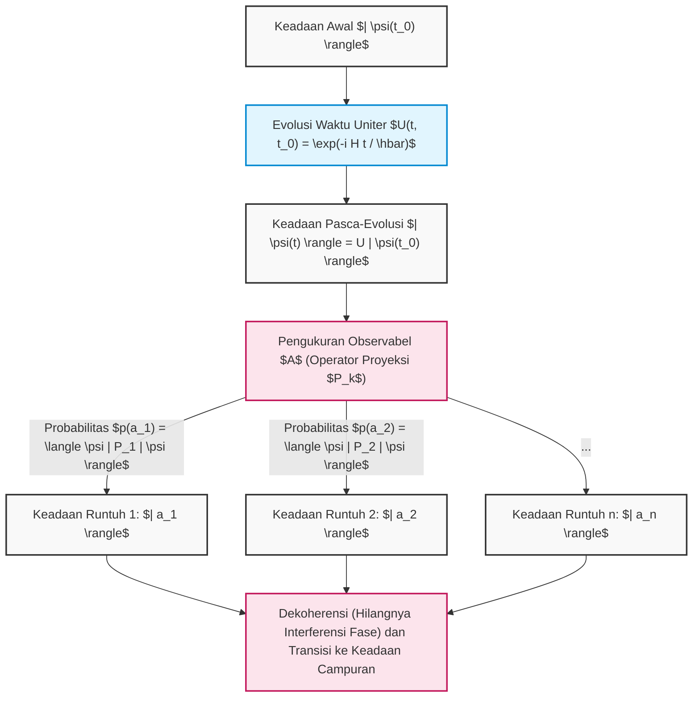

Dengan demikian, konsep-konsep abstrak dalam aljabar linear—seperti ruang vektor, hasil kali dalam, operator Hermitian, masalah nilai eigen, dan matriks uniter—bukanlah sekadar permainan matematika. Sebaliknya, mereka adalah bahasa yang tak ada duanya untuk mendeskripsikan dengan presisi dan memprediksi perilaku paling mikroskopis di alam semesta. Algoritma komputer kuantum dengan terampil memanipulasi dua aturan kuat ini, yaitu "evolusi deterministik Schrödinger" dan "keruntuhan probabilistik Born", untuk membimbing kita ke ranah komputasi yang tak terjangkau oleh komputer klasik.

# Bab 4: Gerbang Kuantum Tunggal dan Transformasi Unitari

Landasan dari komputasi kuantum adalah manipulasi presisi terhadap keadaan kuantum. Jika gerbang logika pada komputer klasik (seperti AND, OR, NOT) memanipulasi nilai bit secara ireversibel, "gerbang kuantum" pada komputer kuantum adalah evolusi waktu yang reversibel sesuai dengan persamaan Schrödinger, dan secara matematis dideskripsikan secara ketat sebagai "transformasi unitari (matriks unitari)" pada ruang Hilbert kompleks. Pada bab ini, kita akan menggali secara mendalam tanpa kompromi mengenai struktur matematis, sifat aljabar, dan makna geometris intuitif pada bola Bloch (Bloch sphere) dari gerbang-gerbang kuantum dasar yang bekerja pada bit kuantum tunggal (sistem dua tingkat).

## 4.1 Postulat Mekanika Kuantum dan Keniscayaan Matriks Unitari

Evolusi waktu dari sistem kuantum diatur oleh persamaan Schrödinger berikut, menggunakan Hamiltonian **$H$** ( **$H^\dagger = H$** ) yang merupakan operator Hermitian yang mengarakterisasi sistem tersebut.

$$
i\hbar \frac{d}{dt} |\psi(t)\rangle = H |\psi(t)\rangle
$$

Jika diasumsikan sistem dengan Hamiltonian **$H$** yang tidak bergantung pada waktu, keadaan kuantum **$|\psi(t)\rangle$** pada sembarang waktu **$t$** dapat diintegralkan secara formal dari keadaan awal **$|\psi(0)\rangle$** sebagai berikut:

$$
|\psi(t)\rangle = e^{-\frac{i}{\hbar}Ht} |\psi(0)\rangle
$$

Operator evolusi waktu yang muncul di sini didefinisikan sebagai **$U(t) = e^{-\frac{i}{\hbar}Ht}$** . Karena **$H$** yang berada pada pangkat fungsi eksponensial adalah Hermitian, dengan menghitung operator adjoin (konjugat Hermitian) **$U(t)^\dagger$** dari operator **$U(t)$** ini, sifat yang sangat penting berikut ini dapat diturunkan.

$$
U(t)^\dagger U(t) = \left( e^{-\frac{i}{\hbar}Ht} \right)^\dagger e^{-\frac{i}{\hbar}Ht} = e^{\frac{i}{\hbar}H^\dagger t} e^{-\frac{i}{\hbar}Ht} = e^{\frac{i}{\hbar}Ht} e^{-\frac{i}{\hbar}Ht} = I
$$

Sama halnya, **$U(t) U(t)^\dagger = I$** juga berlaku. Dengan demikian, matriks yang matriks adjoinnya sama dengan inversnya sendiri ( **$U^\dagger = U^{-1}$** ) disebut "Matriks Unitari (Unitary Matrix)". Gerbang kuantum tunggal tidak lain adalah matriks unitari berukuran **$2 \times 2$** yang direalisasikan oleh Hamiltonian yang dirancang secara sengaja melalui kendali fisik (misalnya, iradiasi pulsa gelombang mikro dengan frekuensi dan durasi tertentu).

Alasan mengapa matriks unitari mutlak diperlukan dalam mekanika kuantum adalah karena ini merupakan satu-satunya transformasi linear yang secara matematis menjamin "kekekalan probabilitas (kekekalan norma)". Mari kita hitung hasil kali dalam (inner product) dari keadaan setelah menerapkan transformasi unitari **$U$** terhadap sembarang keadaan kuantum **$|\psi\rangle$** dan **$|\phi\rangle$** .

$$
\langle \phi' | \psi' \rangle = ( \langle \phi | U^\dagger ) ( U |\psi\rangle ) = \langle \phi | U^\dagger U | \psi \rangle = \langle \phi | I | \psi \rangle = \langle \phi | \psi \rangle
$$

Fakta bahwa hasil kali dalam kekal berarti bahwa norma (kuadrat dari panjang) dari vektor keadaan itu sendiri, yaitu **$\langle \psi | \psi \rangle$** , juga kekal. Menurut aturan Born (Born rule) dalam mekanika kuantum, jumlah kuadrat dari nilai mutlak amplitudo vektor keadaan harus memiliki probabilitas total "1". Oleh karena itu, agar interpretasi probabilitas ini tidak runtuh akibat operasi gerbang kuantum, operasi tersebut mutlak harus bersifat unitari sebagai prasyarat utama.

Lebih jauh lagi, menurut teorema spektral, sembarang matriks unitari **$U$** dapat dinyatakan sebagai **$U = e^{iK}$** dengan menggunakan matriks Hermitian **$K$** yang memiliki nilai eigen bilangan real **$\lambda_k$** . Nilai eigen dari matriks unitari selalu berupa bilangan kompleks dengan nilai mutlak 1 (dalam bentuk **$e^{i\theta}$** ), dan vektor-vektor eigennya membentuk sistem lengkap yang saling ortogonal.

$$
U = \sum_{j=1}^{d} e^{i \theta_j} |\phi_j\rangle \langle \phi_j|
$$

Hal ini menunjukkan bahwa aksi gerbang kuantum dapat didekomposisi sepenuhnya menjadi operasi yang "hanya memberikan rotasi fase murni **$e^{i\theta_j}$** pada basis ortogonal tertentu **$|\phi_j\rangle$** ".

## 4.2 Matriks Pauli dan Gerbang Dasar (Gerbang X, Y, Z)

Dalam berbicara mengenai bahasa informasi kuantum, pemahaman tentang kelompok matriks Pauli (Pauli matrices) tidak dapat dihindari dan merupakan yang paling penting. Matriks-matriks ini, yang diperkenalkan dalam fisika untuk mendeskripsikan momentum sudut dari partikel dengan spin 1/2, membentuk kelompok operasi dasar yang paling fundamental dan ortogonal untuk bit kuantum tunggal pada komputer kuantum.

### 4.2.1 Gerbang Pauli X (Gerbang Pembalik Bit)

Gerbang Pauli X adalah perluasan kuantum mekanik dari gerbang NOT pada rangkaian logika klasik. Dalam representasi produk luar (proyektor) yang menggunakan notasi bra-ket Dirac, ia didefinisikan sebagai berikut:

$$
X = \sigma_x = |0\rangle\langle 1| + |1\rangle\langle 0| = \begin{pmatrix} 0 & 1 \\ 1 & 0 \end{pmatrix}
$$

Jika kita memverifikasi aksinya pada basis komputasi ( **$|0\rangle, |1\rangle$** ) secara ketat dengan perhitungan matriks:

$$
X |0\rangle = \begin{pmatrix} 0 & 1 \\ 1 & 0 \end{pmatrix} \begin{pmatrix} 1 \\ 0 \end{pmatrix} = \begin{pmatrix} 0 \\ 1 \end{pmatrix} = |1\rangle
$$

$$
X |1\rangle = \begin{pmatrix} 0 & 1 \\ 1 & 0 \end{pmatrix} \begin{pmatrix} 0 \\ 1 \end{pmatrix} = \begin{pmatrix} 1 \\ 0 \end{pmatrix} = |0\rangle
$$

Dengan cara ini, amplitudo sepenuhnya dibalik. Secara geometris, pada bola Bloch, ini bersesuaian dengan operasi rotasi sebesar **$\pi$** (180 derajat) dengan sumbu X sebagai sumbu rotasi. Kutub utara ( **$|0\rangle$** ) dipetakan ke kutub selatan ( **$|1\rangle$** ), dan kutub selatan dipetakan ke kutub utara.

### 4.2.2 Gerbang Pauli Y (Gerbang Pembalik Bit dan Fase)

Gerbang Pauli Y menyebabkan pembalikan bit dan pembalikan fase secara bersamaan, dan selanjutnya memberikan faktor fase berupa satuan imajiner **$i$** . Representasi produk luar dan representasi matriksnya adalah sebagai berikut:

$$
Y = \sigma_y = -i|0\rangle\langle 1| + i|1\rangle\langle 0| = \begin{pmatrix} 0 & -i \\ i & 0 \end{pmatrix}
$$

Aksinya pada basis komputasi adalah:

$$
Y |0\rangle = i|1\rangle, \quad Y |1\rangle = -i|0\rangle
$$

Pada bola Bloch, ini merepresentasikan rotasi **$\pi$** di sekitar sumbu Y. Pengalian dengan satuan imajiner **$i$** (yaitu **$e^{i\pi/2}$** ) berarti tidak sekadar pembalikan, melainkan juga pergeseran ke arah ortogonal dalam ruang fase dari keadaan tersebut.

### 4.2.3 Gerbang Pauli Z (Gerbang Pembalik Fase)

Gerbang Pauli Z adalah "operasi fase" murni yang unik pada kuantum dan tidak ada dalam logika klasik. Tanpa mengubah besarnya amplitudo (probabilitas pengukuran) sama sekali, ia hanya memberikan pergeseran fase sebesar **$-1$** (yaitu **$e^{i\pi}$** ) pada komponen **$|1\rangle$** .

$$
Z = \sigma_z = |0\rangle\langle 0| - |1\rangle\langle 1| = \begin{pmatrix} 1 & 0 \\ 0 & -1 \end{pmatrix}
$$

Aksinya secara trivial adalah:

$$
Z |0\rangle = |0\rangle, \quad Z |1\rangle = -|1\rangle
$$

Ini bersesuaian dengan rotasi **$\pi$** di sekitar sumbu Z. Karena basis komputasi **$|0\rangle, |1\rangle$** adalah vektor eigen dari matriks Z (dengan nilai eigen berturut-turut +1 dan -1), mengaplikasikan gerbang Z tidak mengubah keadaan tersebut. Namun, jika diterapkan pada keadaan superposisi (contoh: **$\alpha|0\rangle + \beta|1\rangle$** ), fase relatifnya akan berbalik secara dramatis menjadi **$\alpha|0\rangle - \beta|1\rangle$** , yang akan mengubah secara meyakinkan hasil interferensi pada tahap selanjutnya.

### 4.2.4 Struktur Aljabar Mendalam dari Grup Pauli

Grup matriks Pauli **$\{I, X, Y, Z\}$** membentuk struktur aljabar yang sangat indah sebagai operator linear pada ruang Hilbert.

1. **Koeksistensi Sifat Adjoin Diri (Hermitian) dan Unitari** : **$X = X^\dagger$** , **$Y = Y^\dagger$** , **$Z = Z^\dagger$** , dan pada saat yang sama memenuhi **$X^\dagger X = I$** (yaitu **$X = X^{-1}$** ). Ini adalah sifat langka di mana mereka bertindak sebagai kuantitas fisik (besaran yang dapat diobservasi) dan sekaligus menjadi generator evolusi waktu unitari (gerbang). Jika diterapkan dua kali secara berurutan, ia akan kembali ke transformasi identitas (involusi: **$X^2 = Y^2 = Z^2 = I$** ).
2. **Relasi Antikomutasi Penuh** : Matriks Pauli yang berbeda akan mengalami pembalikan tanda jika urutan perkaliannya ditukar.
   

$$
\{X, Y\} = XY + YX = 0, \quad \{Y, Z\} = 0, \quad \{Z, X\} = 0
$$

3. **Relasi Komutasi dan Aljabar Lie** : Jika menggunakan komutator **$[A, B] = AB - BA$** , hal ini secara jelas menunjukkan strukturnya sebagai generator dari aljabar Lie **$SU(2)$** (menggunakan tensor antisimetris penuh **$\epsilon_{ijk}$** ).
   

$$
[\sigma_j, \sigma_k] = 2i \sum_{l \in \{x,y,z\}} \epsilon_{jkl} \sigma_l
$$

   Secara spesifik, **$XY = iZ$** , **$YZ = iX$** , **$ZX = iY$** . Struktur aljabar ini memberikan landasan matematis dalam mendefinisikan gerbang rotasi sembarang yang akan dibahas kemudian.

## 4.3 Gerbang Hadamard (Gerbang H): Penciptaan Superposisi Kuantum

Dalam algoritma kuantum (misalnya algoritma Deutsch-Jozsa atau algoritma Shor), gerbang Hadamard (Hadamard gate) hampir selalu diaplikasikan segera setelah inisialisasi. Gerbang ini memainkan peran inti dalam menciptakan "keadaan superposisi maksimal" di mana dari keadaan deterministik, seluruh keadaan dapat muncul dengan probabilitas yang sama.

$$
H = \frac{1}{\sqrt{2}} \begin{pmatrix} 1 & 1 \\ 1 & -1 \end{pmatrix} = \frac{1}{\sqrt{2}} \left( |0\rangle\langle 0| + |0\rangle\langle 1| + |1\rangle\langle 0| - |1\rangle\langle 1| \right)
$$

Jika matriks Hadamard diterapkan pada basis komputasi:

$$
H |0\rangle = \frac{1}{\sqrt{2}} \begin{pmatrix} 1 & 1 \\ 1 & -1 \end{pmatrix} \begin{pmatrix} 1 \\ 0 \end{pmatrix} = \frac{1}{\sqrt{2}} \begin{pmatrix} 1 \\ 1 \end{pmatrix} = \frac{|0\rangle + |1\rangle}{\sqrt{2}} \equiv |+\rangle
$$

$$
H |1\rangle = \frac{1}{\sqrt{2}} \begin{pmatrix} 1 & 1 \\ 1 & -1 \end{pmatrix} \begin{pmatrix} 0 \\ 1 \end{pmatrix} = \frac{1}{\sqrt{2}} \begin{pmatrix} 1 \\ -1 \end{pmatrix} = \frac{|0\rangle - |1\rangle}{\sqrt{2}} \equiv |-\rangle
$$

Keadaan **$|+\rangle$** dan **$|-\rangle$** yang dihasilkan disebut basis X (atau basis diagonal), dan merupakan keadaan eigen dari matriks Pauli X. Karena matriks Hadamard itu sendiri merupakan matriks ortogonal dan simetris real (matriks unitari dalam ruang real), maka ia memenuhi **$H = H^\dagger = H^{-1}$** dan **$H^2 = I$** .
Oleh karena itu, **$H |+\rangle = |0\rangle$** , yang berarti ia juga memiliki fungsi untuk menginterferensikan (mengembalikan) keadaan superposisi kembali ke basis komputasi yang deterministik.
Secara aljabar, gerbang H adalah transformasi unitari yang mengonversi antara basis X dan basis Z. Hal ini dideskripsikan secara sangat indah sebagai transformasi similaritas matriks berikut:

$$
H X H^\dagger = H X H = Z
$$

$$
H Z H^\dagger = H Z H = X
$$

Sifat ini memungkinkan sintesis "pembalikan bit oleh gerbang X" dengan cara mengapit "pembalikan fase oleh gerbang Z" dengan gerbang H. Secara geometris, gerbang H setara dengan rotasi **$\pi$** dengan sumbu berupa vektor satuan **$\hat{n} = \frac{1}{\sqrt{2}}(\hat{x} + \hat{z})$** pada bola Bloch.

## 4.4 Kelompok Gerbang Pergeseran Fase: Gerbang S dan Gerbang T

Kelompok operasi rotasi sembarang di sekitar sumbu Z pada bola Bloch, yang merupakan generalisasi lebih lanjut dari gerbang Pauli Z, disebut sebagai gerbang pergeseran fase **$P(\phi)$** (atau **$R_\phi$** ).

$$
P(\phi) = \begin{pmatrix} 1 & 0 \\ 0 & e^{i\phi} \end{pmatrix} = |0\rangle\langle 0| + e^{i\phi} |1\rangle\langle 1|
$$

Kelompok gerbang ini hanya memanipulasi fase relatif dari komponen **$|1\rangle$** , mengubah keadaan superposisi **$\alpha|0\rangle + \beta|1\rangle$** menjadi **$\alpha|0\rangle + \beta e^{i\phi}|1\rangle$** . Dua gerbang berikut ini secara khusus sangat penting.

### 4.4.1 Gerbang S (Gerbang Fase, $\sqrt{Z}$)

Kasus di mana **$\phi = \pi/2$** disebut gerbang S.

$$
S = \begin{pmatrix} 1 & 0 \\ 0 & e^{i\pi/2} \end{pmatrix} = \begin{pmatrix} 1 & 0 \\ 0 & i \end{pmatrix}
$$

Seperti yang jelas dari sifat matriksnya, menerapkannya dua kali akan menjadi gerbang Z ( **$S^2 = Z$** ).
Jika gerbang S diterapkan pada keadaan **$|+\rangle$** :

$$
S |+\rangle = \begin{pmatrix} 1 & 0 \\ 0 & i \end{pmatrix} \frac{1}{\sqrt{2}} \begin{pmatrix} 1 \\ 1 \end{pmatrix} = \frac{1}{\sqrt{2}} \begin{pmatrix} 1 \\ i \end{pmatrix} = \frac{|0\rangle + i|1\rangle}{\sqrt{2}} \equiv |+i\rangle
$$

sehingga ia mentransisikan keadaan ke arah positif dari sumbu Y (keadaan eigen dari basis Y) yang terletak pada khatulistiwa bola Bloch. Grup yang terdiri dari grup Pauli dan gerbang H, S disebut grup Clifford (Clifford group), dan menurut teorema Gottesman-Knill, telah dibuktikan bahwa rangkaian kuantum yang hanya tersusun dari grup Clifford dapat disimulasikan secara efisien pada komputer klasik.

### 4.4.2 Gerbang T (Gerbang $\pi/8$, $\sqrt{S}$, $\sqrt[4]{Z}$)

Kasus di mana **$\phi = \pi/4$** disebut gerbang T.

$$
T = \begin{pmatrix} 1 & 0 \\ 0 & e^{i\pi/4} \end{pmatrix} = \begin{pmatrix} 1 & 0 \\ 0 & \frac{1+i}{\sqrt{2}} \end{pmatrix}
$$

Jika kita mengeluarkan fase global **$e^{i\pi/8}$** , komponen diagonalnya menjadi **$e^{-i\pi/8}$** dan **$e^{i\pi/8}$** , sehingga secara historis gerbang ini juga disebut gerbang **$\pi/8$** .
Gerbang T tidak termasuk dalam grup Clifford, dan menghancurkan efisiensi simulasi klasik. Namun, terdapat teorema yang sangat penting dalam teori komputasi kuantum bahwa dengan menambahkan satu saja gerbang T ini ke dalam grup Clifford, terbentuklah "Set Gerbang Kuantum Universal (Universal Quantum Gate Set)" yang dapat mengaproksimasi transformasi unitari apa pun pada qubit tunggal dengan presisi sembarang. Dalam komputasi kuantum yang toleran terhadap kesalahan (fault-tolerant), karena sulit untuk menjalankan gerbang T secara langsung pada kode koreksi kesalahan, ia diimplementasikan menggunakan metode yang sangat mahal yang disebut "Distilasi Keadaan Ajaib (Magic State Distillation)".

## 4.5 Representasi Fungsi Eksponensial dan Universalitas dari Gerbang Rotasi Sembarang

Operasi paling umum pada qubit tunggal adalah transformasi unitari yang memutar sebesar sudut **$\theta$** dengan sumbu rotasi berupa sembarang vektor satuan **$\hat{n} = (n_x, n_y, n_z)$** (di mana **$n_x^2 + n_y^2 + n_z^2 = 1$** ) pada bola Bloch. Dengan menggunakan kombinasi linear dari matriks Pauli, operator rotasi **$R_{\hat{n}}(\theta)$** ini diformulasikan dengan indah sebagai fungsi eksponensial dari matriks berikut.

$$
R_{\hat{n}}(\theta) = \exp\left(-i \frac{\theta}{2} (\hat{n} \cdot \vec{\sigma})\right) = \exp\left(-i \frac{\theta}{2} (n_x X + n_y Y + n_z Z)\right)
$$

Di sini, dengan memanfaatkan sifat antikomutasi kuat dari matriks Pauli, yaitu **$(\hat{n} \cdot \vec{\sigma})^2 = (n_x X + n_y Y + n_z Z)^2 = (n_x^2 + n_y^2 + n_z^2)I = I$** , jika fungsi eksponensial tersebut diekspansi menggunakan deret Taylor ( **$e^{iAx} = \cos(x)I + i\sin(x)A$** (pada kasus **$A^2=I$** )), deret tak terhingga tersebut dapat disederhanakan secara dramatis, dan kita akan memperoleh bentuk perluasan matriks dari rumus Euler berikut.

$$
R_{\hat{n}}(\theta) = \cos\left(\frac{\theta}{2}\right) I - i \sin\left(\frac{\theta}{2}\right) (\hat{n} \cdot \vec{\sigma})
$$

Dari rumusan umum ini, kelompok gerbang rotasi dasar di sekitar sumbu koordinat ortogonal dapat dideduksi.

### Gerbang rotasi di sekitar sumbu X $R_x(\theta)$ 

$$
R_x(\theta) = e^{-i \frac{\theta}{2} X} = \begin{pmatrix} \cos\frac{\theta}{2} & -i \sin\frac{\theta}{2} \\ -i \sin\frac{\theta}{2} & \cos\frac{\theta}{2} \end{pmatrix}
$$

### Gerbang rotasi di sekitar sumbu Y $R_y(\theta)$ 

$$
R_y(\theta) = e^{-i \frac{\theta}{2} Y} = \begin{pmatrix} \cos\frac{\theta}{2} & -\sin\frac{\theta}{2} \\ \sin\frac{\theta}{2} & \cos\frac{\theta}{2} \end{pmatrix}
$$

### Gerbang rotasi di sekitar sumbu Z $R_z(\theta)$ 

$$
R_z(\theta) = e^{-i \frac{\theta}{2} Z} = \begin{pmatrix} e^{-i\theta/2} & 0 \\ 0 & e^{i\theta/2} \end{pmatrix}
$$

Dengan menggunakan matriks-matriks rotasi ini, sembarang matriks unitari qubit tunggal **$U \in SU(2)$** dapat difaktorkan secara sempurna melalui "dekomposisi Z-Y-Z" menggunakan tiga sudut Euler ( **$\alpha, \beta, \gamma$** ) sebagai berikut.

$$
U = e^{i\delta} R_z(\alpha) R_y(\beta) R_z(\gamma)
$$

Teorema ini memberikan jaminan fisis bahwa jika rotasi sumbu Z dan rotasi sumbu Y saja dapat diimplementasikan dengan presisi tinggi pada level perangkat keras, maka algoritma kompleks apa pun pada qubit tunggal dapat dijalankan.

## 4.6 [Ilustrasi] Rangkaian Gerbang Qubit Tunggal dan Transisi Keadaan

Rangkaian kuantum adalah susunan gerbang-gerbang tersebut yang disusun secara berurutan dalam waktu. Keadaan akan berevolusi dalam waktu dari kiri ke kanan.

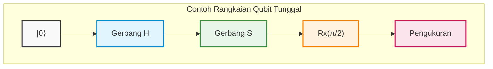

## 4.7 Contoh Perhitungan Ketat: Penelusuran Lengkap Interferensi Kuantum melalui Perkalian Matriks

Untuk menyublimasikan konsep abstrak ke dalam intuisi fisik, kita akan menelusuri secara ketat dengan perhitungan manual tanpa ada yang dihilangkan, mengenai bagaimana keadaan kuantum berinterferensi dan bertransisi dengan mengalikan beberapa matriks unitari.

Misalkan keadaan awal adalah keadaan basis **$|\psi_0\rangle = |0\rangle = \begin{pmatrix} 1 \\ 0 \end{pmatrix}$** .
Operasi yang akan dieksekusi adalah urutan "gerbang **$H$** " $\rightarrow$ "gerbang **$S$** " $\rightarrow$ "gerbang **$H$** " yang mirip dengan diagram rangkaian di atas.
Meskipun diagram rangkaian kuantum ditulis dari kiri ke kanan, perkalian operator aljabar linear terhadap vektor keadaan diaplikasikan "secara berurutan dari kiri", sehingga persamaan operator unitari keseluruhan **$U_{total}$** akan tersusun dari kanan ke kiri yang berlawanan dengan waktu.

$$
U_{total} = H S H
$$

Kita substitusikan representasi matriks masing-masing gerbang untuk menurunkan matriks sintesisnya.

$$
H = \frac{1}{\sqrt{2}} \begin{pmatrix} 1 & 1 \\ 1 & -1 \end{pmatrix}, \quad S = \begin{pmatrix} 1 & 0 \\ 0 & i \end{pmatrix}
$$

Pertama, kita menghitung hasil kali dari **$H$** yang diaplikasikan segera setelah keadaan awal, dan **$S$** setelahnya, yaitu **$SH$** .

$$
S H = \begin{pmatrix} 1 & 0 \\ 0 & i \end{pmatrix} \frac{1}{\sqrt{2}} \begin{pmatrix} 1 & 1 \\ 1 & -1 \end{pmatrix} = \frac{1}{\sqrt{2}} \begin{pmatrix} 1\cdot 1 + 0\cdot 1 & 1\cdot 1 + 0\cdot(-1) \\ 0\cdot 1 + i\cdot 1 & 0\cdot 1 + i\cdot(-1) \end{pmatrix} = \frac{1}{\sqrt{2}} \begin{pmatrix} 1 & 1 \\ i & -i \end{pmatrix}
$$

Selanjutnya, kita mengalikan **$H$** terakhir dari sisi kiri pada hasil ini.

$$
U_{total} = H (S H) = \frac{1}{\sqrt{2}} \begin{pmatrix} 1 & 1 \\ 1 & -1 \end{pmatrix} \frac{1}{\sqrt{2}} \begin{pmatrix} 1 & 1 \\ i & -i \end{pmatrix}
$$

Kita keluarkan pengali skalar **$\frac{1}{\sqrt{2}} \times \frac{1}{\sqrt{2}} = \frac{1}{2}$** ke depan, dan melakukan perkalian matriks dengan hati-hati.

$$
U_{total} = \frac{1}{2} \begin{pmatrix} 1\cdot 1 + 1\cdot i & 1\cdot 1 + 1\cdot(-i) \\ 1\cdot 1 + (-1)\cdot i & 1\cdot 1 + (-1)\cdot(-i) \end{pmatrix} = \frac{1}{2} \begin{pmatrix} 1 + i & 1 - i \\ 1 - i & 1 + i \end{pmatrix}
$$

Ini adalah representasi matriks unitari tunggal ketika keseluruhan rangkaian dipandang sebagai satu kotak hitam (black box).
Kita aplikasikan **$U_{total}$** ini pada keadaan awal **$|0\rangle$** untuk menghitung keadaan akhir **$|\psi_{final}\rangle$** .

$$
|\psi_{final}\rangle = U_{total} |0\rangle = \frac{1}{2} \begin{pmatrix} 1 + i & 1 - i \\ 1 - i & 1 + i \end{pmatrix} \begin{pmatrix} 1 \\ 0 \end{pmatrix} = \frac{1}{2} \begin{pmatrix} 1 + i \\ 1 - i \end{pmatrix}
$$

Jika ini diekspansi menggunakan notasi Dirac, ia menjadi sebagai berikut.

$$
|\psi_{final}\rangle = \frac{1+i}{2} |0\rangle + \frac{1-i}{2} |1\rangle
$$

Di sini, untuk memverifikasi apakah sifat unitari (fakta bahwa jumlah total probabilitas adalah 1) tidak rusak, kita menghitung probabilitas untuk mengobservasi masing-masing basis. Kita menggunakan kuadrat nilai mutlak bilangan kompleks ** $|z|^2 = z z^*$ **.

$$
P(0) = |\langle 0 | \psi_{final} \rangle|^2 = \left| \frac{1+i}{2} \right|^2 = \frac{1^2 + 1^2}{4} = \frac{2}{4} = \frac{1}{2}
$$

$$
P(1) = |\langle 1 | \psi_{final} \rangle|^2 = \left| \frac{1-i}{2} \right|^2 = \frac{1^2 + (-1)^2}{4} = \frac{2}{4} = \frac{1}{2}
$$

Jumlah probabilitasnya menjadi **$P(0) + P(1) = 1$** , yang membuktikan bahwa ini adalah keadaan yang valid secara fisis. Jika diukur, nilai 0 akan diperoleh dengan probabilitas 50%, dan nilai 1 dengan probabilitas 50%, tetapi ini bukanlah sekadar bilangan acak klasik biasa. Untuk mengeluarkan "fase" yang tersembunyi di balik keadaan tersebut, mari kita ubah vektor keadaan menjadi bentuk koordinat polar pada bola Bloch.

Sebagai faktor persekutuan keseluruhan, kita akan mengeluarkan amplitudo **$1/\sqrt{2}$** dan fase global **$e^{i\pi/4}$** secara paksa ( **$\frac{1+i}{\sqrt{2}}$** ).

$$
|\psi_{final}\rangle = \frac{1}{\sqrt{2}} \left( \frac{1+i}{\sqrt{2}} |0\rangle + \frac{1-i}{\sqrt{2}} |1\rangle \right) = e^{i\pi/4} \left( \frac{1}{\sqrt{2}} |0\rangle + \frac{1}{\sqrt{2}} e^{-i\pi/2} |1\rangle \right)
$$

Karena fase global **$e^{i\pi/4}$** dalam perhitungan nilai ekspektasi untuk besaran observasi mana pun (operator Hermitian) akan menjadi **$e^{-i\pi/4} e^{i\pi/4} = 1$** sehingga saling meniadakan, jika kita hanya mengekstrak bagian fase relatif yang memiliki makna fisis:

$$
|\psi_{final}'\rangle = \frac{1}{\sqrt{2}} |0\rangle - \frac{i}{\sqrt{2}} |1\rangle
$$

Dengan membandingkan hal ini dengan representasi koordinat polar **$\cos(\theta/2)|0\rangle + e^{i\phi}\sin(\theta/2)|1\rangle$** , secara sempurna teridentifikasi bahwa vektor Bloch tersebut mengarah pada sudut zenith **$\theta = \pi/2$** (pada ekuator) dan sudut azimuth **$\phi = -\pi/2$** (arah negatif sumbu Y). Ini adalah keadaan yang biasanya dinotasikan sebagai **$|-i\rangle$** .

Mari kita tunjukkan fakta yang lebih mendalam lagi. Dengan menggunakan rumus gerbang rotasi berdasarkan fungsi eksponensial yang diturunkan sebelumnya, kita akan menuliskan matriks rotasi **$\pi/2$** di sekitar sumbu X, yaitu **$R_x(\pi/2)$** .

$$
R_x(\pi/2) = \frac{1}{\sqrt{2}} \begin{pmatrix} 1 & -i \\ -i & 1 \end{pmatrix}
$$

Di sisi lain, mari kita lihat kembali matriks keseluruhan **$U_{total}$** yang kita hitung.

$$
U_{total} = \frac{1}{2} \begin{pmatrix} 1 + i & 1 - i \\ 1 - i & 1 + i \end{pmatrix} = \frac{1+i}{2} \begin{pmatrix} 1 & \frac{1-i}{1+i} \\ \frac{1-i}{1+i} & 1 \end{pmatrix} = \frac{1+i}{2} \begin{pmatrix} 1 & -i \\ -i & 1 \end{pmatrix} = e^{i\pi/4} R_x(\pi/2)
$$

Secara menakjubkan, hal ini membuktikan bahwa operasi berurutan dari gerbang diskrit di sekitar sumbu yang sama sekali berbeda, yaitu " **$H \rightarrow S \rightarrow H$** ", apabila mengabaikan fase globalnya, ekuivalen secara matematis kata demi kata dengan operasi tunggal berupa "rotasi **$\pi/2$** di sekitar sumbu X".
Dengan cara ini, meskipun keadaan kuantum menempuh jalur interferensi kompleks yang menolak intuisi klasik kita, melalui kerangka matematika aljabar linear yang kokoh, perilakunya dapat dikendalikan dan diprediksi secara penuh tanpa ada kesalahan sekecil apa pun (bahkan satu bit).

Pada bab selanjutnya, dengan menggunakan pengetahuan tentang operasi qubit tunggal yang kuat ini sebagai pijakan, kita akan melangkah ke dalam dunia yang lebih mendalam mengenai perkalian tensor (tensor product) yang meledakkan dimensi ruang Hilbert secara eksponensial, serta gerbang multi-qubit yang menghasilkan "keterikatan kuantum (entanglement)" yang pernah disebut oleh Einstein sebagai "aksi seram dari jarak jauh" (spooky action at a distance).

# Bab 5: Sistem Multiqubit dan Keterikatan Kuantum (Entanglement)

Dalam bab-bab sebelumnya, kita telah membahas secara mendalam sifat superposisi yang dimiliki oleh qubit tunggal dan gerbang kuantum tunggal yang dideskripsikan sebagai operasi rotasi pada bola Bloch. Namun, sumber kekuatan sejati dari komputasi kuantum yang melampaui komputasi klasik—yang disebut "supremasi kuantum" atau "keunggulan kuantum"—terletak pada sistem banyak-benda (many-body systems) tempat beberapa qubit saling berinteraksi. Pada bab ini, kita akan memperkenalkan konsep paling inti dan paling misterius dari informasi kuantum, yaitu **keterikatan kuantum** (Entanglement), serta menyajikan pembahasan menyeluruh mulai dari deskripsi matematis yang ketat untuk sistem multiqubit, sirkuit untuk membangkitkan keterikatan kuantum, hingga paradoks EPR yang mengguncang fondasi fisika.

---

## 5.1 Deskripsi Matematis Keadaan Banyak-Benda dengan Produk Tensor ($\otimes$)

Menurut aksioma mekanika kuantum, ketika ruang keadaan dari sistem fisik yang independen masing-masing dideskripsikan oleh ruang Hilbert **$\mathcal{H}_A$** dan **$\mathcal{H}_B$** , ruang keadaan dari sistem komposit yang menggabungkan keduanya diberikan sebagai **produk tensor** (Tensor Product) dari masing-masing ruang, yaitu **$\mathcal{H} = \mathcal{H}_A \otimes \mathcal{H}_B$** .

Ruang keadaan dari qubit tunggal adalah ruang vektor kompleks dua dimensi **$\mathbb{C}^2$** . Oleh karena itu, ruang keadaan dari sistem yang terdiri dari $n$ qubit adalah ruang Hilbert berdimensi $2^n$, yaitu **$(\mathbb{C}^2)^{\otimes n}$** . Pertumbuhan dimensi secara eksponensial terhadap jumlah qubit $n$ inilah yang menjadi fondasi matematis dari paralelisme kuantum.

Mari kita tinjau sistem yang terdiri dari dua qubit (qubit A dan qubit B). Basis komputasi didefinisikan sebagai produk tensor dari keadaan basis masing-masing qubit tunggal.

$$
|0\rangle_A \otimes |0\rangle_B \equiv |00\rangle, \quad
|0\rangle_A \otimes |1\rangle_B \equiv |01\rangle, \quad
|1\rangle_A \otimes |0\rangle_B \equiv |10\rangle, \quad
|1\rangle_A \otimes |1\rangle_B \equiv |11\rangle
$$

Di sini, mari kita hitung secara ketat representasi matriks dari produk tensor (produk Kronecker). Jika kita menyatakan basis qubit tunggal sebagai vektor kolom:

$$
|0\rangle = \begin{pmatrix} 1 \\ 0 \end{pmatrix}, \quad |1\rangle = \begin{pmatrix} 0 \\ 1 \end{pmatrix}
$$

Dengan menggunakan basis ini, sebagai contoh, perhitungan untuk keadaan **$|10\rangle$** adalah sebagai berikut:

$$
|10\rangle = |1\rangle \otimes |0\rangle = \begin{pmatrix} 0 \\ 1 \end{pmatrix} \otimes \begin{pmatrix} 1 \\ 0 \end{pmatrix} = \begin{pmatrix} 0 \cdot \begin{pmatrix} 1 \\ 0 \end{pmatrix} \\ 1 \cdot \begin{pmatrix} 1 \\ 0 \end{pmatrix} \end{pmatrix} = \begin{pmatrix} 0 \\ 0 \\ 1 \\ 0 \end{pmatrix}
$$

Dalam ruang vektor 4 dimensi ini, keadaan murni paling umum dari sistem 2-qubit, **$|\Psi\rangle$** , dideskripsikan sebagai kombinasi linear (superposisi) dari keempat vektor basis ini:

$$
|\Psi\rangle = c_{00} |00\rangle + c_{01} |01\rangle + c_{10} |10\rangle + c_{11} |11\rangle
$$

Di sini, $c_{ij} \in \mathbb{C}$ adalah amplitudo probabilitas, dan berdasarkan aturan Born, keadaannya harus dinormalisasi, yaitu memenuhi syarat normalisasi $\sum_{i,j \in \{0,1\}} |c_{ij}|^2 = 1$.

Operator (gerbang) dalam sistem komposit juga dikonstruksi menggunakan produk tensor. Operasi penerapan operator **$U_A$** pada qubit A dan operator **$U_B$** pada qubit B direpresentasikan sebagai operator **$U_A \otimes U_B$** untuk keseluruhan sistem komposit, yang beraksi pada keadaan produk sembarang sebagai berikut:

$$
(U_A \otimes U_B)(|\psi\rangle_A \otimes |\phi\rangle_B) = (U_A |\psi\rangle_A) \otimes (U_B |\phi\rangle_B)
$$

Berdasarkan linearitas, aksi ini diperluas ke keadaan superposisi sembarang.

---

## 5.2 Representasi Matematis Keadaan Bell (Keadaan Terikat Maksimal)

Keadaan dalam sistem kuantum banyak-benda secara garis besar diklasifikasikan menjadi dua: "keadaan dapat terpisahkan (Separable State)" dan "keadaan terikat (Entangled State)".
Ketika suatu keadaan **$|\Psi\rangle$** dapat dideskripsikan semata-mata sebagai produk tensor dari keadaan masing-masing subsistem, yaitu

$$
|\Psi\rangle = |\psi\rangle_A \otimes |\phi\rangle_B
$$

maka keadaan tersebut dikatakan dapat terpisahkan (separable). Sebaliknya, keadaan yang **tidak dapat** dinyatakan sebagai produk tensor dari keadaan subsistem mana pun didefinisikan sebagai **keadaan terikat secara kuantum (Entangled State)** .

Dalam sistem dua-qubit, keadaan yang terikat secara kuantum paling kuat disebut **keadaan Bell** (Bell States), atau pasangan EPR. Keadaan Bell terdiri dari empat keadaan murni ortogonal berikut, yang membentuk basis ortonormal lengkap (basis Bell) bagi ruang Hilbert 4 dimensi:

$$
|\Phi^+\rangle = \frac{1}{\sqrt{2}} \Big( |00\rangle + |11\rangle \Big)
$$

$$
|\Phi^-\rangle = \frac{1}{\sqrt{2}} \Big( |00\rangle - |11\rangle \Big)
$$

$$
|\Psi^+\rangle = \frac{1}{\sqrt{2}} \Big( |01\rangle + |10\rangle \Big)
$$

$$
|\Psi^-\rangle = \frac{1}{\sqrt{2}} \Big( |01\rangle - |10\rangle \Big)
$$

Di sini, mari kita buktikan secara ketat dengan kontradiksi (reductio ad absurdum) bahwa keadaan **$|\Phi^+\rangle$** tidak dapat dipisahkan.
Andaikan keadaan **$|\Phi^+\rangle$** adalah keadaan yang dapat dipisahkan, dan asumsikan ia dapat dituliskan sebagai produk tensor dari keadaan qubit tunggal yang belum diketahui:

$$
|\Phi^+\rangle = (a|0\rangle + b|1\rangle)_A \otimes (c|0\rangle + d|1\rangle)_B
$$

Jika kita menjabarkannya:

$$
|\Phi^+\rangle = ac|00\rangle + ad|01\rangle + bc|10\rangle + bd|11\rangle
$$

Dengan membandingkan koefisien pada persamaan definisi awal, kita memperoleh sistem persamaan berikut:

1. $ac = \frac{1}{\sqrt{2}}$
2. $bd = \frac{1}{\sqrt{2}}$
3. $ad = 0$
4. $bc = 0$

Dari Persamaan 3 ($ad = 0$), maka $a = 0$ atau $d = 0$.
Jika $a = 0$, dari Persamaan 1 diperoleh $ac = 0$, yang berkontradiksi dengan $ac = \frac{1}{\sqrt{2}}$.
Jika $d = 0$, dari Persamaan 2 diperoleh $bd = 0$, yang berkontradiksi dengan $bd = \frac{1}{\sqrt{2}}$.
Oleh karena itu, bilangan kompleks $a, b, c, d$ seperti itu tidak ada, sehingga terbukti secara ketat bahwa keadaan **$|\Phi^+\rangle$** tidak pernah dapat difaktorkan sebagai produk dari dua keadaan independen.

### Matriks Densitas Tereduksi dan Entropi Keterikatan

Fakta bahwa keadaan Bell merupakan "keterikatan maksimal" menjadi semakin jelas dengan menghitung **matriks densitas tereduksi** (Reduced Density Matrix) yang mendeskripsikan informasi subsistem. Ketika keseluruhan sistem berada dalam keadaan murni **$\rho = |\Phi^+\rangle \langle\Phi^+|$** , kita menelusuri keluar (partial trace) qubit B untuk mencari keadaan lokal dari qubit A:

$$
\rho_A = \text{Tr}_B(|\Phi^+\rangle \langle\Phi^+|) = \text{Tr}_B \left[ \frac{1}{2} (|00\rangle\langle00| + |00\rangle\langle11| + |11\rangle\langle00| + |11\rangle\langle11|) \right]
$$

Dengan menggunakan sifat *partial trace* $\text{Tr}_B(|i,j\rangle\langle k,l|) = |i\rangle\langle k| \cdot \langle l|j\rangle = |i\rangle\langle k| \delta_{jl}$,

$$
\rho_A = \frac{1}{2} \Big( |0\rangle\langle0| \cdot \langle0|0\rangle + |0\rangle\langle1| \cdot \langle1|0\rangle + |1\rangle\langle0| \cdot \langle0|1\rangle + |1\rangle\langle1| \cdot \langle1|1\rangle \Big)
$$

$$
\rho_A = \frac{1}{2} (|0\rangle\langle0| + |1\rangle\langle1|) = \frac{1}{2} I
$$

Hal ini berarti jika hanya qubit A yang diamati, keadaannya adalah keadaan campuran sempurna (Completely Mixed State), dan entropi von Neumann $S(\rho_A) = -\text{Tr}(\rho_A \log_2 \rho_A)$ bernilai maksimum yaitu $1$. Dengan kata lain, esensi dari keterikatan kuantum maksimal adalah korelasi ekstrem yang sama sekali mustahil dalam mekanika klasik: "meskipun sistem secara keseluruhan memiliki informasi lengkap (keadaan murni), ketika setiap subsistem diamati secara terpisah, informasinya menjadi sepenuhnya tidak pasti (entropi maksimum)".

---

## 5.3 Representasi Matriks Gerbang CNOT (Controlled-NOT)

Untuk membangkitkan dan memanipulasi keterikatan seperti ini secara artifisial di dalam komputer kuantum, operasi pada qubit tunggal saja tidaklah cukup; gerbang multiqubit yang merentang di beberapa qubit sangatlah penting. Operator yang paling mendasar dan paling kuat adalah **gerbang CNOT** (Controlled-NOT Gate).

Gerbang CNOT beraksi pada dua qubit, memperlakukan salah satu sebagai "qubit kontrol (Control Qubit)" dan yang lainnya sebagai "qubit target (Target Qubit)". Gerbang ini, yang dapat dipandang sebagai versi kuantum dari gerbang XOR klasik, beroperasi dengan aturan: "hanya jika qubit kontrol berada dalam keadaan $|1\rangle$, maka qubit target akan dibalik (menerapkan gerbang Pauli $X$), sedangkan jika qubit kontrol berada dalam keadaan $|0\rangle$, maka qubit target tidak diubah".

Aksinya terhadap basis komputasi adalah sebagai berikut (dengan qubit pertama sebagai kontrol dan qubit kedua sebagai target):

$$
\text{CNOT} |00\rangle = |00\rangle \\
\text{CNOT} |01\rangle = |01\rangle \\
\text{CNOT} |10\rangle = |11\rangle \\
\text{CNOT} |11\rangle = |10\rangle
$$

Jika dinyatakan sebagai matriks uniter 4 dimensi, bentuknya adalah sebagai berikut:

$$
\text{CNOT} = \begin{pmatrix}
1 & 0 & 0 & 0 \\
0 & 1 & 0 & 0 \\
0 & 0 & 0 & 1 \\
0 & 0 & 1 & 0
\end{pmatrix}
$$

Sebagai representasi yang lebih elegan secara matematis, terdapat notasi penjumlahan produk tensor menggunakan operator proyeksi dan matriks Pauli:

$$
\text{CNOT} = |0\rangle\langle0| \otimes I + |1\rangle\langle1| \otimes X
$$

Persamaan ini mengekspresikan makna fisis dari gerbang CNOT secara sangat intuitif. Suku pertama berarti "dalam ruang keadaan tempat qubit pertama diproyeksikan ke $|0\rangle$, operator identitas $I$ diterapkan pada qubit kedua", dan suku kedua berarti "dalam ruang keadaan tempat qubit pertama diproyeksikan ke $|1\rangle$, operator pembalik-bit $X$ diterapkan pada qubit kedua".

Sebagai sifat penting dari gerbang CNOT, karena gerbang ini secara bersamaan memenuhi sifat Hermitian ( $\text{CNOT}^\dagger = \text{CNOT}$ ) dan keuniteran ( $\text{CNOT}^\dagger \text{CNOT} = I$ ), maka ia merupakan invers bagi dirinya sendiri ( $\text{CNOT}^2 = I$ ).

---

## 5.4 Sirkuit Pembangkit Keterikatan Kuantum Menggunakan CNOT

Lalu, berangkat dari keadaan yang dapat terpisahkan, bagaimana cara kita membangkitkan keadaan Bell yang merupakan keadaan terikat maksimal? Di sini, kita akan membangun sirkuit kuantum standar untuk menghasilkan **$|\Phi^+\rangle$** dari keadaan awal komputer kuantum **$|00\rangle$** , dan menelusuri evolusi keadaannya melalui perumusan matematis.

Komponen yang diperlukan hanyalah gerbang Hadamard **$H$** yang beraksi pada qubit tunggal, dan gerbang **$\text{CNOT}$** yang telah dijelaskan sebelumnya. Matriks Hadamard didefinisikan sebagai berikut:

$$
H = \frac{1}{\sqrt{2}} \begin{pmatrix} 1 & 1 \\ 1 & -1 \end{pmatrix}
$$

### Perhitungan Evolusi Keadaan Kuantum

 **Langkah 1:** Inisialisasi
Sistem berada pada keadaan awal basis komputasi:

$$
|\psi_0\rangle = |0\rangle_A \otimes |0\rangle_B = |00\rangle
$$

 **Langkah 2:** Penerapan Gerbang Hadamard pada Qubit Kontrol (Qubit A)
Gerbang Hadamard diterapkan hanya pada qubit A untuk menciptakan keadaan superposisi. Operator untuk keseluruhan sistem adalah **$H \otimes I$** .

$$
|\psi_1\rangle = (H \otimes I) |00\rangle = (H|0\rangle_A) \otimes (I|0\rangle_B)
$$

$$
= \left( \frac{1}{\sqrt{2}} (|0\rangle_A + |1\rangle_A) \right) \otimes |0\rangle_B
$$

$$
= \frac{1}{\sqrt{2}} (|00\rangle + |10\rangle)
$$

Pada titik ini, keadaannya masih berupa keadaan yang dapat terpisahkan. Hal ini dikarenakan ia masih dapat dituliskan dalam bentuk produk tensor.

 **Langkah 3:** Penerapan Gerbang CNOT
Selanjutnya, kita menerapkan gerbang CNOT dengan qubit A sebagai qubit kontrol dan qubit B sebagai qubit target. Berdasarkan linearitas operator, gerbang CNOT beraksi secara independen pada setiap suku superposisi:

$$
|\psi_2\rangle = \text{CNOT} \left[ \frac{1}{\sqrt{2}} (|00\rangle + |10\rangle) \right]
$$

$$
= \frac{1}{\sqrt{2}} (\text{CNOT}|00\rangle + \text{CNOT}|10\rangle)
$$

Dengan menerapkan aturan aksi CNOT terhadap basis yang telah didefinisikan sebelumnya, karena $\text{CNOT}|00\rangle = |00\rangle$ dan $\text{CNOT}|10\rangle = |11\rangle$, maka:

$$
|\psi_2\rangle = \frac{1}{\sqrt{2}} (|00\rangle + |11\rangle) = |\Phi^+\rangle
$$

Secara elegan, keadaan Bell **$|\Phi^+\rangle$** berhasil dibangkitkan dari keadaan awal yang dapat terpisahkan. Ketika gerbang CNOT menerima "superposisi qubit kontrol antara 0 dan 1" yang dihasilkan oleh gerbang Hadamard, proses pembalikan/tanpa-pembalikan pada qubit target bercabang secara terikat dengan masing-masing keadaan qubit kontrol, sehingga keterikatan kuantum terbentuk pada sistem secara keseluruhan.

Dengan konfigurasi sirkuit yang serupa, dengan mengubah keadaan awal menjadi $|01\rangle, |10\rangle, |11\rangle$, kita dapat membangkitkan ketiga keadaan Bell yang tersisa, yaitu berturut-turut $|\Psi^+\rangle, |\Phi^-\rangle, |\Psi^-\rangle$, secara deterministik.

### Diagram Sirkuit Kuantum (Notasi Mermaid)

Diagram sirkuit kuantum yang mendeskripsikan proses pembangkitan keterikatan di atas adalah sebagai berikut:

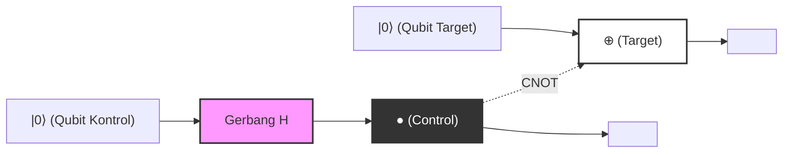
*(Catatan: Diagram di atas merepresentasikan interkoneksi logis. Garis horizontal solid menunjukkan aliran waktu dari masing-masing qubit (kabel kuantum), memperlihatkan struktur tempat qubit kontrol yang telah melewati `Gerbang H` mengontrol qubit target pada `⊕` di posisi `●`. Keadaan Bell $|\Phi^+\rangle$ diperoleh sebagai keadaan keluaran keseluruhan.)*

---

## 5.5 Paradoks EPR dan Non-Lokalitas

Hal yang menunjukkan bahwa konsep keterikatan kuantum bukan sekadar permainan matematis, melainkan mengajukan pertanyaan tajam terhadap fondasi fisika, adalah publikasi tahun 1935 oleh Albert Einstein, Boris Podolsky, dan Nathan Rosen yang dikenal sebagai **makalah EPR** . Mereka berargumen bahwa karena deskripsi mekanika kuantum berkontradiksi dengan "realisme lokal (Local Realism)", maka mekanika kuantum merupakan teori yang tidak lengkap (memerlukan variabel tersembunyi).

Mari kita lakukan eksperimen pikiran dengan membayangkan dua pengamat, Alice dan Bob, berbagi keadaan Bell **$|\Phi^+\rangle = \frac{1}{\sqrt{2}}(|00\rangle + |11\rangle)$** yang telah dibangkitkan sebelumnya. Asumsikan bahwa Alice memegang qubit pertama, Bob memegang qubit kedua, dan mereka terpisah di ujung-ujung alam semesta yang saling berjauhan (misalnya Bumi dan Galaksi Andromeda).

Dalam keadaan ini, hasil pengukuran masing-masing qubit pada dasarnya bersifat acak. Ketika Alice mengukur qubit yang dipegangnya dalam basis komputasi $\{|0\rangle, |1\rangle\}$, ia memperoleh $0$ (keadaan $|0\rangle$) dengan probabilitas 50%, dan $1$ (keadaan $|1\rangle$) dengan probabilitas 50%.

Namun, menurut postulat proyeksi mekanika kuantum (kolapsnya paket gelombang), **pada saat seketika** Alice melakukan pengukuran, keadaan sistem secara keseluruhan berubah secara dramatis:
- Pada saat Alice memperoleh hasil pengukuran $0$, fungsi gelombang keseluruhan kolaps menjadi $|00\rangle$. Oleh karena itu, qubit milik Bob, bahkan sebelum pengukuran apa pun dilakukan terhadapnya, secara instan dan pasti terdeterminasi menjadi $|0\rangle$.
- Sebaliknya, pada saat Alice memperoleh hasil pengukuran $1$, fungsi gelombang keseluruhan kolaps menjadi $|11\rangle$, dan qubit milik Bob secara instan dan pasti terdeterminasi menjadi $|1\rangle$.

Einstein menyebut fenomena ini sebagai "aksi seram dari jarak jauh (spooky action at a distance)". Hal ini dikarenakan operasi pengukuran lokal yang dilakukan oleh Alice tampaknya memengaruhi keadaan fisik Bob yang berada sangat jauh melebihi kecepatan cahaya (secara instan). Ini tampak secara gamblang melanggar prinsip lokalitas yang menjadi syarat teori relativitas khusus, yaitu bahwa "tidak ada informasi apa pun yang dapat merambat melebihi kecepatan cahaya".

### Teorema Tanpa-Sinyal dan Ketidaksamaan Bell

Lantas, apakah mekanika kuantum berkontradiksi dengan teori relativitas? Kesimpulannya adalah: tidak ada kontradiksi.
Paradoks yang tampak ini diselesaikan oleh **Teorema Tanpa-Sinyal (No-Communication Theorem)** . Meskipun keadaan Bob terdeterminasi seketika akibat pengukuran Alice, pada prinsipnya mustahil bagi Alice sendiri untuk mengendalikan apakah ia akan memperoleh hasil $0$ atau $1$. Dari sisi Bob, tidak ada cara untuk mengetahui fakta bahwa Alice telah melakukan pengukuran, dan hasil pengukuran terhadap qubitnya sendiri tetap tampak sepenuhnya acak (probabilitas 50% untuk 0 atau 1). Seperti yang telah dibuktikan pada bagian matriks densitas tereduksi, basis pengukuran apa pun yang dipilih oleh Alice sama sekali tidak mengubah matriks densitas lokal Bob, $\rho_B$. Oleh karena itu, kita tidak dapat mentransmisikan "informasi yang bermakna" melebihi kecepatan cahaya dengan memanfaatkan keterikatan kuantum.

Kendati demikian, korelasi kuat yang dimiliki oleh keterikatan kuantum ini bukanlah sesuatu yang dapat diakomodasi dalam kerangka fisika klasik. Pada tahun 1964, John Stewart Bell menurunkan **Ketidaksamaan Bell** . Bell membuktikan secara matematis bahwa "jika dunia dideskripsikan oleh realisme lokal (teori variabel tersembunyi yang diajukan Einstein), maka kekuatan korelasi ketika Alice dan Bob masing-masing melakukan pengukuran pada sumbu yang berbeda tidak akan melampaui batas atas tertentu (pada ketidaksamaan CHSH, $|S| \leq 2$)".

Mekanika kuantum memprediksi pelanggaran terhadap batas atas ini ( $|S| = 2\sqrt{2}$ ) pada konfigurasi tertentu. Eksperimen fisika presisi berikutnya oleh Alain Aspect dan kawan-kawan telah membuktikan secara eksperimental pelanggaran terhadap ketidaksamaan Bell, dan memastikan bahwa alam semesta tempat kita hidup **bukanlah** bersifat realisme lokal. Korelasi non-lokal akibat keterikatan kuantum merupakan fenomena fisika universal yang nyata-nyata ada di alam semesta.

Pada bab berikutnya, kita akan membahas secara mendalam protokol-protokol komunikasi kuantum—seperti teleportasi kuantum dan pengodean superpadat (superdense coding)—yang memanfaatkan non-lokalitas keterikatan kuantum ini secara aktif sebagai sumber daya pemrosesan informasi.

# Bab 6: Sirkuit Kuantum dan Protokol Dasar

Dalam bab ini, kita akan menggali lebih dalam tentang protokol paling penting dan mendasar dalam ilmu informasi kuantum, yang diwujudkan dengan menggabungkan aksioma dasar mekanika kuantum dan konsep gerbang kuantum yang telah kita pelajari sejauh ini. Protokol-protokol ini, yang menjungkirbalikkan akal sehat teori informasi klasik, menjadi landasan yang menentukan potensi komputer kuantum dan komunikasi kuantum. Di sini, kita akan membahas tiga topik, yaitu "Teorema Tanpa-Kloning (No-Cloning Theorem)", "Teleportasi Kuantum (Quantum Teleportation)", dan "Pengodean Superpadat (Superdense Coding)", secara mendetail beserta formulasi matematis yang ketat tanpa kompromi.

## 6.1 Teorema Tanpa-Kloning (No-Cloning Theorem)

Dalam komputer klasik, menyalin (menggandakan) data adalah operasi yang sangat trivial. Deretan bit dapat dengan mudah disalin dan disimpan dalam media penyimpanan yang tak terhitung jumlahnya. Namun, di dunia yang diatur oleh mekanika kuantum, ada sebuah teorema mengejutkan yang menyatakan bahwa **"Membuat salinan sempurna dari keadaan kuantum yang tidak diketahui adalah hal yang mustahil"** . Inilah "Teorema Tanpa-Kloning (No-Cloning Theorem)", yang dibuktikan secara independen oleh Wootters dan Zurek, serta oleh Dieks pada tahun 1982.

Teorema ini adalah prinsip fundamental yang menjamin keamanan kriptografi kuantum (distribusi kunci kuantum), sekaligus menjadi alasan mengapa koreksi kesalahan kuantum harus menggunakan pendekatan kompleks yang sama sekali berbeda dari kode pengulangan klasik (sekadar suara terbanyak).

### Bukti Matematis

Bukti Teorema Tanpa-Kloning diturunkan murni dari sifat-sifat yang sangat dasar dari mekanika kuantum, yaitu linearitas dan uniteritas.

Mari kita asumsikan keberadaan "mesin penyalin kuantum universal" yang dapat menyalin keadaan kuantum yang tidak diketahui **$|\psi\rangle$** . Mesin penyalin ini seharusnya menerima keadaan asli **$|\psi\rangle$** dan qubit target yang telah diinisialisasi (setara dengan buku catatan kosong) **$|0\rangle$** sebagai input, dan menghasilkan dua keadaan identik **$|\psi\rangle \otimes |\psi\rangle$** (ditulis secara ringkas sebagai **$|\psi\rangle |\psi\rangle$** ) sebagai output.

Dalam mekanika kuantum, setiap evolusi fisik dari sistem tertutup dijelaskan oleh sebuah operator uniter **$U$** . Oleh karena itu, operasi dari mesin penyalin ini didefinisikan sebagai transformasi uniter **$U$** yang memenuhi persamaan berikut.

$$
U (|\psi\rangle \otimes |0\rangle) = |\psi\rangle \otimes |\psi\rangle
$$

Karena diasumsikan ini berlaku untuk keadaan "sebarang", mesin tersebut juga harus berfungsi dengan cara yang sama untuk sebarang keadaan kuantum lain **$|\phi\rangle$** .

$$
U (|\phi\rangle \otimes |0\rangle) = |\phi\rangle \otimes |\phi\rangle
$$

Sekarang, mari kita ambil hasil kali dalam (produk skalar) dari kedua persamaan ini. Kita menggunakan sifat operator uniter **$U$** ( **$U^\dagger U = I$** ). Hasil kali dalam di ruas kiri adalah sebagai berikut.

$$
\begin{aligned}
\left( U (|\psi\rangle \otimes |0\rangle) \right)^\dagger \left( U (|\phi\rangle \otimes |0\rangle) \right) 
&= (\langle \psi | \otimes \langle 0 |) U^\dagger U (|\phi\rangle \otimes |0\rangle) \\
&= (\langle \psi | \otimes \langle 0 |) I (|\phi\rangle \otimes |0\rangle) \\
&= \langle \psi | \phi \rangle \cdot \langle 0 | 0 \rangle \\
&= \langle \psi | \phi \rangle
\end{aligned}
$$

(Di sini, kita menggunakan **$\langle 0 | 0 \rangle = 1$** .)

Di sisi lain, hasil kali dalam dari keadaan yang disalin di ruas kanan adalah sebagai berikut.

$$
\begin{aligned}
\left( |\psi\rangle \otimes |\psi\rangle \right)^\dagger \left( |\phi\rangle \otimes |\phi\rangle \right) 
&= (\langle \psi | \otimes \langle \psi |) (|\phi\rangle \otimes |\phi\rangle) \\
&= \langle \psi | \phi \rangle \cdot \langle \psi | \phi \rangle \\
&= (\langle \psi | \phi \rangle)^2
\end{aligned}
$$

Karena ruas kiri dan ruas kanan harus sama, kita mendapatkan persamaan berikut.

$$
\langle \psi | \phi \rangle = (\langle \psi | \phi \rangle)^2
$$

Kondisi agar persamaan **$x = x^2$** berlaku dalam domain bilangan kompleks hanyalah **$x = 0$** atau **$x = 1$** . Artinya,

$$
\langle \psi | \phi \rangle = 0 \quad \text{atau} \quad \langle \psi | \phi \rangle = 1
$$

Ini berarti bahwa hanya jika dua keadaan "benar-benar ortogonal (tidak berhubungan)" atau "keadaan yang sama persis", maka ada transformasi uniter yang dapat menyalin keduanya dengan benar. Dengan kata lain, telah dibuktikan dengan sangat sederhana dan elegan bahwa "tidak ada transformasi uniter universal yang dapat menyalin sebarang keadaan kuantum yang tidak diketahui (non-ortogonal)".

### Bukti dari Linearitas (Reductio ad absurdum)

Kita juga dapat melakukan pendekatan dari linearitas (prinsip superposisi) mekanika kuantum.
Pertimbangkan sebuah operator uniter **$U$** yang dapat menyalin dua keadaan basis ortogonal **$|0\rangle$** dan **$|1\rangle$** .

$$
U |0\rangle |0\rangle = |0\rangle |0\rangle
$$

$$
U |1\rangle |0\rangle = |1\rangle |1\rangle
$$

Sejauh ini tidak ada masalah. Ini sama dengan menyalin bit klasik 0 dan 1. Lalu, apa yang terjadi jika kita mencoba menyalin keadaan tidak diketahui yang merupakan superposisi dari keadaan-keadaan tersebut, **$|\psi\rangle = \alpha|0\rangle + \beta|1\rangle$** ? Dari linearitas evolusi waktu oleh operator uniter, kita mendapatkan:

$$
\begin{aligned}
U (|\psi\rangle |0\rangle) &= U \left( (\alpha|0\rangle + \beta|1\rangle) |0\rangle \right) \\
&= U (\alpha|0\rangle |0\rangle + \beta|1\rangle |0\rangle) \\
&= \alpha U(|0\rangle |0\rangle) + \beta U(|1\rangle |0\rangle) \\
&= \alpha|0\rangle |0\rangle + \beta|1\rangle |1\rangle
\end{aligned}
$$

Namun, output "salinan sempurna" yang sebenarnya kita inginkan seharusnya berupa produk tensor seperti berikut.

$$
\begin{aligned}
|\psi\rangle \otimes |\psi\rangle &= (\alpha|0\rangle + \beta|1\rangle) \otimes (\alpha|0\rangle + \beta|1\rangle) \\
&= \alpha^2|0\rangle |0\rangle + \alpha\beta|0\rangle |1\rangle + \alpha\beta|1\rangle |0\rangle + \beta^2|1\rangle |1\rangle
\end{aligned}
$$

Hasil yang diturunkan oleh linearitas **$\alpha|0\rangle |0\rangle + \beta|1\rangle |1\rangle$** jelas berbeda dari keadaan salinan yang diinginkan **$|\psi\rangle \otimes |\psi\rangle$** (suku silang **$|0\rangle |1\rangle$** dan **$|1\rangle |0\rangle$** hilang). Hal ini sekali lagi menunjukkan bahwa tidak mungkin menyalin keadaan superposisi yang tidak diketahui.

---

## 6.2 Teleportasi Kuantum (Quantum Teleportation)

Melalui Teorema Tanpa-Kloning, kita mengetahui bahwa keadaan kuantum tidak dapat disalin. Namun, "memindahkan (mentransfer)" keadaan tersebut mungkin dilakukan. Teleportasi kuantum adalah protokol yang mentransfer sebuah keadaan kuantum yang tidak diketahui di suatu tempat ke tempat lain yang jauh secara sempurna, dengan memanfaatkan saluran komunikasi klasik dan keterikatan kuantum (entanglement) yang dibagikan sebelumnya.

Satu hal yang perlu diperhatikan di sini adalah bahwa partikel fisik itu sendiri tidak berpindah melintasi ruang, melainkan "keadaan (informasi)" yang ditransfer. Karena keadaan pada partikel asli dihancurkan, hal ini tidak melanggar Teorema No-Cloning.

### Pengaturan Protokol dan Keadaan Awal

Anggaplah pengirimnya adalah Alice dan penerimanya adalah Bob.
Alice memiliki keadaan qubit tunggal yang tidak diketahui **$|\psi\rangle$** yang ingin ia kirimkan ke Bob.

$$
|\psi\rangle_C = \alpha|0\rangle_C + \beta|1\rangle_C \quad (|\alpha|^2 + |\beta|^2 = 1)
$$

Subskrip $C$ menunjukkan bahwa ini adalah qubit target yang ingin ditransfer.

Untuk mewujudkan transfer ini, diasumsikan bahwa Alice dan Bob sebelumnya membagikan sepasang keadaan dua qubit yang terjerat secara maksimal (disebut pasangan EPR atau pasangan Bell). Di sini kita akan menggunakan keadaan berikut.

$$
|\Phi^+\rangle_{AB} = \frac{1}{\sqrt{2}} \left( |0\rangle_A \otimes |0\rangle_B + |1\rangle_A \otimes |1\rangle_B \right)
$$

Subskrip $A$ mewakili qubit yang dipegang oleh Alice, dan $B$ mewakili qubit yang dipegang oleh Bob.

Keadaan awal keseluruhan sistem **$|\Psi_0\rangle$** digambarkan sebagai produk tensor dari keadaan yang ingin ditransfer oleh Alice dan pasangan EPR yang dibagikan.

$$
\begin{aligned}
|\Psi_0\rangle &= |\psi\rangle_C \otimes |\Phi^+\rangle_{AB} \\
&= (\alpha|0\rangle_C + \beta|1\rangle_C) \otimes \frac{1}{\sqrt{2}} (|0\rangle_A |0\rangle_B + |1\rangle_A |1\rangle_B) \\
&= \frac{1}{\sqrt{2}} \Big( \alpha|0\rangle_C |0\rangle_A |0\rangle_B + \alpha|0\rangle_C |1\rangle_A |1\rangle_B + \beta|1\rangle_C |0\rangle_A |0\rangle_B + \beta|1\rangle_C |1\rangle_A |1\rangle_B \Big)
\end{aligned}
$$

### Operasi Alice dan Pengukuran Basis Bell

Alice memiliki qubit $C$ dan $A$ di tangannya. Alice melakukan pengukuran bersama yang disebut "pengukuran Bell" pada dua qubit ini. Dalam terminologi sirkuit, hal ini setara dengan menerapkan gerbang CNOT yang diikuti oleh gerbang Hadamard, dan kemudian mengukurnya dalam basis standar (basis komputasi).

 **Langkah 1: Penerapan Gerbang CNOT** 
Alice menerapkan gerbang CNOT (Controlled-NOT) **$CX_{CA}$** dengan qubit $C$ sebagai bit kontrol dan qubit $A$ sebagai bit target. CNOT membalik bit target hanya jika bit kontrol bernilai $|1\rangle$.

$$
\begin{aligned}
|\Psi_1\rangle &= CX_{CA} |\Psi_0\rangle \\
&= \frac{1}{\sqrt{2}} \Big( \alpha|0\rangle_C |0\rangle_A |0\rangle_B + \alpha|0\rangle_C |1\rangle_A |1\rangle_B + \beta|1\rangle_C |1\rangle_A |0\rangle_B + \beta|1\rangle_C |0\rangle_A |1\rangle_B \Big)
\end{aligned}
$$

(Suku ketiga $|0\rangle_A$ dibalik menjadi $|1\rangle_A$, dan suku keempat $|1\rangle_A$ dibalik menjadi $|0\rangle_A$.)

 **Langkah 2: Penerapan Gerbang Hadamard** 
Selanjutnya, Alice menerapkan gerbang Hadamard **$H_C$** pada qubit $C$. Transformasi Hadamard mengubah $|0\rangle \to \frac{|0\rangle+|1\rangle}{\sqrt{2}}$, dan $|1\rangle \to \frac{|0\rangle-|1\rangle}{\sqrt{2}}$.

$$
\begin{aligned}
|\Psi_2\rangle &= H_C |\Psi_1\rangle \\
&= \frac{1}{2} \Big[ \alpha(|0\rangle_C + |1\rangle_C) |0\rangle_A |0\rangle_B + \alpha(|0\rangle_C + |1\rangle_C) |1\rangle_A |1\rangle_B \\
&\quad + \beta(|0\rangle_C - |1\rangle_C) |1\rangle_A |0\rangle_B + \beta(|0\rangle_C - |1\rangle_C) |0\rangle_A |1\rangle_B \Big]
\end{aligned}
$$

Kita mengatur ulang persamaan ini berdasarkan keadaan qubit $C$ dan $A$ yang dipegang Alice ( $|00\rangle, |01\rangle, |10\rangle, |11\rangle$ ). Rekonstruksi inilah yang menjadi langkah matematis inti dalam teleportasi kuantum.

$$
\begin{aligned}
|\Psi_2\rangle &= \frac{1}{2} |0\rangle_C |0\rangle_A \otimes (\alpha|0\rangle_B + \beta|1\rangle_B) \\
&\quad + \frac{1}{2} |0\rangle_C |1\rangle_A \otimes (\alpha|1\rangle_B + \beta|0\rangle_B) \\
&\quad + \frac{1}{2} |1\rangle_C |0\rangle_A \otimes (\alpha|0\rangle_B - \beta|1\rangle_B) \\
&\quad + \frac{1}{2} |1\rangle_C |1\rangle_A \otimes (\alpha|1\rangle_B - \beta|0\rangle_B)
\end{aligned}
$$

Hal yang patut diperhatikan adalah bahwa bergantung pada hasil pengukuran Alice, qubit $B$ milik Bob diproyeksikan ke keadaan yang berbeda-beda.

 **Langkah 3: Pengukuran dan Komunikasi Klasik** 
Alice mengamati (mengukur) qubit $C$ dan $A$ miliknya. Hasil yang didapat dan probabilitasnya adalah sebagai berikut. Masing-masing terjadi dengan probabilitas 25%.

- Saat hasil pengukuran `00`: Qubit Bob menjadi **$\alpha|0\rangle + \beta|1\rangle$** , yang merupakan keadaan asli **$|\psi\rangle$** itu sendiri.
- Saat hasil pengukuran `01`: Qubit Bob menjadi **$\alpha|1\rangle + \beta|0\rangle$** . Ini adalah keadaan asli setelah diterapkan gerbang Pauli X, yaitu **$X|\psi\rangle$** .
- Saat hasil pengukuran `10`: Qubit Bob menjadi **$\alpha|0\rangle - \beta|1\rangle$** . Ini adalah keadaan asli setelah diterapkan gerbang Pauli Z, yaitu **$Z|\psi\rangle$** .
- Saat hasil pengukuran `11`: Qubit Bob menjadi **$\alpha|1\rangle - \beta|0\rangle$** . Ini adalah keadaan asli setelah diterapkan gerbang Pauli X dan dilanjutkan dengan gerbang Pauli Z, yaitu **$ZX|\psi\rangle$** (atau $Y|\psi\rangle$ jika mengabaikan fase).

Alice mengirimkan hasil pengukuran 2 bit ini (informasi klasik) kepada Bob menggunakan saluran komunikasi klasik seperti telepon atau internet. Karena menggunakan komunikasi klasik, transmisi keadaan tidak akan pernah melebihi kecepatan cahaya.

### Operasi Pemulihan oleh Bob

Bob menerapkan gerbang Pauli (atau tidak melakukan apa-apa) pada qubit miliknya bergantung pada informasi klasik 2 bit yang diterima dari Alice untuk sepenuhnya memulihkan keadaan asli **$|\psi\rangle$** .

- Menerima `00`: Tanpa operasi ( $I$ )
- Menerima `01`: Terapkan gerbang Pauli X ( $X \cdot X = I$ )
- Menerima `10`: Terapkan gerbang Pauli Z ( $Z \cdot Z = I$ )
- Menerima `11`: Terapkan gerbang Pauli X, diikuti gerbang Pauli Z ( $Z \cdot X \cdot ZX = I$ )

Dengan cara ini, keadaan yang sama persis yang dimiliki oleh Alice, yaitu **$|\psi\rangle = \alpha|0\rangle + \beta|1\rangle$** , akan direkonstruksi kembali di tangan Bob. Mengingat qubit asli Alice hancur oleh pengukuran, maka informasi telah sepenuhnya ditransfer (diteleportasi).

### Representasi dengan Diagram Sirkuit Kuantum

Jika proses di atas direpresentasikan sebagai sirkuit kuantum, maka akan terlihat seperti ini.

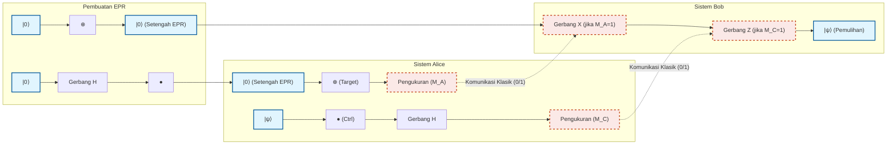

---

## 6.3 Pengodean Superpadat (Superdense Coding)

Sedangkan teleportasi kuantum adalah protokol yang "mengkonsumsi pasangan EPR dan 2 bit klasik untuk mengirim keadaan 1 qubit", pengodean superpadat (Superdense Coding) dalam beberapa hal adalah protokol dengan operasi kebalikannya. Melaluinya, transmisi "2 bit klasik informasi kepada penerima dimungkinkan hanya dengan mengirimkan 1 qubit secara fisik".

Dalam hukum fisika klasik, sebuah sistem 2-level (1 bit atau polarisasi 1 foton) dapat membawa paling banyak 1 bit informasi (0 atau 1). Namun, poin luar biasa dari pengodean superpadat adalah bahwa ia secara cerdik memanfaatkan keterikatan kuantum (entanglement) untuk seolah-olah menembus batas Holevo (Holevo's bound) ini.

### Detail Protokol dan Basis Bell

Sekali lagi, asumsikan Alice dan Bob sebelumnya telah berbagi pasangan EPR.

$$
|\Phi^+\rangle_{AB} = \frac{1}{\sqrt{2}} \left( |0\rangle_A |0\rangle_B + |1\rangle_A |1\rangle_B \right)
$$

Alice ingin mengirim pesan klasik 2 bit $b_1 b_2 \in \{00, 01, 10, 11\}$ kepada Bob.
Bergantung pada pesan yang ingin ia kirim, Alice melakukan operasi gerbang qubit tunggal tertentu **hanya pada qubit A miliknya** .

1. **Jika pesan `00`:** Alice tidak melakukan apa pun (menerapkan operator identitas $I$).
   Keadaan keseluruhan tidak berubah.
   

$$
|\Psi_{00}\rangle = (I \otimes I) |\Phi^+\rangle = \frac{1}{\sqrt{2}} (|00\rangle + |11\rangle) = |\Phi^+\rangle
$$

2. **Jika pesan `01`:** Alice menerapkan gerbang Pauli Z.
   

$$
|\Psi_{01}\rangle = (Z \otimes I) |\Phi^+\rangle = \frac{1}{\sqrt{2}} (Z|0\rangle|0\rangle + Z|1\rangle|1\rangle) = \frac{1}{\sqrt{2}} (|00\rangle - |11\rangle) = |\Phi^-\rangle
$$

3. **Jika pesan `10`:** Alice menerapkan gerbang Pauli X.
   

$$
|\Psi_{10}\rangle = (X \otimes I) |\Phi^+\rangle = \frac{1}{\sqrt{2}} (X|0\rangle|0\rangle + X|1\rangle|1\rangle) = \frac{1}{\sqrt{2}} (|10\rangle + |01\rangle) = |\Psi^+\rangle
$$

4. **Jika pesan `11`:** Alice menerapkan gerbang Pauli Z, dan kemudian menerapkan gerbang Pauli X (setara dengan $iY$).
   

$$
|\Psi_{11}\rangle = (ZX \otimes I) |\Phi^+\rangle = (Z \otimes I) |\Psi^+\rangle = \frac{1}{\sqrt{2}} (Z|1\rangle|0\rangle + Z|0\rangle|1\rangle) = \frac{1}{\sqrt{2}} (-|10\rangle + |01\rangle) = -|\Psi^-\rangle
$$

   (Tanda negatif keseluruhan adalah fase global, sehingga tidak memengaruhi probabilitas observasi. Namun, demi kenyamanan di sini, kita akan mengatur ulang tanda tersebut untuk berkorespondensi dengan **$|\Psi^-\rangle = \frac{1}{\sqrt{2}} (|01\rangle - |10\rangle)$** .)

Alice kemudian mengirimkan qubit A miliknya yang telah dioperasikan kepada Bob melalui saluran komunikasi kuantum (seperti serat optik).

Fakta luar biasa yang patut diperhatikan: Alice **hanya mengirimkan 1 qubit secara fisik** kepada Bob. Dan dia tidak menyentuh qubit Bob sama sekali. Namun, sebagai hasil dari operasi Alice, keadaan seluruh sistem secara deterministik telah bertransisi ke salah satu dari 4 keadaan kuantum ortogonal sempurna (yang kita sebut **basis Bell** ).

### Dekode oleh Bob dan Pengukuran Bell

Bob menerima qubit A yang dikirim oleh Alice. Kini Bob memiliki kedua qubit A dan qubit B miliknya yang asli. Pada dua qubit ini, Bob melakukan "pengukuran Bell" yang sama persis seperti pada pengukuran Alice dalam teleportasi kuantum.

Dengan kata lain, ia menerapkan gerbang CNOT dengan qubit A sebagai bit kontrol dan B sebagai bit target, dilanjutkan dengan gerbang Hadamard pada qubit A. Dengan transformasi kebalikan ini, basis Bell yang terjerat akan dikembalikan ke basis komputasi yang terukur.

Mari kita pastikan perkembangan matematis untuk setiap kasus:

- **Jika keadaan adalah $|\Phi^+\rangle = \frac{1}{\sqrt{2}} (|00\rangle + |11\rangle)$ (Pesan `00`):** Menerapkan CNOT menghasilkan $\frac{1}{\sqrt{2}} (|00\rangle + |10\rangle) = \frac{1}{\sqrt{2}} (|0\rangle + |1\rangle) |0\rangle$.
  Menerapkan Hadamard pada A menghasilkan $|0\rangle |0\rangle$.
  Saat Bob mengukur, ia pasti akan mendapatkan `00`.

- **Jika keadaan adalah $|\Phi^-\rangle = \frac{1}{\sqrt{2}} (|00\rangle - |11\rangle)$ (Pesan `01`):** Menerapkan CNOT menghasilkan $\frac{1}{\sqrt{2}} (|00\rangle - |10\rangle) = \frac{1}{\sqrt{2}} (|0\rangle - |1\rangle) |0\rangle$.
  Menerapkan Hadamard pada A menghasilkan $|1\rangle |0\rangle$.
  Saat Bob mengukur, ia pasti akan mendapatkan `10`. (*Catatan: Korespondensi bit dengan operasi Alice berbeda menurut definisi sirkuit, namun dapat dibedakan secara unik*)

- **Jika keadaan adalah $|\Psi^+\rangle = \frac{1}{\sqrt{2}} (|01\rangle + |10\rangle)$ (Pesan `10`):** Menerapkan CNOT menghasilkan $\frac{1}{\sqrt{2}} (|01\rangle + |11\rangle) = \frac{1}{\sqrt{2}} (|0\rangle + |1\rangle) |1\rangle$.
  Menerapkan Hadamard pada A menghasilkan $|0\rangle |1\rangle$.
  Saat Bob mengukur, ia pasti akan mendapatkan `01`.

- **Jika keadaan adalah $|\Psi^-\rangle = \frac{1}{\sqrt{2}} (|01\rangle - |10\rangle)$ (Pesan `11`):** Menerapkan CNOT menghasilkan $\frac{1}{\sqrt{2}} (|01\rangle - |11\rangle) = \frac{1}{\sqrt{2}} (|0\rangle - |1\rangle) |1\rangle$.
  Menerapkan Hadamard pada A menghasilkan $|1\rangle |1\rangle$.
  Saat Bob mengukur, ia pasti akan mendapatkan `11`.

Dengan cara ini, dengan mengukur satu qubit yang diterima beserta satu qubit miliknya secara bersama-sama, Bob mampu secara sempurna membaca 2 bit informasi klasik yang dimaksudkan oleh Alice dengan akurasi 100%.

### Signifikansi dalam Komunikasi Kuantum

Nilai sesungguhnya dari pengodean superpadat tidak hanya berhenti pada penggandaan "kepadatan" informasi menjadi dua kali lipat. Protokol ini merupakan bukti krusial mengenai bagaimana korelasi non-lokal dari keterikatan kuantum dapat memperluas lebar pita (bandwidth) dari transmisi informasi klasik.

Hal ini juga sangat penting dari sudut pandang keamanan. Jika seorang penyadap, Eve, mencegat qubit A selama transmisi dari Alice ke Bob, Eve tidak akan dapat memperoleh informasi apa pun. Ini karena, jika hanya qubit tunggal A yang diamati, keadaannya akan berperilaku sebagai keadaan campuran yang sepenuhnya acak (matriks densitas proporsional terhadap $\frac{I}{2}$). Informasi hanya dienkode dalam "korelasi" antara A dan B yang terpisah secara spasial, dan secara fisik tidak mungkin untuk mendekodenya jika hanya memperoleh salah satu dari keduanya.

---
Seperti yang telah ditunjukkan, teleportasi kuantum dan pengodean superpadat, sekilas, terlihat seperti fenomena magis yang berlawanan dengan intuisi. Namun dengan setia mengikuti aksioma aljabar linear dari mekanika kuantum, mereka diturunkan sebagai konsekuensi logis yang sangat ketat dan tak terelakkan. Dalam bab berikutnya, kita akan menerapkan protokol-protokol dasar ini dan melangkah ke dunia algoritma kuantum untuk memecahkan masalah yang lebih kompleks.

# Bab 7: Algoritma Deutsch-Jozsa

## 7.1 Signifikansi Historis: Keunggulan Kuantum Jelas yang Pertama Kali Ditunjukkan

Hipotesis bahwa komputer kuantum memiliki potensi untuk memecahkan masalah tertentu dengan jauh lebih cepat secara luar biasa daripada komputer klasik diajukan melalui penelitian perintis oleh Richard Feynman dan David Deutsch pada tahun 1980-an. Namun, untuk pertanyaan "Secara spesifik pada masalah seperti apa, dan dalam bentuk yang dapat dibuktikan secara matematis, komputasi kuantum dapat mengungguli komputasi klasik?", jawaban pasti yang pertama kali diberikan adalah "Algoritma Deutsch-Jozsa (Deutsch-Jozsa Algorithm)" yang dirancang oleh David Deutsch dan Richard Jozsa pada tahun 1992.

Dalam bab ini, kita akan mengungkap gambaran lengkap dari algoritma bersejarah ini secara ketat secara matematis. Walaupun algoritma ini tidak memecahkan masalah praktis, ia telah membuktikan bahwa dengan menggabungkan fenomena khas mekanika kuantum secara cerdik—"Superposisi (Superposition)", "Interferensi (Interference)", dan "Tendangan Balik Fase (Phase Kickback)"—orde kompleksitas komputasi dapat dikurangi secara dramatis.

## 7.2 Pengaturan Masalah: Fungsi Konstan atau Fungsi Seimbang?

Pertama-tama, mari kita definisikan masalah yang harus diselesaikan oleh algoritma. Misalkan kita diberikan sebuah kotak hitam (*oracle*). *Oracle* ini menerima input $n$ bit $x \in \{0, 1\}^n$ dan menghitung fungsi **$f$** yang mengembalikan output 1 bit $f(x) \in \{0, 1\}$.

Di sini, fungsi **$f$** ini memiliki sebuah janji (Promise) yang kuat bahwa ia "pasti memenuhi salah satu dari dua sifat berikut":

1. **Fungsi Konstan (Constant Function)** : Untuk sembarang input $x$, fungsi selalu mengembalikan $f(x) = 0$ atau selalu mengembalikan $f(x) = 1$.
2. **Fungsi Seimbang (Balanced Function)** : Dari semua kemungkinan input $x$, fungsi mengembalikan $f(x) = 0$ untuk tepat setengahnya, dan mengembalikan $f(x) = 1$ untuk setengah sisanya.

Tujuan kita adalah untuk menentukan apakah *oracle* **$f$** yang diberikan merupakan fungsi konstan atau fungsi seimbang, dengan meminimalkan jumlah pertanyaan (kueri) ke *oracle*.

### Batasan dalam Komputasi Klasik

Mari kita pertimbangkan kasus menyelesaikan masalah ini dengan komputer klasik. Pola input untuk fungsi **$f$** secara total ada sebanyak $N = 2^n$ kemungkinan.

Mari kita asumsikan skenario terburuk. Misalkan sejak pertanyaan pertama secara berturut-turut untuk $2^{n-1}$ kueri (yaitu setengah dari keseluruhan input), diperoleh output yang sama (misalnya: semuanya bernilai $0$ ). Pada titik ini, kedua kemungkinan masih tetap terbuka: kemungkinan bahwa fungsi tersebut adalah fungsi konstan (setengah sisanya juga semuanya $0$ ), atau fungsi seimbang (setengah sisanya semuanya $1$ ).

Oleh karena itu, agar komputer klasik dapat menentukan dengan kepastian 100% apakah fungsi tersebut merupakan fungsi konstan atau fungsi seimbang, diperlukan **dalam kasus terburuk sebanyak $2^{n-1} + 1$ kali kueri** . Jumlah kueri ini meningkat secara eksponensial terhadap jumlah bit input $n$. Dengan kata lain, kompleksitas komputasi klasik (kompleksitas kueri) adalah $O(2^n)$.

Secara mengejutkan, dengan menggunakan komputasi kuantum, masalah ini dapat ditentukan dengan benar dengan probabilitas 100% hanya dalam **1 kali kueri** . Inilah esensi dari keunggulan kuantum.

## 7.3 Oracle Kuantum dan Geometri Tendangan Balik Fase

Untuk membangun algoritma kuantum, pertama-tama kita perlu merepresentasikan kembali fungsi klasik **$f(x)$** ke dalam bentuk yang memenuhi persyaratan mekanika kuantum (uniteritas = reversibilitas). Untuk tujuan inilah "Oracle Kuantum (Quantum Oracle)" diperkenalkan.

### Oracle Kuantum $U_f$

Kita menyiapkan register input ( $n$ qubit) dan register target ( $1$ qubit). Operator uniter **$U_f$** yang merepresentasikan oracle bekerja pada keadaan basis komputasi sebagai berikut:

$$
U_f |x\rangle |y\rangle = |x\rangle |y \oplus f(x)\rangle
$$

Di sini, $\oplus$ menyatakan penjumlahan modulo 2 (XOR). Transformasi ini jelas bersifat reversibel dan uniter, karena jika diterapkan sekali lagi pada dirinya sendiri akan kembali ke keadaan semula ( $U_f^2 = I$ ).

### Tendangan Balik Fase (Phase Kickback)

Salah satu teknik paling penting dan kontraintuitif dalam ilmu informasi kuantum adalah "tendangan balik fase". Mari kita lihat apa yang terjadi jika keadaan register target tidak diatur ke keadaan klasik $|0\rangle$ atau $|1\rangle$, melainkan diatur ke keadaan superposisi $|-\rangle$ yang dilewatkan melalui gerbang Hadamard:

$$
|-\rangle = \frac{|0\rangle - |1\rangle}{\sqrt{2}}
$$

Kita memasukkan keadaan ini ke dalam register target, lalu menerapkan oracle **$U_f$** .

$$
U_f |x\rangle |-\rangle = U_f \left( |x\rangle \frac{|0\rangle - |1\rangle}{\sqrt{2}} \right)
$$

$$
= \frac{1}{\sqrt{2}} \left( U_f |x\rangle |0\rangle - U_f |x\rangle |1\rangle \right)
$$

$$
= \frac{1}{\sqrt{2}} \left( |x\rangle |0 \oplus f(x)\rangle - |x\rangle |1 \oplus f(x)\rangle \right)
$$

Di sini, kita membagi kasus berdasarkan nilai dari $f(x)$:
- Kasus ketika $f(x) = 0$:
  Keadaannya menjadi $\frac{1}{\sqrt{2}} ( |x\rangle |0\rangle - |x\rangle |1\rangle ) = |x\rangle |-\rangle$.
- Kasus ketika $f(x) = 1$:
  Keadaannya menjadi $\frac{1}{\sqrt{2}} ( |x\rangle |1\rangle - |x\rangle |0\rangle ) = - |x\rangle |-\rangle$.

Jika kita merangkumnya menjadi satu, diperoleh persamaan yang indah berikut ini:

$$
U_f |x\rangle |-\rangle = (-1)^{f(x)} |x\rangle |-\rangle
$$

Ini adalah hasil yang luar biasa. Keadaan register target $|-\rangle$ sama sekali tidak mengalami perubahan, namun hasil evaluasi dari fungsi **$f(x)$** "ditendang balik" (kickback) ke sisi register input **$|x\rangle$** sebagai "tanda fase (Phase)". Hal ini memungkinkan kita untuk menyandikan informasi ke dalam fase amplitudo.

## 7.4 Algoritma Deutsch-Jozsa: Diagram Sirkuit dan Ekspansi Matematis Lengkap

Di sini, kita akan mendeskripsikan secara lengkap seluruh gambaran algoritma baik dari segi sirkuit kuantum maupun formulasi matematis.

### Diagram Sirkuit Kuantum

Berikut adalah diagram yang menunjukkan sirkuit kuantum dari algoritma Deutsch-Jozsa:

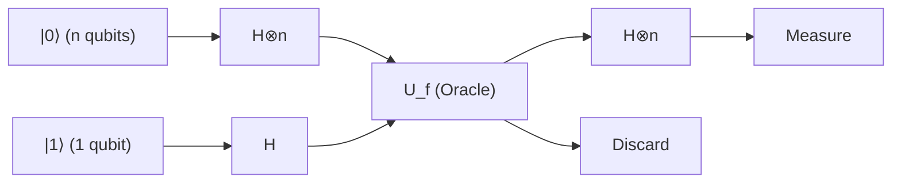

### Langkah 1: Persiapan Keadaan Awal

Kita menginisialisasi $n$ buah qubit dari register input ke $|0\rangle^{\otimes n}$, dan 1 buah qubit dari register target ke $|1\rangle$.

$$
|\psi_0\rangle = |0\rangle^{\otimes n} |1\rangle
$$

### Langkah 2: Penerapan Gerbang Hadamard ke Semua Qubit

Kita menerapkan gerbang Hadamard ( $H$ ) ke semua qubit untuk menghasilkan keadaan superposisi lengkap.
Transformasi Hadamard $H^{\otimes n}$ pada $n$ qubit bekerja sebagai berikut:

$$
H^{\otimes n} |0\rangle^{\otimes n} = \frac{1}{\sqrt{2^n}} \sum_{x \in \{0,1\}^n} |x\rangle
$$

Oleh karena itu, keadaan sistem secara keseluruhan menjadi sebagai berikut:

$$
|\psi_1\rangle = \left( \frac{1}{\sqrt{2^n}} \sum_{x \in \{0,1\}^n} |x\rangle \right) \otimes \left( \frac{|0\rangle - |1\rangle}{\sqrt{2}} \right)
$$

$$
= \frac{1}{\sqrt{2^n}} \sum_{x=0}^{2^n-1} |x\rangle |-\rangle
$$

### Langkah 3: Penerapan Oracle Kuantum (Tendangan Balik Fase)

Di sini kita menerapkan oracle **$U_f$** . Berdasarkan efek tendangan balik fase yang telah dibuktikan pada bagian sebelumnya, setiap keadaan basis $|x\rangle$ dikalikan dengan fase $(-1)^{f(x)}$.

$$
|\psi_2\rangle = U_f |\psi_1\rangle = \frac{1}{\sqrt{2^n}} \sum_{x \in \{0,1\}^n} (-1)^{f(x)} |x\rangle |-\rangle
$$

Pada titik ini, seluruh informasi (sebanyak $2^n$ nilai) dari hasil evaluasi **$f(x)$** telah disematkan secara paralel ke dalam setiap fase keadaan superposisi melalui satu kali operasi komputasi. Hal ini disebut "Paralelisme Kuantum (Quantum Parallelism)".

### Langkah 4: Terjadinya Interferensi pada Register Input

Register target diabaikan karena tidak digunakan lagi setelah ini. Kita menerapkan kembali transformasi Hadamard $H^{\otimes n}$ pada $n$ qubit di register input.
Aksi dari $H^{\otimes n}$ pada sembarang keadaan basis $|x\rangle$ dinyatakan oleh rumus umum berikut:

$$
H^{\otimes n} |x\rangle = \frac{1}{\sqrt{2^n}} \sum_{z \in \{0,1\}^n} (-1)^{x \cdot z} |z\rangle
$$

Di sini, $x \cdot z$ menyatakan perkalian dalam per-bit (bitwise inner product) $x \cdot z = x_1 z_1 \oplus x_2 z_2 \oplus \dots \oplus x_n z_n$.
Ketika rumus ini diterapkan ke bagian register input dari $|\psi_2\rangle$, keadaan akhir $|\psi_3\rangle$ diekspansikan sebagai berikut:

$$
|\psi_3\rangle = H^{\otimes n} \left( \frac{1}{\sqrt{2^n}} \sum_{x} (-1)^{f(x)} |x\rangle \right)
$$

$$
= \frac{1}{\sqrt{2^n}} \sum_{x} (-1)^{f(x)} \left( \frac{1}{\sqrt{2^n}} \sum_{z} (-1)^{x \cdot z} |z\rangle \right)
$$

$$
= \frac{1}{2^n} \sum_{z \in \{0,1\}^n} \left( \sum_{x \in \{0,1\}^n} (-1)^{f(x) + x \cdot z} \right) |z\rangle
$$

Ini adalah persamaan yang sangat penting yang merepresentasikan keadaan kuantum tepat sebelum pengukuran. "Interferensi" mekanika kuantum terjadi di dalam penjumlahan $\sum_x$ ini.

### Langkah 5: Pengukuran dan Analisis Hasil

Di akhir algoritma, kita mengukur $n$ qubit pada register input dalam basis komputasi.
Hal yang menjadi pusat perhatian kita adalah probabilitas di mana semua qubit bernilai $0$, yaitu keadaan **$|0\rangle^{\otimes n}$** yang terukur. Mari kita tinjau kasus ketika $z = 00\dots0$ pada persamaan di atas. Pada kondisi ini, karena $x \cdot 0 = 0$ untuk sembarang $x$, amplitudo (koefisien) dari keadaan **$|0\rangle^{\otimes n}$** dihitung sebagai berikut:

$$
\text{Amplitude of } |0\rangle^{\otimes n} = \frac{1}{2^n} \sum_{x \in \{0,1\}^n} (-1)^{f(x)}
$$

Di sini, kita menguji dua kasus yang sesuai dengan janji (Promise):

#### Kasus 1: Ketika fungsi $f$ adalah fungsi konstan
Fungsi selalu menghasilkan $f(x) = 0$ atau selalu $f(x) = 1$.
- Jika selalu $0$, maka $(-1)^{f(x)} = 1$, sehingga penjumlahannya adalah $\sum 1 = 2^n$. Amplitudonya adalah $\frac{2^n}{2^n} = 1$ .
- Jika selalu $1$, maka $(-1)^{f(x)} = -1$, sehingga penjumlahannya adalah $\sum -1 = -2^n$. Amplitudonya adalah $\frac{-2^n}{2^n} = -1$ .

Karena probabilitas pengukuran $P(0)$ adalah kuadrat dari nilai mutlak amplitudonya:

$$
P(00\dots0) = | \pm 1 |^2 = 1
$$

Dengan kata lain, **ketika fungsinya adalah fungsi konstan, $|0\rangle^{\otimes n}$ akan terukur dengan probabilitas 100%** .

#### Kasus 2: Ketika fungsi $f$ adalah fungsi seimbang
Terdapat jumlah yang tepat sama antara $x$ yang menghasilkan $f(x) = 0$ dan $x$ yang menghasilkan $f(x) = 1$ (masing-masing sebanyak $2^{n-1}$ buah).
Oleh karena itu, $(-1)^{f(x)}$ bernilai $+1$ untuk separuhnya dan $-1$ untuk separuh lainnya. Ketika semuanya dijumlahkan, nilai-nilai tersebut saling meniadakan secara sempurna menjadi nol (interferensi destruktif total).

$$
\text{Amplitude of } |0\rangle^{\otimes n} = \frac{1}{2^n} \left( 2^{n-1}(+1) + 2^{n-1}(-1) \right) = 0
$$

Karena probabilitas pengukuran $P(0)$ adalah kuadrat dari nilai mutlak amplitudonya:

$$
P(00\dots0) = | 0 |^2 = 0
$$

Dengan kata lain, **ketika fungsinya adalah fungsi seimbang, probabilitas untuk mengukur $|0\rangle^{\otimes n}$ adalah 0%, dan keadaan di mana setidaknya satu bit bernilai $1$ pasti akan selalu terukur** .

## 7.6 Contoh Konkret: Penelusuran Lengkap untuk Kasus $n=2$

Daripada hanya melihat rumus matematis yang abstrak, mari kita telusuri vektor keadaan konkret untuk kasus $n=2$ (input 2 qubit) untuk merasakan secara langsung bagaimana algoritma berperilaku. Terdapat 4 variasi pola input: $x \in \{00, 01, 10, 11\}$.

### Kasus Fungsi Konstan: $f(x) = 1$ (Semua 1)
Bagian register input dari keadaan $|\psi_1\rangle$ sebelum penerapan oracle adalah sebagai berikut:

$$
\frac{1}{2} ( |00\rangle + |01\rangle + |10\rangle + |11\rangle )
$$

Setelah menerapkan oracle, karena tendangan balik fase, seluruh suku dikalikan dengan $(-1)^{f(x)} = -1$:

$$
|\psi_2\rangle_{in} = -\frac{1}{2} ( |00\rangle + |01\rangle + |10\rangle + |11\rangle )
$$

Kita menerapkan kembali $H^{\otimes 2}$ pada keadaan ini. Dengan memanfaatkan fakta bahwa $H^{\otimes 2} (|00\rangle + |01\rangle + |10\rangle + |11\rangle) = 2 |00\rangle$:

$$
|\psi_3\rangle_{in} = - |00\rangle
$$

Hasil pengukurannya adalah $00$ dengan probabilitas $100\%$.

### Kasus Fungsi Seimbang: $f(00)=0, f(01)=1, f(10)=1, f(11)=0$
Setelah menerapkan oracle, akibat tendangan balik fase, tanda minus hanya diberikan pada suku-suku yang memiliki $f(x)=1$:

$$
|\psi_2\rangle_{in} = \frac{1}{2} ( |00\rangle - |01\rangle - |10\rangle + |11\rangle )
$$

Kita menerapkan $H^{\otimes 2}$ pada keadaan ini. Dengan menghitung dan memasukkan pengaruh $H^{\otimes 2}$ pada masing-masing basis, serta memusatkan perhatian pada koefisien dari $|00\rangle$, kita memperoleh $\frac{1}{4} (1 - 1 - 1 + 1) = 0$, yang saling meniadakan secara sempurna (interferensi destruktif).
Jika kita menyederhanakan suku-suku yang tersisa, keadaan akhirnya menjadi $|11\rangle$ (dalam contoh spesifik ini, 11 akan terukur dengan probabilitas 100%, namun untuk fungsi seimbang secara umum, keadaan apa pun selain 00 yang akan terukur). Telah diverifikasi bahwa probabilitas untuk mengukur $00$ benar-benar 0%.

## 7.7 Kesimpulan: Lompatan Komputasi yang Dihasilkan oleh Interferensi Kuantum

Keajaiban dari algoritma Deutsch-Jozsa terletak pada keberhasilannya memetakan $2^n$ informasi ke dalam ruang fase melalui tendangan balik fase, serta mengendalikan "Interferensi (Interference)" yang ditimbulkan oleh transformasi Hadamard terakhir.

- Dalam kasus **Fungsi Konstan** : Gelombang dari semua lintasan mengalami "interferensi konstruktif (Constructive Interference)", dan amplitudonya terkonsentrasi 100% pada keadaan **$|0\rangle^{\otimes n}$** .
- Dalam kasus **Fungsi Seimbang** : Gelombang positif dan gelombang negatif mengalami "interferensi destruktif (Destructive Interference)", yang sepenuhnya melenyapkan amplitudo keadaan **$|0\rangle^{\otimes n}$** .

Melalui struktur matematis yang luar biasa ini, masalah yang pada komputer klasik memerlukan kueri paling buruk $O(2^n)$ (secara spesifik $2^{n-1} + 1$ kali) dapat dipecahkan oleh komputer kuantum hanya dalam **1 kali kueri tunggal ( $O(1)$ )** , dan secara deterministik (dengan tingkat akurasi 100%).

Fakta yang dibuktikan dalam bab ini menjadi sebuah tonggak sejarah yang sangat penting dalam sejarah umat manusia, membuktikan bahwa dengan menerapkan prinsip-prinsip mekanika kuantum ke dalam pemrosesan informasi, batas fisik teori informasi klasik dapat ditembus.

# Bab 8: Algoritma Shor dan Ancaman terhadap Kriptografi Modern

## 8.1 Pendahuluan: Matematika Kriptografi RSA dan Kesulitan Faktorisasi Prima

Dalam masyarakat digital modern, fondasi yang menjamin komunikasi yang aman di internet adalah kriptografi kunci publik. Di antaranya, kriptografi RSA yang paling banyak digunakan mengandalkan keamanannya pada asimetri matematis (sifat fungsi satu arah) bahwa "memfaktorkan bilangan komposit raksasa menjadi faktor primanya adalah hal yang sangat sulit secara komputasi". Dalam bab ini, kita akan mengungkap secara ketat dan tanpa kompromi mengenai struktur teoretis dari "Algoritma Shor" (Shor's Algorithm), yaitu metode penentu tentang bagaimana komputer kuantum meruntuhkan fondasi kriptografi RSA ini.

Pertama, mari kita formulasikan mekanisme kriptografi RSA secara matematis. Pembuatan kunci kriptografi RSA dimulai dengan memilih dua bilangan prima raksasa $p$ dan $q$ secara acak (saat ini, masing-masing direkomendasikan berukuran 2048 bit atau lebih). Bilangan komposit yang merupakan perkalian dari keduanya, $N = pq$, dihitung, dan nilai ini dipublikasikan secara umum sebagai bagian dari kunci publik. Selanjutnya, fungsi totient Euler $\phi(N)$ dihitung. Berdasarkan sifat bilangan prima, nilai ini adalah $\phi(N) = (p-1)(q-1)$.

Eksponen enkripsi $e$, yang menjadi kunci enkripsi, dipilih sedemikian rupa sehingga memenuhi $1 < e < \phi(N)$ dan $\text{gcd}(e, \phi(N)) = 1$ (yaitu koprima dengan $\phi(N)$). Kemudian, eksponen dekripsi $d$, yang menjadi kunci privat, dihitung agar memenuhi persamaan kongruensi $ed \equiv 1 \pmod{\phi(N)}$. Nilai ini dapat dengan mudah dicari dalam waktu polinomial menggunakan algoritma Euclidean yang diperluas.

Jika teks asal (plaintext) dinyatakan sebagai bilangan bulat $M$ (dengan $0 \le M < N$), enkripsi dilakukan melalui perpangkatan modulo $N$ sebagai berikut:

$$
C \equiv M^e \pmod{N}
$$

Saat melakukan dekripsi, kita menghitungnya dengan cara yang sama menggunakan kunci privat $d$:

$$
M' \equiv C^d \pmod{N}
$$

Berdasarkan teorema Euler, karena $C^d \equiv M^{ed} \equiv M^{1 + k\phi(N)} \equiv M \pmod{N}$ berlaku, ini menjamin bahwa teks asal $M$ akan dipulihkan sepenuhnya.

Hal yang penting di sini adalah bahwa untuk menemukan kunci privat $d$ dari informasi yang dipublikasikan $(N, e)$, kita perlu mengetahui $\phi(N)$, dan untuk itu kita harus memfaktorkan $N$ menjadi faktor prima $p$ dan $q$. Jika menggunakan komputer klasik, bahkan dengan menggunakan algoritma faktorisasi prima tercepat yang diketahui saat ini, yaitu General Number Field Sieve (GNFS), kompleksitas komputasinya adalah waktu sub-eksponensial $O\left(\exp\left(c (\log N)^{1/3} (\log \log N)^{2/3}\right)\right)$. Ini berarti waktu komputasi akan melonjak secara eksponensial terhadap jumlah bit dari $N$. Sebagai contoh, memfaktorkan bilangan bulat 2048 bit menggunakan superkomputer klasik diperkirakan akan memakan waktu melebihi umur alam semesta.

Namun, algoritma kuantum yang diterbitkan oleh Peter Shor pada tahun 1994 membalikkan premis ini secara mendasar. Algoritma Shor menyelesaikan faktorisasi prima dalam waktu polinomial $O((\log N)^3)$ atau $\tilde{O}((\log N)^2)$ melalui optimasi. Ini menandakan "Percepatan Super-polinomial" (Super-polynomial Speedup) terhadap komputasi klasik, yang pada dasarnya adalah percepatan eksponensial, dan menunjukkan bahwa kriptografi RSA yang digunakan saat ini akan sepenuhnya tidak berdaya melawan komputer kuantum.

## 8.2 Reduksi ke Masalah Pencarian Ordo (Reduction to Order-Finding Problem)

Wawasan jenius dari Algoritma Shor terletak pada kenyataan bahwa "alih-alih menyelesaikan masalah faktorisasi prima secara langsung, ia mereduksinya menjadi masalah pencarian periode". Berdasarkan teorema teori bilangan murni, telah dibuktikan bahwa faktorisasi prima ekuivalen dengan masalah yang disebut "Masalah Pencarian Ordo" (Order-Finding Problem). Proses reduksi ini sendiri merupakan algoritma klasik sepenuhnya dan tidak memerlukan komputasi kuantum.

Mari kita telusuri langkah-langkah untuk memfaktorkan bilangan komposit $N$ yang diberikan. Pertama, kita memilih bilangan bulat acak $a$ yang memenuhi $1 < a < N$. Menggunakan algoritma Euclidean, kita menghitung faktor persekutuan terbesar $\text{gcd}(a, N)$. Jika nilai ini lebih besar dari $1$, kita beruntung karena kita telah menemukan faktor non-trivial dari $N$, dan komputasi selesai (namun, probabilitas hal ini terjadi secara kebetulan untuk bilangan sangat besar seperti yang digunakan dalam kriptografi sangatlah kecil secara astronomis).

Jika $\text{gcd}(a, N) = 1$, maka $a$ dan $N$ saling koprima. Di sini, kita mendefinisikan fungsi eksponensial modulo sebagai berikut:

$$
f(x) = a^x \bmod N
$$

Dalam bahasa teori grup, $a$ adalah elemen dari grup perkalian $(\mathbb{Z}/N\mathbb{Z})^\times$, dan fungsi $f(x)$ membentuk homomorfisme dari grup aditif bilangan bulat $\mathbb{Z}$ ke grup perkalian $(\mathbb{Z}/N\mathbb{Z})^\times$. Berdasarkan sifat grup berhingga, fungsi ini pasti memiliki periodisitas. Artinya, terdapat suatu bilangan bulat positif terkecil $r$ yang memenuhi persamaan berikut:

$$
a^r \equiv 1 \pmod{N}
$$

Bilangan bulat positif terkecil $r$ ini disebut "Ordo" (Order) dari $a$ modulo $N$, atau "Periode" (Period) dari fungsi $f(x)$.

Jika kita dapat menemukan ordo $r$ ini, dan lebih jauh jika $r$ adalah genap, serta memenuhi syarat bahwa $a^{r/2} \not\equiv -1 \pmod{N}$, maka kita mendapatkan petunjuk kuat untuk faktorisasi sebagai berikut:

$$
a^r - 1 \equiv 0 \pmod{N}
$$

$$
(a^{r/2} - 1)(a^{r/2} + 1) \equiv 0 \pmod{N}
$$

Persamaan ini bermakna bahwa $N$ membagi habis hasil kali dari $(a^{r/2} - 1)$ dan $(a^{r/2} + 1)$. Namun, karena $a^{r/2} \not\equiv 1$ (karena $r$ adalah periode terkecil) dan $a^{r/2} \not\equiv -1$ (berdasarkan syarat), maka $N$ tidak dapat membagi habis salah satu dari kedua suku ini secara mandiri. Oleh karena itu, faktor-faktor prima dari $N$ tersebar dan terkandung dalam kedua suku ini.
Kesimpulannya, dengan menghitung:

$$
p = \text{gcd}(a^{r/2} - 1, N)
$$

$$
q = \text{gcd}(a^{r/2} + 1, N)
$$

kita pasti dapat menemukan faktor prima non-trivial dari $N$.

Melalui reduksi klasik ini, masalahnya menyempit menjadi satu poin: "Bagaimana cara menemukan periode $r$ dari fungsi $f(x) = a^x \bmod N$ dengan cepat?". Pada komputer klasik, untuk menemukan periode ini, kita perlu menghitung secara berurutan untuk $x=1, 2, 3, \dots$, dan karena $r$ dapat mencapai orde yang sama dengan $N$, ini pada akhirnya membutuhkan waktu eksponensial. Di sinilah komputer kuantum pertama kali berperan.

## 8.3 Rumus Ketat Transformasi Fourier Kuantum (QFT) dan Perannya

Inti dari algoritma kuantum untuk mengekstraksi periode tersembunyi $r$ dari fungsi $f(x)$ dalam waktu polinomial adalah "Transformasi Fourier Kuantum" (Quantum Fourier Transform, QFT). QFT adalah analogi mekanika kuantum dari Transformasi Fourier Diskrit (DFT) klasik, dan merupakan transformasi uniter yang beroperasi pada amplitudo probabilitas dari ruang keadaan.

Aksi Transformasi Fourier Kuantum terhadap basis komputasi $|j\rangle$ ($j = 0, 1, \dots, M-1$) di ruang Hilbert $\mathcal{H}$ berdimensi $M = 2^n$ didefinisikan secara ketat sebagai berikut:

$$
\text{QFT} |j\rangle = \frac{1}{\sqrt{M}} \sum_{k=0}^{M-1} e^{2\pi i j k / M} |k\rangle
$$

Terhadap sembarang keadaan kuantum **$|\psi\rangle$** , berdasarkan linearitas, ia akan beraksi sebagai berikut:

$$
\text{QFT} \sum_{j=0}^{M-1} x_j |j\rangle = \sum_{k=0}^{M-1} \left( \frac{1}{\sqrt{M}} \sum_{j=0}^{M-1} x_j e^{2\pi i j k / M} \right) |k\rangle = \sum_{k=0}^{M-1} y_k |k\rangle
$$

Amplitudo baru $y_k$ yang diperoleh di sini sepenuhnya cocok dengan koefisien yang diperoleh dari Transformasi Fourier Diskrit klasik. Namun, sementara Transformasi Fourier Cepat (Fast Fourier Transform, FFT) klasik membutuhkan waktu $O(M \log M) = O(n 2^n)$ untuk menghitung seluruh vektor, QFT mewujudkan pengurangan kompleksitas komputasi yang dramatis, dapat mengubah "keadaan" dari $n$ qubit hanya dengan $O(n^2)$ operasi gerbang kuantum.

Untuk memahami mengapa hal ini dapat dicapai dengan jumlah gerbang $O(n^2)$ yang sedikit, kita perlu mendekomposisi keadaan yang dihasilkan oleh QFT ke dalam bentuk perkalian tensor. Misalkan bilangan bulat $j$ dinyatakan dalam representasi biner $j = j_1 2^{n-1} + j_2 2^{n-2} + \dots + j_n 2^0$ (di mana $j_1$ adalah bit paling signifikan, dan $j_n$ adalah bit paling tidak signifikan), keadaan keluaran dapat didekomposisi dengan indah menjadi perkalian tensor dari $n$ keadaan qubit independen berikut:

$$
\text{QFT} |j_1 j_2 \dots j_n\rangle = \frac{1}{\sqrt{2^n}} \left(|0\rangle + e^{2\pi i 0.j_n} |1\rangle\right) \otimes \left(|0\rangle + e^{2\pi i 0.j_{n-1} j_n} |1\rangle\right) \otimes \dots \otimes \left(|0\rangle + e^{2\pi i 0.j_1 j_2 \dots j_n} |1\rangle\right)
$$

Di sini, $0.j_l \dots j_m$ mewakili pecahan biner, dan $0.j_l \dots j_m = j_l/2 + j_{l+1}/4 + \dots + j_m/2^{m-l+1}$.

Rumus ini sangat sugestif. Hal ini menunjukkan bahwa fase pada keadaan qubit ke-$m$ berotasi hanya bergantung pada informasi dari input bit $j_{n-m+1}$ hingga $j_n$. Oleh karena itu, sirkuit kuantum untuk menciptakan keadaan ini dapat dibangun secara rekursif hanya dengan kombinasi dari gerbang Hadamard $H$ yang beroperasi pada qubit tunggal dan gerbang pergeseran fase terkontrol $R_k$ (gerbang yang memutar fase sebesar $e^{2\pi i / 2^k}$) yang beroperasi di antara 2 qubit. Dengan menerapkan $H$ pada qubit pertama, lalu diikuti oleh penerapan $R_2, R_3, \dots$ yang dikontrol oleh bit ke-2, ke-3, dst., dan mengulangi operasi ini untuk setiap bit, kita dapat mengimplementasikan QFT secara presisi dengan total $n + (n-1) + \dots + 1 = n(n+1)/2 = O(n^2)$ gerbang.

## 8.4 Sirkuit Kuantum untuk Pencarian Periode Menggunakan Superposisi

Setelah persiapan teoretis selesai, mari kita ikuti sirkuit kuantum dari keseluruhan Algoritma Shor dan evolusi keadaan (State Evolution) pada setiap langkahnya. Algoritma ini menggunakan dua register kuantum.
Register pertama terdiri dari $t \approx 2 \log_2 N$ qubit, dan dimensi ruang keadaannya adalah $M = 2^t$ (kita memilih $t$ sedemikian rupa sehingga memenuhi syarat $M \ge N^2$). Register kedua memiliki $L \approx \log_2 N$ qubit dan menyimpan hasil komputasi.

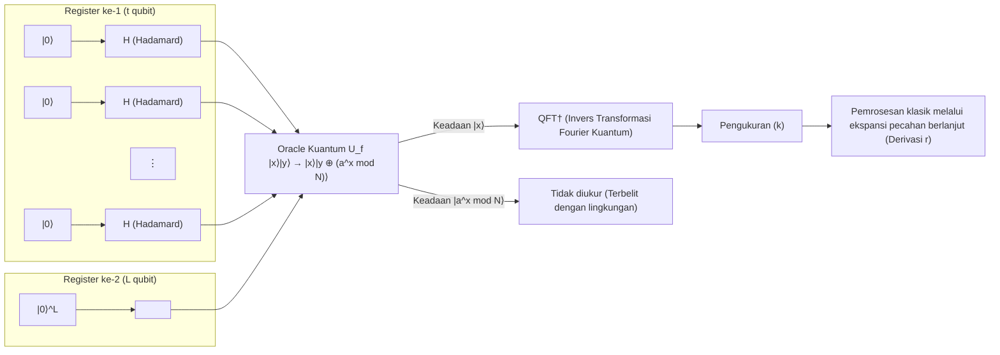

 **【Langkah 1: Inisialisasi dan Pembuatan Superposisi】** 
Seluruh sistem diatur ke keadaan awal **$|\psi_0\rangle$** $= |0\rangle^{\otimes t} |0\rangle^{\otimes L}$.
Selanjutnya, kita menerapkan gerbang Hadamard $H^{\otimes t}$ ke semua qubit di register pertama untuk menghasilkan superposisi ekuiprobabel dari keadaan yang secara eksponensial banyak.

$$
|\psi_1\rangle = \frac{1}{\sqrt{M}} \sum_{x=0}^{M-1} |x\rangle |0\rangle
$$

Di sini, register pertama memegang semua kemungkinan keadaan bilangan bulat dari $0$ hingga $M-1$ secara bersamaan.

 **【Langkah 2: Evaluasi Fungsi oleh Oracle Kuantum】** 
Kita menerapkan oracle kuantum $U_f$, menghitung fungsi $f(x) = a^x \bmod N$ selagi tetap berada dalam keadaan superposisi, dan menyimpan hasilnya di register kedua.

$$
|\psi_2\rangle = U_f |\psi_1\rangle = \frac{1}{\sqrt{M}} \sum_{x=0}^{M-1} |x\rangle |a^x \bmod N\rangle
$$

Keadaan **$|\psi_2\rangle$** ini adalah keadaan di mana masukan $x$ dan keluaran $f(x)$ sangat terbelit (entangled).

 **【Langkah 3: Observasi Register Kedua (Konseptual)】** 
Untuk memfasilitasi pemahaman teoretis, mari kita asumsikan bahwa kita mengukur register kedua di sini (dalam algoritma sebenarnya, konsekuensi matematisnya akan persis sama meskipun pengukurannya dihilangkan). Melalui pengamatan, register kedua runtuh menjadi suatu nilai tertentu $y = a^{x_0} \bmod N$. Di sini $x_0$ adalah nilai offset terkecil yang memenuhi $0 \le x_0 < r$.
Pada saat ini, register pertama runtuh seketika menjadi keadaan superposisi dari "semua masukan $x$ sedemikian rupa sehingga keluaran fungsi $f(x)$ menjadi $y$". Karena fungsi tersebut memiliki periode $r$, nilai $x$ tersebut berjarak sama (equidistant) seperti $x_0, x_0 + r, x_0 + 2r, \dots$.

$$
|\psi_3\rangle = \frac{1}{\sqrt{A}} \sum_{m=0}^{A-1} |x_0 + m r\rangle \otimes |y\rangle
$$

Di mana $A$ adalah jumlah suku yang termasuk dalam superposisi, dengan $A \approx M/r$.
Jika kita fokus pada register pertama, ini adalah keadaan distribusi probabilitas berbentuk sisir (comb-like) dengan periode $r$. Namun, meskipun kita langsung mengukur keadaan ini, kita hanya akan mendapatkan $x_0 + mr$ acak dengan probabilitas yang sama, dan karena offset $x_0$ tidak diketahui, kita tidak dapat mengetahui periode $r$. Di sinilah QFT diperlukan.

 **【Langkah 4: Penerapan Invers Transformasi Fourier Kuantum】** 
Kita menerapkan Invers Transformasi Fourier Kuantum (QFT$^\dagger$) ke register pertama.

$$
\text{QFT}^\dagger |\psi_3\rangle = \frac{1}{\sqrt{A M}} \sum_{k=0}^{M-1} \sum_{m=0}^{A-1} e^{-2\pi i k (x_0 + m r) / M} |k\rangle
$$

Mari kita atur ini berkaitan dengan keadaan $|k\rangle$ dan memeriksa amplitudo probabilitasnya $c_k$.

$$
c_k = \frac{1}{\sqrt{A M}} e^{-2\pi i k x_0 / M} \sum_{m=0}^{A-1} e^{-2\pi i k m r / M}
$$

Bagian jumlahan dari persamaan ini adalah jumlah dari deret geometri dengan rasio umum $e^{-2\pi i k r / M}$. Jika fase $k r / M$ melenceng jauh dari bilangan bulat, vektor-vektor dijumlahkan sambil berputar pada bidang kompleks, sehingga interferensi destruktif (Destructive Interference) terjadi dan amplitudonya menjadi hampir $0$.
Sebaliknya, jika $k r / M$ sangat dekat dengan suatu bilangan bulat $j$, yaitu ketika $k \approx j \frac{M}{r}$, vektor-vektor pada bidang kompleks menunjuk ke arah yang sama, dan amplitudo diperkuat oleh interferensi konstruktif (Constructive Interference).

 **【Langkah 5: Pengukuran dan Ekspansi Pecahan Berlanjut】** 
Ketika register pertama diukur, dengan probabilitas yang tinggi kita akan mengamati bilangan bulat $k$ yang memenuhi $k \approx j \frac{M}{r}$. Jika kita membagi kedua ruas dengan $M$, kita mendapatkan hubungan berikut:

$$
\frac{k}{M} \approx \frac{j}{r}
$$

Di sini, $k$ dan $M$ adalah nilai yang diketahui, sedangkan $j$ dan $r$ tidak diketahui. Karena kita telah memilih $t$ sedemikian rupa sehingga $M \ge N^2$, maka $k/M$ memberikan perkiraan yang sangat akurat terhadap pecahan yang tidak diketahui $j/r$, yaitu $\left| \frac{k}{M} - \frac{j}{r} \right| \le \frac{1}{2M} < \frac{1}{2r^2}$.
Menurut teorema pendekatan Diophantine (Teorema Legendre), bilangan rasional $j/r$ yang memenuhi syarat ini pasti termasuk dalam pecahan konvergen dari "Ekspansi Pecahan Berlanjut" (Continued Fraction Expansion) dari bilangan riil $k/M$.
Oleh karena itu, dengan menghitung ekspansi pecahan berlanjut dari $k/M$ dalam waktu polinomial menggunakan komputer klasik, kita dapat menentukan periode $r$ sebagai penyebutnya. Dengan ini masalah penemuan orde diselesaikan, dan sebagai hasilnya kita menjadi mungkin untuk menurunkan faktor prima $p$ dan $q$ yang merupakan kunci dari kriptografi RSA.

## 8.5 Mengapa Algoritma Shor Membawa Percepatan Eksponensial Terhadap Komputasi Klasik

Alasan mengapa Algoritma Shor menjadi terobosan besar bersejarah adalah karena ia bukan sekadar heuristik (metode penemuan), melainkan merupakan algoritma praktis pertama yang menunjukkan "percepatan eksponensial sejati terhadap komputasi klasik" dengan disertai pembuktian matematis yang ketat. Inti dari kekuatan komputasinya yang luar biasa terletak pada perpaduan sempurna dari dua fenomena mekanika kuantum berikut ini.

Pertama adalah paralelisme kuantum. Dengan menggunakan keadaan superposisi, kita mengevaluasi fungsi $f(x)$ secara simultan dalam satu operasi tunggal untuk jumlah masukan $x$ yang astronomis sebesar $2^t$, yang bahkan melampaui jumlah atom di alam semesta. Evaluasi yang mengharuskan komputer klasik untuk menghitung satu per satu selama ratusan juta tahun, telah diselesaikan dalam sekejap.

Namun, berdasarkan aksioma mekanika kuantum, begitu pengukuran dilakukan, keadaan tersebut akan runtuh, dan informasi yang diperoleh tidak lebih dari sekadar satu hasil evaluasi acak $(x, f(x))$. Jika demikian saja, ini tidak berbeda dengan komputasi klasik.

Dari sinilah keajaiban sesungguhnya dimulai, dan kunci kedua adalah interferensi kuantum dan ekstraksi struktur global. Transformasi Fourier Kuantum menciptakan interferensi melintasi seluruh ruang keadaan yang sangat luas secara eksponensial. Ini bukanlah operasi untuk mencoba mengetahui nilai spesifik dari masing-masing $f(x)$, melainkan operasi untuk mengekstraksi hanya pola struktural yaitu "periodisitas global" dari keseluruhan fungsi tersebut.
Amplitudo probabilitas yang bersesuaian dengan periode yang salah akan sepenuhnya musnah akibat interferensi destruktif, seperti puncak dan lembah gelombang yang saling meniadakan, dan hanya amplitudo probabilitas yang bersesuaian dengan periode $r$ yang benarlah yang akan dimaksimalkan oleh interferensi konstruktif. Dengan kata lain, hukum fisika alam itu sendirilah yang memainkan peran sebagai komputer, menghapus jawaban-jawaban yang salah yang tak terhitung jumlahnya dan membiarkan hanya jawaban yang benar yang muncul ke permukaan.

Dilihat dari sudut pandang Masalah Subgrup Tersembunyi (Hidden Subgroup Problem, HSP), Algoritma Shor adalah sebuah kerangka umum untuk memecahkan "HSP pada grup Abelian berhingga" secara efisien. Penemuan orde grup komutatif yang menjadi basis kriptografi RSA sangat cocok dengan kerangka kerja ini.

Komputer kuantum bukanlah tongkat ajaib yang serba bisa, dan ia tidak dapat menyelesaikan setiap masalah secara eksponensial lebih cepat. Namun, untuk masalah di mana "periodisitas" atau "struktur aljabar" ini tersembunyi, mekanisme fisik dari interferensi kuantum akan menerobos secara mendasar batasan-batasan komputasi klasik. Itulah alasan terdalam dan paling indah mengapa Algoritma Shor memberikan titik akhir bagi teori kriptografi, dan membawa perkembangan yang eksplosif pada bidang ilmu informasi kuantum.

# Bab 9: Algoritma Grover dan Geometri Amplifikasi Amplitudo

Dalam ilmu informasi modern, "masalah pencarian" untuk menemukan elemen yang memenuhi kondisi tertentu dari kumpulan data berskala besar merupakan tantangan yang sangat penting, sekaligus salah satu pertanyaan paling mendasar dalam ilmu komputer. Jika kumpulan data memiliki semacam struktur (misalnya, elemen diurutkan berdasarkan abjad atau numerik), algoritma klasik yang efisien seperti pencarian biner dapat digunakan, dan waktu pencarian dapat ditekan menjadi $O(\log N)$ relatif terhadap jumlah elemen $N$. Namun, pencarian dalam **"Basis Data Tidak Terstruktur" (Unstructured Database)** yang disusun secara acak sepenuhnya tidak memiliki pilihan selain mengandalkan pencarian linear (Linear Search) dengan memeriksa elemen satu per satu secara berurutan dalam kerangka kerja komputer klasik, yang membutuhkan paling buruk $N$ kali, dan rata-rata $N/2$ kali kueri, yaitu langkah komputasi sebesar $O(N)$ terhadap jumlah elemen $N$.

Namun, **Algoritma Grover** , yang ditemukan oleh fisikawan Bell Labs Lov Grover pada tahun 1996, berhasil memecahkan masalah pencarian tak terstruktur ini dengan jumlah kueri $O(\sqrt{N})$ dengan sangat cerdas dan indah memanfaatkan prinsip "Superposisi" (Superposition) dan "Interferensi" (Interference) yang mendasari mekanika kuantum. Ini berbeda dengan algoritma Shor, yang mengurangi waktu komputasi secara eksponensial (Exponential speedup) terhadap ukuran masalah, melainkan memberikan **percepatan kuadratik (Quadratic speedup)** yang merupakan jenis percepatan polinomial. Akan tetapi, mengingat masalah pencarian tak terstruktur yang menjadi target muncul secara universal di setiap area yang dapat dibayangkan, seperti pencarian brute-force untuk masalah NP-complete dan pencarian kunci dalam sistem kriptografi, luasnya jangkauan aplikasi dan dampak praktisnya tidak terukur. Dalam bidang ilmu informasi kuantum yang luas, algoritma Grover telah memantapkan posisinya sebagai salah satu algoritma yang paling serbaguna dan paling penting.

Pada bab ini, kita akan mengungkap mekanisme mendalam yang disebut **"Amplifikasi Amplitudo" (Amplitude Amplification)** , yang merupakan inti dari algoritma Grover ini, menggunakan perspektif geometris yang intuitif dan pendekatan aljabar linear yang ketat tanpa kompromi, secara terperinci sehingga bahkan para ahli pun akan menemukan penemuan baru saat membacanya.

## 9.1 Formulasi Masalah dan Persiapan Keadaan Superposisi Awal

Pertama, mari kita merumuskan secara matematis dan ketat masalah pencarian yang harus kita pecahkan. Misalkan terdapat basis data tak terstruktur berukuran $N = 2^n$, dan setiap elemen dikodekan sebagai keadaan basis komputasi $|x\rangle$ (di mana $x \in \{0, 1\}^n$, yaitu $x = 0, 1, \dots, N-1$) yang direpresentasikan menggunakan $n$ qubit. Diasumsikan bahwa dalam ruang basis data yang luas ini, hanya ada satu keadaan spesifik (keadaan benar) yang ingin kita temukan, dan kita mendeskripsikan keadaan khusus ini sebagai $|w\rangle$.

Tujuan dari masalah ini didefinisikan sebagai "menggunakan fungsi kotak hitam yang diberikan (yang disebut sebagai **oracle** ), untuk menemukan keadaan benar $|w\rangle$ dengan jumlah kueri sesedikit mungkin, dan dengan probabilitas tinggi."

Langkah pertama dalam algoritma kuantum selalu dimulai dengan persiapan untuk mensurvei seluruh ruang pencarian secara bersamaan. Untuk menciptakan keadaan di mana semua kemungkinan disuperposisikan secara merata, kita menerapkan gerbang Hadamard $H$ secara paralel sebagai produk tensor ke setiap qubit pada keadaan awal $|0\rangle^{\otimes n}$ dari $n$ qubit. Keadaan superposisi merata awal yang diperoleh dengan ini didefinisikan sebagai $|s\rangle$.

$$
|s\rangle = H^{\otimes n} |0\rangle^{\otimes n} = \frac{1}{\sqrt{N}} \sum_{x=0}^{N-1} |x\rangle
$$

Keadaan **$|s\rangle$** ini dapat dipisahkan secara jelas di ruang Hilbert sebagai kombinasi linear dari keadaan benar $|w\rangle$ dan semua keadaan tidak benar lainnya. Untuk mempermudah menangkap interpretasi geometris di masa mendatang secara visual, kita memperkenalkan vektor ternormalisasi baru $|s^\perp\rangle$ yang merupakan superposisi merata hanya dari keadaan tidak benar sebagai berikut.

$$
|s^\perp\rangle = \frac{1}{\sqrt{N-1}} \sum_{x \neq w} |x\rangle
$$

Dengan definisi ini, keadaan $|s^\perp\rangle$ dan keadaan benar $|w\rangle$ saling ortogonal ( $\langle s^\perp | w \rangle = 0$ ). Kemudian, keadaan superposisi merata awal **$|s\rangle$** dapat diekspansi secara sangat sederhana sebagai berikut pada subruang Hilbert 2 dimensi yang direntangkan oleh dua vektor yang saling ortogonal $|w\rangle$ dan $|s^\perp\rangle$ ini.

$$
|s\rangle = \sqrt{\frac{N-1}{N}} |s^\perp\rangle + \frac{1}{\sqrt{N}} |w\rangle
$$

Di sini, kita memperkenalkan sudut kecil $\theta$ sedemikian rupa sehingga $\sin \theta = \frac{1}{\sqrt{N}}$ (jika $N$ cukup besar, $\theta \approx 1/\sqrt{N}$). Kemudian, keadaan ini dapat ditulis ulang menjadi representasi geometris yang lebih elegan menggunakan fungsi trigonometri.

$$
|s\rangle = \cos \theta |s^\perp\rangle + \sin \theta |w\rangle
$$

Fakta kejam yang diceritakan oleh persamaan ini adalah bahwa probabilitas untuk mengamati keadaan benar $|w\rangle$ pada keadaan awal **$|s\rangle$** hanyalah sebesar $|\sin \theta|^2 = \frac{1}{N}$. Tujuan tertinggi dari algoritma Grover adalah dengan menerapkan kombinasi oracle dan operator difusi, yang akan dijelaskan nanti, secara iteratif untuk "memutar" vektor keadaan **$|s\rangle$** ini secara bertahap ke arah $|w\rangle$ di bidang 2 dimensi ruang Hilbert, dan membawa probabilitas mengamati jawaban yang benar sedekat mungkin ke batas teoretisnya yaitu $1$ (memperkuat amplitudo).

## 9.2 Definisi Quantum Oracle dan Phase Kickback

Komponen penting pertama dari "Grover iteration", yang merupakan unit iterasi dari algoritma, adalah oracle $O$ yang mengidentifikasi apakah data target merupakan jawaban yang benar. Dalam komputasi kuantum, oracle harus didefinisikan secara ketat sebagai operator uniter yang memberikan efek tertentu tergantung pada apakah keadaan basis komputasi input $|x\rangle$ adalah jawaban yang benar $|w\rangle$.

Biasanya, oracle ini menggunakan satu qubit tambahan (qubit ancilla) untuk mengimplementasikan evaluasi fungsi dalam bentuk yang dapat dibalik (reversible). Fungsi Boolean $f(x)$ yang merepresentasikan kondisi pencarian didefinisikan sebagai fungsi yang mengembalikan $f(w) = 1$ saat $x = w$, dan $f(x) = 0$ untuk semua $x \neq w$ lainnya. Pada saat ini, aksi dari oracle dapat ditulis menggunakan eksklusif OR (XOR) $\oplus$ sebagai berikut.

$$
O_f \left( |x\rangle \otimes |y\rangle \right) = |x\rangle \otimes |y \oplus f(x)\rangle
$$

Di sinilah kecerdasan dari algoritma Grover bersinar. Qubit ancilla $|y\rangle$ tidak dimasukkan sebagai basis komputasi, melainkan diinisialisasi terlebih dahulu ke keadaan superposisi $|-\rangle = \frac{1}{\sqrt{2}}(|0\rangle - |1\rangle)$. Kemudian, fenomena menakjubkan khas kuantum yang disebut **"Phase Kickback" (Tendangan Balik Fase)** terjadi. Mari kita hitung secara spesifik.

$$
\begin{align*}
O_f \left( |x\rangle \otimes |-\rangle \right) &= O_f \left( |x\rangle \otimes \frac{|0\rangle - |1\rangle}{\sqrt{2}} \right) \\
&= \frac{1}{\sqrt{2}} \left( O_f |x\rangle |0\rangle - O_f |x\rangle |1\rangle \right) \\
&= \frac{1}{\sqrt{2}} \left( |x\rangle |0 \oplus f(x)\rangle - |x\rangle |1 \oplus f(x)\rangle \right)
\end{align*}
$$

Kita mengevaluasi persamaan ini dengan membaginya ke dalam kasus di mana keadaan input salah dan kasus di mana keadaan input benar.
Jika $x \neq w$ (yaitu $f(x) = 0$), maka keadaannya tidak berubah sama sekali.

$$
\frac{1}{\sqrt{2}} \left( |x\rangle |0\rangle - |x\rangle |1\rangle \right) = |x\rangle |-\rangle
$$

Di sisi lain, jika $x = w$ (yaitu $f(w) = 1$), maka keadaan qubit ancilla dibalik dari $0 \to 1$, $1 \to 0$, dan secara keseluruhan tanda minus muncul di depan keadaan.

$$
\frac{1}{\sqrt{2}} \left( |x\rangle |1\rangle - |x\rangle |0\rangle \right) = - \left( |x\rangle \frac{|0\rangle - |1\rangle}{\sqrt{2}} \right) = - |x\rangle |-\rangle
$$

Hasil ini sangat penting. Keadaan qubit ancilla $|-\rangle$ sepenuhnya tidak berubah sebelum dan sesudah operasi, dan hanya bertindak sebagai "katalis". Sebaliknya, hasil evaluasi dari fungsi $f(x)$ "ditendang balik" (kicked back) sebagai **tanda amplitudo (fase)** dari register kuantum utama $|x\rangle$. Dengan memanfaatkan properti ini, kita dapat menghilangkan qubit ancilla dari deskripsi dan mendefinisikan ulang aksi oracle pada register utama secara sederhana dan elegan sebagai operator uniter baru $U_w$ sebagai berikut.

$$
U_w |x\rangle = (-1)^{f(x)} |x\rangle = \begin{cases} -|x\rangle & (x = w) \\ |x\rangle & (x \neq w) \end{cases}
$$

Phase oracle $U_w$ ini dapat dideskripsikan secara eksplisit menggunakan representasi operator proyeksi dengan notasi bra-ket Dirac sebagai berikut.

$$
U_w = I - 2|w\rangle\langle w|
$$

Di mana $I$ adalah operator identitas $N \times N$. Jika kita merujuk pada intuisi geometris, oracle $U_w$ ini tidak lain adalah operator yang melakukan **refleksi (Reflection) vektor keadaan dengan sumbu horizontal $|s^\perp\rangle$ sebagai sumbu simetris** dalam bidang riil 2 dimensi yang direntangkan oleh $|s^\perp\rangle$ dan $|w\rangle$. Ini karena hanya tanda dari komponen keadaan benar yang dibalik, sementara komponen keadaan tidak benar tetap dipertahankan seperti aslinya.

## 9.3 Operator Difusi (Diffusion Operator) dan Struktur Matematis dari Inversi terhadap Nilai Rata-rata

Setelah memberikan "penanda fase negatif" pada keadaan benar dengan oracle, kita menerapkan komponen kedua dari Grover iteration, yaitu **Operator Difusi (Diffusion Operator)** $U_s$. Peran dari operator ini adalah untuk membalikkan amplitudo dari setiap elemen keadaan kuantum terhadap nilai rata-rata keseluruhan, sehingga secara dramatis memperkuat amplitudo probabilitas dari keadaan yang ditandai.

Operator difusi $U_s$ secara matematis didefinisikan sebagai berikut.

$$
U_s = 2|s\rangle\langle s| - I
$$

Mari kita buktikan secara ketat mekanisme mengapa operator ini disebut "Inversi terhadap nilai rata-rata (Inversion about the mean)" dengan menggunakan keadaan superposisi umum $|\psi\rangle = \sum_{x=0}^{N-1} \alpha_x |x\rangle$.

Pertama, kita menghitung produk dalam (inner product) antara keadaan superposisi merata $|s\rangle$ dan keadaan saat ini $|\psi\rangle$.

$$
\langle s | \psi \rangle = \left( \frac{1}{\sqrt{N}} \sum_{y=0}^{N-1} \langle y| \right) \left( \sum_{x=0}^{N-1} \alpha_x |x\rangle \right) = \frac{1}{\sqrt{N}} \sum_{x=0}^{N-1} \alpha_x
$$

Nilai dari produk dalam ini selanjutnya dibagi dengan $\sqrt{N}$ menghasilkan rata-rata aritmatika dari semua amplitudo $\alpha_x$ (yang kita definisikan sebagai $\mu$). Dengan kata lain, dapat dinyatakan sebagai $\mu = \frac{1}{N} \sum_{x=0}^{N-1} \alpha_x = \frac{1}{\sqrt{N}} \langle s | \psi \rangle$. Oleh karena itu, kita mendapatkan $\langle s | \psi \rangle = \sqrt{N} \mu$.

Menggunakan persamaan hubungan ini, kita menghitung hasil dari penerapan $U_s$ pada keadaan $|\psi\rangle$.

$$
\begin{align*}
U_s |\psi\rangle &= (2|s\rangle\langle s| - I) \sum_{x=0}^{N-1} \alpha_x |x\rangle \\
&= 2|s\rangle \langle s | \psi \rangle - \sum_{x=0}^{N-1} \alpha_x |x\rangle \\
&= 2 \left( \frac{1}{\sqrt{N}} \sum_{x=0}^{N-1} |x\rangle \right) (\sqrt{N} \mu) - \sum_{x=0}^{N-1} \alpha_x |x\rangle \\
&= 2 \mu \sum_{x=0}^{N-1} |x\rangle - \sum_{x=0}^{N-1} \alpha_x |x\rangle \\
&= \sum_{x=0}^{N-1} (2\mu - \alpha_x) |x\rangle
\end{align*}
$$

Amplitudo baru untuk setiap basis $|x\rangle$ dari keadaan yang dihasilkan adalah $(2\mu - \alpha_x)$. Persamaan ini dapat diubah bentuknya menjadi $\mu + (\mu - \alpha_x)$. Hal ini menunjukkan bahwa amplitudo asli $\alpha_x$ telah dibalik tepat ke sisi yang berlawanan (posisi simetris) relatif terhadap nilai rata-rata keseluruhan $\mu$. Inilah dasar matematis mengapa operator difusi disebut "inversi terhadap nilai rata-rata".

Oleh aksi oracle $U_w$, hanya amplitudo dari keadaan benar $|w\rangle$ saja yang menjadi bernilai negatif ( $-\alpha_w$ ). Amplitudo dari $N-1$ keadaan tidak benar lainnya yang sangat banyak tetap positif. Akibatnya, nilai rata-rata keseluruhan $\mu$ sedikit berkurang, tetapi tetap mempertahankan nilai positif. Jika kita menerapkan operator difusi ini di sini, "amplitudo negatif yang besar" dari keadaan benar akan dibalik di sekitar "nilai rata-rata positif $\mu$ ". Sebagai hasilnya, amplitudo dari keadaan benar **melonjak (diperkuat) secara dramatis menjadi nilai positif yang jauh lebih besar daripada amplitudo aslinya** .

Sebaliknya, amplitudo dari keadaan tidak benar memiliki nilai yang sedikit lebih besar dari nilai rata-rata, sehingga ketika dibalik terhadap nilai rata-rata, nilainya ditekan ke bawah menjadi nilai positif yang sedikit lebih kecil dari aslinya. Proses ini adalah inti dari algoritma, menggunakan interferensi kuantum untuk membatalkan probabilitas dari keadaan yang tidak diinginkan, dan memperkuat probabilitas dari keadaan target secara konstruktif.

Kembali ke perspektif geometris, representasi operator $U_s = 2|s\rangle\langle s| - I$ secara jelas menunjukkan bahwa ini adalah operasi yang melakukan **refleksi (Reflection) vektor keadaan dengan sumbu vektor keadaan awal $|s\rangle$ sebagai sumbu simetris** .

## 9.4 Interpretasi Geometris dari Amplifikasi Amplitudo (Rotasi Murni oleh Refleksi Ganda)

 **Operator Grover $G$** , yang merupakan unit iterasi tunggal dari algoritma Grover, didefinisikan sebagai penerapan berurutan dari oracle $U_w$ dan operator difusi $U_s$, yaitu hasil kalinya.

$$
G = U_s U_w = (2|s\rangle\langle s| - I) (I - 2|w\rangle\langle w|)
$$

Di sini, teorema yang sangat indah yang ditenun oleh geometri Euclidean dan aljabar linear mengambil peran utama. Teorema ini menyatakan bahwa "komposisi dari dua refleksi (Reflection) dengan sumbu simetris berupa dua garis yang saling berpotongan akan menjadi rotasi murni (Rotation) dengan sudut dua kali lipat dari sudut antara kedua garis tersebut."

Dari analisis sejauh ini, dijamin bahwa vektor keadaan, tidak peduli operasi apa pun yang dikenakan, akan selalu tetap berada di dalam ruang vektor riil 2 dimensi (bidang) yang direntangkan oleh $|s^\perp\rangle$ dan $|w\rangle$. Mari kita pastikan kembali aksi dari setiap operator di dalam bidang ini.

1. **Refleksi oleh oracle $U_w$** :
   Terhadap vektor keadaan saat ini, $U_w$ hanya membalikkan tanda komponen dalam arah $|w\rangle$, yang merupakan sumbu vertikal dalam sistem koordinat ortogonal. Secara geometris, ini adalah **refleksi dengan sumbu horizontal $|s^\perp\rangle$ sebagai sumbu simetris** .
2. **Refleksi oleh operator difusi $U_s$** :
   $U_s$ berikutnya akan merefleksikan vektor keadaan dengan **arah vektor $|s\rangle$ yang dimiringkan sebesar sudut $\theta$ di bidang tersebut sebagai sumbu simetris** .

Keadaan awal $|s\rangle$ miring ke atas sebesar sudut $\theta$ dari sumbu horizontal $|s^\perp\rangle$ (di sini $\sin \theta = \frac{1}{\sqrt{N}}$).
Oleh karena itu, jika tepat setelah melakukan refleksi terhadap sumbu $|s^\perp\rangle$, kita melakukan refleksi terhadap sumbu $|s\rangle$ yang miring sejauh sudut $\theta$ dari sumbu tersebut, maka aksi keseluruhan $G$ menjadi **operasi yang memutar vektor keadaan berlawanan arah jarum jam sebesar $2\theta$ di dalam bidang 2 dimensi ini** .

Mari kita buktikan wawasan geometris yang intuitif ini secara matematis dan ketat menggunakan matriks rotasi. Misalkan keadaan tepat setelah menyelesaikan $t$ kali iterasi adalah $|\psi_t\rangle$. Keadaan awal adalah saat $t=0$, di mana $|\psi_0\rangle = |s\rangle = \cos \theta |s^\perp\rangle + \sin \theta |w\rangle$.

Menggunakan induksi matematika, kita akan membuktikan bahwa keadaan setelah $t$ kali iterasi selalu dapat diekspresikan secara ringkas sebagai berikut.

$$
|\psi_t\rangle = G^t |s\rangle = \cos((2t+1)\theta) |s^\perp\rangle + \sin((2t+1)\theta) |w\rangle
$$

Saat $t=0$ jelas terpenuhi. Mengasumsikan $|\psi_t\rangle$ diberikan dalam bentuk di atas, kita menghitung keadaan $|\psi_{t+1}\rangle = G |\psi_t\rangle$ setelah melakukan satu iterasi tambahan.
Pertama, jika kita menerapkan oracle $U_w$, tanda dari komponen $|w\rangle$ akan dibalik.

$$
U_w |\psi_t\rangle = \cos((2t+1)\theta) |s^\perp\rangle - \sin((2t+1)\theta) |w\rangle
$$

Selanjutnya, kita menerapkan operator difusi $U_s = 2|s\rangle\langle s| - I$. Untuk menghitungnya, akan sangat jelas jika kita memperkenalkan representasi matriks 2x2 yang menggunakan vektor basis $\{|s^\perp\rangle, |w\rangle\}$.

Representasi matriks dari oracle $U_w$ adalah matriks diagonal berikut.

$$
U_w = \begin{pmatrix} 1 & 0 \\ 0 & -1 \end{pmatrix}
$$

Vektor keadaan awal $|s\rangle$ direpresentasikan oleh vektor kolom $\begin{pmatrix} \cos\theta \\ \sin\theta \end{pmatrix}$, sehingga operator proyeksi $|s\rangle\langle s|$ dihitung menggunakan perkalian luar (outer product), dan dari situ kita mendapatkan $U_s$ sebagai berikut.

$$
\begin{align*}
U_s &= 2 \begin{pmatrix} \cos\theta \\ \sin\theta \end{pmatrix} \begin{pmatrix} \cos\theta & \sin\theta \end{pmatrix} - \begin{pmatrix} 1 & 0 \\ 0 & 1 \end{pmatrix} \\
&= \begin{pmatrix} 2\cos^2\theta - 1 & 2\sin\theta\cos\theta \\ 2\sin\theta\cos\theta & 2\sin^2\theta - 1 \end{pmatrix} \\
&= \begin{pmatrix} \cos(2\theta) & \sin(2\theta) \\ \sin(2\theta) & -\cos(2\theta) \end{pmatrix}
\end{align*}
$$

(Di sini, kita menggunakan rumus sudut ganda $\cos(2\theta) = 2\cos^2\theta - 1$ dan $\sin(2\theta) = 2\sin\theta\cos\theta$)

Oleh karena itu, representasi matriks dari operator Grover $G = U_s U_w$ secara keseluruhan adalah hasil kali dari kedua matriks ini.

$$
G = \begin{pmatrix} \cos(2\theta) & \sin(2\theta) \\ \sin(2\theta) & -\cos(2\theta) \end{pmatrix} \begin{pmatrix} 1 & 0 \\ 0 & -1 \end{pmatrix}
= \begin{pmatrix} \cos(2\theta) & -\sin(2\theta) \\ \sin(2\theta) & \cos(2\theta) \end{pmatrix}
$$

Secara mengejutkan, matriks yang diperoleh tidak lain adalah **matriks rotasi dengan sudut $2\theta$** yang sangat terkenal dalam geometri. Dengan demikian, menerapkan operator $G$ secara berurutan sebanyak $t$ kali pada vektor awal $\begin{pmatrix} \cos\theta \\ \sin\theta \end{pmatrix}$ secara geometris setara dengan memutar vektor berlawanan arah jarum jam sebesar $2\theta$ setiap kalinya. Oleh karena itu, sudut totalnya adalah sudut awal $\theta$ ditambah dengan $t \times 2\theta$, yang menghasilkan $\theta + 2t\theta = (2t+1)\theta$. Dengan ini, pembuktian induksi selesai dengan indah.

Di sini, kami menampilkan diagram sirkuit kuantum (notasi Mermaid) yang mewakili satu kali iterasi algoritma Grover, memvisualisasikan korespondensi antara teori dan implementasinya.

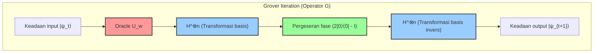

Diagram sirkuit ini menunjukkan metode implementasi yang sangat praktis untuk operator difusi $U_s = 2|s\rangle\langle s| - I$. Karena keadaan $|s\rangle$ dihasilkan sebagai $H^{\otimes n} |0\rangle^{\otimes n}$, operator ini dapat didekomposisi sebagai berikut.

$$
U_s = 2(H^{\otimes n} |0\rangle^{\otimes n})(\langle 0|^{\otimes n} H^{\otimes n}) - I = H^{\otimes n} (2|0\rangle\langle 0| - I) H^{\otimes n}
$$

Dengan kata lain, dengan mengambil struktur sandwich yaitu mengubah ke basis komputasi melalui transformasi Hadamard $H^{\otimes n}$, menerapkan operator pergeseran fase bersyarat yang tidak membalikkan fase hanya jika semua qubit adalah $|0\rangle$ (atau definisi bahwa ia memberikan fase negatif hanya saat $|0\rangle$ juga ekuivalen, karena ini hanya perbedaan fase global), lalu kembali ke basis aslinya dengan transformasi Hadamard lagi, kita dapat mengimplementasikan "inversi terhadap nilai rata-rata" secara efisien pada komputer kuantum sembarang.

## 9.5 Analisis Probabilitas Kesuksesan dan Derivasi Jumlah Iterasi Optimal

Dengan terungkapnya perilaku geometris dari vektor keadaan secara sepenuhnya, kita kini siap untuk memberikan jawaban kuantitatif yang ketat terhadap pertanyaan inti dari algoritma, yaitu "berapa kali iterasi yang harus diulang untuk mendapatkan jawaban yang benar?".

Probabilitas $P(w)$ untuk mendapatkan keadaan benar $|w\rangle$ saat mengamati register kuantum dalam basis komputasi setelah melakukan $t$ kali iterasi diberikan oleh kuadrat dari nilai absolut amplitudo dari komponen $|w\rangle$ pada vektor keadaan $|\psi_t\rangle$.

$$
P(w) = |\langle w | \psi_t \rangle|^2 = \sin^2((2t+1)\theta)
$$

Tujuan akhir kita adalah untuk memaksimalkan probabilitas $P(w)$ ini, yang berarti membawanya sedekat mungkin ke batas teoretis yaitu $1$. Kuadrat dari fungsi sinus $\sin^2(x)$ mengambil nilai maksimumnya yaitu $1$ saat argumennya $x$ sama dengan $\frac{\pi}{2}$ (90 derajat). Oleh karena itu, persamaan untuk mencari jumlah iterasi optimal $t$ dirumuskan sebagai berikut.

$$
(2t+1)\theta \approx \frac{\pi}{2}
$$

Menyelesaikan persamaan ini untuk $t$, kita memperoleh

$$
t \approx \frac{\pi}{4\theta} - \frac{1}{2}
$$

Dalam pencarian basis data berskala praktis, jumlah elemen $N$ menjadi angka astronomis yang sangat besar. Pada saat ini, sudut $\theta$ menjadi nilai yang sangat kecil mendekati $0$. Untuk nilai $\theta$ yang sangat kecil, aproksimasi yang baik $\sin \theta \approx \theta$ berlaku dengan mengambil suku orde pertama dari ekspansi Taylor (ekspansi Maclaurin). Karena $\sin \theta = \frac{1}{\sqrt{N}}$ dari definisi keadaan awal, kita dapat menganggap $\theta \approx \frac{1}{\sqrt{N}}$.

Jika kita mensubstitusikan persamaan aproksimasi ini ke dalam persamaan untuk $t$ yang baru saja diturunkan, jumlah iterasi optimal $R$ dapat diturunkan dengan cemerlang sebagai berikut.

$$
R \approx \frac{\pi}{4} \sqrt{N}
$$

Implikasi dari hasil ini sangat mengejutkan sehingga mengguncang sejarah ilmu informasi. Pada komputer klasik, waktu pencarian yang proporsional dengan jumlah elemen (kompleksitas komputasi $O(N)$ ) tidak dapat dihindari untuk menemukan jawaban yang benar dari ruang pencarian yang diacak, yang membutuhkan $N$ kali pada kasus terburuk dan $N/2$ kali pada nilai rata-rata. Namun, algoritma Grover yang berjalan pada komputer kuantum memanfaatkan interferensi untuk memperkuat probabilitas, dan hanya dengan jumlah kueri sebanyak $\frac{\pi}{4} \sqrt{N}$ kali, ia hampir pasti mencapai keadaan benar (dengan probabilitas sangat tinggi sebesar $1 - O(1/N)$). Kompleksitas komputasinya menjadi $O(\sqrt{N})$, berhasil memampatkan waktu komputasi ke skala akar kuadratnya.

Akan tetapi, ada satu poin penting yang perlu diperhatikan di sini. Algoritma Grover tidak memiliki kemampuan untuk berhenti sendiri (Self-stopping). Jika jumlah iterasi melebihi nilai optimal $R$ ini, vektor keadaan akan melewati sumbu $|w\rangle$ yang ditargetkan, dan probabilitas mengamati jawaban yang benar akan berkurang karena sifat periodik dari fungsi sinus, di mana fenomena yang disebut **putaran berlebih (Overcooking / Overshooting)** akan terjadi. Oleh karena itu, mengontrol waktu pengamatan dengan tepat (waktu untuk menghentikan iterasi) merupakan kondisi mutlak yang diperlukan agar algoritma berhasil.

## 9.6 Generalisasi Amplifikasi Amplitudo untuk Kasus Berbagai Solusi

Sejauh ini, kita telah melakukan diskusi berdasarkan kondisi paling ketat di mana "hanya ada satu" jawaban yang benar dalam basis data yang luas (masalah solusi tunggal). Namun, dalam pengaturan masalah di dunia nyata, umumnya terdapat beberapa solusi yang memenuhi kondisi tersebut. Teknik amplifikasi amplitudo, yang merupakan inti dari algoritma Grover, dapat diperluas secara alami tanpa mengurangi keindahan matematisnya bahkan ketika terdapat $M$ buah solusi ( $1 \le M \le N$ ).

Jika terdapat $M$ buah solusi, kita mendefinisikan ulang superposisi merata dari semua keadaan benar sebagai $|W\rangle$, dan superposisi merata dari semua keadaan tidak benar sebagai $|W^\perp\rangle$.

$$
|W\rangle = \frac{1}{\sqrt{M}} \sum_{x \in \text{Solutions}} |x\rangle
$$

$$
|W^\perp\rangle = \frac{1}{\sqrt{N-M}} \sum_{x \notin \text{Solutions}} |x\rangle
$$

Kemudian, keadaan superposisi merata awal $|s\rangle$ dapat diekspansi menggunakan dua vektor ortogonal ini sebagai berikut.

$$
|s\rangle = \sqrt{\frac{N-M}{N}} |W^\perp\rangle + \sqrt{\frac{M}{N}} |W\rangle
$$

Di sini, kita mendefinisikan sudut baru $\theta'$ sedemikian rupa sehingga $\sin \theta' = \sqrt{\frac{M}{N}}$. Berdasarkan definisi ini, jika kita menerapkan operator Grover $G$ yang persis sama dengan kasus solusi tunggal (dengan catatan bahwa oracle telah diperluas untuk membalikkan fase terhadap semua $M$ solusi tersebut), vektor keadaan akan berputar sebesar $2\theta'$ pada setiap iterasi di dalam bidang yang direntangkan oleh $|W^\perp\rangle$ dan $|W\rangle$.

Melalui pengembangan logika yang sama, jumlah iterasi optimalnya menjadi $\frac{\pi}{4\theta'}$, dan pada kasus di mana $M \ll N$, dapat diaproksimasi sebagai berikut.

$$
R \approx \frac{\pi}{4} \sqrt{\frac{N}{M}}
$$

Persamaan ini menunjukkan bahwa sebagaimana dapat diduga, semakin banyak jumlah solusi $M$, semakin pendek pula jumlah iterasi (waktu pencarian) yang diperlukan. Misalnya, jika terdapat 4 solusi, waktu yang diperlukan menjadi setengahnya. Bahkan jika jumlah solusi $M$ tidak diketahui, dengan menggunakan teknik tingkat lanjut yang disebut **Algoritma Penghitungan Kuantum (Quantum Counting Algorithm)** yang menggabungkan algoritma Grover dan Estimasi Fase Kuantum (Quantum Phase Estimation), kita dapat memperkirakan jumlah solusi $M$ itu sendiri dengan kecepatan tinggi, dan kemudian melakukan amplifikasi amplitudo dengan jumlah iterasi yang sesuai.

## 9.7 Signifikansi Teoretis dari Percepatan Kuadratik dan Batasan Komputasi Kuantum (Teorema BBBV)

Percepatan kuadratik dari $O(N)$ ke $O(\sqrt{N})$ yang dibawa oleh algoritma Grover, secara matematis, mungkin tampak sederhana bila dibandingkan dengan percepatan eksponensial ( $O(e^{N^{1/3}}) \to O(N^3)$ ) yang dibawa oleh algoritma Shor. Namun, nilai dan universalitas yang sebenarnya dalam ilmu komputer justru terletak pada "fleksibilitasnya yang tidak memilih-milih masalah."

Algoritma faktorisasi prima Shor secara cerdas memanfaatkan struktur aljabar yang sangat khusus yang disebut "periodisitas" yang dimiliki oleh grup perkalian bilangan bulat. Sebaliknya, algoritma Grover dapat diterapkan tanpa syarat pada "pencarian basis data tidak terstruktur", yang merupakan bentuk paling dasar dan primitif dari semua masalah komputasi, yang tidak memiliki pengetahuan awal atau struktur apa pun.

Dampaknya paling nyata terlihat pada berbagai masalah sulit yang termasuk dalam kelas kompleksitas NP dan aplikasinya terhadap teknologi kriptografi yang mendasari masyarakat modern. Misalnya, masalah NP-complete seperti Traveling Salesperson Problem atau Boolean Satisfiability Problem (SAT), pada dasarnya direduksi menjadi masalah pencarian secara menyeluruh dari ruang kandidat yang sangat besar untuk menemukan solusi yang memenuhi syarat. Terhadap masalah-masalah ini, sementara algoritma klasik membutuhkan waktu sebesar $O(2^n)$, menerapkan algoritma Grover secara efektif dapat mengurangi separuh waktu komputasi (memotong eksponen menjadi setengah) menjadi $O(\sqrt{2^n}) = O(2^{n/2})$.

Dampaknya pada teknologi kriptografi juga sangat fatal dan mendalam. Kekuatan dari metode kriptografi kunci simetris seperti AES, yang saat ini menjamin keamanan internet, bergantung sepenuhnya pada kesulitan dari serangan brute-force terhadap ruang kunci. Sebagai contoh, ruang pencarian dari AES-128 (ruang kunci sepanjang 128-bit) memiliki jumlah yang luar biasa yaitu $N = 2^{128}$. Pada komputer klasik, hal ini rata-rata memerlukan $2^{127}$ kalkulasi verifikasi kunci, sedangkan komputer kuantum yang menggunakan algoritma Grover dipastikan akan menemukan kunci yang benar hanya dengan $\frac{\pi}{4} 2^{64}$ perhitungan. Fakta inilah yang menjadi alasan utama mengapa badan standarisasi di seluruh dunia (seperti NIST) menjadikan transisi ke Kriptografi Pasca-Kuantum (Post-Quantum Cryptography) sebagai tugas yang mendesak, tidak merekomendasikan AES-128, dan sangat menyarankan untuk beralih ke AES-256 (yang membutuhkan $2^{128}$ perhitungan bahkan dalam komputasi kuantum).

Terakhir, mari kita bahas sebuah teorema yang sangat penting dari perspektif fisika teoretis dan ilmu komputer. Itulah **Teorema BBBV** yang dibuktikan oleh Bennett, Bernstein, Brassard, dan Vazirani pada tahun 1997. Teorema ini membuktikan secara matematis dan ketat bahwa "bahkan jika menggunakan komputer kuantum, masalah pencarian tidak terstruktur oleh kotak hitam mutlak memerlukan kueri sebanyak $\Omega(\sqrt{N})$ kali."

Apa makna dari hal ini? Hal itu merupakan fakta mendalam bahwa **"kompleksitas komputasi $O(\sqrt{N})$ yang dicapai oleh algoritma Grover adalah batas teoretis absolut yang diizinkan oleh hukum alam (mekanika kuantum), dan percepatan yang lebih dari ini tidak mungkin dilakukan terlepas dari hukum fisika mana pun di alam semesta yang digunakan."** Grover tidak hanya menemukan algoritma yang unggul, tetapi juga telah mencapai batas akhir antara informasi dan hukum fisika.

Selain itu, paradigma "Amplifikasi Amplitudo" (Amplitude Amplification) itu sendiri yang dirinci dalam bab ini telah diaplikasikan secara luas sebagai blok bangunan dasar untuk menyusun algoritma kuantum tingkat lanjut yang tak terhitung jumlahnya, seperti subrutin dalam Quantum Random Walks (Langkah Acak Kuantum) atau Quantum Machine Learning (Pembelajaran Mesin Kuantum). Metode yang indah dan elegan yang ditemukan Grover, yaitu "secara geometris memutar dan memperkuat amplitudo probabilitas dengan menggunakan refleksi ganda terhadap dua sumbu yang ortogonal," akan terus bersinar sebagai salah satu pilar yang paling kuat dan sangat diperlukan yang menopang struktur raksasa keilmuan yaitu ilmu informasi kuantum dari akar-akarnya.

# Bab 10: Koreksi Kesalahan Kuantum dan Komputasi Toleransi Kesalahan

Hambatan terbesar dan paling mendalam yang dihadapi ilmu informasi kuantum adalah "derau" (noise) dan "dekoherensi" (decoherence). Selama komputer kuantum diperlakukan sebagai sistem tertutup yang ideal, operasi keadaan deterministik melalui evolusi uniter yang mematuhi persamaan Schrödinger terjamin. Namun, perangkat kuantum sebagai sistem fisik nyata selalu berinteraksi dengan lingkungan eksternal (mandi termal, fluktuasi medan elektromagnetik, sinar kosmik, dll.). Dalam bab ini, setelah mendefinisikan derau sistem kuantum secara matematis dan ketat, kita akan mendalami hakikat "Koreksi Kesalahan Kuantum" (Quantum Error Correction: QEC), yaitu bagaimana mendeteksi dan mengoreksi kesalahan khas kuantum yang tidak ada dalam sistem klasik. Lebih jauh lagi, bahkan di bawah kondisi realistis ketika mekanisme koreksi itu sendiri disusupi oleh derau, kita akan menguraikan secara rinci fondasi teoretis dari "Komputasi Kuantum Toleransi Kesalahan" (Fault-Tolerant Quantum Computation: FTQC) yang memungkinkan komputasi berlanjut tanpa batas, serta Teorema Ambang Batas (Threshold Theorem).

## 10.1 Deskripsi Matematis Derau Kuantum dan Dekoherensi

Untuk mendeskripsikan dekoherensi sistem kuantum secara ketat, kita perlu mengalihkan sudut pandang dari dinamika keadaan murni berbasis vektor keadaan sistem tertutup ke dinamika matriks densitas sistem kuantum terbuka. Dengan mempertimbangkan evolusi uniter pada sistem komposit dari sistem lingkungan $E$ dan sistem utama $S$, lalu mengeliminasi derajat kebebasan sistem lingkungan melalui jejak parsial (Partial Trace), perubahan keadaan sistem utama dapat dideskripsikan sebagai "pemetaan pemelihara jejak positif sepenuhnya" (Completely Positive Trace-Preserving Map, pemetaan CPTP).

Sebarang saluran kuantum $\mathcal{E}$ dapat diekspansikan menggunakan representasi Kraus (Kraus Representation) sebagai berikut:

$$
\mathcal{E}(\rho) = \sum_{k} E_k \rho E_k^\dagger
$$

Di sini, $E_k$ disebut sebagai operator Kraus (Kraus Operators), yang memenuhi kondisi pelestarian jejak $\sum_k E_k^\dagger E_k = I$ yang menyiratkan kekekalan probabilitas.

Dalam informasi klasik, kesalahan pada bit yang merupakan unit informasi hanyalah pembalikan bit (Bit Flip), yaitu "0 menjadi 1" atau "1 menjadi 0". Namun, dalam sistem kuantum, terdapat kesalahan fatal yang disebut "pembalikan fase" (Phase Flip), di mana fase superposisi berfluktuasi. Operator Kraus untuk saluran derau qubit tunggal yang representatif disajikan di bawah ini:

1. **Saluran Pembalikan Bit (Bit Flip Channel):** Gerbang $X$ bekerja dengan probabilitas $p$.
   

$$
E_0 = \sqrt{1-p} I, \quad E_1 = \sqrt{p} X
$$

2. **Saluran Pembalikan Fase (Phase Flip Channel):** Gerbang $Z$ bekerja dengan probabilitas $p$. Ini merepresentasikan runtuhnya fase relatif (dekoherensi murni). Fenomena ini merupakan penyebab langsung meluruhnya komponen non-diagonal matriks densitas dari keadaan murni $|\psi\rangle = \alpha|0\rangle + \beta|1\rangle$ secara eksponensial.
   

$$
E_0 = \sqrt{1-p} I, \quad E_1 = \sqrt{p} Z
$$

3. **Saluran Depolarisasi (Depolarizing Channel):** Keadaan sepenuhnya mendekati keadaan campuran (derau putih / white noise) $I/2$ dengan probabilitas $p$.
   

$$
E_0 = \sqrt{1-p} I, \quad E_1 = \sqrt{\frac{p}{3}} X, \quad E_2 = \sqrt{\frac{p}{3}} Y, \quad E_3 = \sqrt{\frac{p}{3}} Z
$$

Hambatan pertama yang menghadang dalam membangun koreksi kesalahan kuantum adalah "Teorema Tanpa Kloning" (No-Cloning Theorem). Tidak ada transformasi uniter yang dapat menduplikasi keadaan kuantum yang tidak diketahui $|\psi\rangle$ untuk menghasilkan keadaan seperti $|\psi\rangle \otimes |\psi\rangle \otimes |\psi\rangle$. Oleh karena itu, pendekatan naif seperti pada koreksi kesalahan klasik—yaitu "menyalin informasi yang sama ke tiga bit dan mengambil suara terbanyak"—mustahil diterapkan pada sistem kuantum. Lebih jauh lagi, jika suatu keadaan kuantum diukur, keruntuhan paket gelombang akan terjadi dan superposisinya akan hancur. Bagaimana cara mengidentifikasi kesalahan tanpa merusak informasi yang tidak diketahui menjadi tantangan paling mendasar.

## 10.2 Prinsip Dasar Koreksi Kesalahan Kuantum: Redundansi dan Pengukuran Sindrom

Alternatif pengganti "penyalinan" dalam informasi kuantum adalah dengan membuat beberapa qubit berada dalam keadaan keterikatan kuantum (Entanglement), sehingga memetakan informasi asli ke dalam subruang (ruang kode, Code Space) dari ruang Hilbert yang berdimensi lebih tinggi.

Sebagai contoh paling sederhana, kita mengonstruksi "kode pembalikan bit 3-qubit" yang melindungi keadaan 1-qubit $|\psi\rangle = \alpha |0\rangle + \beta |1\rangle$ dari pembalikan bit probabilistik.
Basis logis (Logical Basis) didefinisikan sebagai berikut:

$$
|0\rangle_L = |000\rangle, \quad |1\rangle_L = |111\rangle
$$

Keadaan logis menjadi $|\psi\rangle_L = \alpha |000\rangle + \beta |111\rangle$. Ini bukanlah duplikasi, melainkan pengodean ke dalam keadaan keterikatan tipe GHZ.

Sekarang, mari kita asumsikan terjadi kesalahan pembalikan bit $X_1 = X \otimes I \otimes I$ pada qubit pertama. Keadaan sistem akan berubah menjadi $|\psi'\rangle = \alpha |100\rangle + \beta |011\rangle$.
Untuk mendeteksi kesalahan ini, kita tidak boleh mengukur keadaan itu secara langsung. Sebagai gantinya, kita melakukan "Pengukuran Sindrom" (Syndrome Measurement) yang hanya mengekstrak jejak kesalahan tanpa merusak keadaan tersebut. Secara spesifik, kita mengukur operator paritas $Z_1 Z_2$ dan $Z_2 Z_3$, yang merupakan hasil kali tensor dari operator Pauli.

Sebarang vektor $|\psi\rangle_L$ dalam ruang kode awal merupakan vektor eigen dengan nilai eigen $+1$ dari $Z_1 Z_2$ dan $Z_2 Z_3$ (artinya, $Z_1 Z_2 |\psi\rangle_L = |\psi\rangle_L$).
Namun, terhadap keadaan kesalahan $|\psi'\rangle$, berdasarkan sifat aljabar Pauli bahwa $X$ dan $Z$ saling antikomutatif ($\{X, Z\} = 0$), berlaku:

$$
Z_1 Z_2 |\psi'\rangle = Z_1 Z_2 X_1 |\psi\rangle_L = -X_1 Z_1 Z_2 |\psi\rangle_L = - |\psi'\rangle
$$

$$
Z_2 Z_3 |\psi'\rangle = Z_2 Z_3 X_1 |\psi\rangle_L = X_1 Z_2 Z_3 |\psi\rangle_L = + |\psi'\rangle
$$

Hasil pengukurannya (sindrom) adalah $(-1, +1)$, yang secara pasti menetapkan fakta bahwa "kesalahan $X$ telah terjadi pada bit pertama". Karena sama sekali tidak ada informasi mengenai koefisien superposisi $\alpha, \beta$ yang bocor, keadaan kuantum tidak hancur oleh pengukuran ini. Setelah itu, dengan menerapkan kembali $X_1$, keadaan dapat dipulihkan secara sempurna ke keadaan semula $|\psi\rangle_L$.

Secara serupa, untuk mengoreksi kesalahan pembalikan fase $Z$, kita menggunakan "kode pembalikan fase 3-qubit" dengan basis Hadamard $\{|+\rangle, |-\rangle\}$:

$$
|0\rangle_L = |+++\rangle, \quad |1\rangle_L = |---\rangle
$$

Dalam kasus ini, $X_1 X_2$ dan $X_2 X_3$ digunakan untuk pengukuran sindrom.

Di sinilah sifat mekanika kuantum yang menakjubkan bekerja. Kesalahan yang diakibatkan oleh interaksi dengan lingkungan umumnya berupa rotasi kontinu seperti $E(\theta) = \cos(\theta) I - i \sin(\theta) X$. Namun, dengan melakukan pengukuran sindrom, keadaan tersebut secara probabilistik **diproyeksikan** ke salah satu keadaan eigen: "tanpa kesalahan ( $I$ )" atau "kesalahan total ( $X$ )". Artinya, kesalahan kontinu yang jumlahnya tak hingga di-"digitalisasi"-kan secara mekanika kuantum menjadi kesalahan Pauli diskret melalui pengukuran.

## 10.3 Kode 9-Qubit Shor (Shor Code) dan Formalisme Stabilizer

Kode-kode yang disebutkan sebelumnya hanya dapat mengoreksi pembalikan bit saja atau pembalikan fase saja. Pada tahun 1995, Peter Shor mempublikasikan "Kode 9-Qubit Shor" (Shor's 9-Qubit Code) yang merupakan terobosan karena mampu mengoreksi kedua jenis kesalahan tersebut secara bersamaan. Kode ini dibangun dengan menyarangkan (Concatenation) kode pembalikan bit 3-qubit ke dalam setiap node dari kode pembalikan fase 3-qubit.

Basis logisnya adalah sebagai berikut:

$$
|0\rangle_L = \frac{1}{2\sqrt{2}} ( |000\rangle + |111\rangle ) \otimes ( |000\rangle + |111\rangle ) \otimes ( |000\rangle + |111\rangle )
$$

$$
|1\rangle_L = \frac{1}{2\sqrt{2}} ( |000\rangle - |111\rangle ) \otimes ( |000\rangle - |111\rangle ) \otimes ( |000\rangle - |111\rangle )
$$

Kerangka yang memperumum koreksi kesalahan seperti kode Shor dan memberikan landasan matematika yang kokoh adalah "Formalisme Stabilizer" (Stabilizer Formalism) oleh Daniel Gottesman.
Misalkan grup Pauli untuk $n$ qubit adalah $\mathcal{P}_n$. Grup stabilizer $\mathcal{S}$ adalah subgrup abelian (komutatif) dari $\mathcal{P}_n$, dan mendefinisikan ruang kode $\mathcal{C}$ sebagai "himpunan keadaan $|\psi\rangle$ yang memiliki nilai eigen $+1$ untuk semua elemen $S \in \mathcal{S}$ dari grup $\mathcal{S}$". Dalam sistem $n$-qubit, jika terdapat $k$ generator independen, maka dimensi ruang kode adalah $2^{n-k}$, yang menyatakan jumlah qubit logis.

Untuk kasus kode Shor ( $n=9$ ), guna mengodekan 1 bit logis, kode ini dibentuk oleh $k=8$ buah generator independen.
Stabilizer berbasis $Z$ untuk mendeteksi pembalikan bit (6 buah):

$$
S_1 = Z_1 Z_2 I_3 I_4 I_5 I_6 I_7 I_8 I_9, \quad S_2 = I_1 Z_2 Z_3 I_4 I_5 I_6 I_7 I_8 I_9
$$

$$
\dots, \quad S_6 = I_1 I_2 I_3 I_4 I_5 I_6 I_7 Z_8 Z_9
$$

Stabilizer berbasis $X$ untuk mendeteksi pembalikan fase (2 buah):

$$
S_7 = X_1 X_2 X_3 X_4 X_5 X_6 I_7 I_8 I_9
$$

$$
S_8 = I_1 I_2 I_3 X_4 X_5 X_6 X_7 X_8 X_9
$$

Jika terjadi kesalahan $E \in \mathcal{P}_n$ pada sebarang qubit, dan kesalahan tersebut antikomutatif dengan salah satu generator dari $\mathcal{S}$, maka hasil pengukuran stabilizer tersebut akan bernilai $-1$, sehingga jenis dan lokasi kesalahan dapat diidentifikasi. Konsep stabilizer menyediakan pendekatan yang sangat tangguh—mirip dengan gambaran Heisenberg—di mana alih-alih melacak keadaan kuantum itu sendiri, kita melacak struktur aljabar operator yang mengatur simetri sistem.

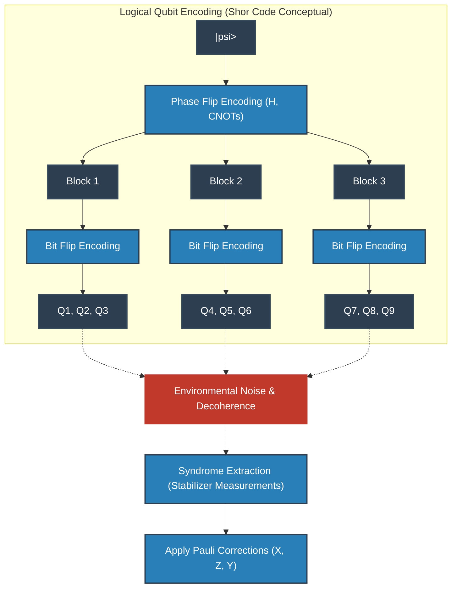

## 10.4 Kode Topologis dan Kode Permukaan (Surface Codes)

Kode Shor maupun kode stabilizer secara logis memang sempurna, namun dalam implementasi fisiknya memerlukan "interaksi antar-qubit yang berjauhan (interaksi jarak jauh)". Dalam susunan kisi pada bidang 2 dimensi untuk peranti benda padat (seperti sirkuit superkonduktor atau spin silikon), kopling jarak jauh semacam ini sangat sulit direalisasikan.

Oleh karena itu, yang diadopsi sebagai arus utama dalam arsitektur komputer kuantum modern adalah "koreksi kesalahan kuantum topologis" yang digagas oleh Alexei Kitaev, dengan contoh utamanya adalah "Kode Torik" (Toric Code) dan "Kode Permukaan" (Surface Code).

Pada kode permukaan, qubit-qubit disusun pada simpul (atau sisi) dari suatu kisi dua dimensi, dan pengukuran stabilizer dilakukan hanya dengan memanfaatkan interaksi lokal antar-qubit yang bertetangga.
Hamiltoniannya dideskripsikan sebagai berikut:

$$
H = - \sum_{v} A_v - \sum_{p} B_p
$$

Di sini, $A_v$ adalah hasil kali tensor dari operator $X$ pada empat qubit di sekitar simpul (operator simpul: $A_v = \prod_{i \in \text{star}(v)} X_i$ ), dan $B_p$ adalah hasil kali tensor dari operator $Z$ pada empat qubit di sekitar plaquette (operator muka: $B_p = \prod_{i \in \text{boundary}(p)} Z_i$ ).
Keduanya saling komutatif ( $[A_v, B_p] = 0$ ), dan keadaan logis dienkode ke dalam ruang keadaan dasar di mana semua nilai eigen dari $A_v$ dan $B_p$ bernilai $+1$. Hebatnya, tingkat degenerasi dari keadaan dasar kode torik yang dikonstruksi pada manifold 2-dimensi dengan genus $g$ adalah $4^g$, sehingga pada torus ( $g=1$ ), dua qubit logis terenkode secara alami.

Interpretasi fisik yang sangat elegan dari kode permukaan adalah memandang kesalahan sebagai "kuasipartikel (anyon)". Sebagai contoh, ketika kesalahan $X$ terjadi pada suatu qubit, sindrom dari dua operator plaquette $B_p$ yang bertetangga akan berbalik tanda menjadi $-1$. Hal ini menandakan bahwa sepasang "anyon yang menyerupai monopol magnetik (anyon $m$)" telah tercipta secara berpasangan dari ruang hampa keadaan dasar. Jika kesalahan berantai lebih lanjut ke tetangganya, anyon akan berpindah melintasi ruang kisi.
Proses koreksi pada hakikatnya adalah menemukan pasangan-pasangan sindrom (anyon) tersebut, lalu menggunakan algoritma "Pencocokan Sempurna Berbobot Minimum" (Minimum Weight Perfect Matching: MWPM) dari teori graf untuk membuat anyon-anyon tersebut saling bertubrukan dan saling memusnahkan (anihilasi) melalui lintasan terpendek.
Operasi logis ( $\bar{X}, \bar{Z}$ ) bersesuaian dengan pembentukan loop homologi nontrivial (Topological Loop) yang melintasi anyon ini dari satu ujung ruang ke ujung lainnya. Karena probabilitas derau lokal secara spontan membentuk loop yang menembus seluruh sistem meluruh secara eksponensial, maka dari perspektif topologis, informasi terlindungi dengan sangat kokoh.

## 10.5 Menuju Komputasi Kuantum Toleransi Kesalahan (FTQC) dan Teorema Ambang Batas

Meskipun teori koreksi kesalahan telah mapan, masalah kritis yang pelik tetap ada: "Bagaimana jika rangkaian sirkuit yang digunakan untuk melakukan koreksi kesalahan itu sendiri (seperti qubit bantu untuk pengukuran sindrom, gerbang CNOT, dll.) mengandung derau?" Jika selama operasi penyembuhan kesalahan, sistem justru tertular kesalahan yang lebih fatal, maka sistem akan langsung runtuh seketika.

Sebagai contoh, gerbang CNOT yang digunakan untuk ekstraksi sindrom akan merambatkan kesalahan $X$ dari qubit kontrol ke qubit target ( $X \otimes I \xrightarrow{CNOT} X \otimes X$ ), serta merambatkan balik kesalahan $Z$ dari qubit target ke qubit kontrol ( $I \otimes Z \xrightarrow{CNOT} Z \otimes Z$ ). Jika satu kesalahan fisik berlipat ganda menjadi beberapa kesalahan di dalam blok yang terenkode, hal itu dapat melampaui jarak kode $d$ yang ditetapkan, dan koreksi kesalahan akan gagal total.

Filosofi desain untuk mencegah rantai kehancuran ini adalah "Komputasi Kuantum Toleransi Kesalahan (FTQC)". Persyaratan mutlak FTQC adalah bahwa "satu kesalahan fisik yang timbul dalam sistem hanya boleh merambat menjadi paling banyak satu kesalahan di dalam satu blok kode logis".
Untuk mewujudkan hal ini, eksekusi gerbang logis sangat menuntut diterapkannya "Operasi Transversal" (Transversal Operations). Ini adalah operasi gerbang yang aman di mana qubit fisik ke-$i$ hanya berinteraksi dengan qubit fisik ke-$i$ dari blok lain (tanpa kopling silang di dalam satu blok yang sama). Namun, berdasarkan "Teorema Eastin-Knill" (Eastin-Knill Theorem), telah dibuktikan secara matematis bahwa mustahil untuk membangun himpunan gerbang kontinu untuk komputasi kuantum universal hanya dengan menggunakan operasi transversal semata.

Tongkat ajaib untuk mengatasi kendala teorema ini dan merealisasikan FTQC universal adalah "Distilasi Keadaan Ajaib" (Magic State Distillation). Sejumlah besar keadaan non-Clifford yang bising/berderau (misalnya, keadaan yang bersesuaian dengan gerbang $T$ ) dipersiapkan dalam jumlah besar, lalu melalui sirkuit pendeteksi kesalahan yang hanya menggunakan operasi Clifford transversal, diekstraksilah "keadaan ajaib" (magic state) dengan kemurnian yang sangat tinggi. Selanjutnya, dengan memanfaatkan prinsip teleportasi kuantum, gerbang non-Clifford (seperti gerbang $T$ ) diterapkan secara tidak langsung ke keadaan logis. Karena proses distilasi ini mengonsumsi sumber daya (qubit fisik) yang sangat masif, dalam algoritma era FTQC, "bagaimana menekan jumlah gerbang $T$" menjadi prioritas tertinggi.

Puncak dari semua upaya teoretis ini adalah "Teorema Ambang Batas Kuantum" (Quantum Threshold Theorem).
Teorema ini, yang dibuktikan oleh Dorit Aharonov, Michael Ben-Or, dan lainnya, menyatakan dengan tegas sebagai berikut:
 **"Jika probabilitas kesalahan $p$ dari komponen fisik (gerbang, pengukuran, inisialisasi) berada di bawah ambang batas tertentu $p_{th}$, maka dengan menyusun kode koreksi kesalahan kuantum secara hierarkis (Concatenation) atau terus memperbesar ukuran kisi kode topologis (jarak kode $d$ ), komputasi kuantum untuk waktu yang sewenang-wenang panjangnya dapat dijalankan dengan presisi sewenang-wenang."** 

Meskipun nilai ambang batas $p_{th}$ bergantung pada jenis kode dan arsitektur yang digunakan, pada kode permukaan nilainya berada pada kisaran $10^{-2}$ (1%), yang merupakan nilai yang sangat realistis dan dapat dicapai. Menekan tingkat kesalahan fisik jauh di bawah ambang batas ini (penyempurnaan Lapisan Fisik / Physical Layer) serta mengembangkan dekoder sindrom yang lebih efisien dan varian kode permukaan (penyempurnaan Lapisan Logis / Logical Layer) keduanya menjadi medan pertempuran utama dalam persaingan global pengembangan komputer kuantum saat ini.

Koreksi kesalahan kuantum dan FTQC bukanlah sekadar tambal sulam rekayasa belaka. Ini adalah tantangan manusia yang sangat mendalam dan artistik untuk mempertahankan keadaan superposisi mekanika kuantum yang rapuh—yang senantiasa berusaha disembunyikan oleh alam—hingga ke skala waktu makroskopis melalui topologi, teori grup, dan pengendalian entropi termodinamika, demi mendobrak batas kemampuan komputasi alam semesta.

# Bab 11: Implementasi Fisik Perangkat Keras Kuantum

Dasar teoritis sains informasi kuantum dan struktur matematis algoritma telah diuraikan secara mendalam hingga Bab 10. Betapa pun canggihnya algoritma kuantum yang dirancang, dan sekalipun keunggulan kuantum (Quantum Supremacy) teoretis telah dibuktikan dalam kerangka teori kompleksitas komputasi, tanpa adanya "perangkat keras kuantum" sebagai entitas fisik untuk menjalankannya, semua itu hanyalah sebatas permainan matematika murni. Pada bab ini, kami akan menjelaskan secara ketat metode implementasi perangkat keras mutakhir untuk mewujudkan vektor keadaan $ |\psi\rangle $ dari ruang Hilbert abstrak ke dalam dunia fisik, mulai dari prinsip-prinsip fisika kuantum mendalam yang melandasinya.

Untuk mengendalikan sistem fisika kuantum secara artifisial dan membuatnya berfungsi sebagai komputer universal (Universal), lima persyaratan fisik ketat yang dikenal sebagai kriteria DiVincenzo (DiVincenzo's criteria) harus dipenuhi:
1. **Keberadaan sistem qubit yang terkarakterisasi dengan baik dan skalabel** : Kemampuan untuk memastikan struktur perkalian tensor ruang Hilbert $ \mathcal{H} = \bigotimes_{i=1}^n \mathcal{H}_i $ secara fisik.
2. **Inisialisasi keadaan kuantum** : Kemampuan untuk mereset sistem ke keadaan murni (biasanya $ |00\dots0\rangle $ ) dengan fidelitas tinggi.
3. **Waktu koherensi yang cukup panjang** : Waktu dekoherensi keadaan kuantum ($T_1$ dan $T_2$) yang jauh lebih panjang beberapa orde besaran dibandingkan waktu yang dibutuhkan untuk satu operasi gerbang.
4. **Implementasi set gerbang kuantum universal** : Kemampuan untuk mengaproksimasi transformasi uniter sembarang $ \hat{U} \in SU(2^n) $ dengan presisi sembarang menggunakan kombinasi sejumlah berhingga gerbang basis (misalnya gerbang H, T, CNOT).
5. **Pengukuran proyektif terhadap qubit tertentu** : Kemampuan untuk membaca distribusi probabilitas terhadap basis tertentu dengan presisi tinggi yang disertai keruntuhan keadaan kuantum.

Membangun sistem yang memenuhi semua kriteria ini secara bersamaan dan dengan fidelitas (Fidelity) yang tinggi merupakan tantangan bersejarah dalam fisika dan rekayasa modern. Mengisolasi sistem sepenuhnya dari lingkungan akan memperpanjang waktu koherensi, namun pada saat yang sama hal itu mempersulit manipulasi dan pengukuran sistem. Cara mengatasi pertukaran (trade-off) mutlak inilah yang menjadi inti dari filosofi desain masing-masing pendekatan perangkat keras.

## 11.1 Qubit Superkonduktor: Fenomena Kuantum Makroskopis dan Sirkuit LC Nonlinier

Saat ini, pendekatan yang paling gencar dikembangkan oleh berbagai lembaga penelitian, termasuk Google dan IBM, adalah qubit superkonduktor (Superconducting Qubit). Alih-alih menggunakan partikel elementer mikroskopis, pendekatan ini memanfaatkan fenomena kuantum makroskopis yang ditunjukkan oleh sirkuit elektronik makro untuk membangun "atom buatan (Artificial Atom)".

### 11.1.1 Fisika Sambungan Josephson dan Nonlinieritas

Sirkuit resonansi LC standar yang difabrikasi secara mikro (sistem yang terdiri dari induktor $ L $ dan kapasitor $ C $ ), ketika didinginkan ke suhu kriogenik ekstrem dan dikuantisasi, akan menjadi osilator harmonik (Harmonic Oscillator) mekanika kuantum. Hamiltonian dari sistem ini dapat dituliskan menggunakan operator kreasi $ \hat{a}^\dagger $ dan operator anihilasi $ \hat{a} $ sebagai berikut:

$$
\hat{H}_{\text{LC}} = \hbar \omega_r \left( \hat{a}^\dagger \hat{a} + \frac{1}{2} \right)
$$

Di sini, $ \omega_r = 1/\sqrt{LC} $ adalah frekuensi resonansi. Tingkat-tingkat energi pada sistem ini, $ E_n = \hbar \omega_r (n + 1/2) $ , berjarak sama. Jika keadaan energi terendah $ |0\rangle $ dan keadaan tereksitasi pertama $ |1\rangle $ dari sistem ini digunakan sebagai qubit, maka ketika radiasi gelombang mikro berfrekuensi $ \omega_r $ ditembakkan untuk melakukan operasi gerbang (misalnya transisi $ |0\rangle \leftrightarrow |1\rangle $ ), transisi yang berjarak sama seperti $ |1\rangle \leftrightarrow |2\rangle $ dan $ |2\rangle \leftrightarrow |3\rangle $ juga akan terpicu secara simultan. Akibatnya, sistem ini tidak dapat berfungsi sebagai sistem dua tingkat.

Untuk menyelesaikan masalah ini, "nonlinieritas (Nonlinearity)" yang membuat jarak antar tingkat energi tidak seragam sangatlah penting. Elemen yang mewujudkan hal ini adalah **sambungan Josephson (Josephson Junction)** . Sambungan ini memiliki struktur di mana dua superkonduktor mengapit lapisan isolator tipis berukuran beberapa nanometer, sehingga pasangan Cooper (Cooper pairs) dapat menembus melalui efek terowongan kuantum sembari mempertahankan interferensi fase makroskopis. Menurut persamaan Josephson, hubungan antara arus superkonduksi $ I $ dan perbedaan fase $ \phi $ adalah $ I = I_c \sin \phi $ . Dengan demikian, sambungan tersebut berfungsi sebagai induktor nonlinier dengan induktansi yang bergantung pada arus.

### 11.1.2 Hamiltonian Transmon

Sepanjang sejarah perkembangannya, berbagai desain seperti qubit muatan (charge qubit) dan qubit fluks (flux qubit) telah dirancang, namun yang paling sukses saat ini adalah "transmon (Transmon)", yang secara dramatis meningkatkan ketahanan terhadap derau muatan (charge noise).

Transmon beroperasi pada rezim di mana kapasitansi pirau (shunt capacitance) paralel sengaja diperbesar secara signifikan terhadap energi Josephson $ E_J $ , sehingga memperkecil energi pengisian (charging energy) $ E_C = e^2 / (2C_{\Sigma}) $ (yaitu $ E_J / E_C \gg 1 $ ).
Operator muatan $ \hat{n} $ yang menyatakan jumlah pasangan Cooper dan operator fase $ \hat{\phi} $ yang menyatakan beda fase superkonduksi merupakan variabel konjugat kanonik, yang memenuhi relasi komutasi $ [\hat{\phi}, \hat{n}] = i $ . Hamiltonian transmon dapat dirumuskan secara eksak sebagai berikut:

$$
\hat{H}_{\text{transmon}} = 4 E_C (\hat{n} - n_g)^2 -E_J \cos \hat{\phi}
$$

Di sini, $ n_g $ adalah muatan ofset yang disebabkan oleh lingkungan atau tegangan gerbang. Pada limit $ E_J \gg E_C $ , fluktuasi kuantum dari fase dapat ditekan hingga kecil, sehingga suku kosinus dapat diekspansi secara deret Taylor dan sistem dapat diperlakukan sebagai osilator anharmonik:

$$
-E_J \cos \hat{\phi} \approx - E_J + \frac{E_J}{2} \hat{\phi}^2 - \frac{E_J}{24} \hat{\phi}^4 + \mathcal{O}(\hat{\phi}^6)
$$

Suku $ \hat{\phi}^4 $ inilah yang memunculkan sifat anharmonisitas (Anharmonicity) pada sistem. Dari hasil perhitungan menggunakan teori perturbasi, anharmonisitas $ \alpha $ antar tingkat energi dapat didekati sebagai:

$$
\alpha \equiv (E_2 - E_1) - (E_1 - E_0) \approx -E_C
$$

Berkat anharmonisitas negatif ini (di mana frekuensi transisi $ E_1 \to E_2 $ lebih kecil daripada $ E_0 \to E_1 $ ), pulsa gelombang mikro dapat digunakan untuk mengeksekusi gerbang satu-qubit secara aman di dalam ruang basis komputasi $ |0\rangle $ dan $ |1\rangle $ .

### 11.1.3 Sirkuit QED (Circuit QED) dan Mekanisme Pengukuran

Kerangka teoritis untuk membaca keadaan qubit tanpa merusaknya adalah "sirkuit QED (Circuit QED)", yaitu penerapan elektrodinamika kuantum rongga (cavity quantum electrodynamics) pada sirkuit superkonduktor.
Sistem terkopel antara qubit dan resonator gelombang mikro untuk pembacaan (readout) dideskripsikan oleh model Jaynes-Cummings:

$$
\hat{H}_{\text{JC}} = \frac{\hbar \omega_q}{2} \hat{\sigma}_z + \hbar \omega_r \hat{a}^\dagger \hat{a} + \hbar g (\hat{\sigma}_+ \hat{a} + \hat{\sigma}_- \hat{a}^\dagger)
$$

Di sini, $ g $ adalah kekuatan kopling. Pada rezim dispersif di mana frekuensi transisi qubit $ \omega_q $ dan frekuensi resonator $ \omega_r $ terpisah jauh ( $ |\omega_q - \omega_r| \gg g $ ), Hamiltonian efektif dapat didiagonalkan melalui transformasi Schrieffer-Wolff sebagai berikut:

$$
\hat{H}_{\text{disp}} \approx \frac{\hbar \omega_q}{2} \hat{\sigma}_z + \hbar \left( \omega_r + \frac{g^2}{\Delta} \hat{\sigma}_z \right) \hat{a}^\dagger \hat{a}
$$

Di sini, $ \Delta = \omega_q - \omega_r $ . Makna fisik yang ditunjukkan oleh suku kedua persamaan ini sangatlah krusial: frekuensi efektif resonator bergeser sebesar $ \pm g^2/\Delta $ bergantung pada keadaan qubit (apakah $ \hat{\sigma}_z = +1 $ atau $ -1 $ ). Oleh karena itu, dengan mentransmisikan atau merefleksikan gelombang mikro penyelidik (probe microwave) melalui resonator dan mengukur pergeseran fasenya, pengukuran proyektif terhadap keadaan qubit dapat dilakukan.

 **Keunggulan dan Kelemahan** 
Keunggulan terbesar dari pendekatan superkonduktor terletak pada skalabilitas desain pengkabelan di atas cip berkat pemanfaatan teknologi litografi semikonduktor yang sudah ada, serta operasi gerbang yang sangat cepat pada skala nanodetik. Di sisi lain, kelemahannya adalah karena merupakan struktur makroskopis buatan manusia, sistem ini sangat rentan terhadap cacat material mikroskopis (TLS) dan derau elektromagnetik, serta mutlak memerlukan lingkungan pendingin pengenceran (dilution refrigerator) di dekat nol mutlak (sekitar 10 mK).

## 11.2 Pendekatan Perangkap Ion: Puncak Fisika Atom dan Keidentikan Sempurna

Jika superkonduktor merupakan "sistem kuantum makro artifisial", maka pendekatan perangkap ion (Trapped Ion) adalah "sistem kuantum mikro pamungkas yang ada di alam". Atom isotop yang identik (misalnya $ ^{171}\text{Yb}^+ $ atau $ ^{40}\text{Ca}^+ $ ) memiliki sifat yang sepenuhnya sama di mana pun mereka berada di alam semesta. Oleh karena itu, konsep variasi manufaktur sama sekali tidak ada, yang memberikan keunggulan mutlak berupa waktu koherensi yang luar biasa panjang.

### 11.2.1 Jebakan Paul dan Dinamika Pendinginan Laser

Dalam perangkap ion, pemerangkapan partikel bermuatan secara stabil di dalam ruang tiga dimensi tidak dapat dilakukan hanya dengan medan elektrostatik statis (teorema Earnshaw). Untuk mengatasi batasan ini, digunakan teknik jebakan Paul (Paul trap) yang memanfaatkan medan listrik frekuensi radio yang tidak homogen secara spasial dan berosilasi terhadap waktu.

Ion-ion yang terperangkap menjalani pendinginan laser (pendinginan Doppler dan pendinginan sideband) di dalam ruang hampa udara (vacuum chamber). Melalui proses ini, energi kinetik ion dilucuti hingga mencapai keadaan dasar mekanika kuantum (jumlah fonon $ n=0 $ ). Basis komputasi qubit dienkodekan ke dalam keadaan elektronik internal ion. Hamiltonian dari keadaan internal ini sangat sederhana:

$$
\hat{H}_{\text{internal}} = \frac{\hbar \omega_0}{2} \hat{\sigma}_z
$$

### 11.2.2 Rezim Lamb-Dicke dan Matematika Gerbang Mølmer-Sørensen

Terobosan sesungguhnya dari pendekatan perangkap ion terletak pada mekanisme pembangkitan keterikatan (entanglement) multi-qubit. Rantai ion yang terperangkap saling terhubung oleh gaya tolak Coulomb yang kuat, sehingga keseluruhan sistem memiliki mode vibrasi normal kolektif (fonon). Dengan memanfaatkan fonon ini sebagai bus data, interaksi langsung dapat dimediasi bahkan di antara ion-ion yang terpisah secara fisik.

Implementasi gerbang dua-qubit yang paling standar adalah gerbang Mølmer-Sørensen (MS). Dua warna sinar laser yang frekuensinya sedikit ditala-lepas (detuned) terhadap frekuensi mode fonon $ \omega_m $ ditembakkan secara bersamaan ke dua ion. Pada rezim Lamb-Dicke di mana parameter Lamb-Dicke $ \eta = k z_0 $ bernilai cukup kecil ( $ \eta \sqrt{n} \ll 1 $ ), Hamiltonian interaksi dapat diekspansikan sebagai berikut:

$$
\hat{H}_{\text{int}} \approx \hbar \Omega \sum_{j=1,2} \hat{\sigma}_\phi^{(j)} \left( \eta \hat{a} e^{i \delta t} + \eta \hat{a}^\dagger e^{-i \delta t} \right)
$$

Di sini, $ \Omega $ adalah frekuensi Rabi dan $ \delta $ adalah detuning. Ketika operator evolusi waktu dihitung menggunakan ekspansi Magnus, setelah waktu gerbang yang tepat, mode gerak akan kembali ke keadaan semula sembari memberikan fase geometris di antara keadaan-keadaan internal, sehingga menyisakan interaksi spin-spin efektif:

$$
\hat{U}_{\text{MS}} = \exp\left( -i \frac{\pi}{4} \hat{\sigma}_\phi \otimes \hat{\sigma}_\phi \right)
$$

Operasi ini menghasilkan keadaan terbelit sempurna dan memiliki daya komputasi yang setara dengan gerbang CNOT. Kemampuan konektivitas antarsemua (all-to-all connectivity) ini merupakan pembeda krusial dibandingkan pendekatan superkonduktor yang hanya dapat berinteraksi dengan qubit tetangga terdekat.

 **Tantangan dan Keterbatasan** 
Waktu operasi gerbang berada pada kisaran puluhan mikrodetik, beberapa orde besaran lebih lambat dibandingkan pendekatan superkonduktor. Selain itu, jika puluhan ion atau lebih ditempatkan dalam satu perangkap satu dimensi, spektrum mode vibrasi menjadi terlalu padat sehingga crosstalk tidak dapat dihindari. Teknologi penskalaan seperti arsitektur QCCD (Quantum Charge-Coupled Device) untuk mengatasi kendala ini merupakan fokus penelitian utama saat ini.

## 11.3 Qubit Topologis: Anyon Non-Abelian dan Ketahanan Mutlak

Baik superkonduktor maupun perangkap ion rentan terhadap galat yang dipicu oleh derau lokal dari lingkungan, sehingga koreksi galat kuantum yang akan dibahas nanti menjadi hal yang tak terelakkan. Namun, terdapat pendekatan yang sangat ambisius untuk membangun keadaan kuantum yang secara fundamental terlindungi dari derau pada tingkat fisik. Pendekatan tersebut adalah komputer kuantum topologis.

### 11.3.1 Rantai Kitaev dan Mode Nol Majorana

Di dalam ruang tiga dimensi tempat kita hidup, partikel elementer hanya ada dalam dua jenis: boson dan fermion. Namun, dalam sistem material topologis dua dimensi, dapat eksis "anyon (Anyon)", yaitu partikel yang fungsi gelombangnya memperoleh fase sembarang saat dilakukan operasi pertukaran partikel. Terlebih lagi, pada kasus "anyon non-Abelian (Non-Abelian anyon)" yang sangat eksotis, ketika dua partikel dipertukarkan, sistem akan mengalami rotasi uniter dari suatu keadaan terdegenerasi berenergi sama ke keadaan ortogonal lainnya:

$$
| \psi_{\text{final}} \rangle = \hat{U} | \psi_{\text{initial}} \rangle
$$

Kandidat fisik paling menjanjikan untuk anyon non-Abelian ini adalah "mode nol Majorana (Majorana Zero Modes, MZM)" sebagai kuasipartikel dalam fisika benda terkondensasi. Nanokawat semikonduktor satu dimensi (seperti InSb) dengan interaksi spin-orbit yang kuat dikopel secara proksimitas dengan superkonduktor gelombang-s, dan medan magnet luar diterapkan padanya. Berdasarkan model yang diajukan oleh Alexei Kitaev, pada wilayah parameter tertentu, nanokawat akan mengalami transisi fase menjadi fase superkonduktor topologis, dan partikel Majorana berenergi nol akan terlokalisasi pada kedua ujung kawat sebagai keadaan tepi (edge state).

Operator Majorana $ \hat{\gamma}_1, \hat{\gamma}_2 $ bersifat swa-damping ( $ \hat{\gamma}_j = \hat{\gamma}_j^\dagger $ ) serta memenuhi relasi antikomutasi $ \{ \hat{\gamma}_i, \hat{\gamma}_j \} = 2\delta_{ij} $ . Operator kreasi dan anihilasi fermion Dirac biasa dapat dikonstruksi secara nonlokal spasial menggunakan kedua operator Majorana ini:

$$
\hat{c} = \frac{1}{2}(\hat{\gamma}_1 + i\hat{\gamma}_2), \quad \hat{c}^\dagger = \frac{1}{2}(\hat{\gamma}_1 - i\hat{\gamma}_2)
$$

Satu keadaan elektronik tunggal ini (paritas fermion) "dipecah" dan dienkodekan pada dua titik yang terisolasi secara spasial di kedua ujung nanokawat. Karena probabilitas gangguan lokal memengaruhi kedua ujung sistem secara bersamaan dengan korelasi yang tepat sangatlah kecil, informasi kuantum terlindungi secara intrinsik dari dekoherensi (perlindungan topologis).

### 11.3.2 Penjalinan (Braiding) dan Komputasi Topologis

Gerbang logika kuantum dalam sistem ini dieksekusi melalui "penjalinan (Braiding)", yaitu saling mempertukarkan posisi spasial partikel-partikel Majorana ini.

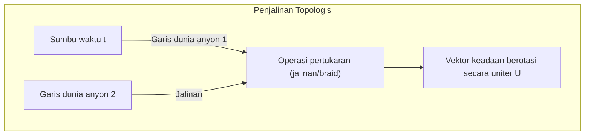

Karena hanya topologi dari "simpul" yang dibentuk oleh lintasan partikel yang menentukan hasil komputasi, meskipun lintasannya mengalami sedikit fluktuasi, selama topologinya tidak berubah, transformasi uniter $ \hat{U} $ dieksekusi secara presisi dengan nol galat. Inilah toleransi kesalahan (fault-tolerance) pada tingkat perangkat keras.

 **Tantangan dan Keterbatasan** 
Bukti eksperimental definitif yang menunjukkan keberadaan mode nol Majorana masih menjadi bahan perdebatan, dan pembuktian fisik dari penjalinan (braiding) belum berhasil dicapai. Selain itu, penjalinan anyon Ising saja tidak cukup untuk menyusun set gerbang kuantum universal, sehingga diperlukan operasi tambahan non-topologis seperti distilasi keadaan ajaib (magic state distillation).

## 11.4 Qubit Fotonik: Optika Linier dan Keterikatan Terinduksi Pengukuran

Sebagai pendekatan lain yang secara fundamental kebal terhadap derau lingkungan, terdapat komputer kuantum fotonik yang memanfaatkan foton (Photon). Foton tidak memiliki muatan listrik dan interaksinya dengan lingkungan sangat kecil bahkan pada suhu ruang, sehingga waktu dekoherensinya dapat dianggap hampir tak terhingga.

### 11.4.1 Pengodean Dual-Rail dan Protokol KLM

Qubit fotonik sering kali dienkodekan menggunakan mode lintasan spasial. Dalam pengodean rel ganda (dual-rail encoding), keadaan saat foton berada pada pandu gelombang atas dinyatakan sebagai $ |0\rangle = |1, 0\rangle $ , dan keadaan pada pandu gelombang bawah dinyatakan sebagai $ |1\rangle = |0, 1\rangle $ .

Gerbang satu-qubit dapat direalisasikan sepenuhnya menggunakan elemen optik linier seperti pembagi berkas (beam splitter, BS) dan penggeser fase (phase shifter, PS). Akan tetapi, karena foton tidak saling berinteraksi secara langsung, mustahil untuk membangun gerbang dua-qubit yang deterministik hanya dengan elemen optik linier.
Pada tahun 2001, Knill, Laflamme, dan Milburn mengusulkan "protokol KLM", yang membuktikan bahwa komputasi kuantum universal yang probabilistik namun skalabel dapat dicapai dengan menggabungkan sumber foton tunggal, elemen optik linier, dan **pengukuran proyektif oleh detektor foton** . Nonlinieritas disuntikkan ke dalam sistem secara pasca-seleksi (post-selection) melalui efek interferensi kuantum murni seperti efek Hong-Ou-Mandel dan ketak-terbalikan pengukuran.

### 11.4.2 Variabel Kontinu (CV) dan Keadaan Kluster

Dalam beberapa tahun terakhir, tidak hanya variabel diskret berbasis foton tunggal, pendekatan komputasi kuantum variabel kontinu (Continuous Variable, CV) yang memanfaatkan amplitudo kuadratur cahaya juga mengalami kemajuan pesat.
Dengan menggunakan teknik multiplexing domain-waktu dan cahaya terperas (squeezed light), "keadaan kluster (Cluster state)" masif yang terdiri dari puluhan ribu hingga jutaan pulsa foton terbelit berhasil dihasilkan. Menggunakan keadaan ini sebagai sumber daya, arsitektur "komputasi kuantum satu arah (Measurement-based quantum computation; MBQC)"—yang memproses komputasi melalui pengukuran berurutan yang sesuai pada setiap simpul—kini menjadi arus utama dalam komputasi kuantum fotonik.

## 11.5 Kondisi Terkini Era NISQ dan Tangga Menuju Qubit Logis

Sebagaimana ditunjukkan oleh konsep **NISQ (Noisy Intermediate-Scale Quantum)** yang digagas oleh John Preskill, perangkat keras kuantum yang saat ini dimiliki umat manusia adalah perangkat "skala menengah" dengan puluhan hingga ratusan qubit fisik, namun masih didominasi oleh derau sehingga akumulasi galat tidak dapat dihindari.

### 11.5.1 Batas Koherensi dan Fidelitas

Ketika mencoba mengeksekusi sirkuit kuantum yang dalam seperti algoritma Shor, galat mikroskopis pada setiap operasi gerbang akan teramplifikasi secara eksponensial. Sebagai contoh, misalkan suatu gerbang dua-qubit memiliki fidelitas 99,5% (tingkat galat $ \epsilon = 0.005 $ ). Jika sirkuit secara keseluruhan memuat $ N $ gerbang, fidelitas keadaan akhir secara aproksimasi adalah $ \mathcal{F} \approx (1-\epsilon)^N \approx e^{-N\epsilon} $ . Untuk $ N=1000 $ , probabilitas keberhasilannya menjadi $ e^{-5} \approx 0.0067 $ , yang berarti hasil perhitungan yang benar akan tenggelam dalam derau.
Dalam eksperimen keunggulan kuantum yang didemonstrasikan oleh Google, metrik yang disebut Cross-Entropy Benchmarking (XEB) digunakan untuk membuktikan kecepatan yang mengungguli superkomputer klasik, namun hal ini terbatas pada pengambilan sampel sirkuit acak tertentu dan bukan berarti komputasi praktis.

### 11.5.2 Transisi Menuju Koreksi Galat Kuantum (Fajar FTQC)

Untuk memecahkan batas kemampuan perangkat NISQ dan menetapkan "keunggulan kuantum" sejati dalam komputasi kimia, sains material, atau pemecahan kriptografi, transisi menuju **FTQC (Fault-Tolerant Quantum Computing: Komputasi Kuantum Toleran Kesalahan)** — yaitu alih-alih bergantung pada satu sistem fisik tunggal, sejumlah besar qubit fisik digabungkan untuk membangun satu "qubit logis (Logical Qubit)" bebas galat — adalah syarat mutlak.

Sebagai contoh, jika kode permukaan (Surface Code) yang merupakan kode koreksi galat topologis digunakan, asalkan tingkat galat qubit fisik berada di bawah ambang batas (threshold), tingkat galat logis akan menurun secara eksponensial seiring dengan membesarnya skala sistem. Namun, sebagai kompensasinya, diperlukan biaya tambahan (overhead) sebanyak 1.000 hingga 10.000 qubit fisik hanya untuk mengonfigurasi satu qubit logis.

Kita saat ini berdiri di garis terdepan rekayasa fisik dalam melawan derau. Setiap pendekatan—mulai dari superkonduktor, perangkap ion, topologis, hingga fotonik kuantum—membuat kesepakatan dengan batas fisik masing-masing sembari membidik puncak skalabilitas yang belum terjamah. Pada Bab 12, kita akan membahas secara mendalam benteng pertahanan pamungkas dari informasi kuantum yang menanti di balik perkembangan perangkat keras ini: "Struktur Matematis Koreksi Galat Kuantum".

# Bab 12: Masa Depan Komputer Kuantum dan Kesimpulan

"Komputer Kuantum" memanfaatkan hukum-hukum fisika dari dunia mikroskopis yang menolak intuisi kita, yaitu mekanika kuantum, sebagai sumber daya komputasi. Dimulai dari prinsip superposisi pada Bab 1, keterikatan kuantum, ketidaksetaraan Bell, algoritma Shor, hingga koreksi kesalahan kuantum, kita telah mengarungi kedalaman ilmu informasi kuantum melalui seri panjang ini. Pada bab penutup ini, kita akan menguraikan makna matematis dan fisik yang sesungguhnya dari eksperimen pembuktian "Keunggulan Kuantum (Quantum Supremacy / Quantum Advantage)", yang merupakan puncak pencapaian teknologi yang diraih umat manusia saat ini, serta secara ketat mematahkan ilusi yang beredar luas di masyarakat bahwa "komputer kuantum adalah kotak ajaib yang dapat menyelesaikan apa pun dalam sekejap" dari perspektif teori kompleksitas komputasi. Selanjutnya, kami menyajikan peta jalan (roadmap) yang realistis dan megah menuju implementasi sosial di masa depan, mulai dari era NISQ (Noisy Intermediate-Scale Quantum) hingga FTQC (Fault-Tolerant Quantum Computing), sebagai kata penutup dari karya besar sepanjang 50.000 karakter ini.

## 12.1 Pembuktian Keunggulan Kuantum: Tonggak Pencapaian yang Ditunjukkan oleh Google Sycamore

Pada tahun 2019, tim peneliti Google mengumumkan pembuktian "keunggulan kuantum" dengan menggunakan prosesor "Sycamore" yang memiliki 53 qubit superkonduktor, yang berhasil memecahkan masalah tertentu dengan cepat pada komputer kuantum—masalah yang tidak dapat diselesaikan oleh komputer klasik dalam jangka waktu yang realistis. Peristiwa ini merupakan tonggak sejarah dalam ilmu informasi kuantum, namun tidak banyak orang yang memahami struktur matematis di baliknya secara akurat.

Masalah yang mereka pecahkan adalah "masalah pengambilan sampel dari sirkuit kuantum acak (Random Quantum Circuit Sampling)". Terhadap sekelompok qubit, gerbang 1-qubit dan gerbang 2-qubit yang dipilih secara acak diterapkan sepanjang $d$ lapisan, dan keadaan akhirnya diukur dalam basis komputasi.

Mari kita deskripsikan secara matematis. Misalkan keadaan awal adalah $ |\psi_0\rangle = |0\rangle^{\otimes n} $. Pada keadaan ini, diterapkan transformasi uniter yang dipilih secara acak $ U = U_d U_{d-1} \dots U_1 $. Keadaan akhir $ |\psi_f\rangle $ dinyatakan menggunakan produk tensor dan kombinasi linear sebagai berikut:

$$
|\psi_f\rangle = U |0\rangle^{\otimes n} = \sum_{x \in \{0, 1\}^n} \alpha_x |x\rangle
$$

Di sini, $ \alpha_x = \langle x | U | 0 \rangle^{\otimes n} $ adalah amplitudo probabilitas untuk mengamati string bit tertentu $x$, yang merupakan bilangan kompleks. Pada saat ini, probabilitas ideal $ P_{\text{ideal}}(x) $ untuk memperoleh string bit $x$ melalui pengukuran diberikan oleh Aturan Born (Born Rule) dalam mekanika kuantum sebagai berikut:

$$
P_{\text{ideal}}(x) = |\alpha_x|^2 = \left| \langle x | U | 0 \rangle^{\otimes n} \right|^2
$$

Dalam sirkuit kuantum acak yang cukup dalam ($d$ bernilai besar), setiap amplitudo $ \alpha_x $ menunjukkan perilaku seperti jalan acak (random walk) pada bidang kompleks, dan diketahui bahwa distribusi probabilitasnya $ P_{\text{ideal}}(x) $ mengikuti distribusi Porter-Thomas (Porter-Thomas distribution). Dengan kata lain, fungsi kepekatan probabilitas untuk kemunculan probabilitas $p$ adalah $ \text{Pr}(P_{\text{ideal}}(x) = p) \approx 2^n e^{-2^n p} $. Ini berarti bahwa string bit tertentu membentuk "pola bintik (speckle pattern)" yang lebih mudah diamati daripada string bit lainnya.

Untuk melakukan pengambilan sampel secara eksak dari distribusi ini menggunakan komputer klasik, amplitudo $ \alpha_x $ harus dihitung secara langsung melalui kalkulasi kontraksi jaringan tensor yang sangat besar. Dimensi vektor keadaan adalah $ 2^n $, dan untuk kasus $ n = 53 $, sekitar $ 9 \times 10^{15} $ amplitudo bilangan kompleks (memori kelas petabita) harus dilacak, yang berhadapan dengan dinding komputasi yang memerlukan waktu luar biasa lama bahkan jika menggunakan superkomputer tercepat di dunia saat itu. Di sisi lain, komputer kuantum secara inheren mempertahankan keadaan sistem fisik itu sendiri **$|\psi_f\rangle$** sebagai vektor alami pada ruang Hilbert, dan melakukan pengambilan sampel sesuai pola bintik secara instan (dalam puluhan mikrodetik) dengan satu kali pengukuran.

Untuk mengevaluasi keberhasilan eksperimen tersebut, tolok ukur entropi silang linear (Linear Cross-Entropy Benchmarking, XEB) diperkenalkan. Fidelitas (Fidelity) $ \mathcal{F}_{\text{XEB}} $ didefinisikan sebagai berikut:

$$
\mathcal{F}_{\text{XEB}} = 2^n \sum_{x \in \{0, 1\}^n} P_{\text{ideal}}(x) P_{\text{exp}}(x) - 1
$$

Di sini, $ P_{\text{exp}}(x) $ adalah distribusi probabilitas empiris yang diperoleh dari prosesor kuantum nyata (termasuk derau/noise perangkat keras). Jika perangkat menghasilkan derau yang sepenuhnya acak (matriks densitas keadaan campuran sempurna $ \rho = \frac{I}{2^n} $ ), maka $ P_{\text{exp}}(x) = \frac{1}{2^n} $, sehingga menghasilkan $ \mathcal{F}_{\text{XEB}} = 0 $. Sebaliknya, untuk komputer kuantum ideal tanpa derau yang menghasilkan keadaan murni, $ \mathcal{F}_{\text{XEB}} \approx 1 $. Dalam eksperimen Google, terkonfirmasi nilai $ \mathcal{F}_{\text{XEB}} \approx 0.002 $, yang secara jelas lebih besar dari nol dan memiliki signifikansi statistik. Meskipun fidelitas ini terkesan kecil, ini tetap dipandang sebagai pembuktian keunggulan kuantum karena menghasilkan sampel yang setara pada komputer klasik sangatlah sulit dari sudut pandang teori kompleksitas komputasi.

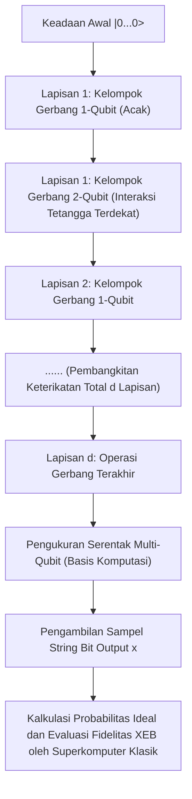

## 12.2 Kesalahpahaman "Kotak Ajaib": Jebakan Komputasi Paralel dan BQP vs NP

Dalam laporan media umum maupun buku-buku sains populer mengenai komputer kuantum, sering kali kita melihat kata-kata ajaib seperti "karena dapat menghitung $2^n$ keadaan secara bersamaan, ia dapat memecahkan masalah apa pun dalam sekejap". Namun, hal ini secara tegas salah dari sudut pandang teori kompleksitas komputasi. Komputer kuantum sama sekali bukanlah tongkat sihir yang dapat menyelesaikan "masalah NP-Lengkap (NP-Complete)" tanpa syarat dalam waktu polinomial.

Kesalahpahaman ini berpangkal pada fakta (paralelisme kuantum) bahwa evaluasi fungsi untuk semua input dapat dilakukan "dalam satu operasi" melalui superposisi keadaan $ |\psi\rangle = \frac{1}{\sqrt{2^n}} \sum_{x=0}^{2^n-1} |x\rangle $ menggunakan gerbang Hadamard dan sejenisnya. Dengan menggunakan oracle (operator uniter yang bertanggung jawab atas perhitungan) **$U_f$** , ketika perhitungan fungsi $ f(x) $ dieksekusi pada keadaan superposisi, seluruh keadaan akan berevolusi sesuai prinsip linearitas sebagai berikut:

$$
U_f \left( \frac{1}{\sqrt{2^n}} \sum_{x=0}^{2^n-1} |x\rangle \otimes |0\rangle \right) = \frac{1}{\sqrt{2^n}} \sum_{x=0}^{2^n-1} |x\rangle \otimes |f(x)\rangle
$$

Memang benar bahwa di dalam vektor keadaan ini, jawaban $f(x)$ untuk semua $x$ tercakup sebagai subsistem dari amplitudo probabilitas. Namun, ingatlah **aksioma pengukuran** (keruntuhan fungsi gelombang) dalam mekanika kuantum. Jika kita melakukan operasi pengukuran pada register keluaran ini, yang kita peroleh hanyalah pasangan tunggal $ (x, f(x)) $ yang dipilih secara acak dengan probabilitas $\frac{1}{2^n}$. Sisa informasi sebanyak $ 2^n - 1 $ akan hilang selamanya akibat pengukuran proyektif yang tak dapat diubah (irreversible). Dengan kata lain, terdapat jurang pemisah yang tak dapat diseberangi antara "menghitung secara paralel (evolusi keadaan)" dan "mengekstrak informasi spesifik yang kita inginkan dari hasil perhitungan paralel tersebut (pembacaan keadaan)".

Agar algoritma kuantum dapat benar-benar mengungguli algoritma klasik, kita tidak hanya membutuhkan evaluasi paralel semata, melainkan juga harus merancang dan memanfaatkan "interferensi kuantum (Quantum Interference)" secara cerdik. Kita harus membangun transformasi uniter global yang sangat khusus yang memperkuat amplitudo probabilitas yang bersesuaian dengan keadaan solusi yang dicari melalui interferensi konstruktif (constructive interference), sekaligus meniadakan amplitudo probabilitas dari jawaban-jawaban salah yang tak terhitung jumlahnya melalui interferensi destruktif (destructive interference) dengan pembalikan fase.

Di bawah batasan ini, kelas kompleksitas masalah yang dapat dipecahkan oleh komputer kuantum dalam waktu polinomial dengan menjaga tingkat akurasi tetap tinggi secara signifikan disebut **BQP** (Bounded-error Quantum Polynomial time). Di sisi lain, kelas masalah di mana validitas suatu solusi dapat diverifikasi dalam waktu polinomial ketika solusi tersebut diberikan disebut **NP** , dan kumpulan masalah tersulit di dalamnya adalah **Masalah NP-Lengkap** (seperti Masalah Pedagang Keliling / Traveling Salesperson Problem, Masalah Pemenuhan Boolean / SAT, dll.).

Algoritma Grover (Grover's algorithm) mempercepat pencarian basis data tak terstruktur dengan $ N = 2^n $ elemen secara kuadratik, dari $ O(N) $ pada komputasi klasik menjadi $ O(\sqrt{N}) $ pada komputasi kuantum. Meninjau kembali representasi matematis dari Amplifikasi Amplitudo (Amplitude Amplification), algoritma ini bermuara pada operasi pemutaran (rotasi) vektor keadaan secara geometris di dalam subruang 2 dimensi (bidang) yang direntang oleh keadaan superposisi seragam awal $ |s\rangle $ dan keadaan jawaban benar yang ingin kita cari $ |\omega\rangle $.

Operator iterasi Grover **$G$** didefinisikan sebagai perkalian antara operator pembalikan fase keadaan jawaban benar oleh oracle $ U_\omega = I - 2|\omega\rangle\langle\omega| $ dan operator pembalikan di sekitar nilai rata-rata $ U_s = 2|s\rangle\langle s| - I $.

$$
G = U_s U_\omega = (2|s\rangle\langle s| - I)(I - 2|\omega\rangle\langle\omega|)
$$

Dengan menerapkan operator uniter **$G$** ini sekitar $ \frac{\pi}{4}\sqrt{N} $ kali, vektor keadaan akan berotasi menuju $ |\omega\rangle $ target, dan probabilitas untuk mengamati jawaban yang benar dapat ditingkatkan hingga mendekati 1 (100%). Namun, fakta yang sangat penting di sini adalah bahwa ini murni merupakan "percepatan akar kuadrat", bukan percepatan eksponensial ( $ O(2^n) \to O(\text{poly}(n)) $ ). Hingga saat ini, belum ada pola interferensi kuantum yang ditemukan yang dapat menyelesaikan kasus umum dari masalah NP-Lengkap dalam waktu polinomial. Sebagian besar ilmuwan informasi kuantum dan ilmuwan komputer sangat meyakini **$\text{BQP} \not\supset \text{NP-Complete}$** (komputer kuantum tidak dapat menyelesaikan masalah NP-Lengkap secara efisien) sebagai dugaan mendasar dalam teori kompleksitas komputasi.

Komputer kuantum pada hakikatnya adalah koprosesor khusus yang sangat canggih yang memberikan percepatan super-polinomial melalui Transformasi Fourier Kuantum (QFT) hanya ketika terdapat "struktur aljabar seperti periodisitas yang tersembunyi di dalam masalah", sebagaimana pada faktorisasi prima dalam algoritma Shor.

## 12.3 Koreksi Kesalahan Kuantum dan Peta Jalan dari NISQ ke FTQC

Meskipun keunggulan kuantum telah dibuktikan, perangkat berskala puluhan hingga ratusan qubit saat ini seperti Sycamore disebut sebagai perangkat **NISQ** (Noisy Intermediate-Scale Quantum), dan tidak dapat sepenuhnya mencegah masuknya derau (noise) dari lingkungan. Keadaan kuantum yang rapuh sangat mudah mengalami dekoherensi (keterbatasan waktu relaksasi fase $T_2$ dan waktu relaksasi energi $T_1$) akibat interaksi dengan lingkungan, seperti fluktuasi termal dan interferensi gelombang elektromagnetik. Seiring bertambah dalamnya komputasi (jumlah lapisan gerbang bertambah), ketidaksempurnaan gerbang dan derau akibat dekoherensi akan terakumulasi secara eksponensial, sehingga hasil akhir akan runtuh menjadi keadaan campuran sempurna yang sama sekali tidak memiliki makna.

Satu-satunya jalur teoretis untuk menembus batas fisik ini dan memungkinkan pelaksanaan algoritma kuantum skala besar yang praktis hingga ratusan juta langkah adalah realisasi **Komputasi Kuantum Toleran Kesalahan (Fault-Tolerant Quantum Computation, FTQC)** menggunakan **Koreksi Kesalahan Kuantum (Quantum Error Correction, QEC)** . Koreksi kesalahan pada komputer klasik (seperti kode suara mayoritas melalui replikasi bit) tidak dapat diterapkan pada keadaan kuantum karena "Teorema Tanpa Kloning (No-Cloning Theorem)" yang merupakan fondasi mekanika kuantum. Secara matematis, tidak ada transformasi uniter yang dapat menyalin keadaan kuantum yang tidak diketahui **$|\psi\rangle = \alpha|0\rangle + \beta|1\rangle$** secara sempurna menjadi **$|\psi\rangle \otimes |\psi\rangle \otimes |\psi\rangle$** .

Namun, fisika teoretis menemukan solusi yang elegan untuk mengatasi keputusasaan ini. Informasi kuantum dapat dilindungi bukan dengan menyalin keadaan secara individual, melainkan dengan "menyembunyikan satu informasi logis yang disebarkan ke dalam topologi 'ruang keterikatan (entanglement)' dari ruang Hilbert raksasa yang dibentuk oleh banyak qubit fisik". Saat ini, "Kode Permukaan (Surface Code)", yang dipandang paling menjanjikan dari perspektif implementasi perangkat keras, didasarkan pada Formalisme Penstabil (Stabilizer Formalism) pada kisi 2 dimensi.

Dalam kode permukaan, "qubit data" yang menyimpan informasi kuantum ditempatkan pada sisi (edge) kisi 2 dimensi, dan "qubit untuk pengukuran sindrom (qubit ancilla)" yang digunakan untuk mendeteksi kesalahan ditempatkan pada plakat (face) dan titik sudut (vertex) kisi. Kemudian, kelompok operator penstabil yang terdiri dari produk tensor operator Pauli didefinisikan sebagai berikut:

$$
B_p = \bigotimes_{i \in \partial p} Z_i \quad \text{(Operator Plakat: Mendeteksi kesalahan Z)}
$$

$$
A_v = \bigotimes_{i \in \delta v} X_i \quad \text{(Operator Vertex: Mendeteksi kesalahan X)}
$$

Di sini, semua $ B_p $ dan $ A_v $ saling komutatif (tidak anti-komutatif), yaitu memenuhi relasi komutasi $ [B_p, A_v] = 0 $. "Keadaan logis (ruang kode)" **$|\psi_L\rangle$** tempat kita menuliskan informasi didefinisikan secara ketat sebagai subruang yang direntang oleh keadaan eigen simultan sedemikian rupa sehingga nilai eigen dari seluruh operator penstabil ini adalah $+1$.

$$
B_p |\psi_L\rangle = +1 |\psi_L\rangle, \quad A_v |\psi_L\rangle = +1 |\psi_L\rangle \quad (\text{untuk semua } p, v)
$$

Katakanlah derau termal eksternal atau kesalahan operasi menyebabkan kesalahan pembalikan (Pauli $X$) atau kesalahan fase (Pauli $Z$) yang tak terduga pada salah satu qubit fisik. Operator kesalahan tersebut memiliki relasi anti-komutasi ( $\{X, Z\} = 0 $ ) dengan operator penstabil tertentu yang berdekatan, sehingga hasil pengukuran penstabil tersebut (nilai sindrom) akan terbalik (flip) dari $+1$ menjadi $-1$. Tanpa mengamati atau merusak sama sekali keadaan logis yang dilindungi itu sendiri (nilai koefisien bobot $\alpha, \beta$), kita melacak pasangan posisi (cacat/defek) yang bernilai $-1$ ini secara berkelanjutan. Kemudian, dengan menggunakan algoritma klasik seperti "Pencocokan Sempurna Berbobot Minimum (Minimum Weight Perfect Matching)", kita melakukan estimasi kemungkinan maksimum mengenai jalur qubit fisik mana yang mengalami kesalahan dan jenis kesalahan apa yang terjadi, lalu menerapkan operasi inversi baik secara perangkat lunak maupun perangkat keras untuk memperbaikinya.

Menurut pencapaian gemilang dalam teori informasi kuantum yaitu "Teorema Ambang Batas (Threshold Theorem)", selama tingkat kesalahan dari setiap gerbang fisik berada di bawah ambang batas tertentu (sekitar $ 1\% $ pada kasus kode permukaan), telah dibuktikan bahwa tingkat kesalahan pada tingkat logis dapat didekatkan ke nol secara bebas dan eksponensial dengan memperbesar ukuran kisi (jarak kode $d$). Namun, untuk membangun satu qubit logis yang sempurna, beban (overhead) koreksi kesalahan menuntut ribuan hingga puluhan ribu qubit fisik pada tingkat derau saat ini. Diperkirakan ribuan qubit logis akan diperlukan untuk memecahkan enkripsi RSA-2048 menggunakan algoritma Shor, yang pada akhirnya membutuhkan sistem FTQC raksasa berskala jutaan hingga lebih dari sepuluh juta qubit fisik, yang beroperasi pada suhu kriogenik sembari mempertahankan koherensi satu sama lain—skala masif yang melampaui imajinasi.

Ditinjau dari tahapan puluhan hingga ratusan qubit fisik saat ini, ini adalah tantangan rekayasa teknik yang luar biasa sulit dan megah bagi umat manusia, yang setara dengan Program Apollo atau pembangunan Penumbuk Hadron Raksasa (LHC).

## 12.4 Penutup: Cakrawala dan Masa Depan Ilmu Informasi Kuantum

Dimulai dari pengenalan superposisi **$|0\rangle$** dan **$|1\rangle$** dengan notasi bra-ket di Bab 1, evolusi waktu menggunakan matriks uniter, formulasi matematis sistem banyak-partikel melalui produk tensor, runtuhnya realisme lokal Einstein akibat ketidaksetaraan Bell, hingga keindahan struktur matematis dari algoritma kuantum Shor dan Grover, kita telah menelusuri puncak pengetahuan "Ilmu Informasi Kuantum" secara sangat ketat melalui keseluruhan 12 bab dalam seri ini.

Jika komputer klasik didasarkan pada "nilai kebenaran deterministik (aljabar Boolean)", maka komputer kuantum didasarkan pada "rotasi uniter dan produk tensor dalam ruang Hilbert kompleks (aljabar linear)". Pergeseran paradigma fundamental ini melampaui sekadar aspek industri atau praktis mengenai "peningkatan kecepatan komputasi", serta menghadapkan kita pada pertanyaan filosofis mendalam di mana teori informasi dan fisika fundamental menyatu seutuhnya: "Apakah kapasitas pemrosesan informasi pamungkas di alam semesta ini?" dan "Bagaimana komputabilitas serta kompleksitas bergantung pada struktur hukum fisika di alam semesta tempat kita hidup?".

Keterikatan kuantum (entanglement), yang dahulu dicemooh oleh Einstein sebagai "aksi seram pada jarak jauh (spooky action at a distance)", kini telah mapan sebagai "sumber daya (resource)" yang paling mendasar dan sangat diperlukan untuk menggerakkan teleportasi kuantum, kriptografi kuantum, dan komputer kuantum. Intuisi fisikawan jenius Richard Feynman pada tahun 1982: "Jika Anda ingin membuat simulasi tentang alam, sebaiknya Anda menjadikannya mekanika kuantum, dan astaga ini adalah masalah yang luar biasa, karena tampaknya sama sekali tidak mudah," kini setelah beberapa dekade telah tiba pada tahap di mana ia akhirnya beroperasi di atas prosesor nyata berkat perjuangan tanpa henti dari para fisikawan, matematikawan, ilmuwan komputer, serta para insinyur perangkat keras terkemuka di seluruh dunia.

Sekali lagi perlu ditegaskan, komputer kuantum bukanlah kotak ajaib yang serbabisa. Bukan pula mesin impian yang mampu memecahkan masalah NP-Lengkap dengan kekuatan kasar (brute force) dalam waktu polinomial. Namun, dalam simulasi presisi keadaan elektronik kompleks pada reaksi kimia (komputasi kimia kuantum), penyingkapan sifat fisik material baru dan superkonduktor suhu tinggi, kelas masalah optimasi tertentu, serta bidang spesifik seperti faktorisasi prima dan masalah logaritma diskret yang melampaui batas kemampuan komputer klasik, komputer kuantum memiliki keunggulan "Transenden (Supremacy)" yang tidak dapat diragukan lagi.

Pertarungan melawan derau selama beberapa dekade mendatang (perjalanan berat dari NISQ menuju FTQC) sama sekali bukanlah jalan yang mulus. Mengendalikan beban termal yang sangat besar di lingkungan bersuhu kriogenik, tantangan skalabilitas jutaan kabel gelombang mikro, perpanjangan dramatis waktu koherensi qubit ( $T_1, T_2$ ), serta pembangunan sistem kendali hibrida klasik-kuantum untuk memproses pengukuran sindrom masif secara real-time adalah hambatan teknik luar biasa yang masih berdiri tegak. Namun, di balik semua itu terletak kelahiran mekanisme komputasi paling mutakhir dalam sejarah manusia, yang dalam arti sebenarnya "secara langsung mendeskripsikan, memanipulasi, dan memanfaatkan dinamika hukum alam (persamaan Schrödinger) untuk komputasi".

Penulis merasa sangat bahagia jika seri ini dapat membantu para pembaca memahami wujud sejati komputer kuantum beserta struktur matematis dan fisik yang begitu indah serta ketat di baliknya, tanpa terhanyut oleh kata kunci superfisial atau inflasi ekspektasi yang berlebihan. Dunia kuantum jauh melampaui akal sehat kita: begitu mendalam, ganjil, dan memesona secara luar biasa. Kita saat ini berdiri di gerbang perbatasan ilmiah dan teknologi paling menarik dalam sejarah umat manusia. Penjelajahan intelektual nan megah untuk menyingkap kebenaran alam semesta ini baru saja dimulai.

---
 **Seri "Prinsip-prinsip Komputer Kuantum" (Total 12 Bab) Selesai** 