# 제1장: 양자 컴퓨터의 서막과 한계

## 1.1 고전 계산의 물리적 한계와 무어의 법칙의 종언

현대 사회에서 정보 처리 기술의 비약적인 발전은 고든 무어가 1965년에 제창한 "반도체 집적 회로에 실장되는 트랜지스터의 수는 약 2년마다 두 배로 증가한다"는 경험 법칙, 즉 '무어의 법칙'에 의해 견인되어 왔다. 이 법칙에 따라 우리는 트랜지스터의 미세화(스케일링)를 추진해 왔고, 컴퓨터의 연산 성능을 지수함수적으로 향상시켜 왔다. 그러나 21세기에 들어서며 이 고전적인 패러다임은 결정적인 물리적 한계에 직면하고 있다. 그 가장 큰 장벽이 양자역학적 효과인 '양자 터널링 효과(Quantum Tunneling Effect)'의 발현이다.

트랜지스터의 게이트 절연막이나 채널 길이가 수 나노미터 스케일, 즉 원자 몇 개에서 수십 개 정도의 두께에 이를 정도로 얇아지면, 전자는 고전역학적으로 넘을 수 없는 에너지 장벽을 파동 함수의 번짐에 의해 확률적으로 통과해 버린다. 포텐셜 장벽 $V_0$ , 폭 $a$ 인 영역에 입사하는 질량 $m$ 인 전자(에너지 $E < V_0$ )의 투과 확률 $T$ 는 WKB 근사에 따르면 다음 식으로 주어진다.

$$
T \approx \exp \left( - \frac{2}{\hbar} \int_{0}^{a} \sqrt{2m(V_0 - E)} \, dx \right)
$$

여기서 $\hbar$ 는 환산 플랑크 상수이다. 미세화로 인해 장벽의 폭 $a$ 가 감소하면 투과 확률 $T$ 는 지수함수적으로 증가하고, 결과적으로 오프(off) 상태에서도 전류가 흐르는 '누설 전류(leakage current)'가 무시할 수 없는 규모가 된다. 이는 소비 전력의 증가와 발열을 초래하며, 고전적인 결정론적 스위칭 소자로서의 기능 파탄을 의미한다.

나아가 정보 처리의 열역학적 한계도 무시할 수 없다. 1961년에 롤프 란다우어는 정보를 소거하는(불가역적인 논리 연산을 수행하는) 과정에서 필연적으로 열이 발생한다는 것을 보여주었다(란다우어의 원리). 1비트의 정보를 소거할 때 환경으로 방출되는 최소 열량 $\Delta Q$ 는 다음과 같이 표현된다.

$$
\Delta Q \ge k_B T \ln 2
$$

여기서 $k_B$ 는 볼츠만 상수, $T$ 는 절대온도이다. 고전 컴퓨터가 논리 게이트(예를 들어 AND 게이트나 OR 게이트 등의 비가역 게이트)를 구동하는 한, 이 열역학적 하한을 피할 수는 없다. 미세화가 진행되어 하나의 소자가 다루는 에너지가 이 한계에 접근함에 따라, 고전 컴퓨터의 진화는 근본적인 물리 법칙에 의해 한계에 부딪히게 되는 것이다.

## 1.2 리처드 파인만의 예견과 양자계의 계산 복잡도 폭발

고전 컴퓨터가 물리적 한계에 다다르는 가운데, 완전히 새로운 계산 패러다임이 요구되기 시작했다. 그 서막을 연 것이 1981년 MIT에서 개최된 '계산의 물리학에 관한 제1회 회의'에서 리처드 파인만이 행한 기조 강연이다. 파인만은 고전 컴퓨터를 사용하여 양자역학적 계를 시뮬레이션하는 것의 절망적인 어려움을 지적하며, 다음과 같은 혁명적인 제안을 내놓았다.

"자연은 고전적이지 않으므로, 만약 자연의 시뮬레이션을 만들고 싶다면 양자역학적 원리에 기반하여 컴퓨터를 만들어야 한다."

이 발언의 배경에는 양자계의 상태를 기술하는 '힐베르트 공간(Hilbert Space)'의 차원이 입자 수에 대해 지수함수적으로 폭발한다는 사실이 있다. 스핀 $1/2$ 인 입자(즉, 2개의 양자 상태를 갖는 계)를 $N$ 개 모은 계를 생각해 보자. 입자 1개의 상태는 2차원 복소 벡터 공간 $\mathbb{C}^2$ 로 기술된다. 따라서 $N$ 개의 입자로 이루어진 합성계의 상태 공간 $\mathcal{H}$ 는 각 부분계 상태 공간의 텐서곱으로 구성된다.

$$
\mathcal{H} = \bigotimes_{i=1}^{N} \mathbb{C}^2 = \mathbb{C}^{2^N}
$$

이 계의 순수 상태(Pure State) $|\Psi\rangle$ 는 $2^N$ 개의 기저 벡터의 선형 결합(중첩)으로 표현된다. 여기서 디랙의 브라-켓 표기법(Bra-ket notation)을 사용하면, 임의의 양자 상태는 다음과 같이 전개할 수 있다.

$$
|\Psi\rangle = \sum_{x=0}^{2^N-1} c_x |x\rangle
$$

여기서 $|x\rangle$ 는 계산 기저(Computational Basis)이며, $c_x \in \mathbb{C}$ 는 확률 진폭(Probability Amplitude)이라 불리는 복소수이다. 상태 벡터는 규격화 조건 $\sum_{x=0}^{2^N-1} |c_x|^2 = 1$ 을 만족해야 한다.

단 $N = 300$ 개의 양자 비트(Qubit)를 시뮬레이션하려고 시도하는 것만으로도 유지해야 할 복소수의 개수 $2^{300}$ 은 대략 $10^{90}$ 에 달하며, 이는 관측 가능한 우주에 존재하는 모든 원자의 수(약 $10^{80}$ )를 훨씬 능가한다. 고전 컴퓨터의 메모리로 이 많은 변수를 유지하고, 나아가 슈뢰딩거 방정식에 따르는 시간 발전( $2^N \times 2^N$ 의 유니터리 행렬 곱셈)을 계산하는 것은 우주의 수명을 다 바쳐도 불가능하다. 이 '차원의 저주'야말로 고전 계산의 한계이며, 동시에 양자 컴퓨터가 지닌 잠재적 계산 능력의 원천인 것이다.

## 1.3 데이비드 도이치와 양자 튜링 기계의 정식화

파인만의 직관적인 아이디어를 이론 컴퓨터 과학의 틀에서 엄밀하게 정식화한 인물이 바로 옥스퍼드 대학교의 물리학자 데이비드 도이치이다. 1985년의 획기적인 논문에서 도이치는 "모든 물리적 과정은 유한한 수단에 의해 완전히 시뮬레이션 가능하다"는 '강화된 처치-튜링 명제(Strong Church-Turing Thesis)'가 양자역학이 지배하는 물리 세계에서는 성립하지 않을 가능성을 지적했다.

도이치는 앨런 튜링이 제창한 결정론적 튜링 기계를 확장하여 '양자 튜링 기계(Quantum Turing Machine)'라는 개념을 정의했다. 이는 내부 상태나 테이프의 기호, 헤드의 위치가 양자역학적 '중첩 상태'를 가질 수 있고, 상태 전이가 유니터리 연산자(Unitary Operator) $U$ 에 의해 기술되는 기계이다.

양자 계산의 기본 단위가 되는 것이 바로 '양자 비트(Qubit)'이다. 고전 비트가 $0$ 또는 $1$ 의 확정된 상태만 가질 수 있는 것에 반해, 양자 비트는 $|0\rangle$ 과 $|1\rangle$ 의 임의의 선형 중첩 상태를 가질 수 있다.

$$
|\psi\rangle = \alpha |0\rangle + \beta |1\rangle \quad (\alpha, \beta \in \mathbb{C}, \ |\alpha|^2 + |\beta|^2 = 1)
$$

이 양자 비트에 대해 수행되는 연산은 선형이며 노름(norm)을 보존하는 연산, 즉 유니터리 행렬( $U^\dagger U = I$ 를 만족하는 행렬, 여기서 $U^\dagger$ 는 수반 행렬, $I$ 는 단위 행렬)에 의해 표현된다. 예를 들어, 단일 양자 비트에 대한 대표적인 게이트인 아다마르 게이트(Hadamard Gate) $H$ 는 다음과 같이 정의된다.

$$
H = \frac{1}{\sqrt{2}} \begin{pmatrix} 1 & 1 \\ 1 & -1 \end{pmatrix}
$$

기저 상태 $|0\rangle$ 에 대해 아다마르 연산을 적용하면 다음과 같이 된다.

$$
H |0\rangle = \frac{1}{\sqrt{2}} \left( |0\rangle + |1\rangle \right)
$$

이에 따라 계는 $|0\rangle$ 과 $|1\rangle$ 이 동일한 확률로 관측되는 완전한 중첩 상태로 전이된다. 도이치의 공적은 이러한 양자역학의 기본 원리를 계산 모델로 승화시켜, 범용 양자 컴퓨터(Universal Quantum Computer)가 원리적으로 구축 가능함을 수학적으로 증명한 점에 있다.

## 1.4 양자 컴퓨터의 본질: 단순한 '초병렬 계산'이라는 오해의 불식

양자 컴퓨터가 어째서 고전 컴퓨터를 능가하는 계산 능력을 가질 수 있는가? 이 물음에 대한 세간의 대중적인 해설로서, "양자 컴퓨터는 무수한 평행 우주(패럴렐 월드)로 분기하여 모든 가능성을 동시에 계산하고, 그중에서 순식간에 정답을 찾아낸다"는 설명이 자주 제시된다. 이는 '양자 병렬성(Quantum Parallelism)'을 비유적으로 표현한 것이지만, **매우 중대한 오해를 불러일으키는 부정확한 설명** 이다.

분명 $N$ 양자 비트 계에 대해 아다마르 게이트를 병렬로 적용함으로써, $2^N$ 개의 모든 상태의 중첩을 단 한 번의 조작으로 만들어낼 수는 있다.

$$
H^{\otimes N} |0\rangle^{\otimes N} = \frac{1}{\sqrt{2^N}} \sum_{x=0}^{2^N-1} |x\rangle
$$

그리고 어떤 함수 $f(x)$ 를 평가하는 유니터리 연산자 $U_f$ 를 적용하면, 상태는 다음과 같이 변화한다.

$$
U_f \left( \frac{1}{\sqrt{2^N}} \sum_{x=0}^{2^N-1} |x\rangle |0\rangle \right) = \frac{1}{\sqrt{2^N}} \sum_{x=0}^{2^N-1} |x\rangle |f(x)\rangle
$$

여기서 분명 단 한 번의 조작으로 $2^N$ 개의 모든 $x$ 에 대한 $f(x)$ 의 값이 '계산'된 것처럼 보인다. 그러나 양자역학의 요청인 '관측의 공리(보른의 규칙, Born Rule)'가 앞을 가로막는다. 이 중첩 상태를 측정(관측)했을 때 우리가 얻을 수 있는 결과는 단 하나뿐이며, 상태는 확률 $P(x) = 1/2^N$ 로 무작위한 $|x\rangle |f(x)\rangle$ 로 파동묶음의 수축(Wavefunction Collapse)을 일으키고 만다. 즉, 모든 답을 동시에 계산하더라도 측정을 통해 꺼낼 수 있는 것은 '무작위한 단 하나'에 불과하며, 이것은 단순히 무작위로 주사위를 던져 계산하는 것과 전혀 다를 바가 없다.

그렇다면 양자 컴퓨터의 진정한 힘이란 무엇인가? 그것은 바로 **"양자 간섭(Quantum Interference)"** 이다.

양자 상태를 기술하는 확률 진폭 $c_x$ 는 양의 확률이 아니라 '복소수'이기 때문에, 양(+)의 부호도 음(-)의 부호도, 심지어 허수도 가질 수 있다. 양자 알고리즘의 극의는 계산 과정에서 교묘하게 유니터리 변환을 조합함으로써, **"오답에 대응하는 상태의 확률 진폭을 서로 상쇄시키고(상쇄 간섭: Destructive Interference), 정답에 대응하는 상태의 확률 진폭을 증폭시키는(보강 간섭: Constructive Interference)"** 데에 있다.

간단한 예로서 위상 반전과 아다마르 변환에 의한 간섭을 살펴보자. 상태 $\frac{1}{\sqrt{2}}(|0\rangle - |1\rangle)$ 에 대해 다시 아다마르 게이트를 적용하면 어떻게 되는가.

$$
H \left( \frac{|0\rangle - |1\rangle}{\sqrt{2}} \right) = \frac{1}{2} \big( (|0\rangle + |1\rangle) - (|0\rangle - |1\rangle) \big) = \frac{1}{2} (2|1\rangle) = |1\rangle
$$

여기서는 $|0\rangle$ 상태로 향하는 확률 진폭이 $1/2 - 1/2 = 0$ 이 되어 완전히 상쇄(상쇄 간섭)된다. 반면에 $|1\rangle$ 상태로 향하는 진폭은 $1/2 + 1/2 = 1$ 로 증폭(보강 간섭)된다.

진정으로 유용한 양자 알고리즘(예를 들어, 소인수분해를 수행하는 쇼어 알고리즘이나 비구조화 데이터베이스 탐색을 수행하는 그로버 알고리즘)은 계산의 최종 단계에서 측정을 수행했을 때 정답 상태가 관측될 확률이 한없이 $1$ 에 가까워지도록, 이 파동의 간섭 현상을 고도로 오케스트레이션된 절차로 유도하는 것이다. 병렬 계산 그 자체가 마법인 것이 아니라, 복소 확률 진폭의 간섭을 이용하여 '불필요한 계산 경로를 확률적으로 소거할 수 있다'는 점이야말로 고전 컴퓨터와의 결정적인 차이이며, 양자 계산의 진수이다.

## 1.5 개념의 시각화: 양자 간섭의 메커니즘

다음 개념도는 고전적인 확률 과정과 양자적인 간섭 과정(마하-젠더 간섭계나 아다마르 게이트의 연속 적용에 해당)의 차이를 보여준다. 고전적인 무작위 보행(random walk)에서는 확률이 단순히 가산될 뿐이지만, 양자 과정에서는 경로의 진폭이 복소수로서 가산되어 간섭을 일으킨다.

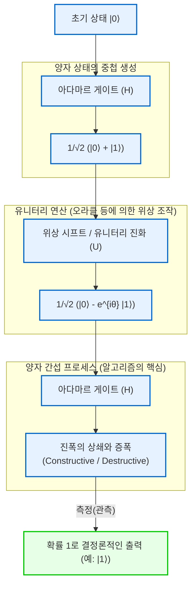

이와 같이 양자 컴퓨터는 고전역학의 한계(미세화 한계나 열역학적 한계)를 우회하기 위한 일시적인 연명책이 아니라, 정보와 계산의 정의 그 자체를 양자역학의 공리에 기반하여 재구축하는 진정한 패러다임 전환이다. 다음 장에서는 이 양자 간섭을 자유자재로 다루기 위한 구체적인 수학적 도구인 '양자 게이트'와 '양자 회로'의 상세한 내용에 대해 더욱 깊이 파고들 것이다.

# 제2장: 고전 비트와 양자 비트(Qubit)의 기초

양자 정보의 이론 체계를 구축하는 데 있어 가장 근원적인 개념이 되는 것은 '정보의 최소 단위'에 대한 정의입니다. 본 장에서는 고전 정보 이론에서의 비트에서 출발하여, 양자역학의 공리에 기반한 양자 정보의 최소 단위인 '양자 비트(Qubit)'로 개념을 확장합니다. 힐베르트 공간, 브라-켓 표기법, 선형대수학의 엄밀한 언어를 사용하여 양자 상태의 수학적 구조를 철저히 밝혀나갈 것입니다. 어떠한 타협도 배제하고, 전문적인 시각에서 양자 정보의 심연을 들여다보도록 하겠습니다.

## 2.1 정보의 최소 단위: 고전 비트의 수학적 정식화와 한계

컴퓨터 과학의 역사에서 클로드 섀넌(Claude Shannon)이 1948년에 확립한 정보 이론의 기초는 '비트(Bit)'입니다. 고전 비트는 물리적 표현(예를 들어 트랜지스터 전압의 고저, 스위치의 온/오프, 혹은 자화의 방향)에 관계없이, 추상적인 상태 공간으로서 $\{0, 1\}$ 이라는 두 개의 이산적인 값 중 하나를 갖는 계로 정의됩니다.

이를 보다 형식적인 벡터 공간의 언어로 표현해 보겠습니다. 고전 비트의 상태는 2차원 실수 벡터 공간 $\mathbb{R}^2$ 에서의 표준 기저를 사용하여 표현할 수 있습니다. 상태 $0$ 및 상태 $1$ 을 각각 다음과 같은 열벡터로 정의합니다.

$$
\mathbf{v}_0 = \begin{pmatrix} 1 \\ 0 \end{pmatrix}, \quad \mathbf{v}_1 = \begin{pmatrix} 0 \\ 1 \end{pmatrix}
$$

결정론적(Deterministic) 고전계에서는 비트의 상태가 반드시 $\mathbf{v}_0$ 또는 $\mathbf{v}_1$ 중 어느 하나로 결정됩니다. 그러나 열잡음과 같은 노이즈나 우리 지식의 불확실성이 존재하는 경우, 고전 확률론적(Probabilistic) 비트로서 상태를 기술해야 합니다. 이 경우 비트의 상태는 확률 분포로 표현되며, 상태 벡터 $\mathbf{p}$ 는 기저 벡터들의 볼록 결합(Convex combination)으로 다음과 같이 쓸 수 있습니다.

$$
\mathbf{p} = p_0 \mathbf{v}_0 + p_1 \mathbf{v}_1 = \begin{pmatrix} p_0 \\ p_1 \end{pmatrix}
$$

여기서 $p_0, p_1$ 은 각각 상태가 $0$ 및 $1$ 일 확률을 나타내는 실수이며, 콜모고로프의 확률 공리에 따라 다음 조건을 만족해야 합니다.

1. **비음수성(Non-negativity)** : $p_0 \ge 0, \quad p_1 \ge 0$
2. **규격화 조건(전체 확률이 1)** : $p_0 + p_1 = 1$

고전 비트의 세계에서 여러 비트를 결합한 합성계는 각 확률 벡터의 텐서곱(크로네커곱)에 의해 기술됩니다. 예를 들어 두 고전 비트의 결합 확률은 다음과 같습니다.

$$
\mathbf{p}_{AB} = \mathbf{p}_A \otimes \mathbf{p}_B = \begin{pmatrix} p_{A0} \\ p_{A1} \end{pmatrix} \otimes \begin{pmatrix} p_{B0} \\ p_{B1} \end{pmatrix} = \begin{pmatrix} p_{A0}p_{B0} \\ p_{A0}p_{B1} \\ p_{A1}p_{B0} \\ p_{A1}p_{B1} \end{pmatrix}
$$

고전 정보 이론의 프레임워크는 매우 강력하며 현대 디지털 사회의 기반을 이루고 있지만, 어디까지나 실수 확률의 덧셈에 의해 상태가 구성되기 때문에 파동의 간섭과 같은 '확률의 상쇄'를 표현하는 것은 원리적으로 불가능합니다. 바로 여기에 고전 물리학의 한계와 양자 정보로의 도약에 대한 필요성이 대두됩니다.

## 2.2 양자역학의 요청과 브라-켓 표기법(Bra-ket notation)

양자역학의 첫 번째 공리(Postulate)는 "닫힌 물리계의 상태는 복소 내적을 갖춘 완비 벡터 공간, 즉 힐베르트 공간(Hilbert Space) $\mathcal{H}$ 상의 단위 벡터(상태 벡터)로 완전히 기술된다"는 것입니다. 양자 계산의 맥락에서는 연속적인 공간 자유도 등을 무시할 수 있으므로, 이 힐베르트 공간은 통상 유한 차원의 복소 벡터 공간 $\mathbb{C}^d$ 가 됩니다.

양자 정보의 최소 단위인 '양자 비트(Qubit)'는 2차원 복소 힐베르트 공간 $\mathcal{H} \cong \mathbb{C}^2$ 에서의 상태로서 엄밀하게 정의됩니다. 이 벡터 공간에서의 상태를 기술하기 위해 물리학자 폴 디랙(Paul Dirac)에 의해 도입된 **브라-켓 표기법(Bra-ket notation)** 을 사용하는 것이 표준적입니다.

양자 상태를 나타내는 열벡터를 **켓 벡터(Ket vector)** 라 부르며, $|\psi\rangle$ 와 같이 표기합니다. 고전 비트의 $0$ 과 $1$ 에 대응하는 상태로서 계산 기저(Computational basis)라 불리는 정규직교 기저를 도입하겠습니다. 이들은 양자 비트의 $Z$ 기저라고도 불리며, 각각 $|0\rangle$ 및 $|1\rangle$ 로 정의됩니다.

$$
|0\rangle = \begin{pmatrix} 1 \\ 0 \end{pmatrix}, \quad |1\rangle = \begin{pmatrix} 0 \\ 1 \end{pmatrix}
$$

한편, 리스 표현 정리(Riesz representation theorem)에 의해 힐베르트 공간의 임의의 켓 벡터에는 연속 선형 범함수로 기능하는 쌍대 공간(Dual space)의 원소가 유일하게 대응합니다. 이를 **브라 벡터(Bra vector)** 라 부르며, $\langle\psi|$ 로 표기합니다. 행렬 표현에서는 켓 벡터의 에르미트 켤레(Hermitian conjugate, 복소 켤레 전치이며 $^\dagger$ 로 표기)를 취함으로써 대응하는 브라 벡터를 얻을 수 있습니다.

$$
\langle\psi| = (|\psi\rangle)^\dagger = (|\psi\rangle^*)^T
$$

예를 들어 기저의 브라 벡터는 다음과 같은 행벡터가 됩니다.

$$
\langle 0| = \begin{pmatrix} 1 & 0 \end{pmatrix}, \quad \langle 1| = \begin{pmatrix} 0 & 1 \end{pmatrix}
$$

브라-켓 표기법의 진가는 내적 계산이 시각적으로 대단히 명쾌해진다는 점에 있습니다. 브라 $\langle\phi|$ 와 켓 $|\psi\rangle$ 의 내적은 $\langle\phi|\psi\rangle$ 로 표기됩니다(이는 Bra와 Ket이 합쳐져 Bracket을 형성한다는 디랙의 언어유희에서 유래했습니다). 계산 기저 $\{|0\rangle, |1\rangle\}$ 는 정규직교계(Orthonormal system)를 이루므로, 크로네커 델타 $\delta_{ij}$ 를 사용하여 다음과 같이 표현됩니다.

$$
\langle i | j \rangle = \delta_{ij} \quad (i, j \in \{0, 1\})
$$

구체적으로 자기 자신과의 내적은 $1$ ($\langle 0|0\rangle = 1$, $\langle 1|1\rangle = 1$), 서로 다른 기저 간의 내적은 $0$ ($\langle 0|1\rangle = 0$, $\langle 1|0\rangle = 0$)이 됩니다.

나아가 브라와 켓의 텐서곱(외적에 해당)은 $|\psi\rangle\langle\phi|$ 로 기술되며, 이는 공간에서 공간으로의 선형 연산자(행렬)를 나타냅니다. 예를 들어 어떤 상태 공간으로의 사영 연산자(Projection operator)는 다음과 같이 구성됩니다.

$$
|0\rangle\langle 0| = \begin{pmatrix} 1 \\ 0 \end{pmatrix} \begin{pmatrix} 1 & 0 \end{pmatrix} = \begin{pmatrix} 1 & 0 \\ 0 & 0 \end{pmatrix}
$$

임의의 2차원 복소 벡터 공간의 항등 연산자 $I$ (Identity operator)는 기저의 완비성 관계(Completeness relation)로서 다음과 같이 분해하여 표현할 수 있으며, 이는 양자역학 계산에서 극히 빈번하게 사용되는 강력한 도구가 됩니다.

$$
I = |0\rangle\langle 0| + |1\rangle\langle 1| = \begin{pmatrix} 1 & 0 \\ 0 & 1 \end{pmatrix}
$$

## 2.3 양자 중첩 원리와 복소 확률 진폭

고전 비트가 항상 $0$ 또는 $1$ 의 명확한 상태에 있거나 그 확률적 혼합인 것과 대조적으로, 양자역학의 선형성(Linearity) 요청에 따라 양자 비트는 $|0\rangle$ 과 $|1\rangle$ 의 선형 결합으로 표현되는 '중첩(Superposition)'이라는 본질적으로 다른 상태를 취할 수 있습니다. 힐베르트 공간 $\mathcal{H}$ 내의 임의의 단위 벡터는 유효한 물리적 상태로 허용됩니다.

따라서 단일 양자 비트의 가장 일반적인 순수 상태(Pure state) $|\psi\rangle$ 는 계산 기저를 사용하여 다음과 같이 전개됩니다.

$$
|\psi\rangle = \alpha |0\rangle + \beta |1\rangle = \begin{pmatrix} \alpha \\ \beta \end{pmatrix}
$$

여기서 $\alpha$ 및 $\beta$ 는 **복소 확률 진폭(Complex probability amplitude)** 이라 불리는 복소수( $\alpha, \beta \in \mathbb{C}$ )입니다. 고전 확률이 음이 아닌 실수였던 것과 대조적으로, 양자 상태가 '복소수' 계수를 갖는다는 점이야말로 양자 컴퓨터가 고전 컴퓨터를 압도하는 계산 능력을 갖는 근원적인 이유입니다. 복소수는 위상(Phase)을 가지며 복소평면 상의 모든 방향을 가리킬 수 있기 때문에, 파동처럼 서로 보강하거나(보강 간섭), 상쇄하는(상쇄 간섭) 것이 가능합니다. 양자 알고리즘의 본질은 이러한 간섭 효과를 교묘하게 조작하여 정답의 확률 진폭을 증폭하고, 오답의 확률 진폭을 상쇄하는 데 있습니다.

양자계로부터 고전 정보를 추출하는 과정이 '측정(Measurement)'입니다. 사영 측정(Projective measurement)을 고려할 때, 보른의 규칙(Born rule)에 따르면 상태 $|\psi\rangle$ 를 계산 기저 $\{|0\rangle, |1\rangle\}$ 로 측정한 결과로 $0$ 이 얻어질 확률 $P(0)$ 과 $1$ 이 얻어질 확률 $P(1)$ 은 각각의 확률 진폭의 절댓값 제곱으로 주어집니다.

$$
P(0) = |\langle 0|\psi\rangle|^2 = |\alpha|^2 = \alpha \alpha^*
$$

$$
P(1) = |\langle 1|\psi\rangle|^2 = |\beta|^2 = \beta \beta^*
$$

계가 반드시 어떤 상태로든 관측되기 위해서는 전체 확률의 총합이 엄밀하게 $1$ 이 되어야 합니다. 따라서 양자 상태 벡터 $|\psi\rangle$ 의 노름(길이)은 항상 $1$ 이어야 합니다. 이것이 **규격화 조건(Normalization condition)** 입니다.

$$
\langle\psi|\psi\rangle = (\alpha^* \langle 0| + \beta^* \langle 1|)(\alpha |0\rangle + \beta |1\rangle) = |\alpha|^2 + |\beta|^2 = 1
$$

이 복소 확률 진폭의 기하학적 의미를 보다 깊이 탐구하기 위해, $\alpha$ 와 $\beta$ 를 극좌표 형식으로 나타내 보겠습니다.

$$
\alpha = r_0 e^{i\phi_0}, \quad \beta = r_1 e^{i\phi_1}
$$

여기서 $r_0, r_1 \ge 0$ 은 진폭의 크기이며, $\phi_0, \phi_1 \in [0, 2\pi)$ 는 각각의 위상각입니다. 규격화 조건에 의해 $r_0^2 + r_1^2 = 1$ 이 되므로, 실수 파라미터 $\theta \in [0, \pi]$ 를 사용하여 $r_0 = \cos(\frac{\theta}{2})$ , $r_1 = \sin(\frac{\theta}{2})$ 로 둘 수 있습니다. 이를 원래의 상태 벡터에 대입하면 다음과 같습니다.

$$
|\psi\rangle = \cos\left(\frac{\theta}{2}\right) e^{i\phi_0} |0\rangle + \sin\left(\frac{\theta}{2}\right) e^{i\phi_1} |1\rangle
$$

전체를 공통 위상 인자 $e^{i\phi_0}$ 로 묶어내 보겠습니다.

$$
|\psi\rangle = e^{i\phi_0} \left( \cos\left(\frac{\theta}{2}\right) |0\rangle + e^{i(\phi_1 - \phi_0)} \sin\left(\frac{\theta}{2}\right) |1\rangle \right)
$$

양자역학에서 상태 벡터 전체에 곱해지는 위상 인자 $e^{i\phi_0}$ 는 '글로벌 위상(Global phase)'이라 불립니다. 임의의 관측가능량(에르미트 연산자) $A$ 에 대한 기댓값 $\langle A \rangle$ 를 계산해 보면 알 수 있듯이,

$$
\langle A \rangle = \left( e^{-i\phi_0} \langle\psi| \right) A \left( e^{i\phi_0} |\psi\rangle \right) = e^{-i\phi_0} e^{i\phi_0} \langle\psi| A |\psi\rangle = \langle\psi| A |\psi\rangle
$$

이처럼 글로벌 위상은 서로 상쇄되기 때문에 어떠한 물리적 측정을 통해서도 관측하는 것이 불가능합니다. 즉, $|\psi\rangle$ 와 $e^{i\phi_0}|\psi\rangle$ 는 힐베르트 공간상에서는 서로 다른 벡터이지만(사선(ray)으로서는 동일), 물리적으로는 완전히 동일한 상태를 나타냅니다.

따라서 글로벌 위상을 무시하고, $|0\rangle$ 과 $|1\rangle$ 사이의 상대 위상(Relative phase) $\varphi = \phi_1 - \phi_0$ (여기서 $\varphi \in [0, 2\pi)$ )만을 파라미터로 남김으로써, 임의의 단일 양자 비트의 순수 상태는 다음의 **표준형(Standard form)** 으로 일의적이며 엄밀하게 표현됩니다.

$$
|\psi\rangle = \cos\left(\frac{\theta}{2}\right) |0\rangle + e^{i\varphi} \sin\left(\frac{\theta}{2}\right) |1\rangle
$$

## 2.4 블로흐 구(Bloch Sphere)에 의한 기하학적 시각화

앞 절에서 유도한 매개변수화는 단일 양자 비트의 상태 공간이 기하학적으로 3차원 공간 내의 단위 구면 표면(2차원 구면 $S^2$ )과 동형임을 보여줍니다. 이 시각적 표현을 고안자인 스위스의 물리학자 펠릭스 블로흐(Felix Bloch)의 이름을 따서 **블로흐 구(Bloch Sphere)** 라고 부릅니다.

각 $\theta$ 는 $+Z$ 축 방향으로부터의 극각(Polar angle), 각 $\varphi$ 는 $X$-$Y$ 평면에서의 방위각(Azimuthal angle)에 정확히 대응합니다.

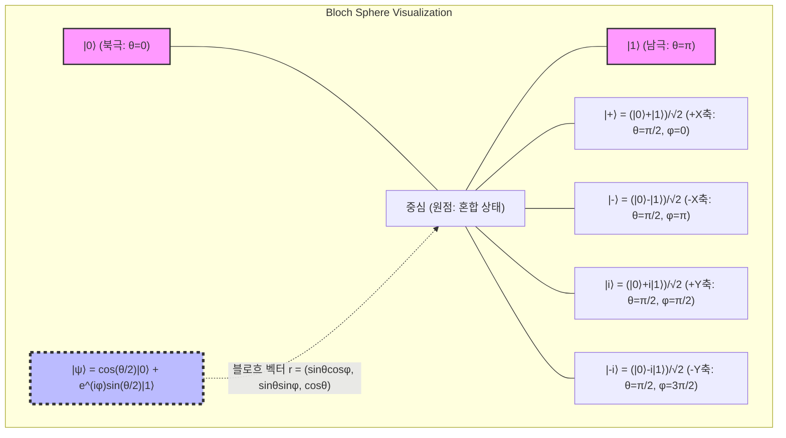

블로흐 구의 가장 특기할 만한 성질은, "힐베르트 공간에서의 직교 상태(내적이 0이 되는 상태)는 블로흐 구의 3차원 실공간 상에서 서로 대척점(Antipodal points: 180도 반대편의 점)에 위치한다"는 점입니다. 예를 들어 $|0\rangle$ (북극, $\theta=0$ )과 직교하는 상태는 $|1\rangle$ (남극, $\theta=\pi$ )입니다. 힐베르트 공간상에서 직교하는 상태들 간의 내적 계산 $\langle 0 | 1 \rangle = 0$ 은 블로흐 구상에서는 각도 $\pi$ (180도)의 거리에 해당합니다. 기하학적인 각도가 힐베르트 공간 각도의 2배가 되기 때문에, 매개변수화에서 $\theta/2$ 라는 반각이 사용되는 수학적 필연성이 바로 여기에 있습니다.

이 블로흐 구의 좌표 $\mathbf{r} = (x, y, z)$ 는 양자역학에서의 관측가능량(Observable)인 **파울리 행렬(Pauli matrices)** 의 기댓값으로서 엄밀하게 유도됩니다. 2차원 계의 에르미트 연산자 기저가 되는 파울리 행렬은 다음과 같이 정의됩니다.

$$
X = \sigma_x = \begin{pmatrix} 0 & 1 \\ 1 & 0 \end{pmatrix}, \quad
Y = \sigma_y = \begin{pmatrix} 0 & -i \\ i & 0 \end{pmatrix}, \quad
Z = \sigma_z = \begin{pmatrix} 1 & 0 \\ 0 & -1 \end{pmatrix}
$$

임의의 상태 $|\psi\rangle$ 에 대한 이들 파울리 관측가능량의 기댓값은 브라-켓 계산을 통해 구해집니다.

$$
x = \langle\psi| X |\psi\rangle = \left( \cos\frac{\theta}{2} \langle 0| + e^{-i\varphi}\sin\frac{\theta}{2} \langle 1| \right) \begin{pmatrix} 0 & 1 \\ 1 & 0 \end{pmatrix} \begin{pmatrix} \cos\frac{\theta}{2} \\ e^{i\varphi}\sin\frac{\theta}{2} \end{pmatrix} = \sin\theta \cos\varphi
$$

$$
y = \langle\psi| Y |\psi\rangle = \left( \cos\frac{\theta}{2} \langle 0| + e^{-i\varphi}\sin\frac{\theta}{2} \langle 1| \right) \begin{pmatrix} 0 & -i \\ i & 0 \end{pmatrix} \begin{pmatrix} \cos\frac{\theta}{2} \\ e^{i\varphi}\sin\frac{\theta}{2} \end{pmatrix} = \sin\theta \sin\varphi
$$

$$
z = \langle\psi| Z |\psi\rangle = \left( \cos\frac{\theta}{2} \langle 0| + e^{-i\varphi}\sin\frac{\theta}{2} \langle 1| \right) \begin{pmatrix} 1 & 0 \\ 0 & -1 \end{pmatrix} \begin{pmatrix} \cos\frac{\theta}{2} \\ e^{i\varphi}\sin\frac{\theta}{2} \end{pmatrix} = \cos^2\left(\frac{\theta}{2}\right) - \sin^2\left(\frac{\theta}{2}\right) = \cos\theta
$$

이로써 블로흐 벡터 $\mathbf{r} = (x, y, z)$ 는 3차원 공간의 단위 벡터 $\mathbf{r} = (\sin\theta\cos\varphi, \sin\theta\sin\varphi, \cos\theta)$ 로 훌륭하게 표현됩니다. 또한 임의의 순수 상태에 대응하는 밀도 행렬(Density matrix) $\rho = |\psi\rangle\langle\psi|$ 는 파울리 벡터 $\boldsymbol{\sigma} = (X, Y, Z)$ 와 단위 행렬 $I$ 를 사용하여 대단히 우아하게 기술됩니다.

$$
\rho = \frac{1}{2} \left( I + \mathbf{r} \cdot \boldsymbol{\sigma} \right) = \frac{1}{2} \left( I + xX + yY + zZ \right)
$$

행렬의 성분을 명시적으로 전개하여 확인하면 다음과 같습니다.

$$
\rho = \frac{1}{2} \begin{pmatrix} 1 + z & x - iy \\ x + iy & 1 - z \end{pmatrix} = \begin{pmatrix} \cos^2(\frac{\theta}{2}) & e^{-i\varphi}\sin(\frac{\theta}{2})\cos(\frac{\theta}{2}) \\ e^{i\varphi}\sin(\frac{\theta}{2})\cos(\frac{\theta}{2}) & \sin^2(\frac{\theta}{2}) \end{pmatrix}
$$

이는 바로 텐서곱의 정의에 따른 외적 $|\psi\rangle\langle\psi|$ 의 계산 결과와 완벽히 일치합니다. 여기서 주목할 점은 순수 상태에서는 블로흐 벡터의 노름이 $|\mathbf{r}| = 1$ 이고 밀도 행렬의 대각합(trace)이 $\text{Tr}(\rho^2) = 1$ 을 만족하지만, 환경과의 상호작용이나 불완전한 제어로 인해 양자 정보의 결손(결맞음 손실, 데코히어런스)이 발생한 혼합 상태(Mixed state)에서는 순수 상태들의 통계적 앙상블이 되므로 $|\mathbf{r}| < 1$ 이 됩니다. 그 결과 혼합 상태는 블로흐 구의 표면이 아닌 '내부'의 점으로 표현되며, 정보가 완전히 소실된 최대 혼합 상태(Maximally mixed state) $\rho = I/2$ 는 블로흐 구의 중심점 $\mathbf{r} = (0,0,0)$ 에 위치하게 됩니다.

## 2.5 측정과 파동함수의 붕괴(Wavefunction Collapse)

양자역학에서의 측정은 고전역학의 수동적인 정보 읽어내기와는 근본적으로 다릅니다. 폰 노이만(von Neumann)의 공리적 정식화에 따르면, 물리량(관측가능량)의 측정을 수행하면 상태는 그 관측가능량의 고유 상태로 비가역적으로 '붕괴(수축, Collapse)'합니다.

예를 들어 단일 양자 비트 상태 $|\psi\rangle = \alpha|0\rangle + \beta|1\rangle$ 에 대해 $Z$ 기저에 의한 측정(즉, 파울리 $Z$ 행렬을 관측가능량으로 하는 측정)을 수행하는 경우를 생각해 보겠습니다. 측정값으로 얻어지는 것은 $Z$ 의 고유값인 $+1$ (상태 $|0\rangle$ 에 대응) 또는 $-1$ (상태 $|1\rangle$ 에 대응)뿐입니다.

측정을 수학적으로 엄밀하게 기술하기 위해서는 사영 연산자의 집합 $\{ P_m \}$ 을 사용합니다. $Z$ 측정의 경우 사영 연산자는 다음과 같습니다.

$$
P_0 = |0\rangle\langle 0|, \quad P_1 = |1\rangle\langle 1|
$$

이들은 완비성 관계 $P_0 + P_1 = I$ 및 직교성 $P_i P_j = \delta_{ij} P_i$ 를 만족합니다. 보른의 규칙에 따르면 측정 결과 $m \in \{0, 1\}$ 가 얻어질 확률 $P(m)$ 은 다음과 같이 계산되며,

$$
P(m) = \langle\psi| P_m^\dagger P_m |\psi\rangle = \langle\psi| P_m |\psi\rangle
$$

이는 앞서 살펴본 $|\alpha|^2$ 및 $|\beta|^2$ 와 완벽히 일치합니다. 그리고 가장 중요한 점은, 측정 결과 $m$ 이 얻어진 직후의 새로운 양자 상태 $|\psi'\rangle$ 는 원래 상태에 사영 연산자를 작용시킨 후 이를 새로운 노름으로 재규격화한 것이 된다는 사실입니다.

$$
|\psi'\rangle = \frac{P_m |\psi\rangle}{\sqrt{P(m)}}
$$

결과가 $0$ 이었을 경우,

$$
|\psi'\rangle = \frac{|0\rangle\langle 0| (\alpha|0\rangle + \beta|1\rangle)}{|\alpha|} = \frac{\alpha}{|\alpha|} |0\rangle = e^{i\phi_0} |0\rangle \equiv |0\rangle
$$

가 되며, 상태는 완전히 $|0\rangle$ 으로 붕괴합니다(글로벌 위상은 무시됩니다). 이것이 파동함수의 붕괴(수축, Wavefunction collapse)라 불리는 현상의 수학적 기술이며, 한 번 측정을 수행하여 상태가 붕괴해 버리면 원래의 중첩 상태에 포함되어 있던 상대 위상 $\varphi$ 나 진폭 정보( $\alpha, \beta$ )는 영원히 소실되고 맙니다. 따라서 양자 상태의 완전한 정보를 단일 복사본에 대한 단 한 번의 측정으로 알아내는 것은 원리적으로 불가능합니다(이는 '복제 불가능 정리(No-cloning theorem)'와도 깊이 연관되어 있습니다).

## 2.6 다체계로의 확장에 대한 도입과 다음 장의 전망

단일 양자 비트의 성질을 깊이 이해한 시점에서, 다음 장 이후부터 본격적으로 다룰 '다중 양자 비트 계(다체계)'의 수학적 기초에 대해서도 짚고 넘어가겠습니다. 고전 확률 분포가 데카르트 곱(Cartesian product)에 의해 상태 공간을 확장하는 반면, 양자역학에서의 합성계 힐베르트 공간 $\mathcal{H}_{AB}$ 는 각 부분계의 힐베르트 공간 $\mathcal{H}_A$ 와 $\mathcal{H}_B$ 의 **텐서곱(Tensor product)** 에 의해 구성됩니다.

$$
\mathcal{H}_{AB} = \mathcal{H}_A \otimes \mathcal{H}_B
$$

두 개의 독립적인 양자 비트 상태의 텐서곱은 다음과 같이 전개되어 4차원 복소 벡터 공간을 형성합니다.

$$
|\Psi\rangle_{AB} = (\alpha_0|0\rangle + \alpha_1|1\rangle) \otimes (\beta_0|0\rangle + \beta_1|1\rangle) = \alpha_0\beta_0|00\rangle + \alpha_0\beta_1|01\rangle + \alpha_1\beta_0|10\rangle + \alpha_1\beta_1|11\rangle
$$

여기서 상태들의 텐서곱으로 인수분해할 수 없는 상태(예: 벨 상태 $|\Phi^+\rangle = (|00\rangle + |11\rangle)/\sqrt{2}$ )가 존재한다는 점이 바로 양자 얽힘(Entanglement)의 원천이 됩니다. 텐서곱에 의한 차원의 지수함수적 폭발( $N$ 양자 비트에서 $2^N$ 차원)이야말로 양자 컴퓨터가 압도적인 병렬 계산 능력을 발휘하는 기반이 됩니다.

본 장에서는 고전 비트와 양자 비트의 본질적인 차이를 힐베르트 공간이라는 수학적 기반 위에서 구축하였습니다. 양자 비트는 복소 확률 진폭을 갖는 연속적인 중첩 상태를 취하는 것이 가능하며, 블로흐 구의 유도를 통해 추상적인 복소 벡터를 3차원 실공간의 기하학적 모델로 직관적으로 이해할 수 있는 강력한 기법을 획득하였습니다.

다음 장 "제3장: 양자 게이트와 유니터리 변환"에서는 이 단일 양자 비트 상태를 조작하는 구체적인 '양자 논리 게이트'에 대해 상세히 다루고, 블로흐 구상에서 유니터리 행렬에 의한 회전 조작의 수학적 성질을 명확히 밝혀낼 것입니다. 양자 정보의 심오한 세계로 향하는 문은 이제 막 열렸을 뿐입니다.

# 제3장: 양자역학의 공리와 관측(파속의 수축)

## 3.1 시작하며: 양자역학의 공리적 접근과 선형대수학의 요구

양자 컴퓨터의 동작 원리를 근본적으로 이해하기 위해서는 양자역학이라는 물리학의 이론적 틀을 수학적으로 엄밀한 형태로 파악하는 것이 필수적입니다. 물리학의 많은 이론은 경험 법칙에 기반한 귀납적인 발전을 이루어 왔지만, 양자역학, 특히 존 폰 노이만(John von Neumann)에 의해 정식화된 현대 양자역학은 소수의 수학적 '공리(Axioms)'로부터 전체 체계를 연역하는 공리적 접근을 채택하고 있습니다.

이 공리계는 힐베르트 공간이라는 무한 차원으로 확장 가능한 복소 선형대수학의 무대 위에서 구축됩니다. 양자 정보 과학이나 양자 컴퓨팅에서는 주로 유한 차원의 벡터 공간(예를 들어 양자 비트계의 $\mathbb{C}^2$ 의 텐서곱 공간)을 다루기 때문에 무한 차원에서의 해석학적 어려움(비유계 연산자의 정의역 등)을 회피할 수 있어, 순수하게 선형대수학으로서 양자역학을 기술하고 이해하는 것이 가능합니다.

본 장에서는 양자 상태의 기술에서부터 시간 발전, 그리고 가장 철학적인 논쟁을 불러일으켰던 '관측'에 이르기까지의 과정을 일절 타협하지 않고 엄밀하게 정식화합니다. 독자들은 언뜻 보기에 직관에 반하는 양자 현상이 어떻게 모순 없이 아름다운 수학적 구조 위에 성립하고 있는지를 실감하게 될 것입니다. 이 수학적 구조야말로 양자 컴퓨터의 알고리즘을 기술하는 직접적인 '언어'가 되는 것입니다.

## 3.2 제1공리: 상태 공간(힐베르트 공간과 상태 벡터)

양자역학의 첫 번째 공리는 물리계의 '상태'를 수학적으로 어떻게 표현할지를 결정합니다.

 **공리 1 (상태의 표현)** :
닫힌 물리계의 상태는 복소 내적 공간이며 완비성을 만족하는 힐베르트 공간(Hilbert space) $\mathcal{H}$ 상의 노름(norm)이 1인 단위 벡터에 의해 완전히 기술된다. 이를 **상태 벡터** 라고 부른다.

폴 디랙(Paul Dirac)이 도입한 브라-켓 표기법(Bra-ket notation)에 따르면 상태 벡터는 열 벡터로 취급되며 켓 **$| \psi \rangle$** 으로 표기됩니다. 쌍대 공간 $\mathcal{H}^*$ 에 속하는 행 벡터는 브라 **$\langle \psi |$** 로 표기되며, 이들은 서로 에르미트 공액(복소 공액 전치)의 관계에 있습니다. 즉,

$$
\langle \psi | = ( | \psi \rangle )^\dagger
$$

입니다. 힐베르트 공간 상의 임의의 두 상태 **$| \phi \rangle$** 와 **$| \psi \rangle$** 의 내적은 브라와 켓의 곱 **$\langle \phi | \psi \rangle$** 으로 계산되어 복소수 값을 줍니다. 이 내적은 다음의 성질을 만족합니다.

1. **정부호성** : 임의의 **$| \psi \rangle \neq 0$** 에 대해, $\langle \psi | \psi \rangle > 0$
2. **선형성** : $\langle \phi | ( c_1 | \psi_1 \rangle + c_2 | \psi_2 \rangle ) = c_1 \langle \phi | \psi_1 \rangle + c_2 \langle \phi | \psi_2 \rangle$
3. **공액 대칭성** : $\langle \phi | \psi \rangle = \langle \psi | \phi \rangle^*$ ( $*$ 는 복소 공액)

물리적인 상태는 확률 해석을 성립시키기 위해 항상 규격화 조건(Normalization condition)을 만족해야 합니다. 즉, 상태 벡터 **$| \psi \rangle$** 의 노름은 1입니다.

$$
\| | \psi \rangle \| = \sqrt{\langle \psi | \psi \rangle} = 1
$$

또한 코시-슈바르츠 부등식(Cauchy-Schwarz inequality) $|\langle \phi | \psi \rangle|^2 \le \langle \phi | \phi \rangle \langle \psi | \psi \rangle$ 이 성립하기 때문에, 규격화된 상태 간의 내적의 절댓값은 항상 0에서 1 사이의 값을 가집니다. 이것이 나중에 '확률'로 해석되기 위한 수학적인 토대가 됩니다.

### 중첩의 원리와 완전 정규 직교 기저

양자역학의 가장 두드러진 특징은 '중첩의 원리(Superposition principle)'입니다. 만약 **$| \phi \rangle$** 와 **$| \psi \rangle$** 가 물리적으로 허용되는 상태라면, 그 임의의 복소 선형 결합 $c_1 | \phi \rangle + c_2 | \psi \rangle$ 또한 (규격화를 거치면) 물리적으로 허용되는 상태가 됩니다. 이 성질은 힐베르트 공간의 선형성으로부터 직접적으로 도출됩니다.

힐베르트 공간 $\mathcal{H}$ 에는 완전 정규 직교 기저(Orthonormal basis) $\{ | e_i \rangle \}$ 가 존재합니다. 이들 기저는 서로 직교하며 규격화되어 있습니다.

$$
\langle e_i | e_j \rangle = \delta_{ij}
$$

( $\delta_{ij}$ 는 크로네커 델타). 또한 완전성 관계(Completeness relation) 또는 분해의 항등식으로서, 항등 연산자 $I$ 를 다음과 같이 전개할 수 있습니다.

$$
I = \sum_i | e_i \rangle \langle e_i |
$$

임의의 양자 상태 **$| \psi \rangle$** 는 이 항등 연산자를 작용시킴으로써 기저의 선형 결합으로 유일하게 전개할 수 있습니다.

$$
| \psi \rangle = I | \psi \rangle = \left( \sum_i | e_i \rangle \langle e_i | \right) | \psi \rangle = \sum_i \langle e_i | \psi \rangle | e_i \rangle = \sum_i c_i | e_i \rangle
$$

여기서 전개 계수 $c_i = \langle e_i | \psi \rangle$ 는 복소 확률 진폭이라 불리며, 후술할 보른의 규칙에서 결정적인 역할을 합니다. 규격화 조건 $\langle \psi | \psi \rangle = 1$ 로부터 $\sum_i |c_i|^2 = 1$ 이 도출됩니다.

## 3.3 제2공리: 물리량과 에르미트 연산자

고전역학에서 위치, 운동량, 에너지 등의 물리량(관측가능량)은 실수값을 가지는 함수로 기술됩니다. 하지만 양자역학에서는 근본적인 패러다임 전환이 일어납니다.

 **공리 2 (물리량)** :
관측 가능한 물리량(관측가능량, observable)은 힐베르트 공간 $\mathcal{H}$ 상의 선형 자기 수반 연산자(에르미트 연산자) $A$ 에 의해 기술된다.

에르미트 연산자는 자신의 에르미트 공액이 자신과 같은 연산자입니다. 즉, $A = A^\dagger$ 를 만족합니다. 유한 차원 공간에서 행렬로 표현할 경우, 이는 성분이 복소 공액 대칭( $A_{ij} = A_{ji}^*$ )임을 의미합니다.

물리량이 에르미트 연산자로 정의되어야만 하는 이유는 그 '고유값(Eigenvalues)'에 있습니다. 선형대수학의 스펙트럼 정리(Spectral theorem)에 따르면 에르미트 연산자는 다음과 같은 매우 중요한 성질을 가집니다.

1. **모든 고유값 $a_i$ 는 실수이다.** (관측되는 물리량은 항상 실수여야 하므로 이는 물리적 요구와 일치합니다.)
2. **서로 다른 고유값에 속하는 고유 벡터는 서로 직교한다.** 
3. **연산자의 고유 벡터 $\{ | a_i \rangle \}$ 는 힐베르트 공간의 완전 정규 직교 기저를 형성한다.** 

따라서 임의의 관측가능량 $A$ 는 그 고유값 $a_i$ 와 고유 벡터 **$| a_i \rangle$** 를 이용하여, 사영 연산자 $P_i = | a_i \rangle \langle a_i |$ 의 선형 결합으로서 스펙트럼 분해(Spectral decomposition)를 할 수 있습니다.

$$
A = \sum_i a_i | a_i \rangle \langle a_i |
$$

이러한 정식화를 통해 '물리량을 측정한다'는 행위가 힐베르트 공간의 특정 기저(고유 벡터)로의 사영이라는 기하학적 조작으로 이해할 수 있게 됩니다. 예를 들어 양자 비트의 $\sigma_z$ 관측은 고유값 $+1$ 에 대응하는 상태 **$| 0 \rangle$** 와 고유값 $-1$ 에 대응하는 상태 **$| 1 \rangle$** 이라는 직교 기저로의 사영 조작으로 완전히 기술됩니다.

## 3.4 제3공리: 유니터리 시간 발전과 슈뢰딩거 방정식

양자계가 다른 계와 상호작용하지 않고 고립되어 있는 경우, 그 상태는 결정론적이고 가역적으로 시간 변화를 합니다.

 **공리 3 (시간 발전)** :
고립된 양자계 상태의 시간 발전은 슈뢰딩거 방정식(Schrödinger equation)을 따른다. 또는 동등한 표현으로서 시각 $t_0$ 의 상태 **$| \psi(t_0) \rangle$** 는 시각 $t$ 에서 유니터리 연산자 $U(t, t_0)$ 를 작용한 상태 **$| \psi(t) \rangle$** 로 발전한다.

시간 발전을 기술하는 기초 방정식인 시간 의존 슈뢰딩거 방정식은 다음과 같이 표현됩니다.

$$
i\hbar \frac{d}{dt} | \psi(t) \rangle = H | \psi(t) \rangle
$$

여기서 $i$ 는 허수 단위, $\hbar$ 는 환산 플랑크 상수, $H$ 는 계의 총 에너지에 대응하는 관측가능량인 해밀토니안(Hamiltonian) 연산자입니다.

해밀토니안 $H$ 가 시간에 의존하지 않는(시간적으로 불변인) 계를 생각할 경우, 이 미분 방정식은 형식적으로 적분되어 해는 다음과 같이 주어집니다.

$$
| \psi(t) \rangle = \exp\left( -\frac{i}{\hbar} H (t - t_0) \right) | \psi(t_0) \rangle
$$

이 지수 함수로 표현되는 연산자 $U(t, t_0) = \exp\left( -i H (t - t_0) / \hbar \right)$ 가 시간 발전 연산자입니다. 해밀토니안 $H$ 가 에르미트( $H = H^\dagger$ )이기 때문에, 스톤의 정리(Stone's theorem)에 의해 $U$ 는 유니터리 연산자(Unitary operator)가 됩니다. 유니터리 연산자란 자신의 에르미트 공액이 역행렬과 같은( $U^\dagger U = U U^\dagger = I$ ) 연산자를 말합니다.

유니터리 변환의 매우 중요한 물리적 의미는 **'상태 벡터의 노름(길이)과 내적을 보존한다'** 는 점에 있습니다. 즉, 아무리 시간이 지나더라도 $\langle \psi(t) | \psi(t) \rangle = \langle \psi(t_0) | U^\dagger U | \psi(t_0) \rangle = 1$ 이 항상 보장되어, 확률의 총합이 1이라는 물리 법칙이 파탄나는 일은 없습니다. 양자 컴퓨터의 '양자 게이트'는 이러한 유니터리 시간 발전을 인위적으로 설계하고 제어하는 조작 그 자체에 다름 아닙니다. 예를 들어 아다마르(Hadamard) 게이트나 CNOT 게이트는 모두 유니터리 행렬로 표현됩니다.

## 3.5 제4공리: 관측과 보른의 규칙(Born rule)

양자역학에서의 '관측(Measurement)' 개념은 고전 물리학과는 근본적으로 다릅니다. 고전계에서 관측이라는 행위는 계의 상태를 교란시키지 않고 수동적으로 값을 아는 행위로 여겨집니다. 하지만 양자역학에서 관측은 상태에 대해 능동적으로 개입하여 비가역적인 변화를 가져옵니다.

 **공리 4 (관측과 보른의 규칙)** :
상태 **$| \psi \rangle$** 에 있는 계에 대해 스펙트럼 분해 $A = \sum_i a_i P_i$ 를 가지는 관측가능량 $A$ 를 관측했을 때, 얻어지는 측정값은 반드시 $A$ 의 고유값 $a_i$ 중 하나이다. 특정 고유값 $a_k$ 를 얻을 확률 $p(a_k)$ 는 보른의 규칙에 따라 다음과 같이 주어진다.

$$
p(a_k) = \langle \psi | P_k | \psi \rangle = \| P_k | \psi \rangle \|^2
$$

만약 고유값 $a_k$ 가 축퇴되지 않은 경우(대응하는 고유 벡터 **$| a_k \rangle$** 가 1개뿐인 경우), 사영 연산자는 $P_k = | a_k \rangle \langle a_k |$ 가 되며 확률은 상태의 고유 벡터에 대한 내적의 절댓값 제곱으로 계산됩니다.

$$
p(a_k) = \langle \psi | a_k \rangle \langle a_k | \psi \rangle = | \langle a_k | \psi \rangle |^2
$$

이것은 그야말로 상태 벡터 **$| \psi \rangle$** 를 기저 $\{ | a_i \rangle \}$ 로 전개했을 때의 계수 $c_k = \langle a_k | \psi \rangle$ 의 절댓값 제곱 $|c_k|^2$ 에 다름 아닙니다. 복소 확률 진폭 $c_k$ 자체는 직접 관측할 수 없지만, 그 절댓값의 제곱이 현실 세계에서의 관측 확률로서 나타나는 것입니다. 이 규칙을 제창한 막스 보른(Max Born)의 통찰은 물리학을 결정론에서 확률론으로 변혁시킨 금자탑입니다. 관측가능량 $A$ 의 기댓값 $\langle A \rangle$ 은 모든 고유값과 그 출현 확률의 곱의 합으로 계산되며, 최종적으로 상태 벡터에 의한 내적 형태로 매우 아름답게 표현됩니다.

$$
\langle A \rangle = \sum_i a_i p(a_i) = \sum_i a_i \langle \psi | P_i | \psi \rangle = \langle \psi | \left( \sum_i a_i P_i \right) | \psi \rangle = \langle \psi | A | \psi \rangle
$$

## 3.6 관측에 의한 파속의 수축(상태의 환원)과 결어긋남(데코히어런스)

관측의 공리에는 관측 '후'의 계의 상태가 어떻게 되는가 하는, 가장 논쟁을 불러일으키는 중대한 단계가 포함되어 있습니다. 이것이 '파속의 수축(Wavefunction collapse)' 또는 '상태의 환원(State reduction)'이라고 불리는 현상입니다. 폰 노이만의 사영 가설(Projection postulate)로 알려진 이 과정은 다음과 같이 정식화됩니다.

 **사영 가설** :
관측에 의해 고유값 $a_k$ 가 얻어진 직후 계의 상태 **$| \psi' \rangle$** 는 원래의 상태 벡터에 해당하는 사영 연산자 $P_k$ 를 작용시키고 재규격화한 것으로 순식간에 변화(수축)한다.

$$
| \psi' \rangle = \frac{P_k | \psi \rangle}{\sqrt{p(a_k)}}
$$

만약 관측기가 이상적이고 계의 상태가 축퇴되지 않은 고유값 $a_k$ 로 수축한 경우, 관측 직후의 상태는 엄밀하게 고유 벡터 **$| a_k \rangle$** 그 자체가 됩니다. 즉, 직후에 완전히 같은 관측을 반복하면 확률 1(100%)로 다시 $a_k$ 를 얻을 수 있습니다. 이를 '제1종 측정'이라고 부릅니다.

이 '파속의 수축'은 슈뢰딩거 방정식이 기술하는 유니터리 시간 발전(연속적, 결정론적, 가역적)과는 명확하게 모순되는 성질(비연속적, 확률적, 비가역적)을 가지고 있습니다. 양자역학은 계가 고립되어 있을 때는 유니터리 발전을 하고, 거시적인 관측기와 접촉하는 순간 비유니터리적인 수축을 일으킨다는 이원적인 역학을 내포하고 있는 것입니다.

### 순수 상태에서 혼합 상태로: 밀도 연산자의 도입

파속의 수축이라는 역설을 더욱 깊이 이해하기 위해서는 '밀도 연산자(Density operator)'의 개념이 필수적입니다. 지금까지 다루어 온 상태 벡터 **$| \psi \rangle$** 는 계에 관한 최대한의 정보를 가지고 있는 '순수 상태(Pure state)'입니다. 순수 상태의 밀도 연산자는 $\rho = | \psi \rangle \langle \psi |$ 로 정의됩니다.

한편, 관측 프로세스에서 계가 어느 상태로 수축했는지를 모르거나(또는 정보를 잃어버린) 경우, 계는 고전적인 확률적 혼합 상태(Mixed state)로서 기술되어야만 합니다. 예를 들어 확률 $p(a_k)$ 로 상태 **$| a_k \rangle$** 로 수축한 계의 앙상블을 나타내는 밀도 연산자는 다음과 같습니다.

$$
\rho' = \sum_k p(a_k) | a_k \rangle \langle a_k |
$$

이때 순수 상태에 있었던 $\rho = | \psi \rangle \langle \psi |$ 의 비대각 성분(간섭항)은 관측이라는 행위에 의해 완전히 소멸됩니다. 이러한 간섭성의 상실이야말로 '결어긋남(데코히어런스, Decoherence)'의 핵심입니다.

### 결어긋남과 거시적 고전성의 창발

관측기 또한 다수의 입자로 이루어진 양자계의 일부이며, 양자계와 거대한 환경(관측기나 열원 등)이 상호작용함으로써 '얽힘(양자 얽힘, Entanglement)'이 발생합니다. 환경의 자유도를 트레이스 아웃(부분 대각합, Partial trace)하여 대상계만의 축소 밀도 행렬(Reduced density matrix)을 계산하면, 순수 상태였던 계의 상태 벡터는 급속히 혼합 상태로 이행하여 계의 각 성분 사이의 위상 간섭성을 잃게 됩니다.

$$
\rho_{S} = \mathrm{Tr}_{E} [ | \Psi_{SE} \rangle \langle \Psi_{SE} | ]
$$

이로 인해 거시적인 규모에서는 중첩이 소멸하고 고전적인 확률적 혼합처럼 행동하는 것으로 보입니다. 파속의 수축은 결코 물리 법칙의 파탄이 아니라 환경과의 비가역적인 상호작용에 의한 정보의 산일(흩어짐)로 간주할 수 있습니다. 이러한 결어긋남을 극복하는 것이야말로 결함 허용 양자 컴퓨터를 실현하기 위한 인류 최대의 과제가 되고 있습니다.

### 양자 상태의 시간 발전과 관측의 역학

다음 그림은 양자계의 초기 상태에서 유니터리 시간 발전을 거쳐 관측에 의해 상태가 확률적으로 분기(수축)하는 과정을 시각화한 것입니다. 슈뢰딩거의 결정론적 발전과 보른의 확률적 수축의 대비를 확인해 보십시오.

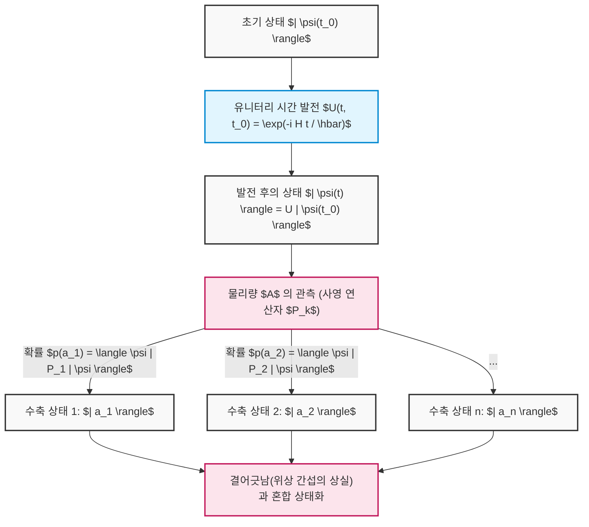

이처럼 선형대수학의 추상적인 개념——벡터 공간, 내적, 에르미트 연산자, 고유값 문제, 유니터리 행렬——은 단순한 수학적 유희가 아니라 우주의 가장 미세한 행동을 정밀하게 기술하고 예측하기 위한 둘도 없는 언어입니다. 양자 컴퓨터의 알고리즘은 바로 이 '슈뢰딩거의 결정론적 발전'과 '보른의 확률적 수축'이라는 두 가지 강력한 규칙을 교묘하게 다루어 고전 컴퓨터로는 도달할 수 없는 계산의 영역으로 우리를 이끕니다.

# 제4장: 단일 양자 비트 게이트와 유니터리 변환

양자 계산의 근간을 이루는 것은 양자 상태에 대한 정밀한 조작입니다. 고전 컴퓨터의 논리 게이트(AND, OR, NOT 등)가 비트 값을 비가역적으로 조작하는 반면, 양자 컴퓨터의 '양자 게이트'는 슈뢰딩거 방정식의 요청에 따르는 가역적인 시간 발전이며, 수학적으로는 복소 힐베르트 공간 상의 '유니터리 변환(유니터리 행렬)'으로 엄밀하게 기술됩니다. 본 장에서는 단일 양자 비트(2준위계)에 작용하는 기본적인 양자 게이트의 수학적 구조, 대수적 성질, 그리고 블로흐 구(Bloch sphere) 상에서의 직관적인 기하학적 의미에 대해 일체의 타협 없이 철저하게 파헤칩니다.

## 4.1 양자 역학의 요청과 유니터리 행렬의 필연성

양자계의 시간 발전은 계를 특징짓는 에르미트 연산자인 해밀토니안 **$H$** ( **$H^\dagger = H$** )를 사용하여 다음의 슈뢰딩거 방정식에 의해 지배됩니다.

$$
i\hbar \frac{d}{dt} |\psi(t)\rangle = H |\psi(t)\rangle
$$

해밀토니안 **$H$** 가 시간에 의존하지 않는 계를 가정했을 때, 임의의 시각 **$t$** 에서의 양자 상태 **$|\psi(t)\rangle$** 는 초기 상태 **$|\psi(0)\rangle$** 로부터 형식적으로 다음과 같이 적분됩니다.

$$
|\psi(t)\rangle = e^{-\frac{i}{\hbar}Ht} |\psi(0)\rangle
$$

여기서 나타나는 시간 발전 연산자를 **$U(t) = e^{-\frac{i}{\hbar}Ht}$** 로 정의합니다. 지수 함수의 지수에 있는 **$H$** 가 에르미트이기 때문에, 이 연산자 **$U(t)$** 의 수반 연산자(에르미트 켤레) **$U(t)^\dagger$** 를 계산하면 다음과 같은 극히 중요한 성질이 도출됩니다.

$$
U(t)^\dagger U(t) = \left( e^{-\frac{i}{\hbar}Ht} \right)^\dagger e^{-\frac{i}{\hbar}Ht} = e^{\frac{i}{\hbar}H^\dagger t} e^{-\frac{i}{\hbar}Ht} = e^{\frac{i}{\hbar}Ht} e^{-\frac{i}{\hbar}Ht} = I
$$

마찬가지로, **$U(t) U(t)^\dagger = I$** 도 성립합니다. 이처럼 그 수반 행렬이 자신의 역행렬과 일치하는 행렬( **$U^\dagger = U^{-1}$** )을 '유니터리 행렬(Unitary Matrix)'이라고 부릅니다. 단일 양자 비트 게이트는 물리적인 제어(예를 들어, 특정 주파수와 지속 시간을 가지는 마이크로파 펄스의 조사 등)를 통해 의도적으로 설계된 해밀토니안에 의해 구현되는 **$2 \times 2$** 의 유니터리 행렬에 다름 아닙니다.

유니터리 행렬이 양자 역학에서 절대적으로 불가결한 이유는 '확률의 보존(노름의 보존)'을 수학적으로 담보하는 유일한 선형 변환이기 때문입니다. 임의의 양자 상태 **$|\psi\rangle$** 와 **$|\phi\rangle$** 에 대해 유니터리 변환 **$U$** 를 적용한 후 상태의 내적을 계산해 봅시다.

$$
\langle \phi' | \psi' \rangle = ( \langle \phi | U^\dagger ) ( U |\psi\rangle ) = \langle \phi | U^\dagger U | \psi \rangle = \langle \phi | I | \psi \rangle = \langle \phi | \psi \rangle
$$

내적이 보존된다는 것은 상태 벡터 자신의 노름(길이의 제곱)인 **$\langle \psi | \psi \rangle$** 도 보존된다는 것을 의미합니다. 양자 역학의 보른 규칙(Born rule)에 따르면 상태 벡터의 진폭 절댓값의 제곱의 총합은 전체 확률 '1'이어야 하므로, 양자 게이트 조작에 의해 이 확률 해석이 파탄나지 않기 위해서는 조작이 유니터리인 것이 절대적인 전제 조건이 됩니다.

나아가 스펙트럼 정리에 따르면 임의의 유니터리 행렬 **$U$** 는 실수의 고윳값 **$\lambda_k$** 를 가지는 에르미트 행렬 **$K$** 를 사용하여 **$U = e^{iK}$** 로 나타낼 수 있습니다. 유니터리 행렬의 고윳값은 항상 절댓값이 1인 복소수( **$e^{i\theta}$** ) 형태를 취하며, 고유 벡터는 서로 직교하는 완전계를 이룹니다.

$$
U = \sum_{j=1}^{d} e^{i \theta_j} |\phi_j\rangle \langle \phi_j|
$$

이것은 양자 게이트의 작용이 '특정 직교 기저 **$|\phi_j\rangle$** 에 대해 순수한 위상 회전 **$e^{i\theta_j}$** 만을 부여하는' 조작으로 완전히 분해될 수 있음을 보여줍니다.

## 4.2 파울리 행렬과 기본 게이트 (X, Y, Z 게이트)

양자 정보의 언어를 말하는 데 있어 파울리 행렬(Pauli matrices) 군의 이해는 불가피하며 가장 중요합니다. 물리학에서 스핀 1/2 입자의 각운동량을 기술하기 위해 도입된 이 행렬군은 양자 컴퓨터에서는 단일 양자 비트에 대한 가장 기본적이고 직교하는 조작군을 형성합니다.

### 4.2.1 파울리 X 게이트 (비트 반전 게이트)

파울리 X 게이트는 고전 논리 회로의 NOT 게이트에 대한 양자역학적 확장입니다. 디랙의 브라켓 표기법을 사용한 외적(프로젝터) 표현에서는 다음과 같이 정의됩니다.

$$
X = \sigma_x = |0\rangle\langle 1| + |1\rangle\langle 0| = \begin{pmatrix} 0 & 1 \\ 1 & 0 \end{pmatrix}
$$

계산 기저( **$|0\rangle, |1\rangle$** )에 대한 작용을 엄밀하게 행렬 계산으로 확인하면,

$$
X |0\rangle = \begin{pmatrix} 0 & 1 \\ 1 & 0 \end{pmatrix} \begin{pmatrix} 1 \\ 0 \end{pmatrix} = \begin{pmatrix} 0 \\ 1 \end{pmatrix} = |1\rangle
$$

$$
X |1\rangle = \begin{pmatrix} 0 & 1 \\ 1 & 0 \end{pmatrix} \begin{pmatrix} 0 \\ 1 \end{pmatrix} = \begin{pmatrix} 1 \\ 0 \end{pmatrix} = |0\rangle
$$

이처럼 진폭을 완전히 반전시킵니다. 기하학적으로는 블로흐 구에서 X축을 회전축으로 한 **$\pi$** (180도)의 회전 조작에 대응합니다. 북극( **$|0\rangle$** )은 남극( **$|1\rangle$** )으로, 남극은 북극으로 매핑됩니다.

### 4.2.2 파울리 Y 게이트 (비트·위상 반전 게이트)

파울리 Y 게이트는 비트 반전과 위상 반전을 동시에 일으키며, 나아가 허수 단위 **$i$** 의 위상 인자를 부여합니다. 외적 표현과 행렬 표현은 다음과 같습니다.

$$
Y = \sigma_y = -i|0\rangle\langle 1| + i|1\rangle\langle 0| = \begin{pmatrix} 0 & -i \\ i & 0 \end{pmatrix}
$$

계산 기저에 대한 작용은,

$$
Y |0\rangle = i|1\rangle, \quad Y |1\rangle = -i|0\rangle
$$

가 됩니다. 블로흐 구 상에서는 Y축 주위의 **$\pi$** 회전을 나타냅니다. 허수 단위 **$i$** (즉 **$e^{i\pi/2}$** )가 곱해지는 것은 단순한 반전뿐만 아니라 상태의 위상 공간에서 직교 방향으로의 이동을 의미합니다.

### 4.2.3 파울리 Z 게이트 (위상 반전 게이트)

파울리 Z 게이트는 고전 논리에는 존재하지 않는 양자 특유의 순수한 '위상 조작'입니다. 진폭의 크기(측정 확률)를 전혀 바꾸지 않고, **$|1\rangle$** 성분에만 **$-1$** (즉 **$e^{i\pi}$** )의 위상 변이를 부여합니다.

$$
Z = \sigma_z = |0\rangle\langle 0| - |1\rangle\langle 1| = \begin{pmatrix} 1 & 0 \\ 0 & -1 \end{pmatrix}
$$

작용은 자명하게도,

$$
Z |0\rangle = |0\rangle, \quad Z |1\rangle = -|1\rangle
$$

가 됩니다. 이는 Z축 주위의 **$\pi$** 회전에 대응합니다. 계산 기저 **$|0\rangle, |1\rangle$** 는 Z 행렬의 고유 벡터(고윳값은 각각 +1, -1)이기 때문에, Z 게이트를 적용해도 상태는 전이되지 않습니다. 그러나 중첩 상태(예: **$\alpha|0\rangle + \beta|1\rangle$** )에 작용시킬 경우 상대 위상이 **$\alpha|0\rangle - \beta|1\rangle$** 로 극적으로 반전되어, 후단의 간섭 결과를 결정적으로 변화시킵니다.

### 4.2.4 파울리 군의 심오한 대수 구조

파울리 행렬군 **$\{I, X, Y, Z\}$** 은 힐베르트 공간 상의 선형 연산자로서 지극히 아름다운 대수 구조를 이루고 있습니다.

1. **자기 수반성(에르미트성)과 유니터리성의 양립** : **$X = X^\dagger$** , **$Y = Y^\dagger$** , **$Z = Z^\dagger$** 이며, 동시에 **$X^\dagger X = I$** (즉 **$X = X^{-1}$** )를 만족합니다. 물리량(관측량)인 동시에 그 자체가 유니터리한 시간 발전 생성자(게이트)가 되는 희귀한 성질입니다. 두 번 연속해서 적용하면 항등 변환으로 돌아갑니다(대합/인벌루션: **$X^2 = Y^2 = Z^2 = I$** ).
2. **완전 반교환 관계** : 서로 다른 파울리 행렬끼리는 곱의 순서를 바꾸면 부호가 반전됩니다.
   

$$
\{X, Y\} = XY + YX = 0, \quad \{Y, Z\} = 0, \quad \{Z, X\} = 0
$$

3. **교환 관계와 리 대수** : 교환자 **$[A, B] = AB - BA$** 를 사용하면, 이들은 **$SU(2)$** 리 대수의 생성자로서의 구조를 명확히 보여줍니다(완전 반대칭 텐서 **$\epsilon_{ijk}$** 를 사용).
   

$$
[\sigma_j, \sigma_k] = 2i \sum_{l \in \{x,y,z\}} \epsilon_{jkl} \sigma_l
$$

   구체적으로는, **$XY = iZ$** , **$YZ = iX$** , **$ZX = iY$** 가 됩니다. 이 대수 구조가 후술할 임의의 회전 게이트를 정의하는 데 있어 수학적 기반을 제공합니다.

## 4.3 아다마르 게이트 (H 게이트): 양자 중첩의 창출

양자 알고리즘(예를 들어 도이치-조사 알고리즘이나 쇼어 알고리즘)에서 초기화 직후에 거의 반드시라고 할 만큼 적용되는 것이 아다마르(Hadamard) 게이트입니다. 결정론적인 상태에서 모든 상태가 동일한 확률로 나타나는 '최대 중첩 상태'를 창출하는 핵심적인 역할을 담당합니다.

$$
H = \frac{1}{\sqrt{2}} \begin{pmatrix} 1 & 1 \\ 1 & -1 \end{pmatrix} = \frac{1}{\sqrt{2}} \left( |0\rangle\langle 0| + |0\rangle\langle 1| + |1\rangle\langle 0| - |1\rangle\langle 1| \right)
$$

계산 기저에 대해 아다마르 행렬을 작용시키면,

$$
H |0\rangle = \frac{1}{\sqrt{2}} \begin{pmatrix} 1 & 1 \\ 1 & -1 \end{pmatrix} \begin{pmatrix} 1 \\ 0 \end{pmatrix} = \frac{1}{\sqrt{2}} \begin{pmatrix} 1 \\ 1 \end{pmatrix} = \frac{|0\rangle + |1\rangle}{\sqrt{2}} \equiv |+\rangle
$$

$$
H |1\rangle = \frac{1}{\sqrt{2}} \begin{pmatrix} 1 & 1 \\ 1 & -1 \end{pmatrix} \begin{pmatrix} 0 \\ 1 \end{pmatrix} = \frac{1}{\sqrt{2}} \begin{pmatrix} 1 \\ -1 \end{pmatrix} = \frac{|0\rangle - |1\rangle}{\sqrt{2}} \equiv |-\rangle
$$

생성된 **$|+\rangle$** 와 **$|-\rangle$** 는 X 기저(또는 대각 기저)라고 불리며 파울리 X 행렬의 고유 상태가 됩니다. 아다마르 행렬 자신도 실대칭이면서 직교 행렬(실수 공간에서의 유니터리 행렬)이기 때문에 **$H = H^\dagger = H^{-1}$** 및 **$H^2 = I$** 를 만족합니다.
따라서, **$H |+\rangle = |0\rangle$** 이 되어, 중첩 상태를 다시 확정적인 계산 기저로 간섭시키는(되돌리는) 작용도 가집니다.
대수적으로 H 게이트는 X 기저와 Z 기저를 변환하는 유니터리 변환입니다. 이는 행렬의 닮음 변환으로서 다음과 같이 지극히 아름답게 기술됩니다.

$$
H X H^\dagger = H X H = Z
$$

$$
H Z H^\dagger = H Z H = X
$$

이 성질에 의해 'Z 게이트에 의한 위상 반전'을 H 게이트로 끼워 넣음으로써 'X 게이트에 의한 비트 반전'을 합성하는 것이 가능해집니다. 기하학적으로 H 게이트는 블로흐 구 상의 단위 벡터 **$\hat{n} = \frac{1}{\sqrt{2}}(\hat{x} + \hat{z})$** 를 축으로 한 **$\pi$** 회전에 해당합니다.

## 4.4 위상 시프트 게이트군: S 게이트와 T 게이트

파울리 Z 게이트를 더욱 일반화한, 블로흐 구의 Z축 주위의 임의의 회전 조작군을 위상 시프트 게이트 **$P(\phi)$** (또는 **$R_\phi$** )라고 부릅니다.

$$
P(\phi) = \begin{pmatrix} 1 & 0 \\ 0 & e^{i\phi} \end{pmatrix} = |0\rangle\langle 0| + e^{i\phi} |1\rangle\langle 1|
$$

이 게이트군은 중첩 상태 **$\alpha|0\rangle + \beta|1\rangle$** 에 대해 **$\alpha|0\rangle + \beta e^{i\phi}|1\rangle$** 이라는 형태로 **$|1\rangle$** 성분의 상대 위상만을 조작합니다. 특히 다음 두 가지가 중요합니다.

### 4.4.1 S 게이트 (위상 게이트, $\sqrt{Z}$)

 **$\phi = \pi/2$** 인 경우를 S 게이트라고 부릅니다.

$$
S = \begin{pmatrix} 1 & 0 \\ 0 & e^{i\pi/2} \end{pmatrix} = \begin{pmatrix} 1 & 0 \\ 0 & i \end{pmatrix}
$$

행렬의 성질에서 명백하듯이 두 번 적용하면 Z 게이트가 됩니다( **$S^2 = Z$** ).
S 게이트를 **$|+\rangle$** 상태에 작용시키면,

$$
S |+\rangle = \begin{pmatrix} 1 & 0 \\ 0 & i \end{pmatrix} \frac{1}{\sqrt{2}} \begin{pmatrix} 1 \\ 1 \end{pmatrix} = \frac{1}{\sqrt{2}} \begin{pmatrix} 1 \\ i \end{pmatrix} = \frac{|0\rangle + i|1\rangle}{\sqrt{2}} \equiv |+i\rangle
$$

가 되어, 블로흐 구의 적도 상에 있는 Y축의 양의 방향(Y 기저의 고유 상태)으로 상태를 전이시킵니다. 파울리 군과 H, S 게이트로 이루어진 군을 클리퍼드 군(Clifford group)이라 부르며, 고츠먼-닐 정리에 의해 클리퍼드 군만으로 구성된 양자 회로는 고전 컴퓨터로 효율적으로 시뮬레이션할 수 있음이 증명되었습니다.

### 4.4.2 T 게이트 ($\pi/8$ 게이트, $\sqrt{S}$, $\sqrt[4]{Z}$)

 **$\phi = \pi/4$** 인 경우를 T 게이트라고 부릅니다.

$$
T = \begin{pmatrix} 1 & 0 \\ 0 & e^{i\pi/4} \end{pmatrix} = \begin{pmatrix} 1 & 0 \\ 0 & \frac{1+i}{\sqrt{2}} \end{pmatrix}
$$

전역 위상 **$e^{i\pi/8}$** 을 묶어내면 대각 성분이 **$e^{-i\pi/8}$** 과 **$e^{i\pi/8}$** 이 되기 때문에, 역사적으로 **$\pi/8$** 게이트라고도 불립니다.
T 게이트는 클리퍼드 군에 속하지 않으며, 고전 시뮬레이션의 효율성을 파괴합니다. 그러나 클리퍼드 군에 이 T 게이트를 하나라도 추가함으로써 단일 양자 비트 상의 모든 유니터리 변환을 임의의 정밀도로 근사할 수 있는 '보편 양자 게이트 세트(Universal Quantum Gate Set)'가 완성된다는 양자 계산 이론의 극히 중요한 정리가 존재합니다. 결함 허용(오류 내성) 양자 계산에서는 T 게이트를 에러 정정 코드 상에서 직접 실행하는 것이 어렵기 때문에, '매직 상태 증류(Magic State Distillation)'라고 불리는 비용이 매우 큰 기법을 사용하여 구현됩니다.

## 4.5 임의의 회전 게이트의 지수 함수 표현과 보편성

단일 양자 비트에 대한 가장 일반적인 조작은 블로흐 구에서의 임의의 단위 벡터 **$\hat{n} = (n_x, n_y, n_z)$** (단, **$n_x^2 + n_y^2 + n_z^2 = 1$** )를 회전축으로 하여 각도 **$\theta$** 만큼 회전시키는 유니터리 변환입니다. 파울리 행렬의 선형 결합을 사용하면 이 회전 연산자 **$R_{\hat{n}}(\theta)$** 는 다음과 같은 행렬의 지수 함수로서 아름답게 정식화됩니다.

$$
R_{\hat{n}}(\theta) = \exp\left(-i \frac{\theta}{2} (\hat{n} \cdot \vec{\sigma})\right) = \exp\left(-i \frac{\theta}{2} (n_x X + n_y Y + n_z Z)\right)
$$

여기서 **$(\hat{n} \cdot \vec{\sigma})^2 = (n_x X + n_y Y + n_z Z)^2 = (n_x^2 + n_y^2 + n_z^2)I = I$** 라는 파울리 행렬의 강력한 반교환성을 이용해 지수 함수를 테일러 전개( **$e^{iAx} = \cos(x)I + i\sin(x)A$** ( **$A^2=I$** 인 경우))하면, 무한급수가 극적으로 단순화되어 다음의 오일러 공식 행렬 확장판을 얻을 수 있습니다.

$$
R_{\hat{n}}(\theta) = \cos\left(\frac{\theta}{2}\right) I - i \sin\left(\frac{\theta}{2}\right) (\hat{n} \cdot \vec{\sigma})
$$

이 일반적인 정식화로부터 직교 좌표축 주위의 기본 회전 게이트군이 연역됩니다.

### X축 주위의 회전 게이트 $R_x(\theta)$ 

$$
R_x(\theta) = e^{-i \frac{\theta}{2} X} = \begin{pmatrix} \cos\frac{\theta}{2} & -i \sin\frac{\theta}{2} \\ -i \sin\frac{\theta}{2} & \cos\frac{\theta}{2} \end{pmatrix}
$$

### Y축 주위의 회전 게이트 $R_y(\theta)$ 

$$
R_y(\theta) = e^{-i \frac{\theta}{2} Y} = \begin{pmatrix} \cos\frac{\theta}{2} & -\sin\frac{\theta}{2} \\ \sin\frac{\theta}{2} & \cos\frac{\theta}{2} \end{pmatrix}
$$

### Z축 주위의 회전 게이트 $R_z(\theta)$ 

$$
R_z(\theta) = e^{-i \frac{\theta}{2} Z} = \begin{pmatrix} e^{-i\theta/2} & 0 \\ 0 & e^{i\theta/2} \end{pmatrix}
$$

이러한 회전 행렬들을 이용하면 임의의 단일 양자 비트 유니터리 행렬 **$U \in SU(2)$** 는 3개의 오일러 각( **$\alpha, \beta, \gamma$** )을 사용한 'Z-Y-Z 분해'로서 다음과 같이 완전히 인수분해 가능합니다.

$$
U = e^{i\delta} R_z(\alpha) R_y(\beta) R_z(\gamma)
$$

이 정리는 하드웨어 수준에서 Z축 회전과 Y축 회전만 고정밀도로 구현할 수 있다면, 단일 양자 비트에 대한 어떠한 복잡한 알고리즘도 실행 가능함을 물리학적으로 보증합니다.

## 4.6 【도해】 단일 양자 비트 게이트 회로와 상태 전이

이러한 게이트들을 시계열 순으로 나열한 것이 양자 회로입니다. 상태는 왼쪽에서 오른쪽으로 시간 발전합니다.

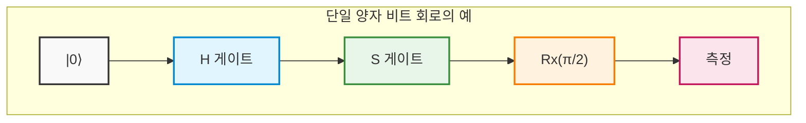

## 4.7 엄밀 계산 예: 행렬 곱셈을 통한 양자 간섭의 완전 추적

추상적인 개념을 물리적인 직관으로 승화시키기 위해, 여러 유니터리 행렬을 곱함으로써 양자 상태가 어떻게 간섭하고 전이해 나가는지를 일체의 생략 없이 엄밀하게 손 계산으로 추적합니다.

초기 상태를 바닥 상태 **$|\psi_0\rangle = |0\rangle = \begin{pmatrix} 1 \\ 0 \end{pmatrix}$** 으로 둡니다.
실행할 조작은 앞선 회로도와 유사한 ' **$H$** 게이트' → ' **$S$** 게이트' → ' **$H$** 게이트'의 시퀀스입니다.
양자 회로도는 왼쪽에서 오른쪽으로 기술하지만, 상태 벡터에 대한 선형 대수의 연산자 곱셈은 '왼쪽부터 차례로' 곱해지기 때문에 전체 유니터리 연산자 **$U_{total}$** 의 식은 시간과 역순으로 오른쪽에서 왼쪽으로 나열됩니다.

$$
U_{total} = H S H
$$

각 게이트의 행렬 표현을 대입하여 합성 행렬을 도출합니다.

$$
H = \frac{1}{\sqrt{2}} \begin{pmatrix} 1 & 1 \\ 1 & -1 \end{pmatrix}, \quad S = \begin{pmatrix} 1 & 0 \\ 0 & i \end{pmatrix}
$$

먼저 초기 상태 직후에 적용되는 **$H$** 와 그 다음의 **$S$** 의 곱 **$SH$** 를 계산합니다.

$$
S H = \begin{pmatrix} 1 & 0 \\ 0 & i \end{pmatrix} \frac{1}{\sqrt{2}} \begin{pmatrix} 1 & 1 \\ 1 & -1 \end{pmatrix} = \frac{1}{\sqrt{2}} \begin{pmatrix} 1\cdot 1 + 0\cdot 1 & 1\cdot 1 + 0\cdot(-1) \\ 0\cdot 1 + i\cdot 1 & 0\cdot 1 + i\cdot(-1) \end{pmatrix} = \frac{1}{\sqrt{2}} \begin{pmatrix} 1 & 1 \\ i & -i \end{pmatrix}
$$

다음으로 이 결과의 왼쪽에서 마지막 **$H$** 를 곱합니다.

$$
U_{total} = H (S H) = \frac{1}{\sqrt{2}} \begin{pmatrix} 1 & 1 \\ 1 & -1 \end{pmatrix} \frac{1}{\sqrt{2}} \begin{pmatrix} 1 & 1 \\ i & -i \end{pmatrix}
$$

스칼라 배 **$\frac{1}{\sqrt{2}} \times \frac{1}{\sqrt{2}} = \frac{1}{2}$** 을 앞으로 빼고 행렬의 곱을 신중하게 실행합니다.

$$
U_{total} = \frac{1}{2} \begin{pmatrix} 1\cdot 1 + 1\cdot i & 1\cdot 1 + 1\cdot(-i) \\ 1\cdot 1 + (-1)\cdot i & 1\cdot 1 + (-1)\cdot(-i) \end{pmatrix} = \frac{1}{2} \begin{pmatrix} 1 + i & 1 - i \\ 1 - i & 1 + i \end{pmatrix}
$$

이것이 전체 회로를 하나의 블랙박스로 간주했을 때의 단일 유니터리 행렬 표현입니다.
이 **$U_{total}$** 을 초기 상태 **$|0\rangle$** 에 작용시켜 최종 상태 **$|\psi_{final}\rangle$** 을 계산합니다.

$$
|\psi_{final}\rangle = U_{total} |0\rangle = \frac{1}{2} \begin{pmatrix} 1 + i & 1 - i \\ 1 - i & 1 + i \end{pmatrix} \begin{pmatrix} 1 \\ 0 \end{pmatrix} = \frac{1}{2} \begin{pmatrix} 1 + i \\ 1 - i \end{pmatrix}
$$

이것을 디랙 표기법으로 전개하면 다음과 같습니다.

$$
|\psi_{final}\rangle = \frac{1+i}{2} |0\rangle + \frac{1-i}{2} |1\rangle
$$

여기서 유니터리성(확률의 총합이 1이라는 것)이 파괴되지 않았는지 검증하기 위해 각 기저를 관측할 확률을 계산합니다. 복소수의 절댓값 제곱 ** $|z|^2 = z z^*$ ** 를 사용합니다.

$$
P(0) = |\langle 0 | \psi_{final} \rangle|^2 = \left| \frac{1+i}{2} \right|^2 = \frac{1^2 + 1^2}{4} = \frac{2}{4} = \frac{1}{2}
$$

$$
P(1) = |\langle 1 | \psi_{final} \rangle|^2 = \left| \frac{1-i}{2} \right|^2 = \frac{1^2 + (-1)^2}{4} = \frac{2}{4} = \frac{1}{2}
$$

확률의 합은 **$P(0) + P(1) = 1$** 이 되어 물리적으로 타당한 상태임이 증명되었습니다. 측정하면 50%의 확률로 0, 50%의 확률로 1을 얻게 되지만, 이것은 단순한 고전적인 난수가 아닙니다. 상태의 배후에 숨겨진 '위상'을 추출하기 위해 상태 벡터를 블로흐 구의 극좌표 형식으로 식 변형을 해보겠습니다.

전체 공통 인자로 진폭 **$1/\sqrt{2}$** 와 전역 위상 **$e^{i\pi/4}$** ( **$\frac{1+i}{\sqrt{2}}$** )를 강제로 묶어냅니다.

$$
|\psi_{final}\rangle = \frac{1}{\sqrt{2}} \left( \frac{1+i}{\sqrt{2}} |0\rangle + \frac{1-i}{\sqrt{2}} |1\rangle \right) = e^{i\pi/4} \left( \frac{1}{\sqrt{2}} |0\rangle + \frac{1}{\sqrt{2}} e^{-i\pi/2} |1\rangle \right)
$$

전역 위상 **$e^{i\pi/4}$** 는 어떤 관측량(에르미트 연산자)의 기댓값 계산에 있어서도 **$e^{-i\pi/4} e^{i\pi/4} = 1$** 이 되어 상쇄되기 때문에 물리적인 의미를 가지지 않으므로 상대 위상 부분만 추출하면,

$$
|\psi_{final}'\rangle = \frac{1}{\sqrt{2}} |0\rangle - \frac{i}{\sqrt{2}} |1\rangle
$$

가 됩니다. 이것을 극좌표 표시 **$\cos(\theta/2)|0\rangle + e^{i\phi}\sin(\theta/2)|1\rangle$** 과 비교함으로써 블로흐 벡터는 천정각 **$\theta = \pi/2$** (적도 상), 방위각 **$\phi = -\pi/2$** (Y축의 음의 방향)를 향하고 있음이 완벽하게 특정되었습니다. 이것은 통상적으로 **$|-i\rangle$** 로 표기되는 상태입니다.

더욱 심오한 사실을 제시해 보겠습니다. 앞서 도출한 지수 함수를 통한 회전 게이트의 공식을 사용하여 X축 주위의 **$\pi/2$** 회전 **$R_x(\pi/2)$** 의 행렬을 적어봅니다.

$$
R_x(\pi/2) = \frac{1}{\sqrt{2}} \begin{pmatrix} 1 & -i \\ -i & 1 \end{pmatrix}
$$

한편, 우리가 계산한 전체 행렬 **$U_{total}$** 을 다시 살펴봅시다.

$$
U_{total} = \frac{1}{2} \begin{pmatrix} 1 + i & 1 - i \\ 1 - i & 1 + i \end{pmatrix} = \frac{1+i}{2} \begin{pmatrix} 1 & \frac{1-i}{1+i} \\ \frac{1-i}{1+i} & 1 \end{pmatrix} = \frac{1+i}{2} \begin{pmatrix} 1 & -i \\ -i & 1 \end{pmatrix} = e^{i\pi/4} R_x(\pi/2)
$$

놀랍게도 ' **$H \rightarrow S \rightarrow H$** '라는 전혀 다른 축 주위의 이산적인 게이트군에 의한 연속적인 조작이, 전역 위상을 제외하면 단일한 'X축 주위의 **$\pi/2$** 회전 조작'과 수학적으로 일언반구 틀림없이 등가임이 증명된 것입니다.
이처럼 양자 상태는 우리의 고전적인 직관을 거부하는 복잡한 간섭 경로를 따르지만, 선형 대수라는 견고한 수학적 프레임워크를 거침으로써 그 거동을 1비트의 오차도 없이 완전히 지배하고 예측하는 것이 가능해집니다.

다음 장에서는 이 강력한 단일 양자 비트 조작 지식을 토대로, 힐베르트 공간의 차원을 지수함수적으로 폭발시키는 텐서 곱과 아인슈타인이 '유령 같은 원격 작용'이라 불렀던 '양자 얽힘(인탱글먼트)'을 생성하는 다중 양자 비트 게이트의 심연의 세계로 발을 내딛습니다.

# 제5장: 다중 양자 비트계와 양자 얽힘(Entanglement)

지금까지의 장에서 우리는 단일 양자 비트가 가지는 중첩의 성질과, 블로흐 구 상의 회전 조작으로 기술되는 단일 양자 게이트에 대해 자세히 살펴보았습니다. 그러나 양자 계산이 고전 계산을 능가하는 진정한 힘, 이른바 '양자 우월성(Quantum Supremacy)' 혹은 '양자 이점(Quantum Advantage)'의 원천은 여러 양자 비트가 상호작용하는 다체계(Many-body system)에 존재합니다. 본 장에서는 양자 정보의 핵심적이자 가장 신비로운 개념인 **양자 얽힘** (Entanglement)을 도입하고, 다중 양자 비트계의 엄밀한 수학적 기술부터 양자 얽힘을 생성하는 회로, 그리고 물리학의 근간을 뒤흔든 EPR 역설에 이르기까지 철저하게 해설합니다.

---

## 5.1 텐서곱( $\otimes$ )에 의한 다체 상태의 수학적 기술

양자역학의 공리에 따르면, 독립된 물리계의 상태 공간이 각각 힐베르트 공간 **$\mathcal{H}_A$** 와 **$\mathcal{H}_B$** 로 기술될 때, 이들을 결합한 복합계(합성계)의 상태 공간은 각 공간의 **텐서곱** (Tensor Product)인 **$\mathcal{H} = \mathcal{H}_A \otimes \mathcal{H}_B$** 로 주어집니다.

단일 양자 비트의 상태 공간은 2차원 복소 벡터 공간 **$\mathbb{C}^2$** 입니다. 따라서 $n$ 개의 양자 비트로 이루어진 계의 상태 공간은 $2^n$ 차원 힐베르트 공간 **$(\mathbb{C}^2)^{\otimes n}$** 이 됩니다. 차원이 양자 비트 수 $n$ 에 대해 지수함수적으로 증가한다는 것, 바로 이것이 양자 병렬성의 수학적 기반입니다.

두 개의 양자 비트(양자 비트 A와 양자 비트 B)로 이루어진 계를 생각해 봅시다. 계산 기저는 각 단일 양자 비트의 기저 상태의 텐서곱으로 정의됩니다.

$$
|0\rangle_A \otimes |0\rangle_B \equiv |00\rangle, \quad
|0\rangle_A \otimes |1\rangle_B \equiv |01\rangle, \quad
|1\rangle_A \otimes |0\rangle_B \equiv |10\rangle, \quad
|1\rangle_A \otimes |1\rangle_B \equiv |11\rangle
$$

여기서 텐서곱의 행렬 표현(크로네커 곱, Kronecker product)을 엄밀하게 계산해 보겠습니다. 단일 양자 비트의 기저를 열벡터로 나타내면 다음과 같습니다.

$$
|0\rangle = \begin{pmatrix} 1 \\ 0 \end{pmatrix}, \quad |1\rangle = \begin{pmatrix} 0 \\ 1 \end{pmatrix}
$$

이들을 사용하여, 예를 들어 상태 **$|10\rangle$** 을 계산하면 다음과 같습니다.

$$
|10\rangle = |1\rangle \otimes |0\rangle = \begin{pmatrix} 0 \\ 1 \end{pmatrix} \otimes \begin{pmatrix} 1 \\ 0 \end{pmatrix} = \begin{pmatrix} 0 \cdot \begin{pmatrix} 1 \\ 0 \end{pmatrix} \\ 1 \cdot \begin{pmatrix} 1 \\ 0 \end{pmatrix} \end{pmatrix} = \begin{pmatrix} 0 \\ 0 \\ 1 \\ 0 \end{pmatrix}
$$

이 4차원 벡터 공간에서, 2-양자 비트계의 가장 일반적인 순수 상태 **$|\Psi\rangle$** 는 이들 4개의 기저 벡터의 선형 결합(중첩)으로 기술됩니다.

$$
|\Psi\rangle = c_{00} |00\rangle + c_{01} |01\rangle + c_{10} |10\rangle + c_{11} |11\rangle
$$

여기서 $c_{ij} \in \mathbb{C}$ 는 확률 진폭이며, 보른 규칙에 의해 상태가 정규화되어 있어야 하므로 규격화 조건 $\sum_{i,j \in \{0,1\}} |c_{ij}|^2 = 1$ 을 만족해야 합니다.

복합계에서의 연산자(게이트) 역시 텐서곱을 사용하여 구성됩니다. 양자 비트 A에 연산자 **$U_A$** , 양자 비트 B에 연산자 **$U_B$** 를 적용하는 조작은 복합계 전체에 대한 연산자 **$U_A \otimes U_B$** 로 표현되며, 임의의 곱 상태(product state)에 대해 다음과 같이 작용합니다.

$$
(U_A \otimes U_B)(|\psi\rangle_A \otimes |\phi\rangle_B) = (U_A |\psi\rangle_A) \otimes (U_B |\phi\rangle_B)
$$

선형성에 의해 이 작용은 임의의 중첩 상태에 대해서도 확장됩니다.

---

## 5.2 벨 상태(최대 양자 얽힘 상태)의 수식 표현

다체 양자계의 상태는 크게 '분리 가능 상태(Separable State)'와 '얽힘 상태(Entangled State)'의 둘로 분류됩니다.
상태 **$|\Psi\rangle$** 가 각 부분계 상태의 단순한 텐서곱, 즉

$$
|\Psi\rangle = |\psi\rangle_A \otimes |\phi\rangle_B
$$

로 기술될 수 있을 때, 그 상태는 분리 가능하다고 말합니다. 반대로, 어떠한 부분계 상태의 텐서곱으로도 표현할 수 **없는** 상태를 **양자 얽힘 상태(Entangled State)** 로 정의합니다.

2-양자 비트계에서 가장 강하게 양자 얽힘을 일으킨 상태를 **벨 상태** (Bell States), 또는 EPR 쌍(EPR pair)이라고 부릅니다. 벨 상태는 다음의 4가지 직교하는 순수 상태로 구성되며, 4차원 힐베르트 공간의 완전한 정규 직교 기저(벨 기저)를 형성합니다.

$$
|\Phi^+\rangle = \frac{1}{\sqrt{2}} \Big( |00\rangle + |11\rangle \Big)
$$

$$
|\Phi^-\rangle = \frac{1}{\sqrt{2}} \Big( |00\rangle - |11\rangle \Big)
$$

$$
|\Psi^+\rangle = \frac{1}{\sqrt{2}} \Big( |01\rangle + |10\rangle \Big)
$$

$$
|\Psi^-\rangle = \frac{1}{\sqrt{2}} \Big( |01\rangle - |10\rangle \Big)
$$

여기서 상태 **$|\Phi^+\rangle$** 가 분리 불가능함을 귀류법을 사용하여 엄밀하게 증명해 보겠습니다.
가령 **$|\Phi^+\rangle$** 가 분리 가능 상태라 하고, 미지의 단일 양자 비트 상태들의 텐서곱으로 기술될 수 있다고 가정해 봅시다.

$$
|\Phi^+\rangle = (a|0\rangle + b|1\rangle)_A \otimes (c|0\rangle + d|1\rangle)_B
$$

이를 전개하면 다음과 같습니다.

$$
|\Phi^+\rangle = ac|00\rangle + ad|01\rangle + bc|10\rangle + bd|11\rangle
$$

원래의 정의식의 계수와 비교하면 다음과 같은 연립방정식을 얻습니다.

1. $ac = \frac{1}{\sqrt{2}}$
2. $bd = \frac{1}{\sqrt{2}}$
3. $ad = 0$
4. $bc = 0$

방정식 3 ($ad = 0$)으로부터, $a = 0$ 또는 $d = 0$ 입니다.
만약 $a = 0$ 이라면, 방정식 1에 의해 $ac = 0$ 이 되어 $ac = \frac{1}{\sqrt{2}}$ 과 모순됩니다.
만약 $d = 0$ 이라면, 방정식 2에 의해 $bd = 0$ 이 되어 $bd = \frac{1}{\sqrt{2}}$ 과 모순됩니다.
따라서 이러한 복소수 $a, b, c, d$ 는 존재하지 않으며, 상태 **$|\Phi^+\rangle$** 는 결코 두 개의 독립적인 상태의 곱으로 인수분해될 수 없음이 엄격하게 증명됩니다.

### 축약 밀도 행렬과 얽힘 엔트로피

벨 상태가 '최대 양자 얽힘'이라는 사실은 부분계의 정보를 기술하는 **축약 밀도 행렬** (Reduced Density Matrix)을 계산함으로써 더욱 명확해집니다. 계 전체가 순수 상태 **$\rho = |\Phi^+\rangle \langle\Phi^+|$** 에 있을 때, 양자 비트 B를 부분 트레이스(트레이스 아웃)하여 양자 비트 A의 국소적 상태를 구해 봅시다.

$$
\rho_A = \text{Tr}_B(|\Phi^+\rangle \langle\Phi^+|) = \text{Tr}_B \left[ \frac{1}{2} (|00\rangle\langle00| + |00\rangle\langle11| + |11\rangle\langle00| + |11\rangle\langle11|) \right]
$$

부분 트레이스의 성질 $\text{Tr}_B(|i,j\rangle\langle k,l|) = |i\rangle\langle k| \cdot \langle l|j\rangle = |i\rangle\langle k| \delta_{jl}$ 을 이용하면,

$$
\rho_A = \frac{1}{2} \Big( |0\rangle\langle0| \cdot \langle0|0\rangle + |0\rangle\langle1| \cdot \langle1|0\rangle + |1\rangle\langle0| \cdot \langle0|1\rangle + |1\rangle\langle1| \cdot \langle1|1\rangle \Big)
$$

$$
\rho_A = \frac{1}{2} (|0\rangle\langle0| + |1\rangle\langle1|) = \frac{1}{2} I
$$

이는 양자 비트 A만을 관측했을 때 그 상태가 완전 혼합 상태(Completely Mixed State)이며, 폰 노이만 엔트로피 $S(\rho_A) = -\text{Tr}(\rho_A \log_2 \rho_A)$ 가 최댓값인 $1$ 을 가짐을 의미합니다. 즉, "계 전체로서는 완전한 정보(순수 상태)를 가지고 있음에도 불구하고, 각각의 부분계를 보면 정보가 완전히 불확정적(최대 엔트로피)으로 되어 있다"라는, 고전역학에서는 도저히 있을 수 없는 극한의 상관관계가 최대 양자 얽힘의 본질입니다.

---

## 5.3 CNOT 게이트(제어 NOT 게이트)의 행렬 표현

이러한 얽힘을 양자 컴퓨터 내에서 인공적으로 생성하고 조작하기 위해서는 단일 양자 비트에 대한 조작만으로는 불충분하며, 여러 양자 비트에 걸쳐 작용하는 다중 양자 비트 게이트가 필수적입니다. 그중 가장 기본적이면서도 강력한 연산자가 바로 **CNOT 게이트** (Controlled-NOT Gate)입니다.

CNOT 게이트는 2개의 양자 비트에 작용하며, 하나를 '제어 비트(Control Qubit)', 다른 하나를 '표적 비트(Target Qubit)'로 취급합니다. 고전적인 XOR 게이트의 양자 버전이라고도 할 수 있는 이 게이트는, "제어 비트가 $|1\rangle$ 인 경우에만 표적 비트를 반전(파울리 $X$ 게이트를 적용)시키고, 제어 비트가 $|0\rangle$ 인 경우에는 아무것도 하지 않는다"라는 동작을 수행합니다.

계산 기저에 대한 작용은 다음과 같습니다(첫 번째 양자 비트를 제어 비트, 두 번째 양자 비트를 표적 비트로 합니다).

$$
\text{CNOT} |00\rangle = |00\rangle \\
\text{CNOT} |01\rangle = |01\rangle \\
\text{CNOT} |10\rangle = |11\rangle \\
\text{CNOT} |11\rangle = |10\rangle
$$

이를 4차원 유니터리 행렬로 표현하면 다음과 같습니다.

$$
\text{CNOT} = \begin{pmatrix}
1 & 0 & 0 & 0 \\
0 & 1 & 0 & 0 \\
0 & 0 & 0 & 1 \\
0 & 0 & 1 & 0
\end{pmatrix}
$$

보다 수학적으로 세련된 표현으로, 사영 연산자(프로젝터)와 파울리 행렬을 사용한 텐서곱의 합에 의한 표기가 있습니다.

$$
\text{CNOT} = |0\rangle\langle0| \otimes I + |1\rangle\langle1| \otimes X
$$

이 식은 CNOT 게이트의 물리적 의미를 대단히 직관적으로 나타냅니다. 제1항은 "첫 번째 양자 비트가 $|0\rangle$ 로 사영되는 상태 공간에서는 두 번째 양자 비트에 항등 연산자 $I$ 를 적용한다"는 것을 의미하며, 제2항은 "첫 번째 양자 비트가 $|1\rangle$ 로 사영되는 상태 공간에서는 두 번째 양자 비트에 비트 반전 연산자 $X$ 를 적용한다"는 것을 의미합니다.

CNOT 게이트의 중요한 성질로서, 에르미트성( $\text{CNOT}^\dagger = \text{CNOT}$ )과 유니터리성( $\text{CNOT}^\dagger \text{CNOT} = I$ )을 동시에 만족하므로, 자기 자신이 자신의 역행렬이 됩니다( $\text{CNOT}^2 = I$ ).

---

## 5.4 CNOT을 이용한 양자 얽힘 생성 회로

그렇다면 분리 가능 상태에서 출발하여 어떻게 최대 얽힘 상태인 벨 상태를 생성할 수 있을까요? 여기서는 양자 컴퓨터의 초기 상태 **$|00\rangle$** 로부터 **$|\Phi^+\rangle$** 를 생성하는 표준적인 양자 회로를 구성하고, 그 상태 변화를 수식으로 추적해 보겠습니다.

필요한 구성 요소는 단일 양자 비트에 작용하는 아다마르 게이트 **$H$** 와, 앞서 설명한 **$\text{CNOT}$** 게이트뿐입니다. 아다마르 행렬은 다음과 같이 정의됩니다.

$$
H = \frac{1}{\sqrt{2}} \begin{pmatrix} 1 & 1 \\ 1 & -1 \end{pmatrix}
$$

### 양자 상태의 전이 계산

 **단계 1:** 초기화
시스템은 계산 기저의 초기 상태에 있습니다.

$$
|\psi_0\rangle = |0\rangle_A \otimes |0\rangle_B = |00\rangle
$$

 **단계 2:** 제어 비트(양자 비트 A)에 아다마르 게이트 적용
양자 비트 A에만 아다마르 게이트를 적용하여 중첩 상태를 만듭니다. 계 전체에 대한 연산자는 **$H \otimes I$** 가 됩니다.

$$
|\psi_1\rangle = (H \otimes I) |00\rangle = (H|0\rangle_A) \otimes (I|0\rangle_B)
$$

$$
= \left( \frac{1}{\sqrt{2}} (|0\rangle_A + |1\rangle_A) \right) \otimes |0\rangle_B
$$

$$
= \frac{1}{\sqrt{2}} (|00\rangle + |10\rangle)
$$

이 시점에서는 상태가 여전히 분리 가능 상태입니다. 왜냐하면 텐서곱의 형태로 표현할 수 있기 때문입니다.

 **단계 3:** CNOT 게이트 적용
다음으로 양자 비트 A를 제어 비트, 양자 비트 B를 표적 비트로 하는 CNOT 게이트를 적용합니다. 연산자의 선형성에 의해 CNOT 게이트는 중첩의 각 항에 대해 독립적으로 작용합니다.

$$
|\psi_2\rangle = \text{CNOT} \left[ \frac{1}{\sqrt{2}} (|00\rangle + |10\rangle) \right]
$$

$$
= \frac{1}{\sqrt{2}} (\text{CNOT}|00\rangle + \text{CNOT}|10\rangle)
$$

앞서 정의한 CNOT의 기저에 대한 작용 규칙을 적용하면, $\text{CNOT}|00\rangle = |00\rangle$, $\text{CNOT}|10\rangle = |11\rangle$ 이 되므로,

$$
|\psi_2\rangle = \frac{1}{\sqrt{2}} (|00\rangle + |11\rangle) = |\Phi^+\rangle
$$

훌륭하게도, 초기의 분리 가능 상태로부터 벨 상태 **$|\Phi^+\rangle$** 가 생성되었습니다. 아다마르 게이트가 만들어낸 '제어 비트가 0과 1의 중첩' 상태를 CNOT 게이트가 받음으로써, 제어 비트의 각 상태에 표적 비트의 반전/비반전이 연동되어 분기하고, 전체로서 얽힘이 형성된 것입니다.

동일한 회로 구성에서 초기 상태를 $|01\rangle, |10\rangle, |11\rangle$ 로 변경함으로써, 각각 나머지 벨 상태인 $|\Psi^+\rangle, |\Phi^-\rangle, |\Psi^-\rangle$ 를 결정론적으로 생성할 수 있습니다.

### 양자 회로도(Mermaid 표기법)

위의 얽힘 생성 과정을 기술하는 양자 회로도는 다음과 같습니다.

```mermaid
graph LR
    %% Quantum Qubits definitions
    Q0["|0⟩ (제어 비트)"]
    Q1["|0⟩ (표적 비트)"]

    %% Gates definitions
    H["H 게이트"]
    Dot["● (Control)"]
    X["⊕ (Target)"]
    
    %% Outputs
    Out0[" "]
    Out1[" "]

    %% Connections for Q0
    Q0 --> H
    H --> Dot
    Dot --> Out0

    %% Connections for Q1
    Q1 --> X
    X --> Out1

    %% CNOT Connection (Control to Target)
    Dot -.->|"CNOT"| X
    
    %% Styles
    style H fill:#f9f,stroke:#333,stroke-width:2px
    style Dot fill:#333,stroke:#333
    style X fill:#fff,stroke:#333,stroke-width:2px
```
*(참고: 위 그림은 논리적인 연결선을 나타냅니다. 실선의 수평선이 각 양자 비트의 시간 흐름(양자 와이어)을 나타내며, `H 게이트` 를 통과한 제어 비트가 `●` 의 위치에서 표적 비트의 `⊕` 를 제어하는 구조를 보여줍니다. 전체 출력 상태로서 벨 상태 $|\Phi^+\rangle$ 가 얻어집니다.)*

---

## 5.5 EPR 역설과 비국소성

양자 얽힘의 개념이 단순한 수학적 유희가 아니라 물리학의 근본에 날카로운 질문을 던지는 것임을 보여준 것이 바로 1935년 알베르트 아인슈타인(Albert Einstein), 보리스 포돌스키(Boris Podolsky), 네이선 로젠(Nathan Rosen)이 발표한 이른바 **EPR 논문** 입니다. 그들은 양자역학의 기술이 '국소 실재론(Local Realism)'과 모순된다는 점으로부터, 양자역학은 불완전한 이론이며(숨은 변수가 필요하다) 주장했습니다.

앨리스(Alice)와 밥(Bob)이라는 두 관측자가 앞서 생성한 벨 상태 **$|\Phi^+\rangle = \frac{1}{\sqrt{2}}(|00\rangle + |11\rangle)$** 를 공유하고 있다고 사고실험을 해봅시다. 앨리스가 첫 번째 양자 비트를, 밥이 두 번째 양자 비트를 가지고 우주의 양 끝(예를 들어 지구와 안드로메다 은하)으로 멀리 떨어졌다고 가정합니다.

이 상태에서 각 양자 비트의 측정 결과는 본질적으로 무작위(랜덤)입니다. 앨리스가 자신이 보유한 양자 비트를 계산 기저 $\{|0\rangle, |1\rangle\}$ 로 측정하면, 50%의 확률로 $0$ (상태 $|0\rangle$ ), 50%의 확률로 $1$ (상태 $|1\rangle$ )을 얻습니다.

그러나 양자역학의 사영 가설(파속의 수축)에 따르면, 앨리스가 측정을 수행한 **순간에** 계 전체의 상태가 극적으로 변화합니다.
- 앨리스가 측정 결과 $0$ 을 얻은 순간, 전체 파동함수는 $|00\rangle$ 으로 수축합니다. 따라서 밥의 양자 비트는 어떠한 측정을 수행하기 전이라 하더라도 즉각적이고 확실하게 $|0\rangle$ 으로 확정됩니다.
- 반대로 앨리스가 측정 결과 $1$ 을 얻은 순간, 전체 파동함수는 $|11\rangle$ 로 수축하며, 밥의 양자 비트는 즉각적이고 확실하게 $|1\rangle$ 로 확정됩니다.

아인슈타인은 이를 '기괴한 원격 작용(Spooky action at a distance)'이라고 불렀습니다. 왜냐하면 앨리스의 국소적인 측정 조작이 빛의 속도를 초과하여(순식간에) 멀리 떨어진 밥의 물리적 상태에 영향을 미친 것처럼 보이기 때문입니다. 이는 특수 상대성 이론의 요청인 "어떠한 정보도 빛의 속도를 초과하여 전달될 수 없다"라는 국소성의 원리에 명백히 위배되는 것처럼 보입니다.

### 노 시그널링 정리와 벨 부등식

그렇다면 양자역학은 상대성 이론과 모순되는 것일까요? 결론부터 말하자면, 모순되지 않습니다.
이 겉보기상의 역설은 **노 시그널링 정리(No-Communication Theorem / No-Signaling Theorem)** 에 의해 해결됩니다. 앨리스의 측정에 의해 밥의 상태가 순식간에 확정되기는 하지만, 앨리스 자신이 $0$ 과 $1$ 중 어느 결과를 얻을지를 제어하는 것은 원리적으로 불가능합니다. 밥의 입장에서 보면 앨리스가 측정을 수행했다는 사실을 알 방법이 없으며, 자신의 양자 비트를 측정한 결과는 여전히 완전한 무작위(50%의 확률로 0 또는 1)로만 보입니다. 축약 밀도 행렬 항목에서 증명했듯이, 앨리스가 어떠한 측정 기저를 선택하든 밥의 국소적 밀도 행렬 $\rho_B$ 는 전혀 변하지 않습니다. 따라서 얽힘을 이용하여 초광속으로 '의미 있는 정보'를 전달할 수는 없습니다.

그럼에도 불구하고 양자 얽힘이 가지는 이 강력한 상관관계는 고전 물리학의 범주에 들어맞는 것이 아니었습니다. 1964년, 존 스튜어트 벨(John Stewart Bell)은 **벨 부등식** 을 유도했습니다. 벨은 "만약 세상이 국소 실재론(아인슈타인이 말하는 숨은 변수 이론)으로 기술된다면, 앨리스와 밥이 각각 서로 다른 축에서 측정을 수행했을 때의 상관관계의 세기는 일정 상한(CHSH 부등식에서 $|S| \leq 2$ )을 넘지 않는다"라는 것을 수학적으로 증명했습니다.

양자역학은 특정 설정에서 이 상한을 깨뜨릴 수 있음( $|S| = 2\sqrt{2}$ )을 예언합니다. 그 후 알랭 아스페(Alain Aspect) 등의 정밀한 물리 실험을 통해 벨 부등식의 위배가 실증되었고, 우리가 사는 우주가 국소 실재론적이지 **않다** 는 사실이 확정되었습니다. 양자 얽힘에 의한 비국소적 상관관계는 자연계에 실제로 존재하는 보편적인 물리 현상인 것입니다.

다음 장에서는 이러한 양자 얽힘의 비국소성을 적극적인 정보 처리 자원으로 활용하는 양자 원격전송(Quantum Teleportation)이나 초고밀도 부호화(Superdense Coding)와 같은 양자 통신 프로토콜에 대해 자세히 다루어 보겠습니다.

# 제6장: 양자 회로와 기본적인 프로토콜

본 장에서는 지금까지 배워온 양자 역학의 기본 공리와 양자 게이트의 개념을 조합하여 구현되는, 양자 정보 과학에서 가장 중요하고 기초적인 프로토콜에 대해 깊이 파헤쳐 보겠습니다. 고전 정보 이론의 상식을 뒤엎는 이러한 프로토콜들은 양자 컴퓨터 및 양자 통신의 가능성을 결정짓는 기반이 됩니다. 여기서는 '양자 복제 불가능성 정리(No-Cloning Theorem)', '양자 원격 전송(Quantum Teleportation)', 그리고 '초고밀도 부호화(Superdense Coding)'라는 세 가지 주제에 대해, 어떠한 타협도 없이 엄밀한 수학적 정식화와 함께 상세히 설명합니다.

## 6.1 양자 복제 불가능성 정리 (No-Cloning Theorem)

고전적인 컴퓨터에서 데이터의 복사는 극히 자명한 조작입니다. 비트열은 쉽게 복제되어 무수한 기억 장치에 저장됩니다. 하지만 양자 역학이 지배하는 세계에서는 **"미지의 양자 상태의 완전한 복제본을 만드는 것은 불가능하다"** 라는 놀라운 정리가 존재합니다. 이것이 Wootters와 Zurek, 그리고 Dieks에 의해 1982년에 독립적으로 증명된 '양자 복제 불가능성 정리(No-Cloning Theorem)'입니다.

이 정리는 양자 암호(양자 키 분배)의 안전성을 담보하는 근본 원리이며, 동시에 양자 오류 정정이 고전적인 반복 부호(단순한 다수결)와는 전혀 다른 복잡한 접근 방식을 취할 수밖에 없는 이유이기도 합니다.

### 수학적 증명

양자 복제 불가능성 정리의 증명은 양자 역학의 선형성과 유니터리성이라는 극히 기본적인 성질만으로 도출됩니다.

어떤 미지의 양자 상태 **$|\psi\rangle$** 를 복사하는 '만능 양자 복사기'가 존재한다고 가정해 봅시다. 이 복사기는 복사 원본의 상태 **$|\psi\rangle$** 와 초기화된 타깃 양자 비트(백지 노트에 해당하는 상태) **$|0\rangle$** 를 입력으로 받아들여, 출력으로 두 개의 동일한 상태 **$|\psi\rangle \otimes |\psi\rangle$** (간략화하여 **$|\psi\rangle |\psi\rangle$** 로 기술)를 생성해야 합니다.

양자 역학에서 폐쇄계의 임의의 물리적 진화는 유니터리 연산자 **$U$** 에 의해 기술됩니다. 따라서 이 복사기의 동작은 다음 식을 만족하는 유니터리 변환 **$U$** 로 정의됩니다.

$$
U (|\psi\rangle \otimes |0\rangle) = |\psi\rangle \otimes |\psi\rangle
$$

이것이 '임의의' 상태에 대해 성립한다고 가정하고 있으므로, 또 다른 임의의 양자 상태 **$|\phi\rangle$** 에 대해서도 동일하게 기능해야 합니다.

$$
U (|\phi\rangle \otimes |0\rangle) = |\phi\rangle \otimes |\phi\rangle
$$

여기서, 이 두 식의 내적(스칼라 곱)을 구해 봅시다. 유니터리 연산자 **$U$** 의 성질( **$U^\dagger U = I$** )을 이용합니다. 좌변의 내적은 다음과 같습니다.

$$
\begin{aligned}
\left( U (|\psi\rangle \otimes |0\rangle) \right)^\dagger \left( U (|\phi\rangle \otimes |0\rangle) \right) 
&= (\langle \psi | \otimes \langle 0 |) U^\dagger U (|\phi\rangle \otimes |0\rangle) \\
&= (\langle \psi | \otimes \langle 0 |) I (|\phi\rangle \otimes |0\rangle) \\
&= \langle \psi | \phi \rangle \cdot \langle 0 | 0 \rangle \\
&= \langle \psi | \phi \rangle
\end{aligned}
$$

(여기서, **$\langle 0 | 0 \rangle = 1$** 을 사용했습니다.)

한편, 우변의 복사된 상태들 간의 내적은 다음과 같습니다.

$$
\begin{aligned}
\left( |\psi\rangle \otimes |\psi\rangle \right)^\dagger \left( |\phi\rangle \otimes |\phi\rangle \right) 
&= (\langle \psi | \otimes \langle \psi |) (|\phi\rangle \otimes |\phi\rangle) \\
&= \langle \psi | \phi \rangle \cdot \langle \psi | \phi \rangle \\
&= (\langle \psi | \phi \rangle)^2
\end{aligned}
$$

좌변과 우변은 같아야 하므로, 다음 등식을 얻을 수 있습니다.

$$
\langle \psi | \phi \rangle = (\langle \psi | \phi \rangle)^2
$$

이 방정식 **$x = x^2$** 이 복소수 범위에서 성립하기 위한 조건은 **$x = 0$** 또는 **$x = 1$** 뿐입니다. 즉,

$$
\langle \psi | \phi \rangle = 0 \quad \text{또는} \quad \langle \psi | \phi \rangle = 1
$$

이것이 의미하는 바는 두 상태가 '완전히 직교하는(무관한)' 경우이거나, '완전히 같은 상태인' 경우에 한해, 그 둘을 올바르게 복제하는 유니터리 변환이 존재할 수 있다는 것입니다. 다시 말해, '임의의(비직교적인) 미지의 양자 상태를 복제할 수 있는 보편적인 유니터리 변환은 존재하지 않는다'는 것이 매우 단순하고 우아하게 증명된 것입니다.

### 선형성을 통한 증명 (귀류법)

양자 역학의 선형성(중첩의 원리)을 통해 접근하는 것도 가능합니다.
직교하는 두 기저 상태 **$|0\rangle$** 와 **$|1\rangle$** 를 복사할 수 있는 유니터리 연산자 **$U$** 를 생각해 봅시다.

$$
U |0\rangle |0\rangle = |0\rangle |0\rangle
$$

$$
U |1\rangle |0\rangle = |1\rangle |1\rangle
$$

여기까지는 문제가 없습니다. 고전 비트의 0과 1을 복제하는 것과 같습니다. 그렇다면 이들이 중첩된 미지의 상태 **$|\psi\rangle = \alpha|0\rangle + \beta|1\rangle$** 를 복사하려고 하면 어떻게 될까요? 유니터리 연산자에 의한 시간 발전의 선형성에 의해 다음과 같이 됩니다.

$$
\begin{aligned}
U (|\psi\rangle |0\rangle) &= U \left( (\alpha|0\rangle + \beta|1\rangle) |0\rangle \right) \\
&= U (\alpha|0\rangle |0\rangle + \beta|1\rangle |0\rangle) \\
&= \alpha U(|0\rangle |0\rangle) + \beta U(|1\rangle |0\rangle) \\
&= \alpha|0\rangle |0\rangle + \beta|1\rangle |1\rangle
\end{aligned}
$$

하지만 우리가 진정으로 원했던 '완전한 복제'의 출력은 다음과 같은 텐서 곱이 되어야 합니다.

$$
\begin{aligned}
|\psi\rangle \otimes |\psi\rangle &= (\alpha|0\rangle + \beta|1\rangle) \otimes (\alpha|0\rangle + \beta|1\rangle) \\
&= \alpha^2|0\rangle |0\rangle + \alpha\beta|0\rangle |1\rangle + \alpha\beta|1\rangle |0\rangle + \beta^2|1\rangle |1\rangle
\end{aligned}
$$

선형성에 의해 도출된 결과 **$\alpha|0\rangle |0\rangle + \beta|1\rangle |1\rangle$** 는 구하고자 하는 복제 상태 **$|\psi\rangle \otimes |\psi\rangle$** 와는 명백히 다릅니다(교차항 **$|0\rangle |1\rangle$** 이나 **$|1\rangle |0\rangle$** 이 누락되어 있습니다). 이로써 미지의 중첩 상태를 복사하는 것은 불가능하다는 것이 다시 한번 증명되었습니다.

---

## 6.2 양자 원격 전송 (Quantum Teleportation)

양자 복제 불가능성 정리에 의해 양자 상태의 복사는 불가능하다는 것을 알았습니다. 하지만 '이동(전송)'시키는 것은 가능합니다. 양자 원격 전송은 고전 통신 채널과 사전에 공유된 양자 얽힘(인탱글먼트)을 이용하여, 어떤 장소에 있는 미지의 양자 상태를 멀리 떨어진 다른 장소로 완전히 전송하는 프로토콜입니다.

여기서 주의할 점은 물리적인 입자 자체가 공간을 이동하는 것이 아니라, '상태(정보)'가 전송된다는 것입니다. 원래 입자에 깃들어 있던 상태는 파괴되므로, No-Cloning 정리에 위배되지 않습니다.

### 프로토콜의 설정과 초기 상태

송신자를 앨리스(Alice), 수신자를 밥(Bob)이라고 합시다.
앨리스는 밥에게 보내고 싶은 미지의 1 양자 비트 상태 **$|\psi\rangle$** 를 가지고 있습니다.

$$
|\psi\rangle_C = \alpha|0\rangle_C + \beta|1\rangle_C \quad (|\alpha|^2 + |\beta|^2 = 1)
$$

아래첨자 $C$ 는 이것이 전송하고자 하는 대상 양자 비트임을 나타냅니다.

이 전송을 실현하기 위해, 앨리스와 밥은 사전에 최대로 얽힌 2 양자 비트 상태(EPR 쌍 또는 벨 쌍이라고 불립니다)를 한 쌍 공유하고 있다고 가정합니다. 여기서는 다음 상태를 사용하기로 합니다.

$$
|\Phi^+\rangle_{AB} = \frac{1}{\sqrt{2}} \left( |0\rangle_A \otimes |0\rangle_B + |1\rangle_A \otimes |1\rangle_B \right)
$$

아래첨자 $A$ 는 앨리스가 보유한 양자 비트, $B$ 는 밥이 보유한 양자 비트를 나타냅니다.

계 전체의 초기 상태 **$|\Psi_0\rangle$** 는 앨리스가 전송하고자 하는 상태와 공유된 EPR 쌍의 텐서 곱으로 기술됩니다.

$$
\begin{aligned}
|\Psi_0\rangle &= |\psi\rangle_C \otimes |\Phi^+\rangle_{AB} \\
&= (\alpha|0\rangle_C + \beta|1\rangle_C) \otimes \frac{1}{\sqrt{2}} (|0\rangle_A |0\rangle_B + |1\rangle_A |1\rangle_B) \\
&= \frac{1}{\sqrt{2}} \Big( \alpha|0\rangle_C |0\rangle_A |0\rangle_B + \alpha|0\rangle_C |1\rangle_A |1\rangle_B + \beta|1\rangle_C |0\rangle_A |0\rangle_B + \beta|1\rangle_C |1\rangle_A |1\rangle_B \Big)
\end{aligned}
$$

### 앨리스의 조작과 벨 기저 측정

앨리스의 수중에는 양자 비트 $C$ 와 $A$ 가 있습니다. 앨리스는 이 두 양자 비트에 대해 '벨 측정'이라고 불리는 공동 측정을 수행합니다. 이는 회로의 언어로 말하자면, CNOT 게이트를 적용한 후에 하다마르 게이트를 적용하고, 표준 기저(계산 기저)에서 측정하는 것에 해당합니다.

 **단계 1: CNOT 게이트의 적용** 
앨리스는 양자 비트 $C$ 를 제어 비트, 양자 비트 $A$ 를 표적 비트로 하여 CNOT(Controlled-NOT) 게이트 **$CX_{CA}$** 를 적용합니다. CNOT은 제어 비트가 $|1\rangle$ 일 때만 표적 비트를 반전시킵니다.

$$
\begin{aligned}
|\Psi_1\rangle &= CX_{CA} |\Psi_0\rangle \\
&= \frac{1}{\sqrt{2}} \Big( \alpha|0\rangle_C |0\rangle_A |0\rangle_B + \alpha|0\rangle_C |1\rangle_A |1\rangle_B + \beta|1\rangle_C |1\rangle_A |0\rangle_B + \beta|1\rangle_C |0\rangle_A |1\rangle_B \Big)
\end{aligned}
$$

(제3항의 $|0\rangle_A$ 가 $|1\rangle_A$ 로, 제4항의 $|1\rangle_A$ 가 $|0\rangle_A$ 로 반전되었습니다.)

 **단계 2: 하다마르 게이트의 적용** 
다음으로 앨리스는 양자 비트 $C$ 에 대해 하다마르 게이트 **$H_C$** 를 적용합니다. 하다마르 변환은 $|0\rangle \to \frac{|0\rangle+|1\rangle}{\sqrt{2}}$, $|1\rangle \to \frac{|0\rangle-|1\rangle}{\sqrt{2}}$ 로 변환합니다.

$$
\begin{aligned}
|\Psi_2\rangle &= H_C |\Psi_1\rangle \\
&= \frac{1}{2} \Big[ \alpha(|0\rangle_C + |1\rangle_C) |0\rangle_A |0\rangle_B + \alpha(|0\rangle_C + |1\rangle_C) |1\rangle_A |1\rangle_B \\
&\quad + \beta(|0\rangle_C - |1\rangle_C) |1\rangle_A |0\rangle_B + \beta(|0\rangle_C - |1\rangle_C) |0\rangle_A |1\rangle_B \Big]
\end{aligned}
$$

이것을 앨리스가 보유한 양자 비트 $C$ 와 $A$ 의 상태( $|00\rangle, |01\rangle, |10\rangle, |11\rangle$ )에 대해 다시 정리합니다. 이 재구성이야말로 양자 원격 전송의 핵심적인 수학적 단계입니다.

$$
\begin{aligned}
|\Psi_2\rangle &= \frac{1}{2} |0\rangle_C |0\rangle_A \otimes (\alpha|0\rangle_B + \beta|1\rangle_B) \\
&\quad + \frac{1}{2} |0\rangle_C |1\rangle_A \otimes (\alpha|1\rangle_B + \beta|0\rangle_B) \\
&\quad + \frac{1}{2} |1\rangle_C |0\rangle_A \otimes (\alpha|0\rangle_B - \beta|1\rangle_B) \\
&\quad + \frac{1}{2} |1\rangle_C |1\rangle_A \otimes (\alpha|1\rangle_B - \beta|0\rangle_B)
\end{aligned}
$$

주목할 점은 앨리스의 측정 결과에 따라 밥의 양자 비트 $B$ 가 각각 다른 상태로 사영된다는 것입니다.

 **단계 3: 측정과 고전 통신** 
앨리스는 자신의 양자 비트 $C$ 와 $A$ 를 관측(측정)합니다. 얻어지는 결과와 그 확률은 다음과 같습니다. 각각 25%의 확률로 발생합니다.

- 측정 결과가 `00` 일 때: 밥의 양자 비트는 **$\alpha|0\rangle + \beta|1\rangle$** 이 되며, 이는 원래 상태 **$|\psi\rangle$** 그 자체입니다.
- 측정 결과가 `01` 일 때: 밥의 양자 비트는 **$\alpha|1\rangle + \beta|0\rangle$** 이 됩니다. 이는 원래 상태에 파울리 X 게이트를 적용한 상태 **$X|\psi\rangle$** 입니다.
- 측정 결과가 `10` 일 때: 밥의 양자 비트는 **$\alpha|0\rangle - \beta|1\rangle$** 이 됩니다. 이는 원래 상태에 파울리 Z 게이트를 적용한 상태 **$Z|\psi\rangle$** 입니다.
- 측정 결과가 `11` 일 때: 밥의 양자 비트는 **$\alpha|1\rangle - \beta|0\rangle$** 이 됩니다. 이는 원래 상태에 파울리 X 게이트를 적용하고 이어서 파울리 Z 게이트를 적용한 상태 **$ZX|\psi\rangle$** (또는 위상을 제외하고 $Y|\psi\rangle$ )입니다.

앨리스는 이 2비트의 측정 결과(고전 정보)를 전화나 인터넷 등의 고전 통신 채널을 사용하여 밥에게 전달합니다. 고전 통신을 이용하기 때문에, 상태의 전송은 결코 광속을 초과하지 않습니다.

### 밥의 복원 조작

밥은 앨리스로부터 받은 2비트의 고전 정보에 따라 자신의 양자 비트에 파울리 게이트를 적용(또는 아무것도 하지 않음)하여 원래 상태 **$|\psi\rangle$** 를 완전히 복원합니다.

- `00` 을 수신: 조작 없음 ( $I$ )
- `01` 을 수신: 파울리 X 게이트를 적용 ( $X \cdot X = I$ )
- `10` 을 수신: 파울리 Z 게이트를 적용 ( $Z \cdot Z = I$ )
- `11` 을 수신: 파울리 X 게이트를 적용한 후, 파울리 Z 게이트를 적용 ( $Z \cdot X \cdot ZX = I$ )

이로써 밥의 수중에는 앨리스가 가지고 있던 완전히 같은 상태 **$|\psi\rangle = \alpha|0\rangle + \beta|1\rangle$** 가 재구축됩니다. 앨리스의 원래 양자 비트는 측정에 의해 파괴되었으므로 정보는 완전히 전송(텔레포트)된 것이 됩니다.

### 양자 회로도에 의한 표현

이상의 과정을 양자 회로로 표현하면 다음과 같습니다.

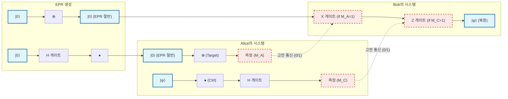

---

## 6.3 초고밀도 부호화 (Superdense Coding)

양자 원격 전송이 '1 양자 비트의 상태를 보내기 위해 EPR 쌍과 2 고전 비트를 소비하는' 프로토콜이었던 반면, 초고밀도 부호화(Superdense Coding)는 어떤 의미에서는 그 역의 조작이라고도 할 수 있는 프로토콜입니다. '1 양자 비트를 물리적으로 전송하는 것만으로, 2 고전 비트의 정보를 상대방에게 전달하는' 것이 가능해집니다.

고전적인 물리 법칙에서는 하나의 2준위계(하나의 비트나 하나의 광자의 편광)는 최대 1비트(0 또는 1)의 정보밖에 운반할 수 없습니다. 하지만 양자 인탱글먼트(얽힘)를 교묘하게 이용함으로써 이러한 홀레보 한계(Holevo's bound)를 외견상 돌파할 수 있다는 것이 초고밀도 부호화의 경이로운 점입니다.

### 프로토콜의 상세와 벨 기저

앨리스와 밥은 다시 사전에 EPR 쌍을 공유하고 있다고 합시다.

$$
|\Phi^+\rangle_{AB} = \frac{1}{\sqrt{2}} \left( |0\rangle_A |0\rangle_B + |1\rangle_A |1\rangle_B \right)
$$

앨리스는 밥에게 2비트의 고전 메시지 $b_1 b_2 \in \{00, 01, 10, 11\}$ 을 보내고자 합니다.
앨리스는 보내고 싶은 메시지에 따라 **자신의 수중에 있는 양자 비트 A에 대해서만** 특정 단일 양자 비트 게이트 조작을 수행합니다.

1. **메시지가 `00` 인 경우:** 앨리스는 아무것도 하지 않습니다 (항등 연산자 $I$ 를 적용).
   전체 상태는 변하지 않습니다.
   

$$
|\Psi_{00}\rangle = (I \otimes I) |\Phi^+\rangle = \frac{1}{\sqrt{2}} (|00\rangle + |11\rangle) = |\Phi^+\rangle
$$

2. **메시지가 `01` 인 경우:** 앨리스는 파울리 Z 게이트를 적용합니다.
   

$$
|\Psi_{01}\rangle = (Z \otimes I) |\Phi^+\rangle = \frac{1}{\sqrt{2}} (Z|0\rangle|0\rangle + Z|1\rangle|1\rangle) = \frac{1}{\sqrt{2}} (|00\rangle - |11\rangle) = |\Phi^-\rangle
$$

3. **메시지가 `10` 인 경우:** 앨리스는 파울리 X 게이트를 적용합니다.
   

$$
|\Psi_{10}\rangle = (X \otimes I) |\Phi^+\rangle = \frac{1}{\sqrt{2}} (X|0\rangle|0\rangle + X|1\rangle|1\rangle) = \frac{1}{\sqrt{2}} (|10\rangle + |01\rangle) = |\Psi^+\rangle
$$

4. **메시지가 `11` 인 경우:** 앨리스는 파울리 Z 게이트를 적용하고 이어서 파울리 X 게이트를 적용합니다 ( $iY$ 에 해당).
   

$$
|\Psi_{11}\rangle = (ZX \otimes I) |\Phi^+\rangle = (Z \otimes I) |\Psi^+\rangle = \frac{1}{\sqrt{2}} (Z|1\rangle|0\rangle + Z|0\rangle|1\rangle) = \frac{1}{\sqrt{2}} (-|10\rangle + |01\rangle) = -|\Psi^-\rangle
$$

   (전체에 걸리는 음의 부호는 글로벌 위상이므로 관측 확률에는 영향을 주지 않지만, 여기서는 편의상 부호를 정리하여 **$|\Psi^-\rangle = \frac{1}{\sqrt{2}} (|01\rangle - |10\rangle)$** 와 대응시켜 생각합니다.)

앨리스는 조작을 수행한 자기 자신의 양자 비트 A를 양자 통신 채널(광섬유 등)을 통해 밥에게 전송합니다.

주목해야 할 놀라운 사실: 앨리스는 밥에게 **물리적으로 단 하나의 양자 비트만 전송했습니다** . 그리고 밥의 양자 비트에는 일절 손대지 않았습니다. 하지만 앨리스가 조작한 결과, 계 전체의 상태는 4개의 완전히 직교하는 양자 상태(이들을 **벨 기저** 라고 부릅니다) 중 하나로 결정론적으로 천이했습니다.

### 밥에 의한 복호화와 벨 측정

밥은 앨리스가 보낸 양자 비트 A를 받습니다. 현재 밥의 수중에는 양자 비트 A와 원래 자신이 가지고 있던 양자 비트 B가 모두 있습니다. 밥은 이 두 양자 비트에 대해 양자 원격 전송에서 앨리스가 측정할 때와 완전히 똑같은 '벨 측정'을 실시합니다.

즉, 양자 비트 A를 제어 비트, B를 표적 비트로 하여 CNOT 게이트를 걸고, 이어서 양자 비트 A에 하다마르 게이트를 적용합니다. 이 역변환을 통해 얽혀 있던 벨 기저는 측정 가능한 계산 기저로 되돌아갑니다.

각각의 경우에 있어서 수학적 전개를 확인해 봅시다.

- **상태가 $|\Phi^+\rangle = \frac{1}{\sqrt{2}} (|00\rangle + |11\rangle)$ 인 경우 (메시지 `00`):** CNOT을 적용하면 $\frac{1}{\sqrt{2}} (|00\rangle + |10\rangle) = \frac{1}{\sqrt{2}} (|0\rangle + |1\rangle) |0\rangle$ 이 됩니다.
  하다마르를 A에 적용하면 $|0\rangle |0\rangle$ 이 됩니다.
  밥이 측정하면 확실하게 `00` 을 얻습니다.

- **상태가 $|\Phi^-\rangle = \frac{1}{\sqrt{2}} (|00\rangle - |11\rangle)$ 인 경우 (메시지 `01`):** CNOT을 적용하면 $\frac{1}{\sqrt{2}} (|00\rangle - |10\rangle) = \frac{1}{\sqrt{2}} (|0\rangle - |1\rangle) |0\rangle$ 이 됩니다.
  하다마르를 A에 적용하면 $|1\rangle |0\rangle$ 이 됩니다.
  밥이 측정하면 확실하게 `10` 을 얻습니다. (※앨리스의 조작과의 비트 대응은 회로의 정의에 따라 다르지만 유일하게 판별 가능합니다)

- **상태가 $|\Psi^+\rangle = \frac{1}{\sqrt{2}} (|01\rangle + |10\rangle)$ 인 경우 (메시지 `10`):** CNOT을 적용하면 $\frac{1}{\sqrt{2}} (|01\rangle + |11\rangle) = \frac{1}{\sqrt{2}} (|0\rangle + |1\rangle) |1\rangle$ 이 됩니다.
  하다마르를 A에 적용하면 $|0\rangle |1\rangle$ 이 됩니다.
  밥이 측정하면 확실하게 `01` 을 얻습니다.

- **상태가 $|\Psi^-\rangle = \frac{1}{\sqrt{2}} (|01\rangle - |10\rangle)$ 인 경우 (메시지 `11`):** CNOT을 적용하면 $\frac{1}{\sqrt{2}} (|01\rangle - |11\rangle) = \frac{1}{\sqrt{2}} (|0\rangle - |1\rangle) |1\rangle$ 이 됩니다.
  하다마르를 A에 적용하면 $|1\rangle |1\rangle$ 이 됩니다.
  밥이 측정하면 확실하게 `11` 을 얻습니다.

이와 같이 밥은 받은 1개의 양자 비트와 수중에 있는 1개의 양자 비트를 합쳐서 측정함으로써, 앨리스가 의도한 2비트의 고전 정보를 100%의 정확도로 완벽하게 읽어낼 수 있습니다.

### 양자 통신에서의 의의

초고밀도 부호화의 진정한 가치는 정보의 '밀도'를 2배로 높이는 것에 그치지 않습니다. 이 프로토콜은 양자 얽힘이라는 비국소적인 상관관계가 어떻게 고전적인 정보 전달의 대역폭을 확장할 수 있는지를 보여주는 결정적인 증거입니다.

또한, 보안의 관점에서도 매우 중요합니다. 만약 도청자 이브(Eve)가 앨리스로부터 밥에게 전송되는 도중의 양자 비트 A를 가로챘다고 하더라도 이브는 어떠한 정보도 얻을 수 없습니다. 왜냐하면 단일 양자 비트 A만을 관측하더라도 그 상태는 완전히 무작위한 혼합 상태(밀도 행렬이 $\frac{I}{2}$ 에 비례)로 행동하기 때문입니다. 정보는 공간적으로 떨어진 A와 B의 '상관관계' 안에만 인코딩되어 있으며, 한쪽만 얻어서는 해독이 물리적으로 불가능한 것입니다.

---
이와 같이 양자 원격 전송과 초고밀도 부호화는 언뜻 보면 직관에 반하는 마법 같은 현상이지만, 양자 역학의 선형 대수적 공리를 충실히 따름으로써 지극히 엄밀하고 필연적인 논리적 귀결로서 도출됩니다. 다음 장에서는 이러한 기본 프로토콜들을 응용하여 보다 복잡한 문제 해결을 향한 양자 알고리즘의 세계로 발을 내디딜 것입니다.

# 제7장: 도이치-조사 알고리즘

## 7.1 역사적 의의: 처음으로 증명된 명확한 양자 우월성

양자 컴퓨터가 고전 컴퓨터보다 특정 문제를 압도적으로 빠르게 풀 수 있을 가능성이 있다는 가설은, 1980년대 리처드 파인만과 데이비드 도이치의 선구적인 연구에 의해 제안되었습니다. 그러나 "구체적으로 어떤 문제에서, 수학적으로 증명 가능한 형태로 양자 계산이 고전 계산을 능가하는가?"라는 질문에 대한 최초의 결정적인 해답을 제공한 것이 1992년 데이비드 도이치와 리처드 조사가 고안한 '도이치-조사 알고리즘(Deutsch-Jozsa Algorithm)'입니다.

본 장에서는 이 역사적인 알고리즘의 전모를 수학적으로 엄밀하게 파헤칩니다. 이 알고리즘은 실용적인 문제를 푸는 것은 아니지만, 양자역학 특유의 '중첩(Superposition)', '간섭(Interference)', 그리고 '위상 킥백(Phase Kickback)'이라는 현상을 교묘하게 결합함으로써 계산 복잡도의 오더를 극적으로 줄일 수 있음을 증명했습니다.

## 7.2 문제의 설정: 상수 함수인가, 균형 함수인가?

먼저, 알고리즘이 풀어야 할 문제를 정의합니다. 우리에게 어떤 블랙박스(오라클)가 주어졌다고 가정해 봅시다. 이 오라클은 $n$ 비트의 입력 $x \in \{0, 1\}^n$ 을 받아, 1비트의 출력 $f(x) \in \{0, 1\}$ 을 반환하는 함수 **$f$** 를 계산합니다.

여기서, 이 함수 **$f$** 에는 다음과 같은 '둘 중 하나의 성질을 반드시 만족한다'는 강력한 약속(Promise)이 주어져 있습니다.

1. **상수 함수(Constant Function)** : 임의의 입력 $x$ 에 대해, 항상 $f(x) = 0$ 또는 항상 $f(x) = 1$ 을 반환한다.
2. **균형 함수(Balanced Function)** : 모든 입력 $x$ 중, 정확히 절반에 대해 $f(x) = 0$ 을 반환하고, 나머지 절반에 대해 $f(x) = 1$ 을 반환한다.

우리의 목표는 "주어진 오라클 **$f$** 가 상수 함수인지, 아니면 균형 함수인지"를 오라클에 대한 질의(쿼리) 횟수를 최소화하여 판별하는 것입니다.

### 고전 계산에서의 한계

고전 컴퓨터로 이 문제를 푸는 경우를 생각해 봅시다. 함수 **$f$** 의 입력 패턴은 총 $N = 2^n$ 가지 존재합니다.

최악의 경우를 가정해 봅시다. 만약 첫 번째 질의부터 연속해서 $2^{n-1}$ 번(즉, 전체의 절반)의 입력에 대해 같은 출력(예: 모두 $0$ )을 얻었다고 합시다. 이 시점에서는 함수가 상수 함수일(나머지 절반도 모두 $0$ ) 가능성과 균형 함수일(나머지 절반은 모두 $1$ ) 가능성이 둘 다 남아있습니다.

따라서 고전 컴퓨터가 100%의 확실성을 가지고 상수 함수인지 균형 함수인지를 판별하기 위해서는, **최악의 경우 $2^{n-1} + 1$ 회** 의 질의가 필요합니다. 이는 입력 비트 수 $n$ 에 대해 지수 함수적으로 증가하는 횟수입니다. 즉, 고전적인 계산 복잡도(쿼리 복잡도)는 $O(2^n)$ 이 됩니다.

놀랍게도 양자 계산을 사용하면, 이 문제를 **단 1회의 질의(1 쿼리)** 로 100%의 확률로 정확하게 판별할 수 있습니다. 이것이 바로 양자 우월성의 진수입니다.

## 7.3 양자 오라클과 위상 킥백의 기하학

양자 알고리즘을 구축하기 위해서는 먼저 고전적인 함수 **$f(x)$** 를 양자역학의 요청(유니터리성=가역성)을 만족하는 형태로 다시 표현해야 합니다. 이를 위해 도입되는 것이 '양자 오라클(Quantum Oracle)'입니다.

### 양자 오라클 $U_f$

입력 레지스터( $n$ 양자 비트)와 타깃 레지스터( $1$ 양자 비트)를 준비합니다. 오라클을 나타내는 유니터리 연산자 **$U_f$** 는 계산 기저 상태에 대해 다음과 같이 작용합니다.

$$
U_f |x\rangle |y\rangle = |x\rangle |y \oplus f(x)\rangle
$$

여기서, $\oplus$ 는 모듈로 2의 덧셈(XOR)을 나타냅니다. 이 변환은 자기 자신을 한 번 더 적용하면 원래 상태로 돌아오기 때문에( $U_f^2 = I$ ), 명백히 가역적이며 유니터리입니다.

### 위상 킥백(Phase Kickback)

양자 정보 과학에서 가장 중요하고 또 직관적이지 않은 기법 중 하나가 '위상 킥백'입니다. 타깃 레지스터의 상태를 고전적인 $|0\rangle$ 이나 $|1\rangle$ 이 아니라, 아다마르 게이트를 통과시킨 중첩 상태 $|-\rangle$ 로 설정했을 때 어떤 일이 일어나는지 살펴봅시다.

$$
|-\rangle = \frac{|0\rangle - |1\rangle}{\sqrt{2}}
$$

이 상태를 타깃 레지스터에 입력하고 오라클 **$U_f$** 를 적용합니다.

$$
U_f |x\rangle |-\rangle = U_f \left( |x\rangle \frac{|0\rangle - |1\rangle}{\sqrt{2}} \right)
$$

$$
= \frac{1}{\sqrt{2}} \left( U_f |x\rangle |0\rangle - U_f |x\rangle |1\rangle \right)
$$

$$
= \frac{1}{\sqrt{2}} \left( |x\rangle |0 \oplus f(x)\rangle - |x\rangle |1 \oplus f(x)\rangle \right)
$$

여기서, $f(x)$ 의 값에 따라 경우를 나눕니다.
- $f(x) = 0$ 인 경우:
  상태는 $\frac{1}{\sqrt{2}} ( |x\rangle |0\rangle - |x\rangle |1\rangle ) = |x\rangle |-\rangle$ 이 됩니다.
- $f(x) = 1$ 인 경우:
  상태는 $\frac{1}{\sqrt{2}} ( |x\rangle |1\rangle - |x\rangle |0\rangle ) = - |x\rangle |-\rangle$ 이 됩니다.

이것을 하나로 정리하면, 다음과 같은 아름다운 등식을 얻을 수 있습니다.

$$
U_f |x\rangle |-\rangle = (-1)^{f(x)} |x\rangle |-\rangle
$$

이것은 놀라운 결과입니다. 타깃 레지스터의 상태 $|-\rangle$ 은 전혀 변하지 않았지만, 함수 **$f(x)$** 의 평가 결과가 '위상(Phase)의 부호'로서 입력 레지스터 **$|x\rangle$** 쪽에 '킥백(Kickback)'된 것입니다. 이로 인해 정보를 진폭의 위상으로 인코딩하는 것이 가능해집니다.

## 7.4 도이치-조사 알고리즘: 회로도와 완전한 수식 전개

이제 알고리즘의 전모를 양자 회로와 수식 양면에서 완전히 기술합니다.

### 양자 회로도

아래는 도이치-조사 알고리즘의 양자 회로를 보여주는 그림입니다.

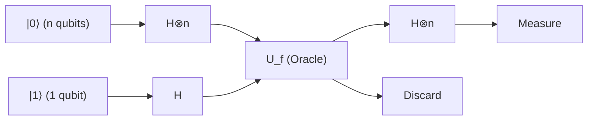

### 단계 1: 초기 상태의 준비

입력 레지스터로 $n$ 개의 양자 비트를 $|0\rangle^{\otimes n}$ 으로, 타깃 레지스터로 1개의 양자 비트를 $|1\rangle$ 로 초기화합니다.

$$
|\psi_0\rangle = |0\rangle^{\otimes n} |1\rangle
$$

### 단계 2: 모든 양자 비트에 대한 아다마르 게이트 적용

모든 양자 비트에 아다마르 게이트( $H$ )를 적용하여 완전한 중첩 상태를 생성합니다.
$n$ 양자 비트에 대한 아다마르 변환 $H^{\otimes n}$ 은 다음과 같이 작용합니다.

$$
H^{\otimes n} |0\rangle^{\otimes n} = \frac{1}{\sqrt{2^n}} \sum_{x \in \{0,1\}^n} |x\rangle
$$

따라서 계 전체의 상태는 다음과 같이 됩니다.

$$
|\psi_1\rangle = \left( \frac{1}{\sqrt{2^n}} \sum_{x \in \{0,1\}^n} |x\rangle \right) \otimes \left( \frac{|0\rangle - |1\rangle}{\sqrt{2}} \right)
$$

$$
= \frac{1}{\sqrt{2^n}} \sum_{x=0}^{2^n-1} |x\rangle |-\rangle
$$

### 단계 3: 양자 오라클의 적용(위상 킥백)

여기서 오라클 **$U_f$** 를 적용합니다. 이전 절에서 증명한 위상 킥백 효과로 인해 각 기저 상태 $|x\rangle$ 의 위상에 $(-1)^{f(x)}$ 가 곱해집니다.

$$
|\psi_2\rangle = U_f |\psi_1\rangle = \frac{1}{\sqrt{2^n}} \sum_{x \in \{0,1\}^n} (-1)^{f(x)} |x\rangle |-\rangle
$$

이 시점에서 계산 결과 **$f(x)$** 의 모든 정보( $2^n$ 개 분량)가 중첩 상태의 각 위상으로서 단 한 번의 연산으로 병렬로 임베딩되었습니다. 이를 '양자 병렬성(Quantum Parallelism)'이라고 부릅니다.

### 단계 4: 입력 레지스터에 대한 간섭 발생

타깃 레지스터는 이후 사용하지 않으므로 무시합니다. 입력 레지스터의 $n$ 양자 비트에 대해 다시 아다마르 변환 $H^{\otimes n}$ 을 적용합니다.
임의의 기저 $|x\rangle$ 에 대한 $H^{\otimes n}$ 의 작용은 일반적인 공식으로서 다음과 같이 표현됩니다.

$$
H^{\otimes n} |x\rangle = \frac{1}{\sqrt{2^n}} \sum_{z \in \{0,1\}^n} (-1)^{x \cdot z} |z\rangle
$$

여기서 $x \cdot z$ 는 비트별 내적 $x \cdot z = x_1 z_1 \oplus x_2 z_2 \oplus \dots \oplus x_n z_n$ 을 나타냅니다.
이것을 $|\psi_2\rangle$ 의 입력 레지스터 부분에 적용하면, 최종 상태 $|\psi_3\rangle$ 은 다음과 같이 전개됩니다.

$$
|\psi_3\rangle = H^{\otimes n} \left( \frac{1}{\sqrt{2^n}} \sum_{x} (-1)^{f(x)} |x\rangle \right)
$$

$$
= \frac{1}{\sqrt{2^n}} \sum_{x} (-1)^{f(x)} \left( \frac{1}{\sqrt{2^n}} \sum_{z} (-1)^{x \cdot z} |z\rangle \right)
$$

$$
= \frac{1}{2^n} \sum_{z \in \{0,1\}^n} \left( \sum_{x \in \{0,1\}^n} (-1)^{f(x) + x \cdot z} \right) |z\rangle
$$

이것이 측정 직전의 양자 상태를 나타내는 극히 중요한 수식입니다. 양자역학적인 '간섭'이 이 합 $\sum_x$ 속에서 일어나고 있습니다.

### 단계 5: 측정과 결과의 해석

알고리즘의 마지막에, 입력 레지스터의 $n$ 양자 비트를 계산 기저에서 측정합니다.
우리가 관심을 가지는 것은 모든 양자 비트가 $0$ , 즉 상태 **$|0\rangle^{\otimes n}$** 이 측정될 확률입니다. 위 식에서 $z = 00\dots0$ 인 경우를 생각해 봅시다. 이때 임의의 $x$ 에 대해 $x \cdot 0 = 0$ 이 되므로, 상태 **$|0\rangle^{\otimes n}$** 의 진폭(계수)은 다음과 같이 계산됩니다.

$$
\text{Amplitude of } |0\rangle^{\otimes n} = \frac{1}{2^n} \sum_{x \in \{0,1\}^n} (-1)^{f(x)}
$$

여기서 약속(Promise)에 따라 두 가지 케이스를 검증합니다.

#### 케이스 1: 함수 $f$ 가 상수 함수인 경우
항상 $f(x) = 0$ 이거나 항상 $f(x) = 1$ 입니다.
- 만약 항상 $0$ 이라면, $(-1)^{f(x)} = 1$ 이 되고, 합은 $\sum 1 = 2^n$ 입니다. 진폭은 $\frac{2^n}{2^n} = 1$ 이 됩니다.
- 만약 항상 $1$ 이라면, $(-1)^{f(x)} = -1$ 이 되고, 합은 $\sum -1 = -2^n$ 입니다. 진폭은 $\frac{-2^n}{2^n} = -1$ 이 됩니다.

측정 확률 $P(0)$ 은 진폭의 절댓값의 제곱이므로,

$$
P(00\dots0) = | \pm 1 |^2 = 1
$$

즉, **함수가 상수 함수인 경우, 100%의 확률로 $|0\rangle^{\otimes n}$ 이 측정됩니다** .

#### 케이스 2: 함수 $f$ 가 균형 함수인 경우
$f(x) = 0$ 이 되는 $x$ 와 $f(x) = 1$ 이 되는 $x$ 가 정확히 절반(각각 $2^{n-1}$ 개)씩 존재합니다.
따라서 $(-1)^{f(x)}$ 는 절반이 $+1$ , 나머지 절반이 $-1$ 이 되며, 이들을 모두 더하면 완전히 상쇄되어 0이 됩니다(완전한 상쇄 간섭).

$$
\text{Amplitude of } |0\rangle^{\otimes n} = \frac{1}{2^n} \left( 2^{n-1}(+1) + 2^{n-1}(-1) \right) = 0
$$

측정 확률 $P(0)$ 은 진폭의 절댓값의 제곱이므로,

$$
P(00\dots0) = | 0 |^2 = 0
$$

즉, **함수가 균형 함수인 경우, $|0\rangle^{\otimes n}$ 이 측정될 확률은 0%이며, 반드시 1개 이상의 비트가 $1$ 이 되는 상태가 측정됩니다** .

## 7.6 구체적인 예: $n=2$ 인 경우의 완전한 트레이스

추상적인 수식뿐만 아니라, $n=2$ (2 양자 비트의 입력)인 경우의 구체적인 상태 벡터를 트레이스하여 알고리즘의 동작을 피부로 느껴봅시다. 입력 패턴은 $x \in \{00, 01, 10, 11\}$ 의 4가지입니다.

### 상수 함수인 경우: $f(x) = 1$ (모두 1)
오라클 적용 전의 상태 $|\psi_1\rangle$ 의 입력 레지스터 부분은 다음과 같습니다.

$$
\frac{1}{2} ( |00\rangle + |01\rangle + |10\rangle + |11\rangle )
$$

오라클 적용 후, 위상 킥백에 의해 모든 항에 $(-1)^{f(x)} = -1$ 이 곱해집니다.

$$
|\psi_2\rangle_{in} = -\frac{1}{2} ( |00\rangle + |01\rangle + |10\rangle + |11\rangle )
$$

여기에 다시 $H^{\otimes 2}$ 를 적용합니다. $H^{\otimes 2} (|00\rangle + |01\rangle + |10\rangle + |11\rangle) = 2 |00\rangle$ 임을 이용하면:

$$
|\psi_3\rangle_{in} = - |00\rangle
$$

측정 결과는 확률 $100\%$ 로 $00$ 이 됩니다.

### 균형 함수인 경우: $f(00)=0, f(01)=1, f(10)=1, f(11)=0$
오라클 적용 후, 위상 킥백에 의해 $f(x)=1$ 이 되는 항에만 마이너스가 붙습니다.

$$
|\psi_2\rangle_{in} = \frac{1}{2} ( |00\rangle - |01\rangle - |10\rangle + |11\rangle )
$$

여기에 $H^{\otimes 2}$ 를 적용합니다. 각각의 기저에 대한 $H^{\otimes 2}$ 의 작용을 계산하여 대입하면, $|00\rangle$ 의 계수에 착안할 때 $\frac{1}{4} (1 - 1 - 1 + 1) = 0$ 이 되어 훌륭하게 상쇄(상쇄 간섭)됩니다.
남는 항을 정리하면 최종 상태는 $|11\rangle$ 이 됩니다(이 예에서는 확률 100%로 11이 측정되지만, 일반적인 균형 함수에서는 00 이외의 어떤 상태가 측정됩니다). $00$ 이 측정될 확률은 완전히 0%임이 확인되었습니다.

## 7.7 결론: 양자 간섭이 가져오는 계산의 비약

도이치-조사 알고리즘의 경이로움은 위상 킥백에 의해 $2^n$ 개의 정보를 위상 공간에 전개하고, 마지막 아다마르 변환에서 발생하는 '간섭(Interference)'을 제어했다는 점에 있습니다.

- **상수 함수** 의 경우: 모든 경로로부터의 파동이 '보강 간섭(Constructive Interference)'을 일으켜 진폭이 상태 **$|0\rangle^{\otimes n}$** 에 100% 집중됩니다.
- **균형 함수** 의 경우: 양의 파동과 음의 파동이 '상쇄 간섭(Destructive Interference)'을 일으켜 상태 **$|0\rangle^{\otimes n}$** 의 진폭을 완전히 지워버립니다.

이러한 놀라운 수학적 구조로 인해 고전 컴퓨터에서는 최악의 경우 $O(2^n)$ 번(구체적으로는 $2^{n-1} + 1$ 번)의 질의가 필요했던 문제를, 양자 컴퓨터는 **단 1회의 질의( $O(1)$ )** 로, 그리고 결정론적(100%의 정답률)으로 풀어낼 수 있는 것입니다.

본 장에서 증명된 이 사실은, 양자역학의 원리를 정보 처리에 응용함으로써 고전적인 정보 이론의 한계를 물리적으로 타파할 수 있다는, 인류 역사에 있어 지극히 중요한 이정표가 되었습니다.

# 제8장: 쇼어 알고리즘과 현대 암호에 대한 위협

## 8.1 도입: RSA 암호의 수학과 소인수분해의 난해함

현대 디지털 사회에서 인터넷상의 안전한 통신을 보장하는 기반이 되는 것은 공개키 암호 방식입니다. 그중에서도 가장 널리 보급된 RSA 암호는 "거대한 합성수를 소인수분해하는 것은 계산론적으로 극히 어렵다"라는 수학적 비대칭성(단방향 함수의 성질)에 의존하여 안전성을 증명하고 있습니다. 본 장에서는 양자 컴퓨터가 이러한 RSA 암호의 근간을 어떻게 무너뜨리는지, 그 결정적인 해법인 '쇼어 알고리즘(Shor's Algorithm)'의 이론적 구조를 일체의 타협 없이 엄밀하게 밝혀냅니다.

먼저, RSA 암호의 구조를 수학적으로 정식화해 보겠습니다. RSA 암호의 키 생성은 두 개의 거대한 소수 $p$ 와 $q$ (현재는 각각 2048비트 이상의 크기가 권장됩니다)를 무작위로 선택하는 것에서 시작합니다. 이 두 소수의 곱인 합성수 $N = pq$ 를 계산하고, 이를 공개키의 일부로서 외부에 공개합니다. 다음으로 오일러의 토션트 함수(오일러 피 함수) $\phi(N)$ 을 계산합니다. 소수의 성질에 의해 이는 $\phi(N) = (p-1)(q-1)$ 이 됩니다.

암호화 키가 되는 지수 $e$ 는 $1 < e < \phi(N)$ 이며 $\text{gcd}(e, \phi(N)) = 1$ (즉, $\phi(N)$ 과 서로소)을 만족하도록 선택합니다. 그리고 개인키가 되는 복호화 지수 $d$ 를 합동식 $ed \equiv 1 \pmod{\phi(N)}$ 을 만족하도록 계산합니다. 이는 확장 유클리드 호제법을 사용하면 다항식 시간에 쉽게 구할 수 있습니다.

평문을 정수 $M$ (단, $0 \le M < N$ )이라 하면, 암호화는 법 $N$ 에 대한 거듭제곱 연산으로 다음과 같이 수행됩니다.

$$
C \equiv M^e \pmod{N}
$$

복호화를 수행할 때는 개인키 $d$ 를 사용하여 마찬가지로 계산합니다.

$$
M' \equiv C^d \pmod{N}
$$

오일러의 정리에 의해 $C^d \equiv M^{ed} \equiv M^{1 + k\phi(N)} \equiv M \pmod{N}$ 이 성립하므로, 원래의 평문 $M$ 이 완벽하게 복원됨이 보장됩니다.

여기서 중요한 점은 공개된 정보 $(N, e)$ 로부터 개인키 $d$ 를 구하기 위해서는 $\phi(N)$ 을 알아야 하며, 이를 위해서는 $N$ 을 $p$ 와 $q$ 로 소인수분해해야 한다는 사실입니다. 고전 컴퓨터를 사용할 경우 현재 알려진 가장 빠른 소인수분해 알고리즘인 일반 수체 체법(General Number Field Sieve, GNFS)을 사용하더라도 그 계산 복잡도는 준지수 시간 $O\left(\exp\left(c (\log N)^{1/3} (\log \log N)^{2/3}\right)\right)$ 이 됩니다. 이는 $N$ 의 비트 수에 대해 계산 시간이 폭발적으로 증가함을 의미하며, 예를 들어 2048비트 정수를 고전 슈퍼컴퓨터로 소인수분해하려면 우주의 나이를 초과하는 시간이 걸릴 것으로 추정됩니다.

그러나 1994년 피터 쇼어(Peter Shor)가 발표한 양자 알고리즘은 이 전제를 근본부터 뒤흔들었습니다. 쇼어 알고리즘은 소인수분해를 $O((\log N)^3)$ 또는 최적화를 통해 $\tilde{O}((\log N)^2)$ 이라는 다항식 시간에 해결합니다. 이는 고전 계산에 대한 '초다항식적 가속(Super-polynomial Speedup)', 사실상 지수 함수적 가속을 의미하며, 현재 사용되고 있는 RSA 암호가 양자 컴퓨터에 의해 완전히 무력화될 수 있음을 보여줍니다.

## 8.2 위수 찾기 문제로의 귀착(Reduction to Order-Finding Problem)

쇼어 알고리즘의 천재적인 통찰은 "소인수분해 문제를 직접 푸는 대신, 주기를 찾는 문제로 귀착시켰다"는 점에 있습니다. 순수 수론의 정리에 의해 소인수분해는 '위수 찾기 문제(Order-Finding Problem)'라고 불리는 문제와 동치임이 증명되어 있습니다. 이 귀착 과정 자체는 완전히 고전적인 알고리즘이며, 양자 계산을 필요로 하지 않습니다.

주어진 합성수 $N$ 을 소인수분해하는 절차를 살펴보겠습니다. 먼저 $1 < a < N$ 을 만족하는 무작위 정수 $a$ 를 선택합니다. 유클리드 호제법을 사용하여 최대공약수 $\text{gcd}(a, N)$ 을 계산합니다. 만약 이것이 $1$ 보다 크다면, 운 좋게도 $N$ 의 비자명한 인수를 이미 발견한 것이므로 계산은 종료됩니다(하지만 암호에 사용되는 거대한 수에서 이런 일이 우연히 일어날 확률은 천문학적으로 낮습니다).

$\text{gcd}(a, N) = 1$ 인 경우, $a$ 와 $N$ 은 서로소입니다. 여기서 다음과 같은 모듈로 지수 함수를 정의합니다.

$$
f(x) = a^x \bmod N
$$

군론의 언어로 표현하면, $a$ 는 곱셈군 $(\mathbb{Z}/N\mathbb{Z})^\times$ 의 원소이며, 함수 $f(x)$ 는 정수의 덧셈군 $\mathbb{Z}$ 에서 곱셈군 $(\mathbb{Z}/N\mathbb{Z})^\times$ 로의 준동형사상을 형성합니다. 유한군의 성질에 의해 이 함수는 반드시 주기성을 갖습니다. 즉, 다음 방정식을 만족하는 최소의 양의 정수 $r$ 이 존재합니다.

$$
a^r \equiv 1 \pmod{N}
$$

이 최소의 양의 정수 $r$ 을 법 $N$ 에 대한 $a$ 의 '위수(Order)', 또는 함수 $f(x)$ 의 '주기(Period)'라고 부릅니다.

만약 이 위수 $r$ 을 찾을 수 있고, 나아가 $r$ 이 짝수이며 $a^{r/2} \not\equiv -1 \pmod{N}$ 이라는 조건을 만족한다면, 다음과 같이 인수분해를 위한 강력한 단서를 얻게 됩니다.

$$
a^r - 1 \equiv 0 \pmod{N}
$$

$$
(a^{r/2} - 1)(a^{r/2} + 1) \equiv 0 \pmod{N}
$$

이 방정식은 $N$ 이 $(a^{r/2} - 1)$ 과 $(a^{r/2} + 1)$ 의 곱을 나눈다는 것을 의미합니다. 그러나 $a^{r/2} \not\equiv 1$ ( $r$ 이 최소 주기이므로)이고 $a^{r/2} \not\equiv -1$ (조건에 의해)이므로, $N$ 은 이 두 항 중 어느 하나를 단독으로 나눌 수는 없습니다. 따라서 $N$ 의 소인수는 이 두 항에 분산되어 포함되어 있게 됩니다.
결론적으로,

$$
p = \text{gcd}(a^{r/2} - 1, N)
$$

$$
q = \text{gcd}(a^{r/2} + 1, N)
$$

을 계산함으로써 $N$ 의 비자명한 소인수를 확실하게 찾아낼 수 있는 것입니다.

이러한 고전적 귀착을 통해 문제는 "어떻게 함수 $f(x) = a^x \bmod N$ 의 주기 $r$ 을 빠르게 찾아낼 것인가"라는 단 하나의 초점으로 좁혀집니다. 고전 컴퓨터에서는 이 주기를 찾기 위해 $x=1, 2, 3, \dots$ 을 순차적으로 계산해야 하며, $r$ 이 $N$ 과 비슷한 오더가 될 수 있기 때문에 결과적으로 지수 함수적인 시간을 소요하게 됩니다. 바로 여기서 양자 컴퓨터가 활약할 차례가 됩니다.

## 8.3 양자 푸리에 변환(QFT)의 엄밀한 수식과 그 역할

함수 $f(x)$ 의 숨겨진 주기 $r$ 을 다항식 시간에 추출하기 위한 양자 알고리즘의 심장부가 바로 '양자 푸리에 변환(Quantum Fourier Transform, QFT)'입니다. QFT는 고전적인 이산 푸리에 변환(DFT)의 양자역학적 아날로그이며, 상태 공간의 확률 진폭에 작용하는 유니터리 변환입니다.

차원 $M = 2^n$ 인 힐베르트 공간 $\mathcal{H}$ 에서의 계산 기저 $|j\rangle$ ( $j = 0, 1, \dots, M-1$ )에 대한 양자 푸리에 변환의 작용은 다음과 같이 엄밀하게 정의됩니다.

$$
\text{QFT} |j\rangle = \frac{1}{\sqrt{M}} \sum_{k=0}^{M-1} e^{2\pi i j k / M} |k\rangle
$$

임의의 양자 상태 **$|\psi\rangle$** 에 대해서는 선형성에 의해 다음과 같이 작용합니다.

$$
\text{QFT} \sum_{j=0}^{M-1} x_j |j\rangle = \sum_{k=0}^{M-1} \left( \frac{1}{\sqrt{M}} \sum_{j=0}^{M-1} x_j e^{2\pi i j k / M} \right) |k\rangle = \sum_{k=0}^{M-1} y_k |k\rangle
$$

여기서 얻어지는 새로운 진폭 $y_k$ 는 고전적인 이산 푸리에 변환을 통해 얻어지는 계수와 완전히 일치합니다. 그러나 고전적인 고속 푸리에 변환(FFT)이 벡터 전체를 계산하는 데 $O(M \log M) = O(n 2^n)$ 의 시간을 필요로 하는 반면, QFT는 $n$ 개 양자 비트의 '상태'를 단 $O(n^2)$ 의 양자 게이트 연산만으로 변환할 수 있다는 극적인 계산 복잡도 감소를 실현합니다.

어떻게 $O(n^2)$ 이라는 적은 수의 게이트로 이것이 가능한지를 이해하려면, QFT를 통해 얻어지는 상태를 텐서곱 형태로 분해하여 표현해야 합니다. 정수 $j$ 의 이진수 표현을 $j = j_1 2^{n-1} + j_2 2^{n-2} + \dots + j_n 2^0$ (여기서 $j_1$ 이 최상위 비트, $j_n$ 이 최하위 비트)이라 할 때, 출력 상태는 다음과 같이 $n$ 개의 독립된 단일 양자 비트 상태의 텐서곱으로 깔끔하게 분해됩니다.

$$
\text{QFT} |j_1 j_2 \dots j_n\rangle = \frac{1}{\sqrt{2^n}} \left(|0\rangle + e^{2\pi i 0.j_n} |1\rangle\right) \otimes \left(|0\rangle + e^{2\pi i 0.j_{n-1} j_n} |1\rangle\right) \otimes \dots \otimes \left(|0\rangle + e^{2\pi i 0.j_1 j_2 \dots j_n} |1\rangle\right)
$$

여기서 $0.j_l \dots j_m$ 은 이진 소수를 나타내며, $0.j_l \dots j_m = j_l/2 + j_{l+1}/4 + \dots + j_m/2^{m-l+1}$ 입니다.

이 수식은 대단히 시사하는 바가 큽니다. 제 $m$ 양자 비트의 상태는 입력 비트 $j_{n-m+1}$ 부터 $j_n$ 까지의 정보에만 의존하여 위상이 회전하고 있음을 보여줍니다. 따라서 이 상태를 만들어내기 위한 양자 회로는 단일 양자 비트에 작용하는 아다마르 게이트 $H$ 와, 두 양자 비트 사이에 작용하는 제어 위상 시프트 게이트 $R_k$ (위상을 $e^{2\pi i / 2^k}$ 만큼 회전시키는 게이트)의 조합만으로 재귀적으로 구성할 수 있습니다. 제1 양자 비트에 대해 $H$ 를 적용하고, 이어서 제2, 제3 비트의 제어로 $R_2, R_3, \dots$ 를 적용해 나가는 조작을 각 비트에 대해 반복함으로써, 총 $n + (n-1) + \dots + 1 = n(n+1)/2 = O(n^2)$ 개의 게이트로 정확하게 QFT를 구현할 수 있습니다.

## 8.4 중첩을 이용한 주기 찾기의 양자 회로

이론적인 준비가 끝났으므로, 이제 쇼어 알고리즘 전체의 양자 회로와 각 단계에서의 양자 상태의 시간 발전(State Evolution)을 살펴보겠습니다. 알고리즘에는 두 개의 양자 레지스터를 사용합니다.
제1 레지스터는 $t \approx 2 \log_2 N$ 개의 양자 비트로 구성되며, 상태 공간의 차원은 $M = 2^t$ 가 됩니다(조건으로서 $M \ge N^2$ 을 만족하도록 $t$ 를 선택합니다). 제2 레지스터는 $L \approx \log_2 N$ 개의 양자 비트를 가지며, 계산 결과를 저장합니다.

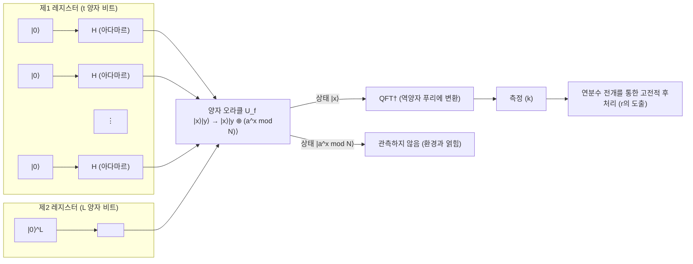

 **【단계 1: 초기화 및 중첩의 생성】** 
전체 계를 초기 상태 **$|\psi_0\rangle$** $= |0\rangle^{\otimes t} |0\rangle^{\otimes L}$ 로 설정합니다.
다음으로, 제1 레지스터의 모든 양자 비트에 아다마르 게이트 $H^{\otimes t}$ 를 적용하여 지수 함수적으로 많은 상태의 균등한 중첩을 생성합니다.

$$
|\psi_1\rangle = \frac{1}{\sqrt{M}} \sum_{x=0}^{M-1} |x\rangle |0\rangle
$$

여기서 제1 레지스터는 $0$ 부터 $M-1$ 까지의 모든 정수 상태를 동시에 유지하고 있습니다.

 **【단계 2: 양자 오라클을 통한 함수 평가】** 
양자 오라클 $U_f$ 를 적용하여, 중첩 상태를 유지한 채 함수 $f(x) = a^x \bmod N$ 을 계산하고 그 결과를 제2 레지스터에 저장합니다.

$$
|\psi_2\rangle = U_f |\psi_1\rangle = \frac{1}{\sqrt{M}} \sum_{x=0}^{M-1} |x\rangle |a^x \bmod N\rangle
$$

이 상태 **$|\psi_2\rangle$** 는 입력 $x$ 와 출력 $f(x)$ 가 강하게 얽힌(entangled) 상태입니다.

 **【단계 3: 제2 레지스터의 관측(개념적)】** 
이론의 이해를 돕기 위해, 여기서 제2 레지스터를 관측했다고 가정해 보겠습니다(실제 알고리즘에서는 관측을 생략하더라도 수학적 결과는 완전히 동일합니다). 관측에 의해 제2 레지스터는 어떤 특정한 값 $y = a^{x_0} \bmod N$ 으로 수축합니다. 여기서 $x_0$ 는 $0 \le x_0 < r$ 을 만족하는 어떤 최소 오프셋 값입니다.
이때 제1 레지스터는 "함수 $f(x)$ 의 출력이 $y$ 가 되는 모든 입력 $x$ "의 중첩 상태로 순식간에 수축합니다. 함수가 주기 $r$ 을 가지므로, 그러한 $x$ 는 $x_0, x_0 + r, x_0 + 2r, \dots$ 와 같이 일정한 간격으로 나열됩니다.

$$
|\psi_3\rangle = \frac{1}{\sqrt{A}} \sum_{m=0}^{A-1} |x_0 + m r\rangle \otimes |y\rangle
$$

여기서 $A$ 는 중첩에 포함된 항의 수이며, $A \approx M/r$ 입니다.
제1 레지스터에 주목하면, 이는 주기 $r$ 을 갖는 빗(comb) 모양의 확률 분포 상태입니다. 그러나 이 상태를 그대로 측정하면 무작위인 $x_0 + mr$ 이 같은 확률로 얻어질 뿐이며, 오프셋 $x_0$ 가 미지수이므로 주기 $r$ 을 알아낼 수 없습니다. 바로 여기서 QFT가 필요하게 됩니다.

 **【단계 4: 역양자 푸리에 변환 적용】** 
제1 레지스터에 대해 역양자 푸리에 변환(QFT$^\dagger$)을 적용합니다.

$$
\text{QFT}^\dagger |\psi_3\rangle = \frac{1}{\sqrt{A M}} \sum_{k=0}^{M-1} \sum_{m=0}^{A-1} e^{-2\pi i k (x_0 + m r) / M} |k\rangle
$$

이를 상태 $|k\rangle$ 에 대해 정리하고, 그 확률 진폭 $c_k$ 를 살펴봅니다.

$$
c_k = \frac{1}{\sqrt{A M}} e^{-2\pi i k x_0 / M} \sum_{m=0}^{A-1} e^{-2\pi i k m r / M}
$$

이 식의 합 부분은 공비가 $e^{-2\pi i k r / M}$ 인 등비수열의 합입니다. 만약 위상 $k r / M$ 이 정수에서 크게 벗어나 있다면, 복소평면상에서 벡터들이 회전하면서 더해지기 때문에 상쇄 간섭(Destructive Interference)이 일어나 진폭은 거의 $0$ 이 됩니다.
반대로 $k r / M$ 이 정수 $j$ 에 극히 가까운 경우, 즉 $k \approx j \frac{M}{r}$ 이 될 때에는 복소평면상의 벡터들이 같은 방향을 향하게 되어 보강 간섭(Constructive Interference)에 의해 진폭이 증폭됩니다.

 **【단계 5: 측정과 연분수 전개】** 
제1 레지스터를 측정하면 높은 확률로 $k \approx j \frac{M}{r}$ 을 만족하는 정수 $k$ 가 관측됩니다. 양변을 $M$ 으로 나누면 다음 관계식을 얻을 수 있습니다.

$$
\frac{k}{M} \approx \frac{j}{r}
$$

여기서 $k$ 와 $M$ 은 이미 알고 있는 값이지만, $j$ 와 $r$ 은 미지수입니다. $M \ge N^2$ 이 되도록 $t$ 를 선택했기 때문에, $k/M$ 은 미지의 분수 $j/r$ 에 대해 $\left| \frac{k}{M} - \frac{j}{r} \right| \le \frac{1}{2M} < \frac{1}{2r^2}$ 이라는 극히 정밀한 근사를 제공합니다.
디오판토스 근사 정리(르장드르 정리)에 따르면, 이 조건을 만족하는 유리수 $j/r$ 은 실수 $k/M$ 의 '연분수 전개(Continued Fraction Expansion)'의 근사분수(convergents) 중에 반드시 포함됩니다.
따라서 고전 컴퓨터를 사용하여 $k/M$ 의 연분수 전개를 다항식 시간에 계산함으로써, 분모로서 주기 $r$ 을 결정할 수 있습니다. 이것으로 위수 찾기 문제는 해결되며, 결과적으로 RSA 암호의 열쇠인 소인수 $p$ 와 $q$ 를 도출해 내는 것이 가능해집니다.

## 8.5 왜 쇼어 알고리즘이 고전 계산에 대해 지수 함수적 가속을 가져오는가

쇼어 알고리즘이 역사적인 대도약이 된 이유는, 이것이 단순한 휴리스틱(발견적 해법)에 그치는 것이 아니라 엄밀한 수학적 증명을 수반하는 '고전 계산 대비 진정한 지수 함수적 가속'을 보여준 최초의 실용적 알고리즘이기 때문입니다. 그 비범한 계산 능력의 본질은 다음 두 가지 양자역학적 현상의 완벽한 융합에 있습니다.

첫째는 양자 병렬성입니다. 중첩 상태를 활용함으로써, 우주의 원자 수마저 능가하는 $2^t$ 라는 천문학적인 수의 입력 $x$ 에 대해 단 한 번의 연산으로 함수 $f(x)$ 를 동시에 평가했습니다. 고전 컴퓨터가 수억 년에 걸쳐 하나하나 계산해야 하는 평가를 순식간에 완료한 것입니다.

그러나 양자역학의 공리에 따르면, 측정을 한 번 수행하는 순간 상태는 붕괴되며 얻을 수 있는 정보는 단 하나의 무작위 평가 결과 $(x, f(x))$ 에 불과합니다. 이렇게 해서는 고전 계산과 다를 바가 없습니다.

진정한 마법은 바로 여기서부터 시작되며, 두 번째 핵심 열쇠는 양자 간섭과 대역적 구조의 추출입니다. 양자 푸리에 변환은 지수 함수적으로 광대한 상태 공간 전체에 걸쳐 간섭을 일으킵니다. 이는 개별 $f(x)$ 의 구체적인 값을 알아내려는 것이 아니라, 함수 전체의 '대역적 주기성'이라는 구조적 패턴만을 추출하는 조작입니다.
잘못된 주기에 대응하는 확률 진폭은 파동의 마루와 골이 서로를 상쇄하듯이 상쇄 간섭에 의해 완전히 소멸하고, 올바른 주기 $r$ 에 대응하는 확률 진폭만이 보강 간섭에 의해 극대화됩니다. 즉, 자연계의 물리 법칙 그 자체가 계산기의 역할을 수행하여 무수한 오답을 지워버리고 정답만을 수면 위로 떠오르게 만드는 것입니다.

숨은 부분군 문제(Hidden Subgroup Problem, HSP)의 관점에서 본다면, 쇼어 알고리즘은 '유한 아벨 군에서의 HSP'를 효율적으로 해결하는 일반적인 프레임워크입니다. RSA 암호가 의존하는 가환군의 위수 찾기는 이 프레임워크에 완벽히 들어맞습니다.

양자 컴퓨터는 만능의 마법 지팡이가 아니며, 모든 문제를 지수 함수적으로 빠르게 풀 수 있는 것은 아닙니다. 그러나 이러한 '주기성'이나 '대수적 구조'가 숨겨져 있는 문제에 대해서는 양자 간섭이라는 물리적 메커니즘이 고전 계산의 한계를 근본부터 허물어뜨립니다. 그것이야말로 쇼어 알고리즘이 암호 이론에 종지부를 찍고 양자 정보 과학 분야에 폭발적인 발전을 가져온 가장 심오하고도 아름다운 이유입니다.

# 제9장: 그로버의 알고리즘과 진폭 증폭의 기하학

현대 정보과학에서, 특정 조건을 만족하는 요소를 대규모 데이터셋에서 찾아내는 '탐색 문제'는 극히 중요한 과제이며, 동시에 컴퓨터 과학에서 가장 근원적인 질문 중 하나이기도 합니다. 데이터셋에 어떠한 구조(예를 들어, 요소가 알파벳 순이나 숫자 순으로 정렬되어 있는 등)가 존재하는 경우, 이진 탐색 등의 효율적인 고전적 알고리즘을 활용할 수 있어 탐색 시간은 요소 수 $N$ 에 대해 $O(\log N)$ 으로 억제됩니다. 그러나 완전히 무작위로 배열된 **「비구조화 데이터베이스(Unstructured Database)」** 에서의 탐색은, 고전 컴퓨터의 틀 안에서는 요소를 하나하나 순서대로 확인해 나가는 선형 탐색(Linear Search)에 의존할 수밖에 없으며, 요소 수 $N$ 에 대해 최악의 경우 $N$ 회, 평균적으로 $N/2$ 회의 쿼리, 즉 $O(N)$ 의 계산 단계를 필요로 합니다.

그러나 1996년 벨 연구소의 물리학자인 로브 그로버(Lov Grover)에 의해 발견된 **그로버의 알고리즘** 은, 양자역학의 근저에 있는 '중첩(Superposition)'과 '간섭(Interference)'의 원리를 지극히 교묘하고도 아름답게 이용함으로써, 이 비구조화 탐색 문제를 $O(\sqrt{N})$ 의 쿼리 횟수로 풀어내는 데 성공했습니다. 이는 문제의 규모에 대해 계산 시간을 지수함수적으로 단축하는(Exponential speedup) 쇼어의 알고리즘과는 달리, 다항식적 가속의 일종인 **이차적 가속(Quadratic speedup)** 을 제공하는 것입니다. 그러나 대상이 되는 비구조화 탐색 문제가 NP-완전 문제의 전수 탐색이나 암호 시스템의 키 탐색 등 온갖 영역에 보편적으로 나타난다는 점을 고려하면, 그 응용 범위의 넓이와 실용적인 임팩트는 헤아릴 수 없을 정도로 큽니다. 양자 정보과학이라는 광대한 분야에서, 그로버의 알고리즘은 가장 범용적이면서도 가장 중요한 알고리즘 중 하나로 확고한 지위를 구축하고 있습니다.

본 장에서는 이 그로버의 알고리즘의 중핵을 이루는 **「진폭 증폭(Amplitude Amplification)」** 이라는 심오한 메커니즘에 대해, 직관적인 기하학적 관점과 일체의 타협을 배제한 엄밀한 선형대수학적 수법을 사용하여 전문가가 읽어도 새로운 발견이 있을 만큼 상세하게 밝혀나갈 것입니다.

## 9.1 문제의 정식화와 초기 중첩 상태의 준비

먼저, 우리가 풀어야 할 탐색 문제를 수학적으로 엄밀하게 정식화해 봅시다. 크기 $N = 2^n$ 인 비구조화 데이터베이스가 있고, 각 요소는 $n$ 개의 큐비트를 사용하여 표현되는 계산 기저 상태 $|x\rangle$ (여기서 $x \in \{0, 1\}^n$ , 즉 $x = 0, 1, \dots, N-1$ )로 부호화된다고 합시다. 이 광대한 데이터베이스 공간 속에 우리가 찾아내고자 하는 특정 상태(정답 상태)가 오직 하나만 존재한다고 가정하고, 이 특별한 상태를 $|w\rangle$ 로 표기합니다.

문제의 목표는, "주어진 블랙박스 함수(이를 **오라클** 이라고 부릅니다)를 사용하여, 정답 상태 $|w\rangle$ 를 가능한 한 적은 쿼리 횟수로, 높은 확률로 찾아내는 것"으로 정의됩니다.

양자 알고리즘의 첫걸음은 항상 탐색 공간 전체를 동시에 조망하기 위한 준비로부터 시작됩니다. 모든 가능성이 균등하게 중첩된 상태를 만들어내기 위해, $n$ 큐비트의 초기 상태 $|0\rangle^{\otimes n}$ 에 대하여 각 큐비트에 아다마르 게이트 $H$ 를 텐서곱으로 병렬 적용합니다. 이를 통해 얻어지는 초기의 균등한 중첩 상태를 $|s\rangle$ 로 정의합니다.

$$
|s\rangle = H^{\otimes n} |0\rangle^{\otimes n} = \frac{1}{\sqrt{N}} \sum_{x=0}^{N-1} |x\rangle
$$

이 상태 **$|s\rangle$** 는, 힐베르트 공간에서 정답 상태 $|w\rangle$ 와 그 이외의 모든 오답 상태들의 선형 결합으로서 명확하게 분리할 수 있습니다. 향후의 기하학적 해석을 시각적으로 파악하기 쉽게 하기 위하여, 오답 상태들만을 균등하게 중첩한 새로운 정규화된 벡터 $|s^\perp\rangle$ 를 다음과 같이 도입합니다.

$$
|s^\perp\rangle = \frac{1}{\sqrt{N-1}} \sum_{x \neq w} |x\rangle
$$

이 정의에 의해, 상태 $|s^\perp\rangle$ 와 정답 상태 $|w\rangle$ 는 서로 직교( $\langle s^\perp | w \rangle = 0$ )합니다. 그러면 초기의 균등 중첩 상태 **$|s\rangle$** 는, 서로 직교하는 이 두 벡터 $|w\rangle$ 와 $|s^\perp\rangle$ 가 생성하는 2차원 힐베르트 부분공간 상에서 다음과 같이 지극히 단순하게 전개할 수 있습니다.

$$
|s\rangle = \sqrt{\frac{N-1}{N}} |s^\perp\rangle + \frac{1}{\sqrt{N}} |w\rangle
$$

여기서, $\sin \theta = \frac{1}{\sqrt{N}}$ 이 되는 미소한 각도 $\theta$ 를 도입합니다( $N$ 이 충분히 클 경우, $\theta \approx 1/\sqrt{N}$ 이 됩니다). 그러면 이 상태는 삼각함수를 사용하여 더욱 우아한 기하학적 표현으로 다시 쓸 수 있습니다.

$$
|s\rangle = \cos \theta |s^\perp\rangle + \sin \theta |w\rangle
$$

이 수식이 말해주는 것은, 초기 상태 **$|s\rangle$** 에서 정답 상태 $|w\rangle$ 를 관측할 확률은 불과 $|\sin \theta|^2 = \frac{1}{N}$ 에 지나지 않는다는 냉혹한 사실입니다. 그로버의 알고리즘의 지상 목표는, 후술할 오라클과 확산 연산자의 조합을 반복 적용함으로써 이 상태 벡터 **$|s\rangle$** 를 힐베르트 공간의 2차원 평면 내에서 $|w\rangle$ 방향으로 서서히 '회전'시켜, 정답의 관측 확률을 이론상의 극한인 $1$ 에 한없이 가깝게 만드는(진폭을 증폭하는) 것에 있습니다.

## 9.2 양자 오라클 (Quantum Oracle)의 정의와 위상 킥백

알고리즘의 반복 단위인 '그로버 이터레이션(Grover iteration)'의 첫 번째 중요한 구성 요소는, 대상 데이터가 정답인지 여부를 식별하는 오라클 $O$ 입니다. 양자 계산에서 오라클은 입력된 계산 기저 상태 $|x\rangle$ 가 정답 $|w\rangle$ 인지 여부에 따라 특정한 작용을 미치는 유니터리 연산자로서 엄밀하게 정의되어야 합니다.

통상적으로 이 오라클은 보조 큐비트(안실라 큐비트) 하나를 사용하여 함수의 평가를 가역적인 형태로 구현합니다. 탐색 조건을 표현하는 불 함수(Boolean function) $f(x)$ 를, $x = w$ 일 때 $f(w) = 1$ , 그 이외의 모든 $x \neq w$ 에 대해 $f(x) = 0$ 을 반환하는 함수로 정의합니다. 이때 오라클의 작용은 배타적 논리합(XOR) $\oplus$ 를 사용하여 다음과 같이 표현됩니다.

$$
O_f \left( |x\rangle \otimes |y\rangle \right) = |x\rangle \otimes |y \oplus f(x)\rangle
$$

여기서 그로버의 알고리즘의 교묘함이 빛을 발합니다. 보조 큐비트 $|y\rangle$ 를 계산 기저가 아니라, 미리 $|-\rangle = \frac{1}{\sqrt{2}}(|0\rangle - |1\rangle)$ 라는 중첩 상태로 초기화하여 입력합니다. 그러면 **위상 킥백(Phase Kickback)** 이라고 불리는 양자 특유의 놀라운 현상이 일어납니다. 구체적으로 계산해 봅시다.

$$
\begin{align*}
O_f \left( |x\rangle \otimes |-\rangle \right) &= O_f \left( |x\rangle \otimes \frac{|0\rangle - |1\rangle}{\sqrt{2}} \right) \\
&= \frac{1}{\sqrt{2}} \left( O_f |x\rangle |0\rangle - O_f |x\rangle |1\rangle \right) \\
&= \frac{1}{\sqrt{2}} \left( |x\rangle |0 \oplus f(x)\rangle - |x\rangle |1 \oplus f(x)\rangle \right)
\end{align*}
$$

이 식을 입력 상태가 오답인 경우와 정답인 경우로 나누어 평가합니다.
만약 $x \neq w$ (즉 $f(x) = 0$ )라면, 상태는 전혀 변하지 않습니다.

$$
\frac{1}{\sqrt{2}} \left( |x\rangle |0\rangle - |x\rangle |1\rangle \right) = |x\rangle |-\rangle
$$

반면, $x = w$ (즉 $f(w) = 1$ )라면, 보조 큐비트의 상태가 $0 \to 1$ , $1 \to 0$ 으로 반전되어 전체적으로 마이너스 부호가 상태 앞으로 나오게 됩니다.

$$
\frac{1}{\sqrt{2}} \left( |x\rangle |1\rangle - |x\rangle |0\rangle \right) = - \left( |x\rangle \frac{|0\rangle - |1\rangle}{\sqrt{2}} \right) = - |x\rangle |-\rangle
$$

이 결과는 대단히 중요합니다. 보조 큐비트 $|-\rangle$ 의 상태는 연산 전후로 완전히 불변이며, 단순한 '촉매'로서만 작용하고 있습니다. 그 대신 함수의 평가 결과 $f(x)$ 가 메인 양자 레지스터 $|x\rangle$ 의 **진폭의 부호(위상)** 로서 '킥백(되돌려짐)'되고 있는 것입니다. 이러한 성질을 이용하면 보조 큐비트를 기술에서 생략하고, 메인 레지스터에 대한 오라클의 작용을 새로운 유니터리 연산자 $U_w$ 로서 다음과 같이 단순하고 우아하게 재정의할 수 있습니다.

$$
U_w |x\rangle = (-1)^{f(x)} |x\rangle = \begin{cases} -|x\rangle & (x = w) \\ |x\rangle & (x \neq w) \end{cases}
$$

이 위상 오라클 $U_w$ 는 디랙의 브라-켓 표기법을 사용한 사영 연산자 표현을 통해 다음과 같이 명시적으로 기술할 수 있습니다.

$$
U_w = I - 2|w\rangle\langle w|
$$

여기서 $I$ 는 $N \times N$ 의 항등 연산자입니다. 기하학적인 직관에 비추어 보면, 이 오라클 $U_w$ 는 $|s^\perp\rangle$ 와 $|w\rangle$ 가 생성하는 2차원 실수 평면에서, **가로축인 $|s^\perp\rangle$ 축을 대칭축으로 하는 상태 벡터의 거울 반사(Reflection)** 를 수행하는 연산자에 다름 아닙니다. 정답 상태의 성분만이 부호가 반전되고, 오답 상태의 성분은 그대로 유지되기 때문입니다.

## 9.3 확산 연산자 (Diffusion Operator)와 평균값 중심 반전의 수학적 구조

오라클에 의해 정답 상태에 '음의 위상 마커'를 붙인 후, 그로버 이터레이션의 두 번째 구성 요소인 **확산 연산자(Diffusion Operator)** $U_s$ 를 적용합니다. 이 연산자의 역할은 양자 상태 각 요소의 진폭을 전체 평균값의 둘레로 반전시킴으로써, 마킹된 상태의 확률 진폭을 극적으로 증폭시키는 것입니다.

확산 연산자 $U_s$ 는 수학적으로 다음과 같이 정의됩니다.

$$
U_s = 2|s\rangle\langle s| - I
$$

이 연산자가 왜 '평균값 중심의 반전(Inversion about the mean)'이라고 불리는지, 그 메커니즘을 일반적인 중첩 상태 $|\psi\rangle = \sum_{x=0}^{N-1} \alpha_x |x\rangle$ 를 사용하여 엄밀하게 증명해 봅시다.

먼저, 균등 중첩 상태 $|s\rangle$ 와 현재 상태 $|\psi\rangle$ 의 내적을 계산합니다.

$$
\langle s | \psi \rangle = \left( \frac{1}{\sqrt{N}} \sum_{y=0}^{N-1} \langle y| \right) \left( \sum_{x=0}^{N-1} \alpha_x |x\rangle \right) = \frac{1}{\sqrt{N}} \sum_{x=0}^{N-1} \alpha_x
$$

이 내적 값을 다시 $\sqrt{N}$ 으로 나눈 것은 모든 진폭 $\alpha_x$ 의 산술 평균값(이를 $\mu$ 로 정의합니다)이 됩니다. 즉, $\mu = \frac{1}{N} \sum_{x=0}^{N-1} \alpha_x = \frac{1}{\sqrt{N}} \langle s | \psi \rangle$ 로 표현할 수 있습니다. 따라서 $\langle s | \psi \rangle = \sqrt{N} \mu$ 가 됩니다.

이 관계식을 이용하여, $U_s$ 를 상태 $|\psi\rangle$ 에 작용시킨 결과를 계산합니다.

$$
\begin{align*}
U_s |\psi\rangle &= (2|s\rangle\langle s| - I) \sum_{x=0}^{N-1} \alpha_x |x\rangle \\
&= 2|s\rangle \langle s | \psi \rangle - \sum_{x=0}^{N-1} \alpha_x |x\rangle \\
&= 2 \left( \frac{1}{\sqrt{N}} \sum_{x=0}^{N-1} |x\rangle \right) (\sqrt{N} \mu) - \sum_{x=0}^{N-1} \alpha_x |x\rangle \\
&= 2 \mu \sum_{x=0}^{N-1} |x\rangle - \sum_{x=0}^{N-1} \alpha_x |x\rangle \\
&= \sum_{x=0}^{N-1} (2\mu - \alpha_x) |x\rangle
\end{align*}
$$

결과로서 얻어진 상태의 각 기저 $|x\rangle$ 의 새로운 진폭은 $(2\mu - \alpha_x)$ 가 되었습니다. 이 식은 $\mu + (\mu - \alpha_x)$ 로 변형할 수 있습니다. 이는 원래의 진폭 $\alpha_x$ 가 전체 평균값 $\mu$ 를 기준으로 정확히 반대편(대칭 위치)으로 반전되었음을 보여줍니다. 이것이야말로 확산 연산자가 '평균값 중심의 반전'이라고 불리는 수학적 근거입니다.

오라클 $U_w$ 의 작용에 의해 오직 단 하나의 정답 상태 $|w\rangle$ 의 진폭만이 음의 값( $-\alpha_w$ )이 됩니다. 다른 방대한 $N-1$ 개의 오답 상태들의 진폭은 양수인 채로 남아 있습니다. 따라서 전체 평균값 $\mu$ 는 약간 감소하지만, 여전히 양의 값을 유지합니다. 여기서 이 확산 연산자를 적용하면, 정답 상태의 '음의 큰 진폭'이 '양의 평균값 $\mu$ ' 둘레로 반전됩니다. 그 결과, 정답 상태의 진폭은 **원래의 진폭보다 훨씬 큰 양의 값으로 극적으로 점프(증폭)** 합니다.

반대로 오답 상태들의 진폭은 평균값보다 약간 큰 값을 가지고 있었기 때문에, 평균값 둘레로 반전되면 원래 값보다 약간 작은 양의 값으로 밀려 내려갑니다. 이 프로세스가 알고리즘의 핵심이며, 양자 간섭을 이용하여 불필요한 상태들의 확률을 상쇄하고, 목적하는 상태의 확률을 보강 간섭으로 강화하는 것입니다.

기하학적인 관점으로 되돌아가 보면, 연산자 표현 $U_s = 2|s\rangle\langle s| - I$ 는 상태 벡터를, **초기 상태 벡터 $|s\rangle$ 축을 대칭축으로 하여 거울 반사(Reflection)시키는 연산** 임을 선명하게 보여줍니다.

## 9.4 진폭 증폭의 기하학적 해석 (이중 거울 반사에 의한 순수한 회전)

그로버의 알고리즘의 1회 반복 단위인 **그로버 연산자 $G$** 는, 오라클 $U_w$ 와 확산 연산자 $U_s$ 의 연속적인 적용, 즉 곱으로서 정의됩니다.

$$
G = U_s U_w = (2|s\rangle\langle s| - I) (I - 2|w\rangle\langle w|)
$$

여기서는 유클리드 기하학과 선형대수학이 엮어내는 지극히 아름다운 정리가 주역이 됩니다. 바로 "서로 교차하는 두 직선을 대칭축으로 하는 2회의 거울 반사(Reflection)의 합성은, 그 두 직선이 이루는 사잇각의 2배의 각도를 가지는 순수한 회전(Rotation)이 된다"는 정리입니다.

지금까지의 분석으로부터, 상태 벡터는 어떠한 연산을 받더라도 항상 $|s^\perp\rangle$ 와 $|w\rangle$ 가 생성하는 2차원 실수 벡터 공간(평면) 내에 머무른다는 점이 보장되어 있습니다. 이 평면 내에서 각 연산자의 작용을 다시 확인해 봅시다.

1. **오라클 $U_w$ 에 의한 거울 반사** :
   현재 상태 벡터에 대하여, $U_w$ 는 직교 좌표계의 세로축인 $|w\rangle$ 방향 성분의 부호만을 반전시킵니다. 기하학적으로 이는 가로축인 **$|s^\perp\rangle$ 축을 대칭축으로 한 거울 반사** 입니다.
2. **확산 연산자 $U_s$ 에 의한 거울 반사** :
   이어지는 $U_s$ 는, 상태 벡터를 평면 내에서 각도 $\theta$ 만큼 기울어진 **벡터 $|s\rangle$ 의 방향을 대칭축으로 하여 거울 반사** 시킵니다.

초기 상태 $|s\rangle$ 는 가로축 $|s^\perp\rangle$ 로부터 각도 $\theta$ 만큼 위쪽으로 기울어져 있습니다(여기서 $\sin \theta = \frac{1}{\sqrt{N}}$ ).
따라서 $|s^\perp\rangle$ 축에 대한 거울 반사를 수행한 직후에, 그로부터 각도 $\theta$ 만큼 기울어진 $|s\rangle$ 축에 대한 거울 반사를 수행하면, 전체 작용 $G$ 는 **이 2차원 평면 내에서 상태 벡터를 반시계 방향으로 $2\theta$ 만큼 회전시키는 연산** 이 됩니다.

이 직관적인 기하학적 통찰을 회전 행렬을 사용하여 수학적으로 엄밀하게 증명해 봅시다. $t$ 회의 반복을 마친 직후의 상태를 $|\psi_t\rangle$ 라 합시다. 초기 상태는 $t=0$ 일 때이며, $|\psi_0\rangle = |s\rangle = \cos \theta |s^\perp\rangle + \sin \theta |w\rangle$ 입니다.

수학적 귀납법을 사용하여, $t$ 회 반복 후의 상태가 항상 다음과 같이 간결하게 표현됨을 증명합니다.

$$
|\psi_t\rangle = G^t |s\rangle = \cos((2t+1)\theta) |s^\perp\rangle + \sin((2t+1)\theta) |w\rangle
$$

$t=0$ 일 때는 자명하게 성립합니다. $|\psi_t\rangle$ 가 위의 형태로 주어진다고 가정하고, 추가로 1회 이터레이션을 수행한 상태 $|\psi_{t+1}\rangle = G |\psi_t\rangle$ 를 계산합니다.
먼저, 오라클 $U_w$ 를 작용시키면 $|w\rangle$ 성분의 부호가 반전됩니다.

$$
U_w |\psi_t\rangle = \cos((2t+1)\theta) |s^\perp\rangle - \sin((2t+1)\theta) |w\rangle
$$

다음으로, 확산 연산자 $U_s = 2|s\rangle\langle s| - I$ 를 작용시킵니다. 이를 계산하기 위해서는 기저 벡터 $\{|s^\perp\rangle, |w\rangle\}$ 를 이용한 2×2 행렬 표현을 도입하는 것이 가장 명확합니다.

오라클 $U_w$ 의 행렬 표현은 다음의 대각 행렬입니다.

$$
U_w = \begin{pmatrix} 1 & 0 \\ 0 & -1 \end{pmatrix}
$$

초기 상태 벡터 $|s\rangle$ 는 열벡터 $\begin{pmatrix} \cos\theta \\ \sin\theta \end{pmatrix}$ 로 표현되므로, 사영 연산자 $|s\rangle\langle s|$ 는 외적을 사용하여 계산되며, 이로부터 $U_s$ 를 구하면 다음과 같이 됩니다.

$$
\begin{align*}
U_s &= 2 \begin{pmatrix} \cos\theta \\ \sin\theta \end{pmatrix} \begin{pmatrix} \cos\theta & \sin\theta \end{pmatrix} - \begin{pmatrix} 1 & 0 \\ 0 & 1 \end{pmatrix} \\
&= \begin{pmatrix} 2\cos^2\theta - 1 & 2\sin\theta\cos\theta \\ 2\sin\theta\cos\theta & 2\sin^2\theta - 1 \end{pmatrix} \\
&= \begin{pmatrix} \cos(2\theta) & \sin(2\theta) \\ \sin(2\theta) & -\cos(2\theta) \end{pmatrix}
\end{align*}
$$

(여기서 배각 공식 $\cos(2\theta) = 2\cos^2\theta - 1$ 과 $\sin(2\theta) = 2\sin\theta\cos\theta$ 를 사용했습니다)

따라서 그로버 연산자 $G = U_s U_w$ 의 전체 행렬 표현은 이 두 행렬의 곱이 됩니다.

$$
G = \begin{pmatrix} \cos(2\theta) & \sin(2\theta) \\ \sin(2\theta) & -\cos(2\theta) \end{pmatrix} \begin{pmatrix} 1 & 0 \\ 0 & -1 \end{pmatrix}
= \begin{pmatrix} \cos(2\theta) & -\sin(2\theta) \\ \sin(2\theta) & \cos(2\theta) \end{pmatrix}
$$

놀랍게도, 얻어진 행렬은 기하학에서 매우 잘 알려진 **각도 $2\theta$ 의 회전 행렬** 그 자체입니다. 그러므로 초기 벡터 $\begin{pmatrix} \cos\theta \\ \sin\theta \end{pmatrix}$ 에 대하여 연산자 $G$ 를 $t$ 회 연속해서 적용한다는 것은, 기하학적으로는 벡터를 매번 $2\theta$ 씩 반시계 방향으로 회전시키는 것과 동일합니다. 따라서 전체 각도는 초기 각도 $\theta$ 에 $t \times 2\theta$ 를 더한 $\theta + 2t\theta = (2t+1)\theta$ 가 됩니다. 이것으로 수학적 귀납법에 의한 증명이 우아하게 완료되었습니다.

여기서 그로버의 알고리즘의 1회 반복을 나타내는 양자 회로도(Mermaid 다이어그램)를 제시하여, 이론과 구현의 대응 관계를 시각화합니다.

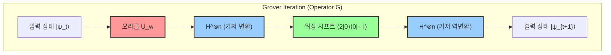

이 회로도가 보여주는 것은 확산 연산자 $U_s = 2|s\rangle\langle s| - I$ 의 매우 실용적인 구현 방법입니다. 상태 $|s\rangle$ 는 $H^{\otimes n} |0\rangle^{\otimes n}$ 으로 생성되므로, 연산자는 다음과 같이 분해할 수 있습니다.

$$
U_s = 2(H^{\otimes n} |0\rangle^{\otimes n})(\langle 0|^{\otimes n} H^{\otimes n}) - I = H^{\otimes n} (2|0\rangle\langle 0| - I) H^{\otimes n}
$$

즉, 아다마르 변환 $H^{\otimes n}$ 에 의해 계산 기저로 변환하고, 모든 큐비트가 $|0\rangle$ 일 때만 위상을 반전시키지 않는(혹은 $|0\rangle$ 일 때만 음의 위상을 준다는 정의도 동치이지만, 이는 글로벌 위상의 차이에 불과합니다) 조건부 위상 시프트 연산자를 적용한 후, 다시 아다마르 변환을 통해 원래 기저로 되돌리는 샌드위치 구조를 취함으로써 임의의 양자 컴퓨터 상에서 효율적으로 '평균값 중심의 반전'을 구현할 수 있게 되는 것입니다.

## 9.5 성공 확률의 해석과 최적 반복 횟수의 도출

상태 벡터의 기하학적 거동이 완전히 규명됨으로써, 우리는 알고리즘의 핵심인 "몇 번의 이터레이션을 반복해야 정답을 얻을 수 있는가"라는 질문에 대해 엄밀하고 정량적인 답을 제시할 준비를 마쳤습니다.

$t$ 회의 반복을 수행한 후, 양자 레지스터를 계산 기저에서 관측하여 정답 상태 $|w\rangle$ 를 얻을 확률 $P(w)$ 는 상태 벡터 $|\psi_t\rangle$ 의 $|w\rangle$ 성분 진폭의 절댓값 제곱으로 주어집니다.

$$
P(w) = |\langle w | \psi_t \rangle|^2 = \sin^2((2t+1)\theta)
$$

우리의 궁극적인 목표는 이 확률 $P(w)$ 를 극대화하는 것, 즉 이론적 상한인 $1$ 에 가능한 한 가깝게 만드는 것입니다. 사인 함수의 제곱 $\sin^2(x)$ 가 최댓값 $1$ 을 취하는 것은 독립변수 $x$ 가 $\frac{\pi}{2}$ (90도)와 같을 때입니다. 따라서 최적의 반복 횟수 $t$ 를 구하기 위한 방정식은 다음과 같이 세워집니다.

$$
(2t+1)\theta \approx \frac{\pi}{2}
$$

이를 $t$ 에 대해 풀면,

$$
t \approx \frac{\pi}{4\theta} - \frac{1}{2}
$$

실용적인 규모의 데이터베이스 탐색에서, 요소 수 $N$ 은 천문학적으로 거대한 수가 됩니다. 이때 각도 $\theta$ 는 극히 $0$ 에 가까운 미소한 값이 됩니다. 미소한 $\theta$ 에 대해서는 테일러 전개(매클로린 전개)의 1차 항을 취함으로써 $\sin \theta \approx \theta$ 라는 훌륭한 근사가 성립합니다. 초기 상태의 정의로부터 $\sin \theta = \frac{1}{\sqrt{N}}$ 이었으므로, $\theta \approx \frac{1}{\sqrt{N}}$ 으로 볼 수 있습니다.

이 근사식을 방금 도출한 $t$ 의 방정식에 대입하면, 최적의 반복 횟수(최적 이터레이션 수) $R$ 은 다음과 같이 명쾌하게 도출됩니다.

$$
R \approx \frac{\pi}{4} \sqrt{N}
$$

이 결과가 지니는 의미는 정보과학의 역사를 뒤흔들 만큼 경이롭습니다. 고전 컴퓨터에서는 무작위로 섞인 탐색 공간에서 정답을 찾아내기 위해, 최악의 경우 $N$ 회, 평균적으로 보아도 $N/2$ 회라는, 요소 수에 비례하는 탐색 시간(계산 복잡도 $O(N)$ )이 불가피했습니다. 그러나 양자 컴퓨터 상에서 동작하는 그로버의 알고리즘은 간섭을 활용하여 확률을 증폭시킴으로써, 불과 $\frac{\pi}{4} \sqrt{N}$ 회라는 쿼리 횟수만으로 거의 확실하게(확률은 $1 - O(1/N)$ 이라는 지극히 높은 정확도로) 정답 상태에 도달해 버립니다. 계산 복잡도는 $O(\sqrt{N})$ 이 되어, 제곱근의 스케일로 계산 시간을 압축하는 데 성공한 것입니다.

다만, 여기서 한 가지 중요한 주의점이 있습니다. 그로버의 알고리즘은 자체 정지(Self-stopping)하지 않습니다. 반복 횟수가 이 최적값 $R$ 을 초과해 버리면 상태 벡터는 목표로 하는 $|w\rangle$ 축을 지나쳐 버리게 되고, 사인 함수의 주기성으로 인해 정답을 관측할 확률이 오히려 감소해 버리는 **과잉 회전(Overcooking / Overshooting)** 이라 불리는 현상이 발생합니다. 따라서 관측을 수행할 타이밍(이터레이션을 정지할 타이밍)을 적절하게 제어하는 것이 알고리즘을 성공시키기 위한 필수 조건이 됩니다.

## 9.6 여러 개의 해가 존재하는 경우의 진폭 증폭 일반화

지금까지는 광대한 데이터베이스 속에 정답이 '단 하나'만 존재한다는 가장 엄격한 조건(단일 해 문제)을 전제로 논의를 진행해 왔습니다. 그러나 현실 세계의 문제 설정에서는 조건을 만족하는 해가 여러 개 존재하는 것이 일반적입니다. 그로버 알고리즘의 핵심인 진폭 증폭 기법은, 해가 $M$ 개( $1 \le M \le N$ ) 존재하는 경우에도 그 수학적 아름다움을 전혀 해치지 않고 자연스럽게 확장할 수 있습니다.

해가 $M$ 개 존재하는 경우, 모든 정답 상태들의 균등 중첩 상태를 $|W\rangle$ , 모든 오답 상태들의 균등 중첩 상태를 $|W^\perp\rangle$ 로 재정의합니다.

$$
|W\rangle = \frac{1}{\sqrt{M}} \sum_{x \in \text{Solutions}} |x\rangle
$$

$$
|W^\perp\rangle = \frac{1}{\sqrt{N-M}} \sum_{x \notin \text{Solutions}} |x\rangle
$$

그러면 초기의 균등 중첩 상태 $|s\rangle$ 는 이 두 직교 벡터를 사용하여 다음과 같이 전개할 수 있습니다.

$$
|s\rangle = \sqrt{\frac{N-M}{N}} |W^\perp\rangle + \sqrt{\frac{M}{N}} |W\rangle
$$

여기서 새로운 각도 $\theta'$ 를 $\sin \theta' = \sqrt{\frac{M}{N}}$ 이 되도록 정의합니다. 이 정의 하에서 단일 해의 경우와 완전히 동일한 그로버 연산자 $G$ (단, 오라클은 $M$ 개의 해 전체에 대해 위상을 반전시키도록 확장되어 있습니다)를 적용하면, 상태 벡터는 $|W^\perp\rangle$ 와 $|W\rangle$ 가 생성하는 평면 내에서 매 반복마다 $2\theta'$ 씩 회전해 나갑니다.

최적의 반복 횟수는 동일한 논리 전개에 의해 $\frac{\pi}{4\theta'}$ 가 되며, $M \ll N$ 인 경우에는 다음과 같이 근사됩니다.

$$
R \approx \frac{\pi}{4} \sqrt{\frac{N}{M}}
$$

이 식은 해의 개수 $M$ 이 많아지면 많아질수록 당연히 필요한 반복 횟수(탐색 시간)가 단축됨을 보여줍니다. 예를 들어 해가 4개 존재한다면 필요한 시간은 절반으로 줄어듭니다. 해의 개수 $M$ 을 모르는 경우라 할지라도, **양자 계수 알고리즘(Quantum Counting Algorithm)** 이라 불리는 그로버의 알고리즘과 양자 위상 추정(Quantum Phase Estimation)을 결합한 고도의 기법을 사용함으로써 해의 개수 $M$ 자체를 빠르게 추정하고, 그 후 적절한 횟수의 진폭 증폭을 수행하는 것이 가능합니다.

## 9.7 이차적 가속의 이론적 의의와 양자 계산의 한계 (BBBV 정리)

그로버의 알고리즘에 의해 유도되는 $O(N)$ 에서 $O(\sqrt{N})$ 으로의 이차적 가속은, 수식상으로는 쇼어의 알고리즘이 가져다주는 지수함수적 가속( $O(e^{N^{1/3}}) \to O(N^3)$ )과 비교할 때 상대적으로 완만하게 보일 수도 있습니다. 그러나 컴퓨터 과학에서 그 진정한 가치와 보편성은 바로 '문제를 가리지 않는 범용성'에 깃들어 있습니다.

쇼어의 소인수분해 알고리즘은 정수의 곱셈군이 지닌 '주기성'이라는 극히 특수한 대수적 구조를 교묘하게 활용합니다. 그와 대조적으로, 그로버의 알고리즘은 '비구조화 데이터베이스 탐색'이라는, 어떠한 사전 지식이나 구조도 갖지 않는 모든 계산 문제의 가장 근원적이고 원시적인 형태에 대해 무조건적으로 적용할 수 있습니다.

그 영향이 가장 뚜렷하게 드러나는 부분이 바로 복잡도 클래스 NP에 속하는 난제들과 현대 사회의 기반을 지탱하는 암호 기술에 대한 응용입니다. 예를 들어 외판원 순회 문제(TSP)나 불 충족 가능성 문제(SAT) 등의 NP-완전 문제는 본질적으로 방대한 후보 공간에서 조건을 만족하는 해를 샅샅이 뒤져 찾아내는 전수 탐색 문제로 귀결됩니다. 이들 문제에 대해 고전 알고리즘이 $O(2^n)$ 의 시간을 필요로 하는 반면, 그로버의 알고리즘을 적용하면 계산 시간을 $O(\sqrt{2^n}) = O(2^{n/2})$ 로 실질적으로 반감(지수부의 절반 감소)시킬 수 있습니다.

암호 기술에 미치는 임팩트 또한 치명적이며 막대합니다. 현재 인터넷의 안전성을 담보하고 있는 AES 등의 대칭키 암호 방식의 보안 강도는 키 공간에 대한 무차별 대입 공격(Brute-force attack)의 어려움에 전적으로 의존하고 있습니다. 예를 들어 AES-128(128비트 길이의 키 공간)의 탐색 공간은 $N = 2^{128}$ 이라는 천문학적인 수입니다. 고전 컴퓨터에서는 평균 $2^{127}$ 회의 키 검증 계산이 필요하지만, 양자 컴퓨터는 그로버의 알고리즘을 사용하여 불과 $\frac{\pi}{4} 2^{64}$ 회의 계산만으로 정답 키를 확실하게 찾아냅니다. 바로 이 사실이야말로 전 세계 표준화 기구(NIST 등)가 양자 내성 암호(Post-Quantum Cryptography, PQC)로의 전환을 시급한 과제로 삼고, AES-128을 지양하며 AES-256(양자 계산으로도 $2^{128}$ 회의 계산이 필요함)으로의 전환을 강력히 권고하는 최대의 근거입니다.

마지막으로, 이론물리학 및 컴퓨터 과학의 관점에서 대단히 중요한 정리를 짚고 넘어가겠습니다. 1997년에 베넷(Bennett), 번스타인(Bernstein), 브라사르(Brassard), 바지라니(Vazirani) 등에 의해 증명된 **BBBV 정리** 입니다. 이 정리는 "양자 컴퓨터를 사용한다 할지라도, 블랙박스에 의한 비구조화 탐색 문제는 $\Omega(\sqrt{N})$ 회의 쿼리가 절대적으로 필요하다"는 것을 수학적으로 엄밀하게 증명했습니다.

이것이 의미하는 바는 무엇일까요? 그것은 바로, **"그로버의 알고리즘이 달성한 $O(\sqrt{N})$ 이라는 계산 복잡도는 자연계의 법칙(양자역학)이 허용하는 절대적인 이론적 한계이며, 이 이상의 고속화는 우주의 그 어떤 물리 법칙을 사용하더라도 불가능하다"** 라는 심오한 사실입니다. 그로버는 단순히 탁월한 알고리즘을 발견한 것에 그치지 않고, 정보와 물리 법칙의 궁극적인 경계선에 도달한 것입니다.

또한 본 장에서 상세히 설명한 '진폭 증폭(Amplitude Amplification)'이라는 패러다임 자체는, 양자 랜덤 워크(Quantum Random Walks)나 양자 머신러닝(Quantum Machine Learning)의 서브루틴 등 수많은 고등 양자 알고리즘을 구축하기 위한 기초적인 구성 요소(Building Block)로서 널리 응용되고 있습니다. "직교하는 두 축에 대한 이중 거울 반사를 이용하여 확률 진폭을 기하학적으로 회전·증폭시킨다"는 그로버가 발견한 이 아름답고 우아한 기법은, 양자 정보과학이라는 거대한 학문 체계를 밑바닥에서 지탱하는 가장 견고하고도 필수 불가결한 기둥 중 하나로서 앞으로도 영원히 빛날 것입니다.

# 제10장: 양자 오류 수정과 결함 허용 계산

양자 정보 과학이 직면한 가장 크고 심오한 장벽, 그것은 바로 '노이즈'와 '결어긋남(Decoherence)'입니다. 이상적인 폐쇄계로서 양자 컴퓨터를 다루는 한, 슈뢰딩거 방정식에 따르는 유니터리 발전에 의한 결정론적인 상태 조작이 보장됩니다. 하지만 현실의 물리계인 양자 디바이스는 항상 외부 환경(열욕, 전자기장의 요동, 우주선 등)과 상호작용하고 있습니다. 본 장에서는 양자계의 노이즈를 수학적으로 엄밀하게 정의한 다음, 고전계에는 존재하지 않는 양자 특유의 오류를 어떻게 감지하고, 그리고 수정할 것인가 하는 '양자 오류 수정(Quantum Error Correction: QEC)'의 심연에 다가갑니다. 나아가, 수정 메커니즘 자체에 노이즈가 혼입되는 현실적인 상황 하에서도 계산을 무한히 지속 가능하게 하는 '결함 허용 양자 계산(Fault-Tolerant Quantum Computation: FTQC)'의 이론적 기반과 임계값 정리(Threshold Theorem)에 대해 상술합니다.

## 10.1 양자 노이즈와 결어긋남의 수학적 기술

양자계의 결어긋남을 엄밀하게 기술하기 위해서는 폐쇄계의 상태 벡터에 기반한 순수 상태의 동역학에서 개방 양자계의 밀도 행렬 동역학으로 시점을 이동할 필요가 있습니다. 환경계 $E$ 와 주계 $S$ 의 복합계에서의 유니터리 발전을 고려하고, 환경계의 자유도를 부분 대각합(Partial Trace)에 의해 소거함으로써 주계의 상태 변화는 '완전 양의 대각합 보존 사상(Completely Positive Trace-Preserving Map, CPTP 사상)'으로 기술됩니다.

임의의 양자 채널 $\mathcal{E}$ 는 크라우스 표현(Kraus Representation)을 이용하여 다음과 같이 전개됩니다.

$$
\mathcal{E}(\rho) = \sum_{k} E_k \rho E_k^\dagger
$$

여기서 $E_k$ 는 크라우스 연산자(Kraus Operators)라고 불리며, 확률의 보존을 의미하는 대각합 보존 조건 $\sum_k E_k^\dagger E_k = I$ 를 만족합니다.

고전 정보에서는 정보 단위인 비트에 대한 오류는 '0이 1이 된다' 혹은 '1이 0이 된다'는 비트 반전(Bit Flip)뿐입니다. 그러나 양자계에서는 중첩의 위상이 변동하는 '위상 반전(Phase Flip)'이라는 치명적인 오류가 존재합니다. 대표적인 단일 양자 비트 노이즈 채널의 크라우스 연산자를 아래에 나타냅니다.

1. **비트 반전 채널 (Bit Flip Channel):** 확률 $p$ 로 $X$ 게이트가 작용합니다.
   

$$
E_0 = \sqrt{1-p} I, \quad E_1 = \sqrt{p} X
$$

2. **위상 반전 채널 (Phase Flip Channel):** 확률 $p$ 로 $Z$ 게이트가 작용합니다. 상대 위상의 붕괴(순수한 결어긋남)를 표현합니다. 순수 상태 $|\psi\rangle = \alpha|0\rangle + \beta|1\rangle$ 의 밀도 행렬의 비대각 성분이 지수 함수적으로 감쇠하는 현상의 직접적인 원인입니다.
   

$$
E_0 = \sqrt{1-p} I, \quad E_1 = \sqrt{p} Z
$$

3. **탈분극 채널 (Depolarizing Channel):** 확률 $p$ 로 상태가 완전히 혼합 상태(백색 잡음) $I/2$ 에 가까워집니다.
   

$$
E_0 = \sqrt{1-p} I, \quad E_1 = \sqrt{\frac{p}{3}} X, \quad E_2 = \sqrt{\frac{p}{3}} Y, \quad E_3 = \sqrt{\frac{p}{3}} Z
$$

양자 오류 수정을 구축하는 데 가로막는 첫 번째 장벽이 '복제 불가능 정리(No-Cloning Theorem)'입니다. 미지의 양자 상태 $|\psi\rangle$ 를 복제하여 $|\psi\rangle \otimes |\psi\rangle \otimes |\psi\rangle$ 와 같은 상태를 만드는 유니터리 변환은 존재하지 않습니다. 따라서 고전 오류 수정과 같이 '같은 정보를 3개의 비트에 복사하고 다수결을 취한다'는 소박한 접근은 양자계에서는 불가능합니다. 더욱이 양자 상태를 측정하면 파동 묶음의 수축이 일어나 중첩은 파괴되어 버립니다. 미지의 정보를 파괴하지 않고 어떻게 오류를 특정할 것인가가 핵심적인 과제가 됩니다.

## 10.2 양자 오류 수정의 기초 원리: 중복화와 신드롬 측정

양자 정보에서의 '복사'의 대체 수단은 여러 양자 비트를 양자 얽힘(Entanglement) 상태로 만듦으로써, 원래의 정보를 더 고차원의 힐베르트 공간의 부분 공간(부호 공간, Code Space)으로 매핑하는 것입니다.

가장 단순한 예로서, 확률적 비트 반전으로부터 1 양자 비트의 상태 $|\psi\rangle = \alpha |0\rangle + \beta |1\rangle$ 를 보호하는 '3 양자 비트 비트 반전 부호'를 구성해 봅니다.
논리 기저(Logical Basis)를 다음과 같이 정의합니다.

$$
|0\rangle_L = |000\rangle, \quad |1\rangle_L = |111\rangle
$$

논리 상태는 $|\psi\rangle_L = \alpha |000\rangle + \beta |111\rangle$ 가 됩니다. 이것은 복제가 아니라 GHZ형 얽힘 상태로의 인코딩입니다.

여기서 1번째 양자 비트에 비트 반전 오류 $X_1 = X \otimes I \otimes I$ 가 발생했다고 가정해 보겠습니다. 상태는 $|\psi'\rangle = \alpha |100\rangle + \beta |011\rangle$ 로 변화합니다.
이 오류를 감지하기 위해서는 상태 자체를 직접 측정해서는 안 됩니다. 대신에 상태를 파괴하지 않고 오류의 흔적만을 추출하는 '신드롬 측정(Syndrome Measurement)'을 수행합니다. 구체적으로는 파울리 연산자의 텐서 곱인 패리티 연산자 $Z_1 Z_2$ 및 $Z_2 Z_3$ 를 측정합니다.

원래 부호 공간의 임의의 벡터 $|\psi\rangle_L$ 은 $Z_1 Z_2$ 와 $Z_2 Z_3$ 의 고윳값 $+1$ 의 고유 벡터입니다(즉, $Z_1 Z_2 |\psi\rangle_L = |\psi\rangle_L$ ).
그러나 오류 상태 $|\psi'\rangle$ 에 대해서는 $X$ 와 $Z$ 가 반교환( $\{X, Z\} = 0$ )한다는 파울리 대수의 성질에 의해,

$$
Z_1 Z_2 |\psi'\rangle = Z_1 Z_2 X_1 |\psi\rangle_L = -X_1 Z_1 Z_2 |\psi\rangle_L = - |\psi'\rangle
$$

$$
Z_2 Z_3 |\psi'\rangle = Z_2 Z_3 X_1 |\psi\rangle_L = X_1 Z_2 Z_3 |\psi\rangle_L = + |\psi'\rangle
$$

가 됩니다. 측정 결과(신드롬)는 $(-1, +1)$ 이 되며, 이로 인해 '1번째 비트에 $X$ 오류가 일어났다'는 사실만이 확정됩니다. 중첩의 계수 $\alpha, \beta$ 에 관한 정보는 일절 누설되지 않기 때문에 측정에 의한 상태 파괴는 일어나지 않습니다. 그 후, $X_1$ 을 다시 적용함으로써 완전히 원래의 상태 $|\psi\rangle_L$ 로 복원할 수 있습니다.

마찬가지로 위상 반전 오류 $Z$ 를 수정하기 위해서는 아다마르 기저 $\{|+\rangle, |-\rangle\}$ 를 이용한 '3 양자 비트 위상 반전 부호'를 사용합니다.

$$
|0\rangle_L = |+++\rangle, \quad |1\rangle_L = |---\rangle
$$

이 경우, 신드롬 측정에는 $X_1 X_2$ 및 $X_2 X_3$ 를 사용합니다.

여기서 양자 역학의 놀라운 특성이 발휘됩니다. 환경과의 상호작용에 의한 오류는 일반적으로 $E(\theta) = \cos(\theta) I - i \sin(\theta) X$ 와 같은 연속적인 회전입니다. 그러나 신드롬 측정을 수행함으로써 그 상태는 '오류 없음( $I$ )'이거나 '완전한 오류( $X$ )' 중 하나의 고유 상태로 확률적으로 **사영** 됩니다. 즉, 무한히 존재하는 연속적인 오류가 측정에 의해 이산적인 파울리 오류로 양자 역학적으로 '디지털화'되는 것입니다.

## 10.3 쇼어의 9 양자 비트 부호 (Shor Code) 와 안정자 형식

앞서 서술한 부호는 비트 반전이나 위상 반전 중 어느 하나밖에 수정할 수 없습니다. 1995년 피터 쇼어는 두 오류를 동시에 수정할 수 있는 획기적인 '쇼어의 9 양자 비트 부호(Shor's 9-Qubit Code)'를 발표했습니다. 이것은 3 양자 비트의 위상 반전 부호의 각 노드 내부에 3 양자 비트의 비트 반전 부호를 중첩(Concatenation)시켜 구축됩니다.

논리 기저는 다음과 같아집니다.

$$
|0\rangle_L = \frac{1}{2\sqrt{2}} ( |000\rangle + |111\rangle ) \otimes ( |000\rangle + |111\rangle ) \otimes ( |000\rangle + |111\rangle )
$$

$$
|1\rangle_L = \frac{1}{2\sqrt{2}} ( |000\rangle - |111\rangle ) \otimes ( |000\rangle - |111\rangle ) \otimes ( |000\rangle - |111\rangle )
$$

쇼어 부호 등의 오류 수정을 일반화하고 확고한 수학적 기반을 부여한 것이 다니엘 고테스만의 '안정자 형식(Stabilizer Formalism)'입니다.
$n$ 양자 비트의 파울리 군을 $\mathcal{P}_n$ 이라고 합니다. 안정자 군 $\mathcal{S}$ 는 $\mathcal{P}_n$ 의 가환인 부분군이며, 부호 공간 $\mathcal{C}$ 를 '군 $\mathcal{S}$ 의 모든 원소 $S \in \mathcal{S}$ 에 대해 고윳값이 $+1$ 이 되는 상태 $|\psi\rangle$ 의 집합'으로서 정의합니다. $n$ 양자 비트 계에서 독립적인 생성원(Generator)이 $k$ 개 있는 경우, 부호 공간의 차원은 $2^{n-k}$ 가 되며, 이는 논리 양자 비트 수를 나타냅니다.

쇼어 부호( $n=9$ )의 경우, 1개의 논리 비트를 인코딩하기 위해 $k=8$ 개의 독립적인 생성원에 의해 구성됩니다.
비트 반전을 감지하기 위한 $Z$ 계 안정자(6개):

$$
S_1 = Z_1 Z_2 I_3 I_4 I_5 I_6 I_7 I_8 I_9, \quad S_2 = I_1 Z_2 Z_3 I_4 I_5 I_6 I_7 I_8 I_9
$$

$$
\dots, \quad S_6 = I_1 I_2 I_3 I_4 I_5 I_6 I_7 Z_8 Z_9
$$

위상 반전을 감지하기 위한 $X$ 계 안정자(2개):

$$
S_7 = X_1 X_2 X_3 X_4 X_5 X_6 I_7 I_8 I_9
$$

$$
S_8 = I_1 I_2 I_3 X_4 X_5 X_6 X_7 X_8 X_9
$$

만약 임의의 양자 비트에 오류 $E \in \mathcal{P}_n$ 가 발생한 경우, 그것이 $\mathcal{S}$ 의 생성원 중 어느 하나와 반교환한다면, 그 안정자의 측정 결과는 $-1$ 이 되고 오류의 종류와 위치가 특정됩니다. 안정자의 개념은 양자 상태 자체를 추적하는 것이 아니라, 계의 대칭성을 규정하는 연산자의 대수 구조를 추적한다는 하이젠베르크 묘사에 가까운 극히 강력한 접근을 제공합니다.

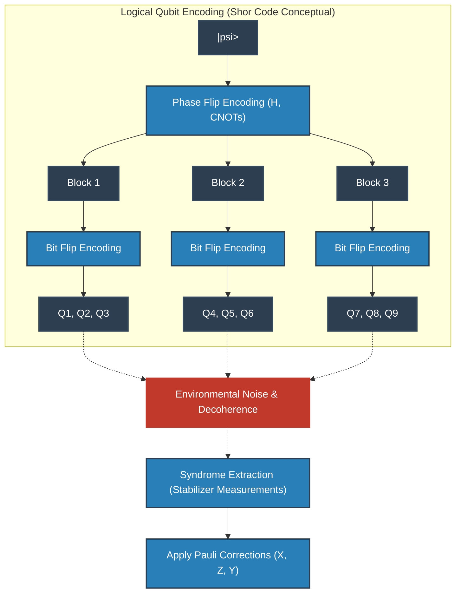

## 10.4 위상수학적 부호와 표면 부호 (Surface Codes)

쇼어의 부호나 안정자 부호는 논리적으로는 완벽하지만, 물리적인 구현에 있어서는 '떨어진 양자 비트 간의 상호작용(장거리 상호작용)'을 요구합니다. 고체 소자(초전도 회로나 실리콘 스핀 등)의 2차원 평면상의 격자 배열에 있어 이러한 장거리 결합은 지극히 곤란합니다.

그래서 현대의 양자 컴퓨터 아키텍처의 주류로서 채용되고 있는 것이 알렉세이 키타예프(Alexei Kitaev)에 의해 제창된 '위상수학적 양자 오류 수정(Topological Quantum Error Correction)'이며, 그 대표예가 '토릭 부호(Toric Code)' 및 '표면 부호(Surface Code)'입니다.

표면 부호에서는 양자 비트가 2차원 격자의 꼭짓점(또는 변)에 배치되며, 인접하는 양자 비트 간의 국소적인 상호작용만을 이용하여 안정자 측정을 실행합니다.
해밀토니안은 다음과 같이 기술됩니다.

$$
H = - \sum_{v} A_v - \sum_{p} B_p
$$

여기서 $A_v$ 는 꼭짓점(Vertex) 주위의 4개 양자 비트에 대한 $X$ 연산자의 텐서 곱(꼭짓점 연산자: $A_v = \prod_{i \in \text{star}(v)} X_i$ ), $B_p$ 는 플라켓(면, Plaquette) 주위의 4개 양자 비트에 대한 $Z$ 연산자의 텐서 곱(면 연산자: $B_p = \prod_{i \in \text{boundary}(p)} Z_i$ )입니다.
이들은 서로 가환( $[A_v, B_p] = 0$ )이며, 논리 상태는 모든 $A_v$ 와 $B_p$ 의 고윳값이 $+1$ 이 되는 바닥 상태 공간에 인코딩됩니다. 놀랍게도 종수(Genus) $g$ 의 2차원 다양체 상에 구성된 토릭 부호의 바닥 상태의 축퇴도는 $4^g$ 가 되며, 토러스( $g=1$ ) 위에서는 2개의 논리 양자 비트가 자연스럽게 인코딩됩니다.

표면 부호의 극히 아름다운 물리적 해석은 오류를 '준입자(Anyon, 애니온)'로서 파악하는 것입니다. 예를 들어 어떤 양자 비트에 $X$ 오류가 발생하면, 인접하는 2개의 플라켓 연산자 $B_p$ 의 신드롬이 $-1$ 로 반전됩니다. 이것은 바닥 상태의 진공으로부터 한 쌍의 '자기 홀극과 같은 애니온( $m$ 애니온)'이 쌍생성되었음을 의미합니다. 오류가 한층 더 이웃으로 연쇄되면 애니온은 격자 공간 위를 이동합니다.
수정이란 신드롬의 쌍(애니온)을 찾아내어, 그래프 이론의 '최소 가중치 완전 매칭(Minimum Weight Perfect Matching: MWPM)' 알고리즘을 이용해 최단 경로로 애니온끼리 충돌시켜 쌍소멸시키는 조작에 다름 아닙니다.
논리 연산( $\bar{X}, \bar{Z}$ )은 이 애니온을 공간의 끝에서 끝까지 관통시키는 비자명한 호몰로지 루프(Topological Loop)를 형성하는 것에 대응합니다. 국소적인 노이즈가 자연스럽게 계 전체를 관통하는 루프를 형성할 확률은 지수 함수적으로 낮기 때문에, 위상수학적인 관점에서 정보가 극히 견고하게 보호되는 것입니다.

## 10.5 결함 허용 양자 계산 (FTQC) 에의 길과 임계값 정리

오류 수정의 이론이 확립되어도 절망적인 문제가 남습니다. '오류 수정을 수행하기 위한 회로(신드롬 측정의 보조 비트나 CNOT 게이트 등) 자체가 노이즈를 포함하고 있다면 어떻게 될 것인가?'라는 문제입니다. 오류를 고치는 수술 중에 더욱 중증의 오류를 감염시켜 버린다면 시스템은 즉각 붕괴합니다.

예를 들어 신드롬 추출을 위한 CNOT 게이트는 제어 비트의 $X$ 오류를 표적 비트로 전파( $X \otimes I \xrightarrow{CNOT} X \otimes X$ )시키고, 표적 비트의 $Z$ 오류를 제어 비트로 역전파( $I \otimes Z \xrightarrow{CNOT} Z \otimes Z$ )시킵니다. 만약 1개의 물리 오류가 인코딩된 블록 내의 복수의 양자 비트로 증식해버린다면, 설정된 부호 거리 $d$ 를 넘어버리게 되어 수정은 완전히 실패합니다.

이 파멸적인 연쇄를 막기 위한 설계 사상이 '결함 허용 양자 계산(FTQC)'입니다. FTQC의 절대 조건은 '계 내에서 발생한 1개의 물리 오류가 1개의 논리 오류 블록 내에서 기껏해야 1개의 오류로밖에 전파되지 않을 것'입니다.
이를 실현하기 위해 논리 게이트의 실행에는 '트랜스버설 조작(Transversal Operations)'이 강하게 요구됩니다. 이것은 제 $i$ 번째 물리 양자 비트는 다른 블록의 제 $i$ 번째 물리 양자 비트하고만 상호작용하는(블록 내에서의 교차 결합을 갖지 않는) 안전한 게이트 조작입니다. 그러나 '이스틴-닐 정리(Eastin-Knill Theorem)'에 의해, 트랜스버설한 조작만으로는 만능 양자 계산의 연속적인 게이트 세트를 구축하는 것이 불가능함이 수학적으로 증명되어 있습니다.

이 정리의 제약을 회피하고 만능 FTQC를 실현하기 위한 마법의 지팡이가 '매직 상태 증류(Magic State Distillation)'입니다. 노이즈를 포함한 비 클리퍼드 상태(예: $T$ 게이트에 상당하는 상태)를 대량으로 준비하고, 트랜스버설한 클리퍼드 연산만을 이용한 오류 수정 회로를 통해 순도가 극히 높은 '매직 상태'를 추출합니다. 그리고 양자 순간이동(Quantum Teleportation)의 원리를 이용하여 간접적으로 비 클리퍼드 게이트( $T$ 게이트 등)를 논리 상태에 적용합니다. 이 증류 프로세스는 막대한 리소스(물리 양자 비트)를 소비하기 때문에, FTQC 시대의 알고리즘에서는 '어떻게 $T$ 게이트의 수를 줄일 것인가'가 지상 명제가 됩니다.

이 모든 이론적 노력의 집대성이 '양자 임계값 정리(Quantum Threshold Theorem)'입니다.
도릿 아하로노프(Dorit Aharonov)나 마이클 벤-오르(Michael Ben-Or) 등에 의해 증명된 이 정리는 다음과 같이 드높게 선언합니다:
 **"물리 컴포넌트(게이트, 측정, 초기화)의 오류 확률 $p$ 가 어떤 일정한 임계값 $p_{th}$ 를 밑돌고 있다면, 양자 오류 수정 부호를 계층적으로 중첩(Concatenation)시키거나 토폴로지컬 부호의 격자 크기(부호 거리 $d$ )를 계속 확대함으로써, 임의로 긴 시간의 양자 계산을 임의의 정밀도로 실행하는 것이 가능하다."** 

임계값 $p_{th}$ 는 이용하는 부호나 아키텍처에 의존하지만, 표면 부호에서는 약 $10^{-2}$ (1%)라는 극히 현실적이고 도달 가능한 값을 지닙니다. 물리적인 오류율을 이 임계값보다 훨씬 아래로 억누르는 것(Physical Layer의 개선)과, 더 효율적인 신드롬 디코더나 표면 부호의 변종을 개발하는 것(Logical Layer의 세련화) 쌍방이 현재의 양자 컴퓨터 개발에 있어 세계적인 경쟁의 주전장이 되고 있습니다.

양자 오류 수정과 FTQC는 단순한 공학적 짜깁기가 아닙니다. 그것은 자연계가 덮어 가리려 하는 양자 역학의 섬세한 중첩 상태를 토폴로지와 군론, 그리고 열역학적 엔트로피의 제어에 의해 거시적인 시간 스케일로 연장시키고 우주의 계산 능력의 한계를 밀어 넓히는, 인류의 극히 근원적이고 예술적인 도전인 것입니다.

# 제11장: 양자 하드웨어의 물리적 구현

양자 정보 과학의 이론적 기반과 알고리즘의 수리적 구조에 대해 제10장까지 상세히 설명했다. 아무리 고도의 양자 알고리즘이 설계되고, 이론상의 양자 우위성(Quantum Supremacy)이 계산 복잡도 이론의 틀에서 증명되었다 하더라도, 이를 실행하기 위한 물리적 실체인 '양자 하드웨어'가 존재하지 않는다면 그것은 순수 수학의 유희에 머무를 뿐이다. 본 장에서는 추상적인 힐베르트 공간에서의 상태 벡터 $ |\psi\rangle $ 를 물리 세계에 구현하기 위한 최첨단 하드웨어 구현 방식에 대해, 그 이면에 있는 양자 물리학의 심오한 원리부터 엄밀하게 설명한다.

양자 물리계를 인공적으로 제어하여 보편적(Universal)인 계산기로 기능하게 하려면, 디빈첸초 기준(DiVincenzo's criteria)이라 불리는 5가지 가혹한 물리적 요건을 만족해야 한다.
1. **확장 가능하고 잘 특성화된 양자 비트계의 존재** : 힐베르트 공간의 텐서곱 구조 $ \mathcal{H} = \bigotimes_{i=1}^n \mathcal{H}_i $ 를 물리적으로 확보할 수 있을 것.
2. **양자 상태의 초기화** : 계를 순수 상태(전형적으로 $ |00\dots0\rangle $ )로 높은 충실도로 리셋할 수 있는 능력.
3. **충분히 긴 결맞음 시간** : 양자 상태의 결어긋남(탈결맞음) 시간(T1 및 T2)이 1 게이트 조작에 걸리는 시간보다 몇 자릿수나 길 것.
4. **보편적인 양자 게이트 세트의 구현** : 임의의 유니터리 변환 $ \hat{U} \in SU(2^n) $ 를 유한한 개수의 기저 게이트(예: H, T, CNOT 게이트)의 조합으로 임의의 정밀도로 근사할 수 있을 것.
5. **특정 양자 비트에 대한 사영 측정** : 양자 상태의 붕괴를 수반하면서 특정 기저에 대한 확률 분포를 높은 정밀도로 읽어내는 능력.

이 모든 것을 동시에, 그리고 높은 충실도(Fidelity)로 만족하는 계를 구축하는 것은 현대 물리학 및 공학에서 역사적인 난제이다. 계를 환경으로부터 완전히 고립시키면 결맞음 시간은 늘어나지만, 그것은 동시에 계를 조작하거나 측정하는 것을 어렵게 만든다. 이 궁극적인 트레이드오프를 어떻게 극복할 것인가가 각 하드웨어 방식 설계 사상의 핵심이다.

## 11.1 초전도 양자 비트: 거시적 양자 현상과 비선형 LC 회로

현재 Google과 IBM을 비롯한 많은 연구 기관에서 가장 강력하게 추진하고 있는 것이 초전도 양자 비트(Superconducting Qubit)이다. 이는 미시적인 소립자가 아니라, 거시적인 전자 회로가 나타내는 거시적 양자 현상을 이용하여 '인공 원자(Artificial Atom)'를 구축하는 접근 방식이다.

### 11.1.1 조셉슨 접합의 물리와 비선형성

미세 가공된 일반적인 LC 공진 회로(인덕터 $ L $ 과 커패시터 $ C $ 로 이루어진 계)는 극저온으로 냉각하여 양자화하면 양자역학적인 조화 진동자(Harmonic Oscillator)가 된다. 그 해밀토니안은 생성 연산자 $ \hat{a}^\dagger $ 와 소멸 연산자 $ \hat{a} $ 를 사용하여 다음과 같이 쓸 수 있다.

$$
\hat{H}_{\text{LC}} = \hbar \omega_r \left( \hat{a}^\dagger \hat{a} + \frac{1}{2} \right)
$$

여기서 $ \omega_r = 1/\sqrt{LC} $ 는 공진 주파수이다. 이 계의 에너지 준위 $ E_n = \hbar \omega_r (n + 1/2) $ 는 등간격이다. 만약 이 계의 최저 에너지 상태 $ |0\rangle $ 와 제1 들뜬 상태 $ |1\rangle $ 를 양자 비트로 사용할 경우, 주파수 $ \omega_r $ 의 마이크로파를 조사하여 게이트 조작(예를 들어 $ |0\rangle \leftrightarrow |1\rangle $ 의 전이)을 수행하려고 하면, 동시에 등간격인 $ |1\rangle \leftrightarrow |2\rangle $ 나 $ |2\rangle \leftrightarrow |3\rangle $ 의 전이도 함께 구동되어 버린다. 이래서는 2준위계로 기능하지 않는다.

이 문제를 해결하기 위해서는 에너지 준위를 비등간격으로 만드는 '비선형성(Nonlinearity)'이 필수적이다. 이를 실현하는 것이 **조셉슨 접합(Josephson Junction)** 이다. 2개의 초전도체를 수 나노미터의 얇은 절연층으로 사이에 끼운 구조를 가지며, 쿠퍼 쌍(Cooper pairs)이 거시적 위상의 간섭을 유지한 채 터널 효과에 의해 투과한다. 조셉슨 방정식에 따르면 초전도 전류 $ I $ 와 위상차 $ \phi $ 의 관계는 $ I = I_c \sin \phi $ 가 된다. 이를 통해 접합부는 인덕턴스가 전류에 의존하는 비선형 인덕터로 기능한다.

### 11.1.2 트랜스몬(Transmon)의 해밀토니안

역사상 전하 양자 비트, 자속 양자 비트 등 다양한 설계가 고안되었지만, 현재 가장 성공한 것은 전하 노이즈에 대한 내성을 획기적으로 높인 '트랜스몬(Transmon)'이다.

트랜스몬은 조셉슨 에너지 $ E_J $ 에 대해 병렬 션트 커패시턴스를 의도적으로 거대화하여 대전 에너지 $ E_C = e^2 / (2C_{\Sigma}) $ 를 작게 만든( $ E_J / E_C \gg 1 $ ) 영역에서 동작한다.
쿠퍼 쌍의 수를 나타내는 전하 연산자 $ \hat{n} $ 과 초전도 위상차를 나타내는 위상 연산자 $ \hat{\phi} $ 는 정준 공액인 변수이며 교환 관계 $ [\hat{\phi}, \hat{n}] = i $ 를 만족한다. 트랜스몬의 해밀토니안은 다음과 같이 엄밀하게 기술된다.

$$
\hat{H}_{\text{transmon}} = 4 E_C (\hat{n} - n_g)^2 - E_J \cos \hat{\phi}
$$

여기서 $ n_g $ 는 환경이나 게이트 전압에 의한 오프셋 전하이다. $ E_J \gg E_C $ 의 극한에서 위상의 양자 요동은 작게 억제되므로 코사인 항을 테일러 전개하여 비조화 진동자로 다룰 수 있다.

$$
- E_J \cos \hat{\phi} \approx - E_J + \frac{E_J}{2} \hat{\phi}^2 - \frac{E_J}{24} \hat{\phi}^4 + \mathcal{O}(\hat{\phi}^6)
$$

이 $ \hat{\phi}^4 $ 의 항이 계에 비조화성(Anharmonicity)을 가져온다. 섭동론에 의한 계산 결과로서 에너지 준위 간의 비조화성 $ \alpha $ 는 다음과 같이 근사된다.

$$
\alpha \equiv (E_2 - E_1) - (E_1 - E_0) \approx -E_C
$$

이 음의 비조화성( $ E_1 \to E_2 $ 의 전이 주파수가 $ E_0 \to E_1 $ 보다 작음)으로 인해 마이크로파 펄스를 사용하여 $ |0\rangle $ 와 $ |1\rangle $ 의 계산 기저 공간 내에서 안전하게 단일 양자 비트 게이트를 실행할 수 있게 된다.

### 11.1.3 회로 QED(Circuit QED)와 측정 메커니즘

양자 비트의 상태를 파괴하지 않고 읽어내기 위한 이론적 틀이 공진기 양자 전자기역학을 초전도 회로에 적용한 '회로 QED(Circuit QED)'이다.
양자 비트와 판독용 마이크로파 공진기의 결합계는 제인스-커밍스(Jaynes-Cummings) 모델에 의해 기술된다.

$$
\hat{H}_{\text{JC}} = \frac{\hbar \omega_q}{2} \hat{\sigma}_z + \hbar \omega_r \hat{a}^\dagger \hat{a} + \hbar g (\hat{\sigma}_+ \hat{a} + \hat{\sigma}_- \hat{a}^\dagger)
$$

여기서 $ g $ 는 결합 강도이다. 양자 비트의 전이 주파수 $ \omega_q $ 와 공진기의 주파수 $ \omega_r $ 가 크게 떨어져 있는 분산 영역( $ |\omega_q - \omega_r| \gg g $ )에서는 슈리퍼-볼프(Schrieffer-Wolff) 변환에 의해 유효 해밀토니안이 다음과 같이 대각화된다.

$$
\hat{H}_{\text{disp}} \approx \frac{\hbar \omega_q}{2} \hat{\sigma}_z + \hbar \left( \omega_r + \frac{g^2}{\Delta} \hat{\sigma}_z \right) \hat{a}^\dagger \hat{a}
$$

여기서 $ \Delta = \omega_q - \omega_r $ 이다. 이 식의 두 번째 항이 나타내는 물리적 의미는 매우 중요하다. 공진기의 유효 주파수가 양자 비트의 상태( $ \hat{\sigma}_z = +1 $ 인지 $ -1 $ 인지)에 따라 $ \pm g^2/\Delta $ 만큼 편이된다. 따라서 공진기에 프로브용 마이크로파를 투과시키거나 반사시켜 그 위상 편이를 측정함으로써 양자 비트의 상태를 사영 측정할 수 있다.

 **장점과 단점** 
초전도 방식의 가장 큰 장점은 기존 반도체 리소그래피 기술을 전용할 수 있어 칩 상의 배선 설계를 통한 확장성이 뛰어나다는 점과, 게이트 조작이 나노초 스케일로 매우 빠르다는 점에 있다. 반면 단점으로는 거시적인 인공물이기에 미세한 재료 결함(TLS)이나 전자기 노이즈에 극히 취약하며 절대영도 부근(약 10 mK)의 희석 냉동기 환경이 필수적이라는 점이다.

## 11.2 이온 트랩 방식: 원자 물리학의 극치와 완전한 동일성

초전도가 '인공적인 거시적 양자계'라면, 이온 트랩(Trapped Ion) 방식은 '자연계에 존재하는 궁극의 미시적 양자계'이다. 동위원소로서 동일한 원자(예를 들어 $ ^{171}\text{Yb}^+ $ 나 $ ^{40}\text{Ca}^+ $ )는 우주의 어느 곳에 존재하더라도 완전히 동일한 성질을 갖는다. 따라서 제조 편차라는 개념 자체가 존재하지 않으며 결맞음 시간이 압도적으로 길다는 절대적인 이점을 갖는다.

### 11.2.1 폴 트랩과 레이저 냉각의 동역학

이온 트랩에서는 정전기장만으로 하전 입자를 3차원 공간에 안정적으로 포획하는 것은 불가능하다(언쇼 정리). 이를 회피하기 위해 공간적으로 불균일하고 시간적으로 진동하는 고주파 전기장을 사용하는 폴 트랩(Paul trap) 기술이 채택된다.

포획된 이온은 진공 챔버 내에서 레이저 냉각(도플러 냉각 및 사이드밴드 냉각)을 거친다. 이를 통해 이온의 운동 에너지는 양자역학적인 바닥 상태(포논 수 $ n=0 $ )까지 냉각된다. 양자 비트의 계산 기저는 이온의 내부 전자 상태에 인코딩된다. 내부 상태의 해밀토니안은 단순하다.

$$
\hat{H}_{\text{internal}} = \frac{\hbar \omega_0}{2} \hat{\sigma}_z
$$

### 11.2.2 램-디케 영역과 묄머-쇠렌센(Mølmer-Sørensen) 게이트의 수리

이온 트랩 방식의 진정한 돌파구는 다중 양자 비트 간의 얽힘 생성 메커니즘에 있다. 포획된 이온 사슬은 강력한 쿨롱 반발력으로 결합되어 있으며 계 전체로서 집단적인 기준 진동 모드(포논)를 갖는다. 이 포논을 데이터 버스로 이용함으로써 물리적으로 떨어져 있는 이온 간에도 직접 상호작용을 매개할 수 있다.

2 양자 비트 게이트의 구현으로 가장 표준적인 것이 묄머-쇠렌센(Mølmer-Sørensen, MS) 게이트이다. 두 이온에 대해 포논 모드의 주파수 $ \omega_m $ 로부터 약간 디튜닝시킨 두 파장의 레이저 광을 동시에 조사한다. 램-디케 매개변수 $ \eta = k z_0 $ 가 충분히 작은 램-디케 영역( $ \eta \sqrt{n} \ll 1 $ )에서 상호작용 해밀토니안은 다음과 같이 전개된다.

$$
\hat{H}_{\text{int}} \approx \hbar \Omega \sum_{j=1,2} \hat{\sigma}_\phi^{(j)} \left( \eta \hat{a} e^{i \delta t} + \eta \hat{a}^\dagger e^{-i \delta t} \right)
$$

여기서 $ \Omega $ 는 라비 주파수, $ \delta $ 는 디튜닝이다. 마그누스 전개(Magnus expansion)를 사용하여 시간 발전 연산자를 계산하면, 적절한 게이트 시간 후에 운동 모드는 원래 상태로 복귀하면서 내부 상태 사이에 기하학적 위상이 부여되어 유효한 스핀-스핀 상호작용이 잔류하게 된다.

$$
\hat{U}_{\text{MS}} = \exp\left( -i \frac{\pi}{4} \hat{\sigma}_\phi \otimes \hat{\sigma}_\phi \right)
$$

이 연산은 완전히 얽힌 상태를 생성하며 CNOT 게이트와 등가인 계산 능력을 갖는다. 전결합(All-to-all connectivity)이 가능하다는 점이 인접한 양자 비트하고만 결합할 수 있는 초전도 방식과의 결정적인 차이이다.

 **과제와 한계** 
게이트 조작 시간은 수십 마이크로초로 초전도 방식에 비해 몇 자릿수나 느리다. 또한 단일 1차원 트랩 내에 수십 개 이상의 이온을 배치하면 진동 모드 스펙트럼이 과밀해져 누화(크로스토크)가 불가피해진다. 이를 돌파하기 위한 QCCD(Quantum Charge-Coupled Device) 아키텍처 등의 확장(스케일링) 기술이 현재의 주요 연구 과제이다.

## 11.3 위상 양자 비트: 비가환 애니온과 궁극의 견고성

초전도나 이온 트랩 모두 환경으로부터의 국소적인 노이즈에 의한 오류에 취약하며, 후술할 양자 오류 정정이 필수적이다. 그러나 물리적 수준에서 노이즈로부터 근본적으로 보호되는 양자 상태를 구축한다는 매우 야심찬 접근 방식이 존재한다. 그것이 위상 양자 컴퓨터(Topological Quantum Computer)이다.

### 11.3.1 키타예프 체인과 마요라나 제로 모드

우리가 사는 3차원 공간에서 소립자는 보손과 페르미온의 2종류만 존재한다. 그러나 2차원의 위상 물질계에서는 입자의 교환 조작에 의해 파동 함수가 임의의 위상을 획득하는 '애니온(Anyon)'이 존재할 수 있다. 더 나아가 특이한 '비가환 애니온(Non-Abelian anyon)'의 경우, 두 입자를 교환하면 계는 동일한 에너지의 축퇴 상태에서 또 다른 직교 상태로 유니터리 회전한다.

$$
| \psi_{\text{final}} \rangle = \hat{U} | \psi_{\text{initial}} \rangle
$$

이 비가환 애니온의 가장 유력한 물리적 후보가 응집물질 물리학에서 준입자로서의 '마요라나 제로 모드(Majorana Zero Modes, MZM)'이다. 1차원 반도체 나노와이어(InSb 등)에 강한 스핀-궤도 상호작용을 갖게 하고, s파 초전도체에 근접 접합시킨 뒤 외부 자기장을 인가한다. 키타예프(Alexei Kitaev)가 제안한 모델에 따르면, 특정 매개변수 영역에서 나노와이어는 위상 초전도상으로 상전이하며 와이어의 양 끝에 에지 상태(경계 상태)로서 제로 에너지의 마요라나 입자가 국재화한다.

마요라나 연산자 $ \hat{\gamma}_1, \hat{\gamma}_2 $ 는 자기 수반( $ \hat{\gamma}_j = \hat{\gamma}_j^\dagger $ )이며 반교환 관계 $ \{ \hat{\gamma}_i, \hat{\gamma}_j \} = 2\delta_{ij} $ 를 만족한다. 일반적인 디랙 페르미온의 생성·소멸 연산자는 이 두 개의 마요라나 연산자를 사용하여 공간적으로 비국소적으로 구성할 수 있다.

$$
\hat{c} = \frac{1}{2}(\hat{\gamma}_1 + i\hat{\gamma}_2), \quad \hat{c}^\dagger = \frac{1}{2}(\hat{\gamma}_1 - i\hat{\gamma}_2)
$$

이 하나의 전자 상태(페르미온 패리티)가 나노와이어의 양 끝이라는 공간적으로 격리된 두 지점에 '분할'되어 인코딩된다. 국소적인 노이즈가 계의 양 끝을 동시에, 그리고 정확한 상관관계를 가지고 교란시킬 확률은 극히 낮기 때문에 양자 정보는 본질적으로 결어긋남으로부터 보호된다(위상적 보호).

### 11.3.2 브레이딩과 위상 기하학적 계산

이 계에서 양자 논리 게이트는 이러한 마요라나 입자의 공간적 위치를 맞바꾸는 '브레이딩(Braiding)'에 의해 실행된다.

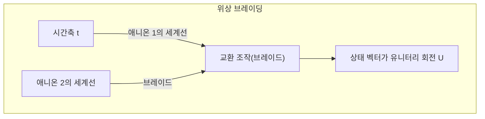

입자의 궤적이 그리는 '매듭'의 위상(토폴로지)만이 계산 결과를 결정하므로, 궤적이 다소 요동치더라도 위상이 변하지 않는 한 유니터리 변환 $ \hat{U} $ 는 엄밀하게 오류 제로로 실행된다. 이것이 하드웨어 수준의 결함 허용성(Fault-tolerance)이다.

 **과제와 한계** 
마요라나 제로 모드의 존재를 입증하는 결정적인 실험적 증거는 여전히 논쟁의 대상이며, 브레이딩의 물리적 실증에는 이르지 못하고 있다. 게다가 이징 애니온(Ising anyon)에 의한 브레이딩만으로는 보편적 양자 게이트 세트를 구성할 수 없기 때문에 매직 상태 증류(Magic state distillation)라는 비위상적인 부가 조작이 필요하다.

## 11.4 광양자 비트: 선형 광학과 측정 유도 얽힘

환경 노이즈에 대해 근본적으로 강건한 또 다른 접근 방식으로 광자(Photon)를 이용하는 광양자 컴퓨터가 있다. 광자는 전하를 띠지 않으며 상온 환경에서도 환경과의 상호작용이 극히 미미하므로 결맞음 시간을 사실상 무한대로 간주할 수 있다.

### 11.4.1 듀얼 레일 인코딩과 KLM 프로토콜

광양자 비트는 공간적 경로 모드를 사용하여 인코딩되는 경우가 많다. 듀얼 레일 인코딩에서는 광자가 위쪽 도파로에 있는 상태를 $ |0\rangle = |1, 0\rangle $ , 아래쪽 도파로에 있는 상태를 $ |1\rangle = |0, 1\rangle $ 로 정의한다.

1 양자 비트 게이트는 빔 분할기(BS)와 위상 편이변환기(PS)라는 선형 광학 소자만으로 완벽하게 구현할 수 있다. 그러나 광자끼리는 직접 상호작용하지 않기 때문에 결정론적인 2 양자 비트 게이트를 선형 광학 소자만으로 제작하는 것은 불가능하다.
2001년, 닐, 라플람, 밀번(Knill, Laflamme, Milburn)은 'KLM 프로토콜'을 제안하여, 단일 광자원, 선형 광학 소자, 그리고 **광자 검출기에 의한 사영 측정** 을 결합함으로써 확률적이기는 하나 확장 가능한 보편적 양자 계산이 가능함을 증명했다. 비선형성은 홍-오우-만델 효과(Hong-Ou-Mandel effect)와 같은 순수한 양자 간섭 효과와 측정의 비가역성에 의해 사후 선택적(Post-selection)으로 계에 주입된다.

### 11.4.2 연속 변수(CV)와 클러스터 상태

최근에는 단일 광자 기반의 이산 변수뿐만 아니라, 빛의 직교 위상 진폭을 사용하는 연속 변수(Continuous Variable, CV) 양자 계산 방식이 폭발적인 발전을 보이고 있다.
시간 도메인 다중화 기술과 스퀴즈드 광(Squeezed light)을 사용함으로써 수만~수백만 개의 얽힌 광자 펄스로 이루어진 거대한 '클러스터 상태(Cluster state)'를 생성한다. 이 상태를 리소스로 삼아 각 노드에 대해 순차적으로 적절한 측정을 수행함으로써 계산을 진행하는 '단방향 양자 계산(Measurement-based quantum computation, MBQC)' 아키텍처가 광양자 컴퓨터의 주류로 자리 잡아가고 있다.

## 11.5 NISQ 시대의 현황과 논리 양자 비트로의 계단

존 프레스킬(John Preskill)이 제창한 **NISQ(Noisy Intermediate-Scale Quantum)** 라는 개념이 보여주듯이, 현재 인류가 손에 쥐고 있는 양자 하드웨어는 수십에서 수백 개의 물리 양자 비트를 가진 '중간 규모'이지만, 여전히 노이즈에 지배되어 있어 오류의 누적을 피할 수 없다.

### 11.5.1 결맞음 한계와 충실도

쇼어(Shor)의 알고리즘과 같은 깊은 양자 회로를 실행하려고 하면 게이트 연산마다의 미세한 오류가 지수함수적으로 증폭된다. 예를 들어 어떤 2 양자 비트 게이트의 충실도가 99.5%(오류율 $ \epsilon = 0.005 $ )라고 하자. 회로 전체에 $ N $ 개의 게이트가 포함될 경우, 최종 상태의 충실도는 근사적으로 $ \mathcal{F} \approx (1-\epsilon)^N \approx e^{-N\epsilon} $ 가 된다. $ N=1000 $ 인 경우 성공 확률은 $ e^{-5} \approx 0.0067 $ 에 불과하여 올바른 계산 결과는 노이즈에 완전히 파묻히고 만다.
Google이 실증한 양자 우위성 실험에서는 교차 엔트로피 벤치마킹(XEB)이라 불리는 지표를 사용하여 고전 슈퍼컴퓨터를 압도하는 속도를 입증했으나, 이는 특정한 무작위 회로 샘플링에 국한된 것이며 실용적인 계산을 의미하는 것은 아니다.

### 11.5.2 양자 오류 정정으로의 이행(FTQC의 여명)

NISQ 디바이스의 한계를 타파하고 화학 계산, 재료 과학, 혹은 암호 해독에서 진정한 '양자 우위성'을 확립하기 위해서는, 단일 물리계에 의존하는 것이 아니라 다수의 물리 양자 비트를 묶어 1개의 오류 없는 '논리 양자 비트(Logical Qubit)'를 구축하는 **FTQC(Fault-Tolerant Quantum Computing: 오류 내성 양자 계산)** 로의 이행이 절대 조건이다.

예를 들어 표면 부호(Surface Code)라는 위상적 오류 정정 부호를 사용할 경우, 물리 양자 비트의 오류율이 임계값을 밑돌면 시스템을 확장할수록 논리 오류율은 지수함수적으로 감소한다. 그러나 그 대가로 1개의 논리 양자 비트를 구성하기 위해 1,000개에서 10,000개에 달하는 막대한 물리 양자 비트의 오버헤드가 요구된다.

우리는 지금 노이즈와 맞서 싸우는 물리 공학의 최전선에 서 있다. 초전도, 이온 트랩, 위상, 광양자 등 각 방식이 고유한 물리적 제약이라는 악마와 계약을 맺으며 확장성이라는 미답의 정상을 향해 나아가고 있다. 제12장에서는 이러한 하드웨어 발전의 종착점에서 기다리고 있는 양자 정보의 궁극적 방벽, '양자 오류 정정의 수리적 구조'에 대해 심도 있는 해설을 펼친다.

# 제12장: 양자 컴퓨터의 미래와 요약

양자역학이라는, 우리의 직관을 거부하는 미시 세계의 물리 법칙을 계산 자원으로 활용하는 '양자 컴퓨터'. 제1장의 중첩 원리에서 시작해 양자 얽힘, 벨의 부등식, 쇼어의 알고리즘, 양자 오류 정정까지, 우리는 이 기나긴 연재를 통해 양자 정보 과학의 심연을 여행해 왔습니다. 최종장인 본장에서는 현재 인류가 도달한 기술적 성취인 '양자 우월성(Quantum Supremacy / Quantum Advantage)' 실증 실험의 진정한 수학적·물리적 의미를 파헤치고, 세상에 만연한 '양자 컴퓨터는 무엇이든 순식간에 풀 수 있는 마법의 상자이다'라는 환상을 계산 복잡도 이론의 관점에서 엄밀하게 타파합니다. 그리고 NISQ(Noisy Intermediate-Scale Quantum) 시대에서 FTQC(Fault-Tolerant Quantum Computing)로 이어지는, 향후 사회적 구현을 향한 현실적이고도 장대한 로드맵을 제시하며 이 5만 자에 달하는 대장정의 결론을 맺고자 합니다.

## 12.1 양자 우월성 실증: Google Sycamore가 제시한 이정표

2019년, Google 연구팀은 53개의 초전도 양자 비트를 가진 프로세서 'Sycamore(시카모어)'를 사용하여 고전 컴퓨터로는 현실적인 시간 내에 풀 수 없는 특정 문제를 양자 컴퓨터로 빠르게 풀었다는 '양자 우월성'의 실증을 발표했습니다. 이 사건은 양자 정보 과학에 있어 역사적인 마일스톤이지만, 그 이면에 있는 수리적 구조를 정확히 이해하고 있는 사람은 많지 않습니다.

그들이 푼 문제는 '무작위 양자 회로에서의 샘플링 문제(Random Quantum Circuit Sampling)'입니다. 양자 비트군에 대해 무작위로 선택된 1 양자 비트 게이트와 2 양자 비트 게이트를 $d$ 계층에 걸쳐 적용하고, 최종적인 상태를 계산 기저에서 측정합니다.

수학적으로 서술해 봅시다. 초기 상태를 $ |\psi_0\rangle = |0\rangle^{\otimes n} $ 라고 합니다. 여기에 무작위로 선택된 유니터리 변환 $ U = U_d U_{d-1} \dots U_1 $ 을 작용시킵니다. 최종 상태 $ |\psi_f\rangle $ 는 텐서 곱과 선형 결합을 사용하여 다음과 같이 표현됩니다.

$$
|\psi_f\rangle = U |0\rangle^{\otimes n} = \sum_{x \in \{0, 1\}^n} \alpha_x |x\rangle
$$

여기서 $ \alpha_x = \langle x | U | 0 \rangle^{\otimes n} $ 는 특정 비트열 $x$ 가 관측될 확률 진폭이며 복소수입니다. 이때, 측정에 의해 비트열 $x$ 를 얻을 이상적인 확률 $ P_{\text{ideal}}(x) $ 은 양자역학의 보른 규칙(Born Rule)에 의해 다음과 같이 주어집니다.

$$
P_{\text{ideal}}(x) = |\alpha_x|^2 = \left| \langle x | U | 0 \rangle^{\otimes n} \right|^2
$$

충분히 깊은($d$ 가 큰) 무작위 양자 회로에서 각 진폭 $ \alpha_x $ 는 복소평면 상에서 무작위 행보(Random walk)적인 움직임을 보이며, 그 확률 분포 $ P_{\text{ideal}}(x) $ 는 포터-토마스 분포(Porter-Thomas distribution)를 따르는 것으로 알려져 있습니다. 즉, 확률 $p$ 가 나타날 확률 밀도 함수는 $ \text{Pr}(P_{\text{ideal}}(x) = p) \approx 2^n e^{-2^n p} $ 가 됩니다. 이는 특정 비트열이 다른 비트열보다 관측되기 쉬운 '스페클(반점) 패턴(Speckle pattern)'을 형성함을 의미합니다.

고전 컴퓨터로 이 분포에서 엄밀한 샘플링을 수행하려면, 거대한 텐서 네트워크의 축약 계산을 통해 진폭 $ \alpha_x $ 를 직접 계산해야 합니다. 상태 벡터의 차원은 $ 2^n $ 이며, $ n = 53 $ 일 경우 약 $ 9 \times 10^{15} $ 개의 복소수 진폭(페타바이트급 메모리)을 추적해야 하므로, 이는 당시 세계에서 가장 빠른 슈퍼컴퓨터를 사용하더라도 엄청난 시간을 필요로 하는 계산의 벽에 직면하게 됩니다. 반면, 양자 컴퓨터는 물리계 자체가 상태 **$|\psi_f\rangle$** 를 자연스러운 힐베르트 공간 상의 벡터로 유지하며, 단 한 번의 측정으로 스페클 패턴에 따르는 샘플링을 순식간에(수십 마이크로초 만에) 수행합니다.

실험의 성공 여부를 평가하기 위해 도입된 것이 선형 교차 엔트로피 벤치마크(Linear Cross-Entropy Benchmarking, XEB)입니다. 충실도(Fidelity) $ \mathcal{F}_{\text{XEB}} $ 는 다음과 같이 정의됩니다.

$$
\mathcal{F}_{\text{XEB}} = 2^n \sum_{x \in \{0, 1\}^n} P_{\text{ideal}}(x) P_{\text{exp}}(x) - 1
$$

여기서 $ P_{\text{exp}}(x) $ 는 실제 양자 프로세서(하드웨어의 노이즈 포함)에서 얻은 경험적인 확률 분포입니다. 만약 장치가 완전히 무작위인 노이즈(완전한 혼합 상태의 밀도 행렬 $ \rho = \frac{I}{2^n} $ )를 출력할 경우, $ P_{\text{exp}}(x) = \frac{1}{2^n} $ 이 되어 $ \mathcal{F}_{\text{XEB}} = 0 $ 이 됩니다. 반면, 노이즈가 전혀 없는 이상적인 순수 상태를 출력하는 양자 컴퓨터라면 $ \mathcal{F}_{\text{XEB}} \approx 1 $ 이 됩니다. Google의 실험에서는 $ \mathcal{F}_{\text{XEB}} \approx 0.002 $ 라는 0보다 명확히 크고 통계적 유의성을 가진 값이 확인되었습니다. 이렇게 작은 충실도라 하더라도 고전 컴퓨터로 동등한 샘플을 생성하는 것이 계산 복잡도 이론적으로 극히 어렵기 때문에 양자 우월성의 증명으로 간주된 것입니다.

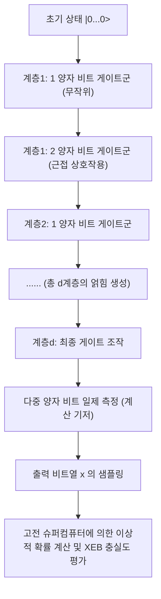

## 12.2 '마법의 상자'에 대한 오해: 병렬 계산의 함정과 BQP vs NP

양자 컴퓨터에 관한 일반 대중 매체의 보도나 교양서에서 ' $2^n$ 가지의 상태를 동시에 계산할 수 있기 때문에 어떤 문제든 순식간에 풀 수 있다'라는 식의 마법 같은 문구를 흔히 볼 수 있습니다. 그러나 이는 계산 복잡도 이론의 관점에서 볼 때 결정적으로 잘못된 것입니다. 양자 컴퓨터는 결코 'NP-완전 문제(NP-Complete)'를 무조건 다항 시간 안에 풀어내는 마법의 지팡이가 아닙니다.

이 오해는 아다마르 게이트 등에 의한 상태의 중첩 $ |\psi\rangle = \frac{1}{\sqrt{2^n}} \sum_{x=0}^{2^n-1} |x\rangle $ 을 통해 모든 입력에 대한 함수의 평가를 '단 한 번의 조작'으로 수행할 수 있다는 사실(양자 병렬성)에 기인합니다. 오라클(계산을 담당하는 유니터리 연산자) **$U_f$** 를 사용하여 함수 $ f(x) $ 의 계산을 중첩 상태에 대해 실행하면, 상태 전체는 선형성에 따라 다음과 같이 전개됩니다.

$$
U_f \left( \frac{1}{\sqrt{2^n}} \sum_{x=0}^{2^n-1} |x\rangle \otimes |0\rangle \right) = \frac{1}{\sqrt{2^n}} \sum_{x=0}^{2^n-1} |x\rangle \otimes |f(x)\rangle
$$

확실히 이 상태 벡터의 내부에는 모든 $x$ 에 대한 $f(x)$ 의 답이 확률 진폭의 부분계로서 내포되어 있습니다. 하지만 양자역학의 **관측의 공리** (파동 함수의 붕괴)를 떠올려 보십시오. 이 출력 레지스터에 대해 측정 조작을 수행할 경우, 얻을 수 있는 것은 확률 $\frac{1}{2^n}$ 로 무작위하게 선택된 단일 쌍 $ (x, f(x)) $ 에 불과합니다. 나머지 $ 2^n - 1 $ 개의 정보는 비가역적인 사영 측정에 의해 영원히 손실됩니다. 즉, '병렬로 계산하는 것(상태의 발전)'과 '병렬로 계산한 결과에서 우리가 원하는 특정 정보를 추출하는 것(상태의 읽기)' 사이에는 넘을 수 없는 절망적인 간극이 존재하는 것입니다.

양자 알고리즘이 고전 알고리즘을 진정으로 능가하기 위해서는 단순한 병렬 평가뿐만 아니라 '양자 간섭(Quantum Interference)'을 정교하게 설계하고 이용해야 합니다. 구하고자 하는 정답 상태에 대응하는 확률 진폭을 보강 간섭(Constructive interference)을 통해 증폭시키고, 그 외의 무수한 오답의 확률 진폭을 위상 반전에 따른 상쇄 간섭(Destructive interference)으로 상쇄시키는 지극히 특수한 전역 유니터리 변환을 구축해야만 합니다.

이러한 제약 하에서, 양자 컴퓨터가 다항 시간 안에 정답률을 유의미하게 높게 유지하며 풀 수 있는 문제의 복잡도 클래스는 **BQP** (Bounded-error Quantum Polynomial time)라고 불립니다. 한편, 해가 주어졌을 때 그 타당성을 다항 시간 안에 검증할 수 있는 문제 클래스가 **NP** 이며, 그중에서 가장 어려운 문제군이 **NP-완전 문제** (외판원 문제, 충족 가능성 문제/SAT 등)입니다.

그로버의 알고리즘(Grover's algorithm)은 구조를 가지지 않는 $ N = 2^n $ 개 요소의 데이터베이스 탐색을 고전의 $ O(N) $ 에서 양자 계산의 $ O(\sqrt{N}) $ 으로 2차적으로 가속합니다. 진폭 증폭(Amplitude Amplification)의 수학적 표현을 되돌아보면, 알고리즘은 초기의 균등한 중첩 상태 $ |s\rangle $ 와 우리가 탐색하고자 하는 정답 상태 $ |\omega\rangle $ 가 형성하는 2차원 부분 공간(평면) 내에서 상태 벡터를 기하학적으로 회전시키는 연산으로 귀결됩니다.

그로버의 반복 연산자 **$G$** 는 오라클에 의한 정답 상태의 위상 반전 연산자 $ U_\omega = I - 2|\omega\rangle\langle\omega| $ 와 평균값 주변에서의 반전 연산자 $ U_s = 2|s\rangle\langle s| - I $ 의 곱으로 정의됩니다.

$$
G = U_s U_\omega = (2|s\rangle\langle s| - I)(I - 2|\omega\rangle\langle\omega|)
$$

이 유니터리 연산자 **$G$** 를 약 $ \frac{\pi}{4}\sqrt{N} $ 회 적용함으로써, 상태 벡터는 목적하는 $ |\omega\rangle $ 로 회전하여 정답을 관측할 확률을 거의 1(100%)로 높일 수 있습니다. 그러나 여기서 매우 중요한 사실은 이것이 어디까지나 '제곱근의 가속'일 뿐, 지수함수적인 가속( $ O(2^n) \to O(\text{poly}(n)) $ )이 아니라는 점입니다. 현재에 이르기까지 NP-완전 문제의 일반적인 경우를 다항 시간 내에 해명할 수 있는 양자 간섭의 패턴은 발견되지 않았습니다. 수많은 양자 정보 과학자와 컴퓨터 과학자들은 계산 복잡도 이론의 근간이 되는 추측으로서 **$\text{BQP} \not\supset \text{NP-Complete}$** (양자 컴퓨터는 NP-완전 문제를 효율적으로 풀 수 없다)라고 강하게 믿고 있습니다.

양자 컴퓨터는 쇼어(Shor)의 알고리즘에서의 소인수 분해처럼 '문제 안에 숨겨진 주기성 등의 대수적 구조'가 존재할 경우에만 양자 푸리에 변환(QFT)을 통해 초다항식적 가속을 가져다주는, 극히 세련된 특화형 코프로세서인 것입니다.

## 12.3 양자 오류 정정과 NISQ에서 FTQC로의 로드맵

양자 우월성이 입증되었다고는 하지만, Sycamore와 같은 현재의 수십~수백 양자 비트 규모의 디바이스는 **NISQ** (Noisy Intermediate-Scale Quantum) 디바이스라고 불리며, 환경으로부터의 노이즈 침입을 완전히 막을 수는 없습니다. 섬세한 양자 상태는 열 요동이나 전자기파 간섭 등 환경과의 상호작용에 의해 지극히 쉽게 결어긋남(결맞음 붕괴, 위상 이완 시간 $T_2$ 나 에너지 이완 시간 $T_1$ 의 제약)을 일으킵니다. 계산이 깊어질수록(게이트 계층의 수가 늘어날수록) 게이트의 불완전성과 결어긋남에 의한 노이즈가 지수함수적으로 축적되어, 최종 출력 결과는 완전히 무의미한 완전 혼합 상태로 붕괴하고 맙니다.

이러한 물리적 한계를 타파하고 수억 스텝에 달하는 실용적인 대규모 양자 알고리즘을 완수할 수 있게 하는 유일한 이론적 길이, **양자 오류 정정(Quantum Error Correction, QEC)** 을 이용한 **결함 허용 양자 계산(Fault-Tolerant Quantum Computation, FTQC: 오류 내성 양자 계산)** 의 실현입니다. 고전 컴퓨터의 오류 정정(비트의 복제를 통한 다수결 부호 등)은 양자역학의 근간을 이루는 '복제 불가능성 정리(No-Cloning Theorem)'로 인해 양자 상태에는 적용할 수 없습니다. 미지의 양자 상태 **$|\psi\rangle = \alpha|0\rangle + \beta|1\rangle$** 를 단순히 **$|\psi\rangle \otimes |\psi\rangle \otimes |\psi\rangle$** 처럼 완벽하게 복사하는 유니터리 변환은 수학적으로 존재하지 않습니다.

그러나 이론 물리학은 이 절망을 극복할 우아한 해답을 찾아냈습니다. 양자 정보는 '개별 상태를 복제하는 것이 아니라, 다수의 물리 양자 비트군으로 구성된 거대한 힐베르트 공간의 「얽힘(Entanglement) 공간」의 토폴로지 속에 하나의 논리적 정보를 분산하여 숨김'으로써 보호할 수 있습니다. 현재 하드웨어 구현 관점에서 가장 유력하게 여겨지는 '표면 부호(Surface Code)'는 2차원 격자 상에서의 안정자 형식(Stabilizer Formalism)을 기반으로 하고 있습니다.

표면 부호에서는 양자 정보를 유지하는 '데이터 양자 비트'를 2차원 격자의 에지(모서리)에 배치하고, 오류를 감지하기 위한 '신드롬 측정용 양자 비트(앤실라 양자 비트)'를 격자의 플라켓(면)과 정점(버텍스)에 배치합니다. 그리고 다음과 같은 파울리 연산자의 텐서 곱으로 이루어진 안정자 연산자군을 정의합니다.

$$
B_p = \bigotimes_{i \in \partial p} Z_i \quad \text{(플라켓 연산자: Z 오류를 검출)}
$$

$$
A_v = \bigotimes_{i \in \delta v} X_i \quad \text{(버텍스 연산자: X 오류를 검출)}
$$

여기서 모든 $ B_p $ 와 $ A_v $ 는 서로 가환(반교환하지 않음), 즉 교환 관계 $ [B_p, A_v] = 0 $ 을 만족합니다. 우리가 정보를 기록하는 '논리 상태(부호 공간)' **$|\psi_L\rangle$** 는 이 모든 안정자 연산자의 고윳값이 $+1$ 인 동시 고유 상태가 형성하는 부분 공간으로서 엄밀하게 정의됩니다.

$$
B_p |\psi_L\rangle = +1 |\psi_L\rangle, \quad A_v |\psi_L\rangle = +1 |\psi_L\rangle \quad (\text{for all } p, v)
$$

외부로부터의 열 노이즈나 조작 오류로 인해 특정 물리 양자 비트에 예기치 않은 반전 오류(파울리 $X$)나 위상 오류(파울리 $Z$)가 발생했다고 가정해 봅시다. 그러면 그 오류 연산자는 인접한 특정 안정자 연산자와 반교환 관계( $\{X, Z\} = 0 $ )를 가지기 때문에, 해당 안정자를 측정한 결과(신드롬 값)가 $+1$ 에서 $-1$ 로 반전되어 플립됩니다. 우리는 보호되고 있는 논리 상태 자체(가중치 계수 $\alpha, \beta$ 의 값)를 전혀 관측하거나 파괴하지 않고, 이 $-1$ 이 되는 위치(결함) 쌍을 지속적으로 추적합니다. 그런 다음 '최소 가중치 완전 매칭(Minimum Weight Perfect Matching)' 등의 고전 알고리즘을 사용하여, 어떤 물리 양자 비트 경로 상에서 어떤 오류가 발생했는지를 최우 추정하고, 소프트웨어적으로 혹은 물리적으로 역조작을 가해 정정하는 것입니다.

'임계값 정리(Threshold Theorem)'라는 양자 정보 이론의 아름다운 금자탑에 따르면, 개별 물리 게이트의 오류율이 일정 임계값(표면 부호의 경우 약 $ 1\% $ 정도)을 밑돌기만 한다면, 격자의 크기(부호 거리 $d$)를 키워나감으로써 논리 수준의 오류율을 임의로, 그리고 지수함수적으로 0에 가깝게 만들 수 있음이 증명되어 있습니다. 그러나 하나의 완벽한 논리 양자 비트를 구축하기 위해서는 오류 정정의 오버헤드로 인해 현재의 노이즈 수준에서는 수천에서 수만 개의 물리 양자 비트가 필요합니다. 쇼어의 알고리즘을 사용하여 RSA-2048 암호를 해독하려면 수천 개의 논리 양자 비트가 필요한 것으로 추산되며, 결과적으로 수백만에서 천만 개 이상의 물리 양자 비트를 갖추고 그것들이 서로 결맞음을 유지하면서 극저온에서 작동하는 상상을 초월하는 규모의 거대한 FTQC 시스템이 요구됩니다.

현재 수십에서 수백 개의 물리 양자 비트를 가진 단계에서 본다면, 이는 인류에게 아폴로 계획이나 대형 강입자 충돌기(LHC) 건설에 필적하는 터무니없이 어렵고 장대한 엔지니어링의 도전이 될 것입니다.

## 12.4 맺음말: 양자 정보 과학의 지평과 미래

제1장의 브라-켓 표기법을 통한 **$|0\rangle$** 와 **$|1\rangle$** 의 중첩 도입에서 시작하여, 유니터리 행렬에 의한 시간 발전, 텐서 곱에 의한 다체계의 수학적 서술, 벨의 부등식에 따른 아인슈타인의 국소적 실재론의 파탄, 그리고 쇼어(Shor)나 그로버(Grover)의 양자 알고리즘이 보여주는 화려한 수리 구조까지, 우리는 총 12장으로 구성된 이 연재를 통해 '양자 정보 과학'이라는 지식의 집대성을 극히 엄밀한 형태로 따라왔습니다.

고전 컴퓨터가 '결정론적인 참거짓 값(불 대수)'에 기초하는 반면, 양자 컴퓨터는 '복소 힐베르트 공간에서의 유니터리 회전과 텐서 곱(선형 대수)'에 기초합니다. 이 근본적인 패러다임 전환은 단순히 '계산이 빨라진다'는 산업적·실용적인 측面을 넘어 '이 우주의 궁극적인 정보 처리 능력은 무엇인가', '계산 가능성이나 복잡도는 우리가 사는 우주의 물리 법칙 구조에 어떻게 의존하고 있는가'라는 정보 이론과 기초 물리학이 완전히 융합된 심오하고 철학적인 질문을 우리에게 던지고 있습니다.

과거 아인슈타인이 '유령 같은 원격 작용(spooky action at a distance)'이라 부르며 몹시 싫어했던 양자 얽힘(엔탱글먼트)은 이제 양자 순간 이동이나 양자 암호 통신, 그리고 양자 컴퓨터를 구동하기 위한 가장 근원적이고 필수 불가결한 '자원(리소스)'으로 확립되었습니다. 천재 물리학자 리처드 파인만이 1982년에 제창한 '자연을 시뮬레이션하고 싶다면, 그것을 양자역학적으로 만들어야 한다. 그리고 그것은 훌륭한 문제이다. 왜냐하면 결코 쉬워 보이지 않기 때문이다.'라는 직관은 수십 년의 세월이 흐른 지금, 전 세계의 물리학자, 수학자, 컴퓨터 과학자, 그리고 탁월한 하드웨어 엔지니어들의 피나는 노력에 의해 마침내 현실의 프로세서 위에서 가동되는 단계에 이르렀습니다.

다시 한번 강조하지만, 양자 컴퓨터는 만능 마법 상자가 아닙니다. NP-완전 문제를 힘으로 밀어붙여 다항 시간 안에 풀어내는 꿈의 기계도 아닙니다. 하지만 화학 반응에서의 복잡한 전자 상태의 엄밀한 시뮬레이션(양자 화학 계산), 신소재·고온 초전도체의 물성 규명, 최적화 문제의 특정 클래스, 그리고 소인수 분해나 이산 로그 문제 등 고전 컴퓨터의 한계를 초월하는 특정 영역에서는 의심할 여지 없는 '우월적(Supremacy)'인 힘을 가지고 있습니다.

향후 수십 년에 걸친 노이즈와의 싸움(NISQ에서 FTQC로 이어지는 가혹한 여정)은 결코 평탄하지 않습니다. 극저온 환경에서의 거대한 열 부하 제어, 수백만 개의 마이크로파 배선의 확장성 문제, 양자 비트의 결맞음 시간( $T_1, T_2$ )의 비약적인 연장, 그리고 방대한 신드롬 측정을 실시간으로 처리하는 고전-양자 하이브리드 제어 시스템의 구축 등 극복해야 할 공학적 장벽이 산처럼 솟아 있습니다. 그러나 그 너머에 있는 것은 진정한 의미에서 '자연 법칙(슈뢰딩거 방정식)의 동역학을 직접적으로 기술하고, 조작하며, 계산에 이용하는' 인류 역사상 궁극의 계산 기구의 탄생입니다.

본 연재가 표면적인 버즈워드나 과도한 기대의 인플레이션에 휩쓸리지 않고, 양자 컴퓨터의 진정한 모습과 그 이면에 있는 지극히 아름답고 엄밀한 수학적·물리적 구조를 독자 여러분께 깊이 전달하는 데 일조했다면 필자로서 이보다 더 큰 기쁨은 없을 것입니다. 양자 세계는 우리의 상식을 아득히 뛰어넘어 깊고, 기묘하며, 압도적으로 아름답습니다. 우리는 지금 인류 역사상 가장 흥미진진한 기술적·과학적 프론티어의 입구에 서 있습니다. 이 우주의 진리를 탐구하는 장대한 지식의 항해는 이제 막 시작되었을 뿐입니다.

---
 **연재 『양자 컴퓨터의 원리』 (총 12장) 끝** 