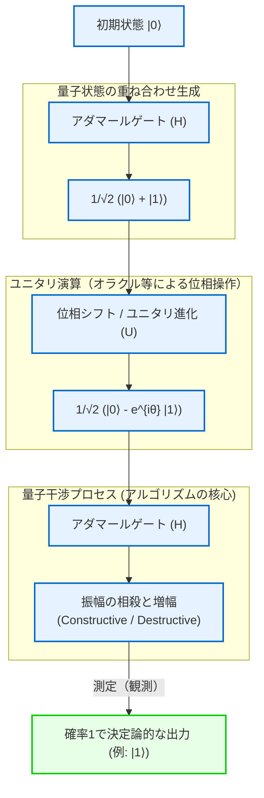
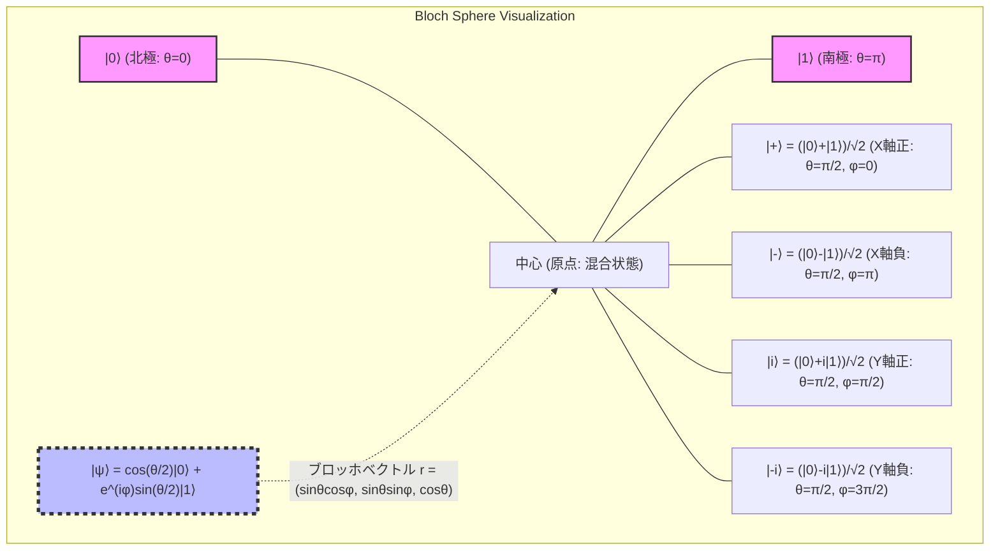
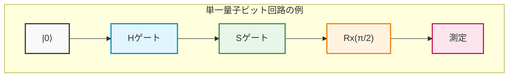
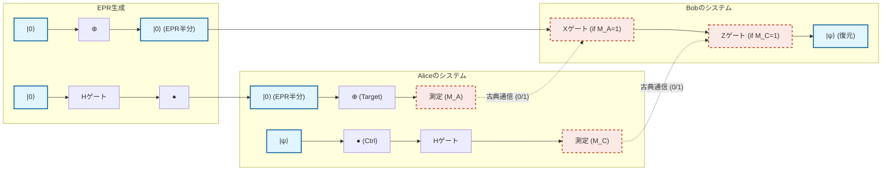
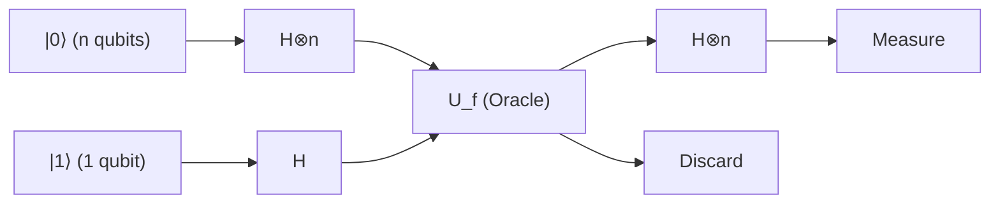
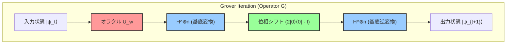
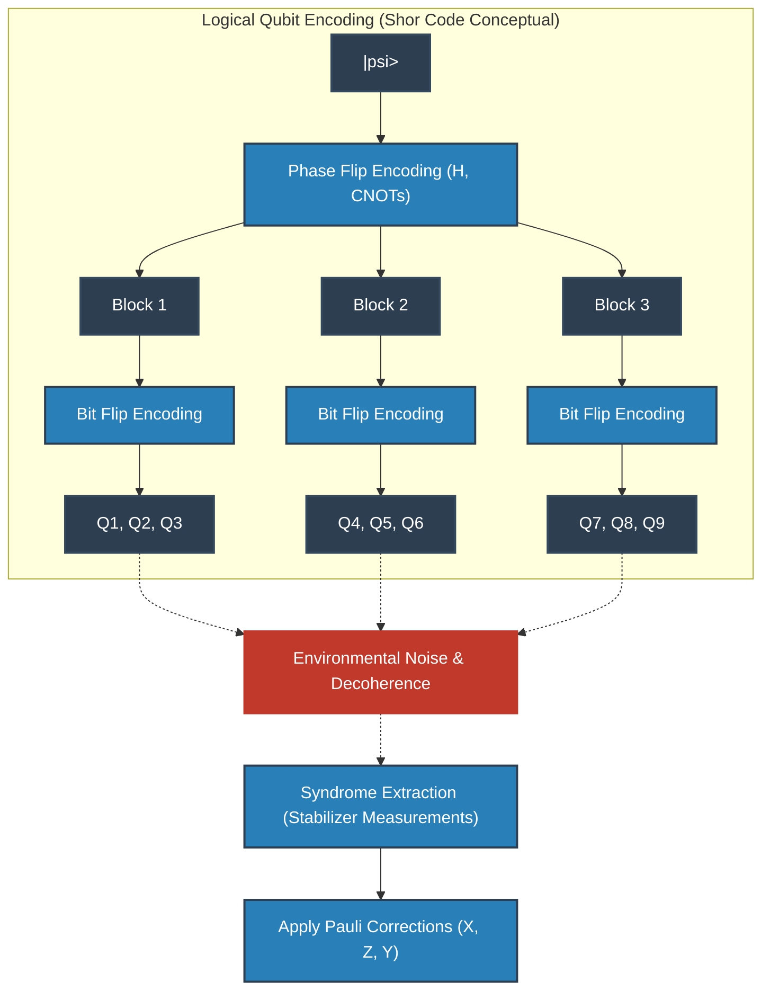
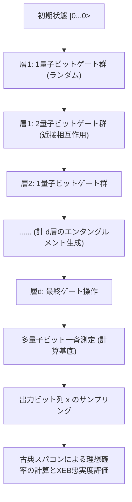

# 第1章: 量子コンピュータの幕開けと限界

## 1.1 古典計算の物理的限界とムーアの法則の終焉

現代社会における情報処理技術の飛躍的な発展は、ゴードン・ムーアが1965年に提唱した「半導体集積回路に実装されるトランジスタの数は約2年ごとに倍増する」という経験則、すなわち「ムーアの法則」によって牽引されてきた。この法則に従い、我々はトランジスタの微細化（スケーリング）を推し進め、計算機の演算性能を指数関数的に向上させてきた。しかし、21世紀に入り、この古典的なパラダイムは決定的な物理的限界に直面している。その最大の障壁が、量子力学的効果である「量子トンネル効果（Quantum Tunneling Effect）」の発現である。

トランジスタのゲート絶縁膜やチャネル長が数ナノメートルスケール、すなわち原子数個から数十個分の厚さにまで薄くなると、電子は古典力学的に越えられないはずのエネルギー障壁を、波動関数の染み出しによって確率的にすり抜けてしまう。ポテンシャル障壁 $V_0$ 、幅 $a$ の領域に入射する質量 $m$ の電子（エネルギー $E < V_0$ ）の透過確率 $T$ は、WKB近似によれば次式で与えられる。

$$

T \approx \exp \left( - \frac{2}{\hbar} \int_{0}^{a} \sqrt{2m(V_0 - E)} \, dx \right)

$$

ここで $\hbar$ は換算プランク定数である。微細化によって障壁の幅 $a$ が減少すると、透過確率 $T$ は指数関数的に増大し、結果としてオフ状態でも電流が流れる「漏れ電流（リーク電流）」が無視できない規模となる。これは消費電力の増大と発熱を招き、古典的な決定論的スイッチング素子としての機能の破綻を意味する。

さらに、情報処理の熱力学的限界も無視できない。1961年にロルフ・ランダウアーは、情報を消去する（不可逆な論理演算を行う）過程で必然的に熱が発生することを示した（ランダウアーの原理）。1ビットの情報を消去する際に環境へ放出される最小の熱量 $\Delta Q$ は、次のように表される。

$$

\Delta Q \ge k_B T \ln 2

$$

ここで $k_B$ はボルツマン定数、 $T$ は絶対温度である。古典計算機が論理ゲート（例えばANDゲートやORゲートなどの非可逆ゲート）を駆動する限り、この熱力学的下限を回避することはできない。微細化が進み、一つの素子が扱うエネルギーがこの限界に近づくにつれ、古典計算機の進化は根本的な物理法則によって頭打ちとなるのである。

## 1.2 リチャード・ファインマンの予見と量子系の計算量爆発

古典コンピュータが物理的限界に近づく中、全く新しい計算のパラダイムが求められるようになった。その端緒を開いたのが、1981年にMITで開催された「計算の物理学に関する第1回会議」におけるリチャード・ファインマンの基調講演である。ファインマンは、古典コンピュータを用いて量子力学的な系をシミュレーションすることの絶望的な困難さを指摘し、次のような革命的な提案を行った。

「自然は古典的ではないのだから、もし自然のシミュレーションを作りたいのなら、量子力学的な原理に基づいて計算機を作るべきだ。」

この発言の背景には、量子系の状態を記述する「ヒルベルト空間（Hilbert Space）」の次元が、粒子数に対して指数関数的に爆発するという事実がある。スピン $1/2$ の粒子（すなわち、2つの量子状態を持つ系）を $N$ 個集めた系を考えてみよう。1つの粒子の状態は2次元の複素ベクトル空間 $\mathbb{C}^2$ で記述される。したがって、 $N$ 個の粒子からなる合成系の状態空間 $\mathcal{H}$ は、各部分系の状態空間のテンソル積として構成される。

$$

\mathcal{H} = \bigotimes_{i=1}^{N} \mathbb{C}^2 = \mathbb{C}^{2^N}

$$

この系の純粋状態（Pure State） $|\Psi\rangle$ は、 $2^N$ 個の基底ベクトルの線形結合（重ね合わせ）として表現される。ここで、ディラックのブラケット記法（Bra-ket notation）を用いると、任意の量子状態は以下のように展開できる。

$$

|\Psi\rangle = \sum_{x=0}^{2^N-1} c_x |x\rangle

$$

ここで、$|x\rangle$ は計算基底（Computational Basis）であり、$c_x \in \mathbb{C}$ は確率振幅（Probability Amplitude）と呼ばれる複素数である。状態ベクトルは規格化条件 $\sum_{x=0}^{2^N-1} |c_x|^2 = 1$ を満たさなければならない。

たった $N = 300$ 個の量子ビット（Qubit）をシミュレーションしようとしただけでも、保持すべき複素数の数 $2^{300}$ はおよそ $10^{90}$ となり、これは観測可能な宇宙に存在する全原子の数（約 $10^{80}$ ）をはるかに凌駕する。古典コンピュータのメモリでこれだけの変数を保持し、さらにシュレディンガー方程式に従う時間発展（ $2^N \times 2^N$ のユニタリ行列の乗算）を計算することは、宇宙の寿命を費やしても不可能である。この「次元の呪い」こそが、古典計算の限界であり、同時に量子コンピュータが持つ潜在的な計算能力の源泉なのである。

## 1.3 デイヴィッド・ドイチュと量子チューリング機械の定式化

ファインマンの直感的なアイデアを、理論計算機科学の枠組みで厳密に定式化したのが、オックスフォード大学の物理学者デイヴィッド・ドイチュである。1985年の画期的な論文において、ドイチュは「あらゆる物理過程は、有限の手段によって完全にシミュレート可能である」という「強められたチャーチ・チューリングのテーゼ（Strong Church-Turing Thesis）」が、量子力学の支配する物理世界においては成り立たない可能性を指摘した。

ドイチュは、アラン・チューリングが提唱した決定論的チューリング機械を拡張し、「量子チューリング機械（Quantum Turing Machine）」という概念を定義した。これは、内部状態やテープの記号、ヘッドの位置が量子的な「重ね合わせ状態」をとることができ、状態遷移がユニタリ演算子（Unitary Operator） $U$ によって記述される機械である。

量子計算の基本単位となるのが「量子ビット（Qubit）」である。古典ビットが $0$ または $1$ の確定した状態しかとれないのに対し、量子ビットは $|0\rangle$ と $|1\rangle$ の任意の線形重ね合わせ状態をとることができる。

$$

|\psi\rangle = \alpha |0\rangle + \beta |1\rangle \quad (\alpha, \beta \in \mathbb{C}, \ |\alpha|^2 + |\beta|^2 = 1)

$$

この量子ビットに対して行われる演算は、線形かつノルムを保存する演算、すなわちユニタリ行列（ $U^\dagger U = I$ を満たす行列、ここで $U^\dagger$ は随伴行列、 $I$ は単位行列）によって表現される。例えば、単一量子ビットに対する代表的なゲートであるアダマールゲート（Hadamard Gate） $H$ は次のように定義される。

$$

H = \frac{1}{\sqrt{2}} \begin{pmatrix} 1 & 1 \\ 1 & -1 \end{pmatrix}

$$

基底状態 $|0\rangle$ に対してアダマール演算を適用すると、以下のようになる。

$$

H |0\rangle = \frac{1}{\sqrt{2}} \left( |0\rangle + |1\rangle \right)

$$

これにより、系は $|0\rangle$ と $|1\rangle$ が等確率で観測される完全な重ね合わせ状態へと移行する。ドイチュの功績は、このような量子力学の基本原理を計算モデルとして昇華させ、万能量子コンピュータ（Universal Quantum Computer）が原理的に構築可能であることを数学的に証明した点にある。

## 1.4 量子コンピュータの本質：単なる「超並列計算」という誤解の払拭

量子コンピュータがなぜ古典計算機を凌駕する計算能力を持ち得るのか。この問いに対する世間一般の解説として、「量子コンピュータは無数の並行宇宙（パラレルワールド）に分岐し、すべての可能性を同時に計算し、その中から瞬時に正解を見つけ出す」という説明がしばしばなされる。これは「量子並列性（Quantum Parallelism）」を比喩的に表現したものだが、**極めて重大な誤解を招く不正確な説明**である。

確かに、 $N$ 量子ビットの系に対してアダマールゲートを並列に適用することで、 $2^N$ 個のすべての状態の重ね合わせを一度の操作で作り出すことはできる。

$$

H^{\otimes N} |0\rangle^{\otimes N} = \frac{1}{\sqrt{2^N}} \sum_{x=0}^{2^N-1} |x\rangle

$$

そして、ある関数 $f(x)$ を評価するユニタリ演算子 $U_f$ を適用すると、状態は次のように変化する。

$$

U_f \left( \frac{1}{\sqrt{2^N}} \sum_{x=0}^{2^N-1} |x\rangle |0\rangle \right) = \frac{1}{\sqrt{2^N}} \sum_{x=0}^{2^N-1} |x\rangle |f(x)\rangle

$$

ここで確かに、一度の操作で $2^N$ 個すべての $x$ に対する $f(x)$ の値が「計算」されているように見える。しかし、量子力学の要請である「観測の公理（ボルンの規則、Born Rule）」が立ちはだかる。この重ね合わせ状態を測定（観測）したとき、我々が得られる結果はただ一つであり、状態は確率 $P(x) = 1/2^N$ でランダムな $|x\rangle |f(x)\rangle$ に波束の収縮（Wavefunction Collapse）を起こしてしまう。つまり、すべての答えを同時に計算しても、測定によって取り出せるのは「ランダムな一つ」に過ぎず、これでは単にランダムにサイコロを振って計算するのとなんら変わらない。

では、量子コンピュータの真の力とは何か？ それは**「量子干渉（Quantum Interference）」**である。

量子状態を記述する確率振幅 $c_x$ は正の確率ではなく「複素数」であるため、正の符号も負の符号も、さらには虚数もとり得る。量子アルゴリズムの極意は、計算の過程において巧みにユニタリ変換を組み合わせることで、**「不正解に対応する状態の確率振幅を互いに打ち消し合わせ（弱め合う干渉：Destructive Interference）、正解に対応する状態の確率振幅を増幅させる（強め合う干渉：Constructive Interference）」**ことにある。

簡単な例として、位相の反転とアダマール変換による干渉を見てみよう。状態 $\frac{1}{\sqrt{2}}(|0\rangle - |1\rangle)$ に対して再びアダマールゲートを適用するとどうなるか。

$$

H \left( \frac{|0\rangle - |1\rangle}{\sqrt{2}} \right) = \frac{1}{2} \big( (|0\rangle + |1\rangle) - (|0\rangle - |1\rangle) \big) = \frac{1}{2} (2|1\rangle) = |1\rangle

$$

ここでは、 $|0\rangle$ 状態へ向かう確率振幅が $1/2 - 1/2 = 0$ となり、完全に相殺（破壊的干渉）されている。一方で $|1\rangle$ 状態への振幅は $1/2 + 1/2 = 1$ と増幅（建設的干渉）されている。

真に有用な量子アルゴリズム（例えば、素因数分解を行うショアのアルゴリズムや、非構造化データベース探索を行うグローバーのアルゴリズム）は、計算の最終段階で測定を行った際に、正解状態が観測される確率が限りなく $1$ に近づくように、この波の干渉現象を高度にオーケストレーションされた手順で引き起こすのである。並列計算そのものが魔法なのではなく、複素確率振幅の干渉を利用して「不要な計算パスを確率的に消去する」ことができる点こそが、古典コンピュータとの決定的な違いであり、量子計算の真髄である。

## 1.5 概念の視覚化：量子干渉のメカニズム

以下の概念図は、古典的な確率プロセスと量子的な干渉プロセス（マッハツェンダー干渉計やアダマールゲートの連続適用に相当）の違いを示している。古典的なランダムウォークでは確率は単に加算されるだけだが、量子プロセスでは経路の振幅が複素数として加算され、干渉を引き起こす。



このように、量子コンピュータは古典力学の限界（微細化限界や熱力学的限界）を迂回するための一時的な延命策ではなく、情報と計算の定義そのものを量子力学の公理に基づき再構築する、真のパラダイムシフトなのである。次章では、この量子干渉を自在に操るための具体的な数学的ツールである「量子ゲート」と「量子回路」の詳細について、より深く踏み込んでいく。

# 第2章: 古典ビットと量子ビット（Qubit）の基礎

量子情報の理論体系を構築するにあたり、最も根源的な概念となるのが「情報の最小単位」の定義です。本章では、古典情報理論におけるビットから出発し、量子力学の公理に基づいた量子情報の最小単位である「量子ビット（Qubit）」へと概念を拡張します。ヒルベルト空間、ブラケット記法、線形代数の厳密な言葉を用いて、量子状態の数学的構造を徹底的に解き明かしていきます。いかなる妥協も排し、専門的な視座から量子情報の深淵を覗き込んでいきましょう。

## 2.1 情報の最小単位: 古典ビットの数学的定式化と限界

コンピュータ科学の歴史において、クロード・シャノンが1948年に確立した情報理論の基礎は「ビット（Bit）」です。古典ビットは、物理的表現（例えばトランジスタの電圧の高低、スイッチのオン・オフ、あるいは磁化の方向）によらず、抽象的な状態空間として $\{0, 1\}$ という2つの離散的な値のいずれかを取る系として定義されます。

これをより形式的なベクトル空間の言葉で表現してみましょう。古典ビットの状態は、2次元の実ベクトル空間 $\mathbb{R}^2$ における標準基底を用いて表現することができます。状態 $0$ および状態 $1$ をそれぞれ以下のような列ベクトルとして定義します。

$$

\mathbf{v}_0 = \begin{pmatrix} 1 \\ 0 \end{pmatrix}, \quad \mathbf{v}_1 = \begin{pmatrix} 0 \\ 1 \end{pmatrix}

$$

確定的（Deterministic）な古典系では、ビットの状態は必ず $\mathbf{v}_0$ か $\mathbf{v}_1$ のどちらか一つに定まります。しかし、熱雑音などのノイズや、我々の知識の不確実性が存在する場合、古典確率的（Probabilistic）ビットとして状態を記述する必要があります。この場合、ビットの状態は確率分布として表現され、状態ベクトル $\mathbf{p}$ は基底ベクトルの凸結合（Convex combination）として次のように書けます。

$$

\mathbf{p} = p_0 \mathbf{v}_0 + p_1 \mathbf{v}_1 = \begin{pmatrix} p_0 \\ p_1 \end{pmatrix}

$$

ここで、$p_0, p_1$ はそれぞれ状態が $0$ および $1$ である確率を表す実数であり、コルモゴロフの確率の公理から以下の条件を満たす必要があります。

1. **非負性** : $p_0 \ge 0, \quad p_1 \ge 0$
2. **規格化条件（全確率が1）** : $p_0 + p_1 = 1$

古典ビットの世界において、複数のビットを組み合わせた合成系は、それぞれの確率ベクトルのテンソル積（クロネッカー積）によって記述されます。例えば2つの古典ビットの同時確率は以下のようになります。

$$

\mathbf{p}_{AB} = \mathbf{p}_A \otimes \mathbf{p}_B = \begin{pmatrix} p_{A0} \\ p_{A1} \end{pmatrix} \otimes \begin{pmatrix} p_{B0} \\ p_{B1} \end{pmatrix} = \begin{pmatrix} p_{A0}p_{B0} \\ p_{A0}p_{B1} \\ p_{A1}p_{B0} \\ p_{A1}p_{B1} \end{pmatrix}

$$

古典情報理論の枠組みは非常に強力であり、現代のデジタル社会の基盤を成していますが、あくまで実数確率の足し合わせによって状態が構成されるため、波の干渉のような「確率の打ち消し合い」を表現することは原理的に不可能です。ここに、古典物理学の限界と、量子情報への飛躍の必要性が生じます。

## 2.2 量子力学の要請とブラケット記法（Bra-ket notation）

量子力学における第一の公理（Postulate）は、「閉じた物理系の状態は、複素内積を備えた完備なベクトル空間、すなわちヒルベルト空間（Hilbert Space） $\mathcal{H}$ 上の単位ベクトル（状態ベクトル）として完全に記述される」というものです。量子計算の文脈においては、連続的な空間の自由度などを無視できるため、このヒルベルト空間は通常、有限次元の複素ベクトル空間 $\mathbb{C}^d$ となります。

量子情報の最小単位である「量子ビット（Qubit）」は、2次元の複素ヒルベルト空間 $\mathcal{H} \cong \mathbb{C}^2$ における状態として厳密に定義されます。このベクトル空間における状態を記述するために、物理学者ポール・ディラックによって導入された **ブラケット記法（Bra-ket notation）** を用いるのが標準的です。

量子状態を表す列ベクトルを **ケットベクトル（Ket vector）** と呼び、$|\psi\rangle$ のように表記します。古典ビットの $0$ と $1$ に対応する状態として、計算基底（Computational basis）と呼ばれる正規直交基底を導入しましょう。これらは、量子ビットの $Z$ 基底とも呼ばれ、それぞれ $|0\rangle$ および $|1\rangle$ と定義されます。

$$

|0\rangle = \begin{pmatrix} 1 \\ 0 \end{pmatrix}, \quad |1\rangle = \begin{pmatrix} 0 \\ 1 \end{pmatrix}

$$

一方、リースの表現定理（Riesz representation theorem）により、ヒルベルト空間の任意のケットベクトルには、連続線形汎関数として機能する双対空間（Dual space）の元が一意に対応します。これを **ブラベクトル（Bra vector）** と呼び、 $\langle\psi|$ と表記します。行列表示においては、ケットベクトルのエルミート共役（複素共役転置、$^\dagger$ で表す）をとることで対応するブラベクトルが得られます。

$$

\langle\psi| = (|\psi\rangle)^\dagger = (|\psi\rangle^*)^T

$$

例えば、基底のブラベクトルは以下の行ベクトルとなります。

$$

\langle 0| = \begin{pmatrix} 1 & 0 \end{pmatrix}, \quad \langle 1| = \begin{pmatrix} 0 & 1 \end{pmatrix}

$$

ブラケット記法の真価は、内積の計算が視覚的に極めて明快になる点にあります。ブラ $\langle\phi|$ とケット $|\psi\rangle$ の内積は $\langle\phi|\psi\rangle$ と書かれます（これはBraとKetが合わさってBracketを形成するというディラックの言葉遊びに由来します）。計算基底 $\{|0\rangle, |1\rangle\}$ は正規直交系（Orthonormal system）をなすため、クロネッカーのデルタ $\delta_{ij}$ を用いて以下のように表されます。

$$

\langle i | j \rangle = \delta_{ij} \quad (i, j \in \{0, 1\})

$$

具体的には、自己との内積は $1$（$\langle 0|0\rangle = 1$, $\langle 1|1\rangle = 1$）、異なる基底間の内積は $0$（$\langle 0|1\rangle = 0$, $\langle 1|0\rangle = 0$）となります。

さらに、ブラとケットのテンソル積（外積に相当）は $|\psi\rangle\langle\phi|$ と記述され、これは空間から空間への線形演算子（行列）を表します。例えば、ある状態空間への射影演算子（Projection operator）は以下のように構成されます。

$$

|0\rangle\langle 0| = \begin{pmatrix} 1 \\ 0 \end{pmatrix} \begin{pmatrix} 1 & 0 \end{pmatrix} = \begin{pmatrix} 1 & 0 \\ 0 & 0 \end{pmatrix}

$$

任意の2次元複素ベクトル空間の恒等演算子 $I$ （Identity operator）は、基底の完全性関係（Completeness relation）として以下のように分解して表現することができ、これは量子力学の計算において極めて頻繁に用いられる強力な道具となります。

$$

I = |0\rangle\langle 0| + |1\rangle\langle 1| = \begin{pmatrix} 1 & 0 \\ 0 & 1 \end{pmatrix}

$$

## 2.3 量子重ね合わせの原理と複素確率振幅

古典ビットが常に $0$ または $1$ の明確な状態にあるか、その確率的混合であるのに対し、量子力学の線形性（Linearity）の要請から、量子ビットは $|0\rangle$ と $|1\rangle$ の線形結合によって表現される「重ね合わせ（Superposition）」という本質的に異なる状態を取ることができます。ヒルベルト空間 $\mathcal{H}$ 内の任意の単位ベクトルは、有効な物理状態として許容されます。

したがって、単一の量子ビットの最も一般的な純粋状態（Pure state） $|\psi\rangle$ は、計算基底を用いて次のように展開されます。

$$

|\psi\rangle = \alpha |0\rangle + \beta |1\rangle = \begin{pmatrix} \alpha \\ \beta \end{pmatrix}

$$

ここで、 $\alpha$ および $\beta$ は **複素確率振幅（Complex probability amplitude）** と呼ばれる複素数（$\alpha, \beta \in \mathbb{C}$）です。古典確率が非負の実数であったことと対照的に、量子状態は「複素数」の係数を持つことが、量子コンピュータが古典コンピュータを凌駕する計算能力を持つ根源的な理由です。複素数は位相（Phase）を持ち、複素平面上のあらゆる方向を向くことができるため、波のように互いに強め合ったり（構成的干渉）、打ち消し合ったり（破壊的干渉）することが可能です。量子アルゴリズムの本質は、この干渉効果を巧みに操り、正解の確率振幅を増幅し、不正解の確率振幅を相殺することにあります。

量子系から古典情報を抽出するプロセスが「測定（Measurement）」です。射影測定（Projective measurement）を考えたとき、ボルンの規則（Born rule）によれば、状態 $|\psi\rangle$ を計算基底 $\{|0\rangle, |1\rangle\}$ で測定した結果として $0$ が得られる確率 $P(0)$ と $1$ が得られる確率 $P(1)$ は、それぞれの確率振幅の絶対値の2乗で与えられます。

$$

P(0) = |\langle 0|\psi\rangle|^2 = |\alpha|^2 = \alpha \alpha^*

$$
$$

P(1) = |\langle 1|\psi\rangle|^2 = |\beta|^2 = \beta \beta^*

$$

系が必ず何らかの状態として観測されるためには、全確率の総和が厳密に $1$ にならなければなりません。したがって、量子状態ベクトル $|\psi\rangle$ のノルム（長さ）は常に $1$ でなければなりません。これが **規格化条件（Normalization condition）** です。

$$

\langle\psi|\psi\rangle = (\alpha^* \langle 0| + \beta^* \langle 1|)(\alpha |0\rangle + \beta |1\rangle) = |\alpha|^2 + |\beta|^2 = 1

$$

この複素確率振幅の幾何学的意味をより深く探るために、 $\alpha$ と $\beta$ を極座標表示で表してみましょう。

$$

\alpha = r_0 e^{i\phi_0}, \quad \beta = r_1 e^{i\phi_1}

$$

ここで $r_0, r_1 \ge 0$ は振幅の大きさであり、 $\phi_0, \phi_1 \in [0, 2\pi)$ はそれぞれの位相角です。規格化条件から $r_0^2 + r_1^2 = 1$ となるため、実数パラメータ $\theta \in [0, \pi]$ を用いて $r_0 = \cos(\frac{\theta}{2})$、$r_1 = \sin(\frac{\theta}{2})$ と置くことができます。これを元の状態ベクトルに代入すると、

$$

|\psi\rangle = \cos\left(\frac{\theta}{2}\right) e^{i\phi_0} |0\rangle + \sin\left(\frac{\theta}{2}\right) e^{i\phi_1} |1\rangle

$$

全体を共通の位相因子 $e^{i\phi_0}$ で括り出してみましょう。

$$

|\psi\rangle = e^{i\phi_0} \left( \cos\left(\frac{\theta}{2}\right) |0\rangle + e^{i(\phi_1 - \phi_0)} \sin\left(\frac{\theta}{2}\right) |1\rangle \right)

$$

量子力学において、状態ベクトル全体にかかる位相因子 $e^{i\phi_0}$ は「グローバル位相（Global phase）」と呼ばれます。任意の観測量（エルミート演算子） $A$ に対する期待値 $\langle A \rangle$ を計算してみるとわかりますが、

$$

\langle A \rangle = \left( e^{-i\phi_0} \langle\psi| \right) A \left( e^{i\phi_0} |\psi\rangle \right) = e^{-i\phi_0} e^{i\phi_0} \langle\psi| A |\psi\rangle = \langle\psi| A |\psi\rangle

$$

このようにグローバル位相は互いに相殺されるため、いかなる物理的測定によっても観測することは不可能です。すなわち、$|\psi\rangle$ と $e^{i\phi_0}|\psi\rangle$ はヒルベルト空間上では異なるベクトル（射線としては同一）ですが、物理的には全く同一の状態を表します。

したがってグローバル位相を無視し、 $|0\rangle$ と $|1\rangle$ の間の相対位相（Relative phase） $\varphi = \phi_1 - \phi_0$ （ここで $\varphi \in [0, 2\pi)$）のみをパラメータとして残すことで、任意の単一量子ビットの純粋状態は以下の **標準形** として一意かつ厳密に表現されます。

$$

|\psi\rangle = \cos\left(\frac{\theta}{2}\right) |0\rangle + e^{i\varphi} \sin\left(\frac{\theta}{2}\right) |1\rangle

$$

## 2.4 ブロッホ球（Bloch Sphere）による幾何学的可視化

前節で導出したパラメータ化は、単一の量子ビットの状態空間が幾何学的に3次元空間内の単位球面の表面（2次元球面 $S^2$）と同型であることを示しています。この視覚的表現を考案者であるスイスの物理学者フェリックス・ブロッホ（Felix Bloch）に因んで **ブロッホ球（Bloch Sphere）** と呼びます。

角 $\theta$ は $Z$ 軸正の方向からの極角（Polar angle）、角 $\varphi$ は $X$-$Y$ 平面での方位角（Azimuthal angle）に正確に対応します。



ブロッホ球の最も特筆すべき性質は、「ヒルベルト空間における直交状態（内積が0になる状態）は、ブロッホ球の3次元実空間上では互いに対蹠点（Antipodal points：180度反対側の点）に位置する」という点です。例えば、$|0\rangle$ （北極、$\theta=0$）と直交する状態は $|1\rangle$ （南極、$\theta=\pi$）です。ヒルベルト空間上で直交する状態同士の内積の計算 $\langle 0 | 1 \rangle = 0$ は、ブロッホ球上では角度 $\pi$ （180度）の隔たりに相当します。幾何学的な角度がヒルベルト空間の角度の2倍になっているため、パラメータ化において $\theta/2$ という半角が用いられているという数学的必然性がここにあります。

このブロッホ球の座標 $\mathbf{r} = (x, y, z)$ は、量子力学における観測量（Observable）である **パウリ行列（Pauli matrices）** の期待値として厳密に導出されます。2次元系のエルミート演算子の基底となるパウリ行列は以下のように定義されます。

$$

X = \sigma_x = \begin{pmatrix} 0 & 1 \\ 1 & 0 \end{pmatrix}, \quad
Y = \sigma_y = \begin{pmatrix} 0 & -i \\ i & 0 \end{pmatrix}, \quad
Z = \sigma_z = \begin{pmatrix} 1 & 0 \\ 0 & -1 \end{pmatrix}

$$

任意の状態 $|\psi\rangle$ に対するこれらパウリ観測量の期待値は、ブラケット計算により求まります。

$$

x = \langle\psi| X |\psi\rangle = \left( \cos\frac{\theta}{2} \langle 0| + e^{-i\varphi}\sin\frac{\theta}{2} \langle 1| \right) \begin{pmatrix} 0 & 1 \\ 1 & 0 \end{pmatrix} \begin{pmatrix} \cos\frac{\theta}{2} \\ e^{i\varphi}\sin\frac{\theta}{2} \end{pmatrix} = \sin\theta \cos\varphi

$$
$$

y = \langle\psi| Y |\psi\rangle = \left( \cos\frac{\theta}{2} \langle 0| + e^{-i\varphi}\sin\frac{\theta}{2} \langle 1| \right) \begin{pmatrix} 0 & -i \\ i & 0 \end{pmatrix} \begin{pmatrix} \cos\frac{\theta}{2} \\ e^{i\varphi}\sin\frac{\theta}{2} \end{pmatrix} = \sin\theta \sin\varphi

$$
$$

z = \langle\psi| Z |\psi\rangle = \left( \cos\frac{\theta}{2} \langle 0| + e^{-i\varphi}\sin\frac{\theta}{2} \langle 1| \right) \begin{pmatrix} 1 & 0 \\ 0 & -1 \end{pmatrix} \begin{pmatrix} \cos\frac{\theta}{2} \\ e^{i\varphi}\sin\frac{\theta}{2} \end{pmatrix} = \cos^2\left(\frac{\theta}{2}\right) - \sin^2\left(\frac{\theta}{2}\right) = \cos\theta

$$

これにより、ブロッホベクトル $\mathbf{r} = (x, y, z)$ は、3次元空間の単位ベクトル $\mathbf{r} = (\sin\theta\cos\varphi, \sin\theta\sin\varphi, \cos\theta)$ として見事に表現されます。また、任意の純粋状態に対応する密度行列（Density matrix） $\rho = |\psi\rangle\langle\psi|$ は、パウリベクトル $\boldsymbol{\sigma} = (X, Y, Z)$ と恒等行列 $I$ を用いて極めてエレガントに記述されます。

$$

\rho = \frac{1}{2} \left( I + \mathbf{r} \cdot \boldsymbol{\sigma} \right) = \frac{1}{2} \left( I + xX + yY + zZ \right)

$$

行列の要素を明示的に展開して確認すると以下のようになります。

$$

\rho = \frac{1}{2} \begin{pmatrix} 1 + z & x - iy \\ x + iy & 1 - z \end{pmatrix} = \begin{pmatrix} \cos^2(\frac{\theta}{2}) & e^{-i\varphi}\sin(\frac{\theta}{2})\cos(\frac{\theta}{2}) \\ e^{i\varphi}\sin(\frac{\theta}{2})\cos(\frac{\theta}{2}) & \sin^2(\frac{\theta}{2}) \end{pmatrix}

$$

これはまさにテンソル積の定義による外積 $|\psi\rangle\langle\psi|$ の計算結果と完全に一致します。ここで特筆すべきは、純粋状態においてはブロッホベクトルのノルムが $|\mathbf{r}| = 1$ であり、密度行列のトレースが $\text{Tr}(\rho^2) = 1$ を満たしますが、環境との相互作用や不完全な制御により量子情報の欠損（デコヒーレンス）が生じた混合状態（Mixed state）では、純粋状態の統計的アンサンブルとなるため $|\mathbf{r}| < 1$ となります。その結果、混合状態はブロッホ球の表面ではなく「内部」の点として表現され、完全に情報が失われた最大混合状態（Maximally mixed state） $\rho = I/2$ はブロッホ球の中心点 $\mathbf{r} = (0,0,0)$ に位置することになります。

## 2.5 測定と波束の収縮（Wavefunction Collapse）

量子力学における測定は、古典力学のような受動的な情報の読み取りとは根本的に異なります。フォン・ノイマンの公理的定式化によれば、物理量（観測量）の測定を行うと、状態はその観測量の固有状態へと非可逆的に「収縮（Collapse）」します。

例えば、単一量子ビット状態 $|\psi\rangle = \alpha|0\rangle + \beta|1\rangle$ に対して $Z$ 基底による測定（すなわちパウリ $Z$ 行列を観測量とする測定）を行うことを考えます。測定値として得られるのは $Z$ の固有値である $+1$ （状態 $|0\rangle$ に対応）または $-1$ （状態 $|1\rangle$ に対応）のみです。

測定を数学的に厳密に記述するためには、射影演算子の集合 $\{ P_m \}$ を用います。$Z$ 測定の場合の射影演算子は以下のようになります。

$$

P_0 = |0\rangle\langle 0|, \quad P_1 = |1\rangle\langle 1|

$$

これらは完全性関係 $P_0 + P_1 = I$ および直交性 $P_i P_j = \delta_{ij} P_i$ を満たします。ボルンの規則によれば、測定結果 $m \in \{0, 1\}$ が得られる確率 $P(m)$ は、

$$

P(m) = \langle\psi| P_m^\dagger P_m |\psi\rangle = \langle\psi| P_m |\psi\rangle

$$

として計算され、これは先ほどの $|\alpha|^2$ および $|\beta|^2$ と完全に一致します。そして最も重要なことは、測定結果 $m$ が得られた直後の新しい量子状態 $|\psi'\rangle$ は、元の状態に射影演算子を作用させ、それを新たなノルムで再規格化したものになるということです。

$$

|\psi'\rangle = \frac{P_m |\psi\rangle}{\sqrt{P(m)}}

$$

結果が $0$ であった場合、

$$

|\psi'\rangle = \frac{|0\rangle\langle 0| (\alpha|0\rangle + \beta|1\rangle)}{|\alpha|} = \frac{\alpha}{|\alpha|} |0\rangle = e^{i\phi_0} |0\rangle \equiv |0\rangle

$$

となり、状態は完全に $|0\rangle$ へと収縮します（グローバル位相は無視されます）。これが波束の収縮（Wavefunction collapse）と呼ばれる現象の数学的記述であり、一度測定を行って状態が収縮してしまえば、元の重ね合わせ状態に含まれていた相対位相 $\varphi$ や振幅の情報（$\alpha, \beta$）は永遠に失われてしまいます。したがって、量子状態の完全な情報を単一のコピーに対する一度の測定で読み出すことは原理的に不可能なのです（これは「ノー・クローニング定理」とも深く関連しています）。

## 2.6 多体系への拡張の導入と次章への展望

単一の量子ビットの性質を深く理解したところで、次章以降で本格的に扱う「多量子ビット系」の数学的基礎にも触れておきます。古典確率分布がデカルト積によって状態空間を拡張するのに対し、量子力学における合成系のヒルベルト空間 $\mathcal{H}_{AB}$ は、各部分系のヒルベルト空間 $\mathcal{H}_A$ と $\mathcal{H}_B$ の **テンソル積（Tensor product）** によって構成されます。

$$

\mathcal{H}_{AB} = \mathcal{H}_A \otimes \mathcal{H}_B

$$

2つの独立した量子ビット状態のテンソル積は次のように展開され、4次元の複素ベクトル空間を形成します。

$$

|\Psi\rangle_{AB} = (\alpha_0|0\rangle + \alpha_1|1\rangle) \otimes (\beta_0|0\rangle + \beta_1|1\rangle) = \alpha_0\beta_0|00\rangle + \alpha_0\beta_1|01\rangle + \alpha_1\beta_0|10\rangle + \alpha_1\beta_1|11\rangle

$$

ここで、状態のテンソル積として因数分解できない状態（例：ベル状態 $|\Phi^+\rangle = (|00\rangle + |11\rangle)/\sqrt{2}$）が存在することが、量子もつれ（Entanglement）の源泉となります。テンソル積による次元の指数関数的爆発（$N$量子ビットで $2^N$ 次元）こそが、量子コンピュータが圧倒的な並列計算能力を発揮する基盤となります。

本章では、古典ビットと量子ビットの本質的な差異をヒルベルト空間という数学的基盤の上に構築しました。量子ビットは複素確率振幅を持つ連続的な重ね合わせ状態を取ることが可能であり、ブロッホ球の導出を通じて、抽象的な複素ベクトルを3次元実空間の幾何学的なモデルとして直感的に理解する強力な手法を獲得しました。

次章「第3章: 量子ゲートとユニタリ変換」では、この単一量子ビット状態を操作する具体的な「量子論理ゲート」について詳述し、ブロッホ球上でのユニタリ行列による回転操作の数学的性質を明らかにしていきます。量子情報の深淵なる世界への扉は、まだ開かれたばかりです。

# 第3章: 量子力学の公理と観測（波束の収縮）

## 3.1 はじめに：量子力学の公理的アプローチと線形代数の要請

量子コンピュータの動作原理を根底から理解するためには、量子力学という物理学の理論枠組みを数学的に厳密な形で把握することが不可欠です。物理学における多くの理論は経験則に基づく帰納的な発展を遂げてきましたが、量子力学、とりわけジョン・フォン・ノイマン（John von Neumann）によって定式化された現代的な量子力学は、少数の数学的な「公理（Axioms）」から全体系を演繹する公理的アプローチを採用しています。

この公理系は、ヒルベルト空間という無限次元に拡張可能な複素線形代数の舞台の上で構築されます。量子情報科学や量子コンピューティングにおいては、主に有限次元のベクトル空間（例えば量子ビット系の $\mathbb{C}^2$ のテンソル積空間）を扱うため、無限次元における解析学的な困難（非有界演算子の定義域など）を回避でき、純粋に線形代数として量子力学を記述・理解することが可能です。

本章では、量子状態の記述から時間発展、そして最も哲学的な議論を呼んできた「観測」に至るまでの過程を、一切の妥協を排して厳密に定式化します。読者は、一見すると直感に反する量子現象が、いかにして無矛盾で美しい数学的構造の上に成り立っているかを実感するでしょう。この数学的構造こそが、量子コンピュータのアルゴリズムを記述する直接的な「言語」となるのです。

## 3.2 第1の公理：状態空間（ヒルベルト空間と状態ベクトル）

量子力学における第一の公理は、物理系の「状態」を数学的にどのように表現するかを定めます。

**公理 1（状態の表現）**：
閉じた物理系の状態は、複素内積空間であり完備性を満たすヒルベルト空間（Hilbert space） $\mathcal{H}$ 上の、ノルムが1の単位ベクトルによって完全に記述される。これを **状態ベクトル** と呼ぶ。

ポール・ディラック（Paul Dirac）が導入したブラ・ケット記法（Bra-ket notation）によれば、状態ベクトルは列ベクトルとして扱われ、ケット ** $| \psi \rangle$ ** と表記されます。双対空間 $\mathcal{H}^*$ に属する行ベクトルはブラ ** $\langle \psi |$ ** と表記され、これらは互いにエルミート共役（複素共役転置）の関係にあります。すなわち、

$$

\langle \psi | = ( | \psi \rangle )^\dagger

$$

です。ヒルベルト空間上の任意の二つの状態 ** $| \phi \rangle$ ** と ** $| \psi \rangle$ ** の内積は、ブラとケットの積 ** $\langle \phi | \psi \rangle$ ** として計算され、複素数値を与えます。この内積は以下の性質を満たします。

1. **正定値性**: 任意の ** $| \psi \rangle \neq 0$ ** に対して、 $\langle \psi | \psi \rangle > 0$
2. **線形性**: $\langle \phi | ( c_1 | \psi_1 \rangle + c_2 | \psi_2 \rangle ) = c_1 \langle \phi | \psi_1 \rangle + c_2 \langle \phi | \psi_2 \rangle$
3. **共役対称性**: $\langle \phi | \psi \rangle = \langle \psi | \phi \rangle^*$ （ $*$ は複素共役）

物理的な状態は確率解釈を成立させるため、常に規格化条件（Normalization condition）を満たす必要があります。すなわち、状態ベクトル ** $| \psi \rangle$ ** のノルムは1です。

$$

\| | \psi \rangle \| = \sqrt{\langle \psi | \psi \rangle} = 1

$$

さらに、コーシー・シュワルツの不等式（Cauchy-Schwarz inequality） $|\langle \phi | \psi \rangle|^2 \le \langle \phi | \phi \rangle \langle \psi | \psi \rangle$ が成り立つため、規格化された状態間の内積の絶対値は常に0から1の間に収まります。これが後に「確率」として解釈されるための数学的な土台となります。

### 重ね合わせの原理と完全直交基底

量子力学の最も際立った特徴は「重ね合わせの原理（Superposition principle）」です。もし ** $| \phi \rangle$ ** と ** $| \psi \rangle$ ** が物理的に許される状態であるならば、その任意の複素線形結合 $c_1 | \phi \rangle + c_2 | \psi \rangle$ もまた（規格化を施せば）物理的に許される状態となります。この性質はヒルベルト空間の線形性から直接導かれます。

ヒルベルト空間 $\mathcal{H}$ には、完全直交基底（Orthonormal basis） $\{ | e_i \rangle \}$ が存在します。これらの基底は互いに直交し、かつ規格化されています。

$$

\langle e_i | e_j \rangle = \delta_{ij}

$$

（ $\delta_{ij}$ はクロネッカーのデルタ）。また、完全性関係（Completeness relation）または分解の恒等式として、恒等演算子 $I$ を次のように展開できます。

$$

I = \sum_i | e_i \rangle \langle e_i |

$$

任意の量子状態 ** $| \psi \rangle$ ** は、この恒等演算子を作用させることで、基底の線形結合としてただ一通りに展開できます。

$$

| \psi \rangle = I | \psi \rangle = \left( \sum_i | e_i \rangle \langle e_i | \right) | \psi \rangle = \sum_i \langle e_i | \psi \rangle | e_i \rangle = \sum_i c_i | e_i \rangle

$$

ここで展開係数 $c_i = \langle e_i | \psi \rangle$ は複素確率振幅と呼ばれ、後述するボルンの規則において決定的な役割を果たします。規格化条件 $\langle \psi | \psi \rangle = 1$ より、 $\sum_i |c_i|^2 = 1$ が導かれます。

## 3.3 第2の公理：物理量とエルミート演算子

古典力学において、位置、運動量、エネルギーなどの物理量（オブザーバブル）は実数値の関数として記述されます。しかし、量子力学においては根本的なパラダイムシフトが起きます。

**公理 2（物理量）**：
観測可能な物理量（オブザーバブル）は、ヒルベルト空間 $\mathcal{H}$ 上の線形な自己随伴演算子（エルミート演算子） $A$ によって記述される。

エルミート演算子は、自身のエルミート共役が自身と等しい演算子です。すなわち、 $A = A^\dagger$ を満たします。有限次元空間で行列として表現した場合、それは要素が複素共役対称（ $A_{ij} = A_{ji}^*$ ）であることを意味します。

物理量がエルミート演算子として定義されなければならない理由は、その「固有値（Eigenvalues）」にあります。線形代数のスペクトル定理（Spectral theorem）によれば、エルミート演算子は以下の極めて重要な性質を持ちます。

1. **すべての固有値 $a_i$ は実数である。** （観測される物理量は常に実数でなければならないため、これは物理的要請と合致します。）
2. **異なる固有値に属する固有ベクトルは互いに直交する。**
3. **演算子の固有ベクトル $\{ | a_i \rangle \}$ はヒルベルト空間の完全直交基底を形成する。**

したがって、任意のオブザーバブル $A$ は、その固有値 $a_i$ と固有ベクトル ** $| a_i \rangle$ ** を用いて、射影演算子 $P_i = | a_i \rangle \langle a_i |$ の線形結合としてスペクトル分解（Spectral decomposition）することが可能です。

$$

A = \sum_i a_i | a_i \rangle \langle a_i |

$$

この定式化により、「物理量を測定する」という行為が、ヒルベルト空間の特定の基底（固有ベクトル）への射影という幾何学的な操作として理解できるようになります。例えば、量子ビットの $\sigma_z$ 観測は、固有値 $+1$ に対応する状態 ** $| 0 \rangle$ ** と、固有値 $-1$ に対応する状態 ** $| 1 \rangle$ ** という直交基底への射影操作として完全に記述されます。

## 3.4 第3の公理：ユニタリ時間発展とシュレーディンガー方程式

量子系が他の系と相互作用せず孤立している場合、その状態は決定論的かつ可逆的に時間変化します。

**公理 3（時間発展）**：
孤立した量子系の状態の時間発展は、シュレーディンガー方程式（Schrödinger equation）に従う。あるいは等価な表現として、時刻 $t_0$ の状態 ** $| \psi(t_0) \rangle$ ** は、時刻 $t$ においてユニタリ演算子 $U(t, t_0)$ を作用させた状態 ** $| \psi(t) \rangle$ ** へと発展する。

時間発展を記述する基礎方程式である時間依存シュレーディンガー方程式は次のように表されます。

$$

i\hbar \frac{d}{dt} | \psi(t) \rangle = H | \psi(t) \rangle

$$

ここで $i$ は虚数単位、 $\hbar$ は換算プランク定数、 $H$ は系の総エネルギーに対応するオブザーバブルであるハミルトニアン（Hamiltonian）演算子です。

ハミルトニアン $H$ が時間に依存しない（時間的に不変な）系を考えた場合、この微分方程式は形式的に積分され、解は以下のように与えられます。

$$

| \psi(t) \rangle = \exp\left( -\frac{i}{\hbar} H (t - t_0) \right) | \psi(t_0) \rangle

$$

この指数関数で表される演算子 $U(t, t_0) = \exp\left( -i H (t - t_0) / \hbar \right)$ が、時間発展演算子です。ハミルトニアン $H$ がエルミート（ $H = H^\dagger$ ）であるため、ストーンの定理（Stone's theorem）により $U$ はユニタリ演算子（Unitary operator）となります。ユニタリ演算子とは、自身のエルミート共役が逆行列に等しい（ $U^\dagger U = U U^\dagger = I$ ）演算子のことです。

ユニタリ変換の極めて重要な物理的意味は、**「状態ベクトルのノルム（長さ）と内積を保存する」** という点にあります。すなわち、いかに時間が経過しようとも、 $\langle \psi(t) | \psi(t) \rangle = \langle \psi(t_0) | U^\dagger U | \psi(t_0) \rangle = 1$ が常に保証され、確率の総和が1であるという物理法則が破綻することはありません。量子コンピュータの「量子ゲート」は、このユニタリ時間発展を人為的に設計・制御する操作そのものに他なりません。例えばアダマールゲートやCNOTゲートはすべてユニタリ行列として表現されます。

## 3.5 第4の公理：観測とボルンの規則（Born rule）

量子力学における「観測（Measurement）」の概念は、古典物理学とは根本的に異なります。古典系では、観測という行為は系の状態を乱すことなく受動的に値を知る行為とされます。しかし量子力学において、観測は状態に対してアクティブに介入し、不可逆な変化をもたらします。

**公理 4（観測とボルンの規則）**：
状態 ** $| \psi \rangle$ ** にある系に対して、スペクトル分解 $A = \sum_i a_i P_i$ を持つオブザーバブル $A$ の観測を行ったとき、得られる測定値は必ず $A$ の固有値 $a_i$ のいずれかである。特定の固有値 $a_k$ が得られる確率 $p(a_k)$ は、ボルンの規則に従って以下のように与えられる。

$$

p(a_k) = \langle \psi | P_k | \psi \rangle = \| P_k | \psi \rangle \|^2

$$

もし固有値 $a_k$ が非退化（対応する固有ベクトル ** $| a_k \rangle$ ** が1つのみ）である場合、射影演算子は $P_k = | a_k \rangle \langle a_k |$ となり、確率は状態の固有ベクトルへの内積の絶対値の二乗として計算されます。

$$

p(a_k) = \langle \psi | a_k \rangle \langle a_k | \psi \rangle = | \langle a_k | \psi \rangle |^2

$$

これはまさに、状態ベクトル ** $| \psi \rangle$ ** を基底 $\{ | a_i \rangle \}$ で展開したときの係数 $c_k = \langle a_k | \psi \rangle$ の絶対値の二乗 $|c_k|^2$ に他なりません。複素確率振幅 $c_k$ 自体は直接観測できませんが、その絶対値の二乗が現実世界における観測確率として立ち現れるのです。この規則を提唱したマックス・ボルン（Max Born）の洞察は、物理学を決定論から確率論へと変革した金字塔です。オブザーバブル $A$ の期待値 $\langle A \rangle$ は、全ての固有値とその出現確率の積の和として計算され、最終的に状態ベクトルによる内積の形で極めて美しく表現されます。

$$

\langle A \rangle = \sum_i a_i p(a_i) = \sum_i a_i \langle \psi | P_i | \psi \rangle = \langle \psi | \left( \sum_i a_i P_i \right) | \psi \rangle = \langle \psi | A | \psi \rangle

$$

## 3.6 観測による波束の収縮（状態の還元）とデコヒーレンス

観測の公理には、観測「後」の系の状態がどうなるかという、最も議論を呼ぶ重大なステップが含まれています。これが「波束の収縮（Wavefunction collapse）」または「状態の還元（State reduction）」と呼ばれる現象です。フォン・ノイマンの射影仮説（Projection postulate）として知られるこのプロセスは次のように定式化されます。

**射影仮説**：
観測によって固有値 $a_k$ が得られた直後の系の状態 ** $| \psi' \rangle$ ** は、元の状態ベクトルに該当する射影演算子 $P_k$ を作用させ、再規格化したものへと瞬時に変化（収縮）する。

$$

| \psi' \rangle = \frac{P_k | \psi \rangle}{\sqrt{p(a_k)}}

$$

もし観測器が理想的であり、系の状態が非退化の固有値 $a_k$ に収縮した場合、観測直後の状態は厳密に固有ベクトル ** $| a_k \rangle$ ** そのものになります。すなわち、直後に全く同じ観測を繰り返せば、確率1（100%）で再び $a_k$ が得られます。これを「第一種測定」と呼びます。

この「波束の収縮」は、シュレーディンガー方程式が記述するユニタリ時間発展（連続的、決定的、可逆的）とは明確に矛盾する性質（非連続的、確率的、不可逆的）を持っています。量子力学は、系が孤立しているときはユニタリ発展し、マクロな観測器と接触した瞬間に非ユニタリな収縮を起こすという、二元的なダイナミクスを内包しているのです。

### 純粋状態から混合状態へ：密度演算子の導入

波束の収縮というパラドックスをさらに深く理解するためには、「密度演算子（Density operator）」の概念が不可欠です。これまでに扱ってきた状態ベクトル ** $| \psi \rangle$ ** は、系に関する最大限の情報を持っている「純粋状態（Pure state）」です。純粋状態の密度演算子は $\rho = | \psi \rangle \langle \psi |$ として定義されます。

一方、観測プロセスにおいて系がどの状態に収縮したかを知らない（あるいは情報を失った）場合、系は古典的な確率的混合状態（Mixed state）として記述されなければなりません。例えば、確率 $p(a_k)$ で状態 ** $| a_k \rangle$ ** に収縮した系のアンサンブルを表す密度演算子は、以下のようになります。

$$

\rho' = \sum_k p(a_k) | a_k \rangle \langle a_k |

$$

このとき、純粋状態にあった $\rho = | \psi \rangle \langle \psi |$ の非対角成分（干渉項）は、観測という行為によって完全に消失します。この干渉性の喪失こそが「デコヒーレンス（Decoherence）」の核心です。

### デコヒーレンスと巨視的古典性の創発

観測器もまた多数の粒子からなる量子系の一部であり、量子系と巨大な環境（観測器や熱浴など）が相互作用することで「エンタングルメント（量子もつれ）」が生じます。環境の自由度をトレースアウト（部分トレース、Partial trace）して対象系のみの縮約密度行列（Reduced density matrix）を計算すると、純粋状態であった系の状態ベクトルは急速に混合状態へと移行し、系の各成分の間の位相干渉性が失われます。

$$

\rho_{S} = \mathrm{Tr}_{E} [ | \Psi_{SE} \rangle \langle \Psi_{SE} | ]

$$

これにより、巨視的なスケールでは重ね合わせが消失し、古典的な確率的混合として振る舞うように見えるのです。波束の収縮は、決して物理法則の破綻ではなく、環境との不可逆な相互作用による情報の散逸と見なすことができます。このデコヒーレンスの克服こそが、誤り耐性量子コンピュータを実現するための人類最大の挑戦となっています。

### 量子状態の時間発展と観測のダイナミクス

以下の図は、量子系の初期状態からユニタリ時間発展を経て、観測により状態が確率的に分岐（収縮）するプロセスを視覚化したものです。シュレーディンガーの決定論的発展と、ボルンの確率的収縮の対比を確認してください。

```mermaid
graph TD
    classDef state fill:#f9f9f9,stroke:#333,stroke-width:2px;
    classDef operation fill:#e1f5fe,stroke:#0288d1,stroke-width:2px;
    classDef measure fill:#fce4ec,stroke:#c2185b,stroke-width:2px;
    
    Init["初期状態 $| \psi(t_0) \rangle$"]:::state --> Evo["ユニタリ時間発展 $U(t, t_0) = \exp(-i H t / \hbar)$"]:::operation
    Evo --> Evolved["発展後の状態 $| \psi(t) \rangle = U | \psi(t_0) \rangle$"]:::state
    
    Evolved --> Obs["物理量 $A$ の観測 (射影演算子 $P_k$)"]:::measure
    
    Obs -->|確率 $p(a_1) = \langle \psi | P_1 | \psi \rangle$| State1["収縮状態 1: $| a_1 \rangle$"]:::state
    Obs -->|確率 $p(a_2) = \langle \psi | P_2 | \psi \rangle$| State2["収縮状態 2: $| a_2 \rangle$"]:::state
    Obs -->|...| StateN["収縮状態 n: $| a_n \rangle$"]:::state
    
    State1 --> Decoherence["デコヒーレンス（位相干渉の喪失）と混合状態化"]:::measure
    State2 --> Decoherence
    StateN --> Decoherence
```

このように、線形代数の抽象的な概念——ベクトル空間、内積、エルミート演算子、固有値問題、ユニタリ行列——は、ただの数学の遊戯ではなく、宇宙の最も微細な振る舞いを精密に記述し、予測するための無二の言語なのです。量子コンピュータのアルゴリズムは、まさにこの「シュレーディンガーの決定論的発展」と「ボルンの確率的収縮」という二つの強大なルールを巧みに操り、古典コンピュータでは到達不可能な計算の領域へと私たちを導きます。

# 第4章: 単一量子ビットゲートとユニタリ変換

量子計算の根底を成すのは、量子状態に対する精密な操作です。古典計算機における論理ゲート（AND、OR、NOTなど）がビットの値を不可逆的に操作するのに対し、量子コンピュータにおける「量子ゲート」は、シュレディンガー方程式の要請に従う可逆な時間発展であり、数学的には複素ヒルベルト空間上の「ユニタリ変換（ユニタリ行列）」として厳密に記述されます。本章では、単一の量子ビット（2準位系）に作用する基本的な量子ゲートの数学的構造、代数的性質、そしてブロッホ球（Bloch sphere）上での直観的な幾何学的意味について、一切の妥協を排して徹底的に掘り下げます。

## 4.1 量子力学の要請とユニタリ行列の必然性

量子系の時間発展は、系を特徴づけるエルミート演算子であるハミルトニアン ** $H$ ** （ ** $H^\dagger = H$ ** ）を用いて、以下のシュレディンガー方程式によって支配されます。

$$

i\hbar \frac{d}{dt} |\psi(t)\rangle = H |\psi(t)\rangle

$$

ハミルトニアン ** $H$ ** が時間に依存しない系を仮定した場合、任意の時刻 ** $t$ ** における量子状態 ** $|\psi(t)\rangle$ ** は、初期状態 ** $|\psi(0)\rangle$ ** から形式的に次のように積分されます。

$$

|\psi(t)\rangle = e^{-\frac{i}{\hbar}Ht} |\psi(0)\rangle

$$

ここで現れる時間発展演算子を ** $U(t) = e^{-\frac{i}{\hbar}Ht}$ ** と定義します。指数関数の肩に乗っている ** $H$ ** がエルミートであるため、この演算子 ** $U(t)$ ** の随伴演算子（エルミート共役） ** $U(t)^\dagger$ ** を計算すると以下の極めて重要な性質が導出されます。

$$

U(t)^\dagger U(t) = \left( e^{-\frac{i}{\hbar}Ht} \right)^\dagger e^{-\frac{i}{\hbar}Ht} = e^{\frac{i}{\hbar}H^\dagger t} e^{-\frac{i}{\hbar}Ht} = e^{\frac{i}{\hbar}Ht} e^{-\frac{i}{\hbar}Ht} = I

$$

同様に、 ** $U(t) U(t)^\dagger = I$ ** も成立します。このように、その随伴行列が自身の逆行列と一致する行列（ ** $U^\dagger = U^{-1}$ ** ）を「ユニタリ行列（Unitary Matrix）」と呼びます。単一量子ビットゲートは、物理的な制御（例えば、特定の周波数と継続時間を持つマイクロ波パルスの照射など）を通じて意図的に設計されたハミルトニアンによって実現される、 ** $2 \times 2$ ** のユニタリ行列に他なりません。

ユニタリ行列が量子力学において絶対的に不可欠な理由は、「確率の保存（ノルムの保存）」を数学的に担保する唯一の線形変換だからです。任意の量子状態 ** $|\psi\rangle$ ** と ** $|\phi\rangle$ ** に対してユニタリ変換 ** $U$ ** を施した後の状態の内積を計算してみましょう。

$$

\langle \phi' | \psi' \rangle = ( \langle \phi | U^\dagger ) ( U |\psi\rangle ) = \langle \phi | U^\dagger U | \psi \rangle = \langle \phi | I | \psi \rangle = \langle \phi | \psi \rangle

$$

内積が保存されるということは、状態ベクトル自身のノルム（長さの二乗）である ** $\langle \psi | \psi \rangle$ ** も保存されることを意味します。量子力学のボルンの規則（Born rule）によれば、状態ベクトルの振幅の絶対値の二乗の総和は全確率「1」でなければならないため、量子ゲート操作によってこの確率解釈が破綻しないためには、操作がユニタリであることが絶対の前提条件となるのです。

さらに、スペクトル定理によれば、任意のユニタリ行列 ** $U$ ** は、実数の固有値 ** $\lambda_k$ ** を持つエルミート行列 ** $K$ ** を用いて ** $U = e^{iK}$ ** と表すことができます。ユニタリ行列の固有値は常に絶対値が1の複素数（ ** $e^{i\theta}$ ** ）の形を取り、固有ベクトルは互いに直交する完全系をなします。

$$

U = \sum_{j=1}^{d} e^{i \theta_j} |\phi_j\rangle \langle \phi_j|

$$

これは、量子ゲートの作用が「特定の直交基底 ** $|\phi_j\rangle$ ** に対して、純粋な位相回転 ** $e^{i\theta_j}$ ** のみを与える」操作として完全に分解できることを示しています。

## 4.2 パウリ行列と基本ゲート（X, Y, Zゲート）

量子情報の言語を語る上で、パウリ行列（Pauli matrices）群の理解は不可避かつ最重要です。物理学においてスピン1/2の粒子の角運動量を記述するために導入されたこの行列群は、量子コンピュータにおいては単一量子ビットに対する最も基本的で直交する操作群を形成します。

### 4.2.1 パウリXゲート（ビット反転ゲート）

パウリXゲートは、古典論理回路におけるNOTゲートの量子力学的拡張です。ディラックのブラケット記法を用いた外積（プロジェクター）表現では次のように定義されます。

$$

X = \sigma_x = |0\rangle\langle 1| + |1\rangle\langle 0| = \begin{pmatrix} 0 & 1 \\ 1 & 0 \end{pmatrix}

$$

計算基底（ ** $|0\rangle, |1\rangle$ ** ）に対する作用を厳密に行列計算で確認すると、

$$

X |0\rangle = \begin{pmatrix} 0 & 1 \\ 1 & 0 \end{pmatrix} \begin{pmatrix} 1 \\ 0 \end{pmatrix} = \begin{pmatrix} 0 \\ 1 \end{pmatrix} = |1\rangle

$$
$$

X |1\rangle = \begin{pmatrix} 0 & 1 \\ 1 & 0 \end{pmatrix} \begin{pmatrix} 0 \\ 1 \end{pmatrix} = \begin{pmatrix} 1 \\ 0 \end{pmatrix} = |0\rangle

$$

このように、振幅を完全に反転させます。幾何学的には、ブロッホ球においてX軸を回転軸とした ** $\pi$ ** （180度）の回転操作に対応します。北極（ ** $|0\rangle$ ** ）は南極（ ** $|1\rangle$ ** ）へ、南極は北極へとマッピングされます。

### 4.2.2 パウリYゲート（ビット・位相反転ゲート）

パウリYゲートは、ビットの反転と位相の反転を同時に引き起こし、さらに虚数単位 ** $i$ ** の位相因子を付与します。外積表現と行列表現は以下の通りです。

$$

Y = \sigma_y = -i|0\rangle\langle 1| + i|1\rangle\langle 0| = \begin{pmatrix} 0 & -i \\ i & 0 \end{pmatrix}

$$

計算基底への作用は、

$$

Y |0\rangle = i|1\rangle, \quad Y |1\rangle = -i|0\rangle

$$

となります。ブロッホ球上では、Y軸周りの ** $\pi$ ** 回転を表します。虚数単位 ** $i$ ** （つまり ** $e^{i\pi/2}$ ** ）が掛かることは、単なる反転だけでなく状態の位相空間における直交方向へのシフトを意味します。

### 4.2.3 パウリZゲート（位相反転ゲート）

パウリZゲートは古典論理には存在しない、量子特有の純粋な「位相操作」です。振幅の大きさ（測定確率）を一切変えずに、 ** $|1\rangle$ ** の成分にのみ ** $-1$ ** （すなわち ** $e^{i\pi}$ ** ）の位相シフトを与えます。

$$

Z = \sigma_z = |0\rangle\langle 0| - |1\rangle\langle 1| = \begin{pmatrix} 1 & 0 \\ 0 & -1 \end{pmatrix}

$$

作用は自明に、

$$

Z |0\rangle = |0\rangle, \quad Z |1\rangle = -|1\rangle

$$

となります。これはZ軸周りの ** $\pi$ ** 回転に対応します。計算基底 ** $|0\rangle, |1\rangle$ ** はZ行列の固有ベクトル（固有値はそれぞれ+1, -1）であるため、Zゲートを適用しても状態は遷移しません。しかし、重ね合わせ状態（例： ** $\alpha|0\rangle + \beta|1\rangle$ ** ）に作用させた場合、相対位相が ** $\alpha|0\rangle - \beta|1\rangle$ ** と劇的に反転し、後段の干渉結果を決定的に変化させます。

### 4.2.4 パウリ群の深遠なる代数構造

パウリ行列群 ** $\{I, X, Y, Z\}$ ** は、ヒルベルト空間上の線形演算子として極めて美しい代数構造を成しています。

1. **自己随伴性（エルミート性）とユニタリ性の両立**: ** $X = X^\dagger$ **, ** $Y = Y^\dagger$ **, ** $Z = Z^\dagger$ ** であり、同時に ** $X^\dagger X = I$ ** （すなわち ** $X = X^{-1}$ ** ）を満たします。物理量（観測量）であると同時に、それ自体がユニタリな時間発展生成子（ゲート）となる稀有な性質です。二度連続して適用すると恒等変換に戻ります（インボリューション： ** $X^2 = Y^2 = Z^2 = I$ ** ）。
2. **完全反交換関係**: 異なるパウリ行列同士は積の順序を入れ替えると符号が反転します。

   $$

   \{X, Y\} = XY + YX = 0, \quad \{Y, Z\} = 0, \quad \{Z, X\} = 0

   $$

3. **交換関係とリー代数**: 交換子 ** $[A, B] = AB - BA$ ** を用いると、これらは ** $SU(2)$ ** リー代数の生成子としての構造を明確に示します（完全反対称テンソル ** $\epsilon_{ijk}$ ** を使用）。

   $$

   [\sigma_j, \sigma_k] = 2i \sum_{l \in \{x,y,z\}} \epsilon_{jkl} \sigma_l

   $$

   具体的には、 ** $XY = iZ$ **, ** $YZ = iX$ **, ** $ZX = iY$ ** となります。この代数構造が、後述する任意の回転ゲートを定義する上での数学的基盤を与えます。

## 4.3 アダマールゲート（Hゲート）：量子重ね合わせの創出

量子アルゴリズム（例えばドイチュ・ジョサのアルゴリズムやショアのアルゴリズム）において、初期化直後に必ずと言ってよいほど適用されるのがアダマール（Hadamard）ゲートです。決定論的な状態から、全状態が等確率で現れる「最大重ね合わせ状態」を創出する中核的な役割を担います。

$$

H = \frac{1}{\sqrt{2}} \begin{pmatrix} 1 & 1 \\ 1 & -1 \end{pmatrix} = \frac{1}{\sqrt{2}} \left( |0\rangle\langle 0| + |0\rangle\langle 1| + |1\rangle\langle 0| - |1\rangle\langle 1| \right)

$$

計算基底に対してアダマール行列を作用させると、

$$

H |0\rangle = \frac{1}{\sqrt{2}} \begin{pmatrix} 1 & 1 \\ 1 & -1 \end{pmatrix} \begin{pmatrix} 1 \\ 0 \end{pmatrix} = \frac{1}{\sqrt{2}} \begin{pmatrix} 1 \\ 1 \end{pmatrix} = \frac{|0\rangle + |1\rangle}{\sqrt{2}} \equiv |+\rangle

$$
$$

H |1\rangle = \frac{1}{\sqrt{2}} \begin{pmatrix} 1 & 1 \\ 1 & -1 \end{pmatrix} \begin{pmatrix} 0 \\ 1 \end{pmatrix} = \frac{1}{\sqrt{2}} \begin{pmatrix} 1 \\ -1 \end{pmatrix} = \frac{|0\rangle - |1\rangle}{\sqrt{2}} \equiv |-\rangle

$$

生成された ** $|+\rangle$ ** と ** $|-\rangle$ ** は、X基底（または対角基底）と呼ばれ、パウリX行列の固有状態となっています。アダマール行列自身も実対称かつ直交行列（実数空間でのユニタリ行列）であるため、 ** $H = H^\dagger = H^{-1}$ ** および ** $H^2 = I$ ** を満たします。
したがって、 ** $H |+\rangle = |0\rangle$ ** となり、重ね合わせ状態を再び確定的な計算基底へ干渉させる（戻す）作用も持ちます。
代数的には、HゲートはX基底とZ基底を変換するユニタリ変換です。これは行列の相似変換として次のように極めて美しく記述されます。

$$

H X H^\dagger = H X H = Z

$$
$$

H Z H^\dagger = H Z H = X

$$

この性質により、「Zゲートによる位相反転」をHゲートで挟み込むことで「Xゲートによるビット反転」を合成することが可能となります。幾何学的には、Hゲートはブロッホ球上の単位ベクトル ** $\hat{n} = \frac{1}{\sqrt{2}}(\hat{x} + \hat{z})$ ** を軸とした ** $\pi$ ** 回転に相当します。

## 4.4 位相シフトゲート群：SゲートとTゲート

パウリZゲートをより一般化した、ブロッホ球のZ軸周りの任意の回転操作群を位相シフトゲート ** $P(\phi)$ ** （または ** $R_\phi$ ** ）と呼びます。

$$

P(\phi) = \begin{pmatrix} 1 & 0 \\ 0 & e^{i\phi} \end{pmatrix} = |0\rangle\langle 0| + e^{i\phi} |1\rangle\langle 1|

$$

このゲート群は、重ね合わせ状態 ** $\alpha|0\rangle + \beta|1\rangle$ ** に対して ** $\alpha|0\rangle + \beta e^{i\phi}|1\rangle$ ** という形で、 ** $|1\rangle$ ** 成分の相対位相のみを操作します。特に以下の二つが重要です。

### 4.4.1 Sゲート（位相ゲート、 $\sqrt{Z}$ ）

** $\phi = \pi/2$ ** の場合をSゲートと呼びます。

$$

S = \begin{pmatrix} 1 & 0 \\ 0 & e^{i\pi/2} \end{pmatrix} = \begin{pmatrix} 1 & 0 \\ 0 & i \end{pmatrix}

$$

行列の性質から明らかなように、二回適用するとZゲートになります（ ** $S^2 = Z$ ** ）。
Sゲートを ** $|+\rangle$ ** 状態に作用させると、

$$

S |+\rangle = \begin{pmatrix} 1 & 0 \\ 0 & i \end{pmatrix} \frac{1}{\sqrt{2}} \begin{pmatrix} 1 \\ 1 \end{pmatrix} = \frac{1}{\sqrt{2}} \begin{pmatrix} 1 \\ i \end{pmatrix} = \frac{|0\rangle + i|1\rangle}{\sqrt{2}} \equiv |+i\rangle

$$

となり、ブロッホ球の赤道上にあるY軸の正の方向（Y基底の固有状態）へと状態を遷移させます。パウリ群とH, Sゲートからなる群をクリフォード群（Clifford group）と呼び、ゴッテスマン・クニルの定理により、クリフォード群のみで構成された量子回路は古典計算機で効率的にシミュレート可能であることが証明されています。

### 4.4.2 Tゲート（ $\pi/8$ ゲート、 $\sqrt{S}$ 、 $\sqrt[4]{Z}$ ）

** $\phi = \pi/4$ ** の場合をTゲートと呼びます。

$$

T = \begin{pmatrix} 1 & 0 \\ 0 & e^{i\pi/4} \end{pmatrix} = \begin{pmatrix} 1 & 0 \\ 0 & \frac{1+i}{\sqrt{2}} \end{pmatrix}

$$

グローバル位相 ** $e^{i\pi/8}$ ** を括り出すと、対角成分が ** $e^{-i\pi/8}$ ** と ** $e^{i\pi/8}$ ** となるため、歴史的に ** $\pi/8$ ** ゲートとも呼ばれます。
Tゲートはクリフォード群には属さず、古典シミュレーションの効率性を破壊します。しかし、クリフォード群にこのTゲートを一つでも追加することで、単一量子ビット上のあらゆるユニタリ変換を任意の精度で近似できる「普遍量子ゲートセット（Universal Quantum Gate Set）」が完成するという、量子計算理論における極めて重要な定理が存在します。フォールトトレラント（誤り耐性）量子計算においては、Tゲートを直接エラー訂正コード上で実行することが困難であるため、「魔法状態蒸留（Magic State Distillation）」と呼ばれる非常にコストの高い手法を用いて実装されます。

## 4.5 任意の回転ゲートの指数関数表現と普遍性

単一量子ビットに対する最も一般的な操作は、ブロッホ球における任意の単位ベクトル ** $\hat{n} = (n_x, n_y, n_z)$ ** （ただし ** $n_x^2 + n_y^2 + n_z^2 = 1$ ** ）を回転軸とし、角度 ** $\theta$ ** だけ回転させるユニタリ変換です。パウリ行列の線形結合を用いると、この回転演算子 ** $R_{\hat{n}}(\theta)$ ** は次のような行列の指数関数として美しく定式化されます。

$$

R_{\hat{n}}(\theta) = \exp\left(-i \frac{\theta}{2} (\hat{n} \cdot \vec{\sigma})\right) = \exp\left(-i \frac{\theta}{2} (n_x X + n_y Y + n_z Z)\right)

$$

ここで、 ** $(\hat{n} \cdot \vec{\sigma})^2 = (n_x X + n_y Y + n_z Z)^2 = (n_x^2 + n_y^2 + n_z^2)I = I$ ** というパウリ行列の強力な反交換性を利用し、指数関数をテイラー展開（ ** $e^{iAx} = \cos(x)I + i\sin(x)A$ ** （ ** $A^2=I$ ** の場合））すると、無限級数が劇的に単純化され、以下のオイラーの公式の行列拡張版が得られます。

$$

R_{\hat{n}}(\theta) = \cos\left(\frac{\theta}{2}\right) I - i \sin\left(\frac{\theta}{2}\right) (\hat{n} \cdot \vec{\sigma})

$$

この一般的な定式化から、直交座標軸周りの基本回転ゲート群が演繹されます。

### X軸周りの回転ゲート ** $R_x(\theta)$ **

$$

R_x(\theta) = e^{-i \frac{\theta}{2} X} = \begin{pmatrix} \cos\frac{\theta}{2} & -i \sin\frac{\theta}{2} \\ -i \sin\frac{\theta}{2} & \cos\frac{\theta}{2} \end{pmatrix}

$$

### Y軸周りの回転ゲート ** $R_y(\theta)$ **

$$

R_y(\theta) = e^{-i \frac{\theta}{2} Y} = \begin{pmatrix} \cos\frac{\theta}{2} & -\sin\frac{\theta}{2} \\ \sin\frac{\theta}{2} & \cos\frac{\theta}{2} \end{pmatrix}

$$

### Z軸周りの回転ゲート ** $R_z(\theta)$ **

$$

R_z(\theta) = e^{-i \frac{\theta}{2} Z} = \begin{pmatrix} e^{-i\theta/2} & 0 \\ 0 & e^{i\theta/2} \end{pmatrix}

$$

これらの回転行列を用いると、任意の単一量子ビットユニタリ行列 ** $U \in SU(2)$ ** は、3つのオイラー角（ ** $\alpha, \beta, \gamma$ ** ）を用いた「Z-Y-Z分解」として、次のように完全に因数分解可能です。

$$

U = e^{i\delta} R_z(\alpha) R_y(\beta) R_z(\gamma)

$$

この定理は、ハードウェアレベルでZ軸回転とY軸回転さえ高精度に実装できれば、単一量子ビットに対するいかなる複雑なアルゴリズムも実行可能であることを物理学的に保証しています。

## 4.6 【図解】単一量子ビットゲート回路と状態遷移

これらのゲートを時系列順に並べたものが量子回路です。状態は左から右へと時間発展します。



## 4.7 厳密計算例：行列表列による量子干渉の完全追跡

抽象的な概念を物理的な直観へと昇華させるため、複数のユニタリ行列を掛け合わせることで、量子状態がどのように干渉し遷移していくかを、一切の省略なく厳密に手計算で追跡します。

初期状態を基底状態 ** $|\psi_0\rangle = |0\rangle = \begin{pmatrix} 1 \\ 0 \end{pmatrix}$ ** とします。
実行する操作は、上記回路図に似た「 ** $H$ ** ゲート」→「 ** $S$ ** ゲート」→「 ** $H$ ** ゲート」というシーケンスです。
量子回路図は左から右へ記述しますが、状態ベクトルに対する線形代数の演算子乗算は「左から順に」掛けられるため、全体のユニタリ演算子 ** $U_{total}$ ** の式は時間と逆順に右から左へ並びます。

$$

U_{total} = H S H

$$

各ゲートの行列表現を代入して合成行列を導出します。

$$

H = \frac{1}{\sqrt{2}} \begin{pmatrix} 1 & 1 \\ 1 & -1 \end{pmatrix}, \quad S = \begin{pmatrix} 1 & 0 \\ 0 & i \end{pmatrix}

$$

まず、初期状態の直後に適用される ** $H$ ** と、その次の ** $S$ ** の積 ** $SH$ ** を計算します。

$$

S H = \begin{pmatrix} 1 & 0 \\ 0 & i \end{pmatrix} \frac{1}{\sqrt{2}} \begin{pmatrix} 1 & 1 \\ 1 & -1 \end{pmatrix} = \frac{1}{\sqrt{2}} \begin{pmatrix} 1\cdot 1 + 0\cdot 1 & 1\cdot 1 + 0\cdot(-1) \\ 0\cdot 1 + i\cdot 1 & 0\cdot 1 + i\cdot(-1) \end{pmatrix} = \frac{1}{\sqrt{2}} \begin{pmatrix} 1 & 1 \\ i & -i \end{pmatrix}

$$

次に、この結果の左側から最後の ** $H$ ** を乗算します。

$$

U_{total} = H (S H) = \frac{1}{\sqrt{2}} \begin{pmatrix} 1 & 1 \\ 1 & -1 \end{pmatrix} \frac{1}{\sqrt{2}} \begin{pmatrix} 1 & 1 \\ i & -i \end{pmatrix}

$$

スカラー倍 ** $\frac{1}{\sqrt{2}} \times \frac{1}{\sqrt{2}} = \frac{1}{2}$ ** を前に出し、行列の積を慎重に実行します。

$$

U_{total} = \frac{1}{2} \begin{pmatrix} 1\cdot 1 + 1\cdot i & 1\cdot 1 + 1\cdot(-i) \\ 1\cdot 1 + (-1)\cdot i & 1\cdot 1 + (-1)\cdot(-i) \end{pmatrix} = \frac{1}{2} \begin{pmatrix} 1 + i & 1 - i \\ 1 - i & 1 + i \end{pmatrix}

$$

これが全体の回路を一つのブラックボックスと見なしたときの、単一のユニタリ行列表現です。
この ** $U_{total}$ ** を初期状態 ** $|0\rangle$ ** に作用させ、最終状態 ** $|\psi_{final}\rangle$ ** を計算します。

$$

|\psi_{final}\rangle = U_{total} |0\rangle = \frac{1}{2} \begin{pmatrix} 1 + i & 1 - i \\ 1 - i & 1 + i \end{pmatrix} \begin{pmatrix} 1 \\ 0 \end{pmatrix} = \frac{1}{2} \begin{pmatrix} 1 + i \\ 1 - i \end{pmatrix}

$$

これをディラック記法で展開すると以下のようになります。

$$

|\psi_{final}\rangle = \frac{1+i}{2} |0\rangle + \frac{1-i}{2} |1\rangle

$$

ここで、ユニタリ性（確率の総和が1であること）が破壊されていないかを検証するために、各基底を観測する確率を計算します。複素数の絶対値の二乗 ** $|z|^2 = z z^*$ ** を用います。

$$

P(0) = |\langle 0 | \psi_{final} \rangle|^2 = \left| \frac{1+i}{2} \right|^2 = \frac{1^2 + 1^2}{4} = \frac{2}{4} = \frac{1}{2}

$$
$$

P(1) = |\langle 1 | \psi_{final} \rangle|^2 = \left| \frac{1-i}{2} \right|^2 = \frac{1^2 + (-1)^2}{4} = \frac{2}{4} = \frac{1}{2}

$$

確率の和は ** $P(0) + P(1) = 1$ ** となり、物理的に妥当な状態であることが証明されました。測定すると50%の確率で0、50%の確率で1が得られますが、これは単なる古典的な乱数ではありません。状態の背後に隠された「位相」を取り出すために、状態ベクトルをブロッホ球の極座標形式へと式変形してみましょう。

全体の共通因子として、振幅 ** $1/\sqrt{2}$ ** とグローバル位相 ** $e^{i\pi/4}$ ** （ ** $\frac{1+i}{\sqrt{2}}$ ** ）を強制的に括り出します。

$$

|\psi_{final}\rangle = \frac{1}{\sqrt{2}} \left( \frac{1+i}{\sqrt{2}} |0\rangle + \frac{1-i}{\sqrt{2}} |1\rangle \right) = e^{i\pi/4} \left( \frac{1}{\sqrt{2}} |0\rangle + \frac{1}{\sqrt{2}} e^{-i\pi/2} |1\rangle \right)

$$

グローバル位相 ** $e^{i\pi/4}$ ** はどんな観測量（エルミート演算子）の期待値計算においても ** $e^{-i\pi/4} e^{i\pi/4} = 1$ ** となって相殺されるため、物理的な意味を持たない相対位相部分だけを抽出すると、

$$

|\psi_{final}'\rangle = \frac{1}{\sqrt{2}} |0\rangle - \frac{i}{\sqrt{2}} |1\rangle

$$

となります。これを極座標表示 ** $\cos(\theta/2)|0\rangle + e^{i\phi}\sin(\theta/2)|1\rangle$ ** と比較することで、ブロッホベクトルは天頂角 ** $\theta = \pi/2$ ** （赤道上）、方位角 ** $\phi = -\pi/2$ ** （Y軸の負の方向）を向いていることが完璧に特定されました。これは通常 ** $|-i\rangle$ ** と表記される状態です。

さらに深淵な事実を提示しましょう。先ほど導出した指数関数による回転ゲートの公式を用いて、X軸周りの ** $\pi/2$ ** 回転 ** $R_x(\pi/2)$ ** の行列を書き下してみます。

$$

R_x(\pi/2) = \frac{1}{\sqrt{2}} \begin{pmatrix} 1 & -i \\ -i & 1 \end{pmatrix}

$$

一方、我々が計算した全体行列 ** $U_{total}$ ** を再度見てみましょう。

$$

U_{total} = \frac{1}{2} \begin{pmatrix} 1 + i & 1 - i \\ 1 - i & 1 + i \end{pmatrix} = \frac{1+i}{2} \begin{pmatrix} 1 & \frac{1-i}{1+i} \\ \frac{1-i}{1+i} & 1 \end{pmatrix} = \frac{1+i}{2} \begin{pmatrix} 1 & -i \\ -i & 1 \end{pmatrix} = e^{i\pi/4} R_x(\pi/2)

$$

驚くべきことに、「 ** $H \rightarrow S \rightarrow H$ ** 」という全く異なる軸周りの離散的なゲート群による連続的な操作が、グローバル位相を除けば、単一の「X軸周りの ** $\pi/2$ ** 回転操作」と数学的に一言一句違わず等価であることが証明されたのです。
このように、量子状態は我々の古典的な直観を拒絶するような複雑な干渉の経路を辿りますが、線形代数という堅牢な数学的フレームワークを通すことで、その挙動を1ビットの誤差もなく、完全に支配し、予測することが可能となります。

次章では、この強力な単一量子ビット操作の知識を土台とし、ヒルベルト空間の次元を指数関数的に爆発させるテン裁積と、アインシュタインが「不気味な遠隔作用」と呼んだ「量子もつれ（エンタングルメント）」を生成する多量子ビットゲートの深淵なる世界へと足を踏み入れます。

# 第5章: 多量子ビット系と量子もつれ（Entanglement）

これまでの章において、単一の量子ビットが持つ重ね合わせの性質と、ブロッホ球上の回転操作として記述される単一量子ゲートについて詳細に見てきました。しかし、量子計算が古典計算を凌駕する真の力、いわゆる「量子超越性」あるいは「量子アドバンテージ」の源泉は、複数の量子ビットが相互作用する多体システムにこそ存在します。本章では、量子情報の核心的かつ最も神秘的な概念である **量子もつれ** （Entanglement）を導入し、多量子ビット系の厳密な数学的記述から、量子もつれを生成する回路、そして物理学の根幹を揺るがしたEPRパラドックスに至るまで、徹底的に解説を行います。

---

## 5.1 テンソル積（$\otimes$）による多体状態の数学的記述

量子力学の公理によれば、独立した物理系の状態空間がそれぞれヒルベルト空間 ** $\mathcal{H}_A$ ** と ** $\mathcal{H}_B$ ** で記述されるとき、これらを組み合わせた合成系の状態空間は、それぞれの空間の **テンソル積** （Tensor Product）である ** $\mathcal{H} = \mathcal{H}_A \otimes \mathcal{H}_B$ ** として与えられます。

単一量子ビットの状態空間は、2次元の複素ベクトル空間 ** $\mathbb{C}^2$ ** です。したがって、$n$ 個の量子ビットからなる系の状態空間は、$2^n$ 次元のヒルベルト空間 ** $(\mathbb{C}^2)^{\otimes n}$ ** となります。次元が量子ビット数 $n$ に対して指数関数的に増大すること、これこそが量子並列性の数学的基盤です。

2つの量子ビット（量子ビットAと量子ビットB）からなる系を考えましょう。計算基底は、それぞれの単一量子ビットの基底状態のテンソル積として定義されます。

$$

|0\rangle_A \otimes |0\rangle_B \equiv |00\rangle, \quad
|0\rangle_A \otimes |1\rangle_B \equiv |01\rangle, \quad
|1\rangle_A \otimes |0\rangle_B \equiv |10\rangle, \quad
|1\rangle_A \otimes |1\rangle_B \equiv |11\rangle

$$

ここで、テンソル積の行列表現（クロネッカー積）を厳密に計算してみましょう。単一量子ビットの基底を縦ベクトルとして表すと、

$$

|0\rangle = \begin{pmatrix} 1 \\ 0 \end{pmatrix}, \quad |1\rangle = \begin{pmatrix} 0 \\ 1 \end{pmatrix}

$$

となります。これらを用いて、例えば状態 ** $|10\rangle$ ** を計算すると以下のようになります。

$$

|10\rangle = |1\rangle \otimes |0\rangle = \begin{pmatrix} 0 \\ 1 \end{pmatrix} \otimes \begin{pmatrix} 1 \\ 0 \end{pmatrix} = \begin{pmatrix} 0 \cdot \begin{pmatrix} 1 \\ 0 \end{pmatrix} \\ 1 \cdot \begin{pmatrix} 1 \\ 0 \end{pmatrix} \end{pmatrix} = \begin{pmatrix} 0 \\ 0 \\ 1 \\ 0 \end{pmatrix}

$$

この4次元ベクトル空間において、2量子ビット系の最も一般的な純粋状態 ** $|\Psi\rangle$ ** は、これら4つの基底ベクトルの線形結合（重ね合わせ）として記述されます。

$$

|\Psi\rangle = c_{00} |00\rangle + c_{01} |01\rangle + c_{10} |10\rangle + c_{11} |11\rangle

$$

ここで、$c_{ij} \in \mathbb{C}$ は確率振幅であり、ボルンの規則により状態が正規化されていること、すなわち規格化条件 $\sum_{i,j \in \{0,1\}} |c_{ij}|^2 = 1$ を満たす必要があります。

合成系における演算子（ゲート）もまた、テンソル積を用いて構成されます。量子ビットAに演算子 ** $U_A$ ** 、量子ビットBに演算子 ** $U_B$ ** を適用する操作は、合成系全体に対する演算子 ** $U_A \otimes U_B$ ** として表現され、任意の積状態に対して以下のように作用します。

$$

(U_A \otimes U_B)(|\psi\rangle_A \otimes |\phi\rangle_B) = (U_A |\psi\rangle_A) \otimes (U_B |\phi\rangle_B)

$$

線形性により、この作用は任意の重ね合わせ状態に対しても拡張されます。

---

## 5.2 ベル状態（最大量子もつれ状態）の数式表現

多体量子系における状態は、大きく「分離可能状態（Separable State）」と「エンタングル状態（Entangled State）」の2つに分類されます。
状態 ** $|\Psi\rangle$ ** が、それぞれの部分系の状態の単なるテンソル積、すなわち

$$

|\Psi\rangle = |\psi\rangle_A \otimes |\phi\rangle_B

$$

として記述できるとき、その状態は分離可能であると言います。逆に、いかなる部分系の状態のテンソル積としても表現**できない**状態のことを、**量子もつれ状態（Entangled State）** と定義します。

2量子ビット系において、最も強く量子もつれを起こしている状態を **ベル状態** （Bell States）、あるいはEPRペアと呼びます。ベル状態は以下の4つの直交する純粋状態で構成され、4次元ヒルベルト空間の完全な正規直交基底（ベル基底）を形成します。

$$

|\Phi^+\rangle = \frac{1}{\sqrt{2}} \Big( |00\rangle + |11\rangle \Big)

$$
$$

|\Phi^-\rangle = \frac{1}{\sqrt{2}} \Big( |00\rangle - |11\rangle \Big)

$$
$$

|\Psi^+\rangle = \frac{1}{\sqrt{2}} \Big( |01\rangle + |10\rangle \Big)

$$
$$

|\Psi^-\rangle = \frac{1}{\sqrt{2}} \Big( |01\rangle - |10\rangle \Big)

$$

ここで、状態 ** $|\Phi^+\rangle$ ** が分離不可能であることを背理法を用いて厳密に証明しましょう。
仮に ** $|\Phi^+\rangle$ ** が分離可能状態であるとし、未知の単一量子ビット状態のテンソル積として記述できると仮定します。

$$

|\Phi^+\rangle = (a|0\rangle + b|1\rangle)_A \otimes (c|0\rangle + d|1\rangle)_B

$$

これを展開すると、

$$

|\Phi^+\rangle = ac|00\rangle + ad|01\rangle + bc|10\rangle + bd|11\rangle

$$

元の定義式の係数と比較すると、以下の連立方程式が得られます。

1. $ac = \frac{1}{\sqrt{2}}$
2. $bd = \frac{1}{\sqrt{2}}$
3. $ad = 0$
4. $bc = 0$

方程式3 ($ad = 0$) より、$a = 0$ または $d = 0$ です。
もし $a = 0$ ならば、方程式1から $ac = 0$ となり、$ac = \frac{1}{\sqrt{2}}$ と矛盾します。
もし $d = 0$ ならば、方程式2から $bd = 0$ となり、$bd = \frac{1}{\sqrt{2}}$ と矛盾します。
したがって、このような複素数 $a, b, c, d$ は存在せず、状態 ** $|\Phi^+\rangle$ ** は決して2つの独立した状態の積として因数分解できないことが厳格に証明されます。

### 縮約密度行列とエンタングルメント・エントロピー

ベル状態が「最大量子もつれ」であるという事実は、部分系の情報を記述する **縮約密度行列** （Reduced Density Matrix）を計算することでより明確になります。系全体が純粋状態 ** $\rho = |\Phi^+\rangle \langle\Phi^+|$ ** にあるとき、量子ビットBをトレースアウト（部分トレース）して量子ビットAの局所的な状態を求めます。

$$

\rho_A = \text{Tr}_B(|\Phi^+\rangle \langle\Phi^+|) = \text{Tr}_B \left[ \frac{1}{2} (|00\rangle\langle00| + |00\rangle\langle11| + |11\rangle\langle00| + |11\rangle\langle11|) \right]

$$

部分トレース $\text{Tr}_B(|i,j\rangle\langle k,l|) = |i\rangle\langle k| \cdot \langle l|j\rangle = |i\rangle\langle k| \delta_{jl}$ の性質を用いると、

$$

\rho_A = \frac{1}{2} \Big( |0\rangle\langle0| \cdot \langle0|0\rangle + |0\rangle\langle1| \cdot \langle1|0\rangle + |1\rangle\langle0| \cdot \langle0|1\rangle + |1\rangle\langle1| \cdot \langle1|1\rangle \Big)

$$
$$

\rho_A = \frac{1}{2} (|0\rangle\langle0| + |1\rangle\langle1|) = \frac{1}{2} I

$$

これは、量子ビットAだけを観測した場合、その状態は完全に混合された状態（Completely Mixed State）であり、フォン・ノイマンエントロピー $S(\rho_A) = -\text{Tr}(\rho_A \log_2 \rho_A)$ が最大値の $1$ を取ることを意味します。すなわち、「系全体としては完全な情報（純粋状態）を持っているにもかかわらず、各々の部分系を見ると情報は完全に不確定（最大エントロピー）になっている」という、古典力学では到底あり得ない極限の相関関係が最大量子もつれの本質です。

---

## 5.3 CNOTゲート（制御NOTゲート）の行列表現

このようなエンタングルメントを量子コンピュータ内で人工的に生成し、操作するためには、単一量子ビットへの操作だけでは不十分であり、複数の量子ビットをまたぐ多量子ビットゲートが不可欠です。その最も基本的かつ強力な演算子が **CNOTゲート** （Controlled-NOT Gate）です。

CNOTゲートは2量子ビットに作用し、一方を「制御ビット（Control Qubit）」、もう一方を「標的ビット（Target Qubit）」として扱います。古典的なXORゲートの量子版とも言えるこのゲートは、「制御ビットが $|1\rangle$ の場合にのみ、標的ビットを反転（パウリ $X$ ゲートを適用）させ、制御ビットが $|0\rangle$ の場合は何もしない」という動作を行います。

計算基底に対する作用は以下の通りです（1つ目の量子ビットを制御ビット、2つ目を標的ビットとします）。

$$

\text{CNOT} |00\rangle = |00\rangle \\
\text{CNOT} |01\rangle = |01\rangle \\
\text{CNOT} |10\rangle = |11\rangle \\
\text{CNOT} |11\rangle = |10\rangle

$$

これを4次元のユニタリ行列として表現すると、次のようになります。

$$

\text{CNOT} = \begin{pmatrix}
1 & 0 & 0 & 0 \\
0 & 1 & 0 & 0 \\
0 & 0 & 0 & 1 \\
0 & 0 & 1 & 0
\end{pmatrix}

$$

より数学的に洗練された表現として、射影演算子とパウリ行列を用いたテンソル積の和による表記があります。

$$

\text{CNOT} = |0\rangle\langle0| \otimes I + |1\rangle\langle1| \otimes X

$$

この式はCNOTゲートの物理的意味を極めて直感的に表しています。第1項は「第1量子ビットが $|0\rangle$ に射影される状態空間では、第2量子ビットには恒等演算子 $I$ を適用する」ことを意味し、第2項は「第1量子ビットが $|1\rangle$ に射影される状態空間では、第2量子ビットにビット反転演算子 $X$ を適用する」ことを意味しています。

CNOTゲートの重要な性質として、エルミート性（ $\text{CNOT}^\dagger = \text{CNOT}$ ）とユニタリ性（ $\text{CNOT}^\dagger \text{CNOT} = I$ ）を同時に満たすため、自分自身が自身の逆行列となります（ $\text{CNOT}^2 = I$ ）。

---

## 5.4 CNOTを用いた量子もつれの生成回路

では、分離可能状態から出発し、いかにして最大もつれ状態であるベル状態を生成するのでしょうか。ここでは、量子コンピュータの初期状態 ** $|00\rangle$ ** から ** $|\Phi^+\rangle$ ** を生成する標準的な量子回路を構築し、その状態変化を数式で追跡します。

必要な構成要素は、単一量子ビットに作用するアダマールゲート ** $H$ ** と、前述の ** $\text{CNOT}$ ** ゲートのみです。アダマール行列は以下のように定義されます。

$$

H = \frac{1}{\sqrt{2}} \begin{pmatrix} 1 & 1 \\ 1 & -1 \end{pmatrix}

$$

### 量子状態の推移計算

**ステップ 1:** 初期化
システムは計算基底の初期状態にあります。

$$

|\psi_0\rangle = |0\rangle_A \otimes |0\rangle_B = |00\rangle

$$

**ステップ 2:** 制御ビット（量子ビットA）へのアダマールゲート適用
量子ビットAのみにアダマールゲートを適用し、重ね合わせ状態を作り出します。系全体に対する演算子は ** $H \otimes I$ ** となります。

$$

|\psi_1\rangle = (H \otimes I) |00\rangle = (H|0\rangle_A) \otimes (I|0\rangle_B)

$$
$$

= \left( \frac{1}{\sqrt{2}} (|0\rangle_A + |1\rangle_A) \right) \otimes |0\rangle_B

$$
$$

= \frac{1}{\sqrt{2}} (|00\rangle + |10\rangle)

$$

この時点では、状態は依然として分離可能状態です。なぜなら、テンソル積の形で書き表すことができるからです。

**ステップ 3:** CNOTゲートの適用
次に、量子ビットAを制御ビット、量子ビットBを標的ビットとするCNOTゲートを適用します。演算子の線形性により、CNOTゲートは重ね合わせの各項に対して独立に作用します。

$$

|\psi_2\rangle = \text{CNOT} \left[ \frac{1}{\sqrt{2}} (|00\rangle + |10\rangle) \right]

$$
$$

= \frac{1}{\sqrt{2}} (\text{CNOT}|00\rangle + \text{CNOT}|10\rangle)

$$

先ほど定義したCNOTの基底に対する作用規則を適用すると、$\text{CNOT}|00\rangle = |00\rangle$、$\text{CNOT}|10\rangle = |11\rangle$ となるため、

$$

|\psi_2\rangle = \frac{1}{\sqrt{2}} (|00\rangle + |11\rangle) = |\Phi^+\rangle

$$

見事に、初期の分離可能状態からベル状態 ** $|\Phi^+\rangle$ ** が生成されました。アダマールゲートが作り出した「制御ビットが0と1の重ね合わせ」をCNOTゲートが受けることで、制御ビットの各状態に標的ビットの反転/非反転が連動して分岐し、全体としてエンタングルメントが形成されたのです。

同様の回路構成で、初期状態を $|01\rangle, |10\rangle, |11\rangle$ に変更することで、それぞれ残りのベル状態 $|\Psi^+\rangle, |\Phi^-\rangle, |\Psi^-\rangle$ を決定論的に生成することが可能です。

### 量子回路図（Mermaid記法）

上記のもつれ生成プロセスを記述する量子回路図は、以下のようになります。

```mermaid
graph LR
    %% Quantum Qubits definitions
    Q0["|0⟩ (制御ビット)"]
    Q1["|0⟩ (標的ビット)"]

    %% Gates definitions
    H["Hゲート"]
    Dot["● (Control)"]
    X["⊕ (Target)"]
    
    %% Outputs
    Out0[" "]
    Out1[" "]

    %% Connections for Q0
    Q0 --> H
    H --> Dot
    Dot --> Out0

    %% Connections for Q1
    Q1 --> X
    X --> Out1

    %% CNOT Connection (Control to Target)
    Dot -.->|CNOT| X
    
    %% Styles
    style H fill:#f9f,stroke:#333,stroke-width:2px
    style Dot fill:#333,stroke:#333,shape:circle,r:5px
    style X fill:#fff,stroke:#333,stroke-width:2px,shape:circle
```


*(注: 上図は論理的な結線を表しています。実線の水平線が各量子ビットの時間の流れ（量子ワイヤー）を示し、`Hゲート` を通過した制御ビットが `●` の位置で標的ビットの `⊕` を制御する構造を示しています。全体の出力状態としてベル状態 $|\Phi^+\rangle$ が得られます。)*

---

## 5.5 EPRパラドックスと非局所性

量子もつれの概念が単なる数学的遊戯ではなく、物理学の根本に鋭い問いを突きつけるものであることを示したのが、1935年にアルベルト・アインシュタイン、ボリス・ポドルスキー、ネイサン・ローゼンが発表した、いわゆる **EPR論文** です。彼らは、量子力学の記述が「局所実在論（Local Realism）」と矛盾することから、量子力学は不完全な理論である（隠れた変数が必要である）と主張しました。

アリスとボブという二人の観測者が、先に生成したベル状態 ** $|\Phi^+\rangle = \frac{1}{\sqrt{2}}(|00\rangle + |11\rangle)$ ** を共有していると思考実験をしてみましょう。アリスが第1量子ビットを、ボブが第2量子ビットを保持し、彼らが宇宙の果てと果て（例えば地球とアンドロメダ銀河）に離れたとします。

この状態において、各量子ビットの測定結果は本質的にランダムです。アリスが自身の保持する量子ビットを計算基底 $\{|0\rangle, |1\rangle\}$ で測定すると、50%の確率で $0$（状態 $|0\rangle$）、50%の確率で $1$（状態 $|1\rangle$）を得ます。

しかし、量子力学の射影仮説（波束の収縮）によれば、アリスが測定を行った **瞬間に**、系全体の状態が劇的に変化します。
- アリスが測定結果 $0$ を得た瞬間、全体の波動関数は $|00\rangle$ に収縮します。したがって、ボブの量子ビットは、いかなる測定を行う前であっても、即座に確実に $|0\rangle$ に確定します。
- 逆にアリスが測定結果 $1$ を得た瞬間、全体の波動関数は $|11\rangle$ に収縮し、ボブの量子ビットは即座に確実に $|1\rangle$ に確定します。

アインシュタインはこれを「気味の悪い遠隔作用（Spooky action at a distance）」と呼びました。なぜなら、アリスの局所的な測定操作が、光速を超えて（瞬時に）遠く離れたボブの物理状態に影響を与えたように見えるからです。これは、特殊相対性理論の要請である「いかなる情報も光速を超えて伝達することはできない」という局所性の原理に明白に反しているように思われます。

### ノー・シグナリング定理とベルの不等式

では、量子力学は相対性理論と矛盾しているのでしょうか？ 結論から言えば、矛盾していません。
この見かけ上のパラドックスは **ノー・シグナリング定理（No-Communication Theorem）** によって解決されます。アリスの測定によってボブの状態は瞬時に確定しますが、アリス自身が $0$ と $1$ のどちらの結果を得るかを制御することは原理的に不可能です。ボブ側から見ると、アリスが測定を行った事実を知る手段はなく、自身の量子ビットを測定した結果は依然として完全なランダム（50%の確率で0か1）にしか見えません。縮約密度行列の項で証明した通り、アリスがどのような測定基底を選ぼうとも、ボブの局所的な密度行列 $\rho_B$ は全く変化しないのです。したがって、エンタングルメントを利用して超光速で「意味のある情報」を伝達することはできません。

しかしながら、量子もつれが持つこの強烈な相関関係は、古典物理学の範疇に収まるものではありませんでした。1964年、ジョン・スチュワート・ベルは **ベルの不等式** を導出しました。ベルは、「もし世界が局所実在論（アインシュタインの言う隠れた変数理論）で記述されるならば、アリスとボブがそれぞれ異なる軸で測定を行ったときの相関の強さは、ある一定の上限（CHSH不等式において $|S| \leq 2$）を超えない」ということを数学的に証明したのです。

量子力学は、特定の設定においてこの上限を破ること（ $|S| = 2\sqrt{2}$ ）を予言します。その後のアラン・アスペらの精密な物理実験によってベルの不等式の破れが実証され、私たちの住む宇宙が局所実在論的 **ではない** ことが確定しました。量子もつれによる非局所的相関は、自然界に実在する普遍的な物理現象なのです。

次章では、この量子もつれの非局所性を積極的な情報処理リソースとして活用する、量子テレポーテーションや超高密度符号化といった量子通信プロトコルについて詳しく解説していきます。

# 第6章: 量子回路と基本的なプロトコル

本章では、これまで学んできた量子力学の基本公理と量子ゲートの概念を組み合わせることで実現される、量子情報科学における最も重要かつ基礎的なプロトコルについて深く掘り下げていきます。古典情報理論の常識を覆すこれらのプロトコルは、量子コンピュータや量子通信の可能性を決定づける基盤となります。ここでは、「量子複製不可能定理（No-Cloning Theorem）」、「量子テレポーテーション（Quantum Teleportation）」、そして「超密度符号化（Superdense Coding）」という3つのトピックについて、一切の妥協を排し、厳密な数学的定式化とともに詳解します。

## 6.1 量子複製不可能定理 (No-Cloning Theorem)

古典的なコンピュータにおいて、データのコピー（複製）は極めて自明な操作です。ビット列は容易に複製され、無数の記憶装置に保存されます。しかし、量子力学の支配する世界においては、**「未知の量子状態の完全な複製を作ることは不可能である」** という驚くべき定理が存在します。これがWoottersとZurek、そしてDieksによって1982年に独立に証明された「量子複製不可能定理（No-Cloning Theorem）」です。

この定理は、量子暗号（量子鍵配送）の安全性を担保する根本原理であり、同時に量子誤り訂正が古典の反復符号（単なる多数決）とは全く異なる複雑なアプローチをとらざるを得ない理由でもあります。

### 数学的証明

量子複製不可能定理の証明は、量子力学の線形性とユニタリ性という極めて基本的な性質のみから導かれます。

ある未知の量子状態 ** $|\psi\rangle$ ** をコピーする「万能量子コピー機」が存在したと仮定しましょう。このコピー機は、コピー元の状態 ** $|\psi\rangle$ ** と、初期化されたターゲットの量子ビット（白紙のノートに相当する状態） ** $|0\rangle$ ** を入力として受け取り、出力として2つの同一の状態 ** $|\psi\rangle \otimes |\psi\rangle$ ** （簡略化して ** $|\psi\rangle |\psi\rangle$ ** と記述）を生成するはずです。

量子力学において、閉鎖系の任意の物理的進化はユニタリ演算子 ** $U$ ** によって記述されます。したがって、このコピー機の動作は以下の式を満たすユニタリ変換 ** $U$ ** として定義されます。

$$

U (|\psi\rangle \otimes |0\rangle) = |\psi\rangle \otimes |\psi\rangle

$$

これが「任意の」状態に対して成り立つと仮定しているため、別の任意の量子状態 ** $|\phi\rangle$ ** についても同様に機能しなければなりません。

$$

U (|\phi\rangle \otimes |0\rangle) = |\phi\rangle \otimes |\phi\rangle

$$

ここで、これら2つの式の内積（スカラー積）をとってみましょう。ユニタリ演算子 ** $U$ ** の性質（ ** $U^\dagger U = I$ ** ）を利用します。左辺の内積は以下のようになります。

$$

\begin{aligned}
\left( U (|\psi\rangle \otimes |0\rangle) \right)^\dagger \left( U (|\phi\rangle \otimes |0\rangle) \right) 
&= (\langle \psi | \otimes \langle 0 |) U^\dagger U (|\phi\rangle \otimes |0\rangle) \\
&= (\langle \psi | \otimes \langle 0 |) I (|\phi\rangle \otimes |0\rangle) \\
&= \langle \psi | \phi \rangle \cdot \langle 0 | 0 \rangle \\
&= \langle \psi | \phi \rangle
\end{aligned}

$$

（ここで、 ** $\langle 0 | 0 \rangle = 1$ ** を用いました。）

一方、右辺のコピーされた状態同士の内積は以下のようになります。

$$

\begin{aligned}
\left( |\psi\rangle \otimes |\psi\rangle \right)^\dagger \left( |\phi\rangle \otimes |\phi\rangle \right) 
&= (\langle \psi | \otimes \langle \psi |) (|\phi\rangle \otimes |\phi\rangle) \\
&= \langle \psi | \phi \rangle \cdot \langle \psi | \phi \rangle \\
&= (\langle \psi | \phi \rangle)^2
\end{aligned}

$$

左辺と右辺は等しくならなければならないため、以下の等式が得られます。

$$

\langle \psi | \phi \rangle = (\langle \psi | \phi \rangle)^2

$$

この方程式 ** $x = x^2$ ** が複素数の範囲で成立するための条件は、 ** $x = 0$ ** または ** $x = 1$ ** のみです。つまり、

$$

\langle \psi | \phi \rangle = 0 \quad \text{または} \quad \langle \psi | \phi \rangle = 1

$$

これが意味するのは、2つの状態が「完全に直交している（無関係である）」か、「全く同じ状態である」場合に限り、その両方を正しく複製するユニタリ変換が存在し得るということです。言い換えれば、「任意の（非直交な）未知の量子状態を複製できる普遍的なユニタリ変換は存在しない」ということが、極めてシンプルかつエレガントに証明されたことになります。

### 線形性からの証明（背理法）

量子力学の線形性（重ね合わせの原理）からアプローチすることも可能です。
直交する2つの基底状態 ** $|0\rangle$ ** と ** $|1\rangle$ ** をコピーできるユニタリ演算子 ** $U$ ** を考えます。

$$

U |0\rangle |0\rangle = |0\rangle |0\rangle

$$
$$

U |1\rangle |0\rangle = |1\rangle |1\rangle

$$

ここまでは問題ありません。古典ビットの0と1を複製することと同じです。では、これらが重ね合わさった未知の状態 ** $|\psi\rangle = \alpha|0\rangle + \beta|1\rangle$ ** をコピーしようとするとどうなるでしょうか。ユニタリ演算子による時間発展の線形性から、以下のようになります。

$$

\begin{aligned}
U (|\psi\rangle |0\rangle) &= U \left( (\alpha|0\rangle + \beta|1\rangle) |0\rangle \right) \\
&= U (\alpha|0\rangle |0\rangle + \beta|1\rangle |0\rangle) \\
&= \alpha U(|0\rangle |0\rangle) + \beta U(|1\rangle |0\rangle) \\
&= \alpha|0\rangle |0\rangle + \beta|1\rangle |1\rangle
\end{aligned}

$$

しかし、私たちが本当に欲しかった「完全な複製」の出力は、次のようなテンソル積になるはずです。

$$

\begin{aligned}
|\psi\rangle \otimes |\psi\rangle &= (\alpha|0\rangle + \beta|1\rangle) \otimes (\alpha|0\rangle + \beta|1\rangle) \\
&= \alpha^2|0\rangle |0\rangle + \alpha\beta|0\rangle |1\rangle + \alpha\beta|1\rangle |0\rangle + \beta^2|1\rangle |1\rangle
\end{aligned}

$$

線形性によって導かれた結果 ** $\alpha|0\rangle |0\rangle + \beta|1\rangle |1\rangle$ ** は、求める複製状態 ** $|\psi\rangle \otimes |\psi\rangle$ ** とは明らかに異なります（交差項 ** $|0\rangle |1\rangle$ ** や ** $|1\rangle |0\rangle$ ** が欠落しています）。これにより、未知の重ね合わせ状態をコピーすることは不可能であることが再び示されました。

---

## 6.2 量子テレポーテーション (Quantum Teleportation)

量子複製不可能定理によって、量子状態のコピーはできないことがわかりました。しかし、「移動（転送）」させることは可能です。量子テレポーテーションは、古典通信路と事前に共有された量子もつれ（エンタングルメント）を利用して、ある場所にある未知の量子状態を、遠く離れた別の場所へ完全に転送するプロトコルです。

ここで注意すべきは、物理的な粒子そのものが空間を移動するわけではなく、「状態（情報）」が転送されるという点です。元の粒子に宿っていた状態は破壊されるため、No-Cloning定理には反しません。

### プロトコルの設定と初期状態

送信者をアリス（Alice）、受信者をボブ（Bob）とします。
アリスは、ボブに送りたい未知の1量子ビット状態 ** $|\psi\rangle$ ** を持っています。

$$

|\psi\rangle_C = \alpha|0\rangle_C + \beta|1\rangle_C \quad (|\alpha|^2 + |\beta|^2 = 1)

$$

添え字の $C$ は、これが転送したい対象の量子ビットであることを示します。

この転送を実現するために、アリスとボブは事前に最大限にもつれた2量子ビット状態（EPRペアまたはベルペアと呼ばれます）を1組共有していると仮定します。ここでは以下の状態を用いることとします。

$$

|\Phi^+\rangle_{AB} = \frac{1}{\sqrt{2}} \left( |0\rangle_A \otimes |0\rangle_B + |1\rangle_A \otimes |1\rangle_B \right)

$$

添え字の $A$ はアリスが保持する量子ビット、 $B$ はボブが保持する量子ビットを表します。

系全体の初期状態 ** $|\Psi_0\rangle$ ** は、アリスが転送したい状態と、共有されたEPRペアのテンソル積として記述されます。

$$

\begin{aligned}
|\Psi_0\rangle &= |\psi\rangle_C \otimes |\Phi^+\rangle_{AB} \\
&= (\alpha|0\rangle_C + \beta|1\rangle_C) \otimes \frac{1}{\sqrt{2}} (|0\rangle_A |0\rangle_B + |1\rangle_A |1\rangle_B) \\
&= \frac{1}{\sqrt{2}} \Big( \alpha|0\rangle_C |0\rangle_A |0\rangle_B + \alpha|0\rangle_C |1\rangle_A |1\rangle_B + \beta|1\rangle_C |0\rangle_A |0\rangle_B + \beta|1\rangle_C |1\rangle_A |1\rangle_B \Big)
\end{aligned}

$$

### アリスの操作とベル基底測定

アリスの手元には、量子ビット $C$ と $A$ があります。アリスはこれら2つの量子ビットに対して「ベル測定」と呼ばれる共同測定を行います。これは回路の言葉で言えば、CNOTゲートを適用した後にアダマールゲートを適用し、標準基底（計算基底）で測定することに相当します。

**ステップ1: CNOTゲートの適用**
アリスは、量子ビット $C$ を制御ビット、量子ビット $A$ を標的ビットとしてCNOT（Controlled-NOT）ゲート ** $CX_{CA}$ ** を適用します。CNOTは制御ビットが $|1\rangle$ のときのみ標的ビットを反転させます。

$$

\begin{aligned}
|\Psi_1\rangle &= CX_{CA} |\Psi_0\rangle \\
&= \frac{1}{\sqrt{2}} \Big( \alpha|0\rangle_C |0\rangle_A |0\rangle_B + \alpha|0\rangle_C |1\rangle_A |1\rangle_B + \beta|1\rangle_C |1\rangle_A |0\rangle_B + \beta|1\rangle_C |0\rangle_A |1\rangle_B \Big)
\end{aligned}

$$

（第3項の $|0\rangle_A$ が $|1\rangle_A$ に、第4項の $|1\rangle_A$ が $|0\rangle_A$ に反転しています。）

**ステップ2: アダマールゲートの適用**
次に、アリスは量子ビット $C$ に対してアダマールゲート ** $H_C$ ** を適用します。アダマール変換は $|0\rangle \to \frac{|0\rangle+|1\rangle}{\sqrt{2}}$、 $|1\rangle \to \frac{|0\rangle-|1\rangle}{\sqrt{2}}$ と変換します。

$$

\begin{aligned}
|\Psi_2\rangle &= H_C |\Psi_1\rangle \\
&= \frac{1}{2} \Big[ \alpha(|0\rangle_C + |1\rangle_C) |0\rangle_A |0\rangle_B + \alpha(|0\rangle_C + |1\rangle_C) |1\rangle_A |1\rangle_B \\
&\quad + \beta(|0\rangle_C - |1\rangle_C) |1\rangle_A |0\rangle_B + \beta(|0\rangle_C - |1\rangle_C) |0\rangle_A |1\rangle_B \Big]
\end{aligned}

$$

これを、アリスが保持する量子ビット $C$ と $A$ の状態（ $|00\rangle, |01\rangle, |10\rangle, |11\rangle$ ）について整理し直します。この再構成こそが量子テレポーテーションの核心的数学ステップです。

$$

\begin{aligned}
|\Psi_2\rangle &= \frac{1}{2} |0\rangle_C |0\rangle_A \otimes (\alpha|0\rangle_B + \beta|1\rangle_B) \\
&\quad + \frac{1}{2} |0\rangle_C |1\rangle_A \otimes (\alpha|1\rangle_B + \beta|0\rangle_B) \\
&\quad + \frac{1}{2} |1\rangle_C |0\rangle_A \otimes (\alpha|0\rangle_B - \beta|1\rangle_B) \\
&\quad + \frac{1}{2} |1\rangle_C |1\rangle_A \otimes (\alpha|1\rangle_B - \beta|0\rangle_B)
\end{aligned}

$$

注目すべきは、アリスの測定結果によって、ボブの量子ビット $B$ がそれぞれ異なる状態に射影されていることです。

**ステップ3: 測定と古典通信**
アリスは自分の量子ビット $C$ と $A$ を観測（測定）します。得られる結果とその確率は以下の通りです。それぞれ25%の確率で発生します。

- 測定結果 `00` のとき: ボブの量子ビットは ** $\alpha|0\rangle + \beta|1\rangle$ ** となり、これは元の状態 ** $|\psi\rangle$ ** そのものです。
- 測定結果 `01` のとき: ボブの量子ビットは ** $\alpha|1\rangle + \beta|0\rangle$ ** となります。これは元の状態にパウリXゲートを適用した状態 ** $X|\psi\rangle$ ** です。
- 測定結果 `10` のとき: ボブの量子ビットは ** $\alpha|0\rangle - \beta|1\rangle$ ** となります。これは元の状態にパウリZゲートを適用した状態 ** $Z|\psi\rangle$ ** です。
- 測定結果 `11` のとき: ボブの量子ビットは ** $\alpha|1\rangle - \beta|0\rangle$ ** となります。これは元の状態にパウリXゲートを適用し、さらにパウリZゲートを適用した状態 ** $ZX|\psi\rangle$ ** （または位相を除いて $Y|\psi\rangle$ ）です。

アリスはこの2ビットの測定結果（古典情報）を、電話やインターネットなどの古典通信路を用いてボブに伝達します。古典通信を用いるため、状態の転送は決して光速を超えません。

### ボブの復元操作

ボブはアリスから受け取った2ビットの古典情報に応じて、自分の量子ビットに対してパウリゲートを適用（または何もしない）し、元の状態 ** $|\psi\rangle$ ** を完全に復元します。

- `00` を受信: 操作なし（ $I$ ）
- `01` を受信: パウリXゲートを適用（ $X \cdot X = I$ ）
- `10` を受信: パウリZゲートを適用（ $Z \cdot Z = I$ ）
- `11` を受信: パウリXゲートを適用後、パウリZゲートを適用（ $Z \cdot X \cdot ZX = I$ ）

これにより、ボブの手元にはアリスが持っていた全く同じ状態 ** $|\psi\rangle = \alpha|0\rangle + \beta|1\rangle$ ** が再構築されます。アリスの元の量子ビットは測定によって破壊されているため、情報は完全に転送（テレポート）されたことになります。

### 量子回路図による表現

以上のプロセスを量子回路として表現すると以下のようになります。



---

## 6.3 超密度符号化 (Superdense Coding)

量子テレポーテーションが「1量子ビットの状態を送るために、EPRペアと2古典ビットを消費する」プロトコルであったのに対し、超密度符号化（Superdense Coding）は、そのある意味で逆の操作とも言えるプロトコルです。「1量子ビットを物理的に送信するだけで、2古典ビットの情報を相手に伝達する」ことが可能になります。

古典的な物理法則においては、1つの2準位系（1つのビットや1つの光子の偏光）は、最大でも1ビット（0か1）の情報しか運ぶことができません。しかし、量子エンタングルメントを巧妙に利用することで、このホレボ限界（Holevo's bound）を見かけ上突破できるのが超密度符号化の驚異的な点です。

### プロトコルの詳細とベル基底

アリスとボブは、再び事前にEPRペアを共有しているとします。

$$

|\Phi^+\rangle_{AB} = \frac{1}{\sqrt{2}} \left( |0\rangle_A |0\rangle_B + |1\rangle_A |1\rangle_B \right)

$$

アリスは、ボブに2ビットの古典メッセージ $b_1 b_2 \in \{00, 01, 10, 11\}$ を送りたいと考えています。
アリスは、送りたいメッセージに応じて、**自分の手元にある量子ビットAに対してのみ**、特定の単一量子ビットゲート操作を行います。

1. **メッセージが `00` の場合:**
   アリスは何もしません（恒等演算子 $I$ を適用）。
   全体の状態は変化しません。
   

$$

|\Psi_{00}\rangle = (I \otimes I) |\Phi^+\rangle = \frac{1}{\sqrt{2}} (|00\rangle + |11\rangle) = |\Phi^+\rangle

$$

2. **メッセージが `01` の場合:**
   アリスはパウリZゲートを適用します。
   

$$

|\Psi_{01}\rangle = (Z \otimes I) |\Phi^+\rangle = \frac{1}{\sqrt{2}} (Z|0\rangle|0\rangle + Z|1\rangle|1\rangle) = \frac{1}{\sqrt{2}} (|00\rangle - |11\rangle) = |\Phi^-\rangle

$$

3. **メッセージが `10` の場合:**
   アリスはパウリXゲートを適用します。
   

$$

|\Psi_{10}\rangle = (X \otimes I) |\Phi^+\rangle = \frac{1}{\sqrt{2}} (X|0\rangle|0\rangle + X|1\rangle|1\rangle) = \frac{1}{\sqrt{2}} (|10\rangle + |01\rangle) = |\Psi^+\rangle

$$

4. **メッセージが `11` の場合:**
   アリスはパウリZゲートを適用し、さらにパウリXゲートを適用します（ $iY$ に相当）。
   

$$

|\Psi_{11}\rangle = (ZX \otimes I) |\Phi^+\rangle = (Z \otimes I) |\Psi^+\rangle = \frac{1}{\sqrt{2}} (Z|1\rangle|0\rangle + Z|0\rangle|1\rangle) = \frac{1}{\sqrt{2}} (-|10\rangle + |01\rangle) = -|\Psi^-\rangle

$$

   （全体にかかる負の符号はグローバル位相であるため、観測確率には影響しませんが、ここでは便宜上符号を整理して ** $|\Psi^-\rangle = \frac{1}{\sqrt{2}} (|01\rangle - |10\rangle)$ ** と対応づけて考えます。）

アリスは、操作を行った自分自身の量子ビットAを、量子通信路（光ファイバーなど）を通してボブに送信します。

注目すべき驚くべき事実：アリスはボブに対して **物理的に1つの量子ビットしか送信していません**。そしてボブの量子ビットには一切触れていません。しかし、アリスが操作した結果、系全体の状態は4つの完全に直交する量子状態（これらを**ベル基底**と呼びます）のいずれかに決定論的に遷移しています。

### ボブによる復号とベル測定

ボブは、アリスから送られてきた量子ビットAを受け取ります。現在ボブの手元には、量子ビットAと、元々自分が持っていた量子ビットBの両方があります。ボブはこれら2つの量子ビットに対して、量子テレポーテーションのアリスの測定時と全く同じ「ベル測定」を実施します。

すなわち、量子ビットAを制御ビット、Bを標的ビットとしてCNOTゲートをかけ、続いて量子ビットAにアダマールゲートをかけます。この逆変換により、もつれたベル基底は、測定可能な計算基底へと戻されます。

それぞれのケースにおける数学的展開を確認しましょう。

- **状態が $|\Phi^+\rangle = \frac{1}{\sqrt{2}} (|00\rangle + |11\rangle)$ の場合（メッセージ `00`）:**
  CNOTを適用すると $\frac{1}{\sqrt{2}} (|00\rangle + |10\rangle) = \frac{1}{\sqrt{2}} (|0\rangle + |1\rangle) |0\rangle$ となります。
  アダマールをAに適用すると $|0\rangle |0\rangle$ になります。
  ボブが測定すると確実に `00` が得られます。

- **状態が $|\Phi^-\rangle = \frac{1}{\sqrt{2}} (|00\rangle - |11\rangle)$ の場合（メッセージ `01`）:**
  CNOTを適用すると $\frac{1}{\sqrt{2}} (|00\rangle - |10\rangle) = \frac{1}{\sqrt{2}} (|0\rangle - |1\rangle) |0\rangle$ となります。
  アダマールをAに適用すると $|1\rangle |0\rangle$ になります。
  ボブが測定すると確実に `10` が得られます。（※アリスの操作とのビットの対応付けは回路の定義により異なりますが、一意に判別可能です）

- **状態が $|\Psi^+\rangle = \frac{1}{\sqrt{2}} (|01\rangle + |10\rangle)$ の場合（メッセージ `10`）:**
  CNOTを適用すると $\frac{1}{\sqrt{2}} (|01\rangle + |11\rangle) = \frac{1}{\sqrt{2}} (|0\rangle + |1\rangle) |1\rangle$ となります。
  アダマールをAに適用すると $|0\rangle |1\rangle$ になります。
  ボブが測定すると確実に `01` が得られます。

- **状態が $|\Psi^-\rangle = \frac{1}{\sqrt{2}} (|01\rangle - |10\rangle)$ の場合（メッセージ `11`）:**
  CNOTを適用すると $\frac{1}{\sqrt{2}} (|01\rangle - |11\rangle) = \frac{1}{\sqrt{2}} (|0\rangle - |1\rangle) |1\rangle$ となります。
  アダマールをAに適用すると $|1\rangle |1\rangle$ になります。
  ボブが測定すると確実に `11` が得られます。

このように、ボブは受け取った1つの量子ビットと手持ちの1つの量子ビットを合わせて測定することで、アリスが意図した2ビットの古典情報を100%の精度で完璧に読み取ることができます。

### 量子通信における意義

超密度符号化の真の価値は、情報の「密度」を2倍に高めることにとどまりません。このプロトコルは、量子もつれという非局所的な相関関係が、いかにして古典的な情報伝達の帯域幅を拡張できるかを示す決定的な証拠です。

また、セキュリティの観点からも極めて重要です。もし盗聴者イヴ（Eve）が、アリスからボブへ送信される途中の量子ビットAを傍受したとしても、イヴは一切の情報を得ることができません。なぜなら、単一の量子ビットAのみを観測しても、その状態は完全にランダムな混合状態（密度行列が $\frac{I}{2}$ に比例）として振る舞うからです。情報は、空間的に離れたAとBの「相関」の中にのみエンコードされており、片方だけを手に入れても解読は物理的に不可能なのです。

---
このように、量子テレポーテーションと超密度符号化は、一見すると直感に反する魔法のような現象ですが、量子力学の線形代数的公理に忠実に従うことで、極めて厳密かつ必然的な論理的帰結として導き出されます。次章では、これらの基本プロトコルを応用し、より複雑な問題解決に向けた量子アルゴリズムの世界へと踏み込んでいきます。

# 第7章: ドイチュ＝ジョサのアルゴリズム

## 7.1 歴史的意義：初めて示された明確な量子超越性

量子コンピュータが古典コンピュータよりも特定の問題を圧倒的に速く解ける可能性があるという仮説は、1980年代のリチャード・ファインマンやデイヴィッド・ドイチュの先駆的な研究によって提唱されました。しかし、「具体的にどのような問題で、数学的に証明可能な形で量子計算が古典計算を上回るのか？」という問いに対する最初の決定的な解答を与えたのが、1992年にデイヴィッド・ドイチュとリチャード・ジョサによって考案された「ドイチュ＝ジョサのアルゴリズム（Deutsch-Jozsa Algorithm）」です。

本章では、この歴史的なアルゴリズムの全貌を数学的に厳密に解き明かします。このアルゴリズムは、実用的な問題を解くものではありませんが、量子力学特有の「重ね合わせ（Superposition）」、「干渉（Interference）」、そして「位相キックバック（Phase Kickback）」という現象を巧妙に組み合わせることで、計算量のオーダーを劇的に削減できることを証明しました。

## 7.2 問題の設定：定数関数か、平衡関数か？

まず、アルゴリズムが解くべき問題を定義します。私たちに、あるブラックボックス（オラクル）が与えられたとしましょう。このオラクルは、 $n$ ビットの入力 $x \in \{0, 1\}^n$ を受け取り、1ビットの出力 $f(x) \in \{0, 1\}$ を返す関数 ** $f$ ** を計算します。

ここで、この関数 ** $f$ ** には、以下の「どちらか一方の性質を必ず満たす」という強力な約束（Promise）が与えられています。

1. **定数関数（Constant Function）**: 任意の入力 $x$ に対して、常に $f(x) = 0$ または常に $f(x) = 1$ を返す。
2. **平衡関数（Balanced Function）**: 全ての入力 $x$ のうち、ちょうど半分に対して $f(x) = 0$ を返し、残りの半分に対して $f(x) = 1$ を返す。

私たちの目標は、「与えられたオラクル ** $f$ ** が、定数関数であるか、それとも平衡関数であるか」を、オラクルへの問い合わせ（クエリ）回数を最小限にして判定することです。

### 古典計算における限界

古典コンピュータでこの問題を解く場合を考えましょう。関数 ** $f$ ** の入力パターンは全部で $N = 2^n$ 通り存在します。

最悪のケースを想定します。もし最初の問い合わせから連続して $2^{n-1}$ 回（つまり全体の半分）の入力に対して同じ出力（例：すべて $0$ ）が得られたとします。この時点では、関数が定数関数である（残り半分もすべて $0$ ）可能性と、平衡関数である（残り半分はすべて $1$ ）可能性の両方が残されています。

したがって、古典コンピュータが100%の確実性を持って定数関数か平衡関数かを判定するためには、**最悪の場合 $2^{n-1} + 1$ 回** の問い合わせが必要となります。これは入力ビット数 $n$ に対して指数関数的に増加する回数です。つまり、古典的な計算量（クエリ計算量）は $O(2^n)$ となります。

驚くべきことに、量子計算を用いると、この問題を **わずか1回の問い合わせ（1クエリ）** で100%の確率で正しく判定することができます。これが量子超越性の真髄です。

## 7.3 量子オラクルと位相キックバックの幾何学

量子アルゴリズムを構築するためには、まず古典的な関数 ** $f(x)$ ** を量子力学の要請（ユニタリ性＝可逆性）を満たす形で表現し直す必要があります。このために導入されるのが「量子オラクル（Quantum Oracle）」です。

### 量子オラクル $U_f$

入力レジスタ（ $n$ 量子ビット）とターゲットレジスタ（ $1$ 量子ビット）を用意します。オラクルを表すユニタリ演算子 ** $U_f$ ** は、計算基底状態に対して次のように作用します。

$$

U_f |x\rangle |y\rangle = |x\rangle |y \oplus f(x)\rangle

$$

ここで、 $\oplus$ はモジュロ2の加算（XOR）を表します。この変換は、自分自身をもう一度適用すると元の状態に戻る（ $U_f^2 = I$ ）ため、明らかに可逆かつユニタリです。

### 位相キックバック（Phase Kickback）

量子情報科学において最も重要で、かつ非直感的なテクニックの一つが「位相キックバック」です。ターゲットレジスタの状態を古典的な $|0\rangle$ や $|1\rangle$ ではなく、アダマールゲートを通した重ね合わせ状態 $|-\rangle$ に設定した場合に何が起きるかを見てみましょう。

$$

|-\rangle = \frac{|0\rangle - |1\rangle}{\sqrt{2}}

$$

この状態をターゲットレジスタに入力し、オラクル ** $U_f$ ** を適用します。

$$

U_f |x\rangle |-\rangle = U_f \left( |x\rangle \frac{|0\rangle - |1\rangle}{\sqrt{2}} \right)

$$

$$

= \frac{1}{\sqrt{2}} \left( U_f |x\rangle |0\rangle - U_f |x\rangle |1\rangle \right)

$$

$$

= \frac{1}{\sqrt{2}} \left( |x\rangle |0 \oplus f(x)\rangle - |x\rangle |1 \oplus f(x)\rangle \right)

$$

ここで、 $f(x)$ の値に応じて場合分けをします。
- $f(x) = 0$ の場合：
  状態は $\frac{1}{\sqrt{2}} ( |x\rangle |0\rangle - |x\rangle |1\rangle ) = |x\rangle |-\rangle$ となります。
- $f(x) = 1$ の場合：
  状態は $\frac{1}{\sqrt{2}} ( |x\rangle |1\rangle - |x\rangle |0\rangle ) = - |x\rangle |-\rangle$ となります。

これを一つにまとめると、次のような美しい等式が得られます。

$$

U_f |x\rangle |-\rangle = (-1)^{f(x)} |x\rangle |-\rangle

$$

これは驚くべき結果です。ターゲットレジスタの状態 $|-\rangle$ は全く変化していませんが、関数 ** $f(x)$ ** の評価結果が「位相（Phase）の符号」として、入力レジスタ ** $|x\rangle$ ** 側に「キックバック（Kickback）」されているのです。これにより、情報を振幅の位相としてエンコードすることが可能になります。

## 7.4 ドイチュ＝ジョサのアルゴリズム：回路図と完全な数式展開

ここで、アルゴリズムの全貌を量子回路と数式の両面から完全に記述します。

### 量子回路図

以下は、ドイチュ＝ジョサのアルゴリズムの量子回路を示す図です。



### ステップ1：初期状態の準備

入力レジスタとして $n$ 個の量子ビットを $|0\rangle^{\otimes n}$ に、ターゲットレジスタとして1個の量子ビットを $|1\rangle$ に初期化します。

$$

|\psi_0\rangle = |0\rangle^{\otimes n} |1\rangle

$$

### ステップ2：全量子ビットへのアダマールゲートの適用

すべての量子ビットにアダマールゲート（ $H$ ）を適用し、完全な重ね合わせ状態を生成します。
$n$ 量子ビットに対するアダマール変換 $H^{\otimes n}$ は、次のように作用します。

$$

H^{\otimes n} |0\rangle^{\otimes n} = \frac{1}{\sqrt{2^n}} \sum_{x \in \{0,1\}^n} |x\rangle

$$

したがって、系全体の状態は次のようになります。

$$

|\psi_1\rangle = \left( \frac{1}{\sqrt{2^n}} \sum_{x \in \{0,1\}^n} |x\rangle \right) \otimes \left( \frac{|0\rangle - |1\rangle}{\sqrt{2}} \right)

$$

$$

= \frac{1}{\sqrt{2^n}} \sum_{x=0}^{2^n-1} |x\rangle |-\rangle

$$

### ステップ3：量子オラクルの適用（位相キックバック）

ここでオラクル ** $U_f$ ** を適用します。前節で証明した位相キックバック効果により、各基底状態 $|x\rangle$ の位相に $(-1)^{f(x)}$ が掛かります。

$$

|\psi_2\rangle = U_f |\psi_1\rangle = \frac{1}{\sqrt{2^n}} \sum_{x \in \{0,1\}^n} (-1)^{f(x)} |x\rangle |-\rangle

$$

この時点で、計算結果 ** $f(x)$ ** のすべての情報（ $2^n$ 個分）が、重ね合わせ状態の各位相として一度の演算で並列に埋め込まれました。これを「量子並列性（Quantum Parallelism）」と呼びます。

### ステップ4：入力レジスタに対する干渉の発生

ターゲットレジスタはこれ以降使用しないため無視します。入力レジスタの $n$ 量子ビットに対して、再度アダマール変換 $H^{\otimes n}$ を適用します。
任意の基底 $|x\rangle$ に対する $H^{\otimes n}$ の作用は、一般的な公式として次のように表されます。

$$

H^{\otimes n} |x\rangle = \frac{1}{\sqrt{2^n}} \sum_{z \in \{0,1\}^n} (-1)^{x \cdot z} |z\rangle

$$

ここで、 $x \cdot z$ はビットごとの内積 $x \cdot z = x_1 z_1 \oplus x_2 z_2 \oplus \dots \oplus x_n z_n$ を表します。
これを $|\psi_2\rangle$ の入力レジスタ部分に適用すると、最終状態 $|\psi_3\rangle$ は次のように展開されます。

$$

|\psi_3\rangle = H^{\otimes n} \left( \frac{1}{\sqrt{2^n}} \sum_{x} (-1)^{f(x)} |x\rangle \right)

$$

$$

= \frac{1}{\sqrt{2^n}} \sum_{x} (-1)^{f(x)} \left( \frac{1}{\sqrt{2^n}} \sum_{z} (-1)^{x \cdot z} |z\rangle \right)

$$

$$

= \frac{1}{2^n} \sum_{z \in \{0,1\}^n} \left( \sum_{x \in \{0,1\}^n} (-1)^{f(x) + x \cdot z} \right) |z\rangle

$$

これが測定直前の量子状態を表す極めて重要な数式です。量子力学的な「干渉」がこの和 $\sum_x$ の中で起きています。

### ステップ5：測定と結果の解析

アルゴリズムの最後に、入力レジスタの $n$ 量子ビットを計算基底で測定します。
私たちが興味を持つのは、すべての量子ビットが $0$ 、すなわち状態 ** $|0\rangle^{\otimes n}$ ** が測定される確率です。上の式で $z = 00\dots0$ の場合を考えましょう。このとき、任意の $x$ に対して $x \cdot 0 = 0$ となるため、状態 ** $|0\rangle^{\otimes n}$ ** の振幅（係数）は次のように計算されます。

$$

\text{Amplitude of } |0\rangle^{\otimes n} = \frac{1}{2^n} \sum_{x \in \{0,1\}^n} (-1)^{f(x)}

$$

ここで、約束（Promise）に従って2つのケースを検証します。

#### ケース1：関数 $f$ が定数関数の場合
常に $f(x) = 0$ または常に $f(x) = 1$ です。
- もし常に $0$ なら、 $(-1)^{f(x)} = 1$ となり、和は $\sum 1 = 2^n$。振幅は $\frac{2^n}{2^n} = 1$ 。
- もし常に $1$ なら、 $(-1)^{f(x)} = -1$ となり、和は $\sum -1 = -2^n$。振幅は $\frac{-2^n}{2^n} = -1$ 。

測定確率 $P(0)$ は振幅の絶対値の2乗であるため、

$$

P(00\dots0) = | \pm 1 |^2 = 1

$$

つまり、**関数が定数関数の場合、100%の確率で $|0\rangle^{\otimes n}$ が測定されます**。

#### ケース2：関数 $f$ が平衡関数の場合
$f(x) = 0$ となる $x$ と、 $f(x) = 1$ となる $x$ がちょうど半分（それぞれ $2^{n-1}$ 個）ずつ存在します。
したがって、 $(-1)^{f(x)}$ は半分が $+1$ 、残り半分が $-1$ となり、これらをすべて足し合わせると完全に相殺されてゼロになります（完全に破壊的な干渉）。

$$

\text{Amplitude of } |0\rangle^{\otimes n} = \frac{1}{2^n} \left( 2^{n-1}(+1) + 2^{n-1}(-1) \right) = 0

$$

測定確率 $P(0)$ は振幅の絶対値の2乗であるため、

$$

P(00\dots0) = | 0 |^2 = 0

$$

つまり、**関数が平衡関数の場合、 $|0\rangle^{\otimes n}$ が測定される確率は0%であり、必ず1つ以上のビットが $1$ となる状態が測定されます**。

## 7.6 具体例： $n=2$ の場合の完全なトレース

抽象的な数式だけでなく、 $n=2$ （2量子ビットの入力）の場合の具体的な状態ベクトルをトレースし、アルゴリズムの挙動を肌で感じてみましょう。入力パターンは $x \in \{00, 01, 10, 11\}$ の4通りです。

### 定数関数の場合： $f(x) = 1$ （すべて1）
オラクル適用前の状態 $|\psi_1\rangle$ の入力レジスタ部分は以下のようになります。

$$

\frac{1}{2} ( |00\rangle + |01\rangle + |10\rangle + |11\rangle )

$$

オラクル適用後、位相キックバックによりすべての項に $(-1)^{f(x)} = -1$ が掛かります。

$$

|\psi_2\rangle_{in} = -\frac{1}{2} ( |00\rangle + |01\rangle + |10\rangle + |11\rangle )

$$

これに再度 $H^{\otimes 2}$ を適用します。 $H^{\otimes 2} (|00\rangle + |01\rangle + |10\rangle + |11\rangle) = 2 |00\rangle$ であることを利用すると：

$$

|\psi_3\rangle_{in} = - |00\rangle

$$

測定結果は確率 $100\%$ で $00$ となります。

### 平衡関数の場合： $f(00)=0, f(01)=1, f(10)=1, f(11)=0$
オラクル適用後、位相キックバックにより、 $f(x)=1$ となる項にのみマイナスが付きます。

$$

|\psi_2\rangle_{in} = \frac{1}{2} ( |00\rangle - |01\rangle - |10\rangle + |11\rangle )

$$

これに $H^{\otimes 2}$ を適用します。それぞれの基底に対する $H^{\otimes 2}$ の作用を計算し代入すると、 $|00\rangle$ の係数に着目すれば $\frac{1}{4} (1 - 1 - 1 + 1) = 0$ となり、見事に相殺（破壊的干渉）されます。
残る項を整理すると、最終状態は $|11\rangle$ となります（この例では確率100%で11が測定されますが、一般の平衡関数では00以外の何らかの状態が測定されます）。 $00$ が測定される確率は完全に0%であることが確認できました。

## 7.7 結論：量子干渉がもたらす計算の飛躍

ドイチュ＝ジョサのアルゴリズムの驚異は、位相キックバックによって $2^n$ 個の情報を位相空間に展開し、最後のアダマール変換で生じる「干渉（Interference）」を制御した点にあります。

- **定数関数**の場合：すべての経路からの波が「建設的に干渉（Constructive Interference）」し、振幅が状態 ** $|0\rangle^{\otimes n}$ ** に100%集中します。
- **平衡関数**の場合：正の波と負の波が「破壊的に干渉（Destructive Interference）」し、状態 ** $|0\rangle^{\otimes n}$ ** の振幅を完全に打ち消します。

この見事な数学的構造により、古典コンピュータでは最悪 $O(2^n)$ 回（具体的には $2^{n-1} + 1$ 回）のクエリが必要だった問題を、量子コンピュータは **たった1回のクエリ（ $O(1)$ ）** で、かつ決定論的（100%の正答率）に解き明かすことができるのです。

本章で証明されたこの事実は、量子力学の原理を情報処理に応用することで、古典的な情報理論の限界を物理的に打ち破ることができるという、人類史における極めて重要なマイルストーンとなりました。

# 第8章: ショアのアルゴリズムと現代暗号への脅威

## 8.1 導入: RSA暗号の数理と素因数分解の困難さ

現代のデジタル社会において、インターネット上での安全な通信を担保する基盤となっているのが公開鍵暗号方式です。その中でも最も広く普及しているRSA暗号は、「巨大な合成数を素因数分解することは計算論的に極めて困難である」という数学的な非対称性（一方向性関数の性質）に依存して安全性を証明しています。本章では、量子コンピュータがこのRSA暗号の根幹をいかにして破壊するのか、その決定的な手法である「ショアのアルゴリズム（Shor's Algorithm）」の理論的構造を、一切の妥協を排して厳密に解き明かします。

まず、RSA暗号の仕組みを数学的に定式化しましょう。RSA暗号の鍵生成は、2つの巨大な素数 $p$ と $q$ （現在ではそれぞれ2048ビット以上の大きさが推奨されています）をランダムに選ぶことから始まります。これらの積である合成数 $N = pq$ を計算し、これを公開鍵の一部として一般に公開します。次に、オイラーのトーティエント関数 $\phi(N)$ を計算します。素数の性質から、これは $\phi(N) = (p-1)(q-1)$ となります。

暗号化の鍵となる指数 $e$ は、$1 < e < \phi(N)$ かつ $\text{gcd}(e, \phi(N)) = 1$ （すなわち $\phi(N)$ と互いに素）となるように選びます。そして、秘密鍵となる復号指数 $d$ を、合同式 $ed \equiv 1 \pmod{\phi(N)}$ を満たすように計算します。これは拡張ユークリッドの互除法を用いれば多項式時間で容易に求めることができます。

平文を整数 $M$ （ただし $0 \le M < N$）とすると、暗号化はモジュロ $N$ のべき乗演算によって次のように行われます。

$$

C \equiv M^e \pmod{N}

$$

復号化を行う際は、秘密鍵 $d$ を用いて同様に計算します。

$$

M' \equiv C^d \pmod{N}

$$

オイラーの定理から $C^d \equiv M^{ed} \equiv M^{1 + k\phi(N)} \equiv M \pmod{N}$ が成り立つため、元の平文 $M$ が完全に復元されることが保証されています。

ここで重要なのは、公開されている情報 $(N, e)$ から秘密鍵 $d$ を求めるためには、$\phi(N)$ を知る必要があり、そのためには $N$ を $p$ と $q$ に素因数分解しなければならないという点です。古典コンピュータを用いた場合、現在知られている最も高速な素因数分解アルゴリズムである一般数体ふるい法（General Number Field Sieve, GNFS）を用いても、その計算複雑性は準指数関数時間 $O\left(\exp\left(c (\log N)^{1/3} (\log \log N)^{2/3}\right)\right)$ となります。これは、$N$ のビット数に対して計算時間が爆発的に増大することを意味しており、例えば2048ビットの整数を古典的なスーパーコンピュータで素因数分解するには、宇宙の年齢を超えるほどの時間がかかると見積もられています。

しかし、1994年にピーター・ショア（Peter Shor）が発表した量子アルゴリズムは、この前提を根底から覆しました。ショアのアルゴリズムは、素因数分解を $O((\log N)^3)$ または最適化によって $\tilde{O}((\log N)^2)$ という多項式時間で解き明かします。これは、古典計算に対する「超多項式的加速（Super-polynomial Speedup）」、事実上の指数関数的加速を意味し、現在利用されているRSA暗号が量子コンピュータによって完全に無力化されることを示しています。

## 8.2 位数発見問題への帰着（Reduction to Order-Finding Problem）

ショアのアルゴリズムの天才的な洞察は、「素因数分解問題を直接解くのではなく、周期を発見する問題に帰着させた」ことにあります。純粋な数論の定理により、素因数分解は「位数発見問題（Order-Finding Problem）」と呼ばれる問題と同値であることが証明されています。この帰着プロセス自体は完全に古典的なアルゴリズムであり、量子計算を必要としません。

与えられた合成数 $N$ を素因数分解する手順を追ってみましょう。まず、$1 < a < N$ を満たすランダムな整数 $a$ を選びます。ユークリッドの互除法を用いて、最大公約数 $\text{gcd}(a, N)$ を計算します。もしこれが $1$ より大きければ、幸運にも $N$ の非自明な因数を既に見つけたことになり、計算は終了です（ただし、暗号で使われるような巨大な数において、これが偶然起こる確率は天文学的に低いです）。

$\text{gcd}(a, N) = 1$ である場合、$a$ と $N$ は互いに素です。ここで、以下のようなモジュロ指数関数を定義します。

$$

f(x) = a^x \bmod N

$$

群論の言葉で言えば、$a$ は乗法群 $(\mathbb{Z}/N\mathbb{Z})^\times$ の元であり、関数 $f(x)$ は整数の加法群 $\mathbb{Z}$ から乗法群 $(\mathbb{Z}/N\mathbb{Z})^\times$ への準同型写像を形成します。有限群の性質により、この関数は必ず周期性を持ちます。すなわち、ある最小の正の整数 $r$ が存在し、次の方程式を満たします。

$$

a^r \equiv 1 \pmod{N}

$$

この最小の正の整数 $r$ のことを、モジュロ $N$ における $a$ の「位数（Order）」、あるいは関数 $f(x)$ の「周期（Period）」と呼びます。

もしこの位数 $r$ を見つけることができ、さらに $r$ が偶数であり、かつ $a^{r/2} \not\equiv -1 \pmod{N}$ という条件を満たしているならば、次のように因数分解の強力な手がかりが得られます。

$$

a^r - 1 \equiv 0 \pmod{N}

$$

$$

(a^{r/2} - 1)(a^{r/2} + 1) \equiv 0 \pmod{N}

$$

この方程式は、$N$ が $(a^{r/2} - 1)$ と $(a^{r/2} + 1)$ の積を割り切ることを意味しています。しかし、$a^{r/2} \not\equiv 1$ （$r$ が最小の周期であるため）かつ $a^{r/2} \not\equiv -1$ （条件より）であるため、$N$ はこれらのどちらか一方の項を単独で割り切ることはできません。したがって、$N$ の素因数はこれら2つの項に分散して含まれていることになります。
結論として、

$$

p = \text{gcd}(a^{r/2} - 1, N)

$$

$$

q = \text{gcd}(a^{r/2} + 1, N)

$$

を計算することで、$N$ の非自明な素因数を確実に見つけ出すことができるのです。

この古典的な帰着により、問題は「いかにして関数 $f(x) = a^x \bmod N$ の周期 $r$ を高速に見つけ出すか」という一点に絞られました。古典コンピュータでは、この周期を見つけるために $x=1, 2, 3, \dots$ と順に計算していく必要があり、$r$ が $N$ と同程度のオーダーになり得るため、結果として指数関数的な時間を要してしまいます。ここで初めて、量子コンピュータの出番が回ってくるのです。

## 8.3 量子フーリエ変換（QFT）の厳密な数式とその役割

関数 $f(x)$ の隠れた周期 $r$ を多項式時間で抽出するための量子アルゴリズムの心臓部が、「量子フーリエ変換（Quantum Fourier Transform, QFT）」です。QFTは、古典的な離散フーリエ変換（DFT）の量子力学的なアナロジーであり、状態空間の確率振幅に対して作用するユニタリ変換です。

次元 $M = 2^n$ のヒルベルト空間 $\mathcal{H}$ における計算基底 $|j\rangle$ （$j = 0, 1, \dots, M-1$）に対する量子フーリエ変換の作用は、次のように厳密に定義されます。

$$

\text{QFT} |j\rangle = \frac{1}{\sqrt{M}} \sum_{k=0}^{M-1} e^{2\pi i j k / M} |k\rangle

$$

任意の量子状態 ** $|\psi\rangle$ ** に対しては、線形性によって次のように作用します。

$$

\text{QFT} \sum_{j=0}^{M-1} x_j |j\rangle = \sum_{k=0}^{M-1} \left( \frac{1}{\sqrt{M}} \sum_{j=0}^{M-1} x_j e^{2\pi i j k / M} \right) |k\rangle = \sum_{k=0}^{M-1} y_k |k\rangle

$$

ここで得られる新しい振幅 $y_k$ は、古典的な離散フーリエ変換によって得られる係数と完全に一致します。しかし、古典的な高速フーリエ変換（FFT）がベクトル全体を計算するのに $O(M \log M) = O(n 2^n)$ の時間を要するのに対し、QFTは $n$ 個の量子ビットの「状態」をわずか $O(n^2)$ の量子ゲート操作で変換できるという、劇的な計算複雑性の低減を実現しています。

なぜ $O(n^2)$ という少数のゲートでこれが実現できるのかを理解するためには、QFTによって得られる状態をテンソル積の形で分解して表現する必要があります。整数 $j$ を二進数表現 $j = j_1 2^{n-1} + j_2 2^{n-2} + \dots + j_n 2^0$ （ここで $j_1$ が最上位ビット、$j_n$ が最下位ビット）としたとき、出力状態は以下のような $n$ 個の独立した量子ビット状態のテンソル積へと見事に分解されます。

$$

\text{QFT} |j_1 j_2 \dots j_n\rangle = \frac{1}{\sqrt{2^n}} \left(|0\rangle + e^{2\pi i 0.j_n} |1\rangle\right) \otimes \left(|0\rangle + e^{2\pi i 0.j_{n-1} j_n} |1\rangle\right) \otimes \dots \otimes \left(|0\rangle + e^{2\pi i 0.j_1 j_2 \dots j_n} |1\rangle\right)

$$

ここで、$0.j_l \dots j_m$ は二進小数を表し、$0.j_l \dots j_m = j_l/2 + j_{l+1}/4 + \dots + j_m/2^{m-l+1}$ です。

この数式は非常に示唆に富んでいます。第 $m$ 量子ビットの状態は、入力ビット $j_{n-m+1}$ から $j_n$ までの情報のみに依存して位相が回転していることを示しています。したがって、この状態を作り出すための量子回路は、単一量子ビットに作用するアダマールゲート $H$ と、2量子ビット間に作用する制御位相シフトゲート $R_k$ （位相を $e^{2\pi i / 2^k}$ だけ回転させるゲート）の組み合わせだけで再帰的に構築可能です。第1量子ビットに対して $H$ を適用し、続いて第2、第3ビットからの制御で $R_2, R_3, \dots$ を適用していくという操作を各ビットに対して繰り返すことで、合計 $n + (n-1) + \dots + 1 = n(n+1)/2 = O(n^2)$ 個のゲートで正確にQFTを実装できるのです。

## 8.4 重ね合わせを利用した周期発見の量子回路

理論的な準備が整ったところで、ショアのアルゴリズム全体の量子回路と、各ステップにおける量子状態の時間発展（State Evolution）を追っていきましょう。アルゴリズムには2つの量子レジスタを用います。
第1レジスタは $t \approx 2 \log_2 N$ 個の量子ビットからなり、状態空間の次元は $M = 2^t$ となります（条件として $M \ge N^2$ を満たすように $t$ を選びます）。第2レジスタは $L \approx \log_2 N$ 個の量子ビットを持ち、計算結果を格納します。

```mermaid
flowchart LR
    subgraph Register1 ["第1レジスタ (t 量子ビット)"]
        direction LR
        q0["|0⟩"] --> H0["H (アダマール)"]
        q1["|0⟩"] --> H1["H (アダマール)"]
        qdots["⋮"]
        qt["|0⟩"] --> Ht["H (アダマール)"]
    end

    subgraph Register2 ["第2レジスタ (L 量子ビット)"]
        direction LR
        aux["|0⟩^L"] --> Uf_in[" "]
    end

    Uf["量子オラクル U_f \n |x⟩|y⟩ → |x⟩|y ⊕ (a^x mod N)⟩"]

    H0 --> Uf
    H1 --> Uf
    Ht --> Uf
    Uf_in --> Uf

    Uf -->|状態 |x⟩| QFT["QFT† (逆量子フーリエ変換)"]
    Uf -->|状態 |a^x mod N⟩| Discard["観測せず (環境とエンタングル)"]

    QFT --> Measure["測定 (k)"]
    Measure --> Classical["連分数展開による古典的後処理 (r の導出)"]
```

**【ステップ1: 初期化と重ね合わせの生成】**
システム全体を初期状態 ** $|\psi_0\rangle$ ** $= |0\rangle^{\otimes t} |0\rangle^{\otimes L}$ にセットします。
次に、第1レジスタのすべての量子ビットにアダマールゲート $H^{\otimes t}$ を適用し、指数関数的に多くの状態の等確率な重ね合わせを生成します。

$$

|\psi_1\rangle = \frac{1}{\sqrt{M}} \sum_{x=0}^{M-1} |x\rangle |0\rangle

$$

ここで、第1レジスタは $0$ から $M-1$ までのあらゆる整数の状態を同時に保持しています。

**【ステップ2: 量子オラクルによる関数評価】**
量子オラクル $U_f$ を適用し、重ね合わせ状態のまま関数 $f(x) = a^x \bmod N$ を計算し、その結果を第2レジスタに格納します。

$$

|\psi_2\rangle = U_f |\psi_1\rangle = \frac{1}{\sqrt{M}} \sum_{x=0}^{M-1} |x\rangle |a^x \bmod N\rangle

$$

この状態 ** $|\psi_2\rangle$ ** は、入力 $x$ と出力 $f(x)$ が強くエンタングルした状態です。

**【ステップ3: 第2レジスタの観測（概念的）】**
理論の理解を容易にするため、ここで第2レジスタを観測したと仮定しましょう（実際のアルゴリズムでは観測を省略しても数学的帰結は全く同じになります）。観測によって、第2レジスタはある特定の値 $y = a^{x_0} \bmod N$ に収縮します。ここで $x_0$ は $0 \le x_0 < r$ を満たすある最小のオフセット値です。
このとき、第1レジスタは「関数 $f(x)$ の出力が $y$ となるようなすべての入力 $x$」の重ね合わせ状態に瞬時に収縮します。関数は周期 $r$ を持つため、そのような $x$ は $x_0, x_0 + r, x_0 + 2r, \dots$ と等間隔に並んでいます。

$$

|\psi_3\rangle = \frac{1}{\sqrt{A}} \sum_{m=0}^{A-1} |x_0 + m r\rangle \otimes |y\rangle

$$

ここで $A$ は重ね合わせに含まれる項の数であり、$A \approx M/r$ です。
第1レジスタに注目すると、これは周期 $r$ を持つ櫛（くし）状の確率分布状態です。しかし、この状態をそのまま測定しても、ランダムな $x_0 + mr$ が等確率で得られるだけで、オフセット $x_0$ が未知であるため周期 $r$ を知ることはできません。ここでQFTが必要となります。

**【ステップ4: 逆量子フーリエ変換の適用】**
第1レジスタに対して逆量子フーリエ変換（QFT$^\dagger$）を適用します。

$$

\text{QFT}^\dagger |\psi_3\rangle = \frac{1}{\sqrt{A M}} \sum_{k=0}^{M-1} \sum_{m=0}^{A-1} e^{-2\pi i k (x_0 + m r) / M} |k\rangle

$$

これを状態 $|k\rangle$ について整理し、その確率振幅 $c_k$ を調べます。

$$

c_k = \frac{1}{\sqrt{A M}} e^{-2\pi i k x_0 / M} \sum_{m=0}^{A-1} e^{-2\pi i k m r / M}

$$

この式の和の部分は、公比 $e^{-2\pi i k r / M}$ の等比数列の和です。もし位相 $k r / M$ が整数から大きく外れている場合、複素平面上でベクトルが回転しながら足し合わされるため、相殺的干渉（Destructive Interference）が起きて振幅はほぼ $0$ になります。
逆に、$k r / M$ が整数 $j$ に極めて近い場合、すなわち $k \approx j \frac{M}{r}$ となるとき、複素平面上のベクトルは同じ方向を向き、建設的干渉（Constructive Interference）によって振幅が増幅されます。

**【ステップ5: 測定と連分数展開】**
第1レジスタを測定すると、高確率で $k \approx j \frac{M}{r}$ を満たす整数 $k$ が観測されます。両辺を $M$ で割ると、次の関係が得られます。

$$

\frac{k}{M} \approx \frac{j}{r}

$$

ここで、$k$ と $M$ は既知の値ですが、$j$ と $r$ は未知です。$M \ge N^2$ となるように $t$ を選んでいるため、$k/M$ は未知の分数 $j/r$ に対して $\left| \frac{k}{M} - \frac{j}{r} \right| \le \frac{1}{2M} < \frac{1}{2r^2}$ という極めて精度の高い近似を与えます。
ディオファントス近似の定理（ルジャンドルの定理）によれば、この条件を満たす有理数 $j/r$ は、実数 $k/M$ の「連分数展開（Continued Fraction Expansion）」の近似分数の中に必ず含まれます。
したがって、古典コンピュータを用いて $k/M$ の連分数展開を多項式時間で計算することで、分母として周期 $r$ を決定することができます。これで位数発見問題は解決し、結果としてRSA暗号の鍵である素因数 $p$ と $q$ を導き出すことが可能になるのです。

## 8.5 なぜショアのアルゴリズムが古典計算に対して指数関数的な加速をもたらすのか

ショアのアルゴリズムが歴史的な大ブレイクスルーとなった理由は、それが単なるヒューリスティクス（発見的解法）ではなく、厳密な数学的証明を伴う「古典に対する真の指数関数的加速」を示した最初の実用的なアルゴリズムだからです。その並外れた計算能力の本質は、以下の2つの量子力学的現象の完璧な融合にあります。

第一に量子並列性です。重ね合わせ状態を用いることで、$2^t$ という宇宙の原子数をも凌駕する天文学的な数の入力 $x$ に対して、関数 $f(x)$ をわずか1回の操作で同時に評価しました。古典コンピュータが数億年かけて一つ一つ計算しなければならない評価を、一瞬で完了させたのです。

しかし、量子力学の公理により、測定を一度行えば状態は崩壊し、得られる情報はただ一つのランダムな評価結果 $(x, f(x))$ に過ぎません。これでは古典計算と何も変わりません。

ここからが真の魔法であり、第二の鍵である量子干渉と大域的構造の抽出です。量子フーリエ変換は、指数関数的に広大な状態空間全体に対して干渉を発生させます。これは個々の $f(x)$ の具体的な値を知ろうとするのではなく、関数全体の「大域的な周期性」という構造的パターンのみを抽出する操作です。
間違った周期に対応する確率振幅は、波の山と谷が打ち消し合うように相殺的干渉によって完全に消滅し、正しい周期 $r$ に対応する確率振幅のみが建設的干渉によって極大化されます。つまり、自然界の物理法則そのものが計算機の役割を果たし、無数の誤答を消し去って正答だけを浮かび上がらせるのです。

隠れ部分群問題（Hidden Subgroup Problem, HSP）の観点から言えば、ショアのアルゴリズムは「有限アーベル群上の HSP」を効率的に解く一般的な枠組みです。RSA暗号が依拠する可換群の位数発見は、この枠組みに完璧に合致します。

量子コンピュータは万能の魔法の杖ではなく、あらゆる問題を指数関数的に速く解けるわけではありません。しかし、この「周期性」や「代数的構造」が隠されている問題に対しては、量子干渉という物理的メカニズムが古典計算の限界を根底から打ち破ります。それこそが、ショアのアルゴリズムが暗号理論に終止符を打ち、量子情報科学という分野に爆発的な発展をもたらした最も深遠で美しい理由なのです。

# 第9章: グローバーのアルゴリズムと振幅増幅の幾何学

現代の情報科学において、特定の条件を満たす要素を大規模なデータセットから見つけ出す「探索問題」は極めて重要な課題であり、同時に計算機科学における最も根源的な問いの一つでもあります。データセットに何らかの構造（例えば、要素がアルファベット順や数値順にソートされているなど）が存在する場合、二分探索などの効率的な古典的アルゴリズムが利用可能であり、探索時間は要素数 $N$ に対して $O(\log N)$ に抑えられます。しかし、完全にランダムに配列された**「非構造化データベース（Unstructured Database）」**における探索は、古典コンピュータの枠組みでは要素を一つ一つ順番に確認していく線形探索（Linear Search）に頼らざるを得ず、要素数 $N$ に対して最悪で $N$ 回、平均的に $N/2$ 回のクエリ、すなわち $O(N)$ の計算ステップを必要とします。

しかし、1996年にベル研究所の物理学者であるロブ・グローバー（Lov Grover）によって発見された**グローバーのアルゴリズム**は、量子力学の根底にある「重ね合わせ（Superposition）」と「干渉（Interference）」の原理を極めて巧みに、そして美しく利用することで、この非構造化探索問題を $O(\sqrt{N})$ のクエリ回数で解くことに成功しました。これは、問題の規模に対して計算時間を指数関数的に短縮する（Exponential speedup）ショアのアルゴリズムとは異なり、多項式的加速の一種である**二次的加速（Quadratic speedup）**を提供するものです。しかし、対象となる非構造化探索問題がNP完全問題の総当たり探索や暗号システムの鍵探索など、ありとあらゆる領域に普遍的に現れることを考慮すると、その応用範囲の広さと実用的なインパクトは計り知れません。量子情報科学という広大な分野において、グローバーのアルゴリズムは最も汎用的で、かつ最も重要なアルゴリズムの一つとして確固たる地位を築いています。

本章では、このグローバーのアルゴリズムの中核をなす**「振幅増幅（Amplitude Amplification）」**という深遠なメカニズムについて、直感的な幾何学的な視点と、一切の妥協を排した厳密な線形代数的手法を用いて、専門家が読んでも新たな発見があるほど詳細に解き明かしていきます。

## 9.1 問題の定式化と初期重ね合わせ状態の準備

まず、我々が解くべき探索問題を数学的に厳密に定式化しましょう。サイズ $N = 2^n$ の非構造化データベースがあり、各要素は $n$ 個の量子ビットを用いて表現される計算基底状態 $|x\rangle$（ここで $x \in \{0, 1\}^n$、すなわち $x = 0, 1, \dots, N-1$）として符号化されるとします。この広大なデータベース空間の中に、我々が探し出したい特定の状態（正解状態）がただ一つだけ存在すると仮定し、この特別な状態を $|w\rangle$ と表記します。

問題の目標は、「与えられたブラックボックス関数（これを**オラクル**と呼びます）を用いて、正解状態 $|w\rangle$ をできる限り少ないクエリ回数で、かつ高い確率で見出すこと」と定義されます。

量子アルゴリズムの第一歩は常に、探索空間全体を同時に見渡すための準備から始まります。すべての可能性が均等に重ね合わされた状態を作り出すために、$n$ 量子ビットの初期状態 $|0\rangle^{\otimes n}$ に対して、各量子ビットにアダマールゲート $H$ をテンソル積として並列に適用します。これにより得られる初期の均等な重ね合わせ状態を $|s\rangle$ と定義します。

$$

|s\rangle = H^{\otimes n} |0\rangle^{\otimes n} = \frac{1}{\sqrt{N}} \sum_{x=0}^{N-1} |x\rangle

$$

この状態 ** $|s\rangle$ ** は、ヒルベルト空間において、正解状態 $|w\rangle$ とそれ以外のすべての不正解状態との線形結合として明確に分離することができます。今後の幾何学的解釈を視覚的に捉えやすくするために、不正解状態のみを均等に重ね合わせた新しい正規化されたベクトル $|s^\perp\rangle$ を次のように導入します。

$$

|s^\perp\rangle = \frac{1}{\sqrt{N-1}} \sum_{x \neq w} |x\rangle

$$

この定義により、状態 $|s^\perp\rangle$ と正解状態 $|w\rangle$ は互いに直交（ $\langle s^\perp | w \rangle = 0$ ）します。すると、初期の均等重ね合わせ状態 ** $|s\rangle$ ** は、これら互いに直交する2つのベクトル $|w\rangle$ と $|s^\perp\rangle$ が張る2次元のヒルベルト部分空間上で、次のように極めてシンプルに展開できます。

$$

|s\rangle = \sqrt{\frac{N-1}{N}} |s^\perp\rangle + \frac{1}{\sqrt{N}} |w\rangle

$$

ここで、 $\sin \theta = \frac{1}{\sqrt{N}}$ となるような微小な角度 $\theta$ を導入します（ $N$ が十分大きい場合、 $\theta \approx 1/\sqrt{N}$ となります）。すると、この状態は三角関数を用いてよりエレガントな幾何学的表現へと書き直されます。

$$

|s\rangle = \cos \theta |s^\perp\rangle + \sin \theta |w\rangle

$$

この数式が物語っているのは、初期状態 ** $|s\rangle$ ** において正解状態 $|w\rangle$ を観測する確率はわずか $|\sin \theta|^2 = \frac{1}{N}$ に過ぎないという冷酷な事実です。グローバーのアルゴリズムの至上の目的は、後述するオラクルと拡散演算子の組み合わせを反復的に適用することで、この状態ベクトル ** $|s\rangle$ ** をヒルベルト空間の2次元平面内で $|w\rangle$ の方向へと徐々に「回転」させ、正解の観測確率を理論上の極限である $1$ に限りなく近づける（振幅を増幅する）ことにあります。

## 9.2 量子オラクル (Quantum Oracle) の定義と位相キックバック

アルゴリズムの反復単位である「グローバー・イテレーション（Grover iteration）」の最初の重要な構成要素は、対象データが正解であるかどうかを識別するオラクル $O$ です。量子計算においてオラクルは、入力された計算基底状態 $|x\rangle$ が正解 $|w\rangle$ であるかどうかに応じて、特定の作用を及ぼすユニタリ演算子として厳密に定義されなければなりません。

通常、このオラクルは補助量子ビット（アンシラ量子ビット）を1つ用いて、関数の評価を可逆な形で実装します。探索条件を表現するブール関数 $f(x)$ を、 $x = w$ のとき $f(w) = 1$、それ以外のすべての $x \neq w$ について $f(x) = 0$ を返す関数として定義します。このとき、オラクルの作用は排他的論理和（XOR） $\oplus$ を用いて次のように書かれます。

$$

O_f \left( |x\rangle \otimes |y\rangle \right) = |x\rangle \otimes |y \oplus f(x)\rangle

$$

ここで、グローバーのアルゴリズムの巧妙さが光ります。補助量子ビット $|y\rangle$ を、計算基底ではなく、あらかじめ $|-\rangle = \frac{1}{\sqrt{2}}(|0\rangle - |1\rangle)$ という重ね合わせ状態に初期化して入力します。すると、**位相キックバック（Phase Kickback）**と呼ばれる量子特有の驚くべき現象が発生します。具体的に計算してみましょう。

$$

\begin{align*}
O_f \left( |x\rangle \otimes |-\rangle \right) &= O_f \left( |x\rangle \otimes \frac{|0\rangle - |1\rangle}{\sqrt{2}} \right) \\
&= \frac{1}{\sqrt{2}} \left( O_f |x\rangle |0\rangle - O_f |x\rangle |1\rangle \right) \\
&= \frac{1}{\sqrt{2}} \left( |x\rangle |0 \oplus f(x)\rangle - |x\rangle |1 \oplus f(x)\rangle \right)
\end{align*}

$$

この式を、入力状態が不正解の場合と正解の場合に分けて評価します。
もし $x \neq w$（すなわち $f(x) = 0$）ならば、状態は全く変化しません。

$$

\frac{1}{\sqrt{2}} \left( |x\rangle |0\rangle - |x\rangle |1\rangle \right) = |x\rangle |-\rangle

$$

一方、 $x = w$（すなわち $f(w) = 1$）ならば、補助量子ビットの状態が $0 \to 1$、$1 \to 0$ へと反転し、全体としてマイナスの符号が状態の前に出ます。

$$

\frac{1}{\sqrt{2}} \left( |x\rangle |1\rangle - |x\rangle |0\rangle \right) = - \left( |x\rangle \frac{|0\rangle - |1\rangle}{\sqrt{2}} \right) = - |x\rangle |-\rangle

$$

この結果は極めて重要です。補助量子ビット $|-\rangle$ の状態は演算前後で完全に不変であり、単なる「触媒」として働いています。その代わり、関数の評価結果 $f(x)$ が、メインの量子レジスタ $|x\rangle$ の**振幅の符号（位相）**として「キックバック（蹴り返し）」されているのです。この性質を利用することで、補助量子ビットを記述から省略し、メインレジスタに対するオラクルの作用を、新しいユニタリ演算子 $U_w$ として次のようにシンプルかつエレガントに定義し直すことができます。

$$

U_w |x\rangle = (-1)^{f(x)} |x\rangle = \begin{cases} -|x\rangle & (x = w) \\ |x\rangle & (x \neq w) \end{cases}

$$

この位相オラクル $U_w$ は、ディラックのブラケット記法を用いた射影演算子表現によって、次のように明示的に記述できます。

$$

U_w = I - 2|w\rangle\langle w|

$$

ここで $I$ は $N \times N$ の恒等演算子です。幾何学的な直感に訴えかければ、このオラクル $U_w$ は、 $|s^\perp\rangle$ と $|w\rangle$ が張る2次元の実平面において、**横軸である $|s^\perp\rangle$ 軸を対称軸とする状態ベクトルの鏡映（Reflection）**を行っている演算子に他なりません。正解状態の成分だけが符号を反転され、不正解状態の成分はそのまま維持されるからです。

## 9.3 拡散演算子 (Diffusion Operator) と平均値まわりの反転の数学的構造

オラクルによって正解状態に「負の位相のマーカー」を付けた後、グローバー・イテレーションの2番目の構成要素である**拡散演算子（Diffusion Operator）** $U_s$ を適用します。この演算子の役割は、量子状態の各要素の振幅を、全体の平均値のまわりに反転させることで、マーキングされた状態の確率振幅を劇的に増幅することです。

拡散演算子 $U_s$ は数学的に次のように定義されます。

$$

U_s = 2|s\rangle\langle s| - I

$$

この演算子がなぜ「平均値まわりの反転（Inversion about the mean）」と呼ばれるのか、そのメカニズムを一般的な重ね合わせ状態 $|\psi\rangle = \sum_{x=0}^{N-1} \alpha_x |x\rangle$ を用いて厳密に証明しましょう。

まず、均等重ね合わせ状態 $|s\rangle$ と現在の状態 $|\psi\rangle$ の内積を計算します。

$$

\langle s | \psi \rangle = \left( \frac{1}{\sqrt{N}} \sum_{y=0}^{N-1} \langle y| \right) \left( \sum_{x=0}^{N-1} \alpha_x |x\rangle \right) = \frac{1}{\sqrt{N}} \sum_{x=0}^{N-1} \alpha_x

$$

この内積の値をさらに $\sqrt{N}$ で割ったものは、すべての振幅 $\alpha_x$ の算術平均値（これを $\mu$ と定義します）となります。すなわち、 $\mu = \frac{1}{N} \sum_{x=0}^{N-1} \alpha_x = \frac{1}{\sqrt{N}} \langle s | \psi \rangle$ と表現できます。したがって、 $\langle s | \psi \rangle = \sqrt{N} \mu$ となります。

この関係式を用いて、 $U_s$ を状態 $|\psi\rangle$ に作用させた結果を計算します。

$$

\begin{align*}
U_s |\psi\rangle &= (2|s\rangle\langle s| - I) \sum_{x=0}^{N-1} \alpha_x |x\rangle \\
&= 2|s\rangle \langle s | \psi \rangle - \sum_{x=0}^{N-1} \alpha_x |x\rangle \\
&= 2 \left( \frac{1}{\sqrt{N}} \sum_{x=0}^{N-1} |x\rangle \right) (\sqrt{N} \mu) - \sum_{x=0}^{N-1} \alpha_x |x\rangle \\
&= 2 \mu \sum_{x=0}^{N-1} |x\rangle - \sum_{x=0}^{N-1} \alpha_x |x\rangle \\
&= \sum_{x=0}^{N-1} (2\mu - \alpha_x) |x\rangle
\end{align*}

$$

結果として得られた状態の各基底 $|x\rangle$ の新しい振幅は $(2\mu - \alpha_x)$ となりました。この式は $\mu + (\mu - \alpha_x)$ と変形できます。これは、元の振幅 $\alpha_x$ が、全体の平均値 $\mu$ を基準として、ちょうど反対側（対称な位置）へと反転したことを示しています。これこそが、拡散演算子が「平均値まわりの反転」と呼ばれる数学的根拠です。

オラクル $U_w$ の作用によって、ただ一つ正解状態 $|w\rangle$ の振幅だけが負の値（ $-\alpha_w$ ）になっています。他の膨大な $N-1$ 個の不正解状態の振幅は正のままです。そのため、全体の平均値 $\mu$ は僅かに減少しますが、依然として正の値を保ちます。ここでこの拡散演算子を適用すると、正解状態の「負の大きな振幅」が「正の平均値 $\mu$ 」のまわりに反転させられます。その結果、正解状態の振幅は**元の振幅よりもはるかに大きな正の値へと劇的にジャンプ（増幅）**します。

逆に、不正解状態の振幅は平均値よりも少しだけ大きい値を持っていたため、平均値のまわりに反転すると、元の値よりもわずかに小さな正の値へと押し下げられます。このプロセスがアルゴリズムの肝であり、量子干渉を用いて不要な状態の確率を打ち消し、目的の状態の確率を建設的に強め合っているのです。

幾何学的な視座に立ち返ると、演算子表現 $U_s = 2|s\rangle\langle s| - I$ は、状態ベクトルを、**初期状態ベクトル $|s\rangle$ 軸を対称軸として鏡映（Reflection）させる演算**であることを鮮明に示しています。

## 9.4 振幅増幅の幾何学的解釈（二重鏡映による純粋な回転）

グローバーのアルゴリズムの1回の反復単位である**グローバー演算子 $G$** は、オラクル $U_w$ と拡散演算子 $U_s$ の連続した適用、すなわち積として定義されます。

$$

G = U_s U_w = (2|s\rangle\langle s| - I) (I - 2|w\rangle\langle w|)

$$

ここでは、ユークリッド幾何学と線形代数が織りなす極めて美しい定理が主役となります。「互いに交差する2つの直線を対称軸とする2回の鏡映（Reflection）の合成は、その2直線のなす角の2倍の角度を持つ純粋な回転（Rotation）になる」という定理です。

これまでの分析から、状態ベクトルはどんな演算を受けても、常に $|s^\perp\rangle$ と $|w\rangle$ が張る2次元の実ベクトル空間（平面）内に留まり続けることが保証されています。この平面内で各演算子の作用を再確認します。

1. **オラクル $U_w$ による鏡映**:
   現在の状態ベクトルに対して、 $U_w$ は直交座標系における縦軸である $|w\rangle$ 方向の成分の符号のみを反転させます。幾何学的には、これは横軸である ** $|s^\perp\rangle$ 軸を対称軸とした鏡映**です。
2. **拡散演算子 $U_s$ による鏡映**:
   続く $U_s$ は、状態ベクトルを、平面内において角度 $\theta$ だけ傾いた**ベクトル $|s\rangle$ の方向を対称軸として鏡映**させます。

初期状態 $|s\rangle$ は、横軸 $|s^\perp\rangle$ から角度 $\theta$ だけ上方に傾いています（ここで $\sin \theta = \frac{1}{\sqrt{N}}$）。
したがって、 $|s^\perp\rangle$ 軸に関する鏡映を行った直後に、そこから角度 $\theta$ だけ傾いた $|s\rangle$ 軸に関する鏡映を行うと、全体の作用 $G$ は、**この2次元平面内で状態ベクトルを反時計回りに $2\theta$ だけ回転させる演算**となります。

この直感的な幾何学的洞察を、回転行列を用いて厳密に数学的に証明しましょう。 $t$ 回の反復を終えた直後の状態を $|\psi_t\rangle$ とします。初期状態は $t=0$ のときであり、 $|\psi_0\rangle = |s\rangle = \cos \theta |s^\perp\rangle + \sin \theta |w\rangle$ です。

数学的帰納法を用いて、 $t$ 回の反復後の状態が常に次のように簡潔に表されることを証明します。

$$

|\psi_t\rangle = G^t |s\rangle = \cos((2t+1)\theta) |s^\perp\rangle + \sin((2t+1)\theta) |w\rangle

$$

$t=0$ のときは自明に成り立ちます。 $|\psi_t\rangle$ が上記の形で与えられたとして、さらに1回イテレーションを行った状態 $|\psi_{t+1}\rangle = G |\psi_t\rangle$ を計算します。
まず、オラクル $U_w$ を作用させると、 $|w\rangle$ の成分の符号が反転します。

$$

U_w |\psi_t\rangle = \cos((2t+1)\theta) |s^\perp\rangle - \sin((2t+1)\theta) |w\rangle

$$

次に、拡散演算子 $U_s = 2|s\rangle\langle s| - I$ を作用させます。これを計算するためには、基底ベクトル $\{|s^\perp\rangle, |w\rangle\}$ を用いた2×2の行列表現を導入するのが最も見通しが良くなります。

オラクル $U_w$ の行列表現は次の対角行列です。

$$

U_w = \begin{pmatrix} 1 & 0 \\ 0 & -1 \end{pmatrix}

$$

初期状態ベクトル $|s\rangle$ は列ベクトル $\begin{pmatrix} \cos\theta \\ \sin\theta \end{pmatrix}$ で表現されるため、射影演算子 $|s\rangle\langle s|$ は外積を用いて計算され、そこから $U_s$ を求めると次のようになります。

$$

\begin{align*}
U_s &= 2 \begin{pmatrix} \cos\theta \\ \sin\theta \end{pmatrix} \begin{pmatrix} \cos\theta & \sin\theta \end{pmatrix} - \begin{pmatrix} 1 & 0 \\ 0 & 1 \end{pmatrix} \\
&= \begin{pmatrix} 2\cos^2\theta - 1 & 2\sin\theta\cos\theta \\ 2\sin\theta\cos\theta & 2\sin^2\theta - 1 \end{pmatrix} \\
&= \begin{pmatrix} \cos(2\theta) & \sin(2\theta) \\ \sin(2\theta) & -\cos(2\theta) \end{pmatrix}
\end{align*}

$$

（ここで、倍角の公式 $\cos(2\theta) = 2\cos^2\theta - 1$ と $\sin(2\theta) = 2\sin\theta\cos\theta$ を用いました）

したがって、グローバー演算子 $G = U_s U_w$ の全体としての行列表現は、この2つの行列の積となります。

$$

G = \begin{pmatrix} \cos(2\theta) & \sin(2\theta) \\ \sin(2\theta) & -\cos(2\theta) \end{pmatrix} \begin{pmatrix} 1 & 0 \\ 0 & -1 \end{pmatrix}
= \begin{pmatrix} \cos(2\theta) & -\sin(2\theta) \\ \sin(2\theta) & \cos(2\theta) \end{pmatrix}

$$

驚くべきことに、得られた行列は幾何学で非常によく知られた**角度 $2\theta$ の回転行列**そのものです。ゆえに、初期ベクトル $\begin{pmatrix} \cos\theta \\ \sin\theta \end{pmatrix}$ に対して演算子 $G$ を $t$ 回連続して適用するということは、幾何学的にはベクトルを毎回 $2\theta$ ずつ反時計回りに回転させることに等しくなります。したがって、全体の角度は初期角度 $\theta$ に $t \times 2\theta$ を加えた $\theta + 2t\theta = (2t+1)\theta$ となります。これで帰納法の証明が美しく完了しました。

ここで、グローバーのアルゴリズムの1回の反復を表現する量子回路図（マーメイド記法）を示し、理論と実装の対応関係を視覚化します。



この回路図が示しているのは、拡散演算子 $U_s = 2|s\rangle\langle s| - I$ の極めて実用的な実装方法です。状態 $|s\rangle$ は $H^{\otimes n} |0\rangle^{\otimes n}$ として生成されるため、演算子は次のように分解できます。

$$

U_s = 2(H^{\otimes n} |0\rangle^{\otimes n})(\langle 0|^{\otimes n} H^{\otimes n}) - I = H^{\otimes n} (2|0\rangle\langle 0| - I) H^{\otimes n}

$$

つまり、アダマール変換 $H^{\otimes n}$ によって計算基底に変換し、すべての量子ビットが $|0\rangle$ のときのみ位相を反転させない（あるいは $|0\rangle$ のときのみ負の位相を与えるという定義も同値ですが、グローバル位相の違いに過ぎません）条件付き位相シフト演算子を適用し、再度アダマール変換で元の基底に戻すというサンドイッチ構造をとることで、任意の量子コンピュータ上で効率的に「平均値まわりの反転」が実装可能となるのです。

## 9.5 成功確率の解析と最適な反復回数の導出

状態ベクトルの幾何学的な振る舞いが完全に解明されたことで、我々はアルゴリズムの核心である「何回イテレーションを繰り返せば正解が得られるのか」という問いに対して、厳密な定量的な答えを出す準備が整いました。

$t$ 回の反復を行った後、量子レジスタを計算基底で観測し、正解状態 $|w\rangle$ を得る確率 $P(w)$ は、状態ベクトル $|\psi_t\rangle$ の $|w\rangle$ 成分の振幅の絶対値の2乗として与えられます。

$$

P(w) = |\langle w | \psi_t \rangle|^2 = \sin^2((2t+1)\theta)

$$

我々の究極の目標は、この確率 $P(w)$ を最大化すること、つまり理論的な上限である $1$ に可能な限り近づけることです。正弦関数の2乗 $\sin^2(x)$ が最大値 $1$ を取るのは、引数 $x$ が $\frac{\pi}{2}$（90度）に等しいときです。したがって、最適な反復回数 $t$ を求めるための方程式は次のように立式されます。

$$

(2t+1)\theta \approx \frac{\pi}{2}

$$

これを $t$ について解くと、

$$

t \approx \frac{\pi}{4\theta} - \frac{1}{2}

$$

実用的な規模のデータベース探索において、要素数 $N$ は天文学的に巨大な数になります。このとき、角度 $\theta$ は極めて $0$ に近い微小な値となります。微小な $\theta$ に対しては、テイラー展開（マクローリン展開）の1次の項をとることで $\sin \theta \approx \theta$ という良好な近似が成り立ちます。初期状態の定義から $\sin \theta = \frac{1}{\sqrt{N}}$ であったため、 $\theta \approx \frac{1}{\sqrt{N}}$ と見なすことができます。

この近似式を先ほど導出した $t$ の方程式に代入すると、最適な反復回数（最適イテレーション数） $R$ は次のように鮮やかに導出されます。

$$

R \approx \frac{\pi}{4} \sqrt{N}

$$

この結果が持つ意味合いは、情報科学の歴史を揺るがすほど驚異的なものです。古典コンピュータでは、ランダムにシャッフルされた探索空間から正解を見つけ出すために、最悪のケースで $N$ 回、平均値をとっても $N/2$ 回という、要素数に比例した探索時間（計算量 $O(N)$ ）が不可避でした。しかし、量子コンピュータ上で動作するグローバーのアルゴリズムは、干渉を利用して確率を増幅させることで、わずか $\frac{\pi}{4} \sqrt{N}$ 回というクエリ回数で、ほぼ確実に（確率は $1 - O(1/N)$ という極めて高い精度で）正解状態に到達してしまうのです。計算量は $O(\sqrt{N})$ となり、二乗根のスケールへと計算時間を圧縮することに成功しています。

ただし、ここで一つ重要な注意点があります。グローバーのアルゴリズムは自己停止（Self-stopping）しません。反復回数がこの最適値 $R$ を超えてしまうと、状態ベクトルは目標とする $|w\rangle$ 軸を通り過ぎてしまい、正弦関数の周期性により正解を観測する確率は逆に減少していくという**過剰回転（Overcooking / Overshooting）**と呼ばれる現象が発生します。したがって、観測を行うタイミング（イテレーションを停止するタイミング）を適切に制御することが、アルゴリズムを成功させるための必須条件となります。

## 9.6 複数解が存在する場合の振幅増幅の一般化

これまでは、広大なデータベースの中に正解が「たった1つ」だけ存在するという最も厳しい条件（単一解問題）を前提として議論を進めてきました。しかし、現実世界の問題設定においては、条件を満たす解が複数存在することが一般的です。グローバーのアルゴリズムの中核である振幅増幅の手法は、解が $M$ 個（ $1 \le M \le N$ ）存在する場合にも、その数学的な美しさを損なうことなく自然に拡張することが可能です。

解が $M$ 個存在する場合、すべての正解状態の均等な重ね合わせ状態を $|W\rangle$、すべての不正解状態の均等な重ね合わせ状態を $|W^\perp\rangle$ と再定義します。

$$

|W\rangle = \frac{1}{\sqrt{M}} \sum_{x \in \text{Solutions}} |x\rangle

$$
$$

|W^\perp\rangle = \frac{1}{\sqrt{N-M}} \sum_{x \notin \text{Solutions}} |x\rangle

$$

すると、初期の均等重ね合わせ状態 $|s\rangle$ は、これら2つの直交するベクトルを用いて次のように展開できます。

$$

|s\rangle = \sqrt{\frac{N-M}{N}} |W^\perp\rangle + \sqrt{\frac{M}{N}} |W\rangle

$$

ここで、新たな角度 $\theta'$ を $\sin \theta' = \sqrt{\frac{M}{N}}$ となるように定義します。この定義のもとで、単一解の場合と全く同じグローバー演算子 $G$（ただしオラクルは $M$ 個の解すべてに対して位相を反転させるように拡張されています）を適用すると、状態ベクトルは $|W^\perp\rangle$ と $|W\rangle$ が張る平面内において、反復ごとに $2\theta'$ ずつ回転していきます。

最適な反復回数は、同様の論理展開により $\frac{\pi}{4\theta'}$ となり、 $M \ll N$ の場合には次のように近似されます。

$$

R \approx \frac{\pi}{4} \sqrt{\frac{N}{M}}

$$

この式は、解の個数 $M$ が増えれば増えるほど、当然のことながら必要な反復回数（探索時間）が短縮されることを示しています。例えば、解が4個存在すれば、必要な時間は半分になります。解の個数 $M$ が未知の場合であっても、**量子計数アルゴリズム（Quantum Counting Algorithm）**と呼ばれるグローバーのアルゴリズムと量子位相推定（Quantum Phase Estimation）を組み合わせた高度な手法を用いることで、解の個数 $M$ 自体を高速に推定し、その後に適切な回数の振幅増幅を行うことが可能です。

## 9.7 二次的加速の理論的意義と量子計算の限界限界 (BBBV定理)

グローバーのアルゴリズムによってもたらされる $O(N)$ から $O(\sqrt{N})$ への二次的加速は、数式の上ではショアのアルゴリズムがもたらす指数関数的加速（ $O(e^{N^{1/3}}) \to O(N^3)$ ）と比較して控えめに映るかもしれません。しかし、計算機科学におけるその真の価値と普遍性は、まさに「問題を選ばない汎用性」に宿っています。

ショアの素因数分解アルゴリズムは、整数の乗法群が持つ「周期性」という極めて特殊な代数的構造を巧みに利用しています。対照的に、グローバーのアルゴリズムは「非構造化データベース探索」という、どのような事前知識も構造も持たない、あらゆる計算問題の最も根源的かつ原始的な形態に対して無条件に適用可能です。

その影響が最も色濃く表れるのが、計算量クラスNPに属する難問の数々と、現代社会の基盤を支える暗号技術に対する応用です。例えば、巡回セールスマン問題やBoolean充足可能性問題（SAT）などのNP完全問題は、本質的に膨大な候補空間から条件を満たす解をしらみつぶしに探す問題へと帰着されます。これらの問題に対して、古典アルゴリズムが $O(2^n)$ の時間を要するのに対し、グローバーのアルゴリズムを適用すれば計算時間を $O(\sqrt{2^n}) = O(2^{n/2})$ へと実質的に半減（指数部の半減）させることができます。

暗号技術に対するインパクトも致命的かつ甚大です。現在インターネットの安全性を担保しているAESなどの共通鍵暗号方式の強度は、鍵空間に対する総当たり攻撃（Brute-force attack）の困難さに全面的に依存しています。例えば、AES-128（128ビット長の鍵空間）の探索空間は $N = 2^{128}$ という途方もない数です。古典コンピュータでは平均 $2^{127}$ 回の鍵検証計算が必要ですが、量子コンピュータはグローバーのアルゴリズムを用いることで、わずか $\frac{\pi}{4} 2^{64}$ 回の計算で正解の鍵を確実に見つけ出します。この事実こそが、世界中の標準化機関（NISTなど）が耐量子計算機暗号（Post-Quantum Cryptography）への移行を急務とし、AES-128を非推奨にしてAES-256（量子計算でも $2^{128}$ 回の計算が必要となる）への切り替えを強く推奨している最大の根拠なのです。

最後に、理論物理学および計算機科学の観点から非常に重要な定理に触れておきます。1997年にBennett, Bernstein, Brassard, Vaziraniらによって証明された**BBBV定理**です。この定理は、「量子コンピュータを用いたとしても、ブラックボックスによる非構造化探索問題は $\Omega(\sqrt{N})$ 回のクエリが絶対に必要である」ことを数学的に厳密に証明しました。

これは何を意味するのでしょうか。それは、**「グローバーのアルゴリズムが達成した $O(\sqrt{N})$ という計算量は、自然界の法則（量子力学）が許容する絶対的な理論限界であり、これ以上の高速化は宇宙のどのような物理法則を用いても不可能である」**という深遠な事実です。グローバーは単に優れたアルゴリズムを発見しただけでなく、情報と物理法則の究極の境界線に到達したのです。

また、本章で詳述した「振幅増幅（Amplitude Amplification）」というパラダイム自体が、量子ランダムウォーク（Quantum Random Walks）や量子機械学習（Quantum Machine Learning）のサブルーチンなど、無数の高度な量子アルゴリズムを構成するための基礎的なビルディングブロックとして広く応用されています。「直交する2軸に関する二重の鏡映を用いて、確率振幅を幾何学的に回転・増幅させる」というグローバーが発見したこの美しくエレガントな手法は、量子情報科学という巨大な学問体系を根底から支える、最も強固で不可欠な柱の一つとして、これからも輝き続けることでしょう。

# 第10章: 量子エラー訂正とフォルトトレラント計算

量子情報科学が直面する最大かつ最も深遠な壁、それが「ノイズ」と「デコヒーレンス」です。理想的な閉鎖系として量子コンピュータを扱う限りにおいては、シュレーディンガー方程式に従うユニタリ発展による決定論的な状態操作が保証されます。しかし、現実の物理系である量子デバイスは、常に外部環境（熱浴、電磁場のゆらぎ、宇宙線など）と相互作用しています。本章では、量子系のノイズを数学的に厳密に定義した上で、古典系には存在しない量子特有のエラーをいかにして検知し、そして訂正するのかという「量子エラー訂正（Quantum Error Correction: QEC）」の深淵に迫ります。さらに、訂正機構そのものにノイズが混入する現実的な状況下でも、計算を無限に継続可能にする「フォルトトレラント量子計算（Fault-Tolerant Quantum Computation: FTQC）」の理論的基盤と、しきい値定理（Threshold Theorem）について詳述します。

## 10.1 量子ノイズとデコヒーレンスの数学的記述

量子系のデコヒーレンスを厳密に記述するには、閉鎖系の状態ベクトルに基づく純粋状態のダイナミクスから、開放量子系の密度行列のダイナミクスへと視点を移行する必要があります。環境系 $E$ と主系 $S$ の複合系におけるユニタリ発展を考え、環境系の自由度を部分トレース（Partial Trace）によって消去することで、主系の状態変化は「完全正値トレース保存写像（Completely Positive Trace-Preserving Map, CPTP写像）」として記述されます。

任意の量子チャネル $\mathcal{E}$ は、クラウス表現（Kraus Representation）を用いて以下のように展開されます。

$$

\mathcal{E}(\rho) = \sum_{k} E_k \rho E_k^\dagger

$$

ここで、 $E_k$ はクラウス演算子（Kraus Operators）と呼ばれ、確率の保存を意味するトレース保存条件 $\sum_k E_k^\dagger E_k = I$ を満たします。

古典情報においては、情報単位であるビットに対するエラーは「0が1になる」あるいは「1が0になる」というビット反転（Bit Flip）のみです。しかし、量子系においては重ね合わせの位相が変動する「位相反転（Phase Flip）」という致命的なエラーが存在します。代表的な単一量子ビットノイズチャネルのクラウス演算子を以下に示します。

1. **ビット反転チャネル (Bit Flip Channel):** 確率 $p$ で $X$ ゲートが作用します。
   

$$

E_0 = \sqrt{1-p} I, \quad E_1 = \sqrt{p} X

$$

2. **位相反転チャネル (Phase Flip Channel):** 確率 $p$ で $Z$ ゲートが作用します。相対位相の崩壊（純粋なデコヒーレンス）を表現します。純粋状態 $|\psi\rangle = \alpha|0\rangle + \beta|1\rangle$ の密度行列の非対角成分が指数関数的に減衰する現象の直接的な原因です。
   

$$

E_0 = \sqrt{1-p} I, \quad E_1 = \sqrt{p} Z

$$

3. **脱分極チャネル (Depolarizing Channel):** 確率 $p$ で状態が完全に混合状態（ホワイトノイズ） $I/2$ に近づきます。
   

$$

E_0 = \sqrt{1-p} I, \quad E_1 = \sqrt{\frac{p}{3}} X, \quad E_2 = \sqrt{\frac{p}{3}} Y, \quad E_3 = \sqrt{\frac{p}{3}} Z

$$

量子エラー訂正を構築する上で立ちはだかる最初の障壁が「ノー・クローニング定理（No-Cloning Theorem）」です。未知の量子状態 $|\psi\rangle$ を複製して $|\psi\rangle \otimes |\psi\rangle \otimes |\psi\rangle$ のような状態を作るユニタリ変換は存在しません。したがって、古典エラー訂正のように「同じ情報を3つのビットにコピーし、多数決をとる」という素朴なアプローチは量子系では不可能です。さらに、量子状態を測定すれば波束の収縮が起こり、重ね合わせは破壊されてしまいます。未知の情報を破壊せずに、いかにしてエラーを特定するかが核心的な課題となります。

## 10.2 量子エラー訂正の基礎原理：冗長化とシンドローム測定

量子情報における「コピー」の代替手段は、複数の量子ビットを量子もつれ（Entanglement）状態にすることで、元の情報をより高次元のヒルベルト空間の部分空間（符号空間、Code Space）にマッピングすることです。

最も単純な例として、確率的ビット反転から1量子ビットの状態 $|\psi\rangle = \alpha |0\rangle + \beta |1\rangle$ を保護する「3量子ビット・ビット反転符号」を構成します。
論理基底（Logical Basis）を次のように定義します。

$$

|0\rangle_L = |000\rangle, \quad |1\rangle_L = |111\rangle

$$

論理状態は、 $|\psi\rangle_L = \alpha |000\rangle + \beta |111\rangle$ となります。これは複製ではなく、GHZ型のエンタングルメント状態へのエンコードです。

ここで、1番目の量子ビットにビット反転エラー $X_1 = X \otimes I \otimes I$ が発生したと仮定しましょう。状態は $|\psi'\rangle = \alpha |100\rangle + \beta |011\rangle$ に変化します。
このエラーを検知するためには、状態そのものを直接測定してはなりません。代わりに、状態を破壊せずにエラーの痕跡のみを抽出する「シンドローム測定（Syndrome Measurement）」を行います。具体的には、パウリ演算子のテンソル積であるパリティ演算子 $Z_1 Z_2$ および $Z_2 Z_3$ を測定します。

元の符号空間の任意のベクトル $|\psi\rangle_L$ は、 $Z_1 Z_2$ と $Z_2 Z_3$ の固有値 $+1$ の固有ベクトルです（すなわち、 $Z_1 Z_2 |\psi\rangle_L = |\psi\rangle_L$ ）。
しかし、エラー状態 $|\psi'\rangle$ に対しては、 $X$ と $Z$ が反交換（ $\{X, Z\} = 0$ ）するというパウリ代数の性質により、

$$

Z_1 Z_2 |\psi'\rangle = Z_1 Z_2 X_1 |\psi\rangle_L = -X_1 Z_1 Z_2 |\psi\rangle_L = - |\psi'\rangle

$$

$$

Z_2 Z_3 |\psi'\rangle = Z_2 Z_3 X_1 |\psi\rangle_L = X_1 Z_2 Z_3 |\psi\rangle_L = + |\psi'\rangle

$$

となります。測定結果（シンドローム）は $(-1, +1)$ となり、これにより「1番目のビットに $X$ エラーが起きた」という事実のみが確定します。重ね合わせの係数 $\alpha, \beta$ に関する情報は一切漏洩しないため、測定による状態の破壊は起きません。その後、 $X_1$ を再び適用することで完全に元の状態 $|\psi\rangle_L$ に復元できます。

同様に、位相反転エラー $Z$ を訂正するには、アダマール基底 $\{|+\rangle, |-\rangle\}$ を用いた「3量子ビット・位相反転符号」を用います。

$$

|0\rangle_L = |+++\rangle, \quad |1\rangle_L = |---\rangle

$$

この場合、シンドローム測定には $X_1 X_2$ および $X_2 X_3$ を用います。

ここで量子力学の驚くべき特性が発揮されます。環境との相互作用によるエラーは一般に $E(\theta) = \cos(\theta) I - i \sin(\theta) X$ のような連続的な回転です。しかし、シンドローム測定を行うことによって、その状態は「エラーなし（ $I$ ）」か「完全なエラー（ $X$ ）」のいずれかの固有状態へと確率的に **射影** されます。つまり、無限に存在する連続的なエラーが、測定によって離散的なパウリ・エラーへと量子力学的に「デジタル化」されるのです。

## 10.3 ショアの9量子ビット符号 (Shor Code) とスタビライザー形式

前述の符号はビット反転か位相反転のいずれかしか訂正できません。1995年、ピーター・ショアは両方のエラーを同時に訂正できる画期的な「ショアの9量子ビット符号（Shor's 9-Qubit Code）」を発表しました。これは、3量子ビットの位相反転符号の各ノードの内部に、3量子ビットのビット反転符号を入れ子（Concatenation）にして構築されます。

論理基底は以下のようになります。

$$

|0\rangle_L = \frac{1}{2\sqrt{2}} ( |000\rangle + |111\rangle ) \otimes ( |000\rangle + |111\rangle ) \otimes ( |000\rangle + |111\rangle )

$$

$$

|1\rangle_L = \frac{1}{2\sqrt{2}} ( |000\rangle - |111\rangle ) \otimes ( |000\rangle - |111\rangle ) \otimes ( |000\rangle - |111\rangle )

$$

ショア符号などのエラー訂正を一般化し、強固な数学的基盤を与えたのがダニエル・ゴッテスマンによる「スタビライザー形式（Stabilizer Formalism）」です。
$n$ 量子ビットのパウリ群を $\mathcal{P}_n$ とします。スタビライザー群 $\mathcal{S}$ は $\mathcal{P}_n$ の可換な部分群であり、符号空間 $\mathcal{C}$ を「群 $\mathcal{S}$ のすべての元 $S \in \mathcal{S}$ に対して固有値が $+1$ となる状態 $|\psi\rangle$ の集合」として定義します。$n$ 量子ビット系において独立なジェネレータ（生成元）が $k$ 個ある場合、符号空間の次元は $2^{n-k}$ となり、これは論理量子ビット数を表します。

ショア符号（ $n=9$ ）の場合、1つの論理ビットをエンコードするため、 $k=8$ 個の独立なジェネレータによって構成されます。
ビット反転を検知するための $Z$ 系のスタビライザー（6つ）：

$$

S_1 = Z_1 Z_2 I_3 I_4 I_5 I_6 I_7 I_8 I_9, \quad S_2 = I_1 Z_2 Z_3 I_4 I_5 I_6 I_7 I_8 I_9

$$

$$

\dots, \quad S_6 = I_1 I_2 I_3 I_4 I_5 I_6 I_7 Z_8 Z_9

$$

位相反転を検知するための $X$ 系のスタビライザー（2つ）：

$$

S_7 = X_1 X_2 X_3 X_4 X_5 X_6 I_7 I_8 I_9

$$

$$

S_8 = I_1 I_2 I_3 X_4 X_5 X_6 X_7 X_8 X_9

$$

もし、任意の量子ビットにエラー $E \in \mathcal{P}_n$ が生じた場合、それが $\mathcal{S}$ の生成元のいずれかと反交換すれば、そのスタビライザーの測定結果は $-1$ となり、エラーの種類と位置が特定されます。スタビライザーの概念は、量子状態そのものを追跡するのではなく、系の対称性を規定する演算子の代数構造を追跡するという、ハイゼンベルク描像に近い極めて強力なアプローチを提供します。



## 10.4 トポロジカル符号と表面符号 (Surface Codes)

ショアの符号やスタビライザー符号は論理的に完璧ですが、物理的な実装においては「離れた量子ビット間の相互作用（長距離相互作用）」を要求します。固体素子（超伝導回路やシリコンスピンなど）の2次元平面上の格子配列において、この長距離結合は極めて困難です。

そこで、現代の量子コンピュータ・アーキテクチャの主流として採用されているのが、アレクセイ・キタエフ（Alexei Kitaev）によって提唱された「トポロジカル量子エラー訂正」であり、その代表例が「トーリック符号（Toric Code）」および「表面符号（Surface Code）」です。

表面符号では、量子ビットは2次元格子の頂点（または辺）に配置され、隣接する量子ビット間の局所的な相互作用のみを用いてスタビライザー測定を実行します。
ハミルトニアンは以下のように記述されます。

$$

H = - \sum_{v} A_v - \sum_{p} B_p

$$

ここで、 $A_v$ は頂点（Vertex）周囲の4つの量子ビットに対する $X$ 演算子のテンソル積（頂点演算子: $A_v = \prod_{i \in \text{star}(v)} X_i$ ）、 $B_p$ はプラケット（面、Plaquette）周囲の4つの量子ビットに対する $Z$ 演算子のテンソル積（面演算子: $B_p = \prod_{i \in \text{boundary}(p)} Z_i$ ）です。
これらは互いに可換（ $[A_v, B_p] = 0$ ）であり、論理状態は全ての $A_v$ と $B_p$ の固有値が $+1$ となる基底状態空間にエンコードされます。驚くべきことに、種数（Genus） $g$ の2次元多様体上に構成されたトーリック符号の基底状態の縮退度は $4^g$ となり、トーラス（ $g=1$ ）の上では2つの論理量子ビットが自然にエンコードされます。

表面符号の極めて美しい物理的解釈は、エラーを「準粒子（Anyon、エニオン）」として捉えることです。例えば、ある量子ビットに $X$ エラーが発生すると、隣接する2つのプラケット演算子 $B_p$ のシンドロームが $-1$ に反転します。これは、基底状態の真空から一対の「磁気モノポールのようなエニオン（ $m$ エニオン）」が対生成されたことを意味します。エラーがさらに隣に連鎖すると、エニオンは格子空間上を移動します。
訂正とは、シンドロームのペア（エニオン）を見つけ出し、グラフ理論の「最小重み完全マッチング（Minimum Weight Perfect Matching: MWPM）」アルゴリズムを用いて、最短経路でエニオン同士を衝突させて対消滅させる操作に他なりません。
論理演算（ $\bar{X}, \bar{Z}$ ）は、このエニオンを空間の端から端まで貫通させる非自明なホモロジー・ループ（Topological Loop）を形成することに対応します。局所的なノイズが自然に系全体を貫通するループを形成する確率は指数関数的に低いため、トポロジカルな観点から情報が極めて強固に保護されるのです。

## 10.5 フォルトトレラント量子計算 (FTQC) への道としきい値定理

エラー訂正の理論が確立しても、絶望的な問題が残ります。「エラー訂正を行うための回路（シンドローム測定の補助ビットやCNOTゲート等）自体がノイズを含んでいたらどうなるのか？」という問題です。エラーを治す手術中に、さらに重篤なエラーを感染させてしまえば、システムは即座に崩壊します。

例えば、シンドローム抽出のためのCNOTゲートは、制御ビットの $X$ エラーを標的ビットへと伝播（ $X \otimes I \xrightarrow{CNOT} X \otimes X$ ）させ、標的ビットの $Z$ エラーを制御ビットへと逆伝播（ $I \otimes Z \xrightarrow{CNOT} Z \otimes Z$ ）させます。もし1つの物理エラーが、エンコードされたブロック内の複数の量子ビットへと増殖してしまえば、設定された符号距離 $d$ を超えてしまい、訂正は完全に失敗します。

この破滅的な連鎖を防ぐための設計思想が「フォルトトレラント量子計算（FTQC）」です。FTQCの絶対条件は、「系内で発生した1つの物理エラーが、1つの論理エラーブロック内で高々1つのエラーにしか伝播しないこと」です。
これを実現するために、論理ゲートの実行には「トランスバーサル操作（Transversal Operations）」が強く求められます。これは、第 $i$ 番目の物理量子ビットは、他のブロックの第 $i$ 番目の物理量子ビットとしか相互作用しない（ブロック内での交差結合を持たない）安全なゲート操作です。しかし、「イースティン・ニル定理（Eastin-Knill Theorem）」により、トランスバーサルな操作のみで万能量子計算の連続的なゲートセットを構築することは不可能であることが数学的に証明されています。

この定理の制約を回避し、万能なFTQCを実現するための魔法の杖が「マジックステート蒸留（Magic State Distillation）」です。ノイズを含んだ非クリフォード状態（例： $T$ ゲートに相当する状態）を大量に用意し、トランスバーサルなクリフォード演算のみを用いた誤り訂正回路を通じて、純度の極めて高い「マジックステート」を抽出します。そして、量子テレポーテーションの原理を用いて、間接的に非クリフォードゲート（ $T$ ゲートなど）を論理状態へと適用します。この蒸留プロセスは莫大なリソース（物理量子ビット）を消費するため、FTQC時代のアルゴリズムにおいては「いかに $T$ ゲートの数を減らすか」が至上命題となります。

これらすべての理論的努力の集大成が「量子しきい値定理（Quantum Threshold Theorem）」です。
アハラノフ（Dorit Aharonov）やベン・オー（Michael Ben-Or）らによって証明されたこの定理は、次のように高らかに宣言します：
**「物理コンポーネント（ゲート、測定、初期化）のエラー確率 $p$ が、ある一定の閾値 $p_{th}$ を下回っていれば、量子エラー訂正符号を階層的に入れ子（Concatenation）にするか、トポロジカル符号の格子サイズ（符号距離 $d$ ）を拡大し続けることで、任意に長い時間の量子計算を、任意の精度で実行することが可能である。」**

しきい値 $p_{th}$ は用いる符号やアーキテクチャに依存しますが、表面符号においては約 $10^{-2}$ （1%）という極めて現実的で到達可能な値を持ちます。物理的なエラー率をこのしきい値より遙か下に抑え込むこと（Physical Layerの改善）と、より効率的なシンドローム・デコーダや表面符号の変種を開発すること（Logical Layerの洗練）の双方が、現在の量子コンピュータ開発における世界的な競争の主戦場となっています。

量子エラー訂正とFTQCは、単なる工学的なパッチワークではありません。それは、自然界が覆い隠そうとする量子力学の繊細な重ね合わせ状態を、トポロジーと群論、そして熱力学的エントロピーの制御によってマクロな時間スケールへと引き延ばし、宇宙の計算能力の限界を押し広げる、人類の極めて根源的かつ芸術的な挑戦なのです。

# 第11章: 量子ハードウェアの物理的実装

量子情報科学の理論的基盤とアルゴリズムの数理的構造について第10章まで詳述してきた。いかにして高度な量子アルゴリズムが設計され、理論上の量子優位性（Quantum Supremacy）が計算量理論の枠組みで証明されたとしても、それを実行するための物理的実体たる「量子ハードウェア」が存在しなければ、それは純粋数学の遊戯にとどまる。本章では、抽象的なヒルベルト空間における状態ベクトル $ |\psi\rangle $ を物理世界に具現化するための最先端のハードウェア実装方式について、その背後にある量子物理学の深い原理から厳密に解説する。

量子物理系を人工的に制御し、普遍的（Universal）な計算機として機能させるためには、デヴィンチェンツォの基準（DiVincenzo's criteria）と呼ばれる5つの過酷な物理的要件を満たさなければならない。
1. **スケーラブルでよく特徴付けられた量子ビット系の存在** ：ヒルベルト空間のテンソル積構造 $ \mathcal{H} = \bigotimes_{i=1}^n \mathcal{H}_i $ を物理的に確保できること。
2. **量子状態の初期化** ：系を純粋状態（典型的には $ |00\dots0\rangle $ ）へ高い忠実度でリセットする能力。
3. **十分に長いコヒーレンス時間** ：量子状態のデコヒーレンス時間（T1およびT2）が、1ゲート操作にかかる時間よりも何桁も長いこと。
4. **普遍的な量子ゲートセットの実装** ：任意のユニタリ変換 $ \hat{U} \in SU(2^n) $ を、有限個の基底ゲート（例えばH, T, CNOTゲート）の組み合わせで任意の精度で近似できること。
5. **特定の量子ビットに対する射影測定** ：量子状態の崩壊を伴いながら、特定の基底に対する確率分布を高精度に読み取る能力。

これらすべてを同時に、かつ高い忠実度（Fidelity）で満たす系を構築することは、現代物理学および工学における歴史的難題である。系を環境から完全に孤立させればコヒーレンス時間は延びるが、それは同時に系を操作したり測定したりすることを困難にする。この究極のトレードオフをどのように克服するかが、各ハードウェア方式の設計思想の核心である。

## 11.1 超伝導量子ビット：マクロな巨視的量子現象と非線形LC回路

現在、GoogleやIBMをはじめとする多くの研究機関によって最も強力に推進されているのが超伝導量子ビット（Superconducting Qubit）である。これは微視的な素粒子ではなく、マクロな電子回路が示す巨視的量子現象を利用し、「人工原子（Artificial Atom）」を構築するアプローチである。

### 11.1.1 ジョセフソン接合の物理と非線形性

微細加工された通常のLC共振回路（インダクタ $ L $ とキャパシタ $ C $ からなる系）は、極低温に冷却して量子化すると量子力学的な調和振動子（Harmonic Oscillator）となる。そのハミルトニアンは、生成演算子 $ \hat{a}^\dagger $ と消滅演算子 $ \hat{a} $ を用いて次のように書ける。

$$

\hat{H}_{\text{LC}} = \hbar \omega_r \left( \hat{a}^\dagger \hat{a} + \frac{1}{2} \right)

$$

ここで $ \omega_r = 1/\sqrt{LC} $ は共振周波数である。この系のエネルギー準位 $ E_n = \hbar \omega_r (n + 1/2) $ は等間隔である。もしこの系の最低エネルギー状態 $ |0\rangle $ と第一励起状態 $ |1\rangle $ を量子ビットとして用いた場合、周波数 $ \omega_r $ のマイクロ波を照射してゲート操作（例えば $ |0\rangle \leftrightarrow |1\rangle $ の遷移）を行おうとすると、同時に等間隔な $ |1\rangle \leftrightarrow |2\rangle $ や $ |2\rangle \leftrightarrow |3\rangle $ の遷移も駆動されてしまう。これでは2準位系として機能しない。

この問題を解決するためには、エネルギー準位を非等間隔にする「非線形性（Nonlinearity）」が不可欠である。これを実現するのが **ジョセフソン接合（Josephson Junction）** である。2つの超伝導体を数ナノメートルの薄い絶縁層で挟んだ構造を持ち、クーパー対（Cooper pairs）が巨視的位相の干渉を保ったままトンネル効果によって透過する。ジョセフソン方程式によれば、超伝導電流 $ I $ と位相差 $ \phi $ の関係は $ I = I_c \sin \phi $ となる。これにより、接合部はインダクタンスが電流に依存する非線形インダクタとして機能する。

### 11.1.2 トランズモン（Transmon）のハミルトニアン

歴史上、電荷量子ビット、磁束量子ビットなど様々な設計が考案されたが、現在最も成功しているのが電荷ノイズに対する耐性を劇的に高めた「トランズモン（Transmon）」である。

トランズモンは、ジョセフソンエネルギー $ E_J $ に対して並列のシャント・キャパシタンスを意図的に巨大化し、帯電エネルギー $ E_C = e^2 / (2C_{\Sigma}) $ を小さくした（ $ E_J / E_C \gg 1 $ ）領域で動作する。
クーパー対の数を表す電荷演算子 $ \hat{n} $ と、超伝導位相差を表す位相演算子 $ \hat{\phi} $ は正準共役な変数であり、交換関係 $ [\hat{\phi}, \hat{n}] = i $ を満たす。トランズモンのハミルトニアンは次のように厳密に記述される。

$$

\hat{H}_{\text{transmon}} = 4 E_C (\hat{n} - n_g)^2 - E_J \cos \hat{\phi}

$$

ここで、 $ n_g $ は環境やゲート電圧によるオフセット電荷である。 $ E_J \gg E_C $ の極限において、位相の量子ゆらぎは小さく抑えられるため、コサイン項をテイラー展開し、非調和振動子として扱うことができる。

$$

- E_J \cos \hat{\phi} \approx - E_J + \frac{E_J}{2} \hat{\phi}^2 - \frac{E_J}{24} \hat{\phi}^4 + \mathcal{O}(\hat{\phi}^6)

$$

この $ \hat{\phi}^4 $ の項が、系に非調和性（Anharmonicity）をもたらす。摂動論による計算結果として、エネルギー準位間の非調和性 $ \alpha $ は以下のように近似される。

$$

\alpha \equiv (E_2 - E_1) - (E_1 - E_0) \approx -E_C

$$

この負の非調和性（ $ E_1 \to E_2 $ の遷移周波数が $ E_0 \to E_1 $ よりも小さい）により、マイクロ波パルスを用いて $ |0\rangle $ と $ |1\rangle $ の計算基底空間内で安全に単一量子ビットゲートを実行可能となる。

### 11.1.3 回路QED（Circuit QED）と測定機構

量子ビットの状態を破壊せずに読み取るための理論的枠組みが、共振器量子電磁力学を超伝導回路に適用した「回路QED（Circuit QED）」である。
量子ビットと読み出し用マイクロ波共振器の結合系は、ジェインズ・カミングス（Jaynes-Cummings）モデルによって記述される。

$$

\hat{H}_{\text{JC}} = \frac{\hbar \omega_q}{2} \hat{\sigma}_z + \hbar \omega_r \hat{a}^\dagger \hat{a} + \hbar g (\hat{\sigma}_+ \hat{a} + \hat{\sigma}_- \hat{a}^\dagger)

$$

ここで $ g $ は結合強度である。量子ビットの遷移周波数 $ \omega_q $ と共振器の周波数 $ \omega_r $ が大きく離れている分散領域（ $ |\omega_q - \omega_r| \gg g $ ）においては、シュリーファー・ウルフ変換により有効ハミルトニアンは次のように対角化される。

$$

\hat{H}_{\text{disp}} \approx \frac{\hbar \omega_q}{2} \hat{\sigma}_z + \hbar \left( \omega_r + \frac{g^2}{\Delta} \hat{\sigma}_z \right) \hat{a}^\dagger \hat{a}

$$

ここで $ \Delta = \omega_q - \omega_r $ である。この式の第二項が示す物理的意味は極めて重要である。共振器の有効周波数が量子ビットの状態（ $ \hat{\sigma}_z = +1 $ か $ -1 $ か）に応じて $ \pm g^2/\Delta $ だけシフトする。したがって、共振器にプローブ用マイクロ波を透過または反射させ、その位相シフトを測定することで、量子ビットの状態を射影測定することができる。

**メリットとデメリット**
超伝導方式の最大の利点は、既存の半導体リソグラフィ技術を流用できるため、チップ上の配線設計によるスケーラビリティに優れる点、そしてゲート操作がナノ秒スケールと極めて高速である点にある。一方デメリットとして、マクロな人工物であるがゆえに微小な材料欠陥（TLS）や電磁ノイズに極めて弱く、絶対零度付近（約10 mK）の希釈冷凍機環境が必須となる。

## 11.2 イオントラップ方式：原子物理学の極致と完全なる同一性

超伝導が「人工的なマクロ量子系」であるならば、イオントラップ（Trapped Ion）方式は「自然界に存在する究極のミクロ量子系」である。同位体として同一の原子（例えば $ ^{171}\text{Yb}^+ $ や $ ^{40}\text{Ca}^+ $ ）は、宇宙のいかなる場所に存在しようとも完全に同一の性質を持つ。したがって、製造ばらつきという概念そのものが存在せず、コヒーレンス時間が圧倒的に長いという絶対的な利点を持つ。

### 11.2.1 ポール・トラップとレーザー冷却のダイナミクス

イオントラップにおいては、静電場のみで荷電粒子を3次元空間に安定して捕捉することは不可能である（アーンショウの定理）。これを回避するため、空間的に非均一で時間的に振動する高周波電場を用いるポール・トラップ（Paul trap）技術が採用される。

トラップされたイオンは、真空チャンバー内でレーザー冷却（ドップラー冷却およびサイドバンド冷却）を施される。これにより、イオンの運動エネルギーは量子力学的な基底状態（フォノン数 $ n=0 $ ）まで奪い去られる。量子ビットの計算基底は、イオンの内部電子状態にエンコードされる。内部状態のハミルトニアンは単純である。

$$

\hat{H}_{\text{internal}} = \frac{\hbar \omega_0}{2} \hat{\sigma}_z

$$

### 11.2.2 ラム・ディッケ領域とMølmer-Sørensenゲートの数理

イオントラップ方式の真のブレイクスルーは、複数量子ビット間のエンタングルメント生成機構にある。トラップされたイオン鎖は強力なクーロン反発力で結びついており、系全体として集団的な基準振動モード（フォノン）を持つ。このフォノンをデータバスとして利用することで、物理的に離れたイオン間でも直接相互作用を媒介できる。

2量子ビットゲートの実装として最も標準的なのが Mølmer-Sørensen（MS）ゲート である。2つのイオンに対して、フォノンモードの周波数 $ \omega_m $ に対してわずかに離調させた2色のレーザー光を同時に照射する。ラム・ディッケ・パラメータ $ \eta = k z_0 $ が十分に小さいラム・ディッケ領域（ $ \eta \sqrt{n} \ll 1 $ ）において、相互作用ハミルトニアンは次のように展開できる。

$$

\hat{H}_{\text{int}} \approx \hbar \Omega \sum_{j=1,2} \hat{\sigma}_\phi^{(j)} \left( \eta \hat{a} e^{i \delta t} + \eta \hat{a}^\dagger e^{-i \delta t} \right)

$$

ここで $ \Omega $ はラビ周波数、 $ \delta $ は離調である。マグナス展開を用いて時間発展演算子を計算すると、適切なゲート時間の後、運動モードは元の状態に復帰しつつ、内部状態の間に幾何学的な位相が付与され、有効なスピン-スピン相互作用が残留する。

$$

\hat{U}_{\text{MS}} = \exp\left( -i \frac{\pi}{4} \hat{\sigma}_\phi \otimes \hat{\sigma}_\phi \right)

$$

この演算は、完全にエンタングルした状態を生成し、CNOTゲートと等価な計算能力を持つ。全結合（All-to-all connectivity）が可能である点が、近接する量子ビットとしか結合できない超伝導方式との決定的な違いである。

**課題と限界**
ゲート操作時間は数十マイクロ秒と、超伝導方式に比べて何桁も遅い。また、1つの一次元トラップ内に数十個以上のイオンを配置すると、振動モードスペクトルが過密になりクロストークが不可避となる。これを突破するためのQCCD（Quantum Charge-Coupled Device）アーキテクチャ等のスケーリング技術が現在の主要な研究課題である。

## 11.3 トポロジカル量子ビット：非可換エニオンと究極の堅牢性

超伝導もイオントラップも、環境からの局所的なノイズによるエラーに対して脆弱であり、後述する量子誤り訂正が不可欠である。しかし、物理的レベルでノイズから根本的に保護された量子状態を構築するという、極めて野心的なアプローチが存在する。それがトポロジカル量子コンピュータである。

### 11.3.1 キタエフ・チェーンとマヨラナ・ゼロ・モード

我々が住む3次元空間において、素粒子はボソンとフェルミオンの2種類しか存在しない。しかし、2次元のトポロジカル物質系においては、粒子の交換操作によって波動関数が任意の位相を獲得する「エニオン（Anyon）」が存在し得る。さらに特異な「非可換エニオン（Non-Abelian anyon）」の場合、2つの粒子を交換すると、系は同じエネルギーの縮退状態から別の直交状態へとユニタリ回転する。

$$

| \psi_{\text{final}} \rangle = \hat{U} | \psi_{\text{initial}} \rangle

$$

この非可換エニオンの最も有力な物理的候補が、物性物理学における準粒子としての「マヨラナ・ゼロ・モード（Majorana Zero Modes, MZM）」である。1次元半導体ナノワイヤ（InSbなど）に強いスピン軌道相互作用を持たせ、s波超伝導体に近接接合させ、外部磁場を印加する。キタエフ（Alexei Kitaev）が提案したモデルに従えば、特定のパラメータ領域においてナノワイヤはトポロジカル超伝導相へ相転移し、ワイヤの両端にエッジ状態としてゼロエネルギーのマヨラナ粒子が局在する。

マヨラナ演算子 $ \hat{\gamma}_1, \hat{\gamma}_2 $ は、自己共役（ $ \hat{\gamma}_j = \hat{\gamma}_j^\dagger $ ）かつ反交換関係 $ \{ \hat{\gamma}_i, \hat{\gamma}_j \} = 2\delta_{ij} $ を満たす。通常のディラック・フェルミオンの生成・消滅演算子は、この2つのマヨラナ演算子を用いて空間的に非局所的に構成できる。

$$

\hat{c} = \frac{1}{2}(\hat{\gamma}_1 + i\hat{\gamma}_2), \quad \hat{c}^\dagger = \frac{1}{2}(\hat{\gamma}_1 - i\hat{\gamma}_2)

$$

この1つの電子状態（フェルミオン・パリティ）が、ナノワイヤの両端という空間的に隔離された2点に「分割」されてエンコードされる。局所的なノイズが系の両端を同時に、かつ正確な相関をもって擾乱させる確率は極めて低いため、量子情報は本質的にデコヒーレンスから保護される（トポロジカル保護）。

### 11.3.2 ブレイディングと位相幾何学的計算

この系における量子論理ゲートは、これらマヨラナ粒子の空間的な位置を入れ替える「ブレイディング（Braiding）」によって実行される。

```mermaid
graph TD
    subgraph トポロジカル・ブレイディング
    A["時間軸 t"] -->|エニオン1の世界線| B["交換操作（ブレイド）"]
    C["エニオン2の世界線"] -->|ブレイド| B
    B --> D["状態ベクトルがユニタリ回転 U"]
    end
```

粒子の軌跡が描く「結び目」のトポロジーのみが計算結果を決定するため、軌跡が多少揺らいでもトポロジーが変化しない限り、ユニタリ変換 $ \hat{U} $ は厳密にエラーゼロで実行される。これがハードウェアレベルのフォールト・トレランス（Fault-tolerance）である。

**課題と限界**
マヨラナ・ゼロ・モードの存在を示す決定的な実験的証拠は依然として議論の的であり、ブレイディングの物理的実証には至っていない。さらに、イジング・エニオンによるブレイディングだけでは普遍的量子ゲートセットを構成できないため、マジック状態蒸留という非トポロジカルな付加操作が必要になる。

## 11.4 光量子ビット：線形光学と測定誘起エンタングルメント

環境ノイズに対して根本的に強い別のアプローチとして、光子（Photon）を利用する光量子コンピュータがある。光子は電荷を持たず、室温環境下においても環境との相互作用が極めて小さいため、デコヒーレンス時間を事実上無限大とみなせる。

### 11.4.1 デュアルレール・エンコーディングとKLMプロトコル

光量子ビットは、空間的な経路モードを用いてエンコードされることが多い。デュアルレール・エンコーディングでは、光子が上側の導波路にある状態を $ |0\rangle = |1, 0\rangle $ 、下側の導波路にある状態を $ |1\rangle = |0, 1\rangle $ とする。

1量子ビットゲートは、ビームスプリッター（BS）と位相シフタ（PS）という線形光学素子で完全に実現できる。しかし、光子同士は直接相互作用しないため、決定論的な2量子ビットゲートを線形光学素子のみで作ることは不可能である。
2001年、Knill, Laflamme, Milburnは「KLMプロトコル」を提案し、単一光子源、線形光学素子、そして **光子検出器による射影測定** を組み合わせることで、確率的ではあるがスケーラブルな普遍的量子計算が可能であることを証明した。非線形性は、ホン・オウ・マンデル効果（Hong-Ou-Mandel effect）のような純粋な量子干渉効果と、測定の非可逆性によって事後選択的（Post-selection）に系に注入される。

### 11.4.2 連続量（CV）とクラスター状態

近年、単一光子ベースの離散変数だけでなく、光の直交位相振幅を用いる連続量（Continuous Variable, CV）量子計算方式が爆発的な進展を見せている。
時間ドメイン多重化技術とスクイーズド光を用いることで、数万〜数百万個のエンタングルした光子パルスからなる巨大な「クラスター状態（Cluster state）」を生成する。この状態をリソースとし、各ノードに対して順次適切な測定を行うことで計算を進める「一方向量子計算（Measurement-based quantum computation; MBQC）」のアーキテクチャが、光量子コンピュータの主流となりつつある。

## 11.5 NISQ時代の現状と論理量子ビットへの階梯

ジョン・プレスキル（John Preskill）が提唱した **NISQ（Noisy Intermediate-Scale Quantum）** という概念が示す通り、現在人類が手にしている量子ハードウェアは数十から数百の物理量子ビットを持つ「中規模」なものであるが、依然としてノイズに支配されており、エラーの累積を回避できない。

### 11.5.1 コヒーレンス限界と忠実度

Shorのアルゴリズムのような深い量子回路を実行しようとすると、ゲート演算ごとの微小なエラーが指数関数的に増幅される。例えば、ある2量子ビットゲートの忠実度が 99.5% （エラー率 $ \epsilon = 0.005 $ ）だとする。回路全体に $ N $ 個のゲートが含まれる場合、最終的な状態の忠実度は近似的に $ \mathcal{F} \approx (1-\epsilon)^N \approx e^{-N\epsilon} $ となる。 $ N=1000 $ の場合、成功確率は $ e^{-5} \approx 0.0067 $ となり、正しい計算結果はノイズに埋もれてしまう。
Googleが実証した量子超越性の実験では、クロスエントロピー・ベンチマーキング（XEB）と呼ばれる指標を用いて、古典スーパーコンピュータを圧倒する速度を証明したが、これは特定のランダム回路サンプリングに限られたものであり、実用的な計算を意味するものではない。

### 11.5.2 量子誤り訂正への移行（FTQCの夜明け）

NISQデバイスの限界を打破し、化学計算、材料科学、あるいは暗号解読における真の「量子優位性」を確立するためには、単一の物理系に依存するのではなく、多数の物理量子ビットを束ねて1つのエラーのない「論理量子ビット（Logical Qubit）」を構築する **FTQC（Fault-Tolerant Quantum Computing：誤り耐性量子計算）** への移行が絶対条件である。

例えば、表面符号（Surface Code）というトポロジカルな誤り訂正符号を用いた場合、物理量子ビットのエラー率が閾値を下回っていれば、システムを拡大するほど論理エラー率は指数関数的に減少する。しかし、その代償として、1つの論理量子ビットを構成するために1,000から10,000個もの物理量子ビットのオーバーヘッドが要求される。

我々は今、ノイズと闘う物理工学の最前線に立っている。超伝導、イオントラップ、トポロジカル、光量子など、各方式がそれぞれの物理的制約という悪魔と契約を交わしながら、スケーラビリティという未踏の頂を目指している。第12章では、これらハードウェアの発展の先に待ち受ける量子情報の究極の防壁、「量子誤り訂正の数理構造」について深淵な解説を行う。

# 第12章: 量子コンピュータの未来とまとめ

量子力学という、我々の直観を拒絶するような微視的世界の物理法則を計算資源として活用する「量子コンピュータ」。第1章の重ね合わせの原理から始まり、量子もつれ、ベルの不等式、ショアのアルゴリズム、量子誤り訂正と、我々はこの長大な連載を通じて量子情報科学の深淵を旅してきました。最終章となる本章では、現在の人類が到達している技術的到達点である「量子超越性（Quantum Supremacy / Quantum Advantage）」の実証実験の真の数学的・物理的意味を紐解き、世間に蔓延する「量子コンピュータは何でも一瞬で解ける魔法の箱である」という幻想を計算複雑性理論の観点から厳密に打ち破ります。そして、NISQ（Noisy Intermediate-Scale Quantum）時代からFTQC（Fault-Tolerant Quantum Computing）へと至る、今後の社会実装に向けた現実的かつ壮大なロードマップを提示し、この5万文字に及ぶ大長編の結語とします。

## 12.1 量子超越性の実証：Google Sycamoreが示した道標

2019年、Googleの研究チームは53超伝導量子ビットを持つプロセッサ「Sycamore（シカモア）」を用い、古典コンピュータでは現実的な時間内に解けない特定の問題を量子コンピュータで高速に解いたとする「量子超越性」の実証を発表しました。この出来事は量子情報科学における歴史的マイルストーンですが、その背後にある数理的構造を正確に理解している人は多くありません。

彼らが解いた問題は「ランダム量子回路からのサンプリング問題（Random Quantum Circuit Sampling）」です。量子ビット群に対して、ランダムに選ばれた1量子ビットゲートと2量子ビットゲートを $d$ 層にわたって適用し、最終的な状態を計算基底で測定します。

数学的に記述しましょう。初期状態を $ |\psi_0\rangle = |0\rangle^{\otimes n} $ とします。ここに、ランダムに選択されたユニタリ変換 $ U = U_d U_{d-1} \dots U_1 $ を作用させます。最終状態 $ |\psi_f\rangle $ はテンソル積と線形結合を用いて以下のように表されます。

$$

|\psi_f\rangle = U |0\rangle^{\otimes n} = \sum_{x \in \{0, 1\}^n} \alpha_x |x\rangle

$$

ここで $ \alpha_x = \langle x | U | 0 \rangle^{\otimes n} $ は、特定のビット列 $x$ が観測される確率振幅であり、複素数です。このとき、測定によってビット列 $x$ が得られる理想的な確率 $ P_{\text{ideal}}(x) $ は、量子力学におけるボルンの規則（Born Rule）により次のように与えられます。

$$

P_{\text{ideal}}(x) = |\alpha_x|^2 = \left| \langle x | U | 0 \rangle^{\otimes n} \right|^2

$$

十分に深い（$d$ が大きい）ランダム量子回路においては、各振幅 $ \alpha_x $ は複素平面上でランダムウォーク的な振る舞いを示し、その確率分布 $ P_{\text{ideal}}(x) $ はポーター・トーマス分布（Porter-Thomas distribution）に従うことが知られています。すなわち、確率 $p$ が出現する確率密度関数は $ \text{Pr}(P_{\text{ideal}}(x) = p) \approx 2^n e^{-2^n p} $ となります。これは、特定のビット列が他のビット列よりも観測されやすい「スペックル（斑点）パターン」を形成することを意味します。

古典コンピュータでこの分布から厳密なサンプリングを行うためには、巨大なテンソルネットワークの縮約計算を通じて振幅 $ \alpha_x $ を直接計算する必要があります。状態ベクトルの次元は $ 2^n $ であり、$ n = 53 $ の場合、約 $ 9 \times 10^{15} $ 個の複素数振幅（ペタバイト級のメモリ）を追跡しなければならず、これは当時の世界最速のスーパーコンピュータを用いても途方もない時間を要する計算の壁に直面します。一方、量子コンピュータは物理系そのものが状態 ** $|\psi_f\rangle$ ** を自然なヒルベルト空間上のベクトルとして保持し、一度の測定でスペックルパターンに従うサンプリングを瞬時に（数十マイクロ秒で）行います。

実験の成否を評価するために導入されたのが、線形クロスエントロピーベンチマーク（Linear Cross-Entropy Benchmarking, XEB）です。忠実度（Fidelity） $ \mathcal{F}_{\text{XEB}} $ は次のように定義されます。

$$

\mathcal{F}_{\text{XEB}} = 2^n \sum_{x \in \{0, 1\}^n} P_{\text{ideal}}(x) P_{\text{exp}}(x) - 1

$$

ここで、$ P_{\text{exp}}(x) $ は実際の量子プロセッサ（ハードウェアのノイズを含む）から得られた経験的な確率分布です。もし装置が完全にランダムなノイズ（完全な混合状態の密度行列 $ \rho = \frac{I}{2^n} $ ）を出力する場合、$ P_{\text{exp}}(x) = \frac{1}{2^n} $ となり、$ \mathcal{F}_{\text{XEB}} = 0 $ となります。一方、完全なノイズレスの理想的な純粋状態を出力する量子コンピュータであれば、$ \mathcal{F}_{\text{XEB}} \approx 1 $ となります。Googleの実験では $ \mathcal{F}_{\text{XEB}} \approx 0.002 $ というゼロより明確に大きく、統計的有意性を持つ値が確認されました。このわずかな忠実度であっても、古典コンピュータで同等のサンプルを生成することが計算複雑性理論的に極めて困難であるため、量子超越性の証明と見なされたのです。



## 12.2 「魔法の箱」の誤解：並列計算の罠と BQP vs NP

量子コンピュータに関する一般メディアの報道や啓蒙書において、「 $2^n$ 通りの状態を同時に計算できるため、あらゆる問題を一瞬で解ける」というようなマジック・ワードが散見されます。しかし、これは計算複雑性理論の観点から見て決定的に誤っています。量子コンピュータは決して「NP完全問題（NP-Complete）」を無条件に多項式時間で解く魔法の杖ではありません。

この誤解は、アダマールゲートなどによる状態の重ね合わせ $ |\psi\rangle = \frac{1}{\sqrt{2^n}} \sum_{x=0}^{2^n-1} |x\rangle $ によって全ての入力に対する関数の評価を「一度の操作で」行えるという事実（量子並列性）に起因しています。オラクル（計算を担うユニタリ演算子） ** $U_f$ ** を用いて、関数 $ f(x) $ の計算を重ね合わせ状態に対して実行すると、状態全体は線形性に従って次のように発展します。

$$

U_f \left( \frac{1}{\sqrt{2^n}} \sum_{x=0}^{2^n-1} |x\rangle \otimes |0\rangle \right) = \frac{1}{\sqrt{2^n}} \sum_{x=0}^{2^n-1} |x\rangle \otimes |f(x)\rangle

$$

確かにこの状態ベクトルの内部には、全ての $x$ に対する $f(x)$ の答えが確率振幅の部分系として内包されています。しかし、量子力学における**観測の公理**（波動関数の収縮）を思い出してください。この出力レジスタに対して測定操作を行った場合、得られるのは確率 $\frac{1}{2^n}$ でランダムに選ばれた単一のペア $ (x, f(x)) $ に過ぎません。残りの $ 2^n - 1 $ 個の情報は、非可逆的な射影測定によって永遠に失われます。つまり、「並列に計算すること（状態の発展）」と「並列に計算した結果から我々が欲しい特定の情報を抽出すること（状態の読み出し）」の間には、越えられない絶望的なギャップが存在するのです。

量子アルゴリズムが古典アルゴリズムを真に凌駕するためには、単なる並列評価だけでなく「量子干渉（Quantum Interference）」を巧妙に設計し利用する必要があります。求める正解状態に対応する確率振幅を建設的干渉（Constructive interference）によって増幅させ、それ以外の無数の不正解の確率振幅を位相の反転による相殺的干渉（Destructive interference）によって打ち消すような、極めて特殊なグローバル・ユニタリ変換を構築しなければならないのです。

この制約の下で、量子コンピュータが多項式時間で正答率を有意に高く保って解ける問題の複雑性クラスは ** BQP **（Bounded-error Quantum Polynomial time）と呼ばれます。一方、解が与えられたときにその妥当性を多項式時間で検証可能な問題クラスが ** NP ** であり、その中で最も難しい問題群が ** NP完全問題 ** （巡回セールスマン問題、充足可能性問題/SATなど）です。

グローバーのアルゴリズム（Grover's algorithm）は、構造を持たない $ N = 2^n $ 個の要素のデータベース探索を、古典の $ O(N) $ から量子計算の $ O(\sqrt{N}) $ へと二次的に加速します。振幅増幅（Amplitude Amplification）の数学的表現を振り返ると、アルゴリズムは初期の均等な重ね合わせ状態 $ |s\rangle $ と、我々が探索したい正解状態 $ |\omega\rangle $ が張る2次元部分空間（平面）内において、状態ベクトルを幾何学的に回転させる操作に帰着します。

グローバーの反復演算子 ** $G$ ** は、オラクルによる正解状態の位相反転演算子 $ U_\omega = I - 2|\omega\rangle\langle\omega| $ と、平均値の周りでの反転演算子 $ U_s = 2|s\rangle\langle s| - I $ の積として定義されます。

$$

G = U_s U_\omega = (2|s\rangle\langle s| - I)(I - 2|\omega\rangle\langle\omega|)

$$

このユニタリ演算子 ** $G$ ** を約 $ \frac{\pi}{4}\sqrt{N} $ 回適用することで、状態ベクトルは目的の $ |\omega\rangle $ へと回転し、正解を観測する確率をほぼ1（100%）に高めることができます。しかし、ここで極めて重要な事実は、これはあくまで「平方根の加速」であり、指数関数的な加速（ $ O(2^n) \to O(\text{poly}(n)) $ ）ではないということです。現在に至るまで、NP完全問題の一般ケースを多項式時間で解明するような量子干渉のパターンは見つかっていません。多くの量子情報科学者や計算機科学者は、計算複雑性理論の根幹的な予想として ** $\text{BQP} \not\supset \text{NP-Complete}$ ** （量子コンピュータはNP完全問題を効率的に解けない）であると強く信じています。

量子コンピュータは、Shorのアルゴリズムにおける因数分解のように「問題の中に隠された周期性などの代数的構造」が存在する場合にのみ、量子フーリエ変換（QFT）を通じて超多項式的な加速をもたらす、極めて洗練された特化型のコプロセッサなのです。

## 12.3 量子誤り訂正と NISQ から FTQC へのロードマップ

量子超越性が示されたとはいえ、Sycamoreのような現在の数十〜数百量子ビット規模のデバイスは ** NISQ **（Noisy Intermediate-Scale Quantum）デバイスと呼ばれ、環境からのノイズの侵略を完全に防ぐことはできません。繊細な量子状態は、熱揺らぎや電磁波の干渉などの環境との相互作用によって、極めて容易にデコヒーレンス（位相緩和時間 $T_2$ やエネルギー緩和時間 $T_1$ の制約）を引き起こします。計算が深くなる（ゲート層の数が増える）につれて、ゲートの不完全性とデコヒーレンスによるノイズが指数関数的に蓄積し、最終的な出力結果は完全に無意味な完全混合状態へと崩壊してしまいます。

この物理的限界を打破し、数億ステップに及ぶ実用的な大規模量子アルゴリズムを完遂可能にする唯一の理論的道筋が、**量子誤り訂正（Quantum Error Correction, QEC）**を用いた**フォールトトレラント量子計算（Fault-Tolerant Quantum Computation, FTQC：誤り耐性量子計算）**の実現です。古典コンピュータの誤り訂正（ビットの複製による多数決符号など）は、量子力学の根幹をなす「ノー・クローニング定理（No-Cloning Theorem）」によって量子状態には適用できません。未知の量子状態 ** $|\psi\rangle = \alpha|0\rangle + \beta|1\rangle$ ** を、単純に ** $|\psi\rangle \otimes |\psi\rangle \otimes |\psi\rangle$ ** のように完璧にコピーするユニタリ変換は数学的に存在しないのです。

しかし、理論物理学はこの絶望を乗り越えるエレ elegant な解を見出しました。量子情報は「個別の状態を複製するのではなく、多数の物理量子ビット群によって構成される巨大なヒルベルト空間の『もつれ（エンタングルメント）空間』のトポロジーの中に、一つの論理的な情報を分散して隠す」ことによって保護可能です。現在、ハードウェア実装の観点から最も有力視されている「表面符号（Surface Code）」は、2次元格子上でのスタビライザー形式（Stabilizer Formalism）に基づいています。

表面符号では、量子情報を保持する「データ量子ビット」を2次元格子のエッジ（辺）に配置し、エラーを検知するための「シンドローム測定用量子ビット（アンシラ量子ビット）」を格子のプラケット（面）と頂点（バーテックス）に配置します。そして、次のようなパウリ演算子のテンソル積からなるスタビライザー演算子群を定義します。

$$

B_p = \bigotimes_{i \in \partial p} Z_i \quad \text{(プラケット演算子：Zエラーを検出)}

$$
$$

A_v = \bigotimes_{i \in \delta v} X_i \quad \text{(バーテックス演算子：Xエラーを検出)}

$$

ここで、すべての $ B_p $ と $ A_v $ は互いに可換（反交換しない）、すなわち交換関係 $ [B_p, A_v] = 0 $ を満たします。我々が情報を書き込む「論理状態（符号空間）」 ** $|\psi_L\rangle$ ** は、これら全てのスタビライザー演算子の固有値が $+1$ であるような、同時固有状態の張る部分空間として厳密に定義されます。

$$

B_p |\psi_L\rangle = +1 |\psi_L\rangle, \quad A_v |\psi_L\rangle = +1 |\psi_L\rangle \quad (\text{for all } p, v)

$$

外部からの熱ノイズや操作エラーによって、いずれかの物理量子ビットに予期せぬ反転エラー（パウリ $X$）や位相エラー（パウリ $Z$）が発生したとしましょう。すると、そのエラー演算子は近接する特定のスタビライザー演算子と反交換関係（ $\{X, Z\} = 0 $ ）を持つため、そのスタビライザーを測定した結果（シンドローム値）が $+1$ から $-1$ へと反転フリップします。我々は、保護されている論理状態そのもの（重み係数 $\alpha, \beta$ の値）を一切観測・破壊することなく、この $-1$ となる位置（デフェクト）のペアを継続的にトラッキングします。そして、「最小重み完全マッチング（Minimum Weight Perfect Matching）」などの古典アルゴリズムを用いて、どの物理量子ビットの経路上でどのようなエラーが起きたかを最尤推定し、ソフトウェア的に、あるいは物理的に逆操作を施して訂正するのです。

「閾値定理（Threshold Theorem）」という量子情報理論の美しい金字塔によれば、個々の物理ゲートの誤り率がある一定の閾値（表面符号の場合は約 $ 1\% $ 程度）を下回ってさえいれば、格子のサイズ（符号距離 $d$）を大きくしていくことで、論理レベルのエラー率を任意に、かつ指数関数的にゼロに近づけることが証明されています。しかし、1つの完璧な論理量子ビットを構築するためには、エラー訂正のオーバーヘッドにより、現在のノイズレベルでは数千から数万もの物理量子ビットが必要となります。ショアのアルゴリズムを用いてRSA-2048暗号を解読するためには数千の論理量子ビットが必要と試算されており、結果として数百万から一千万以上の物理量子ビットを備え、それらが互いにコヒーレンスを保ちながら極低温で動作する、想像を絶する規模の巨大なFTQCシステムが要求されます。

現在の数十から数百の物理量子ビットの段階から見れば、これは人類にとってアポロ計画、あるいは大型ハドロン衝突型加速器（LHC）の建設に匹敵する、途方もなく困難で壮大なエンジニアリングの挑戦となるのです。

## 12.4 結語：量子情報科学の地平と未来

第1章のブラケット記法による ** $|0\rangle$ ** と ** $|1\rangle$ ** の重ね合わせの導入から始まり、ユニタリ行列による時間発展、テンソル積による多体系の数学的記述、ベルの不等式によるアインシュタインの局所実在論の破綻、そしてShorやGroverの量子アルゴリズムの華麗なる数理構造まで、我々はこの全12章の連載を通じて「量子情報科学」という知の集大成を極めて厳密な形で辿ってきました。

古典計算機が「決定論的な真偽値（ブール代数）」に基づくのに対し、量子計算機は「複素ヒルベルト空間におけるユニタリ回転とテンソル積（線形代数）」に基づきます。この根本的なパラダイムシフトは、単に「計算が速くなる」という産業的・実用的な側面を超えて、「この宇宙の究極的な情報処理能力とは何か」「計算可能性や複雑性は、我々が住む宇宙の物理法則の構造にどのように依存しているのか」という、情報理論と基礎物理学が完全に融合した深遠な哲学的問いを私たちに突きつけています。

かつてアインシュタインが「不気味な遠隔作用（spooky action at a distance）」と呼んで忌み嫌った量子もつれ（エンタングルメント）は、今や量子テレポーテーションや量子暗号通信、そして量子コンピュータを駆動するための最も根源的で不可欠な「資源（リソース）」として確立されました。天才物理学者リチャード・ファインマンが1982年に提唱した「自然をシミュレートしたいなら、それを量子力学的に作らなければならない。そして、それは素晴らしい問題だ、なぜなら決して簡単そうには見えないからだ」という直観は、数十年の時を経た現在、世界中の物理学者、数学者、計算機科学者、そして卓越したハードウェアエンジニアたちの血の滲むような努力によって、ついに現実のプロセッサ上で稼働する段階に至りました。

繰り返しになりますが、量子コンピュータは万能の魔法の箱ではありません。NP完全問題を力任せに多項式時間で解き明かす夢の機械でもありません。しかし、化学反応における複雑な電子状態の厳密なシミュレーション（量子化学計算）、新素材・高温超伝導体の物性解明、最適化問題の特定のクラス、そして素因数分解や離散対数問題といった、古典コンピュータの限界を超絶する特定領域においては、疑いようのない「超越的（Supremacy）」な力を持っています。

今後数十年にわたるノイズとの戦い（NISQからFTQCへの過酷な道程）は決して平坦ではありません。極低温環境下での巨大な熱負荷の制御、数百万本のマイクロ波配線のスケーラビリティ問題、量子ビットのコヒーレンス時間（ $T_1, T_2$ ）の飛躍的な延長、そして膨大なシンドローム測定をリアルタイムで処理する古典・量子ハイブリッド制御システムの構築など、乗り越えるべき工学的障壁は山のようにそびえ立っています。しかし、その先にあるのは、真の意味で「自然の法則（シュレーディンガー方程式）のダイナミクスを直接的に記述し、操作し、計算に利用する」という人類史上究極の計算機構の誕生です。

本連載が、表面的なバズワードや過度な期待のインフレーションに流されることなく、量子コンピュータの真の姿とその背後にある極めて美しく厳密な数学的・物理的構造を、読者の皆様に深く伝える一助となったならば、筆者としてこれ以上の喜びはありません。量子の世界は私たちの常識を遥かに超えて深く、奇妙で、そして圧倒的に美しいのです。我々は今、人類史上最もエキサイティングな技術的・科学的フロンティアの入り口に立っています。この宇宙の真理を探求する壮大な知の航海は、まだ始まったばかりなのです。

---
**連載『量子コンピュータの原理』（全12章）　完**