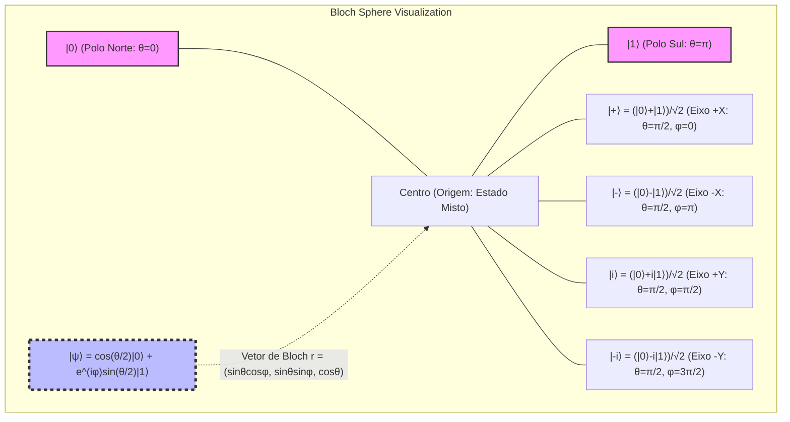
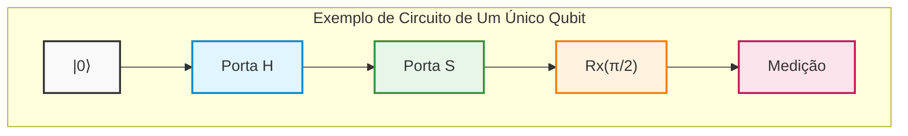
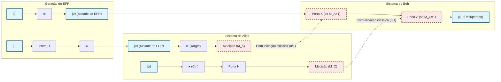
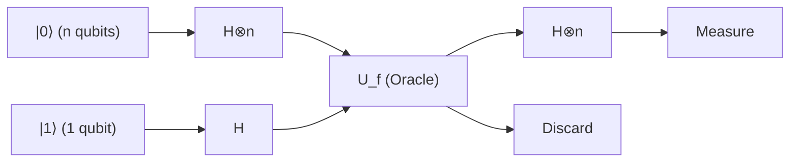
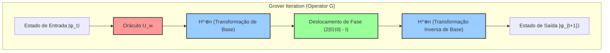
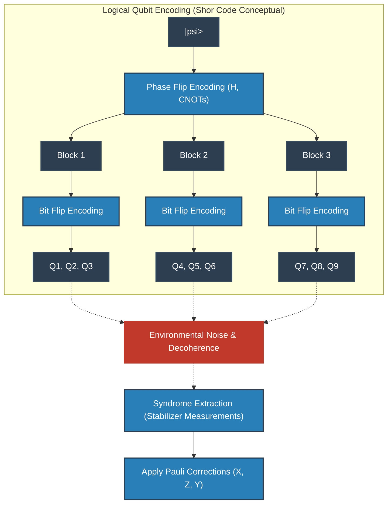
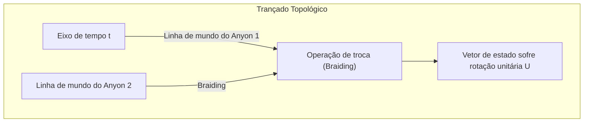
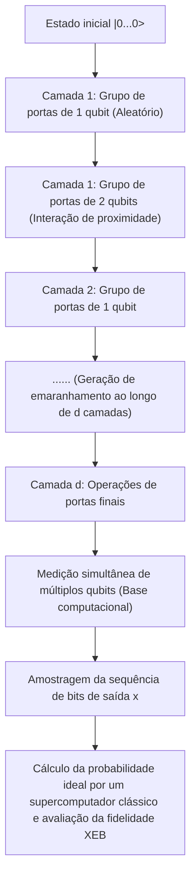

# Capítulo 1: O Surgimento e os Limites da Computação Quântica

## 1.1 Limites Físicos da Computação Clássica e o Fim da Lei de Moore

O desenvolvimento exponencial da tecnologia de processamento de informação na sociedade moderna foi impulsionado pela regra empírica proposta por Gordon Moore em 1965: "o número de transistores incorporados em um circuito integrado semicondutor dobra aproximadamente a cada dois anos", conhecida como "Lei de Moore". Seguindo essa lei, promoveu-se a miniaturização (*scaling*) dos transistores, aumentando o poder computacional de forma exponencial. Contudo, ao ingressar no século XXI, esse paradigma clássico depara-se com limites físicos definitivos. O maior obstáculo entre eles é a manifestação de um efeito mecânico-quântico: o "efeito túnel quântico" (*Quantum Tunneling Effect*).

Quando a camada dielétrica da porta ou o comprimento de canal de um transistor diminui para a escala de poucos nanômetros — isto é, uma espessura equivalente a alguns poucos átomos ou dezenas deles —, os elétrons atravessam probabilisticamente barreiras de energia que seriam classicamente intransponíveis, devido ao espraiamento de sua função de onda. A probabilidade de transmissão $T$ de um elétron de massa $m$ (com energia $E < V_0$ ) que incide sobre uma região com barreira de potencial $V_0$ e largura $a$ é dada, de acordo com a aproximação WKB, pela seguinte expressão:

$$
T \approx \exp \left( - \frac{2}{\hbar} \int_{0}^{a} \sqrt{2m(V_0 - E)} \, dx \right)
$$

onde $\hbar$ é a constante de Planck reduzida. À medida que a largura da barreira $a$ diminui com a miniaturização, a probabilidade de transmissão $T$ aumenta exponencialmente, resultando em uma "corrente de fuga" (*leakage current*) não negligenciável, mesmo quando o transistor está no estado desligado (*off*). Isso provoca aumento no consumo de energia e na dissipação de calor, comprometendo o funcionamento do transistor como um elemento de chaveamento determinístico clássico.

Além disso, os limites termodinâmicos do processamento de informação não podem ser ignorados. Em 1961, Rolf Landauer demonstrou que a dissipação de calor é inevitável durante o processo de apagamento de informação (realização de operações lógicas irreversíveis), princípio este conhecido como Princípio de Landauer. A quantidade mínima de calor $\Delta Q$ liberada para o ambiente ao apagar 1 bit de informação é expressa por:

$$
\Delta Q \ge k_B T \ln 2
$$

onde $k_B$ é a constante de Boltzmann e $T$ é a temperatura absoluta. Enquanto os computadores clássicos operarem portas lógicas irreversíveis (tais como portas AND ou OR), não há como contornar esse limite termodinâmico inferior. Conforme a miniaturização avança e a energia manipulada por um único componente se aproxima desse limiar, a evolução dos computadores clássicos atinge um teto imposto por leis físicas fundamentais.

## 1.2 A Visão Precursora de Richard Feynman e a Explosão da Complexidade Quântica

À medida que os computadores clássicos se aproximavam de seus limites físicos, tornou-se necessária a busca por um paradigma computacional inteiramente novo. O marco inicial dessa transformação ocorreu em 1981, na palestra magna de Richard Feynman durante a "Primeira Conferência sobre a Física da Computação", realizada no MIT. Feynman destacou a extrema dificuldade em simular sistemas mecânico-quânticos utilizando computadores clássicos e fez uma proposta revolucionária:

"A natureza não é clássica; portanto, se você deseja criar uma simulação da natureza, deve construir um computador baseado em princípios mecânico-quânticos."

Por trás dessa afirmação está o fato de que a dimensão do "espaço de Hilbert" (*Hilbert Space*), que descreve os estados de um sistema quântico, cresce exponencialmente com o número de partículas. Consideremos um sistema composto por $N$ partículas de spin $1/2$ (ou seja, um sistema em que cada constituinte possui dois estados quânticos possíveis). O estado de uma única partícula é descrito em um espaço vetorial complexo bidimensional $\mathbb{C}^2$. Consequentemente, o espaço de estados $\mathcal{H}$ do sistema composto por $N$ partículas é construído pelo produto tensorial dos espaços de estados de cada subsistema:

$$
\mathcal{H} = \bigotimes_{i=1}^{N} \mathbb{C}^2 = \mathbb{C}^{2^N}
$$

Um estado puro (*Pure State*) $|\Psi\rangle$ desse sistema é representado como uma combinação linear (superposição) de $2^N$ vetores de base. Utilizando a notação bra-ket de Dirac (*Bra-ket notation*), qualquer estado quântico pode ser expandido da seguinte forma:

$$
|\Psi\rangle = \sum_{x=0}^{2^N-1} c_x |x\rangle
$$

onde $|x\rangle$ representa a base computacional (*Computational Basis*) e $c_x \in \mathbb{C}$ são números complexos denominados amplitudes de probabilidade (*Probability Amplitudes*). O vetor de estado deve satisfazer a condição de normalização $\sum_{x=0}^{2^N-1} |c_x|^2 = 1$.

Mesmo tentando simular apenas $N = 300$ qubits (*bits quânticos*), o número de coeficientes complexos que precisariam ser armazenados, $2^{300}$, é de aproximadamente $10^{90}$, superando com folga o número total de átomos no universo observável (cerca de $10^{80}$). Armazenar essa quantidade absurda de variáveis na memória de um computador clássico e, além disso, computar a evolução temporal governada pela equação de Schrödinger (a multiplicação de matrizes unitárias de dimensão $2^N \times 2^N$) seria impossível mesmo ao longo de toda a vida útil do universo. Essa "maldição da dimensionalidade" marca o limite intransponível da computação clássica e, ao mesmo tempo, revela a fonte do potencial computacional extraordinário dos computadores quânticos.

## 1.3 David Deutsch e a Formalização da Máquina de Turing Quântica

A intuição pioneira de Feynman foi formalizada com rigor no arcabouço da ciência da computação teórica pelo físico David Deutsch, da Universidade de Oxford. Em seu artigo revolucionário de 1985, Deutsch apontou que a "Tese Forte de Church-Turing" (*Strong Church-Turing Thesis*) — segundo a qual "qualquer processo físico pode ser simulado de forma eficiente por uma máquina de computação finita" — poderia não se sustentar em um mundo físico regido pela mecânica quântica.

Deutsch estendeu a máquina de Turing determinística proposta por Alan Turing e definiu o conceito de "Máquina de Turing Quântica" (*Quantum Turing Machine*). Trata-se de um modelo computacional no qual os estados internos, os símbolos na fita e a posição do cabeçote podem existir em uma "superposição quântica", com as transições de estado descritas por um operador unitário (*Unitary Operator*) $U$.

A unidade fundamental da computação quântica é o "qubit" (*Qubit*, ou bit quântico). Enquanto um bit clássico assume apenas um de dois estados discretos e determinados, $0$ ou $1$, um qubit pode existir em uma superposição linear arbitrária dos estados $|0\rangle$ e $|1\rangle$:

$$
|\psi\rangle = \alpha |0\rangle + \beta |1\rangle \quad (\alpha, \beta \in \mathbb{C}, \ |\alpha|^2 + |\beta|^2 = 1)
$$

As operações realizadas sobre esses qubits são lineares e preservam a norma, sendo descritas por matrizes unitárias (matrizes que satisfazem $U^\dagger U = I$, em que $U^\dagger$ denota o adjunto hermitiano e $I$ a matriz identidade). Por exemplo, a porta Hadamard (*Hadamard Gate*) $H$, uma das operações fundamentais sobre um único qubit, é definida como:

$$
H = \frac{1}{\sqrt{2}} \begin{pmatrix} 1 & 1 \\ 1 & -1 \end{pmatrix}
$$

Ao aplicar a operação de Hadamard ao estado da base $|0\rangle$, obtém-se:

$$
H |0\rangle = \frac{1}{\sqrt{2}} \left( |0\rangle + |1\rangle \right)
$$

Com isso, o sistema transita para uma superposição perfeita, na qual os estados $|0\rangle$ e $|1\rangle$ têm a mesma probabilidade de serem observados. A grande contribuição de Deutsch foi incorporar esses princípios fundamentais da mecânica quântica em um modelo matemático de computação, provando formalmente que um Computador Quântico Universal (*Universal Quantum Computer*) é realizável em princípio.

## 1.4 A Verdadeira Essência da Computação Quântica: Desmistificando o "Cálculo Hiperparalelo"

Por que um computador quântico possui um poder computacional capaz de superar o dos computadores clássicos? Uma explicação popular frequente afirma que "o computador quântico se divide em inúmeros universos paralelos, calculando todas as possibilidades simultaneamente para encontrar a resposta correta instantaneamente". Embora seja uma tentativa metafórica de ilustrar o "paralelismo quântico" (*Quantum Parallelism*), trata-se de **uma descrição profundamente imprecisa que induz a erros graves** .

De fato, aplicando portas Hadamard em paralelo a um sistema de $N$ qubits, é possível gerar uma superposição de todos os $2^N$ estados em uma única operação:

$$
H^{\otimes N} |0\rangle^{\otimes N} = \frac{1}{\sqrt{2^N}} \sum_{x=0}^{2^N-1} |x\rangle
$$

E, ao aplicar um operador unitário $U_f$ que avalia uma determinada função $f(x)$, o estado transforma-se da seguinte maneira:

$$
U_f \left( \frac{1}{\sqrt{2^N}} \sum_{x=0}^{2^N-1} |x\rangle |0\rangle \right) = \frac{1}{\sqrt{2^N}} \sum_{x=0}^{2^N-1} |x\rangle |f(x)\rangle
$$

Aqui, à primeira vista, parece que o valor de $f(x)$ para todos os $2^N$ valores possíveis de $x$ foi "calculado" em um único passo. No entanto, deparamo-nos com um postulado fundamental da mecânica quântica: o "postulado da medição" (Regra de Born, *Born Rule*). Ao realizar uma medição (observação) sobre esse estado de superposição, obtemos apenas um único resultado, e o estado sofre o colapso da função de onda (*Wavefunction Collapse*) para um estado aleatório $|x\rangle |f(x)\rangle$ com probabilidade $P(x) = 1/2^N$. Em outras palavras, mesmo calculando todas as respostas ao mesmo tempo, a medição só nos permite extrair "uma única resposta aleatória" — o que não difere em nada de jogar dados ao acaso.

Qual é, então, a verdadeira força do computador quântico? É a **"interferência quântica" (*Quantum Interference*)** .

Como as amplitudes de probabilidade $c_x$ que descrevem um estado quântico não são probabilidades positivas, mas sim "números complexos", elas podem assumir valores positivos, negativos ou imaginários. O cerne dos algoritmos quânticos reside em combinar transformações unitárias de forma engenhosa ao longo do cálculo para **"anular mutuamente as amplitudes de probabilidade dos estados correspondentes às respostas incorretas (interferência destrutiva: *Destructive Interference*) e amplificar as amplitudes de probabilidade dos estados correspondentes à resposta correta (interferência construtiva: *Constructive Interference*)"** .

Como um exemplo simples, consideremos a interferência decorrente da inversão de fase seguida pela transformação de Hadamard. O que acontece ao aplicarmos novamente a porta Hadamard ao estado $\frac{1}{\sqrt{2}}(|0\rangle - |1\rangle)$?

$$
H \left( \frac{|0\rangle - |1\rangle}{\sqrt{2}} \right) = \frac{1}{2} \big( (|0\rangle + |1\rangle) - (|0\rangle - |1\rangle) \big) = \frac{1}{2} (2|1\rangle) = |1\rangle
$$

Nesse caso, a amplitude de probabilidade que leva ao estado $|0\rangle$ torna-se $1/2 - 1/2 = 0$, sendo perfeitamente cancelada (interferência destrutiva). Por outro lado, a amplitude para o estado $|1\rangle$ passa a ser $1/2 + 1/2 = 1$, sendo amplificada (interferência construtiva).

Algoritmos quânticos verdadeiramente úteis — como o algoritmo de Shor para fatoração de inteiros ou o algoritmo de Grover para busca em bancos de dados não estruturados — orquestram essas interferências ondulatórias por meio de sequências altamente estruturadas, garantindo que, na etapa final de medição, a probabilidade de observar o estado correto seja o mais próximo possível de $1$. O paralelismo em si não é a mágica; o que realmente diferencia a computação quântica da clássica, constituindo a sua essência mais profunda, é a capacidade de usar a interferência de amplitudes de probabilidade complexas para "eliminar probabilisticamente caminhos computacionais indesejados".

## 1.5 Conceitualização Visual: O Mecanismo de Interferência Quântica

O diagrama conceitual a seguir ilustra a diferença entre um processo probabilístico clássico e um processo quântico com interferência (análogo ao interferômetro de Mach-Zehnder ou à aplicação sequencial de portas Hadamard). Em um passeio aleatório clássico, as probabilidades são simplesmente somadas; no processo quântico, porém, as amplitudes de probabilidade ao longo dos caminhos são somadas como números complexos, gerando interferência.

```mermaid
graph TD
    classDef quantum fill:#e6f2ff,stroke:#0066cc,stroke-width:2px;
    classDef classical fill:#fff2e6,stroke:#cc6600,stroke-width:2px;
    classDef measure fill:#e6ffe6,stroke:#00cc00,stroke-width:2px;

    Start["Estado Inicial |0⟩"]:::quantum

    subgraph "Geração de Superposição Quântica"
        H1["Porta Hadamard (H)"]:::quantum
        SuperPos["1/√2 (|0⟩ + |1⟩)"]:::quantum
    end

    subgraph "Operação Unitária (Manipulação de fase por oráculo, etc.)"
        U_op["Deslocamento de fase / Evolução unitária (U)"]:::quantum
        PhaseState["1/√2 (|0⟩ - e^{iθ} |1⟩)"]:::quantum
    end

    subgraph "Processo de Interferência Quântica (Núcleo do Algoritmo)"
        H2["Porta Hadamard (H)"]:::quantum
        Interference["Cancelamento e amplificação de amplitudes<br>(Construtiva / Destrutiva)"]:::quantum
    end

    Result["Saída determinística com probabilidade 1 (ex.: |1⟩)"]:::measure

    Start --> H1
    H1 --> SuperPos
    SuperPos --> U_op
    U_op --> PhaseState
    PhaseState --> H2
    H2 --> Interference
    Interference -->|Medição (Observação)| Result
```

Dessa forma, o computador quântico não é uma mera medida paliativa temporária para contornar os limites da mecânica clássica (limites de miniaturização e termodinâmicos), mas sim uma verdadeira mudança de paradigma que reconstrói a própria definição de informação e computação com base nos axiomas da mecânica quântica. No próximo capítulo, aprofundaremos nas ferramentas matemáticas concretas para manipular livremente essa interferência quântica: as "portas quânticas" e os "circuitos quânticos".

# Capítulo 2: Fundamentos de Bits Clássicos e Bits Quânticos (Qubits)

Na construção do arcabouço teórico da informação quântica, o conceito mais fundamental é a definição da "unidade elementar de informação". Neste capítulo, partiremos do bit na teoria da informação clássica e estenderemos o conceito para o "bit quântico (qubit)", a unidade elementar de informação quântica baseada nos postulados da mecânica quântica. Utilizando a linguagem rigorosa de espaços de Hilbert, notação bra-ket e álgebra linear, desvendaremos minuciosamente a estrutura matemática dos estados quânticos. Sem quaisquer concessões, examinaremos as profundezas da informação quântica a partir de uma perspectiva especializada.

## 2.1 A Unidade Elementar de Informação: Formulação Matemática e Limitações do Bit Clássico

Na história da ciência da computação, os fundamentos da teoria da informação estabelecidos por Claude Shannon em 1948 baseiam-se no "bit". Independentemente de sua realização física (como tensões altas ou baixas em transistores, estados ligado/desligado de interruptores ou direções de magnetização), um bit clássico é definido como um sistema cujo espaço abstrato de estados assume um de dois valores discretos, $\{0, 1\}$.

Vamos expressar isso na linguagem mais formal de espaços vetoriais. O estado de um bit clássico pode ser representado utilizando a base canônica do espaço vetorial real bidimensional $\mathbb{R}^2$. Definimos o estado $0$ e o estado $1$ como os seguintes vetores-coluna:

$$
\mathbf{v}_0 = \begin{pmatrix} 1 \\ 0 \end{pmatrix}, \quad \mathbf{v}_1 = \begin{pmatrix} 0 \\ 1 \end{pmatrix}
$$

Em um sistema clássico determinístico (Deterministic), o estado de um bit é sempre definido unicamente como $\mathbf{v}_0$ ou $\mathbf{v}_1$. No entanto, quando há ruído, como flutuações térmicas, ou incerteza em nosso conhecimento, torna-se necessário descrever o estado como um bit probabilístico clássico (Probabilistic). Nesse caso, o estado do bit é expresso como uma distribuição de probabilidade, e o vetor de estado $\mathbf{p}$ pode ser escrito como uma combinação convexa (Convex combination) dos vetores de base:

$$
\mathbf{p} = p_0 \mathbf{v}_0 + p_1 \mathbf{v}_1 = \begin{pmatrix} p_0 \\ p_1 \end{pmatrix}
$$

Aqui, $p_0, p_1$ são números reais que representam as probabilidades de o estado ser $0$ e $1$, respectivamente. Pelos axiomas de probabilidade de Kolmogorov, eles devem satisfazer as seguintes condições:

1. ** Não-negatividade ** : $p_0 \ge 0, \quad p_1 \ge 0$
2. ** Condição de normalização (probabilidade total igual a 1) ** : $p_0 + p_1 = 1$

No âmbito dos bits clássicos, um sistema composto combinando múltiplos bits é descrito pelo produto tensorial (produto de Kronecker) de seus respectivos vetores de probabilidade. Por exemplo, o vetor de probabilidade conjunta de dois bits clássicos é dado por:

$$
\mathbf{p}_{AB} = \mathbf{p}_A \otimes \mathbf{p}_B = \begin{pmatrix} p_{A0} \\ p_{A1} \end{pmatrix} \otimes \begin{pmatrix} p_{B0} \\ p_{B1} \end{pmatrix} = \begin{pmatrix} p_{A0}p_{B0} \\ p_{A0}p_{B1} \\ p_{A1}p_{B0} \\ p_{A1}p_{B1} \end{pmatrix}
$$

A estrutura da teoria da informação clássica é extremamente poderosa e constitui a base da sociedade digital moderna. No entanto, como os estados são formados estritamente pela soma de probabilidades reais não negativas, é por princípio impossível representar o "cancelamento mútuo de probabilidades" análogo à interferência de ondas. Aqui reside a limitação da física clássica e a necessidade do salto conceitual para a informação quântica.

## 2.2 Postulados da Mecânica Quântica e Notação Bra-Ket (Bra-ket notation)

O primeiro postulado (Postulate) da mecânica quântica estabelece que "o estado de um sistema físico fechado é completamente descrito por um vetor unitário (vetor de estado) em um espaço de Hilbert (Hilbert Space) $\mathcal{H}$, que é um espaço vetorial completo dotado de um produto interno complexo". No contexto da computação quântica, como os graus de liberdade espaciais contínuos podem ser desprezados, esse espaço de Hilbert é tipicamente um espaço vetorial complexo de dimensão finita $\mathbb{C}^d$.

A unidade elementar da informação quântica, o "qubit" (Qubit), é rigorosamente definida como um estado em um espaço de Hilbert complexo bidimensional $\mathcal{H} \cong \mathbb{C}^2$. Para descrever estados nesse espaço vetorial, é padrão utilizar a ** notação bra-ket (Bra-ket notation) **, introduzida pelo físico Paul Dirac.

O vetor-coluna que representa um estado quântico é chamado de ** vetor ket (Ket vector) ** e denotado como $|\psi\rangle$. Como estados correspondentes aos bits clássicos $0$ e $1$, introduzimos uma base ortonormal chamada de base computacional (Computational basis). Estes também são chamados de base $Z$ do qubit e são definidos respectivamente como $|0\rangle$ e $|1\rangle$:

$$
|0\rangle = \begin{pmatrix} 1 \\ 0 \end{pmatrix}, \quad |1\rangle = \begin{pmatrix} 0 \\ 1 \end{pmatrix}
$$

Por outro lado, pelo teorema da representação de Riesz (Riesz representation theorem), a qualquer vetor ket em um espaço de Hilbert corresponde unicamente um elemento do espaço dual (Dual space) que atua como um funcional linear contínuo. Esse elemento é chamado de ** vetor bra (Bra vector) ** e denotado como $\langle\psi|$. Na representação matricial, o vetor bra correspondente é obtido tomando-se o conjugado hermitiano (transposto conjugado complexo, representado por $^\dagger$) do vetor ket:

$$
\langle\psi| = (|\psi\rangle)^\dagger = (|\psi\rangle^*)^T
$$

Por exemplo, os vetores bra da base computacional são os seguintes vetores-linha:

$$
\langle 0| = \begin{pmatrix} 1 & 0 \end{pmatrix}, \quad \langle 1| = \begin{pmatrix} 0 & 1 \end{pmatrix}
$$

O verdadeiro valor da notação bra-ket reside no fato de o cálculo do produto interno tornar-se visualmente extremamente transparente. O produto interno entre um bra $\langle\phi|$ e um ket $|\psi\rangle$ é escrito como $\langle\phi|\psi\rangle$ (originário do trocadilho de Dirac, no qual "bra" e "ket" se unem para formar um "bracket"). Como a base computacional $\{|0\rangle, |1\rangle\}$ constitui um sistema ortonormal (Orthonormal system), ela é expressa por meio do delta de Kronecker $\delta_{ij}$ da seguinte forma:

$$
\langle i | j \rangle = \delta_{ij} \quad (i, j \in \{0, 1\})
$$

Especificamente, o produto interno consigo mesmo é $1$ ($\langle 0|0\rangle = 1$, $\langle 1|1\rangle = 1$), e o produto interno entre estados de base distintos é $0$ ($\langle 0|1\rangle = 0$, $\langle 1|0\rangle = 0$).

Além disso, o produto tensorial de um ket e um bra (equivalente ao produto externo) é expresso como $|\psi\rangle\langle\phi|$, o que representa um operador linear (matriz) no espaço. Por exemplo, o operador de projeção (Projection operator) sobre um determinado subespaço de estados é construído da seguinte forma:

$$
|0\rangle\langle 0| = \begin{pmatrix} 1 \\ 0 \end{pmatrix} \begin{pmatrix} 1 & 0 \end{pmatrix} = \begin{pmatrix} 1 & 0 \\ 0 & 0 \end{pmatrix}
$$

O operador identidade $I$ (Identity operator) em qualquer espaço vetorial complexo bidimensional pode ser decomposto e representado por meio da relação de completude (Completeness relation) da base como segue, constituindo uma ferramenta poderosa e frequentemente utilizada nos cálculos da mecânica quântica:

$$
I = |0\rangle\langle 0| + |1\rangle\langle 1| = \begin{pmatrix} 1 & 0 \\ 0 & 1 \end{pmatrix}
$$

## 2.3 O Princípio da Superposição Quântica e Amplitudes de Probabilidade Complexas

Enquanto um bit clássico está sempre em um estado determinado de $0$ ou $1$, ou em uma mistura probabilística de ambos, a exigência de linearidade (Linearity) da mecânica quântica permite que um qubit assuma um estado fundamentalmente distinto chamado "superposição" (Superposition), representado por uma combinação linear de $|0\rangle$ e $|1\rangle$. Qualquer vetor unitário no espaço de Hilbert $\mathcal{H}$ é admitido como um estado físico válido.

Portanto, o estado puro (Pure state) mais geral de um único qubit $|\psi\rangle$ é expandido na base computacional da seguinte maneira:

$$
|\psi\rangle = \alpha |0\rangle + \beta |1\rangle = \begin{pmatrix} \alpha \\ \beta \end{pmatrix}
$$

Aqui, $\alpha$ e $\beta$ são números complexos ($\alpha, \beta \in \mathbb{C}$) denominados ** amplitudes de probabilidade complexas (Complex probability amplitude) **. Em contraste com as probabilidades clássicas, que são números reais não negativos, o fato de os estados quânticos possuírem coeficientes "complexos" é a razão fundamental pela qual os computadores quânticos possuem capacidade computacional superior à dos computadores clássicos. Como os números complexos possuem fase (Phase) e podem apontar para qualquer direção no plano complexo, eles podem reforçar-se mutuamente (interferência construtiva) ou cancelar-se mutuamente (interferência destrutiva) como ondas. A essência dos algoritmos quânticos reside em manipular habilmente esses efeitos de interferência para amplificar a amplitude de probabilidade da resposta correta e anular as amplitudes de probabilidade das respostas incorretas.

O processo de extração de informação clássica a partir de um sistema quântico é a "medição" (Measurement). Considerando uma medição projetiva (Projective measurement), de acordo com a regra de Born (Born rule), a probabilidade $P(0)$ de se obter o resultado $0$ e a probabilidade $P(1)$ de se obter o resultado $1$ ao medir o estado $|\psi\rangle$ na base computacional $\{|0\rangle, |1\rangle\}$ são dadas pelo quadrado do módulo de suas respectivas amplitudes de probabilidade:

$$
P(0) = |\langle 0|\psi\rangle|^2 = |\alpha|^2 = \alpha \alpha^*
$$

$$
P(1) = |\langle 1|\psi\rangle|^2 = |\beta|^2 = \beta \beta^*
$$

Para que o sistema seja necessariamente observado em algum estado definido, a soma de todas as probabilidades deve ser rigorosamente igual a $1$. Portanto, a norma (comprimento) do vetor de estado quântico $|\psi\rangle$ deve ser sempre $1$. Esta é a ** condição de normalização (Normalization condition) **:

$$
\langle\psi|\psi\rangle = (\alpha^* \langle 0| + \beta^* \langle 1|)(\alpha |0\rangle + \beta |1\rangle) = |\alpha|^2 + |\beta|^2 = 1
$$

Para investigar mais profundamente o significado geométrico dessas amplitudes de probabilidade complexas, vamos expressar $\alpha$ e $\beta$ em coordenadas polares:

$$
\alpha = r_0 e^{i\phi_0}, \quad \beta = r_1 e^{i\phi_1}
$$

Aqui, $r_0, r_1 \ge 0$ são as magnitudes das amplitudes e $\phi_0, \phi_1 \in [0, 2\pi)$ são seus respectivos ângulos de fase. Como a condição de normalização impõe $r_0^2 + r_1^2 = 1$, podemos parametrizá-los usando um parâmetro real $\theta \in [0, \pi]$, definindo $r_0 = \cos(\frac{\theta}{2})$ e $r_1 = \sin(\frac{\theta}{2})$. Substituindo isso no vetor de estado original, obtemos:

$$
|\psi\rangle = \cos\left(\frac{\theta}{2}\right) e^{i\phi_0} |0\rangle + \sin\left(\frac{\theta}{2}\right) e^{i\phi_1} |1\rangle
$$

Vamos colocar o fator de fase comum $e^{i\phi_0}$ em evidência em toda a expressão:

$$
|\psi\rangle = e^{i\phi_0} \left( \cos\left(\frac{\theta}{2}\right) |0\rangle + e^{i(\phi_1 - \phi_0)} \sin\left(\frac{\theta}{2}\right) |1\rangle \right)
$$

Na mecânica quântica, o fator de fase $e^{i\phi_0}$ que multiplica todo o vetor de estado é chamado de "fase global" (Global phase). Como se pode constatar calculando o valor esperado $\langle A \rangle$ para um observável arbitrário (operador hermitiano) $A$:

$$
\langle A \rangle = \left( e^{-i\phi_0} \langle\psi| \right) A \left( e^{i\phi_0} |\psi\rangle \right) = e^{-i\phi_0} e^{i\phi_0} \langle\psi| A |\psi\rangle = \langle\psi| A |\psi\rangle
$$

Dessa forma, como a fase global se cancela mutuamente, é impossível observá-la por meio de qualquer medição física. Ou seja, embora $|\psi\rangle$ e $e^{i\phi_0}|\psi\rangle$ sejam vetores distintos no espaço de Hilbert (representando o mesmo raio projetivo), fisicamente eles representam exatamente o mesmo estado.

Portanto, ao ignorar a fase global e manter apenas a fase relativa (Relative phase) $\varphi = \phi_1 - \phi_0$ (onde $\varphi \in [0, 2\pi)$) entre $|0\rangle$ e $|1\rangle$ como parâmetro, qualquer estado puro de um único qubit pode ser expresso de forma única e rigorosa na seguinte ** forma canônica **:

$$
|\psi\rangle = \cos\left(\frac{\theta}{2}\right) |0\rangle + e^{i\varphi} \sin\left(\frac{\theta}{2}\right) |1\rangle
$$

## 2.4 Visualização Geométrica através da Esfera de Bloch (Bloch Sphere)

A parametrização derivada na seção anterior demonstra que o espaço de estados de um único qubit é geometricamente isomorfo à superfície de uma esfera unitária no espaço tridimensional (a 2-esfera $S^2$). Essa representação visual é chamada de ** Esfera de Bloch (Bloch Sphere) ** em homenagem ao seu criador, o físico suíço Felix Bloch.

O ângulo $\theta$ corresponde com precisão ao ângulo polar (Polar angle) medido a partir da direção positiva do eixo $Z$, e o ângulo $\varphi$ ao ângulo azimutal (Azimuthal angle) no plano $X$-$Y$.



A propriedade mais notável da esfera de Bloch é que "estados ortogonais no espaço de Hilbert (estados cujo produto interno é 0) localizam-se em pontos antipodais (Antipodal points: pontos diametralmente opostos a 180 graus) no espaço real tridimensional da esfera de Bloch". Por exemplo, o estado ortogonal a $|0\rangle$ (polo norte, $\theta=0$) é $|1\rangle$ (polo sul, $\theta=\pi$). O cálculo do produto interno entre estados mutuamente ortogonais no espaço de Hilbert $\langle 0 | 1 \rangle = 0$ corresponde a uma separação angular de $\pi$ (180 graus) na esfera de Bloch. Como o ângulo geométrico é o dobro do ângulo no espaço de Hilbert, há uma necessidade matemática evidente no emprego do semiângulo $\theta/2$ na parametrização.

As coordenadas dessa esfera de Bloch $\mathbf{r} = (x, y, z)$ são rigorosamente derivadas como os valores esperados das ** matrizes de Pauli (Pauli matrices) **, que são observáveis (Observables) na mecânica quântica. As matrizes de Pauli, que formam a base para os operadores hermitianos em sistemas bidimensionais, são definidas como segue:

$$
X = \sigma_x = \begin{pmatrix} 0 & 1 \\ 1 & 0 \end{pmatrix}, \quad
Y = \sigma_y = \begin{pmatrix} 0 & -i \\ i & 0 \end{pmatrix}, \quad
Z = \sigma_z = \begin{pmatrix} 1 & 0 \\ 0 & -1 \end{pmatrix}
$$

Os valores esperados desses observáveis de Pauli para um estado arbitrário $|\psi\rangle$ são determinados por meio do cálculo bra-ket:

$$
x = \langle\psi| X |\psi\rangle = \left( \cos\frac{\theta}{2} \langle 0| + e^{-i\varphi}\sin\frac{\theta}{2} \langle 1| \right) \begin{pmatrix} 0 & 1 \\ 1 & 0 \end{pmatrix} \begin{pmatrix} \cos\frac{\theta}{2} \\ e^{i\varphi}\sin\frac{\theta}{2} \end{pmatrix} = \sin\theta \cos\varphi
$$

$$
y = \langle\psi| Y |\psi\rangle = \left( \cos\frac{\theta}{2} \langle 0| + e^{-i\varphi}\sin\frac{\theta}{2} \langle 1| \right) \begin{pmatrix} 0 & -i \\ i & 0 \end{pmatrix} \begin{pmatrix} \cos\frac{\theta}{2} \\ e^{i\varphi}\sin\frac{\theta}{2} \end{pmatrix} = \sin\theta \sin\varphi
$$

$$
z = \langle\psi| Z |\psi\rangle = \left( \cos\frac{\theta}{2} \langle 0| + e^{-i\varphi}\sin\frac{\theta}{2} \langle 1| \right) \begin{pmatrix} 1 & 0 \\ 0 & -1 \end{pmatrix} \begin{pmatrix} \cos\frac{\theta}{2} \\ e^{i\varphi}\sin\frac{\theta}{2} \end{pmatrix} = \cos^2\left(\frac{\theta}{2}\right) - \sin^2\left(\frac{\theta}{2}\right) = \cos\theta
$$

Dessa forma, o vetor de Bloch $\mathbf{r} = (x, y, z)$ é expressado de maneira notável como um vetor unitário no espaço tridimensional: $\mathbf{r} = (\sin\theta\cos\varphi, \sin\theta\sin\varphi, \cos\theta)$. Além disso, a matriz de densidade (Density matrix) $\rho = |\psi\rangle\langle\psi|$ correspondente a qualquer estado puro pode ser descrita de maneira extremamente elegante utilizando o vetor de Pauli $\boldsymbol{\sigma} = (X, Y, Z)$ e a matriz identidade $I$:

$$
\rho = \frac{1}{2} \left( I + \mathbf{r} \cdot \boldsymbol{\sigma} \right) = \frac{1}{2} \left( I + xX + yY + zZ \right)
$$

Expandindo explicitamente os elementos da matriz para verificação, obtemos:

$$
\rho = \frac{1}{2} \begin{pmatrix} 1 + z & x - iy \\ x + iy & 1 - z \end{pmatrix} = \begin{pmatrix} \cos^2(\frac{\theta}{2}) & e^{-i\varphi}\sin(\frac{\theta}{2})\cos(\frac{\theta}{2}) \\ e^{i\varphi}\sin(\frac{\theta}{2})\cos(\frac{\theta}{2}) & \sin^2(\frac{\theta}{2}) \end{pmatrix}
$$

Isso coincide perfeitamente com o resultado obtido a partir do produto externo $|\psi\rangle\langle\psi|$ pela definição do produto tensorial. Vale ressaltar que, para estados puros, a norma do vetor de Bloch é $|\mathbf{r}| = 1$ e o traço do quadrado da matriz de densidade satisfaz $\text{Tr}(\rho^2) = 1$. Em contraste, para estados mistos (Mixed state), nos quais ocorre perda de informação quântica (decoerência) devido a interações com o ambiente ou controle imperfeito, o estado torna-se um conjunto estatístico (ensemble) de estados puros, de modo que $|\mathbf{r}| < 1$. Consequentemente, os estados mistos são representados como pontos no "interior" da esfera de Bloch, em vez de sua superfície, e o estado maximamente misto (Maximally mixed state) $\rho = I/2$, no qual a informação é completamente perdida, localiza-se exatamente no ponto central da esfera de Bloch, $\mathbf{r} = (0,0,0)$.

## 2.5 Medição e Colapso da Função de Onda (Wavefunction Collapse)

A medição na mecânica quântica é fundamentalmente diferente da leitura passiva de informações da mecânica clássica. De acordo com a formulação axiomática de von Neumann, ao realizar a medição de uma grandeza física (observável), o estado colapsa irreversivelmente ("Collapse") para um autoestado desse observável.

Por exemplo, considere a realização de uma medição na base $Z$ (isto é, uma medição tomando a matriz $Z$ de Pauli como observável) sobre o estado de um único qubit $|\psi\rangle = \alpha|0\rangle + \beta|1\rangle$. Os únicos valores possíveis obtidos como resultados de medição são os autovalores de $Z$, que são $+1$ (correspondendo ao estado $|0\rangle$) ou $-1$ (correspondendo ao estado $|1\rangle$).

Para descrever matematicamente a medição com rigor, utiliza-se um conjunto de operadores de projeção $\{ P_m \}$. Os operadores de projeção para a medição em $Z$ são dados por:

$$
P_0 = |0\rangle\langle 0|, \quad P_1 = |1\rangle\langle 1|
$$

Estes satisfazem a relação de completude $P_0 + P_1 = I$ e a ortogonalidade $P_i P_j = \delta_{ij} P_i$. De acordo com a regra de Born, a probabilidade $P(m)$ de obter o resultado de medição $m \in \{0, 1\}$ é calculada como:

$$
P(m) = \langle\psi| P_m^\dagger P_m |\psi\rangle = \langle\psi| P_m |\psi\rangle
$$

o que concorda perfeitamente com $|\alpha|^2$ e $|\beta|^2$ obtidos anteriormente. E o mais importante é que o novo estado quântico $|\psi'\rangle$ imediatamente após a obtenção do resultado de medição $m$ é obtido pela atuação do operador de projeção sobre o estado original, renormalizado pela nova norma:

$$
|\psi'\rangle = \frac{P_m |\psi\rangle}{\sqrt{P(m)}}
$$

Caso o resultado seja $0$:

$$
|\psi'\rangle = \frac{|0\rangle\langle 0| (\alpha|0\rangle + \beta|1\rangle)}{|\alpha|} = \frac{\alpha}{|\alpha|} |0\rangle = e^{i\phi_0} |0\rangle \equiv |0\rangle
$$

e o estado colapsa completamente para $|0\rangle$ (a fase global é ignorada). Esta é a descrição matemática do fenômeno conhecido como colapso da função de onda (Wavefunction collapse). Uma vez realizada a medição e ocorrido o colapso do estado, as informações sobre a fase relativa $\varphi$ e as amplitudes ($\alpha, \beta$) contidas no estado de superposição original são perdidas para sempre. Portanto, é por princípio impossível extrair a informação completa de um estado quântico a partir de uma única medição em uma única cópia (fato intimamente relacionado ao "Teorema da Não-Clonagem").

## 2.6 Introdução à Extensão para Sistemas de Múltiplos Corpos e Perspectivas para o Próximo Capítulo

Tendo compreendido profundamente as propriedades de um único qubit, abordamos também os fundamentos matemáticos dos "sistemas de múltiplos qubits", que serão tratados formalmente nos capítulos subsequentes. Enquanto as distribuições de probabilidade clássicas estendem o espaço de estados por meio do produto cartesiano, o espaço de Hilbert $\mathcal{H}_{AB}$ de um sistema composto na mecânica quântica é formado pelo ** produto tensorial (Tensor product) ** dos espaços de Hilbert $\mathcal{H}_A$ e $\mathcal{H}_B$ de cada subsistema:

$$
\mathcal{H}_{AB} = \mathcal{H}_A \otimes \mathcal{H}_B
$$

O produto tensorial de dois estados de qubit independentes expande-se da seguinte forma, formando um espaço vetorial complexo quadridimensional:

$$
|\Psi\rangle_{AB} = (\alpha_0|0\rangle + \alpha_1|1\rangle) \otimes (\beta_0|0\rangle + \beta_1|1\rangle) = \alpha_0\beta_0|00\rangle + \alpha_0\beta_1|01\rangle + \alpha_1\beta_0|10\rangle + \alpha_1\beta_1|11\rangle
$$

Aqui, a existência de estados que não podem ser fatorados como um produto tensorial de estados individuais (por exemplo, o estado de Bell $|\Phi^+\rangle = (|00\rangle + |11\rangle)/\sqrt{2}$) é a fonte do emaranhamento quântico (Entanglement). A explosão exponencial da dimensionalidade proporcionada pelo produto tensorial ($2^N$ dimensões para $N$ qubits) é precisamente a base que permite aos computadores quânticos manifestar um poder computacional massivamente paralelo.

Neste capítulo, estabelecemos as diferenças essenciais entre bits clássicos e qubits sobre a base matemática dos espaços de Hilbert. Os qubits têm a capacidade de assumir estados contínuos de superposição com amplitudes de probabilidade complexas e, por meio da dedução da esfera de Bloch, obtivemos um método poderoso para compreender intuitivamente vetores complexos abstratos como modelos geométricos no espaço real tridimensional.

No próximo capítulo, "Capítulo 3: Portas Lógicas Quânticas e Transformações Unitárias", detalharemos as "portas lógicas quânticas" concretas que manipulam esses estados de qubit único e elucidaremos as propriedades matemáticas das operações de rotação por matrizes unitárias na esfera de Bloch. A porta de entrada para o profundo mundo da informação quântica apenas começou a se abrir.

# Capítulo 3: Os Axiomas da Mecânica Quântica e a Medição (Colapso do Pacote de Ondas)

## 3.1 Introdução: A Abordagem Axiomática da Mecânica Quântica e as Exigências da Álgebra Linear

Para compreender os princípios de funcionamento dos computadores quânticos desde a sua base, é indispensável apreender o arcabouço teórico da física conhecido como mecânica quântica de forma matematicamente rigorosa. Embora muitas teorias na física tenham se desenvolvido indutivamente com base em regras empíricas, a mecânica quântica — em especial a mecânica quântica moderna formulada por John von Neumann — adota uma abordagem axiomática que deduz todo o sistema a partir de um conjunto restrito de "axiomas" (Axioms) matemáticos.

Este sistema axiomático é construído sobre o palco da álgebra linear complexa que pode ser estendida para dimensões infinitas: o espaço de Hilbert. Na ciência da informação quântica e na computação quântica, lida-se predominantemente com espaços vetoriais de dimensão finita (por exemplo, o espaço de produto tensorial de $\mathbb{C}^2$ para sistemas de qubits), permitindo contornar as dificuldades analíticas presentes em dimensões infinitas (como o domínio de definição de operadores ilimitados) e descrever e compreender a mecânica quântica puramente em termos de álgebra linear.

Neste capítulo, formalizaremos rigorosamente o processo que vai desde a descrição dos estados quânticos até a evolução temporal e a "medição" (observação), tema que historicamente suscitou os debates mais filosóficos, sem qualquer concessão ao rigor. O leitor compreenderá como fenômenos quânticos que à primeira vista parecem contraintuitivos estão assentados sobre uma estrutura matemática bela e livre de contradições. É exatamente essa estrutura matemática que serve como a "linguagem" direta para expressar os algoritmos dos computadores quânticos.

## 3.2 O Primeiro Axioma: Espaço de Estados (Espaço de Hilbert e Vetor de Estado)

O primeiro axioma da mecânica quântica estabelece como o "estado" de um sistema físico é representado matematicamente.

**Axioma 1 (Representação do Estado)**:
O estado de um sistema físico fechado é completamente descrito por um vetor unitário de norma 1 pertencente a um espaço de Hilbert (Hilbert space) $\mathcal{H}$, que é um espaço com produto interno complexo e completo. Este vetor é denominado **vetor de estado**.

Segundo a notação bra-ket (Bra-ket notation) introduzida por Paul Dirac, o vetor de estado é tratado como um vetor coluna e denotado pelo ket ** $| \psi \rangle$ **. O vetor linha pertencente ao espaço dual $\mathcal{H}^*$ é denotado pelo bra ** $\langle \psi |$ **, estando ambos relacionados por conjugação hermitiana (transposta conjugada complexa). Isto é:

$$
\langle \psi | = ( | \psi \rangle )^\dagger
$$

O produto interno entre dois estados arbitrários ** $| \phi \rangle$ ** e ** $| \psi \rangle$ ** no espaço de Hilbert é calculado como o produto entre o bra e o ket, ** $\langle \phi | \psi \rangle$ **, resultando em um número complexo. Esse produto interno satisfaz as seguintes propriedades:

1. **Positividade definida**: Para todo ** $| \psi \rangle \neq 0$ **, $\langle \psi | \psi \rangle > 0$
2. **Linearidade**: $\langle \phi | ( c_1 | \psi_1 \rangle + c_2 | \psi_2 \rangle ) = c_1 \langle \phi | \psi_1 \rangle + c_2 \langle \phi | \psi_2 \rangle$
3. **Simetria conjugada**: $\langle \phi | \psi \rangle = \langle \psi | \phi \rangle^*$ ($*$ denota o complexo conjugado)

Para que a interpretação probabilística seja consistente, os estados físicos devem sempre satisfazer a condição de normalização (Normalization condition). Ou seja, a norma do vetor de estado ** $| \psi \rangle$ ** é 1:

$$
\| | \psi \rangle \| = \sqrt{\langle \psi | \psi \rangle} = 1
$$

Além disso, como se verifica a desigualdade de Cauchy-Schwarz (Cauchy-Schwarz inequality) $|\langle \phi | \psi \rangle|^2 \le \langle \phi | \phi \rangle \langle \psi | \psi \rangle$, o módulo do produto interno entre estados normalizados situa-se sempre no intervalo entre 0 e 1. Esta propriedade fornece o alicerce matemático para que esse valor seja posteriormente interpretado como uma "probabilidade".

### Princípio da Superposição e Base Ortonormal Completa

A característica mais distintiva da mecânica quântica é o "princípio da superposição" (Superposition principle). Se ** $| \phi \rangle$ ** e ** $| \psi \rangle$ ** são estados fisicamente admissíveis, qualquer combinação linear complexa arbitrária $c_1 | \phi \rangle + c_2 | \psi \rangle$ também será (após normalização adequada) um estado fisicamente admissível. Esta propriedade decorre diretamente da linearidade do espaço de Hilbert.

No espaço de Hilbert $\mathcal{H}$, existe uma base ortonormal completa (Orthonormal basis) $\{ | e_i \rangle \}$. Os elementos dessa base são mutuamente ortogonais e normalizados:

$$
\langle e_i | e_j \rangle = \delta_{ij}
$$

($\delta_{ij}$ representa o delta de Kronecker). Ademais, pela relação de completude (Completeness relation) ou decomposição da identidade, o operador identidade $I$ pode ser expandido como:

$$
I = \sum_i | e_i \rangle \langle e_i |
$$

Qualquer estado quântico ** $| \psi \rangle$ ** pode ser expandido de maneira única como uma combinação linear dos vetores da base pela ação deste operador identidade:

$$
| \psi \rangle = I | \psi \rangle = \left( \sum_i | e_i \rangle \langle e_i | \right) | \psi \rangle = \sum_i \langle e_i | \psi \rangle | e_i \rangle = \sum_i c_i | e_i \rangle
$$

Aqui, o coeficiente de expansão $c_i = \langle e_i | \psi \rangle$ é denominado amplitude de probabilidade complexa e desempenha um papel determinante na regra de Born discutida adiante. Da condição de normalização $\langle \psi | \psi \rangle = 1$, conclui-se que $\sum_i |c_i|^2 = 1$.

## 3.3 O Segundo Axioma: Grandezas Físicas e Operadores Hermitianos

Na mecânica clássica, grandezas físicas como posição, momento linear e energia (observáveis) são descritas como funções reais contínuas. Na mecânica quântica, contudo, ocorre uma mudança paradigmática fundamental.

**Axioma 2 (Grandezas Físicas)**:
Grandezas físicas observáveis (observáveis) são descritas por operadores lineares autoadjuntos (operadores hermitianos) $A$ definidos no espaço de Hilbert $\mathcal{H}$.

Um operador hermitiano coincide com o seu próprio adjunto hermitiano, satisfazendo $A = A^\dagger$. Quando representado matricialmente em um espaço de dimensão finita, isto implica que seus elementos exibem simetria conjugada complexa ($A_{ij} = A_{ji}^*$).

A necessidade de definir as grandezas físicas como operadores hermitianos fundamenta-se nos seus "autovalores" (Eigenvalues). De acordo com o teorema espectral (Spectral theorem) da álgebra linear, os operadores hermitianos gozam das seguintes propriedades fundamentais:

1. **Todos os autovalores $a_i$ são números reais.** (Como as grandezas físicas medidas devem ser sempre grandezas reais, esta exigência atende a um postulado físico imperativo.)
2. **Autovetores associados a autovalores distintos são mutuamente ortogonais.**
3. **Os autovetores $\{ | a_i \rangle \}$ do operador formam uma base ortonormal completa para o espaço de Hilbert.**

Assim, qualquer observável $A$ pode ser decomposto espectralmente (Spectral decomposition) como uma combinação linear de operadores de projeção $P_i = | a_i \rangle \langle a_i |$, utilizando seus autovalores $a_i$ e autovetores ** $| a_i \rangle$ **:

$$
A = \sum_i a_i | a_i \rangle \langle a_i |
$$

Com essa formulação, o ato de "medir uma grandeza física" passa a ser compreendido geometricamente como a operação de projetar o estado sobre uma base específica (os autovetores) no espaço de Hilbert. Por exemplo, a medição de $\sigma_z$ em um qubit é formalizada inteiramente como uma projeção sobre a base ortogonal constituída pelo estado ** $| 0 \rangle$ **, associado ao autovalor $+1$, e pelo estado ** $| 1 \rangle$ **, associado ao autovalor $-1$.

## 3.4 O Terceiro Axioma: Evolução Temporal Unitária e a Equação de Schrödinger

Quando um sistema quântico permanece isolado sem interagir com outros sistemas, seu estado evolui no tempo de forma determinística e reversível.

**Axioma 3 (Evolução Temporal)**:
A evolução temporal do estado de um sistema quântico isolado obedece à equação de Schrödinger (Schrödinger equation). Equivalentemente, o estado ** $| \psi(t_0) \rangle$ ** no instante $t_0$ evolui para o estado ** $| \psi(t) \rangle$ ** no instante $t$ através da ação de um operador unitário $U(t, t_0)$.

A equação fundamental que descreve essa evolução temporal é a equação de Schrödinger dependente do tempo:

$$
i\hbar \frac{d}{dt} | \psi(t) \rangle = H | \psi(t) \rangle
$$

Nela, $i$ denota a unidade imaginária, $\hbar$ é a constante reduzida de Planck e $H$ é o operador Hamiltoniano (Hamiltonian), o observável que corresponde à energia total do sistema.

Quando consideramos um sistema cujo Hamiltoniano $H$ não depende explicitamente do tempo (sistema invariante no tempo), a equação diferencial pode ser formalmente integrada, fornecendo a solução:

$$
| \psi(t) \rangle = \exp\left( -\frac{i}{\hbar} H (t - t_0) \right) | \psi(t_0) \rangle
$$

O operador dado por essa função exponencial, $U(t, t_0) = \exp\left( -i H (t - t_0) / \hbar \right)$, constitui o operador de evolução temporal. Uma vez que o Hamiltoniano $H$ é hermitiano ($H = H^\dagger$), pelo teorema de Stone (Stone's theorem), $U$ é necessariamente um operador unitário (Unitary operator). Um operador unitário caracteriza-se por ter seu adjunto hermitiano igual à sua inversa ($U^\dagger U = U U^\dagger = I$).

O significado físico capital de uma transformação unitária é que ela **"preserva a norma (comprimento) e o produto interno dos vetores de estado"**. Isto garante que, independentemente do tempo decorrido, a relação $\langle \psi(t) | \psi(t) \rangle = \langle \psi(t_0) | U^\dagger U | \psi(t_0) \rangle = 1$ é rigorosamente mantida, assegurando a conservação da probabilidade total igual a 1. As "portas quânticas" de um computador quântico nada mais são do que implementações controladas e intencionais dessa evolução temporal unitária. Por exemplo, tanto a porta Hadamard quanto a porta CNOT são expressas rigorosamente como matrizes unitárias.

## 3.5 O Quarto Axioma: Medição e a Regra de Born (Born rule)

O conceito de "medição" ou "observação" (Measurement) na mecânica quântica é fundamentalmente distinto daquele encontrado na física clássica. Nos sistemas clássicos, a medição é concebida como um ato passivo que revela um valor intrínseco sem perturbar o estado do sistema. Na mecânica quântica, por outro lado, a medição intervém de modo ativo e introduz transformações irreversíveis no estado do sistema.

**Axioma 4 (Medição e a Regra de Born)**:
Ao realizar a medição de um observável $A$, que admite a decomposição espectral $A = \sum_i a_i P_i$, sobre um sistema em um estado ** $| \psi \rangle$ **, o resultado obtido será sempre um dos autovalores $a_i$ de $A$. A probabilidade $p(a_k)$ de se obter um autovalor particular $a_k$ é governada pela regra de Born:

$$
p(a_k) = \langle \psi | P_k | \psi \rangle = \| P_k | \psi \rangle \|^2
$$

Se o autovalor $a_k$ for não degenerado (havendo um único autovetor correspondente ** $| a_k \rangle$ **), o operador de projeção resume-se a $P_k = | a_k \rangle \langle a_k |$, e a probabilidade de medição corresponde ao quadrado do módulo do produto interno entre o estado e o respectivo autovetor:

$$
p(a_k) = \langle \psi | a_k \rangle \langle a_k | \psi \rangle = | \langle a_k | \psi \rangle |^2
$$

Isto equivale exatamente ao quadrado do módulo $|c_k|^2$ do coeficiente de expansão $c_k = \langle a_k | \psi \rangle$ obtido ao projetar o vetor de estado ** $| \psi \rangle$ ** sobre a base $\{ | a_i \rangle \}$. Embora a amplitude de probabilidade complexa $c_k$ não possa ser observada diretamente de forma experimental, o quadrado de sua magnitude se manifesta concretamente no mundo real sob a forma da probabilidade de observação. A proposição dessa regra por Max Born representa um dos pilares que transmutou a física do paradigma puramente determinístico para o probabilístico. O valor esperado $\langle A \rangle$ do observável $A$ resulta da soma dos autovalores ponderados pelas respectivas probabilidades de ocorrência, expressando-se elegantemente pelo valor esperado do operador no vetor de estado:

$$
\langle A \rangle = \sum_i a_i p(a_i) = \sum_i a_i \langle \psi | P_i | \psi \rangle = \langle \psi | \left( \sum_i a_i P_i \right) | \psi \rangle = \langle \psi | A | \psi \rangle
$$

## 3.6 Colapso do Pacote de Ondas (Redução do Estado) pela Medição e Decoerência

O axioma da medição compreende uma etapa adicional que gerou extensos debates na fundamentação teórica: qual o estado do sistema "após" a medição. Esse fenômeno é conhecido como "colapso do pacote de ondas" (Wavefunction collapse) ou "redução do estado" (State reduction). Formalizado pelo postulado da projeção de von Neumann (Projection postulate), esse processo é descrito como:

**Postulado da Projeção**:
Imediatamente após a medição revelar o autovalor $a_k$, o estado do sistema ** $| \psi' \rangle$ ** transforma-se (colapsa) instantaneamente para o estado resultante da aplicação do operador de projeção $P_k$ sobre o vetor original, devidamente renormalizado:

$$
| \psi' \rangle = \frac{P_k | \psi \rangle}{\sqrt{p(a_k)}}
$$

Caso o instrumento de medição opere de forma ideal e o estado colapse sobre um autovalor não degenerado $a_k$, o estado pós-medição coincidirá rigorosamente com o próprio autovetor ** $| a_k \rangle$ **. Consequentemente, se a mesma medição for repetida imediatamente a seguir, obter-se-á o mesmo autovalor $a_k$ com probabilidade 1 (100%). Este procedimento é classificado como uma "medição de primeira espécie".

Esse colapso do pacote de ondas apresenta propriedades (descontinuidade, probabilismo e irreversibilidade) que contrastam de maneira flagrante com a evolução temporal unitária regida pela equação de Schrödinger (contínua, determinística e reversível). A mecânica quântica encerra, portanto, uma dinâmica dual: o sistema evolui unitariamente enquanto permanece perfeitamente isolado, mas experimenta uma redução não unitária no momento em que estabelece contato com um instrumento macroscópico de medição.

### De Estados Puros a Estados Mistos: A Introdução do Operador Densidade

Para aprofundar a compreensão desse aparente paradoxo do colapso, o conceito de "operador densidade" (Density operator) torna-se indispensável. O vetor de estado ** $| \psi \rangle$ ** utilizado até aqui descreve um "estado puro" (Pure state), no qual se dispõe do conhecimento maximal do sistema físico. O operador densidade correspondente a um estado puro é expresso por $\rho = | \psi \rangle \langle \psi |$.

Por outro lado, quando não se tem acesso ao resultado específico da medição que fez o sistema colapsar (ou quando essa informação é descartada), o sistema deve ser tratado através de uma mistura estatística clássica: o "estado misto" (Mixed state). Por exemplo, a matriz densidade associada a um conjunto estatístico de sistemas colapsados nos estados ** $| a_k \rangle$ ** com probabilidades $p(a_k)$ assume a forma:

$$
\rho' = \sum_k p(a_k) | a_k \rangle \langle a_k |
$$

Nessa situação, os elementos fora da diagonal principal (termos de coerência ou de interferência) presentes originariamente no estado puro $\rho = | \psi \rangle \langle \psi |$ são suprimidos pela ação da medição. Esta eliminação dos termos de interferência quântica constitui a essência da "decoerência" (Decoherence).

### Decoerência e a Emergência da Classicidade Macroscópica

Os instrumentos de medição são constituídos por inúmeras partículas microscópicas, formando um sistema quântico complexo. A interação entre o sistema quântico de interesse e o vasto ambiente circundante (como o próprio aparelho de medição ou um banho térmico) estabelece "emaranhamento quântico" (entanglement). Ao realizar o traço parcial sobre os graus de liberdade do ambiente (Partial trace) para isolar a matriz densidade reduzida (Reduced density matrix) correspondente apenas ao subsistema em estudo, observa-se que o estado, inicialmente puro, transita rapidamente para uma matriz densidade mista, dissipando as relações de fase coerentes entre seus termos superpostos:

$$
\rho_{S} = \mathrm{Tr}_{E} [ | \Psi_{SE} \rangle \langle \Psi_{SE} | ]
$$

Em escalas macroscópicas, essa rápida perda de coerência suprime as manifestações de superposição quântica, fazendo com que o sistema exiba o comportamento de uma mistura clássica de probabilidades. O colapso do pacote de ondas não representa, sob este prisma, uma violação misteriosa das leis fundamentais da física, mas decorre naturalmente da dissipação de informação decorrente do acoplamento irreversível com os incontáveis graus de liberdade do ambiente. Superar os efeitos deletérios da decoerência constitui, presentemente, o maior desafio tecnológico e científico para o desenvolvimento de computadores quânticos tolerantes a falhas.

### Dinâmica da Evolução Temporal e da Medição do Estado Quântico

O diagrama a seguir resume visualmente o fluxo dinâmico no qual o estado inicial de um sistema quântico experimenta uma evolução temporal unitária e, sequencialmente, sofre uma ramificação probabilística (colapso) deflagrada pela medição física. Observe o contraste explícito entre a evolução determinística schrödingeriana e a redução probabilística de Born.

```mermaid
graph TD
    classDef state fill:#f9f9f9,stroke:#333,stroke-width:2px;
    classDef operation fill:#e1f5fe,stroke:#0288d1,stroke-width:2px;
    classDef measure fill:#fce4ec,stroke:#c2185b,stroke-width:2px;
    
    Init["Estado inicial $| \psi(t_0) \rangle$"]:::state --> Evo["Evolução temporal unitária $U(t, t_0) = \exp(-i H t / \hbar)$"]:::operation
    Evo --> Evolved["Estado após evolução $| \psi(t) \rangle = U | \psi(t_0) \rangle$"]:::state
    
    Evolved --> Obs["Medição da grandeza física $A$ (Operador de projeção $P_k$)"]:::measure
    
    Obs -->|Probabilidade $p(a_1) = \langle \psi | P_1 | \psi \rangle$| State1["Estado colapsado 1: $| a_1 \rangle$"]:::state
    Obs -->|Probabilidade $p(a_2) = \langle \psi | P_2 | \psi \rangle$| State2["Estado colapsado 2: $| a_2 \rangle$"]:::state
    Obs -->|...| StateN["Estado colapsado n: $| a_n \rangle$"]:::state
    
    State1 --> Decoherence["Decoerência (perda de interferência de fase) e transição para estado misto"]:::measure
    State2 --> Decoherence
    StateN --> Decoherence
```

Dessa forma, os conceitos abstratos da álgebra linear — espaços vetoriais, produtos internos, operadores hermitianos, equações de autovalores e matrizes unitárias — transcendem o formalismo puramente matemático para compor a linguagem fundamental indispensável para quantificar e predizer os comportamentos mais intrincados da natureza. Os algoritmos quânticos exploram magistralmente essas duas dinâmicas fundamentais — a "evolução determinística de Schrödinger" e o "colapso probabilístico de Born" — desbravando horizontes de computação inalcançáveis pelos limites da computação clássica.

# Capítulo 4: Portas de Um Único Qubit e Transformações Unitárias

O que fundamenta a computação quântica é a manipulação precisa dos estados quânticos. Enquanto as portas lógicas nos computadores clássicos (AND, OR, NOT, etc.) manipulam os valores dos bits de forma irreversível, as "portas quânticas" nos computadores quânticos são evoluções temporais reversíveis que obedecem aos requisitos da equação de Schrödinger e são rigorosamente descritas matematicamente como "transformações unitárias (matrizes unitárias)" em um espaço de Hilbert complexo. Neste capítulo, exploraremos exaustivamente, sem qualquer concessão, a estrutura matemática, as propriedades algébricas e o significado geométrico intuitivo na esfera de Bloch (Bloch sphere) das portas quânticas fundamentais que atuam sobre um único qubit (sistema de dois níveis).

## 4.1 Os Requisitos da Mecânica Quântica e a Necessidade das Matrizes Unitárias

A evolução temporal de um sistema quântico é governada pela seguinte equação de Schrödinger, usando o Hamiltoniano ** $H$ ** ( ** $H^\dagger = H$ ** ), que é um operador hermitiano que caracteriza o sistema.

$$
i\hbar \frac{d}{dt} |\psi(t)\rangle = H |\psi(t)\rangle
$$

Assumindo um sistema onde o Hamiltoniano ** $H$ ** não depende do tempo, o estado quântico ** $|\psi(t)\rangle$ ** em qualquer tempo ** $t$ ** é formalmente integrado a partir do estado inicial ** $|\psi(0)\rangle$ ** da seguinte forma:

$$
|\psi(t)\rangle = e^{-\frac{i}{\hbar}Ht} |\psi(0)\rangle
$$

Definimos o operador de evolução temporal que aparece aqui como ** $U(t) = e^{-\frac{i}{\hbar}Ht}$ ** . Como o ** $H$ ** que está no expoente é hermitiano, ao calcularmos o operador adjunto (conjugado hermitiano) ** $U(t)^\dagger$ ** desse operador ** $U(t)$ ** , derivamos a seguinte propriedade extremamente importante:

$$
U(t)^\dagger U(t) = \left( e^{-\frac{i}{\hbar}Ht} \right)^\dagger e^{-\frac{i}{\hbar}Ht} = e^{\frac{i}{\hbar}H^\dagger t} e^{-\frac{i}{\hbar}Ht} = e^{\frac{i}{\hbar}Ht} e^{-\frac{i}{\hbar}Ht} = I
$$

Da mesma forma, ** $U(t) U(t)^\dagger = I$ ** também é válido. Assim, uma matriz cuja matriz adjunta é igual à sua própria matriz inversa ( ** $U^\dagger = U^{-1}$ ** ) é chamada de "Matriz Unitária (Unitary Matrix)". Uma porta de um único qubit nada mais é do que uma matriz unitária ** $2 \times 2$ ** , realizada por um Hamiltoniano intencionalmente projetado através de controle físico (por exemplo, a irradiação de um pulso de micro-ondas com frequência e duração específicas).

A razão pela qual as matrizes unitárias são absolutamente essenciais na mecânica quântica é que elas são a única transformação linear que garante matematicamente a "conservação da probabilidade (conservação da norma)". Vamos calcular o produto interno dos estados após aplicar uma transformação unitária ** $U$ ** a estados quânticos arbitrários ** $|\psi\rangle$ ** e ** $|\phi\rangle$ ** .

$$
\langle \phi' | \psi' \rangle = ( \langle \phi | U^\dagger ) ( U |\psi\rangle ) = \langle \phi | U^\dagger U | \psi \rangle = \langle \phi | I | \psi \rangle = \langle \phi | \psi \rangle
$$

O fato de o produto interno ser conservado significa que a norma do próprio vetor de estado (o quadrado do seu comprimento), ** $\langle \psi | \psi \rangle$ ** , também é conservada. De acordo com a regra de Born (Born rule) da mecânica quântica, a soma dos quadrados dos valores absolutos das amplitudes do vetor de estado deve ser a probabilidade total de "1", portanto, para que essa interpretação probabilística não entre em colapso devido a operações de portas quânticas, é um pré-requisito absoluto que a operação seja unitária.

Além disso, de acordo com o teorema espectral, qualquer matriz unitária ** $U$ ** pode ser expressa como ** $U = e^{iK}$ ** usando uma matriz hermitiana ** $K$ ** com autovalores reais ** $\lambda_k$ ** . Os autovalores de uma matriz unitária sempre assumem a forma de números complexos com valor absoluto de 1 ( ** $e^{i\theta}$ ** ), e os autovetores formam um sistema completo mutuamente ortogonal.

$$
U = \sum_{j=1}^{d} e^{i \theta_j} |\phi_j\rangle \langle \phi_j|
$$

Isso indica que a ação de uma porta quântica pode ser completamente decomposta como uma operação que "aplica apenas uma rotação de fase pura ** $e^{i\theta_j}$ ** a uma base ortogonal específica ** $|\phi_j\rangle$ ** ".

## 4.2 Matrizes de Pauli e Portas Básicas (Portas X, Y, Z)

Ao falar a linguagem da informação quântica, a compreensão do grupo das matrizes de Pauli (Pauli matrices) é inevitável e de suma importância. Este grupo de matrizes, introduzido na física para descrever o momento angular de partículas de spin 1/2, forma o conjunto mais fundamental de operações ortogonais em um único qubit em computadores quânticos.

### 4.2.1 Porta Pauli-X (Porta de Inversão de Bit)

A porta Pauli-X é a extensão mecânico-quântica da porta NOT em circuitos lógicos clássicos. Usando a notação bra-ket de Dirac, ela é definida na representação de produto externo (projetor) da seguinte maneira:

$$
X = \sigma_x = |0\rangle\langle 1| + |1\rangle\langle 0| = \begin{pmatrix} 0 & 1 \\ 1 & 0 \end{pmatrix}
$$

Confirmando rigorosamente sua ação na base computacional ( ** $|0\rangle, |1\rangle$ ** ) através de cálculo matricial:

$$
X |0\rangle = \begin{pmatrix} 0 & 1 \\ 1 & 0 \end{pmatrix} \begin{pmatrix} 1 \\ 0 \end{pmatrix} = \begin{pmatrix} 0 \\ 1 \end{pmatrix} = |1\rangle
$$

$$
X |1\rangle = \begin{pmatrix} 0 & 1 \\ 1 & 0 \end{pmatrix} \begin{pmatrix} 0 \\ 1 \end{pmatrix} = \begin{pmatrix} 1 \\ 0 \end{pmatrix} = |0\rangle
$$

Dessa forma, ela inverte completamente as amplitudes. Geometricamente, corresponde a uma operação de rotação de ** $\pi$ ** (180 graus) em torno do eixo X na esfera de Bloch. O polo norte ( ** $|0\rangle$ ** ) é mapeado para o polo sul ( ** $|1\rangle$ ** ), e o polo sul para o polo norte.

### 4.2.2 Porta Pauli-Y (Porta de Inversão de Bit e Fase)

A porta Pauli-Y causa a inversão do bit e a inversão da fase simultaneamente, e também aplica um fator de fase da unidade imaginária ** $i$ ** . As representações de produto externo e matricial são as seguintes:

$$
Y = \sigma_y = -i|0\rangle\langle 1| + i|1\rangle\langle 0| = \begin{pmatrix} 0 & -i \\ i & 0 \end{pmatrix}
$$

A ação na base computacional é:

$$
Y |0\rangle = i|1\rangle, \quad Y |1\rangle = -i|0\rangle
$$

Na esfera de Bloch, ela representa uma rotação de ** $\pi$ ** em torno do eixo Y. A multiplicação pela unidade imaginária ** $i$ ** (ou seja, ** $e^{i\pi/2}$ ** ) significa não apenas uma simples inversão, mas também um deslocamento para uma direção ortogonal no espaço de fase do estado.

### 4.2.3 Porta Pauli-Z (Porta de Inversão de Fase)

A porta Pauli-Z não existe na lógica clássica; é uma "operação de fase" pura, exclusiva do domínio quântico. Sem alterar a magnitude da amplitude (probabilidade de medição) de forma alguma, ela aplica um deslocamento de fase de ** $-1$ ** (ou seja, ** $e^{i\pi}$ ** ) apenas à componente ** $|1\rangle$ ** .

$$
Z = \sigma_z = |0\rangle\langle 0| - |1\rangle\langle 1| = \begin{pmatrix} 1 & 0 \\ 0 & -1 \end{pmatrix}
$$

A ação é trivialmente:

$$
Z |0\rangle = |0\rangle, \quad Z |1\rangle = -|1\rangle
$$

Isto corresponde a uma rotação de ** $\pi$ ** em torno do eixo Z. Como as bases computacionais ** $|0\rangle, |1\rangle$ ** são autovetores da matriz Z (com autovalores +1 e -1, respectivamente), aplicar a porta Z não causa a transição do estado. No entanto, quando aplicada a um estado de superposição (por exemplo, ** $\alpha|0\rangle + \beta|1\rangle$ ** ), a fase relativa é dramaticamente invertida para ** $\alpha|0\rangle - \beta|1\rangle$ ** , alterando de forma decisiva os resultados de interferência nas etapas subsequentes.

### 4.2.4 A Profunda Estrutura Algébrica do Grupo de Pauli

O grupo das matrizes de Pauli ** $\{I, X, Y, Z\}$ ** forma uma estrutura algébrica extremamente bela como operadores lineares no espaço de Hilbert.

1. **Coexistência de Auto-adjunção (Hermiticidade) e Unitaridade**: ** $X = X^\dagger$ **, ** $Y = Y^\dagger$ **, ** $Z = Z^\dagger$ ** e, simultaneamente, satisfazem ** $X^\dagger X = I$ ** (ou seja, ** $X = X^{-1}$ ** ). É uma propriedade rara em que eles são grandezas físicas (observáveis) e, ao mesmo tempo, geradores unitários de evolução temporal (portas). Se aplicadas duas vezes consecutivamente, retornam à transformação identidade (involução: ** $X^2 = Y^2 = Z^2 = I$ ** ).
2. **Relação de Anticomutação Perfeita**: Matrizes de Pauli diferentes invertem o sinal quando a ordem da multiplicação é trocada.
   

$$
\{X, Y\} = XY + YX = 0, \quad \{Y, Z\} = 0, \quad \{Z, X\} = 0
$$


3. **Relação de Comutação e Álgebra de Lie**: Usando o comutador ** $[A, B] = AB - BA$ ** , elas mostram claramente sua estrutura como geradores da álgebra de Lie ** $SU(2)$ ** (usando o tensor perfeitamente antissimétrico ** $\epsilon_{ijk}$ ** ).
   

$$
[\sigma_j, \sigma_k] = 2i \sum_{l \in \{x,y,z\}} \epsilon_{jkl} \sigma_l
$$


   Especificamente, resulta em ** $XY = iZ$ **, ** $YZ = iX$ **, ** $ZX = iY$ ** . Esta estrutura algébrica fornece a base matemática para a definição de portas de rotação arbitrárias, que serão discutidas mais adiante.

## 4.3 Porta Hadamard (Porta H): A Criação da Superposição Quântica

Em algoritmos quânticos (por exemplo, o algoritmo de Deutsch-Jozsa ou o algoritmo de Shor), a porta de Hadamard é quase sempre aplicada logo após a inicialização. Ela desempenha o papel central de criar um "estado de superposição máxima", no qual todos os estados aparecem com igual probabilidade a partir de um estado determinístico.

$$
H = \frac{1}{\sqrt{2}} \begin{pmatrix} 1 & 1 \\ 1 & -1 \end{pmatrix} = \frac{1}{\sqrt{2}} \left( |0\rangle\langle 0| + |0\rangle\langle 1| + |1\rangle\langle 0| - |1\rangle\langle 1| \right)
$$

Quando a matriz de Hadamard atua na base computacional:

$$
H |0\rangle = \frac{1}{\sqrt{2}} \begin{pmatrix} 1 & 1 \\ 1 & -1 \end{pmatrix} \begin{pmatrix} 1 \\ 0 \end{pmatrix} = \frac{1}{\sqrt{2}} \begin{pmatrix} 1 \\ 1 \end{pmatrix} = \frac{|0\rangle + |1\rangle}{\sqrt{2}} \equiv |+\rangle
$$

$$
H |1\rangle = \frac{1}{\sqrt{2}} \begin{pmatrix} 1 & 1 \\ 1 & -1 \end{pmatrix} \begin{pmatrix} 0 \\ 1 \end{pmatrix} = \frac{1}{\sqrt{2}} \begin{pmatrix} 1 \\ -1 \end{pmatrix} = \frac{|0\rangle - |1\rangle}{\sqrt{2}} \equiv |-\rangle
$$

Os estados gerados ** $|+\rangle$ ** e ** $|-\rangle$ ** são chamados de base X (ou base diagonal) e são os autoestados da matriz Pauli-X. Como a própria matriz de Hadamard é real simétrica e ortogonal (uma matriz unitária no espaço dos números reais), ela satisfaz ** $H = H^\dagger = H^{-1}$ ** e ** $H^2 = I$ ** .
Portanto, ** $H |+\rangle = |0\rangle$ ** , e ela também tem a função de interferir (reverter) o estado de superposição de volta para uma base computacional determinística.
Algebricamente, a porta H é uma transformação unitária que converte entre a base X e a base Z. Isso é descrito de forma extremamente bela como a seguinte transformação de similaridade de matrizes:

$$
H X H^\dagger = H X H = Z
$$

$$
H Z H^\dagger = H Z H = X
$$

Devido a essa propriedade, é possível sintetizar uma "inversão de bit pela porta X" ao envolver uma "inversão de fase pela porta Z" com portas H. Geometricamente, a porta H equivale a uma rotação de ** $\pi$ ** em torno do vetor unitário ** $\hat{n} = \frac{1}{\sqrt{2}}(\hat{x} + \hat{z})$ ** na esfera de Bloch.

## 4.4 Grupo de Portas de Deslocamento de Fase: Portas S e T

O grupo de operações de rotação arbitrárias em torno do eixo Z da esfera de Bloch, que é uma generalização da porta Pauli-Z, é chamado de porta de deslocamento de fase ** $P(\phi)$ ** (ou ** $R_\phi$ ** ).

$$
P(\phi) = \begin{pmatrix} 1 & 0 \\ 0 & e^{i\phi} \end{pmatrix} = |0\rangle\langle 0| + e^{i\phi} |1\rangle\langle 1|
$$

Este grupo de portas manipula apenas a fase relativa da componente ** $|1\rangle$ ** na forma de ** $\alpha|0\rangle + \beta e^{i\phi}|1\rangle$ ** para o estado de superposição ** $\alpha|0\rangle + \beta|1\rangle$ ** . Em particular, as duas seguintes são importantes:

### 4.4.1 Porta S (Porta de Fase, $\sqrt{Z}$ )

O caso em que ** $\phi = \pi/2$ ** é chamado de porta S.

$$
S = \begin{pmatrix} 1 & 0 \\ 0 & e^{i\pi/2} \end{pmatrix} = \begin{pmatrix} 1 & 0 \\ 0 & i \end{pmatrix}
$$

Como fica claro pelas propriedades da matriz, aplicá-la duas vezes resulta em uma porta Z ( ** $S^2 = Z$ ** ).
Quando a porta S atua no estado ** $|+\rangle$ ** :

$$
S |+\rangle = \begin{pmatrix} 1 & 0 \\ 0 & i \end{pmatrix} \frac{1}{\sqrt{2}} \begin{pmatrix} 1 \\ 1 \end{pmatrix} = \frac{1}{\sqrt{2}} \begin{pmatrix} 1 \\ i \end{pmatrix} = \frac{|0\rangle + i|1\rangle}{\sqrt{2}} \equiv |+i\rangle
$$

Isso transiciona o estado para a direção positiva do eixo Y no equador da esfera de Bloch (o autoestado da base Y). O grupo consistindo do grupo de Pauli e das portas H e S é chamado de grupo de Clifford (Clifford group), e pelo teorema de Gottesman-Knill, está provado que circuitos quânticos compostos apenas pelo grupo de Clifford podem ser simulados de forma eficiente em um computador clássico.

### 4.4.2 Porta T (Porta $\pi/8$ , $\sqrt{S}$ , $\sqrt[4]{Z}$ )

O caso em que ** $\phi = \pi/4$ ** é chamado de porta T.

$$
T = \begin{pmatrix} 1 & 0 \\ 0 & e^{i\pi/4} \end{pmatrix} = \begin{pmatrix} 1 & 0 \\ 0 & \frac{1+i}{\sqrt{2}} \end{pmatrix}
$$

Se fatorarmos a fase global ** $e^{i\pi/8}$ ** , os componentes diagonais tornam-se ** $e^{-i\pi/8}$ ** e ** $e^{i\pi/8}$ ** , por isso é historicamente chamada de porta ** $\pi/8$ ** .
A porta T não pertence ao grupo de Clifford e quebra a eficiência da simulação clássica. No entanto, ao adicionar mesmo uma única porta T ao grupo de Clifford, é possível aproximar qualquer transformação unitária em um único qubit com precisão arbitrária, completando o "Conjunto Universal de Portas Quânticas (Universal Quantum Gate Set)", que é um teorema de extrema importância na teoria da computação quântica. Na computação quântica tolerante a falhas (fault-tolerant), como é difícil executar a porta T diretamente nos códigos de correção de erros, ela é implementada usando uma técnica de custo muito alto chamada "Destilação de Estados Mágicos (Magic State Distillation)".

## 4.5 Representação Exponencial de Portas de Rotação Arbitrárias e Universalidade

A operação mais geral em um único qubit é uma transformação unitária que rotaciona por um ângulo ** $\theta$ ** em torno de um vetor unitário arbitrário ** $\hat{n} = (n_x, n_y, n_z)$ ** (onde ** $n_x^2 + n_y^2 + n_z^2 = 1$ ** ) como eixo de rotação na esfera de Bloch. Usando uma combinação linear de matrizes de Pauli, este operador de rotação ** $R_{\hat{n}}(\theta)$ ** é belamente formulado como a função exponencial de uma matriz da seguinte forma:

$$
R_{\hat{n}}(\theta) = \exp\left(-i \frac{\theta}{2} (\hat{n} \cdot \vec{\sigma})\right) = \exp\left(-i \frac{\theta}{2} (n_x X + n_y Y + n_z Z)\right)
$$

Aqui, utilizando a forte anticomutatividade das matrizes de Pauli, tal que ** $(\hat{n} \cdot \vec{\sigma})^2 = (n_x X + n_y Y + n_z Z)^2 = (n_x^2 + n_y^2 + n_z^2)I = I$ ** , e realizando uma expansão de Taylor da função exponencial ( ** $e^{iAx} = \cos(x)I + i\sin(x)A$ ** (no caso em que ** $A^2=I$ ** )), a série infinita é dramaticamente simplificada, resultando na seguinte versão matricial expandida da fórmula de Euler:

$$
R_{\hat{n}}(\theta) = \cos\left(\frac{\theta}{2}\right) I - i \sin\left(\frac{\theta}{2}\right) (\hat{n} \cdot \vec{\sigma})
$$

A partir desta formulação geral, os grupos básicos de portas de rotação em torno dos eixos coordenados ortogonais são deduzidos.

### Porta de rotação em torno do eixo X ** $R_x(\theta)$ **


$$
R_x(\theta) = e^{-i \frac{\theta}{2} X} = \begin{pmatrix} \cos\frac{\theta}{2} & -i \sin\frac{\theta}{2} \\ -i \sin\frac{\theta}{2} & \cos\frac{\theta}{2} \end{pmatrix}
$$

### Porta de rotação em torno do eixo Y ** $R_y(\theta)$ **


$$
R_y(\theta) = e^{-i \frac{\theta}{2} Y} = \begin{pmatrix} \cos\frac{\theta}{2} & -\sin\frac{\theta}{2} \\ \sin\frac{\theta}{2} & \cos\frac{\theta}{2} \end{pmatrix}
$$

### Porta de rotação em torno do eixo Z ** $R_z(\theta)$ **


$$
R_z(\theta) = e^{-i \frac{\theta}{2} Z} = \begin{pmatrix} e^{-i\theta/2} & 0 \\ 0 & e^{i\theta/2} \end{pmatrix}
$$

Usando essas matrizes de rotação, qualquer matriz unitária arbitrária de um único qubit ** $U \in SU(2)$ ** pode ser completamente fatorada como uma "decomposição Z-Y-Z" usando três ângulos de Euler ( ** $\alpha, \beta, \gamma$ ** ) da seguinte forma:

$$
U = e^{i\delta} R_z(\alpha) R_y(\beta) R_z(\gamma)
$$

Este teorema garante fisicamente que, desde que as rotações em torno do eixo Z e do eixo Y possam ser implementadas com alta precisão no nível de hardware, qualquer algoritmo complexo para um único qubit pode ser executado.

## 4.6 [Diagrama] Circuito de Portas de Um Único Qubit e Transição de Estado

A disposição dessas portas em ordem cronológica é um circuito quântico. O estado evolui temporalmente da esquerda para a direita.



## 4.7 Exemplo de Cálculo Rigoroso: Rastreamento Completo da Interferência Quântica por Sequência de Matrizes

Para sublimar conceitos abstratos em intuição física, rastrearemos rigorosamente através de cálculos manuais, sem nenhuma omissão, como os estados quânticos interferem e transitam ao multiplicar múltiplas matrizes unitárias.

Assumimos o estado inicial como o estado fundamental ** $|\psi_0\rangle = |0\rangle = \begin{pmatrix} 1 \\ 0 \end{pmatrix}$ ** .
A operação a ser executada é a sequência "Porta ** $H$ ** " → "Porta ** $S$ ** " → "Porta ** $H$ ** ", semelhante ao diagrama de circuito acima.
Enquanto os diagramas de circuito quântico são descritos da esquerda para a direita, as multiplicações de operadores da álgebra linear nos vetores de estado são aplicadas "a partir da esquerda" (sobre o estado à direita), portanto, a equação do operador unitário total ** $U_{total}$ ** é organizada da direita para a esquerda, na ordem inversa do tempo.

$$
U_{total} = H S H
$$

Derivamos a matriz composta substituindo a representação matricial de cada porta.

$$
H = \frac{1}{\sqrt{2}} \begin{pmatrix} 1 & 1 \\ 1 & -1 \end{pmatrix}, \quad S = \begin{pmatrix} 1 & 0 \\ 0 & i \end{pmatrix}
$$

Primeiro, calculamos o produto ** $SH$ ** do ** $H$ ** aplicado logo após o estado inicial, seguido pelo ** $S$ ** .

$$
S H = \begin{pmatrix} 1 & 0 \\ 0 & i \end{pmatrix} \frac{1}{\sqrt{2}} \begin{pmatrix} 1 & 1 \\ 1 & -1 \end{pmatrix} = \frac{1}{\sqrt{2}} \begin{pmatrix} 1\cdot 1 + 0\cdot 1 & 1\cdot 1 + 0\cdot(-1) \\ 0\cdot 1 + i\cdot 1 & 0\cdot 1 + i\cdot(-1) \end{pmatrix} = \frac{1}{\sqrt{2}} \begin{pmatrix} 1 & 1 \\ i & -i \end{pmatrix}
$$

A seguir, multiplicamos este resultado a partir da esquerda pelo último ** $H$ ** .

$$
U_{total} = H (S H) = \frac{1}{\sqrt{2}} \begin{pmatrix} 1 & 1 \\ 1 & -1 \end{pmatrix} \frac{1}{\sqrt{2}} \begin{pmatrix} 1 & 1 \\ i & -i \end{pmatrix}
$$

Colocamos a multiplicação escalar ** $\frac{1}{\sqrt{2}} \times \frac{1}{\sqrt{2}} = \frac{1}{2}$ ** na frente e executamos cuidadosamente o produto das matrizes.

$$
U_{total} = \frac{1}{2} \begin{pmatrix} 1\cdot 1 + 1\cdot i & 1\cdot 1 + 1\cdot(-i) \\ 1\cdot 1 + (-1)\cdot i & 1\cdot 1 + (-1)\cdot(-i) \end{pmatrix} = \frac{1}{2} \begin{pmatrix} 1 + i & 1 - i \\ 1 - i & 1 + i \end{pmatrix}
$$

Esta é a representação de matriz unitária única quando o circuito inteiro é considerado como uma caixa preta.
Aplicamos este ** $U_{total}$ ** ao estado inicial ** $|0\rangle$ ** e calculamos o estado final ** $|\psi_{final}\rangle$ ** .

$$
|\psi_{final}\rangle = U_{total} |0\rangle = \frac{1}{2} \begin{pmatrix} 1 + i & 1 - i \\ 1 - i & 1 + i \end{pmatrix} \begin{pmatrix} 1 \\ 0 \end{pmatrix} = \frac{1}{2} \begin{pmatrix} 1 + i \\ 1 - i \end{pmatrix}
$$

Expandindo isso na notação de Dirac, obtemos o seguinte:

$$
|\psi_{final}\rangle = \frac{1+i}{2} |0\rangle + \frac{1-i}{2} |1\rangle
$$

Aqui, para verificar se a unitaridade (a soma das probabilidades ser 1) não foi destruída, calculamos a probabilidade de observar cada base. Usamos o quadrado do valor absoluto de um número complexo ** $|z|^2 = z z^*$ ** .

$$
P(0) = |\langle 0 | \psi_{final} \rangle|^2 = \left| \frac{1+i}{2} \right|^2 = \frac{1^2 + 1^2}{4} = \frac{2}{4} = \frac{1}{2}
$$

$$
P(1) = |\langle 1 | \psi_{final} \rangle|^2 = \left| \frac{1-i}{2} \right|^2 = \frac{1^2 + (-1)^2}{4} = \frac{2}{4} = \frac{1}{2}
$$

A soma das probabilidades é ** $P(0) + P(1) = 1$ ** , provando que é um estado fisicamente válido. Ao medir, obtemos 0 com 50% de probabilidade e 1 com 50% de probabilidade, mas este não é um mero número aleatório clássico. Para extrair a "fase" escondida por trás do estado, vamos transformar o vetor de estado na forma de coordenadas polares da esfera de Bloch.

Como um fator comum a tudo, fatoramos forçosamente a amplitude ** $1/\sqrt{2}$ ** e a fase global ** $e^{i\pi/4}$ ** ( ** $\frac{1+i}{\sqrt{2}}$ ** ).

$$
|\psi_{final}\rangle = \frac{1}{\sqrt{2}} \left( \frac{1+i}{\sqrt{2}} |0\rangle + \frac{1-i}{\sqrt{2}} |1\rangle \right) = e^{i\pi/4} \left( \frac{1}{\sqrt{2}} |0\rangle + \frac{1}{\sqrt{2}} e^{-i\pi/2} |1\rangle \right)
$$

Como a fase global ** $e^{i\pi/4}$ ** se cancela como ** $e^{-i\pi/4} e^{i\pi/4} = 1$ ** no cálculo do valor esperado de qualquer observável (operador hermitiano), ela não tem significado físico. Extraindo apenas a parte da fase relativa,

$$
|\psi_{final}'\rangle = \frac{1}{\sqrt{2}} |0\rangle - \frac{i}{\sqrt{2}} |1\rangle
$$

resultamos no seguinte. Comparando isso com a representação polar ** $\cos(\theta/2)|0\rangle + e^{i\phi}\sin(\theta/2)|1\rangle$ ** , foi perfeitamente identificado que o vetor de Bloch aponta para o ângulo zenital ** $\theta = \pi/2$ ** (no equador) e o ângulo azimutal ** $\phi = -\pi/2$ ** (a direção negativa do eixo Y). Este é o estado normalmente denotado por ** $|-i\rangle$ ** .

Deixe-me apresentar um fato ainda mais profundo. Usando a fórmula da porta de rotação por função exponencial que derivamos anteriormente, vamos escrever a matriz para uma rotação de ** $\pi/2$ ** em torno do eixo X, ** $R_x(\pi/2)$ ** .

$$
R_x(\pi/2) = \frac{1}{\sqrt{2}} \begin{pmatrix} 1 & -i \\ -i & 1 \end{pmatrix}
$$

Por outro lado, vamos dar uma olhada novamente na matriz total ** $U_{total}$ ** que calculamos.

$$
U_{total} = \frac{1}{2} \begin{pmatrix} 1 + i & 1 - i \\ 1 - i & 1 + i \end{pmatrix} = \frac{1+i}{2} \begin{pmatrix} 1 & \frac{1-i}{1+i} \\ \frac{1-i}{1+i} & 1 \end{pmatrix} = \frac{1+i}{2} \begin{pmatrix} 1 & -i \\ -i & 1 \end{pmatrix} = e^{i\pi/4} R_x(\pi/2)
$$

Surpreendentemente, foi provado que a operação contínua por grupos de portas discretas em torno de eixos completamente diferentes, como " ** $H \rightarrow S \rightarrow H$ ** ", é matematicamente equivalente, palavra por palavra, a uma única "operação de rotação de ** $\pi/2$ ** em torno do eixo X", com exceção da fase global.
Desta forma, os estados quânticos seguem caminhos de interferência complexos que rejeitam nossa intuição clássica, mas através do framework matemático robusto da álgebra linear, torna-se possível dominar e prever completamente seu comportamento, sem um único bit de erro.

No próximo capítulo, utilizando esse poderoso conhecimento de manipulação de um único qubit como base, entraremos no mundo profundo do produto tensorial, que explode exponencialmente as dimensões do espaço de Hilbert, e das portas de múltiplos qubits que geram o "emaranhamento quântico (entanglement)", que Einstein chamou de "ação fantasmagórica à distância".

# Capítulo 5: Sistemas de Múltiplos Qubits e Emaranhamento Quântico (Entanglement)

Nos capítulos anteriores, exploramos detalhadamente a propriedade de superposição inerente a um único qubit e as portas quânticas de um único qubit descritas como operações de rotação na esfera de Bloch. No entanto, a verdadeira fonte de poder pela qual a computação quântica supera a computação clássica — a chamada "supremacia quântica" ou "vantagem quântica" — reside precisamente nos sistemas de muitos corpos onde múltiplos qubits interagem. Neste capítulo, introduziremos o **emaranhamento quântico** (Entanglement), o conceito mais fundamental e misterioso da informação quântica, e apresentaremos uma explicação aprofundada que abrange desde a descrição matemática rigorosa de sistemas de múltiplos qubits até os circuitos que geram emaranhamento e o Paradoxo EPR, que abalou os próprios alicerces da física.

---

## 5.1 Descrição Matemática de Estados de Muitos Corpos por Produto Tensorial ($\otimes$)

De acordo com os postulados da mecânica quântica, quando os espaços de estados de sistemas físicos independentes são descritos respectivamente pelos espaços de Hilbert ** $\mathcal{H}_A$ ** e ** $\mathcal{H}_B$ ** , o espaço de estados do sistema composto que os combina é dado pelo **produto tensorial** (Tensor Product) desses espaços, ** $\mathcal{H} = \mathcal{H}_A \otimes \mathcal{H}_B$ ** .

O espaço de estados de um único qubit é o espaço vetorial complexo bidimensional ** $\mathbb{C}^2$ ** . Portanto, o espaço de estados de um sistema composto por $n$ qubits é o espaço de Hilbert de dimensão $2^n$ dado por ** $(\mathbb{C}^2)^{\otimes n}$ ** . O crescimento exponencial da dimensionalidade em relação ao número de qubits $n$ é precisamente a base matemática do paralelismo quântico.

Consideremos um sistema composto por dois qubits (qubit A e qubit B). A base computacional é definida como o produto tensorial dos estados da base de cada qubit individual:

$$
|0\rangle_A \otimes |0\rangle_B \equiv |00\rangle, \quad
|0\rangle_A \otimes |1\rangle_B \equiv |01\rangle, \quad
|1\rangle_A \otimes |0\rangle_B \equiv |10\rangle, \quad
|1\rangle_A \otimes |1\rangle_B \equiv |11\rangle
$$

Aqui, calculemos rigorosamente a representação matricial do produto tensorial (produto de Kronecker). Representando a base de um único qubit como vetores coluna:

$$
|0\rangle = \begin{pmatrix} 1 \\ 0 \end{pmatrix}, \quad |1\rangle = \begin{pmatrix} 0 \\ 1 \end{pmatrix}
$$

Usando essas representações, o cálculo para o estado ** $|10\rangle$ ** , por exemplo, resulta no seguinte:

$$
|10\rangle = |1\rangle \otimes |0\rangle = \begin{pmatrix} 0 \\ 1 \end{pmatrix} \otimes \begin{pmatrix} 1 \\ 0 \end{pmatrix} = \begin{pmatrix} 0 \cdot \begin{pmatrix} 1 \\ 0 \end{pmatrix} \\ 1 \cdot \begin{pmatrix} 1 \\ 0 \end{pmatrix} \end{pmatrix} = \begin{pmatrix} 0 \\ 0 \\ 1 \\ 0 \end{pmatrix}
$$

Neste espaço vetorial quadridimensional, o estado puro mais geral de um sistema de 2 qubits, ** $|\Psi\rangle$ ** , é descrito como uma combinação linear (superposição) desses quatro vetores da base:

$$
|\Psi\rangle = c_{00} |00\rangle + c_{01} |01\rangle + c_{10} |10\rangle + c_{11} |11\rangle
$$

Onde $c_{ij} \in \mathbb{C}$ são amplitudes de probabilidade, que pela regra de Born devem satisfazer a condição de normalização do estado, isto é, $\sum_{i,j \in \{0,1\}} |c_{ij}|^2 = 1$.

Os operadores (portas) no sistema composto também são construídos utilizando o produto tensorial. A operação que aplica o operador ** $U_A$ ** ao qubit A e o operador ** $U_B$ ** ao qubit B é expressa como o operador ** $U_A \otimes U_B$ ** atuando sobre todo o sistema composto, agindo sobre qualquer estado produto da seguinte maneira:

$$
(U_A \otimes U_B)(|\psi\rangle_A \otimes |\phi\rangle_B) = (U_A |\psi\rangle_A) \otimes (U_B |\phi\rangle_B)
$$

Pela linearidade, essa ação se estende naturalmente a qualquer estado de superposição.

---

## 5.2 Expressão Matemática dos Estados de Bell (Estados Maximamente Emaranhados)

Os estados em sistemas quânticos de muitos corpos são amplamente classificados em duas categorias: "Estados Separáveis (Separable States)" e "Estados Emaranhados (Entangled States)".
Quando um estado ** $|\Psi\rangle$ ** pode ser descrito como um mero produto tensorial dos estados de cada subsistema, ou seja,

$$
|\Psi\rangle = |\psi\rangle_A \otimes |\phi\rangle_B
$$

diz-se que o estado é separável. Por outro lado, um estado que **não pode** ser expresso como o produto tensorial dos estados de nenhum subsistema é definido como um **estado emaranhado (Entangled State)** .

Em um sistema de 2 qubits, os estados com o emaranhamento mais forte são chamados de **estados de Bell** (Bell States) ou pares EPR. Os estados de Bell consistem nos quatro estados puros ortogonais a seguir, formando uma base ortonormal completa (base de Bell) do espaço de Hilbert quadridimensional:

$$
|\Phi^+\rangle = \frac{1}{\sqrt{2}} \Big( |00\rangle + |11\rangle \Big)
$$

$$
|\Phi^-\rangle = \frac{1}{\sqrt{2}} \Big( |00\rangle - |11\rangle \Big)
$$

$$
|\Psi^+\rangle = \frac{1}{\sqrt{2}} \Big( |01\rangle + |10\rangle \Big)
$$

$$
|\Psi^-\rangle = \frac{1}{\sqrt{2}} \Big( |01\rangle - |10\rangle \Big)
$$

Aqui, vamos provar rigorosamente por redução ao absurdo que o estado ** $|\Phi^+\rangle$ ** é inseparável.
Suponhamos, por absurdo, que ** $|\Phi^+\rangle$ ** seja um estado separável e que possa ser descrito como o produto tensorial de estados desconhecidos de um único qubit:

$$
|\Phi^+\rangle = (a|0\rangle + b|1\rangle)_A \otimes (c|0\rangle + d|1\rangle)_B
$$

Expandindo esta expressão:

$$
|\Phi^+\rangle = ac|00\rangle + ad|01\rangle + bc|10\rangle + bd|11\rangle
$$

Comparando com os coeficientes da definição original, obtemos o seguinte sistema de equações:

1. $ac = \frac{1}{\sqrt{2}}$
2. $bd = \frac{1}{\sqrt{2}}$
3. $ad = 0$
4. $bc = 0$

A partir da equação 3 ($ad = 0$), temos $a = 0$ ou $d = 0$.
Se $a = 0$, então pela equação 1 teríamos $ac = 0$, o que contradiz $ac = \frac{1}{\sqrt{2}}$.
Se $d = 0$, então pela equação 2 teríamos $bd = 0$, o que contradiz $bd = \frac{1}{\sqrt{2}}$.
Portanto, não existem tais números complexos $a, b, c, d$, e fica rigorosamente provado que o estado ** $|\Phi^+\rangle$ ** jamais pode ser fatorado como o produto de dois estados independentes.

### Matriz de Densidade Reduzida e Entropia de Emaranhamento

O fato de os estados de Bell serem "maximamente emaranhados" torna-se ainda mais evidente ao calcularmos a **matriz de densidade reduzida** (Reduced Density Matrix), que descreve a informação de um subsistema. Quando todo o sistema está no estado puro ** $\rho = |\Phi^+\rangle \langle\Phi^+|$ ** , calculamos o estado local do qubit A traçando fora (traço parcial) o qubit B:

$$
\rho_A = \text{Tr}_B(|\Phi^+\rangle \langle\Phi^+|) = \text{Tr}_B \left[ \frac{1}{2} (|00\rangle\langle00| + |00\rangle\langle11| + |11\rangle\langle00| + |11\rangle\langle11|) \right]
$$

Utilizando a propriedade do traço parcial $\text{Tr}_B(|i,j\rangle\langle k,l|) = |i\rangle\langle k| \cdot \langle l|j\rangle = |i\rangle\langle k| \delta_{jl}$, temos:

$$
\rho_A = \frac{1}{2} \Big( |0\rangle\langle0| \cdot \langle0|0\rangle + |0\rangle\langle1| \cdot \langle1|0\rangle + |1\rangle\langle0| \cdot \langle0|1\rangle + |1\rangle\langle1| \cdot \langle1|1\rangle \Big)
$$

$$
\rho_A = \frac{1}{2} (|0\rangle\langle0| + |1\rangle\langle1|) = \frac{1}{2} I
$$

Isso significa que, se observarmos apenas o qubit A, seu estado é um estado completamente misto (Completely Mixed State), e a entropia de von Neumann $S(\rho_A) = -\text{Tr}(\rho_A \log_2 \rho_A)$ atinge seu valor máximo de $1$. Em outras palavras, "embora o sistema como um todo possua informação completa (estado puro), quando olhamos para cada subsistema individualmente, a informação é completamente indeterminada (entropia máxima)". Essa correlação extrema, impensável na mecânica clássica, constitui a própria essência do emaranhamento quântico máximo.

---

## 5.3 Representação Matricial da Porta CNOT (Porta NOT Controlada)

Para gerar e manipular artificialmente esse tipo de emaranhamento dentro de um computador quântico, operações em um único qubit não são suficientes; portas de múltiplos qubits que atuam através de múltiplos qubits são indispensáveis. O operador mais fundamental e poderoso para esse propósito é a **porta CNOT** (Controlled-NOT Gate).

A porta CNOT atua sobre 2 qubits, tratando um como o "qubit de controle (Control Qubit)" e o outro como o "qubit alvo (Target Qubit)". Podendo ser considerada a versão quântica da porta clássica XOR, ela opera da seguinte forma: "inverte o qubit alvo (aplica a porta Pauli $X$) se e somente se o qubit de controle estiver em $|1\rangle$; caso o qubit de controle esteja em $|0\rangle$, ela não faz nada".

A ação sobre a base computacional é a seguinte (considerando o primeiro qubit como controle e o segundo como alvo):

$$
\text{CNOT} |00\rangle = |00\rangle \\
\text{CNOT} |01\rangle = |01\rangle \\
\text{CNOT} |10\rangle = |11\rangle \\
\text{CNOT} |11\rangle = |10\rangle
$$

Expressando isso como uma matriz unitária de dimensão 4, obtemos o seguinte:

$$
\text{CNOT} = \begin{pmatrix}
1 & 0 & 0 & 0 \\
0 & 1 & 0 & 0 \\
0 & 0 & 0 & 1 \\
0 & 0 & 1 & 0
\end{pmatrix}
$$

Como uma representação matematicamente mais elegante, há a notação dada pela soma de produtos tensoriais usando operadores de projeção e a matriz de Pauli:

$$
\text{CNOT} = |0\rangle\langle0| \otimes I + |1\rangle\langle1| \otimes X
$$

Essa equação expressa o significado físico da porta CNOT de forma extremamente intuitiva. O primeiro termo significa que "no subespaço onde o primeiro qubit é projetado em $|0\rangle$, o operador identidade $I$ é aplicado ao segundo qubit", enquanto o segundo termo significa que "no subespaço onde o primeiro qubit é projetado em $|1\rangle$, o operador de inversão de bit $X$ é aplicado ao segundo qubit".

Como propriedade importante da porta CNOT, por ela satisfazer simultaneamente a hermiticidade ( $\text{CNOT}^\dagger = \text{CNOT}$ ) e a unitariedade ( $\text{CNOT}^\dagger \text{CNOT} = I$ ), ela é a sua própria inversa ( $\text{CNOT}^2 = I$ ).

---

## 5.4 Circuito de Geração de Emaranhamento Quântico Usando CNOT

Como, então, partindo de um estado separável, podemos gerar o estado de Bell, que é um estado maximamente emaranhado? Aqui, construiremos um circuito quântico padrão que gera ** $|\Phi^+\rangle$ ** a partir do estado inicial do computador quântico ** $|00\rangle$ ** , e rastrearemos a evolução do estado por meio de fórmulas matemáticas.

Os únicos componentes necessários são a porta Hadamard ** $H$ ** , que atua sobre um único qubit, e a referida porta ** $\text{CNOT}$ ** . A matriz de Hadamard é definida da seguinte forma:

$$
H = \frac{1}{\sqrt{2}} \begin{pmatrix} 1 & 1 \\ 1 & -1 \end{pmatrix}
$$

### Cálculo da Evolução do Estado Quântico

**Passo 1:** Inicialização
O sistema encontra-se no estado inicial da base computacional:


$$
|\psi_0\rangle = |0\rangle_A \otimes |0\rangle_B = |00\rangle
$$

**Passo 2:** Aplicação da porta Hadamard ao qubit de controle (qubit A)
Aplicamos a porta Hadamard exclusivamente ao qubit A para criar um estado de superposição. O operador para todo o sistema é dado por ** $H \otimes I$ ** .

$$
|\psi_1\rangle = (H \otimes I) |00\rangle = (H|0\rangle_A) \otimes (I|0\rangle_B)
$$

$$
= \left( \frac{1}{\sqrt{2}} (|0\rangle_A + |1\rangle_A) \right) \otimes |0\rangle_B
$$

$$
= \frac{1}{\sqrt{2}} (|00\rangle + |10\rangle)
$$

Neste ponto, o estado ainda é um estado separável, uma vez que pode ser escrito na forma de um produto tensorial.

**Passo 3:** Aplicação da porta CNOT
Em seguida, aplicamos uma porta CNOT com o qubit A como qubit de controle e o qubit B como qubit alvo. Pela linearidade do operador, a porta CNOT atua de forma independente sobre cada termo da superposição.

$$
|\psi_2\rangle = \text{CNOT} \left[ \frac{1}{\sqrt{2}} (|00\rangle + |10\rangle) \right]
$$

$$
= \frac{1}{\sqrt{2}} (\text{CNOT}|00\rangle + \text{CNOT}|10\rangle)
$$

Aplicando a regra de ação da CNOT sobre a base definida anteriormente, temos que $\text{CNOT}|00\rangle = |00\rangle$ e $\text{CNOT}|10\rangle = |11\rangle$. Portanto:

$$
|\psi_2\rangle = \frac{1}{\sqrt{2}} (|00\rangle + |11\rangle) = |\Phi^+\rangle
$$

Com grande elegância, o estado de Bell ** $|\Phi^+\rangle$ ** foi gerado a partir do estado separável inicial. Ao receber a "superposição de 0 e 1 no qubit de controle" gerada pela porta Hadamard, a porta CNOT faz com que a inversão/não inversão do qubit alvo se ramifique em correlação direta com cada estado do qubit de controle, formando assim o emaranhamento global do sistema.

Com a mesma estrutura de circuito, alterando o estado inicial para $|01\rangle, |10\rangle, |11\rangle$, é possível gerar deterministicamente cada um dos estados de Bell restantes: $|\Psi^+\rangle, |\Phi^-\rangle, |\Psi^-\rangle$, respectivamente.

### Diagrama do Circuito Quântico (Notação Mermaid)

O circuito quântico que descreve o processo de geração de emaranhamento acima é mostrado a seguir:

```mermaid
graph LR
    %% Quantum Qubits definitions
    Q0["|0⟩ (Qubit de Controle)"]
    Q1["|0⟩ (Qubit Alvo)"]

    %% Gates definitions
    H["Porta H"]
    Dot["● (Controle)"]
    X["⊕ (Alvo)"]
    
    %% Outputs
    Out0[" "]
    Out1[" "]

    %% Connections for Q0
    Q0 --> H
    H --> Dot
    Dot --> Out0

    %% Connections for Q1
    Q1 --> X
    X --> Out1

    %% CNOT Connection (Control to Target)
    Dot -.->|CNOT| X
    
    %% Styles
    style H fill:#f9f,stroke:#333,stroke-width:2px
    style Dot fill:#333,stroke:#333,shape:circle,r:5px
    style X fill:#fff,stroke:#333,stroke-width:2px,shape:circle
```


*(Nota: O diagrama acima ilustra as conexões lógicas. As linhas horizontais contínuas indicam o fluxo temporal de cada qubit (fios quânticos), demonstrando a estrutura em que o qubit de controle, após passar pela `Porta H`, controla o `⊕` do qubit alvo na posição `●`. O estado de Bell $|\Phi^+\rangle$ é obtido como o estado de saída global.)*

---

## 5.5 O Paradoxo EPR e a Não-Localidade

Foi o célebre **artigo EPR** , publicado em 1935 por Albert Einstein, Boris Podolsky e Nathan Rosen, que demonstrou que o conceito de emaranhamento quântico não era um mero artifício matemático, mas sim uma questão profunda que desafiava os alicerces da física. Argumentavam eles que, como a descrição da mecânica quântica entrava em contradição com o "Realismo Local (Local Realism)", a mecânica quântica deveria ser uma teoria incompleta (sendo necessária a existência de variáveis ocultas).

Façamos um experimento mental imaginando dois observadores, Alice e Bob, compartilhando o estado de Bell gerado anteriormente, ** $|\Phi^+\rangle = \frac{1}{\sqrt{2}}(|00\rangle + |11\rangle)$ ** . Suponha que Alice detenha o primeiro qubit e Bob detenha o segundo qubit, e que eles se separem até extremidades opostas do universo (por exemplo, a Terra e a Galáxia de Andrômeda).

Nesse estado, o resultado da medição de cada qubit individual é intrinsecamente aleatório. Se Alice medir seu próprio qubit na base computacional $\{|0\rangle, |1\rangle\}$, ela obterá $0$ (estado $|0\rangle$) com 50% de probabilidade e $1$ (estado $|1\rangle$) com 50% de probabilidade.

Contudo, de acordo com o postulado da projeção da mecânica quântica (colapso do pacote de onda), no **instante exato** em que Alice realiza a medição, o estado de todo o sistema muda drasticamente:
- No instante em que Alice obtém o resultado de medição $0$, a função de onda global colapsa para $|00\rangle$. Consequentemente, o qubit de Bob é instantânea e deterministicamente fixado em $|0\rangle$, mesmo antes de ele realizar qualquer medição.
- Por outro lado, no instante em que Alice obtém o resultado de medição $1$, a função de onda global colapsa para $|11\rangle$, e o qubit de Bob é instantânea e deterministicamente fixado em $|1\rangle$.

Einstein chamou esse fenômeno de "ação fantasmagórica à distância" (Spooky action at a distance). Isso porque a operação de medição local de Alice parecia influenciar instantaneamente — superando a velocidade da luz — o estado físico do distante Bob. Isso aparentava violar manifestamente o princípio de localidade exigido pela Teoria da Relatividade Restrita, que postula que "nenhuma informação pode se propagar mais rápido do que a velocidade da luz".

### Teorema do Não-Sinalizador e as Desigualdades de Bell

A mecânica quântica seria então incompatível com a teoria da relatividade? Em suma, a resposta é: não é incompatível.
Esse paradoxo aparente é resolvido pelo **Teorema do Não-Sinalizador (No-Communication Theorem)** . Embora o estado de Bob seja fixado instantaneamente pela medição de Alice, é fundamentalmente impossível para a própria Alice controlar se ela obterá $0$ ou $1$ como resultado. Do ponto de vista de Bob, ele não tem como saber se Alice realizou uma medição, e o resultado de medir seu próprio qubit ainda parecerá puramente aleatório (50% de probabilidade de ser 0 ou 1). Como provado na seção da matriz de densidade reduzida, qualquer que seja a base de medição escolhida por Alice, a matriz de densidade local de Bob, $\rho_B$, não sofre alteração alguma. Portanto, é impossível transmitir "informação útil" mais rápido que a luz utilizando o emaranhamento.

Não obstante, essa correlação formidável inerente ao emaranhamento quântico não cabia dentro do escopo da física clássica. Em 1964, John Stewart Bell deduziu a **desigualdade de Bell** . Bell provou matematicamente que: "se o mundo for descrito pelo realismo local (a teoria das variáveis ocultas sugerida por Einstein), a intensidade da correlação quando Alice e Bob realizam medições em eixos distintos não pode ultrapassar um determinado limite superior (na desigualdade CHSH, $|S| \leq 2$)".

A mecânica quântica prevê que esse limite é violado sob certas configurações (atingindo $|S| = 2\sqrt{2}$). Experimentos físicos precisos conduzidos posteriormente por Alain Aspect e colaboradores comprovaram a violação da desigualdade de Bell, confirmando definitivamente que o universo em que vivemos **não é** governado pelo realismo local. A correlação não-local proporcionada pelo emaranhamento quântico é um fenômeno físico universal que existe na natureza.

No próximo capítulo, abordaremos detalhadamente protocolos de comunicação quântica, como o teletransporte quântico e a codificação superdensa, que utilizam a não-localidade desse emaranhamento quântico como um recurso ativo de processamento de informação.

# Capítulo 6: Circuitos Quânticos e Protocolos Fundamentais

Neste capítulo, vamos nos aprofundar nos protocolos mais importantes e fundamentais da ciência da informação quântica, viabilizados pela combinação dos postulados fundamentais da mecânica quântica e dos conceitos de portas quânticas estudados até agora. Esses protocolos, que desafiam o senso comum da teoria clássica da informação, constituem a base que define as possibilidades dos computadores quânticos e da comunicação quântica. Aqui, abordaremos detalhadamente e sem concessões, juntamente com formulações matemáticas rigorosas, três tópicos essenciais: o "Teorema da Não Clonagem (No-Cloning Theorem)", o "Teletransporte Quântico (Quantum Teleportation)" e a "Codificação Superdensa (Superdense Coding)".

## 6.1 Teorema da Não Clonagem (No-Cloning Theorem)

Em um computador clássico, copiar (duplicar) dados é uma operação extremamente trivial. Sequências de bits são facilmente copiadas e armazenadas em incontáveis dispositivos de memória. No entanto, no mundo governado pela mecânica quântica, existe um teorema surpreendente: **"É impossível criar uma cópia perfeita de um estado quântico desconhecido"** . Este é o "Teorema da Não Clonagem (No-Cloning Theorem)", demonstrado de forma independente em 1982 por Wootters e Zurek, e também por Dieks.

Este teorema é o princípio fundamental que garante a segurança da criptografia quântica (distribuição quântica de chaves) e, ao mesmo tempo, a razão pela qual a correção quântica de erros é obrigada a adotar abordagens complexas e completamente diferentes dos códigos de repetição clássicos (baseados em simples votação por maioria).

### Demonstração Matemática

A demonstração do Teorema da Não Clonagem é derivada unicamente de propriedades extremamente fundamentais da mecânica quântica: a linearidade e a unitariedade.

Vamos supor que exista uma "máquina de cópia quântica universal" capaz de clonar um estado quântico desconhecido ** $|\psi\rangle$ ** . Esta máquina de cópia receberia como entrada o estado original ** $|\psi\rangle$ ** e um qubit alvo inicializado (um estado correspondente a uma folha em branco) ** $|0\rangle$ ** , gerando como saída dois estados idênticos ** $|\psi\rangle \otimes |\psi\rangle$ ** (escrito de forma simplificada como ** $|\psi\rangle |\psi\rangle$ ** ).

Na mecânica quântica, qualquer evolução física de um sistema fechado é descrita por um operador unitário ** $U$ ** . Portanto, a operação dessa copiadora é definida como uma transformação unitária ** $U$ ** que satisfaz a seguinte equação:

$$
U (|\psi\rangle \otimes |0\rangle) = |\psi\rangle \otimes |\psi\rangle
$$

Como supomos que isso seja válido para "qualquer" estado, ela deve funcionar de maneira idêntica para outro estado quântico arbitrário ** $|\phi\rangle$ ** :

$$
U (|\phi\rangle \otimes |0\rangle) = |\phi\rangle \otimes |\phi\rangle
$$

Agora, vamos calcular o produto interno (produto escalar) entre essas duas equações. Utilizaremos a propriedade do operador unitário ** $U$ ** ( ** $U^\dagger U = I$ ** ). O produto interno do lado esquerdo resulta em:

$$
\begin{aligned}
\left( U (|\psi\rangle \otimes |0\rangle) \right)^\dagger \left( U (|\phi\rangle \otimes |0\rangle) \right) 
&= (\langle \psi | \otimes \langle 0 |) U^\dagger U (|\phi\rangle \otimes |0\rangle) \\
&= (\langle \psi | \otimes \langle 0 |) I (|\phi\rangle \otimes |0\rangle) \\
&= \langle \psi | \phi \rangle \cdot \langle 0 | 0 \rangle \\
&= \langle \psi | \phi \rangle
\end{aligned}
$$

(Aqui, utilizamos o fato de que ** $\langle 0 | 0 \rangle = 1$ ** .)

Por outro lado, o produto interno entre os estados clonados do lado direito é:

$$
\begin{aligned}
\left( |\psi\rangle \otimes |\psi\rangle \right)^\dagger \left( |\phi\rangle \otimes |\phi\rangle \right) 
&= (\langle \psi | \otimes \langle \psi |) (|\phi\rangle \otimes |\phi\rangle) \\
&= \langle \psi | \phi \rangle \cdot \langle \psi | \phi \rangle \\
&= (\langle \psi | \phi \rangle)^2
\end{aligned}
$$

Como o lado esquerdo e o lado direito devem ser iguais, obtemos a seguinte equação:

$$
\langle \psi | \phi \rangle = (\langle \psi | \phi \rangle)^2
$$

A condição para que a equação ** $x = x^2$ ** seja satisfeita no conjunto dos números complexos é unicamente ** $x = 0$ ** ou ** $x = 1$ ** . Ou seja:

$$
\langle \psi | \phi \rangle = 0 \quad \text{ou} \quad \langle \psi | \phi \rangle = 1
$$

O que isso significa é que uma transformação unitária capaz de clonar corretamente ambos os estados só pode existir se os dois estados forem "completamente ortogonais (independentes)" ou "exatamente o mesmo estado". Em outras palavras, fica demonstrado de forma extremamente simples e elegante que "não existe nenhuma transformação unitária universal capaz de clonar estados quânticos desconhecidos arbitrários (não ortogonais)".

### Demonstração a partir da Linearidade (Redução ao Absurdo)

Também é possível abordar o problema a partir da linearidade da mecânica quântica (princípio da superposição).
Considere um operador unitário ** $U$ ** capaz de clonar dois estados de base ortogonais ** $|0\rangle$ ** e ** $|1\rangle$ ** :

$$
U |0\rangle |0\rangle = |0\rangle |0\rangle
$$

$$
U |1\rangle |0\rangle = |1\rangle |1\rangle
$$

Até aqui não há nenhum problema; isso é equivalente a clonar os bits clássicos 0 e 1. Agora, o que aconteceria se tentássemos copiar um estado desconhecido arbitrário em superposição, ** $|\psi\rangle = \alpha|0\rangle + \beta|1\rangle$ ** ? Pela linearidade da evolução temporal governada por operadores unitários, obtemos:

$$
\begin{aligned}
U (|\psi\rangle |0\rangle) &= U \left( (\alpha|0\rangle + \beta|1\rangle) |0\rangle \right) \\
&= U (\alpha|0\rangle |0\rangle + \beta|1\rangle |0\rangle) \\
&= \alpha U(|0\rangle |0\rangle) + \beta U(|1\rangle |0\rangle) \\
&= \alpha|0\rangle |0\rangle + \beta|1\rangle |1\rangle
\end{aligned}
$$

No entanto, a saída de uma "cópia perfeita" que realmente desejávamos deveria ser dada pelo seguinte produto tensorial:

$$
\begin{aligned}
|\psi\rangle \otimes |\psi\rangle &= (\alpha|0\rangle + \beta|1\rangle) \otimes (\alpha|0\rangle + \beta|1\rangle) \\
&= \alpha^2|0\rangle |0\rangle + \alpha\beta|0\rangle |1\rangle + \alpha\beta|1\rangle |0\rangle + \beta^2|1\rangle |1\rangle
\end{aligned}
$$

O resultado obtido pela linearidade, ** $\alpha|0\rangle |0\rangle + \beta|1\rangle |1\rangle$ ** , é claramente diferente do estado clonado desejado ** $|\psi\rangle \otimes |\psi\rangle$ ** (os termos cruzados ** $|0\rangle |1\rangle$ ** e ** $|1\rangle |0\rangle$ ** estão ausentes). Com isso, demonstra-se novamente que é impossível clonar um estado de superposição desconhecido.

---

## 6.2 Teletransporte Quântico (Quantum Teleportation)

Pelo Teorema da Não Clonagem, vimos que não é possível copiar estados quânticos. No entanto, é perfeitamente possível "movê-los (transferi-los)". O teletransporte quântico é um protocolo que utiliza um canal de comunicação clássico e o emaranhamento quântico previamente compartilhado para transferir perfeitamente um estado quântico desconhecido, localizado em um ponto, para outro local distante.

É fundamental observar que não é a partícula física em si que se desloca pelo espaço, mas sim o seu "estado (informação)" que é transferido. O estado que residia na partícula original é destruído durante o processo, de modo que o Teorema da Não Clonagem não é violado.

### Configuração do Protocolo e Estado Inicial

Definimos o remetente como Alice e o destinatário como Bob.
Alice possui um estado desconhecido de 1 qubit ** $|\psi\rangle$ ** que deseja enviar a Bob:

$$
|\psi\rangle_C = \alpha|0\rangle_C + \beta|1\rangle_C \quad (|\alpha|^2 + |\beta|^2 = 1)
$$


O índice $C$ indica que este é o qubit alvo a ser transferido.

Para viabilizar essa transferência, assumimos que Alice e Bob compartilham previamente um par de qubits maximamente emaranhados (chamado de par EPR ou par de Bell). Utilizaremos aqui o seguinte estado:

$$
|\Phi^+\rangle_{AB} = \frac{1}{\sqrt{2}} \left( |0\rangle_A \otimes |0\rangle_B + |1\rangle_A \otimes |1\rangle_B \right)
$$


O índice $A$ representa o qubit em posse de Alice, e $B$ o qubit em posse de Bob.

O estado inicial de todo o sistema, ** $|\Psi_0\rangle$ ** , é descrito pelo produto tensorial entre o estado que Alice deseja transferir e o par EPR compartilhado:

$$
\begin{aligned}
|\Psi_0\rangle &= |\psi\rangle_C \otimes |\Phi^+\rangle_{AB} \\
&= (\alpha|0\rangle_C + \beta|1\rangle_C) \otimes \frac{1}{\sqrt{2}} (|0\rangle_A |0\rangle_B + |1\rangle_A |1\rangle_B) \\
&= \frac{1}{\sqrt{2}} \Big( \alpha|0\rangle_C |0\rangle_A |0\rangle_B + \alpha|0\rangle_C |1\rangle_A |1\rangle_B + \beta|1\rangle_C |0\rangle_A |0\rangle_B + \beta|1\rangle_C |1\rangle_A |1\rangle_B \Big)
\end{aligned}
$$

### Operações de Alice e Medição na Base de Bell

Alice tem em mãos os qubits $C$ e $A$. Ela realiza uma medição conjunta nesses dois qubits conhecida como "medição de Bell". Em termos de circuitos quânticos, isso equivale a aplicar uma porta CNOT seguida de uma porta Hadamard e, em seguida, medir na base padrão (base computacional).

**Passo 1: Aplicação da porta CNOT**
Alice aplica a porta CNOT (Controlled-NOT) ** $CX_{CA}$ ** , utilizando o qubit $C$ como qubit de controle e o qubit $A$ como alvo. A CNOT inverte o qubit alvo apenas quando o qubit de controle estiver em $|1\rangle$ :

$$
\begin{aligned}
|\Psi_1\rangle &= CX_{CA} |\Psi_0\rangle \\
&= \frac{1}{\sqrt{2}} \Big( \alpha|0\rangle_C |0\rangle_A |0\rangle_B + \alpha|0\rangle_C |1\rangle_A |1\rangle_B + \beta|1\rangle_C |1\rangle_A |0\rangle_B + \beta|1\rangle_C |0\rangle_A |1\rangle_B \Big)
\end{aligned}
$$


(Note que no terceiro termo $|0\rangle_A$ foi invertido para $|1\rangle_A$ , e no quarto termo $|1\rangle_A$ foi invertido para $|0\rangle_A$ .)

**Passo 2: Aplicação da porta Hadamard**
Em seguida, Alice aplica a porta Hadamard ** $H_C$ ** ao qubit $C$. A transformação de Hadamard atua como $|0\rangle \to \frac{|0\rangle+|1\rangle}{\sqrt{2}}$ e $|1\rangle \to \frac{|0\rangle-|1\rangle}{\sqrt{2}}$ :

$$
\begin{aligned}
|\Psi_2\rangle &= H_C |\Psi_1\rangle \\
&= \frac{1}{2} \Big[ \alpha(|0\rangle_C + |1\rangle_C) |0\rangle_A |0\rangle_B + \alpha(|0\rangle_C + |1\rangle_C) |1\rangle_A |1\rangle_B \\
&\quad + \beta(|0\rangle_C - |1\rangle_C) |1\rangle_A |0\rangle_B + \beta(|0\rangle_C - |1\rangle_C) |0\rangle_A |1\rangle_B \Big]
\end{aligned}
$$

Reorganizamos essa expressão em termos dos quatro estados possíveis dos qubits $C$ e $A$ mantidos por Alice ( $|00\rangle, |01\rangle, |10\rangle, |11\rangle$ ). Essa reestruturação matemática é o cerne conceitual do teletransporte quântico:

$$
\begin{aligned}
|\Psi_2\rangle &= \frac{1}{2} |0\rangle_C |0\rangle_A \otimes (\alpha|0\rangle_B + \beta|1\rangle_B) \\
&\quad + \frac{1}{2} |0\rangle_C |1\rangle_A \otimes (\alpha|1\rangle_B + \beta|0\rangle_B) \\
&\quad + \frac{1}{2} |1\rangle_C |0\rangle_A \otimes (\alpha|0\rangle_B - \beta|1\rangle_B) \\
&\quad + \frac{1}{2} |1\rangle_C |1\rangle_A \otimes (\alpha|1\rangle_B - \beta|0\rangle_B)
\end{aligned}
$$

Note como o qubit $B$ de Bob é projetado em um estado diferente dependendo do resultado obtido por Alice.

**Passo 3: Medição e comunicação clássica**
Alice observa (mede) seus qubits $C$ e $A$. Os resultados possíveis e suas probabilidades são descritos a seguir, ocorrendo cada um com probabilidade de 25%:

- Quando o resultado da medição for `00`: o qubit de Bob torna-se ** $\alpha|0\rangle + \beta|1\rangle$ ** , que é exatamente o estado original ** $|\psi\rangle$ ** .
- Quando o resultado da medição for `01`: o qubit de Bob torna-se ** $\alpha|1\rangle + \beta|0\rangle$ ** . Este é o estado original após a aplicação da porta Pauli X, ou seja, ** $X|\psi\rangle$ ** .
- Quando o resultado da medição for `10`: o qubit de Bob torna-se ** $\alpha|0\rangle - \beta|1\rangle$ ** . Este é o estado original após a aplicação da porta Pauli Z, ou seja, ** $Z|\psi\rangle$ ** .
- Quando o resultado da medição for `11`: o qubit de Bob torna-se ** $\alpha|1\rangle - \beta|0\rangle$ ** . Este é o estado resultante da aplicação da porta Pauli X seguida da porta Pauli Z, ou seja, ** $ZX|\psi\rangle$ ** (ou $Y|\psi\rangle$ a menos de um fator de fase global).

Alice transmite esse resultado de medição de 2 bits (informação clássica) para Bob por meio de um canal de comunicação clássico, como telefone ou internet. Como se depende de um canal clássico, a transferência do estado nunca supera a velocidade da luz.

### Operações de Recuperação de Bob

De acordo com os 2 bits de informação clássica recebidos de Alice, Bob aplica portas de Pauli correspondentes (ou nenhuma operação) ao seu próprio qubit, restaurando perfeitamente o estado original ** $|\psi\rangle$ ** :

- Recebendo `00`: nenhuma operação ( $I$ )
- Recebendo `01`: aplica a porta Pauli X ( $X \cdot X = I$ )
- Recebendo `10`: aplica a porta Pauli Z ( $Z \cdot Z = I$ )
- Recebendo `11`: aplica a porta Pauli X seguida da porta Pauli Z ( $Z \cdot X \cdot ZX = I$ )

Com isso, o mesmo estado ** $|\psi\rangle = \alpha|0\rangle + \beta|1\rangle$ ** que Alice possuía é perfeitamente reconstruído nas mãos de Bob. Como o qubit original de Alice foi destruído pelo processo de medição, a informação foi genuinamente transferida (teletransportada).

### Representação por Circuito Quântico

Expressando todo o processo descrito acima na forma de um circuito quântico, temos o seguinte:



---

## 6.3 Codificação Superdensa (Superdense Coding)

Enquanto o teletransporte quântico é um protocolo que "consome um par EPR e 2 bits clássicos para transmitir o estado de 1 qubit", a codificação superdensa (Superdense Coding) pode ser vista, em certo sentido, como a operação inversa. Ela possibilita "transmitir 2 bits clássicos de informação para o destinatário enviando fisicamente apenas 1 qubit".

Sob as leis da física clássica, um único sistema de dois níveis (um bit clássico ou a polarização de um fóton) pode carregar, no máximo, 1 bit (0 ou 1) de informação. No entanto, ao utilizar engenhosamente o emaranhamento quântico, a codificação superdensa é capaz de aparentemente superar o limite de Holevo (Holevo's bound), o que demonstra seu caráter extraordinário.

### Detalhes do Protocolo e a Base de Bell

Suponha novamente que Alice e Bob compartilham previamente um par EPR:

$$
|\Phi^+\rangle_{AB} = \frac{1}{\sqrt{2}} \left( |0\rangle_A |0\rangle_B + |1\rangle_A |1\rangle_B \right)
$$

Alice deseja enviar uma mensagem clássica de 2 bits $b_1 b_2 \in \{00, 01, 10, 11\}$ para Bob.
Dependendo da mensagem que deseja transmitir, Alice aplica uma operação de porta de qubit único específica **apenas sobre o qubit A em sua posse** :

1. **Quando a mensagem for `00`:**
   Alice não faz nada (aplica o operador identidade $I$ ).
   O estado global permanece inalterado:
   

$$
|\Psi_{00}\rangle = (I \otimes I) |\Phi^+\rangle = \frac{1}{\sqrt{2}} (|00\rangle + |11\rangle) = |\Phi^+\rangle
$$

2. **Quando a mensagem for `01`:**
   Alice aplica a porta Pauli Z:
   

$$
|\Psi_{01}\rangle = (Z \otimes I) |\Phi^+\rangle = \frac{1}{\sqrt{2}} (Z|0\rangle|0\rangle + Z|1\rangle|1\rangle) = \frac{1}{\sqrt{2}} (|00\rangle - |11\rangle) = |\Phi^-\rangle
$$

3. **Quando a mensagem for `10`:**
   Alice aplica a porta Pauli X:
   

$$
|\Psi_{10}\rangle = (X \otimes I) |\Phi^+\rangle = \frac{1}{\sqrt{2}} (X|0\rangle|0\rangle + X|1\rangle|1\rangle) = \frac{1}{\sqrt{2}} (|10\rangle + |01\rangle) = |\Psi^+\rangle
$$

4. **Quando a mensagem for `11`:**
   Alice aplica a porta Pauli X e, em seguida, a porta Pauli Z (equivalente a $iY$ ):
   

$$
|\Psi_{11}\rangle = (ZX \otimes I) |\Phi^+\rangle = (Z \otimes I) |\Psi^+\rangle = \frac{1}{\sqrt{2}} (Z|1\rangle|0\rangle + Z|0\rangle|1\rangle) = \frac{1}{\sqrt{2}} (-|10\rangle + |01\rangle) = -|\Psi^-\rangle
$$


   (O sinal negativo global é uma fase global e não afeta as probabilidades de observação, mas aqui, por conveniência de notação, podemos associá-lo a ** $|\Psi^-\rangle = \frac{1}{\sqrt{2}} (|01\rangle - |10\rangle)$ ** .)

Alice então envia o seu próprio qubit A, sobre o qual realizou a operação, para Bob através de um canal quântico (como uma fibra óptica).

Um fato notável e surpreendente: Alice enviou fisicamente a Bob **apenas um único qubit** . E ela não tocou no qubit de Bob em nenhum momento. No entanto, como resultado da operação local de Alice, o estado de todo o sistema transitou deterministicamente para um dos quatro estados quânticos mutuamente ortogonais (conhecidos como a **base de Bell** ).

### Decodificação e Medição de Bell por Bob

Bob recebe o qubit A enviado por Alice. Agora, Bob tem em mãos tanto o qubit A quanto o qubit B que já possuía originalmente. Ele realiza nesses dois qubits exatamente a mesma "medição de Bell" efetuada por Alice no teletransporte quântico.

Isto é, ele aplica uma porta CNOT usando o qubit A como controle e o qubit B como alvo e, em seguida, aplica uma porta Hadamard ao qubit A. Através dessa transformação inversa, a base de Bell emaranhada é mapeada de volta para a base computacional mensurável.

Vamos conferir o desenvolvimento matemático em cada caso:

- **Quando o estado for $|\Phi^+\rangle = \frac{1}{\sqrt{2}} (|00\rangle + |11\rangle)$ (mensagem `00`):**
  Aplicando a CNOT, obtém-se $\frac{1}{\sqrt{2}} (|00\rangle + |10\rangle) = \frac{1}{\sqrt{2}} (|0\rangle + |1\rangle) |0\rangle$ .
  Aplicando a Hadamard em A, obtém-se $|0\rangle |0\rangle$ .
  Ao medir, Bob obtém deterministicamente `00`.

- **Quando o estado for $|\Phi^-\rangle = \frac{1}{\sqrt{2}} (|00\rangle - |11\rangle)$ (mensagem `01`):**
  Aplicando a CNOT, obtém-se $\frac{1}{\sqrt{2}} (|00\rangle - |10\rangle) = \frac{1}{\sqrt{2}} (|0\rangle - |1\rangle) |0\rangle$ .
  Aplicando a Hadamard em A, obtém-se $|1\rangle |0\rangle$ .
  Ao medir, Bob obtém deterministicamente `10`. (Nota: a correspondência com a convenção de bits de Alice depende da definição exata do circuito, mas a distinção é unívoca e perfeitamente determinística).

- **Quando o estado for $|\Psi^+\rangle = \frac{1}{\sqrt{2}} (|01\rangle + |10\rangle)$ (mensagem `10`):**
  Aplicando a CNOT, obtém-se $\frac{1}{\sqrt{2}} (|01\rangle + |11\rangle) = \frac{1}{\sqrt{2}} (|0\rangle + |1\rangle) |1\rangle$ .
  Aplicando a Hadamard em A, obtém-se $|0\rangle |1\rangle$ .
  Ao medir, Bob obtém deterministicamente `01`.

- **Quando o estado for $|\Psi^-\rangle = \frac{1}{\sqrt{2}} (|01\rangle - |10\rangle)$ (mensagem `11`):**
  Aplicando a CNOT, obtém-se $\frac{1}{\sqrt{2}} (|01\rangle - |11\rangle) = \frac{1}{\sqrt{2}} (|0\rangle - |1\rangle) |1\rangle$ .
  Aplicando a Hadamard em A, obtém-se $|1\rangle |1\rangle$ .
  Ao medir, Bob obtém deterministicamente `11`.

Dessa forma, medindo conjuntamente o qubit recebido e o seu próprio qubit, Bob consegue decodificar com 100% de fidelidade e exatidão os 2 bits de informação clássica pretendidos por Alice.

### Significado na Comunicação Quântica

O verdadeiro valor da codificação superdensa não se limita a duplicar a "densidade" da informação. Este protocolo é uma evidência conclusiva de como o emaranhamento quântico, enquanto correlação não local, é capaz de expandir a largura de banda da transmissão clássica de informações.

Além disso, ela possui relevância fundamental sob a ótica da segurança da informação. Se uma espia/interceptadora, Eve, interceptar o qubit A enquanto ele viaja de Alice para Bob, ela não conseguirá obter absolutamente nenhuma informação sobre a mensagem transmitida. Isso ocorre porque, ao observar isoladamente apenas o qubit A, seu estado se comporta como um estado misto completamente aleatório (com matriz de densidade proporcional a $\frac{I}{2}$ ). A informação está codificada exclusivamente na "correlação" entre os subsistemas espacialmente separados A e B; portanto, ter acesso a apenas uma das partes torna a decodificação fisicamente impossível.

---

Dessa maneira, o teletransporte quântico e a codificação superdensa, embora à primeira vista pareçam fenômenos mágicos e contraintuitivos, emergem como consequências lógicas inevitáveis e rigorosas ao se seguir com fidelidade os postulados da álgebra linear da mecânica quântica. No próximo capítulo, utilizaremos esses protocolos fundamentais como base para adentrar no universo dos algoritmos quânticos voltados à resolução de problemas complexos.

# Capítulo 7: Algoritmo de Deutsch-Jozsa

## 7.1 Importância Histórica: A Primeira Demonstração Clara de Supremacia Quântica

A hipótese de que computadores quânticos poderiam resolver determinados problemas de forma consideravelmente mais rápida do que computadores clássicos foi proposta nos anos 1980 por meio do trabalho pioneiro de Richard Feynman e David Deutsch. No entanto, a primeira resposta definitiva à pergunta "Especificamente em que tipo de problema, e de forma matematicamente demonstrável, a computação quântica supera a computação clássica?" foi dada pelo "Algoritmo de Deutsch-Jozsa (Deutsch-Jozsa Algorithm)", concebido em 1992 por David Deutsch e Richard Jozsa.

Neste capítulo, desvendaremos toda a estrutura desse algoritmo histórico com rigor matemático. Embora este algoritmo não resolva um problema prático, ele provou que, ao combinar engenhosamente fenômenos exclusivos da mecânica quântica como "Superposição (Superposition)", "Interferência (Interference)" e "Recuo de Fase (Phase Kickback)", é possível reduzir drasticamente a ordem de complexidade computacional.

## 7.2 Definição do Problema: Função Constante ou Função Balanceada?

Primeiro, definimos o problema que o algoritmo deve resolver. Suponha que nos seja dada uma caixa-preta (oráculo). Esse oráculo recebe uma entrada de $n$ bits $x \in \{0, 1\}^n$ e calcula uma função ** $f$ ** que retorna uma saída de 1 bit $f(x) \in \{0, 1\}$.

Aqui, a essa função ** $f$ ** é dada uma forte promessa (Promise) de que ela satisfaz necessariamente uma das duas propriedades a seguir:

1. **Função Constante (Constant Function)**: Para qualquer entrada $x$, retorna sempre $f(x) = 0$ ou sempre $f(x) = 1$.
2. **Função Balanceada (Balanced Function)**: De todas as entradas $x$, retorna $f(x) = 0$ para exatamente metade delas, e retorna $f(x) = 1$ para a outra metade.

Nosso objetivo é determinar se o oráculo fornecido ** $f$ ** é uma função constante ou uma função balanceada, minimizando o número de consultas (queries) feitas ao oráculo.

### Limitações na Computação Clássica

Vamos considerar o caso de resolver este problema em um computador clássico. Existem ao todo $N = 2^n$ padrões de entrada possíveis para a função ** $f$ **.

Vamos assumir o pior cenário. Suponha que, desde a primeira consulta, obtenhamos consecutivamente a mesma saída (por exemplo: todos $0$) para $2^{n-1}$ entradas (ou seja, a metade do total). Neste ponto, ainda restam ambas as possibilidades: de a função ser uma função constante (a metade restante é toda $0$) ou uma função balanceada (a metade restante é toda $1$).

Portanto, para que um computador clássico determine com 100% de certeza se a função é constante ou balanceada, são necessárias ** no pior caso $2^{n-1} + 1$ consultas ** ao oráculo. Esse é um número de consultas que aumenta exponencialmente em relação ao número de bits de entrada $n$. Em outras palavras, a complexidade computacional clássica (complexidade de consulta) é $O(2^n)$.

Surpreendentemente, ao utilizar a computação quântica, este problema pode ser determinado corretamente com 100% de probabilidade usando ** apenas 1 consulta (1 query) ** no total. Esta é a essência da supremacia quântica.

## 7.3 Oráculo Quântico e a Geometria do Recuo de Fase

Para construir um algoritmo quântico, é necessário primeiro reescrever a função clássica ** $f(x)$ ** de uma forma que satisfaça as exigências da mecânica quântica (unitariedade = reversibilidade). Para essa finalidade, introduz-se o "Oráculo Quântico (Quantum Oracle)".

### Oráculo Quântico $U_f$

Preparamos um registrador de entrada ( $n$ qubits) e um registrador-alvo ( $1$ qubit). O operador unitário ** $U_f$ ** que representa o oráculo atua sobre os estados da base computacional da seguinte maneira:

$$
U_f |x\rangle |y\rangle = |x\rangle |y \oplus f(x)\rangle
$$

Aqui, $\oplus$ representa a adição módulo 2 (XOR). Como essa transformação retorna ao seu estado original quando aplicada novamente a si mesma ( $U_f^2 = I$ ), ela é claramente reversível e unitária.

### Recuo de Fase (Phase Kickback)

Uma das técnicas mais importantes e contraintuitivas da ciência da informação quântica é o "recuo de fase". Vejamos o que acontece quando definimos o estado do registrador-alvo não como os estados clássicos $|0\rangle$ ou $|1\rangle$, mas como o estado de superposição $|-\rangle$ obtido após passar por uma porta Hadamard:

$$
|-\rangle = \frac{|0\rangle - |1\rangle}{\sqrt{2}}
$$

Inserimos esse estado no registrador-alvo e aplicamos o oráculo ** $U_f$ ** sobre ele.

$$
U_f |x\rangle |-\rangle = U_f \left( |x\rangle \frac{|0\rangle - |1\rangle}{\sqrt{2}} \right)
$$

$$
= \frac{1}{\sqrt{2}} \left( U_f |x\rangle |0\rangle - U_f |x\rangle |1\rangle \right)
$$

$$
= \frac{1}{\sqrt{2}} \left( |x\rangle |0 \oplus f(x)\rangle - |x\rangle |1 \oplus f(x)\rangle \right)
$$

Aqui, dividimos os casos de acordo com o valor de $f(x)$:
- No caso em que $f(x) = 0$:
  O estado torna-se $\frac{1}{\sqrt{2}} ( |x\rangle |0\rangle - |x\rangle |1\rangle ) = |x\rangle |-\rangle$.
- No caso em que $f(x) = 1$:
  O estado torna-se $\frac{1}{\sqrt{2}} ( |x\rangle |1\rangle - |x\rangle |0\rangle ) = - |x\rangle |-\rangle$.

Reunindo esses dois casos em uma única expressão, obtemos a seguinte bela equação:

$$
U_f |x\rangle |-\rangle = (-1)^{f(x)} |x\rangle |-\rangle
$$

Este é um resultado surpreendente. O estado do registrador-alvo $|-\rangle$ não mudou em nada, mas o resultado da avaliação da função ** $f(x)$ ** foi "recuado (Kickback)" para o lado do registrador de entrada ** $|x\rangle$ ** como o "sinal da fase (Phase)". Isso permite codificar a informação na fase da amplitude.

## 7.4 Algoritmo de Deutsch-Jozsa: Diagrama de Circuito e Expansão Matemática Completa

Aqui, descrevemos completamente toda a estrutura do algoritmo em termos do circuito quântico e do desenvolvimento matemático rigoroso.

### Diagrama de Circuito Quântico

O diagrama a seguir ilustra o circuito quântico do algoritmo de Deutsch-Jozsa:



### Passo 1: Preparação do Estado Inicial

Inicializamos os $n$ qubits do registrador de entrada em $|0\rangle^{\otimes n}$, e 1 qubit do registrador-alvo em $|1\rangle$.

$$
|\psi_0\rangle = |0\rangle^{\otimes n} |1\rangle
$$

### Passo 2: Aplicação da Porta Hadamard a Todos os Qubits

Aplicamos a porta Hadamard ( $H$ ) a todos os qubits para gerar um estado de superposição completa.
A transformação de Hadamard $H^{\otimes n}$ sobre $n$ qubits atua da seguinte forma:

$$
H^{\otimes n} |0\rangle^{\otimes n} = \frac{1}{\sqrt{2^n}} \sum_{x \in \{0,1\}^n} |x\rangle
$$

Portanto, o estado de todo o sistema é dado por:

$$
|\psi_1\rangle = \left( \frac{1}{\sqrt{2^n}} \sum_{x \in \{0,1\}^n} |x\rangle \right) \otimes \left( \frac{|0\rangle - |1\rangle}{\sqrt{2}} \right)
$$

$$
= \frac{1}{\sqrt{2^n}} \sum_{x=0}^{2^n-1} |x\rangle |-\rangle
$$

### Passo 3: Aplicação do Oráculo Quântico (Recuo de Fase)

Aqui aplicamos o oráculo ** $U_f$ ** ao sistema. Pelo efeito de recuo de fase demonstrado na seção anterior, a fase de cada estado da base $|x\rangle$ é multiplicada por $(-1)^{f(x)}$.

$$
|\psi_2\rangle = U_f |\psi_1\rangle = \frac{1}{\sqrt{2^n}} \sum_{x \in \{0,1\}^n} (-1)^{f(x)} |x\rangle |-\rangle
$$

Neste ponto, todas as informações (totalizando $2^n$ valores) dos resultados do cálculo ** $f(x)$ ** foram embutidas paralelamente nas fases do estado de superposição em uma única operação. A isso chamamos de "Paralelismo Quântico (Quantum Parallelism)".

### Passo 4: Ocorrência de Interferência no Registrador de Entrada

O registrador-alvo não será mais utilizado daqui em diante, portanto o ignoramos. Aplicamos novamente a transformação de Hadamard $H^{\otimes n}$ aos $n$ qubits do registrador de entrada.
A ação de $H^{\otimes n}$ sobre uma base arbitrária $|x\rangle$ é expressa pela fórmula geral:

$$
H^{\otimes n} |x\rangle = \frac{1}{\sqrt{2^n}} \sum_{z \in \{0,1\}^n} (-1)^{x \cdot z} |z\rangle
$$

Aqui, $x \cdot z$ representa o produto escalar bit a bit: $x \cdot z = x_1 z_1 \oplus x_2 z_2 \oplus \dots \oplus x_n z_n$.
Aplicando isso à parte do registrador de entrada de $|\psi_2\rangle$, o estado final $|\psi_3\rangle$ se expande da seguinte forma:

$$
|\psi_3\rangle = H^{\otimes n} \left( \frac{1}{\sqrt{2^n}} \sum_{x} (-1)^{f(x)} |x\rangle \right)
$$

$$
= \frac{1}{\sqrt{2^n}} \sum_{x} (-1)^{f(x)} \left( \frac{1}{\sqrt{2^n}} \sum_{z} (-1)^{x \cdot z} |z\rangle \right)
$$

$$
= \frac{1}{2^n} \sum_{z \in \{0,1\}^n} \left( \sum_{x \in \{0,1\}^n} (-1)^{f(x) + x \cdot z} \right) |z\rangle
$$

Esta é uma fórmula de extrema importância que representa o estado quântico imediatamente antes da medição. A "interferência" da mecânica quântica ocorre dentro desse somatório $\sum_x$.

### Passo 5: Medição e Análise dos Resultados

No final do algoritmo, medimos os $n$ qubits do registrador de entrada na base computacional.
Nosso interesse reside na probabilidade de que todos os qubits sejam medidos como $0$, ou seja, na probabilidade de medir o estado ** $|0\rangle^{\otimes n}$ ** no sistema. Consideremos o caso em que $z = 00\dots0$ na fórmula acima. Neste instante, como $x \cdot 0 = 0$ para qualquer $x$, a amplitude (coeficiente) do estado ** $|0\rangle^{\otimes n}$ ** é calculada da seguinte forma:

$$
\text{Amplitude of } |0\rangle^{\otimes n} = \frac{1}{2^n} \sum_{x \in \{0,1\}^n} (-1)^{f(x)}
$$

Aqui, verificamos dois casos de acordo com a promessa (Promise).

#### Caso 1: Quando a função $f$ é uma função constante
É sempre $f(x) = 0$ ou sempre $f(x) = 1$.
- Se for sempre $0$, $(-1)^{f(x)} = 1$, e a soma é $\sum 1 = 2^n$. A amplitude é $\frac{2^n}{2^n} = 1$.
- Se for sempre $1$, $(-1)^{f(x)} = -1$, e a soma é $\sum -1 = -2^n$. A amplitude é $\frac{-2^n}{2^n} = -1$.

Como a probabilidade de medição $P(0)$ é o quadrado do valor absoluto da amplitude:


$$
P(00\dots0) = | \pm 1 |^2 = 1
$$


Em outras palavras, ** quando a função é uma função constante, o estado $|0\rangle^{\otimes n}$ será medido com 100% de probabilidade ** .

#### Caso 2: Quando a função $f$ é uma função balanceada
Existem exatamente as mesmas quantidades (respectivamente $2^{n-1}$) de $x$ para os quais $f(x) = 0$ e $x$ para os quais $f(x) = 1$.
Portanto, metade de $(-1)^{f(x)}$ é $+1$ e a outra metade é $-1$, e se somarmos todos eles, eles se anulam completamente para se tornar zero (interferência totalmente destrutiva).

$$
\text{Amplitude of } |0\rangle^{\otimes n} = \frac{1}{2^n} \left( 2^{n-1}(+1) + 2^{n-1}(-1) \right) = 0
$$

Como a probabilidade de medição $P(0)$ é o quadrado do valor absoluto da amplitude:


$$
P(00\dots0) = | 0 |^2 = 0
$$


Em outras palavras, ** quando a função é uma função balanceada, a probabilidade de medir o estado $|0\rangle^{\otimes n}$ é de 0%, e um estado onde pelo menos um bit é $1$ será sempre medido ** .

## 7.6 Exemplo Concreto: Rastreamento Completo para o Caso de $n=2$

Além de usar fórmulas matemáticas abstratas, vamos rastrear o vetor de estado específico para o caso de $n=2$ (entrada de 2 qubits) para compreender intuitivamente o comportamento do algoritmo. Existem 4 padrões de entrada para $x \in \{00, 01, 10, 11\}$.

### No caso de uma função constante: $f(x) = 1$ (todos 1)
A parte do registrador de entrada do estado $|\psi_1\rangle$ antes da aplicação do oráculo é a seguinte:


$$
\frac{1}{2} ( |00\rangle + |01\rangle + |10\rangle + |11\rangle )
$$

Após a aplicação do oráculo, todos os termos são multiplicados por $(-1)^{f(x)} = -1$ devido ao recuo de fase:


$$
|\psi_2\rangle_{in} = -\frac{1}{2} ( |00\rangle + |01\rangle + |10\rangle + |11\rangle )
$$

A isso, aplicamos $H^{\otimes 2}$ novamente. Usando o fato de que $H^{\otimes 2} (|00\rangle + |01\rangle + |10\rangle + |11\rangle) = 2 |00\rangle$:


$$
|\psi_3\rangle_{in} = - |00\rangle
$$


O resultado da medição será $00$ com probabilidade de $100\%$.

### No caso de uma função balanceada: $f(00)=0, f(01)=1, f(10)=1, f(11)=0$
Após a aplicação do oráculo, devido ao recuo de fase, um sinal negativo é adicionado apenas aos termos onde $f(x)=1$:


$$
|\psi_2\rangle_{in} = \frac{1}{2} ( |00\rangle - |01\rangle - |10\rangle + |11\rangle )
$$

Aplicamos $H^{\otimes 2}$ a isso. Calculando a ação de $H^{\otimes 2}$ para cada base e substituindo os valores, ao focar no coeficiente de $|00\rangle$, obtemos $\frac{1}{4} (1 - 1 - 1 + 1) = 0$, que se anula perfeitamente (interferência destrutiva).
Organizando os termos restantes, o estado final se torna $|11\rangle$ (neste exemplo, 11 é medido com 100% de probabilidade, mas para funções balanceadas em geral, algum estado diferente de 00 será medido). Confirmamos que a probabilidade de medir $00$ é exatamente 0%.

## 7.7 Conclusão: O Salto Computacional Proporcionado pela Interferência Quântica

A maravilha do algoritmo de Deutsch-Jozsa reside no fato de que ele distribui $2^n$ informações no espaço de fase pelo recuo de fase e controla a "Interferência (Interference)" resultante da transformação final de Hadamard.

- No caso de uma **função constante**: as ondas de todos os caminhos sofrem "Interferência Construtiva (Constructive Interference)", e a amplitude se concentra 100% no estado ** $|0\rangle^{\otimes n}$ ** no sistema.
- No caso de uma **função balanceada**: as ondas positivas e negativas sofrem "Interferência Destrutiva (Destructive Interference)", o que cancela completamente a amplitude do estado ** $|0\rangle^{\otimes n}$ ** no sistema.

Por meio dessa admirável estrutura matemática, um problema que no computador clássico exigiria no pior caso $O(2^n)$ consultas (especificamente $2^{n-1} + 1$ consultas), o computador quântico é capaz de solucionar com ** apenas uma consulta ( $O(1)$ ) **, e de forma determinística (com 100% de taxa de acerto).

O fato demonstrado neste capítulo tornou-se um marco de extrema importância na história humana, provando que, ao aplicar os princípios da mecânica quântica ao processamento da informação, os limites físicos da teoria da informação clássica podem ser superados.

# Capítulo 8: O Algoritmo de Shor e a Ameaça à Criptografia Moderna

## 8.1 Introdução: A Matemática da Criptografia RSA e a Dificuldade da Fatoração de Primos

Na sociedade digital moderna, os sistemas de criptografia de chave pública constituem a base que garante a segurança das comunicações na Internet. Entre eles, a criptografia RSA, a mais amplamente difundida, baseia sua segurança na assimetria matemática (propriedade das funções unidirecionais) expressa pelo fato de que "fatorar um número composto gigantesco em fatores primos é computacionalmente intratável". Neste capítulo, desvendaremos com absoluto rigor e sem concessões a estrutura teórica do "Algoritmo de Shor (Shor's Algorithm)", o método definitivo pelo qual os computadores quânticos destroem os fundamentos dessa criptografia RSA.

Primeiro, vamos formular matematicamente o mecanismo da criptografia RSA. A geração de chaves no RSA começa com a seleção aleatória de dois números primos gigantescos $p$ e $q$ (atualmente, recomenda-se um tamanho de pelo menos 2048 bits para cada). Calcula-se o produto desses primos, resultando no número composto $N = pq$, que é disponibilizado publicamente como parte da chave pública. Em seguida, calcula-se a função totiente de Euler $\phi(N)$. Pela propriedade dos números primos, temos que $\phi(N) = (p-1)(q-1)$.

O expoente de criptografia $e$ é escolhido de modo que $1 < e < \phi(N)$ e $\text{gcd}(e, \phi(N)) = 1$ (ou seja, coprimo com $\phi(N)$). Em seguida, calcula-se o expoente de descriptografia $d$, que servirá como a chave privada, de modo a satisfazer a congruência $ed \equiv 1 \pmod{\phi(N)}$. Este expoente pode ser facilmente encontrado em tempo polinomial por meio do algoritmo estendido de Euclides.

Representando o texto em claro pelo inteiro $M$ (onde $0 \le M < N$), a criptografia é realizada por meio da exponenciação modular módulo $N$:


$$
C \equiv M^e \pmod{N}
$$


Para descriptografar, realiza-se o mesmo tipo de cálculo utilizando a chave privada $d$:


$$
M' \equiv C^d \pmod{N}
$$


Pelo teorema de Euler, tem-se que $C^d \equiv M^{ed} \equiv M^{1 + k\phi(N)} \equiv M \pmod{N}$, garantindo assim a perfeita recuperação do texto em claro original $M$.

O aspecto crucial aqui é que, para obter a chave privada $d$ a partir das informações públicas $(N, e)$, é necessário conhecer $\phi(N)$, o que por sua vez exige fatorar $N$ em $p$ e $q$. Quando se utiliza computação clássica, mesmo com o algoritmo de fatoração de inteiros mais rápido conhecido atualmente, o Crivo do Corpo Geral de Números (General Number Field Sieve, GNFS), a complexidade computacional é de tempo subexponencial $O\left(\exp\left(c (\log N)^{1/3} (\log \log N)^{2/3}\right)\right)$. Isso significa que o tempo de cálculo cresce de forma explosiva em relação ao número de bits de $N$. Por exemplo, estima-se que a fatoração de um inteiro de 2048 bits em um supercomputador clássico demandaria um tempo superior à idade do próprio universo.

No entanto, o algoritmo quântico publicado por Peter Shor em 1994 derrubou essa premissa fundamentalmente. O algoritmo de Shor soluciona a fatoração de primos em tempo polinomial de $O((\log N)^3)$ ou, mediante otimizações, $\tilde{O}((\log N)^2)$. Isso representa uma "Aceleração Superpolinomial (Super-polynomial Speedup)", virtualmente uma aceleração exponencial em relação à computação clássica, demonstrando que a criptografia RSA atualmente em uso se tornará totalmente vulnerável na presença de computadores quânticos.

## 8.2 Redução ao Problema da Determinação da Ordem (Reduction to Order-Finding Problem)

A percepção genial por trás do algoritmo de Shor consiste em "não resolver o problema da fatoração de primos diretamente, mas reduzi-lo ao problema de encontrar o período de uma função". Teoremas da teoria pura dos números provam que a fatoração de primos é equivalente ao chamado "Problema da Determinação da Ordem (Order-Finding Problem)". Esse processo de redução em si é um algoritmo totalmente clássico que não requer computação quântica.

Vamos examinar o procedimento para fatorar um dado número composto $N$. Primeiro, escolhe-se um inteiro aleatório $a$ que satisfaça $1 < a < N$. Utilizando o algoritmo de Euclides, calcula-se o máximo divisor comum $\text{gcd}(a, N)$. Se este valor for maior que $1$, com muita sorte já teremos encontrado um fator não trivial de $N$, e o cálculo é concluído (embora para os números gigantescos empregados na criptografia a probabilidade de que isso ocorra por acaso seja astronomicamente baixa).

Caso $\text{gcd}(a, N) = 1$, temos que $a$ e $N$ são coprimos. Define-se então a seguinte função exponencial modular:


$$
f(x) = a^x \bmod N
$$


Na linguagem da teoria de grupos, $a$ é um elemento do grupo multiplicativo $(\mathbb{Z}/N\mathbb{Z})^\times$, e a função $f(x)$ forma um homomorfismo do grupo aditivo dos inteiros $\mathbb{Z}$ para o grupo multiplicativo $(\mathbb{Z}/N\mathbb{Z})^\times$. Pelas propriedades dos grupos finitos, essa função possui necessariamente periodicidade. Isto é, existe um menor inteiro positivo $r$ que satisfaz a equação:


$$
a^r \equiv 1 \pmod{N}
$$


Esse menor inteiro positivo $r$ é chamado de "ordem (Order)" de $a$ módulo $N$, ou de "período (Period)" da função $f(x)$.

Se formos capazes de encontrar essa ordem $r$, e desde que $r$ seja par e satisfaça a condição $a^{r/2} \not\equiv -1 \pmod{N}$, obteremos uma pista decisiva para a fatoração da seguinte forma:


$$
a^r - 1 \equiv 0 \pmod{N}
$$

$$
(a^{r/2} - 1)(a^{r/2} + 1) \equiv 0 \pmod{N}
$$


Essa equação expressa que $N$ divide o produto $(a^{r/2} - 1)(a^{r/2} + 1)$. Contudo, como $a^{r/2} \not\equiv 1 \pmod{N}$ (pois $r$ é o menor período) e $a^{r/2} \not\equiv -1 \pmod{N}$ (por hipótese), $N$ não pode dividir nenhum desses termos isoladamente. Consequentemente, os fatores primos de $N$ encontram-se distribuídos entre esses dois termos.
Conclui-se que, ao calcular:


$$
p = \text{gcd}(a^{r/2} - 1, N)
$$

$$
q = \text{gcd}(a^{r/2} + 1, N)
$$


é possível determinar infalivelmente os fatores primos não triviais de $N$.

Por meio dessa redução clássica, o problema foi reduzido estritamente a um único ponto: "como encontrar de forma rápida o período $r$ da função $f(x) = a^x \bmod N$". Em um computador clássico, para descobrir esse período seria necessário calcular sequencialmente $x=1, 2, 3, \dots$, e como a ordem de magnitude de $r$ pode ser comparável à do próprio $N$, isso demandaria um tempo exponencial. É exatamente aqui que o computador quântico entra em cena.

## 8.3 A Expressão Rigorosa da Transformada de Fourier Quântica (QFT) e seu Papel

O componente central do algoritmo quântico encarregado de extrair o período oculto $r$ da função $f(x)$ em tempo polinomial é a "Transformada de Fourier Quântica (Quantum Fourier Transform, QFT)". A QFT é o análogo quântico da Transformada Discreta de Fourier (DFT) clássica e consiste em uma transformação unitária que atua sobre as amplitudes de probabilidade do espaço de estados.

A atuação da Transformada de Fourier Quântica sobre a base computacional $|j\rangle$ ($j = 0, 1, \dots, M-1$) em um espaço de Hilbert $\mathcal{H}$ de dimensão $M = 2^n$ é rigorosamente definida por:


$$
\text{QFT} |j\rangle = \frac{1}{\sqrt{M}} \sum_{k=0}^{M-1} e^{2\pi i j k / M} |k\rangle
$$


Para um estado quântico arbitrário ** $|\psi\rangle$ ** , pela linearidade, a transformação atua da seguinte maneira:


$$
\text{QFT} \sum_{j=0}^{M-1} x_j |j\rangle = \sum_{k=0}^{M-1} \left( \frac{1}{\sqrt{M}} \sum_{j=0}^{M-1} x_j e^{2\pi i j k / M} \right) |k\rangle = \sum_{k=0}^{M-1} y_k |k\rangle
$$


As novas amplitudes $y_k$ obtidas coincidem com exatidão com os coeficientes resultantes da transformada discreta de Fourier clássica. No entanto, enquanto a Transformada Rápida de Fourier (FFT) clássica requer um tempo $O(M \log M) = O(n 2^n)$ para calcular todo o vetor, a QFT realiza a transformação do "estado" de $n$ qubits com apenas $O(n^2)$ operações de portas quânticas, proporcionando uma redução dramática na complexidade computacional.

Para compreender por que isso pode ser realizado com um número tão reduzido de portas, na ordem de $O(n^2)$, faz-se necessário decompor o estado obtido pela QFT na forma de um produto tensorial. Representando o inteiro $j$ em notação binária $j = j_1 2^{n-1} + j_2 2^{n-2} + \dots + j_n 2^0$ (onde $j_1$ é o bit mais significativo e $j_n$ o bit menos significativo), o estado de saída é decomposto de forma notável no produto tensorial de $n$ estados independentes de qubits:


$$
\text{QFT} |j_1 j_2 \dots j_n\rangle = \frac{1}{\sqrt{2^n}} \left(|0\rangle + e^{2\pi i 0.j_n} |1\rangle\right) \otimes \left(|0\rangle + e^{2\pi i 0.j_{n-1} j_n} |1\rangle\right) \otimes \dots \otimes \left(|0\rangle + e^{2\pi i 0.j_1 j_2 \dots j_n} |1\rangle\right)
$$


Aqui, $0.j_l \dots j_m$ representa uma fração binária, definida como $0.j_l \dots j_m = j_l/2 + j_{l+1}/4 + \dots + j_m/2^{m-l+1}$.

Essa equação é extremamente reveladora. Ela demonstra que a fase do estado do $m$-ésimo qubit depende exclusivamente das informações dos bits de entrada $j_{n-m+1}$ a $j_n$. Consequentemente, o circuito quântico responsável por gerar esse estado pode ser construído recursivamente apenas combinando portas Hadamard $H$, que atuam em um único qubit, com portas de rotação de fase controlada $R_k$ (que aplicam uma fase de $e^{2\pi i / 2^k}$), atuando sobre pares de qubits. Aplicando $H$ ao primeiro qubit, seguido pelas rotações controladas $R_2, R_3, \dots$ a partir do segundo e terceiro bits, e repetindo essa sequência para cada um dos qubits, a QFT pode ser implementada com precisão utilizando um total de $n + (n-1) + \dots + 1 = n(n+1)/2 = O(n^2)$ portas.

## 8.4 Circuito Quântico de Determinação de Período Utilizando Superposição

Estabelecidas as bases teóricas, podemos analisar o circuito quântico global do algoritmo de Shor e a evolução temporal do estado quântico (State Evolution) em cada etapa. O algoritmo faz uso de dois registradores quânticos.
O primeiro registrador é composto por $t \approx 2 \log_2 N$ qubits, de modo que a dimensão do espaço de estados é $M = 2^t$ (escolhe-se $t$ de forma a satisfazer a condição $M \ge N^2$). O segundo registrador conta com $L \approx \log_2 N$ qubits e armazena os resultados computacionais.

```mermaid
flowchart LR
    subgraph Register1 ["Primeiro Registrador (t qubits)"]
        direction LR
        q0["|0⟩"] --> H0["H (Hadamard)"]
        q1["|0⟩"] --> H1["H (Hadamard)"]
        qdots["⋮"]
        qt["|0⟩"] --> Ht["H (Hadamard)"]
    end

    subgraph Register2 ["Segundo Registrador (L qubits)"]
        direction LR
        aux["|0⟩^L"] --> Uf_in[" "]
    end

    Uf["Oráculo Quântico U_f \n |x⟩|y⟩ → |x⟩|y ⊕ (a^x mod N)⟩"]

    H0 --> Uf
    H1 --> Uf
    Ht --> Uf
    Uf_in --> Uf

    Uf -->|Estado |x⟩| QFT["QFT† (Transformada de Fourier Quântica Inversa)"]
    Uf -->|Estado |a^x mod N⟩| Discard["Não observado (Emaranhado com o ambiente)"]

    QFT --> Measure["Medição (k)"]
    Measure --> Classical["Pós-processamento clássico por expansão em frações contínuas (Derivação de r)"]
```

**【Passo 1: Inicialização e Geração de Superposição】**
O sistema como um todo é inicializado no estado ** $|\psi_0\rangle$ ** $ = |0\rangle^{\otimes t} |0\rangle^{\otimes L} $.
Em seguida, aplica-se a porta de Hadamard $H^{\otimes t}$ a todos os qubits do primeiro registrador, gerando uma superposição equiprovável de uma quantidade exponencial de estados:


$$
|\psi_1\rangle = \frac{1}{\sqrt{M}} \sum_{x=0}^{M-1} |x\rangle |0\rangle
$$


Nesse ponto, o primeiro registrador armazena simultaneamente os estados de todos os inteiros de $0$ até $M-1$.

**【Passo 2: Avaliação da Função pelo Oráculo Quântico】**
Aplica-se o oráculo quântico $U_f$, calculando a função $f(x) = a^x \bmod N$ mantendo o estado de superposição e armazenando o resultado no segundo registrador:


$$
|\psi_2\rangle = U_f |\psi_1\rangle = \frac{1}{\sqrt{M}} \sum_{x=0}^{M-1} |x\rangle |a^x \bmod N\rangle
$$


Esse estado ** $|\psi_2\rangle$ ** é um estado em que a entrada $x$ e a saída $f(x)$ estão fortemente emaranhadas.

**【Passo 3: Observação do Segundo Registrador (Conceitual)】**
Para tornar a compreensão teórica mais intuitiva, consideremos a hipótese de que o segundo registrador seja medido neste momento (no algoritmo prático, mesmo omitindo essa medição, os resultados matemáticos são rigorosamente equivalentes). Pela medição, o segundo registrador colapsa em um determinado valor $y = a^{x_0} \bmod N$, onde $x_0$ representa o menor valor de deslocamento (offset) satisfazendo $0 \le x_0 < r$.
Nesse instante, o primeiro registrador colapsa instantaneamente em uma superposição de "todas as entradas $x$ cuja avaliação da função $f(x)$ resulta em $y$". Uma vez que a função possui período $r$, tais valores de $x$ estão igualmente espaçados como $x_0, x_0 + r, x_0 + 2r, \dots$


$$
|\psi_3\rangle = \frac{1}{\sqrt{A}} \sum_{m=0}^{A-1} |x_0 + m r\rangle \otimes |y\rangle
$$


Aqui, $A$ designa o número de termos incluídos na superposição, com $A \approx M/r$.
Observando o primeiro registrador, constata-se que ele assume uma distribuição de probabilidades com estrutura de pente ("comb") de período $r$. No entanto, se medíssemos esse estado diretamente, obteríamos apenas um valor arbitrário $x_0 + mr$ com igual probabilidade; e como o deslocamento $x_0$ é desconhecido, seria impossível deduzir o período $r$. É precisamente aqui que a aplicação da QFT se torna indispensável.

**【Passo 4: Aplicação da Transformada de Fourier Quântica Inversa】**
Aplica-se a Transformada de Fourier Quântica Inversa (QFT$^\dagger$) ao primeiro registrador:


$$
\text{QFT}^\dagger |\psi_3\rangle = \frac{1}{\sqrt{A M}} \sum_{k=0}^{M-1} \sum_{m=0}^{A-1} e^{-2\pi i k (x_0 + m r) / M} |k\rangle
$$


Reagrupando essa expressão em relação ao estado $|k\rangle$, examinamos a correspondente amplitude de probabilidade $c_k$:


$$
c_k = \frac{1}{\sqrt{A M}} e^{-2\pi i k x_0 / M} \sum_{m=0}^{A-1} e^{-2\pi i k m r / M}
$$


O somatório presente nessa fórmula é a soma dos termos de uma progressão geométrica de razão $e^{-2\pi i k r / M}$. Caso a fase $k r / M$ esteja distante de um número inteiro, os vetores correspondentes no plano complexo giram e se cancelam mutualmente ao serem somados, gerando interferência destrutiva (Destructive Interference), o que anula quase totalmente a amplitude (tornando-a praticamente $0$).
Por outro lado, caso $k r / M$ esteja extremamente próximo de um inteiro $j$, ou seja, $k \approx j \frac{M}{r}$, os vetores no plano complexo apontam na mesma direção e se somam coerentemente, resultando em interferência construtiva (Constructive Interference), que amplifica consideravelmente a amplitude.

**【Passo 5: Medição e Expansão em Frações Contínuas】**
Ao realizar a medição do primeiro registrador, obtém-se com alta probabilidade um inteiro $k$ que satisfaz $k \approx j \frac{M}{r}$. Dividindo ambos os membros por $M$, deduz-se a relação:


$$
\frac{k}{M} \approx \frac{j}{r}
$$


Nesta relação, $k$ e $M$ são grandezas conhecidas, ao passo que $j$ e $r$ são incognitas. Como $t$ foi dimensionado para garantir que $M \ge N^2$, o valor racional $k/M$ fornece uma aproximação de altíssima precisão para a fração desconhecida $j/r$, satisfazendo $\left| \frac{k}{M} - \frac{j}{r} \right| \le \frac{1}{2M} < \frac{1}{2r^2}$.
Pelo teorema clássico de aproximação diofantina (Teorema de Legendre), todo número racional $j/r$ que satisfaz essa condição pertence obrigatoriamente ao conjunto das frações convergentes da "Expansão em Frações Contínuas (Continued Fraction Expansion)" do número real $k/M$.
Assim, calculando-se em tempo polinomial a expansão em frações contínuas de $k/M$ em um computador clássico, é possível determinar o período $r$ a partir do denominador. Com isso, o problema da determinação da ordem é plenamente solucionado, permitindo calcular os fatores primos $p$ e $q$ que quebram as chaves da criptografia RSA.

## 8.5 Por Que o Algoritmo de Shor Proporciona uma Aceleração Exponencial em Relação à Computação Clássica

A razão pela qual o algoritmo de Shor se consagrou como um marco revolucionário na história da computação reside no fato de que ele não constitui uma mera abordagem heurística, mas sim o primeiro algoritmo prático munido de rigorosa demonstração matemática a oferecer uma "autêntica aceleração exponencial frente à computação clássica". A essência do seu poder computacional sem precedentes decorre da integração perfeita entre dois fenômenos quânticos primordiais:

Em primeiro lugar, o paralelismo quântico. Graças ao uso do estado de superposição, a função $f(x)$ foi avaliada simultaneamente em uma única operação para um número astronômico de $2^t$ entradas $x$ — uma quantidade que supera até mesmo o número total de átomos existentes no universo observável. Cálculos que exigiriam centenas de milhões de anos se avaliados individualmente em computadores clássicos são executados em um único instante quântico.

Todavia, segundo os postulados fundamentais da mecânica quântica, a realização de uma medição provoca o colapso instantâneo do estado, revelando apenas um único resultado $(x, f(x))$ selecionado aleatoriamente. Se parássemos por aí, nenhuma vantagem seria obtida em comparação à computação clássica.

É a partir daqui que se revela a verdadeira genialidade: a segunda chave fundamental, constituída pela interferência quântica e pela extração da estrutura global. A Transformada de Fourier Quântica induz interferência em todo o espaço de estados de dimensões exponenciais. Em vez de tentar inspecionar o valor particular de cada $f(x)$, essa operação extrai exclusivamente o padrão estrutural correspondente à "periodicidade global" de toda a função.
As amplitudes de probabilidade associadas a períodos incorretos anulam-se completamente por interferência destrutiva — tal como picos e vales de ondas que se cancelam —, enquanto a amplitude correspondente ao período autêntico $r$ é amplificada ao máximo por interferência construtiva. Em última análise, as próprias leis físicas da natureza atuam como processador computacional, eliminando miríades de respostas incorretas e fazendo emergir unicamente a solução correta.

Sob a ótica do Problema do Subgrupo Oculto (Hidden Subgroup Problem, HSP), o algoritmo de Shor representa uma formulação geral para resolver eficientemente o "HSP sobre grupos abelianos finitos". O problema da determinação da ordem em grupos comutativos, sobre o qual se alicerça a criptografia RSA, enquadra-se com perfeição nessa classe estrutural.

Os computadores quânticos não são varinhas mágicas universais capazes de acelerar exponencialmente qualquer tipo de problema. No entanto, para classes de problemas em que há uma "periodicidade" ou "estrutura algébrica" oculta, o mecanismo físico da interferência quântica rompe de forma contundente os limites da computação clássica. É exatamente este o motivo mais profundo e elegante pelo qual o algoritmo de Shor redefiniu os rumos da teoria criptográfica e inaugurou uma era de avanços vertiginosos na ciência da informação quântica.

# Capítulo 9: O Algoritmo de Grover e a Geometria da Amplificação de Amplitude

Na ciência da informação moderna, o "problema de busca" para encontrar elementos que satisfaçam condições específicas a partir de conjuntos de dados em larga escala é um desafio extremamente importante e, ao mesmo tempo, uma das questões mais fundamentais na ciência da computação. Se houver alguma estrutura no conjunto de dados (por exemplo, os elementos estão classificados em ordem alfabética ou numérica), algoritmos clássicos eficientes, como a busca binária, estão disponíveis, e o tempo de busca pode ser reduzido a $O(\log N)$ para o número de elementos $N$. No entanto, buscas em um ** "Banco de Dados Não Estruturado (Unstructured Database)" ** arranjado de forma completamente aleatória devem inevitavelmente depender da busca linear (Linear Search), que verifica os elementos um por um no escopo de um computador clássico, necessitando de $N$ consultas no pior caso para um número de elementos $N$, e em média $N/2$ consultas, ou seja, $O(N)$ passos computacionais.

Entretanto, o ** Algoritmo de Grover **, descoberto em 1996 pelo físico do Bell Labs Lov Grover, conseguiu resolver esse problema de busca não estruturada com um número de consultas $O(\sqrt{N})$, utilizando os princípios de "Superposição (Superposition)" e "Interferência (Interference)" subjacentes à mecânica quântica de maneira extremamente hábil e elegante. Isso fornece uma ** aceleração quadrática (Quadratic speedup) **, que é um tipo de aceleração polinomial, diferentemente do algoritmo de Shor, que reduz o tempo de computação exponencialmente (Exponential speedup) em relação ao tamanho do problema. No entanto, considerando que o problema de busca não estruturada em questão aparece universalmente em todos os tipos de áreas, como buscas de força bruta para problemas NP-completos e buscas de chaves em sistemas criptográficos, a amplitude de sua aplicação e seu impacto prático são imensuráveis. No vasto campo da ciência da informação quântica, o algoritmo de Grover estabeleceu uma posição firme como um dos algoritmos mais versáteis e importantes.

Neste capítulo, elucidaremos em detalhes um profundo mecanismo chamado ** "Amplificação de Amplitude (Amplitude Amplification)" **, que forma o núcleo desse algoritmo de Grover, usando uma perspectiva geométrica intuitiva e uma abordagem rigorosa de álgebra linear sem concessões, a ponto de até mesmo especialistas encontrarem novas descobertas ao ler.

## 9.1 Formulação do Problema e Preparação do Estado de Superposição Inicial

Primeiro, vamos formular de forma matematicamente rigorosa o problema de busca que devemos resolver. Suponha que exista um banco de dados não estruturado de tamanho $N = 2^n$, e cada elemento seja codificado como um estado da base computacional $|x\rangle$ representado usando $n$ qubits (onde $x \in \{0, 1\}^n$, ou seja, $x = 0, 1, \dots, N-1$). Assumimos que dentro deste vasto espaço de banco de dados existe apenas um único estado específico (o estado correto) que queremos encontrar, e denotaremos esse estado especial como $|w\rangle$.

O objetivo do problema é definido como "usar uma função caixa preta fornecida (que chamaremos de ** oráculo **) para encontrar o estado correto $|w\rangle$ com a maior probabilidade possível e o menor número de consultas possível".

O primeiro passo de um algoritmo quântico sempre começa com a preparação para examinar todo o espaço de busca simultaneamente. Para criar um estado onde todas as possibilidades estejam superpostas de maneira uniforme, aplicamos a porta de Hadamard $H$ em paralelo como um produto tensorial a cada qubit para o estado inicial de $n$ qubits $|0\rangle^{\otimes n}$. Definiremos o estado inicial de superposição uniforme resultante como $|s\rangle$.

$$
|s\rangle = H^{\otimes n} |0\rangle^{\otimes n} = \frac{1}{\sqrt{N}} \sum_{x=0}^{N-1} |x\rangle
$$

Este estado ** $|s\rangle$ ** pode ser claramente separado no espaço de Hilbert como uma combinação linear do estado correto $|w\rangle$ e de todos os outros estados incorretos. Para tornar a futura interpretação geométrica mais fácil de visualizar, introduziremos um novo vetor normalizado $|s^\perp\rangle$ no qual apenas os estados incorretos estão uniformemente superpostos, da seguinte forma:

$$
|s^\perp\rangle = \frac{1}{\sqrt{N-1}} \sum_{x \neq w} |x\rangle
$$

Por esta definição, o estado $|s^\perp\rangle$ e o estado correto $|w\rangle$ são ortogonais entre si ( $\langle s^\perp | w \rangle = 0$ ). Então, o estado inicial de superposição uniforme ** $|s\rangle$ ** pode ser expandido de forma muito simples no subespaço bidimensional de Hilbert gerado por estes dois vetores ortogonais $|w\rangle$ e $|s^\perp\rangle$ da seguinte maneira:

$$
|s\rangle = \sqrt{\frac{N-1}{N}} |s^\perp\rangle + \frac{1}{\sqrt{N}} |w\rangle
$$

Aqui, introduzimos um pequeno ângulo $\theta$ tal que $\sin \theta = \frac{1}{\sqrt{N}}$ (se $N$ for suficientemente grande, $\theta \approx 1/\sqrt{N}$ ). Então, este estado é reescrito em uma representação geométrica mais elegante usando funções trigonométricas.

$$
|s\rangle = \cos \theta |s^\perp\rangle + \sin \theta |w\rangle
$$

O que esta fórmula nos diz é o fato implacável de que a probabilidade de observar o estado correto $|w\rangle$ no estado inicial ** $|s\rangle$ ** é de apenas $|\sin \theta|^2 = \frac{1}{N}$. O objetivo supremo do algoritmo de Grover é aplicar iterativamente a combinação do oráculo e do operador de difusão, descrita posteriormente, para gradualmente "girar" este vetor de estado ** $|s\rangle$ ** em direção a $|w\rangle$ no plano bidimensional do espaço de Hilbert, e aproximar a probabilidade de observar a resposta correta o mais próximo possível do limite teórico de $1$ (amplificar a amplitude).

## 9.2 Definição do Oráculo Quântico (Quantum Oracle) e Phase Kickback

O primeiro componente importante da unidade de iteração do algoritmo, a "iteração de Grover (Grover iteration)", é o oráculo $O$ que identifica se os dados alvo estão corretos ou não. Na computação quântica, o oráculo deve ser estritamente definido como um operador unitário que exerce um efeito específico dependendo se o estado da base computacional de entrada $|x\rangle$ é a resposta correta $|w\rangle$ ou não.

Geralmente, esse oráculo usa um qubit auxiliar (qubit ancilla) para implementar a avaliação da função de maneira reversível. Definimos uma função booleana $f(x)$ que representa a condição de busca como uma função que retorna $f(w) = 1$ quando $x = w$, e $f(x) = 0$ para todos os outros $x \neq w$. Nesse caso, a ação do oráculo é escrita da seguinte forma usando a disjunção exclusiva (XOR) $\oplus$:

$$
O_f \left( |x\rangle \otimes |y\rangle \right) = |x\rangle \otimes |y \oplus f(x)\rangle
$$

Aqui, brilha a engenhosidade do algoritmo de Grover. O qubit auxiliar $|y\rangle$ não é inserido em uma base computacional, mas inicializado de antemão no estado de superposição $|-\rangle = \frac{1}{\sqrt{2}}(|0\rangle - |1\rangle)$. Então, ocorre um fenômeno surpreendente exclusivo da mecânica quântica chamado ** Phase Kickback (Retrocesso de Fase) **. Vamos calcular isso especificamente.

$$
\begin{align*}
O_f \left( |x\rangle \otimes |-\rangle \right) &= O_f \left( |x\rangle \otimes \frac{|0\rangle - |1\rangle}{\sqrt{2}} \right) \\
&= \frac{1}{\sqrt{2}} \left( O_f |x\rangle |0\rangle - O_f |x\rangle |1\rangle \right) \\
&= \frac{1}{\sqrt{2}} \left( |x\rangle |0 \oplus f(x)\rangle - |x\rangle |1 \oplus f(x)\rangle \right)
\end{align*}
$$

Avaliamos esta fórmula separando os casos onde o estado de entrada é a resposta incorreta e a resposta correta.
Se $x \neq w$ (ou seja, $f(x) = 0$ ), o estado não muda de forma alguma:


$$
\frac{1}{\sqrt{2}} \left( |x\rangle |0\rangle - |x\rangle |1\rangle \right) = |x\rangle |-\rangle
$$

Por outro lado, se $x = w$ (ou seja, $f(w) = 1$ ), os estados do qubit auxiliar são invertidos de $0 \to 1$ e $1 \to 0$, e um sinal de menos aparece na frente do estado como um todo:


$$
\frac{1}{\sqrt{2}} \left( |x\rangle |1\rangle - |x\rangle |0\rangle \right) = - \left( |x\rangle \frac{|0\rangle - |1\rangle}{\sqrt{2}} \right) = - |x\rangle |-\rangle
$$

Este resultado é extremamente importante. O estado do qubit auxiliar $|-\rangle$ permanece completamente inalterado antes e depois da operação, agindo meramente como um "catalisador". Em vez disso, o resultado da avaliação da função $f(x)$ é "devolvido (kicked back)" como o ** sinal (fase) da amplitude ** do registrador quântico principal $|x\rangle$. Utilizando essa propriedade, podemos omitir o qubit auxiliar da descrição e redefinir de maneira simples e elegante a ação do oráculo no registrador principal como um novo operador unitário $U_w$ da seguinte forma:

$$
U_w |x\rangle = (-1)^{f(x)} |x\rangle = \begin{cases} -|x\rangle & (x = w) \\ |x\rangle & (x \neq w) \end{cases}
$$

Este oráculo de fase $U_w$ pode ser descrito explicitamente usando a representação de operador de projeção com a notação de bra-ket de Dirac da seguinte forma:

$$
U_w = I - 2|w\rangle\langle w|
$$

Aqui $I$ é o operador identidade de $N \times N$. Apelando à intuição geométrica, este oráculo $U_w$ nada mais é do que um operador que realiza uma ** reflexão (Reflection) do vetor de estado tendo o eixo horizontal $|s^\perp\rangle$ como eixo de simetria ** no plano real bidimensional gerado por $|s^\perp\rangle$ e $|w\rangle$. Isso ocorre porque apenas o sinal do componente do estado correto é invertido, enquanto o componente dos estados incorretos é mantido como está.

## 9.3 O Operador de Difusão (Diffusion Operator) e a Estrutura Matemática da Inversão em Torno da Média

Depois que o oráculo coloca um "marcador de fase negativa" no estado correto, aplicamos o segundo componente da iteração de Grover, o ** operador de difusão (Diffusion Operator) ** $U_s$. O papel deste operador é amplificar dramaticamente a amplitude de probabilidade do estado marcado, invertendo a amplitude de cada elemento do estado quântico em torno de sua média geral.

O operador de difusão $U_s$ é definido matematicamente da seguinte forma:

$$
U_s = 2|s\rangle\langle s| - I
$$

Vamos provar rigorosamente o mecanismo do porquê esse operador é chamado de "inversão em torno da média (Inversion about the mean)" usando um estado geral de superposição $|\psi\rangle = \sum_{x=0}^{N-1} \alpha_x |x\rangle$.

Primeiro, calculamos o produto interno do estado de superposição uniforme $|s\rangle$ e o estado atual $|\psi\rangle$:

$$
\langle s | \psi \rangle = \left( \frac{1}{\sqrt{N}} \sum_{y=0}^{N-1} \langle y| \right) \left( \sum_{x=0}^{N-1} \alpha_x |x\rangle \right) = \frac{1}{\sqrt{N}} \sum_{x=0}^{N-1} \alpha_x
$$

Se dividirmos ainda mais o valor deste produto interno por $\sqrt{N}$, obtemos a média aritmética de todas as amplitudes $\alpha_x$ (que definimos como $\mu$). Ou seja, pode ser expresso como $\mu = \frac{1}{N} \sum_{x=0}^{N-1} \alpha_x = \frac{1}{\sqrt{N}} \langle s | \psi \rangle$. Portanto, temos $\langle s | \psi \rangle = \sqrt{N} \mu$.

Usando essa relação, calculamos o resultado da aplicação de $U_s$ ao estado $|\psi\rangle$:

$$
\begin{align*}
U_s |\psi\rangle &= (2|s\rangle\langle s| - I) \sum_{x=0}^{N-1} \alpha_x |x\rangle \\
&= 2|s\rangle \langle s | \psi \rangle - \sum_{x=0}^{N-1} \alpha_x |x\rangle \\
&= 2 \left( \frac{1}{\sqrt{N}} \sum_{x=0}^{N-1} |x\rangle \right) (\sqrt{N} \mu) - \sum_{x=0}^{N-1} \alpha_x |x\rangle \\
&= 2 \mu \sum_{x=0}^{N-1} |x\rangle - \sum_{x=0}^{N-1} \alpha_x |x\rangle \\
&= \sum_{x=0}^{N-1} (2\mu - \alpha_x) |x\rangle
\end{align*}
$$

A nova amplitude de cada base $|x\rangle$ no estado resultante é $(2\mu - \alpha_x)$. Essa expressão pode ser transformada em $\mu + (\mu - \alpha_x)$. Isso mostra que a amplitude original $\alpha_x$ foi invertida exatamente para o lado oposto (posição simétrica) com a média geral $\mu$ como referência. Esta é a base matemática para o operador de difusão ser chamado de "inversão em torno da média".

Devido à ação do oráculo $U_w$, apenas a amplitude do único estado correto $|w\rangle$ se torna um valor negativo ( $-\alpha_w$ ). As amplitudes dos outros vastos $N-1$ estados incorretos permanecem positivas. Por esta razão, a média geral $\mu$ diminui ligeiramente, mas ainda mantém um valor positivo. Quando aplicamos este operador de difusão aqui, a "grande amplitude negativa" do estado correto é invertida em torno do "valor médio positivo $\mu$ ". Como resultado, a amplitude do estado correto ** salta drasticamente (é amplificada) para um valor positivo muito maior do que sua amplitude original **.

Inversamente, como as amplitudes dos estados incorretos tinham valores ligeiramente maiores que a média, quando são invertidas em torno da média, elas são empurradas para baixo para um valor positivo ligeiramente menor que seu valor original. Esse processo é a essência do algoritmo; ele usa interferência quântica para cancelar as probabilidades dos estados desnecessários e fortalecer construtivamente a probabilidade do estado desejado.

Voltando a uma perspectiva geométrica, a representação do operador $U_s = 2|s\rangle\langle s| - I$ mostra claramente que é ** uma operação que reflete (Reflection) o vetor de estado tendo o eixo do vetor de estado inicial $|s\rangle$ como o eixo de simetria **.

## 9.4 Interpretação Geométrica da Amplificação de Amplitude (Rotação Pura por Dupla Reflexão)

O ** operador de Grover $G$ **, que é uma única unidade de iteração do algoritmo de Grover, é definido como a aplicação sucessiva, ou seja, o produto do oráculo $U_w$ e do operador de difusão $U_s$:

$$
G = U_s U_w = (2|s\rangle\langle s| - I) (I - 2|w\rangle\langle w|)
$$

Aqui, um teorema extremamente belo entrelaçado por geometria euclidiana e álgebra linear assume o papel principal. É o teorema que afirma que "a composição de duas reflexões (Reflection) em torno de duas retas que se cruzam como eixos de simetria resulta em uma rotação pura (Rotation) com um ângulo equivalente ao dobro do ângulo formado pelas duas retas".

Das nossas análises até agora, é garantido que não importa que operações o vetor de estado sofra, ele sempre permanecerá no espaço vetorial real (plano) bidimensional gerado por $|s^\perp\rangle$ e $|w\rangle$. Vamos reconfirmar a ação de cada operador dentro deste plano:

1. ** Reflexão pelo oráculo $U_w$ **:
   Para o vetor de estado atual, $U_w$ inverte apenas o sinal do componente na direção de $|w\rangle$, que é o eixo vertical no sistema de coordenadas ortogonais. Geometricamente, esta é uma ** reflexão com o eixo horizontal $|s^\perp\rangle$ como eixo de simetria **.
2. ** Reflexão pelo operador de difusão $U_s$ **:
   A operação subsequente $U_s$ ** reflete o vetor de estado tendo a direção do vetor $|s\rangle$ como o eixo de simetria **, que é inclinado por um ângulo $\theta$ dentro do plano.

O estado inicial $|s\rangle$ é inclinado para cima por um ângulo $\theta$ em relação ao eixo horizontal $|s^\perp\rangle$ (onde $\sin \theta = \frac{1}{\sqrt{N}}$).
Portanto, se realizarmos uma reflexão em relação ao eixo $|s^\perp\rangle$ e imediatamente depois realizarmos uma reflexão em relação ao eixo $|s\rangle$ inclinado por um ângulo $\theta$ a partir dele, a ação geral de $G$ torna-se ** uma operação que gira o vetor de estado em $2\theta$ no sentido anti-horário dentro deste plano bidimensional **.

Vamos provar essa visão geométrica intuitiva de forma estritamente matemática usando uma matriz de rotação. Seja $|\psi_t\rangle$ o estado logo após completar $t$ iterações. O estado inicial é quando $t=0$, onde $|\psi_0\rangle = |s\rangle = \cos \theta |s^\perp\rangle + \sin \theta |w\rangle$.

Usando a indução matemática, provaremos que o estado após $t$ iterações é sempre expresso de forma concisa como se segue:

$$
|\psi_t\rangle = G^t |s\rangle = \cos((2t+1)\theta) |s^\perp\rangle + \sin((2t+1)\theta) |w\rangle
$$

Isso é trivialmente válido para $t=0$. Assumindo que $|\psi_t\rangle$ é dado na forma acima, calcularemos o estado $|\psi_{t+1}\rangle = G |\psi_t\rangle$ após mais uma iteração.
Primeiro, a aplicação do oráculo $U_w$ inverte o sinal do componente de $|w\rangle$:

$$
U_w |\psi_t\rangle = \cos((2t+1)\theta) |s^\perp\rangle - \sin((2t+1)\theta) |w\rangle
$$

Em seguida, aplicamos o operador de difusão $U_s = 2|s\rangle\langle s| - I$. Para calcular isso, é mais claro introduzir uma representação matricial 2×2 usando os vetores de base $\{|s^\perp\rangle, |w\rangle\}$.

A representação matricial do oráculo $U_w$ é a seguinte matriz diagonal:


$$
U_w = \begin{pmatrix} 1 & 0 \\ 0 & -1 \end{pmatrix}
$$

Como o vetor de estado inicial $|s\rangle$ é representado pelo vetor coluna $\begin{pmatrix} \cos\theta \\ \sin\theta \end{pmatrix}$, o operador de projeção $|s\rangle\langle s|$ é calculado usando o produto externo, e a partir disso, encontramos $U_s$ como se segue:

$$
\begin{align*}
U_s &= 2 \begin{pmatrix} \cos\theta \\ \sin\theta \end{pmatrix} \begin{pmatrix} \cos\theta & \sin\theta \end{pmatrix} - \begin{pmatrix} 1 & 0 \\ 0 & 1 \end{pmatrix} \\
&= \begin{pmatrix} 2\cos^2\theta - 1 & 2\sin\theta\cos\theta \\ 2\sin\theta\cos\theta & 2\sin^2\theta - 1 \end{pmatrix} \\
&= \begin{pmatrix} \cos(2\theta) & \sin(2\theta) \\ \sin(2\theta) & -\cos(2\theta) \end{pmatrix}
\end{align*}
$$


(Aqui, usamos as fórmulas de arco duplo $\cos(2\theta) = 2\cos^2\theta - 1$ e $\sin(2\theta) = 2\sin\theta\cos\theta$)

Portanto, a representação matricial geral do operador de Grover $G = U_s U_w$ é o produto destas duas matrizes:

$$
G = \begin{pmatrix} \cos(2\theta) & \sin(2\theta) \\ \sin(2\theta) & -\cos(2\theta) \end{pmatrix} \begin{pmatrix} 1 & 0 \\ 0 & -1 \end{pmatrix}
= \begin{pmatrix} \cos(2\theta) & -\sin(2\theta) \\ \sin(2\theta) & \cos(2\theta) \end{pmatrix}
$$

Surpreendentemente, a matriz obtida é exatamente ** a matriz de rotação por um ângulo de $2\theta$ **, muito conhecida na geometria. Portanto, a aplicação sucessiva do operador $G$ $t$ vezes ao vetor inicial $\begin{pmatrix} \cos\theta \\ \sin\theta \end{pmatrix}$ equivale geometricamente a girar o vetor no sentido anti-horário por $2\theta$ cada vez. Consequentemente, o ângulo total será o ângulo inicial $\theta$ mais $t \times 2\theta$, o que resulta em $\theta + 2t\theta = (2t+1)\theta$. Isto conclui lindamente a prova por indução.

Aqui, mostramos um diagrama de circuito quântico (notação Mermaid) que representa uma iteração do algoritmo de Grover, visualizando a correspondência entre a teoria e a implementação.



O que este diagrama de circuito mostra é um método de implementação extremamente prático do operador de difusão $U_s = 2|s\rangle\langle s| - I$. Como o estado $|s\rangle$ é gerado como $H^{\otimes n} |0\rangle^{\otimes n}$, o operador pode ser decomposto da seguinte forma:

$$
U_s = 2(H^{\otimes n} |0\rangle^{\otimes n})(\langle 0|^{\otimes n} H^{\otimes n}) - I = H^{\otimes n} (2|0\rangle\langle 0| - I) H^{\otimes n}
$$

Em outras palavras, convertendo para a base computacional pela transformação de Hadamard $H^{\otimes n}$, aplicando um operador de deslocamento de fase condicional que não inverte a fase apenas quando todos os qubits são $|0\rangle$ (ou equivalentemente definindo que dá uma fase negativa apenas quando eles são $|0\rangle$, que é apenas uma diferença na fase global), e depois retornando para a base original por uma transformação de Hadamard novamente, adotando esta estrutura de sanduíche, torna-se possível implementar eficientemente a "inversão em torno da média" em qualquer computador quântico.

## 9.5 Análise da Probabilidade de Sucesso e Derivação do Número Ideal de Iterações

Com o comportamento geométrico do vetor de estado completamente esclarecido, estamos prontos para fornecer uma resposta estritamente quantitativa à questão central do algoritmo: "quantas iterações devem ser repetidas para obter a resposta correta?".

Após realizar $t$ iterações, a probabilidade $P(w)$ de obter o estado correto $|w\rangle$ ao observar o registrador quântico na base computacional é dada pelo quadrado do valor absoluto da amplitude do componente $|w\rangle$ do vetor de estado $|\psi_t\rangle$:

$$
P(w) = |\langle w | \psi_t \rangle|^2 = \sin^2((2t+1)\theta)
$$

Nosso objetivo final é maximizar esta probabilidade $P(w)$, ou seja, aproximá-la o máximo possível do limite teórico de $1$. O quadrado da função seno $\sin^2(x)$ atinge seu valor máximo de $1$ quando o argumento $x$ é igual a $\frac{\pi}{2}$ (90 graus). Portanto, a equação para encontrar o número ideal de iterações $t$ é formulada da seguinte maneira:

$$
(2t+1)\theta \approx \frac{\pi}{2}
$$

Resolvendo isto para $t$, temos:

$$
t \approx \frac{\pi}{4\theta} - \frac{1}{2}
$$

Em uma busca em banco de dados em escala prática, o número de elementos $N$ torna-se um número astronomicamente imenso. Neste caso, o ângulo $\theta$ torna-se um valor minúsculo extremamente próximo de $0$. Para um $\theta$ minúsculo, pegando o termo de primeira ordem da expansão de Taylor (expansão de Maclaurin), uma boa aproximação $\sin \theta \approx \theta$ é válida. Pela definição do estado inicial, $\sin \theta = \frac{1}{\sqrt{N}}$, de modo que podemos considerar que $\theta \approx \frac{1}{\sqrt{N}}$.

Substituindo esta expressão aproximada na equação para $t$ derivada anteriormente, o número ideal de iterações (optimal iteration number) $R$ é deduzido de forma elegante como se segue:

$$
R \approx \frac{\pi}{4} \sqrt{N}
$$

As implicações deste resultado são tão surpreendentes que abalam a história da ciência da informação. Em computadores clássicos, para encontrar a resposta correta de um espaço de busca embaralhado aleatoriamente, um tempo de busca proporcional ao número de elementos (complexidade $O(N)$ ) era inevitável, exigindo $N$ consultas no pior caso, ou mesmo tomando uma média, $N/2$ consultas. No entanto, o algoritmo de Grover rodando em um computador quântico, usando a interferência para amplificar probabilidades, atinge quase com certeza o estado correto (com uma precisão extremamente alta, com probabilidade $1 - O(1/N)$ ) em apenas $\frac{\pi}{4} \sqrt{N}$ consultas. A complexidade computacional se torna $O(\sqrt{N})$, tendo sucesso na compressão do tempo computacional para a escala de raiz quadrada.

No entanto, há um ponto importante a ser observado aqui. O algoritmo de Grover não para sozinho (Self-stopping). Se o número de iterações exceder esse valor ideal $R$, o vetor de estado passará pelo eixo alvo $|w\rangle$, e devido à periodicidade da função seno, a probabilidade de observar a resposta correta paradoxalmente começará a diminuir, um fenômeno chamado de ** sobrerrotação (Overcooking / Overshooting) **. Portanto, o controle adequado do tempo para realizar a observação (o momento para parar as iterações) é uma condição essencial para o algoritmo ter sucesso.

## 9.6 Generalização da Amplificação de Amplitude na Presença de Múltiplas Soluções

Até agora, nossa discussão foi baseada na condição mais rigorosa em que existe "apenas uma" resposta correta em um vasto banco de dados (problema de solução única). No entanto, em cenários de problemas do mundo real, é comum existirem múltiplas soluções que satisfazem a condição. A técnica de amplificação de amplitude, o núcleo do algoritmo de Grover, pode ser estendida de forma natural sem perder sua beleza matemática, mesmo no caso em que existam $M$ soluções (onde $1 \le M \le N$).

Quando existem $M$ soluções, redefinimos a superposição uniforme de todos os estados corretos como $|W\rangle$, e a superposição uniforme de todos os estados incorretos como $|W^\perp\rangle$:

$$
|W\rangle = \frac{1}{\sqrt{M}} \sum_{x \in \text{Solutions}} |x\rangle
$$

$$
|W^\perp\rangle = \frac{1}{\sqrt{N-M}} \sum_{x \notin \text{Solutions}} |x\rangle
$$

Então, o estado inicial de superposição uniforme $|s\rangle$ pode ser expandido usando esses dois vetores ortogonais como segue:

$$
|s\rangle = \sqrt{\frac{N-M}{N}} |W^\perp\rangle + \sqrt{\frac{M}{N}} |W\rangle
$$

Aqui, definimos um novo ângulo $\theta'$ de forma que $\sin \theta' = \sqrt{\frac{M}{N}}$. Sob esta definição, aplicando o mesmo operador de Grover $G$ que no caso de solução única (embora o oráculo tenha sido expandido para inverter a fase de todas as $M$ soluções), o vetor de estado girará por $2\theta'$ a cada iteração no plano gerado por $|W^\perp\rangle$ e $|W\rangle$.

O número ideal de iterações, por uma extensão lógica semelhante, torna-se $\frac{\pi}{4\theta'}$, e quando $M \ll N$, isso é aproximado da seguinte maneira:

$$
R \approx \frac{\pi}{4} \sqrt{\frac{N}{M}}
$$

Esta equação indica que, como esperado, à medida que o número de soluções $M$ aumenta, o número necessário de iterações (tempo de busca) é reduzido. Por exemplo, se existirem 4 soluções, o tempo necessário será reduzido à metade. Mesmo que o número de soluções $M$ seja desconhecido, usando uma técnica avançada chamada ** Algoritmo de Contagem Quântica (Quantum Counting Algorithm) **, que combina o algoritmo de Grover e a Estimativa de Fase Quântica (Quantum Phase Estimation), é possível estimar rapidamente o próprio número de soluções $M$ e, em seguida, executar um número adequado de vezes a amplificação de amplitude.

## 9.7 Significado Teórico da Aceleração Quadrática e Limites da Computação Quântica (Teorema BBBV)

A aceleração quadrática de $O(N)$ para $O(\sqrt{N})$ trazida pelo algoritmo de Grover pode parecer modesta nas fórmulas em comparação com a aceleração exponencial ( $O(e^{N^{1/3}}) \to O(N^3)$ ) proporcionada pelo algoritmo de Shor. No entanto, seu verdadeiro valor e universalidade na ciência da computação residem precisamente em sua "versatilidade independente do problema".

O algoritmo de fatoração de Shor utiliza inteligentemente uma estrutura algébrica extremamente especial, a "periodicidade", possuída pelo grupo multiplicativo dos inteiros. Em contraste, o algoritmo de Grover pode ser aplicado incondicionalmente à forma mais fundamental e primitiva de qualquer problema computacional: "busca de banco de dados não estruturada", que não possui nenhum conhecimento ou estrutura prévia.

Seu impacto é mais pronunciado em sua aplicação a uma série de problemas difíceis que pertencem à classe de complexidade NP e à tecnologia criptográfica que sustenta as bases da sociedade moderna. Por exemplo, problemas NP-completos, como o Problema do Caixeiro Viajante e o Problema de Satisfatibilidade Booleana (SAT), são fundamentalmente reduzidos ao problema de procurar exaustivamente por soluções que satisfaçam as condições de um enorme espaço candidato. Enquanto os algoritmos clássicos requerem um tempo $O(2^n)$ para esses problemas, a aplicação do algoritmo de Grover pode efetivamente reduzir o tempo de computação pela metade (reduzir o expoente à metade) para $O(\sqrt{2^n}) = O(2^{n/2})$.

O impacto na tecnologia criptográfica também é fatal e massivo. A força da criptografia de chave simétrica, como o AES, que atualmente garante a segurança da internet, baseia-se inteiramente na dificuldade de ataques de força bruta (Brute-force attack) no espaço de chaves. Por exemplo, o espaço de busca do AES-128 (um espaço de chave de 128 bits de comprimento) é o número astronômico $N = 2^{128}$. Computadores clássicos exigem uma média de $2^{127}$ computações de verificação de chaves, mas um computador quântico usando o algoritmo de Grover certamente encontrará a chave correta em apenas $\frac{\pi}{4} 2^{64}$ computações. É exatamente esse fato a maior razão pela qual as organizações de padronização em todo o mundo (como o NIST) estão urgindo uma transição para a Criptografia Pós-Quântica (Post-Quantum Cryptography) e recomendando fortemente o abandono do AES-128 em favor do AES-256 (que ainda requereria $2^{128}$ cálculos mesmo na computação quântica).

Por fim, tocaremos em um teorema extremamente importante sob a perspectiva da física teórica e da ciência da computação. Este é o ** Teorema BBBV **, provado em 1997 por Bennett, Bernstein, Brassard, Vazirani e outros. Este teorema provou rigorosamente do ponto de vista matemático que "mesmo se um computador quântico for usado, um problema de busca não estruturada em caixa preta requerirá de forma absoluta $\Omega(\sqrt{N})$ consultas".

O que isto significa? É o fato profundo de que ** "a complexidade computacional $O(\sqrt{N})$ alcançada pelo algoritmo de Grover é o limite teórico absoluto permitido pelas leis da natureza (mecânica quântica), e qualquer aceleração além disso é impossível usando quaisquer leis da física no universo" **. Grover não apenas descobriu um algoritmo notável, mas atingiu a fronteira suprema entre informação e leis físicas.

Além disso, o próprio paradigma da "Amplificação de Amplitude (Amplitude Amplification)" detalhado neste capítulo é amplamente aplicado como um bloco de construção fundamental para formar inúmeros algoritmos quânticos avançados, como Passeios Aleatórios Quânticos (Quantum Random Walks) e sub-rotinas em Aprendizado de Máquina Quântico (Quantum Machine Learning). O método bonito e elegante descoberto por Grover de "usar reflexão dupla em relação a dois eixos ortogonais para girar e amplificar geometricamente as amplitudes de probabilidade" continuará a brilhar como um dos pilares mais fortes e indispensáveis que suportam fundamentalmente o vasto sistema acadêmico da ciência da informação quântica.

# Capítulo 10: Correção de Erros Quânticos e Computação Tolerante a Falhas

A maior e mais profunda barreira enfrentada pela ciência da informação quântica é o "ruído" e a "decoerência". Contanto que tratemos o computador quântico como um sistema fechado ideal, a manipulação determinística do estado por meio da evolução unitária governada pela equação de Schrödinger é garantida. No entanto, os dispositivos quânticos, enquanto sistemas físicos reais, interagem constantemente com o ambiente externo (banhos térmicos, flutuações eletromagnéticas, raios cósmicos, etc.). Neste capítulo, após definirmos matematicamente e com rigor o ruído em sistemas quânticos, adentraremos as profundezas da "Correção de Erros Quânticos" (Quantum Error Correction: QEC), investigando como detectar e corrigir erros genuinamente quânticos que não encontram paralelo na física clássica. Além disso, detalharemos os fundamentos teóricos da "Computação Quântica Tolerante a Falhas" (Fault-Tolerant Quantum Computation: FTQC) — que viabiliza a execução indefinida de cálculos mesmo quando o próprio mecanismo de correção está sujeito a ruídos — e o célebre Teorema do Limiar (Threshold Theorem).

## 10.1 Descrição Matemática do Ruído Quântico e Decoerência

Para descrever a decoerência em sistemas quânticos com rigor, é necessário transferir a perspectiva da dinâmica de estados puros baseada em vetores de estado de sistemas fechados para a dinâmica de matrizes de densidade de sistemas quânticos abertos. Considerando a evolução unitária do sistema composto formado pelo sistema principal $S$ e pelo ambiente $E$, e eliminando os graus de liberdade do ambiente por meio do traço parcial (Partial Trace), a transformação do estado do sistema principal é descrita como uma "Aplicação Completamente Positiva que Preserva o Traço" (Completely Positive Trace-Preserving Map, ou aplicação CPTP).

Qualquer canal quântico $\mathcal{E}$ pode ser expandido por meio da representação de Kraus (Kraus Representation) como:


$$
\mathcal{E}(\rho) = \sum_{k} E_k \rho E_k^\dagger
$$


Aqui, os operadores $E_k$ são denominados operadores de Kraus (Kraus Operators) e satisfazem a condição de preservação do traço $\sum_k E_k^\dagger E_k = I$, que expressa a conservação da probabilidade total.

Na informação clássica, o único erro que pode acometer um bit (a unidade elementar de informação) é a inversão de bit (Bit Flip), em que "0 torna-se 1" ou "1 torna-se 0". Em sistemas quânticos, contudo, surge um erro fatal adicional: a "inversão de fase" (Phase Flip), na qual a fase relativa da superposição sofre flutuações. Os operadores de Kraus para os canais de ruído mais representativos em um único qubit são apresentados a seguir:

1. ** Canal de Inversão de Bit (Bit Flip Channel): ** A porta $X$ atua com probabilidade $p$.
   

$$
E_0 = \sqrt{1-p} I, \quad E_1 = \sqrt{p} X
$$


2. ** Canal de Inversão de Fase (Phase Flip Channel): ** A porta $Z$ atua com probabilidade $p$. Descreve a perda da coerência da fase relativa (decoerência pura). É a causa direta do decaimento exponencial dos elementos fora da diagonal da matriz de densidade para o estado puro $|\psi\rangle = \alpha|0\rangle + \beta|1\rangle$.
   

$$
E_0 = \sqrt{1-p} I, \quad E_1 = \sqrt{p} Z
$$


3. ** Canal Despolarizador (Depolarizing Channel): ** Com probabilidade $p$, o estado é transformado em direção ao estado completamente misturado (ruído branco) $I/2$.
   

$$
E_0 = \sqrt{1-p} I, \quad E_1 = \sqrt{\frac{p}{3}} X, \quad E_2 = \sqrt{\frac{p}{3}} Y, \quad E_3 = \sqrt{\frac{p}{3}} Z
$$

O primeiro grande obstáculo para a construção da correção de erros quânticos é o "Teorema da Não-Clonagem" (No-Cloning Theorem). Não existe qualquer transformação unitária capaz de clonar um estado quântico arbitrário e desconhecido $|\psi\rangle$, produzindo um estado da forma $|\psi\rangle \otimes |\psi\rangle \otimes |\psi\rangle$. Consequentemente, a abordagem clássica ingênua de "copiar a mesma informação em três bits e realizar uma votação por maioria" torna-se inviável no domínio quântico. Ademais, qualquer medição direta do estado quântico acarreta o colapso da função de onda, destruindo a superposição. O dilema fundamental consiste, portanto, em determinar com precisão o erro ocorrido sem destruir a informação quântica desconhecida.

## 10.2 Princípios Fundamentais da Correção de Erros Quânticos: Redundância e Medição de Síndrome

A alternativa quântica à duplicação direta reside em emaranhar (Entanglement) múltiplos qubits físicos, mapeando a informação original em um subespaço (o espaço de código, Code Space) de um espaço de Hilbert de dimensão superior.

Como demonstração elementar, consideremos a construção do "código de inversão de bit de 3 qubits", projetado para salvaguardar o estado arbitrário $|\psi\rangle = \alpha |0\rangle + \beta |1\rangle$ contra inversões estocásticas de bit.
Definimos a base lógica (Logical Basis) como:


$$
|0\rangle_L = |000\rangle, \quad |1\rangle_L = |111\rangle
$$


O estado lógico codificado assume a forma $|\psi\rangle_L = \alpha |000\rangle + \beta |111\rangle$. Trata-se, crucialmente, não de uma mera cópia, mas de um estado emaranhado do tipo GHZ.

Suponhamos agora que ocorra um erro de inversão de bit no primeiro qubit: $X_1 = X \otimes I \otimes I$. O estado do sistema evolui para $|\psi'\rangle = \alpha |100\rangle + \beta |011\rangle$.
Para diagnosticar esse distúrbio, não podemos medir os qubits diretamente. Em vez disso, executamos uma "medição de síndrome" (Syndrome Measurement), que extrai a assinatura do erro preservando a coerência quântica do estado. Na prática, medem-se os operadores de paridade compostos pelo produto tensorial de operadores de Pauli, $Z_1 Z_2$ e $Z_2 Z_3$.

Qualquer vetor $|\psi\rangle_L$ pertencente ao espaço de código original é um autoestado de $Z_1 Z_2$ e $Z_2 Z_3$ associado ao autovalor $+1$ (ou seja, $Z_1 Z_2 |\psi\rangle_L = |\psi\rangle_L$).
Entretanto, diante do estado com erro $|\psi'\rangle$, a relação de anticomutação entre os operadores de Pauli $X$ e $Z$ ( $\{X, Z\} = 0$ ) implica:


$$
Z_1 Z_2 |\psi'\rangle = Z_1 Z_2 X_1 |\psi\rangle_L = -X_1 Z_1 Z_2 |\psi\rangle_L = - |\psi'\rangle
$$

$$
Z_2 Z_3 |\psi'\rangle = Z_2 Z_3 X_1 |\psi\rangle_L = X_1 Z_2 Z_3 |\psi\rangle_L = + |\psi'\rangle
$$


Assim, o padrão dos autovalores medidos (a síndrome) resulta em $(-1, +1)$, o que identifica inequivocamente que "um erro $X$ afetou o primeiro qubit". Como nenhuma informação acerca das amplitudes de superposição $\alpha$ e $\beta$ é revelada pelo processo, o estado quântico subjacente não é corrompido pela medição. Em seguida, aplicando-se novamente a operação $X_1$, o estado original $|\psi\rangle_L$ é integralmente restaurado.

De maneira análoga, para corrigir erros de inversão de fase $Z$, emprega-se o "código de inversão de fase de 3 qubits", formulado na base de Hadamard $\{|+\rangle, |-\rangle\}$:


$$
|0\rangle_L = |+++\rangle, \quad |1\rangle_L = |---\rangle
$$


Nesse caso, a extração de síndrome é efetuada medindo-se os observáveis $X_1 X_2$ e $X_2 X_3$.

Neste ponto manifesta-se uma propriedade extraordinária da mecânica quântica. Em interações reais com o ambiente, os erros manifestam-se tipicamente como rotações contínuas, da forma $E(\theta) = \cos(\theta) I - i \sin(\theta) X$. Contudo, a realização da medição de síndrome projeta probabilisticamente o estado em um dos autoestados discretos: "sem erro" ( $I$ ) ou "erro completo" ( $X$ ). Em outros termos, a infinidade de erros contínuos possíveis é quantomecanicamente "digitalizada" pela medição em erros discretos de Pauli.

## 10.3 Código de 9 Qubits de Shor (Shor Code) e o Formalismo de Estabilizadores

Os códigos apresentados anteriormente limitam-se a corrigir exclusivamente a inversão de bit ou a inversão de fase. Em 1995, Peter Shor concebeu um avanço pioneiro ao formular o "Código de 9 Qubits de Shor" (Shor's 9-Qubit Code), capaz de mitigar simultaneamente ambos os tipos de erro. Sua estrutura baseia-se na concatenação (Concatenation) de códigos, aninhando um código de inversão de bit de 3 qubits em cada nó de um código de inversão de fase de 3 qubits.

A base lógica é expressa por:


$$
|0\rangle_L = \frac{1}{2\sqrt{2}} ( |000\rangle + |111\rangle ) \otimes ( |000\rangle + |111\rangle ) \otimes ( |000\rangle + |111\rangle )
$$

$$
|1\rangle_L = \frac{1}{2\sqrt{2}} ( |000\rangle - |111\rangle ) \otimes ( |000\rangle - |111\rangle ) \otimes ( |000\rangle - |111\rangle )
$$

A generalização de esquemas como o de Shor sob uma estrutura matemática unificada e rigorosa foi estabelecida por Daniel Gottesman através do "Formalismo de Estabilizadores" (Stabilizer Formalism).
Seja $\mathcal{P}_n$ o grupo de Pauli de $n$ qubits. O grupo estabilizador $\mathcal{S}$ é definido como um subgrupo abeliano (comutativo) de $\mathcal{P}_n$ que não contém $-I$. O espaço de código $\mathcal{C}$ é então caracterizado como o conjunto de todos os estados $|\psi\rangle$ que são autovetores simultâneos com autovalor $+1$ para cada elemento $S \in \mathcal{S}$. Em um sistema de $n$ qubits com $k$ geradores independentes, a dimensão do espaço de código resultante é $2^{n-k}$, correspondendo ao número de qubits lógicos protegidos.

No caso do código de Shor ( $n=9$ ), que codifica 1 único qubit lógico, o grupo é definido por $k=8$ geradores independentes.
Estabilizadores do tipo $Z$ para identificação de inversões de bit (6 operadores):


$$
S_1 = Z_1 Z_2 I_3 I_4 I_5 I_6 I_7 I_8 I_9, \quad S_2 = I_1 Z_2 Z_3 I_4 I_5 I_6 I_7 I_8 I_9
$$

$$
\dots, \quad S_6 = I_1 I_2 I_3 I_4 I_5 I_6 I_7 Z_8 Z_9
$$


Estabilizadores do tipo $X$ para identificação de inversões de fase (2 operadores):


$$
S_7 = X_1 X_2 X_3 X_4 X_5 X_6 I_7 I_8 I_9
$$

$$
S_8 = I_1 I_2 I_3 X_4 X_5 X_6 X_7 X_8 X_9
$$

Caso ocorra um erro arbitrário $E \in \mathcal{P}_n$ em qualquer qubit, se esse operador anticomutar com algum dos geradores de $\mathcal{S}$, o resultado da medição do respectivo estabilizador revelará o autovalor $-1$, diagnosticando precisamente a natureza e a localização do erro. O formalismo de estabilizadores proporciona uma abordagem extremamente elegante e poderosa, análoga à formulação de Heisenberg: em vez de rastrear a evolução direta do estado quântico, acompanha-se a álgebra e as simetrias dos operadores que governam o sistema.



## 10.4 Códigos Topológicos e Códigos de Superfície (Surface Codes)

Embora o código de Shor e as construções correlatas de estabilizadores sejam teoricamente impecáveis, sua transposição física impõe interações entre qubits espacialmente distantes (acoplamentos de longo alcance). Em arquiteturas de estado sólido (circuitos supercondutores, spins em semicondutores de silício, etc.) dispostas em redes bidimensionais planas, interconexões físicas de longo alcance representam um gargalo de engenharia formidável.

Para superar essa barreira, a comunidade científica convergiu para o paradigma da "Correção Topológica de Erros Quânticos", formulado originariamente por Alexei Kitaev, tendo como pilares basilares o "Código Tórico" (Toric Code) e o "Código de Superfície" (Surface Code).

No código de superfície, os qubits são distribuídos nos vértices (ou arestas) de uma rede bidimensional periódica, requerendo unicamente interações locais de primeiros vizinhos para a medição dos operadores estabilizadores.
O Hamiltoniano do sistema é descrito por:


$$
H = - \sum_{v} A_v - \sum_{p} B_p
$$


Nesta expressão, $A_v$ é o produto tensorial de operadores $X$ atuando sobre os quatro qubits incidentes ao redor de um vértice $v$ (operador de vértice ou operador em estrela: $A_v = \prod_{i \in \text{star}(v)} X_i$ ), e $B_p$ é o produto tensorial de operadores $Z$ atuando sobre os quatro qubits pertencentes ao perímetro de uma plaqueta $p$ (operador de plaqueta: $B_p = \prod_{i \in \text{boundary}(p)} Z_i$ ).
Todos esses operadores comutam mutuamente ( $[A_v, B_p] = 0$ ), e o espaço de estados lógicos corresponde ao subespaço fundamental no qual todos os $A_v$ e $B_p$ possuem autovalor $+1$. Notavelmente, em uma variedade bidimensional de gênero topológico $g$, a degenerescência do estado fundamental do código tórico é igual a $4^g$. Assim, sobre a geometria de um toro (onde $g=1$ ), codificam-se naturalmente dois qubits lógicos protegidos.

A interpretação física do código de superfície revela uma elegância ímpar ao descrever os erros como "quase-partículas (anyons)". Quando um erro $X$ ocorre em um dado qubit físico, os autovalores de síndrome das duas plaquetas adjacentes $B_p$ invertem-se para $-1$. Esse evento equivale à criação em par de excitações com comportamento análogo a monopolos magnéticos a partir do vácuo quântico fundamental (os chamados anyons $m$). À medida que o erro físico se propaga em cadeia para qubits vizinhos, o par de anyons separa-se, transladando pela rede bidimensional.
A correção do erro consiste, portanto, em identificar as posições dessas síndromes (anyons) e utilizar algoritmos eficientes da teoria dos grafos, como o algoritmo de "Emparelhamento Perfeito de Peso Mínimo" (Minimum Weight Perfect Matching: MWPM), para conectar e aniquilar mutuamente os pares de anyons pelo menor trajeto possível.
As operações lógicas ( $\bar{X}, \bar{Z}$ ) correspondem à propagação desses anyons ao longo de caminhos fechados não contráteis que atravessam todo o espaço topológico da rede (loops de homologia topológica). Como a probabilidade de flutuações locais de ruído formarem espontaneamente um loop que envolva o sistema em escala macroscópica decai exponencialmente com a escala do sistema, a informação quântica desfruta de uma blindagem topológica extraordinariamente robusta.

## 10.5 O Caminho para a Computação Quântica Tolerante a Falhas (FTQC) e o Teorema do Limiar

Mesmo munidos de teorias consolidadas de correção de erros, emerge um dilema crítico: "o que ocorre quando os próprios circuitos que implementam a correção de erros (como os qubits auxiliares e portas CNOT de medição de síndrome) tornam-se fontes de ruído?". Caso a intervenção destinada a reparar o erro propague perturbações ainda mais severas no sistema, a coerência quântica entrará em colapso catastrófico imediato.

Tomemos como exemplo uma porta CNOT utilizada na extração de síndrome: ela inevitavelmente propaga um erro $X$ do qubit de controle para o qubit alvo ( $X \otimes I \xrightarrow{CNOT} X \otimes X$ ), ao passo que retransmite reversamente um erro $Z$ do alvo para o controle ( $I \otimes Z \xrightarrow{CNOT} Z \otimes Z$ ). Se um único erro físico primário se disseminar descontroladamente por múltiplos qubits físicos dentro de um bloco codificado, o número de erros poderá exceder a distância do código $d$, provocando a falência irrecuperável do esquema de correção.

Para blindar os sistemas contra essa propagação em cadeia, concebeu-se a doutrina da "Computação Quântica Tolerante a Falhas" (FTQC). O requisito inviolável da tolerância a falhas estabelece que um erro físico pontual jamais deve se desdobrar em múltiplos erros no interior do mesmo bloco de código lógico.
Com essa finalidade, a realização de portas lógicas impõe prioritariamente o uso de "operações transversais" (Transversal Operations). Nessas arquiteturas, o $i$-ésimo qubit de um bloco interage exclusivamente com o $i$-ésimo qubit de outro bloco, excluindo conexões cruzadas dentro de um mesmo registrador. Todavia, pelo seminal "Teorema de Eastin-Knill" (Eastin-Knill Theorem), demonstra-se matematicamente que é impossível implementar um conjunto universal e contínuo de portas lógicas quânticas recorrendo exclusivamente a operações transversais.

O artifício engenhoso que rompe esse impedimento estrutural e viabiliza a FTQC universal é o protocolo de "Destilação de Estados Mágicos" (Magic State Distillation). O método consiste em preparar múltiplos estados ruidosos de portas fora do grupo de Clifford (notadamente o estado associado à porta $T$) e, mediante circuitos de correção operados unicamente com portas transversais de Clifford, destilar estados de fidelidade e pureza extraordinárias — os chamados "estados mágicos". Posteriormente, com o auxílio do teletransporte quântico, injetam-se essas operações não-Clifford (como a porta $T$) diretamente no estado lógico. Dado que esse processo de destilação despende vastos recursos de hardware (milhares de qubits físicos adicionais), a minimização da contagem de portas $T$ ( $T$-count) converte-se no principal desafio de otimização algorítmica para a computação quântica prática.

A convergência de todos esses alicerces teóricos cristaliza-se no magistral "Teorema do Limiar Quântico" (Quantum Threshold Theorem).
Formulado e demonstrado originariamente por Dorit Aharonov, Michael Ben-Or e outros pesquisadores, o teorema postula de modo definitivo:
** "Se a taxa de erro de cada componente físico (portas lógicas, medições, inicializações) $p$ situar-se abaixo de um valor crítico determinado $p_{th}$ , é possível executar computações quânticas arbitrariamente longas com qualquer grau de precisão desejado, seja concatenando hierarquicamente códigos de erro quântico, seja expandindo o tamanho da rede (distância de código $d$ ) em códigos topológicos." **

O limiar exato $p_{th}$ varia em função da arquitetura e do código selecionado; para os códigos de superfície, atinge patamares da ordem de $10^{-2}$ (cerca de 1%), um valor experimentalmente acessível e pragmático. Manter a taxa de erro físico substancialmente aquém desse limite (aprimoramento da Camada Física / Physical Layer) em consonância com a concepção de algoritmos de decodificação de síndrome mais rápidos e geometrias de códigos mais eficientes (desenvolvimento da Camada Lógica / Logical Layer) constituem as duas principais frentes da corrida tecnológica global pela construção do computador quântico tolerante a falhas.

A correção de erros quânticos e a FTQC não representam meros expedientes de engenharia. Configuram, em verdade, uma das empreitadas conceituais mais monumentais da humanidade: resgatar e perpetuar a delicada superposição da mecânica quântica — que a entropia e o ambiente continuamente tentam degradar — estendendo-a a escalas macroscópicas de tempo por meio da geometria topológica, da teoria de grupos e do controle termodinâmico, redefinindo assim os próprios limites da computabilidade no universo.

# Capítulo 11: Implementação Física de Hardware Quântico

Até o Capítulo 10, detalhamos os fundamentos teóricos da ciência da informação quântica e a estrutura matemática dos algoritmos. Não importa quão avançado seja o design de um algoritmo quântico ou se a supremacia quântica teórica (Quantum Supremacy) foi provada no âmbito da teoria da complexidade computacional; sem a entidade física para executá-lo, o "hardware quântico", ele permanecerá apenas como um jogo de matemática pura. Neste capítulo, explicaremos rigorosamente, a partir dos princípios profundos da física quântica, os métodos de implementação de hardware de ponta para materializar o vetor de estado $ |\psi\rangle $ de um espaço abstrato de Hilbert no mundo físico.

Para controlar artificialmente um sistema físico quântico e fazê-lo funcionar como um computador universal (Universal), é necessário satisfazer os cinco rigorosos requisitos físicos conhecidos como critérios de DiVincenzo (DiVincenzo's criteria):
1. ** Existência de um sistema de qubits escalável e bem caracterizado ** : A capacidade de garantir fisicamente a estrutura de produto tensorial do espaço de Hilbert $ \mathcal{H} = \bigotimes_{i=1}^n \mathcal{H}_i $.
2. ** Inicialização de estados quânticos ** : A capacidade de redefinir o sistema para um estado puro (tipicamente $ |00\dots0\rangle $ ) com alta fidelidade.
3. ** Tempos de coerência suficientemente longos ** : O tempo de decoerência do estado quântico ( $T_1$ e $T_2$ ) deve ser ordens de grandeza maior que o tempo necessário para a operação de uma porta.
4. ** Implementação de um conjunto universal de portas quânticas ** : A capacidade de aproximar qualquer transformação unitária $ \hat{U} \in SU(2^n) $ com precisão arbitrária através de uma combinação de um número finito de portas base (por exemplo, portas H, T, CNOT).
5. ** Medição projetiva para qubits específicos ** : A capacidade de ler a distribuição de probabilidade em relação a uma base específica com alta precisão, induzindo o colapso do estado quântico.

Construir um sistema que satisfaça a todos esses requisitos simultaneamente e com alta fidelidade (Fidelity) é um desafio histórico da física e engenharia modernas. Isolar o sistema completamente do ambiente estende o tempo de coerência, mas simultaneamente torna mais difícil operar ou medir o sistema. O núcleo da filosofia de design de cada método de hardware reside em como superar esse trade-off fundamental.

## 11.1 Qubits Supercondutores: Fenômenos Quânticos Macroscópicos e Circuitos LC Não-Lineares

Atualmente, os qubits supercondutores (Superconducting Qubit) representam a tecnologia mais fortemente promovida por muitas instituições de pesquisa, incluindo Google e IBM. Essa abordagem não utiliza partículas elementares microscópicas, mas sim fenômenos quânticos macroscópicos exibidos por circuitos eletrônicos integrados para construir "átomos artificiais" (Artificial Atom).

### 11.1.1 Física da Junção Josephson e Não-Linearidade

Um circuito ressonante LC comum microfabricado (um sistema composto por um indutor $ L $ e um capacitor $ C $ ) torna-se um oscilador harmônico da mecânica quântica (Harmonic Oscillator) quando resfriado a temperaturas criogênicas e quantizado. Seu Hamiltoniano pode ser escrito usando o operador de criação $ \hat{a}^\dagger $ e o operador de aniquilação $ \hat{a} $ da seguinte maneira:

$$
\hat{H}_{\text{LC}} = \hbar \omega_r \left( \hat{a}^\dagger \hat{a} + \frac{1}{2} \right)
$$

Aqui, $ \omega_r = 1/\sqrt{LC} $ é a frequência de ressonância. Os níveis de energia deste sistema $ E_n = \hbar \omega_r (n + 1/2) $ são igualmente espaçados. Se usarmos o estado de energia mínima $ |0\rangle $ e o primeiro estado excitado $ |1\rangle $ deste sistema como um qubit, ao aplicar micro-ondas de frequência $ \omega_r $ para realizar operações de porta (por exemplo, a transição $ |0\rangle \leftrightarrow |1\rangle $ ), também conduziríamos simultaneamente as transições igualmente espaçadas $ |1\rangle \leftrightarrow |2\rangle $ e $ |2\rangle \leftrightarrow |3\rangle $. Portanto, ele não pode funcionar como um sistema de dois níveis.

Para resolver este problema, a "não-linearidade" (Nonlinearity) é essencial para tornar os níveis de energia desigualmente espaçados. O que alcança isso é a ** Junção Josephson (Josephson Junction) **. Ela possui uma estrutura onde dois supercondutores são separados por uma fina camada isolante de alguns nanômetros, e pares de Cooper (Cooper pairs) a atravessam por tunelamento quântico, mantendo a coerência de fase macroscópica. De acordo com as equações de Josephson, a relação entre a corrente supercondutora $ I $ e a diferença de fase $ \phi $ é $ I = I_c \sin \phi $. Com isso, a junção atua como um indutor não-linear onde a indutância depende da corrente.

### 11.1.2 O Hamiltoniano do Transmon

Historicamente, vários designs foram concebidos, incluindo qubits de carga e qubits de fluxo, mas atualmente o mais bem-sucedido é o "Transmon", que melhorou drasticamente a resistência ao ruído de carga.

O Transmon opera no regime onde a capacitância de derivação em paralelo em relação à energia de Josephson $ E_J $ é intencionalmente aumentada, tornando a energia de carga $ E_C = e^2 / (2C_{\Sigma}) $ muito pequena ( $ E_J / E_C \gg 1 $ ).
O operador de carga $ \hat{n} $, que representa o número de pares de Cooper, e o operador de fase $ \hat{\phi} $, que representa a diferença de fase supercondutora, são variáveis canonicamente conjugadas e satisfazem a relação de comutação $ [\hat{\phi}, \hat{n}] = i $. O Hamiltoniano do Transmon é estritamente descrito da seguinte forma:

$$
\hat{H}_{\text{transmon}} = 4 E_C (\hat{n} - n_g)^2 - E_J \cos \hat{\phi}
$$

Aqui, $ n_g $ é a carga de deslocamento devido ao ambiente ou à voltagem da porta. No limite de $ E_J \gg E_C $, as flutuações quânticas da fase são mantidas pequenas, de forma que o termo do cosseno pode ser expandido em série de Taylor e tratado como um oscilador anarmônico:

$$
- E_J \cos \hat{\phi} \approx - E_J + \frac{E_J}{2} \hat{\phi}^2 - \frac{E_J}{24} \hat{\phi}^4 + \mathcal{O}(\hat{\phi}^6)
$$

O termo $ \hat{\phi}^4 $ introduz a anarmonicidade (Anharmonicity) ao sistema. Como resultado de cálculos de teoria de perturbação, a anarmonicidade $ \alpha $ entre os níveis de energia é aproximada como:

$$
\alpha \equiv (E_2 - E_1) - (E_1 - E_0) \approx -E_C
$$

Essa anarmonicidade negativa (a frequência de transição de $ E_1 \to E_2 $ é menor do que a de $ E_0 \to E_1 $ ) permite executar com segurança portas de único qubit no espaço de base computacional de $ |0\rangle $ e $ |1\rangle $ usando pulsos de micro-ondas.

### 11.1.3 QED de Circuito (Circuit QED) e Mecanismo de Medição

O arcabouço teórico para a leitura não-destrutiva do estado de um qubit é a "QED de Circuito" (Circuit QED), que aplica a eletrodinâmica quântica de cavidades a circuitos supercondutores.
O sistema acoplado do qubit com o ressonador de micro-ondas de leitura é descrito pelo modelo de Jaynes-Cummings:

$$
\hat{H}_{\text{JC}} = \frac{\hbar \omega_q}{2} \hat{\sigma}_z + \hbar \omega_r \hat{a}^\dagger \hat{a} + \hbar g (\hat{\sigma}_+ \hat{a} + \hat{\sigma}_- \hat{a}^\dagger)
$$

Aqui, $ g $ é a força de acoplamento. No regime dispersivo ( $ |\omega_q - \omega_r| \gg g $ ), onde a frequência de transição do qubit $ \omega_q $ e a frequência do ressonador $ \omega_r $ estão muito distantes, o Hamiltoniano efetivo é diagonalizado através da transformação de Schrieffer-Wolff para:

$$
\hat{H}_{\text{disp}} \approx \frac{\hbar \omega_q}{2} \hat{\sigma}_z + \hbar \left( \omega_r + \frac{g^2}{\Delta} \hat{\sigma}_z \right) \hat{a}^\dagger \hat{a}
$$

Aqui $ \Delta = \omega_q - \omega_r $. O significado físico do segundo termo desta equação é de extrema importância. A frequência efetiva do ressonador muda por $ \pm g^2/\Delta $ dependendo do estado do qubit (se $ \hat{\sigma}_z = +1 $ ou $ -1 $ ). Portanto, a medição projetiva do estado do qubit pode ser realizada transmitindo ou refletindo micro-ondas de prova através do ressonador e medindo sua mudança de fase.

** Vantagens e Desvantagens **
A maior vantagem da abordagem supercondutora é a excelente escalabilidade através do design de fiação no chip, já que se pode reaproveitar a tecnologia de litografia de semicondutores existente, além de operações de porta extremamente rápidas na escala de nanossegundos. Por outro lado, a desvantagem é que, sendo um artefato macroscópico, é extremamente suscetível a defeitos microscópicos de material (TLS) e ruído eletromagnético, exigindo o ambiente obrigatório de um refrigerador de diluição perto do zero absoluto (cerca de 10 mK).

## 11.2 Método de Íons Armadilhados: O Ápice da Física Atômica e Identidade Perfeita

Se a supercondutividade é um "sistema quântico macroscópico artificial", o método de Íons Armadilhados (Trapped Ion) é o "sistema quântico microscópico supremo da natureza". Átomos idênticos de mesmo isótopo (por exemplo, $ ^{171}\text{Yb}^+ $ ou $ ^{40}\text{Ca}^+ $ ) possuem propriedades perfeitamente idênticas, não importa onde existam no universo. Consequentemente, o conceito de variação de fabricação não existe, o que oferece a vantagem absoluta de um tempo de coerência esmagadoramente longo.

### 11.2.1 Dinâmica da Armadilha de Paul e Resfriamento a Laser

Em armadilhas iônicas, é impossível confinar estavelmente partículas carregadas no espaço tridimensional usando apenas campos eletrostáticos (teorema de Earnshaw). Para evitar isso, emprega-se a tecnologia da armadilha de Paul (Paul trap), que usa um campo elétrico de radiofrequência oscilante no tempo e espacialmente não-uniforme.

Os íons armadilhados são submetidos a resfriamento a laser (resfriamento Doppler e resfriamento por bandas laterais) dentro de uma câmara de vácuo. Com isso, a energia cinética dos íons é drenada até o estado fundamental mecânico quântico (número de fônons $ n=0 $ ). A base computacional do qubit é codificada no estado eletrônico interno do íon. O Hamiltoniano do estado interno é simples:

$$
\hat{H}_{\text{internal}} = \frac{\hbar \omega_0}{2} \hat{\sigma}_z
$$

### 11.2.2 Matemática do Regime Lamb-Dicke e Porta Mølmer-Sørensen

O verdadeiro avanço da abordagem de íons armadilhados está no mecanismo de geração de emaranhamento entre múltiplos qubits. A cadeia de íons armadilhados está ligada por fortes forças de repulsão de Coulomb e possui um modo vibracional normal coletivo (fônons) para todo o sistema. Ao utilizar esses fônons como um barramento de dados, é possível mediar a interação direta mesmo entre íons fisicamente separados.

A porta de 2 qubits mais padronizada implementada é a Porta Mølmer-Sørensen (MS). Dois íons são simultaneamente iluminados com luz de laser de duas cores, levemente fora de sintonia com a frequência do modo fonônico $ \omega_m $. No regime Lamb-Dicke, onde o parâmetro Lamb-Dicke $ \eta = k z_0 $ é suficientemente pequeno ( $ \eta \sqrt{n} \ll 1 $ ), o Hamiltoniano de interação pode ser expandido como se segue:

$$
\hat{H}_{\text{int}} \approx \hbar \Omega \sum_{j=1,2} \hat{\sigma}_\phi^{(j)} \left( \eta \hat{a} e^{i \delta t} + \eta \hat{a}^\dagger e^{-i \delta t} \right)
$$

Aqui $ \Omega $ é a frequência de Rabi e $ \delta $ é o detuning. Calculando o operador de evolução temporal usando a expansão de Magnus, após um tempo de porta apropriado, os modos de movimento retornam ao seu estado original enquanto conferem uma fase geométrica entre os estados internos, deixando uma interação spin-spin efetiva.

$$
\hat{U}_{\text{MS}} = \exp\left( -i \frac{\pi}{4} \hat{\sigma}_\phi \otimes \hat{\sigma}_\phi \right)
$$

Esta operação gera um estado perfeitamente emaranhado e tem uma capacidade computacional equivalente a uma porta CNOT. O fato de que uma conectividade total (All-to-all connectivity) é possível é a diferença decisiva da abordagem supercondutora, que só consegue acoplar com qubits adjacentes.

** Desafios e Limitações **
O tempo da operação da porta é da ordem de dezenas de microssegundos, ordens de grandeza mais lento em comparação ao método supercondutor. Além disso, se mais de dezenas de íons forem colocados em uma única armadilha unidimensional, o espectro do modo vibracional torna-se muito denso, tornando o crosstalk inevitável. Tecnologias de escalabilidade, como a arquitetura QCCD (Quantum Charge-Coupled Device), para superar isso são os principais temas de pesquisa atuais.

## 11.3 Qubits Topológicos: Anyons Não-Abelianos e Robustez Extrema

Tanto os supercondutores quanto os íons armadilhados são vulneráveis a erros devido a ruídos locais do ambiente, e a correção de erros quânticos (discutida mais tarde) é indispensável. No entanto, existe uma abordagem extremamente ambiciosa de construir um estado quântico fundamentalmente protegido contra ruídos em um nível físico. Este é o computador quântico topológico.

### 11.3.1 Cadeia de Kitaev e Modos de Zero de Majorana

No espaço tridimensional em que vivemos, existem apenas dois tipos de partículas elementares: bósons e férmions. Contudo, em sistemas materiais topológicos bidimensionais, podem existir "Anyons", onde a função de onda adquire uma fase arbitrária através da operação de troca de partículas. No caso ainda mais exótico de "anyons não-abelianos (Non-Abelian anyon)", quando duas partículas são trocadas, o sistema rotaciona unitariamente de um estado degenerado de mesma energia para outro estado ortogonal:

$$
| \psi_{\text{final}} \rangle = \hat{U} | \psi_{\text{initial}} \rangle
$$

O candidato físico mais promissor para este anyon não-abeliano são os "Modos de Zero de Majorana (Majorana Zero Modes, MZM)" como quase-partículas na física da matéria condensada. Confere-se forte interação spin-órbita a um nanofio semicondutor unidimensional (como InSb), o acopla-se a um supercondutor de onda s pelo efeito de proximidade, e aplica-se um campo magnético externo. Seguindo o modelo proposto por Alexei Kitaev, em uma certa região de parâmetros, o nanofio sofre uma transição de fase para a fase supercondutora topológica, e partículas de Majorana de energia zero ficam localizadas nas duas extremidades do fio como estados de borda.

Os operadores de Majorana $ \hat{\gamma}_1, \hat{\gamma}_2 $ são autoconjugados ( $ \hat{\gamma}_j = \hat{\gamma}_j^\dagger $ ) e satisfazem a relação de anticomutação $ \{ \hat{\gamma}_i, \hat{\gamma}_j \} = 2\delta_{ij} $. Os operadores padrão de criação e aniquilação de férmions de Dirac podem ser construídos não-localmente no espaço usando estes dois operadores de Majorana:

$$
\hat{c} = \frac{1}{2}(\hat{\gamma}_1 + i\hat{\gamma}_2), \quad \hat{c}^\dagger = \frac{1}{2}(\hat{\gamma}_1 - i\hat{\gamma}_2)
$$

Este estado eletrônico único (paridade de férmion) é codificado sendo "dividido" entre os dois pontos espacialmente isolados nas extremidades do nanofio. Como a probabilidade de um ruído local perturbar ambos os extremos do sistema simultaneamente e com correlação exata é extremamente baixa, a informação quântica é inerentemente protegida contra a decoerência (proteção topológica).

### 11.3.2 Trançado (Braiding) e Computação Topológica

As portas lógicas quânticas neste sistema são executadas pelo "Trançado" (Braiding), que envolve a troca das posições espaciais dessas partículas de Majorana:



Visto que apenas a topologia do "nó" desenhado pelas trajetórias das partículas determina o resultado da computação, contanto que a topologia permaneça a mesma mesmo se as trajetórias flutuarem um pouco, a transformação unitária $ \hat{U} $ é executada estritamente com erro zero. Esta é a tolerância a falhas (Fault-tolerance) a nível de hardware.

** Desafios e Limitações **
A prova experimental decisiva atestando a existência de modos de zero de Majorana continua sendo objeto de debates, e a demonstração física do trançado ainda não foi alcançada. Além disso, o trançado de anyons de Ising sozinho não pode formar um conjunto universal de portas quânticas, então operações adicionais não-topológicas como a destilação de estados mágicos são necessárias.

## 11.4 Qubits Fotônicos: Óptica Linear e Emaranhamento Induzido por Medição

Como outra abordagem fundamentalmente robusta contra ruídos ambientais, existem computadores quânticos fotônicos que utilizam fótons (Photon). Fótons não possuem carga e suas interações com o ambiente são minúsculas mesmo em temperatura ambiente; portanto, seu tempo de decoerência pode ser considerado virtualmente infinito.

### 11.4.1 Codificação de Trilho Duplo e Protocolo KLM

Qubits fotônicos são frequentemente codificados usando modos espaciais de caminho. Na codificação de trilho duplo (Dual-rail encoding), o estado em que o fóton se encontra no guia de onda superior é definido como $ |0\rangle = |1, 0\rangle $, e o estado no qual está no guia de onda inferior é $ |1\rangle = |0, 1\rangle $.

Portas de um único qubit podem ser completamente realizadas com elementos ópticos lineares: divisores de feixe (BS) e deslocadores de fase (PS). Porém, como fótons não interagem diretamente entre si, é impossível criar portas determinísticas de dois qubits usando apenas elementos ópticos lineares.
Em 2001, Knill, Laflamme e Milburn propuseram o "protocolo KLM" e provaram que a computação quântica universal escalável, ainda que probabilística, é possível combinando fontes de fótons únicos, elementos ópticos lineares e ** medição projetiva usando detectores de fótons **. A não-linearidade é injetada no sistema seletivamente a posteriori (Post-selection) por meio de efeitos de interferência quântica pura como o efeito Hong-Ou-Mandel e a irreversibilidade da medição.

### 11.4.2 Variáveis Contínuas (CV) e Estados de Cluster

Nos últimos anos, métodos de computação quântica de Variáveis Contínuas (Continuous Variable, CV) que usam a amplitude da fase em quadratura da luz apresentaram avanços explosivos, e não apenas nas variáveis discretas baseadas em fótons únicos.
Ao usar técnicas de multiplexação no domínio do tempo e luz espremida (squeezed light), um enorme "estado de cluster" (Cluster state) constituído de dezenas de milhares a milhões de pulsos de fótons emaranhados é gerado. A arquitetura de "computação quântica baseada em medição" (Measurement-based quantum computation; MBQC), que avança os cálculos realizando medições apropriadas sucessivas em cada nó usando este estado como um recurso, está se tornando a principal tendência para computadores quânticos fotônicos.

## 11.5 O Estado Atual da Era NISQ e os Degraus para Qubits Lógicos

Como ilustrado pelo conceito de ** NISQ (Noisy Intermediate-Scale Quantum) ** proposto por John Preskill, o hardware quântico que a humanidade possui atualmente é em "escala intermediária", possuindo dezenas a centenas de qubits físicos, mas continua sendo dominado por ruídos e não consegue evitar o acúmulo de erros.

### 11.5.1 O Limite da Coerência e Fidelidade

Ao tentar rodar um circuito quântico profundo como o algoritmo de Shor, pequenos erros a cada operação de porta são exponencialmente amplificados. Por exemplo, assuma que a fidelidade de uma determinada porta de 2 qubits é de 99.5% (taxa de erro $ \epsilon = 0.005 $ ). Se todo o circuito contém $ N $ portas, a fidelidade do estado final é aproximadamente $ \mathcal{F} \approx (1-\epsilon)^N \approx e^{-N\epsilon} $. Para $ N=1000 $, a probabilidade de sucesso se torna $ e^{-5} \approx 0.0067 $, e o resultado computacional correto fica enterrado no ruído.
No experimento de supremacia quântica demonstrado pelo Google, uma velocidade que sobrepuja os supercomputadores clássicos foi provada usando uma métrica chamada Benchmarking de Entropia Cruzada (XEB), no entanto isso limitou-se a uma amostragem de circuitos aleatórios específica e não implica uma computação prática.

### 11.5.2 A Transição para a Correção de Erros Quânticos (O Amanhecer da FTQC)

A fim de quebrar as barreiras dos dispositivos NISQ e estabelecer a verdadeira "supremacia quântica" no cálculo de química, ciência dos materiais ou criptoanálise, o requisito absoluto é a transição para ** FTQC (Fault-Tolerant Quantum Computing: Computação Quântica Tolerante a Falhas) **, onde ao invés de depender de um único sistema físico, muitos qubits físicos são combinados em um único "qubit lógico" (Logical Qubit) livre de erros.

Por exemplo, ao usar um código de correção de erros topológico chamado Código de Superfície (Surface Code), dado que a taxa de erro do qubit físico esteja abaixo do limiar, a taxa de erro lógico decai exponencialmente conforme se amplia o sistema. Contudo, em contrapartida, é exigido um overhead de 1.000 a 10.000 qubits físicos para compor apenas um qubit lógico.

Estamos neste momento nas linhas de frente da engenharia física batalhando contra o ruído. Abordagens como supercondutores, íons armadilhados, topológicos, fotônicos, e cada método firmando um pacto com o diabo de suas respectivas restrições físicas, estão todos almejando o inexplorado pico da escalabilidade. O Capítulo 12 trará uma profunda explicação sobre o baluarte final da informação quântica, "A Estrutura Matemática da Correção de Erros Quânticos", a qual nos aguarda à frente do desenvolvimento desses hardwares.

# Capítulo 12: O Futuro da Computação Quântica e Conclusão

O "computador quântico" utiliza as leis físicas do mundo microscópico da mecânica quântica — que rejeitam a nossa intuição — como recurso computacional. Começando pelo princípio da superposição no Capítulo 1, passando pelo emaranhamento quântico, a desigualdade de Bell, o algoritmo de Shor e a correção de erros quânticos, viajamos através dos abismos da ciência da informação quântica ao longo desta extensa série. Neste capítulo final, desvendaremos o verdadeiro significado matemático e físico dos experimentos de demonstração da "supremacia quântica" (Quantum Supremacy / Quantum Advantage), que representam o ápice tecnológico atual alcançado pela humanidade, e quebraremos rigorosamente a ilusão generalizada de que "o computador quântico é uma caixa mágica capaz de resolver qualquer coisa num instante", a partir da perspectiva da teoria da complexidade computacional. Além disso, apresentaremos um roteiro realista e grandioso para a futura implementação na sociedade, desde a era NISQ (Noisy Intermediate-Scale Quantum) até a FTQC (Fault-Tolerant Quantum Computing), servindo como conclusão desta monumental obra de 50.000 caracteres.

## 12.1 Demonstração da Supremacia Quântica: O Marco do Google Sycamore

Em 2019, a equipe de pesquisa do Google anunciou a demonstração da "supremacia quântica", afirmando ter resolvido rapidamente, com um computador quântico, um problema específico que um computador clássico não conseguiria resolver em tempo hábil, utilizando o processador "Sycamore", equipado com 53 qubits supercondutores. Este evento é um marco histórico na ciência da informação quântica, mas poucas pessoas compreendem com precisão a estrutura matemática por trás dele.

O problema que eles resolveram é o "Problema de Amostragem de Circuitos Quânticos Aleatórios" (Random Quantum Circuit Sampling). Para um grupo de qubits, portas de 1 qubit e portas de 2 qubits escolhidas aleatoriamente são aplicadas ao longo de $d$ camadas, e o estado final é medido na base computacional.

Vamos descrevê-lo matematicamente. Seja o estado inicial $ |\psi_0\rangle = |0\rangle^{\otimes n} $. A este, aplicamos uma transformação unitária escolhida aleatoriamente $ U = U_d U_{d-1} \dots U_1 $. O estado final $ |\psi_f\rangle $ é expresso usando o produto tensorial e a combinação linear da seguinte maneira:

$$
|\psi_f\rangle = U |0\rangle^{\otimes n} = \sum_{x \in \{0, 1\}^n} \alpha_x |x\rangle
$$

Aqui, $ \alpha_x = \langle x | U | 0 \rangle^{\otimes n} $ é a amplitude de probabilidade de observar uma sequência específica de bits $x$, e é um número complexo. Nesse caso, a probabilidade ideal $ P_{\text{ideal}}(x) $ de obter a sequência de bits $x$ por meio de medição é dada pela Regra de Born (Born Rule) da mecânica quântica:

$$
P_{\text{ideal}}(x) = |\alpha_x|^2 = \left| \langle x | U | 0 \rangle^{\otimes n} \right|^2
$$

Em um circuito quântico aleatório suficientemente profundo ($d$ grande), sabe-se que cada amplitude $ \alpha_x $ exibe um comportamento semelhante a um passeio aleatório no plano complexo, e sua distribuição de probabilidade $ P_{\text{ideal}}(x) $ segue a distribuição de Porter-Thomas. Em outras palavras, a função de densidade de probabilidade da ocorrência da probabilidade $p$ é $ \text{Pr}(P_{\text{ideal}}(x) = p) \approx 2^n e^{-2^n p} $. Isso significa que certas sequências de bits têm mais probabilidade de serem observadas do que outras, formando um "padrão de speckle (manchas)".

Para realizar uma amostragem rigorosa a partir desta distribuição com um computador clássico, é necessário calcular a amplitude $ \alpha_x $ diretamente através da contração de redes tensoriais gigantes. A dimensão do vetor de estado é $ 2^n $, e no caso de $ n = 53 $, é preciso rastrear cerca de $ 9 \times 10^{15} $ amplitudes complexas (memória na escala de petabytes), o que esbarra em uma barreira computacional que exigiria uma quantidade absurda de tempo, mesmo usando o supercomputador mais rápido do mundo da época. Por outro lado, no computador quântico, o próprio sistema físico mantém o estado ** $|\psi_f\rangle$ ** naturalmente como um vetor em um espaço de Hilbert, e realiza instantaneamente (em dezenas de microssegundos) uma amostragem de acordo com o padrão de speckle com uma única medição.

Para avaliar o sucesso ou fracasso do experimento, foi introduzido o Linear Cross-Entropy Benchmarking (XEB). A fidelidade (Fidelity) $ \mathcal{F}_{\text{XEB}} $ é definida da seguinte forma:

$$
\mathcal{F}_{\text{XEB}} = 2^n \sum_{x \in \{0, 1\}^n} P_{\text{ideal}}(x) P_{\text{exp}}(x) - 1
$$

Aqui, $ P_{\text{exp}}(x) $ é a distribuição de probabilidade empírica obtida do processador quântico real (incluindo o ruído do hardware). Se o dispositivo emitir ruído completamente aleatório (matriz de densidade de um estado misto perfeito $ \rho = \frac{I}{2^n} $), teremos $ P_{\text{exp}}(x) = \frac{1}{2^n} $, resultando em $ \mathcal{F}_{\text{XEB}} = 0 $. Por outro lado, um computador quântico que produz um estado puro ideal totalmente sem ruído resultaria em $ \mathcal{F}_{\text{XEB}} \approx 1 $. No experimento do Google, foi confirmado um valor de $ \mathcal{F}_{\text{XEB}} \approx 0.002 $, claramente maior que zero e com significância estatística. Mesmo com essa fidelidade minúscula, é extremamente difícil teoricamente em termos de complexidade computacional gerar uma amostra equivalente com um computador clássico, portanto, isso foi considerado a prova da supremacia quântica.



## 12.2 O Mal-entendido da "Caixa Mágica": A Armadilha da Computação Paralela e BQP vs NP

Na cobertura da mídia em geral e em livros de divulgação científica sobre computadores quânticos, frequentemente encontramos palavras mágicas como "por ser capaz de calcular $2^n$ estados simultaneamente, pode resolver qualquer problema num instante". No entanto, isso é decididamente incorreto do ponto de vista da teoria da complexidade computacional. O computador quântico não é, de forma alguma, uma varinha mágica que resolve incondicionalmente "problemas NP-completos" (NP-Complete) em tempo polinomial.

Esse mal-entendido decorre do fato de que, por meio da superposição de estados utilizando portas Hadamard e similares, $ |\psi\rangle = \frac{1}{\sqrt{2^n}} \sum_{x=0}^{2^n-1} |x\rangle $, a avaliação de funções para todas as entradas pode ser feita "em uma única operação" (paralelismo quântico). Usando um oráculo (operador unitário responsável pelo cálculo) ** $U_f$ ** para executar o cálculo da função $ f(x) $ no estado de superposição, todo o estado evolui linearmente da seguinte maneira:

$$
U_f \left( \frac{1}{\sqrt{2^n}} \sum_{x=0}^{2^n-1} |x\rangle \otimes |0\rangle \right) = \frac{1}{\sqrt{2^n}} \sum_{x=0}^{2^n-1} |x\rangle \otimes |f(x)\rangle
$$

Certamente, dentro desse vetor de estado, as respostas $f(x)$ para todos os $x$ estão contidas como um subsistema de amplitudes de probabilidade. No entanto, lembre-se do **axioma da observação** (colapso da função de onda) na mecânica quântica. Se realizarmos uma operação de medição neste registrador de saída, obteremos apenas um único par $ (x, f(x)) $ escolhido aleatoriamente com probabilidade $\frac{1}{2^n}$. O restante das $ 2^n - 1 $ informações será perdido para sempre devido à medição projetiva irreversível. Ou seja, existe uma lacuna insuperável e desesperadora entre "calcular em paralelo (evolução do estado)" e "extrair a informação específica que queremos dos resultados calculados em paralelo (leitura do estado)".

Para que os algoritmos quânticos superem verdadeiramente os algoritmos clássicos, é necessário não apenas uma mera avaliação paralela, mas projetar e utilizar engenhosamente a "interferência quântica" (Quantum Interference). É preciso construir uma transformação unitária global extremamente específica que amplifique a amplitude de probabilidade correspondente ao estado da resposta correta desejada por meio de interferência construtiva (Constructive interference), e cancele as amplitudes de probabilidade das inúmeras respostas incorretas por meio de interferência destrutiva (Destructive interference) devido à inversão de fase.

Sob essa restrição, a classe de complexidade dos problemas que um computador quântico pode resolver em tempo polinomial mantendo uma taxa de acertos significativamente alta é chamada de ** BQP ** (Bounded-error Quantum Polynomial time). Por outro lado, a classe de problemas para a qual a validade de uma solução pode ser verificada em tempo polinomial quando ela é fornecida é chamada de ** NP **, e o grupo de problemas mais difícil dentro dela são os ** problemas NP-completos ** (como o problema do caixeiro-viajante, problema de satisfatibilidade booleana/SAT, etc.).

O algoritmo de Grover (Grover's algorithm) acelera quadraticamente a busca em um banco de dados desestruturado de $ N = 2^n $ elementos, indo do $ O(N) $ clássico para o $ O(\sqrt{N}) $ quântico. Relembrando a expressão matemática da amplificação de amplitude (Amplitude Amplification), o algoritmo se reduz a uma operação de rotação geométrica do vetor de estado dentro de um subespaço bidimensional (plano) gerado pelo estado inicial de superposição uniforme $ |s\rangle $ e pelo estado da resposta correta que queremos encontrar $ |\omega\rangle $.

O operador iterativo de Grover ** $G$ ** é definido como o produto do operador de inversão de fase do estado correto pelo oráculo $ U_\omega = I - 2|\omega\rangle\langle\omega| $ e o operador de inversão em torno da média $ U_s = 2|s\rangle\langle s| - I $.

$$
G = U_s U_\omega = (2|s\rangle\langle s| - I)(I - 2|\omega\rangle\langle\omega|)
$$

Aplicando esse operador unitário ** $G$ ** aproximadamente $ \frac{\pi}{4}\sqrt{N} $ vezes, o vetor de estado rotaciona em direção ao alvo $ |\omega\rangle $, e a probabilidade de observar a resposta correta pode ser aumentada para quase 1 (100%). No entanto, um fato extremamente importante aqui é que se trata de apenas uma "aceleração de raiz quadrada", e não uma aceleração exponencial ($ O(2^n) \to O(\text{poly}(n)) $). Até o momento, nenhum padrão de interferência quântica foi encontrado para resolver o caso geral dos problemas NP-completos em tempo polinomial. Muitos cientistas da informação quântica e cientistas da computação acreditam fortemente, como uma conjectura fundamental da teoria da complexidade computacional, que ** $\text{BQP} \not\supset \text{NP-Complete}$ ** (computadores quânticos não podem resolver eficientemente problemas NP-completos).

O computador quântico é um coprocessador especializado extremamente refinado que fornece aceleração superpolinomial através da Transformada Quântica de Fourier (QFT) apenas quando existe uma "estrutura algébrica, como a periodicidade escondida no problema", como na fatoração no algoritmo de Shor.

## 12.3 Correção de Erros Quânticos e o Roteiro de NISQ para FTQC

Embora a supremacia quântica tenha sido demonstrada, os dispositivos atuais na escala de dezenas a centenas de qubits, como o Sycamore, são chamados de dispositivos ** NISQ ** (Noisy Intermediate-Scale Quantum) e não podem prevenir completamente a invasão de ruído do ambiente. Os estados quânticos delicados causam decoerência muito facilmente (restrições do tempo de relaxamento de fase $T_2$ e do tempo de relaxamento de energia $T_1$) através da interação com o ambiente, como flutuações térmicas e interferência eletromagnética. À medida que o cálculo se aprofunda (o número de camadas de portas aumenta), as imperfeições das portas e o ruído da decoerência se acumulam exponencialmente, e o resultado final da saída colapsa num estado misto completo e sem sentido.

O único caminho teórico para quebrar essa limitação física e permitir a conclusão de algoritmos quânticos práticos de grande escala abrangendo centenas de milhões de passos é a realização da **Computação Quântica Tolerante a Falhas (Fault-Tolerant Quantum Computation, FTQC)** usando a **Correção de Erros Quânticos (Quantum Error Correction, QEC)**. A correção de erros dos computadores clássicos (como códigos de votação majoritária através da cópia de bits) não pode ser aplicada aos estados quânticos devido ao "Teorema da Não-Clonagem" (No-Cloning Theorem), que é fundamental para a mecânica quântica. Uma transformação unitária que copie perfeitamente um estado quântico desconhecido ** $|\psi\rangle = \alpha|0\rangle + \beta|1\rangle$ ** simplesmente como ** $|\psi\rangle \otimes |\psi\rangle \otimes |\psi\rangle$ ** não existe matematicamente.

No entanto, a física teórica encontrou uma solução elegante para superar esse desespero. A informação quântica pode ser protegida "não copiando estados individuais, mas espalhando e escondendo uma única informação lógica na topologia do 'espaço de emaranhamento' (entanglement) de um gigantesco espaço de Hilbert constituído por muitos grupos de qubits físicos". Atualmente, o "Código de Superfície" (Surface Code), considerado o mais promissor do ponto de vista da implementação de hardware, baseia-se no Formalismo Estabilizador (Stabilizer Formalism) em uma rede bidimensional.

No código de superfície, os "qubits de dados" que mantêm as informações quânticas são colocados nas arestas (bordas) da rede bidimensional, e os "qubits de medição de síndrome (qubits ancilla)" para detectar erros são colocados nas plaquetas (faces) e nos vértices (vértices) da rede. Em seguida, definimos os grupos de operadores estabilizadores constituídos por produtos tensoriais de operadores de Pauli, como se segue:

$$
B_p = \bigotimes_{i \in \partial p} Z_i \quad \text{(Operador de plaqueta: detecta erro Z)}
$$

$$
A_v = \bigotimes_{i \in \delta v} X_i \quad \text{(Operador de vértice: detecta erro X)}
$$

Aqui, todos os $ B_p $ e $ A_v $ são comutáveis entre si (não anticomutam), ou seja, satisfazem a relação de comutação $ [B_p, A_v] = 0 $. O "estado lógico (espaço de código)" ** $|\psi_L\rangle$ ** no qual escrevemos a informação é rigorosamente definido como o subespaço gerado pelos autoestados simultâneos em que os autovalores de todos esses operadores estabilizadores são $+1$.

$$
B_p |\psi_L\rangle = +1 |\psi_L\rangle, \quad A_v |\psi_L\rangle = +1 |\psi_L\rangle \quad (\text{for all } p, v)
$$

Suponha que um erro de inversão inesperado (Pauli $X$) ou erro de fase (Pauli $Z$) ocorra em algum qubit físico devido ao ruído térmico externo ou erro de operação. Então, como esse operador de erro tem uma relação de anticomutação ($\{X, Z\} = 0$) com um operador estabilizador adjacente específico, o resultado da medição desse estabilizador (valor da síndrome) sofre um flip (inversão) de $+1$ para $-1$. Sem observar ou destruir de forma alguma o próprio estado lógico protegido (os valores dos coeficientes de peso $\alpha, \beta$), rastreamos continuamente os pares de posições (defeitos) que se tornam $-1$. E, usando algoritmos clássicos como o "Emparelhamento Perfeito de Peso Mínimo" (Minimum Weight Perfect Matching), realizamos a estimativa de máxima verossimilhança sobre qual tipo de erro ocorreu em qual caminho de qubit físico, e o corrigimos aplicando a operação inversa de forma física ou por software.

De acordo com o belo marco da teoria da informação quântica chamado de "Teorema do Limiar" (Threshold Theorem), está provado que, desde que a taxa de erro das portas físicas individuais esteja abaixo de um certo limite (cerca de $ 1\% $ para códigos de superfície), a taxa de erro no nível lógico pode ser arbitrariamente reduzida a zero exponencialmente, aumentando o tamanho da rede (distância de código $d$). No entanto, para construir um único qubit lógico perfeito, as sobrecargas de correção de erros exigem de milhares a dezenas de milhares de qubits físicos nos níveis atuais de ruído. Estima-se que são necessários milhares de qubits lógicos para quebrar a criptografia RSA-2048 usando o algoritmo de Shor e, como resultado, é necessário um gigantesco sistema FTQC de escala inimaginável, equipado com milhões a mais de dez milhões de qubits físicos, operando em temperaturas criogênicas enquanto mantêm a coerência entre si.

Visto a partir do estágio atual de dezenas a centenas de qubits físicos, este será um desafio de engenharia extraordinariamente difícil e grandioso para a humanidade, comparável ao Projeto Apollo ou à construção do Grande Colisor de Hádrons (LHC).

## 12.4 Conclusão: O Horizonte e o Futuro da Ciência da Informação Quântica

Começando pela introdução da superposição de ** $|0\rangle$ ** e ** $|1\rangle$ ** pela notação bra-ket no Capítulo 1, passando pela evolução temporal por matrizes unitárias, descrição matemática de sistemas de muitos corpos por produtos tensoriais, quebra do realismo local de Einstein pela desigualdade de Bell, até a esplêndida estrutura matemática dos algoritmos quânticos de Shor e Grover, nós traçamos a culminância do conhecimento chamada "ciência da informação quântica" de forma extremamente rigorosa ao longo dos 12 capítulos desta série.

Enquanto os computadores clássicos são baseados em "valores lógicos determinísticos (álgebra booleana)", os computadores quânticos baseiam-se na "rotação unitária e produto tensorial em um espaço de Hilbert complexo (álgebra linear)". Essa mudança fundamental de paradigma vai além do mero aspecto industrial e prático de que "os cálculos se tornam mais rápidos"; ela nos lança profundas questões filosóficas em que a teoria da informação e a física fundamental se fundem perfeitamente: "qual é a capacidade máxima de processamento de informações deste universo?" e "como a computabilidade e a complexidade dependem da estrutura das leis físicas do universo em que vivemos?".

O emaranhamento quântico (entanglement), que Einstein uma vez odiou e chamou de "ação fantasmagórica à distância" (spooky action at a distance), está agora estabelecido como o "recurso" (resource) mais fundamental e indispensável para impulsionar o teletransporte quântico, a comunicação de criptografia quântica e os computadores quânticos. A intuição proposta pelo físico genial Richard Feynman em 1982 — "Se você quiser fazer uma simulação da natureza, é melhor fazê-la na mecânica quântica, e, por Deus, é um problema maravilhoso, porque não parece ser nada fácil" — agora, após dezenas de anos, chegou ao estágio em que finalmente funciona em um processador real, graças ao esforço sangrento de físicos, matemáticos, cientistas da computação e excelentes engenheiros de hardware em todo o mundo.

Mais uma vez, o computador quântico não é uma caixa mágica onipotente. Nem é uma máquina dos sonhos que desvenda problemas NP-completos em tempo polinomial por força bruta. No entanto, em áreas específicas que transcendem os limites dos computadores clássicos — como simulações rigorosas de estados eletrônicos complexos em reações químicas (cálculos de química quântica), elucidação das propriedades físicas de novos materiais e supercondutores de alta temperatura, classes específicas de problemas de otimização, e fatoração de números primos e o problema do logaritmo discreto — ele possui inquestionavelmente um poder "supremo" (Supremacy).

A batalha contra o ruído nas próximas décadas (a jornada árdua do NISQ para o FTQC) de modo algum será tranquila. Há uma montanha de barreiras de engenharia a serem superadas, como o controle de uma enorme carga térmica sob ambientes criogênicos, problemas de escalabilidade de milhões de cabos de micro-ondas, prolongamento drástico do tempo de coerência dos qubits ($T_1, T_2$) e a construção de sistemas de controle híbridos clássico-quânticos que processam enormes medições de síndromes em tempo real. No entanto, o que reside além disso é o nascimento do mecanismo computacional definitivo na história da humanidade, que, no verdadeiro sentido, "descreve, opera e utiliza diretamente a dinâmica das leis da natureza (equação de Schrödinger) para cálculos".

Se esta série servir para transmitir profundamente aos leitores a verdadeira natureza do computador quântico e da sua estrutura matemática e física incrivelmente bela e rigorosa por trás dele, sem se deixar levar por jargões (buzzwords) superficiais e inflação de expectativas excessivas, como autor, eu não poderia ter maior alegria. O mundo quântico está muito além do nosso senso comum: é profundo, estranho e avassaladoramente belo. Estamos agora no limiar da fronteira tecnológica e científica mais empolgante da história humana. Esta grandiosa viagem de conhecimento em busca da verdade deste universo está apenas começando.

---
**Série "Princípios da Computação Quântica" (Todos os 12 capítulos) - Fim**