# Глава 1: Рассвет квантовых вычислений и физические пределы

## 1.1 Физические пределы классических вычислений и закат закона Мура

Стремительное развитие информационных технологий в современном обществе определялось эмпирическим правилом, сформулированным Гордоном Муром в 1965 году: «Число транзисторов, размещаемых на интегральной схеме, удваивается примерно каждые два года», известным как «закон Мура». Следуя этому правилу, мы непрерывно уменьшали размеры транзисторов (масштабирование), что приводило к экспоненциальному росту вычислительной мощности компьютеров. Однако в XXI веке эта классическая парадигма столкнулась с непреодолимыми физическими пределами. Главным барьером на пути дальнейшего масштабирования стало проявление квантовомеханического эффекта — «квантового туннелирования (Quantum Tunneling Effect)».

Когда толщина подзатворного диэлектрика или длина канала транзистора уменьшаются до масштаба нескольких нанометров — то есть толщины всего в несколько или несколько десятков атомов, — электроны за счет проникновения волновой функции начинают с определенной вероятностью преодолевать энергетический барьер, который невозможно преодолеть с точки зрения классической механики. В соответствии с приближением ВКБ (WKB) вероятность прохождения (коэффициент прозрачности) $T$ для электрона массы $m$ с энергией $E < V_0$, падающего на область потенциального барьера высотой $V_0$ и шириной $a$, выражается формулой:

$$
T \approx \exp \left( - \frac{2}{\hbar} \int_{0}^{a} \sqrt{2m(V_0 - E)} \, dx \right)
$$

Здесь $\hbar$ — редуцированная постоянная Планка (постоянная Дирака). По мере уменьшения ширины барьера $a$ в результате миниатюризации вероятность прохождения $T$ возрастает экспоненциально, вследствие чего ток, протекающий даже в закрытом состоянии («ток утечки»), приобретает масштабы, которыми уже нельзя пренебречь. Это приводит к возрастанию энергопотребления и сильному тепловыделению, что знаменует нарушение нормального функционирования транзистора как классического детерминированного переключательного элемента.

Кроме того, нельзя игнорировать и термодинамические пределы обработки информации. В 1961 году Рольф Ландауэр показал, что в процессе стирания информации (выполнения необратимых логических операций) неизбежно выделяется тепло (принцип Ландауэра). Минимальное количество теплоты $\Delta Q$, выделяемое в окружающую среду при стирании одного бита информации, выражается следующим образом:

$$
\Delta Q \ge k_B T \ln 2
$$

Здесь $k_B$ — постоянная Больцмана, а $T$ — абсолютная температура. Пока классические компьютеры управляют логическими вентилями (например, необратимыми логическими элементами, такими как AND или OR), избежать этой нижней термодинамической границы невозможно. По мере продолжения миниатюризации энергия, переключаемая отдельным элементом, приближается к этому пределу, и эволюция классических компьютеров достигает своего потолка, обусловленного фундаментальными законами физики.

## 1.2 Предвидение Ричарда Фейнмана и вычислительный взрыв квантовых систем

По мере приближения классических компьютеров к своим физическим ограничениям возникла потребность в совершенно новой вычислительной парадигме. Ее отправной точкой стал программный доклад Ричарда Фейнмана на Первой конференции по физике вычислений, состоявшейся в Массачусетском технологическом институте (MIT) в 1981 году. Фейнман указал на непреодолимую сложность моделирования квантовомеханических систем на классических компьютерах и выдвинул революционное предложение:

«Природа не является классической, и если вы хотите создать симуляцию природы, вам следует строить вычислительную машину на принципах квантовой механики».

За этим утверждением стоял тот факт, что размерность «гильбертова пространства (Hilbert Space)», описывающего состояние квантовой системы, экспоненциально возрастает с увеличением числа частиц. Рассмотрим систему из $N$ частиц со спином $1/2$ (то есть систему, обладающую двумя квантовыми состояниями). Состояние одной частицы описывается двумерным комплексным векторным пространством $\mathbb{C}^2$. Следовательно, пространство состояний $\mathcal{H}$ составной системы из $N$ частиц конструируется как тензорное произведение пространств состояний каждой из подсистем:

$$
\mathcal{H} = \bigotimes_{i=1}^{N} \mathbb{C}^2 = \mathbb{C}^{2^N}
$$

Чистое состояние (Pure State) $|\Psi\rangle$ такой системы выражается в виде линейной комбинации (суперпозиции) $2^N$ базисных векторов. Используя нотацию бра-кет Дирака (Bra-ket notation), произвольное квантовое состояние можно разложить следующим образом:

$$
|\Psi\rangle = \sum_{x=0}^{2^N-1} c_x |x\rangle
$$

Здесь $|x\rangle$ — вычислительный базис (Computational Basis), а $c_x \in \mathbb{C}$ — комплексные числа, называемые амплитудами вероятности (Probability Amplitude). Вектор состояния должен удовлетворять условию нормировки $\sum_{x=0}^{2^N-1} |c_x|^2 = 1$.

Даже если попытаться смоделировать систему всего лишь из $N = 300$ квантовых битов (кубитов, Qubit), число комплексных чисел, которые необходимо хранить в памяти, $2^{300}$, составляет порядка $10^{90}$, что значительно превышает общее число атомов во всей наблюдаемой Вселенной (около $10^{80}$). Хранение столь гигантского массива переменных в памяти классического компьютера, не говоря уже о вычислении временной эволюции по уравнению Шрёдингера (умножение унитарных матриц размера $2^N \times 2^N$), невозможно осуществить даже за все время жизни Вселенной. Это «проклятие размерности» является пределом классических вычислений и одновременно служит источником колоссальной вычислительной мощности, заложенной в квантовых компьютерах.

## 1.3 Дэвид Дойч и формализация квантовой машины Тьюринга

Интуитивную идею Фейнмана строго формализовал в рамках теоретической информатики физик Оксфордского университета Дэвид Дойч. В своей эпохальной статье 1985 года Дойч указал на то, что «усиленный тезис Чёрча — Тьюринга (Strong Church-Turing Thesis)», гласящий, что «любой физический процесс может быть полностью смоделирован конечными вычислительными средствами», может нарушаться в физическом мире, подчиняющемся законам квантовой механики.

Дойч обобщил детерминированную машину Тьюринга, предложенную Аланом Тьюрингом, и сформулировал концепцию «квантовой машины Тьюринга (Quantum Turing Machine)». В этой машине внутренние состояния, символы на ленте и положение головки могут находиться в квантовом состоянии «суперпозиции», а переходы между состояниями описываются унитарным оператором (Unitary Operator) $U$.

Базовой единицей квантовых вычислений является «кубит (Qubit)». В то время как классический бит может принимать только строго определенные состояния $0$ или $1$, кубит может находиться в любой линейной суперпозиции состояний $|0\rangle$ и $|1\rangle$:

$$
|\psi\rangle = \alpha |0\rangle + \beta |1\rangle \quad (\alpha, \beta \in \mathbb{C}, \ |\alpha|^2 + |\beta|^2 = 1)
$$

Операции, выполняемые над этим кубитом, представляют собой линейные и сохраняющие норму операции, то есть описываются унитарными матрицами (матрицами, удовлетворяющими условию $U^\dagger U = I$, где $U^\dagger$ — эрмитово сопряженная (сопутствующая) матрица, а $I$ — единичная матрица). Например, вентиль Адамара (Hadamard Gate) $H$, являющийся типичным однокубитным вентилем, определяется следующим образом:

$$
H = \frac{1}{\sqrt{2}} \begin{pmatrix} 1 & 1 \\ 1 & -1 \end{pmatrix}
$$

При применении операции Адамара к базисному состоянию $|0\rangle$ получается следующее:

$$
H |0\rangle = \frac{1}{\sqrt{2}} \left( |0\rangle + |1\rangle \right)
$$

Тем самым система переходит в состояние равновероятной суперпозиции, при котором базисные состояния $|0\rangle$ и $|1\rangle$ наблюдаются с равной вероятностью. Заслуга Дойча состоит в том, что он объединил подобные фундаментальные принципы квантовой механики в вычислительную модель и математически доказал, что универсальный квантовый компьютер (Universal Quantum Computer) принципиально реализуем.

## 1.4 Сущность квантовых вычислений: развенчание мифа о «массивном параллелизме»

Почему квантовый компьютер способен превосходить по вычислительной мощности классические компьютеры? В популярных объяснениях этого феномена часто утверждается: «Квантовый компьютер разветвляется на бесчисленные параллельные миры (мультивселенные), параллельно вычисляет все возможные варианты и мгновенно находит среди них правильный ответ». Это лишь метафорическая попытка передать понятие «квантового параллелизма (Quantum Parallelism)», однако подобное утверждение является **крайне вводящим в заблуждение и неточным объяснением** .

Действительно, применив вентили Адамара параллельно ко всем кубитам системы из $N$ квантовых битов, можно за одну операцию создать суперпозицию всех $2^N$ состояний:

$$
H^{\otimes N} |0\rangle^{\otimes N} = \frac{1}{\sqrt{2^N}} \sum_{x=0}^{2^N-1} |x\rangle
$$

Затем, применив унитарный оператор $U_f$, вычисляющий значение некоторой функции $f(x)$, мы преобразуем состояние следующим образом:

$$
U_f \left( \frac{1}{\sqrt{2^N}} \sum_{x=0}^{2^N-1} |x\rangle |0\rangle \right) = \frac{1}{\sqrt{2^N}} \sum_{x=0}^{2^N-1} |x\rangle |f(x)\rangle
$$

Здесь действительно кажется, будто за одну операцию были «вычислены» значения $f(x)$ для всех $2^N$ значений $x$. Однако здесь встает фундаментальное требование квантовой механики — «постулат измерения (правило Борна, Born Rule)». При измерении (наблюдении) этого состояния суперпозиции мы получим один-единственный результат: произойдет коллапс волновой функции (редукция волнового пакета, Wavefunction Collapse) к случайному состоянию $|x\rangle |f(x)\rangle$ с вероятностью $P(x) = 1/2^N$. Иными словами, даже если все ответы были вычислены одновременно, измерение позволит извлечь лишь «один случайный вариант», что ничем не отличается от простого случайного бросания костей при вычислениях.

В чем же тогда заключается истинная сила квантового компьютера? Она заключается в **«квантовой интерференции (Quantum Interference)»** .

Поскольку амплитуды вероятности $c_x$, описывающие квантовое состояние, являются не положительными вероятностями, а «комплексными числами», они могут иметь как положительный, так и отрицательный знак, а также быть чисто мнимыми величинами. Искусство квантовых алгоритмов заключается в том, чтобы в процессе вычислений виртуозно комбинировать унитарные преобразования, добиваясь того, чтобы **«амплитуды вероятностей состояний, соответствующих неверным ответам, взаимно гасили друг друга (деструктивная интерференция: Destructive Interference), а амплитуды вероятностей состояний, соответствующих правильным ответам, усиливались (конструктивная интерференция: Constructive Interference)»** .

В качестве простого примера рассмотрим интерференцию, возникающую при обращении фазы и преобразовании Адамара. Что произойдет, если к состоянию $\frac{1}{\sqrt{2}}(|0\rangle - |1\rangle)$ снова применить вентиль Адамара?

$$
H \left( \frac{|0\rangle - |1\rangle}{\sqrt{2}} \right) = \frac{1}{2} \big( (|0\rangle + |1\rangle) - (|0\rangle - |1\rangle) \big) = \frac{1}{2} (2|1\rangle) = |1\rangle
$$

Здесь амплитуда вероятности перехода в состояние $|0\rangle$ становится равной $1/2 - 1/2 = 0$, то есть происходит полная взаимная компенсация (деструктивная интерференция). В то же время амплитуда перехода в состояние $|1\rangle$ усиливается до $1/2 + 1/2 = 1$ (конструктивная интерференция).

По-настоящему полезные квантовые алгоритмы (например, алгоритм Шора для факторизации чисел или алгоритм Гровера для поиска в неструктурированной базе данных) выстраивают последовательность операций в виде высокоорганизованного процесса так, чтобы волновая интерференция привела к ситуации, когда на финальной стадии при измерении вероятность обнаружения правильного состояния оказывается сколь угодно близкой к $1$. Магия заключается не в параллельных вычислениях как таковых; фундаментальное отличие от классических компьютеров и квинтэссенция квантовых вычислений состоят именно в возможности использовать интерференцию комплексных амплитуд вероятности для «вероятностного устранения ненужных вычислительных траекторий».

## 1.5 Концептуальная визуализация: механизм квантовой интерференции

Следующая концептуальная схема демонстрирует различие между классическим вероятностным процессом и квантовым интерференционным процессом (соответствующим интерферометру Маха — Цендера или последовательному применению вентилей Адамара). В классическом случайном блуждании вероятности просто суммируются, тогда как в квантовом процессе амплитуды путей складываются как комплексные числа, порождая интерференцию.

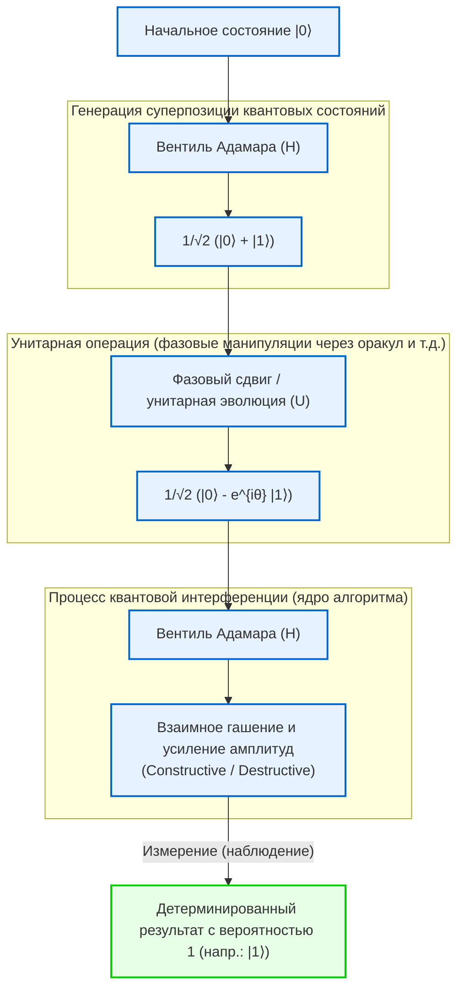

Таким образом, квантовый компьютер — это не временное средство для продления жизни полупроводниковой индустрии и обхода пределов классической механики (пределов масштабирования или термодинамических барьеров), а подлинный сдвиг парадигмы, перестраивающий само определение информации и вычислений на основе аксиом квантовой механики. В следующей главе мы глубже погрузимся в детальное изучение конкретных математических инструментов, предназначенных для свободного управления этой квантовой интерференцией, — квантовых вентилей и квантовых схем.

# Глава 2: Основы классического бита и кубита (Qubit)

При построении теоретической базы квантовой информации наиболее фундаментальным понятием является определение «минимальной единицы информации». В этой главе мы начнем с бита классической теории информации и расширим эту концепцию до «квантового бита (кубита, Qubit)» — минимальной единицы квантовой информации, основанной на постулатах квантовой механики. Используя строгий язык гильбертовых пространств, бра-кет нотации и линейной алгебры, мы детально раскроем математическую структуру квантовых состояний. Отбросив любые упрощения, взглянем на глубины квантовой информации со строго научной точки зрения.

## 2.1 Минимальная единица информации: математическая формализация классического бита и ее ограничения

В истории компьютерных наук фундаментом теории информации, заложенной Клодом Шенноном в 1948 году, является «бит (Bit)». Классический бит, независимо от его физической реализации (например, высокий или низкий уровень напряжения на транзисторе, включенное или выключенное состояние переключателя либо направление намагниченности), определяется как система в абстрактном пространстве состояний, принимающая одно из двух дискретных значений $\{0, 1\}$ .

Выразим это на более формальном языке векторных пространств. Состояние классического бита можно представить с помощью стандартного базиса в двумерном вещественном векторном пространстве $\mathbb{R}^2$ . Определим состояния $0$ и $1$ в виде следующих векторов-столбцов:

$$
\mathbf{v}_0 = \begin{pmatrix} 1 \\ 0 \end{pmatrix}, \quad \mathbf{v}_1 = \begin{pmatrix} 0 \\ 1 \end{pmatrix}
$$

В детерминированной (Deterministic) классической системе состояние бита строго фиксировано и равно либо $\mathbf{v}_0$ , либо $\mathbf{v}_1$ . Однако при наличии шума, такого как тепловой шум, или неполноты наших знаний, состояние необходимо описывать как классический вероятностный (Probabilistic) бит. В этом случае состояние бита представляется в виде распределения вероятностей, а вектор состояния $\mathbf{p}$ может быть записан как выпуклая комбинация (Convex combination) базисных векторов:

$$
\mathbf{p} = p_0 \mathbf{v}_0 + p_1 \mathbf{v}_1 = \begin{pmatrix} p_0 \\ p_1 \end{pmatrix}
$$

Здесь $p_0, p_1$ — вещественные числа, представляющие вероятности нахождения в состояниях $0$ и $1$ соответственно, и согласно аксиомам вероятностей Колмогорова они должны удовлетворять следующим условиям:

1. **Неотрицательность** : $p_0 \ge 0, \quad p_1 \ge 0$
2. **Условие нормировки (полная вероятность равна 1)** : $p_0 + p_1 = 1$

В мире классических битов составная система, объединяющая несколько битов, описывается тензорным произведением (кронекеровым произведением) соответствующих векторов вероятностей. Например, совместное распределение вероятностей двух классических битов выражается следующим образом:

$$
\mathbf{p}_{AB} = \mathbf{p}_A \otimes \mathbf{p}_B = \begin{pmatrix} p_{A0} \\ p_{A1} \end{pmatrix} \otimes \begin{pmatrix} p_{B0} \\ p_{B1} \end{pmatrix} = \begin{pmatrix} p_{A0}p_{B0} \\ p_{A0}p_{B1} \\ p_{A1}p_{B0} \\ p_{A1}p_{B1} \end{pmatrix}
$$

Аппарат классической теории информации чрезвычайно мощен и составляет основу современного цифрового общества. Однако, поскольку состояния формируются исключительно путем сложения вещественных вероятностей, описать волноподобное «взаимное погашение вероятностей» (интерференцию) здесь принципиально невозможно. Именно в этом проявляются фундаментальные ограничения классической физики и возникает необходимость перехода к квантовой информации.

## 2.2 Постулаты квантовой механики и бра-кет нотация (Bra-ket notation)

Первый постулат (Postulate) квантовой механики гласит: «Состояние изолированной (замкнутой) физической системы полностью описывается единичным вектором (вектором состояния) в полном комплексном векторном пространстве со скалярным произведением — гильбертовом пространстве (Hilbert Space) $\mathcal{H}$ ». В контексте квантовых вычислений, где непрерывными степенями свободы пространства можно пренебречь, это гильбертово пространство обычно представляет собой конечномерное комплексное векторное пространство $\mathbb{C}^d$ .

Минимальная единица квантовой информации — «квантовый бит (кубит, Qubit)» — строго определяется как состояние в двумерном комплексном гильбертовом пространстве $\mathcal{H} \cong \mathbb{C}^2$ . Для описания состояний в этом векторном пространстве стандартно используется введенная физиком Полем Дираком **бра-кет нотация (Bra-ket notation)** .

Вектор-столбец, представляющий квантовое состояние, называется **кет-вектором (Ket vector)** и обозначается как $|\psi\rangle$ . В качестве состояний, соответствующих классическим битам $0$ и $1$ , введем ортонормированный базис, называемый вычислительным базисом (Computational basis). Их также называют $Z$ -базисом кубита и определяют как $|0\rangle$ и $|1\rangle$ соответственно:

$$
|0\rangle = \begin{pmatrix} 1 \\ 0 \end{pmatrix}, \quad |1\rangle = \begin{pmatrix} 0 \\ 1 \end{pmatrix}
$$

С другой стороны, согласно теореме Рисса об представлении (Riesz representation theorem), каждому кет-вектору гильбертова пространства однозначно соответствует элемент сопряженного (дуального) пространства (Dual space), выступающий в роли непрерывного линейного функционала. Он называется **бра-вектором (Bra vector)** и обозначается как $\langle\psi|$ . В матричном представлении соответствующий бра-вектор получается взятием эрмитова сопряжения (комплексно-сопряженного транспонирования, обозначаемого $^\dagger$ ) от кет-вектора:

$$
\langle\psi| = (|\psi\rangle)^\dagger = (|\psi\rangle^*)^T
$$

Например, базисными бра-векторами являются следующие векторы-строки:

$$
\langle 0| = \begin{pmatrix} 1 & 0 \end{pmatrix}, \quad \langle 1| = \begin{pmatrix} 0 & 1 \end{pmatrix}
$$

Истинная сила бра-кет нотации заключается в том, что вычисление скалярного произведения становится предельно наглядным. Скалярное произведение бра-вектора $\langle\phi|$ и кет-вектора $|\psi\rangle$ записывается как $\langle\phi|\psi\rangle$ (это происходит от языковой игры Дирака, в которой «bra» и «ket» вместе образуют «bracket» — скобку). Поскольку вычислительный базис $\{|0\rangle, |1\rangle\}$ образует ортонормированную систему (Orthonormal system), скалярное произведение выражается через символ Кронекера $\delta_{ij}$ следующим образом:

$$
\langle i | j \rangle = \delta_{ij} \quad (i, j \in \{0, 1\})
$$

В частности, скалярное произведение с самим собой равно $1$ ($\langle 0|0\rangle = 1$, $\langle 1|1\rangle = 1$), а скалярное произведение между различными базисными векторами равно $0$ ($\langle 0|1\rangle = 0$, $\langle 1|0\rangle = 0$).

Более того, тензорное произведение кет- и бра-вектора (соответствующее внешнему произведению) записывается как $|\psi\rangle\langle\phi|$ и представляет собой линейный оператор (матрицу), действующий в пространстве состояний. Например, оператор проектирования (Projection operator) на состояние $|0\rangle$ строится следующим образом:

$$
|0\rangle\langle 0| = \begin{pmatrix} 1 \\ 0 \end{pmatrix} \begin{pmatrix} 1 & 0 \end{pmatrix} = \begin{pmatrix} 1 & 0 \\ 0 & 0 \end{pmatrix}
$$

Единичный оператор (Identity operator) $I$ в любом двумерном комплексном векторном пространстве может быть разложен через соотношение полноты (Completeness relation) базиса следующим образом, что является чрезвычайно мощным инструментом, непрерывно используемым в квантовомеханических вычислениях:

$$
I = |0\rangle\langle 0| + |1\rangle\langle 1| = \begin{pmatrix} 1 & 0 \\ 0 & 1 \end{pmatrix}
$$

## 2.3 Принцип квантовой суперпозиции и комплексные амплитуды вероятности

В то время как классический бит всегда находится либо в определенном состоянии $0$ или $1$ , либо в их вероятностной смеси, из постулата линейности (Linearity) квантовой механики следует, что кубит может находиться в принципиально ином состоянии — «суперпозиции (Superposition)», представляющей собой линейную комбинацию состояний $|0\rangle$ и $|1\rangle$ . Любой единичный вектор в гильбертовом пространстве $\mathcal{H}$ допускается в качестве физически реализуемого состояния.

Следовательно, наиболее общее чистое состояние (Pure state) $|\psi\rangle$ одиночного кубита разлагается по вычислительному базису следующим образом:

$$
|\psi\rangle = \alpha |0\rangle + \beta |1\rangle = \begin{pmatrix} \alpha \\ \beta \end{pmatrix}
$$

Здесь $\alpha$ и $\beta$ представляют собой комплексные числа ($\alpha, \beta \in \mathbb{C}$), называемые **комплексными амплитудами вероятности (Complex probability amplitude)** . В отличие от классических вероятностей, являющихся неотрицательными вещественными числами, наличие «комплексных» коэффициентов у квантовых состояний является фундаментальной причиной превосходства вычислительной мощности квантовых компьютеров над классическими. Комплексные числа обладают фазой (Phase) и могут указывать в любом направлении на комплексной плоскости, что позволяет им вести себя подобно волнам: взаимно усиливаться (конструктивная интерференция) или взаимно гаситься (деструктивная интерференция). Суть квантовых алгоритмов состоит в искусном управлении этой интерференцией для усиления амплитуды правильного ответа и взаимной компенсации амплитуд неверных ответов.

Процесс извлечения классической информации из квантовой системы называется «измерением (Measurement)». В случае проективного измерения (Projective measurement), согласно правилу Борна (Born rule), вероятность $P(0)$ получения результата $0$ и вероятность $P(1)$ получения результата $1$ при измерении состояния $|\psi\rangle$ в вычислительном базисе $\{|0\rangle, |1\rangle\}$ задаются квадратами модулей соответствующих амплитуд вероятности:

$$
P(0) = |\langle 0|\psi\rangle|^2 = |\alpha|^2 = \alpha \alpha^*
$$

$$
P(1) = |\langle 1|\psi\rangle|^2 = |\beta|^2 = \beta \beta^*
$$

Для того чтобы система гарантированно была обнаружена в каком-либо состоянии, сумма всех вероятностей должна быть строго равна $1$ . Соответственно, норма (длина) вектора квантового состояния $|\psi\rangle$ всегда должна быть равна единице. Это и есть **условие нормировки (Normalization condition)** :

$$
\langle\psi|\psi\rangle = (\alpha^* \langle 0| + \beta^* \langle 1|)(\alpha |0\rangle + \beta |1\rangle) = |\alpha|^2 + |\beta|^2 = 1
$$

Чтобы глубже исследовать геометрический смысл этих комплексных амплитуд вероятности, представим $\alpha$ и $\beta$ в полярных координатах:

$$
\alpha = r_0 e^{i\phi_0}, \quad \beta = r_1 e^{i\phi_1}
$$

Здесь $r_0, r_1 \ge 0$ — величины модулей амплитуд, а $\phi_0, \phi_1 \in [0, 2\pi)$ — соответствующие фазовые углы. Поскольку из условия нормировки следует $r_0^2 + r_1^2 = 1$ , мы можем ввести вещественный параметр $\theta \in [0, \pi]$ и положить $r_0 = \cos(\frac{\theta}{2})$ , $r_1 = \sin(\frac{\theta}{2})$ . Подставляя это в исходный вектор состояния, получаем:

$$
|\psi\rangle = \cos\left(\frac{\theta}{2}\right) e^{i\phi_0} |0\rangle + \sin\left(\frac{\theta}{2}\right) e^{i\phi_1} |1\rangle
$$

Вынесем общий фазовый множитель $e^{i\phi_0}$ за скобки:

$$
|\psi\rangle = e^{i\phi_0} \left( \cos\left(\frac{\theta}{2}\right) |0\rangle + e^{i(\phi_1 - \phi_0)} \sin\left(\frac{\theta}{2}\right) |1\rangle \right)
$$

В квантовой механике фазовый множитель $e^{i\phi_0}$ , общий для всего вектора состояния, называется «глобальной фазой (Global phase)». Если вычислить математическое ожидание $\langle A \rangle$ для любой наблюдаемой (эрмитова оператора) $A$ , мы увидим следующее:

$$
\langle A \rangle = \left( e^{-i\phi_0} \langle\psi| \right) A \left( e^{i\phi_0} |\psi\rangle \right) = e^{-i\phi_0} e^{i\phi_0} \langle\psi| A |\psi\rangle = \langle\psi| A |\psi\rangle
$$

Таким образом, глобальная фаза взаимно сокращается, поэтому ее невозможно обнаружить ни при каких физических измерениях. Иными словами, хотя $|\psi\rangle$ и $e^{i\phi_0}|\psi\rangle$ являются различными векторами в гильбертовом пространстве (но задают один и тот же луч), физически они представляют абсолютно одно и то же состояние.

Следовательно, пренебрегая глобальной фазой и сохраняя в качестве параметров только относительную фазу (Relative phase) $\varphi = \phi_1 - \phi_0$ (где $\varphi \in [0, 2\pi)$ ) между $|0\rangle$ и $|1\rangle$ , любое чистое состояние одиночного кубита однозначно и строго выражается в следующей **канонической (стандартной) форме** :

$$
|\psi\rangle = \cos\left(\frac{\theta}{2}\right) |0\rangle + e^{i\varphi} \sin\left(\frac{\theta}{2}\right) |1\rangle
$$

## 2.4 Геометрическая визуализация с помощью сферы Блоха (Bloch Sphere)

Параметризация, выведенная в предыдущем разделе, показывает, что пространство состояний одиночного кубита геометрически изоморфно поверхности единичной сферы в трехмерном пространстве (двумерной сфере $S^2$ ). Это визуальное представление названо **сферой Блоха (Bloch Sphere)** в честь предложившего ее швейцарского физика Феликса Блоха (Felix Bloch).

Угол $\theta$ в точности соответствует полярному углу (Polar angle), отсчитываемому от положительного направления оси $Z$ , а угол $\varphi$ — азимутальному углу (Azimuthal angle) в плоскости $X$ - $Y$ .

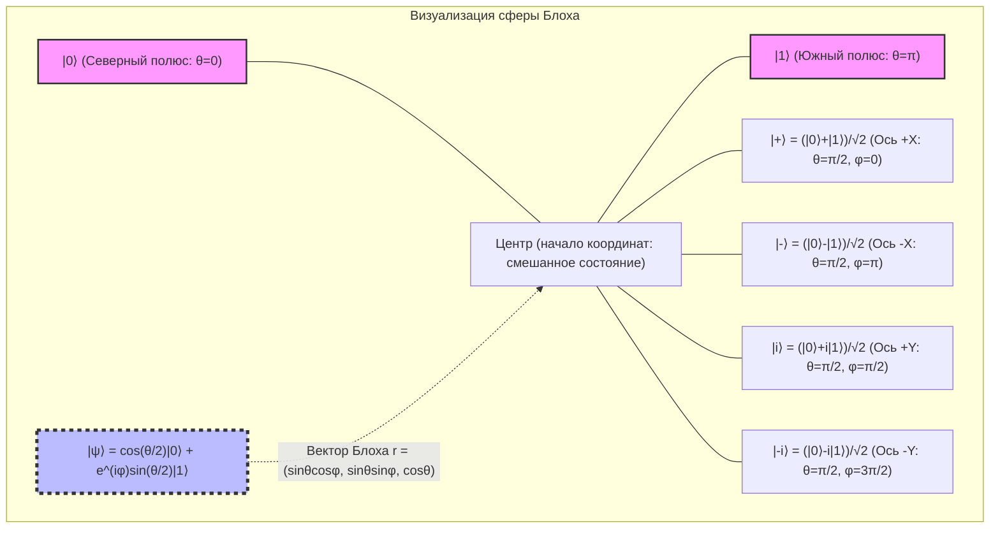

Наиболее примечательное свойство сферы Блоха состоит в том, что «ортогональные состояния в гильбертовом пространстве (состояния с нулевым скалярным произведением) на трехмерной вещественной сфере Блоха располагаются в диаметрально противоположных точках (антиподах, Antipodal points — точках, разделенных углом 180 градусов)». Например, состоянием, ортогональным $|0\rangle$ (Северный полюс, $\theta=0$ ), является $|1\rangle$ (Южный полюс, $\theta=\pi$ ). Равенство нулю скалярного произведения ортогональных состояний в гильбертовом пространстве $\langle 0 | 1 \rangle = 0$ на сфере Блоха соответствует угловому расстоянию $\pi$ (180 градусов). Геометрический угол на сфере оказывается вдвое больше угла в гильбертовом пространстве, из чего и вытекает математическая необходимость использования половинного угла $\theta/2$ в параметризации.

Координаты точки на сфере Блоха **$\mathbf{r} = (x, y, z)$** строго выводятся как математические ожидания квантовомеханических наблюдаемых (Observable) — **матриц Паули (Pauli matrices)** . Матрицы Паули, образующие базис эрмитовых операторов в двумерной системе, определяются следующим образом:

$$
X = \sigma_x = \begin{pmatrix} 0 & 1 \\ 1 & 0 \end{pmatrix}, \quad
Y = \sigma_y = \begin{pmatrix} 0 & -i \\ i & 0 \end{pmatrix}, \quad
Z = \sigma_z = \begin{pmatrix} 1 & 0 \\ 0 & -1 \end{pmatrix}
$$

Математические ожидания этих наблюдаемых Паули для произвольного состояния $|\psi\rangle$ находятся с помощью вычислений в бра-кет нотации:

$$
x = \langle\psi| X |\psi\rangle = \left( \cos\frac{\theta}{2} \langle 0| + e^{-i\varphi}\sin\frac{\theta}{2} \langle 1| \right) \begin{pmatrix} 0 & 1 \\ 1 & 0 \end{pmatrix} \begin{pmatrix} \cos\frac{\theta}{2} \\ e^{i\varphi}\sin\frac{\theta}{2} \end{pmatrix} = \sin\theta \cos\varphi
$$

$$
y = \langle\psi| Y |\psi\rangle = \left( \cos\frac{\theta}{2} \langle 0| + e^{-i\varphi}\sin\frac{\theta}{2} \langle 1| \right) \begin{pmatrix} 0 & -i \\ i & 0 \end{pmatrix} \begin{pmatrix} \cos\frac{\theta}{2} \\ e^{i\varphi}\sin\frac{\theta}{2} \end{pmatrix} = \sin\theta \sin\varphi
$$

$$
z = \langle\psi| Z |\psi\rangle = \left( \cos\frac{\theta}{2} \langle 0| + e^{-i\varphi}\sin\frac{\theta}{2} \langle 1| \right) \begin{pmatrix} 1 & 0 \\ 0 & -1 \end{pmatrix} \begin{pmatrix} \cos\frac{\theta}{2} \\ e^{i\varphi}\sin\frac{\theta}{2} \end{pmatrix} = \cos^2\left(\frac{\theta}{2}\right) - \sin^2\left(\frac{\theta}{2}\right) = \cos\theta
$$

Таким образом, вектор Блоха $\mathbf{r} = (x, y, z)$ великолепно представляется как единичный вектор в трехмерном пространстве $\mathbf{r} = (\sin\theta\cos\varphi, \sin\theta\sin\varphi, \cos\theta)$ . Кроме того, матрица плотности (Density matrix) $\rho = |\psi\rangle\langle\psi|$ , соответствующая произвольному чистому состоянию, чрезвычайно элегантно описывается с помощью вектора Паули $\boldsymbol{\sigma} = (X, Y, Z)$ и единичной матрицы $I$ :

$$
\rho = \frac{1}{2} \left( I + \mathbf{r} \cdot \boldsymbol{\sigma} \right) = \frac{1}{2} \left( I + xX + yY + zZ \right)
$$

Явное вычисление элементов этой матрицы дает следующее:

$$
\rho = \frac{1}{2} \begin{pmatrix} 1 + z & x - iy \\ x + iy & 1 - z \end{pmatrix} = \begin{pmatrix} \cos^2(\frac{\theta}{2}) & e^{-i\varphi}\sin(\frac{\theta}{2})\cos(\frac{\theta}{2}) \\ e^{i\varphi}\sin(\frac{\theta}{2})\cos(\frac{\theta}{2}) & \sin^2(\frac{\theta}{2}) \end{pmatrix}
$$

Это в точности совпадает с результатом вычисления внешнего произведения $|\psi\rangle\langle\psi|$ по определению тензорного произведения. Особого внимания заслуживает тот факт, что для чистых состояний норма вектора Блоха равна $|\mathbf{r}| = 1$ , а след квадрата матрицы плотности удовлетворяет условию $\text{Tr}(\rho^2) = 1$ . Однако для смешанных состояний (Mixed state), возникающих вследствие взаимодействия с окружающей средой или неидеального управления, вызывающего потерю квантовой информации (декогеренцию), состояние представляет собой статистический ансамбль чистых состояний, и поэтому $|\mathbf{r}| < 1$ . В результате смешанные состояния изображаются не на поверхности сферы Блоха, а в виде точек «внутри» нее, а состояние с полностью утраченной информацией — максимально смешанное состояние (Maximally mixed state) $\rho = I/2$ — располагается в самом центре сферы Блоха $\mathbf{r} = (0,0,0)$ .

## 2.5 Измерение и коллапс волновой функции (Wavefunction Collapse)

Измерение в квантовой механике коренным образом отличается от пассивного считывания информации в классической физике. Согласно аксиоматической формулировке фон Неймана, при измерении физической величины (наблюдаемой) состояние необратимо «схлопывается (коллапсирует, Collapse)» в одно из собственных состояний этой наблюдаемой.

Рассмотрим, например, измерение состояния одиночного кубита $|\psi\rangle = \alpha|0\rangle + \beta|1\rangle$ в $Z$ -базисе (то есть измерение с матрицей Паули $Z$ в качестве наблюдаемой). Значениями, получаемыми в результате измерения, могут быть только собственные значения оператора $Z$ : либо $+1$ (соответствует состоянию $|0\rangle$ ), либо $-1$ (соответствует состоянию $|1\rangle$ ).

Для строгого математического описания измерения используется набор проекционных операторов $\{ P_m \}$ . В случае $Z$ -измерения проекционные операторы имеют вид:

$$
P_0 = |0\rangle\langle 0|, \quad P_1 = |1\rangle\langle 1|
$$

Они удовлетворяют соотношению полноты $P_0 + P_1 = I$ и свойству ортогональности $P_i P_j = \delta_{ij} P_i$ . Согласно правилу Борна, вероятность $P(m)$ получения результата измерения $m \in \{0, 1\}$ вычисляется как:

$$
P(m) = \langle\psi| P_m^\dagger P_m |\psi\rangle = \langle\psi| P_m |\psi\rangle
$$

что полностью согласуется с найденными ранее $|\alpha|^2$ и $|\beta|^2$ . И самое главное: новое квантовое состояние $|\psi'\rangle$ непосредственно после получения результата измерения $m$ получается путем применения проекционного оператора к исходному состоянию и его перенормировки на новую норму:

$$
|\psi'\rangle = \frac{P_m |\psi\rangle}{\sqrt{P(m)}}
$$

Если результатом измерения стал $0$ :

$$
|\psi'\rangle = \frac{|0\rangle\langle 0| (\alpha|0\rangle + \beta|1\rangle)}{|\alpha|} = \frac{\alpha}{|\alpha|} |0\rangle = e^{i\phi_0} |0\rangle \equiv |0\rangle
$$

и состояние полностью коллапсирует в $|0\rangle$ (глобальная фаза опускается). Это и есть математическое описание явления, называемого коллапсом волновой функции (Wavefunction collapse): стоит произвести измерение и перевести состояние в коллапсированное, как относительная фаза $\varphi$ и информация об амплитудах ($\alpha, \beta$ ), содержавшиеся в исходном состоянии суперпозиции, будут безвозвратно утрачены. Таким образом, принципиально невозможно извлечь полную информацию о квантовом состоянии из одного-единственного измерения над одной копией системы (что также тесно связано с «теоремой о запрете клонирования», No-cloning theorem).

## 2.6 Введение в обобщение на многочастичные системы и перспективы следующей главы

Разобравшись в свойствах одиночного кубита, коснемся математических основ «многокубитных систем», подробно изучаемых в последующих главах. В то время как классические вероятностные распределения расширяют пространство состояний с помощью декартова произведения, гильбертово пространство составной системы $\mathcal{H}_{AB}$ в квантовой механике формируется с помощью **тензорного произведения (Tensor product)** гильбертовых пространств каждой из подсистем $\mathcal{H}_A$ и $\mathcal{H}_B$ :

$$
\mathcal{H}_{AB} = \mathcal{H}_A \otimes \mathcal{H}_B
$$

Тензорное произведение состояний двух независимых кубитов развертывается следующим образом, формируя четырехмерное комплексное векторное пространство:

$$
|\Psi\rangle_{AB} = (\alpha_0|0\rangle + \alpha_1|1\rangle) \otimes (\beta_0|0\rangle + \beta_1|1\rangle) = \alpha_0\beta_0|00\rangle + \alpha_0\beta_1|01\rangle + \alpha_1\beta_0|10\rangle + \alpha_1\beta_1|11\rangle
$$

Существование состояний, которые не могут быть факторизованы в виде тензорного произведения состояний подсистем (например, состояние Белла $|\Phi^+\rangle = (|00\rangle + |11\rangle)/\sqrt{2}$ ), является источником явления квантовой запутанности (Entanglement). Экспоненциальный взрыв размерности при тензорном произведении ($2^N$ измерений для $N$ кубитов) как раз и составляет фундамент, благодаря которому квантовые компьютеры демонстрируют подавляющую вычислительную мощность параллельной обработки.

В этой главе мы построили фундаментальные различия между классическим битом и кубитом на математической основе гильбертовых пространств. Кубит способен находиться в непрерывном состоянии суперпозиции с комплексными амплитудами вероятности, а вывод сферы Блоха дал нам мощный инструмент для интуитивного понимания абстрактного комплексного вектора в виде геометрической модели в трехмерном вещественном пространстве.

В следующей главе «Глава 3: Квантовые вентили и унитарные преобразования» мы подробно рассмотрим конкретные «квантовые логические вентили», управляющие состояниями одиночных кубитов, и раскроем математические свойства операций вращения на сфере Блоха с помощью унитарных матриц. Двери в глубокий мир квантовой информации только открылись.

# Глава 3: Аксиомы квантовой механики и наблюдение (коллапс волновой функции)

## 3.1 Введение: Аксиоматический подход квантовой механики и требования линейной алгебры

Для фундаментального понимания принципов работы квантовых компьютеров необходимо понимать теоретические основы квантовой механики в строгой математической форме. Многие теории в физике развивались индуктивно на основе эмпирических правил, но квантовая механика, в особенности современная квантовая механика, сформулированная Джоном фон Нейманом (John von Neumann), использует аксиоматический подход, выводя всю систему из небольшого числа математических «аксиом» (Axioms).

Эта система аксиом строится на арене комплексной линейной алгебры, которая может быть расширена до бесконечномерного гильбертова пространства. В квантовой теории информации и квантовых вычислениях в основном имеют дело с конечномерными векторными пространствами (например, с тензорным произведением пространств $\mathbb{C}^2$ для систем кубитов), что позволяет избежать аналитических трудностей в бесконечномерных пространствах (таких как область определения неограниченных операторов) и дает возможность описывать и понимать квантовую механику исключительно как линейную алгебру.

В этой главе мы строго и без каких-либо компромиссов сформулируем процессы, начиная от описания квантовых состояний и их эволюции во времени, и заканчивая «наблюдением», которое вызывает больше всего философских дискуссий. Читатель осознает, как квантовые явления, которые на первый взгляд противоречат интуиции, строятся на непротиворечивой и красивой математической структуре. Именно эта математическая структура является непосредственным «языком» для описания алгоритмов квантового компьютера.

## 3.2 Аксиома 1: Пространство состояний (Гильбертово пространство и вектор состояния)

Первая аксиома квантовой механики определяет, как математически выразить «состояние» физической системы.

 **Аксиома 1 (Представление состояния)** :
Состояние замкнутой физической системы полностью описывается единичным вектором с нормой 1 в гильбертовом пространстве (Hilbert space) $\mathcal{H}$, которое является полным комплексным пространством с внутренним произведением (скалярным произведением). Это называется **вектором состояния** .

Согласно бра-кет нотации (Bra-ket notation), введенной Полем Дираком (Paul Dirac), вектор состояния рассматривается как вектор-столбец и обозначается как кет **$| \psi \rangle$** . Вектор-строка, принадлежащий дуальному пространству $\mathcal{H}^*$, обозначается как бра **$\langle \psi |$** , и они находятся в отношении эрмитова сопряжения (комплексного сопряжения и транспонирования) друг к другу. То есть,

$$
\langle \psi | = ( | \psi \rangle )^\dagger
$$

Внутреннее (скалярное) произведение любых двух состояний **$| \phi \rangle$** и **$| \psi \rangle$** в гильбертовом пространстве вычисляется как произведение бра и кет **$\langle \phi | \psi \rangle$** и дает комплексное значение. Это внутреннее произведение обладает следующими свойствами:

1. **Положительная определенность** : Для любого **$| \psi \rangle \neq 0$** выполняется условие $\langle \psi | \psi \rangle > 0$
2. **Линейность** : $\langle \phi | ( c_1 | \psi_1 \rangle + c_2 | \psi_2 \rangle ) = c_1 \langle \phi | \psi_1 \rangle + c_2 \langle \phi | \psi_2 \rangle$
3. **Сопряженная симметрия** : $\langle \phi | \psi \rangle = \langle \psi | \phi \rangle^*$ (где $*$ — комплексное сопряжение)

Физическое состояние всегда должно удовлетворять условию нормировки (Normalization condition), чтобы была возможна вероятностная интерпретация. То есть, норма вектора состояния **$| \psi \rangle$** равна 1:

$$
\| | \psi \rangle \| = \sqrt{\langle \psi | \psi \rangle} = 1
$$

Кроме того, поскольку выполняется неравенство Коши-Шварца (Cauchy-Schwarz inequality) $|\langle \phi | \psi \rangle|^2 \le \langle \phi | \phi \rangle \langle \psi | \psi \rangle$, абсолютное значение внутреннего произведения между нормированными состояниями всегда находится в диапазоне от 0 до 1. Это служит математической основой для последующей интерпретации его как «вероятности».

### Принцип суперпозиции и полный ортонормированный базис

Самой выдающейся особенностью квантовой механики является «принцип суперпозиции» (Superposition principle). Если **$| \phi \rangle$** и **$| \psi \rangle$** являются физически допустимыми состояниями, то их любая комплексная линейная комбинация $c_1 | \phi \rangle + c_2 | \psi \rangle$ также (после нормировки) будет физически допустимым состоянием. Это свойство напрямую вытекает из линейности гильбертова пространства.

В гильбертовом пространстве $\mathcal{H}$ существует полный ортонормированный базис (Orthonormal basis) $\{ | e_i \rangle \}$. Эти базисные векторы ортогональны друг другу и нормированы:

$$
\langle e_i | e_j \rangle = \delta_{ij}
$$

(где $\delta_{ij}$ — символ Кронекера). Также, в виде соотношения полноты (Completeness relation) или тождества разложения, тождественный оператор $I$ можно разложить следующим образом:

$$
I = \sum_i | e_i \rangle \langle e_i |
$$

Любое квантовое состояние **$| \psi \rangle$** , воздействуя на него этим тождественным оператором, можно единственным образом разложить в виде линейной комбинации базисных векторов:

$$
| \psi \rangle = I | \psi \rangle = \left( \sum_i | e_i \rangle \langle e_i | \right) | \psi \rangle = \sum_i \langle e_i | \psi \rangle | e_i \rangle = \sum_i c_i | e_i \rangle
$$

Здесь коэффициенты разложения $c_i = \langle e_i | \psi \rangle$ называются комплексными амплитудами вероятности и играют решающую роль в правиле Борна, которое будет описано позже. Из условия нормировки $\langle \psi | \psi \rangle = 1$ следует, что $\sum_i |c_i|^2 = 1$.

## 3.3 Аксиома 2: Физические величины и эрмитовы операторы

В классической механике физические величины (наблюдаемые), такие как координата, импульс и энергия, описываются как функции, принимающие вещественные значения. Однако в квантовой механике происходит фундаментальный сдвиг парадигмы.

 **Аксиома 2 (Физические величины)** :
Наблюдаемые физические величины (наблюдаемые) описываются линейными самосопряженными операторами (эрмитовыми операторами) $A$ в гильбертовом пространстве $\mathcal{H}$.

Эрмитов оператор — это оператор, эрмитово сопряжение которого равно ему самому. То есть, он удовлетворяет условию $A = A^\dagger$. При представлении в виде матрицы в конечномерном пространстве это означает, что ее элементы комплексно-сопряженно симметричны ($A_{ij} = A_{ji}^*$).

Причина, по которой физические величины должны определяться как эрмитовы операторы, кроется в их «собственных значениях» (Eigenvalues). Согласно спектральной теореме (Spectral theorem) линейной алгебры, эрмитовы операторы обладают следующими чрезвычайно важными свойствами:

1. **Все собственные значения $a_i$ являются вещественными числами.** (Поскольку наблюдаемые физические величины всегда должны быть вещественными, это согласуется с физическими требованиями.)
2. **Собственные векторы, относящиеся к разным собственным значениям, ортогональны друг другу.** 
3. **Собственные векторы оператора $\{ | a_i \rangle \}$ образуют полный ортонормированный базис гильбертова пространства.** 

Следовательно, любую наблюдаемую $A$ можно подвергнуть спектральному разложению (Spectral decomposition) в виде линейной комбинации проекционных операторов $P_i = | a_i \rangle \langle a_i |$, используя ее собственные значения $a_i$ и собственные векторы **$| a_i \rangle$** :

$$
A = \sum_i a_i | a_i \rangle \langle a_i |
$$

Благодаря этой формулировке акт «измерения физической величины» можно понимать как геометрическую операцию проекции на определенный базис (собственные векторы) в гильбертовом пространстве. Например, наблюдение $\sigma_z$ кубита полностью описывается как операция проекции на ортогональный базис: состояние **$| 0 \rangle$** , соответствующее собственному значению $+1$, и состояние **$| 1 \rangle$** , соответствующее собственному значению $-1$.

## 3.4 Аксиома 3: Унитарная временная эволюция и уравнение Шрёдингера

Когда квантовая система изолирована и не взаимодействует с другими системами, ее состояние изменяется во времени детерминированным и обратимым образом.

 **Аксиома 3 (Временная эволюция)** :
Временная эволюция состояния изолированной квантовой системы подчиняется уравнению Шрёдингера (Schrödinger equation). Или, в эквивалентной формулировке, состояние **$| \psi(t_0) \rangle$** в момент времени $t_0$ эволюционирует в состояние **$| \psi(t) \rangle$** в момент времени $t$ путем воздействия на него унитарным оператором $U(t, t_0)$.

Зависящее от времени уравнение Шрёдингера, являющееся фундаментальным уравнением, описывающим временную эволюцию, выражается следующим образом:

$$
i\hbar \frac{d}{dt} | \psi(t) \rangle = H | \psi(t) \rangle
$$

Здесь $i$ — мнимая единица, $\hbar$ — редуцированная постоянная Планка, а $H$ — оператор Гамильтониана (Hamiltonian), являющийся наблюдаемой, соответствующей полной энергии системы.

Если рассматривать систему, в которой гамильтониан $H$ не зависит от времени (инвариантен во времени), это дифференциальное уравнение формально интегрируется, и решение дается в виде:

$$
| \psi(t) \rangle = \exp\left( -\frac{i}{\hbar} H (t - t_0) \right) | \psi(t_0) \rangle
$$

Оператор, выраженный этой экспоненциальной функцией, $U(t, t_0) = \exp\left( -i H (t - t_0) / \hbar \right)$, является оператором временной эволюции. Поскольку гамильтониан $H$ является эрмитовым ($H = H^\dagger$), согласно теореме Стоуна (Stone's theorem), $U$ является унитарным оператором (Unitary operator). Унитарный оператор — это оператор, эрмитово сопряжение которого равно его обратной матрице ($U^\dagger U = U U^\dagger = I$).

Чрезвычайно важный физический смысл унитарного преобразования заключается в том, что оно **«сохраняет норму (длину) и внутреннее произведение векторов состояния»** . То есть, сколько бы времени ни прошло, всегда гарантируется, что $\langle \psi(t) | \psi(t) \rangle = \langle \psi(t_0) | U^\dagger U | \psi(t_0) \rangle = 1$, и физический закон о том, что сумма вероятностей равна 1, никогда не нарушается. «Квантовые вентили» квантового компьютера — это не что иное, как операции искусственного проектирования и контроля этой унитарной временной эволюции. Например, вентиль Адамара и вентиль CNOT все выражаются как унитарные матрицы.

## 3.5 Аксиома 4: Наблюдение и правило Борна (Born rule)

Понятие «наблюдение» (Measurement) в квантовой механике фундаментально отличается от классической физики. В классической системе акт наблюдения считается пассивным актом получения значения без возмущения состояния системы. Однако в квантовой механике наблюдение — это активное вмешательство в состояние, вызывающее необратимые изменения.

 **Аксиома 4 (Наблюдение и правило Борна)** :
Когда над системой в состоянии **$| \psi \rangle$** производится измерение наблюдаемой $A$ со спектральным разложением $A = \sum_i a_i P_i$, полученное измеренное значение обязательно будет одним из собственных значений $a_i$ наблюдаемой $A$. Вероятность $p(a_k)$ получения конкретного собственного значения $a_k$ дается в соответствии с правилом Борна следующим образом:

$$
p(a_k) = \langle \psi | P_k | \psi \rangle = \| P_k | \psi \rangle \|^2
$$

Если собственное значение $a_k$ является невырожденным (существует только один соответствующий собственный вектор **$| a_k \rangle$** ), проекционный оператор становится $P_k = | a_k \rangle \langle a_k |$, а вероятность вычисляется как квадрат модуля внутреннего произведения состояния на собственный вектор:

$$
p(a_k) = \langle \psi | a_k \rangle \langle a_k | \psi \rangle = | \langle a_k | \psi \rangle |^2
$$

Это в точности равно квадрату модуля $|c_k|^2$ коэффициента $c_k = \langle a_k | \psi \rangle$ при разложении вектора состояния **$| \psi \rangle$** по базису $\{ | a_i \rangle \}$. Саму комплексную амплитуду вероятности $c_k$ нельзя наблюдать непосредственно, но квадрат ее модуля проявляется как вероятность наблюдения в реальном мире. Проницательность Макса Борна (Max Born), предложившего это правило, стала важной вехой, которая преобразовала физику от детерминизма к теории вероятностей. Ожидаемое значение $\langle A \rangle$ наблюдаемой $A$ вычисляется как сумма произведений всех собственных значений на вероятности их появления, и в конечном итоге очень красиво выражается в виде внутреннего произведения с вектором состояния:

$$
\langle A \rangle = \sum_i a_i p(a_i) = \sum_i a_i \langle \psi | P_i | \psi \rangle = \langle \psi | \left( \sum_i a_i P_i \right) | \psi \rangle = \langle \psi | A | \psi \rangle
$$

## 3.6 Коллапс волновой функции (редукция состояния) и декогеренция в результате наблюдения

Аксиома наблюдения включает в себя самый обсуждаемый и важный шаг: что происходит с состоянием системы «после» наблюдения. Это явление известно как «коллапс волновой функции» (Wavefunction collapse) или «редукция состояния» (State reduction). Этот процесс, известный как проекционный постулат фон Неймана (Projection postulate), формулируется следующим образом:

 **Проекционный постулат** :
Сразу после получения собственного значения $a_k$ в результате наблюдения состояние системы **$| \psi' \rangle$** мгновенно изменяется (коллапсирует) в состояние, полученное путем применения к исходному вектору состояния соответствующего проекционного оператора $P_k$ и его перенормировки:

$$
| \psi' \rangle = \frac{P_k | \psi \rangle}{\sqrt{p(a_k)}}
$$

Если измерительный прибор идеален и состояние системы сколлапсировало в невырожденное собственное значение $a_k$, состояние сразу после наблюдения становится строго самим собственным вектором **$| a_k \rangle$** . То есть, если сразу же повторить то же самое измерение, то с вероятностью 1 (100%) снова будет получено $a_k$. Это называется «измерением первого рода».

Этот «коллапс волновой функции» имеет свойства (прерывность, вероятностность, необратимость), которые явно противоречат унитарной временной эволюции (непрерывной, детерминированной, обратимой), описываемой уравнением Шрёдингера. Квантовая механика содержит в себе дуалистическую динамику: система эволюционирует унитарно, пока она изолирована, и претерпевает неунитарный коллапс в момент контакта с макроскопическим измерительным прибором.

### От чистого состояния к смешанному: Введение оператора плотности

Для более глубокого понимания парадокса коллапса волновой функции необходимо понятие «оператора плотности» (Density operator). Вектор состояния **$| \psi \rangle$** , с которым мы имели дело до сих пор, представляет собой «чистое состояние» (Pure state), содержащее максимум информации о системе. Оператор плотности чистого состояния определяется как $\rho = | \psi \rangle \langle \psi |$.

С другой стороны, если в процессе наблюдения неизвестно, в какое состояние сколлапсировала система (или информация была потеряна), систему необходимо описывать как классическое вероятностное смешанное состояние (Mixed state). Например, оператор плотности, представляющий ансамбль систем, сколлапсировавших в состояние **$| a_k \rangle$** с вероятностью $p(a_k)$, выглядит следующим образом:

$$
\rho' = \sum_k p(a_k) | a_k \rangle \langle a_k |
$$

В этом случае недиагональные элементы (интерференционные члены) $\rho = | \psi \rangle \langle \psi |$, находившиеся в чистом состоянии, полностью исчезают в результате акта наблюдения. Эта потеря когерентности и является сутью «декогеренции» (Decoherence).

### Декогеренция и возникновение макроскопической классичности

Измерительный прибор также является частью квантовой системы, состоящей из большого числа частиц, и в результате взаимодействия квантовой системы с огромной окружающей средой (измерительным прибором, тепловой ванной и т.д.) возникает «запутанность» (квантовая запутанность). Если взять частичный след (Partial trace) по степеням свободы окружающей среды и вычислить редуцированную матрицу плотности (Reduced density matrix) только для целевой системы, то вектор состояния системы, находившейся в чистом состоянии, быстро перейдет в смешанное состояние, и фазовая когерентность между компонентами системы будет потеряна.

$$
\rho_{S} = \mathrm{Tr}_{E} [ | \Psi_{SE} \rangle \langle \Psi_{SE} | ]
$$

В результате этого суперпозиция исчезает на макроскопическом масштабе, и система кажется ведущей себя как классическая вероятностная смесь. Коллапс волновой функции — это ни в коем случае не нарушение физических законов, а его можно рассматривать как диссипацию информации в результате необратимого взаимодействия с окружающей средой. Преодоление этой декогеренции является величайшим вызовом человечества для реализации отказоустойчивых квантовых компьютеров.

### Временная эволюция квантовых состояний и динамика наблюдения

Следующая диаграмма визуализирует процесс от начального состояния квантовой системы через унитарную временную эволюцию к вероятностному ветвлению (коллапсу) состояния в результате наблюдения. Обратите внимание на контраст между детерминированной эволюцией Шрёдингера и вероятностным коллапсом Борна.

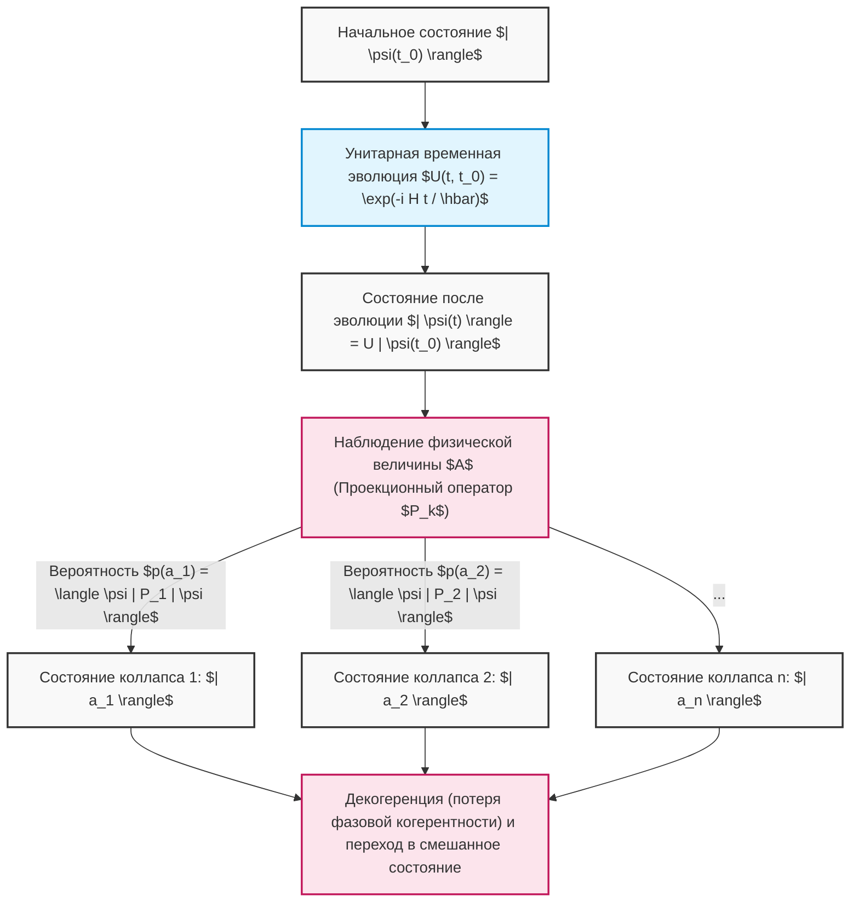

Таким образом, абстрактные концепции линейной алгебры — векторные пространства, внутренние произведения, эрмитовы операторы, задачи на собственные значения, унитарные матрицы — это не просто математические игры, а уникальный язык для точного описания и предсказания тончайшего поведения Вселенной. Алгоритмы квантовых компьютеров мастерски манипулируют этими двумя могущественными правилами: «детерминированной эволюцией Шрёдингера» и «вероятностным коллапсом Борна», ведя нас в область вычислений, недоступную для классических компьютеров.

# Глава 4: Однокубитные вентили и унитарные преобразования

В основе квантовых вычислений лежит точное манипулирование квантовыми состояниями. В то время как логические вентили в классических компьютерах (такие как AND, OR, NOT) необратимо управляют значениями битов, "квантовые вентили" в квантовом компьютере представляют собой обратимую временную эволюцию, подчиняющуюся требованиям уравнения Шредингера, и математически строго описываются как "унитарные преобразования (унитарные матрицы)" в комплексном гильбертовом пространстве. В этой главе мы тщательно и без каких-либо компромиссов исследуем математическую структуру, алгебраические свойства и интуитивный геометрический смысл базовых квантовых вентилей, действующих на один кубит (двухуровневую систему) на сфере Блоха (Bloch sphere).

## 4.1 Постулаты квантовой механики и неизбежность унитарных матриц

Временная эволюция квантовой системы описывается следующим уравнением Шредингера, использующим гамильтониан **$H$** ( **$H^\dagger = H$** ), который является эрмитовым оператором, характеризующим систему.

$$
i\hbar \frac{d}{dt} |\psi(t)\rangle = H |\psi(t)\rangle
$$

Если предположить, что система имеет гамильтониан **$H$** , не зависящий от времени, квантовое состояние **$|\psi(t)\rangle$** в любой момент времени **$t$** формально интегрируется из начального состояния **$|\psi(0)\rangle$** следующим образом:

$$
|\psi(t)\rangle = e^{-\frac{i}{\hbar}Ht} |\psi(0)\rangle
$$

Оператор временной эволюции, появляющийся здесь, определяется как **$U(t) = e^{-\frac{i}{\hbar}Ht}$** . Поскольку **$H$** в показателе экспоненты является эрмитовым, вычисление сопряженного оператора (эрмитова сопряжения) **$U(t)^\dagger$** для этого оператора **$U(t)$** приводит к следующему чрезвычайно важному свойству:

$$
U(t)^\dagger U(t) = \left( e^{-\frac{i}{\hbar}Ht} \right)^\dagger e^{-\frac{i}{\hbar}Ht} = e^{\frac{i}{\hbar}H^\dagger t} e^{-\frac{i}{\hbar}Ht} = e^{\frac{i}{\hbar}Ht} e^{-\frac{i}{\hbar}Ht} = I
$$

Аналогично, также выполняется **$U(t) U(t)^\dagger = I$** . Матрица, сопряженная которой совпадает с ее обратной матрицей ( **$U^\dagger = U^{-1}$** ), называется "унитарной матрицей (Unitary Matrix)". Однокубитный вентиль — это не что иное, как унитарная матрица **$2 \times 2$** , реализуемая гамильтонианом, специально спроектированным посредством физического управления (например, облучения микроволновыми импульсами определенной частоты и длительности).

Унитарные матрицы абсолютно необходимы в квантовой механике, потому что они являются единственным линейным преобразованием, математически гарантирующим "сохранение вероятности (сохранение нормы)". Давайте вычислим внутреннее произведение состояний после применения унитарного преобразования **$U$** к произвольным квантовым состояниям **$|\psi\rangle$** и **$|\phi\rangle$** .

$$
\langle \phi' | \psi' \rangle = ( \langle \phi | U^\dagger ) ( U |\psi\rangle ) = \langle \phi | U^\dagger U | \psi \rangle = \langle \phi | I | \psi \rangle = \langle \phi | \psi \rangle
$$

Сохранение внутреннего произведения означает, что норма самого вектора состояния (квадрат длины) **$\langle \psi | \psi \rangle$** также сохраняется. Согласно правилу Борна (Born rule) квантовой механики, сумма квадратов абсолютных значений амплитуд вектора состояния должна равняться полной вероятности "1", поэтому для того, чтобы эта вероятностная интерпретация не нарушалась в результате операций квантовых вентилей, унитарность операций является абсолютным предварительным условием.

Кроме того, согласно спектральной теореме, любая унитарная матрица **$U$** может быть выражена как **$U = e^{iK}$** с использованием эрмитовой матрицы **$K$** с вещественными собственными значениями **$\lambda_k$** . Собственные значения унитарной матрицы всегда имеют форму комплексного числа с абсолютным значением 1 ( **$e^{i\theta}$** ), а собственные векторы образуют полную систему, ортогональную друг другу.

$$
U = \sum_{j=1}^{d} e^{i \theta_j} |\phi_j\rangle \langle \phi_j|
$$

Это показывает, что действие квантового вентиля может быть полностью разложено как операция, которая "придает только чистое фазовое вращение **$e^{i\theta_j}$** заданному ортогональному базису **$|\phi_j\rangle$** ".

## 4.2 Матрицы Паウли и базовые вентили (вентили X, Y, Z)

Для понимания языка квантовой информации знание группы матриц Паули (Pauli matrices) неизбежно и имеет первостепенное значение. Введенная в физике для описания углового момента частиц со спином 1/2, эта группа матриц в квантовом компьютере образует группу наиболее фундаментальных и ортогональных операций над одним кубитом.

### 4.2.1 Вентиль Паули X (вентиль инверсии бита)

Вентиль Паули X является квантовомеханическим расширением вентиля NOT в классических логических схемах. В представлении внешнего произведения (проектора) с использованием бра-кет-нотации Дирака он определяется следующим образом:

$$
X = \sigma_x = |0\rangle\langle 1| + |1\rangle\langle 0| = \begin{pmatrix} 0 & 1 \\ 1 & 0 \end{pmatrix}
$$

Если мы строго проверим действие на вычислительный базис ( **$|0\rangle, |1\rangle$** ) с помощью матричных вычислений:

$$
X |0\rangle = \begin{pmatrix} 0 & 1 \\ 1 & 0 \end{pmatrix} \begin{pmatrix} 1 \\ 0 \end{pmatrix} = \begin{pmatrix} 0 \\ 1 \end{pmatrix} = |1\rangle
$$

$$
X |1\rangle = \begin{pmatrix} 0 & 1 \\ 1 & 0 \end{pmatrix} \begin{pmatrix} 0 \\ 1 \end{pmatrix} = \begin{pmatrix} 1 \\ 0 \end{pmatrix} = |0\rangle
$$

Таким образом, амплитуда полностью инвертируется. Геометрически это соответствует операции вращения на **$\pi$** (180 градусов) вокруг оси X на сфере Блоха. Северный полюс ( **$|0\rangle$** ) отображается на южный полюс ( **$|1\rangle$** ), а южный полюс — на северный.

### 4.2.2 Вентиль Паули Y (вентиль инверсии бита и фазы)

Вентиль Паули Y вызывает одновременную инверсию бита и фазы, а также добавляет фазовый множитель — мнимую единицу **$i$** . Представление внешнего произведения и матричное представление приведены ниже:

$$
Y = \sigma_y = -i|0\rangle\langle 1| + i|1\rangle\langle 0| = \begin{pmatrix} 0 & -i \\ i & 0 \end{pmatrix}
$$

Действие на вычислительный базис:

$$
Y |0\rangle = i|1\rangle, \quad Y |1\rangle = -i|0\rangle
$$

На сфере Блоха он представляет собой вращение на **$\pi$** вокруг оси Y. Умножение на мнимую единицу **$i$** (то есть **$e^{i\pi/2}$** ) означает не просто инверсию, а сдвиг в ортогональном направлении в фазовом пространстве состояний.

### 4.2.3 Вентиль Паули Z (вентиль инверсии фазы)

Вентиль Паули Z — это чистая "фазовая операция", специфичная для квантовой механики и не существующая в классической логике. Не изменяя величину амплитуды (вероятность измерения), он применяет фазовый сдвиг **$-1$** (то есть **$e^{i\pi}$** ) только к компоненте **$|1\rangle$** .

$$
Z = \sigma_z = |0\rangle\langle 0| - |1\rangle\langle 1| = \begin{pmatrix} 1 & 0 \\ 0 & -1 \end{pmatrix}
$$

Действие очевидно:

$$
Z |0\rangle = |0\rangle, \quad Z |1\rangle = -|1\rangle
$$

Это соответствует вращению на **$\pi$** вокруг оси Z. Поскольку вычислительные базисы **$|0\rangle, |1\rangle$** являются собственными векторами матрицы Z (с собственными значениями +1 и -1 соответственно), применение вентиля Z не вызывает перехода состояния. Однако, когда он действует на состояние суперпозиции (например, **$\alpha|0\rangle + \beta|1\rangle$** ), относительная фаза резко инвертируется на **$\alpha|0\rangle - \beta|1\rangle$** , что решающим образом меняет результат последующей интерференции.

### 4.2.4 Глубокая алгебраическая структура группы Паули

Группа матриц Паули **$\{I, X, Y, Z\}$** образует чрезвычайно красивую алгебраическую структуру в качестве линейных операторов в гильбертовом пространстве.

1. **Совместимость самосопряженности (эрмитовости) и унитарности** : **$X = X^\dagger$** , **$Y = Y^\dagger$** , **$Z = Z^\dagger$** , и в то же время выполняется **$X^\dagger X = I$** (то есть **$X = X^{-1}$** ). Это редкое свойство, когда они являются как физическими величинами (наблюдаемыми), так и сами по себе унитарными генераторами временной эволюции (вентилями). При последовательном применении дважды они возвращаются к тождественному преобразованию (инволюция: **$X^2 = Y^2 = Z^2 = I$** ).
2. **Полное антикоммутационное соотношение** : При изменении порядка произведения разных матриц Паули знак меняется на противоположный.
   

$$
\{X, Y\} = XY + YX = 0, \quad \{Y, Z\} = 0, \quad \{Z, X\} = 0
$$

3. **Коммутационные соотношения и алгебра Ли** : Используя коммутатор **$[A, B] = AB - BA$** , они ясно демонстрируют структуру в качестве генераторов алгебры Ли **$SU(2)$** (с использованием полностью антисимметричного тензора **$\epsilon_{ijk}$** ).
   

$$
[\sigma_j, \sigma_k] = 2i \sum_{l \in \{x,y,z\}} \epsilon_{jkl} \sigma_l
$$

   В частности, **$XY = iZ$** , **$YZ = iX$** , **$ZX = iY$** . Эта алгебраическая структура обеспечивает математическую основу для определения произвольных вращательных вентилей, описанных ниже.

## 4.3 Вентиль Адамара (вентиль H): Создание квантовой суперпозиции

В квантовых алгоритмах (например, алгоритме Дойча-Йожи или алгоритме Шора) вентиль Адамара (Hadamard gate) применяется почти всегда сразу после инициализации. Он играет центральную роль в создании "состояния максимальной суперпозиции", в котором все состояния появляются с равной вероятностью из детерминированного состояния.

$$
H = \frac{1}{\sqrt{2}} \begin{pmatrix} 1 & 1 \\ 1 & -1 \end{pmatrix} = \frac{1}{\sqrt{2}} \left( |0\rangle\langle 0| + |0\rangle\langle 1| + |1\rangle\langle 0| - |1\rangle\langle 1| \right)
$$

Когда матрица Адамара действует на вычислительный базис:

$$
H |0\rangle = \frac{1}{\sqrt{2}} \begin{pmatrix} 1 & 1 \\ 1 & -1 \end{pmatrix} \begin{pmatrix} 1 \\ 0 \end{pmatrix} = \frac{1}{\sqrt{2}} \begin{pmatrix} 1 \\ 1 \end{pmatrix} = \frac{|0\rangle + |1\rangle}{\sqrt{2}} \equiv |+\rangle
$$

$$
H |1\rangle = \frac{1}{\sqrt{2}} \begin{pmatrix} 1 & 1 \\ 1 & -1 \end{pmatrix} \begin{pmatrix} 0 \\ 1 \end{pmatrix} = \frac{1}{\sqrt{2}} \begin{pmatrix} 1 \\ -1 \end{pmatrix} = \frac{|0\rangle - |1\rangle}{\sqrt{2}} \equiv |-\rangle
$$

Сгенерированные состояния **$|+\rangle$** и **$|-\rangle$** называются X-базисом (или диагональным базисом) и являются собственными состояниями матрицы Паули X. Поскольку сама матрица Адамара является вещественной симметричной и ортогональной матрицей (унитарной матрицей в вещественном пространстве), она удовлетворяет **$H = H^\dagger = H^{-1}$** и **$H^2 = I$** .
Следовательно, **$H |+\rangle = |0\rangle$** , и он также обладает действием интерференции (возвращения) состояния суперпозиции обратно в детерминированный вычислительный базис.
Алгебраически, вентиль H — это унитарное преобразование, которое переводит X-базис в Z-базис и наоборот. Это чрезвычайно красиво описывается как преобразование подобия матриц следующим образом:

$$
H X H^\dagger = H X H = Z
$$

$$
H Z H^\dagger = H Z H = X
$$

Благодаря этому свойству, "зажимая" "инверсию фазы вентилем Z" между вентилями H, можно синтезировать "инверсию бита вентилем X". Геометрически вентиль H эквивалентен вращению на **$\pi$** вокруг единичного вектора **$\hat{n} = \frac{1}{\sqrt{2}}(\hat{x} + \hat{z})$** на сфере Блоха.

## 4.4 Группа фазовых вентилей: вентили S и T

Более обобщенная группа операций вращения вокруг оси Z сферы Блоха, основанная на вентиле Паули Z, называется фазовым вентилем (phase shift gate) **$P(\phi)$** (или **$R_\phi$** ).

$$
P(\phi) = \begin{pmatrix} 1 & 0 \\ 0 & e^{i\phi} \end{pmatrix} = |0\rangle\langle 0| + e^{i\phi} |1\rangle\langle 1|
$$

Эта группа вентилей манипулирует только относительной фазой компоненты **$|1\rangle$** в форме **$\alpha|0\rangle + \beta e^{i\phi}|1\rangle$** для состояния суперпозиции **$\alpha|0\rangle + \beta|1\rangle$** . В частности, важны следующие два вентиля.

### 4.4.1 Вентиль S (фазовый вентиль, $\sqrt{Z}$ )

Случай, когда **$\phi = \pi/2$** , называется вентилем S.

$$
S = \begin{pmatrix} 1 & 0 \\ 0 & e^{i\pi/2} \end{pmatrix} = \begin{pmatrix} 1 & 0 \\ 0 & i \end{pmatrix}
$$

Как видно из свойств матрицы, двойное применение дает вентиль Z ( **$S^2 = Z$** ).
Когда вентиль S действует на состояние **$|+\rangle$** :

$$
S |+\rangle = \begin{pmatrix} 1 & 0 \\ 0 & i \end{pmatrix} \frac{1}{\sqrt{2}} \begin{pmatrix} 1 \\ 1 \end{pmatrix} = \frac{1}{\sqrt{2}} \begin{pmatrix} 1 \\ i \end{pmatrix} = \frac{|0\rangle + i|1\rangle}{\sqrt{2}} \equiv |+i\rangle
$$

Это переводит состояние в положительное направление оси Y на экваторе сферы Блоха (собственное состояние Y-базиса). Группа, состоящая из группы Паули и вентилей H, S, называется группой Клиффорда (Clifford group), и по теореме Готтесмана-Книлла доказано, что квантовые схемы, состоящие исключительно из группы Клиффорда, могут эффективно моделироваться на классическом компьютере.

### 4.4.2 Вентиль T (вентиль $\pi/8$ , $\sqrt{S}$ , $\sqrt[4]{Z}$ )

Случай, когда **$\phi = \pi/4$** , называется вентилем T.

$$
T = \begin{pmatrix} 1 & 0 \\ 0 & e^{i\pi/4} \end{pmatrix} = \begin{pmatrix} 1 & 0 \\ 0 & \frac{1+i}{\sqrt{2}} \end{pmatrix}
$$

Если вынести за скобки глобальную фазу **$e^{i\pi/8}$** , диагональные компоненты становятся **$e^{-i\pi/8}$** и **$e^{i\pi/8}$** , поэтому исторически он также называется вентилем **$\pi/8$** .
Вентиль T не принадлежит группе Клиффорда и разрушает эффективность классического моделирования. Однако в теории квантовых вычислений существует чрезвычайно важная теорема, гласящая, что добавление хотя бы одного этого вентиля T к группе Клиффорда завершает "универсальный набор квантовых вентилей (Universal Quantum Gate Set)", который может аппроксимировать любое унитарное преобразование на одном кубите с произвольной точностью. В отказоустойчивых квантовых вычислениях вентиль T трудно выполнить напрямую на кодах исправления ошибок, поэтому он реализуется с использованием очень дорогостоящего метода, называемого "дистилляцией магических состояний (Magic State Distillation)".

## 4.5 Экспоненциальное представление и универсальность произвольных вращательных вентилей

Наиболее общей операцией над одним кубитом является унитарное преобразование, которое поворачивает на угол **$\theta$** вокруг произвольного единичного вектора **$\hat{n} = (n_x, n_y, n_z)$** (где **$n_x^2 + n_y^2 + n_z^2 = 1$** ) в качестве оси вращения на сфере Блоха. Используя линейную комбинацию матриц Паули, этот оператор вращения **$R_{\hat{n}}(\theta)$** красиво формулируется как экспонента от матрицы следующим образом:

$$
R_{\hat{n}}(\theta) = \exp\left(-i \frac{\theta}{2} (\hat{n} \cdot \vec{\sigma})\right) = \exp\left(-i \frac{\theta}{2} (n_x X + n_y Y + n_z Z)\right)
$$

Здесь, используя мощное свойство антикоммутативности матриц Паули **$(\hat{n} \cdot \vec{\sigma})^2 = (n_x X + n_y Y + n_z Z)^2 = (n_x^2 + n_y^2 + n_z^2)I = I$** и раскладывая экспоненту в ряд Тейлора ( **$e^{iAx} = \cos(x)I + i\sin(x)A$** (для случая **$A^2=I$** )), бесконечный ряд кардинально упрощается, и получается следующая матричная версия формулы Эйлера:

$$
R_{\hat{n}}(\theta) = \cos\left(\frac{\theta}{2}\right) I - i \sin\left(\frac{\theta}{2}\right) (\hat{n} \cdot \vec{\sigma})
$$

Из этой общей формулировки выводятся базовые группы вращательных вентилей вокруг осей прямоугольной системы координат.

### Вращательный вентиль вокруг оси X $R_x(\theta)$ 

$$
R_x(\theta) = e^{-i \frac{\theta}{2} X} = \begin{pmatrix} \cos\frac{\theta}{2} & -i \sin\frac{\theta}{2} \\ -i \sin\frac{\theta}{2} & \cos\frac{\theta}{2} \end{pmatrix}
$$

### Вращательный вентиль вокруг оси Y $R_y(\theta)$ 

$$
R_y(\theta) = e^{-i \frac{\theta}{2} Y} = \begin{pmatrix} \cos\frac{\theta}{2} & -\sin\frac{\theta}{2} \\ \sin\frac{\theta}{2} & \cos\frac{\theta}{2} \end{pmatrix}
$$

### Вращательный вентиль вокруг оси Z $R_z(\theta)$ 

$$
R_z(\theta) = e^{-i \frac{\theta}{2} Z} = \begin{pmatrix} e^{-i\theta/2} & 0 \\ 0 & e^{i\theta/2} \end{pmatrix}
$$

Используя эти матрицы вращения, любая однокубитная унитарная матрица **$U \in SU(2)$** может быть полностью факторизована как "Z-Y-Z разложение" с использованием трех углов Эйлера ( **$\alpha, \beta, \gamma$** ) следующим образом:

$$
U = e^{i\delta} R_z(\alpha) R_y(\beta) R_z(\gamma)
$$

Эта теорема физически гарантирует, что если на аппаратном уровне можно реализовать вращения вокруг осей Z и Y с высокой точностью, то можно выполнить любой сколь угодно сложный алгоритм над одним кубитом.

## 4.6 [Иллюстрация] Схема однокубитных вентилей и переходы состояний

Квантовая схема — это эти вентили, расположенные в хронологическом порядке. Состояние эволюционирует во времени слева направо.

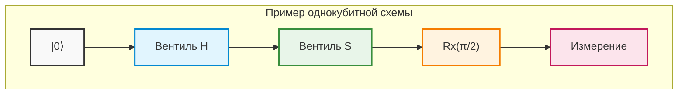

## 4.7 Пример строгого расчета: Полное отслеживание квантовой интерференции с помощью матричных последовательностей

Чтобы возвысить абстрактные концепции до физической интуиции, мы строго и без каких-либо сокращений вручную отследим, как квантовые состояния интерферируют и переходят путем перемножения множества унитарных матриц.

Пусть начальным состоянием будет базовое состояние **$|\psi_0\rangle = |0\rangle = \begin{pmatrix} 1 \\ 0 \end{pmatrix}$** .
Выполняемая операция представляет собой последовательность "Вентиль **$H$** " -> "Вентиль **$S$** " -> "Вентиль **$H$** ", аналогичную схеме выше.
Хотя квантовые схемы рисуются слева направо, операторное умножение линейной алгебры на вектор состояния применяется "слева направо" (на вектор, стоящий справа), поэтому уравнение для общего унитарного оператора **$U_{total}$** записывается в обратном времени порядке, справа налево.

$$
U_{total} = H S H
$$

Подставим матричные представления каждого вентиля для вывода составной матрицы.

$$
H = \frac{1}{\sqrt{2}} \begin{pmatrix} 1 & 1 \\ 1 & -1 \end{pmatrix}, \quad S = \begin{pmatrix} 1 & 0 \\ 0 & i \end{pmatrix}
$$

Сначала вычислим произведение **$SH$** матрицы **$H$** , применяемой сразу после начального состояния, и следующей матрицы **$S$** .

$$
S H = \begin{pmatrix} 1 & 0 \\ 0 & i \end{pmatrix} \frac{1}{\sqrt{2}} \begin{pmatrix} 1 & 1 \\ 1 & -1 \end{pmatrix} = \frac{1}{\sqrt{2}} \begin{pmatrix} 1\cdot 1 + 0\cdot 1 & 1\cdot 1 + 0\cdot(-1) \\ 0\cdot 1 + i\cdot 1 & 0\cdot 1 + i\cdot(-1) \end{pmatrix} = \frac{1}{\sqrt{2}} \begin{pmatrix} 1 & 1 \\ i & -i \end{pmatrix}
$$

Затем умножим этот результат на последнюю матрицу **$H$** слева.

$$
U_{total} = H (S H) = \frac{1}{\sqrt{2}} \begin{pmatrix} 1 & 1 \\ 1 & -1 \end{pmatrix} \frac{1}{\sqrt{2}} \begin{pmatrix} 1 & 1 \\ i & -i \end{pmatrix}
$$

Вынесем скалярный множитель **$\frac{1}{\sqrt{2}} \times \frac{1}{\sqrt{2}} = \frac{1}{2}$** вперед и аккуратно выполним умножение матриц.

$$
U_{total} = \frac{1}{2} \begin{pmatrix} 1\cdot 1 + 1\cdot i & 1\cdot 1 + 1\cdot(-i) \\ 1\cdot 1 + (-1)\cdot i & 1\cdot 1 + (-1)\cdot(-i) \end{pmatrix} = \frac{1}{2} \begin{pmatrix} 1 + i & 1 - i \\ 1 - i & 1 + i \end{pmatrix}
$$

Это представление всей схемы в виде единой унитарной матрицы при рассмотрении ее как единого черного ящика.
Применим эту матрицу **$U_{total}$** к начальному состоянию **$|0\rangle$** и вычислим конечное состояние **$|\psi_{final}\rangle$** .

$$
|\psi_{final}\rangle = U_{total} |0\rangle = \frac{1}{2} \begin{pmatrix} 1 + i & 1 - i \\ 1 - i & 1 + i \end{pmatrix} \begin{pmatrix} 1 \\ 0 \end{pmatrix} = \frac{1}{2} \begin{pmatrix} 1 + i \\ 1 - i \end{pmatrix}
$$

Раскладывая это в нотации Дирака, получаем следующее:

$$
|\psi_{final}\rangle = \frac{1+i}{2} |0\rangle + \frac{1-i}{2} |1\rangle
$$

Здесь, чтобы убедиться, что унитарность (сумма вероятностей равна 1) не нарушена, мы вычисляем вероятности наблюдения каждого базиса. Используем квадрат абсолютного значения комплексного числа ** $|z|^2 = z z^*$ **.

$$
P(0) = |\langle 0 | \psi_{final} \rangle|^2 = \left| \frac{1+i}{2} \right|^2 = \frac{1^2 + 1^2}{4} = \frac{2}{4} = \frac{1}{2}
$$

$$
P(1) = |\langle 1 | \psi_{final} \rangle|^2 = \left| \frac{1-i}{2} \right|^2 = \frac{1^2 + (-1)^2}{4} = \frac{2}{4} = \frac{1}{2}
$$

Сумма вероятностей равна **$P(0) + P(1) = 1$** , что доказывает, что это физически обоснованное состояние. При измерении вы получите 0 с вероятностью 50% и 1 с вероятностью 50%, но это не просто классические случайные числа. Чтобы извлечь "фазу", скрытую за состоянием, давайте преобразуем вектор состояния в форму полярных координат сферы Блоха.

В качестве общего множителя принудительно вынесем амплитуду **$1/\sqrt{2}$** и глобальную фазу **$e^{i\pi/4}$** ( **$\frac{1+i}{\sqrt{2}}$** ).

$$
|\psi_{final}\rangle = \frac{1}{\sqrt{2}} \left( \frac{1+i}{\sqrt{2}} |0\rangle + \frac{1-i}{\sqrt{2}} |1\rangle \right) = e^{i\pi/4} \left( \frac{1}{\sqrt{2}} |0\rangle + \frac{1}{\sqrt{2}} e^{-i\pi/2} |1\rangle \right)
$$

Поскольку глобальная фаза **$e^{i\pi/4}$** компенсируется как **$e^{-i\pi/4} e^{i\pi/4} = 1$** при вычислении математического ожидания любой наблюдаемой (эрмитова оператора) и не имеет физического смысла, извлекая только часть с относительной фазой, получаем:

$$
|\psi_{final}'\rangle = \frac{1}{\sqrt{2}} |0\rangle - \frac{i}{\sqrt{2}} |1\rangle
$$

Сравнивая это с полярным представлением **$\cos(\theta/2)|0\rangle + e^{i\phi}\sin(\theta/2)|1\rangle$** , вектор Блоха идеально определяется как направленный с зенитным углом **$\theta = \pi/2$** (на экваторе) и азимутальным углом **$\phi = -\pi/2$** (в отрицательном направлении оси Y). Это состояние обычно обозначается как **$|-i\rangle$** .

Позвольте представить еще более глубокий факт. Используя формулу вращательного вентиля через экспоненту, выведенную ранее, давайте запишем матрицу вращения на **$\pi/2$** вокруг оси X, **$R_x(\pi/2)$** .

$$
R_x(\pi/2) = \frac{1}{\sqrt{2}} \begin{pmatrix} 1 & -i \\ -i & 1 \end{pmatrix}
$$

С другой стороны, давайте снова посмотрим на вычисленную нами общую матрицу **$U_{total}$** .

$$
U_{total} = \frac{1}{2} \begin{pmatrix} 1 + i & 1 - i \\ 1 - i & 1 + i \end{pmatrix} = \frac{1+i}{2} \begin{pmatrix} 1 & \frac{1-i}{1+i} \\ \frac{1-i}{1+i} & 1 \end{pmatrix} = \frac{1+i}{2} \begin{pmatrix} 1 & -i \\ -i & 1 \end{pmatrix} = e^{i\pi/4} R_x(\pi/2)
$$

Удивительно, но было доказано, что непрерывная операция дискретными вентилями вокруг совершенно разных осей в последовательности " **$H \rightarrow S \rightarrow H$** ", за исключением глобальной фазы, математически в точности эквивалентна единственной "операции вращения на **$\pi/2$** вокруг оси X".
Таким образом, хотя квантовые состояния следуют по сложным путям интерференции, отвергающим нашу классическую интуицию, пропуская их через надежный математический аппарат линейной алгебры, становится возможным полностью контролировать и предсказывать их поведение без единого бита ошибки.

В следующей главе мы возьмем эти мощные знания об однокубитных операциях за основу и шагнем в глубокий мир многокубитных вентилей, которые генерируют "квантовую запутанность (entanglement)", названную Эйнштейном "жутким действием на расстоянии", и тензорных произведений, которые экспоненциально увеличивают размерность гильбертова пространства.

# Глава 5: Многокубитные системы и квантовая запутанность (Entanglement)

В предыдущих главах мы подробно рассмотрели свойства суперпозиции, которыми обладает одиночный кубит, а также однокубитные квантовые вентили, описываемые как операции вращения на сфере Блоха. Однако истинная мощь, позволяющая квантовым вычислениям превзойти классические — так называемое «квантовое превосходство» или «квантовое преимущество» — кроется именно в многочастичных системах, где взаимодействуют несколько кубитов. В этой главе мы вводим **квантовую запутанность** (Entanglement), которая является центральным и наиболее загадочным понятием квантовой информации. Мы дадим исчерпывающее объяснение, начиная со строгого математического описания многокубитных систем и схем генерации квантовой запутанности, и заканчивая парадоксом ЭПР, который потряс самые основы физики.

---

## 5.1 Математическое описание многочастичных состояний с помощью тензорного произведения ($\otimes$)

Согласно аксиомам квантовой механики, когда пространства состояний независимых физических систем описываются гильбертовыми пространствами **$\mathcal{H}_A$** и **$\mathcal{H}_B$** , пространство состояний объединенной составной системы задается как **$\mathcal{H} = \mathcal{H}_A \otimes \mathcal{H}_B$** , что является **тензорным произведением** (Tensor Product) соответствующих пространств.

Пространство состояний одиночного кубита представляет собой двумерное комплексное векторное пространство **$\mathbb{C}^2$** . Следовательно, пространство состояний системы, состоящей из $n$ кубитов, будет $2^n$-мерным гильбертовым пространством **$(\mathbb{C}^2)^{\otimes n}$** . Экспоненциальный рост размерности по отношению к числу кубитов $n$ и есть математическая основа квантового параллелизма.

Рассмотрим систему, состоящую из двух кубитов (кубит A и кубит B). Вычислительный базис определяется как тензорное произведение базисных состояний каждого отдельного кубита.

$$
|0\rangle_A \otimes |0\rangle_B \equiv |00\rangle, \quad
|0\rangle_A \otimes |1\rangle_B \equiv |01\rangle, \quad
|1\rangle_A \otimes |0\rangle_B \equiv |10\rangle, \quad
|1\rangle_A \otimes |1\rangle_B \equiv |11\rangle
$$

Здесь давайте строго вычислим матричное представление тензорного произведения (произведение Кронекера). Если представить базис одиночного кубита в виде векторов-столбцов, получим:

$$
|0\rangle = \begin{pmatrix} 1 \\ 0 \end{pmatrix}, \quad |1\rangle = \begin{pmatrix} 0 \\ 1 \end{pmatrix}
$$

Используя их, например, при вычислении состояния **$|10\rangle$** мы получим следующее:

$$
|10\rangle = |1\rangle \otimes |0\rangle = \begin{pmatrix} 0 \\ 1 \end{pmatrix} \otimes \begin{pmatrix} 1 \\ 0 \end{pmatrix} = \begin{pmatrix} 0 \cdot \begin{pmatrix} 1 \\ 0 \end{pmatrix} \\ 1 \cdot \begin{pmatrix} 1 \\ 0 \end{pmatrix} \end{pmatrix} = \begin{pmatrix} 0 \\ 0 \\ 1 \\ 0 \end{pmatrix}
$$

В этом четырехмерном векторном пространстве наиболее общее чистое состояние двухкубитной системы **$|\Psi\rangle$** описывается как линейная комбинация (суперпозиция) этих четырех базисных векторов.

$$
|\Psi\rangle = c_{00} |00\rangle + c_{01} |01\rangle + c_{10} |10\rangle + c_{11} |11\rangle
$$

Здесь $c_{ij} \in \mathbb{C}$ — это амплитуды вероятности, и согласно правилу Борна состояние должно быть нормализовано, то есть удовлетворять условию нормировки $\sum_{i,j \in \{0,1\}} |c_{ij}|^2 = 1$.

Операторы (вентили) в составной системе также строятся с использованием тензорных произведений. Операция применения оператора **$U_A$** к кубиту A и оператора **$U_B$** к кубиту B представляется как оператор **$U_A \otimes U_B$** для всей составной системы и действует на любое произведение состояний следующим образом:

$$
(U_A \otimes U_B)(|\psi\rangle_A \otimes |\phi\rangle_B) = (U_A |\psi\rangle_A) \otimes (U_B |\phi\rangle_B)
$$

Благодаря линейности это действие также распространяется на любые состояния суперпозиции.

---

## 5.2 Математическое выражение состояний Белла (состояний максимальной квантовой запутанности)

Состояния в многочастичных квантовых системах в основном делятся на две категории: «сепарабельные состояния» (Separable State) и «запутанные состояния» (Entangled State).
Когда состояние **$|\Psi\rangle$** можно описать как простое тензорное произведение состояний каждой из подсистем, то есть

$$
|\Psi\rangle = |\psi\rangle_A \otimes |\phi\rangle_B
$$

то говорят, что это состояние сепарабельно. И наоборот, состояние, которое **не может** быть выражено как тензорное произведение состояний каких-либо подсистем, определяется как **квантово запутанное состояние (Entangled State)** .

В двухкубитной системе состояния с наиболее сильной квантовой запутанностью называются **состояниями Белла** (Bell States) или парами ЭПР. Состояния Белла состоят из следующих четырех ортогональных чистых состояний и образуют полный ортонормированный базис (базис Белла) в 4-мерном гильбертовом пространстве.

$$
|\Phi^+\rangle = \frac{1}{\sqrt{2}} \Big( |00\rangle + |11\rangle \Big)
$$

$$
|\Phi^-\rangle = \frac{1}{\sqrt{2}} \Big( |00\rangle - |11\rangle \Big)
$$

$$
|\Psi^+\rangle = \frac{1}{\sqrt{2}} \Big( |01\rangle + |10\rangle \Big)
$$

$$
|\Psi^-\rangle = \frac{1}{\sqrt{2}} \Big( |01\rangle - |10\rangle \Big)
$$

Теперь давайте строго докажем с помощью метода от противного, что состояние **$|\Phi^+\rangle$** является несепарабельным.
Предположим, что **$|\Phi^+\rangle$** является сепарабельным состоянием и может быть описано как тензорное произведение неизвестных однокубитных состояний.

$$
|\Phi^+\rangle = (a|0\rangle + b|1\rangle)_A \otimes (c|0\rangle + d|1\rangle)_B
$$

Раскрыв это выражение, получим:

$$
|\Phi^+\rangle = ac|00\rangle + ad|01\rangle + bc|10\rangle + bd|11\rangle
$$

Сравнивая коэффициенты с исходным определением, получаем следующую систему уравнений:

1. $ac = \frac{1}{\sqrt{2}}$
2. $bd = \frac{1}{\sqrt{2}}$
3. $ad = 0$
4. $bc = 0$

Из уравнения 3 ($ad = 0$) следует, что $a = 0$ или $d = 0$.
Если $a = 0$, то из уравнения 1 получаем $ac = 0$, что противоречит $ac = \frac{1}{\sqrt{2}}$.
Если $d = 0$, то из уравнения 2 получаем $bd = 0$, что противоречит $bd = \frac{1}{\sqrt{2}}$.
Следовательно, таких комплексных чисел $a, b, c, d$ не существует, и строго доказано, что состояние **$|\Phi^+\rangle$** ни при каких условиях не может быть факторизовано как произведение двух независимых состояний.

### Приведенная матрица плотности и энтропия запутанности

Тот факт, что состояния Белла обладают «максимальной квантовой запутанностью», становится более ясным при вычислении **приведенной матрицы плотности** (Reduced Density Matrix), которая описывает информацию о подсистеме. Когда вся система находится в чистом состоянии **$\rho = |\Phi^+\rangle \langle\Phi^+|$** , мы вычисляем частичный след по кубиту B, чтобы найти локальное состояние кубита A.

$$
\rho_A = \text{Tr}_B(|\Phi^+\rangle \langle\Phi^+|) = \text{Tr}_B \left[ \frac{1}{2} (|00\rangle\langle00| + |00\rangle\langle11| + |11\rangle\langle00| + |11\rangle\langle11|) \right]
$$

Используя свойство частичного следа $\text{Tr}_B(|i,j\rangle\langle k,l|) = |i\rangle\langle k| \cdot \langle l|j\rangle = |i\rangle\langle k| \delta_{jl}$, получаем:

$$
\rho_A = \frac{1}{2} \Big( |0\rangle\langle0| \cdot \langle0|0\rangle + |0\rangle\langle1| \cdot \langle1|0\rangle + |1\rangle\langle0| \cdot \langle0|1\rangle + |1\rangle\langle1| \cdot \langle1|1\rangle \Big)
$$

$$
\rho_A = \frac{1}{2} (|0\rangle\langle0| + |1\rangle\langle1|) = \frac{1}{2} I
$$

Это означает, что если мы наблюдаем только кубит A, его состояние является полностью смешанным состоянием (Completely Mixed State), а энтропия фон Неймана $S(\rho_A) = -\text{Tr}(\rho_A \log_2 \rho_A)$ принимает максимальное значение $1$. Иными словами, суть максимальной квантовой запутанности заключается в предельной корреляции, совершенно невозможной в классической механике: «несмотря на то, что система в целом обладает полной информацией (чистое состояние), при рассмотрении каждой отдельной подсистемы информация оказывается полностью неопределенной (максимальная энтропия)».

---

## 5.3 Матричное представление вентиля CNOT (управляемое НЕ)

Для того чтобы искусственно генерировать и управлять такой запутанностью внутри квантового компьютера, операций над одиночными кубитами недостаточно; необходимы многокубитные вентили, охватывающие несколько кубитов. Самым фундаментальным и мощным из таких операторов является **вентиль CNOT** (Controlled-NOT Gate).

Вентиль CNOT действует на два кубита, рассматривая один из них как «управляющий кубит» (Control Qubit), а другой как «целевой кубит» (Target Qubit). Этот вентиль, который можно назвать квантовой версией классического вентиля XOR, выполняет следующее действие: «он инвертирует целевой кубит (применяет вентиль Паули $X$) только в том случае, если управляющий кубит находится в состоянии $|1\rangle$, и ничего не делает, если управляющий кубит находится в состоянии $|0\rangle$».

Действие на вычислительный базис выглядит следующим образом (первый кубит — управляющий, второй — целевой):

$$
\text{CNOT} |00\rangle = |00\rangle \\
\text{CNOT} |01\rangle = |01\rangle \\
\text{CNOT} |10\rangle = |11\rangle \\
\text{CNOT} |11\rangle = |10\rangle
$$

Если выразить это в виде 4-мерной унитарной матрицы, получится следующее:

$$
\text{CNOT} = \begin{pmatrix}
1 & 0 & 0 & 0 \\
0 & 1 & 0 & 0 \\
0 & 0 & 0 & 1 \\
0 & 0 & 1 & 0
\end{pmatrix}
$$

Более математически утонченным выражением является запись в виде суммы тензорных произведений с использованием проекционных операторов и матриц Паули:

$$
\text{CNOT} = |0\rangle\langle0| \otimes I + |1\rangle\langle1| \otimes X
$$

Это уравнение очень интуитивно отражает физический смысл вентиля CNOT. Первый член означает, что «в пространстве состояний, где первый кубит проецируется на $|0\rangle$, ко второму кубиту применяется тождественный оператор $I$», а второй член означает, что «в пространстве состояний, где первый кубит проецируется на $|1\rangle$, ко второму кубиту применяется оператор инверсии бита $X$».

Важным свойством вентиля CNOT является то, что он одновременно удовлетворяет условиям эрмитовости ($\text{CNOT}^\dagger = \text{CNOT}$) и унитарности ($\text{CNOT}^\dagger \text{CNOT} = I$), поэтому он сам является своей собственной обратной матрицей ($\text{CNOT}^2 = I$).

---

## 5.4 Схема генерации квантовой запутанности с использованием CNOT

Итак, как же, исходя из сепарабельного состояния, сгенерировать состояние Белла, которое является максимально запутанным? Здесь мы построим стандартную квантовую схему для генерации **$|\Phi^+\rangle$** из начального состояния квантового компьютера **$|00\rangle$** и математически отследим изменение ее состояния.

Необходимыми компонентами являются только вентиль Адамара **$H$** , действующий на одиночный кубит, и упомянутый выше вентиль **$\text{CNOT}$** . Матрица Адамара определяется следующим образом:

$$
H = \frac{1}{\sqrt{2}} \begin{pmatrix} 1 & 1 \\ 1 & -1 \end{pmatrix}
$$

### Вычисление эволюции квантового состояния

 **Шаг 1:** Инициализация
Система находится в начальном состоянии вычислительного базиса.

$$
|\psi_0\rangle = |0\rangle_A \otimes |0\rangle_B = |00\rangle
$$

 **Шаг 2:** Применение вентиля Адамара к управляющему кубиту (кубиту A)
Вентиль Адамара применяется только к кубиту A, создавая состояние суперпозиции. Оператор для всей системы имеет вид **$H \otimes I$** .

$$
|\psi_1\rangle = (H \otimes I) |00\rangle = (H|0\rangle_A) \otimes (I|0\rangle_B)
$$

$$
= \left( \frac{1}{\sqrt{2}} (|0\rangle_A + |1\rangle_A) \right) \otimes |0\rangle_B
$$

$$
= \frac{1}{\sqrt{2}} (|00\rangle + |10\rangle)
$$

На этом этапе состояние по-прежнему остается сепарабельным. Это так, поскольку его все еще можно записать в виде тензорного произведения.

 **Шаг 3:** Применение вентиля CNOT
Затем мы применяем вентиль CNOT, где кубит A является управляющим, а кубит B — целевым. Благодаря линейности оператора вентиль CNOT действует независимо на каждый член суперпозиции.

$$
|\psi_2\rangle = \text{CNOT} \left[ \frac{1}{\sqrt{2}} (|00\rangle + |10\rangle) \right]
$$

$$
= \frac{1}{\sqrt{2}} (\text{CNOT}|00\rangle + \text{CNOT}|10\rangle)
$$

Применяя определенные ранее правила действия CNOT на базис, мы получаем $\text{CNOT}|00\rangle = |00\rangle$ и $\text{CNOT}|10\rangle = |11\rangle$, следовательно:

$$
|\psi_2\rangle = \frac{1}{\sqrt{2}} (|00\rangle + |11\rangle) = |\Phi^+\rangle
$$

Блестяще, из начального сепарабельного состояния было сгенерировано состояние Белла **$|\Phi^+\rangle$** . Получив от вентиля Адамара «суперпозицию 0 и 1 в управляющем кубите», вентиль CNOT связывает каждое состояние управляющего кубита с инверсией или отсутствием инверсии целевого кубита, разветвляя систему и формируя запутанность в целом.

Используя аналогичную конфигурацию схемы и изменяя начальное состояние на $|01\rangle, |10\rangle, |11\rangle$, можно детерминированно сгенерировать остальные состояния Белла: $|\Psi^+\rangle, |\Phi^-\rangle, |\Psi^-\rangle$ соответственно.

### Квантовая схема (нотация Mermaid)

Квантовая схема, описывающая вышеуказанный процесс генерации запутанности, выглядит следующим образом.

```mermaid
graph LR
    %% Quantum Qubits definitions
    Q0["|0⟩ (Управляющий кубит)"]
    Q1["|0⟩ (Целевой кубит)"]

    %% Gates definitions
    H["Вентиль H"]
    Dot["● (Control)"]
    X["⊕ (Target)"]
    
    %% Outputs
    Out0[" "]
    Out1[" "]

    %% Connections for Q0
    Q0 --> H
    H --> Dot
    Dot --> Out0

    %% Connections for Q1
    Q1 --> X
    X --> Out1

    %% CNOT Connection (Control to Target)
    Dot -.->|"CNOT"| X
    
    %% Styles
    style H fill:#f9f,stroke:#333,stroke-width:2px
    style Dot fill:#333,stroke:#333
    style X fill:#fff,stroke:#333,stroke-width:2px
```
*(Прим.: На рисунке выше показаны логические соединения. Сплошные горизонтальные линии обозначают течение времени для каждого кубита (квантовые провода), и показана структура, где управляющий кубит, пройдя через `Вентиль H`, управляет целевым кубитом `⊕` в позиции `●`. В качестве общего выходного состояния получается состояние Белла $|\Phi^+\rangle$.)*

---

## 5.5 Парадокс ЭПР и нелокальность

То, что концепция квантовой запутанности является не просто математической игрой, а ставит острые вопросы перед самими основами физики, было показано в так называемой **статье ЭПР** , опубликованной Альбертом Эйнштейном, Борисом Подольским и Натаном Розеном в 1935 году. Они утверждали, что, поскольку описание квантовой механики противоречит «локальному реализму» (Local Realism), квантовая механика является неполной теорией (которая требует скрытых переменных).

Давайте проведем мысленный эксперимент, в котором два наблюдателя, Алиса и Боб, разделяют ранее сгенерированное состояние Белла **$|\Phi^+\rangle = \frac{1}{\sqrt{2}}(|00\rangle + |11\rangle)$** . Представьте, что Алиса держит первый кубит, Боб — второй, и они находятся на противоположных концах Вселенной (например, на Земле и в галактике Андромеды).

В этом состоянии результаты измерения каждого кубита по своей сути случайны. Если Алиса измерит свой кубит в вычислительном базисе $\{|0\rangle, |1\rangle\}$, она получит $0$ (состояние $|0\rangle$) с вероятностью 50% и $1$ (состояние $|1\rangle$) с вероятностью 50%.

Однако, согласно проекционному постулату квантовой механики (коллапсу волновой функции), в **тот самый момент** , когда Алиса проводит измерение, состояние всей системы резко изменяется.
- В тот момент, когда Алиса получает результат измерения $0$, полная волновая функция коллапсирует в $|00\rangle$. Таким образом, кубит Боба немедленно и достоверно определяется как $|0\rangle$ еще до проведения каких-либо измерений.
- И наоборот, в момент, когда Алиса получает результат измерения $1$, полная волновая функция коллапсирует в $|11\rangle$, и кубит Боба немедленно и достоверно определяется как $|1\rangle$.

Эйнштейн назвал это «жутким дальнодействием» (Spooky action at a distance). Это связано с тем, что локальное измерение Алисы, по-видимому, превышает скорость света и (мгновенно) влияет на физическое состояние далекого Боба. Кажется, что это явно нарушает принцип локальности, который является требованием специальной теории относительности: «никакая информация не может передаваться быстрее скорости света».

### Теорема о запрете сверхсветового сигнала и неравенства Белла

Итак, противоречит ли квантовая механика теории относительности? Если говорить сразу о выводе — нет, не противоречит.
Этот кажущийся парадокс разрешается **теоремой о запрете сверхсветового сигнала (No-Communication Theorem)** . Измерение Алисы мгновенно определяет состояние Боба, но Алиса в принципе не может контролировать, какой результат она получит — $0$ или $1$. С точки зрения Боба, у него нет возможности узнать о факте проведения измерения Алисой, и результаты измерения его собственного кубита по-прежнему кажутся совершенно случайными (0 или 1 с вероятностью 50%). Как было доказано в разделе о приведенной матрице плотности, независимо от того, какой базис измерения выберет Алиса, локальная матрица плотности Боба $\rho_B$ совершенно не изменится. Поэтому невозможно использовать запутанность для передачи «осмысленной информации» со сверхсветовой скоростью.

Тем не менее, эта сильная корреляция, присущая квантовой запутанности, не укладывалась в рамки классической физики. В 1964 году Джон Стюарт Белл вывел **неравенства Белла** . Белл математически доказал, что «если мир описывается локальным реализмом (теорией скрытых переменных по Эйнштейну), то сила корреляции, когда Алиса и Боб проводят измерения по разным осям, не превышает определенного верхнего предела (в неравенстве CHSH $|S| \leq 2$)».

Квантовая механика предсказывает нарушение этого предела в определенных конфигурациях ( $|S| = 2\sqrt{2}$ ). Последующие точные физические эксперименты Алена Аспе и других ученых продемонстрировали нарушение неравенств Белла, тем самым подтвердив, что Вселенная, в которой мы живем, **не является** локально-реалистичной. Нелокальная корреляция, вызванная квантовой запутанностью, — это реальный и универсальный физический феномен, существующий в природе.

В следующей главе мы подробно обсудим протоколы квантовой связи, такие как квантовая телепортация и сверхплотное кодирование, которые активно используют нелокальность квантовой запутанности в качестве ресурса для обработки информации.

# Глава 6: Квантовые схемы и базовые протоколы

В этой главе мы углубимся в самые важные и фундаментальные протоколы квантовой теории информации, которые реализуются путем объединения базовых аксиом квантовой механики и концепций квантовых вентилей, изученных ранее. Эти протоколы, переворачивающие здравый смысл классической теории информации с ног на голову, служат фундаментом, определяющим потенциал квантовых компьютеров и квантовой связи. Здесь мы без каких-либо компромиссов и со строгой математической формализацией подробно рассмотрим три темы: «Теорему о запрете клонирования» (No-Cloning Theorem), «Квантовую телепортацию» (Quantum Teleportation) и «Сверхплотное кодирование» (Superdense Coding).

## 6.1 Теорема о запрете клонирования (No-Cloning Theorem)

В классических компьютерах копирование (клонирование) данных является совершенно тривиальной операцией. Битовые строки легко копируются и сохраняются на бесчисленных устройствах памяти. Однако в мире, управляемом квантовой механикой, существует поразительная теорема: **«Невозможно создать точную копию неизвестного квантового состояния»** . Это и есть «Теорема о запрете клонирования» (No-Cloning Theorem), независимо доказанная Вуттерсом, Зуреком и Диксом в 1982 году.

Эта теорема является фундаментальным принципом, гарантирующим безопасность квантовой криптографии (квантового распределения ключей), и в то же время причиной, по которой квантовая коррекция ошибок вынуждена использовать сложные подходы, совершенно отличные от классических кодов с повторением (простого голосования большинством).

### Математическое доказательство

Доказательство теоремы о запрете клонирования выводится исключительно из таких фундаментальных свойств квантовой механики, как линейность и унитарность.

Предположим, что существует «универсальная квантовая машина копирования», которая может скопировать некое неизвестное квантовое состояние **$|\psi\rangle$** . Эта машина копирования должна принимать на вход исходное состояние **$|\psi\rangle$** и инициализированный целевой кубит (состояние, эквивалентное пустому листу бумаги) **$|0\rangle$** , и на выходе генерировать два идентичных состояния **$|\psi\rangle \otimes |\psi\rangle$** (или кратко **$|\psi\rangle |\psi\rangle$** ).

В квантовой механике любая физическая эволюция замкнутой системы описывается унитарным оператором **$U$** . Следовательно, действие этой машины копирования определяется как унитарное преобразование **$U$** , удовлетворяющее следующему уравнению:

$$
U (|\psi\rangle \otimes |0\rangle) = |\psi\rangle \otimes |\psi\rangle
$$

Поскольку мы предполагаем, что это выполняется для «произвольного» состояния, оно также должно работать аналогичным образом для любого другого произвольного квантового состояния **$|\phi\rangle$** .

$$
U (|\phi\rangle \otimes |0\rangle) = |\phi\rangle \otimes |\phi\rangle
$$

Теперь давайте возьмем внутреннее произведение (скалярное произведение) этих двух выражений. Воспользуемся свойством унитарного оператора **$U$** (где **$U^\dagger U = I$** ). Внутреннее произведение для левых частей уравнений будет выглядеть следующим образом:

$$
\begin{aligned}
\left( U (|\psi\rangle \otimes |0\rangle) \right)^\dagger \left( U (|\phi\rangle \otimes |0\rangle) \right) 
&= (\langle \psi | \otimes \langle 0 |) U^\dagger U (|\phi\rangle \otimes |0\rangle) \\
&= (\langle \psi | \otimes \langle 0 |) I (|\phi\rangle \otimes |0\rangle) \\
&= \langle \psi | \phi \rangle \cdot \langle 0 | 0 \rangle \\
&= \langle \psi | \phi \rangle
\end{aligned}
$$

(Здесь мы использовали то, что **$\langle 0 | 0 \rangle = 1$** .)

С другой стороны, внутреннее произведение скопированных состояний из правых частей уравнений будет следующим:

$$
\begin{aligned}
\left( |\psi\rangle \otimes |\psi\rangle \right)^\dagger \left( |\phi\rangle \otimes |\phi\rangle \right) 
&= (\langle \psi | \otimes \langle \psi |) (|\phi\rangle \otimes |\phi\rangle) \\
&= \langle \psi | \phi \rangle \cdot \langle \psi | \phi \rangle \\
&= (\langle \psi | \phi \rangle)^2
\end{aligned}
$$

Поскольку левая и правая части должны быть равны, мы получаем следующее равенство:

$$
\langle \psi | \phi \rangle = (\langle \psi | \phi \rangle)^2
$$

Условием для того, чтобы это уравнение **$x = x^2$** выполнялось в области комплексных чисел, является только **$x = 0$** или **$x = 1$** . То есть:

$$
\langle \psi | \phi \rangle = 0 \quad \text{или} \quad \langle \psi | \phi \rangle = 1
$$

Это означает, что унитарное преобразование, способное правильно скопировать оба этих состояния, может существовать только в том случае, если эти два состояния либо «полностью ортогональны (независимы)», либо «являются одним и тем же состоянием». Иными словами, было чрезвычайно просто и элегантно доказано, что «не существует универсального унитарного преобразования, способного скопировать произвольное (неортогональное) неизвестное квантовое состояние».

### Доказательство от линейности (от противного)

К этому вопросу также можно подойти с точки зрения линейности (принципа суперпозиции) в квантовой механике.
Рассмотрим унитарный оператор **$U$** , способный копировать два ортогональных базисных состояния **$|0\rangle$** и **$|1\rangle$** .

$$
U |0\rangle |0\rangle = |0\rangle |0\rangle
$$

$$
U |1\rangle |0\rangle = |1\rangle |1\rangle
$$

До этого момента проблем нет. Это эквивалентно копированию классических битов 0 и 1. Но что произойдет, если мы попытаемся скопировать неизвестное состояние **$|\psi\rangle = \alpha|0\rangle + \beta|1\rangle$** , которое является их суперпозицией? Исходя из линейности временной эволюции, определяемой унитарным оператором, мы получим следующее:

$$
\begin{aligned}
U (|\psi\rangle |0\rangle) &= U \left( (\alpha|0\rangle + \beta|1\rangle) |0\rangle \right) \\
&= U (\alpha|0\rangle |0\rangle + \beta|1\rangle |0\rangle) \\
&= \alpha U(|0\rangle |0\rangle) + \beta U(|1\rangle |0\rangle) \\
&= \alpha|0\rangle |0\rangle + \beta|1\rangle |1\rangle
\end{aligned}
$$

Однако ожидаемый результат «идеального клонирования», который мы на самом деле хотели получить, должен представлять собой следующее тензорное произведение:

$$
\begin{aligned}
|\psi\rangle \otimes |\psi\rangle &= (\alpha|0\rangle + \beta|1\rangle) \otimes (\alpha|0\rangle + \beta|1\rangle) \\
&= \alpha^2|0\rangle |0\rangle + \alpha\beta|0\rangle |1\rangle + \alpha\beta|1\rangle |0\rangle + \beta^2|1\rangle |1\rangle
\end{aligned}
$$

Результат **$\alpha|0\rangle |0\rangle + \beta|1\rangle |1\rangle$** , полученный благодаря линейности, явно отличается от искомого скопированного состояния **$|\psi\rangle \otimes |\psi\rangle$** (отсутствуют перекрестные члены **$|0\rangle |1\rangle$** и **$|1\rangle |0\rangle$** ). Это еще раз доказывает, что копирование неизвестного состояния суперпозиции невозможно.

---

## 6.2 Квантовая телепортация (Quantum Teleportation)

Из теоремы о запрете клонирования мы узнали, что квантовые состояния нельзя скопировать. Однако их можно «переместить» (передать). Квантовая телепортация — это протокол, который использует классический канал связи и заранее разделенную квантовую запутанность (энтанглмент) для идеальной передачи неизвестного квантового состояния из одного места в другое, находящееся далеко.

Здесь важно отметить, что в пространстве перемещается не сама физическая частица, а передается её «состояние» (информация). Поскольку состояние, исходно присущее частице, разрушается, это не противоречит теореме No-Cloning.

### Настройка протокола и начальное состояние

Пусть отправителем будет Алиса (Alice), а получателем — Боб (Bob).
У Алисы есть неизвестное состояние одного кубита **$|\psi\rangle$** , которое она хочет отправить Бобу.

$$
|\psi\rangle_C = \alpha|0\rangle_C + \beta|1\rangle_C \quad (|\alpha|^2 + |\beta|^2 = 1)
$$

Индекс $C$ указывает на то, что это целевой кубит, который мы хотим передать.

Предположим, что для осуществления этой передачи Алиса и Боб заранее разделили одну пару максимально запутанных состояний из двух кубитов (называемую ЭПР-парой или парой Белла). Здесь мы будем использовать следующее состояние:

$$
|\Phi^+\rangle_{AB} = \frac{1}{\sqrt{2}} \left( |0\rangle_A \otimes |0\rangle_B + |1\rangle_A \otimes |1\rangle_B \right)
$$

Индекс $A$ обозначает кубит, который находится у Алисы, а $B$ — кубит, находящийся у Боба.

Начальное состояние всей системы **$|\Psi_0\rangle$** описывается как тензорное произведение состояния, которое Алиса хочет передать, и совместно используемой ЭПР-пары.

$$
\begin{aligned}
|\Psi_0\rangle &= |\psi\rangle_C \otimes |\Phi^+\rangle_{AB} \\
&= (\alpha|0\rangle_C + \beta|1\rangle_C) \otimes \frac{1}{\sqrt{2}} (|0\rangle_A |0\rangle_B + |1\rangle_A |1\rangle_B) \\
&= \frac{1}{\sqrt{2}} \Big( \alpha|0\rangle_C |0\rangle_A |0\rangle_B + \alpha|0\rangle_C |1\rangle_A |1\rangle_B + \beta|1\rangle_C |0\rangle_A |0\rangle_B + \beta|1\rangle_C |1\rangle_A |1\rangle_B \Big)
\end{aligned}
$$

### Операции Алисы и измерение в базисе Белла

В распоряжении Алисы находятся кубиты $C$ и $A$. Алиса выполняет над этими двумя кубитами совместное измерение, называемое «измерением Белла». В терминах квантовых схем это эквивалентно применению вентиля CNOT, за которым следует вентиль Адамара, с последующим измерением в стандартном (вычислительном) базисе.

 **Шаг 1: Применение вентиля CNOT** 
Алиса применяет вентиль CNOT (Controlled-NOT) **$CX_{CA}$** , используя кубит $C$ в качестве управляющего, а кубит $A$ в качестве целевого. CNOT инвертирует целевой кубит только тогда, когда управляющий кубит находится в состоянии $|1\rangle$.

$$
\begin{aligned}
|\Psi_1\rangle &= CX_{CA} |\Psi_0\rangle \\
&= \frac{1}{\sqrt{2}} \Big( \alpha|0\rangle_C |0\rangle_A |0\rangle_B + \alpha|0\rangle_C |1\rangle_A |1\rangle_B + \beta|1\rangle_C |1\rangle_A |0\rangle_B + \beta|1\rangle_C |0\rangle_A |1\rangle_B \Big)
\end{aligned}
$$

(Состояние $|0\rangle_A$ в третьем слагаемом инвертировано в $|1\rangle_A$, а состояние $|1\rangle_A$ в четвертом слагаемом — в $|0\rangle_A$.)

 **Шаг 2: Применение вентиля Адамара** 
Затем Алиса применяет вентиль Адамара **$H_C$** к кубиту $C$. Преобразование Адамара переводит $|0\rangle \to \frac{|0\rangle+|1\rangle}{\sqrt{2}}$ и $|1\rangle \to \frac{|0\rangle-|1\rangle}{\sqrt{2}}$.

$$
\begin{aligned}
|\Psi_2\rangle &= H_C |\Psi_1\rangle \\
&= \frac{1}{2} \Big[ \alpha(|0\rangle_C + |1\rangle_C) |0\rangle_A |0\rangle_B + \alpha(|0\rangle_C + |1\rangle_C) |1\rangle_A |1\rangle_B \\
&\quad + \beta(|0\rangle_C - |1\rangle_C) |1\rangle_A |0\rangle_B + \beta(|0\rangle_C - |1\rangle_C) |0\rangle_A |1\rangle_B \Big]
\end{aligned}
$$

Перегруппируем это выражение относительно состояний кубитов $C$ и $A$, находящихся у Алисы ( $|00\rangle, |01\rangle, |10\rangle, |11\rangle$ ). Эта перегруппировка и является ключевым математическим шагом квантовой телепортации.

$$
\begin{aligned}
|\Psi_2\rangle &= \frac{1}{2} |0\rangle_C |0\rangle_A \otimes (\alpha|0\rangle_B + \beta|1\rangle_B) \\
&\quad + \frac{1}{2} |0\rangle_C |1\rangle_A \otimes (\alpha|1\rangle_B + \beta|0\rangle_B) \\
&\quad + \frac{1}{2} |1\rangle_C |0\rangle_A \otimes (\alpha|0\rangle_B - \beta|1\rangle_B) \\
&\quad + \frac{1}{2} |1\rangle_C |1\rangle_A \otimes (\alpha|1\rangle_B - \beta|0\rangle_B)
\end{aligned}
$$

Обратите внимание на то, что кубит $B$ у Боба проецируется в различные состояния в зависимости от результатов измерения Алисы.

 **Шаг 3: Измерение и классическая связь** 
Алиса наблюдает (измеряет) свои кубиты $C$ и $A$. Возможные результаты и их вероятности следующие. Каждый из них выпадает с вероятностью 25%.

- При результате измерения `00`: Кубит Боба становится равным **$\alpha|0\rangle + \beta|1\rangle$** , что в точности является исходным состоянием **$|\psi\rangle$** .
- При результате измерения `01`: Кубит Боба становится равным **$\alpha|1\rangle + \beta|0\rangle$** . Это эквивалентно применению вентиля Паули X к исходному состоянию: **$X|\psi\rangle$** .
- При результате измерения `10`: Кубит Боба становится равным **$\alpha|0\rangle - \beta|1\rangle$** . Это эквивалентно применению вентиля Паули Z к исходному состоянию: **$Z|\psi\rangle$** .
- При результате измерения `11`: Кубит Боба становится равным **$\alpha|1\rangle - \beta|0\rangle$** . Это эквивалентно применению вентиля Паウли X, за которым следует вентиль Паули Z к исходному состоянию: **$ZX|\psi\rangle$** (или $Y|\psi\rangle$, без учета фазы).

Алиса передает эти 2 бита результатов измерения (классическую информацию) Бобу, используя классический канал связи, такой как телефон или интернет. Поскольку используется классическая связь, передача состояния никогда не превышает скорость света.

### Операция восстановления Боба

В зависимости от 2 битов классической информации, полученных от Алисы, Боб применяет вентили Паули (или не делает ничего) к своему кубиту, тем самым полностью восстанавливая исходное состояние **$|\psi\rangle$** .

- Получено `00`: Ничего не делать ( $I$ )
- Получено `01`: Применить вентиль Паули X ( $X \cdot X = I$ )
- Получено `10`: Применить вентиль Паули Z ( $Z \cdot Z = I$ )
- Получено `11`: Применить вентиль Паули X, а затем вентиль Паули Z ( $Z \cdot X \cdot ZX = I$ )

Таким образом, в руках у Боба реконструируется точно такое же состояние **$|\psi\rangle = \alpha|0\rangle + \beta|1\rangle$** , которое изначально было у Алисы. Исходный кубит Алисы разрушен в результате измерения, следовательно, информация была полностью передана (телепортирована).

### Представление в виде квантовой схемы

Вышеописанный процесс можно представить в виде квантовой схемы следующим образом:

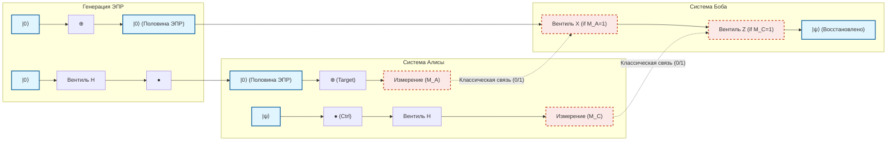

---

## 6.3 Сверхплотное кодирование (Superdense Coding)

Если квантовая телепортация — это протокол, который «расходует ЭПР-пару и 2 классических бита для отправки состояния 1 кубита», то сверхплотное кодирование (Superdense Coding) в некотором смысле является обратной операцией. Оно позволяет «передать собеседнику 2 бита классической информации, физически отправив лишь 1 кубит».

В рамках классических законов физики одна двухуровневая система (один бит или поляризация одного фотона) может нести максимум лишь 1 бит информации (0 или 1). Однако, искусно используя квантовую запутанность, сверхплотное кодирование позволяет преодолеть это ограничение (границу Холево), и в этом заключается его удивительная особенность.

### Детали протокола и базис Белла

Предположим, Алиса и Боб снова заранее разделили ЭПР-пару.

$$
|\Phi^+\rangle_{AB} = \frac{1}{\sqrt{2}} \left( |0\rangle_A |0\rangle_B + |1\rangle_A |1\rangle_B \right)
$$

Алиса хочет отправить Бобу классическое сообщение из 2 битов $b_1 b_2 \in \{00, 01, 10, 11\}$.
В зависимости от того, какое сообщение она хочет отправить, Алиса применяет определенную однокубитовую операцию **только к своему кубиту A** .

1. **Если сообщение `00`:** Алиса ничего не делает (применяет тождественный оператор $I$).
   Общее состояние системы не меняется.
   

$$
|\Psi_{00}\rangle = (I \otimes I) |\Phi^+\rangle = \frac{1}{\sqrt{2}} (|00\rangle + |11\rangle) = |\Phi^+\rangle
$$

2. **Если сообщение `01`:** Алиса применяет вентиль Паули Z.
   

$$
|\Psi_{01}\rangle = (Z \otimes I) |\Phi^+\rangle = \frac{1}{\sqrt{2}} (Z|0\rangle|0\rangle + Z|1\rangle|1\rangle) = \frac{1}{\sqrt{2}} (|00\rangle - |11\rangle) = |\Phi^-\rangle
$$

3. **Если сообщение `10`:** Алиса применяет вентиль Паули X.
   

$$
|\Psi_{10}\rangle = (X \otimes I) |\Phi^+\rangle = \frac{1}{\sqrt{2}} (X|0\rangle|0\rangle + X|1\rangle|1\rangle) = \frac{1}{\sqrt{2}} (|10\rangle + |01\rangle) = |\Psi^+\rangle
$$

4. **Если сообщение `11`:** Алиса применяет вентиль Паули Z, а затем вентиль Паули X (что эквивалентно $iY$).
   

$$
|\Psi_{11}\rangle = (ZX \otimes I) |\Phi^+\rangle = (Z \otimes I) |\Psi^+\rangle = \frac{1}{\sqrt{2}} (Z|1\rangle|0\rangle + Z|0\rangle|1\rangle) = \frac{1}{\sqrt{2}} (-|10\rangle + |01\rangle) = -|\Psi^-\rangle
$$

   (Общий отрицательный знак является глобальной фазой и не влияет на вероятности наблюдения, но для удобства мы перегруппируем знаки и будем ассоциировать это состояние с **$|\Psi^-\rangle = \frac{1}{\sqrt{2}} (|01\rangle - |10\rangle)$** .)

Алиса отправляет свой кубит A, над которым она произвела операции, Бобу по квантовому каналу связи (например, по оптоволокну).

Удивительный факт, заслуживающий внимания: Алиса **физически отправила Бобу только 1 кубит** . И она совершенно не касалась кубита Боба. Однако, в результате операций Алисы, общее состояние системы детерминированно перешло в одно из 4 полностью ортогональных квантовых состояний (они называются **базисом Белла** ).

### Декодирование Бобом и измерение в базисе Белла

Боб получает кубит A, отправленный Алисой. Теперь в распоряжении Боба находятся как кубит A, так и кубит B, который был у него изначально. Боб проводит над этими двумя кубитами точно такое же «измерение Белла», которое Алиса делала во время квантовой телепортации.

То есть, он применяет вентиль CNOT, используя кубит A в качестве управляющего, а B — в качестве целевого, после чего применяет вентиль Адамара к кубиту A. Благодаря этому обратному преобразованию запутанный базис Белла возвращается в измеримый вычислительный базис.

Давайте проверим математические выкладки для каждого случая.

- **Если состояние $|\Phi^+\rangle = \frac{1}{\sqrt{2}} (|00\rangle + |11\rangle)$ (сообщение `00`):** Применение CNOT дает $\frac{1}{\sqrt{2}} (|00\rangle + |10\rangle) = \frac{1}{\sqrt{2}} (|0\rangle + |1\rangle) |0\rangle$.
  Применение Адамара к A дает $|0\rangle |0\rangle$.
  При измерении Боб гарантированно получит `00`.

- **Если состояние $|\Phi^-\rangle = \frac{1}{\sqrt{2}} (|00\rangle - |11\rangle)$ (сообщение `01`):** Применение CNOT дает $\frac{1}{\sqrt{2}} (|00\rangle - |10\rangle) = \frac{1}{\sqrt{2}} (|0\rangle - |1\rangle) |0\rangle$.
  Применение Адамара к A дает $|1\rangle |0\rangle$.
  При измерении Боб гарантированно получит `10`. (*Соответствие битов операциям Алисы зависит от определения схемы, но оно однозначно различимо)

- **Если состояние $|\Psi^+\rangle = \frac{1}{\sqrt{2}} (|01\rangle + |10\rangle)$ (сообщение `10`):** Применение CNOT дает $\frac{1}{\sqrt{2}} (|01\rangle + |11\rangle) = \frac{1}{\sqrt{2}} (|0\rangle + |1\rangle) |1\rangle$.
  Применение Адамара к A дает $|0\rangle |1\rangle$.
  При измерении Боб гарантированно получит `01`.

- **Если состояние $|\Psi^-\rangle = \frac{1}{\sqrt{2}} (|01\rangle - |10\rangle)$ (сообщение `11`):** Применение CNOT дает $\frac{1}{\sqrt{2}} (|01\rangle - |11\rangle) = \frac{1}{\sqrt{2}} (|0\rangle - |1\rangle) |1\rangle$.
  Применение Адамара к A дает $|1\rangle |1\rangle$.
  При измерении Боб гарантированно получит `11`.

Таким образом, проводя совместное измерение одного полученного и одного имеющегося у него кубита, Боб может со 100% точностью идеально прочитать 2 бита классической информации, задуманной Алисой.

### Значение в квантовой связи

Истинная ценность сверхплотного кодирования не ограничивается лишь удвоением «плотности» информации. Этот протокол является убедительным доказательством того, как нелокальные корреляции, такие как квантовая запутанность, могут расширить пропускную способность классической передачи информации.

Он также чрезвычайно важен с точки зрения безопасности. Если бы подслушивающая Ева (Eve) перехватила кубит A во время его передачи от Алисы к Бобу, Ева не смогла бы получить никакой информации. Это связано с тем, что если наблюдать только один кубит A, его состояние ведет себя как полностью случайное смешанное состояние (с матрицей плотности, пропорциональной $\frac{I}{2}$). Информация закодирована исключительно в «корреляции» пространственно разделенных кубитов A и B, и если завладеть только одним из них, расшифровка физически невозможна.

---
Таким образом, квантовая телепортация и сверхплотное кодирование — это явления, которые на первый взгляд кажутся интуитивно непонятными, подобно магии. Однако они выводятся как строгое и неизбежное логическое следствие благодаря точному следованию линейно-алгебраическим аксиомам квантовой механики. В следующей главе мы будем применять эти базовые протоколы и шагнем в мир квантовых алгоритмов, направленных на решение более сложных задач.

# Глава 7: Алгоритм Дойча-Йожи

## 7.1 Историческое значение: впервые продемонстрированное квантовое превосходство

Гипотеза о том, что квантовые компьютеры потенциально способны решать определенные задачи значительно быстрее классических компьютеров, была выдвинута в 1980-х годах благодаря пионерским работам Ричарда Фейнмана и Дэвида Дойча. Однако первым решающим ответом на вопрос: «Для каких конкретно задач и в какой математически доказуемой форме квантовые вычисления превосходят классические?» стал предложенный в 1992 году Дэвидом Дойчем и Ричардом Йожей «Алгоритм Дойча-Йожи» (Deutsch-Jozsa Algorithm).

В этой главе мы математически строго раскроем все аспекты этого исторического алгоритма. Хотя этот алгоритм и не предназначен для решения практических прикладных задач, он доказал, что искусное сочетание таких уникальных квантовомеханических явлений, как «Суперпозиция» (Superposition), «Интерференция» (Interference) и «Обратный набег фазы» (Phase Kickback), позволяет кардинально снизить порядок вычислительной сложности.

## 7.2 Постановка задачи: константная функция или сбалансированная функция?

Сначала определим задачу, которую должен решить алгоритм. Предположим, что нам дан некий черный ящик (оракул). Этот оракул вычисляет функцию **$f$** , которая принимает $n$-битный вход $x \in \{0, 1\}^n$ и возвращает 1-битный выход $f(x) \in \{0, 1\}$.

При этом на функцию **$f$** наложено строгое условие-обещание (Promise), гарантирующее, что она обязательно удовлетворяет одному из следующих двух свойств:

1. **Константная функция (Constant Function)** : для любого входа $x$ она всегда возвращает $f(x) = 0$ либо всегда возвращает $f(x) = 1$.
2. **Сбалансированная функция (Balanced Function)** : ровно для половины всех входов $x$ она возвращает $f(x) = 0$, а для оставшейся половины — $f(x) = 1$.

Наша цель — определить, является ли данный оракул **$f$** константной или сбалансированной функцией, сделав минимальное количество обращений (запросов) к оракулу.

### Пределы классических вычислений

Рассмотрим решение этой задачи на классическом компьютере. Для функции **$f$** существует в общей сложности $N = 2^n$ возможных комбинаций входных значений.

Предположим худший сценарий. Допустим, при первых $2^{n-1}$ последовательных запросах (то есть для половины от общего числа входов) мы получаем один и тот же результат (например, все $0$). На этом этапе все еще остаются две возможности: функция может быть константной (если оставшаяся половина также дает все $0$) или сбалансированной (если вся оставшаяся половина дает $1$).

Следовательно, для того чтобы классический компьютер мог со 100%-й достоверностью определить, является ли функция константной или сбалансированной, **в худшем случае потребуется $2^{n-1} + 1$ запросов** . Это число экспоненциально возрастает по отношению к количеству входных битов $n$. Иными словами, классическая вычислительная сложность (сложность по числу запросов) составляет $O(2^n)$.

Удивительно, но при использовании квантовых вычислений эту задачу можно безошибочно решить со 100%-й вероятностью **всего за 1 обращение (1 запрос)** . В этом и заключается истинная суть квантового превосходства.

## 7.3 Квантовый оракул и геометрия обратного набега фазы

Для построения квантового алгоритма необходимо сначала переформулировать классическую функцию **$f(x)$** таким образом, чтобы она удовлетворяла требованиям квантовой механики (унитарности, то есть обратимости). Для этой цели вводится «Квантовый оракул» (Quantum Oracle).

### Квантовый оракул $U_f$

Подготовим входной регистр ( $n$ кубитов) и целевой регистр ( $1$ кубит). Унитарный оператор **$U_f$** , представляющий оракул, действует на базисные состояния вычислительного базиса следующим образом:

$$
U_f |x\rangle |y\rangle = |x\rangle |y \oplus f(x)\rangle
$$

Здесь $\oplus$ обозначает сложение по модулю 2 (XOR). Это преобразование, будучи примененным повторно, возвращает систему в исходное состояние ( $U_f^2 = I$ ), и потому является очевидно обратимым и унитарным.

### Обратный набег фазы (Phase Kickback)

Одним из важнейших и наиболее контринтуитивных методов в квантовой теории информации является «обратный набег фазы» (Phase Kickback). Посмотрим, что произойдет, если установить состояние целевого регистра не в классические $|0\rangle$ или $|1\rangle$, а в состояние суперпозиции $|-\rangle$, полученное с помощью вентиля Адамара:

$$
|-\rangle = \frac{|0\rangle - |1\rangle}{\sqrt{2}}
$$

Подадим это состояние на целевой регистр и применим оракул **$U_f$** :

$$
U_f |x\rangle |-\rangle = U_f \left( |x\rangle \frac{|0\rangle - |1\rangle}{\sqrt{2}} \right)
$$

$$
= \frac{1}{\sqrt{2}} \left( U_f |x\rangle |0\rangle - U_f |x\rangle |1\rangle \right)
$$

$$
= \frac{1}{\sqrt{2}} \left( |x\rangle |0 \oplus f(x)\rangle - |x\rangle |1 \oplus f(x)\rangle \right)
$$

Теперь разберем случаи в зависимости от значения $f(x)$:
- В случае $f(x) = 0$:
  Состояние принимает вид $\frac{1}{\sqrt{2}} ( |x\rangle |0\rangle - |x\rangle |1\rangle ) = |x\rangle |-\rangle$.
- В случае $f(x) = 1$:
  Состояние принимает вид $\frac{1}{\sqrt{2}} ( |x\rangle |1\rangle - |x\rangle |0\rangle ) = - |x\rangle |-\rangle$.

Объединяя оба случая, получаем замечательное соотношение:

$$
U_f |x\rangle |-\rangle = (-1)^{f(x)} |x\rangle |-\rangle
$$

Это поразительный результат. Состояние целевого регистра $|-\rangle$ совершенно не изменилось, однако результат вычисления функции **$f(x)$** был перенесен в виде «знака фазы» (Phase) обратно («kickback») во входной регистр **$|x\rangle$** . Это позволяет кодировать информацию в фазу амплитуды.

## 7.4 Алгоритм Дойча-Йожи: квантовая схема и полное математическое разложение

Теперь мы полностью опишем весь алгоритм как с точки зрения квантовой схемы, так и в виде точных математических формул.

### Квантовая схема

Ниже представлена схема квантовой цепи для алгоритма Дойча-Йожи:

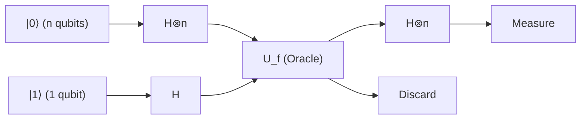

### Шаг 1: Подготовка начального состояния

Инициализируем $n$ кубитов входного регистра в состояние $|0\rangle^{\otimes n}$, а 1 кубит целевого регистра — в состояние $|1\rangle$:

$$
|\psi_0\rangle = |0\rangle^{\otimes n} |1\rangle
$$

### Шаг 2: Применение вентилей Адамара ко всем кубитам

Применим вентиль Адамара ( $H$ ) ко всем кубитам, создавая состояние полной равномерной суперпозиции.
Преобразование Адамара $H^{\otimes n}$ для $n$ кубитов действует следующим образом:

$$
H^{\otimes n} |0\rangle^{\otimes n} = \frac{1}{\sqrt{2^n}} \sum_{x \in \{0,1\}^n} |x\rangle
$$

Следовательно, состояние всей системы принимает вид:

$$
|\psi_1\rangle = \left( \frac{1}{\sqrt{2^n}} \sum_{x \in \{0,1\}^n} |x\rangle \right) \otimes \left( \frac{|0\rangle - |1\rangle}{\sqrt{2}} \right)
$$

$$
= \frac{1}{\sqrt{2^n}} \sum_{x=0}^{2^n-1} |x\rangle |-\rangle
$$

### Шаг 3: Применение квантового оракула (обратный набег фазы)

Теперь применим оракул **$U_f$** . Благодаря эффекту обратного набега фазы, доказанному в предыдущем разделе, к каждому базисному состоянию $|x\rangle$ добавляется фазовый множитель $(-1)^{f(x)}$:

$$
|\psi_2\rangle = U_f |\psi_1\rangle = \frac{1}{\sqrt{2^n}} \sum_{x \in \{0,1\}^n} (-1)^{f(x)} |x\rangle |-\rangle
$$

В этот момент вся информация обо всех $2^n$ значениях функции **$f(x)$** оказывается параллельно закодирована в фазах состояния суперпозиции всего за одну операцию. Это называется «квантовым параллелизмом» (Quantum Parallelism).

### Шаг 4: Возникновение интерференции во входном регистре

Целевой регистр далее не используется, поэтому мы его опускаем. К $n$ кубитам входного регистра снова применим преобразование Адамара $H^{\otimes n}$.
Действие $H^{\otimes n}$ на произвольный базис $|x\rangle$ в общем виде выражается формулой:

$$
H^{\otimes n} |x\rangle = \frac{1}{\sqrt{2^n}} \sum_{z \in \{0,1\}^n} (-1)^{x \cdot z} |z\rangle
$$

Здесь $x \cdot z$ обозначает побитовое скалярное произведение $x \cdot z = x_1 z_1 \oplus x_2 z_2 \oplus \dots \oplus x_n z_n$.
Применяя это преобразование ко входному регистру состояния $|\psi_2\rangle$, конечное состояние $|\psi_3\rangle$ раскладывается следующим образом:

$$
|\psi_3\rangle = H^{\otimes n} \left( \frac{1}{\sqrt{2^n}} \sum_{x} (-1)^{f(x)} |x\rangle \right)
$$

$$
= \frac{1}{\sqrt{2^n}} \sum_{x} (-1)^{f(x)} \left( \frac{1}{\sqrt{2^n}} \sum_{z} (-1)^{x \cdot z} |z\rangle \right)
$$

$$
= \frac{1}{2^n} \sum_{z \in \{0,1\}^n} \left( \sum_{x \in \{0,1\}^n} (-1)^{f(x) + x \cdot z} \right) |z\rangle
$$

Это исключительно важная формула, описывающая квантовое состояние непосредственно перед измерением. Квантовомеханическая «интерференция» происходит именно внутри этой суммы $\sum_x$.

### Шаг 5: Измерение и анализ результатов

В завершение алгоритма $n$ кубитов входного регистра измеряются в вычислительном базисе.
Нас интересует вероятность того, что все кубиты окажутся равны $0$, то есть вероятность измерения состояния **$|0\rangle^{\otimes n}$** . Рассмотрим случай, когда $z = 00\dots0$ в приведенном выше уравнении. В этом случае для любого $x$ выполняется $x \cdot 0 = 0$, поэтому амплитуда (коэффициент) состояния **$|0\rangle^{\otimes n}$** вычисляется следующим образом:

$$
\text{Amplitude of } |0\rangle^{\otimes n} = \frac{1}{2^n} \sum_{x \in \{0,1\}^n} (-1)^{f(x)}
$$

Теперь, следуя условию-обещанию (Promise), проверим два возможных случая:

#### Случай 1: Функция $f$ является константной
Всегда $f(x) = 0$ либо всегда $f(x) = 1$.
- Если функция всегда равна $0$, то $(-1)^{f(x)} = 1$, и сумма равна $\sum 1 = 2^n$. Амплитуда равна $\frac{2^n}{2^n} = 1$.
- Если функция всегда равна $1$, то $(-1)^{f(x)} = -1$, и сумма равна $\sum -1 = -2^n$. Амплитуда равна $\frac{-2^n}{2^n} = -1$.

Поскольку вероятность измерения $P(0)$ равна квадрату модуля амплитуды:

$$
P(00\dots0) = | \pm 1 |^2 = 1
$$

Иными словами, **в случае константной функции со 100%-й вероятностью будет измерено состояние $|0\rangle^{\otimes n}$** .

#### Случай 2: Функция $f$ является сбалансированной
Число входов $x$, для которых $f(x) = 0$, в точности равно числу входов $x$, для которых $f(x) = 1$ (ровно по $2^{n-1}$ значений).
Соответственно, половина значений $(-1)^{f(x)}$ равна $+1$, а оставшаяся половина равна $-1$. При их суммировании они полностью компенсируют друг друга, давая ноль (полная деструктивная интерференция):

$$
\text{Amplitude of } |0\rangle^{\otimes n} = \frac{1}{2^n} \left( 2^{n-1}(+1) + 2^{n-1}(-1) \right) = 0
$$

Поскольку вероятность измерения $P(0)$ равна квадрату модуля амплитуды:

$$
P(00\dots0) = | 0 |^2 = 0
$$

Иными словами, **в случае сбалансированной функции вероятность измерить $|0\rangle^{\otimes n}$ равна 0%, и обязательно будет измерено состояние, в котором хотя бы один бит равен $1$** .

## 7.6 Конкретный пример: полная трассировка для $n=2$

Чтобы глубже понять поведение алгоритма и не ограничиваться абстрактными формулами, проследим эволюцию конкретных векторов состояния для случая $n=2$ (вход из 2 кубитов). Существует 4 возможных комбинации входа: $x \in \{00, 01, 10, 11\}$.

### Случай константной функции: $f(x) = 1$ (все единицы)
Входной регистр состояния $|\psi_1\rangle$ до применения оракула имеет следующий вид:

$$
\frac{1}{2} ( |00\rangle + |01\rangle + |10\rangle + |11\rangle )
$$

После применения оракула за счет обратного набега фазы все члены умножаются на $(-1)^{f(x)} = -1$:

$$
|\psi_2\rangle_{in} = -\frac{1}{2} ( |00\rangle + |01\rangle + |10\rangle + |11\rangle )
$$

Применим к этому состоянию $H^{\otimes 2}$ еще раз. Используя равенство $H^{\otimes 2} (|00\rangle + |01\rangle + |10\rangle + |11\rangle) = 2 |00\rangle$, получаем:

$$
|\psi_3\rangle_{in} = - |00\rangle
$$

Результатом измерения будет $00$ с вероятностью $100\%$.

### Случай сбалансированной функции: $f(00)=0, f(01)=1, f(10)=1, f(11)=0$
После применения оракула за счет обратного набега фазы знак минус появляется только у тех членов, для которых $f(x)=1$:

$$
|\psi_2\rangle_{in} = \frac{1}{2} ( |00\rangle - |01\rangle - |10\rangle + |11\rangle )
$$

Применим к этому состоянию $H^{\otimes 2}$. Вычислив и подставив действие $H^{\otimes 2}$ на каждое базисное состояние, обратим внимание на коэффициент при $|00\rangle$: он равен $\frac{1}{4} (1 - 1 - 1 + 1) = 0$, то есть члены полностью гасят друг друга (деструктивная интерференция).
Упрощая оставшиеся члены, получаем конечное состояние $|11\rangle$ (в данном примере $11$ измеряется со 100%-й вероятностью, однако для произвольной сбалансированной функции будет измерено любое состояние, отличное от $00$). Таким образом подтверждено, что вероятность измерения $00$ строго равна 0%.

## 7.7 Заключение: вычислительный скачок, обеспеченный квантовой интерференцией

Поразительная мощь алгоритма Дойча-Йожи заключается в том, что с помощью обратного набега фазы информация обо всех $2^n$ значениях развертывается в фазовом пространстве, а затем точно управляется «Интерференция» (Interference), возникающая при заключительном преобразовании Адамара.

- **В случае константной функции** : волны по всем путям испытывают «конструктивную интерференцию» (Constructive Interference), и амплитуда со 100%-й вероятностью концентрируется в состоянии **$|0\rangle^{\otimes n}$** .
- **В случае сбалансированной функции** : положительные и отрицательные волны испытывают «деструктивную интерференцию» (Destructive Interference), полностью компенсируя амплитуду состояния **$|0\rangle^{\otimes n}$** .

Благодаря этой великолепной математической структуре задачу, для решения которой на классическом компьютере в худшем случае требовалось $O(2^n)$ запросов (а именно $2^{n-1} + 1$ запросов), квантовый компьютер решает **всего за один запрос ( $O(1)$ )** детерминированным образом (со 100%-й точностью).

Факт, доказанный в этой главе, стал важнейшей вехой в истории науки: применение принципов квантовой механики к обработке информации позволяет физически преодолеть пределы классической теории информации.

# Глава 8: Алгоритм Шора и угроза современной криптографии

## 8.1 Введение: Математика криптосистемы RSA и сложность факторизации

В современном цифровом обществе криптография с открытым ключом служит основой, обеспечивающей безопасную связь в интернете. Криптосистема RSA, самая распространенная из них, доказывает свою безопасность, опираясь на математическую асимметрию (свойство односторонней функции): «вычислительно крайне сложно разложить на множители огромное составное число». В этой главе мы без каких-либо компромиссов и со строгой точностью раскроем теоретическую структуру «алгоритма Шора (Shor's Algorithm)» — решающего метода, посредством которого квантовые компьютеры разрушают сами основы этой криптосистемы RSA.

Сначала давайте математически сформулируем механизм криптосистемы RSA. Генерация ключей RSA начинается со случайного выбора двух огромных простых чисел $p$ и $q$ (в настоящее время рекомендуется размер от 2048 бит каждое). Вычисляется их произведение, составное число $N = pq$, которое публикуется для всеобщего сведения как часть открытого ключа. Затем вычисляется функция Эйлера $\phi(N)$. Из свойств простых чисел следует, что она равна $\phi(N) = (p-1)(q-1)$.

Показатель $e$, который является ключом шифрования, выбирается так, чтобы выполнялось условие $1 < e < \phi(N)$ и $\text{gcd}(e, \phi(N)) = 1$ (то есть он взаимно прост с $\phi(N)$). Затем вычисляется показатель расшифрования $d$, который становится секретным ключом, удовлетворяющий сравнению $ed \equiv 1 \pmod{\phi(N)}$. Его можно легко найти за полиномиальное время с помощью расширенного алгоритма Евклида.

Если открытый текст представляет собой целое число $M$ (где $0 \le M < N$), то шифрование выполняется с помощью возведения в степень по модулю $N$ следующим образом:

$$
C \equiv M^e \pmod{N}
$$

При расшифровании аналогичные вычисления производятся с использованием секретного ключа $d$:

$$
M' \equiv C^d \pmod{N}
$$

Из теоремы Эйлера следует, что выполняется $C^d \equiv M^{ed} \equiv M^{1 + k\phi(N)} \equiv M \pmod{N}$, что гарантирует полное восстановление исходного открытого текста $M$.

Здесь важно отметить, что для нахождения секретного ключа $d$ из общедоступной информации $(N, e)$ необходимо знать $\phi(N)$, а для этого нужно разложить $N$ на простые множители $p$ и $q$. При использовании классического компьютера даже с самым быстрым из известных алгоритмов факторизации — общим методом решета числового поля (General Number Field Sieve, GNFS) — вычислительная сложность составляет субэкспоненциальное время $O\left(\exp\left(c (\log N)^{1/3} (\log \log N)^{2/3}\right)\right)$. Это означает, что время вычислений возрастает взрывообразно относительно количества бит в $N$. Например, подсчитано, что разложение 2048-битного целого числа на классическом суперкомпьютере займет больше времени, чем возраст Вселенной.

Однако квантовый алгоритм, представленный Питером Шором (Peter Shor) в 1994 году, в корне опроверг эту предпосылку. Алгоритм Шора решает задачу факторизации за полиномиальное время $O((\log N)^3)$ или, после оптимизации, $\tilde{O}((\log N)^2)$. Это означает «сверхполиномиальное ускорение» (Super-polynomial Speedup) по отношению к классическим вычислениям, что фактически является экспоненциальным ускорением, и демонстрирует, что используемая сегодня криптосистема RSA будет полностью нейтрализована квантовыми компьютерами.

## 8.2 Сведение к задаче нахождения порядка (Reduction to Order-Finding Problem)

Гениальная проницательность алгоритма Шора заключается в том, что он «не решает проблему факторизации напрямую, а сводит ее к проблеме нахождения периода». Теоремами чистой теории чисел доказано, что факторизация эквивалентна задаче, называемой «задачей нахождения порядка (Order-Finding Problem)». Сам процесс этого сведения является полностью классическим алгоритмом и не требует квантовых вычислений.

Давайте проследим за процедурой разложения заданного составного числа $N$ на множители. Во-первых, выберем случайное целое число $a$, удовлетворяющее условию $1 < a < N$. Используя алгоритм Евклида, вычислим наибольший общий делитель $\text{gcd}(a, N)$. Если он больше $1$, нам повезло: мы уже нашли нетривиальный делитель числа $N$, и вычисления завершены (однако для огромных чисел, используемых в криптографии, вероятность случайного совпадения астрономически мала).

Если $\text{gcd}(a, N) = 1$, то $a$ и $N$ взаимно просты. Теперь определим следующую модулярную показательную функцию:

$$
f(x) = a^x \bmod N
$$

Говоря языком теории групп, $a$ является элементом мультипликативной группы $(\mathbb{Z}/N\mathbb{Z})^\times$, а функция $f(x)$ образует гомоморфизм из аддитивной группы целых чисел $\mathbb{Z}$ в мультипликативную группу $(\mathbb{Z}/N\mathbb{Z})^\times$. Согласно свойствам конечных групп, эта функция обязательно обладает периодичностью. То есть, существует некоторое минимальное положительное целое число $r$, удовлетворяющее следующему уравнению:

$$
a^r \equiv 1 \pmod{N}
$$

Это минимальное положительное целое число $r$ называется «порядком (Order)» числа $a$ по модулю $N$, или «периодом (Period)» функции $f(x)$.

Если удастся найти этот порядок $r$, и если $r$ является четным, а также удовлетворяет условию $a^{r/2} \not\equiv -1 \pmod{N}$, мы получим мощную зацепку для факторизации следующим образом:

$$
a^r - 1 \equiv 0 \pmod{N}
$$

$$
(a^{r/2} - 1)(a^{r/2} + 1) \equiv 0 \pmod{N}
$$

Это уравнение означает, что $N$ делит произведение $(a^{r/2} - 1)$ и $(a^{r/2} + 1)$. Однако, поскольку $a^{r/2} \not\equiv 1$ (так как $r$ — это минимальный период) и $a^{r/2} \not\equiv -1$ (по условию), $N$ не может делить ни один из этих членов по отдельности. Следовательно, простые множители числа $N$ распределены между этими двумя членами.
В заключение:

$$
p = \text{gcd}(a^{r/2} - 1, N)
$$

$$
q = \text{gcd}(a^{r/2} + 1, N)
$$

Вычислив это, можно с уверенностью найти нетривиальные простые множители числа $N$.

Благодаря этому классическому сведению проблема сузилась до одного пункта: «как быстро найти период $r$ функции $f(x) = a^x \bmod N$». На классическом компьютере для поиска этого периода необходимо последовательно вычислять значения для $x=1, 2, 3, \dots$, и поскольку порядок $r$ может быть сопоставим с $N$, в результате потребуется экспоненциальное время. И здесь впервые на сцену выходит квантовый компьютер.

## 8.3 Строгая математическая формулировка квантового преобразования Фурье (QFT) и его роль

Сердцем квантового алгоритма для извлечения скрытого периода $r$ функции $f(x)$ за полиномиальное время является «квантовое преобразование Фурье (Quantum Fourier Transform, QFT)». QFT — это квантово-механический аналог классического дискретного преобразования Фурье (DFT), унитарное преобразование, действующее на амплитуды вероятностей пространства состояний.

Действие квантового преобразования Фурье на базис вычислений $|j\rangle$ ($j = 0, 1, \dots, M-1$) в гильбертовом пространстве $\mathcal{H}$ размерности $M = 2^n$ строго определяется следующим образом:

$$
\text{QFT} |j\rangle = \frac{1}{\sqrt{M}} \sum_{k=0}^{M-1} e^{2\pi i j k / M} |k\rangle
$$

Для любого квантового состояния **$|\psi\rangle$** оно действует в силу линейности следующим образом:

$$
\text{QFT} \sum_{j=0}^{M-1} x_j |j\rangle = \sum_{k=0}^{M-1} \left( \frac{1}{\sqrt{M}} \sum_{j=0}^{M-1} x_j e^{2\pi i j k / M} \right) |k\rangle = \sum_{k=0}^{M-1} y_k |k\rangle
$$

Получаемые здесь новые амплитуды $y_k$ полностью совпадают с коэффициентами, получаемыми в результате классического дискретного преобразования Фурье. Однако, в то время как классическое быстрое преобразование Фурье (БПФ) требует времени $O(M \log M) = O(n 2^n)$ для вычисления всего вектора, QFT достигает радикального снижения вычислительной сложности, преобразуя «состояние» $n$ кубитов всего за $O(n^2)$ операций квантовых вентилей.

Чтобы понять, почему это можно реализовать с помощью такого небольшого числа вентилей, $O(n^2)$, необходимо представить состояние, полученное с помощью QFT, разложенным в виде тензорного произведения. Если представить целое число $j$ в двоичном виде как $j = j_1 2^{n-1} + j_2 2^{n-2} + \dots + j_n 2^0$ (где $j_1$ — старший бит, $j_n$ — младший бит), то выходное состояние изящно раскладывается на тензорное произведение $n$ независимых кубитовых состояний следующим образом:

$$
\text{QFT} |j_1 j_2 \dots j_n\rangle = \frac{1}{\sqrt{2^n}} \left(|0\rangle + e^{2\pi i 0.j_n} |1\rangle\right) \otimes \left(|0\rangle + e^{2\pi i 0.j_{n-1} j_n} |1\rangle\right) \otimes \dots \otimes \left(|0\rangle + e^{2\pi i 0.j_1 j_2 \dots j_n} |1\rangle\right)
$$

Здесь $0.j_l \dots j_m$ представляет собой двоичную дробь, и $0.j_l \dots j_m = j_l/2 + j_{l+1}/4 + \dots + j_m/2^{m-l+1}$.

Эта формула весьма показательна. Она показывает, что состояние $m$-го кубита имеет фазу, которая поворачивается в зависимости исключительно от информации из входных битов с $j_{n-m+1}$ по $j_n$. Следовательно, квантовую схему для создания этого состояния можно рекурсивно построить только из комбинаций вентиля Адамара $H$, действующего на одиночный кубит, и управляемых вентилей фазового сдвига $R_k$ (вентилей, поворачивающих фазу на $e^{2\pi i / 2^k}$), действующих между двумя кубитами. Применив $H$ к первому кубиту, а затем применив $R_2, R_3, \dots$ с управлением от 2-го, 3-го битов и так далее, повторяя эту операцию для каждого бита, можно точно реализовать QFT всего за $n + (n-1) + \dots + 1 = n(n+1)/2 = O(n^2)$ вентилей.

## 8.4 Квантовая схема для нахождения периода с использованием суперпозиции

Теперь, когда теоретическая подготовка завершена, давайте проследим за квантовой схемой всего алгоритма Шора и временной эволюцией квантового состояния (State Evolution) на каждом шаге. В алгоритме используются два квантовых регистра.
Первый регистр состоит из $t \approx 2 \log_2 N$ кубитов, а размерность пространства состояний равна $M = 2^t$ (мы выбираем $t$ так, чтобы удовлетворялось условие $M \ge N^2$). Второй регистр имеет $L \approx \log_2 N$ кубитов и хранит результат вычислений.

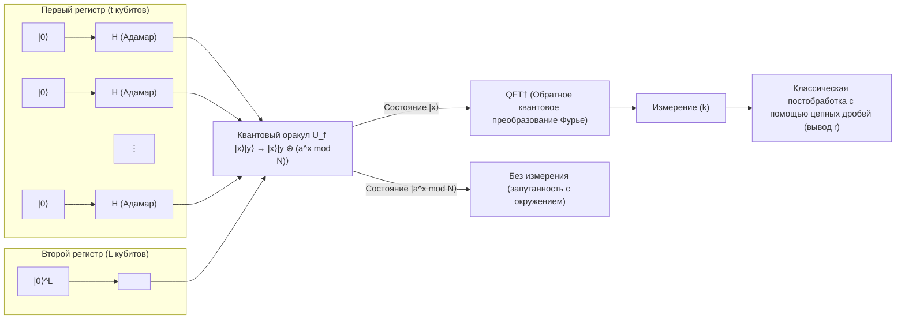

 **【Шаг 1: Инициализация и создание суперпозиции】** 
Вся система устанавливается в начальное состояние **$|\psi_0\rangle$** $= |0\rangle^{\otimes t} |0\rangle^{\otimes L}$.
Затем ко всем кубитам первого регистра применяется вентиль Адамара $H^{\otimes t}$, генерируя равновероятную суперпозицию экспоненциально большого числа состояний.

$$
|\psi_1\rangle = \frac{1}{\sqrt{M}} \sum_{x=0}^{M-1} |x\rangle |0\rangle
$$

Здесь первый регистр одновременно хранит состояния всех целых чисел от $0$ до $M-1$.

 **【Шаг 2: Вычисление функции квантовым оракулом】** 
Применяется квантовый оракул $U_f$, и функция $f(x) = a^x \bmod N$ вычисляется прямо в состоянии суперпозиции, а результат сохраняется во втором регистре.

$$
|\psi_2\rangle = U_f |\psi_1\rangle = \frac{1}{\sqrt{M}} \sum_{x=0}^{M-1} |x\rangle |a^x \bmod N\rangle
$$

Это состояние **$|\psi_2\rangle$** является состоянием, в котором вход $x$ и выход $f(x)$ сильно запутаны.

 **【Шаг 3: Наблюдение за вторым регистром (концептуальное)】** 
Для облегчения понимания теории, давайте предположим, что мы измерили второй регистр (в реальном алгоритме отсутствие этого измерения приводит к абсолютно тем же математическим следствиям). В результате измерения второй регистр коллапсирует в определенное значение $y = a^{x_0} \bmod N$. Здесь $x_0$ — это некоторое минимальное значение смещения, удовлетворяющее $0 \le x_0 < r$.
В этот момент первый регистр мгновенно коллапсирует в состояние суперпозиции «всех входов $x$, для которых вывод функции $f(x)$ равен $y$». Поскольку функция имеет период $r$, такие $x$ расположены через равные интервалы как $x_0, x_0 + r, x_0 + 2r, \dots$.

$$
|\psi_3\rangle = \frac{1}{\sqrt{A}} \sum_{m=0}^{A-1} |x_0 + m r\rangle \otimes |y\rangle
$$

Здесь $A$ — количество членов, включенных в суперпозицию, и $A \approx M/r$.
Если мы обратим внимание на первый регистр, то это гребнеобразное состояние распределения вероятностей с периодом $r$. Однако, если просто измерить это состояние, мы с равной вероятностью получим случайное значение $x_0 + mr$, но из-за того, что смещение $x_0$ неизвестно, мы не сможем узнать период $r$. Именно здесь необходимо QFT.

 **【Шаг 4: Применение обратного квантового преобразования Фурье】** 
К первому регистру применяется обратное квантовое преобразование Фурье (QFT$^\dagger$).

$$
\text{QFT}^\dagger |\psi_3\rangle = \frac{1}{\sqrt{A M}} \sum_{k=0}^{M-1} \sum_{m=0}^{A-1} e^{-2\pi i k (x_0 + m r) / M} |k\rangle
$$

Упростим это выражение относительно состояния $|k\rangle$ и исследуем его амплитуду вероятности $c_k$.

$$
c_k = \frac{1}{\sqrt{A M}} e^{-2\pi i k x_0 / M} \sum_{m=0}^{A-1} e^{-2\pi i k m r / M}
$$

Часть уравнения, представляющая сумму, является суммой геометрической прогрессии со знаменателем $e^{-2\pi i k r / M}$. Если фаза $k r / M$ сильно отклоняется от целого числа, векторы складываются, вращаясь на комплексной плоскости, в результате чего возникает деструктивная интерференция (Destructive Interference), и амплитуда становится близкой к $0$.
Напротив, если $k r / M$ крайне близка к целому числу $j$, то есть когда $k \approx j \frac{M}{r}$, векторы на комплексной плоскости направлены в одну сторону, и за счет конструктивной интерференции (Constructive Interference) амплитуда многократно усиливается.

 **【Шаг 5: Измерение и разложение в цепную дробь】** 
При измерении первого регистра с высокой вероятностью наблюдается целое число $k$, удовлетворяющее условию $k \approx j \frac{M}{r}$. Разделив обе части на $M$, получаем следующее соотношение:

$$
\frac{k}{M} \approx \frac{j}{r}
$$

Здесь $k$ и $M$ — известные значения, а $j$ и $r$ — неизвестные. Поскольку мы выбрали $t$ так, что $M \ge N^2$, $k/M$ дает чрезвычайно точное приближение для неизвестной дроби $j/r$: $\left| \frac{k}{M} - \frac{j}{r} \right| \le \frac{1}{2M} < \frac{1}{2r^2}$.
Согласно теореме диофантова приближения (теореме Лежандра), рациональное число $j/r$, удовлетворяющее этому условию, обязательно содержится среди подходящих дробей «разложения в цепную дробь (Continued Fraction Expansion)» вещественного числа $k/M$.
Следовательно, вычислив разложение $k/M$ в цепную дробь на классическом компьютере за полиномиальное время, можно определить период $r$ в качестве знаменателя. На этом задача нахождения порядка решена, и в результате становится возможным извлечь простые множители $p$ и $q$, которые являются ключами криптосистемы RSA.

## 8.5 Почему алгоритм Шора обеспечивает экспоненциальное ускорение по сравнению с классическими вычислениями

Причина, по которой алгоритм Шора стал историческим прорывом, заключается в том, что это не просто эвристика (эвристическое решение), а первый практический алгоритм, который продемонстрировал «истинное экспоненциальное ускорение по сравнению с классикой» со строгим математическим доказательством. Суть этой выдающейся вычислительной мощности заключается в идеальном слиянии следующих двух квантово-механических явлений.

Во-первых, это квантовый параллелизм. Используя состояние суперпозиции, функция $f(x)$ была оценена одновременно всего за одну операцию для астрономического числа входов $x$, равного $2^t$, что превосходит количество атомов во Вселенной. То, на что классическому компьютеру потребовались бы сотни миллионов лет вычислений одно за другим, было выполнено за мгновение.

Однако, согласно аксиомам квантовой механики, после однократного измерения состояние коллапсирует, и полученная информация будет представлять собой лишь один случайный результат оценки $(x, f(x))$. Это ничем не отличается от классических вычислений.

С этого момента начинается настоящая магия, и вторым ключом является квантовая интерференция и извлечение глобальной структуры. Квантовое преобразование Фурье создает интерференцию по всему экспоненциально огромному пространству состояний. Это операция, которая пытается извлечь не конкретные значения каждого $f(x)$, а только структурный паттерн «глобальной периодичности» всей функции.
Амплитуды вероятности, соответствующие неправильным периодам, полностью уничтожаются за счет деструктивной интерференции, подобно тому как гребни и впадины волн гасят друг друга, и лишь амплитуды вероятности, соответствующие правильному периоду $r$, максимизируются за счет конструктивной интерференции. Другими словами, сами физические законы природы играют роль компьютера, стирая бесчисленные неверные ответы и позволяя всплыть только правильному ответу.

С точки зрения проблемы скрытой подгруппы (Hidden Subgroup Problem, HSP), алгоритм Шора является общей структурой для эффективного решения «HSP над конечными абелевыми группами». Нахождение порядка коммутативной группы, на которую опирается криптосистема RSA, идеально вписывается в эту структуру.

Квантовый компьютер не является всемогущей волшебной палочкой и не может экспоненциально быстро решить любую проблему. Однако для задач, в которых скрыты «периодичность» и «алгебраическая структура», физический механизм квантовой интерференции в корне разрушает пределы классических вычислений. Именно это является самой глубокой и красивой причиной, по которой алгоритм Шора положил конец криптографической теории и привел к взрывному развитию в области квантовой информатики.

# Глава 9: Алгоритм Гровера и геометрия усиления амплитуды

В современной информатике «задача поиска», заключающаяся в нахождении элементов, удовлетворяющих определённым условиям, в огромном наборе данных, является чрезвычайно важной проблемой, а также одним из самых фундаментальных вопросов компьютерных наук. Если в наборе данных присутствует какая-либо структура (например, элементы отсортированы по алфавиту или в числовом порядке), можно использовать эффективные классические алгоритмы, такие как бинарный поиск, и время поиска ограничивается $O(\log N)$ для $N$ элементов. Однако поиск в полностью случайно расположенной **«неструктурированной базе данных» (Unstructured Database)** в рамках классических компьютеров вынужден опираться на линейный поиск (Linear Search), при котором элементы проверяются по очереди один за другим, что требует в худшем случае $N$, а в среднем $N/2$ запросов к $N$ элементам, то есть $O(N)$ вычислительных шагов.

Однако в 1996 году Ловом Гровером (Lov Grover), физиком из Bell Labs, был открыт **алгоритм Гровера** , который успешно решает эту задачу неструктурированного поиска за $O(\sqrt{N})$ запросов за счёт чрезвычайно искусного и элегантного использования принципов «суперпозиции» (Superposition) и «интерференции» (Interference), лежащих в основе квантовой механики. В отличие от алгоритма Шора, который экспоненциально сокращает время вычислений (Exponential speedup) в зависимости от размера задачи, этот алгоритм обеспечивает **квадратичное ускорение (Quadratic speedup)** , являющееся разновидностью полиномиального ускорения. Тем не менее, учитывая, что рассматриваемая задача неструктурированного поиска универсально встречается во всевозможных областях, таких как полный перебор для NP-полных задач или поиск ключей в криптографических системах, широта его применения и практическое влияние неизмеримы. В обширной области квантовой информатики алгоритм Гровера прочно утвердился как один из самых универсальных и важных алгоритмов.

В этой главе мы подробно, так что даже специалисты смогут найти для себя новые идеи, раскроем глубокий механизм **«усиления амплитуды» (Amplitude Amplification)** , составляющий ядро алгоритма Гровера, используя интуитивный геометрический подход и бескомпромиссно строгие методы линейной алгебры.

## 9.1 Формулировка задачи и подготовка начального состояния суперпозиции

Сначала давайте математически строго сформулируем задачу поиска, которую мы должны решить. Предположим, у нас есть неструктурированная база данных размера $N = 2^n$, где каждый элемент закодирован как состояние вычислительного базиса $|x\rangle$ (где $x \in \{0, 1\}^n$, то есть $x = 0, 1, \dots, N-1$), выраженное с использованием $n$ кубитов. Предположим, что в этом огромном пространстве базы данных существует только одно конкретное состояние (правильное состояние), которое мы хотим найти, и обозначим это особое состояние как $|w\rangle$.

Цель задачи определяется как: «Используя заданную функцию типа "чёрный ящик" (которую мы будем называть **оракулом** ), найти правильное состояние $|w\rangle$ за минимально возможное количество запросов и с высокой вероятностью».

Первый шаг квантового алгоритма всегда начинается с подготовки, чтобы одновременно охватить всё пространство поиска. Чтобы создать состояние, в котором все возможности накладываются друг на друга равномерно, мы параллельно применяем вентиль Адамара $H$ в виде тензорного произведения к каждому кубиту начального состояния $n$ кубитов $|0\rangle^{\otimes n}$. Полученное начальное состояние равномерной суперпозиции определяется как $|s\rangle$.

$$
|s\rangle = H^{\otimes n} |0\rangle^{\otimes n} = \frac{1}{\sqrt{N}} \sum_{x=0}^{N-1} |x\rangle
$$

Это состояние **$|s\rangle$** можно чётко разделить в гильбертовом пространстве как линейную комбинацию правильного состояния $|w\rangle$ и всех остальных неправильных состояний. Чтобы облегчить визуальное восприятие последующей геометрической интерпретации, мы вводим новый нормализованный вектор $|s^\perp\rangle$, который равномерно суперпозирует только неправильные состояния, следующим образом:

$$
|s^\perp\rangle = \frac{1}{\sqrt{N-1}} \sum_{x \neq w} |x\rangle
$$

Согласно этому определению, состояние $|s^\perp\rangle$ и правильное состояние $|w\rangle$ взаимно ортогональны ( $\langle s^\perp | w \rangle = 0$ ). Тогда начальное состояние равномерной суперпозиции **$|s\rangle$** можно чрезвычайно просто разложить в двумерном гильбертовом подпространстве, натянутом на эти два взаимно ортогональных вектора $|w\rangle$ и $|s^\perp\rangle$, следующим образом:

$$
|s\rangle = \sqrt{\frac{N-1}{N}} |s^\perp\rangle + \frac{1}{\sqrt{N}} |w\rangle
$$

Здесь мы вводим бесконечно малый угол $\theta$, такой что $\sin \theta = \frac{1}{\sqrt{N}}$ (когда $N$ достаточно велико, $\theta \approx 1/\sqrt{N}$). Тогда это состояние переписывается в более элегантное геометрическое представление с использованием тригонометрических функций.

$$
|s\rangle = \cos \theta |s^\perp\rangle + \sin \theta |w\rangle
$$

Эта формула говорит о суровом факте: в начальном состоянии **$|s\rangle$** вероятность наблюдения правильного состояния $|w\rangle$ составляет всего лишь $|\sin \theta|^2 = \frac{1}{N}$. Высшая цель алгоритма Гровера заключается в том, чтобы путём итеративного применения комбинации оракула и оператора диффузии, описанных ниже, постепенно «поворачивать» этот вектор состояния **$|s\rangle$** в направлении $|w\rangle$ в двумерной плоскости гильбертова пространства, максимально приближая вероятность наблюдения правильного ответа к теоретическому пределу $1$ (усиливая амплитуду).

## 9.2 Определение квантового оракула (Quantum Oracle) и отдача фазы (Phase Kickback)

Первым важным компонентом «итерации Гровера» (Grover iteration), которая является итеративной единицей алгоритма, является оракул $O$, который идентифицирует, являются ли целевые данные правильным ответом. В квантовых вычислениях оракул должен быть строго определён как унитарный оператор, который оказывает определённое действие в зависимости от того, является ли входное состояние вычислительного базиса $|x\rangle$ правильным ответом $|w\rangle$.

Обычно этот оракул использует один вспомогательный кубит (кубит-анциллу) для реализации вычисления функции обратимым образом. Мы определяем булеву функцию $f(x)$, представляющую условие поиска, как функцию, возвращающую $f(w) = 1$ при $x = w$ и $f(x) = 0$ для всех остальных $x \neq w$. В этом случае действие оракула записывается с использованием исключающего ИЛИ (XOR) $\oplus$ следующим образом:

$$
O_f \left( |x\rangle \otimes |y\rangle \right) = |x\rangle \otimes |y \oplus f(x)\rangle
$$

Здесь проявляется изящество алгоритма Гровера. Вспомогательный кубит $|y\rangle$ подаётся на вход не в вычислительном базисе, а предварительно инициализированным в состояние суперпозиции $|-\rangle = \frac{1}{\sqrt{2}}(|0\rangle - |1\rangle)$. При этом возникает удивительное явление, специфичное для квантовой механики, называемое **фазовым отскоком (Phase Kickback)** . Давайте посчитаем это конкретно.

$$
\begin{align*}
O_f \left( |x\rangle \otimes |-\rangle \right) &= O_f \left( |x\rangle \otimes \frac{|0\rangle - |1\rangle}{\sqrt{2}} \right) \\
&= \frac{1}{\sqrt{2}} \left( O_f |x\rangle |0\rangle - O_f |x\rangle |1\rangle \right) \\
&= \frac{1}{\sqrt{2}} \left( |x\rangle |0 \oplus f(x)\rangle - |x\rangle |1 \oplus f(x)\rangle \right)
\end{align*}
$$

Оценим это выражение, разделив на случаи, когда входное состояние является неправильным и правильным.
Если $x \neq w$ (то есть $f(x) = 0$), состояние не меняется вовсе.

$$
\frac{1}{\sqrt{2}} \left( |x\rangle |0\rangle - |x\rangle |1\rangle \right) = |x\rangle |-\rangle
$$

С другой стороны, если $x = w$ (то есть $f(w) = 1$), состояние вспомогательного кубита инвертируется с $0 \to 1$ и $1 \to 0$, и перед всем состоянием появляется знак минус.

$$
\frac{1}{\sqrt{2}} \left( |x\rangle |1\rangle - |x\rangle |0\rangle \right) = - \left( |x\rangle \frac{|0\rangle - |1\rangle}{\sqrt{2}} \right) = - |x\rangle |-\rangle
$$

Этот результат чрезвычайно важен. Состояние вспомогательного кубита $|-\rangle$ остаётся совершенно неизменным до и после операции, работая просто как «катализатор». Вместо этого результат вычисления функции $f(x)$ «отскакивает» главному квантовому регистру $|x\rangle$ в виде **знака (фазы) амплитуды** . Используя это свойство, мы можем опустить вспомогательный кубит из описания и переопределить действие оракула на главный регистр как новый унитарный оператор $U_w$ просто и элегантно следующим образом:

$$
U_w |x\rangle = (-1)^{f(x)} |x\rangle = \begin{cases} -|x\rangle & (x = w) \\ |x\rangle & (x \neq w) \end{cases}
$$

Этот фазовый оракул $U_w$ может быть явно описан с помощью проекционного оператора с использованием бра-кет нотации Дирака следующим образом:

$$
U_w = I - 2|w\rangle\langle w|
$$

Здесь $I$ — тождественный оператор размера $N \times N$. Если обратиться к геометрической интуиции, этот оракул $U_w$ представляет собой не что иное, как **операцию отражения (Reflection) вектора состояния относительно горизонтальной оси $|s^\perp\rangle$** в двумерной действительной плоскости, натянутой на $|s^\perp\rangle$ и $|w\rangle$. Это происходит потому, что знак инвертируется только для компоненты правильного состояния, в то время как компоненты неправильного состояния остаются неизменными.

## 9.3 Оператор диффузии (Diffusion Operator) и математическая структура инверсии относительно среднего

После того как оракул пометил правильное состояние «маркером отрицательной фазы», применяется второй компонент итерации Гровера — **оператор диффузии (Diffusion Operator)** $U_s$. Роль этого оператора заключается в резком увеличении амплитуды вероятности помеченного состояния путём инверсии амплитуды каждого элемента квантового состояния относительно общего среднего значения.

Оператор диффузии $U_s$ математически определяется следующим образом:

$$
U_s = 2|s\rangle\langle s| - I
$$

Давайте строго докажем механизм того, почему этот оператор называется «инверсией относительно среднего (Inversion about the mean)», используя общее состояние суперпозиции $|\psi\rangle = \sum_{x=0}^{N-1} \alpha_x |x\rangle$.

Сначала мы вычисляем внутреннее произведение (скалярное произведение) между состоянием равномерной суперпозиции $|s\rangle$ и текущим состоянием $|\psi\rangle$.

$$
\langle s | \psi \rangle = \left( \frac{1}{\sqrt{N}} \sum_{y=0}^{N-1} \langle y| \right) \left( \sum_{x=0}^{N-1} \alpha_x |x\rangle \right) = \frac{1}{\sqrt{N}} \sum_{x=0}^{N-1} \alpha_x
$$

Это значение внутреннего произведения, разделённое ещё на $\sqrt{N}$, является средним арифметическим (которое мы определим как $\mu$) всех амплитуд $\alpha_x$. То есть это можно выразить как $\mu = \frac{1}{N} \sum_{x=0}^{N-1} \alpha_x = \frac{1}{\sqrt{N}} \langle s | \psi \rangle$. Следовательно, $\langle s | \psi \rangle = \sqrt{N} \mu$.

Используя это соотношение, мы вычисляем результат применения $U_s$ к состоянию $|\psi\rangle$.

$$
\begin{align*}
U_s |\psi\rangle &= (2|s\rangle\langle s| - I) \sum_{x=0}^{N-1} \alpha_x |x\rangle \\
&= 2|s\rangle \langle s | \psi \rangle - \sum_{x=0}^{N-1} \alpha_x |x\rangle \\
&= 2 \left( \frac{1}{\sqrt{N}} \sum_{x=0}^{N-1} |x\rangle \right) (\sqrt{N} \mu) - \sum_{x=0}^{N-1} \alpha_x |x\rangle \\
&= 2 \mu \sum_{x=0}^{N-1} |x\rangle - \sum_{x=0}^{N-1} \alpha_x |x\rangle \\
&= \sum_{x=0}^{N-1} (2\mu - \alpha_x) |x\rangle
\end{align*}
$$

Новая амплитуда каждого базиса $|x\rangle$ результирующего состояния стала $(2\mu - \alpha_x)$. Это выражение можно преобразовать как $\mu + (\mu - \alpha_x)$. Это показывает, что исходная амплитуда $\alpha_x$ была инвертирована на точно противоположную сторону (симметричную позицию) относительно общего среднего значения $\mu$. Именно в этом заключается математическое обоснование того, почему оператор диффузии называют «инверсией относительно среднего».

В результате действия оракула $U_w$ только амплитуда правильного состояния $|w\rangle$ стала отрицательной ( $-\alpha_w$ ). Амплитуды огромного количества $N-1$ других неправильных состояний остаются положительными. Поэтому общее среднее значение $\mu$ слегка уменьшается, но по-прежнему остаётся положительным. Когда мы применяем здесь этот оператор диффузии, «большая отрицательная амплитуда» правильного состояния инвертируется относительно «положительного среднего значения $\mu$ ». В результате амплитуда правильного состояния **резко подскакивает (усиливается) до гораздо большего положительного значения, чем исходная амплитуда** .

И наоборот, поскольку амплитуды неправильных состояний были немного больше среднего значения, их инверсия относительно среднего сдвигает их вниз до слегка меньших положительных значений, чем исходные. Этот процесс является сутью алгоритма: он использует квантовую интерференцию для подавления вероятности ненужных состояний и конструктивного усиления вероятности целевого состояния.

Возвращаясь к геометрической перспективе, представление оператора $U_s = 2|s\rangle\langle s| - I$ ясно показывает, что это **операция, которая отражает (Reflection) вектор состояния относительно оси начального вектора состояния $|s\rangle$** .

## 9.4 Геометрическая интерпретация усиления амплитуды (Чистое вращение через двойное отражение)

Одна итерационная единица алгоритма Гровера, **оператор Гровера $G$** , определяется как последовательное применение, то есть произведение оракула $U_w$ и оператора диффузии $U_s$.

$$
G = U_s U_w = (2|s\rangle\langle s| - I) (I - 2|w\rangle\langle w|)
$$

Здесь главную роль играет чрезвычайно красивая теорема, сотканная из евклидовой геометрии и линейной алгебры. Эта теорема гласит: «Композиция двух отражений (Reflection) относительно двух пересекающихся прямых представляет собой чистое вращение (Rotation) на угол, вдвое больший угла между этими двумя прямыми».

Из нашего предыдущего анализа гарантируется, что вектор состояния при любой операции всегда остаётся в двумерном действительном векторном пространстве (плоскости), натянутом на $|s^\perp\rangle$ и $|w\rangle$. Давайте проверим действие каждого оператора в этой плоскости.

1. **Отражение с помощью оракула $U_w$** :
   Для текущего вектора состояния $U_w$ инвертирует только знак компоненты в направлении $|w\rangle$, которая является вертикальной осью в ортогональной системе координат. Геометрически это **отражение относительно горизонтальной оси $|s^\perp\rangle$** .
2. **Отражение с помощью оператора диффузии $U_s$** :
   Следующий за ним $U_s$ отражает вектор состояния относительно **направления вектора $|s\rangle$, наклоненного на угол $\theta$** в плоскости.

Начальное состояние $|s\rangle$ наклонено вверх на угол $\theta$ от горизонтальной оси $|s^\perp\rangle$ (где $\sin \theta = \frac{1}{\sqrt{N}}$).
Следовательно, если сразу после отражения относительно оси $|s^\perp\rangle$ выполнить отражение относительно оси $|s\rangle$, наклоненной на угол $\theta$ от неё, то общее действие $G$ будет **операцией вращения вектора состояния в этой двумерной плоскости против часовой стрелки на $2\theta$** .

Давайте строго математически докажем это интуитивное геометрическое понимание с помощью матриц поворота. Пусть состояние сразу после $t$ итераций будет $|\psi_t\rangle$. Начальное состояние при $t=0$, и $|\psi_0\rangle = |s\rangle = \cos \theta |s^\perp\rangle + \sin \theta |w\rangle$.

Используя метод математической индукции, мы докажем, что состояние после $t$ итераций всегда лаконично выражается следующим образом:

$$
|\psi_t\rangle = G^t |s\rangle = \cos((2t+1)\theta) |s^\perp\rangle + \sin((2t+1)\theta) |w\rangle
$$

Для $t=0$ это очевидно. Предполагая, что $|\psi_t\rangle$ задано вышеупомянутой формой, мы вычислим состояние $|\psi_{t+1}\rangle = G |\psi_t\rangle$ после выполнения ещё одной итерации.
Сначала при применении оракула $U_w$ инвертируется знак компоненты $|w\rangle$.

$$
U_w |\psi_t\rangle = \cos((2t+1)\theta) |s^\perp\rangle - \sin((2t+1)\theta) |w\rangle
$$

Далее мы применяем оператор диффузии $U_s = 2|s\rangle\langle s| - I$. Для расчёта этого наиболее наглядно будет ввести представление в виде матрицы 2×2 с использованием базисных векторов $\{|s^\perp\rangle, |w\rangle\}$.

Матричное представление оракула $U_w$ — это следующая диагональная матрица:

$$
U_w = \begin{pmatrix} 1 & 0 \\ 0 & -1 \end{pmatrix}
$$

Поскольку начальный вектор состояния $|s\rangle$ представлен вектором-столбцом $\begin{pmatrix} \cos\theta \\ \sin\theta \end{pmatrix}$, проекционный оператор $|s\rangle\langle s|$ вычисляется с помощью внешнего произведения, из которого мы получаем $U_s$ следующим образом:

$$
\begin{align*}
U_s &= 2 \begin{pmatrix} \cos\theta \\ \sin\theta \end{pmatrix} \begin{pmatrix} \cos\theta & \sin\theta \end{pmatrix} - \begin{pmatrix} 1 & 0 \\ 0 & 1 \end{pmatrix} \\
&= \begin{pmatrix} 2\cos^2\theta - 1 & 2\sin\theta\cos\theta \\ 2\sin\theta\cos\theta & 2\sin^2\theta - 1 \end{pmatrix} \\
&= \begin{pmatrix} \cos(2\theta) & \sin(2\theta) \\ \sin(2\theta) & -\cos(2\theta) \end{pmatrix}
\end{align*}
$$

(Здесь мы использовали формулы двойного угла $\cos(2\theta) = 2\cos^2\theta - 1$ и $\sin(2\theta) = 2\sin\theta\cos\theta$)

Следовательно, общее матричное представление оператора Гровера $G = U_s U_w$ является произведением этих двух матриц.

$$
G = \begin{pmatrix} \cos(2\theta) & \sin(2\theta) \\ \sin(2\theta) & -\cos(2\theta) \end{pmatrix} \begin{pmatrix} 1 & 0 \\ 0 & -1 \end{pmatrix}
= \begin{pmatrix} \cos(2\theta) & -\sin(2\theta) \\ \sin(2\theta) & \cos(2\theta) \end{pmatrix}
$$

Удивительно, но полученная матрица — это не что иное, как очень хорошо известная в геометрии **матрица поворота на угол $2\theta$** . Таким образом, последовательное применение оператора $G$ к начальному вектору $\begin{pmatrix} \cos\theta \\ \sin\theta \end{pmatrix}$ $t$ раз геометрически эквивалентно вращению вектора против часовой стрелки на $2\theta$ каждый раз. Следовательно, общий угол будет равен начальному углу $\theta$ плюс $t \times 2\theta$, что равно $\theta + 2t\theta = (2t+1)\theta$. На этом доказательство по индукции красиво завершается.

Здесь мы приводим квантовую схему (нотация Mermaid), представляющую одну итерацию алгоритма Гровера, чтобы визуализировать соответствие между теорией и реализацией.

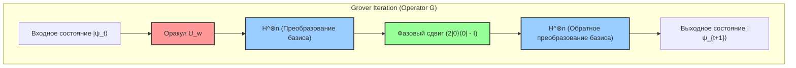

Эта схема показывает чрезвычайно практичный метод реализации оператора диффузии $U_s = 2|s\rangle\langle s| - I$. Поскольку состояние $|s\rangle$ генерируется как $H^{\otimes n} |0\rangle^{\otimes n}$, оператор можно разложить следующим образом:

$$
U_s = 2(H^{\otimes n} |0\rangle^{\otimes n})(\langle 0|^{\otimes n} H^{\otimes n}) - I = H^{\otimes n} (2|0\rangle\langle 0| - I) H^{\otimes n}
$$

Другими словами, преобразовав в вычислительный базис с помощью преобразования Адамара $H^{\otimes n}$, применив условный оператор фазового сдвига, который не инвертирует фазу только когда все кубиты равны $|0\rangle$ (или эквивалентное определение, дающее отрицательную фазу только для $|0\rangle$, что является лишь разницей в глобальной фазе), и преобразовав обратно в исходный базис с помощью повторного преобразования Адамара, принимая структуру «сэндвича», «инверсия относительно среднего» может быть эффективно реализована на любом квантовом компьютере.

## 9.5 Анализ вероятности успеха и вывод оптимального количества итераций

Благодаря полному выяснению геометрического поведения вектора состояния мы теперь готовы дать строгий количественный ответ на вопрос, лежащий в основе алгоритма: «Сколько итераций необходимо повторить, чтобы получить правильный ответ?».

Вероятность $P(w)$ получения правильного состояния $|w\rangle$ при измерении квантового регистра в вычислительном базисе после выполнения $t$ итераций задаётся квадратом абсолютного значения амплитуды компоненты $|w\rangle$ вектора состояния $|\psi_t\rangle$.

$$
P(w) = |\langle w | \psi_t \rangle|^2 = \sin^2((2t+1)\theta)
$$

Наша конечная цель — максимизировать эту вероятность $P(w)$, то есть максимально приблизить её к теоретическому пределу $1$. Квадрат синуса $\sin^2(x)$ принимает максимальное значение $1$, когда аргумент $x$ равен $\frac{\pi}{2}$ (90 градусов). Таким образом, уравнение для нахождения оптимального количества итераций $t$ формулируется следующим образом:

$$
(2t+1)\theta \approx \frac{\pi}{2}
$$

Решая это относительно $t$, получаем:

$$
t \approx \frac{\pi}{4\theta} - \frac{1}{2}
$$

В задаче поиска в базе данных практического масштаба количество элементов $N$ становится астрономически огромным числом. При этом угол $\theta$ становится бесконечно малой величиной, крайне близкой к $0$. Для малых $\theta$ хорошим приближением является $\sin \theta \approx \theta$ благодаря взятию члена первого порядка разложения Тейлора (разложения Маклорена). Поскольку из определения начального состояния было $\sin \theta = \frac{1}{\sqrt{N}}$, можно считать, что $\theta \approx \frac{1}{\sqrt{N}}$.

Подставляя эту аппроксимацию в выведенное ранее уравнение для $t$, блестяще выводится оптимальное количество итераций (оптимальное число итераций) $R$:

$$
R \approx \frac{\pi}{4} \sqrt{N}
$$

Значение этого результата настолько поразительно, что потрясает историю информатики. На классическом компьютере для поиска правильного ответа в случайно перемешанном пространстве поиска было неизбежно время поиска, пропорциональное количеству элементов (вычислительная сложность $O(N)$), составляющее $N$ раз в худшем случае и $N/2$ раз в среднем. Однако алгоритм Гровера, работающий на квантовом компьютере, использует интерференцию для усиления вероятности, достигая правильного состояния почти наверняка (с чрезвычайно высокой точностью вероятности $1 - O(1/N)$) всего за $\frac{\pi}{4} \sqrt{N}$ запросов. Вычислительная сложность становится $O(\sqrt{N})$, успешно сжимая время вычислений до масштаба квадратного корня.

Однако здесь есть одно важное предостережение. Алгоритм Гровера не обладает самоостановкой (Self-stopping). Если количество итераций превышает это оптимальное значение $R$, вектор состояния проходит за пределы целевой оси $|w\rangle$, и вероятность наблюдения правильного ответа парадоксальным образом уменьшается из-за периодичности функции синуса; это явление называется **«перекручиванием» (Overcooking / Overshooting)** . Следовательно, правильное управление моментом наблюдения (моментом остановки итераций) является обязательным условием для успеха алгоритма.

## 9.6 Обобщение усиления амплитуды для случая множественных решений

До сих пор мы вели обсуждение, предполагая наиболее жёсткое условие (задача с единственным решением), при котором в огромной базе данных существует «только один» правильный ответ. Однако в реальных условиях постановки задач обычно существует несколько решений, удовлетворяющих условию. Метод усиления амплитуды, являющийся ядром алгоритма Гровера, может быть естественно расширен без потери своей математической красоты и в случае, когда существует $M$ решений ( $1 \le M \le N$ ).

Когда существует $M$ решений, мы переопределяем состояние равномерной суперпозиции всех правильных состояний как $|W\rangle$, а состояние равномерной суперпозиции всех неправильных состояний — как $|W^\perp\rangle$.

$$
|W\rangle = \frac{1}{\sqrt{M}} \sum_{x \in \text{Solutions}} |x\rangle
$$

$$
|W^\perp\rangle = \frac{1}{\sqrt{N-M}} \sum_{x \notin \text{Solutions}} |x\rangle
$$

Тогда начальное состояние равномерной суперпозиции $|s\rangle$ можно разложить с использованием этих двух ортогональных векторов следующим образом:

$$
|s\rangle = \sqrt{\frac{N-M}{N}} |W^\perp\rangle + \sqrt{\frac{M}{N}} |W\rangle
$$

Здесь мы определяем новый угол $\theta'$ так, что $\sin \theta' = \sqrt{\frac{M}{N}}$. При этом определении, применяя точно такой же оператор Гровера $G$ (однако оракул расширен для инверсии фазы всех $M$ решений), вектор состояния будет вращаться на $2\theta'$ на каждую итерацию в плоскости, натянутой на $|W^\perp\rangle$ и $|W\rangle$.

Оптимальное количество итераций по аналогичной логике составит $\frac{\pi}{4\theta'}$, и в случае $M \ll N$ оно аппроксимируется следующим образом:

$$
R \approx \frac{\pi}{4} \sqrt{\frac{N}{M}}
$$

Эта формула показывает, что по мере увеличения количества решений $M$, естественно, необходимое количество итераций (время поиска) сокращается. Например, если существует 4 решения, необходимое время сократится вдвое. Даже если количество решений $M$ неизвестно, с помощью продвинутого метода, называемого **алгоритмом квантового подсчёта (Quantum Counting Algorithm)** , который сочетает алгоритм Гровера с квантовой оценкой фазы (Quantum Phase Estimation), можно быстро оценить само количество решений $M$, а затем выполнить соответствующее количество усилений амплитуды.

## 9.7 Теоретическое значение квадратичного ускорения и предел квантовых вычислений (Теорема BBBV)

Квадратичное ускорение от $O(N)$ до $O(\sqrt{N})$, обеспечиваемое алгоритмом Гровера, может математически показаться скромным по сравнению с экспоненциальным ускорением, обеспечиваемым алгоритмом Шора (от $O(e^{N^{1/3}})$ к $O(N^3)$). Однако его истинная ценность и универсальность в информатике кроются именно в «универсальности, не зависящей от выбора задачи».

Алгоритм факторизации Шора искусно использует чрезвычайно специфическую алгебраическую структуру — «периодичность», присущую мультипликативной группе целых чисел. В отличие от него, алгоритм Гровера применим безусловно к «неструктурированному поиску в базе данных», который является самой фундаментальной и примитивной формой любой вычислительной задачи, не обладающей никакими предварительными знаниями или структурой.

Это влияние наиболее ярко проявляется в ряде сложных задач, принадлежащих к классу сложности NP, и в его применении к криптографическим технологиям, лежащим в основе современного общества. Например, NP-полные задачи, такие как задача коммивояжёра или задача о выполнимости булевых формул (SAT), по сути сводятся к задаче полного перебора для поиска решения, удовлетворяющего условиям в огромном пространстве кандидатов. В то время как классические алгоритмы требуют $O(2^n)$ времени для этих задач, применение алгоритма Гровера может фактически сократить время вычислений вдвое (уменьшить вдвое показатель степени) до $O(\sqrt{2^n}) = O(2^{n/2})$.

Влияние на криптографию также является фатальным и колоссальным. Стойкость криптосистем с симметричным ключом, таких как AES, которые в настоящее время обеспечивают безопасность Интернета, полностью зависит от сложности атаки полным перебором (Brute-force attack) на пространство ключей. Например, пространство поиска для AES-128 (длина ключа 128 бит) составляет невероятное число $N = 2^{128}$. Классический компьютер требует в среднем $2^{127}$ вычислений для проверки ключа, но квантовый компьютер с алгоритмом Гровера может надёжно найти правильный ключ всего за $\frac{\pi}{4} 2^{64}$ вычислений. Именно этот факт является главным основанием для того, чтобы организации по стандартизации по всему миру (такие как NIST) сделали переход на постквантовую криптографию (Post-Quantum Cryptography) неотложной задачей, настоятельно рекомендуя отказаться от AES-128 в пользу AES-256 (которая потребует $2^{128}$ вычислений даже для квантовых вычислений).

Наконец, упомянем очень важную теорему с точки зрения теоретической физики и информатики. Это **теорема BBBV** , доказанная Беннетом, Бернштейном, Брассардом и Вазирани (Bennett, Bernstein, Brassard, Vazirani) в 1997 году. Эта теорема математически строго доказала, что «даже при использовании квантового компьютера неструктурированный поиск с чёрным ящиком абсолютно требует $\Omega(\sqrt{N})$ запросов».

Что это означает? Это означает глубокий факт: **«Вычислительная сложность $O(\sqrt{N})$, достигнутая алгоритмом Гровера, является абсолютным теоретическим пределом, допускаемым законами природы (квантовой механикой), и любое дальнейшее ускорение невозможно независимо от того, какие физические законы Вселенной используются»** . Гровер не просто открыл выдающийся алгоритм; он достиг абсолютной границы между информацией и физическими законами.

Кроме того, сама парадигма «усиления амплитуды» (Amplitude Amplification), подробно описанная в этой главе, широко применяется как базовый строительный блок для построения бесчисленного множества продвинутых квантовых алгоритмов, таких как квантовые случайные блуждания (Quantum Random Walks) и подпрограммы квантового машинного обучения (Quantum Machine Learning). Этот красивый и элегантный метод, открытый Гровером, «геометрически вращать и усиливать амплитуду вероятности, используя двойное отражение относительно двух ортогональных осей», несомненно, будет продолжать сиять как один из самых прочных и незаменимых столпов, поддерживающих гигантскую академическую систему квантовой информатики с самых её основ.

# Глава 10: Квантовая коррекция ошибок и отказоустойчивые вычисления

Самое грандиозное и глубокое препятствие, с которым сталкивается квантовая информатика, — это «шум» (noise) и «декогеренция» (decoherence). Пока мы рассматриваем квантовый компьютер как идеальную замкнутую систему, гарантируется детерминированное управление состояниями посредством унитарной эволюции, подчиняющейся уравнению Шрёдингера. Однако квантовые устройства, являясь реальными физическими системами, постоянно взаимодействуют с внешней средой (тепловыми резервуарами, флуктуациями электромагнитных полей, космическими лучами и т. д.). В этой главе, строго математически определив квантовый шум, мы погрузимся в глубины «квантовой коррекции ошибок» (Quantum Error Correction: QEC) — того, как обнаруживать и исправлять специфические квантовые ошибки, не существующие в классических системах. Кроме того, мы подробно рассмотрим теоретические основы «отказоустойчивых квантовых вычислений» (Fault-Tolerant Quantum Computation: FTQC), которые позволяют продолжать вычисления сколь угодно долго даже в реалистичных условиях, когда сам механизм коррекции подвержен шуму, а также теорему о пороге (Threshold Theorem).

## 10.1 Математическое описание квантового шума и декогеренции

Для строгого описания декогеренции квантовой системы необходимо перейти от динамики чистых состояний, основанной на векторах состояния замкнутой системы, к динамике матриц плотности открытых квантовых систем. Рассматривая унитарную эволюцию составной системы, включающей резервуар окружения $E$ и основную систему $S$, и исключая степени свободы окружения с помощью частичного следа (Partial Trace), изменение состояния основной системы описывается как «вполне положительное сохраняющее след отображение» (Completely Positive Trace-Preserving Map, CPTP-отображение).

Произвольный квантовый канал $\mathcal{E}$ может быть разложен с использованием представления Крауса (Kraus Representation) следующим образом:

$$
\mathcal{E}(\rho) = \sum_{k} E_k \rho E_k^\dagger
$$

Здесь $E_k$ называются операторами Крауса (Kraus Operators) и удовлетворяют условию сохранения следа $\sum_k E_k^\dagger E_k = I$, означающему сохранение полной вероятности.

В классической теории информации единственной ошибкой для бита — элементарной единицы информации — является «переворот бита» (Bit Flip), когда «0 становится 1» или «1 становится 0». Однако в квантовых системах существует фатальная ошибка, называемая «переворотом фазы» (Phase Flip), при которой флуктуирует фаза суперпозиции. Ниже приведены операторы Крауса для типичных однокубитных шумовых каналов:

1. **Канал переворота бита (Bit Flip Channel)** : С вероятностью $p$ действует вентиль $X$.
   

$$
E_0 = \sqrt{1-p} I, \quad E_1 = \sqrt{p} X
$$

2. **Канал переворота фазы (Phase Flip Channel)** : С вероятностью $p$ действует вентиль $Z$. Он описывает разрушение относительной фазы (чистую декогеренцию). Это непосредственная причина явления, при котором недиагональные элементы матрицы плотности чистого состояния $|\psi\rangle = \alpha|0\rangle + \beta|1\rangle$ экспоненциально затухают.
   

$$
E_0 = \sqrt{1-p} I, \quad E_1 = \sqrt{p} Z
$$

3. **Канал деполяризации (Depolarizing Channel)** : С вероятностью $p$ состояние приближается к максимально смешанному состоянию (белому шуму) $I/2$.
   

$$
E_0 = \sqrt{1-p} I, \quad E_1 = \sqrt{\frac{p}{3}} X, \quad E_2 = \sqrt{\frac{p}{3}} Y, \quad E_3 = \sqrt{\frac{p}{3}} Z
$$

Первым барьером на пути к построению квантовой коррекции ошибок встает «теорема о запрете клонирования» (No-Cloning Theorem). Не существует унитарного преобразования, способного скопировать неизвестное квантовое состояние $|\psi\rangle$ для создания состояния вида $|\psi\rangle \otimes |\psi\rangle \otimes |\psi\rangle$. Следовательно, наивный подход классической коррекции ошибок, заключающийся в «копировании одной и той же информации на три бита и принятии решения большинством голосов», в квантовых системах невозможен. Более того, измерение квантового состояния вызывает коллапс волновой функции и разрушает суперпозицию. Идентификация ошибки без разрушения неизвестной информации становится ключевой фундаментальной задачей.

## 10.2 Базовые принципы квантовой коррекции ошибок: избыточность и измерение синдрома

Альтернативой «копированию» в квантовой информации служит приведение нескольких кубитов в состояние квантовой запутанности (Entanglement), что позволяет отобразить исходную информацию в подпространство (кодовое пространство, Code Space) гильбертова пространства более высокой размерности.

В качестве простейшего примера построим «3-кубитный код переворота бита», защищающий состояние одного кубита $|\psi\rangle = \alpha |0\rangle + \beta |1\rangle$ от вероятностного переворота бита.
Логический базис (Logical Basis) определим следующим образом:

$$
|0\rangle_L = |000\rangle, \quad |1\rangle_L = |111\rangle
$$

Логическое состояние имеет вид $|\psi\rangle_L = \alpha |000\rangle + \beta |111\rangle$. Это не клонирование, а кодирование в запутанное состояние типа GHZ.

Предположим теперь, что на первом кубите возникла ошибка переворота бита $X_1 = X \otimes I \otimes I$. Состояние переходит в $|\psi'\rangle = \alpha |100\rangle + \beta |011\rangle$.
Чтобы обнаружить эту ошибку, ни в коем случае нельзя измерять само состояние напрямую. Вместо этого выполняется «измерение синдрома» (Syndrome Measurement), извлекающее исключительно след ошибки без разрушения квантового состояния. В частности, измеряются операторы четности $Z_1 Z_2$ и $Z_2 Z_3$, представляющие собой тензорные произведения операторов Паули.

Любой вектор $|\psi\rangle_L$ исходного кодового пространства является собственным вектором операторов $Z_1 Z_2$ и $Z_2 Z_3$ с собственным значением $+1$ (то есть $Z_1 Z_2 |\psi\rangle_L = |\psi\rangle_L$).
Однако для состояния с ошибкой $|\psi'\rangle$, в силу фундаментального свойства алгебры Паули — антикоммутации $X$ и $Z$ ( $\{X, Z\} = 0$ ), получаем:

$$
Z_1 Z_2 |\psi'\rangle = Z_1 Z_2 X_1 |\psi\rangle_L = -X_1 Z_1 Z_2 |\psi\rangle_L = - |\psi'\rangle
$$

$$
Z_2 Z_3 |\psi'\rangle = Z_2 Z_3 X_1 |\psi\rangle_L = X_1 Z_2 Z_3 |\psi\rangle_L = + |\psi'\rangle
$$

Результат измерения (синдром) оказывается равным $(-1, +1)$, что однозначно устанавливает исключительно факт: «на первом кубите произошла ошибка $X$». Поскольку никакая информация о коэффициентах суперпозиции $\alpha, \beta$ не просачивается наружу, разрушения состояния при измерении не происходит. После этого, повторно применив $X_1$, можно полностью восстановить исходное состояние $|\psi\rangle_L$.

Аналогично, для исправления ошибки переворота фазы $Z$ применяется «3-кубитный код переворота фазы», использующий базис Адамара $\{|+\rangle, |-\rangle\}$.

$$
|0\rangle_L = |+++\rangle, \quad |1\rangle_L = |---\rangle
$$

В этом случае для измерения синдрома используются операторы $X_1 X_2$ и $X_2 X_3$.

Здесь вступает в силу поразительное свойство квантовой механики. Ошибки, вызванные взаимодействием с окружающей средой, в общем случае представляют собой непрерывные вращения вида $E(\theta) = \cos(\theta) I - i \sin(\theta) X$. Однако в результате измерения синдрома это состояние с определенной вероятностью **проецируется** в одно из собственных состояний: «без ошибки ( $I$ )» либо «полная ошибка ( $X$ )». Иными словами, континуум непрерывных ошибок благодаря измерению квантовомеханически «дискретизируется» (оцифровывается) в дискретные ошибки Паули.

## 10.3 9-кубитный код Шора (Shor Code) и формализм стабилизаторов

Рассмотренные выше коды способны исправлять либо только переворот бита, либо только переворот фазы. В 1995 году Питер Шор представил революционный «9-кубитный код Шора» (Shor's 9-Qubit Code), способный одновременно исправлять ошибки обоих типов. Он строится путем конкатенации (вложения, Concatenation) 3-кубитного кода переворота бита внутрь каждого узла 3-кубитного кода переворота фазы.

Логический базис задается следующим образом:

$$
|0\rangle_L = \frac{1}{2\sqrt{2}} ( |000\rangle + |111\rangle ) \otimes ( |000\rangle + |111\rangle ) \otimes ( |000\rangle + |111\rangle )
$$

$$
|1\rangle_L = \frac{1}{2\sqrt{2}} ( |000\rangle - |111\rangle ) \otimes ( |000\rangle - |111\rangle ) \otimes ( |000\rangle - |111\rangle )
$$

Обобщение квантовых кодов коррекции ошибок, таких как код Шора, и создание для них мощного математического фундамента принадлежат Дэниелу Готтесману, разработавшему «формализм стабилизаторов» (Stabilizer Formalism).
Обозначим через $\mathcal{P}_n$ группу Паули на $n$ кубитах. Группа стабилизаторов $\mathcal{S}$ представляет собой абелеву (коммутативную) подгруппу группы $\mathcal{P}_n$, не содержащую $-I$, а кодовое пространство $\mathcal{C}$ определяется как «множество состояний $|\psi\rangle$, для которых все элементы $S \in \mathcal{S}$ группы $\mathcal{S}$ имеют собственное значение $+1$». Если в системе из $n$ кубитов имеется $k$ независимых генераторов (образующих), то размерность кодового пространства равна $2^{n-k}$, что соответствует $n-k$ логическим кубитам.

В случае кода Шора ( $n=9$ ) для кодирования одного логического кубита используется $k=8$ независимых генераторов.
Стабилизаторы $Z$-типа (6 операторов) для обнаружения переворота бита:

$$
S_1 = Z_1 Z_2 I_3 I_4 I_5 I_6 I_7 I_8 I_9, \quad S_2 = I_1 Z_2 Z_3 I_4 I_5 I_6 I_7 I_8 I_9
$$

$$
\dots, \quad S_6 = I_1 I_2 I_3 I_4 I_5 I_6 I_7 Z_8 Z_9
$$

Стабилизаторы $X$-типа (2 оператора) для обнаружения переворота фазы:

$$
S_7 = X_1 X_2 X_3 X_4 X_5 X_6 I_7 I_8 I_9
$$

$$
S_8 = I_1 I_2 I_3 X_4 X_5 X_6 X_7 X_8 X_9
$$

Если на каком-либо кубите возникает ошибка $E \in \mathcal{P}_n$, и она антикоммутирует с каким-либо из образующих группы $\mathcal{S}$, то результат измерения соответствующего стабилизатора становится равным $-1$, что однозначно идентифицирует тип и позицию ошибки. Концепция стабилизаторов предлагает исключительно мощный подход, родственный гейзенберговской картине: вместо непосредственного отслеживания квантового состояния отслеживается алгебраическая структура операторов, определяющих симметрию системы.

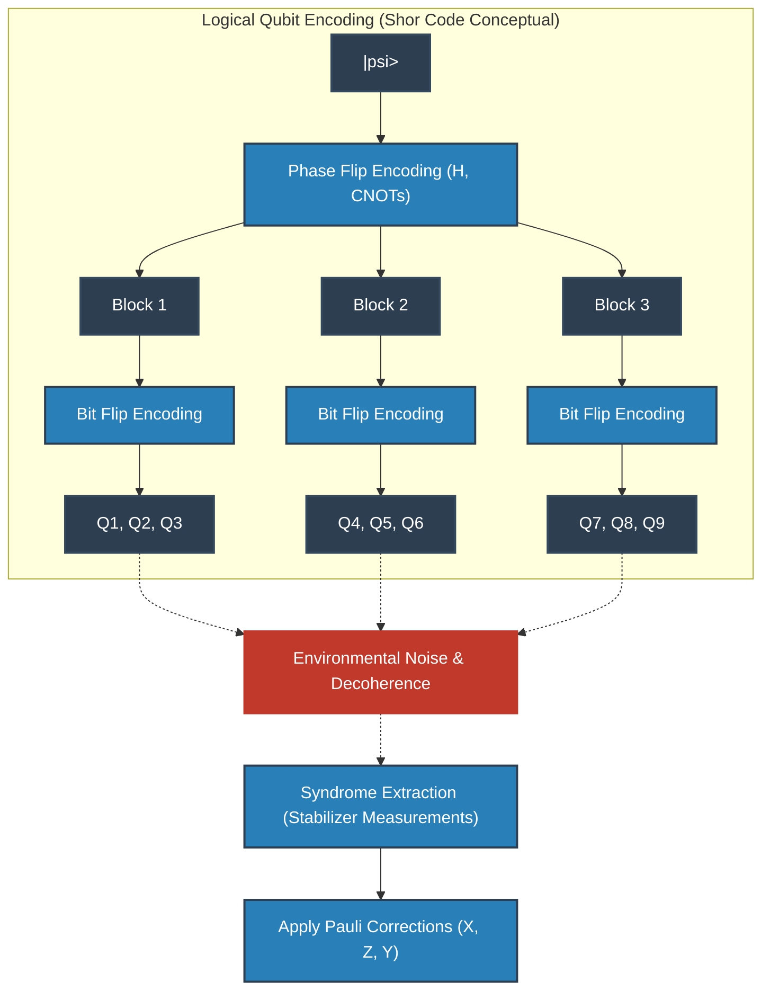

## 10.4 Топологические коды и поверхностные коды (Surface Codes)

Хотя код Шора и стабилизаторные коды безупречны с логической точки зрения, их физическая реализация требует «взаимодействия между пространственно разделенными кубитами (дальнодействующих взаимодействий)». В двумерной планарной решеточной геометрии твердотельных устройств (таких как сверхпроводящие контуры или спины в кремнии) реализация таких дальнодействующих связей сопряжена с колоссальными трудностями.

Поэтому в качестве магистрального направления современной архитектуры квантовых компьютеров была принята «топологическая квантовая коррекция ошибок», предложенная Алексеем Китаевым (Alexei Kitaev), выдающимися представителями которой выступают «торический код» (Toric Code) и «поверхностный код» (Surface Code).

В поверхностных кодах кубиты располагаются в узлах (или на ребрах) двумерной решетки, а измерения стабилизаторов осуществляются исключительно посредством локальных взаимодействий между соседними кубитами.
Гамильтониан описывается следующим образом:

$$
H = - \sum_{v} A_v - \sum_{p} B_p
$$

Здесь $A_v$ — тензорное произведение операторов $X$ для четырех кубитов, окружающих вершину (Vertex) (вершинный оператор: $A_v = \prod_{i \in \text{star}(v)} X_i$ ), а $B_p$ — тензорное произведение операторов $Z$ для четырех кубитов, окружающих плакет (грань, Plaquette) (плакетный оператор: $B_p = \prod_{i \in \text{boundary}(p)} Z_i$ ).
Все эти операторы взаимно коммутируют ( $[A_v, B_p] = 0$ ), и логическое состояние кодируется в подпространстве основного состояния, где все $A_v$ и $B_p$ имеют собственные значения $+1$. Поразительно, что кратность вырождения основного состояния торического кода, построенного на двумерном многообразии рода (Genus) $g$, составляет $4^g$, благодаря чему на торе ( $g=1$ ) естественным образом кодируются два логических кубита.

Исключительно красивая физическая интерпретация поверхностного кода состоит в трактовке ошибок как «квазичастиц (энионов, Anyon)». Например, при возникновении ошибки $X$ на некотором кубите синдромы двух соседних плакетных операторов $B_p$ инвертируются в $-1$. Это означает, что из вакуума основного состояния рождается пара «энионов, подобных магнитным монополям ( $m$-энионов)». При дальнейшем распространении ошибок на соседние кубиты энионы перемещаются по решеточному пространству.
Коррекция представляет собой не что иное, как обнаружение пар синдромов (энионов) и сведение их по кратчайшему пути для аннигиляции с помощью алгоритма теории графов «совершенное паросочетание минимального веса» (Minimum Weight Perfect Matching: MWPM).
Логические операции ( $\bar{X}, \bar{Z}$ ) соответствуют перемещению этих энионов через все пространство от одного края до другого с формированием нетривиальной гомологической петли (Topological Loop). Поскольку вероятность того, что локальный шум спонтанно сформирует топологическую петлю через всю систему, экспоненциально подавлена, информация оказывается чрезвычайно надежно защищена с топологической точки зрения.

## 10.5 Путь к отказоустойчивым квантовым вычислениям (FTQC) и теорема о пороге

Даже после построения теории коррекции ошибок остается колоссальная проблема: «Что произойдет, если сама схема выполнения коррекции ошибок (вспомогательные кубиты для измерения синдрома, вентили CNOT и т. д.) подвержена шуму?» Если в ходе хирургической операции по устранению ошибки внести еще более тяжелое заражение, система мгновенно потерпит крах.

Например, вентиль CNOT, используемый для извлечения синдрома, распространяет ошибку $X$ с управляющего кубита на целевой ( $X \otimes I \xrightarrow{CNOT} X \otimes X$ ), а ошибку $Z$ с целевого кубита обратно переносит на управляющий ( $I \otimes Z \xrightarrow{CNOT} Z \otimes Z$ ). Если одна физическая ошибка размножится на несколько кубитов внутри кодового блока, превысив заданное кодовое расстояние $d$, коррекция потерпит полный провал.

Концепцией проектирования, призванной предотвратить эту разрушительную цепную реакцию, являются «отказоустойчивые квантовые вычисления (FTQC)». Абсолютным требованием FTQC выступает следующее правило: «одна физическая ошибка, возникшая в системе, должна распространяться не более чем в одну ошибку внутри одного логического кодового блока».
Для реализации этого принципа при выполнении логических вентилей строго требуются «трансверсальные операции» (Transversal Operations). Это безопасные вентильные операции, при которых $i$-й физический кубит взаимодействует исключительно с $i$-м физическим кубитом другого блока (не образуя перекрестных связей внутри одного блока). Однако в силу «теоремы Истина — Книлла» (Eastin-Knill Theorem) математически доказано, что невозможно построить непрерывный универсальный набор вентилей для квантовых вычислений, используя исключительно трансверсальные операции.

Магическим средством, позволяющим обойти ограничения этой теоремы и достичь универсального FTQC, выступает «дистилляция магических состояний» (Magic State Distillation). При этом подготавливается большое количество зашумленных неклиффордовых состояний (например, состояний, соответствующих вентилю $T$), и через схему коррекции ошибок, использующую исключительно трансверсальные клиффордовы операции, извлекается «магическое состояние» (Magic State) высочайшей чистоты. Затем, опираясь на принципы квантовой телепортации, неклиффордовы вентили (такие как вентиль $T$) косвенно применяются к логическому состоянию. Поскольку этот процесс дистилляции поглощает колоссальные ресурсы (физические кубиты), в квантовых алгоритмах эпохи FTQC первостепенной задачей становится «минимизация числа вентилей $T$».

Кульминацией всех этих теоретических усилий выступает «квантовая теорема о пороге» (Quantum Threshold Theorem).
Доказанная Дорит Ахаронов (Dorit Aharonov), Майклом Бен-Ором (Michael Ben-Or) и их коллегами, эта теорема торжественно провозглашает:
 **«Если вероятность ошибки физических компонентов (вентилей, измерений, инициализации) $p$ находится ниже определенного порога $p_{th}$, то путем иерархического каскадирования (Concatenation) квантовых кодов коррекции ошибок или непрерывного увеличения размера решетки топологического кода (кодового расстояния $d$ ) становится возможным выполнять квантовые вычисления сколь угодно длительное время с любой наперед заданной точностью.»** 

Хотя величина порога $p_{th}$ зависит от используемого кода и конкретной архитектуры, для поверхностных кодов она достигает примерно $10^{-2}$ (1%) — исключительно реалистичного и достижимого значения. Как подавление физического уровня ошибок значительно ниже этого порога (совершенствование Physical Layer), так и создание более эффективных декодеров синдромов и модификаций поверхностных кодов (развитие Logical Layer) образуют главную арену глобальной технологической гонки в области квантовых вычислений на сегодняшний день.

Квантовая коррекция ошибок и FTQC — это отнюдь не просто инженерная заплатка. Это глубочайший фундаментальный и подлинно эстетический вызов человечества: удержать ускользающие хрупкие состояния суперпозиции квантовой механики, которые природа стремится скрыть, и с помощью топологии, теории групп и управления термодинамической энтропией растянуть их существование до макроскопических временных масштабов, раздвигая фундаментальные пределы вычислительной мощи Вселенной.

# Глава 11: Физическая реализация квантового аппаратного обеспечения

До десятой главы мы подробно рассматривали теоретические основы квантовой информатики и математическую структуру алгоритмов. Как бы ни были сложны разработанные квантовые алгоритмы и даже если теоретическое квантовое превосходство (Quantum Supremacy) доказано в рамках теории сложности вычислений, без физической сущности, называемой «квантовым аппаратным обеспечением», для их выполнения они останутся лишь игрой чистой математики. В этой главе мы строго объясним самые передовые методы аппаратной реализации для воплощения вектора состояния $ |\psi\rangle $ в абстрактном гильбертовом пространстве в физический мир, исходя из глубоких принципов квантовой физики, лежащих в их основе.

Для того чтобы искусственно управлять квантовой физической системой и заставить ее функционировать как универсальный (Universal) компьютер, необходимо выполнить пять суровых физических требований, известных как критерии Дивинченцо (DiVincenzo's criteria).
1. **Существование масштабируемой и хорошо охарактеризованной системы кубитов** : Способность физически обеспечить структуру тензорного произведения гильбертова пространства $ \mathcal{H} = \bigotimes_{i=1}^n \mathcal{H}_i $.
2. **Инициализация квантового состояния** : Способность с высокой точностью сбрасывать систему в чистое состояние (обычно $ |00\dots0\rangle $ ).
3. **Достаточно долгое время когерентности** : Время декогеренции квантового состояния (T1 и T2) должно быть на несколько порядков больше времени, затрачиваемого на одну операцию вентиля.
4. **Реализация универсального набора квантовых вентилей** : Способность аппроксимировать произвольное унитарное преобразование $ \hat{U} \in SU(2^n) $ с любой заданной точностью с помощью комбинации конечного числа базисных вентилей (например, вентилей H, T, CNOT).
5. **Проективное измерение конкретных кубитов** : Способность с высокой точностью считывать распределение вероятностей относительно определенного базиса, что сопровождается коллапсом квантового состояния.

Создание системы, которая одновременно и с высокой точностью (Fidelity) удовлетворяет всем этим требованиям, является исторической задачей в современной физике и инженерии. Если полностью изолировать систему от окружающей среды, время когерентности увеличится, но в то же время это затруднит управление системой и ее измерение. То, как преодолеть этот фундаментальный компромисс, составляет основу философии проектирования каждого аппаратного подхода.

## 11.1 Сверхпроводящие кубиты: макроскопические квантовые явления и нелинейные LC-контуры

В настоящее время сверхпроводящие кубиты (Superconducting Qubit) наиболее активно продвигаются многими исследовательскими институтами, включая Google и IBM. Это подход, при котором для создания «искусственных атомов» (Artificial Atom) используются макроскопические квантовые явления, демонстрируемые макроскопическими электронными схемами, а не микроскопическими элементарными частицами.

### 11.1.1 Физика и нелинейность перехода Джозефсона

Обычный микросхемный LC-колебательный контур (система, состоящая из индуктивности $ L $ и емкости $ C $ ), охлажденный до криогенных температур и квантованный, становится квантовомеханическим гармоническим осциллятором (Harmonic Oscillator). Его гамильтониан можно записать следующим образом с использованием оператора рождения $ \hat{a}^\dagger $ и оператора уничтожения $ \hat{a} $ :

$$
\hat{H}_{\text{LC}} = \hbar \omega_r \left( \hat{a}^\dagger \hat{a} + \frac{1}{2} \right)
$$

Где $ \omega_r = 1/\sqrt{LC} $ — резонансная частота. Уровни энергии этой системы $ E_n = \hbar \omega_r (n + 1/2) $ расположены на равных расстояниях. Если использовать состояние с наименьшей энергией $ |0\rangle $ и первое возбужденное состояние $ |1\rangle $ этой системы в качестве кубита, попытка выполнить операцию вентиля (например, переход $ |0\rangle \leftrightarrow |1\rangle $ ) путем облучения микроволнами с частотой $ \omega_r $ также одновременно вызовет переходы на равных интервалах, такие как $ |1\rangle \leftrightarrow |2\rangle $ и $ |2\rangle \leftrightarrow |3\rangle $ . В таком случае система не будет функционировать как двухуровневая.

Для решения этой проблемы необходима «нелинейность» (Nonlinearity), которая сделает уровни энергии неравноотстоящими. Это достигается с помощью **перехода Джозефсона (Josephson Junction)** . Он имеет структуру, в которой два сверхпроводника разделены тонким изолирующим слоем толщиной в несколько нанометров, через который куперовские пары (Cooper pairs) проходят посредством туннельного эффекта, сохраняя интерференцию макроскопической фазы. Согласно уравнениям Джозефсона, связь между сверхпроводящим током $ I $ и разностью фаз $ \phi $ выражается как $ I = I_c \sin \phi $ . Благодаря этому переход функционирует как нелинейная индуктивность, которая зависит от тока.

### 11.1.2 Гамильтониан трансмона (Transmon)

Исторически были предложены различные конструкции, такие как зарядовые кубиты и потоковые кубиты, но в настоящее время наиболее успешным является «трансмон» (Transmon), который радикально повышает устойчивость к зарядовому шуму.

Трансмон работает в режиме, где шунтирующая емкость, параллельная энергии Джозефсона $ E_J $ , намеренно сделана огромной, что уменьшает энергию заряда $ E_C = e^2 / (2C_{\Sigma}) $ ( $ E_J / E_C \gg 1 $ ).
Оператор заряда $ \hat{n} $ , представляющий количество куперовских пар, и фазовый оператор $ \hat{\phi} $ , представляющий разность сверхпроводящих фаз, являются канонически сопряженными переменными и удовлетворяют коммутационному соотношению $ [\hat{\phi}, \hat{n}] = i $ . Гамильтониан трансмона строго описывается следующим образом:

$$
\hat{H}_{\text{transmon}} = 4 E_C (\hat{n} - n_g)^2 -E_J \cos \hat{\phi}
$$

Где $ n_g $ — офсетный заряд, обусловленный окружающей средой и напряжением на затворе. В пределе $ E_J \gg E_C $ квантовые флуктуации фазы остаются небольшими, поэтому косинусный член можно разложить в ряд Тейлора и рассматривать систему как ангармонический осциллятор.

$$
-E_J \cos \hat{\phi} \approx - E_J + \frac{E_J}{2} \hat{\phi}^2 - \frac{E_J}{24} \hat{\phi}^4 + \mathcal{O}(\hat{\phi}^6)
$$

Этот член $ \hat{\phi}^4 $ вносит в систему ангармоничность (Anharmonicity). По результатам расчетов на основе теории возмущений, ангармоничность между уровнями энергии $ \alpha $ аппроксимируется следующим образом:

$$
\alpha \equiv (E_2 - E_1) - (E_1 - E_0) \approx -E_C
$$

Благодаря этой отрицательной ангармоничности (частота перехода $ E_1 \to E_2 $ меньше, чем $ E_0 \to E_1 $ ) становится возможным безопасно выполнять однокубитные вентили в пространстве вычислительного базиса $ |0\rangle $ и $ |1\rangle $ с использованием микроволновых импульсов.

### 11.1.3 Схемная КЭД (Circuit QED) и механизм измерения

Теоретической основой для неразрушающего считывания состояния кубитов является «схемная квантовая электродинамика» (Circuit QED), которая применяет резонаторную квантовую электродинамику к сверхпроводящим контурам.
Связанная система кубита и микроволнового резонатора для считывания описывается моделью Джейнса-Каммингса (Jaynes-Cummings).

$$
\hat{H}_{\text{JC}} = \frac{\hbar \omega_q}{2} \hat{\sigma}_z + \hbar \omega_r \hat{a}^\dagger \hat{a} + \hbar g (\hat{\sigma}_+ \hat{a} + \hat{\sigma}_- \hat{a}^\dagger)
$$

Где $ g $ — сила связи. В дисперсионном режиме ( $ |\omega_q - \omega_r| \gg g $ ), когда частота перехода кубита $ \omega_q $ и частота резонатора $ \omega_r $ сильно разнесены, эффективный гамильтониан диагонализируется с помощью преобразования Шриффера-Вольфа (Schrieffer-Wolff) следующим образом:

$$
\hat{H}_{\text{disp}} \approx \frac{\hbar \omega_q}{2} \hat{\sigma}_z + \hbar \left( \omega_r + \frac{g^2}{\Delta} \hat{\sigma}_z \right) \hat{a}^\dagger \hat{a}
$$

Где $ \Delta = \omega_q - \omega_r $ . Физический смысл второго члена этого уравнения чрезвычайно важен. Эффективная частота резонатора сдвигается на $ \pm g^2/\Delta $ в зависимости от состояния кубита ( $ \hat{\sigma}_z = +1 $ или $ -1 $ ). Таким образом, пропуская или отражая пробную микроволну через резонатор и измеряя ее фазовый сдвиг, можно выполнить проективное измерение состояния кубита.

 **Преимущества и недостатки** 
Самым большим преимуществом сверхпроводящего метода является его масштабируемость за счет проектирования проводки на кристалле, поскольку можно использовать существующие технологии полупроводниковой литографии, а также то, что операции вентилей происходят чрезвычайно быстро, в наносекундном масштабе. С другой стороны, недостатком является то, что, будучи макроскопическими искусственными объектами, они чрезвычайно уязвимы к микроскопическим дефектам материалов (TLS) и электромагнитному шуму, а потому требуют среды рефрижератора растворения при температурах, близких к абсолютному нулю (около 10 мК).

## 11.2 Метод ионных ловушек: вершина атомной физики и абсолютная идентичность

Если сверхпроводимость — это «искусственная макроскопическая квантовая система», то метод ионных ловушек (Trapped Ion) — это «абсолютная микроскопическая квантовая система, существующая в природе». Изотопно идентичные атомы (например, $ ^{171}\text{Yb}^+ $ или $ ^{40}\text{Ca}^+ $ ) обладают совершенно одинаковыми свойствами, где бы они ни находились во Вселенной. Таким образом, понятия производственного разброса не существует в принципе, и метод имеет абсолютное преимущество в виде исключительно долгого времени когерентности.

### 11.2.1 Ловушка Пауля и динамика лазерного охлаждения

В ионных ловушках невозможно стабильно удерживать заряженные частицы в трехмерном пространстве только с помощью статических электрических полей (теорема Ирншоу). Чтобы избежать этого, используется технология ловушки Пауля (Paul trap), в которой применяется пространственно неоднородное и колеблющееся во времени высокочастотное электрическое поле.

Захваченные ионы подвергаются лазерному охлаждению (доплеровскому охлаждению и охлаждению боковых полос) в вакуумной камере. Это забирает кинетическую энергию ионов вплоть до их квантовомеханического основного состояния (число фононов $ n=0 $ ). Вычислительный базис кубита кодируется во внутреннем электронном состоянии иона. Гамильтониан внутреннего состояния прост:

$$
\hat{H}_{\text{internal}} = \frac{\hbar \omega_0}{2} \hat{\sigma}_z
$$

### 11.2.2 Режим Ламба-Дике и математика вентиля Мельмера-Серенсена (Mølmer-Sørensen)

Настоящий прорыв в методе ионных ловушек заключается в механизме генерации запутанности между несколькими кубитами. Захваченные цепи ионов связаны сильным кулоновским отталкиванием и обладают коллективными нормальными колебательными модами (фононами) для всей системы. Использование этих фононов в качестве шины данных позволяет опосредовать прямое взаимодействие даже между физически разделенными ионами.

Наиболее стандартной реализацией двухкубитного вентиля является вентиль Мельмера-Серенсена (MS). Два иона одновременно облучаются двухцветными лазерными лучами, которые слегка отстроены по частоте относительно фононной моды $ \omega_m $ . В режиме Ламба-Дике ( $ \eta \sqrt{n} \ll 1 $ ), где параметр Ламба-Дике $ \eta = k z_0 $ достаточно мал, гамильтониан взаимодействия может быть разложен следующим образом:

$$
\hat{H}_{\text{int}} \approx \hbar \Omega \sum_{j=1,2} \hat{\sigma}_\phi^{(j)} \left( \eta \hat{a} e^{i \delta t} + \eta \hat{a}^\dagger e^{-i \delta t} \right)
$$

Где $ \Omega $ — частота Раби, а $ \delta $ — отстройка. При вычислении оператора эволюции во времени с использованием разложения Магнуса, по прошествии соответствующего времени вентиля колебательная мода возвращается в свое первоначальное состояние, в то время как внутренним состояниям придается геометрическая фаза, оставляя эффективное спин-спиновое взаимодействие.

$$
\hat{U}_{\text{MS}} = \exp\left( -i \frac{\pi}{4} \hat{\sigma}_\phi \otimes \hat{\sigma}_\phi \right)
$$

Эта операция генерирует полностью запутанное состояние и имеет вычислительную мощность, эквивалентную вентилю CNOT. Возможность взаимодействия каждого с каждым (All-to-all connectivity) является решающим отличием от сверхпроводящего метода, который может связывать только соседние кубиты.

 **Проблемы и ограничения** 
Время операции вентиля составляет десятки микросекунд, что на несколько порядков медленнее, чем в сверхпроводящем методе. Кроме того, размещение десятков и более ионов в одной одномерной ловушке приводит к переполнению спектра колебательных мод, что делает неизбежными перекрестные помехи (кроссток). Технологии масштабирования, такие как архитектура QCCD (Quantum Charge-Coupled Device) для преодоления этого барьера, являются в настоящее время основной темой исследований.

## 11.3 Топологические кубиты: неабелевы энионы и абсолютная надежность

Как сверхпроводники, так и ионные ловушки уязвимы для ошибок, вызванных локальным шумом окружающей среды, что делает квантовую коррекцию ошибок, о которой пойдет речь позже, необходимой. Однако существует чрезвычайно амбициозный подход к созданию квантового состояния, которое принципиально защищено от шума на физическом уровне. Это топологический квантовый компьютер.

### 11.3.1 Цепочка Китаева и майорановские нулевые моды

В трехмерном пространстве, в котором мы живем, существуют только два типа элементарных частиц: бозоны и фермионы. Однако в двумерных топологических материальных системах могут существовать «энионы» (Anyon), для которых волновая функция приобретает произвольную фазу в результате операции обмена частицами. Кроме того, в случае более экзотических «неабелевых энионов» (Non-Abelian anyon) при обмене двух частиц система совершает унитарное вращение из вырожденного состояния с той же энергией в другое ортогональное состояние.

$$
| \psi_{\text{final}} \rangle = \hat{U} | \psi_{\text{initial}} \rangle
$$

Наиболее перспективным физическим кандидатом на роль таких неабелевых энионов являются «майорановские нулевые моды» (Majorana Zero Modes, MZM) в качестве квазичастиц в физике конденсированного состояния. Одномерная полупроводниковая нанопроволока (например, InSb) наделяется сильным спин-орбитальным взаимодействием, помещается в непосредственной близости к s-волновому сверхпроводнику и подвергается воздействию внешнего магнитного поля. Согласно модели, предложенной Алексеем Китаевым (Alexei Kitaev), в определенном диапазоне параметров нанопроволока претерпевает фазовый переход в топологическую сверхпроводящую фазу, а на обоих концах проволоки локализуются майорановские частицы с нулевой энергией в качестве краевых состояний.

Майорановские операторы $ \hat{\gamma}_1, \hat{\gamma}_2 $ самосопряжены ( $ \hat{\gamma}_j = \hat{\gamma}_j^\dagger $ ) и удовлетворяют антикоммутационному соотношению $ \{ \hat{\gamma}_i, \hat{\gamma}_j \} = 2\delta_{ij} $ . Обычные операторы рождения и уничтожения дираковского фермиона можно построить пространственно нелокально, используя эти два майорановских оператора:

$$
\hat{c} = \frac{1}{2}(\hat{\gamma}_1 + i\hat{\gamma}_2), \quad \hat{c}^\dagger = \frac{1}{2}(\hat{\gamma}_1 - i\hat{\gamma}_2)
$$

Это одно электронное состояние (фермионная четность) «разделяется» и кодируется в двух пространственно изолированных точках на противоположных концах нанопроволоки. Поскольку вероятность того, что локальный шум возмутит оба конца системы одновременно и с точной корреляцией, чрезвычайно мала, квантовая информация по своей сути защищена от декогеренции (топологическая защита).

### 11.3.2 Брейдинг (сплетение) и топологические вычисления

Квантовые логические вентили в этой системе реализуются путем «брейдинга» (Braiding) — сплетения или обмена пространственными положениями этих майорановских частиц.

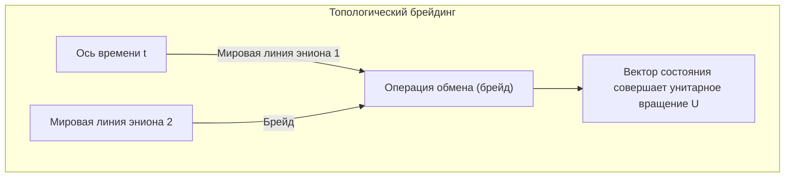

Поскольку только топология «узла», вычерчиваемого траекториями частиц, определяет результат вычислений, унитарное преобразование $ \hat{U} $ выполняется строго с нулевой ошибкой, пока топология остается неизменной, даже если траектории слегка колеблются. Это и есть отказоустойчивость (Fault-tolerance) на аппаратном уровне.

 **Проблемы и ограничения** 
Решающие экспериментальные доказательства существования майорановских нулевых мод по-прежнему остаются предметом дискуссий, и физическая демонстрация брейдинга еще не достигнута. Более того, брейдинг только с помощью изинговских энионов не позволяет сформировать универсальный набор квантовых вентилей, поэтому требуется дополнительная нетопологическая операция, называемая дистилляцией магических состояний.

## 11.4 Фотонные кубиты: линейная оптика и запутанность, индуцированная измерениями

Другим подходом, фундаментально устойчивым к шуму окружающей среды, являются оптические квантовые компьютеры, использующие фотоны (Photon). Фотоны не имеют электрического заряда, и их взаимодействие с окружающей средой крайне мало даже при комнатной температуре, поэтому время декогеренции можно считать практически бесконечным.

### 11.4.1 Двухрельсовое кодирование и протокол KLM

Фотонные кубиты часто кодируются с использованием пространственных путевых мод. В двухрельсовом кодировании состояние, когда фотон находится в верхнем волноводе, обозначается как $ |0\rangle = |1, 0\rangle $ , а состояние в нижнем волноводе — как $ |1\rangle = |0, 1\rangle $ .

Однокубитные вентили могут быть полностью реализованы с использованием линейных оптических элементов, таких как светоделители (BS) и фазовращатели (PS). Однако, поскольку фотоны не взаимодействуют друг с другом напрямую, создание детерминированных двухкубитных вентилей исключительно с помощью линейных оптических элементов невозможно.
В 2001 году Э. Нилл, Р. Лафламм и Дж. Милберн (Knill, Laflamme, Milburn) предложили «протокол KLM» и доказали, что комбинирование источников одиночных фотонов, линейных оптических элементов и **проективных измерений с помощью детекторов фотонов** позволяет осуществлять вероятностные, но масштабируемые универсальные квантовые вычисления. Нелинейность вносится в систему постселективно (Post-selection) за счет чистых квантовых интерференционных эффектов, таких как эффект Хонга-Оу-Манделя (Hong-Ou-Mandel effect), и необратимости измерений.

### 11.4.2 Непрерывные переменные (CV) и кластерные состояния

В последние годы взрывное развитие демонстрируют методы квантовых вычислений на непрерывных переменных (Continuous Variable, CV), использующие квадратурные амплитуды света, а не только дискретные переменные на основе одиночных фотонов.
За счет использования технологии мультиплексирования во временной области и сжатого света создается гигантское «кластерное состояние» (Cluster state), состоящее из десятков тысяч или миллионов запутанных фотонных импульсов. Архитектура «односторонних квантовых вычислений» (Measurement-based quantum computation; MBQC), которая продвигает вычисления за счет последовательного выполнения соответствующих измерений в каждом узле с использованием этого состояния в качестве ресурса, становится основным направлением в области оптических квантовых компьютеров.

## 11.5 Текущее состояние эры NISQ и ступени к логическим кубитам

Как показывает концепция **NISQ (Noisy Intermediate-Scale Quantum)** , предложенная Джоном Прескиллом (John Preskill), квантовое оборудование, которым человечество располагает в настоящее время, представляет собой системы «среднего масштаба» с десятками или сотнями физических кубитов, но они по-прежнему подвержены шуму, и накопление ошибок неизбежно.

### 11.5.1 Пределы когерентности и точность (Fidelity)

При попытке выполнения глубоких квантовых схем, таких как алгоритм Шора (Shor), крошечные ошибки на каждую операцию вентиля экспоненциально усиливаются. Например, предположим, что точность (fidelity) некоего двухкубитного вентиля составляет 99.5% (частота ошибок $ \epsilon = 0.005 $ ). Если вся схема содержит $ N $ вентилей, точность конечного состояния будет приблизительно равна $ \mathcal{F} \approx (1-\epsilon)^N \approx e^{-N\epsilon} $ . В случае $ N=1000 $ вероятность успеха составит $ e^{-5} \approx 0.0067 $ , и правильный результат вычислений потонет в шуме.
В эксперименте по квантовому превосходству, проведенном компанией Google, для доказательства скорости, превосходящей классические суперкомпьютеры, использовался показатель, называемый бенчмаркингом перекрестной энтропии (XEB). Однако это касалось только выборки конкретных случайных схем и не означает выполнения практических вычислений.

### 11.5.2 Переход к квантовой коррекции ошибок (Рассвет FTQC)

Для того чтобы преодолеть ограничения устройств NISQ и установить истинное «квантовое превосходство» в химических вычислениях, материаловедении или криптоанализе, абсолютным условием является переход к **FTQC (Fault-Tolerant Quantum Computing: отказоустойчивые квантовые вычисления)** , при котором вместо зависимости от одиночных физических систем множество физических кубитов объединяется для создания одного безошибочного «логического кубита» (Logical Qubit).

Например, при использовании топологического кода коррекции ошибок, называемого поверхностным кодом (Surface Code), если частота ошибок физических кубитов ниже порогового значения, логическая частота ошибок будет экспоненциально уменьшаться по мере расширения системы. Однако платой за это являются накладные расходы, требующие от 1000 до 10 000 физических кубитов для создания одного логического кубита.

В настоящее время мы стоим на передовой линии физики и инженерии в борьбе с шумом. Каждый метод — сверхпроводящий, ионных ловушек, топологический, оптический квантовый — заключает контракт с демоном своих собственных физических ограничений, стремясь к неизведанной вершине масштабируемости. В Главе 12 мы дадим глубокое объяснение «математической структуре квантовой коррекции ошибок», высшему оплоту квантовой информации, который ожидает нас за развитием этого аппаратного обеспечения.

# Глава 12: Будущее квантовых компьютеров и заключение

«Квантовый компьютер» использует в качестве вычислительного ресурса физические законы микроскопического мира — квантовую механику, которая бросает вызов нашей интуиции. Начиная с принципа суперпозиции в Главе 1, через квантовую запутанность, неравенства Белла, алгоритм Шора и квантовую коррекцию ошибок, на протяжении этого длинного цикла статей мы путешествовали по глубинам квантовой информатики. В этой заключительной главе мы раскроем истинный математический и физический смысл эксперимента по демонстрации «квантового превосходства» (Quantum Supremacy / Quantum Advantage) — технологической вершины, достигнутой на сегодняшний день человечеством, и строго разрушим широко распространенную иллюзию о том, что «квантовый компьютер — это волшебный ящик, способный мгновенно решить любую задачу», с точки зрения теории вычислительной сложности. Наконец, мы представим реалистичную и грандиозную дорожную карту для будущего внедрения в общество, ведущую от эпохи NISQ (Noisy Intermediate-Scale Quantum) к FTQC (Fault-Tolerant Quantum Computing), что послужит заключением к этой масштабной работе объемом в 50 000 символов.

## 12.1 Демонстрация квантового превосходства: Путеводный знак, установленный Google Sycamore

В 2019 году исследовательская группа Google объявила о демонстрации «квантового превосходства», заявив, что они смогли быстро решить с помощью квантового компьютера определенную задачу, которую невозможно решить за разумное время на классическом компьютере, используя процессор «Sycamore» с 53 сверхпроводящими кубитами. Это событие стало исторической вехой в квантовой информатике, однако немногие точно понимают математическую структуру, стоящую за ним.

Задача, которую они решили, — это «задача сэмплирования из случайных квантовых цепей» (Random Quantum Circuit Sampling). К группе кубитов применяются случайно выбранные однокубитовые и двухкубитовые вентили в течение $d$ слоев, после чего конечное состояние измеряется в вычислительном базисе.

Опишем это математически. Пусть начальное состояние — это $ |\psi_0\rangle = |0\rangle^{\otimes n} $. Применим к нему случайно выбранное унитарное преобразование $ U = U_d U_{d-1} \dots U_1 $. Конечное состояние $ |\psi_f\rangle $ выражается с помощью тензорного произведения и линейной комбинации следующим образом:

$$
|\psi_f\rangle = U |0\rangle^{\otimes n} = \sum_{x \in \{0, 1\}^n} \alpha_x |x\rangle
$$

Здесь $ \alpha_x = \langle x | U | 0 \rangle^{\otimes n} $ — это амплитуда вероятности (которая является комплексным числом) наблюдения определенной битовой строки $x$. В этом случае идеальная вероятность $ P_{\text{ideal}}(x) $ получения битовой строки $x$ в результате измерения задается правилом Борна (Born Rule) из квантовой механики:

$$
P_{\text{ideal}}(x) = |\alpha_x|^2 = \left| \langle x | U | 0 \rangle^{\otimes n} \right|^2
$$

Известно, что в достаточно глубоких (с большим $d$) случайных квантовых цепях каждая амплитуда $ \alpha_x $ демонстрирует поведение, подобное случайному блужданию на комплексной плоскости, а распределение ее вероятностей $ P_{\text{ideal}}(x) $ подчиняется распределению Портера-Томаса (Porter-Thomas distribution). То есть функция плотности вероятности появления вероятности $p$ равна $ \text{Pr}(P_{\text{ideal}}(x) = p) \approx 2^n e^{-2^n p} $. Это означает, что формируется «спекл-паттерн» (пятнистая структура), в котором определенные битовые строки наблюдаются чаще, чем другие.

Чтобы классический компьютер мог выполнить точное сэмплирование из этого распределения, необходимо напрямую вычислить амплитуды $ \alpha_x $ путем вычисления свёртки огромной тензорной сети. Размерность вектора состояния равна $ 2^n $, и в случае $ n = 53 $ необходимо отслеживать около $ 9 \times 10^{15} $ комплексных амплитуд (что требует объема памяти петабайтного класса). Это создает вычислительную стену, преодоление которой потребовало бы невероятного количества времени даже на самых быстрых суперкомпьютерах того времени. С другой стороны, в квантовом компьютере сама физическая система поддерживает состояние **$|\psi_f\rangle$** как вектор в естественном гильбертовом пространстве, и мгновенно (за десятки микросекунд) выполняет сэмплирование в соответствии со спекл-паттерном за одно измерение.

Для оценки успеха эксперимента был введен линейный бенчмаркинг перекрестной энтропии (Linear Cross-Entropy Benchmarking, XEB). Достоверность (Fidelity) $ \mathcal{F}_{\text{XEB}} $ определяется следующим образом:

$$
\mathcal{F}_{\text{XEB}} = 2^n \sum_{x \in \{0, 1\}^n} P_{\text{ideal}}(x) P_{\text{exp}}(x) - 1
$$

Здесь $ P_{\text{exp}}(x) $ — это эмпирическое распределение вероятностей, полученное от реального квантового процессора (включая аппаратный шум). Если бы устройство выдавало абсолютно случайный шум (матрица плотности полностью смешанного состояния $ \rho = \frac{I}{2^n} $ ), то $ P_{\text{exp}}(x) = \frac{1}{2^n} $ и $ \mathcal{F}_{\text{XEB}} = 0 $. С другой стороны, если бы квантовый компьютер выдавал идеальное чистое состояние без шума, то было бы $ \mathcal{F}_{\text{XEB}} \approx 1 $. В эксперименте Google было подтверждено статистически значимое значение $ \mathcal{F}_{\text{XEB}} \approx 0.002 $, которое явно больше нуля. Даже такая небольшая достоверность рассматривалась как доказательство квантового превосходства, поскольку генерация эквивалентных сэмплов на классическом компьютере чрезвычайно сложна с точки зрения теории вычислительной сложности.

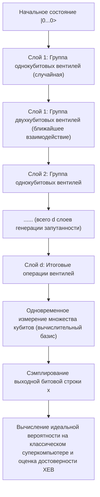

## 12.2 Заблуждение о «волшебном ящике»: Ловушка параллельных вычислений и BQP против NP

В сообщениях популярных СМИ и научно-популярных книгах о квантовых компьютерах часто встречаются «волшебные слова» о том, что «поскольку они могут вычислять $2^n$ состояний одновременно, они способны мгновенно решить любую задачу». Однако с точки зрения теории вычислительной сложности это в корне неверно. Квантовый компьютер ни в коем случае не является волшебной палочкой, которая безусловно решает «NP-полные задачи» (NP-Complete) за полиномиальное время.

Это заблуждение возникает из-за факта (квантового параллелизма), что благодаря суперпозиции состояний с помощью вентилей Адамара $ |\psi\rangle = \frac{1}{\sqrt{2^n}} \sum_{x=0}^{2^n-1} |x\rangle $ вычисление функции для всех входных данных может быть выполнено за «одну операцию». Если использовать оракул (унитарный оператор, выполняющий вычисления) **$U_f$** для применения функции $ f(x) $ к состоянию суперпозиции, то все состояние будет эволюционировать в соответствии с линейностью следующим образом:

$$
U_f \left( \frac{1}{\sqrt{2^n}} \sum_{x=0}^{2^n-1} |x\rangle \otimes |0\rangle \right) = \frac{1}{\sqrt{2^n}} \sum_{x=0}^{2^n-1} |x\rangle \otimes |f(x)\rangle
$$

Безусловно, внутри этого вектора состояния содержатся ответы $f(x)$ для всех $x$ в качестве подсистемы амплитуд вероятности. Однако вспомните **аксиому измерения** (коллапс волновой функции) в квантовой механике. Если выполнить операцию измерения над этим выходным регистром, то будет получена только одна случайно выбранная пара $ (x, f(x)) $ с вероятностью $\frac{1}{2^n}$. Остальные $ 2^n - 1 $ частей информации будут навсегда потеряны из-за необратимого проективного измерения. Другими словами, существует непреодолимая зияющая пропасть между «параллельным вычислением» (эволюцией состояния) и «извлечением нужной нам конкретной информации из результатов параллельного вычисления» (считыванием состояния).

Чтобы квантовый алгоритм действительно превзошел классический, необходимо искусно спроектировать и использовать «квантовую интерференцию» (Quantum Interference), а не просто параллельное вычисление. Необходимо сконструировать крайне специфическое глобальное унитарное преобразование, которое усиливает амплитуду вероятности, соответствующую искомому правильному состоянию, за счет конструктивной интерференции (Constructive interference), и подавляет бесчисленные амплитуды вероятностей неправильных ответов за счет деструктивной интерференции (Destructive interference) путем инверсии фазы.

В рамках этого ограничения класс сложности задач, которые квантовый компьютер может решить за полиномиальное время с достаточно высокой вероятностью правильного ответа, называется **BQP** (Bounded-error Quantum Polynomial time). С другой стороны, класс задач, для которых корректность предложенного решения может быть проверена за полиномиальное время, называется **NP** , и самыми сложными среди них являются **NP-полные задачи** (задача коммивояжера, задача выполнимости булевых формул SAT и т.д.).

Алгоритм Гровера (Grover's algorithm) обеспечивает квадратичное ускорение поиска в неструктурированной базе данных из $ N = 2^n $ элементов от классического $ O(N) $ до квантового $ O(\sqrt{N}) $. Возвращаясь к математическому выражению усиления амплитуды (Amplitude Amplification), алгоритм сводится к геометрическому вращению вектора состояния в двумерном подпространстве (плоскости), натянутом на начальное состояние равномерной суперпозиции $ |s\rangle $ и искомое правильное состояние $ |\omega\rangle $.

Итерационный оператор Гровера **$G$** определяется как произведение оператора инверсии фазы правильного состояния с помощью оракула $ U_\omega = I - 2|\omega\rangle\langle\omega| $ и оператора инверсии относительно среднего $ U_s = 2|s\rangle\langle s| - I $.

$$
G = U_s U_\omega = (2|s\rangle\langle s| - I)(I - 2|\omega\rangle\langle\omega|)
$$

Применив этот унитарный оператор **$G$** около $ \frac{\pi}{4}\sqrt{N} $ раз, вектор состояния поворачивается к целевому $ |\omega\rangle $, что позволяет повысить вероятность наблюдения правильного ответа почти до 1 (100%). Однако здесь присутствует исключительно важный факт: это лишь «квадратичное ускорение», а не экспоненциальное ускорение ( $ O(2^n) \to O(\text{poly}(n)) $ ). До сих пор не найдено шаблонов квантовой интерференции, которые могли бы решить общий случай NP-полных задач за полиномиальное время. Многие ученые в области квантовой информатики и теории вычислений твердо верят в фундаментальную гипотезу теории вычислительной сложности: **$\text{BQP} \not\supset \text{NP-Complete}$** (квантовые компьютеры не могут эффективно решать NP-полные задачи).

Квантовый компьютер — это чрезвычайно сложный специализированный сопроцессор, который обеспечивает суперполиномиальное ускорение с помощью квантового преобразования Фурье (QFT) только тогда, когда в задаче присутствует «скрытая алгебраическая структура, такая как периодичность», как, например, при факторизации в алгоритме Шора.

## 12.3 Квантовая коррекция ошибок и дорожная карта от NISQ к FTQC

Несмотря на демонстрацию квантового превосходства, современные устройства масштаба от десятков до сотен кубитов, такие как Sycamore, называются устройствами **NISQ** (Noisy Intermediate-Scale Quantum), и они не могут полностью предотвратить влияние шума из окружающей среды. Деликатные квантовые состояния крайне легко подвергаются декогеренции (ограничения времени релаксации фазы $T_2$ и времени энергетической релаксации $T_1$) из-за взаимодействия с окружающей средой, такого как тепловые флуктуации и электромагнитные помехи. По мере того как вычисления становятся глубже (увеличивается количество слоев вентилей), несовершенство вентилей и шум от декогеренции накапливаются экспоненциально, и конечный результат коллапсирует в абсолютно бессмысленное полностью смешанное состояние.

Единственным теоретическим путем преодоления этого физического предела и обеспечения возможности выполнения практических крупномасштабных квантовых алгоритмов, состоящих из сотен миллионов шагов, является реализация **отказоустойчивых квантовых вычислений (Fault-Tolerant Quantum Computation, FTQC)** с использованием **квантовой коррекции ошибок (Quantum Error Correction, QEC)** . Классическая коррекция ошибок (например, коды большинства путем дублирования битов) не может быть применена к квантовым состояниям из-за «теоремы о запрете клонирования» (No-Cloning Theorem), которая является фундаментальной основой квантовой механики. Математически не существует унитарного преобразования, которое могло бы идеально скопировать неизвестное квантовое состояние **$|\psi\rangle = \alpha|0\rangle + \beta|1\rangle$** просто как **$|\psi\rangle \otimes |\psi\rangle \otimes |\psi\rangle$** .

Однако теоретическая физика нашла элегантное решение для преодоления этой безысходности. Квантовую информацию можно защитить, «не копируя отдельные состояния, а распределяя и скрывая логическую информацию в топологии "запутанного пространства" (пространства энтанглмента) огромного гильбертова пространства, образованного множеством физических кубитов». В настоящее время наиболее перспективным с точки зрения аппаратной реализации является «поверхностный код» (Surface Code), основанный на формализме стабилизаторов (Stabilizer Formalism) на двумерной решетке.

В поверхностном коде «кубиты данных», хранящие квантовую информацию, размещаются на ребрах двумерной решетки, а «кубиты для измерения синдрома (вспомогательные кубиты)», используемые для обнаружения ошибок, размещаются в плакетах (гранях) и вершинах решетки. Затем определяется набор операторов стабилизаторов, состоящий из тензорных произведений операторов Паули, как показано ниже:

$$
B_p = \bigotimes_{i \in \partial p} Z_i \quad \text{(Плакетный оператор: обнаруживает Z-ошибки)}
$$

$$
A_v = \bigotimes_{i \in \delta v} X_i \quad \text{(Вершинный оператор: обнаруживает X-ошибки)}
$$

Здесь все $ B_p $ и $ A_v $ коммутируют друг с другом (не антикоммутируют), то есть удовлетворяют коммутационному соотношению $ [B_p, A_v] = 0 $. «Логическое состояние (пространство кода)» **$|\psi_L\rangle$** , в которое мы записываем информацию, строго определяется как подпространство, натянутое на совместные собственные состояния, для которых собственные значения всех этих операторов стабилизаторов равны $+1$.

$$
B_p |\psi_L\rangle = +1 |\psi_L\rangle, \quad A_v |\psi_L\rangle = +1 |\psi_L\rangle \quad (\text{для всех } p, v)
$$

Представим, что из-за внешнего теплового шума или ошибок операций на каком-либо физическом кубите возникла непредвиденная ошибка инверсии (Паули $X$) или ошибка фазы (Паули $Z$). Тогда этот оператор ошибки будет иметь антикоммутационное соотношение ( $\{X, Z\} = 0 $ ) с определенным соседним оператором стабилизатора, в результате чего результат измерения (значение синдрома) этого стабилизатора перевернется (флип) с $+1$ на $-1$. Мы непрерывно отслеживаем пары таких позиций (дефектов), где значение становится равным $-1$, абсолютно не наблюдая и не разрушая само защищенное логическое состояние (значения весовых коэффициентов $\alpha, \beta$). Затем, используя классические алгоритмы, такие как «совершенное паросочетание минимального веса» (Minimum Weight Perfect Matching), мы выполняем оценку максимального правдоподобия того, на каком пути физического кубита и какая ошибка произошла, и исправляем ее программно или путем применения физической обратной операции.

Согласно «Теореме о пороге» (Threshold Theorem), прекрасной вершине квантовой теории информации, доказано, что если вероятность ошибки каждого отдельного физического вентиля падает ниже определенного порогового значения (около $ 1\% $ для поверхностного кода), то за счет увеличения размера решетки (кодового расстояния $d$) можно экспоненциально приблизить уровень ошибок на логическом уровне сколь угодно близко к нулю. Однако из-за накладных расходов на коррекцию ошибок при текущем уровне шума для создания одного идеального логического кубита требуются от тысяч до десятков тысяч физических кубитов. По оценкам, для взлома шифрования RSA-2048 с помощью алгоритма Шора требуются тысячи логических кубитов, что в результате требует создания огромной системы FTQC невообразимого масштаба, оснащенной от нескольких миллионов до более чем десяти миллионов физических кубитов, работающих при сверхнизких температурах и сохраняющих когерентность друг с другом.

С точки зрения нынешнего этапа в десятки и сотни физических кубитов, это невероятно сложная и грандиозная инженерная задача для человечества, сравнимая с программой «Аполлон» или строительством Большого адронного коллайдера (БАК).

## 12.4 Заключение: Горизонты и будущее квантовой информатики

Начиная с введения суперпозиции **$|0\rangle$** и **$|1\rangle$** с использованием бра-кет нотации в Главе 1, через временную эволюцию посредством унитарных матриц, математическое описание многочастичных систем с использованием тензорных произведений, крушение локального реализма Эйнштейна благодаря неравенствам Белла и вплоть до блестящих математических структур квантовых алгоритмов Шора и Гровера, на протяжении этого цикла из 12 глав мы проследили кульминацию знаний под названием «квантовая информатика» в предельно строгой форме.

В то время как классические компьютеры основаны на «детерминированных значениях истинности (булева алгебра)», квантовые компьютеры основаны на «унитарных вращениях и тензорных произведениях в комплексном гильбертовом пространстве (линейная алгебра)». Этот фундаментальный сдвиг парадигмы выходит далеко за рамки промышленных и практических аспектов, таких как «ускорение вычислений», и ставит перед нами глубокие философские вопросы, в которых полностью сливаются теория информации и фундаментальная физика: «Что представляет собой предельная способность Вселенной к обработке информации?» и «Как вычислимость и сложность зависят от структуры физических законов Вселенной, в которой мы живем?».

Квантовая запутанность (энтанглмент), которую Эйнштейн когда-то ненавидел и называл «жутким действием на расстоянии» (spooky action at a distance), теперь утвердилась как наиболее фундаментальный и необходимый «ресурс» для работы квантовой телепортации, квантовой криптографии и квантовых компьютеров. Интуиция гениального физика Ричарда Фейнмана, который в 1982 году заявил: «Если вы хотите моделировать природу, вам лучше сделать это квантово-механически. И, клянусь богом, это чудесная проблема, потому что она не выглядит такой уж простой», спустя десятилетия, благодаря кропотливым усилиям физиков, математиков, специалистов по теории вычислений и выдающихся инженеров аппаратного обеспечения по всему миру, наконец достигла стадии работы на реальных процессорах.

Повторюсь, квантовый компьютер — это не универсальный волшебный ящик. Это не машина мечты, способная решать NP-полные задачи полным перебором за полиномиальное время. Однако он обладает несомненной «превосходной» (Supremacy) силой в определенных областях, которые превосходят возможности классических компьютеров, таких как строгое моделирование сложных электронных состояний в химических реакциях (квантово-химические вычисления), выяснение физических свойств новых материалов и высокотемпературных сверхпроводников, определенные классы задач оптимизации, а также факторизация целых чисел и задачи дискретного логарифмирования.

Борьба с шумом в ближайшие десятилетия (трудный путь от NISQ к FTQC) ни в коем случае не будет гладкой. Возвышается гора инженерных барьеров, которые необходимо преодолеть: управление огромной тепловой нагрузкой в криогенных условиях, проблемы масштабируемости миллионов микроволновых соединений, радикальное увеличение времени когерентности кубитов ( $T_1, T_2$ ) и создание гибридных классическо-квантовых систем управления, способных обрабатывать огромные объемы измерений синдрома в реальном времени. Но за всем этим стоит рождение величайшего вычислительного механизма в истории человечества, который в истинном смысле этого слова «напрямую описывает, управляет и использует динамику законов природы (уравнение Шредингера) для вычислений».

Если эта серия статей помогла донести до читателей истинный облик квантового компьютера и лежащую в его основе невероятно красивую и строгую математическую и физическую структуру, не поддаваясь влиянию поверхностных модных словечек или раздутых ожиданий, то для меня как автора нет большей радости. Квантовый мир выходит далеко за рамки нашего здравого смысла — он глубок, странен и подавляюще прекрасен. Мы стоим сейчас на пороге самого захватывающего технологического и научного рубежа в истории человечества. Это грандиозное интеллектуальное путешествие в поисках истины Вселенной только началось.

---
 **Серия статей «Принципы квантовых компьютеров» (Всего 12 глав) — Конец** 