---
title: '量子计算机原理与机制【全面指南】从摩尔定律的极限到量子力学'
slug: "quantum-computer-ultimate-guide"
date: "2026-09-09T08:00:06+09:00"
tags: ["Quantum Computer", "Quantum Mechanics", "Algorithm", "Physics"]
categories: ["Math, Crypto, Quantum"]
math: true
mermaid: true
image: "cover.webp"
description: '从经典计算机的物理极限和摩尔定律的终结，到量子隧道效应等量子力学效应的壁垒，深入解析量子计算机拉开序幕的背景。这是理解下一代信息处理技术的完整指南第一章。'
---

# 第1章: 量子计算机的开端与局限

## 1.1 经典计算的物理极限与摩尔定律的终结

现代社会中信息处理技术的飞跃性发展，一直由戈登·摩尔在1965年提出的“半导体集成电路中容纳的晶体管数量约每两年翻一番”这一经验法则，即“摩尔定律”所引领。遵循这一法则，我们不断推进晶体管的微细化（尺寸缩放，Scaling），使计算机的运算性能呈指数级提升。然而，进入21世纪后，这一经典范式正面临着决定性的物理极限。其最大的障碍，便是量子力学效应——“量子隧穿效应（Quantum Tunneling Effect）”的显现。

当晶体管的栅极绝缘层或沟道长度达到几纳米尺度，即相当于几个至几十个原子的厚度时，电子便会因波函数的渗透，以一定的概率穿透在经典力学中本无法逾越的能量势垒。根据WKB近似，对于入射到势垒高度为 $V_0$ 、宽度为 $a$ 的区域中质量为 $m$ 的电子（能量 $E < V_0$ ），其透射概率 $T$ 由下式给出：

$$
T \approx \exp \left( - \frac{2}{\hbar} \int_{0}^{a} \sqrt{2m(V_0 - E)} \, dx \right)
$$

这里 $\hbar$ 是约化普朗克常数。随着微细化导致势垒宽度 $a$ 减小，透射概率 $T$ 将呈指数级增大，结果导致即使在关断状态下也会有电流通过，即“漏电流（Leakage Current）”达到不可忽视的规模。这不仅会导致功耗剧增与发热，更意味着晶体管作为经典确定性开关元件的功能走向崩溃。

此外，信息处理的热力学极限同样不容忽视。1961年，罗尔夫·兰道尔（Rolf Landauer）指出，在擦除信息（执行不可逆逻辑运算）的过程中，必然会产生热量（兰道尔原理）。在擦除1比特信息时，向环境中耗散的最小热量 $\Delta Q$ 表示如下：

$$
\Delta Q \ge k_B T \ln 2
$$

这里 $k_B$ 是玻尔兹曼常数， $T$ 是绝对温度。只要经典计算机使用逻辑门（例如AND门、OR门等不可逆逻辑门）进行运算，就无法回避这一热力学下限。随着微细化的推进，当单个元件所操控的能量逼近这一极限时，经典计算机的发展便会受到根本物理定律的限制而陷入停滞。

## 1.2 理查德·费曼的预见与量子系统的计算量爆炸

在经典计算机逐渐逼近物理极限的背景下，人们开始寻求一种全新的计算范式。开启这一先河的，是1981年理查德·费曼在麻省理工学院（MIT）举办的“第一届计算物理学会议”上发表的主题演讲。费曼指出了使用经典计算机模拟量子力学系统时所面临的绝望般的困难，并提出了如下革命性的建议：

“自然界并不是经典的；因此，如果你想模拟自然，你最好用基于量子力学原理的计算机来做。”

这番话的背后，揭示了描述量子系统状态的“希尔伯特空间（Hilbert Space）”维度随粒子数呈指数级爆炸的事实。考虑一个由 $N$ 个自旋为 $1/2$ 的粒子（即具有两个量子态的系统）构成的系统。单个粒子的状态由二维复向量空间 $\mathbb{C}^2$ 描述。因此，由 $N$ 个粒子组成的复合系统的状态空间 $\mathcal{H}$ ，可由各子系统状态空间的张量积构建而成：

$$
\mathcal{H} = \bigotimes_{i=1}^{N} \mathbb{C}^2 = \mathbb{C}^{2^N}
$$

该系统的纯态（Pure State） $|\Psi\rangle$ 可表示为 $2^N$ 个基底向量的线性组合（叠加）。在此，使用狄拉克符号（Bra-ket notation），任意量子态均可展开如下：

$$
|\Psi\rangle = \sum_{x=0}^{2^N-1} c_x |x\rangle
$$

这里 $|x\rangle$ 是计算基底（Computational Basis）， $c_x \in \mathbb{C}$ 是被称为概率幅（Probability Amplitude）的复数。状态向量必须满足归一化条件 $\sum_{x=0}^{2^N-1} |c_x|^2 = 1$ 。

仅仅为了模拟 $N = 300$ 个量子比特（Qubit），需要存储的复数数量 $2^{300}$ 约为 $10^{90}$ ，这已经远远超过了可观测宇宙中全部原子的总数（约 $10^{80}$ ）。要想在经典计算机的内存中保存如此庞大数量的变量，并进一步计算遵循薛定谔方程的时间演化（即 $2^N \times 2^N$ 维酉矩阵的乘法），哪怕耗尽整个宇宙的寿命也是不可能完成的。这种“维度诅咒”正是经典计算的极限所在，同时也是量子计算机所蕴含的巨大计算潜力的源泉。

## 1.3 戴维·多伊奇与量子图灵机的形式化

将费曼直觉性的构想在理论计算机科学框架下进行严格形式化的是牛津大学的物理学家戴维·多伊奇（David Deutsch）。在1985年的一篇划时代论文中，多伊奇指出，断言“任何物理过程都可以通过有限手段被完全模拟”的“强邱奇-图灵论题（Strong Church-Turing Thesis）”，在由量子力学支配的物理世界中可能并不成立。

多伊奇拓展了阿兰·图灵提出的确定性图灵机，定义了“量子图灵机（Quantum Turing Machine）”的概念。这是一种内部状态、纸带上的符号以及读写头的位置均可处于量子“叠加态”，且状态转移由酉算子（Unitary Operator） $U$ 描述的机器。

量子计算的基本单元是“量子比特（Qubit）”。经典比特只能处于 $0$ 或 $1$ 的确定状态，与此相反，量子比特可以处于 $|0\rangle$ 和 $|1\rangle$ 的任意线性叠加态：

$$
|\psi\rangle = \alpha |0\rangle + \beta |1\rangle \quad (\alpha, \beta \in \mathbb{C}, \ |\alpha|^2 + |\beta|^2 = 1)
$$

对该量子比特施加的操作是线性且保持范数不变的运算，即由酉矩阵（满足 $U^\dagger U = I$ 的矩阵，其中 $U^\dagger$ 为伴随矩阵， $I$ 为单位矩阵）表示。例如，作用于单量子比特的代表性量子门——阿达马门（Hadamard Gate） $H$ 定义如下：

$$
H = \frac{1}{\sqrt{2}} \begin{pmatrix} 1 & 1 \\ 1 & -1 \end{pmatrix}
$$

将阿达马操作作用于基态 $|0\rangle$ ，可得：

$$
H |0\rangle = \frac{1}{\sqrt{2}} \left( |0\rangle + |1\rangle \right)
$$

由此，系统转入以相同概率观测到 $|0\rangle$ 和 $|1\rangle$ 的完全叠加态。多伊奇的功绩在于将这种量子力学的基本原理升华为计算模型，并在数学上证明了通用量子计算机（Universal Quantum Computer）在原理上是可构建的。

## 1.4 量子计算机的本质：消除“只不过是超并行计算”的误解

为什么量子计算机能够拥有凌驾于经典计算机之上的计算能力？对于这个问题，公众普遍听到的一种解释是：“量子计算机会分岔出无数的平行宇宙（平行世界），同时计算所有的可能性，并从中瞬间找出正确答案。”这虽然是对“量子并行性（Quantum Parallelism）”的一种比喻性表达，但却是 **极易引起重大误解的不准确表述** 。

确实，通过对 $N$ 个量子比特的系统并行施加阿达马门，仅通过一次操作就能生成全部 $2^N$ 个状态的叠加态：

$$
H^{\otimes N} |0\rangle^{\otimes N} = \frac{1}{\sqrt{2^N}} \sum_{x=0}^{2^N-1} |x\rangle
$$

进而，应用一个评估特定函数 $f(x)$ 的酉算子 $U_f$ ，状态将发生如下变化：

$$
U_f \left( \frac{1}{\sqrt{2^N}} \sum_{x=0}^{2^N-1} |x\rangle |0\rangle \right) = \frac{1}{\sqrt{2^N}} \sum_{x=0}^{2^N-1} |x\rangle |f(x)\rangle
$$

在此，表面上看似乎确实通过一次操作就“计算”出了所有 $2^N$ 个 $x$ 对应的 $f(x)$ 值。然而，量子力学的基本要求——“测量公理（玻恩定则，Born Rule）”横亘在前。当我们对这一叠加态进行测量（观测）时，我们所能获得的结果仅仅只有一个，系统将以概率 $P(x) = 1/2^N$ 发生波函数坍缩（Wavefunction Collapse），随机坍缩到某一个状态 $|x\rangle |f(x)\rangle$ 。换言之，即便同时计算出了所有答案，通过测量能够提取出来的也仅仅是“随机的一个”，这与单纯靠随机掷骰子进行计算毫无二致。

那么，量子计算机真正的威力究竟何在？答案就是 **“量子干涉（Quantum Interference）”** 。

由于描述量子态的概率幅 $c_x$ 并非正概率，而是“复数”，因此它可以取正号、负号，乃至虚数。量子算法的奥秘在于，在计算过程中巧妙地组合酉变换，实现 **“让对应错误答案状态的概率幅相互抵消（相消干涉：Destructive Interference），并放大对应正确答案状态的概率幅（相长干涉：Constructive Interference）”** 。

作为简单的示例，我们来看看由相位反转与阿达马变换引起的干涉。对状态 $\frac{1}{\sqrt{2}}(|0\rangle - |1\rangle)$ 再次施加阿达马门会发生什么？

$$
H \left( \frac{|0\rangle - |1\rangle}{\sqrt{2}} \right) = \frac{1}{2} \big( (|0\rangle + |1\rangle) - (|0\rangle - |1\rangle) \big) = \frac{1}{2} (2|1\rangle) = |1\rangle
$$

在这里，通往 $|0\rangle$ 态的概率幅为 $1/2 - 1/2 = 0$ ，被完全抵消（相消干涉 / 破坏性干涉）。而通往 $|1\rangle$ 态的振幅则变为 $1/2 + 1/2 = 1$ ，被有效放大（相长干涉 / 建设性干涉）。

真正实用的量子算法（例如执行质因数分解的秀尔算法，以及执行非结构化数据库搜索的格罗弗算法），正是通过高度精密设计的步骤引发这种波的干涉现象，使得在计算的最终阶段执行测量时，观测到正确答案状态的概率无限趋近于 $1$ 。并行计算本身并不是魔法，能够利用复概率幅的干涉来“在概率上消除不必要的计算路径”，这才是量子计算机与经典计算机的决定性区别，也是量子计算的精髓所在。

## 1.5 概念可视化：量子干涉的机制

下面的概念图展示了经典概率过程与量子干涉过程（相当于马赫-曾德尔干涉仪或阿达马门的连续应用）之间的区别。在经典的随机游走中，概率只是简单地相加，而在量子过程中，各路径的振幅以复数形式叠加，从而引发干涉。

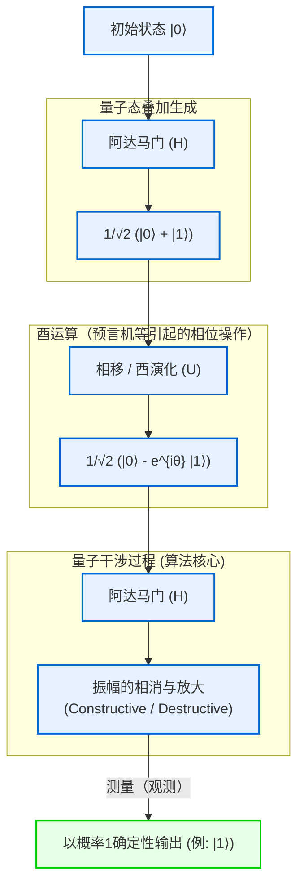

由此可见，量子计算机并非为了规避经典力学极限（微细化极限与热力学极限）而采取的权宜延寿之策，而是基于量子力学公理对信息与计算定义本身的重构，是一场真正的范式转变。在下一章中，我们将进一步深入探讨用于自如操控这种量子干涉的具体数学工具——“量子门”与“量子线路”的详细内容。

# 第2章：经典比特与量子比特（Qubit）的基础

在构建量子信息理论体系时，最根本的概念是“信息的最小单位”的定义。本章将从经典信息理论中的比特出发，将其概念扩展到基于量子力学公理的量子信息最小单位——“量子比特（Qubit）”。我们将使用希尔伯特空间、狄拉克符号、线性代数的严谨语言，彻底揭示量子状态的数学结构。在此，我们将毫不妥协，从专业的视角深入探索量子信息的深渊。

## 2.1 信息的最小单位：经典比特的数学形式化与局限性

在计算机科学的历史上，克劳德·香农在1948年建立的信息论的基础是“比特（Bit）”。经典比特被定义为一个系统，无论其物理表现如何（例如晶体管的高低电压、开关的开闭，或磁化的方向），作为一个抽象的状态空间，它总是取 $\{0, 1\}$ 这两个离散值之一。

让我们用更形式化的向量空间语言来表达这一点。经典比特的状态可以使用二维实数向量空间 $\mathbb{R}^2$ 中的标准基来表示。我们将状态 $0$ 和状态 $1$ 分别定义为以下列向量：

$$
\mathbf{v}_0 = \begin{pmatrix} 1 \\ 0 \end{pmatrix}, \quad \mathbf{v}_1 = \begin{pmatrix} 0 \\ 1 \end{pmatrix}
$$

在确定性（Deterministic）的经典系统中，比特的状态必定确定为 $\mathbf{v}_0$ 或 $\mathbf{v}_1$ 之一。然而，如果存在热噪声等干扰或我们知识的不确定性时，必须将其描述为经典概率的（Probabilistic）比特状态。在这种情况下，比特的状态表示为一个概率分布，状态向量 $\mathbf{p}$ 可以写为基向量的凸组合（Convex combination）：

$$
\mathbf{p} = p_0 \mathbf{v}_0 + p_1 \mathbf{v}_1 = \begin{pmatrix} p_0 \\ p_1 \end{pmatrix}
$$

其中， $p_0, p_1$ 是分别表示状态为 $0$ 和 $1$ 的概率的实数，且必须满足柯尔莫哥洛夫概率公理的以下条件：

1. **非负性** ： $p_0 \ge 0, \quad p_1 \ge 0$
2. **归一化条件（总概率为1）** ： $p_0 + p_1 = 1$

在经典比特的世界中，由多个比特组合而成的复合系统，由各自概率向量的张量积（克罗内克积）来描述。例如，两个经典比特的联合概率如下：

$$
\mathbf{p}_{AB} = \mathbf{p}_A \otimes \mathbf{p}_B = \begin{pmatrix} p_{A0} \\ p_{A1} \end{pmatrix} \otimes \begin{pmatrix} p_{B0} \\ p_{B1} \end{pmatrix} = \begin{pmatrix} p_{A0}p_{B0} \\ p_{A0}p_{B1} \\ p_{A1}p_{B0} \\ p_{A1}p_{B1} \end{pmatrix}
$$

经典信息理论的框架非常强大，构成了现代数字社会的基础，但它终究是通过实数概率的相加来构造状态的，因此在原理上无法表现波的干涉那样“概率的相互抵消”。这正是经典物理学的局限性所在，也揭示了向量子信息飞跃的必要性。

## 2.2 量子力学的要求与狄拉克符号（Bra-ket notation）

量子力学的第一公设（Postulate）是：“封闭物理系统的状态，完全由配备了复内积的完备向量空间，即希尔伯特空间（Hilbert Space） $\mathcal{H}$ 上的单位向量（状态向量）来描述。”在量子计算的语境下，因为可以忽略连续空间自由度等因素，这个希尔伯特空间通常为有限维复向量空间 $\mathbb{C}^d$ 。

作为量子信息的最小单位，“量子比特（Qubit）”被严格定义为二维复希尔伯特空间 $\mathcal{H} \cong \mathbb{C}^2$ 中的状态。为了描述这个向量空间中的状态，标准做法是使用物理学家保罗·狄拉克引入的 **狄拉克符号（Bra-ket notation）** 。

表示量子状态的列向量称为 **右矢（Ket vector）** ，记作 $|\psi\rangle$ 。对应于经典比特的 $0$ 和 $1$ 的状态，我们引入称为计算基（Computational basis）的标准正交基。它们也被称为量子比特的 $Z$ 基，分别定义为 $|0\rangle$ 和 $|1\rangle$ 。

$$
|0\rangle = \begin{pmatrix} 1 \\ 0 \end{pmatrix}, \quad |1\rangle = \begin{pmatrix} 0 \\ 1 \end{pmatrix}
$$

另一方面，根据里斯表示定理（Riesz representation theorem），希尔伯特空间中的任意右矢，都唯一对应着一个对偶空间（Dual space）中的元素，作为连续线性泛函起作用。这被称为 **左矢（Bra vector）** ，记作 $\langle\psi|$ 。在矩阵表示中，对右矢取厄米共轭（复共轭转置，用 $^\dagger$ 表示）即可得到相应的左矢。

$$
\langle\psi| = (|\psi\rangle)^\dagger = (|\psi\rangle^*)^T
$$

例如，基底的左矢为以下行向量：

$$
\langle 0| = \begin{pmatrix} 1 & 0 \end{pmatrix}, \quad \langle 1| = \begin{pmatrix} 0 & 1 \end{pmatrix}
$$

狄拉克符号的真正价值在于，它使内积计算的视觉呈现变得极其清晰。左矢 $\langle\phi|$ 和右矢 $|\psi\rangle$ 的内积写作 $\langle\phi|\psi\rangle$ （这源于狄拉克的文字游戏，Bra 和 Ket 组合成 Bracket，即括号）。由于计算基 $\{|0\rangle, |1\rangle\}$ 构成标准正交系（Orthonormal system），使用克罗内克 $\delta_{ij}$ 可以表示如下：

$$
\langle i | j \rangle = \delta_{ij} \quad (i, j \in \{0, 1\})
$$

具体而言，自身与自身的内积为 $1$ （ $\langle 0|0\rangle = 1$ ， $\langle 1|1\rangle = 1$ ），不同基之间的内积为 $0$ （ $\langle 0|1\rangle = 0$ ， $\langle 1|0\rangle = 0$ ）。

此外，左矢和右矢的张量积（相当于外积）写作 $|\psi\rangle\langle\phi|$ ，这表示从一个空间到另一个空间的线性算子（矩阵）。例如，到某个状态空间的投影算子（Projection operator）的构造如下：

$$
|0\rangle\langle 0| = \begin{pmatrix} 1 \\ 0 \end{pmatrix} \begin{pmatrix} 1 & 0 \end{pmatrix} = \begin{pmatrix} 1 & 0 \\ 0 & 0 \end{pmatrix}
$$

任意二维复向量空间的恒等算子 $I$ （Identity operator），可以通过基底的完备性关系（Completeness relation）分解表示如下，这在量子力学计算中是使用极其频繁且强大的工具。

$$
I = |0\rangle\langle 0| + |1\rangle\langle 1| = \begin{pmatrix} 1 & 0 \\ 0 & 1 \end{pmatrix}
$$

## 2.3 量子叠加原理与复数概率幅

与经典比特总是处于明确的 $0$ 或 $1$ 状态、或是它们的概率混合态不同，出于量子力学的线性（Linearity）要求，量子比特可以采取一种本质上不同的状态，即由 $|0\rangle$ 和 $|1\rangle$ 的线性组合表示的“叠加态（Superposition）”。希尔伯特空间 $\mathcal{H}$ 内的任意单位向量都被允许作为有效的物理状态。

因此，单个量子比特最一般的纯态（Pure state） $|\psi\rangle$ ，可使用计算基展开如下：

$$
|\psi\rangle = \alpha |0\rangle + \beta |1\rangle = \begin{pmatrix} \alpha \\ \beta \end{pmatrix}
$$

这里， $\alpha$ 和 $\beta$ 是被称为 **复数概率幅（Complex probability amplitude）** 的复数（ $\alpha, \beta \in \mathbb{C}$ ）。与经典概率为非负实数形成对比，量子状态具有“复数”的系数，这是量子计算机拥有超越经典计算机计算能力的根本原因。由于复数具有相位（Phase），并且可以指向复平面上的任意方向，因此它们可以像波一样相互增强（相长干涉）或相互抵消（相消干涉）。量子算法的本质在于巧妙地操控这种干涉效应，放大正确答案的概率幅，并抵消错误答案的概率幅。

从量子系统中提取经典信息的过程就是“测量（Measurement）”。考虑投影测量（Projective measurement），根据玻恩定则（Born rule），在使用计算基 $\{|0\rangle, |1\rangle\}$ 测量状态 $|\psi\rangle$ 时，得到结果为 $0$ 的概率 $P(0)$ 和得到结果为 $1$ 的概率 $P(1)$ ，分别由它们各自概率幅的绝对值的平方给出。

$$
P(0) = |\langle 0|\psi\rangle|^2 = |\alpha|^2 = \alpha \alpha^*
$$

$$
P(1) = |\langle 1|\psi\rangle|^2 = |\beta|^2 = \beta \beta^*
$$

为了使系统必然被观测为某种状态，所有概率的总和必须严格为 $1$ 。因此，量子状态向量 $|\psi\rangle$ 的范数（长度）必须始终为 $1$ 。这就是 **归一化条件（Normalization condition）** 。

$$
\langle\psi|\psi\rangle = (\alpha^* \langle 0| + \beta^* \langle 1|)(\alpha |0\rangle + \beta |1\rangle) = |\alpha|^2 + |\beta|^2 = 1
$$

为了更深入地探讨这种复数概率幅的几何意义，让我们用极坐标表示 $\alpha$ 和 $\beta$ 。

$$
\alpha = r_0 e^{i\phi_0}, \quad \beta = r_1 e^{i\phi_1}
$$

其中 $r_0, r_1 \ge 0$ 是振幅的大小， $\phi_0, \phi_1 \in [0, 2\pi)$ 是各自的相位角。由于归一化条件使得 $r_0^2 + r_1^2 = 1$ ，我们可以引入实数参数 $\theta \in [0, \pi]$ 并设定 $r_0 = \cos(\frac{\theta}{2})$ ， $r_1 = \sin(\frac{\theta}{2})$ 。将此代入原状态向量，得到：

$$
|\psi\rangle = \cos\left(\frac{\theta}{2}\right) e^{i\phi_0} |0\rangle + \sin\left(\frac{\theta}{2}\right) e^{i\phi_1} |1\rangle
$$

让我们将整体提取出一个公共相位因子 $e^{i\phi_0}$ ：

$$
|\psi\rangle = e^{i\phi_0} \left( \cos\left(\frac{\theta}{2}\right) |0\rangle + e^{i(\phi_1 - \phi_0)} \sin\left(\frac{\theta}{2}\right) |1\rangle \right)
$$

在量子力学中，作用于整个状态向量的相位因子 $e^{i\phi_0}$ 被称为“全局相位（Global phase）”。计算对于任意可观测量（厄米算子） $A$ 的期望值 $\langle A \rangle$ 即可发现：

$$
\langle A \rangle = \left( e^{-i\phi_0} \langle\psi| \right) A \left( e^{i\phi_0} |\psi\rangle \right) = e^{-i\phi_0} e^{i\phi_0} \langle\psi| A |\psi\rangle = \langle\psi| A |\psi\rangle
$$

因此，全局相位会相互抵消，这意味着通过任何物理测量都无法观测到它。也就是说， $|\psi\rangle$ 和 $e^{i\phi_0}|\psi\rangle$ 在希尔伯特空间上是不同的向量（作为射线则是同一的），但在物理上它们表示完全相同的状态。

因此，如果忽略全局相位，仅将 $|0\rangle$ 和 $|1\rangle$ 之间的相对相位（Relative phase） $\varphi = \phi_1 - \phi_0$ （这里 $\varphi \in [0, 2\pi)$ ）作为参数保留，任意单个量子比特的纯态就可以唯一且严格地表示为以下的 **标准形式** 。

$$
|\psi\rangle = \cos\left(\frac{\theta}{2}\right) |0\rangle + e^{i\varphi} \sin\left(\frac{\theta}{2}\right) |1\rangle
$$

## 2.4 布洛赫球面（Bloch Sphere）的几何可视化

上一节推导出的参数化表明，单个量子比特的状态空间在几何上同构于三维空间内的单位球面（二维球面 $S^2$ ）。这种视觉表示被命名为 **布洛赫球面（Bloch Sphere）** ，以纪念其发明者、瑞士物理学家费利克斯·布洛赫（Felix Bloch）。

角 $\theta$ 准确地对应从 $Z$ 轴正方向算起的极角（Polar angle），角 $\varphi$ 对应 $X$-$Y$ 平面上的方位角（Azimuthal angle）。

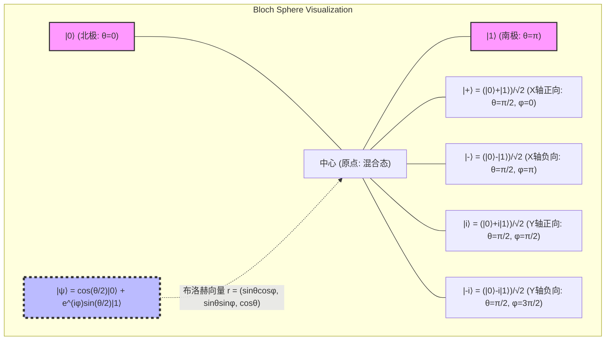

布洛赫球面最值得注意的性质是：“希尔伯特空间中正交的状态（内积为0的状态），在布洛赫球面的三维实空间上互为对跖点（Antipodal points：相隔180度的点）”。例如，与 $|0\rangle$ （北极， $\theta=0$ ）正交的状态是 $|1\rangle$ （南极， $\theta=\pi$ ）。希尔伯特空间中相互正交状态间的内积计算 $\langle 0 | 1 \rangle = 0$ ，在布洛赫球面上对应于 $\pi$ （180度）的角度间隔。由于几何角度是希尔伯特空间角度的两倍，因此在参数化中使用 $\theta/2$ 这样的半角有着必然的数学原因。

该布洛赫球面的坐标 $\mathbf{r} = (x, y, z)$ 可以作为量子力学中可观测量（Observable）—— **泡利矩阵（Pauli matrices）** ——的期望值被严格推导出来。作为二维系统厄米算子基的泡利矩阵定义如下：

$$
X = \sigma_x = \begin{pmatrix} 0 & 1 \\ 1 & 0 \end{pmatrix}, \quad
Y = \sigma_y = \begin{pmatrix} 0 & -i \\ i & 0 \end{pmatrix}, \quad
Z = \sigma_z = \begin{pmatrix} 1 & 0 \\ 0 & -1 \end{pmatrix}
$$

对于任意状态 $|\psi\rangle$ ，这些泡利可观测量的期望值可以通过狄拉克符号计算求得。

$$
x = \langle\psi| X |\psi\rangle = \left( \cos\frac{\theta}{2} \langle 0| + e^{-i\varphi}\sin\frac{\theta}{2} \langle 1| \right) \begin{pmatrix} 0 & 1 \\ 1 & 0 \end{pmatrix} \begin{pmatrix} \cos\frac{\theta}{2} \\ e^{i\varphi}\sin\frac{\theta}{2} \end{pmatrix} = \sin\theta \cos\varphi
$$

$$
y = \langle\psi| Y |\psi\rangle = \left( \cos\frac{\theta}{2} \langle 0| + e^{-i\varphi}\sin\frac{\theta}{2} \langle 1| \right) \begin{pmatrix} 0 & -i \\ i & 0 \end{pmatrix} \begin{pmatrix} \cos\frac{\theta}{2} \\ e^{i\varphi}\sin\frac{\theta}{2} \end{pmatrix} = \sin\theta \sin\varphi
$$

$$
z = \langle\psi| Z |\psi\rangle = \left( \cos\frac{\theta}{2} \langle 0| + e^{-i\varphi}\sin\frac{\theta}{2} \langle 1| \right) \begin{pmatrix} 1 & 0 \\ 0 & -1 \end{pmatrix} \begin{pmatrix} \cos\frac{\theta}{2} \\ e^{i\varphi}\sin\frac{\theta}{2} \end{pmatrix} = \cos^2\left(\frac{\theta}{2}\right) - \sin^2\left(\frac{\theta}{2}\right) = \cos\theta
$$

由此，布洛赫向量 $\mathbf{r} = (x, y, z)$ 完美地表示为了三维空间中的单位向量 $\mathbf{r} = (\sin\theta\cos\varphi, \sin\theta\sin\varphi, \cos\theta)$ 。此外，任意纯态对应的密度矩阵（Density matrix） $\rho = |\psi\rangle\langle\psi|$ ，可以使用泡利向量 $\boldsymbol{\sigma} = (X, Y, Z)$ 和恒等矩阵 $I$ 极为优雅地写出：

$$
\rho = \frac{1}{2} \left( I + \mathbf{r} \cdot \boldsymbol{\sigma} \right) = \frac{1}{2} \left( I + xX + yY + zZ \right)
$$

如果显式展开矩阵元素并进行确认，结果如下：

$$
\rho = \frac{1}{2} \begin{pmatrix} 1 + z & x - iy \\ x + iy & 1 - z \end{pmatrix} = \begin{pmatrix} \cos^2(\frac{\theta}{2}) & e^{-i\varphi}\sin(\frac{\theta}{2})\cos(\frac{\theta}{2}) \\ e^{i\varphi}\sin(\frac{\theta}{2})\cos(\frac{\theta}{2}) & \sin^2(\frac{\theta}{2}) \end{pmatrix}
$$

这恰与张量积定义的外积 $|\psi\rangle\langle\psi|$ 的计算结果完全一致。特别需要指出的是，在纯态下，布洛赫向量的范数 $|\mathbf{r}| = 1$ ，且密度矩阵的迹满足 $\text{Tr}(\rho^2) = 1$ ；而在由于与环境交互或不完美的控制导致量子信息丢失（退相干）的混合态（Mixed state）中，由于它是纯态的统计系综，所以 $|\mathbf{r}| < 1$ 。因此，混合态表示为布洛赫球面“内部”的点，而信息完全丢失的最大混合态（Maximally mixed state） $\rho = I/2$ 则位于布洛赫球面的中心点 $\mathbf{r} = (0,0,0)$ 。

## 2.5 测量与波函数坍缩（Wavefunction Collapse）

量子力学中的测量与经典力学中被动地读取信息有着根本的区别。根据冯·诺依曼的公理化形式，当对物理量（可观测量）进行测量时，状态将不可逆地“坍缩（Collapse）”到该可观测量的本征态上。

例如，考虑对单量子比特状态 $|\psi\rangle = \alpha|0\rangle + \beta|1\rangle$ 进行 $Z$ 基底的测量（即以泡利 $Z$ 矩阵为可观测量的测量）。测量得到的值只能是 $Z$ 的本征值 $+1$ （对应于状态 $|0\rangle$ ）或 $-1$ （对应于状态 $|1\rangle$ ）。

为了在数学上严格描述测量，我们使用投影算子的集合 $\{ P_m \}$ 。在 $Z$ 测量的情况下，投影算子如下：

$$
P_0 = |0\rangle\langle 0|, \quad P_1 = |1\rangle\langle 1|
$$

它们满足完备性关系 $P_0 + P_1 = I$ 和正交性 $P_i P_j = \delta_{ij} P_i$ 。根据玻恩定则，得到测量结果 $m \in \{0, 1\}$ 的概率 $P(m)$ 计算如下：

$$
P(m) = \langle\psi| P_m^\dagger P_m |\psi\rangle = \langle\psi| P_m |\psi\rangle
$$

这与之前的 $|\alpha|^2$ 和 $|\beta|^2$ 完全一致。最重要的是，在获得测量结果 $m$ 后得到的新量子状态 $|\psi'\rangle$ ，是将原始状态作用以投影算子，并使用新的范数重新归一化的结果。

$$
|\psi'\rangle = \frac{P_m |\psi\rangle}{\sqrt{P(m)}}
$$

如果结果为 $0$ ，则

$$
|\psi'\rangle = \frac{|0\rangle\langle 0| (\alpha|0\rangle + \beta|1\rangle)}{|\alpha|} = \frac{\alpha}{|\alpha|} |0\rangle = e^{i\phi_0} |0\rangle \equiv |0\rangle
$$

于是，状态完全坍缩为 $|0\rangle$ （全局相位被忽略）。这就是被称为波函数坍缩（Wavefunction collapse）现象的数学描述。一旦进行了测量且状态发生了坍缩，原本包含在叠加态中的相对相位 $\varphi$ 和振幅信息（ $\alpha, \beta$ ）将永远丢失。因此，原则上不可能通过对单个副本进行一次测量来读取量子态的完整信息（这也与“不可克隆定理”密切相关）。

## 2.6 多体系统的扩展引入与下一章展望

在深入理解了单量子比特的性质之后，我们也简要提及在接下来的章节中将正式处理的“多量子比特系统”的数学基础。不同于经典概率分布通过笛卡尔积扩展状态空间，量子力学中复合系统的希尔伯特空间 $\mathcal{H}_{AB}$ 由各子系统希尔伯特空间 $\mathcal{H}_A$ 和 $\mathcal{H}_B$ 的 **张量积（Tensor product）** 构成。

$$
\mathcal{H}_{AB} = \mathcal{H}_A \otimes \mathcal{H}_B
$$

两个独立量子比特状态的张量积展开如下，形成一个四维复向量空间。

$$
|\Psi\rangle_{AB} = (\alpha_0|0\rangle + \alpha_1|1\rangle) \otimes (\beta_0|0\rangle + \beta_1|1\rangle) = \alpha_0\beta_0|00\rangle + \alpha_0\beta_1|01\rangle + \alpha_1\beta_0|10\rangle + \alpha_1\beta_1|11\rangle
$$

在这里，存在无法被因式分解为状态的张量积的状态（例如：贝尔态 $|\Phi^+\rangle = (|00\rangle + |11\rangle)/\sqrt{2}$ ），这是量子纠缠（Entanglement）的源泉。张量积导致的维度呈指数级爆炸（ $N$ 个量子比特具有 $2^N$ 维度）正是量子计算机发挥压倒性并行计算能力的基石。

本章在希尔伯特空间这一数学基础上，构建了经典比特与量子比特之间的本质差异。量子比特能够采取具有复数概率幅的连续叠加态。通过推导布洛赫球面，我们获得了一种强大的方法，可以将抽象的复数向量直观地理解为三维实空间内的几何模型。

在下一章“第3章：量子门与酉变换”中，我们将详细探讨操作这种单量子比特状态的具体的“量子逻辑门”，并阐明在布洛赫球面上由酉矩阵执行的旋转操作的数学性质。量子信息深渊世界的大门，才刚刚开启。

# 第3章: 量子力学公理与观测（波包塌缩）

## 3.1 引言：量子力学的公理化方法与线性代数的要求

为了从根本上理解量子计算机的工作原理，必须以数学上严谨的形式把握量子力学这一物理学理论框架。物理学中的许多理论都是基于经验法则归纳发展而来的，但量子力学，特别是约翰·冯·诺依曼（John von Neumann）所形式化的现代量子力学，采用了从少数数学“公理（Axioms）”演绎出整个体系的公理化方法。

该公理系统构建在希尔伯特空间（Hilbert space）这一可扩展至无限维的复线性代数舞台之上。在量子信息科学和量子计算中，由于主要处理有限维向量空间（例如量子比特系统的 $\mathbb{C}^2$ 张量积空间），因此可以避开无限维分析学中的困难（如无界算子的定义域等），从而能够纯粹以线性代数来描述和理解量子力学。

本章将毫无妥协地严格形式化从量子态的描述、时间演化，到引发最多哲学争论的“观测”过程。读者将切实体会到，看似违背直觉的量子现象，是如何建立在自洽而优美的数学结构之上的。这一数学结构正是直接描述量子计算算法的“语言”。

## 3.2 第一公理：状态空间（希尔伯特空间与态向量）

量子力学中的第一公理规定了如何用数学形式表示物理系统的“状态”。

 **公理 1（状态的表示）** ：
封闭物理系统的状态，由完备的复内积空间——希尔伯特空间（Hilbert space） $\mathcal{H}$ 上范数为 1 的单位向量完全描述。这被称为 **态向量** 。

根据保罗·狄拉克（Paul Dirac）引入的狄拉克符号（Bra-ket notation），态向量作为列向量处理，记作右矢（Ket） **$| \psi \rangle$** 。属于对偶空间 $\mathcal{H}^*$ 的行向量记作左矢（Bra） **$\langle \psi |$** ，它们互为厄米共轭（复共轭转置）关系。也就是说，

$$
\langle \psi | = ( | \psi \rangle )^\dagger
$$

在希尔伯特空间上，任意两个状态 **$| \phi \rangle$** 与 **$| \psi \rangle$** 的内积，通过左矢与右矢的乘积 **$\langle \phi | \psi \rangle$** 计算，给出复数值。该内积满足以下性质：

1. **正定性** ：对于任意 **$| \psi \rangle \neq 0$** ，有 $\langle \psi | \psi \rangle > 0$
2. **线性** ： $\langle \phi | ( c_1 | \psi_1 \rangle + c_2 | \psi_2 \rangle ) = c_1 \langle \phi | \psi_1 \rangle + c_2 \langle \phi | \psi_2 \rangle$
3. **共轭对称性** ： $\langle \phi | \psi \rangle = \langle \psi | \phi \rangle^*$ （ $*$ 表示复共轭）

为了使概率解释成立，物理状态必须始终满足归一化条件（Normalization condition）。也就是说，态向量 **$| \psi \rangle$** 的范数为 1：

$$
\| | \psi \rangle \| = \sqrt{\langle \psi | \psi \rangle} = 1
$$

此外，由于柯西-施瓦茨不等式（Cauchy-Schwarz inequality） $|\langle \phi | \psi \rangle|^2 \le \langle \phi | \phi \rangle \langle \psi | \psi \rangle$ 成立，归一化状态之间内积的绝对值始终在 0 到 1 之间。这构成了后文将其解释为“概率”的数学基础。

### 叠加原理与完备正交基

量子力学最显著的特征是“叠加原理（Superposition principle）”。如果 **$| \phi \rangle$** 与 **$| \psi \rangle$** 是物理上允许的状态，那么它们的任意复线性组合 $c_1 | \phi \rangle + c_2 | \psi \rangle$ （经归一化后）也是物理上允许的状态。该性质直接由希尔伯特空间的线性导出。

在希尔伯特空间 $\mathcal{H}$ 中，存在完备正交基（Orthonormal basis） $\{ | e_i \rangle \}$ 。这些基底彼此正交且已归一化：

$$
\langle e_i | e_j \rangle = \delta_{ij}
$$

（ $\delta_{ij}$ 为克罗内克符号，Kronecker delta）。此外，作为完备性关系（Completeness relation）或恒等分解，恒等算子 $I$ 可以展开如下：

$$
I = \sum_i | e_i \rangle \langle e_i |
$$

任意量子态 **$| \psi \rangle$** ，通过作用该恒等算子，可以唯一地展开为基底的线性组合：

$$
| \psi \rangle = I | \psi \rangle = \left( \sum_i | e_i \rangle \langle e_i | \right) | \psi \rangle = \sum_i \langle e_i | \psi \rangle | e_i \rangle = \sum_i c_i | e_i \rangle
$$

这里的展开系数 $c_i = \langle e_i | \psi \rangle$ 被称为复概率幅，在后文所述的玻恩定则中起着决定性作用。由归一化条件 $\langle \psi | \psi \rangle = 1$ 可导出 $\sum_i |c_i|^2 = 1$ 。

## 3.3 第二公理：物理量与厄米算子

在经典力学中，位置、动量、能量等物理量（可观测量，Observable）被描述为实数值函数。然而，在量子力学中发生了一场根本性的范式转变。

 **公理 2（物理量）** ：
可观测的物理量（可观测量，Observable）由希尔伯特空间 $\mathcal{H}$ 上线性自伴算子（厄米算子，Hermitian operator） $A$ 描述。

厄米算子是其厄米共轭等于自身的算子，即满足 $A = A^\dagger$ 。在有限维空间中用矩阵表示时，这意味着其矩阵元满足复共轭对称性（ $A_{ij} = A_{ji}^*$ ）。

物理量之所以必须被定义为厄米算子，其原因在于其“本征值（Eigenvalues）”。根据线性代数中的谱定理（Spectral theorem），厄米算子具有以下极其重要的性质：

1. **所有的本征值 $a_i$ 均为实数。** （因为观测到的物理量必须始终为实数，这与物理要求完全吻合。）
2. **属于不同本征值的本征向量彼此正交。** 
3. **算子的本征向量 $\{ | a_i \rangle \}$ 构成希尔伯特空间的完备正交基。** 

因此，任意可观测量 $A$ 均可利用其本征值 $a_i$ 与本征向量 **$| a_i \rangle$** ，表示为投影算子 $P_i = | a_i \rangle \langle a_i |$ 的线性组合，即进行谱分解（Spectral decomposition）：

$$
A = \sum_i a_i | a_i \rangle \langle a_i |
$$

通过这种形式化表述，“测量物理量”这一行为便可理解为向希尔伯特空间特定基底（本征向量）投影的几何操作。例如，量子比特的 $\sigma_z$ 观测，可以完全描述为向对应于本征值 $+1$ 的状态 **$| 0 \rangle$** 与对应于本征值 $-1$ 的状态 **$| 1 \rangle$** 构成的正交基上的投影操作。

## 3.4 第三公理：酉时间演化与薛定谔方程

当微观量子系统与其他系统不发生相互作用而处于孤立状态时，其状态将以确定性且可逆的方式随时间变化。

 **公理 3（时间演化）** ：
孤立量子系统状态的时间演化遵循薛定谔方程（Schrödinger equation）。或等价地表述为，时刻 $t_0$ 的状态 **$| \psi(t_0) \rangle$** 在时刻 $t$ 演化为作用了酉算子 $U(t, t_0)$ 后的状态 **$| \psi(t) \rangle$** 。

描述时间演化的基础方程——含时薛定谔方程表示如下：

$$
i\hbar \frac{d}{dt} | \psi(t) \rangle = H | \psi(t) \rangle
$$

其中 $i$ 为虚数单位， $\hbar$ 为约化普朗克常数， $H$ 为对应系统总能量的可观测量——哈密顿算子（Hamiltonian）。

在考虑哈密顿量 $H$ 不含时（随时间不变）的系统时，该微分方程可形式上进行积分，其解由下式给出：

$$
| \psi(t) \rangle = \exp\left( -\frac{i}{\hbar} H (t - t_0) \right) | \psi(t_0) \rangle
$$

该指数函数形式的算子 $U(t, t_0) = \exp\left( -i H (t - t_0) / \hbar \right)$ 即为时间演化算子。由于哈密顿量 $H$ 是厄米的（ $H = H^\dagger$ ），根据斯通定理（Stone's theorem）， $U$ 必然是酉算子（Unitary operator）。所谓酉算子，是指其厄米共轭等于其逆算子（ $U^\dagger U = U U^\dagger = I$ ）的算子。

酉变换极其重要的物理意义在于 **“保持态向量的范数（长度）与内积不变”** 。也就是说，无论时间过去多久，都能始终保证 $\langle \psi(t) | \psi(t) \rangle = \langle \psi(t_0) | U^\dagger U | \psi(t_0) \rangle = 1$ ，概率总和为 1 这一物理定律绝不会失效。量子计算机的“量子门”，本质上正是人为设计与精确控制这种酉时间演化的操作。例如阿达马门（Hadamard gate）与 CNOT 门等，全部都表示为酉矩阵。

## 3.5 第四公理：观测与玻恩定则（Born rule）

量子力学中的“观测（Measurement）”概念与经典物理学有着根本的不同。在经典系统中，观测行为被视为在不扰动系统状态的前提下被动获知数值的操作。然而在量子力学中，观测会对状态产生主动介入，并引发不可逆的变化。

 **公理 4（观测与玻恩定则）** ：
对处于状态 **$| \psi \rangle$** 的系统进行具有谱分解 $A = \sum_i a_i P_i$ 的可观测量 $A$ 的观测时，获得的测量值必然是 $A$ 的本征值 $a_i$ 之一。获得特定本征值 $a_k$ 的概率 $p(a_k)$ 遵循玻恩定则，由下式给出：

$$
p(a_k) = \langle \psi | P_k | \psi \rangle = \| P_k | \psi \rangle \|^2
$$

若本征值 $a_k$ 是非简并的（对应本征向量 **$| a_k \rangle$** 仅有一个），则投影算子为 $P_k = | a_k \rangle \langle a_k |$ ，该概率可计算为状态与该本征向量内积的模平方（绝对值平方）：

$$
p(a_k) = \langle \psi | a_k \rangle \langle a_k | \psi \rangle = | \langle a_k | \psi \rangle |^2
$$

这正是将态向量 **$| \psi \rangle$** 在基底 $\{ | a_i \rangle \}$ 下展开时的展开系数 $c_k = \langle a_k | \psi \rangle$ 的模平方 $|c_k|^2$ 。复概率幅 $c_k$ 本身虽然无法直接观测，但其模平方却作为现实世界中的观测概率呈现出来。提出该定则的马克斯·玻恩（Max Born）的这一深刻洞见，是将物理学从决定论推向概率论的划时代丰碑。可观测量 $A$ 的期望值 $\langle A \rangle$ 计算为所有本征值与其出现概率乘积之和，最终能以基于态向量的内积形式极其优美地表示出来：

$$
\langle A \rangle = \sum_i a_i p(a_i) = \sum_i a_i \langle \psi | P_i | \psi \rangle = \langle \psi | \left( \sum_i a_i P_i \right) | \psi \rangle = \langle \psi | A | \psi \rangle
$$

## 3.6 观测引起的波包塌缩（态的归约）与退相干

观测公理中包含了一个引发最多争论的重大步骤，即观测“之后”系统的状态究竟会如何。这就是被称为“波包塌缩（Wavefunction collapse）”或“态的归约（State reduction）”的现象。这一被称为冯·诺依曼投影假设（Projection postulate）的过程形式化如下：

 **投影假设** ：
因观测获得本征值 $a_k$ 后瞬间系统的状态 **$| \psi' \rangle$** ，将瞬间转变（塌缩）为对原有态向量作用对应的投影算子 $P_k$ 并重新归一化后的状态：

$$
| \psi' \rangle = \frac{P_k | \psi \rangle}{\sqrt{p(a_k)}}
$$

若测量仪器是理想的，且系统状态塌缩到了非简并本征值 $a_k$ ，则观测后瞬间的状态严格成为本征向量 **$| a_k \rangle$** 本身。换言之，若紧接着重复完全相同的观测，将以概率 1（100%）再次得到 $a_k$ 。这被称为“第一类测量”。

这种“波包塌缩”具有与薛定谔方程所描述的酉时间演化（连续、确定、可逆）截然相反的性质（非连续、概率性、不可逆）。量子力学由此内含着一种二元动力学机制：系统在孤立时进行酉演化，而在与宏观观测仪器接触的瞬间则发生非酉塌缩。

### 从纯态到混合态：密度算子的引入

为了更深入地理解波包塌缩这一佯谬，“密度算子（Density operator）”的概念不可或缺。此前讨论的态向量 **$| \psi \rangle$** 拥有关于系统的最大可能信息，属于“纯态（Pure state）”。纯态的密度算子定义为 $\rho = | \psi \rangle \langle \psi |$ 。

另一方面，若在观测过程中未知系统塌缩到了哪个状态（或者丢失了该信息），系统则必须被描述为经典的概率混合态（Mixed state）。例如，以概率 $p(a_k)$ 塌缩到状态 **$| a_k \rangle$** 的系统系综，其密度算子如下所示：

$$
\rho' = \sum_k p(a_k) | a_k \rangle \langle a_k |
$$

此时，原处于纯态 $\rho = | \psi \rangle \langle \psi |$ 的非对角元（干涉项），因观测行为而完全消失。这种相干性的丧失正是“退相干（Decoherence）”的核心本质。

### 退相干与宏观经典性的涌现

观测仪器本身同样是由大量粒子构成的量子系统的一部分，当量子系统与巨大的宏观环境（观测仪器、热库等）相互作用时，便会产生“量子纠缠（Entanglement）”。当对环境的自由度求偏迹（Partial trace）并计算出目标系统的约化密度矩阵（Reduced density matrix）后，原本处于纯态的系统态向量会迅速过渡为混合态，系统各分量之间的相位干涉性（相干性）也随之丧失：

$$
\rho_{S} = \mathrm{Tr}_{E} [ | \Psi_{SE} \rangle \langle \Psi_{SE} | ]
$$

由此，在宏观尺度上叠加态消失，系统表现得如同经典的概率混合一样。波包塌缩绝非物理定律的崩溃，而是可以视为与环境发生不可逆相互作用导致的信息耗散。克服这种退相干，正是实现容错量子计算机所面临的人类最大挑战。

### 量子状态的时间演化与观测动力学

下图可视化展示了量子系统从初始状态经历酉时间演化后，经由观测使状态发生概率性分支（塌缩）的过程。请注意对比薛定谔的确定性演化与玻恩的概率性塌缩。

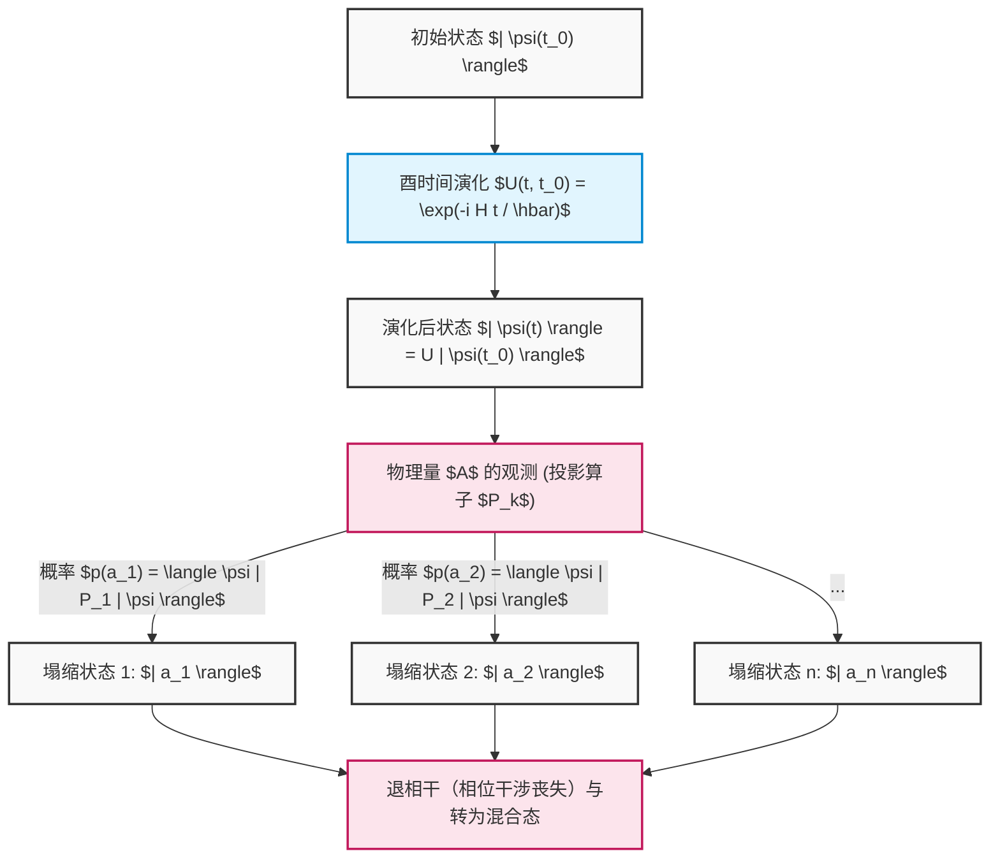

综上所述，线性代数中那些抽象的概念——向量空间、内积、厄米算子、本征值问题、酉矩阵——绝非仅仅是纯粹的数学游戏，而是精确描述和预测宇宙最微观行为的不可替代的语言。量子计算算法，正是巧妙地驾驭着“薛定谔的确定性演化”与“玻恩的概率性塌缩”这两大基本法则，引领我们迈向经典计算机所无法企及的计算新疆界。

# 第4章：单量子比特门与酉变换

构成量子计算基础的是对量子态的精密操作。经典计算机中的逻辑门（如AND、OR、NOT等）对比特值进行不可逆的操作，而量子计算机中的“量子门”则是遵循薛定谔方程要求的可逆时间演化，在数学上被严格描述为复希尔伯特空间上的“酉变换（酉矩阵）”。本章将毫无妥协地深入探讨作用于单量子比特（二能级系统）的基本量子门的数学结构、代数性质，以及在布洛赫球（Bloch sphere）上直观的几何意义。

## 4.1 量子力学的要求与酉矩阵的必然性

量子系统的时间演化由表征系统的厄米算符即哈密顿量 **$H$** （ **$H^\dagger = H$** ）控制，遵循以下薛定谔方程：

$$
i\hbar \frac{d}{dt} |\psi(t)\rangle = H |\psi(t)\rangle
$$

假设哈密顿量 **$H$** 是一个与时间无关的系统，任意时刻 **$t$** 的量子态 **$|\psi(t)\rangle$** 可以从初始态 **$|\psi(0)\rangle$** 形式上积分如下：

$$
|\psi(t)\rangle = e^{-\frac{i}{\hbar}Ht} |\psi(0)\rangle
$$

我们将这里出现的时间演化算符定义为 **$U(t) = e^{-\frac{i}{\hbar}Ht}$** 。由于指数函数肩上的 **$H$** 是厄米的，计算该算符 **$U(t)$** 的伴随算符（厄米共轭） **$U(t)^\dagger$** 就会导出以下极其重要的性质：

$$
U(t)^\dagger U(t) = \left( e^{-\frac{i}{\hbar}Ht} \right)^\dagger e^{-\frac{i}{\hbar}Ht} = e^{\frac{i}{\hbar}H^\dagger t} e^{-\frac{i}{\hbar}Ht} = e^{\frac{i}{\hbar}Ht} e^{-\frac{i}{\hbar}Ht} = I
$$

同样地， **$U(t) U(t)^\dagger = I$** 也成立。像这样，其伴随矩阵与自身逆矩阵相等的矩阵（ **$U^\dagger = U^{-1}$** ）被称为“酉矩阵（Unitary Matrix）”。单量子比特门正是通过物理控制（例如照射具有特定频率和持续时间的微波脉冲等）有意设计的哈密顿量所实现的 **$2 \times 2$** 酉矩阵。

酉矩阵在量子力学中绝对不可或缺的原因在于，它是唯一在数学上保证“概率守恒（范数守恒）”的线性变换。让我们计算一下任意量子态 **$|\psi\rangle$** 和 **$|\phi\rangle$** 施加酉变换 **$U$** 后的状态内积：

$$
\langle \phi' | \psi' \rangle = ( \langle \phi | U^\dagger ) ( U |\psi\rangle ) = \langle \phi | U^\dagger U | \psi \rangle = \langle \phi | I | \psi \rangle = \langle \phi | \psi \rangle
$$

内积守恒意味着状态向量自身的范数（长度的平方）即 **$\langle \psi | \psi \rangle$** 也守恒。根据量子力学的玻恩法则（Born rule），状态向量振幅绝对值的平方总和必须为总概率“1”，因此为了使量子门操作不破坏这种概率解释，操作必须是酉变换，这是绝对的前提条件。

此外，根据谱定理，任意酉矩阵 **$U$** 可以使用具有实数特征值 **$\lambda_k$** 的厄米矩阵 **$K$** 表示为 **$U = e^{iK}$** 。酉矩阵的特征值总是呈现绝对值为1的复数（ **$e^{i\theta}$** ）的形式，且特征向量构成彼此正交的完备系。

$$
U = \sum_{j=1}^{d} e^{i \theta_j} |\phi_j\rangle \langle \phi_j|
$$

这表明，量子门的作用可以完全分解为“对特定的正交基底 **$|\phi_j\rangle$** ，仅仅赋予纯粹的相位旋转 **$e^{i\theta_j}$** ”的操作。

## 4.2 泡利矩阵与基本门（X，Y，Z门）

在探讨量子信息语言时，对泡利矩阵（Pauli matrices）群的理解是不可避免且最重要的。在物理学中为了描述自旋1/2粒子的角动量而引入的这个矩阵群，在量子计算机中构成了对单量子比特最基本且正交的操作群。

### 4.2.1 泡利X门（比特翻转门）

泡利X门是经典逻辑电路中NOT门的量子力学推广。使用狄拉克括号记法的外积（投影算符）表示定义如下：

$$
X = \sigma_x = |0\rangle\langle 1| + |1\rangle\langle 0| = \begin{pmatrix} 0 & 1 \\ 1 & 0 \end{pmatrix}
$$

严格通过矩阵计算来确认其对计算基底（ **$|0\rangle, |1\rangle$** ）的作用：

$$
X |0\rangle = \begin{pmatrix} 0 & 1 \\ 1 & 0 \end{pmatrix} \begin{pmatrix} 1 \\ 0 \end{pmatrix} = \begin{pmatrix} 0 \\ 1 \end{pmatrix} = |1\rangle
$$

$$
X |1\rangle = \begin{pmatrix} 0 & 1 \\ 1 & 0 \end{pmatrix} \begin{pmatrix} 0 \\ 1 \end{pmatrix} = \begin{pmatrix} 1 \\ 0 \end{pmatrix} = |0\rangle
$$

如此一来，振幅被完全翻转。几何上，它对应于在布洛赫球中以X轴为旋转轴的 **$\pi$** （180度）旋转操作。北极（ **$|0\rangle$** ）被映射到南极（ **$|1\rangle$** ），南极被映射到北极。

### 4.2.2 泡利Y门（比特-相位翻转门）

泡利Y门同时引起比特翻转和相位翻转，并进一步赋予虚数单位 **$i$** 的相位因子。其外积表示与矩阵表示如下：

$$
Y = \sigma_y = -i|0\rangle\langle 1| + i|1\rangle\langle 0| = \begin{pmatrix} 0 & -i \\ i & 0 \end{pmatrix}
$$

对计算基底的作用为：

$$
Y |0\rangle = i|1\rangle, \quad Y |1\rangle = -i|0\rangle
$$

在布洛赫球上，它表示绕Y轴的 **$\pi$** 旋转。乘以虚数单位 **$i$** （即 **$e^{i\pi/2}$** ）意味着不仅是单纯的翻转，状态在相空间中还发生了正交方向的平移。

### 4.2.3 泡利Z门（相位翻转门）

泡利Z门是经典逻辑中不存在的、量子特有的纯粹的“相位操作”。它完全不改变振幅的大小（测量概率），仅对 **$|1\rangle$** 的分量赋予 **$-1$** （即 **$e^{i\pi}$** ）的相位偏移。

$$
Z = \sigma_z = |0\rangle\langle 0| - |1\rangle\langle 1| = \begin{pmatrix} 1 & 0 \\ 0 & -1 \end{pmatrix}
$$

其作用显而易见地为：

$$
Z |0\rangle = |0\rangle, \quad Z |1\rangle = -|1\rangle
$$

这对应于绕Z轴的 **$\pi$** 旋转。由于计算基底 **$|0\rangle, |1\rangle$** 是Z矩阵的特征向量（特征值分别为+1, -1），因此即使施加Z门，状态也不会发生跃迁。然而，当它作用于叠加态（例如： **$\alpha|0\rangle + \beta|1\rangle$** ）时，相对相位会发生 **$\alpha|0\rangle - \beta|1\rangle$** 的剧烈反转，从而决定性地改变后续的干涉结果。

### 4.2.4 泡利群的深远代数结构

泡利矩阵群 **$\{I, X, Y, Z\}$** 作为希尔伯特空间上的线性算符，构成了极其优美的代数结构。

1. **自伴随性（厄米性）与酉性的共存** ： **$X = X^\dagger$** 、 **$Y = Y^\dagger$** 、 **$Z = Z^\dagger$** ，并且同时满足 **$X^\dagger X = I$** （即 **$X = X^{-1}$** ）。这是既作为物理量（可观测量），同时本身又能成为酉时间演化生成元（门）的罕见性质。连续施加两次会恢复为恒等变换（对合： **$X^2 = Y^2 = Z^2 = I$** ）。
2. **完全反交换关系** ：不同的泡利矩阵互相交换乘积顺序时，符号会发生反转。
   

$$
\{X, Y\} = XY + YX = 0, \quad \{Y, Z\} = 0, \quad \{Z, X\} = 0
$$

3. **交换关系与李代数** ：使用交换子 **$[A, B] = AB - BA$** 时，它们明确地展现出作为 **$SU(2)$** 李代数生成元的结构（使用完全反对称张量 **$\epsilon_{ijk}$** ）。
   

$$
[\sigma_j, \sigma_k] = 2i \sum_{l \in \{x,y,z\}} \epsilon_{jkl} \sigma_l
$$

   具体而言， **$XY = iZ$** 、 **$YZ = iX$** 、 **$ZX = iY$** 。这种代数结构为定义后文所述的任意旋转门提供了数学基础。

## 4.3 阿达马门（H门）：量子叠加的创造

在量子算法（例如多伊奇-乔萨算法或秀尔算法）中，几乎可以说在初始化之后必定会施加阿达马（Hadamard）门。它承担着从决定性状态创造出所有状态等概率出现的“最大叠加态”的核心作用。

$$
H = \frac{1}{\sqrt{2}} \begin{pmatrix} 1 & 1 \\ 1 & -1 \end{pmatrix} = \frac{1}{\sqrt{2}} \left( |0\rangle\langle 0| + |0\rangle\langle 1| + |1\rangle\langle 0| - |1\rangle\langle 1| \right)
$$

将阿达马矩阵作用于计算基底：

$$
H |0\rangle = \frac{1}{\sqrt{2}} \begin{pmatrix} 1 & 1 \\ 1 & -1 \end{pmatrix} \begin{pmatrix} 1 \\ 0 \end{pmatrix} = \frac{1}{\sqrt{2}} \begin{pmatrix} 1 \\ 1 \end{pmatrix} = \frac{|0\rangle + |1\rangle}{\sqrt{2}} \equiv |+\rangle
$$

$$
H |1\rangle = \frac{1}{\sqrt{2}} \begin{pmatrix} 1 & 1 \\ 1 & -1 \end{pmatrix} \begin{pmatrix} 0 \\ 1 \end{pmatrix} = \frac{1}{\sqrt{2}} \begin{pmatrix} 1 \\ -1 \end{pmatrix} = \frac{|0\rangle - |1\rangle}{\sqrt{2}} \equiv |-\rangle
$$

生成的 **$|+\rangle$** 和 **$|-\rangle$** 被称为X基底（或对角基底），它们是泡利X矩阵的本征态。由于阿达马矩阵自身也是实对称且正交的矩阵（实数空间中的酉矩阵），因此满足 **$H = H^\dagger = H^{-1}$** 以及 **$H^2 = I$** 。
因此， **$H |+\rangle = |0\rangle$** ，它也具有使叠加态再次干涉回到确定性计算基底的（复原）作用。
在代数上，H门是转换X基底与Z基底的酉变换。作为矩阵的相似变换，它可以被极其优美地描述如下：

$$
H X H^\dagger = H X H = Z
$$

$$
H Z H^\dagger = H Z H = X
$$

得益于这一性质，通过用H门夹住“由Z门造成的相位翻转”，就可以合成出“由X门造成的比特翻转”。几何上，H门相当于绕布洛赫球上的单位向量 **$\hat{n} = \frac{1}{\sqrt{2}}(\hat{x} + \hat{z})$** 为轴进行 **$\pi$** 旋转。

## 4.4 相移门群：S门与T门

将泡利Z门更加一般化，把布洛赫球上绕Z轴的任意旋转操作群称为相移门 **$P(\phi)$** （或 **$R_\phi$** ）。

$$
P(\phi) = \begin{pmatrix} 1 & 0 \\ 0 & e^{i\phi} \end{pmatrix} = |0\rangle\langle 0| + e^{i\phi} |1\rangle\langle 1|
$$

这个门群对叠加态 **$\alpha|0\rangle + \beta|1\rangle$** 仅仅操作 **$|1\rangle$** 分量的相对相位，使其变为 **$\alpha|0\rangle + \beta e^{i\phi}|1\rangle$** 的形式。其中以下两个尤为重要。

### 4.4.1 S门（相位门， $\sqrt{Z}$ ）

 **$\phi = \pi/2$** 的情况被称为S门。

$$
S = \begin{pmatrix} 1 & 0 \\ 0 & e^{i\pi/2} \end{pmatrix} = \begin{pmatrix} 1 & 0 \\ 0 & i \end{pmatrix}
$$

从矩阵性质可以明显看出，施加两次即变成Z门（ **$S^2 = Z$** ）。
将S门作用于 **$|+\rangle$** 态时，

$$
S |+\rangle = \begin{pmatrix} 1 & 0 \\ 0 & i \end{pmatrix} \frac{1}{\sqrt{2}} \begin{pmatrix} 1 \\ 1 \end{pmatrix} = \frac{1}{\sqrt{2}} \begin{pmatrix} 1 \\ i \end{pmatrix} = \frac{|0\rangle + i|1\rangle}{\sqrt{2}} \equiv |+i\rangle
$$

状态将跃迁至位于布洛赫球赤道上的Y轴正方向（Y基底的本征态）。由泡利群以及H、S门组成的群被称为克利福德群（Clifford group），根据哥特斯曼-克尼尔定理，已经证明仅由克利福德群构成的量子电路可以被经典计算机高效地模拟。

### 4.4.2 T门（ $\pi/8$ 门， $\sqrt{S}$ ， $\sqrt[4]{Z}$ ）

 **$\phi = \pi/4$** 的情况被称为T门。

$$
T = \begin{pmatrix} 1 & 0 \\ 0 & e^{i\pi/4} \end{pmatrix} = \begin{pmatrix} 1 & 0 \\ 0 & \frac{1+i}{\sqrt{2}} \end{pmatrix}
$$

如果提取出全局相位 **$e^{i\pi/8}$** ，对角线元素将变为 **$e^{-i\pi/8}$** 和 **$e^{i\pi/8}$** ，因此历史上也被称为 **$\pi/8$** 门。
T门不属于克利福德群，它打破了经典模拟的高效性。然而，量子计算理论中存在一个极其重要的定理：只要在克利福德群中加入哪怕一个T门，就能完成可以以任意精度近似单量子比特上所有酉变换的“通用量子门集合（Universal Quantum Gate Set）”。在容错（纠错）量子计算中，由于很难直接在纠错码上执行T门，因此它通过被称为“魔术态蒸馏（Magic State Distillation）”这种成本非常高昂的方法来实现。

## 4.5 任意旋转门的指数函数表示与通用性

对单量子比特最一般的操作是，以布洛赫球中任意单位向量 **$\hat{n} = (n_x, n_y, n_z)$** （其中 **$n_x^2 + n_y^2 + n_z^2 = 1$** ）为旋转轴，旋转 **$\theta$** 角度的酉变换。利用泡利矩阵的线性组合，该旋转算符 **$R_{\hat{n}}(\theta)$** 可以优美地公式化为如下的矩阵指数函数：

$$
R_{\hat{n}}(\theta) = \exp\left(-i \frac{\theta}{2} (\hat{n} \cdot \vec{\sigma})\right) = \exp\left(-i \frac{\theta}{2} (n_x X + n_y Y + n_z Z)\right)
$$

在这里，利用泡利矩阵强大的反交换性： **$(\hat{n} \cdot \vec{\sigma})^2 = (n_x X + n_y Y + n_z Z)^2 = (n_x^2 + n_y^2 + n_z^2)I = I$** ，并对指数函数进行泰勒展开（即在 **$A^2=I$** 时， **$e^{iAx} = \cos(x)I + i\sin(x)A$** ），无限级数将被戏剧性地简化，从而得到以下欧拉公式的矩阵扩展版：

$$
R_{\hat{n}}(\theta) = \cos\left(\frac{\theta}{2}\right) I - i \sin\left(\frac{\theta}{2}\right) (\hat{n} \cdot \vec{\sigma})
$$

从这一一般性的公式中，可以推导出绕正交坐标轴的基本旋转门群。

### 绕X轴的旋转门 $R_x(\theta)$ 

$$
R_x(\theta) = e^{-i \frac{\theta}{2} X} = \begin{pmatrix} \cos\frac{\theta}{2} & -i \sin\frac{\theta}{2} \\ -i \sin\frac{\theta}{2} & \cos\frac{\theta}{2} \end{pmatrix}
$$

### 绕Y轴的旋转门 $R_y(\theta)$ 

$$
R_y(\theta) = e^{-i \frac{\theta}{2} Y} = \begin{pmatrix} \cos\frac{\theta}{2} & -\sin\frac{\theta}{2} \\ \sin\frac{\theta}{2} & \cos\frac{\theta}{2} \end{pmatrix}
$$

### 绕Z轴的旋转门 $R_z(\theta)$ 

$$
R_z(\theta) = e^{-i \frac{\theta}{2} Z} = \begin{pmatrix} e^{-i\theta/2} & 0 \\ 0 & e^{i\theta/2} \end{pmatrix}
$$

利用这些旋转矩阵，任意单量子比特酉矩阵 **$U \in SU(2)$** 都可以使用3个欧拉角（ **$\alpha, \beta, \gamma$** ）作为“Z-Y-Z分解”，被完全因式分解如下：

$$
U = e^{i\delta} R_z(\alpha) R_y(\beta) R_z(\gamma)
$$

这个定理在物理学上保证了：只要能在硬件层面上高精度地实现Z轴旋转和Y轴旋转，就可以执行任何针对单量子比特的复杂算法。

## 4.6 【图解】单量子比特门电路与状态跃迁

将这些门按时间顺序排列而成的就是量子电路。状态从左向右进行时间演化。

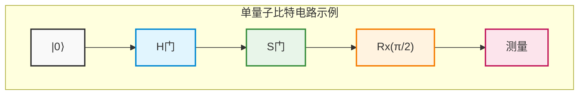

## 4.7 严格计算示例：通过矩阵序列对量子干涉的完全追踪

为了将抽象概念升华为物理直觉，我们将通过相乘多个酉矩阵，严格且毫无省略地手动计算追踪量子态是如何干涉并发生跃迁的。

假设初始态为基态 **$|\psi_0\rangle = |0\rangle = \begin{pmatrix} 1 \\ 0 \end{pmatrix}$** 。
执行的操作是类似于上述电路图的“ **$H$** 门”→“ **$S$** 门”→“ **$H$** 门”序列。
量子电路图是从左向右书写的，但由于线性代数中对状态向量的算符乘法是“从左侧依次”相乘，因此整体酉算符 **$U_{total}$** 的表达式将与时间顺序相反，从右向左排列。

$$
U_{total} = H S H
$$

代入各个门的矩阵表示来推导出合成矩阵。

$$
H = \frac{1}{\sqrt{2}} \begin{pmatrix} 1 & 1 \\ 1 & -1 \end{pmatrix}, \quad S = \begin{pmatrix} 1 & 0 \\ 0 & i \end{pmatrix}
$$

首先，计算在初始态之后立即施加的 **$H$** 与其后的 **$S$** 的乘积 **$SH$** 。

$$
S H = \begin{pmatrix} 1 & 0 \\ 0 & i \end{pmatrix} \frac{1}{\sqrt{2}} \begin{pmatrix} 1 & 1 \\ 1 & -1 \end{pmatrix} = \frac{1}{\sqrt{2}} \begin{pmatrix} 1\cdot 1 + 0\cdot 1 & 1\cdot 1 + 0\cdot(-1) \\ 0\cdot 1 + i\cdot 1 & 0\cdot 1 + i\cdot(-1) \end{pmatrix} = \frac{1}{\sqrt{2}} \begin{pmatrix} 1 & 1 \\ i & -i \end{pmatrix}
$$

接着，从该结果的左侧乘以最后的 **$H$** 。

$$
U_{total} = H (S H) = \frac{1}{\sqrt{2}} \begin{pmatrix} 1 & 1 \\ 1 & -1 \end{pmatrix} \frac{1}{\sqrt{2}} \begin{pmatrix} 1 & 1 \\ i & -i \end{pmatrix}
$$

提取出标量倍数 **$\frac{1}{\sqrt{2}} \times \frac{1}{\sqrt{2}} = \frac{1}{2}$** ，并仔细执行矩阵的乘积计算。

$$
U_{total} = \frac{1}{2} \begin{pmatrix} 1\cdot 1 + 1\cdot i & 1\cdot 1 + 1\cdot(-i) \\ 1\cdot 1 + (-1)\cdot i & 1\cdot 1 + (-1)\cdot(-i) \end{pmatrix} = \frac{1}{2} \begin{pmatrix} 1 + i & 1 - i \\ 1 - i & 1 + i \end{pmatrix}
$$

这就是将整个电路视为一个黑盒时，单一的酉矩阵表示。
将此 **$U_{total}$** 作用于初始态 **$|0\rangle$** ，计算最终态 **$|\psi_{final}\rangle$** 。

$$
|\psi_{final}\rangle = U_{total} |0\rangle = \frac{1}{2} \begin{pmatrix} 1 + i & 1 - i \\ 1 - i & 1 + i \end{pmatrix} \begin{pmatrix} 1 \\ 0 \end{pmatrix} = \frac{1}{2} \begin{pmatrix} 1 + i \\ 1 - i \end{pmatrix}
$$

将其用狄拉克记法展开如下：

$$
|\psi_{final}\rangle = \frac{1+i}{2} |0\rangle + \frac{1-i}{2} |1\rangle
$$

在这里，为了验证酉性（概率总和为1）是否被破坏，计算观测到各个基底的概率。使用复数绝对值的平方 ** $|z|^2 = z z^*$ ** 。

$$
P(0) = |\langle 0 | \psi_{final} \rangle|^2 = \left| \frac{1+i}{2} \right|^2 = \frac{1^2 + 1^2}{4} = \frac{2}{4} = \frac{1}{2}
$$

$$
P(1) = |\langle 1 | \psi_{final} \rangle|^2 = \left| \frac{1-i}{2} \right|^2 = \frac{1^2 + (-1)^2}{4} = \frac{2}{4} = \frac{1}{2}
$$

概率之和为 **$P(0) + P(1) = 1$** ，这证明了它是一个在物理上合理的状态。测量时会有50%的概率得到0，50%的概率得到1，但这绝非单纯的经典随机数。为了提取隐藏在状态背后的“相位”，让我们将状态向量变换为布洛赫球的极坐标形式。

作为整体的公因子，强制提取出振幅 **$1/\sqrt{2}$** 和全局相位 **$e^{i\pi/4}$** （ **$\frac{1+i}{\sqrt{2}}$** ）。

$$
|\psi_{final}\rangle = \frac{1}{\sqrt{2}} \left( \frac{1+i}{\sqrt{2}} |0\rangle + \frac{1-i}{\sqrt{2}} |1\rangle \right) = e^{i\pi/4} \left( \frac{1}{\sqrt{2}} |0\rangle + \frac{1}{\sqrt{2}} e^{-i\pi/2} |1\rangle \right)
$$

由于全局相位 **$e^{i\pi/4}$** 在任何可观测量（厄米算符）的期望值计算中都会因为 **$e^{-i\pi/4} e^{i\pi/4} = 1$** 而被抵消，因此提取出唯一具有物理意义的相对相位部分：

$$
|\psi_{final}'\rangle = \frac{1}{\sqrt{2}} |0\rangle - \frac{i}{\sqrt{2}} |1\rangle
$$

通过将其与极坐标表示 **$\cos(\theta/2)|0\rangle + e^{i\phi}\sin(\theta/2)|1\rangle$** 进行比较，完美确定了布洛赫向量指向天顶角 **$\theta = \pi/2$** （赤道上），方位角 **$\phi = -\pi/2$** （Y轴的负方向）。这通常被记为 **$|-i\rangle$** 态。

让我们提出一个更深奥的事实。使用刚才导出的由指数函数表示的旋转门公式，写下绕X轴的 **$\pi/2$** 旋转 **$R_x(\pi/2)$** 的矩阵：

$$
R_x(\pi/2) = \frac{1}{\sqrt{2}} \begin{pmatrix} 1 & -i \\ -i & 1 \end{pmatrix}
$$

另一方面，让我们再次看看我们计算出的整体矩阵 **$U_{total}$** ：

$$
U_{total} = \frac{1}{2} \begin{pmatrix} 1 + i & 1 - i \\ 1 - i & 1 + i \end{pmatrix} = \frac{1+i}{2} \begin{pmatrix} 1 & \frac{1-i}{1+i} \\ \frac{1-i}{1+i} & 1 \end{pmatrix} = \frac{1+i}{2} \begin{pmatrix} 1 & -i \\ -i & 1 \end{pmatrix} = e^{i\pi/4} R_x(\pi/2)
$$

令人惊讶的是，“ **$H \rightarrow S \rightarrow H$** ”这种由绕着完全不同轴的离散门群组成的连续操作，在剔除全局相位后，在数学上被证明与单一的“绕X轴的 **$\pi/2$** 旋转操作”一字不差地等价。
像这样，尽管量子态沿着拒绝我们经典直觉的复杂干涉路径演化，但通过线性代数这一坚固的数学框架，它的行为可以不差1比特地被完全掌控和预测。

在下一章中，我们将以这种强大的单量子比特操作知识为基础，踏入能使希尔伯特空间的维度呈指数级爆炸的张量积，以及能产生被爱因斯坦称为“幽灵般的超距作用”的“量子纠缠（Entanglement）”的多量子比特门的深邃世界。

# 第5章: 多量子比特系统与量子纠缠（Entanglement）

在前面的章节中，我们详细探讨了单个量子比特所具有的叠加性质，以及被描述为布洛赫球面旋转操作的单量子比特门。然而，量子计算超越经典计算的真正威力——即所谓的“量子优越性”或“量子优势”的源泉，恰恰存在于多个量子比特相互作用的多体系统之中。本章将引入量子信息中最核心且最具神秘色彩的概念—— **量子纠缠** （Entanglement），从多量子比特系统的严格数学描述、制备量子纠缠的电路，直至动摇物理学根基的EPR悖论，展开彻底深入的剖析与讲解。

---

## 5.1 基于张量积（$\otimes$）的多体状态数学描述

根据量子力学的公理，当独立物理系统的状态空间分别由希尔伯特空间 **$\mathcal{H}_A$** 与 **$\mathcal{H}_B$** 描述时，将它们组合而成的复合系统的状态空间由各个空间的 **张量积** （Tensor Product）即 **$\mathcal{H} = \mathcal{H}_A \otimes \mathcal{H}_B$** 给出。

单量子比特的状态空间是二维复向量空间 **$\mathbb{C}^2$** 。因此，由 $n$ 个量子比特构成的系统的状态空间是 $2^n$ 维希尔伯特空间 **$(\mathbb{C}^2)^{\otimes n}$** 。维度随着量子比特数 $n$ 呈指数级增长，这正是量子并行性的数学基础。

我们来考虑由两个量子比特（量子比特A和量子比特B）构成的系统。计算基底被定义为各个单量子比特基底状态的张量积：

$$
|0\rangle_A \otimes |0\rangle_B \equiv |00\rangle, \quad
|0\rangle_A \otimes |1\rangle_B \equiv |01\rangle, \quad
|1\rangle_A \otimes |0\rangle_B \equiv |10\rangle, \quad
|1\rangle_A \otimes |1\rangle_B \equiv |11\rangle
$$

在此，我们来严格计算张量积的矩阵表示（克罗内克积，Kronecker product）。将单量子比特的基底表示为列向量：

$$
|0\rangle = \begin{pmatrix} 1 \\ 0 \end{pmatrix}, \quad |1\rangle = \begin{pmatrix} 0 \\ 1 \end{pmatrix}
$$

利用这些表示，例如计算状态 **$|10\rangle$** 可以得到如下结果：

$$
|10\rangle = |1\rangle \otimes |0\rangle = \begin{pmatrix} 0 \\ 1 \end{pmatrix} \otimes \begin{pmatrix} 1 \\ 0 \end{pmatrix} = \begin{pmatrix} 0 \cdot \begin{pmatrix} 1 \\ 0 \end{pmatrix} \\ 1 \cdot \begin{pmatrix} 1 \\ 0 \end{pmatrix} \end{pmatrix} = \begin{pmatrix} 0 \\ 0 \\ 1 \\ 0 \end{pmatrix}
$$

在这个四维向量空间中，两量子比特系统最一般的纯态 **$|\Psi\rangle$** 可被描述为这四个基底向量的线性组合（叠加态）：

$$
|\Psi\rangle = c_{00} |00\rangle + c_{01} |01\rangle + c_{10} |10\rangle + c_{11} |11\rangle
$$

这里，$c_{ij} \in \mathbb{C}$ 为概率幅，根据玻恩定则状态必须归一化，即需要满足归一化条件 $\sum_{i,j \in \{0,1\}} |c_{ij}|^2 = 1$ 。

复合系统中的算符（量子门）同样使用张量积来构建。对量子比特A施加算符 **$U_A$** 、对量子比特B施加算符 **$U_B$** 的操作，表示为对整个复合系统的算符 **$U_A \otimes U_B$** ，它对任意积态的作用如下：

$$
(U_A \otimes U_B)(|\psi\rangle_A \otimes |\phi\rangle_B) = (U_A |\psi\rangle_A) \otimes (U_B |\phi\rangle_B)
$$

根据线性性质，该作用可推广至任意叠加态。

---

## 5.2 贝尔态（最大量子纠缠态）的数学表达

多体量子系统中的状态主要被划分为两类：“可分态（Separable State）”与“纠缠态（Entangled State）”。
当状态 **$|\Psi\rangle$** 可以描述为各个子系统状态的简单张量积，即

$$
|\Psi\rangle = |\psi\rangle_A \otimes |\phi\rangle_B
$$

时，该状态被称为可分的。相反，对于 **无法** 表示为任何子系统状态的张量积的状态，定义为 **量子纠缠态（Entangled State）** 。

在两量子比特系统中，发生最强量子纠缠的状态被称为 **贝尔态** （Bell States）或EPR对。贝尔态由以下四个正交纯态构成，形成四维希尔伯特空间的完备标准正交基（贝尔基）：

$$
|\Phi^+\rangle = \frac{1}{\sqrt{2}} \Big( |00\rangle + |11\rangle \Big)
$$

$$
|\Phi^-\rangle = \frac{1}{\sqrt{2}} \Big( |00\rangle - |11\rangle \Big)
$$

$$
|\Psi^+\rangle = \frac{1}{\sqrt{2}} \Big( |01\rangle + |10\rangle \Big)
$$

$$
|\Psi^-\rangle = \frac{1}{\sqrt{2}} \Big( |01\rangle - |10\rangle \Big)
$$

在此，我们利用反证法严格证明状态 **$|\Phi^+\rangle$** 是不可分的。
反设 **$|\Phi^+\rangle$** 是可分态，并假设它可以描述为未知的单量子比特状态的张量积：

$$
|\Phi^+\rangle = (a|0\rangle + b|1\rangle)_A \otimes (c|0\rangle + d|1\rangle)_B
$$

将其展开后得到：

$$
|\Phi^+\rangle = ac|00\rangle + ad|01\rangle + bc|10\rangle + bd|11\rangle
$$

与原始定义式的系数对比，可得以下联立方程组：

1. $ac = \frac{1}{\sqrt{2}}$
2. $bd = \frac{1}{\sqrt{2}}$
3. $ad = 0$
4. $bc = 0$

由方程3 ($ad = 0$) 可知，$a = 0$ 或 $d = 0$。
若 $a = 0$，由方程1可得 $ac = 0$，这与 $ac = \frac{1}{\sqrt{2}}$ 矛盾。
若 $d = 0$，由方程2可得 $bd = 0$，这与 $bd = \frac{1}{\sqrt{2}}$ 矛盾。
因此，不存在满足条件的复数 $a, b, c, d$，从而严格证明了状态 **$|\Phi^+\rangle$** 绝不可能分解为两个独立状态的积。

### 约化密度矩阵与纠缠熵

贝尔态是“最大量子纠缠态”这一事实，可以通过计算描述子系统信息的 **约化密度矩阵** （Reduced Density Matrix）得到更加明确的体现。当整个系统处于纯态 **$\rho = |\Phi^+\rangle \langle\Phi^+|$** 时，对量子比特B求偏迹（部分迹）以求得量子比特A的局域状态：

$$
\rho_A = \text{Tr}_B(|\Phi^+\rangle \langle\Phi^+|) = \text{Tr}_B \left[ \frac{1}{2} (|00\rangle\langle00| + |00\rangle\langle11| + |11\rangle\langle00| + |11\rangle\langle11|) \right]
$$

利用部分迹的性质 $\text{Tr}_B(|i,j\rangle\langle k,l|) = |i\rangle\langle k| \cdot \langle l|j\rangle = |i\rangle\langle k| \delta_{jl}$ ，可得：

$$
\rho_A = \frac{1}{2} \Big( |0\rangle\langle0| \cdot \langle0|0\rangle + |0\rangle\langle1| \cdot \langle1|0\rangle + |1\rangle\langle0| \cdot \langle0|1\rangle + |1\rangle\langle1| \cdot \langle1|1\rangle \Big)
$$

$$
\rho_A = \frac{1}{2} (|0\rangle\langle0| + |1\rangle\langle1|) = \frac{1}{2} I
$$

这意味着，若仅观测量子比特A，其状态为完全混合态（Completely Mixed State），冯·诺依曼熵 $S(\rho_A) = -\text{Tr}(\rho_A \log_2 \rho_A)$ 取最大值 $1$ 。换言之，“尽管系统作为一个整体拥有完全的信息（纯态），但孤立地看待各个子系统时，信息却是完全不确定的（最大熵）”，这种在经典力学中绝不可能存在的极限关联性，正是最大量子纠缠的本质。

---

## 5.3 CNOT门（受控非门）的矩阵表示

要在量子计算机中人工生成并操控这种纠缠，仅凭对单量子比特的操作是远远不够的，跨越多个量子比特的多量子比特门不可或缺。其中最基本且最强大的算符就是 **CNOT门** （Controlled-NOT Gate，受控非门）。

CNOT门作用于两个量子比特，将其中一个视为“控制比特（Control Qubit）”，另一个视为“目标比特（Target Qubit）”。作为经典XOR门的量子版本，该门执行的操作为：“当且仅当控制比特为 $|1\rangle$ 时，翻转目标比特（对其施加泡利 $X$ 门）；当控制比特为 $|0\rangle$ 时，目标比特保持不变”。

对计算基底的作用如下（设第一个量子比特为控制比特，第二个量子比特为目标比特）：

$$
\text{CNOT} |00\rangle = |00\rangle \\
\text{CNOT} |01\rangle = |01\rangle \\
\text{CNOT} |10\rangle = |11\rangle \\
\text{CNOT} |11\rangle = |10\rangle
$$

将其表示为四维酉矩阵如下：

$$
\text{CNOT} = \begin{pmatrix}
1 & 0 & 0 & 0 \\
0 & 1 & 0 & 0 \\
0 & 0 & 0 & 1 \\
0 & 0 & 1 & 0
\end{pmatrix}
$$

作为在数学上更为精炼的表达形式，可以使用投影算符与泡利矩阵的张量积之和来表示：

$$
\text{CNOT} = |0\rangle\langle0| \otimes I + |1\rangle\langle1| \otimes X
$$

该公式极其直观地揭示了CNOT门的物理意义。第一项表示“在第一量子比特投影到 $|0\rangle$ 的状态空间中，对第二量子比特施加恒等算符 $I$ ”；第二项表示“在第一量子比特投影到 $|1\rangle$ 的状态空间中，对第二量子比特施加比特翻转算符 $X$ ”。

作为CNOT门的重要性质，它同时满足厄米性（ $\text{CNOT}^\dagger = \text{CNOT}$ ）和酉性（ $\text{CNOT}^\dagger \text{CNOT} = I$ ），因此它自身就是自身的逆矩阵（ $\text{CNOT}^2 = I$ ）。

---

## 5.4 基于CNOT的量子纠缠生成电路

那么，如何从可分态出发，生成作为最大纠缠态的贝尔态呢？在此，我们构建一个从量子计算机的初始态 **$|00\rangle$** 生成 **$|\Phi^+\rangle$** 的标准量子电路，并通过数学公式追踪其状态的演化过程。

所需的组成元件仅为作用于单量子比特的阿达马门 **$H$** 以及上述的 **$\text{CNOT}$** 门。阿达马矩阵定义如下：

$$
H = \frac{1}{\sqrt{2}} \begin{pmatrix} 1 & 1 \\ 1 & -1 \end{pmatrix}
$$

### 量子态演化计算

 **步骤 1：** 初始化
系统处于计算基底的初始状态：

$$
|\psi_0\rangle = |0\rangle_A \otimes |0\rangle_B = |00\rangle
$$

 **步骤 2：** 对控制比特（量子比特A）施加阿达马门
仅对量子比特A施加阿达马门，制备出叠加态。作用于整个系统的算符为 **$H \otimes I$** ：

$$
|\psi_1\rangle = (H \otimes I) |00\rangle = (H|0\rangle_A) \otimes (I|0\rangle_B)
$$

$$
= \left( \frac{1}{\sqrt{2}} (|0\rangle_A + |1\rangle_A) \right) \otimes |0\rangle_B
$$

$$
= \frac{1}{\sqrt{2}} (|00\rangle + |10\rangle)
$$

此时，该状态仍然是可分态，因为它可以写成张量积的形式。

 **步骤 3：** 施加CNOT门
接下来，以量子比特A为控制比特、量子比特B为目标比特施加CNOT门。由于算符的线性性质，CNOT门独立作用于叠加态的每一项：

$$
|\psi_2\rangle = \text{CNOT} \left[ \frac{1}{\sqrt{2}} (|00\rangle + |10\rangle) \right]
$$

$$
= \frac{1}{\sqrt{2}} (\text{CNOT}|00\rangle + \text{CNOT}|10\rangle)
$$

应用前文定义的CNOT对基底的作用规则，由于 $\text{CNOT}|00\rangle = |00\rangle$ ， $\text{CNOT}|10\rangle = |11\rangle$ ，因此：

$$
|\psi_2\rangle = \frac{1}{\sqrt{2}} (|00\rangle + |11\rangle) = |\Phi^+\rangle
$$

令人赞叹的是，从最初的可分态成功生成了贝尔态 **$|\Phi^+\rangle$** 。阿达马门制备的“控制比特处于0和1的叠加”，在输入CNOT门后，目标比特的翻转/不翻转与控制比特的各个状态产生联动分流，从而在整体上形成了纠缠。

通过相同的电路配置，只需将初始状态更改为 $|01\rangle, |10\rangle, |11\rangle$ ，即可确定性地分别生成其余三个贝尔态 $|\Psi^+\rangle, |\Phi^-\rangle, |\Psi^-\rangle$ 。

### 量子电路图（Mermaid表示）

描述上述纠缠生成过程的量子电路图如下所示：

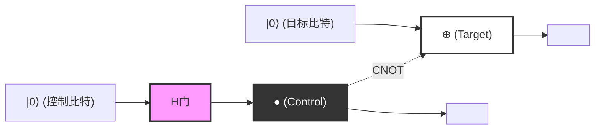
*(注: 上图表示逻辑连接。实线水平线表示各个量子比特的时间流（量子导线），展示了穿过 `H门` 的控制比特在 `●` 位置控制目标比特的 `⊕` 的结构。整体输出状态得到贝尔态 $|\Phi^+\rangle$ 。)*

---

## 5.5 EPR悖论与非定域性

表明量子纠缠概念并非单纯的数学游戏、而是对物理学根基提出深刻质疑的，是1935年由阿尔伯特·爱因斯坦（Albert Einstein）、鲍里斯·波多尔斯基（Boris Podolsky）和内森·罗森（Nathan Rosen）发表的著名 **EPR论文** 。他们提出，由于量子力学的描述与“定域实在论（Local Realism）”相矛盾，因此量子力学是不完备的理论（需要隐变量）。

让我们来进行一个思想实验：假设爱丽丝（Alice）和鲍勃（Bob）两位观测者共享先前制备的贝尔态 **$|\Phi^+\rangle = \frac{1}{\sqrt{2}}(|00\rangle + |11\rangle)$** 。爱丽丝持有第一个量子比特，鲍勃持有第二个量子比特，且他们相距于宇宙的两端（例如地球与仙女座星系）。

在此状态下，对各个量子比特的测量结果在本质上是随机的。爱丽丝在计算基底 $\{|0\rangle, |1\rangle\}$ 下测量自己持有的量子比特时，各有 50% 的概率得到 $0$（状态 $|0\rangle$）或 $1$（状态 $|1\rangle$）。

然而，根据量子力学的投影假说（波包塌缩），在爱丽丝进行测量的 **瞬间** ，整个系统的状态发生了戏剧性的改变：
- 当爱丽丝得到测量结果 $0$ 的瞬间，整个波函数塌缩至 $|00\rangle$ 。因此，鲍勃的量子比特在进行任何测量之前，都会即刻且确定地塌缩到 $|0\rangle$ 。
- 反之，当爱丽丝得到测量结果 $1$ 的瞬间，整个波函数塌缩至 $|11\rangle$ ，鲍勃的量子比特也会即刻且确定地塌缩到 $|1\rangle$ 。

爱因斯坦将其称为“鬼魅般的超距作用（Spooky action at a distance）”。因为看起来，爱丽丝在局域进行的测量操作，超越了光速（瞬间）影响了遥远的鲍勃的物理状态。这似乎明显违背了狭义相对论所要求的“任何信息都不能超光速传播”的定域性原理。

### 无信号定理与贝尔不等式

那么，量子力学是否与相对论相矛盾？结论是：并不矛盾。
这一表观上的悖论由 **无信号定理（No-Communication Theorem）** 所解决。尽管爱丽丝的测量瞬间确定了鲍勃的状态，但爱丽丝自身在原理上无法控制自己会得到 $0$ 还是 $1$ 的结果。从鲍勃的角度来看，他没有任何手段得知爱丽丝是否进行了测量，测量自己持有的量子比特的结果依然呈现为完全的随机（各 50% 的概率为 0 或 1）。正如在约化密度矩阵一节中所证明的，无论爱丽丝选择何种测量基底，鲍勃的局域密度矩阵 $\rho_B$ 都完全不会改变。因此，无法利用量子纠缠以超光速传递“有意义的信息”。

然而，量子纠缠所具备的这种强烈关联性，绝非经典物理学范畴所能容纳。1964年，约翰·斯图尔特·贝尔（John Stewart Bell）导出了 **贝尔不等式** 。贝尔在数学上证明了：“如果世界是由定域实在论（即爱因斯坦所指的隐变量理论）所描述的，那么当爱丽丝和鲍勃分别在不同轴向进行测量时，其关联强度的绝对值不会超过某个特定上限（在CHSH不等式中为 $|S| \leq 2$ ）”。

而量子力学预言，在特定设定下会打破这一上限（达到 $|S| = 2\sqrt{2}$ ）。此后，阿兰·阿斯佩（Alain Aspect）等人的精密物理实验证实了贝尔不等式的破缺，从而确定了我们所生活的宇宙 **并非** 定域实在的。由量子纠缠引发的非定域关联，是真实存在于自然界中的普适物理现象。

在下一章中，我们将详细讲解将这种量子纠缠的非定域性作为主动的信息处理资源加以利用的量子通信协议，如量子隐形传态和超密编码等。

# 第 6 章：量子线路与基本协议

本章中，我们将通过结合迄今为止学到的量子力学基本公理与量子逻辑门的概念，深入探讨量子信息科学中最重要且最基础的协议。这些颠覆经典信息理论常识的协议，构成了决定量子计算机与量子通信可能性的基石。在这里，我们将毫无妥协地，结合严格的数学形式化表述，详细解析“量子不可克隆定理（No-Cloning Theorem）”、“量子隐形传态（Quantum Teleportation）”以及“超密编码（Superdense Coding）”这三个主题。

## 6.1 量子不可克隆定理 (No-Cloning Theorem)

在经典计算机中，数据拷贝（复制）是一项极其平常的操作。比特串可以轻易被复制，并保存在无数的存储设备中。然而，在量子力学主导的世界里，存在着一个令人惊讶的定理： **“不可能对未知的量子态制作出完全相同的副本”** 。这就是由 Wootters 和 Zurek，以及 Dieks 在 1982 年分别独立证明的“量子不可克隆定理（No-Cloning Theorem）”。

该定理是保证量子密码学（量子密钥分发）安全性的根本原理，同时也是量子纠错不得不采取与经典重复码（简单的多数表决）截然不同的复杂方法的原因。

### 数学证明

量子不可克隆定理的证明，仅从量子力学的线性和幺正性这两个极其基本的性质即可导出。

假设存在一台可以拷贝某个未知量子态 **$|\psi\rangle$** 的“万能量子克隆机”。这台克隆机应当接收源状态 **$|\psi\rangle$** 和一个已初始化的目标量子比特（相当于白纸状态） **$|0\rangle$** 作为输入，并生成两个相同的状态 **$|\psi\rangle \otimes |\psi\rangle$** （简写为 **$|\psi\rangle |\psi\rangle$** ）作为输出。

在量子力学中，孤立系统的任意物理演化都由幺正算符 **$U$** 来描述。因此，这台克隆机的操作可以定义为满足以下方程的幺正变换 **$U$** ：

$$
U (|\psi\rangle \otimes |0\rangle) = |\psi\rangle \otimes |\psi\rangle
$$

因为假设这对于“任意”状态都成立，所以对于另一个任意的量子态 **$|\phi\rangle$** 也必须同样有效：

$$
U (|\phi\rangle \otimes |0\rangle) = |\phi\rangle \otimes |\phi\rangle
$$

现在，让我们取这两个方程的内积（标量积）。利用幺正算符 **$U$** 的性质（ **$U^\dagger U = I$** ）。左边的内积如下所示：

$$
\begin{aligned}
\left( U (|\psi\rangle \otimes |0\rangle) \right)^\dagger \left( U (|\phi\rangle \otimes |0\rangle) \right) 
&= (\langle \psi | \otimes \langle 0 |) U^\dagger U (|\phi\rangle \otimes |0\rangle) \\
&= (\langle \psi | \otimes \langle 0 |) I (|\phi\rangle \otimes |0\rangle) \\
&= \langle \psi | \phi \rangle \cdot \langle 0 | 0 \rangle \\
&= \langle \psi | \phi \rangle
\end{aligned}
$$

（这里使用了 **$\langle 0 | 0 \rangle = 1$** 。）

另一方面，右边复制后状态之间的内积如下：

$$
\begin{aligned}
\left( |\psi\rangle \otimes |\psi\rangle \right)^\dagger \left( |\phi\rangle \otimes |\phi\rangle \right) 
&= (\langle \psi | \otimes \langle \psi |) (|\phi\rangle \otimes |\phi\rangle) \\
&= \langle \psi | \phi \rangle \cdot \langle \psi | \phi \rangle \\
&= (\langle \psi | \phi \rangle)^2
\end{aligned}
$$

由于左边和右边必须相等，我们得到以下等式：

$$
\langle \psi | \phi \rangle = (\langle \psi | \phi \rangle)^2
$$

这个方程 **$x = x^2$** 在复数范围内成立的条件只有 **$x = 0$** 或 **$x = 1$** 。也就是说：

$$
\langle \psi | \phi \rangle = 0 \quad \text{或者} \quad \langle \psi | \phi \rangle = 1
$$

这意味着，只有当两个状态“完全正交（互不相关）”或“完全相同”时，才可能存在正确复制它们的幺正变换。换句话说，这极其简单而优雅地证明了“不存在可以克隆任意（非正交的）未知量子态的普适幺正变换”。

### 从线性出发的证明（反证法）

我们也可以从量子力学的线性（叠加原理）入手进行证明。
考虑一个能够克隆两个正交基态 **$|0\rangle$** 和 **$|1\rangle$** 的幺正算符 **$U$** ：

$$
U |0\rangle |0\rangle = |0\rangle |0\rangle
$$

$$
U |1\rangle |0\rangle = |1\rangle |1\rangle
$$

到目前为止没有问题。这与复制经典比特的 0 和 1 是一样的。那么，当我们试图拷贝它们的叠加未知态 **$|\psi\rangle = \alpha|0\rangle + \beta|1\rangle$** 时会发生什么呢？根据幺正算符时间演化的线性，我们得到：

$$
\begin{aligned}
U (|\psi\rangle |0\rangle) &= U \left( (\alpha|0\rangle + \beta|1\rangle) |0\rangle \right) \\
&= U (\alpha|0\rangle |0\rangle + \beta|1\rangle |0\rangle) \\
&= \alpha U(|0\rangle |0\rangle) + \beta U(|1\rangle |0\rangle) \\
&= \alpha|0\rangle |0\rangle + \beta|1\rangle |1\rangle
\end{aligned}
$$

然而，我们真正想要的“完全克隆”输出，应该是如下的张量积：

$$
\begin{aligned}
|\psi\rangle \otimes |\psi\rangle &= (\alpha|0\rangle + \beta|1\rangle) \otimes (\alpha|0\rangle + \beta|1\rangle) \\
&= \alpha^2|0\rangle |0\rangle + \alpha\beta|0\rangle |1\rangle + \alpha\beta|1\rangle |0\rangle + \beta^2|1\rangle |1\rangle
\end{aligned}
$$

由线性推导出的结果 **$\alpha|0\rangle |0\rangle + \beta|1\rangle |1\rangle$** 与我们所求的克隆状态 **$|\psi\rangle \otimes |\psi\rangle$** 明显不同（缺失了交叉项 **$|0\rangle |1\rangle$** 和 **$|1\rangle |0\rangle$** ）。这再次证明了不可能对未知的叠加态进行克隆。

---

## 6.2 量子隐形传态 (Quantum Teleportation)

通过量子不可克隆定理，我们知道量子态是无法复制的。然而，将其“移动（转移）”是可能的。量子隐形传态是一种利用经典通信信道和预先共享的量子纠缠（Entanglement），将某一位置的未知量子态完全转移到遥远另一位置的协议。

这里需要注意的是，并非物理粒子本身在空间中移动，而是“状态（信息）”被转移了。由于原始粒子所承载的状态会被破坏，因此这并不违反不可克隆定理。

### 协议设定与初始状态

设发送者为爱丽丝（Alice），接收者为鲍勃（Bob）。
爱丽丝拥有一个想要发送给鲍勃的未知单量子比特态 **$|\psi\rangle$** ：

$$
|\psi\rangle_C = \alpha|0\rangle_C + \beta|1\rangle_C \quad (|\alpha|^2 + |\beta|^2 = 1)
$$

下标 $C$ 表示这是要转移的目标量子比特。

为了实现这种转移，假设爱丽丝和鲍勃预先共享了一对最大纠缠的两量子比特态（称为 EPR 对或贝尔对）。这里我们使用以下状态：

$$
|\Phi^+\rangle_{AB} = \frac{1}{\sqrt{2}} \left( |0\rangle_A \otimes |0\rangle_B + |1\rangle_A \otimes |1\rangle_B \right)
$$

下标 $A$ 表示爱丽丝持有的量子比特， $B$ 表示鲍勃持有的量子比特。

整个系统的初始状态 **$|\Psi_0\rangle$** 可以描述为爱丽丝想要转移的状态与共享的 EPR 对的张量积：

$$
\begin{aligned}
|\Psi_0\rangle &= |\psi\rangle_C \otimes |\Phi^+\rangle_{AB} \\
&= (\alpha|0\rangle_C + \beta|1\rangle_C) \otimes \frac{1}{\sqrt{2}} (|0\rangle_A |0\rangle_B + |1\rangle_A |1\rangle_B) \\
&= \frac{1}{\sqrt{2}} \Big( \alpha|0\rangle_C |0\rangle_A |0\rangle_B + \alpha|0\rangle_C |1\rangle_A |1\rangle_B + \beta|1\rangle_C |0\rangle_A |0\rangle_B + \beta|1\rangle_C |1\rangle_A |1\rangle_B \Big)
\end{aligned}
$$

### 爱丽丝的操作与贝尔基测量

爱丽丝手中有量子比特 $C$ 和 $A$ 。她对这两个量子比特进行一种称为“贝尔测量”的联合测量。用量子线路的术语来说，这相当于先应用 CNOT 门，再应用阿达马门（Hadamard gate），最后在标准基（计算基）下进行测量。

 **步骤 1：应用 CNOT 门** 
爱丽丝以量子比特 $C$ 为控制比特，量子比特 $A$ 为目标比特，应用 CNOT（受控非）门 **$CX_{CA}$** 。CNOT 门仅在控制比特为 $|1\rangle$ 时翻转目标比特。

$$
\begin{aligned}
|\Psi_1\rangle &= CX_{CA} |\Psi_0\rangle \\
&= \frac{1}{\sqrt{2}} \Big( \alpha|0\rangle_C |0\rangle_A |0\rangle_B + \alpha|0\rangle_C |1\rangle_A |1\rangle_B + \beta|1\rangle_C |1\rangle_A |0\rangle_B + \beta|1\rangle_C |0\rangle_A |1\rangle_B \Big)
\end{aligned}
$$

（第 3 项的 $|0\rangle_A$ 翻转为 $|1\rangle_A$ ，第 4 项的 $|1\rangle_A$ 翻转为 $|0\rangle_A$ 。）

 **步骤 2：应用阿达马门** 
接下来，爱丽丝对量子比特 $C$ 应用阿达马门 **$H_C$** 。阿达马变换的规则是 $|0\rangle \to \frac{|0\rangle+|1\rangle}{\sqrt{2}}$ ， $|1\rangle \to \frac{|0\rangle-|1\rangle}{\sqrt{2}}$ 。

$$
\begin{aligned}
|\Psi_2\rangle &= H_C |\Psi_1\rangle \\
&= \frac{1}{2} \Big[ \alpha(|0\rangle_C + |1\rangle_C) |0\rangle_A |0\rangle_B + \alpha(|0\rangle_C + |1\rangle_C) |1\rangle_A |1\rangle_B \\
&\quad + \beta(|0\rangle_C - |1\rangle_C) |1\rangle_A |0\rangle_B + \beta(|0\rangle_C - |1\rangle_C) |0\rangle_A |1\rangle_B \Big]
\end{aligned}
$$

现在，我们将这个表达式按照爱丽丝持有的量子比特 $C$ 和 $A$ 的状态（ $|00\rangle, |01\rangle, |10\rangle, |11\rangle$ ）重新整理。这种重新排列正是量子隐形传态的核心数学步骤：

$$
\begin{aligned}
|\Psi_2\rangle &= \frac{1}{2} |0\rangle_C |0\rangle_A \otimes (\alpha|0\rangle_B + \beta|1\rangle_B) \\
&\quad + \frac{1}{2} |0\rangle_C |1\rangle_A \otimes (\alpha|1\rangle_B + \beta|0\rangle_B) \\
&\quad + \frac{1}{2} |1\rangle_C |0\rangle_A \otimes (\alpha|0\rangle_B - \beta|1\rangle_B) \\
&\quad + \frac{1}{2} |1\rangle_C |1\rangle_A \otimes (\alpha|1\rangle_B - \beta|0\rangle_B)
\end{aligned}
$$

值得注意的是，根据爱丽丝的测量结果，鲍勃的量子比特 $B$ 会被投影到不同的状态。

 **步骤 3：测量与经典通信** 
爱丽丝观测（测量）她的量子比特 $C$ 和 $A$ 。可能的结果及其概率如下。每种情况发生的概率均为 25%：

- 测量结果为 `00` 时：鲍勃的量子比特变为 **$\alpha|0\rangle + \beta|1\rangle$** ，这正是原始状态 **$|\psi\rangle$** 本身。
- 测量结果为 `01` 时：鲍勃的量子比特变为 **$\alpha|1\rangle + \beta|0\rangle$** 。这是原始状态应用了泡利 X 门之后的状态 **$X|\psi\rangle$** 。
- 测量结果为 `10` 时：鲍勃的量子比特变为 **$\alpha|0\rangle - \beta|1\rangle$** 。这是原始状态应用了泡利 Z 门之后的状态 **$Z|\psi\rangle$** 。
- 测量结果为 `11` 时：鲍勃的量子比特变为 **$\alpha|1\rangle - \beta|0\rangle$** 。这是原始状态先应用泡利 X 门，再应用泡利 Z 门之后的状态 **$ZX|\psi\rangle$** （或忽略全局相位，等同于 $Y|\psi\rangle$ ）。

爱丽丝利用电话或互联网等经典通信信道，将这 2 个比特的测量结果（经典信息）传送给鲍勃。由于使用了经典通信，状态转移的速度绝对不会超过光速。

### 鲍勃的恢复操作

鲍勃根据从爱丽丝那里接收到的 2 个比特的经典信息，对自己的量子比特应用相应的泡利门（或什么都不做），从而完全恢复出原始状态 **$|\psi\rangle$** ：

- 接收到 `00`：不进行操作（ $I$ ）
- 接收到 `01`：应用泡利 X 门（ $X \cdot X = I$ ）
- 接收到 `10`：应用泡利 Z 门（ $Z \cdot Z = I$ ）
- 接收到 `11`：先应用泡利 X 门，再应用泡利 Z 门（ $Z \cdot X \cdot ZX = I$ ）

由此，鲍勃手中就重构出了与爱丽丝最初拥有的一模一样的状态 **$|\psi\rangle = \alpha|0\rangle + \beta|1\rangle$** 。由于爱丽丝原来的量子比特已因测量被破坏，因此信息被完美地转移（隐形传送）了。

### 量子线路图表示

将上述过程表示为量子线路，如下所示：

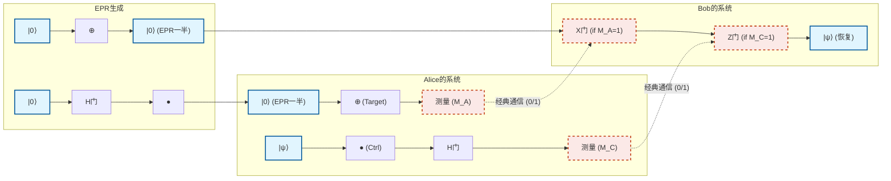

---

## 6.3 超密编码 (Superdense Coding)

量子隐形传态是一个“为了发送 1 个量子比特的状态，消耗一对 EPR 对和 2 个经典比特”的协议，而超密编码（Superdense Coding）在某种意义上可以说是其相反的操作。它使得“仅仅通过物理发送 1 个量子比特，就能向对方传达 2 个经典比特的信息”成为可能。

在经典物理定律下，一个二能级系统（一个比特或一个光子的偏振）最多只能携带 1 个比特（0 或 1）的信息。然而，通过巧妙地利用量子纠缠，表面上突破了这一霍列沃界限（Holevo's bound），这正是超密编码令人惊叹之处。

### 协议细节与贝尔基

假设爱丽丝和鲍勃再次预先共享了一对 EPR 对：

$$
|\Phi^+\rangle_{AB} = \frac{1}{\sqrt{2}} \left( |0\rangle_A |0\rangle_B + |1\rangle_A |1\rangle_B \right)
$$

爱丽丝想向鲍勃发送 2 个比特的经典消息 $b_1 b_2 \in \{00, 01, 10, 11\}$ 。
爱丽丝根据想要发送的消息， **仅对她手中的量子比特 A** 进行特定的单量子比特门操作：

1. **消息为 `00` 的情况：** 爱丽丝什么都不做（应用恒等算符 $I$ ）。
   整体状态不变。
   

$$
|\Psi_{00}\rangle = (I \otimes I) |\Phi^+\rangle = \frac{1}{\sqrt{2}} (|00\rangle + |11\rangle) = |\Phi^+\rangle
$$

2. **消息为 `01` 的情况：** 爱丽丝应用泡利 Z 门。
   

$$
|\Psi_{01}\rangle = (Z \otimes I) |\Phi^+\rangle = \frac{1}{\sqrt{2}} (Z|0\rangle|0\rangle + Z|1\rangle|1\rangle) = \frac{1}{\sqrt{2}} (|00\rangle - |11\rangle) = |\Phi^-\rangle
$$

3. **消息为 `10` 的情况：** 爱丽丝应用泡利 X 门。
   

$$
|\Psi_{10}\rangle = (X \otimes I) |\Phi^+\rangle = \frac{1}{\sqrt{2}} (X|0\rangle|0\rangle + X|1\rangle|1\rangle) = \frac{1}{\sqrt{2}} (|10\rangle + |01\rangle) = |\Psi^+\rangle
$$

4. **消息为 `11` 的情况：** 爱丽丝应用泡利 Z 门，然后再应用泡利 X 门（相当于 $iY$ ）。
   

$$
|\Psi_{11}\rangle = (ZX \otimes I) |\Phi^+\rangle = (Z \otimes I) |\Psi^+\rangle = \frac{1}{\sqrt{2}} (Z|1\rangle|0\rangle + Z|0\rangle|1\rangle) = \frac{1}{\sqrt{2}} (-|10\rangle + |01\rangle) = -|\Psi^-\rangle
$$

   （由于整体上的负号只是一个全局相位，不影响观测概率，这里为了方便，我们整理符号将其与 **$|\Psi^-\rangle = \frac{1}{\sqrt{2}} (|01\rangle - |10\rangle)$** 对应起来考虑。）

爱丽丝将操作后的她自己的量子比特 A，通过量子通信信道（如光纤等）发送给鲍勃。

值得注意的惊人事实：爱丽丝对鲍勃 **在物理上只发送了 1 个量子比特** 。而且她完全没有碰过鲍勃的量子比特。然而，由于爱丽丝的操作，整个系统的状态已经确定性地跃迁到了 4 个完全正交的量子态（我们将这些状态称为 **贝尔基** ）中的某一个。

### 鲍勃的解码与贝尔测量

鲍勃接收到爱丽丝发来的量子比特 A。现在鲍勃手中有量子比特 A 和他原本拥有的量子比特 B。鲍勃对这两个量子比特执行与量子隐形传态中爱丽丝测量时完全相同的“贝尔测量”。

即，以量子比特 A 为控制比特，B 为目标比特应用 CNOT 门，紧接着对量子比特 A 应用阿达马门。通过这种逆变换，纠缠的贝尔基会被恢复成可测量的计算基。

让我们确认一下每种情况下的数学展开过程：

- **状态为 $|\Phi^+\rangle = \frac{1}{\sqrt{2}} (|00\rangle + |11\rangle)$ 的情况（消息 `00`）：** 应用 CNOT 门后变为 $\frac{1}{\sqrt{2}} (|00\rangle + |10\rangle) = \frac{1}{\sqrt{2}} (|0\rangle + |1\rangle) |0\rangle$ 。
  对 A 应用阿达马门后变为 $|0\rangle |0\rangle$ 。
  鲍勃测量后将确定地得到 `00`。

- **状态为 $|\Phi^-\rangle = \frac{1}{\sqrt{2}} (|00\rangle - |11\rangle)$ 的情况（消息 `01`）：** 应用 CNOT 门后变为 $\frac{1}{\sqrt{2}} (|00\rangle - |10\rangle) = \frac{1}{\sqrt{2}} (|0\rangle - |1\rangle) |0\rangle$ 。
  对 A 应用阿达马门后变为 $|1\rangle |0\rangle$ 。
  鲍勃测量后将确定地得到 `10`。（※与爱丽丝操作的比特对应关系可能因线路定义不同而有所差异，但可以唯一区分）

- **状态为 $|\Psi^+\rangle = \frac{1}{\sqrt{2}} (|01\rangle + |10\rangle)$ 的情况（消息 `10`）：** 应用 CNOT 门后变为 $\frac{1}{\sqrt{2}} (|01\rangle + |11\rangle) = \frac{1}{\sqrt{2}} (|0\rangle + |1\rangle) |1\rangle$ 。
  对 A 应用阿达马门后变为 $|0\rangle |1\rangle$ 。
  鲍勃测量后将确定地得到 `01`。

- **状态为 $|\Psi^-\rangle = \frac{1}{\sqrt{2}} (|01\rangle - |10\rangle)$ 的情况（消息 `11`）：** 应用 CNOT 门后变为 $\frac{1}{\sqrt{2}} (|01\rangle - |11\rangle) = \frac{1}{\sqrt{2}} (|0\rangle - |1\rangle) |1\rangle$ 。
  对 A 应用阿达马门后变为 $|1\rangle |1\rangle$ 。
  鲍勃测量后将确定地得到 `11`。

通过这种方式，鲍勃将接收到的 1 个量子比特与手中的 1 个量子比特放在一起测量，就能以 100% 的精度完美读取爱丽丝意图发送的 2 个比特的经典信息。

### 量子通信中的意义

超密编码的真正价值并不局限于将信息的“密度”提高 2 倍。该协议是量子纠缠这种非局部相关性如何能够扩展经典信息传输带宽的决定性证据。

此外，从安全性的角度来看，这也极其重要。如果窃听者伊芙（Eve）拦截了从爱丽丝发送给鲍勃途中的量子比特 A，伊芙也无法获得任何信息。因为如果仅观测单一的量子比特 A，其状态会表现为完全随机的混合态（密度矩阵正比于 $\frac{I}{2}$ ）。信息仅仅被编码在空间上分离的 A 和 B 的“相关性”之中，只得到其中一方在物理上是无法破译的。

---
综上所述，量子隐形传态和超密编码乍看之下是违背直觉、犹如魔法般的现象，但只要忠实遵循量子力学的线性代数公理，它们就会作为极其严密且必然的逻辑推论被推导出来。在下一章中，我们将应用这些基本协议，迈入旨在解决更复杂问题的量子算法世界。

# 第7章：多伊奇-乔萨算法

## 7.1 历史意义：首次明确展示的量子优越性

量子计算机在解决特定问题时可能比经典计算机具有压倒性速度优势的假说，是由理查德·费曼（Richard Feynman）和大卫·多伊奇（David Deutsch）在20世纪80年代的先驱性研究中提出的。然而，对于“具体在什么样的问题上，量子计算能够以数学上可证明的方式超越经典计算？”这一问题，第一个决定性的解答是由大卫·多伊奇和理查德·乔萨（Richard Jozsa）于1992年提出的“多伊奇-乔萨算法（Deutsch-Jozsa Algorithm）”给出的。

本章将从数学的严谨角度揭示这一历史性算法的全貌。虽然该算法并不用于解决实际问题，但它巧妙地结合了量子力学特有的“叠加（Superposition）”、“干涉（Interference）”以及“相位反冲（Phase Kickback）”现象，证明了可以极大地削减计算复杂度的阶数。

## 7.2 问题设定：常数函数，还是平衡函数？

首先，我们定义算法需要解决的问题。假设我们得到了一个黑盒（预言机，Oracle）。这个预言机会接收一个 $n$ 比特的输入 $x \in \{0, 1\}^n$ ，并计算返回一个1比特输出 $f(x) \in \{0, 1\}$ 的函数 **$f$** 。

在这里，这个函数 **$f$** 被赋予了一个强有力的承诺（Promise），即“必须满足以下两种性质中的某一种”：

1. **常数函数（Constant Function）** ：对于任意输入 $x$ ，始终返回 $f(x) = 0$ 或始终返回 $f(x) = 1$ 。
2. **平衡函数（Balanced Function）** ：在所有输入 $x$ 中，对恰好一半的输入返回 $f(x) = 0$ ，对剩下的一半返回 $f(x) = 1$ 。

我们的目标是，在将对预言机的查询（Query）次数降至最低的前提下，判断“给定的预言机 **$f$** 究竟是常数函数还是平衡函数”。

### 经典计算中的局限性

考虑用经典计算机解决这个问题的情况。函数 **$f$** 的输入模式总共有 $N = 2^n$ 种。

假设最坏的情况。如果从第一次查询开始，连续对 $2^{n-1}$ 次（即总体的一半）输入得到了相同的输出（例如：全都是 $0$ ）。此时，函数既可能是常数函数（剩下的一半也全都是 $0$ ），也可能是平衡函数（剩下的一半全都是 $1$ ），这两种可能性依然同时存在。

因此，为了让经典计算机能够以100%的确定性判断它是常数函数还是平衡函数， **最坏的情况下需要 $2^{n-1} + 1$ 次** 查询。这是一个随着输入比特数 $n$ 呈指数级增长的次数。也就是说，经典的计算复杂度（查询复杂度）为 $O(2^n)$ 。

令人惊奇的是，如果使用量子计算，只需对这个问题进行 **仅1次的查询（1 query）** ，就能以100%的概率做出正确判断。这正是量子优越性的精髓所在。

## 7.3 量子预言机与相位反冲的几何学

为了构建量子算法，首先必须将经典函数 **$f(x)$** 重新表述为满足量子力学要求（幺正性 = 可逆性）的形式。为此引入的概念便是“量子预言机（Quantum Oracle）”。

### 量子预言机 $U_f$

我们准备一个输入寄存器（ $n$ 个量子比特）和一个目标寄存器（ $1$ 个量子比特）。表示预言机的幺正算符 **$U_f$** 对计算基态的作用如下：

$$
U_f |x\rangle |y\rangle = |x\rangle |y \oplus f(x)\rangle
$$

这里， $\oplus$ 表示模2加法（XOR）。这种变换只要再次应用其自身就能恢复到原始状态（ $U_f^2 = I$ ），因此显然是可逆且幺正的。

### 相位反冲（Phase Kickback）

在量子信息科学中，“相位反冲”是最重要且最反直觉的技巧之一。让我们看看如果将目标寄存器的状态设定为经过阿达马门（Hadamard gate）处理后的叠加态 $|-\rangle$ ，而不是经典的 $|0\rangle$ 或 $|1\rangle$ ，会发生什么情况。

$$
|-\rangle = \frac{|0\rangle - |1\rangle}{\sqrt{2}}
$$

将这个状态输入到目标寄存器中，并应用预言机 **$U_f$** ：

$$
U_f |x\rangle |-\rangle = U_f \left( |x\rangle \frac{|0\rangle - |1\rangle}{\sqrt{2}} \right)
$$

$$
= \frac{1}{\sqrt{2}} \left( U_f |x\rangle |0\rangle - U_f |x\rangle |1\rangle \right)
$$

$$
= \frac{1}{\sqrt{2}} \left( |x\rangle |0 \oplus f(x)\rangle - |x\rangle |1 \oplus f(x)\rangle \right)
$$

在这里，根据 $f(x)$ 的值进行分类讨论：
- $f(x) = 0$ 的情况：
  状态为 $\frac{1}{\sqrt{2}} ( |x\rangle |0\rangle - |x\rangle |1\rangle ) = |x\rangle |-\rangle$ 。
- $f(x) = 1$ 的情况：
  状态为 $\frac{1}{\sqrt{2}} ( |x\rangle |1\rangle - |x\rangle |0\rangle ) = - |x\rangle |-\rangle$ 。

将这些结合在一起，就能得到如下美妙的等式：

$$
U_f |x\rangle |-\rangle = (-1)^{f(x)} |x\rangle |-\rangle
$$

这是一个令人惊讶的结果。目标寄存器的状态 $|-\rangle$ 完全没有发生变化，但函数 **$f(x)$** 的求值结果却作为“相位（Phase）的符号”，被“反冲（Kickback）”到了输入寄存器 **$|x\rangle$** 一侧。由此，我们就可以将信息编码为振幅的相位。

## 7.4 多伊奇-乔萨算法：电路图与完整的数学公式推导

在此，我们将从量子电路和数学公式两个方面完整地描述该算法的全貌。

### 量子电路图

以下是展示多伊奇-乔萨算法量子电路的图示。

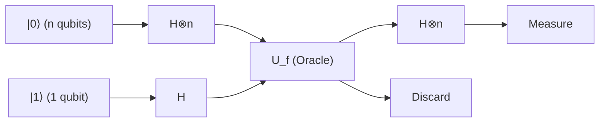

### 步骤1：初始状态的准备

将作为输入寄存器的 $n$ 个量子比特初始化为 $|0\rangle^{\otimes n}$ ，将作为目标寄存器的1个量子比特初始化为 $|1\rangle$ 。

$$
|\psi_0\rangle = |0\rangle^{\otimes n} |1\rangle
$$

### 步骤2：对所有量子比特应用阿达马门

对所有的量子比特应用阿达马门（ $H$ ），以生成完全的叠加态。
针对 $n$ 个量子比特的阿达马变换 $H^{\otimes n}$ 的作用如下：

$$
H^{\otimes n} |0\rangle^{\otimes n} = \frac{1}{\sqrt{2^n}} \sum_{x \in \{0,1\}^n} |x\rangle
$$

因此，整个系统的状态将如下所示：

$$
|\psi_1\rangle = \left( \frac{1}{\sqrt{2^n}} \sum_{x \in \{0,1\}^n} |x\rangle \right) \otimes \left( \frac{|0\rangle - |1\rangle}{\sqrt{2}} \right)
$$

$$
= \frac{1}{\sqrt{2^n}} \sum_{x=0}^{2^n-1} |x\rangle |-\rangle
$$

### 步骤3：应用量子预言机（相位反冲）

此时应用预言机 **$U_f$** 。由于上一节中证明的相位反冲效应，每个基态 $|x\rangle$ 的相位都会乘上 $(-1)^{f(x)}$ 。

$$
|\psi_2\rangle = U_f |\psi_1\rangle = \frac{1}{\sqrt{2^n}} \sum_{x \in \{0,1\}^n} (-1)^{f(x)} |x\rangle |-\rangle
$$

在这一阶段，计算结果 **$f(x)$** 的所有信息（共 $2^n$ 个），已经通过一次运算以叠加态各个相位的形式被并行地嵌入其中。这被称为“量子并行性（Quantum Parallelism）”。

### 步骤4：输入寄存器中发生干涉

目标寄存器在此之后不再使用，因此可以忽略。我们对输入寄存器的 $n$ 个量子比特再次应用阿达马变换 $H^{\otimes n}$ 。
对于任意基底 $|x\rangle$ ， $H^{\otimes n}$ 的作用可以表示为如下的通用公式：

$$
H^{\otimes n} |x\rangle = \frac{1}{\sqrt{2^n}} \sum_{z \in \{0,1\}^n} (-1)^{x \cdot z} |z\rangle
$$

其中， $x \cdot z$ 表示按位的内积 $x \cdot z = x_1 z_1 \oplus x_2 z_2 \oplus \dots \oplus x_n z_n$ 。
将其应用到 $|\psi_2\rangle$ 的输入寄存器部分，最终状态 $|\psi_3\rangle$ 将展开如下：

$$
|\psi_3\rangle = H^{\otimes n} \left( \frac{1}{\sqrt{2^n}} \sum_{x} (-1)^{f(x)} |x\rangle \right)
$$

$$
= \frac{1}{\sqrt{2^n}} \sum_{x} (-1)^{f(x)} \left( \frac{1}{\sqrt{2^n}} \sum_{z} (-1)^{x \cdot z} |z\rangle \right)
$$

$$
= \frac{1}{2^n} \sum_{z \in \{0,1\}^n} \left( \sum_{x \in \{0,1\}^n} (-1)^{f(x) + x \cdot z} \right) |z\rangle
$$

这就是表示测量前一刻量子状态的极其重要的数学公式。量子力学上的“干涉”就发生在这个求和 $\sum_x$ 之中。

### 步骤5：测量与结果的分析

在算法的最后，我们在计算基底上测量输入寄存器的 $n$ 个量子比特。
我们感兴趣的是，所有量子比特都为 $0$ ，即状态 **$|0\rangle^{\otimes n}$** 被测量出来的概率。让我们考虑上述公式中 $z = 00\dots0$ 的情况。此时，对于任意的 $x$ 都有 $x \cdot 0 = 0$ ，因此状态 **$|0\rangle^{\otimes n}$** 的振幅（系数）可以计算如下：

$$
\text{Amplitude of } |0\rangle^{\otimes n} = \frac{1}{2^n} \sum_{x \in \{0,1\}^n} (-1)^{f(x)}
$$

这里，根据最初的承诺（Promise），我们来验证两种情况。

#### 情况1：函数 $f$ 为常数函数的情况
始终为 $f(x) = 0$ 或始终为 $f(x) = 1$ 。
- 如果始终为 $0$ ，则 $(-1)^{f(x)} = 1$ ，和为 $\sum 1 = 2^n$。振幅为 $\frac{2^n}{2^n} = 1$ 。
- 如果始终为 $1$ ，则 $(-1)^{f(x)} = -1$ ，和为 $\sum -1 = -2^n$。振幅为 $\frac{-2^n}{2^n} = -1$ 。

因为测量概率 $P(0)$ 是振幅绝对值的平方，所以：

$$
P(00\dots0) = | \pm 1 |^2 = 1
$$

也就是说， **如果函数为常数函数，将以100%的概率测量出 $|0\rangle^{\otimes n}$** 。

#### 情况2：函数 $f$ 为平衡函数的情况
满足 $f(x) = 0$ 的 $x$ 和满足 $f(x) = 1$ 的 $x$ 刚好各占一半（分别有 $2^{n-1}$ 个）。
因此， $(-1)^{f(x)}$ 将有一半是 $+1$ ，剩下的一半是 $-1$ ，将它们全部相加会完全抵消变为零（完全的相消干涉）。

$$
\text{Amplitude of } |0\rangle^{\otimes n} = \frac{1}{2^n} \left( 2^{n-1}(+1) + 2^{n-1}(-1) \right) = 0
$$

因为测量概率 $P(0)$ 是振幅绝对值的平方，所以：

$$
P(00\dots0) = | 0 |^2 = 0
$$

也就是说， **如果函数为平衡函数， $|0\rangle^{\otimes n}$ 被测量出的概率为0%，必然会测量出至少有一个比特为 $1$ 的状态** 。

## 7.6 具体示例： $n=2$ 情况下的完整追踪

除了抽象的数学公式，让我们来追踪一下 $n=2$ （2个量子比特输入）情况下的具体状态向量，从而亲身感受一下该算法的行为。输入模式共有 $x \in \{00, 01, 10, 11\}$ 这4种情况。

### 常数函数的情况： $f(x) = 1$ （全为1）
应用预言机前，状态 $|\psi_1\rangle$ 的输入寄存器部分如下所示：

$$
\frac{1}{2} ( |00\rangle + |01\rangle + |10\rangle + |11\rangle )
$$

应用预言机后，由于相位反冲，所有的项都会乘上 $(-1)^{f(x)} = -1$ ：

$$
|\psi_2\rangle_{in} = -\frac{1}{2} ( |00\rangle + |01\rangle + |10\rangle + |11\rangle )
$$

对此再次应用 $H^{\otimes 2}$ 。利用 $H^{\otimes 2} (|00\rangle + |01\rangle + |10\rangle + |11\rangle) = 2 |00\rangle$ 这一事实，可得：

$$
|\psi_3\rangle_{in} = - |00\rangle
$$

测量结果将以 $100\%$ 的概率变为 $00$ 。

### 平衡函数的情况： $f(00)=0, f(01)=1, f(10)=1, f(11)=0$
应用预言机后，由于相位反冲，只有满足 $f(x)=1$ 的项会带上负号：

$$
|\psi_2\rangle_{in} = \frac{1}{2} ( |00\rangle - |01\rangle - |10\rangle + |11\rangle )
$$

对此应用 $H^{\otimes 2}$ 。计算 $H^{\otimes 2}$ 对各个基底的作用并代入，如果我们关注 $|00\rangle$ 的系数，会发现它变成了 $\frac{1}{4} (1 - 1 - 1 + 1) = 0$ ，被完美地抵消（相消干涉）了。
整理剩余的项，最终状态为 $|11\rangle$ （在这个例子中会以100%的概率测量出11，但对于一般的平衡函数，会测量出除00之外的某个状态）。由此我们可以确认，测量出 $00$ 的概率完全为0%。

## 7.7 结论：量子干涉带来的计算飞跃

多伊奇-乔萨算法的惊人之处在于，它通过相位反冲将 $2^n$ 个信息展开到了相位空间中，并控制了在最后的阿达马变换中产生的“干涉（Interference）”。

- 在 **常数函数** 的情况下：来自所有路径的波会发生“相长干涉（Constructive Interference）”，振幅将100%集中在状态 **$|0\rangle^{\otimes n}$** 上。
- 在 **平衡函数** 的情况下：正相波与负相波会发生“相消干涉（Destructive Interference）”，从而完全抵消状态 **$|0\rangle^{\otimes n}$** 的振幅。

正是凭借这一绝妙的数学结构，对于那些在经典计算机中最坏情况需要 $O(2^n)$ 次（具体来说是 $2^{n-1} + 1$ 次）查询的问题，量子计算机 **仅需1次查询（ $O(1)$ ）** ，就能以确定性（100%的正确率）的方式将其解开。

本章所证明的这一事实，成为了人类历史上一个极其重要的里程碑，它表明：通过将量子力学原理应用于信息处理，我们可以从物理层面上打破经典信息理论的局限性。

# 第8章：Shor算法与现代密码学的威胁

## 8.1 引言：RSA密码的数学原理与大整数分解的困难性

现代数字社会中，保障互联网安全通信的基础是公钥密码体系。其中最为普及的RSA密码，其安全性证明依赖于“对大合成数进行质因数分解在计算理论上极其困难”这一数学非对称性（单向函数的性质）。在本章中，我们将毫不妥协、严谨地揭示量子计算机是如何从根本上瓦解RSA密码的——其决定性的武器正是“Shor算法（Shor's Algorithm）”的理论架构。

首先，让我们对RSA密码的机制进行数学形式化描述。RSA密码的密钥生成始于随机选取两个巨大的素数 $p$ 与 $q$（目前推荐长度均在2048位以上）。计算它们的乘积即合成数 $N = pq$，并将其作为公钥的一部分公开。接着，计算欧拉函数 $\phi(N)$。根据素数的性质，可知 $\phi(N) = (p-1)(q-1)$。

加密密钥指数 $e$ 的选取需满足 $1 < e < \phi(N)$ 且 $\text{gcd}(e, \phi(N)) = 1$（即与 $\phi(N)$ 互质）。然后，计算作为私钥的解密指数 $d$，使其满足同余方程 $ed \equiv 1 \pmod{\phi(N)}$。利用扩展欧几里得算法，可以在多项式时间内轻松求得该值。

设明文为整数 $M$（其中 $0 \le M < N$），加密过程通过模 $N$ 的指数运算进行：

$$
C \equiv M^e \pmod{N}
$$

进行解密时，利用私钥 $d$ 进行同样的模幂计算：

$$
M' \equiv C^d \pmod{N}
$$

根据欧拉定理，有 $C^d \equiv M^{ed} \equiv M^{1 + k\phi(N)} \equiv M \pmod{N}$ 成立，因此保证了原始明文 $M$ 能够被完全恢复。

这里的核心在于：要从公开的信息 $(N, e)$ 中求得私钥 $d$，就必须获知 $\phi(N)$，而这要求将 $N$ 分解为质因数 $p$ 和 $q$。若使用经典计算机，即使采用目前已知最快的因数分解算法——普通数域筛选法（General Number Field Sieve, GNFS），其计算复杂度也属于亚指数时间 $O\left(\exp\left(c (\log N)^{1/3} (\log \log N)^{2/3}\right)\right)$。这意味着计算时间随 $N$ 的比特数呈爆炸式增长，据估计，使用经典超级计算机对一个2048位的整数进行质因数分解，所需的时间将超过宇宙的年龄。

然而，彼得·肖尔（Peter Shor）于1994年提出的量子算法从根本上颠覆了这一前提。Shor算法能在 $O((\log N)^3)$、或者经优化后达到 $\tilde{O}((\log N)^2)$ 的多项式时间内完成质因数分解。这代表了相对于经典计算的“超多项式加速（Super-polynomial Speedup）”，即事实上的指数级加速，表明目前广泛使用的RSA密码将被量子计算机彻底攻破。

## 8.2 归约为求阶问题（Reduction to Order-Finding Problem）

Shor算法的天才洞见在于：“并非直接去求解质因数分解问题，而是将其归约为了寻找周期的问题”。纯数论定理已经证明，质因数分解与所谓的“求阶问题（Order-Finding Problem）”是等价的。这一归约过程本身完全是经典算法，并不需要量子计算。

让我们梳理对给定的合成数 $N$ 进行因数分解的具体步骤。首先，随机选取一个满足 $1 < a < N$ 的整数 $a$。利用欧几里得算法计算最大公约数 $\text{gcd}(a, N)$。若该值大于 $1$，则说明我们非常幸运地直接找到了 $N$ 的非平凡因子，计算随即结束（然而，对于密码学中使用的大数，偶然发生这种情况的概率微乎其微）。

若 $\text{gcd}(a, N) = 1$，则 $a$ 与 $N$ 互质。此时，我们定义如下模指数函数：

$$
f(x) = a^x \bmod N
$$

用群论的语言来说，$a$ 是乘法群 $(\mathbb{Z}/N\mathbb{Z})^\times$ 的元素，而函数 $f(x)$ 构成了从整数加法群 $\mathbb{Z}$ 到乘法群 $(\mathbb{Z}/N\mathbb{Z})^\times$ 的同态映射。根据有限群的性质，该函数必然具有周期性。也就是说，存在某个最小的正整数 $r$，满足以下方程：

$$
a^r \equiv 1 \pmod{N}
$$

这个最小正整数 $r$ 被称为 $a$ 模 $N$ 的“阶（Order）”，或者函数 $f(x)$ 的“周期（Period）”。

若能够找到这个阶 $r$，且 $r$ 为偶数，并且满足 $a^{r/2} \not\equiv -1 \pmod{N}$，那么我们便能获得分解因数的强有力线索：

$$
a^r - 1 \equiv 0 \pmod{N}
$$

$$
(a^{r/2} - 1)(a^{r/2} + 1) \equiv 0 \pmod{N}
$$

该方程意味着 $N$ 能整除 $(a^{r/2} - 1)$ 与 $(a^{r/2} + 1)$ 的乘积。但是，由于 $a^{r/2} \not\equiv 1$（因为 $r$ 是最小周期）且 $a^{r/2} \not\equiv -1$（根据假设条件），因此 $N$ 无法单独整除这两项中的任意一项。由此可知，$N$ 的质因数必然分散包含在这两项之中。
结论是，通过计算：

$$
p = \text{gcd}(a^{r/2} - 1, N)
$$

$$
q = \text{gcd}(a^{r/2} + 1, N)
$$

便能确定地找出 $N$ 的非平凡质因数。

通过上述经典归约，问题被彻底聚焦于一点：“如何快速找到函数 $f(x) = a^x \bmod N$ 的周期 $r$”。在经典计算机上，为了寻找该周期，需要依次计算 $x=1, 2, 3, \dots$，而 $r$ 的阶数可能与 $N$ 相当，因而最终需要耗费指数级的时间。至此，量子计算机终于登上了舞台。

## 8.3 量子傅里叶变换（QFT）的严格数学形式及其作用

用于在多项式时间内提取函数 $f(x)$ 隐藏周期 $r$ 的量子算法核心，正是“量子傅里叶变换（Quantum Fourier Transform, QFT）”。QFT是经典离散傅里叶变换（DFT）在量子力学中的类比，是作用在状态空间概率振幅上的酉变换。

在维度为 $M = 2^n$ 的希尔伯特空间 $\mathcal{H}$ 中，量子傅里叶变换对计算基底 $|j\rangle$（$j = 0, 1, \dots, M-1$）的作用被严格定义为：

$$
\text{QFT} |j\rangle = \frac{1}{\sqrt{M}} \sum_{k=0}^{M-1} e^{2\pi i j k / M} |k\rangle
$$

对于任意量子态 **$|\psi\rangle$** ，根据线性性质，其作用如下：

$$
\text{QFT} \sum_{j=0}^{M-1} x_j |j\rangle = \sum_{k=0}^{M-1} \left( \frac{1}{\sqrt{M}} \sum_{j=0}^{M-1} x_j e^{2\pi i j k / M} \right) |k\rangle = \sum_{k=0}^{M-1} y_k |k\rangle
$$

此处得到的新振幅 $y_k$ 与通过经典离散傅里叶变换得到的系数完全一致。然而，经典的快速傅里叶变换（FFT）计算整个向量需要 $O(M \log M) = O(n 2^n)$ 的时间，而QFT仅需 $O(n^2)$ 个量子门操作即可完成对 $n$ 个量子比特“状态”的变换，实现了计算复杂度的急剧降低。

为了理解为何仅需 $O(n^2)$ 如此少量的量子门便能实现该变换，需要将QFT得到的态表示为张量积的形式。将整数 $j$ 写成二进制形式 $j = j_1 2^{n-1} + j_2 2^{n-2} + \dots + j_n 2^0$（其中 $j_1$ 为最高有效位，$j_n$ 为最低有效位），此时输出态可以巧妙地分解为如下 $n$ 个独立量子比特态的张量积：

$$
\text{QFT} |j_1 j_2 \dots j_n\rangle = \frac{1}{\sqrt{2^n}} \left(|0\rangle + e^{2\pi i 0.j_n} |1\rangle\right) \otimes \left(|0\rangle + e^{2\pi i 0.j_{n-1} j_n} |1\rangle\right) \otimes \dots \otimes \left(|0\rangle + e^{2\pi i 0.j_1 j_2 \dots j_n} |1\rangle\right)
$$

其中 $0.j_l \dots j_m$ 表示二进制小数，即 $0.j_l \dots j_m = j_l/2 + j_{l+1}/4 + \dots + j_m/2^{m-l+1}$。

这一数学公式极具启发性。它表明第 $m$ 个量子比特的状态相位旋转仅取决于输入比特 $j_{n-m+1}$ 到 $j_n$ 的信息。因此，构建用于制备该状态的量子线路，仅需递归组合作用于单量子比特的阿达马门 $H$ 与作用于两量子比特间的受控相位移动门 $R_k$（将相位旋转 $e^{2\pi i / 2^k}$ 的门）即可。通过对第1个量子比特应用 $H$，接着由第2、第3个比特控制应用 $R_2, R_3, \dots$，并在每个比特上重复类似操作，总共只需 $n + (n-1) + \dots + 1 = n(n+1)/2 = O(n^2)$ 个量子门便可精确实现QFT。

## 8.4 利用叠加态进行周期寻找的量子线路

理论准备就绪后，我们来追踪Shor算法整体的量子线路以及各个步骤中量子态的时间演化（State Evolution）。该算法使用两个量子寄存器。
第1寄存器由 $t \approx 2 \log_2 N$ 个量子比特组成，其状态空间维度为 $M = 2^t$（选取 $t$ 时需满足 $M \ge N^2$ 的条件）。第2寄存器包含 $L \approx \log_2 N$ 个量子比特，用于存储计算结果。

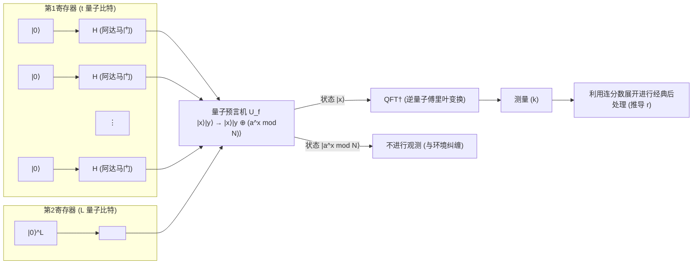

 **【步骤1：初始化与叠加态生成】** 
将整个系统置于初始状态 **$|\psi_0\rangle$** $= |0\rangle^{\otimes t} |0\rangle^{\otimes L}$。
随后，对第1寄存器的所有量子比特应用阿达马门 $H^{\otimes t}$，生成包含指数级数量状态的等概率叠加态：

$$
|\psi_1\rangle = \frac{1}{\sqrt{M}} \sum_{x=0}^{M-1} |x\rangle |0\rangle
$$

此时，第1寄存器同时保持了从 $0$ 到 $M-1$ 所有整数的状态。

 **【步骤2：量子预言机进行函数求值】** 
应用量子预言机 $U_f$，在保持叠加态的同时计算函数 $f(x) = a^x \bmod N$，并将计算结果存入第2寄存器：

$$
|\psi_2\rangle = U_f |\psi_1\rangle = \frac{1}{\sqrt{M}} \sum_{x=0}^{M-1} |x\rangle |a^x \bmod N\rangle
$$

该状态 **$|\psi_2\rangle$** 是输入 $x$ 与输出 $f(x)$ 高度纠缠的态。

 **【步骤3：观测第2寄存器（概念性探讨）】** 
为了便于理解理论，我们假设此时对第2寄存器进行了观测（在实际算法中即便省略观测，数学结论也完全相同）。观测会导致第2寄存器塌缩到某个特定值 $y = a^{x_0} \bmod N$，其中 $x_0$ 是满足 $0 \le x_0 < r$ 的某个最小偏移量。
此时，第1寄存器瞬间塌缩为“使函数 $f(x)$ 输出为 $y$ 的所有输入 $x$”的叠加态。由于该函数具有周期 $r$，这些 $x$ 以等间距排列为 $x_0, x_0 + r, x_0 + 2r, \dots$：

$$
|\psi_3\rangle = \frac{1}{\sqrt{A}} \sum_{m=0}^{A-1} |x_0 + m r\rangle \otimes |y\rangle
$$

其中 $A$ 为叠加态中包含的项数，满足 $A \approx M/r$。
关注第1寄存器，这是一个具有周期 $r$ 的梳状（comb-like）概率分布状态。然而，若直接对该状态进行测量，只能以等概率得到随机的 $x_0 + mr$；由于偏移量 $x_0$ 未知，我们依然无法直接得知周期 $r$。此时便需要借助QFT。

 **【步骤4：应用逆量子傅里叶变换】** 
对第1寄存器应用逆量子傅里叶变换（QFT$^\dagger$）：

$$
\text{QFT}^\dagger |\psi_3\rangle = \frac{1}{\sqrt{A M}} \sum_{k=0}^{M-1} \sum_{m=0}^{A-1} e^{-2\pi i k (x_0 + m r) / M} |k\rangle
$$

将其按状态 $|k\rangle$ 整理，并考察其概率振幅 $c_k$：

$$
c_k = \frac{1}{\sqrt{A M}} e^{-2\pi i k x_0 / M} \sum_{m=0}^{A-1} e^{-2\pi i k m r / M}
$$

该式中的求和部分是以 $e^{-2\pi i k r / M}$ 为公比的等比数列之和。若相位 $k r / M$ 显著偏离整数，复平面上的向量将在旋转相加中发生相消干涉（Destructive Interference），振幅几乎为 $0$。
反之，当 $k r / M$ 极其接近某个整数 $j$ 时，即 $k \approx j \frac{M}{r}$ 时，复平面上的向量指向相同方向，通过相长干涉（Constructive Interference）使得振幅极大增强。

 **【步骤5：测量与连分数展开】** 
对第1寄存器进行测量，将以极大概率观测到满足 $k \approx j \frac{M}{r}$ 的整数 $k$。两边同除以 $M$，得到如下关系：

$$
\frac{k}{M} \approx \frac{j}{r}
$$

在此，$k$ 与 $M$ 是已知值，但 $j$ 与 $r$ 未知。由于我们选取了满足 $M \ge N^2$ 的 $t$，因而 $k/M$ 对未知分数 $j/r$ 给出了极高精度的逼近，满足 $\left| \frac{k}{M} - \frac{j}{r} \right| \le \frac{1}{2M} < \frac{1}{2r^2}$。
根据丢番图逼近定理（勒让德定理），满足此条件的有理数 $j/r$ 必然包含在实数 $k/M$ 的“连分数展开（Continued Fraction Expansion）”渐近分数中。
因此，借助经典计算机在多项式时间内计算 $k/M$ 的连分数展开，便可将分母确定为周期 $r$。至此，求阶问题得以解决，进而能够求出作为RSA密钥的质因数 $p$ 与 $q$。

## 8.5 为何Shor算法能为经典计算带来指数级加速

Shor算法之所以成为历史性的重大突破，原因在于它并非单纯的启发式算法，而是首个伴有严格数学证明、展示了“相对于经典计算的真正指数级加速”的实用量子算法。其非凡计算能力的本质，在于以下两种量子力学现象的完美融合：

第一是量子并行性。通过使用叠加态，针对 $2^t$ 个多达凌驾于全宇宙原子总数的天文数字级别的输入 $x$，仅需一次操作便可同时完成函数 $f(x)$ 的求值。经典计算机需要耗费数亿年逐一计算的评估任务，在量子体系中一瞬间便得以完成。

然而，根据量子力学公理，一旦进行测量，状态就会塌缩，所能获取的信息仅仅是一个随机的求值结果 $(x, f(x))$。若仅止于此，便与经典计算无异。

真正的奇迹始于第二项关键——量子干涉与全局结构的提取。量子傅里叶变换在指数级庞大的整个状态空间中引发干涉。该操作并非试图获知各个 $f(x)$ 的具体数值，而是仅仅提取整个函数“全局周期性”这一结构性模式。
对应于错误周期的概率振幅，如波峰与波谷相互抵消一般，通过相消干涉彻底泯灭；唯独对应于正确周期 $r$ 的概率振幅，通过相长干涉被极大增强。换言之，大自然本身的物理法则在此充当了计算机的角色，抹去无数错误答案，唯独让正确答案浮出水面。

从隐藏子群问题（Hidden Subgroup Problem, HSP）的视角来看，Shor算法是高效求解“有限阿贝尔群上的 HSP”的通用框架。RSA密码所依赖的交换群求阶问题，完全契合于这一框架。

量子计算机并非无所不能的万能魔杖，无法对任意问题都实现指数级加速。然而，对于这种蕴含“周期性”或“代数结构”的问题，量子干涉这一物理机制从根本上打破了经典计算的极限。这正是Shor算法为传统密码学画上句号、并促使量子信息科学发生爆发式发展的最为深邃而壮美的原因。

# 第9章：Grover算法与振幅放大的几何学

在现代信息科学中，从海量数据集中找出满足特定条件的元素的“搜索问题”是一项极为重要的课题，同时也是计算机科学中最基本的问题之一。如果数据集存在某种结构（例如，元素按字母顺序或数值顺序排序等），则可以使用二分搜索等高效的经典算法，搜索时间可控制在对元素数量 $N$ 来说 $O(\log N)$ 的范围内。然而，在完全随机排列的 **“非结构化数据库（Unstructured Database）”** 中的搜索，在经典计算机的框架下，只能依靠逐个检查元素的线性搜索（Linear Search），对于元素数量 $N$，最坏情况下需要 $N$ 次，平均需要 $N/2$ 次查询，即需要 $O(N)$ 的计算步骤。

然而，由贝尔实验室物理学家洛夫·格罗弗（Lov Grover）于1996年提出的 **Grover算法** ，通过极其巧妙而优美地利用量子力学底层的“叠加（Superposition）”和“干涉（Interference）”原理，成功地以 $O(\sqrt{N})$ 的查询次数解决了这一非结构化搜索问题。这与针对问题规模呈指数级缩短计算时间（Exponential speedup）的Shor算法不同，它提供的是多项式加速的一种，即 **二次加速（Quadratic speedup）** 。然而，考虑到目标非结构化搜索问题普遍出现在从NP完全问题的暴力搜索到密码系统的密钥搜索等几乎所有领域，其应用范围之广与实际影响不可估量。在量子信息科学这一广阔领域中，Grover算法作为最通用且最重要的算法之一，确立了其不可动摇的地位。

本章将针对构成Grover算法核心的 **“振幅放大（Amplitude Amplification）”** 这一深奥机制，从直观的几何视角和毫不妥协的严谨线性代数方法出发，进行即使专业人士阅读也能获得全新领悟的极其详尽的解析。

## 9.1 问题的形式化与初始叠加态的准备

首先，让我们对需要求解的搜索问题进行严格的数学形式化表述。假设存在一个大小为 $N = 2^n$ 的非结构化数据库，每个元素被编码为使用 $n$ 个量子比特表示的计算基态 $|x\rangle$（其中 $x \in \{0, 1\}^n$，即 $x = 0, 1, \dots, N-1$）。假设在这个庞大的数据库空间中，仅存在唯一一个我们希望找出的特定状态（目标状态），我们将这个特殊状态记为 $|w\rangle$。

该问题的目标定义为：“利用给定的黑盒函数（称之为 **预言机（Oracle）** ），以尽可能少的查询次数，并以高概率找出目标状态 $|w\rangle$”。

量子算法的第一步总是从准备同时俯瞰整个搜索空间开始。为了创造出所有可能性均匀叠加的状态，我们对 $n$ 量子比特的初始状态 $|0\rangle^{\otimes n}$ 中的每个量子比特，并行地应用阿达马门 $H$ 作为张量积。由此获得的初始均匀叠加态定义为 $|s\rangle$。

$$
|s\rangle = H^{\otimes n} |0\rangle^{\otimes n} = \frac{1}{\sqrt{N}} \sum_{x=0}^{N-1} |x\rangle
$$

这一状态 **$|s\rangle$** 在希尔伯特空间中，可以明确地分解为目标状态 $|w\rangle$ 与所有其他非目标状态的线性组合。为了使后续的几何解释在直观上更容易理解，我们引入由所有非目标状态均匀叠加而成的新的归一化向量 $|s^\perp\rangle$：

$$
|s^\perp\rangle = \frac{1}{\sqrt{N-1}} \sum_{x \neq w} |x\rangle
$$

根据这一定义，状态 $|s^\perp\rangle$ 与目标状态 $|w\rangle$ 相互正交（ $\langle s^\perp | w \rangle = 0$ ）。于是，初始均匀叠加态 **$|s\rangle$** 就可以在由这两个相互正交的向量 $|w\rangle$ 与 $|s^\perp\rangle$ 所张成的二维希尔伯特子空间上，极其简洁地展开如下：

$$
|s\rangle = \sqrt{\frac{N-1}{N}} |s^\perp\rangle + \frac{1}{\sqrt{N}} |w\rangle
$$

在此，我们引入一个满足 $\sin \theta = \frac{1}{\sqrt{N}}$ 的微小角度 $\theta$（当 $N$ 足够大时， $\theta \approx 1/\sqrt{N}$ ）。这样，该状态便可利用三角函数改写为更为优雅的几何表达形式：

$$
|s\rangle = \cos \theta |s^\perp\rangle + \sin \theta |w\rangle
$$

该数学公式揭示了一个残酷的事实：在初始状态 **$|s\rangle$** 中观测到目标状态 $|w\rangle$ 的概率仅为 $|\sin \theta|^2 = \frac{1}{N}$。Grover算法的终极目标，就是通过反复应用后文详述的预言机与扩散算符的组合，将该状态向量 **$|s\rangle$** 在希尔伯特空间的二维平面内逐渐向 $|w\rangle$ 的方向“旋转”，从而使测量到正确答案的概率无限逼近其理论极限 $1$ （即放大振幅）。

## 9.2 量子预言机（Quantum Oracle）的定义与相位反冲

作为算法迭代单元——“Grover迭代（Grover iteration）”的第一个关键组件，是用于识别目标数据是否为正确答案的预言机 $O$。在量子计算中，预言机必须被严格定义为一个根据输入的计算基态 $|x\rangle$ 是否为目标状态 $|w\rangle$ 而施加特定作用的幺正算符。

通常，该预言机使用一个辅助量子比特（Ancilla qubit），以可逆形式实现函数的评估。我们将表示搜索条件的布尔函数 $f(x)$ 定义为：当 $x = w$ 时 $f(w) = 1$，而对于所有其他 $x \neq w$ 返回 $f(x) = 0$。此时，预言机的作用可使用异或（XOR） $\oplus$ 表示如下：

$$
O_f \left( |x\rangle \otimes |y\rangle \right) = |x\rangle \otimes |y \oplus f(x)\rangle
$$

在这里，Grover算法展现了其巧妙之处。我们将辅助量子比特 $|y\rangle$ 不作为计算基态，而是预先初始化为叠加态 $|-\rangle = \frac{1}{\sqrt{2}}(|0\rangle - |1\rangle)$ 后再行输入。此时，就会发生被称为 **相位反冲（Phase Kickback）** 的量子特有惊人现象。让我们进行具体计算：

$$
\begin{align*}
O_f \left( |x\rangle \otimes |-\rangle \right) &= O_f \left( |x\rangle \otimes \frac{|0\rangle - |1\rangle}{\sqrt{2}} \right) \\
&= \frac{1}{\sqrt{2}} \left( O_f |x\rangle |0\rangle - O_f |x\rangle |1\rangle \right) \\
&= \frac{1}{\sqrt{2}} \left( |x\rangle |0 \oplus f(x)\rangle - |x\rangle |1 \oplus f(x)\rangle \right)
\end{align*}
$$

我们将该式分为输入状态为非目标状态与目标状态两种情况来分别计算。
如果 $x \neq w$（即 $f(x) = 0$），则状态完全不发生变化：

$$
\frac{1}{\sqrt{2}} \left( |x\rangle |0\rangle - |x\rangle |1\rangle \right) = |x\rangle |-\rangle
$$

另一方面，如果 $x = w$（即 $f(w) = 1$），则辅助量子比特的状态在 $0 \to 1$ 和 $1 \to 0$ 之间翻转，整体状态前方出现一个负号：

$$
\frac{1}{\sqrt{2}} \left( |x\rangle |1\rangle - |x\rangle |0\rangle \right) = - \left( |x\rangle \frac{|0\rangle - |1\rangle}{\sqrt{2}} \right) = - |x\rangle |-\rangle
$$

这一结果至关重要。辅助量子比特 $|-\rangle$ 的状态在操作前后完全不变，仅仅起到了“催化剂”的作用。取而代之的是，函数评估结果 $f(x)$ 作为主量子寄存器 $|x\rangle$ 的 **振幅符号（相位）** 被“反冲（踢回）”了过来。利用这一性质，我们可以省略对辅助量子比特的描述，将预言机对主寄存器的作用重新定义为一个简洁且优雅的新幺正算符 $U_w$：

$$
U_w |x\rangle = (-1)^{f(x)} |x\rangle = \begin{cases} -|x\rangle & (x = w) \\ |x\rangle & (x \neq w) \end{cases}
$$

这一相位预言机 $U_w$ 可以利用狄拉克符号的投影算符表示显式写为：

$$
U_w = I - 2|w\rangle\langle w|
$$

其中 $I$ 是 $N \times N$ 的恒等算符。从几何直觉上讲，该预言机 $U_w$ 正是在由 $|s^\perp\rangle$ 与 $|w\rangle$ 所张成的二维实平面中， **以横轴 $|s^\perp\rangle$ 轴为对称轴进行状态向量镜像（Reflection）** 的算符。因为只有目标状态的分量符号被反转，而非目标状态的分量则被原样保持。

## 9.3 扩散算符（Diffusion Operator）与基于均值反转的数学结构

利用预言机给目标状态打上“负相位标记”后，我们接着应用Grover迭代的第二个组件—— **扩散算符（Diffusion Operator）** $U_s$。该算符的作用是，将量子态中各元素的振幅围绕整体平均值进行反转，从而剧烈放大被标记状态的概率振幅。

扩散算符 $U_s$ 在数学上定义如下：

$$
U_s = 2|s\rangle\langle s| - I
$$

该算符为何被称为“基于均值的反转（Inversion about the mean）”？让我们使用一般的叠加态 $|\psi\rangle = \sum_{x=0}^{N-1} \alpha_x |x\rangle$ 来严格证明其内在机制。

首先，计算均匀叠加态 $|s\rangle$ 与当前状态 $|\psi\rangle$ 的内积：

$$
\langle s | \psi \rangle = \left( \frac{1}{\sqrt{N}} \sum_{y=0}^{N-1} \langle y| \right) \left( \sum_{x=0}^{N-1} \alpha_x |x\rangle \right) = \frac{1}{\sqrt{N}} \sum_{x=0}^{N-1} \alpha_x
$$

将该内积的值再除以 $\sqrt{N}$，即可得到所有振幅 $\alpha_x$ 的算术平均值（将其定义为 $\mu$）。即可以表示为 $\mu = \frac{1}{N} \sum_{x=0}^{N-1} \alpha_x = \frac{1}{\sqrt{N}} \langle s | \psi \rangle$。因此，有 $\langle s | \psi \rangle = \sqrt{N} \mu$。

利用这一关系式，我们计算 $U_s$ 作用于状态 $|\psi\rangle$ 上的结果：

$$
\begin{align*}
U_s |\psi\rangle &= (2|s\rangle\langle s| - I) \sum_{x=0}^{N-1} \alpha_x |x\rangle \\
&= 2|s\rangle \langle s | \psi \rangle - \sum_{x=0}^{N-1} \alpha_x |x\rangle \\
&= 2 \left( \frac{1}{\sqrt{N}} \sum_{x=0}^{N-1} |x\rangle \right) (\sqrt{N} \mu) - \sum_{x=0}^{N-1} \alpha_x |x\rangle \\
&= 2 \mu \sum_{x=0}^{N-1} |x\rangle - \sum_{x=0}^{N-1} \alpha_x |x\rangle \\
&= \sum_{x=0}^{N-1} (2\mu - \alpha_x) |x\rangle
\end{align*}
$$

计算所得状态中每个基态 $|x\rangle$ 的新振幅变为 $(2\mu - \alpha_x)$。该式可以变形为 $\mu + (\mu - \alpha_x)$。这表明，原始振幅 $\alpha_x$ 以整体平均值 $\mu$ 为基准，恰好翻转到了对称的另一侧。这正是扩散算符被称为“基于均值的反转”的数学根据。

通过预言机 $U_w$ 的作用，唯独目标状态 $|w\rangle$ 的振幅变成了负值（ $-\alpha_w$ ）。而其余数量庞大的 $N-1$ 个非目标状态的振幅仍保持为正。因此，整体平均值 $\mu$ 虽然略微降低，但依然保持为正值。此时若应用该扩散算符，目标状态的“大幅负振幅”就会围绕“正平均值 $\mu$ ”进行翻转。其结果是，目标状态的振幅将 **急剧跃升（放大）为远大于原始振幅的正值** 。

反之，由于非目标状态的振幅略大于平均值，当围绕平均值反转时，它们会被压低至比原值略小的正值。这一过程正是该算法的精髓所在，即利用量子干涉相消不需要状态的概率，并相长干涉增强目标状态的概率。

重回几何视角，算符表达式 $U_s = 2|s\rangle\langle s| - I$ 清晰地表明，该操作本质上是 **以初始状态向量 $|s\rangle$ 轴为对称轴对状态向量进行镜像（Reflection）的运算** 。

## 9.4 振幅放大的几何学解释（基于双重镜像的纯旋转）

Grover算法的单次迭代单元—— **Grover算符 $G$** ，定义为预言机 $U_w$ 与扩散算符 $U_s$ 的相继作用，即两者的乘积：

$$
G = U_s U_w = (2|s\rangle\langle s| - I) (I - 2|w\rangle\langle w|)
$$

在此，由欧几里得几何与线性代数交织出的极其优美的定理成为主角：“以两条相交直线为对称轴的两次相继镜像（Reflection）之复合，等价于旋转角为两直线夹角两倍的纯旋转（Rotation）”。

根据先前的分析，无论经历何种运算，状态向量都保证始终停留在由 $|s^\perp\rangle$ 与 $|w\rangle$ 所张成的二维实向量空间（平面）内。我们在此平面内重新审视各算符的作用：

1. **预言机 $U_w$ 的镜像作用** ：
   对于当前状态向量， $U_w$ 仅反转直角坐标系中纵轴 $|w\rangle$ 方向分量的符号。在几何上，这是 **以横轴 $|s^\perp\rangle$ 轴为对称轴的镜像** 。
2. **扩散算符 $U_s$ 的镜像作用** ：
   随后的 $U_s$ 则将状态向量 **以平面内倾斜了角度 $\theta$ 的向量 $|s\rangle$ 方向为对称轴进行镜像** 。

初始状态 $|s\rangle$ 相比横轴 $|s^\perp\rangle$ 向上方倾斜了角度 $\theta$（其中 $\sin \theta = \frac{1}{\sqrt{N}}$）。
因此，在对 $|s^\perp\rangle$ 轴进行镜像之后，紧接着对与其夹角为 $\theta$ 的 $|s\rangle$ 轴进行镜像，整体作用 $G$ 便成为 **在该二维平面内将状态向量逆时针旋转 $2\theta$ 的运算** 。

让我们利用旋转矩阵，在数学上严格证明这一直观的几何洞察。将完成 $t$ 次迭代后的状态记为 $|\psi_t\rangle$。初始状态对应 $t=0$，即 $|\psi_0\rangle = |s\rangle = \cos \theta |s^\perp\rangle + \sin \theta |w\rangle$。

我们使用数学归纳法证明：在经过 $t$ 次迭代后，状态总是可以简洁地表示为：

$$
|\psi_t\rangle = G^t |s\rangle = \cos((2t+1)\theta) |s^\perp\rangle + \sin((2t+1)\theta) |w\rangle
$$

当 $t=0$ 时显然成立。假设 $|\psi_t\rangle$ 满足上述形式，我们计算再进行一次迭代后的状态 $|\psi_{t+1}\rangle = G |\psi_t\rangle$。
首先，作用预言机 $U_w$， $|w\rangle$ 分量的符号发生反转：

$$
U_w |\psi_t\rangle = \cos((2t+1)\theta) |s^\perp\rangle - \sin((2t+1)\theta) |w\rangle
$$

接下来，作用扩散算符 $U_s = 2|s\rangle\langle s| - I$。为了进行此项计算，引入在基底向量 $\{|s^\perp\rangle, |w\rangle\}$ 下的 2×2 矩阵表示最为直观明了。

预言机 $U_w$ 的矩阵表示为如下对角矩阵：

$$
U_w = \begin{pmatrix} 1 & 0 \\ 0 & -1 \end{pmatrix}
$$

由于初始状态向量 $|s\rangle$ 可由列向量 $\begin{pmatrix} \cos\theta \\ \sin\theta \end{pmatrix}$ 表示，投影算符 $|s\rangle\langle s|$ 可通过外积进行计算，进而求得 $U_s$ 如下：

$$
\begin{align*}
U_s &= 2 \begin{pmatrix} \cos\theta \\ \sin\theta \end{pmatrix} \begin{pmatrix} \cos\theta & \sin\theta \end{pmatrix} - \begin{pmatrix} 1 & 0 \\ 0 & 1 \end{pmatrix} \\
&= \begin{pmatrix} 2\cos^2\theta - 1 & 2\sin\theta\cos\theta \\ 2\sin\theta\cos\theta & 2\sin^2\theta - 1 \end{pmatrix} \\
&= \begin{pmatrix} \cos(2\theta) & \sin(2\theta) \\ \sin(2\theta) & -\cos(2\theta) \end{pmatrix}
\end{align*}
$$

（此处用到了二倍角公式 $\cos(2\theta) = 2\cos^2\theta - 1$ 与 $\sin(2\theta) = 2\sin\theta\cos\theta$）

因此，Grover算符 $G = U_s U_w$ 的整体矩阵表示即为这两个矩阵的乘积：

$$
G = \begin{pmatrix} \cos(2\theta) & \sin(2\theta) \\ \sin(2\theta) & -\cos(2\theta) \end{pmatrix} \begin{pmatrix} 1 & 0 \\ 0 & -1 \end{pmatrix}
= \begin{pmatrix} \cos(2\theta) & -\sin(2\theta) \\ \sin(2\theta) & \cos(2\theta) \end{pmatrix}
$$

令人惊叹的是，所得矩阵正是几何学中极为熟知的 **旋转角为 $2\theta$ 的旋转矩阵** 本身。因此，对初始向量 $\begin{pmatrix} \cos\theta \\ \sin\theta \end{pmatrix}$ 连续作用 $t$ 次算符 $G$，在几何上等价于每次将该向量逆时针旋转 $2\theta$。由此，总角度变为初始角 $\theta$ 加上 $t \times 2\theta$，即 $\theta + 2t\theta = (2t+1)\theta$。至此，归纳法证明优美完成。

在此，我们展示一个表示Grover算法单次迭代的量子线路图（Mermaid语法），将理论与实现的对应关系可视化：

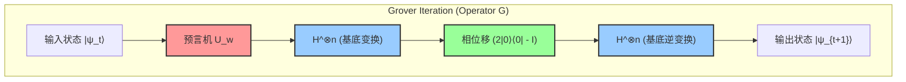

该线路图展示了扩散算符 $U_s = 2|s\rangle\langle s| - I$ 极其高效实用的实现方案。由于状态 $|s\rangle$ 由 $H^{\otimes n} |0\rangle^{\otimes n}$ 生成，该算符可分解如下：

$$
U_s = 2(H^{\otimes n} |0\rangle^{\otimes n})(\langle 0|^{\otimes n} H^{\otimes n}) - I = H^{\otimes n} (2|0\rangle\langle 0| - I) H^{\otimes n}
$$

也就是说，首先通过阿达马变换 $H^{\otimes n}$ 转换到计算基底，接着应用条件相位移算符——仅当所有量子比特均为 $|0\rangle$ 时才不反转相位（或者仅当全为 $|0\rangle$ 时赋予负相位，二者完全等价，仅相差一个全局相位），最后再次通过阿达马变换回到原基底。通过采用这种“三明治”三层结构，便可在任意量子计算机上高效实现“基于均值的反转”。

## 9.5 成功概率分析与最优迭代次数推导

状态向量的几何行为既已完全阐明，我们便具备了严密定量回答该算法核心问题——“究竟需要重复迭代多少次才能获得正确答案”的完备理论基础。

在进行 $t$ 次迭代后，在计算基底上测量量子寄存器以获得目标状态 $|w\rangle$ 的概率 $P(w)$，由状态向量 $|\psi_t\rangle$ 在 $|w\rangle$ 分量上振幅模的平方给出：

$$
P(w) = |\langle w | \psi_t \rangle|^2 = \sin^2((2t+1)\theta)
$$

我们的终极目标是最大化该概率 $P(w)$，即使其尽可能逼近理论上限 $1$。正弦平方函数 $\sin^2(x)$ 取得最大值 $1$ 的条件是自变量 $x$ 等于 $\frac{\pi}{2}$（即90度）。因此，求解最优迭代次数 $t$ 的方程列出如下：

$$
(2t+1)\theta \approx \frac{\pi}{2}
$$

将其关于 $t$ 解出：

$$
t \approx \frac{\pi}{4\theta} - \frac{1}{2}
$$

在具有实际规模的数据库搜索中，元素数量 $N$ 是天文数字。此时，角度 $\theta$ 是极其接近 $0$ 的微小值。对于微小的 $\theta$，取泰勒展开（麦克劳林展开）的一阶项可得良好的近似 $\sin \theta \approx \theta$。由初始状态的定义已知 $\sin \theta = \frac{1}{\sqrt{N}}$，因此可视为 $\theta \approx \frac{1}{\sqrt{N}}$。

将该近似式代入前述 $t$ 的方程中，最优迭代次数 $R$ 便可优美地导出如下：

$$
R \approx \frac{\pi}{4} \sqrt{N}
$$

该结果所具有的意义足以震撼信息科学的历史。在经典计算机中，为了从随机洗牌的搜索空间中找出正确答案，最坏情况下需要 $N$ 次，平均而言也需要 $N/2$ 次，与元素数量成正比的搜索时间（计算复杂度 $O(N)$ ）是不可避免的。然而，在量子计算机上运行的Grover算法，通过利用干涉放大极小概率，仅需 $\frac{\pi}{4} \sqrt{N}$ 次查询，就能以极高确定性（成功概率达到 $1 - O(1/N)$ 的极高精度）抵达目标状态。其计算复杂度为 $O(\sqrt{N})$，成功将计算时间压缩至平方根尺度。

但在此必须注意一个极其关键的问题：Grover算法不具备自我停止（Self-stopping）机制。一旦迭代次数超过这一最优值 $R$，状态向量就会越过目标 $|w\rangle$ 轴；由于正弦函数的周期性，观测到正确答案的概率反而会逐渐减小，产生被称为 **过度旋转（Overcooking / Overshooting）** 的现象。因此，精确控制进行测量的时机（即停止迭代的时机），是确保算法成功的必备条件。

## 9.6 存在多个解时振幅放大的推广

在此之前，我们均在海量数据库中仅存在“唯独一个”目标（单解问题）这一最为严苛的前提下展开论述。然而，在现实世界的问题设定中，满足条件的解通常不止一个。作为Grover算法核心的振幅放大技术，在存在 $M$ 个解（ $1 \le M \le N$ ）的情形下，依然能够毫不失色地自然推广，且完全保持其数学上的优美。

当存在 $M$ 个解时，我们将所有目标状态的均匀叠加态重新定义为 $|W\rangle$，并将所有非目标状态的均匀叠加态重新定义为 $|W^\perp\rangle$：

$$
|W\rangle = \frac{1}{\sqrt{M}} \sum_{x \in \text{Solutions}} |x\rangle
$$

$$
|W^\perp\rangle = \frac{1}{\sqrt{N-M}} \sum_{x \notin \text{Solutions}} |x\rangle
$$

于是，初始均匀叠加态 $|s\rangle$ 可以利用这两个相互正交的向量展开如下：

$$
|s\rangle = \sqrt{\frac{N-M}{N}} |W^\perp\rangle + \sqrt{\frac{M}{N}} |W\rangle
$$

在此，我们定义新的角度 $\theta'$ 满足 $\sin \theta' = \sqrt{\frac{M}{N}}$。在这一新定义下，应用与单解情况完全相同的Grover算符 $G$（预言机被扩展为对全部 $M$ 个解均反转相位），状态向量便会在由 $|W^\perp\rangle$ 与 $|W\rangle$ 张成的平面内，每次迭代旋转 $2\theta'$。

由完全相同的逻辑推演，最优迭代次数为 $\frac{\pi}{4\theta'}$，在 $M \ll N$ 时可近似为：

$$
R \approx \frac{\pi}{4} \sqrt{\frac{N}{M}}
$$

该公式表明，解的数量 $M$ 越多，所需的迭代次数（搜索时间）自然就越短。例如，若存在4个解，所需时间便减半。即使在解的数量 $M$ 未知的情况下，也可以借助称为 **量子计数算法（Quantum Counting Algorithm）** 的高级技术——将Grover算法与量子相位估计（Quantum Phase Estimation）相结合——以快速估计出解的数量 $M$ 本身，随后再执行相应次数的振幅放大。

## 9.7 二次加速的理论意义与量子计算的极限（BBBV定理）

Grover算法所带来的从 $O(N)$ 到 $O(\sqrt{N})$ 的二次加速，从数学公式上看，相比Shor算法带来的指数加速（ $O(e^{N^{1/3}}) \to O(N^3)$ ）或许显得更为温和。然而，它在计算机科学中的真正价值与普遍性，恰恰蕴含在其“不挑问题的通用性”之中。

Shor的大整数质因数分解算法巧妙地利用了整数乘法群所具备的“周期性”这一极为特殊的代数结构。相比之下，Grover算法面向的是“非结构化数据库搜索”这一不包含任何先验知识或结构的、所有计算问题最根源且最原始的形式，因此具有无条件的普适性。

其影响最为深远的体现，在于计算复杂度类NP中的海量难题，以及对支撑现代社会基石的密码技术的应用。例如，旅行商问题和布尔可满足性问题（SAT）等NP完全问题，本质上均可归结为在庞大候选空间中地毯式搜索满足条件之解的问题。针对这些难题，经典算法需要 $O(2^n)$ 的时间，而应用Grover算法则能将计算时间实质性缩短至 $O(\sqrt{2^n}) = O(2^{n/2})$（指数减半）。

对密码技术的冲击同样是致命且深远的。目前维系互联网安全的AES等对称密钥加密体制的安全性，完全依赖于在密钥空间中进行暴力穷举攻击（Brute-force attack）的计算难度。例如，AES-128（128位密钥长度）的搜索空间是 $N = 2^{128}$ 这一令人望而生畏的天文数字。经典计算机平均需要进行 $2^{127}$ 次密钥验证计算，但量子计算机利用Grover算法，仅需 $\frac{\pi}{4} 2^{64}$ 次计算便能确定找出正确密钥。正是这一事实，促使全球各大标准化机构（如NIST等）将向后量子密码学（Post-Quantum Cryptography）过渡视为当务之急，并将AES-128列为不推荐，强烈建议全面升级至AES-256（即使面对量子计算攻击仍需 $2^{128}$ 次计算）的最强力根基。

最后，我们从理论物理学与计算机科学的角度探讨一个极其重要的定理——1997年由Bennett、Bernstein、Brassard与Vazirani等人证明的 **BBBV定理** 。该定理在数学上严格证明了：“即便是使用量子计算机，在黑盒模型下的非结构化搜索问题也绝对需要 $\Omega(\sqrt{N})$ 次查询”。

这意味着什么？这意味着一个深远的物理与计算事实： **“Grover算法所达成的 $O(\sqrt{N})$ 计算复杂度，是自然法则（量子力学）所允许的绝对理论极限；无论利用宇宙中的何种物理法则，都绝不可能实现超越此界限的进一步加速”** 。Grover不仅是发现了一个卓越的算法，更是触碰到了信息与物理规律的终极边界。

此外，本章详述的“振幅放大（Amplitude Amplification）”这一范式本身，作为构建包括量子随机游走（Quantum Random Walks）和量子机器学习（Quantum Machine Learning）子程序在内的无数先进量子算法的基础构件（Building Blocks），正获得极其广泛的应用。“利用关于两个相互正交轴的双重镜像，在几何上旋转并放大极小概率振幅”——Grover所发现的这一优美而典雅的方法，作为从根基处支撑量子信息科学这一庞大学科体系的最坚固、最不可或缺的支柱之一，必将历久弥新、持续闪耀。

# 第10章：量子纠错与容错计算

量子信息科学面临的最大且最深远的壁垒，正是“噪声”与“退相干”。只要将量子计算机视为理想的封闭系统，就能保证遵循薛定谔方程的幺正演化进行确定性的状态操作。然而，作为现实物理系统的量子设备，始终在与外部环境（热浴、电磁场涨落、宇宙射线等）发生相互作用。本章将在对量子系统的噪声进行严格数学定义的基础之上，深入探讨如何检测并纠正经典系统中不存在的量子特有错误，即探寻“量子纠错（Quantum Error Correction: QEC）”的深层奥秘。此外，我们还将详细论述在纠错机制本身也会混入噪声的现实情况下，使计算能够无限持续进行的“容错量子计算（Fault-Tolerant Quantum Computation: FTQC）”的理论基础与阈值定理（Threshold Theorem）。

## 10.1 量子噪声与退相干的数学描述

为了严格描述量子系统的退相干，必须将视角从基于封闭系统状态矢量的纯态动力学，转移到开放量子系统的密度矩阵动力学上。考虑环境系统 $E$ 与主系统 $S$ 的复合系统中的幺正演化，通过偏迹（Partial Trace）消除环境系统的自由度，主系统的状态变化可被描述为“完全正保迹映射（Completely Positive Trace-Preserving Map, CPTP映射）”。

任意量子信道 $\mathcal{E}$ 均可利用克劳斯表示（Kraus Representation）展开如下：

$$
\mathcal{E}(\rho) = \sum_{k} E_k \rho E_k^\dagger
$$

这里， $E_k$ 被称为克劳斯算符（Kraus Operators），满足代表概率守恒的保迹条件 $\sum_k E_k^\dagger E_k = I$ 。

在经典信息中，针对作为信息单位的比特的错误，仅有“0变为1”或“1变为0”的比特翻转（Bit Flip）。然而，在量子系统中，还存在叠加态相位发生波动的“相位翻转（Phase Flip）”这一致命错误。具有代表性的单量子比特噪声信道的克劳斯算符如下所示：

1. **比特翻转信道 (Bit Flip Channel):** 以概率 $p$ 作用 $X$ 门。
   

$$
E_0 = \sqrt{1-p} I, \quad E_1 = \sqrt{p} X
$$

2. **相位翻转信道 (Phase Flip Channel):** 以概率 $p$ 作用 $Z$ 门。它表现了相对相位的坍缩（纯粹的退相干）。纯态 $|\psi\rangle = \alpha|0\rangle + \beta|1\rangle$ 密度矩阵的非对角元呈指数衰减的现象直接归因于此。
   

$$
E_0 = \sqrt{1-p} I, \quad E_1 = \sqrt{p} Z
$$

3. **去极化信道 (Depolarizing Channel):** 以概率 $p$ 使状态完全逼近最大混合态（白噪声） $I/2$ 。
   

$$
E_0 = \sqrt{1-p} I, \quad E_1 = \sqrt{\frac{p}{3}} X, \quad E_2 = \sqrt{\frac{p}{3}} Y, \quad E_3 = \sqrt{\frac{p}{3}} Z
$$

构建量子纠错所面临的第一道障碍是“不可克隆定理（No-Cloning Theorem）”。不存在任何幺正变换能够复制未知的量子态 $|\psi\rangle$ 并制备出形如 $|\psi\rangle \otimes |\psi\rangle \otimes |\psi\rangle$ 的状态。因此，像经典纠错那样“将相同信息复制到3个比特上并采用多数表决”的朴素方法在量子系统中是不可能的。此外，如果对量子态进行测量就会引发波包塌缩，从而破坏叠加态。如何在不破坏未知信息的前提下精确定位错误，便成了核心课题。

## 10.2 量子纠错的基础原理：冗余化与伴随式测量

量子信息中“复制”的替代手段是，通过使多个量子比特处于量子纠缠（Entanglement）状态，将原始信息映射到更高维希尔伯特空间的子空间（码空间，Code Space）中。

作为最简单的示例，我们构建一个“3量子比特比特翻转码”，用来保护1个量子比特的状态 $|\psi\rangle = \alpha |0\rangle + \beta |1\rangle$ 免受概率性比特翻转的影响。
将逻辑基（Logical Basis）定义如下：

$$
|0\rangle_L = |000\rangle, \quad |1\rangle_L = |111\rangle
$$

逻辑状态为 $|\psi\rangle_L = \alpha |000\rangle + \beta |111\rangle$ 。这并不是复制，而是编码到GHZ型纠缠态。

现在，假设第1个量子比特发生了比特翻转错误 $X_1 = X \otimes I \otimes I$ 。状态将变为 $|\psi'\rangle = \alpha |100\rangle + \beta |011\rangle$ 。
为了检测这种错误，绝对不能直接测量状态本身。取而代之的是，进行在不破坏状态的前提下仅提取错误痕迹的“伴随式测量（Syndrome Measurement）”。具体而言，我们测量作为泡利算符张量积的宇称算符 $Z_1 Z_2$ 和 $Z_2 Z_3$ 。

原始码空间中的任意矢量 $|\psi\rangle_L$ 都是 $Z_1 Z_2$ 和 $Z_2 Z_3$ 对应本征值为 $+1$ 的本征矢量（即 $Z_1 Z_2 |\psi\rangle_L = |\psi\rangle_L$ ）。
然而，对于错误状态 $|\psi'\rangle$ ，由于 $X$ 和 $Z$ 满足反对易（ $\{X, Z\} = 0$ ）的泡利代数性质，

$$
Z_1 Z_2 |\psi'\rangle = Z_1 Z_2 X_1 |\psi\rangle_L = -X_1 Z_1 Z_2 |\psi\rangle_L = - |\psi'\rangle
$$

$$
Z_2 Z_3 |\psi'\rangle = Z_2 Z_3 X_1 |\psi\rangle_L = X_1 Z_2 Z_3 |\psi\rangle_L = + |\psi'\rangle
$$

测量结果（伴随式）为 $(-1, +1)$ ，这就仅确定了“第1个比特发生了 $X$ 错误”这一事实。由于关于叠加系数 $\alpha, \beta$ 的信息完全没有泄漏，因此测量并不会破坏状态。随后，再次施加 $X_1$ 即可完全恢复为原来的状态 $|\psi\rangle_L$ 。

同样地，为了纠正相位翻转错误 $Z$ ，可以使用基于阿达马基 $\{|+\rangle, |-\rangle\}$ 的“3量子比特相位翻转码”。

$$
|0\rangle_L = |+++\rangle, \quad |1\rangle_L = |---\rangle
$$

在这种情况下，伴随式测量使用 $X_1 X_2$ 和 $X_2 X_3$ 。

在这里，量子力学令人惊叹的特性得以展现。由环境相互作用引起的错误通常是像 $E(\theta) = \cos(\theta) I - i \sin(\theta) X$ 这样连续的旋转。然而，通过执行伴随式测量，该状态会被概率性地 **投影** 到“无错误（ $I$ ）”或“完全错误（ $X$ ）”这两种本征态之一。也就是说，原本无限存在的连续错误，经由测量被量子力学“数字化”成了离散的泡利错误。

## 10.3 肖尔9量子比特码 (Shor Code) 与稳定子形式

前述的编码只能纠正比特翻转或相位翻转其中之一。1995年，彼得·肖尔发表了具有划时代意义的“肖尔9量子比特码（Shor's 9-Qubit Code）”，能够同时纠正这两种错误。这是将3量子比特的比特翻转码级联（Concatenation）嵌套嵌入到3量子比特的相位翻转码的每个节点内部构建而成的。

逻辑基如下所示：

$$
|0\rangle_L = \frac{1}{2\sqrt{2}} ( |000\rangle + |111\rangle ) \otimes ( |000\rangle + |111\rangle ) \otimes ( |000\rangle + |111\rangle )
$$

$$
|1\rangle_L = \frac{1}{2\sqrt{2}} ( |000\rangle - |111\rangle ) \otimes ( |000\rangle - |111\rangle ) \otimes ( |000\rangle - |111\rangle )
$$

将肖尔码等纠错方法加以一般化并赋予其坚实数学基础的，是丹尼尔·戈特斯曼提出的“稳定子形式（Stabilizer Formalism）”。
设 $n$ 量子比特的泡利群为 $\mathcal{P}_n$ 。稳定子群 $\mathcal{S}$ 是 $\mathcal{P}_n$ 的阿贝尔（可交换）子群，我们将码空间 $\mathcal{C}$ 定义为“对于群 $\mathcal{S}$ 中的所有元素 $S \in \mathcal{S}$ ，本征值均为 $+1$ 的状态 $|\psi\rangle$ 的集合”。在 $n$ 量子比特系统中，若存在 $k$ 个独立的生成元（Generators），则码空间的维度为 $2^{n-k}$ ，这代表了逻辑量子比特的数量。

在肖尔码（ $n=9$ ）的情况下，为了编码 1 个逻辑比特，由 $k=8$ 个独立的生成元构成。
用于检测比特翻转的 $Z$ 体系稳定子（6个）：

$$
S_1 = Z_1 Z_2 I_3 I_4 I_5 I_6 I_7 I_8 I_9, \quad S_2 = I_1 Z_2 Z_3 I_4 I_5 I_6 I_7 I_8 I_9
$$

$$
\dots, \quad S_6 = I_1 I_2 I_3 I_4 I_5 I_6 I_7 Z_8 Z_9
$$

用于检测相位翻转的 $X$ 体系稳定子（2个）：

$$
S_7 = X_1 X_2 X_3 X_4 X_5 X_6 I_7 I_8 I_9
$$

$$
S_8 = I_1 I_2 I_3 X_4 X_5 X_6 X_7 X_8 X_9
$$

如果任意量子比特上发生了错误 $E \in \mathcal{P}_n$ ，只要它与 $\mathcal{S}$ 的任何一个生成元反对易，那么该稳定子的测量结果就会变成 $-1$ ，从而能够确定错误的种类与位置。稳定子的概念提供了一种极其强大的方法，它不直接追踪量子态本身，而是追踪决定系统对称性的算符代数结构，这与海森堡绘景非常接近。

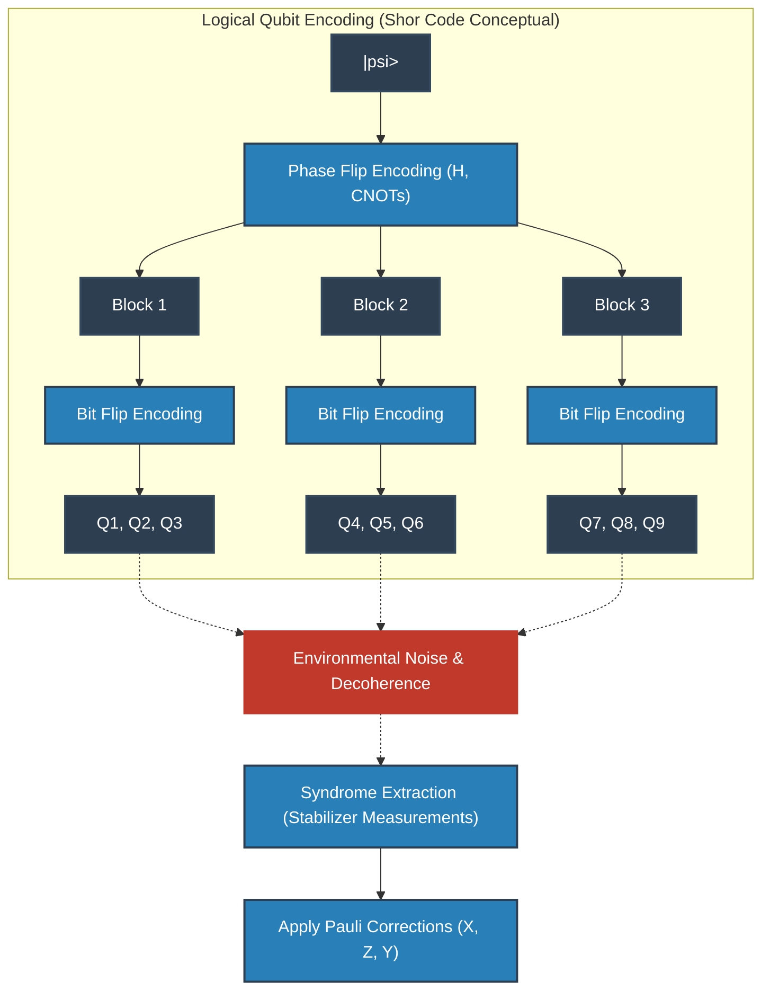

## 10.4 拓扑码与表面码 (Surface Codes)

虽然肖尔码和稳定子码在逻辑上是完美的，但在物理实现上却需要“相距较远的量子比特间的相互作用（长程相互作用）”。在二维平面上晶格排列的固态器件（如超导电路或硅自旋等）中，这种长程耦合是极其困难的。

因此，作为现代量子计算机架构的主流而被采用的，是阿列克谢·基塔耶夫（Alexei Kitaev）提出的“拓扑量子纠错”，其代表例子是“复曲面码（Toric Code）”和“表面码（Surface Code）”。

在表面码中，量子比特被配置在二维晶格的顶点（或边）上，并且仅使用相邻量子比特之间的局域相互作用来执行稳定子测量。
哈密顿量可以写成如下形式：

$$
H = - \sum_{v} A_v - \sum_{p} B_p
$$

这里， $A_v$ 是针对顶点（Vertex）周围 4 个量子比特的 $X$ 算符的张量积（顶点算符: $A_v = \prod_{i \in \text{star}(v)} X_i$ ）， $B_p$ 是针对面元（面，Plaquette）周围 4 个量子比特的 $Z$ 算符的张量积（面算符: $B_p = \prod_{i \in \text{boundary}(p)} Z_i$ ）。
它们彼此对易（ $[A_v, B_p] = 0$ ），并且逻辑状态被编码在所有 $A_v$ 和 $B_p$ 的本征值均为 $+1$ 的基态空间中。令人惊讶的是，在亏格（Genus）为 $g$ 的二维流形上构建的复曲面码，其基态的简并度为 $4^g$ ，在环面（ $g=1$ ）上自然地编码了 2 个逻辑量子比特。

表面码极其优美的物理学解释，是将错误视作“准粒子（Anyon，任意子）”。例如，当某个量子比特上发生 $X$ 错误时，相邻的两个面算符 $B_p$ 的伴随式将反转为 $-1$ 。这意味着从基态真空中成对产生了类似于“磁单极子般的任意子（ $m$ 任意子）”。如果错误进一步向相邻位置连锁，任意子就会在晶格空间上移动。
所谓纠错，无非就是找出伴随式对（任意子），并使用图论中的“最小权重完美匹配（Minimum Weight Perfect Matching: MWPM）”算法，通过最短路径使任意子互相碰撞并发生对湮灭的操作。
逻辑运算（ $\bar{X}, \bar{Z}$ ）对应于让该任意子从空间的一端穿透到另一端，形成一个非平凡的同调环（Topological Loop）。由于局域噪声自然形成贯穿整个系统的环的概率呈指数级低下，因此从拓扑学的观点来看，信息得到了极其坚固的保护。

## 10.5 迈向容错量子计算 (FTQC) 之路与阈值定理

即使纠错理论已经确立，仍有一个令人绝望的问题存在：“如果用于执行纠错的电路（如伴随式测量的辅助比特或CNOT门等）本身含有噪声，将会怎样？”如果在治疗错误的手术过程中，感染了更加严重的错误，系统将立即崩溃。

例如，用于提取伴随式的CNOT门，会将控制比特的 $X$ 错误传播到目标比特（ $X \otimes I \xrightarrow{CNOT} X \otimes X$ ），同时会将目标比特的 $Z$ 错误反向传播到控制比特（ $I \otimes Z \xrightarrow{CNOT} Z \otimes Z$ ）。如果 1 个物理错误在编码块内增殖成多个量子比特的错误，一旦超过了设定的码距 $d$ ，纠错就会彻底失败。

为了防止这种毁灭性的连锁反应而提出的设计思想就是“容错量子计算（FTQC）”。FTQC的绝对条件是：“系统内发生的 1 个物理错误，在一个逻辑错误块内最多只能传播成 1 个错误”。
为了实现这一点，逻辑门的执行被强烈要求使用“横向操作（Transversal Operations）”。这是一种安全的门操作，即第 $i$ 个物理量子比特只与其他块的第 $i$ 个物理量子比特发生相互作用（在块内没有交叉耦合）。然而，根据“伊斯廷-尼尔定理（Eastin-Knill Theorem）”，在数学上已经证明，仅通过横向操作是不可能构建出通用量子计算所需的连续门集合的。

为了规避该定理的限制，实现通用的FTQC，其魔法杖便是“魔术态蒸馏（Magic State Distillation）”。准备大量含有噪声的非克利福德状态（例如：相当于 $T$ 门的状态），然后通过仅使用横向克利福德运算的纠错电路，提取出纯度极高的“魔术态”。接着，利用量子隐形传态的原理，间接地将非克利福德门（如 $T$ 门等）应用到逻辑状态上。由于这个蒸馏过程会消耗庞大资源（物理量子比特），所以在FTQC时代的算法中，“如何减少 $T$ 门的数量”成为了至高无上的命题。

所有这些理论努力的集大成者就是“量子阈值定理（Quantum Threshold Theorem）”。
由多里特·阿哈罗诺夫（Dorit Aharonov）和迈克尔·本-奥尔（Michael Ben-Or）等人证明的这一定理，高声宣告如下：
 **“只要物理组件（门、测量、初始化）的错误概率 $p$ 低于某个特定的阈值 $p_{th}$ ，通过将量子纠错码分层级联（Concatenation），或是不断扩大拓扑码的晶格尺寸（码距 $d$ ），就能以任意精度执行任意长时间的量子计算。”** 

阈值 $p_{th}$ 取决于所使用的编码和架构，但在表面码中具有约 $10^{-2}$ （1%）这样极为现实且可达到的值。将物理错误率压制到远低于该阈值的水平（物理层 Physical Layer 的改善），以及开发更高效的伴随式解码器和表面码变体（逻辑层 Logical Layer 的精炼），这两者都是当今量子计算机研发领域全球竞争的主战场。

量子纠错与FTQC绝非单纯的工程学修补。那是通过拓扑学、群论以及控制热力学熵，将大自然试图掩盖的量子力学那种微妙的叠加态拉伸至宏观的时间尺度，从而突破宇宙计算能力极限的人类极其根本且富有艺术性的挑战。

# 第11章：量子硬件的物理实现

在前10章中，我们详述了量子信息科学的理论基础以及算法的数学结构。然而，无论设计出的量子算法多么精妙，在计算复杂性理论框架下证明的理论量子优越性（Quantum Supremacy）多么宏伟，如果没有作为物理实体的“量子硬件”来执行它们，那一切都不过是纯粹的数学游戏。在本章中，我们将从其背后的深奥量子物理原理出发，严谨地阐释如何将抽象希尔伯特空间中的态矢量 $ |\psi\rangle $ 具象化到物理世界中的尖端硬件实现方案。

要对量子物理系统进行人工操控并使其作为通用（Universal）计算机运行，必须满足被称为迪文琴佐判据（DiVincenzo's criteria）的五项苛刻物理要求：
1. **可扩展且表征良好的量子比特系统** ：能够在物理上确保希尔伯特空间的张量积结构 $ \mathcal{H} = \bigotimes_{i=1}^n \mathcal{H}_i $ 。
2. **量子态的初始化能力** ：以高保真度将系统重置到纯态（通常为 $ |00\dots0\rangle $ ）的能力。
3. **足够长的相干时间** ：量子态的退相干时间（ $T_1$ 与 $T_2$ ）比单次门操作所需时间长出若干个数量级。
4. **通用量子门集的实现** ：能够利用有限个基准门（例如 H、T、CNOT 门）的组合，以任意精度逼近任意幺正变换 $ \hat{U} \in SU(2^n) $ 。
5. **对特定量子比特的投影测量能力** ：伴随量子态的坍缩，高精度读取特定基底概率分布的能力。

构建一个能同时以高保真度（Fidelity）满足所有这些要求的系统，是现代物理学与工程学中极具挑战性的历史性难题。如果将系统与外界环境完全隔离，相干时间固然可以延长，但这同时也会使操控和测量系统变得极为困难。如何攻克这一终极权衡（trade-off），正是各种硬件方案设计理念的核心所在。

## 11.1 超导量子比特：宏观量子现象与非线性 LC 电路

目前，由 Google、IBM 等众多研究机构大力推进的最主流路线之一就是超导量子比特（Superconducting Qubit）。这种方法并非直接利用微观基本粒子，而是利用宏观电子电路所展现出的宏观量子现象来构建“人工原子（Artificial Atom）”。

### 11.1.1 约瑟夫森结的物理与非线性

通过微细加工制造的普通 LC 谐振电路（由电感 $ L $ 和电容 $ C $ 构成的系统），在冷却至极低温并进行量子化后，会成为量子力学中的简谐振子（Harmonic Oscillator）。其哈密顿量可以使用产生算符 $ \hat{a}^\dagger $ 和湮灭算符 $ \hat{a} $ 表示为：

$$
\hat{H}_{\text{LC}} = \hbar \omega_r \left( \hat{a}^\dagger \hat{a} + \frac{1}{2} \right)
$$

其中 $ \omega_r = 1/\sqrt{LC} $ 为谐振频率。该系统的能级 $ E_n = \hbar \omega_r (n + 1/2) $ 是完全等间距的。如果将该系统的最低能量态 $ |0\rangle $ 和第一激发态 $ |1\rangle $ 用作量子比特，当我们施加频率为 $ \omega_r $ 的微波脉冲以执行门操作（例如 $ |0\rangle \leftrightarrow |1\rangle $ 跃迁）时，能级间距相同的 $ |1\rangle \leftrightarrow |2\rangle $ 以及 $ |2\rangle \leftrightarrow |3\rangle $ 等跃迁也会被同时驱动。这样一来，系统便无法作为双能级系统正常工作。

为了解决这一问题，使能级变为非等间距的“非线性（Nonlinearity）”是不可或缺的。而实现这一点的关键元件正是 **约瑟夫森结（Josephson Junction）** 。它由两层超导体夹着数纳米厚的极薄绝缘层构成，库珀对（Cooper pairs）在保持宏观相位干涉的同时通过隧穿效应穿过绝缘层。根据约瑟夫森方程，超导电流 $ I $ 与超导相位差 $ \phi $ 的关系为 $ I = I_c \sin \phi $ 。因此，结区表现为电感值依赖于电流的非线性电感。

### 11.1.2 跨导量子比特（Transmon）的哈密顿量

在历史上，研究者曾设计过电荷量子比特、磁通量子比特等多种构型，而目前最为成功的则是大幅提高了对电荷噪声鲁棒性的“跨导量子比特（Transmon）”。

Transmon 通过在约瑟夫森能量 $ E_J $ 旁故意引入巨大的并联分流电容，使充电能 $ E_C = e^2 / (2C_{\Sigma}) $ 大幅减小，并在 $ E_J / E_C \gg 1 $ 的区间内工作。
表示库珀对数量的电荷算符 $ \hat{n} $ 与表示超导相位差的相位算符 $ \hat{\phi} $ 是一对正则共轭变量，满足对易关系 $ [\hat{\phi}, \hat{n}] = i $ 。Transmon 的哈密顿量可以精确表述为：

$$
\hat{H}_{\text{transmon}} = 4 E_C (\hat{n} - n_g)^2 -E_J \cos \hat{\phi}
$$

其中， $ n_g $ 是由环境或栅极电压引起的偏置电荷。在 $ E_J \gg E_C $ 的极限下，相位的量子涨落被抑制得很小，因此可以将余弦项进行泰勒展开，将其作为非简谐振子处理：

$$
-E_J \cos \hat{\phi} \approx - E_J + \frac{E_J}{2} \hat{\phi}^2 - \frac{E_J}{24} \hat{\phi}^4 + \mathcal{O}(\hat{\phi}^6)
$$

正是这个 $ \hat{\phi}^4 $ 项为系统带来了非简谐性（Anharmonicity）。根据微扰论的计算结果，能级间的非简谐性 $ \alpha $ 可以近似表示为：

$$
\alpha \equiv (E_2 - E_1) - (E_1 - E_0) \approx -E_C
$$

得益于这种负非简谐性（ $ E_1 \to E_2 $ 的跃迁频率小于 $ E_0 \to E_1 $ ），我们能够利用微波脉冲在计算基底空间 $ |0\rangle $ 和 $ |1\rangle $ 内安全地执行单量子比特门操作。

### 11.1.3 电路量子电动力学（Circuit QED）与读出机制

用于在不破坏量子比特状态的前提下读取其状态的理论框架，是将腔量子电动力学应用于超导电路的“电路QED（Circuit QED）”。
量子比特与读出用微波谐振腔的耦合系统由贾恩斯-卡明斯（Jaynes-Cummings）模型所描述：

$$
\hat{H}_{\text{JC}} = \frac{\hbar \omega_q}{2} \hat{\sigma}_z + \hbar \omega_r \hat{a}^\dagger \hat{a} + \hbar g (\hat{\sigma}_+ \hat{a} + \hat{\sigma}_- \hat{a}^\dagger)
$$

其中 $ g $ 为耦合强度。在量子比特的跃迁频率 $ \omega_q $ 与谐振腔频率 $ \omega_r $ 相距较远的色散区间（ $ |\omega_q - \omega_r| \gg g $ ）内，通过施里弗-沃尔夫变换，有效哈密顿量可对角化为：

$$
\hat{H}_{\text{disp}} \approx \frac{\hbar \omega_q}{2} \hat{\sigma}_z + \hbar \left( \omega_r + \frac{g^2}{\Delta} \hat{\sigma}_z \right) \hat{a}^\dagger \hat{a}
$$

其中 $ \Delta = \omega_q - \omega_r $ 。该式第二项所蕴含的物理意义极为重要：谐振腔的有效谐振频率会根据量子比特的状态（ $ \hat{\sigma}_z = +1 $ 还是 $ -1 $ ）发生 $ \pm g^2/\Delta $ 的频移。因此，通过向谐振腔注入探测微波并测量其透射或反射微波的相位移动，便可实现对量子比特状态的投影测量。

 **优势与劣势** 

超导方案的最大优势在于，它可以借鉴成熟的半导体微纳加工光刻技术，利用芯片上的布线设计实现良好的可扩展性，并且门操作时间在纳秒级，速度极快。其劣势则在于，作为宏观人造结构，它极易受到微观材料缺陷（TLS）以及外界电磁噪声的干扰，必须在接近绝对零度（约 10 mK）的稀释制冷机极端环境中运行。

## 11.2 离子阱方案：原子物理学的极致与完全的同一性

如果说超导是“人工制造的宏观量子系统”，那么离子阱（Trapped Ion）方案则是“自然界存在的终极微观量子系统”。同一种同位素的原子离子（例如 $ ^{171}\text{Yb}^+ $ 或 $ ^{40}\text{Ca}^+ $ ），无论在宇宙的何处，其物理性质都完全恒等。因此，该方案从根本上不存在“制造公差”的概念，并具备相干时间极其优异的绝对优势。

### 11.2.1 保罗阱与激光冷却的动力学

在离子阱中，仅依靠静电场是无法在三维空间中稳定捕获带电粒子的（恩绍定理）。为了规避这一限制，人们采用了利用空间非均匀、时间上周期振荡的高频电场的保罗阱（Paul trap）技术。

被捕获的离子在真空腔内接受激光冷却（多普勒冷却和边带冷却）。由此，离子的动能被剥离到量子力学基态（声子数 $ n=0 $ ）。量子比特的计算基底被编码在离子的内部电子态中。其内部状态的哈密顿量非常简单：

$$
\hat{H}_{\text{internal}} = \frac{\hbar \omega_0}{2} \hat{\sigma}_z
$$

### 11.2.2 兰姆-迪克极限与 Mølmer-Sørensen 门的数学原理

离子阱方案真正的突破，在于多量子比特间纠缠生成机制的设计。被捕获的离子链通过强大的库仑斥力耦合在一起，在系统整体上形成了集体正规振动模（声子）。通过将这种声子用作数据总线，即使在物理上彼此分离的离子之间也能够直接介导相互作用。

实现双量子比特门最标准的方案是 Mølmer-Sørensen（MS）门 。对两个离子，同时照射相对声子模频率 $ \omega_m $ 存在微小失谐的双色激光。在兰姆-迪克参数 $ \eta = k z_0 $ 足够小的兰姆-迪克区间（ $ \eta \sqrt{n} \ll 1 $ ）内，相互作用哈密顿量可展开为：

$$
\hat{H}_{\text{int}} \approx \hbar \Omega \sum_{j=1,2} \hat{\sigma}_\phi^{(j)} \left( \eta \hat{a} e^{i \delta t} + \eta \hat{a}^\dagger e^{-i \delta t} \right)
$$

其中 $ \Omega $ 为拉比频率， $ \delta $ 为失谐量。利用马格努斯展开计算时间演化算符可以发现，在经过适当的门操作时间后，运动模将复原到初始状态，而在内部状态之间则被赋予了几何相位，从而留下了等效的自旋-自旋相互作用：

$$
\hat{U}_{\text{MS}} = \exp\left( -i \frac{\pi}{4} \hat{\sigma}_\phi \otimes \hat{\sigma}_\phi \right)
$$

该操作能够生成最大纠缠态，并具有与 CNOT 门等价的计算能力。能够实现全连接（All-to-all connectivity），是离子阱方案相比于只能与相邻量子比特耦合的超导方案的一大决定性差异。

 **挑战与局限** 

离子阱的门操作时间通常在数十微秒量级，比超导方案慢了数个数量级。此外，如果在单个一维阱中排列数十个以上的离子，振动模式谱会变得过于密集，导致不可避免的串扰。为了攻克这一瓶颈，基于 QCCD（Quantum Charge-Coupled Device）架构等扩展技术已成为当前的核心研究课题。

## 11.3 拓扑量子比特：非阿贝尔任意子与终极鲁棒性

无论是超导还是离子阱，对来自环境的局域噪声引起的错误都十分敏感，因此后文详述的量子纠错是不可或缺的。然而，还存在一种极具雄心的替代方案：从物理层面构建根本上免受噪声干扰的量子态。这就是拓扑量子计算机。

### 11.3.1 基塔耶夫链与马约拉纳零能模

在我们生活的3维空间中，基本粒子只有玻色子和费米子两类。然而，在2维拓扑物质系统中，通过粒子的交换操作，波函数可以获得任意相位的准粒子——“任意子（Anyon）”是可能存在的。在更为奇特的“非阿贝尔任意子（Non-Abelian anyon）”系统中，交换两个粒子会使系统在具有相同能量的简并态跃迁到另一个相互正交的状态：

$$
| \psi_{\text{final}} \rangle = \hat{U} | \psi_{\text{initial}} \rangle
$$

这种非阿贝尔任意子最有希望的物理候选者，是凝聚态物理学中作为准粒子的“马约拉纳零能模（Majorana Zero Modes, MZM）”。在具有强自旋轨道耦合的1维半导体纳米线（如 InSb）中，将其与 s 波超导体近邻接触并施加外加磁场。根据基塔耶夫（Alexei Kitaev）提出的理论模型，在特定的参数区间内，纳米线会发生相变进入拓扑超导相，在纳米线的两端产生局域化的零能量马约拉纳边缘态。

马约拉纳算符 $ \hat{\gamma}_1, \hat{\gamma}_2 $ 满足自共轭性（ $ \hat{\gamma}_j = \hat{\gamma}_j^\dagger $ ）以及反对易关系 $ \{ \hat{\gamma}_i, \hat{\gamma}_j \} = 2\delta_{ij} $ 。普通的狄拉克费米子产生算符与湮灭算符可以通过这两个马约拉纳算符在空间上非局域地构建：

$$
\hat{c} = \frac{1}{2}(\hat{\gamma}_1 + i\hat{\gamma}_2), \quad \hat{c}^\dagger = \frac{1}{2}(\hat{\gamma}_1 - i\hat{\gamma}_2)
$$

这样，一个电子态（费米子宇称）便被“分割”并编码在纳米线两端这两个空间上彼此隔离的位置。由于局域噪声同时且以精确相关的方式扰动系统两端的概率极低，因此量子信息在本质上免受退相干的影响（拓扑保护）。

### 11.3.2 编织与拓扑量子计算

在该系统中，量子逻辑门是通过交换这些马约拉纳粒子的空间位置——即“编织（Braiding）”操作来实现的。

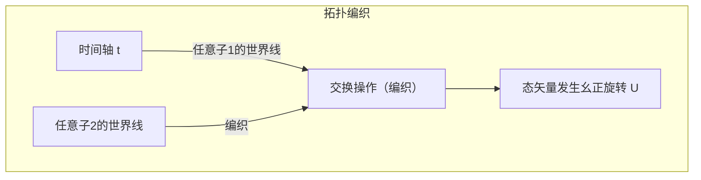

由于仅由粒子轨迹所形成的“纽结”拓扑结构决定计算结果，只要轨迹的微小扰动不改变拓扑性质，幺正变换 $ \hat{U} $ 就可以严格以零误差执行。这就是硬件层面的容错（Fault-tolerance）。

 **挑战与局限** 

马约拉纳零能模存在的决定性实验证据目前仍存有争议，编织操作的物理实证尚未真正达成。此外，仅靠伊辛任意子（Ising anyon）的编织操作无法构成通用量子门集，因此仍需要借助魔态蒸馏（Magic state distillation）等非拓扑的辅助操作。

## 11.4 光量子比特：线性光学与测量诱导纠缠

作为另一种在根本上抵御环境噪声的方案，是利用光子（Photon）的光量子计算机。光子不带电荷，即使在室温环境下与周围环境的相互作用也极其微弱，因此其相干时间在实际意义上可视为近乎无穷大。

### 11.4.1 双轨编码与 KLM 协议

光量子比特通常利用空间路径模式来进行编码。在双轨编码（Dual-rail encoding）中，光子处于上方波导的状态定义为 $ |0\rangle = |1, 0\rangle $ ，光子处于下方波导的状态定义为 $ |1\rangle = |0, 1\rangle $ 。

单量子比特门可以完全由分束器（BS）和移相器（PS）等线性光学元件来实现。然而，由于光子之间不存在直接的相互作用，仅依靠线性光学元件无法构建确定性的双量子比特门。
2001年，Knill、Laflamme 和 Milburn 提出了著名的“KLM 协议”，证明了通过将单光子源、线性光学元件以及 **光子探测器引起的投影测量** 相结合，便能够实现虽然是概率性但具备可扩展性的通用量子计算。非线性效应是通过洪-欧-曼德尔效应（Hong-Ou-Mandel effect）等纯粹的量子干涉效应，结合测量的不可逆性，以后选择（Post-selection）的方式注入到系统中。

### 11.4.2 连续变量（CV）与团簇态

近年来，不仅基于单光子的离散变量体系受到关注，利用光场正交相位振幅的连续变量（Continuous Variable, CV）量子计算方案也取得了爆发式的进展。
通过时域复用技术与压缩态光，可以生成由数万至数百万个发生量子纠缠的光脉冲组成的庞大“团簇态（Cluster state）”。将该态作为计算资源，通过对各个节点依次执行适当的测量来推动计算进行的“单向量子计算（Measurement-based quantum computation; MBQC）”架构，正逐渐成为光量子计算机的主流。

## 11.5 NISQ 时代的现状与迈向逻辑量子比特的阶梯

正如约翰·普雷斯基尔（John Preskill）提出的 **NISQ（Noisy Intermediate-Scale Quantum）** 概念所指出的，人类当前所掌握的量子硬件虽然拥有数十到数百个物理量子比特的“中等规模”，但依然受到噪声的严重支配，无法避免错误的积累。

### 11.5.1 相干极限与保真度

当尝试执行诸如 Shor 算法这类深层量子电路时，每个门操作中微小的误差都会呈指数级累积放大。例如，假设某个双量子比特门的保真度为 99.5% （错误率 $ \epsilon = 0.005 $ ）。如果整个电路包含 $ N $ 个门，最终态的保真度近似为 $ \mathcal{F} \approx (1-\epsilon)^N \approx e^{-N\epsilon} $ 。在 $ N=1000 $ 的情况下，成功概率仅为 $ e^{-5} \approx 0.0067 $ ，正确的计算结果将被完全淹没在噪声之中。
在 Google 宣称实现量子优越性的实验中，利用被称为交叉熵基准测试（Cross-Entropy Benchmarking, XEB）的指标，证明了其相比经典超级计算机具有压倒性的速度优势，但这仅局限于特定的随机电路采样任务，并不意味着能够执行实用的通用计算。

### 11.5.2 向量子纠错过渡（FTQC 的黎明）

要打破 NISQ 设备的局限性，在量子化学计算、材料科学模拟或密码破解中确立真正的“量子优越性”，绝不能依赖单一脆弱的物理系统，而是必须将大量物理量子比特编织结合以构建单个无差错的“逻辑量子比特（Logical Qubit）”，向 **FTQC（Fault-Tolerant Quantum Computing：容错量子计算）** 过渡是不可逾越的绝对前提。

例如，在使用被称为表面码（Surface Code）的拓扑量子纠错码时，只要物理量子比特的错误率低于容错阈值，随着系统规模的扩大，逻辑错误率就会呈指数级衰减。然而作为代价，为了构建单个逻辑量子比特，通常需要 1,000 到 10,000 个物理量子比特的巨大硬件开销。

我们如今正站在与物理噪声搏斗的最前沿。超导、离子阱、拓扑、光量子等各条技术路线，在与各自的物理约束这一“恶魔”博弈的同时，正向着可扩展性这一未踏之巅发起冲击。在第12章中，我们将深入探讨在这些硬件发展之后等待着我们的量子信息终极壁垒——“量子纠错的数学结构”。

# 第12章：量子计算机的未来与总结

“量子计算机”将量子力学这一违背我们直觉的微观世界物理法则作为计算资源加以利用。从第1章的叠加原理开始，历经量子纠缠、贝尔不等式、Shor算法、量子纠错，通过这一长篇连载，我们在量子信息科学的深邃世界中畅游求索。作为最终章的本章，我们将揭示当今人类所达到的技术里程碑——“量子优越性 / 量子霸权（Quantum Supremacy / Quantum Advantage）”验证实验真正的数学与物理内涵，并从计算复杂性理论的视角，严密破除坊间流传的“量子计算机是能够瞬间解决任何问题的万能魔法盒”这一幻想。随后，我们将给出从NISQ（Noisy Intermediate-Scale Quantum，含噪声中等规模量子）时代迈向FTQC（Fault-Tolerant Quantum Computing，容错量子计算）的、面向未来实际落地应用的现实而宏大的路线图，以此作为这部长达5万字巨作的结语。

## 12.1 量子霸权（量子优越性）的实证：Google Sycamore指明的路标

2019年，Google研究团队宣布使用拥有53个超导量子比特的处理器“Sycamore（悬铃木）”，在量子计算机上快速求解了经典计算机在现实时间内无法求解的特定问题，从而实现了“量子优越性（量子霸权）”的实证。这一事件是量子信息科学史上的历史性里程碑，但准确理解其背后数学物理结构的人并不多。

他们解决的问题是“随机量子线路采样问题（Random Quantum Circuit Sampling）”。对量子比特群，在 $d$ 层上施加随机选择的单量子比特门和双量子比特门，并在计算基下测量最终状态。

让我们用数学语言进行描述。设初始状态为 $ |\psi_0\rangle = |0\rangle^{\otimes n} $ 。对其作用随机选择的幺正变换 $ U = U_d U_{d-1} \dots U_1 $ 。最终状态 $ |\psi_f\rangle $ 可利用张量积与线性组合表示如下：

$$
|\psi_f\rangle = U |0\rangle^{\otimes n} = \sum_{x \in \{0, 1\}^n} \alpha_x |x\rangle
$$

这里 $ \alpha_x = \langle x | U | 0 \rangle^{\otimes n} $ 是观测到特定比特串 $x$ 的概率幅，是一个复数。此时，通过测量得到比特串 $x$ 的理想概率 $ P_{\text{ideal}}(x) $ 根据量子力学中的玻恩定则（Born Rule）由下式给出：

$$
P_{\text{ideal}}(x) = |\alpha_x|^2 = \left| \langle x | U | 0 \rangle^{\otimes n} \right|^2
$$

在足够深（$d$ 很大）的随机量子线路中，每个振幅 $ \alpha_x $ 在复平面上表现出随机游走的特性，已知其概率分布 $ P_{\text{ideal}}(x) $ 服从波特-托马斯分布（Porter-Thomas distribution）。换言之，出现概率为 $p$ 的概率密度函数为 $ \text{Pr}(P_{\text{ideal}}(x) = p) \approx 2^n e^{-2^n p} $ 。这意味着某些比特串会比其他比特串更容易被观测到，从而形成一种“散斑（斑点）图样（Speckle pattern）”。

要在经典计算机上对此分布进行严格采样，必须通过庞大张量网络的缩并计算来直接计算振幅 $ \alpha_x $ 。态矢量的维度为 $ 2^n $ ，当 $ n = 53 $ 时，必须追踪约 $ 9 \times 10^{15} $ 个复数振幅（PB量级的内存），即使借助当时全球最快的超级计算机，也会面临耗时极其巨大的计算壁垒。与此相对，量子计算机的物理系统本身就将状态 **$|\psi_f\rangle$** 作为自然希尔伯特空间上的矢量予以保持，只需一次测量便能在瞬间（几十微秒内）完成遵循散斑图样的采样。

为了评估实验的成败，引入了线性交叉熵基准（Linear Cross-Entropy Benchmarking, XEB）。保真度（Fidelity） $ \mathcal{F}_{\text{XEB}} $ 定义如下：

$$
\mathcal{F}_{\text{XEB}} = 2^n \sum_{x \in \{0, 1\}^n} P_{\text{ideal}}(x) P_{\text{exp}}(x) - 1
$$

这里，$ P_{\text{exp}}(x) $ 是从实际量子处理器（包含硬件噪声）获得的经验概率分布。如果设备输出的是完全随机的噪声（即完全混合态的密度矩阵 $ \rho = \frac{I}{2^n} $ ），则 $ P_{\text{exp}}(x) = \frac{1}{2^n} $ ，导致 $ \mathcal{F}_{\text{XEB}} = 0 $ 。反之，若是输出完全无噪声的理想纯态的量子计算机，则有 $ \mathcal{F}_{\text{XEB}} \approx 1 $ 。在Google的实验中，测得 $ \mathcal{F}_{\text{XEB}} \approx 0.002 $ ，这是一个显著大于零且具有统计显著性的数值。即使保真度如此微小，但由于在计算复杂性理论上经典计算机生成同等样本极其困难，因此被视为量子优越性（量子霸权）的实证。

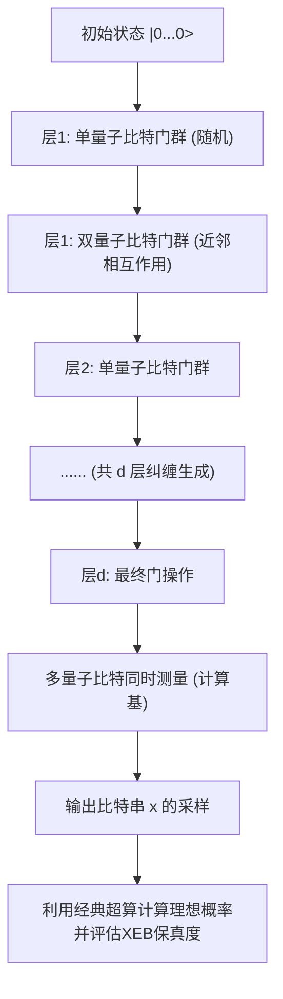

## 12.2 “魔法盒”的误解：并行计算的陷阱与 BQP vs NP

在大众媒体关于量子计算机的报道和科普书籍中，常常可以看到“能够同时计算 $2^n$ 种状态，因此任何问题都能瞬间解决”之类的魔术式词汇。然而，从计算复杂性理论的角度来看，这是根本性错误的。量子计算机绝不是能够无条件在多项式时间内求解“NP完全问题（NP-Complete）”的魔法棒。

这种误解源于这样一个事实：利用阿达马门等构建的状态叠加 $ |\psi\rangle = \frac{1}{\sqrt{2^n}} \sum_{x=0}^{2^n-1} |x\rangle $ ，可以通过“单次操作”对所有输入进行函数求值（量子并行性）。当利用预言机（Oracle，负责计算的幺正算符） **$U_f$** 对叠加态执行函数 $ f(x) $ 的计算时，整个状态将遵循线性规律演化如下：

$$
U_f \left( \frac{1}{\sqrt{2^n}} \sum_{x=0}^{2^n-1} |x\rangle \otimes |0\rangle \right) = \frac{1}{\sqrt{2^n}} \sum_{x=0}^{2^n-1} |x\rangle \otimes |f(x)\rangle
$$

诚然，在这一态矢量的内部，确实以概率幅子系统的形式蕴含了所有 $x$ 对应的 $f(x)$ 的答案。然而，请回想量子力学中的 **测量公理** （波函数坍缩）。当对该输出寄存器执行测量操作时，所能获得的仅仅是以 $\frac{1}{2^n}$ 的概率随机选出的单个数据对 $ (x, f(x)) $ 。其余 $ 2^n - 1 $ 个信息都在不可逆的投影测量中永远丢失了。也就是说，在“并行计算（状态演化）”与“从并行计算的结果中提取出我们所需的特定信息（状态读取）”之间，存在着一条难以逾越的绝望鸿沟。

量子算法要真正超越经典算法，就不能仅仅依赖并行求值，而必须巧妙地设计和利用“量子干涉（Quantum Interference）”。必须构建一种极其特殊的全局幺正变换，使得所期望的正确答案状态对应的概率幅通过相长干涉（Constructive interference）被放大，而其他无数错误答案的概率幅则通过相位反转引起的相消干涉（Destructive interference）被相互抵消。

在这一约束下，量子计算机能够在多项式时间内保持显著高的正确率予以求解的问题复杂性类被称为 **BQP** （Bounded-error Quantum Polynomial time，有界误差量子多项式时间）。另一方面，在给定候选解时能够在多项式时间内验证其合理性的问题类是 **NP** ，其中最难的一类问题便是 **NP完全问题** （旅行商问题、布尔可满足性问题/SAT等）。

Grover算法（Grover's algorithm）将针对无结构 $ N = 2^n $ 个元素的数据库搜索，从经典的 $ O(N) $ 二次加速至量子计算的 $ O(\sqrt{N}) $ 。回顾振幅放大（Amplitude Amplification）的数学表述，该算法归结为在初始均匀叠加态 $ |s\rangle $ 与我们希望搜索的目标态 $ |\omega\rangle $ 所张成的二维子空间（平面）内，对态矢量进行几何旋转的操作。

Grover迭代算符 **$G$** 被定义为由预言机实现的目标态相位反转算符 $ U_\omega = I - 2|\omega\rangle\langle\omega| $ 与围绕均值反转算符 $ U_s = 2|s\rangle\langle s| - I $ 的乘积：

$$
G = U_s U_\omega = (2|s\rangle\langle s| - I)(I - 2|\omega\rangle\langle\omega|)
$$

通过将此幺正算符 **$G$** 作用约 $ \frac{\pi}{4}\sqrt{N} $ 次，态矢量便会旋转至目标态 $ |\omega\rangle $ ，从而将观测到正确解的概率提升至接近 1（100%）。然而，此处一个极其重要的事实在于，这仅仅是“平方根加速”，而非指数级加速（ $ O(2^n) \to O(\text{poly}(n)) $ ）。时至今日，尚未发现能在多项式时间内求解一般NP完全问题的量子干涉模式。许多量子信息科学家和计算机科学家坚信计算复杂性理论的核心猜想之一： **$\text{BQP} \not\supset \text{NP-Complete}$** （量子计算机无法高效求解NP完全问题）。

量子计算机只有在像Shor算法中的大整数因式分解那样，问题内部存在“隐藏的周期性等代数结构”时，才能通过量子傅里叶变换（QFT）带来超多项式级的加速，它是一种极其精妙的特化型协处理器。

## 12.3 量子纠错与从 NISQ 到 FTQC 的路线图

尽管量子优越性已获实证，但像Sycamore这样当前处于数十至数百量子比特规模的设备被称为 **NISQ** （Noisy Intermediate-Scale Quantum，含噪声中等规模量子）设备，根本无法完全抵御来自环境噪声的侵蚀。脆弱的量子态因与热涨落、电磁波干扰等环境发生相互作用，极易引发退相干（受到去相位弛豫时间 $T_2$ 和能量弛豫时间 $T_1$ 的制约）。随着计算深度加深（门层数增多），由量子门的不完美性及退相干导致的噪声会呈指数级累积，最终导致输出结果彻底坍陷为毫无意义的完全混合态。

打破这一物理瓶颈、使得完成包含数亿步操作的实用大规模量子算法成为可能的唯一理论路径，就是利用 **量子纠错（Quantum Error Correction, QEC）** 实现 **容错量子计算（Fault-Tolerant Quantum Computation, FTQC）** 。经典计算机的纠错机制（如通过比特复制的多数表决码）受制于构成量子力学基石的“不可克隆定理（No-Cloning Theorem）”，因而无法直接应用于量子态。数学上根本不存在能够将未知的量子态 **$|\psi\rangle = \alpha|0\rangle + \beta|1\rangle$** 简单且完美地复制为 **$|\psi\rangle \otimes |\psi\rangle \otimes |\psi\rangle$** 的幺正变换。

然而，理论物理学找到了克服这一绝望困境的优美（elegant）解法。量子信息并非通过复制单个状态，而是通过“将单个逻辑信息分散隐藏在由大量物理量子比特所构成的庞大希尔伯特空间的‘纠缠空间’拓扑结构中”而得到保护。目前，从硬件实现角度来看最具前景的“表面码（Surface Code）”，便是基于二维网格上的稳定子形式（Stabilizer Formalism）。

在表面码中，用于保持量子信息的“数据量子比特”配置在二维网格的边（edge）上，而用于检测错误的“伴随式测量量子比特（辅助量子比特）”则配置在网格的面（plaquette）和顶点（vertex）上。接着，定义如下由泡利算符张量积构成的稳定子算符群：

$$
B_p = \bigotimes_{i \in \partial p} Z_i \quad \text{(格面算符：检测Z错误)}
$$

$$
A_v = \bigotimes_{i \in \delta v} X_i \quad \text{(顶点算符：检测X错误)}
$$

此处，所有的 $ B_p $ 与 $ A_v $ 彼此对易（反对易子为零），即满足对易关系 $ [B_p, A_v] = 0 $ 。我们写入信息的“逻辑态（码空间）” **$|\psi_L\rangle$** 被严格定义为所有这些稳定子算符本征值均为 $+1$ 的共同本征态所张成的子空间：

$$
B_p |\psi_L\rangle = +1 |\psi_L\rangle, \quad A_v |\psi_L\rangle = +1 |\psi_L\rangle \quad (\text{for all } p, v)
$$

假设施加在某个物理量子比特上的外部热噪声或操作失误导致了意外的比特翻转错误（泡利 $X$）或相位错误（泡利 $Z$）。由于该错误算符与邻近的特定稳定子算符满足反对易关系（ $\{X, Z\} = 0 $ ），测量该稳定子的结果（伴随式值 / syndrome）就会由 $+1$ 翻转为 $-1$ 。我们在完全不观测且不破坏受保护的逻辑态本身（权重系数 $\alpha, \beta$ 的取值）的前提下，持续追踪呈现 $-1$ 的位置（缺陷 / defect）对。随后，利用“最小权重完美匹配（Minimum Weight Perfect Matching, MWPM）”等经典算法，最大似然估计在哪个物理量子比特路径上发生了何种错误，再通过软件记录或物理上施加逆操作来予以纠正。

根据量子信息论中一座优美的里程碑——“阈值定理（Threshold Theorem）”，只要单个物理逻辑门的错误率低于某个特定阈值（在表面码情况下约为 $ 1\% $ ），随着网格尺寸（码距 $d$）的增大，在证明上便能使逻辑层面的错误率任意且呈指数级逼近于零。然而，为了构建1个完美的逻辑量子比特，由于纠错开销的存在，在当前的噪声水平下需要数千乃至数万个物理量子比特。据测算，利用Shor算法破译RSA-2048加密需要数千个逻辑量子比特，这意味着需要一个包含数百万至上千万个以上物理量子比特、且能在极低温下彼此保持相干性协同运行的、规模超乎想象的庞大FTQC系统。

从目前仅有数十到数百个物理量子比特的阶段来看，对人类而言，这是一项堪比阿波罗登月计划或大型强子对撞机（LHC）建设的、极其艰巨且壮阔的工程壮举。

## 12.4 结语：量子信息科学的地平线与未来

从第1章利用狄拉克符号对 **$|0\rangle$** 与 **$|1\rangle$** 叠加态的引入开始，经历幺正矩阵所描述的时间演化、张量积对多体系统的数学刻画、贝尔不等式对爱因斯坦局域实在论的击碎，再到Shor与Grover量子算法华丽的数学结构，在总共12章的连载中，我们以极其严谨的形式系统梳理了“量子信息科学”这一人类智慧的集大成之作。

经典计算机基于“确定性的真假值（布尔代数）”，而量子计算机则立足于“复希尔伯特空间中的幺正旋转与张量积（线性代数）”。这一根本性的范式转移，超越了单纯“计算提速”的产业与实用层面，向我们提出了信息论与基础物理学深度交融的深邃哲学命题：“这个宇宙终极的信息处理极限是什么？”“可计算性与复杂性究竟如何依赖于我们所处宇宙的物理定律结构？”

曾被爱因斯坦深恶痛绝并斥为“鬼魅般的超距作用（spooky action at a distance）”的量子纠缠（Entanglement），如今已被确立为支撑量子隐形传态、量子保密通信乃至驱动量子计算机的最根本、不可或缺的“物理资源”。天才物理学家理查德·费曼（Richard Feynman）于1982年提出的深刻直觉——“如果你想模拟自然，你最好用量子力学的方式去实现它；天哪，这真是一个绝妙的问题，因为它看起来一点都不容易”——历经数十载岁月，在全世界物理学家、数学家、计算机科学家以及卓越的硬件工程师们呕心沥血的奋斗下，终于迈入了在真实处理器上运行的辉煌阶段。

必须再次重申，量子计算机不是万能的魔法盒，也不是能够以蛮力在多项式时间内解开NP完全问题的梦幻机器。然而，在化学反应中复杂电子态的精确模拟（量子化学计算）、新材料与高温超导体的物性解析、特定类别的优化问题，以及大整数质因数分解和离散对数问题等突破经典计算机极限的特定领域，它拥有毋庸置疑的“优越（Supremacy）”威力。

在未来数十年里与噪声的殊死搏斗（从NISQ迈向FTQC的漫长征途）绝非坦途。极低温环境下巨大热负荷的精准控制、数百万根微波线缆的可扩展性瓶颈、量子比特相干时间（ $T_1, T_2$ ）的大幅跃升，以及实时处理海量伴随式测量的经典-量子混合控制系统的构建等，横亘在面前的工程壁垒堆叠如山。然而，在其终点等待着我们的，将是真正意义上“直接刻画、操控自然法则（薛定谔方程）的动力学并将其运用于计算”的人类历史上终极计算架构的诞生。

如果本连载能够让读者不被表面浮躁的流行词汇和过度膨胀的狂热期望所裹挟，而是能深入领略量子计算机的本来面貌及其背后极其优美而严密的数学与物理架构，那么作为作者，将感到莫大的欣慰与荣幸。量子世界远超我们的日常经验，它是如此深邃、奇特，却又具有压倒性的优美。我们此刻正伫立于人类历史上最激动人心的技术与科学前沿入口。探寻这宇宙终极真理的壮丽智慧航程，才刚刚启航。

---
 **连载《量子计算机的原理》（全12章）　完** 