# 第1章: 量子電腦的黎明與極限

## 1.1 古典計算的物理極限與摩爾定律的終結

現代社會中資訊處理技術的飛躍性發展，長久以來都是由戈登·摩爾（Gordon Moore）於 1965 年提出的經驗法則——「半導體積體電路上容納的電晶體數量約每兩年便會翻倍」，亦即「摩爾定律（Moore's Law）」所引領推動。遵循這條法則，人類不斷推進電晶體的微縮化（scaling），使電腦的運算效能呈現指數級增長。然而進入 21 世紀後，這種古典典範面臨了決定性的物理極限。其中最大的阻礙，便是量子力學效應——「量子穿隧效應（Quantum Tunneling Effect）」的顯現。

當電晶體的閘極絕緣層厚度或通道長度縮小至數奈米尺度，亦即僅相當於數個至數十個原子的厚度時，電子便會藉由波函數的滲漏，以一定機率穿透在古典力學上原本無法跨越的能量障壁。根據 WKB 近似，質量為 $m$ 、能量為 $E < V_0$ 的電子，入射至位能障壁為 $V_0$ 、寬度為 $a$ 的區域時，其穿透機率 $T$ 可由下式給出：

$$
T \approx \exp \left( - \frac{2}{\hbar} \int_{0}^{a} \sqrt{2m(V_0 - E)} \, dx \right)
$$

在此， $\hbar$ 為約化普朗克常數。隨著微縮化使得障壁寬度 $a$ 減小，穿透機率 $T$ 將呈現指數級增加，導致即使在關閉（off）狀態下也會有電流通過的「漏電流（leakage current）」達到不可忽視的規模。這不僅會造成耗電量劇增與發熱問題，更意味著電晶體作為古典決定論開關元件的功能走向崩潰。

此外，資訊處理的熱力學極限同樣不容忽視。1961 年，羅夫·朗道爾（Rolf Landauer）指出，在抹除資訊（執行不可逆邏輯運算）的過程中，必然會產生熱量（朗道爾原理，Landauer's Principle）。抹除 1 位元資訊時釋放到環境中的最小熱量 $\Delta Q$ 可表示為：

$$
\Delta Q \ge k_B T \ln 2
$$

在此， $k_B$ 為波茲曼常數， $T$ 為絕對溫度。只要古典電腦仍使用傳統邏輯閘（例如 AND 閘或 OR 閘等不可逆邏輯閘），就無法規避這個熱力學下限。隨著微縮化持續進行，單一元件所處理的能量逐漸逼近此極限，古典電腦的演進終將受限於根本的物理定律而面臨瓶頸。

## 1.2 理查·費曼的預見與量子系統的計算量爆炸

在古典電腦逐漸逼近物理極限的背景下，人們開始尋求一種全新的計算典範。開啟這一契機的，是理查·費曼（Richard Feynman）於 1981 年在麻省理工學院（MIT）舉辦的「第一屆計算物理學研討會」上發表的專題演講。費曼指出了使用古典電腦模擬量子力學系統時所面臨的絕望困難，並提出了以下革命性的倡議：

「大自然不是古典的；如果你想對自然進行模擬，你最好讓電腦依照量子力學的原理來運作。」

這番話的背後，存在著一個物理事實：描述量子系統狀態的「希爾伯特空間（Hilbert Space）」的維度，會隨著粒子數量呈指數級爆炸。讓我們考慮一個由 $N$ 個自旋 $1/2$ 粒子（即具有兩個量子態的系統）所組成的系統。單一粒子的狀態由二維複數向量空間 $\mathbb{C}^2$ 所描述。因此，由 $N$ 個粒子組成的複合系統之狀態空間 $\mathcal{H}$ ，是由各子系統狀態空間的張量積（Tensor Product）構成：

$$
\mathcal{H} = \bigotimes_{i=1}^{N} \mathbb{C}^2 = \mathbb{C}^{2^N}
$$

此系統的純態（Pure State） $|\Psi\rangle$ 可表示為 $2^N$ 個基底向量的線性組合（疊加態）。在此，若採用狄拉克符號（Bra-ket notation），任何量子態皆可展開如下：

$$
|\Psi\rangle = \sum_{x=0}^{2^N-1} c_x |x\rangle
$$

在此， $|x\rangle$ 為計算基底（Computational Basis），而 $c_x \in \mathbb{C}$ 則是稱為機率振幅（Probability Amplitude）的複數。狀態向量必須滿足正規化條件 $\sum_{x=0}^{2^N-1} |c_x|^2 = 1$ 。

哪怕僅僅想要模擬 $N = 300$ 個量子位元（Qubit），需要儲存的複數數量 $2^{300}$ 便已達到約 $10^{90}$ ，這遠遠超過了可觀測宇宙中所有原子的總數（約 $10^{80}$ ）。要利用古典電腦的記憶體記錄如此龐大的變數，並進一步計算遵循薛丁格方程式的時間演化（即 $2^N \times 2^N$ 的么正矩陣乘法），即便耗盡整個宇宙的壽命也無法達成。這個「維度詛咒」，既是古典計算難以跨越的極限，但同時也是量子電腦潛在強大運算能力的泉源。

## 1.3 大衛·德意志與量子圖靈機的形式化

將費曼直觀的構想納入理論電腦科學框架並進行嚴格數學表述的，是牛津大學的物理學家大衛·德意志（David Deutsch）。在 1985 年發表的開創性論文中，德意志指出，「任何物理過程皆可藉由有限手段完全模擬」這項「強邱奇-圖靈論點（Strong Church-Turing Thesis）」，在受量子力學支配的真實物理世界中可能並不成立。

德意志擴展了艾倫·圖靈（Alan Turing）提出的決定型圖靈機，定義了「量子圖靈機（Quantum Turing Machine）」的概念。這是一種內部狀態、紙帶符號以及讀寫頭位置皆能處於量子「疊加態」，且狀態轉移由么正算符（Unitary Operator） $U$ 所描述的抽象運算機器。

量子計算的基本單位是「量子位元（Qubit）」。傳統的古典位元只能處於確定為 $0$ 或 $1$ 的狀態，而量子位元則可以處於 $|0\rangle$ 與 $|1\rangle$ 的任意線性疊加態：

$$
|\psi\rangle = \alpha |0\rangle + \beta |1\rangle \quad (\alpha, \ beta \in \mathbb{C}, \ |\alpha|^2 + |\beta|^2 = 1)
$$

對該量子位元執行的運算，是由線性且保持範數（norm-preserving）的運算——亦即么正矩陣（滿足 $U^\dagger U = I$ 的矩陣，其中 $U^\dagger$ 為共軛轉置矩陣， $I$ 為單位矩陣）所表示。例如，作用於單量子位元上的代表性邏輯閘——阿達馬閘（Hadamard Gate） $H$ 定義如下：

$$
H = \frac{1}{\sqrt{2}} \begin{pmatrix} 1 & 1 \\ 1 & -1 \end{pmatrix}
$$

將阿達馬運算作用於基底狀態 $|0\rangle$ 上，可得：

$$
H |0\rangle = \frac{1}{\sqrt{2}} \left( |0\rangle + |1\rangle \right)
$$

藉此，系統將轉換為以均等機率觀測到 $|0\rangle$ 與 $|1\rangle$ 的完全疊加態。德意志的功績在於將量子力學的這項基本原理昇華為計算模型，並以嚴格的數學證明了通用量子電腦（Universal Quantum Computer）在原理上具備可行性。

## 1.4 量子電腦的本質：破除僅是「超平行計算」的迷思

量子電腦為何能擁有超越古典電腦的運算能力？面對這個問題，大眾通俗的解說中經常出現「量子電腦能分支到無數個平行宇宙（parallel worlds），同時計算所有可能性，並從中瞬間找出正確答案」之類的說法。這雖然是對「量子平行性（Quantum Parallelism）」的比喻性描述，但卻是一個 **極具誤導性且不精確的說明** 。

誠然，對 $N$ 個量子位元的系統平行套用阿達馬閘，確實僅需單次操作就能產生包含所有 $2^N$ 種狀態的疊加態：

$$
H^{\otimes N} |0\rangle^{\otimes N} = \frac{1}{\sqrt{2^N}} \sum_{x=0}^{2^N-1} |x\rangle
$$

接著，若套用評估某函數 $f(x)$ 的么正算符 $U_f$ ，狀態將產生如下變化：

$$
U_f \left( \frac{1}{\sqrt{2^N}} \sum_{x=0}^{2^N-1} |x\rangle |0\rangle \right) = \frac{1}{\sqrt{2^N}} \sum_{x=0}^{2^N-1} |x\rangle |f(x)\rangle
$$

表面上看來，單次操作確實彷彿同時「計算」了所有 $2^N$ 個 $x$ 所對應的 $f(x)$ 數值。然而，量子力學的鐵律——「觀測公理（波恩定則，Born Rule）」隨之而來。當我們對這個疊加態進行測量（觀測）時，最終所能獲得的結果僅僅只有一個，狀態會以機率 $P(x) = 1/2^N$ 隨機塌縮（Wavefunction Collapse）到某個隨機的 $|x\rangle |f(x)\rangle$ 。換言之，即便所有答案都被同時計算出來，測量時能夠取出的卻僅僅是「隨機的一個」，這與隨機擲骰子來挑選解答毫無二致。

那麼，量子電腦真正的威力究竟何在？答案就是 **「量子干涉（Quantum Interference）」** 。

描述量子狀態的機率振幅 $c_x$ 並非正實數的機率值，而是「複數」，因此它可以取正號、負號，乃至於虛數。量子演算法的精髓，正是在計算過程中巧妙地組合么正變換，藉此 **「使對應於錯誤答案的狀態機率振幅彼此相消（破壞性干涉／相消干涉：Destructive Interference），並放大對應於正確答案的狀態機率振幅（建設性干涉／相長干涉：Constructive Interference）」** 。

作為一個簡單的範例，讓我們觀察相位翻轉與阿達馬變換所產生的干涉效應。若對狀態 $\frac{1}{\sqrt{2}}(|0\rangle - |1\rangle)$ 再次套用阿達馬閘，會發生什麼事？

$$
H \left( \frac{|0\rangle - |1\rangle}{\sqrt{2}} \right) = \frac{1}{2} \big( (|0\rangle + |1\rangle) - (|0\rangle - |1\rangle) \big) = \frac{1}{2} (2|1\rangle) = |1\rangle
$$

在此處，通往 $|0\rangle$ 狀態的機率振幅變為 $1/2 - 1/2 = 0$ ，被完全抵消（破壞性干涉／相消干涉）。另一方面，通往 $|1\rangle$ 狀態的振幅則為 $1/2 + 1/2 = 1$ ，獲得了放大（建設性干涉／相長干涉）。

真正實用的量子演算法（例如進行質因數分解的秀爾演算法（Shor's Algorithm），或是進行非結構化資料庫搜尋的格羅弗演算法（Grover's Algorithm）），都是透過極其精密設計的程序來引發這種波動干涉現象，使得在計算的最終階段進行測量時，觀測到正確解答狀態的機率能夠無限逼近於 $1$ 。平行計算本身並非魔法，能夠利用複數機率振幅的干涉來「在機率上消除不必要的計算路徑」，才是量子電腦與古典電腦的根本差異，亦為量子計算的真正精髓。

## 1.5 概念視覺化：量子干涉的機制

下方的概念圖展示了古典機率過程與量子干涉過程（相當於馬赫-曾德干涉儀或連續套用阿達馬閘）之間的差異。在古典隨機遊走中，機率僅僅是單純累加；但在量子過程中，各路徑的振幅是以複數形式相加，進而引發干涉現象。

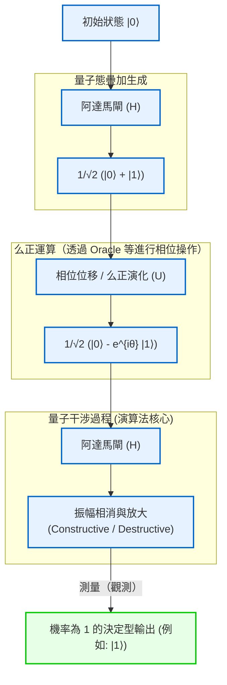

由此可見，量子電腦並非只是為了繞過古典力學極限（如微縮化極限與熱力學極限）而採取的權宜延命手段，而是依據量子力學公理徹底重構資訊與計算定義的真正典範轉移（paradigm shift）。在下一章中，我們將更深入探討用以隨心所欲操控這種量子干涉的具體數學工具——「量子閘」與「量子電路」的細節。

# 第2章：古典位元與量子位元（Qubit）的基礎

在建構量子資訊的理論體系時，最根本的概念便是「資訊的最小單位」之定義。本章將從古典資訊理論中的位元出發，根據量子力學的公理，將概念擴展至量子資訊的最小單位——「量子位元（Qubit）」。我們將使用希爾伯特空間、狄拉克符號（Bra-ket notation）與線性代數的嚴謹語言，徹底解析量子態的數學結構。讓我們排除任何妥協，從專業的視角一窺量子資訊的深淵。

## 2.1 資訊的最小單位：古典位元的數學公式化與極限

在電腦科學的歷史中，克勞德·夏農於1948年確立的資訊理論基礎便是「位元（Bit）」。古典位元不受物理表現（例如電晶體的電壓高低、開關的啟閉或磁化方向）的限制，被定義為一個抽象的狀態空間，取 $\{0, 1\}$ 兩個離散值之一的系統。

讓我們用更形式化的向量空間語言來表達。古典位元的狀態可以使用二維實數向量空間 $\mathbb{R}^2$ 中的標準基底來表示。我們將狀態 $0$ 與狀態 $1$ 分別定義為以下的行向量：

$$
\mathbf{v}_0 = \begin{pmatrix} 1 \\ 0 \end{pmatrix}, \quad \mathbf{v}_1 = \begin{pmatrix} 0 \\ 1 \end{pmatrix}
$$

在決定性（Deterministic）的古典系統中，位元的狀態必定會固定為 $\mathbf{v}_0$ 或 $\mathbf{v}_1$ 的其中一個。然而，當存在熱雜訊等噪聲，或是我們的知識具有不確定性時，就有必要將狀態描述為古典機率性（Probabilistic）位元。在這種情況下，位元的狀態將表示為機率分佈，且狀態向量 $\mathbf{p}$ 可寫成基底向量的凸組合（Convex combination）：

$$
\mathbf{p} = p_0 \mathbf{v}_0 + p_1 \mathbf{v}_1 = \begin{pmatrix} p_0 \\ p_1 \end{pmatrix}
$$

這裡， $p_0, p_1$ 分別代表狀態為 $0$ 與 $1$ 的機率實數，並且根據柯爾莫哥洛夫的機率公理，必須滿足以下條件：

1. **非負性** : $p_0 \ge 0, \quad p_1 \ge 0$
2. **規格化條件（總機率為1）** : $p_0 + p_1 = 1$

在古典位元的世界中，由多個位元組合而成的複合系統，是由各個機率向量的張量積（克羅內克積）來描述的。例如，兩個古典位元的聯合機率如下所示：

$$
\mathbf{p}_{AB} = \mathbf{p}_A \otimes \mathbf{p}_B = \begin{pmatrix} p_{A0} \\ p_{A1} \end{pmatrix} \otimes \begin{pmatrix} p_{B0} \\ p_{B1} \end{pmatrix} = \begin{pmatrix} p_{A0}p_{B0} \\ p_{A0}p_{B1} \\ p_{A1}p_{B0} \\ p_{A1}p_{B1} \end{pmatrix}
$$

古典資訊理論的框架非常強大，構成了現代數位社會的基礎，但由於狀態終究是由實數機率的相加所構成，因此在原理上不可能表現出如波的干涉般「機率的相互抵消」。這正是古典物理學的極限，也是飛躍至量子資訊的必要性所在。

## 2.2 量子力學的要求與狄拉克符號（Bra-ket notation）

量子力學的第一個公設（Postulate）是：「封閉物理系統的狀態，完全由具備複數內積的完備向量空間，亦即希爾伯特空間（Hilbert Space） $\mathcal{H}$ 上的單位向量（狀態向量）所描述」。在量子計算的語境下，由於可以忽略連續空間的自由度等因素，這個希爾伯特空間通常為有限維的複數向量空間 $\mathbb{C}^d$ 。

量子資訊的最小單位「量子位元（Qubit）」，被嚴格定義為二維複數希爾伯特空間 $\mathcal{H} \cong \mathbb{C}^2$ 中的狀態。為了描述這個向量空間中的狀態，標準做法是使用由物理學家保羅·狄拉克所引入的 **狄拉克符號（Bra-ket notation）** 。

代表量子態的行向量被稱為 **Ket向量（Ket vector）** ，並標記為 $|\psi\rangle$ 。作為對應於古典位元 $0$ 與 $1$ 的狀態，我們引入稱為計算基底（Computational basis）的單範正交基底。這些也被稱為量子位元的 $Z$ 基底，分別定義為 $|0\rangle$ 與 $|1\rangle$ ：

$$
|0\rangle = \begin{pmatrix} 1 \\ 0 \end{pmatrix}, \quad |1\rangle = \begin{pmatrix} 0 \\ 1 \end{pmatrix}
$$

另一方面，根據里斯表示定理（Riesz representation theorem），希爾伯特空間中的任意 Ket 向量，都與作為連續線性泛函的對偶空間（Dual space）元素有著唯一對應關係。這被稱為 **Bra向量（Bra vector）** ，並標記為 $\langle\psi|$ 。在矩陣表示中，將 Ket 向量取厄米共軛（即複數共軛轉置，以 $^\dagger$ 表示），即可得到對應的 Bra 向量：

$$
\langle\psi| = (|\psi\rangle)^\dagger = (|\psi\rangle^*)^T
$$

例如，基底的 Bra 向量為以下的列向量：

$$
\langle 0| = \begin{pmatrix} 1 & 0 \end{pmatrix}, \quad \langle 1| = \begin{pmatrix} 0 & 1 \end{pmatrix}
$$

狄拉克符號的真正價值在於，它讓內積的計算在視覺上變得極為明瞭。Bra $\langle\phi|$ 與 Ket $|\psi\rangle$ 的內積寫為 $\langle\phi|\psi\rangle$ （這源自狄拉克的文字遊戲，即 Bra 與 Ket 結合形成 Bracket）。由於計算基底 $\{|0\rangle, |1\rangle\}$ 構成單範正交系（Orthonormal system），可以使用克羅內克 δ 函數 $\delta_{ij}$ 表示如下：

$$
\langle i | j \rangle = \delta_{ij} \quad (i, j \in \{0, 1\})
$$

具體而言，與自身的內積為 $1$ （ $\langle 0|0\rangle = 1$ , $\langle 1|1\rangle = 1$ ），而不同基底間的內積為 $0$ （ $\langle 0|1\rangle = 0$ , $\langle 1|0\rangle = 0$ ）。

此外，Bra 與 Ket 的張量積（相當於外積）記為 $|\psi\rangle\langle\phi|$ ，這代表了從空間到空間的線性算符（矩陣）。例如，投影至某個狀態空間的投影算符（Projection operator）構成如下：

$$
|0\rangle\langle 0| = \begin{pmatrix} 1 \\ 0 \end{pmatrix} \begin{pmatrix} 1 & 0 \end{pmatrix} = \begin{pmatrix} 1 & 0 \\ 0 & 0 \end{pmatrix}
$$

任意二維複數向量空間的單位算符 $I$ （Identity operator），可以分解表示為基底的完備性關係（Completeness relation），這在量子力學的計算中是極為頻繁使用的強大工具：

$$
I = |0\rangle\langle 0| + |1\rangle\langle 1| = \begin{pmatrix} 1 & 0 \\ 0 & 1 \end{pmatrix}
$$

## 2.3 量子疊加原理與複數機率幅

古典位元總是處於 $0$ 或 $1$ 的明確狀態，或者是它們的機率性混合；相對地，由於量子力學的線性（Linearity）要求，量子位元可以採取被稱為「疊加（Superposition）」的本質上截然不同的狀態，由 $|0\rangle$ 與 $|1\rangle$ 的線性組合所表示。希爾伯特空間 $\mathcal{H}$ 內的任意單位向量，皆被允許作為有效的物理狀態。

因此，單一量子位元最一般的純態（Pure state） $|\psi\rangle$ ，可使用計算基底展開如下：

$$
|\psi\rangle = \alpha |0\rangle + \beta |1\rangle = \begin{pmatrix} \alpha \\ \beta \end{pmatrix}
$$

這裡， $\alpha$ 與 $\beta$ 是被稱為 **複數機率幅（Complex probability amplitude）** 的複數（ $\alpha, \beta \in \mathbb{C}$ ）。與古典機率為非負實數形成對比，量子態擁有「複數」係數，這正是量子電腦擁有超越古典電腦計算能力的根本原因。由於複數具有相位（Phase），且能指向複數平面上的任何方向，因此可以像波一樣互相增強（建設性干涉）或互相抵消（破壞性干涉）。量子演算法的本質，就在於巧妙地操縱這種干涉效應，以放大正確答案的機率幅，並抵消錯誤答案的機率幅。

從量子系統中萃取古典資訊的過程稱為「測量（Measurement）」。當考慮投影測量（Projective measurement）時，根據波恩定則（Born rule），以計算基底 $\{|0\rangle, |1\rangle\}$ 測量狀態 $|\psi\rangle$ ，得到結果為 $0$ 的機率 $P(0)$ 與得到 $1$ 的機率 $P(1)$ ，分別由其機率幅絕對值的平方給出：

$$
P(0) = |\langle 0|\psi\rangle|^2 = |\alpha|^2 = \alpha \alpha^*
$$

$$
P(1) = |\langle 1|\psi\rangle|^2 = |\beta|^2 = \beta \beta^*
$$

為了確保系統必定能被觀測為某種狀態，總機率的總和必須嚴格等於 $1$ 。因此，量子狀態向量 $|\psi\rangle$ 的範數（長度）必須始終為 $1$ 。這就是 **規格化條件（Normalization condition）** ：

$$
\langle\psi|\psi\rangle = (\alpha^* \langle 0| + \beta^* \langle 1|)(\alpha |0\rangle + \beta |1\rangle) = |\alpha|^2 + |\beta|^2 = 1
$$

為了更深入探討這個複數機率幅的幾何意義，讓我們將 $\alpha$ 與 $\beta$ 用極座標表示：

$$
\alpha = r_0 e^{i\phi_0}, \quad \beta = r_1 e^{i\phi_1}
$$

這裡 $r_0, r_1 \ge 0$ 是振幅的大小， $\phi_0, \phi_1 \in [0, 2\pi)$ 分別是它們的相位角。由於規格化條件使得 $r_0^2 + r_1^2 = 1$ ，我們可以使用實數參數 $\theta \in [0, \pi]$ ，令 $r_0 = \cos(\frac{\theta}{2})$ 、 $r_1 = \sin(\frac{\theta}{2})$ 。將其代入原本的狀態向量中：

$$
|\psi\rangle = \cos\left(\frac{\theta}{2}\right) e^{i\phi_0} |0\rangle + \sin\left(\frac{\theta}{2}\right) e^{i\phi_1} |1\rangle
$$

讓我們將整體提出一個共同的相位因子 $e^{i\phi_0}$ ：

$$
|\psi\rangle = e^{i\phi_0} \left( \cos\left(\frac{\theta}{2}\right) |0\rangle + e^{i(\phi_1 - \phi_0)} \sin\left(\frac{\theta}{2}\right) |1\rangle \right)
$$

在量子力學中，乘在整個狀態向量上的相位因子 $e^{i\phi_0}$ 被稱為「全域相位（Global phase）」。藉由計算任意觀測量（厄米算符） $A$ 的期望值 $\langle A \rangle$ 就可以明白：

$$
\langle A \rangle = \left( e^{-i\phi_0} \langle\psi| \right) A \left( e^{i\phi_0} |\psi\rangle \right) = e^{-i\phi_0} e^{i\phi_0} \langle\psi| A |\psi\rangle = \langle\psi| A |\psi\rangle
$$

如上所示，由於全域相位相乘後會互相抵消，因此不可能透過任何物理測量來觀測到它。也就是說， $|\psi\rangle$ 與 $e^{i\phi_0}|\psi\rangle$ 在希爾伯特空間上雖然是不同的向量（作為射線則是相同的），但在物理上代表完全相同的狀態。

因此，透過忽略全域相位，並僅保留 $|0\rangle$ 與 $|1\rangle$ 之間的相對相位（Relative phase） $\varphi = \phi_1 - \phi_0$ （其中 $\varphi \in [0, 2\pi)$ ）作為參數，任意單一量子位元的純態可唯一且嚴格地表示為以下的 **標準形式** ：

$$
|\psi\rangle = \cos\left(\frac{\theta}{2}\right) |0\rangle + e^{i\varphi} \sin\left(\frac{\theta}{2}\right) |1\rangle
$$

## 2.4 布洛赫球（Bloch Sphere）的幾何視覺化

在前一節導出的參數化表明，單一量子位元的狀態空間在幾何上與三維空間中的單位球面表面（二維球面 $S^2$ ）同構。這種視覺化表示法以其發明者，瑞士物理學家費利克斯·布洛赫（Felix Bloch）的名字命名，稱為 **布洛赫球（Bloch Sphere）** 。

角度 $\theta$ 準確對應於從 $Z$ 軸正方向算起的極角（Polar angle），而角度 $\varphi$ 則對應於 $X$-$Y$ 平面上的方位角（Azimuthal angle）。

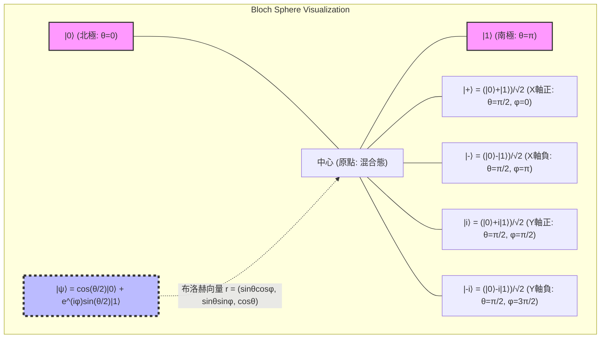

布洛赫球最值得注意的性質是：「在希爾伯特空間中正交的狀態（內積為0的狀態），在布洛赫球的三維實空間上會位於彼此的對蹠點（Antipodal points：180度相反側的點）」。例如，與 $|0\rangle$ （北極， $\theta=0$ ）正交的狀態是 $|1\rangle$ （南極， $\theta=\pi$ ）。在希爾伯特空間上正交狀態之間內積的計算 $\langle 0 | 1 \rangle = 0$ ，相當於在布洛赫球上角度為 $\pi$ （180度）的間隔。由於幾何角度是希爾伯特空間角度的兩倍，這就是為何在參數化中使用半角 $\theta/2$ 的數學必然性所在。

這個布洛赫球的座標 $\mathbf{r} = (x, y, z)$ ，可嚴格推導為量子力學中觀測量（Observable）—— **包立矩陣（Pauli matrices）** 的期望值。作為二維系統厄米算符基底的包立矩陣定義如下：

$$
X = \sigma_x = \begin{pmatrix} 0 & 1 \\ 1 & 0 \end{pmatrix}, \quad
Y = \sigma_y = \begin{pmatrix} 0 & -i \\ i & 0 \end{pmatrix}, \quad
Z = \sigma_z = \begin{pmatrix} 1 & 0 \\ 0 & -1 \end{pmatrix}
$$

對於任意狀態 $|\psi\rangle$ ，這些包立觀測量的期望值可以透過狄拉克括號計算求得：

$$
x = \langle\psi| X |\psi\rangle = \left( \cos\frac{\theta}{2} \langle 0| + e^{-i\varphi}\sin\frac{\theta}{2} \langle 1| \right) \begin{pmatrix} 0 & 1 \\ 1 & 0 \end{pmatrix} \begin{pmatrix} \cos\frac{\theta}{2} \\ e^{i\varphi}\sin\frac{\theta}{2} \end{pmatrix} = \sin\theta \cos\varphi
$$

$$
y = \langle\psi| Y |\psi\rangle = \left( \cos\frac{\theta}{2} \langle 0| + e^{-i\varphi}\sin\frac{\theta}{2} \langle 1| \right) \begin{pmatrix} 0 & -i \\ i & 0 \end{pmatrix} \begin{pmatrix} \cos\frac{\theta}{2} \\ e^{i\varphi}\sin\frac{\theta}{2} \end{pmatrix} = \sin\theta \sin\varphi
$$

$$
z = \langle\psi| Z |\psi\rangle = \left( \cos\frac{\theta}{2} \langle 0| + e^{-i\varphi}\sin\frac{\theta}{2} \langle 1| \right) \begin{pmatrix} 1 & 0 \\ 0 & -1 \end{pmatrix} \begin{pmatrix} \cos\frac{\theta}{2} \\ e^{i\varphi}\sin\frac{\theta}{2} \end{pmatrix} = \cos^2\left(\frac{\theta}{2}\right) - \sin^2\left(\frac{\theta}{2}\right) = \cos\theta
$$

藉此，布洛赫向量 $\mathbf{r} = (x, y, z)$ 完美地表示為了三維空間的單位向量 $\mathbf{r} = (\sin\theta\cos\varphi, \sin\theta\sin\varphi, \cos\theta)$ 。此外，對應於任意純態的密度矩陣（Density matrix） $\rho = |\psi\rangle\langle\psi|$ ，可以使用包立向量 $\boldsymbol{\sigma} = (X, Y, Z)$ 與單位矩陣 $I$ 極為優雅地描述：

$$
\rho = \frac{1}{2} \left( I + \mathbf{r} \cdot \boldsymbol{\sigma} \right) = \frac{1}{2} \left( I + xX + yY + zZ \right)
$$

將矩陣的元素明確展開並確認後，結果如下：

$$
\rho = \frac{1}{2} \begin{pmatrix} 1 + z & x - iy \\ x + iy & 1 - z \end{pmatrix} = \begin{pmatrix} \cos^2(\frac{\theta}{2}) & e^{-i\varphi}\sin(\frac{\theta}{2})\cos(\frac{\theta}{2}) \\ e^{i\varphi}\sin(\frac{\theta}{2})\cos(\frac{\theta}{2}) & \sin^2(\frac{\theta}{2}) \end{pmatrix}
$$

這完全吻合根據張量積定義計算的外積 $|\psi\rangle\langle\psi|$ 的結果。這裡特別值得一提的是，在純態中，布洛赫向量的範數為 $|\mathbf{r}| = 1$ ，且滿足密度矩陣的跡數 $\text{Tr}(\rho^2) = 1$ ；但是，在因與環境交互作用或控制不完美而導致量子資訊流失（退相干，Decoherence）的混合態（Mixed state）中，由於它是純態的統計系綜（Statistical ensemble），因此會有 $|\mathbf{r}| < 1$ 。其結果是，混合態並非表示為布洛赫球表面的點，而是「內部」的點，而完全失去資訊的最大混合態（Maximally mixed state） $\rho = I/2$ 則會位於布洛赫球的中心點 $\mathbf{r} = (0,0,0)$ 。

## 2.5 測量與波包塌縮（Wavefunction Collapse）

量子力學中的測量，與古典力學中被動讀取資訊的方式有著根本上的不同。根據馮·紐曼（von Neumann）的公理化陳述，當對物理量（觀測量）進行測量時，狀態會不可逆地「塌縮（Collapse）」為該觀測量的本徵態（Eigenstate）。

例如，考慮對單一量子位元狀態 $|\psi\rangle = \alpha|0\rangle + \beta|1\rangle$ 進行以 $Z$ 基底的測量（即以包立 $Z$ 矩陣為觀測量的測量）。我們能得到的測量值僅有 $Z$ 的本徵值 $+1$ （對應狀態 $|0\rangle$ ）或 $-1$ （對應狀態 $|1\rangle$ ）。

為在數學上嚴謹地描述測量，我們使用投影算符的集合 $\{ P_m \}$ 。 $Z$ 測量情況下的投影算符如下：

$$
P_0 = |0\rangle\langle 0|, \quad P_1 = |1\rangle\langle 1|
$$

這些算符滿足完備性關係 $P_0 + P_1 = I$ 以及正交性 $P_i P_j = \delta_{ij} P_i$ 。根據波恩定則，得到測量結果 $m \in \{0, 1\}$ 的機率 $P(m)$ 為：

$$
P(m) = \langle\psi| P_m^\dagger P_m |\psi\rangle = \langle\psi| P_m |\psi\rangle
$$

此計算結果完全吻合先前的 $|\alpha|^2$ 與 $|\beta|^2$ 。而最重要的一點是，在獲得測量結果 $m$ 後的瞬間，新的量子狀態 $|\psi'\rangle$ 將會是原本狀態作用了投影算符後，再以新的範數重新規格化的結果：

$$
|\psi'\rangle = \frac{P_m |\psi\rangle}{\sqrt{P(m)}}
$$

如果結果為 $0$ ，

$$
|\psi'\rangle = \frac{|0\rangle\langle 0| (\alpha|0\rangle + \beta|1\rangle)}{|\alpha|} = \frac{\alpha}{|\alpha|} |0\rangle = e^{i\phi_0} |0\rangle \equiv |0\rangle
$$

如此一來，狀態將完全塌縮至 $|0\rangle$ （忽略全域相位）。這就是被稱為波包塌縮（Wavefunction collapse）現象的數學描述。一旦進行了測量並使狀態發生塌縮，原本疊加態中包含的相對相位 $\varphi$ 與振幅的資訊（ $\alpha, \beta$ ）便會永遠遺失。因此，想要透過對單一副本進行一次測量來讀取量子態的完整資訊，在原理上是不可能的（這也與「不可複製定理（No-cloning theorem）」有著深刻的關聯）。

## 2.6 多體系統擴展的引入與對下一章的展望

在深入理解了單一量子位元的性質後，我們也在此觸及下一章起將正式探討的「多量子位元系統」的數學基礎。古典機率分佈是透過卡氏積（Cartesian product）來擴展狀態空間，相對地，量子力學中複合系統的希爾伯特空間 $\mathcal{H}_{AB}$ ，是由各子系統的希爾伯特空間 $\mathcal{H}_A$ 與 $\mathcal{H}_B$ 的 **張量積（Tensor product）** 所構成：

$$
\mathcal{H}_{AB} = \mathcal{H}_A \otimes \mathcal{H}_B
$$

兩個獨立量子位元狀態的張量積可展開如下，並形成四維的複數向量空間：

$$
|\Psi\rangle_{AB} = (\alpha_0|0\rangle + \alpha_1|1\rangle) \otimes (\beta_0|0\rangle + \beta_1|1\rangle) = \alpha_0\beta_0|00\rangle + \alpha_0\beta_1|01\rangle + \alpha_1\beta_0|10\rangle + \alpha_1\beta_1|11\rangle
$$

在此，無法被因式分解為狀態張量積的狀態（例如貝爾態（Bell state） $|\Phi^+\rangle = (|00\rangle + |11\rangle)/\sqrt{2}$ ）的存在，便是量子糾纏（Entanglement）的源泉。透過張量積帶來的維度指數級爆炸（ $N$ 個量子位元會產生 $2^N$ 維），正是量子電腦能夠發揮壓倒性平行計算能力的基礎。

本章在希爾伯特空間的數學基礎上，建構了古典位元與量子位元的本質差異。量子位元能呈現具有複數機率幅的連續疊加態，且透過布洛赫球的推導，我們獲得了一種強大的方法，能將抽象的複數向量直觀理解為三維實空間的幾何模型。

在下一章「第3章：量子閘與么正變換（Unitary Transformation）」中，我們將詳細介紹用來操作這些單一量子位元狀態的具體「量子邏輯閘」，並闡明在布洛赫球上透過么正矩陣進行旋轉操作的數學性質。通往量子資訊深淵世界的門扉，才剛剛開啟。

# 第3章：量子力學的公理與觀測（波包塌縮）

## 3.1 引言：量子力學的公理化方法與線性代數的要求

為了從根本上理解量子電腦的運作原理，以數學上嚴格的形式掌握量子力學這一物理學理論框架是不可或缺的。物理學中的許多理論都是基於經驗法則進行歸納式發展的，但量子力學，特別是由約翰·馮·紐曼（John von Neumann）所公式化的現代量子力學，採用了從少數幾個數學「公理（Axioms）」演繹出整個體系的公理化方法。

這個公理體系建立在希爾伯特空間（Hilbert space）這個可擴展至無限維的複數線性代數舞台之上。在量子資訊科學與量子計算中，由於主要處理有限維向量空間（例如量子位元系統的 $\mathbb{C}^2$ 張量積空間），因此可以避開無限維中的解析學困難（如無界算符的定義域等），純粹以線性代數的方式來描述與理解量子力學。

本章將從量子態的描述開始，到時間演化，再到引發最多哲學討論的「觀測」為止的過程，排除一切妥協進行嚴格的公式化。讀者將會體會到，看似違反直覺的量子現象，是如何建立在無矛盾且優美的數學結構之上。正是這個數學結構，構成了直接描述量子電腦演算法的「語言」。

## 3.2 第一公理：狀態空間（希爾伯特空間與狀態向量）

量子力學的第一個公理，定義了在數學上應如何表示物理系統的「狀態」。

 **公理 1（狀態的表示）** ：
封閉物理系統的狀態，可由具備完備性的複內積空間——希爾伯特空間（Hilbert space） $\mathcal{H}$ 上，範數為 1 的單位向量來完全描述。這被稱為 **狀態向量** 。

根據保羅·狄拉克（Paul Dirac）所引入的狄拉克符號（Bra-ket notation，或稱括號記號），狀態向量被視為行向量（Column vector），並記為 Ket（右矢） **$| \psi \rangle$** 。屬於對偶空間 $\mathcal{H}^*$ 的列向量（Row vector）則記為 Bra（左矢） **$\langle \psi |$** ，它們彼此互為厄米共軛（Hermitian conjugate，即複數共軛轉置）的關係。也就是說：

$$
\langle \psi | = ( | \psi \rangle )^\dagger
$$

在希爾伯特空間中，任意兩個狀態 **$| \phi \rangle$** 與 **$| \psi \rangle$** 的內積，可計算為 Bra 與 Ket 的乘積 **$\langle \phi | \psi \rangle$** ，並給出一個複數值。此內積滿足以下性質：

1. **正定性** ：對於任意 **$| \psi \rangle \neq 0$** ，都有 $\langle \psi | \psi \rangle > 0$
2. **線性** ： $\langle \phi | ( c_1 | \psi_1 \rangle + c_2 | \psi_2 \rangle ) = c_1 \langle \phi | \psi_1 \rangle + c_2 \langle \phi | \psi_2 \rangle$
3. **共軛對稱性** ： $\langle \phi | \psi \rangle = \langle \psi | \phi \rangle^*$ （ $*$ 表示複數共軛）

為了使機率詮釋成立，物理狀態必須始終滿足歸一化條件（Normalization condition）。換言之，狀態向量 **$| \psi \rangle$** 的範數為 1：

$$
\| | \psi \rangle \| = \sqrt{\langle \psi | \psi \rangle} = 1
$$

此外，由於柯西-舒瓦茲不等式（Cauchy-Schwarz inequality） $|\langle \phi | \psi \rangle|^2 \le \langle \phi | \phi \rangle \langle \psi | \psi \rangle$ 成立，因此歸一化狀態之間內積的絕對值將始終落在 0 到 1 之間。這就構成了日後被詮釋為「機率」的數學基礎。

### 疊加原理與單範正交基底

量子力學最顯著的特徵是「疊加原理（Superposition principle）」。如果 **$| \phi \rangle$** 與 **$| \psi \rangle$** 是物理上允許的狀態，那麼它們的任意複數線性組合 $c_1 | \phi \rangle + c_2 | \psi \rangle$ 也（在經過歸一化後）是物理上允許的狀態。這個性質直接由希爾伯特空間的線性導出。

在希爾伯特空間 $\mathcal{H}$ 中，存在著單範正交基底（Orthonormal basis，或稱標準正交基底） $\{ | e_i \rangle \}$ 。這些基底彼此正交，且已經過歸一化：

$$
\langle e_i | e_j \rangle = \delta_{ij}
$$

（ $\delta_{ij}$ 為克羅內克 δ 函數，Kronecker delta）。此外，作為完備性關係（Completeness relation）或分解恆等式，恆等算符 $I$ 可以展開如下：

$$
I = \sum_i | e_i \rangle \langle e_i |
$$

對於任意量子態 **$| \psi \rangle$** ，透過作用此恆等算符，可以唯一地展開為基底的線性組合：

$$
| \psi \rangle = I | \psi \rangle = \left( \sum_i | e_i \rangle \langle e_i | \right) | \psi \rangle = \sum_i \langle e_i | \psi \rangle | e_i \rangle = \sum_i c_i | e_i \rangle
$$

這裡的展開係數 $c_i = \langle e_i | \psi \rangle$ 被稱為複數機率幅（Complex probability amplitude），在後文所述的波恩定則中扮演著決定性的角色。由歸一化條件 $\langle \psi | \psi \rangle = 1$ 可導出 $\sum_i |c_i|^2 = 1$ 。

## 3.3 第二公理：物理量與厄米算符

在古典力學中，位置、動量、能量等物理量（可觀測量，Observable）是以實數值函數來描述的。然而在量子力學中，發生了根本性的典範轉移。

 **公理 2（物理量）** ：
可觀測的物理量（可觀測量），由希爾伯特空間 $\mathcal{H}$ 上的線性自伴算符（厄米算符，Hermitian operator） $A$ 來描述。

厄米算符是指其厄米共軛等於自身的算符，即滿足 $A = A^\dagger$ 。當在有限維空間中以矩陣表示時，這意味著其矩陣元素具備複數共軛對稱性（ $A_{ij} = A_{ji}^*$ ）。

物理量之所以必須被定義為厄米算符，原因在於其「本徵值（Eigenvalues，或稱特徵值）」。根據線性代數中的譜定理（Spectral theorem），厄米算符具有以下極為重要的性質：

1. **所有的本徵值 $a_i$ 都是實數。** （因為觀測到的物理量必須始終為實數，這符合了物理上的要求。）
2. **屬於不同本徵值的本徵向量彼此正交。** 
3. **算符的本徵向量系 $\{ | a_i \rangle \}$ 構成希爾伯特空間的單範正交基底。** 

因此，對於任意的可觀測量 $A$ ，我們可以使用其本徵值 $a_i$ 與本徵向量 **$| a_i \rangle$** ，將其表示為投影算符（Projection operator） $P_i = | a_i \rangle \langle a_i |$ 的線性組合，進行譜分解（Spectral decomposition）：

$$
A = \sum_i a_i | a_i \rangle \langle a_i |
$$

透過這個公式化，「測量物理量」這個行為便能被理解為：向希爾伯特空間特定基底（本徵向量）進行投影的幾何學操作。例如，量子位元的 $\sigma_z$ 觀測，就可以完全描述為投影到對應於本徵值 $+1$ 的狀態 **$| 0 \rangle$** ，以及對應於本徵值 $-1$ 的狀態 **$| 1 \rangle$** 這組正交基底上的操作。

## 3.4 第三公理：么正時間演化與薛丁格方程式

當量子系統與其他系統沒有交互作用而處於孤立狀態時，其狀態的時間變化是決定論性且可逆的。

 **公理 3（時間演化）** ：
孤立量子系統狀態的時間演化，遵循薛丁格方程式（Schrödinger equation）。或者以等價的表述：時刻 $t_0$ 的狀態 **$| \psi(t_0) \rangle$** ，在時刻 $t$ 將會演化為作用了么正算符（Unitary operator） $U(t, t_0)$ 的狀態 **$| \psi(t) \rangle$** 。

描述時間演化的基礎方程式——含時薛丁格方程式（Time-dependent Schrödinger equation）表示如下：

$$
i\hbar \frac{d}{dt} | \psi(t) \rangle = H | \psi(t) \rangle
$$

這裡 $i$ 是虛數單位， $\hbar$ 是約化普朗克常數（Reduced Planck constant）， $H$ 是對應於系統總能量的可觀測量，即哈密頓算符（Hamiltonian operator，或哈密頓量）。

若考慮哈密頓算符 $H$ 不依賴時間（時間不變）的系統，這個微分方程式可以形式上進行積分，其解給出如下：

$$
| \psi(t) \rangle = \exp\left( -\frac{i}{\hbar} H (t - t_0) \right) | \psi(t_0) \rangle
$$

這個以指數函數表示的算符 $U(t, t_0) = \exp\left( -i H (t - t_0) / \hbar \right)$ 即為時間演化算符。由於哈密頓算符 $H$ 是厄米的（ $H = H^\dagger$ ），根據史東定理（Stone's theorem）， $U$ 必然是一個么正算符（Unitary operator）。所謂么正算符，是指其厄米共軛等於其反矩陣（ $U^\dagger U = U U^\dagger = I$ ）的算符。

么正變換極為重要的物理意義在於： **「保存狀態向量的範數（長度）與內積」** 。也就是說，無論時間如何流逝， $\langle \psi(t) | \psi(t) \rangle = \langle \psi(t_0) | U^\dagger U | \psi(t_0) \rangle = 1$ 始終獲得保證，機率總和為 1 的物理定律絕不會破滅。量子電腦的「量子閘（Quantum gate）」，無非就是人為地設計與控制這種么正時間演化的操作本身。例如阿達馬閘（Hadamard gate）與 CNOT 閘全都表示為么正矩陣。

## 3.5 第四公理：觀測與波恩定則（Born rule）

量子力學中的「觀測（Measurement）」概念，與古典物理學有著根本上的不同。在古典系統中，觀測行為被視為在不擾動系統狀態的情況下被動地獲取數值。然而在量子力學中，觀測會主動介入狀態，並帶來不可逆的變化。

 **公理 4（觀測與波恩定則）** ：
對於處於狀態 **$| \psi \rangle$** 的系統，當對具有譜分解 $A = \sum_i a_i P_i$ 的可觀測量 $A$ 進行觀測時，所獲得的測量值必定是 $A$ 的本徵值 $a_i$ 之一。獲得特定本徵值 $a_k$ 的機率 $p(a_k)$ ，根據波恩定則由下式給出：

$$
p(a_k) = \langle \psi | P_k | \psi \rangle = \| P_k | \psi \rangle \|^2
$$

若本徵值 $a_k$ 是非簡併的（對應的本徵向量 **$| a_k \rangle$** 僅有一個），投影算符即為 $P_k = | a_k \rangle \langle a_k |$ ，此時機率可計算為狀態對本徵向量之內積絕對值的平方：

$$
p(a_k) = \langle \psi | a_k \rangle \langle a_k | \psi \rangle = | \langle a_k | \psi \rangle |^2
$$

這正是將狀態向量 **$| \psi \rangle$** 在基底 $\{ | a_i \rangle \}$ 上展開時，係數 $c_k = \langle a_k | \psi \rangle$ 的絕對值平方 $|c_k|^2$ 。複數機率幅 $c_k$ 本身無法被直接觀測，但其絕對值的平方卻作為現實世界中的觀測機率浮現。提出這項定則的馬克斯·波恩（Max Born）的洞見，是將物理學從決定論轉化為機率論的里程碑。可觀測量 $A$ 的期望值 $\langle A \rangle$ ，可計算為所有本徵值與其出現機率之乘積的總和，最終以狀態向量內積的形式極為優美地表現出來：

$$
\langle A \rangle = \sum_i a_i p(a_i) = \sum_i a_i \langle \psi | P_i | \psi \rangle = \langle \psi | \left( \sum_i a_i P_i \right) | \psi \rangle = \langle \psi | A | \psi \rangle
$$

## 3.6 觀測所致的波包塌縮（狀態還原）與退相干

觀測公理中，包含了一個引發最多爭論的重大步驟：觀測「後」系統的狀態會變成如何。這就是被稱為「波包塌縮（Wavefunction collapse）」或「狀態還原（State reduction）」的現象。作為馮·紐曼的投影假說（Projection postulate）而為人所知的這個過程，被公式化如下：

 **投影假說** ：
透過觀測獲得本徵值 $a_k$ 直後系統的狀態 **$| \psi' \rangle$** ，將會瞬間變化（塌縮）為：將對應的投影算符 $P_k$ 作用於原狀態向量並重新歸一化後的結果。

$$
| \psi' \rangle = \frac{P_k | \psi \rangle}{\sqrt{p(a_k)}}
$$

若觀測儀器是理想的，且系統的狀態塌縮至非簡併的本徵值 $a_k$ ，則觀測後的狀態將嚴格等於本徵向量 **$| a_k \rangle$** 本身。也就是說，若緊接著重複進行完全相同的觀測，將會以機率 1（100%）再次獲得 $a_k$ 。這被稱為「第一種測量（Measurement of the first kind）」。

這種「波包塌縮」，具有與薛丁格方程式所描述的么正時間演化（連續的、決定論性的、可逆的）明確矛盾的性質（不連續的、機率性的、不可逆的）。量子力學內含著一種二元性的動力學：系統在孤立時進行么正演化，而在與巨觀觀測儀器接觸的瞬間，則發生非么正的塌縮。

### 從純態到混態：密度算符的引入

為了更深入地理解波包塌縮這一悖論，「密度算符（Density operator）」的概念不可或缺。我們至今所處理的狀態向量 **$| \psi \rangle$** ，是擁有系統最大資訊量的「純態（Pure state）」。純態的密度算符定義為 $\rho = | \psi \rangle \langle \psi |$ 。

另一方面，在觀測過程中若我們不知道系統塌縮到了哪一個狀態（或遺失了資訊），系統就必須被描述為古典的機率性混合態（混態，Mixed state）。例如，以機率 $p(a_k)$ 塌縮至狀態 **$| a_k \rangle$** 的系統系綜（Ensemble），其密度算符如下所示：

$$
\rho' = \sum_k p(a_k) | a_k \rangle \langle a_k |
$$

此時，原本純態中 $\rho = | \psi \rangle \langle \psi |$ 的非對角項（干涉項），會因觀測這一行為而完全消失。這種干涉性的喪失，正是「退相干（Decoherence）」的核心。

### 退相干與巨觀古典性的湧現

觀測儀器本身也是由大量粒子組成的量子系統的一部分，當量子系統與巨大的環境（觀測儀器或熱庫等）產生交互作用時，就會產生「量子糾纏（量子纏結，Quantum entanglement）」。若將環境的自由度跡除（部分跡，Partial trace），計算出僅針對目標系統的約化密度矩陣（Reduced density matrix），原本處於純態的系統狀態向量將會迅速過渡為混態，系統各分量之間的相位干涉性隨之喪失：

$$
\rho_{S} = \mathrm{Tr}_{E} [ | \Psi_{SE} \rangle \langle \Psi_{SE} | ]
$$

如此一來，在巨觀尺度上疊加態便會消失，其行為表現得就像古典的機率性混合。波包塌縮絕非物理定律的崩潰，而是可以被視為由於與環境進行不可逆的交互作用所導致的資訊耗散。克服這種退相干，正是實現容錯量子電腦（Fault-tolerant quantum computer）的過程中人類所面臨的最大挑戰。

### 量子態的時間演化與觀測動力學

下圖視覺化了量子系統從初始狀態出發，經過么正時間演化後，因觀測而使狀態產生機率性分歧（塌縮）的過程。請對照確認薛丁格的決定論性演化與波恩的機率性塌縮：

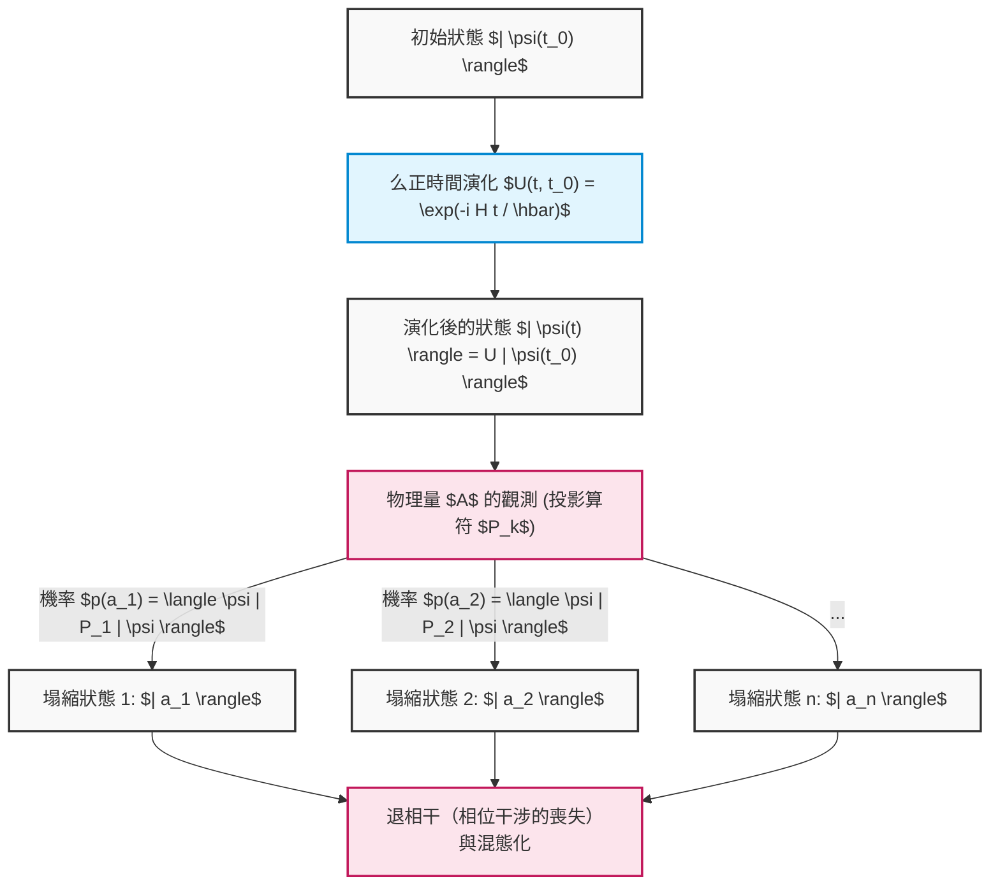

正如我們所見，線性代數的抽象概念——向量空間、內積、厄米算符、本徵值問題、么正矩陣——絕非單純的數學遊戲，而是精準描述與預測宇宙最微觀行為無可替代的語言。量子電腦的演算法，正是巧妙地操縱著「薛丁格的決定論性演化」與「波恩的機率性塌縮」這兩大強大法則，引領我們邁入古典電腦所無法企及的運算疆界。

# 第4章：單一量子位元閘與么正變換

構成量子計算基礎的是對量子態的精確操作。古典電腦中的邏輯閘（如 AND、OR、NOT 等）對位元值進行不可逆的操作，相對地，量子電腦中的「量子閘」是遵循薛丁格方程式要求的可逆時間演化，在數學上被嚴格描述為複數希爾伯特空間上的「么正變換（么正矩陣）」。本章將對作用於單一量子位元（二階層系統）的基本量子閘的數學結構、代數性質，以及在布洛赫球（Bloch sphere）上直觀的幾何意義，進行毫不妥協的徹底探討。

## 4.1 量子力學的要求與么正矩陣的必然性

量子系統的時間演化，是使用特徵化系統的厄米算符——哈密頓量 **$H$** （ **$H^\dagger = H$** ），由以下的薛丁格方程式所支配：

$$
i\hbar \frac{d}{dt} |\psi(t)\rangle = H |\psi(t)\rangle
$$

在假設哈密頓量 **$H$** 不隨時間改變的系統下，任意時刻 **$t$** 的量子態 **$|\psi(t)\rangle$** ，從初始狀態 **$|\psi(0)\rangle$** 形式上可做如下積分：

$$
|\psi(t)\rangle = e^{-\frac{i}{\hbar}Ht} |\psi(0)\rangle
$$

我們將此處出現的時間演化算符定義為 **$U(t) = e^{-\frac{i}{\hbar}Ht}$** 。由於指數函數肩膀上的 **$H$** 是厄米的，計算此算符 **$U(t)$** 的伴隨算符（厄米共軛） **$U(t)^\dagger$** 時，會導出以下極為重要的性質：

$$
U(t)^\dagger U(t) = \left( e^{-\frac{i}{\hbar}Ht} \right)^\dagger e^{-\frac{i}{\hbar}Ht} = e^{\frac{i}{\hbar}H^\dagger t} e^{-\frac{i}{\hbar}Ht} = e^{\frac{i}{\hbar}Ht} e^{-\frac{i}{\hbar}Ht} = I
$$

同樣地， **$U(t) U(t)^\dagger = I$** 也會成立。像這樣，其伴隨矩陣與自身的反矩陣一致的矩陣（ **$U^\dagger = U^{-1}$** ），我們稱之為「么正矩陣（Unitary Matrix）」。單一量子位元閘無非就是透過物理控制（例如照射特定頻率與持續時間的微波脈衝等）來刻意設計的哈密頓量所實現的 **$2 \times 2$** 么正矩陣。

么正矩陣在量子力學中絕對不可或缺的理由，是因為它是唯一能從數學上擔保「機率守恆（範數守恆）」的線性變換。讓我們計算一下對任意量子態 **$|\psi\rangle$** 和 **$|\phi\rangle$** 施加么正變換 **$U$** 之後的狀態內積：

$$
\langle \phi' | \psi' \rangle = ( \langle \phi | U^\dagger ) ( U |\psi\rangle ) = \langle \phi | U^\dagger U | \psi \rangle = \langle \phi | I | \psi \rangle = \langle \phi | \psi \rangle
$$

內積守恆這件事，意味著狀態向量本身的範數（長度的平方）也就是 **$\langle \psi | \psi \rangle$** 也同樣守恆。根據量子力學的波恩定則（Born rule），狀態向量振幅的絕對值平方總和必須是全機率「1」，因此為了不讓量子閘操作破壞這個機率詮釋，操作必須是么正的，這就是絕對的前提條件。

此外，根據譜定理（Spectral theorem），任意的么正矩陣 **$U$** ，可以使用具有實數特徵值 **$\lambda_k$** 的厄米矩陣 **$K$** 來表示為 **$U = e^{iK}$** 。么正矩陣的特徵值總是呈現絕對值為 1 的複數（ **$e^{i\theta}$** ）形式，且其特徵向量構成相互正交的完備系。

$$
U = \sum_{j=1}^{d} e^{i \theta_j} |\phi_j\rangle \langle \phi_j|
$$

這顯示了量子閘的作用可以完全分解為「對特定的正交基底 **$|\phi_j\rangle$** ，僅賦予純粹的相位旋轉 **$e^{i\theta_j}$** 」的操作。

## 4.2 包立矩陣與基本閘（X、Y、Z 閘）

在講述量子資訊的語言時，理解包立矩陣（Pauli matrices）群是不可避免且最重要的。這個在物理學中為了描述自旋 1/2 粒子的角動量而引入的矩陣群，在量子電腦中構成了對單一量子位元最基本且正交的操作群。

### 4.2.1 包立 X 閘（位元反轉閘）

包立 X 閘是古典邏輯電路中 NOT 閘的量子力學擴展。使用狄拉克括號表示法的外積（投影算符）表示中，其定義如下：

$$
X = \sigma_x = |0\rangle\langle 1| + |1\rangle\langle 0| = \begin{pmatrix} 0 & 1 \\ 1 & 0 \end{pmatrix}
$$

透過嚴格的矩陣計算來確認對計算基底（ **$|0\rangle, |1\rangle$** ）的作用：

$$
X |0\rangle = \begin{pmatrix} 0 & 1 \\ 1 & 0 \end{pmatrix} \begin{pmatrix} 1 \\ 0 \end{pmatrix} = \begin{pmatrix} 0 \\ 1 \end{pmatrix} = |1\rangle
$$

$$
X |1\rangle = \begin{pmatrix} 0 & 1 \\ 1 & 0 \end{pmatrix} \begin{pmatrix} 0 \\ 1 \end{pmatrix} = \begin{pmatrix} 1 \\ 0 \end{pmatrix} = |0\rangle
$$

如此這般，它將振幅完全反轉。幾何上，它對應於在布洛赫球中以 X 軸為旋轉軸進行 **$\pi$** （180度）的旋轉操作。北極（ **$|0\rangle$** ）被映射到南極（ **$|1\rangle$** ），而南極則被映射到北極。

### 4.2.2 包立 Y 閘（位元與相位反轉閘）

包立 Y 閘會同時引起位元反轉與相位反轉，並進一步賦予虛數單位 **$i$** 的相位因子。其外積表示與矩陣表示如下：

$$
Y = \sigma_y = -i|0\rangle\langle 1| + i|1\rangle\langle 0| = \begin{pmatrix} 0 & -i \\ i & 0 \end{pmatrix}
$$

對計算基底的作用為：

$$
Y |0\rangle = i|1\rangle, \quad Y |1\rangle = -i|0\rangle
$$

在布洛赫球上，它表示繞 Y 軸的 **$\pi$** 旋轉。乘上虛數單位 **$i$** （即 **$e^{i\pi/2}$** ）意味著不只是單純的反轉，還包括狀態在相位空間中往正交方向的平移。

### 4.2.3 包立 Z 閘（相位反轉閘）

包立 Z 閘是古典邏輯中不存在的、量子特有的純粹「相位操作」。它完全不改變振幅的大小（測量機率），僅對 **$|1\rangle$** 的成分給予 **$-1$** （即 **$e^{i\pi}$** ）的相位平移。

$$
Z = \sigma_z = |0\rangle\langle 0| - |1\rangle\langle 1| = \begin{pmatrix} 1 & 0 \\ 0 & -1 \end{pmatrix}
$$

其作用顯然為：

$$
Z |0\rangle = |0\rangle, \quad Z |1\rangle = -|1\rangle
$$

這對應於繞 Z 軸的 **$\pi$** 旋轉。由於計算基底 **$|0\rangle, |1\rangle$** 是 Z 矩陣的特徵向量（特徵值分別為 +1, -1），因此套用 Z 閘也不會使狀態發生躍遷。然而，若是作用於疊加態（例如： **$\alpha|0\rangle + \beta|1\rangle$** ），相對相位會劇烈反轉為 **$\alpha|0\rangle - \beta|1\rangle$** ，進而決定性地改變後續階段的干涉結果。

### 4.2.4 包立群的深遠代數結構

包立矩陣群 **$\{I, X, Y, Z\}$** 作為希爾伯特空間上的線性算符，構成了一個極為優美的代數結構。

1. **自伴隨性（厄米性）與么正性的兩立** ： **$X = X^\dagger$** 、 **$Y = Y^\dagger$** 、 **$Z = Z^\dagger$** ，且同時滿足 **$X^\dagger X = I$** （即 **$X = X^{-1}$** ）。它既是物理量（可觀測量），同時本身又是么正的時間演化生成元（閘），這是一種罕見的性質。連續套用兩次就會回到恆等變換（對合： **$X^2 = Y^2 = Z^2 = I$** ）。
2. **完全反交換關係** ：不同的包立矩陣之間交換相乘順序時，符號會反轉。
   

$$
\{X, Y\} = XY + YX = 0, \quad \{Y, Z\} = 0, \quad \{Z, X\} = 0
$$

3. **交換關係與李代數** ：使用交換子 **$[A, B] = AB - BA$** 時，它們明確地展示了作為 **$SU(2)$** 李代數生成元的結構（使用完全反對稱張量 **$\epsilon_{ijk}$** ）。
   

$$
[\sigma_j, \sigma_k] = 2i \sum_{l \in \{x,y,z\}} \epsilon_{jkl} \sigma_l
$$

   具體而言，即為 **$XY = iZ$** 、 **$YZ = iX$** 、 **$ZX = iY$** 。這個代數結構為定義後述任意旋轉閘提供了數學基礎。

## 4.3 哈達瑪閘（H 閘）：量子疊加的創造

在量子演算法（例如 Deutsch-Jozsa 演算法或 Shor 演算法）中，幾乎可以說在初始化之後必定會套用的就是哈達瑪（Hadamard）閘。它扮演著從決定性狀態創造出所有狀態以等機率出現的「最大疊加態」的核心角色。

$$
H = \frac{1}{\sqrt{2}} \begin{pmatrix} 1 & 1 \\ 1 & -1 \end{pmatrix} = \frac{1}{\sqrt{2}} \left( |0\rangle\langle 0| + |0\rangle\langle 1| + |1\rangle\langle 0| - |1\rangle\langle 1| \right)
$$

將哈達瑪矩陣作用於計算基底：

$$
H |0\rangle = \frac{1}{\sqrt{2}} \begin{pmatrix} 1 & 1 \\ 1 & -1 \end{pmatrix} \begin{pmatrix} 1 \\ 0 \end{pmatrix} = \frac{1}{\sqrt{2}} \begin{pmatrix} 1 \\ 1 \end{pmatrix} = \frac{|0\rangle + |1\rangle}{\sqrt{2}} \equiv |+\rangle
$$

$$
H |1\rangle = \frac{1}{\sqrt{2}} \begin{pmatrix} 1 & 1 \\ 1 & -1 \end{pmatrix} \begin{pmatrix} 0 \\ 1 \end{pmatrix} = \frac{1}{\sqrt{2}} \begin{pmatrix} 1 \\ -1 \end{pmatrix} = \frac{|0\rangle - |1\rangle}{\sqrt{2}} \equiv |-\rangle
$$

所生成的 **$|+\rangle$** 與 **$|-\rangle$** 被稱為 X 基底（或對角基底），且為包立 X 矩陣的特徵態。由於哈達瑪矩陣本身也是實對稱且正交矩陣（實數空間中的么正矩陣），因此滿足 **$H = H^\dagger = H^{-1}$** 以及 **$H^2 = I$** 。
因此， **$H |+\rangle = |0\rangle$** ，它也具有讓疊加態再次干涉（還原）成確定性計算基底的作用。
在代數上，H 閘是轉換 X 基底與 Z 基底的么正變換。這作為矩陣的相似變換，可以被極為優美地描述如下：

$$
H X H^\dagger = H X H = Z
$$

$$
H Z H^\dagger = H Z H = X
$$

由於這個性質，透過用 H 閘夾住「由 Z 閘造成的相位反轉」，就可以合成出「由 X 閘造成的位元反轉」。在幾何上，H 閘相當於以布洛赫球上的單位向量 **$\hat{n} = \frac{1}{\sqrt{2}}(\hat{x} + \hat{z})$** 為軸進行 **$\pi$** 旋轉。

## 4.4 相位平移閘群：S 閘與 T 閘

將包立 Z 閘更為一般化，圍繞布洛赫球 Z 軸的任意旋轉操作群，被稱為相位平移閘 **$P(\phi)$** （或 **$R_\phi$** ）。

$$
P(\phi) = \begin{pmatrix} 1 & 0 \\ 0 & e^{i\phi} \end{pmatrix} = |0\rangle\langle 0| + e^{i\phi} |1\rangle\langle 1|
$$

此閘群對於疊加態 **$\alpha|0\rangle + \beta|1\rangle$** ，會以 **$\alpha|0\rangle + \beta e^{i\phi}|1\rangle$** 的形式，僅操作 **$|1\rangle$** 成分的相對相位。特別是以下兩個極為重要：

### 4.4.1 S 閘（相位閘、 $\sqrt{Z}$ ）

當 **$\phi = \pi/2$** 的情況稱為 S 閘。

$$
S = \begin{pmatrix} 1 & 0 \\ 0 & e^{i\pi/2} \end{pmatrix} = \begin{pmatrix} 1 & 0 \\ 0 & i \end{pmatrix}
$$

從矩陣的性質可以明顯看出，套用兩次就會變成 Z 閘（ **$S^2 = Z$** ）。
將 S 閘作用於 **$|+\rangle$** 狀態：

$$
S |+\rangle = \begin{pmatrix} 1 & 0 \\ 0 & i \end{pmatrix} \frac{1}{\sqrt{2}} \begin{pmatrix} 1 \\ 1 \end{pmatrix} = \frac{1}{\sqrt{2}} \begin{pmatrix} 1 \\ i \end{pmatrix} = \frac{|0\rangle + i|1\rangle}{\sqrt{2}} \equiv |+i\rangle
$$

狀態會躍遷至位於布洛赫球赤道上 Y 軸的正方向（Y 基底的特徵態）。由包立群與 H、S 閘所構成的群稱為克里福群（Clifford group），根據 Gottesman-Knill 定理，已經證明僅由克里福群構成的量子電路，可以用古典電腦有效率地進行模擬。

### 4.4.2 T 閘（ $\pi/8$ 閘、 $\sqrt{S}$ 、 $\sqrt[4]{Z}$ ）

當 **$\phi = \pi/4$** 的情況稱為 T 閘。

$$
T = \begin{pmatrix} 1 & 0 \\ 0 & e^{i\pi/4} \end{pmatrix} = \begin{pmatrix} 1 & 0 \\ 0 & \frac{1+i}{\sqrt{2}} \end{pmatrix}
$$

若將全域相位 **$e^{i\pi/8}$** 提出，對角成分會變成 **$e^{-i\pi/8}$** 與 **$e^{i\pi/8}$** ，因此在歷史上也被稱為 **$\pi/8$** 閘。
T 閘不屬於克里福群，會破壞古典模擬的高效性。然而，量子計算理論中有一個極為重要的定理指出，只要在克里福群中加入哪怕一個 T 閘，就能完成「通用量子閘集合（Universal Quantum Gate Set）」，它可以以任意精度近似單一量子位元上的所有么正變換。在容錯（Fault-tolerant）量子計算中，由於難以直接在錯誤更正碼上執行 T 閘，因此它是使用被稱為「魔術態蒸餾（Magic State Distillation）」這種成本極高的手法來實作的。

## 4.5 任意旋轉閘的指數函數表示與通用性

對單一量子位元最一般的操作，是以布洛赫球中任意的單位向量 **$\hat{n} = (n_x, n_y, n_z)$** （其中 **$n_x^2 + n_y^2 + n_z^2 = 1$** ）為旋轉軸，旋轉角度 **$\theta$** 的么正變換。使用包立矩陣的線性組合，這個旋轉算符 **$R_{\hat{n}}(\theta)$** 可以被優美地公式化為如下的矩陣指數函數：

$$
R_{\hat{n}}(\theta) = \exp\left(-i \frac{\theta}{2} (\hat{n} \cdot \vec{\sigma})\right) = \exp\left(-i \frac{\theta}{2} (n_x X + n_y Y + n_z Z)\right)
$$

在此，利用 **$(\hat{n} \cdot \vec{\sigma})^2 = (n_x X + n_y Y + n_z Z)^2 = (n_x^2 + n_y^2 + n_z^2)I = I$** 這個包立矩陣強大的反交換性，將指数函數進行泰勒展開（ **$e^{iAx} = \cos(x)I + i\sin(x)A$** （在 **$A^2=I$** 的情況下）），無限級數會被劇烈地簡化，進而得到以下尤拉公式的矩陣擴展版：

$$
R_{\hat{n}}(\theta) = \cos\left(\frac{\theta}{2}\right) I - i \sin\left(\frac{\theta}{2}\right) (\hat{n} \cdot \vec{\sigma})
$$

從這個一般化的公式，可以演繹出繞著直交座標軸的基本旋轉閘群。

### 繞 X 軸的旋轉閘 $R_x(\theta)$ 

$$
R_x(\theta) = e^{-i \frac{\theta}{2} X} = \begin{pmatrix} \cos\frac{\theta}{2} & -i \sin\frac{\theta}{2} \\ -i \sin\frac{\theta}{2} & \cos\frac{\theta}{2} \end{pmatrix}
$$

### 繞 Y 軸的旋轉閘 $R_y(\theta)$ 

$$
R_y(\theta) = e^{-i \frac{\theta}{2} Y} = \begin{pmatrix} \cos\frac{\theta}{2} & -\sin\frac{\theta}{2} \\ \sin\frac{\theta}{2} & \cos\frac{\theta}{2} \end{pmatrix}
$$

### 繞 Z 軸的旋轉閘 $R_z(\theta)$ 

$$
R_z(\theta) = e^{-i \frac{\theta}{2} Z} = \begin{pmatrix} e^{-i\theta/2} & 0 \\ 0 & e^{i\theta/2} \end{pmatrix}
$$

使用這些旋轉矩陣，任意的單一量子位元么正矩陣 **$U \in SU(2)$** ，可以被完全因式分解為使用三個尤拉角（ **$\alpha, \beta, \gamma$** ）的「Z-Y-Z 分解」，如下所示：

$$
U = e^{i\delta} R_z(\alpha) R_y(\beta) R_z(\gamma)
$$

這個定理在物理學上保證了，只要能在硬體層級高精度地實作 Z 軸旋轉與 Y 軸旋轉，就能執行針對單一量子位元的任何複雜演算法。

## 4.6 【圖解】單一量子位元閘電路與狀態躍遷

將這些閘按照時間順序排列而成的就是量子電路。狀態會從左到右進行時間演化。

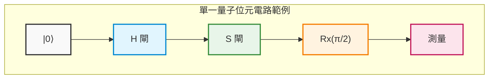

## 4.7 嚴格計算範例：透過矩陣列表完全追蹤量子干涉

為了將抽象的概念昇華為物理的直觀，透過多個么正矩陣的相乘，我們將毫無省略地以嚴格的手算來追蹤量子態是如何干涉並躍遷的。

假設初始狀態為基底狀態 **$|\psi_0\rangle = |0\rangle = \begin{pmatrix} 1 \\ 0 \end{pmatrix}$** 。
要執行的操作是類似上述電路圖的「 **$H$** 閘」→「 **$S$** 閘」→「 **$H$** 閘」序列。
量子電路圖雖然是從左寫到右，但對於狀態向量的線性代數算符乘法是「從左依序」相乘，因此整體的么正算符 **$U_{total}$** 式子會以與時間相反的順序從右排到左。

$$
U_{total} = H S H
$$

代入各閘的矩陣表示來導出合成矩陣：

$$
H = \frac{1}{\sqrt{2}} \begin{pmatrix} 1 & 1 \\ 1 & -1 \end{pmatrix}, \quad S = \begin{pmatrix} 1 & 0 \\ 0 & i \end{pmatrix}
$$

首先，計算初始狀態後直接套用的 **$H$** ，與其後的 **$S$** 的乘積 **$SH$** ：

$$
S H = \begin{pmatrix} 1 & 0 \\ 0 & i \end{pmatrix} \frac{1}{\sqrt{2}} \begin{pmatrix} 1 & 1 \\ 1 & -1 \end{pmatrix} = \frac{1}{\sqrt{2}} \begin{pmatrix} 1\cdot 1 + 0\cdot 1 & 1\cdot 1 + 0\cdot(-1) \\ 0\cdot 1 + i\cdot 1 & 0\cdot 1 + i\cdot(-1) \end{pmatrix} = \frac{1}{\sqrt{2}} \begin{pmatrix} 1 & 1 \\ i & -i \end{pmatrix}
$$

接著，從這個結果的左側乘上最後的 **$H$** ：

$$
U_{total} = H (S H) = \frac{1}{\sqrt{2}} \begin{pmatrix} 1 & 1 \\ 1 & -1 \end{pmatrix} \frac{1}{\sqrt{2}} \begin{pmatrix} 1 & 1 \\ i & -i \end{pmatrix}
$$

將純量倍數 **$\frac{1}{\sqrt{2}} \times \frac{1}{\sqrt{2}} = \frac{1}{2}$** 提出到前面，並謹慎地執行矩陣相乘：

$$
U_{total} = \frac{1}{2} \begin{pmatrix} 1\cdot 1 + 1\cdot i & 1\cdot 1 + 1\cdot(-i) \\ 1\cdot 1 + (-1)\cdot i & 1\cdot 1 + (-1)\cdot(-i) \end{pmatrix} = \frac{1}{2} \begin{pmatrix} 1 + i & 1 - i \\ 1 - i & 1 + i \end{pmatrix}
$$

這就是將整體電路視為一個黑盒子時的單一么正矩陣表示。
將這個 **$U_{total}$** 作用於初始狀態 **$|0\rangle$** ，計算最終狀態 **$|\psi_{final}\rangle$** ：

$$
|\psi_{final}\rangle = U_{total} |0\rangle = \frac{1}{2} \begin{pmatrix} 1 + i & 1 - i \\ 1 - i & 1 + i \end{pmatrix} \begin{pmatrix} 1 \\ 0 \end{pmatrix} = \frac{1}{2} \begin{pmatrix} 1 + i \\ 1 - i \end{pmatrix}
$$

用狄拉克表示法展開它，會得到以下結果：

$$
|\psi_{final}\rangle = \frac{1+i}{2} |0\rangle + \frac{1-i}{2} |1\rangle
$$

在此，為了驗證么正性（機率總和為 1）是否遭到破壞，我們計算觀測各基底的機率。使用複數絕對值的平方 ** $|z|^2 = z z^*$ ** ：

$$
P(0) = |\langle 0 | \psi_{final} \rangle|^2 = \left| \frac{1+i}{2} \right|^2 = \frac{1^2 + 1^2}{4} = \frac{2}{4} = \frac{1}{2}
$$

$$
P(1) = |\langle 1 | \psi_{final} \rangle|^2 = \left| \frac{1-i}{2} \right|^2 = \frac{1^2 + (-1)^2}{4} = \frac{2}{4} = \frac{1}{2}
$$

機率之和為 **$P(0) + P(1) = 1$** ，證明了這是物理上妥當的狀態。測量時會以 50% 的機率得到 0、50% 的機率得到 1，但這並非單純的古典亂數。為了提取隱藏在狀態背後的「相位」，讓我們將狀態向量變形為布洛赫球的極座標形式：

作為整體的共同因子，強制提出振幅 **$1/\sqrt{2}$** 與全域相位 **$e^{i\pi/4}$** （ **$\frac{1+i}{\sqrt{2}}$** ）：

$$
|\psi_{final}\rangle = \frac{1}{\sqrt{2}} \left( \frac{1+i}{\sqrt{2}} |0\rangle + \frac{1-i}{\sqrt{2}} |1\rangle \right) = e^{i\pi/4} \left( \frac{1}{\sqrt{2}} |0\rangle + \frac{1}{\sqrt{2}} e^{-i\pi/2} |1\rangle \right)
$$

全域相位 **$e^{i\pi/4}$** 在計算任何可觀測量（厄米算符）的期望值時，都會變成 **$e^{-i\pi/4} e^{i\pi/4} = 1$** 而被抵消，因此它不具物理意義。如果我們僅提取相對相位部分：

$$
|\psi_{final}'\rangle = \frac{1}{\sqrt{2}} |0\rangle - \frac{i}{\sqrt{2}} |1\rangle
$$

結果如上。透過將其與極座標表示 **$\cos(\theta/2)|0\rangle + e^{i\phi}\sin(\theta/2)|1\rangle$** 進行比較，可以完美地確定布洛赫向量指向天頂角 **$\theta = \pi/2$** （赤道上）、方位角 **$\phi = -\pi/2$** （Y 軸的負方向）。這通常是被標記為 **$|-i\rangle$** 的狀態。

讓我們提出一個更深奧的事實。使用剛才導出的指數函數旋轉閘公式，試著寫下繞 X 軸旋轉 **$\pi/2$** 的 **$R_x(\pi/2)$** 矩陣：

$$
R_x(\pi/2) = \frac{1}{\sqrt{2}} \begin{pmatrix} 1 & -i \\ -i & 1 \end{pmatrix}
$$

另一方面，讓我們再次看看我們先前計算的整體矩陣 **$U_{total}$** ：

$$
U_{total} = \frac{1}{2} \begin{pmatrix} 1 + i & 1 - i \\ 1 - i & 1 + i \end{pmatrix} = \frac{1+i}{2} \begin{pmatrix} 1 & \frac{1-i}{1+i} \\ \frac{1-i}{1+i} & 1 \end{pmatrix} = \frac{1+i}{2} \begin{pmatrix} 1 & -i \\ -i & 1 \end{pmatrix} = e^{i\pi/4} R_x(\pi/2)
$$

令人驚訝的是，這證明了「 **$H \rightarrow S \rightarrow H$** 」這種繞著完全不同軸的離散閘群所進行的連續操作，若排除全域相位，在數學上一字不差地等價於單一的「繞 X 軸的 **$\pi/2$** 旋轉操作」。
像這樣，量子態雖然遵循著會拒絕我們古典直觀的複雜干涉路徑，但透過線性代數這個堅固的數學框架，我們就能夠完全掌握並預測其行為，連 1 位元的誤差都沒有。

在下一章中，我們將以這個強大的單一量子位元操作知識為基礎，踏入能使希爾伯特空間維度呈指數級爆炸的張量積（Tensor product），以及會生成愛因斯坦所稱「幽靈般的超距作用」——「量子纏結（Entanglement）」的多量子位元閘的深淵世界。

# 第 5 章: 多量子位元系統與量子纏結（Entanglement）

在前面的章節中，我們已經詳細探討了單一量子位元所具備的疊加性質，以及可描述為布洛赫球面（Bloch sphere）上旋轉操作的單一量子閘。然而，量子計算超越古典計算的真正力量，即所謂的「量子霸權（Quantum Supremacy）」或「量子優勢（Quantum Advantage）」的源泉，正存在於多個量子位元相互作用的多體系統中。本章將引入量子資訊中最核心且最神秘的概念—— **量子纏結** （Entanglement），並從多量子位元系統的嚴格數學描述開始，一路深入探討生成量子纏結的電路，直至動搖物理學根基的 EPR 悖論，進行徹底的解說。

---

## 5.1 透過張量積（$\otimes$）對多體狀態進行的數學描述

根據量子力學的公理，當獨立物理系統的狀態空間分別由希爾伯特空間（Hilbert Space） **$\mathcal{H}_A$** 與 **$\mathcal{H}_B$** 來描述時，將它們組合起來的合成系統狀態空間，即為各自空間的 **張量積** （Tensor Product） **$\mathcal{H} = \mathcal{H}_A \otimes \mathcal{H}_B$** 。

單一量子位元的狀態空間，是一個 2 維的複數向量空間 **$\mathbb{C}^2$** 。因此，由 $n$ 個量子位元組成之系統的狀態空間，將是一個 $2^n$ 維的希爾伯特空間 **$(\mathbb{C}^2)^{\otimes n}$** 。其維度會隨著量子位元數 $n$ 呈現指數級增長，這正是量子平行性的數學基礎。

讓我們考慮一個由兩個量子位元（量子位元 A 與量子位元 B）所組成的系統。計算基底被定義為各個單一量子位元基底狀態的張量積：

$$
|0\rangle_A \otimes |0\rangle_B \equiv |00\rangle, \quad
|0\rangle_A \otimes |1\rangle_B \equiv |01\rangle, \quad
|1\rangle_A \otimes |0\rangle_B \equiv |10\rangle, \quad
|1\rangle_A \otimes |1\rangle_B \equiv |11\rangle
$$

在此，讓我們嚴格計算張量積的矩陣表示（克羅內克積，Kronecker product）。若將單一量子位元的基底表示為行向量（Column vector）：

$$
|0\rangle = \begin{pmatrix} 1 \\ 0 \end{pmatrix}, \quad |1\rangle = \begin{pmatrix} 0 \\ 1 \end{pmatrix}
$$

使用它們來計算，例如狀態 **$|10\rangle$** 的計算結果將如下所示：

$$
|10\rangle = |1\rangle \otimes |0\rangle = \begin{pmatrix} 0 \\ 1 \end{pmatrix} \otimes \begin{pmatrix} 1 \\ 0 \end{pmatrix} = \begin{pmatrix} 0 \cdot \begin{pmatrix} 1 \\ 0 \end{pmatrix} \\ 1 \cdot \begin{pmatrix} 1 \\ 0 \end{pmatrix} \end{pmatrix} = \begin{pmatrix} 0 \\ 0 \\ 1 \\ 0 \end{pmatrix}
$$

在這個 4 維向量空間中，最一般的 2 量子位元系統純態（Pure state） **$|\Psi\rangle$** ，可描述為這 4 個基底向量的線性組合（疊加）：

$$
|\Psi\rangle = c_{00} |00\rangle + c_{01} |01\rangle + c_{10} |10\rangle + c_{11} |11\rangle
$$

其中，$c_{ij} \in \mathbb{C}$ 為機率幅，且根據玻恩定則（Born rule），狀態必須被歸一化，亦即滿足歸一化條件 $\sum_{i,j \in \{0,1\}} |c_{ij}|^2 = 1$。

合成系統中的算符（閘）也同樣是使用張量積來建構。對量子位元 A 應用算符 **$U_A$** 、對量子位元 B 應用算符 **$U_B$** 的操作，將被表示為對整個合成系統作用的算符 **$U_A \otimes U_B$** ，且對任意的積態（Product state）產生如下作用：

$$
(U_A \otimes U_B)(|\psi\rangle_A \otimes |\phi\rangle_B) = (U_A |\psi\rangle_A) \otimes (U_B |\phi\rangle_B)
$$

基於線性性質，這個作用也可以擴展到任意的疊加態上。

---

## 5.2 貝爾態（最大量子纏結態）的數學表達式

多體量子系統中的狀態，可大致分類為「可分離態（Separable State）」與「纏結態（Entangled State）」兩種。
當狀態 **$|\Psi\rangle$** 可以被描述為各個子系統狀態的單純張量積時，亦即：

$$
|\Psi\rangle = |\psi\rangle_A \otimes |\phi\rangle_B
$$

我們便稱該狀態是可分離的。反之，若一個狀態 **無法** 被表示為任何子系統狀態的張量積時，我們就定義它為 **量子纏結態（Entangled State）** 。

在 2 量子位元系統中，產生最強量子纏結的狀態被稱為 **貝爾態** （Bell States），或稱為 EPR 對（EPR pairs）。貝爾態由以下 4 個正交的純態組成，並形成 4 維希爾伯特空間中一組完備的正交歸一基底（貝爾基底）：

$$
|\Phi^+\rangle = \frac{1}{\sqrt{2}} \Big( |00\rangle + |11\rangle \Big)
$$

$$
|\Phi^-\rangle = \frac{1}{\sqrt{2}} \Big( |00\rangle - |11\rangle \Big)
$$

$$
|\Psi^+\rangle = \frac{1}{\sqrt{2}} \Big( |01\rangle + |10\rangle \Big)
$$

$$
|\Psi^-\rangle = \frac{1}{\sqrt{2}} \Big( |01\rangle - |10\rangle \Big)
$$

現在，讓我們利用反證法來嚴格證明狀態 **$|\Phi^+\rangle$** 是不可分離的。
假設 **$|\Phi^+\rangle$** 是可分離態，可以被描述為未知的單一量子位元狀態之張量積：

$$
|\Phi^+\rangle = (a|0\rangle + b|1\rangle)_A \otimes (c|0\rangle + d|1\rangle)_B
$$

將其展開後得到：

$$
|\Phi^+\rangle = ac|00\rangle + ad|01\rangle + bc|10\rangle + bd|11\rangle
$$

將其與原定義式中的係數進行比較，我們可以得到以下的聯立方程式：

1. $ac = \frac{1}{\sqrt{2}}$
2. $bd = \frac{1}{\sqrt{2}}$
3. $ad = 0$
4. $bc = 0$

由方程式 3 ($ad = 0$) 可知，$a = 0$ 或 $d = 0$。
如果 $a = 0$，從方程式 1 可得 $ac = 0$，這與 $ac = \frac{1}{\sqrt{2}}$ 產生矛盾。
如果 $d = 0$，從方程式 2 可得 $bd = 0$，這與 $bd = \frac{1}{\sqrt{2}}$ 產生矛盾。
因此，這樣的複數 $a, b, c, d$ 並不存在，嚴格證明了狀態 **$|\Phi^+\rangle$** 絕對無法因式分解為兩個獨立狀態的乘積。

### 縮減密度矩陣與纏結熵（Entanglement Entropy）

貝爾態是「最大量子纏結」的這項事實，可以透過計算描述子系統資訊的 **縮減密度矩陣** （Reduced Density Matrix）而變得更加清晰。當整個系統處於純態 **$\rho = |\Phi^+\rangle \langle\Phi^+|$** 時，我們將量子位元 B 進行偏跡（部分跡，Partial trace），以求得量子位元 A 的局部狀態：

$$
\rho_A = \text{Tr}_B(|\Phi^+\rangle \langle\Phi^+|) = \text{Tr}_B \left[ \frac{1}{2} (|00\rangle\langle00| + |00\rangle\langle11| + |11\rangle\langle00| + |11\rangle\langle11|) \right]
$$

利用部分跡的性質 $\text{Tr}_B(|i,j\rangle\langle k,l|) = |i\rangle\langle k| \cdot \langle l|j\rangle = |i\rangle\langle k| \delta_{jl}$，可以得到：

$$
\rho_A = \frac{1}{2} \Big( |0\rangle\langle0| \cdot \langle0|0\rangle + |0\rangle\langle1| \cdot \langle1|0\rangle + |1\rangle\langle0| \cdot \langle0|1\rangle + |1\rangle\langle1| \cdot \langle1|1\rangle \Big)
$$

$$
\rho_A = \frac{1}{2} (|0\rangle\langle0| + |1\rangle\langle1|) = \frac{1}{2} I
$$

這意味著，如果我們僅去觀測量子位元 A，它的狀態將是一個完全混合態（Completely Mixed State），其馮·諾伊曼熵（Von Neumann entropy） $S(\rho_A) = -\text{Tr}(\rho_A \log_2 \rho_A)$ 將會取得最大值 $1$。也就是說，「儘管整個系統擁有一份完整的資訊（純態），但若單獨觀察各個子系統，其資訊卻是完全不確定的（最大熵）」，這種在古典力學中根本不可能發生的極端相關性，正是最大量子纏結的本質。

---

## 5.3 CNOT 閘（控制 NOT 閘）的矩陣表示

為了要在量子電腦內人工生成並操作這樣的纏結，僅靠對單一量子位元進行操作是不夠的，必須要有跨越數個量子位元的多量子位元閘。其中最基本且最強大的算符就是 **CNOT 閘** （Controlled-NOT Gate）。

CNOT 閘作用於 2 個量子位元上，將其中一個視為「控制位元（Control Qubit）」，另一個視為「目標位元（Target Qubit）」。這個堪稱古典 XOR 閘之量子版本的閘，其運作方式為：「只有當控制位元為 $|1\rangle$ 時，才將目標位元反轉（應用包立 $X$ 閘）；若控制位元為 $|0\rangle$，則不進行任何動作」。

對計算基底的作用如下（我們將第一個量子位元作為控制位元，第二個作為目標位元）：

$$
\text{CNOT} |00\rangle = |00\rangle \\
\text{CNOT} |01\rangle = |01\rangle \\
\text{CNOT} |10\rangle = |11\rangle \\
\text{CNOT} |11\rangle = |10\rangle
$$

如果將其表示為 4 維的么正矩陣（Unitary matrix），則如下所示：

$$
\text{CNOT} = \begin{pmatrix}
1 & 0 & 0 & 0 \\
0 & 1 & 0 & 0 \\
0 & 0 & 0 & 1 \\
0 & 0 & 1 & 0
\end{pmatrix}
$$

而一個更具數學洗練感的表示方式，是使用投影算符與包立矩陣之張量積的總和來表示：

$$
\text{CNOT} = |0\rangle\langle0| \otimes I + |1\rangle\langle1| \otimes X
$$

這個公式極其直觀地表達了 CNOT 閘的物理意義。第一項的意思是「在第一量子位元投影到 $|0\rangle$ 的狀態空間中，對第二量子位元應用單位算符 $I$」；第二項的意思是「在第一量子位元投影到 $|1\rangle$ 的狀態空間中，對第二量子位元應用位元反轉算符 $X$」。

CNOT 閘的一個重要性質是，它同時滿足厄米性（ $\text{CNOT}^\dagger = \text{CNOT}$ ）與么正性（ $\text{CNOT}^\dagger \text{CNOT} = I$ ），因此它本身就是自己的反矩陣（ $\text{CNOT}^2 = I$ ）。

---

## 5.4 使用 CNOT 生成量子纏結的電路

那麼，我們要如何從可分離態出發，來生成作為最大纏結態的貝爾態呢？在這裡，我們將建構一個標準的量子電路，從量子電腦的初始狀態 **$|00\rangle$** 生成 **$|\Phi^+\rangle$** ，並用數學公式來追蹤其狀態的變化。

所需的組成元素，僅包含作用於單一量子位元的阿達馬閘（Hadamard gate） **$H$** ，以及前面提到的 **$\text{CNOT}$** 閘。阿達馬矩陣的定義如下：

$$
H = \frac{1}{\sqrt{2}} \begin{pmatrix} 1 & 1 \\ 1 & -1 \end{pmatrix}
$$

### 量子狀態推移計算

 **步驟 1:** 初始化
系統處於計算基底的初始狀態。

$$
|\psi_0\rangle = |0\rangle_A \otimes |0\rangle_B = |00\rangle
$$

 **步驟 2:** 對控制位元（量子位元 A）應用阿達馬閘
僅對量子位元 A 應用阿達馬閘，創造出疊加態。對整個系統的算符為 **$H \otimes I$** 。

$$
|\psi_1\rangle = (H \otimes I) |00\rangle = (H|0\rangle_A) \otimes (I|0\rangle_B)
$$

$$
= \left( \frac{1}{\sqrt{2}} (|0\rangle_A + |1\rangle_A) \right) \otimes |0\rangle_B
$$

$$
= \frac{1}{\sqrt{2}} (|00\rangle + |10\rangle)
$$

在這個時間點，狀態依然是可分離態。因為它仍然可以寫成張量積的形式。

 **步驟 3:** 應用 CNOT 閘
接著，應用以量子位元 A 為控制位元、量子位元 B 為目標位元的 CNOT 閘。根據算符的線性性質，CNOT 閘會獨立作用於疊加的每一項上。

$$
|\psi_2\rangle = \text{CNOT} \left[ \frac{1}{\sqrt{2}} (|00\rangle + |10\rangle) \right]
$$

$$
= \frac{1}{\sqrt{2}} (\text{CNOT}|00\rangle + \text{CNOT}|10\rangle)
$$

應用我們剛才定義的 CNOT 對基底的作用規則，由於 $\text{CNOT}|00\rangle = |00\rangle$、$\text{CNOT}|10\rangle = |11\rangle$，所以：

$$
|\psi_2\rangle = \frac{1}{\sqrt{2}} (|00\rangle + |11\rangle) = |\Phi^+\rangle
$$

漂亮地，我們從最初的可分離態成功生成了貝爾態 **$|\Phi^+\rangle$** 。由阿達馬閘所創造出來的「控制位元處於 0 與 1 的疊加」，在接收到 CNOT 閘後，目標位元的反轉 / 不反轉會連動控制位元的各個狀態而產生分歧，從而在整體上形成了纏結。

透過相同的電路配置，只要將初始狀態更改為 $|01\rangle, |10\rangle, |11\rangle$，就可以決定性地分別生成剩下的貝爾態 $|\Psi^+\rangle, |\Phi^-\rangle, |\Psi^-\rangle$。

### 量子電路圖（Mermaid 語法）

描述上述纏結生成過程的量子電路圖如下所示：

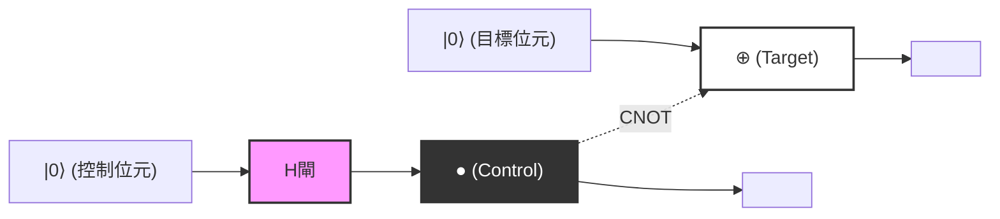
*(註：上圖呈現了邏輯上的連線。實線水平線代表各量子位元的時間流（量子線，Quantum wire），通過 `H閘` 的控制位元在 `●` 的位置控制目標位元的 `⊕` 結構。整體的輸出狀態將得到貝爾態 $|\Phi^+\rangle$。)*

---

## 5.5 EPR 悖論與非定域性

證明量子纏結的概念不僅僅是數學上的遊戲，更是對物理學的根本提出尖銳質疑的，是 1935 年由阿爾伯特·愛因斯坦（Albert Einstein）、波里斯·波多爾斯基（Boris Podolsky）與納森·羅森（Nathan Rosen）所發表的，也就是所謂的 **EPR 論文** 。他們主張，由於量子力學的描述與「定域實在論（Local Realism）」相矛盾，因此量子力學是一個不完備的理論（需要有隱變數的存在）。

讓我們進行一個思想實驗：愛麗絲（Alice）和鮑勃（Bob）兩位觀測者，共享了我們先前生成的貝爾態 **$|\Phi^+\rangle = \frac{1}{\sqrt{2}}(|00\rangle + |11\rangle)$** 。假設愛麗絲持有第一量子位元，鮑勃持有第二量子位元，然後他們兩人分別前往宇宙的兩端（例如地球和仙女座星系）。

在這種狀態下，各個量子位元的測量結果本質上是隨機的。如果愛麗絲以計算基底 $\{|0\rangle, |1\rangle\}$ 測量她持有的量子位元，她將有 50% 的機率得到 $0$（狀態 $|0\rangle$），以及 50% 的機率得到 $1$（狀態 $|1\rangle$）。

然而，根據量子力學的投影假說（波包塌縮），在愛麗絲進行測量的 **瞬間** ，整個系統的狀態發生了戲劇性的變化：
- 當愛麗絲獲得測量結果 $0$ 的瞬間，整體的波函數將塌縮至 $|00\rangle$。因此，即使鮑勃還沒有進行任何測量，他的量子位元狀態也會立刻且確定地變為 $|0\rangle$。
- 反之，當愛麗絲獲得測量結果 $1$ 的瞬間，整體的波函數將塌縮至 $|11\rangle$，而鮑勃的量子位元狀態也會立刻且確定地變為 $|1\rangle$。

愛因斯坦將此稱為「鬼魅般的超距作用（Spooky action at a distance）」。因為，愛麗絲的局域測量操作，看起來似乎超越了光速（在瞬間）影響了遙遠的鮑勃的物理狀態。這顯然違背了狹義相對論的基石要求：「任何資訊的傳遞速度都不能超過光速」之定域性原理。

### 不通訊定理與貝爾不等式

那麼，量子力學真的與相對論相矛盾嗎？結論是，並不矛盾。
這個表面上的悖論，可以透過 **不通訊定理（No-Communication Theorem）** 來解決。雖然愛麗絲的測量瞬間確定了鮑勃的狀態，但愛麗絲本人在原理上是無法控制自己會測得 $0$ 還是 $1$ 的結果。從鮑勃的角度來看，他沒有任何方法可以知道愛麗絲已經進行了測量，而他對自己的量子位元進行測量的結果，看起來依然是完全隨機的（50% 的機率為 0 或 1）。正如我們在縮減密度矩陣一節中所證明的，無論愛麗絲選擇怎樣的測量基底，鮑勃的局部密度矩陣 $\rho_B$ 都不會發生任何變化。因此，我們無法利用纏結來以超光速傳遞「有意義的資訊」。

儘管如此，量子纏結所帶有的這種強烈的相關性，依舊無法被納入古典物理學的範疇。1964 年，約翰·史都華·貝爾（John Stewart Bell）推導出了 **貝爾不等式** 。貝爾在數學上證明了：「如果世界是由定域實在論（愛因斯坦所說的隱變數理論）所描述的，那麼當愛麗絲和鮑勃分別在不同軸上進行測量時，其相關性的強度將不會超過一個特定的上限（在 CHSH 不等式中為 $|S| \leq 2$）」。

量子力學卻預言了在特定的設定下，這個上限將會被打破（ $|S| = 2\sqrt{2}$ ）。後來阿蘭·阿斯佩（Alain Aspect）等人精確的物理實驗，證實了貝爾不等式的破缺，從而確定了我們所居住的宇宙 **並非** 是符合定域實在論的。由於量子纏結引起的非定域相關性，是確實存在於自然界中普遍的物理現象。

在下一章中，我們將詳細解說如何將這種量子纏結的非定域性，作為一種積極的資訊處理資源來利用，例如量子遙傳（Quantum Teleportation）以及超高密度編碼（Superdense Coding）等量子通訊協定。

# 第6章：量子電路與基本通訊協定

本章中，我們將深入探討透過結合先前學過的量子力學基本公理與量子閘概念所實現的，量子資訊科學中最重要且最基礎的通訊協定。這些顛覆古典資訊理論常識的通訊協定，構成了決定量子電腦與量子通訊可能性的基石。在此，我們將針對「量子不可複製定理（No-Cloning Theorem）」、「量子遙傳（Quantum Teleportation）」以及「超密度編碼（Superdense Coding）」這三個主題，毫無妥協地配合嚴格的數學形式化進行詳細解說。

## 6.1 量子不可複製定理 (No-Cloning Theorem)

在古典電腦中，資料的複製（拷貝）是極其自明且直觀的操作。位元字串能輕易被複製並儲存於無數的儲存裝置中。然而，在由量子力學支配的世界裡，存在著一個令人驚嘆的定理： **「不可能製造出未知量子態的完美複製」** 。這就是由 Wootters、Zurek 以及 Dieks 於 1982 年分別獨立證明的「量子不可複製定理（No-Cloning Theorem）」。

這項定理是確保量子密碼學（量子金鑰分發）安全性的根本原理，同時也是為何量子錯誤更正必須採取與古典重複碼（單純的多數決）截然不同的複雜方法的原因。

### 數學證明

量子不可複製定理的證明，僅由量子力學的線性與么正性這兩項極為基本的性質推導而來。

假設存在一台能夠複製某個未知量子態 **$|\psi\rangle$** 的「萬能量子影印機」。這台影印機會接收作為複製來源的狀態 **$|\psi\rangle$** ，以及被初始化的目標量子位元（相當於空白筆記本的狀態） **$|0\rangle$** 作為輸入，並應該產生出兩個相同的狀態 **$|\psi\rangle \otimes |\psi\rangle$** （簡記為 **$|\psi\rangle |\psi\rangle$** ）作為輸出。

在量子力學中，封閉系統的任意物理演化都可以由么正算符 **$U$** 來描述。因此，這台影印機的運作被定義為滿足以下方程式的么正變換 **$U$** ：

$$
U (|\psi\rangle \otimes |0\rangle) = |\psi\rangle \otimes |\psi\rangle
$$

由於假設這對「任意」狀態都成立，因此對於另一個任意量子態 **$|\phi\rangle$** 也必須以相同的方式運作：

$$
U (|\phi\rangle \otimes |0\rangle) = |\phi\rangle \otimes |\phi\rangle
$$

在此，我們將這兩個式子取內積（純量積）。利用么正算符 **$U$** 的性質（ **$U^\dagger U = I$** ）。左邊的內積如下所示：

$$
\begin{aligned}
\left( U (|\psi\rangle \otimes |0\rangle) \right)^\dagger \left( U (|\phi\rangle \otimes |0\rangle) \right) 
&= (\langle \psi | \otimes \langle 0 |) U^\dagger U (|\phi\rangle \otimes |0\rangle) \\
&= (\langle \psi | \otimes \langle 0 |) I (|\phi\rangle \otimes |0\rangle) \\
&= \langle \psi | \phi \rangle \cdot \langle 0 | 0 \rangle \\
&= \langle \psi | \phi \rangle
\end{aligned}
$$

（這裡我們使用了 **$\langle 0 | 0 \rangle = 1$** 。）

另一方面，右邊被複製狀態彼此的內積如下所示：

$$
\begin{aligned}
\left( |\psi\rangle \otimes |\psi\rangle \right)^\dagger \left( |\phi\rangle \otimes |\phi\rangle \right) 
&= (\langle \psi | \otimes \langle \psi |) (|\phi\rangle \otimes |\phi\rangle) \\
&= \langle \psi | \phi \rangle \cdot \langle \psi | \phi \rangle \\
&= (\langle \psi | \phi \rangle)^2
\end{aligned}
$$

由於左邊與右邊必須相等，我們可得到以下等式：

$$
\langle \psi | \phi \rangle = (\langle \psi | \phi \rangle)^2
$$

這個方程式 **$x = x^2$** 在複數範圍內成立的條件，僅有 **$x = 0$** 或是 **$x = 1$** 。也就是說，

$$
\langle \psi | \phi \rangle = 0 \quad \text{或} \quad \langle \psi | \phi \rangle = 1
$$

這意味著，只有在兩個狀態「完全正交（毫不相關）」或「完全相同的狀態」時，才可能存在能正確複製兩者的么正變換。換句話說，「不存在能夠複製任意（非正交）未知量子態的通用么正變換」，這點已被極為簡單且優雅地證明了。

### 從線性證明的反證法

我們也可以從量子力學的線性（疊加原理）來著手。
考慮一個能夠複製兩個正交基底態 **$|0\rangle$** 與 **$|1\rangle$** 的么正算符 **$U$** ：

$$
U |0\rangle |0\rangle = |0\rangle |0\rangle
$$

$$
U |1\rangle |0\rangle = |1\rangle |1\rangle
$$

到這裡為止沒有問題。這與複製古典位元的 0 與 1 是一樣的。那麼，如果試圖複製由這些疊加而成的未知狀態 **$|\psi\rangle = \alpha|0\rangle + \beta|1\rangle$** 會發生什麼事呢？根據么正算符時間演化的線性，結果會如下所示：

$$
\begin{aligned}
U (|\psi\rangle |0\rangle) &= U \left( (\alpha|0\rangle + \beta|1\rangle) |0\rangle \right) \\
&= U (\alpha|0\rangle |0\rangle + \beta|1\rangle |0\rangle) \\
&= \alpha U(|0\rangle |0\rangle) + \beta U(|1\rangle |0\rangle) \\
&= \alpha|0\rangle |0\rangle + \beta|1\rangle |1\rangle
\end{aligned}
$$

然而，我們真正想要的「完美複製」的輸出，應該是如下的張量積：

$$
\begin{aligned}
|\psi\rangle \otimes |\psi\rangle &= (\alpha|0\rangle + \beta|1\rangle) \otimes (\alpha|0\rangle + \beta|1\rangle) \\
&= \alpha^2|0\rangle |0\rangle + \alpha\beta|0\rangle |1\rangle + \alpha\beta|1\rangle |0\rangle + \beta^2|1\rangle |1\rangle
\end{aligned}
$$

由線性所推導出的結果 **$\alpha|0\rangle |0\rangle + \beta|1\rangle |1\rangle$** ，與我們所求的複製狀態 **$|\psi\rangle \otimes |\psi\rangle$** 明顯不同（缺少了交叉項 **$|0\rangle |1\rangle$** 或 **$|1\rangle |0\rangle$** ）。這再次證明了，要複製未知的疊加態是不可能的。

---

## 6.2 量子遙傳 (Quantum Teleportation)

從量子不可複製定理中我們得知，量子態是無法被複製的。但是，將其「移動（傳輸）」是可行的。量子遙傳是一種利用古典通訊通道以及事先共享的量子纏結（Entanglement），將某處未知的量子態完全傳輸至遠處另一個地方的通訊協定。

此處必須注意的是，並非物理粒子本身在空間中移動，而是傳輸了「狀態（資訊）」。原本粒子所承載的狀態會被摧毀，因此這並沒有違反不可複製定理（No-Cloning Theorem）。

### 通訊協定的設定與初始狀態

假設發送者為愛麗絲（Alice），接收者為鮑伯（Bob）。
愛麗絲擁有一個想傳送給鮑伯的未知單量子位元狀態 **$|\psi\rangle$** ：

$$
|\psi\rangle_C = \alpha|0\rangle_C + \beta|1\rangle_C \quad (|\alpha|^2 + |\beta|^2 = 1)
$$

下標 $C$ 表示這是我們想要傳輸的目標量子位元。

為了實現這項傳輸，我們假設愛麗絲與鮑伯事先共享了一組最大纏結的雙量子位元態（稱為 EPR 對或貝爾對）。在此我們使用以下狀態：

$$
|\Phi^+\rangle_{AB} = \frac{1}{\sqrt{2}} \left( |0\rangle_A \otimes |0\rangle_B + |1\rangle_A \otimes |1\rangle_B \right)
$$

下標 $A$ 代表由愛麗絲持有的量子位元， $B$ 代表由鮑伯持有的量子位元。

整個系統的初始狀態 **$|\Psi_0\rangle$** ，可描述為愛麗絲想要傳輸的狀態與共享 EPR 對的張量積：

$$
\begin{aligned}
|\Psi_0\rangle &= |\psi\rangle_C \otimes |\Phi^+\rangle_{AB} \\
&= (\alpha|0\rangle_C + \beta|1\rangle_C) \otimes \frac{1}{\sqrt{2}} (|0\rangle_A |0\rangle_B + |1\rangle_A |1\rangle_B) \\
&= \frac{1}{\sqrt{2}} \Big( \alpha|0\rangle_C |0\rangle_A |0\rangle_B + \alpha|0\rangle_C |1\rangle_A |1\rangle_B + \beta|1\rangle_C |0\rangle_A |0\rangle_B + \beta|1\rangle_C |1\rangle_A |1\rangle_B \Big)
\end{aligned}
$$

### 愛麗絲的操作與貝爾基底測量

在愛麗絲的手邊，有量子位元 $C$ 與 $A$ 。愛麗絲會對這兩個量子位元進行稱為「貝爾測量」的聯合測量。用電路的語言來說，這相當於在套用 CNOT 閘之後套用阿達馬閘，並在標準基底（計算基底）下進行測量。

 **步驟 1：套用 CNOT 閘** 
愛麗絲將量子位元 $C$ 作為控制位元，量子位元 $A$ 作為目標位元，套用 CNOT（受控反閘）閘 **$CX_{CA}$** 。CNOT 只有在控制位元為 $|1\rangle$ 時才會反轉目標位元。

$$
\begin{aligned}
|\Psi_1\rangle &= CX_{CA} |\Psi_0\rangle \\
&= \frac{1}{\sqrt{2}} \Big( \alpha|0\rangle_C |0\rangle_A |0\rangle_B + \alpha|0\rangle_C |1\rangle_A |1\rangle_B + \beta|1\rangle_C |1\rangle_A |0\rangle_B + \beta|1\rangle_C |0\rangle_A |1\rangle_B \Big)
\end{aligned}
$$

（第三項的 $|0\rangle_A$ 被反轉為 $|1\rangle_A$ ，第四項的 $|1\rangle_A$ 被反轉為 $|0\rangle_A$ 。）

 **步驟 2：套用阿達馬閘** 
接著，愛麗絲對量子位元 $C$ 套用阿達馬閘 **$H_C$** 。阿達馬變換會將 $|0\rangle \to \frac{|0\rangle+|1\rangle}{\sqrt{2}}$ ， $|1\rangle \to \frac{|0\rangle-|1\rangle}{\sqrt{2}}$ 。

$$
\begin{aligned}
|\Psi_2\rangle &= H_C |\Psi_1\rangle \\
&= \frac{1}{2} \Big[ \alpha(|0\rangle_C + |1\rangle_C) |0\rangle_A |0\rangle_B + \alpha(|0\rangle_C + |1\rangle_C) |1\rangle_A |1\rangle_B \\
&\quad + \beta(|0\rangle_C - |1\rangle_C) |1\rangle_A |0\rangle_B + \beta(|0\rangle_C - |1\rangle_C) |0\rangle_A |1\rangle_B \Big]
\end{aligned}
$$

我們將它針對愛麗絲所持有的量子位元 $C$ 與 $A$ 的狀態（ $|00\rangle, |01\rangle, |10\rangle, |11\rangle$ ）重新整理。這個重組正是量子遙傳的核心數學步驟：

$$
\begin{aligned}
|\Psi_2\rangle &= \frac{1}{2} |0\rangle_C |0\rangle_A \otimes (\alpha|0\rangle_B + \beta|1\rangle_B) \\
&\quad + \frac{1}{2} |0\rangle_C |1\rangle_A \otimes (\alpha|1\rangle_B + \beta|0\rangle_B) \\
&\quad + \frac{1}{2} |1\rangle_C |0\rangle_A \otimes (\alpha|0\rangle_B - \beta|1\rangle_B) \\
&\quad + \frac{1}{2} |1\rangle_C |1\rangle_A \otimes (\alpha|1\rangle_B - \beta|0\rangle_B)
\end{aligned}
$$

值得注意的是，根據愛麗絲的測量結果，鮑伯的量子位元 $B$ 會被投影到各自不同的狀態上。

 **步驟 3：測量與古典通訊** 
愛麗絲觀測（測量）她自己的量子位元 $C$ 與 $A$ 。得到的結果與其機率如下所示，各自都有 25% 的發生機率：

- 測量結果為 `00` 時：鮑伯的量子位元會變成 **$\alpha|0\rangle + \beta|1\rangle$** ，這就是原本的狀態 **$|\psi\rangle$** 本身。
- 測量結果為 `01` 時：鮑伯的量子位元會變成 **$\alpha|1\rangle + \beta|0\rangle$** 。這是原本狀態套用了包立 X 閘的狀態 **$X|\psi\rangle$** 。
- 測量結果為 `10` 時：鮑伯的量子位元會變成 **$\alpha|0\rangle - \beta|1\rangle$** 。這是原本狀態套用了包立 Z 閘的狀態 **$Z|\psi\rangle$** 。
- 測量結果為 `11` 時：鮑伯的量子位元會變成 **$\alpha|1\rangle - \beta|0\rangle$** 。這是原本狀態套用了包立 X 閘，接著又套用了包立 Z 閘的狀態 **$ZX|\psi\rangle$** （或者忽略相位的話即為 $Y|\psi\rangle$ ）。

愛麗絲透過電話或網際網路等古典通訊通道，將這 2 位元的測量結果（古典資訊）傳達給鮑伯。由於使用的是古典通訊，狀態的傳輸絕對不會超過光速。

### 鮑伯的復原操作

鮑伯根據從愛麗絲那裡收到的 2 位元古典資訊，對自己的量子位元套用包立閘（或不作任何操作），將原本的狀態 **$|\psi\rangle$** 完全復原：

- 收到 `00` ：不操作（ $I$ ）
- 收到 `01` ：套用包立 X 閘（ $X \cdot X = I$ ）
- 收到 `10` ：套用包立 Z 閘（ $Z \cdot Z = I$ ）
- 收到 `11` ：套用包立 X 閘後，套用包立 Z 閘（ $Z \cdot X \cdot ZX = I$ ）

如此一來，鮑伯手邊便重建了與愛麗絲持有的完全相同的狀態 **$|\psi\rangle = \alpha|0\rangle + \beta|1\rangle$** 。因為愛麗絲原本的量子位元已因測量而被摧毀，這代表資訊已被完美地傳輸（遙傳）了。

### 量子電路圖表示

將上述過程以量子電路表示如下：

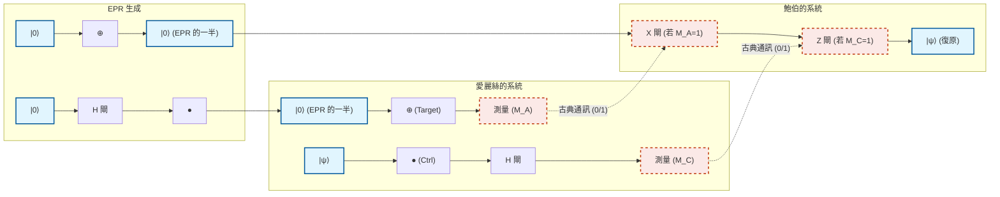

---

## 6.3 超密度編碼 (Superdense Coding)

相較於量子遙傳是「為了傳送 1 個量子位元的狀態，消耗 EPR 對與 2 個古典位元」的通訊協定，超密度編碼（Superdense Coding）在某種意義上可以說是其反向操作的通訊協定。它能夠「僅透過物理上傳送 1 個量子位元，就將 2 個古典位元的資訊傳達給對方」。

在古典物理法則中，一個雙準位系統（一個位元或一個光子的偏振）最多只能攜帶 1 位元（0 或 1）的資訊。然而，藉由巧妙地利用量子纏結，能夠在表面上突破這個霍勒沃極限（Holevo's bound），這便是超密度編碼驚人之處。

### 通訊協定細節與貝爾基底

我們再次假設愛麗絲與鮑伯事先共享了 EPR 對：

$$
|\Phi^+\rangle_{AB} = \frac{1}{\sqrt{2}} \left( |0\rangle_A |0\rangle_B + |1\rangle_A |1\rangle_B \right)
$$

愛麗絲想要傳送 2 位元的古典訊息 $b_1 b_2 \in \{00, 01, 10, 11\}$ 給鮑伯。
愛麗絲根據想傳送的訊息， **僅對她手邊的量子位元 A** 進行特定的單一量子位元閘操作：

1. **當訊息為 `00` 時：** 愛麗絲不作任何事（套用恆等算符 $I$ ）。
   整體的狀態不變。
   

$$
|\Psi_{00}\rangle = (I \otimes I) |\Phi^+\rangle = \frac{1}{\sqrt{2}} (|00\rangle + |11\rangle) = |\Phi^+\rangle
$$

2. **當訊息為 `01` 時：** 愛麗絲套用包立 Z 閘。
   

$$
|\Psi_{01}\rangle = (Z \otimes I) |\Phi^+\rangle = \frac{1}{\sqrt{2}} (Z|0\rangle|0\rangle + Z|1\rangle|1\rangle) = \frac{1}{\sqrt{2}} (|00\rangle - |11\rangle) = |\Phi^-\rangle
$$

3. **當訊息為 `10` 時：** 愛麗絲套用包立 X 閘。
   

$$
|\Psi_{10}\rangle = (X \otimes I) |\Phi^+\rangle = \frac{1}{\sqrt{2}} (X|0\rangle|0\rangle + X|1\rangle|1\rangle) = \frac{1}{\sqrt{2}} (|10\rangle + |01\rangle) = |\Psi^+\rangle
$$

4. **當訊息為 `11` 時：** 愛麗絲先套用包立 Z 閘，接著再套用包立 X 閘（相當於 $iY$ ）。
   

$$
|\Psi_{11}\rangle = (ZX \otimes I) |\Phi^+\rangle = (Z \otimes I) |\Psi^+\rangle = \frac{1}{\sqrt{2}} (Z|1\rangle|0\rangle + Z|0\rangle|1\rangle) = \frac{1}{\sqrt{2}} (-|10\rangle + |01\rangle) = -|\Psi^-\rangle
$$

   （由於整體帶有的負號為全域相位，因此不影響觀測機率，但為了方便起見，我們將正負號整理，對應為 **$|\Psi^-\rangle = \frac{1}{\sqrt{2}} (|01\rangle - |10\rangle)$** 來考慮。）

愛麗絲將操作後的自己的量子位元 A，透過量子通訊通道（如光纖等）發送給鮑伯。

值得注目的驚人事實是：愛麗絲對鮑伯 **在物理上只發送了 1 個量子位元** 。而且完全沒有觸碰到鮑伯的量子位元。然而，經過愛麗絲的操作後，整個系統的狀態已經決定性地轉移到 4 個完全正交的量子態（這些被稱為 **貝爾基底** ）之一。

### 鮑伯的解碼與貝爾測量

鮑伯接收愛麗絲傳送過來的量子位元 A。現在鮑伯手邊同時有量子位元 A 以及原本就持有的量子位元 B。鮑伯對這 2 個量子位元，進行與量子遙傳中愛麗絲測量時完全相同的「貝爾測量」。

也就是說，以量子位元 A 為控制位元、B 為目標位元施加 CNOT 閘，接著對量子位元 A 施加阿達馬閘。透過這個逆變換，纏結的貝爾基底將被還原為可測量的計算基底。

讓我們確認各個情況下的數學展開式：

- **狀態為** **$|\Phi^+\rangle = \frac{1}{\sqrt{2}} (|00\rangle + |11\rangle)$** **的情況（訊息 `00`）：** 施加 CNOT 後會變成 $\frac{1}{\sqrt{2}} (|00\rangle + |10\rangle) = \frac{1}{\sqrt{2}} (|0\rangle + |1\rangle) |0\rangle$ 。
  對 A 施加阿達馬閘後會變成 $|0\rangle |0\rangle$ 。
  鮑伯進行測量便能確實得到 `00` 。

- **狀態為** **$|\Phi^-\rangle = \frac{1}{\sqrt{2}} (|00\rangle - |11\rangle)$** **的情況（訊息 `01`）：** 施加 CNOT 後會變成 $\frac{1}{\sqrt{2}} (|00\rangle - |10\rangle) = \frac{1}{\sqrt{2}} (|0\rangle - |1\rangle) |0\rangle$ 。
  對 A 施加阿達馬閘後會變成 $|1\rangle |0\rangle$ 。
  鮑伯進行測量便能確實得到 `10` 。（※與愛麗絲操作的位元對應關係會依電路定義而有所不同，但能夠唯一判別）

- **狀態為** **$|\Psi^+\rangle = \frac{1}{\sqrt{2}} (|01\rangle + |10\rangle)$** **的情況（訊息 `10`）：** 施加 CNOT 後會變成 $\frac{1}{\sqrt{2}} (|01\rangle + |11\rangle) = \frac{1}{\sqrt{2}} (|0\rangle + |1\rangle) |1\rangle$ 。
  對 A 施加阿達馬閘後會變成 $|0\rangle |1\rangle$ 。
  鮑伯進行測量便能確實得到 `01` 。

- **狀態為** **$|\Psi^-\rangle = \frac{1}{\sqrt{2}} (|01\rangle - |10\rangle)$** **的情況（訊息 `11`）：** 施加 CNOT 後會變成 $\frac{1}{\sqrt{2}} (|01\rangle - |11\rangle) = \frac{1}{\sqrt{2}} (|0\rangle - |1\rangle) |1\rangle$ 。
  對 A 施加阿達馬閘後會變成 $|1\rangle |1\rangle$ 。
  鮑伯進行測量便能確實得到 `11` 。

如此一來，鮑伯藉由將接收到的 1 個量子位元與手上的 1 個量子位元合併測量，便能以 100% 的精準度完美讀取出愛麗絲所意圖傳送的 2 位元古典資訊。

### 在量子通訊中的意義

超密度編碼的真正價值，不僅止於將資訊「密度」提高兩倍。這個通訊協定是決定性的證據，展示了量子纏結這種非局域性的相關，是如何能夠擴展古典資訊傳遞的頻寬。

此外，從安全性的觀點來看這也極為重要。假設竊聽者伊芙（Eve）在愛麗絲發送給鮑伯的途中攔截了量子位元 A，伊芙也無法獲得任何資訊。原因在於，若僅觀測單一的量子位元 A，其狀態會表現為完全隨機的混合態（密度矩陣正比於 $\frac{I}{2}$ ）。資訊僅被編碼在空間上分離的 A 與 B 之間的「相關」之中，因此即使只取得其中一方，在物理上也是不可能解碼的。

---
如上所述，量子遙傳與超密度編碼，雖然乍看之下是違反直覺、宛如魔法般的現象，但只要忠實地遵循量子力學的線性代數公理，就能夠將其作為極為嚴格且必然的邏輯結果推導出來。在下一章中，我們將應用這些基本通訊協定，踏入旨在解決更複雜問題的量子演算法世界。

# 第7章：多伊奇-喬薩演算法

## 7.1 歷史意義：首次展現明確的量子超越性

量子電腦在解決特定問題上可能具備比古典電腦壓倒性更快的速度，這個假說是由理查·費曼（Richard Feynman）與大衛·多伊奇（David Deutsch）在 1980 年代的先驅性研究所提出。然而，「具體而言是哪種問題，能以數學上可證明的方式展現量子計算超越古典計算？」對於這個問題，在 1992 年由大衛·多伊奇與理查·喬薩（Richard Jozsa）所發明的「多伊奇-喬薩演算法（Deutsch-Jozsa Algorithm）」給出了最初的決定性解答。

本章將以數學嚴謹的方式，揭開這個歷史性演算法的全貌。儘管這個演算法並非用來解決實用問題，但它巧妙地結合了量子力學特有的「疊加（Superposition）」、「干涉（Interference）」以及「相位反衝（Phase Kickback）」等現象，證明了可以戲劇性地減少計算量級（Order）。

## 7.2 問題設定：常數函數，還是平衡函數？

首先，我們來定義演算法需要解決的問題。假設我們得到了一個黑盒子（神諭，Oracle）。這個神諭會接收 $n$ 位元的輸入 $x \in \{0, 1\}^n$ ，並計算出一個回傳 1 位元輸出 $f(x) \in \{0, 1\}$ 的函數 **$f$** 。

在這裡，這個函數 **$f$** 被賦予了一個強大的承諾（Promise），亦即「必定滿足以下其中一種性質」：

1. **常數函數（Constant Function）** ：對於任意輸入 $x$ ，總是回傳 $f(x) = 0$ 或總是回傳 $f(x) = 1$ 。
2. **平衡函數（Balanced Function）** ：在所有輸入 $x$ 之中，對剛好一半的輸入回傳 $f(x) = 0$ ，而對剩下的一半回傳 $f(x) = 1$ 。

我們的目標是，以最少的詢問（Query）神諭次數，來判定「給定的神諭 **$f$** 究竟是常數函數還是平衡函數」。

### 古典計算的極限

我們來考慮使用古典電腦解決這個問題的情況。函數 **$f$** 的輸入組合總共有 $N = 2^n$ 種。

假設最壞的情況：如果從第一次詢問開始，連續 $2^{n-1}$ 次（也就是總數的一半）的輸入都得到了相同的輸出（例如：全部都是 $0$ ）。在這個時間點，函數是常數函數（剩下的一半也全都是 $0$ ）的可能性，與它是平衡函數（剩下的一半全都是 $1$ ）的可能性同時存在。

因此，為了讓古典電腦能以 100% 的確定性判定其為常數函數或平衡函數， **在最壞的情況下需要 $2^{n-1} + 1$ 次** 詢問。這是一個相對於輸入位元數 $n$ 呈指數級增長的次數。也就是說，古典的計算複雜度（詢問複雜度）為 $O(2^n)$ 。

令人驚訝的是，如果使用量子計算，我們能夠以 **僅僅 1 次詢問（1 個 Query）** 就以 100% 的機率正確判定這個問題。這正是量子超越性的精髓。

## 7.3 量子神諭與相位反衝的幾何學

為了建構量子演算法，我們首先必須將古典的函數 **$f(x)$** 重新表達成滿足量子力學要求（么正性，Unitarity ＝ 可逆性）的形式。為此引入的概念便是「量子神諭（Quantum Oracle）」。

### 量子神諭 $U_f$

我們準備一個輸入暫存器（ $n$ 個量子位元）與一個目標暫存器（ $1$ 個量子位元）。代表神諭的么正算子（Unitary Operator） **$U_f$** 對計算基底態的作用如下：

$$
U_f |x\rangle |y\rangle = |x\rangle |y \oplus f(x)\rangle
$$

在這裡， $\oplus$ 代表模 2 加法（XOR）。這個轉換若是對自身再次應用一次，便會回到原本的狀態（ $U_f^2 = I$ ），因此這明顯是可逆且具備么正性的。

### 相位反衝（Phase Kickback）

在量子資訊科學中，最為重要且最反直覺的技巧之一就是「相位反衝」。讓我們來看看，如果不將目標暫存器的狀態設定為古典的 $|0\rangle$ 或 $|1\rangle$ ，而是設定為通過阿達馬閘（Hadamard Gate）的疊加態 $|-\rangle$ 時，會發生什麼事。

$$
|-\rangle = \frac{|0\rangle - |1\rangle}{\sqrt{2}}
$$

將這個狀態輸入到目標暫存器中，並應用神諭 **$U_f$** ：

$$
U_f |x\rangle |-\rangle = U_f \left( |x\rangle \frac{|0\rangle - |1\rangle}{\sqrt{2}} \right)
$$

$$
= \frac{1}{\sqrt{2}} \left( U_f |x\rangle |0\rangle - U_f |x\rangle |1\rangle \right)
$$

$$
= \frac{1}{\sqrt{2}} \left( |x\rangle |0 \oplus f(x)\rangle - |x\rangle |1 \oplus f(x)\rangle \right)
$$

這裡，我們根據 $f(x)$ 的值進行分類討論：
- 當 $f(x) = 0$ 時：
  狀態變為 $\frac{1}{\sqrt{2}} ( |x\rangle |0\rangle - |x\rangle |1\rangle ) = |x\rangle |-\rangle$ 。
- 當 $f(x) = 1$ 時：
  狀態變為 $\frac{1}{\sqrt{2}} ( |x\rangle |1\rangle - |x\rangle |0\rangle ) = - |x\rangle |-\rangle$ 。

將這些整合在一起，我們就能得到如下的優美等式：

$$
U_f |x\rangle |-\rangle = (-1)^{f(x)} |x\rangle |-\rangle
$$

這是一個驚人的結果。目標暫存器的狀態 $|-\rangle$ 完全沒有改變，但是函數 **$f(x)$** 的評估結果卻作為「相位（Phase）的符號」，被「反衝（Kickback）」到了輸入暫存器 **$|x\rangle$** 這一側。這樣一來，便能將資訊編碼為振幅的相位。

## 7.4 多伊奇-喬薩演算法：電路圖與完整的數學推導

在這裡，我們將從量子電路與數學公式兩方面，來完整描述演算法的全貌。

### 量子電路圖

以下是顯示多伊奇-喬薩演算法的量子電路圖：

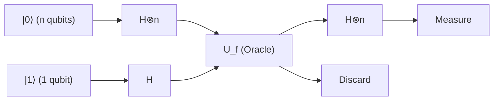

### 步驟 1：準備初始狀態

將作為輸入暫存器的 $n$ 個量子位元初始化為 $|0\rangle^{\otimes n}$ ，並將作為目標暫存器的 1 個量子位元初始化為 $|1\rangle$ 。

$$
|\psi_0\rangle = |0\rangle^{\otimes n} |1\rangle
$$

### 步驟 2：對所有量子位元應用阿達馬閘

對所有的量子位元應用阿達馬閘（ $H$ ），以產生完全的疊加態。
對 $n$ 個量子位元的阿達馬轉換 $H^{\otimes n}$ 的作用如下：

$$
H^{\otimes n} |0\rangle^{\otimes n} = \frac{1}{\sqrt{2^n}} \sum_{x \in \{0,1\}^n} |x\rangle
$$

因此，整個系統的狀態將變為如下：

$$
|\psi_1\rangle = \left( \frac{1}{\sqrt{2^n}} \sum_{x \in \{0,1\}^n} |x\rangle \right) \otimes \left( \frac{|0\rangle - |1\rangle}{\sqrt{2}} \right)
$$

$$
= \frac{1}{\sqrt{2^n}} \sum_{x=0}^{2^n-1} |x\rangle |-\rangle
$$

### 步驟 3：應用量子神諭（相位反衝）

在這裡我們應用神諭 **$U_f$** 。藉由前一節所證明的相位反衝效應，每個基底態 $|x\rangle$ 的相位都會乘上 $(-1)^{f(x)}$ 。

$$
|\psi_2\rangle = U_f |\psi_1\rangle = \frac{1}{\sqrt{2^n}} \sum_{x \in \{0,1\}^n} (-1)^{f(x)} |x\rangle |-\rangle
$$

在這個時間點，計算結果 **$f(x)$** 的所有資訊（共 $2^n$ 個），僅透過一次運算便平行地被嵌入到了疊加態的各個相位之中。這被稱為「量子平行性（Quantum Parallelism）」。

### 步驟 4：使輸入暫存器產生干涉

由於此後不再使用目標暫存器，我們將其忽略。對於輸入暫存器的 $n$ 個量子位元，我們再次應用阿達馬轉換 $H^{\otimes n}$ 。
對於任意基底 $|x\rangle$ ， $H^{\otimes n}$ 的作用通常可以表示為以下的一般公式：

$$
H^{\otimes n} |x\rangle = \frac{1}{\sqrt{2^n}} \sum_{z \in \{0,1\}^n} (-1)^{x \cdot z} |z\rangle
$$

在這裡， $x \cdot z$ 代表逐位元的內積 $x \cdot z = x_1 z_1 \oplus x_2 z_2 \oplus \dots \oplus x_n z_n$ 。
將其應用到 $|\psi_2\rangle$ 的輸入暫存器部分後，最終狀態 $|\psi_3\rangle$ 即可展開如下：

$$
|\psi_3\rangle = H^{\otimes n} \left( \frac{1}{\sqrt{2^n}} \sum_{x} (-1)^{f(x)} |x\rangle \right)
$$

$$
= \frac{1}{\sqrt{2^n}} \sum_{x} (-1)^{f(x)} \left( \frac{1}{\sqrt{2^n}} \sum_{z} (-1)^{x \cdot z} |z\rangle \right)
$$

$$
= \frac{1}{2^n} \sum_{z \in \{0,1\}^n} \left( \sum_{x \in \{0,1\}^n} (-1)^{f(x) + x \cdot z} \right) |z\rangle
$$

這是一個極度重要的數學式，代表了測量前的量子狀態。量子力學的「干涉」正發生在這個和式 $\sum_x$ 之中。

### 步驟 5：測量與結果分析

在演算法的最後，我們要在計算基底上測量輸入暫存器的 $n$ 個量子位元。
我們所感興趣的，是所有量子位元皆為 $0$ ，也就是測量到狀態 **$|0\rangle^{\otimes n}$** 的機率。讓我們來考慮上述公式中 $z = 00\dots0$ 的情況。這時，對於任意的 $x$ 皆會有 $x \cdot 0 = 0$ ，因此狀態 **$|0\rangle^{\otimes n}$** 的振幅（係數）可以計算如下：

$$
\text{Amplitude of } |0\rangle^{\otimes n} = \frac{1}{2^n} \sum_{x \in \{0,1\}^n} (-1)^{f(x)}
$$

在這裡，我們根據承諾（Promise）來驗證兩種情況：

#### 情況 1：函數 $f$ 為常數函數時
總是 $f(x) = 0$ 或總是 $f(x) = 1$ 。
- 如果總是 $0$ ，則 $(-1)^{f(x)} = 1$ ，和為 $\sum 1 = 2^n$ 。振幅為 $\frac{2^n}{2^n} = 1$ 。
- 如果總是 $1$ ，則 $(-1)^{f(x)} = -1$ ，和為 $\sum -1 = -2^n$ 。振幅為 $\frac{-2^n}{2^n} = -1$ 。

測量機率 $P(0)$ 為振幅絕對值的平方，因此：

$$
P(00\dots0) = | \pm 1 |^2 = 1
$$

也就是說， **當函數為常數函數時，將會以 100% 的機率測量到 $|0\rangle^{\otimes n}$** 。

#### 情況 2：函數 $f$ 為平衡函數時
使得 $f(x) = 0$ 的 $x$ ，與使得 $f(x) = 1$ 的 $x$ 剛好各占一半（分別有 $2^{n-1}$ 個）。
因此， $(-1)^{f(x)}$ 會有一半是 $+1$ ，剩下一半是 $-1$ ，將它們全部加總後會完全抵消歸零（完全的破壞性干涉）。

$$
\text{Amplitude of } |0\rangle^{\otimes n} = \frac{1}{2^n} \left( 2^{n-1}(+1) + 2^{n-1}(-1) \right) = 0
$$

測量機率 $P(0)$ 為振幅絕對值的平方，因此：

$$
P(00\dots0) = | 0 |^2 = 0
$$

也就是說， **當函數為平衡函數時，測量到 $|0\rangle^{\otimes n}$ 的機率是 0%，必定會測量到至少有 1 個位元為 $1$ 的狀態** 。

## 7.6 具體範例： $n=2$ 時的完整追蹤

不只是抽象的數學式，讓我們來追蹤 $n=2$ （2 個量子位元的輸入）時的具體狀態向量，親身體會演算法的運作方式。輸入組合有 $x \in \{00, 01, 10, 11\}$ 共 4 種。

### 當為常數函數時： $f(x) = 1$ （全部為 1）
應用神諭前的狀態 $|\psi_1\rangle$ ，其輸入暫存器部分如下所示：

$$
\frac{1}{2} ( |00\rangle + |01\rangle + |10\rangle + |11\rangle )
$$

應用神諭後，由於相位反衝，所有的項都會乘上 $(-1)^{f(x)} = -1$ ：

$$
|\psi_2\rangle_{in} = -\frac{1}{2} ( |00\rangle + |01\rangle + |10\rangle + |11\rangle )
$$

我們對此再次應用 $H^{\otimes 2}$ 。利用 $H^{\otimes 2} (|00\rangle + |01\rangle + |10\rangle + |11\rangle) = 2 |00\rangle$ 的特性：

$$
|\psi_3\rangle_{in} = - |00\rangle
$$

測量結果會以機率 $100\%$ 得到 $00$ 。

### 當為平衡函數時： $f(00)=0, f(01)=1, f(10)=1, f(11)=0$
應用神諭後，由於相位反衝，只有在 $f(x)=1$ 的項前面會加上負號：

$$
|\psi_2\rangle_{in} = \frac{1}{2} ( |00\rangle - |01\rangle - |10\rangle + |11\rangle )
$$

對此應用 $H^{\otimes 2}$ 。若計算並代入對各個基底的 $H^{\otimes 2}$ 作用，並著眼於 $|00\rangle$ 的係數，會得到 $\frac{1}{4} (1 - 1 - 1 + 1) = 0$ ，漂亮地相互抵消（破壞性干涉）。
整理剩餘的項後，最終狀態將是 $|11\rangle$ （在這個範例中會以 100% 的機率測量到 11，但在一般的平衡函數中，則會測量到 00 以外的某種狀態）。我們確認了測量出 $00$ 的機率完全是 0%。

## 7.7 結論：量子干涉帶來的計算飛躍

多伊奇-喬薩演算法的驚人之處，在於它透過相位反衝將 $2^n$ 個資訊展開到相位空間中，並且控制了最後由阿達馬轉換所產生的「干涉（Interference）」。

- 當為 **常數函數** 時：來自所有路徑的波產生「建設性干涉（Constructive Interference）」，振幅 100% 集中於狀態 **$|0\rangle^{\otimes n}$** 之上。
- 當為 **平衡函數** 時：正波與負波產生「破壞性干涉（Destructive Interference）」，將狀態 **$|0\rangle^{\otimes n}$** 的振幅完全抵消。

藉由這個絕妙的數學結構，對於在古典電腦上最壞需要 $O(2^n)$ 次（具體而言是 $2^{n-1} + 1$ 次）詢問的問題，量子電腦 **僅需 1 次詢問（ $O(1)$ ）** 即可解決，且是決定性地（具備 100% 的正確率）解開。

本章所證明的這個事實，成為了人類歷史上一個極其重要的里程碑，展現了透過將量子力學原理應用於資訊處理，能夠在物理上突破古典資訊理論的極限。

# 第8章：秀爾演算法與對現代密碼學的威脅

## 8.1 導入：RSA加密的數學原理與質因數分解的困難度

在現代數位社會中，確保網際網路上安全通訊的基礎是公開金鑰加密系統。其中最廣泛普及的RSA加密，其安全性證明依賴於「將巨大的合成數進行質因數分解在計算理論上極其困難」這種數學上的不對稱性（單向函數的性質）。本章將毫不妥協地嚴謹剖析量子電腦如何摧毀這項RSA加密的根基，亦即其決定性手法——「秀爾演算法（Shor's Algorithm）」的理論結構。

首先，讓我們將RSA加密的機制進行數學公式化。RSA加密的金鑰生成，始於隨機選擇兩個巨大的質數 $p$ 與 $q$ （目前建議兩者皆為2048位元以上的大小）。計算它們的乘積，即合成數 $N = pq$ ，並將其作為公開金鑰的一部分向大眾公開。接著，計算尤拉商數函數 $\phi(N)$ 。根據質數的性質，這將會是 $\phi(N) = (p-1)(q-1)$ 。

作為加密金鑰的指數 $e$ ，其選擇必須滿足 $1 < e < \phi(N)$ 且 $\text{gcd}(e, \phi(N)) = 1$ （亦即與 $\phi(N)$ 互質）。然後，計算作為解密私鑰的指數 $d$ ，使其滿足同餘式 $ed \equiv 1 \pmod{\phi(N)}$ 。這可以使用擴展歐幾里得演算法，在多項式時間內輕易求得。

若將明文設為整數 $M$ （其中 $0 \le M < N$），加密則是透過模 $N$ 的指數運算來進行如下：

$$
C \equiv M^e \pmod{N}
$$

進行解密時，使用私鑰 $d$ 進行相同的計算：

$$
M' \equiv C^d \pmod{N}
$$

根據尤拉定理，因為 $C^d \equiv M^{ed} \equiv M^{1 + k\phi(N)} \equiv M \pmod{N}$ 成立，所以保證能夠完全還原出原始明文 $M$ 。

這裡的關鍵在於，為了從公開資訊 $(N, e)$ 中求得私鑰 $d$ ，就必須知道 $\phi(N)$ ，而為此就必須將 $N$ 質因數分解為 $p$ 和 $q$ 。若使用古典電腦，即使採用目前已知最快的質因數分解演算法——普通數域篩法（General Number Field Sieve, GNFS），其計算複雜度也是次指數函數時間 $O\left(\exp\left(c (\log N)^{1/3} (\log \log N)^{2/3}\right)\right)$ 。這意味著計算時間會相對於 $N$ 的位元數呈爆炸性增長，例如要用古典超級電腦對2048位元的整數進行質因數分解，估計需要超過宇宙年齡的時間。

然而，彼得·秀爾（Peter Shor）於1994年發表的量子演算法，徹底顛覆了這個前提。秀爾演算法能以 $O((\log N)^3)$ 或經過最佳化後的 $\tilde{O}((\log N)^2)$ 這樣的多項式時間來解決質因數分解問題。這代表著對古典計算的「超多項式加速（Super-polynomial Speedup）」，實際上就是指數級的加速，也意味著目前廣泛使用的RSA加密將被量子電腦徹底瓦解。

## 8.2 歸約至求階問題（Reduction to Order-Finding Problem）

秀爾演算法的天才洞見在於：「不直接解決質因數分解問題，而是將其歸約為尋找週期的問題」。根據純數論定理，已經證明質因數分解與稱為「求階問題（Order-Finding Problem）」的問題是等價的。這個歸約過程本身完全是古典演算法，不需要量子計算。

讓我們來逐步檢視對給定合成數 $N$ 進行質因數分解的步驟。首先，隨機選擇一個滿足 $1 < a < N$ 的整數 $a$ 。使用歐幾里得演算法計算最大公因數 $\text{gcd}(a, N)$ 。如果這個值大於 $1$ ，代表我們非常幸運地已經找到了 $N$ 的非平凡因數，計算就此結束（但在密碼學所使用的龐大數字中，這種情況偶然發生的機率是天文數字般的低）。

如果 $\text{gcd}(a, N) = 1$ ，則 $a$ 與 $N$ 互質。在這裡，我們定義以下的模指數函數：

$$
f(x) = a^x \bmod N
$$

用群論的語言來說，$a$ 是乘法群 $(\mathbb{Z}/N\mathbb{Z})^\times$ 的元素，而函數 $f(x)$ 構成了從整數加法群 $\mathbb{Z}$ 到乘法群 $(\mathbb{Z}/N\mathbb{Z})^\times$ 的同態映射。根據有限群的性質，這個函數必然具有週期性。亦即，存在某個最小的正整數 $r$ ，滿足以下方程式：

$$
a^r \equiv 1 \pmod{N}
$$

這個最小的正整數 $r$ ，就稱為在模 $N$ 之下 $a$ 的「階（Order）」，或是函數 $f(x)$ 的「週期（Period）」。

如果能夠找到這個階 $r$ ，並且 $r$ 是偶數，且滿足 $a^{r/2} \not\equiv -1 \pmod{N}$ 這個條件，那麼就能獲得如下強而有力的質因數分解線索：

$$
a^r - 1 \equiv 0 \pmod{N}
$$

$$
(a^{r/2} - 1)(a^{r/2} + 1) \equiv 0 \pmod{N}
$$

這個方程式意味著 $N$ 能夠整除 $(a^{r/2} - 1)$ 與 $(a^{r/2} + 1)$ 的乘積。然而，因為 $a^{r/2} \not\equiv 1$ （因為 $r$ 是最小週期）且 $a^{r/2} \not\equiv -1$ （根據條件），所以 $N$ 無法單獨整除這兩項中的任何一項。因此，$N$ 的質因數必定分散包含在這兩項之中。
結論是，透過計算：

$$
p = \text{gcd}(a^{r/2} - 1, N)
$$

$$
q = \text{gcd}(a^{r/2} + 1, N)
$$

就能確實地找出 $N$ 的非平凡質因數。

透過這個古典的歸約，問題被集中到一點：「如何快速找出函數 $f(x) = a^x \bmod N$ 的週期 $r$ 」。在古典電腦中，為了解出這個週期，必須依序計算 $x=1, 2, 3, \dots$ ，且因為 $r$ 的數量級可能與 $N$ 相當，結果將會耗費指數級的時間。在此，終於輪到量子電腦大顯身手了。

## 8.3 量子傅立葉轉換（QFT）的嚴謹數學式與其作用

為了在多項式時間內萃取出函數 $f(x)$ 隱藏的週期 $r$ ，量子演算法的心臟地帶就是「量子傅立葉轉換（Quantum Fourier Transform, QFT）」。QFT 是古典離散傅立葉轉換（DFT）在量子力學上的類比，是作用於狀態空間機率幅的么正轉換。

對於維度為 $M = 2^n$ 的希爾伯特空間 $\mathcal{H}$ 中的計算基底 $|j\rangle$ （$j = 0, 1, \dots, M-1$），量子傅立葉轉換的作用被嚴格定義如下：

$$
\text{QFT} |j\rangle = \frac{1}{\sqrt{M}} \sum_{k=0}^{M-1} e^{2\pi i j k / M} |k\rangle
$$

對於任意量子態 **$|\psi\rangle$** ，根據線性性質，其作用如下：

$$
\text{QFT} \sum_{j=0}^{M-1} x_j |j\rangle = \sum_{k=0}^{M-1} \left( \frac{1}{\sqrt{M}} \sum_{j=0}^{M-1} x_j e^{2\pi i j k / M} \right) |k\rangle = \sum_{k=0}^{M-1} y_k |k\rangle
$$

這裡得到的新機率幅 $y_k$ ，與透過古典離散傅立葉轉換所得到的係數完全一致。然而，古典的快速傅立葉轉換（FFT）計算整個向量需要耗費 $O(M \log M) = O(n 2^n)$ 的時間，相較之下，QFT 能夠僅用 $O(n^2)$ 的量子閘操作就能轉換 $n$ 個量子位元的「狀態」，實現了計算複雜度戲劇性的降低。

為了理解為何只需 $O(n^2)$ 這麼少數的閘就能實現這一點，我們必須將 QFT 所得到的狀態分解為張量積的形式來表現。將整數 $j$ 表示為二進位形式 $j = j_1 2^{n-1} + j_2 2^{n-2} + \dots + j_n 2^0$ （其中 $j_1$ 為最高有效位元，$j_n$ 為最低有效位元）時，輸出狀態會漂亮地分解為如下 $n$ 個獨立量子位元狀態的張量積：

$$
\text{QFT} |j_1 j_2 \dots j_n\rangle = \frac{1}{\sqrt{2^n}} \left(|0\rangle + e^{2\pi i 0.j_n} |1\rangle\right) \otimes \left(|0\rangle + e^{2\pi i 0.j_{n-1} j_n} |1\rangle\right) \otimes \dots \otimes \left(|0\rangle + e^{2\pi i 0.j_1 j_2 \dots j_n} |1\rangle\right)
$$

其中，$0.j_l \dots j_m$ 代表二進位小數，且 $0.j_l \dots j_m = j_l/2 + j_{l+1}/4 + \dots + j_m/2^{m-l+1}$ 。

這個數學式極具啟發性。它表明第 $m$ 個量子位元的狀態，僅依賴於從輸入位元 $j_{n-m+1}$ 到 $j_n$ 的資訊來進行相位旋轉。因此，創造出此狀態的量子電路，可以單純透過作用於單一量子位元的阿達馬閘 $H$ ，以及作用於兩個量子位元之間的受控相位平移閘 $R_k$ （將相位旋轉 $e^{2\pi i / 2^k}$ 的閘）的組合，以遞迴的方式建構出來。對第1個量子位元應用 $H$ ，接著受控於第2、第3個位元應用 $R_2, R_3, \dots$ ，對每個位元重複此操作，總計使用 $n + (n-1) + \dots + 1 = n(n+1)/2 = O(n^2)$ 個閘，就能精確地實作 QFT 。

## 8.4 利用疊加態進行週期尋找的量子電路

理論上的準備就緒後，讓我們來追蹤整個秀爾演算法的量子電路，以及各個步驟中量子態的時間演化（State Evolution）。演算法使用了兩個量子暫存器。
第1個暫存器由 $t \approx 2 \log_2 N$ 個量子位元組成，狀態空間的維度為 $M = 2^t$ （條件是選擇 $t$ 使得滿足 $M \ge N^2$ ）。第2個暫存器擁有 $L \approx \log_2 N$ 個量子位元，用來儲存計算結果。

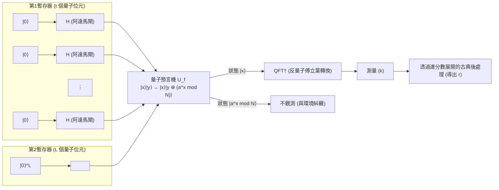

 **【步驟1：初始化與生成疊加態】** 
將整個系統設定為初始狀態 **$|\psi_0\rangle$** $= |0\rangle^{\otimes t} |0\rangle^{\otimes L}$ 。
接著，對第1個暫存器的所有量子位元應用阿達馬閘 $H^{\otimes t}$ ，生成指數級多個狀態的等機率疊加態。

$$
|\psi_1\rangle = \frac{1}{\sqrt{M}} \sum_{x=0}^{M-1} |x\rangle |0\rangle
$$

在此，第1個暫存器同時保持著從 $0$ 到 $M-1$ 所有整數的狀態。

 **【步驟2：透過量子預言機進行函數求值】** 
應用量子預言機 $U_f$ ，在疊加狀態下計算函數 $f(x) = a^x \bmod N$ ，並將結果儲存於第2個暫存器中。

$$
|\psi_2\rangle = U_f |\psi_1\rangle = \frac{1}{\sqrt{M}} \sum_{x=0}^{M-1} |x\rangle |a^x \bmod N\rangle
$$

這個狀態 **$|\psi_2\rangle$** 是輸入 $x$ 與輸出 $f(x)$ 呈現強烈糾纏的狀態。

 **【步驟3：第2暫存器的觀測（概念性）】** 
為了便於理解理論，我們假設在此觀測了第2個暫存器（在實際的演算法中，即使省略觀測，數學上的結果也完全相同）。透過觀測，第2個暫存器會塌縮成某個特定的值 $y = a^{x_0} \bmod N$ 。這裡的 $x_0$ 是滿足 $0 \le x_0 < r$ 的某個最小偏移值。
此時，第1個暫存器會瞬間塌縮為「使得函數 $f(x)$ 輸出為 $y$ 的所有輸入 $x$」的疊加態。由於函數具有週期 $r$ ，這類的 $x$ 會以等間距排列，即 $x_0, x_0 + r, x_0 + 2r, \dots$ 。

$$
|\psi_3\rangle = \frac{1}{\sqrt{A}} \sum_{m=0}^{A-1} |x_0 + m r\rangle \otimes |y\rangle
$$

其中 $A$ 是疊加態中包含的項數，且 $A \approx M/r$ 。
若專注於第1個暫存器，這是一個具有週期 $r$ 的梳狀機率分佈狀態。然而，如果直接對這個狀態進行測量，只會等機率地得到隨機的 $x_0 + mr$ ，因為偏移值 $x_0$ 是未知的，所以無法得知週期 $r$ 。這時就需要 QFT 的出場了。

 **【步驟4：應用反量子傅立葉轉換】** 
對第1個暫存器應用反量子傅立葉轉換（QFT$^\dagger$）。

$$
\text{QFT}^\dagger |\psi_3\rangle = \frac{1}{\sqrt{A M}} \sum_{k=0}^{M-1} \sum_{m=0}^{A-1} e^{-2\pi i k (x_0 + m r) / M} |k\rangle
$$

針對狀態 $|k\rangle$ 進行整理，並探究其機率幅 $c_k$ 。

$$
c_k = \frac{1}{\sqrt{A M}} e^{-2\pi i k x_0 / M} \sum_{m=0}^{A-1} e^{-2\pi i k m r / M}
$$

這個式子中加總的部分，是公比為 $e^{-2\pi i k r / M}$ 的等比數列總和。如果相位 $k r / M$ 大幅偏離整數，向量會在複數平面上一邊旋轉一邊相加，因而產生破壞性干涉（Destructive Interference），使得機率幅幾乎為 $0$ 。
相反地，如果 $k r / M$ 極度接近整數 $j$ ，亦即當 $k \approx j \frac{M}{r}$ 時，複數平面上的向量會指向同一個方向，並透過建設性干涉（Constructive Interference）使得機率幅被放大。

 **【步驟5：測量與連分數展開】** 
測量第1個暫存器時，將會以高機率觀測到滿足 $k \approx j \frac{M}{r}$ 的整數 $k$ 。將兩邊除以 $M$ ，可得到以下關係：

$$
\frac{k}{M} \approx \frac{j}{r}
$$

其中，$k$ 與 $M$ 是已知的值，而 $j$ 與 $r$ 是未知的。由於我們選擇 $t$ 使得 $M \ge N^2$ ，因此 $k/M$ 對於未知的分數 $j/r$ 提供了一個極高精度的近似： $\left| \frac{k}{M} - \frac{j}{r} \right| \le \frac{1}{2M} < \frac{1}{2r^2}$ 。
根據丟番圖近似定理（勒讓德定理），滿足此條件的有理數 $j/r$ ，必然包含在實數 $k/M$ 的「連分數展開（Continued Fraction Expansion）」的漸近分數中。
因此，藉由使用古典電腦在多項式時間內計算 $k/M$ 的連分數展開，就可以決定出作為分母的週期 $r$ 。至此求階問題已獲解決，其結果使得導出RSA加密的金鑰，也就是質因數 $p$ 與 $q$ 成為可能。

## 8.5 為何秀爾演算法能對古典計算帶來指數級的加速

秀爾演算法成為歷史性重大突破的原因，在於它並不僅僅是一種啟發式演算法（Heuristics），而是第一個伴隨嚴謹數學證明，展現出「對古典計算產生真正指數級加速」的實用演算法。其非凡計算能力本質，在於以下兩個量子力學現象的完美融合。

第一是量子平行性（Quantum Parallelism）。透過使用疊加態，對於 $2^t$ 這樣甚至超越宇宙原子數量的天文數字級別的輸入 $x$ ，僅透過1次操作就同時完成了對函數 $f(x)$ 的求值。把古典電腦需要耗費數億年逐一計算的求值過程，在瞬間完成了。

然而，根據量子力學的公理，一旦進行測量，狀態就會塌縮，所獲得的資訊只不過是單一一個隨機的求值結果 $(x, f(x))$ 而已。這與古典計算並沒有任何差別。

從這裡開始才是真正的魔法，也是第二把鑰匙：量子干涉（Quantum Interference）與全域結構的萃取。量子傅立葉轉換對指數級龐大的整個狀態空間產生干涉。這並非試圖去得知個別 $f(x)$ 的具體數值，而是僅萃取出整個函數的「全域週期性」這種結構模式的操作。
對應於錯誤週期的機率幅，會如同波峰與波谷相互抵銷一般，因為破壞性干涉而完全消失；只有對應於正確週期 $r$ 的機率幅，才會因為建設性干涉而達到極大化。也就是說，大自然的物理法則本身扮演了計算機的角色，抹除了無數的錯誤答案，只讓正確答案浮現出來。

從隱藏子群問題（Hidden Subgroup Problem, HSP）的觀點來說，秀爾演算法是一個能高效率解決「有限阿貝爾群上的 HSP」的通用框架。RSA加密所依賴的交換群的求階問題，完美地契合了這個框架。

量子電腦並非萬能的魔法棒，它並不能以指數級的速度解決所有問題。然而，對於這種隱藏著「週期性」或「代數結構」的問題，量子干涉這種物理機制從根本上打破了古典計算的極限。這正是秀爾演算法為密碼學理論畫下休止符，並為量子資訊科學這個領域帶來爆發性發展最深奧且美麗的原因。

# 第9章: Grover演算法與振幅放大的幾何學

在現代資訊科學中，從大規模資料集中找出符合特定條件的元素的「搜尋問題」，是一項極為重要的課題，同時也是計算機科學中最根本的問題之一。如果資料集存在某種結構（例如，元素按字母順序或數值順序排序等），則可以使用二元搜尋等有效率的古典演算法，搜尋時間對於元素數量 $N$ 可以控制在 $O(\log N)$ 內。然而，在完全隨機排列的 **「非結構化資料庫（Unstructured Database）」** 中的搜尋，在古典電腦的框架下只能依賴逐一檢查元素的線性搜尋（Linear Search），對於元素數量 $N$，最壞情況需要 $N$ 次，平均需要 $N/2$ 次查詢，亦即需要 $O(N)$ 的計算步驟。

然而，1996年由貝爾實驗室的物理學家洛夫·格羅弗（Lov Grover）所發現的 **Grover演算法** ，極為巧妙且優美地利用了量子力學底層的「疊加（Superposition）」與「干涉（Interference）」原理，成功以 $O(\sqrt{N})$ 的查詢次數解決了這個非結構化搜尋問題。這與相對於問題規模將計算時間呈現指數級縮短（Exponential speedup）的Shor演算法不同，它提供的是多項式加速的一種，稱為 **二次加速（Quadratic speedup）** 。但考慮到目標的非結構化搜尋問題普遍存在於NP完全問題的暴力搜尋或密碼系統的金鑰搜尋等所有領域中，其應用範圍之廣與實用影響力是難以估量的。在量子資訊科學這個廣大的領域中，Grover演算法作為最通用且最重要的演算法之一，已經確立了其不可動搖的地位。

本章將針對Grover演算法核心的 **「振幅放大（Amplitude Amplification）」** 這項深奧的機制，以直觀的幾何學視角，以及不作任何妥協的嚴謹線性代數手法，進行詳細的剖析，其深度即使是專家閱讀也能有新的發現。

## 9.1 問題的公式化與初始疊加態的準備

首先，讓我們在數學上嚴格地公式化我們所要解決的搜尋問題。假設有一個大小為 $N = 2^n$ 的非結構化資料庫，每個元素被編碼為使用 $n$ 個量子位元來表示的計算基底態 $|x\rangle$（這裡 $x \in \{0, 1\}^n$，也就是 $x = 0, 1, \dots, N-1$）。我們假設在這個廣大的資料庫空間中，只存在唯一一個我們想找出的特定狀態（正確答案狀態），我們將這個特殊狀態記為 $|w\rangle$。

問題的目標被定義為：「使用給定的黑箱函數（我們稱之為 **神諭 (Oracle)** ），以盡可能少的查詢次數且高機率地找出正確答案狀態 $|w\rangle$」。

量子演算法的第一步，總是從為了同時綜觀整個搜尋空間的準備工作開始。為了創造出所有可能性均等疊加的狀態，我們對 $n$ 個量子位元的初始狀態 $|0\rangle^{\otimes n}$，透過張量積平行地對每個量子位元應用Hadamard閘 $H$。我們將由此獲得的初始均等疊加態定義為 $|s\rangle$。

$$
|s\rangle = H^{\otimes n} |0\rangle^{\otimes n} = \frac{1}{\sqrt{N}} \sum_{x=0}^{N-1} |x\rangle
$$

這個狀態 **$|s\rangle$** ，在希爾伯特空間中，可以明確地分離為正確答案狀態 $|w\rangle$ 與其他所有錯誤答案狀態的線性組合。為了讓未來的幾何學解釋更容易在視覺上掌握，我們導入一個僅將錯誤答案狀態均等疊加並正規化的新向量 $|s^\perp\rangle$，其定義如下：

$$
|s^\perp\rangle = \frac{1}{\sqrt{N-1}} \sum_{x \neq w} |x\rangle
$$

根據這個定義，狀態 $|s^\perp\rangle$ 與正確答案狀態 $|w\rangle$ 是互相正交的（ $\langle s^\perp | w \rangle = 0$ ）。於是，初始的均等疊加態 **$|s\rangle$** ，在這些互為正交的兩個向量 $|w\rangle$ 與 $|s^\perp\rangle$ 所張成的二維希爾伯特子空間上，可以極為簡單地展開如下：

$$
|s\rangle = \sqrt{\frac{N-1}{N}} |s^\perp\rangle + \frac{1}{\sqrt{N}} |w\rangle
$$

在此，我們導入一個微小的角度 $\theta$，使得 $\sin \theta = \frac{1}{\sqrt{N}}$（當 $N$ 夠大時， $\theta \approx 1/\sqrt{N}$）。那麼，這個狀態可以使用三角函數改寫為更優雅的幾何學表示：

$$
|s\rangle = \cos \theta |s^\perp\rangle + \sin \theta |w\rangle
$$

這個數學式所訴說的，是在初始狀態 **$|s\rangle$** 中觀測到正確答案狀態 $|w\rangle$ 的機率，僅僅只有冷酷的 $|\sin \theta|^2 = \frac{1}{N}$ 這個事實。Grover演算法的至高目標，就在於透過反覆應用後述的神諭與擴散算符的組合，將這個狀態向量 **$|s\rangle$** 在希爾伯特空間的二維平面內，逐漸朝 $|w\rangle$ 的方向「旋轉」，並將觀測到正確答案的機率無限逼近理論極限的 $1$（放大振幅）。

## 9.2 量子神諭 (Quantum Oracle) 的定義與相位反衝

作為演算法反覆單位的「Grover迭代（Grover iteration）」，其第一個重要的組成元素，是用來識別目標資料是否為正確答案的神諭 $O$。在量子計算中，神諭必須被嚴格定義為一個么正算符，它會根據輸入的計算基底態 $|x\rangle$ 是否為正確答案 $|w\rangle$ 來產生特定的作用。

通常，這個神諭會使用一個輔助量子位元（ancilla qubit），以可逆的形式實作函數的評估。我們將表示搜尋條件的布林函數 $f(x)$ 定義為：當 $x = w$ 時回傳 $f(w) = 1$，而對於其他所有 $x \neq w$ 則回傳 $f(x) = 0$。此時，神諭的作用可以使用互斥或（XOR） $\oplus$ 寫成如下形式：

$$
O_f \left( |x\rangle \otimes |y\rangle \right) = |x\rangle \otimes |y \oplus f(x)\rangle
$$

在這裡，Grover演算法的巧妙之處便閃耀出來。我們不輸入計算基底，而是預先將輔助量子位元 $|y\rangle$ 初始化為 $|-\rangle = \frac{1}{\sqrt{2}}(|0\rangle - |1\rangle)$ 的疊加態後輸入。接著，就會發生被稱為 **相位反衝（Phase Kickback）** 的量子特有驚人現象。讓我們具體計算一下：

$$
\begin{align*}
O_f \left( |x\rangle \otimes |-\rangle \right) &= O_f \left( |x\rangle \otimes \frac{|0\rangle - |1\rangle}{\sqrt{2}} \right) \\
&= \frac{1}{\sqrt{2}} \left( O_f |x\rangle |0\rangle - O_f |x\rangle |1\rangle \right) \\
&= \frac{1}{\sqrt{2}} \left( |x\rangle |0 \oplus f(x)\rangle - |x\rangle |1 \oplus f(x)\rangle \right)
\end{align*}
$$

我們將這個式子分為輸入狀態是錯誤答案和正確答案兩種情況來評估。
如果 $x \neq w$（也就是 $f(x) = 0$），狀態完全不會改變。

$$
\frac{1}{\sqrt{2}} \left( |x\rangle |0\rangle - |x\rangle |1\rangle \right) = |x\rangle |-\rangle
$$

另一方面，如果 $x = w$（也就是 $f(w) = 1$），輔助量子位元的狀態會反轉 $0 \to 1$、$1 \to 0$，整體上會有一個負號跑到狀態的前面。

$$
\frac{1}{\sqrt{2}} \left( |x\rangle |1\rangle - |x\rangle |0\rangle \right) = - \left( |x\rangle \frac{|0\rangle - |1\rangle}{\sqrt{2}} \right) = - |x\rangle |-\rangle
$$

這個結果極為重要。輔助量子位元 $|-\rangle$ 的狀態在運算前後完全不變，僅僅作為「催化劑」發揮作用。取而代之的是，函數的評估結果 $f(x)$ 被作為主量子暫存器 $|x\rangle$ 的 **振幅正負號（相位）** 「反衝（Kickback）」了回來。利用這個性質，我們可以省略輔助量子位元的描述，將神諭對主暫存器的作用，以新的么正算符 $U_w$ 簡單且優雅地重新定義如下：

$$
U_w |x\rangle = (-1)^{f(x)} |x\rangle = \begin{cases} -|x\rangle & (x = w) \\ |x\rangle & (x \neq w) \end{cases}
$$

這個相位神諭 $U_w$，可以使用狄拉克的括號標記法（bra-ket notation）的投影算符表示，明確地描述如下：

$$
U_w = I - 2|w\rangle\langle w|
$$

這裡 $I$ 是 $N \times N$ 的單位算符。如果訴諸幾何學的直覺，這個神諭 $U_w$ 在由 $|s^\perp\rangle$ 和 $|w\rangle$ 所張成的二維實數平面中，正是 **以橫軸 $|s^\perp\rangle$ 軸為對稱軸對狀態向量進行的鏡射（Reflection）** 。因為只有正確答案狀態的成分被反轉了符號，而錯誤答案狀態的成分則保持原樣。

## 9.3 擴散算符 (Diffusion Operator) 與繞平均值反轉的數學結構

在透過神諭為正確答案狀態標上「負相位標記」之後，我們應用Grover迭代的第二個組成元素： **擴散算符（Diffusion Operator）** $U_s$。這個算符的作用，是將量子態各個元素的振幅，繞著整體的平均值進行反轉，藉此戲劇性地放大被標記狀態的機率振幅。

擴散算符 $U_s$ 在數學上定義如下：

$$
U_s = 2|s\rangle\langle s| - I
$$

這個算符為何被稱為「繞平均值反轉（Inversion about the mean）」，我們用一般的疊加態 $|\psi\rangle = \sum_{x=0}^{N-1} \alpha_x |x\rangle$ 來嚴格證明其機制。

首先，計算均等疊加態 $|s\rangle$ 與當前狀態 $|\psi\rangle$ 的內積。

$$
\langle s | \psi \rangle = \left( \frac{1}{\sqrt{N}} \sum_{y=0}^{N-1} \langle y| \right) \left( \sum_{x=0}^{N-1} \alpha_x |x\rangle \right) = \frac{1}{\sqrt{N}} \sum_{x=0}^{N-1} \alpha_x
$$

將這個內積的值再除以 $\sqrt{N}$，就會得到所有振幅 $\alpha_x$ 的算術平均值（我們將其定義為 $\mu$）。也就是說，可以表示為 $\mu = \frac{1}{N} \sum_{x=0}^{N-1} \alpha_x = \frac{1}{\sqrt{N}} \langle s | \psi \rangle$。因此， $\langle s | \psi \rangle = \sqrt{N} \mu$。

利用這個關係式，我們計算 $U_s$ 作用於狀態 $|\psi\rangle$ 的結果。

$$
\begin{align*}
U_s |\psi\rangle &= (2|s\rangle\langle s| - I) \sum_{x=0}^{N-1} \alpha_x |x\rangle \\
&= 2|s\rangle \langle s | \psi \rangle - \sum_{x=0}^{N-1} \alpha_x |x\rangle \\
&= 2 \left( \frac{1}{\sqrt{N}} \sum_{x=0}^{N-1} |x\rangle \right) (\sqrt{N} \mu) - \sum_{x=0}^{N-1} \alpha_x |x\rangle \\
&= 2 \mu \sum_{x=0}^{N-1} |x\rangle - \sum_{x=0}^{N-1} \alpha_x |x\rangle \\
&= \sum_{x=0}^{N-1} (2\mu - \alpha_x) |x\rangle
\end{align*}
$$

結果所得狀態的各個基底 $|x\rangle$ 的新振幅變成了 $(2\mu - \alpha_x)$。這個式子可以變形為 $\mu + (\mu - \alpha_x)$。這顯示了原本的振幅 $\alpha_x$ 以整體的平均值 $\mu$ 為基準，反轉到了正好相反（對稱）的位置。這正是擴散算符被稱為「繞平均值反轉」的數學根據。

透過神諭 $U_w$ 的作用，唯獨正確答案狀態 $|w\rangle$ 的振幅變成了負值（ $-\alpha_w$ ）。其他龐大的 $N-1$ 個錯誤答案狀態的振幅仍然為正。因此，整體的平均值 $\mu$ 雖然略微減少，但依然保持為正值。此時應用這個擴散算符，正確答案狀態「大的負振幅」會繞著「正的平均值 $\mu$ 」被反轉。結果，正確答案狀態的振幅會 **戲劇性地跳躍（放大）成比原本振幅大得多的正值** 。

反之，因為錯誤答案狀態的振幅原本具有比平均值稍微大一點的值，繞著平均值反轉後，會被往下推擠成比原本值稍微小一點的正值。這個過程正是演算法的精髓，利用量子干涉抵消不需要狀態的機率，並建設性地增強目標狀態的機率。

回到幾何學的視角，算符表示 $U_s = 2|s\rangle\langle s| - I$ 鮮明地顯示了，這是一個 **以初始狀態向量 $|s\rangle$ 軸為對稱軸對狀態向量進行的鏡射（Reflection）運算** 。

## 9.4 振幅放大的幾何學解釋（雙重鏡射造成的純旋轉）

Grover演算法的1次反覆單位，亦即 **Grover算符 $G$** ，被定義為神諭 $U_w$ 與擴散算符 $U_s$ 的連續應用，也就是它們的乘積。

$$
G = U_s U_w = (2|s\rangle\langle s| - I) (I - 2|w\rangle\langle w|)
$$

在這裡，歐幾里得幾何學與線性代數交織而成的極度優美的定理成為了主角。這個定理是：「以兩條互相相交的直線為對稱軸的連續兩次鏡射（Reflection）組合，會等同於一個純旋轉（Rotation），其旋轉角度為該兩直線夾角的兩倍」。

從目前的分析可以保證，無論狀態向量受到什麼運算，它始終會停留在由 $|s^\perp\rangle$ 與 $|w\rangle$ 張成的二維實數向量空間（平面）內。我們在這個平面內重新確認各個算符的作用。

1. **神諭 $U_w$ 造成的鏡射** ：
   對於當前的狀態向量， $U_w$ 只反轉直角座標系中縱軸，即 $|w\rangle$ 方向成分的符號。幾何學上，這是 **以橫軸 $|s^\perp\rangle$ 軸為對稱軸的鏡射** 。
2. **擴散算符 $U_s$ 造成的鏡射** ：
   緊接著的 $U_s$，將狀態向量在平面內， **以傾斜了角度 $\theta$ 的向量 $|s\rangle$ 方向為對稱軸進行鏡射** 。

初始狀態 $|s\rangle$ 從橫軸 $|s^\perp\rangle$ 向上傾斜了角度 $\theta$（這裡 $\sin \theta = \frac{1}{\sqrt{N}}$）。
因此，在對 $|s^\perp\rangle$ 軸進行鏡射後，立刻對從那裡傾斜了角度 $\theta$ 的 $|s\rangle$ 軸進行鏡射，整體的運算 $G$，就成了 **在這個二維平面內將狀態向量逆時針旋轉 $2\theta$ 的運算** 。

讓我們使用旋轉矩陣，嚴謹地在數學上證明這個直觀的幾何學洞見。令完成 $t$ 次反覆後的狀態為 $|\psi_t\rangle$。初始狀態是 $t=0$ 時，且 $|\psi_0\rangle = |s\rangle = \cos \theta |s^\perp\rangle + \sin \theta |w\rangle$。

使用數學歸納法，我們來證明經過 $t$ 次反覆後的狀態總是能簡潔地表示如下：

$$
|\psi_t\rangle = G^t |s\rangle = \cos((2t+1)\theta) |s^\perp\rangle + \sin((2t+1)\theta) |w\rangle
$$

當 $t=0$ 時，顯然成立。假設 $|\psi_t\rangle$ 如上式給出，我們進一步計算進行了1次迭代的狀態 $|\psi_{t+1}\rangle = G |\psi_t\rangle$。
首先，應用神諭 $U_w$， $|w\rangle$ 成分的符號會反轉。

$$
U_w |\psi_t\rangle = \cos((2t+1)\theta) |s^\perp\rangle - \sin((2t+1)\theta) |w\rangle
$$

接著，應用擴散算符 $U_s = 2|s\rangle\langle s| - I$。為了計算這個，導入使用基底向量 $\{|s^\perp\rangle, |w\rangle\}$ 的 2×2 矩陣表示是最清晰的。

神諭 $U_w$ 的矩陣表示是以下的對角矩陣：

$$
U_w = \begin{pmatrix} 1 & 0 \\ 0 & -1 \end{pmatrix}
$$

因為初始狀態向量 $|s\rangle$ 可以用行向量 $\begin{pmatrix} \cos\theta \\ \sin\theta \end{pmatrix}$ 表示，投影算符 $|s\rangle\langle s|$ 使用外積計算後，由此求得的 $U_s$ 如下所示：

$$
\begin{align*}
U_s &= 2 \begin{pmatrix} \cos\theta \\ \sin\theta \end{pmatrix} \begin{pmatrix} \cos\theta & \sin\theta \end{pmatrix} - \begin{pmatrix} 1 & 0 \\ 0 & 1 \end{pmatrix} \\
&= \begin{pmatrix} 2\cos^2\theta - 1 & 2\sin\theta\cos\theta \\ 2\sin\theta\cos\theta & 2\sin^2\theta - 1 \end{pmatrix} \\
&= \begin{pmatrix} \cos(2\theta) & \sin(2\theta) \\ \sin(2\theta) & -\cos(2\theta) \end{pmatrix}
\end{align*}
$$

（這裡，使用了倍角公式 $\cos(2\theta) = 2\cos^2\theta - 1$ 與 $\sin(2\theta) = 2\sin\theta\cos\theta$）

因此，Grover算符 $G = U_s U_w$ 整體的矩陣表示，就是這兩個矩陣的乘積。

$$
G = \begin{pmatrix} \cos(2\theta) & \sin(2\theta) \\ \sin(2\theta) & -\cos(2\theta) \end{pmatrix} \begin{pmatrix} 1 & 0 \\ 0 & -1 \end{pmatrix}
= \begin{pmatrix} \cos(2\theta) & -\sin(2\theta) \\ \sin(2\theta) & \cos(2\theta) \end{pmatrix}
$$

令人驚訝的是，得到的矩陣正是幾何學中非常為人熟知的 **角度 $2\theta$ 的旋轉矩陣** 。因此，對初始向量 $\begin{pmatrix} \cos\theta \\ \sin\theta \end{pmatrix}$ 連續應用算符 $G$ 達 $t$ 次，在幾何學上就等於每次將向量逆時針旋轉 $2\theta$。因此，總角度為初始角度 $\theta$ 加上 $t \times 2\theta$，即 $\theta + 2t\theta = (2t+1)\theta$。如此便優美地完成了歸納法的證明。

在此，我們展示一個表示Grover演算法1次反覆的量子電路圖（Mermaid語法），將理論與實作的對應關係視覺化。

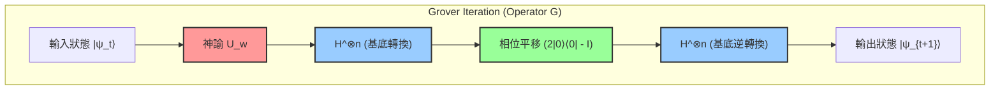

這個電路圖所展示的，是擴散算符 $U_s = 2|s\rangle\langle s| - I$ 極具實用性的實作方法。因為狀態 $|s\rangle$ 是作為 $H^{\otimes n} |0\rangle^{\otimes n}$ 產生的，所以算符可以分解如下：

$$
U_s = 2(H^{\otimes n} |0\rangle^{\otimes n})(\langle 0|^{\otimes n} H^{\otimes n}) - I = H^{\otimes n} (2|0\rangle\langle 0| - I) H^{\otimes n}
$$

換句話說，透過Hadamard轉換 $H^{\otimes n}$ 轉換到計算基底，接著應用條件式相位平移算符，該算符僅在所有量子位元都為 $|0\rangle$ 時不反轉相位（或者定義為僅在 $|0\rangle$ 時給予負相位，兩者是等價的，僅僅是全域相位的差異），然後再次透過Hadamard轉換回到原來的基底。透過採取這種三明治結構，就可以在任何量子電腦上有效率地實作「繞平均值反轉」。

## 9.5 成功機率的分析與最佳反覆次數的推導

隨著狀態向量的幾何行為被徹底解析，我們已經準備好對於演算法核心的「需要重複幾次迭代才能得到正確答案」這個問題，給出嚴格定量的答案。

在進行了 $t$ 次反覆後，在計算基底上觀測量子暫存器，並得到正確答案狀態 $|w\rangle$ 的機率 $P(w)$，是由狀態向量 $|\psi_t\rangle$ 的 $|w\rangle$ 成分的振幅絕對值的平方所給出：

$$
P(w) = |\langle w | \psi_t \rangle|^2 = \sin^2((2t+1)\theta)
$$

我們的終極目標，是將這個機率 $P(w)$ 最大化，也就是盡可能逼近理論上的上限 $1$。正弦函數的平方 $\sin^2(x)$ 取得最大值 $1$ 的時候，是當引數 $x$ 等於 $\frac{\pi}{2}$（90度）時。因此，為了求得最佳的反覆次數 $t$，我們可以列出如下的方程式：

$$
(2t+1)\theta \approx \frac{\pi}{2}
$$

解這個關於 $t$ 的方程式，得到：

$$
t \approx \frac{\pi}{4\theta} - \frac{1}{2}
$$

在實用規模的資料庫搜尋中，元素數量 $N$ 將是一個天文數字般巨大的數。此時，角度 $\theta$ 將是極度接近 $0$ 的微小值。對於微小的 $\theta$，透過取泰勒展開（麥克勞林展開）的一次項，會有很好的近似 $\sin \theta \approx \theta$ 成立。由於初始状態的定義為 $\sin \theta = \frac{1}{\sqrt{N}}$，所以可以視為 $\theta \approx \frac{1}{\sqrt{N}}$。

將這個近似式代入剛才推導出的 $t$ 的方程式中，最佳的反覆次數（最佳迭代數） $R$ 就可以鮮明地推導如下：

$$
R \approx \frac{\pi}{4} \sqrt{N}
$$

這個結果所代表的意義，驚人得足以撼動資訊科學的歷史。在古典電腦中，為了從隨機洗牌的搜尋空間中找出正確答案，最壞的情況下需要 $N$ 次，即使取平均值也需要 $N/2$ 次，也就是不可避免地需要與元素數量成正比的搜尋時間（計算複雜度為 $O(N)$ ）。然而，在量子電腦上運作的Grover演算法，透過利用干涉來放大機率，僅僅需要 $\frac{\pi}{4} \sqrt{N}$ 次的查詢次數，就幾乎可以肯定地（以 $1 - O(1/N)$ 極高的機率）抵達正確答案狀態。計算複雜度變成了 $O(\sqrt{N})$，成功地將計算時間壓縮到了平方根的尺度。

但是，這裡有一個重要的注意事項。Grover演算法並不會自我停止（Self-stopping）。如果反覆次數超過了這個最佳值 $R$，狀態向量將會越過目標的 $|w\rangle$ 軸，由於正弦函數的週期性，觀測到正確答案的機率反而會開始下降，這種現象被稱為 **過度旋轉（Overcooking / Overshooting）** 。因此，適切地控制觀測的時機（停止迭代的時機），是讓演算法成功的必備條件。

## 9.6 存在多個解時振幅放大的推廣

到目前為止，我們一直是在「廣大的資料庫中『只有一個』正確答案」這種最嚴苛的條件下（單一解問題）進行討論。然而，在現實世界的問題設定中，符合條件的解往往存在多個。Grover演算法核心的振幅放大手法，即使在存在 $M$ 個解（ $1 \le M \le N$ ）的情況下，也能毫不損及其數學之美地自然推廣。

當存在 $M$ 個解時，我們將所有正確答案狀態的均等疊加態重新定義為 $|W\rangle$，並將所有錯誤答案狀態的均等疊加態重新定義為 $|W^\perp\rangle$：

$$
|W\rangle = \frac{1}{\sqrt{M}} \sum_{x \in \text{Solutions}} |x\rangle
$$

$$
|W^\perp\rangle = \frac{1}{\sqrt{N-M}} \sum_{x \notin \text{Solutions}} |x\rangle
$$

於是，初始的均等疊加態 $|s\rangle$，可以使用這兩個正交的向量展開如下：

$$
|s\rangle = \sqrt{\frac{N-M}{N}} |W^\perp\rangle + \sqrt{\frac{M}{N}} |W\rangle
$$

在此，我們定義一個新的角度 $\theta'$，使得 $\sin \theta' = \sqrt{\frac{M}{N}}$。在這個定義下，應用與單一解情況完全相同的Grover算符 $G$（不過神諭已被擴展為會對全部 $M$ 個解反轉相位），狀態向量就會在由 $|W^\perp\rangle$ 與 $|W\rangle$ 所張成的平面內，每次反覆都旋轉 $2\theta'$。

透過相同的邏輯推演，最佳的反覆次數為 $\frac{\pi}{4\theta'}$，在 $M \ll N$ 的情況下，可以近似如下：

$$
R \approx \frac{\pi}{4} \sqrt{\frac{N}{M}}
$$

這個式子表明，理所當然地，解的數量 $M$ 越多，所需的問題反覆次數（搜尋時間）就越短。例如，如果存在4個解，所需的時間就會減半。即使解的數量 $M$ 是未知的，也可以透過使用結合Grover演算法與量子相位估計（Quantum Phase Estimation）的高階手法——被稱為 **量子計數演算法（Quantum Counting Algorithm）** ——來快速估計出解的數量 $M$ 本身，然後再進行適當次數的振幅放大。

## 9.7 二次加速的理論意義與量子計算的極限 (BBBV定理)

由Grover演算法所帶來的從 $O(N)$ 到 $O(\sqrt{N})$ 的二次加速，在數學式子上，與Shor演算法所帶來的指數級加速（從 $O(e^{N^{1/3}})$ 到 $O(N^3)$ ）相比，可能顯得較為保守。然而，它在計算機科學中的真正價值與普遍性，正是寄託於「不挑問題的通用性」上。

Shor的質因數分解演算法巧妙地利用了整數乘法群所具有的「週期性」這種極為特殊的代數結構。相對地，Grover演算法則是無條件地適用於「非結構化資料庫搜尋」這種不具備任何先驗知識與結構、屬於所有計算問題最根本且最原始的形式。

其影響最濃烈地展現在屬於計算複雜度類別NP的眾多難題，以及支撐現代社會基礎的密碼技術上的應用。例如，旅行推銷員問題或布林可滿足性問題（SAT）等NP完全問題，本質上都會歸結為從龐大的候選空間中地毯式搜尋符合條件的解的問題。對於這些問題，古典演算法需要 $O(2^n)$ 的時間，但如果應用Grover演算法，可以將計算時間實質上減半至 $O(\sqrt{2^n}) = O(2^{n/2})$（指數部分減半）。

對密碼技術的影響也是致命且巨大的。目前確保網際網路安全性的AES等對稱金鑰密碼系統的強度，完全依賴於對金鑰空間進行暴力攻擊（Brute-force attack）的困難度。例如，AES-128（128位元長度的金鑰空間）的搜尋空間是 $N = 2^{128}$ 這樣一個驚人的數字。古典電腦平均需要進行 $2^{127}$ 次的金鑰驗證計算，但量子電腦透過使用Grover演算法，僅需 $\frac{\pi}{4} 2^{64}$ 次的計算，就能確實地找出正確的金鑰。這個事實，正是世界各國標準化機構（如NIST）將轉移至後量子密碼學（Post-Quantum Cryptography）視為當務之急，並強烈建議棄用AES-128，改用AES-256（即使在量子計算中也需要 $2^{128}$ 次計算）的最大依據。

最後，從理論物理學與計算機科學的觀點，我們來觸及一個非常重要的定理。這就是1997年由Bennett、Bernstein、Brassard、Vazirani等人所證明的 **BBBV定理** 。這個定理在數學上嚴格證明了：「即使使用量子電腦，對於黑箱的非結構化搜尋問題，絕對需要 $\Omega(\sqrt{N})$ 次的查詢」。

這意味著什麼呢？這意味著一個深奧的事實： **「Grover演算法所達成的 $O(\sqrt{N})$ 計算複雜度，是自然界法則（量子力學）所容許的絕對理論極限，使用宇宙中任何物理法則都不可能達成比這更快的加速」** 。Grover不僅僅是發現了一個優秀的演算法，更抵達了資訊與物理法則的終極邊界。

此外，本章詳細論述的「振幅放大（Amplitude Amplification）」典範本身，已被廣泛應用作為建構無數高階量子演算法的基礎積木（building blocks），例如量子隨機漫步（Quantum Random Walks）與量子機器學習（Quantum Machine Learning）的次常式等。Grover所發現的「利用關於正交兩軸的雙重鏡射，在幾何學上旋轉並放大機率振幅」這個美麗而優雅的手法，作為從根本上支撐量子資訊科學這個巨大知識體系中最堅固且不可或缺的支柱之一，未來也將持續閃耀。

# 第10章：量子錯誤更正與容錯計算

量子資訊科學所面臨的最大且最深遠的壁壘，便是「雜訊」與「去相干」。只要將量子電腦視為理想的封閉系統，遵循薛丁格方程式的么正演化就能保證決定論性的狀態操作。然而，作為現實物理系統的量子裝置，始終與外部環境（熱庫、電磁場的漲落、宇宙射線等）發生交互作用。本章將在數學上嚴謹定義量子系統雜訊的基礎上，深入探討如何偵測並更正古典系統中不存在的量子特有錯誤——這即是「量子錯誤更正（Quantum Error Correction: QEC）」的深奧之處。此外，我們還將詳細論述即使在更正機制本身也混入雜訊的現實情況下，仍能讓計算無限延續的「容錯量子計算（Fault-Tolerant Quantum Computation: FTQC）」的理論基礎，以及閾值定理（Threshold Theorem）。

## 10.1 量子雜訊與去相干的數學描述

為了嚴謹地描述量子系統的去相干，必須將視角從基於封閉系統狀態向量的純態動力學，轉移到開放量子系統的密度矩陣動力學。考慮環境系統 $E$ 與主系統 $S$ 之複合系統中的么正演化，並透過部分跡（Partial Trace）消除環境系統的自由度，主系統的狀態變化便可描述為「完全正值保跡映射（Completely Positive Trace-Preserving Map, CPTP 映射）」。

任意量子通道 $\mathcal{E}$ 皆可使用克勞斯表示（Kraus Representation）展開如下：

$$
\mathcal{E}(\rho) = \sum_{k} E_k \rho E_k^\dagger
$$

這裡， $E_k$ 被稱為克勞斯算符（Kraus Operators），滿足代表機率守恆的保跡條件 $\sum_k E_k^\dagger E_k = I$ 。

在古典資訊中，對資訊單位位元的錯誤僅有「0變成1」或「1變成0」的位元翻轉（Bit Flip）。然而，在量子系統中存在著疊加態相位發生變動的致命錯誤，稱為「相位翻轉（Phase Flip）」。代表性的單一量子位元雜訊通道之克勞斯算符如下所示：

1. **位元翻轉通道 (Bit Flip Channel)** ：以機率 $p$ 作用 $X$ 閘。
   

$$
E_0 = \sqrt{1-p} I, \quad E_1 = \sqrt{p} X
$$

2. **相位翻轉通道 (Phase Flip Channel)** ：以機率 $p$ 作用 $Z$ 閘。用來描述相對相位的崩潰（純粹去相干）。這是純態 $|\psi\rangle = \alpha|0\rangle + \beta|1\rangle$ 的密度矩陣非對角成分呈指數衰減現象的直接原因。
   

$$
E_0 = \sqrt{1-p} I, \quad E_1 = \sqrt{p} Z
$$

3. **去極化通道 (Depolarizing Channel)** ：以機率 $p$ 使狀態完全趨近於最大混合態（白雜訊） $I/2$ 。
   

$$
E_0 = \sqrt{1-p} I, \quad E_1 = \sqrt{\frac{p}{3}} X, \quad E_2 = \sqrt{\frac{p}{3}} Y, \quad E_3 = \sqrt{\frac{p}{3}} Z
$$

在建構量子錯誤更正時，阻擋在前的第一道障礙便是「不可複製定理（No-Cloning Theorem）」。不存在任何么正轉換能夠將未知的量子態 $|\psi\rangle$ 複製成如 $|\psi\rangle \otimes |\psi\rangle \otimes |\psi\rangle$ 的狀態。因此，像古典錯誤更正那樣「將相同資訊複製到三個位元並進行多數決」的樸素方法，在量子系統中是不可能的。此外，一旦測量量子態就會引起波包塌縮，疊加態也會隨之被破壞。如何在不破壞未知資訊的情況下特定出錯誤，成為了核心課題。

## 10.2 量子錯誤更正的基礎原理：冗餘化與症狀測量

在量子資訊中，「複製」的替代手段是透過使多個量子位元處於量子糾纏（Entanglement）狀態，將原始資訊映射到更高維度希爾伯特空間的子空間（編碼空間，Code Space）中。

作為最簡單的例子，我們建構一個「3量子位元位元翻轉碼」，以保護 1 個量子位元的狀態 $|\psi\rangle = \alpha |0\rangle + \beta |1\rangle$ 免受機率性位元翻轉的影響。
將邏輯基底（Logical Basis）定義如下：

$$
|0\rangle_L = |000\rangle, \quad |1\rangle_L = |111\rangle
$$

邏輯態變為 $|\psi\rangle_L = \alpha |000\rangle + \beta |111\rangle$ 。這並非複製，而是編碼為 GHZ 型的糾纏態。

在此，假設第 1 個量子位元發生了位元翻轉錯誤 $X_1 = X \otimes I \otimes I$ 。狀態將變化為 $|\psi'\rangle = \alpha |100\rangle + \beta |011\rangle$ 。
為了偵測此錯誤，絕對不能直接測量狀態本身。取而代之的是進行「症狀測量（Syndrome Measurement）」，在不破壞狀態的情況下僅提取錯誤的痕跡。具體而言，我們測量作為包立算符張量積的宇稱算符 $Z_1 Z_2$ 與 $Z_2 Z_3$ 。

原始編碼空間中的任意向量 $|\psi\rangle_L$ ，都是 $Z_1 Z_2$ 與 $Z_2 Z_3$ 對應特徵值 $+1$ 的特徵向量（亦即， $Z_1 Z_2 |\psi\rangle_L = |\psi\rangle_L$ ）。
然而，對於錯誤狀態 $|\psi'\rangle$ ，由於 $X$ 與 $Z$ 反對易（ $\{X, Z\} = 0$ ）的包立代數性質：

$$
Z_1 Z_2 |\psi'\rangle = Z_1 Z_2 X_1 |\psi\rangle_L = -X_1 Z_1 Z_2 |\psi\rangle_L = - |\psi'\rangle
$$

$$
Z_2 Z_3 |\psi'\rangle = Z_2 Z_3 X_1 |\psi\rangle_L = X_1 Z_2 Z_3 |\psi\rangle_L = + |\psi'\rangle
$$

測量結果（症狀）將為 $(-1, +1)$ ，藉此僅確立了「第 1 個位元發生了 $X$ 錯誤」的事實。由於完全沒有洩漏關於疊加態係數 $\alpha, \beta$ 的資訊，因此不會發生測量導致的狀態破壞。其後，再次套用 $X_1$ 即可完全復原為原始狀態 $|\psi\rangle_L$ 。

同理，為了更正相位翻轉錯誤 $Z$ ，我們使用基於阿達瑪基底 $\{|+\rangle, |-\rangle\}$ 的「3量子位元相位翻轉碼」。

$$
|0\rangle_L = |+++\rangle, \quad |1\rangle_L = |---\rangle
$$

在這種情況下，症狀測量則使用 $X_1 X_2$ 與 $X_2 X_3$ 。

在此展現了量子力學令人驚嘆的特性。因與環境交互作用產生的錯誤，通常是如同 $E(\theta) = \cos(\theta) I - i \sin(\theta) X$ 般的連續旋轉。然而，透過進行症狀測量，該狀態將機率性地 **投影** 至「無錯誤（ $I$ ）」或「完全錯誤（ $X$ ）」任一特徵態。也就是說，無限存在的連續性錯誤，會透過測量在量子力學上被「數位化」為離散的包立錯誤。

## 10.3 秀爾的 9 量子位元碼 (Shor Code) 與穩定子形式

前述的編碼只能更正位元翻轉或相位翻轉其中之一。1995 年，彼得·秀爾發表了能同時更正兩種錯誤的劃時代「秀爾 9 量子位元碼（Shor's 9-Qubit Code）」。它是將 3 量子位元的位元翻轉碼串接（Concatenation）並嵌套在 3 量子位元的相位翻轉碼的各個節點內部所建構而成。

邏輯基底如下所示：

$$
|0\rangle_L = \frac{1}{2\sqrt{2}} ( |000\rangle + |111\rangle ) \otimes ( |000\rangle + |111\rangle ) \otimes ( |000\rangle + |111\rangle )
$$

$$
|1\rangle_L = \frac{1}{2\sqrt{2}} ( |000\rangle - |111\rangle ) \otimes ( |000\rangle - |111\rangle ) \otimes ( |000\rangle - |111\rangle )
$$

將秀爾碼等錯誤更正予以一般化，並賦予穩固數學基礎的，是丹尼爾·高斯曼（Daniel Gottesman）提出的「穩定子形式（Stabilizer Formalism）」。
令 $n$ 量子位元的包立群為 $\mathcal{P}_n$ 。穩定子群 $\mathcal{S}$ 是 $\mathcal{P}_n$ 的可換子群，並將編碼空間 $\mathcal{C}$ 定義為「對於群 $\mathcal{S}$ 中的所有元素 $S \in \mathcal{S}$ ，其特徵值皆為 $+1$ 的狀態 $|\psi\rangle$ 的集合」。在 $n$ 量子位元系統中若有 $k$ 個獨立的生成元（Generator），編碼空間的維度即為 $2^{n-k}$ ，這代表了邏輯量子位元數。

在秀爾碼（ $n=9$ ）的情況下，為編碼 1 個邏輯位元，是由 $k=8$ 個獨立的生成元所構成。
用於偵測位元翻轉的 $Z$ 系統穩定子（6 個）：

$$
S_1 = Z_1 Z_2 I_3 I_4 I_5 I_6 I_7 I_8 I_9, \quad S_2 = I_1 Z_2 Z_3 I_4 I_5 I_6 I_7 I_8 I_9
$$

$$
\dots, \quad S_6 = I_1 I_2 I_3 I_4 I_5 I_6 I_7 Z_8 Z_9
$$

用於偵測相位翻轉的 $X$ 系統穩定子（2 個）：

$$
S_7 = X_1 X_2 X_3 X_4 X_5 X_6 I_7 I_8 I_9
$$

$$
S_8 = I_1 I_2 I_3 X_4 X_5 X_6 X_7 X_8 X_9
$$

若在任意量子位元上發生了錯誤 $E \in \mathcal{P}_n$ ，只要它與 $\mathcal{S}$ 的任何一個生成元反對易，該穩定子的測量結果便會是 $-1$ ，進而特定出錯誤的種類與位置。穩定子的概念並非追蹤量子態本身，而是追蹤規定系統對稱性的算符之代數結構，提供了一種類似海森堡繪景（Heisenberg Picture）極為強大的方法。

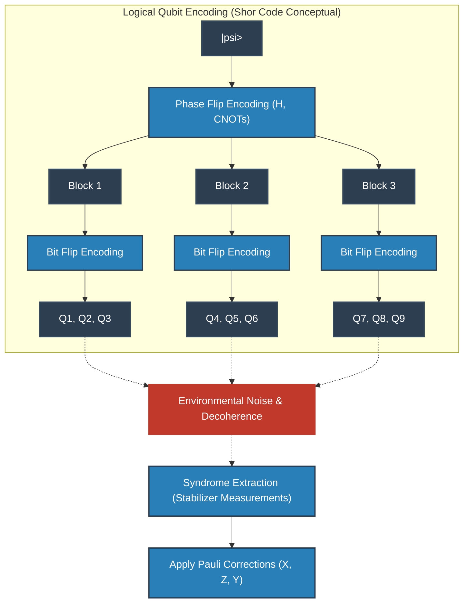

## 10.4 拓樸碼與表面碼 (Surface Codes)

秀爾碼或穩定子碼在邏輯上是完美的，但在物理實作上卻要求「相距甚遠的量子位元間發生相互作用（長程交互作用）」。在固態元件（如超導電路或矽自旋等）的二維平面晶格陣列中，這種長程耦合是極度困難的。

因此，被現代量子電腦架構作為主流採用的是由阿列克謝·基塔耶夫（Alexei Kitaev）所提倡的「拓樸量子錯誤更正」，其代表例為「環面碼（Toric Code）」與「表面碼（Surface Code）」。

在表面碼中，量子位元配置在二維晶格的頂點（或邊）上，僅使用相鄰量子位元間的局部交互作用來執行穩定子測量。
哈密頓算符描述如下：

$$
H = - \sum_{v} A_v - \sum_{p} B_p
$$

這裡， $A_v$ 是對頂點（Vertex）周圍 4 個量子位元作用之 $X$ 算符的張量積（頂點算符： $A_v = \prod_{i \in \text{star}(v)} X_i$ ）， $B_p$ 是對格狀區塊（面，Plaquette）周圍 4 個量子位元作用之 $Z$ 算符的張量積（面算符： $B_p = \prod_{i \in \text{boundary}(p)} Z_i$ ）。
它們彼此對易（ $[A_v, B_p] = 0$ ），邏輯狀態被編碼在所有 $A_v$ 與 $B_p$ 的特徵值皆為 $+1$ 的基態空間中。令人驚嘆的是，建構於虧格（Genus）為 $g$ 的二維流形上之環面碼，其基態簡併度為 $4^g$ ，在環面（ $g=1$ ）上自然地編碼了 2 個邏輯量子位元。

表面碼極其優美的物理學解釋，是將錯誤視為「準粒子（Anyon，任意子）」。例如，當某個量子位元發生 $X$ 錯誤時，相鄰的兩個面算符 $B_p$ 的症狀將翻轉為 $-1$ 。這意味著從基態的真空中對偶生成（Pair Production）了一對「類似磁單極的任意子（ $m$ 任意子）」。若錯誤進一步向旁連鎖發生，任意子將在晶格空間上移動。
所謂更正，無非就是找出症狀對（任意子），並利用圖論的「最小權重完美匹配（Minimum Weight Perfect Matching: MWPM）」演算法，以最短路徑讓任意子相互碰撞使其對消滅的操作。
邏輯運算（ $\bar{X}, \bar{Z}$ ）則對應於讓此任意子貫穿空間兩端，形成非平凡的同調迴路（Topological Loop）。由於局部雜訊自然形成貫穿整個系統迴路的機率呈指數級別的低，因此從拓樸學觀點來看，資訊受到了極度強而有力的保護。

## 10.5 邁向容錯量子計算 (FTQC) 之路與閾值定理

即便確立了錯誤更正的理論，仍殘留著令人絕望的問題：「如果用來進行錯誤更正的電路（症狀測量的輔助位元或 CNOT 閘等）本身就包含雜訊，那會發生什麼事？」如果在修復錯誤的手術過程中，又感染了更嚴重的錯誤，系統將瞬間崩潰。

例如，為了萃取症狀而使用的 CNOT 閘，會將控制位元的 $X$ 錯誤傳播到目標位元（ $X \otimes I \xrightarrow{CNOT} X \otimes X$ ），並將目標位元的 $Z$ 錯誤逆向傳播到控制位元（ $I \otimes Z \xrightarrow{CNOT} Z \otimes Z$ ）。若單一物理錯誤在編碼後的區塊內增殖到多個量子位元上，進而超過了設定的編碼距離 $d$ ，更正將徹底失敗。

為防止這種毀滅性連鎖的設計理念，便是「容錯量子計算（FTQC）」。FTQC 的絕對條件是：「系統內發生的單一物理錯誤，在一個邏輯錯誤區塊內最多只能傳播成一個錯誤」。
為了實現這一點，在執行邏輯閘時強烈要求使用「橫向操作（Transversal Operations）」。這是一種安全的閘操作，第 $i$ 個物理量子位元只會與其他區塊的第 $i$ 個物理量子位元產生交互作用（不具有區塊內的交叉耦合）。然而，透過「伊士廷-克尼爾定理（Eastin-Knill Theorem）」在數學上已經證明，僅靠橫向操作是不可能建構出用於通用量子計算的連續閘集合（Gate Set）。

規避這項定理的限制以實現通用 FTQC 的魔法棒，便是「魔術態蒸餾（Magic State Distillation）」。準備大量包含雜訊的非克里福態（Non-Clifford State，例如相當於 $T$ 閘的狀態），透過僅使用橫向克里福運算的錯誤更正電路，萃取出純度極高的「魔術態」。然後，利用量子遙傳（Quantum Teleportation）原理，間接地將非克里福閘（如 $T$ 閘等）套用至邏輯態上。這項蒸餾過程會消耗龐大資源（物理量子位元），因此在 FTQC 時代的演算法中，「如何減少 $T$ 閘的數量」成為了至高無上的命題。

所有這些理論努力的集大成，便是「量子閾值定理（Quantum Threshold Theorem）」。
由多麗特·阿哈羅諾夫（Dorit Aharonov）與麥克·本-奧爾（Michael Ben-Or）等人所證明的此定理，高聲宣告了以下結論：
 **「物理元件（閘、測量、初始化）的錯誤機率 $p$ 低於某個特定閾值 $p_{th}$ ，透過將量子錯誤更正碼以階層式串接（Concatenation）嵌套，或是持續擴張拓樸碼的晶格大小（編碼距離 $d$ ），就能以任意精度執行任意長時間的量子計算。」** 

閾值 $p_{th}$ 雖取決於使用的編碼與架構，但在表面碼中約為 $10^{-2}$ （1%），這是一個極度現實且可達到的數值。將物理上的錯誤率壓制到遠低於此閾值（Physical Layer 的改善），以及開發更有效率的症狀解碼器或表面碼的變種（Logical Layer 的洗鍊），這雙方面正是當前量子電腦開發中全球競爭的主戰場。

量子錯誤更正與 FTQC 絕非單純的工程拼湊。這是一項極度根源且具備藝術性的人類挑戰，透過拓樸學、群論以及熱力學熵的控制，將大自然試圖掩蓋的量子力學纖細疊加態，延展至宏觀的時間尺度上，進而拓展宇宙計算能力的極限。

# 第11章：量子硬體的物理實現

在前十章中，我們已詳述了量子資訊科學的理論基礎與演算法的數理結構。然而，無論設計出多麼精妙的量子演算法、在計算複雜度理論架構下證明了何等卓越的理論量子霸權（Quantum Supremacy），若缺乏作為其執行物理實體的「量子硬體」，這一切終究只是純粹數學的推演遊戲。本章將從背後深奧的量子物理學原理出發，嚴謹解析如何將抽象希爾伯特空間中的狀態向量 $ |\psi\rangle $ 具現化於物理世界中的尖端硬體實現方案。

若要以人工方式精準調控量子物理系統，並使其作為通用（Universal）計算機運作，必須滿足被稱為迪文森佐準則（DiVincenzo's criteria）的五項嚴苛物理要件：
1. **具備可擴展性且良好表徵的量子位元系統** ：必須能在物理上確保希爾伯特空間的張量積結構 $ \mathcal{H} = \bigotimes_{i=1}^n \mathcal{H}_i $ 。
2. **量子狀態的初始化** ：具備以高保真度將系統重置為純態（典型為 $ |00\dots0\rangle $ ）的能力。
3. **足夠長的相干時間** ：量子態的退相干時間（T1 與 T2）必須比單一量子閘操作所需的時間長上數個數量級。
4. **通用量子閘集的實現** ：能以有限個基礎閘（例如 H、T、CNOT 閘）的組合，將任意么正轉換 $ \hat{U} \in SU(2^n) $ 近似至任意精度。
5. **對特定量子位元的投影測量** ：伴隨著量子態塌縮的同時，具備高精度讀取特定基底下機率分佈的能力。

要建構出能同時以高保真度（Fidelity）滿足上述所有要件的系統，是現代物理學與工程學面臨的歷史性難題。將系統與外界環境完全隔絕固然能延長相干時間，但同時也會使對系統的操控與測量變得極其困難。如何克服此一終極權衡（trade-off），正是各硬體架構設計思維的核心所在。

## 11.1 超導量子位元：宏觀量子現象與非線性LC電路

目前由 Google、IBM 等眾多頂尖研究機構大力推動的主流技術，便是超導量子位元（Superconducting Qubit）。該方法並非採用微觀的基本粒子，而是利用宏觀電子電路所展現的宏觀量子現象，來建構出「人工原子（Artificial Atom）」。

### 11.1.1 約瑟夫森接面的物理機制與非線性

微細加工製造的常規 LC 共振電路（由電感 $ L $ 與電容 $ C $ 組成的系統），在冷卻至極低溫並予以量子化後，會形成量子力學中的簡諧振子（Harmonic Oscillator）。其哈密頓量可利用創生算符 $ \hat{a}^\dagger $ 與湮滅算符 $ \hat{a} $ 表示如下：

$$
\hat{H}_{\text{LC}} = \hbar \omega_r \left( \hat{a}^\dagger \hat{a} + \frac{1}{2} \right)
$$

其中 $ \omega_r = 1/\sqrt{LC} $ 為共振頻率。此系統的能階 $ E_n = \hbar \omega_r (n + 1/2) $ 為等間距分佈。若將此系統的最低能量態 $ |0\rangle $ 與第一激發態 $ |1\rangle $ 作為量子位元使用，當照射頻率為 $ \omega_r $ 的微波以執行量子閘操作（例如 $ |0\rangle \leftrightarrow |1\rangle $ 的躍遷）時，能階間距相同的 $ |1\rangle \leftrightarrow |2\rangle $ 與 $ |2\rangle \leftrightarrow |3\rangle $ 等躍遷亦會同時被激發。如此一來，系統便無法作為有效的二能階系統運作。

為了解決此問題，使能階呈現非等間距分佈的「非線性（Nonlinearity）」不可或缺。實現此一特性的核心元件便是 **約瑟夫森接面（Josephson Junction）** 。其結構為兩塊超導體夾著數奈米厚的極薄絕緣層，庫珀對（Cooper pairs）能在保持宏觀相位干涉的條件下藉由穿隧效應穿透絕緣層。根據約瑟夫森方程式，超導電流 $ I $ 與相位差 $ \phi $ 的關係為 $ I = I_c \sin \phi $ 。因此，該接面扮演了電感值隨電流變化的非線性電感角色。

### 11.1.2 Transmon 量子位元的哈密頓量

在歷史發展中，曾出現過電荷量子位元、磁通量子位元等各類設計，而當前最成功的方案則是將對電荷雜訊的抗擾能力大幅提升的「Transmon」。

Transmon 是透過刻意大幅增加與約瑟夫森能量 $ E_J $ 並聯的分流電容（shunt capacitance），使充電能量 $ E_C = e^2 / (2C_{\Sigma}) $ 縮小，並運作於 $ E_J / E_C \gg 1 $ 的體系中。
代表庫珀對數目的電荷算符 $ \hat{n} $ 與代表超導相位差的相位算符 $ \hat{\phi} $ 為一對正則共軛變數，滿足對易關係 $ [\hat{\phi}, \hat{n}] = i $ 。Transmon 的哈密頓量可嚴格表述如下：

$$
\hat{H}_{\text{transmon}} = 4 E_C (\hat{n} - n_g)^2 -E_J \cos \hat{\phi}
$$

其中， $ n_g $ 為環境或閘極電壓所引起的偏移電荷（offset charge）。在 $ E_J \gg E_C $ 的極限下，相位的量子漲落被有效抑制，因此可對餘弦項進行泰勒展開，將其視為非諧振子（Anharmonic Oscillator）處理：

$$
-E_J \cos \hat{\phi} \approx - E_J + \frac{E_J}{2} \hat{\phi}^2 - \frac{E_J}{24} \hat{\phi}^4 + \mathcal{O}(\hat{\phi}^6)
$$

正是此 $ \hat{\phi}^4 $ 項為系統賦予了非簡諧性（Anharmonicity）。經微擾理論計算，能階間的非簡諧性 $ \alpha $ 可近似為：

$$
\alpha \equiv (E_2 - E_1) - (E_1 - E_0) \approx -E_C
$$

由於存在此負非簡諧性（即 $ E_1 \to E_2 $ 的躍遷頻率小於 $ E_0 \to E_1 $ ），我們便能利用微波脈衝在 $ |0\rangle $ 與 $ |1\rangle $ 的計算基底空間內，安全地執行單量子位元閘操作，而不致洩漏至更高能階。

### 11.1.3 電路QED（Circuit QED）與測量機制

將腔量子電動力學應用於超導電路中，以實現不破壞量子位元狀態進行讀取的理論架構，即為「電路QED（Circuit QED）」。
量子位元與讀取用微波共振腔所組成的耦合系統，可由簡斯-卡明斯（Jaynes-Cummings）模型加以描述：

$$
\hat{H}_{\text{JC}} = \frac{\hbar \omega_q}{2} \hat{\sigma}_z + \hbar \omega_r \hat{a}^\dagger \hat{a} + \hbar g (\hat{\sigma}_+ \hat{a} + \hat{\sigma}_- \hat{a}^\dagger)
$$

此處 $ g $ 為耦合強度。當量子位元的躍遷頻率 $ \omega_q $ 與共振腔頻率 $ \omega_r $ 相距較遠的色散體系（dispersive regime，即 $ |\omega_q - \omega_r| \gg g $ ）中，透過施里弗-沃爾夫轉換（Schrieffer-Wolff transformation），有效哈密頓量可對角化如下：

$$
\hat{H}_{\text{disp}} \approx \frac{\hbar \omega_q}{2} \hat{\sigma}_z + \hbar \left( \omega_r + \frac{g^2}{\Delta} \hat{\sigma}_z \right) \hat{a}^\dagger \hat{a}
$$

其中 $ \Delta = \omega_q - \omega_r $ 為失諧量（detuning）。此式中第二項所揭示的物理意義至關重要：共振腔的有效頻率會依據量子位元的狀態（ $ \hat{\sigma}_z = +1 $ 或 $ -1 $ ）產生 $ \pm g^2/\Delta $ 的頻移。因此，只要使探針微波穿透或反射共振腔並測量其相位偏移，便能對量子位元的狀態完成投影測量。

 **優點與缺點** 
超導方案的最大優勢在於能借用現有的半導體微影製程技術，因而在晶片電路佈局的可擴展性上表現卓越，且其量子閘操作速度極快，達到奈秒（ns）量級。然而其缺點在於，正因其屬於宏觀人工製品，極易受到微觀材料缺陷（雙能階系統，TLS）與電磁雜訊的干擾，且必須依賴接近絕對零度（約 10 mK）的稀釋冷凍機環境。

## 11.2 離子阱技術：原子物理學的極致與完美的同一性

如果說超導是「人工建構的宏觀量子系統」，那麼離子阱（Trapped Ion）技術便是「自然界存在的終極微觀量子系統」。同位素相同的原子（例如 $ ^{171}\text{Yb}^+ $ 或 $ ^{40}\text{Ca}^+ $ ），無論存在於宇宙中的何處，都具有完全一致的物理性質。因此，其根本不存在所謂的製程公差或製造偏差，具備相干時間極其漫長這一無可替代的絕對優勢。

### 11.2.1 保羅阱與雷射冷卻動力學

在離子阱技術中，僅憑靜電場是無法在三維空間中穩定束縛帶電粒子的（恩紹定理，Earnshaw's theorem）。為突破此限制，系統採用了利用空間不均勻且隨時間振盪的高頻射頻電場的保羅阱（Paul trap）技術。

被束縛的離子會在超高真空腔體內接受雷射冷卻（都卜勒冷卻與邊帶冷卻）。藉此，離子的運動動能被剝奪至量子力學的基態（聲子數 $ n=0 $ ）。量子位元的計算基底則編碼於離子的內部電子態中。其內部態的哈密頓量十分簡潔：

$$
\hat{H}_{\text{internal}} = \frac{\hbar \omega_0}{2} \hat{\sigma}_z
$$

### 11.2.2 藍姆-迪克體系與 Mølmer-Sørensen 閘的數理機制

離子阱技術真正的突破，在於其多量子位元糾纏態的生成機制。被束縛的離子鏈透過強大的庫侖排斥力相互耦合，使整個系統具備集體的簡正振動模態（聲子）。將此聲子模作為數據匯流排（data bus），便能在物理上相隔一定距離的離子之間直接媒介交互作用。

實現雙量子位元閘最標準的方案是 Mølmer-Sørensen（MS）閘。對兩個離子同時照射兩束相對於聲子模頻率 $ \omega_m $ 具有微小失諧的雙色雷射。在藍姆-迪克參數（Lamb-Dicke parameter） $ \eta = k z_0 $ 足夠小的藍姆-迪克體系（ $ \eta \sqrt{n} \ll 1 $ ）中，交互作用哈密頓量可展開如下：

$$
\hat{H}_{\text{int}} \approx \hbar \Omega \sum_{j=1,2} \hat{\sigma}_\phi^{(j)} \left( \eta \hat{a} e^{i \delta t} + \eta \hat{a}^\dagger e^{-i \delta t} \right)
$$

此處 $ \Omega $ 為拉比頻率（Rabi frequency）， $ \delta $ 為失諧量（detuning）。利用馬格努斯展開（Magnus expansion）計算時間演化算符可得：在經歷合適的量子閘時長後，運動模態會回歸初始狀態，同時在內部電子態之間賦予幾何相位，留下有效的自旋-自旋相互作用：

$$
\hat{U}_{\text{MS}} = \exp\left( -i \frac{\pi}{4} \hat{\sigma}_\phi \otimes \hat{\sigma}_\phi \right)
$$

此操作能生成最大糾纏態，並具備與 CNOT 閘等價的計算能力。能實現任意兩位元之間的全連接性（All-to-all connectivity），正是離子阱與只能和相鄰量子位元耦合的超導方案之間最決定性的差異。

 **挑戰與限制** 
離子阱的量子閘操作時間約在數十微秒（$\mu\text{s}$）量級，相較於超導方案慢了數個數量級。此外，若在單個一維離子阱中排列數十個以上的離子，振動模態能譜會變得過於密集，導致不可避免的串擾（crosstalk）。為克服此瓶頸，發展如 QCCD（量子電荷耦合元件）架構等可擴展性技術已成為當前的核心研究方向。

## 11.3 拓撲量子位元：非阿貝爾任意子與終極穩健性

無論是超導還是離子阱，面對來自環境的局部雜訊所引發的錯誤都顯得十分脆弱，因此後文將論及的量子錯誤更正是不可或缺的。然而，還存在一種極具雄心的方案：直接在物理層面建構出受到根本保護以抵禦雜訊的量子狀態。這就是拓撲量子計算機（Topological Quantum Computer）。

### 11.3.1 齊塔耶夫鏈與馬約拉納零能模

在我們所處的三維空間中，基本粒子僅有玻色子與費米子兩類。然而在二維拓撲物質系統中，卻可能存在透過粒子交換操作使波函數獲得任意相位的「任意子（Anyon）」。更為奇特的是「非阿貝爾任意子（Non-Abelian anyon）」，當交換其中兩個粒子時，系統會從相同能量的簡併態么正旋轉至另一個正交態：

$$
| \psi_{\text{final}} \rangle = \hat{U} | \psi_{\text{initial}} \rangle
$$

這種非阿貝爾任意子最有希望的物理候選者，便是凝態物理學中作為準粒子的「馬約拉納零能模（Majorana Zero Modes, MZM）」。使一維半導體奈米線（如 InSb）具備強自旋軌道耦合，並與 s 波超導體產生鄰近效應接面，再施加外部磁場。根據齊塔耶夫（Alexei Kitaev）提出的模型，在特定參數區間內，奈米線會發生相變進入拓撲超導相，並在奈米線的兩端局域化產生作為邊緣態的零能量馬約拉納粒子。

馬約拉納算符 $ \hat{\gamma}_1, \hat{\gamma}_2 $ 為自伴算符（ $ \hat{\gamma}_j = \hat{\gamma}_j^\dagger $ ），且滿足反對易關係 $ \{ \hat{\gamma}_i, \hat{\gamma}_j \} = 2\delta_{ij} $ 。常規狄拉克費米子的創生與湮滅算符，可利用這兩個馬約拉納算符以空間非局域的方式建構出來：

$$
\hat{c} = \frac{1}{2}(\hat{\gamma}_1 + i\hat{\gamma}_2), \quad \hat{c}^\dagger = \frac{1}{2}(\hat{\gamma}_1 - i\hat{\gamma}_2)
$$

此單一電子狀態（費米子宇稱，fermion parity）被「分割」並編碼於奈米線兩端在空間上彼此隔離的兩點。由於局部雜訊同時且帶有精確關聯性去擾動系統兩端的機率極其微小，因此量子資訊在本質上便免於退相干的破壞（拓撲保護，topological protection）。

### 11.3.2 編織與拓撲幾何計算

在該系統中，量子邏輯閘是透過互換這些馬約拉納粒子的空間位置——即「編織（Braiding）」操作來實現的。

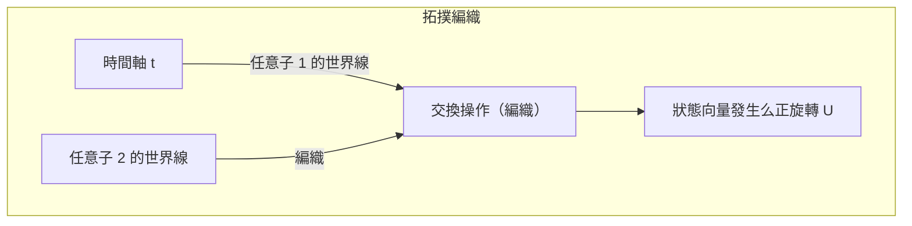

由於計算結果僅取決於粒子軌跡所構成的「紐結」拓撲結構，因此只要軌跡的些微擾動未改變拓撲性質，么正轉換 $ \hat{U} $ 就能嚴格以零誤差執行。這便是在硬體層面實現的容錯性（Fault-tolerance）。

 **挑戰與限制** 
證明馬約拉納零能模存在的決定性實驗證據至今仍處於熱烈爭辯之中，編織操作的物理驗證亦尚未達成。此外，僅憑伊辛任意子（Ising anyon）的編織並無法構成通用量子閘集，因此仍需要仰賴如魔法態蒸餾（magic state distillation）這類非拓撲性的附加操作。

## 11.4 光量子位元：線性光學與測量引發糾纏

作為另一種對環境雜訊具備天然免疫力的方法，便是利用光子（Photon）的光量子計算機。光子不帶電荷，即使在室溫環境下與外界環境的交互作用也極其微弱，因此其退相干時間實質上可視為無窮大。

### 11.4.1 雙軌編碼與 KLM 協定

光量子位元通常採用空間路徑模態進行編碼。在雙軌編碼（Dual-rail encoding）中，光子處於上方波導的狀態記為 $ |0\rangle = |1, 0\rangle $ ，處於下方波導的狀態記為 $ |1\rangle = |0, 1\rangle $ 。

單量子位元閘可完全藉由分光鏡（BS）與相位移相器（PS）等線性光學元件來實現。然而，由於光子之間不存在直接交互作用，僅靠線性光學元件是無法建構出確定性的雙量子位元閘的。
2001 年，Knill、Laflamme 與 Milburn 提出了著名的「KLM 協定」，證明結合單光子源、線性光學元件以及 **利用光子探測器進行投影測量** ，便能實現具備可擴展性的通用量子計算（儘管具備機率性）。這種非線性特性是透過如洪-歐-曼德爾效應（Hong-Ou-Mandel effect）的純量子干涉效應，以及測量的不可逆性，以事後選擇（Post-selection）的方式注入系統之中。

### 11.4.2 連續變數（CV）與團簇態

近年來，不僅是基於單光子的離散變數方案，利用光場正交相位振幅的連續變數（Continuous Variable, CV）量子計算架構亦取得了突破性進展。
透過時域多工技術與壓縮光（squeezed light），能夠生成由數萬至數百萬個糾纏光子脈衝所構成的龐大「團簇態（Cluster state）」。以這種巨型糾纏態作為運算資源，透過對各節點循序進行適當測量以推進計算的「單向量子計算（Measurement-based quantum computation, MBQC）」架構，正逐漸成為光量子計算機的主流發展方向。

## 11.5 NISQ 時代的現況與邁向邏輯量子位元的階梯

正如約翰·普雷斯基爾（John Preskill）所提出的 **NISQ（Noisy Intermediate-Scale Quantum）** 概念所示，當前人類所掌握的量子硬體雖已具備數十至數百個物理量子位元的「中等規模」，但整體運作仍由雜訊主導，無法避免錯誤的累積。

### 11.5.1 相干極限與保真度

當嘗試執行如秀爾演算法（Shor's algorithm）這類深度較深的量子電路時，每個量子閘操作所產生的微小錯誤都會呈指數級放大。舉例而言，假設某雙量子位元閘的保真度為 99.5%（錯誤率 $ \epsilon = 0.005 $ ）。若整個電路包含 $ N $ 個量子閘，則最終態的保真度近似為 $ \mathcal{F} \approx (1-\epsilon)^N \approx e^{-N\epsilon} $ 。當 $ N=1000 $ 時，成功機率僅為 $ e^{-5} \approx 0.0067 $ ，正確的計算結果將完全被雜訊所淹沒。
Google 在展示量子霸權的實驗中，採用稱為交叉熵基準測試（Cross-Entropy Benchmarking, XEB）的指標，證明了其運算速度大幅超越傳統超級電腦；然而該任務僅限於特定的隨機電路取樣（Random Circuit Sampling），並不代表具備實用價值的計算。

### 11.5.2 邁向量子錯誤更正（FTQC 的黎明）

為突破 NISQ 元件的瓶頸，並在量子化學計算、材料科學乃至密碼破解領域建立起真正的「量子優勢」，關鍵在於擺脫對單一物理系統的依賴，轉而將大量物理量子位元編組為單個無錯誤的「邏輯量子位元（Logical Qubit）」，邁向 **FTQC（Fault-Tolerant Quantum Computing：容錯量子計算）** 是不可或缺的絕對條件。

舉例而言，若採用名為表面碼（Surface Code）的拓撲量子錯誤更正碼，只要物理量子位元的錯誤率低於容錯閾值，則系統規模越大，邏輯錯誤率便會呈指數級下降。然而其代價在於，為了構建一個邏輯量子位元，需要投入 1,000 至 10,000 個物理量子位元的巨大開銷（overhead）。

我們如今正站在與雜訊抗衡的物理工程最前線。超導、離子阱、拓撲、光量子等各個體系，各自與其物理限制的「惡魔」立下契約，向著可擴展性這座前人未至的高峰攀登。在第 12 章中，我們將深入剖析守護在這些硬體發展前方的量子資訊終極防線——「量子錯誤更正的數理結構」。

# 第12章: 量子電腦的未來與總結

將量子力學——這套違背我們日常直覺的微觀世界物理法則——作為運算資源加以運用的「量子電腦」。從第1章的疊加原理開始，歷經量子糾纏、貝爾不等式、秀爾演算法、量子錯誤更正，我們透過這部長篇連載，在量子資訊科學的深淵中展開了探索之旅。作為最終章的本章，將深入剖析當前人類所達到的技術里程碑——「量子霸權（Quantum Supremacy / Quantum Advantage）」實證實驗的真正數學與物理意涵，並從計算複雜度理論的視角，嚴謹破除世間流傳的「量子電腦是能瞬間解決任何問題的魔法箱」之幻想。接著，我們將提出從 NISQ（Noisy Intermediate-Scale Quantum）時代邁向 FTQC（Fault-Tolerant Quantum Computing）的社會應用現實且宏大的路線圖，作為這部長達五萬字鉅著的結語。

## 12.1 量子霸權的實證：Google Sycamore 展現的里程碑

2019年，Google 研究團隊使用擁有 53 個超導量子位元的處理器「Sycamore」，發表了「量子霸權」的實證，宣稱量子電腦能高速解決古典電腦無法在現實時間內解決的特定問題。這一事件是量子資訊科學的歷史性里程碑，但能正確理解其背後數理結構的人並不多。

他們所解決的問題是「隨機量子電路取樣問題（Random Quantum Circuit Sampling）」。對於一組量子位元群，依序套用隨機選取的單量子位元閘與雙量子位元閘，經過 $d$ 層的操作，最後在計算基底上測量最終狀態。

讓我們以數學形式來描述。假設初始狀態為 $ |\psi_0\rangle = |0\rangle^{\otimes n} $ 。對此作用隨機選取的么正轉換 $ U = U_d U_{d-1} \dots U_1 $ 。最終狀態 $ |\psi_f\rangle $ 可使用張量積與線性組合表示如下：

$$
|\psi_f\rangle = U |0\rangle^{\otimes n} = \sum_{x \in \{0, 1\}^n} \alpha_x |x\rangle
$$

這裡的 $ \alpha_x = \langle x | U | 0 \rangle^{\otimes n} $ 是觀測到特定位元字串 $x$ 的機率幅，它是一個複數。此時，藉由測量得到位元字串 $x$ 的理想機率 $ P_{\text{ideal}}(x) $ ，根據量子力學中的玻恩定則（Born Rule）由下式給出：

$$
P_{\text{ideal}}(x) = |\alpha_x|^2 = \left| \langle x | U | 0 \rangle^{\otimes n} \right|^2
$$

在足夠深（ $d$ 很大）的隨機量子電路中，各振幅 $ \alpha_x $ 在複數平面上會展現類似隨機漫步的行為，已知其機率分佈 $ P_{\text{ideal}}(x) $ 會遵循波特-湯瑪斯分佈（Porter-Thomas distribution）。也就是說，出現機率 $p$ 的機率密度函數為 $ \text{Pr}(P_{\text{ideal}}(x) = p) \approx 2^n e^{-2^n p} $ 。這意味著某些特定的位元字串會比其他位元字串更容易被觀測到，從而形成「散斑（Speckle）圖樣」。

若要使用古典電腦從該分佈中進行嚴格的取樣，必須透過龐大張量網絡的縮併運算來直接計算振幅 $ \alpha_x $ 。狀態向量的維度為 $ 2^n $ ，當 $ n = 53 $ 時，必須追蹤約 $ 9 \times 10^{15} $ 個複數振幅（需要 PB 等級的記憶體），即便是使用當時世界上最快的超級電腦，也會面臨需要耗費驚人時間的運算高牆。另一方面，量子電腦的物理系統本身就將狀態 **$|\psi_f\rangle$** 作為自然希爾伯特空間上的向量來保持，並能透過一次測量，瞬間（在數十微秒內）完成遵循散斑圖樣的取樣。

為了評估實驗的成敗，研究團隊引入了線性交叉熵基準測試（Linear Cross-Entropy Benchmarking, XEB）。保真度（Fidelity） $ \mathcal{F}_{\text{XEB}} $ 定義如下：

$$
\mathcal{F}_{\text{XEB}} = 2^n \sum_{x \in \{0, 1\}^n} P_{\text{ideal}}(x) P_{\text{exp}}(x) - 1
$$

此處 $ P_{\text{exp}}(x) $ 是從實際量子處理器（包含硬體雜訊）所獲得的經驗機率分佈。若裝置輸出的是完全隨機的雜訊（即完全混合態的密度矩陣 $ \rho = \frac{I}{2^n} $ ），則 $ P_{\text{exp}}(x) = \frac{1}{2^n} $ ，此時 $ \mathcal{F}_{\text{XEB}} = 0 $ 。另一方面，若是輸出完全無雜訊之理想純態的量子電腦，則 $ \mathcal{F}_{\text{XEB}} \approx 1 $ 。在 Google 的實驗中，確認到了 $ \mathcal{F}_{\text{XEB}} \approx 0.002 $ 這個明顯大於零且具有統計顯著性的數值。即使保真度如此微小，但由於在古典電腦上生成同等品質的樣本在計算複雜度理論上是極其困難的，因此這項結果被視為量子霸權的實證。

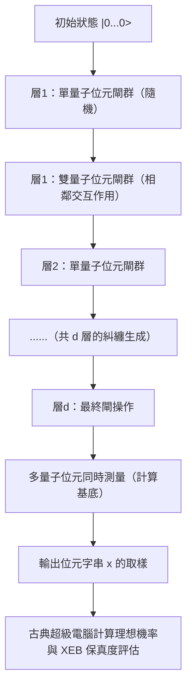

## 12.2 「魔法箱」的誤解：平行運算的陷阱與 BQP vs NP

在關於量子電腦的大眾媒體報導與科普書籍中，經常可以見到諸如「因為能夠同時計算 $2^n$ 種狀態，所以能在瞬間解決任何問題」之類的神奇宣傳語句。然而，從計算複雜度理論的觀點來看，這是根本性的致命錯誤。量子電腦絕非能夠無條件在多項式時間內解開「NP完全問題（NP-Complete）」的魔法棒。

這項誤解源自於一項事實：透過阿達馬閘（Hadamard gate）等所產生的狀態疊加 $ |\psi\rangle = \frac{1}{\sqrt{2^n}} \sum_{x=0}^{2^n-1} |x\rangle $ ，使得對所有輸入的函數評估得以在「單次操作中」完成（即量子平行性）。若使用預言機（負責運算的么正算符） **$U_f$** ，對處於疊加態的系統執行函數 $ f(x) $ 的運算，整個狀態會依據線性性質演化如下：

$$
U_f \left( \frac{1}{\sqrt{2^n}} \sum_{x=0}^{2^n-1} |x\rangle \otimes |0\rangle \right) = \frac{1}{\sqrt{2^n}} \sum_{x=0}^{2^n-1} |x\rangle \otimes |f(x)\rangle
$$

誠然，在此狀態向量的內部，確實將所有 $x$ 所對應的 $f(x)$ 解答作為機率幅的子系統包含在其中。然而，請回想量子力學中的 **觀測公理** （波函數塌縮）。當我們對此輸出暫存器進行測量操作時，所能得到的僅僅是以機率 $\frac{1}{2^n}$ 隨機選出的單一數對 $ (x, f(x)) $ 。其餘 $ 2^n - 1 $ 個資訊，都會因為不可逆的投影測量而永遠喪失。也就是說，在「平行計算（狀態演化）」與「從平行計算的結果中提取我們所需的特定資訊（狀態讀取）」之間，存在著無法跨越的絕望鴻溝。

量子演算法若要真正凌駕古典演算法，不能僅僅依賴平行評估，還必須巧妙地設計並運用「量子干涉（Quantum Interference）」。我們必須建構出一種極為特殊的全局么正轉換，藉由相長干涉（Constructive interference，建設性干涉）來放大對應於所求正確解答態的機率幅，並藉由相位反轉的相消干涉（Destructive interference，破壞性干涉）來抵消其他無數錯誤解答態的機率幅。

在此限制之下，量子電腦能在多項式時間內將正確率維持在顯著水準並予以解決的問題之複雜度類別，被稱為 **BQP** （Bounded-error Quantum Polynomial time）。另一方面，給定候選解時能在多項式時間內驗證其有效性的問題類別為 **NP** ，而其中最困難的一群問題即為 **NP完全問題** （例如旅行推銷員問題、布林可滿足性問題／SAT 等）。

葛洛夫演算法（Grover's algorithm）將無結構的 $ N = 2^n $ 個元素的資料庫搜尋，從古典運算的 $ O(N) $ 二次加速至量子運算的 $ O(\sqrt{N}) $ 。回顧振幅放大（Amplitude Amplification）的數學表述，該演算法可歸結為在由初始均勻疊加態 $ |s\rangle $ 與我們欲搜尋的正確解答態 $ |\omega\rangle $ 所張成的二維子空間（平面）內，將狀態向量進行幾何旋轉的操作。

葛洛夫迭代算符 **$G$** ，定義為預言機對正確解答態施加的相位反轉算符 $ U_\omega = I - 2|\omega\rangle\langle\omega| $ 與繞平均值反轉算符 $ U_s = 2|s\rangle\langle s| - I $ 的乘積：

$$
G = U_s U_\omega = (2|s\rangle\langle s| - I)(I - 2|\omega\rangle\langle\omega|)
$$

將此么正算符 **$G$** 施加約 $ \frac{\pi}{4}\sqrt{N} $ 次，狀態向量便會旋轉至目標的 $ |\omega\rangle $ ，從而將觀測到正確答案的機率提高至接近 1（100%）。然而，此處極其重要的一項事實是：這終究只是「平方根加速」，而非指數級別的加速（ $ O(2^n) \to O(\text{poly}(n)) $ ）。時至今日，尚未發現任何能夠在多項式時間內解開 NP完全問題一般情況的量子干涉模式。許多量子資訊科學家與計算機科學家皆深信，作為計算複雜度理論的核心猜想， **$\text{BQP} \not\supset \text{NP-Complete}$** （即量子電腦無法有效率地解決 NP完全問題）是成立的。

量子電腦僅在問題中存在如 Shor 演算法中因數分解般「隱藏的週期性等代數結構」時，才能透過量子傅立葉轉換（QFT）帶來超多項式級別的加速，它本質上是一種極為精巧的特化型協同處理器。

## 12.3 量子錯誤更正與從 NISQ 邁向 FTQC 的路線圖

儘管量子霸權已獲實證，但如 Sycamore 般當前具有數十至數百個量子位元規模的裝置被稱為 **NISQ** （Noisy Intermediate-Scale Quantum）裝置，尚無法完全抵禦來自環境的雜訊侵擾。脆弱的量子態會因熱擾動或電磁波干擾等與環境的交互作用，極易發生去相干（受限於相位弛豫時間 $T_2$ 與能量弛豫時間 $T_1$ ）。隨著運算深度增加（閘層數增加），閘的不完美性與去相干所導致的雜訊會呈指數級別累積，最終的輸出結果將衰退為毫無意義的完全混合態。

要突破此一物理極限，使高達數億步驟的實用級大規模量子演算法得以執行完畢，唯一具備理論可行性的途徑，即是實現採用 **量子錯誤更正（Quantum Error Correction, QEC）** 的 **容錯量子運算（Fault-Tolerant Quantum Computation, FTQC：容錯／耐錯量子計算）** 。古典電腦的錯誤更正技術（如透過複製位元的多數決編碼等），受限於量子力學核心的「不可複製定理（No-Cloning Theorem）」，無法直接應用於量子態。在數學上，並不存在任何么正轉換能將未知的量子態 **$|\psi\rangle = \alpha|0\rangle + \beta|1\rangle$** 單純且完美地複製為如 **$|\psi\rangle \otimes |\psi\rangle \otimes |\psi\rangle$** 般的狀態。

然而，理論物理學找到了一個克服此一絕境的優雅解答：量子資訊能夠藉由「不複製個別狀態，而是將單一邏輯資訊分散隱藏於由多個物理量子位元群所構成的龐大希爾伯特空間之『糾纏空間』拓撲結構中」來獲得保護。目前從硬體實作視角來看最具前景的「表面碼（Surface Code）」，即是建立在二維晶格上的穩定子形式（Stabilizer Formalism）之上。

在表面碼中，負責儲存量子資訊的「資料量子位元」被配置在二維晶格的邊（Edge）上，而用於偵測錯誤的「症候測量量子位元（輔助量子位元 / Ancilla qubit）」則配置於晶格的面（Plaquette）與頂點（Vertex）上。隨後，定義由下列包立算符之張量積所構成的穩定子算符群：

$$
B_p = \bigotimes_{i \in \partial p} Z_i \quad \text{（面算符：偵測 Z 錯誤）}
$$

$$
A_v = \bigotimes_{i \in \delta v} X_i \quad \text{（頂點算符：偵測 X 錯誤）}
$$

此處所有的 $ B_p $ 與 $ A_v $ 皆彼此對易（可交換、不反交換），亦即滿足交換關係 $ [B_p, A_v] = 0 $ 。我們所寫入資訊的「邏輯狀態（碼空間）」 **$|\psi_L\rangle$** ，被嚴格定義為所有這些穩定子算符的特徵值皆為 $+1$ 的共同特徵態所張成的子空間：

$$
B_p |\psi_L\rangle = +1 |\psi_L\rangle, \quad A_v |\psi_L\rangle = +1 |\psi_L\rangle \quad (\text{for all } p, v)
$$

假設由於外部熱雜訊或操作誤差，某個物理量子位元發生了非預期的位元翻轉錯誤（包立 $X$ ）或相位翻轉錯誤（包立 $Z$ ）。此時，由於該錯誤算符與相鄰的特定穩定子算符具有反對易關係（ $\{X, Z\} = 0 $ ），對該穩定子進行測量的結果（症候值 / Syndrome）將會由 $+1$ 翻轉為 $-1$ 。我們完全無需觀測或破壞受保護的邏輯態本身（即權重係數 $\alpha, \beta$ 的數值），只需持續追蹤這些呈現 $-1$ 的位置（缺陷 / Defect）配對。接著，利用「最小權重完美匹配（Minimum Weight Perfect Matching, MWPM）」等古典演算法進行最大概似估計，推斷在哪個物理量子位元路徑上發生了何種錯誤，進而透過軟體修正或在物理上施加反向操作來予以更正。

依據量子資訊理論中這座優美的里程碑——「閾值定理（Threshold Theorem）」，只要各個物理閘的錯誤率低於某個特定閾值（在表面碼的情況下約為 $ 1\% $ 左右），便可藉由擴大晶格尺寸（碼距 $d$ ），在理論上證明能將邏輯層級的錯誤率任意且指數級別地逼近於零。然而，要建構一個完美的邏輯量子位元，由於錯誤更正的龐大開銷，在當前的雜訊水準下需要數千乃至數萬個物理量子位元。據估算，若要使用秀爾演算法破解 RSA-2048 加密，需要數千個邏輯量子位元；這意味著我們需要一個具備數百萬至上千萬個物理量子位元、且所有位元皆能在極低溫下彼此維持相干性並運作的、規模超乎想像的龐大 FTQC 系統。

從當前數十至數百個物理量子位元的階段放眼望去，對人類而言，這是一場足以媲美阿波羅登月計畫、或是建造大型強子對撞機（LHC）般無比艱鉅且壯麗的工程挑戰。

## 12.4 結語：量子資訊科學的地平線與未來

從第1章透過狄拉克括弧記號引入 **$|0\rangle$** 與 **$|1\rangle$** 的疊加態開始，歷經么正矩陣的時間演化、張量積對多體系統的數學描述、貝爾不等式對愛因斯坦定域實在論的破除，乃至 Shor 與 Grover 量子演算法華麗的數理架構；我們透過這部全12章的連載，以極其嚴謹的形式完整走過了「量子資訊科學」這座知識殿堂的集大成。

相較於古典計算機基於「決定論式的真偽值（布林代數）」，量子計算機則立足於「複數希爾伯特空間中的么正旋轉與張量積（線性代數）」。這項根本性的典範轉移，超越了單純「運算變快」的產業與實用層面，向我們提出了「這個宇宙終極的資訊處理能力為何？」以及「可計算性與複雜度，究竟如何依賴於我們所處宇宙的物理法則結構？」等將資訊理論與基礎物理學完全融合的深奧哲學探問。

曾被愛因斯坦譏為「鬼魅般的超距作用（spooky action at a distance）」而深惡痛絕的量子糾纏（Entanglement），如今已被確立為驅動量子遙傳（遠距傳態）、量子密碼通訊以及量子電腦最根本且不可或缺的「資源（Resource）」。天才物理學家理查·費曼（Richard Feynman）於1982年提出的著名直覺：「若你想模擬大自然，你就必須用量子力學來建造它；而這是一個絕妙無比的問題，因為它看起來絕非易事。」歷經數十載的光陰，在全世界物理學家、數學家、計算機科學家與卓越硬體工程師們夜以繼日的艱苦奮鬥下，如今終於跨入了在真實處理器上運行的歷史階段。

我們必須再次強調，量子電腦絕非萬能的魔法箱，更不是能憑蠻力在多項式時間內解開 NP完全問題的夢幻機器。然而，在化學反應中複雜電子態的精確模擬（量子化學計算）、新材料與高溫超導體的物性剖析、特定類別的最佳化問題，以及質因數分解與離散對數等突破古典電腦極限的特定領域中，它確實具備毋庸置疑的「霸權（Supremacy）」實力。

在未來數十年間與雜訊的搏鬥（從 NISQ 走向 FTQC 的嚴酷長征）絕非一片坦途。極低溫環境下龐大熱負載的控制、數百萬條微波線路的可擴展性難題、量子位元相干時間（ $T_1, T_2$ ）的巨幅提升，以及能即時處理海量症候測量的古典／量子混合控制系統之建構等，橫亙在前的工程壁壘有如高山聳立。然而，矗立在彼端的，將是在真正意義上「直接描繪自然法則（薛丁格方程式）的動力學、對其進行操作並將其應用於運算」——人類歷史上終極運算機制的誕生。

本連載若能幫助各位讀者不隨波逐流於表面上的熱門詞彙與過度膨脹的預期，而是深刻體會量子電腦的真實面貌，及其背後極其優美而嚴謹的數學與物理架構，身為筆者便深感莫大欣慰。量子的世界遠遠超乎我們常識的想像，它是如此深邃、離奇，且蘊含著無可比擬之美。我們此刻正佇立於人類歷史上最令人心潮澎湃的技術與科學前沿之門。這場探索宇宙終極真理的宏大知識航行，才正要揚帆啟程。

---
 **連載『量子電腦的原理』（全12章）　完** 