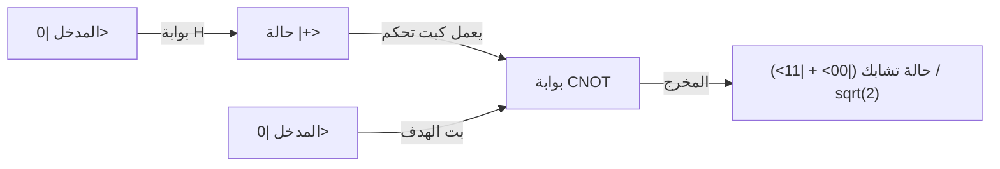

## 1. مقدمة: النقلة النوعية التي أحدثتها الحوسبة الكمومية

يعتمد مجتمعنا الرقمي الحديث بشكل كبير على تقنيات التشفير المتقدمة لضمان أمن المعلومات. وأبرزها تشفير RSA وتشفير المنحنى الإهليلجي (Elliptic Curve Cryptography) التي تحمي الاتصالات عبر الإنترنت. تعتمد أنظمة تشفير المفتاح العام هذه في أمانها على التباين الرياضي (خصائص الدالة ذات الاتجاه الواحد) المتمثل في أن "تحليل الأعداد الصحيحة الضخمة إلى عواملها الأولية هو أمر بالغ الصعوبة". هذا الجدار الحسابي، الذي قد يستغرق وقتًا يعادل عمر الكون حتى لو استخدمنا أجهزة كمبيوتر فائقة، كان بمثابة درع قوي يحمي خصوصيتنا، معاملاتنا المالية، وأسرارنا الوطنية.

ومع ذلك، هناك تقنية تحمل إمكانية قلب هذه الفرضية رأسًا على عقب. إنها "الحوسبة الكمومية" (Quantum Computing).

تستغل هذه الآلة الحاسبة ذات النموذج الجديد كليًا قوانين ميكانيكا الكم، التي تحكم العالم المجهري، بشكل مباشر كموارد حسابية، وتظهر قدرات حسابية تتفوق بشكل هائل على أجهزة الكمبيوتر الكلاسيكية (أجهزة الكمبيوتر التقليدية الحالية) لحل أنواع معينة من المشاكل. المثال الأكثر شهرة على ذلك هو "خوارزمية شور" (Shor's Algorithm) التي اكتشفها بيتر شور (Peter Shor) في عام 1994. يمكن لهذه الخوارزمية حل مشكلة التحليل إلى العوامل الأولية في وقت متعدد الحدود (polynomial time)، مما يعني أنه إذا تم تحقيق أجهزة كمبيوتر كمومية ذات نطاق عملي، فإن تشفير RSA المستخدم على نطاق واسع اليوم سيتم كسره في غمضة عين.

في هذا المقال، سنتعمق بشكل منهجي ومفصل في سبب قوة الحوسبة الكمومية الهائلة، بدءًا من المفاهيم الأساسية مثل "البت الكمومي" (Qubit)، "التراكب الكمومي" (Quantum Superposition)، و"التشابك الكمومي" (Quantum Entanglement). ثم سنشرح كيفية عمل البوابات الكمومية الأساسية، البنية الرياضية لـ "تحويل فورييه الكمومي" (QFT) الذي يشكل جوهر خوارزمية شور، وصولاً إلى تحديات تصحيح الأخطاء التي تواجهها أجهزة الكمبيوتر الكمومية الحالية ذات النطاق المتوسط والمليئة بالضوضاء (NISQ).

## 2. الاختلافات الحاسمة بين البتات الكلاسيكية والبتات الكمومية (Qubit)

### 2.1 البت الكلاسيكي: عالم حتمي بين 0 و 1
تعتمد الحواسيب الكلاسيكية التي نستخدمها يوميًا، مثل الهواتف الذكية وأجهزة الكمبيوتر الشخصية، على "البت" (Bit) كأصغر وحدة للمعلومات. يتخذ البت الكلاسيكي دائمًا حالة واضحة واحدة فقط إما "0" أو "1"، مستفيدًا من ارتفاع وانخفاض الجهد الكهربائي في الترانزستورات. إذا كان لدينا N من البتات الكلاسيكية، يمكننا تمثيل $2^N$ حالة مختلفة، ولكن في أي لحظة معينة، يمكن للنظام أن يحتفظ بـ "حالة واحدة فقط" من بينها. الحوسبة ليست سوى تمرير هذه الحالة الحتمية عبر بوابات منطقية (AND و OR و NOT وغيرها) وتحويلها إلى حالة أخرى.

### 2.2 البت الكمومي (Qubit): حالة تتضمن احتمالات لا حصر لها
من ناحية أخرى، فإن "البت الكمومي" (Qubit)، وهو أصغر وحدة معلومات في الحوسبة الكمومية، يتصرف بشكل مختلف تمامًا عن البت الكلاسيكي. يتم تنفيذ البتات الكمومية فيزيائيًا باستخدام أنظمة كمومية ثنائية المستوى، مثل دوران الإلكترون (أعلى/أسفل)، واستقطاب الفوتون (أفقي/عمودي)، أو اتجاه التيار الكهربائي في الدوائر فائقة التوصيل.

الميزة الأهم للبت الكمومي هي خاصية "التراكب الكمومي" (Quantum Superposition)، التي تسمح له باتخاذ الحالتين "0" و "1" في نفس الوقت. رياضيًا، يتم تمثيل حالة البت الكمومي $|\psi\rangle$ (والذي يمثل متجه الحالة في تدوين برا-كيت) كتركيب خطي (مجموع بمعاملات عقدية) للحالات الأساسية $|0\rangle$ و $|1\rangle$ على النحو التالي:

$$ |\psi\rangle = \alpha|0\rangle + \beta|1\rangle $$

هنا، $\alpha$ و $\beta$ هما أرقام عقدية (مركبة) تُعرف باسم سعة الاحتمال (Probability Amplitude). تحدد هذه المعاملات احتمال الحصول على $|0\rangle$ أو $|1\rangle$ عند قياس البت الكمومي. على وجه التحديد، احتمال ملاحظة $|0\rangle$ هو $|\alpha|^2$، واحتمال ملاحظة $|1\rangle$ هو $|\beta|^2$، ولأن مجموع الاحتمالات يجب أن يكون 1، فإنها تحقق شرط التوحيد (Normalization Condition) التالي:

$$ |\alpha|^2 + |\beta|^2 = 1 $$

### 2.3 التصور البصري باستخدام كرة بلوخ
يمكن تصور حالة بت كمومي واحد هندسيًا كنقطة على سطح كرة الوحدة تُعرف باسم "كرة بلوخ" (Bloch Sphere). إذا افترضنا أن القطب الشمالي يمثل $|0\rangle$ والقطب الجنوبي يمثل $|1\rangle$، فإن أي نقطة على سطح الكرة تمثل حالة كمومية صالحة. بينما لا يمكن للبت الكلاسيكي سوى اتخاذ نقطتين (القطب الشمالي أو القطب الجنوبي)، يمكن أن يتواجد البت الكمومي في أي مكان بين النقاط اللانهائية المستمرة على السطح الكروي. هذه الاستمرارية هي أحد مصادر القوة التعبيرية الغنية للحوسبة الكمومية.

## 3. جوهر الحوسبة الكمومية: التراكب والتشابك الكمومي

### 3.1 القدرة على تمثيل المعلومات بشكل أسي
تتجلى القيمة الحقيقية للبتات الكمومية عند دمج عدة بتات معًا. إذا كان بت كمومي واحد يمكنه تمثيل تراكب حالتين، فإن اثنين من البتات الكمومية يمكنهما تمثيل تراكب لـ 4 حالات: $|00\rangle, |01\rangle, |10\rangle, |11\rangle$. بشكل عام، يمكن لنظام يتكون من N بت كمومي أن يحتفظ بحالة كتركيب خطي لـ $2^N$ من الحالات الأساسية.

$$ |\Psi\rangle = c_0|00\dots0\rangle + c_1|00\dots1\rangle + \dots + c_{2^N-1}|11\dots1\rangle $$

هذا أمر مذهل. مع 300 بت كمومي فقط، يمكن تمثيل تراكب لـ $2^{300}$ حالة، وهذا الرقم يفوق بكثير عدد جميع الذرات الموجودة في الكون المرئي (حوالي $10^{80}$). إذا حاولنا محاكاة ذلك باستخدام جهاز كمبيوتر كلاسيكي، فسنحتاج إلى تخزين $2^{300}$ رقم عقدي في الذاكرة، وهو أمر مستحيل فيزيائيًا. يمتلك الكمبيوتر الكمومي القدرة على الوصول ومعالجة الحسابات بالتوازي وبشكل متزامن لجميع العناوين في هذا الفضاء الهيلبرتي الواسع (فضاء الحالة).

### 3.2 التشابك الكمومي (Quantum Entanglement)
ظاهرة غريبة أخرى لا غنى عنها في الحوسبة الكمومية هي "التشابك الكمومي". هذه ظاهرة ترتبط فيها بتات كمومية متعددة ببعضها البعض بقوة، بحيث لا يمكن وصف حالة كل منها بشكل مستقل. دعونا نفكر في أبسط حالة تشابك كمومي، وهي "حالة بيل" (Bell State).

$$ |\Phi^+\rangle = \frac{1}{\sqrt{2}} (|00\rangle + |11\rangle) $$

في هذه الحالة، إذا قمنا بقياس البت الكمومي الأول وحصلنا على "0"، فإن حالة البت الكمومي الآخر تتحدد فورًا كـ "0". وبالعكس، إذا حصلنا على "1"، فإن الآخر سيكون حتماً "1". يبدو أن هذا الارتباط يؤثر بشكل فوري أسرع من سرعة الضوء، حتى لو كان البتان الكموميان منفصلين على طرفي نقيض في الكون (أطلق أينشتاين على هذا اسم "التأثير الشبحي عن بعد").

من خلال الاستفادة من التشابك الكمومي، يمكن للكمبيوتر الكمومي التعبير عن الارتباطات المعقدة بين البيانات الفردية وجعل العديد من مسارات الحساب تتداخل بشكل متقدم.

## 4. البوابات الكمومية: معالجة الحالة الكمومية

تمامًا مثل البوابات المنطقية الكلاسيكية، تستخدم أجهزة الكمبيوتر الكمومية "البوابات الكمومية" لمعالجة حالة البتات الكمومية. رياضيًا، تُمثل البوابة الكمومية بمصفوفة وحدوية (مصفوفة تحقق $U^\dagger U = I$)، وتعمل كعملية دوران لمتجه الحالة الكمومية. إليك بعض البوابات الكمومية النموذجية:

### 4.1 بوابات باولي (X, Y, Z)
- **بوابة X (بوابة NOT الكمومية)**: تقلب $|0\rangle$ إلى $|1\rangle$ و $|1\rangle$ إلى $|0\rangle$. يعادل ذلك دورانًا بمقدار 180 درجة حول المحور X في كرة بلوخ.
- **بوابة Z (بوابة إزاحة الطور)**: يظل $|0\rangle$ كما هو، ولكن تنعكس مرحلة (طور) $|1\rangle$ (ضرب المعامل في -1).
- **بوابة Y**: هي مزيج من X و Z، وتؤدي إلى دوران بمقدار 180 درجة حول المحور Y.

### 4.2 بوابة هادامارد (Hadamard Gate)
هي واحدة من أكثر البوابات استخدامًا في الخوارزميات الكمومية. تقوم بتحويل الحالة الحتمية $|0\rangle$ أو $|1\rangle$ إلى حالة تراكب متساوية الاحتمال تمامًا.

$$ H|0\rangle = \frac{1}{\sqrt{2}}(|0\rangle + |1\rangle) = |+\rangle $$
$$ H|1\rangle = \frac{1}{\sqrt{2}}(|0\rangle - |1\rangle) = |-\rangle $$

بتطبيق بوابة هادامارد على جميع البتات الكمومية، يمكن إنشاء حالة أولية تتراكب فيها جميع الحالات البالغ عددها $2^N$ بالتساوي، وتعتبر هذه نقطة البداية للحوسبة المتوازية الكمومية.

### 4.3 بوابة CNOT (بوابة NOT المتحكم بها)
بوابة نموذجية تؤثر على اثنين من البتات الكمومية، ولا غنى عنها لإنشاء التشابك الكمومي. تطبق بوابة X (عملية NOT) على "بت الهدف" (Target) فقط إذا كان "بت التحكم" (Control) في حالة $|1\rangle$. إذا كان بت التحكم في حالة $|0\rangle$، فإنها لا تفعل شيئًا. من خلال دمج بوابة هادامارد مع بوابة CNOT، يمكن بسهولة إنشاء حالة بيل المذكورة أعلاه.

## 5. خوارزمية شور: سيناريو انهيار تشفير RSA

هنا نأتي إلى صلب الموضوع. كيف يفك الكمبيوتر الكمومي شفرة RSA؟ يعتمد أمان RSA على فرضية تجريبية مفادها أن "مشكلة التحليل إلى العوامل الأولية" - أي إيجاد الأعداد الأولية $p$ و $q$ من عدد مركب ضخم $N$ (حاصل ضرب $p \times q = N$) - لا يمكن حلها في وقت عملي بواسطة أجهزة الكمبيوتر الكلاسيكية. في نظام RSA-2048 الذي يمثل طول المفتاح السائد حاليًا، يبلغ عدد الأرقام حوالي 600 رقم، ويستغرق أسرع كمبيوتر عملاق في العالم وقتًا يعادل عمر الكون تقريبًا لفكه.

لكن في عام 1994، قدم بيتر شور خوارزمية كمومية تحل هذه المشكلة في وقت كلاسيكي متعدد الحدود (تسريع دراماتيكي) باستخدام خصائص ميكانيكا الكم ببراعة.

### 5.1 النظرة العامة على الخوارزمية (التعاون بين الكلاسيكي والكمومي)
في الواقع، لا تكتمل خوارزمية شور باستخدام الحساب الكمومي فقط، بل تتبنى نهجًا هجينًا يجمع بين حسابات الكمبيوتر الكلاسيكي والحساب الكمومي. تُحول مشكلة التحليل إلى العوامل الأولية باستخدام نظريات نظرية الأعداد إلى "مشكلة إيجاد الدورة" (Order-Finding Problem)، ويتم إسناد الجزء شديد الصعوبة المتمثل في العثور على الدورة إلى الكمبيوتر الكمومي.

الخطوات كالتالي:
1. **[كلاسيكي]** اختيار عدد صحيح عشوائي $a$ ($1 < a < N$) أولي نسبيًا مع $N$ (أي لا يوجد قاسم مشترك بينهما).
2. **[كلاسيكي]** تعريف الدالة $f(x) = a^x \pmod N$. تتصرف هذه الدالة بشكل دوري. بمعنى آخر، هناك أصغر عدد صحيح موجب $r$ (الدورة) بحيث يتحقق $f(x+r) = f(x)$.
3. **[كمومي]** العثور على دورة الدالة $f(x)$ بسرعة باستخدام الكمبيوتر الكمومي. (هذا هو جوهر خوارزمية شور).
4. **[كلاسيكي]** التحقق من أن الدورة $r$ التي تم العثور عليها زوجية وأن $a^{r/2} \neq -1 \pmod N$ (إذا لم يكن كذلك، يتم اختيار $a$ آخر).
5. **[كلاسيكي]** حساب القاسم المشترك الأكبر $\text{gcd}(a^{r/2} \pm 1, N)$. نتائج هذا الحساب هي العوامل الأولية $p$ و $q$ لـ $N$ التي كنا نبحث عنها.

### 5.2 لماذا معرفة الدورة تؤدي إلى معرفة العوامل الأولية؟
لنضيف بعض الشرح الرياضي. لنفترض أننا وجدنا دورة زوجية $r$ بحيث $a^r \equiv 1 \pmod N$. بإعادة صياغة هذه المعادلة:
$$ a^r - 1 \equiv 0 \pmod N $$
$$ (a^{r/2} - 1)(a^{r/2} + 1) \equiv 0 \pmod N $$
هذا يعني أن حاصل ضرب $(a^{r/2} - 1)$ في $(a^{r/2} + 1)$ هو من مضاعفات $N$. لذلك، من خلال حساب القاسم المشترك الأكبر بين أي من هذه الحدود و $N$ (والذي يمكن حسابه في لحظة باستخدام خوارزمية إقليدس)، يمكننا استخراج القواسم الأولية (القواسم غير التافهة) لـ $N$ بكفاءة.

## 6. تحويل فورييه الكمومي (QFT): استخراج الإجابة الصحيحة عبر التداخل

المشكلة هي: "كيف نعثر على الدورة $r$ بسرعة؟". في الكمبيوتر الكلاسيكي، يتعين علينا حساب الدالة $f(x) = a^x \pmod N$ تدريجيًا لـ $x=1, 2, 3 \dots$ للبحث عن الدورة، مما يستغرق وقتًا أسيًا. هنا تأتي قوة "التراكب" و "التداخل" الكمومي.

### 6.1 الحساب المتزامن من خلال التوازي الكمومي
أولاً، يستخدم الكمبيوتر الكمومي بوابات هادامارد لإنشاء حالة تراكب متساوية لجميع الأعداد الصحيحة $x$ من $0$ إلى $2^m-1$ (رقم كبير بما يكفي) في سجل الإدخال.
ثم يتم تنفيذ الدالة $f(x) = a^x \pmod N$ مرة واحدة كدائرة كمومية (دائرة الرفع المعياري للقوة) على هذه الحالة المتراكبة بأكملها. نتيجة لذلك، بفضل التوازي الكمومي، يتم حساب إجابات $f(x)$ لكل قيم $x$ في نفس الوقت في السجل الثاني، ويتم الاحتفاظ بها كحالة تشابك كمومي.

$$ |\psi\rangle = \frac{1}{\sqrt{2^m}} \sum_{x=0}^{2^m-1} |x\rangle |a^x \pmod N\rangle $$

### 6.2 مشكلة القياس: فخ الحساب الموازي
قد تفكر: "رائع! لقد تم حساب جميع الإجابات مرة واحدة!". ولكن ميكانيكا الكم لها قواعد صارمة: "عند القياس، تنهار حالة التراكب وتتقلص إلى حالة واحدة عشوائية". إذا قمت بالقياس مباشرة بعد الحساب الموازي، فلن تحصل إلا على زوج واحد عشوائي $(x, a^x \bmod N)$ لقيمة $x$، وهي نفس نتيجة تشغيل حساب كلاسيكي مرة واحدة. هذا لن يمنحنا أي فكرة عن الدورة $r$.

### 6.3 تداخل الموجات: تضخيم الإجابة الصحيحة وإلغاء الإجابات الخاطئة
هنا يأتي دور "تحويل فورييه الكمومي" (QFT). هو النسخة الكمومية لتحويل فورييه المنفصل الكلاسيكي، ولكنه لا يعمل على مصفوفة من البيانات، بل يعمل مباشرة على سعات الاحتمالات (معاملات الأعداد العقدية) للحالة الكمومية.

تمامًا كما تتداخل الموجات الصوتية لتصبح أعلى أو تلغي بعضها البعض، تمتلك الحالات الكمومية أيضًا خصائص "موجية" ذات سعة عقدية. عند تطبيق QFT على حالة كمومية ذات دورية، فإنه يتسبب في ظاهرة فيزيائية تسمى "التداخل" (Interference) للموجات. على وجه التحديد، فإنه يعزز بشكل كبير سعة احتمال الحالات المحددة التي تحمل بقوة معلومات حول الدورة $r$ (التداخل البناء، حيث تتطابق قمم الموجات)، ويلغي سعة احتمال الحالات غير ذات الصلة لتصل إلى الصفر (التداخل الهدام، حيث تتلاقى القمم والقيعان).

عندما يتم القياس بعد تطبيق QFT، وبدلاً من القيم العشوائية، سيتم قياس "قيمة قريبة من مضاعفات $2^m / r$" باحتمالية عالية. وبناءً على نتائج هذا القياس وباستخدام تقنية رياضية كلاسيكية تُسمى الكسور المستمرة (Continued Fractions)، يمكن استنتاج الدورة $r$ بدقة عالية جدًا.

تكمن عبقرية خوارزمية شور في عدم محاولة معرفة النتائج الوسيطة للحساب بشكل مباشر، بل في بناء آلية لاستخراج "الدورية الكامنة في نتائج الحساب بأكملها (الهيكل العام)" فقط باستخدام تداخل الموجات.

## 7. عصر NISQ وتصحيح الأخطاء: الجدار الواقعي للحواسيب الكمومية

نظريًا، ثبت أن أجهزة الكمبيوتر الكمومية يمكنها كسر تشفير RSA. إذن، لماذا لن تنهار الأنظمة المصرفية غدًا؟ ذلك لأن بناء أجهزة الكمبيوتر الكمومية هو أحد أصعب التحديات الهندسية في تاريخ البشرية.

### 7.1 فك الترابط (انهيار الحالة الكمومية)
تراكب البتات الكمومية والتشابك الكمومي هي حالات هشة للغاية. فبمجرد تعرضها لأقل قدر من الضوضاء (تداخل) من البيئة الخارجية - مثل الحرارة، أو الموجات الكهرومغناطيسية، أو الأشعة الكونية، أو حتى الشوائب البسيطة - تنهار الحالة الكمومية وتتحول إلى حالة كلاسيكية. تُعرف هذه الظاهرة باسم "فك الترابط" (Decoherence). إذا حدث فك الترابط قبل اكتمال الحساب، فسيؤدي ذلك إلى حدوث خطأ. لهذا السبب، يتم حماية البتات الكمومية حاليًا داخل ثلاجات التخفيف التي تحافظ على بيئة مبردة للغاية تصل إلى بضع ملي كلفن (قريبة من الصفر المطلق).

### 7.2 أجهزة NISQ (Noisy Intermediate-Scale Quantum)
تُعرف الحواسيب الكمومية الحالية باسم أجهزة "NISQ" (الأجهزة الكمومية ذات النطاق المتوسط والمليئة بالضوضاء). تحتوي على عشرات إلى مئات البتات الكمومية، لكن الضوضاء العالية تمنعها من تنفيذ حسابات طويلة (دوائر كمومية عميقة). يتطلب كسر RSA-2048 بواسطة خوارزمية شور آلاف البتات الكمومية "المثالية" وملايين من عمليات البوابات. نظرًا لدقة البوابات (معدل الخطأ) في الأجهزة الحالية، تتراكم الأخطاء أثناء الحساب، وتتحول النتيجة إلى مجرد ضوضاء.

### 7.3 تصحيح الأخطاء الكمومية والبتات الكمومية المنطقية
مفتاح حل هذه المشكلة هو "تصحيح الأخطاء الكمومية" (Quantum Error Correction, QEC). في الحواسيب الكلاسيكية، يمكن منع الأخطاء ببساطة عن طريق نسخ المعلومات. أما في ميكانيكا الكم، فتمنع "نظرية عدم الاستنساخ" (No-Cloning Theorem) النسخ الدقيق لحالة كمومية غير معروفة.

لذلك، يستخدم تصحيح الأخطاء الكمومية تقنيات تشفير طوبولوجية متقدمة مثل "الشفرة السطحية" (Surface Code). وهي تقنية تقوم بجمع مئات أو آلاف البتات الكمومية الفيزيائية معًا في حالة تشابك، وتعمل من خلال آلية مشابهة لتصويت الأغلبية لاكتشاف الأخطاء وتصحيحها، لإنشاء "بت كمومي منطقي افتراضي ومثالي واحد" (Logical Qubit).

من أجل كسر تشفير RSA، يتطلب الأمر آلافًا من هذه البتات الكمومية المنطقية. ويُقدر أن ذلك سيتطلب ملايين البتات الكمومية الفيزيائية. عند النظر إلى المرحلة الحالية التي تقتصر على عشرات إلى مئات البتات الفيزيائية، فإن الإجماع العام بين الخبراء هو أن التسويق التجاري (تحقيق حواسيب كمومية عالمية متسامحة مع الأخطاء - FTQC) قد يستغرق 10 سنوات على الأقل، أو ربما عقودًا.

## 8. الانتقال إلى التشفير المقاوم للكم (PQC)

لا أحد يعرف بالضبط متى سيأتي "Q-Day" (يوم كسر التشفير بواسطة الحوسبة الكمومية) ليصبح تهديد الحوسبة الكمومية حقيقة. ومع ذلك، هناك بالفعل تقنية هجوم معروفة باسم "احفظ الآن، وفك التشفير لاحقًا" (Store now, decrypt later) حيث يتم اعتراض البيانات وحفظها ليتم فك تشفيرها عندما يصبح الكمبيوتر الكمومي متاحًا. لذا فإن حماية الأسرار الوطنية والمعلومات السرية طويلة المدى معرضة للخطر بالفعل.

لمواجهة هذا الخطر، يتقدم المجتمع الدولي، بقيادة المعهد الوطني للمعايير والتكنولوجيا (NIST) في الولايات المتحدة، بسرعة في توحيد معايير "التشفير المقاوم للكم" (Post-Quantum Cryptography, PQC) والانتقال إليه. يعتمد PQC على مشكلات رياضية جديدة (مثل التشفير القائم على الشبكات اللاتسية - Lattice-based cryptography) يصعب على أجهزة الكمبيوتر الكمومية حلها. نحن نبني بالفعل دروعًا جديدة استعدادًا للمستقبل الذي قد تدمر فيه الحواسيب الكمومية أنظمة التشفير الحالية.

## 9. الخاتمة: آفاق جديدة لعلوم المعلومات

الكمبيوتر الكمومي ليس مجرد "نسخة أسرع من الكمبيوتر التقليدي". إنه جهاز مفاهيمي جديد كليًا يُعبر عن ميكانيكا الكم، القوانين المطلقة للطبيعة، بشكل مباشر كخوارزمية، مما يوسع حدود معالجة المعلومات. كانت خوارزمية شور هي أول إنجاز تاريخي يُظهر لنا إمكاناتها المرعبة.

لا يزال هناك الكثير من العقبات الشاهقة التي يجب التغلب عليها، مثل معركة تقليل الضوضاء وصعوبة توسيع النطاق. ومع ذلك، فإن هذا المجال الذي يجمع بين حكمة الفيزياء والرياضيات وعلوم المعلومات وهندسة المواد سيكون بلا شك المركز للقفزة التكنولوجية التالية للبشرية. إن كيفية تغيير الظواهر الغامضة للعالم الكمومي لأساس مجتمعنا الرقمي هو شيء يجب ألا نغفل عنه.
