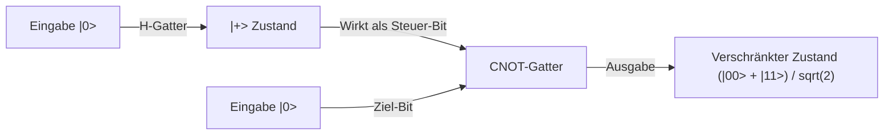

## 1. Einführung: Der Paradigmenwechsel durch Quantencomputer

Die moderne digitale Gesellschaft ist stark von fortschrittlichen Verschlüsselungstechnologien abhängig, um die Sicherheit von Informationen zu gewährleisten. Die bekanntesten Beispiele sind die RSA-Verschlüsselung und die elliptische Kurven-Kryptografie, die die Kommunikation im Internet schützen. Diese Public-Key-Verschlüsselungsverfahren stützen sich auf die mathematische Asymmetrie (Eigenschaften als Einwegfunktion), dass „die Primfaktorzerlegung sehr großer Zahlen extrem schwierig ist“. Diese rechnerische Hürde, für die selbst Supercomputer schätzungsweise so lange wie das Alter des Universums bräuchten, diente als starker Schild zum Schutz unserer Privatsphäre, Finanztransaktionen und Staatsgeheimnisse.

Es gibt jedoch eine Technologie, die das Potenzial hat, diese Grundannahme grundlegend umzustoßen: den „Quantencomputer“.

Diese völlig neue Art von Computern, die die physikalischen Gesetze der Quantenmechanik – die die mikroskopische Welt beherrschen – direkt als Rechenressource nutzt, zeigt bei bestimmten Arten von Problemen eine Rechenleistung, die klassische Computer (unsere heutigen Standardcomputer) bei weitem übertrifft. Das symbolträchtigste Beispiel hierfür ist der 1994 von Peter Shor entdeckte „Shor-Algorithmus“ (Shor's Algorithm). Da dieser Algorithmus das Problem der Primfaktorzerlegung in polynomialer Zeit lösen kann, würde die heute weit verbreitete RSA-Verschlüsselung in kürzester Zeit geknackt werden, sobald ein Quantencomputer in praktischer Größe realisiert ist.

In diesem Artikel werden wir ausführlich und systematisch untersuchen, warum Quantencomputer so leistungsfähig sind. Wir beginnen mit den grundlegenden Konzepten wie „Qubits“, „Quantenüberlagerung“ und „Quantenverschränkung“, erläutern die Funktionsweise grundlegender Quantengatter, die mathematische Struktur der „Quanten-Fourier-Transformation (QFT)“, die das Kernstück von Shors Algorithmus bildet, und gehen schließlich auf die Herausforderungen der Fehlerkorrektur ein, denen die aktuellen verrauschten, mittelgroßen Quantengeräte (NISQ) gegenüberstehen.

## 2. Der entscheidende Unterschied zwischen klassischen Bits und Qubits

### 2.1 Klassische Bits: Eine deterministische Welt von 0 oder 1
Klassische Computer, wie die Smartphones und PCs, die wir täglich nutzen, verwenden „Bits“ als kleinste Informationseinheit. Ein klassisches Bit nimmt unter Ausnutzung hoher oder niedriger Spannungen von Transistoren immer einen eindeutigen Zustand an: entweder „0“ oder „1“. Mit N klassischen Bits lassen sich $2^N$ Zustände darstellen, aber in einem bestimmten Moment kann das System nur „genau einen“ dieser Zustände annehmen. Rechnen bedeutet nichts anderes, als diesen deterministischen Zustand durch Logikgatter (AND, OR, NOT usw.) zu schicken und in einen anderen Zustand umzuwandeln.

### 2.2 Qubits: Zustände voller unendlicher Möglichkeiten
Im Gegensatz dazu verhält sich das „Qubit“ (Quantenbit), die kleinste Informationseinheit eines Quantencomputers, völlig anders als ein klassisches Bit. Qubits werden physikalisch durch quantenmechanische Zweiniveausysteme realisiert, wie den Spin eines Elektrons (Up/Down), die Polarisation eines Photons (horizontal/vertikal) oder die Stromrichtung in einem supraleitenden Schaltkreis.

Das wichtigste Merkmal eines Qubits ist seine Fähigkeit zur „Quantenüberlagerung“ (Quantum Superposition), wodurch es die Zustände „0“ und „1“ gleichzeitig annehmen kann. Mathematisch wird der Zustand $|\psi\rangle$ eines Qubits (der den Zustandsvektor in der Bra-Ket-Notation darstellt) als Linearkombination (Summe mit komplexen Koeffizienten) der Basiszustände $|0\rangle$ und $|1\rangle$ wie folgt ausgedrückt:

$$ |\psi\rangle = \alpha|0\rangle + \beta|1\rangle $$

Hierbei sind $\alpha$ und $\beta$ komplexe Zahlen, die als Wahrscheinlichkeitsamplituden bezeichnet werden. Diese Koeffizienten bestimmen die Wahrscheinlichkeit, beim Messen des Qubits $|0\rangle$ oder $|1\rangle$ zu erhalten. Konkret beträgt die Wahrscheinlichkeit für die Beobachtung von $|0\rangle$ genau $|\alpha|^2$ und für $|1\rangle$ genau $|\beta|^2$. Da die Summe der Wahrscheinlichkeiten 1 ergeben muss, gilt folgende Normierungsbedingung:

$$ |\alpha|^2 + |\beta|^2 = 1 $$

### 2.3 Visualisierung mittels Bloch-Kugel
Der Zustand eines einzelnen Qubits lässt sich geometrisch als Punkt auf der Oberfläche einer Einheitskugel, der sogenannten „Bloch-Kugel“ (Bloch Sphere), visualisieren. Wenn wir den Nordpol als $|0\rangle$ und den Südpol als $|1\rangle$ definieren, stellt jeder Punkt auf der Kugeloberfläche einen gültigen Quantenzustand dar. Während ein klassisches Bit nur die zwei Punkte Nordpol oder Südpol annehmen kann, kann ein Qubit überall in der kontinuierlichen Unendlichkeit von Punkten auf der Kugeloberfläche existieren. Genau diese Kontinuität ist eine der Quellen für die große Ausdruckskraft von Quantenberechnungen.

## 3. Der Kern des Quantencomputings: Überlagerung und Quantenverschränkung

### 3.1 Exponentielle Informationsdarstellungskraft
Der wahre Wert von Qubits zeigt sich, wenn mehrere von ihnen kombiniert werden. Wenn ein einzelnes Qubit eine Überlagerung von zwei Zuständen darstellen kann, können zwei Qubits eine Überlagerung von vier Zuständen darstellen: $|00\rangle, |01\rangle, |10\rangle, |11\rangle$. Allgemein kann ein System aus N Qubits seinen Zustand als Linearkombination von $2^N$ Basiszuständen beibehalten:

$$ |\Psi\rangle = c_0|00\dots0\rangle + c_1|00\dots1\rangle + \dots + c_{2^N-1}|11\dots1\rangle $$

Das ist erstaunlich. Mit nur 300 Qubits kann eine Überlagerung von $2^{300}$ Zuständen dargestellt werden, eine Zahl, die die Anzahl aller Atome im beobachtbaren Universum (etwa $10^{80}$) bei weitem übersteigt. Um dies auf einem klassischen Computer zu simulieren, müsste man $2^{300}$ komplexe Zahlen im Speicher ablegen, was physikalisch unmöglich ist. Ein Quantencomputer kann gleichzeitig auf alle Adressen dieses riesigen Hilbertraums (Zustandsraums) zugreifen und Berechnungen parallel durchführen.

### 3.2 Quantenverschränkung (Quantum Entanglement)
Ein weiteres merkwürdiges Phänomen, das für Quantenberechnungen unerlässlich ist, ist die „Quantenverschränkung“. Dies ist ein Phänomen, bei dem zwei oder mehr Qubits so stark miteinander verbunden sind, dass ihre Zustände nicht mehr unabhängig voneinander beschrieben werden können. Betrachten wir den einfachsten verschränkten Quantenzustand, den „Bell-Zustand“ (Bell State):

$$ |\Phi^+\rangle = \frac{1}{\sqrt{2}} (|00\rangle + |11\rangle) $$

Wenn in diesem Zustand das erste Qubit gemessen wird und das Ergebnis „0“ lautet, wird der Zustand des anderen Qubits augenblicklich ebenfalls auf „0“ festgelegt. Erhält man umgekehrt eine „1“, muss das andere zwingend auch „1“ sein. Diese Korrelation wirkt sich augenblicklich und schneller als das Licht aus, selbst wenn die beiden Qubits an entgegengesetzten Enden des Universums voneinander getrennt wären (Einstein nannte dies „spukhafte Fernwirkung“).

Durch die Nutzung dieser Quantenverschränkung können Quantencomputer komplexe Korrelationen zwischen einzelnen Datenpunkten darstellen und eine große Anzahl von Rechenpfaden stark miteinander interferieren lassen.

## 4. Quantengatter: Manipulation von Quantenzuständen

Ähnlich wie klassische Logikgatter verwenden Quantencomputer „Quantengatter“, um die Zustände von Qubits zu verändern. Mathematisch wird ein Quantengatter als unitäre Matrix (eine Matrix, die $U^\dagger U = I$ erfüllt) dargestellt und fungiert als Rotationsoperation auf den Quantenzustandsvektor. Hier sind einige typische Quantengatter:

### 4.1 Pauli-Gatter (X, Y, Z)
- **X-Gatter (Quanten-NOT-Gatter)**: Kehrt $|0\rangle$ in $|1\rangle$ und $|1\rangle$ in $|0\rangle$ um. Entspricht einer Drehung um 180 Grad um die X-Achse der Bloch-Kugel.
- **Z-Gatter (Phasenverschiebungs-Gatter)**: Lässt $|0\rangle$ unverändert, kehrt aber die Phase von $|1\rangle$ um (multipliziert den Koeffizienten mit -1).
- **Y-Gatter**: Entspricht einer Kombination aus X und Z und führt eine Drehung um 180 Grad um die Y-Achse aus.

### 4.2 Hadamard-Gatter (Hadamard Gate)
Eines der am häufigsten verwendeten Gatter in Quantenalgorithmen. Es wandelt die deterministischen Zustände $|0\rangle$ oder $|1\rangle$ in eine völlig gleichwahrscheinliche Überlagerung um.

$$ H|0\rangle = \frac{1}{\sqrt{2}}(|0\rangle + |1\rangle) = |+\rangle $$
$$ H|1\rangle = \frac{1}{\sqrt{2}}(|0\rangle - |1\rangle) = |-\rangle $$

Indem man das Hadamard-Gatter auf alle Qubits anwendet, kann man einen Anfangszustand erzeugen, in dem alle $2^N$ Zustände gleichmäßig überlagert sind. Dies bildet den Ausgangspunkt für quantenparallele Berechnungen.

### 4.3 CNOT-Gatter (Controlled-NOT Gate)
Ein typisches Gatter, das auf zwei Qubits wirkt und für die Erzeugung von Quantenverschränkung unerlässlich ist. Es wendet das X-Gatter (NOT-Operation) nur dann auf das „Ziel-Bit“ (Target) an, wenn das „Steuer-Bit“ (Control) im Zustand $|1\rangle$ ist. Ist das Steuer-Bit im Zustand $|0\rangle$, geschieht nichts. Durch die Kombination von Hadamard-Gatter und CNOT-Gatter lässt sich der zuvor erwähnte Bell-Zustand leicht erzeugen.

## 5. Shors Algorithmus: Das Szenario für den Zusammenbruch der RSA-Verschlüsselung

Hier kommen wir zum Hauptthema: Wie entschlüsselt ein Quantencomputer die RSA-Verschlüsselung? Die Sicherheit der RSA-Verschlüsselung beruht auf der empirischen Regel, dass das Problem der „Primfaktorzerlegung“ – das Finden der ursprünglichen Primzahlen $p$ und $q$, wenn man eine riesige zusammengesetzte Zahl $N$ (das Produkt der beiden Primzahlen $p$ und $q$, $N = p \times q$) gegeben hat – auf einem klassischen Computer nicht in realistischer Zeit lösbar ist. Bei RSA-2048, der derzeit vorherrschenden Schlüssellänge, beträgt die Anzahl der Ziffern etwa 600, und selbst der schnellste Supercomputer der Welt bräuchte dafür in etwa die Lebensdauer des Universums.

1994 veröffentlichte Peter Shor jedoch einen Quantenalgorithmus, der dieses Problem in klassischer polynomialer Zeit (eine dramatische Beschleunigung) löst, indem er die Eigenschaften der Quantenmechanik geschickt ausnutzt.

### 5.1 Gesamtbild des Algorithmus (Zusammenspiel von Klassik und Quanten)
Shors Algorithmus läuft nicht vollständig als Quantenberechnung ab, sondern verfolgt einen hybriden Ansatz, der Berechnungen auf klassischen Computern mit Quantenberechnungen kombiniert. Mithilfe von Sätzen der Zahlentheorie wandelt er das Problem der Primfaktorzerlegung in ein „Problem der Periodenfindung“ (Order-Finding Problem) um und überlässt nur den extrem schwierigen Teil – das Finden dieser Periode – dem Quantencomputer.

Das Verfahren läuft wie folgt ab:
1. **[Klassisch]** Wähle eine zufällige ganze Zahl $a$ ($1 < a < N$), die teilerfremd zu $N$ ist (keine gemeinsamen Teiler hat).
2. **[Klassisch]** Definiere die Funktion $f(x) = a^x \pmod N$. Diese Funktion verhält sich periodisch. Das heißt, es existiert eine kleinste positive ganze Zahl $r$ (Periode), für die $f(x+r) = f(x)$ gilt.
3. **[Quanten]** Nutze einen Quantencomputer, um die Periode $r$ dieser Funktion $f(x)$ sehr schnell zu finden. (Dies ist der Kern von Shors Algorithmus)
4. **[Klassisch]** Überprüfe, ob die gefundene Periode $r$ eine gerade Zahl ist und ob $a^{r/2} \neq -1 \pmod N$ gilt (falls nicht, wähle ein neues $a$).
5. **[Klassisch]** Berechne den größten gemeinsamen Teiler $\text{gcd}(a^{r/2} \pm 1, N)$. Das Ergebnis dieser Berechnung liefert die gesuchten Primfaktoren $p$ und $q$ von $N$.

### 5.2 Warum führt die Kenntnis der Periode zu den Primfaktoren?
Hier eine kurze mathematische Erklärung: Angenommen, wir finden eine gerade Periode $r$, für die gilt: $a^r \equiv 1 \pmod N$. Wenn wir diese Gleichung umformen, erhalten wir:
$$ a^r - 1 \equiv 0 \pmod N $$
$$ (a^{r/2} - 1)(a^{r/2} + 1) \equiv 0 \pmod N $$
Das bedeutet, dass das Produkt von $(a^{r/2} - 1)$ und $(a^{r/2} + 1)$ ein Vielfaches von $N$ ist. Indem wir also den größten gemeinsamen Teiler eines dieser Terme und $N$ berechnen (was mit dem euklidischen Algorithmus im Bruchteil einer Sekunde möglich ist), können wir effizient die Primfaktoren (nichttriviale Teiler) von $N$ extrahieren.

## 6. Quanten-Fourier-Transformation (QFT): Extraktion der richtigen Antwort durch Interferenz

Das Problem ist: „Wie findet man die Periode $r$ mit hoher Geschwindigkeit?“ Ein klassischer Computer müsste die Funktion $f(x) = a^x \pmod N$ nacheinander für $x=1, 2, 3 \dots$ berechnen, um die Periode zu finden, was exponentiell viel Zeit kosten würde. Hier zeigen die „Überlagerung“ und „Interferenz“ des Quantencomputers ihre wahre Stärke.

### 6.1 Gleichzeitige Berechnung durch Quantenparallelität
Zunächst verwendet der Quantencomputer Hadamard-Gatter, um im Eingaberegister einen Zustand zu erzeugen, der eine gleichmäßige Überlagerung aller ganzzahligen Zustände $x$ von $0$ bis $2^m-1$ (eine ausreichend große Zahl) darstellt.
Dann führt er die Funktion $f(x) = a^x \pmod N$ für diesen gesamten Überlagerungszustand nur ein einziges Mal als Quantenschaltkreis (eine modulare Potenzierungsschaltung) aus. Dank der Quantenparallelität werden die Antworten von $f(x)$ für alle $x$ gleichzeitig in einem zweiten Register berechnet und als Quantenverschränkung beibehalten.

$$ |\psi\rangle = \frac{1}{\sqrt{2^m}} \sum_{x=0}^{2^m-1} |x\rangle |a^x \pmod N\rangle $$

### 6.2 Das Messproblem: Die Falle der parallelen Berechnung
Man könnte denken: „Großartig! Wir haben alle Antworten auf einmal berechnet!“ Die Quantenmechanik hat jedoch eine unbarmherzige Regel: „Bei einer Messung bricht der Überlagerungszustand zusammen und kollabiert zu einem einzigen zufälligen Zustand.“ Auch wenn wir parallel berechnet haben, führt eine direkte Messung nur zu einem einzigen Paar $(x, a^x \bmod N)$ für ein zufälliges $x$, was exakt dem Ergebnis einer einmaligen klassischen Berechnung entspricht. Dadurch können wir das Gesamtbild der Periode $r$ überhaupt nicht erfassen.

### 6.3 Welleninterferenz: Verstärkung der richtigen Antwort und Auslöschung falscher Antworten
Hier kommt die „Quanten-Fourier-Transformation“ (Quantum Fourier Transform, QFT) ins Spiel. Die QFT ist die quantenmechanische Version der klassischen diskreten Fourier-Transformation, wirkt jedoch nicht auf Arrays von Daten, sondern direkt auf die Wahrscheinlichkeitsamplituden (komplexe Koeffizienten) von Quantenzuständen.

So wie sich Schallwellen überlagern und dadurch verstärken oder gegenseitig auslöschen können, besitzen auch Quantenzustände die Eigenschaften von „Wellen“ mit komplexen Amplituden. Die Anwendung der QFT auf einen periodischen Quantenzustand ruft das physikalische Phänomen der Wellen-„Interferenz“ hervor. Konkret bewirkt dies eine drastische Verstärkung der Wahrscheinlichkeitsamplituden für bestimmte Zustände, die starke Informationen über die Periode $r$ enthalten (konstruktive Interferenz, bei der Wellenberge aufeinandertreffen), und eine Auslöschung der Wahrscheinlichkeitsamplituden für irrelevante Zustände auf null (destruktive Interferenz, bei der Wellenberg und Wellental aufeinandertreffen).

Wenn nach Anwendung der QFT eine Messung durchgeführt wird, erhält man keinen zufälligen Wert, sondern mit hoher Wahrscheinlichkeit einen Wert, der nahe an einem „Vielfachen von $2^m / r$“ liegt. Aus diesem Messergebnis lässt sich mithilfe einer klassischen mathematischen Methode namens Kettenbruchentwicklung die Periode $r$ mit extrem hoher Präzision rückrechnen.

Das Geniale an Shors Algorithmus ist, dass er keinen Mechanismus entwickelt hat, um Zwischenergebnisse der Berechnung direkt zu ermitteln, sondern lediglich die „Periodizität (globale Struktur), die im gesamten Berechnungsergebnis verborgen ist“, mithilfe von Welleninterferenz zu extrahieren.

## 7. Die NISQ-Ära und Fehlerkorrektur: Die Barrieren realer Quantencomputer

Theoretisch ist bewiesen, dass Quantencomputer die RSA-Verschlüsselung knacken können. Warum brechen die Systeme unserer Banken also nicht schon morgen zusammen? Das liegt daran, dass der Bau von Quantencomputer-Hardware eine der größten ingenieurtechnischen Herausforderungen in der Geschichte der Menschheit ist.

### 7.1 Dekohärenz (Zusammenbruch des Quantenzustands)
Quantenüberlagerung und Quantenverschränkung von Qubits sind extrem fragile Zustände. Sobald sie durch minimales Rauschen (Interferenz) aus der äußeren Umgebung – wie Wärme, elektromagnetische Wellen, kosmische Strahlung oder winzige Verunreinigungen – gestört werden, bricht der Quantenzustand zusammen und fällt in einen klassischen Zustand zurück. Dieses Phänomen wird als „Dekohärenz“ bezeichnet. Tritt Dekohärenz auf, bevor eine Berechnung abgeschlossen ist, führt dies zu einem Fehler. Das ist der Grund, warum Qubits derzeit in Mischungskryostaten geschützt werden müssen, die eine extrem tiefe Temperatur von wenigen Millikelvin (nahe dem absoluten Nullpunkt) aufrechterhalten.

### 7.2 NISQ-Geräte (Noisy Intermediate-Scale Quantum)
Aktuelle Quantencomputer werden als „NISQ“ (verrauschte, mittelgroße Quantengeräte) bezeichnet. Sie verfügen über mehrere Dutzend bis hin zu einigen Hundert Qubits, aber das Rauschen ist zu stark, um lange Berechnungen (tiefe Quantenschaltkreise) auszuführen. Um RSA-2048 mit Shors Algorithmus zu entschlüsseln, sind Tausende von „perfekten“ Qubits und Millionen von Gatteroperationen erforderlich. Bei der Gatter-Treue (Fehlerrate) aktueller Hardware akkumulieren sich die Fehler während der Berechnung, sodass das Ergebnis nur noch reines Rauschen ist.

### 7.3 Quantenfehlerkorrektur und logische Qubits
Der Schlüssel zur Lösung dieses Problems ist die „Quantenfehlerkorrektur“ (Quantum Error Correction, QEC). Während klassische Computer Fehler einfach durch das Kopieren von Informationen verhindern, verbietet das quantenmechanische „No-Cloning-Theorem“ das exakte Kopieren eines unbekannten Quantenzustands.

Aus diesem Grund nutzt die Quantenfehlerkorrektur fortschrittliche topologische Codierungsverfahren wie den „Oberflächencode“ (Surface Code). Dabei handelt es sich um eine Technologie, bei der Hunderte oder Tausende von physikalischen Qubits gebündelt und verschränkt werden, um durch eine Art Mehrheitsprinzip Fehler zu erkennen und zu korrigieren. So entsteht „ein einziges, virtuelles, perfektes Qubit (logisches Qubit)“.

Um die RSA-Verschlüsselung zu knacken, werden Tausende dieser logischen Qubits benötigt. Es wird geschätzt, dass dafür physikalische Qubits in der Größenordnung von Millionen erforderlich sind. Ausgehend vom aktuellen Stand mit Dutzenden bis Hunderten von physikalischen Qubits gehen Experten allgemein davon aus, dass es noch mehr als 10 Jahre oder sogar Jahrzehnte dauern wird, bis ein fehlertoleranter universeller Quantencomputer (FTQC) praktikabel wird.

## 8. Der Übergang zur Post-Quanten-Kryptografie (PQC)

Es ist unklar, wann genau der „Q-Day“ (der Tag, an dem Quantencomputer Verschlüsselungen knacken) – also die Realisierung der Bedrohung durch Quantencomputer – eintreten wird. Da es jedoch die Angriffsmethode „Store now, decrypt later“ (Jetzt abfangen und speichern, später bei Fertigstellung eines Quantencomputers entschlüsseln) gibt, ist der Schutz von Staatsgeheimnissen und langfristigen vertraulichen Informationen bereits jetzt gefährdet.

Um dem entgegenzuwirken, treiben die internationale Gemeinschaft, angeführt vom NIST (National Institute of Standards and Technology der USA), in hohem Tempo die Standardisierung und den Übergang zur „Post-Quanten-Kryptografie“ (Post-Quantum Cryptography, PQC) voran. Diese basiert auf neuen mathematischen Problemen (wie der gitterbasierten Kryptografie), die selbst für Quantencomputer schwer zu lösen sind. Wir haben bereits damit begonnen, einen neuen Schild für eine Zukunft aufzubauen, in der Quantencomputer aktuelle Verschlüsselungen knacken können.

## 9. Fazit: Ein neuer Horizont für die Informatik

Quantencomputer sind nicht einfach nur „schnellere Versionen herkömmlicher Computer“. Sie sind völlig neuartige Geräte, die die ultimative Regel der Natur – die Quantenmechanik – direkt als Algorithmus abbilden und die Grenzen der Informationsverarbeitung erweitern. Shors Algorithmus war der erste Meilenstein, der uns dieses furchteinflößende Potenzial vor Augen führte.

Der Kampf gegen das Rauschen und die Schwierigkeiten bei der Skalierung sind nur einige der hoch aufragenden Mauern, die noch überwunden werden müssen. Dennoch wird dieses Feld, in dem die Expertise aus Physik, Mathematik, Informatik und Materialwissenschaften zusammenfließt, zweifellos das Zentrum des nächsten technologischen Sprungs der Menschheit sein. Wir müssen den Evolutionsprozess im Auge behalten, wie die wundersamen Phänomene der Quantenwelt das Fundament unserer digitalen Gesellschaft von Grund auf umgestalten werden.
