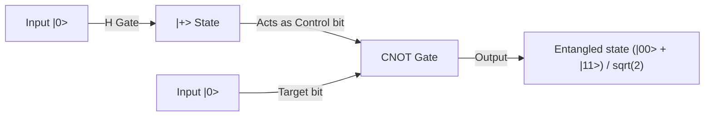

## 1. Introduction: The Paradigm Shift Brought by Quantum Computers

Modern digital society relies on advanced cryptographic techniques to ensure information security. The most prominent examples are RSA encryption and elliptic-curve cryptography, which protect communications on the internet. These public-key cryptographic systems base their security on the mathematical asymmetry (properties as one-way functions) that "factoring enormous integers into primes is extremely difficult." This computational barrier, which is said to take about the age of the universe even if supercomputers were used, has served as a robust shield protecting our privacy, financial transactions, and national secrets.

However, a technology exists that has the potential to fundamentally overturn this premise. That is the "quantum computer."

This entirely new paradigm of computer, which directly utilizes the physical laws governing the microscopic world—quantum mechanics—as computational resources, demonstrates computational power that overwhelmingly surpasses classical computers (current general computers) for certain types of problems. Its most iconic example is "Shor's Algorithm," discovered by Peter Shor in 1994. Since this algorithm can solve the prime factorization problem in polynomial time, if a practical-scale quantum computer is realized, the widely used RSA encryption today would be decrypted in the blink of an eye.

In this article, we will thoroughly and systematically explore why quantum computers are so powerful, starting from fundamental concepts that form their basis such as "Qubits," "Quantum Superposition," and "Quantum Entanglement," to the operation of basic quantum gates, the mathematical structure of the "Quantum Fourier Transform (QFT)" that forms the core of Shor's algorithm, and the error correction challenges faced by current Noisy Intermediate-Scale Quantum (NISQ) devices.

## 2. The Decisive Difference Between Classical Bits and Qubits

### 2.1 Classical Bits: The Deterministic World of 0 or 1
The classical computers we regularly use, such as smartphones and PCs, have the "Bit" as their smallest unit of information. Classical bits utilize the high and low voltages of transistors to always take a clear state of either "0" or "1". If there are N classical bits, $2^N$ possible states can be represented, but a system can only hold "one state only" out of those at any specific moment. Performing calculations is nothing more than the process of passing this deterministic state through logic gates (AND, OR, NOT, etc.) and transforming it into another state.

### 2.2 Qubits: States Containing Infinite Possibilities
On the other hand, the "Qubit," the smallest unit of information in a quantum computer, behaves completely differently from classical bits. Qubits are physically implemented using quantum mechanical two-level systems, such as electron spin (up/down), photon polarization (horizontal/vertical), or the direction of current in a superconducting circuit.

The greatest feature of a qubit is that it possesses the property of "Quantum Superposition," allowing it to take the states of "0" and "1" simultaneously. Mathematically, the state of a qubit $|\psi\rangle$ (representing a state vector in bra-ket notation) is expressed as a linear combination (sum with complex coefficients) of the basis states $|0\rangle$ and $|1\rangle$ as follows:

$$ |\psi\rangle = \alpha|0\rangle + \beta|1\rangle $$

Here, $\alpha$ and $\beta$ are complex numbers called probability amplitudes. These coefficients determine the probability of obtaining $|0\rangle$ or $|1\rangle$ when the qubit is measured. Specifically, the probability of observing $|0\rangle$ is $|\alpha|^2$, and the probability of observing $|1\rangle$ is $|\beta|^2$, and since the sum of the probabilities must be 1, they satisfy the following normalization condition:

$$ |\alpha|^2 + |\beta|^2 = 1 $$

### 2.3 Visualization by the Bloch Sphere
The state of a single qubit can be geometrically visualized as a point on the surface of a unit sphere called the "Bloch Sphere." If the north pole is $|0\rangle$ and the south pole is $|1\rangle$, every point on the sphere's surface represents a valid quantum state. While classical bits can only take the two points of the north or south pole, qubits can exist anywhere among the continuous infinite points on the sphere. This continuity itself is one of the sources that brings rich expressive power to quantum computation.

## 3. The Core of Quantum Computation: Superposition and Quantum Entanglement

### 3.1 Exponential Information Expressive Power
The true value of qubits is demonstrated when multiple qubits are combined. If one qubit can express a superposition of two states, two qubits can express a superposition of four states: $|00\rangle, |01\rangle, |10\rangle, |11\rangle$. In general, a system of N qubits can hold a state as a linear combination of $2^N$ basis states.

$$ |\Psi\rangle = c_0|00\dots0\rangle + c_1|00\dots1\rangle + \dots + c_{2^N-1}|11\dots1\rangle $$

This is astonishing. With just 300 qubits, a superposition of $2^{300}$ states can be represented, and this number far exceeds the total number of atoms existing in the observable universe (about $10^{80}$). If one tried to simulate this with a classical computer, it would be necessary to store $2^{300}$ complex numbers in memory, which is physically impossible. A quantum computer can access all addresses in this vast Hilbert space (state space) simultaneously in parallel and proceed with calculations.

### 3.2 Quantum Entanglement
Another strange phenomenon indispensable for quantum computation is "quantum entanglement." This is a phenomenon where two or more qubits are strongly linked, and their states can no longer be described independently. Let's consider the "Bell State," which is the simplest quantum entangled state.

$$ |\Phi^+\rangle = \frac{1}{\sqrt{2}} (|00\rangle + |11\rangle) $$

In this state, if the first qubit is measured and "0" is obtained, the state of the other qubit instantaneously becomes determined as "0" as well. Conversely, if "1" is obtained, the other also necessarily becomes "1". This correlation appears to influence each other instantaneously faster than light, even if the two qubits were separated on opposite sides of the universe (Einstein called this "spooky action at a distance").

By utilizing this quantum entanglement, quantum computers can express complex correlations between individual data points and highly interfere with numerous computational paths.

## 4. Quantum Gates: Manipulating Quantum States

Just like classical logic gates, quantum computers also use "quantum gates" to manipulate the states of qubits. Mathematically, a quantum gate is represented as a unitary matrix (a matrix that satisfies $U^\dagger U = I$) and acts as a rotation operation on the quantum state vector. Here are some representative quantum gates.

### 4.1 Pauli Gates (X, Y, Z)
- **X Gate (Quantum NOT Gate)**: Flips $|0\rangle$ to $|1\rangle$ and $|1\rangle$ to $|0\rangle$. It corresponds to a 180-degree rotation around the X-axis of the Bloch sphere.
- **Z Gate (Phase Shift Gate)**: Leaves $|0\rangle$ as is, but flips the phase of $|1\rangle$ (multiplies the coefficient by -1).
- **Y Gate**: Corresponds to a combination of X and Z, performing a 180-degree rotation around the Y-axis.

### 4.2 Hadamard Gate
One of the most frequently used gates in quantum algorithms. It converts a deterministic state $|0\rangle$ or $|1\rangle$ into a completely equal-probability superposition state.

$$ H|0\rangle = \frac{1}{\sqrt{2}}(|0\rangle + |1\rangle) = |+\rangle $$
$$ H|1\rangle = \frac{1}{\sqrt{2}}(|0\rangle - |1\rangle) = |-\rangle $$

By applying the Hadamard gate to all qubits, an initial state where all $2^N$ states are equally superimposed can be created, and this serves as the starting point for quantum parallel computation.

### 4.3 CNOT Gate (Controlled-NOT Gate)
A representative gate acting on 2 qubits, indispensable for generating quantum entanglement. It applies an X gate (NOT operation) to the "Target bit" only when the "Control bit" is $|1\rangle$. If the control bit is $|0\rangle$, it does nothing. By combining the Hadamard gate and the CNOT gate, the aforementioned Bell state can be easily created.

## 5. Shor's Algorithm: The Scenario of RSA Encryption Collapse

Here is the main topic. How exactly does a quantum computer decrypt RSA encryption? The security of RSA encryption relies on the rule of thumb that, given a huge composite number $N$ (the product of two prime numbers $p$ and $q$, $N = p \times q$), the "prime factorization problem" of finding the original prime numbers $p$ and $q$ cannot be solved within a realistic time on a classical computer. For RSA-2048, which is the mainstream key length today, the number of digits reaches about 600, and it would take time equivalent to the lifespan of the universe even for the world's fastest supercomputer.

However, in 1994, Peter Shor published a quantum algorithm that solves this problem in classical polynomial time (a dramatic speedup) by skillfully utilizing the properties of quantum mechanics.

### 5.1 Overview of the Algorithm (Classical-Quantum Collaboration)
Shor's algorithm is not actually completed entirely by quantum computation alone, but takes a hybrid approach combining classical computer calculations and quantum computation. It transforms the problem of prime factorization into an "Order-Finding Problem" using theorems of number theory, and entrusts only the extremely difficult part of finding that period to the quantum computer.

The procedure is as follows:
1. **[Classical]** Choose a random integer $a$ ($1 < a < N$) that is coprime (has no common divisors) to $N$.
2. **[Classical]** Define the function $f(x) = a^x \pmod N$. This function exhibits periodic behavior. That is, there exists a smallest positive integer $r$ (the period) such that $f(x+r) = f(x)$ holds.
3. **[Quantum]** Use a quantum computer to rapidly find the period $r$ of this function $f(x)$. (This is the core of Shor's algorithm)
4. **[Classical]** Confirm that the found period $r$ is an even number and that $a^{r/2} \neq -1 \pmod N$ (if not, choose a new $a$).
5. **[Classical]** Calculate the greatest common divisor $\text{gcd}(a^{r/2} \pm 1, N)$. This calculation result will be the prime factors $p$ and $q$ of $N$ that were being sought.

### 5.2 Why Does Knowing the Period Reveal the Prime Factors?
Let's add a bit of mathematical explanation. Suppose an even period $r$ is found such that $a^r \equiv 1 \pmod N$. Rearranging this equation:
$$ a^r - 1 \equiv 0 \pmod N $$
$$ (a^{r/2} - 1)(a^{r/2} + 1) \equiv 0 \pmod N $$
This means that the product of $(a^{r/2} - 1)$ and $(a^{r/2} + 1)$ is a multiple of $N$. Therefore, by calculating the greatest common divisor between one of these terms and $N$ (which can be computed instantly using the Euclidean algorithm), the prime factors (non-trivial divisors) of $N$ can be efficiently extracted.

## 6. Quantum Fourier Transform (QFT): Extracting the Correct Answer via Interference

The problem is, "How do we find the period $r$ at high speed?" In a classical computer, there is no choice but to search for the period by sequentially calculating the function $f(x) = a^x \pmod N$ for $x=1, 2, 3 \dots$, which takes exponential time. Here, the "superposition" and "interference" of a quantum computer demonstrate their power.

### 6.1 Simultaneous Calculation via Quantum Parallelism
First, the quantum computer uses Hadamard gates to create a state in the input register where all integers $x$ from $0$ to $2^m-1$ (a sufficiently large number) are evenly superimposed.
Then, the function $f(x) = a^x \pmod N$ is executed just once as a quantum circuit against this entire superposition state (modular exponentiation circuit). Then, due to quantum parallelism, the answers for $f(x)$ for all $x$ are simultaneously calculated in a second register and held as a quantum entangled state.

$$ |\psi\rangle = \frac{1}{\sqrt{2^m}} \sum_{x=0}^{2^m-1} |x\rangle |a^x \pmod N\rangle $$

### 6.2 The Measurement Problem: The Trap of Parallel Computation
You might think, "Wonderful! We calculated all the answers at once!" However, quantum mechanics has ruthless rules. "When observed, the superposition state collapses and shrinks into a single random state." Even with parallel computation, if you just observe it as is, you only obtain a single pair $(x, a^x \bmod N)$ for a random $x$, which is nothing more than the result of running the classical calculation once. With this, the overall picture of the period $r$ cannot be grasped at all.

### 6.3 Wave Interference: Amplifying the Correct Answer and Canceling the Incorrect Answers
This is where the "Quantum Fourier Transform (QFT)" comes into play. QFT is the quantum version of the classical discrete Fourier transform, but instead of acting on an array of data, it acts directly on the probability amplitudes (complex coefficients) of a quantum state.

Just as sound waves overlap to become louder or cancel each other out, quantum states also possess the nature of "waves" with complex amplitudes. Applying QFT to a quantum state with periodicity causes the physical phenomenon of wave "interference." Specifically, it works to dramatically amplify the probability amplitude of specific states that strongly hold information regarding the period $r$ (the parts where wave peaks overlap with peaks, constructive interference), and to cancel the probability amplitudes of unrelated states to zero (the parts where wave peaks overlap with troughs, destructive interference).

When an observation is made after applying QFT, rather than a random value, a "value close to a multiple of $2^m / r$" is measured with high probability. By using a classical mathematical technique called continued fraction expansion from this measurement result, it becomes possible to reverse-calculate the period $r$ with extreme precision.

The genius of Shor's algorithm lies in constructing a mechanism that does not attempt to directly know the intermediate results of the calculation, but rather extracts only the "periodicity (global structure) hidden in the entire calculation result" using wave interference.

## 7. The NISQ Era and Error Correction: The Wall for Real-World Quantum Computers

In theory, it has been proven that quantum computers can break RSA encryption. So why aren't banking systems collapsing tomorrow? That is because building quantum computer hardware is one of the most difficult engineering challenges in human history.

### 7.1 Decoherence (Collapse of Quantum States)
The superposition and quantum entanglement of qubits are extremely fragile states. The moment they come into contact with minute noise (interference) from the external environment, such as heat, electromagnetic waves, cosmic rays, or slight impurities, the quantum state collapses and falls into a classical state. This phenomenon is called "decoherence." If decoherence occurs before the calculation is completed, it results in an error. This is why qubits are currently protected inside dilution refrigerators that maintain an extremely low-temperature environment of a few millikelvins (near absolute zero).

### 7.2 NISQ (Noisy Intermediate-Scale Quantum) Devices
Current quantum computers are called "NISQ (Noisy Intermediate-Scale Quantum devices)." They possess tens to hundreds of qubits, but there is too much noise to execute long calculations (deep quantum circuits). To decipher RSA-2048 with Shor's algorithm, thousands of "perfect" qubits and millions of gate operations are required. With the gate fidelity (error rate) of current hardware, errors accumulate midway through the calculation, and the result becomes just noise.

### 7.3 Quantum Error Correction and Logical Qubits
The key to solving this problem is "Quantum Error Correction (QEC)." In classical computers, errors are prevented simply by copying information, but in quantum mechanics, the "No-Cloning Theorem" prohibits accurately copying an unknown quantum state.

Therefore, quantum error correction uses advanced topological encoding techniques such as the "Surface Code." This is a technology that bundles hundreds or thousands of physical qubits into a quantum entangled state and creates "one virtual, perfect qubit (logical qubit)" that detects and corrects errors through a mechanism akin to a majority vote.

To break RSA encryption, thousands of these logical qubits are necessary. To achieve that, it is estimated that physical qubits will be needed on a scale of millions, and considering the current stage of tens to hundreds of physical bits, the general view among experts is that practical application (FTQC: realization of a Fault-Tolerant Quantum Computer) will still take more than 10 years, or perhaps decades.

## 8. Transition to Post-Quantum Cryptography (PQC)

It is not exactly known when "Q-Day (the day encryption is broken by quantum computers)," when the threat of quantum computers becomes a reality, will arrive. However, because the attack method of "Store now, decrypt later" (intercepting and saving now to decrypt when a quantum computer is completed in the future) exists, the protection of national secrets and long-term confidential information is already in crisis.

To counter this, the international community, led by NIST (the National Institute of Standards and Technology in the US), is rapidly advancing the standardization and transition work for "Post-Quantum Cryptography (PQC)" based on new mathematical problems (such as lattice-based cryptography) that are difficult to solve even with quantum computers. In preparation for a future where quantum computers break encryption, we have already begun constructing new shields.

## 9. Conclusion: A New Horizon in Information Science

A quantum computer is not simply a "faster version of a conventional computer." It is a completely new conceptual device that directly expresses quantum mechanics, the ultimate law of the natural world, as algorithms, and expands the limits of information processing. Shor's algorithm was the first monumental achievement showing us its terrifying potential.

The walls that must be overcome, such as the fight against noise and the difficulty of scaling up, still tower high. However, this field, which brings together the wisdom of physics, mathematics, information science, and materials engineering, will undoubtedly become the center of humanity's next technological leap. We must keep a close watch on the evolutionary process of how the mysterious phenomena of the quantum world will reshape the foundations of our digital society.
