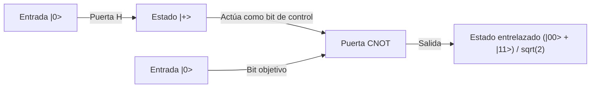

## 1. Introducción: El cambio de paradigma que trae la computación cuántica

La sociedad digital moderna depende de tecnologías de cifrado avanzadas para garantizar la seguridad de la información. Sus ejemplos más representativos son el cifrado RSA y el cifrado de curva elíptica, que protegen las comunicaciones en Internet. Estos métodos de criptografía de clave pública basan su seguridad en la asimetría matemática (su naturaleza como función unidireccional) de que "factorizar números enteros gigantes es extremadamente difícil". Se dice que incluso usando supercomputadoras tomaría tanto tiempo como la edad del universo, y esta barrera computacional ha sido un escudo sólido que protege nuestra privacidad, transacciones financieras y secretos de estado.

Sin embargo, existe una tecnología con el potencial de alterar fundamentalmente esta premisa. Esa es la "computadora cuántica" (computación cuántica).

Esta máquina de un paradigma completamente nuevo, que utiliza directamente las leyes físicas que gobiernan el mundo microscópico, la mecánica cuántica, como recursos computacionales, demuestra una capacidad de cálculo para ciertos tipos de problemas que supera abrumadoramente a las computadoras clásicas (las computadoras generales actuales). Su ejemplo más icónico es el "Algoritmo de Shor" (Shor's Algorithm) descubierto por Peter Shor en 1994. Este algoritmo puede resolver el problema de factorización de enteros en tiempo polinómico, lo que significa que si se lograra una computadora cuántica a escala práctica, el cifrado RSA ampliamente utilizado hoy en día sería descifrado en un abrir y cerrar de ojos.

En este artículo, profundizaremos de manera extremadamente detallada y sistemática en por qué las computadoras cuánticas son tan poderosas. Comenzaremos con conceptos fundamentales como el "cúbit" (Qubit), la "superposición cuántica" y el "entrelazamiento cuántico"; repasaremos el funcionamiento básico de las puertas cuánticas; la estructura matemática de la "Transformada Cuántica de Fourier (QFT)", que forma el núcleo del algoritmo de Shor; y finalmente, los desafíos de corrección de errores que enfrentan los actuales dispositivos cuánticos de escala intermedia ruidosa (NISQ).

## 2. La diferencia decisiva entre bits clásicos y cúbits (Qubit)

### 2.1 Bits clásicos: Un mundo determinista de 0 o 1
Las computadoras clásicas que solemos usar, como los teléfonos inteligentes y las PC, utilizan el "bit" (Bit) como la unidad mínima de información. El bit clásico utiliza los niveles de voltaje de los transistores para adoptar siempre de forma clara un estado de "0" o "1". Si tenemos N bits clásicos, pueden representar $2^N$ estados diferentes, pero en un momento específico, el sistema solo puede mantener "solo uno de esos estados". Realizar un cálculo no es otra cosa que pasar este estado determinista a través de puertas lógicas (AND, OR, NOT, etc.) para transformarlo en otro estado.

### 2.2 Cúbit (Qubit): Un estado que encierra infinitas posibilidades
Por otro lado, el "cúbit" (Qubit), la unidad mínima de información en una computadora cuántica, se comporta de manera completamente diferente al bit clásico. Los cúbits se implementan físicamente usando sistemas cuánticos de dos niveles, como el espín de un electrón (arriba/abajo), la polarización de un fotón (horizontal/vertical) o la dirección de la corriente en un circuito superconductor.

La principal característica de un cúbit es su propiedad de "superposición cuántica" (Quantum Superposition), que le permite adoptar los estados "0" y "1" simultáneamente. Matemáticamente, el estado de un cúbit $|\psi\rangle$ (que representa el vector de estado en notación bra-ket) se expresa como una combinación lineal (suma con coeficientes complejos) de los estados base $|0\rangle$ y $|1\rangle$ de la siguiente manera:

$$ |\psi\rangle = \alpha|0\rangle + \beta|1\rangle $$

Aquí, $\alpha$ y $\beta$ son números complejos llamados amplitudes de probabilidad. Estos coeficientes determinan la probabilidad de obtener $|0\rangle$ o $|1\rangle$ cuando se mide el cúbit. Específicamente, la probabilidad de observar $|0\rangle$ es $|\alpha|^2$, y la probabilidad de observar $|1\rangle$ es $|\beta|^2$. Dado que la suma total de las probabilidades debe ser 1, se cumple la siguiente condición de normalización:

$$ |\alpha|^2 + |\beta|^2 = 1 $$

### 2.3 Visualización mediante la Esfera de Bloch
El estado de un solo cúbit se puede visualizar geométricamente como un punto en la superficie de una esfera unitaria llamada "Esfera de Bloch" (Bloch Sphere). Si el polo norte es $|0\rangle$ y el polo sur es $|1\rangle$, cualquier punto en la superficie de la esfera representa un estado cuántico válido. Mientras que el bit clásico solo puede tomar dos puntos (polo norte o polo sur), el cúbit puede existir en cualquiera de los infinitos puntos continuos de la superficie esférica. Esta continuidad es precisamente una de las fuentes que le otorga a la computación cuántica su rica capacidad de expresión.

## 3. El núcleo de la computación cuántica: superposición y entrelazamiento cuántico

### 3.1 Capacidad exponencial de representación de la información
El verdadero valor de los cúbits se despliega al combinar múltiples de ellos. Si un solo cúbit puede representar una superposición de 2 estados, 2 cúbits pueden representar una superposición de 4 estados: $|00\rangle, |01\rangle, |10\rangle, |11\rangle$. En general, un sistema de N cúbits puede mantener un estado como una combinación lineal de $2^N$ estados base.

$$ |\Psi\rangle = c_0|00\dots0\rangle + c_1|00\dots1\rangle + \dots + c_{2^N-1}|11\dots1\rangle $$

Esto es asombroso. Con solo 300 cúbits, se puede representar una superposición de $2^{300}$ estados, un número que supera con creces la cantidad de todos los átomos existentes en el universo observable (aproximadamente $10^{80}$). Si se intentara simular esto en una computadora clásica, se requeriría almacenar $2^{300}$ números complejos en la memoria, lo que es físicamente imposible. Una computadora cuántica puede acceder y avanzar cálculos de forma paralela y simultánea en todas las direcciones de este vasto espacio de Hilbert (espacio de estados).

### 3.2 Entrelazamiento Cuántico (Quantum Entanglement)
Otro fenómeno extraño e indispensable para la computación cuántica es el "entrelazamiento cuántico". Es un fenómeno en el que dos o más cúbits se vinculan fuertemente, y sus estados ya no pueden describirse de forma independiente. Consideremos el estado entrelazado más simple, el "Estado de Bell" (Bell State).

$$ |\Phi^+\rangle = \frac{1}{\sqrt{2}} (|00\rangle + |11\rangle) $$

En este estado, si se mide el primer cúbit y se obtiene "0", el estado del otro cúbit se determina instantáneamente como "0". A la inversa, si se obtiene "1", el otro inevitablemente también será "1". Esta correlación parece influirse instantáneamente, superando la velocidad de la luz, incluso si los dos cúbits estuvieran en lados opuestos del universo (Einstein llamó a esto "espeluznante acción a distancia").

Aprovechando este entrelazamiento cuántico, las computadoras cuánticas pueden representar correlaciones complejas entre datos individuales e interferir de forma altamente sofisticada numerosas rutas computacionales.

## 4. Puertas cuánticas: manipulación del estado cuántico

Al igual que las puertas lógicas clásicas, las computadoras cuánticas utilizan "puertas cuánticas" para manipular el estado de los cúbits. Matemáticamente, una puerta cuántica se representa como una matriz unitaria (una matriz que cumple $U^\dagger U = I$) y actúa como una operación de rotación sobre el vector de estado cuántico. Presentamos las puertas cuánticas más representativas.

### 4.1 Puertas de Pauli (X, Y, Z)
- **Puerta X (puerta NOT cuántica)**: Invierte $|0\rangle$ a $|1\rangle$ y $|1\rangle$ a $|0\rangle$. Corresponde a una rotación de 180 grados alrededor del eje X de la Esfera de Bloch.
- **Puerta Z (puerta de desplazamiento de fase)**: Mantiene $|0\rangle$ igual, pero invierte la fase de $|1\rangle$ (multiplica el coeficiente por -1).
- **Puerta Y**: Corresponde a una combinación de X y Z, realizando una rotación de 180 grados alrededor del eje Y.

### 4.2 Puerta de Hadamard (Hadamard Gate)
Es una de las puertas más utilizadas en algoritmos cuánticos. Transforma los estados deterministas $|0\rangle$ o $|1\rangle$ en un estado de superposición de probabilidades completamente iguales.

$$ H|0\rangle = \frac{1}{\sqrt{2}}(|0\rangle + |1\rangle) = |+\rangle $$
$$ H|1\rangle = \frac{1}{\sqrt{2}}(|0\rangle - |1\rangle) = |-\rangle $$

Al aplicar la puerta de Hadamard a todos los cúbits, se puede crear un estado inicial donde los $2^N$ estados totales se superponen de manera equitativa, y este es el punto de partida para el cálculo paralelo cuántico.

### 4.3 Puerta CNOT (Puerta NOT controlada)
Es una puerta representativa que actúa sobre 2 cúbits y es indispensable para generar entrelazamiento cuántico. Aplica la puerta X (operación NOT) al "bit objetivo" (Target) solo si el "bit de control" (Control) es $|1\rangle$. Si el bit de control es $|0\rangle$, no hace nada. Combinando la puerta de Hadamard y la puerta CNOT, se puede crear fácilmente el estado de Bell mencionado anteriormente.

## 5. El algoritmo de Shor: el escenario de la caída del cifrado RSA

Aquí está el tema principal. ¿Cómo descifra una computadora cuántica el cifrado RSA? La seguridad del cifrado RSA se basa en la regla empírica de que el "problema de factorización", es decir, encontrar los números primos originales $p$ y $q$ a partir de un número compuesto gigante $N$ (el producto de dos primos $p$ y $q$, $N = p \times q$), no puede resolverse en un tiempo práctico por una computadora clásica. El RSA-2048, que es la longitud de clave principal actualmente, tiene unos 600 dígitos, y tomaría una cantidad de tiempo similar a la vida del universo incluso con las supercomputadoras más rápidas del mundo.

Sin embargo, en 1994, Peter Shor anunció un algoritmo cuántico que resuelve este problema en tiempo polinómico clásico (una aceleración drástica) utilizando hábilmente las propiedades de la mecánica cuántica.

### 5.1 Visión general del algoritmo (cooperación clásica y cuántica)
En realidad, el algoritmo de Shor no se completa únicamente mediante cálculo cuántico, sino que adopta un enfoque híbrido combinando cálculo clásico y cuántico. El problema de factorización se transforma en un "Problema de Encontrar el Período" (Order-Finding Problem) utilizando teoremas de la teoría de números, y solo delega a la computadora cuántica la parte extremadamente difícil de encontrar ese período.

El procedimiento es el siguiente:
1. **[Clásico]** Elegir un entero aleatorio $a$ ($1 < a < N$) que sea coprimo (sin divisores comunes) con $N$.
2. **[Clásico]** Definir la función $f(x) = a^x \pmod N$. Esta función tiene un comportamiento periódico. Es decir, existe un entero positivo mínimo $r$ (el período) para el cual se cumple que $f(x+r) = f(x)$.
3. **[Cuántica]** Utilizar una computadora cuántica para encontrar rápidamente el período $r$ de esta función $f(x)$. (Este es el núcleo del algoritmo de Shor)
4. **[Clásico]** Verificar que el período encontrado $r$ sea par y que $a^{r/2} \neq -1 \pmod N$ (si no, elegir de nuevo $a$).
5. **[Clásico]** Calcular el máximo común divisor $\text{gcd}(a^{r/2} \pm 1, N)$. El resultado de este cálculo serán los factores primos $p$ y $q$ de $N$ que estábamos buscando.

### 5.2 ¿Por qué conocer el período revela los factores primos?
Hagamos una pequeña aclaración matemática. Supongamos que se encuentra un período par $r$ tal que $a^r \equiv 1 \pmod N$. Modificando esta ecuación:
$$ a^r - 1 \equiv 0 \pmod N $$
$$ (a^{r/2} - 1)(a^{r/2} + 1) \equiv 0 \pmod N $$
Esto significa que el producto de $(a^{r/2} - 1)$ y $(a^{r/2} + 1)$ es un múltiplo de $N$. Por lo tanto, al calcular el máximo común divisor entre cualquiera de estos términos y $N$ (calculable al instante usando el algoritmo de Euclides), podemos extraer de manera eficiente los factores primos (divisores no triviales) de $N$.

## 6. Transformada Cuántica de Fourier (QFT): Extracción de la respuesta correcta por interferencia

El problema es: "¿Cómo encontramos rápidamente el período $r$?". En una computadora clásica, no hay más remedio que calcular la función $f(x) = a^x \pmod N$ secuencialmente para $x=1, 2, 3 \dots$ para buscar el período, lo que tomaría un tiempo exponencial. Aquí es donde la "superposición" y la "interferencia" de la computadora cuántica demuestran su poder.

### 6.1 Cálculo simultáneo mediante paralelismo cuántico
Primero, la computadora cuántica utiliza puertas de Hadamard en el registro de entrada para crear un estado de superposición uniforme de todos los enteros $x$ desde $0$ hasta $2^m-1$ (un número lo suficientemente grande).
Luego, se ejecuta la función $f(x) = a^x \pmod N$ una sola vez como un circuito cuántico (circuito de exponenciación modular) para todo este estado superpuesto. Así, debido al paralelismo cuántico, las respuestas de $f(x)$ para todos los $x$ se calculan simultáneamente en un segundo registro y se mantienen como un estado de entrelazamiento cuántico.

$$ |\psi\rangle = \frac{1}{\sqrt{2^m}} \sum_{x=0}^{2^m-1} |x\rangle |a^x \pmod N\rangle $$

### 6.2 El problema de la medición: la trampa del cálculo paralelo
Uno podría pensar: "¡Genial! ¡Pudimos calcular todas las respuestas de una vez!". Sin embargo, la mecánica cuántica tiene una regla despiadada: "Al observar, el estado superpuesto se colapsa y se reduce a un solo estado aleatorio". Incluso si calculamos en paralelo, si lo observamos tal cual, solo obtendremos un único par aleatorio $(x, a^x \bmod N)$, lo que equivale a haber ejecutado el cálculo clásico una sola vez. Esto no nos da ninguna idea de la imagen completa del período $r$.

### 6.3 Interferencia de ondas: amplificar lo correcto y anular lo incorrecto
Aquí es donde entra en juego la "Transformada Cuántica de Fourier" (Quantum Fourier Transform, QFT). La QFT es la versión cuántica de la transformada de Fourier discreta clásica, pero actúa directamente sobre las amplitudes de probabilidad (coeficientes complejos) de los estados cuánticos, no sobre matrices de datos.

Al igual que las ondas sonoras se superponen para hacerse más fuertes o cancelarse mutuamente, los estados cuánticos también tienen propiedades de "onda" con amplitudes complejas. Aplicar la QFT a un estado cuántico periódico provoca el fenómeno físico de "interferencia" de ondas. Específicamente, actúa amplificando drásticamente la amplitud de probabilidad de ciertos estados que contienen fuerte información sobre el período $r$ (partes donde las crestas de las ondas se superponen, interferencia constructiva) y anula a cero la amplitud de probabilidad de los estados irrelevantes (partes donde se superponen crestas y valles, interferencia destructiva).

Si realizamos una medición después de aplicar la QFT, en lugar de un valor aleatorio, se medirá con alta probabilidad "un valor cercano a un múltiplo de $2^m / r$". A partir de este resultado de medición y empleando una técnica matemática clásica llamada expansión de fracciones continuas, es posible calcular a la inversa el período $r$ con extrema precisión.

El aspecto genial del algoritmo de Shor es que, en lugar de intentar conocer los resultados intermedios del cálculo directamente, construyó un mecanismo para extraer solo la "periodicidad subyacente en todo el resultado del cálculo (la estructura global)" usando la interferencia de ondas.

## 7. La era NISQ y la corrección de errores: el muro de las computadoras cuánticas reales

En teoría, está demostrado que las computadoras cuánticas pueden destruir el cifrado RSA. Entonces, ¿por qué los sistemas bancarios no colapsan mañana mismo? Porque la construcción de hardware para computadoras cuánticas es uno de los desafíos de ingeniería más difíciles en la historia de la humanidad.

### 7.1 Decoherencia (Colapso del estado cuántico)
La superposición cuántica y el entrelazamiento cuántico de los cúbits son estados extremadamente frágiles. En el momento en que se exponen a ruidos microscópicos (interferencias) del entorno externo, como calor, ondas electromagnéticas, rayos cósmicos o ligeras impurezas, el estado cuántico colapsa y cae en un estado clásico. Este fenómeno se llama "decoherencia". Si ocurre la decoherencia antes de completar el cálculo, resulta en un error. Es por esta razón que los cúbits se protegen actualmente en refrigeradores de dilución que mantienen entornos criogénicos a unos pocos milikelvin (cerca del cero absoluto).

### 7.2 Dispositivos NISQ (Noisy Intermediate-Scale Quantum)
Las computadoras cuánticas actuales se denominan "NISQ" (Dispositivos Cuánticos Ruidosos de Escala Intermedia). Tienen unas decenas o cientos de cúbits, pero debido a la gran cantidad de ruido, no pueden ejecutar cálculos largos (circuitos cuánticos profundos). Para descifrar el RSA-2048 con el algoritmo de Shor se requieren miles de cúbits "perfectos" y millones de operaciones de puertas. Con la fidelidad de las puertas (tasa de error) del hardware actual, los errores se acumularían durante el cálculo y el resultado sería solo ruido.

### 7.3 Corrección de errores cuánticos y cúbits lógicos
La clave para resolver este problema es la "Corrección de Errores Cuánticos" (Quantum Error Correction, QEC). En las computadoras clásicas, los errores se previenen simplemente copiando la información, pero debido al "Teorema de no clonación" (No-Cloning Theorem) de la mecánica cuántica, está prohibido copiar con precisión un estado cuántico desconocido.

Por lo tanto, la corrección de errores cuánticos utiliza métodos avanzados de codificación topológica como el "Código de Superficie" (Surface Code). Esta es una técnica para crear "un cúbit lógico virtual y perfecto" agrupando cientos o miles de cúbits físicos en un estado entrelazado y detectando y corrigiendo errores a través de un mecanismo similar a una votación por mayoría.

Para descifrar el cifrado RSA se necesitan miles de estos cúbits lógicos. Se estima que para lograr esto, se requerirán millones de cúbits físicos, y considerando la etapa actual de decenas a cientos de bits físicos, el consenso general de los expertos es que aún se necesitan más de 10 años, o quizás décadas, para la implementación práctica (FTQC: Computadora Cuántica Universal Tolerante a Fallos).

## 8. La transición a la Criptografía Post-Cuántica (PQC)

No se sabe exactamente cuándo llegará el "Q-Day" (el día en que las computadoras cuánticas logren descifrar cifrados), haciendo realidad la amenaza de la computación cuántica. Sin embargo, dado que existe el método de ataque de "interceptar y almacenar ahora, para descifrar más tarde cuando las computadoras cuánticas estén completas" (Store now, decrypt later), los secretos de estado y la protección de información confidencial a largo plazo ya están en riesgo.

Para contrarrestar esto, la comunidad internacional, incluyendo al NIST (Instituto Nacional de Estándares y Tecnología de EE. UU.), está avanzando rápidamente en la estandarización y transición a la "Criptografía Post-Cuántica" (Post-Quantum Cryptography, PQC), basada en nuevos problemas matemáticos (como la criptografía basada en retículos) que son difíciles de resolver incluso para computadoras cuánticas. Nos estamos preparando para el futuro en el que las computadoras cuánticas destruyan el cifrado mediante la construcción desde ya de nuevos escudos.

## 9. Conclusión: un nuevo horizonte en la informática

Una computadora cuántica no es simplemente una "versión más rápida de una computadora convencional". Es un dispositivo conceptual completamente nuevo que expresa directamente la mecánica cuántica, la ley suprema de la naturaleza, como un algoritmo, expandiendo los límites del procesamiento de la información. El algoritmo de Shor fue el primer hito en demostrarnos ese potencial formidable.

Aún quedan muros muy altos que superar, como la lucha contra el ruido y la dificultad de escalar. Sin embargo, este campo, que reúne la sabiduría de la física, las matemáticas, las ciencias de la computación y la ingeniería de materiales, sin duda se convertirá en el epicentro del próximo salto tecnológico de la humanidad. No podemos apartar la vista del proceso de evolución de cómo los misteriosos fenómenos del mundo cuántico reescribirán los cimientos de nuestra sociedad digital.
