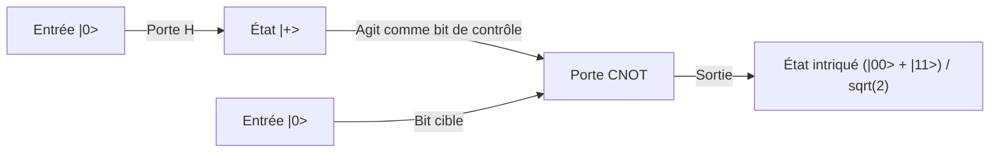

## 1. Introduction : Le changement de paradigme apporté par l'informatique quantique

La société numérique moderne dépend de technologies cryptographiques avancées pour garantir la sécurité des informations. Les exemples les plus représentatifs sont le chiffrement RSA et la cryptographie sur les courbes elliptiques, qui protègent les communications sur Internet. Ces méthodes de cryptographie à clé publique fondent leur sécurité sur une asymétrie mathématique (les propriétés des fonctions à sens unique), à savoir qu'"il est extrêmement difficile de factoriser de très grands nombres entiers". Ce mur de calcul, qui prendrait un temps équivalent à l'âge de l'univers même avec un superordinateur, a été un bouclier solide protégeant notre vie privée, nos transactions financières et nos secrets d'État.

Cependant, il existe une technologie qui a le potentiel de renverser complètement ce postulat. Il s'agit de "l'ordinateur quantique".

Cette machine de calcul d'un paradigme totalement nouveau, qui utilise directement les lois physiques régissant le monde microscopique appelées mécanique quantique comme ressource de calcul, démontre une puissance de calcul qui surpasse de manière écrasante les ordinateurs classiques (les ordinateurs généraux actuels) pour certains types de problèmes. L'exemple le plus symbolique est "l'algorithme de Shor" (Shor's Algorithm), découvert par Peter Shor en 1994. Étant donné que cet algorithme peut résoudre le problème de la factorisation en nombres premiers en un temps polynomial, si un ordinateur quantique à l'échelle pratique est réalisé, le chiffrement RSA largement utilisé actuellement sera déchiffré en un instant.

Dans cet article, nous explorerons de manière extrêmement détaillée et systématique pourquoi les ordinateurs quantiques sont si puissants, en partant de concepts fondamentaux tels que le "qubit", la "superposition quantique" et "l'intrication quantique", jusqu'au fonctionnement des portes quantiques de base, la structure mathématique de la "transformée de Fourier quantique (QFT)" qui constitue le cœur de l'algorithme de Shor, et les défis de correction d'erreurs auxquels sont confrontés les actuels dispositifs quantiques à échelle intermédiaire bruités (NISQ).

## 2. La différence cruciale entre bits classiques et qubits (Qubits)

### 2.1 Les bits classiques : Un monde déterministe de 0 ou 1
Les ordinateurs classiques que nous utilisons habituellement, tels que les smartphones et les PC, utilisent le "bit" (Bit) comme unité minimale d'information. Les bits classiques, utilisant les niveaux de tension des transistors, prennent toujours l'un ou l'autre état clair de "0" ou "1". Si nous avons N bits classiques, nous pouvons représenter $2^N$ états possibles, mais le système ne peut maintenir qu'« un seul de ces états » à un instant précis. Effectuer un calcul n'est rien d'autre que le processus consistant à faire passer cet état déterministe à travers des portes logiques (ET, OU, NON, etc.) pour le convertir en un autre état.

### 2.2 Les qubits (Qubits) : Un état renfermant des possibilités infinies
D'autre part, le "qubit" (Qubit), qui est l'unité minimale d'information d'un ordinateur quantique, se comporte de manière totalement différente des bits classiques. Les qubits sont physiquement implémentés en utilisant des systèmes quantiques à deux niveaux, tels que le spin d'un électron (vers le haut / vers le bas), la polarisation d'un photon (horizontale / verticale), ou la direction du courant dans un circuit supraconducteur.

La plus grande caractéristique d'un qubit est qu'il possède la propriété de "superposition quantique" (Quantum Superposition), qui lui permet de prendre les états "0" et "1" simultanément. Mathématiquement, l'état d'un qubit $|\psi\rangle$ (représentant un vecteur d'état dans la notation bra-ket) est exprimé comme une combinaison linéaire (une somme avec des coefficients complexes) des états de base $|0\rangle$ et $|1\rangle$ comme suit :

$$ |\psi\rangle = \alpha|0\rangle + \beta|1\rangle $$

Ici, $\alpha$ et $\beta$ sont des nombres complexes et sont appelés amplitudes de probabilité. Ces coefficients déterminent la probabilité d'obtenir $|0\rangle$ ou $|1\rangle$ lorsque le qubit est mesuré. Plus précisément, la probabilité d'observer $|0\rangle$ est de $|\alpha|^2$, et la probabilité d'observer $|1\rangle$ est de $|\beta|^2$. Étant donné que la somme des probabilités doit être de 1, la condition de normalisation suivante est satisfaite :

$$ |\alpha|^2 + |\beta|^2 = 1 $$

### 2.3 Visualisation par la sphère de Bloch
L'état d'un seul qubit peut être visualisé géométriquement comme un point sur une surface sphérique unitaire appelée "sphère de Bloch" (Bloch Sphere). Si le pôle Nord est $|0\rangle$ et le pôle Sud est $|1\rangle$, tout point sur la surface de la sphère représente un état quantique valide. Alors qu'un bit classique ne peut prendre que les deux points du pôle Nord ou du pôle Sud, un qubit peut exister n'importe où parmi les points continus et infinis de la surface sphérique. Cette continuité est l'une des sources qui apporte un riche pouvoir d'expression au calcul quantique.

## 3. Le cœur du calcul quantique : Superposition et intrication quantique

### 3.1 Un pouvoir d'expression de l'information exponentiel
La véritable valeur des qubits se révèle lorsque plusieurs d'entre eux sont combinés. Si un qubit peut représenter une superposition de 2 états, alors 2 qubits peuvent représenter une superposition des 4 états $|00\rangle, |01\rangle, |10\rangle, |11\rangle$. En général, un système de N qubits peut maintenir un état comme une combinaison linéaire de $2^N$ états de base.

$$ |\Psi\rangle = c_0|00\dots0\rangle + c_1|00\dots1\rangle + \dots + c_{2^N-1}|11\dots1\rangle $$

C'est étonnant. Avec seulement 300 qubits, il est possible de représenter la superposition de $2^{300}$ états, un nombre qui dépasse de loin le nombre total d'atomes dans l'univers observable (environ $10^{80}$). Si nous devions simuler cela avec un ordinateur classique, nous devrions stocker $2^{300}$ nombres complexes en mémoire, ce qui est physiquement impossible. Un ordinateur quantique peut accéder à toutes les adresses de ce vaste espace de Hilbert (espace d'états) en parallèle et simultanément pour faire progresser les calculs.

### 3.2 L'intrication quantique (Quantum Entanglement)
Un autre phénomène étrange indispensable au calcul quantique est "l'intrication quantique". Il s'agit d'un phénomène dans lequel deux qubits ou plus sont si fortement liés que leurs états ne peuvent plus être décrits indépendamment les uns des autres. Considérons l'"état de Bell" (Bell State), qui est l'état intriqué quantique le plus simple.

$$ |\Phi^+\rangle = \frac{1}{\sqrt{2}} (|00\rangle + |11\rangle) $$

Dans cet état, si l'on mesure le premier qubit et que l'on obtient "0", l'état de l'autre qubit est instantanément déterminé comme étant "0" également. Inversement, si "1" est obtenu, l'autre sera aussi obligatoirement "1". Cette corrélation semble s'influencer instantanément plus vite que la lumière, même si les deux qubits sont séparés aux extrémités opposées de l'univers (Albert Einstein a appelé cela "une action fantôme à distance").

En utilisant cette intrication quantique, les ordinateurs quantiques peuvent représenter des corrélations complexes entre des données individuelles et faire interférer fortement de nombreux chemins de calcul.

## 4. Portes quantiques : Manipulation de l'état quantique

Tout comme les portes logiques classiques, les ordinateurs quantiques utilisent des "portes quantiques" pour manipuler l'état des qubits. Mathématiquement, les portes quantiques sont exprimées sous forme de matrices unitaires (des matrices satisfaisant $U^\dagger U = I$) et agissent comme des opérations de rotation sur le vecteur d'état quantique. Voici quelques portes quantiques représentatives.

### 4.1 Portes de Pauli (X, Y, Z)
- **Porte X (porte NON quantique)** : Inverse $|0\rangle$ en $|1\rangle$, et $|1\rangle$ en $|0\rangle$. Cela correspond à une rotation de 180 degrés autour de l'axe X de la sphère de Bloch.
- **Porte Z (porte de déphasage)** : $|0\rangle$ reste inchangé, mais la phase de $|1\rangle$ est inversée (son coefficient est multiplié par -1).
- **Porte Y** : Correspond à une combinaison de X et Z, et effectue une rotation de 180 degrés autour de l'axe Y.

### 4.2 Porte de Hadamard (Hadamard Gate)
C'est l'une des portes les plus fréquemment utilisées dans les algorithmes quantiques. Elle convertit les états déterministes $|0\rangle$ ou $|1\rangle$ en un état de superposition équiprobable parfait.

$$ H|0\rangle = \frac{1}{\sqrt{2}}(|0\rangle + |1\rangle) = |+\rangle $$
$$ H|1\rangle = \frac{1}{\sqrt{2}}(|0\rangle - |1\rangle) = |-\rangle $$

En appliquant la porte de Hadamard à tous les qubits, un état initial dans lequel tous les $2^N$ états sont superposés uniformément peut être créé, ce qui est le point de départ du calcul parallèle quantique.

### 4.3 Porte CNOT (Porte NON contrôlée)
C'est une porte représentative agissant sur 2 qubits, essentielle pour générer l'intrication quantique. Elle n'applique une porte X (opération NON) au "bit cible" (Target) que si le "bit de contrôle" (Control) est $|1\rangle$. Si le bit de contrôle est $|0\rangle$, elle ne fait rien. En combinant la porte de Hadamard et la porte CNOT, l'état de Bell mentionné précédemment peut être facilement créé.

## 5. L'algorithme de Shor : Le scénario de l'effondrement de la cryptographie RSA

Voici le cœur du sujet. Comment un ordinateur quantique peut-il déchiffrer la cryptographie RSA ? La sécurité de la cryptographie RSA repose sur la règle empirique selon laquelle le "problème de la factorisation en nombres premiers" — qui consiste, étant donné un immense nombre composé $N$ (le produit de deux nombres premiers $p$ et $q$, $N = p \times q$), à retrouver les nombres premiers originaux $p$ et $q$ — ne peut être résolu dans un temps réaliste par un ordinateur classique. Pour RSA-2048, qui est actuellement la longueur de clé dominante, le nombre de chiffres atteint environ 600, et même le superordinateur le plus rapide du monde mettrait un temps équivalent à la durée de vie de l'univers pour le résoudre.

Cependant, en 1994, Peter Shor a publié un algorithme quantique qui résout ce problème en un temps polynomial classique (une accélération spectaculaire) en utilisant habilement les propriétés de la mécanique quantique.

### 5.1 Vue d'ensemble de l'algorithme (Collaboration entre le classique et le quantique)
En fait, l'algorithme de Shor n'est pas entièrement réalisé par des calculs quantiques, mais adopte une approche hybride combinant des calculs d'ordinateurs classiques et quantiques. Il convertit le problème de la factorisation en nombres premiers en un "problème de recherche de période" (Order-Finding Problem) à l'aide d'un théorème de la théorie des nombres, et confie uniquement la partie extrêmement difficile de la recherche de cette période à l'ordinateur quantique.

La procédure est la suivante :
1. **[Classique]** Choisir un entier aléatoire $a$ ($1 < a < N$) qui est premier avec $N$ (n'ayant pas de diviseur commun).
2. **[Classique]** Définir une fonction $f(x) = a^x \pmod N$. Cette fonction a un comportement périodique. En d'autres termes, il existe un plus petit entier positif $r$ (période) tel que $f(x+r) = f(x)$.
3. **[Quantique]** Utiliser un ordinateur quantique pour trouver rapidement la période $r$ de cette fonction $f(x)$. (C'est le cœur de l'algorithme de Shor)
4. **[Classique]** Vérifier que la période $r$ trouvée est un nombre pair, et que $a^{r/2} \neq -1 \pmod N$ (sinon, choisir un nouveau $a$).
5. **[Classique]** Calculer le plus grand commun diviseur $\text{gcd}(a^{r/2} \pm 1, N)$. Les résultats de ce calcul seront les facteurs premiers $p$ et $q$ de $N$ que nous cherchions.

### 5.2 Pourquoi la connaissance de la période permet-elle de connaître les facteurs premiers ?
Ajoutons un petit complément mathématique. Supposons qu'une période paire $r$ satisfaisant $a^r \equiv 1 \pmod N$ soit trouvée. En transformant cette équation :
$$ a^r - 1 \equiv 0 \pmod N $$
$$ (a^{r/2} - 1)(a^{r/2} + 1) \equiv 0 \pmod N $$
Cela signifie que le produit de $(a^{r/2} - 1)$ et $(a^{r/2} + 1)$ est un multiple de $N$. Par conséquent, en calculant le plus grand commun diviseur (qui peut être calculé en un instant avec l'algorithme d'Euclide) de l'un de ces termes avec $N$, les facteurs premiers (les diviseurs non triviaux) de $N$ peuvent être extraits efficacement.

## 6. La transformée de Fourier quantique (QFT) : Extraction de la bonne réponse par interférence

Le problème est de savoir : "comment trouver la période $r$ rapidement ?". Avec un ordinateur classique, la seule façon est de chercher la période en calculant la fonction $f(x) = a^x \pmod N$ séquentiellement pour $x=1, 2, 3 \dots$, ce qui prend un temps exponentiel. C'est ici que la "superposition" et l'"interférence" de l'ordinateur quantique montrent leur puissance.

### 6.1 Calcul simultané par parallélisme quantique
Tout d'abord, l'ordinateur quantique utilise des portes de Hadamard pour créer un état de superposition uniforme de tous les entiers $x$ de $0$ à $2^m-1$ (un nombre suffisamment grand) dans le registre d'entrée.
Ensuite, pour l'ensemble de cet état superposé, la fonction $f(x) = a^x \pmod N$ est exécutée une seule fois en tant que circuit quantique (circuit de calcul d'exponentiation modulaire). Alors, grâce au parallélisme quantique, les réponses de $f(x)$ pour tous les $x$ sont calculées simultanément dans le deuxième registre, et maintenues comme un état d'intrication quantique.

$$ |\psi\rangle = \frac{1}{\sqrt{2^m}} \sum_{x=0}^{2^m-1} |x\rangle |a^x \pmod N\rangle $$

### 6.2 Le problème de la mesure : Le piège du calcul parallèle
Vous pourriez penser : "Génial ! Toutes les réponses ont été calculées en une seule fois !". Cependant, la mécanique quantique a des règles impitoyables. "Lorsqu'il est observé, l'état superposé s'effondre et se réduit à un seul état aléatoire". Même si un calcul parallèle a été effectué, si on le mesure tel quel, on obtiendra seulement une seule paire $(x, a^x \bmod N)$ pour un $x$ aléatoire, ce qui n'est pas différent de l'exécution d'un calcul classique une seule fois. Avec cela, il n'est absolument pas possible de saisir la vision globale de la période $r$.

### 6.3 L'interférence des ondes : Amplifier les bonnes réponses, annuler les mauvaises
C'est ici qu'intervient la "Transformée de Fourier Quantique" (Quantum Fourier Transform, QFT). La QFT est la version quantique de la transformée de Fourier discrète classique, mais elle agit directement sur les amplitudes de probabilité (coefficients complexes) des états quantiques, et non sur un tableau de données.

Tout comme les ondes sonores se chevauchent pour s'amplifier ou s'annuler, les états quantiques possèdent également des propriétés d'"ondes" avec des amplitudes complexes. Appliquer la QFT à un état quantique avec une périodicité déclenche le phénomène physique de l'"interférence" des ondes. Plus précisément, elle agit de manière à amplifier de manière spectaculaire l'amplitude de probabilité d'états spécifiques qui ont de fortes informations sur la période $r$ (là où les crêtes des ondes se superposent, interférence constructive), et à annuler à zéro l'amplitude de probabilité d'états non pertinents (là où les crêtes et les creux des ondes se superposent, interférence destructive).

Lorsqu'une observation est effectuée après l'application de la QFT, une "valeur proche d'un multiple de $2^m / r$" est mesurée avec une forte probabilité, plutôt qu'une valeur aléatoire. À partir de ce résultat de mesure, en utilisant une technique mathématique classique appelée développement en fraction continue, il devient possible de calculer à l'envers la période $r$ avec une précision extrêmement élevée.

Le génie de l'algorithme de Shor ne réside pas dans la tentative de connaître directement les résultats intermédiaires du calcul, mais dans la construction d'un mécanisme pour extraire uniquement "la périodicité (structure globale) cachée dans l'ensemble des résultats du calcul" en utilisant l'interférence des ondes.

## 7. L'ère NISQ et la correction d'erreurs : Le mur des ordinateurs quantiques réels

En théorie, il a été prouvé que les ordinateurs quantiques peuvent détruire la cryptographie RSA. Alors, pourquoi les systèmes bancaires ne s'effondreront-ils pas demain ? C'est parce que la construction du matériel des ordinateurs quantiques est l'un des défis d'ingénierie les plus difficiles de l'histoire de l'humanité.

### 7.1 La décohérence (L'effondrement de l'état quantique)
La superposition et l'intrication des qubits sont des états extrêmement fragiles. Au moment où ils sont exposés à de minuscules bruits (interférences) de l'environnement externe, tels que la chaleur, les ondes électromagnétiques, les rayons cosmiques ou même de légères impuretés, l'état quantique s'effondre et retombe dans un état classique. Ce phénomène est appelé "décohérence". Si la décohérence se produit avant la fin du calcul, cela entraîne une erreur. C'est pourquoi les qubits sont actuellement protégés dans des réfrigérateurs à dilution qui maintiennent un environnement cryogénique de quelques millikelvins (près du zéro absolu).

### 7.2 Dispositifs NISQ (Noisy Intermediate-Scale Quantum)
Les ordinateurs quantiques actuels sont appelés dispositifs "NISQ" (Dispositifs quantiques à échelle intermédiaire bruités). Ils possèdent de quelques dizaines à quelques centaines de qubits, mais il y a trop de bruit pour exécuter de longs calculs (circuits quantiques profonds). Pour casser le RSA-2048 avec l'algorithme de Shor, des milliers de qubits "parfaits" et des millions d'opérations de portes sont nécessaires. Avec la fidélité des portes (taux d'erreur) du matériel actuel, les erreurs s'accumuleraient au milieu du calcul, et le résultat ne serait que du bruit.

### 7.3 Correction d'erreurs quantiques et qubits logiques
La clé pour résoudre ce problème est la "correction d'erreurs quantiques" (Quantum Error Correction, QEC). Alors que les ordinateurs classiques évitent les erreurs en copiant simplement les informations, le "théorème de non-clonage" (No-Cloning Theorem) en mécanique quantique interdit de copier avec précision un état quantique inconnu.

Pour cette raison, la correction d'erreurs quantiques utilise des techniques de codage topologique avancées telles que le "code de surface" (Surface Code). Il s'agit d'une technologie permettant de créer "un qubit virtuel parfait (qubit logique)" qui regroupe des centaines, voire des milliers de qubits physiques dans un état intriqué quantique, et détecte et corrige les erreurs via un mécanisme de type vote majoritaire.

Pour déchiffrer la cryptographie RSA, des milliers de ces qubits logiques sont nécessaires. Par conséquent, on estime que des millions de qubits physiques seront nécessaires, et du point de vue de l'étape actuelle de quelques dizaines à centaines de bits physiques, le consensus général parmi les experts est qu'il faudra encore plus de 10 ans, voire des décennies, pour atteindre une application pratique (FTQC : Réalisation d'un ordinateur quantique universel tolérant aux pannes).

## 8. Transition vers la cryptographie post-quantique (PQC)

Personne ne sait exactement quand arrivera le "Q-Day" (le jour où la cryptographie sera déchiffrée par un ordinateur quantique), lorsque la menace de l'ordinateur quantique deviendra réalité. Cependant, parce qu'il existe une méthode d'attaque qui consiste à "intercepter et stocker maintenant, pour déchiffrer plus tard quand l'ordinateur quantique sera achevé" (Store now, decrypt later), la protection des secrets d'État et des informations confidentielles à long terme est déjà en crise.

Pour contrer cela, la communauté internationale, y compris le NIST (Institut national des normes et de la technologie des États-Unis), fait avancer rapidement la normalisation et la transition vers une "cryptographie post-quantique" (Post-Quantum Cryptography, PQC) basée sur de nouveaux problèmes mathématiques (tels que la cryptographie sur les réseaux euclidiens) qu'il est difficile de résoudre même avec un ordinateur quantique. En prévision d'un avenir où les ordinateurs quantiques détruiront la cryptographie, nous avons déjà commencé à construire un nouveau bouclier.

## 9. Conclusion : Les nouveaux horizons de la science de l'information

L'ordinateur quantique n'est pas simplement "une version plus rapide des ordinateurs conventionnels". C'est un appareil conceptuel totalement nouveau qui exprime directement la mécanique quantique, la loi ultime de la nature, sous forme d'algorithmes, repoussant les limites du traitement de l'information. L'algorithme de Shor a été le premier monument qui nous a montré son redoutable potentiel.

La lutte contre le bruit, la difficulté de passer à l'échelle supérieure, et d'autres murs à franchir s'élèvent encore très haut. Cependant, ce domaine où convergent la sagesse de la physique, des mathématiques, de la science de l'information et de l'ingénierie des matériaux, sera sans aucun doute le centre de la prochaine avancée technologique de l'humanité. Nous ne pouvons pas quitter des yeux le processus de son évolution, pour voir comment les phénomènes mystérieux du monde quantique vont redessiner les fondements de notre société numérique.
