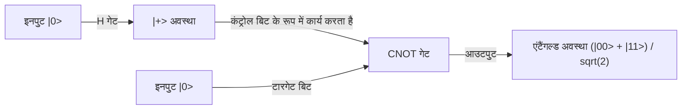

## 1. परिचय: क्वांटम कंप्यूटर द्वारा लाया जाने वाला पैराडाइम शिफ्ट

आधुनिक डिजिटल समाज सूचना की सुरक्षा सुनिश्चित करने के लिए उन्नत एन्क्रिप्शन (क्रिप्टोग्राफी) तकनीकों पर निर्भर करता है। इसके प्रमुख उदाहरण RSA एन्क्रिप्शन और इलिप्टिक कर्व क्रिप्टोग्राफी (ECC) हैं, जो इंटरनेट पर संचार की सुरक्षा करते हैं। ये पब्लिक-की क्रिप्टोग्राफी सिस्टम इस गणितीय विषमता (एकतरफा कार्य के रूप में प्रकृति) पर आधारित हैं कि "बड़े पूर्णांकों का अभाज्य गुणनखंडन (प्राइम फैक्टराइजेशन) करना अत्यंत कठिन है।" यह गणनात्मक बाधा, जिसे सुपरकंप्यूटर का उपयोग करने पर भी हल करने में ब्रह्मांड की आयु जितना समय लग सकता है, हमारी गोपनीयता, वित्तीय लेनदेन और राष्ट्रीय रहस्यों की रक्षा करने वाली एक मजबूत ढाल बनी हुई है।

हालाँकि, एक ऐसी तकनीक मौजूद है जिसमें इस धारणा को जड़ से पलटने की क्षमता है। वह है "क्वांटम कंप्यूटर"।

क्वांटम यांत्रिकी, जो सूक्ष्म (माइक्रो) दुनिया को नियंत्रित करने वाले भौतिक नियमों का सीधे गणना संसाधनों के रूप में उपयोग करती है, पर आधारित यह बिल्कुल नए पैराडाइम का कंप्यूटर, विशिष्ट प्रकार की समस्याओं के लिए क्लासिकल कंप्यूटरों (वर्तमान के सामान्य कंप्यूटरों) की तुलना में अत्यधिक श्रेष्ठ गणना क्षमता प्रदर्शित करता है। इसका सबसे प्रतिष्ठित उदाहरण 1994 में पीटर शोर (Peter Shor) द्वारा खोजा गया "शोर का एल्गोरिदम (Shor's Algorithm)" है। चूंकि यह एल्गोरिदम अभाज्य गुणनखंडन की समस्या को पॉलीनोमिअल समय (polynomial time) में हल कर सकता है, यदि व्यावहारिक पैमाने पर क्वांटम कंप्यूटर वास्तविकता बन जाते हैं, तो वर्तमान में व्यापक रूप से उपयोग किया जाने वाला RSA एन्क्रिप्शन पलक झपकते ही क्रैक (डिक्रिप्ट) हो जाएगा।

इस लेख में, क्वांटम कंप्यूटर इतने शक्तिशाली क्यों हैं, इसकी नींव रखने वाली मूलभूत अवधारणाओं जैसे "क्वांटम बिट्स (Qubit)", "क्वांटम सुपरपोज़िशन" और "क्वांटम एंटैंगलमेंट" से शुरुआत करते हुए, हम बुनियादी क्वांटम गेट्स के संचालन, शोर के एल्गोरिदम के मूल में मौजूद "क्वांटम फूरियर ट्रांसफॉर्म (QFT)" की गणितीय संरचना, और वर्तमान नॉइज़ी इंटरमीडिएट-स्केल क्वांटम (NISQ) उपकरणों के सामने आने वाली त्रुटि सुधार (error correction) चुनौतियों का अत्यंत विस्तृत और व्यवस्थित रूप से विश्लेषण करेंगे।

## 2. क्लासिकल बिट और क्वांटम बिट (Qubit) के बीच निर्णायक अंतर

### 2.1 क्लासिकल बिट: 0 या 1 की नियतात्मक (Deterministic) दुनिया
हम प्रतिदिन जिन स्मार्टफोन और पीसी (PC) आदि जैसे क्लासिकल कंप्यूटरों का उपयोग करते हैं, वे "बिट (Bit)" को सूचना की सबसे छोटी इकाई मानते हैं। क्लासिकल बिट, ट्रांजिस्टर के वोल्टेज के उच्च या निम्न स्तर का उपयोग करते हुए, हमेशा "0" या "1" में से किसी एक स्पष्ट अवस्था में रहता है। यदि हमारे पास N क्लासिकल बिट्स हैं, तो वे $2^N$ संभावित अवस्थाओं का प्रतिनिधित्व कर सकते हैं, लेकिन किसी विशिष्ट क्षण में, सिस्टम उनमें से केवल "एक ही अवस्था" को बनाए रख सकता है। गणना करने का अर्थ इस नियतात्मक अवस्था को लॉजिक गेट्स (AND, OR, NOT आदि) से गुजार कर दूसरी अवस्था में परिवर्तित करने की प्रक्रिया के अलावा और कुछ नहीं है।

### 2.2 क्वांटम बिट (Qubit): अनंत संभावनाओं को समाहित करने वाली अवस्था
दूसरी ओर, क्वांटम कंप्यूटर में सूचना की सबसे छोटी इकाई "क्वांटम बिट (Qubit)" क्लासिकल बिट से बिल्कुल अलग व्यवहार करती है। क्वांटम बिट्स को भौतिक रूप से क्वांटम यांत्रिक टू-लेवल सिस्टम (two-level systems) का उपयोग करके लागू किया जाता है, जैसे कि इलेक्ट्रॉन का स्पिन (ऊपर/नीचे), फोटॉन का ध्रुवीकरण (क्षैतिज/ऊर्ध्वाधर), या सुपरकंडक्टिंग सर्किट में करंट की दिशा।

क्वांटम बिट की सबसे बड़ी विशेषता यह है कि इसमें "क्वांटम सुपरपोज़िशन (Quantum Superposition)" का गुण होता है, जो इसे एक ही समय में "0" और "1" दोनों की अवस्थाओं में रहने की अनुमति देता है। गणितीय रूप से, एक क्वांटम बिट की अवस्था $|\psi\rangle$ (जो ब्रा-केट नोटेशन में स्टेट वेक्टर को दर्शाती है), बेसिस स्टेट्स $|0\rangle$ और $|1\rangle$ के लीनियर कॉम्बिनेशन (सम्मिश्र संख्या गुणांकों वाले योग) के रूप में इस प्रकार व्यक्त की जाती है:

$$ |\psi\rangle = \alpha|0\rangle + \beta|1\rangle $$

यहाँ, $\alpha$ और $\beta$ सम्मिश्र संख्याएँ (complex numbers) हैं और इन्हें प्रायिकता आयाम (probability amplitudes) कहा जाता है। ये गुणांक उस प्रायिकता को निर्धारित करते हैं जिसके साथ क्वांटम बिट को मापने पर $|0\rangle$ या $|1\rangle$ प्राप्त होगा। विशेष रूप से, $|0\rangle$ देखे जाने की प्रायिकता $|\alpha|^2$ है, और $|1\rangle$ देखे जाने की प्रायिकता $|\beta|^2$ है। चूंकि कुल प्रायिकता 1 होनी चाहिए, यह निम्नलिखित सामान्यीकरण शर्त (normalization condition) को पूरा करता है:

$$ |\alpha|^2 + |\beta|^2 = 1 $$

### 2.3 ब्लोच स्फीयर (Bloch Sphere) द्वारा विज़ुअलाइज़ेशन
एकल क्वांटम बिट की अवस्था को ज्यामितीय रूप से एक इकाई गोले की सतह पर एक बिंदु के रूप में देखा जा सकता है जिसे "ब्लोच स्फीयर (Bloch Sphere)" कहा जाता है। यदि उत्तरी ध्रुव को $|0\rangle$ और दक्षिणी ध्रुव को $|1\rangle$ माना जाए, तो गोले की सतह पर स्थित कोई भी बिंदु एक वैध क्वांटम अवस्था का प्रतिनिधित्व करता है। जबकि एक क्लासिकल बिट केवल उत्तरी ध्रुव या दक्षिणी ध्रुव के 2 बिंदुओं पर ही रह सकता है, एक क्वांटम बिट गोलाकार सतह के निरंतर, अनंत बिंदुओं पर कहीं भी मौजूद हो सकता है। यह निरंतरता ही क्वांटम गणना में समृद्ध अभिव्यक्ति शक्ति लाने वाले स्रोतों में से एक है।

## 3. क्वांटम कंप्यूटिंग का मूल: सुपरपोज़िशन और क्वांटम एंटैंगलमेंट

### 3.1 घातांकीय (Exponential) सूचना अभिव्यक्ति शक्ति
क्वांटम बिट्स का वास्तविक मूल्य तब सामने आता है जब कई क्वांटम बिट्स को एक साथ मिलाया जाता है। यदि 1 क्वांटम बिट 2 अवस्थाओं के सुपरपोज़िशन का प्रतिनिधित्व कर सकता है, तो 2 क्वांटम बिट्स 4 अवस्थाओं: $|00\rangle, |01\rangle, |10\rangle, |11\rangle$ के सुपरपोज़िशन का प्रतिनिधित्व कर सकते हैं। सामान्य तौर पर, N क्वांटम बिट्स का एक सिस्टम $2^N$ बेसिस स्टेट्स के लीनियर कॉम्बिनेशन के रूप में अपनी अवस्था को बनाए रख सकता है।

$$ |\Psi\rangle = c_0|00\dots0\rangle + c_1|00\dots1\rangle + \dots + c_{2^N-1}|11\dots1\rangle $$

यह आश्चर्यजनक है। केवल 300 क्वांटम बिट्स के साथ, आप $2^{300}$ अवस्थाओं के सुपरपोज़िशन को व्यक्त कर सकते हैं, और यह संख्या अवलोकन योग्य ब्रह्मांड में मौजूद सभी परमाणुओं की संख्या (लगभग $10^{80}$) से कहीं अधिक है। यदि आप इसे किसी क्लासिकल कंप्यूटर पर अनुकरण (simulate) करने का प्रयास करते हैं, तो आपको मेमोरी में $2^{300}$ सम्मिश्र संख्याओं को स्टोर करना होगा, जो भौतिक रूप से असंभव है। क्वांटम कंप्यूटर एक साथ समानांतर में इस विशाल हिल्बर्ट स्पेस (स्टेट स्पेस) के सभी पतों (addresses) तक पहुंच कर गणना को आगे बढ़ा सकता है।

### 3.2 क्वांटम एंटैंगलमेंट (Quantum Entanglement)
क्वांटम गणना के लिए आवश्यक एक और अजीब घटना "क्वांटम एंटैंगलमेंट" है। यह एक ऐसी घटना है जहाँ दो या दो से अधिक क्वांटम बिट्स एक-दूसरे से इतनी दृढ़ता से जुड़ जाते हैं कि उनकी अवस्थाओं का स्वतंत्र रूप से वर्णन नहीं किया जा सकता। आइए "बेल स्टेट (Bell State)" पर विचार करें, जो सबसे सरल क्वांटम एंटैंगलमेंट अवस्था है।

$$ |\Phi^+\rangle = \frac{1}{\sqrt{2}} (|00\rangle + |11\rangle) $$

इस अवस्था में, यदि पहले क्वांटम बिट को मापा जाता है और "0" प्राप्त होता है, तो दूसरे क्वांटम बिट की अवस्था भी तुरंत "0" के रूप में निर्धारित हो जाती है। इसके विपरीत, यदि "1" प्राप्त होता है, तो दूसरा भी अनिवार्य रूप से "1" होगा। यह सहसंबंध (correlation) ऐसा प्रतीत होता है कि भले ही 2 क्वांटम बिट्स ब्रह्मांड के विपरीत छोर पर हों, वे प्रकाश की गति से भी तेज गति से तुरंत एक-दूसरे को प्रभावित करते हैं (जिसे आइंस्टीन ने "दूरी पर डरावनी कार्रवाई" या 'spooky action at a distance' कहा था)।

क्वांटम कंप्यूटर इस क्वांटम एंटैंगलमेंट का उपयोग व्यक्तिगत डेटा के बीच जटिल सहसंबंधों को व्यक्त करने और कई गणना मार्गों को अत्यधिक तरीके से इंटरफेयर (हस्तक्षेप) कराने के लिए कर सकते हैं।

## 4. क्वांटम गेट्स: क्वांटम अवस्था में हेरफेर (Manipulation)

क्लासिकल लॉजिक गेट्स के समान, क्वांटम कंप्यूटर भी क्वांटम बिट्स की अवस्थाओं में हेरफेर करने के लिए "क्वांटम गेट्स" का उपयोग करते हैं। गणितीय रूप से, क्वांटम गेट्स को यूनिटरी मैट्रिक्स (unitary matrices) (ऐसे मैट्रिक्स जो $U^\dagger U = I$ को संतुष्ट करते हैं) के रूप में दर्शाया जाता है, और ये क्वांटम स्टेट वेक्टर्स पर रोटेशन ऑपरेशन के रूप में कार्य करते हैं। यहाँ कुछ विशिष्ट क्वांटम गेट्स का परिचय दिया गया है।

### 4.1 पाउली गेट्स (X, Y, Z)
- **X गेट (क्वांटम NOT गेट)**: यह $|0\rangle$ को $|1\rangle$ में और $|1\rangle$ को $|0\rangle$ में पलट (flip) देता है। यह ब्लोच स्फीयर के X-अक्ष के चारों ओर 180-डिग्री के घुमाव (रोटेशन) के बराबर है।
- **Z गेट (फेज शिफ्ट गेट)**: यह $|0\rangle$ को ज्यों का त्यों छोड़ देता है, लेकिन $|1\rangle$ के फेज को पलट देता है (गुणांक को -1 से गुणा करता है)।
- **Y गेट**: यह X और Z के संयोजन के बराबर है, और Y-अक्ष के चारों ओर 180-डिग्री का घुमाव करता है।

### 4.2 हैडमार्ड गेट (Hadamard Gate)
यह क्वांटम एल्गोरिदम में सबसे अधिक उपयोग किए जाने वाले गेट्स में से एक है। यह नियतात्मक अवस्थाओं $|0\rangle$ या $|1\rangle$ को पूरी तरह से समान-प्रायिकता वाली सुपरपोज़िशन अवस्था में परिवर्तित कर देता है।

$$ H|0\rangle = \frac{1}{\sqrt{2}}(|0\rangle + |1\rangle) = |+\rangle $$
$$ H|1\rangle = \frac{1}{\sqrt{2}}(|0\rangle - |1\rangle) = |-\rangle $$

सभी क्वांटम बिट्स पर हैडमार्ड गेट लागू करने से एक ऐसी प्रारंभिक अवस्था बनाई जा सकती है जिसमें सभी $2^N$ अवस्थाएं समान रूप से सुपरपोज़्ड (अध्यारोपित) होती हैं, और यह क्वांटम समानांतर कंप्यूटिंग का शुरुआती बिंदु बन जाता है।

### 4.3 CNOT गेट (कंट्रोल्ड-NOT गेट)
यह 2 क्वांटम बिट्स पर कार्य करने वाला एक विशिष्ट गेट है, और क्वांटम एंटैंगलमेंट उत्पन्न करने के लिए अत्यंत आवश्यक है। यह "टारगेट बिट (Target)" पर X गेट (NOT ऑपरेशन) तभी लागू करता है जब "कंट्रोल बिट (Control)" $|1\rangle$ हो। यदि कंट्रोल बिट $|0\rangle$ है, तो यह कुछ नहीं करता है। हैडमार्ड गेट और CNOT गेट को मिलाकर, ऊपर बताई गई बेल स्टेट को आसानी से बनाया जा सकता है।

## 5. शोर का एल्गोरिदम: RSA एन्क्रिप्शन के पतन का परिदृश्य

अब मुख्य विषय पर आते हैं। क्वांटम कंप्यूटर RSA एन्क्रिप्शन को कैसे क्रैक (डिक्रिप्ट) करते हैं? RSA एन्क्रिप्शन की सुरक्षा इस अनुभवजन्य नियम पर निर्भर करती है कि जब एक विशाल समग्र संख्या (composite number) $N$ (दो अभाज्य संख्याओं $p$ और $q$ का गुणनफल, $N = p \times q$) दी जाती है, तो मूल अभाज्य संख्याओं $p$ और $q$ को खोजने की "अभाज्य गुणनखंडन समस्या" को क्लासिकल कंप्यूटरों द्वारा व्यावहारिक समय में हल नहीं किया जा सकता है। वर्तमान में मुख्यधारा की कुंजी लंबाई RSA-2048 में लगभग 600 अंक होते हैं, और इसे क्रैक करने में दुनिया के सबसे तेज़ सुपरकंप्यूटर को भी ब्रह्मांड के जीवनकाल जितना समय लगेगा।

हालाँकि, 1994 में, पीटर शोर ने क्वांटम यांत्रिकी के गुणों का चतुराई से उपयोग करके एक क्वांटम एल्गोरिदम प्रकाशित किया जो इस समस्या को क्लासिकल पॉलीनोमिअल समय (नाटकीय रूप से तेज़ गति) में हल कर सकता है।

### 5.1 एल्गोरिदम का समग्र दृष्टिकोण (क्लासिकल और क्वांटम का सहयोग)
शोर का एल्गोरिदम, वास्तव में, पूरी तरह से केवल क्वांटम गणनाओं के साथ पूरा नहीं होता है, बल्कि क्लासिकल कंप्यूटर गणनाओं और क्वांटम गणनाओं के संयोजन का एक हाइब्रिड दृष्टिकोण अपनाता है। यह संख्या सिद्धांत (number theory) के प्रमेयों का उपयोग करके अभाज्य गुणनखंडन की समस्या को "ऑर्डर-फाइंडिंग प्रॉब्लम (Order-Finding Problem या आवर्त खोजने की समस्या)" में परिवर्तित कर देता है, और इसका आवर्त (period/order) खोजने का जो सबसे कठिन हिस्सा होता है, उसे केवल क्वांटम कंप्यूटर को सौंप देता है।

प्रक्रिया इस प्रकार है:
1. **[क्लासिकल]** एक यादृच्छिक (random) पूर्णांक $a$ ($1 < a < N$) चुनें जो $N$ के साथ सह-अभाज्य (co-prime या जिसका कोई सामान्य भाजक न हो) हो।
2. **[क्लासिकल]** एक फलन (function) $f(x) = a^x \pmod N$ को परिभाषित करें। यह फलन आवर्ती (periodic) व्यवहार प्रदर्शित करता है। अर्थात्, एक न्यूनतम धनात्मक पूर्णांक $r$ (आवर्त) मौजूद होता है, जिससे $f(x+r) = f(x)$ सिद्ध होता है।
3. **[क्वांटम]** क्वांटम कंप्यूटर का उपयोग करके, इस फलन $f(x)$ का आवर्त $r$ उच्च गति से खोजें। (यह शोर के एल्गोरिदम का मूल है)
4. **[क्लासिकल]** जाँच करें कि पाया गया आवर्त $r$ सम (even) है और $a^{r/2} \neq -1 \pmod N$ है (यदि ऐसा नहीं है, तो $a$ को फिर से चुनें)।
5. **[क्लासिकल]** महत्तम समापवर्तक (Greatest Common Divisor) $\text{gcd}(a^{r/2} \pm 1, N)$ की गणना करें। इस गणना का परिणाम वे अभाज्य गुणनखंड $p$ और $q$ होंगे जिन्हें आप $N$ के लिए खोज रहे थे।

### 5.2 आवर्त (Period) जानने पर अभाज्य गुणनखंड कैसे पता चलते हैं?
आइए एक छोटी गणितीय व्याख्या जोड़ें। मान लीजिए कि एक सम आवर्त $r$ पाया जाता है जिसके लिए $a^r \equiv 1 \pmod N$ है। इस समीकरण को रूपांतरित करने पर:
$$ a^r - 1 \equiv 0 \pmod N $$
$$ (a^{r/2} - 1)(a^{r/2} + 1) \equiv 0 \pmod N $$
इसका अर्थ है कि $(a^{r/2} - 1)$ और $(a^{r/2} + 1)$ का गुणनफल $N$ का एक गुणज (multiple) है। इसलिए, इनमें से किसी एक पद (term) और $N$ के बीच महत्तम समापवर्तक (जिसे यूक्लिडियन एल्गोरिदम के साथ पलक झपकते ही गणना की जा सकती है) का पता लगाकर, हम $N$ के अभाज्य गुणनखंडों (गैर-तुच्छ भाजक) को कुशलतापूर्वक निकाल सकते हैं।

## 6. क्वांटम फूरियर ट्रांसफॉर्म (QFT): इंटरफेरेंस (हस्तक्षेप) द्वारा सही उत्तर निकालना

समस्या यह है, "आवर्त $r$ को तेज़ गति से कैसे खोजा जाए?" क्लासिकल कंप्यूटरों में, फलन $f(x) = a^x \pmod N$ की क्रमिक रूप से $x=1, 2, 3 \dots$ के लिए गणना करके आवर्त खोजने के अलावा कोई विकल्प नहीं है, जिसमें घातांकीय (exponential) समय लगता है। यहीं पर क्वांटम कंप्यूटर का "सुपरपोज़िशन" और "इंटरफेरेंस (हस्तक्षेप)" अपनी शक्ति दिखाते हैं।

### 6.1 क्वांटम समानांतरता (Quantum Parallelism) द्वारा एक साथ गणना
सबसे पहले, क्वांटम कंप्यूटर हैडमार्ड गेट का उपयोग करके इनपुट रजिस्टर में $0$ से $2^m-1$ (पर्याप्त रूप से बड़ी संख्या) तक के सभी पूर्णांकों $x$ की अवस्थाओं को समान रूप से सुपरपोज़्ड अवस्था में बनाता है।
फिर, इस पूरी सुपरपोज़्ड अवस्था के खिलाफ फलन $f(x) = a^x \pmod N$ को क्वांटम सर्किट (मॉड्यूलर एक्सपोनेंशिएशन सर्किट) के रूप में केवल एक बार निष्पादित (execute) किया जाता है। तब, क्वांटम समानांतरता के कारण, सभी $x$ के लिए $f(x)$ के उत्तर दूसरे रजिस्टर में एक साथ गिने जाते हैं और क्वांटम एंटैंगल्ड अवस्था के रूप में रखे जाते हैं।

$$ |\psi\rangle = \frac{1}{\sqrt{2^m}} \sum_{x=0}^{2^m-1} |x\rangle |a^x \pmod N\rangle $$

### 6.2 अवलोकन (Measurement) की समस्या: समानांतर गणना का जाल
आप सोच सकते हैं, "शानदार! मैंने एक ही बार में सभी उत्तरों की गणना कर ली है!" हालाँकि, क्वांटम यांत्रिकी का एक क्रूर नियम है: "जब आप अवलोकन (measure) करते हैं, तो सुपरपोज़िशन अवस्था टूट जाती है और एक यादृच्छिक (random) अवस्था में ढह (collapse) जाती है।" भले ही आपने समानांतर गणना कर ली हो, यदि आप इसे सीधे मापते हैं, तो आपको केवल यादृच्छिक $x$ के लिए एक एकल जोड़ा $(x, a^x \bmod N)$ प्राप्त होगा, जो एक बार क्लासिकल गणना चलाने के समान ही परिणाम है। इस तरह से आवर्त $r$ की पूरी तस्वीर बिल्कुल भी समझ नहीं आती है।

### 6.3 तरंग का इंटरफेरेंस (Wave Interference): सही उत्तर को बढ़ाना और गलत उत्तर को रद्द करना
यहीं पर "क्वांटम फूरियर ट्रांसफॉर्म (Quantum Fourier Transform, QFT)" तस्वीर में आता है। QFT क्लासिकल डिस्क्रीट फूरियर ट्रांसफॉर्म (Discrete Fourier Transform) का एक क्वांटम संस्करण है, लेकिन यह डेटा की सरणियों (arrays) पर नहीं, बल्कि क्वांटम अवस्थाओं के प्रायिकता आयामों (सम्मिश्र गुणांकों) पर सीधे कार्य करता है।

जिस तरह ध्वनि तरंगें ओवरलैप होकर तेज़ होती हैं या एक-दूसरे को रद्द कर देती हैं, उसी तरह क्वांटम अवस्थाओं में भी सम्मिश्र आयामों (complex amplitudes) के साथ "तरंगों" का गुण होता है। जब आवधिकता (periodicity) वाली क्वांटम अवस्थाओं पर QFT लागू किया जाता है, तो यह तरंग "इंटरफेरेंस (हस्तक्षेप)" की भौतिक घटना का कारण बनता है। विशेष रूप से, यह उन विशिष्ट अवस्थाओं के प्रायिकता आयाम को नाटकीय रूप से बढ़ाता है जिनमें आवर्त $r$ के बारे में मजबूत जानकारी होती है (जहाँ तरंग की चोटियाँ और चोटियाँ ओवरलैप होती हैं - रचनात्मक हस्तक्षेप या constructive interference), और अप्रासंगिक अवस्थाओं के प्रायिकता आयाम को शून्य तक रद्द करने का काम करता है (जहाँ तरंग की चोटियाँ और गर्त ओवरलैप होते हैं - विनाशकारी हस्तक्षेप या destructive interference)।

जब QFT लागू करने के बाद अवलोकन (माप) किया जाता है, तो किसी यादृच्छिक मान के बजाय, उच्च प्रायिकता के साथ "$2^m / r$ के गुणज के करीब एक मान" मापा जाता है। इस माप परिणाम से, निरंतर भिन्न विस्तार (continued fraction expansion) नामक एक क्लासिकल गणितीय तकनीक का उपयोग करके अत्यंत उच्च सटीकता के साथ आवर्त $r$ की रिवर्स-गणना (reverse-calculate) करना संभव हो जाता है।

शोर के एल्गोरिदम की प्रतिभाशाली बात यह है कि यह सीधे मध्यवर्ती गणना परिणामों को जानने का प्रयास नहीं करता है, बल्कि इसने एक ऐसा तंत्र बनाया है जो तरंग इंटरफेरेंस का उपयोग करके "समग्र गणना परिणामों (वैश्विक संरचना) में छिपी आवधिकता" को ही निकालता है।

## 7. NISQ युग और त्रुटि सुधार: वास्तविक क्वांटम कंप्यूटर की बाधाएँ

सिद्धांत रूप में, यह सिद्ध हो चुका है कि क्वांटम कंप्यूटर RSA एन्क्रिप्शन को नष्ट कर सकते हैं। तो फिर, कल ही बैंकिंग सिस्टम ध्वस्त क्यों नहीं हो जाते? इसका कारण यह है कि क्वांटम कंप्यूटर हार्डवेयर का निर्माण मानव इतिहास की सबसे कठिन इंजीनियरिंग चुनौतियों में से एक है।

### 7.1 डिकोहीरेंस (क्वांटम अवस्था का पतन)
क्वांटम बिट्स का सुपरपोज़िशन और क्वांटम एंटैंगलमेंट अत्यंत नाजुक अवस्थाएँ हैं। जैसे ही वे बाहरी वातावरण से जरा से भी शोर (हस्तक्षेप) के संपर्क में आते हैं, जैसे गर्मी, विद्युत चुम्बकीय तरंगें, ब्रह्मांडीय किरणें, या छोटी अशुद्धियाँ, क्वांटम अवस्था ढह जाती है और क्लासिकल अवस्था में गिर जाती है। इस घटना को "डिकोहीरेंस (Decoherence)" कहा जाता है। यदि गणना पूरी होने से पहले डिकोहीरेंस होता है, तो इसके परिणामस्वरूप त्रुटि (error) होगी। यही कारण है कि वर्तमान में क्वांटम बिट्स को डाइल्यूशन रेफ्रिजरेटर (dilution refrigerators) के अंदर सुरक्षित रखा जाता है जो कुछ मिलीकेल्विन (परम शून्य के करीब) का क्रायोजेनिक (अत्यंत ठंडा) वातावरण बनाए रखते हैं।

### 7.2 NISQ (नॉइज़ी इंटरमीडिएट-स्केल क्वांटम) उपकरण
वर्तमान क्वांटम कंप्यूटरों को "NISQ (नॉइज़ी इंटरमीडिएट-स्केल क्वांटम उपकरण)" कहा जाता है। उनके पास दसियों से लेकर सैकड़ों क्वांटम बिट्स होते हैं, लेकिन शोर इतना अधिक होता है कि वे लंबी गणनाएँ (गहरे क्वांटम सर्किट) नहीं कर सकते। शोर के एल्गोरिदम के साथ RSA-2048 को डिक्रिप्ट करने के लिए हजारों "परफेक्ट" क्वांटम बिट्स और लाखों गेट ऑपरेशन्स की आवश्यकता होती है। वर्तमान हार्डवेयर की गेट फ़िडेलिटी (त्रुटि दर) के साथ, गणना के मध्य में त्रुटियाँ जमा हो जाती हैं, और परिणाम केवल शोर बनकर रह जाता है।

### 7.3 क्वांटम त्रुटि सुधार (Quantum Error Correction) और लॉजिकल क्वांटम बिट्स
इस समस्या को हल करने की कुंजी "क्वांटम त्रुटि सुधार (Quantum Error Correction, QEC)" है। क्लासिकल कंप्यूटरों में, केवल जानकारी की प्रतिलिपि (कॉपी) बनाकर त्रुटियों को रोका जाता है, लेकिन क्वांटम यांत्रिकी में "नो-क्लोनिंग थ्योरम (No-Cloning Theorem)" के कारण, किसी अज्ञात क्वांटम अवस्था की सटीक रूप से प्रतिलिपि बनाना निषिद्ध है।

इसलिए, क्वांटम त्रुटि सुधार "सरफेस कोड (Surface Code)" जैसी उन्नत टोपोलॉजिकल कोडिंग विधियों का उपयोग करता है। यह एक ऐसी तकनीक है जो सैकड़ों या हजारों भौतिक क्वांटम बिट्स को क्वांटम एंटैंगल्ड अवस्था में बांधती है और "1 आभासी और परफेक्ट क्वांटम बिट (लॉजिकल क्वांटम बिट)" बनाती है जो बहुमत-वोटिंग जैसे तंत्र के माध्यम से त्रुटियों का पता लगाती है और उन्हें ठीक करती है।

RSA एन्क्रिप्शन को डिक्रिप्ट करने के लिए, ऐसे हजारों लॉजिकल क्वांटम बिट्स की आवश्यकता होती है। यह अनुमान लगाया गया है कि इसके लिए लाखों के पैमाने पर भौतिक क्वांटम बिट्स की आवश्यकता होगी, और वर्तमान में दसियों से लेकर सैकड़ों भौतिक बिट्स के चरण को देखते हुए, विशेषज्ञों की आम राय यह है कि इसके व्यावहारिक अनुप्रयोग (FTQC: फॉल्ट-टॉलरेंट क्वांटम कंप्यूटर का अहसास) में अभी भी 10 वर्ष या उससे अधिक, या शायद कई दशक लग सकते हैं।

## 8. पोस्ट-क्वांटम क्रिप्टोग्राफी (PQC) की ओर संक्रमण (Transition)

यह ठीक से कोई नहीं जानता कि "Q-Day" (वह दिन जब क्वांटम कंप्यूटर द्वारा एन्क्रिप्शन क्रैक किया जाएगा), जब क्वांटम कंप्यूटर का खतरा वास्तविकता बन जाएगा, कब आएगा। हालाँकि, "अभी इंटरसेप्ट करें और सेव करें, बाद में जब क्वांटम कंप्यूटर पूरा हो जाए तब डिक्रिप्ट करें (Store now, decrypt later)" जैसी हमले की तकनीक के मौजूद होने के कारण, राष्ट्रीय रहस्यों और दीर्घकालिक गोपनीय जानकारी की सुरक्षा पहले से ही खतरे में है।

इसका मुकाबला करने के लिए, NIST (नेशनल इंस्टीट्यूट ऑफ स्टैंडर्ड्स एंड टेक्नोलॉजी, अमेरिका) सहित अंतर्राष्ट्रीय समुदाय, नई गणितीय समस्याओं (जैसे लैटिस क्रिप्टोग्राफी) पर आधारित "पोस्ट-क्वांटम क्रिप्टोग्राफी (PQC)" के मानकीकरण (standardization) और संक्रमण कार्य को तेजी से आगे बढ़ा रहा है, जिन्हें क्वांटम कंप्यूटरों द्वारा भी डिक्रिप्ट करना मुश्किल है। उस भविष्य की तैयारी के लिए जहाँ क्वांटम कंप्यूटर एन्क्रिप्शन को नष्ट कर देंगे, हमने पहले से ही नई ढालों का निर्माण करना शुरू कर दिया है।

## 9. निष्कर्ष: सूचना विज्ञान के नए क्षितिज

क्वांटम कंप्यूटर केवल "पारंपरिक कंप्यूटरों का एक तेज़ संस्करण" नहीं हैं। वे पूरी तरह से एक नए वैचारिक उपकरण (conceptual device) हैं जो क्वांटम यांत्रिकी, जो प्राकृतिक दुनिया का अंतिम नियम है, को सीधे एल्गोरिदम के रूप में व्यक्त करते हैं और सूचना प्रसंस्करण (information processing) की सीमाओं का विस्तार करते हैं। शोर का एल्गोरिदम उनके भयानक क्षमता को हमें दिखाने वाला पहला मील का पत्थर था।

शोर (noise) से संघर्ष और स्केलिंग (scaling up) की कठिनाई जैसी पार करने वाली दीवारें अभी भी बहुत ऊंची खड़ी हैं। हालाँकि, यह क्षेत्र, जहाँ भौतिकी, गणित, सूचना विज्ञान और सामग्री इंजीनियरिंग (materials engineering) का ज्ञान एकत्रित हुआ है, निस्संदेह मानवता की अगली तकनीकी छलांग का केंद्र बन जाएगा। हम इस बात से नज़र नहीं हटा सकते कि क्वांटम दुनिया की रहस्यमय घटनाएँ हमारे डिजिटल समाज की नींव को किस प्रकार फिर से लिखेंगी, और इसकी विकास प्रक्रिया कैसे आगे बढ़ेगी।
