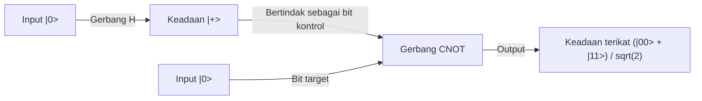

## 1. Pendahuluan: Pergeseran Paradigma yang Dibawa oleh Komputer Kuantum

Masyarakat digital modern bergantung pada teknologi kriptografi canggih untuk menjamin keamanan informasi. Perwakilan utamanya adalah kriptografi RSA dan kriptografi kurva eliptik yang melindungi komunikasi di internet. Metode kriptografi kunci publik ini didasarkan pada asimetri matematis (sifatnya sebagai fungsi satu arah) di mana "faktorisasi bilangan bulat yang sangat besar sangatlah sulit" sebagai dasar keamanannya. Dinding komputasi ini, yang diperkirakan akan memakan waktu setara dengan usia alam semesta bahkan jika menggunakan superkomputer, telah menjadi perisai kuat yang melindungi privasi, transaksi keuangan, dan rahasia negara kita.

Namun, ada sebuah teknologi dengan potensi yang dapat meruntuhkan premis ini dari akarnya. Itulah "komputer kuantum".

Mesin komputasi dengan paradigma yang sama sekali baru ini, yang secara langsung menggunakan hukum fisika mekanika kuantum yang mengatur dunia mikro sebagai sumber daya komputasi, menunjukkan kemampuan komputasi yang sangat jauh melampaui komputer klasik (komputer umum saat ini) untuk jenis masalah tertentu. Contoh yang paling ikonik adalah "Algoritma Shor" (Shor's Algorithm) yang ditemukan oleh Peter Shor pada tahun 1994. Karena algoritma ini dapat memecahkan masalah faktorisasi bilangan prima dalam waktu polinomial, jika komputer kuantum skala praktis terwujud, kriptografi RSA yang banyak digunakan saat ini akan segera diretas dalam sekejap mata.

Dalam artikel ini, kami akan menggali dan menjelaskan secara sangat rinci dan sistematis mengapa komputer kuantum begitu kuat, dimulai dari konsep dasar yang menjadi fondasinya seperti "Qubit" (Quantum bit), "Superposisi Kuantum", dan "Keterikatan Kuantum" (Quantum Entanglement), hingga operasi gerbang kuantum dasar, struktur matematis "Transformasi Fourier Kuantum" (QFT) yang menjadi inti dari algoritma Shor, serta tantangan koreksi kesalahan yang dihadapi oleh perangkat kuantum skala menengah berderau (NISQ) saat ini.

## 2. Perbedaan Krusial antara Bit Klasik dan Qubit (Quantum Bit)

### 2.1 Bit Klasik: Dunia Deterministik 0 atau 1
Komputer klasik seperti ponsel pintar dan PC yang biasa kita gunakan, menjadikan "Bit" sebagai unit informasi terkecil. Bit klasik selalu mengambil salah satu status yang jelas antara "0" atau "1", memanfaatkan tinggi rendahnya tegangan transistor dan sebagainya. Jika ada N bit klasik, mereka dapat mewakili $2^N$ kemungkinan keadaan, tetapi pada suatu momen tertentu, sistem hanya dapat menahan "satu keadaan saja" dari kemungkinan-kemungkinan tersebut. Melakukan komputasi tidak lain adalah proses melewatkan keadaan deterministik ini melalui gerbang logika (AND, OR, NOT, dll.) dan mengubahnya ke keadaan lain.

### 2.2 Qubit: Keadaan yang Mengandung Kemungkinan Tak Terbatas
Di sisi lain, unit informasi terkecil komputer kuantum, yaitu "Qubit" (Quantum bit), berperilaku dengan cara yang sama sekali berbeda dari bit klasik. Qubit diimplementasikan secara fisik menggunakan sistem mekanika kuantum dua tingkat, seperti spin elektron (atas/bawah), polarisasi foton (horizontal/vertikal), atau arah arus dalam sirkuit superkonduktor.

Ciri terbesar dari qubit adalah memiliki sifat "Superposisi Kuantum" (Quantum Superposition) yang memungkinkan untuk mengambil keadaan "0" dan "1" secara bersamaan. Secara matematis, keadaan qubit $|\psi\rangle$ (mewakili vektor keadaan dalam notasi bra-ket) diekspresikan sebagai kombinasi linier (jumlah berdasarkan koefisien bilangan kompleks) dari keadaan basis $|0\rangle$ dan $|1\rangle$ sebagai berikut:

$$ |\psi\rangle = \alpha|0\rangle + \beta|1\rangle $$

Di sini, $\alpha$ dan $\beta$ adalah bilangan kompleks dan disebut amplitudo probabilitas. Koefisien-koefisien ini menentukan probabilitas memperoleh $|0\rangle$ atau $|1\rangle$ ketika qubit diukur. Secara spesifik, probabilitas mengamati $|0\rangle$ adalah $|\alpha|^2$, dan probabilitas mengamati $|1\rangle$ adalah $|\beta|^2$. Karena jumlah total probabilitas harus bernilai 1, kondisi normalisasi berikut terpenuhi:

$$ |\alpha|^2 + |\beta|^2 = 1 $$

### 2.3 Visualisasi dengan Bola Bloch
Keadaan sebuah qubit tunggal dapat divisualisasikan secara geometris sebagai suatu titik pada permukaan bola satuan yang disebut "Bola Bloch" (Bloch Sphere). Jika kutub utara adalah $|0\rangle$ dan kutub selatan adalah $|1\rangle$, maka setiap titik di permukaan bola mewakili keadaan kuantum yang valid. Sementara bit klasik hanya dapat mengambil salah satu dari dua titik, kutub utara atau kutub selatan, qubit dapat berada di mana saja pada jumlah titik kontinu tak terhingga di permukaan bola. Kontinuitas inilah yang menjadi salah satu sumber yang membawa kekuatan ekspresi yang kaya pada komputasi kuantum.

## 3. Inti dari Komputasi Kuantum: Superposisi dan Keterikatan Kuantum

### 3.1 Kekuatan Ekspresi Informasi yang Eksponensial
Nilai sesungguhnya dari qubit akan terlihat ketika beberapa qubit digabungkan. Jika satu qubit dapat mewakili superposisi dari dua keadaan, maka dua qubit dapat mewakili superposisi dari empat keadaan: $|00\rangle, |01\rangle, |10\rangle, |11\rangle$. Secara umum, sistem N qubit dapat menyimpan keadaan sebagai kombinasi linier dari $2^N$ keadaan basis.

$$ |\Psi\rangle = c_0|00\dots0\rangle + c_1|00\dots1\rangle + \dots + c_{2^N-1}|11\dots1\rangle $$

Ini sungguh menakjubkan. Dengan hanya 300 qubit, kita dapat mewakili superposisi dari $2^{300}$ keadaan, sebuah angka yang jauh melampaui jumlah total atom yang ada di alam semesta yang dapat diamati (sekitar $10^{80}$). Jika kita mencoba mensimulasikan ini di komputer klasik, kita perlu menyimpan $2^{300}$ bilangan kompleks dalam memori, yang secara fisik mustahil. Komputer kuantum dapat mengakses dan melanjutkan komputasi di semua alamat ruang Hilbert (ruang keadaan) yang luas ini secara paralel dalam waktu yang bersamaan.

### 3.2 Keterikatan Kuantum (Quantum Entanglement)
Fenomena aneh lainnya yang sangat penting bagi komputasi kuantum adalah "keterikatan kuantum". Ini adalah fenomena di mana dua atau lebih qubit terhubung dengan sangat kuat sehingga keadaan mereka tidak dapat dideskripsikan secara independen satu sama lain. Mari kita pertimbangkan "Keadaan Bell" (Bell State), keadaan keterikatan kuantum yang paling sederhana.

$$ |\Phi^+\rangle = \frac{1}{\sqrt{2}} (|00\rangle + |11\rangle) $$

Dalam keadaan ini, jika qubit pertama diukur dan "0" diperoleh, keadaan qubit yang lain juga akan langsung dikonfirmasi sebagai "0". Sebaliknya, jika "1" yang diperoleh, maka yang satunya juga pasti akan menjadi "1". Korelasi ini tampak saling memengaruhi secara instan lebih cepat dari kecepatan cahaya, bahkan jika kedua qubit terpisah di sisi alam semesta yang berlawanan (Einstein menyebutnya sebagai "aksi seram pada jarak tertentu").

Dengan memanfaatkan keterikatan kuantum ini, komputer kuantum dapat mewakili korelasi yang kompleks antara masing-masing data individu dan membuat banyak jalur komputasi saling berinterferensi secara tingkat tinggi.

## 4. Gerbang Kuantum: Memanipulasi Keadaan Kuantum

Sama halnya dengan gerbang logika klasik, komputer kuantum menggunakan "gerbang kuantum" untuk memanipulasi keadaan qubit. Secara matematis, gerbang kuantum direpresentasikan sebagai matriks uniter (matriks yang memenuhi $U^\dagger U = I$) dan bertindak sebagai operasi rotasi pada vektor keadaan kuantum. Berikut ini adalah beberapa gerbang kuantum yang representatif.

### 4.1 Gerbang Pauli (X, Y, Z)
- **Gerbang X (Gerbang NOT Kuantum)**: Membalik $|0\rangle$ menjadi $|1\rangle$, dan $|1\rangle$ menjadi $|0\rangle$. Setara dengan rotasi 180 derajat di sekitar sumbu X pada Bola Bloch.
- **Gerbang Z (Gerbang Pergeseran Fase)**: Membiarkan $|0\rangle$ tetap sama, tetapi membalik fase $|1\rangle$ (mengalikan koefisien dengan -1).
- **Gerbang Y**: Setara dengan kombinasi X dan Z, serta melakukan rotasi 180 derajat di sekitar sumbu Y.

### 4.2 Gerbang Hadamard (Hadamard Gate)
Ini adalah salah satu gerbang yang paling sering digunakan dalam algoritma kuantum. Ia mengubah keadaan deterministik $|0\rangle$ atau $|1\rangle$ menjadi keadaan superposisi dengan probabilitas yang benar-benar sama.

$$ H|0\rangle = \frac{1}{\sqrt{2}}(|0\rangle + |1\rangle) = |+\rangle $$
$$ H|1\rangle = \frac{1}{\sqrt{2}}(|0\rangle - |1\rangle) = |-\rangle $$

Dengan menerapkan gerbang Hadamard ke semua qubit, kita dapat menciptakan keadaan awal di mana ke-$2^N$ keadaan saling tumpang tindih secara merata, dan inilah yang menjadi titik awal dari komputasi paralel kuantum.

### 4.3 Gerbang CNOT (Gerbang NOT Terkendali)
Ini adalah gerbang representatif yang bekerja pada 2 qubit dan sangat penting untuk menghasilkan keterikatan kuantum. Gerbang ini menerapkan gerbang X (operasi NOT) pada "Bit Target" (Target) HANYA jika "Bit Kontrol" (Control) bernilai $|1\rangle$. Jika bit kontrol bernilai $|0\rangle$, ia tidak melakukan apa-apa. Dengan menggabungkan gerbang Hadamard dan gerbang CNOT, kita dapat dengan mudah menghasilkan Keadaan Bell yang telah disebutkan sebelumnya.

## 5. Algoritma Shor: Skenario Keruntuhan Kriptografi RSA

Sekarang kita masuk ke topik utama. Bagaimana komputer kuantum dapat meretas kriptografi RSA? Keamanan kriptografi RSA bergantung pada aturan empiris di mana masalah faktorisasi bilangan prima, yaitu menemukan bilangan prima asli $p$ dan $q$ bila diberikan suatu bilangan komposit besar $N$ (hasil kali dari dua bilangan prima $p$ dan $q$, $N = p \times q$), tidak dapat diselesaikan oleh komputer klasik dalam waktu yang realistis. Pada RSA-2048, yang merupakan panjang kunci arus utama saat ini, jumlah digitnya mencapai sekitar 600 digit, dan superkomputer tercepat di dunia pun akan membutuhkan waktu setara dengan umur alam semesta.

Namun, pada tahun 1994, Peter Shor menerbitkan algoritma kuantum yang dapat memecahkan masalah ini dalam waktu polinomial klasik (percepatan yang dramatis) dengan memanfaatkan sifat mekanika kuantum dengan sangat cerdik.

### 5.1 Gambaran Umum Algoritma (Kolaborasi antara Klasik dan Kuantum)
Algoritma Shor sebenarnya tidak diselesaikan sepenuhnya hanya dengan komputasi kuantum semata, melainkan menggunakan pendekatan hibrida yang menggabungkan komputasi komputer klasik dan komputasi kuantum. Menggunakan teorema dari teori bilangan, algoritma ini mengubah masalah faktorisasi menjadi "Masalah Pencarian Periode" (Order-Finding Problem), dan menyerahkan bagian yang sangat sulit dari menemukan periode tersebut ke komputer kuantum.

Prosedurnya adalah sebagai berikut:
1. **[Klasik]** Pilih bilangan bulat acak $a$ ($1 < a < N$) yang koprima dengan $N$ (tidak memiliki pembagi persekutuan terbesar selain 1).
2. **[Klasik]** Definisikan fungsi $f(x) = a^x \pmod N$. Fungsi ini berperilaku secara periodik. Artinya, ada bilangan bulat positif terkecil $r$ (periode) di mana $f(x+r) = f(x)$ berlaku.
3. **[Kuantum]** Menggunakan komputer kuantum, temukan periode $r$ dari fungsi $f(x)$ ini dengan kecepatan tinggi. (Inilah inti dari algoritma Shor)
4. **[Klasik]** Pastikan bahwa periode $r$ yang ditemukan adalah bilangan genap dan bahwa $a^{r/2} \neq -1 \pmod N$ (jika tidak, pilih $a$ yang lain).
5. **[Klasik]** Hitung faktor persekutuan terbesar $\text{gcd}(a^{r/2} \pm 1, N)$. Hasil perhitungan ini akan menjadi faktor prima $p$ dan $q$ dari $N$ yang dicari.

### 5.2 Mengapa Mengetahui Periode Dapat Mengungkapkan Faktor Prima?
Mari kita tambahkan sedikit penjelasan matematis. Misalkan kita menemukan periode genap $r$ sedemikian rupa sehingga $a^r \equiv 1 \pmod N$. Jika kita mentransformasikan persamaan ini:
$$ a^r - 1 \equiv 0 \pmod N $$
$$ (a^{r/2} - 1)(a^{r/2} + 1) \equiv 0 \pmod N $$
Ini berarti bahwa hasil kali dari $(a^{r/2} - 1)$ dan $(a^{r/2} + 1)$ adalah kelipatan dari $N$. Oleh karena itu, dengan menghitung pembagi persekutuan terbesar (yang dapat dihitung dalam sekejap dengan Algoritma Euclidean) antara salah satu dari suku-suku ini dan $N$, kita dapat mengekstrak pembagi prima dari $N$ (pembagi nontrivial) secara efisien.

## 6. Transformasi Fourier Kuantum (QFT): Ekstraksi Jawaban yang Benar melalui Interferensi

Masalahnya adalah, "bagaimana kita bisa menemukan periode $r$ dengan kecepatan tinggi?" Pada komputer klasik, satu-satunya cara untuk menemukan periode adalah dengan menghitung fungsi $f(x) = a^x \pmod N$ secara berurutan untuk $x=1, 2, 3 \dots$, yang akan memakan waktu eksponensial. Di sinilah "superposisi" dan "interferensi" komputer kuantum menunjukkan kekuatannya.

### 6.1 Komputasi Simultan melalui Paralelisme Kuantum
Pertama, komputer kuantum menggunakan gerbang Hadamard untuk menciptakan keadaan di register input di mana semua keadaan bilangan bulat $x$ dari $0$ hingga $2^m-1$ (bilangan yang cukup besar) ditumpangkan secara merata.
Kemudian, untuk keseluruhan keadaan superposisi ini, fungsi $f(x) = a^x \pmod N$ dieksekusi hanya sekali sebagai sirkuit kuantum (sirkuit komputasi eksponensial modular). Kemudian, karena paralelisme kuantum, jawaban untuk $f(x)$ untuk semua $x$ dihitung secara serentak ke register kedua dan ditahan sebagai keadaan terikat kuantum.

$$ |\psi\rangle = \frac{1}{\sqrt{2^m}} \sum_{x=0}^{2^m-1} |x\rangle |a^x \pmod N\rangle $$

### 6.2 Masalah Pengamatan: Perangkap Komputasi Paralel
Anda mungkin berpikir, "Luar biasa! Semua jawaban dihitung sekaligus!" Namun, mekanika kuantum memiliki aturan yang kejam. "Ketika diamati, keadaan superposisi akan runtuh dan menyusut menjadi 1 keadaan acak." Bahkan jika kita telah melakukan komputasi secara paralel, jika kita mengamatinya begitu saja, kita hanya akan mendapatkan pasangan tunggal $(x, a^x \bmod N)$ acak, dan hasil ini tidak ada bedanya dengan menjalankan komputasi klasik sekali. Dengan cara ini, gambaran keseluruhan dari periode $r$ tidak akan tertangkap sama sekali.

### 6.3 Interferensi Gelombang: Memperkuat Jawaban Benar, Membatalkan Jawaban Salah
Di sinilah "Transformasi Fourier Kuantum" (Quantum Fourier Transform, QFT) mulai berperan. QFT adalah versi kuantum dari transformasi Fourier diskrit klasik, tetapi bekerja langsung pada amplitudo probabilitas (koefisien kompleks) dari keadaan kuantum, bukan pada larik data.

Sama seperti gelombang suara yang saling bertumpang tindih lalu bisa saling memperkuat atau meniadakan satu sama lain, keadaan kuantum juga memiliki sifat "gelombang" dengan amplitudo bilangan kompleks. Menerapkan QFT pada keadaan kuantum yang memiliki periodisitas memicu fenomena fisik berupa "interferensi" gelombang. Khususnya, ia bertindak untuk secara dramatis memperkuat amplitudo probabilitas dari keadaan tertentu (di mana puncak dan puncak gelombang bertemu, interferensi konstruktif) yang memiliki informasi kuat tentang periode $r$, dan membatalkan amplitudo probabilitas keadaan yang tidak relevan (di mana puncak dan lembah gelombang bertemu, interferensi destruktif) hingga menjadi nol.

Jika pengamatan dilakukan setelah menerapkan QFT, kita tidak akan mendapatkan nilai acak, melainkan "nilai yang mendekati kelipatan dari $2^m / r$" dengan probabilitas yang tinggi. Dari hasil pengukuran ini, dengan menggunakan metode matematika klasik yang disebut ekspansi pecahan lanjutan (continued fraction expansion), kita dapat menghitung mundur periode $r$ dengan sangat akurat.

Sisi jenius dari algoritma Shor bukanlah pada upaya mencoba mengetahui hasil menengah dari komputasi secara langsung, melainkan dalam membangun mekanisme untuk mengekstrak hanya "periodisitas (struktur global) yang tersembunyi di dalam keseluruhan hasil komputasi" menggunakan interferensi gelombang.

## 7. Era NISQ dan Koreksi Kesalahan: Dinding Komputer Kuantum di Dunia Nyata

Secara teoritis, telah terbukti bahwa komputer kuantum dapat meruntuhkan kriptografi RSA. Jadi, mengapa sistem perbankan tidak akan runtuh besok? Itu karena membangun perangkat keras komputer kuantum adalah salah satu tantangan teknik yang paling sulit dalam sejarah umat manusia.

### 7.1 Dekoherensi (Keruntuhan Keadaan Kuantum)
Superposisi qubit dan keterikatan kuantum adalah keadaan yang sangat rapuh. Pada saat qubit menyentuh gangguan kecil (interferensi) dari lingkungan eksternal seperti panas, gelombang elektromagnetik, sinar kosmik, atau sedikit kotoran sekalipun, keadaan kuantum tersebut akan runtuh dan jatuh ke keadaan klasik. Fenomena ini disebut "dekoherensi". Jika dekoherensi terjadi sebelum komputasi selesai, akan terjadi kesalahan (error). Inilah sebabnya mengapa qubit saat ini dilindungi dalam kulkas dilusi yang menjaga lingkungan dengan suhu ultra-rendah yaitu beberapa milikelvin (mendekati nol mutlak).

### 7.2 Perangkat NISQ (Noisy Intermediate-Scale Quantum)
Komputer kuantum saat ini disebut sebagai perangkat "NISQ (Noisy Intermediate-Scale Quantum)". Walaupun memiliki puluhan hingga ratusan qubit, perangkat ini memiliki terlalu banyak derau (noise) untuk dapat menjalankan komputasi yang panjang (sirkuit kuantum dalam). Memecahkan RSA-2048 dengan algoritma Shor akan membutuhkan ribuan qubit "sempurna" dan jutaan operasi gerbang. Mengingat tingkat akurasi (fidelity) gerbang perangkat keras saat ini, kesalahan akan menumpuk di tengah proses komputasi, dan hasilnya hanya akan menjadi derau belaka.

### 7.3 Koreksi Kesalahan Kuantum dan Qubit Logis
Kunci untuk memecahkan masalah ini adalah "Koreksi Kesalahan Kuantum" (Quantum Error Correction, QEC). Di komputer klasik, kesalahan dicegah hanya dengan menyalin informasi, tetapi di mekanika kuantum, karena adanya "Teorema Tanpa Kloning" (No-Cloning Theorem), menyalin keadaan kuantum yang tidak diketahui secara tepat adalah hal yang dilarang.

Oleh karena itu, koreksi kesalahan kuantum menggunakan teknik pengkodean topologi canggih seperti "Surface Code" (Kode Permukaan). Ini adalah teknologi yang menggabungkan ratusan atau ribuan qubit fisik ke dalam keadaan terikat kuantum, dan menciptakan "satu qubit yang virtual dan sempurna (qubit logis)" yang dapat mendeteksi dan mengoreksi kesalahan melalui mekanisme yang mirip dengan pemungutan suara mayoritas.

Untuk meretas kriptografi RSA, ribuan qubit logis ini akan dibutuhkan. Untuk mencapai ini, diperkirakan bahwa skala jutaan qubit fisik akan diperlukan, dan dilihat dari tahapan perangkat saat ini yang berjumlah belasan hingga ratusan qubit fisik, pandangan umum para ahli adalah bahwa akan memakan waktu lebih dari 10 tahun, atau bahkan beberapa dekade, sebelum komputer ini siap untuk penggunaan praktis (FTQC: terwujudnya komputer kuantum yang toleran terhadap kesalahan).

## 8. Transisi ke Kriptografi Pasca-Kuantum (PQC)

Tidak ada yang tahu persis kapan "Q-Day (Hari Pembobolan Kriptografi oleh Komputer Kuantum)" akan tiba, yaitu hari ketika ancaman komputer kuantum menjadi kenyataan. Namun, mengingat adanya metode serangan "Store now, decrypt later" (Simpan sekarang, dekripsi nanti) di mana informasi disadap hari ini untuk diretas kelak saat komputer kuantum selesai, perlindungan rahasia negara dan informasi rahasia jangka panjang sudah berada di ambang krisis.

Untuk melawan ini, komunitas internasional, termasuk NIST (National Institute of Standards and Technology) Amerika Serikat, dengan cepat memajukan standarisasi dan pekerjaan transisi untuk "Kriptografi Pasca-Kuantum" (Post-Quantum Cryptography, PQC), yang didasarkan pada masalah matematis baru (seperti kriptografi kisi) yang sulit dipecahkan bahkan oleh komputer kuantum. Bersiap untuk masa depan di mana komputer kuantum dapat meruntuhkan enkripsi, kita sudah mulai membangun perisai baru.

## 9. Penutup: Cakrawala Baru dalam Ilmu Informasi

Komputer kuantum bukanlah sekadar "komputer konvensional yang dipercepat". Ini adalah aparatus konseptual yang sama sekali baru, yang mengekspresikan mekanika kuantum yang merupakan hukum hakiki alam secara langsung sebagai algoritma, serta memperluas batas-batas pemrosesan informasi. Algoritma Shor merupakan monumen awal yang menunjukkan potensi mengerikannya ini kepada kita.

Pertempuran melawan derau, tantangan peningkatan skala (scale-up), dan rintangan-rintangan lain yang harus dilampaui masih menjulang tinggi. Namun, bidang di mana kebijaksanaan dalam bidang fisika, matematika, ilmu informasi, dan rekayasa material bertemu ini, tidak diragukan lagi akan menjadi pusat lompatan teknologi umat manusia berikutnya. Kita tidak bisa mengalihkan pandangan dari proses evolusinya, tentang bagaimana fenomena ajaib dari dunia kuantum akan membentuk kembali fondasi dari masyarakat digital kita.
