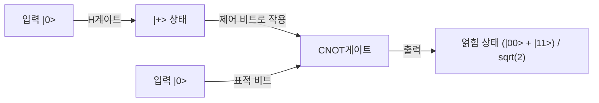

## 1. 머리말: 양자 컴퓨터가 가져올 패러다임 시프트

현대의 디지털 사회는 정보의 안전성을 담보하기 위해 고도의 암호 기술에 의존하고 있습니다. 그 대표적인 예가 인터넷 상의 통신을 보호하는 RSA 암호나 타원 곡선 암호입니다. 이러한 공개키 암호 방식은 '거대한 정수의 소인수 분해는 극히 어렵다'는 수학적인 비대칭성(일방향 함수로서의 성질)을 안전성의 근거로 삼고 있습니다. 슈퍼컴퓨터를 사용하더라도 우주의 나이만큼의 시간이 걸린다고 하는 이 계산의 벽은 우리의 프라이버시나 금융 거래, 국가 기밀을 지키는 견고한 방패가 되어 왔습니다.

하지만 이 전제를 근본부터 뒤엎을 가능성을 품은 기술이 존재합니다. 그것이 바로 '양자 컴퓨터'입니다.

양자 역학이라는, 미시 세계를 지배하는 물리 법칙을 계산 자원으로 직접 이용하는 이 전혀 새로운 패러다임의 계산기는 특정 종류의 문제에 대해 고전 컴퓨터(현재의 일반적인 컴퓨터)를 압도적으로 능가하는 계산 능력을 발휘합니다. 그 가장 상징적인 예가 1994년 피터 쇼어(Peter Shor)가 발견한 '쇼어 알고리즘(Shor's Algorithm)'입니다. 이 알고리즘은 소인수 분해 문제를 다항식 시간에 풀 수 있기 때문에, 실용적인 규모의 양자 컴퓨터가 실현된다면 현재 널리 쓰이고 있는 RSA 암호는 순식간에 해독되고 말 것입니다.

본 문서에서는 양자 컴퓨터가 왜 그토록 강력한지, 그 기반이 되는 '양자 비트(Qubit)', '양자 중첩', '양자 얽힘' 등의 근본적인 개념에서 출발하여, 기본적인 양자 게이트의 동작, 쇼어 알고리즘의 핵심을 이루는 '양자 푸리에 변환(QFT)'의 수학적 구조, 그리고 현재의 노이즈가 있는 중간 규모 양자 디바이스(NISQ)가 직면한 오류 정정 과제까지 극히 상세하고 체계적으로 파헤쳐 해설합니다.

## 2. 고전 비트와 양자 비트(Qubit)의 결정적인 차이

### 2.1 고전 비트: 0 아니면 1인 결정론적 세계
우리가 평소 사용하는 스마트폰이나 PC 등의 고전 컴퓨터는 '비트(Bit)'를 정보의 최소 단위로 합니다. 고전 비트는 트랜지스터의 전압 높낮이 등을 이용하여 항상 '0' 또는 '1' 중 어느 한쪽의 명확한 상태를 취합니다. N개의 고전 비트가 있다면 $2^N$ 가지의 상태를 표현할 수 있지만, 어떤 특정한 순간에 시스템이 유지할 수 있는 것은 그 중 '단 1개의 상태'뿐입니다. 계산을 한다는 것은 이 결정론적인 상태를 논리 게이트(AND, OR, NOT 등)에 통과시켜 다른 상태로 변환해 나가는 과정에 다름 아닙니다.

### 2.2 양자 비트(Qubit): 무한한 가능성을 내포한 상태
반면, 양자 컴퓨터의 정보 최소 단위인 '양자 비트(Qubit)'는 고전 비트와는 전혀 다른 움직임을 보입니다. 양자 비트는 전자의 스핀(위 방향/아래 방향), 광자의 편광(수평/수직), 또는 초전도 회로에서의 전류 방향 등 양자 역학적인 2준위계를 이용하여 물리적으로 구현됩니다.

양자 비트의 가장 큰 특징은 '0'과 '1'의 상태를 동시에 취할 수 있는 '양자 중첩(Quantum Superposition)' 성질을 가진다는 것입니다. 수학적으로 양자 비트의 상태 $|\psi\rangle$(브라-켓 표기법에서 상태 벡터를 나타냄)는 기저 상태 $|0\rangle$ 과 $|1\rangle$ 의 선형 결합(복소수 계수에 의한 합)으로서 다음과 같이 표현됩니다.

$$ |\psi\rangle = \alpha|0\rangle + \beta|1\rangle $$

여기서 $\alpha$ 와 $\beta$ 는 복소수이며, 확률 진폭이라고 불립니다. 이들 계수는 양자 비트를 측정했을 때 $|0\rangle$ 또는 $|1\rangle$ 이 얻어질 확률을 결정합니다. 구체적으로 $|0\rangle$ 이 관측될 확률은 $|\alpha|^2$, $|1\rangle$ 이 관측될 확률은 $|\beta|^2$ 이며, 총합의 확률은 1이어야 하므로 다음의 규격화 조건을 만족합니다.

$$ |\alpha|^2 + |\beta|^2 = 1 $$

### 2.3 블로흐 구(Bloch Sphere)를 통한 시각화
단일 양자 비트의 상태는 '블로흐 구(Bloch Sphere)'라고 불리는 단위 구면 상의 한 점으로서 기하학적으로 시각화할 수 있습니다. 북극을 $|0\rangle$, 남극을 $|1\rangle$ 이라고 하면, 구 표면 상의 모든 점이 유효한 양자 상태를 나타냅니다. 고전 비트가 북극이나 남극의 2점밖에 취할 수 없는 것에 반해, 양자 비트는 구면의 연속적인 무한한 포인트 어디에든 존재할 수 있는 것입니다. 이 연속성이야말로 양자 계산에 풍부한 표현력을 가져다주는 원천 중 하나입니다.

## 3. 양자 계산의 핵심: 중첩과 양자 얽힘

### 3.1 지수함수적인 정보 표현력
양자 비트의 진가는 여러 양자 비트를 조합했을 때 발휘됩니다. 1개의 양자 비트가 2개의 상태 중첩을 표현할 수 있다고 하면, 2개의 양자 비트는 $|00\rangle, |01\rangle, |10\rangle, |11\rangle$ 이라는 4가지 상태의 중첩을 표현할 수 있습니다. 일반적으로 N개의 양자 비트 시스템은 $2^N$ 개의 기저 상태의 선형 결합으로서 상태를 유지할 수 있습니다.

$$ |\Psi\rangle = c_0|00\dots0\rangle + c_1|00\dots1\rangle + \dots + c_{2^N-1}|11\dots1\rangle $$

이것은 놀라운 일입니다. 단 300개의 양자 비트만 있으면 $2^{300}$ 개의 상태 중첩을 표현할 수 있는데, 이 수는 관측 가능한 우주에 존재하는 모든 원자의 수(약 $10^{80}$)를 아득히 뛰어넘습니다. 고전 컴퓨터로 이것을 시뮬레이션하려고 한다면 $2^{300}$ 개의 복소수를 메모리에 기억해야 하므로 물리적으로 불가능합니다. 양자 컴퓨터는 이 광대한 힐베르트 공간(상태 공간)의 모든 주소에 동시 병렬적으로 접근하여 계산을 진행할 수 있는 것입니다.

### 3.2 양자 얽힘(Quantum Entanglement)
양자 계산에 불가결한 또 하나의 기묘한 현상이 '양자 얽힘'입니다. 이것은 2개 이상의 양자 비트가 강하게 결합되어 서로의 상태를 독립적으로 기술할 수 없게 되는 현상입니다. 가장 단순한 양자 얽힘 상태인 '벨 상태(Bell State)'를 생각해 보겠습니다.

$$ |\Phi^+\rangle = \frac{1}{\sqrt{2}} (|00\rangle + |11\rangle) $$

이 상태에서는 첫 번째 양자 비트를 측정하여 만약 '0'이 얻어질 경우, 순식간에 다른 한쪽 양자 비트의 상태도 '0'으로 확정됩니다. 반대로 '1'이 얻어지면 다른 쪽도 반드시 '1'이 됩니다. 이 상관관계는 두 양자 비트가 우주 반대편으로 떨어져 있다고 하더라도 빛의 속도를 넘어 순식간에 영향을 주고받는 것처럼 보입니다(이를 아인슈타인은 '기분 나쁜 원격 작용'이라고 불렀습니다).

양자 컴퓨터는 이 양자 얽힘을 이용함으로써 개별 데이터 간의 복잡한 상관관계를 표현하고, 다수의 계산 경로를 고도로 간섭시킬 수 있습니다.

## 4. 양자 게이트: 양자 상태의 조작

고전적인 논리 게이트와 마찬가지로, 양자 컴퓨터에서도 '양자 게이트'를 이용하여 양자 비트의 상태를 조작합니다. 수학적으로 양자 게이트는 유니터리 행렬($U^\dagger U = I$ 를 만족하는 행렬)로서 표현되며, 양자 상태 벡터에 대한 회전 조작으로 작용합니다. 대표적인 양자 게이트를 소개합니다.

### 4.1 파울리 게이트(X, Y, Z)
- **X 게이트(양자 NOT 게이트)**: $|0\rangle$ 을 $|1\rangle$ 로, $|1\rangle$ 을 $|0\rangle$ 로 반전시킵니다. 블로흐 구의 X축 주위의 180도 회전에 해당합니다.
- **Z 게이트(위상 시프트 게이트)**: $|0\rangle$ 은 그대로지만, $|1\rangle$ 의 위상을 반전(계수에 -1을 곱함)시킵니다.
- **Y 게이트**: X와 Z의 조합에 해당하며, Y축 주위의 180도 회전을 수행합니다.

### 4.2 아다마르 게이트(Hadamard Gate)
양자 알고리즘에서 가장 빈번하게 사용되는 게이트 중 하나입니다. 결정론적인 상태 $|0\rangle$ 이나 $|1\rangle$ 을 완전히 같은 확률의 중첩 상태로 변환합니다.

$$ H|0\rangle = \frac{1}{\sqrt{2}}(|0\rangle + |1\rangle) = |+\rangle $$
$$ H|1\rangle = \frac{1}{\sqrt{2}}(|0\rangle - |1\rangle) = |-\rangle $$

모든 양자 비트에 아다마르 게이트를 적용함으로써 $2^N$ 개의 모든 상태가 균등하게 겹쳐진 초기 상태를 만들어낼 수 있으며, 이것이 양자 병렬 계산의 출발점이 됩니다.

### 4.3 CNOT 게이트(제어 NOT 게이트)
2개의 양자 비트에 작용하는 대표적인 게이트로, 양자 얽힘을 생성하기 위해 불가결합니다. '제어 비트(Control)'가 $|1\rangle$ 인 경우에만 '표적 비트(Target)'에 X 게이트(NOT 조작)를 적용합니다. 제어 비트가 $|0\rangle$ 인 경우는 아무것도 하지 않습니다. 아다마르 게이트와 CNOT 게이트를 조합함으로써 앞서 언급한 벨 상태를 간단히 만들어낼 수 있습니다.

## 5. 쇼어 알고리즘: RSA 암호 붕괴의 시나리오

여기서부터가 본론입니다. 양자 컴퓨터는 어떻게 RSA 암호를 해독하는 것일까요? RSA 암호의 안전성은 거대한 합성수 $N$(두 소수 $p$ 와 $q$ 의 곱, $N = p \times q$)이 주어졌을 때, 원래의 소수 $p$ 와 $q$ 를 찾아내는 '소인수 분해 문제'가 고전 컴퓨터에서는 현실적인 시간 내에 풀리지 않는다는 경험 법칙에 의존하고 있습니다. 현재 주류인 키 길이인 RSA-2048에서는 자릿수가 약 600자리에 달해, 세계에서 가장 빠른 슈퍼컴퓨터로도 우주의 수명만큼의 시간이 필요합니다.

하지만 1994년 피터 쇼어는 양자 역학의 성질을 교묘하게 이용함으로써 이 문제를 고전적인 다항식 시간(극적인 고속화)에 푸는 양자 알고리즘을 발표했습니다.

### 5.1 알고리즘의 전체상(고전과 양자의 협조)
쇼어 알고리즘은 사실 완전히 양자 계산만으로 완결되는 것은 아니며, 고전 컴퓨터의 계산과 양자 계산을 조합한 하이브리드 접근 방식을 취합니다. 소인수 분해라는 문제를 정수론의 정리를 이용하여 '주기 발견 문제(Order-Finding Problem)'로 변환하고, 그 주기를 찾는 극히 어려운 부분만을 양자 컴퓨터에 맡기는 것입니다.

절차는 다음과 같습니다:
1. **[고전]** $N$ 과 서로소인(공약수를 가지지 않는) 무작위 정수 $a$($1 < a < N$)를 선택한다.
2. **[고전]** $f(x) = a^x \pmod N$ 이라는 함수를 정의한다. 이 함수는 주기적인 움직임을 보인다. 즉, 어떤 최소의 양의 정수 $r$(주기)이 존재하여 $f(x+r) = f(x)$ 가 성립한다.
3. **[양자]** 양자 컴퓨터를 이용하여 이 함수 $f(x)$ 의 주기 $r$ 을 빠르게 찾아낸다. (여기가 쇼어 알고리즘의 핵심)
4. **[고전]** 찾은 주기 $r$ 이 짝수이고, 또한 $a^{r/2} \neq -1 \pmod N$ 임을 확인한다 (그렇지 않으면 $a$ 를 다시 선택한다).
5. **[고전]** 최대 공약수 $\text{gcd}(a^{r/2} \pm 1, N)$ 을 계산한다. 이 계산 결과가 찾고 있던 $N$ 의 소인수 $p$ 및 $q$ 가 된다.

### 5.2 왜 주기를 알면 소인수를 알 수 있는가?
조금 수학적인 보충을 해보겠습니다. 만약 $a^r \equiv 1 \pmod N$ 이 되는 짝수의 주기 $r$ 이 발견되었다고 가정합니다. 이 식을 변형하면:
$$ a^r - 1 \equiv 0 \pmod N $$
$$ (a^{r/2} - 1)(a^{r/2} + 1) \equiv 0 \pmod N $$
이것은 $(a^{r/2} - 1)$ 과 $(a^{r/2} + 1)$ 의 곱이 $N$ 의 배수임을 의미합니다. 따라서 이들 항 중 하나와 $N$ 의 최대 공약수(유클리드 호제법으로 순식간에 계산 가능)를 구함으로써 $N$ 의 소인수(자명하지 않은 약수)를 효율적으로 추출할 수 있는 것입니다.

## 6. 양자 푸리에 변환(QFT): 간섭에 의한 정답 추출

문제는 '어떻게 주기 $r$ 을 빠르게 찾는가?'입니다. 고전 컴퓨터에서는 함수 $f(x) = a^x \pmod N$ 을 $x=1, 2, 3 \dots$ 으로 차례대로 계산하여 주기를 찾을 수밖에 없어, 지수함수적인 시간이 걸리고 맙니다. 여기서 양자 컴퓨터의 '중첩'과 '간섭'이 위력을 발휘합니다.

### 6.1 양자 병렬성에 의한 일제 계산
먼저 양자 컴퓨터는 아다마르 게이트를 이용하여, 입력이 되는 레지스터에 $0$ 부터 $2^m-1$(충분히 큰 수)까지의 모든 정수 $x$ 의 상태를 균등하게 겹쳐 놓은 상태를 만들어 냅니다.
그리고 이 중첩 상태 전체에 대해 함수 $f(x) = a^x \pmod N$ 을 단 한 번만 양자 회로로서 실행합니다(모듈러 거듭제곱 계산 회로). 그러면 양자 병렬성에 의해 모든 $x$ 에 대한 $f(x)$ 의 답이 두 번째 레지스터에 동시에 계산되어 양자 얽힘 상태로 유지됩니다.

$$ |\psi\rangle = \frac{1}{\sqrt{2^m}} \sum_{x=0}^{2^m-1} |x\rangle |a^x \pmod N\rangle $$

### 6.2 관측 문제: 병렬 계산의 함정
'훌륭하다! 모든 답을 한 번에 계산할 수 있다니!'라고 생각할지도 모릅니다. 하지만 양자 역학에는 비정한 규칙이 있습니다. '관측하면 중첩 상태는 깨지고, 무작위의 한 상태로 수축해 버린다'는 것입니다. 모처럼 병렬 계산을 해도 그대로 관측해 버리면 무작위의 $x$ 에 대한 단일 쌍 $(x, a^x \bmod N)$ 만을 얻을 뿐이라, 고전 계산을 1번 실행한 것과 같은 결과밖에 되지 않습니다. 이것으로는 주기 $r$ 의 전체상을 전혀 파악할 수 없습니다.

### 6.3 파동의 간섭: 정답을 증폭시키고 오답을 상쇄한다
여기서 등장하는 것이 '양자 푸리에 변환(Quantum Fourier Transform, QFT)'입니다. QFT는 고전적인 이산 푸리에 변환의 양자 버전이지만, 데이터 배열에 대해서가 아니라 양자 상태의 확률 진폭(복소수 계수)에 직접 작용합니다.

소리의 파동이 겹쳐서 커지거나 서로 상쇄되듯이, 양자 상태도 복소수의 진폭을 가지는 '파동'의 성질을 띱니다. QFT를 주기성을 띠는 양자 상태에 적용하면 파동의 '간섭'이라는 물리 현상을 일으킵니다. 구체적으로는 주기 $r$ 에 관한 정보를 강하게 가진 특정 상태(파동의 마루와 마루가 겹치는 부분, 보강 간섭)의 확률 진폭을 극적으로 증폭시키고, 무관한 상태(파동의 마루와 골이 겹치는 부분, 상쇄 간섭)의 확률 진폭을 0으로 상쇄하도록 작동합니다.

QFT 적용 후에 관측을 수행하면 무작위의 값이 아니라 높은 확률로 '$2^m / r$ 의 배수에 가까운 값'이 측정됩니다. 이 측정 결과로부터 연분수 전개라는 고전적인 수학 기법을 이용함으로써 극히 고정밀도로 주기 $r$ 을 역산하는 것이 가능해지는 것입니다.

쇼어 알고리즘의 천재적인 점은 계산 도중의 결과를 직접 알려고 하는 것이 아니라, '계산 결과 전체에 숨어 있는 주기성(글로벌한 구조)'만을 파동의 간섭을 이용해 추출하는 메커니즘을 구축했다는 것에 있습니다.

## 7. NISQ 시대와 오류 정정: 현실 양자 컴퓨터의 벽

이론상 양자 컴퓨터가 RSA 암호를 파괴할 수 있다는 것은 증명되어 있습니다. 그럼 왜 내일 당장 은행 시스템이 붕괴하지 않는 것일까요? 그것은 양자 컴퓨터 하드웨어 구축이 인류 역사상 굴지의 곤란한 엔지니어링 과제이기 때문입니다.

### 7.1 결어긋남(Decoherence, 양자 상태의 붕괴)
양자 비트의 중첩이나 양자 얽힘은 극히 취약한 상태입니다. 열, 전자기파, 우주선, 혹은 약간의 불순물 등 외부 환경으로부터의 미세한 노이즈(간섭)에 닿는 순간 양자 상태는 붕괴하고 고전적인 상태로 떨어져 버립니다. 이 현상을 '결어긋남(Decoherence)'이라고 부릅니다. 계산을 완료하기 전에 결어긋남이 일어나면 오류가 되고 맙니다. 현재 수 밀리켈빈(절대영도에 가까운) 극저온 환경을 유지하는 희석 냉동기 안에서 양자 비트를 보호하고 있는 것은 이 때문입니다.

### 7.2 NISQ(Noisy Intermediate-Scale Quantum) 디바이스
현재의 양자 컴퓨터는 'NISQ(노이즈가 있는 중간 규모 양자 디바이스)'라고 불리고 있습니다. 수십에서 수백 정도의 양자 비트를 가지고 있지만, 노이즈가 너무 많아서 장대한 계산(깊은 양자 회로)을 실행할 수 없습니다. 쇼어 알고리즘으로 RSA-2048을 해독하려면 수천 개의 '완벽한' 양자 비트와 수백만 번의 게이트 조작이 필요합니다. 현재 하드웨어의 게이트 충실도(오류율)로는 계산 도중에 오류가 축적되어 결과는 그저 노이즈가 되어 버립니다.

### 7.3 양자 오류 정정과 논리 양자 비트
이 문제를 해결할 열쇠가 '양자 오류 정정(Quantum Error Correction, QEC)'입니다. 고전 컴퓨터에서는 정보를 단순히 복사함으로써 오류를 방지하지만, 양자 역학에서의 '양자 복제 불가능 정리(No-Cloning Theorem)'에 의해 미지의 양자 상태를 정확히 복사하는 것은 금지되어 있습니다.

그렇기 때문에 양자 오류 정정에서는 '표면 부호(Surface Code)' 등의 고도화된 위상수학적 부호화 기법을 이용합니다. 이것은 수백, 수천 개의 물리적인 양자 비트를 묶어 양자 얽힘 상태로 만들고, 다수결과 같은 구조를 통해 오류를 감지하고 수정하는 '1개의 가상적이고 완벽한 양자 비트(논리 양자 비트)'를 만들어내는 기술입니다.

RSA 암호를 해독하기 위해서는 이 논리 양자 비트가 수천 개 필요합니다. 이를 위해서는 물리적인 양자 비트가 수백만 개 규모로 필요할 것으로 예상되며, 현재의 수십~수백 물리 비트 단계에서 보면 실용화(FTQC: 오류 내성 범용 양자 컴퓨터의 실현)에는 아직 10년 이상, 혹은 수십 년의 세월이 필요하다는 것이 전문가들의 일반적인 견해입니다.

## 8. 양자 내성 암호(PQC)로의 이행

양자 컴퓨터의 위협이 현실이 되는 'Q-Day(양자 컴퓨터에 의한 암호 해독의 날)'가 언제 올지는 정확히 알 수 없습니다. 그러나 '지금 도청해서 저장해 두고, 미래에 양자 컴퓨터가 완성되었을 때 해독한다(Store now, decrypt later)'는 공격 수단이 존재하기 때문에, 국가 기밀이나 장기적인 기밀 정보의 보호는 이미 위기에 처해 있습니다.

이에 대항하기 위해 NIST(미국 국립표준기술연구소)를 비롯한 국제사회는 양자 컴퓨터로도 해독이 어려운 새로운 수학적 문제(격자 암호 등)를 기반으로 한 '양자 내성 암호(Post-Quantum Cryptography, PQC)'의 표준화와 이행 작업을 빠른 속도로 진행하고 있습니다. 양자 컴퓨터가 암호를 파괴할 미래에 대비해 우리는 이미 새로운 방패를 구축하기 시작한 것입니다.

## 9. 맺음말: 정보 과학의 새로운 지평

양자 컴퓨터는 단순히 '기존 컴퓨터를 빠르게 만든 것'이 아닙니다. 그것은 자연계의 궁극적인 법칙인 양자 역학을 알고리즘으로서 직접 표현하고, 정보 처리의 한계를 확장하는 완전히 새로운 개념의 장치입니다. 쇼어 알고리즘은 그 무서운 잠재력을 우리에게 보여준 최초의 금자탑이었습니다.

노이즈와의 싸움, 스케일업의 어려움 등 넘어야 할 벽은 아직도 높이 솟아 있습니다. 그러나 물리학, 수학, 정보 과학, 재료 공학의 영지가 결집된 이 분야는 틀림없이 인류의 다음 기술적 도약의 중심지가 될 것입니다. 양자 세계의 신비한 현상이 우리 디지털 사회의 근간을 어떻게 새롭게 칠해 나갈지 그 진화 과정에서 눈을 뗄 수 없습니다.
