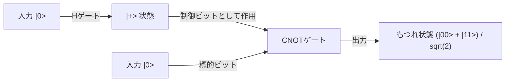

## 1. はじめに：量子コンピュータがもたらすパラダイムシフト

現代のデジタル社会は、情報の安全性を担保するために高度な暗号技術に依存しています。その代表格が、インターネット上の通信を保護するRSA暗号や楕円曲線暗号です。これらの公開鍵暗号方式は、「巨大な整数の素因数分解は極めて困難である」という数学的な非対称性（一方向関数としての性質）を安全性の根拠としています。スーパーコンピュータを用いたとしても、宇宙の年齢ほどの時間がかかるとされるこの計算の壁は、我々のプライバシーや金融取引、国家機密を守る強固な盾となってきました。

しかし、この前提を根本から覆す可能性を秘めた技術が存在します。それが「量子コンピュータ」です。

量子力学という、ミクロの世界を支配する物理法則を計算資源として直接利用するこの全く新しいパラダイムの計算機は、特定の種類の問題に対して古典コンピュータ（現在の一般的なコンピュータ）を圧倒的に凌駕する計算能力を発揮します。その最も象徴的な例が、1994年にピーター・ショア（Peter Shor）によって発見された「ショアのアルゴリズム（Shor's Algorithm）」です。このアルゴリズムは、素因数分解問題を多項式時間で解くことができるため、実用的な規模の量子コンピュータが実現すれば、現在広く使われているRSA暗号は瞬く間に解読されてしまうことになります。

本記事では、量子コンピュータがなぜそれほどまでに強力なのか、その基盤となる「量子ビット（Qubit）」「量子的重ね合わせ」「量子もつれ」といった根本的な概念から出発し、基本的な量子ゲートの動作、ショアのアルゴリズムの中核をなす「量子フーリエ変換（QFT）」の数学的構造、そして現在のノイズあり中規模量子デバイス（NISQ）が直面しているエラー訂正の課題まで、極めて詳細かつ体系的に掘り下げて解説します。

## 2. 古典ビットと量子ビット（Qubit）の決定的な違い

### 2.1 古典ビット：0か1かの決定論的世界
私たちが普段使用しているスマートフォンやPCなどの古典コンピュータは、「ビット（Bit）」を情報の最小単位としています。古典ビットは、トランジスタの電圧の高低などを利用して、常に「0」または「1」のどちらか一方の明確な状態をとります。N個の古典ビットがあれば、$2^N$通りの状態を表現できますが、ある特定の瞬間においてシステムが保持できるのはそのうちの「1つの状態のみ」です。計算を行うとは、この決定論的な状態を論理ゲート（AND、OR、NOTなど）に通過させ、別の状態へと変換していく過程に他なりません。

### 2.2 量子ビット（Qubit）：無限の可能性を内包する状態
一方、量子コンピュータの情報の最小単位である「量子ビット（Qubit）」は、古典ビットとは全く異なる振る舞いをします。量子ビットは、電子のスピン（上向き/下向き）、光子の偏光（水平/垂直）、あるいは超伝導回路における電流の向きなど、量子力学的な二準位系を用いて物理的に実装されます。

量子ビットの最大の特徴は、「0」と「1」の状態を同時にとることができる「量子的重ね合わせ（Quantum Superposition）」の性質を持つことです。数学的には、量子ビットの状態 $|\psi\rangle$（ブラ・ケット記法において状態ベクトルを表す）は、基底状態 $|0\rangle$ と $|1\rangle$ の線形結合（複素数係数による和）として以下のように表現されます。

$$ |\psi\rangle = \alpha|0\rangle + \beta|1\rangle $$

ここで、$\alpha$ と $\beta$ は複素数であり、確率振幅と呼ばれます。これらの係数は、量子ビットを測定したときに $|0\rangle$ または $|1\rangle$ が得られる確率を決定します。具体的には、$|0\rangle$ が観測される確率は $|\alpha|^2$、$|1\rangle$ が観測される確率は $|\beta|^2$ であり、総和の確率は1でなければならないため、以下の規格化条件を満たします。

$$ |\alpha|^2 + |\beta|^2 = 1 $$

### 2.3 ブロッホ球による視覚化
単一の量子ビットの状態は、「ブロッホ球（Bloch Sphere）」と呼ばれる単位球面上の一点として幾何学的に視覚化することができます。北極を $|0\rangle$、南極を $|1\rangle$ とすると、球の表面上のあらゆる点が有効な量子状態を表します。古典ビットが北極か南極の2点しかとれないのに対し、量子ビットは球面の連続的な無限のポイントのどこにでも存在できるのです。この連続性こそが、量子計算に豊かな表現力をもたらす源泉の一つです。

## 3. 量子計算の核心：重ね合わせと量子もつれ

### 3.1 指数関数的な情報表現力
量子ビットの真価は、複数の量子ビットを組み合わせたときに発揮されます。1つの量子ビットが2つの状態の重ね合わせを表現できるとすると、2つの量子ビットは $|00\rangle, |01\rangle, |10\rangle, |11\rangle$ という4つの状態の重ね合わせを表現できます。一般に、N個の量子ビットのシステムは、$2^N$ 個の基底状態の線形結合として状態を保持できます。

$$ |\Psi\rangle = c_0|00\dots0\rangle + c_1|00\dots1\rangle + \dots + c_{2^N-1}|11\dots1\rangle $$

これは驚くべきことです。わずか300個の量子ビットがあれば、$2^{300}$ 個の状態の重ね合わせを表現できますが、この数は観測可能な宇宙に存在する全原子の数（約 $10^{80}$）をはるかに上回ります。古典コンピュータでこれをシミュレートしようとすれば、$2^{300}$ 個の複素数をメモリに記憶する必要があり、物理的に不可能です。量子コンピュータは、この広大なヒルベルト空間（状態空間）の全てのアドレスに同時並行的にアクセスし、計算を進めることができるのです。

### 3.2 量子もつれ（Quantum Entanglement）
量子計算に不可欠なもう一つの奇妙な現象が「量子もつれ」です。これは、2つ以上の量子ビットが強く結びつき、互いの状態が独立して記述できなくなる現象です。最も単純な量子もつれ状態である「ベル状態（Bell State）」を考えてみましょう。

$$ |\Phi^+\rangle = \frac{1}{\sqrt{2}} (|00\rangle + |11\rangle) $$

この状態では、最初の量子ビットを測定してもし「0」が得られた場合、瞬時にもう一方の量子ビットの状態も「0」に確定します。逆に「1」が得られれば、もう一方も必ず「1」になります。この相関関係は、2つの量子ビットが宇宙の反対側に離れていたとしても、光速を超えて瞬時に影響を及ぼし合うように見えます（これをアインシュタインは「不気味な遠隔作用」と呼びました）。

量子コンピュータは、この量子もつれを利用することで、個々のデータ間の複雑な相関関係を表現し、多数の計算経路を高度に干渉させることができます。

## 4. 量子ゲート：量子状態の操作

古典的な論理ゲートと同様に、量子コンピュータでも「量子ゲート」を用いて量子ビットの状態を操作します。数学的には、量子ゲートはユニタリ行列（$U^\dagger U = I$ を満たす行列）として表現され、量子状態ベクトルに対する回転操作として働きます。代表的な量子ゲートを紹介します。

### 4.1 パウリゲート（X, Y, Z）
- **Xゲート（量子NOTゲート）**: $|0\rangle$ を $|1\rangle$ に、$|1\rangle$ を $|0\rangle$ に反転させます。ブロッホ球のX軸周りの180度回転に相当します。
- **Zゲート（位相シフトゲート）**: $|0\rangle$ はそのままですが、$|1\rangle$ の位相を反転（係数に-1を掛ける）させます。
- **Yゲート**: XとZの組み合わせに相当し、Y軸周りの180度回転を行います。

### 4.2 アダマールゲート（Hadamard Gate）
量子アルゴリズムにおいて最も頻繁に使用されるゲートの一つです。決定論的な状態 $|0\rangle$ や $|1\rangle$ を、完全に等確率な重ね合わせ状態に変換します。

$$ H|0\rangle = \frac{1}{\sqrt{2}}(|0\rangle + |1\rangle) = |+\rangle $$
$$ H|1\rangle = \frac{1}{\sqrt{2}}(|0\rangle - |1\rangle) = |-\rangle $$

すべての量子ビットにアダマールゲートを適用することで、$2^N$ 個の全状態が均等に重なり合った初期状態を作り出すことができ、これが量子並列計算の出発点となります。

### 4.3 CNOTゲート（制御NOTゲート）
2量子ビットに作用する代表的なゲートで、量子もつれを生成するために不可欠です。「制御ビット（Control）」が $|1\rangle$ の場合にのみ、「標的ビット（Target）」にXゲート（NOT操作）を適用します。制御ビットが $|0\rangle$ の場合は何もしません。アダマールゲートとCNOTゲートを組み合わせることで、前述のベル状態を簡単に作り出すことができます。

## 5. ショアのアルゴリズム：RSA暗号崩壊のシナリオ

ここからが本題です。量子コンピュータはいかにしてRSA暗号を解読するのでしょうか。RSA暗号の安全性は、巨大な合成数 $N$（2つの素数 $p$ と $q$ の積、$N = p \times q$）を与えられたとき、元の素数 $p$ と $q$ を見つけ出す「素因数分解問題」が、古典コンピュータでは現実的な時間内に解けないという経験則に依存しています。現在主流の鍵長であるRSA-2048では、桁数が約600桁にもなり、世界最速のスーパーコンピュータでも宇宙の寿命ほどの時間を要します。

しかし、1994年、ピーター・ショアは量子力学の性質を巧みに利用することで、この問題を古典的な多項式時間（劇的な高速化）で解く量子アルゴリズムを発表しました。

### 5.1 アルゴリズムの全体像（古典と量子の協調）
ショアのアルゴリズムは、実は完全に量子計算だけで完結するわけではなく、古典コンピュータの計算と量子計算を組み合わせたハイブリッド・アプローチをとります。素因数分解という問題を、数論の定理を用いて「周期発見問題（Order-Finding Problem）」へと変換し、その周期を見つける極めて困難な部分だけを量子コンピュータに委ねるのです。

手順は以下の通りです：
1. **[古典]** $N$ と互いに素な（公約数を持たない）ランダムな整数 $a$（$1 < a < N$）を選ぶ。
2. **[古典]** $f(x) = a^x \pmod N$ という関数を定義する。この関数は周期的な振る舞いをする。つまり、ある最小の正の整数 $r$（周期）が存在し、$f(x+r) = f(x)$ が成り立つ。
3. **[量子]** 量子コンピュータを用いて、この関数 $f(x)$ の周期 $r$ を高速に見つけ出す。（ここがショアのアルゴリズムの中核）
4. **[古典]** 見つかった周期 $r$ が偶数であり、かつ $a^{r/2} \neq -1 \pmod N$ であることを確認する（そうでなければ $a$ を選び直す）。
5. **[古典]** 最大公約数 $\text{gcd}(a^{r/2} \pm 1, N)$ を計算する。この計算結果が、探していた $N$ の素因数 $p$ および $q$ となる。

### 5.2 なぜ周期がわかると素因数がわかるのか？
少し数学的な補足をしましょう。もし $a^r \equiv 1 \pmod N$ となる偶数の周期 $r$ が見つかったとします。この式を変形すると：
$$ a^r - 1 \equiv 0 \pmod N $$
$$ (a^{r/2} - 1)(a^{r/2} + 1) \equiv 0 \pmod N $$
これは、$(a^{r/2} - 1)$ と $(a^{r/2} + 1)$ の積が $N$ の倍数であることを意味します。したがって、これらの項のいずれかと $N$ の最大公約数（ユークリッドの互除法で一瞬で計算可能）を求めることで、$N$ の素因数（自明でない約数）を効率的に抽出できるのです。

## 6. 量子フーリエ変換（QFT）：干渉による正解の抽出

問題は、「どうやって周期 $r$ を高速に見つけるのか？」です。古典コンピュータでは、関数 $f(x) = a^x \pmod N$ を $x=1, 2, 3 \dots$ と順に計算して周期を探すしかなく、指数関数的な時間がかかってしまいます。ここで量子コンピュータの「重ね合わせ」と「干渉」が威力を発揮します。

### 6.1 量子並列性による一斉計算
まず、量子コンピュータはアダマールゲートを用いて、入力となるレジスタに $0$ から $2^m-1$（十分大きな数）までの全ての整数 $x$ の状態を均等に重ね合わせた状態を作り出します。
そして、この重ね合わせ状態全体に対して、関数 $f(x) = a^x \pmod N$ を一度だけ量子回路として実行します（モジュラ累乗計算回路）。すると、量子並列性により、あらゆる $x$ に対する $f(x)$ の答えが、第二のレジスタに同時に計算され、量子もつれ状態として保持されます。

$$ |\psi\rangle = \frac{1}{\sqrt{2^m}} \sum_{x=0}^{2^m-1} |x\rangle |a^x \pmod N\rangle $$

### 6.2 観測問題：並列計算の罠
「素晴らしい！すべての答えを一度に計算できた！」と思うかもしれません。しかし、量子力学には非情なルールがあります。「観測すると重ね合わせ状態は壊れ、ランダムな1つの状態に収縮してしまう」のです。せっかく並列計算しても、そのまま観測してしまっては、ランダムな $x$ に対する単一のペア $(x, a^x \bmod N)$ が得られるだけで、古典計算を1回実行したのと同じ結果にしかなりません。これでは周期 $r$ の全体像は全く掴めません。

### 6.3 波の干渉：正解を増幅し、不正解を打ち消す
ここで登場するのが「量子フーリエ変換（Quantum Fourier Transform, QFT）」です。QFTは、古典的な離散フーリエ変換の量子版ですが、データの配列に対してではなく、量子状態の確率振幅（複素数の係数）に対して直接作用します。

音の波が重なり合って大きくなったり打ち消し合ったりするように、量子状態も複素数の振幅を持つ「波」の性質を持ちます。QFTを周期性を持つ量子状態に適用すると、波の「干渉」という物理現象を引き起こします。具体的には、周期 $r$ に関する情報を強く持つ特定の状態（波の山と山が重なる部分、強め合う干渉）の確率振幅を劇的に増幅させ、無関係な状態（波の山と谷が重なる部分、弱め合う干渉）の確率振幅をゼロに打ち消すように働きます。

QFT適用後に観測を行うと、ランダムな値ではなく、高い確率で「 $2^m / r$ の倍数に近い値」が測定されます。この測定結果から連分数展開という古典的な数学手法を用いることで、極めて高精度に周期 $r$ を逆算することが可能となるのです。

ショアのアルゴリズムの天才的な点は、計算の途中の結果を直接知ろうとするのではなく、「計算結果全体に潜む周期性（グローバルな構造）」だけを波の干渉を用いて抽出するメカニズムを構築したことにあります。

## 7. NISQ時代と誤り訂正：現実の量子コンピュータの壁

理論上、量子コンピュータがRSA暗号を破壊できることは証明されています。では、なぜ明日にも銀行のシステムが崩壊しないのでしょうか？それは、量子コンピュータのハードウェア構築が人類史上屈指の困難なエンジニアリング課題だからです。

### 7.1 デコヒーレンス（量子状態の崩壊）
量子ビットの重ね合わせや量子もつれは、極めて脆弱な状態です。熱、電磁波、宇宙線、あるいはわずかな不純物など、外部環境からの微小なノイズ（干渉）に触れた瞬間、量子状態は崩壊し、古典的な状態に落ち込んでしまいます。この現象を「デコヒーレンス」と呼びます。計算を完了する前にデコヒーレンスが起きれば、エラーとなってしまいます。現在、数ミリケルビン（絶対零度近く）の極低温環境を維持する希釈冷凍機の中で量子ビットを保護しているのはこのためです。

### 7.2 NISQ（Noisy Intermediate-Scale Quantum）デバイス
現在の量子コンピュータは「NISQ（ノイズあり中規模量子デバイス）」と呼ばれています。数十から数百程度の量子ビットを持っていますが、ノイズが多すぎて長大な計算（深い量子回路）を実行することができません。ショアのアルゴリズムでRSA-2048を解読するには、数千個の「完璧な」量子ビットと、数百万回のゲート操作が必要です。現在のハードウェアのゲート忠実度（エラー率）では、計算の途中でエラーが蓄積し、結果はただのノイズになってしまいます。

### 7.3 量子誤り訂正と論理量子ビット
この問題を解決する鍵が「量子誤り訂正（Quantum Error Correction, QEC）」です。古典コンピュータでは情報を単にコピーすることでエラーを防ぎますが、量子力学における「量子複製不可能定理（No-Cloning Theorem）」により、未知の量子状態を正確にコピーすることは禁じられています。

そのため、量子誤り訂正では、「表面符号（Surface Code）」などの高度なトポロジカル符号化手法を用います。これは、何百、何千という物理的な量子ビットを束ねて量子もつれ状態にし、多数決のような仕組みを通じてエラーを検知・修正する「1つの仮想的で完璧な量子ビット（論理量子ビット）」を作り出す技術です。

RSA暗号を解読するためには、この論理量子ビットが数千個必要です。そのためには、物理的な量子ビットが数百万個規模で必要になると見積もられており、現在の数十〜数百物理ビットの段階から見ると、実用化（FTQC: 誤り耐性汎用量子コンピュータの実現）にはまだ10年以上、あるいは数十年の歳月が必要だというのが専門家の一般的な見解です。

## 8. 耐量子計算機暗号（PQC）への移行

量子コンピュータの脅威が現実になる「Q-Day（量子コンピュータによる暗号解読の日）」がいつ来るかは正確にはわかりません。しかし、「今傍受して保存しておき、将来量子コンピュータが完成したときに解読する（Store now, decrypt later）」という攻撃手法が存在するため、国家機密や長期的な機密情報の保護は既に危機に瀕しています。

これに対抗するため、NIST（米国国立標準技術研究所）をはじめとする国際社会は、量子コンピュータでも解読が困難な新しい数学的問題（格子暗号など）を基盤とした「耐量子計算機暗号（Post-Quantum Cryptography, PQC）」の標準化と移行作業を急ピッチで進めています。量子コンピュータが暗号を破壊する未来に備え、私たちはすでに新しい盾を構築し始めているのです。

## 9. おわりに：情報科学の新たな地平

量子コンピュータは、単に「従来のコンピュータを速くしたもの」ではありません。それは、自然界の究極の法則である量子力学をアルゴリズムとして直接表現し、情報処理の限界を拡張する全く新しい概念装置です。ショアのアルゴリズムは、その恐るべきポテンシャルを我々に示す最初の金字塔でした。

ノイズとの闘い、スケールアップの困難さなど、越えなければならない壁はまだまだ高くそびえ立っています。しかし、物理学、数学、情報科学、材料工学の英知が結集したこの分野は、間違いなく人類の次なる技術的飛躍の中心地となるでしょう。量子の世界の不思議な現象が、私たちのデジタル社会の根幹をどのように塗り替えていくのか、その進化の過程から目が離せません。
