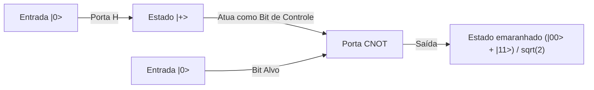

## 1. Introdução: A Mudança de Paradigma Trazida pela Computação Quântica

A sociedade digital moderna depende de tecnologias avançadas de criptografia para garantir a segurança das informações. Os exemplos mais representativos são a criptografia RSA e a criptografia de curva elíptica, que protegem as comunicações na internet. Esses métodos de criptografia de chave pública baseiam-se na assimetria matemática (a propriedade de uma função unidirecional) de que "a fatoração em números primos de números inteiros gigantescos é extremamente difícil". Essa barreira de cálculo, que levaria um tempo comparável à idade do universo mesmo usando supercomputadores, tem sido um escudo robusto para proteger nossa privacidade, transações financeiras e segredos de estado.

No entanto, existe uma tecnologia com o potencial de derrubar essa premissa pela raiz. Trata-se do "computador quântico".

Esta máquina de computação de um paradigma totalmente novo, que utiliza diretamente as leis físicas da mecânica quântica — as quais governam o mundo microscópico — como recursos computacionais, demonstra uma capacidade de cálculo que supera esmagadoramente os computadores clássicos (os computadores comuns de hoje) para certos tipos de problemas. O exemplo mais emblemático disso é o "Algoritmo de Shor", descoberto por Peter Shor em 1994. Como esse algoritmo pode resolver o problema de fatoração em números primos em tempo polinomial, se um computador quântico de escala prática for realizado, a criptografia RSA, amplamente utilizada hoje, será decifrada em um instante.

Neste artigo, exploraremos de forma extremamente detalhada e sistemática por que os computadores quânticos são tão poderosos, partindo de conceitos fundamentais como "Qubit", "Superposição Quântica" e "Emaranhamento Quântico", passando pelo funcionamento básico das portas quânticas, a estrutura matemática da "Transformada de Fourier Quântica (QFT)", que é o núcleo do algoritmo de Shor, até os desafios de correção de erros enfrentados pelos atuais dispositivos quânticos de escala intermediária ruidosos (NISQ).

## 2. A Diferença Decisiva entre Bits Clássicos e Qubits

### 2.1 Bits Clássicos: Um Mundo Determinístico de 0 ou 1
Os computadores clássicos, como os smartphones e PCs que usamos diariamente, têm o "Bit" como a menor unidade de informação. Um bit clássico utiliza os altos e baixos da tensão de um transistor para assumir sempre um de dois estados claros: "0" ou "1". Com N bits clássicos, é possível representar $2^N$ estados possíveis, mas em um momento específico, o sistema só pode manter "apenas um estado" dentre eles. Realizar um cálculo nada mais é do que passar esse estado determinístico por portas lógicas (AND, OR, NOT, etc.) e convertê-lo em outro estado.

### 2.2 Qubits: Estados que Englobam Possibilidades Infinitas
Por outro lado, o "Qubit" (bit quântico), a menor unidade de informação de um computador quântico, comporta-se de maneira completamente diferente de um bit clássico. Qubits são implementados fisicamente utilizando sistemas de dois níveis quânticos, como o spin de um elétron (para cima/para baixo), a polarização de um fóton (horizontal/vertical) ou a direção da corrente em circuitos supercondutores.

A principal característica de um qubit é possuir a propriedade de "Superposição Quântica" (Quantum Superposition), que permite assumir os estados "0" e "1" simultaneamente. Matematicamente, o estado $|\psi\rangle$ de um qubit (representando um vetor de estado na notação bra-ket) é expresso como uma combinação linear (uma soma com coeficientes complexos) dos estados de base $|0\rangle$ e $|1\rangle$, da seguinte forma:

$$ |\psi\rangle = \alpha|0\rangle + \beta|1\rangle $$

Aqui, $\alpha$ e $\beta$ são números complexos, chamados de amplitudes de probabilidade. Esses coeficientes determinam a probabilidade de se obter $|0\rangle$ ou $|1\rangle$ ao medir o qubit. Especificamente, a probabilidade de se observar $|0\rangle$ é $|\alpha|^2$ e a de observar $|1\rangle$ é $|\beta|^2$, e como a soma das probabilidades deve ser 1, eles satisfazem a seguinte condição de normalização:

$$ |\alpha|^2 + |\beta|^2 = 1 $$

### 2.3 Visualização pela Esfera de Bloch
O estado de um único qubit pode ser visualizado geometricamente como um ponto na superfície de uma esfera unitária chamada "Esfera de Bloch" (Bloch Sphere). Se considerarmos o polo norte como $|0\rangle$ e o polo sul como $|1\rangle$, qualquer ponto na superfície da esfera representa um estado quântico válido. Enquanto um bit clássico só pode assumir os dois pontos (polo norte ou polo sul), um qubit pode existir em qualquer um dos infinitos pontos contínuos da superfície esférica. Essa continuidade é uma das fontes que trazem um rico poder de expressão à computação quântica.

## 3. O Núcleo da Computação Quântica: Superposição e Emaranhamento Quântico

### 3.1 Poder de Expressão de Informação Exponencial
O verdadeiro valor dos qubits é revelado quando múltiplos qubits são combinados. Se 1 qubit pode representar a superposição de 2 estados, 2 qubits podem representar a superposição de 4 estados: $|00\rangle, |01\rangle, |10\rangle, |11\rangle$. Em geral, um sistema de N qubits pode manter um estado como a combinação linear de $2^N$ estados de base.

$$ |\Psi\rangle = c_0|00\dots0\rangle + c_1|00\dots1\rangle + \dots + c_{2^N-1}|11\dots1\rangle $$

Isso é surpreendente. Com apenas 300 qubits, pode-se representar a superposição de $2^{300}$ estados, um número que excede em muito a quantidade de todos os átomos no universo observável (cerca de $10^{80}$). Tentar simular isso em um computador clássico exigiria armazenar $2^{300}$ números complexos na memória, o que é fisicamente impossível. Um computador quântico pode acessar simultaneamente e em paralelo todos os endereços desse vasto espaço de Hilbert (espaço de estados) para avançar com os cálculos.

### 3.2 Emaranhamento Quântico (Quantum Entanglement)
Outro fenômeno bizarro e essencial para a computação quântica é o "Emaranhamento Quântico". Este é um fenômeno no qual dois ou mais qubits tornam-se fortemente ligados, de modo que seus estados não podem mais ser descritos de forma independente. Vamos considerar o estado de emaranhamento mais simples, conhecido como "Estado de Bell" (Bell State).

$$ |\Phi^+\rangle = \frac{1}{\sqrt{2}} (|00\rangle + |11\rangle) $$

Nesse estado, se medirmos o primeiro qubit e obtivermos "0", o estado do outro qubit também se define instantaneamente como "0". Inversamente, se obtivermos "1", o outro será necessariamente "1". Essa correlação parece exercer influência mútua instantânea mais rápida que a velocidade da luz, mesmo que os dois qubits estejam em lados opostos do universo (Einstein chamou isso de "ação fantasmagórica à distância").

O computador quântico utiliza esse emaranhamento para expressar correlações complexas entre dados individuais e causar interferência altamente sofisticada entre numerosos caminhos de cálculo.

## 4. Portas Quânticas: Manipulação de Estados Quânticos

Assim como as portas lógicas clássicas, os computadores quânticos usam "Portas Quânticas" para manipular o estado dos qubits. Matematicamente, uma porta quântica é representada como uma matriz unitária (uma matriz que satisfaz $U^\dagger U = I$) e atua como uma operação de rotação no vetor de estado quântico. Aqui estão algumas das principais portas quânticas:

### 4.1 Portas de Pauli (X, Y, Z)
- **Porta X (Porta NOT Quântica)**: Inverte $|0\rangle$ para $|1\rangle$ e $|1\rangle$ para $|0\rangle$. Corresponde a uma rotação de 180 graus em torno do eixo X na Esfera de Bloch.
- **Porta Z (Porta de Mudança de Fase)**: Deixa $|0\rangle$ como está, mas inverte a fase de $|1\rangle$ (multiplica o coeficiente por -1).
- **Porta Y**: Equivale a uma combinação de X e Z, realizando uma rotação de 180 graus em torno do eixo Y.

### 4.2 Porta de Hadamard (Hadamard Gate)
É uma das portas mais frequentemente usadas em algoritmos quânticos. Ela converte um estado determinístico $|0\rangle$ ou $|1\rangle$ em um estado de superposição perfeitamente equiprovável.

$$ H|0\rangle = \frac{1}{\sqrt{2}}(|0\rangle + |1\rangle) = |+\rangle $$
$$ H|1\rangle = \frac{1}{\sqrt{2}}(|0\rangle - |1\rangle) = |-\rangle $$

Ao aplicar a porta de Hadamard a todos os qubits, pode-se criar um estado inicial no qual todos os $2^N$ estados estão sobrepostos uniformemente, e esse é o ponto de partida para o cálculo paralelo quântico.

### 4.3 Porta CNOT (Porta NOT Controlada)
Uma porta representativa que atua em 2 qubits e é essencial para gerar o emaranhamento quântico. Ela aplica a porta X (operação NOT) ao "Bit Alvo" (Target) apenas quando o "Bit de Controle" (Control) for $|1\rangle$. Se o bit de controle for $|0\rangle$, não faz nada. Ao combinar a porta de Hadamard com a porta CNOT, é possível criar facilmente o Estado de Bell mencionado anteriormente.

## 5. Algoritmo de Shor: O Cenário do Colapso da Criptografia RSA

Aqui chegamos ao ponto principal. Como um computador quântico pode decifrar a criptografia RSA? A segurança da criptografia RSA baseia-se na regra empírica de que, dado um número composto gigantesco $N$ (o produto de dois números primos $p$ e $q$, $N = p \times q$), encontrar os números primos originais $p$ e $q$ (o "problema de fatoração em números primos") não pode ser resolvido por computadores clássicos em um tempo realista. A chave padrão atual, RSA-2048, tem cerca de 600 dígitos e levaria um tempo equivalente à idade do universo mesmo no supercomputador mais rápido do mundo.

No entanto, em 1994, Peter Shor publicou um algoritmo quântico que resolve esse problema em tempo polinomial clássico (uma aceleração dramática), explorando habilmente as propriedades da mecânica quântica.

### 5.1 Visão Geral do Algoritmo (A Colaboração entre o Clássico e o Quântico)
O algoritmo de Shor, na verdade, não é completado inteiramente apenas com computação quântica; ele adota uma abordagem híbrida combinando cálculos de computadores clássicos e cálculos quânticos. Usando teoremas da teoria dos números, ele transforma o problema de fatoração no "Problema de Descoberta de Período" (Order-Finding Problem) e delega ao computador quântico apenas a parte extremamente difícil de encontrar esse período.

Os passos são os seguintes:
1. **[Clássico]** Escolher um número inteiro aleatório $a$ ($1 < a < N$) que seja coprimo de $N$ (não tendo divisores comuns).
2. **[Clássico]** Definir a função $f(x) = a^x \pmod N$. Esta função tem um comportamento periódico. Ou seja, existe um menor número inteiro positivo $r$ (período) tal que $f(x+r) = f(x)$.
3. **[Quântico]** Usar o computador quântico para encontrar rapidamente o período $r$ dessa função $f(x)$. (Este é o núcleo do algoritmo de Shor)
4. **[Clássico]** Confirmar se o período encontrado $r$ é par e se $a^{r/2} \neq -1 \pmod N$ (caso contrário, escolher novamente $a$).
5. **[Clássico]** Calcular o máximo divisor comum $\text{gcd}(a^{r/2} \pm 1, N)$. Os resultados deste cálculo serão os fatores primos $p$ e $q$ de $N$ que estávamos procurando.

### 5.2 Por que Saber o Período Revela os Fatores Primos?
Vamos adicionar um pequeno detalhe matemático. Suponha que encontramos um período par $r$ tal que $a^r \equiv 1 \pmod N$. Se reorganizarmos esta equação:
$$ a^r - 1 \equiv 0 \pmod N $$
$$ (a^{r/2} - 1)(a^{r/2} + 1) \equiv 0 \pmod N $$
Isso significa que o produto de $(a^{r/2} - 1)$ e $(a^{r/2} + 1)$ é um múltiplo de $N$. Portanto, ao encontrar o máximo divisor comum entre qualquer um desses termos e $N$ (o que pode ser calculado instantaneamente usando o algoritmo euclidiano), podemos extrair de forma eficiente os fatores primos de $N$ (divisores não triviais).

## 6. Transformada de Fourier Quântica (QFT): Extração da Resposta Correta por Interferência

O problema é: "Como encontrar o período $r$ em alta velocidade?". Em um computador clássico, a única maneira seria calcular a função $f(x) = a^x \pmod N$ sequencialmente para $x=1, 2, 3 \dots$ para procurar o período, o que levaria um tempo exponencial. É aqui que a "superposição" e a "interferência" do computador quântico mostram o seu poder.

### 6.1 Cálculo Simultâneo por Paralelismo Quântico
Primeiro, o computador quântico usa portas de Hadamard para criar no registrador de entrada um estado onde todos os números inteiros $x$ de $0$ a $2^m-1$ (um número suficientemente grande) estão sobrepostos de maneira uniforme.
Então, ele executa a função $f(x) = a^x \pmod N$ uma única vez como um circuito quântico em todo esse estado de superposição (circuito de exponenciação modular). Devido ao paralelismo quântico, as respostas de $f(x)$ para todos os $x$ são calculadas simultaneamente em um segundo registrador, mantidas como um estado emaranhado.

$$ |\psi\rangle = \frac{1}{\sqrt{2^m}} \sum_{x=0}^{2^m-1} |x\rangle |a^x \pmod N\rangle $$

### 6.2 O Problema da Observação: A Armadilha do Cálculo Paralelo
Você pode pensar: "Incrível! Pude calcular todas as respostas de uma vez só!". No entanto, a mecânica quântica tem uma regra impiedosa: "Ao observar, o estado de superposição entra em colapso e encolhe para um único estado aleatório". Mesmo tendo calculado em paralelo, se você observar imediatamente, obterá apenas um único par aleatório $(x, a^x \bmod N)$ para $x$, resultando na mesma coisa que executar um cálculo clássico uma vez. Assim, você não conseguirá ter qualquer visão geral do período $r$.

### 6.3 Interferência de Ondas: Amplificando Acertos e Anulando Erros
É aqui que entra a "Transformada de Fourier Quântica" (Quantum Fourier Transform, QFT). A QFT é a versão quântica da transformada discreta de Fourier clássica, mas atua diretamente nas amplitudes de probabilidade (coeficientes complexos) do estado quântico, em vez de em um array de dados.

Assim como as ondas sonoras se sobrepõem, intensificando-se ou cancelando-se mutuamente, os estados quânticos também têm a natureza de "ondas" com amplitudes complexas. A aplicação da QFT a um estado quântico periódico causa o fenômeno físico da "interferência" de ondas. Especificamente, ela atua amplificando dramaticamente a amplitude de probabilidade de certos estados que carregam informações fortes sobre o período $r$ (as partes onde as cristas das ondas se sobrepõem, interferência construtiva) e cancelando para zero as amplitudes de probabilidade de estados irrelevantes (onde uma crista encontra um vale, interferência destrutiva).

Quando uma observação é feita após a aplicação da QFT, em vez de um valor aleatório, um valor muito próximo a um "múltiplo de $2^m / r$" será medido com alta probabilidade. Usando um método matemático clássico de frações contínuas a partir desse resultado de medição, é possível calcular reversamente o período $r$ com extrema precisão.

A genialidade do algoritmo de Shor não está em tentar conhecer diretamente os resultados intermediários do cálculo, mas em construir um mecanismo para extrair apenas a "periodicidade oculta no resultado completo do cálculo (estrutura global)" usando a interferência de ondas.

## 7. A Era NISQ e a Correção de Erros: A Barreira dos Computadores Quânticos Reais

Teoricamente, está provado que computadores quânticos podem quebrar a criptografia RSA. Então, por que os sistemas bancários não vão entrar em colapso amanhã? A razão é que construir o hardware para um computador quântico é um dos desafios de engenharia mais difíceis da história humana.

### 7.1 Decoerência (Colapso do Estado Quântico)
A superposição de qubits e o emaranhamento quântico são estados extremamente frágeis. No momento em que interagem com minúsculos ruídos (interferências) do ambiente externo, como calor, ondas eletromagnéticas, raios cósmicos ou até mesmo pequenas impurezas, o estado quântico entra em colapso, caindo em um estado clássico. Esse fenômeno é chamado de "Decoerência". Se a decoerência ocorrer antes da conclusão do cálculo, isso resulta em erro. É por isso que os qubits são protegidos atualmente dentro de refrigeradores de diluição, mantendo um ambiente criogênico de apenas alguns milikelvins (próximo do zero absoluto).

### 7.2 Dispositivos NISQ (Noisy Intermediate-Scale Quantum)
Os computadores quânticos de hoje são conhecidos como "NISQ" (Dispositivos Quânticos de Escala Intermediária Ruidosos). Eles possuem dezenas a centenas de qubits, mas têm ruído demais para executar cálculos longos (circuitos quânticos profundos). Quebrar o RSA-2048 com o algoritmo de Shor exigiria milhares de qubits "perfeitos" e milhões de operações de portas. Com as fidelidades de portas (taxas de erro) do hardware atual, os erros se acumulam durante o cálculo e o resultado final se torna apenas ruído.

### 7.3 Correção de Erros Quânticos e Qubits Lógicos
A chave para resolver esse problema é a "Correção de Erros Quânticos" (Quantum Error Correction, QEC). Enquanto nos computadores clássicos simplesmente copiamos as informações para evitar erros, o "Teorema de Não-Clonagem" (No-Cloning Theorem) na mecânica quântica proíbe a cópia exata de um estado quântico desconhecido.

Portanto, a correção de erros quânticos emprega métodos avançados de codificação topológica, como o "Código de Superfície" (Surface Code). Trata-se de uma tecnologia na qual centenas ou milhares de qubits físicos são agrupados em um estado emaranhado para criar "um único qubit virtual e perfeito (qubit lógico)" que detecta e corrige erros através de um mecanismo semelhante a uma votação por maioria.

Para quebrar a criptografia RSA, seriam necessários milhares desses qubits lógicos. Estima-se que, para isso, será necessária uma escala de milhões de qubits físicos. Olhando a partir da fase atual, de dezenas a centenas de qubits físicos, a opinião geral entre os especialistas é que a realização prática (FTQC: Computador Quântico Universal Tolerante a Falhas) ainda levará mais de 10 anos, ou até décadas.

## 8. Transição para a Criptografia Pós-Quântica (PQC)

Não se sabe exatamente quando chegará o "Q-Day" (o dia em que um computador quântico quebrará a criptografia), quando a ameaça dos computadores quânticos se tornará realidade. No entanto, como existe um método de ataque chamado "Interceptar agora, descriptografar depois" (Store now, decrypt later), a proteção de segredos de Estado e de informações confidenciais a longo prazo já está em crise.

Para combater isso, a comunidade internacional, liderada pelo NIST (Instituto Nacional de Padrões e Tecnologia dos EUA), está acelerando a padronização e transição para a "Criptografia Pós-Quântica" (Post-Quantum Cryptography, PQC), baseada em novos problemas matemáticos (como a criptografia baseada em reticulados) que são difíceis de resolver mesmo para computadores quânticos. Para nos prepararmos para o futuro em que os computadores quânticos destruirão a criptografia atual, já começamos a construir novos escudos.

## 9. Conclusão: Um Novo Horizonte para a Ciência da Computação

Um computador quântico não é apenas "uma versão mais rápida do computador tradicional". É um dispositivo conceitual totalmente novo que representa diretamente a mecânica quântica — a lei suprema da natureza — como um algoritmo, expandindo os limites do processamento de informações. O algoritmo de Shor foi o primeiro marco a nos mostrar seu imenso potencial.

Ainda há barreiras imensas a serem superadas, como a batalha contra o ruído e as dificuldades de escalabilidade. No entanto, este campo, onde a sabedoria da física, matemática, ciência da computação e engenharia de materiais converge, sem dúvida se tornará o centro do próximo salto tecnológico da humanidade. É impossível tirar os olhos do processo evolutivo de como os fenômenos misteriosos do mundo quântico continuarão a reescrever os alicerces da nossa sociedade digital.
