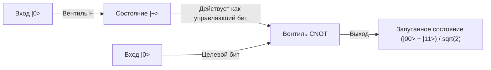

## 1. Введение: Сдвиг парадигмы, вызванный квантовыми компьютерами

Современное цифровое общество зависит от передовых криптографических технологий для обеспечения безопасности информации. Типичными примерами являются шифрование RSA и криптография на эллиптических кривых, которые защищают коммуникации в интернете. Эти методы криптографии с открытым ключом основаны на математической асимметрии (свойстве односторонних функций), согласно которой 'факторизация огромных целых чисел на простые множители является крайне сложной задачей'. Считается, что даже при использовании суперкомпьютеров на эти вычисления уйдет время, сопоставимое с возрастом Вселенной. Этот вычислительный барьер служил надежным щитом, защищающим нашу конфиденциальность, финансовые транзакции и государственные секреты.

Однако существует технология, обладающая потенциалом полностью разрушить эту предпосылку. И это 'квантовые компьютеры'.

Квантовая механика, закон физики, управляющий микромиром, используется в качестве вычислительного ресурса напрямую этой совершенно новой парадигмой вычислительных машин, которые демонстрируют вычислительную мощность, в подавляющем большинстве случаев превосходящую возможности классических компьютеров (современных обычных компьютеров) при решении определенных типов задач. Самым показательным примером является 'Алгоритм Шора' (Shor's Algorithm), открытый Питером Шором (Peter Shor) в 1994 году. Поскольку этот алгоритм может решать проблему факторизации на простые множители за полиномиальное время, реализация квантовых компьютеров практического масштаба приведет к тому, что широко используемое в настоящее время шифрование RSA будет взломано в мгновение ока.

В этой статье мы подробно и систематически рассмотрим, почему квантовые компьютеры настолько мощны, начиная с таких фундаментальных концепций, как 'кубит' (Qubit), 'квантовая суперпозиция' и 'квантовая запутанность', до работы базовых квантовых вентилей, математической структуры 'квантового преобразования Фурье' (QFT), являющегося ядром алгоритма Шора, и заканчивая проблемами исправления ошибок, с которыми сталкиваются современные квантовые устройства промежуточного масштаба с шумом (NISQ).

## 2. Решающее отличие классических битов от квантовых битов (кубитов)

### 2.1 Классический бит: Детерминированный мир 0 или 1
В классических компьютерах, таких как смартфоны и ПК, которые мы используем повседневно, наименьшей единицей информации является 'бит' (Bit). Классические биты всегда принимают одно из двух четких состояний — '0' или '1' — используя, например, высокий или низкий уровень напряжения транзистора. При наличии N классических битов можно представить $2^N$ состояний, но в любой конкретный момент времени система может удерживать только 'одно состояние' из них. Вычисление — это не что иное, как процесс пропускания этого детерминированного состояния через логические вентили (AND, OR, NOT и т.д.) для преобразования его в другое состояние.

### 2.2 Квантовый бит (Кубит): Состояние, содержащее бесконечные возможности
С другой стороны, 'квантовый бит' (Qubit), наименьшая единица информации в квантовых компьютерах, ведет себя совершенно иначе, чем классический бит. Кубиты физически реализуются с использованием квантовомеханических двухуровневых систем, таких как спин электрона (вверх/вниз), поляризация фотона (горизонтальная/вертикальная) или направление тока в сверхпроводящих цепях.

Главная особенность кубитов заключается в том, что они обладают свойством 'квантовой суперпозиции' (Quantum Superposition), позволяющим им находиться в состояниях '0' и '1' одновременно. Математически состояние кубита $|\psi\rangle$ (обозначающее вектор состояния в нотации бра-кет) выражается как линейная комбинация (сумма с комплексными коэффициентами) базисных состояний $|0\rangle$ и $|1\rangle$:

$$ |\psi\rangle = \alpha|0\rangle + \beta|1\rangle $$

Здесь $\alpha$ и $\beta$ — комплексные числа, называемые амплитудами вероятности. Эти коэффициенты определяют вероятность получения $|0\rangle$ или $|1\rangle$ при измерении кубита. Конкретно, вероятность наблюдения $|0\rangle$ равна $|\alpha|^2$, а вероятность наблюдения $|1\rangle$ равна $|\beta|^2$. Поскольку сумма вероятностей должна быть равна 1, выполняется следующее условие нормировки:

$$ |\alpha|^2 + |\beta|^2 = 1 $$

### 2.3 Визуализация с помощью сферы Блоха
Состояние одиночного кубита можно геометрически визуализировать как точку на единичной сфере, называемой 'сферой Блоха' (Bloch Sphere). Если северный полюс — это $|0\rangle$, а южный полюс — $|1\rangle$, то любая точка на поверхности сферы представляет собой допустимое квантовое состояние. В то время как классический бит может принимать только две точки — северный или южный полюс, кубит может находиться в любой из бесконечного множества точек на поверхности сферы. Именно эта непрерывность является одним из источников богатой выразительной силы квантовых вычислений.

## 3. Суть квантовых вычислений: Суперпозиция и квантовая запутанность

### 3.1 Экспоненциальная выразительная способность информации
Истинная ценность кубитов раскрывается при объединении нескольких кубитов. Если один кубит может представлять суперпозицию двух состояний, то два кубита могут представлять суперпозицию четырех состояний: $|00\rangle, |01\rangle, |10\rangle, |11\rangle$. В общем случае система из N кубитов может хранить состояние как линейную комбинацию $2^N$ базисных состояний.

$$ |\Psi\rangle = c_0|00\dots0\rangle + c_1|00\dots1\rangle + \dots + c_{2^N-1}|11\dots1\rangle $$

Это поразительно. Имея всего 300 кубитов, можно представить суперпозицию из $2^{300}$ состояний, что намного превышает количество всех атомов в наблюдаемой Вселенной (около $10^{80}$). Если попытаться смоделировать это на классическом компьютере, потребуется сохранить в памяти $2^{300}$ комплексных чисел, что физически невозможно. Квантовый компьютер может получать доступ ко всем адресам этого огромного гильбертова пространства (пространства состояний) параллельно и выполнять вычисления.

### 3.2 Квантовая запутанность (Quantum Entanglement)
Еще одно странное явление, необходимое для квантовых вычислений, — это 'квантовая запутанность'. Это явление, при котором два или более кубитов сильно связаны, и их состояния не могут быть описаны независимо друг от друга. Рассмотрим самое простое запутанное состояние — 'состояние Белла' (Bell State).

$$ |\Phi^+\rangle = \frac{1}{\sqrt{2}} (|00\rangle + |11\rangle) $$

В этом состоянии, если измерить первый кубит и получить '0', состояние второго кубита мгновенно определяется как '0'. Наоборот, если будет получено '1', другой также обязательно станет '1'. Эта корреляция выглядит так, как будто два кубита мгновенно влияют друг на друга со скоростью, превышающей скорость света, даже если они находятся на противоположных концах Вселенной (Эйнштейн назвал это 'жутким дальнодействием').

Используя эту квантовую запутанность, квантовые компьютеры могут выражать сложные корреляции между отдельными данными и вызывать высокую степень интерференции множества вычислительных путей.

## 4. Квантовые вентили: Управление квантовыми состояниями

Подобно классическим логическим вентилям, квантовые компьютеры используют 'квантовые вентили' для изменения состояний кубитов. Математически квантовые вентили представляются унитарными матрицами (матрицами, удовлетворяющими условию $U^\dagger U = I$) и действуют как операции вращения вектора квантового состояния. Вот некоторые основные квантовые вентили:

### 4.1 Вентили Паули (X, Y, Z)
- **Вентиль X (квантовый вентиль NOT)**: Переворачивает $|0\rangle$ в $|1\rangle$, а $|1\rangle$ в $|0\rangle$. Это эквивалентно повороту на 180 градусов вокруг оси X сферы Блоха.
- **Вентиль Z (вентиль сдвига фазы)**: Оставляет $|0\rangle$ как есть, но инвертирует фазу $|1\rangle$ (умножает коэффициент на -1).
- **Вентиль Y**: Эквивалентен комбинации X и Z, выполняет поворот на 180 градусов вокруг оси Y.

### 4.2 Вентиль Адамара (Hadamard Gate)
Один из наиболее часто используемых вентилей в квантовых алгоритмах. Он преобразует детерминированные состояния $|0\rangle$ или $|1\rangle$ в равновероятное состояние суперпозиции.

$$ H|0\rangle = \frac{1}{\sqrt{2}}(|0\rangle + |1\rangle) = |+\rangle $$
$$ H|1\rangle = \frac{1}{\sqrt{2}}(|0\rangle - |1\rangle) = |-\rangle $$

Применяя вентиль Адамара ко всем кубитам, можно создать начальное состояние, в котором равномерно наложены все $2^N$ состояний, что является отправной точкой для квантовых параллельных вычислений.

### 4.3 Вентиль CNOT (управляемое НЕ)
Типичный вентиль, действующий на два кубита, необходимый для создания квантовой запутанности. Применяет вентиль X (операция NOT) к 'целевому биту' (Target) только в том случае, если 'управляющий бит' (Control) равен $|1\rangle$. Если управляющий бит равен $|0\rangle$, ничего не происходит. Комбинируя вентиль Адамара и вентиль CNOT, можно легко создать упомянутое выше состояние Белла.

## 5. Алгоритм Шора: Сценарий краха шифрования RSA

Теперь перейдем к главному. Как квантовые компьютеры взламывают шифрование RSA? Безопасность шифрования RSA зависит от эмпирического правила, согласно которому 'задача факторизации', заключающаяся в нахождении исходных простых чисел $p$ и $q$, когда дано огромное составное число $N$ (произведение двух простых чисел $p$ и $q$, $N = p \times q$), не может быть решена классическими компьютерами за реалистичное время. Для ключа RSA-2048, который в настоящее время является основным по длине, количество цифр составляет около 600, и даже самым быстрым в мире суперкомпьютерам потребовалось бы время, сопоставимое со временем жизни Вселенной.

Однако в 1994 году Питер Шор представил квантовый алгоритм, который решает эту проблему за классическое полиномиальное время (драматическое ускорение), умело используя свойства квантовой механики.

### 5.1 Обзор алгоритма (Сотрудничество классики и квантов)
Алгоритм Шора на самом деле не полностью опирается только на квантовые вычисления, а использует гибридный подход, сочетающий вычисления на классическом компьютере и квантовые вычисления. Он преобразует проблему факторизации в 'задачу поиска периода' (Order-Finding Problem), используя теоремы теории чисел, и возлагает только чрезвычайно сложную часть поиска этого периода на квантовый компьютер.

Процедура следующая:
1. **[Классический]** Выбрать случайное целое число $a$ ($1 < a < N$), взаимно простое с $N$ (не имеющее общих делителей).
2. **[Классический]** Определить функцию $f(x) = a^x \pmod N$. Эта функция ведет себя периодически. То есть существует некоторое наименьшее положительное целое число $r$ (период), для которого выполняется $f(x+r) = f(x)$.
3. **[Квантовый]** Использовать квантовый компьютер, чтобы быстро найти период $r$ этой функции $f(x)$. (Это ядро алгоритма Шора)
4. **[Классический]** Убедиться, что найденный период $r$ — четное число и что $a^{r/2} \neq -1 \pmod N$ (в противном случае выбрать $a$ заново).
5. **[Классический]** Вычислить наибольший общий делитель $\text{gcd}(a^{r/2} \pm 1, N)$. Результаты этих вычислений и будут искомыми простыми множителями $p$ и $q$ числа $N$.

### 5.2 Почему знание периода позволяет найти простые множители?
Давайте добавим немного математики. Предположим, мы нашли четный период $r$, такой что $a^r \equiv 1 \pmod N$. Преобразуя это уравнение:
$$ a^r - 1 \equiv 0 \pmod N $$
$$ (a^{r/2} - 1)(a^{r/2} + 1) \equiv 0 \pmod N $$
Это означает, что произведение $(a^{r/2} - 1)$ и $(a^{r/2} + 1)$ кратно $N$. Следовательно, путем нахождения наибольшего общего делителя любого из этих членов и $N$ (что можно мгновенно вычислить с помощью алгоритма Евклида), можно эффективно извлечь простые множители (нетривиальные делители) числа $N$.

## 6. Квантовое преобразование Фурье (QFT): Извлечение правильного ответа с помощью интерференции

Проблема в том, 'как быстро найти период $r$?'. На классическом компьютере нам пришлось бы последовательно вычислять функцию $f(x) = a^x \pmod N$ для $x=1, 2, 3 \dots$, чтобы найти период, что заняло бы экспоненциальное время. Здесь и проявляют свою мощь 'суперпозиция' и 'интерференция' квантового компьютера.

### 6.1 Одновременные вычисления благодаря квантовому параллелизму
Сначала квантовый компьютер использует вентиль Адамара для создания во входном регистре состояния, в котором равномерно наложены все целые числа $x$ от $0$ до $2^m-1$ (достаточно большое число).
Затем функция $f(x) = a^x \pmod N$ выполняется один раз как квантовая схема для всего этого состояния суперпозиции (схема модульного возведения в степень). Тогда благодаря квантовому параллелизму ответы $f(x)$ для всех $x$ вычисляются одновременно во втором регистре и сохраняются как состояние квантовой запутанности.

$$ |\psi\rangle = \frac{1}{\sqrt{2^m}} \sum_{x=0}^{2^m-1} |x\rangle |a^x \pmod N\rangle $$

### 6.2 Проблема измерения: Ловушка параллельных вычислений
Вы можете подумать: 'Замечательно! Все ответы вычислены сразу!'. Однако у квантовой механики есть безжалостное правило: 'При наблюдении состояние суперпозиции разрушается и коллапсирует в одно случайное состояние'. Даже если мы выполнили параллельные вычисления, если мы их измерим, мы получим только одну пару $(x, a^x \bmod N)$ для случайного $x$, что даст тот же результат, что и однократное выполнение классического вычисления. Это совершенно не дает представления о периоде $r$ в целом.

### 6.3 Интерференция волн: Усиление правильных ответов и гашение неправильных
Здесь на сцену выходит 'Квантовое преобразование Фурье' (Quantum Fourier Transform, QFT). QFT — это квантовая версия классического дискретного преобразования Фурье, но оно действует непосредственно на амплитуды вероятности (комплексные коэффициенты) квантовых состояний, а не на массивы данных.

Подобно тому, как звуковые волны могут накладываться друг на друга, усиливаясь или гасясь, квантовые состояния также обладают свойствами 'волн' с комплексной амплитудой. Применение QFT к квантовому состоянию с периодичностью вызывает физическое явление 'интерференции' волн. В частности, оно резко усиливает амплитуду вероятности определенных состояний, которые несут сильную информацию о периоде $r$ (конструктивная интерференция, где совпадают пики волн), и сводит к нулю амплитуды вероятности нерелевантных состояний (деструктивная интерференция, где пики совпадают с впадинами).

Когда наблюдение проводится после применения QFT, с высокой вероятностью измеряется не случайное значение, а 'значение, близкое к кратному $2^m / r$'. Используя классический математический метод непрерывных дробей для этого результата измерения, можно с чрезвычайно высокой точностью вычислить период $r$ в обратном порядке.

Гениальность алгоритма Шора заключается в том, что он не пытается напрямую узнать промежуточные результаты вычислений, а создает механизм для извлечения только 'периодичности (глобальной структуры), скрытой во всем результате вычислений' с помощью интерференции волн.

## 7. Эпоха NISQ и исправление ошибок: Барьеры реальных квантовых компьютеров

В теории доказано, что квантовые компьютеры могут взломать шифрование RSA. Так почему же завтра не рухнут банковские системы? Потому что создание аппаратного обеспечения квантовых компьютеров — одна из сложнейших инженерных задач в истории человечества.

### 7.1 Декогеренция (Разрушение квантового состояния)
Квантовая суперпозиция и квантовая запутанность — чрезвычайно хрупкие состояния. При малейшем шуме (интерференции) из внешней среды, таком как тепло, электромагнитные волны, космические лучи или даже незначительные примеси, квантовое состояние разрушается и переходит в классическое. Это явление называется 'декогеренцией'. Если декогеренция происходит до завершения вычислений, возникает ошибка. Именно поэтому кубиты в настоящее время защищены в рефрижераторах растворения, которые поддерживают сверхнизкую температурную среду в несколько милликельвинов (близкую к абсолютному нулю).

### 7.2 Устройства NISQ (Noisy Intermediate-Scale Quantum)
Современные квантовые компьютеры называются 'устройствами NISQ' (Квантовые устройства промежуточного масштаба с шумом). Они имеют от нескольких десятков до сотен кубитов, но из-за слишком большого количества шума не могут выполнять длинные вычисления (глубокие квантовые схемы). Для взлома RSA-2048 с помощью алгоритма Шора требуются тысячи 'идеальных' кубитов и миллионы операций вентилей. При точности вентилей (уровне ошибок) современного оборудования ошибки будут накапливаться в процессе вычислений, и результатом будет просто шум.

### 7.3 Квантовое исправление ошибок и логические кубиты
Ключом к решению этой проблемы является 'Квантовое исправление ошибок' (Quantum Error Correction, QEC). В классических компьютерах ошибки предотвращаются простым копированием информации, но в квантовой механике 'Теорема о запрете клонирования' (No-Cloning Theorem) запрещает точное копирование неизвестных квантовых состояний.

Поэтому для квантового исправления ошибок используются передовые методы топологического кодирования, такие как 'Поверхностный код' (Surface Code). Это технология создания 'одного виртуального, идеального кубита (логического кубита)' путем связывания сотен или тысяч физических кубитов в состояние квантовой запутанности и обнаружения и исправления ошибок с помощью механизма, подобного голосованию большинства.

Для взлома шифрования RSA требуются тысячи таких логических кубитов. По оценкам, для этого потребуются миллионы физических кубитов, и с точки зрения текущего этапа в несколько десятков или сотен физических битов, по общему мнению экспертов, потребуется еще более 10 лет или даже несколько десятилетий для практического применения (FTQC: реализация отказоустойчивых универсальных квантовых компьютеров).

## 8. Переход к постквантовой криптографии (PQC)

Точно неизвестно, когда наступит 'Q-Day' (день, когда квантовые компьютеры взломают шифрование) и угроза квантовых компьютеров станет реальностью. Однако из-за существования метода атаки 'Сохрани сейчас, расшифруй позже' (Store now, decrypt later), когда данные перехватываются и сохраняются сейчас, чтобы быть расшифрованными в будущем, когда квантовый компьютер будет готов, защита государственных секретов и долгосрочной конфиденциальной информации уже находится под угрозой.

Чтобы противостоять этому, международное сообщество, включая NIST (Национальный институт стандартов и технологий США), ускоренными темпами работает над стандартизацией и переходом на 'Постквантовую криптографию' (Post-Quantum Cryptography, PQC), основанную на новых математических задачах (таких как криптография на решетках), которые трудно взломать даже квантовым компьютерам. Мы уже начали создавать новые щиты, готовясь к будущему, когда квантовые компьютеры разрушат существующую криптографию.

## 9. Заключение: Новые горизонты информатики

Квантовый компьютер — это не просто 'ускоренная версия традиционного компьютера'. Это совершенно новое концептуальное устройство, которое напрямую использует квантовую механику, высший закон природы, в качестве алгоритма и расширяет пределы обработки информации. Алгоритм Шора стал первой вехой, показавшей нам его невероятный потенциал.

Барьеры, которые необходимо преодолеть, такие как борьба с шумом и трудности масштабирования, по-прежнему высоки. Однако эта область, объединяющая мудрость физики, математики, информатики и материаловедения, несомненно, станет центром следующего технологического скачка человечества. Мы не можем оторвать глаз от процесса эволюции и того, как удивительные явления квантового мира перепишут основы нашего цифрового общества.
