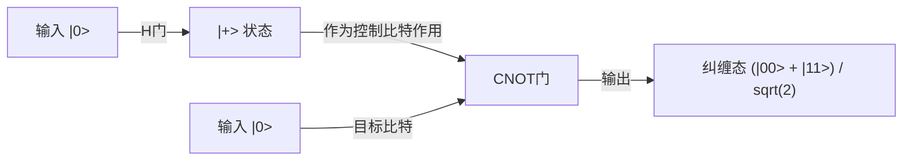

## 1. 引言：量子计算机带来的范式转变

现代数字社会高度依赖先进的密码技术来保障信息的安全性。其中最具代表性的，是保护互联网通信的RSA密码和椭圆曲线密码。这些公钥密码体制以“对巨大的整数进行质因数分解极其困难”这一数学非对称性（作为单向函数的性质）为安全性的根基。这一计算壁垒，即便使用超级计算机也需要花费宇宙年龄般漫长的时间，一直是我们保护隐私、金融交易和国家机密的坚固盾牌。

然而，存在一种有可能从根本上颠覆这一前提的技术，那就是“量子计算机”。

这种利用支配微观世界的物理定律——量子力学，直接将其作为计算资源来使用的全新范式的计算机，在面对特定类型的问题时，能够发挥出远远超越经典计算机（现代通用计算机）的计算能力。其中最具标志性的例子，就是彼得·秀尔（Peter Shor）在1994年发现的“Shor算法（Shor's Algorithm）”。由于该算法能够在多项式时间内解决质因数分解问题，一旦实用规模的量子计算机得以实现，目前被广泛使用的RSA密码将在瞬间被破解。

在本文中，我们将极其详细且系统地深入探讨：为什么量子计算机会如此强大？我们将从其基础的“量子比特（Qubit）”、“量子叠加”、“量子纠缠”等根本概念出发，涵盖基本量子门的工作原理、构成Shor算法核心的“量子傅里叶变换（QFT）”的数学结构，以及目前的含噪声中等规模量子设备（NISQ）所面临的纠错挑战。

## 2. 经典比特与量子比特（Qubit）的决定性差异

### 2.1 经典比特：0或1的决定论世界
我们平时使用的智能手机和PC等经典计算机，以“比特（Bit）”作为信息的最小单位。经典比特利用晶体管电压的高低等方式，始终处于“0”或“1”两者中明确的一种状态。如果有N个经典比特，就能表示 $2^N$ 种状态，但在某个特定的瞬间，系统只能保持这其中的“1种状态”。所谓进行计算，无非就是让这种决定论性的状态通过逻辑门（AND、OR、NOT等），将其转换为另一种状态的过程。

### 2.2 量子比特（Qubit）：蕴含无限可能的状态
另一方面，量子计算机中信息的最小单位“量子比特（Qubit）”，其行为与经典比特完全不同。量子比特是利用量子力学中的二能级系统在物理上实现的，例如电子的自旋（向上/向下）、光子的偏振（水平/垂直），或是超导电路中电流的方向。

量子比特最大的特点，在于它具有“量子叠加（Quantum Superposition）”的性质，可以同时处于“0”和“1”的状态。在数学上，量子比特的状态 $|\psi\rangle$（在狄拉克符号中表示状态向量），可以表示为基态 $|0\rangle$ 和 $|1\rangle$ 的线性组合（复数系数的求和），如下所示：

$$ |\psi\rangle = \alpha|0\rangle + \beta|1\rangle $$

在这里，$\alpha$ 和 $\beta$ 是复数，被称为概率幅。这些系数决定了在测量该量子比特时得到 $|0\rangle$ 或 $|1\rangle$ 的概率。具体而言，观测到 $|0\rangle$ 的概率为 $|\alpha|^2$，观测到 $|1\rangle$ 的概率为 $|\beta|^2$。由于总概率必须为1，因此它们满足以下归一化条件：

$$ |\alpha|^2 + |\beta|^2 = 1 $$

### 2.3 借助布洛赫球面（Bloch Sphere）的可视化
单个量子比特的状态，可以在几何上被可视化为“布洛赫球面（Bloch Sphere）”上的一个点。如果将北极设为 $|0\rangle$，南极设为 $|1\rangle$，那么球面上的任何一点都代表一个有效的量子态。经典比特只能取北极或南极这两个点，而量子比特则可以存在于球面上连续不断的无限个点中的任何一处。这种连续性，正是赋予量子计算丰富表现力的源泉之一。

## 3. 量子计算的核心：叠加与量子纠缠

### 3.1 指数级的信息表达能力
量子比特的真正价值，在将多个量子比特组合在一起时才能显现。如果1个量子比特能够表示2种状态的叠加，那么2个量子比特就可以表示 $|00\rangle, |01\rangle, |10\rangle, |11\rangle$ 这4种状态的叠加。一般而言，一个包含N个量子比特的系统，可以保持 $2^N$ 个基态的线性组合作为其状态：

$$ |\Psi\rangle = c_0|00\dots0\rangle + c_1|00\dots1\rangle + \dots + c_{2^N-1}|11\dots1\rangle $$

这是非常惊人的。仅需300个量子比特，就能表示 $2^{300}$ 种状态的叠加，这个数字远远超过了可观测宇宙中所有原子的数量（约 $10^{80}$）。如果想用经典计算机来模拟这一点，就必须在内存中存储 $2^{300}$ 个复数，这在物理上是不可能的。而量子计算机则能够同时并行地访问这个广阔希尔伯特空间（状态空间）中的所有地址，从而推进计算。

### 3.2 量子纠缠（Quantum Entanglement）
量子计算中不可或缺的另一个奇特现象是“量子纠缠”。这是一种两个或多个量子比特紧密结合，导致它们的状态无法独立描述的现象。让我们考虑最简单的量子纠缠态——“贝尔态（Bell State）”：

$$ |\Phi^+\rangle = \frac{1}{\sqrt{2}} (|00\rangle + |11\rangle) $$

在这种状态下，如果测量第一个量子比特并得到“0”，那么另一个量子比特的状态也会在瞬间确定为“0”。反之，如果得到“1”，另一个也必定是“1”。这种相关性，即使两个量子比特远在宇宙的两端，似乎也能超越光速瞬间相互影响（爱因斯坦将其称为“幽灵般的超距作用”）。

通过利用这种量子纠缠，量子计算机能够表示各个数据之间复杂的相关性，并使大量的计算路径发生高度干涉。

## 4. 量子门：量子状态的操作

与经典逻辑门类似，量子计算机也使用“量子门”来操作量子比特的状态。在数学上，量子门被表示为酉矩阵（满足 $U^\dagger U = I$ 的矩阵），充当对量子状态向量的旋转操作。下面介绍几种代表性的量子门。

### 4.1 泡利门（X, Y, Z）
- **X门（量子NOT门）**：将 $|0\rangle$ 翻转为 $|1\rangle$，将 $|1\rangle$ 翻转为 $|0\rangle$。相当于在布洛赫球面上绕X轴旋转180度。
- **Z门（相位偏移门）**：$|0\rangle$ 保持不变，但将 $|1\rangle$ 的相位翻转（系数乘以-1）。
- **Y门**：相当于X和Z的组合，绕Y轴旋转180度。

### 4.2 哈达玛门（Hadamard Gate）
这是量子算法中最常用的量子门之一。它能将决定性的状态 $|0\rangle$ 或 $|1\rangle$ 转换为完全等概率的叠加态。

$$ H|0\rangle = \frac{1}{\sqrt{2}}(|0\rangle + |1\rangle) = |+\rangle $$
$$ H|1\rangle = \frac{1}{\sqrt{2}}(|0\rangle - |1\rangle) = |-\rangle $$

通过对所有量子比特应用哈达玛门，可以创造出一个 $2^N$ 种状态均匀叠加的初始状态，这就是量子并行计算的起点。

### 4.3 CNOT门（受控非门）
这是作用于2个量子比特的代表性量子门，对于生成量子纠缠必不可少。只有当“控制比特（Control）”为 $|1\rangle$ 时，才对“目标比特（Target）”应用X门（NOT操作）。如果控制比特为 $|0\rangle$，则不执行任何操作。通过结合哈达玛门和CNOT门，可以轻松构建出前文提到的贝尔态。

## 5. Shor算法：RSA密码崩溃的场景

接下来的部分是重点。量子计算机究竟是如何破解RSA密码的呢？RSA密码的安全性依赖于这样一个经验法则：给定一个巨大的合数 $N$（两个质数 $p$ 和 $q$ 的乘积，$N = p \times q$），找出原来的质数 $p$ 和 $q$ 的“质因数分解问题”，在经典计算机上无法在现实时间内求解。在目前主流的密钥长度RSA-2048中，位数达到了约600位，即使是世界上最快的超级计算机，也需要花费宇宙寿命般漫长的时间。

然而，在1994年，彼得·秀尔发表了一种巧妙利用量子力学性质，能在经典多项式时间（实现了剧烈加速）内解决这个问题的量子算法。

### 5.1 算法全貌（经典与量子的协同）
Shor算法实际上并不是完全仅依靠量子计算来完成的，而是采取了将经典计算机计算与量子计算相结合的混合方法。它运用数论定理，将质因数分解问题转化为“周期寻找问题（Order-Finding Problem）”，然后将其中寻找周期这极其困难的部分交给量子计算机处理。

步骤如下：
1. **[经典]** 选取一个与 $N$ 互质（没有公约数）的随机整数 $a$（$1 < a < N$）。
2. **[经典]** 定义一个函数 $f(x) = a^x \pmod N$。这个函数具有周期性。也就是说，存在某个最小的正整数 $r$（周期），使得 $f(x+r) = f(x)$ 成立。
3. **[量子]** 利用量子计算机，快速找到这个函数 $f(x)$ 的周期 $r$。（这是Shor算法的核心）
4. **[经典]** 确认找到的周期 $r$ 是偶数，并且 $a^{r/2} \neq -1 \pmod N$（如果不是，则重新选取 $a$）。
5. **[经典]** 计算最大公约数 $\text{gcd}(a^{r/2} \pm 1, N)$。这个计算结果，就是我们要找的 $N$ 的质因数 $p$ 和 $q$。

### 5.2 为什么知道周期就能知道质因数？
让我们稍微补充一点数学知识。如果找到了满足 $a^r \equiv 1 \pmod N$ 的偶数周期 $r$。将这个等式变形：
$$ a^r - 1 \equiv 0 \pmod N $$
$$ (a^{r/2} - 1)(a^{r/2} + 1) \equiv 0 \pmod N $$
这意味着，$(a^{r/2} - 1)$ 和 $(a^{r/2} + 1)$ 的乘积是 $N$ 的倍数。因此，只要算出这些项中的任意一项与 $N$ 的最大公约数（可以通过欧几里得算法瞬间计算得出），就能高效地提取出 $N$ 的质因数（非平凡约数）。

## 6. 量子傅里叶变换（QFT）：通过干涉提取正确答案

问题在于，“如何快速找到周期 $r$？”。在经典计算机上，只能按 $x=1, 2, 3 \dots$ 顺次计算函数 $f(x) = a^x \pmod N$ 来寻找周期，这将花费指数级的时间。在这里，量子计算机的“叠加”和“干涉”发挥了威力。

### 6.1 量子并行性带来的齐次计算
首先，量子计算机使用哈达玛门，在输入寄存器中生成一个包含了从 $0$ 到 $2^m-1$（足够大的数）所有整数 $x$ 的均匀叠加态。
然后，针对这个整体的叠加态，只执行一次函数 $f(x) = a^x \pmod N$ 的量子电路（模幂计算电路）。这样，由于量子并行性，对所有 $x$ 的 $f(x)$ 结果会在第二寄存器中同时被计算出来，并以量子纠缠态的形式保持着。

$$ |\psi\rangle = \frac{1}{\sqrt{2^m}} \sum_{x=0}^{2^m-1} |x\rangle |a^x \pmod N\rangle $$

### 6.2 观测问题：并行计算的陷阱
你可能会想：“太棒了！所有答案一次性算出来了！”。然而，量子力学有一条冷酷的规则：“一旦观测，叠加态就会崩溃，坍缩成随机的单一状态”。好不容易进行了并行计算，如果直接观测，只能得到针对随机 $x$ 的单一数据对 $(x, a^x \bmod N)$，这就和执行一次经典计算得到的结果一样。这样完全无法掌握周期 $r$ 的全貌。

### 6.3 波的干涉：放大正确答案，抵消错误答案
此时登场的就是“量子傅里叶变换（Quantum Fourier Transform, QFT）”。QFT是经典离散傅里叶变换的量子版，但它不是作用于数据数组，而是直接作用于量子态的概率幅（复数系数）。

就像声波叠加会变大或相互抵消一样，量子态也具有带有复数振幅的“波”的性质。将QFT应用于具有周期性的量子态时，会引发波的“干涉”这一物理现象。具体来说，它的作用是极其强烈地放大那些包含周期 $r$ 相关信息的特定状态（波峰与波峰重合的部分，即相长干涉）的概率幅，并将无关状态（波峰与波谷重合的部分，即相消干涉）的概率幅抵消为零。

在应用QFT后进行观测，得到的不再是随机值，而是以极高的概率测得“接近 $2^m / r$ 倍数的值”。通过从这个测量结果中使用连分数展开这种经典的数学方法，就可以极高精度地反向推算出周期 $r$。

Shor算法的绝妙之处在于，它并不是试图直接获知计算过程中的结果，而是构建了一种机制，仅利用波的干涉来提取“隐藏在整个计算结果中的周期性（全局结构）”。

## 7. NISQ时代与纠错：现实量子计算机的壁垒

在理论上，量子计算机已经被证明能够破坏RSA密码。那么，为什么明天银行系统并不会崩溃呢？这是因为量子计算机的硬件构建是人类历史上最困难的工程挑战之一。

### 7.1 退相干（量子状态的崩溃）
量子比特的叠加或量子纠缠是一种极其脆弱的状态。一旦接触到来自外部环境的微小噪声（干涉），如热量、电磁波、宇宙射线甚至微小的杂质，量子状态就会崩溃，退化为经典状态。这种现象被称为“退相干（Decoherence）”。如果退相干在计算完成前发生，就会导致错误。这就是为什么目前需要将量子比特保护在维持数毫开尔文（接近绝对零度）极低温环境的稀释制冷机中。

### 7.2 NISQ（含噪声中等规模量子）设备
目前的量子计算机被称为“NISQ（含噪声中等规模量子，Noisy Intermediate-Scale Quantum）”设备。它们拥有几十到几百个量子比特，但由于噪声太大，无法执行漫长的计算（深层量子电路）。使用Shor算法破解RSA-2048，需要数千个“完美的”量子比特以及数百万次的量子门操作。在目前硬件的门保真度（错误率）下，错误会在计算过程中累积，最终结果只会是一堆噪声。

### 7.3 量子纠错与逻辑量子比特
解决这个问题的关键是“量子纠错（Quantum Error Correction, QEC）”。经典计算机通过简单地复制信息来防止错误，但量子力学中的“不可克隆定理（No-Cloning Theorem）”禁止对未知的量子态进行精确复制。

因此，量子纠错使用了诸如“表面码（Surface Code）”等高级的拓扑编码方法。这项技术将成百上千个物理量子比特捆绑在一起形成量子纠缠态，通过类似多数决的机制来检测和纠正错误，从而创造出“1个虚拟且完美的量子比特（逻辑量子比特）”。

要破解RSA密码，需要几千个这样的逻辑量子比特。据估计，为此需要数百万规模的物理量子比特。专家普遍认为，从目前几十到几百个物理比特的阶段来看，实现实用化（FTQC：容错通用量子计算机）仍需要十多年甚至数十年的时间。

## 8. 向抗量子密码（PQC）过渡

量子计算机的威胁成为现实的“Q-Day（量子计算机破解密码之日）”何时到来，目前尚不确切。但是，由于存在“现在截获并保存，将来量子计算机完成后再破解（Store now, decrypt later）”的攻击手段，国家机密和长期机密信息的保护已经岌岌可危。

为了应对这一威胁，以NIST（美国国家标准与技术研究院）为首的国际社会，正紧锣密鼓地推进基于量子计算机难以破解的新数学问题（如格密码等）的“抗量子密码（Post-Quantum Cryptography, PQC）”的标准化和过渡工作。为了防备量子计算机破坏密码的未来，我们已经开始构建新的盾牌。

## 9. 结语：信息科学的新地平线

量子计算机不仅是“把传统计算机变快了的东西”。它是一种直接将自然界终极法则——量子力学表现为算法，从而拓展信息处理极限的全新概念装置。Shor算法向我们展示了其可怕的潜力，是其中的第一座里程碑。

与噪声的抗争、扩大规模的困难……我们必须跨越的壁垒依然高耸入云。然而，这个汇聚了物理学、数学、信息科学和材料工程学智慧的领域，无疑将成为人类下一次技术飞跃的中心。量子世界奇妙的现象将如何重塑我们数字社会的根基，其演变的过程让人拭目以待。
