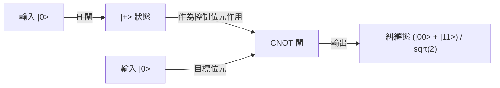

## 1. 前言：量子電腦帶來的典範轉移

現代數位社會高度仰賴先進的密碼技術來確保資訊安全。其中的代表，就是保護網際網路通訊的 RSA 密碼與橢圓曲線密碼。這些公開金鑰密碼系統，將安全性建立在「將巨大整數進行質因數分解極度困難」的數學非對稱性（作為單向函數的性質）上。這個就算使用超級電腦也需要花費等同宇宙年齡時間的計算壁壘，一直以來都是保護我們的隱私、金融交易及國家機密的堅固盾牌。

然而，有一項技術蘊藏著從根本上推翻這個前提的可能性。那就是「量子電腦」。

這種利用支配微觀世界的物理定律——量子力學，直接作為計算資源的全新典範計算機，對於特定類型的問題，能發揮出壓倒性超越古典電腦（現在一般使用的電腦）的計算能力。其中最具象徵意義的例子，就是彼得·秀爾（Peter Shor）在 1994 年發現的「秀爾演算法（Shor's Algorithm）」。因為這個演算法能夠在多項式時間內解決質因數分解問題，一旦實用規模的量子電腦問世，現在被廣泛使用的 RSA 密碼將在轉瞬之間遭到破解。

本文將從根本概念出發，包含「量子位元（Qubit）」、「量子疊加（Quantum Superposition）」與「量子糾纏（Quantum Entanglement）」，極度詳細且系統性地深入探討量子電腦為何如此強大，並解說基本量子閘的運作、構成秀爾演算法核心的「量子傅立葉變換（QFT）」之數學結構，以及目前的含雜訊中等規模量子（NISQ）設備所面臨的錯誤更正挑戰。

## 2. 古典位元與量子位元（Qubit）的決定性差異

### 2.1 古典位元：0 或 1 的決定論世界
我們平時使用的智慧型手機或個人電腦等古典電腦，是以「位元（Bit）」作為資訊的最小單位。古典位元利用電晶體的電壓高低等方式，始終呈現「0」或「1」其中一種明確的狀態。如果擁有 N 個古典位元，就能表現 $2^N$ 種狀態，但在某個特定瞬間，系統所能保持的只有其中的「唯一一種狀態」。進行計算，無非就是讓這個決定論的狀態通過邏輯閘（AND、OR、NOT 等），並將其轉換為另一種狀態的過程。

### 2.2 量子位元（Qubit）：內含無限可能性的狀態
另一方面，作為量子電腦資訊最小單位的「量子位元（Qubit）」，展現出與古典位元截然不同的行為。量子位元利用量子力學的二階系統進行物理實作，例如電子的自旋（向上/向下）、光子的偏振（水平/垂直），或是超導迴路中的電流方向等。

量子位元最大的特徵，就是擁有能同時處於「0」和「1」狀態的「量子疊加（Quantum Superposition）」性質。在數學上，量子位元的狀態 $|\psi\rangle$（在狄拉克符號中表示狀態向量），可表示為基態 $|0\rangle$ 與 $|1\rangle$ 的線性組合（以複數為係數的總和）：

$$ |\psi\rangle = \alpha|0\rangle + \beta|1\rangle $$

在這裡，$\alpha$ 與 $\beta$ 為複數，被稱為機率幅。這些係數決定了在測量量子位元時，得到 $|0\rangle$ 或 $|1\rangle$ 的機率。具體來說，觀測到 $|0\rangle$ 的機率是 $|\alpha|^2$，觀測到 $|1\rangle$ 的機率是 $|\beta|^2$。因為機率總和必須為 1，所以需滿足以下的歸一化條件：

$$ |\alpha|^2 + |\beta|^2 = 1 $$

### 2.3 布洛赫球的視覺化
單一量子位元的狀態，可以幾何化地視覺化為被稱為「布洛赫球（Bloch Sphere）」的單位球面上一點。若將北極設為 $|0\rangle$、南極設為 $|1\rangle$，球體表面上的任何一點都代表一個有效的量子態。相較於古典位元只能取北極或南極兩個點，量子位元可以存在於球面連續無限點上的任何位置。這種連續性，正是賦予量子計算豐富表現力的泉源之一。

## 3. 量子計算的核心：疊加與量子糾纏

### 3.1 指數級的資訊表現力
量子位元的真正價值，在於將多個量子位元組合起來時才能發揮。如果 1 個量子位元能表現 2 種狀態的疊加，那麼 2 個量子位元就能表現 $|00\rangle, |01\rangle, |10\rangle, |11\rangle$ 這 4 種狀態的疊加。一般而言，一個包含 N 個量子位元的系統，能夠保持 $2^N$ 個基態的線性組合狀態：

$$ |\Psi\rangle = c_0|00\dots0\rangle + c_1|00\dots1\rangle + \dots + c_{2^N-1}|11\dots1\rangle $$

這是非常驚人的。只要有短短 300 個量子位元，就能表現 $2^{300}$ 種狀態的疊加，而這個數字遠遠超過了可觀測宇宙中所有原子的數量（約 $10^{80}$）。如果想用古典電腦來模擬這個系統，就必須在記憶體中儲存 $2^{300}$ 個複數，這在物理上是不可能的。量子電腦能夠同時平行存取這個廣闊希爾伯特空間（狀態空間）中的所有位址，並推進計算。

### 3.2 量子糾纏（Quantum Entanglement）
量子計算中不可或缺的另一個奇妙現象，就是「量子糾纏」。這是一種 2 個以上的量子位元強烈結合，導致彼此狀態無法獨立描述的現象。讓我們來思考最簡單的量子糾纏態——「貝爾態（Bell State）」：

$$ |\Phi^+\rangle = \frac{1}{\sqrt{2}} (|00\rangle + |11\rangle) $$

在這個狀態下，如果測量第一個量子位元並得到「0」，那麼另一個量子位元的狀態也會瞬間確定為「0」。相反地，如果得到「1」，另一個也必定會是「1」。這種相關性，即使兩個量子位元位在宇宙的兩端，似乎也能超越光速瞬間互相影響（愛因斯坦將此稱為「幽靈般的超距作用」）。

量子電腦透過利用這種量子糾纏，能夠表現各個資料之間複雜的相關性，並讓多數計算路徑產生高度干涉。

## 4. 量子閘：量子態的操作

如同古典的邏輯閘，量子電腦也是利用「量子閘」來操作量子位元的狀態。在數學上，量子閘以酉矩陣（滿足 $U^\dagger U = I$ 的矩陣）來表示，其作用等同於對量子態向量進行旋轉操作。以下介紹具代表性的量子閘。

### 4.1 包立閘（X, Y, Z）
- **X 閘（量子 NOT 閘）**：將 $|0\rangle$ 翻轉為 $|1\rangle$，將 $|1\rangle$ 翻轉為 $|0\rangle$。相當於在布洛赫球上繞 X 軸旋轉 180 度。
- **Z 閘（相位偏移閘）**：$|0\rangle$ 保持不變，但將 $|1\rangle$ 的相位反轉（係數乘上 -1）。
- **Y 閘**：相當於 X 與 Z 的組合，繞 Y 軸進行 180 度旋轉。

### 4.2 阿達瑪閘（Hadamard Gate）
這是量子演算法中最常被使用的閘之一。它能將決定論的狀態 $|0\rangle$ 或 $|1\rangle$，轉換為機率完全相等的疊加態。

$$ H|0\rangle = \frac{1}{\sqrt{2}}(|0\rangle + |1\rangle) = |+\rangle $$
$$ H|1\rangle = \frac{1}{\sqrt{2}}(|0\rangle - |1\rangle) = |-\rangle $$

藉由對所有量子位元施加阿達瑪閘，就能創造出 $2^N$ 個所有狀態均勻疊加的初始狀態，這便是量子平行計算的出發點。

### 4.3 CNOT 閘（受控 NOT 閘）
這是作用於 2 個量子位元的代表性閘，對於生成量子糾纏不可或缺。只有當「控制位元（Control）」為 $|1\rangle$ 時，才會對「目標位元（Target）」施加 X 閘（NOT 操作）。若控制位元為 $|0\rangle$ 則不進行任何動作。結合阿達瑪閘與 CNOT 閘，就能輕鬆創造出前述的貝爾態。

## 5. 秀爾演算法：RSA 密碼崩潰的劇本

接下來進入正題。量子電腦究竟是如何破解 RSA 密碼的呢？RSA 密碼的安全性，依賴著一個經驗法則：當給定一個巨大的合成數 $N$（兩個質數 $p$ 和 $q$ 的乘積，$N = p \times q$）時，找出原本質數 $p$ 和 $q$ 的「質因數分解問題」，在古典電腦上無法於現實時間內解開。以目前主流的密鑰長度 RSA-2048 來說，位數高達約 600 位，即使是世界最快的超級電腦，也需要耗費如同宇宙壽命般的時間。

然而，1994 年，彼得·秀爾發表了一種量子演算法，巧妙地利用量子力學的性質，在古典的多項式時間內（戲劇性的加速）解決了這個問題。

### 5.1 演算法的全貌（古典與量子的協同）
秀爾演算法其實並非完全只靠量子計算完成，而是採用了結合古典電腦計算與量子計算的混合方法。它利用數論的定理，將質因數分解這個問題轉換為「尋找週期問題（Order-Finding Problem）」，並將尋找週期這個極度困難的部分交給量子電腦處理。

步驟如下：
1. **[古典]** 隨機選擇一個與 $N$ 互質（無公因數）的整數 $a$（$1 < a < N$）。
2. **[古典]** 定義函數 $f(x) = a^x \pmod N$。這個函數會表現出週期性行為。也就是說，存在一個最小正整數 $r$（週期），使得 $f(x+r) = f(x)$ 成立。
3. **[量子]** 使用量子電腦，高速找出這個函數 $f(x)$ 的週期 $r$。（這裡是秀爾演算法的核心）
4. **[古典]** 確認找到的週期 $r$ 為偶數，且 $a^{r/2} \neq -1 \pmod N$（否則重新選擇 $a$）。
5. **[古典]** 計算最大公因數 $\text{gcd}(a^{r/2} \pm 1, N)$。這個計算結果，就是我們正在尋找的 $N$ 的質因數 $p$ 與 $q$。

### 5.2 為什麼知道週期就能知道質因數？
讓我們補充一點數學說明。如果找到了一個偶數週期 $r$，使得 $a^r \equiv 1 \pmod N$ 成立。將這個式子變形後：
$$ a^r - 1 \equiv 0 \pmod N $$
$$ (a^{r/2} - 1)(a^{r/2} + 1) \equiv 0 \pmod N $$
這意味著 $(a^{r/2} - 1)$ 與 $(a^{r/2} + 1)$ 的乘積是 $N$ 的倍數。因此，只要求出這些項其中之一與 $N$ 的最大公因數（可透過輾轉相除法瞬間算出），就能有效率地提取出 $N$ 的質因數（非平凡因數）。

## 6. 量子傅立葉變換（QFT）：透過干涉提取正確答案

問題在於，「要如何高速找出週期 $r$ ？」在古典電腦中，只能透過依序計算 $x=1, 2, 3 \dots$ 的函數 $f(x) = a^x \pmod N$ 來尋找週期，這會耗費指數級的時間。在此，量子電腦的「疊加」與「干涉」便發揮了威力。

### 6.1 透過量子平行性進行同步計算
首先，量子電腦使用阿達瑪閘，在作為輸入的暫存器中，創造出將 $0$ 到 $2^m-1$（一個夠大的數）所有整數 $x$ 均勻疊加的狀態。
接著，對這個整體的疊加態，將函數 $f(x) = a^x \pmod N$ 作為量子電路執行一次（模冪運算電路）。如此一來，藉由量子平行性，所有 $x$ 對應的 $f(x)$ 答案會同時計算於第二個暫存器中，並以量子糾纏態保存下來。

$$ |\psi\rangle = \frac{1}{\sqrt{2^m}} \sum_{x=0}^{2^m-1} |x\rangle |a^x \pmod N\rangle $$

### 6.2 觀測問題：平行計算的陷阱
你可能會想：「太棒了！一次就算出所有的答案了！」然而，量子力學有著無情的法則：「一旦觀測，疊加態就會崩潰，並塌縮為隨機的單一狀態。」好不容易進行了平行計算，如果就這樣直接觀測，只會得到一個隨機 $x$ 對應的單一配對 $(x, a^x \bmod N)$，這與執行一次古典計算的結果毫無二致。這樣完全無法掌握週期 $r$ 的全貌。

### 6.3 波的干涉：放大正確答案，抵消錯誤答案
這時候登場的就是「量子傅立葉變換（Quantum Fourier Transform, QFT）」。QFT 是古典離散傅立葉變換的量子版，但它並非作用於資料陣列，而是直接作用於量子態的機率幅（複數係數）。

如同聲波重疊時會變大或互相抵消，量子態也具有帶有複數振幅的「波」的性質。當把 QFT 應用於具週期性的量子態時，會引發波的「干涉」物理現象。具體來說，它會劇烈放大那些強烈帶有週期 $r$ 資訊的特定狀態（波峰與波峰重疊的部分，即建設性干涉）的機率幅，並將無關狀態（波峰與波谷重疊的部分，即破壞性干涉）的機率幅抵消至零。

在施加 QFT 後進行觀測，測得的將不會是隨機數值，而是有極高機率測得「接近 $2^m / r$ 倍數的數值」。透過將這個測量結果應用連分數展開等古典數學手法，就能以極高精度反推計算出週期 $r$。

秀爾演算法的天才之處，在於它並非試圖直接得知計算過程中的結果，而是建構了一套機制，僅利用波的干涉來提取「隱藏在整體計算結果中的週期性（全域結構）」。

## 7. NISQ 時代與錯誤更正：現實中量子電腦的壁壘

在理論上，量子電腦能摧毀 RSA 密碼已經被證明。那麼，為什麼銀行系統明天不會崩潰呢？這是因為構建量子電腦硬體，是人類史上最艱難的工程挑戰之一。

### 7.1 脫散（量子態的崩潰）
量子位元的疊加與量子糾纏是極度脆弱的狀態。一旦接觸到來自外部環境的微小雜訊（干擾），如熱能、電磁波、宇宙射線，或甚至是微量的雜質，量子態就會崩潰並掉入古典狀態。這個現象被稱為「脫散（Decoherence）」。如果在計算完成前發生脫散，就會產生錯誤。這就是為什麼現在需要將量子位元保護在維持數毫克耳文（接近絕對零度）極低溫環境的稀釋冷凍機中。

### 7.2 NISQ（含雜訊中等規模量子）設備
目前的量子電腦被稱為「NISQ（含雜訊中等規模量子設備）」。它們擁有多達數十到數百個量子位元，但由於雜訊太多，無法執行冗長的計算（深層量子電路）。若要使用秀爾演算法破解 RSA-2048，需要數千個「完美」的量子位元，以及數百萬次的閘操作。以目前硬體的閘保真度（錯誤率）來看，計算途中就會累積錯誤，結果將變成一堆雜訊。

### 7.3 量子錯誤更正與邏輯量子位元
解決這個問題的關鍵是「量子錯誤更正（Quantum Error Correction, QEC）」。在古典電腦中，只需單純複製資訊就能防止錯誤，但量子力學中的「不可複製定理（No-Cloning Theorem）」禁止了對未知量子態的精確複製。

因此，量子錯誤更正使用了如「表面碼（Surface Code）」等先進的拓撲編碼方法。這項技術是將數百、數千個物理量子位元綑綁成量子糾纏態，透過類似多數決的機制來檢測與修正錯誤，創造出「1 個虛擬且完美的量子位元（邏輯量子位元）」。

為了解碼 RSA 密碼，需要數千個這樣的邏輯量子位元。為此，估計將需要數百萬個物理量子位元。相較於目前數十至數百個物理位元的階段，專家普遍認為距離實用化（FTQC：具容錯能力的通用量子電腦）仍需要 10 年以上，甚至數十年的時間。

## 8. 邁向後量子密碼（PQC）的過渡期

我們無法確切知道量子電腦威脅成真的「Q-Day（量子電腦破解密碼之日）」何時到來。然而，由於存在「現在攔截儲存，待未來量子電腦完成時再解密（Store now, decrypt later）」的攻擊手法，國家機密與長期機密資訊的保護早已面臨危機。

為了對抗此威脅，以 NIST（美國國家標準暨技術研究院）為首的國際社會，正快馬加鞭推動「後量子密碼（Post-Quantum Cryptography, PQC）」的標準化與轉換作業，這是一種基於即使是量子電腦也難以破解的新數學問題（如晶格密碼等）所建立的技術。為了防備量子電腦摧毀密碼的未來，我們已經開始構築新的盾牌。

## 9. 結語：資訊科學的新地平線

量子電腦並不只是「把傳統電腦變快」而已。它是將自然界終極法則的量子力學直接表現為演算法，擴展資訊處理極限的全新概念裝置。秀爾演算法正是向我們展示其驚人潛力的第一座里程碑。

與雜訊的搏鬥、擴展規模的困難等，我們必須跨越的高牆依舊高聳。然而，這個集結了物理學、數學、資訊科學、材料工程學智慧的領域，毫無疑問將成為人類下一次技術躍進的中心。量子世界的奇妙現象將如何改寫我們數位社會的根基，其演化過程絕對值得我們拭目以待。
