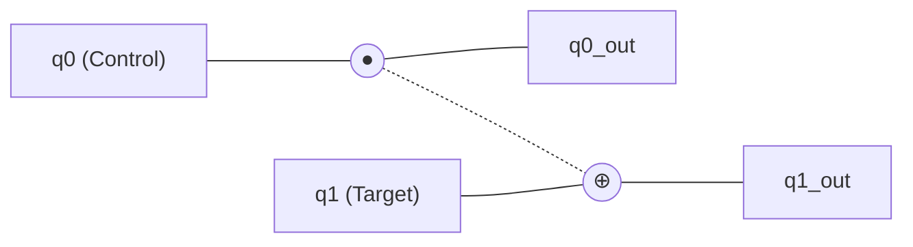
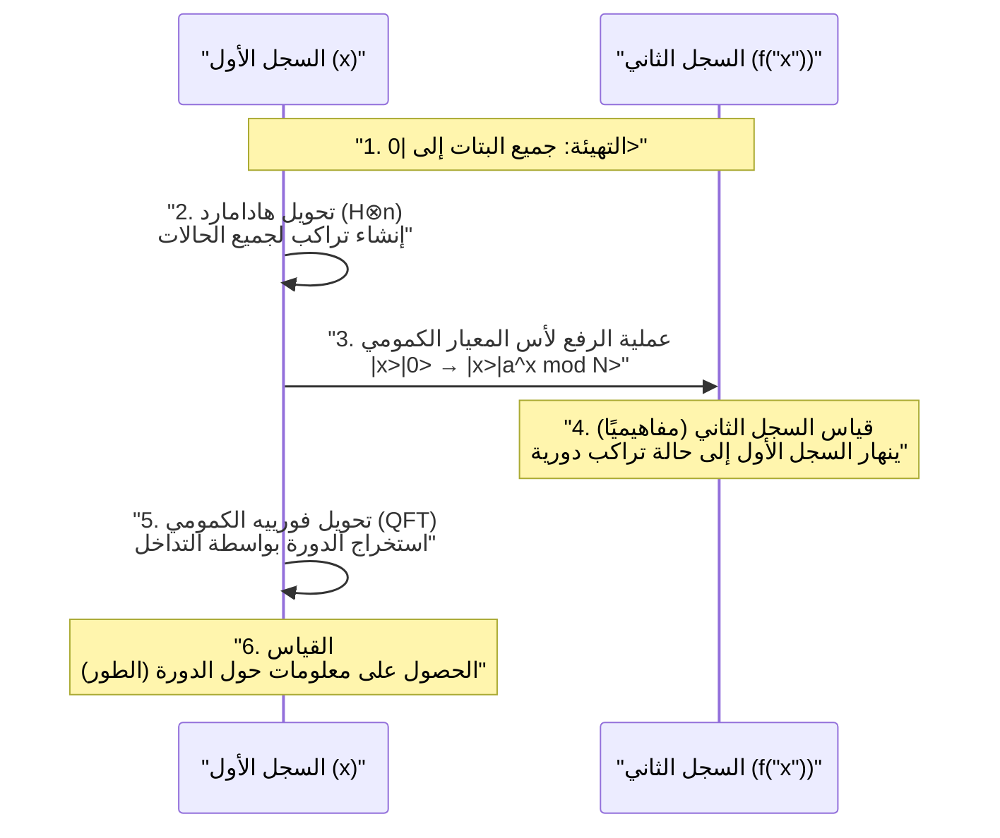

يعتمد أمن مجتمع الإنترنت الحديث على طرق تشفير المفتاح العام مثل تشفير [RSA](https://kenji.blog/ar/p/modern-cryptography-public-key-hash-signature/). وتستند هذه الطرق إلى صعوبة رياضية تتمثل في أن "تحليل الأعداد الضخمة إلى عواملها الأولية يستغرق وقتًا فلكيًا باستخدام أجهزة الكمبيوتر الحالية (الكمبيوتر الكلاسيكي)".

ومع ذلك، تمتلك **الحوسبة الكمومية** (Quantum Computing) القدرة على قلب هذا الافتراض من أساسه. وبشكل خاص، أثبتت **خوارزمية شور** (Shor's Algorithm)، التي اكتشفها بيتر شور (Peter Shor) عام 1994، رياضيًا أنه إذا أصبحت الحوسبة الكمومية قابلة للتطبيق العملي، فسيكون من الممكن كسر تشفير RSA في وقت معقول.

في هذا المقال، سنتعمق في كيفية إجراء الحوسبة الكمومية للحسابات، بدءًا من الآليات الأساسية إلى سبب قدرة خوارزمية شور على تحليل العوامل الأولية بسرعة، بالإضافة إلى الرياضيات الكامنة وراءها وأمثلة لتنفيذها باستخدام البرمجة (Python/Qiskit)، في شرح شامل.

---

## 1. ما هو الكمبيوتر الكمومي؟ الاختلافات عن الكمبيوتر الكلاسيكي

تسمى أجهزة الكمبيوتر الشخصية والهواتف الذكية التي نستخدمها عادةً **أجهزة كمبيوتر كلاسيكية**. تتعامل أجهزة الكمبيوتر الكلاسيكية مع المعلومات كـ **بتات** (bits) تأخذ قيمة "0" أو "1".

من ناحية أخرى، تستخدم أجهزة الكمبيوتر الكمومية **البتات الكمومية** (qubits) كأصغر وحدة للمعلومات. من خلال الاستفادة من الخصائص الغريبة لميكانيكا الكم، فإنها تقوم بالحسابات بنهج مختلف تمامًا عن أجهزة الكمبيوتر التقليدية. الجوهر في ذلك هو "التراكب" (Superposition)، و"التشابك الكمومي" (Entanglement)، و"التداخل الكمومي" (Interference).

### 1.1 التراكب (Superposition)

في حين أن البت الكلاسيكي يمكن أن يأخذ حالة واحدة فقط إما "0" أو "1"، يمكن للبت الكمومي أن يأخذ حالتي "0" و "1" في نفس الوقت. ويسمى هذا بـ **التراكب**.

رياضيًا، يتم التعبير عن الحالة الكمومية $|\psi\rangle$ كتركيبة خطية للحالات الأساسية $|0\rangle$ و $|1\rangle$ على النحو التالي:

$$
|\psi\rangle = \alpha|0\rangle + \beta|1\rangle
$$

هنا، $\alpha$ و $\beta$ هي أعداد مركبة، وتسمى **سعة الاحتمال** (Probability Amplitude). عند مراقبة (قياس) البت الكمومي، تنهار الحالة إلى $|0\rangle$ أو $|1\rangle$ (انهيار الدالة الموجية)، والاحتمالات التي يتم الحصول عليها هي $|\alpha|^2$ و $|\beta|^2$ على التوالي. نظرًا لأن مجموع الاحتمالات يجب أن يكون 1، فإنه يستوفي شرط التطبيع التالي:

$$
|\alpha|^2 + |\beta|^2 = 1
$$

بسبب هذه الخاصية، يمكن لـ $n$ من البتات الكمومية تمثيل تراكب من $2^n$ حالة في وقت واحد. هذا هو أساس الحوسبة الكمومية المتوازية.

### 1.2 التشابك الكمومي (Entanglement)

تُعرف الظاهرة التي ترتبط فيها عدة بتات كمومية بقوة ببعضها البعض، وعندما يتم تحديد حالة أحدهما، يتم تحديد حالة الآخر بشكل فوري بغض النظر عن المسافة المكانية بينهما، بـ **التشابك الكمومي**.

على سبيل المثال، دعونا ننظر في حالة بيل (Bell state) التالية:

$$
|\Phi^+\rangle = \frac{1}{\sqrt{2}} (|00\rangle + |11\rangle)
$$

في هذه الحالة، إذا تم قياس البت الكمومي الأول والحصول على "0"، فسيكون البت الكمومي الثاني دائمًا "0". وعلى العكس من ذلك، إذا تم الحصول على "1"، فسيكون الثاني أيضًا "1". بالاستفادة من هذا الارتباط القوي، يمكن لأجهزة الكمبيوتر الكمومية معالجة الحسابات المعقدة بكفاءة.

### 1.3 التداخل الكمومي (Interference)

البتات الكمومية في حالة التراكب تمتلك خصائص تشبه الموجة. عندما تتداخل قمة موجة مع قمة، فإنها تقوى (تداخل بناء)، وعندما تتداخل قمة مع قاع، فإنها تلغي بعضها البعض (تداخل هدام).
في الحوسبة الكمومية، يتم التحكم في هذا **التداخل الكمومي** بمهارة، وتصمم الخوارزمية لتضخيم سعة الاحتمال للوصول إلى الإجابة الصحيحة وإلغاء سعة الاحتمال للإجابة الخاطئة. خوارزمية شور تستفيد من هذا التداخل بدرجة متقدمة للغاية.

---

## 2. البوابات الكمومية والدوائر الكمومية

ما يعادل البوابات المنطقية (AND، OR، NOT، إلخ) في أجهزة الكمبيوتر الكلاسيكية هو **البوابات الكمومية** في أجهزة الكمبيوتر الكمومية. يتم تمثيل البوابات الكمومية كعمليات لمصفوفات وحدوية (Unitary Matrices) على متجهات الحالة الكمومية.

### 2.1 بوابات البت الكمومي الواحد النموذجية

#### بوابة X (بوابة باولي X)
تعادل بوابة NOT الكلاسيكية. تقلب $|0\rangle$ إلى $|1\rangle$، و $|1\rangle$ إلى $|0\rangle$.

$$
X = \begin{pmatrix} 0 & 1 \\\\ 1 & 0 \end{pmatrix}
$$

#### بوابة Z (بوابة باولي Z)
تعكس فقط طور $|1\rangle$ (تضرب في $-1$). انعكاس الطور مهم جدًا في التداخل الكمومي.

$$
Z = \begin{pmatrix} 1 & 0 \\\\ 0 & -1 \end{pmatrix}
$$

#### بوابة H (بوابة هادامارد)
وهي واحدة من أهم البوابات لخلق حالة تراكب من حالة أساسية.

$$
H = \frac{1}{\sqrt{2}} \begin{pmatrix} 1 & 1 \\\\ 1 & -1 \end{pmatrix}
$$

تصبح $H|0\rangle = \frac{1}{\sqrt{2}}(|0\rangle + |1\rangle)$، وعند قياسها تعطي حالة يمكن الحصول فيها على 0 و 1 باحتمال 50٪ لكل منهما.

### 2.2 بوابات متعددة البتات الكمومية

#### بوابة CNOT (بوابة NOT المتحكم بها)
هي بوابة لبتين كموميين، وتقوم بتطبيق بوابة X (عكس) على البت الهدف فقط عندما يكون البت المتحكم "1". إنها لا غنى عنها لإنشاء التشابك الكمومي.



---

## 3. أساسيات تكنولوجيا التشفير وتشفير [RSA](https://kenji.blog/ar/p/modern-cryptography-public-key-hash-signature/)

لفهم تأثير خوارزمية شور، يجب علينا معرفة كيفية عمل **تشفير RSA**، وهو تشفير المفتاح العام السائد حاليًا.

### 3.1 كيف يعمل تشفير RSA

يستفيد تشفير RSA من صعوبة التحليل إلى العوامل الأولية. نعد عددين أوليين كبيرين جدًا $p$ و $q$، ونحسب حاصل ضربهما $N = p \times q$.

1. من السهل ضرب $p$ و $q$ معًا للحصول على $N$.
2. ومع ذلك، من الصعب جدًا العثور على $p$ و $q$ الأصليين (التحليل إلى عوامل) من $N$.

هذا التفاوت هو مفتاح التشفير. يتم نشر $N$ على نطاق واسع كمفتاح عام ويستخدم للتشفير. من ناحية أخرى، يتم الاحتفاظ بمعلومات $p$ و $q$ بأمان كمفتاح خاص وتستخدم لفك التشفير.

### 3.2 ما مدى صعوبة ذلك؟

حتى باستخدام أجهزة الكمبيوتر العملاقة الحالية، يقال إن تحليل $N$ المكون من آلاف البتات (على سبيل المثال RSA-2048) سيستغرق وقتًا أطول من عمر الكون. حتى مع استخدام الخوارزمية الكلاسيكية الأكثر كفاءة "منخل حقل الأعداد العام" (GNFS)، يزداد مقدار الحساب بشكل أسي (وبشكل أكثر دقة، شبه أسي).

$$
O\left( \exp \left( \left(\frac{64}{9}b\right)^{\frac{1}{3}} (\log b)^{\frac{2}{3}} \right) \right)
$$
※ $b$ هو عدد الخانات (عدد البتات)

هنا تبرز **خوارزمية شور**. حيث تقلل خوارزمية شور من كمية الحساب هذه بشكل كبير إلى وقت متعدد الحدود $O(b^3)$.

---

## 4. نظرة عامة على خوارزمية شور

تحل خوارزمية شور مشكلة التحليل إلى العوامل الأولية عن طريق تحويلها إلى مشكلة رياضية أخرى تسمى **"مشكلة إيجاد الدورة (Period Finding Problem)"**.

تنقسم الخوارزمية بشكل رئيسي إلى جزأين.

1. **الجزء الذي يقوم به الكمبيوتر الكلاسيكي (الاختزال، المعالجة المسبقة، المعالجة اللاحقة)**
2. **الجزء الذي يقوم به الكمبيوتر الكمومي (إيجاد الدورة)**

### 4.1 الجزء الكلاسيكي: الاختزال من التحليل إلى العوامل لإيجاد الدورة

لنفترض أن لدينا عددًا مركبًا $N$ نريد تحليله. (مثال: $N = 15$)

**الخطوة 1:** نختار عددًا صحيحًا عشوائيًا $a$ يكون أوليًا نسبيًا مع $N$ (القاسم المشترك الأكبر هو 1) ($1 < a < N$).
إذا كان القاسم المشترك الأكبر $\gcd(a, N) > 1$، فسنكون قد وجدنا بالفعل عاملًا وتتوقف العملية. (يمكن العثور عليه بسهولة بواسطة خوارزمية إقليدس).

**الخطوة 2:** نعتبر دالة عملية المعيار $f(x)$ كالتالي:

$$
f(x) = a^x \pmod N
$$

من المعروف رياضيًا أنه إذا قمنا بتعويض $x = 0, 1, 2, 3, \dots$ في هذه الدالة $f(x)$، فإن القيم ستتكرر مع دورة $r$ معينة (مبرهنة أويلر). بمعنى آخر، يوجد أصغر عدد صحيح موجب $r$ (الدورة) بحيث $f(x) = f(x + r)$.

على سبيل المثال، في حالة $N = 15$، $a = 7$:
- $7^0 \pmod{15} = 1$
- $7^1 \pmod{15} = 7$
- $7^2 \pmod{15} = 4$
- $7^3 \pmod{15} = 13$
- $7^4 \pmod{15} = 1$ (من هنا تبدأ الحلقة)

نرى أن الدورة $r = 4$.

**الخطوة 3:** إذا كانت الدورة $r$ التي تم العثور عليها عددًا زوجيًا، و $a^{r/2} \not\equiv -1 \pmod N$، يمكن إيجاد العوامل كالتالي:

$$
\gcd(a^{r/2} \pm 1, N)
$$

في المثال السابق ($N=15, a=7, r=4$):
$a^{r/2} = 7^{4/2} = 7^2 = 49$
$49 + 1 = 50$، $\gcd(50, 15) = 5$
$49 - 1 = 48$، $\gcd(48, 15) = 3$

رائع، لقد وجدنا العوامل $5$ و $3$ للعدد $15$!

### 4.2 المشكلة: من الصعب إيجاد الدورة $r$ كلاسيكيًا

لقد رأينا أنه إذا عرفنا الدورة $r$، يمكننا التحليل إلى العوامل. ومع ذلك، عندما يكون $N$ كبيرًا جدًا، فإن حساب $f(x)$ واحدة تلو الأخرى على جهاز كمبيوتر كلاسيكي لإيجاد الدورة $r$ سيستغرق وقتًا أسيًا أيضًا.

لذلك، نترك هذا الجزء الخاص بـ "إيجاد الدورة $r$" إلى الكمبيوتر الكمومي. من خلال استخدام الحوسبة الكمومية المتوازية، نقوم بحساب $f(x)$ لجميع قيم $x$ في وقت واحد، ومن هناك نستخرج الدورة $r$ في لحظة (في وقت متعدد الحدود).

---

## 5. الجزء الكمومي: تحويل فورييه الكمومي واستخراج الدورة

يتقدم جزء الحساب الكمومي في خوارزمية شور بالخطوات التالية.



### 5.1 تقييم الدالة بالحوسبة الكمومية المتوازية

أولاً، نقوم بإعداد سجلين بعدد كافٍ من البتات الكمومية (السجل الأول والسجل الثاني)، ونهيئهما جميعًا إلى $|0\rangle$.
نطبق بوابة هادامارد على السجل الأول لإنشاء حالة تراكب متساوية لجميع قيم $x$ الممكنة (من $0$ إلى $Q-1$).

$$
\frac{1}{\sqrt{Q}} \sum_{x=0}^{Q-1} |x\rangle |0\rangle
$$

بعد ذلك، نستخدم **دائرة الرفع لأس المعيار الكمومي** لحساب $f(x) = a^x \pmod N$ وكتابة النتيجة في السجل الثاني.

$$
\frac{1}{\sqrt{Q}} \sum_{x=0}^{Q-1} |x\rangle |a^x \bmod N\rangle
$$

في هذه المرحلة، تم حساب نتائج $f(x)$ لجميع $x$ مرة واحدة كتراكب كمومي. ولكن، إذا قمنا بالقياس هكذا، فسنحصل فقط على $x$ عشوائي و $f(x)$ المقابل له، ولن نعرف الدورة $r$.

### 5.2 استخراج الحالة الدورية والتداخل الكمومي

لاستخراج الدورة $r$، نطبق **تحويل فورييه الكمومي (Quantum Fourier Transform: QFT)** على السجل الأول، وهي عملية بالغة الأهمية.

يعد QFT النسخة الكمومية من تحويل فورييه المنفصل الكلاسيكي (DFT). يلعب دورًا في تحويل دورية البيانات إلى قمم في مجال التردد. بالنسبة لمتجه الحالة $|\psi\rangle = \sum_{j} x_j |j\rangle$، يعمل QFT على النحو التالي:

$$
QFT(|j\rangle) = \frac{1}{\sqrt{Q}} \sum_{k=0}^{Q-1} e^{\frac{2\pi i j k}{Q}} |k\rangle
$$

حالة السجل الأول ترتبط بحالة السجل الثاني (على سبيل المثال $f(x_0)$)، لذا فهي في حالة تراكب لها قيم متقطعة بدورة محددة. عند تطبيق QFT عليها، يحدث التداخل الكمومي.

- الحالات (سعة الاحتمال) المتعلقة بالدورة الصحيحة $r$ **تتقوى**
- الحالات الأخرى تصبح أطوارها مشتتة و **تلغي بعضها البعض (تتلاشى)**.

ونتيجة لذلك، عند القياس، سنحصل باحتمال كبير على $k$ بحيث $k \approx Q \cdot \frac{c}{r}$ ($c$ عدد صحيح).

### 5.3 المعالجة اللاحقة الكلاسيكية: التوسع في الكسر المستمر

بمجرد الحصول على نتيجة القياس $k$ من الكمبيوتر الكمومي، يحين دور الكمبيوتر الكلاسيكي مرة أخرى.
لقد حصلنا على العلاقة $k / Q \approx c / r$. العَدَدان $c$ و $r$ هما أوليان نسبيًا.

من خلال تحويل الكسر العشري المعروف $k / Q$ إلى كسر تقريبي $c / r$ باستخدام الخوارزمية الكلاسيكية **التوسع في الكسر المستمر (Continued Fraction Expansion)**، يمكننا أخيرًا تحديد الدورة $r$ كالمقام.

بعد ذلك، باتباع الخطوات الموضحة في القسم 4.1 وحساب القاسم المشترك الأكبر، سيتم استنتاج العوامل الأولية لـ $N$ بنجاح.

---

## 6. مثال على تنفيذ خوارزمية شور باستخدام Qiskit

هنا، نقدم مثالًا تنفيذيًا لخوارزمية شور لتحليل العدد الصغير جدًا $N = 15$، باستخدام **Qiskit**، وهو إطار عمل مفتوح المصدر لبرمجة الكمبيوتر الكمومي مقدم من IBM.

(※ بالنسبة لتحليل الأعداد الضخمة العملية، يتطلب الأمر عددًا هائلاً من البتات الكمومية وتصحيح الأخطاء، لذا تقتصر أجهزة المحاكاة والأجهزة الكمومية الصغيرة الحالية على عروض توضيحية لـ $15$ أو $21$)

```python
import numpy as np
from qiskit import QuantumCircuit, transpile
from qiskit.visualization import plot_histogram
from qiskit_aer import AerSimulator
import math
from math import gcd

# --- 1. تعريف دائرة الرفع لأس المعيار الكمومي (a=7, N=15) ---
def c_amod15(a, power):
    """دائرة a^power mod 15 تعمل كبوابة U متحكم بها"""
    U = QuantumCircuit(4)        
    for _iteration in range(power):
        if a in [2,13]:
            U.swap(2,3)
            U.swap(1,2)
            U.swap(0,1)
        if a in [7,8]:
            U.swap(0,1)
            U.swap(1,2)
            U.swap(2,3)
        if a in [4, 11]:
            U.swap(1,3)
            U.swap(0,2)
        if a in [7,11,13]:
            for q in range(4):
                U.x(q)
    U = U.to_gate()
    U.name = f"{a}^{power} mod 15"
    c_U = U.control()
    return c_U

# --- 2. تعريف تحويل فورييه الكمومي العكسي (QFT_dagger) ---
def qft_dagger(n):
    """دائرة تقوم بتحويل فورييه الكمومي العكسي لـ n من البتات الكمومية"""
    qc = QuantumCircuit(n)
    for qubit in range(n//2):
        qc.swap(qubit, n-qubit-1)
    for j in range(n):
        for m in range(j):
            qc.cp(-np.pi/float(2**(j-m)), m, j)
        qc.h(j)
    qc.name = "QFT_dagger"
    return qc

# --- 3. بناء الجسم الرئيسي لخوارزمية شور ---
n_count = 8  # عدد البتات الكمومية لسجل القياس (السجل الأول)
a = 7        # عدد أولي نسبيًا مع N=15

# السجل الأول (8 بتات كمومية) + السجل الثاني (4 بتات كمومية) + السجل الكلاسيكي (8 بتات)
qc = QuantumCircuit(n_count + 4, n_count)

# وضع السجل الأول في حالة تراكب باستخدام بوابة H
for q in range(n_count):
    qc.h(q)

# تعيين الحالة الأولية للسجل الثاني إلى |1> (تطبيق بوابة x على البت الأقل أهمية)
qc.x(n_count)

# تطبيق بوابة الرفع لأس المعيار المتحكم بها
for q in range(n_count):
    qc.append(c_amod15(a, 2**q), 
             [q] + [i+n_count for i in range(4)])

# تطبيق QFT العكسي على السجل الأول
qc.append(qft_dagger(n_count).to_instruction(), range(n_count))

# قياس السجل الأول
qc.measure(range(n_count), range(n_count))

# --- 4. التنفيذ باستخدام جهاز المحاكاة ---
simulator = AerSimulator()
compiled_circuit = transpile(qc, simulator)
job = simulator.run(compiled_circuit, shots=1024)
results = job.result()
counts = results.get_counts()

print("نتائج القياس (الثنائي: عدد مرات المشاهدة):")
print(counts)

# --- 5. المعالجة اللاحقة الكلاسيكية (تحديد الدورة r وحساب العوامل الأولية) ---
# منطق لتحليل النتيجة الأكثر احتمالية من نتائج القياس (نسخة مبسطة)
measured_phases = []
for output in counts:
    decimal = int(output, 2)
    phase = decimal / (2**n_count)
    measured_phases.append(phase)

print(f"\nالطور المقدر (phase): {measured_phases[:4]} ...")
# تستمر العملية لإيجاد المقام r (الدورة) باستخدام التوسع في الكسر المستمر من الطور...
```

عند تنفيذ الكود أعلاه، سيعطي جهاز المحاكاة الكمومي حالات مثل `00000000`, `01000000`, `10000000`, `11000000` باحتمال كبير (0، 64، 128، 192 بالنظام العشري).
بقسمة هذه القيم على $2^8 = 256$، تصبح الأطوار $0$, $0.25$, $0.5$, $0.75$. ويمكن التعبير عن هذه القيم كسور على النحو التالي: $0/4$, $1/4$, $2/4$, $3/4$، مما يوضح أن المقام **4** هو الدورة $r$ التي تم استنتاجها بواسطة الحساب الكمومي.
وبمجرد معرفة الدورة $r=4$، كما ذكرنا سابقًا، يمكن استنتاج العوامل الأولية $3$ و $5$ من $\gcd(7^{4/2} \pm 1, 15)$.

---

## 7. لماذا يواجه تشفير [RSA](https://kenji.blog/ar/p/modern-cryptography-public-key-hash-signature/) خطرًا؟

يزداد مقدار الحساب المطلوب للتحليل إلى العوامل الأولية في الكمبيوتر الكلاسيكي أسيًا مع زيادة عدد الخانات. على سبيل المثال، قد يستغرق تحليل عدد مكون من 100 خانة بضع ثوانٍ، وعدد من 200 خانة عدة سنوات، ويقدر أن تحليل RSA-2048 (حوالي 617 خانة) سيستغرق وقتًا أطول من عمر الكون.

ومع ذلك، عند استخدام خوارزمية شور، فإن عدد خطوات الحساب (عدد البوابات) المطلوبة يزداد بمرتبة متعددة الحدود $O(b^3)$ فقط بالنسبة لعدد الخانات $b$. هذا يعني أنه حتى بالنسبة لـ RSA-2048، إذا كان هناك كمبيوتر كمومي مثالي، فيمكن كسر التشفير في غضون بضع ساعات إلى بضعة أيام.

### التهديد المتمثل في "احفظ الآن، فك التشفير لاحقًا" (Store Now, Decrypt Later)
من الخطر الاعتقاد بأنه "نظرًا لأن أجهزة الكمبيوتر الكمومية عالية الأداء لم تكتمل بعد، فنحن في أمان". يعتبر سيناريو الهجوم حيث تقوم أطراف ثالثة خبيثة أو وكالات حكومية بتسجيل وحفظ البيانات السرية المشفرة المتداولة حاليًا (المعلومات المالية، أسرار الدولة، إلخ) (احفظ الآن)، ثم فك تشفيرها في اللحظة التي يكتمل فيها كمبيوتر كمومي عالي الأداء بعد 10 إلى 20 عامًا (فك التشفير لاحقًا) سيناريو واقعيًا.
ولذلك، هناك حاجة ملحة لتحديث طرق التشفير دون انتظار اكتمال الحواسيب الكمومية.

---

## 8. العقبات أمام تحقيق الكمبيوتر الكمومي: الضوضاء وتصحيح الأخطاء

على الرغم من أن خوارزمية شور مثالية رياضيًا، إلا أن هناك عقبات كبيرة تحول دون تحقيقها فيزيائيًا. تسمى الأجهزة الكمومية الحالية أجهزة **NISQ** (الكم متوسط الحجم ذو الضوضاء)، ولها نقطة ضعف تتمثل في قابليتها العالية للتأثر بالضوضاء (الاضطرابات الناتجة عن البيئة الخارجية والأخطاء في عمليات البوابة).

الحالة الكمومية حساسة للغاية، ويمكن للحرارة الطفيفة أو الموجات الكهرومغناطيسية أن تتسبب في **فك الترابط الكمي** (انهيار الحالة الكمومية). لكسر RSA-2048، من الضروري إجراء ملايين من عمليات البوابة دون أخطاء باستخدام آلاف "البتات الكمومية المنطقية".

لتحقيق ذلك، يتم البحث في **تصحيح الأخطاء الكمومية (Quantum Error Correction)**. إنها تقنية تجمع عدة "بتات كمومية فيزيائية" لتشكيل "بت كمومي منطقي" واحد وتكتشف وتصحح الأخطاء التي تحدث أثناء الحساب. ومع ذلك، يقال إن الأمر سيستغرق من 1000 إلى 10000 بت كمومي فيزيائي لإنشاء بت كمومي منطقي واحد، ومن المتوقع أن يستغرق تحقيق **كمبيوتر كمومي متسامح مع الأخطاء (FTQC)** واسع النطاق يضم عشرات الملايين من البتات الكمومية الفيزيائية اختراقًا تكنولوجيًا يستغرق عقدًا أو عقودًا أخرى.

---

## 9. تقنيات التشفير من الجيل التالي: التشفير ما بعد الكمي (PQC)

لمواجهة تهديد خوارزمية شور، تقوم وكالات حول العالم، بما في ذلك المعهد الوطني الأمريكي للمعايير والتقنية (NIST)، بتوحيد معايير طريقة تشفير جديدة لا يمكن فكها حتى باستخدام أجهزة الكمبيوتر الكمومية، وهي **التشفير ما بعد الكمي (Post-Quantum [Cryptography](https://kenji.blog/ar/p/modern-cryptography-public-key-hash-signature/): PQC)**.

لا تستخدم PQC التقنية الكمومية، بل تعتمد على مشاكل رياضية جديدة يمكن إجراؤها على أجهزة الكمبيوتر الكلاسيكية ولكن لا يمكن حلها بكفاءة حتى باستخدام الخوارزميات الكمومية (لا يمكن تطبيق خوارزمية شور عليها).

الطرق النموذجية في PQC:
- **التشفير القائم على الشبكات (Lattice-based cryptography)**: يستفيد من صعوبة مشاكل مثل مشكلة المتجه الأقصر (SVP) في الفضاء متعدد الأبعاد. (مثل: Kyber، Dilithium)
- **التشفير القائم على الأكواد (Code-based cryptography)**: يستفيد من صعوبة مشكلة فك تشفير رموز تصحيح الأخطاء.
- **تشفير متعدد المتغيرات (Multivariate cryptography)**: يستفيد من صعوبة حل أنظمة المعادلات متعددة الحدود من الدرجة الثانية والتي تحتوي على عدد كبير من المتغيرات.
- **التوقيعات القائمة على التجزئة (Hash-based signatures)**: طرق توقيع تعتمد حصريًا على أمان دوال التجزئة المشفرة.

حاليًا، تمر البنية التحتية لتقنية المعلومات العالمية بفترة انتقالية تاريخية من تشفير RSA والمنحنيات الإهليلجية الحالي إلى هذه الـ PQC (الترحيل).

---

## 10. الخاتمة

في هذا المقال، قمنا بشرح مفصل بدءًا من أساسيات أجهزة الكمبيوتر الكمومية، إلى آلية التحليل إلى العوامل باستخدام خوارزمية شور، وصولاً إلى آفاق تكنولوجيا التشفير المستقبلية.

لا تزال الحوسبة الكمومية في مهدها، وسيستغرق الأمر سنوات عديدة قبل أن يصبح فك التشفير العملي ممكنًا. ومع ذلك، فإن أساسها النظري، **خوارزمية شور**، يمكن القول إنها تبلور للمعرفة البشرية التي تدمج ببراعة بين علوم المعلومات والفيزياء والرياضيات.

آليتها الجميلة، التي تتلاعب بمهارة بالتداخل الكمومي لإبراز "الإجابة الصحيحة" فقط من مساحة بحث أسية، ستكون بالتأكيد معلمًا مهمًا في تصميم الخوارزميات الكمومية التي سيتم تطبيقها في مجالات مختلفة (اكتشاف الأدوية، وحسابات المواد، ومشاكل التحسين، وما إلى ذلك) في المستقبل. نحن نشهد تغييرًا جوهريًا في التكنولوجيا استعدادًا للعصر الكمومي القادم.
