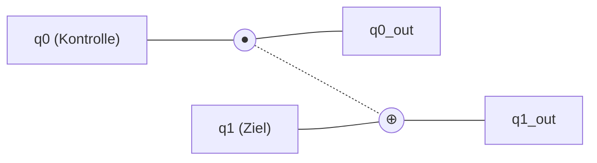
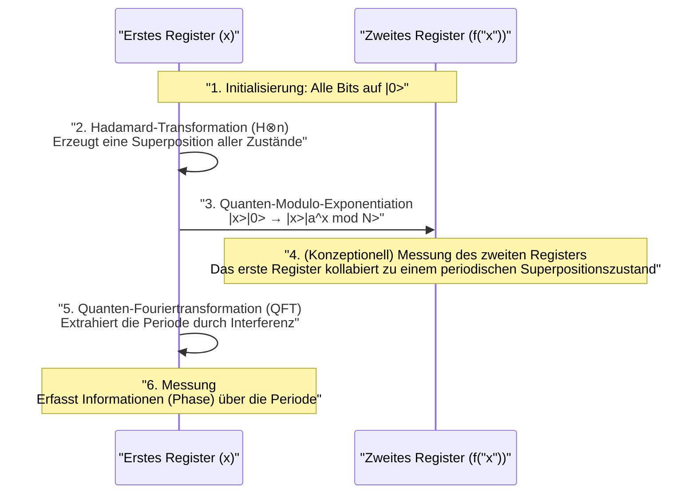

Sicherheit in der modernen Internetgesellschaft wird durch Public-Key-Kryptografie wie [RSA](https://kenji.blog/de/p/modern-cryptography-public-key-hash-signature/) geschützt. Diese Verschlüsselungsmethoden basieren auf der mathematischen Schwierigkeit, dass die Faktorisierung riesiger Zahlen für heutige Computer (klassische Computer) astronomisch viel Zeit in Anspruch nimmt.

Ein **Quantencomputer** birgt jedoch das Potenzial, diese Prämisse grundlegend zu widerlegen. Insbesondere **Shors Algorithmus** (Shor's Algorithm), der 1994 von Peter Shor entdeckt wurde, hat mathematisch bewiesen, dass RSA-Kryptografie in realistischer Zeit geknackt werden kann, sobald Quantencomputer praktisch nutzbar sind.

In diesem Artikel tauchen wir in einem Umfang von etwa 20.000 Zeichen tief in die Thematik ein: von den grundlegenden Mechanismen, wie Quantencomputer Berechnungen durchführen, über die Gründe, warum Shors Algorithmus die Primfaktorzerlegung so schnell ausführen kann, bis hin zu den zugrunde liegenden mathematischen Prinzipien und Programmierbeispielen (Python/Qiskit).

---

## 1. Was ist ein Quantencomputer? Unterschiede zu klassischen Computern

Die PCs und Smartphones, die wir normalerweise verwenden, werden als **klassische Computer** bezeichnet. Klassische Computer verarbeiten Informationen als **Bits** (bit), die entweder "0" oder "1" sein können.

Im Gegensatz dazu verwenden Quantencomputer **Qubits** (qubit) als kleinste Informationseinheit. Durch die Nutzung der seltsamen Eigenschaften der Quantenmechanik führen sie Berechnungen mit einem völlig anderen Ansatz durch als bisherige Computer. Im Zentrum stehen dabei "Superposition" (Überlagerung), "Entanglement" (Quantenverschränkung) und "Interferenz" (Quanteninterferenz).

### 1.1 Superposition (Überlagerung)

Während ein klassisches Bit nur einen von zwei Zuständen, "0" oder "1", annehmen kann, kann ein Qubit beide Zustände "0" und "1" gleichzeitig annehmen. Dies wird als **Superposition** bezeichnet.

Mathematisch wird der Quantenzustand $|\psi\rangle$ als Linearkombination der Basiszustände $|0\rangle$ und $|1\rangle$ wie folgt ausgedrückt:

$$
|\psi\rangle = \alpha|0\rangle + \beta|1\rangle
$$

Hierbei sind $\alpha$ und $\beta$ komplexe Zahlen, die als **Wahrscheinlichkeitsamplituden** bezeichnet werden. Wenn ein Qubit beobachtet (gemessen) wird, kollabiert der [Zustand](https://kenji.blog/de/p/state-management-history-redux-context-recoil-zustand/) (Wellenpaketkollaps) auf $|0\rangle$ oder $|1\rangle$, und die Wahrscheinlichkeiten für die jeweiligen Ergebnisse sind $|\alpha|^2$ und $|\beta|^2$. Da die Summe der Wahrscheinlichkeiten 1 sein muss, gilt die folgende Normierungsbedingung:

$$
|\alpha|^2 + |\beta|^2 = 1
$$

Aufgrund dieser Eigenschaft können $n$ Qubits gleichzeitig die Superposition von $2^n$ Zuständen darstellen. Dies bildet die Grundlage für paralleles Quantenrechnen.

### 1.2 Entanglement (Quantenverschränkung)

Das Phänomen, bei dem mehrere Qubits stark miteinander verbunden sind und die Bestimmung des Zustands des einen sofort den Zustand des anderen bestimmt, unabhängig davon, wie weit sie räumlich getrennt sind, wird als **Quantenverschränkung** (Entanglement) bezeichnet.

Betrachten wir zum Beispiel den folgenden Bell-Zustand (Bell state):

$$
|\Phi^+\rangle = \frac{1}{\sqrt{2}} (|00\rangle + |11\rangle)
$$

Wenn in diesem Zustand das erste Qubit gemessen wird und "0" ergibt, wird das zweite Qubit immer "0" sein. Wenn "1" gemessen wird, ist das zweite ebenfalls "1". Durch die Nutzung dieser starken Korrelation können Quantencomputer komplexe Berechnungen effizient verarbeiten.

### 1.3 Interferenz (Quanteninterferenz)

Qubits im Zustand der Superposition haben wellenartige Eigenschaften. Wenn sich Wellenberge überlagern, verstärken sie sich (konstruktive Interferenz), und wenn sich ein Wellenberg und ein Wellental überlagern, heben sie sich auf (destruktive Interferenz).
Beim Quantencomputing wird diese **Quanteninterferenz** geschickt gesteuert, und Algorithmen werden so entworfen, dass die Wahrscheinlichkeitsamplituden, die zur richtigen Antwort führen, verstärkt werden, während diejenigen für falsche Antworten aufgehoben werden. Shors Algorithmus nutzt diese Interferenz ebenfalls auf extrem anspruchsvolle Weise.

---

## 2. Quantengatter und Quantenschaltkreise

Was in klassischen Computern den Logikgattern (AND, OR, NOT usw.) entspricht, sind beim Quantencomputer die **Quantengatter**. Ein Quantengatter wird als Operation einer unitären Matrix (Unitary Matrix) auf den Quantenzustandsvektor dargestellt.

### 2.1 Repräsentative 1-Qubit-Gatter

#### X-Gatter (Pauli-X-Gatter)
Entspricht dem klassischen NOT-Gatter. Es invertiert $|0\rangle$ zu $|1\rangle$ und $|1\rangle$ zu $|0\rangle$.

$$
X = \begin{pmatrix} 0 & 1 \\\\ 1 & 0 \end{pmatrix}
$$

#### Z-Gatter (Pauli-Z-Gatter)
Invertiert nur die Phase von $|1\rangle$ (multipliziert mit $-1$). Die Phaseninversion ist für die Quanteninterferenz äußerst wichtig.

$$
Z = \begin{pmatrix} 1 & 0 \\\\ 0 & -1 \end{pmatrix}
$$

#### H-Gatter (Hadamard-Gatter)
Eines der wichtigsten Gatter zur Erzeugung eines Superpositionszustands aus einem Basiszustand.

$$
H = \frac{1}{\sqrt{2}} \begin{pmatrix} 1 & 1 \\\\ 1 & -1 \end{pmatrix}
$$

Es gilt $H|0\rangle = \frac{1}{\sqrt{2}}(|0\rangle + |1\rangle)$, was bedeutet, dass bei einer Messung 0 und 1 jeweils mit einer Wahrscheinlichkeit von 50 % auftreten.

### 2.2 Mehr-Qubit-Gatter

#### CNOT-Gatter (Controlled-NOT-Gatter)
Ein Gatter für zwei Qubits, das ein X-Gatter (Inversion) auf das Ziel-Qubit (Target) nur dann anwendet, wenn das Kontroll-Qubit (Control) "1" ist. Es ist unerlässlich zur Erzeugung von Quantenverschränkung.



---

## 3. Grundlagen der Kryptografie und [RSA](https://kenji.blog/de/p/modern-cryptography-public-key-hash-signature/)-Kryptografie

Um die Auswirkungen von Shors Algorithmus zu verstehen, müssen wir die Funktionsweise der derzeit vorherrschenden Public-Key-Kryptografie, der **RSA-Kryptografie**, kennen.

### 3.1 Funktionsweise der RSA-Kryptografie

RSA-Kryptografie nutzt die Schwierigkeit der Primfaktorzerlegung. Zwei riesige Primzahlen $p$ und $q$ werden vorbereitet und ihr Produkt $N = p \times q$ wird berechnet.

1. Es ist einfach, $p$ und $q$ zu multiplizieren, um $N$ zu erzeugen.
2. Es ist jedoch sehr schwierig, aus $N$ die ursprünglichen $p$ und $q$ zu finden (Primfaktorzerlegung).

Diese Asymmetrie ist der Schlüssel zur Verschlüsselung. $N$ wird als öffentlicher Schlüssel weit verbreitet und zur Verschlüsselung verwendet. Andererseits werden die Informationen zu $p$ und $q$ streng als privater Schlüssel geschützt und zur Entschlüsselung verwendet.

### 3.2 Wie schwierig ist es?

Selbst mit heutigen Supercomputern würde die Primfaktorzerlegung eines $N$ mit mehreren tausend Bits (z. B. RSA-2048) länger dauern als das Alter des Universums. Selbst bei Verwendung des effizientesten klassischen Algorithmus, des Zahlkörpersiebs (General Number Field Sieve, GNFS), wächst der Rechenaufwand exponentiell (genauer gesagt subexponentiell).

$$
O\left( \exp \left( \left(\frac{64}{9}b\right)^{\frac{1}{3}} (\log b)^{\frac{2}{3}} \right) \right)
$$
※ $b$ ist die Anzahl der Ziffern (Bits)

Hier kommt **Shors Algorithmus** ins Spiel. Shors Algorithmus reduziert diesen Rechenaufwand drastisch auf eine polynomielle Zeit $O(b^3)$.

---

## 4. Gesamtbild von Shors Algorithmus

Shors Algorithmus löst das Problem der Primfaktorzerlegung, indem er es in ein anderes mathematisches Problem umwandelt: das **Problem der Periodenfindung** (Period Finding Problem).

Der Algorithmus ist grob in zwei Teile unterteilt:

1. **Klassischer Computerteil (Reduktion, Vorverarbeitung, Nachverarbeitung)**
2. **Quantencomputerteil (Periodenfindung)**

### 4.1 Klassischer Teil: Reduktion der Primfaktorzerlegung zur Periodenfindung

Angenommen, wir haben eine zusammengesetzte Zahl $N$, die wir faktorisieren möchten. (Beispiel: $N = 15$)

**Schritt 1:** Wähle eine zufällige ganze Zahl $a$, die teilerfremd zu $N$ ist (größter gemeinsamer Teiler ist 1), mit $1 < a < N$.
Wenn der größte gemeinsame Teiler $\gcd(a, N) > 1$ ist, haben wir bereits einen Faktor gefunden und sind fertig. (Lässt sich leicht mit dem euklidischen Algorithmus finden)

**Schritt 2:** Betrachten wir die folgende Modulo-Funktion $f(x)$:

$$
f(x) = a^x \pmod N
$$

Wenn wir in diese Funktion $f(x)$ die Werte $x = 0, 1, 2, 3, \dots$ einsetzen, ist mathematisch bekannt, dass sich die Werte mit einer bestimmten Periode $r$ wiederholen (Satz von Euler). Das heißt, es gibt eine kleinste positive ganze Zahl $r$ (Periode), für die $f(x) = f(x + r)$ gilt.

Zum Beispiel, wenn $N = 15$ und $a = 7$:
- $7^0 \pmod{15} = 1$
- $7^1 \pmod{15} = 7$
- $7^2 \pmod{15} = 4$
- $7^3 \pmod{15} = 13$
- $7^4 \pmod{15} = 1$ (Ab hier beginnt die Schleife)

Wir können sehen, dass die Periode $r = 4$ ist.

**Schritt 3:** Wenn die gefundene Periode $r$ gerade ist und $a^{r/2} \not\equiv -1 \pmod N$ gilt, lassen sich die Faktoren wie folgt ermitteln:

$$
\gcd(a^{r/2} \pm 1, N)
$$

Im vorherigen Beispiel ($N=15, a=7, r=4$):
$a^{r/2} = 7^{4/2} = 7^2 = 49$
$49 + 1 = 50$, $\gcd(50, 15) = 5$
$49 - 1 = 48$, $\gcd(48, 15) = 3$

Hervorragend, die Faktoren $5$ und $3$ von $15$ wurden gefunden!

### 4.2 Das Problem: Es ist schwierig, die Periode $r$ klassisch zu finden

Wir haben gesehen, dass wir die Primfaktorzerlegung durchführen können, wenn wir die Periode $r$ kennen. Wenn $N$ jedoch sehr groß ist, erfordert die sukzessive Berechnung von $f(x)$ mit einem klassischen Computer zur Findung der Periode $r$ wieder exponentielle Zeit.

Daher überlassen wir genau diesen Teil der "Findung der Periode $r$" dem Quantencomputer. Durch paralleles Quantenrechnen berechnen wir $f(x)$ für alle $x$ gleichzeitig und extrahieren daraus die Periode $r$ augenblicklich (in polynomieller Zeit).

---

## 5. Quantenteil: Quanten-Fouriertransformation und Periodenextraktion

Der Quantenrechenteil von Shors Algorithmus läuft in folgenden Schritten ab:



### 5.1 Auswertung der Funktion durch paralleles Quantenrechnen

Zunächst werden zwei Register mit einer ausreichenden Anzahl von Qubits vorbereitet (erstes und zweites Register) und alle auf $|0\rangle$ initialisiert.
Das Hadamard-Gatter wird auf das erste Register angewendet, wodurch eine gleichmäßige Superposition aller möglichen Werte von $x$ (von $0$ bis $Q-1$) erzeugt wird.

$$
\frac{1}{\sqrt{Q}} \sum_{x=0}^{Q-1} |x\rangle |0\rangle
$$

Dann verwenden wir einen **Quanten-Modulo-Exponentiations-Schaltkreis**, um $f(x) = a^x \pmod N$ zu berechnen und schreiben das Ergebnis in das zweite Register.

$$
\frac{1}{\sqrt{Q}} \sum_{x=0}^{Q-1} |x\rangle |a^x \bmod N\rangle
$$

In dieser Phase wurden die Ergebnisse von $f(x)$ für alle $x$ gleichzeitig als Quantenüberlagerung berechnet. Wenn wir jedoch in diesem [Zustand](https://kenji.blog/de/p/state-management-history-redux-context-recoil-zustand/) messen würden, erhielten wir nur ein zufälliges $x$ und das entsprechende $f(x)$, und die Periode $r$ bliebe unbekannt.

### 5.2 Extraktion des periodischen Zustands und Quanteninterferenz

Um die Periode $r$ zu extrahieren, wenden wir die **Quanten-Fouriertransformation (Quantum Fourier Transform: QFT)**, eine äußerst wichtige Operation, auf das erste Register an.

Die QFT ist die Quantenversion der klassischen diskreten Fouriertransformation (DFT). Sie hat die Aufgabe, die Periodizität von Daten in Peaks im Frequenzbereich umzuwandeln. Auf einen Zustandsvektor $|\psi\rangle = \sum_{j} x_j |j\rangle$ wirkt die QFT wie folgt:

$$
QFT(|j\rangle) = \frac{1}{\sqrt{Q}} \sum_{k=0}^{Q-1} e^{\frac{2\pi i j k}{Q}} |k\rangle
$$

Da der Zustand des ersten Registers an den Zustand des zweiten Registers (z. B. $f(x_0)$) gekoppelt ist, befindet er sich in einer Superposition von diskreten Werten mit einer bestimmten Periode. Die Anwendung der QFT darauf verursacht Quanteninterferenz.

- Zustände (Wahrscheinlichkeitsamplituden), die mit der korrekten Periode $r$ zusammenhängen, **verstärken** sich (konstruktiv).
- Bei anderen Zuständen werden die Phasen zufällig und sie **heben sich auf** (destruktiv).

Infolgedessen erhält man bei der Messung mit hoher Wahrscheinlichkeit ein $k$, für das $k \approx Q \cdot \frac{c}{r}$ gilt ($c$ ist eine ganze Zahl).

### 5.3 Klassische Nachverarbeitung: Kettenbruchentwicklung

Sobald das Messergebnis $k$ vom Quantencomputer vorliegt, ist wieder der klassische Computer an der Reihe.
Wir haben die Beziehung $k / Q \approx c / r$ erhalten. $c$ und $r$ sind teilerfremde ganze Zahlen.

Durch die Umwandlung der bekannten Dezimalzahl $k / Q$ in einen genäherten Bruch $c / r$ mithilfe des klassischen Algorithmus der **Kettenbruchentwicklung (Continued Fraction Expansion)** können wir schließlich den Nenner als Periode $r$ bestimmen.

Danach müssen wir nur noch dem in Abschnitt 4.1 erklärten Verfahren folgen, um den größten gemeinsamen Teiler zu berechnen und die Primfaktoren von $N$ erfolgreich abzuleiten.

---

## 6. Implementierungsbeispiel von Shors Algorithmus mit Qiskit

Hier stellen wir ein Implementierungsbeispiel von Shors Algorithmus vor, der die sehr kleine Zahl $N = 15$ faktorisiert, unter Verwendung von **Qiskit**, einem von IBM bereitgestellten Open-Source-Framework für Quantenprogrammierung.

(※Da die praktische Faktorisierung riesiger Zahlen enorme Mengen an Qubits und Quantenfehlerkorrektur erfordert, beschränken sich aktuelle Simulatoren und kleine Quantenhardware auf Demonstrationen wie $15$ oder $21$)

```python
import numpy as np
from qiskit import QuantumCircuit, transpile
from qiskit.visualization import plot_histogram
from qiskit_aer import AerSimulator
import math
from math import gcd

# --- 1. Definition des Quanten-Modulo-Exponentiations-Schaltkreises (a=7, N=15) ---
def c_amod15(a, power):
    """Eine a^power mod 15 Schaltung, die als kontrolliertes U-Gatter fungiert"""
    U = QuantumCircuit(4)        
    for _iteration in range(power):
        if a in [2,13]:
            U.swap(2,3)
            U.swap(1,2)
            U.swap(0,1)
        if a in [7,8]:
            U.swap(0,1)
            U.swap(1,2)
            U.swap(2,3)
        if a in [4, 11]:
            U.swap(1,3)
            U.swap(0,2)
        if a in [7,11,13]:
            for q in range(4):
                U.x(q)
    U = U.to_gate()
    U.name = f"{a}^{power} mod 15"
    c_U = U.control()
    return c_U

# --- 2. Definition der inversen Quanten-Fouriertransformation (QFT_dagger) ---
def qft_dagger(n):
    """Schaltung, die die inverse Quanten-Fouriertransformation auf n Qubits durchführt"""
    qc = QuantumCircuit(n)
    for qubit in range(n//2):
        qc.swap(qubit, n-qubit-1)
    for j in range(n):
        for m in range(j):
            qc.cp(-np.pi/float(2**(j-m)), m, j)
        qc.h(j)
    qc.name = "QFT_dagger"
    return qc

# --- 3. Aufbau des Hauptteils von Shors Algorithmus ---
n_count = 8  # Anzahl der Qubits im Messregister (erstes Register)
a = 7        # Eine zu N=15 teilerfremde Zahl

# Erstes Register (8 Qubits) + Zweites Register (4 Qubits) + Klassisches Register (8 Bits)
qc = QuantumCircuit(n_count + 4, n_count)

# Bringt das erstes Register mit H-Gattern in einen Superpositionszustand
for q in range(n_count):
    qc.h(q)

# Initialisiert das zweite Register auf |1> (x-Gatter wird auf das niedrigstwertige Bit angewendet)
qc.x(n_count)

# Wendet die kontrollierten Modulo-Exponentiations-Gatter an
for q in range(n_count):
    qc.append(c_amod15(a, 2**q), 
             [q] + [i+n_count for i in range(4)])

# Wendet inverse QFT auf das erste Register an
qc.append(qft_dagger(n_count).to_instruction(), range(n_count))

# Misst das erste Register
qc.measure(range(n_count), range(n_count))

# --- 4. Ausführung auf dem Simulator ---
simulator = AerSimulator()
compiled_circuit = transpile(qc, simulator)
job = simulator.run(compiled_circuit, shots=1024)
results = job.result()
counts = results.get_counts()

print("Messergebnisse (Binär: Häufigkeit):")
print(counts)

# --- 5. Klassische Nachverarbeitung (Ermittlung der Periode r und Berechnung der Primfaktoren) ---
# Logik zur Analyse des wahrscheinlichsten Ergebnisses aus den Messungen (vereinfachte Version)
measured_phases = []
for output in counts:
    decimal = int(output, 2)
    phase = decimal / (2**n_count)
    measured_phases.append(phase)

print(f"\nGeschätzte Phasen (phase): {measured_phases[:4]} ...")
# Danach folgt der Prozess zur Bestimmung des Nenners r (Periode) aus den Phasen mittels Kettenbruchentwicklung...
```

Wenn Sie den obigen Code ausführen, gibt der Quantensimulator mit hoher Wahrscheinlichkeit Zustände wie `00000000`, `01000000`, `10000000`, `11000000` aus (dezimal 0, 64, 128, 192).
Wenn man diese durch $2^8 = 256$ teilt, erhält man die Phasen $0$, $0.25$, $0.5$, $0.75$. Als Brüche ausgedrückt sind das $0/4$, $1/4$, $2/4$, $3/4$, was zeigt, dass der Nenner **4**, also die Periode $r$, erfolgreich durch Quantenberechnung abgeleitet wurde.
Sobald die Periode $r=4$ bekannt ist, lassen sich, wie zuvor erwähnt, aus $\gcd(7^{4/2} \pm 1, 15)$ die Primfaktoren $3$ und $5$ ableiten.

---

## 7. Warum ist die [RSA](https://kenji.blog/de/p/modern-cryptography-public-key-hash-signature/)-Kryptografie in Gefahr?

Der Rechenaufwand für die Primfaktorzerlegung auf einem klassischen Computer wächst exponentiell mit der Anzahl der Ziffern. Zum Beispiel dauert die Faktorisierung einer 100-stelligen Zahl wenige Sekunden, einer 200-stelligen Zahl mehrere Jahre, und für RSA-2048 (etwa 617 Ziffern) wird geschätzt, dass es länger dauert als die Lebensdauer des Universums.

Bei Verwendung von Shors Algorithmus steigt die Anzahl der benötigten Rechenschritte (Gatter) jedoch nur polynomial $O(b^3)$ in Bezug auf die Ziffernzahl $b$. Dies bedeutet, dass selbst RSA-2048 in wenigen Stunden bis Tagen geknackt werden könnte, wenn ein idealer Quantencomputer zur Verfügung stünde.

### Die Bedrohung durch "Store Now, Decrypt Later"
Es ist gefährlich zu denken: "Wir sind sicher, weil noch keine leistungsstarken Quantencomputer fertiggestellt wurden." Ein Angriffsszenario, bei dem böswillige Dritte oder staatliche Behörden heute zirkulierende verschlüsselte vertrauliche Daten (wie Finanzinformationen oder Staatsgeheimnisse) speichern ("Store Now") und in 10 bis 20 Jahren, sobald ein leistungsstarker Quantencomputer verfügbar ist, entschlüsseln ("Decrypt Later"), wird als reales Risiko betrachtet.
Daher müssen kryptografische Methoden aktualisiert werden, ohne auf die Fertigstellung von Quantencomputern zu warten.

---

## 8. Die Mauer zur Realisierung von Quantencomputern: Rauschen und Fehlerkorrektur

Obwohl Shors Algorithmus mathematisch perfekt ist, steht seiner physikalischen Umsetzung eine hohe Mauer im Weg. Aktuelle Quantenhardware wird als **NISQ**-Geräte (Noisy Intermediate-Scale Quantum) bezeichnet und hat die Schwäche, extrem anfällig für Rauschen (Störungen durch die äußere Umgebung oder Fehler bei Gatteroperationen) zu sein.

Quantenzustände sind extrem empfindlich, und schon geringe Hitze oder elektromagnetische Wellen können zur **Dekohärenz** (Zusammenbruch des Quantenzustands) führen. Um RSA-2048 zu knacken, müssten Tausende von "logischen Qubits" und Hunderte Millionen von Gatteroperationen fehlerfrei ausgeführt werden.

Um dies zu erreichen, wird an der **Quantenfehlerkorrektur (Quantum Error Correction)** geforscht. Dies ist eine Technologie, bei der mehrere "physische Qubits" zu einem einzigen "logischen Qubit" gebündelt werden, um während der Berechnung auftretende Fehler zu erkennen und zu korrigieren. Es wird jedoch gesagt, dass zur Herstellung eines einzigen logischen Qubits 1.000 bis 10.000 physische Qubits erforderlich sind. Daher wird erwartet, dass es noch ein Jahrzehnt bis zu mehreren Jahrzehnten dauert, bis bahnbrechende Entwicklungen einen großen **fehlertoleranten Quantencomputer (Fault-Tolerant Quantum Computer, FTQC)** mit zweistellig Millionen physischen Qubits ermöglichen.

---

## 9. Die nächste Generation der Kryptografie: Post-Quanten-Kryptografie (PQC)

Um der Bedrohung durch Shors Algorithmus zu begegnen, treiben Organisationen weltweit, einschließlich des US-amerikanischen National Institute of Standards and Technology (NIST), die Standardisierung einer neuen kryptografischen Methode namens **Post-Quanten-Kryptografie (Post-Quantum [Cryptography](https://kenji.blog/de/p/modern-cryptography-public-key-hash-signature/): PQC)** voran, die selbst von Quantencomputern nicht geknackt werden kann.

PQC verwendet keine Quantentechnologie, sondern basiert auf neuen mathematischen Problemen, die auf klassischen Computern ausgeführt werden können, aber nicht effizient durch Quantenalgorithmen gelöst werden können (bei denen Shors Algorithmus nicht anwendbar ist).

Typische Ansätze der PQC:
- **Gitterbasierte Kryptografie (Lattice-based cryptography)**: Nutzt die Schwierigkeit von Problemen wie dem Shortest Vector Problem (SVP) in vieldimensionalen Räumen. (Beispiel: Kyber, Dilithium)
- **Codebasierte Kryptografie (Code-based cryptography)**: Nutzt die Schwierigkeit bei der Decodierung von Fehlerkorrekturcodes.
- **Multivariate Kryptografie (Multivariate cryptography)**: Nutzt die Schwierigkeit der Lösung quadratischer polynomialer Gleichungssysteme mit vielen Variablen.
- **Hash-basierte Signaturen (Hash-based signatures)**: Signatursysteme, die ausschließlich auf der Sicherheit kryptografischer Hashfunktionen beruhen.

Derzeit durchläuft die globale IT-Infrastruktur eine historische Übergangsphase der Migration von bestehender RSA- und elliptischer Kurven-Kryptografie zu dieser PQC.

---

## 10. Fazit

In diesem Artikel haben wir detailliert alles von den Grundlagen von Quantencomputern über den Mechanismus der Primfaktorzerlegung durch Shors Algorithmus bis hin zu den Aussichten für zukünftige kryptografische Technologien erklärt.

Quantencomputer stecken noch in den Kinderschuhen, und es wird viele Jahre dauern, bis sie für die praktische Entschlüsselung eingesetzt werden können. Jedoch ist seine theoretische Grundlage, **Shors Algorithmus**, die Kristallisation menschlichen Wissens, in dem Informationswissenschaft, Physik und Mathematik wunderbar verschmelzen.

Sein eleganter Mechanismus, der Quanteninterferenz geschickt manipuliert, um nur die "richtige Antwort" aus einem exponentiellen Suchraum hervorzuheben, wird auch weiterhin als wichtiger Meilenstein für den Entwurf von Quantenalgorithmen dienen, die in verschiedenen Bereichen (wie Medikamentenentwicklung, Materialberechnung und Optimierungsproblemen) angewendet werden. Wir erleben eine grundlegende technologische Veränderung auf dem Weg in das kommende Quantenzeitalter.
