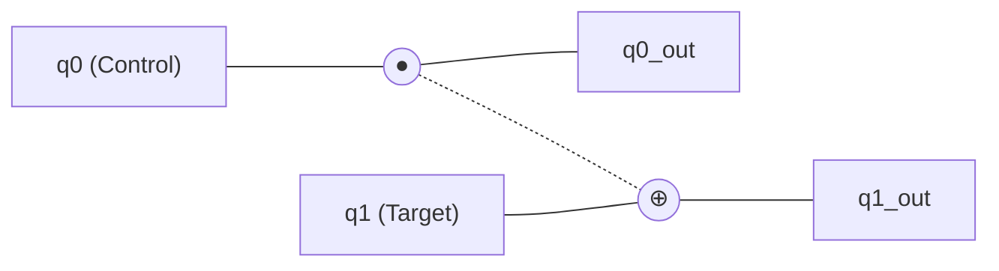
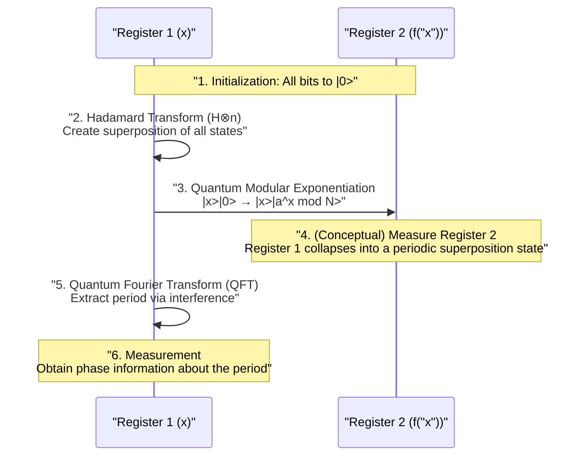

Security in modern internet society is protected by public-key cryptography systems such as [RSA](https://kenji.blog/en/p/modern-cryptography-public-key-hash-signature/) encryption. These cryptographic systems base their security on the mathematical difficulty that "factoring giant numbers takes an astronomical amount of time for current computers (classical computers)."

However, it is the **quantum computer** that has the potential to fundamentally overturn this premise. In particular, **Shor's Algorithm**, discovered by Peter Shor in 1994, mathematically proved that if a quantum computer were put into practical use, RSA encryption could be broken within a realistic timeframe.

In this article, we will thoroughly dive deep into the fundamental mechanisms of how quantum computers perform calculations, why Shor's algorithm can perform prime factorization so quickly, and the underlying mathematics and programming (Python/Qiskit) implementation examples, in a large scale of about 20,000 characters.

---

## 1. What is a Quantum Computer? Differences from Classical Computers

The PCs and smartphones we use normally are called **classical computers**. Classical computers treat information as **bits**, which are either "0" or "1".

On the other hand, quantum computers use **qubits** as the smallest unit of information. By utilizing the strange properties of quantum mechanics, they perform calculations using a completely different approach from conventional computers. The core of this is "Superposition", "Entanglement", and "Interference".

### 1.1 Superposition

While a classical bit can only take one of two states, "0" or "1", a qubit can take both "0" and "1" states simultaneously. This is called **superposition**.

Mathematically, a quantum state $|\psi\rangle$ is expressed as a linear combination of the basis states $|0\rangle$ and $|1\rangle$ as follows.

$$
|\psi\rangle = \alpha|0\rangle + \beta|1\rangle
$$

Here, $\alpha$ and $\beta$ are complex numbers and are called **probability amplitudes**. When a qubit is observed (measured), the state converges (collapse of the wave packet) to $|0\rangle$ or $|1\rangle$, and the probability of obtaining each is $|\alpha|^2$ and $|\beta|^2$, respectively. Since the sum of probabilities must be 1, it satisfies the following normalization condition.

$$
|\alpha|^2 + |\beta|^2 = 1
$$

Due to this property, $n$ qubits can simultaneously express a superposition of $2^n$ states. This forms the foundation of quantum parallel computing.

### 1.2 Entanglement

The phenomenon where multiple qubits are strongly bound together, and when the state of one is determined, the state of the other is instantly determined regardless of spatial distance, is called **quantum entanglement**.

For example, let's consider the following Bell state.

$$
|\Phi^+\rangle = \frac{1}{\sqrt{2}} (|00\rangle + |11\rangle)
$$

In this state, if the first qubit is measured and "0" is obtained, the second qubit will definitely be "0". Conversely, if "1" is obtained, the second will also be "1". By utilizing this strong correlation, quantum computers can process complex calculations efficiently.

### 1.3 Interference

Qubits in a superposition state have wave-like properties. When the peaks of waves overlap, they become larger (constructive interference), and when a peak and a trough overlap, they cancel each other out (destructive interference).
In quantum computing, algorithms are designed to skillfully control this **quantum interference**, amplifying the probability amplitudes that lead to the correct answer and canceling out the probability amplitudes for incorrect answers. Shor's algorithm also utilizes this interference in an extremely sophisticated manner.

---

## 2. Quantum Gates and Quantum Circuits

Corresponding to logic gates (AND, OR, NOT, etc.) in classical computers are **quantum gates** in quantum computers. Quantum gates are represented as operations of Unitary Matrices on quantum state vectors.

### 2.1 Representative Single-Qubit Gates

#### X Gate (Pauli-X Gate)
Equivalent to a classical NOT gate. It flips $|0\rangle$ to $|1\rangle$, and $|1\rangle$ to $|0\rangle$.

$$
X = \begin{pmatrix} 0 & 1 \\ 1 & 0 \end{pmatrix}
$$

#### Z Gate (Pauli-Z Gate)
Only flips the phase of $|1\rangle$ (multiplies by $-1$). Phase flipping is extremely important in quantum interference.

$$
Z = \begin{pmatrix} 1 & 0 \\ 0 & -1 \end{pmatrix}
$$

#### H Gate (Hadamard Gate)
One of the most important gates that creates a superposition state from a basis state.

$$
H = \frac{1}{\sqrt{2}} \begin{pmatrix} 1 & 1 \\ 1 & -1 \end{pmatrix}
$$

It becomes $H|0\rangle = \frac{1}{\sqrt{2}}(|0\rangle + |1\rangle)$, which means measuring it will result in a 50% probability of getting 0 or 1.

### 2.2 Multi-Qubit Gates

#### CNOT Gate (Controlled-NOT Gate)
A gate for two qubits; it applies an X gate (flip) to the target bit only when the control bit is "1". It is essential for creating quantum entanglement.



---

## 3. Basics of [Cryptography](https://kenji.blog/en/p/modern-cryptography-public-key-hash-signature/) and [RSA](https://kenji.blog/en/p/modern-cryptography-public-key-hash-signature/) Encryption

To understand the impact of Shor's algorithm, it is necessary to know the mechanism of **RSA encryption**, which is currently the mainstream public-key cryptography.

### 3.1 Mechanism of RSA Encryption

RSA encryption utilizes the difficulty of prime factorization. Two huge prime numbers $p$ and $q$ are prepared, and their product $N = p \times q$ is calculated.

1. It is easy to multiply $p$ and $q$ to create $N$.
2. However, finding the original $p$ and $q$ from $N$ (prime factorization) is very difficult.

This asymmetry is the key to the cryptography. $N$ is widely published as a public key and used for encryption. On the other hand, the information of $p$ and $q$ is strictly kept as a private key and used for decryption.

### 3.2 How Difficult is it?

Even using current supercomputers, it is estimated to take longer than the age of the universe to factorize a thousands-of-bits $N$ (e.g., RSA-2048). Even using the most efficient classical algorithm, the "General Number Field Sieve (GNFS)", the computational complexity increases exponentially (or rather, sub-exponentially).

$$
O\left( \exp \left( \left(\frac{64}{9}b\right)^{\frac{1}{3}} (\log b)^{\frac{2}{3}} \right) \right)
$$
※ $b$ is the number of digits (bits)

This is where **Shor's Algorithm** comes in. Shor's algorithm dramatically reduces this computational complexity to a polynomial time $O(b^3)$.

---

## 4. Overview of Shor's Algorithm

Shor's algorithm solves the prime factorization problem by transforming it into another mathematical problem called the **"Period Finding Problem"**.

The algorithm is broadly divided into two parts.

1. **Part performed by classical computers (Reduction, Pre-processing, Post-processing)**
2. **Part performed by quantum computers (Period finding)**

### 4.1 Classical Part: Reduction from Prime Factorization to Period Finding

Suppose a composite number $N$ to be factorized is given. (Example: $N = 15$)

**Step 1:** Choose a random integer $a$ that is coprime (greatest common divisor is 1) to $N$ ($1 < a < N$).
If the greatest common divisor $\gcd(a, N) > 1$, a factor has already been found and the process ends. (It can be easily found using the Euclidean algorithm)

**Step 2:** Consider the following modulo arithmetic function $f(x)$.

$$
f(x) = a^x \pmod N
$$

It is mathematically known (Euler's theorem) that substituting $x = 0, 1, 2, 3, \dots$ into this function $f(x)$ will repeat values at a certain period $r$. That is, there exists a minimum positive integer $r$ (period) such that $f(x) = f(x + r)$.

For example, when $N = 15$ and $a = 7$:
- $7^0 \pmod{15} = 1$
- $7^1 \pmod{15} = 7$
- $7^2 \pmod{15} = 4$
- $7^3 \pmod{15} = 13$
- $7^4 \pmod{15} = 1$ (loop starts from here)

We can see that the period $r = 4$.

**Step 3:** If the found period $r$ is even, and $a^{r/2} \not\equiv -1 \pmod N$, then the factors can be found as follows.

$$
\gcd(a^{r/2} \pm 1, N)
$$

In the previous example ($N=15, a=7, r=4$):
$a^{r/2} = 7^{4/2} = 7^2 = 49$
$49 + 1 = 50$, $\gcd(50, 15) = 5$
$49 - 1 = 48$, $\gcd(48, 15) = 3$

Impressively, the factors $5$ and $3$ of $15$ have been found!

### 4.2 The Problem: It is Difficult to Find the Period $r$ Classically

We learned that prime factorization is possible if the period $r$ is known. However, if $N$ is very large, calculating $f(x)$ one by one on a classical computer to find the period $r$ still takes an exponential amount of time.

Therefore, only this part of "finding the period $r$" is entrusted to a quantum computer. By using quantum parallel computing, $f(x)$ for all $x$ is calculated simultaneously, and the period $r$ is extracted in an instant (in polynomial time) from there.

---

## 5. Quantum Part: Quantum Fourier Transform and Period Extraction

The quantum computation part of Shor's algorithm proceeds in the following steps.



### 5.1 Function Evaluation by Quantum Parallel Computing

First, prepare two registers (Register 1 and Register 2) with a sufficient number of qubits, and initialize them all to $|0\rangle$.
Apply Hadamard gates to Register 1 to create an equal superposition state of all possible values of $x$ (from $0$ to $Q-1$).

$$
\frac{1}{\sqrt{Q}} \sum_{x=0}^{Q-1} |x\rangle |0\rangle
$$

Next, use a **quantum modular exponentiation circuit** to calculate $f(x) = a^x \pmod N$, and write the result into Register 2.

$$
\frac{1}{\sqrt{Q}} \sum_{x=0}^{Q-1} |x\rangle |a^x \bmod N\rangle
$$

At this stage, the results of $f(x)$ for all $x$ have been calculated simultaneously as a quantum superposition. However, even if measured as is, only a random $x$ and its corresponding $f(x)$ would be obtained, and the period $r$ would remain unknown.

### 5.2 Extracting the Periodic [State](https://kenji.blog/en/p/iac-infrastructure-as-code-terraform/) and Quantum Interference

To extract the period $r$, a critically important operation called the **Quantum Fourier Transform (QFT)** is applied to Register 1.

QFT is the quantum version of the classical Discrete Fourier Transform (DFT). It serves to convert the periodicity of data into peaks in the frequency domain. For a state vector $|\psi\rangle = \sum_{j} x_j |j\rangle$, QFT acts as follows:

$$
QFT(|j\rangle) = \frac{1}{\sqrt{Q}} \sum_{k=0}^{Q-1} e^{\frac{2\pi i j k}{Q}} |k\rangle
$$

Since the state of Register 1 is entangled with the state of Register 2 (e.g., $f(x_0)$), it is a superposition state that takes discrete values at a specific period. Applying QFT to this causes quantum interference.

- The states (probability amplitudes) associated with the correct period $r$ **constructively interfere**.
- The other states have out-of-sync phases and **destructively interfere (cancel out)**.

As a result, upon measurement, we obtain a $k$ with high probability such that $k \approx Q \cdot \frac{c}{r}$ ($c$ is an integer).

### 5.3 Classical Post-Processing: Continued Fraction Expansion

Once the measurement result $k$ is obtained from the quantum computer, it's time for the classical computer again.
We have the relationship $k / Q \approx c / r$. $c$ and $r$ are coprime integers.

By converting the known decimal $k / Q$ into an approximate fraction $c / r$ using the classical algorithm **Continued Fraction Expansion**, we can finally determine the period $r$ as the denominator.

Then, by calculating the greatest common divisor following the procedure explained in Section 4.1, the prime factors of $N$ are beautifully derived.

---

## 6. Implementation Example of Shor's Algorithm using Qiskit

Here, we will introduce an implementation example of Shor's algorithm to factorize a very small number, $N = 15$, using **Qiskit**, an open-source quantum programming framework provided by IBM.

(*For the factorization of practical giant numbers, since enormous numbers of qubits and error correction are required, demonstrations are currently limited to numbers like $15$ or $21$ on current simulators or small-scale quantum hardware.*)

```python
import numpy as np
from qiskit import QuantumCircuit, transpile
from qiskit.visualization import plot_histogram
from qiskit_aer import AerSimulator
import math
from math import gcd

# --- 1. Definition of the quantum modular exponentiation circuit (a=7, N=15) ---
def c_amod15(a, power):
    """a^power mod 15 circuit functioning as a controlled-U gate"""
    U = QuantumCircuit(4)        
    for _iteration in range(power):
        if a in [2,13]:
            U.swap(2,3)
            U.swap(1,2)
            U.swap(0,1)
        if a in [7,8]:
            U.swap(0,1)
            U.swap(1,2)
            U.swap(2,3)
        if a in [4, 11]:
            U.swap(1,3)
            U.swap(0,2)
        if a in [7,11,13]:
            for q in range(4):
                U.x(q)
    U = U.to_gate()
    U.name = f"{a}^{power} mod 15"
    c_U = U.control()
    return c_U

# --- 2. Definition of the Inverse Quantum Fourier Transform (QFT_dagger) ---
def qft_dagger(n):
    """Circuit performing the inverse quantum Fourier transform for n qubits"""
    qc = QuantumCircuit(n)
    for qubit in range(n//2):
        qc.swap(qubit, n-qubit-1)
    for j in range(n):
        for m in range(j):
            qc.cp(-np.pi/float(2**(j-m)), m, j)
        qc.h(j)
    qc.name = "QFT_dagger"
    return qc

# --- 3. Construction of the main Shor's algorithm ---
n_count = 8  # Number of qubits for the measurement register (Register 1)
a = 7        # A number coprime to N=15

# Register 1 (8 qubits) + Register 2 (4 qubits) + Classical Register (8 bits)
qc = QuantumCircuit(n_count + 4, n_count)

# Put Register 1 into a superposition state using H gates
for q in range(n_count):
    qc.h(q)

# Set the initial state of Register 2 to |1> (apply x gate to the lowest bit)
qc.x(n_count)

# Apply the controlled modular exponentiation gates
for q in range(n_count):
    qc.append(c_amod15(a, 2**q), 
             [q] + [i+n_count for i in range(4)])

# Apply inverse QFT to Register 1
qc.append(qft_dagger(n_count).to_instruction(), range(n_count))

# Measure Register 1
qc.measure(range(n_count), range(n_count))

# --- 4. Execution using a simulator ---
simulator = AerSimulator()
compiled_circuit = transpile(qc, simulator)
job = simulator.run(compiled_circuit, shots=1024)
results = job.result()
counts = results.get_counts()

print("Measurement results (Binary: Count):")
print(counts)

# --- 5. Classical post-processing (Determining the period r and calculating prime factors) ---
# Logic to analyze the most probable outcomes from the measurement results (simplified version)
measured_phases = []
for output in counts:
    decimal = int(output, 2)
    phase = decimal / (2**n_count)
    measured_phases.append(phase)

print(f"\nEstimated phases: {measured_phases[:4]} ...")
# Process continues to find the denominator r (period) from the phase using continued fraction expansion...
```

When the above code is executed, the quantum simulator will output states like `00000000`, `01000000`, `10000000`, `11000000` (0, 64, 128, 192 in decimal) with high probability.
Dividing these by $2^8 = 256$, the phases are $0$, $0.25$, $0.5$, $0.75$. Expressed as fractions, these are $0/4$, $1/4$, $2/4$, $3/4$, showing that the denominator **4**, which is the period $r$, has been derived by the quantum computation.
Once the period $r=4$ is known, as previously mentioned, the prime factors $3$ and $5$ are derived from $\gcd(7^{4/2} \pm 1, 15)$.

---

## 7. Why is [RSA](https://kenji.blog/en/p/modern-cryptography-public-key-hash-signature/) Encryption in Jeopardy?

The computational complexity of prime factorization on a classical computer increases exponentially as the number of digits increases. For example, it is estimated to take a few seconds to factorize a 100-digit number, several years for 200 digits, and more time than the age of the universe for RSA-2048 (about 617 digits).

However, when using Shor's algorithm, the required number of computational steps (number of gates) only increases in polynomial order $O(b^3)$ with respect to the number of digits $b$. This means that even RSA-2048 could be decrypted in hours to days, provided an ideal quantum computer exists.

### The Threat of "Store Now, Decrypt Later"
It is dangerous to think, "We are safe because high-performance quantum computers have not been completed yet." An attack scenario is considered realistic where malicious third parties or state agencies record and store encrypted sensitive data (financial information, state secrets, etc.) currently in circulation ("Store Now") and decrypt it the moment a high-performance quantum computer is completed in 10 to 20 years ("Decrypt Later").
Therefore, there is an urgent need to update cryptographic methods without waiting for the completion of quantum computers.

---

## 8. The Wall to Realizing Quantum Computers: Noise and Error Correction

Shor's algorithm is mathematically perfect, but high walls stand in the way of physical realization. Current quantum hardware is called **NISQ** (Noisy Intermediate-Scale Quantum) devices, and it has the weakness of being extremely susceptible to noise (disturbances from the external environment or errors in gate operations).

Quantum states are extremely delicate, and slight heat or electromagnetic waves can cause **decoherence** (collapse of the quantum state). To decrypt RSA-2048, it is necessary to perform hundreds of millions of gate operations without error using thousands of "logical qubits".

**Quantum Error Correction** is being researched to achieve this. It is a technology that bundles multiple "physical qubits" to form a single "logical qubit", detecting and correcting errors that occur during calculations. However, it is said that 1,000 to 10,000 physical qubits are needed to create one logical qubit, and it is expected that a breakthrough taking another ten to decades will be required to realize a large-scale **Fault-Tolerant Quantum Computer (FTQC)** of the tens of millions of physical qubits class.

---

## 9. Next-Generation Cryptographic Technology: Post-Quantum [Cryptography](https://kenji.blog/en/p/modern-cryptography-public-key-hash-signature/) (PQC)

To counter the threat of Shor's algorithm, organizations around the world, including the National Institute of Standards and Technology (NIST) in the US, are promoting the standardization of a new cryptographic method called **Post-Quantum Cryptography (PQC)** that cannot be decrypted even by quantum computers.

PQC does not use quantum technology; it is based on new mathematical problems that can be executed on classical computers but cannot be solved efficiently using quantum algorithms (i.e., problems to which Shor's algorithm cannot be applied).

Representative PQC approaches:
- **Lattice-based cryptography**: Utilizes the difficulty of problems such as the Shortest Vector Problem (SVP) in multi-dimensional space. (e.g., Kyber, Dilithium)
- **Code-based cryptography**: Utilizes the difficulty of decoding error-correcting codes.
- **Multivariate cryptography**: Utilizes the difficulty of solving systems of quadratic polynomial equations with many variables.
- **Hash-based signatures**: A signature scheme that relies solely on the security of cryptographic hash functions.

Currently, the world's IT infrastructure is facing a historical transition period of migration from existing RSA and elliptic curve cryptography to these PQCs.

---

## 10. Conclusion

In this article, we detailed everything from the basics of quantum computers to the mechanism of prime factorization using Shor's algorithm, and the prospects for future cryptographic technologies.

Quantum computers are still in their infancy, and it will take many years before practical cryptographic decryption is possible. However, its theoretical underpinning, **Shor's Algorithm**, can be said to be the crystallization of human intellect where information science, physics, and mathematics are brilliantly integrated.

Its beautiful mechanism of skillfully manipulating quantum interference to emerge only the "correct answer" from an exponential search space will continue to be an important guidepost in designing quantum algorithms to be applied to various fields (drug discovery, materials calculation, optimization problems, etc.). We are witnessing a fundamental change in technology heading towards the coming quantum era.
