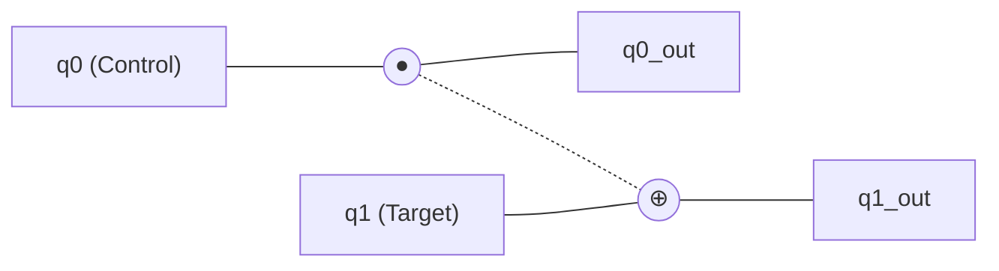
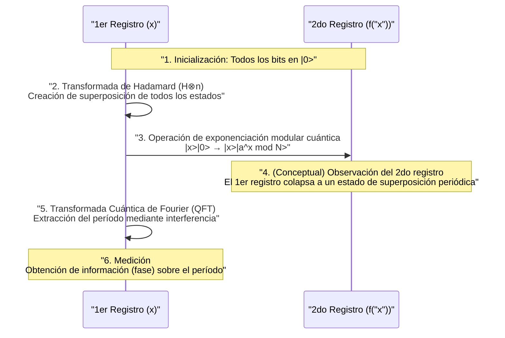

La seguridad en la sociedad de Internet moderna está protegida por sistemas de criptografía de clave pública, como la criptografía [RSA](https://kenji.blog/es/p/modern-cryptography-public-key-hash-signature/). Estos métodos criptográficos basan su seguridad en la dificultad matemática de que "factorizar números enormes toma un tiempo astronómico en las computadoras actuales (computadoras clásicas)".

Sin embargo, la **computadora cuántica** tiene el potencial de revocar fundamentalmente esa premisa. En particular, el **algoritmo de Shor** (Shor's Algorithm), descubierto por Peter Shor en 1994, demostró matemáticamente que si las computadoras cuánticas se vuelven prácticas, podrán descifrar la criptografía RSA en un tiempo realista.

En este artículo, profundizaremos exhaustivamente desde los mecanismos básicos de cómo calculan las computadoras cuánticas, por qué el algoritmo de Shor puede realizar la factorización de enteros tan rápido, hasta la matemática subyacente y ejemplos de implementación a través de programación (Python/Qiskit).

---

## 1. ¿Qué es una computadora cuántica? Diferencias con las computadoras clásicas

Las PC y los teléfonos inteligentes que usamos habitualmente se denominan **computadoras clásicas**. Las computadoras clásicas manejan la información como **bits** (bit) de "0" o "1".

Por otro lado, una computadora cuántica utiliza **cúbits** (qubit) como la unidad mínima de información. Aprovechando las extrañas propiedades de la mecánica cuántica, realiza cálculos con un enfoque completamente diferente a las computadoras convencionales. En su núcleo se encuentran la "Superposición" (Superposition), el "Entrelazamiento cuántico" (Entanglement) y la "Interferencia cuántica" (Interference).

### 1.1 Superposición (Superposition)

Mientras que un bit clásico solo puede tomar uno de los estados, "0" o "1", un cúbit puede tomar ambos estados de "0" y "1" simultáneamente. A esto se le llama **superposición**.

Matemáticamente, el estado cuántico $|\psi\rangle$ se expresa como una combinación lineal de los estados base $|0\rangle$ y $|1\rangle$ de la siguiente manera:

$$
|\psi\rangle = \alpha|0\rangle + \beta|1\rangle
$$

Aquí, $\alpha$ y $\beta$ son números complejos y se denominan **amplitudes de probabilidad**. Cuando se observa (mide) un cúbit, el estado colapsa (colapso del paquete de ondas) a $|0\rangle$ o $|1\rangle$, y la probabilidad de obtener cada uno es $|\alpha|^2$ y $|\beta|^2$ respectivamente. Como la suma de las probabilidades debe ser 1, se cumple la siguiente condición de normalización:

$$
|\alpha|^2 + |\beta|^2 = 1
$$

Debido a esta propiedad, $n$ cúbits pueden representar una superposición de $2^n$ estados simultáneamente. Esta es la base de la computación cuántica paralela.

### 1.2 Entrelazamiento cuántico (Entanglement)

El **entrelazamiento cuántico** es un fenómeno en el que múltiples cúbits están fuertemente vinculados entre sí, y cuando se determina el estado de uno, el estado del otro se determina instantáneamente, sin importar cuán separados espacialmente estén.

Por ejemplo, consideremos el siguiente estado de Bell (Bell state):

$$
|\Phi^+\rangle = \frac{1}{\sqrt{2}} (|00\rangle + |11\rangle)
$$

En este estado, si se mide el primer cúbit y se obtiene "0", el segundo cúbit será invariablemente "0". Por el contrario, si se obtiene "1", el segundo también será "1". Al aprovechar esta fuerte correlación, las computadoras cuánticas pueden procesar cálculos complejos de manera eficiente.

### 1.3 Interferencia cuántica (Interference)

Los cúbits en un estado de superposición tienen propiedades similares a las ondas. Cuando las crestas de las ondas se superponen, se amplifican (interferencia constructiva), y cuando se superponen crestas y valles, se cancelan mutuamente (interferencia destructiva).
En la computación cuántica, los algoritmos se diseñan para controlar hábilmente esta **interferencia cuántica**, amplificando la amplitud de probabilidad de llegar a la respuesta correcta y cancelando la amplitud de probabilidad de las respuestas incorrectas. El algoritmo de Shor también hace un uso extremadamente avanzado de esta interferencia.

---

## 2. Puertas cuánticas y circuitos cuánticos

Lo que corresponde a las puertas lógicas (AND, OR, NOT, etc.) en las computadoras clásicas son las **puertas cuánticas** en las computadoras cuánticas. Las puertas cuánticas se representan como operaciones de matrices unitarias (Unitary Matrix) sobre el vector de estado cuántico.

### 2.1 Principales puertas de 1 cúbit

#### Puerta X (Puerta Pauli-X)
Equivale a la puerta NOT clásica. Invierte $|0\rangle$ a $|1\rangle$ y $|1\rangle$ a $|0\rangle$.

$$
X = \begin{pmatrix} 0 & 1 \\\\ 1 & 0 \end{pmatrix}
$$

#### Puerta Z (Puerta Pauli-Z)
Solo invierte la fase (multiplica por $-1$) de $|1\rangle$. La inversión de fase es extremadamente importante en la interferencia cuántica.

$$
Z = \begin{pmatrix} 1 & 0 \\\\ 0 & -1 \end{pmatrix}
$$

#### Puerta H (Puerta Hadamard)
Es una de las puertas más importantes que crea un estado de superposición a partir de un estado base.

$$
H = \frac{1}{\sqrt{2}} \begin{pmatrix} 1 & 1 \\\\ 1 & -1 \end{pmatrix}
$$

Resulta en $H|0\rangle = \frac{1}{\sqrt{2}}(|0\rangle + |1\rangle)$, y cuando se mide, se obtiene un estado en el que 0 y 1 tienen un 50% de probabilidad cada uno.

### 2.2 Puertas de múltiples cúbits

#### Puerta CNOT (Puerta NOT controlada)
Es una puerta para dos cúbits. Solo aplica una puerta X (inversión) al bit objetivo cuando el bit de control es "1". Es indispensable para crear entrelazamiento cuántico.



---

## 3. Fundamentos de la tecnología criptográfica y la criptografía [RSA](https://kenji.blog/es/p/modern-cryptography-public-key-hash-signature/)

Para comprender el impacto del algoritmo de Shor, es necesario conocer el mecanismo de la **criptografía RSA**, que es la criptografía de clave pública principal en la actualidad.

### 3.1 Mecanismo de la criptografía RSA

La criptografía RSA aprovecha la dificultad de la factorización de enteros. Se preparan dos números primos enormes $p$ y $q$, y se calcula su producto $N = p \times q$.

1. Es fácil multiplicar $p$ y $q$ para crear $N$.
2. Sin embargo, es extremadamente difícil encontrar (factorizar) los $p$ y $q$ originales a partir de $N$.

Esta asimetría es la clave de la criptografía. $N$ se publica ampliamente como clave pública y se utiliza para la encriptación. Por otro lado, la información de $p$ y $q$ se guarda de forma segura como clave privada y se utiliza para la desencriptación.

### 3.2 ¿Qué tan difícil es?

Incluso usando las supercomputadoras actuales, se estima que factorizar un $N$ de miles de bits (por ejemplo, RSA-2048) llevaría un tiempo mayor a la edad del universo. Incluso si se utiliza el algoritmo clásico más eficiente, la "Criba general del campo de números" (GNFS), el tiempo de cálculo aumenta exponencialmente (más exactamente, subexponencialmente).

$$
O\left( \exp \left( \left(\frac{64}{9}b\right)^{\frac{1}{3}} (\log b)^{\frac{2}{3}} \right) \right)
$$
* $b$ es el número de dígitos (número de bits)

Aquí es donde entra en juego el **algoritmo de Shor**. El algoritmo de Shor reduce drásticamente este tiempo de cálculo a un tiempo polinomial $O(b^3)$.

---

## 4. Descripción general del algoritmo de Shor

El algoritmo de Shor resuelve el problema de la factorización de enteros convirtiéndolo en un problema matemático diferente llamado **"Problema de hallazgo del período (Period Finding Problem)"**.

El algoritmo se divide a grandes rasgos en dos partes.

1. **Parte realizada por una computadora clásica (Reducción, preprocesamiento y posprocesamiento)**
2. **Parte realizada por una computadora cuántica (Hallazgo del período)**

### 4.1 Parte clásica: Reducción de la factorización al hallazgo del período

Supongamos que se da un número compuesto $N$ que queremos factorizar. (Ejemplo: $N = 15$)

**Paso 1:** Se elige un entero aleatorio $a$ que sea coprimo con $N$ (el máximo común divisor es 1) ($1 < a < N$).
Si el máximo común divisor $\gcd(a, N) > 1$, significa que ya se ha encontrado un factor y termina. (Se encuentra fácilmente con el algoritmo de Euclides)

**Paso 2:** Consideremos la siguiente función de operación de módulo $f(x)$.

$$
f(x) = a^x \pmod N
$$

Es matemáticamente conocido (Teorema de Euler) que al sustituir $x = 0, 1, 2, 3, \dots$ en esta función $f(x)$, el valor se repite con un cierto período $r$. Es decir, existe el entero positivo más pequeño $r$ (período) tal que $f(x) = f(x + r)$.

Por ejemplo, en el caso de $N = 15$ y $a = 7$:
- $7^0 \pmod{15} = 1$
- $7^1 \pmod{15} = 7$
- $7^2 \pmod{15} = 4$
- $7^3 \pmod{15} = 13$
- $7^4 \pmod{15} = 1$ (A partir de aquí se repite)

Podemos ver que el período es $r = 4$.

**Paso 3:** Si el período encontrado $r$ es par, y $a^{r/2} \not\equiv -1 \pmod N$, entonces los factores se encuentran de la siguiente manera:

$$
\gcd(a^{r/2} \pm 1, N)
$$

En el ejemplo anterior ($N=15, a=7, r=4$):
$a^{r/2} = 7^{4/2} = 7^2 = 49$
$49 + 1 = 50$, $\gcd(50, 15) = 5$
$49 - 1 = 48$, $\gcd(48, 15) = 3$

¡Excelente, se han encontrado los factores $5$ y $3$ de $15$!

### 4.2 Problema: Es difícil encontrar el período $r$ clásicamente

Entendemos que si tan solo conocemos el período $r$, podemos realizar la factorización. Sin embargo, cuando $N$ es muy grande, calcular $f(x)$ uno por uno en una computadora clásica para encontrar el período $r$ tomaría un tiempo exponencial.

Por lo tanto, solo esta parte de "encontrar el período $r$" se le confía a la computadora cuántica. Mediante la computación cuántica paralela, se calcula $f(x)$ para todos los $x$ a la vez, y a partir de ahí se extrae el período $r$ en un instante (en tiempo polinomial).

---

## 5. Parte cuántica: Transformada Cuántica de Fourier y extracción del período

La parte de computación cuántica del algoritmo de Shor procede con los siguientes pasos.



### 5.1 Evaluación de funciones mediante computación cuántica paralela

En primer lugar, se preparan dos registros (el 1er registro y el 2do registro) con una cantidad suficiente de cúbits y todos se inicializan a $|0\rangle$.
Se aplica una puerta de Hadamard al 1er registro para crear un estado de superposición uniforme de todos los valores posibles de $x$ (desde $0$ hasta $Q-1$).

$$
\frac{1}{\sqrt{Q}} \sum_{x=0}^{Q-1} |x\rangle |0\rangle
$$

Luego, se utiliza el **circuito de exponenciación modular cuántica** para calcular $f(x) = a^x \pmod N$, y el resultado se escribe en el 2do registro.

$$
\frac{1}{\sqrt{Q}} \sum_{x=0}^{Q-1} |x\rangle |a^x \bmod N\rangle
$$

En esta etapa, el resultado de $f(x)$ para todos los $x$ se calculó a la vez como una superposición cuántica. Sin embargo, si se mide en este punto, solo se obtendrá un valor aleatorio de $x$ y su correspondiente $f(x)$, y no se conocerá el período $r$.

### 5.2 Extracción de estados periódicos e interferencia cuántica

Para extraer el período $r$, se aplica al 1er registro una operación de suma importancia, la **Transformada Cuántica de Fourier (Quantum Fourier Transform: QFT)**.

La QFT es la versión cuántica de la transformada de Fourier discreta (DFT) clásica. Desempeña el papel de convertir la periodicidad de los datos en picos en el dominio de la frecuencia. Para un vector de estado $|\psi\rangle = \sum_{j} x_j |j\rangle$, la QFT actúa de la siguiente manera:

$$
QFT(|j\rangle) = \frac{1}{\sqrt{Q}} \sum_{k=0}^{Q-1} e^{\frac{2\pi i j k}{Q}} |k\rangle
$$

Dado que el estado del 1er registro está vinculado al estado del 2do registro (por ejemplo, $f(x_0)$), se convierte en un estado de superposición que tiene valores discretos con un período específico. Al aplicar la QFT a esto, ocurre la interferencia cuántica.

- Los estados (amplitudes de probabilidad) relacionados con el período correcto $r$ se **amplifican constructivamente**.
- En los demás estados, las fases se desordenan y se **cancelan (interferencia destructiva)**.

Como resultado, al medir, se obtendrá con una alta probabilidad un valor de $k$ que cumpla $k \approx Q \cdot \frac{c}{r}$ ($c$ es un número entero).

### 5.3 Posprocesamiento clásico: Expansión en fracciones continuas

Una vez que se obtiene el resultado de la medición $k$ de la computadora cuántica, es el turno de la computadora clásica nuevamente.
Tenemos la relación $k / Q \approx c / r$. Donde $c$ y $r$ son números coprimos.

Al convertir la fracción decimal conocida $k / Q$ en una fracción aproximada $c / r$ utilizando el algoritmo clásico de **expansión en fracciones continuas (Continued Fraction Expansion)**, finalmente podemos determinar el período $r$ como el denominador.

Todo lo que queda es seguir los pasos descritos en la sección 4.1 y calcular el máximo común divisor para descubrir con éxito los factores primos de $N$.

---

## 6. Ejemplo de implementación del algoritmo de Shor usando Qiskit

Aquí, presentamos un ejemplo de implementación del algoritmo de Shor que factoriza un número muy pequeño $N = 15$, utilizando **Qiskit**, el marco de programación cuántica de código abierto proporcionado por IBM.

(※ Debido a que la factorización de números enormes para fines prácticos requiere una enorme cantidad de cúbits y corrección de errores, los simuladores y el hardware cuántico a pequeña escala actuales se limitan a demostraciones como $15$ o $21$.)

```python
import numpy as np
from qiskit import QuantumCircuit, transpile
from qiskit.visualization import plot_histogram
from qiskit_aer import AerSimulator
import math
from math import gcd

# --- 1. Definición del circuito de exponenciación modular cuántica (a=7, N=15) ---
def c_amod15(a, power):
    """Circuito a^power mod 15 que funciona como puerta U controlada"""
    U = QuantumCircuit(4)        
    for _iteration in range(power):
        if a in [2,13]:
            U.swap(2,3)
            U.swap(1,2)
            U.swap(0,1)
        if a in [7,8]:
            U.swap(0,1)
            U.swap(1,2)
            U.swap(2,3)
        if a in [4, 11]:
            U.swap(1,3)
            U.swap(0,2)
        if a in [7,11,13]:
            for q in range(4):
                U.x(q)
    U = U.to_gate()
    U.name = f"{a}^{power} mod 15"
    c_U = U.control()
    return c_U

# --- 2. Definición de la Transformada Cuántica de Fourier Inversa (QFT_dagger) ---
def qft_dagger(n):
    """Circuito que realiza la transformada cuántica de Fourier inversa de n cúbits"""
    qc = QuantumCircuit(n)
    for qubit in range(n//2):
        qc.swap(qubit, n-qubit-1)
    for j in range(n):
        for m in range(j):
            qc.cp(-np.pi/float(2**(j-m)), m, j)
        qc.h(j)
    qc.name = "QFT_dagger"
    return qc

# --- 3. Construcción del algoritmo de Shor principal ---
n_count = 8  # Número de cúbits para el registro de medición (1er registro)
a = 7        # Número coprimo con N=15

# 1er registro (8qubit) + 2do registro (4qubit) + registro clásico (8bit)
qc = QuantumCircuit(n_count + 4, n_count)

# Poner el 1er registro en estado de superposición con la puerta H
for q in range(n_count):
    qc.h(q)

# Establecer el estado inicial del 2do registro en |1> (aplicar la puerta x al bit menos significativo)
qc.x(n_count)

# Aplicar la puerta de exponenciación modular controlada
for q in range(n_count):
    qc.append(c_amod15(a, 2**q), 
             [q] + [i+n_count for i in range(4)])

# Aplicar QFT inversa al 1er registro
qc.append(qft_dagger(n_count).to_instruction(), range(n_count))

# Medir el 1er registro
qc.measure(range(n_count), range(n_count))

# --- 4. Ejecución usando el simulador ---
simulator = AerSimulator()
compiled_circuit = transpile(qc, simulator)
job = simulator.run(compiled_circuit, shots=1024)
results = job.result()
counts = results.get_counts()

print("Resultado de la medición (Binario: Número de observaciones):")
print(counts)

# --- 5. Posprocesamiento clásico (Identificación del período r y cálculo de factores primos) ---
# Lógica para analizar los resultados más probables a partir de las mediciones (versión simplificada)
measured_phases = []
for output in counts:
    decimal = int(output, 2)
    phase = decimal / (2**n_count)
    measured_phases.append(phase)

print(f"\nFase estimada (phase): {measured_phases[:4]} ...")
# A partir de la fase, continúa el proceso para encontrar el denominador r (período) utilizando la expansión de fracciones continuas...
```

Al ejecutar el código anterior, el simulador cuántico generará estados con alta probabilidad como `00000000`, `01000000`, `10000000`, `11000000` (en formato decimal 0, 64, 128, 192).
Si dividimos esto por $2^8 = 256$, las fases son $0$, $0.25$, $0.5$, $0.75$. Estos se pueden expresar como fracciones: $0/4$, $1/4$, $2/4$, $3/4$, lo que muestra que la computación cuántica ha deducido que **4**, el denominador, es el período $r$.
Una vez que conocemos el período $r=4$, como se describió anteriormente, los factores primos $3$ y $5$ se derivan a partir de $\gcd(7^{4/2} \pm 1, 15)$.

---

## 7. ¿Por qué la criptografía [RSA](https://kenji.blog/es/p/modern-cryptography-public-key-hash-signature/) está en peligro?

La cantidad de cálculos requeridos para la factorización en las computadoras clásicas aumenta exponencialmente a medida que aumenta el número de dígitos. Por ejemplo, se estima que factorizar un número de 100 dígitos toma varios segundos, 200 dígitos lleva varios años y RSA-2048 (alrededor de 617 dígitos) llevaría un tiempo mayor que la vida del universo.

Sin embargo, al utilizar el algoritmo de Shor, la cantidad de pasos de cálculo necesarios (número de puertas) solo aumenta en un orden polinómico $O(b^3)$ en relación con el número de dígitos $b$. Esto significa que, incluso para RSA-2048, si tuviéramos una computadora cuántica ideal, podría descifrarse en un tiempo de horas a días.

### La amenaza de "Store Now, Decrypt Later" (Almacenar ahora, descifrar más tarde)
Es peligroso pensar que "todavía no se ha completado una computadora cuántica de alto rendimiento, así que estamos seguros". Se considera realista un escenario de ataque en el que terceros malintencionados o agencias estatales registren y almacenen datos confidenciales encriptados que circulan actualmente (información financiera, secretos de estado, etc.) hoy en día ("Store Now") y los descifren en el momento en que se complete una computadora cuántica de alto rendimiento en 10 o 20 años ("Decrypt Later").
Por lo tanto, existe una necesidad urgente de actualizar los métodos de cifrado sin esperar a que se completen las computadoras cuánticas.

---

## 8. El muro para la realización de computadoras cuánticas: Ruido y corrección de errores

El algoritmo de Shor es matemáticamente perfecto, pero para realizarlo físicamente, nos enfrentamos a grandes barreras. El hardware cuántico actual se denomina dispositivos **NISQ** (Noisy Intermediate-Scale Quantum: Cuántica a escala intermedia ruidosa), y tiene la debilidad de ser extremadamente susceptible al ruido (perturbaciones causadas por el entorno externo y errores en el funcionamiento de las puertas).

Los estados cuánticos son extremadamente delicados, y un ligero calor u ondas electromagnéticas pueden causar **decoherencia** (colapso del estado cuántico). Para descifrar RSA-2048, es necesario realizar cientos de millones de operaciones de puertas sin errores, en miles de "cúbits lógicos".

La **corrección de errores cuánticos (Quantum Error Correction)** se investiga para lograr esto. Es una tecnología en la que múltiples "cúbits físicos" se agrupan para formar un único "cúbit lógico", detectando y corrigiendo los errores que ocurren durante el cálculo. Sin embargo, se dice que se necesitan de 1,000 a 10,000 cúbits físicos para crear un cúbit lógico. Por lo tanto, se espera que se necesiten de 10 a varias décadas más de avances para lograr computadoras cuánticas a gran escala con tolerancia a fallos (**FTQC: Fault-Tolerant Quantum Computer**), de la clase de decenas de millones de cúbits físicos.

---

## 9. Criptografía de próxima generación: Criptografía poscuántica (PQC)

Para contrarrestar la amenaza del algoritmo de Shor, instituciones de todo el mundo, como el Instituto Nacional de Estándares y Tecnología de los Estados Unidos (NIST), están avanzando en la estandarización de nuevos métodos criptográficos que no pueden ser descifrados ni siquiera por computadoras cuánticas: la **criptografía poscuántica (Post-Quantum [Cryptography](https://kenji.blog/es/p/modern-cryptography-public-key-hash-signature/): PQC)**.

La PQC no utiliza tecnología cuántica, y se puede ejecutar en computadoras clásicas, pero se basa en nuevos problemas matemáticos (a los que no se puede aplicar el algoritmo de Shor) que no pueden resolverse eficientemente incluso utilizando algoritmos cuánticos.

Enfoques representativos de la PQC:
- **Criptografía basada en retículos (Lattice-based cryptography)**: Utiliza la dificultad de problemas como el Problema del Vector Más Corto (SVP) en espacios multidimensionales. (Ejemplo: Kyber, Dilithium)
- **Criptografía basada en códigos (Code-based cryptography)**: Utiliza la dificultad de decodificar códigos de corrección de errores.
- **Criptografía multivariante (Multivariate cryptography)**: Utiliza la dificultad de resolver sistemas de ecuaciones polinómicas cuadráticas con un gran número de variables.
- **Firmas basadas en hash (Hash-based signatures)**: Métodos de firma que dependen únicamente de la seguridad de funciones hash criptográficas.

Actualmente, la infraestructura de TI del mundo se enfrenta a un período de transición histórico de migración desde el cifrado RSA y de curva elíptica existente hacia estas PQC.

---

## 10. Conclusión

En este artículo, hemos explicado detalladamente desde los fundamentos de las computadoras cuánticas hasta los mecanismos de factorización mediante el algoritmo de Shor, así como las perspectivas de la futura tecnología criptográfica.

Las computadoras cuánticas se encuentran todavía en su infancia y pasarán muchos años antes de que el criptoanálisis práctico sea posible. Sin embargo, su base teórica, el **algoritmo de Shor**, puede decirse que es una cristalización de la sabiduría humana en la que las ciencias de la información, la física y las matemáticas se fusionan espléndidamente.

Su hermoso mecanismo de manipular hábilmente la interferencia cuántica para hacer aflorar solo la "respuesta correcta" del espacio de búsqueda exponencial, servirá como un hito importante en el diseño de algoritmos cuánticos futuros aplicados a diversos campos (descubrimiento de fármacos, cálculos de materiales, problemas de optimización, etc.). De cara a la próxima era cuántica, somos testigos de un cambio fundamental en la tecnología.
