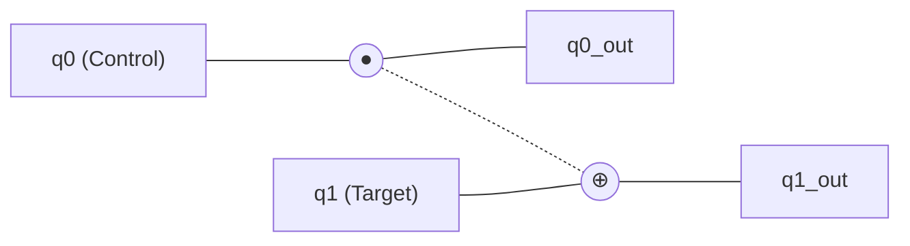
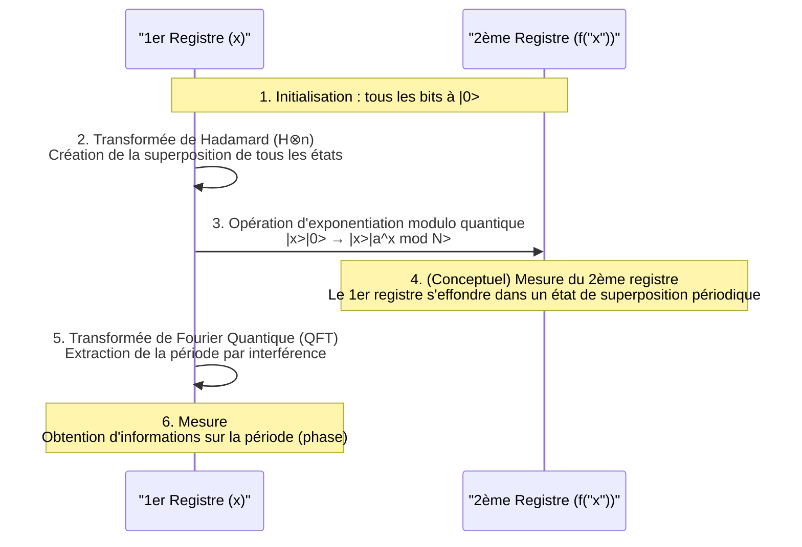

La sécurité dans la société Internet moderne est protégée par des systèmes de cryptographie à clé publique tels que le chiffrement [RSA](https://kenji.blog/fr/p/modern-cryptography-public-key-hash-signature/). Ces systèmes de cryptographie fondent leur sécurité sur la difficulté mathématique : "la factorisation en nombres premiers de nombres gigantesques prendrait un temps astronomique avec les ordinateurs actuels (ordinateurs classiques)".

Cependant, l' **ordinateur quantique** possède le potentiel de renverser fondamentalement cette prémisse. En particulier, l' **algorithme de Shor** (Shor's Algorithm), découvert en 1994 par Peter Shor, a prouvé mathématiquement que si un ordinateur quantique devenait réalisable, il pourrait casser le chiffrement RSA dans un temps réaliste.

Dans cet article, nous explorerons en profondeur, sur une échelle d'environ 20 000 caractères, depuis les mécanismes de base du fonctionnement des calculs dans un ordinateur quantique, jusqu'à la raison pour laquelle l'algorithme de Shor peut effectuer une factorisation rapide, ainsi que les mathématiques sous-jacentes et des exemples d'implémentation par programmation (Python/Qiskit).

---

## 1. Qu'est-ce qu'un ordinateur quantique ? Différences avec un ordinateur classique

Les PC et les smartphones que nous utilisons au quotidien sont appelés **ordinateurs classiques** . Les ordinateurs classiques traitent l'information sous forme de **bits** (bit) valant "0" ou "1".

D'autre part, un ordinateur quantique utilise le **qubit** (quantum bit) comme unité minimale d'information. En exploitant les propriétés étranges de la mécanique quantique, il effectue des calculs avec une approche totalement différente des ordinateurs précédents. Au cœur de cela se trouvent la "superposition" (Superposition), l'"intrication quantique" (Entanglement) et l'"interférence quantique" (Interference).

### 1.1 La superposition (Superposition)

Alors qu'un bit classique ne peut prendre qu'un seul état, soit "0", soit "1", un qubit peut prendre simultanément les deux états "0" et "1". C'est ce qu'on appelle la **superposition** .

Mathématiquement, l'état quantique $|\psi\rangle$ est exprimé comme une combinaison linéaire des états de base $|0\rangle$ et $|1\rangle$ de la manière suivante.

$$
|\psi\rangle = \alpha|0\rangle + \beta|1\rangle
$$

Ici, $\alpha$ et $\beta$ sont des nombres complexes, appelés **amplitudes de probabilité** . Lorsqu'on observe (mesure) le qubit, l'état converge (réduction du paquet d'onde) vers $|0\rangle$ ou $|1\rangle$, et les probabilités d'obtenir l'un ou l'autre sont respectivement $|\alpha|^2$ et $|\beta|^2$. Puisque la somme des probabilités doit être égale à 1, la condition de normalisation suivante est remplie.

$$
|\alpha|^2 + \beta|^2 = 1
$$

Grâce à cette propriété, $n$ qubits peuvent représenter simultanément une superposition de $2^n$ états. C'est la base du calcul parallèle quantique.

### 1.2 L'intrication quantique (Entanglement)

Le phénomène où plusieurs qubits sont fortement liés les uns aux autres, de sorte que la détermination de l'état de l'un détermine instantanément l'état de l'autre, quelle que soit la distance qui les sépare dans l'espace, est appelé **intrication quantique** (Entanglement).

Par exemple, considérons l'état de Bell (Bell state) suivant.

$$
|\Phi^+\rangle = \frac{1}{\sqrt{2}} (|00\rangle + |11\rangle)
$$

Dans cet état, si l'on mesure le premier qubit et que l'on obtient "0", le deuxième qubit sera obligatoirement "0". Inversement, si l'on obtient "1", le deuxième sera également "1". En exploitant cette forte corrélation, un ordinateur quantique peut traiter efficacement des calculs complexes.

### 1.3 L'interférence quantique (Interference)

Un qubit dans un état de superposition possède des propriétés ondulatoires. Lorsque les crêtes d'une onde se superposent, elles s'amplifient (interférence constructive), et lorsque la crête et le creux se superposent, ils s'annulent (interférence destructive).
Dans le calcul quantique, on contrôle habilement cette **interférence quantique** en concevant des algorithmes de manière à amplifier l'amplitude de probabilité menant à la bonne réponse, et à annuler l'amplitude de probabilité des mauvaises réponses. L'algorithme de Shor utilise également cette interférence de manière extrêmement sophistiquée.

---

## 2. Portes quantiques et circuits quantiques

Ce qui correspond aux portes logiques (AND, OR, NOT, etc.) dans un ordinateur classique sont les **portes quantiques** dans un ordinateur quantique. Une porte quantique est représentée comme une opération matricielle unitaire (Unitary Matrix) sur le vecteur d'état quantique.

### 2.1 Portes à un qubit représentatives

#### Porte X (Porte de Pauli-X)
Elle correspond à la porte NOT classique. Elle inverse $|0\rangle$ en $|1\rangle$, et $|1\rangle$ en $|0\rangle$.

$$
X = \begin{pmatrix} 0 & 1 \\\\ 1 & 0 \end{pmatrix}
$$

#### Porte Z (Porte de Pauli-Z)
Elle inverse uniquement la phase de $|1\rangle$ (en multipliant par $-1$). L'inversion de phase est extrêmement importante dans l'interférence quantique.

$$
Z = \begin{pmatrix} 1 & 0 \\\\ 0 & -1 \end{pmatrix}
$$

#### Porte H (Porte de Hadamard)
C'est l'une des portes les plus importantes pour créer un état de superposition à partir d'un état de base.

$$
H = \frac{1}{\sqrt{2}} \begin{pmatrix} 1 & 1 \\\\ 1 & -1 \end{pmatrix}
$$

$H|0\rangle = \frac{1}{\sqrt{2}}(|0\rangle + |1\rangle)$, ce qui donne un état où, lors de la mesure, on obtient 0 et 1 avec une probabilité de 50% chacun.

### 2.2 Portes à plusieurs qubits

#### Porte CNOT (Porte NOT contrôlée)
C'est une porte pour deux qubits qui applique une porte X (inversion) au qubit cible uniquement lorsque le qubit de contrôle est "1". Elle est indispensable pour créer l'intrication quantique.



---

## 3. Les bases de la cryptographie et le chiffrement [RSA](https://kenji.blog/fr/p/modern-cryptography-public-key-hash-signature/)

Pour comprendre l'impact de l'algorithme de Shor, il est nécessaire de connaître le fonctionnement du **chiffrement RSA** , qui est actuellement le chiffrement à clé publique dominant.

### 3.1 Fonctionnement du chiffrement RSA

Le chiffrement RSA exploite la difficulté de la factorisation en nombres premiers. On prépare deux nombres premiers gigantesques $p$ et $q$, et on calcule leur produit $N = p \times q$.

1. Il est facile de multiplier $p$ et $q$ pour obtenir $N$.
2. Cependant, il est très difficile de retrouver les valeurs d'origine $p$ et $q$ (les factoriser en nombres premiers) à partir de $N$.

Cette asymétrie est la clé du chiffrement. On publie largement $N$ comme clé publique, utilisée pour le chiffrement. D'autre part, les informations de $p$ et $q$ sont conservées de manière sécurisée en tant que clé privée, utilisée pour le déchiffrement.

### 3.2 À quel point est-ce difficile ?

Même avec les superordinateurs actuels, on estime qu'il faudrait plus de temps que l'âge de l'univers pour factoriser en nombres premiers un $N$ de plusieurs milliers de bits (par exemple RSA-2048). Même en utilisant l'algorithme classique le plus efficace, le "Crible du corps de nombres généralisé (GNFS)", la complexité temporelle augmente de manière exponentielle (plus précisément sous-exponentielle).

$$
O\left( \exp \left( \left(\frac{64}{9}b\right)^{\frac{1}{3}} (\log b)^{\frac{2}{3}} \right) \right)
$$
※ $b$ est le nombre de chiffres (nombre de bits)

C'est ici qu'intervient l' **algorithme de Shor** . L'algorithme de Shor réduit considérablement cette complexité temporelle à un temps polynomial $O(b^3)$.

---

## 4. Vue d'ensemble de l'algorithme de Shor

L'algorithme de Shor résout le problème de la factorisation en nombres premiers en le transformant en un autre problème mathématique appelé **"Problème de recherche de période"** (Period Finding Problem).

L'algorithme est divisé principalement en deux parties.

1. **Partie exécutée sur un ordinateur classique (réduction, prétraitement, post-traitement)**
2. **Partie exécutée sur un ordinateur quantique (recherche de période)**

### 4.1 Partie classique : Réduction de la factorisation à la recherche de période

Supposons qu'on nous donne un nombre composé $N$ que nous voulons factoriser. (Exemple : $N = 15$)

**Étape 1 :** Choisissez un entier aléatoire $a$ qui est premier avec $N$ (le plus grand commun diviseur est 1) ($1 < a < N$).
Si le plus grand commun diviseur $\gcd(a, N) > 1$, alors un facteur a déjà été trouvé et le processus est terminé. (Il peut être facilement trouvé avec l'algorithme d'Euclide)

**Étape 2 :** Considérons la fonction modulo suivante $f(x)$.

$$
f(x) = a^x \pmod N
$$

En substituant $x = 0, 1, 2, 3, \dots$ dans cette fonction $f(x)$, il est mathématiquement connu que les valeurs se répètent avec une certaine période $r$ (Théorème d'Euler). En d'autres termes, il existe un plus petit entier positif $r$ (période) tel que $f(x) = f(x + r)$.

Par exemple, pour $N = 15$, $a = 7$ :
- $7^0 \pmod{15} = 1$
- $7^1 \pmod{15} = 7$
- $7^2 \pmod{15} = 4$
- $7^3 \pmod{15} = 13$
- $7^4 \pmod{15} = 1$ (La boucle commence ici)

On peut voir que la période $r = 4$.

**Étape 3 :** Si la période trouvée $r$ est paire et que $a^{r/2} \not\equiv -1 \pmod N$, alors les facteurs peuvent être obtenus comme suit.

$$
\gcd(a^{r/2} \pm 1, N)
$$

Dans l'exemple précédent ($N=15, a=7, r=4$) :
$a^{r/2} = 7^{4/2} = 7^2 = 49$
$49 + 1 = 50$, $\gcd(50, 15) = 5$
$49 - 1 = 48$, $\gcd(48, 15) = 3$

Magnifique, les facteurs $5$ et $3$ de $15$ ont été trouvés !

### 4.2 Le problème : Il est difficile de trouver la période $r$ de manière classique

Nous avons compris que nous pouvions factoriser en nombres premiers si nous connaissions simplement la période $r$. Cependant, si $N$ est très grand, calculer $f(x)$ un par un sur un ordinateur classique pour trouver la période $r$ prendrait tout de même un temps exponentiel.

C'est pourquoi seule cette partie consistant à "trouver la période $r$" est confiée à un ordinateur quantique. En utilisant le calcul parallèle quantique, $f(x)$ pour tous les $x$ est calculé en même temps, et la période $r$ en est extraite en un instant (en temps polynomial).

---

## 5. Partie quantique : Transformée de Fourier quantique et extraction de la période

La partie calcul quantique de l'algorithme de Shor se déroule selon les étapes suivantes.



### 5.1 Évaluation de la fonction par calcul parallèle quantique

Tout d'abord, nous préparons deux registres (le 1er registre et le 2ème registre) avec un nombre suffisant de qubits et les initialisons tous à $|0\rangle$.
On applique une porte de Hadamard au 1er registre, créant un état de superposition uniforme de toutes les valeurs possibles de $x$ (de $0$ à $Q-1$).

$$
\frac{1}{\sqrt{Q}} \sum_{x=0}^{Q-1} |x\rangle |0\rangle
$$

Ensuite, en utilisant un **circuit d'exponentiation modulo quantique** , on calcule $f(x) = a^x \pmod N$, et on écrit le résultat dans le 2ème registre.

$$
\frac{1}{\sqrt{Q}} \sum_{x=0}^{Q-1} |x\rangle |a^x \bmod N\rangle
$$

À ce stade, les résultats de $f(x)$ pour tous les $x$ ont été calculés en une seule fois sous forme de superposition quantique. Cependant, si on mesure tel quel, on obtiendra simplement un $x$ aléatoire et son $f(x)$ correspondant, et la période $r$ restera inconnue.

### 5.2 Extraction de l'état périodique et interférence quantique

Afin d'extraire la période $r$, on applique la **Transformée de Fourier Quantique (Quantum Fourier Transform : QFT)** , une opération extrêmement importante, au 1er registre.

La QFT est la version quantique de la transformée de Fourier discrète (DFT) classique. Elle a pour rôle de convertir la périodicité des données en pics dans le domaine fréquentiel. Pour un vecteur d'état $|\psi\rangle = \sum_{j} x_j |j\rangle$, la QFT agit comme suit.

$$
QFT(|j\rangle) = \frac{1}{\sqrt{Q}} \sum_{k=0}^{Q-1} e^{\frac{2\pi i j k}{Q}} |k\rangle
$$

L'état du 1er registre étant lié à l'état du 2ème registre (par exemple $f(x_0)$), il se trouve dans un état de superposition ayant des valeurs discrètes avec une période spécifique. L'application de la QFT provoque une interférence quantique.

- Les états (amplitudes de probabilité) liés à la bonne période $r$ s' **amplifient mutuellement** .
- Les autres états auront des phases désordonnées et s' **annuleront mutuellement (destruction)** .

Par conséquent, lors de la mesure, on obtient avec une probabilité élevée une valeur $k$ telle que $k \approx Q \cdot \frac{c}{r}$ ($c$ est un entier).

### 5.3 Post-traitement classique : Développement en fractions continues

Une fois que le résultat de la mesure $k$ est obtenu de l'ordinateur quantique, c'est à nouveau au tour de l'ordinateur classique.
La relation $k / Q \approx c / r$ est obtenue. $c$ et $r$ sont des entiers premiers entre eux.

En convertissant la valeur décimale connue $k / Q$ en une fraction approximative $c / r$ à l'aide de l'algorithme classique du **développement en fractions continues** (Continued Fraction Expansion), on peut enfin déterminer le dénominateur comme étant la période $r$.

Il suffit ensuite de suivre la procédure expliquée dans la section 4.1 et de calculer le plus grand commun diviseur pour déduire brillamment les facteurs premiers de $N$.

---

## 6. Exemple d'implémentation de l'algorithme de Shor avec Qiskit

Ici, nous présentons un exemple d'implémentation de l'algorithme de Shor pour factoriser un très petit nombre, $N = 15$, à l'aide de **Qiskit** , un framework de programmation quantique open source fourni par IBM.

（※ Puisque la factorisation de nombres gigantesques et pratiques nécessite un nombre énorme de qubits et de corrections d'erreurs, elle est limitée à des démonstrations comme $15$ ou $21$ sur les simulateurs et le petit matériel quantique actuels.）

```python
import numpy as np
from qiskit import QuantumCircuit, transpile
from qiskit.visualization import plot_histogram
from qiskit_aer import AerSimulator
import math
from math import gcd

# --- 1. Définition du circuit d'exponentiation modulo quantique (a=7, N=15) ---
def c_amod15(a, power):
    """Circuit a^power mod 15 fonctionnant comme une porte U contrôlée"""
    U = QuantumCircuit(4)        
    for _iteration in range(power):
        if a in [2,13]:
            U.swap(2,3)
            U.swap(1,2)
            U.swap(0,1)
        if a in [7,8]:
            U.swap(0,1)
            U.swap(1,2)
            U.swap(2,3)
        if a in [4, 11]:
            U.swap(1,3)
            U.swap(0,2)
        if a in [7,11,13]:
            for q in range(4):
                U.x(q)
    U = U.to_gate()
    U.name = f"{a}^{power} mod 15"
    c_U = U.control()
    return c_U

# --- 2. Définition de la transformée de Fourier quantique inverse (QFT_dagger) ---
def qft_dagger(n):
    """Circuit effectuant la transformée de Fourier quantique inverse de n qubits"""
    qc = QuantumCircuit(n)
    for qubit in range(n//2):
        qc.swap(qubit, n-qubit-1)
    for j in range(n):
        for m in range(j):
            qc.cp(-np.pi/float(2**(j-m)), m, j)
        qc.h(j)
    qc.name = "QFT_dagger"
    return qc

# --- 3. Construction du cœur de l'algorithme de Shor ---
n_count = 8  # Nombre de qubits du registre de mesure (1er registre)
a = 7        # Nombre premier avec N=15

# 1er registre (8 qubits) + 2ème registre (4 qubits) + registre classique (8 bits)
qc = QuantumCircuit(n_count + 4, n_count)

# Mise en état de superposition du 1er registre avec des portes H
for q in range(n_count):
    qc.h(q)

# Initialisation de l'état du 2ème registre à |1> (application de la porte X au bit de poids faible)
qc.x(n_count)

# Application de la porte d'exponentiation modulo contrôlée
for q in range(n_count):
    qc.append(c_amod15(a, 2**q), 
             [q] + [i+n_count for i in range(4)])

# Application de la QFT inverse au 1er registre
qc.append(qft_dagger(n_count).to_instruction(), range(n_count))

# Mesure du 1er registre
qc.measure(range(n_count), range(n_count))

# --- 4. Exécution avec le simulateur ---
simulator = AerSimulator()
compiled_circuit = transpile(qc, simulator)
job = simulator.run(compiled_circuit, shots=1024)
results = job.result()
counts = results.get_counts()

print("Résultats de mesure (binaire : nombre d'observations) :")
print(counts)

# --- 5. Post-traitement classique (identification de la période r et calcul des facteurs premiers) ---
# Logique pour analyser la plus probable à partir des résultats de mesure (version simplifiée)
measured_phases = []
for output in counts:
    decimal = int(output, 2)
    phase = decimal / (2**n_count)
    measured_phases.append(phase)

print(f"\nPhases estimées (phase) : {measured_phases[:4]} ...")
# S'ensuit le processus pour trouver le dénominateur r (période) à l'aide du développement en fractions continues à partir de la phase...
```

En exécutant le code ci-dessus, le simulateur quantique affichera avec une forte probabilité des états tels que `00000000`, `01000000`, `10000000`, `11000000` (soit 0, 64, 128, 192 en décimal).
En les divisant par $2^8 = 256$, les phases obtenues sont $0$, $0.25$, $0.5$ et $0.75$. Celles-ci, exprimées sous forme de fractions, correspondent à $0/4$, $1/4$, $2/4$ et $3/4$, ce qui montre que le calcul quantique a permis d'en déduire que le dénominateur, **4**, est la période $r$.
Une fois la période $r=4$ connue, on peut en déduire les facteurs premiers $3$ et $5$ à partir de $\gcd(7^{4/2} \pm 1, 15)$, comme expliqué précédemment.

---

## 7. Pourquoi le chiffrement [RSA](https://kenji.blog/fr/p/modern-cryptography-public-key-hash-signature/) est-il en danger ?

La complexité temporelle de la factorisation en nombres premiers sur un ordinateur classique augmente de manière exponentielle avec le nombre de chiffres. Par exemple, il faut quelques secondes pour factoriser un nombre de 100 chiffres, plusieurs années pour 200 chiffres, et on estime qu'il faudrait un temps supérieur à l'âge de l'univers pour le RSA-2048 (environ 617 chiffres).

Cependant, en utilisant l'algorithme de Shor, le nombre d'étapes de calcul nécessaires (nombre de portes) n'augmente que d'un ordre polynomial $O(b^3)$ par rapport au nombre de chiffres $b$. Cela signifie que, même pour le RSA-2048, s'il existait un ordinateur quantique idéal, il pourrait être déchiffré en quelques heures à quelques jours.

### La menace "Store Now, Decrypt Later"
Il est dangereux de penser que "nous sommes en sécurité car aucun ordinateur quantique performant n'est encore achevé". Un scénario d'attaque pris très au sérieux envisage que des tiers malveillants ou des agences étatiques enregistrent et stockent (Store Now) dès aujourd'hui les données confidentielles chiffrées en circulation (informations financières, secrets d'État, etc.), dans le but de les déchiffrer (Decrypt Later) au moment où des ordinateurs quantiques performants seront achevés dans 10 à 20 ans.
C'est pourquoi il est urgent de mettre à jour les systèmes de cryptographie sans attendre l'achèvement des ordinateurs quantiques.

---

## 8. Le mur vers la réalisation de l'ordinateur quantique : Bruit et correction d'erreurs

L'algorithme de Shor est mathématiquement parfait, mais un obstacle de taille se dresse avant de pouvoir le réaliser physiquement. Le matériel quantique actuel, appelé dispositifs **NISQ** (Noisy Intermediate-Scale Quantum : quantique à échelle intermédiaire bruité), a la faiblesse d'être très sensible au bruit (perturbations dues à l'environnement externe et erreurs d'opérations des portes).

L'état quantique est extrêmement délicat, et la moindre chaleur ou onde électromagnétique provoque la **décohérence** (effondrement de l'état quantique). Pour déchiffrer le RSA-2048, il est nécessaire d'effectuer des centaines de millions d'opérations de portes sans erreur sur des milliers de "qubits logiques".

La technologie étudiée pour y parvenir est la **correction d'erreurs quantiques** (Quantum Error Correction). C'est une technologie qui regroupe plusieurs "qubits physiques" pour former un seul "qubit logique", détectant et corrigeant ainsi les erreurs qui se produisent pendant les calculs. Cependant, on dit qu'il faut de 1000 à 10 000 qubits physiques pour créer un seul qubit logique, et on estime qu'il faudra encore 10 à plusieurs dizaines d'années de percées technologiques pour réaliser un **ordinateur quantique tolérant aux pannes (FTQC : Fault-Tolerant Quantum Computer)** à grande échelle, nécessitant des dizaines de millions de qubits physiques.

---

## 9. Les technologies cryptographiques de nouvelle génération : Cryptographie post-quantique (PQC)

Afin de contrer la menace de l'algorithme de Shor, des institutions du monde entier, dont le National Institute of Standards and Technology (NIST) américain, procèdent à la normalisation de la **cryptographie post-quantique (PQC : Post-Quantum [Cryptography](https://kenji.blog/fr/p/modern-cryptography-public-key-hash-signature/))** , de nouveaux systèmes de cryptographie impossibles à déchiffrer même par des ordinateurs quantiques.

La PQC n'utilise pas la technologie quantique ; elle est exécutable sur des ordinateurs classiques, mais se base sur de nouveaux problèmes mathématiques qui ne peuvent pas être résolus efficacement par les algorithmes quantiques (auxquels l'algorithme de Shor ne s'applique pas).

Approches représentatives de la PQC :
- **Cryptographie fondée sur les réseaux (Lattice-based cryptography)** : Exploite la difficulté de problèmes tels que le problème du plus court vecteur (SVP) dans un espace multidimensionnel. (Exemple : Kyber, Dilithium)
- **Cryptographie fondée sur les codes (Code-based cryptography)** : Exploite la difficulté du problème de décodage des codes correcteurs d'erreurs.
- **Cryptographie multivariée (Multivariate cryptography)** : Exploite la difficulté de résoudre des systèmes d'équations polynomiales de degré 2 à un grand nombre de variables.
- **Signatures fondées sur les hachages (Hash-based signatures)** : Systèmes de signature qui dépendent uniquement de la sécurité des fonctions de hachage cryptographiques.

Actuellement, les infrastructures informatiques mondiales connaissent une période de transition historique, passant des cryptographies existantes comme le RSA et la cryptographie sur les courbes elliptiques à ces PQC (migration).

---

## 10. Conclusion

Dans cet article, nous avons expliqué en détail les fondements de l'ordinateur quantique, le mécanisme de la factorisation en nombres premiers par l'algorithme de Shor, ainsi que les perspectives des technologies cryptographiques du futur.

Les ordinateurs quantiques en en sont encore à leurs débuts, et de nombreuses années seront nécessaires avant qu'un déchiffrement pratique puisse être réalisé. Cependant, l' **algorithme de Shor** , qui en constitue la preuve théorique, peut être considéré comme le cristal du savoir humain où la science de l'information, la physique et les mathématiques se marient à la perfection.

Ce mécanisme magnifique, manipulant adroitement l'interférence quantique pour faire ressortir uniquement la "bonne réponse" d'un espace de recherche exponentiel, servira sans aucun doute de repère majeur dans la conception d'algorithmes quantiques appelés à être appliqués dans divers domaines (découverte de médicaments, calcul de matériaux, problèmes d'optimisation, etc.) à l'avenir. À l'aube de l'ère quantique, nous sommes les témoins d'une mutation technologique fondamentale.
