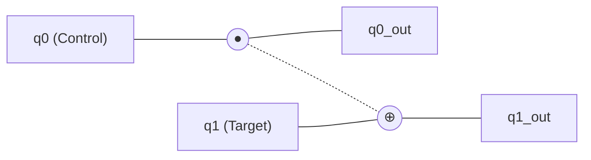
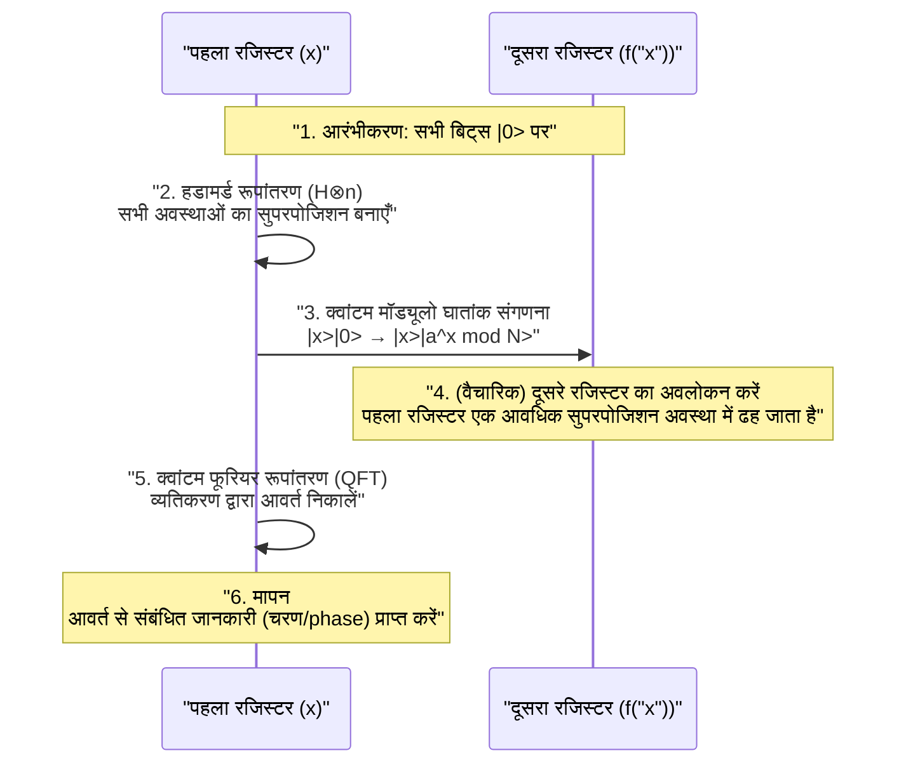

आधुनिक इंटरनेट समाज में सुरक्षा, [RSA](https://kenji.blog/hi/p/modern-cryptography-public-key-hash-signature/) एन्क्रिप्शन जैसे सार्वजनिक कुंजी क्रिप्टोग्राफी (Public-key cryptography) विधियों द्वारा सुरक्षित है। ये एन्क्रिप्शन विधियां इस गणितीय कठिनाई पर आधारित हैं कि "विशाल संख्याओं के अभाज्य गुणनखंडन (prime factorization) में वर्तमान कंप्यूटरों (क्लासिकल कंप्यूटरों) को खगोलीय समय लगता है।"

हालांकि, इस आधार को पूरी तरह से उलटने की क्षमता रखने वाला **क्वांटम कंप्यूटर** है। विशेष रूप से 1994 में पीटर शोर (Peter Shor) द्वारा खोजे गए **शोर के एल्गोरिदम** (Shor's Algorithm) ने गणितीय रूप से यह साबित कर दिया कि यदि क्वांटम कंप्यूटर व्यावहारिक हो जाते हैं, तो RSA एन्क्रिप्शन को यथार्थवादी समय के भीतर डिक्रिप्ट किया जा सकता है।

इस लेख में, हम लगभग 20,000 शब्दों के पैमाने पर विस्तार से गहराई में जाएंगे कि क्वांटम कंप्यूटर किस बुनियादी तंत्र के तहत गणना करते हैं, शोर का एल्गोरिदम अभाज्य गुणनखंडन को इतनी तेज़ी से क्यों कर सकता है, इसके पीछे का गणित, और पायथन/Qiskit का उपयोग करके प्रोग्रामिंग कार्यान्वयन के उदाहरण क्या हैं।

---

## 1. क्वांटम कंप्यूटर क्या है? क्लासिकल कंप्यूटर से अंतर

पीसी और स्मार्टफोन जिनका हम आमतौर पर उपयोग करते हैं उन्हें **क्लासिकल कंप्यूटर** कहा जाता है। क्लासिकल कंप्यूटर सूचनाओं को "0" या "1" के **बिट** (bit) के रूप में संभालते हैं।

दूसरी ओर, क्वांटम कंप्यूटर सूचना की सबसे छोटी इकाई के रूप में **क्वांटम बिट** (qubit: क्यूबिट) का उपयोग करते हैं। क्वांटम यांत्रिकी (Quantum Mechanics) के अजीबोगरीब गुणों का उपयोग करके, वे पिछले कंप्यूटरों से पूरी तरह से अलग दृष्टिकोण के साथ गणना करते हैं। इसके मूल में "सुपरपोजिशन (Superposition)", "क्वांटम उलझाव (Entanglement)", और "क्वांटम व्यतिकरण (Interference)" हैं।

### 1.1 सुपरपोजिशन (Superposition)

जबकि एक क्लासिकल बिट केवल "0" या "1" में से किसी एक अवस्था को ही धारण कर सकता है, एक क्वांटम बिट "0" और "1" दोनों की अवस्थाओं को एक ही समय में धारण कर सकता है। इसे **सुपरपोजिशन** कहा जाता है।

गणितीय रूप से, क्वांटम अवस्था $|\psi\rangle$ को आधार अवस्थाओं $|0\rangle$ और $|1\rangle$ के रैखिक संयोजन के रूप में इस प्रकार व्यक्त किया जाता है:

$$
|\psi\rangle = \alpha|0\rangle + \beta|1\rangle
$$

यहाँ, $\alpha$ और $\beta$ जटिल संख्याएँ (complex numbers) हैं, और इन्हें **संभाव्यता आयाम (Probability Amplitude)** कहा जाता है। जब क्वांटम बिट का प्रेक्षण (मापन) किया जाता है, तो अवस्था $|0\rangle$ या $|1\rangle$ में सिमट जाती है (तरंग पैकेट का पतन), और उनके प्राप्त होने की संभावनाएँ क्रमशः $|\alpha|^2$ और $|\beta|^2$ होती हैं। चूँकि प्रायिकताओं का योग 1 होना चाहिए, यह निम्नलिखित सामान्यीकरण शर्त को पूरा करता है:

$$
|\alpha|^2 + |\beta|^2 = 1
$$

इस गुण के कारण, $n$ क्वांटम बिट्स एक साथ $2^n$ अवस्थाओं के सुपरपोजिशन का प्रतिनिधित्व कर सकते हैं। यह क्वांटम समानांतर कंप्यूटिंग का आधार बनता है।

### 1.2 क्वांटम उलझाव (Entanglement)

जब कई क्वांटम बिट्स एक-दूसरे से मजबूती से जुड़ जाते हैं, और एक की स्थिति तय हो जाती है, तो स्थानिक रूप से चाहे वे कितनी भी दूर हों, दूसरे की स्थिति भी तुरंत तय हो जाती है। इस घटना को **क्वांटम उलझाव** (एंटैंगलमेंट) कहा जाता है।

उदाहरण के लिए, निम्नलिखित बेल अवस्था (Bell state) पर विचार करें:

$$
|\Phi^+\rangle = \frac{1}{\sqrt{2}} (|00\rangle + |11\rangle)
$$

इस अवस्था में, यदि पहले क्वांटम बिट को मापा जाता है और "0" प्राप्त होता है, तो दूसरा क्वांटम बिट हमेशा "0" होगा। इसके विपरीत, यदि "1" प्राप्त होता है, तो दूसरा भी "1" होगा। इस मजबूत सहसंबंध का उपयोग करके, क्वांटम कंप्यूटर जटिल गणनाओं को कुशलतापूर्वक संसाधित कर सकते हैं।

### 1.3 क्वांटम व्यतिकरण (Interference)

सुपरपोजिशन अवस्था में क्वांटम बिट्स में तरंग जैसे गुण होते हैं। जब तरंगों की चोटियां (श्रृंग) और चोटियां ओवरलैप होती हैं तो वे बड़ी हो जाती हैं (रचनात्मक व्यतिकरण), और जब चोटियां और गर्त ओवरलैप होते हैं तो वे एक-दूसरे को रद्द कर देते हैं (विनाशकारी व्यतिकरण)।
क्वांटम कंप्यूटिंग में, इस **क्वांटम व्यतिकरण** को कुशलतापूर्वक नियंत्रित किया जाता है, और एल्गोरिदम को इस तरह से डिज़ाइन किया जाता है कि यह सही उत्तर तक पहुंचने वाले प्रायिकता आयाम को बढ़ाता है, और गलत उत्तर के प्रायिकता आयाम को रद्द कर देता है। शोर का एल्गोरिदम भी इस व्यतिकरण का बहुत ही उन्नत तरीके से उपयोग करता है।

---

## 2. क्वांटम गेट और क्वांटम सर्किट

क्लासिकल कंप्यूटरों में लॉजिक गेट्स (AND, OR, NOT, आदि) के अनुरूप क्वांटम कंप्यूटरों में **क्वांटम गेट्स** होते हैं। क्वांटम गेट्स को क्वांटम स्टेट वेक्टर पर एकात्मक मैट्रिक्स (Unitary Matrix) के संचालन के रूप में दर्शाया जाता है।

### 2.1 प्रतिनिधि 1-क्वांटम बिट गेट्स

#### X गेट (पॉली X गेट)
यह क्लासिकल NOT गेट के समतुल्य है। यह $|0\rangle$ को $|1\rangle$ में, और $|1\rangle$ को $|0\rangle$ में पलट देता है।

$$
X = \begin{pmatrix} 0 & 1 \\\\ 1 & 0 \end{pmatrix}
$$

#### Z गेट (पॉली Z गेट)
यह केवल $|1\rangle$ के चरण (Phase) को पलट देता है ($-1$ से गुणा करता है)। क्वांटम व्यतिकरण में चरण का उलटा होना अत्यंत महत्वपूर्ण है।

$$
Z = \begin{pmatrix} 1 & 0 \\\\ 0 & -1 \end{pmatrix}
$$

#### H गेट (हडामर्ड गेट)
यह आधार अवस्थाओं (basis states) से एक सुपरपोजिशन अवस्था बनाने वाले सबसे महत्वपूर्ण गेट्स में से एक है।

$$
H = \frac{1}{\sqrt{2}} \begin{pmatrix} 1 & 1 \\\\ 1 & -1 \end{pmatrix}
$$

$H|0\rangle = \frac{1}{\sqrt{2}}(|0\rangle + |1\rangle)$ बन जाता है, और मापने पर 0 और 1 प्राप्त होने की 50% संभावना के साथ एक अवस्था बन जाती है।

### 2.2 बहु-क्वांटम बिट गेट्स

#### CNOT गेट (नियंत्रित NOT गेट)
यह दो क्वांटम बिट्स के लिए एक गेट है, और यह लक्ष्य (Target) बिट पर X गेट (उलटा) केवल तभी लागू करता है जब नियंत्रण (Control) बिट "1" हो। यह क्वांटम उलझाव पैदा करने के लिए अपरिहार्य है।



---

## 3. क्रिप्टोग्राफी की मूल बातें और [RSA](https://kenji.blog/hi/p/modern-cryptography-public-key-hash-signature/) एन्क्रिप्शन

शोर के एल्गोरिदम के प्रभाव को समझने के लिए, वर्तमान मुख्यधारा के सार्वजनिक कुंजी एन्क्रिप्शन, **RSA एन्क्रिप्शन** के तंत्र को जानना आवश्यक है।

### 3.1 RSA एन्क्रिप्शन कैसे काम करता है

RSA एन्क्रिप्शन अभाज्य गुणनखंडन की कठिनाई का उपयोग करता है। दो विशाल अभाज्य संख्याएँ $p$ और $q$ तैयार की जाती हैं, और उनका गुणनफल $N = p \times q$ गणना की जाती है।

1. $p$ और $q$ को गुणा करके $N$ बनाना आसान है।
2. हालाँकि, $N$ से मूल $p$ और $q$ को खोजना (अभाज्य गुणनखंडन करना) बहुत मुश्किल है।

यह विषमता (asymmetry) एन्क्रिप्शन की कुंजी है। $N$ को सार्वजनिक कुंजी के रूप में व्यापक रूप से प्रकाशित किया जाता है और एन्क्रिप्शन के लिए उपयोग किया जाता है। दूसरी ओर, $p$ और $q$ की जानकारी को निजी कुंजी के रूप में कड़ाई से सुरक्षित रखा जाता है और डिक्रिप्शन के लिए उपयोग किया जाता है।

### 3.2 यह कितना मुश्किल है?

वर्तमान सुपर कंप्यूटरों का उपयोग करके भी, यह कहा जाता है कि कई हज़ार बिट्स (जैसे RSA-2048) के $N$ को अभाज्य गुणनखंडित करने में ब्रह्मांड की आयु से अधिक समय लगेगा। सबसे कुशल क्लासिकल एल्गोरिदम, "जनरल नंबर फील्ड सीव (GNFS)" का उपयोग करने पर भी, संगणना की मात्रा घातीय रूप से (सटीक रूप से, उप-घातीय रूप से) बढ़ जाती है।

$$
O\left( \exp \left( \left(\frac{64}{9}b\right)^{\frac{1}{3}} (\log b)^{\frac{2}{3}} \right) \right)
$$
* $b$ अंकों की संख्या (बिट्स की संख्या) है

यहीं पर **शोर का एल्गोरिदम** काम आता है। शोर का एल्गोरिदम संगणना की इस मात्रा को नाटकीय रूप से बहुपदीय समय (Polynomial time) $O(b^3)$ तक कम कर देता है।

---

## 4. शोर के एल्गोरिदम का समग्र चित्र

शोर का एल्गोरिदम अभाज्य गुणनखंडन की समस्या को **"आवर्त खोज समस्या (Period Finding Problem)"** नामक एक अन्य गणितीय समस्या में परिवर्तित करके हल करता है।

एल्गोरिदम को मोटे तौर पर दो भागों में बांटा गया है:

1. **क्लासिकल कंप्यूटर पर किया गया भाग (कमी, प्री-प्रोसेसिंग, पोस्ट-प्रोसेसिंग)**
2. **क्वांटम कंप्यूटर पर किया गया भाग (आवर्त खोजना)**

### 4.1 क्लासिकल भाग: अभाज्य गुणनखंडन से आवर्त खोज तक कमी

मान लीजिए कि एक भाज्य संख्या $N$ दी गई है जिसका हम अभाज्य गुणनखंडन करना चाहते हैं। (उदाहरण: $N = 15$)

**चरण 1:** एक यादृच्छिक पूर्णांक $a$ चुनें जो $N$ के साथ सह-अभाज्य (co-prime) हो (सबसे बड़ा सामान्य भाजक 1 है) ($1 < a < N$)।
यदि सबसे बड़ा सामान्य भाजक $\gcd(a, N) > 1$ है, तो हमें पहले ही एक गुणनखंड मिल गया है और हम समाप्त कर चुके हैं। (इसे यूक्लिडियन एल्गोरिदम के साथ आसानी से पाया जा सकता है)

**चरण 2:** निम्नलिखित मॉड्यूलर अंकगणितीय फलन $f(x)$ पर विचार करें।

$$
f(x) = a^x \pmod N
$$

यह गणितीय रूप से ज्ञात है (यूलर की प्रमेय) कि यदि हम इस फलन $f(x)$ में $x = 0, 1, 2, 3, \dots$ को प्रतिस्थापित करते हैं, तो मान एक निश्चित आवर्त $r$ पर दोहराए जाएंगे। दूसरे शब्दों में, एक न्यूनतम धनात्मक पूर्णांक $r$ (आवर्त) मौजूद है जो $f(x) = f(x + r)$ बनाता है।

उदाहरण के लिए, $N = 15$, $a = 7$ के मामले में:
- $7^0 \pmod{15} = 1$
- $7^1 \pmod{15} = 7$
- $7^2 \pmod{15} = 4$
- $7^3 \pmod{15} = 13$
- $7^4 \pmod{15} = 1$ (यहाँ से लूप)

हम देख सकते हैं कि आवर्त $r = 4$ है।

**चरण 3:** यदि पाया गया आवर्त $r$ सम है, और $a^{r/2} \not\equiv -1 \pmod N$ है, तो गुणनखंडों को इस प्रकार पाया जा सकता है:

$$
\gcd(a^{r/2} \pm 1, N)
$$

पिछले उदाहरण में ($N=15, a=7, r=4$):
$a^{r/2} = 7^{4/2} = 7^2 = 49$
$49 + 1 = 50$, $\gcd(50, 15) = 5$
$49 - 1 = 48$, $\gcd(48, 15) = 3$

शानदार! हमने $15$ के गुणनखंड $5$ और $3$ ढूंढ लिए हैं!

### 4.2 समस्या: क्लासिक रूप से आवर्त $r$ खोजना मुश्किल है

हम समझ गए हैं कि यदि हमें केवल आवर्त $r$ पता चल जाए तो अभाज्य गुणनखंडन किया जा सकता है। हालाँकि, यदि $N$ बहुत बड़ा है, तो आवर्त $r$ खोजने के लिए क्लासिकल कंप्यूटर पर एक-एक करके $f(x)$ की गणना करने में अभी भी घातीय समय लगेगा।

इसलिए, इस भाग को "आवर्त $r$ खोजना" क्वांटम कंप्यूटर पर छोड़ दिया जाता है। क्वांटम समानांतर कंप्यूटिंग का उपयोग करके, सभी $x$ के लिए $f(x)$ की गणना एक बार में की जाती है, और वहाँ से आवर्त $r$ को एक पल में (बहुपदीय समय में) निकाला जाता है।

---

## 5. क्वांटम भाग: क्वांटम फूरियर रूपांतरण और आवर्त निष्कर्षण

शोर के एल्गोरिदम का क्वांटम संगणना भाग निम्नलिखित चरणों में आगे बढ़ता है:



### 5.1 क्वांटम समानांतर कंप्यूटिंग द्वारा फलन मूल्यांकन

सबसे पहले, पर्याप्त संख्या में क्वांटम बिट्स वाले दो रजिस्टर (पहला रजिस्टर और दूसरा रजिस्टर) तैयार करें, और उन सभी को $|0\rangle$ पर आरंभ करें।
पहले रजिस्टर पर एक हडामर्ड गेट लागू करें ताकि सभी संभावित $x$ मानों ($0$ से $Q-1$ तक) की एक समान सुपरपोजिशन अवस्था बनाई जा सके।

$$
\frac{1}{\sqrt{Q}} \sum_{x=0}^{Q-1} |x\rangle |0\rangle
$$

अगला, **क्वांटम मॉड्यूलो घातांक सर्किट** का उपयोग करके, $f(x) = a^x \pmod N$ की गणना करें और परिणाम को दूसरे रजिस्टर में लिखें।

$$
\frac{1}{\sqrt{Q}} \sum_{x=0}^{Q-1} |x\rangle |a^x \bmod N\rangle
$$

इस स्तर पर, सभी $x$ के लिए $f(x)$ के परिणामों की गणना क्वांटम सुपरपोजिशन के रूप में एक बार में की गई है। हालाँकि, भले ही हम इसे अभी मापें, हमें केवल एक यादृच्छिक $x$ और उसका संबंधित $f(x)$ मिलेगा, और हम आवर्त $r$ नहीं जान पाएंगे।

### 5.2 आवधिक अवस्थाओं का निष्कर्षण और क्वांटम व्यतिकरण

आवर्त $r$ को बाहर निकालने के लिए, एक अत्यंत महत्वपूर्ण ऑपरेशन **क्वांटम फूरियर ट्रांसफॉर्म (Quantum Fourier Transform: QFT)** को पहले रजिस्टर में लागू किया जाता है।

QFT शास्त्रीय असतत फूरियर रूपांतरण (DFT) का क्वांटम संस्करण है। यह डेटा की आवधिकता (periodicity) को आवृत्ति डोमेन में चोटियों (peaks) में परिवर्तित करने का कार्य करता है। एक स्टेट वेक्टर $|\psi\rangle = \sum_{j} x_j |j\rangle$ के लिए, QFT इस प्रकार कार्य करता है:

$$
QFT(|j\rangle) = \frac{1}{\sqrt{Q}} \sum_{k=0}^{Q-1} e^{\frac{2\pi i j k}{Q}} |k\rangle
$$

चूंकि पहले रजिस्टर की स्थिति दूसरे रजिस्टर की स्थिति (उदाहरण के लिए $f(x_0)$) से जुड़ी हुई है, यह एक सुपरपोजिशन अवस्था है जिसमें एक विशिष्ट आवर्त पर अलग-अलग मान होते हैं। जब इस पर QFT लागू किया जाता है, तो क्वांटम व्यतिकरण (Interference) होता है।

- सही आवर्त $r$ से जुड़ी अवस्थाएं (संभाव्यता आयाम) **मजबूत (constructive)** होती हैं
- अन्य अवस्थाओं के चरण (phases) बिखर जाते हैं और वे **एक-दूसरे को रद्द (destructive)** कर देते हैं।

नतीजतन, मापने पर $k$ प्राप्त होने की उच्च संभावना होती है, जहां $k \approx Q \cdot \frac{c}{r}$ ($c$ एक पूर्णांक है)।

### 5.3 क्लासिकल पोस्ट-प्रोसेसिंग: निरंतर भिन्न विस्तार (Continued Fraction Expansion)

एक बार क्वांटम कंप्यूटर से माप परिणाम $k$ प्राप्त हो जाने के बाद, यह फिर से क्लासिकल कंप्यूटर की बारी है।
हमें संबंध $k / Q \approx c / r$ मिला है। $c$ और $r$ सह-अभाज्य पूर्णांक हैं।

ज्ञात दशमलव $k / Q$ को क्लासिकल एल्गोरिदम **निरंतर भिन्न विस्तार (Continued Fraction Expansion)** का उपयोग करके अनुमानित भिन्न $c / r$ में परिवर्तित करके, हम अंततः हर (denominator) के रूप में आवर्त $r$ निर्धारित कर सकते हैं।

उसके बाद, यदि हम खंड 4.1 में वर्णित प्रक्रिया का पालन करते हुए सबसे बड़े सामान्य भाजक की गणना करते हैं, तो $N$ के अभाज्य गुणनखंड सफलतापूर्वक निकाले जाएंगे।

---

## 6. Qiskit का उपयोग करके शोर के एल्गोरिदम के कार्यान्वयन का उदाहरण

यहाँ, हम IBM द्वारा प्रदान किए गए ओपन सोर्स क्वांटम प्रोग्रामिंग फ्रेमवर्क **Qiskit** का उपयोग करके शोर के एल्गोरिदम के कार्यान्वयन का एक उदाहरण पेश करेंगे जो एक बहुत छोटी संख्या $N = 15$ का अभाज्य गुणनखंडन करता है।

(*व्यावहारिक विशाल संख्याओं के अभाज्य गुणनखंडन के लिए भारी मात्रा में क्वांटम बिट्स और त्रुटि सुधार की आवश्यकता होती है, इसलिए वर्तमान सिमुलेटर और छोटे पैमाने के क्वांटम हार्डवेयर $15$ या $21$ जैसे प्रदर्शनों तक सीमित हैं*)

```python
import numpy as np
from qiskit import QuantumCircuit, transpile
from qiskit.visualization import plot_histogram
from qiskit_aer import AerSimulator
import math
from math import gcd

# --- 1. क्वांटम मॉड्यूलो घातांक सर्किट की परिभाषा (a=7, N=15) ---
def c_amod15(a, power):
    """नियंत्रण U गेट के रूप में कार्य करने वाला a^power mod 15 सर्किट"""
    U = QuantumCircuit(4)        
    for _iteration in range(power):
        if a in [2,13]:
            U.swap(2,3)
            U.swap(1,2)
            U.swap(0,1)
        if a in [7,8]:
            U.swap(0,1)
            U.swap(1,2)
            U.swap(2,3)
        if a in [4, 11]:
            U.swap(1,3)
            U.swap(0,2)
        if a in [7,11,13]:
            for q in range(4):
                U.x(q)
    U = U.to_gate()
    U.name = f"{a}^{power} mod 15"
    c_U = U.control()
    return c_U

# --- 2. व्युत्क्रम क्वांटम फूरियर रूपांतरण (QFT_dagger) की परिभाषा ---
def qft_dagger(n):
    """n क्वांटम बिट्स का व्युत्क्रम क्वांटम फूरियर रूपांतरण करने वाला सर्किट"""
    qc = QuantumCircuit(n)
    for qubit in range(n//2):
        qc.swap(qubit, n-qubit-1)
    for j in range(n):
        for m in range(j):
            qc.cp(-np.pi/float(2**(j-m)), m, j)
        qc.h(j)
    qc.name = "QFT_dagger"
    return qc

# --- 3. शोर के एल्गोरिदम के मुख्य भाग का निर्माण ---
n_count = 8  # मापन रजिस्टर (पहला रजिस्टर) के क्वांटम बिट्स की संख्या
a = 7        # N=15 के साथ सह-अभाज्य संख्या

# पहला रजिस्टर (8qubit) + दूसरा रजिस्टर (4qubit) + क्लासिकल रजिस्टर (8bit)
qc = QuantumCircuit(n_count + 4, n_count)

# पहले रजिस्टर को H गेट से सुपरपोजिशन अवस्था में लाना
for q in range(n_count):
    qc.h(q)

# दूसरे रजिस्टर की प्रारंभिक अवस्था को |1> पर सेट करना (x गेट को सबसे कम महत्वपूर्ण बिट पर लागू करें)
qc.x(n_count)

# नियंत्रित मॉड्यूलो घातांक गेट लागू करें
for q in range(n_count):
    qc.append(c_amod15(a, 2**q), 
             [q] + [i+n_count for i in range(4)])

# पहले रजिस्टर पर व्युत्क्रम QFT लागू करें
qc.append(qft_dagger(n_count).to_instruction(), range(n_count))

# पहले रजिस्टर को मापें
qc.measure(range(n_count), range(n_count))

# --- 4. सिम्युलेटर के माध्यम से निष्पादन ---
simulator = AerSimulator()
compiled_circuit = transpile(qc, simulator)
job = simulator.run(compiled_circuit, shots=1024)
results = job.result()
counts = results.get_counts()

print("मापन परिणाम (बाइनरी: प्रेक्षण गणना):")
print(counts)

# --- 5. क्लासिकल पोस्ट-प्रोसेसिंग (आवर्त r की पहचान करना और अभाज्य गुणनखंडों की गणना करना) ---
# मापन परिणामों से उच्चतम संभाव्यता वाले का विश्लेषण करने का लॉजिक (सरलीकृत संस्करण)
measured_phases = []
for output in counts:
    decimal = int(output, 2)
    phase = decimal / (2**n_count)
    measured_phases.append(phase)

print(f"\nअनुमानित चरण (phase): {measured_phases[:4]} ...")
# चरण से निरंतर भिन्न विस्तार का उपयोग करके हर (denominator) r (आवर्त) ज्ञात करने की प्रक्रिया जारी रहती है...
```

उपरोक्त कोड को निष्पादित करते समय, क्वांटम सिम्युलेटर उच्च संभावना के साथ `00000000`, `01000000`, `10000000`, `11000000` (दशमलव में 0, 64, 128, 192) जैसी अवस्थाओं को आउटपुट करेगा।
इन्हें $2^8 = 256$ से विभाजित करने पर, चरण $0$, $0.25$, $0.5$, $0.75$ हो जाते हैं। भिन्नों के रूप में व्यक्त करने पर ये $0/4$, $1/4$, $2/4$, $3/4$ हो जाते हैं, और हम देख सकते हैं कि क्वांटम संगणना से हर **4** प्राप्त हुआ है, जो आवर्त $r$ है।
एक बार जब हम जान लेते हैं कि आवर्त $r=4$ है, जैसा कि पहले बताया गया है, $\gcd(7^{4/2} \pm 1, 15)$ से $3$ और $5$ अभाज्य गुणनखंड प्राप्त होते हैं।

---

## 7. [RSA](https://kenji.blog/hi/p/modern-cryptography-public-key-hash-signature/) एन्क्रिप्शन खतरे में क्यों है?

क्लासिकल कंप्यूटरों में अभाज्य गुणनखंडन की गणना मात्रा अंकों की संख्या बढ़ने पर घातीय रूप से बढ़ जाती है। उदाहरण के लिए, यह अनुमान लगाया गया है कि 100 अंकों की संख्या का गुणनखंडन करने में कुछ सेकंड लगते हैं, 200 अंकों में कई वर्ष लगते हैं, और RSA-2048 (लगभग 617 अंक) में ब्रह्मांड के जीवनकाल से अधिक समय लगता है।

हालाँकि, शोर के एल्गोरिदम का उपयोग करते समय, आवश्यक गणना चरणों (गेट्स की संख्या) अंकों की संख्या $b$ के विरुद्ध केवल बहुपद क्रम (polynomial order) $O(b^3)$ में बढ़ते हैं। इसका मतलब यह है कि एक आदर्श क्वांटम कंप्यूटर होने पर, यहां तक कि RSA-2048 को भी कुछ घंटों से लेकर कुछ दिनों के भीतर डिक्रिप्ट किया जा सकता है।

### "स्टोर नाउ, डिक्रिप्ट लेटर (Store Now, Decrypt Later)" का खतरा
यह सोचना खतरनाक है कि "यह सुरक्षित है क्योंकि अभी तक उच्च-प्रदर्शन वाला क्वांटम कंप्यूटर पूरा नहीं हुआ है।" एक हमले का परिदृश्य यथार्थवादी माना जा रहा है जिसमें एक दुर्भावनापूर्ण तृतीय पक्ष या राष्ट्रीय एजेंसी वर्तमान में प्रसारित एन्क्रिप्टेड गोपनीय डेटा (वित्तीय जानकारी, राष्ट्रीय रहस्य, आदि) को अभी रिकॉर्ड और सहेजती है (Store Now), और 10 से 20 साल बाद, उच्च-प्रदर्शन वाला क्वांटम कंप्यूटर पूरा होने के क्षण में उसे डिक्रिप्ट करती है (Decrypt Later)।
इसलिए, हमें क्वांटम कंप्यूटर के पूरा होने का इंतजार किए बिना एन्क्रिप्शन विधियों को अपडेट करने के लिए मजबूर होना पड़ रहा है।

---

## 8. क्वांटम कंप्यूटर को साकार करने में बाधाएं: शोर (Noise) और त्रुटि सुधार

शोर का एल्गोरिदम गणितीय रूप से पूर्ण है, लेकिन इसे भौतिक रूप से महसूस करने के लिए उच्च बाधाएं हैं। वर्तमान क्वांटम हार्डवेयर को **NISQ** (Noisy Intermediate-Scale Quantum: शोरयुक्त मध्यवर्ती पैमाने का क्वांटम) डिवाइस कहा जाता है, और इसमें एक कमजोरी है कि यह शोर (बाहरी वातावरण और गेट ऑपरेशन त्रुटियों के कारण होने वाली गड़बड़ी) के प्रति बहुत संवेदनशील है।

क्वांटम अवस्थाएँ अत्यंत नाजुक होती हैं, और थोड़ी सी भी गर्मी या विद्युत चुम्बकीय तरंगें **डिकोहेरेंस (Decoherence)** (क्वांटम अवस्था का पतन) का कारण बन सकती हैं। RSA-2048 को डिक्रिप्ट करने के लिए, बिना किसी त्रुटि के हजारों "तार्किक क्वांटम बिट्स" और करोड़ों गेट ऑपरेशन्स को अंजाम देना आवश्यक है।

इसे साकार करने के लिए शोध किया जा रहा है: **क्वांटम त्रुटि सुधार (Quantum Error Correction)**। यह एक ऐसी तकनीक है जो 1 "तार्किक क्वांटम बिट" बनाने के लिए कई "भौतिक क्वांटम बिट्स" को एक साथ बंडल करती है, और गणना के दौरान होने वाली त्रुटियों का पता लगाकर उन्हें सुधारती है। हालांकि, कहा जाता है कि 1 तार्किक क्वांटम बिट बनाने के लिए 1000 से 10000 भौतिक क्वांटम बिट्स की आवश्यकता होती है, और यह उम्मीद की जाती है कि करोड़ों भौतिक क्वांटम बिट्स के बड़े पैमाने पर **दोष-सहिष्णु क्वांटम कंप्यूटर (FTQC: Fault-Tolerant Quantum Computer)** की प्राप्ति के लिए अभी भी 10 से कई दशकों की सफलता (breakthrough) की आवश्यकता है।

---

## 9. अगली पीढ़ी की क्रिप्टोग्राफी तकनीक: पोस्ट-क्वांटम क्रिप्टोग्राफी (PQC)

शोर के एल्गोरिदम के खतरे का मुकाबला करने के लिए, अमेरिका के राष्ट्रीय मानक और प्रौद्योगिकी संस्थान (NIST) और दुनिया भर के अन्य संस्थान एक नई एन्क्रिप्शन विधि के मानकीकरण (Standardization) को आगे बढ़ा रहे हैं जिसे क्वांटम कंप्यूटर भी डिक्रिप्ट नहीं कर सकते: **पोस्ट-क्वांटम क्रिप्टोग्राफी (Post-Quantum [Cryptography](https://kenji.blog/hi/p/modern-cryptography-public-key-hash-signature/): PQC)**।

PQC क्वांटम तकनीक का उपयोग नहीं करता है, यह क्लासिकल कंप्यूटरों पर निष्पादन योग्य है, और नई गणितीय समस्याओं पर आधारित है जिन्हें क्वांटम एल्गोरिदम का उपयोग करके भी कुशलतापूर्वक हल नहीं किया जा सकता है (शोर का एल्गोरिदम लागू नहीं किया जा सकता है)।

PQC के विशिष्ट दृष्टिकोण:
- **लैटिस-आधारित क्रिप्टोग्राफी (Lattice-based cryptography)**: बहु-आयामी स्थान में सबसे छोटी वेक्टर समस्या (SVP) जैसी कठिनाइयों का उपयोग करता है। (उदाहरण: Kyber, Dilithium)
- **कोड-आधारित क्रिप्टोग्राफी (Code-based cryptography)**: त्रुटि-सुधार कोड को डिकोड करने की समस्या की कठिनाई का उपयोग करता है।
- **मल्टीवेरिएट क्रिप्टोग्राफी (Multivariate cryptography)**: बड़ी संख्या में चर (variables) के साथ द्विघात बहुपदीय (quadratic polynomial) समकालिक समीकरणों (simultaneous equations) को हल करने की कठिनाई का उपयोग करता है।
- **हैश-आधारित हस्ताक्षर (Hash-based signatures)**: एक हस्ताक्षर योजना जो केवल क्रिप्टोग्राफ़िक हैश फ़ंक्शंस की सुरक्षा पर निर्भर करती है।

वर्तमान में, दुनिया का आईटी बुनियादी ढांचा मौजूदा RSA और एलीप्स वक्र क्रिप्टोग्राफी (Elliptic curve cryptography) से इन PQC में संक्रमण (migration) की ऐतिहासिक संक्रमण अवधि से गुजर रहा है।

---

## 10. निष्कर्ष

इस लेख में, हमने क्वांटम कंप्यूटर की बुनियादी बातों से लेकर शोर के एल्गोरिदम का उपयोग करके अभाज्य गुणनखंडन के तंत्र और भविष्य की क्रिप्टोग्राफी तकनीक की संभावनाओं तक सब कुछ विस्तार से समझाया।

क्वांटम कंप्यूटर अभी अपनी प्रारंभिक अवस्था में हैं, और उन्हें व्यावहारिक एन्क्रिप्शन डिक्रिप्शन करने में सक्षम होने में कई साल लगेंगे। हालाँकि, इसका सैद्धांतिक समर्थन, **शोर का एल्गोरिदम**, मानव ज्ञान का एक क्रिस्टलीकरण कहा जा सकता है जो सूचना विज्ञान, भौतिकी और गणित का खूबसूरती से मिश्रण करता है।

इसका सुंदर तंत्र जो कुशलतापूर्वक क्वांटम व्यतिकरण में हेरफेर करता है और एक घातीय खोज स्थान से केवल "सही उत्तर" सामने लाता है, भविष्य में विभिन्न क्षेत्रों (दवा खोज, सामग्री गणना, अनुकूलन समस्याएं, आदि) में लागू होने वाले क्वांटम एल्गोरिदम के डिजाइन में एक महत्वपूर्ण मार्गदर्शक बन जाएगा। आने वाले क्वांटम युग के लिए, हम प्रौद्योगिकी में एक बुनियादी बदलाव देख रहे हैं।
