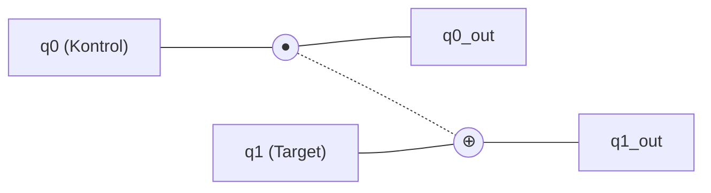
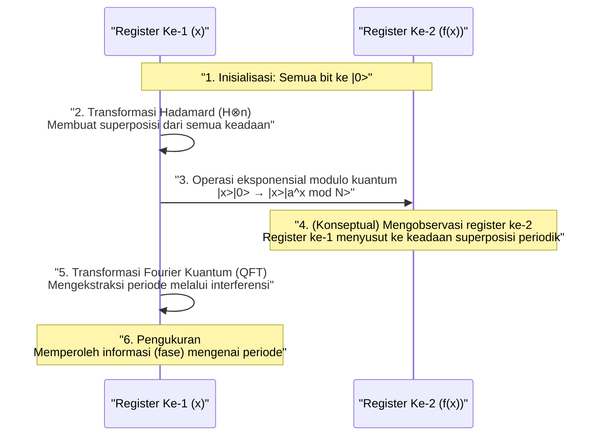

Keamanan dalam masyarakat internet modern dilindungi oleh sistem kriptografi kunci publik seperti kriptografi RSA. Sistem kriptografi ini didasarkan pada kesulitan matematis bahwa "faktorisasi prima dari bilangan yang sangat besar membutuhkan waktu astronomis jika dihitung menggunakan komputer saat ini (komputer klasik)."

Namun, **komputer kuantum** memiliki potensi untuk membalikkan premis tersebut dari akarnya. Secara khusus, **Algoritma Shor** (Shor's Algorithm), yang ditemukan oleh Peter Shor pada tahun 1994, secara matematis membuktikan bahwa jika komputer kuantum direalisasikan, ia dapat memecahkan kriptografi RSA dalam waktu yang realistis.

Dalam artikel ini, kita akan menggali lebih dalam dengan skala sekitar 20.000 karakter, mulai dari mekanisme dasar tentang bagaimana komputer kuantum melakukan perhitungan, alasan mengapa Algoritma Shor dapat melakukan faktorisasi prima dengan cepat, hingga matematika di baliknya dan contoh implementasi menggunakan pemrograman (Python/Qiskit).

---

## 1. Apa itu Komputer Kuantum? Perbedaannya dengan Komputer Klasik

PC dan ponsel pintar yang biasa kita gunakan disebut **komputer klasik**. Komputer klasik memproses informasi sebagai **bit** (bit) yang bernilai "0" atau "1".

Di sisi lain, komputer kuantum menggunakan **qubit** (bit kuantum) sebagai unit informasi terkecil. Dengan memanfaatkan sifat-sifat aneh dari mekanika kuantum, komputer ini melakukan perhitungan dengan pendekatan yang sama sekali berbeda dari komputer yang ada selama ini. Inti dari metode tersebut adalah "Superposisi" (Superposition), "Keterikatan Kuantum" (Entanglement), dan "Interferensi Kuantum" (Interference).

### 1.1 Superposisi (Superposition)

Sementara bit klasik hanya dapat mengambil satu dari dua keadaan, "0" atau "1", qubit dapat mengambil keadaan "0" dan "1" secara bersamaan. Hal ini disebut **superposisi**.

Secara matematis, keadaan kuantum $|\psi\rangle$ direpresentasikan sebagai kombinasi linear dari keadaan basis $|0\rangle$ dan $|1\rangle$ sebagai berikut.

$$
|\psi\rangle = \alpha|0\rangle + \beta|1\rangle
$$

Di sini, $\alpha$ dan $\beta$ adalah bilangan kompleks, dan disebut **amplitudo probabilitas**. Saat mengukur (mengobservasi) qubit, keadaannya akan runtuh (keruntuhan fungsi gelombang) menjadi $|0\rangle$ atau $|1\rangle$, dan probabilitas untuk mendapatkan masing-masing adalah $|\alpha|^2$ dan $|\beta|^2$. Karena jumlah total probabilitas harus bernilai 1, kondisi normalisasi berikut terpenuhi.

$$
|\alpha|^2 + |\beta|^2 = 1
$$

Karena sifat ini, $n$ buah qubit dapat merepresentasikan superposisi dari $2^n$ keadaan secara bersamaan. Inilah yang menjadi dasar komputasi paralel kuantum.

### 1.2 Keterikatan Kuantum (Entanglement)

Fenomena di mana beberapa qubit terhubung satu sama lain dengan sangat kuat, sehingga ketika keadaan salah satunya ditentukan, keadaan yang lain akan segera ditentukan seketika tidak peduli seberapa jauh jarak fisiknya, disebut **keterikatan kuantum** (entanglement).

Sebagai contoh, mari kita pertimbangkan keadaan Bell (Bell state) berikut.

$$
|\Phi^+\rangle = \frac{1}{\sqrt{2}} (|00\rangle + |11\rangle)
$$

Pada keadaan ini, jika kita mengukur qubit pertama dan mendapatkan "0", maka qubit kedua pasti akan bernilai "0". Sebaliknya, jika kita mendapatkan "1", qubit kedua juga akan menjadi "1". Dengan memanfaatkan korelasi kuat ini, komputer kuantum dapat memproses perhitungan kompleks secara efisien.

### 1.3 Interferensi Kuantum (Interference)

Qubit dalam keadaan superposisi memiliki sifat seperti gelombang. Saat puncak gelombang tumpang tindih dengan puncak, ia akan membesar (interferensi konstruktif), sedangkan saat puncak tumpang tindih dengan lembah, mereka saling meniadakan (interferensi destruktif).
Dalam komputasi kuantum, **interferensi kuantum** ini dikontrol dengan sangat terampil untuk merancang algoritma yang memperkuat amplitudo probabilitas yang mengarah ke jawaban yang benar, dan meniadakan amplitudo probabilitas untuk jawaban yang salah. Algoritma Shor juga menggunakan interferensi ini dengan cara yang sangat canggih.

---

## 2. Gerbang Kuantum dan Sirkuit Kuantum

Padanan untuk gerbang logika (AND, OR, NOT, dll.) dalam komputer klasik adalah **gerbang kuantum** pada komputer kuantum. Gerbang kuantum direpresentasikan sebagai operasi matriks uniter (Unitary Matrix) terhadap vektor keadaan kuantum.

### 2.1 Gerbang 1-Qubit Utama

#### Gerbang X (Gerbang Pauli-X)
Ini setara dengan gerbang NOT klasik. Ia membalik $|0\rangle$ menjadi $|1\rangle$, dan $|1\rangle$ menjadi $|0\rangle$.

$$
X = \begin{pmatrix} 0 & 1 \\\\ 1 & 0 \end{pmatrix}
$$

#### Gerbang Z (Gerbang Pauli-Z)
Ia hanya membalik fase dari $|1\rangle$ (mengalikannya dengan $-1$). Pembalikan fase sangat penting dalam interferensi kuantum.

$$
Z = \begin{pmatrix} 1 & 0 \\\\ 0 & -1 \end{pmatrix}
$$

#### Gerbang H (Gerbang Hadamard)
Ini adalah salah satu gerbang terpenting yang menciptakan keadaan superposisi dari keadaan basis.

$$
H = \frac{1}{\sqrt{2}} \begin{pmatrix} 1 & 1 \\\\ 1 & -1 \end{pmatrix}
$$

Karena $H|0\rangle = \frac{1}{\sqrt{2}}(|0\rangle + |1\rangle)$, ketika diukur, ia menjadi keadaan di mana probabilitas mendapatkan 0 dan 1 masing-masing adalah 50%.

### 2.2 Gerbang Multi-Qubit

#### Gerbang CNOT (Controlled-NOT)
Ini adalah gerbang untuk dua qubit, di mana gerbang X (pembalikan) diterapkan pada bit target hanya jika bit kontrol bernilai "1". Gerbang ini sangat penting untuk menciptakan keterikatan kuantum.



---

## 3. Dasar-dasar Teknologi Kriptografi dan Kriptografi RSA

Untuk memahami dampak Algoritma Shor, kita perlu mengetahui bagaimana **kriptografi RSA**, yang merupakan kriptografi kunci publik arus utama saat ini, bekerja.

### 3.1 Cara Kerja Kriptografi RSA

Kriptografi RSA memanfaatkan kesulitan dari faktorisasi prima. Dua bilangan prima yang sangat besar, $p$ dan $q$, disiapkan, kemudian hasil kalinya $N = p \times q$ dihitung.

1. Mengalikan $p$ dan $q$ untuk mendapatkan $N$ adalah hal yang mudah.
2. Namun, menemukan kembali $p$ dan $q$ yang asli dari $N$ (memfaktorkannya) adalah hal yang sangat sulit.

Asimetri inilah yang menjadi kunci dari kriptografi. $N$ didistribusikan secara luas sebagai kunci publik dan digunakan untuk enkripsi. Sementara itu, informasi $p$ dan $q$ dijaga ketat sebagai kunci privat dan digunakan untuk dekripsi.

### 3.2 Seberapa Sulitkah Itu?

Dikatakan bahwa dengan menggunakan superkomputer saat ini, memfaktorkan nilai $N$ yang berukuran ribuan bit (misalnya RSA-2048) akan memakan waktu lebih lama daripada umur alam semesta. Bahkan dengan menggunakan algoritma klasik yang paling efisien, "General Number Field Sieve (GNFS)", jumlah komputasinya meningkat secara eksponensial (atau lebih tepatnya, sub-eksponensial).

$$
O\left( \exp \left( \left(\frac{64}{9}b\right)^{\frac{1}{3}} (\log b)^{\frac{2}{3}} \right) \right)
$$
※ $b$ adalah jumlah digit (jumlah bit)

Di sinilah **Algoritma Shor** muncul. Algoritma Shor secara dramatis memangkas jumlah komputasi ini menjadi waktu polinomial $O(b^3)$.

---

## 4. Gambaran Umum Algoritma Shor

Algoritma Shor menyelesaikan masalah faktorisasi prima dengan mengubahnya menjadi masalah matematika lain yang disebut **"Masalah Penemuan Periode (Period Finding Problem)"**.

Algoritma ini terbagi secara garis besar ke dalam 2 bagian:

1. **Bagian yang dijalankan oleh komputer klasik (Reduksi, Pra-pemrosesan, Pasca-pemrosesan)**
2. **Bagian yang dijalankan oleh komputer kuantum (Penemuan Periode)**

### 4.1 Bagian Klasik: Reduksi dari Faktorisasi Prima ke Penemuan Periode

Misalkan kita diberikan bilangan komposit $N$ yang ingin kita faktorkan. (Contoh: $N = 15$)

**Langkah 1:** Pilih sebuah bilangan bulat acak $a$ yang saling prima (faktor persekutuan terbesarnya adalah 1) dengan $N$ ($1 < a < N$).
Jika faktor persekutuan terbesar $\gcd(a, N) > 1$, itu berarti kita sudah menemukan faktornya, dan proses pun selesai. (Dapat dengan mudah ditemukan menggunakan Algoritma Euclidean)

**Langkah 2:** Pertimbangkan fungsi operasi modulo $f(x)$ berikut.

$$
f(x) = a^x \pmod N
$$

Telah diketahui secara matematis bahwa jika kita menyubstitusikan $x = 0, 1, 2, 3, \dots$ ke dalam fungsi $f(x)$ ini, nilainya akan berulang dengan periode tertentu $r$ (Teorema Euler). Artinya, ada sebuah bilangan bulat positif terkecil $r$ (periode) sehingga $f(x) = f(x + r)$.

Sebagai contoh, untuk kasus $N = 15$ dan $a = 7$:
- $7^0 \pmod{15} = 1$
- $7^1 \pmod{15} = 7$
- $7^2 \pmod{15} = 4$
- $7^3 \pmod{15} = 13$
- $7^4 \pmod{15} = 1$ (pengulangan dimulai dari sini)

Kita dapat melihat bahwa periodenya adalah $r = 4$.

**Langkah 3:** Jika periode $r$ yang ditemukan adalah genap, dan $a^{r/2} \not\equiv -1 \pmod N$, maka faktor-faktornya dapat ditemukan dengan cara berikut.

$$
\gcd(a^{r/2} \pm 1, N)
$$

Pada contoh sebelumnya ($N=15, a=7, r=4$):
$a^{r/2} = 7^{4/2} = 7^2 = 49$
$49 + 1 = 50$, $\gcd(50, 15) = 5$
$49 - 1 = 48$, $\gcd(48, 15) = 3$

Berhasil! Kita telah menemukan faktor $5$ dan $3$ dari $15$!

### 4.2 Masalahnya: Sulit Menemukan Periode $r$ secara Klasik

Kita telah memahami bahwa faktorisasi prima bisa dilakukan asalkan kita mengetahui periode $r$. Akan tetapi, jika $N$ sangat besar, menghitung $f(x)$ satu per satu dengan komputer klasik untuk mencari periode $r$ akan tetap memakan waktu eksponensial.

Oleh karena itu, hanya bagian "menemukan periode $r$" ini yang diserahkan ke komputer kuantum. Dengan menggunakan komputasi paralel kuantum, $f(x)$ untuk semua $x$ dihitung secara bersamaan, dan dari situ periode $r$ diekstraksi dalam sekejap (dalam waktu polinomial).

---

## 5. Bagian Kuantum: Transformasi Fourier Kuantum dan Ekstraksi Periode

Bagian komputasi kuantum dari Algoritma Shor berjalan dengan langkah-langkah berikut.



### 5.1 Evaluasi Fungsi dengan Komputasi Paralel Kuantum

Pertama, siapkan dua register (Register Ke-1 dan Register Ke-2) dengan jumlah qubit yang memadai, lalu inisialisasikan semuanya menjadi $|0\rangle$.
Terapkan gerbang Hadamard pada Register Ke-1 untuk menciptakan keadaan superposisi seragam dari semua nilai $x$ yang mungkin (dari $0$ hingga $Q-1$).

$$
\frac{1}{\sqrt{Q}} \sum_{x=0}^{Q-1} |x\rangle |0\rangle
$$

Selanjutnya, gunakan **sirkuit eksponensial modulo kuantum** untuk menghitung $f(x) = a^x \pmod N$, lalu tulis hasilnya ke Register Ke-2.

$$
\frac{1}{\sqrt{Q}} \sum_{x=0}^{Q-1} |x\rangle |a^x \bmod N\rangle
$$

Pada tahap ini, hasil $f(x)$ untuk semua $x$ telah dihitung sekaligus sebagai superposisi kuantum. Namun, jika kita mengukurnya langsung sekarang, kita hanya akan mendapatkan satu nilai acak $x$ beserta $f(x)$ padanannya, dan kita tetap tidak akan mengetahui periode $r$.

### 5.2 Ekstraksi Keadaan Periodik dan Interferensi Kuantum

Untuk menarik keluar periode $r$, sebuah operasi yang sangat krusial, **Transformasi Fourier Kuantum (Quantum Fourier Transform: QFT)**, diterapkan pada Register Ke-1.

QFT adalah versi kuantum dari Transformasi Fourier Diskrit (DFT) klasik. Operasi ini berfungsi untuk mengubah periodisitas data menjadi puncak pada domain frekuensi. Untuk vektor keadaan $|\psi\rangle = \sum_{j} x_j |j\rangle$, QFT bekerja sebagai berikut:

$$
QFT(|j\rangle) = \frac{1}{\sqrt{Q}} \sum_{k=0}^{Q-1} e^{\frac{2\pi i j k}{Q}} |k\rangle
$$

Karena keadaan pada Register Ke-1 terikat dengan keadaan di Register Ke-2 (misalnya $f(x_0)$), ia menjadi keadaan superposisi yang memiliki nilai-nilai terpisah (diskrit) dengan periode tertentu. Saat kita menerapkan QFT pada keadaan ini, interferensi kuantum akan terjadi.

- Keadaan (amplitudo probabilitas) yang berkaitan dengan periode $r$ yang benar akan saling **memperkuat (konstruktif)**
- Keadaan lain fasenya akan menjadi acak dan saling **meniadakan (destruktif)**.

Hasilnya, saat diukur, kemungkinan besar kita akan mendapatkan nilai $k$ di mana $k \approx Q \cdot \frac{c}{r}$ ($c$ adalah bilangan bulat).

### 5.3 Pasca-pemrosesan Klasik: Ekspansi Pecahan Berlanjut

Setelah hasil pengukuran $k$ didapatkan dari komputer kuantum, komputer klasik kembali digunakan.
Kita telah memperoleh persamaan $k / Q \approx c / r$. $c$ dan $r$ adalah bilangan bulat yang saling prima.

Dengan mengubah desimal $k / Q$ yang sudah diketahui menjadi pecahan aproksimasi $c / r$ menggunakan algoritma klasik **Ekspansi Pecahan Berlanjut (Continued Fraction Expansion)**, kita akhirnya bisa menentukan periode $r$ sebagai penyebutnya.

Setelah itu, kita tinggal mengikuti prosedur yang dijelaskan pada bagian 4.1, menghitung faktor persekutuan terbesarnya, dan dengan gemilang faktor prima dari $N$ pun akan ditemukan.

---

## 6. Contoh Implementasi Algoritma Shor dengan Qiskit

Di sini, kita akan menyajikan contoh implementasi Algoritma Shor untuk memfaktorkan angka yang sangat kecil, $N = 15$, menggunakan **Qiskit**, framework pemrograman kuantum sumber terbuka yang disediakan oleh IBM.

(※ Karena faktorisasi bilangan besar secara praktis membutuhkan jumlah qubit dan koreksi kesalahan yang sangat besar, maka simulator saat ini dan perangkat keras kuantum skala kecil hanya terbatas pada demonstrasi seperti memfaktorkan angka $15$ atau $21$.)

```python
import numpy as np
from qiskit import QuantumCircuit, transpile
from qiskit.visualization import plot_histogram
from qiskit_aer import AerSimulator
import math
from math import gcd

# --- 1. Definisi Sirkuit Eksponensial Modulo Kuantum (a=7, N=15) ---
def c_amod15(a, power):
    """Sirkuit a^power mod 15 yang berfungsi sebagai gerbang Control-U"""
    U = QuantumCircuit(4)        
    for _iteration in range(power):
        if a in [2,13]:
            U.swap(2,3)
            U.swap(1,2)
            U.swap(0,1)
        if a in [7,8]:
            U.swap(0,1)
            U.swap(1,2)
            U.swap(2,3)
        if a in [4, 11]:
            U.swap(1,3)
            U.swap(0,2)
        if a in [7,11,13]:
            for q in range(4):
                U.x(q)
    U = U.to_gate()
    U.name = f"{a}^{power} mod 15"
    c_U = U.control()
    return c_U

# --- 2. Definisi Inversi Transformasi Fourier Kuantum (QFT_dagger) ---
def qft_dagger(n):
    """Sirkuit yang melakukan Inversi Transformasi Fourier Kuantum pada n qubit"""
    qc = QuantumCircuit(n)
    for qubit in range(n//2):
        qc.swap(qubit, n-qubit-1)
    for j in range(n):
        for m in range(j):
            qc.cp(-np.pi/float(2**(j-m)), m, j)
        qc.h(j)
    qc.name = "QFT_dagger"
    return qc

# --- 3. Membangun Bagian Utama Algoritma Shor ---
n_count = 8  # Jumlah qubit untuk register pengukuran (Register Ke-1)
a = 7        # Angka yang saling prima dengan N=15

# Register Ke-1 (8 qubit) + Register Ke-2 (4 qubit) + Register Klasik (8 bit)
qc = QuantumCircuit(n_count + 4, n_count)

# Memasukkan Register Ke-1 ke dalam keadaan superposisi menggunakan gerbang H
for q in range(n_count):
    qc.h(q)

# Mengatur keadaan awal Register Ke-2 menjadi |1> (menerapkan gerbang x ke bit paling tidak signifikan)
qc.x(n_count)

# Menerapkan gerbang eksponensial modulo yang dikontrol
for q in range(n_count):
    qc.append(c_amod15(a, 2**q), 
             [q] + [i+n_count for i in range(4)])

# Menerapkan inversi QFT pada Register Ke-1
qc.append(qft_dagger(n_count).to_instruction(), range(n_count))

# Mengukur Register Ke-1
qc.measure(range(n_count), range(n_count))

# --- 4. Eksekusi menggunakan Simulator ---
simulator = AerSimulator()
compiled_circuit = transpile(qc, simulator)
job = simulator.run(compiled_circuit, shots=1024)
results = job.result()
counts = results.get_counts()

print("Hasil pengukuran (Biner: Frekuensi observasi):")
print(counts)

# --- 5. Pasca-pemrosesan Klasik (Identifikasi periode r dan perhitungan faktor prima) ---
# Logika untuk menganalisis probabilitas tertinggi dari hasil pengukuran (versi sederhana)
measured_phases = []
for output in counts:
    decimal = int(output, 2)
    phase = decimal / (2**n_count)
    measured_phases.append(phase)

print(f"\nFase yang diestimasi (phase): {measured_phases[:4]} ...")
# Selanjutnya proses menghitung penyebut r (periode) dari fase menggunakan ekspansi pecahan berlanjut...
```

Jika kode di atas dieksekusi, simulator kuantum akan mengeluarkan keadaan seperti `00000000`, `01000000`, `10000000`, dan `11000000` (dalam desimal: 0, 64, 128, 192) dengan probabilitas tinggi.
Jika nilai-nilai ini dibagi dengan $2^8 = 256$, fasenya menjadi $0$, $0.25$, $0.5$, $0.75$. Jika dinyatakan dalam pecahan, nilainya adalah $0/4$, $1/4$, $2/4$, $3/4$, dan dari sini komputasi kuantum menyimpulkan bahwa penyebutnya, yakni **4**, adalah periode $r$.
Setelah periode $r=4$ diketahui, seperti yang dijelaskan sebelumnya, faktor prima $3$ dan $5$ dapat diturunkan dari $\gcd(7^{4/2} \pm 1, 15)$.

---

## 7. Mengapa Kriptografi RSA Terancam?

Jumlah komputasi untuk faktorisasi prima di komputer klasik meningkat secara eksponensial seiring bertambahnya jumlah digit. Misalnya, faktorisasi bilangan 100 digit memakan waktu beberapa detik, 200 digit butuh bertahun-tahun, dan diperkirakan butuh waktu lebih lama dari umur alam semesta untuk RSA-2048 (sekitar 617 digit).

Namun, jika menggunakan Algoritma Shor, jumlah langkah komputasi (jumlah gerbang) yang diperlukan hanya tumbuh secara polinomial $O(b^3)$ terhadap jumlah digit $b$. Ini berarti bahwa, bahkan untuk RSA-2048, jika kita memiliki komputer kuantum yang ideal, ia dapat dipecahkan dalam hitungan jam hingga hari.

### Ancaman "Store Now, Decrypt Later"
Berpikir "Kita masih aman karena komputer kuantum berkinerja tinggi belum selesai dibuat" adalah hal yang berbahaya. Skenario serangan di mana pihak ketiga yang berniat jahat atau lembaga negara mencatat dan menyimpan data rahasia yang dienkripsi yang beredar saat ini ("Store Now"), lalu mendekripsinya seketika saat komputer kuantum tingkat lanjut selesai dibuat dalam 10 hingga 20 tahun ke depan ("Decrypt Later"), sedang dipandang sebagai ancaman yang nyata.
Oleh karena itu, kita didorong untuk memperbarui sistem kriptografi kita tanpa menunggu komputer kuantum selesai dibuat.

---

## 8. Tantangan Mewujudkan Komputer Kuantum: Derau (Noise) dan Koreksi Kesalahan

Meskipun Algoritma Shor sempurna secara matematis, masih ada rintangan besar untuk mewujudkannya secara fisik. Perangkat keras kuantum saat ini disebut perangkat **NISQ** (Noisy Intermediate-Scale Quantum), dan kelemahannya adalah sangat rentan terhadap derau/noise (gangguan dari lingkungan luar atau kesalahan dalam pengoperasian gerbang).

Keadaan kuantum sangatlah rapuh; sedikit saja panas atau gelombang elektromagnetik akan menyebabkan **dekoherensi** (keruntuhan keadaan kuantum). Untuk mendekripsi RSA-2048, ribuan "qubit logis" dan ratusan juta operasi gerbang harus dilakukan tanpa kesalahan.

Teknologi yang sedang diteliti untuk mencapai hal ini adalah **Koreksi Kesalahan Kuantum (Quantum Error Correction)**. Ini adalah teknologi untuk mengelompokkan beberapa "qubit fisik" menjadi 1 "qubit logis", mendeteksi kesalahan yang terjadi selama penghitungan, lalu mengoreksinya. Namun, dikatakan bahwa dibutuhkan 1.000 hingga 10.000 qubit fisik untuk membuat 1 qubit logis, dan diperkirakan akan butuh terobosan selama 10 hingga puluhan tahun lagi sebelum kita dapat mewujudkan **Komputer Kuantum Toleran Kesalahan (FTQC: Fault-Tolerant Quantum Computer)** skala besar kelas puluhan juta qubit fisik.

---

## 9. Teknologi Kriptografi Generasi Berikutnya: Kriptografi Pasca-Kuantum (PQC)

Untuk menghadapi ancaman Algoritma Shor, institusi di seluruh dunia, termasuk National Institute of Standards and Technology (NIST) AS, sedang dalam proses menstandarkan bentuk kriptografi baru yang disebut **Kriptografi Pasca-Kuantum (Post-Quantum Cryptography: PQC)**, yang tidak dapat diretas bahkan oleh komputer kuantum.

PQC tidak menggunakan teknologi kuantum; ia dapat dijalankan pada komputer klasik, tetapi berlandaskan pada masalah matematika baru yang tidak dapat dipecahkan secara efisien sekalipun menggunakan algoritma kuantum (Algoritma Shor tidak dapat diterapkan padanya).

Pendekatan PQC yang umum:
- **Kriptografi berbasis kisi (Lattice-based cryptography)**: Memanfaatkan kesulitan masalah seperti Masalah Vektor Terpendek (SVP) dalam ruang multidimensi. (Contoh: Kyber, Dilithium)
- **Kriptografi berbasis kode (Code-based cryptography)**: Memanfaatkan kesulitan dalam mendekode kode koreksi kesalahan.
- **Kriptografi multivariat (Multivariate cryptography)**: Memanfaatkan kesulitan dalam memecahkan sistem persamaan polinomial derajat kedua dengan banyak variabel.
- **Tanda tangan berbasis hash (Hash-based signatures)**: Skema tanda tangan yang hanya bergantung pada keamanan fungsi hash kriptografis.

Saat ini, infrastruktur TI dunia sedang berada di periode transisi yang bersejarah, bermigrasi dari sistem kriptografi RSA dan Kurva Eliptik (Elliptic Curve) saat ini ke PQC.

---

## 10. Penutup

Dalam artikel ini, kita telah membahas secara mendetail mulai dari dasar-dasar komputer kuantum, mekanisme faktorisasi prima oleh Algoritma Shor, hingga prospek teknologi kriptografi masa depan.

Komputer kuantum masih dalam masa pertumbuhan, dan butuh waktu bertahun-tahun sebelum mampu meretas kriptografi secara praktis. Namun, teori pendukungnya, **Algoritma Shor**, bisa dikatakan merupakan perwujudan kristalisasi intelektual umat manusia yang memadukan ilmu komputer, fisika, dan matematika secara brilian.

Mekanisme indahnya yang secara cermat memanipulasi interferensi kuantum untuk memunculkan hanya "jawaban yang benar" dari ruang pencarian eksponensial akan menjadi penunjuk jalan yang penting dalam merancang algoritma kuantum yang dapat diterapkan ke berbagai bidang (seperti penemuan obat, penghitungan material, dan masalah optimasi) di masa depan. Menjelang era kuantum yang akan datang, kita sedang menyaksikan perubahan mendasar pada teknologi.
