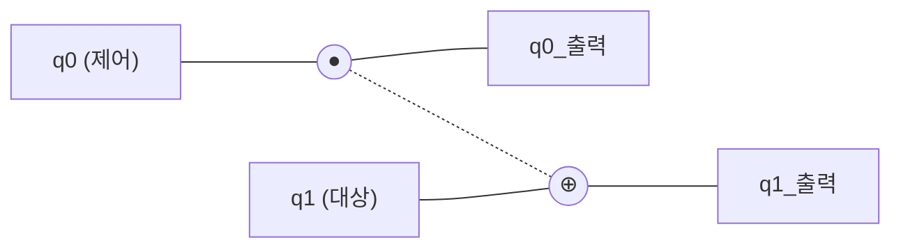
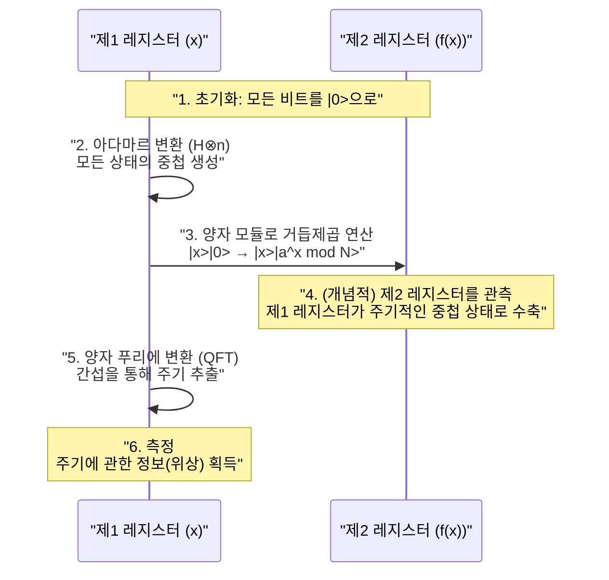

현대의 인터넷 사회에서의 보안은 [RSA](https://kenji.blog/ko/p/modern-cryptography-public-key-hash-signature/) 암호 등의 공개키 암호 방식에 의해 지켜지고 있습니다. 이러한 암호 방식은, "거대한 수의 소인수 분해는 현재의 컴퓨터(고전 컴퓨터)로는 천문학적인 시간이 걸린다"라는 수학적 어려움을 안전성의 근거로 삼고 있습니다.

하지만, 그 전제를 근본부터 뒤엎을 가능성을 품고 있는 것이 **양자 컴퓨터** 입니다. 특히 1994년에 피터 쇼어(Peter Shor)에 의해 발견된 **쇼어의 알고리즘** (Shor's Algorithm)은, 양자 컴퓨터가 실용화되면 RSA 암호를 현실적인 시간 내에 해독할 수 있음을 수학적으로 증명했습니다.

본 기사에서는, 양자 컴퓨터가 어떻게 계산을 수행하는지에 대한 기초적인 원리부터, 쇼어의 알고리즘이 왜 소인수 분해를 고속으로 수행할 수 있는지, 그리고 그 배후에 있는 수리와 프로그래밍(Python/Qiskit)에 의한 구현 예제까지, 약 2만 자의 규모로 철저하게 깊이 파헤칩니다.

---

## 1. 양자 컴퓨터란 무엇인가? 고전 컴퓨터와의 차이

우리가 평소에 사용하는 PC나 스마트폰은 **고전 컴퓨터** 라고 불립니다. 고전 컴퓨터는 정보를 "0" 또는 "1"의 **비트** (bit)로서 다룹니다.

반면, 양자 컴퓨터는 정보의 최소 단위로서 **양자 비트** (qubit: 큐비트)를 사용합니다. 양자 역학의 기묘한 성질을 이용함으로써, 기존의 컴퓨터와는 전혀 다른 접근 방식으로 계산을 수행합니다. 그 핵심이 되는 것이 "중첩(Superposition)"과 "양자 얽힘(Entanglement)", 그리고 "양자 간섭(Interference)"입니다.

### 1.1 중첩(Superposition)

고전 비트가 "0"이나 "1" 중 어느 하나의 상태만을 가질 수 있는 데 반해, 양자 비트는 "0"과 "1"의 양쪽 상태를 동시에 가질 수 있습니다. 이것을 **중첩** 이라고 부릅니다.

수학적으로, 양자 상태 $|\psi\rangle$ 는, 기저 상태 $|0\rangle$ 와 $|1\rangle$ 의 선형 결합으로서 다음과 같이 표현됩니다.

$$
|\psi\rangle = \alpha|0\rangle + \beta|1\rangle
$$

여기서, $\alpha$ 와 $\beta$ 는 복소수이며, **확률 진폭** 이라고 불립니다. 양자 비트를 관측(측정)하면, 상태는 $|0\rangle$ 또는 $|1\rangle$ 로 수렴(파동 함수의 붕괴)하며, 각각을 얻을 확률은 $|\alpha|^2$ 및 $|\beta|^2$ 가 됩니다. 확률의 합은 1이 되어야 하므로, 다음의 규격화 조건을 만족합니다.

$$
|\alpha|^2 + |\beta|^2 = 1
$$

이 성질에 의해, $n$ 개의 양자 비트는 동시에 $2^n$ 개의 상태의 중첩을 표현할 수 있습니다. 이것이 양자 병렬 계산의 기반이 됩니다.

### 1.2 양자 얽힘(Entanglement)

여러 개의 양자 비트가 서로 강하게 결합하여, 한쪽의 상태가 결정되면 공간적으로 얼마나 떨어져 있든 순식간에 다른 한쪽의 상태가 결정되는 현상을 **양자 얽힘** (엔탱글먼트)이라고 부릅니다.

예를 들어, 다음과 같은 벨 상태(Bell state)를 생각해 봅시다.

$$
|\Phi^+\rangle = \frac{1}{\sqrt{2}} (|00\rangle + |11\rangle)
$$

이 상태에서는, 첫 번째 양자 비트를 측정하여 "0"을 얻으면, 두 번째 양자 비트는 반드시 "0"이 됩니다. 반대로 "1"을 얻으면, 두 번째도 "1"이 됩니다. 이 강한 상관관계를 이용함으로써, 양자 컴퓨터는 복잡한 계산을 효율적으로 처리할 수 있습니다.

### 1.3 양자 간섭(Interference)

중첩 상태에 있는 양자 비트는 파동과 같은 성질을 가집니다. 파동의 마루와 마루가 겹치면 커지고(보강 간섭), 마루와 골이 겹치면 서로 상쇄됩니다(상쇄 간섭).
양자 계산에서는, 이 **양자 간섭** 을 교묘하게 통제하여, 정답에 이르는 확률 진폭을 증폭시키고, 오답의 확률 진폭을 상쇄하도록 알고리즘을 설계합니다. 쇼어의 알고리즘도 이 간섭을 극히 고도로 이용하고 있습니다.

---

## 2. 양자 게이트와 양자 회로

고전 컴퓨터에서의 논리 게이트(AND, OR, NOT 등)에 대응하는 것이 양자 컴퓨터에서의 **양자 게이트** 입니다. 양자 게이트는 양자 상태 벡터에 대한 유니터리 행렬(Unitary Matrix)의 연산으로 표현됩니다.

### 2.1 대표적인 1양자 비트 게이트

#### X 게이트(파울리 X 게이트)
고전의 NOT 게이트에 해당합니다. $|0\rangle$ 를 $|1\rangle$ 로, $|1\rangle$ 를 $|0\rangle$ 로 반전시킵니다.

$$
X = \begin{pmatrix} 0 & 1 \\\\ 1 & 0 \end{pmatrix}
$$

#### Z 게이트(파울리 Z 게이트)
$|1\rangle$ 의 위상만을 반전($-1$ 을 곱함)시킵니다. 위상의 반전은 양자 간섭에서 극히 중요합니다.

$$
Z = \begin{pmatrix} 1 & 0 \\\\ 0 & -1 \end{pmatrix}
$$

#### H 게이트(아다마르 게이트)
기저 상태에서 중첩 상태를 만들어내는 가장 중요한 게이트 중 하나입니다.

$$
H = \frac{1}{\sqrt{2}} \begin{pmatrix} 1 & 1 \\\\ 1 & -1 \end{pmatrix}
$$

$H|0\rangle = \frac{1}{\sqrt{2}}(|0\rangle + |1\rangle)$ 가 되어, 측정하면 0과 1이 50%씩의 확률로 얻어지는 상태가 됩니다.

### 2.2 복수 양자 비트 게이트

#### CNOT 게이트(제어 NOT 게이트)
2개의 양자 비트에 대한 게이트로, 제어 비트가 "1"일 때만, 대상 비트에 X 게이트(반전)를 적용합니다. 양자 얽힘을 만들어내기 위해 불가결합니다.



---

## 3. 암호 기술의 기초와 [RSA](https://kenji.blog/ko/p/modern-cryptography-public-key-hash-signature/) 암호

쇼어의 알고리즘의 파급력을 이해하기 위해서는, 현재 주류인 공개키 암호인 **RSA 암호** 의 원리를 알 필요가 있습니다.

### 3.1 RSA 암호의 원리

RSA 암호는 소인수 분해의 어려움을 이용하고 있습니다. 거대한 2개의 소수 $p$ 와 $q$ 를 준비하고, 그 곱 $N = p \times q$ 를 계산합니다.

1. $p$ 와 $q$ 를 곱하여 $N$ 을 만드는 것은 간단하다.
2. 하지만, $N$ 에서 원래의 $p$ 와 $q$ 를 찾아내는(소인수 분해하는) 것은 매우 어렵다.

이 비대칭성이 암호의 키가 됩니다. $N$ 을 공개키로서 널리 공개하여 암호화에 이용합니다. 한편, $p$ 와 $q$ 의 정보는 비밀키로서 엄중하게 보관되어 복호화에 이용됩니다.

### 3.2 얼마나 어려운가?

현재의 슈퍼컴퓨터를 이용하더라도 수천 비트(예: RSA-2048)의 $N$ 을 소인수 분해하는 데에는 우주의 나이보다 긴 시간이 걸린다고 알려져 있습니다. 가장 효율적인 고전 알고리즘인 "일반 수체 체(GNFS)"를 사용하더라도 계산량은 지수 함수적(정확히는 준지수 함수적)으로 증가해 버립니다.

$$
O\left( \exp \left( \left(\frac{64}{9}b\right)^{\frac{1}{3}} (\log b)^{\frac{2}{3}} \right) \right)
$$
※ $b$ 는 자릿수(비트 수)

여기서 등장하는 것이 **쇼어의 알고리즘** 입니다. 쇼어의 알고리즘은 이 계산량을 다항식 시간 $O(b^3)$ 으로까지 극적으로 감소시켜 버립니다.

---

## 4. 쇼어의 알고리즘의 전체상

쇼어의 알고리즘은 소인수 분해 문제를 **"주기 발견 문제(Period Finding Problem)"** 라는 다른 수학적인 문제로 변환함으로써 풉니다.

알고리즘은 크게 두 개의 파트로 나뉘어 있습니다.

1. **고전 컴퓨터에서 수행하는 파트(환원・전처리・후처리)**
2. **양자 컴퓨터에서 수행하는 파트(주기 발견)**

### 4.1 고전적 파트: 소인수 분해에서 주기 발견으로의 환원

소인수 분해하고 싶은 합성수 $N$ 이 주어졌다고 합시다. (예: $N = 15$)

**단계 1:** $N$ 과 서로소인(최대 공약수가 1인) 무작위 정수 $a$ 를 선택합니다 ($1 < a < N$).
만약 최대 공약수 $\gcd(a, N) > 1$ 이라면, 이미 인수를 찾은 것이 되어 종료합니다. (유클리드 호제법으로 간단히 찾을 수 있습니다)

**단계 2:** 다음과 같은 모듈로 연산의 함수 $f(x)$ 를 생각합니다.

$$
f(x) = a^x \pmod N
$$

이 함수 $f(x)$ 에 $x = 0, 1, 2, 3, \dots$ 를 대입해 나가면, 어떤 주기 $r$ 로 값이 반복된다는 것이 수학적으로 알려져 있습니다(오일러의 정리). 즉, $f(x) = f(x + r)$ 가 되는 최소의 양의 정수 $r$ (주기)가 존재합니다.

예를 들어, $N = 15$, $a = 7$ 의 경우:
- $7^0 \pmod{15} = 1$
- $7^1 \pmod{15} = 7$
- $7^2 \pmod{15} = 4$
- $7^3 \pmod{15} = 13$
- $7^4 \pmod{15} = 1$ (여기서부터 루프)

주기 $r = 4$ 임을 알 수 있습니다.

**단계 3:** 만약 발견된 주기 $r$ 이 짝수이고, 또한 $a^{r/2} \not\equiv -1 \pmod N$ 이라면, 인수는 다음과 같이 구해집니다.

$$
\gcd(a^{r/2} \pm 1, N)
$$

앞서의 예($N=15, a=7, r=4$)에서는:
$a^{r/2} = 7^{4/2} = 7^2 = 49$
$49 + 1 = 50$, $\gcd(50, 15) = 5$
$49 - 1 = 48$, $\gcd(48, 15) = 3$

훌륭하게 $15$ 의 인수 $5$ 와 $3$ 이 발견되었습니다!

### 4.2 문제점: 고전에서는 주기 $r$ 을 찾기 어렵다

주기 $r$ 만 알면 소인수 분해할 수 있다는 것은 알았습니다. 하지만, $N$ 이 매우 큰 경우, 주기 $r$ 을 찾기 위해 $f(x)$ 를 고전 컴퓨터로 하나하나 계산해 나가면 역시 지수 함수적인 시간이 걸리고 맙니다.

그래서 이 "주기 $r$ 을 찾는다"라는 부분만을 양자 컴퓨터에 맡깁니다. 양자 병렬 계산을 사용함으로써, 모든 $x$ 에 대한 $f(x)$ 를 한 번에 계산하고, 거기서 주기 $r$ 을 순식간에(다항식 시간으로) 추출하는 것입니다.

---

## 5. 양자 파트: 양자 푸리에 변환과 주기의 추출

쇼어의 알고리즘의 양자 계산 파트는 이하의 단계로 진행됩니다.



### 5.1 양자 병렬 계산에 의한 함수의 평가

먼저, 충분한 수의 양자 비트를 가지는 2개의 레지스터(제1 레지스터와 제2 레지스터)를 준비하고, 모두 $|0\rangle$ 으로 초기화합니다.
제1 레지스터에 아다마르 게이트를 적용하여, 고려할 수 있는 모든 $x$ 의 값($0$ 부터 $Q-1$ 까지)의 균등한 중첩 상태를 만듭니다.

$$
\frac{1}{\sqrt{Q}} \sum_{x=0}^{Q-1} |x\rangle |0\rangle
$$

다음으로, **양자 모듈로 거듭제곱 회로** 를 이용하여 $f(x) = a^x \pmod N$ 을 계산하고, 그 결과를 제2 레지스터에 씁니다.

$$
\frac{1}{\sqrt{Q}} \sum_{x=0}^{Q-1} |x\rangle |a^x \bmod N\rangle
$$

이 단계에서 모든 $x$ 에 대한 $f(x)$ 의 결과가 양자의 중첩으로서 한 번에 계산되었습니다. 하지만, 이대로 측정하더라도 무작위의 $x$ 와 그에 대응하는 $f(x)$ 가 하나 얻어질 뿐, 주기 $r$ 은 알 수 없습니다.

### 5.2 주기 상태의 추출과 양자 간섭

주기 $r$ 을 이끌어내기 위해, 극히 중요한 조작인 **양자 푸리에 변환(Quantum Fourier Transform: QFT)** 을 제1 레지스터에 적용합니다.

QFT는 고전적인 이산 푸리에 변환(DFT)의 양자판입니다. 데이터의 주기성을 주파수 영역의 피크로 변환하는 역할을 합니다. 상태 벡터 $|\psi\rangle = \sum_{j} x_j |j\rangle$ 에 대해, QFT는 다음과 같이 작용합니다.

$$
QFT(|j\rangle) = \frac{1}{\sqrt{Q}} \sum_{k=0}^{Q-1} e^{\frac{2\pi i j k}{Q}} |k\rangle
$$

제1 레지스터의 상태는 제2 레지스터의 상태(예를 들어 $f(x_0)$)와 결합되어 있기 때문에, 특정 주기로 띄엄띄엄 값을 가지는 중첩 상태가 되어 있습니다. 여기에 QFT를 적용하면 양자 간섭이 일어납니다.

- 올바른 주기 $r$ 과 관련된 상태(확률 진폭)는 **보강 간섭**
- 그 외의 상태는 위상이 제각각이 되어 **상쇄 간섭** 됩니다.

결과적으로, 측정했을 때 높은 확률로 $k \approx Q \cdot \frac{c}{r}$ ($c$ 는 정수)가 되는 $k$ 가 얻어집니다.

### 5.3 고전 후처리: 연분수 전개

양자 컴퓨터로부터 측정 결과 $k$ 가 얻어지면, 다시 고전 컴퓨터가 나설 차례입니다.
$k / Q \approx c / r$ 라는 관계식이 얻어졌습니다. $c$ 와 $r$ 은 서로소인 정수입니다.

기지값인 $k / Q$ 라는 소수를, 고전 알고리즘인 **연분수 전개(Continued Fraction Expansion)** 를 이용하여 근사 분수 $c / r$ 로 변환함으로써, 마침내 분모로서 주기 $r$ 을 결정할 수 있습니다.

나머지는 4.1절에서 설명한 절차에 따라 최대 공약수를 계산하면, 훌륭하게 $N$ 의 소인수가 도출됩니다.

---

## 6. Qiskit에 의한 쇼어의 알고리즘 구현 예제

여기에서는 IBM이 제공하는 오픈 소스 양자 프로그래밍 프레임워크 **Qiskit** 을 이용하여, 매우 작은 수인 $N = 15$ 를 소인수 분해하는 쇼어의 알고리즘의 구현 예제를 소개합니다.

(※ 실용적인 거대한 수의 인수 분해에는 방대한 양자 비트와 오류 정정이 필요하기 때문에, 현재의 시뮬레이터나 소규모 양자 하드웨어에서는 $15$ 나 $21$ 등의 시연에 국한됩니다)

```python
import numpy as np
from qiskit import QuantumCircuit, transpile
from qiskit.visualization import plot_histogram
from qiskit_aer import AerSimulator
import math
from math import gcd

# --- 1. 양자 모듈로 거듭제곱 회로의 정의 (a=7, N=15) ---
def c_amod15(a, power):
    """제어 U 게이트로 기능하는 a^power mod 15 회로"""
    U = QuantumCircuit(4)        
    for _iteration in range(power):
        if a in [2,13]:
            U.swap(2,3)
            U.swap(1,2)
            U.swap(0,1)
        if a in [7,8]:
            U.swap(0,1)
            U.swap(1,2)
            U.swap(2,3)
        if a in [4, 11]:
            U.swap(1,3)
            U.swap(0,2)
        if a in [7,11,13]:
            for q in range(4):
                U.x(q)
    U = U.to_gate()
    U.name = f"{a}^{power} mod 15"
    c_U = U.control()
    return c_U

# --- 2. 역 양자 푸리에 변환 (QFT_dagger) 의 정의 ---
def qft_dagger(n):
    """n 양자 비트의 역 양자 푸리에 변환을 수행하는 회로"""
    qc = QuantumCircuit(n)
    for qubit in range(n//2):
        qc.swap(qubit, n-qubit-1)
    for j in range(n):
        for m in range(j):
            qc.cp(-np.pi/float(2**(j-m)), m, j)
        qc.h(j)
    qc.name = "QFT_dagger"
    return qc

# --- 3. 쇼어의 알고리즘 본체의 구축 ---
n_count = 8  # 측정용 레지스터(제1 레지스터)의 양자 비트 수
a = 7        # N=15와 서로소인 수

# 제1 레지스터(8qubit) + 제2 레지스터(4qubit) + 고전 레지스터(8bit)
qc = QuantumCircuit(n_count + 4, n_count)

# 제1 레지스터를 H 게이트로 중첩 상태로
for q in range(n_count):
    qc.h(q)

# 제2 레지스터의 초기 상태를 |1> 로 설정 (x 게이트를 최하위 비트에 적용)
qc.x(n_count)

# 제어 모듈로 거듭제곱 게이트를 적용
for q in range(n_count):
    qc.append(c_amod15(a, 2**q), 
             [q] + [i+n_count for i in range(4)])

# 제1 레지스터에 역 QFT를 적용
qc.append(qft_dagger(n_count).to_instruction(), range(n_count))

# 제1 레지스터를 측정
qc.measure(range(n_count), range(n_count))

# --- 4. 시뮬레이터에 의한 실행 ---
simulator = AerSimulator()
compiled_circuit = transpile(qc, simulator)
job = simulator.run(compiled_circuit, shots=1024)
results = job.result()
counts = results.get_counts()

print("측정 결과 (바이너리: 관측 횟수):")
print(counts)

# --- 5. 고전적인 후처리 (주기 r의 특정과 소인수의 계산) ---
# 측정 결과로부터 가장 확률이 높은 것을 해석하는 로직(간략판)
measured_phases = []
for output in counts:
    decimal = int(output, 2)
    phase = decimal / (2**n_count)
    measured_phases.append(phase)

print(f"\n추정되는 위상(phase): {measured_phases[:4]} ...")
# 위상으로부터 연분수 전개를 이용하여 분모 r (주기) 을 구하는 처리가 이어진다...
```

위의 코드를 실행하면, 양자 시뮬레이터는 높은 확률로 `00000000`, `01000000`, `10000000`, `11000000` 등의 상태(10진수로 0, 64, 128, 192)를 출력합니다.
이것들을 $2^8 = 256$ 으로 나누면, 위상은 $0$, $0.25$, $0.5$, $0.75$ 가 됩니다. 이것들은 분수로 나타내면 $0/4$, $1/4$, $2/4$, $3/4$ 가 되어, 분모인 **4** 가 주기 $r$ 임이 양자 계산에 의해 도출되었음을 알 수 있습니다.
주기 $r=4$ 만 알면, 앞서 언급한 바와 같이 $\gcd(7^{4/2} \pm 1, 15)$ 에서 $3$ 과 $5$ 라는 소인수가 도출됩니다.

---

## 7. 왜 [RSA](https://kenji.blog/ko/p/modern-cryptography-public-key-hash-signature/) 암호는 위기에 처해 있는가?

고전 컴퓨터에서의 소인수 분해의 계산량은 자릿수가 늘어날 때마다 지수 함수적으로 증대합니다. 예를 들어, 100자리 수의 분해에는 수 초, 200자리에는 수 년, RSA-2048(약 617자리)에는 우주의 수명 이상의 시간이 걸린다고 추정되고 있습니다.

하지만, 쇼어의 알고리즘을 사용한 경우, 필요한 계산 단계 수(게이트 수)는 자릿수 $b$ 에 대해 다항식 오더 $O(b^3)$ 로밖에 늘어나지 않습니다. 이것은 예를 들어 RSA-2048이라 하더라도, 이상적인 양자 컴퓨터만 있다면 수 시간에서 수일 만에 해독되어 버린다는 것을 의미합니다.

### "Store Now, Decrypt Later"의 위협
"아직 고성능 양자 컴퓨터는 완성되지 않았으니 안심이다"라고 생각하는 것은 위험합니다. 악의가 있는 제3자나 국가 기관이, 현재 유통되고 있는 암호화된 기밀 데이터(금융 정보, 국가 기밀 등)를 지금 기록・보존해 두고(Store Now), 10년~20년 후에 고성능 양자 컴퓨터가 완성된 순간에 해독하는(Decrypt Later) 공격 시나리오가 현실화되고 있습니다.
그렇기 때문에 양자 컴퓨터의 완성을 기다리지 않고 암호 방식을 업데이트해야 할 필요성이 대두되고 있는 것입니다.

---

## 8. 양자 컴퓨터 실현의 장벽: 노이즈와 오류 정정

쇼어의 알고리즘은 수학적으로 완벽하지만, 물리적으로 실현하기 위해서는 높은 장벽이 가로막고 있습니다. 현재의 양자 하드웨어는 **NISQ** (Noisy Intermediate-Scale Quantum: 노이즈가 있는 중간 규모 양자) 디바이스라고 불리며, 노이즈(외부 환경에 의한 교란이나 게이트 조작의 오차)에 매우 약하다는 약점이 있습니다.

양자 상태는 극히 민감하여, 아주 작은 열이나 전자기파로도 **결어긋남** (양자 상태의 붕괴, 디코히어런스)을 일으키고 맙니다. RSA-2048을 해독하기 위해서는 수천 개의 "논리 양자 비트"와 수억 번의 게이트 조작을 오류 없이 수행할 필요가 있습니다.

이것을 실현하기 위해 연구되고 있는 것이 **양자 오류 정정(Quantum Error Correction)** 입니다. 여러 개의 "물리 양자 비트"를 묶어 1개의 "논리 양자 비트"를 구성하고, 계산 도중에 발생하는 오류를 감지하여 수정하는 기술입니다. 하지만, 1개의 논리 양자 비트를 만드는 데에 1000~10000개의 물리 양자 비트가 필요하다고 일컬어지고 있어, 수천만 물리 양자 비트 급의 대규모 **오류 내성 양자 컴퓨터(FTQC: Fault-Tolerant Quantum Computer)** 의 실현에는 아직 10년에서 수십 년 이상의 혁신이 필요할 것으로 예상되고 있습니다.

---

## 9. 차세대 암호 기술: 포스트 양자 암호(PQC)

쇼어의 알고리즘의 위협에 대항하기 위해, 미국 국립표준기술연구소(NIST)를 비롯한 전 세계의 기관이 양자 컴퓨터로도 해독할 수 없는 새로운 암호 방식 **양자 내성 암호(Post-Quantum [Cryptography](https://kenji.blog/ko/p/modern-cryptography-public-key-hash-signature/): PQC)** 의 표준화를 추진하고 있습니다.

PQC는 양자 기술을 사용하는 것이 아니라 고전 컴퓨터에서 실행 가능하면서도, 양자 알고리즘을 사용하더라도 효율적으로 풀 수 없는(쇼어의 알고리즘이 적용될 수 없는) 새로운 수학적 문제를 기반으로 하고 있습니다.

대표적인 PQC의 접근 방식:
- **격자 기반 암호(Lattice-based cryptography)**: 다차원 공간에서의 최단 벡터 문제(SVP) 등의 어려움을 이용. (예: Kyber, Dilithium)
- **부호 기반 암호(Code-based cryptography)**: 오류 정정 부호의 복호 문제의 어려움을 이용.
- **다변수 다항식 암호(Multivariate cryptography)**: 다수의 변수를 가지는 2차 다항식 연립방정식을 푸는 어려움을 이용.
- **해시 기반 서명(Hash-based signatures)**: 암호학적 해시 함수의 안전성에만 의존하는 서명 방식.

현재 전 세계의 IT 인프라는 기존의 RSA나 타원 곡선 암호에서 이러한 PQC로의 이행(마이그레이션)이라는 역사적인 과도기를 맞이하고 있습니다.

---

## 10. 맺음말

본 기사에서는 양자 컴퓨터의 기초부터 쇼어의 알고리즘에 의한 소인수 분해의 메커니즘, 그리고 미래의 암호 기술의 전망까지 상세히 해설했습니다.

양자 컴퓨터는 아직 여명기에 있으며, 실용적인 암호 해독을 할 수 있게 되기까지는 오랜 세월이 필요합니다. 하지만, 그 이론적인 뒷받침인 **쇼어의 알고리즘** 은 정보 과학과 물리학, 그리고 수학이 훌륭하게 융합된 인류 지성의 결정체라고 할 수 있습니다.

양자 간섭을 교묘하게 다루어, 지수 함수적인 탐색 공간에서 "정답"만을 떠오르게 하는 그 아름다운 원리는, 앞으로도 다양한 분야(신약 개발, 재료 계산, 최적화 문제 등)에 응용될 양자 알고리즘의 설계에 있어서 중요한 이정표가 될 것입니다. 다가올 양자 시대를 향해, 우리는 테크놀로지의 근본적인 변화를 목격하고 있는 것입니다.
