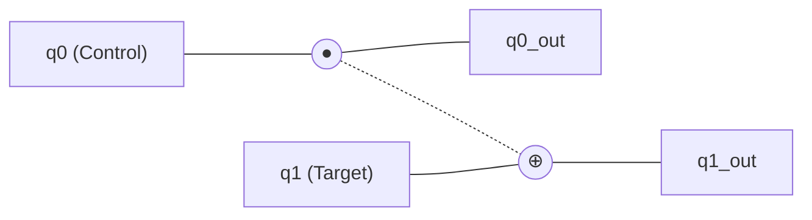
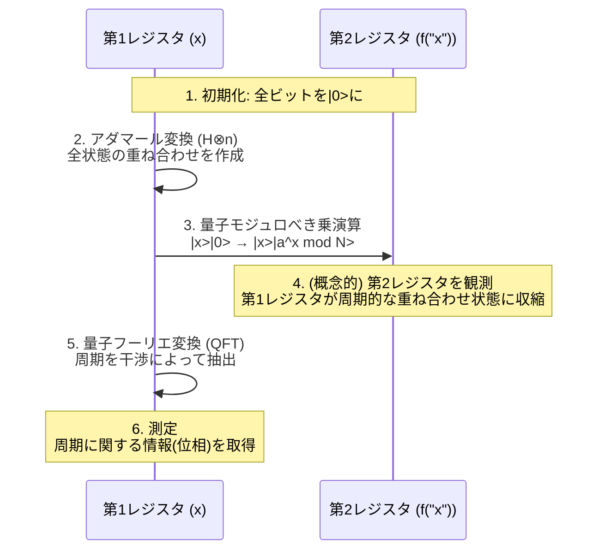

現代のインターネット社会におけるセキュリティは、[RSA](https://kenji.blog/p/modern-cryptography-public-key-hash-signature/)暗号などの[公開鍵](https://kenji.blog/p/modern-cryptography-public-key-hash-signature/)暗号方式によって守られています。これらの暗号方式は、「巨大な数の素因数分解は、現在のコンピュータ（古典コンピュータ）では天文学的な時間がかかる」という数学的な困難さを安全性の根拠としています。

しかし、その前提を根本から覆す可能性を秘めているのが **量子コンピュータ** です。特に1994年にピーター・ショア（Peter Shor）によって発見された **ショアのアルゴリズム** （Shor's Algorithm）は、量子コンピュータが実用化されれば、RSA暗号を現実的な時間内で解読できることを数学的に証明しました。

本記事では、量子コンピュータがどのように計算を行っているのかという基礎的な仕組みから、ショアのアルゴリズムがなぜ素因数分解を高速に行えるのか、そしてその背後にある数理やプログラミング（Python/Qiskit）による実装例まで、約2万字の規模で徹底的に深掘りします。

---

## 1. 量子コンピュータとは何か？ 古典コンピュータとの違い

私たちが普段使っているPCやスマートフォンは **古典コンピュータ** と呼ばれます。古典コンピュータは、情報を「0」または「1」の **ビット** （bit）として扱います。

一方で、量子コンピュータは情報の最小単位として **量子ビット** （qubit：キュービット）を用います。量子力学の奇妙な性質を利用することで、これまでのコンピュータとは全く異なるアプローチで計算を行います。その中核となるのが、「重ね合わせ（Superposition）」と「量子もつれ（Entanglement）」、そして「量子干渉（Interference）」です。

### 1.1 重ね合わせ（Superposition）

古典ビットが「0」か「1」のどちらか一つの状態しかとれないのに対し、量子ビットは「0」と「1」の両方の状態を同時にとることができます。これを **重ね合わせ** と呼びます。

数学的には、量子状態 $|\psi\rangle$ は、基底状態 $|0\rangle$ と $|1\rangle$ の線形結合として次のように表されます。

$$
|\psi\rangle = \alpha|0\rangle + \beta|1\rangle
$$

ここで、$\alpha$ と $\beta$ は複素数であり、 **確率振幅** と呼ばれます。量子ビットを観測（測定）すると、状態は $|0\rangle$ または $|1\rangle$ に収束（波束の収縮）し、それぞれが得られる確率は $|\alpha|^2$ および $|\beta|^2$ となります。確率の合計は1にならなければならないため、以下の規格化条件を満たします。

$$
|\alpha|^2 + |\beta|^2 = 1
$$

この性質により、$n$ 個の量子ビットは同時に $2^n$ 個の状態の重ね合わせを表現できます。これが量子並列計算の基盤となります。

### 1.2 量子もつれ（Entanglement）

複数の量子ビットが互いに強く結びつき、一方の状態が決定すると、空間的にどれだけ離れていても瞬時にもう一方の状態が決定される現象を **量子もつれ** （エンタングルメント）と呼びます。

例えば、次のようなベル状態（Bell state）を考えてみましょう。

$$
|\Phi^+\rangle = \frac{1}{\sqrt{2}} (|00\rangle + |11\rangle)
$$

この状態では、1つ目の量子ビットを測定して「0」が得られれば、2つ目の量子ビットは必ず「0」になります。逆に「1」が得られれば、2つ目も「1」になります。この強い相関を利用することで、量子コンピュータは複雑な計算を効率的に処理できます。

### 1.3 量子干渉（Interference）

重ね合わせ状態にある量子ビットは、波のような性質を持ちます。波の山と山が重なると大きくなり（強め合う干渉）、山と谷が重なると打ち消し合います（弱め合う干渉）。
量子計算では、この **量子干渉** を巧みにコントロールし、正解に至る確率振幅を増幅させ、不正解の確率振幅を打ち消すようにアルゴリズムを設計します。ショアのアルゴリズムも、この干渉を極めて高度に利用しています。

---

## 2. 量子ゲートと量子回路

古典コンピュータにおける論理ゲート（AND, OR, NOTなど）に対応するのが、量子コンピュータにおける **量子ゲート** です。量子ゲートは、量子状態ベクトルに対するユニタリ行列（Unitary Matrix）の演算として表現されます。

### 2.1 代表的な1量子ビットゲート

#### Xゲート（パウリXゲート）
古典のNOTゲートに相当します。$|0\rangle$ を $|1\rangle$ に、$|1\rangle$ を $|0\rangle$ に反転させます。

$$
X = \begin{pmatrix} 0 & 1 \\\\ 1 & 0 \end{pmatrix}
$$

#### Zゲート（パウリZゲート）
$|1\rangle$ の位相のみを反転（$-1$ を掛ける）させます。位相の反転は量子干渉において極めて重要です。

$$
Z = \begin{pmatrix} 1 & 0 \\\\ 0 & -1 \end{pmatrix}
$$

#### Hゲート（アダマールゲート）
基底状態から重ね合わせ状態を作り出す最も重要なゲートの一つです。

$$
H = \frac{1}{\sqrt{2}} \begin{pmatrix} 1 & 1 \\\\ 1 & -1 \end{pmatrix}
$$

$H|0\rangle = \frac{1}{\sqrt{2}}(|0\rangle + |1\rangle)$ となり、測定すると0と1が50%ずつの確率で得られる状態になります。

### 2.2 複数量子ビットゲート

#### CNOTゲート（制御NOTゲート）
2つの量子ビットに対するゲートで、コントロールビットが「1」のときのみ、ターゲットビットにXゲート（反転）を適用します。量子もつれを作り出すために不可欠です。



---

## 3. 暗号技術の基礎と[RSA](https://kenji.blog/p/modern-cryptography-public-key-hash-signature/)暗号

ショアのアルゴリズムのインパクトを理解するためには、現在主流の[公開鍵](https://kenji.blog/p/modern-cryptography-public-key-hash-signature/)暗号である **RSA暗号** の仕組みを知る必要があります。

### 3.1 RSA暗号の仕組み

RSA暗号は、素因数分解の困難性を利用しています。巨大な2つの素数 $p$ と $q$ を用意し、その積 $N = p \times q$ を計算します。

1. $p$ と $q$ を掛け合わせて $N$ を作るのは簡単。
2. しかし、$N$ から元の $p$ と $q$ を見つけ出す（素因数分解する）のは非常に難しい。

この非対称性が暗号の鍵となります。$N$ を公開鍵として広く公開し、[暗号化](https://kenji.blog/p/modern-cryptography-public-key-hash-signature/)に用います。一方、$p$ と $q$ の情報は秘密鍵として厳重に保管され、復号に用いられます。

### 3.2 どのくらい難しいのか？

現在のスーパーコンピュータを用いても、数千ビット（例えばRSA-2048）の $N$ を素因数分解するには、宇宙の年齢よりも長い時間がかかるとされています。最も効率的な古典アルゴリズムである「一般数体篩法（GNFS）」を使っても、計算量は指数関数的（正確には準指数関数的）に増加してしまいます。

$$
O\left( \exp \left( \left(\frac{64}{9}b\right)^{\frac{1}{3}} (\log b)^{\frac{2}{3}} \right) \right)
$$
※ $b$ は桁数（ビット数）

ここで登場するのが **ショアのアルゴリズム** です。ショアのアルゴリズムは、この計算量を多項式時間 $O(b^3)$ にまで劇的に削減してしまいます。

---

## 4. ショアのアルゴリズムの全体像

ショアのアルゴリズムは、素因数分解の問題を **「周期発見問題（Period Finding Problem）」** という別の数学的な問題に変換することで解きます。

アルゴリズムは大きく2つのパートに分かれています。

1. **古典コンピュータで行うパート（還元・前処理・後処理）**
2. **量子コンピュータで行うパート（周期発見）**

### 4.1 古典的パート：素因数分解から周期発見への還元

素因数分解したい合成数 $N$ が与えられたとします。（例：$N = 15$）

**ステップ 1:** $N$ と互いに素な（最大公約数が1の）ランダムな整数 $a$ を選びます（$1 < a < N$）。
もし最大公約数 $\gcd(a, N) > 1$ なら、すでに因数が見つかったことになり終了です。（ユークリッドの互除法で簡単に見つかります）

**ステップ 2:** 次のようなモジュロ演算の関数 $f(x)$ を考えます。

$$
f(x) = a^x \pmod N
$$

この関数 $f(x)$ に $x = 0, 1, 2, 3, \dots$ を代入していくと、ある周期 $r$ で値が繰り返されることが数学的に知られています（オイラーの定理）。つまり、$f(x) = f(x + r)$ となる最小の正の整数 $r$ （周期）が存在します。

例えば、$N = 15$、$a = 7$ の場合：
- $7^0 \pmod{15} = 1$
- $7^1 \pmod{15} = 7$
- $7^2 \pmod{15} = 4$
- $7^3 \pmod{15} = 13$
- $7^4 \pmod{15} = 1$ （ここからループ）

周期 $r = 4$ であることが分かります。

**ステップ 3:** もし見つかった周期 $r$ が偶数であり、かつ $a^{r/2} \not\equiv -1 \pmod N$ であれば、因数は次のように求まります。

$$
\gcd(a^{r/2} \pm 1, N)
$$

先ほどの例（$N=15, a=7, r=4$）では：
$a^{r/2} = 7^{4/2} = 7^2 = 49$
$49 + 1 = 50$、 $\gcd(50, 15) = 5$
$49 - 1 = 48$、 $\gcd(48, 15) = 3$

みごと、$15$ の因数 $5$ と $3$ が見つかりました！

### 4.2 問題点：古典では周期 $r$ を見つけるのが難しい

周期 $r$ さえ分かれば素因数分解できることは分かりました。しかし、$N$ が非常に大きい場合、周期 $r$ を見つけるために $f(x)$ を古典コンピュータで一つ一つ計算していくと、やはり指数関数的な時間がかかってしまいます。

そこで、この「周期 $r$ を見つける」という部分だけを量子コンピュータに任せます。量子並列計算を使うことで、すべての $x$ に対する $f(x)$ を一度に計算し、そこから周期 $r$ を一瞬で（多項式時間で）抽出するのです。

---

## 5. 量子パート：量子フーリエ変換と周期の抽出

ショアのアルゴリズムの量子計算パートは、以下のステップで進行します。



### 5.1 量子並列計算による関数の評価

まず、十分な数の量子ビットを持つ2つのレジスタ（第1レジスタと第2レジスタ）を用意し、すべて $|0\rangle$ に初期化します。
第1レジスタにアダマールゲートを適用し、考えられるすべての $x$ の値（$0$ から $Q-1$ まで）の均等な重ね合わせ状態を作ります。

$$
\frac{1}{\sqrt{Q}} \sum_{x=0}^{Q-1} |x\rangle |0\rangle
$$

次に、 **量子モジュロべき乗回路** を用いて、$f(x) = a^x \pmod N$ を計算し、その結果を第2レジスタに書き込みます。

$$
\frac{1}{\sqrt{Q}} \sum_{x=0}^{Q-1} |x\rangle |a^x \bmod N\rangle
$$

この段階で、すべての $x$ に対する $f(x)$ の結果が量子の重ね合わせとして一度に計算されました。しかし、このまま測定しても、ランダムな $x$ とそれに対応する $f(x)$ が一つ得られるだけで、周期 $r$ は分かりません。

### 5.2 周期状態の抽出と量子干渉

周期 $r$ を引き出すために、極めて重要な操作である **量子フーリエ変換 (Quantum Fourier Transform: QFT)** を第1レジスタに適用します。

QFTは、古典的な離散フーリエ変換（DFT）の量子版です。データの周期性を周波数領域のピークに変換する役割を果たします。状態ベクトル $|\psi\rangle = \sum_{j} x_j |j\rangle$ に対して、QFTは次のように作用します。

$$
QFT(|j\rangle) = \frac{1}{\sqrt{Q}} \sum_{k=0}^{Q-1} e^{\frac{2\pi i j k}{Q}} |k\rangle
$$

第1レジスタの状態は、第2レジスタの状態（例えば $f(x_0)$）と結びついているため、特定の周期で飛び飛びの値を持つ重ね合わせ状態になっています。これにQFTを適用すると、量子干渉が起こります。

- 正しい周期 $r$ に関連する状態（確率振幅）は **強め合い**
- それ以外の状態は位相がバラバラになり **打ち消し合い（相殺）** ます。

結果として、測定したときに高い確率で $k \approx Q \cdot \frac{c}{r}$ （$c$ は整数）となる $k$ が得られます。

### 5.3 古典後処理：連分数展開

量子コンピュータから測定結果 $k$ が得られたら、再び古典コンピュータの出番です。
$k / Q \approx c / r$ という関係式が得られています。$c$ と $r$ は互いに素な整数です。

既知である $k / Q$ という小数を、古典アルゴリズムである **連分数展開（Continued Fraction Expansion）** を用いて近似分数 $c / r$ に変換することで、ついに分母として周期 $r$ を決定することができます。

あとは 4.1 節で説明した手順に従って、最大公約数を計算すれば、見事 $N$ の素因数が導き出されます。

---

## 6. Qiskitによるショアのアルゴリズム実装例

ここでは、IBMが提供するオープンソースの量子プログラミングフレームワーク **Qiskit** を用いて、非常に小さな数である $N = 15$ を素因数分解するショアのアルゴリズムの実装例を紹介します。

（※実用的な巨大な数の因数分解には膨大な量子ビットと誤り訂正が必要なため、現状のシミュレータや小規模な量子ハードウェアでは $15$ や $21$ などのデモンストレーションに限られます）

```python
import numpy as np
from qiskit import QuantumCircuit, transpile
from qiskit.visualization import plot_histogram
from qiskit_aer import AerSimulator
import math
from math import gcd

# --- 1. 量子モジュロべき乗回路の定義 (a=7, N=15) ---
def c_amod15(a, power):
    """制御Uゲートとして機能する a^power mod 15 回路"""
    U = QuantumCircuit(4)        
    for _iteration in range(power):
        if a in [2,13]:
            U.swap(2,3)
            U.swap(1,2)
            U.swap(0,1)
        if a in [7,8]:
            U.swap(0,1)
            U.swap(1,2)
            U.swap(2,3)
        if a in [4, 11]:
            U.swap(1,3)
            U.swap(0,2)
        if a in [7,11,13]:
            for q in range(4):
                U.x(q)
    U = U.to_gate()
    U.name = f"{a}^{power} mod 15"
    c_U = U.control()
    return c_U

# --- 2. 逆量子フーリエ変換 (QFT_dagger) の定義 ---
def qft_dagger(n):
    """n量子ビットの逆量子フーリエ変換を行う回路"""
    qc = QuantumCircuit(n)
    for qubit in range(n//2):
        qc.swap(qubit, n-qubit-1)
    for j in range(n):
        for m in range(j):
            qc.cp(-np.pi/float(2**(j-m)), m, j)
        qc.h(j)
    qc.name = "QFT_dagger"
    return qc

# --- 3. ショアのアルゴリズム本体の構築 ---
n_count = 8  # 測定用レジスタ（第1レジスタ）の量子ビット数
a = 7        # N=15と互いに素な数

# 第1レジスタ(8qubit) + 第2レジスタ(4qubit) + 古典レジスタ(8bit)
qc = QuantumCircuit(n_count + 4, n_count)

# 第1レジスタをHゲートで重ね合わせ状態に
for q in range(n_count):
    qc.h(q)

# 第2レジスタの初期状態を |1> に設定 (xゲートを最下位ビットに適用)
qc.x(n_count)

# 制御モジュロべき乗ゲートを適用
for q in range(n_count):
    qc.append(c_amod15(a, 2**q), 
             [q] + [i+n_count for i in range(4)])

# 第1レジスタに逆QFTを適用
qc.append(qft_dagger(n_count).to_instruction(), range(n_count))

# 第1レジスタを測定
qc.measure(range(n_count), range(n_count))

# --- 4. シミュレータによる実行 ---
simulator = AerSimulator()
compiled_circuit = transpile(qc, simulator)
job = simulator.run(compiled_circuit, shots=1024)
results = job.result()
counts = results.get_counts()

print("測定結果 (バイナリ: 観測回数):")
print(counts)

# --- 5. 古典的な後処理 (周期rの特定と素因数の計算) ---
# 測定結果から最も確率の高いものを解析するロジック（簡略版）
measured_phases = []
for output in counts:
    decimal = int(output, 2)
    phase = decimal / (2**n_count)
    measured_phases.append(phase)

print(f"\n推定される位相(phase): {measured_phases[:4]} ...")
# 位相から連分数展開を用いて分母 r (周期) を求める処理が続く...
```

上記のコードを実行すると、量子シミュレータは高い確率で `00000000`, `01000000`, `10000000`, `11000000` などの状態（10進数で 0, 64, 128, 192）を出力します。
これらを $2^8 = 256$ で割ると、位相は $0$, $0.25$, $0.5$, $0.75$ となります。これらは分数で表すと $0/4$, $1/4$, $2/4$, $3/4$ となり、分母である **4** が周期 $r$ であることが量子計算によって導き出されたことが分かります。
周期 $r=4$ さえ分かれば、先述の通り $\gcd(7^{4/2} \pm 1, 15)$ から $3$ と $5$ という素因数が導き出されます。

---

## 7. なぜ[RSA](https://kenji.blog/p/modern-cryptography-public-key-hash-signature/)暗号は危機に瀕しているのか？

古典コンピュータにおける素因数分解の計算量は、桁数が増えるごとに指数関数的に増大します。例えば、100桁の数の分解には数秒、200桁には数年、RSA-2048（約617桁）には宇宙の寿命以上の時間がかかると見積もられています。

しかし、ショアのアルゴリズムを用いた場合、必要な計算ステップ数（ゲート数）は桁数 $b$ に対して多項式オーダー $O(b^3)$ でしか増えません。これは、例えばRSA-2048であっても、理想的な量子コンピュータさえあれば、数時間から数日で解読できてしまうことを意味します。

### 「Store Now, Decrypt Later」の脅威
「まだ高性能な量子コンピュータは完成していないから安心だ」と考えるのは危険です。悪意のある第三者や国家機関が、現在流通している[暗号化](https://kenji.blog/p/modern-cryptography-public-key-hash-signature/)された機密データ（金融情報、国家機密など）を今のうちに記録・保存しておき（Store Now）、10年後〜20年後に高性能な量子コンピュータが完成した瞬間に解読する（Decrypt Later）という攻撃シナリオが現実視されています。
そのため、量子コンピュータの完成を待たずに、暗号方式をアップデートする必要に迫られているのです。

---

## 8. 量子コンピュータ実現の壁：ノイズと誤り訂正

ショアのアルゴリズムは数学的に完璧ですが、物理的に実現するためには高い壁が立ちはだかっています。現在の量子ハードウェアは **NISQ** （Noisy Intermediate-Scale Quantum：ノイズあり中規模量子）デバイスと呼ばれ、ノイズ（外部環境による擾乱やゲート操作の誤差）に非常に弱いという弱点があります。

量子状態は極めてデリケートであり、わずかな熱や電磁波で **デコヒーレンス** （量子状態の崩壊）を起こしてしまいます。RSA-2048を解読するためには、数千個の「論理量子ビット」と、数億回のゲート操作をエラーなしで行う必要があります。

これを実現するために研究されているのが **量子誤り訂正（Quantum Error Correction）** です。複数の「物理量子ビット」を束ねて1つの「論理量子ビット」を構成し、計算途中で発生するエラーを検知して修正する技術です。しかし、1つの論理量子ビットを作るのに1000〜10000個の物理量子ビットが必要になると言われており、数千万物理量子ビットクラスの大規模な **誤り耐性量子コンピュータ (FTQC: Fault-Tolerant Quantum Computer)** の実現には、まだ10年から数十年以上のブレイクスルーが必要だと予想されています。

---

## 9. 次世代の暗号技術：ポスト量子暗号（PQC）

ショアのアルゴリズムの脅威に対抗するため、アメリカ国立標準技術研究所（NIST）をはじめとする世界中の機関が、量子コンピュータでも解読できない新しい暗号方式 **耐量子計算機暗号（Post-Quantum [Cryptography](https://kenji.blog/p/modern-cryptography-public-key-hash-signature/): PQC）** の標準化を進めています。

PQCは量子技術を使うわけではなく、古典コンピュータで実行可能でありながら、量子アルゴリズムを使っても効率的に解けない（ショアのアルゴリズムが適用できない）新しい数学的問題をベースにしています。

代表的なPQCのアプローチ：
- **格子暗号（Lattice-based cryptography）**: 多次元空間における最短ベクトル問題（SVP）などの困難性を利用。（例：Kyber, Dilithium）
- **符号ベース暗号（Code-based cryptography）**: 誤り訂正符号の復号問題の困難性を利用。
- **多変数多項式暗号（Multivariate cryptography）**: 多数の変数を持つ2次多項式連立方程式を解く困難性を利用。
- **ハッシュベース署名（Hash-based signatures）**: 暗号学的ハッシュ関数の安全性のみに依存する署名方式。

現在、世界のITインフラは既存のRSAや楕円曲線暗号から、これらのPQCへの移行（マイグレーション）という歴史的な過渡期を迎えています。

---

## 10. おわりに

本記事では、量子コンピュータの基礎から、ショアのアルゴリズムによる素因数分解のメカニズム、そして未来の暗号技術の展望までを詳細に解説しました。

量子コンピュータは、まだ黎明期にあり、実用的な暗号解読が行えるようになるまでには長い年月が必要です。しかし、その理論的な裏付けである **ショアのアルゴリズム** は、情報科学と物理学、そして数学が見事に融合した人類の知の結晶と言えます。

量子干渉を巧みに操り、指数関数的な探索空間から「正解」だけを浮かび上がらせるその美しい仕組みは、今後も様々な分野（創薬、材料計算、最適化問題など）へ応用される量子アルゴリズムの設計における重要な道標となるでしょう。来るべき量子時代に向けて、我々はテクノロジーの根本的な変化を目撃しているのです。
