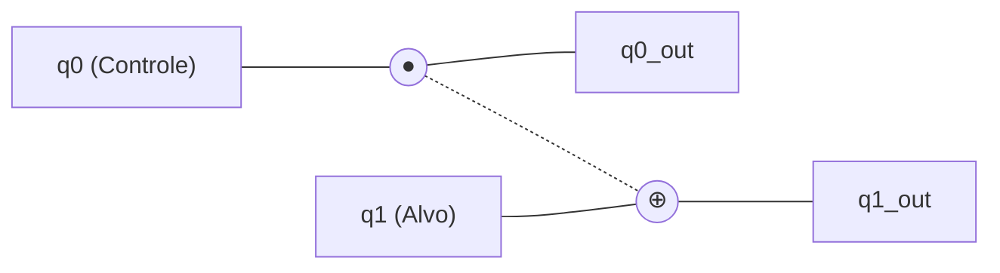
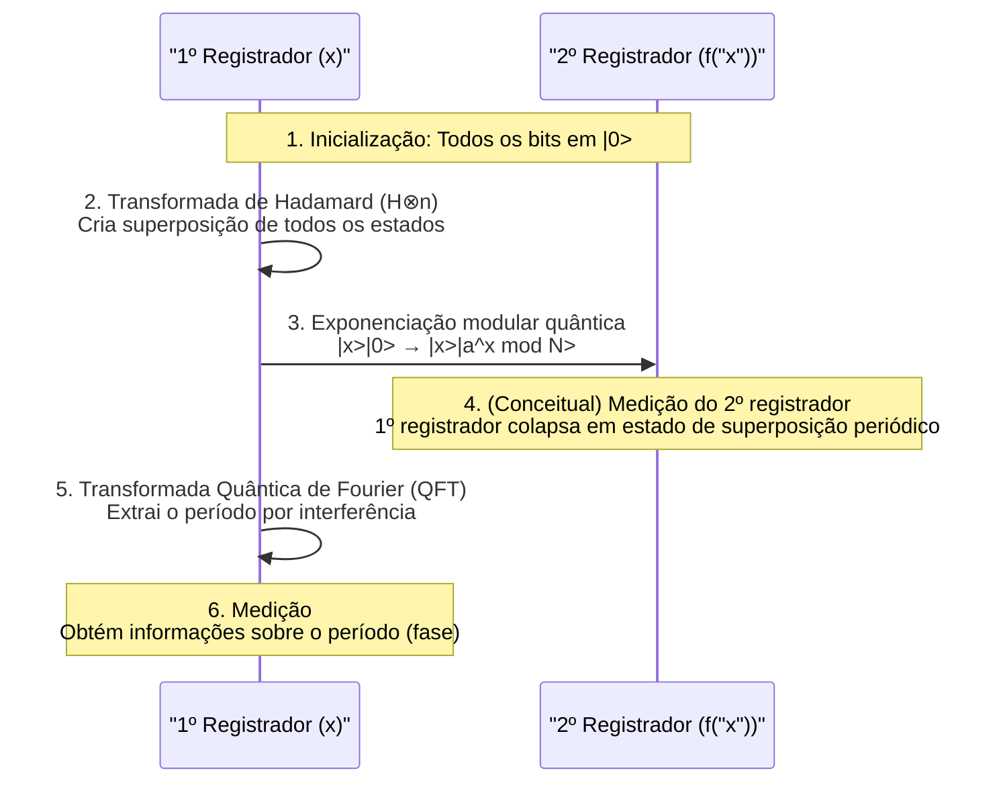

A segurança na sociedade da internet moderna é protegida por esquemas de criptografia de chave pública, como a criptografia [RSA](https://kenji.blog/pt/p/modern-cryptography-public-key-hash-signature/). Esses métodos de criptografia baseiam sua segurança na dificuldade matemática de que "a fatoração em números primos de números gigantescos leva um tempo astronômico nos computadores atuais (computadores clássicos)".

No entanto, o que tem o potencial de reverter fundamentalmente essa premissa é o **computador quântico**. Em particular, o **Algoritmo de Shor** (Shor's Algorithm), descoberto por Peter Shor em 1994, provou matematicamente que se um computador quântico for colocado em uso prático, ele poderá quebrar a criptografia RSA em um tempo realista.

Neste artigo, aprofundaremos minuciosamente em cerca de 20.000 caracteres, desde os mecanismos fundamentais de como os computadores quânticos realizam cálculos, por que o Algoritmo de Shor pode realizar a fatoração de primos em alta velocidade, e a matemática e a programação (Python/Qiskit) por trás disso com exemplos de implementação.

---

## 1. O que é um Computador Quântico? Diferenças em Relação aos Computadores Clássicos

Os PCs e smartphones que usamos normalmente são chamados de **computadores clássicos**. Computadores clássicos tratam a informação como **bits** de "0" ou "1".

Por outro lado, um computador quântico usa **qubits** (bits quânticos) como a menor unidade de informação. Ao utilizar as propriedades estranhas da mecânica quântica, ele realiza cálculos com uma abordagem completamente diferente dos computadores convencionais. O núcleo disso é a "Superposição", o "Emaranhamento Quântico" e a "Interferência Quântica".

### 1.1 Superposição (Superposition)

Enquanto os bits clássicos só podem assumir um dos estados "0" ou "1", os qubits podem assumir os estados de "0" e "1" simultaneamente. Isso é chamado de **superposição**.

Matematicamente, o estado quântico $|\psi\rangle$ é expresso como uma combinação linear dos estados de base $|0\rangle$ e $|1\rangle$ da seguinte forma:

$$
|\psi\rangle = \alpha|0\rangle + \beta|1\rangle
$$

Aqui, $\alpha$ e $\beta$ são números complexos e são chamados de **amplitudes de probabilidade**. Quando um qubit é observado (medido), o estado colapsa (colapso da função de onda) para $|0\rangle$ ou $|1\rangle$, e as probabilidades de obter cada um são $|\alpha|^2$ e $|\beta|^2$, respectivamente. Como a soma das probabilidades deve ser 1, a seguinte condição de normalização é satisfeita:

$$
|\alpha|^2 + \beta|^2 = 1
$$

Devido a essa propriedade, $n$ qubits podem representar simultaneamente uma superposição de $2^n$ estados. Esta é a base da computação quântica paralela.

### 1.2 Emaranhamento Quântico (Entanglement)

O fenômeno em que múltiplos qubits estão fortemente ligados entre si e, quando o estado de um é determinado, o estado do outro é instantaneamente determinado, independentemente de quão separados espacialmente estejam, é chamado de **emaranhamento quântico** (entanglement).

Por exemplo, considere o seguinte estado de Bell (Bell state):

$$
|\Phi^+\rangle = \frac{1}{\sqrt{2}} (|00\rangle + |11\rangle)
$$

Neste estado, se o primeiro qubit for medido e se obtiver "0", o segundo qubit será invariavelmente "0". Inversamente, se "1" for obtido, o segundo também será "1". Ao utilizar essa forte correlação, os computadores quânticos podem processar cálculos complexos de forma eficiente.

### 1.3 Interferência Quântica (Interference)

Um qubit em estado de superposição tem propriedades semelhantes às de uma onda. Quando a crista de uma onda e a crista se sobrepõem, ela se torna maior (interferência construtiva), e quando uma crista e um vale se sobrepõem, eles se cancelam (interferência destrutiva).
Na computação quântica, projetamos algoritmos para controlar habilmente essa **interferência quântica**, amplificando a amplitude de probabilidade que leva à resposta correta e cancelando as amplitudes de probabilidade incorretas. O Algoritmo de Shor também usa essa interferência de maneira extremamente sofisticada.

---

## 2. Portas Quânticas e Circuitos Quânticos

As portas lógicas (AND, OR, NOT, etc.) em computadores clássicos correspondem às **portas quânticas** em computadores quânticos. Uma porta quântica é representada como uma operação de matriz unitária (Unitary Matrix) no vetor de estado quântico.

### 2.1 Principais Portas de 1 Qubit

#### Porta X (Porta Pauli-X)
Equivalente à porta NOT clássica. Inverte $|0\rangle$ para $|1\rangle$ e $|1\rangle$ para $|0\rangle$.

$$
X = \begin{pmatrix} 0 & 1 \\\\ 1 & 0 \end{pmatrix}
$$

#### Porta Z (Porta Pauli-Z)
Inverte apenas a fase de $|1\rangle$ (multiplica por $-1$). A inversão de fase é extremamente importante na interferência quântica.

$$
Z = \begin{pmatrix} 1 & 0 \\\\ 0 & -1 \end{pmatrix}
$$

#### Porta H (Porta Hadamard)
Uma das portas mais importantes que cria um estado de superposição a partir de um estado de base.

$$
H = \frac{1}{\sqrt{2}} \begin{pmatrix} 1 & 1 \\\\ 1 & -1 \end{pmatrix}
$$

$H|0\rangle = \frac{1}{\sqrt{2}}(|0\rangle + |1\rangle)$, o que significa que, ao medir, resulta em um estado com 50% de probabilidade de obter 0 ou 1.

### 2.2 Portas de Múltiplos Qubits

#### Porta CNOT (Porta NOT Controlada)
Uma porta para dois qubits que aplica uma porta X (inversão) ao bit alvo apenas quando o bit de controle for "1". Indispensável para criar emaranhamento quântico.



---

## 3. Fundamentos de Criptografia e Criptografia [RSA](https://kenji.blog/pt/p/modern-cryptography-public-key-hash-signature/)

Para entender o impacto do Algoritmo de Shor, é necessário conhecer o funcionamento da **criptografia RSA**, que é a principal criptografia de chave pública atual.

### 3.1 Mecanismo da Criptografia RSA

A criptografia RSA utiliza a dificuldade da fatoração de números primos. Preparamos dois números primos gigantes, $p$ e $q$, e calculamos seu produto $N = p \times q$.

1. É fácil multiplicar $p$ e $q$ para criar $N$.
2. No entanto, é muito difícil descobrir os originais $p$ e $q$ a partir de $N$ (fatorar em primos).

Essa assimetria é a chave da criptografia. O número $N$ é amplamente divulgado como uma chave pública e usado para criptografia. Por outro lado, as informações de $p$ e $q$ são mantidas estritamente seguras como chaves privadas e usadas para descriptografia.

### 3.2 Quão Difícil É?

Mesmo usando os supercomputadores atuais, diz-se que fatorar $N$ de milhares de bits (por exemplo, RSA-2048) levaria mais tempo do que a idade do universo. Mesmo usando o algoritmo clássico mais eficiente, o "General Number Field Sieve (GNFS)", a complexidade computacional aumenta exponencialmente (mais precisamente, sub-exponencialmente).

$$
O\left( \exp \left( \left(\frac{64}{9}b\right)^{\frac{1}{3}} (\log b)^{\frac{2}{3}} \right) \right)
$$
※ Onde $b$ é o número de dígitos (número de bits).

É aqui que entra o **Algoritmo de Shor**. O Algoritmo de Shor reduz dramaticamente essa complexidade computacional para tempo polinomial $O(b^3)$.

---

## 4. Visão Geral do Algoritmo de Shor

O Algoritmo de Shor resolve o problema da fatoração de números primos transformando-o em um problema matemático diferente chamado **"Problema de Encontrar Período" (Period Finding Problem)**.

O algoritmo é dividido principalmente em duas partes.

1. **Parte realizada por um computador clássico (Redução, Pré-processamento, Pós-processamento)**
2. **Parte realizada por um computador quântico (Encontrar período)**

### 4.1 Parte Clássica: Redução de Fatoração de Primos para Encontrar Período

Suponha que recebamos um número composto $N$ que queremos fatorar. (Exemplo: $N = 15$)

**Passo 1:** Escolha um número inteiro aleatório $a$ que seja coprimo de $N$ (o máximo divisor comum é 1) ($1 < a < N$).
Se o máximo divisor comum $\gcd(a, N) > 1$, um fator já foi encontrado e o processo termina. (Facilmente encontrado usando o algoritmo de Euclides).

**Passo 2:** Considere a função de operação modular $f(x)$ a seguir.

$$
f(x) = a^x \pmod N
$$

É sabido matematicamente que quando $x = 0, 1, 2, 3, \dots$ é substituído nesta função $f(x)$, os valores se repetem com um determinado período $r$ (Teorema de Euler). Ou seja, existe um inteiro positivo mínimo $r$ (período) tal que $f(x) = f(x + r)$.

Por exemplo, no caso de $N = 15, a = 7$:
- $7^0 \pmod{15} = 1$
- $7^1 \pmod{15} = 7$
- $7^2 \pmod{15} = 4$
- $7^3 \pmod{15} = 13$
- $7^4 \pmod{15} = 1$ (começa a repetir a partir daqui)

Pode-se ver que o período $r = 4$.

**Passo 3:** Se o período $r$ encontrado for par, e $a^{r/2} \not\equiv -1 \pmod N$, então os fatores podem ser obtidos da seguinte forma.

$$
\gcd(a^{r/2} \pm 1, N)
$$

No exemplo anterior ($N=15, a=7, r=4$):
$a^{r/2} = 7^{4/2} = 7^2 = 49$
$49 + 1 = 50$, $\gcd(50, 15) = 5$
$49 - 1 = 48$, $\gcd(48, 15) = 3$

Excelente, encontramos os fatores $5$ e $3$ de $15$!

### 4.2 O Problema: É Difícil Encontrar o Período $r$ Classicamente

Vimos que se soubermos o período $r$, podemos fatorar o número em primos. No entanto, se $N$ for muito grande, calcular $f(x)$ um a um em um computador clássico para encontrar o período $r$ ainda consumirá um tempo exponencial.

Portanto, deixamos apenas esta parte de "encontrar o período $r$" para o computador quântico. Usando computação paralela quântica, calculamos $f(x)$ para todos os $x$ de uma vez e, a partir daí, extraímos o período $r$ em um instante (em tempo polinomial).

---

## 5. Parte Quântica: Transformada Quântica de Fourier e Extração de Período

A parte de computação quântica do algoritmo de Shor prossegue através dos seguintes passos.



### 5.1 Avaliação de Funções Através da Computação Paralela Quântica

Primeiro, prepare dois registradores (o 1º registrador e o 2º registrador) com um número suficiente de qubits, e inicialize todos em $|0\rangle$.
Aplique portas Hadamard ao primeiro registrador para criar uma superposição igual de todos os valores possíveis de $x$ (de $0$ a $Q-1$).

$$
\frac{1}{\sqrt{Q}} \sum_{x=0}^{Q-1} |x\rangle |0\rangle
$$

A seguir, usando o **circuito de exponenciação modular quântica**, calculamos $f(x) = a^x \pmod N$ e gravamos o resultado no segundo registrador.

$$
\frac{1}{\sqrt{Q}} \sum_{x=0}^{Q-1} |x\rangle |a^x \bmod N\rangle
$$

Neste estágio, os resultados de $f(x)$ para todos os $x$ foram calculados de uma vez como uma superposição quântica. Porém, se medirmos neste momento, obteremos apenas um valor aleatório de $x$ e seu correspondente $f(x)$, e não saberemos o período $r$.

### 5.2 Extração de Estados Periódicos e Interferência Quântica

Para extrair o período $r$, aplicamos a **Transformada Quântica de Fourier (Quantum Fourier Transform: QFT)**, que é uma operação extremamente importante, ao primeiro registrador.

A QFT é a versão quântica da clássica Transformada Discreta de Fourier (DFT). Desempenha o papel de converter a periodicidade dos dados em picos no domínio da frequência. Para um vetor de estado $|\psi\rangle = \sum_{j} x_j |j\rangle$, a QFT age da seguinte maneira.

$$
QFT(|j\rangle) = \frac{1}{\sqrt{Q}} \sum_{k=0}^{Q-1} e^{\frac{2\pi i j k}{Q}} |k\rangle
$$

Como o estado do primeiro registrador está vinculado ao estado do segundo registrador (por exemplo, $f(x_0)$), ele se torna um estado de superposição com valores discretos em um determinado período. Ao aplicar a QFT a isso, ocorre a interferência quântica.

- Estados associados ao período correto $r$ (amplitudes de probabilidade) **se fortalecem mutuamente**.
- Para os outros estados, as fases ficam embaralhadas e eles **se cancelam**.

Como resultado, quando você mede, há uma alta probabilidade de se obter um $k$ onde $k \approx Q \cdot \frac{c}{r}$ ($c$ é um inteiro).

### 5.3 Pós-processamento Clássico: Expansão de Fração Contínua

Assim que o resultado da medição $k$ for obtido do computador quântico, é a vez do computador clássico novamente.
Foi obtida a relação $k / Q \approx c / r$. E $c$ e $r$ são inteiros coprimos.

Usando o algoritmo clássico da **Expansão de Fração Contínua (Continued Fraction Expansion)**, o decimal conhecido $k / Q$ é convertido na fração aproximada $c / r$, para que possamos finalmente determinar o período $r$ como o denominador.

Tudo o que resta é seguir as etapas explicadas na Seção 4.1 para calcular o máximo divisor comum, e os fatores primos de $N$ serão magicamente derivados.

---

## 6. Exemplo de Implementação do Algoritmo de Shor usando Qiskit

Abaixo apresentamos um exemplo de implementação do algoritmo de Shor, usando a estrutura de programação quântica de código aberto da IBM, **Qiskit**, para fatorar um número muito pequeno, $N = 15$.

(※ Como a fatoração prática de números enormes requer um número massivo de qubits e correção de erros, isso se limita a demonstrações como $15$ e $21$ em simuladores atuais e hardware quântico de pequena escala)

```python
import numpy as np
from qiskit import QuantumCircuit, transpile
from qiskit.visualization import plot_histogram
from qiskit_aer import AerSimulator
import math
from math import gcd

# --- 1. Definição do circuito de exponenciação modular quântica (a=7, N=15) ---
def c_amod15(a, power):
    """Circuito a^power mod 15 que funciona como porta U controlada"""
    U = QuantumCircuit(4)        
    for _iteration in range(power):
        if a in [2,13]:
            U.swap(2,3)
            U.swap(1,2)
            U.swap(0,1)
        if a in [7,8]:
            U.swap(0,1)
            U.swap(1,2)
            U.swap(2,3)
        if a in [4, 11]:
            U.swap(1,3)
            U.swap(0,2)
        if a in [7,11,13]:
            for q in range(4):
                U.x(q)
    U = U.to_gate()
    U.name = f"{a}^{power} mod 15"
    c_U = U.control()
    return c_U

# --- 2. Definição da Transformada Quântica de Fourier Inversa (QFT_dagger) ---
def qft_dagger(n):
    """Circuito para realizar a Transformada Quântica de Fourier Inversa em n qubits"""
    qc = QuantumCircuit(n)
    for qubit in range(n//2):
        qc.swap(qubit, n-qubit-1)
    for j in range(n):
        for m in range(j):
            qc.cp(-np.pi/float(2**(j-m)), m, j)
        qc.h(j)
    qc.name = "QFT_dagger"
    return qc

# --- 3. Construção do corpo principal do Algoritmo de Shor ---
n_count = 8  # Número de qubits no registrador de medição (1º registrador)
a = 7        # Número coprimo de N=15

# 1º registrador (8qubits) + 2º registrador (4qubits) + Registrador clássico (8bits)
qc = QuantumCircuit(n_count + 4, n_count)

# Aplica a porta H no 1º registrador para criar um estado de superposição
for q in range(n_count):
    qc.h(q)

# Define o estado inicial do 2º registrador para |1> (aplica a porta X ao bit menos significativo)
qc.x(n_count)

# Aplica a porta controlada de exponenciação modular
for q in range(n_count):
    qc.append(c_amod15(a, 2**q), 
             [q] + [i+n_count for i in range(4)])

# Aplica a QFT inversa no 1º registrador
qc.append(qft_dagger(n_count).to_instruction(), range(n_count))

# Mede o 1º registrador
qc.measure(range(n_count), range(n_count))

# --- 4. Execução via simulador ---
simulator = AerSimulator()
compiled_circuit = transpile(qc, simulator)
job = simulator.run(compiled_circuit, shots=1024)
results = job.result()
counts = results.get_counts()

print("Resultados da medição (Binário: Número de observações):")
print(counts)

# --- 5. Pós-processamento clássico (Identificação do período r e cálculo de fatores primos) ---
# Lógica para analisar os mais prováveis a partir dos resultados da medição (versão simplificada)
measured_phases = []
for output in counts:
    decimal = int(output, 2)
    phase = decimal / (2**n_count)
    measured_phases.append(phase)

print(f"\nFase estimada (phase): {measured_phases[:4]} ...")
# A partir da fase, segue o processo para encontrar o denominador r (período) usando a expansão de fração contínua...
```

Ao executar o código acima, o simulador quântico exibe, com alta probabilidade, estados como `00000000`, `01000000`, `10000000`, `11000000` (0, 64, 128, 192 em decimal).
Ao dividi-los por $2^8 = 256$, as fases tornam-se $0$, $0.25$, $0.5$, $0.75$. Representando-as como frações, temos $0/4$, $1/4$, $2/4$, $3/4$, demonstrando que o denominador **4**, que é o período $r$, foi derivado pelo cálculo quântico.
Uma vez conhecido o período $r=4$, os fatores primos $3$ e $5$ são derivados a partir de $\gcd(7^{4/2} \pm 1, 15)$, como explicado anteriormente.

---

## 7. Por que a Criptografia [RSA](https://kenji.blog/pt/p/modern-cryptography-public-key-hash-signature/) está em Risco?

A complexidade computacional da fatoração de primos em computadores clássicos aumenta exponencialmente conforme o número de dígitos cresce. Por exemplo, estima-se que levaria alguns segundos para fatorar um número de 100 dígitos, vários anos para um de 200 dígitos e mais que a idade do universo para o RSA-2048 (cerca de 617 dígitos).

No entanto, ao usar o algoritmo de Shor, o número de etapas de cálculo (número de portas) aumenta apenas em ordem polinomial $O(b^3)$ em relação ao número de dígitos $b$. Isso significa que, mesmo para o RSA-2048, se você tiver um computador quântico ideal, ele poderá ser decodificado em questão de horas ou dias.

### A Ameaça de "Armazenar Agora, Descriptografar Depois" (Store Now, Decrypt Later)
É perigoso pensar "Ainda estamos seguros porque não existem computadores quânticos de alto desempenho concluídos". É considerado muito realista o cenário de ataque onde entidades maliciosas ou organizações estatais registram e armazenam dados confidenciais criptografados atualmente em circulação (informações financeiras, segredos de estado, etc.) agora (Store Now), para descriptografá-los no momento em que um computador quântico de alto desempenho for concluído daqui a 10 a 20 anos (Decrypt Later).
Por isso, é imperativo atualizar nossos métodos de criptografia antes mesmo de esperar pela conclusão do computador quântico.

---

## 8. A Barreira para a Realização dos Computadores Quânticos: Ruído e Correção de Erros

O Algoritmo de Shor é matematicamente perfeito, mas para implementá-lo fisicamente há grandes barreiras a serem superadas. O hardware quântico atual é chamado de dispositivo **NISQ** (Noisy Intermediate-Scale Quantum: Quântico de Escala Intermediária com Ruído) e tem a fraqueza de ser extremamente sensível a ruídos (distúrbios do ambiente externo ou erros em operações de portas).

Os estados quânticos são extremamente delicados e até uma leve alteração de calor ou ondas eletromagnéticas causará **decoerência** (colapso do estado quântico). Para decodificar o RSA-2048, é necessário executar milhares de "qubits lógicos" e centenas de milhões de operações de porta sem erros.

A tecnologia pesquisada para tornar isso realidade é a **Correção de Erro Quântico (Quantum Error Correction)**. É uma tecnologia que agrupa múltiplos "qubits físicos" para formar um "qubit lógico", detectando e corrigindo erros que ocorrem durante o cálculo. No entanto, diz-se que de 1.000 a 10.000 qubits físicos são necessários para criar um qubit lógico, e espera-se que a realização de um **Computador Quântico Tolerante a Falhas (FTQC: Fault-Tolerant Quantum Computer)** de grande escala, da classe de dezenas de milhões de qubits físicos, ainda exija de dez a várias dezenas de anos de inovações.

---

## 9. Criptografia de Próxima Geração: Criptografia Pós-Quântica (PQC)

Para combater a ameaça do Algoritmo de Shor, instituições em todo o mundo, incluindo o Instituto Nacional de Padrões e Tecnologia dos EUA (NIST), estão promovendo a padronização de um novo método de criptografia chamado **Criptografia Pós-Quântica (PQC: Post-Quantum [Cryptography](https://kenji.blog/pt/p/modern-cryptography-public-key-hash-signature/))**, que não pode ser quebrado mesmo por um computador quântico.

O PQC não utiliza tecnologia quântica, mas sim novos problemas matemáticos (aos quais o algoritmo de Shor não se aplica) que podem ser executados num computador clássico e ainda assim não podem ser resolvidos de forma eficiente mesmo através do uso de algoritmos quânticos.

Abordagens representativas do PQC:
- **Criptografia baseada em reticulados (Lattice-based cryptography)**: Usa a dificuldade de problemas como o Problema do Vetor Mais Curto (SVP) em um espaço multidimensional. (Ex.: Kyber, Dilithium)
- **Criptografia baseada em códigos (Code-based cryptography)**: Usa a dificuldade do problema de decodificação de códigos de correção de erros.
- **Criptografia multivariada (Multivariate cryptography)**: Usa a dificuldade de resolver sistemas de equações polinomiais de grau 2 com um grande número de variáveis.
- **Assinaturas baseadas em hash (Hash-based signatures)**: Um esquema de assinatura que depende apenas da segurança das funções de hash criptográficas.

Atualmente, as infraestruturas de TI ao redor do mundo estão em um período de transição histórica, migrando (migration) de esquemas de criptografia existentes, como RSA e Curvas Elípticas, para esses métodos de PQC.

---

## 10. Conclusão

Neste artigo, explicamos em detalhes tudo, desde os fundamentos dos computadores quânticos até o mecanismo da fatoração de números primos pelo Algoritmo de Shor, assim como as perspectivas futuras para a tecnologia de criptografia.

Os computadores quânticos ainda estão em sua infância, e levará muitos anos até que se tornem práticos o suficiente para decodificar criptografias práticas. Contudo, seu suporte teórico, o **Algoritmo de Shor**, pode ser considerado um triunfo do intelecto humano que mescla perfeitamente ciência da computação, física e matemática.

Esse belo mecanismo, que habilmente manipula a interferência quântica para revelar apenas a "resposta correta" de um espaço de busca exponencial, continuará servindo como um marco importante no design de algoritmos quânticos que serão aplicados a diversas áreas no futuro (descoberta de medicamentos, ciência de materiais, problemas de otimização, etc.). À medida que avançamos em direção à iminente era quântica, estamos testemunhando uma mudança fundamental na tecnologia.
