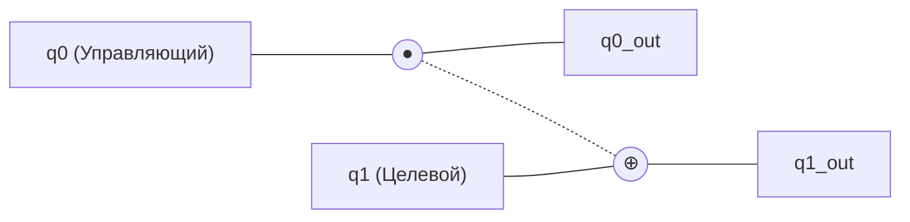
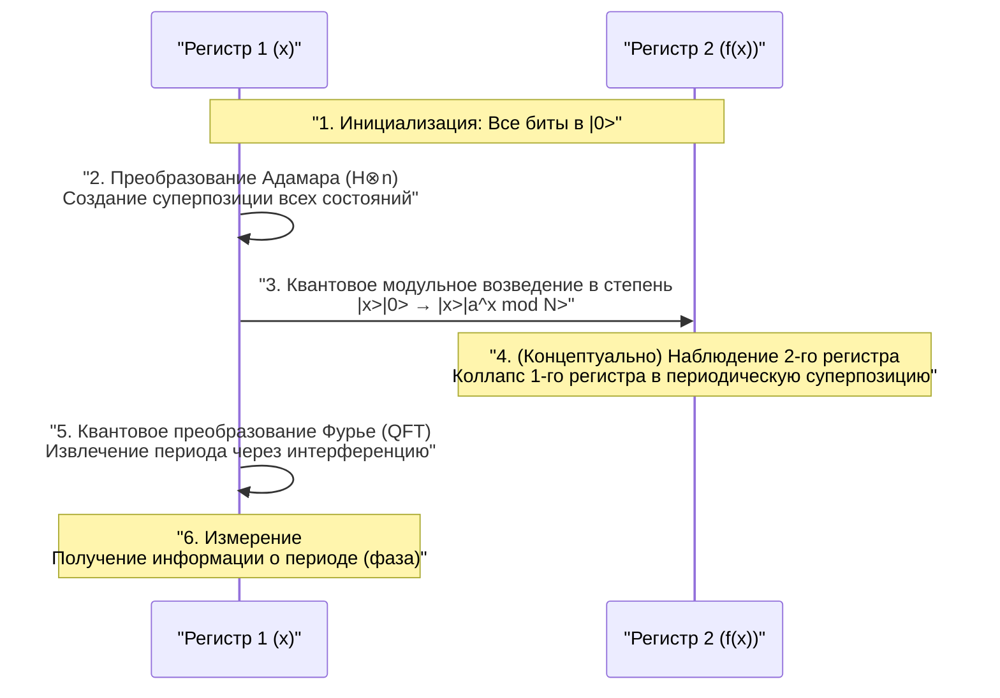

Безопасность в современном интернет-обществе защищена системами криптографии с открытым ключом, такими как шифрование RSA. Эти криптографические методы основаны на математической трудности: «факторизация огромных чисел занимает астрономическое время на современных (классических) компьютерах».

Однако **квантовые компьютеры** обладают потенциалом в корне изменить эту предпосылку. В частности, **алгоритм Шора** (Shor's Algorithm), открытый Питером Шором в 1994 году, математически доказал, что если квантовые компьютеры будут реализованы на практике, шифрование RSA можно будет взломать за разумное время.

В этой статье мы подробно, в объеме около 20 000 символов, рассмотрим базовые механизмы вычислений на квантовых компьютерах, почему алгоритм Шора может быстро выполнять факторизацию, стоящую за ним математику и примеры реализации с использованием программирования (Python/Qiskit).

---

## 1. Что такое квантовый компьютер? Отличия от классического компьютера

ПК и смартфоны, которыми мы пользуемся каждый день, называются **классическими компьютерами**. Классические компьютеры обрабатывают информацию как **биты** (bit), которые принимают значения «0» или «1».

С другой стороны, квантовые компьютеры используют **квантовые биты** (кубиты) в качестве наименьшей единицы информации. Используя странные свойства квантовой механики, они выполняют вычисления с совершенно иным подходом, нежели традиционные компьютеры. В основе этого лежат «Суперпозиция», «Квантовая запутанность» (Entanglement) и «Квантовая интерференция» (Interference).

### 1.1 Суперпозиция (Superposition)

В то время как классический бит может находиться только в одном из состояний, «0» или «1», квантовый бит может принимать оба состояния «0» и «1» одновременно. Это называется **суперпозицией**.

Математически квантовое состояние $|\psi\rangle$ выражается как линейная комбинация базисных состояний $|0\rangle$ и $|1\rangle$ следующим образом:

$$
|\psi\rangle = \alpha|0\rangle + \beta|1\rangle
$$

Здесь $\alpha$ и $\beta$ — комплексные числа, называемые **амплитудами вероятности**. Когда квантовый бит наблюдается (измеряется), его состояние коллапсирует (редукция волнового пакета) в $|0\rangle$ или $|1\rangle$, и вероятности получения каждого из них составляют $|\alpha|^2$ и $|\beta|^2$ соответственно. Поскольку сумма вероятностей должна равняться 1, выполняется следующее условие нормировки:

$$
|\alpha|^2 + |\beta|^2 = 1
$$

Благодаря этому свойству, $n$ квантовых битов могут одновременно представлять суперпозицию из $2^n$ состояний. Это является основой квантовых параллельных вычислений.

### 1.2 Квантовая запутанность (Entanglement)

Явление, при котором несколько квантовых битов сильно связаны друг с другом, и определение состояния одного мгновенно определяет состояние другого, независимо от пространственного расстояния между ними, называется **квантовой запутанностью** (энтанглментом).

Например, рассмотрим следующее состояние Белла (Bell state):

$$
|\Phi^+\rangle = \frac{1}{\sqrt{2}} (|00\rangle + |11\rangle)
$$

В этом состоянии, если первый кубит измерен и получено «0», то второй кубит обязательно будет «0». И наоборот, если получено «1», то второй также будет «1». Используя эту сильную корреляцию, квантовые компьютеры могут эффективно выполнять сложные вычисления.

### 1.3 Квантовая интерференция (Interference)

Квантовые биты в состоянии суперпозиции обладают волновыми свойствами. Когда пики волн совпадают, они усиливаются (конструктивная интерференция), а когда пик совпадает с впадиной, они гасятся (деструктивная интерференция).
В квантовых вычислениях алгоритмы проектируются так, чтобы умело управлять этой **квантовой интерференцией**, усиливая амплитуды вероятности, ведущие к правильному ответу, и подавляя амплитуды неправильных ответов. Алгоритм Шора также чрезвычайно изощренно использует эту интерференцию.

---

## 2. Квантовые вентили и квантовые цепи

То, что соответствует логическим вентилям (AND, OR, NOT и т.д.) в классических компьютерах, в квантовых компьютерах называется **квантовыми вентилями**. Квантовые вентили математически представляются как операции унитарных матриц над вектором квантового состояния.

### 2.1 Основные однокубитные вентили

#### Вентиль X (Вентиль Паули-X)
Соответствует классическому вентилю NOT. Он инвертирует $|0\rangle$ в $|1\rangle$, а $|1\rangle$ в $|0\rangle$.

$$
X = \begin{pmatrix} 0 & 1 \\\\ 1 & 0 \end{pmatrix}
$$

#### Вентиль Z (Вентиль Паули-Z)
Инвертирует только фазу $|1\rangle$ (умножает на $-1$). Инверсия фазы крайне важна для квантовой интерференции.

$$
Z = \begin{pmatrix} 1 & 0 \\\\ 0 & -1 \end{pmatrix}
$$

#### Вентиль H (Вентиль Адамара)
Один из самых важных вентилей, создающий состояние суперпозиции из базисного состояния.

$$
H = \frac{1}{\sqrt{2}} \begin{pmatrix} 1 & 1 \\\\ 1 & -1 \end{pmatrix}
$$

Получается $H|0\rangle = \frac{1}{\sqrt{2}}(|0\rangle + |1\rangle)$, и при измерении вероятности получить 0 или 1 составляют по 50%.

### 2.2 Многокубитные вентили

#### Вентиль CNOT (Контролируемое НЕ)
Вентиль для двух кубитов, который применяет вентиль X (инверсию) к целевому кубиту только тогда, когда управляющий кубит равен «1». Незаменим для создания квантовой запутанности.



---

## 3. Основы криптографии и шифрование RSA

Чтобы понять влияние алгоритма Шора, необходимо знать, как работает **шифрование RSA**, которое в настоящее время является основным методом криптографии с открытым ключом.

### 3.1 Как работает шифрование RSA

Шифрование RSA использует сложность разложения на простые множители (факторизации). Берутся два огромных простых числа $p$ и $q$, и вычисляется их произведение $N = p \times q$.

1. Умножить $p$ и $q$, чтобы получить $N$, легко.
2. Однако найти исходные $p$ и $q$ из $N$ (факторизовать) очень сложно.

Эта асимметрия является ключом к шифрованию. $N$ широко публикуется как открытый ключ и используется для шифрования. С другой стороны, информация о $p$ и $q$ строго хранится как закрытый ключ и используется для расшифровки.

### 3.2 Насколько это сложно?

Даже при использовании современных суперкомпьютеров факторизация $N$ длиной в несколько тысяч бит (например, RSA-2048) займет больше времени, чем возраст Вселенной. Даже при использовании наиболее эффективного классического алгоритма, «Общего метода решета числового поля» (GNFS), вычислительная сложность возрастает экспоненциально (точнее, субэкспоненциально).

$$
O\left( \exp \left( \left(\frac{64}{9}b\right)^{\frac{1}{3}} (\log b)^{\frac{2}{3}} \right) \right)
$$
※ $b$ — количество цифр (количество бит)

Здесь на сцену выходит **алгоритм Шора**. Алгоритм Шора кардинально сокращает эту вычислительную сложность до полиномиального времени $O(b^3)$.

---

## 4. Обзор алгоритма Шора

Алгоритм Шора решает проблему факторизации путем её преобразования в другую математическую задачу — **«Задачу нахождения периода (Period Finding Problem)»**.

Алгоритм в общих чертах делится на две части.

1. **Часть, выполняемая на классическом компьютере (сведение, предварительная и постобработка)**
2. **Часть, выполняемая на квантовом компьютере (нахождение периода)**

### 4.1 Классическая часть: Сведение факторизации к нахождению периода

Предположим, дано составное число $N$, которое нужно факторизовать. (Например: $N = 15$)

**Шаг 1:** Выберем случайное целое число $a$, взаимно простое с $N$ (наибольший общий делитель равен 1) ($1 < a < N$).
Если наибольший общий делитель $\gcd(a, N) > 1$, то множитель уже найден, и процесс завершается. (Легко находится с помощью алгоритма Евклида).

**Шаг 2:** Рассмотрим следующую функцию модульной арифметики $f(x)$:

$$
f(x) = a^x \pmod N
$$

Математически известно, что если подставлять $x = 0, 1, 2, 3, \dots$ в эту функцию $f(x)$, значения будут повторяться с определенным периодом $r$ (Теорема Эйлера). То есть, существует минимальное положительное целое число $r$ (период), при котором $f(x) = f(x + r)$.

Например, для $N = 15, a = 7$:
- $7^0 \pmod{15} = 1$
- $7^1 \pmod{15} = 7$
- $7^2 \pmod{15} = 4$
- $7^3 \pmod{15} = 13$
- $7^4 \pmod{15} = 1$ (Отсюда начинается цикл)

Мы видим, что период $r = 4$.

**Шаг 3:** Если найденный период $r$ является четным и $a^{r/2} \not\equiv -1 \pmod N$, то множители можно найти следующим образом:

$$
\gcd(a^{r/2} \pm 1, N)
$$

В предыдущем примере ($N=15, a=7, r=4$):
$a^{r/2} = 7^{4/2} = 7^2 = 49$
$49 + 1 = 50$, $\gcd(50, 15) = 5$
$49 - 1 = 48$, $\gcd(48, 15) = 3$

Великолепно, мы нашли множители числа $15$: $5$ и $3$!

### 4.2 Проблема: Сложность классического нахождения периода $r$

Мы поняли, что если известен период $r$, можно провести факторизацию. Однако, если $N$ очень велико, последовательное вычисление $f(x)$ на классическом компьютере для поиска периода $r$ всё равно займет экспоненциальное время.

Поэтому только эта часть — «поиск периода $r$» — делегируется квантовому компьютеру. Используя квантовые параллельные вычисления, $f(x)$ для всех $x$ вычисляется одновременно, и из этого периода $r$ извлекается мгновенно (за полиномиальное время).

---

## 5. Квантовая часть: Квантовое преобразование Фурье и извлечение периода

Квантовая вычислительная часть алгоритма Шора проходит по следующим шагам.



### 5.1 Оценка функции с помощью квантовых параллельных вычислений

Сначала подготавливаются два регистра с достаточным количеством кубитов (регистр 1 и регистр 2), и все они инициализируются в $|0\rangle$.
К первому регистру применяется вентиль Адамара, создавая равномерную суперпозицию всех возможных значений $x$ (от $0$ до $Q-1$).

$$
\frac{1}{\sqrt{Q}} \sum_{x=0}^{Q-1} |x\rangle |0\rangle
$$

Затем, используя **квантовую цепь модульного возведения в степень**, вычисляется $f(x) = a^x \pmod N$, и результат записывается во второй регистр.

$$
\frac{1}{\sqrt{Q}} \sum_{x=0}^{Q-1} |x\rangle |a^x \bmod N\rangle
$$

На этом этапе результаты $f(x)$ для всех $x$ вычислены одновременно как квантовая суперпозиция. Однако, если выполнить измерение прямо сейчас, мы получим только один случайный $x$ и соответствующий ему $f(x)$, а период $r$ останется неизвестным.

### 5.2 Извлечение периодического состояния и квантовая интерференция

Чтобы выявить период $r$, к первому регистру применяется чрезвычайно важная операция — **Квантовое преобразование Фурье (Quantum Fourier Transform: QFT)**.

QFT — это квантовая версия классического дискретного преобразования Фурье (DFT). Оно преобразует периодичность данных в пики в частотной области. Для вектора состояния $|\psi\rangle = \sum_{j} x_j |j\rangle$, QFT действует следующим образом:

$$
QFT(|j\rangle) = \frac{1}{\sqrt{Q}} \sum_{k=0}^{Q-1} e^{\frac{2\pi i j k}{Q}} |k\rangle
$$

Состояние первого регистра связано с состоянием второго регистра (например, $f(x_0)$), поэтому оно представляет собой суперпозицию с дискретными значениями с определенным периодом. При применении QFT к этому состоянию происходит квантовая интерференция.

- Состояния (амплитуды вероятности), связанные с правильным периодом $r$, **усиливаются**
- Для остальных состояний фазы разбросаны, и они **гасят друг друга (компенсируются)**.

В результате при измерении с высокой вероятностью получается значение $k$, для которого выполняется $k \approx Q \cdot \frac{c}{r}$ (где $c$ — целое число).

### 5.3 Классическая постобработка: Разложение в непрерывную дробь

Как только результат измерения $k$ получен от квантового компьютера, снова наступает очередь классического компьютера.
У нас есть соотношение $k / Q \approx c / r$. $c$ и $r$ — взаимно простые целые числа.

Используя известную десятичную дробь $k / Q$ и классический алгоритм, называемый **разложением в цепную (непрерывную) дробь (Continued Fraction Expansion)**, мы преобразуем ее в приближенную дробь $c / r$, наконец, определяя знаменатель как период $r$.

После этого, следуя процедуре, описанной в разделе 4.1, вычисляется наибольший общий делитель, и мы блестяще получаем простые множители числа $N$.

---

## 6. Пример реализации алгоритма Шора с использованием Qiskit

Здесь представлен пример реализации алгоритма Шора для факторизации очень маленького числа $N = 15$, используя **Qiskit**, фреймворк квантового программирования с открытым исходным кодом от IBM.

(※ Практическая факторизация гигантских чисел требует огромного количества кубитов и исправления ошибок, поэтому на текущих симуляторах и мелкомасштабном квантовом оборудовании мы ограничены демонстрациями с числами вроде $15$ или $21$)

```python
import numpy as np
from qiskit import QuantumCircuit, transpile
from qiskit.visualization import plot_histogram
from qiskit_aer import AerSimulator
import math
from math import gcd

# --- 1. Определение квантовой цепи модульного возведения в степень (a=7, N=15) ---
def c_amod15(a, power):
    """Цепь a^power mod 15, функционирующая как контролируемый вентиль U"""
    U = QuantumCircuit(4)        
    for _iteration in range(power):
        if a in [2,13]:
            U.swap(2,3)
            U.swap(1,2)
            U.swap(0,1)
        if a in [7,8]:
            U.swap(0,1)
            U.swap(1,2)
            U.swap(2,3)
        if a in [4, 11]:
            U.swap(1,3)
            U.swap(0,2)
        if a in [7,11,13]:
            for q in range(4):
                U.x(q)
    U = U.to_gate()
    U.name = f"{a}^{power} mod 15"
    c_U = U.control()
    return c_U

# --- 2. Определение обратного квантового преобразования Фурье (QFT_dagger) ---
def qft_dagger(n):
    """Цепь, выполняющая обратное квантовое преобразование Фурье для n кубитов"""
    qc = QuantumCircuit(n)
    for qubit in range(n//2):
        qc.swap(qubit, n-qubit-1)
    for j in range(n):
        for m in range(j):
            qc.cp(-np.pi/float(2**(j-m)), m, j)
        qc.h(j)
    qc.name = "QFT_dagger"
    return qc

# --- 3. Построение основной части алгоритма Шора ---
n_count = 8  # Количество кубитов измерительного регистра (Регистр 1)
a = 7        # Число, взаимно простое с N=15

# Регистр 1 (8qubit) + Регистр 2 (4qubit) + Классический регистр (8bit)
qc = QuantumCircuit(n_count + 4, n_count)

# Перевод 1-го регистра в состояние суперпозиции с помощью вентилей H
for q in range(n_count):
    qc.h(q)

# Установка начального состояния 2-го регистра в |1> (применение вентиля x к младшему биту)
qc.x(n_count)

# Применение контролируемых вентилей модульного возведения в степень
for q in range(n_count):
    qc.append(c_amod15(a, 2**q), 
             [q] + [i+n_count for i in range(4)])

# Применение обратного QFT к 1-му регистру
qc.append(qft_dagger(n_count).to_instruction(), range(n_count))

# Измерение 1-го регистра
qc.measure(range(n_count), range(n_count))

# --- 4. Запуск на симуляторе ---
simulator = AerSimulator()
compiled_circuit = transpile(qc, simulator)
job = simulator.run(compiled_circuit, shots=1024)
results = job.result()
counts = results.get_counts()

print("Результаты измерений (бинарный вид: количество наблюдений):")
print(counts)

# --- 5. Классическая постобработка (Определение периода r и вычисление простых множителей) ---
# Логика анализа наиболее вероятных результатов измерений (упрощенная версия)
measured_phases = []
for output in counts:
    decimal = int(output, 2)
    phase = decimal / (2**n_count)
    measured_phases.append(phase)

print(f"\nПредполагаемые фазы (phase): {measured_phases[:4]} ...")
# Далее следует процесс нахождения знаменателя r (периода) из фазы с помощью разложения в цепную дробь...
```

При выполнении вышеуказанного кода квантовый симулятор с высокой вероятностью выведет состояния, такие как `00000000`, `01000000`, `10000000`, `11000000` (0, 64, 128, 192 в десятичной системе).
Если разделить их на $2^8 = 256$, то фазы составят $0$, $0.25$, $0.5$, $0.75$. Выраженные в виде дробей, они будут равны $0/4$, $1/4$, $2/4$, $3/4$, и мы видим, что знаменатель **4** был выведен квантовыми вычислениями как период $r$.
Как только известен период $r=4$, из $\gcd(7^{4/2} \pm 1, 15)$, как описано ранее, извлекаются простые множители $3$ и $5$.

---

## 7. Почему шифрование RSA находится под угрозой?

Вычислительная сложность факторизации на классическом компьютере возрастает экспоненциально с увеличением количества цифр. Например, факторизация числа из 100 цифр занимает несколько секунд, 200 цифр — несколько лет, а для RSA-2048 (около 617 цифр) оценивается в время, превышающее возраст Вселенной.

Однако при использовании алгоритма Шора количество необходимых шагов вычислений (количество вентилей) возрастает лишь в полиномиальном порядке $O(b^3)$ от количества цифр $b$. Это означает, что даже RSA-2048 можно будет взломать за время от нескольких часов до нескольких дней, если будет идеальный квантовый компьютер.

### Угроза "Store Now, Decrypt Later"
Опасно думать, что "мы в безопасности, потому что высокопроизводительные квантовые компьютеры еще не созданы". Существует реалистичный сценарий атаки, при котором злонамеренные третьи стороны или государственные органы прямо сейчас записывают и сохраняют зашифрованные конфиденциальные данные (финансовую информацию, государственные секреты и т.д.) ("Store Now"), чтобы расшифровать их через 10–20 лет ("Decrypt Later"), в тот момент, когда высокопроизводительные квантовые компьютеры будут завершены.
Поэтому необходимо обновить методы криптографии, не дожидаясь появления квантовых компьютеров.

---

## 8. Барьеры на пути реализации квантовых компьютеров: Шум и исправление ошибок

Алгоритм Шора математически идеален, но на пути к его физической реализации стоят высокие барьеры. Текущее квантовое оборудование называется устройствами **NISQ** (Noisy Intermediate-Scale Quantum: шумные квантовые устройства промежуточного масштаба), и их слабость заключается в высокой уязвимости к шуму (возмущениям из внешней среды и ошибкам в операциях вентилей).

Квантовые состояния чрезвычайно чувствительны и могут подвергаться **декогеренции** (разрушению квантового состояния) из-за незначительного тепла или электромагнитных волн. Чтобы взломать RSA-2048, необходимо выполнить сотни миллионов операций с вентилями без ошибок на тысячах "логических кубитов".

Для решения этой проблемы исследуется **квантовое исправление ошибок (Quantum Error Correction)**. Это технология связывания нескольких "физических кубитов" для формирования одного "логического кубита" с целью обнаружения и исправления ошибок, возникающих во время вычислений. Однако считается, что для создания одного логического кубита требуется от 1000 до 10 000 физических кубитов, и ожидается, что для создания крупномасштабного **отказоустойчивого квантового компьютера (FTQC: Fault-Tolerant Quantum Computer)** класса десятков миллионов физических кубитов потребуется еще от 10 лет до нескольких десятилетий прорывов.

---

## 9. Криптографические технологии следующего поколения: Постквантовая криптография (PQC)

Чтобы противостоять угрозе алгоритма Шора, Национальный институт стандартов и технологий США (NIST) и другие организации по всему миру продвигают стандартизацию **Постквантовой криптографии (Post-Quantum Cryptography: PQC)**, новых методов шифрования, которые невозможно взломать даже с помощью квантовых компьютеров.

PQC не использует квантовые технологии; она может быть выполнена на классических компьютерах, но основана на новых математических проблемах, которые невозможно эффективно решить с помощью квантовых алгоритмов (к которым алгоритм Шора неприменим).

Основные подходы к PQC:
- **Криптография на решетках (Lattice-based cryptography)**: Использует сложность таких проблем, как задача о кратчайшем векторе (SVP) в многомерных пространствах. (Например: Kyber, Dilithium)
- **Криптография на основе кодов (Code-based cryptography)**: Использует сложность проблемы декодирования кодов с исправлением ошибок.
- **Многомерная криптография (Multivariate cryptography)**: Использует сложность решения систем полиномиальных уравнений второй степени со многими переменными.
- **Сигнатуры на основе хешей (Hash-based signatures)**: Методы цифровой подписи, зависящие только от безопасности криптографических хеш-функций.

В настоящее время мировая ИТ-инфраструктура переживает исторический переходный период (миграцию) от существующей криптографии RSA и криптографии на эллиптических кривых к этим стандартам PQC.

---

## 10. Заключение

В этой статье мы подробно рассмотрели основы квантовых компьютеров, механизм факторизации с помощью алгоритма Шора и перспективы будущих криптографических технологий.

Квантовые компьютеры всё еще находятся в зачаточном состоянии, и потребуется много лет, прежде чем они смогут выполнять практическое вскрытие шифров. Однако их теоретическое обоснование, **алгоритм Шора**, можно назвать кристаллом человеческого знания, в котором блестяще слились информатика, физика и математика.

Прекрасный механизм, искусно управляющий квантовой интерференцией и выделяющий только "правильный ответ" из экспоненциального пространства поиска, будет служить важным ориентиром при проектировании квантовых алгоритмов, которые в будущем будут применяться в различных областях (разработка лекарств, расчеты материалов, задачи оптимизации и т.д.). Готовясь к грядущей квантовой эре, мы являемся свидетелями фундаментальных технологических изменений.
