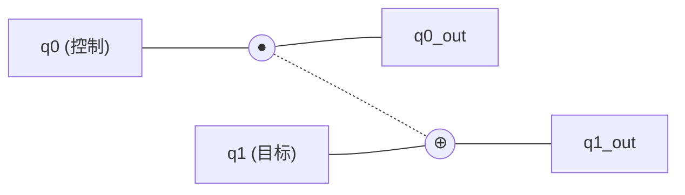
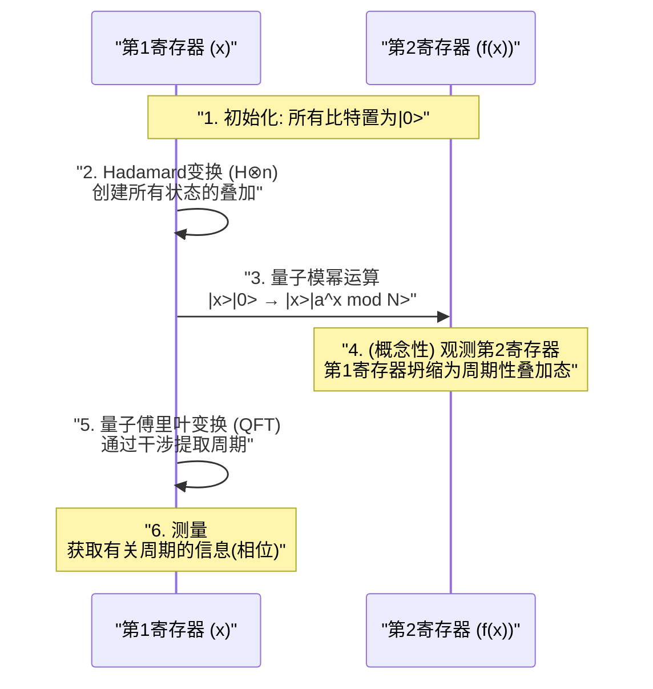

现代互联网社会中的安全性是由[RSA](https://kenji.blog/zh-cn/p/modern-cryptography-public-key-hash-signature/)密码等公钥密码体制来保障的。这些密码体制的安全性基础在于数学上的困难性，即“对极大的数进行素数分解，使用现有的计算机（经典计算机）需要花费天文数字般的时间”。

然而，有可能从根本上颠覆这一前提的正是 **量子计算机** 。特别是1994年由彼得·秀尔（Peter Shor）发现的 **Shor算法** （Shor's Algorithm），在数学上证明了如果量子计算机投入实用，就能在现实时间内破解RSA密码。

本文将从量子计算机如何进行计算的基础机制开始，详细探讨为何Shor算法能高速进行素数分解，以及其背后的数学原理和使用编程语言（Python/Qiskit）的实现示例。文章规模约两万字，带您彻底深入了解。

---

## 1. 什么是量子计算机？与经典计算机的区别

我们日常使用的PC或智能手机被称为 **经典计算机** 。经典计算机将信息作为“0”或“1”的 **比特** （bit）来处理。

另一方面，量子计算机使用 **量子比特** （qubit）作为信息的最小单位。通过利用量子力学奇妙的性质，它以与传统计算机完全不同的方式进行计算。其核心机制在于“叠加（Superposition）”、“量子纠缠（Entanglement）”以及“量子干涉（Interference）”。

### 1.1 叠加（Superposition）

经典比特只能处于“0”或“1”其中一种状态，而量子比特可以同时处于“0”和“1”两种状态。这被称为 **叠加** 。

在数学上，量子态 $|\psi\rangle$ 作为基态 $|0\rangle$ 和 $|1\rangle$ 的线性组合，可以表示如下：

$$
|\psi\rangle = \alpha|0\rangle + \beta|1\rangle
$$

这里，$\alpha$ 和 $\beta$ 是复数，被称为 **概率幅** 。当对量子比特进行观测（测量）时，状态会坍缩（波包坍缩）至 $|0\rangle$ 或 $|1\rangle$，分别得到的概率为 $|\alpha|^2$ 和 $|\beta|^2$。因为概率总和必须为1，因此满足以下归一化条件：

$$
|\alpha|^2 + |\beta|^2 = 1
$$

凭借这一性质，$n$ 个量子比特能够同时表示 $2^n$ 个状态的叠加。这就是量子并行计算的基础。

### 1.2 量子纠缠（Entanglement）

多个量子比特相互产生强烈的联系，当其中一个的状态确定时，无论在空间上相隔多远，另一个的状态也会瞬间确定，这种现象被称为 **量子纠缠** （Entanglement）。

例如，让我们考虑以下贝尔态（Bell state）：

$$
|\Phi^+\rangle = \frac{1}{\sqrt{2}} (|00\rangle + |11\rangle)
$$

在这种状态下，如果测量第一个量子比特得到“0”，第二个量子比特必定为“0”。反之，如果得到“1”，第二个也必定为“1”。通过利用这种强相关性，量子计算机能够高效地处理复杂的计算。

### 1.3 量子干涉（Interference）

处于叠加态的量子比特具有类似波的性质。波峰与波峰重叠时会增强（相长干涉），波峰与波谷重叠时则会相互抵消（相消干涉）。
在量子计算中，巧妙地控制这种 **量子干涉** ，以放大通向正确答案的概率幅，并抵消错误答案的概率幅，这就是算法设计的基础。Shor算法也极度高超地利用了这种干涉现象。

---

## 2. 量子门与量子电路

对应于经典计算机中的逻辑门（AND、OR、NOT等）的，是量子计算机中的 **量子门** 。量子门被表示为对量子状态向量施加的酉矩阵（Unitary Matrix）运算。

### 2.1 典型的单量子比特门

#### X门（泡利X门）
相当于经典计算中的NOT门。它将 $|0\rangle$ 反转为 $|1\rangle$，将 $|1\rangle$ 反转为 $|0\rangle$。

$$
X = \begin{pmatrix} 0 & 1 \\\\ 1 & 0 \end{pmatrix}
$$

#### Z门（泡利Z门）
仅反转 $|1\rangle$ 的相位（乘以 $-1$）。相位反转在量子干涉中极其重要。

$$
Z = \begin{pmatrix} 1 & 0 \\\\ 0 & -1 \end{pmatrix}
$$

#### H门（阿达马门）
从基态创造出叠加态的最重要门之一。

$$
H = \frac{1}{\sqrt{2}} \begin{pmatrix} 1 & 1 \\\\ 1 & -1 \end{pmatrix}
$$

$H|0\rangle = \frac{1}{\sqrt{2}}(|0\rangle + |1\rangle)$，测量时会有各50%的概率得到0或1的状态。

### 2.2 多量子比特门

#### CNOT门（受控NOT门）
作用于两个量子比特的门，仅当控制比特为“1”时，才对目标比特应用X门（反转）。它是产生量子纠缠不可或缺的门。



---

## 3. 密码技术基础与[RSA](https://kenji.blog/zh-cn/p/modern-cryptography-public-key-hash-signature/)密码

为了理解Shor算法所带来的冲击，我们需要了解目前主流的公钥密码算法—— **RSA密码** 的运作机制。

### 3.1 RSA密码的机制

RSA密码利用了素因数分解的困难性。准备两个巨大的素数 $p$ 和 $q$，并计算它们的乘积 $N = p \times q$。

1. 将 $p$ 和 $q$ 相乘得出 $N$ 是很容易的。
2. 然而，从 $N$ 中找出原始的 $p$ 和 $q$（进行素因数分解）却极其困难。

这种非对称性便是密码的关键。将 $N$ 作为公钥广泛公开并用于加密。另一方面，关于 $p$ 和 $q$ 的信息作为私钥被严密保管，用于解密。

### 3.2 到底有多困难？

即使使用目前的超级计算机，要对数千比特（例如RSA-2048）的 $N$ 进行素因数分解，据称需要比宇宙年龄还要长的时间。即使使用最有效率的经典算法“普通数域筛选法（GNFS）”，计算量也会呈指数级（确切地说，是亚指数级）增长。

$$
O\left( \exp \left( \left(\frac{64}{9}b\right)^{\frac{1}{3}} (\log b)^{\frac{2}{3}} \right) \right)
$$
※ $b$ 为位数（比特数）

此时登场的就是 **Shor算法** 。Shor算法将这一计算量大幅削减至多项式时间 $O(b^3)$。

---

## 4. Shor算法的全貌

Shor算法通过将素因数分解问题转换为名为 **“周期寻找问题（Period Finding Problem）”** 的另一个数学问题来进行求解。

算法主要分为两个部分。

1. **经典计算机执行的部分（规约、预处理、后处理）**
2. **量子计算机执行的部分（寻找周期）**

### 4.1 经典部分：从素因数分解规约至寻找周期

假设给定了一个需要进行素因数分解的合数 $N$。（例如：$N = 15$）

**步骤 1:** 选择一个与 $N$ 互质（最大公约数为1）的随机整数 $a$（$1 < a < N$）。
如果最大公约数 $\gcd(a, N) > 1$，说明已经找到了因子，计算结束。（通过辗转相除法很容易就能找到）

**步骤 2:** 考虑如下模运算的函数 $f(x)$。

$$
f(x) = a^x \pmod N
$$

将 $x = 0, 1, 2, 3, \dots$ 代入该函数 $f(x)$ 时，在数学上已知它的值会以某个周期 $r$ 重复（欧拉定理）。也就是说，存在满足 $f(x) = f(x + r)$ 的最小正整数 $r$（周期）。

例如，当 $N = 15$，$a = 7$ 时：
- $7^0 \pmod{15} = 1$
- $7^1 \pmod{15} = 7$
- $7^2 \pmod{15} = 4$
- $7^3 \pmod{15} = 13$
- $7^4 \pmod{15} = 1$ （从这里开始循环）

可以得出周期 $r = 4$。

**步骤 3:** 如果找到的周期 $r$ 为偶数，并且满足 $a^{r/2} \not\equiv -1 \pmod N$，就可以如下求出因子。

$$
\gcd(a^{r/2} \pm 1, N)
$$

在前面的例子（$N=15, a=7, r=4$）中：
$a^{r/2} = 7^{4/2} = 7^2 = 49$
$49 + 1 = 50$， $\gcd(50, 15) = 5$
$49 - 1 = 48$， $\gcd(48, 15) = 3$

漂亮，成功找出了 $15$ 的因子 $5$ 和 $3$！

### 4.2 难点：在经典计算中寻找周期 $r$ 非常困难

我们知道了只要得知周期 $r$ 就能进行素因数分解。然而，当 $N$ 非常大时，如果为了寻找周期 $r$ 而让经典计算机逐一计算 $f(x)$，仍然会花费指数级别的时间。

因此，唯独“寻找周期 $r$”这部分将交由量子计算机来完成。通过使用量子并行计算，一次性计算所有 $x$ 的 $f(x)$，并从中在一瞬间（多项式时间内）提取出周期 $r$。

---

## 5. 量子部分：量子傅里叶变换与周期提取

Shor算法的量子计算部分按以下步骤进行。



### 5.1 通过量子并行计算求值

首先，准备两个拥有足够多量子比特的寄存器（第1寄存器和第2寄存器），并将它们全部初始化为 $|0\rangle$。
对第1寄存器应用阿达马门，创建一个所有可能的 $x$ 值（从 $0$ 到 $Q-1$）均匀叠加的状态。

$$
\frac{1}{\sqrt{Q}} \sum_{x=0}^{Q-1} |x\rangle |0\rangle
$$

接着，使用 **量子模幂运算电路** 计算 $f(x) = a^x \pmod N$，并将结果写入第2寄存器。

$$
\frac{1}{\sqrt{Q}} \sum_{x=0}^{Q-1} |x\rangle |a^x \bmod N\rangle
$$

在这个阶段，所有 $x$ 对应的 $f(x)$ 结果被作为量子叠加态一次性计算完成。但是，如果直接进行测量，只能随机得到一个 $x$ 及其对应的 $f(x)$，依然无法得知周期 $r$。

### 5.2 周期状态的提取与量子干涉

为了提取周期 $r$，我们需要对第1寄存器应用一种极其重要的操作： **量子傅里叶变换 (Quantum Fourier Transform: QFT)** 。

QFT是经典离散傅里叶变换（DFT）的量子版。它的作用是将数据的周期性转换到频域的峰值中。对于状态向量 $|\psi\rangle = \sum_{j} x_j |j\rangle$，QFT的作用如下。

$$
QFT(|j\rangle) = \frac{1}{\sqrt{Q}} \sum_{k=0}^{Q-1} e^{\frac{2\pi i j k}{Q}} |k\rangle
$$

因为第1寄存器的状态与第2寄存器的状态（例如 $f(x_0)$）相纠缠，所以它成为了一个在特定周期处出现离散值的叠加态。对此应用QFT后，会发生量子干涉。

- 与正确周期 $r$ 相关的状态（概率幅）会发生 **相长干涉**
- 其他状态的相位则会变得杂乱无章并 **相消干涉（抵消）**。

结果就是，在测量时能以很高的概率得到满足 $k \approx Q \cdot \frac{c}{r}$ （$c$ 为整数）的 $k$ 值。

### 5.3 经典后处理：连分数展开

当量子计算机得出测量结果 $k$ 后，再次轮到经典计算机上场。
此时我们获得了关系式 $k / Q \approx c / r$。$c$ 和 $r$ 是互质的整数。

我们只需对已知的十进制小数 $k / Q$ 使用经典算法 **连分数展开（Continued Fraction Expansion）** ，将其转换为近似分数 $c / r$，便终于能确定分母即为周期 $r$。

剩下的只需按照 4.1 节说明的步骤计算最大公约数，就能漂亮地推导出 $N$ 的素因子。

---

## 6. 使用Qiskit实现Shor算法示例

这里将介绍一个使用IBM提供的开源量子编程框架 **Qiskit** ，针对非常小的数字 $N = 15$ 进行素因数分解的Shor算法实现示例。

（※对于实际中极大的数字进行素数分解，需要庞大数量的量子比特以及纠错能力，由于目前的模拟器及小规模量子硬件的能力所限，这类演示通常仅限于分解 $15$ 或 $21$ 等小数字。）

```python
import numpy as np
from qiskit import QuantumCircuit, transpile
from qiskit.visualization import plot_histogram
from qiskit_aer import AerSimulator
import math
from math import gcd

# --- 1. 量子模幂运算电路的定义 (a=7, N=15) ---
def c_amod15(a, power):
    """作为受控U门运作的 a^power mod 15 电路"""
    U = QuantumCircuit(4)        
    for _iteration in range(power):
        if a in [2,13]:
            U.swap(2,3)
            U.swap(1,2)
            U.swap(0,1)
        if a in [7,8]:
            U.swap(0,1)
            U.swap(1,2)
            U.swap(2,3)
        if a in [4, 11]:
            U.swap(1,3)
            U.swap(0,2)
        if a in [7,11,13]:
            for q in range(4):
                U.x(q)
    U = U.to_gate()
    U.name = f"{a}^{power} mod 15"
    c_U = U.control()
    return c_U

# --- 2. 逆量子傅里叶变换 (QFT_dagger) 的定义 ---
def qft_dagger(n):
    """对n个量子比特进行逆量子傅里叶变换的电路"""
    qc = QuantumCircuit(n)
    for qubit in range(n//2):
        qc.swap(qubit, n-qubit-1)
    for j in range(n):
        for m in range(j):
            qc.cp(-np.pi/float(2**(j-m)), m, j)
        qc.h(j)
    qc.name = "QFT_dagger"
    return qc

# --- 3. Shor算法主体的构建 ---
n_count = 8  # 用于测量的寄存器（第1寄存器）的量子比特数
a = 7        # 与N=15互质的数

# 第1寄存器(8qubit) + 第2寄存器(4qubit) + 经典寄存器(8bit)
qc = QuantumCircuit(n_count + 4, n_count)

# 通过H门使第1寄存器进入叠加态
for q in range(n_count):
    qc.h(q)

# 将第2寄存器的初始状态设置为 |1> (对最低位应用X门)
qc.x(n_count)

# 应用受控模幂门
for q in range(n_count):
    qc.append(c_amod15(a, 2**q), 
             [q] + [i+n_count for i in range(4)])

# 对第1寄存器应用逆QFT
qc.append(qft_dagger(n_count).to_instruction(), range(n_count))

# 测量第1寄存器
qc.measure(range(n_count), range(n_count))

# --- 4. 通过模拟器执行 ---
simulator = AerSimulator()
compiled_circuit = transpile(qc, simulator)
job = simulator.run(compiled_circuit, shots=1024)
results = job.result()
counts = results.get_counts()

print("测量结果 (二进制: 观测次数):")
print(counts)

# --- 5. 经典后处理 (确定周期r并计算素因子) ---
# 从测量结果中解析出概率最高值的逻辑（简化版）
measured_phases = []
for output in counts:
    decimal = int(output, 2)
    phase = decimal / (2**n_count)
    measured_phases.append(phase)

print(f"\n推测的相位(phase): {measured_phases[:4]} ...")
# 继续通过相位使用连分数展开来求分母 r (周期) 的处理...
```

执行上述代码后，量子模拟器会有很高概率输出诸如 `00000000`, `01000000`, `10000000`, `11000000` 等状态（十进制下即为 0, 64, 128, 192）。
将这些数除以 $2^8 = 256$ 即可得到相位 $0$, $0.25$, $0.5$, $0.75$。将它们表示为分数即为 $0/4$, $1/4$, $2/4$, $3/4$，由此可以看出，量子计算成功推导出了分母 **4** 即为周期 $r$。
只要知道了周期 $r=4$，如前所述，通过 $\gcd(7^{4/2} \pm 1, 15)$ 就能算出 $3$ 和 $5$ 两个素因子。

---

## 7. 为什么[RSA](https://kenji.blog/zh-cn/p/modern-cryptography-public-key-hash-signature/)密码面临危机？

在经典计算机中进行素因数分解，其计算量随着数字位数的增加呈指数级增长。例如，分解100位数字需要几秒，200位数字需要几年，而分解RSA-2048（约617位数字）估计需要比宇宙寿命还要长的时间。

然而，如果使用Shor算法，所需的计算步数（门数量）相对于位数 $b$ 只呈现多项式级别 $O(b^3)$ 的增长。这意味着，哪怕是RSA-2048，只要有理想的量子计算机，仅需几小时到几天的时间就能被破解。

### “现在存储，日后解密”（Store Now, Decrypt Later）的威胁
如果认为“目前还没有高性能的量子计算机，所以很安全”，那就非常危险了。目前已经有人认真考虑一种攻击场景：恶意第三方或国家机构趁现在收集并保存目前流通的加密机密数据（金融信息、国家机密等）（现在存储），等到十到二十年后高性能量子计算机问世的那一刻再进行解密（日后解密）。
因此，我们迫切需要在量子计算机完成前升级我们的加密体制。

---

## 8. 实现量子计算机的障碍：噪声与纠错

Shor算法在数学上是完美的，但在物理实现上却面临着高墙。目前的量子硬件被称为 **NISQ** （Noisy Intermediate-Scale Quantum：含噪声中型量子）设备，它的弱点是对噪声（外部环境带来的干扰或门操作误差）非常敏感。

量子状态极其脆弱，稍微受到一点热量或电磁波的影响，就会引发 **退相干** （量子态崩塌）。为了破解RSA-2048，需要数千个“逻辑量子比特”以及无误差地进行上亿次的门操作。

为了实现这一目标，研究人员正在研究 **量子纠错（Quantum Error Correction）** 技术。即把多个“物理量子比特”捆绑构成1个“逻辑量子比特”，并检测与修正计算途中产生的错误。不过，据说生成1个逻辑量子比特需要1000到10000个物理量子比特，因此要实现拥有数千万物理量子比特规模的大型 **容错量子计算机 (FTQC: Fault-Tolerant Quantum Computer)** ，预计还需要十年到几十年以上的突破。

---

## 9. 下一代密码技术：后量子密码学（PQC）

为了对抗Shor算法的威胁，以美国国家标准与技术研究院（NIST）为首的世界各地机构，正在推进既能防御量子计算机破解，又具备安全性的新密码体制—— **抗量子计算机密码（Post-Quantum [Cryptography](https://kenji.blog/zh-cn/p/modern-cryptography-public-key-hash-signature/): PQC）** 的标准化进程。

PQC 并不是指使用了量子技术，而是基于能够在经典计算机上执行，但即使用量子算法（如Shor算法）也无法高效求解的新数学难题。

代表性的 PQC 路线包括：
- **基于格的密码学（Lattice-based cryptography）**: 利用多维空间中最短向量问题（SVP）等困难性。（例：Kyber, Dilithium）
- **基于编码的密码学（Code-based cryptography）**: 利用纠错码解码问题的困难性。
- **多变量多项式密码学（Multivariate cryptography）**: 利用求解包含众多变量的联立二次多项式方程组的困难性。
- **基于哈希的签名（Hash-based signatures）**: 仅依赖于密码学哈希函数安全性的签名机制。

目前，全球的IT基础设施正迎来从现有的RSA及椭圆曲线密码，向这些PQC进行迁移的历史性过渡期。

---

## 10. 结语

本文从量子计算机的基础知识讲起，详细解说了使用Shor算法进行素因数分解的机制，并对未来密码技术的展望进行了探讨。

量子计算机仍处于黎明期，要真正投入到实用的密码破解中还需要漫长的岁月。然而，作为其理论支撑的 **Shor算法** ，可以说是信息科学、物理学以及数学完美融合的人类智慧结晶。

其巧妙操纵量子干涉，从呈指数级的探索空间中仅仅将“正确答案”提取出来的优美机制，必将成为未来应用于各个领域（如新药研发、材料计算、优化问题等）的量子算法设计中的重要路标。面对即将到来的量子时代，我们正在见证一场技术的根本性变革。
