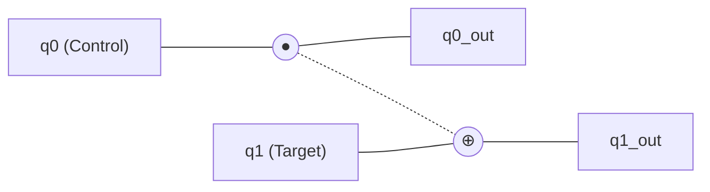
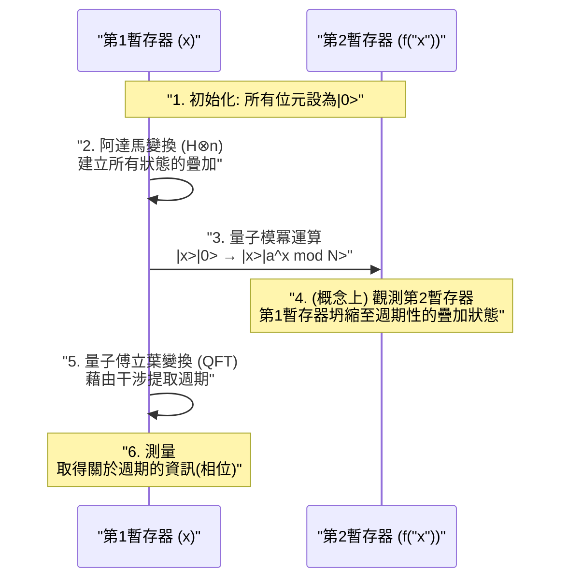

現代網際網路社會的安全性，是由[RSA](https://kenji.blog/zh-tw/p/modern-cryptography-public-key-hash-signature/)密碼等公開金鑰密碼系統所保護。這些密碼系統的安全性基礎，在於「分解巨大的質因數，對目前的電腦（古典電腦）來說需要天文數字般的時間」這樣一個數學上的困難度。

然而，擁有從根本上推翻這個前提之潛力的，就是 **量子電腦** 。特別是在1994年由彼得·秀爾（Peter Shor）所發現的 **秀爾演算法** （Shor's Algorithm），在數學上證明了只要量子電腦實用化，就能在現實的時間內破解RSA密碼。

本篇文章將從量子電腦是如何進行計算的基礎原理開始，探討秀爾演算法為什麼能高速進行質因數分解，以及其背後的數學理論和透過程式設計（Python/Qiskit）的實作範例，以約兩萬字的篇幅進行徹底的深入解說。

---

## 1. 量子電腦是什麼？與古典電腦的差異

我們平常使用的PC或智慧型手機被稱為 **古典電腦** 。古典電腦將資訊視為「0」或「1」的 **位元** （bit）來處理。

另一方面，量子電腦使用 **量子位元** （qubit）作為資訊的最小單位。透過利用量子力學奇妙的性質，以與過去電腦截然不同的方法進行計算。其核心就是「疊加（Superposition）」、「量子糾纏（Entanglement）」，以及「量子干涉（Interference）」。

### 1.1 疊加（Superposition）

古典位元只能處於「0」或「1」其中一種狀態，而量子位元則可以同時處於「0」和「1」兩種狀態。這被稱為 **疊加** 。

在數學上，量子狀態 $|\psi\rangle$ 可表示為基底狀態 $|0\rangle$ 與 $|1\rangle$ 的線性組合如下：

$$
|\psi\rangle = \alpha|0\rangle + \beta|1\rangle
$$

這裡的 $\alpha$ 和 $\beta$ 是複數，被稱為 **機率幅** 。當我們觀測（測量）量子位元時，狀態會坍縮（波包坍縮）為 $|0\rangle$ 或 $|1\rangle$，其得到的機率分別為 $|\alpha|^2$ 和 $|\beta|^2$。由於機率總和必須為1，因此滿足以下的歸一化條件：

$$
|\alpha|^2 + |\beta|^2 = 1
$$

基於這個性質，$n$ 個量子位元可以同時表現出 $2^n$ 個狀態的疊加。這成為了量子平行計算的基礎。

### 1.2 量子糾纏（Entanglement）

多個量子位元之間產生強烈的連結，當其中一個狀態決定時，無論在空間上相隔多遠，另一個狀態也會瞬間決定的現象，稱為 **量子糾纏** （Entanglement）。

例如，讓我們考慮以下的貝爾狀態（Bell state）：

$$
|\Phi^+\rangle = \frac{1}{\sqrt{2}} (|00\rangle + |11\rangle)
$$

在這個狀態下，如果測量第一個量子位元得到「0」，第二個量子位元必然是「0」。反之如果得到「1」，第二個也會是「1」。利用這種強烈的相關性，量子電腦能夠有效率地處理複雜的計算。

### 1.3 量子干涉（Interference）

處於疊加狀態的量子位元具有波的性質。當波峰與波峰重疊時會變大（建設性干涉），波峰與波谷重疊時會互相抵消（破壞性干涉）。
在量子計算中，透過巧妙地控制這個 **量子干涉** ，設計演算法來放大通向正確答案的機率幅，並抵消錯誤答案的機率幅。秀爾演算法也極度高度地利用了這種干涉。

---

## 2. 量子閘與量子電路

對應於古典電腦中的邏輯閘（AND, OR, NOT等），量子電腦中存在著 **量子閘** 。量子閘被表示為對量子狀態向量進行的酉矩陣（Unitary Matrix）運算。

### 2.1 代表性的單量子位元閘

#### X閘（包立X閘）
相當於古典的NOT閘。將 $|0\rangle$ 翻轉為 $|1\rangle$，將 $|1\rangle$ 翻轉為 $|0\rangle$。

$$
X = \begin{pmatrix} 0 & 1 \\\\ 1 & 0 \end{pmatrix}
$$

#### Z閘（包立Z閘）
僅將 $|1\rangle$ 的相位翻轉（乘以 $-1$）。相位的翻轉在量子干涉中極為重要。

$$
Z = \begin{pmatrix} 1 & 0 \\\\ 0 & -1 \end{pmatrix}
$$

#### H閘（阿達馬閘）
是從基底狀態創造出疊加狀態最重要的一個閘。

$$
H = \frac{1}{\sqrt{2}} \begin{pmatrix} 1 & 1 \\\\ 1 & -1 \end{pmatrix}
$$

$H|0\rangle = \frac{1}{\sqrt{2}}(|0\rangle + |1\rangle)$，測量時會成為以各50%機率得到0和1的狀態。

### 2.2 多量子位元閘

#### CNOT閘（受控NOT閘）
作用於兩個量子位元的閘，只有當控制位元為「1」時，才對目標位元應用X閘（翻轉）。這是創造量子糾纏所不可或缺的。



---

## 3. 密碼技術的基礎與[RSA](https://kenji.blog/zh-tw/p/modern-cryptography-public-key-hash-signature/)密碼

為了理解秀爾演算法的衝擊力，我們必須先了解目前主流的公開金鑰密碼，也就是 **RSA密碼** 的運作原理。

### 3.1 RSA密碼的原理

RSA密碼利用了質因數分解的困難度。準備兩個巨大的質數 $p$ 和 $q$，並計算它們的乘積 $N = p \times q$。

1. 將 $p$ 和 $q$ 相乘得到 $N$ 很簡單。
2. 然而，從 $N$ 找出原來的 $p$ 和 $q$（進行質因數分解）非常困難。

這種不對稱性就是密碼的關鍵。將 $N$ 作為公開金鑰廣泛發布並用於加密。另一方面，$p$ 和 $q$ 的資訊則作為私鑰被嚴格保管，用於解密。

### 3.2 到底有多困難？

即使使用目前的超級電腦，要對數千位元（例如RSA-2048）的 $N$ 進行質因數分解，也被認為需要比宇宙年齡還要長的時間。即使使用最有效率的古典演算法「普通數域篩法（GNFS）」，計算量也會呈現指數級（準確地說是次指數級）增長。

$$
O\left( \exp \left( \left(\frac{64}{9}b\right)^{\frac{1}{3}} (\log b)^{\frac{2}{3}} \right) \right)
$$
※ $b$ 為位數（位元數）

這時候登場的就是 **秀爾演算法** 。秀爾演算法將這個計算量戲劇性地減少到了多項式時間 $O(b^3)$。

---

## 4. 秀爾演算法的全貌

秀爾演算法透過將質因數分解的問題，轉換為 **「週期尋找問題（Period Finding Problem）」** 這個另一個數學問題來求解。

演算法主要分為兩個部分。

1. **在古典電腦上進行的部分（歸約、前處理、後處理）**
2. **在量子電腦上進行的部分（尋找週期）**

### 4.1 古典部分：從質因數分解歸約到尋找週期

假設我們有一個想要進行質因數分解的合成數 $N$。（例如：$N = 15$）

**步驟 1:** 選擇一個與 $N$ 互質（最大公因數為1）的隨機整數 $a$（$1 < a < N$）。
如果最大公因數 $\gcd(a, N) > 1$，則表示已經找到了因數，程序結束。（透過輾轉相除法可輕易找到）

**步驟 2:** 考慮如下的模除運算函數 $f(x)$。

$$
f(x) = a^x \pmod N
$$

當我們將 $x = 0, 1, 2, 3, \dots$ 代入這個函數 $f(x)$ 時，數學上已知其數值會以某個週期 $r$ 重複（歐拉定理）。也就是說，存在一個最小的正整數 $r$（週期），使得 $f(x) = f(x + r)$。

例如，當 $N = 15$，$a = 7$ 時：
- $7^0 \pmod{15} = 1$
- $7^1 \pmod{15} = 7$
- $7^2 \pmod{15} = 4$
- $7^3 \pmod{15} = 13$
- $7^4 \pmod{15} = 1$ （從這裡開始循環）

可以得知週期 $r = 4$。

**步驟 3:** 如果找到的週期 $r$ 是偶數，且 $a^{r/2} \not\equiv -1 \pmod N$，則可以透過以下方式求出因數：

$$
\gcd(a^{r/2} \pm 1, N)
$$

在前面的例子（$N=15, a=7, r=4$）中：
$a^{r/2} = 7^{4/2} = 7^2 = 49$
$49 + 1 = 50$， $\gcd(50, 15) = 5$
$49 - 1 = 48$， $\gcd(48, 15) = 3$

漂亮地找到了 $15$ 的因數 $5$ 和 $3$！

### 4.2 問題點：在古典上很難找到週期 $r$

我們知道只要找出週期 $r$ 就能進行質因數分解。然而，當 $N$ 非常大時，為了找到週期 $r$ 而用古典電腦逐一計算 $f(x)$，仍然會花費指數級的時間。

因此，只有「尋找週期 $r$」這部分交給量子電腦處理。透過使用量子平行計算，可以一次計算出所有 $x$ 對應的 $f(x)$，並從中瞬間（在多項式時間內）提取出週期 $r$。

---

## 5. 量子部分：量子傅立葉變換與週期提取

秀爾演算法的量子計算部分，按照以下步驟進行。



### 5.1 透過量子平行計算評估函數

首先，準備兩個擁有足夠量子位元數的暫存器（第1暫存器與第2暫存器），並將它們全部初始化為 $|0\rangle$。
對第1暫存器應用阿達馬閘，創造出所有可能的 $x$ 值（從 $0$ 到 $Q-1$）均等疊加的狀態。

$$
\frac{1}{\sqrt{Q}} \sum_{x=0}^{Q-1} |x\rangle |0\rangle
$$

接著，使用 **量子模冪運算電路** ，計算 $f(x) = a^x \pmod N$，並將其結果寫入第2暫存器中。

$$
\frac{1}{\sqrt{Q}} \sum_{x=0}^{Q-1} |x\rangle |a^x \bmod N\rangle
$$

在這個階段，所有對應於 $x$ 的 $f(x)$ 結果已經作為量子的疊加一次性計算出來了。然而，如果就這樣進行測量，只會得到一個隨機的 $x$ 和其對應的 $f(x)$，我們仍然無法知道週期 $r$。

### 5.2 週期狀態的提取與量子干涉

為了引出週期 $r$，我們對第1暫存器應用一個極為重要的操作，即 **量子傅立葉變換 (Quantum Fourier Transform: QFT)** 。

QFT是古典離散傅立葉變換（DFT）的量子版。它的作用是將資料的週期性轉換為頻率域上的峰值。對於狀態向量 $|\psi\rangle = \sum_{j} x_j |j\rangle$，QFT的作用如下：

$$
QFT(|j\rangle) = \frac{1}{\sqrt{Q}} \sum_{k=0}^{Q-1} e^{\frac{2\pi i j k}{Q}} |k\rangle
$$

由於第1暫存器的狀態與第2暫存器的狀態（例如 $f(x_0)$）相互連結，因此它會呈現以特定週期呈現離散數值的疊加狀態。對此應用QFT時，就會發生量子干涉。

- 與正確週期 $r$ 相關的狀態（機率幅）會 **建設性干涉**
- 其他狀態的相位會變得雜亂並 **互相抵消（破壞性干涉）**

結果，在進行測量時，將會以高機率得到滿足 $k \approx Q \cdot \frac{c}{r}$ （$c$ 為整數）的 $k$ 值。

### 5.3 古典後處理：連分數展開

當從量子電腦獲得測量結果 $k$ 後，就再次輪到古典電腦出場了。
我們已經得到 $k / Q \approx c / r$ 的關係式。$c$ 與 $r$ 為互質的整數。

透過使用古典演算法中的 **連分數展開（Continued Fraction Expansion）** ，將已知的 $k / Q$ 這個小數轉換為近似分數 $c / r$，終於可以確定分母的週期 $r$ 了。

剩下的就是按照 4.1 節說明的步驟，計算最大公因數，便能漂亮地導出 $N$ 的質因數。

---

## 6. 使用Qiskit的秀爾演算法實作範例

這裡我們將介紹使用IBM提供的開源量子程式設計框架 **Qiskit** ，對一個非常小的數字 $N = 15$ 進行質因數分解的秀爾演算法實作範例。

（※要對實用的巨大數字進行因數分解，需要龐大的量子位元與錯誤更正，因此在目前的模擬器或小規模量子硬體上，僅限於 $15$ 或 $21$ 等示範用途）

```python
import numpy as np
from qiskit import QuantumCircuit, transpile
from qiskit.visualization import plot_histogram
from qiskit_aer import AerSimulator
import math
from math import gcd

# --- 1. 定義量子模冪運算電路 (a=7, N=15) ---
def c_amod15(a, power):
    """作為控制U閘運作的 a^power mod 15 電路"""
    U = QuantumCircuit(4)        
    for _iteration in range(power):
        if a in [2,13]:
            U.swap(2,3)
            U.swap(1,2)
            U.swap(0,1)
        if a in [7,8]:
            U.swap(0,1)
            U.swap(1,2)
            U.swap(2,3)
        if a in [4, 11]:
            U.swap(1,3)
            U.swap(0,2)
        if a in [7,11,13]:
            for q in range(4):
                U.x(q)
    U = U.to_gate()
    U.name = f"{a}^{power} mod 15"
    c_U = U.control()
    return c_U

# --- 2. 定義反量子傅立葉變換 (QFT_dagger) ---
def qft_dagger(n):
    """進行n量子位元之反量子傅立葉變換的電路"""
    qc = QuantumCircuit(n)
    for qubit in range(n//2):
        qc.swap(qubit, n-qubit-1)
    for j in range(n):
        for m in range(j):
            qc.cp(-np.pi/float(2**(j-m)), m, j)
        qc.h(j)
    qc.name = "QFT_dagger"
    return qc

# --- 3. 建構秀爾演算法主體 ---
n_count = 8  # 測量用暫存器（第1暫存器）的量子位元數
a = 7        # 與N=15互質的數

# 第1暫存器(8qubit) + 第2暫存器(4qubit) + 古典暫存器(8bit)
qc = QuantumCircuit(n_count + 4, n_count)

# 使用H閘將第1暫存器變為疊加狀態
for q in range(n_count):
    qc.h(q)

# 將第2暫存器的初始狀態設定為 |1> (將x閘應用於最低有效位元)
qc.x(n_count)

# 應用控制模冪運算閘
for q in range(n_count):
    qc.append(c_amod15(a, 2**q), 
             [q] + [i+n_count for i in range(4)])

# 對第1暫存器應用反QFT
qc.append(qft_dagger(n_count).to_instruction(), range(n_count))

# 測量第1暫存器
qc.measure(range(n_count), range(n_count))

# --- 4. 透過模擬器執行 ---
simulator = AerSimulator()
compiled_circuit = transpile(qc, simulator)
job = simulator.run(compiled_circuit, shots=1024)
results = job.result()
counts = results.get_counts()

print("測量結果 (二進位: 觀測次數):")
print(counts)

# --- 5. 古典的後處理 (找出週期r與計算質因數) ---
# 從測量結果中分析出最高機率的邏輯（簡化版）
measured_phases = []
for output in counts:
    decimal = int(output, 2)
    phase = decimal / (2**n_count)
    measured_phases.append(phase)

print(f"\n推測的相位(phase): {measured_phases[:4]} ...")
# 接著是從相位利用連分數展開求出分母 r (週期) 的處理...
```

執行上述程式碼後，量子模擬器會以高機率輸出 `00000000`、`01000000`、`10000000`、`11000000` 等狀態（十進位為 0、64、128、192）。
將這些除以 $2^8 = 256$ 後，相位為 $0$、$0.25$、$0.5$、$0.75$。用分數表示即為 $0/4$、$1/4$、$2/4$、$3/4$，由此可知透過量子計算導出了分母 **4** 即為週期 $r$。
只要知道週期 $r=4$，如前所述，就能從 $\gcd(7^{4/2} \pm 1, 15)$ 導出 $3$ 和 $5$ 兩個質因數。

---

## 7. 為什麼[RSA](https://kenji.blog/zh-tw/p/modern-cryptography-public-key-hash-signature/)密碼面臨危機？

在古典電腦中，質因數分解的計算量會隨著位數的增加呈指數級增長。例如，分解100位數需要幾秒，200位數需要幾年，而RSA-2048（約617位數）估計需要超過宇宙壽命的時間。

然而，當使用秀爾演算法時，所需的計算步驟數（閘數量）相對於位數 $b$，只以多項式層級 $O(b^3)$ 增加。這意味著，即使是RSA-2048，只要有理想的量子電腦，在幾小時到幾天內就能被破解。

### 「Store Now, Decrypt Later」的威脅
認為「反正高性能的量子電腦還沒完成，所以很安全」是危險的。惡意的第三方或國家機構，現在就會把流通中經過加密的機密資料（金融資訊、國家機密等）記錄保存下來（Store Now），等到10年到20年後高性能量子電腦完成的瞬間再進行破解（Decrypt Later），這種攻擊情境被視為是非常現實的威脅。
因此，我們被迫在量子電腦完成之前，就需要升級我們的密碼系統。

---

## 8. 實現量子電腦的障礙：雜訊與錯誤更正

秀爾演算法在數學上是完美的，但要在物理上實現它，卻面臨著巨大的障礙。目前的量子硬體被稱為 **NISQ** （Noisy Intermediate-Scale Quantum：含雜訊中等規模量子）裝置，它有一個弱點，就是對雜訊（外部環境造成的干擾或閘操作的誤差）非常脆弱。

量子狀態極其脆弱，些微的熱量或電磁波都會導致 **退相干** （量子狀態的崩潰）。為了解碼RSA-2048，需要數千個「邏輯量子位元」，並且要無誤差地進行數億次的閘操作。

為了解決這個問題，目前正在研究 **量子錯誤更正（Quantum Error Correction）** 。這是一種將多個「物理量子位元」綑綁在一起構成一個「邏輯量子位元」，在計算過程中偵測並修正錯誤的技術。然而，據說要製造一個邏輯量子位元需要1000到10000個物理量子位元，因此要實現擁有數千萬物理量子位元等級的大規模 **容錯量子電腦 (FTQC: Fault-Tolerant Quantum Computer)** ，預計還需要10年到幾十年的突破。

---

## 9. 次世代的密碼技術：後量子密碼學（PQC）

為了對抗秀爾演算法的威脅，以美國國家標準暨技術研究院（NIST）為首的全球機構，正在推動即使是量子電腦也無法破解的新密碼系統—— **抗量子計算機密碼學（Post-Quantum [Cryptography](https://kenji.blog/zh-tw/p/modern-cryptography-public-key-hash-signature/): PQC）** 的標準化。

PQC並不使用量子技術，它是基於即使使用量子演算法也無法有效求解（無法套用秀爾演算法），且能在古典電腦上執行的新數學問題。

代表性的PQC方法：
- **晶格密碼學（Lattice-based cryptography）**: 利用多維空間中最短向量問題（SVP）等的困難度。（例如：Kyber, Dilithium）
- **編碼為基礎的密碼學（Code-based cryptography）**: 利用解碼錯誤更正碼問題的困難度。
- **多變數多項式密碼學（Multivariate cryptography）**: 利用求解包含多個變數之二次多項式聯立方程式的困難度。
- **雜湊為基礎的簽章（Hash-based signatures）**: 僅依賴密碼雜湊函數安全性的簽章系統。

目前，全球的IT基礎設施正經歷一個歷史性的過渡期，也就是從現有的RSA和橢圓曲線密碼轉移（遷移）到這些PQC。

---

## 10. 結語

本篇文章詳細解說了從量子電腦的基礎，到秀爾演算法進行質因數分解的機制，以及未來密碼技術的展望。

量子電腦目前還處於黎明期，要達到能夠進行實用的密碼破解，還需要漫長的歲月。然而，作為其理論後盾的 **秀爾演算法** ，可以說是完美融合了資訊科學、物理學以及數學的人類智慧結晶。

巧妙地操縱量子干涉，從指數級的搜尋空間中僅讓「正確答案」浮現出來，這種優美的機制，將成為未來應用於各個領域（新藥開發、材料計算、最佳化問題等）之量子演算法設計的重要路標。迎接即將到來的量子時代，我們正在見證科技的根本性變革。
