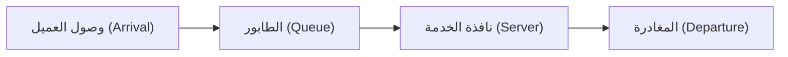

# مقدمة: لماذا يبدو دائمًا أن الطابور المجاور أسرع؟

عندما تقف في طابور عند ماكينة الدفع في سوبر ماركت أو متجر صغير، هل شعرت يومًا أن الطابور المجاور يتحرك أسرع من الطابور الذي اخترته؟ غالبًا ما يُعتبر هذا مجرد وهم نفسي (قانون مورفي)، ولكن في الواقع هناك أساس رياضي لذلك.

نظرًا لوجود طوابير أكثر من الطابور الذي تقف فيه، فمن المحتمل جدًا من الناحية الإحصائية أن "أحد الطوابير الأخرى بخلاف طابورك يتحرك بشكل أسرع". "نظرية الطوابير (Queuing Theory)" هي نهج رياضي يوضح هذا التفاوت بين الحدس والاحتمالات/الإحصاءات، ويعمل على تحسين كفاءة النظام ككل. في هذا المقال، سنشرح بالتفصيل كل شيء بدءًا من تاريخ نظرية الطوابير، وتدوين كيندال، وإثبات قانون ليتل، والمحاكاة باستخدام بايثون، وصولاً إلى تطبيقاتها في البنية التحتية لتكنولوجيا المعلومات الحديثة.

## 1. الخلفية التاريخية لنظرية الطوابير: تحدي أ. ك. إرلانج

تأسست نظرية الطوابير في عام 1909 على يد عالم الرياضيات والمهندس الدنماركي **أجنر كراروب إرلانج (Agner Krarup Erlang)**. كان يعمل في شركة هواتف كوبنهاغن، وواجه مشكلة واقعية: "كم عدد الخطوط التي يجب توفيرها في بدالة الهاتف لتقديم الخدمة للعملاء دون جعلهم ينتظرون؟"

في ذلك الوقت، كان مشغلو الهواتف يقومون بتوصيل الخطوط يدويًا عن طريق إدخال القوابس. إذا كان عدد الخطوط قليلاً جدًا، فإن احتمال سماع "الخط مشغول" يرتفع وتنخفض رضا العملاء. من ناحية أخرى، إذا تم زيادة عدد الخطوط بشكل مفرط، فإن التكاليف ستصبح باهظة. ولحل هذه المعادلة الصعبة، استخدم إرلانج توزيع بواسون والتوزيع الأسّي لنمذجة وصول المكالمات الهاتفية ومدة المكالمة، واستنتج صيغ إرلانج (Erlang B formula / Erlang C formula). كانت هذه هي ولادة نظرية الطوابير.

## 2. المفاهيم الأساسية للطوابير

يتكون نظام الطوابير من العناصر الرئيسية الثلاثة التالية:



1. **عملية الوصول (Arrival Process)**: الفاصل الزمني الذي يصل فيه العملاء (أو المهام، الحزم، إلخ) إلى النظام. في كثير من الأحيان يتم نمذجته كعملية بواسون (تتبع الفواصل الزمنية للوصول توزيعًا أسيًا).
2. **عملية الخدمة (Service Process)**: الوقت المستغرق لتقديم الخدمة. يُنمذج هذا أيضًا باستخدام التوزيع الأسّي أو التوزيع العام.
3. **عدد النوافذ (Number of Servers)**: عدد ماكينات الدفع أو الخوادم التي تعالج العملاء.

### تدوين كيندال (Kendall's Notation)

لتصنيف نماذج الطوابير، التدوين الذي اقترحه ديفيد كيندال في عام 1953 هو "تدوين كيندال". يأخذ بشكل عام تنسيق `A/B/C/K/N/D`، ولكنه يُختصر غالبًا إلى `A/B/C`.

- **A (Arrival)**: التوزيع الاحتمالي للفواصل الزمنية للوصول (مثال: M = ماركوفي/توزيع أسي، D = ثابت، G = توزيع عام)
- **B (Service)**: التوزيع الاحتمالي لوقت الخدمة (مثال: M, D, G)
- **C (Servers)**: عدد النوافذ (الخوادم)
- **K (Capacity)**: السعة القصوى للنظام (عند الحذف، تكون ما لا نهاية $\infty$)
- **N (Population)**: حجم المجتمع الإحصائي (عند الحذف، يكون ما لا نهاية $\infty$)
- **D (Discipline)**: نظام الخدمة (مثال: FCFS = من يأتي أولاً يُخدم أولاً، LCFS = من يأتي أخيرًا يُخدم أولاً، عند الحذف يكون FCFS)

النموذج الأكثر أساسية وشهرة هو نموذج **M/M/1**. وهذا يعني "الفاصل الزمني للوصول توزيع أسي (M)"، "وقت الخدمة توزيع أسي (M)"، "نافذة واحدة (1)".

## 3. التحليل الرياضي لنموذج M/M/1

دعونا نفكك نظام طابور M/M/1 باستخدام المعادلات الرياضية.

### تعريف المعلمات

- $\lambda$ (لامدا): **متوسط معدل الوصول**. متوسط عدد العملاء الذين يصلون في وحدة زمنية.
- $\mu$ (ميو): **متوسط معدل الخدمة**. متوسط عدد العملاء الذين يمكن معالجتهم في وحدة زمنية.
- $\rho$ (رو): **كثافة حركة المرور (معدل الاستخدام)**. $\rho = \lambda / \mu$.

لكي يعمل النظام بشكل مستقر، يجب أن يكون دائمًا **$\rho < 1$** (أي $\lambda < \mu$). إذا كان $\rho \ge 1$، فإن وصول العملاء سيتجاوز قدرة المعالجة، وسيصبح الطابور طويلًا إلى ما لا نهاية.

### الصيغ الرئيسية

عندما يكون نموذج M/M/1 في حالة مستقرة، يمكن استنتاج المؤشرات المهمة التالية.

1. **متوسط عدد العملاء في النظام ($L$)**: مجموع الأشخاص المنتظرين في الطابور والأشخاص الذين يتلقون الخدمة.
   $$ L = \frac{\rho}{1 - \rho} = \frac{\lambda}{\mu - \lambda} $$

2. **متوسط وقت البقاء في النظام ($W$)**: الوقت منذ وصول العميل حتى انتهائه من الخدمة ومغادرته.
   $$ W = \frac{L}{\lambda} = \frac{1}{\mu - \lambda} $$

3. **متوسط طول الطابور ($L_q$)**: متوسط عدد الأشخاص المصطفين وينتظرون فعليًا.
   $$ L_q = L - \rho = \frac{\rho^2}{1 - \rho} $$

4. **متوسط وقت الانتظار ($W_q$)**: الوقت الذي يمر منذ اصطفاف العميل في الطابور حتى يبدأ في تلقي الخدمة.
   $$ W_q = \frac{L_q}{\lambda} = \frac{\rho}{\mu - \lambda} $$

### فخ معدل الاستخدام: لماذا يطول الطابور فجأة

انتبه إلى الصيغة $L = \rho / (1 - \rho)$.
- عندما يكون $\rho = 0.5$ (معدل الاستخدام 50٪)، فإن $L = 1$ شخص.
- عندما يكون $\rho = 0.8$ (معدل الاستخدام 80٪)، فإن $L = 4$ أشخاص.
- عندما يكون $\rho = 0.9$ (معدل الاستخدام 90٪)، فإن $L = 9$ أشخاص.
- عندما يكون $\rho = 0.95$ (معدل الاستخدام 95٪)، فإن $L = 19$ شخصًا.

عندما يتجاوز معدل الاستخدام 90٪، فإن زيادة طفيفة في معدل الوصول تؤدي إلى زيادة هائلة في طول الطابور. يثبت هذا رياضيًا القاعدة الذهبية في البنية التحتية لتكنولوجيا المعلومات في اختبارات أداء الخوادم والأنظمة القائلة بأن "الحفاظ على استخدام وحدة المعالجة المركزية (CPU) عند 95٪ دائمًا هو أمر خطير". وجود هامش (مخزن مؤقت) أمر ضروري للتشغيل المستقر.

## 4. قانون ليتل (Little's Law)

أحد أقوى وأشمل النظريات في نظرية الطوابير هو "قانون ليتل". تم إثباته بواسطة جون ليتل في عام 1961.

**نص القانون:**
في نظام في حالة مستقرة، يكون متوسط عدد العملاء في النظام ($L$) مساويًا لحاصل ضرب معدل الوصول ($\lambda$) في متوسط وقت بقاء العميل ($W$).

$$ L = \lambda \times W $$

### لماذا هذا القانون مذهل؟

تكمن روعة قانون ليتل في أنه **لا يعتمد على الإطلاق على البنية الداخلية للنظام أو التوزيعات الاحتمالية**. سواء كان M/M/1 أو G/G/k، وسواء كان من يأتي أولاً يُخدم أولاً (FCFS) أو من يأتي أخيرًا يُخدم أولاً (LCFS)، طالما أن النظام في حالة مستقرة، فإنه يتحقق دائمًا.

**مثال ملموس: مقهى**
لنفترض أن مقهى يزوره في المتوسط 60 عميلاً في الساعة ($\lambda = 60 \text{ شخصًا/ساعة} = 1 \text{ شخص/دقيقة}$). يمكث العملاء في المتوسط 20 دقيقة في المقهى ($W = 20 \text{ دقيقة}$).
في هذه الحالة، متوسط عدد العملاء الموجودين في المقهى $L$ هو:
$L = 1 \text{ شخص/دقيقة} \times 20 \text{ دقيقة} = 20 \text{ شخصًا}$
وبالتالي يمكن توقع أن حوالي 20 مقعدًا ستكون مشغولة دائمًا. بهذه الطريقة، حتى في أنظمة الصندوق الأسود، يمكن تقدير الحالة الداخلية من خلال المؤشرات القابلة للملاحظة من الخارج.

## 5. محاكاة الطوابير باستخدام بايثون

بالإضافة إلى النظرية، دعونا نشغل برنامجًا فعليًا ونتحقق من ذلك. باستخدام `simpy`، مكتبة المحاكاة المبنية على الأحداث في بايثون، سنقوم بمحاكاة طابور M/M/1.

```python
import simpy
import random
import statistics

# إعداد المعلمات
ARRIVAL_RATE = 2.0      # معدل الوصول (lambda) : شخصان في الدقيقة
SERVICE_RATE = 2.5      # معدل الخدمة (mu) : يمكن معالجة 2.5 شخص في الدقيقة
SIM_TIME = 10000        # وقت المحاكاة (بالدقائق)

wait_times = []

def customer(env, name, server):
    """تعريف سلوك العميل"""
    arrival_time = env.now
    
    # طلب الخادم
    with server.request() as request:
        yield request
        
        # تسجيل وقت الانتظار
        wait_time = env.now - arrival_time
        wait_times.append(wait_time)
        
        # تلقي الخدمة (توزيع أسي)
        service_time = random.expovariate(SERVICE_RATE)
        yield env.timeout(service_time)

def setup(env):
    """إعداد النظام وتوليد العملاء"""
    server = simpy.Resource(env, capacity=1) # نافذة واحدة لـ M/M/1
    
    i = 0
    while True:
        # الوقت حتى وصول العميل التالي (توزيع أسي)
        yield env.timeout(random.expovariate(ARRIVAL_RATE))
        i += 1
        env.process(customer(env, f'Customer {i}', server))

# تشغيل المحاكاة
print("بدء المحاكاة...")
random.seed(42)
env = simpy.Environment()
env.process(setup(env))
env.run(until=SIM_TIME)

# حساب النتائج ومقارنتها بالقيم النظرية
avg_wait_sim = statistics.mean(wait_times)

# حساب القيمة النظرية
rho = ARRIVAL_RATE / SERVICE_RATE
l_q = (rho ** 2) / (1 - rho)
w_q_theory = l_q / ARRIVAL_RATE

print(f"--- النتائج ---")
print(f"متوسط وقت الانتظار في المحاكاة: {avg_wait_sim:.4f} دقيقة")
print(f"متوسط وقت الانتظار النظري (W_q): {w_q_theory:.4f} دقيقة")
```

عند تشغيل هذا الكود، يمكن التأكد من أن نتائج المحاكاة تتقارب إلى قيمة قريبة جدًا من القيمة النظرية $W_q$. حتى في النماذج المعقدة التي يصعب حلها تحليليًا مثل M/G/1 أو نماذج الخوادم المتعددة، يمكن التنبؤ بالأداء باستخدام المحاكاة بهذه الطريقة.

## 6. التطبيقات في البنية التحتية لتكنولوجيا المعلومات

تعتبر نظرية الطوابير مفهومًا لا غنى عنه في علوم الكمبيوتر الحديثة وتصميم البنية التحتية لتكنولوجيا المعلومات.

### 1. موازنة التحميل لخوادم الويب
يعتبر وصول طلبات الويب (طلبات HTTP) نموذجًا نموذجيًا للطوابير. إذا تعذر على خادم واحد (M/M/1) معالجة جميع الطلبات، يتم تقديم موازن تحميل لتوزيع الطلبات عبر خوادم متعددة. يتم تحليل هذا كنموذج M/M/c، ويمكن حساب عدد الخوادم التي يجب تشغيلها للحفاظ على متوسط وقت الاستجابة أقل من القيمة المستهدفة.

### 2. توجيه الشبكة وفقدان الحزم
تحتوي أجهزة التوجيه (الراوتر) على الإنترنت على مخزن مؤقت (ذاكرة) حيث يتم تخزين الحزم التي تنتظر الإرسال. يمكن اعتبار هذا كطابور بسعة محدودة (M/M/1/K). الحزم التي تصل عندما يكون المخزن المؤقت ممتلئًا يتم التخلص منها (إسقاطها). باستخدام نظرية الطوابير، يمكن تحديد حجم المخزن المؤقت المطلوب لتلبية معدل فقدان الحزم المسموح به.

### 3. التوسع التلقائي في الحوسبة السحابية
في البيئات السحابية مثل AWS و GCP، يتم استخدام التوسع التلقائي (Auto Scaling) لزيادة أو تقليل الخوادم تلقائيًا وفقًا لحركة المرور. تعتمد القاعدة التي تنص على إضافة خادم عندما يتجاوز معدل الاستخدام $\rho$ حدًا معينًا (على سبيل المثال: 70٪) على خاصية الطوابير المتمثلة في أن "وقت الانتظار يتباعد عندما يقترب معدل الاستخدام من 1".

## الخاتمة: التغلب على إحباطات الحياة اليومية بالمعادلات الرياضية

السؤال الذي بدأ بـ "لماذا يبدو دائمًا أن الطابور المجاور أسرع؟" قادنا إلى القوانين العالمية التي تحكم كل أنواع "الانتظار" في العالم، بدءًا من شبكات الاتصال والاختناقات المرورية وغرف انتظار المستشفيات، ووصولاً إلى تحسين أحدث الخوادم السحابية.

"وقت الانتظار" الذي يحبطنا في الحياة اليومية هو أيضًا مجرد ظاهرة رياضية تتصرف بانتظام وفقًا لقانون ليتل وتوزيع بواسون من منظور النظام ككل. في المرة القادمة التي تقف فيها في طابور طويل، بدلاً من الشعور بالإحباط، لم لا تحاول المراقبة والتفكير: "ما هو معدل الوصول $\lambda$ الحالي؟" أو "معدل الاستخدام $\rho$ يقترب من الحد الأقصى". قد يجعلك ذلك تشعر ببعض الرضا في وقت الانتظار.
