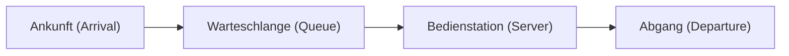

# Einleitung: Warum ist die Schlange nebenan immer schneller?

Haben Sie sich beim Anstehen an der Kasse im Supermarkt oder Convenience Store schon einmal gefühlt, als würde sich die Schlange neben Ihnen schneller bewegen als Ihre eigene? Dies wird oft als einfache psychologische Täuschung (Murphys Gesetz) abgetan, aber tatsächlich gibt es dafür eine mathematische Grundlage.

Da es mehr Schlangen gibt, in denen Sie nicht stehen, ist die Wahrscheinlichkeit, dass sich "irgendeine andere Schlange schneller bewegt als Ihre eigene", statistisch gesehen sehr hoch. Der mathematische Ansatz, der diese Diskrepanz zwischen Intuition und Wahrscheinlichkeits-/Statistiktheorie klärt, um die Effizienz des gesamten Systems zu optimieren, ist die "Warteschlangentheorie" (Queuing Theory). In diesem Artikel erklären wir die Warteschlangentheorie im Detail: von ihrer historischen Entwicklung über die Kendall-Notation, den Beweis des Gesetzes von Little, die Simulation mit Python bis hin zur Anwendung auf moderne IT-Infrastrukturen.

## 1. Historischer Hintergrund der Warteschlangentheorie: Die Herausforderung von A.K. Erlang

Die Warteschlangentheorie wurde 1909 von dem dänischen Mathematiker und Ingenieur **Agner Krarup Erlang** begründet. Er arbeitete für die Kopenhagener Telefongesellschaft und stand vor dem praktischen Problem: "Wie viele Leitungen sollte eine Telefonzentrale bereitstellen, um Kunden ohne Wartezeit telefonieren zu lassen?"

Bei damaligen Telefonen steckten Bediener manuell Stecker ein, um Leitungen zu verbinden. Waren zu wenige Leitungen vorhanden, stieg die Wahrscheinlichkeit eines Besetztzeichens, was die Kundenzufriedenheit verringerte. Wenn jedoch unnötig viele Leitungen vorhanden waren, stiegen die Kosten enorm. Um diesen Kompromiss zu lösen, modellierte Erlang die Ankunft von Anrufen (Calls) und die Gesprächsdauer mithilfe der Poisson-Verteilung und der Exponentialverteilung und leitete die Erlang-Formeln (Erlang B und Erlang C) ab. Dies war die Geburtsstunde der Warteschlangentheorie.

## 2. Grundkonzepte von Warteschlangen

Ein Warteschlangensystem besteht hauptsächlich aus den folgenden drei Elementen.



1. **Ankunftsprozess (Arrival Process)**: Das Intervall, in dem Kunden (oder Aufgaben, Pakete usw.) im System ankommen. Dies wird oft als Poisson-Prozess (Ankunftsintervalle folgen einer Exponentialverteilung) modelliert.
2. **Bedienungsprozess (Service Process)**: Die Zeit, die für die Bereitstellung eines Dienstes benötigt wird. Dies wird ebenfalls mit Exponentialverteilungen oder allgemeinen Verteilungen modelliert.
3. **Anzahl der Bedienstationen (Number of Servers)**: Die Anzahl der Kassen oder Server, die Kunden bearbeiten.

### Die Kendall-Notation (Kendall's Notation)

Um Modelle der Warteschlangentheorie zu klassifizieren, schlug David Kendall 1953 eine Notation vor, die "Kendall-Notation". Sie nimmt im Allgemeinen die Form `A/B/C/K/N/D` an, wird aber oft zu `A/B/C` abgekürzt.

- **A (Arrival)**: Wahrscheinlichkeitsverteilung der Ankunftsintervalle (z.B. M = Markovian/Exponentialverteilung, D = Deterministisch, G = Allgemeine Verteilung)
- **B (Service)**: Wahrscheinlichkeitsverteilung der Bedienungszeiten (z.B. M, D, G)
- **C (Servers)**: Anzahl der Bedienstationen (Server)
- **K (Capacity)**: Maximale Kapazität des Systems (wird weggelassen, wenn unendlich $\infty$)
- **N (Population)**: Größe der Grundgesamtheit (wird weggelassen, wenn unendlich $\infty$)
- **D (Discipline)**: Abfertigungsdisziplin (z.B. FCFS = First Come, First Served; LCFS = Last Come, First Served; wird weggelassen, wenn FCFS)

Das grundlegendste und bekannteste Modell ist das **M/M/1**-Modell. Dies bedeutet: "Ankunftsintervall ist exponentialverteilt (M)", "Bedienungszeit ist exponentialverteilt (M)", "eine Bedienstation (1)".

## 3. Mathematische Analyse des M/M/1-Modells

Lassen Sie uns das M/M/1-Warteschlangensystem mit Formeln entschlüsseln.

### Definition der Parameter

- $\lambda$ (Lambda): **Mittlere Ankunftsrate**. Die durchschnittliche Anzahl der Kunden, die pro Zeiteinheit ankommen.
- $\mu$ (My): **Mittlere Bedienrate**. Die durchschnittliche Anzahl der Kunden, die pro Zeiteinheit bedient werden können.
- $\rho$ (Rho): **Verkehrsintensität (Auslastung)**. $\rho = \lambda / \mu$.

Damit das System stabil läuft, muss unbedingt **$\rho < 1$** (d.h. $\lambda < \mu$) gelten. Ist $\rho \ge 1$, übersteigt die Ankunft der Kunden die Verarbeitungskapazität und die Warteschlange wird unendlich lang.

### Wichtige Formeln

Wenn sich das M/M/1-Modell im stationären Zustand befindet, lassen sich folgende wichtige Kennzahlen ableiten.

1. **Mittlere Anzahl der Kunden im System ($L$)**: Die Summe der Personen in der Warteschlange und derer, die bedient werden.
   $$ L = \frac{\rho}{1 - \rho} = \frac{\lambda}{\mu - \lambda} $$

2. **Mittlere Verweilzeit im System ($W$)**: Die Zeit vom Eintreffen des Kunden bis zum Abschluss der Bedienung und dem Verlassen des Systems.
   $$ W = \frac{L}{\lambda} = \frac{1}{\mu - \lambda} $$

3. **Mittlere Länge der Warteschlange ($L_q$)**: Die durchschnittliche Anzahl der Personen, die tatsächlich warten.
   $$ L_q = L - \rho = \frac{\rho^2}{1 - \rho} $$

4. **Mittlere Wartezeit ($W_q$)**: Die Zeit, die ein Kunde in der Schlange verbringt, bevor die Bedienung beginnt.
   $$ W_q = \frac{L_q}{\lambda} = \frac{\rho}{\mu - \lambda} $$

### Die Falle der Auslastung: Warum die Schlange plötzlich länger wird

Achten Sie auf die Formel $L = \rho / (1 - \rho)$.
- Bei $\rho = 0.5$ (50% Auslastung), $L = 1$ Person.
- Bei $\rho = 0.8$ (80% Auslastung), $L = 4$ Personen.
- Bei $\rho = 0.9$ (90% Auslastung), $L = 9$ Personen.
- Bei $\rho = 0.95$ (95% Auslastung), $L = 19$ Personen.

Wenn die Auslastung 90% überschreitet, führt ein leichter Anstieg der Ankunftsrate zu einem explosionsartigen Wachstum der Warteschlangenlänge. Dies beweist mathematisch die eiserne Regel der IT-Infrastruktur bei Lasttests von Servern oder Systemen: "Es ist gefährlich, die CPU-Auslastung konstant auf 95% zu halten." Puffer zu haben, ist für einen stabilen Betrieb unerlässlich.

## 4. Das Gesetz von Little (Little's Law)

Eines der mächtigsten und universellsten Theoreme der Warteschlangentheorie ist das "Gesetz von Little". Es wurde 1961 von John Little bewiesen.

**Aussage des Gesetzes:**
In einem System, das sich im stationären Zustand befindet, entspricht die mittlere Anzahl der Kunden im System ($L$) dem Produkt aus der Ankunftsrate ($\lambda$) und der mittleren Verweilzeit der Kunden ($W$).

$$ L = \lambda \times W $$

### Warum ist dieses Gesetz so erstaunlich?

Die Besonderheit des Gesetzes von Little liegt darin, dass es **völlig unabhängig von der internen Struktur oder den Wahrscheinlichkeitsverteilungen des Systems** ist. Egal ob M/M/1, G/G/k, FCFS (zuerst gekommen, zuerst bedient) oder LCFS (zuletzt gekommen, zuerst bedient) – solange sich das System in einem stationären Zustand befindet, gilt es ausnahmslos.

**Konkretes Beispiel: Ein Café**
Angenommen, durchschnittlich 60 Kunden pro Stunde besuchen ein Café ($\lambda = 60 \text{ Personen/Stunde} = 1 \text{ Person/Minute}$). Die Kunden bleiben im Durchschnitt 20 Minuten im Laden ($W = 20 \text{ Minuten}$).
In diesem Fall ist die durchschnittliche Anzahl der Kunden im Laden $L$:
$L = 1 \text{ Person/Minute} \times 20 \text{ Minuten} = 20 \text{ Personen}$
So lässt sich vorhersagen, dass konstant etwa 20 Plätze besetzt sein werden. Auf diese Weise kann der interne Zustand selbst bei einem Black-Box-System anhand von außen beobachtbarer Metriken geschätzt werden.

## 5. Warteschlangensimulation mit Python

Lassen Sie uns nicht nur die Theorie betrachten, sondern auch versuchen, ein Programm zur Bestätigung auszuführen. Wir simulieren eine M/M/1-Warteschlange mithilfe von `simpy`, einer ereignisgesteuerten Simulationsbibliothek in Python.

```python
import simpy
import random
import statistics

# Parametereinstellungen
ARRIVAL_RATE = 2.0      # Ankunftsrate (lambda) : 2 Personen pro Minute
SERVICE_RATE = 2.5      # Bedienrate (mu) : 2.5 Personen pro Minute verarbeitbar
SIM_TIME = 10000        # Simulationszeit (Minuten)

wait_times = []

def customer(env, name, server):
    """Verhalten des Kunden definieren"""
    arrival_time = env.now
    
    # Server anfragen
    with server.request() as request:
        yield request
        
        # Wartezeit aufzeichnen
        wait_time = env.now - arrival_time
        wait_times.append(wait_time)
        
        # Bedient werden (Exponentialverteilung)
        service_time = random.expovariate(SERVICE_RATE)
        yield env.timeout(service_time)

def setup(env):
    """Setup des Systems und Kundengenerierung"""
    server = simpy.Resource(env, capacity=1) # 1 Bedienstation in M/M/1
    
    i = 0
    while True:
        # Zeit bis zur Ankunft des nächsten Kunden (Exponentialverteilung)
        yield env.timeout(random.expovariate(ARRIVAL_RATE))
        i += 1
        env.process(customer(env, f'Customer {i}', server))

# Ausführung der Simulation
print("Starte Simulation...")
random.seed(42)
env = simpy.Environment()
env.process(setup(env))
env.run(until=SIM_TIME)

# Berechnung der Ergebnisse und Vergleich mit theoretischen Werten
avg_wait_sim = statistics.mean(wait_times)

# Berechnung der theoretischen Werte
rho = ARRIVAL_RATE / SERVICE_RATE
l_q = (rho ** 2) / (1 - rho)
w_q_theory = l_q / ARRIVAL_RATE

print(f"--- Ergebnisse ---")
print(f"Durchschnittliche Wartezeit in der Simulation: {avg_wait_sim:.4f} Minuten")
print(f"Theoretische durchschnittliche Wartezeit (W_q): {w_q_theory:.4f} Minuten")
```

Wenn Sie diesen Code ausführen, können Sie bestätigen, dass das Simulationsergebnis stark an den theoretischen Wert $W_q$ konvergiert. Selbst bei komplexen Systemen und Modellen wie M/G/1 oder Modellen mit mehreren Servern, die analytisch schwer zu lösen sind, lässt sich die Leistung auf diese Weise mittels Simulation vorhersagen.

## 6. Anwendung in der IT-Infrastruktur

Die Warteschlangentheorie ist ein unverzichtbares Konzept für das Design der modernen Informatik und IT-Infrastruktur.

### 1. Load Balancing für Webserver
Die Ankunft von Webanfragen (HTTP-Requests) ist ein typisches Warteschlangenmodell. Wenn ein einzelner Server (M/M/1) diese nicht verarbeiten kann, wird ein Load Balancer eingeführt, um die Anfragen auf mehrere Server zu verteilen. Dies wird als M/M/c-Modell analysiert, und es lässt sich berechnen, wie viele Server betrieben werden müssen, um die durchschnittliche Antwortzeit unter dem Zielwert zu halten.

### 2. Netzwerk-Routing und Paketverlust
Internet-Router verfügen über Puffer (Speicher), in denen Pakete, die auf das Senden warten, gespeichert werden. Dies kann als Warteschlange mit endlicher Kapazität (M/M/1/K) angesehen werden. Pakete, die eintreffen, wenn der Puffer voll ist, werden verworfen (gedroppt). Mithilfe der Warteschlangentheorie kann die erforderliche Puffergröße bestimmt werden, um die zulässige Paketverlustrate einzuhalten.

### 3. Autoscaling im Cloud Computing
In Cloud-Umgebungen wie AWS oder GCP wird Autoscaling verwendet, um Server entsprechend dem Datenverkehr automatisch hinzuzufügen oder zu entfernen. Die Regel, Server hinzuzufügen, wenn die Auslastung $\rho$ einen bestimmten Schwellenwert (z.B. 70%) überschreitet, basiert auf der Eigenschaft von Warteschlangen: "Wenn die Auslastung gegen 1 geht, divergiert die Wartezeit (geht gegen unendlich)".

## Fazit: Alltägliche Frustrationen mit mathematischen Formeln überwinden

Die anfängliche Frage "Warum erscheint die Schlange nebenan immer schneller?" führte uns zu einem universellen Gesetz, das das "Warten" überall auf der Welt bestimmt – von Kommunikationsnetzwerken und Verkehrsstaus über Wartezimmer in Krankenhäusern bis hin zur Optimierung modernster Cloud-Server.

Die "Wartezeiten", die uns im Alltag so frustrieren, sind aus Sicht des gesamten Systems nichts weiter als ordentliche mathematische Phänomene, die dem Gesetz von Little und der Poisson-Verteilung folgen. Wenn Sie das nächste Mal in einer langen Schlange stehen, könnten Sie, anstatt frustriert zu sein, beobachten und überlegen: "Wie hoch ist die aktuelle Ankunftsrate $\lambda$?" oder "Die Auslastung $\rho$ nähert sich dem Limit." Vielleicht wird Ihnen die Wartezeit so ein wenig bereichernder erscheinen.
