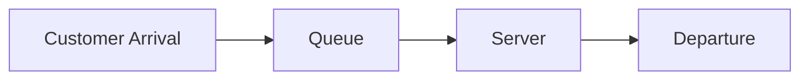

# Introduction: Why Is the Other Line Always Faster?

When lining up at a cash register in a supermarket or convenience store, have you ever felt that the line next to yours is moving faster than the one you chose? This is often dismissed as a mere psychological illusion (Murphy's Law), but in fact, there is mathematical backing for it.

Because there are more lines that you are not in, probabilistically, the chance that "some other line moves faster than yours" is very high. In this way, the mathematical approach to clarifying the gap between intuition and probability/statistics, and optimizing the efficiency of the entire system, is "Queuing Theory". In this article, we will thoroughly explain queuing theory from its history, Kendall's notation, the proof of Little's Law, Python simulation, and its applications to modern IT infrastructure.

## 1. The Historical Background of Queuing Theory: A.K. Erlang's Challenge

Queuing theory was founded in 1909 by **Agner Krarup Erlang**, a Danish mathematician and engineer. Working for the Copenhagen Telephone Company, he faced a practical problem: "How many circuits should a telephone exchange provide to offer calls without keeping customers waiting?"

At that time, telephone operators manually plugged in connections to route calls. If the number of lines was too small, the probability of "busy" signals would increase, dropping customer satisfaction. On the other hand, needlessly increasing the number of lines would incur enormous costs. To solve this trade-off, Erlang modeled the arrival of phone calls and call durations using the Poisson distribution and exponential distribution, deriving the Erlang formulas (Erlang B formula / Erlang C formula). This was the birth of queuing theory.

## 2. Basic Concepts of Queuing

A queuing system consists of the following three main elements.



1. **Arrival Process**: The interval at which customers (or tasks, packets, etc.) arrive at the system. It is often modeled as a Poisson process (arrival intervals follow an exponential distribution).
2. **Service Process**: The time it takes to provide the service. This is also modeled using an exponential distribution or a general distribution.
3. **Number of Servers**: The number of registers or servers processing customers.

### Kendall's Notation

To classify queuing models, David Kendall proposed "Kendall's Notation" in 1953. It generally takes the form `A/B/C/K/N/D`, but is often abbreviated as `A/B/C`.

- **A (Arrival)**: Probability distribution of arrival intervals (e.g., M = Markovian/Exponential, D = Deterministic, G = General)
- **B (Service)**: Probability distribution of service times (e.g., M, D, G)
- **C (Servers)**: Number of servers
- **K (Capacity)**: Maximum capacity of the system (omitted when infinite $\infty$)
- **N (Population)**: Size of the population (omitted when infinite $\infty$)
- **D (Discipline)**: Service discipline (e.g., FCFS = First Come First Served, LCFS = Last Come First Served, omitted when FCFS)

The most basic and famous model is the **M/M/1** model. This means "exponentially distributed arrival intervals (M)", "exponentially distributed service times (M)", and "1 server (1)".

## 3. Mathematical Analysis of the M/M/1 Model

Let's unravel the M/M/1 queuing system using formulas.

### Parameter Definitions

- $\lambda$ (Lambda): **Average arrival rate**. The average number of customers arriving per unit of time.
- $\mu$ (Mu): **Average service rate**. The average number of customers that can be processed per unit of time.
- $\rho$ (Rho): **Traffic density (Utilization)**. $\rho = \lambda / \mu$.

For the system to operate stably, it must be **$\rho < 1$** (that is, $\lambda < \mu$). If $\rho \ge 1$, customer arrivals exceed processing capacity, and the queue will grow infinitely long.

### Key Formulas

When the M/M/1 model is in a steady state, the following important metrics can be derived.

1. **Average number of customers in the system ($L$)**: The sum of people waiting in the queue and being served.
   $$ L = \frac{\rho}{1 - \rho} = \frac{\lambda}{\mu - \lambda} $$

2. **Average time spent in the system ($W$)**: The time from when a customer arrives to when they finish service and depart.
   $$ W = \frac{L}{\lambda} = \frac{1}{\mu - \lambda} $$

3. **Average length of the queue ($L_q$)**: The average number of people actually waiting in line.
   $$ L_q = L - \rho = \frac{\rho^2}{1 - \rho} $$

4. **Average waiting time ($W_q$)**: The time from when a customer joins the queue until they start receiving service.
   $$ W_q = \frac{L_q}{\lambda} = \frac{\rho}{\mu - \lambda} $$

### The Trap of Utilization: Why Queues Suddenly Grow

Focus on the formula $L = \rho / (1 - \rho)$.
- When $\rho = 0.5$ (50% utilization), $L = 1$ person.
- When $\rho = 0.8$ (80% utilization), $L = 4$ people.
- When $\rho = 0.9$ (90% utilization), $L = 9$ people.
- When $\rho = 0.95$ (95% utilization), $L = 19$ people.

Once utilization exceeds 90%, even a slight increase in arrival rate causes the queue length to explode. This mathematically proves the iron rule of IT infrastructure in server and system load testing: "It is dangerous to keep CPU utilization constantly at 95%." Having a margin (buffer) is essential for stable operation.

## 4. Little's Law

One of the most powerful and universal theorems in queuing theory is "Little's Law." It was proven by John Little in 1961.

**Statement of the Law:**
In a system in a steady state, the average number of customers in the system ($L$) is equal to the product of the arrival rate ($\lambda$) and the average time a customer spends in the system ($W$).

$$ L = \lambda \times W $$

### Why is this law amazing?

The greatness of Little's Law lies in the fact that **it does not depend on the internal structure or probability distributions of the system**. Whether it's M/M/1 or G/G/k, FCFS or LCFS, as long as the system is in a steady state, it always holds true.

**Example: A Coffee Shop**
Suppose a cafe has an average of 60 customers arriving per hour ($\lambda = 60 \text{ people/hour} = 1 \text{ person/minute}$). Customers stay in the shop for an average of 20 minutes ($W = 20 \text{ minutes}$).
At this time, the average number of customers in the shop $L$ is:
$L = 1 \text{ person/minute} \times 20 \text{ minutes} = 20 \text{ people}$
Thus, we can predict that about 20 seats will always be occupied. In this way, even for a black-box system, its internal state can be estimated from externally observable metrics.

## 5. Queuing Simulation with Python

Instead of just theory, let's actually run a program to confirm it. We will simulate an M/M/1 queue using Python's event-driven simulation library `simpy`.

```python
import simpy
import random
import statistics

# Parameter settings
ARRIVAL_RATE = 2.0      # Arrival rate (lambda): 2 people per minute
SERVICE_RATE = 2.5      # Service rate (mu): can process 2.5 people per minute
SIM_TIME = 10000        # Simulation time (minutes)

wait_times = []

def customer(env, name, server):
    """Define customer behavior"""
    arrival_time = env.now
    
    # Request a server
    with server.request() as request:
        yield request
        
        # Record wait time
        wait_time = env.now - arrival_time
        wait_times.append(wait_time)
        
        # Receive service (exponential distribution)
        service_time = random.expovariate(SERVICE_RATE)
        yield env.timeout(service_time)

def setup(env):
    """System setup and customer generation"""
    server = simpy.Resource(env, capacity=1) # 1 server for M/M/1
    
    i = 0
    while True:
        # Time until next customer arrival (exponential distribution)
        yield env.timeout(random.expovariate(ARRIVAL_RATE))
        i += 1
        env.process(customer(env, f'Customer {i}', server))

# Run the simulation
print("Starting simulation...")
random.seed(42)
env = simpy.Environment()
env.process(setup(env))
env.run(until=SIM_TIME)

# Calculate results and compare with theoretical values
avg_wait_sim = statistics.mean(wait_times)

# Calculate theoretical values
rho = ARRIVAL_RATE / SERVICE_RATE
l_q = (rho ** 2) / (1 - rho)
w_q_theory = l_q / ARRIVAL_RATE

print(f"--- Results ---")
print(f"Average wait time in simulation: {avg_wait_sim:.4f} minutes")
print(f"Theoretical average wait time (W_q): {w_q_theory:.4f} minutes")
```

When you run this code, you can see that the simulation results converge very closely to the theoretical value $W_q$. Even for complex models like M/G/1 or multi-server setups that are difficult to solve analytically, you can predict performance using simulations like this.

## 6. Applications to IT Infrastructure

Queuing theory is an indispensable concept in the design of modern computer science and IT infrastructure.

### 1. Web Server Load Balancing
The arrival of web requests (HTTP requests) is a classic queuing model. When a single server (M/M/1) cannot process them all, a load balancer is introduced to distribute requests across multiple servers. This is analyzed as an M/M/c model, and you can calculate how many servers need to be running to keep the average response time below a target value.

### 2. Network Routing and Packet Loss
Inside internet routers, there is a buffer (memory) that stores packets waiting to be sent. This can be viewed as a queue with limited capacity (M/M/1/K). Packets that arrive when the buffer is full are discarded (dropped). Using queuing theory, you can determine the buffer size required to meet an allowable packet loss rate.

### 3. Auto-scaling in Cloud Computing
Cloud environments like AWS and GCP use auto-scaling, which automatically scales servers up or down based on traffic. The rule to add servers when the utilization $\rho$ exceeds a certain threshold (e.g., 70%) is based on the queuing property that "wait times diverge as utilization approaches 1."

## Conclusion: Overcoming Daily Frustrations with Formulas

The question that started with "Why does the other line always seem faster?" leads to a universal law governing all forms of "waiting" in the world, from communication networks and traffic jams to hospital waiting rooms and the optimization of cutting-edge cloud servers.

The "wait times" that frustrate us in our daily lives are, when viewed from the perspective of the entire system, nothing more than mathematical phenomena behaving orderly according to Little's Law and Poisson distributions. The next time you find yourself in a long line, instead of getting frustrated, why not observe it by asking, "What is the current arrival rate $\lambda$?" or "The utilization $\rho$ must be close to the limit." It might make the wait time feel just a little richer.
