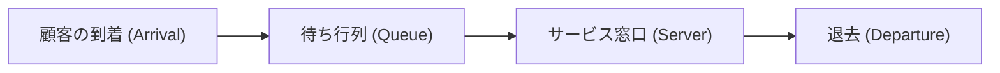

# Introducción: ¿Por qué la caja de al lado siempre es más rápida?

¿Alguna vez has sentido, al hacer fila en la caja de un supermercado o tienda de conveniencia, que la fila de al lado avanza más rápido que la que tú elegiste? Esto suele descartarse como una simple ilusión psicológica (la Ley de Murphy), pero en realidad existe un respaldo matemático.

Dado que hay más filas en las que no estás formado, probabilísticamente la posibilidad de que "alguna fila diferente a la tuya avance más rápido" es muy alta. De esta manera, el enfoque matemático que clarifica la discrepancia entre la intuición y la probabilidad/estadística, con el fin de optimizar la eficiencia de todo el sistema, es la "Teoría de colas" (Queuing Theory). En este artículo, explicaremos a fondo desde la historia de la teoría de colas, la notación de Kendall, la prueba de la Ley de Little, una simulación en Python, hasta sus aplicaciones en la infraestructura de TI moderna.

## 1. Contexto histórico de la teoría de colas: El desafío de A.K. Erlang

La teoría de colas fue fundada en 1909 por el matemático e ingeniero danés **Agner Krarup Erlang**. Trabajaba en la Compañía de Teléfonos de Copenhague y se enfrentaba a un problema real: "¿Cuántas líneas debe preparar el conmutador de una central telefónica para ofrecer llamadas sin hacer esperar a los clientes?".

En los teléfonos de aquella época, los operadores insertaban manualmente enchufes para conectar las líneas. Si el número de líneas era muy bajo, aumentaba la probabilidad de escuchar "ocupado" y disminuía la satisfacción del cliente. Por otro lado, si se aumentaban las líneas innecesariamente, los costos se disparaban. Para resolver este compromiso (trade-off), Erlang utilizó la distribución de Poisson y la distribución exponencial para modelar la llegada de llamadas telefónicas y el tiempo de conversación, derivando las fórmulas de Erlang (Erlang B formula / Erlang C formula). Este fue el nacimiento de la teoría de colas.

## 2. Conceptos básicos de las colas

Un sistema de colas está compuesto por los siguientes 3 elementos principales:



1. **Proceso de llegada (Arrival Process)**: El intervalo en el que los clientes (o tareas, paquetes, etc.) llegan al sistema. En muchos casos, se modela como un proceso de Poisson (los intervalos de llegada siguen una distribución exponencial).
2. **Proceso de servicio (Service Process)**: El tiempo que toma proporcionar un servicio. Esto también se modela utilizando distribuciones exponenciales o distribuciones generales.
3. **Número de servidores (Number of Servers)**: El número de cajas o servidores que procesan a los clientes.

### Notación de Kendall (Kendall's Notation)

Para clasificar los modelos de colas, la notación propuesta por David Kendall en 1953 es la "Notación de Kendall". Generalmente toma el formato `A/B/C/K/N/D`, pero a menudo se abrevia como `A/B/C`.

- **A (Arrival/Llegada)**: Distribución de probabilidad de los intervalos de llegada (ej.: M = Markoviana/Exponencial, D = Determinista/Constante, G = Distribución general)
- **B (Service/Servicio)**: Distribución de probabilidad del tiempo de servicio (ej.: M, D, G)
- **C (Servers/Servidores)**: Número de ventanillas (servidores)
- **K (Capacity/Capacidad)**: Capacidad máxima del sistema (si se omite, es infinito $\infty$)
- **N (Population/Población)**: Tamaño de la población base (si se omite, es infinito $\infty$)
- **D (Discipline/Disciplina)**: Disciplina de servicio (ej.: FCFS = Primero en llegar, primero en ser servido; LCFS = Último en llegar, primero en ser servido; si se omite es FCFS)

El modelo más básico y famoso es el modelo **M/M/1**. Esto significa que "el intervalo de llegada sigue una distribución exponencial (M)", "el tiempo de servicio sigue una distribución exponencial (M)" y "hay una ventanilla (1)".

## 3. Análisis matemático del modelo M/M/1

Desentrañemos el sistema de colas M/M/1 utilizando fórmulas matemáticas.

### Definición de parámetros

- $\lambda$ (Lambda): **Tasa de llegada media**. Número promedio de clientes que llegan por unidad de tiempo.
- $\mu$ (Mu): **Tasa de servicio media**. Número promedio de clientes que pueden ser procesados por unidad de tiempo.
- $\rho$ (Rho): **Intensidad de tráfico (Utilización)**. $\rho = \lambda / \mu$.

Para que el sistema opere de manera estable, debe cumplirse invariablemente que **$\rho < 1$** (es decir, $\lambda < \mu$). Si $\rho \ge 1$, la llegada de clientes superará la capacidad de procesamiento y la cola se volverá infinitamente larga.

### Fórmulas principales

Cuando el modelo M/M/1 está en estado estacionario, se pueden derivar los siguientes indicadores importantes:

1. **Número medio de clientes en el sistema ($L$)**: La suma de las personas formadas en la cola y las que están recibiendo el servicio.
   $$ L = \frac{\rho}{1 - \rho} = \frac{\lambda}{\mu - \lambda} $$

2. **Tiempo medio de estancia en el sistema ($W$)**: El tiempo transcurrido desde que un cliente llega hasta que termina el servicio y se va.
   $$ W = \frac{L}{\lambda} = \frac{1}{\mu - \lambda} $$

3. **Longitud media de la cola ($L_q$)**: El número medio de personas que realmente están esperando en fila.
   $$ L_q = L - \rho = \frac{\rho^2}{1 - \rho} $$

4. **Tiempo medio de espera ($W_q$)**: El tiempo que transcurre desde que un cliente se forma en la cola hasta que empieza a recibir el servicio.
   $$ W_q = \frac{L_q}{\lambda} = \frac{\rho}{\mu - \lambda} $$

### La trampa de la utilización: ¿Por qué la cola crece de repente?

Preste atención a la fórmula $L = \rho / (1 - \rho)$.
- Cuando $\rho = 0.5$ (tasa de utilización del 50%), $L = 1$ persona.
- Cuando $\rho = 0.8$ (tasa de utilización del 80%), $L = 4$ personas.
- Cuando $\rho = 0.9$ (tasa de utilización del 90%), $L = 9$ personas.
- Cuando $\rho = 0.95$ (tasa de utilización del 95%), $L = 19$ personas.

Cuando la tasa de utilización supera el 90%, un ligero aumento en la tasa de llegada provoca que la longitud de la cola se incremente explosivamente. Esto demuestra matemáticamente la regla de oro de la infraestructura de TI en las pruebas de carga de servidores y sistemas: "Mantener el uso de la CPU siempre al 95% es peligroso". Tener un margen (búfer) es indispensable para una operación estable.

## 4. Ley de Little (Little's Law)

Uno de los teoremas más poderosos y universales en la teoría de colas es la "Ley de Little". Fue probada por John Little en 1961.

**Enunciado de la ley:**
En un sistema en estado estacionario, el número medio de clientes en el sistema ($L$) es igual al producto de la tasa de llegada ($\lambda$) y el tiempo medio de estancia del cliente ($W$).

$$ L = \lambda \times W $$

### ¿Por qué esta ley es tan asombrosa?

La grandeza de la Ley de Little radica en que **no depende en absoluto de la estructura interna del sistema ni de su distribución de probabilidad**. Ya sea M/M/1, G/G/k, por orden de llegada (FCFS) o el último en llegar, primero en ser servido (LCFS), siempre se cumple mientras el sistema esté en estado estacionario.

**Ejemplo concreto: Una cafetería**
Supongamos que una cafetería recibe una media de 60 clientes por hora ($\lambda = 60 \text{ personas/hora} = 1 \text{ persona/minuto}$). En promedio, los clientes permanecen en el local 20 minutos ($W = 20 \text{ minutos}$).
En este caso, el número medio de clientes en el local $L$ es:
$L = 1 \text{ persona/minuto} \times 20 \text{ minutos} = 20 \text{ personas}$
Como resultado, se puede predecir que siempre habrá unos 20 asientos ocupados. De este modo, incluso en un sistema de caja negra, se puede estimar el estado interno utilizando indicadores observables desde el exterior.

## 5. Simulación de colas con Python

Además de la teoría, intentemos confirmar esto ejecutando un programa real. Simularemos una cola M/M/1 utilizando `simpy`, una biblioteca de simulación basada en eventos para Python.

```python
import simpy
import random
import statistics

# Configuración de parámetros
ARRIVAL_RATE = 2.0      # Tasa de llegada (lambda) : 2 personas por minuto
SERVICE_RATE = 2.5      # Tasa de servicio (mu) : puede procesar 2.5 personas por minuto
SIM_TIME = 10000        # Tiempo de simulación (minutos)

wait_times = []

def customer(env, name, server):
    """Define el comportamiento del cliente"""
    arrival_time = env.now
    
    # Solicitar el servidor
    with server.request() as request:
        yield request
        
        # Registrar el tiempo de espera
        wait_time = env.now - arrival_time
        wait_times.append(wait_time)
        
        # Recibir servicio (distribución exponencial)
        service_time = random.expovariate(SERVICE_RATE)
        yield env.timeout(service_time)

def setup(env):
    """Configuración del sistema y generación de clientes"""
    server = simpy.Resource(env, capacity=1) # La ventanilla M/M/1 es 1
    
    i = 0
    while True:
        # Tiempo hasta la llegada del siguiente cliente (distribución exponencial)
        yield env.timeout(random.expovariate(ARRIVAL_RATE))
        i += 1
        env.process(customer(env, f'Customer {i}', server))

# Ejecución de la simulación
print("Iniciando la simulación...")
random.seed(42)
env = simpy.Environment()
env.process(setup(env))
env.run(until=SIM_TIME)

# Cálculo de resultados y comparación con valores teóricos
avg_wait_sim = statistics.mean(wait_times)

# Cálculo de los valores teóricos
rho = ARRIVAL_RATE / SERVICE_RATE
l_q = (rho ** 2) / (1 - rho)
w_q_theory = l_q / ARRIVAL_RATE

print(f"--- Resultados ---")
print(f"Tiempo medio de espera en la simulación: {avg_wait_sim:.4f} min")
print(f"Tiempo medio de espera teórico (W_q)   : {w_q_theory:.4f} min")
```

Al ejecutar este código, se puede confirmar que los resultados de la simulación convergen a un valor muy cercano al valor teórico $W_q$. Incluso para modelos M/G/1 o de múltiples servidores, en los cuales el sistema se vuelve complejo y difícil de resolver analíticamente, el rendimiento se puede predecir utilizando simulaciones de esta manera.

## 6. Aplicaciones en la infraestructura de TI

La teoría de colas es un concepto indispensable en el diseño de las ciencias de la computación modernas y la infraestructura de TI.

### 1. Balanceo de carga en servidores web
La llegada de solicitudes web (solicitudes HTTP) es un modelo de colas típico. Cuando un servidor (M/M/1) no puede con el procesamiento, se introduce un balanceador de carga (load balancer) para distribuir las solicitudes a múltiples servidores. Esto se analiza como un modelo M/M/c, permitiendo calcular cuántos servidores deben estar operando para mantener el tiempo medio de respuesta por debajo de un valor objetivo.

### 2. Enrutamiento de red y pérdida de paquetes
Dentro de un enrutador de internet hay un búfer (memoria) donde se almacenan los paquetes en espera de ser enviados. Esto se puede considerar como una cola de capacidad finita (M/M/1/K). Los paquetes que llegan cuando el búfer está lleno son descartados (dropeados). Mediante el uso de la teoría de colas, se puede determinar el tamaño de búfer necesario para cumplir con la tasa aceptable de pérdida de paquetes.

### 3. Autoescalado en la computación en la nube
En entornos en la nube como AWS y GCP, se utiliza el autoescalado, el cual aumenta o disminuye automáticamente los servidores según el tráfico. La regla de agregar un servidor cuando la utilización $\rho$ excede un cierto umbral (ej.: 70%) se basa en la propiedad de las colas de que "el tiempo de espera diverge a medida que la utilización se acerca a 1".

## Conclusión: Superando las frustraciones diarias con fórmulas matemáticas

La pregunta que comenzó con "¿Por qué la caja de al lado siempre parece más rápida?" estaba conectada con la ley universal que rige todo tipo de "esperas" alrededor del mundo, desde redes de comunicaciones, congestiones de tráfico y salas de espera de hospitales, hasta la optimización de servidores en la nube de vanguardia.

El "tiempo de espera" que nos frustra en nuestra vida diaria es también, visto desde la perspectiva de todo el sistema, nada más que un fenómeno matemático que se comporta de manera ordenada siguiendo la Ley de Little y la distribución de Poisson. La próxima vez que te formes en una larga fila, en lugar de frustrarte, ¿por qué no intentas observar preguntándote: "¿Cuál será la tasa de llegada $\lambda$ actual?" o "La utilización $\rho$ está cerca de su límite"? Podrías llegar a sentir que tu tiempo de espera es un poco más enriquecedor.
