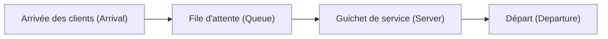

# Introduction : pourquoi la caisse d'à côté est-elle toujours plus rapide ?

Lorsque vous faites la queue dans un supermarché ou une supérette, n'avez-vous jamais eu l'impression que la file d'à côté avance plus vite que celle que vous avez choisie ? On a souvent tendance à reléguer cela à une simple illusion psychologique (loi de Murphy), mais il existe en réalité une justification mathématique.

Puisqu'il y a plus de files dans lesquelles vous ne vous trouvez pas, la probabilité que « l'une des autres files avance plus vite que la vôtre » est statistiquement très élevée. Ainsi, l'approche mathématique visant à clarifier l'écart entre notre intuition et les probabilités/statistiques pour optimiser l'efficacité globale du système s'appelle la « Théorie des files d'attente (Queuing Theory) ». Dans cet article, nous expliquerons en détail l'histoire de la théorie des files d'attente, la notation de Kendall, la preuve de la loi de Little, des simulations en Python, et enfin, son application à l'infrastructure informatique moderne.

## 1. Contexte historique de la théorie des files d'attente : le défi de A.K. Erlang

La théorie des files d'attente a été fondée en 1909 par le mathématicien et ingénieur danois **Agner Krarup Erlang**. Il travaillait pour la compagnie de téléphone de Copenhague et faisait face à un problème concret : « Combien de lignes le central téléphonique doit-il préparer pour offrir des appels sans faire attendre les clients ? »

À l'époque, les opérateurs connectaient manuellement les lignes en branchant des fiches. Si le nombre de lignes était trop faible, la probabilité de sonner « occupé » augmentait, faisant chuter la satisfaction client. À l'inverse, un nombre de lignes inutilement élevé engendrait des coûts énormes. Pour résoudre ce compromis, Erlang a utilisé la distribution de Poisson et la distribution exponentielle pour modéliser l'arrivée des appels téléphoniques et le temps de communication, en déduisant les formules d'Erlang (Erlang B formula / Erlang C formula). C'est ainsi qu'est née la théorie des files d'attente.

## 2. Concepts de base des files d'attente

Un système de file d'attente se compose des 3 éléments principaux suivants :



1. **Processus d'arrivée (Arrival Process)** : L'intervalle auquel les clients (ou tâches, paquets, etc.) arrivent dans le système. Dans la plupart des cas, il est modélisé comme un processus de Poisson (où l'intervalle d'arrivée suit une distribution exponentielle).
2. **Processus de service (Service Process)** : Le temps nécessaire pour fournir le service. Cela est également modélisé à l'aide de distributions exponentielles ou générales.
3. **Nombre de guichets (Number of Servers)** : Le nombre de caisses ou de serveurs traitant les clients.

### Notation de Kendall (Kendall's Notation)

Pour classer les modèles de files d'attente, la notation proposée par David Kendall en 1953 est appelée « Notation de Kendall ». Elle prend généralement la forme `A/B/C/K/N/D`, mais est souvent abrégée en `A/B/C`.

- **A (Arrival)** : Distribution de probabilité de l'intervalle d'arrivée (ex. M = Markovien/Exponentiel, D = Déterministe, G = Général)
- **B (Service)** : Distribution de probabilité du temps de service (ex. M, D, G)
- **C (Servers)** : Nombre de guichets (serveurs)
- **K (Capacity)** : Capacité maximale du système (si omise, l'infini $\infty$)
- **N (Population)** : Taille de la population (si omise, l'infini $\infty$)
- **D (Discipline)** : Discipline de service (ex. FCFS = Premier arrivé, premier servi, LCFS = Dernier arrivé, premier servi, si omise FCFS)

Le modèle le plus fondamental et célèbre est le modèle **M/M/1**. Cela signifie que « l'intervalle d'arrivée est une distribution exponentielle (M) », « le temps de service est une distribution exponentielle (M) » et qu'il y a « 1 guichet ».

## 3. Analyse mathématique du modèle M/M/1

Décryptons le système de file d'attente M/M/1 à travers des formules.

### Définition des paramètres

- $\lambda$ (Lambda) : **Taux d'arrivée moyen**. Le nombre moyen de clients arrivant par unité de temps.
- $\mu$ (Mu) : **Taux de service moyen**. Le nombre moyen de clients pouvant être traités par unité de temps.
- $\rho$ (Rho) : **Intensité du trafic (Taux d'utilisation)**. $\rho = \lambda / \mu$.

Pour que le système fonctionne de manière stable, il faut impérativement que **$\rho < 1$** (c'est-à-dire $\lambda < \mu$). Si $\rho \ge 1$, l'arrivée des clients dépasse la capacité de traitement, et la file s'allonge à l'infini.

### Formules principales

Lorsque le modèle M/M/1 est en état stationnaire, nous pouvons dériver les indicateurs importants suivants :

1. **Nombre moyen de clients dans le système ($L$)** : Le total des personnes faisant la queue et de celles recevant le service.
   $$ L = \frac{\rho}{1 - \rho} = \frac{\lambda}{\mu - \lambda} $$

2. **Temps de séjour moyen dans le système ($W$)** : Le temps écoulé entre l'arrivée du client et son départ après avoir reçu le service.
   $$ W = \frac{L}{\lambda} = \frac{1}{\mu - \lambda} $$

3. **Longueur moyenne de la file d'attente ($L_q$)** : Le nombre moyen de personnes qui font effectivement la queue.
   $$ L_q = L - \rho = \frac{\rho^2}{1 - \rho} $$

4. **Temps d'attente moyen ($W_q$)** : Le temps écoulé entre le moment où le client se met dans la file et le début du service.
   $$ W_q = \frac{L_q}{\lambda} = \frac{\rho}{\mu - \lambda} $$

### Le piège du taux d'utilisation : pourquoi la file s'allonge-t-elle soudainement ?

Prêtez attention à la formule $L = \rho / (1 - \rho)$.
- Lorsque $\rho = 0.5$ (taux d'utilisation de 50 %), $L = 1$ personne.
- Lorsque $\rho = 0.8$ (taux d'utilisation de 80 %), $L = 4$ personnes.
- Lorsque $\rho = 0.9$ (taux d'utilisation de 90 %), $L = 9$ personnes.
- Lorsque $\rho = 0.95$ (taux d'utilisation de 95 %), $L = 19$ personnes.

Lorsque le taux d'utilisation dépasse 90 %, une légère augmentation du taux d'arrivée allonge la file de manière explosive. Cela prouve mathématiquement la règle d'or de l'infrastructure informatique lors des tests de charge : « Il est dangereux de maintenir l'utilisation du processeur constamment à 95 % ». Prévoir de la marge (un buffer) est indispensable pour un fonctionnement stable.

## 4. Loi de Little (Little's Law)

L'un des théorèmes les plus puissants et universels de la théorie des files d'attente est la « loi de Little ». Elle a été prouvée par John Little en 1961.

**Énoncé de la loi :**
Dans un système en état stationnaire, le nombre moyen de clients dans le système ($L$) est égal au produit du taux d'arrivée ($\lambda$) et du temps de séjour moyen d'un client ($W$).

$$ L = \lambda \times W $$

### Pourquoi cette loi est-elle si exceptionnelle ?

La grandeur de la loi de Little réside dans le fait qu'elle **ne dépend absolument pas de la structure interne du système ou des distributions de probabilité**. Qu'il s'agisse de M/M/1, de G/G/k, du premier arrivé premier servi (FCFS) ou du dernier arrivé premier servi (LCFS), la loi est toujours vraie tant que le système est dans un état stationnaire.

**Exemple concret : Un café**
Supposons qu'un café accueille en moyenne 60 clients par heure ($\lambda = 60 \text{ personnes/heure} = 1 \text{ personne/minute}$). Les clients restent en moyenne 20 minutes dans le café ($W = 20 \text{ minutes}$).
Dans ce cas, le nombre moyen de clients présents dans le café $L$ est :
$L = 1 \text{ personne/minute} \times 20 \text{ minutes} = 20 \text{ personnes}$
On peut donc prédire qu'il y aura toujours environ 20 places occupées. Ainsi, même pour un système de type boîte noire, il est possible d'estimer l'état interne grâce à des indicateurs observables de l'extérieur.

## 5. Simulation de files d'attente avec Python

Au-delà de la théorie, vérifions en exécutant un programme. Nous allons simuler une file d'attente M/M/1 en utilisant `simpy`, une bibliothèque Python de simulation événementielle.

```python
import simpy
import random
import statistics

# Paramètres
ARRIVAL_RATE = 2.0      # Taux d'arrivée (lambda) : 2 personnes par minute
SERVICE_RATE = 2.5      # Taux de service (mu) : 2.5 personnes traitées par minute
SIM_TIME = 10000        # Temps de simulation (minutes)

wait_times = []

def customer(env, name, server):
    """Définit le comportement du client"""
    arrival_time = env.now
    
    # Demander le serveur
    with server.request() as request:
        yield request
        
        # Enregistrer le temps d'attente
        wait_time = env.now - arrival_time
        wait_times.append(wait_time)
        
        # Recevoir le service (distribution exponentielle)
        service_time = random.expovariate(SERVICE_RATE)
        yield env.timeout(service_time)

def setup(env):
    """Configuration du système et génération des clients"""
    server = simpy.Resource(env, capacity=1) # 1 guichet pour M/M/1
    
    i = 0
    while True:
        # Temps avant l'arrivée du prochain client (distribution exponentielle)
        yield env.timeout(random.expovariate(ARRIVAL_RATE))
        i += 1
        env.process(customer(env, f'Customer {i}', server))

# Exécution de la simulation
print("Début de la simulation...")
random.seed(42)
env = simpy.Environment()
env.process(setup(env))
env.run(until=SIM_TIME)

# Calcul des résultats et comparaison avec la valeur théorique
avg_wait_sim = statistics.mean(wait_times)

# Calcul de la valeur théorique
rho = ARRIVAL_RATE / SERVICE_RATE
l_q = (rho ** 2) / (1 - rho)
w_q_theory = l_q / ARRIVAL_RATE

print(f"--- Résultats ---")
print(f"Temps d'attente moyen en simulation : {avg_wait_sim:.4f} minutes")
print(f"Temps d'attente moyen théorique (W_q) : {w_q_theory:.4f} minutes")
```

En exécutant ce code, on peut confirmer que le résultat de la simulation converge vers une valeur très proche de la valeur théorique $W_q$. Même pour des modèles plus complexes et difficiles à résoudre analytiquement, comme M/G/1 ou des modèles à plusieurs serveurs, de telles simulations permettent de prédire les performances.

## 6. Application à l'infrastructure informatique

La théorie des files d'attente est un concept indispensable dans l'informatique moderne et la conception d'infrastructures IT.

### 1. Répartition de charge (Load Balancing) des serveurs Web
L'arrivée de requêtes Web (requêtes HTTP) est un modèle de file d'attente typique. Lorsqu'un seul serveur (M/M/1) ne peut pas tout traiter, un équilibreur de charge est introduit pour répartir les requêtes sur plusieurs serveurs. Cela est analysé comme un modèle M/M/c, ce qui permet de calculer combien de serveurs doivent être exécutés pour maintenir le temps de réponse moyen en dessous d'une valeur cible.

### 2. Routage réseau et perte de paquets
À l'intérieur des routeurs Internet se trouvent des tampons (mémoire) où sont stockés les paquets en attente de transmission. Cela peut être considéré comme une file d'attente à capacité limitée (M/M/1/K). Les paquets qui arrivent lorsque le tampon est plein sont rejetés (droppés). L'utilisation de la théorie des files d'attente permet de déterminer la taille de tampon nécessaire pour satisfaire un taux de perte de paquets toléré.

### 3. Mise à l'échelle automatique (Auto-scaling) dans le Cloud Computing
Dans les environnements cloud comme AWS ou GCP, on utilise l'auto-scaling, qui augmente ou diminue automatiquement le nombre de serveurs en fonction du trafic. La règle consistant à ajouter des serveurs lorsque le taux d'utilisation $\rho$ dépasse un certain seuil (ex: 70 %) est basée sur la propriété des files d'attente selon laquelle « le temps d'attente diverge lorsque le taux d'utilisation s'approche de 1 ».

## Conclusion : surmonter les frustrations quotidiennes grâce aux mathématiques

La question qui a débuté par « Pourquoi la file d'à côté semble-t-elle toujours avancer plus vite ? » est liée à une loi universelle régissant toute « attente » dans le monde, allant des réseaux de télécommunication et embouteillages aux salles d'attente des hôpitaux, jusqu'à l'optimisation des serveurs cloud de pointe.

Nos « temps d'attente » qui nous frustrent au quotidien ne sont, vus du point de vue global du système, que des phénomènes mathématiques qui se comportent de manière ordonnée selon la loi de Little et la distribution de Poisson. La prochaine fois que vous ferez la queue dans une longue file, au lieu de vous énerver, pourquoi ne pas observer et vous demander : « Quel est le taux d'arrivée $\lambda$ actuel ? » ou « Le taux d'utilisation $\rho$ est presque à sa limite ». Le temps d'attente pourrait bien vous sembler un peu plus enrichissant.
