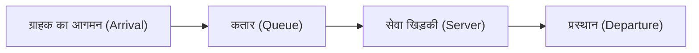

# परिचय: क्यों बगल वाली कतार हमेशा तेज होती है?

जब आप किसी सुपरमार्केट या सुविधा स्टोर में चेकआउट के लिए कतार में खड़े होते हैं, तो क्या आपने कभी महसूस किया है कि आपने जिस कतार को चुना है, उसकी तुलना में बगल वाली कतार तेजी से आगे बढ़ रही है? इसे अक्सर केवल एक मनोवैज्ञानिक भ्रम (मर्फी का नियम) के रूप में खारिज कर दिया जाता है, लेकिन वास्तव में इसका एक गणितीय आधार है।

चूंकि ऐसी कतारें अधिक हैं जिनमें आप खड़े नहीं हैं, इसलिए सांख्यिकीय रूप से इस बात की बहुत अधिक संभावना है कि "आपकी कतार के अलावा कोई अन्य कतार आपकी कतार से अधिक तेजी से आगे बढ़ेगी।" इस प्रकार, "कतार सिद्धांत (Queuing Theory)" एक गणितीय दृष्टिकोण है जो अंतर्ज्ञान और संभाव्यता/सांख्यिकी के बीच के अंतर को स्पष्ट करता है और समग्र सिस्टम दक्षता को अनुकूलित करता है। इस लेख में, हम कतार सिद्धांत के इतिहास, केंडल के संकेतन, लिटिल के नियम के प्रमाण, पायथन का उपयोग करके सिमुलेशन, और आधुनिक आईटी बुनियादी ढांचे में इसके अनुप्रयोगों की विस्तार से व्याख्या करेंगे।

## 1. कतार सिद्धांत की ऐतिहासिक पृष्ठभूमि: ए.के. एरलैंग की चुनौती

कतार सिद्धांत की स्थापना 1909 में डेनिश गणितज्ञ और इंजीनियर **एग्नर क्रारुप एरलैंग (Agner Krarup Erlang)** द्वारा की गई थी। वह कोपेनहेगन टेलीफोन कंपनी के लिए काम करते थे और एक व्यावहारिक समस्या का सामना कर रहे थे: "ग्राहकों को प्रतीक्षा किए बिना कॉल प्रदान करने के लिए टेलीफोन एक्सचेंज में कितनी लाइनें तैयार की जानी चाहिए?"

उस समय, टेलीफोन ऑपरेटर मैन्युअल रूप से प्लग डालकर लाइनों को जोड़ते थे। यदि लाइनों की संख्या बहुत कम है, तो "व्यस्त (busy)" होने की संभावना बढ़ जाती है, जिससे ग्राहकों की संतुष्टि कम हो जाती है। दूसरी ओर, यदि अनावश्यक रूप से बहुत अधिक लाइनें हों, तो लागत बहुत बढ़ जाती है। इस ट्रेड-ऑफ़ को हल करने के लिए, एरलैंग ने कॉल के आगमन और कॉल की अवधि को मॉडल करने के लिए पॉइसन वितरण (Poisson distribution) और घातांकीय वितरण (exponential distribution) का उपयोग किया, और एरलैंग सूत्र (Erlang B formula / Erlang C formula) प्राप्त किया। यहीं से कतार सिद्धांत का जन्म हुआ।

## 2. कतारों की बुनियादी अवधारणाएं

एक कतार प्रणाली में निम्नलिखित 3 मुख्य तत्व होते हैं:



1. **आगमन प्रक्रिया (Arrival Process)**: वह अंतराल जिस पर ग्राहक (या कार्य, पैकेट, आदि) सिस्टम में आते हैं। इसे अक्सर पॉइसन प्रक्रिया (Poisson process) (जहां आगमन अंतराल घातांकीय वितरण का पालन करता है) के रूप में मॉडल किया जाता है।
2. **सेवा प्रक्रिया (Service Process)**: सेवा प्रदान करने में लगने वाला समय। इसे भी घातांकीय वितरण या सामान्य वितरण का उपयोग करके मॉडल किया जाता है।
3. **खिड़कियों/सर्वर की संख्या (Number of Servers)**: ग्राहकों को संभालने वाले कैश रजिस्टर या सर्वर की संख्या।

### केंडल का संकेतन (Kendall's Notation)

कतार मॉडल को वर्गीकृत करने के लिए 1953 में डेविड केंडल द्वारा प्रस्तावित अंकन को "केंडल का संकेतन" कहा जाता है। यह आम तौर पर `A/B/C/K/N/D` का रूप लेता है, लेकिन इसे अक्सर संक्षिप्त करके `A/B/C` लिखा जाता है।

- **A (Arrival)**: आगमन अंतराल का संभाव्यता वितरण (Probability distribution) (उदा: M = मार्कोवियन/घातांकीय वितरण, D = नियत (Deterministic), G = सामान्य वितरण)
- **B (Service)**: सेवा समय का संभाव्यता वितरण (उदा: M, D, G)
- **C (Servers)**: खिड़कियों (सर्वर) की संख्या
- **K (Capacity)**: सिस्टम की अधिकतम क्षमता (छोड़ दिए जाने पर अनंत $\infty$)
- **N (Population)**: जनसंख्या का आकार (छोड़ दिए जाने पर अनंत $\infty$)
- **D (Discipline)**: सेवा अनुशासन (उदा: FCFS = पहले आओ पहले पाओ, LCFS = अंत में आओ पहले पाओ, छोड़ दिए जाने पर FCFS)

सबसे बुनियादी और प्रसिद्ध मॉडल **M/M/1** मॉडल है। इसका मतलब है "आगमन अंतराल का घातांकीय वितरण है (M)", "सेवा समय का घातांकीय वितरण है (M)", और "केवल 1 सर्वर है (1)"।

## 3. M/M/1 मॉडल का गणितीय विश्लेषण

आइए गणितीय सूत्रों का उपयोग करके M/M/1 कतार प्रणाली को समझते हैं।

### पैरामीटर्स की परिभाषा

- $\lambda$ (लैम्ब्डा): **औसत आगमन दर (Mean Arrival Rate)**। प्रति इकाई समय में आने वाले ग्राहकों की औसत संख्या।
- $\mu$ (म्यू): **औसत सेवा दर (Mean Service Rate)**। प्रति इकाई समय में संभाले जा सकने वाले ग्राहकों की औसत संख्या।
- $\rho$ (रो): **ट्रैफिक घनत्व (उपयोगिता या Utilization)**। $\rho = \lambda / \mu$।

सिस्टम के सुचारू रूप से चलने के लिए, यह आवश्यक है कि **$\rho < 1$** (अर्थात $\lambda < \mu$) हो। यदि $\rho \ge 1$ है, तो ग्राहकों का आगमन प्रसंस्करण क्षमता से अधिक हो जाएगा, और कतार असीम रूप से लंबी हो जाएगी।

### मुख्य सूत्र

जब M/M/1 मॉडल स्थिर अवस्था (steady state) में होता है, तो निम्नलिखित महत्वपूर्ण मेट्रिक्स प्राप्त किए जा सकते हैं:

1. **सिस्टम में ग्राहकों की औसत संख्या ($L$)**: कतार में प्रतीक्षा कर रहे लोगों और सेवा प्राप्त कर रहे लोगों का कुल योग।
   $$ L = \frac{\rho}{1 - \rho} = \frac{\lambda}{\mu - \lambda} $$

2. **सिस्टम में औसत व्यतीत समय ($W$)**: ग्राहक के आने से लेकर सेवा समाप्त करके प्रस्थान करने तक का समय।
   $$ W = \frac{L}{\lambda} = \frac{1}{\mu - \lambda} $$

3. **कतार की औसत लंबाई ($L_q$)**: कतार में प्रतीक्षा कर रहे लोगों की औसत संख्या।
   $$ L_q = L - \rho = \frac{\rho^2}{1 - \rho} $$

4. **औसत प्रतीक्षा समय ($W_q$)**: ग्राहक के कतार में लगने से लेकर सेवा प्राप्त करना शुरू करने तक का समय।
   $$ W_q = \frac{L_q}{\lambda} = \frac{\rho}{\mu - \lambda} $$

### उपयोगिता का जाल (Utilization Trap): कतार अचानक लंबी क्यों हो जाती है?

सूत्र $L = \rho / (1 - \rho)$ पर ध्यान दें।
- जब $\rho = 0.5$ (उपयोगिता 50%), तो $L = 1$ व्यक्ति।
- जब $\rho = 0.8$ (उपयोगिता 80%), तो $L = 4$ व्यक्ति।
- जब $\rho = 0.9$ (उपयोगिता 90%), तो $L = 9$ व्यक्ति।
- जब $\rho = 0.95$ (उपयोगिता 95%), तो $L = 19$ व्यक्ति।

जब उपयोगिता दर 90% से अधिक हो जाती है, तो आगमन दर में मामूली वृद्धि से कतार की लंबाई में विस्फोटक रूप से वृद्धि होती है। यह आईटी बुनियादी ढांचे के उस सुनहरे नियम को गणितीय रूप से सिद्ध करता है कि सर्वर या सिस्टम लोड परीक्षण में "सीपीयू उपयोग को हर समय 95% पर रखना खतरनाक है।" स्थिर संचालन के लिए मार्जिन (बफर) रखना अनिवार्य है।

## 4. लिटिल का नियम (Little's Law)

कतार सिद्धांत में सबसे शक्तिशाली और सार्वभौमिक प्रमेयों में से एक "लिटिल का नियम" है। इसे 1961 में जॉन लिटिल द्वारा सिद्ध किया गया था।

**नियम का कथन:**
स्थिर अवस्था में किसी सिस्टम के लिए, सिस्टम में ग्राहकों की औसत संख्या ($L$), आगमन दर ($\lambda$) और ग्राहकों के औसत व्यतीत समय ($W$) के गुणनफल के बराबर होती है।

$$ L = \lambda \times W $$

### यह नियम इतना अद्भुत क्यों है?

लिटिल के नियम की महानता इस तथ्य में निहित है कि यह **सिस्टम की आंतरिक संरचना या संभाव्यता वितरण पर बिल्कुल निर्भर नहीं करता है**। चाहे वह M/M/1 हो, G/G/k हो, पहले आओ पहले पाओ (FCFS) हो, या अंत में आओ पहले पाओ (LCFS) हो, जब तक सिस्टम स्थिर अवस्था में है, यह हमेशा लागू होता है।

**उदाहरण: कॉफी शॉप**
मान लीजिए कि एक कैफे में प्रति घंटे औसतन 60 ग्राहक आते हैं ($\lambda = 60 \text{ व्यक्ति/घंटा} = 1 \text{ व्यक्ति/मिनट}$)। ग्राहक औसतन 20 मिनट तक कैफे में रुकते हैं ($W = 20 \text{ मिनट}$)।
इस समय, स्टोर में ग्राहकों की औसत संख्या $L$ होगी:
$L = 1 \text{ व्यक्ति/मिनट} \times 20 \text{ मिनट} = 20 \text{ व्यक्ति}$
और हम अनुमान लगा सकते हैं कि लगभग 20 सीटें हमेशा भरी रहेंगी। इस तरह, ब्लैक-बॉक्स सिस्टम में भी, बाहरी रूप से देखे जाने वाले संकेतकों का उपयोग करके आंतरिक स्थिति का अनुमान लगाया जा सकता है।

## 5. पायथन (Python) का उपयोग करके कतार सिमुलेशन

सिद्धांत के अलावा, आइए वास्तव में एक प्रोग्राम चलाकर इसकी पुष्टि करें। हम M/M/1 कतार का अनुकरण (सिमुलेट) करने के लिए पायथन के इवेंट-ड्रिवन सिमुलेशन लाइब्रेरी `simpy` का उपयोग करेंगे।

```python
import simpy
import random
import statistics

# पैरामीटर सेटिंग्स
ARRIVAL_RATE = 2.0      # आगमन दर (lambda) : 2 व्यक्ति प्रति मिनट
SERVICE_RATE = 2.5      # सेवा दर (mu) : 2.5 व्यक्ति प्रति मिनट संसाधित किए जा सकते हैं
SIM_TIME = 10000        # सिमुलेशन समय (मिनट)

wait_times = []

def customer(env, name, server):
    """ग्राहक के व्यवहार को परिभाषित करें"""
    arrival_time = env.now
    
    # सर्वर से अनुरोध करें
    with server.request() as request:
        yield request
        
        # प्रतीक्षा समय रिकॉर्ड करें
        wait_time = env.now - arrival_time
        wait_times.append(wait_time)
        
        # सेवा प्राप्त करें (घातांकीय वितरण)
        service_time = random.expovariate(SERVICE_RATE)
        yield env.timeout(service_time)

def setup(env):
    """सिस्टम सेटअप और ग्राहक निर्माण"""
    server = simpy.Resource(env, capacity=1) # M/M/1 में 1 सर्वर है
    
    i = 0
    while True:
        # अगले ग्राहक के आने तक का समय (घातांकीय वितरण)
        yield env.timeout(random.expovariate(ARRIVAL_RATE))
        i += 1
        env.process(customer(env, f'Customer {i}', server))

# सिमुलेशन चलाएं
print("सिमुलेशन शुरू हो रहा है...")
random.seed(42)
env = simpy.Environment()
env.process(setup(env))
env.run(until=SIM_TIME)

# परिणामों की गणना और सैद्धांतिक मूल्यों के साथ तुलना
avg_wait_sim = statistics.mean(wait_times)

# सैद्धांतिक मूल्य की गणना
rho = ARRIVAL_RATE / SERVICE_RATE
l_q = (rho ** 2) / (1 - rho)
w_q_theory = l_q / ARRIVAL_RATE

print(f"--- परिणाम ---")
print(f"सिमुलेशन में औसत प्रतीक्षा समय: {avg_wait_sim:.4f} मिनट")
print(f"सैद्धांतिक औसत प्रतीक्षा समय (W_q) : {w_q_theory:.4f} मिनट")
```

जब आप इस कोड को चलाते हैं, तो आप देख सकते हैं कि सिमुलेशन परिणाम सैद्धांतिक मूल्य $W_q$ के बहुत करीब पहुंच जाते हैं। यहां तक कि M/G/1 और मल्टी-सर्वर मॉडल जैसे जटिल सिस्टम के लिए, जिन्हें विश्लेषणात्मक रूप से हल करना मुश्किल है, आप इस तरह के सिमुलेशन का उपयोग करके प्रदर्शन की भविष्यवाणी कर सकते हैं।

## 6. आईटी बुनियादी ढांचे (IT Infrastructure) में अनुप्रयोग

आधुनिक कंप्यूटर विज्ञान और आईटी बुनियादी ढांचे के डिजाइन में कतार सिद्धांत एक अनिवार्य अवधारणा है।

### 1. वेब सर्वर लोड बैलेंसिंग
वेब अनुरोधों (HTTP अनुरोधों) का आगमन एक विशिष्ट कतारबद्ध मॉडल है। जब एक सर्वर (M/M/1) सभी अनुरोधों को नहीं संभाल सकता, तो कई सर्वरों में अनुरोधों को वितरित करने के लिए एक लोड बैलेंसर पेश किया जाता है। इसे M/M/c मॉडल के रूप में विश्लेषित किया जा सकता है ताकि यह गणना की जा सके कि औसत प्रतिक्रिया समय को लक्ष्य मूल्य से नीचे रखने के लिए कितने सर्वरों को चलाने की आवश्यकता है।

### 2. नेटवर्क रूटिंग और पैकेट लॉस
इंटरनेट राउटर के अंदर बफ़र्स (मेमोरी) होते हैं जो ट्रांसमिशन की प्रतीक्षा कर रहे पैकेट को स्टोर करते हैं। इसे एक सीमित क्षमता वाली कतार (M/M/1/K) माना जा सकता है। जब बफ़र भर जाता है और नए पैकेट आते हैं, तो उन्हें छोड़ (ड्रॉप कर) दिया जाता है। कतार सिद्धांत का उपयोग करके, स्वीकार्य पैकेट लॉस दर को पूरा करने के लिए आवश्यक बफ़र आकार निर्धारित किया जा सकता है।

### 3. क्लाउड कंप्यूटिंग की ऑटो-स्केलिंग
AWS और GCP जैसे क्लाउड वातावरण में, ट्रैफ़िक के अनुसार सर्वर को स्वचालित रूप से जोड़ने या हटाने के लिए ऑटो-स्केलिंग का उपयोग किया जाता है। उपयोगिता $\rho$ के एक निश्चित सीमा (उदा: 70%) से अधिक होने पर सर्वर जोड़ने का नियम कतारों की उस विशेषता पर आधारित है कि "जब उपयोगिता 1 के करीब पहुंचती है, तो प्रतीक्षा समय असीम हो जाता है।"

## निष्कर्ष: रोजमर्रा की परेशानियों को गणितीय सूत्रों से पार पाना

"क्यों हमेशा बगल वाली कतार तेज लगती है?" से शुरू हुआ यह सवाल हमें एक ऐसे सार्वभौमिक नियम की ओर ले गया जो संचार नेटवर्क, ट्रैफिक जाम, अस्पताल के प्रतीक्षा कक्ष, और अत्याधुनिक क्लाउड सर्वर अनुकूलन सहित दुनिया भर में हर प्रकार के "इंतज़ार" को नियंत्रित करता है।

"प्रतीक्षा का समय", जो हमारे दैनिक जीवन में हमें परेशान करता है, समग्र प्रणाली के दृष्टिकोण से लिटिल के नियम और पॉइसन वितरण के अनुसार व्यवस्थित रूप से व्यवहार करने वाली एक गणितीय घटना मात्र है। अगली बार जब आप एक लंबी कतार में खड़े हों, तो निराश होने के बजाय यह निरीक्षण क्यों न करें कि "वर्तमान आगमन दर $\lambda$ क्या है?" या "उपयोगिता $\rho$ अपनी सीमा के करीब है।" शायद, इससे आपके प्रतीक्षा करने का समय थोड़ा अधिक समृद्ध महसूस होगा।
