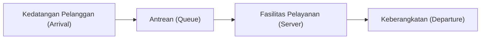

# Pendahuluan: Mengapa Kasir Sebelah Selalu Terlihat Lebih Cepat?

Pernahkah Anda merasa bahwa saat mengantre di kasir supermarket atau minimarket, barisan di sebelah Anda bergerak lebih cepat daripada barisan yang Anda pilih? Hal ini sering kali dianggap sebagai ilusi psikologis semata (Hukum Murphy), namun sebenarnya ada dasar matematikanya.

Karena jumlah barisan yang tidak Anda tempati lebih banyak, secara probabilitas, kemungkinan "salah satu dari barisan lain bergerak lebih cepat dari barisan Anda" menjadi sangat tinggi. Pendekatan matematika yang memperjelas perbedaan antara intuisi dan probabilitas/statistik, serta mengoptimalkan efisiensi keseluruhan sistem ini, disebut dengan "Teori Antrean (Queuing Theory)". Dalam artikel ini, kita akan membahas secara tuntas teori antrean, mulai dari sejarahnya, Notasi Kendall, pembuktian Hukum Little, simulasi dengan Python, hingga penerapannya pada infrastruktur IT modern.

## 1. Latar Belakang Sejarah Teori Antrean: Tantangan A.K. Erlang

Teori antrean diprakarsai pada tahun 1909 oleh **Agner Krarup Erlang**, seorang matematikawan dan insinyur asal Denmark. Saat itu ia bekerja di Perusahaan Telepon Kopenhagen dan menghadapi masalah praktis: "Berapa banyak saluran yang harus disiapkan oleh sentral telepon agar dapat melayani pelanggan tanpa membuat mereka menunggu?"

Pada masa itu, panggilan telepon dihubungkan secara manual oleh operator dengan memasukkan colokan ke saluran. Jika salurannya terlalu sedikit, probabilitas "nada sibuk" menjadi tinggi sehingga kepuasan pelanggan menurun. Sebaliknya, jika saluran terlalu banyak, biayanya akan sangat besar. Untuk menyelesaikan *trade-off* ini, Erlang memodelkan kedatangan panggilan telepon dan durasi percakapan menggunakan distribusi Poisson dan distribusi eksponensial, serta merumuskan rumus Erlang (Erlang B formula / Erlang C formula). Inilah awal mula lahirnya teori antrean.

## 2. Konsep Dasar Teori Antrean

Sistem antrean terdiri dari 3 elemen utama berikut:



1. **Proses Kedatangan (Arrival Process)**: Interval waktu di mana pelanggan (atau tugas, paket data, dll.) datang ke sistem. Sering kali dimodelkan sebagai proses Poisson (interval kedatangan mengikuti distribusi eksponensial).
2. **Proses Pelayanan (Service Process)**: Waktu yang dibutuhkan untuk memberikan layanan. Ini juga dimodelkan menggunakan distribusi eksponensial atau distribusi umum.
3. **Jumlah Pelayan (Number of Servers)**: Jumlah kasir atau server yang melayani pelanggan.

### Notasi Kendall (Kendall's Notation)

Untuk mengklasifikasikan model antrean, David Kendall pada tahun 1953 mengusulkan sistem notasi yang disebut "Notasi Kendall". Umumnya mengambil format `A/B/C/K/N/D`, namun sering kali disingkat menjadi `A/B/C`.

- **A (Arrival)**: Distribusi probabilitas interval kedatangan (contoh: M = Markovian/Eksponensial, D = Deterministik/Konstan, G = Distribusi Umum)
- **B (Service)**: Distribusi probabilitas waktu pelayanan (contoh: M, D, G)
- **C (Servers)**: Jumlah pelayan (server)
- **K (Capacity)**: Kapasitas maksimum sistem (jika dihilangkan berarti tak terhingga $\infty$)
- **N (Population)**: Ukuran populasi (jika dihilangkan berarti tak terhingga $\infty$)
- **D (Discipline)**: Disiplin pelayanan (contoh: FCFS = *First Come First Served* / Datang Pertama Dilayani Pertama, LCFS = *Last Come First Served*, jika dihilangkan berarti FCFS)

Model yang paling dasar dan terkenal adalah model **M/M/1**. Ini berarti "interval kedatangan berdistribusi eksponensial (M)", "waktu pelayanan berdistribusi eksponensial (M)", dan "jumlah pelayan ada 1".

## 3. Analisis Matematis Model M/M/1

Mari kita bedah sistem antrean M/M/1 menggunakan rumus matematika.

### Definisi Parameter

- $\lambda$ (Lambda): **Tingkat kedatangan rata-rata (Arrival rate)**. Rata-rata jumlah pelanggan yang datang per satuan waktu.
- $\mu$ (Mu): **Tingkat pelayanan rata-rata (Service rate)**. Rata-rata jumlah pelanggan yang dapat dilayani per satuan waktu.
- $\rho$ (Rho): **Intensitas lalu lintas / Utilitas sistem (Traffic intensity / Utilization)**. $\rho = \lambda / \mu$.

Agar sistem dapat beroperasi dengan stabil, **$\rho < 1$** (artinya $\lambda < \mu$) harus dipenuhi. Jika $\rho \ge 1$, kedatangan pelanggan melampaui kapasitas pelayanan, sehingga antrean akan bertambah panjang tanpa batas.

### Rumus-rumus Utama

Ketika model M/M/1 berada dalam kondisi stabil (*steady state*), indikator-indikator penting berikut dapat diturunkan:

1. **Rata-rata jumlah pelanggan dalam sistem ($L$)**: Total orang yang sedang antre ditambah dengan yang sedang dilayani.
   $$ L = \frac{\rho}{1 - \rho} = \frac{\lambda}{\mu - \lambda} $$

2. **Rata-rata waktu keberadaan dalam sistem ($W$)**: Waktu sejak pelanggan datang hingga selesai dilayani dan pergi.
   $$ W = \frac{L}{\lambda} = \frac{1}{\mu - \lambda} $$

3. **Rata-rata panjang antrean ($L_q$)**: Rata-rata jumlah orang yang benar-benar sedang menunggu dalam antrean.
   $$ L_q = L - \rho = \frac{\rho^2}{1 - \rho} $$

4. **Rata-rata waktu tunggu ($W_q$)**: Waktu sejak pelanggan masuk ke dalam antrean hingga mulai dilayani.
   $$ W_q = \frac{L_q}{\lambda} = \frac{\rho}{\mu - \lambda} $$

### Perangkap Utilitas: Mengapa Antrean Tiba-tiba Memanjang

Perhatikan rumus $L = \rho / (1 - \rho)$.
- Saat $\rho = 0.5$ (utilitas 50%), $L = 1$ orang.
- Saat $\rho = 0.8$ (utilitas 80%), $L = 4$ orang.
- Saat $\rho = 0.9$ (utilitas 90%), $L = 9$ orang.
- Saat $\rho = 0.95$ (utilitas 95%), $L = 19$ orang.

Begitu utilitas melebihi 90%, sedikit saja peningkatan pada tingkat kedatangan akan menyebabkan panjang antrean meledak secara drastis. Hal ini membuktikan secara matematis aturan emas dalam infrastruktur IT pada pengujian beban (load testing), yaitu "sangat berbahaya menjaga penggunaan CPU selalu di angka 95%". Memberikan ruang kosong (*buffer*) adalah hal yang mutlak diperlukan untuk operasional yang stabil.

## 4. Hukum Little (Little's Law)

Salah satu teorema yang paling kuat dan universal dalam teori antrean adalah "Hukum Little". Hukum ini dibuktikan oleh John Little pada tahun 1961.

**Pernyataan Hukum:**
Dalam sebuah sistem yang berada dalam kondisi stabil, rata-rata jumlah pelanggan dalam sistem ($L$) sama dengan tingkat kedatangan ($\lambda$) dikalikan dengan rata-rata waktu keberadaan pelanggan dalam sistem ($W$).

$$ L = \lambda \times W $$

### Mengapa Hukum Ini Luar Biasa?

Kehebatan Hukum Little terletak pada kenyataan bahwa **hukum ini sama sekali tidak bergantung pada struktur internal atau distribusi probabilitas sistem**. Entah itu model M/M/1, G/G/k, FCFS (datang pertama dilayani pertama), atau LCFS (datang terakhir dilayani pertama), selama sistem berada dalam kondisi stabil, hukum ini pasti berlaku.

**Contoh Kasus: Kedai Kopi**
Misalkan ada sebuah kafe di mana rata-rata 60 pelanggan datang per jam ($\lambda = 60 \text{ orang/jam} = 1 \text{ orang/menit}$). Pelanggan rata-rata menghabiskan waktu 20 menit di dalam kafe ($W = 20 \text{ menit}$).
Maka, rata-rata jumlah pelanggan yang berada di dalam kafe $L$ adalah:
$L = 1 \text{ orang/menit} \times 20 \text{ menit} = 20 \text{ orang}$
Dengan ini, kita dapat memprediksi bahwa selalu ada sekitar 20 kursi yang terisi. Seperti inilah kita bisa memperkirakan kondisi internal dari sebuah sistem kotak hitam (black box) hanya menggunakan indikator yang dapat diamati dari luar.

## 5. Simulasi Antrean dengan Python

Selain teori, mari kita buktikan dengan menjalankan programnya. Kita akan menyimulasikan antrean M/M/1 menggunakan `simpy`, pustaka simulasi berbasis kejadian (*event-driven*) pada Python.

```python
import simpy
import random
import statistics

# Pengaturan parameter
ARRIVAL_RATE = 2.0      # Tingkat kedatangan (lambda) : 2 orang per menit
SERVICE_RATE = 2.5      # Tingkat pelayanan (mu) : mampu melayani 2.5 orang per menit
SIM_TIME = 10000        # Waktu simulasi (menit)

wait_times = []

def customer(env, name, server):
    """Mendefinisikan perilaku pelanggan"""
    arrival_time = env.now
    
    # Meminta layanan ke server
    with server.request() as request:
        yield request
        
        # Mencatat waktu tunggu
        wait_time = env.now - arrival_time
        wait_times.append(wait_time)
        
        # Menerima layanan (distribusi eksponensial)
        service_time = random.expovariate(SERVICE_RATE)
        yield env.timeout(service_time)

def setup(env):
    """Pengaturan sistem dan pembuatan pelanggan"""
    server = simpy.Resource(env, capacity=1) # Jumlah pelayan M/M/1 adalah 1
    
    i = 0
    while True:
        # Waktu sampai pelanggan berikutnya datang (distribusi eksponensial)
        yield env.timeout(random.expovariate(ARRIVAL_RATE))
        i += 1
        env.process(customer(env, f'Customer {i}', server))

# Menjalankan simulasi
print("Memulai simulasi...")
random.seed(42)
env = simpy.Environment()
env.process(setup(env))
env.run(until=SIM_TIME)

# Menghitung hasil dan membandingkannya dengan nilai teoretis
avg_wait_sim = statistics.mean(wait_times)

# Menghitung nilai teoretis
rho = ARRIVAL_RATE / SERVICE_RATE
l_q = (rho ** 2) / (1 - rho)
w_q_theory = l_q / ARRIVAL_RATE

print(f"--- Hasil ---")
print(f"Rata-rata waktu tunggu pada simulasi: {avg_wait_sim:.4f} menit")
print(f"Rata-rata waktu tunggu teoretis (W_q) : {w_q_theory:.4f} menit")
```

Jika kode ini dijalankan, dapat dilihat bahwa hasil simulasi akan konvergen ke nilai yang sangat mendekati nilai teoretis $W_q$. Pada sistem yang lebih kompleks dan sulit diselesaikan secara analitis seperti model M/G/1 atau sistem multi-server, simulasi semacam ini dapat digunakan untuk memprediksi performa.

## 6. Penerapan pada Infrastruktur IT

Teori antrean adalah konsep yang sangat penting dalam desain ilmu komputer dan infrastruktur IT modern.

### 1. Load Balancing di Web Server
Kedatangan permintaan web (HTTP request) adalah model antrean yang sangat khas. Jika 1 server (M/M/1) tidak dapat menangani semuanya, *load balancer* digunakan untuk mendistribusikan permintaan ke beberapa server. Ini dianalisis sebagai model M/M/c, sehingga kita dapat menghitung berapa banyak server yang perlu dijalankan untuk menjaga waktu respons rata-rata tetap di bawah target.

### 2. Routing Jaringan dan Packet Loss
Di dalam *router* internet, terdapat *buffer* (memori) yang menyimpan paket-paket yang sedang menunggu untuk dikirim. Ini dapat dianggap sebagai antrean dengan kapasitas terbatas (M/M/1/K). Paket yang datang ketika *buffer* penuh akan dibuang (*drop*). Dengan menggunakan teori antrean, ukuran *buffer* yang diperlukan untuk memenuhi tingkat kehilangan paket (*packet loss rate*) yang ditoleransi dapat ditentukan.

### 3. Auto-scaling pada Cloud Computing
Lingkungan cloud seperti AWS dan GCP menggunakan *auto-scaling* untuk menambah atau mengurangi server secara otomatis sesuai dengan lalu lintas (*traffic*). Aturan untuk menambahkan server saat utilitas $\rho$ melebihi ambang batas tertentu (misalnya: 70%), didasarkan pada sifat teori antrean di mana "waktu tunggu akan melonjak saat tingkat utilitas mendekati 1".

## Kesimpulan: Mengatasi Rasa Frustrasi Sehari-hari dengan Rumus

Pertanyaan yang dimulai dari "Mengapa kasir sebelah selalu terlihat lebih cepat?", ternyata mengarah pada hukum universal yang mengatur segala jenis "antrean" di dunia, mulai dari jaringan komunikasi, kemacetan lalu lintas, ruang tunggu rumah sakit, hingga optimasi server cloud mutakhir.

Waktu tunggu yang membuat kita frustrasi dalam kehidupan sehari-hari, jika dilihat dari sudut pandang sistem secara keseluruhan, hanyalah fenomena matematika yang berjalan dengan teratur sesuai dengan Hukum Little dan distribusi Poisson. Lain kali, saat Anda mengantre panjang, daripada merasa kesal, mengapa tidak mencoba mengamatinya dengan berpikir: "Kira-kira berapa tingkat kedatangan $\lambda$ saat ini?" atau "Utilitas $\rho$-nya sudah hampir mencapai batas maksimal." Mungkin saja hal itu akan membuat waktu menunggu Anda terasa sedikit lebih bermakna.
